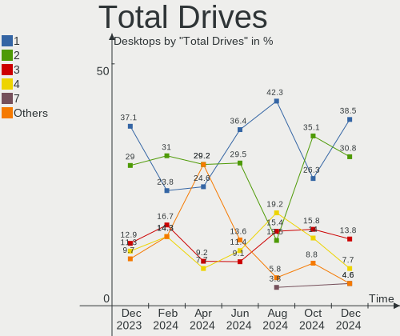
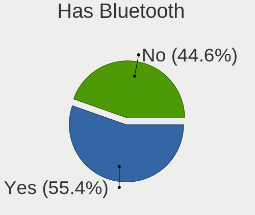
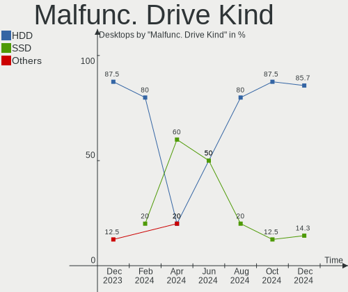
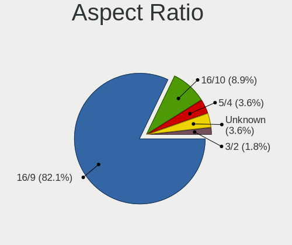
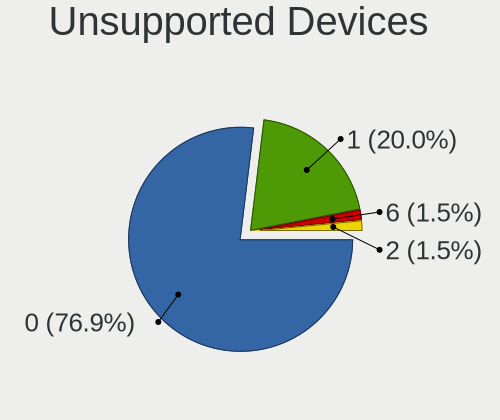

Linux in Spain - Hardware Trends (Desktops)
-------------------------------------------

A project to identify most popular hardware characteristics and track their change
over time based on data collected by Linux users at https://Linux-Hardware.org.

Anyone can contribute to this report by the [hw-probe](https://github.com/linuxhw/hw-probe) tool:

    sudo -E hw-probe -all -upload

Period: Jan, 2023.

Contents
--------

* [ System ](#system)
  - [ OS                       ](#os)
  - [ OS Family                ](#os-family)
  - [ Kernel                   ](#kernel)
  - [ Kernel Family            ](#kernel-family)
  - [ Kernel Major Ver.        ](#kernel-major-ver)
  - [ Arch                     ](#arch)
  - [ DE                       ](#de)
  - [ Display Server           ](#display-server)
  - [ Display Manager          ](#display-manager)
  - [ OS Lang                  ](#os-lang)
  - [ Boot Mode                ](#boot-mode)
  - [ Filesystem               ](#filesystem)
  - [ Part. scheme             ](#part-scheme)
  - [ Dual Boot with Linux/BSD ](#dual-boot-with-linuxbsd)
  - [ Dual Boot (Win)          ](#dual-boot-win)

* [ Board ](#board)
  - [ Vendor                   ](#vendor)
  - [ Model                    ](#model)
  - [ Model Family             ](#model-family)
  - [ MFG Year                 ](#mfg-year)
  - [ Form Factor              ](#form-factor)
  - [ Secure Boot              ](#secure-boot)
  - [ Coreboot                 ](#coreboot)
  - [ RAM Size                 ](#ram-size)
  - [ RAM Used                 ](#ram-used)
  - [ Total Drives             ](#total-drives)
  - [ Has CD-ROM               ](#has-cd-rom)
  - [ Has Ethernet             ](#has-ethernet)
  - [ Has WiFi                 ](#has-wifi)
  - [ Has Bluetooth            ](#has-bluetooth)

* [ Location ](#location)
  - [ Country                  ](#country)
  - [ City                     ](#city)

* [ Drives ](#drives)
  - [ Drive Vendor             ](#drive-vendor)
  - [ Drive Model              ](#drive-model)
  - [ HDD Vendor               ](#hdd-vendor)
  - [ SSD Vendor               ](#ssd-vendor)
  - [ Drive Kind               ](#drive-kind)
  - [ Drive Connector          ](#drive-connector)
  - [ Drive Size               ](#drive-size)
  - [ Space Total              ](#space-total)
  - [ Space Used               ](#space-used)
  - [ Malfunc. Drives          ](#malfunc-drives)
  - [ Malfunc. Drive Vendor    ](#malfunc-drive-vendor)
  - [ Malfunc. HDD Vendor      ](#malfunc-hdd-vendor)
  - [ Malfunc. Drive Kind      ](#malfunc-drive-kind)
  - [ Failed Drives            ](#failed-drives)
  - [ Failed Drive Vendor      ](#failed-drive-vendor)
  - [ Drive Status             ](#drive-status)

* [ Storage controller ](#storage-controller)
  - [ Storage Vendor           ](#storage-vendor)
  - [ Storage Model            ](#storage-model)
  - [ Storage Kind             ](#storage-kind)

* [ Processor ](#processor)
  - [ CPU Vendor               ](#cpu-vendor)
  - [ CPU Model                ](#cpu-model)
  - [ CPU Model Family         ](#cpu-model-family)
  - [ CPU Cores                ](#cpu-cores)
  - [ CPU Sockets              ](#cpu-sockets)
  - [ CPU Threads              ](#cpu-threads)
  - [ CPU Op-Modes             ](#cpu-op-modes)
  - [ CPU Microcode            ](#cpu-microcode)
  - [ CPU Microarch            ](#cpu-microarch)

* [ Graphics ](#graphics)
  - [ GPU Vendor               ](#gpu-vendor)
  - [ GPU Model                ](#gpu-model)
  - [ GPU Combo                ](#gpu-combo)
  - [ GPU Driver               ](#gpu-driver)
  - [ GPU Memory               ](#gpu-memory)

* [ Monitor ](#monitor)
  - [ Monitor Vendor           ](#monitor-vendor)
  - [ Monitor Model            ](#monitor-model)
  - [ Monitor Resolution       ](#monitor-resolution)
  - [ Monitor Diagonal         ](#monitor-diagonal)
  - [ Monitor Width            ](#monitor-width)
  - [ Aspect Ratio             ](#aspect-ratio)
  - [ Monitor Area             ](#monitor-area)
  - [ Pixel Density            ](#pixel-density)
  - [ Multiple Monitors        ](#multiple-monitors)

* [ Network ](#network)
  - [ Net Controller Vendor    ](#net-controller-vendor)
  - [ Net Controller Model     ](#net-controller-model)
  - [ Wireless Vendor          ](#wireless-vendor)
  - [ Wireless Model           ](#wireless-model)
  - [ Ethernet Vendor          ](#ethernet-vendor)
  - [ Ethernet Model           ](#ethernet-model)
  - [ Net Controller Kind      ](#net-controller-kind)
  - [ Used Controller          ](#used-controller)
  - [ NICs                     ](#nics)
  - [ IPv6                     ](#ipv6)

* [ Bluetooth ](#bluetooth)
  - [ Bluetooth Vendor         ](#bluetooth-vendor)
  - [ Bluetooth Model          ](#bluetooth-model)

* [ Sound ](#sound)
  - [ Sound Vendor             ](#sound-vendor)
  - [ Sound Model              ](#sound-model)

* [ Memory ](#memory)
  - [ Memory Vendor            ](#memory-vendor)
  - [ Memory Model             ](#memory-model)
  - [ Memory Kind              ](#memory-kind)
  - [ Memory Form Factor       ](#memory-form-factor)
  - [ Memory Size              ](#memory-size)
  - [ Memory Speed             ](#memory-speed)

* [ Printers & scanners ](#printers--scanners)
  - [ Printer Vendor           ](#printer-vendor)
  - [ Printer Model            ](#printer-model)
  - [ Scanner Vendor           ](#scanner-vendor)
  - [ Scanner Model            ](#scanner-model)

* [ Camera ](#camera)
  - [ Camera Vendor            ](#camera-vendor)
  - [ Camera Model             ](#camera-model)

* [ Security ](#security)
  - [ Fingerprint Vendor       ](#fingerprint-vendor)
  - [ Fingerprint Model        ](#fingerprint-model)
  - [ Chipcard Vendor          ](#chipcard-vendor)
  - [ Chipcard Model           ](#chipcard-model)

* [ Unsupported ](#unsupported)
  - [ Unsupported Devices      ](#unsupported-devices)
  - [ Unsupported Device Types ](#unsupported-device-types)

System
------

OS
--

Installed operating systems

| Name                         | Desktops | Percent |
|------------------------------|----------|---------|
| OpenMandriva 23.01           | 26       | 32.5%   |
| Ubuntu 22.04                 | 8        | 10%     |
| Debian 11                    | 6        | 7.5%    |
| Linux Mint 21.1              | 4        | 5%      |
| Linux Mint 20.3              | 3        | 3.75%   |
| KDE neon 22.04               | 3        | 3.75%   |
| Ubuntu 22.10                 | 2        | 2.5%    |
| Ubuntu 20.04                 | 2        | 2.5%    |
| Lubuntu 22.04                | 2        | 2.5%    |
| Kubuntu 22.10                | 2        | 2.5%    |
| Kali 2022.4                  | 2        | 2.5%    |
| Debian                       | 2        | 2.5%    |
| ArcoLinux Rolling            | 2        | 2.5%    |
| Zorin 16                     | 1        | 1.25%   |
| Pearl 11                     | 1        | 1.25%   |
| openSUSE Tumbleweed-XXXXXXXX | 1        | 1.25%   |
| OpenMandriva 4.3             | 1        | 1.25%   |
| Nobara 37                    | 1        | 1.25%   |
| Manjaro                      | 1        | 1.25%   |
| Makulu 2022.12.29            | 1        | 1.25%   |
| Lubuntu 22.10                | 1        | 1.25%   |
| Linux Mint 18.3              | 1        | 1.25%   |
| LFS 11.2                     | 1        | 1.25%   |
| Kubuntu 22.04                | 1        | 1.25%   |
| KDE neon 20.04               | 1        | 1.25%   |
| Garuda Linux Rolling         | 1        | 1.25%   |
| Fedora 37                    | 1        | 1.25%   |
| EndeavourOS Rolling          | 1        | 1.25%   |
| Arch Rolling                 | 1        | 1.25%   |

OS Family
---------

OS without a version

| Name         | Desktops | Percent |
|--------------|----------|---------|
| OpenMandriva | 27       | 33.75%  |
| Ubuntu       | 12       | 15%     |
| Linux Mint   | 8        | 10%     |
| Debian       | 8        | 10%     |
| KDE neon     | 4        | 5%      |
| Lubuntu      | 3        | 3.75%   |
| Kubuntu      | 3        | 3.75%   |
| Kali         | 2        | 2.5%    |
| ArcoLinux    | 2        | 2.5%    |
| Zorin        | 1        | 1.25%   |
| Pearl        | 1        | 1.25%   |
| openSUSE     | 1        | 1.25%   |
| Nobara       | 1        | 1.25%   |
| Manjaro      | 1        | 1.25%   |
| Makulu       | 1        | 1.25%   |
| LFS          | 1        | 1.25%   |
| Garuda Linux | 1        | 1.25%   |
| Fedora       | 1        | 1.25%   |
| EndeavourOS  | 1        | 1.25%   |
| Arch         | 1        | 1.25%   |

Kernel
------

Version of the Linux kernel

| Version                     | Desktops | Percent |
|-----------------------------|----------|---------|
| 6.1.1-desktop-1omv2290      | 26       | 32.5%   |
| 5.15.0-56-generic           | 9        | 11.25%  |
| 5.15.0-58-generic           | 8        | 10%     |
| 5.4.0-137-generic           | 3        | 3.75%   |
| 5.19.0-29-generic           | 3        | 3.75%   |
| 5.10.0-20-amd64             | 3        | 3.75%   |
| 5.15.0-43-generic           | 2        | 2.5%    |
| 5.10.0-21-amd64             | 2        | 2.5%    |
| 6.1.7-lfs-lts               | 1        | 1.25%   |
| 6.1.7-1-MANJARO             | 1        | 1.25%   |
| 6.1.7-1-default             | 1        | 1.25%   |
| 6.1.6-arch1-1               | 1        | 1.25%   |
| 6.1.6-203.fsync.fc37.x86_64 | 1        | 1.25%   |
| 6.1.5-x64v3-xanmod1         | 1        | 1.25%   |
| 6.1.5-arch2-1               | 1        | 1.25%   |
| 6.1.4-zen2-1-zen            | 1        | 1.25%   |
| 6.1.3-x64v1-xanmod1         | 1        | 1.25%   |
| 6.1.3-arch1-1               | 1        | 1.25%   |
| 6.1.2-arch1-1               | 1        | 1.25%   |
| 6.1.0-2-amd64               | 1        | 1.25%   |
| 6.0.16-300.fc37.x86_64      | 1        | 1.25%   |
| 6.0.0-kali6-amd64           | 1        | 1.25%   |
| 6.0.0-kali5-amd64           | 1        | 1.25%   |
| 6.0.0-6-amd64               | 1        | 1.25%   |
| 5.4.0-113-generic           | 1        | 1.25%   |
| 5.19.0-28-generic           | 1        | 1.25%   |
| 5.16.7-desktop-1omv4003     | 1        | 1.25%   |
| 5.15.0-57-generic           | 1        | 1.25%   |
| 5.15.0-52-lowlatency        | 1        | 1.25%   |
| 5.11.0-27-generic           | 1        | 1.25%   |
| 5.10.0-15-amd64             | 1        | 1.25%   |
| 4.15.0-142-generic          | 1        | 1.25%   |

Kernel Family
-------------

Linux kernel without a distro release

| Version | Desktops | Percent |
|---------|----------|---------|
| 6.1.1   | 26       | 32.5%   |
| 5.15.0  | 21       | 26.25%  |
| 5.10.0  | 6        | 7.5%    |
| 5.4.0   | 4        | 5%      |
| 5.19.0  | 4        | 5%      |
| 6.1.7   | 3        | 3.75%   |
| 6.0.0   | 3        | 3.75%   |
| 6.1.6   | 2        | 2.5%    |
| 6.1.5   | 2        | 2.5%    |
| 6.1.3   | 2        | 2.5%    |
| 6.1.4   | 1        | 1.25%   |
| 6.1.2   | 1        | 1.25%   |
| 6.1.0   | 1        | 1.25%   |
| 6.0.16  | 1        | 1.25%   |
| 5.16.7  | 1        | 1.25%   |
| 5.11.0  | 1        | 1.25%   |
| 4.15.0  | 1        | 1.25%   |

Kernel Major Ver.
-----------------

Linux kernel major version

| Version | Desktops | Percent |
|---------|----------|---------|
| 6.1     | 38       | 47.5%   |
| 5.15    | 21       | 26.25%  |
| 5.10    | 6        | 7.5%    |
| 6.0     | 4        | 5%      |
| 5.4     | 4        | 5%      |
| 5.19    | 4        | 5%      |
| 5.16    | 1        | 1.25%   |
| 5.11    | 1        | 1.25%   |
| 4.15    | 1        | 1.25%   |

Arch
----

OS architecture (x86_64, i586, etc.)

| Name   | Desktops | Percent |
|--------|----------|---------|
| x86_64 | 80       | 100%    |

DE
--

Desktop Environment

| Name       | Desktops | Percent |
|------------|----------|---------|
| KDE5       | 33       | 41.25%  |
| GNOME      | 27       | 33.75%  |
| X-Cinnamon | 8        | 10%     |
| LXQt       | 4        | 5%      |
| XFCE       | 3        | 3.75%   |
| MATE       | 1        | 1.25%   |
| LXDE       | 1        | 1.25%   |
| LeftWM     | 1        | 1.25%   |
| i3         | 1        | 1.25%   |
| Cinnamon   | 1        | 1.25%   |

Display Server
--------------

X11 or Wayland

| Name    | Desktops | Percent |
|---------|----------|---------|
| X11     | 66       | 82.5%   |
| Wayland | 12       | 15%     |
| Unknown | 2        | 2.5%    |

Display Manager
---------------

SDDM, LightDM, etc.

| Name    | Desktops | Percent |
|---------|----------|---------|
| SDDM    | 32       | 40%     |
| Unknown | 18       | 22.5%   |
| LightDM | 10       | 12.5%   |
| GDM3    | 10       | 12.5%   |
| GDM     | 10       | 12.5%   |

OS Lang
-------

Language

| Lang  | Desktops | Percent |
|-------|----------|---------|
| es_ES | 55       | 68.75%  |
| en_US | 15       | 18.75%  |
| ca_ES | 2        | 2.5%    |
| C     | 2        | 2.5%    |
| pl_PL | 1        | 1.25%   |
| it_IT | 1        | 1.25%   |
| eu_ES | 1        | 1.25%   |
| es_GT | 1        | 1.25%   |
| es_AR | 1        | 1.25%   |
| en_GB | 1        | 1.25%   |

Boot Mode
---------

EFI or BIOS

| Mode | Desktops | Percent |
|------|----------|---------|
| BIOS | 40       | 50%     |
| EFI  | 40       | 50%     |

Filesystem
----------

Type of filesystem

| Type    | Desktops | Percent |
|---------|----------|---------|
| Ext4    | 47       | 58.75%  |
| Overlay | 26       | 32.5%   |
| Btrfs   | 6        | 7.5%    |
| Zfs     | 1        | 1.25%   |

Part. scheme
------------

Scheme of partitioning

| Type    | Desktops | Percent |
|---------|----------|---------|
| GPT     | 45       | 56.25%  |
| Unknown | 18       | 22.5%   |
| MBR     | 17       | 21.25%  |

Dual Boot with Linux/BSD
------------------------

Hosting more than one Linux/BSD

| Dual boot | Desktops | Percent |
|-----------|----------|---------|
| No        | 46       | 57.5%   |
| Yes       | 34       | 42.5%   |

Dual Boot (Win)
---------------

Hosting Linux and Windows

| Dual boot | Desktops | Percent |
|-----------|----------|---------|
| No        | 49       | 61.25%  |
| Yes       | 31       | 38.75%  |

Board
-----

Vendor
------

Motherboard manufacturer

| Name                | Desktops | Percent |
|---------------------|----------|---------|
| Gigabyte Technology | 21       | 26.25%  |
| ASUSTek Computer    | 17       | 21.25%  |
| MSI                 | 14       | 17.5%   |
| ASRock              | 7        | 8.75%   |
| Hewlett-Packard     | 6        | 7.5%    |
| Unknown             | 2        | 2.5%    |
| Pyramid             | 1        | 1.25%   |
| Pegatron            | 1        | 1.25%   |
| NEC Computers       | 1        | 1.25%   |
| Medion              | 1        | 1.25%   |
| Lenovo              | 1        | 1.25%   |
| Jetway              | 1        | 1.25%   |
| Intel               | 1        | 1.25%   |
| Eii                 | 1        | 1.25%   |
| ECS                 | 1        | 1.25%   |
| Dell                | 1        | 1.25%   |
| Biostar             | 1        | 1.25%   |
| AZW                 | 1        | 1.25%   |
| Acer                | 1        | 1.25%   |

Model
-----

Motherboard model

| Name                           | Desktops | Percent |
|--------------------------------|----------|---------|
| ASUS PRIME B450M-K II          | 3        | 3.75%   |
| MSI MS-7D22                    | 2        | 2.5%    |
| Gigabyte B450M DS3H V2         | 2        | 2.5%    |
| Gigabyte B450M DS3H            | 2        | 2.5%    |
| Unknown                        | 2        | 2.5%    |
| Pyramid Control Unit POF G4    | 1        | 1.25%   |
| Pegatron h8-1403es             | 1        | 1.25%   |
| NEC Computers ECS-945G         | 1        | 1.25%   |
| MSI PRO X300 DP20Z (MS-B0A2)   | 1        | 1.25%   |
| MSI MS-7D25                    | 1        | 1.25%   |
| MSI MS-7D20                    | 1        | 1.25%   |
| MSI MS-7D18                    | 1        | 1.25%   |
| MSI MS-7B89                    | 1        | 1.25%   |
| MSI MS-7B51                    | 1        | 1.25%   |
| MSI MS-7978                    | 1        | 1.25%   |
| MSI MS-7850                    | 1        | 1.25%   |
| MSI MS-7383                    | 1        | 1.25%   |
| MSI Cubi N 8GL (MS-B171)       | 1        | 1.25%   |
| MSI CML-U PRO Cubi 5 (MS-B183) | 1        | 1.25%   |
| MSI 5846                       | 1        | 1.25%   |
| Medion MS-7675                 | 1        | 1.25%   |
| Lenovo M710s 10M700071X        | 1        | 1.25%   |
| Jetway I61G-ITX                | 1        | 1.25%   |
| Intel DH55TC AAE70932-303      | 1        | 1.25%   |
| HP Z640 Workstation            | 1        | 1.25%   |
| HP Pavilion Desktop 595-p0xxx  | 1        | 1.25%   |
| HP Compaq Pro 6300 SFF         | 1        | 1.25%   |
| HP Compaq Elite 8300 SFF       | 1        | 1.25%   |
| HP Compaq 6005 Pro MT PC       | 1        | 1.25%   |
| HP 280 G1 MT                   | 1        | 1.25%   |
| Gigabyte Z97M-DS3H             | 1        | 1.25%   |
| Gigabyte Z690M DS3H DDR4       | 1        | 1.25%   |
| Gigabyte Z690 UD DDR4          | 1        | 1.25%   |
| Gigabyte Z370 HD3              | 1        | 1.25%   |
| Gigabyte X79-UP4               | 1        | 1.25%   |
| Gigabyte P55A-UD3              | 1        | 1.25%   |
| Gigabyte H81M-S2H              | 1        | 1.25%   |
| Gigabyte H410M S2H V3          | 1        | 1.25%   |
| Gigabyte H110M-S2H             | 1        | 1.25%   |
| Gigabyte GB-BACE-3160          | 1        | 1.25%   |

Model Family
------------

Motherboard model prefix

| Name                   | Desktops | Percent |
|------------------------|----------|---------|
| ASUS PRIME             | 7        | 8.75%   |
| Gigabyte B450M         | 4        | 5%      |
| HP Compaq              | 3        | 3.75%   |
| ASUS TUF               | 3        | 3.75%   |
| MSI MS-7D22            | 2        | 2.5%    |
| ASRock H110M-HDV       | 2        | 2.5%    |
| Unknown                | 2        | 2.5%    |
| Pyramid Control        | 1        | 1.25%   |
| Pegatron h8-1403es     | 1        | 1.25%   |
| NEC Computers ECS-945G | 1        | 1.25%   |
| MSI PRO                | 1        | 1.25%   |
| MSI MS-7D25            | 1        | 1.25%   |
| MSI MS-7D20            | 1        | 1.25%   |
| MSI MS-7D18            | 1        | 1.25%   |
| MSI MS-7B89            | 1        | 1.25%   |
| MSI MS-7B51            | 1        | 1.25%   |
| MSI MS-7978            | 1        | 1.25%   |
| MSI MS-7850            | 1        | 1.25%   |
| MSI MS-7383            | 1        | 1.25%   |
| MSI Cubi               | 1        | 1.25%   |
| MSI CML-U              | 1        | 1.25%   |
| MSI 5846               | 1        | 1.25%   |
| Medion MS-7675         | 1        | 1.25%   |
| Lenovo M710s           | 1        | 1.25%   |
| Jetway I61G-ITX        | 1        | 1.25%   |
| Intel DH55TC           | 1        | 1.25%   |
| HP Z640                | 1        | 1.25%   |
| HP Pavilion            | 1        | 1.25%   |
| HP 280                 | 1        | 1.25%   |
| Gigabyte Z97M-DS3H     | 1        | 1.25%   |
| Gigabyte Z690M         | 1        | 1.25%   |
| Gigabyte Z690          | 1        | 1.25%   |
| Gigabyte Z370          | 1        | 1.25%   |
| Gigabyte X79-UP4       | 1        | 1.25%   |
| Gigabyte P55A-UD3      | 1        | 1.25%   |
| Gigabyte H81M-S2H      | 1        | 1.25%   |
| Gigabyte H410M         | 1        | 1.25%   |
| Gigabyte H110M-S2H     | 1        | 1.25%   |
| Gigabyte GB-BACE-3160  | 1        | 1.25%   |
| Gigabyte F2A88XM-D3H   | 1        | 1.25%   |

MFG Year
--------

Motherboard manufacture year

| Year | Desktops | Percent |
|------|----------|---------|
| 2020 | 13       | 16.25%  |
| 2021 | 10       | 12.5%   |
| 2019 | 8        | 10%     |
| 2012 | 7        | 8.75%   |
| 2015 | 6        | 7.5%    |
| 2018 | 5        | 6.25%   |
| 2022 | 4        | 5%      |
| 2014 | 4        | 5%      |
| 2010 | 4        | 5%      |
| 2017 | 3        | 3.75%   |
| 2016 | 3        | 3.75%   |
| 2009 | 3        | 3.75%   |
| 2008 | 3        | 3.75%   |
| 2007 | 3        | 3.75%   |
| 2013 | 2        | 2.5%    |
| 2011 | 2        | 2.5%    |

Form Factor
-----------

Physical design of the computer

| Name    | Desktops | Percent |
|---------|----------|---------|
| Desktop | 80       | 100%    |

Secure Boot
-----------

Enabled or disabled

| State    | Desktops | Percent |
|----------|----------|---------|
| Disabled | 77       | 96.25%  |
| Enabled  | 3        | 3.75%   |

Coreboot
--------

Have coreboot on board

| Used | Desktops | Percent |
|------|----------|---------|
| No   | 80       | 100%    |

RAM Size
--------

Total RAM memory

| Size in GB  | Desktops | Percent |
|-------------|----------|---------|
| 4.01-8.0    | 21       | 26.25%  |
| 16.01-24.0  | 19       | 23.75%  |
| 8.01-16.0   | 16       | 20%     |
| 32.01-64.0  | 15       | 18.75%  |
| 3.01-4.0    | 6        | 7.5%    |
| 24.01-32.0  | 1        | 1.25%   |
| 2.01-3.0    | 1        | 1.25%   |
| 64.01-256.0 | 1        | 1.25%   |

RAM Used
--------

Used RAM memory

| Used GB    | Desktops | Percent |
|------------|----------|---------|
| 1.01-2.0   | 29       | 36.25%  |
| 2.01-3.0   | 21       | 26.25%  |
| 4.01-8.0   | 12       | 15%     |
| 3.01-4.0   | 11       | 13.75%  |
| 8.01-16.0  | 4        | 5%      |
| 0.51-1.0   | 2        | 2.5%    |
| 16.01-24.0 | 1        | 1.25%   |

Total Drives
------------

Number of drives on board

| Drives | Desktops | Percent |
|--------|----------|---------|
| 2      | 29       | 36.25%  |
| 1      | 25       | 31.25%  |
| 3      | 11       | 13.75%  |
| 4      | 8        | 10%     |
| 5      | 4        | 5%      |
| 9      | 1        | 1.25%   |
| 6      | 1        | 1.25%   |
| 0      | 1        | 1.25%   |

Has CD-ROM
----------

Has CD-ROM on board

| Presented | Desktops | Percent |
|-----------|----------|---------|
| No        | 46       | 57.5%   |
| Yes       | 34       | 42.5%   |

Has Ethernet
------------

Has Ethernet on board

| Presented | Desktops | Percent |
|-----------|----------|---------|
| Yes       | 79       | 98.75%  |
| No        | 1        | 1.25%   |

Has WiFi
--------

Has WiFi module

| Presented | Desktops | Percent |
|-----------|----------|---------|
| Yes       | 44       | 55%     |
| No        | 36       | 45%     |

Has Bluetooth
-------------

Has Bluetooth module

| Presented | Desktops | Percent |
|-----------|----------|---------|
| No        | 52       | 65%     |
| Yes       | 28       | 35%     |

Location
--------

Country
-------

Geographic location (country)

| Country | Desktops | Percent |
|---------|----------|---------|
| Spain   | 80       | 100%    |

City
----

Geographic location (city)

| City                        | Desktops | Percent |
|-----------------------------|----------|---------|
| Madrid                      | 16       | 20%     |
| Córdoba                    | 8        | 10%     |
| Barcelona                   | 6        | 7.5%    |
| Seville                     | 3        | 3.75%   |
| Málaga                     | 3        | 3.75%   |
| Granada                     | 3        | 3.75%   |
| Zaragoza                    | 2        | 2.5%    |
| Valladolid                  | 2        | 2.5%    |
| Valencia                    | 2        | 2.5%    |
| Villafranca de los Barros   | 1        | 1.25%   |
| Valdemoro                   | 1        | 1.25%   |
| Torrejón de Ardoz          | 1        | 1.25%   |
| Tarragona                   | 1        | 1.25%   |
| Sopela                      | 1        | 1.25%   |
| Santurtzi                   | 1        | 1.25%   |
| Santa Cruz de Tenerife      | 1        | 1.25%   |
| San Cristóbal de La Laguna | 1        | 1.25%   |
| San Agustin del Guadalix    | 1        | 1.25%   |
| Rincon de la Victoria       | 1        | 1.25%   |
| Requena                     | 1        | 1.25%   |
| Ponteareas                  | 1        | 1.25%   |
| Plasencia                   | 1        | 1.25%   |
| Pedro Munoz                 | 1        | 1.25%   |
| Oviedo                      | 1        | 1.25%   |
| Murcia                      | 1        | 1.25%   |
| Mostoles                    | 1        | 1.25%   |
| Morro del Jable             | 1        | 1.25%   |
| Mataró                     | 1        | 1.25%   |
| Manresa                     | 1        | 1.25%   |
| Lugo                        | 1        | 1.25%   |
| Lleida                      | 1        | 1.25%   |
| Las Palmas de Gran Canaria  | 1        | 1.25%   |
| Huelva                      | 1        | 1.25%   |
| Fuenlabrada                 | 1        | 1.25%   |
| Ferrol                      | 1        | 1.25%   |
| Dumbria                     | 1        | 1.25%   |
| Donostia / San Sebastian    | 1        | 1.25%   |
| Carballo                    | 1        | 1.25%   |
| Caldes de Montbui           | 1        | 1.25%   |
| Bilbao                      | 1        | 1.25%   |

Drives
------

Drive Vendor
------------

Hard drive vendors

| Vendor                      | Desktops | Drives | Percent |
|-----------------------------|----------|--------|---------|
| Seagate                     | 31       | 38     | 19.5%   |
| Kingston                    | 24       | 26     | 15.09%  |
| WDC                         | 18       | 24     | 11.32%  |
| Samsung Electronics         | 15       | 18     | 9.43%   |
| Crucial                     | 9        | 11     | 5.66%   |
| Toshiba                     | 7        | 9      | 4.4%    |
| SanDisk                     | 6        | 6      | 3.77%   |
| KIOXIA-EXCERIA              | 6        | 7      | 3.77%   |
| Micron/Crucial Technology   | 5        | 5      | 3.14%   |
| Unknown                     | 3        | 3      | 1.89%   |
| Silicon Motion              | 3        | 3      | 1.89%   |
| Emtec                       | 3        | 3      | 1.89%   |
| Transcend                   | 2        | 2      | 1.26%   |
| OCZ                         | 2        | 3      | 1.26%   |
| Kingston Technology Company | 2        | 2      | 1.26%   |
| JMicron Technology          | 2        | 2      | 1.26%   |
| Intel                       | 2        | 2      | 1.26%   |
| Hitachi                     | 2        | 2      | 1.26%   |
| A-DATA Technology           | 2        | 3      | 1.26%   |
| ValueTech                   | 1        | 1      | 0.63%   |
| USB30                       | 1        | 1      | 0.63%   |
| SK hynix                    | 1        | 1      | 0.63%   |
| SABRENT                     | 1        | 1      | 0.63%   |
| PNY                         | 1        | 1      | 0.63%   |
| Phison Electronics          | 1        | 1      | 0.63%   |
| OYUNKEY                     | 1        | 1      | 0.63%   |
| ORICO                       | 1        | 1      | 0.63%   |
| NGFF                        | 1        | 1      | 0.63%   |
| Micron Technology           | 1        | 1      | 0.63%   |
| Maxtor                      | 1        | 1      | 0.63%   |
| Intenso                     | 1        | 2      | 0.63%   |
| HGST                        | 1        | 1      | 0.63%   |
| Drevo                       | 1        | 1      | 0.63%   |
| China                       | 1        | 1      | 0.63%   |

Drive Model
-----------

Hard drive models

| Model                                                 | Desktops | Percent |
|-------------------------------------------------------|----------|---------|
| Kingston SA400S37480G 480GB SSD                       | 9        | 5.06%   |
| KIOXIA-EXCERIA SATA SSD 480GB                         | 6        | 3.37%   |
| Kingston SA400S37240G 240GB SSD                       | 6        | 3.37%   |
| Seagate ST1000DM010-2EP102 1TB                        | 3        | 1.69%   |
| Kingston SV300S37A120G 120GB SSD                      | 3        | 1.69%   |
| Kingston SNV2S500G 500GB                              | 3        | 1.69%   |
| WDC WD10EALX-009BA0 1TB                               | 2        | 1.12%   |
| Toshiba DT01ACA100 1TB                                | 2        | 1.12%   |
| Silicon Motion SM2263EN/SM2263XT SSD Controller 512GB | 2        | 1.12%   |
| Seagate ST500DM002-1BD142 500GB                       | 2        | 1.12%   |
| Seagate ST3500418AS 500GB                             | 2        | 1.12%   |
| Seagate ST31000528AS 1TB                              | 2        | 1.12%   |
| Seagate ST2000DM008-2FR102 2TB                        | 2        | 1.12%   |
| Seagate ST1000DM003-1SB10C 1TB                        | 2        | 1.12%   |
| Seagate ST1000DM003-1CH162 1TB                        | 2        | 1.12%   |
| SanDisk SSD PLUS 240GB                                | 2        | 1.12%   |
| Samsung SSD 860 EVO 500GB                             | 2        | 1.12%   |
| Samsung SSD 840 EVO 120GB                             | 2        | 1.12%   |
| Samsung NVMe SSD Controller SM981/PM981/PM983 500GB   | 2        | 1.12%   |
| Micron/Crucial P1 NVMe PCIe SSD 1TB                   | 2        | 1.12%   |
| Kingston Company KC2000 NVMe SSD 1TB                  | 2        | 1.12%   |
| JMicron Tech 250GB                                    | 2        | 1.12%   |
| Crucial CT275MX300SSD4 275GB                          | 2        | 1.12%   |
| WDC WDS500G2B0A-00SM50 500GB SSD                      | 1        | 0.56%   |
| WDC WDS250G2B0A-00SM50 250GB SSD                      | 1        | 0.56%   |
| WDC WDS250G2B0A 250GB SSD                             | 1        | 0.56%   |
| WDC WDS240G2G0B-00EPW0 240GB SSD                      | 1        | 0.56%   |
| WDC WDS100T2B0C-00PXH0 1TB                            | 1        | 0.56%   |
| WDC WDS100T2B0A-00SM50 1TB SSD                        | 1        | 0.56%   |
| WDC WD6400AAKS-65A7B2 640GB                           | 1        | 0.56%   |
| WDC WD5000AADS-00S9B0 500GB                           | 1        | 0.56%   |
| WDC WD40EZRZ-00GXCB0 4TB                              | 1        | 0.56%   |
| WDC WD40EFAX-68JH4N0 4TB                              | 1        | 0.56%   |
| WDC WD4005FZBX-00K5WB0 4TB                            | 1        | 0.56%   |
| WDC WD2500BEVT-22ZCT0 250GB                           | 1        | 0.56%   |
| WDC WD20SPZX-22UA7T0 2TB                              | 1        | 0.56%   |
| WDC WD20EZRZ-22Z5HB0 2TB                              | 1        | 0.56%   |
| WDC WD20EZRZ-00Z5HB0 2TB                              | 1        | 0.56%   |
| WDC WD20EARS-00MVWB0 2TB                              | 1        | 0.56%   |
| WDC WD10EZRX-00A3KB0 1TB                              | 1        | 0.56%   |

HDD Vendor
----------

Hard disk drive vendors

| Vendor              | Desktops | Drives | Percent |
|---------------------|----------|--------|---------|
| Seagate             | 31       | 38     | 50%     |
| WDC                 | 15       | 17     | 24.19%  |
| Toshiba             | 6        | 6      | 9.68%   |
| Samsung Electronics | 3        | 3      | 4.84%   |
| Hitachi             | 2        | 2      | 3.23%   |
| Unknown             | 1        | 1      | 1.61%   |
| SABRENT             | 1        | 1      | 1.61%   |
| Maxtor              | 1        | 1      | 1.61%   |
| Intenso             | 1        | 1      | 1.61%   |
| HGST                | 1        | 1      | 1.61%   |

SSD Vendor
----------

Solid state drive vendors

| Vendor              | Desktops | Drives | Percent |
|---------------------|----------|--------|---------|
| Kingston            | 21       | 21     | 30.88%  |
| Samsung Electronics | 8        | 10     | 11.76%  |
| Crucial             | 7        | 9      | 10.29%  |
| KIOXIA-EXCERIA      | 6        | 6      | 8.82%   |
| WDC                 | 4        | 5      | 5.88%   |
| SanDisk             | 3        | 3      | 4.41%   |
| Emtec               | 3        | 3      | 4.41%   |
| Transcend           | 2        | 2      | 2.94%   |
| Toshiba             | 2        | 2      | 2.94%   |
| OCZ                 | 2        | 3      | 2.94%   |
| A-DATA Technology   | 2        | 3      | 2.94%   |
| ValueTech           | 1        | 1      | 1.47%   |
| USB30               | 1        | 1      | 1.47%   |
| NGFF                | 1        | 1      | 1.47%   |
| Micron Technology   | 1        | 1      | 1.47%   |
| Intenso             | 1        | 1      | 1.47%   |
| Intel               | 1        | 1      | 1.47%   |
| Drevo               | 1        | 1      | 1.47%   |
| China               | 1        | 1      | 1.47%   |

Drive Kind
----------

HDD or SSD

| Kind    | Desktops | Drives | Percent |
|---------|----------|--------|---------|
| SSD     | 54       | 75     | 40.3%   |
| HDD     | 49       | 71     | 36.57%  |
| NVMe    | 25       | 33     | 18.66%  |
| Unknown | 4        | 4      | 2.99%   |
| MMC     | 2        | 2      | 1.49%   |

Drive Connector
---------------

SATA, SAS, NVMe, etc.

| Type | Desktops | Drives | Percent |
|------|----------|--------|---------|
| SATA | 70       | 143    | 67.96%  |
| NVMe | 25       | 33     | 24.27%  |
| SAS  | 6        | 7      | 5.83%   |
| MMC  | 2        | 2      | 1.94%   |

Drive Size
----------

Size of hard drive

| Size in TB | Desktops | Drives | Percent |
|------------|----------|--------|---------|
| 0.01-0.5   | 58       | 86     | 55.24%  |
| 0.51-1.0   | 25       | 35     | 23.81%  |
| 1.01-2.0   | 11       | 13     | 10.48%  |
| 3.01-4.0   | 6        | 6      | 5.71%   |
| 4.01-10.0  | 3        | 3      | 2.86%   |
| 2.01-3.0   | 2        | 3      | 1.9%    |

Space Total
-----------

Amount of disk space available on the file system

| Size in GB     | Desktops | Percent |
|----------------|----------|---------|
| 1-20           | 20       | 25%     |
| 251-500        | 16       | 20%     |
| 1001-2000      | 11       | 13.75%  |
| More than 3000 | 10       | 12.5%   |
| 101-250        | 7        | 8.75%   |
| 501-1000       | 6        | 7.5%    |
| 51-100         | 4        | 5%      |
| 21-50          | 2        | 2.5%    |
| 2001-3000      | 2        | 2.5%    |
| Unknown        | 2        | 2.5%    |

Space Used
----------

Amount of used disk space

| Used GB        | Desktops | Percent |
|----------------|----------|---------|
| 1-20           | 41       | 51.25%  |
| 501-1000       | 7        | 8.75%   |
| 251-500        | 6        | 7.5%    |
| 1001-2000      | 6        | 7.5%    |
| 101-250        | 5        | 6.25%   |
| 51-100         | 5        | 6.25%   |
| More than 3000 | 4        | 5%      |
| 21-50          | 3        | 3.75%   |
| Unknown        | 2        | 2.5%    |
| 2001-3000      | 1        | 1.25%   |

Malfunc. Drives
---------------

Drive models with a malfunction

| Model                           | Desktops | Drives | Percent |
|---------------------------------|----------|--------|---------|
| WDC WD10EZRX-00A3KB0 1TB        | 1        | 1      | 7.69%   |
| Toshiba MD04ACA400 4TB          | 1        | 1      | 7.69%   |
| Seagate ST500DM002-1BD142 500GB | 1        | 1      | 7.69%   |
| Seagate ST3500418AS 500GB       | 1        | 1      | 7.69%   |
| Seagate ST3500320AS 500GB       | 1        | 1      | 7.69%   |
| Seagate ST3320813AS 320GB       | 1        | 1      | 7.69%   |
| Seagate ST31500341AS 1TB        | 1        | 1      | 7.69%   |
| Seagate ST31000528AS 1TB        | 1        | 1      | 7.69%   |
| Seagate ST31000340AS 1TB        | 1        | 1      | 7.69%   |
| Seagate ST2000DL003-9VT166 2TB  | 1        | 1      | 7.69%   |
| SanDisk SSD PLUS 120GB          | 1        | 1      | 7.69%   |
| Intel MEMPEK1J016GA 16GB        | 1        | 1      | 7.69%   |
| Crucial CT275MX300SSD4 275GB    | 1        | 1      | 7.69%   |

Malfunc. Drive Vendor
---------------------

Vendors of faulty drives

| Vendor  | Desktops | Drives | Percent |
|---------|----------|--------|---------|
| Seagate | 7        | 8      | 58.33%  |
| WDC     | 1        | 1      | 8.33%   |
| Toshiba | 1        | 1      | 8.33%   |
| SanDisk | 1        | 1      | 8.33%   |
| Intel   | 1        | 1      | 8.33%   |
| Crucial | 1        | 1      | 8.33%   |

Malfunc. HDD Vendor
-------------------

Vendors of faulty HDD drives

| Vendor  | Desktops | Drives | Percent |
|---------|----------|--------|---------|
| Seagate | 7        | 8      | 77.78%  |
| WDC     | 1        | 1      | 11.11%  |
| Toshiba | 1        | 1      | 11.11%  |

Malfunc. Drive Kind
-------------------

Kinds of faulty drives

| Kind | Desktops | Drives | Percent |
|------|----------|--------|---------|
| HDD  | 9        | 10     | 75%     |
| SSD  | 2        | 2      | 16.67%  |
| NVMe | 1        | 1      | 8.33%   |

Failed Drives
-------------

Failed drive models

Zero info for selected period =(

Failed Drive Vendor
-------------------

Failed drive vendors

Zero info for selected period =(

Drive Status
------------

Number of failed and malfunc. drives

| Status   | Desktops | Drives | Percent |
|----------|----------|--------|---------|
| Works    | 47       | 90     | 50.54%  |
| Detected | 35       | 82     | 37.63%  |
| Malfunc  | 11       | 13     | 11.83%  |

Storage controller
------------------

Storage Vendor
--------------

Storage controller vendors

| Vendor                           | Desktops | Percent |
|----------------------------------|----------|---------|
| Intel                            | 56       | 46.28%  |
| AMD                              | 22       | 18.18%  |
| Micron/Crucial Technology        | 7        | 5.79%   |
| Kingston Technology Company      | 7        | 5.79%   |
| SanDisk                          | 5        | 4.13%   |
| Samsung Electronics              | 5        | 4.13%   |
| Silicon Motion                   | 3        | 2.48%   |
| Marvell Technology Group         | 3        | 2.48%   |
| JMicron Technology               | 3        | 2.48%   |
| Phison Electronics               | 2        | 1.65%   |
| VIA Technologies                 | 1        | 0.83%   |
| Toshiba America Info Systems     | 1        | 0.83%   |
| SK hynix                         | 1        | 0.83%   |
| Silicon Integrated Systems [SiS] | 1        | 0.83%   |
| Nvidia                           | 1        | 0.83%   |
| KIOXIA                           | 1        | 0.83%   |
| Integrated Technology Express    | 1        | 0.83%   |
| ASMedia Technology               | 1        | 0.83%   |

Storage Model
-------------

Storage controller models

| Model                                                                                   | Desktops | Percent |
|-----------------------------------------------------------------------------------------|----------|---------|
| AMD FCH SATA Controller [AHCI mode]                                                     | 11       | 7.69%   |
| AMD 400 Series Chipset SATA Controller                                                  | 9        | 6.29%   |
| Kingston Company Company Non-Volatile memory controller                                 | 5        | 3.5%    |
| Intel Q170/Q150/B150/H170/H110/Z170/CM236 Chipset SATA Controller [AHCI Mode]           | 5        | 3.5%    |
| Intel 8 Series/C220 Series Chipset Family 6-port SATA Controller 1 [AHCI mode]          | 5        | 3.5%    |
| Intel 500 Series Chipset Family SATA AHCI Controller                                    | 5        | 3.5%    |
| Intel 200 Series PCH SATA controller [AHCI mode]                                        | 5        | 3.5%    |
| Intel Alder Lake-S PCH SATA Controller [AHCI Mode]                                      | 4        | 2.8%    |
| Silicon Motion SM2263EN/SM2263XT SSD Controller                                         | 3        | 2.1%    |
| Micron/Crucial P5 Plus NVMe PCIe SSD                                                    | 3        | 2.1%    |
| Intel NM10/ICH7 Family SATA Controller [IDE mode]                                       | 3        | 2.1%    |
| Intel Celeron/Pentium Silver Processor SATA Controller                                  | 3        | 2.1%    |
| Intel 9 Series Chipset Family SATA Controller [AHCI Mode]                               | 3        | 2.1%    |
| Intel 82801G (ICH7 Family) IDE Controller                                               | 3        | 2.1%    |
| Intel 7 Series/C210 Series Chipset Family 6-port SATA Controller [AHCI mode]            | 3        | 2.1%    |
| Intel 5 Series/3400 Series Chipset 6 port SATA AHCI Controller                          | 3        | 2.1%    |
| AMD SB7x0/SB8x0/SB9x0 SATA Controller [AHCI mode]                                       | 3        | 2.1%    |
| SanDisk WD Blue SN570 NVMe SSD                                                          | 2        | 1.4%    |
| Samsung NVMe SSD Controller SM981/PM981/PM983                                           | 2        | 1.4%    |
| Phison E12 NVMe Controller                                                              | 2        | 1.4%    |
| Micron/Crucial P2 NVMe PCIe SSD                                                         | 2        | 1.4%    |
| Micron/Crucial P1 NVMe PCIe SSD                                                         | 2        | 1.4%    |
| Kingston Company KC2000 NVMe SSD                                                        | 2        | 1.4%    |
| Intel Volume Management Device NVMe RAID Controller                                     | 2        | 1.4%    |
| Intel Cannon Lake PCH SATA AHCI Controller                                              | 2        | 1.4%    |
| Intel 82801JI (ICH10 Family) SATA AHCI Controller                                       | 2        | 1.4%    |
| Intel 6 Series/C200 Series Chipset Family Desktop SATA Controller (IDE mode, ports 4-5) | 2        | 1.4%    |
| Intel 6 Series/C200 Series Chipset Family Desktop SATA Controller (IDE mode, ports 0-3) | 2        | 1.4%    |
| Intel 400 Series Chipset Family SATA AHCI Controller                                    | 2        | 1.4%    |
| AMD 500 Series Chipset SATA Controller                                                  | 2        | 1.4%    |
| VIA VT6415 PATA IDE Host Controller                                                     | 1        | 0.7%    |
| Toshiba America Info Systems BG3 NVMe SSD Controller                                    | 1        | 0.7%    |
| SK hynix Gold P31/PC711 NVMe Solid State Drive                                          | 1        | 0.7%    |
| Silicon Integrated Systems [SiS] SATA Controller / IDE mode                             | 1        | 0.7%    |
| Silicon Integrated Systems [SiS] 5513 IDE Controller                                    | 1        | 0.7%    |
| SanDisk WD Blue SN550 NVMe SSD                                                          | 1        | 0.7%    |
| SanDisk WD Black SN750 / PC SN730 NVMe SSD                                              | 1        | 0.7%    |
| SanDisk Non-Volatile memory controller                                                  | 1        | 0.7%    |
| Samsung NVMe SSD Controller SM951/PM951                                                 | 1        | 0.7%    |
| Samsung NVMe SSD Controller 980                                                         | 1        | 0.7%    |

Storage Kind
------------

Kind of storage controller (IDE, SATA, NVMe, SAS, ...)

| Kind | Desktops | Percent |
|------|----------|---------|
| SATA | 70       | 63.06%  |
| NVMe | 25       | 22.52%  |
| IDE  | 13       | 11.71%  |
| RAID | 3        | 2.7%    |

Processor
---------

CPU Vendor
----------

Processor vendors

| Vendor | Desktops | Percent |
|--------|----------|---------|
| Intel  | 57       | 71.25%  |
| AMD    | 23       | 28.75%  |

CPU Model
---------

Processor models

| Model                                       | Desktops | Percent |
|---------------------------------------------|----------|---------|
| AMD Ryzen 5 3400G with Radeon Vega Graphics | 4        | 5%      |
| Intel Pentium CPU G4560 @ 3.50GHz           | 2        | 2.5%    |
| Intel Core i7-4790 CPU @ 3.60GHz            | 2        | 2.5%    |
| Intel Core i7-3770 CPU @ 3.40GHz            | 2        | 2.5%    |
| Intel Core i5-6500 CPU @ 3.20GHz            | 2        | 2.5%    |
| Intel Core i5-4460 CPU @ 3.20GHz            | 2        | 2.5%    |
| Intel Core i5-10400 CPU @ 2.90GHz           | 2        | 2.5%    |
| Intel Core i5 CPU 650 @ 3.20GHz             | 2        | 2.5%    |
| Intel Core i3-10105 CPU @ 3.70GHz           | 2        | 2.5%    |
| Intel Core 2 Quad CPU Q6600 @ 2.40GHz       | 2        | 2.5%    |
| AMD Ryzen 5 5600G with Radeon Graphics      | 2        | 2.5%    |
| AMD Ryzen 5 3600X 6-Core Processor          | 2        | 2.5%    |
| Intel Xeon CPU E5-2630 v4 @ 2.20GHz         | 1        | 1.25%   |
| Intel Pentium Silver N5000 CPU @ 1.10GHz    | 1        | 1.25%   |
| Intel Pentium Dual-Core CPU E5400 @ 2.70GHz | 1        | 1.25%   |
| Intel Pentium Dual-Core CPU E5200 @ 2.50GHz | 1        | 1.25%   |
| Intel Pentium Dual CPU E2140 @ 1.60GHz      | 1        | 1.25%   |
| Intel Pentium CPU G3250 @ 3.20GHz           | 1        | 1.25%   |
| Intel Core i7-9700 CPU @ 3.00GHz            | 1        | 1.25%   |
| Intel Core i7-8700K CPU @ 3.70GHz           | 1        | 1.25%   |
| Intel Core i7-6567U CPU @ 3.30GHz           | 1        | 1.25%   |
| Intel Core i7-4930K CPU @ 3.40GHz           | 1        | 1.25%   |
| Intel Core i7 CPU M 620 @ 2.67GHz           | 1        | 1.25%   |
| Intel Core i5-9600K CPU @ 3.70GHz           | 1        | 1.25%   |
| Intel Core i5-8400 CPU @ 2.80GHz            | 1        | 1.25%   |
| Intel Core i5-7400 CPU @ 3.00GHz            | 1        | 1.25%   |
| Intel Core i5-4440 CPU @ 3.10GHz            | 1        | 1.25%   |
| Intel Core i5-2300 CPU @ 2.80GHz            | 1        | 1.25%   |
| Intel Core i5-10400F CPU @ 2.90GHz          | 1        | 1.25%   |
| Intel Core i5-10210U CPU @ 1.60GHz          | 1        | 1.25%   |
| Intel Core i5 CPU 750 @ 2.67GHz             | 1        | 1.25%   |
| Intel Core i3-9100 CPU @ 3.60GHz            | 1        | 1.25%   |
| Intel Core i3-7100 CPU @ 3.90GHz            | 1        | 1.25%   |
| Intel Core i3-6100 CPU @ 3.70GHz            | 1        | 1.25%   |
| Intel Core i3-4170 CPU @ 3.70GHz            | 1        | 1.25%   |
| Intel Core i3-4160 CPU @ 3.60GHz            | 1        | 1.25%   |
| Intel Core i3-2120 CPU @ 3.30GHz            | 1        | 1.25%   |
| Intel Core 2 Quad CPU Q8200 @ 2.33GHz       | 1        | 1.25%   |
| Intel Core 2 Duo CPU E7300 @ 2.66GHz        | 1        | 1.25%   |
| Intel Celeron N5095 @ 2.00GHz               | 1        | 1.25%   |

CPU Model Family
----------------

Processor model prefix

| Model                   | Desktops | Percent |
|-------------------------|----------|---------|
| Intel Core i5           | 16       | 20%     |
| AMD Ryzen 5             | 13       | 16.25%  |
| Intel Core i7           | 9        | 11.25%  |
| Intel Core i3           | 8        | 10%     |
| Other                   | 6        | 7.5%    |
| Intel Celeron           | 6        | 7.5%    |
| Intel Pentium           | 3        | 3.75%   |
| Intel Core 2 Quad       | 3        | 3.75%   |
| AMD Ryzen 7             | 3        | 3.75%   |
| Intel Pentium Dual-Core | 2        | 2.5%    |
| Intel Xeon              | 1        | 1.25%   |
| Intel Pentium Silver    | 1        | 1.25%   |
| Intel Pentium Dual      | 1        | 1.25%   |
| Intel Core 2 Duo        | 1        | 1.25%   |
| AMD Ryzen Threadripper  | 1        | 1.25%   |
| AMD Ryzen 3             | 1        | 1.25%   |
| AMD Phenom II X6        | 1        | 1.25%   |
| AMD Phenom II X2        | 1        | 1.25%   |
| AMD FX                  | 1        | 1.25%   |
| AMD Athlon II X2        | 1        | 1.25%   |
| AMD A4                  | 1        | 1.25%   |

CPU Cores
---------

Number of processor cores

| Number | Desktops | Percent |
|--------|----------|---------|
| 4      | 29       | 36.25%  |
| 2      | 21       | 26.25%  |
| 6      | 19       | 23.75%  |
| 8      | 4        | 5%      |
| 12     | 2        | 2.5%    |
| 1      | 2        | 2.5%    |
| 20     | 1        | 1.25%   |
| 16     | 1        | 1.25%   |
| 10     | 1        | 1.25%   |

CPU Sockets
-----------

Number of sockets

| Number | Desktops | Percent |
|--------|----------|---------|
| 1      | 79       | 98.75%  |
| 2      | 1        | 1.25%   |

CPU Threads
-----------

Threads per core (Hyper-Threading)

| Number | Desktops | Percent |
|--------|----------|---------|
| 2      | 49       | 61.25%  |
| 1      | 30       | 37.5%   |
| 4      | 1        | 1.25%   |

CPU Op-Modes
------------

CPU Operation Modes (32-bit, 64-bit)

| Op mode        | Desktops | Percent |
|----------------|----------|---------|
| 32-bit, 64-bit | 80       | 100%    |

CPU Microcode
-------------

Microcode number

| Number     | Desktops | Percent |
|------------|----------|---------|
| Unknown    | 23       | 28.75%  |
| 0xa0653    | 5        | 6.25%   |
| 0x306c3    | 5        | 6.25%   |
| 0x08108109 | 4        | 5%      |
| 0x90672    | 3        | 3.75%   |
| 0x306a9    | 3        | 3.75%   |
| 0x0a50000d | 3        | 3.75%   |
| 0xa0671    | 2        | 2.5%    |
| 0x706a1    | 2        | 2.5%    |
| 0x206a7    | 2        | 2.5%    |
| 0x20655    | 2        | 2.5%    |
| 0x0a20120a | 2        | 2.5%    |
| 0x08701021 | 2        | 2.5%    |
| 0x906eb    | 1        | 1.25%   |
| 0x906ea    | 1        | 1.25%   |
| 0x906e9    | 1        | 1.25%   |
| 0x906c0    | 1        | 1.25%   |
| 0x806ec    | 1        | 1.25%   |
| 0x706a8    | 1        | 1.25%   |
| 0x506e3    | 1        | 1.25%   |
| 0x506c9    | 1        | 1.25%   |
| 0x406f1    | 1        | 1.25%   |
| 0x406e3    | 1        | 1.25%   |
| 0x406c4    | 1        | 1.25%   |
| 0x306e4    | 1        | 1.25%   |
| 0x106e5    | 1        | 1.25%   |
| 0x1067a    | 1        | 1.25%   |
| 0x10677    | 1        | 1.25%   |
| 0x10676    | 1        | 1.25%   |
| 0x0a50000b | 1        | 1.25%   |
| 0x0a201205 | 1        | 1.25%   |
| 0x08701013 | 1        | 1.25%   |
| 0x08001137 | 1        | 1.25%   |
| 0x06001119 | 1        | 1.25%   |
| 0x010000b6 | 1        | 1.25%   |

CPU Microarch
-------------

Microarchitecture

| Name             | Desktops | Percent |
|------------------|----------|---------|
| KabyLake         | 10       | 12.5%   |
| Haswell          | 8        | 10%     |
| Zen 3            | 7        | 8.75%   |
| Zen+             | 6        | 7.5%    |
| CometLake        | 5        | 6.25%   |
| Skylake          | 4        | 5%      |
| Penryn           | 4        | 5%      |
| IvyBridge        | 4        | 5%      |
| Zen 2            | 3        | 3.75%   |
| Westmere         | 3        | 3.75%   |
| K10              | 3        | 3.75%   |
| Goldmont plus    | 3        | 3.75%   |
| Core             | 3        | 3.75%   |
| Alderlake Hybrid | 3        | 3.75%   |
| Zen              | 2        | 2.5%    |
| SandyBridge      | 2        | 2.5%    |
| Icelake          | 2        | 2.5%    |
| Tremont          | 1        | 1.25%   |
| Silvermont       | 1        | 1.25%   |
| Piledriver       | 1        | 1.25%   |
| Nehalem          | 1        | 1.25%   |
| Goldmont         | 1        | 1.25%   |
| Bulldozer        | 1        | 1.25%   |
| Broadwell        | 1        | 1.25%   |
| Unknown          | 1        | 1.25%   |

Graphics
--------

GPU Vendor
----------

Vendors of graphics cards

| Vendor | Desktops | Percent |
|--------|----------|---------|
| Intel  | 34       | 40%     |
| Nvidia | 30       | 35.29%  |
| AMD    | 21       | 24.71%  |

GPU Model
---------

Graphics card models

| Model                                                                       | Desktops | Percent |
|-----------------------------------------------------------------------------|----------|---------|
| AMD Picasso/Raven 2 [Radeon Vega Series / Radeon Vega Mobile Series]        | 5        | 5.75%   |
| Nvidia GT218 [GeForce 210]                                                  | 4        | 4.6%    |
| Nvidia GK208B [GeForce GT 710]                                              | 4        | 4.6%    |
| Intel Xeon E3-1200 v3/4th Gen Core Processor Integrated Graphics Controller | 3        | 3.45%   |
| Intel CometLake-S GT2 [UHD Graphics 630]                                    | 3        | 3.45%   |
| Intel CoffeeLake-S GT2 [UHD Graphics 630]                                   | 3        | 3.45%   |
| AMD Cezanne [Radeon Vega Series / Radeon Vega Mobile Series]                | 3        | 3.45%   |
| Nvidia GP108 [GeForce GT 1030]                                              | 2        | 2.3%    |
| Nvidia GP107 [GeForce GTX 1050 Ti]                                          | 2        | 2.3%    |
| Nvidia GM107 [GeForce GTX 750 Ti]                                           | 2        | 2.3%    |
| Intel GeminiLake [UHD Graphics 600]                                         | 2        | 2.3%    |
| Intel Core Processor Integrated Graphics Controller                         | 2        | 2.3%    |
| Intel AlderLake-S GT1                                                       | 2        | 2.3%    |
| Intel 82G33/G31 Express Integrated Graphics Controller                      | 2        | 2.3%    |
| Intel 4th Generation Core Processor Family Integrated Graphics Controller   | 2        | 2.3%    |
| AMD Navi 24 [Radeon RX 6400/6500 XT/6500M]                                  | 2        | 2.3%    |
| AMD Navi 23 [Radeon RX 6600/6600 XT/6600M]                                  | 2        | 2.3%    |
| Nvidia TU117 [GeForce GTX 1650]                                             | 1        | 1.15%   |
| Nvidia TU116 [GeForce GTX 1650 SUPER]                                       | 1        | 1.15%   |
| Nvidia TU106 [GeForce RTX 2060 SUPER]                                       | 1        | 1.15%   |
| Nvidia TU104 [GeForce RTX 2080]                                             | 1        | 1.15%   |
| Nvidia GP106 [GeForce GTX 1060 6GB]                                         | 1        | 1.15%   |
| Nvidia GP104 [GeForce GTX 1080]                                             | 1        | 1.15%   |
| Nvidia GP104 [GeForce GTX 1070]                                             | 1        | 1.15%   |
| Nvidia GM206 [GeForce GTX 960]                                              | 1        | 1.15%   |
| Nvidia GK208B [GeForce GT 730]                                              | 1        | 1.15%   |
| Nvidia GK208B [GeForce GT 720]                                              | 1        | 1.15%   |
| Nvidia GK107 [GeForce GTX 650]                                              | 1        | 1.15%   |
| Nvidia GK104 [GeForce GTX 770]                                              | 1        | 1.15%   |
| Nvidia GA104 [GeForce RTX 3070]                                             | 1        | 1.15%   |
| Nvidia G96C [GeForce 9400 GT]                                               | 1        | 1.15%   |
| Nvidia C61 [GeForce 7025 / nForce 630a]                                     | 1        | 1.15%   |
| Nvidia AD103 [GeForce RTX 4080]                                             | 1        | 1.15%   |
| Intel Xeon E3-1200 v2/3rd Gen Core processor Graphics Controller            | 1        | 1.15%   |
| Intel RocketLake-S GT1 [UHD Graphics 750]                                   | 1        | 1.15%   |
| Intel RocketLake-S GT1 [UHD Graphics 730]                                   | 1        | 1.15%   |
| Intel JasperLake [UHD Graphics]                                             | 1        | 1.15%   |
| Intel IvyBridge GT2 [HD Graphics 4000]                                      | 1        | 1.15%   |
| Intel Iris Graphics 550                                                     | 1        | 1.15%   |
| Intel HD Graphics 630                                                       | 1        | 1.15%   |

GPU Combo
---------

Combinations of graphics cards

| Name           | Desktops | Percent |
|----------------|----------|---------|
| 1 x Intel      | 29       | 36.25%  |
| 1 x Nvidia     | 26       | 32.5%   |
| 1 x AMD        | 19       | 23.75%  |
| Intel + Nvidia | 4        | 5%      |
| 2 x AMD        | 2        | 2.5%    |

GPU Driver
----------

Free vs proprietary

| Driver      | Desktops | Percent |
|-------------|----------|---------|
| Free        | 62       | 77.5%   |
| Proprietary | 15       | 18.75%  |
| Unknown     | 3        | 3.75%   |

GPU Memory
----------

Total video memory

| Size in GB | Desktops | Percent |
|------------|----------|---------|
| Unknown    | 45       | 56.25%  |
| 1.01-2.0   | 16       | 20%     |
| 3.01-4.0   | 6        | 7.5%    |
| 7.01-8.0   | 5        | 6.25%   |
| 0.01-0.5   | 4        | 5%      |
| 0.51-1.0   | 3        | 3.75%   |
| 5.01-6.0   | 1        | 1.25%   |

Monitor
-------

Monitor Vendor
--------------

Monitor vendors

| Vendor               | Desktops | Percent |
|----------------------|----------|---------|
| Goldstar             | 15       | 18.75%  |
| Samsung Electronics  | 9        | 11.25%  |
| Acer                 | 9        | 11.25%  |
| Philips              | 6        | 7.5%    |
| AOC                  | 6        | 7.5%    |
| Hewlett-Packard      | 5        | 6.25%   |
| Dell                 | 5        | 6.25%   |
| BenQ                 | 5        | 6.25%   |
| Ancor Communications | 3        | 3.75%   |
| Lenovo               | 2        | 2.5%    |
| Wacom                | 1        | 1.25%   |
| Vita                 | 1        | 1.25%   |
| ViewSonic            | 1        | 1.25%   |
| VHT                  | 1        | 1.25%   |
| Vestel Elektronik    | 1        | 1.25%   |
| Unknown (XXX)        | 1        | 1.25%   |
| Sony                 | 1        | 1.25%   |
| RTK                  | 1        | 1.25%   |
| NEC Computers        | 1        | 1.25%   |
| MSI                  | 1        | 1.25%   |
| KUP                  | 1        | 1.25%   |
| Iiyama               | 1        | 1.25%   |
| HUAWEI               | 1        | 1.25%   |
| Eizo                 | 1        | 1.25%   |
| ASUSTek Computer     | 1        | 1.25%   |

Monitor Model
-------------

Monitor models

| Model                                                                 | Desktops | Percent |
|-----------------------------------------------------------------------|----------|---------|
| Acer V193HQV ACR010C 1366x768 410x230mm 18.5-inch                     | 3        | 3.53%   |
| Goldstar HDR WFHD GSM7714 2560x1080 798x334mm 34.1-inch               | 2        | 2.35%   |
| Goldstar HDR 4K GSM7707 3840x2160 600x340mm 27.2-inch                 | 2        | 2.35%   |
| Acer V193HQV ACR013E 1366x768 410x230mm 18.5-inch                     | 2        | 2.35%   |
| Wacom LCD Monitor WAC1022 1600x1200 430x320mm 21.1-inch               | 1        | 1.18%   |
| Vita VT-24WKT VIT0962 1920x1080 473x296mm 22.0-inch                   | 1        | 1.18%   |
| ViewSonic VX2363 Series VSC6B2F 1920x1080 509x286mm 23.0-inch         | 1        | 1.18%   |
| VHT Monitor VHTDDDD 1024x768                                          | 1        | 1.18%   |
| Vestel Elektronik 50FHD_LCD_TV VES3700 1920x1080 1280x720mm 57.8-inch | 1        | 1.18%   |
| Unknown (XXX) Union TV XXX2841 1920x1080 1209x680mm 54.6-inch         | 1        | 1.18%   |
| Sony SDM-HS74 SNY2E70 1280x1024 338x270mm 17.0-inch                   | 1        | 1.18%   |
| Samsung Electronics U32R59x SAM0F96 3840x2160 697x392mm 31.5-inch     | 1        | 1.18%   |
| Samsung Electronics U28E590 SAM0C4D 3840x2160 607x345mm 27.5-inch     | 1        | 1.18%   |
| Samsung Electronics SyncMaster SAM022A 1280x1024 338x270mm 17.0-inch  | 1        | 1.18%   |
| Samsung Electronics SMS27A350H SAM07CE 1920x1080 598x336mm 27.0-inch  | 1        | 1.18%   |
| Samsung Electronics SMB2230N SAM0635 1920x1080 477x268mm 21.5-inch    | 1        | 1.18%   |
| Samsung Electronics SA300/SA350 SAM07D2 1920x1080 477x268mm 21.5-inch | 1        | 1.18%   |
| Samsung Electronics S24E450 SAM0C80 1920x1080 520x290mm 23.4-inch     | 1        | 1.18%   |
| Samsung Electronics S24D590 SAM0B47 1920x1080 521x293mm 23.5-inch     | 1        | 1.18%   |
| Samsung Electronics S22D300 SAM0B3F 1920x1080 477x268mm 21.5-inch     | 1        | 1.18%   |
| Samsung Electronics LF27T35 SAM7080 1920x1080 598x337mm 27.0-inch     | 1        | 1.18%   |
| Samsung Electronics LCD Monitor SAM7106 1920x1080 530x300mm 24.0-inch | 1        | 1.18%   |
| Samsung Electronics LC27G5xT SAM7079 2560x1440 597x336mm 27.0-inch    | 1        | 1.18%   |
| RTK LCD Monitor RTK1D1A 1920x1080 1020x570mm 46.0-inch                | 1        | 1.18%   |
| Philips PHL 276E7 PHLC108 1920x1080 598x336mm 27.0-inch               | 1        | 1.18%   |
| Philips PHL 246V5 PHLC0C5 1920x1080 531x299mm 24.0-inch               | 1        | 1.18%   |
| Philips PHL 241V8 PHLC212 1920x1080 527x296mm 23.8-inch               | 1        | 1.18%   |
| Philips PHL 223V5 PHLC0CF 1920x1080 477x268mm 21.5-inch               | 1        | 1.18%   |
| Philips LCD Monitor FTV 1920x1080                                     | 1        | 1.18%   |
| Philips 220WS PHL0851 1680x1050 434x270mm 20.1-inch                   | 1        | 1.18%   |
| NEC Computers EA273WMi NEC695C 1920x1080 598x336mm 27.0-inch          | 1        | 1.18%   |
| MSI MAG321CURV MSI3DA2 3840x2160 700x390mm 31.5-inch                  | 1        | 1.18%   |
| Lenovo Q24i-1L LEN66C0 1920x1080 527x296mm 23.8-inch                  | 1        | 1.18%   |
| Lenovo LEN T2220wA LEN60B7 1920x1080 477x268mm 21.5-inch              | 1        | 1.18%   |
| KUP K50DLJ10US KUP0001 3840x2160                                      | 1        | 1.18%   |
| Iiyama PL2492H IVM612F 1920x1080 527x296mm 23.8-inch                  | 1        | 1.18%   |
| HUAWEI ZQE-CBA HWV6A25 3440x1440 797x334mm 34.0-inch                  | 1        | 1.18%   |
| Hewlett-Packard M32f FHD HPN3718 1920x1080 698x392mm 31.5-inch        | 1        | 1.18%   |
| Hewlett-Packard E231 HWP3063 1920x1080 509x286mm 23.0-inch            | 1        | 1.18%   |
| Hewlett-Packard E223 HPN345C 1920x1080 476x268mm 21.5-inch            | 1        | 1.18%   |

Monitor Resolution
------------------

Monitor screen resolution

| Resolution         | Desktops | Percent |
|--------------------|----------|---------|
| 1920x1080 (FHD)    | 38       | 46.91%  |
| 3840x2160 (4K)     | 9        | 11.11%  |
| 1366x768 (WXGA)    | 8        | 9.88%   |
| 2560x1440 (QHD)    | 5        | 6.17%   |
| 1920x1200 (WUXGA)  | 4        | 4.94%   |
| 1680x1050 (WSXGA+) | 4        | 4.94%   |
| 1280x1024 (SXGA)   | 4        | 4.94%   |
| 2560x1080          | 3        | 3.7%    |
| 3840x1080          | 1        | 1.23%   |
| 3440x1440          | 1        | 1.23%   |
| 1600x900 (HD+)     | 1        | 1.23%   |
| 1600x1200          | 1        | 1.23%   |
| 1440x900 (WXGA+)   | 1        | 1.23%   |
| 1024x768 (XGA)     | 1        | 1.23%   |

Monitor Diagonal
----------------

Diagonal size in inches

| Inches  | Desktops | Percent |
|---------|----------|---------|
| 21      | 16       | 19.05%  |
| 24      | 12       | 14.29%  |
| 27      | 10       | 11.9%   |
| 23      | 8        | 9.52%   |
| 18      | 8        | 9.52%   |
| 31      | 7        | 8.33%   |
| 34      | 4        | 4.76%   |
| 22      | 4        | 4.76%   |
| 17      | 4        | 4.76%   |
| Unknown | 3        | 3.57%   |
| 54      | 2        | 2.38%   |
| 19      | 2        | 2.38%   |
| 84      | 1        | 1.19%   |
| 49      | 1        | 1.19%   |
| 46      | 1        | 1.19%   |
| 20      | 1        | 1.19%   |

Monitor Width
-------------

Physical width

| Width in mm | Desktops | Percent |
|-------------|----------|---------|
| 401-500     | 32       | 38.1%   |
| 501-600     | 28       | 33.33%  |
| 601-700     | 8        | 9.52%   |
| 701-800     | 4        | 4.76%   |
| 301-350     | 4        | 4.76%   |
| 1001-1500   | 4        | 4.76%   |
| Unknown     | 3        | 3.57%   |
| 1501-2000   | 1        | 1.19%   |

Aspect Ratio
------------

Proportional relationship between the width and the height

| Ratio   | Desktops | Percent |
|---------|----------|---------|
| 16/9    | 56       | 70%     |
| 16/10   | 11       | 13.75%  |
| 5/4     | 4        | 5%      |
| 21/9    | 4        | 5%      |
| 4/3     | 2        | 2.5%    |
| 32/9    | 1        | 1.25%   |
| 3/2     | 1        | 1.25%   |
| Unknown | 1        | 1.25%   |

Monitor Area
------------

Area in inch²

| Area in inch² | Desktops | Percent |
|----------------|----------|---------|
| 201-250        | 24       | 29.63%  |
| 141-150        | 12       | 14.81%  |
| 351-500        | 11       | 13.58%  |
| 301-350        | 10       | 12.35%  |
| 151-200        | 9        | 11.11%  |
| 251-300        | 7        | 8.64%   |
| More than 1000 | 3        | 3.7%    |
| Unknown        | 3        | 3.7%    |
| 501-1000       | 2        | 2.47%   |

Pixel Density
-------------

Pixels per inch

| Density | Desktops | Percent |
|---------|----------|---------|
| 51-100  | 51       | 62.2%   |
| 101-120 | 18       | 21.95%  |
| 121-160 | 4        | 4.88%   |
| 1-50    | 3        | 3.66%   |
| 161-240 | 3        | 3.66%   |
| Unknown | 3        | 3.66%   |

Multiple Monitors
-----------------

Total monitors connected

| Total | Desktops | Percent |
|-------|----------|---------|
| 1     | 68       | 85%     |
| 2     | 8        | 10%     |
| 0     | 3        | 3.75%   |
| 4     | 1        | 1.25%   |

Network
-------

Net Controller Vendor
---------------------

Controller vendors

| Vendor                           | Desktops | Percent |
|----------------------------------|----------|---------|
| Realtek Semiconductor            | 59       | 48.36%  |
| Intel                            | 32       | 26.23%  |
| Ralink Technology                | 7        | 5.74%   |
| Qualcomm Atheros                 | 6        | 4.92%   |
| TP-Link                          | 5        | 4.1%    |
| Ralink                           | 4        | 3.28%   |
| Xiaomi                           | 1        | 0.82%   |
| Silicon Integrated Systems [SiS] | 1        | 0.82%   |
| Samsung Electronics              | 1        | 0.82%   |
| Nvidia                           | 1        | 0.82%   |
| Edimax Technology                | 1        | 0.82%   |
| DisplayLink                      | 1        | 0.82%   |
| Broadcom                         | 1        | 0.82%   |
| ASUSTek Computer                 | 1        | 0.82%   |
| ASIX Electronics                 | 1        | 0.82%   |

Net Controller Model
--------------------

Controller models

| Model                                                                                         | Desktops | Percent |
|-----------------------------------------------------------------------------------------------|----------|---------|
| Realtek RTL8111/8168/8411 PCI Express Gigabit Ethernet Controller                             | 51       | 38.06%  |
| Ralink RT2870/RT3070 Wireless Adapter                                                         | 5        | 3.73%   |
| Realtek RTL8125 2.5GbE Controller                                                             | 4        | 2.99%   |
| Intel Wi-Fi 6 AX210/AX211/AX411 160MHz                                                        | 3        | 2.24%   |
| Intel Ethernet Connection (2) I219-V                                                          | 3        | 2.24%   |
| Intel Dual Band Wireless-AC 3168NGW [Stone Peak]                                              | 3        | 2.24%   |
| Intel 82579LM Gigabit Network Connection (Lewisville)                                         | 3        | 2.24%   |
| TP-Link 802.11ac NIC                                                                          | 2        | 1.49%   |
| Realtek RTL8812AE 802.11ac PCIe Wireless Network Adapter                                      | 2        | 1.49%   |
| Realtek 802.11ac NIC                                                                          | 2        | 1.49%   |
| Ralink MT7601U Wireless Adapter                                                               | 2        | 1.49%   |
| Intel Wireless 3165                                                                           | 2        | 1.49%   |
| Intel Wi-Fi 6 AX200                                                                           | 2        | 1.49%   |
| Intel I211 Gigabit Network Connection                                                         | 2        | 1.49%   |
| Intel Ethernet Controller I225-V                                                              | 2        | 1.49%   |
| Intel Ethernet Connection (10) I219-V                                                         | 2        | 1.49%   |
| Intel Alder Lake-S PCH CNVi WiFi                                                              | 2        | 1.49%   |
| Xiaomi Mi/Redmi series (RNDIS)                                                                | 1        | 0.75%   |
| TP-Link UE300 10/100/1000 LAN (ethernet mode) [Realtek RTL8153]                               | 1        | 0.75%   |
| TP-Link TL-WN722N v2/v3 [Realtek RTL8188EUS]                                                  | 1        | 0.75%   |
| TP-Link Archer T4U ver.3                                                                      | 1        | 0.75%   |
| Silicon Integrated Systems [SiS] 191 Gigabit Ethernet Adapter                                 | 1        | 0.75%   |
| Samsung Galaxy series, misc. (tethering mode)                                                 | 1        | 0.75%   |
| Realtek RTL88x2bu [AC1200 Techkey]                                                            | 1        | 0.75%   |
| Realtek RTL8822BE 802.11a/b/g/n/ac WiFi adapter                                               | 1        | 0.75%   |
| Realtek RTL8821CE 802.11ac PCIe Wireless Network Adapter                                      | 1        | 0.75%   |
| Realtek RTL8814AU 802.11a/b/g/n/ac Wireless Adapter                                           | 1        | 0.75%   |
| Realtek RTL8192EE PCIe Wireless Network Adapter                                               | 1        | 0.75%   |
| Realtek RTL810xE PCI Express Fast Ethernet controller                                         | 1        | 0.75%   |
| Realtek Realtek 8812AU/8821AU 802.11ac WLAN Adapter [USB Wireless Dual-Band Adapter 2.4/5Ghz] | 1        | 0.75%   |
| Ralink RT5390 Wireless 802.11n 1T/1R PCIe                                                     | 1        | 0.75%   |
| Ralink RT3090 Wireless 802.11n 1T/1R PCIe                                                     | 1        | 0.75%   |
| Ralink RT2800 802.11n PCI                                                                     | 1        | 0.75%   |
| Ralink RT2561/RT61 rev B 802.11g                                                              | 1        | 0.75%   |
| Qualcomm Atheros Killer E2400 Gigabit Ethernet Controller                                     | 1        | 0.75%   |
| Qualcomm Atheros AR9485 Wireless Network Adapter                                              | 1        | 0.75%   |
| Qualcomm Atheros AR922X Wireless Network Adapter                                              | 1        | 0.75%   |
| Qualcomm Atheros AR9227 Wireless Network Adapter                                              | 1        | 0.75%   |
| Qualcomm Atheros AR8161 Gigabit Ethernet                                                      | 1        | 0.75%   |
| Qualcomm Atheros AR8121/AR8113/AR8114 Gigabit or Fast Ethernet                                | 1        | 0.75%   |

Wireless Vendor
---------------

Wireless vendors

| Vendor                | Desktops | Percent |
|-----------------------|----------|---------|
| Intel                 | 16       | 34.04%  |
| Realtek Semiconductor | 10       | 21.28%  |
| Ralink Technology     | 7        | 14.89%  |
| TP-Link               | 4        | 8.51%   |
| Ralink                | 4        | 8.51%   |
| Qualcomm Atheros      | 4        | 8.51%   |
| Edimax Technology     | 1        | 2.13%   |
| ASUSTek Computer      | 1        | 2.13%   |

Wireless Model
--------------

Wireless models

| Model                                                                                         | Desktops | Percent |
|-----------------------------------------------------------------------------------------------|----------|---------|
| Ralink RT2870/RT3070 Wireless Adapter                                                         | 5        | 10.64%  |
| Intel Wi-Fi 6 AX210/AX211/AX411 160MHz                                                        | 3        | 6.38%   |
| Intel Dual Band Wireless-AC 3168NGW [Stone Peak]                                              | 3        | 6.38%   |
| TP-Link 802.11ac NIC                                                                          | 2        | 4.26%   |
| Realtek RTL8812AE 802.11ac PCIe Wireless Network Adapter                                      | 2        | 4.26%   |
| Realtek 802.11ac NIC                                                                          | 2        | 4.26%   |
| Ralink MT7601U Wireless Adapter                                                               | 2        | 4.26%   |
| Intel Wireless 3165                                                                           | 2        | 4.26%   |
| Intel Wi-Fi 6 AX200                                                                           | 2        | 4.26%   |
| Intel Alder Lake-S PCH CNVi WiFi                                                              | 2        | 4.26%   |
| TP-Link TL-WN722N v2/v3 [Realtek RTL8188EUS]                                                  | 1        | 2.13%   |
| TP-Link Archer T4U ver.3                                                                      | 1        | 2.13%   |
| Realtek RTL88x2bu [AC1200 Techkey]                                                            | 1        | 2.13%   |
| Realtek RTL8822BE 802.11a/b/g/n/ac WiFi adapter                                               | 1        | 2.13%   |
| Realtek RTL8821CE 802.11ac PCIe Wireless Network Adapter                                      | 1        | 2.13%   |
| Realtek RTL8814AU 802.11a/b/g/n/ac Wireless Adapter                                           | 1        | 2.13%   |
| Realtek RTL8192EE PCIe Wireless Network Adapter                                               | 1        | 2.13%   |
| Realtek Realtek 8812AU/8821AU 802.11ac WLAN Adapter [USB Wireless Dual-Band Adapter 2.4/5Ghz] | 1        | 2.13%   |
| Ralink RT5390 Wireless 802.11n 1T/1R PCIe                                                     | 1        | 2.13%   |
| Ralink RT3090 Wireless 802.11n 1T/1R PCIe                                                     | 1        | 2.13%   |
| Ralink RT2800 802.11n PCI                                                                     | 1        | 2.13%   |
| Ralink RT2561/RT61 rev B 802.11g                                                              | 1        | 2.13%   |
| Qualcomm Atheros AR9485 Wireless Network Adapter                                              | 1        | 2.13%   |
| Qualcomm Atheros AR922X Wireless Network Adapter                                              | 1        | 2.13%   |
| Qualcomm Atheros AR9227 Wireless Network Adapter                                              | 1        | 2.13%   |
| Qualcomm Atheros AR5212/5213/2414 Wireless Network Adapter                                    | 1        | 2.13%   |
| Intel Wireless-AC 9260                                                                        | 1        | 2.13%   |
| Intel Wireless 7265                                                                           | 1        | 2.13%   |
| Intel Comet Lake PCH-LP CNVi WiFi                                                             | 1        | 2.13%   |
| Intel Centrino Advanced-N 6205 [Taylor Peak]                                                  | 1        | 2.13%   |
| Edimax AC600 USB                                                                              | 1        | 2.13%   |
| ASUS Realtek 8188EUS [USB-N10 Nano]                                                           | 1        | 2.13%   |

Ethernet Vendor
---------------

Ethernet vendors

| Vendor                           | Desktops | Percent |
|----------------------------------|----------|---------|
| Realtek Semiconductor            | 56       | 64.37%  |
| Intel                            | 20       | 22.99%  |
| Qualcomm Atheros                 | 3        | 3.45%   |
| Xiaomi                           | 1        | 1.15%   |
| TP-Link                          | 1        | 1.15%   |
| Silicon Integrated Systems [SiS] | 1        | 1.15%   |
| Samsung Electronics              | 1        | 1.15%   |
| Nvidia                           | 1        | 1.15%   |
| DisplayLink                      | 1        | 1.15%   |
| Broadcom                         | 1        | 1.15%   |
| ASIX Electronics                 | 1        | 1.15%   |

Ethernet Model
--------------

Ethernet models

| Model                                                             | Desktops | Percent |
|-------------------------------------------------------------------|----------|---------|
| Realtek RTL8111/8168/8411 PCI Express Gigabit Ethernet Controller | 51       | 58.62%  |
| Realtek RTL8125 2.5GbE Controller                                 | 4        | 4.6%    |
| Intel Ethernet Connection (2) I219-V                              | 3        | 3.45%   |
| Intel 82579LM Gigabit Network Connection (Lewisville)             | 3        | 3.45%   |
| Intel I211 Gigabit Network Connection                             | 2        | 2.3%    |
| Intel Ethernet Controller I225-V                                  | 2        | 2.3%    |
| Intel Ethernet Connection (10) I219-V                             | 2        | 2.3%    |
| Xiaomi Mi/Redmi series (RNDIS)                                    | 1        | 1.15%   |
| TP-Link UE300 10/100/1000 LAN (ethernet mode) [Realtek RTL8153]   | 1        | 1.15%   |
| Silicon Integrated Systems [SiS] 191 Gigabit Ethernet Adapter     | 1        | 1.15%   |
| Samsung Galaxy series, misc. (tethering mode)                     | 1        | 1.15%   |
| Realtek RTL810xE PCI Express Fast Ethernet controller             | 1        | 1.15%   |
| Qualcomm Atheros Killer E2400 Gigabit Ethernet Controller         | 1        | 1.15%   |
| Qualcomm Atheros AR8161 Gigabit Ethernet                          | 1        | 1.15%   |
| Qualcomm Atheros AR8121/AR8113/AR8114 Gigabit or Fast Ethernet    | 1        | 1.15%   |
| Nvidia MCP61 Ethernet                                             | 1        | 1.15%   |
| Intel Ethernet Connection (7) I219-V                              | 1        | 1.15%   |
| Intel Ethernet Connection (6) I219-V                              | 1        | 1.15%   |
| Intel Ethernet Connection (2) I218-V                              | 1        | 1.15%   |
| Intel Ethernet Connection (2) I218-LM                             | 1        | 1.15%   |
| Intel 82578DC Gigabit Network Connection                          | 1        | 1.15%   |
| Intel 82577LM Gigabit Network Connection                          | 1        | 1.15%   |
| Intel 82574L Gigabit Network Connection                           | 1        | 1.15%   |
| Intel 82562V-2 10/100 Network Connection                          | 1        | 1.15%   |
| DisplayLink LAPDOCK                                               | 1        | 1.15%   |
| Broadcom NetXtreme BCM5761 Gigabit Ethernet PCIe                  | 1        | 1.15%   |
| ASIX AX88772A Fast Ethernet                                       | 1        | 1.15%   |

Net Controller Kind
-------------------

Ethernet, WiFi or modem

| Kind     | Desktops | Percent |
|----------|----------|---------|
| Ethernet | 79       | 64.23%  |
| WiFi     | 44       | 35.77%  |

Used Controller
---------------

Currently used network controller

| Kind     | Desktops | Percent |
|----------|----------|---------|
| Ethernet | 62       | 74.7%   |
| WiFi     | 21       | 25.3%   |

NICs
----

Total network controllers on board

| Total | Desktops | Percent |
|-------|----------|---------|
| 1     | 49       | 61.25%  |
| 2     | 29       | 36.25%  |
| 3     | 2        | 2.5%    |

IPv6
----

IPv6 vs IPv4

| Used | Desktops | Percent |
|------|----------|---------|
| No   | 74       | 92.5%   |
| Yes  | 6        | 7.5%    |

Bluetooth
---------

Bluetooth Vendor
----------------

Controller vendors

| Vendor                  | Desktops | Percent |
|-------------------------|----------|---------|
| Intel                   | 13       | 44.83%  |
| Realtek Semiconductor   | 9        | 31.03%  |
| Cambridge Silicon Radio | 3        | 10.34%  |
| TP-Link                 | 2        | 6.9%    |
| Broadcom                | 1        | 3.45%   |
| ASUSTek Computer        | 1        | 3.45%   |

Bluetooth Model
---------------

Controller models

| Model                                               | Desktops | Percent |
|-----------------------------------------------------|----------|---------|
| Realtek Bluetooth Radio                             | 8        | 27.59%  |
| Intel Wireless-AC 3168 Bluetooth                    | 3        | 10.34%  |
| Intel Bluetooth wireless interface                  | 3        | 10.34%  |
| Intel Bluetooth Device                              | 3        | 10.34%  |
| Cambridge Silicon Radio Bluetooth Dongle (HCI mode) | 3        | 10.34%  |
| TP-Link TPuLink UB500 Adapter                       | 2        | 6.9%    |
| Intel AX200 Bluetooth                               | 2        | 6.9%    |
| Realtek  Bluetooth 4.2 Adapter                      | 1        | 3.45%   |
| Intel Wireless-AC 9260 Bluetooth Adapter            | 1        | 3.45%   |
| Intel AX210 Bluetooth                               | 1        | 3.45%   |
| Broadcom Bluetooth 3.0 USB Dongle                   | 1        | 3.45%   |
| ASUS Broadcom BCM20702A0 Bluetooth                  | 1        | 3.45%   |

Sound
-----

Sound Vendor
------------

Sound card vendors

| Vendor                           | Desktops | Percent |
|----------------------------------|----------|---------|
| Intel                            | 56       | 44.09%  |
| Nvidia                           | 29       | 22.83%  |
| AMD                              | 27       | 21.26%  |
| C-Media Electronics              | 2        | 1.57%   |
| Texas Instruments                | 1        | 0.79%   |
| TerraTec Electronic              | 1        | 0.79%   |
| Silicon Integrated Systems [SiS] | 1        | 0.79%   |
| PreSonus Audio Electronics       | 1        | 0.79%   |
| Plantronics                      | 1        | 0.79%   |
| Nordic Semiconductor ASA         | 1        | 0.79%   |
| Logitech                         | 1        | 0.79%   |
| KTMicro                          | 1        | 0.79%   |
| Kingston Technology              | 1        | 0.79%   |
| JMTek                            | 1        | 0.79%   |
| Jieli Technology                 | 1        | 0.79%   |
| Focusrite-Novation               | 1        | 0.79%   |
| Dell                             | 1        | 0.79%   |

Sound Model
-----------

Sound card models

| Model                                                                      | Desktops | Percent |
|----------------------------------------------------------------------------|----------|---------|
| AMD Family 17h/19h HD Audio Controller                                     | 10       | 6.76%   |
| Nvidia GK208 HDMI/DP Audio Controller                                      | 6        | 4.05%   |
| AMD Starship/Matisse HD Audio Controller                                   | 6        | 4.05%   |
| AMD Raven/Raven2/Fenghuang HDMI/DP Audio Controller                        | 6        | 4.05%   |
| Intel Xeon E3-1200 v3/4th Gen Core Processor HD Audio Controller           | 5        | 3.38%   |
| Intel 8 Series/C220 Series Chipset High Definition Audio Controller        | 5        | 3.38%   |
| Intel 200 Series PCH HD Audio                                              | 5        | 3.38%   |
| Intel 100 Series/C230 Series Chipset Family HD Audio Controller            | 5        | 3.38%   |
| AMD Navi 21/23 HDMI/DP Audio Controller                                    | 5        | 3.38%   |
| Nvidia High Definition Audio Controller                                    | 4        | 2.7%    |
| Intel Alder Lake-S HD Audio Controller                                     | 4        | 2.7%    |
| Intel 5 Series/3400 Series Chipset High Definition Audio                   | 4        | 2.7%    |
| AMD Renoir Radeon High Definition Audio Controller                         | 4        | 2.7%    |
| Intel NM10/ICH7 Family High Definition Audio Controller                    | 3        | 2.03%   |
| Intel Celeron/Pentium Silver Processor High Definition Audio               | 3        | 2.03%   |
| Intel Audio device                                                         | 3        | 2.03%   |
| Intel 9 Series Chipset Family HD Audio Controller                          | 3        | 2.03%   |
| Intel 7 Series/C216 Chipset Family High Definition Audio Controller        | 3        | 2.03%   |
| AMD SBx00 Azalia (Intel HDA)                                               | 3        | 2.03%   |
| Nvidia GP108 High Definition Audio Controller                              | 2        | 1.35%   |
| Nvidia GP107GL High Definition Audio Controller                            | 2        | 1.35%   |
| Nvidia GP104 High Definition Audio Controller                              | 2        | 1.35%   |
| Nvidia GM107 High Definition Audio Controller [GeForce 940MX]              | 2        | 1.35%   |
| Intel Tiger Lake-H HD Audio Controller                                     | 2        | 1.35%   |
| Intel Comet Lake PCH-V cAVS                                                | 2        | 1.35%   |
| Intel Cannon Lake PCH cAVS                                                 | 2        | 1.35%   |
| Intel 82801JI (ICH10 Family) HD Audio Controller                           | 2        | 1.35%   |
| Intel 6 Series/C200 Series Chipset Family High Definition Audio Controller | 2        | 1.35%   |
| AMD Family 17h (Models 00h-0fh) HD Audio Controller                        | 2        | 1.35%   |
| Texas Instruments PCM2704 16-bit stereo audio DAC                          | 1        | 0.68%   |
| TerraTec Electronic PHASE 26                                               | 1        | 0.68%   |
| Silicon Integrated Systems [SiS] Azalia Audio Controller                   | 1        | 0.68%   |
| PreSonus Audio Electronics AudioBox USB 96                                 | 1        | 0.68%   |
| Plantronics C320-M                                                         | 1        | 0.68%   |
| Nvidia TU116 High Definition Audio Controller                              | 1        | 0.68%   |
| Nvidia TU107 GeForce GTX 1650 High Definition Audio Controller             | 1        | 0.68%   |
| Nvidia TU106 High Definition Audio Controller                              | 1        | 0.68%   |
| Nvidia TU104 HD Audio Controller                                           | 1        | 0.68%   |
| Nvidia MCP61 High Definition Audio                                         | 1        | 0.68%   |
| Nvidia GP106 High Definition Audio Controller                              | 1        | 0.68%   |

Memory
------

Memory Vendor
-------------

Memory module vendors

| Vendor              | Desktops | Percent |
|---------------------|----------|---------|
| Kingston            | 17       | 30.91%  |
| Corsair             | 11       | 20%     |
| Crucial             | 9        | 16.36%  |
| Unknown             | 5        | 9.09%   |
| Samsung Electronics | 3        | 5.45%   |
| Team                | 2        | 3.64%   |
| Micron Technology   | 2        | 3.64%   |
| G.Skill             | 2        | 3.64%   |
| Unknown (0x5846)    | 1        | 1.82%   |
| SK hynix            | 1        | 1.82%   |
| Patriot Memory      | 1        | 1.82%   |
| Apacer              | 1        | 1.82%   |

Memory Model
------------

Memory module models

| Model                                                         | Desktops | Percent |
|---------------------------------------------------------------|----------|---------|
| Kingston RAM KF3200C16D4/8GX 8GB DIMM DDR4 3600MT/s           | 3        | 5.08%   |
| Corsair RAM CM4X8GD3200C16K2E 8GB DIMM DDR4 3200MT/s          | 3        | 5.08%   |
| Kingston RAM KHX1600C10D3/8G 8GB DIMM DDR3                    | 2        | 3.39%   |
| Kingston RAM KF2666C16D4/8G 8GB DIMM DDR4 2667MT/s            | 2        | 3.39%   |
| Unknown RAM Module 8GB DIMM DDR3 1600MT/s                     | 1        | 1.69%   |
| Unknown RAM Module 4GB DIMM 1600MT/s                          | 1        | 1.69%   |
| Unknown RAM Module 2GB DIMM SDRAM                             | 1        | 1.69%   |
| Unknown RAM Module 2GB DIMM 800MT/s                           | 1        | 1.69%   |
| Unknown RAM Module 2048MB DIMM SDRAM                          | 1        | 1.69%   |
| Unknown (0x5846) RAM DDR4 NB 8G 2666 8GB SODIMM DDR4 2667MT/s | 1        | 1.69%   |
| Team RAM TEAMGROUP-UD4-3200 8GB DIMM DDR4 3733MT/s            | 1        | 1.69%   |
| Team RAM TEAMGROUP-UD4-3200 16GB DIMM DDR4 3800MT/s           | 1        | 1.69%   |
| SK hynix RAM HMT112U6BFR8C-H9 1GB DIMM DDR3 1333MT/s          | 1        | 1.69%   |
| Samsung RAM M393A1K43BB0-CRC 8GB DIMM DDR4 2400MT/s           | 1        | 1.69%   |
| Samsung RAM M378B5273DH0-CK0 4GB DIMM DDR3 2200MT/s           | 1        | 1.69%   |
| Samsung RAM M378B2873EH1-CH9 1GB DIMM DDR3 1334MT/s           | 1        | 1.69%   |
| Patriot Memory RAM 3200 C16 Series 8192MB DIMM DDR4 3200MT/s  | 1        | 1.69%   |
| Micron RAM Module 8GB DIMM DDR4 3200MT/s                      | 1        | 1.69%   |
| Micron RAM 8JTF51264AZ-1G6E1 4GB DIMM DDR3 1600MT/s           | 1        | 1.69%   |
| Kingston RAM KHX2666C16/8G 8GB DIMM DDR4 3466MT/s             | 1        | 1.69%   |
| Kingston RAM KHX1866C10D3/8G 8192MB DIMM DDR3 2133MT/s        | 1        | 1.69%   |
| Kingston RAM KHX1600C9D3/2 2GB DIMM DDR3 1600MT/s             | 1        | 1.69%   |
| Kingston RAM KF3600C18D4/16GX 16GB DIMM DDR4 3600MT/s         | 1        | 1.69%   |
| Kingston RAM KF3200C16D4/16GX 16GB DIMM DDR4 3200MT/s         | 1        | 1.69%   |
| Kingston RAM 99U5471-054.A00LF 8GB DIMM DDR3 1600MT/s         | 1        | 1.69%   |
| Kingston RAM 99U5471-025.A00LF 4GB DIMM DDR3 1333MT/s         | 1        | 1.69%   |
| Kingston RAM 99U5469-055.A00LF 4GB SODIMM DDR3 1600MT/s       | 1        | 1.69%   |
| Kingston RAM 9905678-139.A00G 8GB DIMM DDR4 2133MT/s          | 1        | 1.69%   |
| Kingston RAM 9905471-009.A00LF 4GB DIMM DDR3 1600MT/s         | 1        | 1.69%   |
| Kingston RAM 9905403-447.A00LF 4GB DIMM DDR3 1333MT/s         | 1        | 1.69%   |
| G.Skill RAM F4-2400C15-4GRR 4GB DIMM DDR4 2133MT/s            | 1        | 1.69%   |
| G.Skill RAM F4-2133C15-8GVR 8GB DIMM DDR4 2133MT/s            | 1        | 1.69%   |
| Crucial RAM CT8G4SFS824A.C8FDD 8GB SODIMM DDR4 2400MT/s       | 1        | 1.69%   |
| Crucial RAM CT8G4DFRA32A.C8FN 8GB DIMM DDR4 3200MT/s          | 1        | 1.69%   |
| Crucial RAM CT8G4DFRA266.M8FR 8GB DIMM DDR4 2666MT/s          | 1        | 1.69%   |
| Crucial RAM CT8G4DFRA266.C8FP 8GB DIMM DDR4 2666MT/s          | 1        | 1.69%   |
| Crucial RAM CT8G4DFRA266.C8FJ 8GB DIMM DDR4 2800MT/s          | 1        | 1.69%   |
| Crucial RAM CT8G3S1339M.M16FP 8GB DIMM DDR3 1333MT/s          | 1        | 1.69%   |
| Crucial RAM CT16G4SFRA266.C8FE 16GB SODIMM DDR4 2667MT/s      | 1        | 1.69%   |
| Crucial RAM BL8G32C16S4B.8FE 8GB SODIMM DDR4 3200MT/s         | 1        | 1.69%   |

Memory Kind
-----------

Memory module kinds

| Kind    | Desktops | Percent |
|---------|----------|---------|
| DDR4    | 36       | 69.23%  |
| DDR3    | 12       | 23.08%  |
| SDRAM   | 2        | 3.85%   |
| Unknown | 2        | 3.85%   |

Memory Form Factor
------------------

Physical design of the memory module

| Name   | Desktops | Percent |
|--------|----------|---------|
| DIMM   | 47       | 90.38%  |
| SODIMM | 5        | 9.62%   |

Memory Size
-----------

Memory module size

| Size  | Desktops | Percent |
|-------|----------|---------|
| 8192  | 32       | 61.54%  |
| 16384 | 6        | 11.54%  |
| 4096  | 6        | 11.54%  |
| 2048  | 4        | 7.69%   |
| 32768 | 3        | 5.77%   |
| 1024  | 1        | 1.92%   |

Memory Speed
------------

Memory module speed

| Speed   | Desktops | Percent |
|---------|----------|---------|
| 3200    | 11       | 18.97%  |
| 1600    | 7        | 12.07%  |
| 3600    | 4        | 6.9%    |
| 2667    | 4        | 6.9%    |
| 2400    | 4        | 6.9%    |
| 2133    | 4        | 6.9%    |
| 1333    | 4        | 6.9%    |
| 3000    | 3        | 5.17%   |
| 2800    | 3        | 5.17%   |
| 3466    | 2        | 3.45%   |
| 1867    | 2        | 3.45%   |
| Unknown | 2        | 3.45%   |
| 3800    | 1        | 1.72%   |
| 3733    | 1        | 1.72%   |
| 2933    | 1        | 1.72%   |
| 2733    | 1        | 1.72%   |
| 2666    | 1        | 1.72%   |
| 2200    | 1        | 1.72%   |
| 1334    | 1        | 1.72%   |
| 800     | 1        | 1.72%   |

Printers & scanners
-------------------

Printer Vendor
--------------

Printer device vendors

| Vendor          | Desktops | Percent |
|-----------------|----------|---------|
| Hewlett-Packard | 2        | 66.67%  |
| Oki Data        | 1        | 33.33%  |

Printer Model
-------------

Printer device models

| Model                      | Desktops | Percent |
|----------------------------|----------|---------|
| Oki Data USB Device        | 1        | 33.33%  |
| HP DeskJet 2700 series     | 1        | 33.33%  |
| HP ColorLaserJet M253-M254 | 1        | 33.33%  |

Scanner Vendor
--------------

Scanner device vendors

Zero info for selected period =(

Scanner Model
-------------

Scanner device models

Zero info for selected period =(

Camera
------

Camera Vendor
-------------

Camera device vendors

| Vendor                        | Desktops | Percent |
|-------------------------------|----------|---------|
| Logitech                      | 5        | 35.71%  |
| Sunplus Innovation Technology | 4        | 28.57%  |
| Realtek Semiconductor         | 1        | 7.14%   |
| Microsoft                     | 1        | 7.14%   |
| Microdia                      | 1        | 7.14%   |
| Creative Technology           | 1        | 7.14%   |
| Asuscom Network               | 1        | 7.14%   |

Camera Model
------------

Camera device models

| Model                               | Desktops | Percent |
|-------------------------------------|----------|---------|
| Logitech Webcam C270                | 2        | 14.29%  |
| Sunplus ZET USB WEBCAM              | 1        | 7.14%   |
| Sunplus SPCA2281 Web Camera         | 1        | 7.14%   |
| Sunplus FHD Camera Microphone       | 1        | 7.14%   |
| Sunplus AUSDOM FHD Camera           | 1        | 7.14%   |
| Realtek Full HD webcam              | 1        | 7.14%   |
| Microsoft LifeCam HD-3000           | 1        | 7.14%   |
| Microdia JOYACCESS JA-Webcam        | 1        | 7.14%   |
| Logitech Webcam C170                | 1        | 7.14%   |
| Logitech HD Webcam C615             | 1        | 7.14%   |
| Logitech HD Pro Webcam C920         | 1        | 7.14%   |
| Creative Live! Cam Chat HD [VF0700] | 1        | 7.14%   |
| Asuscom Network Depstech webcam     | 1        | 7.14%   |

Security
--------

Fingerprint Vendor
------------------

Fingerprint sensor vendors

Zero info for selected period =(

Fingerprint Model
-----------------

Fingerprint sensor models

Zero info for selected period =(

Chipcard Vendor
---------------

Chipcard module vendors

Zero info for selected period =(

Chipcard Model
--------------

Chipcard module models

Zero info for selected period =(

Unsupported
-----------

Unsupported Devices
-------------------

Total unsupported devices on board

| Total | Desktops | Percent |
|-------|----------|---------|
| 0     | 70       | 87.5%   |
| 1     | 8        | 10%     |
| 5     | 1        | 1.25%   |
| 2     | 1        | 1.25%   |

Unsupported Device Types
------------------------

Types of unsupported devices

| Type                     | Desktops | Percent |
|--------------------------|----------|---------|
| Net/wireless             | 5        | 33.33%  |
| Graphics card            | 4        | 26.67%  |
| Communication controller | 2        | 13.33%  |
| Unassigned class         | 1        | 6.67%   |
| Tv card                  | 1        | 6.67%   |
| Sound                    | 1        | 6.67%   |
| Camera                   | 1        | 6.67%   |

