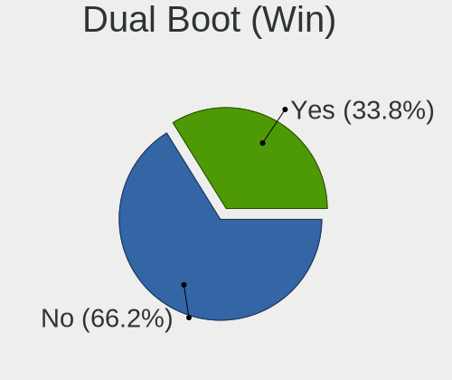
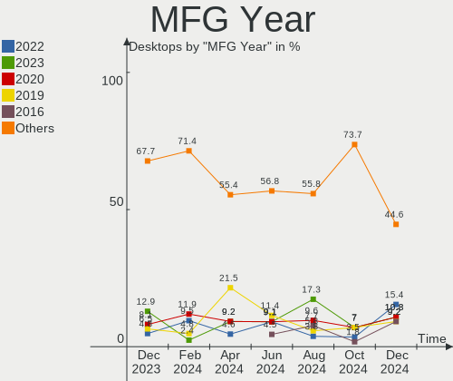
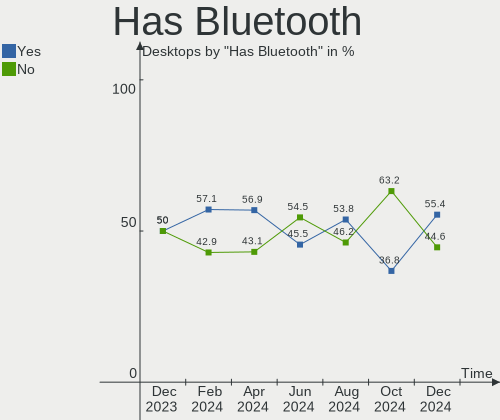
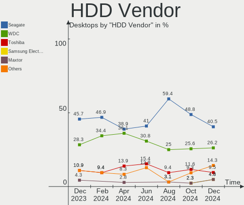
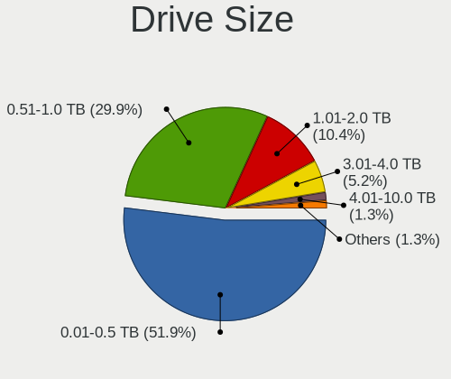
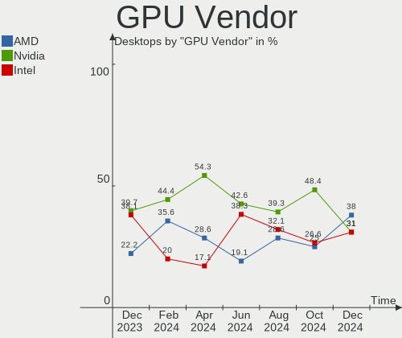
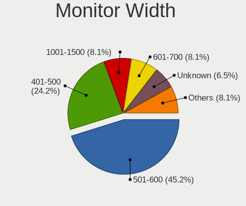
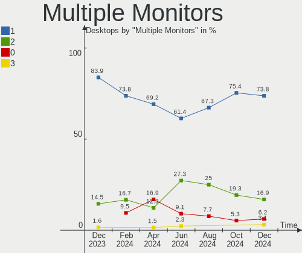
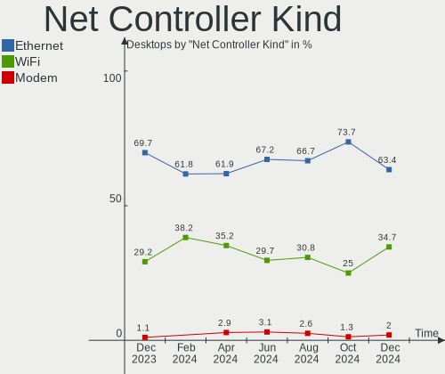
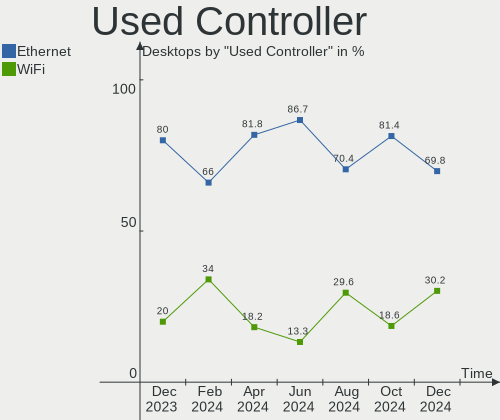

Linux in Spain - Hardware Trends (Desktops)
-------------------------------------------

A project to identify most popular hardware characteristics and track their change
over time based on data collected by Linux users at https://Linux-Hardware.org.

Anyone can contribute to this report by the [hw-probe](https://github.com/linuxhw/hw-probe) tool:

    sudo -E hw-probe -all -upload

Period: Jan, 2024.

Contents
--------

* [ System ](#system)
  - [ OS                       ](#os)
  - [ OS Family                ](#os-family)
  - [ Kernel                   ](#kernel)
  - [ Kernel Family            ](#kernel-family)
  - [ Kernel Major Ver.        ](#kernel-major-ver)
  - [ Arch                     ](#arch)
  - [ DE                       ](#de)
  - [ Display Server           ](#display-server)
  - [ Display Manager          ](#display-manager)
  - [ OS Lang                  ](#os-lang)
  - [ Boot Mode                ](#boot-mode)
  - [ Filesystem               ](#filesystem)
  - [ Part. scheme             ](#part-scheme)
  - [ Dual Boot with Linux/BSD ](#dual-boot-with-linuxbsd)
  - [ Dual Boot (Win)          ](#dual-boot-win)

* [ Board ](#board)
  - [ Vendor                   ](#vendor)
  - [ Model                    ](#model)
  - [ Model Family             ](#model-family)
  - [ MFG Year                 ](#mfg-year)
  - [ Form Factor              ](#form-factor)
  - [ Secure Boot              ](#secure-boot)
  - [ Coreboot                 ](#coreboot)
  - [ RAM Size                 ](#ram-size)
  - [ RAM Used                 ](#ram-used)
  - [ Total Drives             ](#total-drives)
  - [ Has CD-ROM               ](#has-cd-rom)
  - [ Has Ethernet             ](#has-ethernet)
  - [ Has WiFi                 ](#has-wifi)
  - [ Has Bluetooth            ](#has-bluetooth)

* [ Location ](#location)
  - [ Country                  ](#country)
  - [ City                     ](#city)

* [ Drives ](#drives)
  - [ Drive Vendor             ](#drive-vendor)
  - [ Drive Model              ](#drive-model)
  - [ HDD Vendor               ](#hdd-vendor)
  - [ SSD Vendor               ](#ssd-vendor)
  - [ Drive Kind               ](#drive-kind)
  - [ Drive Connector          ](#drive-connector)
  - [ Drive Size               ](#drive-size)
  - [ Space Total              ](#space-total)
  - [ Space Used               ](#space-used)
  - [ Malfunc. Drives          ](#malfunc-drives)
  - [ Malfunc. Drive Vendor    ](#malfunc-drive-vendor)
  - [ Malfunc. HDD Vendor      ](#malfunc-hdd-vendor)
  - [ Malfunc. Drive Kind      ](#malfunc-drive-kind)
  - [ Failed Drives            ](#failed-drives)
  - [ Failed Drive Vendor      ](#failed-drive-vendor)
  - [ Drive Status             ](#drive-status)

* [ Storage controller ](#storage-controller)
  - [ Storage Vendor           ](#storage-vendor)
  - [ Storage Model            ](#storage-model)
  - [ Storage Kind             ](#storage-kind)

* [ Processor ](#processor)
  - [ CPU Vendor               ](#cpu-vendor)
  - [ CPU Model                ](#cpu-model)
  - [ CPU Model Family         ](#cpu-model-family)
  - [ CPU Cores                ](#cpu-cores)
  - [ CPU Sockets              ](#cpu-sockets)
  - [ CPU Threads              ](#cpu-threads)
  - [ CPU Op-Modes             ](#cpu-op-modes)
  - [ CPU Microcode            ](#cpu-microcode)
  - [ CPU Microarch            ](#cpu-microarch)

* [ Graphics ](#graphics)
  - [ GPU Vendor               ](#gpu-vendor)
  - [ GPU Model                ](#gpu-model)
  - [ GPU Combo                ](#gpu-combo)
  - [ GPU Driver               ](#gpu-driver)
  - [ GPU Memory               ](#gpu-memory)

* [ Monitor ](#monitor)
  - [ Monitor Vendor           ](#monitor-vendor)
  - [ Monitor Model            ](#monitor-model)
  - [ Monitor Resolution       ](#monitor-resolution)
  - [ Monitor Diagonal         ](#monitor-diagonal)
  - [ Monitor Width            ](#monitor-width)
  - [ Aspect Ratio             ](#aspect-ratio)
  - [ Monitor Area             ](#monitor-area)
  - [ Pixel Density            ](#pixel-density)
  - [ Multiple Monitors        ](#multiple-monitors)

* [ Network ](#network)
  - [ Net Controller Vendor    ](#net-controller-vendor)
  - [ Net Controller Model     ](#net-controller-model)
  - [ Wireless Vendor          ](#wireless-vendor)
  - [ Wireless Model           ](#wireless-model)
  - [ Ethernet Vendor          ](#ethernet-vendor)
  - [ Ethernet Model           ](#ethernet-model)
  - [ Net Controller Kind      ](#net-controller-kind)
  - [ Used Controller          ](#used-controller)
  - [ NICs                     ](#nics)
  - [ IPv6                     ](#ipv6)

* [ Bluetooth ](#bluetooth)
  - [ Bluetooth Vendor         ](#bluetooth-vendor)
  - [ Bluetooth Model          ](#bluetooth-model)

* [ Sound ](#sound)
  - [ Sound Vendor             ](#sound-vendor)
  - [ Sound Model              ](#sound-model)

* [ Memory ](#memory)
  - [ Memory Vendor            ](#memory-vendor)
  - [ Memory Model             ](#memory-model)
  - [ Memory Kind              ](#memory-kind)
  - [ Memory Form Factor       ](#memory-form-factor)
  - [ Memory Size              ](#memory-size)
  - [ Memory Speed             ](#memory-speed)

* [ Printers & scanners ](#printers--scanners)
  - [ Printer Vendor           ](#printer-vendor)
  - [ Printer Model            ](#printer-model)
  - [ Scanner Vendor           ](#scanner-vendor)
  - [ Scanner Model            ](#scanner-model)

* [ Camera ](#camera)
  - [ Camera Vendor            ](#camera-vendor)
  - [ Camera Model             ](#camera-model)

* [ Security ](#security)
  - [ Fingerprint Vendor       ](#fingerprint-vendor)
  - [ Fingerprint Model        ](#fingerprint-model)
  - [ Chipcard Vendor          ](#chipcard-vendor)
  - [ Chipcard Model           ](#chipcard-model)

* [ Unsupported ](#unsupported)
  - [ Unsupported Devices      ](#unsupported-devices)
  - [ Unsupported Device Types ](#unsupported-device-types)

System
------

OS
--

Installed operating systems

| Name                         | Desktops | Percent |
|------------------------------|----------|---------|
| Ubuntu 22.04                 | 7        | 15.56%  |
| OpenMandriva 23.08           | 3        | 6.67%   |
| Fedora 39                    | 3        | 6.67%   |
| Debian 12                    | 3        | 6.67%   |
| Zorin 17                     | 2        | 4.44%   |
| Zorin 16                     | 2        | 4.44%   |
| Ubuntu 23.10                 | 2        | 4.44%   |
| Pop!_OS 22.04                | 2        | 4.44%   |
| openSUSE Tumbleweed-XXXXXXXX | 2        | 4.44%   |
| OpenMandriva 24.01           | 2        | 4.44%   |
| MX 23                        | 2        | 4.44%   |
| Kubuntu 23.10                | 2        | 4.44%   |
| KDE neon 22.04               | 2        | 4.44%   |
| Arch Rolling                 | 2        | 4.44%   |
| Xubuntu 18.04                | 1        | 2.22%   |
| Parrot 5.3                   | 1        | 2.22%   |
| Nobara 39                    | 1        | 2.22%   |
| Linux Mint 21.2              | 1        | 2.22%   |
| Linux Mint 20.3              | 1        | 2.22%   |
| Kali 2023.4                  | 1        | 2.22%   |
| Garuda Linux Soaring         | 1        | 2.22%   |
| Fedora 38                    | 1        | 2.22%   |
| Elementary 7.1               | 1        | 2.22%   |

OS Family
---------

OS without a version

| Name         | Desktops | Percent |
|--------------|----------|---------|
| Ubuntu       | 9        | 20%     |
| OpenMandriva | 5        | 11.11%  |
| Zorin        | 4        | 8.89%   |
| Fedora       | 4        | 8.89%   |
| Debian       | 3        | 6.67%   |
| Pop!_OS      | 2        | 4.44%   |
| openSUSE     | 2        | 4.44%   |
| MX           | 2        | 4.44%   |
| Linux Mint   | 2        | 4.44%   |
| Kubuntu      | 2        | 4.44%   |
| KDE neon     | 2        | 4.44%   |
| Arch         | 2        | 4.44%   |
| Xubuntu      | 1        | 2.22%   |
| Parrot       | 1        | 2.22%   |
| Nobara       | 1        | 2.22%   |
| Kali         | 1        | 2.22%   |
| Garuda Linux | 1        | 2.22%   |
| Elementary   | 1        | 2.22%   |

Kernel
------

Version of the Linux kernel

| Version                     | Desktops | Percent |
|-----------------------------|----------|---------|
| 6.5.0-14-generic            | 7        | 15.56%  |
| 6.5.0-15-generic            | 4        | 8.89%   |
| 6.2.0-39-generic            | 4        | 8.89%   |
| 6.4.11-desktop-1omv2390     | 3        | 6.67%   |
| 5.15.0-91-generic           | 3        | 6.67%   |
| 6.6.9-200.fc39.x86_64       | 2        | 4.44%   |
| 6.6.6-76060606-generic      | 2        | 4.44%   |
| 6.6.2-desktop-1omv2390      | 2        | 4.44%   |
| 6.1.0-17-amd64              | 2        | 4.44%   |
| 6.7.0-arch3-1               | 1        | 2.22%   |
| 6.7.0                       | 1        | 2.22%   |
| 6.6.9-200.fsync.fc39.x86_64 | 1        | 2.22%   |
| 6.6.8-200.fc39.x86_64       | 1        | 2.22%   |
| 6.6.8-100.fc38.x86_64       | 1        | 2.22%   |
| 6.6.7-1-default             | 1        | 2.22%   |
| 6.6.13-x64v-xanmod1-1       | 1        | 2.22%   |
| 6.6.11-1-default            | 1        | 2.22%   |
| 6.6.10-x64v3-xanmod1        | 1        | 2.22%   |
| 6.6.10-arch1-1              | 1        | 2.22%   |
| 6.5.11-7-pve                | 1        | 2.22%   |
| 6.5.0-kali3-amd64           | 1        | 2.22%   |
| 6.4.15-2-liquorix-amd64     | 1        | 2.22%   |
| 6.1.0-1parrot1-amd64        | 1        | 2.22%   |
| 5.4.0-169-generic           | 1        | 2.22%   |
| 5.4.0-150-generic           | 1        | 2.22%   |

Kernel Family
-------------

Linux kernel without a distro release

| Version | Desktops | Percent |
|---------|----------|---------|
| 6.5.0   | 12       | 26.67%  |
| 6.2.0   | 4        | 8.89%   |
| 6.6.9   | 3        | 6.67%   |
| 6.4.11  | 3        | 6.67%   |
| 6.1.0   | 3        | 6.67%   |
| 5.15.0  | 3        | 6.67%   |
| 6.7.0   | 2        | 4.44%   |
| 6.6.8   | 2        | 4.44%   |
| 6.6.6   | 2        | 4.44%   |
| 6.6.2   | 2        | 4.44%   |
| 6.6.10  | 2        | 4.44%   |
| 5.4.0   | 2        | 4.44%   |
| 6.6.7   | 1        | 2.22%   |
| 6.6.13  | 1        | 2.22%   |
| 6.6.11  | 1        | 2.22%   |
| 6.5.11  | 1        | 2.22%   |
| 6.4.15  | 1        | 2.22%   |

Kernel Major Ver.
-----------------

Linux kernel major version

| Version | Desktops | Percent |
|---------|----------|---------|
| 6.6     | 14       | 31.11%  |
| 6.5     | 13       | 28.89%  |
| 6.4     | 4        | 8.89%   |
| 6.2     | 4        | 8.89%   |
| 6.1     | 3        | 6.67%   |
| 5.15    | 3        | 6.67%   |
| 6.7     | 2        | 4.44%   |
| 5.4     | 2        | 4.44%   |

Arch
----

OS architecture (x86_64, i586, etc.)

| Name   | Desktops | Percent |
|--------|----------|---------|
| x86_64 | 45       | 100%    |

DE
--

Desktop Environment

| Name       | Desktops | Percent |
|------------|----------|---------|
| GNOME      | 20       | 44.44%  |
| KDE5       | 15       | 33.33%  |
| XFCE       | 2        | 4.44%   |
| MATE       | 2        | 4.44%   |
| X-Cinnamon | 1        | 2.22%   |
| Pantheon   | 1        | 2.22%   |
| LXQt       | 1        | 2.22%   |
| KDE6       | 1        | 2.22%   |
| Deepin     | 1        | 2.22%   |
| Unknown    | 1        | 2.22%   |

Display Server
--------------

X11 or Wayland

| Name    | Desktops | Percent |
|---------|----------|---------|
| X11     | 24       | 53.33%  |
| Wayland | 17       | 37.78%  |
| Tty     | 4        | 8.89%   |

Display Manager
---------------

SDDM, LightDM, etc.

| Name    | Desktops | Percent |
|---------|----------|---------|
| Unknown | 18       | 40%     |
| GDM3    | 12       | 26.67%  |
| SDDM    | 11       | 24.44%  |
| LightDM | 4        | 8.89%   |

OS Lang
-------

Language

| Lang  | Desktops | Percent |
|-------|----------|---------|
| es_ES | 33       | 73.33%  |
| en_US | 8        | 17.78%  |
| pl_PL | 1        | 2.22%   |
| eu_ES | 1        | 2.22%   |
| ca_ES | 1        | 2.22%   |
| C     | 1        | 2.22%   |

Boot Mode
---------

EFI or BIOS

| Mode | Desktops | Percent |
|------|----------|---------|
| BIOS | 26       | 57.78%  |
| EFI  | 19       | 42.22%  |

Filesystem
----------

Type of filesystem

| Type    | Desktops | Percent |
|---------|----------|---------|
| Ext4    | 27       | 60%     |
| Btrfs   | 9        | 20%     |
| Tmpfs   | 7        | 15.56%  |
| Zfs     | 1        | 2.22%   |
| Overlay | 1        | 2.22%   |

Part. scheme
------------

Scheme of partitioning

| Type    | Desktops | Percent |
|---------|----------|---------|
| GPT     | 20       | 44.44%  |
| Unknown | 17       | 37.78%  |
| MBR     | 8        | 17.78%  |

Dual Boot with Linux/BSD
------------------------

Hosting more than one Linux/BSD

| Dual boot | Desktops | Percent |
|-----------|----------|---------|
| No        | 32       | 71.11%  |
| Yes       | 13       | 28.89%  |

Dual Boot (Win)
---------------

Hosting Linux and Windows

| Dual boot | Desktops | Percent |
|-----------|----------|---------|
| No        | 33       | 73.33%  |
| Yes       | 12       | 26.67%  |

Board
-----

Vendor
------

Motherboard manufacturer

| Name                | Desktops | Percent |
|---------------------|----------|---------|
| Gigabyte Technology | 10       | 22.22%  |
| ASUSTek Computer    | 9        | 20%     |
| MSI                 | 8        | 17.78%  |
| Intel               | 4        | 8.89%   |
| Hewlett-Packard     | 3        | 6.67%   |
| ASRock              | 3        | 6.67%   |
| Unknown             | 2        | 4.44%   |
| Lenovo              | 1        | 2.22%   |
| Foxconn             | 1        | 2.22%   |
| Dell                | 1        | 2.22%   |
| Cisco Systems       | 1        | 2.22%   |
| Apple               | 1        | 2.22%   |
| Acer                | 1        | 2.22%   |

Model
-----

Motherboard model

| Name                                 | Desktops | Percent |
|--------------------------------------|----------|---------|
| Unknown                              | 3        | 6.67%   |
| MSI MS-7850                          | 2        | 4.44%   |
| Intel X99                            | 2        | 4.44%   |
| MSI MS-7D18                          | 1        | 2.22%   |
| MSI MS-7C56                          | 1        | 2.22%   |
| MSI MS-7C51                          | 1        | 2.22%   |
| MSI MS-7B93                          | 1        | 2.22%   |
| MSI MS-7B89                          | 1        | 2.22%   |
| MSI MS-7A37                          | 1        | 2.22%   |
| Lenovo ThinkCentre M700 thinkcentre  | 1        | 2.22%   |
| Intel X99-P4 V5.0                    | 1        | 2.22%   |
| HP Z2 Tower G5 Workstation           | 1        | 2.22%   |
| HP Compaq dc7700p Ultra-slim Desktop | 1        | 2.22%   |
| HP 280 G1 MT                         | 1        | 2.22%   |
| Gigabyte Z77-DS3H                    | 1        | 2.22%   |
| Gigabyte Z370 AORUS Gaming 5         | 1        | 2.22%   |
| Gigabyte X99-UD4-CF                  | 1        | 2.22%   |
| Gigabyte X570 I AORUS PRO WIFI       | 1        | 2.22%   |
| Gigabyte Primux_Device_W10           | 1        | 2.22%   |
| Gigabyte H510M H V2                  | 1        | 2.22%   |
| Gigabyte B75M-D3H                    | 1        | 2.22%   |
| Gigabyte B550 AORUS ELITE V2         | 1        | 2.22%   |
| Gigabyte AX370-Gaming 5              | 1        | 2.22%   |
| Gigabyte A320M-S2H V2                | 1        | 2.22%   |
| Foxconn 500B Microtower              | 1        | 2.22%   |
| Dell OptiPlex 9020                   | 1        | 2.22%   |
| Cisco Systems UCSC-C220-M3SBE        | 1        | 2.22%   |
| ASUS TUF Gaming X570-PRO             | 1        | 2.22%   |
| ASUS SABERTOOTH Z170 MARK 1          | 1        | 2.22%   |
| ASUS ROG Maximus Z790 DARK HERO      | 1        | 2.22%   |
| ASUS PRIME Z590-A                    | 1        | 2.22%   |
| ASUS PRIME H310M-E                   | 1        | 2.22%   |
| ASUS PRIME B550M-A                   | 1        | 2.22%   |
| ASUS P8H61-M2 USB3                   | 1        | 2.22%   |
| ASUS M4N78                           | 1        | 2.22%   |
| ASUS All Series                      | 1        | 2.22%   |
| ASRock Z690 Phantom Gaming-ITX/TB4   | 1        | 2.22%   |
| ASRock J5040-ITX                     | 1        | 2.22%   |
| ASRock 970 Pro3 R2.0                 | 1        | 2.22%   |
| Apple MacPro5,1                      | 1        | 2.22%   |

Model Family
------------

Motherboard model prefix

| Name                          | Desktops | Percent |
|-------------------------------|----------|---------|
| ASUS PRIME                    | 3        | 6.67%   |
| Unknown                       | 3        | 6.67%   |
| MSI MS-7850                   | 2        | 4.44%   |
| Intel X99                     | 2        | 4.44%   |
| MSI MS-7D18                   | 1        | 2.22%   |
| MSI MS-7C56                   | 1        | 2.22%   |
| MSI MS-7C51                   | 1        | 2.22%   |
| MSI MS-7B93                   | 1        | 2.22%   |
| MSI MS-7B89                   | 1        | 2.22%   |
| MSI MS-7A37                   | 1        | 2.22%   |
| Lenovo ThinkCentre            | 1        | 2.22%   |
| Intel X99-P4                  | 1        | 2.22%   |
| HP Z2                         | 1        | 2.22%   |
| HP Compaq                     | 1        | 2.22%   |
| HP 280                        | 1        | 2.22%   |
| Gigabyte Z77-DS3H             | 1        | 2.22%   |
| Gigabyte Z370                 | 1        | 2.22%   |
| Gigabyte X99-UD4-CF           | 1        | 2.22%   |
| Gigabyte X570                 | 1        | 2.22%   |
| Gigabyte Primux               | 1        | 2.22%   |
| Gigabyte H510M                | 1        | 2.22%   |
| Gigabyte B75M-D3H             | 1        | 2.22%   |
| Gigabyte B550                 | 1        | 2.22%   |
| Gigabyte AX370-Gaming         | 1        | 2.22%   |
| Gigabyte A320M-S2H            | 1        | 2.22%   |
| Foxconn 500B                  | 1        | 2.22%   |
| Dell OptiPlex                 | 1        | 2.22%   |
| Cisco Systems UCSC-C220-M3SBE | 1        | 2.22%   |
| ASUS TUF                      | 1        | 2.22%   |
| ASUS SABERTOOTH               | 1        | 2.22%   |
| ASUS ROG                      | 1        | 2.22%   |
| ASUS P8H61-M2                 | 1        | 2.22%   |
| ASUS M4N78                    | 1        | 2.22%   |
| ASUS All                      | 1        | 2.22%   |
| ASRock Z690                   | 1        | 2.22%   |
| ASRock J5040-ITX              | 1        | 2.22%   |
| ASRock 970                    | 1        | 2.22%   |
| Apple MacPro5                 | 1        | 2.22%   |
| Acer Veriton                  | 1        | 2.22%   |

MFG Year
--------

Motherboard manufacture year

| Year | Desktops | Percent |
|------|----------|---------|
| 2021 | 5        | 11.11%  |
| 2020 | 5        | 11.11%  |
| 2014 | 5        | 11.11%  |
| 2012 | 5        | 11.11%  |
| 2023 | 4        | 8.89%   |
| 2019 | 4        | 8.89%   |
| 2018 | 4        | 8.89%   |
| 2022 | 3        | 6.67%   |
| 2010 | 3        | 6.67%   |
| 2017 | 2        | 4.44%   |
| 2016 | 1        | 2.22%   |
| 2015 | 1        | 2.22%   |
| 2013 | 1        | 2.22%   |
| 2009 | 1        | 2.22%   |
| 2006 | 1        | 2.22%   |

Form Factor
-----------

Physical design of the computer

| Name    | Desktops | Percent |
|---------|----------|---------|
| Desktop | 45       | 100%    |

Secure Boot
-----------

Enabled or disabled

| State    | Desktops | Percent |
|----------|----------|---------|
| Disabled | 43       | 95.56%  |
| Enabled  | 2        | 4.44%   |

Coreboot
--------

Have coreboot on board

| Used | Desktops | Percent |
|------|----------|---------|
| No   | 45       | 100%    |

RAM Size
--------

Total RAM memory

| Size in GB  | Desktops | Percent |
|-------------|----------|---------|
| 32.01-64.0  | 13       | 28.89%  |
| 16.01-24.0  | 12       | 26.67%  |
| 4.01-8.0    | 8        | 17.78%  |
| 64.01-256.0 | 5        | 11.11%  |
| 8.01-16.0   | 4        | 8.89%   |
| 24.01-32.0  | 1        | 2.22%   |
| 2.01-3.0    | 1        | 2.22%   |
| 1.01-2.0    | 1        | 2.22%   |

RAM Used
--------

Used RAM memory

| Used GB    | Desktops | Percent |
|------------|----------|---------|
| 1.01-2.0   | 14       | 31.11%  |
| 3.01-4.0   | 11       | 24.44%  |
| 4.01-8.0   | 9        | 20%     |
| 2.01-3.0   | 6        | 13.33%  |
| 8.01-16.0  | 4        | 8.89%   |
| 16.01-24.0 | 1        | 2.22%   |

Total Drives
------------

Number of drives on board

| Drives | Desktops | Percent |
|--------|----------|---------|
| 1      | 11       | 24.44%  |
| 2      | 10       | 22.22%  |
| 4      | 9        | 20%     |
| 5      | 6        | 13.33%  |
| 3      | 6        | 13.33%  |
| 6      | 2        | 4.44%   |
| 9      | 1        | 2.22%   |

Has CD-ROM
----------

Has CD-ROM on board

| Presented | Desktops | Percent |
|-----------|----------|---------|
| No        | 30       | 66.67%  |
| Yes       | 15       | 33.33%  |

Has Ethernet
------------

Has Ethernet on board

| Presented | Desktops | Percent |
|-----------|----------|---------|
| Yes       | 45       | 100%    |

Has WiFi
--------

Has WiFi module

| Presented | Desktops | Percent |
|-----------|----------|---------|
| No        | 27       | 60%     |
| Yes       | 18       | 40%     |

Has Bluetooth
-------------

Has Bluetooth module

| Presented | Desktops | Percent |
|-----------|----------|---------|
| No        | 29       | 64.44%  |
| Yes       | 16       | 35.56%  |

Location
--------

Country
-------

Geographic location (country)

| Country | Desktops | Percent |
|---------|----------|---------|
| Spain   | 45       | 100%    |

City
----

Geographic location (city)

| City                       | Desktops | Percent |
|----------------------------|----------|---------|
| Madrid                     | 5        | 11.11%  |
| Barcelona                  | 5        | 11.11%  |
| Zaragoza                   | 2        | 4.44%   |
| Santander                  | 2        | 4.44%   |
| Las Palmas de Gran Canaria | 2        | 4.44%   |
| Villafranca de los Barros  | 1        | 2.22%   |
| Valencia                   | 1        | 2.22%   |
| Torremolinos               | 1        | 2.22%   |
| Sardina                    | 1        | 2.22%   |
| Santiago de Compostela     | 1        | 2.22%   |
| San Miguel de Meruelo      | 1        | 2.22%   |
| Salamanca                  | 1        | 2.22%   |
| Riudoms                    | 1        | 2.22%   |
| Polanco                    | 1        | 2.22%   |
| Penaranda de Bracamonte    | 1        | 2.22%   |
| Pechina                    | 1        | 2.22%   |
| Paracuellos de Jarama      | 1        | 2.22%   |
| Oviedo                     | 1        | 2.22%   |
| Málaga                    | 1        | 2.22%   |
| Los Llanos de Aridane      | 1        | 2.22%   |
| Lora del Rio               | 1        | 2.22%   |
| León                      | 1        | 2.22%   |
| Ingenio                    | 1        | 2.22%   |
| Ibiza Town                 | 1        | 2.22%   |
| Gijón                     | 1        | 2.22%   |
| Getxo                      | 1        | 2.22%   |
| Ciudad Real                | 1        | 2.22%   |
| Chinchón                  | 1        | 2.22%   |
| Chiclana de la Frontera    | 1        | 2.22%   |
| Cerdanyola del Vallès     | 1        | 2.22%   |
| Calafell                   | 1        | 2.22%   |
| Bilbao                     | 1        | 2.22%   |
| Alicante                   | 1        | 2.22%   |
| Alcalá de Guadaira        | 1        | 2.22%   |

Drives
------

Drive Vendor
------------

Hard drive vendors

| Vendor                      | Desktops | Drives  | Percent |
|-----------------------------|----------|---------|---------|
| WDC                         | 17       | 24      | 16.35%  |
| Seagate                     | 17       | 23      | 16.35%  |
| Samsung Electronics         | 14       | 20      | 13.46%  |
| Kingston                    | 12       | 16      | 11.54%  |
| Sandisk                     | 7        | 12      | 6.73%   |
| Crucial                     | 6        | 6       | 5.77%   |
| Toshiba                     | 5        | 7       | 4.81%   |
| Transcend                   | 2        | 2       | 1.92%   |
| Phison Electronics          | 2        | 2       | 1.92%   |
| Micron Technology           | 2        | 2       | 1.92%   |
| Fanxiang                    | 2        | 3       | 1.92%   |
| China                       | 2        | 4       | 1.92%   |
| WALRAM                      | 1        | 1       | 0.96%   |
| Patriot                     | 1        | 1       | 0.96%   |
| MAXIO Technology (Hangzhou) | 1        | 1       | 0.96%   |
| KODAK                       | 1        | 1       | 0.96%   |
| Kingston Technology Company | 1        | 1       | 0.96%   |
| KingFast                    | 1        | 1       | 0.96%   |
| Intenso                     | 1        | 1       | 0.96%   |
| Intel                       | 1        | 1       | 0.96%   |
| HL-DT-ST                    | 1        | Unknown | 0.96%   |
| Hitachi                     | 1        | 1       | 0.96%   |
| HGST                        | 1        | 2       | 0.96%   |
| Fujitsu                     | 1        | 1       | 0.96%   |
| Corsair                     | 1        | 1       | 0.96%   |
| Apple                       | 1        | 1       | 0.96%   |
| Apacer                      | 1        | 1       | 0.96%   |
| Unknown                     | 1        | 1       | 0.96%   |

Drive Model
-----------

Hard drive models

| Model                                               | Desktops | Percent |
|-----------------------------------------------------|----------|---------|
| Kingston SA400S37240G 240GB SSD                     | 4        | 3.2%    |
| WDC WD40EZAZ-00SF3B0 4TB                            | 3        | 2.4%    |
| WDC WD10EZEX-00BN5A0 1TB                            | 3        | 2.4%    |
| Seagate ST1000DM010-2EP102 1TB                      | 3        | 2.4%    |
| Sandisk WD Black SN750 / PC SN730 NVMe SSD 512GB    | 3        | 2.4%    |
| Samsung NVMe SSD Controller SM981/PM981/PM983 1TB   | 3        | 2.4%    |
| Kingston SA400S37480G 480GB SSD                     | 3        | 2.4%    |
| Seagate ST3500312CS 500GB                           | 2        | 1.6%    |
| Sandisk WD Black 2018/SN750 / PC SN720 NVMe SSD 1TB | 2        | 1.6%    |
| SanDisk SSD PLUS 480GB                              | 2        | 1.6%    |
| Samsung SSD 980 1TB                                 | 2        | 1.6%    |
| Samsung SSD 860 EVO 1TB                             | 2        | 1.6%    |
| Kingston SUV400S37240G 240GB SSD                    | 2        | 1.6%    |
| Kingston SA400S37960G 960GB SSD                     | 2        | 1.6%    |
| WDC WDS500G1B0B-00AS40 500GB SSD                    | 1        | 0.8%    |
| WDC WDS120G2G0B-00EPW0 120GB SSD                    | 1        | 0.8%    |
| WDC WDS100T2B0A-00SM50 1TB SSD                      | 1        | 0.8%    |
| WDC WD6003FZBX-00K5WB0 6TB                          | 1        | 0.8%    |
| WDC WD5000LPVX-60V0TT0 500GB                        | 1        | 0.8%    |
| WDC WD5000AAKX-22ERMA0 500GB                        | 1        | 0.8%    |
| WDC WD5000AAKS-00YGA0 500GB                         | 1        | 0.8%    |
| WDC WD30EZRX-00D8PB0 3TB                            | 1        | 0.8%    |
| WDC WD20EFRX-68EUZN0 2TB                            | 1        | 0.8%    |
| WDC WD1200BEVS-75UST0 120GB                         | 1        | 0.8%    |
| WDC WD10JPVX-08JC3T5 1TB                            | 1        | 0.8%    |
| WDC WD10EZEX-22MFCA0 1TB                            | 1        | 0.8%    |
| WDC WD10EZEX-08WN4A0 1TB                            | 1        | 0.8%    |
| WDC WD10EZEX-08M2NA0 1TB                            | 1        | 0.8%    |
| WDC WD10EZEX-00WN4A0 1TB                            | 1        | 0.8%    |
| WDC WD10EARS-00Y5B1 1TB                             | 1        | 0.8%    |
| WDC WD10EALX-009BA0 1TB                             | 1        | 0.8%    |
| WALRAM SSD 1TB                                      | 1        | 0.8%    |
| Transcend TS480GSSD220S 480GB                       | 1        | 0.8%    |
| Transcend TS1TSSD230S 1TB                           | 1        | 0.8%    |
| Toshiba TR200 480GB SSD                             | 1        | 0.8%    |
| Toshiba THNSNH256GMCT 256GB SSD                     | 1        | 0.8%    |
| Toshiba MQ01ABD050 500GB                            | 1        | 0.8%    |
| Toshiba MG09ACA18TE 18TB                            | 1        | 0.8%    |
| Toshiba DT01ACA200 2TB                              | 1        | 0.8%    |
| Seagate ST500DM002-1BC142 500GB                     | 1        | 0.8%    |

HDD Vendor
----------

Hard disk drive vendors

| Vendor              | Desktops | Drives | Percent |
|---------------------|----------|--------|---------|
| Seagate             | 17       | 23     | 41.46%  |
| WDC                 | 14       | 20     | 34.15%  |
| Toshiba             | 3        | 3      | 7.32%   |
| Samsung Electronics | 3        | 3      | 7.32%   |
| Hitachi             | 1        | 1      | 2.44%   |
| HGST                | 1        | 2      | 2.44%   |
| Fujitsu             | 1        | 1      | 2.44%   |
| Apple               | 1        | 1      | 2.44%   |

SSD Vendor
----------

Solid state drive vendors

| Vendor              | Desktops | Drives | Percent |
|---------------------|----------|--------|---------|
| Kingston            | 11       | 14     | 23.91%  |
| Samsung Electronics | 7        | 7      | 15.22%  |
| Crucial             | 6        | 6      | 13.04%  |
| SanDisk             | 4        | 5      | 8.7%    |
| WDC                 | 3        | 4      | 6.52%   |
| Transcend           | 2        | 2      | 4.35%   |
| Toshiba             | 2        | 4      | 4.35%   |
| Fanxiang            | 2        | 2      | 4.35%   |
| China               | 2        | 4      | 4.35%   |
| WALRAM              | 1        | 1      | 2.17%   |
| Patriot             | 1        | 1      | 2.17%   |
| Micron Technology   | 1        | 1      | 2.17%   |
| KODAK               | 1        | 1      | 2.17%   |
| Intenso             | 1        | 1      | 2.17%   |
| Intel               | 1        | 1      | 2.17%   |
| Unknown             | 1        | 1      | 2.17%   |

Drive Kind
----------

HDD or SSD

| Kind    | Desktops | Drives | Percent |
|---------|----------|--------|---------|
| SSD     | 32       | 55     | 39.51%  |
| HDD     | 29       | 54     | 35.8%   |
| NVMe    | 17       | 26     | 20.99%  |
| Unknown | 3        | 2      | 3.7%    |

Drive Connector
---------------

SATA, SAS, NVMe, etc.

| Type | Desktops | Drives | Percent |
|------|----------|--------|---------|
| SATA | 43       | 110    | 69.35%  |
| NVMe | 17       | 26     | 27.42%  |
| SAS  | 2        | 1      | 3.23%   |

Drive Size
----------

Size of hard drive

| Size in TB | Desktops | Drives | Percent |
|------------|----------|--------|---------|
| 0.51-1.0   | 26       | 40     | 38.24%  |
| 0.01-0.5   | 24       | 41     | 35.29%  |
| 1.01-2.0   | 8        | 15     | 11.76%  |
| 3.01-4.0   | 5        | 5      | 7.35%   |
| 2.01-3.0   | 2        | 3      | 2.94%   |
| 4.01-10.0  | 2        | 4      | 2.94%   |
| 10.01-20.0 | 1        | 1      | 1.47%   |

Space Total
-----------

Amount of disk space available on the file system

| Size in GB     | Desktops | Percent |
|----------------|----------|---------|
| More than 3000 | 13       | 28.89%  |
| 101-250        | 9        | 20%     |
| 501-1000       | 8        | 17.78%  |
| 251-500        | 5        | 11.11%  |
| 1001-2000      | 4        | 8.89%   |
| 2001-3000      | 2        | 4.44%   |
| 51-100         | 2        | 4.44%   |
| 1-20           | 1        | 2.22%   |
| Unknown        | 1        | 2.22%   |

Space Used
----------

Amount of used disk space

| Used GB        | Desktops | Percent |
|----------------|----------|---------|
| 1-20           | 11       | 24.44%  |
| 2001-3000      | 8        | 17.78%  |
| 21-50          | 7        | 15.56%  |
| More than 3000 | 4        | 8.89%   |
| 251-500        | 4        | 8.89%   |
| 501-1000       | 4        | 8.89%   |
| 1001-2000      | 3        | 6.67%   |
| 51-100         | 2        | 4.44%   |
| 101-250        | 1        | 2.22%   |
| Unknown        | 1        | 2.22%   |

Malfunc. Drives
---------------

Drive models with a malfunction

| Model                                             | Desktops | Drives | Percent |
|---------------------------------------------------|----------|--------|---------|
| SanDisk SSD PLUS 480GB                            | 2        | 2      | 16.67%  |
| WDC WD5000AAKS-00YGA0 500GB                       | 1        | 1      | 8.33%   |
| WDC WD20EFRX-68EUZN0 2TB                          | 1        | 1      | 8.33%   |
| Transcend TS1TSSD230S 1TB                         | 1        | 1      | 8.33%   |
| Seagate ST1000LM024 HN-M101MBB 1TB                | 1        | 1      | 8.33%   |
| Seagate ST1000DM010-2EP102 1TB                    | 1        | 1      | 8.33%   |
| Samsung Electronics HD642JJ 640GB                 | 1        | 1      | 8.33%   |
| Micron Technology MTFDDAK2T0TDL-1AW1ZABHA 2TB SSD | 1        | 1      | 8.33%   |
| Kingston SUV400S37240G 240GB SSD                  | 1        | 1      | 8.33%   |
| Kingston SKC2000M8500G 500GB                      | 1        | 1      | 8.33%   |
| Crucial CT256M550SSD1 256GB                       | 1        | 1      | 8.33%   |

Malfunc. Drive Vendor
---------------------

Vendors of faulty drives

| Vendor              | Desktops | Drives | Percent |
|---------------------|----------|--------|---------|
| WDC                 | 2        | 2      | 16.67%  |
| Seagate             | 2        | 2      | 16.67%  |
| SanDisk             | 2        | 2      | 16.67%  |
| Kingston            | 2        | 2      | 16.67%  |
| Transcend           | 1        | 1      | 8.33%   |
| Samsung Electronics | 1        | 1      | 8.33%   |
| Micron Technology   | 1        | 1      | 8.33%   |
| Crucial             | 1        | 1      | 8.33%   |

Malfunc. HDD Vendor
-------------------

Vendors of faulty HDD drives

| Vendor              | Desktops | Drives | Percent |
|---------------------|----------|--------|---------|
| WDC                 | 2        | 2      | 40%     |
| Seagate             | 2        | 2      | 40%     |
| Samsung Electronics | 1        | 1      | 20%     |

Malfunc. Drive Kind
-------------------

Kinds of faulty drives

| Kind | Desktops | Drives | Percent |
|------|----------|--------|---------|
| SSD  | 6        | 6      | 54.55%  |
| HDD  | 4        | 5      | 36.36%  |
| NVMe | 1        | 1      | 9.09%   |

Failed Drives
-------------

Failed drive models

Zero info for selected period =(

Failed Drive Vendor
-------------------

Failed drive vendors

Zero info for selected period =(

Drive Status
------------

Number of failed and malfunc. drives

| Status   | Desktops | Drives | Percent |
|----------|----------|--------|---------|
| Detected | 24       | 70     | 45.28%  |
| Works    | 20       | 55     | 37.74%  |
| Malfunc  | 9        | 12     | 16.98%  |

Storage controller
------------------

Storage Vendor
--------------

Storage controller vendors

| Vendor                      | Desktops | Percent |
|-----------------------------|----------|---------|
| Intel                       | 31       | 41.89%  |
| AMD                         | 12       | 16.22%  |
| Samsung Electronics         | 7        | 9.46%   |
| SanDisk                     | 6        | 8.11%   |
| Phison Electronics          | 4        | 5.41%   |
| Kingston Technology Company | 3        | 4.05%   |
| ASMedia Technology          | 3        | 4.05%   |
| Marvell Technology Group    | 2        | 2.7%    |
| Nvidia                      | 1        | 1.35%   |
| Micron Technology           | 1        | 1.35%   |
| MAXIO Technology (Hangzhou) | 1        | 1.35%   |
| JMicron Technology          | 1        | 1.35%   |
| HighPoint Technologies      | 1        | 1.35%   |
| Broadcom / LSI              | 1        | 1.35%   |

Storage Model
-------------

Storage controller models

| Model                                                                          | Desktops | Percent |
|--------------------------------------------------------------------------------|----------|---------|
| AMD FCH SATA Controller [AHCI mode]                                            | 7        | 7.87%   |
| Intel 8 Series/C220 Series Chipset Family 6-port SATA Controller 1 [AHCI mode] | 6        | 6.74%   |
| SanDisk Extreme Pro / WD Black SN750 / PC SN730 / Red SN700 NVMe SSD           | 3        | 3.37%   |
| Samsung NVMe SSD Controller SM981/PM981/PM983                                  | 3        | 3.37%   |
| Samsung NVMe SSD Controller 980 (DRAM-less)                                    | 3        | 3.37%   |
| Intel 500 Series Chipset Family SATA AHCI Controller                           | 3        | 3.37%   |
| ASMedia ASM1061/ASM1062 Serial ATA Controller                                  | 3        | 3.37%   |
| AMD 500 Series Chipset SATA Controller                                         | 3        | 3.37%   |
| SanDisk Extreme Pro / WD Black 2018/SN750/PC SN720 NVMe SSD                    | 2        | 2.25%   |
| Intel Q170/Q150/B150/H170/H110/Z170/CM236 Chipset SATA Controller [AHCI Mode]  | 2        | 2.25%   |
| Intel Celeron/Pentium Silver Processor SATA Controller                         | 2        | 2.25%   |
| Intel C610/X99 series chipset 6-Port SATA Controller [AHCI mode]               | 2        | 2.25%   |
| AMD 300 Series Chipset SATA Controller                                         | 2        | 2.25%   |
| SanDisk WD PC SN810 / Black SN850 NVMe SSD                                     | 1        | 1.12%   |
| SanDisk WD Blue SN550 NVMe SSD 2TB (DRAM-less)                                 | 1        | 1.12%   |
| Samsung NVMe SSD Controller SM961/PM961/SM963                                  | 1        | 1.12%   |
| Samsung NVMe SSD Controller PM9A1/PM9A3/980PRO                                 | 1        | 1.12%   |
| Phison PS5013-E13 PCIe3 NVMe Controller (DRAM-less)                            | 1        | 1.12%   |
| Phison E18 PCIe4 NVMe Controller                                               | 1        | 1.12%   |
| Phison E16 PCIe4 NVMe Controller                                               | 1        | 1.12%   |
| Phison E12 NVMe Controller                                                     | 1        | 1.12%   |
| Nvidia MCP78S [GeForce 8200] SATA Controller (non-AHCI mode)                   | 1        | 1.12%   |
| Nvidia MCP78S [GeForce 8200] IDE                                               | 1        | 1.12%   |
| Micron 2200S NVMe SSD [Cassandra]                                              | 1        | 1.12%   |
| MAXIO (Hangzhou) NVMe SSD Controller MAP1602 (DRAM-less)                       | 1        | 1.12%   |
| Marvell Group 88SE9215 PCIe 2.0 x1 4-port SATA 6 Gb/s Controller               | 1        | 1.12%   |
| Marvell Group 88SE912x IDE Controller                                          | 1        | 1.12%   |
| Kingston Company NV2 NVMe SSD E21T (DRAM-less)                                 | 1        | 1.12%   |
| Kingston Company NV1 NVMe SSD SM2263XT (DRAM-less)                             | 1        | 1.12%   |
| Kingston Company KC2000/KC2500 NVMe SSD SM2262EN                               | 1        | 1.12%   |
| JMicron JMB58x AHCI SATA controller                                            | 1        | 1.12%   |
| Intel Volume Management Device NVMe RAID Controller Intel Corporation          | 1        | 1.12%   |
| Intel Raptor Lake SATA AHCI Controller                                         | 1        | 1.12%   |
| Intel NM10/ICH7 Family SATA Controller [IDE mode]                              | 1        | 1.12%   |
| Intel Comet Lake SATA AHCI Controller                                          | 1        | 1.12%   |
| Intel Comet Lake PCH-H RAID                                                    | 1        | 1.12%   |
| Intel Cannon Lake PCH SATA AHCI Controller                                     | 1        | 1.12%   |
| Intel Alder Lake-S PCH SATA Controller [AHCI Mode]                             | 1        | 1.12%   |
| Intel 9 Series Chipset Family SATA Controller [AHCI Mode]                      | 1        | 1.12%   |
| Intel 82Q963/Q965 PT IDER Controller                                           | 1        | 1.12%   |

Storage Kind
------------

Kind of storage controller (IDE, SATA, NVMe, SAS, ...)

| Kind | Desktops | Percent |
|------|----------|---------|
| SATA | 36       | 52.94%  |
| NVMe | 18       | 26.47%  |
| IDE  | 10       | 14.71%  |
| RAID | 4        | 5.88%   |

Processor
---------

CPU Vendor
----------

Processor vendors

| Vendor | Desktops | Percent |
|--------|----------|---------|
| Intel  | 32       | 71.11%  |
| AMD    | 13       | 28.89%  |

CPU Model
---------

Processor models

| Model                                       | Desktops | Percent |
|---------------------------------------------|----------|---------|
| Intel Core i7-3770 CPU @ 3.40GHz            | 2        | 4.44%   |
| AMD Ryzen 9 5900X 12-Core Processor         | 2        | 4.44%   |
| AMD Ryzen 9 3900X 12-Core Processor         | 2        | 4.44%   |
| AMD Ryzen 7 2700X Eight-Core Processor      | 2        | 4.44%   |
| Intel Xeon CPU E5620 @ 2.40GHz              | 1        | 2.22%   |
| Intel Xeon CPU E5-2678 v3 @ 2.50GHz         | 1        | 2.22%   |
| Intel Xeon CPU E5-2650 v4 @ 2.20GHz         | 1        | 2.22%   |
| Intel Xeon CPU E5-2640 v4 @ 2.40GHz         | 1        | 2.22%   |
| Intel Xeon CPU E5-2609 0 @ 2.40GHz          | 1        | 2.22%   |
| Intel Xeon CPU E5-1660 v4 @ 3.20GHz         | 1        | 2.22%   |
| Intel Pentium Silver J5040 CPU @ 2.00GHz    | 1        | 2.22%   |
| Intel Pentium CPU G645 @ 2.90GHz            | 1        | 2.22%   |
| Intel Pentium CPU G3250 @ 3.20GHz           | 1        | 2.22%   |
| Intel Core i9-14900K                        | 1        | 2.22%   |
| Intel Core i7-8700K CPU @ 3.70GHz           | 1        | 2.22%   |
| Intel Core i7-6700K CPU @ 4.00GHz           | 1        | 2.22%   |
| Intel Core i7-5820K CPU @ 3.30GHz           | 1        | 2.22%   |
| Intel Core i7-4790K CPU @ 4.00GHz           | 1        | 2.22%   |
| Intel Core i7-4790 CPU @ 3.60GHz            | 1        | 2.22%   |
| Intel Core i7-4770 CPU @ 3.40GHz            | 1        | 2.22%   |
| Intel Core i7-10700 CPU @ 2.90GHz           | 1        | 2.22%   |
| Intel Core i5-8400 CPU @ 2.80GHz            | 1        | 2.22%   |
| Intel Core i5-6500 CPU @ 3.20GHz            | 1        | 2.22%   |
| Intel Core i5-4440 CPU @ 3.10GHz            | 1        | 2.22%   |
| Intel Core i5-10400F CPU @ 2.90GHz          | 1        | 2.22%   |
| Intel Core i5-10400 CPU @ 2.90GHz           | 1        | 2.22%   |
| Intel Core i5 CPU 760 @ 2.80GHz             | 1        | 2.22%   |
| Intel Core i3 CPU 550 @ 3.20GHz             | 1        | 2.22%   |
| Intel Core 2 CPU 6400 @ 2.13GHz             | 1        | 2.22%   |
| Intel Celeron J4125 CPU @ 2.00GHz           | 1        | 2.22%   |
| Intel Celeron CPU E3400 @ 2.60GHz           | 1        | 2.22%   |
| Intel 12th Gen Core i9-12900K               | 1        | 2.22%   |
| Intel 11th Gen Core i5-11600KF @ 3.90GHz    | 1        | 2.22%   |
| Intel 11th Gen Core i5-11600 @ 2.80GHz      | 1        | 2.22%   |
| AMD Ryzen 7 3800X 8-Core Processor          | 1        | 2.22%   |
| AMD Ryzen 7 1700X Eight-Core Processor      | 1        | 2.22%   |
| AMD Ryzen 5 4500 6-Core Processor           | 1        | 2.22%   |
| AMD Ryzen 3 3200G with Radeon Vega Graphics | 1        | 2.22%   |
| AMD FX-8350 Eight-Core Processor            | 1        | 2.22%   |
| AMD Athlon 64 X2 Dual Core Processor 4600+  | 1        | 2.22%   |

CPU Model Family
----------------

Processor model prefix

| Model                | Desktops | Percent |
|----------------------|----------|---------|
| Intel Core i7        | 9        | 20%     |
| Intel Xeon           | 6        | 13.33%  |
| Intel Core i5        | 6        | 13.33%  |
| AMD Ryzen 9          | 4        | 8.89%   |
| AMD Ryzen 7          | 4        | 8.89%   |
| Other                | 3        | 6.67%   |
| Intel Pentium        | 2        | 4.44%   |
| Intel Celeron        | 2        | 4.44%   |
| Intel Pentium Silver | 1        | 2.22%   |
| Intel Core i9        | 1        | 2.22%   |
| Intel Core i3        | 1        | 2.22%   |
| Intel Core 2         | 1        | 2.22%   |
| AMD Ryzen 5          | 1        | 2.22%   |
| AMD Ryzen 3          | 1        | 2.22%   |
| AMD FX               | 1        | 2.22%   |
| AMD Athlon 64 X2     | 1        | 2.22%   |
| AMD Athlon           | 1        | 2.22%   |

CPU Cores
---------

Number of processor cores

| Number | Desktops | Percent |
|--------|----------|---------|
| 4      | 13       | 28.89%  |
| 8      | 8        | 17.78%  |
| 6      | 8        | 17.78%  |
| 2      | 7        | 15.56%  |
| 12     | 6        | 13.33%  |
| 24     | 1        | 2.22%   |
| 16     | 1        | 2.22%   |
| 10     | 1        | 2.22%   |

CPU Sockets
-----------

Number of sockets

| Number | Desktops | Percent |
|--------|----------|---------|
| 1      | 43       | 95.56%  |
| 2      | 2        | 4.44%   |

CPU Threads
-----------

Threads per core (Hyper-Threading)

| Number | Desktops | Percent |
|--------|----------|---------|
| 2      | 31       | 68.89%  |
| 1      | 14       | 31.11%  |

CPU Op-Modes
------------

CPU Operation Modes (32-bit, 64-bit)

| Op mode        | Desktops | Percent |
|----------------|----------|---------|
| 32-bit, 64-bit | 45       | 100%    |

CPU Microcode
-------------

Microcode number

| Number     | Desktops | Percent |
|------------|----------|---------|
| Unknown    | 31       | 68.89%  |
| 0x08701021 | 3        | 6.67%   |
| 0xa0655    | 1        | 2.22%   |
| 0x906ea    | 1        | 2.22%   |
| 0x306c3    | 1        | 2.22%   |
| 0x206a7    | 1        | 2.22%   |
| 0x20655    | 1        | 2.22%   |
| 0x0a20120e | 1        | 2.22%   |
| 0x08600106 | 1        | 2.22%   |
| 0x08108109 | 1        | 2.22%   |
| 0x08101016 | 1        | 2.22%   |
| 0x0800820d | 1        | 2.22%   |
| 0x06000852 | 1        | 2.22%   |

CPU Microarch
-------------

Microarchitecture

| Name             | Desktops | Percent |
|------------------|----------|---------|
| Haswell          | 7        | 15.56%  |
| Zen 2            | 4        | 8.89%   |
| Zen+             | 3        | 6.67%   |
| CometLake        | 3        | 6.67%   |
| Broadwell        | 3        | 6.67%   |
| Zen 3            | 2        | 4.44%   |
| Zen              | 2        | 4.44%   |
| Westmere         | 2        | 4.44%   |
| Skylake          | 2        | 4.44%   |
| SandyBridge      | 2        | 4.44%   |
| KabyLake         | 2        | 4.44%   |
| IvyBridge        | 2        | 4.44%   |
| Goldmont plus    | 2        | 4.44%   |
| Unknown          | 2        | 4.44%   |
| Piledriver       | 1        | 2.22%   |
| Penryn           | 1        | 2.22%   |
| Nehalem          | 1        | 2.22%   |
| K8 Hammer        | 1        | 2.22%   |
| Icelake          | 1        | 2.22%   |
| Core             | 1        | 2.22%   |
| Alderlake Hybrid | 1        | 2.22%   |

Graphics
--------

GPU Vendor
----------

Vendors of graphics cards

| Vendor                     | Desktops | Percent |
|----------------------------|----------|---------|
| Nvidia                     | 21       | 42.86%  |
| Intel                      | 17       | 34.69%  |
| AMD                        | 10       | 20.41%  |
| Matrox Electronics Systems | 1        | 2.04%   |

GPU Model
---------

Graphics card models

| Model                                                                       | Desktops | Percent |
|-----------------------------------------------------------------------------|----------|---------|
| Nvidia GK208B [GeForce GT 710]                                              | 4        | 7.84%   |
| Intel Xeon E3-1200 v3/4th Gen Core Processor Integrated Graphics Controller | 4        | 7.84%   |
| AMD Navi 10 [Radeon RX 5600 OEM/5600 XT / 5700/5700 XT]                     | 3        | 5.88%   |
| AMD Ellesmere [Radeon RX 470/480/570/570X/580/580X/590]                     | 3        | 5.88%   |
| Nvidia GP107 [GeForce GTX 1050 Ti]                                          | 2        | 3.92%   |
| Intel CometLake-S GT2 [UHD Graphics 630]                                    | 2        | 3.92%   |
| Nvidia TU106 [GeForce RTX 2060 SUPER]                                       | 1        | 1.96%   |
| Nvidia TU104 [GeForce RTX 2080 Rev. A]                                      | 1        | 1.96%   |
| Nvidia TU104 [GeForce RTX 2070 SUPER]                                       | 1        | 1.96%   |
| Nvidia GT218 [GeForce 210]                                                  | 1        | 1.96%   |
| Nvidia GP108 [GeForce GT 1030]                                              | 1        | 1.96%   |
| Nvidia GP107 [GeForce GTX 1050]                                             | 1        | 1.96%   |
| Nvidia GP106GL [Quadro P2200]                                               | 1        | 1.96%   |
| Nvidia GP106 [GeForce GTX 1060 6GB]                                         | 1        | 1.96%   |
| Nvidia GM107GL [Quadro K2200]                                               | 1        | 1.96%   |
| Nvidia GK107 [GeForce GTX 650]                                              | 1        | 1.96%   |
| Nvidia GF119 [GeForce GT 610]                                               | 1        | 1.96%   |
| Nvidia GF108 [GeForce GT 730]                                               | 1        | 1.96%   |
| Nvidia GA104 [GeForce RTX 3060 Ti Lite Hash Rate]                           | 1        | 1.96%   |
| Nvidia GA102 [GeForce RTX 3080 Lite Hash Rate]                              | 1        | 1.96%   |
| Nvidia G92 [GeForce 9800 GT]                                                | 1        | 1.96%   |
| Nvidia AD104 [GeForce RTX 4070]                                             | 1        | 1.96%   |
| Matrox Electronics Systems MGA G200e [Pilot] ServerEngines (SEP1)           | 1        | 1.96%   |
| Intel RocketLake-S GT1 [UHD Graphics 750]                                   | 1        | 1.96%   |
| Intel HD Graphics 530                                                       | 1        | 1.96%   |
| Intel GeminiLake [UHD Graphics 605]                                         | 1        | 1.96%   |
| Intel GeminiLake [UHD Graphics 600]                                         | 1        | 1.96%   |
| Intel DG2 [Arc A380]                                                        | 1        | 1.96%   |
| Intel Core Processor Integrated Graphics Controller                         | 1        | 1.96%   |
| Intel CoffeeLake-S GT2 [UHD Graphics 630]                                   | 1        | 1.96%   |
| Intel AlderLake-S GT1                                                       | 1        | 1.96%   |
| Intel 82Q963/Q965 Integrated Graphics Controller                            | 1        | 1.96%   |
| Intel 4 Series Chipset Integrated Graphics Controller                       | 1        | 1.96%   |
| Intel 2nd Generation Core Processor Family Integrated Graphics Controller   | 1        | 1.96%   |
| AMD RV535 PRO [Radeon X1300 Series] (Secondary)                             | 1        | 1.96%   |
| AMD RV535 PRO [Radeon X1300 Series]                                         | 1        | 1.96%   |
| AMD Raven Ridge [Radeon Vega Series / Radeon Vega Mobile Series]            | 1        | 1.96%   |
| AMD Navi 21 [Radeon RX 6800/6800 XT / 6900 XT]                              | 1        | 1.96%   |
| AMD Cypress XT [Radeon HD 5870]                                             | 1        | 1.96%   |

GPU Combo
---------

Combinations of graphics cards

| Name           | Desktops | Percent |
|----------------|----------|---------|
| 1 x Nvidia     | 18       | 40%     |
| 1 x Intel      | 13       | 28.89%  |
| 1 x AMD        | 9        | 20%     |
| Intel + Nvidia | 2        | 4.44%   |
| 2 x Nvidia     | 1        | 2.22%   |
| 2 x AMD        | 1        | 2.22%   |
| 1 x Matrox     | 1        | 2.22%   |

GPU Driver
----------

Free vs proprietary

| Driver      | Desktops | Percent |
|-------------|----------|---------|
| Free        | 32       | 71.11%  |
| Proprietary | 13       | 28.89%  |

GPU Memory
----------

Total video memory

| Size in GB | Desktops | Percent |
|------------|----------|---------|
| Unknown    | 26       | 57.78%  |
| 1.01-2.0   | 7        | 15.56%  |
| 7.01-8.0   | 4        | 8.89%   |
| 5.01-6.0   | 2        | 4.44%   |
| 3.01-4.0   | 2        | 4.44%   |
| 0.51-1.0   | 2        | 4.44%   |
| 4.01-5.0   | 1        | 2.22%   |
| 0.01-0.5   | 1        | 2.22%   |

Monitor
-------

Monitor Vendor
--------------

Monitor vendors

| Vendor               | Desktops | Percent |
|----------------------|----------|---------|
| Samsung Electronics  | 12       | 25.53%  |
| Hewlett-Packard      | 6        | 12.77%  |
| Acer                 | 6        | 12.77%  |
| Goldstar             | 5        | 10.64%  |
| Dell                 | 5        | 10.64%  |
| Sony                 | 3        | 6.38%   |
| Ancor Communications | 2        | 4.26%   |
| Philips              | 1        | 2.13%   |
| MSI                  | 1        | 2.13%   |
| Microstep            | 1        | 2.13%   |
| LG Electronics       | 1        | 2.13%   |
| HannStar             | 1        | 2.13%   |
| BenQ                 | 1        | 2.13%   |
| ASUSTek Computer     | 1        | 2.13%   |
| AOC                  | 1        | 2.13%   |

Monitor Model
-------------

Monitor models

| Model                                                                   | Desktops | Percent |
|-------------------------------------------------------------------------|----------|---------|
| Samsung Electronics LU28R55 SAM1017 3840x2160 632x360mm 28.6-inch       | 2        | 4.17%   |
| Dell P2419H DELD0DA 1920x1080 527x296mm 23.8-inch                       | 2        | 4.17%   |
| Acer S221HQL ACR01A9 1920x1080 477x268mm 21.5-inch                      | 2        | 4.17%   |
| Sony TV SNY9901 1360x768                                                | 1        | 2.08%   |
| Sony TV *00 SNY4B04 3840x2160                                           | 1        | 2.08%   |
| Sony SDM-HS75 SNY2400 1280x1024 338x270mm 17.0-inch                     | 1        | 2.08%   |
| Samsung Electronics U28E590 SAM0C4D 3840x2160 607x345mm 27.5-inch       | 1        | 2.08%   |
| Samsung Electronics SyncMaster SAM0529 1920x1080 510x287mm 23.0-inch    | 1        | 2.08%   |
| Samsung Electronics S27F350 SAM0D22 1920x1080 598x336mm 27.0-inch       | 1        | 2.08%   |
| Samsung Electronics S24D590 SAM0B46 1920x1080 521x293mm 23.5-inch       | 1        | 2.08%   |
| Samsung Electronics S22E390 SAM0C18 1920x1080 477x268mm 21.5-inch       | 1        | 2.08%   |
| Samsung Electronics LCD Monitor SAM0FA1 3840x2160 1872x1053mm 84.6-inch | 1        | 2.08%   |
| Samsung Electronics LCD Monitor SAM0B30 1920x1080 885x498mm 40.0-inch   | 1        | 2.08%   |
| Samsung Electronics LCD Monitor SAM07D0 1360x768 700x390mm 31.5-inch    | 1        | 2.08%   |
| Samsung Electronics LCD Monitor SAM0669 1920x1080                       | 1        | 2.08%   |
| Samsung Electronics C27HG7x SAM0E15 2560x1440 598x336mm 27.0-inch       | 1        | 2.08%   |
| Philips PHL 276E7 PHLC108 1920x1080 598x336mm 27.0-inch                 | 1        | 2.08%   |
| MSI G281UV MSI4CC8 3840x2160 621x341mm 27.9-inch                        | 1        | 2.08%   |
| Microstep LCD Monitor MSI G241V                                         | 1        | 2.08%   |
| LG Electronics LCD Monitor LG HDR 4K                                    | 1        | 2.08%   |
| Hewlett-Packard M27fwa FHD HPN3863 1920x1080 597x336mm 27.0-inch        | 1        | 2.08%   |
| Hewlett-Packard LP2475w HWP26F7 1920x1200 546x352mm 25.6-inch           | 1        | 2.08%   |
| Hewlett-Packard LCD Monitor Inc. HP E24u G4                             | 1        | 2.08%   |
| Hewlett-Packard 27f HPN354C 1920x1080 598x336mm 27.0-inch               | 1        | 2.08%   |
| Hewlett-Packard 24es HWP3320 1920x1080 527x296mm 23.8-inch              | 1        | 2.08%   |
| Hewlett-Packard 22xi HWP302F 1920x1080 480x270mm 21.7-inch              | 1        | 2.08%   |
| HannStar T191H HSP0013 1280x1024 390x320mm 19.9-inch                    | 1        | 2.08%   |
| Goldstar W2253 GSM56DD 1920x1080 510x290mm 23.1-inch                    | 1        | 2.08%   |
| Goldstar M237WD GSM56EB 1920x1080 509x286mm 23.0-inch                   | 1        | 2.08%   |
| Goldstar L1952S GSM4AE0 1280x1024 376x301mm 19.0-inch                   | 1        | 2.08%   |
| Goldstar FULL HD GSM5B54 1920x1080 480x270mm 21.7-inch                  | 1        | 2.08%   |
| Goldstar 32LC56 GSM75BE 1920x1080 700x390mm 31.5-inch                   | 1        | 2.08%   |
| Dell U2412M DELA07A 1920x1200 518x324mm 24.1-inch                       | 1        | 2.08%   |
| Dell S2721DGF DEL41DA 2560x1440 597x336mm 27.0-inch                     | 1        | 2.08%   |
| Dell S2721DGF DEL41D9 2560x1440 597x336mm 27.0-inch                     | 1        | 2.08%   |
| Dell G3223Q DEL428C 3840x2160 708x399mm 32.0-inch                       | 1        | 2.08%   |
| BenQ LCD BNQ8024 2560x1440 597x336mm 27.0-inch                          | 1        | 2.08%   |
| ASUSTek Computer VP249 AUS24AA 1920x1080 527x296mm 23.8-inch            | 1        | 2.08%   |
| AOC 27G2G8 AOC2702 1920x1080 598x336mm 27.0-inch                        | 1        | 2.08%   |
| Ancor Communications MW221 ACI22B1 1680x1050 473x296mm 22.0-inch        | 1        | 2.08%   |

Monitor Resolution
------------------

Monitor screen resolution

| Resolution         | Desktops | Percent |
|--------------------|----------|---------|
| 1920x1080 (FHD)    | 20       | 46.51%  |
| 3840x2160 (4K)     | 8        | 18.6%   |
| 2560x1440 (QHD)    | 3        | 6.98%   |
| 1680x1050 (WSXGA+) | 2        | 4.65%   |
| 1360x768           | 2        | 4.65%   |
| 1280x1024 (SXGA)   | 2        | 4.65%   |
| Unknown            | 2        | 4.65%   |
| 3520x1080          | 1        | 2.33%   |
| 1920x1200 (WUXGA)  | 1        | 2.33%   |
| 1440x900 (WXGA+)   | 1        | 2.33%   |
| 1366x768 (WXGA)    | 1        | 2.33%   |

Monitor Diagonal
----------------

Diagonal size in inches

| Inches  | Desktops | Percent |
|---------|----------|---------|
| 27      | 9        | 20.45%  |
| 21      | 6        | 13.64%  |
| 24      | 5        | 11.36%  |
| 23      | 5        | 11.36%  |
| Unknown | 3        | 6.82%   |
| 72      | 2        | 4.55%   |
| 31      | 2        | 4.55%   |
| 28      | 2        | 4.55%   |
| 22      | 2        | 4.55%   |
| 19      | 2        | 4.55%   |
| 84      | 1        | 2.27%   |
| 54      | 1        | 2.27%   |
| 32      | 1        | 2.27%   |
| 25      | 1        | 2.27%   |
| 18      | 1        | 2.27%   |
| 17      | 1        | 2.27%   |

Monitor Width
-------------

Physical width

| Width in mm | Desktops | Percent |
|-------------|----------|---------|
| 501-600     | 18       | 40.91%  |
| 401-500     | 9        | 20.45%  |
| 601-700     | 6        | 13.64%  |
| 1501-2000   | 3        | 6.82%   |
| Unknown     | 3        | 6.82%   |
| 351-400     | 2        | 4.55%   |
| 701-800     | 1        | 2.27%   |
| 301-350     | 1        | 2.27%   |
| 1001-1500   | 1        | 2.27%   |

Aspect Ratio
------------

Proportional relationship between the width and the height

| Ratio   | Desktops | Percent |
|---------|----------|---------|
| 16/9    | 32       | 80%     |
| 16/10   | 3        | 7.5%    |
| 5/4     | 2        | 5%      |
| Unknown | 2        | 5%      |
| 6/5     | 1        | 2.5%    |

Monitor Area
------------

Area in inch²

| Area in inch² | Desktops | Percent |
|----------------|----------|---------|
| 201-250        | 16       | 38.1%   |
| 301-350        | 9        | 21.43%  |
| 351-500        | 5        | 11.9%   |
| More than 1000 | 3        | 7.14%   |
| 151-200        | 3        | 7.14%   |
| Unknown        | 3        | 7.14%   |
| 141-150        | 2        | 4.76%   |
| 251-300        | 1        | 2.38%   |

Pixel Density
-------------

Pixels per inch

| Density | Desktops | Percent |
|---------|----------|---------|
| 51-100  | 22       | 53.66%  |
| 101-120 | 9        | 21.95%  |
| 121-160 | 5        | 12.2%   |
| Unknown | 3        | 7.32%   |
| 1-50    | 2        | 4.88%   |

Multiple Monitors
-----------------

Total monitors connected

| Total | Desktops | Percent |
|-------|----------|---------|
| 1     | 35       | 77.78%  |
| 2     | 7        | 15.56%  |
| 0     | 2        | 4.44%   |
| 3     | 1        | 2.22%   |

Network
-------

Net Controller Vendor
---------------------

Controller vendors

| Vendor                | Desktops | Percent |
|-----------------------|----------|---------|
| Realtek Semiconductor | 32       | 50.79%  |
| Intel                 | 18       | 28.57%  |
| Qualcomm Atheros      | 3        | 4.76%   |
| TP-Link               | 2        | 3.17%   |
| Broadcom              | 2        | 3.17%   |
| Xiaomi                | 1        | 1.59%   |
| Samsung Electronics   | 1        | 1.59%   |
| Ralink Technology     | 1        | 1.59%   |
| Nvidia                | 1        | 1.59%   |
| Dresden Elektronik    | 1        | 1.59%   |
| D-Link                | 1        | 1.59%   |

Net Controller Model
--------------------

Controller models

| Model                                                                         | Desktops | Percent |
|-------------------------------------------------------------------------------|----------|---------|
| Realtek RTL8111/8168/8211/8411 PCI Express Gigabit Ethernet Controller        | 22       | 30.99%  |
| Intel Wi-Fi 6 AX200                                                           | 4        | 5.63%   |
| Realtek RTL810xE PCI Express Fast Ethernet controller                         | 3        | 4.23%   |
| Intel I211 Gigabit Network Connection                                         | 3        | 4.23%   |
| Realtek RTL8125 2.5GbE Controller                                             | 2        | 2.82%   |
| Intel Wi-Fi 6E(802.11ax) AX210/AX1675* 2x2 [Typhoon Peak]                     | 2        | 2.82%   |
| Intel Ethernet Controller I225-V                                              | 2        | 2.82%   |
| Intel Ethernet Connection (2) I219-V                                          | 2        | 2.82%   |
| Xiaomi Mi/Redmi series (RNDIS)                                                | 1        | 1.41%   |
| TP-Link Archer T3U [Realtek RTL8812BU]                                        | 1        | 1.41%   |
| TP-Link 802.11ac NIC                                                          | 1        | 1.41%   |
| Samsung Galaxy series, misc. (tethering mode)                                 | 1        | 1.41%   |
| Realtek RTL8821CE 802.11ac PCIe Wireless Network Adapter                      | 1        | 1.41%   |
| Realtek RTL8192EU 802.11b/g/n WLAN Adapter                                    | 1        | 1.41%   |
| Realtek RTL8188EUS 802.11n Wireless Network Adapter                           | 1        | 1.41%   |
| Realtek RTL8169 PCI Gigabit Ethernet Controller                               | 1        | 1.41%   |
| Realtek RTL8153 Gigabit Ethernet Adapter                                      | 1        | 1.41%   |
| Realtek Killer E3000 2.5GbE Controller                                        | 1        | 1.41%   |
| Ralink RT2870/RT3070 Wireless Adapter                                         | 1        | 1.41%   |
| Qualcomm Atheros Killer E2500 Gigabit Ethernet Controller                     | 1        | 1.41%   |
| Qualcomm Atheros AR93xx Wireless Network Adapter                              | 1        | 1.41%   |
| Qualcomm Atheros AR9227 Wireless Network Adapter                              | 1        | 1.41%   |
| Qualcomm Atheros AR8161 Gigabit Ethernet                                      | 1        | 1.41%   |
| Nvidia MCP77 Ethernet                                                         | 1        | 1.41%   |
| Intel Wireless 3165                                                           | 1        | 1.41%   |
| Intel I350 Gigabit Network Connection                                         | 1        | 1.41%   |
| Intel Ethernet Controller I226-V                                              | 1        | 1.41%   |
| Intel Ethernet Connection I217-LM                                             | 1        | 1.41%   |
| Intel Ethernet Connection (2) I218-V                                          | 1        | 1.41%   |
| Intel Ethernet Connection (11) I219-LM                                        | 1        | 1.41%   |
| Intel Comet Lake PCH CNVi WiFi                                                | 1        | 1.41%   |
| Intel 82578DC Gigabit Network Connection                                      | 1        | 1.41%   |
| Intel 82574L Gigabit Network Connection                                       | 1        | 1.41%   |
| Intel 82571EB/82571GB Gigabit Ethernet Controller D0/D1 (copper applications) | 1        | 1.41%   |
| Intel 82566DM Gigabit Network Connection                                      | 1        | 1.41%   |
| Dresden Elektronik ZigBee gateway [ConBee II]                                 | 1        | 1.41%   |
| D-Link DUB-1312 Gigabit Ethernet Adapter                                      | 1        | 1.41%   |
| Broadcom Network controller                                                   | 1        | 1.41%   |
| Broadcom BCM4322 802.11a/b/g/n Wireless LAN Controller                        | 1        | 1.41%   |

Wireless Vendor
---------------

Wireless vendors

| Vendor                | Desktops | Percent |
|-----------------------|----------|---------|
| Intel                 | 8        | 44.44%  |
| Realtek Semiconductor | 3        | 16.67%  |
| TP-Link               | 2        | 11.11%  |
| Qualcomm Atheros      | 2        | 11.11%  |
| Broadcom              | 2        | 11.11%  |
| Ralink Technology     | 1        | 5.56%   |

Wireless Model
--------------

Wireless models

| Model                                                     | Desktops | Percent |
|-----------------------------------------------------------|----------|---------|
| Intel Wi-Fi 6 AX200                                       | 4        | 22.22%  |
| Intel Wi-Fi 6E(802.11ax) AX210/AX1675* 2x2 [Typhoon Peak] | 2        | 11.11%  |
| TP-Link Archer T3U [Realtek RTL8812BU]                    | 1        | 5.56%   |
| TP-Link 802.11ac NIC                                      | 1        | 5.56%   |
| Realtek RTL8821CE 802.11ac PCIe Wireless Network Adapter  | 1        | 5.56%   |
| Realtek RTL8192EU 802.11b/g/n WLAN Adapter                | 1        | 5.56%   |
| Realtek RTL8188EUS 802.11n Wireless Network Adapter       | 1        | 5.56%   |
| Ralink RT2870/RT3070 Wireless Adapter                     | 1        | 5.56%   |
| Qualcomm Atheros AR93xx Wireless Network Adapter          | 1        | 5.56%   |
| Qualcomm Atheros AR9227 Wireless Network Adapter          | 1        | 5.56%   |
| Intel Wireless 3165                                       | 1        | 5.56%   |
| Intel Comet Lake PCH CNVi WiFi                            | 1        | 5.56%   |
| Broadcom Network controller                               | 1        | 5.56%   |
| Broadcom BCM4322 802.11a/b/g/n Wireless LAN Controller    | 1        | 5.56%   |

Ethernet Vendor
---------------

Ethernet vendors

| Vendor                | Desktops | Percent |
|-----------------------|----------|---------|
| Realtek Semiconductor | 30       | 57.69%  |
| Intel                 | 16       | 30.77%  |
| Qualcomm Atheros      | 2        | 3.85%   |
| Xiaomi                | 1        | 1.92%   |
| Samsung Electronics   | 1        | 1.92%   |
| Nvidia                | 1        | 1.92%   |
| D-Link                | 1        | 1.92%   |

Ethernet Model
--------------

Ethernet models

| Model                                                                         | Desktops | Percent |
|-------------------------------------------------------------------------------|----------|---------|
| Realtek RTL8111/8168/8211/8411 PCI Express Gigabit Ethernet Controller        | 22       | 42.31%  |
| Realtek RTL810xE PCI Express Fast Ethernet controller                         | 3        | 5.77%   |
| Intel I211 Gigabit Network Connection                                         | 3        | 5.77%   |
| Realtek RTL8125 2.5GbE Controller                                             | 2        | 3.85%   |
| Intel Ethernet Controller I225-V                                              | 2        | 3.85%   |
| Intel Ethernet Connection (2) I219-V                                          | 2        | 3.85%   |
| Xiaomi Mi/Redmi series (RNDIS)                                                | 1        | 1.92%   |
| Samsung Galaxy series, misc. (tethering mode)                                 | 1        | 1.92%   |
| Realtek RTL8169 PCI Gigabit Ethernet Controller                               | 1        | 1.92%   |
| Realtek RTL8153 Gigabit Ethernet Adapter                                      | 1        | 1.92%   |
| Realtek Killer E3000 2.5GbE Controller                                        | 1        | 1.92%   |
| Qualcomm Atheros Killer E2500 Gigabit Ethernet Controller                     | 1        | 1.92%   |
| Qualcomm Atheros AR8161 Gigabit Ethernet                                      | 1        | 1.92%   |
| Nvidia MCP77 Ethernet                                                         | 1        | 1.92%   |
| Intel I350 Gigabit Network Connection                                         | 1        | 1.92%   |
| Intel Ethernet Controller I226-V                                              | 1        | 1.92%   |
| Intel Ethernet Connection I217-LM                                             | 1        | 1.92%   |
| Intel Ethernet Connection (2) I218-V                                          | 1        | 1.92%   |
| Intel Ethernet Connection (11) I219-LM                                        | 1        | 1.92%   |
| Intel 82578DC Gigabit Network Connection                                      | 1        | 1.92%   |
| Intel 82574L Gigabit Network Connection                                       | 1        | 1.92%   |
| Intel 82571EB/82571GB Gigabit Ethernet Controller D0/D1 (copper applications) | 1        | 1.92%   |
| Intel 82566DM Gigabit Network Connection                                      | 1        | 1.92%   |
| D-Link DUB-1312 Gigabit Ethernet Adapter                                      | 1        | 1.92%   |

Net Controller Kind
-------------------

Ethernet, WiFi or modem

| Kind     | Desktops | Percent |
|----------|----------|---------|
| Ethernet | 45       | 70.31%  |
| WiFi     | 18       | 28.13%  |
| Modem    | 1        | 1.56%   |

Used Controller
---------------

Currently used network controller

| Kind     | Desktops | Percent |
|----------|----------|---------|
| Ethernet | 36       | 78.26%  |
| WiFi     | 10       | 21.74%  |

NICs
----

Total network controllers on board

| Total | Desktops | Percent |
|-------|----------|---------|
| 1     | 26       | 57.78%  |
| 2     | 16       | 35.56%  |
| 3     | 2        | 4.44%   |
| 0     | 1        | 2.22%   |

IPv6
----

IPv6 vs IPv4

| Used | Desktops | Percent |
|------|----------|---------|
| No   | 43       | 95.56%  |
| Yes  | 2        | 4.44%   |

Bluetooth
---------

Bluetooth Vendor
----------------

Controller vendors

| Vendor                  | Desktops | Percent |
|-------------------------|----------|---------|
| Intel                   | 7        | 38.89%  |
| Cambridge Silicon Radio | 7        | 38.89%  |
| Realtek Semiconductor   | 2        | 11.11%  |
| Apple                   | 1        | 5.56%   |
| Actions                 | 1        | 5.56%   |

Bluetooth Model
---------------

Controller models

| Model                                               | Desktops | Percent |
|-----------------------------------------------------|----------|---------|
| Cambridge Silicon Radio Bluetooth Dongle (HCI mode) | 7        | 38.89%  |
| Intel AX200 Bluetooth                               | 3        | 16.67%  |
| Realtek Bluetooth Radio                             | 2        | 11.11%  |
| Intel AX210 Bluetooth                               | 2        | 11.11%  |
| Intel Bluetooth wireless interface                  | 1        | 5.56%   |
| Intel AX201 Bluetooth                               | 1        | 5.56%   |
| Apple Built-in Bluetooth 2.0+EDR HCI                | 1        | 5.56%   |
| Actions general adapter                             | 1        | 5.56%   |

Sound
-----

Sound Vendor
------------

Sound card vendors

| Vendor                      | Desktops | Percent |
|-----------------------------|----------|---------|
| Intel                       | 31       | 40.79%  |
| Nvidia                      | 21       | 27.63%  |
| AMD                         | 15       | 19.74%  |
| C-Media Electronics         | 2        | 2.63%   |
| Trust                       | 1        | 1.32%   |
| SteelSeries ApS             | 1        | 1.32%   |
| Plantronics                 | 1        | 1.32%   |
| M-Audio                     | 1        | 1.32%   |
| FiiO Electronics Technology | 1        | 1.32%   |
| Creative Labs               | 1        | 1.32%   |
| ASUSTek Computer            | 1        | 1.32%   |

Sound Model
-----------

Sound card models

| Model                                                               | Desktops | Percent |
|---------------------------------------------------------------------|----------|---------|
| Intel 8 Series/C220 Series Chipset High Definition Audio Controller | 7        | 8.24%   |
| AMD Starship/Matisse HD Audio Controller                            | 5        | 5.88%   |
| Nvidia GK208 HDMI/DP Audio Controller                               | 4        | 4.71%   |
| Nvidia GP107GL High Definition Audio Controller                     | 3        | 3.53%   |
| Intel Xeon E3-1200 v3/4th Gen Core Processor HD Audio Controller    | 3        | 3.53%   |
| AMD Navi 10 HDMI Audio                                              | 3        | 3.53%   |
| AMD Ellesmere HDMI Audio [Radeon RX 470/480 / 570/580/590]          | 3        | 3.53%   |
| Nvidia TU104 HD Audio Controller                                    | 2        | 2.35%   |
| Nvidia GP106 High Definition Audio Controller                       | 2        | 2.35%   |
| Intel Tiger Lake-H HD Audio Controller                              | 2        | 2.35%   |
| Intel Comet Lake PCH cAVS                                           | 2        | 2.35%   |
| Intel Celeron/Pentium Silver Processor High Definition Audio        | 2        | 2.35%   |
| Intel C610/X99 series chipset HD Audio Controller                   | 2        | 2.35%   |
| Intel 7 Series/C216 Chipset Family High Definition Audio Controller | 2        | 2.35%   |
| Intel 5 Series/3400 Series Chipset High Definition Audio            | 2        | 2.35%   |
| Intel 100 Series/C230 Series Chipset Family HD Audio Controller     | 2        | 2.35%   |
| AMD Family 17h/19h HD Audio Controller                              | 2        | 2.35%   |
| AMD Family 17h (Models 00h-0fh) HD Audio Controller                 | 2        | 2.35%   |
| Trust GXT 232 Microphone                                            | 1        | 1.18%   |
| SteelSeries ApS Arctis 7 wireless adapter                           | 1        | 1.18%   |
| Plantronics Blackwire 315                                           | 1        | 1.18%   |
| Nvidia TU106 High Definition Audio Controller                       | 1        | 1.18%   |
| Nvidia MCP72XE/MCP72P/MCP78U/MCP78S High Definition Audio           | 1        | 1.18%   |
| Nvidia High Definition Audio Controller                             | 1        | 1.18%   |
| Nvidia GP108 High Definition Audio Controller                       | 1        | 1.18%   |
| Nvidia GM107 High Definition Audio Controller [GeForce 940MX]       | 1        | 1.18%   |
| Nvidia GK107 HDMI Audio Controller                                  | 1        | 1.18%   |
| Nvidia GF119 HDMI Audio Controller                                  | 1        | 1.18%   |
| Nvidia GF108 High Definition Audio Controller                       | 1        | 1.18%   |
| Nvidia GA104 High Definition Audio Controller                       | 1        | 1.18%   |
| Nvidia GA102 High Definition Audio Controller                       | 1        | 1.18%   |
| Nvidia Audio device                                                 | 1        | 1.18%   |
| M-Audio AIR 192 4                                                   | 1        | 1.18%   |
| Intel Smart Sound Technology (SST) Audio Controller                 | 1        | 1.18%   |
| Intel Raptor Lake High Definition Audio Controller                  | 1        | 1.18%   |
| Intel NM10/ICH7 Family High Definition Audio Controller             | 1        | 1.18%   |
| Intel DG2 Audio Controller                                          | 1        | 1.18%   |
| Intel Cannon Lake PCH cAVS                                          | 1        | 1.18%   |
| Intel Alder Lake-S HD Audio Controller                              | 1        | 1.18%   |
| Intel 9 Series Chipset Family HD Audio Controller                   | 1        | 1.18%   |

Memory
------

Memory Vendor
-------------

Memory module vendors

| Vendor              | Desktops | Percent |
|---------------------|----------|---------|
| Kingston            | 7        | 30.43%  |
| Corsair             | 4        | 17.39%  |
| SK hynix            | 2        | 8.7%    |
| Samsung Electronics | 2        | 8.7%    |
| Crucial             | 2        | 8.7%    |
| Unknown (ABCD)      | 1        | 4.35%   |
| Unknown             | 1        | 4.35%   |
| Team                | 1        | 4.35%   |
| Micron Technology   | 1        | 4.35%   |
| G.Skill             | 1        | 4.35%   |
| Unknown             | 1        | 4.35%   |

Memory Model
------------

Memory module models

| Model                                                          | Desktops | Percent |
|----------------------------------------------------------------|----------|---------|
| Kingston RAM KF3200C16D4/32GX 32GB DIMM DDR4 3933MT/s          | 2        | 8%      |
| Unknown RAM Module 8GB DIMM SDRAM                              | 1        | 4%      |
| Unknown (ABCD) RAM 123456789012345678 2GB DIMM LPDDR4 2400MT/s | 1        | 4%      |
| Team RAM TEAMGROUP-UD4-3200 16GB DIMM DDR4 3800MT/s            | 1        | 4%      |
| SK hynix RAM Module 8GB DIMM DDR3 1600MT/s                     | 1        | 4%      |
| SK hynix RAM Module 16GB DIMM DDR4 3200MT/s                    | 1        | 4%      |
| Samsung RAM M378A1G43DB0-CPB 8GB DIMM DDR4 2133MT/s            | 1        | 4%      |
| Samsung RAM M3 78T2863RZS-CF7 1GB DIMM DDR2 800MT/s            | 1        | 4%      |
| Samsung RAM M3 78T2863QZS-CF7 1GB DIMM DDR2 800MT/s            | 1        | 4%      |
| Micron RAM 36ASF2G72PZ-2G1A2 16GB DIMM DDR4 2400MT/s           | 1        | 4%      |
| Kingston RAM Module 4GB DIMM DDR3 1066MT/s                     | 1        | 4%      |
| Kingston RAM KHX1600C9D3/4GX 4GB DIMM DDR3 1600MT/s            | 1        | 4%      |
| Kingston RAM 99U5471-002.A00LF 2GB DIMM DDR3 1334MT/s          | 1        | 4%      |
| Kingston RAM 9905743-058.A00G 16GB DIMM DDR4 3200MT/s          | 1        | 4%      |
| Kingston RAM 9905743-019.A00G 8GB DIMM DDR4 3200MT/s           | 1        | 4%      |
| G.Skill RAM F4-3200C15-16GTZKY 16GB DIMM DDR4 3200MT/s         | 1        | 4%      |
| Crucial RAM CT8G4SFS824A.M8FR 8GB SODIMM DDR4 2400MT/s         | 1        | 4%      |
| Crucial RAM CT4G4DFS824A.C8FHP 4GB DIMM DDR4 2400MT/s          | 1        | 4%      |
| Crucial RAM CT4G4DFS824A.C8FADP 4GB DIMM DDR4 2400MT/s         | 1        | 4%      |
| Corsair RAM CMV8GX4M1A2400C16 8192MB DIMM DDR4 2400MT/s        | 1        | 4%      |
| Corsair RAM CMK64GX5M2B6600C32 32GB DIMM DDR5 4800MT/s         | 1        | 4%      |
| Corsair RAM CMK16GX4M2E3200C16 8GB DIMM DDR4 3200MT/s          | 1        | 4%      |
| Corsair RAM CMK16GX4M2B3000C15 8GB DIMM DDR4 3533MT/s          | 1        | 4%      |
| Unknown                                                        | 1        | 4%      |

Memory Kind
-----------

Memory module kinds

| Kind   | Desktops | Percent |
|--------|----------|---------|
| DDR4   | 13       | 54.17%  |
| DDR3   | 5        | 20.83%  |
| SDRAM  | 2        | 8.33%   |
| LPDDR4 | 1        | 4.17%   |
| DRAM   | 1        | 4.17%   |
| DDR5   | 1        | 4.17%   |
| DDR2   | 1        | 4.17%   |

Memory Form Factor
------------------

Physical design of the memory module

| Name   | Desktops | Percent |
|--------|----------|---------|
| DIMM   | 22       | 95.65%  |
| SODIMM | 1        | 4.35%   |

Memory Size
-----------

Memory module size

| Size  | Desktops | Percent |
|-------|----------|---------|
| 8192  | 9        | 39.13%  |
| 16384 | 5        | 21.74%  |
| 32768 | 4        | 17.39%  |
| 4096  | 3        | 13.04%  |
| 2048  | 1        | 4.35%   |
| 1024  | 1        | 4.35%   |

Memory Speed
------------

Memory module speed

| Speed   | Desktops | Percent |
|---------|----------|---------|
| 2400    | 6        | 26.09%  |
| 3200    | 5        | 21.74%  |
| 3933    | 2        | 8.7%    |
| 4800    | 1        | 4.35%   |
| 3800    | 1        | 4.35%   |
| 3533    | 1        | 4.35%   |
| 2133    | 1        | 4.35%   |
| 1866    | 1        | 4.35%   |
| 1600    | 1        | 4.35%   |
| 1334    | 1        | 4.35%   |
| 1066    | 1        | 4.35%   |
| 800     | 1        | 4.35%   |
| Unknown | 1        | 4.35%   |

Printers & scanners
-------------------

Printer Vendor
--------------

Printer device vendors

| Vendor              | Desktops | Percent |
|---------------------|----------|---------|
| QinHeng Electronics | 1        | 20%     |
| Oki Data            | 1        | 20%     |
| Hewlett-Packard     | 1        | 20%     |
| Canon               | 1        | 20%     |
| Brother Industries  | 1        | 20%     |

Printer Model
-------------

Printer device models

| Model                                | Desktops | Percent |
|--------------------------------------|----------|---------|
| QinHeng CH340S                       | 1        | 20%     |
| Oki Data MC363 Multifunction Printer | 1        | 20%     |
| HP OfficeJet Pro 6960                | 1        | 20%     |
| Canon CanoScan LiDE 300              | 1        | 20%     |
| Brother MFC-L2710DW series           | 1        | 20%     |

Scanner Vendor
--------------

Scanner device vendors

Zero info for selected period =(

Scanner Model
-------------

Scanner device models

Zero info for selected period =(

Camera
------

Camera Vendor
-------------

Camera device vendors

| Vendor                   | Desktops | Percent |
|--------------------------|----------|---------|
| Logitech                 | 3        | 33.33%  |
| SHENZHEN AONI ELECTRONIC | 1        | 11.11%  |
| Realtek Semiconductor    | 1        | 11.11%  |
| Owon                     | 1        | 11.11%  |
| Microdia                 | 1        | 11.11%  |
| Genesys Logic            | 1        | 11.11%  |
| Creative Technology      | 1        | 11.11%  |

Camera Model
------------

Camera device models

| Model                                             | Desktops | Percent |
|---------------------------------------------------|----------|---------|
| Logitech C920 PRO HD Webcam                       | 2        | 22.22%  |
| SHENZHEN AONI ELECTRONIC NexiGo N930AF FHD Webcam | 1        | 11.11%  |
| Realtek Full HD webcam                            | 1        | 11.11%  |
| Owon USB CAMERA                                   | 1        | 11.11%  |
| Microdia Sonix USB 2.0 Camera                     | 1        | 11.11%  |
| Logitech Webcam C270                              | 1        | 11.11%  |
| Genesys Logic USB2.0 UVC PC Camera                | 1        | 11.11%  |
| Creative Live! Cam Sync 1080p V2                  | 1        | 11.11%  |

Security
--------

Fingerprint Vendor
------------------

Fingerprint sensor vendors

Zero info for selected period =(

Fingerprint Model
-----------------

Fingerprint sensor models

Zero info for selected period =(

Chipcard Vendor
---------------

Chipcard module vendors

| Vendor              | Desktops | Percent |
|---------------------|----------|---------|
| SCM Microsystems    | 1        | 50%     |
| Chicony Electronics | 1        | 50%     |

Chipcard Model
--------------

Chipcard module models

| Model                                                  | Desktops | Percent |
|--------------------------------------------------------|----------|---------|
| SCM Microsystems SCR331-LC1 / SCR3310 SmartCard Reader | 1        | 50%     |
| Chicony Electronics HP Skylab USB Smartcard Keyboard   | 1        | 50%     |

Unsupported
-----------

Unsupported Devices
-------------------

Total unsupported devices on board

| Total | Desktops | Percent |
|-------|----------|---------|
| 0     | 36       | 80%     |
| 1     | 9        | 20%     |

Unsupported Device Types
------------------------

Types of unsupported devices

| Type                     | Desktops | Percent |
|--------------------------|----------|---------|
| Unassigned class         | 2        | 22.22%  |
| Communication controller | 2        | 22.22%  |
| Storage/raid             | 1        | 11.11%  |
| Storage/nvme             | 1        | 11.11%  |
| Net/ethernet             | 1        | 11.11%  |
| Graphics card            | 1        | 11.11%  |
| Chipcard                 | 1        | 11.11%  |

