Linux in Spain - Hardware Trends (Desktops)
-------------------------------------------

A project to identify most popular hardware characteristics and track their change
over time based on data collected by Linux users at https://Linux-Hardware.org.

Anyone can contribute to this report by the [hw-probe](https://github.com/linuxhw/hw-probe) tool:

    sudo -E hw-probe -all -upload

Contents
--------

* [ System ](#system)
  - [ OS                       ](#os)
  - [ OS Family                ](#os-family)
  - [ Kernel                   ](#kernel)
  - [ Kernel Family            ](#kernel-family)
  - [ Kernel Major Ver.        ](#kernel-major-ver)
  - [ Arch                     ](#arch)
  - [ DE                       ](#de)
  - [ Display Server           ](#display-server)
  - [ Display Manager          ](#display-manager)
  - [ OS Lang                  ](#os-lang)
  - [ Boot Mode                ](#boot-mode)
  - [ Filesystem               ](#filesystem)
  - [ Part. scheme             ](#part-scheme)
  - [ Dual Boot with Linux/BSD ](#dual-boot-with-linuxbsd)
  - [ Dual Boot (Win)          ](#dual-boot-win)

* [ Board ](#board)
  - [ Vendor                   ](#vendor)
  - [ Model                    ](#model)
  - [ Model Family             ](#model-family)
  - [ MFG Year                 ](#mfg-year)
  - [ Form Factor              ](#form-factor)
  - [ Secure Boot              ](#secure-boot)
  - [ Coreboot                 ](#coreboot)
  - [ RAM Size                 ](#ram-size)
  - [ RAM Used                 ](#ram-used)
  - [ Total Drives             ](#total-drives)
  - [ Has CD-ROM               ](#has-cd-rom)
  - [ Has Ethernet             ](#has-ethernet)
  - [ Has WiFi                 ](#has-wifi)
  - [ Has Bluetooth            ](#has-bluetooth)

* [ Location ](#location)
  - [ Country                  ](#country)
  - [ City                     ](#city)

* [ Drives ](#drives)
  - [ Drive Vendor             ](#drive-vendor)
  - [ Drive Model              ](#drive-model)
  - [ HDD Vendor               ](#hdd-vendor)
  - [ SSD Vendor               ](#ssd-vendor)
  - [ Drive Kind               ](#drive-kind)
  - [ Drive Connector          ](#drive-connector)
  - [ Drive Size               ](#drive-size)
  - [ Space Total              ](#space-total)
  - [ Space Used               ](#space-used)
  - [ Malfunc. Drives          ](#malfunc-drives)
  - [ Malfunc. Drive Vendor    ](#malfunc-drive-vendor)
  - [ Malfunc. HDD Vendor      ](#malfunc-hdd-vendor)
  - [ Malfunc. Drive Kind      ](#malfunc-drive-kind)
  - [ Failed Drives            ](#failed-drives)
  - [ Failed Drive Vendor      ](#failed-drive-vendor)
  - [ Drive Status             ](#drive-status)

* [ Storage controller ](#storage-controller)
  - [ Storage Vendor           ](#storage-vendor)
  - [ Storage Model            ](#storage-model)
  - [ Storage Kind             ](#storage-kind)

* [ Processor ](#processor)
  - [ CPU Vendor               ](#cpu-vendor)
  - [ CPU Model                ](#cpu-model)
  - [ CPU Model Family         ](#cpu-model-family)
  - [ CPU Cores                ](#cpu-cores)
  - [ CPU Sockets              ](#cpu-sockets)
  - [ CPU Threads              ](#cpu-threads)
  - [ CPU Op-Modes             ](#cpu-op-modes)
  - [ CPU Microcode            ](#cpu-microcode)
  - [ CPU Microarch            ](#cpu-microarch)

* [ Graphics ](#graphics)
  - [ GPU Vendor               ](#gpu-vendor)
  - [ GPU Model                ](#gpu-model)
  - [ GPU Combo                ](#gpu-combo)
  - [ GPU Driver               ](#gpu-driver)
  - [ GPU Memory               ](#gpu-memory)

* [ Monitor ](#monitor)
  - [ Monitor Vendor           ](#monitor-vendor)
  - [ Monitor Model            ](#monitor-model)
  - [ Monitor Resolution       ](#monitor-resolution)
  - [ Monitor Diagonal         ](#monitor-diagonal)
  - [ Monitor Width            ](#monitor-width)
  - [ Aspect Ratio             ](#aspect-ratio)
  - [ Monitor Area             ](#monitor-area)
  - [ Pixel Density            ](#pixel-density)
  - [ Multiple Monitors        ](#multiple-monitors)

* [ Network ](#network)
  - [ Net Controller Vendor    ](#net-controller-vendor)
  - [ Net Controller Model     ](#net-controller-model)
  - [ Wireless Vendor          ](#wireless-vendor)
  - [ Wireless Model           ](#wireless-model)
  - [ Ethernet Vendor          ](#ethernet-vendor)
  - [ Ethernet Model           ](#ethernet-model)
  - [ Net Controller Kind      ](#net-controller-kind)
  - [ Used Controller          ](#used-controller)
  - [ NICs                     ](#nics)
  - [ IPv6                     ](#ipv6)

* [ Bluetooth ](#bluetooth)
  - [ Bluetooth Vendor         ](#bluetooth-vendor)
  - [ Bluetooth Model          ](#bluetooth-model)

* [ Sound ](#sound)
  - [ Sound Vendor             ](#sound-vendor)
  - [ Sound Model              ](#sound-model)

* [ Memory ](#memory)
  - [ Memory Vendor            ](#memory-vendor)
  - [ Memory Model             ](#memory-model)
  - [ Memory Kind              ](#memory-kind)
  - [ Memory Form Factor       ](#memory-form-factor)
  - [ Memory Size              ](#memory-size)
  - [ Memory Speed             ](#memory-speed)

* [ Printers & scanners ](#printers--scanners)
  - [ Printer Vendor           ](#printer-vendor)
  - [ Printer Model            ](#printer-model)
  - [ Scanner Vendor           ](#scanner-vendor)
  - [ Scanner Model            ](#scanner-model)

* [ Camera ](#camera)
  - [ Camera Vendor            ](#camera-vendor)
  - [ Camera Model             ](#camera-model)

* [ Security ](#security)
  - [ Fingerprint Vendor       ](#fingerprint-vendor)
  - [ Fingerprint Model        ](#fingerprint-model)
  - [ Chipcard Vendor          ](#chipcard-vendor)
  - [ Chipcard Model           ](#chipcard-model)

* [ Unsupported ](#unsupported)
  - [ Unsupported Devices      ](#unsupported-devices)
  - [ Unsupported Device Types ](#unsupported-device-types)

System
------

OS
--

Installed operating systems

| Name                         | Desktops | Percent |
|------------------------------|----------|---------|
| Ubuntu 22.04                 | 6        | 12%     |
| OpenMandriva 4.3             | 5        | 10%     |
| Ubuntu 20.04                 | 4        | 8%      |
| Debian 11                    | 4        | 8%      |
| Zorin 16                     | 3        | 6%      |
| Linux Mint 20.3              | 3        | 6%      |
| Xubuntu 20.04                | 2        | 4%      |
| Manjaro                      | 2        | 4%      |
| KDE neon 20.04               | 2        | 4%      |
| Gentoo 2.7                   | 2        | 4%      |
| Fedora 36                    | 2        | 4%      |
| ArcoLinux Rolling            | 2        | 4%      |
| Arch Rolling                 | 2        | 4%      |
| Ubuntu 21.10                 | 1        | 2%      |
| Pop!_OS 22.04                | 1        | 2%      |
| openSUSE Tumbleweed-XXXXXXXX | 1        | 2%      |
| OpenMandriva 4.2             | 1        | 2%      |
| LMDE 5                       | 1        | 2%      |
| Linux Mint 19.3              | 1        | 2%      |
| Linux Mint 19                | 1        | 2%      |
| Kubuntu 22.04                | 1        | 2%      |
| Kali 2022.2                  | 1        | 2%      |
| Gentoo 2.6                   | 1        | 2%      |
| Debian 10                    | 1        | 2%      |

OS Family
---------

OS without a version

| Name         | Desktops | Percent |
|--------------|----------|---------|
| Ubuntu       | 11       | 22%     |
| OpenMandriva | 6        | 12%     |
| Linux Mint   | 5        | 10%     |
| Debian       | 5        | 10%     |
| Zorin        | 3        | 6%      |
| Gentoo       | 3        | 6%      |
| Xubuntu      | 2        | 4%      |
| Manjaro      | 2        | 4%      |
| KDE neon     | 2        | 4%      |
| Fedora       | 2        | 4%      |
| ArcoLinux    | 2        | 4%      |
| Arch         | 2        | 4%      |
| Pop!_OS      | 1        | 2%      |
| openSUSE     | 1        | 2%      |
| LMDE         | 1        | 2%      |
| Kubuntu      | 1        | 2%      |
| Kali         | 1        | 2%      |

Kernel
------

Version of the Linux kernel

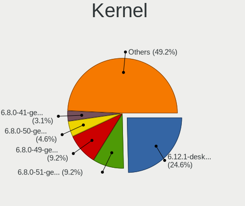

| Version                       | Desktops | Percent |
|-------------------------------|----------|---------|
| 5.16.7-desktop-1omv4003       | 5        | 10%     |
| 5.15.0-30-generic             | 5        | 10%     |
| 5.13.0-40-generic             | 5        | 10%     |
| 5.4.0-110-generic             | 2        | 4%      |
| 5.4.0-109-generic             | 2        | 4%      |
| 5.13.0-41-generic             | 2        | 4%      |
| 5.10.0-14-amd64               | 2        | 4%      |
| 5.10.0-10-amd64               | 2        | 4%      |
| 5.4.192-1-MANJARO             | 1        | 2%      |
| 5.18.0-arch1-1                | 1        | 2%      |
| 5.17.6-300.fc36.x86_64        | 1        | 2%      |
| 5.17.5-arch1-1                | 1        | 2%      |
| 5.17.5-76051705-generic       | 1        | 2%      |
| 5.17.5-300.fc36.x86_64        | 1        | 2%      |
| 5.16.4-1-default              | 1        | 2%      |
| 5.16.0-kali7-amd64            | 1        | 2%      |
| 5.15.41-1-MANJARO             | 1        | 2%      |
| 5.15.41-1-lts                 | 1        | 2%      |
| 5.15.37-1-lts                 | 1        | 2%      |
| 5.15.32-gentoo-r1-x86_64      | 1        | 2%      |
| 5.15.32-gentoo-r1-meguias-6.4 | 1        | 2%      |
| 5.15.32-gentoo-r1             | 1        | 2%      |
| 5.15.0-33-generic             | 1        | 2%      |
| 5.15.0-27-generic             | 1        | 2%      |
| 5.13.0-44-generic             | 1        | 2%      |
| 5.13.0-40-lowlatency          | 1        | 2%      |
| 5.13.0-30-generic             | 1        | 2%      |
| 5.13.0-27-generic             | 1        | 2%      |
| 5.11.0-40-generic             | 1        | 2%      |
| 5.10.14-desktop-1omv4002      | 1        | 2%      |
| 5.10.0-13-amd64               | 1        | 2%      |
| 4.19.0-18-amd64               | 1        | 2%      |
| 4.15.0-51-generic             | 1        | 2%      |

Kernel Family
-------------

Linux kernel without a distro release

| Version | Desktops | Percent |
|---------|----------|---------|
| 5.13.0  | 11       | 22%     |
| 5.15.0  | 7        | 14%     |
| 5.16.7  | 5        | 10%     |
| 5.10.0  | 5        | 10%     |
| 5.4.0   | 4        | 8%      |
| 5.17.5  | 3        | 6%      |
| 5.15.32 | 3        | 6%      |
| 5.15.41 | 2        | 4%      |
| 5.4.192 | 1        | 2%      |
| 5.18.0  | 1        | 2%      |
| 5.17.6  | 1        | 2%      |
| 5.16.4  | 1        | 2%      |
| 5.16.0  | 1        | 2%      |
| 5.15.37 | 1        | 2%      |
| 5.11.0  | 1        | 2%      |
| 5.10.14 | 1        | 2%      |
| 4.19.0  | 1        | 2%      |
| 4.15.0  | 1        | 2%      |

Kernel Major Ver.
-----------------

Linux kernel major version

| Version | Desktops | Percent |
|---------|----------|---------|
| 5.15    | 13       | 26%     |
| 5.13    | 11       | 22%     |
| 5.16    | 7        | 14%     |
| 5.10    | 6        | 12%     |
| 5.4     | 5        | 10%     |
| 5.17    | 4        | 8%      |
| 5.18    | 1        | 2%      |
| 5.11    | 1        | 2%      |
| 4.19    | 1        | 2%      |
| 4.15    | 1        | 2%      |

Arch
----

OS architecture (x86_64, i586, etc.)

| Name   | Desktops | Percent |
|--------|----------|---------|
| x86_64 | 50       | 100%    |

DE
--

Desktop Environment

| Name       | Desktops | Percent |
|------------|----------|---------|
| GNOME      | 20       | 40%     |
| KDE5       | 14       | 28%     |
| XFCE       | 6        | 12%     |
| X-Cinnamon | 5        | 10%     |
| Unknown    | 3        | 6%      |
| qtile      | 1        | 2%      |
| MATE       | 1        | 2%      |

Display Server
--------------

X11 or Wayland

| Name    | Desktops | Percent |
|---------|----------|---------|
| X11     | 36       | 72%     |
| Wayland | 10       | 20%     |
| Tty     | 2        | 4%      |
| Unknown | 2        | 4%      |

Display Manager
---------------

SDDM, LightDM, etc.

| Name    | Desktops | Percent |
|---------|----------|---------|
| Unknown | 20       | 40%     |
| GDM3    | 12       | 24%     |
| SDDM    | 11       | 22%     |
| LightDM | 4        | 8%      |
| GDM     | 3        | 6%      |

OS Lang
-------

Language

| Lang       | Desktops | Percent |
|------------|----------|---------|
| es_ES      | 32       | 64%     |
| en_US      | 12       | 24%     |
| ca_ES      | 2        | 4%      |
| es_ES.UTF8 | 1        | 2%      |
| en_GB      | 1        | 2%      |
| de_DE      | 1        | 2%      |
| Unknown    | 1        | 2%      |

Boot Mode
---------

EFI or BIOS

| Mode | Desktops | Percent |
|------|----------|---------|
| BIOS | 31       | 62%     |
| EFI  | 19       | 38%     |

Filesystem
----------

Type of filesystem

| Type    | Desktops | Percent |
|---------|----------|---------|
| Ext4    | 39       | 78%     |
| Overlay | 7        | 14%     |
| Btrfs   | 3        | 6%      |
| Xfs     | 1        | 2%      |

Part. scheme
------------

Scheme of partitioning

| Type    | Desktops | Percent |
|---------|----------|---------|
| Unknown | 30       | 60%     |
| GPT     | 14       | 28%     |
| MBR     | 6        | 12%     |

Dual Boot with Linux/BSD
------------------------

Hosting more than one Linux/BSD

| Dual boot | Desktops | Percent |
|-----------|----------|---------|
| No        | 40       | 80%     |
| Yes       | 10       | 20%     |

Dual Boot (Win)
---------------

Hosting Linux and Windows

| Dual boot | Desktops | Percent |
|-----------|----------|---------|
| No        | 33       | 66%     |
| Yes       | 17       | 34%     |

Board
-----

Vendor
------

Motherboard manufacturer

| Name                | Desktops | Percent |
|---------------------|----------|---------|
| ASUSTek Computer    | 19       | 38%     |
| MSI                 | 7        | 14%     |
| Gigabyte Technology | 6        | 12%     |
| Hewlett-Packard     | 5        | 10%     |
| ASRock              | 3        | 6%      |
| ECS                 | 2        | 4%      |
| Packard Bell        | 1        | 2%      |
| Medion              | 1        | 2%      |
| MACHINIST           | 1        | 2%      |
| Lenovo              | 1        | 2%      |
| Foxconn             | 1        | 2%      |
| Dell                | 1        | 2%      |
| BESSTAR Tech        | 1        | 2%      |
| Acer                | 1        | 2%      |

Model
-----

Motherboard model

| Name                                 | Desktops | Percent |
|--------------------------------------|----------|---------|
| Packard Bell IMEDIA S3720            | 1        | 2%      |
| MSI MS-7C92                          | 1        | 2%      |
| MSI MS-7C88                          | 1        | 2%      |
| MSI MS-7B84                          | 1        | 2%      |
| MSI MS-7B17                          | 1        | 2%      |
| MSI MS-7A40                          | 1        | 2%      |
| MSI MS-7A38                          | 1        | 2%      |
| MSI MS-7971                          | 1        | 2%      |
| Medion MD34189/C731                  | 1        | 2%      |
| MACHINIST X99-RS9 V2.0               | 1        | 2%      |
| Lenovo ThinkCentre M58p 6137E61      | 1        | 2%      |
| HP Z1 Entry Tower G5                 | 1        | 2%      |
| HP Pavilion Gaming Desktop TG01-1xxx | 1        | 2%      |
| HP Pavilion Desktop 595-p0xxx        | 1        | 2%      |
| HP OMEN by Obelisk Desktop 875-0xxx  | 1        | 2%      |
| HP EliteDesk 700 G1 SFF              | 1        | 2%      |
| Gigabyte Z390 AORUS PRO              | 1        | 2%      |
| Gigabyte Z270-HD3P                   | 1        | 2%      |
| Gigabyte H110M-S2H                   | 1        | 2%      |
| Gigabyte GA-K8NF-9                   | 1        | 2%      |
| Gigabyte G41MT-S2                    | 1        | 2%      |
| Gigabyte B250M-D3H                   | 1        | 2%      |
| Foxconn 2A8C                         | 1        | 2%      |
| ECS H81H3-I                          | 1        | 2%      |
| ECS EP175AA-ABE SR1797ES ES610       | 1        | 2%      |
| Dell Precision T5600                 | 1        | 2%      |
| BESSTAR Tech UM350                   | 1        | 2%      |
| ASUS Z8NR-D12                        | 1        | 2%      |
| ASUS TUF Z390-PRO GAMING             | 1        | 2%      |
| ASUS TUF Z390-PLUS GAMING            | 1        | 2%      |
| ASUS TUF Gaming B550M-PLUS           | 1        | 2%      |
| ASUS TUF Gaming B550-PLUS            | 1        | 2%      |
| ASUS SABERTOOTH 990FX                | 1        | 2%      |
| ASUS ROG STRIX B365-G GAMING         | 1        | 2%      |
| ASUS PRIME A320M-K                   | 1        | 2%      |
| ASUS P8H61-M LX                      | 1        | 2%      |
| ASUS P5K                             | 1        | 2%      |
| ASUS P5G41T-M LX                     | 1        | 2%      |
| ASUS M5A78L-M/USB3                   | 1        | 2%      |
| ASUS M4A785TD-V EVO                  | 1        | 2%      |
| ASUS Crosshair IV Formula            | 1        | 2%      |
| ASUS CROSSHAIR                       | 1        | 2%      |
| ASUS B150-PLUS                       | 1        | 2%      |
| ASUS All Series                      | 1        | 2%      |
| ASUS A8N32-SLI-Deluxe                | 1        | 2%      |
| ASUS 970 PRO GAMING/AURA             | 1        | 2%      |
| ASRock FM2A78M Pro4+                 | 1        | 2%      |
| ASRock B365M-HDV                     | 1        | 2%      |
| ASRock AM2NF6G-VSTA                  | 1        | 2%      |
| Acer Aspire M1935                    | 1        | 2%      |

Model Family
------------

Motherboard model prefix

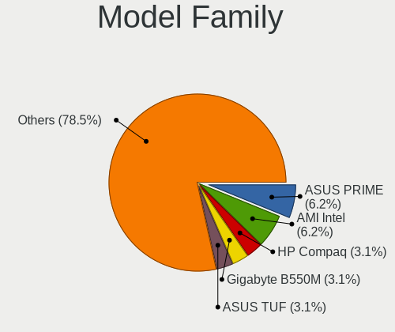

| Name                  | Desktops | Percent |
|-----------------------|----------|---------|
| ASUS TUF              | 4        | 8%      |
| HP Pavilion           | 2        | 4%      |
| ASUS Crosshair        | 2        | 4%      |
| Packard Bell IMEDIA   | 1        | 2%      |
| MSI MS-7C92           | 1        | 2%      |
| MSI MS-7C88           | 1        | 2%      |
| MSI MS-7B84           | 1        | 2%      |
| MSI MS-7B17           | 1        | 2%      |
| MSI MS-7A40           | 1        | 2%      |
| MSI MS-7A38           | 1        | 2%      |
| MSI MS-7971           | 1        | 2%      |
| Medion MD34189        | 1        | 2%      |
| MACHINIST X99-RS9     | 1        | 2%      |
| Lenovo ThinkCentre    | 1        | 2%      |
| HP Z1                 | 1        | 2%      |
| HP OMEN               | 1        | 2%      |
| HP EliteDesk          | 1        | 2%      |
| Gigabyte Z390         | 1        | 2%      |
| Gigabyte Z270-HD3P    | 1        | 2%      |
| Gigabyte H110M-S2H    | 1        | 2%      |
| Gigabyte GA-K8NF-9    | 1        | 2%      |
| Gigabyte G41MT-S2     | 1        | 2%      |
| Gigabyte B250M-D3H    | 1        | 2%      |
| Foxconn 2A8C          | 1        | 2%      |
| ECS H81H3-I           | 1        | 2%      |
| ECS EP175AA-ABE       | 1        | 2%      |
| Dell Precision        | 1        | 2%      |
| BESSTAR Tech UM350    | 1        | 2%      |
| ASUS Z8NR-D12         | 1        | 2%      |
| ASUS SABERTOOTH       | 1        | 2%      |
| ASUS ROG              | 1        | 2%      |
| ASUS PRIME            | 1        | 2%      |
| ASUS P8H61-M          | 1        | 2%      |
| ASUS P5K              | 1        | 2%      |
| ASUS P5G41T-M         | 1        | 2%      |
| ASUS M5A78L-M         | 1        | 2%      |
| ASUS M4A785TD-V       | 1        | 2%      |
| ASUS B150-PLUS        | 1        | 2%      |
| ASUS All              | 1        | 2%      |
| ASUS A8N32-SLI-Deluxe | 1        | 2%      |
| ASUS 970              | 1        | 2%      |
| ASRock FM2A78M        | 1        | 2%      |
| ASRock B365M-HDV      | 1        | 2%      |
| ASRock AM2NF6G-VSTA   | 1        | 2%      |
| Acer Aspire           | 1        | 2%      |

MFG Year
--------

Motherboard manufacture year

| Year | Desktops | Percent |
|------|----------|---------|
| 2019 | 7        | 14%     |
| 2018 | 6        | 12%     |
| 2020 | 5        | 10%     |
| 2016 | 4        | 8%      |
| 2017 | 3        | 6%      |
| 2012 | 3        | 6%      |
| 2011 | 3        | 6%      |
| 2010 | 3        | 6%      |
| 2009 | 3        | 6%      |
| 2014 | 2        | 4%      |
| 2007 | 2        | 4%      |
| 2006 | 2        | 4%      |
| 2005 | 2        | 4%      |
| 2022 | 1        | 2%      |
| 2021 | 1        | 2%      |
| 2015 | 1        | 2%      |
| 2013 | 1        | 2%      |
| 2008 | 1        | 2%      |

Form Factor
-----------

Physical design of the computer

| Name    | Desktops | Percent |
|---------|----------|---------|
| Desktop | 50       | 100%    |

Secure Boot
-----------

Enabled or disabled

| State    | Desktops | Percent |
|----------|----------|---------|
| Disabled | 50       | 100%    |

Coreboot
--------

Have coreboot on board

| Used | Desktops | Percent |
|------|----------|---------|
| No   | 50       | 100%    |

RAM Size
--------

Total RAM memory

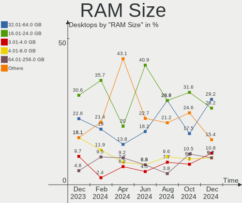

| Size in GB  | Desktops | Percent |
|-------------|----------|---------|
| 16.01-24.0  | 17       | 34%     |
| 8.01-16.0   | 10       | 20%     |
| 32.01-64.0  | 8        | 16%     |
| 4.01-8.0    | 4        | 8%      |
| 3.01-4.0    | 4        | 8%      |
| 1.01-2.0    | 3        | 6%      |
| 2.01-3.0    | 2        | 4%      |
| 24.01-32.0  | 1        | 2%      |
| 64.01-256.0 | 1        | 2%      |

RAM Used
--------

Used RAM memory

| Used GB   | Desktops | Percent |
|-----------|----------|---------|
| 1.01-2.0  | 26       | 52%     |
| 2.01-3.0  | 10       | 20%     |
| 4.01-8.0  | 6        | 12%     |
| 3.01-4.0  | 4        | 8%      |
| 0.51-1.0  | 2        | 4%      |
| 8.01-16.0 | 1        | 2%      |
| 0.01-0.5  | 1        | 2%      |

Total Drives
------------

Number of drives on board

| Drives | Desktops | Percent |
|--------|----------|---------|
| 2      | 17       | 34%     |
| 1      | 13       | 26%     |
| 3      | 11       | 22%     |
| 4      | 4        | 8%      |
| 5      | 2        | 4%      |
| 0      | 2        | 4%      |
| 6      | 1        | 2%      |

Has CD-ROM
----------

Has CD-ROM on board

| Presented | Desktops | Percent |
|-----------|----------|---------|
| No        | 31       | 62%     |
| Yes       | 19       | 38%     |

Has Ethernet
------------

Has Ethernet on board

| Presented | Desktops | Percent |
|-----------|----------|---------|
| Yes       | 50       | 100%    |

Has WiFi
--------

Has WiFi module

| Presented | Desktops | Percent |
|-----------|----------|---------|
| No        | 27       | 54%     |
| Yes       | 23       | 46%     |

Has Bluetooth
-------------

Has Bluetooth module

| Presented | Desktops | Percent |
|-----------|----------|---------|
| No        | 30       | 60%     |
| Yes       | 20       | 40%     |

Location
--------

Country
-------

Geographic location (country)

| Country | Desktops | Percent |
|---------|----------|---------|
| Spain   | 50       | 100%    |

City
----

Geographic location (city)

| City                        | Desktops | Percent |
|-----------------------------|----------|---------|
| Madrid                      | 6        | 12%     |
| Barcelona                   | 4        | 8%      |
| Seville                     | 3        | 6%      |
| Zaragoza                    | 2        | 4%      |
| Almería                    | 2        | 4%      |
| Yepes                       | 1        | 2%      |
| Vinaros                     | 1        | 2%      |
| Villamanta                  | 1        | 2%      |
| Valdemoro                   | 1        | 2%      |
| Toledo                      | 1        | 2%      |
| Telde                       | 1        | 2%      |
| Talavera de la Reina        | 1        | 2%      |
| Sarrion                     | 1        | 2%      |
| Santa Coloma de Gramenet    | 1        | 2%      |
| Sant Pere de Vilamajor      | 1        | 2%      |
| Sant Feliu de Llobregat     | 1        | 2%      |
| San Cristóbal de La Laguna | 1        | 2%      |
| Sabadell                    | 1        | 2%      |
| Puebla de Alcocer           | 1        | 2%      |
| Porzuna                     | 1        | 2%      |
| Paredes de Nava             | 1        | 2%      |
| Novelda                     | 1        | 2%      |
| Monreal                     | 1        | 2%      |
| Marbella                    | 1        | 2%      |
| León                       | 1        | 2%      |
| L'Alcudia de Crespins       | 1        | 2%      |
| Igualada                    | 1        | 2%      |
| Huelva                      | 1        | 2%      |
| Corralejo                   | 1        | 2%      |
| Castilleja de la Cuesta     | 1        | 2%      |
| Castelló de la Plana       | 1        | 2%      |
| Castell de Ferro            | 1        | 2%      |
| Bilbao                      | 1        | 2%      |
| Bardallur                   | 1        | 2%      |
| Badalona                    | 1        | 2%      |
| Arrecife                    | 1        | 2%      |
| Alcobendas                  | 1        | 2%      |
| Águilas                    | 1        | 2%      |

Drives
------

Drive Vendor
------------

Hard drive vendors

| Vendor              | Desktops | Drives | Percent |
|---------------------|----------|--------|---------|
| Seagate             | 19       | 23     | 19.79%  |
| Kingston            | 18       | 19     | 18.75%  |
| WDC                 | 14       | 18     | 14.58%  |
| Toshiba             | 13       | 17     | 13.54%  |
| Samsung Electronics | 10       | 13     | 10.42%  |
| Crucial             | 5        | 6      | 5.21%   |
| SK Hynix            | 2        | 2      | 2.08%   |
| SanDisk             | 2        | 2      | 2.08%   |
| Hitachi             | 2        | 2      | 2.08%   |
| PNY                 | 1        | 1      | 1.04%   |
| Phison              | 1        | 1      | 1.04%   |
| OCZ                 | 1        | 1      | 1.04%   |
| Micron Technology   | 1        | 1      | 1.04%   |
| Lexar               | 1        | 1      | 1.04%   |
| KIOXIA-EXCERIA      | 1        | 1      | 1.04%   |
| KingFast            | 1        | 1      | 1.04%   |
| JetFlash            | 1        | 1      | 1.04%   |
| Intel               | 1        | 1      | 1.04%   |
| Fujitsu             | 1        | 1      | 1.04%   |
| BAITITON            | 1        | 1      | 1.04%   |

Drive Model
-----------

Hard drive models

| Model                                   | Desktops | Percent |
|-----------------------------------------|----------|---------|
| Kingston SA400S37240G 240GB SSD         | 5        | 4.59%   |
| Toshiba DT01ACA100 1TB                  | 4        | 3.67%   |
| Kingston SV300S37A120G 120GB SSD        | 3        | 2.75%   |
| Kingston SUV400S37240G 240GB SSD        | 3        | 2.75%   |
| Kingston SA400S37480G 480GB SSD         | 3        | 2.75%   |
| WDC WDS250G2B0A-00SM50 250GB SSD        | 2        | 1.83%   |
| WDC WD10EZEX-60WN4A0 1TB                | 2        | 1.83%   |
| Seagate ST3500418AS 500GB               | 2        | 1.83%   |
| Seagate ST3200822AS 200GB               | 2        | 1.83%   |
| Seagate ST31000528AS 1TB                | 2        | 1.83%   |
| Seagate ST1000DM010-2EP102 1TB          | 2        | 1.83%   |
| Samsung NVMe SSD Drive 1TB              | 2        | 1.83%   |
| Kingston SA400S37120G 120GB SSD         | 2        | 1.83%   |
| Crucial CT500P2SSD8 500GB               | 2        | 1.83%   |
| WDC WDS100T2B0A-00SM50 1TB SSD          | 1        | 0.92%   |
| WDC WD5000LPLX-66ZNTT0 500GB            | 1        | 0.92%   |
| WDC WD5000AZLX-08K2TA0 500GB            | 1        | 0.92%   |
| WDC WD5000AADS-00S9B0 500GB             | 1        | 0.92%   |
| WDC WD50 00LPVX-80V0TT0 500GB           | 1        | 0.92%   |
| WDC WD40EFRX-68WT0N0 4TB                | 1        | 0.92%   |
| WDC WD40EFAX-68JH4N0 4TB                | 1        | 0.92%   |
| WDC WD3200AAKS-75VYA0 320GB             | 1        | 0.92%   |
| WDC WD10EZEX-08M2NA0 1TB                | 1        | 0.92%   |
| WDC WD10EZEX-00RKKA0 1TB                | 1        | 0.92%   |
| WDC WD1003FZEX-00MK2A0 1TB              | 1        | 0.92%   |
| WDC WD1002FAEX-00Z3A0 1TB               | 1        | 0.92%   |
| WDC WD1002FAEX-00Y9A0 1TB               | 1        | 0.92%   |
| Toshiba TR150 240GB SSD                 | 1        | 0.92%   |
| Toshiba THNSNW128GMCP 128GB SSD         | 1        | 0.92%   |
| Toshiba NVMe SSD Drive 1TB              | 1        | 0.92%   |
| Toshiba MQ01ABD075 752GB                | 1        | 0.92%   |
| Toshiba MK3275GSX 320GB                 | 1        | 0.92%   |
| Toshiba MK3255GSX 320GB                 | 1        | 0.92%   |
| Toshiba KBG30ZMS128G 128GB NVMe SSD     | 1        | 0.92%   |
| Toshiba HDWR160 6TB                     | 1        | 0.92%   |
| Toshiba HDWE150 5TB                     | 1        | 0.92%   |
| Toshiba HDWD110 1TB                     | 1        | 0.92%   |
| Toshiba DT01ACA300 3TB                  | 1        | 0.92%   |
| Toshiba DT01ACA200 2TB                  | 1        | 0.92%   |
| SK Hynix NVMe SSD Drive 128GB           | 1        | 0.92%   |
| SK Hynix BC511 HFM256GDJTNI-82A0A 256GB | 1        | 0.92%   |
| Seagate ST500DM002-1BD142 500GB         | 1        | 0.92%   |
| Seagate ST3808110AS 80GB                | 1        | 0.92%   |
| Seagate ST3802110A 80GB                 | 1        | 0.92%   |
| Seagate ST3500830AS 500GB               | 1        | 0.92%   |
| Seagate ST3400620AS 400GB               | 1        | 0.92%   |
| Seagate ST3250824AS 250GB               | 1        | 0.92%   |
| Seagate ST3250820A 250GB                | 1        | 0.92%   |
| Seagate ST2000DM008-2FR102 2TB          | 1        | 0.92%   |
| Seagate ST2000DM001-1ER164 2TB          | 1        | 0.92%   |
| Seagate ST1000DX001-1CM162 1TB          | 1        | 0.92%   |
| Seagate ST1000DM014-2FR10D 1TB          | 1        | 0.92%   |
| Seagate ST1000DM003-1SB10C 1TB          | 1        | 0.92%   |
| Seagate ST1000DM003-1ER162 1TB          | 1        | 0.92%   |
| Seagate M3 Portable 4TB                 | 1        | 0.92%   |
| SanDisk SDSSDHII240G 240GB              | 1        | 0.92%   |
| Sandisk NVMe SSD Drive 1TB              | 1        | 0.92%   |
| Samsung SSD 980 PRO 250GB               | 1        | 0.92%   |
| Samsung SSD 970 EVO Plus 500GB          | 1        | 0.92%   |
| Samsung SSD 970 EVO 500GB               | 1        | 0.92%   |

HDD Vendor
----------

Hard disk drive vendors

| Vendor              | Desktops | Drives | Percent |
|---------------------|----------|--------|---------|
| Seagate             | 18       | 22     | 39.13%  |
| WDC                 | 13       | 15     | 28.26%  |
| Toshiba             | 10       | 13     | 21.74%  |
| Samsung Electronics | 2        | 2      | 4.35%   |
| Hitachi             | 2        | 2      | 4.35%   |
| Fujitsu             | 1        | 1      | 2.17%   |

SSD Vendor
----------

Solid state drive vendors

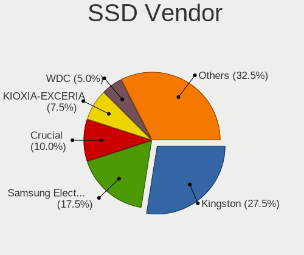

| Vendor              | Desktops | Drives | Percent |
|---------------------|----------|--------|---------|
| Kingston            | 17       | 18     | 48.57%  |
| Samsung Electronics | 4        | 4      | 11.43%  |
| WDC                 | 3        | 3      | 8.57%   |
| Crucial             | 3        | 4      | 8.57%   |
| Toshiba             | 2        | 2      | 5.71%   |
| SanDisk             | 1        | 1      | 2.86%   |
| PNY                 | 1        | 1      | 2.86%   |
| OCZ                 | 1        | 1      | 2.86%   |
| Lexar               | 1        | 1      | 2.86%   |
| KIOXIA-EXCERIA      | 1        | 1      | 2.86%   |
| BAITITON            | 1        | 1      | 2.86%   |

Drive Kind
----------

HDD or SSD

| Kind    | Desktops | Drives | Percent |
|---------|----------|--------|---------|
| HDD     | 39       | 55     | 46.43%  |
| SSD     | 27       | 37     | 32.14%  |
| NVMe    | 15       | 18     | 17.86%  |
| Unknown | 3        | 3      | 3.57%   |

Drive Connector
---------------

SATA, SAS, NVMe, etc.

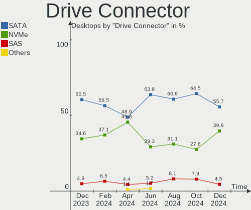

| Type | Desktops | Drives | Percent |
|------|----------|--------|---------|
| SATA | 45       | 92     | 71.43%  |
| NVMe | 15       | 18     | 23.81%  |
| SAS  | 3        | 3      | 4.76%   |

Drive Size
----------

Size of hard drive

| Size in TB | Desktops | Drives | Percent |
|------------|----------|--------|---------|
| 0.01-0.5   | 33       | 54     | 52.38%  |
| 0.51-1.0   | 21       | 27     | 33.33%  |
| 1.01-2.0   | 5        | 6      | 7.94%   |
| 3.01-4.0   | 2        | 2      | 3.17%   |
| 2.01-3.0   | 1        | 1      | 1.59%   |
| 4.01-10.0  | 1        | 2      | 1.59%   |

Space Total
-----------

Amount of disk space available on the file system

| Size in GB     | Desktops | Percent |
|----------------|----------|---------|
| 101-250        | 10       | 20%     |
| 251-500        | 8        | 16%     |
| 1001-2000      | 7        | 14%     |
| 501-1000       | 7        | 14%     |
| 1-20           | 5        | 10%     |
| More than 3000 | 4        | 8%      |
| 51-100         | 3        | 6%      |
| 21-50          | 2        | 4%      |
| 2001-3000      | 2        | 4%      |
| Unknown        | 2        | 4%      |

Space Used
----------

Amount of used disk space

| Used GB        | Desktops | Percent |
|----------------|----------|---------|
| 1-20           | 19       | 38%     |
| 21-50          | 10       | 20%     |
| 51-100         | 7        | 14%     |
| 251-500        | 3        | 6%      |
| More than 3000 | 2        | 4%      |
| 101-250        | 2        | 4%      |
| 1001-2000      | 2        | 4%      |
| 501-1000       | 2        | 4%      |
| Unknown        | 2        | 4%      |
| 2001-3000      | 1        | 2%      |

Malfunc. Drives
---------------

Drive models with a malfunction

| Model                     | Desktops | Drives | Percent |
|---------------------------|----------|--------|---------|
| Seagate ST3500830AS 500GB | 1        | 1      | 33.33%  |
| Seagate ST3500418AS 500GB | 1        | 1      | 33.33%  |
| Seagate ST31000528AS 1TB  | 1        | 1      | 33.33%  |

Malfunc. Drive Vendor
---------------------

Vendors of faulty drives

| Vendor  | Desktops | Drives | Percent |
|---------|----------|--------|---------|
| Seagate | 3        | 3      | 100%    |

Malfunc. HDD Vendor
-------------------

Vendors of faulty HDD drives

| Vendor  | Desktops | Drives | Percent |
|---------|----------|--------|---------|
| Seagate | 3        | 3      | 100%    |

Malfunc. Drive Kind
-------------------

Kinds of faulty drives

| Kind | Desktops | Drives | Percent |
|------|----------|--------|---------|
| HDD  | 3        | 3      | 100%    |

Failed Drives
-------------

Failed drive models

Zero info for selected period =(

Failed Drive Vendor
-------------------

Failed drive vendors

Zero info for selected period =(

Drive Status
------------

Number of failed and malfunc. drives

| Status   | Desktops | Drives | Percent |
|----------|----------|--------|---------|
| Detected | 32       | 70     | 60.38%  |
| Works    | 18       | 40     | 33.96%  |
| Malfunc  | 3        | 3      | 5.66%   |

Storage controller
------------------

Storage Vendor
--------------

Storage controller vendors

| Vendor                       | Desktops | Percent |
|------------------------------|----------|---------|
| Intel                        | 29       | 40.85%  |
| AMD                          | 16       | 22.54%  |
| Samsung Electronics          | 5        | 7.04%   |
| Nvidia                       | 5        | 7.04%   |
| SK Hynix                     | 2        | 2.82%   |
| Silicon Image                | 2        | 2.82%   |
| Micron/Crucial Technology    | 2        | 2.82%   |
| JMicron Technology           | 2        | 2.82%   |
| ASMedia Technology           | 2        | 2.82%   |
| Toshiba America Info Systems | 1        | 1.41%   |
| Sandisk                      | 1        | 1.41%   |
| Phison Electronics           | 1        | 1.41%   |
| Micron Technology            | 1        | 1.41%   |
| KIOXIA                       | 1        | 1.41%   |
| Kingston Technology Company  | 1        | 1.41%   |

Storage Model
-------------

Storage controller models

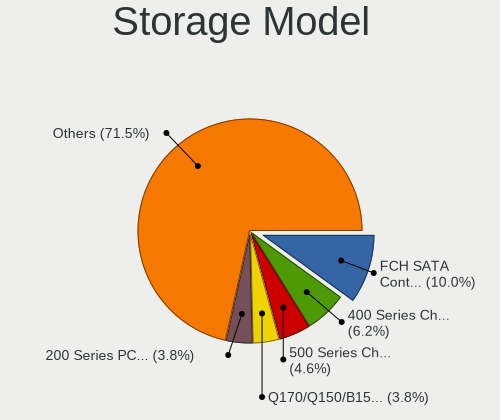

| Model                                                                                   | Desktops | Percent |
|-----------------------------------------------------------------------------------------|----------|---------|
| AMD FCH SATA Controller [AHCI mode]                                                     | 6        | 6.45%   |
| Samsung NVMe SSD Controller SM981/PM981/PM983                                           | 4        | 4.3%    |
| Intel SATA Controller [RAID mode]                                                       | 4        | 4.3%    |
| Intel Cannon Lake PCH SATA AHCI Controller                                              | 4        | 4.3%    |
| Intel 8 Series/C220 Series Chipset Family 6-port SATA Controller 1 [AHCI mode]          | 4        | 4.3%    |
| Intel 200 Series PCH SATA controller [AHCI mode]                                        | 4        | 4.3%    |
| Intel Q170/Q150/B150/H170/H110/Z170/CM236 Chipset SATA Controller [AHCI Mode]           | 3        | 3.23%   |
| Intel NM10/ICH7 Family SATA Controller [IDE mode]                                       | 3        | 3.23%   |
| AMD SB7x0/SB8x0/SB9x0 SATA Controller [IDE mode]                                        | 3        | 3.23%   |
| AMD SB7x0/SB8x0/SB9x0 IDE Controller                                                    | 3        | 3.23%   |
| AMD 500 Series Chipset SATA Controller                                                  | 3        | 3.23%   |
| AMD 400 Series Chipset SATA Controller                                                  | 3        | 3.23%   |
| Silicon Image SiI 3132 Serial ATA Raid II Controller                                    | 2        | 2.15%   |
| Nvidia CK804 Serial ATA Controller                                                      | 2        | 2.15%   |
| Nvidia CK804 IDE                                                                        | 2        | 2.15%   |
| Micron/Crucial P2 NVMe PCIe SSD                                                         | 2        | 2.15%   |
| JMicron JMB363 SATA/IDE Controller                                                      | 2        | 2.15%   |
| Intel 82801G (ICH7 Family) IDE Controller                                               | 2        | 2.15%   |
| ASMedia ASM1062 Serial ATA Controller                                                   | 2        | 2.15%   |
| AMD SB7x0/SB8x0/SB9x0 SATA Controller [AHCI mode]                                       | 2        | 2.15%   |
| Toshiba America Info Systems BG3 NVMe SSD Controller                                    | 1        | 1.08%   |
| SK Hynix BC511                                                                          | 1        | 1.08%   |
| SK Hynix BC501 NVMe Solid State Drive                                                   | 1        | 1.08%   |
| Sandisk WD Blue SN570 NVMe SSD                                                          | 1        | 1.08%   |
| Samsung NVMe SSD Controller PM9A1/PM9A3/980PRO                                          | 1        | 1.08%   |
| Phison Electronics Non-Volatile memory controller                                       | 1        | 1.08%   |
| Nvidia MCP73 IDE Controller                                                             | 1        | 1.08%   |
| Nvidia MCP61 SATA Controller                                                            | 1        | 1.08%   |
| Nvidia MCP61 IDE                                                                        | 1        | 1.08%   |
| Nvidia MCP55 SATA Controller                                                            | 1        | 1.08%   |
| Nvidia MCP55 IDE                                                                        | 1        | 1.08%   |
| Nvidia GeForce 7100/nForce 630i SATA                                                    | 1        | 1.08%   |
| Micron Non-Volatile memory controller                                                   | 1        | 1.08%   |
| KIOXIA NVMe SSD                                                                         | 1        | 1.08%   |
| Kingston Company Company Non-Volatile memory controller                                 | 1        | 1.08%   |
| Intel Non-Volatile memory controller                                                    | 1        | 1.08%   |
| Intel C608 chipset Dual 4-Port SATA/SAS Storage Control Unit                            | 1        | 1.08%   |
| Intel C600/X79 series chipset 6-Port SATA AHCI Controller                               | 1        | 1.08%   |
| Intel 82801JI (ICH10 Family) SATA AHCI Controller                                       | 1        | 1.08%   |
| Intel 82801JD/DO (ICH10 Family) SATA AHCI Controller                                    | 1        | 1.08%   |
| Intel 82801IB (ICH9) 2 port SATA Controller [IDE mode]                                  | 1        | 1.08%   |
| Intel 82801I (ICH9 Family) 2 port SATA Controller [IDE mode]                            | 1        | 1.08%   |
| Intel 7 Series/C210 Series Chipset Family 6-port SATA Controller [AHCI mode]            | 1        | 1.08%   |
| Intel 6 Series/C200 Series Chipset Family Desktop SATA Controller (IDE mode, ports 4-5) | 1        | 1.08%   |
| Intel 6 Series/C200 Series Chipset Family Desktop SATA Controller (IDE mode, ports 0-3) | 1        | 1.08%   |
| Intel 400 Series Chipset Family SATA AHCI Controller                                    | 1        | 1.08%   |
| Intel 4 Series Chipset PT IDER Controller                                               | 1        | 1.08%   |
| AMD IXP SB4x0 Serial ATA Controller                                                     | 1        | 1.08%   |
| AMD IXP SB4x0 IDE Controller                                                            | 1        | 1.08%   |
| AMD IXP SB400 Serial ATA Controller                                                     | 1        | 1.08%   |
| AMD FCH SATA Controller D                                                               | 1        | 1.08%   |
| AMD FCH IDE Controller                                                                  | 1        | 1.08%   |
| AMD 300 Series Chipset SATA Controller                                                  | 1        | 1.08%   |

Storage Kind
------------

Kind of storage controller (IDE, SATA, NVMe, SAS, ...)

| Kind | Desktops | Percent |
|------|----------|---------|
| SATA | 36       | 48.65%  |
| IDE  | 16       | 21.62%  |
| NVMe | 15       | 20.27%  |
| RAID | 6        | 8.11%   |
| SAS  | 1        | 1.35%   |

Processor
---------

CPU Vendor
----------

Processor vendors

| Vendor | Desktops | Percent |
|--------|----------|---------|
| Intel  | 31       | 62%     |
| AMD    | 19       | 38%     |

CPU Model
---------

Processor models

| Model                                         | Desktops | Percent |
|-----------------------------------------------|----------|---------|
| Intel Core i9-9900KF CPU @ 3.60GHz            | 2        | 4%      |
| Intel Core i9-9900K CPU @ 3.60GHz             | 2        | 4%      |
| Intel Core i7-8700 CPU @ 3.20GHz              | 2        | 4%      |
| Intel Core 2 Duo CPU E8400 @ 3.00GHz          | 2        | 4%      |
| AMD Ryzen 5 3600 6-Core Processor             | 2        | 4%      |
| AMD FX-6300 Six-Core Processor                | 2        | 4%      |
| Intel Xeon CPU E5520 @ 2.27GHz                | 1        | 2%      |
| Intel Xeon CPU E5-2689 0 @ 2.60GHz            | 1        | 2%      |
| Intel Xeon CPU E5-2666 v3 @ 2.90GHz           | 1        | 2%      |
| Intel Pentium D CPU 3.40GHz                   | 1        | 2%      |
| Intel Pentium CPU G4400 @ 3.30GHz             | 1        | 2%      |
| Intel Pentium CPU G3450 @ 3.40GHz             | 1        | 2%      |
| Intel Core i7-9700K CPU @ 3.60GHz             | 1        | 2%      |
| Intel Core i7-7700 CPU @ 3.60GHz              | 1        | 2%      |
| Intel Core i7-6700K CPU @ 4.00GHz             | 1        | 2%      |
| Intel Core i7-4790 CPU @ 3.60GHz              | 1        | 2%      |
| Intel Core i7-10700F CPU @ 2.90GHz            | 1        | 2%      |
| Intel Core i5-9600K CPU @ 3.70GHz             | 1        | 2%      |
| Intel Core i5-6600 CPU @ 3.30GHz              | 1        | 2%      |
| Intel Core i5-6500 CPU @ 3.20GHz              | 1        | 2%      |
| Intel Core i5-4590 CPU @ 3.30GHz              | 1        | 2%      |
| Intel Core i5-2320 CPU @ 3.00GHz              | 1        | 2%      |
| Intel Core i5-10400F CPU @ 2.90GHz            | 1        | 2%      |
| Intel Core i3-9100 CPU @ 3.60GHz              | 1        | 2%      |
| Intel Core i3-2130 CPU @ 3.40GHz              | 1        | 2%      |
| Intel Core 2 Quad CPU Q6600 @ 2.40GHz         | 1        | 2%      |
| Intel Core 2 Extreme CPU X9650 @ 3.00GHz      | 1        | 2%      |
| Intel Core 2 Duo CPU E8500 @ 3.16GHz          | 1        | 2%      |
| Intel Celeron CPU E3200 @ 2.40GHz             | 1        | 2%      |
| AMD Sempron Processor 3000+                   | 1        | 2%      |
| AMD Ryzen 9 3900X 12-Core Processor           | 1        | 2%      |
| AMD Ryzen 7 3700X 8-Core Processor            | 1        | 2%      |
| AMD Ryzen 5 5600X 6-Core Processor            | 1        | 2%      |
| AMD Ryzen 5 3550H with Radeon Vega Mobile Gfx | 1        | 2%      |
| AMD Ryzen 5 2600X Six-Core Processor          | 1        | 2%      |
| AMD Ryzen 5 2400G with Radeon Vega Graphics   | 1        | 2%      |
| AMD Ryzen 3 2200G with Radeon Vega Graphics   | 1        | 2%      |
| AMD Phenom II X6 1090T Processor              | 1        | 2%      |
| AMD Phenom II X6 1055T Processor              | 1        | 2%      |
| AMD FX-8120 Eight-Core Processor              | 1        | 2%      |
| AMD Athlon 64 X2 Dual Core Processor 5600+    | 1        | 2%      |
| AMD Athlon 64 Processor 3500+                 | 1        | 2%      |
| AMD Athlon 64 FX-60 Dual Core Processor       | 1        | 2%      |
| AMD A10-7700K APU with Radeon R7 Graphics     | 1        | 2%      |

CPU Model Family
----------------

Processor model prefix

| Model                | Desktops | Percent |
|----------------------|----------|---------|
| Intel Core i7        | 7        | 14%     |
| Intel Core i5        | 6        | 12%     |
| AMD Ryzen 5          | 6        | 12%     |
| Intel Core i9        | 4        | 8%      |
| Intel Xeon           | 3        | 6%      |
| Intel Core 2 Duo     | 3        | 6%      |
| AMD FX               | 3        | 6%      |
| Intel Pentium        | 2        | 4%      |
| Intel Core i3        | 2        | 4%      |
| AMD Phenom II X6     | 2        | 4%      |
| AMD Athlon 64        | 2        | 4%      |
| Intel Pentium D      | 1        | 2%      |
| Intel Core 2 Quad    | 1        | 2%      |
| Intel Core 2 Extreme | 1        | 2%      |
| Intel Celeron        | 1        | 2%      |
| AMD Sempron          | 1        | 2%      |
| AMD Ryzen 9          | 1        | 2%      |
| AMD Ryzen 7          | 1        | 2%      |
| AMD Ryzen 3          | 1        | 2%      |
| AMD Athlon 64 X2     | 1        | 2%      |
| AMD A10              | 1        | 2%      |

CPU Cores
---------

Number of processor cores

| Number | Desktops | Percent |
|--------|----------|---------|
| 4      | 14       | 28%     |
| 2      | 11       | 22%     |
| 6      | 10       | 20%     |
| 8      | 8        | 16%     |
| 3      | 2        | 4%      |
| 1      | 2        | 4%      |
| 16     | 1        | 2%      |
| 12     | 1        | 2%      |
| 10     | 1        | 2%      |

CPU Sockets
-----------

Number of sockets

| Number | Desktops | Percent |
|--------|----------|---------|
| 1      | 48       | 96%     |
| 2      | 2        | 4%      |

CPU Threads
-----------

Threads per core (Hyper-Threading)

| Number | Desktops | Percent |
|--------|----------|---------|
| 2      | 27       | 54%     |
| 1      | 23       | 46%     |

CPU Op-Modes
------------

CPU Operation Modes (32-bit, 64-bit)

| Op mode        | Desktops | Percent |
|----------------|----------|---------|
| 32-bit, 64-bit | 50       | 100%    |

CPU Microcode
-------------

Microcode number

| Number     | Desktops | Percent |
|------------|----------|---------|
| Unknown    | 17       | 34%     |
| 0x506e3    | 4        | 8%      |
| 0x1067a    | 4        | 8%      |
| 0x906ed    | 3        | 6%      |
| 0x306c3    | 3        | 6%      |
| 0x906ec    | 2        | 4%      |
| 0x206a7    | 2        | 4%      |
| 0x08701021 | 2        | 4%      |
| 0xf64      | 1        | 2%      |
| 0xa0653    | 1        | 2%      |
| 0x906eb    | 1        | 2%      |
| 0x906ea    | 1        | 2%      |
| 0x6fb      | 1        | 2%      |
| 0x08108109 | 1        | 2%      |
| 0x08101016 | 1        | 2%      |
| 0x0810100b | 1        | 2%      |
| 0x0800820d | 1        | 2%      |
| 0x06003104 | 1        | 2%      |
| 0x06000852 | 1        | 2%      |
| 0x06000822 | 1        | 2%      |
| 0x0600063e | 1        | 2%      |

CPU Microarch
-------------

Microarchitecture

| Name        | Desktops | Percent |
|-------------|----------|---------|
| KabyLake    | 10       | 20%     |
| Penryn      | 5        | 10%     |
| Zen 2       | 4        | 8%      |
| Skylake     | 4        | 8%      |
| K8 Hammer   | 4        | 8%      |
| Haswell     | 4        | 8%      |
| SandyBridge | 3        | 6%      |
| Zen+        | 2        | 4%      |
| Zen         | 2        | 4%      |
| Piledriver  | 2        | 4%      |
| K10         | 2        | 4%      |
| CometLake   | 2        | 4%      |
| Zen 3       | 1        | 2%      |
| Steamroller | 1        | 2%      |
| NetBurst    | 1        | 2%      |
| Nehalem     | 1        | 2%      |
| Core        | 1        | 2%      |
| Bulldozer   | 1        | 2%      |

Graphics
--------

GPU Vendor
----------

Vendors of graphics cards

| Vendor            | Desktops | Percent |
|-------------------|----------|---------|
| Nvidia            | 24       | 44.44%  |
| AMD               | 19       | 35.19%  |
| Intel             | 10       | 18.52%  |
| ASPEED Technology | 1        | 1.85%   |

GPU Model
---------

Graphics card models

| Model                                                                       | Desktops | Percent |
|-----------------------------------------------------------------------------|----------|---------|
| Intel CoffeeLake-S GT2 [UHD Graphics 630]                                   | 4        | 7.27%   |
| Intel Xeon E3-1200 v3/4th Gen Core Processor Integrated Graphics Controller | 3        | 5.45%   |
| Nvidia TU102 [GeForce RTX 2080 Ti Rev. A]                                   | 2        | 3.64%   |
| Nvidia GT218 [GeForce 210]                                                  | 2        | 3.64%   |
| Nvidia GP107 [GeForce GTX 1050 Ti]                                          | 2        | 3.64%   |
| AMD Raven Ridge [Radeon Vega Series / Radeon Vega Mobile Series]            | 2        | 3.64%   |
| AMD Navi 23 [Radeon RX 6600/6600 XT/6600M]                                  | 2        | 3.64%   |
| AMD Ellesmere [Radeon RX 470/480/570/570X/580/580X/590]                     | 2        | 3.64%   |
| AMD Cedar [Radeon HD 5000/6000/7350/8350 Series]                            | 2        | 3.64%   |
| Nvidia TU117 [GeForce GTX 1650]                                             | 1        | 1.82%   |
| Nvidia TU116 [GeForce GTX 1650 SUPER]                                       | 1        | 1.82%   |
| Nvidia TU106 [GeForce RTX 2060 Rev. A]                                      | 1        | 1.82%   |
| Nvidia GT215 [GeForce GT 320]                                               | 1        | 1.82%   |
| Nvidia GP106 [GeForce GTX 1060 6GB]                                         | 1        | 1.82%   |
| Nvidia GP104 [GeForce GTX 1080]                                             | 1        | 1.82%   |
| Nvidia GM206 [GeForce GTX 960]                                              | 1        | 1.82%   |
| Nvidia GM204 [GeForce GTX 970]                                              | 1        | 1.82%   |
| Nvidia GM107 [GeForce GTX 750 Ti]                                           | 1        | 1.82%   |
| Nvidia GK208B [GeForce GT 730]                                              | 1        | 1.82%   |
| Nvidia GK104 [GeForce GTX 770]                                              | 1        | 1.82%   |
| Nvidia GF108 [GeForce GT 730]                                               | 1        | 1.82%   |
| Nvidia GF108 [GeForce GT 440]                                               | 1        | 1.82%   |
| Nvidia GF108 [GeForce GT 430]                                               | 1        | 1.82%   |
| Nvidia GA104 [GeForce RTX 3060 Ti Lite Hash Rate]                           | 1        | 1.82%   |
| Nvidia G94 [GeForce 9600 GT]                                                | 1        | 1.82%   |
| Nvidia G70 [GeForce 7800 GTX]                                               | 1        | 1.82%   |
| Nvidia C73 [GeForce 7100 / nForce 630i]                                     | 1        | 1.82%   |
| Intel HD Graphics 530                                                       | 1        | 1.82%   |
| Intel 4 Series Chipset Integrated Graphics Controller                       | 1        | 1.82%   |
| Intel 2nd Generation Core Processor Family Integrated Graphics Controller   | 1        | 1.82%   |
| ASPEED Technology ASPEED Graphics Family                                    | 1        | 1.82%   |
| AMD Tobago PRO [Radeon R7 360 / R9 360 OEM]                                 | 1        | 1.82%   |
| AMD RV730 XT [Radeon HD 4670]                                               | 1        | 1.82%   |
| AMD RV670 [Radeon HD 3870]                                                  | 1        | 1.82%   |
| AMD RV370 [Radeon X300/X550/X1050 Series] (Secondary)                       | 1        | 1.82%   |
| AMD RV370 [Radeon X300/X550/X1050 Series]                                   | 1        | 1.82%   |
| AMD RC410 [Radeon Xpress 200/1100]                                          | 1        | 1.82%   |
| AMD Picasso/Raven 2 [Radeon Vega Series / Radeon Vega Mobile Series]        | 1        | 1.82%   |
| AMD Oland XT [Radeon HD 8670 / R5 340X OEM / R7 250/350/350X OEM]           | 1        | 1.82%   |
| AMD Navi 10 [Radeon RX 5600 OEM/5600 XT / 5700/5700 XT]                     | 1        | 1.82%   |
| AMD Kaveri [Radeon R7 Graphics]                                             | 1        | 1.82%   |
| AMD Juniper PRO [Radeon HD 5750]                                            | 1        | 1.82%   |
| AMD Hawaii PRO [Radeon R9 290/390]                                          | 1        | 1.82%   |

GPU Combo
---------

Combinations of graphics cards

| Name           | Desktops | Percent |
|----------------|----------|---------|
| 1 x Nvidia     | 21       | 42%     |
| 1 x AMD        | 17       | 34%     |
| 1 x Intel      | 7        | 14%     |
| Intel + Nvidia | 2        | 4%      |
| 2 x AMD        | 1        | 2%      |
| 1 x ASPEED     | 1        | 2%      |
| AMD + Nvidia   | 1        | 2%      |

GPU Driver
----------

Free vs proprietary

| Driver      | Desktops | Percent |
|-------------|----------|---------|
| Free        | 35       | 70%     |
| Proprietary | 13       | 26%     |
| Unknown     | 2        | 4%      |

GPU Memory
----------

Total video memory

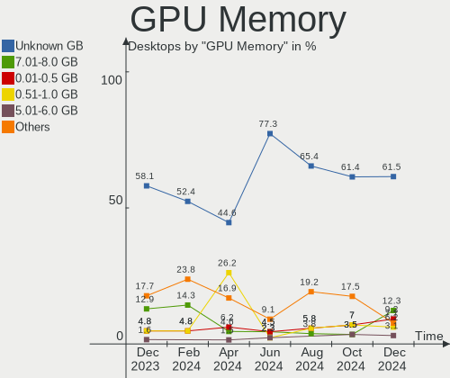

| Size in GB | Desktops | Percent |
|------------|----------|---------|
| Unknown    | 19       | 38%     |
| 3.01-4.0   | 7        | 14%     |
| 1.01-2.0   | 7        | 14%     |
| 0.01-0.5   | 7        | 14%     |
| 0.51-1.0   | 4        | 8%      |
| 7.01-8.0   | 2        | 4%      |
| 5.01-6.0   | 2        | 4%      |
| 8.01-16.0  | 2        | 4%      |

Monitor
-------

Monitor Vendor
--------------

Monitor vendors

| Vendor                  | Desktops | Percent |
|-------------------------|----------|---------|
| Goldstar                | 14       | 26.42%  |
| Samsung Electronics     | 9        | 16.98%  |
| Dell                    | 6        | 11.32%  |
| Hewlett-Packard         | 4        | 7.55%   |
| Acer                    | 4        | 7.55%   |
| Ancor Communications    | 3        | 5.66%   |
| Philips                 | 2        | 3.77%   |
| Xiaomi                  | 1        | 1.89%   |
| Unknown                 | 1        | 1.89%   |
| TCL                     | 1        | 1.89%   |
| MSI                     | 1        | 1.89%   |
| LG Electronics          | 1        | 1.89%   |
| Lenovo                  | 1        | 1.89%   |
| HPN                     | 1        | 1.89%   |
| HannStar                | 1        | 1.89%   |
| Eizo                    | 1        | 1.89%   |
| Chi Mei Optoelectronics | 1        | 1.89%   |
| AOC                     | 1        | 1.89%   |

Monitor Model
-------------

Monitor models

| Model                                                                                    | Desktops | Percent |
|------------------------------------------------------------------------------------------|----------|---------|
| Xiaomi Mi TV XMD009A 3440x1440 480x270mm 21.7-inch                                       | 1        | 1.67%   |
| Unknown LCD Monitor SAMSUNG                                                              | 1        | 1.67%   |
| TCL LCD TV TCL0030 1920x1080 708x398mm 32.0-inch                                         | 1        | 1.67%   |
| Samsung Electronics U28E590 SAM0C4E 3840x2160 610x350mm 27.7-inch                        | 1        | 1.67%   |
| Samsung Electronics U28E590 SAM0C4D 3840x2160 607x345mm 27.5-inch                        | 1        | 1.67%   |
| Samsung Electronics T24D391 SAM0B73 1920x1080 520x290mm 23.4-inch                        | 1        | 1.67%   |
| Samsung Electronics SyncMaster SAM0253 1280x1024 376x301mm 19.0-inch                     | 1        | 1.67%   |
| Samsung Electronics SYNCMASTER 530/531TFT (LXB550*) SAM6056 1024x768 304x228mm 15.0-inch | 1        | 1.67%   |
| Samsung Electronics S24E450 SAM0C80 1920x1080 520x290mm 23.4-inch                        | 1        | 1.67%   |
| Samsung Electronics S24D330 SAM0D92 1920x1080 531x299mm 24.0-inch                        | 1        | 1.67%   |
| Samsung Electronics S22D300 SAM0B3F 1920x1080 477x268mm 21.5-inch                        | 1        | 1.67%   |
| Samsung Electronics LCD Monitor SMS24A350H 5760x2160                                     | 1        | 1.67%   |
| Samsung Electronics LCD Monitor SAM7016 3840x2160 1210x680mm 54.6-inch                   | 1        | 1.67%   |
| Samsung Electronics LCD Monitor SAM04FB 1920x1080                                        | 1        | 1.67%   |
| Samsung Electronics LC24RG50 SAM0F90 1920x1080 532x304mm 24.1-inch                       | 1        | 1.67%   |
| Philips PHL 288E2 PHLC231 3840x2160 621x341mm 27.9-inch                                  | 1        | 1.67%   |
| Philips HDMI PHLC194 1920x1080 700x390mm 31.5-inch                                       | 1        | 1.67%   |
| MSI MPG341CQR MSI3DA0 3440x1440 797x334mm 34.0-inch                                      | 1        | 1.67%   |
| LG Electronics LCD Monitor LG ULTRAWIDE 4480x1080                                        | 1        | 1.67%   |
| Lenovo LEN L1900pA LEN114F 1280x1024 376x301mm 19.0-inch                                 | 1        | 1.67%   |
| HPN LCD Monitor HP 22y                                                                   | 1        | 1.67%   |
| Hewlett-Packard vs17 HWP2647 1280x1024 337x270mm 17.0-inch                               | 1        | 1.67%   |
| Hewlett-Packard OMEN by HP 25 HPN3426 1920x1080 543x302mm 24.5-inch                      | 1        | 1.67%   |
| Hewlett-Packard E273m HPN346E 1920x1080 598x336mm 27.0-inch                              | 1        | 1.67%   |
| Hewlett-Packard E273m HPN346C 1920x1080 598x336mm 27.0-inch                              | 1        | 1.67%   |
| Hewlett-Packard E240c HWP327E 1920x1080 510x290mm 23.1-inch                              | 1        | 1.67%   |
| Hewlett-Packard E221c HWP3092 1920x1080 497x292mm 22.7-inch                              | 1        | 1.67%   |
| Hewlett-Packard 22kd HWP332B 1920x1080 477x268mm 21.5-inch                               | 1        | 1.67%   |
| HannStar HK241DPB HSD2E41 1920x1080 521x293mm 23.5-inch                                  | 1        | 1.67%   |
| Goldstar ULTRAGEAR GSM5B80 2560x1440 597x336mm 27.0-inch                                 | 1        | 1.67%   |
| Goldstar Ultra HD GSM5B09 3840x2160 600x340mm 27.2-inch                                  | 1        | 1.67%   |
| Goldstar L192WS GSM4B32 1440x900 410x256mm 19.0-inch                                     | 1        | 1.67%   |
| Goldstar IPS FULLHD GSM5AB8 1920x1080 480x270mm 21.7-inch                                | 1        | 1.67%   |
| Goldstar HDR WFHD GSM7714 2560x1080 798x334mm 34.1-inch                                  | 1        | 1.67%   |
| Goldstar HDR 5K GSM7720 3440x1440 800x330mm 34.1-inch                                    | 1        | 1.67%   |
| Goldstar HD PLUS GSM5AC5 1600x900 440x250mm 19.9-inch                                    | 1        | 1.67%   |
| Goldstar FULL HD GSM5B55 1920x1080 480x270mm 21.7-inch                                   | 1        | 1.67%   |
| Goldstar 782LE GSM4327 1280x1024 338x270mm 17.0-inch                                     | 1        | 1.67%   |
| Goldstar 37LG5000 GSM75F2 1920x1080 700x390mm 31.5-inch                                  | 1        | 1.67%   |
| Goldstar 2D HD TV GSM59CA 1366x768 509x286mm 23.0-inch                                   | 1        | 1.67%   |
| Goldstar 24EN33 GSM59E3 1920x1080 531x299mm 24.0-inch                                    | 1        | 1.67%   |
| Goldstar 24EA53 GSM59AC 1920x1080 510x290mm 23.1-inch                                    | 1        | 1.67%   |
| Goldstar 23MP55 GSM5A23 1920x1080 510x290mm 23.1-inch                                    | 1        | 1.67%   |
| Eizo S1701 ENC1835 1280x1024 338x270mm 17.0-inch                                         | 1        | 1.67%   |
| Dell U2415 DELA0B9 1920x1200 518x324mm 24.1-inch                                         | 1        | 1.67%   |
| Dell S2409W DELA038 1920x1080 531x298mm 24.0-inch                                        | 1        | 1.67%   |
| Dell P2421D DELD0FF 2560x1440 527x296mm 23.8-inch                                        | 1        | 1.67%   |
| Dell P1913S DELA085 1280x1024 376x301mm 19.0-inch                                        | 1        | 1.67%   |
| Dell E2414H DEL4091 1920x1080 531x299mm 24.0-inch                                        | 1        | 1.67%   |
| Dell 2001FP DELA007 1600x1200 367x275mm 18.1-inch                                        | 1        | 1.67%   |
| Chi Mei Optoelectronics CMC 19AW CMO2198 1440x900 408x255mm 18.9-inch                    | 1        | 1.67%   |
| AOC 2470W AOC2470 1920x1080 521x293mm 23.5-inch                                          | 1        | 1.67%   |
| Ancor Communications BE249 ACI24A8 1920x1080 527x296mm 23.8-inch                         | 1        | 1.67%   |
| Ancor Communications ASUS VS239 ACI23D2 1920x1080 509x286mm 23.0-inch                    | 1        | 1.67%   |
| Ancor Communications ASUS MX239 ACI23C2 1920x1080 528x310mm 24.1-inch                    | 1        | 1.67%   |
| Acer LCD Monitor XB270H A 1920x1080                                                      | 1        | 1.67%   |
| Acer KA242Y ACR073C 1920x1080 527x296mm 23.8-inch                                        | 1        | 1.67%   |
| Acer K222HQL ACR040D 1920x1080 477x268mm 21.5-inch                                       | 1        | 1.67%   |
| Acer K222HQL ACR03E1 1920x1080 477x268mm 21.5-inch                                       | 1        | 1.67%   |
| Acer AL1916W ACRAD52 1440x900 408x255mm 18.9-inch                                        | 1        | 1.67%   |

Monitor Resolution
------------------

Monitor screen resolution

| Resolution       | Desktops | Percent |
|------------------|----------|---------|
| 1920x1080 (FHD)  | 26       | 49.06%  |
| 3840x2160 (4K)   | 6        | 11.32%  |
| 1280x1024 (SXGA) | 6        | 11.32%  |
| 1440x900 (WXGA+) | 3        | 5.66%   |
| 3440x1440        | 2        | 3.77%   |
| 2560x1440 (QHD)  | 2        | 3.77%   |
| Unknown          | 2        | 3.77%   |
| 5760x2160        | 1        | 1.89%   |
| 4480x1080        | 1        | 1.89%   |
| 2560x1080        | 1        | 1.89%   |
| 1600x900 (HD+)   | 1        | 1.89%   |
| 1600x1200        | 1        | 1.89%   |
| 1024x768 (XGA)   | 1        | 1.89%   |

Monitor Diagonal
----------------

Diagonal size in inches

| Inches  | Desktops | Percent |
|---------|----------|---------|
| 23      | 11       | 20%     |
| 24      | 9        | 16.36%  |
| 19      | 6        | 10.91%  |
| 27      | 5        | 9.09%   |
| 21      | 5        | 9.09%   |
| Unknown | 4        | 7.27%   |
| 34      | 3        | 5.45%   |
| 31      | 3        | 5.45%   |
| 17      | 3        | 5.45%   |
| 20      | 2        | 3.64%   |
| 84      | 1        | 1.82%   |
| 32      | 1        | 1.82%   |
| 22      | 1        | 1.82%   |
| 15      | 1        | 1.82%   |

Monitor Width
-------------

Physical width

| Width in mm | Desktops | Percent |
|-------------|----------|---------|
| 501-600     | 21       | 40.38%  |
| 401-500     | 10       | 19.23%  |
| 601-700     | 5        | 9.62%   |
| 701-800     | 4        | 7.69%   |
| 301-350     | 4        | 7.69%   |
| Unknown     | 4        | 7.69%   |
| 351-400     | 3        | 5.77%   |
| 1501-2000   | 1        | 1.92%   |

Aspect Ratio
------------

Proportional relationship between the width and the height

| Ratio   | Desktops | Percent |
|---------|----------|---------|
| 16/9    | 29       | 60.42%  |
| 5/4     | 6        | 12.5%   |
| 16/10   | 5        | 10.42%  |
| 21/9    | 3        | 6.25%   |
| Unknown | 3        | 6.25%   |
| 4/3     | 2        | 4.17%   |

Monitor Area
------------

Area in inch²

| Area in inch² | Desktops | Percent |
|----------------|----------|---------|
| 201-250        | 20       | 38.46%  |
| 351-500        | 7        | 13.46%  |
| 151-200        | 7        | 13.46%  |
| 301-350        | 5        | 9.62%   |
| 251-300        | 4        | 7.69%   |
| Unknown        | 4        | 7.69%   |
| 141-150        | 3        | 5.77%   |
| More than 1000 | 1        | 1.92%   |
| 101-110        | 1        | 1.92%   |

Pixel Density
-------------

Pixels per inch

| Density | Desktops | Percent |
|---------|----------|---------|
| 51-100  | 34       | 69.39%  |
| 101-120 | 7        | 14.29%  |
| 121-160 | 4        | 8.16%   |
| Unknown | 4        | 8.16%   |

Multiple Monitors
-----------------

Total monitors connected

| Total | Desktops | Percent |
|-------|----------|---------|
| 1     | 35       | 70%     |
| 2     | 10       | 20%     |
| 0     | 3        | 6%      |
| 3     | 2        | 4%      |

Network
-------

Net Controller Vendor
---------------------

Controller vendors

| Vendor                   | Desktops | Percent |
|--------------------------|----------|---------|
| Realtek Semiconductor    | 27       | 38.57%  |
| Intel                    | 24       | 34.29%  |
| Qualcomm Atheros         | 5        | 7.14%   |
| Nvidia                   | 5        | 7.14%   |
| Ralink Technology        | 2        | 2.86%   |
| Marvell Technology Group | 2        | 2.86%   |
| Microsoft                | 1        | 1.43%   |
| D-Link System            | 1        | 1.43%   |
| D-Link                   | 1        | 1.43%   |
| ASUSTek Computer         | 1        | 1.43%   |
| ASIX Electronics         | 1        | 1.43%   |

Net Controller Model
--------------------

Controller models

| Model                                                                                         | Desktops | Percent |
|-----------------------------------------------------------------------------------------------|----------|---------|
| Realtek RTL8111/8168/8411 PCI Express Gigabit Ethernet Controller                             | 21       | 26.58%  |
| Intel Wi-Fi 6 AX200                                                                           | 6        | 7.59%   |
| Intel Ethernet Connection (7) I219-V                                                          | 4        | 5.06%   |
| Intel Ethernet Connection (2) I219-V                                                          | 4        | 5.06%   |
| Realtek RTL8125 2.5GbE Controller                                                             | 3        | 3.8%    |
| Realtek RTL8822BE 802.11a/b/g/n/ac WiFi adapter                                               | 2        | 2.53%   |
| Nvidia CK804 Ethernet Controller                                                              | 2        | 2.53%   |
| Intel Cannon Lake PCH CNVi WiFi                                                               | 2        | 2.53%   |
| Realtek RTL8852AE 802.11ax PCIe Wireless Network Adapter                                      | 1        | 1.27%   |
| Realtek RTL8812AE 802.11ac PCIe Wireless Network Adapter                                      | 1        | 1.27%   |
| Realtek RTL8192EE PCIe Wireless Network Adapter                                               | 1        | 1.27%   |
| Realtek RTL8192CU 802.11n WLAN Adapter                                                        | 1        | 1.27%   |
| Realtek RTL810xE PCI Express Fast Ethernet controller                                         | 1        | 1.27%   |
| Realtek RTL-8100/8101L/8139 PCI Fast Ethernet Adapter                                         | 1        | 1.27%   |
| Realtek Realtek 8812AU/8821AU 802.11ac WLAN Adapter [USB Wireless Dual-Band Adapter 2.4/5Ghz] | 1        | 1.27%   |
| Ralink RT2870/RT3070 Wireless Adapter                                                         | 1        | 1.27%   |
| Ralink MT7601U Wireless Adapter                                                               | 1        | 1.27%   |
| Qualcomm Atheros QCA8171 Gigabit Ethernet                                                     | 1        | 1.27%   |
| Qualcomm Atheros Attansic L1 Gigabit Ethernet                                                 | 1        | 1.27%   |
| Qualcomm Atheros AR9485 Wireless Network Adapter                                              | 1        | 1.27%   |
| Qualcomm Atheros AR8151 v1.0 Gigabit Ethernet                                                 | 1        | 1.27%   |
| Qualcomm Atheros AR8131 Gigabit Ethernet                                                      | 1        | 1.27%   |
| Nvidia MCP73 Ethernet                                                                         | 1        | 1.27%   |
| Nvidia MCP61 Ethernet                                                                         | 1        | 1.27%   |
| Nvidia MCP55 Ethernet                                                                         | 1        | 1.27%   |
| Microsoft XBOX ACC                                                                            | 1        | 1.27%   |
| Marvell Group Yukon Optima 88E8059 [PCIe Gigabit Ethernet Controller with AVB]                | 1        | 1.27%   |
| Marvell Group 88E8053 PCI-E Gigabit Ethernet Controller                                       | 1        | 1.27%   |
| Intel Wireless 7265                                                                           | 1        | 1.27%   |
| Intel Wireless 3165                                                                           | 1        | 1.27%   |
| Intel I211 Gigabit Network Connection                                                         | 1        | 1.27%   |
| Intel Ethernet Controller I225-V                                                              | 1        | 1.27%   |
| Intel Ethernet Connection I217-LM                                                             | 1        | 1.27%   |
| Intel Ethernet Connection (7) I219-LM                                                         | 1        | 1.27%   |
| Intel Dual Band Wireless-AC 3168NGW [Stone Peak]                                              | 1        | 1.27%   |
| Intel 82579V Gigabit Network Connection                                                       | 1        | 1.27%   |
| Intel 82579LM Gigabit Network Connection (Lewisville)                                         | 1        | 1.27%   |
| Intel 82574L Gigabit Network Connection                                                       | 1        | 1.27%   |
| Intel 82567LM-3 Gigabit Network Connection                                                    | 1        | 1.27%   |
| D-Link System DWA-140 RangeBooster N Adapter(rev.B2) [Ralink RT3072]                          | 1        | 1.27%   |
| D-Link 802.11 n WLAN                                                                          | 1        | 1.27%   |
| ASUS USB-N13 802.11n Network Adapter (rev. B1) [Realtek RTL8192CU]                            | 1        | 1.27%   |
| ASIX AX88772A Fast Ethernet                                                                   | 1        | 1.27%   |

Wireless Vendor
---------------

Wireless vendors

| Vendor                | Desktops | Percent |
|-----------------------|----------|---------|
| Intel                 | 11       | 44%     |
| Realtek Semiconductor | 7        | 28%     |
| Ralink Technology     | 2        | 8%      |
| Qualcomm Atheros      | 1        | 4%      |
| Microsoft             | 1        | 4%      |
| D-Link System         | 1        | 4%      |
| D-Link                | 1        | 4%      |
| ASUSTek Computer      | 1        | 4%      |

Wireless Model
--------------

Wireless models

| Model                                                                                         | Desktops | Percent |
|-----------------------------------------------------------------------------------------------|----------|---------|
| Intel Wi-Fi 6 AX200                                                                           | 6        | 24%     |
| Realtek RTL8822BE 802.11a/b/g/n/ac WiFi adapter                                               | 2        | 8%      |
| Intel Cannon Lake PCH CNVi WiFi                                                               | 2        | 8%      |
| Realtek RTL8852AE 802.11ax PCIe Wireless Network Adapter                                      | 1        | 4%      |
| Realtek RTL8812AE 802.11ac PCIe Wireless Network Adapter                                      | 1        | 4%      |
| Realtek RTL8192EE PCIe Wireless Network Adapter                                               | 1        | 4%      |
| Realtek RTL8192CU 802.11n WLAN Adapter                                                        | 1        | 4%      |
| Realtek Realtek 8812AU/8821AU 802.11ac WLAN Adapter [USB Wireless Dual-Band Adapter 2.4/5Ghz] | 1        | 4%      |
| Ralink RT2870/RT3070 Wireless Adapter                                                         | 1        | 4%      |
| Ralink MT7601U Wireless Adapter                                                               | 1        | 4%      |
| Qualcomm Atheros AR9485 Wireless Network Adapter                                              | 1        | 4%      |
| Microsoft XBOX ACC                                                                            | 1        | 4%      |
| Intel Wireless 7265                                                                           | 1        | 4%      |
| Intel Wireless 3165                                                                           | 1        | 4%      |
| Intel Dual Band Wireless-AC 3168NGW [Stone Peak]                                              | 1        | 4%      |
| D-Link System DWA-140 RangeBooster N Adapter(rev.B2) [Ralink RT3072]                          | 1        | 4%      |
| D-Link 802.11 n WLAN                                                                          | 1        | 4%      |
| ASUS USB-N13 802.11n Network Adapter (rev. B1) [Realtek RTL8192CU]                            | 1        | 4%      |

Ethernet Vendor
---------------

Ethernet vendors

| Vendor                   | Desktops | Percent |
|--------------------------|----------|---------|
| Realtek Semiconductor    | 25       | 47.17%  |
| Intel                    | 16       | 30.19%  |
| Nvidia                   | 5        | 9.43%   |
| Qualcomm Atheros         | 4        | 7.55%   |
| Marvell Technology Group | 2        | 3.77%   |
| ASIX Electronics         | 1        | 1.89%   |

Ethernet Model
--------------

Ethernet models

| Model                                                                          | Desktops | Percent |
|--------------------------------------------------------------------------------|----------|---------|
| Realtek RTL8111/8168/8411 PCI Express Gigabit Ethernet Controller              | 21       | 38.89%  |
| Intel Ethernet Connection (7) I219-V                                           | 4        | 7.41%   |
| Intel Ethernet Connection (2) I219-V                                           | 4        | 7.41%   |
| Realtek RTL8125 2.5GbE Controller                                              | 3        | 5.56%   |
| Nvidia CK804 Ethernet Controller                                               | 2        | 3.7%    |
| Realtek RTL810xE PCI Express Fast Ethernet controller                          | 1        | 1.85%   |
| Realtek RTL-8100/8101L/8139 PCI Fast Ethernet Adapter                          | 1        | 1.85%   |
| Qualcomm Atheros QCA8171 Gigabit Ethernet                                      | 1        | 1.85%   |
| Qualcomm Atheros Attansic L1 Gigabit Ethernet                                  | 1        | 1.85%   |
| Qualcomm Atheros AR8151 v1.0 Gigabit Ethernet                                  | 1        | 1.85%   |
| Qualcomm Atheros AR8131 Gigabit Ethernet                                       | 1        | 1.85%   |
| Nvidia MCP73 Ethernet                                                          | 1        | 1.85%   |
| Nvidia MCP61 Ethernet                                                          | 1        | 1.85%   |
| Nvidia MCP55 Ethernet                                                          | 1        | 1.85%   |
| Marvell Group Yukon Optima 88E8059 [PCIe Gigabit Ethernet Controller with AVB] | 1        | 1.85%   |
| Marvell Group 88E8053 PCI-E Gigabit Ethernet Controller                        | 1        | 1.85%   |
| Intel I211 Gigabit Network Connection                                          | 1        | 1.85%   |
| Intel Ethernet Controller I225-V                                               | 1        | 1.85%   |
| Intel Ethernet Connection I217-LM                                              | 1        | 1.85%   |
| Intel Ethernet Connection (7) I219-LM                                          | 1        | 1.85%   |
| Intel 82579V Gigabit Network Connection                                        | 1        | 1.85%   |
| Intel 82579LM Gigabit Network Connection (Lewisville)                          | 1        | 1.85%   |
| Intel 82574L Gigabit Network Connection                                        | 1        | 1.85%   |
| Intel 82567LM-3 Gigabit Network Connection                                     | 1        | 1.85%   |
| ASIX AX88772A Fast Ethernet                                                    | 1        | 1.85%   |

Net Controller Kind
-------------------

Ethernet, WiFi or modem

| Kind     | Desktops | Percent |
|----------|----------|---------|
| Ethernet | 50       | 68.49%  |
| WiFi     | 23       | 31.51%  |

Used Controller
---------------

Currently used network controller

| Kind     | Desktops | Percent |
|----------|----------|---------|
| Ethernet | 42       | 75%     |
| WiFi     | 14       | 25%     |

NICs
----

Total network controllers on board

| Total | Desktops | Percent |
|-------|----------|---------|
| 1     | 28       | 56%     |
| 2     | 22       | 44%     |

IPv6
----

IPv6 vs IPv4

| Used | Desktops | Percent |
|------|----------|---------|
| No   | 44       | 88%     |
| Yes  | 6        | 12%     |

Bluetooth
---------

Bluetooth Vendor
----------------

Controller vendors

| Vendor                     | Desktops | Percent |
|----------------------------|----------|---------|
| Intel                      | 10       | 50%     |
| Realtek Semiconductor      | 6        | 30%     |
| Cambridge Silicon Radio    | 2        | 10%     |
| Integrated System Solution | 1        | 5%      |
| Broadcom                   | 1        | 5%      |

Bluetooth Model
---------------

Controller models

| Model                                               | Desktops | Percent |
|-----------------------------------------------------|----------|---------|
| Intel AX200 Bluetooth                               | 5        | 25%     |
| Realtek Bluetooth Radio                             | 4        | 20%     |
| Realtek  Bluetooth 4.2 Adapter                      | 2        | 10%     |
| Intel Bluetooth wireless interface                  | 2        | 10%     |
| Intel Bluetooth 9460/9560 Jefferson Peak (JfP)      | 2        | 10%     |
| Cambridge Silicon Radio Bluetooth Dongle (HCI mode) | 2        | 10%     |
| Intel Wireless-AC 3168 Bluetooth                    | 1        | 5%      |
| Integrated System Solution Bluetooth Device         | 1        | 5%      |
| Broadcom Bluetooth 3.0 Dongle                       | 1        | 5%      |

Sound
-----

Sound Vendor
------------

Sound card vendors

| Vendor                    | Desktops | Percent |
|---------------------------|----------|---------|
| Intel                     | 28       | 32.94%  |
| Nvidia                    | 22       | 25.88%  |
| AMD                       | 22       | 25.88%  |
| JMTek                     | 2        | 2.35%   |
| C-Media Electronics       | 2        | 2.35%   |
| Sennheiser Communications | 1        | 1.18%   |
| Realtek Semiconductor     | 1        | 1.18%   |
| Kingston Technology       | 1        | 1.18%   |
| Hewlett-Packard           | 1        | 1.18%   |
| Generalplus Technology    | 1        | 1.18%   |
| Focusrite-Novation        | 1        | 1.18%   |
| Ensoniq                   | 1        | 1.18%   |
| Creative Labs             | 1        | 1.18%   |
| ASUSTek Computer          | 1        | 1.18%   |

Sound Model
-----------

Sound card models

| Model                                                                      | Desktops | Percent |
|----------------------------------------------------------------------------|----------|---------|
| Intel Cannon Lake PCH cAVS                                                 | 6        | 6.12%   |
| Intel 200 Series PCH HD Audio                                              | 5        | 5.1%    |
| AMD Starship/Matisse HD Audio Controller                                   | 5        | 5.1%    |
| Intel 8 Series/C220 Series Chipset High Definition Audio Controller        | 4        | 4.08%   |
| AMD SBx00 Azalia (Intel HDA)                                               | 4        | 4.08%   |
| Nvidia High Definition Audio Controller                                    | 3        | 3.06%   |
| Nvidia GF108 High Definition Audio Controller                              | 3        | 3.06%   |
| Intel Xeon E3-1200 v3/4th Gen Core Processor HD Audio Controller           | 3        | 3.06%   |
| Intel NM10/ICH7 Family High Definition Audio Controller                    | 3        | 3.06%   |
| Intel 100 Series/C230 Series Chipset Family HD Audio Controller            | 3        | 3.06%   |
| AMD Raven/Raven2/Fenghuang HDMI/DP Audio Controller                        | 3        | 3.06%   |
| AMD Family 17h/19h HD Audio Controller                                     | 3        | 3.06%   |
| Nvidia TU102 High Definition Audio Controller                              | 2        | 2.04%   |
| Nvidia GP107GL High Definition Audio Controller                            | 2        | 2.04%   |
| JMTek USB PnP Audio Device                                                 | 2        | 2.04%   |
| AMD Navi 21/23 HDMI/DP Audio Controller                                    | 2        | 2.04%   |
| AMD Ellesmere HDMI Audio [Radeon RX 470/480 / 570/580/590]                 | 2        | 2.04%   |
| AMD Cedar HDMI Audio [Radeon HD 5400/6300/7300 Series]                     | 2        | 2.04%   |
| Sennheiser Communications Headset [PC 8]                                   | 1        | 1.02%   |
| Realtek Semiconductor Audeze Mobius Hi-Res 2Ch                             | 1        | 1.02%   |
| Nvidia TU116 High Definition Audio Controller                              | 1        | 1.02%   |
| Nvidia TU107 GeForce GTX 1650 High Definition Audio Controller             | 1        | 1.02%   |
| Nvidia MCP73 High Definition Audio                                         | 1        | 1.02%   |
| Nvidia GP106 High Definition Audio Controller                              | 1        | 1.02%   |
| Nvidia GP104 High Definition Audio Controller                              | 1        | 1.02%   |
| Nvidia GM206 High Definition Audio Controller                              | 1        | 1.02%   |
| Nvidia GM204 High Definition Audio Controller                              | 1        | 1.02%   |
| Nvidia GM107 High Definition Audio Controller [GeForce 940MX]              | 1        | 1.02%   |
| Nvidia GK208 HDMI/DP Audio Controller                                      | 1        | 1.02%   |
| Nvidia GK104 HDMI Audio Controller                                         | 1        | 1.02%   |
| Nvidia GA104 High Definition Audio Controller                              | 1        | 1.02%   |
| Nvidia CK804 AC'97 Audio Controller                                        | 1        | 1.02%   |
| Kingston Technology HyperX Cloud Flight Wireless Headset                   | 1        | 1.02%   |
| Intel Comet Lake PCH-V cAVS                                                | 1        | 1.02%   |
| Intel Comet Lake PCH cAVS                                                  | 1        | 1.02%   |
| Intel C600/X79 series chipset High Definition Audio Controller             | 1        | 1.02%   |
| Intel 82801JD/DO (ICH10 Family) HD Audio Controller                        | 1        | 1.02%   |
| Intel 82801I (ICH9 Family) HD Audio Controller                             | 1        | 1.02%   |
| Intel 7 Series/C216 Chipset Family High Definition Audio Controller        | 1        | 1.02%   |
| Intel 6 Series/C200 Series Chipset Family High Definition Audio Controller | 1        | 1.02%   |
| Hewlett-Packard E240C                                                      | 1        | 1.02%   |
| Generalplus Technology Usb Audio Device                                    | 1        | 1.02%   |
| Focusrite-Novation Scarlett 2i2 Camera                                     | 1        | 1.02%   |
| Ensoniq ES1371/ES1373 / Creative Labs CT2518                               | 1        | 1.02%   |
| Creative Labs Sound Core3D [Sound Blaster Recon3D / Z-Series]              | 1        | 1.02%   |
| C-Media Electronics CMI8788 [Oxygen HD Audio]                              | 1        | 1.02%   |
| C-Media Electronics Audio Adapter (Unitek Y-247A)                          | 1        | 1.02%   |
| ASUSTek Computer ROG CLAVIS                                                | 1        | 1.02%   |
| AMD Tobago HDMI Audio [Radeon R7 360 / R9 360 OEM]                         | 1        | 1.02%   |
| AMD RV710/730 HDMI Audio [Radeon HD 4000 series]                           | 1        | 1.02%   |
| AMD RV670/680 HDMI Audio [Radeon HD 3690/3800 Series]                      | 1        | 1.02%   |
| AMD Oland/Hainan/Cape Verde/Pitcairn HDMI Audio [Radeon HD 7000 Series]    | 1        | 1.02%   |
| AMD Navi 10 HDMI Audio                                                     | 1        | 1.02%   |
| AMD Kaveri HDMI/DP Audio Controller                                        | 1        | 1.02%   |
| AMD Juniper HDMI Audio [Radeon HD 5700 Series]                             | 1        | 1.02%   |
| AMD IXP SB4x0 High Definition Audio Controller                             | 1        | 1.02%   |
| AMD Hawaii HDMI Audio [Radeon R9 290/290X / 390/390X]                      | 1        | 1.02%   |
| AMD FCH Azalia Controller                                                  | 1        | 1.02%   |
| AMD Family 17h (Models 00h-0fh) HD Audio Controller                        | 1        | 1.02%   |

Memory
------

Memory Vendor
-------------

Memory module vendors

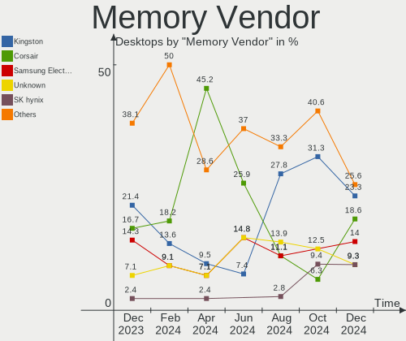

| Vendor              | Desktops | Percent |
|---------------------|----------|---------|
| Unknown             | 5        | 19.23%  |
| Corsair             | 5        | 19.23%  |
| Kingston            | 4        | 15.38%  |
| G.Skill             | 3        | 11.54%  |
| Samsung Electronics | 2        | 7.69%   |
| Unifosa             | 1        | 3.85%   |
| Team                | 1        | 3.85%   |
| SK Hynix            | 1        | 3.85%   |
| Silicon Power       | 1        | 3.85%   |
| Micron Technology   | 1        | 3.85%   |
| Crucial             | 1        | 3.85%   |
| Unknown             | 1        | 3.85%   |

Memory Model
------------

Memory module models

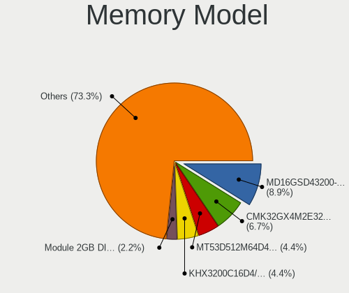

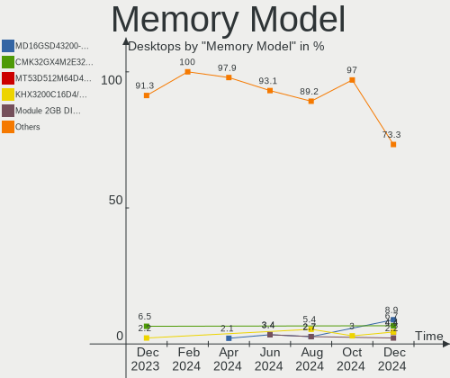

| Model                                                        | Desktops | Percent |
|--------------------------------------------------------------|----------|---------|
| Corsair RAM CMK16GX4M2B3000C15 8GB DIMM DDR4 3000MT/s        | 2        | 6.25%   |
| Unknown RAM Module 4GB DIMM DDR3 1600MT/s                    | 1        | 3.13%   |
| Unknown RAM Module 4GB DIMM 400MT/s                          | 1        | 3.13%   |
| Unknown RAM Module 4GB DIMM 1066MT/s                         | 1        | 3.13%   |
| Unknown RAM Module 2GB DIMM DDR2 800MT/s                     | 1        | 3.13%   |
| Unknown RAM Module 2GB DIMM 800MT/s                          | 1        | 3.13%   |
| Unknown RAM Module 1GB DIMM 400MT/s                          | 1        | 3.13%   |
| Unifosa RAM Module 2GB DIMM DDR3 1333MT/s                    | 1        | 3.13%   |
| Unifosa RAM Module 1GB DIMM DDR3 1333MT/s                    | 1        | 3.13%   |
| Team RAM TEAMGROUP-SD4-2400 16GB SODIMM DDR4 8400MT/s        | 1        | 3.13%   |
| SK Hynix RAM HMT125U6BFR8C-H9 2GB DIMM DDR3 1333MT/s         | 1        | 3.13%   |
| Silicon Power RAM SP008GBLTU160N02 8192MB DIMM DDR3 1600MT/s | 1        | 3.13%   |
| Samsung RAM Module 16GB DIMM DDR4 2667MT/s                   | 1        | 3.13%   |
| Samsung RAM M378B5273DH0-CH9 4GB DIMM DDR3 2133MT/s          | 1        | 3.13%   |
| Micron RAM 18KSF51272AZ-1G4M1 4GB DIMM DDR3 1333MT/s         | 1        | 3.13%   |
| Micron RAM 16JTF51264AZ-1G4M1 4GB DIMM DDR3 1333MT/s         | 1        | 3.13%   |
| Kingston RAM KHX2933C17D4/8G 8GB DIMM DDR4 3200MT/s          | 1        | 3.13%   |
| Kingston RAM KHX1866C10D3/8G 8GB DIMM DDR3 1867MT/s          | 1        | 3.13%   |
| Kingston RAM KHX1600C9D3/4GX 4096MB DIMM DDR3 2400MT/s       | 1        | 3.13%   |
| Kingston RAM KF3200C16D4/16GX 16GB DIMM DDR4 3200MT/s        | 1        | 3.13%   |
| G.Skill RAM F4-3600C17-8GTZR 8GB DIMM DDR4 3600MT/s          | 1        | 3.13%   |
| G.Skill RAM F4-3200C16-8GTZKO 8GB DIMM DDR4 3200MT/s         | 1        | 3.13%   |
| G.Skill RAM F3-14900CL9-4GBXL 4GB DIMM DDR3 1866MT/s         | 1        | 3.13%   |
| G.Skill RAM F3-14900CL9-4GBSR 4GB DIMM DDR3 1867MT/s         | 1        | 3.13%   |
| Crucial RAM CT8G4DFS824A.M8FA 8GB DIMM DDR4 2400MT/s         | 1        | 3.13%   |
| Crucial RAM CT8G4DFRA266.C8FJ 8GB DIMM DDR4 2667MT/s         | 1        | 3.13%   |
| Corsair RAM CMW16GX4M2D3600C18 8192MB DIMM DDR4 3600MT/s     | 1        | 3.13%   |
| Corsair RAM CMK8GX4M1D3000C16 8GB DIMM DDR4 3200MT/s         | 1        | 3.13%   |
| Corsair RAM CMK32GX4M2B3000C15 16GB DIMM DDR4 3000MT/s       | 1        | 3.13%   |
| Corsair RAM CMK16GX4M2D3000C16 8GB DIMM DDR4 3200MT/s        | 1        | 3.13%   |
| Unknown                                                      | 1        | 3.13%   |

Memory Kind
-----------

Memory module kinds

| Kind    | Desktops | Percent |
|---------|----------|---------|
| DDR4    | 11       | 45.83%  |
| DDR3    | 8        | 33.33%  |
| Unknown | 4        | 16.67%  |
| DDR2    | 1        | 4.17%   |

Memory Form Factor
------------------

Physical design of the memory module

| Name   | Desktops | Percent |
|--------|----------|---------|
| DIMM   | 23       | 95.83%  |
| SODIMM | 1        | 4.17%   |

Memory Size
-----------

Memory module size

| Size  | Desktops | Percent |
|-------|----------|---------|
| 8192  | 9        | 34.62%  |
| 4096  | 6        | 23.08%  |
| 16384 | 4        | 15.38%  |
| 2048  | 4        | 15.38%  |
| 1024  | 3        | 11.54%  |

Memory Speed
------------

Memory module speed

| Speed | Desktops | Percent |
|-------|----------|---------|
| 3200  | 4        | 14.81%  |
| 1333  | 3        | 11.11%  |
| 3466  | 2        | 7.41%   |
| 2667  | 2        | 7.41%   |
| 2400  | 2        | 7.41%   |
| 2133  | 2        | 7.41%   |
| 1600  | 2        | 7.41%   |
| 800   | 2        | 7.41%   |
| 8400  | 1        | 3.7%    |
| 4133  | 1        | 3.7%    |
| 3600  | 1        | 3.7%    |
| 3000  | 1        | 3.7%    |
| 1867  | 1        | 3.7%    |
| 1066  | 1        | 3.7%    |
| 400   | 1        | 3.7%    |
| 200   | 1        | 3.7%    |

Printers & scanners
-------------------

Printer Vendor
--------------

Printer device vendors

| Vendor                | Desktops | Percent |
|-----------------------|----------|---------|
| Lexmark International | 1        | 50%     |
| Kyocera               | 1        | 50%     |

Printer Model
-------------

Printer device models

| Model                         | Desktops | Percent |
|-------------------------------|----------|---------|
| Lexmark International B2236dw | 1        | 50%     |
| Kyocera ECOSYS M5521cdn       | 1        | 50%     |

Scanner Vendor
--------------

Scanner device vendors

Zero info for selected period =(

Scanner Model
-------------

Scanner device models

Zero info for selected period =(

Camera
------

Camera Vendor
-------------

Camera device vendors

| Vendor              | Desktops | Percent |
|---------------------|----------|---------|
| Logitech            | 4        | 40%     |
| Microdia            | 2        | 20%     |
| Google              | 1        | 10%     |
| GEMBIRD             | 1        | 10%     |
| Creative Technology | 1        | 10%     |
| Chicony Electronics | 1        | 10%     |

Camera Model
------------

Camera device models

| Model                                             | Desktops | Percent |
|---------------------------------------------------|----------|---------|
| Logitech Webcam C270                              | 2        | 18.18%  |
| Microdia USB Live camera                          | 1        | 9.09%   |
| Microdia Integrated Camera                        | 1        | 9.09%   |
| Logitech Webcam C310                              | 1        | 9.09%   |
| Logitech Webcam C210                              | 1        | 9.09%   |
| Google HD USB Camera                              | 1        | 9.09%   |
| GEMBIRD Generic UVC 1.00 camera [AppoTech AX2311] | 1        | 9.09%   |
| Creative Live! Cam Sync HD [VF0770]               | 1        | 9.09%   |
| Chicony HP High Definition 1MP Webcam             | 1        | 9.09%   |
| Chicony HP 720p HD Monitor Webcam                 | 1        | 9.09%   |

Security
--------

Fingerprint Vendor
------------------

Fingerprint sensor vendors

Zero info for selected period =(

Fingerprint Model
-----------------

Fingerprint sensor models

Zero info for selected period =(

Chipcard Vendor
---------------

Chipcard module vendors

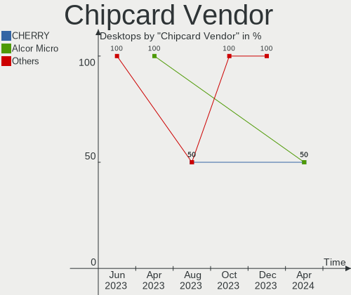

| Vendor | Desktops | Percent |
|--------|----------|---------|
| Cherry | 1        | 100%    |

Chipcard Model
--------------

Chipcard module models

| Model                     | Desktops | Percent |
|---------------------------|----------|---------|
| Cherry SmartTerminal XX1X | 1        | 100%    |

Unsupported
-----------

Unsupported Devices
-------------------

Total unsupported devices on board

| Total | Desktops | Percent |
|-------|----------|---------|
| 0     | 43       | 86%     |
| 1     | 6        | 12%     |
| 2     | 1        | 2%      |

Unsupported Device Types
------------------------

Types of unsupported devices

| Type          | Desktops | Percent |
|---------------|----------|---------|
| Graphics card | 4        | 50%     |
| Storage/ide   | 1        | 12.5%   |
| Sound         | 1        | 12.5%   |
| Net/wireless  | 1        | 12.5%   |
| Chipcard      | 1        | 12.5%   |

