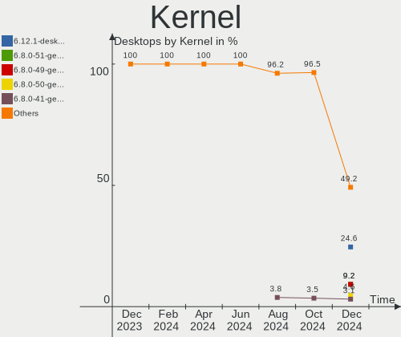
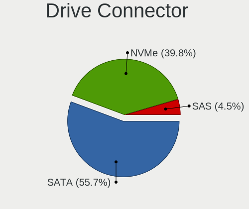
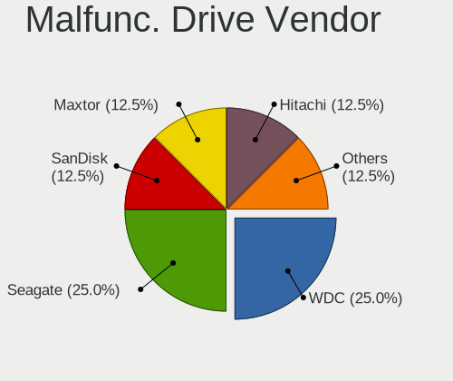
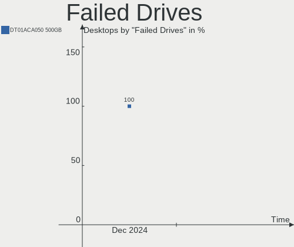
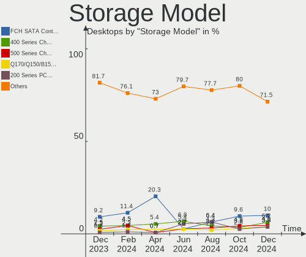
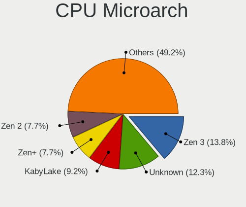
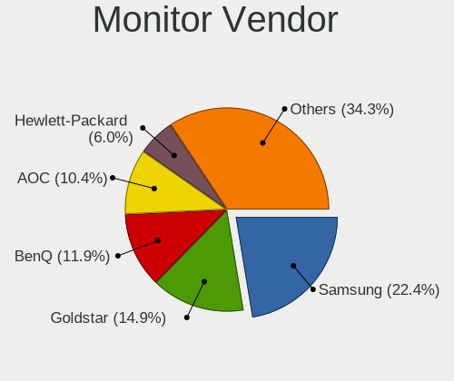
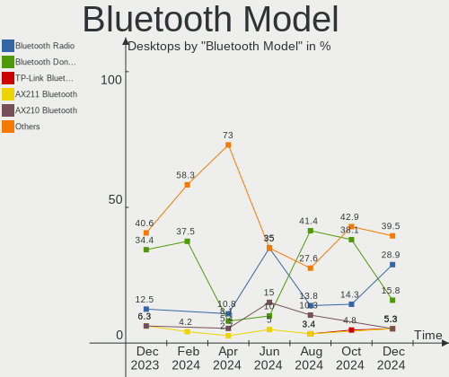
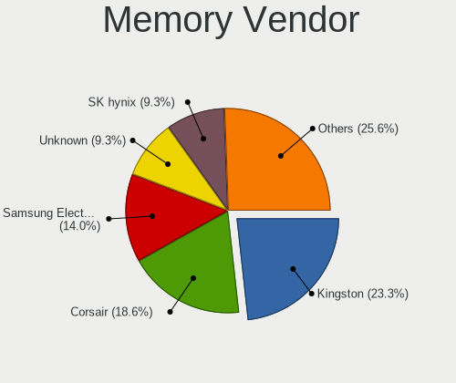

Linux in Spain - Hardware Trends (Desktops)
-------------------------------------------

A project to identify most popular hardware characteristics and track their change
over time based on data collected by Linux users at https://Linux-Hardware.org.

Anyone can contribute to this report by the [hw-probe](https://github.com/linuxhw/hw-probe) tool:

    sudo -E hw-probe -all -upload

Period: Nov, 2022.

Contents
--------

* [ System ](#system)
  - [ OS                       ](#os)
  - [ OS Family                ](#os-family)
  - [ Kernel                   ](#kernel)
  - [ Kernel Family            ](#kernel-family)
  - [ Kernel Major Ver.        ](#kernel-major-ver)
  - [ Arch                     ](#arch)
  - [ DE                       ](#de)
  - [ Display Server           ](#display-server)
  - [ Display Manager          ](#display-manager)
  - [ OS Lang                  ](#os-lang)
  - [ Boot Mode                ](#boot-mode)
  - [ Filesystem               ](#filesystem)
  - [ Part. scheme             ](#part-scheme)
  - [ Dual Boot with Linux/BSD ](#dual-boot-with-linuxbsd)
  - [ Dual Boot (Win)          ](#dual-boot-win)

* [ Board ](#board)
  - [ Vendor                   ](#vendor)
  - [ Model                    ](#model)
  - [ Model Family             ](#model-family)
  - [ MFG Year                 ](#mfg-year)
  - [ Form Factor              ](#form-factor)
  - [ Secure Boot              ](#secure-boot)
  - [ Coreboot                 ](#coreboot)
  - [ RAM Size                 ](#ram-size)
  - [ RAM Used                 ](#ram-used)
  - [ Total Drives             ](#total-drives)
  - [ Has CD-ROM               ](#has-cd-rom)
  - [ Has Ethernet             ](#has-ethernet)
  - [ Has WiFi                 ](#has-wifi)
  - [ Has Bluetooth            ](#has-bluetooth)

* [ Location ](#location)
  - [ Country                  ](#country)
  - [ City                     ](#city)

* [ Drives ](#drives)
  - [ Drive Vendor             ](#drive-vendor)
  - [ Drive Model              ](#drive-model)
  - [ HDD Vendor               ](#hdd-vendor)
  - [ SSD Vendor               ](#ssd-vendor)
  - [ Drive Kind               ](#drive-kind)
  - [ Drive Connector          ](#drive-connector)
  - [ Drive Size               ](#drive-size)
  - [ Space Total              ](#space-total)
  - [ Space Used               ](#space-used)
  - [ Malfunc. Drives          ](#malfunc-drives)
  - [ Malfunc. Drive Vendor    ](#malfunc-drive-vendor)
  - [ Malfunc. HDD Vendor      ](#malfunc-hdd-vendor)
  - [ Malfunc. Drive Kind      ](#malfunc-drive-kind)
  - [ Failed Drives            ](#failed-drives)
  - [ Failed Drive Vendor      ](#failed-drive-vendor)
  - [ Drive Status             ](#drive-status)

* [ Storage controller ](#storage-controller)
  - [ Storage Vendor           ](#storage-vendor)
  - [ Storage Model            ](#storage-model)
  - [ Storage Kind             ](#storage-kind)

* [ Processor ](#processor)
  - [ CPU Vendor               ](#cpu-vendor)
  - [ CPU Model                ](#cpu-model)
  - [ CPU Model Family         ](#cpu-model-family)
  - [ CPU Cores                ](#cpu-cores)
  - [ CPU Sockets              ](#cpu-sockets)
  - [ CPU Threads              ](#cpu-threads)
  - [ CPU Op-Modes             ](#cpu-op-modes)
  - [ CPU Microcode            ](#cpu-microcode)
  - [ CPU Microarch            ](#cpu-microarch)

* [ Graphics ](#graphics)
  - [ GPU Vendor               ](#gpu-vendor)
  - [ GPU Model                ](#gpu-model)
  - [ GPU Combo                ](#gpu-combo)
  - [ GPU Driver               ](#gpu-driver)
  - [ GPU Memory               ](#gpu-memory)

* [ Monitor ](#monitor)
  - [ Monitor Vendor           ](#monitor-vendor)
  - [ Monitor Model            ](#monitor-model)
  - [ Monitor Resolution       ](#monitor-resolution)
  - [ Monitor Diagonal         ](#monitor-diagonal)
  - [ Monitor Width            ](#monitor-width)
  - [ Aspect Ratio             ](#aspect-ratio)
  - [ Monitor Area             ](#monitor-area)
  - [ Pixel Density            ](#pixel-density)
  - [ Multiple Monitors        ](#multiple-monitors)

* [ Network ](#network)
  - [ Net Controller Vendor    ](#net-controller-vendor)
  - [ Net Controller Model     ](#net-controller-model)
  - [ Wireless Vendor          ](#wireless-vendor)
  - [ Wireless Model           ](#wireless-model)
  - [ Ethernet Vendor          ](#ethernet-vendor)
  - [ Ethernet Model           ](#ethernet-model)
  - [ Net Controller Kind      ](#net-controller-kind)
  - [ Used Controller          ](#used-controller)
  - [ NICs                     ](#nics)
  - [ IPv6                     ](#ipv6)

* [ Bluetooth ](#bluetooth)
  - [ Bluetooth Vendor         ](#bluetooth-vendor)
  - [ Bluetooth Model          ](#bluetooth-model)

* [ Sound ](#sound)
  - [ Sound Vendor             ](#sound-vendor)
  - [ Sound Model              ](#sound-model)

* [ Memory ](#memory)
  - [ Memory Vendor            ](#memory-vendor)
  - [ Memory Model             ](#memory-model)
  - [ Memory Kind              ](#memory-kind)
  - [ Memory Form Factor       ](#memory-form-factor)
  - [ Memory Size              ](#memory-size)
  - [ Memory Speed             ](#memory-speed)

* [ Printers & scanners ](#printers--scanners)
  - [ Printer Vendor           ](#printer-vendor)
  - [ Printer Model            ](#printer-model)
  - [ Scanner Vendor           ](#scanner-vendor)
  - [ Scanner Model            ](#scanner-model)

* [ Camera ](#camera)
  - [ Camera Vendor            ](#camera-vendor)
  - [ Camera Model             ](#camera-model)

* [ Security ](#security)
  - [ Fingerprint Vendor       ](#fingerprint-vendor)
  - [ Fingerprint Model        ](#fingerprint-model)
  - [ Chipcard Vendor          ](#chipcard-vendor)
  - [ Chipcard Model           ](#chipcard-model)

* [ Unsupported ](#unsupported)
  - [ Unsupported Devices      ](#unsupported-devices)
  - [ Unsupported Device Types ](#unsupported-device-types)

System
------

OS
--

Installed operating systems

| Name                         | Desktops | Percent |
|------------------------------|----------|---------|
| Linux Mint 21                | 4        | 11.11%  |
| Ubuntu 22.04                 | 3        | 8.33%   |
| Fedora 37                    | 3        | 8.33%   |
| Debian 11                    | 3        | 8.33%   |
| Arch Rolling                 | 3        | 8.33%   |
| Pop!_OS 22.04                | 2        | 5.56%   |
| org.kde.Platform 5.15-21.08  | 2        | 5.56%   |
| Manjaro 22.0.0               | 2        | 5.56%   |
| Linux Mint 20.3              | 2        | 5.56%   |
| Ubuntu MATE 20.04            | 1        | 2.78%   |
| Ubuntu Budgie 22.10          | 1        | 2.78%   |
| Ubuntu 22.10                 | 1        | 2.78%   |
| Ubuntu 20.04                 | 1        | 2.78%   |
| Ubuntu 18.04                 | 1        | 2.78%   |
| openSUSE Tumbleweed-XXXXXXXX | 1        | 2.78%   |
| OpenMandriva 4.3             | 1        | 2.78%   |
| LFS                          | 1        | 2.78%   |
| Kubuntu 20.04                | 1        | 2.78%   |
| Kubuntu 18.04                | 1        | 2.78%   |
| Fedora 36                    | 1        | 2.78%   |
| Debian                       | 1        | 2.78%   |

OS Family
---------

OS without a version

| Name             | Desktops | Percent |
|------------------|----------|---------|
| Ubuntu           | 6        | 16.67%  |
| Linux Mint       | 6        | 16.67%  |
| Fedora           | 4        | 11.11%  |
| Debian           | 4        | 11.11%  |
| Arch             | 3        | 8.33%   |
| Pop!_OS          | 2        | 5.56%   |
| org.kde.Platform | 2        | 5.56%   |
| Manjaro          | 2        | 5.56%   |
| Kubuntu          | 2        | 5.56%   |
| Ubuntu MATE      | 1        | 2.78%   |
| Ubuntu Budgie    | 1        | 2.78%   |
| openSUSE         | 1        | 2.78%   |
| OpenMandriva     | 1        | 2.78%   |
| LFS              | 1        | 2.78%   |

Kernel
------

Version of the Linux kernel

| Version                   | Desktops | Percent |
|---------------------------|----------|---------|
| 5.15.0-52-generic         | 6        | 16.67%  |
| 6.0.6-76060006-generic    | 2        | 5.56%   |
| 5.4.0-131-generic         | 2        | 5.56%   |
| 5.4.0-128-generic         | 2        | 5.56%   |
| 5.10.0-19-amd64           | 2        | 5.56%   |
| 6.0.9-arch1-1             | 1        | 2.78%   |
| 6.0.9-300.fc37.x86_64     | 1        | 2.78%   |
| 6.0.9-200.fc36.x86_64     | 1        | 2.78%   |
| 6.0.8-arch1-1             | 1        | 2.78%   |
| 6.0.8-300.fc37.x86_64     | 1        | 2.78%   |
| 6.0.8-1-MANJARO           | 1        | 2.78%   |
| 6.0.8-1-default           | 1        | 2.78%   |
| 6.0.7-arch1-1             | 1        | 2.78%   |
| 6.0.0-9.1-liquorix-amd64  | 1        | 2.78%   |
| 6.0.0-4-amd64             | 1        | 2.78%   |
| 5.4.0-80-generic          | 1        | 2.78%   |
| 5.4.0-42-generic          | 1        | 2.78%   |
| 5.19.16-301.fc37.x86_64   | 1        | 2.78%   |
| 5.19.0-24-generic         | 1        | 2.78%   |
| 5.19.0-23-generic         | 1        | 2.78%   |
| 5.18.17-amd64-desktop-hwe | 1        | 2.78%   |
| 5.16.7-desktop-1omv4003   | 1        | 2.78%   |
| 5.15.76-1-MANJARO         | 1        | 2.78%   |
| 5.15.64-1-pve             | 1        | 2.78%   |
| 5.15.45-amd64-desktop     | 1        | 2.78%   |
| 5.15.0-53-generic         | 1        | 2.78%   |
| 5.11.15-gnu               | 1        | 2.78%   |

Kernel Family
-------------

Linux kernel without a distro release

| Version | Desktops | Percent |
|---------|----------|---------|
| 5.15.0  | 7        | 19.44%  |
| 5.4.0   | 6        | 16.67%  |
| 6.0.8   | 4        | 11.11%  |
| 6.0.9   | 3        | 8.33%   |
| 6.0.6   | 2        | 5.56%   |
| 6.0.0   | 2        | 5.56%   |
| 5.19.0  | 2        | 5.56%   |
| 5.10.0  | 2        | 5.56%   |
| 6.0.7   | 1        | 2.78%   |
| 5.19.16 | 1        | 2.78%   |
| 5.18.17 | 1        | 2.78%   |
| 5.16.7  | 1        | 2.78%   |
| 5.15.76 | 1        | 2.78%   |
| 5.15.64 | 1        | 2.78%   |
| 5.15.45 | 1        | 2.78%   |
| 5.11.15 | 1        | 2.78%   |

Kernel Major Ver.
-----------------

Linux kernel major version

| Version | Desktops | Percent |
|---------|----------|---------|
| 6.0     | 12       | 33.33%  |
| 5.15    | 10       | 27.78%  |
| 5.4     | 6        | 16.67%  |
| 5.19    | 3        | 8.33%   |
| 5.10    | 2        | 5.56%   |
| 5.18    | 1        | 2.78%   |
| 5.16    | 1        | 2.78%   |
| 5.11    | 1        | 2.78%   |

Arch
----

OS architecture (x86_64, i586, etc.)

| Name   | Desktops | Percent |
|--------|----------|---------|
| x86_64 | 36       | 100%    |

DE
--

Desktop Environment

| Name       | Desktops | Percent |
|------------|----------|---------|
| GNOME      | 16       | 44.44%  |
| X-Cinnamon | 5        | 13.89%  |
| KDE5       | 5        | 13.89%  |
| Unknown    | 3        | 8.33%   |
| Deepin     | 2        | 5.56%   |
| XFCE       | 1        | 2.78%   |
| MATE       | 1        | 2.78%   |
| LXDE       | 1        | 2.78%   |
| i3         | 1        | 2.78%   |
| Budgie     | 1        | 2.78%   |

Display Server
--------------

X11 or Wayland

| Name    | Desktops | Percent |
|---------|----------|---------|
| X11     | 28       | 77.78%  |
| Wayland | 4        | 11.11%  |
| Tty     | 3        | 8.33%   |
| Unknown | 1        | 2.78%   |

Display Manager
---------------

SDDM, LightDM, etc.

| Name    | Desktops | Percent |
|---------|----------|---------|
| Unknown | 17       | 47.22%  |
| GDM3    | 6        | 16.67%  |
| SDDM    | 5        | 13.89%  |
| LightDM | 5        | 13.89%  |
| GDM     | 3        | 8.33%   |

OS Lang
-------

Language

| Lang           | Desktops | Percent |
|----------------|----------|---------|
| es_ES          | 26       | 72.22%  |
| en_US          | 8        | 22.22%  |
| en_GB          | 1        | 2.78%   |
| ca_ES@valencia | 1        | 2.78%   |

Boot Mode
---------

EFI or BIOS

| Mode | Desktops | Percent |
|------|----------|---------|
| EFI  | 21       | 58.33%  |
| BIOS | 15       | 41.67%  |

Filesystem
----------

Type of filesystem

| Type    | Desktops | Percent |
|---------|----------|---------|
| Ext4    | 29       | 80.56%  |
| Btrfs   | 6        | 16.67%  |
| Overlay | 1        | 2.78%   |

Part. scheme
------------

Scheme of partitioning

| Type    | Desktops | Percent |
|---------|----------|---------|
| GPT     | 20       | 55.56%  |
| Unknown | 13       | 36.11%  |
| MBR     | 3        | 8.33%   |

Dual Boot with Linux/BSD
------------------------

Hosting more than one Linux/BSD

| Dual boot | Desktops | Percent |
|-----------|----------|---------|
| No        | 30       | 83.33%  |
| Yes       | 6        | 16.67%  |

Dual Boot (Win)
---------------

Hosting Linux and Windows

| Dual boot | Desktops | Percent |
|-----------|----------|---------|
| No        | 26       | 72.22%  |
| Yes       | 10       | 27.78%  |

Board
-----

Vendor
------

Motherboard manufacturer

| Name                | Desktops | Percent |
|---------------------|----------|---------|
| ASUSTek Computer    | 11       | 30.56%  |
| Gigabyte Technology | 9        | 25%     |
| MSI                 | 4        | 11.11%  |
| Hewlett-Packard     | 4        | 11.11%  |
| Lenovo              | 2        | 5.56%   |
| Dell                | 2        | 5.56%   |
| Medion              | 1        | 2.78%   |
| Foxconn             | 1        | 2.78%   |
| ASRock              | 1        | 2.78%   |
| Unknown             | 1        | 2.78%   |

Model
-----

Motherboard model

| Name                                | Desktops | Percent |
|-------------------------------------|----------|---------|
| MSI MS-7D43                         | 1        | 2.78%   |
| MSI MS-7D18                         | 1        | 2.78%   |
| MSI MS-7C56                         | 1        | 2.78%   |
| MSI MS-7978                         | 1        | 2.78%   |
| Medion D3F3-EM                      | 1        | 2.78%   |
| Lenovo ThinkCentre M800 10FXS26A00  | 1        | 2.78%   |
| Lenovo ThinkCentre M720s 10STS02300 | 1        | 2.78%   |
| HP Slim Desktop 290-a0xxx           | 1        | 2.78%   |
| HP EliteDesk 800 G1 SFF             | 1        | 2.78%   |
| HP Compaq dc7800 Small Form Factor  | 1        | 2.78%   |
| HP Compaq 8200 Elite SFF PC         | 1        | 2.78%   |
| Gigabyte Z390 GAMING X              | 1        | 2.78%   |
| Gigabyte Z270-HD3P                  | 1        | 2.78%   |
| Gigabyte X570 AORUS ULTRA           | 1        | 2.78%   |
| Gigabyte H97M-D3H                   | 1        | 2.78%   |
| Gigabyte H110M-S2V                  | 1        | 2.78%   |
| Gigabyte B550M S2H                  | 1        | 2.78%   |
| Gigabyte B550M DS3H                 | 1        | 2.78%   |
| Gigabyte B450M DS3H                 | 1        | 2.78%   |
| Gigabyte 970A-DS3P FX               | 1        | 2.78%   |
| Foxconn p6-2018es                   | 1        | 2.78%   |
| Dell Precision T1650                | 1        | 2.78%   |
| Dell OptiPlex 7050                  | 1        | 2.78%   |
| ASUS Z170 PRO GAMING/AURA           | 1        | 2.78%   |
| ASUS ROG STRIX X670E-E GAMING WIFI  | 1        | 2.78%   |
| ASUS ROG STRIX B550-F GAMING        | 1        | 2.78%   |
| ASUS PRIME Z270-K                   | 1        | 2.78%   |
| ASUS PRIME H410M-R                  | 1        | 2.78%   |
| ASUS PRIME H310M-E R2.0             | 1        | 2.78%   |
| ASUS PRIME A320M-E                  | 1        | 2.78%   |
| ASUS M4N72-E                        | 1        | 2.78%   |
| ASUS M3A78 PRO                      | 1        | 2.78%   |
| ASUS All Series                     | 1        | 2.78%   |
| ASUS A88XM-PLUS                     | 1        | 2.78%   |
| ASRock B75 Pro3                     | 1        | 2.78%   |
| Unknown                             | 1        | 2.78%   |

Model Family
------------

Motherboard model prefix

| Name               | Desktops | Percent |
|--------------------|----------|---------|
| ASUS PRIME         | 4        | 11.11%  |
| Lenovo ThinkCentre | 2        | 5.56%   |
| HP Compaq          | 2        | 5.56%   |
| Gigabyte B550M     | 2        | 5.56%   |
| ASUS ROG           | 2        | 5.56%   |
| MSI MS-7D43        | 1        | 2.78%   |
| MSI MS-7D18        | 1        | 2.78%   |
| MSI MS-7C56        | 1        | 2.78%   |
| MSI MS-7978        | 1        | 2.78%   |
| Medion D3F3-EM     | 1        | 2.78%   |
| HP Slim            | 1        | 2.78%   |
| HP EliteDesk       | 1        | 2.78%   |
| Gigabyte Z390      | 1        | 2.78%   |
| Gigabyte Z270-HD3P | 1        | 2.78%   |
| Gigabyte X570      | 1        | 2.78%   |
| Gigabyte H97M-D3H  | 1        | 2.78%   |
| Gigabyte H110M-S2V | 1        | 2.78%   |
| Gigabyte B450M     | 1        | 2.78%   |
| Gigabyte 970A-DS3P | 1        | 2.78%   |
| Foxconn p6-2018es  | 1        | 2.78%   |
| Dell Precision     | 1        | 2.78%   |
| Dell OptiPlex      | 1        | 2.78%   |
| ASUS Z170          | 1        | 2.78%   |
| ASUS M4N72-E       | 1        | 2.78%   |
| ASUS M3A78         | 1        | 2.78%   |
| ASUS All           | 1        | 2.78%   |
| ASUS A88XM-PLUS    | 1        | 2.78%   |
| ASRock B75         | 1        | 2.78%   |
| Unknown            | 1        | 2.78%   |

MFG Year
--------

Motherboard manufacture year

| Year | Desktops | Percent |
|------|----------|---------|
| 2020 | 5        | 13.89%  |
| 2018 | 5        | 13.89%  |
| 2016 | 4        | 11.11%  |
| 2022 | 3        | 8.33%   |
| 2021 | 3        | 8.33%   |
| 2014 | 3        | 8.33%   |
| 2017 | 2        | 5.56%   |
| 2013 | 2        | 5.56%   |
| 2012 | 2        | 5.56%   |
| 2011 | 2        | 5.56%   |
| 2019 | 1        | 2.78%   |
| 2015 | 1        | 2.78%   |
| 2010 | 1        | 2.78%   |
| 2008 | 1        | 2.78%   |
| 2007 | 1        | 2.78%   |

Form Factor
-----------

Physical design of the computer

| Name    | Desktops | Percent |
|---------|----------|---------|
| Desktop | 36       | 100%    |

Secure Boot
-----------

Enabled or disabled

| State    | Desktops | Percent |
|----------|----------|---------|
| Disabled | 32       | 88.89%  |
| Enabled  | 4        | 11.11%  |

Coreboot
--------

Have coreboot on board

| Used | Desktops | Percent |
|------|----------|---------|
| No   | 36       | 100%    |

RAM Size
--------

Total RAM memory

| Size in GB | Desktops | Percent |
|------------|----------|---------|
| 16.01-24.0 | 18       | 50%     |
| 4.01-8.0   | 5        | 13.89%  |
| 32.01-64.0 | 5        | 13.89%  |
| 8.01-16.0  | 5        | 13.89%  |
| 3.01-4.0   | 3        | 8.33%   |

RAM Used
--------

Used RAM memory

| Used GB  | Desktops | Percent |
|----------|----------|---------|
| 1.01-2.0 | 12       | 33.33%  |
| 4.01-8.0 | 9        | 25%     |
| 2.01-3.0 | 8        | 22.22%  |
| 3.01-4.0 | 6        | 16.67%  |
| 0.01-0.5 | 1        | 2.78%   |

Total Drives
------------

Number of drives on board

| Drives | Desktops | Percent |
|--------|----------|---------|
| 1      | 13       | 36.11%  |
| 2      | 10       | 27.78%  |
| 4      | 5        | 13.89%  |
| 3      | 4        | 11.11%  |
| 5      | 3        | 8.33%   |
| 6      | 1        | 2.78%   |

Has CD-ROM
----------

Has CD-ROM on board

| Presented | Desktops | Percent |
|-----------|----------|---------|
| No        | 23       | 63.89%  |
| Yes       | 13       | 36.11%  |

Has Ethernet
------------

Has Ethernet on board

| Presented | Desktops | Percent |
|-----------|----------|---------|
| Yes       | 36       | 100%    |

Has WiFi
--------

Has WiFi module

| Presented | Desktops | Percent |
|-----------|----------|---------|
| No        | 25       | 69.44%  |
| Yes       | 11       | 30.56%  |

Has Bluetooth
-------------

Has Bluetooth module

| Presented | Desktops | Percent |
|-----------|----------|---------|
| No        | 20       | 55.56%  |
| Yes       | 16       | 44.44%  |

Location
--------

Country
-------

Geographic location (country)

| Country | Desktops | Percent |
|---------|----------|---------|
| Spain   | 36       | 100%    |

City
----

Geographic location (city)

| City                     | Desktops | Percent |
|--------------------------|----------|---------|
| Barcelona                | 4        | 11.11%  |
| Santa Cruz de Tenerife   | 2        | 5.56%   |
| Lugo                     | 2        | 5.56%   |
| Zaragoza                 | 1        | 2.78%   |
| Vigo                     | 1        | 2.78%   |
| Valencia                 | 1        | 2.78%   |
| Úbeda                   | 1        | 2.78%   |
| Toledo                   | 1        | 2.78%   |
| Terrassa                 | 1        | 2.78%   |
| Sabadell                 | 1        | 2.78%   |
| Reinosa                  | 1        | 2.78%   |
| Portugalete              | 1        | 2.78%   |
| Oviedo                   | 1        | 2.78%   |
| Mostoles                 | 1        | 2.78%   |
| Mérida                  | 1        | 2.78%   |
| Mazarrón                | 1        | 2.78%   |
| Martorell                | 1        | 2.78%   |
| Madrid                   | 1        | 2.78%   |
| Jerez de la Frontera     | 1        | 2.78%   |
| Haro                     | 1        | 2.78%   |
| Girona                   | 1        | 2.78%   |
| Espinelves               | 1        | 2.78%   |
| Donostia / San Sebastian | 1        | 2.78%   |
| Cuarte de Huerva         | 1        | 2.78%   |
| Cartagena                | 1        | 2.78%   |
| Cabezamesada             | 1        | 2.78%   |
| Bilbao                   | 1        | 2.78%   |
| Barbate                  | 1        | 2.78%   |
| Badalona                 | 1        | 2.78%   |
| Ambroz                   | 1        | 2.78%   |
| Alcala del Rio           | 1        | 2.78%   |

Drives
------

Drive Vendor
------------

Hard drive vendors

| Vendor                      | Desktops | Drives | Percent |
|-----------------------------|----------|--------|---------|
| Samsung Electronics         | 14       | 17     | 18.67%  |
| WDC                         | 13       | 16     | 17.33%  |
| Seagate                     | 12       | 15     | 16%     |
| Kingston                    | 7        | 7      | 9.33%   |
| SanDisk                     | 5        | 5      | 6.67%   |
| Toshiba                     | 3        | 3      | 4%      |
| KIOXIA-EXCERIA              | 3        | 3      | 4%      |
| Crucial                     | 3        | 3      | 4%      |
| Silicon Motion              | 2        | 2      | 2.67%   |
| Intenso                     | 2        | 2      | 2.67%   |
| Unknown                     | 1        | 1      | 1.33%   |
| Phison Electronics          | 1        | 2      | 1.33%   |
| Maxtor                      | 1        | 1      | 1.33%   |
| KIOXIA                      | 1        | 1      | 1.33%   |
| Kingston Technology Company | 1        | 1      | 1.33%   |
| KingDian                    | 1        | 1      | 1.33%   |
| Hitachi                     | 1        | 1      | 1.33%   |
| HGST                        | 1        | 1      | 1.33%   |
| Emtec                       | 1        | 1      | 1.33%   |
| DragonDiamond               | 1        | 1      | 1.33%   |
| Unknown                     | 1        | 1      | 1.33%   |

Drive Model
-----------

Hard drive models

| Model                                                 | Desktops | Percent |
|-------------------------------------------------------|----------|---------|
| Kingston SA400S37480G 480GB SSD                       | 3        | 3.75%   |
| Silicon Motion SM2263EN/SM2263XT SSD Controller 128GB | 2        | 2.5%    |
| Seagate ST1000DM010-2EP102 1TB                        | 2        | 2.5%    |
| Samsung SSD 980 500GB                                 | 2        | 2.5%    |
| Samsung SSD 870 EVO 1TB                               | 2        | 2.5%    |
| Samsung SSD 860 EVO 500GB                             | 2        | 2.5%    |
| Kingston SA400S37240G 240GB SSD                       | 2        | 2.5%    |
| WDC WDS500G2B0A-00SM50 500GB SSD                      | 1        | 1.25%   |
| WDC WD5000AAKX-60U6AA0 500GB                          | 1        | 1.25%   |
| WDC WD5000AAKX-08U6AA0 500GB                          | 1        | 1.25%   |
| WDC WD40EZRZ-75GXCB0 4TB                              | 1        | 1.25%   |
| WDC WD30EFRX-68EUZN0 3TB                              | 1        | 1.25%   |
| WDC WD20EFRX-68AX9N0 2TB                              | 1        | 1.25%   |
| WDC WD20EARX-00PASB0 2TB                              | 1        | 1.25%   |
| WDC WD10EZRZ-00HTKB0 1TB                              | 1        | 1.25%   |
| WDC WD10EZRX-00D8PB0 1TB                              | 1        | 1.25%   |
| WDC WD10EZEX-22BN5A0 1TB                              | 1        | 1.25%   |
| WDC WD10EZEX-00WN4A0 1TB                              | 1        | 1.25%   |
| WDC WD10EAVS-00D7B0 1TB                               | 1        | 1.25%   |
| WDC WD1002FAEX-00Y9A0 1TB                             | 1        | 1.25%   |
| WDC PC SN730 SDBQNTY-512G-1001 512GB                  | 1        | 1.25%   |
| Unknown SD/MMC/MS PRO 8GB                             | 1        | 1.25%   |
| Toshiba MK5059GSXP 500GB                              | 1        | 1.25%   |
| Toshiba HDWD130 3TB                                   | 1        | 1.25%   |
| Toshiba DT01ACA100 1TB                                | 1        | 1.25%   |
| Seagate ST500LT012-1DG142 500GB                       | 1        | 1.25%   |
| Seagate ST500DM002-1SB10A 500GB                       | 1        | 1.25%   |
| Seagate ST500DM002-1BD142 500GB                       | 1        | 1.25%   |
| Seagate ST4000VN008-2DR166 4TB                        | 1        | 1.25%   |
| Seagate ST4000LM024-2AN17V 4TB                        | 1        | 1.25%   |
| Seagate ST4000DM004-2U9104 4TB                        | 1        | 1.25%   |
| Seagate ST4000DM004-2CV104 4TB                        | 1        | 1.25%   |
| Seagate ST3320613AS 320GB                             | 1        | 1.25%   |
| Seagate ST3160212AS 160GB                             | 1        | 1.25%   |
| Seagate ST3000DM001-1CH166 3TB                        | 1        | 1.25%   |
| Seagate ST2000DM008-2FR102 2TB                        | 1        | 1.25%   |
| Seagate ST2000DM001-1ER164 2TB                        | 1        | 1.25%   |
| Sandisk WDC WDS100T2B0C-00PXH0 1TB                    | 1        | 1.25%   |
| Sandisk WD Blue SN500 / PC SN520 NVMe SSD 512GB       | 1        | 1.25%   |
| Sandisk WD Black 2018/SN750 / PC SN720 NVMe SSD 500GB | 1        | 1.25%   |

HDD Vendor
----------

Hard disk drive vendors

| Vendor              | Desktops | Drives | Percent |
|---------------------|----------|--------|---------|
| Seagate             | 12       | 15     | 37.5%   |
| WDC                 | 11       | 14     | 34.38%  |
| Toshiba             | 3        | 3      | 9.38%   |
| Unknown             | 1        | 1      | 3.13%   |
| Samsung Electronics | 1        | 1      | 3.13%   |
| Maxtor              | 1        | 1      | 3.13%   |
| Intenso             | 1        | 1      | 3.13%   |
| Hitachi             | 1        | 1      | 3.13%   |
| HGST                | 1        | 1      | 3.13%   |

SSD Vendor
----------

Solid state drive vendors

| Vendor              | Desktops | Drives | Percent |
|---------------------|----------|--------|---------|
| Samsung Electronics | 9        | 11     | 33.33%  |
| Kingston            | 7        | 7      | 25.93%  |
| Crucial             | 3        | 3      | 11.11%  |
| SanDisk             | 2        | 2      | 7.41%   |
| WDC                 | 1        | 1      | 3.7%    |
| KIOXIA-EXCERIA      | 1        | 1      | 3.7%    |
| KingDian            | 1        | 1      | 3.7%    |
| Intenso             | 1        | 1      | 3.7%    |
| Emtec               | 1        | 1      | 3.7%    |
| Unknown             | 1        | 1      | 3.7%    |

Drive Kind
----------

HDD or SSD

| Kind    | Desktops | Drives | Percent |
|---------|----------|--------|---------|
| SSD     | 24       | 29     | 40%     |
| HDD     | 23       | 38     | 38.33%  |
| NVMe    | 12       | 17     | 20%     |
| Unknown | 1        | 1      | 1.67%   |

Drive Connector
---------------

SATA, SAS, NVMe, etc.

| Type | Desktops | Drives | Percent |
|------|----------|--------|---------|
| SATA | 30       | 66     | 68.18%  |
| NVMe | 12       | 17     | 27.27%  |
| SAS  | 2        | 2      | 4.55%   |

Drive Size
----------

Size of hard drive

| Size in TB | Desktops | Drives | Percent |
|------------|----------|--------|---------|
| 0.01-0.5   | 26       | 35     | 53.06%  |
| 0.51-1.0   | 10       | 15     | 20.41%  |
| 1.01-2.0   | 5        | 7      | 10.2%   |
| 3.01-4.0   | 4        | 6      | 8.16%   |
| 2.01-3.0   | 4        | 4      | 8.16%   |

Space Total
-----------

Amount of disk space available on the file system

| Size in GB     | Desktops | Percent |
|----------------|----------|---------|
| 251-500        | 10       | 27.78%  |
| More than 3000 | 8        | 22.22%  |
| 501-1000       | 6        | 16.67%  |
| 101-250        | 5        | 13.89%  |
| 1001-2000      | 2        | 5.56%   |
| 51-100         | 2        | 5.56%   |
| 21-50          | 1        | 2.78%   |
| 2001-3000      | 1        | 2.78%   |
| 1-20           | 1        | 2.78%   |

Space Used
----------

Amount of used disk space

| Used GB        | Desktops | Percent |
|----------------|----------|---------|
| 1-20           | 12       | 33.33%  |
| 21-50          | 6        | 16.67%  |
| 51-100         | 5        | 13.89%  |
| More than 3000 | 4        | 11.11%  |
| 101-250        | 4        | 11.11%  |
| 2001-3000      | 2        | 5.56%   |
| 251-500        | 1        | 2.78%   |
| 1001-2000      | 1        | 2.78%   |
| 501-1000       | 1        | 2.78%   |

Malfunc. Drives
---------------

Drive models with a malfunction

| Model                               | Desktops | Drives | Percent |
|-------------------------------------|----------|--------|---------|
| WDC WD20EFRX-68AX9N0 2TB            | 1        | 2      | 14.29%  |
| WDC WD20EARX-00PASB0 2TB            | 1        | 1      | 14.29%  |
| WDC WD10EAVS-00D7B0 1TB             | 1        | 1      | 14.29%  |
| Toshiba HDWD130 3TB                 | 1        | 1      | 14.29%  |
| Seagate ST1000DM010-2EP102 1TB      | 1        | 1      | 14.29%  |
| Samsung Electronics SSD 870 EVO 1TB | 1        | 1      | 14.29%  |
| Maxtor STM3320820AS 320GB           | 1        | 1      | 14.29%  |

Malfunc. Drive Vendor
---------------------

Vendors of faulty drives

| Vendor              | Desktops | Drives | Percent |
|---------------------|----------|--------|---------|
| WDC                 | 3        | 4      | 42.86%  |
| Toshiba             | 1        | 1      | 14.29%  |
| Seagate             | 1        | 1      | 14.29%  |
| Samsung Electronics | 1        | 1      | 14.29%  |
| Maxtor              | 1        | 1      | 14.29%  |

Malfunc. HDD Vendor
-------------------

Vendors of faulty HDD drives

| Vendor  | Desktops | Drives | Percent |
|---------|----------|--------|---------|
| WDC     | 3        | 4      | 50%     |
| Toshiba | 1        | 1      | 16.67%  |
| Seagate | 1        | 1      | 16.67%  |
| Maxtor  | 1        | 1      | 16.67%  |

Malfunc. Drive Kind
-------------------

Kinds of faulty drives

| Kind | Desktops | Drives | Percent |
|------|----------|--------|---------|
| HDD  | 6        | 7      | 85.71%  |
| SSD  | 1        | 1      | 14.29%  |

Failed Drives
-------------

Failed drive models

| Model                             | Desktops | Drives | Percent |
|-----------------------------------|----------|--------|---------|
| Samsung Electronics HD253GJ 250GB | 1        | 1      | 100%    |

Failed Drive Vendor
-------------------

Failed drive vendors

| Vendor              | Desktops | Drives | Percent |
|---------------------|----------|--------|---------|
| Samsung Electronics | 1        | 1      | 100%    |

Drive Status
------------

Number of failed and malfunc. drives

| Status   | Desktops | Drives | Percent |
|----------|----------|--------|---------|
| Detected | 21       | 46     | 48.84%  |
| Works    | 14       | 30     | 32.56%  |
| Malfunc  | 7        | 8      | 16.28%  |
| Failed   | 1        | 1      | 2.33%   |

Storage controller
------------------

Storage Vendor
--------------

Storage controller vendors

| Vendor                      | Desktops | Percent |
|-----------------------------|----------|---------|
| Intel                       | 22       | 40%     |
| AMD                         | 13       | 23.64%  |
| Samsung Electronics         | 5        | 9.09%   |
| SanDisk                     | 4        | 7.27%   |
| KIOXIA                      | 3        | 5.45%   |
| Silicon Motion              | 2        | 3.64%   |
| ASMedia Technology          | 2        | 3.64%   |
| Phison Electronics          | 1        | 1.82%   |
| Nvidia                      | 1        | 1.82%   |
| Kingston Technology Company | 1        | 1.82%   |
| Broadcom / LSI              | 1        | 1.82%   |

Storage Model
-------------

Storage controller models

| Model                                                                          | Desktops | Percent |
|--------------------------------------------------------------------------------|----------|---------|
| AMD FCH SATA Controller [AHCI mode]                                            | 5        | 7.94%   |
| Intel Q170/Q150/B150/H170/H110/Z170/CM236 Chipset SATA Controller [AHCI Mode]  | 4        | 6.35%   |
| AMD 500 Series Chipset SATA Controller                                         | 4        | 6.35%   |
| Intel 200 Series PCH SATA controller [AHCI mode]                               | 3        | 4.76%   |
| Silicon Motion SM2263EN/SM2263XT SSD Controller                                | 2        | 3.17%   |
| Samsung NVMe SSD Controller SM981/PM981/PM983                                  | 2        | 3.17%   |
| Samsung NVMe SSD Controller 980                                                | 2        | 3.17%   |
| KIOXIA Non-Volatile memory controller                                          | 2        | 3.17%   |
| Intel Cannon Lake PCH SATA AHCI Controller                                     | 2        | 3.17%   |
| Intel 7 Series/C210 Series Chipset Family 6-port SATA Controller [AHCI mode]   | 2        | 3.17%   |
| Intel 6 Series/C200 Series Chipset Family 6 port Desktop SATA AHCI Controller  | 2        | 3.17%   |
| ASMedia ASM1062 Serial ATA Controller                                          | 2        | 3.17%   |
| SanDisk WD Blue SN500 / PC SN520 NVMe SSD                                      | 1        | 1.59%   |
| SanDisk WD Black SN750 / PC SN730 NVMe SSD                                     | 1        | 1.59%   |
| SanDisk WD Black 2018/SN750 / PC SN720 NVMe SSD                                | 1        | 1.59%   |
| SanDisk Non-Volatile memory controller                                         | 1        | 1.59%   |
| Samsung NVMe SSD Controller PM9A1/PM9A3/980PRO                                 | 1        | 1.59%   |
| Phison E16 PCIe4 NVMe Controller                                               | 1        | 1.59%   |
| Nvidia MCP78S [GeForce 8200] IDE                                               | 1        | 1.59%   |
| Nvidia MCP78S [GeForce 8200] AHCI Controller                                   | 1        | 1.59%   |
| KIOXIA NVMe SSD                                                                | 1        | 1.59%   |
| Kingston Company KC2000 NVMe SSD                                               | 1        | 1.59%   |
| Intel SATA Controller [RAID mode]                                              | 1        | 1.59%   |
| Intel Celeron/Pentium Silver Processor SATA Controller                         | 1        | 1.59%   |
| Intel C610/X99 series chipset sSATA Controller [AHCI mode]                     | 1        | 1.59%   |
| Intel C610/X99 series chipset 6-Port SATA Controller [AHCI mode]               | 1        | 1.59%   |
| Intel Alder Lake-S PCH SATA Controller [AHCI Mode]                             | 1        | 1.59%   |
| Intel 9 Series Chipset Family SATA Controller [AHCI Mode]                      | 1        | 1.59%   |
| Intel 82Q35 Express PT IDER Controller                                         | 1        | 1.59%   |
| Intel 82801IR/IO/IH (ICH9R/DO/DH) 4 port SATA Controller [IDE mode]            | 1        | 1.59%   |
| Intel 82801I (ICH9 Family) 2 port SATA Controller [IDE mode]                   | 1        | 1.59%   |
| Intel 8 Series/C220 Series Chipset Family 6-port SATA Controller 1 [AHCI mode] | 1        | 1.59%   |
| Intel 500 Series Chipset Family SATA AHCI Controller                           | 1        | 1.59%   |
| Intel 400 Series Chipset Family SATA AHCI Controller                           | 1        | 1.59%   |
| Broadcom / LSI SAS2008 PCI-Express Fusion-MPT SAS-2 [Falcon]                   | 1        | 1.59%   |
| AMD SB7x0/SB8x0/SB9x0 SATA Controller [IDE mode]                               | 1        | 1.59%   |
| AMD SB7x0/SB8x0/SB9x0 SATA Controller [AHCI mode]                              | 1        | 1.59%   |
| AMD SB7x0/SB8x0/SB9x0 IDE Controller                                           | 1        | 1.59%   |
| AMD SATA controller                                                            | 1        | 1.59%   |
| AMD FCH SATA Controller [RAID mode]                                            | 1        | 1.59%   |

Storage Kind
------------

Kind of storage controller (IDE, SATA, NVMe, SAS, ...)

| Kind | Desktops | Percent |
|------|----------|---------|
| SATA | 33       | 63.46%  |
| NVMe | 12       | 23.08%  |
| IDE  | 4        | 7.69%   |
| RAID | 2        | 3.85%   |
| SAS  | 1        | 1.92%   |

Processor
---------

CPU Vendor
----------

Processor vendors

| Vendor | Desktops | Percent |
|--------|----------|---------|
| Intel  | 22       | 61.11%  |
| AMD    | 14       | 38.89%  |

CPU Model
---------

Processor models

| Model                                          | Desktops | Percent |
|------------------------------------------------|----------|---------|
| Intel Core i7-7700K CPU @ 4.20GHz              | 2        | 5.56%   |
| Intel Core i5-6600K CPU @ 3.50GHz              | 2        | 5.56%   |
| AMD Ryzen 5 5600X 6-Core Processor             | 2        | 5.56%   |
| Intel Xeon CPU E5-2678 v3 @ 2.50GHz            | 1        | 2.78%   |
| Intel Pentium CPU G4400 @ 3.30GHz              | 1        | 2.78%   |
| Intel Core i7-8700 CPU @ 3.20GHz               | 1        | 2.78%   |
| Intel Core i7-6700 CPU @ 3.40GHz               | 1        | 2.78%   |
| Intel Core i7-4790 CPU @ 3.60GHz               | 1        | 2.78%   |
| Intel Core i7-2600 CPU @ 3.40GHz               | 1        | 2.78%   |
| Intel Core i5-9600K CPU @ 3.70GHz              | 1        | 2.78%   |
| Intel Core i5-9400F CPU @ 2.90GHz              | 1        | 2.78%   |
| Intel Core i5-4590 CPU @ 3.30GHz               | 1        | 2.78%   |
| Intel Core i5-3470 CPU @ 3.20GHz               | 1        | 2.78%   |
| Intel Core i5-2300 CPU @ 2.80GHz               | 1        | 2.78%   |
| Intel Core i3-6100T CPU @ 3.20GHz              | 1        | 2.78%   |
| Intel Core i3-2100 CPU @ 3.10GHz               | 1        | 2.78%   |
| Intel Core i3-10100 CPU @ 3.60GHz              | 1        | 2.78%   |
| Intel Core 2 Duo CPU E6750 @ 2.66GHz           | 1        | 2.78%   |
| Intel Celeron J4125 CPU @ 2.00GHz              | 1        | 2.78%   |
| Intel 12th Gen Core i7-12700KF                 | 1        | 2.78%   |
| Intel 11th Gen Core i5-11400F @ 2.60GHz        | 1        | 2.78%   |
| AMD Ryzen 9 7950X 16-Core Processor            | 1        | 2.78%   |
| AMD Ryzen 7 5800X 8-Core Processor             | 1        | 2.78%   |
| AMD Ryzen 7 5700G with Radeon Graphics         | 1        | 2.78%   |
| AMD Ryzen 5 4600G with Radeon Graphics         | 1        | 2.78%   |
| AMD Ryzen 5 2600X Six-Core Processor           | 1        | 2.78%   |
| AMD Phenom II X6 1090T Processor               | 1        | 2.78%   |
| AMD FX-8370 Eight-Core Processor               | 1        | 2.78%   |
| AMD Athlon 64 X2 Dual Core Processor 5600+     | 1        | 2.78%   |
| AMD Athlon 200GE with Radeon Vega Graphics     | 1        | 2.78%   |
| AMD A4-9125 RADEON R3, 4 COMPUTE CORES 2C+2G   | 1        | 2.78%   |
| AMD A10-7800 Radeon R7, 12 Compute Cores 4C+8G | 1        | 2.78%   |
| AMD A10-6800K APU with Radeon HD Graphics      | 1        | 2.78%   |

CPU Model Family
----------------

Processor model prefix

| Model            | Desktops | Percent |
|------------------|----------|---------|
| Intel Core i5    | 7        | 19.44%  |
| Intel Core i7    | 6        | 16.67%  |
| AMD Ryzen 5      | 4        | 11.11%  |
| Intel Core i3    | 3        | 8.33%   |
| Other            | 2        | 5.56%   |
| AMD Ryzen 7      | 2        | 5.56%   |
| AMD A10          | 2        | 5.56%   |
| Intel Xeon       | 1        | 2.78%   |
| Intel Pentium    | 1        | 2.78%   |
| Intel Core 2 Duo | 1        | 2.78%   |
| Intel Celeron    | 1        | 2.78%   |
| AMD Ryzen 9      | 1        | 2.78%   |
| AMD Phenom II X6 | 1        | 2.78%   |
| AMD FX           | 1        | 2.78%   |
| AMD Athlon 64 X2 | 1        | 2.78%   |
| AMD Athlon       | 1        | 2.78%   |
| AMD A4           | 1        | 2.78%   |

CPU Cores
---------

Number of processor cores

| Number | Desktops | Percent |
|--------|----------|---------|
| 4      | 13       | 36.11%  |
| 6      | 9        | 25%     |
| 2      | 9        | 25%     |
| 12     | 2        | 5.56%   |
| 8      | 2        | 5.56%   |
| 16     | 1        | 2.78%   |

CPU Sockets
-----------

Number of sockets

| Number | Desktops | Percent |
|--------|----------|---------|
| 1      | 36       | 100%    |

CPU Threads
-----------

Threads per core (Hyper-Threading)

| Number | Desktops | Percent |
|--------|----------|---------|
| 2      | 23       | 63.89%  |
| 1      | 13       | 36.11%  |

CPU Op-Modes
------------

CPU Operation Modes (32-bit, 64-bit)

| Op mode        | Desktops | Percent |
|----------------|----------|---------|
| 32-bit, 64-bit | 36       | 100%    |

CPU Microcode
-------------

Microcode number

| Number     | Desktops | Percent |
|------------|----------|---------|
| Unknown    | 8        | 22.22%  |
| 0x506e3    | 4        | 11.11%  |
| 0x206a7    | 3        | 8.33%   |
| 0x0a201016 | 3        | 8.33%   |
| 0xa0653    | 1        | 2.78%   |
| 0x906ed    | 1        | 2.78%   |
| 0x906ea    | 1        | 2.78%   |
| 0x906e9    | 1        | 2.78%   |
| 0x90672    | 1        | 2.78%   |
| 0x706a8    | 1        | 2.78%   |
| 0x6fb      | 1        | 2.78%   |
| 0x306f2    | 1        | 2.78%   |
| 0x306c3    | 1        | 2.78%   |
| 0x306a9    | 1        | 2.78%   |
| 0x0a601203 | 1        | 2.78%   |
| 0x0a50000d | 1        | 2.78%   |
| 0x08600106 | 1        | 2.78%   |
| 0x0810100b | 1        | 2.78%   |
| 0x0800820d | 1        | 2.78%   |
| 0x06006705 | 1        | 2.78%   |
| 0x06001119 | 1        | 2.78%   |
| 0x06000852 | 1        | 2.78%   |

CPU Microarch
-------------

Microarchitecture

| Name             | Desktops | Percent |
|------------------|----------|---------|
| Skylake          | 5        | 13.89%  |
| KabyLake         | 5        | 13.89%  |
| Zen 3            | 4        | 11.11%  |
| SandyBridge      | 3        | 8.33%   |
| Haswell          | 3        | 8.33%   |
| Piledriver       | 2        | 5.56%   |
| Unknown          | 2        | 5.56%   |
| Zen+             | 1        | 2.78%   |
| Zen 2            | 1        | 2.78%   |
| Zen              | 1        | 2.78%   |
| Steamroller      | 1        | 2.78%   |
| K8 Hammer        | 1        | 2.78%   |
| K10              | 1        | 2.78%   |
| IvyBridge        | 1        | 2.78%   |
| Goldmont plus    | 1        | 2.78%   |
| Excavator        | 1        | 2.78%   |
| Core             | 1        | 2.78%   |
| CometLake        | 1        | 2.78%   |
| Alderlake Hybrid | 1        | 2.78%   |

Graphics
--------

GPU Vendor
----------

Vendors of graphics cards

| Vendor | Desktops | Percent |
|--------|----------|---------|
| Nvidia | 18       | 46.15%  |
| AMD    | 11       | 28.21%  |
| Intel  | 10       | 25.64%  |

GPU Model
---------

Graphics card models

| Model                                                                       | Desktops | Percent |
|-----------------------------------------------------------------------------|----------|---------|
| Nvidia GP107 [GeForce GTX 1050 Ti]                                          | 3        | 7.69%   |
| AMD Ellesmere [Radeon RX 470/480/570/570X/580/580X/590]                     | 3        | 7.69%   |
| Nvidia GM206 [GeForce GTX 960]                                              | 2        | 5.13%   |
| Nvidia GK208B [GeForce GT 710]                                              | 2        | 5.13%   |
| Intel Xeon E3-1200 v3/4th Gen Core Processor Integrated Graphics Controller | 2        | 5.13%   |
| Intel 2nd Generation Core Processor Family Integrated Graphics Controller   | 2        | 5.13%   |
| Nvidia TU116 [GeForce GTX 1660 SUPER]                                       | 1        | 2.56%   |
| Nvidia GT218 [GeForce 405]                                                  | 1        | 2.56%   |
| Nvidia GP107 [GeForce GTX 1050]                                             | 1        | 2.56%   |
| Nvidia GP106 [GeForce GTX 1060 3GB]                                         | 1        | 2.56%   |
| Nvidia GF108 [GeForce GT 630]                                               | 1        | 2.56%   |
| Nvidia GF108 [GeForce GT 530]                                               | 1        | 2.56%   |
| Nvidia GA106 [GeForce RTX 3060 Lite Hash Rate]                              | 1        | 2.56%   |
| Nvidia GA104 [GeForce RTX 3060 Ti]                                          | 1        | 2.56%   |
| Nvidia GA104 [GeForce RTX 3060 Ti Lite Hash Rate]                           | 1        | 2.56%   |
| Nvidia GA102 [GeForce RTX 3090]                                             | 1        | 2.56%   |
| Nvidia GA102 [GeForce RTX 3080]                                             | 1        | 2.56%   |
| Intel HD Graphics 630                                                       | 1        | 2.56%   |
| Intel HD Graphics 530                                                       | 1        | 2.56%   |
| Intel HD Graphics 510                                                       | 1        | 2.56%   |
| Intel GeminiLake [UHD Graphics 600]                                         | 1        | 2.56%   |
| Intel CoffeeLake-S GT2 [UHD Graphics 630]                                   | 1        | 2.56%   |
| Intel 82Q35 Express Integrated Graphics Controller                          | 1        | 2.56%   |
| AMD Stoney [Radeon R2/R3/R4/R5 Graphics]                                    | 1        | 2.56%   |
| AMD RS780 [Radeon HD 3200]                                                  | 1        | 2.56%   |
| AMD Richland [Radeon HD 8670D]                                              | 1        | 2.56%   |
| AMD Renoir                                                                  | 1        | 2.56%   |
| AMD Raven Ridge [Radeon Vega Series / Radeon Vega Mobile Series]            | 1        | 2.56%   |
| AMD Navi 24 [Radeon RX 6400/6500 XT/6500M]                                  | 1        | 2.56%   |
| AMD Lexa XT [Radeon PRO WX 3100]                                            | 1        | 2.56%   |
| AMD Cezanne [Radeon Vega Series / Radeon Vega Mobile Series]                | 1        | 2.56%   |

GPU Combo
---------

Combinations of graphics cards

| Name           | Desktops | Percent |
|----------------|----------|---------|
| 1 x Nvidia     | 17       | 47.22%  |
| 1 x AMD        | 10       | 27.78%  |
| 1 x Intel      | 7        | 19.44%  |
| Intel + Nvidia | 1        | 2.78%   |
| Intel + AMD    | 1        | 2.78%   |

GPU Driver
----------

Free vs proprietary

| Driver      | Desktops | Percent |
|-------------|----------|---------|
| Free        | 25       | 69.44%  |
| Proprietary | 8        | 22.22%  |
| Unknown     | 3        | 8.33%   |

GPU Memory
----------

Total video memory

| Size in GB | Desktops | Percent |
|------------|----------|---------|
| Unknown    | 16       | 44.44%  |
| 7.01-8.0   | 4        | 11.11%  |
| 3.01-4.0   | 3        | 8.33%   |
| 1.01-2.0   | 3        | 8.33%   |
| 0.51-1.0   | 3        | 8.33%   |
| 0.01-0.5   | 3        | 8.33%   |
| 8.01-16.0  | 2        | 5.56%   |
| 5.01-6.0   | 1        | 2.78%   |
| 16.01-24.0 | 1        | 2.78%   |

Monitor
-------

Monitor Vendor
--------------

Monitor vendors

| Vendor               | Desktops | Percent |
|----------------------|----------|---------|
| Goldstar             | 7        | 17.5%   |
| Hewlett-Packard      | 5        | 12.5%   |
| BenQ                 | 5        | 12.5%   |
| Samsung Electronics  | 4        | 10%     |
| Acer                 | 4        | 10%     |
| Dell                 | 3        | 7.5%    |
| Philips              | 2        | 5%      |
| Ancor Communications | 2        | 5%      |
| Videoseven           | 1        | 2.5%    |
| Unknown (XXX)        | 1        | 2.5%    |
| STD                  | 1        | 2.5%    |
| Sony                 | 1        | 2.5%    |
| MSI                  | 1        | 2.5%    |
| LG Electronics       | 1        | 2.5%    |
| HannStar             | 1        | 2.5%    |
| AOC                  | 1        | 2.5%    |

Monitor Model
-------------

Monitor models

| Model                                                                 | Desktops | Percent |
|-----------------------------------------------------------------------|----------|---------|
| Videoseven L17GM IGM0508 1280x1024 338x270mm 17.0-inch                | 1        | 2.38%   |
| Unknown (XXX) Beyond TV XXX2851 3840x2160 1209x680mm 54.6-inch        | 1        | 2.38%   |
| STD LCD Monitor STD0001 1920x1080                                     | 1        | 2.38%   |
| Sony TV *30 SNYB105 3840x2160 1439x809mm 65.0-inch                    | 1        | 2.38%   |
| Samsung Electronics SyncMaster SAM022A 1280x1024 338x270mm 17.0-inch  | 1        | 2.38%   |
| Samsung Electronics SMBX2231 SAM076D 1920x1080 477x268mm 21.5-inch    | 1        | 2.38%   |
| Samsung Electronics LU28R55 SAM1017 3840x2160 632x360mm 28.6-inch     | 1        | 2.38%   |
| Samsung Electronics F24G3xTF SAM710A 1920x1080 527x296mm 23.8-inch    | 1        | 2.38%   |
| Philips PHL 223V5 PHLC0CF 1920x1080 477x268mm 21.5-inch               | 1        | 2.38%   |
| Philips 226V4 PHLC0B1 1920x1080 477x268mm 21.5-inch                   | 1        | 2.38%   |
| MSI MAG273R MSI3CB6 1920x1080 599x335mm 27.0-inch                     | 1        | 2.38%   |
| LG Electronics LCD Monitor LG TV SSCR2                                | 1        | 2.38%   |
| Hewlett-Packard w19b/w19e HWP26A0 1440x900 410x256mm 19.0-inch        | 1        | 2.38%   |
| Hewlett-Packard 27fh HPN354A 1920x1080 598x336mm 27.0-inch            | 1        | 2.38%   |
| Hewlett-Packard 24uh HWP3220 1920x1080 531x299mm 24.0-inch            | 1        | 2.38%   |
| Hewlett-Packard 24f HPN3545 1920x1080 527x296mm 23.8-inch             | 1        | 2.38%   |
| Hewlett-Packard 22fw HPN3541 1920x1080 476x268mm 21.5-inch            | 1        | 2.38%   |
| HannStar HE225ANB HSD0566 1920x1080 477x268mm 21.5-inch               | 1        | 2.38%   |
| Goldstar W1934 GSM4B7A 1440x900 410x256mm 19.0-inch                   | 1        | 2.38%   |
| Goldstar ULTRAWIDE GSM76FC 3840x1600 874x366mm 37.3-inch              | 1        | 2.38%   |
| Goldstar TV SSCR2 GSMC0C8 3840x2160                                   | 1        | 2.38%   |
| Goldstar HDR 4K GSM7707 3840x2160 600x340mm 27.2-inch                 | 1        | 2.38%   |
| Goldstar HDR 4K GSM7706 3840x2160 600x340mm 27.2-inch                 | 1        | 2.38%   |
| Goldstar FULL HD GSM5AB9 1920x1080 480x270mm 21.7-inch                | 1        | 2.38%   |
| Goldstar 2D FHD TV GSM59C6 1920x1080 509x286mm 23.0-inch              | 1        | 2.38%   |
| Goldstar 24M35 GSM5A50 1920x1080 531x299mm 24.0-inch                  | 1        | 2.38%   |
| Dell U3014 DEL4081 2560x1600 641x401mm 29.8-inch                      | 1        | 2.38%   |
| Dell P2419H DELD0DA 1920x1080 527x296mm 23.8-inch                     | 1        | 2.38%   |
| Dell P2414H DELA09A 1920x1080 527x297mm 23.8-inch                     | 1        | 2.38%   |
| BenQ ZOWIE XL LCD BNQ7F33 1920x1080 531x298mm 24.0-inch               | 1        | 2.38%   |
| BenQ GW2760 BNQ78C6 1920x1080 598x336mm 27.0-inch                     | 1        | 2.38%   |
| BenQ GW2480 BNQ78E7 1920x1080 527x296mm 23.8-inch                     | 1        | 2.38%   |
| BenQ GL2780 BNQ78EC 1920x1080 598x336mm 27.0-inch                     | 1        | 2.38%   |
| BenQ GL2240 BNQ7886 1920x1080 477x268mm 21.5-inch                     | 1        | 2.38%   |
| BenQ EL2870U BNQ7949 3840x2160 621x341mm 27.9-inch                    | 1        | 2.38%   |
| AOC 22P1W AOC2201 1920x1080 477x268mm 21.5-inch                       | 1        | 2.38%   |
| Ancor Communications VE198 ACI19EA 1440x900 408x255mm 18.9-inch       | 1        | 2.38%   |
| Ancor Communications ASUS VN289 ACI28A1 1920x1080 621x341mm 27.9-inch | 1        | 2.38%   |
| Acer V247Y ACR06BB 1920x1080 527x296mm 23.8-inch                      | 1        | 2.38%   |
| Acer R240Y ACR071D 1920x1080 527x296mm 23.8-inch                      | 1        | 2.38%   |

Monitor Resolution
------------------

Monitor screen resolution

| Resolution        | Desktops | Percent |
|-------------------|----------|---------|
| 1920x1080 (FHD)   | 20       | 52.63%  |
| 3840x2160 (4K)    | 7        | 18.42%  |
| 1440x900 (WXGA+)  | 4        | 10.53%  |
| 1280x1024 (SXGA)  | 2        | 5.26%   |
| 3840x1600         | 1        | 2.63%   |
| 2560x1600         | 1        | 2.63%   |
| 2560x1440 (QHD)   | 1        | 2.63%   |
| 1920x1200 (WUXGA) | 1        | 2.63%   |
| Unknown           | 1        | 2.63%   |

Monitor Diagonal
----------------

Diagonal size in inches

| Inches  | Desktops | Percent |
|---------|----------|---------|
| 24      | 8        | 20%     |
| 27      | 7        | 17.5%   |
| 23      | 6        | 15%     |
| 21      | 6        | 15%     |
| 19      | 4        | 10%     |
| 17      | 2        | 5%      |
| 75      | 1        | 2.5%    |
| 72      | 1        | 2.5%    |
| 54      | 1        | 2.5%    |
| 37      | 1        | 2.5%    |
| 29      | 1        | 2.5%    |
| 28      | 1        | 2.5%    |
| Unknown | 1        | 2.5%    |

Monitor Width
-------------

Physical width

| Width in mm | Desktops | Percent |
|-------------|----------|---------|
| 501-600     | 16       | 43.24%  |
| 401-500     | 10       | 27.03%  |
| 601-700     | 4        | 10.81%  |
| 301-350     | 2        | 5.41%   |
| 1501-2000   | 2        | 5.41%   |
| 801-900     | 1        | 2.7%    |
| 1001-1500   | 1        | 2.7%    |
| Unknown     | 1        | 2.7%    |

Aspect Ratio
------------

Proportional relationship between the width and the height

| Ratio   | Desktops | Percent |
|---------|----------|---------|
| 16/9    | 27       | 72.97%  |
| 16/10   | 6        | 16.22%  |
| 5/4     | 2        | 5.41%   |
| 21/9    | 1        | 2.7%    |
| Unknown | 1        | 2.7%    |

Monitor Area
------------

Area in inch²

| Area in inch² | Desktops | Percent |
|----------------|----------|---------|
| 201-250        | 16       | 42.11%  |
| 301-350        | 7        | 18.42%  |
| 151-200        | 5        | 13.16%  |
| More than 1000 | 3        | 7.89%   |
| 351-500        | 3        | 7.89%   |
| 141-150        | 2        | 5.26%   |
| 251-300        | 1        | 2.63%   |
| Unknown        | 1        | 2.63%   |

Pixel Density
-------------

Pixels per inch

| Density | Desktops | Percent |
|---------|----------|---------|
| 51-100  | 24       | 64.86%  |
| 101-120 | 8        | 21.62%  |
| 161-240 | 2        | 5.41%   |
| 121-160 | 2        | 5.41%   |
| Unknown | 1        | 2.7%    |

Multiple Monitors
-----------------

Total monitors connected

| Total | Desktops | Percent |
|-------|----------|---------|
| 1     | 25       | 69.44%  |
| 2     | 7        | 19.44%  |
| 0     | 3        | 8.33%   |
| 3     | 1        | 2.78%   |

Network
-------

Net Controller Vendor
---------------------

Controller vendors

| Vendor                | Desktops | Percent |
|-----------------------|----------|---------|
| Realtek Semiconductor | 20       | 45.45%  |
| Intel                 | 17       | 38.64%  |
| TP-Link               | 1        | 2.27%   |
| Samsung Electronics   | 1        | 2.27%   |
| Ralink                | 1        | 2.27%   |
| Qualcomm Atheros      | 1        | 2.27%   |
| Nvidia                | 1        | 2.27%   |
| D-Link                | 1        | 2.27%   |
| Broadcom              | 1        | 2.27%   |

Net Controller Model
--------------------

Controller models

| Model                                                             | Desktops | Percent |
|-------------------------------------------------------------------|----------|---------|
| Realtek RTL8111/8168/8411 PCI Express Gigabit Ethernet Controller | 16       | 32.65%  |
| Intel Ethernet Controller I225-V                                  | 3        | 6.12%   |
| Intel Ethernet Connection (2) I219-V                              | 3        | 6.12%   |
| Realtek RTL8125 2.5GbE Controller                                 | 2        | 4.08%   |
| Intel Wi-Fi 6 AX210/AX211/AX411 160MHz                            | 2        | 4.08%   |
| Intel I211 Gigabit Network Connection                             | 2        | 4.08%   |
| Intel Ethernet Connection (7) I219-V                              | 2        | 4.08%   |
| Intel 82579LM Gigabit Network Connection (Lewisville)             | 2        | 4.08%   |
| TP-Link TL-WN823N v2/v3 [Realtek RTL8192EU]                       | 1        | 2.04%   |
| Samsung Galaxy series, misc. (tethering mode)                     | 1        | 2.04%   |
| Realtek RTL88x2bu [AC1200 Techkey]                                | 1        | 2.04%   |
| Realtek RTL8821CE 802.11ac PCIe Wireless Network Adapter          | 1        | 2.04%   |
| Realtek RTL8812AE 802.11ac PCIe Wireless Network Adapter          | 1        | 2.04%   |
| Ralink RT5390 Wireless 802.11n 1T/1R PCIe                         | 1        | 2.04%   |
| Qualcomm Atheros Killer E2400 Gigabit Ethernet Controller         | 1        | 2.04%   |
| Nvidia MCP77 Ethernet                                             | 1        | 2.04%   |
| Intel Wi-Fi 6 AX200                                               | 1        | 2.04%   |
| Intel Ethernet Connection I217-LM                                 | 1        | 2.04%   |
| Intel Ethernet Connection (5) I219-LM                             | 1        | 2.04%   |
| Intel Ethernet Connection (2) I219-LM                             | 1        | 2.04%   |
| Intel Ethernet Connection (2) I218-V                              | 1        | 2.04%   |
| Intel Alder Lake-S PCH CNVi WiFi                                  | 1        | 2.04%   |
| Intel 82566DM-2 Gigabit Network Connection                        | 1        | 2.04%   |
| D-Link 802.11 n WLAN                                              | 1        | 2.04%   |
| Broadcom BCM4352 802.11ac Wireless Network Adapter                | 1        | 2.04%   |

Wireless Vendor
---------------

Wireless vendors

| Vendor                | Desktops | Percent |
|-----------------------|----------|---------|
| Intel                 | 4        | 36.36%  |
| Realtek Semiconductor | 3        | 27.27%  |
| TP-Link               | 1        | 9.09%   |
| Ralink                | 1        | 9.09%   |
| D-Link                | 1        | 9.09%   |
| Broadcom              | 1        | 9.09%   |

Wireless Model
--------------

Wireless models

| Model                                                    | Desktops | Percent |
|----------------------------------------------------------|----------|---------|
| Intel Wi-Fi 6 AX210/AX211/AX411 160MHz                   | 2        | 18.18%  |
| TP-Link TL-WN823N v2/v3 [Realtek RTL8192EU]              | 1        | 9.09%   |
| Realtek RTL88x2bu [AC1200 Techkey]                       | 1        | 9.09%   |
| Realtek RTL8821CE 802.11ac PCIe Wireless Network Adapter | 1        | 9.09%   |
| Realtek RTL8812AE 802.11ac PCIe Wireless Network Adapter | 1        | 9.09%   |
| Ralink RT5390 Wireless 802.11n 1T/1R PCIe                | 1        | 9.09%   |
| Intel Wi-Fi 6 AX200                                      | 1        | 9.09%   |
| Intel Alder Lake-S PCH CNVi WiFi                         | 1        | 9.09%   |
| D-Link 802.11 n WLAN                                     | 1        | 9.09%   |
| Broadcom BCM4352 802.11ac Wireless Network Adapter       | 1        | 9.09%   |

Ethernet Vendor
---------------

Ethernet vendors

| Vendor                | Desktops | Percent |
|-----------------------|----------|---------|
| Realtek Semiconductor | 18       | 48.65%  |
| Intel                 | 16       | 43.24%  |
| Samsung Electronics   | 1        | 2.7%    |
| Qualcomm Atheros      | 1        | 2.7%    |
| Nvidia                | 1        | 2.7%    |

Ethernet Model
--------------

Ethernet models

| Model                                                             | Desktops | Percent |
|-------------------------------------------------------------------|----------|---------|
| Realtek RTL8111/8168/8411 PCI Express Gigabit Ethernet Controller | 16       | 42.11%  |
| Intel Ethernet Controller I225-V                                  | 3        | 7.89%   |
| Intel Ethernet Connection (2) I219-V                              | 3        | 7.89%   |
| Realtek RTL8125 2.5GbE Controller                                 | 2        | 5.26%   |
| Intel I211 Gigabit Network Connection                             | 2        | 5.26%   |
| Intel Ethernet Connection (7) I219-V                              | 2        | 5.26%   |
| Intel 82579LM Gigabit Network Connection (Lewisville)             | 2        | 5.26%   |
| Samsung Galaxy series, misc. (tethering mode)                     | 1        | 2.63%   |
| Qualcomm Atheros Killer E2400 Gigabit Ethernet Controller         | 1        | 2.63%   |
| Nvidia MCP77 Ethernet                                             | 1        | 2.63%   |
| Intel Ethernet Connection I217-LM                                 | 1        | 2.63%   |
| Intel Ethernet Connection (5) I219-LM                             | 1        | 2.63%   |
| Intel Ethernet Connection (2) I219-LM                             | 1        | 2.63%   |
| Intel Ethernet Connection (2) I218-V                              | 1        | 2.63%   |
| Intel 82566DM-2 Gigabit Network Connection                        | 1        | 2.63%   |

Net Controller Kind
-------------------

Ethernet, WiFi or modem

| Kind     | Desktops | Percent |
|----------|----------|---------|
| Ethernet | 36       | 76.6%   |
| WiFi     | 11       | 23.4%   |

Used Controller
---------------

Currently used network controller

| Kind     | Desktops | Percent |
|----------|----------|---------|
| Ethernet | 32       | 84.21%  |
| WiFi     | 6        | 15.79%  |

NICs
----

Total network controllers on board

| Total | Desktops | Percent |
|-------|----------|---------|
| 1     | 27       | 75%     |
| 2     | 9        | 25%     |

IPv6
----

IPv6 vs IPv4

| Used | Desktops | Percent |
|------|----------|---------|
| No   | 34       | 94.44%  |
| Yes  | 2        | 5.56%   |

Bluetooth
---------

Bluetooth Vendor
----------------

Controller vendors

| Vendor                  | Desktops | Percent |
|-------------------------|----------|---------|
| Cambridge Silicon Radio | 6        | 35.29%  |
| Intel                   | 4        | 23.53%  |
| Realtek Semiconductor   | 3        | 17.65%  |
| ASUSTek Computer        | 2        | 11.76%  |
| TP-Link                 | 1        | 5.88%   |
| Edimax Technology       | 1        | 5.88%   |

Bluetooth Model
---------------

Controller models

| Model                                                 | Desktops | Percent |
|-------------------------------------------------------|----------|---------|
| Cambridge Silicon Radio Bluetooth Dongle (HCI mode)   | 6        | 35.29%  |
| Realtek Bluetooth Radio                               | 2        | 11.76%  |
| Intel AX210 Bluetooth                                 | 2        | 11.76%  |
| TP-Link UB500 Adapter                                 | 1        | 5.88%   |
| Realtek  Bluetooth 4.2 Adapter                        | 1        | 5.88%   |
| Intel AX201 Bluetooth                                 | 1        | 5.88%   |
| Intel AX200 Bluetooth                                 | 1        | 5.88%   |
| Edimax Bluetooth Adapter                              | 1        | 5.88%   |
| ASUS Broadcom BCM20702 Single-Chip Bluetooth 4.0 + LE | 1        | 5.88%   |
| ASUS ASUS USB-BT500                                   | 1        | 5.88%   |

Sound
-----

Sound Vendor
------------

Sound card vendors

| Vendor                          | Desktops | Percent |
|---------------------------------|----------|---------|
| Intel                           | 22       | 33.33%  |
| Nvidia                          | 18       | 27.27%  |
| AMD                             | 16       | 24.24%  |
| ASUSTek Computer                | 2        | 3.03%   |
| Unknown                         | 1        | 1.52%   |
| Sennheiser Communications       | 1        | 1.52%   |
| Razer USA                       | 1        | 1.52%   |
| Numark                          | 1        | 1.52%   |
| JMTek                           | 1        | 1.52%   |
| Dell                            | 1        | 1.52%   |
| Corsair                         | 1        | 1.52%   |
| Blackstar Amplification Limited | 1        | 1.52%   |

Sound Model
-----------

Sound card models

| Model                                                                      | Desktops | Percent |
|----------------------------------------------------------------------------|----------|---------|
| Nvidia GP107GL High Definition Audio Controller                            | 4        | 5.19%   |
| Intel 200 Series PCH HD Audio                                              | 4        | 5.19%   |
| Intel 100 Series/C230 Series Chipset Family HD Audio Controller            | 4        | 5.19%   |
| AMD Starship/Matisse HD Audio Controller                                   | 3        | 3.9%    |
| AMD Family 17h/19h HD Audio Controller                                     | 3        | 3.9%    |
| AMD Ellesmere HDMI Audio [Radeon RX 470/480 / 570/580/590]                 | 3        | 3.9%    |
| Nvidia GM206 High Definition Audio Controller                              | 2        | 2.6%    |
| Nvidia GK208 HDMI/DP Audio Controller                                      | 2        | 2.6%    |
| Nvidia GF108 High Definition Audio Controller                              | 2        | 2.6%    |
| Nvidia GA104 High Definition Audio Controller                              | 2        | 2.6%    |
| Nvidia GA102 High Definition Audio Controller                              | 2        | 2.6%    |
| Intel Xeon E3-1200 v3/4th Gen Core Processor HD Audio Controller           | 2        | 2.6%    |
| Intel Cannon Lake PCH cAVS                                                 | 2        | 2.6%    |
| Intel 7 Series/C216 Chipset Family High Definition Audio Controller        | 2        | 2.6%    |
| Intel 6 Series/C200 Series Chipset Family High Definition Audio Controller | 2        | 2.6%    |
| AMD SBx00 Azalia (Intel HDA)                                               | 2        | 2.6%    |
| AMD Renoir Radeon High Definition Audio Controller                         | 2        | 2.6%    |
| AMD FCH Azalia Controller                                                  | 2        | 2.6%    |
| Unknown USB MIDI Interface                                                 | 1        | 1.3%    |
| Sennheiser Communications Headset [PC 8]                                   | 1        | 1.3%    |
| Razer USA RZ19-0229 Gaming Microphone                                      | 1        | 1.3%    |
| Nvidia TU116 High Definition Audio Controller                              | 1        | 1.3%    |
| Nvidia MCP72XE/MCP72P/MCP78U/MCP78S High Definition Audio                  | 1        | 1.3%    |
| Nvidia High Definition Audio Controller                                    | 1        | 1.3%    |
| Nvidia GP106 High Definition Audio Controller                              | 1        | 1.3%    |
| Nvidia GA106 High Definition Audio Controller                              | 1        | 1.3%    |
| Numark MixTrack Platinum FX                                                | 1        | 1.3%    |
| JMTek USB PnP Audio Device                                                 | 1        | 1.3%    |
| Intel USB PnP Sound Device                                                 | 1        | 1.3%    |
| Intel Tiger Lake-H HD Audio Controller                                     | 1        | 1.3%    |
| Intel Comet Lake PCH-V cAVS                                                | 1        | 1.3%    |
| Intel Celeron/Pentium Silver Processor High Definition Audio               | 1        | 1.3%    |
| Intel C610/X99 series chipset HD Audio Controller                          | 1        | 1.3%    |
| Intel Alder Lake-S HD Audio Controller                                     | 1        | 1.3%    |
| Intel 9 Series Chipset Family HD Audio Controller                          | 1        | 1.3%    |
| Intel 82801I (ICH9 Family) HD Audio Controller                             | 1        | 1.3%    |
| Intel 8 Series/C220 Series Chipset High Definition Audio Controller        | 1        | 1.3%    |
| Dell AC511 Sound Bar                                                       | 1        | 1.3%    |
| Corsair Slipstream Multi-Device Receiver                                   | 1        | 1.3%    |
| Blackstar Amplification Limited FOLDING PIANO                              | 1        | 1.3%    |

Memory
------

Memory Vendor
-------------

Memory module vendors

| Vendor              | Desktops | Percent |
|---------------------|----------|---------|
| Kingston            | 7        | 33.33%  |
| G.Skill             | 3        | 14.29%  |
| Corsair             | 3        | 14.29%  |
| SK hynix            | 2        | 9.52%   |
| A-DATA Technology   | 2        | 9.52%   |
| Unknown             | 1        | 4.76%   |
| Timetec             | 1        | 4.76%   |
| Samsung Electronics | 1        | 4.76%   |
| Ramaxel Technology  | 1        | 4.76%   |

Memory Model
------------

Memory module models

| Model                                                   | Desktops | Percent |
|---------------------------------------------------------|----------|---------|
| Kingston RAM KHX2400C15/8G 8GB DIMM DDR4 3400MT/s       | 2        | 8.33%   |
| Kingston RAM KHX1600C10D3/8G 8192MB DIMM DDR3 1600MT/s  | 2        | 8.33%   |
| A-DATA RAM Module 8GB DIMM DDR4 2666MT/s                | 2        | 8.33%   |
| Unknown RAM Module 2048MB DIMM DDR2 800MT/s             | 1        | 4.17%   |
| Timetec RAM UD3-1333 8GB DIMM DDR3 1333MT/s             | 1        | 4.17%   |
| SK hynix RAM Module 2GB DIMM DDR3 1333MT/s              | 1        | 4.17%   |
| SK hynix RAM HMA81GU6MFR8N-UH 8GB DIMM DDR4 2400MT/s    | 1        | 4.17%   |
| SK hynix RAM HMA81GU6AFR8N-UH 8GB DIMM DDR4 2400MT/s    | 1        | 4.17%   |
| Samsung RAM Module 2GB DIMM DDR3 1333MT/s               | 1        | 4.17%   |
| Ramaxel RAM RMUA5110MD78HAF-2666 8GB DIMM DDR4 2667MT/s | 1        | 4.17%   |
| Kingston RAM KHX3200C16D4/8GX 8192MB DIMM DDR4 3600MT/s | 1        | 4.17%   |
| Kingston RAM KHX1866C9D3/8 8GB DIMM DDR3 1600MT/s       | 1        | 4.17%   |
| Kingston RAM KF2666C16D4/8G 8GB DIMM DDR4 2667MT/s      | 1        | 4.17%   |
| Kingston RAM HX316C10F/8 8GB DIMM DDR3 1600MT/s         | 1        | 4.17%   |
| Kingston RAM 99U5474-010.A00LF 2GB DIMM DDR3 1333MT/s   | 1        | 4.17%   |
| G.Skill RAM F4-3000C16-8GISB 8GB DIMM DDR4 3200MT/s     | 1        | 4.17%   |
| G.Skill RAM F4-2400C15-8GVB 8GB DIMM DDR4 2133MT/s      | 1        | 4.17%   |
| G.Skill RAM F4-2400C15-8GIS 8GB DIMM DDR4 2400MT/s      | 1        | 4.17%   |
| Corsair RAM CMW16GX4M2Z3200C16 8GB DIMM DDR4 2133MT/s   | 1        | 4.17%   |
| Corsair RAM CMT32GX4M2C3600C18 16GB DIMM DDR4 3600MT/s  | 1        | 4.17%   |
| Corsair RAM CMK32GX4M2E3200C16 16GB DIMM DDR4 3200MT/s  | 1        | 4.17%   |

Memory Kind
-----------

Memory module kinds

| Kind | Desktops | Percent |
|------|----------|---------|
| DDR4 | 12       | 66.67%  |
| DDR3 | 5        | 27.78%  |
| DDR2 | 1        | 5.56%   |

Memory Form Factor
------------------

Physical design of the memory module

| Name | Desktops | Percent |
|------|----------|---------|
| DIMM | 18       | 100%    |

Memory Size
-----------

Memory module size

| Size  | Desktops | Percent |
|-------|----------|---------|
| 8192  | 14       | 77.78%  |
| 16384 | 2        | 11.11%  |
| 2048  | 2        | 11.11%  |

Memory Speed
------------

Memory module speed

| Speed | Desktops | Percent |
|-------|----------|---------|
| 3600  | 2        | 9.52%   |
| 3400  | 2        | 9.52%   |
| 3200  | 2        | 9.52%   |
| 2667  | 2        | 9.52%   |
| 2666  | 2        | 9.52%   |
| 2400  | 2        | 9.52%   |
| 2133  | 2        | 9.52%   |
| 1867  | 2        | 9.52%   |
| 1600  | 2        | 9.52%   |
| 1333  | 2        | 9.52%   |
| 800   | 1        | 4.76%   |

Printers & scanners
-------------------

Printer Vendor
--------------

Printer device vendors

| Vendor          | Desktops | Percent |
|-----------------|----------|---------|
| Hewlett-Packard | 1        | 100%    |

Printer Model
-------------

Printer device models

| Model                              | Desktops | Percent |
|------------------------------------|----------|---------|
| HP DeskJet 2620 All-in-One Printer | 1        | 100%    |

Scanner Vendor
--------------

Scanner device vendors

| Vendor                      | Desktops | Percent |
|-----------------------------|----------|---------|
| Acer Peripherals (now BenQ) | 1        | 100%    |

Scanner Model
-------------

Scanner device models

| Model                                       | Desktops | Percent |
|---------------------------------------------|----------|---------|
| Acer Peripherals (now BenQ) S2W 3300U/4300U | 1        | 100%    |

Camera
------

Camera Vendor
-------------

Camera device vendors

| Vendor              | Desktops | Percent |
|---------------------|----------|---------|
| Logitech            | 4        | 28.57%  |
| Microdia            | 3        | 21.43%  |
| Microsoft           | 2        | 14.29%  |
| Trust               | 1        | 7.14%   |
| SunplusIT           | 1        | 7.14%   |
| Cubeternet          | 1        | 7.14%   |
| Creative Technology | 1        | 7.14%   |
| Alcor Micro         | 1        | 7.14%   |

Camera Model
------------

Camera device models

| Model                                                               | Desktops | Percent |
|---------------------------------------------------------------------|----------|---------|
| Microdia Webcam Vitade AF                                           | 2        | 14.29%  |
| Trust USB Camera                                                    | 1        | 7.14%   |
| SunplusIT AUKEY PC—LM4                                         | 1        | 7.14%   |
| Microsoft LifeCam HD-5000                                           | 1        | 7.14%   |
| Microsoft LifeCam HD-3000                                           | 1        | 7.14%   |
| Microdia Hy-HD-Camera                                               | 1        | 7.14%   |
| Logitech StreamCam                                                  | 1        | 7.14%   |
| Logitech HD Pro Webcam C920                                         | 1        | 7.14%   |
| Logitech C920 PRO HD Webcam                                         | 1        | 7.14%   |
| Logitech BRIO                                                       | 1        | 7.14%   |
| Cubeternet EtronTech CMOS based eSP570 WebCam [Onyx Titanium TC101] | 1        | 7.14%   |
| Creative Live! Cam Chat HD [VF0700]                                 | 1        | 7.14%   |
| Alcor Micro USB 2.0 Camera                                          | 1        | 7.14%   |

Security
--------

Fingerprint Vendor
------------------

Fingerprint sensor vendors

Zero info for selected period =(

Fingerprint Model
-----------------

Fingerprint sensor models

Zero info for selected period =(

Chipcard Vendor
---------------

Chipcard module vendors

Zero info for selected period =(

Chipcard Model
--------------

Chipcard module models

Zero info for selected period =(

Unsupported
-----------

Unsupported Devices
-------------------

Total unsupported devices on board

| Total | Desktops | Percent |
|-------|----------|---------|
| 0     | 28       | 77.78%  |
| 1     | 6        | 16.67%  |
| 2     | 2        | 5.56%   |

Unsupported Device Types
------------------------

Types of unsupported devices

| Type                     | Desktops | Percent |
|--------------------------|----------|---------|
| Graphics card            | 4        | 44.44%  |
| Bluetooth                | 2        | 22.22%  |
| Unassigned class         | 1        | 11.11%  |
| Sound                    | 1        | 11.11%  |
| Communication controller | 1        | 11.11%  |

