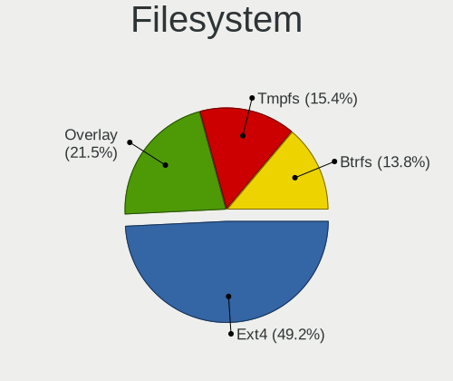
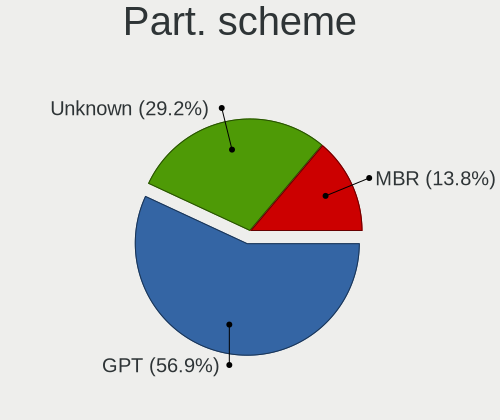
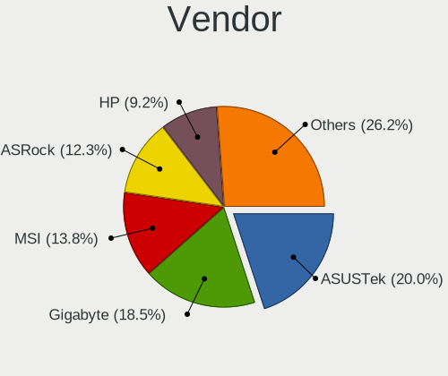
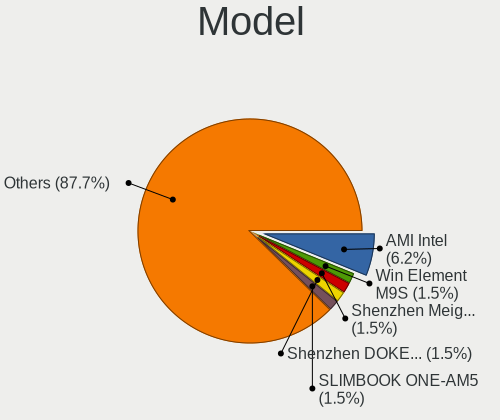
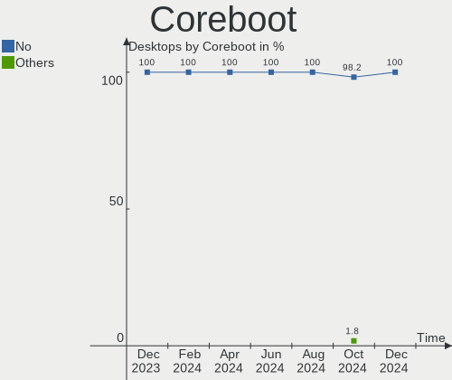
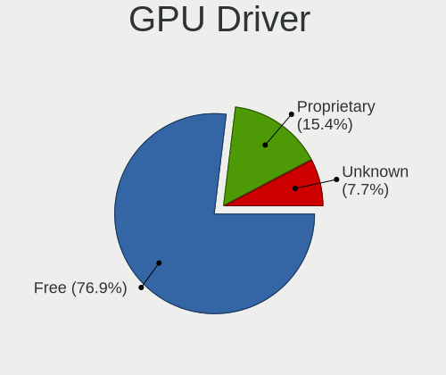
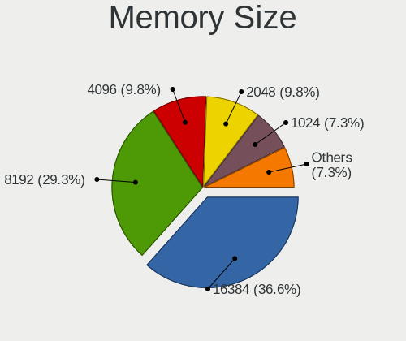
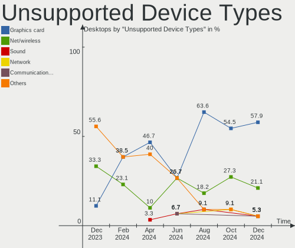

Linux in Spain - Hardware Trends (Desktops)
-------------------------------------------

A project to identify most popular hardware characteristics and track their change
over time based on data collected by Linux users at https://Linux-Hardware.org.

Anyone can contribute to this report by the [hw-probe](https://github.com/linuxhw/hw-probe) tool:

    sudo -E hw-probe -all -upload

Period: Aug, 2023.

Contents
--------

* [ System ](#system)
  - [ OS                       ](#os)
  - [ OS Family                ](#os-family)
  - [ Kernel                   ](#kernel)
  - [ Kernel Family            ](#kernel-family)
  - [ Kernel Major Ver.        ](#kernel-major-ver)
  - [ Arch                     ](#arch)
  - [ DE                       ](#de)
  - [ Display Server           ](#display-server)
  - [ Display Manager          ](#display-manager)
  - [ OS Lang                  ](#os-lang)
  - [ Boot Mode                ](#boot-mode)
  - [ Filesystem               ](#filesystem)
  - [ Part. scheme             ](#part-scheme)
  - [ Dual Boot with Linux/BSD ](#dual-boot-with-linuxbsd)
  - [ Dual Boot (Win)          ](#dual-boot-win)

* [ Board ](#board)
  - [ Vendor                   ](#vendor)
  - [ Model                    ](#model)
  - [ Model Family             ](#model-family)
  - [ MFG Year                 ](#mfg-year)
  - [ Form Factor              ](#form-factor)
  - [ Secure Boot              ](#secure-boot)
  - [ Coreboot                 ](#coreboot)
  - [ RAM Size                 ](#ram-size)
  - [ RAM Used                 ](#ram-used)
  - [ Total Drives             ](#total-drives)
  - [ Has CD-ROM               ](#has-cd-rom)
  - [ Has Ethernet             ](#has-ethernet)
  - [ Has WiFi                 ](#has-wifi)
  - [ Has Bluetooth            ](#has-bluetooth)

* [ Location ](#location)
  - [ Country                  ](#country)
  - [ City                     ](#city)

* [ Drives ](#drives)
  - [ Drive Vendor             ](#drive-vendor)
  - [ Drive Model              ](#drive-model)
  - [ HDD Vendor               ](#hdd-vendor)
  - [ SSD Vendor               ](#ssd-vendor)
  - [ Drive Kind               ](#drive-kind)
  - [ Drive Connector          ](#drive-connector)
  - [ Drive Size               ](#drive-size)
  - [ Space Total              ](#space-total)
  - [ Space Used               ](#space-used)
  - [ Malfunc. Drives          ](#malfunc-drives)
  - [ Malfunc. Drive Vendor    ](#malfunc-drive-vendor)
  - [ Malfunc. HDD Vendor      ](#malfunc-hdd-vendor)
  - [ Malfunc. Drive Kind      ](#malfunc-drive-kind)
  - [ Failed Drives            ](#failed-drives)
  - [ Failed Drive Vendor      ](#failed-drive-vendor)
  - [ Drive Status             ](#drive-status)

* [ Storage controller ](#storage-controller)
  - [ Storage Vendor           ](#storage-vendor)
  - [ Storage Model            ](#storage-model)
  - [ Storage Kind             ](#storage-kind)

* [ Processor ](#processor)
  - [ CPU Vendor               ](#cpu-vendor)
  - [ CPU Model                ](#cpu-model)
  - [ CPU Model Family         ](#cpu-model-family)
  - [ CPU Cores                ](#cpu-cores)
  - [ CPU Sockets              ](#cpu-sockets)
  - [ CPU Threads              ](#cpu-threads)
  - [ CPU Op-Modes             ](#cpu-op-modes)
  - [ CPU Microcode            ](#cpu-microcode)
  - [ CPU Microarch            ](#cpu-microarch)

* [ Graphics ](#graphics)
  - [ GPU Vendor               ](#gpu-vendor)
  - [ GPU Model                ](#gpu-model)
  - [ GPU Combo                ](#gpu-combo)
  - [ GPU Driver               ](#gpu-driver)
  - [ GPU Memory               ](#gpu-memory)

* [ Monitor ](#monitor)
  - [ Monitor Vendor           ](#monitor-vendor)
  - [ Monitor Model            ](#monitor-model)
  - [ Monitor Resolution       ](#monitor-resolution)
  - [ Monitor Diagonal         ](#monitor-diagonal)
  - [ Monitor Width            ](#monitor-width)
  - [ Aspect Ratio             ](#aspect-ratio)
  - [ Monitor Area             ](#monitor-area)
  - [ Pixel Density            ](#pixel-density)
  - [ Multiple Monitors        ](#multiple-monitors)

* [ Network ](#network)
  - [ Net Controller Vendor    ](#net-controller-vendor)
  - [ Net Controller Model     ](#net-controller-model)
  - [ Wireless Vendor          ](#wireless-vendor)
  - [ Wireless Model           ](#wireless-model)
  - [ Ethernet Vendor          ](#ethernet-vendor)
  - [ Ethernet Model           ](#ethernet-model)
  - [ Net Controller Kind      ](#net-controller-kind)
  - [ Used Controller          ](#used-controller)
  - [ NICs                     ](#nics)
  - [ IPv6                     ](#ipv6)

* [ Bluetooth ](#bluetooth)
  - [ Bluetooth Vendor         ](#bluetooth-vendor)
  - [ Bluetooth Model          ](#bluetooth-model)

* [ Sound ](#sound)
  - [ Sound Vendor             ](#sound-vendor)
  - [ Sound Model              ](#sound-model)

* [ Memory ](#memory)
  - [ Memory Vendor            ](#memory-vendor)
  - [ Memory Model             ](#memory-model)
  - [ Memory Kind              ](#memory-kind)
  - [ Memory Form Factor       ](#memory-form-factor)
  - [ Memory Size              ](#memory-size)
  - [ Memory Speed             ](#memory-speed)

* [ Printers & scanners ](#printers--scanners)
  - [ Printer Vendor           ](#printer-vendor)
  - [ Printer Model            ](#printer-model)
  - [ Scanner Vendor           ](#scanner-vendor)
  - [ Scanner Model            ](#scanner-model)

* [ Camera ](#camera)
  - [ Camera Vendor            ](#camera-vendor)
  - [ Camera Model             ](#camera-model)

* [ Security ](#security)
  - [ Fingerprint Vendor       ](#fingerprint-vendor)
  - [ Fingerprint Model        ](#fingerprint-model)
  - [ Chipcard Vendor          ](#chipcard-vendor)
  - [ Chipcard Model           ](#chipcard-model)

* [ Unsupported ](#unsupported)
  - [ Unsupported Devices      ](#unsupported-devices)
  - [ Unsupported Device Types ](#unsupported-device-types)

System
------

OS
--

Installed operating systems

| Name                         | Desktops | Percent |
|------------------------------|----------|---------|
| OpenMandriva 23.08           | 8        | 14.29%  |
| Debian 12                    | 5        | 8.93%   |
| Arch Rolling                 | 5        | 8.93%   |
| Fedora 38                    | 4        | 7.14%   |
| Ubuntu 22.04                 | 3        | 5.36%   |
| Linux Mint 21.2              | 3        | 5.36%   |
| Zorin 16                     | 2        | 3.57%   |
| OpenMandriva 23.90           | 2        | 3.57%   |
| Nobara 38                    | 2        | 3.57%   |
| Kubuntu 22.04                | 2        | 3.57%   |
| ArcoLinux Rolling            | 2        | 3.57%   |
| Xubuntu 22.04                | 1        | 1.79%   |
| Xero Rolling                 | 1        | 1.79%   |
| Ubuntu 23.10                 | 1        | 1.79%   |
| Ubuntu 23.04                 | 1        | 1.79%   |
| Ubuntu 20.04                 | 1        | 1.79%   |
| Parrot 5.3                   | 1        | 1.79%   |
| openSUSE Tumbleweed-XXXXXXXX | 1        | 1.79%   |
| openSUSE Microos-XXXXXXXX    | 1        | 1.79%   |
| OpenMandriva 4.3             | 1        | 1.79%   |
| OpenMandriva 23.07           | 1        | 1.79%   |
| Manjaro                      | 1        | 1.79%   |
| Linux Mint 21.1              | 1        | 1.79%   |
| Linux Mint 20.3              | 1        | 1.79%   |
| Kali 2023.2                  | 1        | 1.79%   |
| Garuda Linux Soaring         | 1        | 1.79%   |
| EndeavourOS Rolling          | 1        | 1.79%   |
| Debian 11                    | 1        | 1.79%   |
| Alpine 3.15.4                | 1        | 1.79%   |

OS Family
---------

OS without a version

| Name         | Desktops | Percent |
|--------------|----------|---------|
| OpenMandriva | 12       | 21.43%  |
| Ubuntu       | 6        | 10.71%  |
| Debian       | 6        | 10.71%  |
| Linux Mint   | 5        | 8.93%   |
| Arch         | 5        | 8.93%   |
| Fedora       | 4        | 7.14%   |
| Zorin        | 2        | 3.57%   |
| openSUSE     | 2        | 3.57%   |
| Nobara       | 2        | 3.57%   |
| Kubuntu      | 2        | 3.57%   |
| ArcoLinux    | 2        | 3.57%   |
| Xubuntu      | 1        | 1.79%   |
| Xero         | 1        | 1.79%   |
| Parrot       | 1        | 1.79%   |
| Manjaro      | 1        | 1.79%   |
| Kali         | 1        | 1.79%   |
| Garuda Linux | 1        | 1.79%   |
| EndeavourOS  | 1        | 1.79%   |
| Alpine       | 1        | 1.79%   |

Kernel
------

Version of the Linux kernel

| Version                      | Desktops | Percent |
|------------------------------|----------|---------|
| 6.4.11-desktop-1omv2390      | 7        | 12.5%   |
| 5.15.0-78-generic            | 5        | 8.93%   |
| 6.4.8-arch1-1                | 4        | 7.14%   |
| 6.2.0-26-generic             | 3        | 5.36%   |
| 6.1.0-10-amd64               | 3        | 5.36%   |
| 6.4.8-desktop-2omv2390       | 2        | 3.57%   |
| 6.1.0-11-amd64               | 2        | 3.57%   |
| 5.15.0-79-generic            | 2        | 3.57%   |
| 6.5.0-desktop-1omv2390       | 1        | 1.79%   |
| 6.4.9-arch1-1                | 1        | 1.79%   |
| 6.4.9-200.fc38.x86_64        | 1        | 1.79%   |
| 6.4.9-1-MANJARO              | 1        | 1.79%   |
| 6.4.9-1-default              | 1        | 1.79%   |
| 6.4.8-203.fsync.fc38.x86_64  | 1        | 1.79%   |
| 6.4.8-1-default              | 1        | 1.79%   |
| 6.4.7-zen1-2-zen             | 1        | 1.79%   |
| 6.4.7-200.fc38.x86_64        | 1        | 1.79%   |
| 6.4.6-200.fc38.x86_64        | 1        | 1.79%   |
| 6.4.12-arch1-1               | 1        | 1.79%   |
| 6.4.11-200.fc38.x86_64       | 1        | 1.79%   |
| 6.4.10-zen2-1-zen            | 1        | 1.79%   |
| 6.4.10-arch1-1               | 1        | 1.79%   |
| 6.4.10-202.fsync.fc38.x86_64 | 1        | 1.79%   |
| 6.3.5-desktop-3omv2390       | 1        | 1.79%   |
| 6.3.0-kali1-amd64            | 1        | 1.79%   |
| 6.3.0-7-generic              | 1        | 1.79%   |
| 6.2.0-31-generic             | 1        | 1.79%   |
| 6.2.0-27-generic             | 1        | 1.79%   |
| 6.1.39-3-lts                 | 1        | 1.79%   |
| 6.1.0-1parrot1-amd64         | 1        | 1.79%   |
| 5.4.0-156-generic            | 1        | 1.79%   |
| 5.19.0-50-generic            | 1        | 1.79%   |
| 5.16.7-desktop-1omv4003      | 1        | 1.79%   |
| 5.15.0-82-generic            | 1        | 1.79%   |
| 5.15.0-76-generic            | 1        | 1.79%   |
| 5.10.0-23-amd64              | 1        | 1.79%   |

Kernel Family
-------------

Linux kernel without a distro release

| Version | Desktops | Percent |
|---------|----------|---------|
| 5.15.0  | 9        | 16.07%  |
| 6.4.8   | 8        | 14.29%  |
| 6.4.11  | 8        | 14.29%  |
| 6.1.0   | 6        | 10.71%  |
| 6.2.0   | 5        | 8.93%   |
| 6.4.9   | 4        | 7.14%   |
| 6.4.10  | 3        | 5.36%   |
| 6.4.7   | 2        | 3.57%   |
| 6.3.0   | 2        | 3.57%   |
| 6.5.0   | 1        | 1.79%   |
| 6.4.6   | 1        | 1.79%   |
| 6.4.12  | 1        | 1.79%   |
| 6.3.5   | 1        | 1.79%   |
| 6.1.39  | 1        | 1.79%   |
| 5.4.0   | 1        | 1.79%   |
| 5.19.0  | 1        | 1.79%   |
| 5.16.7  | 1        | 1.79%   |
| 5.10.0  | 1        | 1.79%   |

Kernel Major Ver.
-----------------

Linux kernel major version

| Version | Desktops | Percent |
|---------|----------|---------|
| 6.4     | 27       | 48.21%  |
| 5.15    | 9        | 16.07%  |
| 6.1     | 7        | 12.5%   |
| 6.2     | 5        | 8.93%   |
| 6.3     | 3        | 5.36%   |
| 6.5     | 1        | 1.79%   |
| 5.4     | 1        | 1.79%   |
| 5.19    | 1        | 1.79%   |
| 5.16    | 1        | 1.79%   |
| 5.10    | 1        | 1.79%   |

Arch
----

OS architecture (x86_64, i586, etc.)

| Name   | Desktops | Percent |
|--------|----------|---------|
| x86_64 | 56       | 100%    |

DE
--

Desktop Environment

| Name       | Desktops | Percent |
|------------|----------|---------|
| KDE5       | 20       | 35.71%  |
| GNOME      | 19       | 33.93%  |
| XFCE       | 5        | 8.93%   |
| X-Cinnamon | 4        | 7.14%   |
| Unknown    | 4        | 7.14%   |
| MATE       | 1        | 1.79%   |
| LXQt       | 1        | 1.79%   |
| hyprland   | 1        | 1.79%   |
| bspwm      | 1        | 1.79%   |

Display Server
--------------

X11 or Wayland

| Name    | Desktops | Percent |
|---------|----------|---------|
| X11     | 29       | 51.79%  |
| Wayland | 23       | 41.07%  |
| Tty     | 2        | 3.57%   |
| Unknown | 2        | 3.57%   |

Display Manager
---------------

SDDM, LightDM, etc.

| Name    | Desktops | Percent |
|---------|----------|---------|
| SDDM    | 19       | 33.93%  |
| Unknown | 18       | 32.14%  |
| GDM3    | 7        | 12.5%   |
| LightDM | 6        | 10.71%  |
| GDM     | 6        | 10.71%  |

OS Lang
-------

Language

| Lang    | Desktops | Percent |
|---------|----------|---------|
| es_ES   | 42       | 75%     |
| en_US   | 6        | 10.71%  |
| gl_ES   | 2        | 3.57%   |
| eu_ES   | 1        | 1.79%   |
| es_DO   | 1        | 1.79%   |
| en_GB   | 1        | 1.79%   |
| ca_ES   | 1        | 1.79%   |
| C       | 1        | 1.79%   |
| Unknown | 1        | 1.79%   |

Boot Mode
---------

EFI or BIOS

| Mode | Desktops | Percent |
|------|----------|---------|
| EFI  | 35       | 62.5%   |
| BIOS | 21       | 37.5%   |

Filesystem
----------

Type of filesystem

| Type    | Desktops | Percent |
|---------|----------|---------|
| Ext4    | 32       | 57.14%  |
| Btrfs   | 13       | 23.21%  |
| Overlay | 7        | 12.5%   |
| Tmpfs   | 4        | 7.14%   |

Part. scheme
------------

Scheme of partitioning

| Type    | Desktops | Percent |
|---------|----------|---------|
| GPT     | 36       | 64.29%  |
| Unknown | 15       | 26.79%  |
| MBR     | 5        | 8.93%   |

Dual Boot with Linux/BSD
------------------------

Hosting more than one Linux/BSD

| Dual boot | Desktops | Percent |
|-----------|----------|---------|
| No        | 38       | 67.86%  |
| Yes       | 18       | 32.14%  |

Dual Boot (Win)
---------------

Hosting Linux and Windows

| Dual boot | Desktops | Percent |
|-----------|----------|---------|
| No        | 38       | 67.86%  |
| Yes       | 18       | 32.14%  |

Board
-----

Vendor
------

Motherboard manufacturer

| Name                | Desktops | Percent |
|---------------------|----------|---------|
| Gigabyte Technology | 13       | 23.21%  |
| ASUSTek Computer    | 13       | 23.21%  |
| MSI                 | 10       | 17.86%  |
| Hewlett-Packard     | 6        | 10.71%  |
| Acer                | 3        | 5.36%   |
| ASRock              | 2        | 3.57%   |
| Unknown             | 2        | 3.57%   |
| Packard Bell        | 1        | 1.79%   |
| Medion              | 1        | 1.79%   |
| Lenovo              | 1        | 1.79%   |
| Intel               | 1        | 1.79%   |
| Huanan              | 1        | 1.79%   |
| GEEKOM              | 1        | 1.79%   |
| Dell                | 1        | 1.79%   |

Model
-----

Motherboard model

| Name                                   | Desktops | Percent |
|----------------------------------------|----------|---------|
| ASUS All Series                        | 3        | 5.36%   |
| Acer Aspire TC-605                     | 2        | 3.57%   |
| Unknown                                | 2        | 3.57%   |
| Packard Bell ISTART D9281              | 1        | 1.79%   |
| MSI MS-7D73                            | 1        | 1.79%   |
| MSI MS-7C91                            | 1        | 1.79%   |
| MSI MS-7C79                            | 1        | 1.79%   |
| MSI MS-7C75                            | 1        | 1.79%   |
| MSI MS-7B86                            | 1        | 1.79%   |
| MSI MS-7978                            | 1        | 1.79%   |
| MSI MS-7721                            | 1        | 1.79%   |
| MSI KBL-U Pro Cubi2 (MS-B142)          | 1        | 1.79%   |
| MSI 956                                | 1        | 1.79%   |
| MSI 500-136es                          | 1        | 1.79%   |
| Medion MS-7728                         | 1        | 1.79%   |
| Lenovo ThinkCentre Edge72 3484L3G      | 1        | 1.79%   |
| Intel HM570                            | 1        | 1.79%   |
| Huanan H97-ZD3 V2.1                    | 1        | 1.79%   |
| HP Slim Desktop S01-pF1xxx             | 1        | 1.79%   |
| HP Slim Desktop S01-aF0xxx             | 1        | 1.79%   |
| HP ProDesk 405 G6 Small Form Factor PC | 1        | 1.79%   |
| HP ProDesk 405 G4 SFF                  | 1        | 1.79%   |
| HP EliteDesk 800 G1 TWR                | 1        | 1.79%   |
| HP Compaq Pro 6300 SFF                 | 1        | 1.79%   |
| Gigabyte Z370 AORUS Gaming 5           | 1        | 1.79%   |
| Gigabyte Z170-HD3P-CF                  | 1        | 1.79%   |
| Gigabyte X570 AORUS MASTER             | 1        | 1.79%   |
| Gigabyte X570 AORUS ELITE              | 1        | 1.79%   |
| Gigabyte X299 AORUS Ultra Gaming Pro   | 1        | 1.79%   |
| Gigabyte H81M-S2H                      | 1        | 1.79%   |
| Gigabyte H61M-DS2                      | 1        | 1.79%   |
| Gigabyte GB-BSi5-1135G7                | 1        | 1.79%   |
| Gigabyte GA-MA770T-UD3                 | 1        | 1.79%   |
| Gigabyte F2A88XM-D3HP                  | 1        | 1.79%   |
| Gigabyte EX58-UD5                      | 1        | 1.79%   |
| Gigabyte B550M DS3H                    | 1        | 1.79%   |
| Gigabyte A320M-S2H V2                  | 1        | 1.79%   |
| GEEKOM GM08i3T                         | 1        | 1.79%   |
| Dell G5 5000                           | 1        | 1.79%   |
| ASUS TUF Gaming X570-PRO               | 1        | 1.79%   |

Model Family
------------

Motherboard model prefix

| Name                    | Desktops | Percent |
|-------------------------|----------|---------|
| ASUS ROG                | 3        | 5.36%   |
| ASUS All                | 3        | 5.36%   |
| Acer Aspire             | 3        | 5.36%   |
| HP Slim                 | 2        | 3.57%   |
| HP ProDesk              | 2        | 3.57%   |
| Gigabyte X570           | 2        | 3.57%   |
| ASUS TUF                | 2        | 3.57%   |
| ASUS PRIME              | 2        | 3.57%   |
| Unknown                 | 2        | 3.57%   |
| Packard Bell ISTART     | 1        | 1.79%   |
| MSI MS-7D73             | 1        | 1.79%   |
| MSI MS-7C91             | 1        | 1.79%   |
| MSI MS-7C79             | 1        | 1.79%   |
| MSI MS-7C75             | 1        | 1.79%   |
| MSI MS-7B86             | 1        | 1.79%   |
| MSI MS-7978             | 1        | 1.79%   |
| MSI MS-7721             | 1        | 1.79%   |
| MSI KBL-U               | 1        | 1.79%   |
| MSI 956                 | 1        | 1.79%   |
| MSI 500-136es           | 1        | 1.79%   |
| Medion MS-7728          | 1        | 1.79%   |
| Lenovo ThinkCentre      | 1        | 1.79%   |
| Intel HM570             | 1        | 1.79%   |
| Huanan H97-ZD3          | 1        | 1.79%   |
| HP EliteDesk            | 1        | 1.79%   |
| HP Compaq               | 1        | 1.79%   |
| Gigabyte Z370           | 1        | 1.79%   |
| Gigabyte Z170-HD3P-CF   | 1        | 1.79%   |
| Gigabyte X299           | 1        | 1.79%   |
| Gigabyte H81M-S2H       | 1        | 1.79%   |
| Gigabyte H61M-DS2       | 1        | 1.79%   |
| Gigabyte GB-BSi5-1135G7 | 1        | 1.79%   |
| Gigabyte GA-MA770T-UD3  | 1        | 1.79%   |
| Gigabyte F2A88XM-D3HP   | 1        | 1.79%   |
| Gigabyte EX58-UD5       | 1        | 1.79%   |
| Gigabyte B550M          | 1        | 1.79%   |
| Gigabyte A320M-S2H      | 1        | 1.79%   |
| GEEKOM GM08i3T          | 1        | 1.79%   |
| Dell G5                 | 1        | 1.79%   |
| ASUS Pro                | 1        | 1.79%   |

MFG Year
--------

Motherboard manufacture year

| Year | Desktops | Percent |
|------|----------|---------|
| 2020 | 10       | 17.86%  |
| 2021 | 8        | 14.29%  |
| 2013 | 5        | 8.93%   |
| 2012 | 5        | 8.93%   |
| 2022 | 4        | 7.14%   |
| 2018 | 4        | 7.14%   |
| 2014 | 4        | 7.14%   |
| 2019 | 3        | 5.36%   |
| 2015 | 3        | 5.36%   |
| 2023 | 2        | 3.57%   |
| 2017 | 2        | 3.57%   |
| 2011 | 2        | 3.57%   |
| 2010 | 1        | 1.79%   |
| 2009 | 1        | 1.79%   |
| 2008 | 1        | 1.79%   |
| 2007 | 1        | 1.79%   |

Form Factor
-----------

Physical design of the computer

| Name    | Desktops | Percent |
|---------|----------|---------|
| Desktop | 56       | 100%    |

Secure Boot
-----------

Enabled or disabled

| State    | Desktops | Percent |
|----------|----------|---------|
| Disabled | 54       | 96.43%  |
| Enabled  | 2        | 3.57%   |

Coreboot
--------

Have coreboot on board

| Used | Desktops | Percent |
|------|----------|---------|
| No   | 56       | 100%    |

RAM Size
--------

Total RAM memory

| Size in GB  | Desktops | Percent |
|-------------|----------|---------|
| 16.01-24.0  | 17       | 30.36%  |
| 32.01-64.0  | 12       | 21.43%  |
| 8.01-16.0   | 10       | 17.86%  |
| 4.01-8.0    | 9        | 16.07%  |
| 64.01-256.0 | 3        | 5.36%   |
| 3.01-4.0    | 2        | 3.57%   |
| 24.01-32.0  | 2        | 3.57%   |
| 2.01-3.0    | 1        | 1.79%   |

RAM Used
--------

Used RAM memory

| Used GB    | Desktops | Percent |
|------------|----------|---------|
| 2.01-3.0   | 14       | 25%     |
| 1.01-2.0   | 14       | 25%     |
| 3.01-4.0   | 12       | 21.43%  |
| 4.01-8.0   | 10       | 17.86%  |
| 8.01-16.0  | 5        | 8.93%   |
| 32.01-64.0 | 1        | 1.79%   |

Total Drives
------------

Number of drives on board

| Drives | Desktops | Percent |
|--------|----------|---------|
| 2      | 19       | 33.93%  |
| 1      | 13       | 23.21%  |
| 3      | 10       | 17.86%  |
| 4      | 7        | 12.5%   |
| 5      | 4        | 7.14%   |
| 7      | 1        | 1.79%   |
| 6      | 1        | 1.79%   |
| 0      | 1        | 1.79%   |

Has CD-ROM
----------

Has CD-ROM on board

| Presented | Desktops | Percent |
|-----------|----------|---------|
| No        | 35       | 62.5%   |
| Yes       | 21       | 37.5%   |

Has Ethernet
------------

Has Ethernet on board

| Presented | Desktops | Percent |
|-----------|----------|---------|
| Yes       | 56       | 100%    |

Has WiFi
--------

Has WiFi module

| Presented | Desktops | Percent |
|-----------|----------|---------|
| Yes       | 31       | 55.36%  |
| No        | 25       | 44.64%  |

Has Bluetooth
-------------

Has Bluetooth module

| Presented | Desktops | Percent |
|-----------|----------|---------|
| Yes       | 33       | 58.93%  |
| No        | 23       | 41.07%  |

Location
--------

Country
-------

Geographic location (country)

| Country | Desktops | Percent |
|---------|----------|---------|
| Spain   | 56       | 100%    |

City
----

Geographic location (city)

| City                     | Desktops | Percent |
|--------------------------|----------|---------|
| Valencia                 | 4        | 7.14%   |
| Madrid                   | 4        | 7.14%   |
| Barcelona                | 3        | 5.36%   |
| Zaragoza                 | 2        | 3.57%   |
| Santiago de Compostela   | 2        | 3.57%   |
| Jerez de la Frontera     | 2        | 3.57%   |
| Bilbao                   | 2        | 3.57%   |
| Villamartin              | 1        | 1.79%   |
| Vigo                     | 1        | 1.79%   |
| Torrevieja               | 1        | 1.79%   |
| Toledo                   | 1        | 1.79%   |
| Santa Cruz de Tenerife   | 1        | 1.79%   |
| Santa Coloma de Gramenet | 1        | 1.79%   |
| San Vicent del Raspeig   | 1        | 1.79%   |
| San Fernando             | 1        | 1.79%   |
| Salou                    | 1        | 1.79%   |
| Sabadell                 | 1        | 1.79%   |
| Rubí                    | 1        | 1.79%   |
| Pozuelo de Alarcón      | 1        | 1.79%   |
| Pinoso                   | 1        | 1.79%   |
| Parla                    | 1        | 1.79%   |
| Motril                   | 1        | 1.79%   |
| Mollet del Vallès       | 1        | 1.79%   |
| Manises                  | 1        | 1.79%   |
| Los Llanos de Aridane    | 1        | 1.79%   |
| Logroño                 | 1        | 1.79%   |
| L'Entregu/El Entrego     | 1        | 1.79%   |
| Inca                     | 1        | 1.79%   |
| Huelva                   | 1        | 1.79%   |
| Granada                  | 1        | 1.79%   |
| Gijón                   | 1        | 1.79%   |
| Fuenlabrada              | 1        | 1.79%   |
| Cruilles                 | 1        | 1.79%   |
| Colmenar Viejo           | 1        | 1.79%   |
| Castalla                 | 1        | 1.79%   |
| Burgos                   | 1        | 1.79%   |
| Benicarló               | 1        | 1.79%   |
| Barakaldo                | 1        | 1.79%   |
| Atarfe                   | 1        | 1.79%   |
| Alicante                 | 1        | 1.79%   |

Drives
------

Drive Vendor
------------

Hard drive vendors

| Vendor                      | Desktops | Drives | Percent |
|-----------------------------|----------|--------|---------|
| WDC                         | 22       | 28     | 18.33%  |
| Seagate                     | 20       | 27     | 16.67%  |
| Samsung Electronics         | 20       | 27     | 16.67%  |
| Kingston                    | 13       | 14     | 10.83%  |
| Toshiba                     | 6        | 6      | 5%      |
| Hitachi                     | 6        | 7      | 5%      |
| Crucial                     | 4        | 5      | 3.33%   |
| Sandisk                     | 3        | 3      | 2.5%    |
| Phison Electronics          | 3        | 4      | 2.5%    |
| KIOXIA                      | 3        | 3      | 2.5%    |
| Kingston Technology Company | 3        | 3      | 2.5%    |
| Unknown                     | 2        | 2      | 1.67%   |
| Patriot                     | 2        | 2      | 1.67%   |
| SPCC                        | 1        | 1      | 0.83%   |
| SK hynix                    | 1        | 1      | 0.83%   |
| Silicon Motion              | 1        | 1      | 0.83%   |
| PNY                         | 1        | 1      | 0.83%   |
| Micron/Crucial Technology   | 1        | 1      | 0.83%   |
| Micron Technology           | 1        | 1      | 0.83%   |
| KingSpec                    | 1        | 1      | 0.83%   |
| JMicron Technology          | 1        | 1      | 0.83%   |
| Intenso                     | 1        | 1      | 0.83%   |
| Intel                       | 1        | 1      | 0.83%   |
| Gigabyte Technology         | 1        | 1      | 0.83%   |
| Fujitsu                     | 1        | 1      | 0.83%   |
| Dogfish                     | 1        | 1      | 0.83%   |

Drive Model
-----------

Hard drive models

| Model                                                 | Desktops | Percent |
|-------------------------------------------------------|----------|---------|
| Samsung NVMe SSD Controller SM981/PM981/PM983 500GB   | 4        | 2.9%    |
| Kingston SA400S37240G 240GB SSD                       | 4        | 2.9%    |
| Seagate ST1000DM010-2EP102 1TB                        | 3        | 2.17%   |
| Samsung NVMe SSD Controller PM9A1/PM9A3/980PRO 1024GB | 3        | 2.17%   |
| Phison E12 NVMe Controller 256GB                      | 3        | 2.17%   |
| Kingston SV300S37A120G 120GB SSD                      | 3        | 2.17%   |
| WDC WD5000AAKX-08U6AA0 500GB                          | 2        | 1.45%   |
| WDC WD20EARS-00MVWB0 2TB                              | 2        | 1.45%   |
| Seagate ST3500418AS 500GB                             | 2        | 1.45%   |
| Seagate ST2000DM008-2FR102 2TB                        | 2        | 1.45%   |
| Seagate ST1000DM003-1ER162 1TB                        | 2        | 1.45%   |
| Seagate BarraCuda Q5 ZP500CV30001 500GB               | 2        | 1.45%   |
| Samsung SSD 860 EVO 500GB                             | 2        | 1.45%   |
| Samsung SSD 860 EVO 1TB                               | 2        | 1.45%   |
| Kingston Company SNV2S1000G 1TB                       | 2        | 1.45%   |
| Kingston SA400S37480G 480GB SSD                       | 2        | 1.45%   |
| WDC WDS500G2B0B-00YS70 500GB SSD                      | 1        | 0.72%   |
| WDC WDS500G2B0A-00SM50 500GB SSD                      | 1        | 0.72%   |
| WDC WDS500G1X0E-00AFY0 500GB                          | 1        | 0.72%   |
| WDC WDS100T2B0A-00SM50 1TB SSD                        | 1        | 0.72%   |
| WDC WD5000BPVT-60HXZT3 500GB                          | 1        | 0.72%   |
| WDC WD5000AAKX-001CA0 500GB                           | 1        | 0.72%   |
| WDC WD50 00AADS-00S9B0 500GB                          | 1        | 0.72%   |
| WDC WD40EZRZ-22GXCB0 4TB                              | 1        | 0.72%   |
| WDC WD40EFAX-68JH4N0 4TB                              | 1        | 0.72%   |
| WDC WD30EZRX-00SPEB0 3TB                              | 1        | 0.72%   |
| WDC WD20EZRZ-00Z5HB0 2TB                              | 1        | 0.72%   |
| WDC WD20EZRX-00DC0B0 2TB                              | 1        | 0.72%   |
| WDC WD20EARS-14MVWB0 2TB                              | 1        | 0.72%   |
| WDC WD15EARS-00MVWB0 1TB                              | 1        | 0.72%   |
| WDC WD10SPCX-16KHST0 1TB                              | 1        | 0.72%   |
| WDC WD10EZRX-00D8PB0 1TB                              | 1        | 0.72%   |
| WDC WD10EZEX-60WN4A0 1TB                              | 1        | 0.72%   |
| WDC WD10EZEX-08WN4A0 1TB                              | 1        | 0.72%   |
| WDC WD10EZEX-08M2NA0 1TB                              | 1        | 0.72%   |
| WDC WD10EAVS-00D7B0 1TB                               | 1        | 0.72%   |
| WDC WD10EALS-00Z8A0 1TB                               | 1        | 0.72%   |
| WDC WD10EACS-65D6B0 1TB                               | 1        | 0.72%   |
| WDC PC SN530 SDBPNPZ-256G-1006 256GB                  | 1        | 0.72%   |
| Unknown SD/MMC/MS PRO 1GB                             | 1        | 0.72%   |

HDD Vendor
----------

Hard disk drive vendors

| Vendor              | Desktops | Drives | Percent |
|---------------------|----------|--------|---------|
| WDC                 | 18       | 23     | 35.29%  |
| Seagate             | 18       | 23     | 35.29%  |
| Hitachi             | 6        | 7      | 11.76%  |
| Toshiba             | 5        | 5      | 9.8%    |
| Samsung Electronics | 2        | 2      | 3.92%   |
| Unknown             | 1        | 1      | 1.96%   |
| Fujitsu             | 1        | 1      | 1.96%   |

SSD Vendor
----------

Solid state drive vendors

| Vendor              | Desktops | Drives | Percent |
|---------------------|----------|--------|---------|
| Kingston            | 12       | 13     | 30.77%  |
| Samsung Electronics | 10       | 12     | 25.64%  |
| Crucial             | 4        | 5      | 10.26%  |
| WDC                 | 3        | 3      | 7.69%   |
| Patriot             | 2        | 2      | 5.13%   |
| Toshiba             | 1        | 1      | 2.56%   |
| SanDisk             | 1        | 1      | 2.56%   |
| PNY                 | 1        | 1      | 2.56%   |
| Micron Technology   | 1        | 1      | 2.56%   |
| KingSpec            | 1        | 1      | 2.56%   |
| JMicron Technology  | 1        | 1      | 2.56%   |
| Intenso             | 1        | 1      | 2.56%   |
| Dogfish             | 1        | 1      | 2.56%   |

Drive Kind
----------

HDD or SSD

| Kind    | Desktops | Drives | Percent |
|---------|----------|--------|---------|
| HDD     | 38       | 62     | 37.25%  |
| SSD     | 34       | 43     | 33.33%  |
| NVMe    | 28       | 37     | 27.45%  |
| MMC     | 1        | 1      | 0.98%   |
| Unknown | 1        | 1      | 0.98%   |

Drive Connector
---------------

SATA, SAS, NVMe, etc.

| Type | Desktops | Drives | Percent |
|------|----------|--------|---------|
| SATA | 45       | 100    | 56.96%  |
| NVMe | 28       | 37     | 35.44%  |
| SAS  | 5        | 6      | 6.33%   |
| MMC  | 1        | 1      | 1.27%   |

Drive Size
----------

Size of hard drive

| Size in TB | Desktops | Drives | Percent |
|------------|----------|--------|---------|
| 0.01-0.5   | 33       | 55     | 43.42%  |
| 0.51-1.0   | 25       | 28     | 32.89%  |
| 1.01-2.0   | 8        | 12     | 10.53%  |
| 3.01-4.0   | 4        | 4      | 5.26%   |
| 4.01-10.0  | 4        | 4      | 5.26%   |
| 2.01-3.0   | 2        | 2      | 2.63%   |

Space Total
-----------

Amount of disk space available on the file system

| Size in GB     | Desktops | Percent |
|----------------|----------|---------|
| More than 3000 | 10       | 17.86%  |
| 501-1000       | 10       | 17.86%  |
| 251-500        | 9        | 16.07%  |
| 1001-2000      | 9        | 16.07%  |
| 101-250        | 8        | 14.29%  |
| 1-20           | 6        | 10.71%  |
| 2001-3000      | 2        | 3.57%   |
| 51-100         | 1        | 1.79%   |
| Unknown        | 1        | 1.79%   |

Space Used
----------

Amount of used disk space

| Used GB        | Desktops | Percent |
|----------------|----------|---------|
| 1-20           | 17       | 30.36%  |
| 251-500        | 7        | 12.5%   |
| 1001-2000      | 7        | 12.5%   |
| 51-100         | 7        | 12.5%   |
| 101-250        | 6        | 10.71%  |
| 21-50          | 4        | 7.14%   |
| More than 3000 | 3        | 5.36%   |
| 2001-3000      | 2        | 3.57%   |
| 501-1000       | 2        | 3.57%   |
| Unknown        | 1        | 1.79%   |

Malfunc. Drives
---------------

Drive models with a malfunction

| Model                                    | Desktops | Drives | Percent |
|------------------------------------------|----------|--------|---------|
| WDC WD20EARS-00MVWB0 2TB                 | 2        | 3      | 11.11%  |
| WDC WD5000BPVT-60HXZT3 500GB             | 1        | 1      | 5.56%   |
| WDC WD5000AAKX-08U6AA0 500GB             | 1        | 1      | 5.56%   |
| WDC WD40EFAX-68JH4N0 4TB                 | 1        | 1      | 5.56%   |
| WDC WD10EAVS-00D7B0 1TB                  | 1        | 1      | 5.56%   |
| SPCC M.2 PCIe SSD 256GB                  | 1        | 1      | 5.56%   |
| Seagate ST9500325AS 500GB                | 1        | 1      | 5.56%   |
| Seagate ST3500630AS 500GB                | 1        | 1      | 5.56%   |
| Seagate ST3500418AS 500GB                | 1        | 1      | 5.56%   |
| Seagate ST3500320AS 500GB                | 1        | 1      | 5.56%   |
| Seagate ST1000LM014-1EJ164 1TB           | 1        | 1      | 5.56%   |
| Samsung Electronics SSD 860 EVO 500GB    | 1        | 1      | 5.56%   |
| Samsung Electronics HM160HI 160GB        | 1        | 1      | 5.56%   |
| JMicron Technology Generic 1TB           | 1        | 1      | 5.56%   |
| Intenso TOP M.2 SATA 128GB SSD           | 1        | 1      | 5.56%   |
| Hitachi HDT722516DLA380 41N3148LEN 160GB | 1        | 1      | 5.56%   |
| Dogfish SSD 256GB                        | 1        | 1      | 5.56%   |

Malfunc. Drive Vendor
---------------------

Vendors of faulty drives

| Vendor              | Desktops | Drives | Percent |
|---------------------|----------|--------|---------|
| WDC                 | 6        | 7      | 37.5%   |
| Seagate             | 3        | 5      | 18.75%  |
| Samsung Electronics | 2        | 2      | 12.5%   |
| SPCC                | 1        | 1      | 6.25%   |
| JMicron Technology  | 1        | 1      | 6.25%   |
| Intenso             | 1        | 1      | 6.25%   |
| Hitachi             | 1        | 1      | 6.25%   |
| Dogfish             | 1        | 1      | 6.25%   |

Malfunc. HDD Vendor
-------------------

Vendors of faulty HDD drives

| Vendor              | Desktops | Drives | Percent |
|---------------------|----------|--------|---------|
| WDC                 | 6        | 7      | 54.55%  |
| Seagate             | 3        | 5      | 27.27%  |
| Samsung Electronics | 1        | 1      | 9.09%   |
| Hitachi             | 1        | 1      | 9.09%   |

Malfunc. Drive Kind
-------------------

Kinds of faulty drives

| Kind | Desktops | Drives | Percent |
|------|----------|--------|---------|
| HDD  | 7        | 14     | 58.33%  |
| SSD  | 4        | 4      | 33.33%  |
| NVMe | 1        | 1      | 8.33%   |

Failed Drives
-------------

Failed drive models

Zero info for selected period =(

Failed Drive Vendor
-------------------

Failed drive vendors

Zero info for selected period =(

Drive Status
------------

Number of failed and malfunc. drives

| Status   | Desktops | Drives | Percent |
|----------|----------|--------|---------|
| Works    | 32       | 66     | 48.48%  |
| Detected | 23       | 59     | 34.85%  |
| Malfunc  | 11       | 19     | 16.67%  |

Storage controller
------------------

Storage Vendor
--------------

Storage controller vendors

| Vendor                           | Desktops | Percent |
|----------------------------------|----------|---------|
| Intel                            | 32       | 35.16%  |
| AMD                              | 20       | 21.98%  |
| Samsung Electronics              | 12       | 13.19%  |
| SanDisk                          | 4        | 4.4%    |
| Kingston Technology Company      | 4        | 4.4%    |
| Seagate Technology               | 3        | 3.3%    |
| Phison Electronics               | 3        | 3.3%    |
| KIOXIA                           | 3        | 3.3%    |
| JMicron Technology               | 2        | 2.2%    |
| SK hynix                         | 1        | 1.1%    |
| Silicon Motion                   | 1        | 1.1%    |
| Silicon Integrated Systems [SiS] | 1        | 1.1%    |
| Realtek Semiconductor            | 1        | 1.1%    |
| Nvidia                           | 1        | 1.1%    |
| Micron/Crucial Technology        | 1        | 1.1%    |
| Micron Technology                | 1        | 1.1%    |
| ASMedia Technology               | 1        | 1.1%    |

Storage Model
-------------

Storage controller models

| Model                                                                          | Desktops | Percent |
|--------------------------------------------------------------------------------|----------|---------|
| AMD FCH SATA Controller [AHCI mode]                                            | 12       | 11.76%  |
| Intel 8 Series/C220 Series Chipset Family 6-port SATA Controller 1 [AHCI mode] | 6        | 5.88%   |
| AMD 500 Series Chipset SATA Controller                                         | 5        | 4.9%    |
| Samsung NVMe SSD Controller SM981/PM981/PM983                                  | 4        | 3.92%   |
| Samsung NVMe SSD Controller PM9A1/PM9A3/980PRO                                 | 4        | 3.92%   |
| Intel 6 Series/C200 Series Chipset Family 6 port Desktop SATA AHCI Controller  | 4        | 3.92%   |
| Intel 200 Series PCH SATA controller [AHCI mode]                               | 4        | 3.92%   |
| Phison E12 NVMe Controller                                                     | 3        | 2.94%   |
| Intel Volume Management Device NVMe RAID Controller                            | 3        | 2.94%   |
| Seagate BarraCuda Q5 NVMe SSD (DRAM-less)                                      | 2        | 1.96%   |
| SanDisk WD PC SN810 / Black SN850 NVMe SSD                                     | 2        | 1.96%   |
| Samsung NVMe SSD Controller SM961/PM961/SM963                                  | 2        | 1.96%   |
| KIOXIA NVMe SSD Controller BG4 (DRAM-less)                                     | 2        | 1.96%   |
| Kingston Company Company Non-Volatile memory controller                        | 2        | 1.96%   |
| Intel Q170/Q150/B150/H170/H110/Z170/CM236 Chipset SATA Controller [AHCI Mode]  | 2        | 1.96%   |
| Intel Comet Lake SATA AHCI Controller                                          | 2        | 1.96%   |
| Intel Alder Lake-S PCH SATA Controller [AHCI Mode]                             | 2        | 1.96%   |
| Intel 9 Series Chipset Family SATA Controller [AHCI Mode]                      | 2        | 1.96%   |
| AMD SB7x0/SB8x0/SB9x0 IDE Controller                                           | 2        | 1.96%   |
| AMD 300 Series Chipset SATA Controller                                         | 2        | 1.96%   |
| SK hynix BC511 NVMe SSD                                                        | 1        | 0.98%   |
| Silicon Motion SM2263EN/SM2263XT (DRAM-less) NVMe SSD Controllers              | 1        | 0.98%   |
| Silicon Integrated Systems [SiS] SATA Controller / IDE mode                    | 1        | 0.98%   |
| Silicon Integrated Systems [SiS] 5513 IDE Controller                           | 1        | 0.98%   |
| Seagate FireCuda 530 SSD                                                       | 1        | 0.98%   |
| SanDisk WD Blue SN550 NVMe SSD                                                 | 1        | 0.98%   |
| SanDisk WD Black 2018/SN750 / PC SN720 NVMe SSD                                | 1        | 0.98%   |
| Samsung NVMe SSD Controller SM951/PM951                                        | 1        | 0.98%   |
| Samsung NVMe SSD Controller 980                                                | 1        | 0.98%   |
| Realtek RTS5763DL NVMe SSD Controller                                          | 1        | 0.98%   |
| Phison E18 PCIe4 NVMe Controller                                               | 1        | 0.98%   |
| Nvidia MCP61 SATA Controller                                                   | 1        | 0.98%   |
| Nvidia MCP61 IDE                                                               | 1        | 0.98%   |
| Micron/Crucial P2 [Nick P2] / P3 / P3 Plus NVMe PCIe SSD (DRAM-less)           | 1        | 0.98%   |
| Micron 2200S NVMe SSD [Cassandra]                                              | 1        | 0.98%   |
| KIOXIA NVMe SSD                                                                | 1        | 0.98%   |
| Kingston Company KC2000/KC2500 NVMe SSD                                        | 1        | 0.98%   |
| Kingston Company A2000 NVMe SSD                                                | 1        | 0.98%   |
| JMicron JMB58x AHCI SATA controller                                            | 1        | 0.98%   |
| JMicron JMB363 SATA/IDE Controller                                             | 1        | 0.98%   |

Storage Kind
------------

Kind of storage controller (IDE, SATA, NVMe, SAS, ...)

| Kind | Desktops | Percent |
|------|----------|---------|
| SATA | 49       | 55.68%  |
| NVMe | 29       | 32.95%  |
| RAID | 5        | 5.68%   |
| IDE  | 5        | 5.68%   |

Processor
---------

CPU Vendor
----------

Processor vendors

| Vendor | Desktops | Percent |
|--------|----------|---------|
| Intel  | 35       | 62.5%   |
| AMD    | 21       | 37.5%   |

CPU Model
---------

Processor models

| Model                                           | Desktops | Percent |
|-------------------------------------------------|----------|---------|
| Intel Core i5-4460 CPU @ 3.20GHz                | 2        | 3.57%   |
| Intel Core i3-4170 CPU @ 3.70GHz                | 2        | 3.57%   |
| Intel Core i3-10100 CPU @ 3.60GHz               | 2        | 3.57%   |
| AMD Ryzen 7 5700G with Radeon Graphics          | 2        | 3.57%   |
| AMD Ryzen 7 3700X 8-Core Processor              | 2        | 3.57%   |
| AMD Ryzen 5 5600X 6-Core Processor              | 2        | 3.57%   |
| AMD A6-6400K APU with Radeon HD Graphics        | 2        | 3.57%   |
| Intel Xeon CPU X5690 @ 3.47GHz                  | 1        | 1.79%   |
| Intel Pentium Dual CPU E2180 @ 2.00GHz          | 1        | 1.79%   |
| Intel Genuine CPU 0000 @ 2.60GHz                | 1        | 1.79%   |
| Intel Core i9-7900X CPU @ 3.30GHz               | 1        | 1.79%   |
| Intel Core i7-8700K CPU @ 3.70GHz               | 1        | 1.79%   |
| Intel Core i7-4790K CPU @ 4.00GHz               | 1        | 1.79%   |
| Intel Core i7-4790 CPU @ 3.60GHz                | 1        | 1.79%   |
| Intel Core i7-2600 CPU @ 3.40GHz                | 1        | 1.79%   |
| Intel Core i7-10700K CPU @ 3.80GHz              | 1        | 1.79%   |
| Intel Core i7-10700F CPU @ 2.90GHz              | 1        | 1.79%   |
| Intel Core i7-1060NG7 CPU @ 1.20GHz             | 1        | 1.79%   |
| Intel Core i5-8400 CPU @ 2.80GHz                | 1        | 1.79%   |
| Intel Core i5-7200U CPU @ 2.50GHz               | 1        | 1.79%   |
| Intel Core i5-6600K CPU @ 3.50GHz               | 1        | 1.79%   |
| Intel Core i5-6500 CPU @ 3.20GHz                | 1        | 1.79%   |
| Intel Core i5-4590 CPU @ 3.30GHz                | 1        | 1.79%   |
| Intel Core i5-4440 CPU @ 3.10GHz                | 1        | 1.79%   |
| Intel Core i5-2320 CPU @ 3.00GHz                | 1        | 1.79%   |
| Intel Core i3-9100 CPU @ 3.60GHz                | 1        | 1.79%   |
| Intel Core i3-8109U CPU @ 3.00GHz               | 1        | 1.79%   |
| Intel Core i3-3240 CPU @ 3.40GHz                | 1        | 1.79%   |
| Intel Core i3-2100 CPU @ 3.10GHz                | 1        | 1.79%   |
| Intel Celeron CPU N3350 @ 1.10GHz               | 1        | 1.79%   |
| Intel Celeron CPU G1610 @ 2.60GHz               | 1        | 1.79%   |
| Intel 12th Gen Core i7-12700K                   | 1        | 1.79%   |
| Intel 12th Gen Core i7-12700H                   | 1        | 1.79%   |
| Intel 12th Gen Core i5-12500                    | 1        | 1.79%   |
| Intel 11th Gen Core i9-11900K @ 3.50GHz         | 1        | 1.79%   |
| Intel 11th Gen Core i5-1135G7 @ 2.40GHz         | 1        | 1.79%   |
| AMD Ryzen 9 3900X 12-Core Processor             | 1        | 1.79%   |
| AMD Ryzen 7 7700X 8-Core Processor              | 1        | 1.79%   |
| AMD Ryzen 5 PRO 3400G with Radeon Vega Graphics | 1        | 1.79%   |
| AMD Ryzen 5 PRO 2400G with Radeon Vega Graphics | 1        | 1.79%   |

CPU Model Family
----------------

Processor model prefix

| Model              | Desktops | Percent |
|--------------------|----------|---------|
| Intel Core i5      | 9        | 16.07%  |
| Intel Core i3      | 8        | 14.29%  |
| Intel Core i7      | 7        | 12.5%   |
| Other              | 5        | 8.93%   |
| AMD Ryzen 7        | 5        | 8.93%   |
| AMD Ryzen 5        | 5        | 8.93%   |
| Intel Celeron      | 2        | 3.57%   |
| AMD Ryzen 5 PRO    | 2        | 3.57%   |
| AMD Ryzen 3        | 2        | 3.57%   |
| AMD A6             | 2        | 3.57%   |
| Intel Xeon         | 1        | 1.79%   |
| Intel Pentium Dual | 1        | 1.79%   |
| Intel Genuine      | 1        | 1.79%   |
| Intel Core i9      | 1        | 1.79%   |
| AMD Ryzen 9        | 1        | 1.79%   |
| AMD Phenom II X6   | 1        | 1.79%   |
| AMD FX             | 1        | 1.79%   |
| AMD Athlon 64 X2   | 1        | 1.79%   |
| AMD A10            | 1        | 1.79%   |

CPU Cores
---------

Number of processor cores

| Number | Desktops | Percent |
|--------|----------|---------|
| 4      | 18       | 32.14%  |
| 2      | 13       | 23.21%  |
| 6      | 10       | 17.86%  |
| 8      | 9        | 16.07%  |
| 12     | 2        | 3.57%   |
| 1      | 2        | 3.57%   |
| 14     | 1        | 1.79%   |
| 10     | 1        | 1.79%   |

CPU Sockets
-----------

Number of sockets

| Number | Desktops | Percent |
|--------|----------|---------|
| 1      | 56       | 100%    |

CPU Threads
-----------

Threads per core (Hyper-Threading)

| Number | Desktops | Percent |
|--------|----------|---------|
| 2      | 41       | 73.21%  |
| 1      | 15       | 26.79%  |

CPU Op-Modes
------------

CPU Operation Modes (32-bit, 64-bit)

| Op mode        | Desktops | Percent |
|----------------|----------|---------|
| 32-bit, 64-bit | 56       | 100%    |

CPU Microcode
-------------

Microcode number

| Number     | Desktops | Percent |
|------------|----------|---------|
| Unknown    | 31       | 55.36%  |
| 0xa0655    | 2        | 3.57%   |
| 0x306c3    | 2        | 3.57%   |
| 0x0a50000c | 2        | 3.57%   |
| 0x08108109 | 2        | 3.57%   |
| 0x906a3    | 1        | 1.79%   |
| 0x90675    | 1        | 1.79%   |
| 0x806ea    | 1        | 1.79%   |
| 0x506c9    | 1        | 1.79%   |
| 0x206c2    | 1        | 1.79%   |
| 0x206a7    | 1        | 1.79%   |
| 0x0a601203 | 1        | 1.79%   |
| 0x0a50000d | 1        | 1.79%   |
| 0x0a201025 | 1        | 1.79%   |
| 0x08701021 | 1        | 1.79%   |
| 0x08101016 | 1        | 1.79%   |
| 0x08001138 | 1        | 1.79%   |
| 0x08001137 | 1        | 1.79%   |
| 0x06003106 | 1        | 1.79%   |
| 0x06001119 | 1        | 1.79%   |
| 0x06000852 | 1        | 1.79%   |
| 0x010000dc | 1        | 1.79%   |

CPU Microarch
-------------

Microarchitecture

| Name             | Desktops | Percent |
|------------------|----------|---------|
| Haswell          | 8        | 14.29%  |
| Zen 3            | 5        | 8.93%   |
| KabyLake         | 5        | 8.93%   |
| Zen 2            | 4        | 7.14%   |
| CometLake        | 4        | 7.14%   |
| Zen              | 3        | 5.36%   |
| Skylake          | 3        | 5.36%   |
| SandyBridge      | 3        | 5.36%   |
| Piledriver       | 3        | 5.36%   |
| Icelake          | 3        | 5.36%   |
| Alderlake Hybrid | 3        | 5.36%   |
| Zen+             | 2        | 3.57%   |
| IvyBridge        | 2        | 3.57%   |
| Westmere         | 1        | 1.79%   |
| TigerLake        | 1        | 1.79%   |
| Steamroller      | 1        | 1.79%   |
| K8 Hammer        | 1        | 1.79%   |
| K10              | 1        | 1.79%   |
| Goldmont         | 1        | 1.79%   |
| Core             | 1        | 1.79%   |
| Unknown          | 1        | 1.79%   |

Graphics
--------

GPU Vendor
----------

Vendors of graphics cards

| Vendor                           | Desktops | Percent |
|----------------------------------|----------|---------|
| Nvidia                           | 24       | 41.38%  |
| AMD                              | 17       | 29.31%  |
| Intel                            | 16       | 27.59%  |
| Silicon Integrated Systems [SiS] | 1        | 1.72%   |

GPU Model
---------

Graphics card models

| Model                                                                       | Desktops | Percent |
|-----------------------------------------------------------------------------|----------|---------|
| Nvidia GK208B [GeForce GT 710]                                              | 3        | 5.08%   |
| Intel Xeon E3-1200 v3/4th Gen Core Processor Integrated Graphics Controller | 3        | 5.08%   |
| AMD Navi 23 [Radeon RX 6600/6600 XT/6600M]                                  | 3        | 5.08%   |
| Nvidia GP108 [GeForce GT 1030]                                              | 2        | 3.39%   |
| Nvidia GP107 [GeForce GTX 1050 Ti]                                          | 2        | 3.39%   |
| AMD Picasso/Raven 2 [Radeon Vega Series / Radeon Vega Mobile Series]        | 2        | 3.39%   |
| AMD Ellesmere [Radeon RX 470/480/570/570X/580/580X/590]                     | 2        | 3.39%   |
| AMD Cezanne [Radeon Vega Series / Radeon Vega Mobile Series]                | 2        | 3.39%   |
| Silicon Integrated Systems [SiS] 771/671 PCIE VGA Display Adapter           | 1        | 1.69%   |
| Nvidia TU116 [GeForce GTX 1660 Ti]                                          | 1        | 1.69%   |
| Nvidia TU116 [GeForce GTX 1650 SUPER]                                       | 1        | 1.69%   |
| Nvidia TU106 [GeForce RTX 2060 Rev. A]                                      | 1        | 1.69%   |
| Nvidia TU104 [GeForce RTX 2080 Rev. A]                                      | 1        | 1.69%   |
| Nvidia GT218 [GeForce 405]                                                  | 1        | 1.69%   |
| Nvidia GT218 [GeForce 210]                                                  | 1        | 1.69%   |
| Nvidia GM107 [GeForce GTX 750 Ti]                                           | 1        | 1.69%   |
| Nvidia GK208B [GeForce GT 730]                                              | 1        | 1.69%   |
| Nvidia GK107 [GeForce GT 740]                                               | 1        | 1.69%   |
| Nvidia GK106 [GeForce GTX 660]                                              | 1        | 1.69%   |
| Nvidia GF119 [GeForce GT 610]                                               | 1        | 1.69%   |
| Nvidia GF108 [GeForce GT 430]                                               | 1        | 1.69%   |
| Nvidia GA107M [GeForce RTX 3050 Ti Mobile]                                  | 1        | 1.69%   |
| Nvidia GA106 [GeForce RTX 3060 Lite Hash Rate]                              | 1        | 1.69%   |
| Nvidia GA104 [GeForce RTX 3060 Ti]                                          | 1        | 1.69%   |
| Nvidia GA104 [GeForce RTX 3060 Ti Lite Hash Rate]                           | 1        | 1.69%   |
| Nvidia G96C [GeForce 9500 GT]                                               | 1        | 1.69%   |
| Intel Xeon E3-1200 v2/3rd Gen Core processor Graphics Controller            | 1        | 1.69%   |
| Intel TigerLake-LP GT2 [Iris Xe Graphics]                                   | 1        | 1.69%   |
| Intel TigerLake-H GT1 [UHD Graphics]                                        | 1        | 1.69%   |
| Intel Iris Plus Graphics G7 (Ice Lake)                                      | 1        | 1.69%   |
| Intel HD Graphics 620                                                       | 1        | 1.69%   |
| Intel HD Graphics 530                                                       | 1        | 1.69%   |
| Intel HD Graphics 500                                                       | 1        | 1.69%   |
| Intel CometLake-S GT2 [UHD Graphics 630]                                    | 1        | 1.69%   |
| Intel CoffeeLake-U GT3e [Iris Plus Graphics 655]                            | 1        | 1.69%   |
| Intel CoffeeLake-S GT2 [UHD Graphics 630]                                   | 1        | 1.69%   |
| Intel Alder Lake-S GT1 [UHD Graphics 770]                                   | 1        | 1.69%   |
| Intel Alder Lake-P Integrated Graphics Controller                           | 1        | 1.69%   |
| Intel 4th Generation Core Processor Family Integrated Graphics Controller   | 1        | 1.69%   |
| AMD Richland [Radeon HD 8470D]                                              | 1        | 1.69%   |

GPU Combo
---------

Combinations of graphics cards

| Name           | Desktops | Percent |
|----------------|----------|---------|
| 1 x Nvidia     | 22       | 39.29%  |
| 1 x AMD        | 16       | 28.57%  |
| 1 x Intel      | 14       | 25%     |
| Intel + Nvidia | 2        | 3.57%   |
| 2 x AMD        | 1        | 1.79%   |
| 1 x SiS        | 1        | 1.79%   |

GPU Driver
----------

Free vs proprietary

| Driver      | Desktops | Percent |
|-------------|----------|---------|
| Free        | 40       | 71.43%  |
| Proprietary | 15       | 26.79%  |
| Unknown     | 1        | 1.79%   |

GPU Memory
----------

Total video memory

| Size in GB | Desktops | Percent |
|------------|----------|---------|
| Unknown    | 23       | 41.07%  |
| 1.01-2.0   | 12       | 21.43%  |
| 7.01-8.0   | 7        | 12.5%   |
| 0.51-1.0   | 6        | 10.71%  |
| 5.01-6.0   | 2        | 3.57%   |
| 3.01-4.0   | 2        | 3.57%   |
| 8.01-16.0  | 2        | 3.57%   |
| 0.01-0.5   | 2        | 3.57%   |

Monitor
-------

Monitor Vendor
--------------

Monitor vendors

| Vendor                  | Desktops | Percent |
|-------------------------|----------|---------|
| Samsung Electronics     | 12       | 20%     |
| Goldstar                | 11       | 18.33%  |
| ASUSTek Computer        | 5        | 8.33%   |
| AOC                     | 4        | 6.67%   |
| Philips                 | 3        | 5%      |
| Hewlett-Packard         | 3        | 5%      |
| BenQ                    | 3        | 5%      |
| ViewSonic               | 2        | 3.33%   |
| MSI                     | 2        | 3.33%   |
| Lenovo                  | 2        | 3.33%   |
| Dell                    | 2        | 3.33%   |
| Ancor Communications    | 2        | 3.33%   |
| ___                     | 1        | 1.67%   |
| UGD                     | 1        | 1.67%   |
| Packard Bell            | 1        | 1.67%   |
| Lenovo Group Limited    | 1        | 1.67%   |
| HKC                     | 1        | 1.67%   |
| Chi Mei Optoelectronics | 1        | 1.67%   |
| BOE                     | 1        | 1.67%   |
| Acer                    | 1        | 1.67%   |
| Unknown                 | 1        | 1.67%   |

Monitor Model
-------------

Monitor models

| Model                                                                   | Desktops | Percent |
|-------------------------------------------------------------------------|----------|---------|
| Samsung Electronics LCD Monitor SAM7106 1920x1080 600x340mm 27.2-inch   | 2        | 2.99%   |
| Philips PHL 223V5 PHLC0CF 1920x1080 477x268mm 21.5-inch                 | 2        | 2.99%   |
| BenQ GL2450H BNQ78A7 1920x1080 531x298mm 24.0-inch                      | 2        | 2.99%   |
| AOC 27G2WG3 AOC2702 1920x1080 598x336mm 27.0-inch                       | 2        | 2.99%   |
| ___ LCDTV16 ___9000 1360x768                                            | 1        | 1.49%   |
| ViewSonic VX2758 Series VSCDD35 1920x1080 597x336mm 27.0-inch           | 1        | 1.49%   |
| ViewSonic VX2476 Series VSCD332 1920x1080 527x296mm 23.8-inch           | 1        | 1.49%   |
| UGD CD120FH UGD1215 1920x1080 265x149mm 12.0-inch                       | 1        | 1.49%   |
| Samsung Electronics SyncMaster SAM022A 1280x1024 338x270mm 17.0-inch    | 1        | 1.49%   |
| Samsung Electronics S24E450 SAM0C80 1920x1080 520x290mm 23.4-inch       | 1        | 1.49%   |
| Samsung Electronics S22D300 SAM0B3E 1920x1080 477x268mm 21.5-inch       | 1        | 1.49%   |
| Samsung Electronics LF27T35 SAM7080 1920x1080 598x337mm 27.0-inch       | 1        | 1.49%   |
| Samsung Electronics LCD Monitor SAM735A 3840x2160 1872x1053mm 84.6-inch | 1        | 1.49%   |
| Samsung Electronics LCD Monitor SAM7245 1920x1080 1210x680mm 54.6-inch  | 1        | 1.49%   |
| Samsung Electronics LCD Monitor SAM723F 3840x2160 700x390mm 31.5-inch   | 1        | 1.49%   |
| Samsung Electronics LCD Monitor SAM7081 2560x1440 597x336mm 27.0-inch   | 1        | 1.49%   |
| Samsung Electronics LCD Monitor SAM7017 3840x2160 1872x1053mm 84.6-inch | 1        | 1.49%   |
| Samsung Electronics LCD Monitor SAM0A7A 1920x1080 1060x626mm 48.5-inch  | 1        | 1.49%   |
| Samsung Electronics C32F391 SAM0D35 1920x1080 698x393mm 31.5-inch       | 1        | 1.49%   |
| Philips 273PLPH PHL08A8 1920x1080 598x336mm 27.0-inch                   | 1        | 1.49%   |
| Packard Bell Maestro223DXL PKB01B2 1920x1080 477x268mm 21.5-inch        | 1        | 1.49%   |
| MSI MAG271C MSI3FA6 1920x1080 598x336mm 27.0-inch                       | 1        | 1.49%   |
| MSI G27CQ4 MSI3CB0 2560x1440 597x336mm 27.0-inch                        | 1        | 1.49%   |
| Lenovo L197 Wide LEN1152 1440x900 410x257mm 19.1-inch                   | 1        | 1.49%   |
| Lenovo Group Limited LCD Monitor D24-20 3840x1080                       | 1        | 1.49%   |
| Lenovo Group Limited LCD Monitor D24-20                                 | 1        | 1.49%   |
| Lenovo G25-20 LEN66D6 1920x1080 544x303mm 24.5-inch                     | 1        | 1.49%   |
| HKC 15B1 HKC1521 1920x1080 344x194mm 15.5-inch                          | 1        | 1.49%   |
| Hewlett-Packard Z27n HWP3216 2560x1440 597x336mm 27.0-inch              | 1        | 1.49%   |
| Hewlett-Packard 27m HPN3579 1920x1080 598x336mm 27.0-inch               | 1        | 1.49%   |
| Hewlett-Packard 24fw HPN3606 1920x1080 527x296mm 23.8-inch              | 1        | 1.49%   |
| Goldstar W1946 GSM4BCD 1360x768 406x229mm 18.4-inch                     | 1        | 1.49%   |
| Goldstar ULTRAWIDE GSM59F1 2560x1080 673x284mm 28.8-inch                | 1        | 1.49%   |
| Goldstar ULTRAGEAR GSM774B 3440x1440 800x335mm 34.1-inch                | 1        | 1.49%   |
| Goldstar Ultra HD GSM5B08 3840x2160 600x340mm 27.2-inch                 | 1        | 1.49%   |
| Goldstar M227WD GSM56D5 1920x1080 480x270mm 21.7-inch                   | 1        | 1.49%   |
| Goldstar LG ULTRAWIDE GSM5AE2 3440x1440 800x340mm 34.2-inch             | 1        | 1.49%   |
| Goldstar L1918S GSM4B31 1280x1024 376x301mm 19.0-inch                   | 1        | 1.49%   |
| Goldstar IPS WSXGA GSM5B20 1440x900 419x262mm 19.5-inch                 | 1        | 1.49%   |
| Goldstar IPS WSXGA GSM5B01 1440x900 419x262mm 19.5-inch                 | 1        | 1.49%   |

Monitor Resolution
------------------

Monitor screen resolution

| Resolution       | Desktops | Percent |
|------------------|----------|---------|
| 1920x1080 (FHD)  | 28       | 46.67%  |
| 3840x2160 (4K)   | 11       | 18.33%  |
| 2560x1440 (QHD)  | 8        | 13.33%  |
| 1440x900 (WXGA+) | 3        | 5%      |
| 1280x1024 (SXGA) | 3        | 5%      |
| 3440x1440        | 2        | 3.33%   |
| 2560x1080        | 2        | 3.33%   |
| 3840x1080        | 1        | 1.67%   |
| 1360x768         | 1        | 1.67%   |
| Unknown          | 1        | 1.67%   |

Monitor Diagonal
----------------

Diagonal size in inches

| Inches  | Desktops | Percent |
|---------|----------|---------|
| 27      | 16       | 26.23%  |
| 24      | 8        | 13.11%  |
| 23      | 6        | 9.84%   |
| 21      | 6        | 9.84%   |
| 54      | 3        | 4.92%   |
| 34      | 3        | 4.92%   |
| 19      | 3        | 4.92%   |
| Unknown | 3        | 4.92%   |
| 84      | 2        | 3.28%   |
| 31      | 2        | 3.28%   |
| 17      | 2        | 3.28%   |
| 48      | 1        | 1.64%   |
| 43      | 1        | 1.64%   |
| 29      | 1        | 1.64%   |
| 18      | 1        | 1.64%   |
| 16      | 1        | 1.64%   |
| 15      | 1        | 1.64%   |
| 12      | 1        | 1.64%   |

Monitor Width
-------------

Physical width

| Width in mm | Desktops | Percent |
|-------------|----------|---------|
| 501-600     | 29       | 46.77%  |
| 401-500     | 9        | 14.52%  |
| 601-700     | 5        | 8.06%   |
| 1001-1500   | 4        | 6.45%   |
| 701-800     | 3        | 4.84%   |
| 301-350     | 3        | 4.84%   |
| Unknown     | 3        | 4.84%   |
| 351-400     | 2        | 3.23%   |
| 1501-2000   | 2        | 3.23%   |
| 201-300     | 1        | 1.61%   |
| 901-1000    | 1        | 1.61%   |

Aspect Ratio
------------

Proportional relationship between the width and the height

| Ratio   | Desktops | Percent |
|---------|----------|---------|
| 16/9    | 45       | 78.95%  |
| 21/9    | 4        | 7.02%   |
| 5/4     | 3        | 5.26%   |
| 16/10   | 3        | 5.26%   |
| Unknown | 2        | 3.51%   |

Monitor Area
------------

Area in inch²

| Area in inch² | Desktops | Percent |
|----------------|----------|---------|
| 301-350        | 17       | 27.87%  |
| 201-250        | 17       | 27.87%  |
| More than 1000 | 6        | 9.84%   |
| 351-500        | 5        | 8.2%    |
| 251-300        | 3        | 4.92%   |
| 151-200        | 3        | 4.92%   |
| 141-150        | 3        | 4.92%   |
| Unknown        | 3        | 4.92%   |
| 101-110        | 2        | 3.28%   |
| 61-70          | 1        | 1.64%   |
| 501-1000       | 1        | 1.64%   |

Pixel Density
-------------

Pixels per inch

| Density | Desktops | Percent |
|---------|----------|---------|
| 51-100  | 30       | 51.72%  |
| 101-120 | 14       | 24.14%  |
| 1-50    | 4        | 6.9%    |
| 121-160 | 4        | 6.9%    |
| 161-240 | 3        | 5.17%   |
| Unknown | 3        | 5.17%   |

Multiple Monitors
-----------------

Total monitors connected

| Total | Desktops | Percent |
|-------|----------|---------|
| 1     | 41       | 73.21%  |
| 2     | 12       | 21.43%  |
| 0     | 2        | 3.57%   |
| 3     | 1        | 1.79%   |

Network
-------

Net Controller Vendor
---------------------

Controller vendors

| Vendor                | Desktops | Percent |
|-----------------------|----------|---------|
| Realtek Semiconductor | 43       | 54.43%  |
| Intel                 | 22       | 27.85%  |
| Qualcomm Atheros      | 5        | 6.33%   |
| Ralink Technology     | 2        | 2.53%   |
| MediaTek              | 2        | 2.53%   |
| TP-Link               | 1        | 1.27%   |
| Suunto                | 1        | 1.27%   |
| Nvidia                | 1        | 1.27%   |
| DisplayLink           | 1        | 1.27%   |
| D-Link                | 1        | 1.27%   |

Net Controller Model
--------------------

Controller models

| Model                                                             | Desktops | Percent |
|-------------------------------------------------------------------|----------|---------|
| Realtek RTL8111/8168/8411 PCI Express Gigabit Ethernet Controller | 35       | 37.23%  |
| Realtek RTL8125 2.5GbE Controller                                 | 5        | 5.32%   |
| Intel Wi-Fi 6 AX200                                               | 5        | 5.32%   |
| Intel Ethernet Controller I225-V                                  | 4        | 4.26%   |
| Intel I211 Gigabit Network Connection                             | 3        | 3.19%   |
| Intel Ethernet Connection (2) I219-V                              | 3        | 3.19%   |
| Realtek RTL8821CE 802.11ac PCIe Wireless Network Adapter          | 2        | 2.13%   |
| Qualcomm Atheros AR9462 Wireless Network Adapter                  | 2        | 2.13%   |
| Intel Wireless 7265                                               | 2        | 2.13%   |
| Intel Alder Lake-S PCH CNVi WiFi                                  | 2        | 2.13%   |
| TP-Link Archer T3U [Realtek RTL8812BU]                            | 1        | 1.06%   |
| Suunto Spartan Sport WHR                                          | 1        | 1.06%   |
| Realtek RTL8192CU 802.11n WLAN Adapter                            | 1        | 1.06%   |
| Realtek RTL8188ETV Wireless LAN 802.11n Network Adapter           | 1        | 1.06%   |
| Realtek RTL-8100/8101L/8139 PCI Fast Ethernet Adapter             | 1        | 1.06%   |
| Realtek Killer E2600 Gigabit Ethernet Controller                  | 1        | 1.06%   |
| Realtek 802.11ac NIC                                              | 1        | 1.06%   |
| Ralink RT2870/RT3070 Wireless Adapter                             | 1        | 1.06%   |
| Ralink MT7610U ("Archer T2U" 2.4G+5G WLAN Adapter                 | 1        | 1.06%   |
| Qualcomm Atheros QCA6174 802.11ac Wireless Network Adapter        | 1        | 1.06%   |
| Qualcomm Atheros Killer E2400 Gigabit Ethernet Controller         | 1        | 1.06%   |
| Qualcomm Atheros AR9485 Wireless Network Adapter                  | 1        | 1.06%   |
| Qualcomm Atheros AR8161 Gigabit Ethernet                          | 1        | 1.06%   |
| Nvidia MCP61 Ethernet                                             | 1        | 1.06%   |
| MediaTek MT7922 802.11ax PCI Express Wireless Network Adapter     | 1        | 1.06%   |
| MediaTek MT7921 802.11ax PCI Express Wireless Network Adapter     | 1        | 1.06%   |
| Intel Wireless-AC 9260                                            | 1        | 1.06%   |
| Intel Wireless 3165                                               | 1        | 1.06%   |
| Intel Wi-Fi 6 AX210/AX211/AX411 160MHz                            | 1        | 1.06%   |
| Intel Wi-Fi 6 AX201                                               | 1        | 1.06%   |
| Intel I210 Gigabit Network Connection                             | 1        | 1.06%   |
| Intel Ethernet Connection I217-LM                                 | 1        | 1.06%   |
| Intel Ethernet Connection (6) I219-V                              | 1        | 1.06%   |
| Intel Ethernet Connection (13) I219-V                             | 1        | 1.06%   |
| Intel Dual Band Wireless-AC 3168NGW [Stone Peak]                  | 1        | 1.06%   |
| Intel Comet Lake PCH CNVi WiFi                                    | 1        | 1.06%   |
| Intel Cannon Point-LP CNVi [Wireless-AC]                          | 1        | 1.06%   |
| Intel 82579LM Gigabit Network Connection (Lewisville)             | 1        | 1.06%   |
| Intel 82541PI Gigabit Ethernet Controller                         | 1        | 1.06%   |
| DisplayLink Dell D3100 Docking Station                            | 1        | 1.06%   |

Wireless Vendor
---------------

Wireless vendors

| Vendor                | Desktops | Percent |
|-----------------------|----------|---------|
| Intel                 | 16       | 51.61%  |
| Realtek Semiconductor | 5        | 16.13%  |
| Qualcomm Atheros      | 4        | 12.9%   |
| Ralink Technology     | 2        | 6.45%   |
| MediaTek              | 2        | 6.45%   |
| TP-Link               | 1        | 3.23%   |
| D-Link                | 1        | 3.23%   |

Wireless Model
--------------

Wireless models

| Model                                                                | Desktops | Percent |
|----------------------------------------------------------------------|----------|---------|
| Intel Wi-Fi 6 AX200                                                  | 5        | 16.13%  |
| Realtek RTL8821CE 802.11ac PCIe Wireless Network Adapter             | 2        | 6.45%   |
| Qualcomm Atheros AR9462 Wireless Network Adapter                     | 2        | 6.45%   |
| Intel Wireless 7265                                                  | 2        | 6.45%   |
| Intel Alder Lake-S PCH CNVi WiFi                                     | 2        | 6.45%   |
| TP-Link Archer T3U [Realtek RTL8812BU]                               | 1        | 3.23%   |
| Realtek RTL8192CU 802.11n WLAN Adapter                               | 1        | 3.23%   |
| Realtek RTL8188ETV Wireless LAN 802.11n Network Adapter              | 1        | 3.23%   |
| Realtek 802.11ac NIC                                                 | 1        | 3.23%   |
| Ralink RT2870/RT3070 Wireless Adapter                                | 1        | 3.23%   |
| Ralink MT7610U ("Archer T2U" 2.4G+5G WLAN Adapter                    | 1        | 3.23%   |
| Qualcomm Atheros QCA6174 802.11ac Wireless Network Adapter           | 1        | 3.23%   |
| Qualcomm Atheros AR9485 Wireless Network Adapter                     | 1        | 3.23%   |
| MediaTek MT7922 802.11ax PCI Express Wireless Network Adapter        | 1        | 3.23%   |
| MediaTek MT7921 802.11ax PCI Express Wireless Network Adapter        | 1        | 3.23%   |
| Intel Wireless-AC 9260                                               | 1        | 3.23%   |
| Intel Wireless 3165                                                  | 1        | 3.23%   |
| Intel Wi-Fi 6 AX210/AX211/AX411 160MHz                               | 1        | 3.23%   |
| Intel Wi-Fi 6 AX201                                                  | 1        | 3.23%   |
| Intel Dual Band Wireless-AC 3168NGW [Stone Peak]                     | 1        | 3.23%   |
| Intel Comet Lake PCH CNVi WiFi                                       | 1        | 3.23%   |
| Intel Cannon Point-LP CNVi [Wireless-AC]                             | 1        | 3.23%   |
| D-Link DWA-131 Wireless N Nano Adapter (Rev. E1) [Realtek RTL8192EU] | 1        | 3.23%   |

Ethernet Vendor
---------------

Ethernet vendors

| Vendor                | Desktops | Percent |
|-----------------------|----------|---------|
| Realtek Semiconductor | 42       | 70%     |
| Intel                 | 14       | 23.33%  |
| Qualcomm Atheros      | 2        | 3.33%   |
| Nvidia                | 1        | 1.67%   |
| DisplayLink           | 1        | 1.67%   |

Ethernet Model
--------------

Ethernet models

| Model                                                             | Desktops | Percent |
|-------------------------------------------------------------------|----------|---------|
| Realtek RTL8111/8168/8411 PCI Express Gigabit Ethernet Controller | 35       | 56.45%  |
| Realtek RTL8125 2.5GbE Controller                                 | 5        | 8.06%   |
| Intel Ethernet Controller I225-V                                  | 4        | 6.45%   |
| Intel I211 Gigabit Network Connection                             | 3        | 4.84%   |
| Intel Ethernet Connection (2) I219-V                              | 3        | 4.84%   |
| Realtek RTL-8100/8101L/8139 PCI Fast Ethernet Adapter             | 1        | 1.61%   |
| Realtek Killer E2600 Gigabit Ethernet Controller                  | 1        | 1.61%   |
| Qualcomm Atheros Killer E2400 Gigabit Ethernet Controller         | 1        | 1.61%   |
| Qualcomm Atheros AR8161 Gigabit Ethernet                          | 1        | 1.61%   |
| Nvidia MCP61 Ethernet                                             | 1        | 1.61%   |
| Intel I210 Gigabit Network Connection                             | 1        | 1.61%   |
| Intel Ethernet Connection I217-LM                                 | 1        | 1.61%   |
| Intel Ethernet Connection (6) I219-V                              | 1        | 1.61%   |
| Intel Ethernet Connection (13) I219-V                             | 1        | 1.61%   |
| Intel 82579LM Gigabit Network Connection (Lewisville)             | 1        | 1.61%   |
| Intel 82541PI Gigabit Ethernet Controller                         | 1        | 1.61%   |
| DisplayLink Dell D3100 Docking Station                            | 1        | 1.61%   |

Net Controller Kind
-------------------

Ethernet, WiFi or modem

| Kind     | Desktops | Percent |
|----------|----------|---------|
| Ethernet | 56       | 63.64%  |
| WiFi     | 31       | 35.23%  |
| Modem    | 1        | 1.14%   |

Used Controller
---------------

Currently used network controller

| Kind     | Desktops | Percent |
|----------|----------|---------|
| Ethernet | 44       | 74.58%  |
| WiFi     | 15       | 25.42%  |

NICs
----

Total network controllers on board

| Total | Desktops | Percent |
|-------|----------|---------|
| 1     | 28       | 50%     |
| 2     | 26       | 46.43%  |
| 3     | 2        | 3.57%   |

IPv6
----

IPv6 vs IPv4

| Used | Desktops | Percent |
|------|----------|---------|
| No   | 50       | 89.29%  |
| Yes  | 6        | 10.71%  |

Bluetooth
---------

Bluetooth Vendor
----------------

Controller vendors

| Vendor                          | Desktops | Percent |
|---------------------------------|----------|---------|
| Intel                           | 16       | 48.48%  |
| Realtek Semiconductor           | 5        | 15.15%  |
| Cambridge Silicon Radio         | 5        | 15.15%  |
| Lite-On Technology              | 2        | 6.06%   |
| Qualcomm Atheros Communications | 1        | 3.03%   |
| MediaTek                        | 1        | 3.03%   |
| IMC Networks                    | 1        | 3.03%   |
| Edimax Technology               | 1        | 3.03%   |
| Broadcom                        | 1        | 3.03%   |

Bluetooth Model
---------------

Controller models

| Model                                               | Desktops | Percent |
|-----------------------------------------------------|----------|---------|
| Intel AX200 Bluetooth                               | 5        | 15.15%  |
| Cambridge Silicon Radio Bluetooth Dongle (HCI mode) | 5        | 15.15%  |
| Realtek Bluetooth Radio                             | 3        | 9.09%   |
| Intel Bluetooth wireless interface                  | 3        | 9.09%   |
| Intel AX201 Bluetooth                               | 3        | 9.09%   |
| Realtek  Bluetooth 4.2 Adapter                      | 2        | 6.06%   |
| Lite-On Bluetooth Device                            | 2        | 6.06%   |
| Intel Bluetooth Device                              | 2        | 6.06%   |
| Qualcomm Atheros QCA61x4 Bluetooth 4.0              | 1        | 3.03%   |
| MediaTek Wireless_Device                            | 1        | 3.03%   |
| Intel Wireless-AC 9260 Bluetooth Adapter            | 1        | 3.03%   |
| Intel Bluetooth 9460/9560 Jefferson Peak (JfP)      | 1        | 3.03%   |
| Intel AX210 Bluetooth                               | 1        | 3.03%   |
| IMC Networks Wireless_Device                        | 1        | 3.03%   |
| Edimax Bluetooth Adapter                            | 1        | 3.03%   |
| Broadcom Bluetooth 3.0 USB Dongle                   | 1        | 3.03%   |

Sound
-----

Sound Vendor
------------

Sound card vendors

| Vendor                                       | Desktops | Percent |
|----------------------------------------------|----------|---------|
| Intel                                        | 34       | 34.69%  |
| AMD                                          | 25       | 25.51%  |
| Nvidia                                       | 23       | 23.47%  |
| Logitech                                     | 2        | 2.04%   |
| C-Media Electronics                          | 2        | 2.04%   |
| Zoran Co. Personal Media Division (Nogatech) | 1        | 1.02%   |
| XMOS                                         | 1        | 1.02%   |
| Tenx Technology                              | 1        | 1.02%   |
| SteelSeries ApS                              | 1        | 1.02%   |
| Silicon Integrated Systems [SiS]             | 1        | 1.02%   |
| Sennheiser Communications                    | 1        | 1.02%   |
| Micro Star International                     | 1        | 1.02%   |
| Hewlett-Packard                              | 1        | 1.02%   |
| Focusrite-Novation                           | 1        | 1.02%   |
| FIFINE Microphones                           | 1        | 1.02%   |
| BEHRINGER International                      | 1        | 1.02%   |
| ASUSTek Computer                             | 1        | 1.02%   |

Sound Model
-----------

Sound card models

| Model                                                                      | Desktops | Percent |
|----------------------------------------------------------------------------|----------|---------|
| AMD Family 17h/19h HD Audio Controller                                     | 7        | 6.03%   |
| Intel 8 Series/C220 Series Chipset High Definition Audio Controller        | 6        | 5.17%   |
| AMD Starship/Matisse HD Audio Controller                                   | 6        | 5.17%   |
| AMD Navi 21/23 HDMI/DP Audio Controller                                    | 5        | 4.31%   |
| Nvidia GK208 HDMI/DP Audio Controller                                      | 4        | 3.45%   |
| Intel Xeon E3-1200 v3/4th Gen Core Processor HD Audio Controller           | 4        | 3.45%   |
| Intel 6 Series/C200 Series Chipset Family High Definition Audio Controller | 4        | 3.45%   |
| Intel 200 Series PCH HD Audio                                              | 4        | 3.45%   |
| AMD Renoir Radeon High Definition Audio Controller                         | 3        | 2.59%   |
| AMD Raven/Raven2/Fenghuang HDMI/DP Audio Controller                        | 3        | 2.59%   |
| AMD FCH Azalia Controller                                                  | 3        | 2.59%   |
| AMD Ellesmere HDMI Audio [Radeon RX 470/480 / 570/580/590]                 | 3        | 2.59%   |
| Nvidia TU116 High Definition Audio Controller                              | 2        | 1.72%   |
| Nvidia High Definition Audio Controller                                    | 2        | 1.72%   |
| Nvidia GP108 High Definition Audio Controller                              | 2        | 1.72%   |
| Nvidia GP107GL High Definition Audio Controller                            | 2        | 1.72%   |
| Nvidia GA104 High Definition Audio Controller                              | 2        | 1.72%   |
| Intel Comet Lake PCH-V cAVS                                                | 2        | 1.72%   |
| Intel Comet Lake PCH cAVS                                                  | 2        | 1.72%   |
| Intel Alder Lake-S HD Audio Controller                                     | 2        | 1.72%   |
| Intel 9 Series Chipset Family HD Audio Controller                          | 2        | 1.72%   |
| Intel 100 Series/C230 Series Chipset Family HD Audio Controller            | 2        | 1.72%   |
| AMD SBx00 Azalia (Intel HDA)                                               | 2        | 1.72%   |
| AMD Family 17h (Models 00h-0fh) HD Audio Controller                        | 2        | 1.72%   |
| Zoran Co. Personal Media Division (Nogatech) USB Audio and HID             | 1        | 0.86%   |
| XMOS iFi (by AMR) HD USB Audio                                             | 1        | 0.86%   |
| Tenx Technology USB AUDIO                                                  | 1        | 0.86%   |
| SteelSeries ApS Arctis 7 wireless adapter                                  | 1        | 0.86%   |
| Silicon Integrated Systems [SiS] Azalia Audio Controller                   | 1        | 0.86%   |
| Sennheiser Communications SC60 for Lync                                    | 1        | 0.86%   |
| Nvidia TU106 High Definition Audio Controller                              | 1        | 0.86%   |
| Nvidia TU104 HD Audio Controller                                           | 1        | 0.86%   |
| Nvidia MCP61 High Definition Audio                                         | 1        | 0.86%   |
| Nvidia GM107 High Definition Audio Controller [GeForce 940MX]              | 1        | 0.86%   |
| Nvidia GK107 HDMI Audio Controller                                         | 1        | 0.86%   |
| Nvidia GK106 HDMI Audio Controller                                         | 1        | 0.86%   |
| Nvidia GF119 HDMI Audio Controller                                         | 1        | 0.86%   |
| Nvidia GF108 High Definition Audio Controller                              | 1        | 0.86%   |
| Nvidia GA106 High Definition Audio Controller                              | 1        | 0.86%   |
| Nvidia Audio device                                                        | 1        | 0.86%   |

Memory
------

Memory Vendor
-------------

Memory module vendors

| Vendor              | Desktops | Percent |
|---------------------|----------|---------|
| Kingston            | 10       | 23.26%  |
| Unknown             | 5        | 11.63%  |
| SK hynix            | 3        | 6.98%   |
| Samsung Electronics | 3        | 6.98%   |
| Crucial             | 3        | 6.98%   |
| Corsair             | 3        | 6.98%   |
| Micron Technology   | 2        | 4.65%   |
| A-DATA Technology   | 2        | 4.65%   |
| Unknown             | 2        | 4.65%   |
| Wodposit            | 1        | 2.33%   |
| Unknown (ABCD)      | 1        | 2.33%   |
| Unknown (0x0B15)    | 1        | 2.33%   |
| Transcend           | 1        | 2.33%   |
| Team                | 1        | 2.33%   |
| Pioneer             | 1        | 2.33%   |
| Nanya Technology    | 1        | 2.33%   |
| GOODRAM             | 1        | 2.33%   |
| G.Skill             | 1        | 2.33%   |
| Elpida              | 1        | 2.33%   |

Memory Model
------------

Memory module models

| Model                                                          | Desktops | Percent |
|----------------------------------------------------------------|----------|---------|
| Unknown                                                        | 2        | 4.35%   |
| Wodposit RAM WPBH26D416SXA-8G 8GB SODIMM DDR4 2667MT/s         | 1        | 2.17%   |
| Unknown RAM Module 8GB DIMM DDR3 1600MT/s                      | 1        | 2.17%   |
| Unknown RAM Module 8GB DIMM 1333MT/s                           | 1        | 2.17%   |
| Unknown RAM Module 4GB DIMM DDR3 1333MT/s                      | 1        | 2.17%   |
| Unknown RAM Module 4GB DIMM DDR2 266MT/s                       | 1        | 2.17%   |
| Unknown RAM Module 4GB DIMM 1333MT/s                           | 1        | 2.17%   |
| Unknown RAM Module 2GB DIMM                                    | 1        | 2.17%   |
| Unknown (ABCD) RAM 123456789012345678 2GB DIMM LPDDR4 2400MT/s | 1        | 2.17%   |
| Unknown (0x0B15) RAM JAD3200U1816 16GB DIMM DDR4 2667MT/s      | 1        | 2.17%   |
| Transcend RAM JM2666HLH-4G 4GB DIMM DDR4 2666MT/s              | 1        | 2.17%   |
| Team RAM TEAMGROUP-UD4-3200 8GB DIMM DDR4 3800MT/s             | 1        | 2.17%   |
| SK hynix RAM Module 8GB DIMM DDR3 1600MT/s                     | 1        | 2.17%   |
| SK hynix RAM Module 16GB DIMM DDR4 2667MT/s                    | 1        | 2.17%   |
| SK hynix RAM HMA81GS6CJR8N-XN 8192MB SODIMM DDR4 3200MT/s      | 1        | 2.17%   |
| Samsung RAM Module 8GB DIMM DDR4 3200MT/s                      | 1        | 2.17%   |
| Samsung RAM Module 8GB DIMM DDR4 2667MT/s                      | 1        | 2.17%   |
| Samsung RAM M378B5273DH0-CK0 4GB DIMM DDR3 2200MT/s            | 1        | 2.17%   |
| Pioneer RAM APS-M48GS0N26J 8GB SODIMM DDR4 2667MT/s            | 1        | 2.17%   |
| Nanya RAM M2F4G64CB8HB5N-CG 4GB DIMM DDR3 1333MT/s             | 1        | 2.17%   |
| Micron RAM 8JTF51264AZ-1G6E1 4GB DIMM DDR3 1600MT/s            | 1        | 2.17%   |
| Micron RAM 16ATF2G64AZ-3G2J1 16384MB DIMM DDR4 3200MT/s        | 1        | 2.17%   |
| Kingston RAM Module 4GB DIMM DDR3 1600MT/s                     | 1        | 2.17%   |
| Kingston RAM KHX2400C15/8G 8GB DIMM DDR4 3400MT/s              | 1        | 2.17%   |
| Kingston RAM KHX2133C14/8G 8192MB DIMM DDR4 2400MT/s           | 1        | 2.17%   |
| Kingston RAM KHX1866C10D3/4G 4GB DIMM DDR3 1923MT/s            | 1        | 2.17%   |
| Kingston RAM KHX1866C10D3/ 8GB DIMM DDR3 1866MT/s              | 1        | 2.17%   |
| Kingston RAM KHX1600C10D3/8GX 8GB DIMM DDR3 1600MT/s           | 1        | 2.17%   |
| Kingston RAM KF3200C16D4/8GX 8192MB DIMM DDR4 3600MT/s         | 1        | 2.17%   |
| Kingston RAM 99U5474-026.A00LF 4GB DIMM DDR3 1333MT/s          | 1        | 2.17%   |
| Kingston RAM 99U5471-012.A00LF 4GB DIMM DDR3 1600MT/s          | 1        | 2.17%   |
| Kingston RAM 9905790-010.A00G 16GB SODIMM DDR5 4800MT/s        | 1        | 2.17%   |
| Kingston RAM 9905700-025.A00G 8GB SODIMM DDR4 2667MT/s         | 1        | 2.17%   |
| Kingston RAM 9905700-024.A00G 8GB SODIMM DDR4 2400MT/s         | 1        | 2.17%   |
| GOODRAM RAM GR2133S464L15/8G 8GB SODIMM DDR4 2133MT/s          | 1        | 2.17%   |
| G.Skill RAM F4-3200C16-8GTZRX 8GB DIMM DDR4 3200MT/s           | 1        | 2.17%   |
| Elpida RAM EBJ21UE8BDF0-DJ-F 2GB DIMM DDR3 1333MT/s            | 1        | 2.17%   |
| Crucial RAM CT8G4DFRA266.C8FP 8GB DIMM DDR4 2667MT/s           | 1        | 2.17%   |
| Crucial RAM CT4G4DFS8266.C8FB 4GB DIMM DDR4 2666MT/s           | 1        | 2.17%   |
| Crucial RAM BLS8G4D240FSB.16FBD 8GB DIMM DDR4 3000MT/s         | 1        | 2.17%   |

Memory Kind
-----------

Memory module kinds

| Kind    | Desktops | Percent |
|---------|----------|---------|
| DDR4    | 22       | 56.41%  |
| DDR3    | 9        | 23.08%  |
| DDR5    | 3        | 7.69%   |
| Unknown | 2        | 5.13%   |
| SDRAM   | 1        | 2.56%   |
| LPDDR4  | 1        | 2.56%   |
| DDR2    | 1        | 2.56%   |

Memory Form Factor
------------------

Physical design of the memory module

| Name   | Desktops | Percent |
|--------|----------|---------|
| DIMM   | 32       | 84.21%  |
| SODIMM | 6        | 15.79%  |

Memory Size
-----------

Memory module size

| Size  | Desktops | Percent |
|-------|----------|---------|
| 8192  | 19       | 46.34%  |
| 16384 | 10       | 24.39%  |
| 4096  | 8        | 19.51%  |
| 32768 | 2        | 4.88%   |
| 2048  | 2        | 4.88%   |

Memory Speed
------------

Memory module speed

| Speed   | Desktops | Percent |
|---------|----------|---------|
| 2667    | 6        | 14.29%  |
| 1600    | 6        | 14.29%  |
| 3200    | 4        | 9.52%   |
| 1333    | 4        | 9.52%   |
| 3000    | 3        | 7.14%   |
| 2400    | 3        | 7.14%   |
| 3600    | 2        | 4.76%   |
| 2666    | 2        | 4.76%   |
| 2133    | 2        | 4.76%   |
| 5800    | 1        | 2.38%   |
| 5600    | 1        | 2.38%   |
| 4800    | 1        | 2.38%   |
| 3800    | 1        | 2.38%   |
| 3534    | 1        | 2.38%   |
| 3400    | 1        | 2.38%   |
| 2200    | 1        | 2.38%   |
| 1866    | 1        | 2.38%   |
| 266     | 1        | 2.38%   |
| Unknown | 1        | 2.38%   |

Printers & scanners
-------------------

Printer Vendor
--------------

Printer device vendors

| Vendor             | Desktops | Percent |
|--------------------|----------|---------|
| Hewlett-Packard    | 4        | 80%     |
| Brother Industries | 1        | 20%     |

Printer Model
-------------

Printer device models

| Model                  | Desktops | Percent |
|------------------------|----------|---------|
| HP LaserJet 1020       | 1        | 20%     |
| HP LaserJet 1018       | 1        | 20%     |
| HP ENVY 5000 series    | 1        | 20%     |
| HP DeskJet 2600 series | 1        | 20%     |
| Brother DCP-J140W      | 1        | 20%     |

Scanner Vendor
--------------

Scanner device vendors

| Vendor      | Desktops | Percent |
|-------------|----------|---------|
| Seiko Epson | 1        | 100%    |

Scanner Model
-------------

Scanner device models

| Model                                             | Desktops | Percent |
|---------------------------------------------------|----------|---------|
| Seiko Epson GT-F650 [GT-S600/Perfection V10/V100] | 1        | 100%    |

Camera
------

Camera Vendor
-------------

Camera device vendors

| Vendor                                 | Desktops | Percent |
|----------------------------------------|----------|---------|
| Logitech                               | 11       | 55%     |
| Microdia                               | 4        | 20%     |
| WCM_USB                                | 1        | 5%      |
| Trust                                  | 1        | 5%      |
| Sunplus Innovation Technology          | 1        | 5%      |
| Microsoft                              | 1        | 5%      |
| Cheng Uei Precision Industry (Foxlink) | 1        | 5%      |

Camera Model
------------

Camera device models

| Model                                                           | Desktops | Percent |
|-----------------------------------------------------------------|----------|---------|
| Microdia Sonix USB 2.0 Camera                                   | 2        | 9.52%   |
| Logitech Webcam C270                                            | 2        | 9.52%   |
| Logitech HD Pro Webcam C920                                     | 2        | 9.52%   |
| Logitech C922 Pro Stream Webcam                                 | 2        | 9.52%   |
| WCM_USB WEB CAM                                                 | 1        | 4.76%   |
| Trust QHD Webcam                                                | 1        | 4.76%   |
| Sunplus HD 720P webcam                                          | 1        | 4.76%   |
| Microsoft LifeCam HD-3000                                       | 1        | 4.76%   |
| Microdia Webcam Vitade AF                                       | 1        | 4.76%   |
| Microdia Lumina Camera - Raw                                    | 1        | 4.76%   |
| Microdia GC02M2                                                 | 1        | 4.76%   |
| Logitech Webcam C930e                                           | 1        | 4.76%   |
| Logitech Webcam C310                                            | 1        | 4.76%   |
| Logitech Webcam C200                                            | 1        | 4.76%   |
| Logitech Webcam C170                                            | 1        | 4.76%   |
| Logitech QuickCam E 3500                                        | 1        | 4.76%   |
| Cheng Uei Precision Industry (Foxlink) HP Wide Vision HD Camera | 1        | 4.76%   |

Security
--------

Fingerprint Vendor
------------------

Fingerprint sensor vendors

Zero info for selected period =(

Fingerprint Model
-----------------

Fingerprint sensor models

Zero info for selected period =(

Chipcard Vendor
---------------

Chipcard module vendors

| Vendor  | Desktops | Percent |
|---------|----------|---------|
| OmniKey | 1        | 50%     |
| Cherry  | 1        | 50%     |

Chipcard Model
--------------

Chipcard module models

| Model                                       | Desktops | Percent |
|---------------------------------------------|----------|---------|
| OmniKey CardMan 3021 / 3121                 | 1        | 50%     |
| Cherry SmartCard Reader Keyboard KC 1000 SC | 1        | 50%     |

Unsupported
-----------

Unsupported Devices
-------------------

Total unsupported devices on board

| Total | Desktops | Percent |
|-------|----------|---------|
| 0     | 52       | 92.86%  |
| 1     | 3        | 5.36%   |
| 2     | 1        | 1.79%   |

Unsupported Device Types
------------------------

Types of unsupported devices

| Type             | Desktops | Percent |
|------------------|----------|---------|
| Graphics card    | 2        | 50%     |
| Unassigned class | 1        | 25%     |
| Network          | 1        | 25%     |

