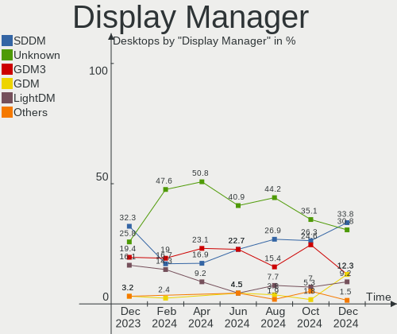
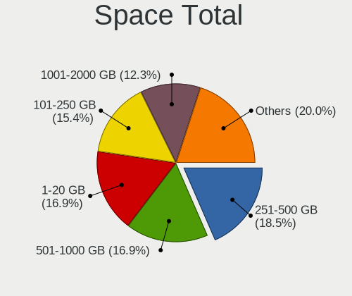
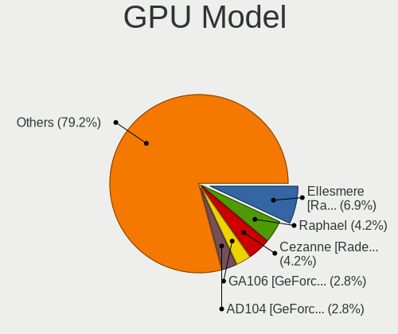
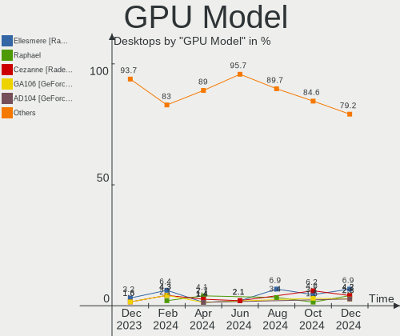
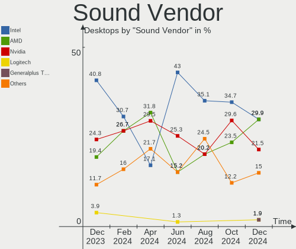
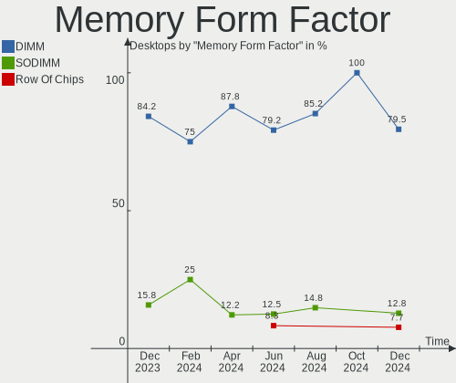
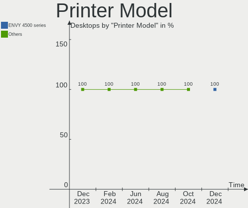
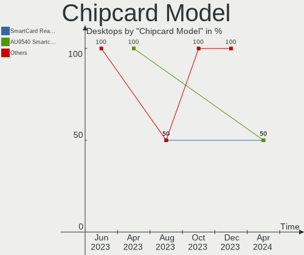

Linux in Spain - Hardware Trends (Desktops)
-------------------------------------------

A project to identify most popular hardware characteristics and track their change
over time based on data collected by Linux users at https://Linux-Hardware.org.

Anyone can contribute to this report by the [hw-probe](https://github.com/linuxhw/hw-probe) tool:

    sudo -E hw-probe -all -upload

Period: Dec, 2023.

Contents
--------

* [ System ](#system)
  - [ OS                       ](#os)
  - [ OS Family                ](#os-family)
  - [ Kernel                   ](#kernel)
  - [ Kernel Family            ](#kernel-family)
  - [ Kernel Major Ver.        ](#kernel-major-ver)
  - [ Arch                     ](#arch)
  - [ DE                       ](#de)
  - [ Display Server           ](#display-server)
  - [ Display Manager          ](#display-manager)
  - [ OS Lang                  ](#os-lang)
  - [ Boot Mode                ](#boot-mode)
  - [ Filesystem               ](#filesystem)
  - [ Part. scheme             ](#part-scheme)
  - [ Dual Boot with Linux/BSD ](#dual-boot-with-linuxbsd)
  - [ Dual Boot (Win)          ](#dual-boot-win)

* [ Board ](#board)
  - [ Vendor                   ](#vendor)
  - [ Model                    ](#model)
  - [ Model Family             ](#model-family)
  - [ MFG Year                 ](#mfg-year)
  - [ Form Factor              ](#form-factor)
  - [ Secure Boot              ](#secure-boot)
  - [ Coreboot                 ](#coreboot)
  - [ RAM Size                 ](#ram-size)
  - [ RAM Used                 ](#ram-used)
  - [ Total Drives             ](#total-drives)
  - [ Has CD-ROM               ](#has-cd-rom)
  - [ Has Ethernet             ](#has-ethernet)
  - [ Has WiFi                 ](#has-wifi)
  - [ Has Bluetooth            ](#has-bluetooth)

* [ Location ](#location)
  - [ Country                  ](#country)
  - [ City                     ](#city)

* [ Drives ](#drives)
  - [ Drive Vendor             ](#drive-vendor)
  - [ Drive Model              ](#drive-model)
  - [ HDD Vendor               ](#hdd-vendor)
  - [ SSD Vendor               ](#ssd-vendor)
  - [ Drive Kind               ](#drive-kind)
  - [ Drive Connector          ](#drive-connector)
  - [ Drive Size               ](#drive-size)
  - [ Space Total              ](#space-total)
  - [ Space Used               ](#space-used)
  - [ Malfunc. Drives          ](#malfunc-drives)
  - [ Malfunc. Drive Vendor    ](#malfunc-drive-vendor)
  - [ Malfunc. HDD Vendor      ](#malfunc-hdd-vendor)
  - [ Malfunc. Drive Kind      ](#malfunc-drive-kind)
  - [ Failed Drives            ](#failed-drives)
  - [ Failed Drive Vendor      ](#failed-drive-vendor)
  - [ Drive Status             ](#drive-status)

* [ Storage controller ](#storage-controller)
  - [ Storage Vendor           ](#storage-vendor)
  - [ Storage Model            ](#storage-model)
  - [ Storage Kind             ](#storage-kind)

* [ Processor ](#processor)
  - [ CPU Vendor               ](#cpu-vendor)
  - [ CPU Model                ](#cpu-model)
  - [ CPU Model Family         ](#cpu-model-family)
  - [ CPU Cores                ](#cpu-cores)
  - [ CPU Sockets              ](#cpu-sockets)
  - [ CPU Threads              ](#cpu-threads)
  - [ CPU Op-Modes             ](#cpu-op-modes)
  - [ CPU Microcode            ](#cpu-microcode)
  - [ CPU Microarch            ](#cpu-microarch)

* [ Graphics ](#graphics)
  - [ GPU Vendor               ](#gpu-vendor)
  - [ GPU Model                ](#gpu-model)
  - [ GPU Combo                ](#gpu-combo)
  - [ GPU Driver               ](#gpu-driver)
  - [ GPU Memory               ](#gpu-memory)

* [ Monitor ](#monitor)
  - [ Monitor Vendor           ](#monitor-vendor)
  - [ Monitor Model            ](#monitor-model)
  - [ Monitor Resolution       ](#monitor-resolution)
  - [ Monitor Diagonal         ](#monitor-diagonal)
  - [ Monitor Width            ](#monitor-width)
  - [ Aspect Ratio             ](#aspect-ratio)
  - [ Monitor Area             ](#monitor-area)
  - [ Pixel Density            ](#pixel-density)
  - [ Multiple Monitors        ](#multiple-monitors)

* [ Network ](#network)
  - [ Net Controller Vendor    ](#net-controller-vendor)
  - [ Net Controller Model     ](#net-controller-model)
  - [ Wireless Vendor          ](#wireless-vendor)
  - [ Wireless Model           ](#wireless-model)
  - [ Ethernet Vendor          ](#ethernet-vendor)
  - [ Ethernet Model           ](#ethernet-model)
  - [ Net Controller Kind      ](#net-controller-kind)
  - [ Used Controller          ](#used-controller)
  - [ NICs                     ](#nics)
  - [ IPv6                     ](#ipv6)

* [ Bluetooth ](#bluetooth)
  - [ Bluetooth Vendor         ](#bluetooth-vendor)
  - [ Bluetooth Model          ](#bluetooth-model)

* [ Sound ](#sound)
  - [ Sound Vendor             ](#sound-vendor)
  - [ Sound Model              ](#sound-model)

* [ Memory ](#memory)
  - [ Memory Vendor            ](#memory-vendor)
  - [ Memory Model             ](#memory-model)
  - [ Memory Kind              ](#memory-kind)
  - [ Memory Form Factor       ](#memory-form-factor)
  - [ Memory Size              ](#memory-size)
  - [ Memory Speed             ](#memory-speed)

* [ Printers & scanners ](#printers--scanners)
  - [ Printer Vendor           ](#printer-vendor)
  - [ Printer Model            ](#printer-model)
  - [ Scanner Vendor           ](#scanner-vendor)
  - [ Scanner Model            ](#scanner-model)

* [ Camera ](#camera)
  - [ Camera Vendor            ](#camera-vendor)
  - [ Camera Model             ](#camera-model)

* [ Security ](#security)
  - [ Fingerprint Vendor       ](#fingerprint-vendor)
  - [ Fingerprint Model        ](#fingerprint-model)
  - [ Chipcard Vendor          ](#chipcard-vendor)
  - [ Chipcard Model           ](#chipcard-model)

* [ Unsupported ](#unsupported)
  - [ Unsupported Devices      ](#unsupported-devices)
  - [ Unsupported Device Types ](#unsupported-device-types)

System
------

OS
--

Installed operating systems

| Name                 | Desktops | Percent |
|----------------------|----------|---------|
| Linux Mint 21.2      | 7        | 11.48%  |
| Debian 12            | 7        | 11.48%  |
| Ubuntu 22.04         | 6        | 9.84%   |
| Fedora 39            | 5        | 8.2%    |
| OpenMandriva 5.0     | 4        | 6.56%   |
| OpenMandriva 23.08   | 4        | 6.56%   |
| Ubuntu 23.10         | 3        | 4.92%   |
| Pop!_OS 22.04        | 2        | 3.28%   |
| OpenMandriva 23.90   | 2        | 3.28%   |
| Zorin 17             | 1        | 1.64%   |
| Xubuntu 23.10        | 1        | 1.64%   |
| Ubuntu Budgie 22.04  | 1        | 1.64%   |
| Ubuntu 20.04         | 1        | 1.64%   |
| RHEL 9               | 1        | 1.64%   |
| openSUSE Leap-15.5   | 1        | 1.64%   |
| openSUSE Leap-15.4   | 1        | 1.64%   |
| OpenMandriva 23.11   | 1        | 1.64%   |
| Nobara 38            | 1        | 1.64%   |
| Manjaro 23.1.1       | 1        | 1.64%   |
| Manjaro 23.1.0       | 1        | 1.64%   |
| Linux Mint 21.1      | 1        | 1.64%   |
| Linux Mint 21        | 1        | 1.64%   |
| Linux Mint 20.1      | 1        | 1.64%   |
| Kubuntu 23.10        | 1        | 1.64%   |
| KDE neon 22.04       | 1        | 1.64%   |
| Garuda Linux Soaring | 1        | 1.64%   |
| EndeavourOS Rolling  | 1        | 1.64%   |
| Debian 11            | 1        | 1.64%   |
| Debian               | 1        | 1.64%   |
| Arch Rolling         | 1        | 1.64%   |

OS Family
---------

OS without a version

| Name          | Desktops | Percent |
|---------------|----------|---------|
| OpenMandriva  | 11       | 18.03%  |
| Ubuntu        | 10       | 16.39%  |
| Linux Mint    | 10       | 16.39%  |
| Debian        | 9        | 14.75%  |
| Fedora        | 5        | 8.2%    |
| Pop!_OS       | 2        | 3.28%   |
| openSUSE      | 2        | 3.28%   |
| Manjaro       | 2        | 3.28%   |
| Zorin         | 1        | 1.64%   |
| Xubuntu       | 1        | 1.64%   |
| Ubuntu Budgie | 1        | 1.64%   |
| RHEL          | 1        | 1.64%   |
| Nobara        | 1        | 1.64%   |
| Kubuntu       | 1        | 1.64%   |
| KDE neon      | 1        | 1.64%   |
| Garuda Linux  | 1        | 1.64%   |
| EndeavourOS   | 1        | 1.64%   |
| Arch          | 1        | 1.64%   |

Kernel
------

Version of the Linux kernel

| Version                      | Desktops | Percent |
|------------------------------|----------|---------|
| 5.15.0-91-generic            | 8        | 13.11%  |
| 6.6.2-desktop-1omv2390       | 6        | 9.84%   |
| 6.4.11-desktop-1omv2390      | 4        | 6.56%   |
| 6.2.0-39-generic             | 4        | 6.56%   |
| 6.5.0-14-generic             | 3        | 4.92%   |
| 6.6.6-76060606-generic       | 2        | 3.28%   |
| 6.1.0-16-amd64               | 2        | 3.28%   |
| 6.1.0-13-amd64               | 2        | 3.28%   |
| 5.15.0-89-generic            | 2        | 3.28%   |
| 6.6.8-zen1-1-zen             | 1        | 1.64%   |
| 6.6.8-200.fc39.x86_64        | 1        | 1.64%   |
| 6.6.8-2-MANJARO              | 1        | 1.64%   |
| 6.6.7-x64v3-xanmod1          | 1        | 1.64%   |
| 6.6.7-202.fsync.fc38.x86_64  | 1        | 1.64%   |
| 6.6.7-200.fc39.x86_64        | 1        | 1.64%   |
| 6.6.6-200.fc39.x86_64        | 1        | 1.64%   |
| 6.6.4-200.fc39.x86_64        | 1        | 1.64%   |
| 6.6.3-1-MANJARO              | 1        | 1.64%   |
| 6.6.1-desktop-1omv2390       | 1        | 1.64%   |
| 6.6.1-060601-generic         | 1        | 1.64%   |
| 6.5.12-300.fc39.x86_64       | 1        | 1.64%   |
| 6.5.0-5-amd64                | 1        | 1.64%   |
| 6.5.0-4-amd64                | 1        | 1.64%   |
| 6.5.0-13-generic             | 1        | 1.64%   |
| 6.2.0-37-generic             | 1        | 1.64%   |
| 6.2.0-26-generic             | 1        | 1.64%   |
| 6.1.69-1-lts                 | 1        | 1.64%   |
| 6.1.68-1-lts                 | 1        | 1.64%   |
| 6.1.0-15-amd64               | 1        | 1.64%   |
| 6.1.0-10-amd64               | 1        | 1.64%   |
| 6.1.0-0.deb11.13-amd64       | 1        | 1.64%   |
| 5.15.0-76-generic            | 1        | 1.64%   |
| 5.15.0-60-generic            | 1        | 1.64%   |
| 5.15.0-56-generic            | 1        | 1.64%   |
| 5.14.21-150500.55.36-default | 1        | 1.64%   |
| 5.14.21-150400.24.97-default | 1        | 1.64%   |
| 5.14.0-362.8.1.el9_3.x86_64  | 1        | 1.64%   |

Kernel Family
-------------

Linux kernel without a distro release

| Version | Desktops | Percent |
|---------|----------|---------|
| 5.15.0  | 13       | 21.31%  |
| 6.1.0   | 7        | 11.48%  |
| 6.6.2   | 6        | 9.84%   |
| 6.5.0   | 6        | 9.84%   |
| 6.2.0   | 6        | 9.84%   |
| 6.4.11  | 4        | 6.56%   |
| 6.6.8   | 3        | 4.92%   |
| 6.6.7   | 3        | 4.92%   |
| 6.6.6   | 3        | 4.92%   |
| 6.6.1   | 2        | 3.28%   |
| 5.14.21 | 2        | 3.28%   |
| 6.6.4   | 1        | 1.64%   |
| 6.6.3   | 1        | 1.64%   |
| 6.5.12  | 1        | 1.64%   |
| 6.1.69  | 1        | 1.64%   |
| 6.1.68  | 1        | 1.64%   |
| 5.14.0  | 1        | 1.64%   |

Kernel Major Ver.
-----------------

Linux kernel major version

| Version | Desktops | Percent |
|---------|----------|---------|
| 6.6     | 19       | 31.15%  |
| 5.15    | 13       | 21.31%  |
| 6.1     | 9        | 14.75%  |
| 6.5     | 7        | 11.48%  |
| 6.2     | 6        | 9.84%   |
| 6.4     | 4        | 6.56%   |
| 5.14    | 3        | 4.92%   |

Arch
----

OS architecture (x86_64, i586, etc.)

| Name   | Desktops | Percent |
|--------|----------|---------|
| x86_64 | 61       | 100%    |

DE
--

Desktop Environment

| Name          | Desktops | Percent |
|---------------|----------|---------|
| KDE5          | 22       | 36.07%  |
| GNOME         | 20       | 32.79%  |
| X-Cinnamon    | 7        | 11.48%  |
| XFCE          | 4        | 6.56%   |
| MATE          | 3        | 4.92%   |
| LXQt          | 1        | 1.64%   |
| LXDE          | 1        | 1.64%   |
| i3            | 1        | 1.64%   |
| GNOME Classic | 1        | 1.64%   |
| Budgie        | 1        | 1.64%   |

Display Server
--------------

X11 or Wayland

| Name    | Desktops | Percent |
|---------|----------|---------|
| X11     | 37       | 60.66%  |
| Wayland | 22       | 36.07%  |
| Tty     | 2        | 3.28%   |

Display Manager
---------------

SDDM, LightDM, etc.

| Name    | Desktops | Percent |
|---------|----------|---------|
| SDDM    | 20       | 32.79%  |
| Unknown | 15       | 24.59%  |
| GDM3    | 12       | 19.67%  |
| LightDM | 10       | 16.39%  |
| GDM     | 2        | 3.28%   |
| NODM    | 1        | 1.64%   |
| LXDM    | 1        | 1.64%   |

OS Lang
-------

Language

| Lang           | Desktops | Percent |
|----------------|----------|---------|
| es_ES          | 42       | 68.85%  |
| en_US          | 11       | 18.03%  |
| de_DE          | 3        | 4.92%   |
| pt_PT          | 1        | 1.64%   |
| fr_FR          | 1        | 1.64%   |
| eu_ES          | 1        | 1.64%   |
| ca_ES@valencia | 1        | 1.64%   |
| ca_ES          | 1        | 1.64%   |

Boot Mode
---------

EFI or BIOS

| Mode | Desktops | Percent |
|------|----------|---------|
| EFI  | 35       | 57.38%  |
| BIOS | 26       | 42.62%  |

Filesystem
----------

Type of filesystem

| Type    | Desktops | Percent |
|---------|----------|---------|
| Ext4    | 38       | 62.3%   |
| Tmpfs   | 9        | 14.75%  |
| Overlay | 6        | 9.84%   |
| Btrfs   | 6        | 9.84%   |
| Xfs     | 2        | 3.28%   |

Part. scheme
------------

Scheme of partitioning

| Type    | Desktops | Percent |
|---------|----------|---------|
| GPT     | 34       | 55.74%  |
| Unknown | 15       | 24.59%  |
| MBR     | 12       | 19.67%  |

Dual Boot with Linux/BSD
------------------------

Hosting more than one Linux/BSD

| Dual boot | Desktops | Percent |
|-----------|----------|---------|
| No        | 53       | 86.89%  |
| Yes       | 8        | 13.11%  |

Dual Boot (Win)
---------------

Hosting Linux and Windows

| Dual boot | Desktops | Percent |
|-----------|----------|---------|
| No        | 40       | 65.57%  |
| Yes       | 21       | 34.43%  |

Board
-----

Vendor
------

Motherboard manufacturer

| Name                | Desktops | Percent |
|---------------------|----------|---------|
| ASUSTek Computer    | 15       | 24.59%  |
| MSI                 | 9        | 14.75%  |
| Gigabyte Technology | 9        | 14.75%  |
| Hewlett-Packard     | 7        | 11.48%  |
| ASRock              | 5        | 8.2%    |
| Lenovo              | 3        | 4.92%   |
| Intel               | 3        | 4.92%   |
| AMI                 | 2        | 3.28%   |
| QIYIDA              | 1        | 1.64%   |
| Packard Bell        | 1        | 1.64%   |
| Huanan              | 1        | 1.64%   |
| Foxconn             | 1        | 1.64%   |
| Dell                | 1        | 1.64%   |
| AZW                 | 1        | 1.64%   |
| Acer                | 1        | 1.64%   |
| Unknown             | 1        | 1.64%   |

Model
-----

Motherboard model

| Name                                    | Desktops | Percent |
|-----------------------------------------|----------|---------|
| AMI Intel                               | 2        | 3.28%   |
| QIYIDA X99-H9 V2.0                      | 1        | 1.64%   |
| Packard Bell IMEDIA S3720               | 1        | 1.64%   |
| MSI MS-7D91                             | 1        | 1.64%   |
| MSI MS-7D50                             | 1        | 1.64%   |
| MSI MS-7D18                             | 1        | 1.64%   |
| MSI MS-7D16                             | 1        | 1.64%   |
| MSI MS-7C75                             | 1        | 1.64%   |
| MSI MS-7B86                             | 1        | 1.64%   |
| MSI MS-7A38                             | 1        | 1.64%   |
| MSI MS-7A12                             | 1        | 1.64%   |
| MSI KBL-U Pro Cubi 3 Silent S (MS-B159) | 1        | 1.64%   |
| Lenovo ThinkCentre M92 3229A73          | 1        | 1.64%   |
| Lenovo ThinkCentre M82 2929A77          | 1        | 1.64%   |
| Lenovo ThinkCentre M720t 10SQ006LSP     | 1        | 1.64%   |
| Intel X99-P4 V5.0                       | 1        | 1.64%   |
| Intel KBL-R MRD                         | 1        | 1.64%   |
| Intel H61 V1.5                          | 1        | 1.64%   |
| Huanan X58                              | 1        | 1.64%   |
| HP Slim Desktop 290-a0xxx               | 1        | 1.64%   |
| HP ProDesk 400 G7 Small Form Factor PC  | 1        | 1.64%   |
| HP Compaq Elite 8300 SFF                | 1        | 1.64%   |
| HP Compaq 8000 Elite CMT PC             | 1        | 1.64%   |
| HP Compaq 6200 Pro SFF PC               | 1        | 1.64%   |
| HP Compaq 6200 Pro MT PC                | 1        | 1.64%   |
| HP 411-a000ns                           | 1        | 1.64%   |
| Gigabyte H81M-S2H                       | 1        | 1.64%   |
| Gigabyte H510M H V2                     | 1        | 1.64%   |
| Gigabyte GA-MA770-DS3                   | 1        | 1.64%   |
| Gigabyte EP41-UD3L                      | 1        | 1.64%   |
| Gigabyte B560M DS3H V2                  | 1        | 1.64%   |
| Gigabyte B550M DS3H                     | 1        | 1.64%   |
| Gigabyte B450M DS3H                     | 1        | 1.64%   |
| Gigabyte B450 AORUS ELITE V2            | 1        | 1.64%   |
| Gigabyte 4995                           | 1        | 1.64%   |
| Foxconn p6-2412esm                      | 1        | 1.64%   |
| Dell Inspiron 530s                      | 1        | 1.64%   |
| AZW EQ                                  | 1        | 1.64%   |
| ASUS V6-P5G31E                          | 1        | 1.64%   |
| ASUS TUF Gaming X570-PLUS               | 1        | 1.64%   |

Model Family
------------

Motherboard model prefix

| Name                  | Desktops | Percent |
|-----------------------|----------|---------|
| HP Compaq             | 4        | 6.56%   |
| Lenovo ThinkCentre    | 3        | 4.92%   |
| ASUS ROG              | 3        | 4.92%   |
| ASUS TUF              | 2        | 3.28%   |
| ASUS Pro              | 2        | 3.28%   |
| ASUS PRIME            | 2        | 3.28%   |
| AMI Intel             | 2        | 3.28%   |
| QIYIDA X99-H9         | 1        | 1.64%   |
| Packard Bell IMEDIA   | 1        | 1.64%   |
| MSI MS-7D91           | 1        | 1.64%   |
| MSI MS-7D50           | 1        | 1.64%   |
| MSI MS-7D18           | 1        | 1.64%   |
| MSI MS-7D16           | 1        | 1.64%   |
| MSI MS-7C75           | 1        | 1.64%   |
| MSI MS-7B86           | 1        | 1.64%   |
| MSI MS-7A38           | 1        | 1.64%   |
| MSI MS-7A12           | 1        | 1.64%   |
| MSI KBL-U             | 1        | 1.64%   |
| Intel X99-P4          | 1        | 1.64%   |
| Intel KBL-R           | 1        | 1.64%   |
| Intel H61             | 1        | 1.64%   |
| Huanan X58            | 1        | 1.64%   |
| HP Slim               | 1        | 1.64%   |
| HP ProDesk            | 1        | 1.64%   |
| HP 411-a000ns         | 1        | 1.64%   |
| Gigabyte H81M-S2H     | 1        | 1.64%   |
| Gigabyte H510M        | 1        | 1.64%   |
| Gigabyte GA-MA770-DS3 | 1        | 1.64%   |
| Gigabyte EP41-UD3L    | 1        | 1.64%   |
| Gigabyte B560M        | 1        | 1.64%   |
| Gigabyte B550M        | 1        | 1.64%   |
| Gigabyte B450M        | 1        | 1.64%   |
| Gigabyte B450         | 1        | 1.64%   |
| Gigabyte 4995         | 1        | 1.64%   |
| Foxconn p6-2412esm    | 1        | 1.64%   |
| Dell Inspiron         | 1        | 1.64%   |
| AZW EQ                | 1        | 1.64%   |
| ASUS V6-P5G31E        | 1        | 1.64%   |
| ASUS P8Z68-V          | 1        | 1.64%   |
| ASUS M4N72-E          | 1        | 1.64%   |

MFG Year
--------

Motherboard manufacture year

| Year | Desktops | Percent |
|------|----------|---------|
| 2023 | 8        | 13.11%  |
| 2021 | 7        | 11.48%  |
| 2018 | 7        | 11.48%  |
| 2022 | 5        | 8.2%    |
| 2020 | 5        | 8.2%    |
| 2009 | 5        | 8.2%    |
| 2019 | 4        | 6.56%   |
| 2017 | 4        | 6.56%   |
| 2015 | 4        | 6.56%   |
| 2012 | 3        | 4.92%   |
| 2011 | 3        | 4.92%   |
| 2008 | 2        | 3.28%   |
| 2014 | 1        | 1.64%   |
| 2013 | 1        | 1.64%   |
| 2010 | 1        | 1.64%   |
| 2007 | 1        | 1.64%   |

Form Factor
-----------

Physical design of the computer

| Name    | Desktops | Percent |
|---------|----------|---------|
| Desktop | 61       | 100%    |

Secure Boot
-----------

Enabled or disabled

| State    | Desktops | Percent |
|----------|----------|---------|
| Disabled | 57       | 93.44%  |
| Enabled  | 4        | 6.56%   |

Coreboot
--------

Have coreboot on board

| Used | Desktops | Percent |
|------|----------|---------|
| No   | 61       | 100%    |

RAM Size
--------

Total RAM memory

| Size in GB  | Desktops | Percent |
|-------------|----------|---------|
| 16.01-24.0  | 19       | 31.15%  |
| 32.01-64.0  | 14       | 22.95%  |
| 4.01-8.0    | 10       | 16.39%  |
| 8.01-16.0   | 9        | 14.75%  |
| 3.01-4.0    | 6        | 9.84%   |
| 64.01-256.0 | 3        | 4.92%   |

RAM Used
--------

Used RAM memory

| Used GB    | Desktops | Percent |
|------------|----------|---------|
| 4.01-8.0   | 19       | 31.15%  |
| 1.01-2.0   | 14       | 22.95%  |
| 2.01-3.0   | 12       | 19.67%  |
| 3.01-4.0   | 8        | 13.11%  |
| 8.01-16.0  | 4        | 6.56%   |
| 0.51-1.0   | 2        | 3.28%   |
| 24.01-32.0 | 1        | 1.64%   |
| 16.01-24.0 | 1        | 1.64%   |

Total Drives
------------

Number of drives on board

| Drives | Desktops | Percent |
|--------|----------|---------|
| 1      | 22       | 36.07%  |
| 2      | 18       | 29.51%  |
| 3      | 8        | 13.11%  |
| 4      | 7        | 11.48%  |
| 5      | 3        | 4.92%   |
| 6      | 2        | 3.28%   |
| 10     | 1        | 1.64%   |

Has CD-ROM
----------

Has CD-ROM on board

| Presented | Desktops | Percent |
|-----------|----------|---------|
| No        | 43       | 70.49%  |
| Yes       | 18       | 29.51%  |

Has Ethernet
------------

Has Ethernet on board

| Presented | Desktops | Percent |
|-----------|----------|---------|
| Yes       | 61       | 100%    |

Has WiFi
--------

Has WiFi module

| Presented | Desktops | Percent |
|-----------|----------|---------|
| No        | 35       | 57.38%  |
| Yes       | 26       | 42.62%  |

Has Bluetooth
-------------

Has Bluetooth module

| Presented | Desktops | Percent |
|-----------|----------|---------|
| No        | 31       | 50.82%  |
| Yes       | 30       | 49.18%  |

Location
--------

Country
-------

Geographic location (country)

| Country | Desktops | Percent |
|---------|----------|---------|
| Spain   | 61       | 100%    |

City
----

Geographic location (city)

| City                       | Desktops | Percent |
|----------------------------|----------|---------|
| Barcelona                  | 8        | 13.11%  |
| Madrid                     | 7        | 11.48%  |
| Valencia                   | 4        | 6.56%   |
| Seville                    | 4        | 6.56%   |
| Vigo                       | 2        | 3.28%   |
| Torrejón de Ardoz         | 2        | 3.28%   |
| Las Palmas de Gran Canaria | 2        | 3.28%   |
| Granada                    | 2        | 3.28%   |
| Zaragoza                   | 1        | 1.64%   |
| Vélez-Málaga             | 1        | 1.64%   |
| Valderrobres               | 1        | 1.64%   |
| Tres Cantos                | 1        | 1.64%   |
| Tortosa                    | 1        | 1.64%   |
| Torija                     | 1        | 1.64%   |
| Tarragona                  | 1        | 1.64%   |
| Santiago de Compostela     | 1        | 1.64%   |
| Sant Adrià de Besòs      | 1        | 1.64%   |
| San Jose de la Rinconada   | 1        | 1.64%   |
| Paracuellos de Jarama      | 1        | 1.64%   |
| Mijas                      | 1        | 1.64%   |
| Málaga                    | 1        | 1.64%   |
| Luzmela                    | 1        | 1.64%   |
| Lugo                       | 1        | 1.64%   |
| Luanco                     | 1        | 1.64%   |
| Loja                       | 1        | 1.64%   |
| L'Hospitalet de Llobregat  | 1        | 1.64%   |
| Gijón                     | 1        | 1.64%   |
| Formentera de Segura       | 1        | 1.64%   |
| Córdoba                   | 1        | 1.64%   |
| Castelló de la Plana      | 1        | 1.64%   |
| Carral                     | 1        | 1.64%   |
| Brenes                     | 1        | 1.64%   |
| Benicarló                 | 1        | 1.64%   |
| Badalona                   | 1        | 1.64%   |
| Avilés                    | 1        | 1.64%   |
| Alicante                   | 1        | 1.64%   |
| Alcoy                      | 1        | 1.64%   |
| A Coruña                  | 1        | 1.64%   |

Drives
------

Drive Vendor
------------

Hard drive vendors

| Vendor                      | Desktops | Drives | Percent |
|-----------------------------|----------|--------|---------|
| Seagate                     | 21       | 32     | 18.1%   |
| Kingston                    | 16       | 18     | 13.79%  |
| WDC                         | 15       | 24     | 12.93%  |
| Samsung Electronics         | 11       | 14     | 9.48%   |
| Toshiba                     | 7        | 7      | 6.03%   |
| Crucial                     | 6        | 6      | 5.17%   |
| KIOXIA-EXCERIA              | 4        | 6      | 3.45%   |
| SanDisk                     | 3        | 6      | 2.59%   |
| Hitachi                     | 3        | 4      | 2.59%   |
| Unknown                     | 2        | 2      | 1.72%   |
| PNY                         | 2        | 2      | 1.72%   |
| Phison Electronics          | 2        | 2      | 1.72%   |
| Micron/Crucial Technology   | 2        | 2      | 1.72%   |
| Maxtor                      | 2        | 2      | 1.72%   |
| Lexar                       | 2        | 2      | 1.72%   |
| KIOXIA                      | 2        | 2      | 1.72%   |
| Corsair                     | 2        | 2      | 1.72%   |
| Silicon Motion              | 1        | 1      | 0.86%   |
| NT-128                      | 1        | 1      | 0.86%   |
| LITEON                      | 1        | 1      | 0.86%   |
| Kingston Technology Company | 1        | 1      | 0.86%   |
| KingFast                    | 1        | 1      | 0.86%   |
| KingDian                    | 1        | 1      | 0.86%   |
| JMicron Technology          | 1        | 1      | 0.86%   |
| Intenso                     | 1        | 1      | 0.86%   |
| Intel                       | 1        | 1      | 0.86%   |
| Gigabyte Technology         | 1        | 1      | 0.86%   |
| Emtec                       | 1        | 1      | 0.86%   |
| China                       | 1        | 1      | 0.86%   |
| ANKEJE                      | 1        | 1      | 0.86%   |
| Unknown                     | 1        | 1      | 0.86%   |

Drive Model
-----------

Hard drive models

| Model                                               | Desktops | Percent |
|-----------------------------------------------------|----------|---------|
| Kingston SA400S37240G 240GB SSD                     | 6        | 4.17%   |
| Kingston SA400S37480G 480GB SSD                     | 5        | 3.47%   |
| Seagate ST500DM002-1BD142 500GB                     | 3        | 2.08%   |
| Seagate ST2000DM008-2FR102 2TB                      | 3        | 2.08%   |
| Seagate ST1000DM010-2EP102 1TB                      | 3        | 2.08%   |
| Toshiba DT01ACA100 1TB                              | 2        | 1.39%   |
| Toshiba DT01ACA050 500GB                            | 2        | 1.39%   |
| Seagate ST4000DM004-2CV104 4TB                      | 2        | 1.39%   |
| Seagate ST3500418AS 500GB                           | 2        | 1.39%   |
| Seagate ST1000DM003-1SB102 1TB                      | 2        | 1.39%   |
| Seagate ST1000DM003-1CH162 1TB                      | 2        | 1.39%   |
| Sandisk WD Black 2018/SN750 / PC SN720 NVMe SSD 1TB | 2        | 1.39%   |
| Samsung SSD 980 500GB                               | 2        | 1.39%   |
| Samsung NVMe SSD Controller SM981/PM981/PM983 512GB | 2        | 1.39%   |
| Micron/Crucial P2 NVMe PCIe SSD 4TB                 | 2        | 1.39%   |
| KIOXIA-EXCERIA SATA SSD 240GB                       | 2        | 1.39%   |
| Kingston SUV400S37120G 120GB SSD                    | 2        | 1.39%   |
| Kingston SA400S37120G 120GB SSD                     | 2        | 1.39%   |
| WDC WDS250G2B0B-00YS70 250GB SSD                    | 1        | 0.69%   |
| WDC WDS240G2G0B-00EPW0 240GB SSD                    | 1        | 0.69%   |
| WDC WDS240G2G0A-00JH30 240GB SSD                    | 1        | 0.69%   |
| WDC WDS100T2B0C-00PXH0 1TB                          | 1        | 0.69%   |
| WDC WDS100T2B0C 1TB                                 | 1        | 0.69%   |
| WDC WDS100T1B0B-00AS40 1TB SSD                      | 1        | 0.69%   |
| WDC WD80EMAZ-00WJTA0 8TB                            | 1        | 0.69%   |
| WDC WD6400AAKS-22A7B2 640GB                         | 1        | 0.69%   |
| WDC WD5000AAKX-00ERMA0 500GB                        | 1        | 0.69%   |
| WDC WD5000AAKX-001CA0 500GB                         | 1        | 0.69%   |
| WDC WD5000AADS-00S9B0 500GB                         | 1        | 0.69%   |
| WDC WD40EZRZ-75GXCB0 4TB                            | 1        | 0.69%   |
| WDC WD40EFRX-68N32N0 4TB                            | 1        | 0.69%   |
| WDC WD40EFAX-68JH4N1 4TB                            | 1        | 0.69%   |
| WDC WD20PURZ-85GU6Y0 2TB                            | 1        | 0.69%   |
| WDC WD20PURX-64P6ZY0 2TB                            | 1        | 0.69%   |
| WDC WD20EZRX-00D8PB0 2TB                            | 1        | 0.69%   |
| WDC WD20EARX-00PASB0 2TB                            | 1        | 0.69%   |
| WDC WD20EARS-00MVWB0 2TB                            | 1        | 0.69%   |
| WDC WD10JPVX-22JC3T0 1TB                            | 1        | 0.69%   |
| WDC WD10EZEX-75ZF5A0 1TB                            | 1        | 0.69%   |
| WDC WD10EZEX-75WN4A0 1TB                            | 1        | 0.69%   |

HDD Vendor
----------

Hard disk drive vendors

| Vendor  | Desktops | Drives | Percent |
|---------|----------|--------|---------|
| Seagate | 21       | 32     | 46.67%  |
| WDC     | 13       | 18     | 28.89%  |
| Toshiba | 5        | 5      | 11.11%  |
| Hitachi | 3        | 4      | 6.67%   |
| Maxtor  | 2        | 2      | 4.44%   |
| Unknown | 1        | 1      | 2.22%   |

SSD Vendor
----------

Solid state drive vendors

| Vendor              | Desktops | Drives | Percent |
|---------------------|----------|--------|---------|
| Kingston            | 16       | 16     | 34.04%  |
| WDC                 | 4        | 4      | 8.51%   |
| Crucial             | 4        | 4      | 8.51%   |
| Toshiba             | 2        | 2      | 4.26%   |
| Samsung Electronics | 2        | 2      | 4.26%   |
| PNY                 | 2        | 2      | 4.26%   |
| Lexar               | 2        | 2      | 4.26%   |
| KIOXIA-EXCERIA      | 2        | 3      | 4.26%   |
| Corsair             | 2        | 2      | 4.26%   |
| Unknown             | 1        | 1      | 2.13%   |
| SanDisk             | 1        | 2      | 2.13%   |
| LITEON              | 1        | 1      | 2.13%   |
| KingFast            | 1        | 1      | 2.13%   |
| KingDian            | 1        | 1      | 2.13%   |
| JMicron Technology  | 1        | 1      | 2.13%   |
| Intenso             | 1        | 1      | 2.13%   |
| Gigabyte Technology | 1        | 1      | 2.13%   |
| Emtec               | 1        | 1      | 2.13%   |
| China               | 1        | 1      | 2.13%   |
| Unknown             | 1        | 1      | 2.13%   |

Drive Kind
----------

HDD or SSD

| Kind    | Desktops | Drives | Percent |
|---------|----------|--------|---------|
| HDD     | 34       | 62     | 35.79%  |
| SSD     | 33       | 49     | 34.74%  |
| NVMe    | 27       | 34     | 28.42%  |
| Unknown | 1        | 2      | 1.05%   |

Drive Connector
---------------

SATA, SAS, NVMe, etc.

| Type | Desktops | Drives | Percent |
|------|----------|--------|---------|
| SATA | 49       | 109    | 61.25%  |
| NVMe | 27       | 34     | 33.75%  |
| SAS  | 4        | 4      | 5%      |

Drive Size
----------

Size of hard drive

| Size in TB | Desktops | Drives | Percent |
|------------|----------|--------|---------|
| 0.01-0.5   | 35       | 58     | 44.3%   |
| 0.51-1.0   | 24       | 29     | 30.38%  |
| 1.01-2.0   | 10       | 12     | 12.66%  |
| 3.01-4.0   | 6        | 7      | 7.59%   |
| 2.01-3.0   | 3        | 4      | 3.8%    |
| 4.01-10.0  | 1        | 1      | 1.27%   |

Space Total
-----------

Amount of disk space available on the file system

| Size in GB     | Desktops | Percent |
|----------------|----------|---------|
| 501-1000       | 13       | 21.31%  |
| 251-500        | 12       | 19.67%  |
| More than 3000 | 10       | 16.39%  |
| 101-250        | 10       | 16.39%  |
| 1001-2000      | 7        | 11.48%  |
| 2001-3000      | 4        | 6.56%   |
| 1-20           | 4        | 6.56%   |
| Unknown        | 1        | 1.64%   |

Space Used
----------

Amount of used disk space

| Used GB        | Desktops | Percent |
|----------------|----------|---------|
| 1-20           | 15       | 24.59%  |
| 251-500        | 7        | 11.48%  |
| 21-50          | 7        | 11.48%  |
| 51-100         | 7        | 11.48%  |
| 501-1000       | 6        | 9.84%   |
| More than 3000 | 5        | 8.2%    |
| 101-250        | 5        | 8.2%    |
| 1001-2000      | 4        | 6.56%   |
| 2001-3000      | 3        | 4.92%   |
| 0              | 1        | 1.64%   |
| Unknown        | 1        | 1.64%   |

Malfunc. Drives
---------------

Drive models with a malfunction

| Model                                                 | Desktops | Drives | Percent |
|-------------------------------------------------------|----------|--------|---------|
| Seagate ST500DM002-1BD142 500GB                       | 2        | 2      | 20%     |
| WDC WD20PURZ-85GU6Y0 2TB                              | 1        | 1      | 10%     |
| WDC WD20PURX-64P6ZY0 2TB                              | 1        | 1      | 10%     |
| WDC WD20EARX-00PASB0 2TB                              | 1        | 1      | 10%     |
| Seagate ST3500418AS 500GB                             | 1        | 1      | 10%     |
| Seagate ST3500412AS 500GB                             | 1        | 1      | 10%     |
| Seagate ST3320613AS 320GB                             | 1        | 1      | 10%     |
| Seagate ST31000528AS 1TB                              | 1        | 1      | 10%     |
| Samsung Electronics SSD 970 EVO 500GB S5H7NS0N813785B | 1        | 1      | 10%     |

Malfunc. Drive Vendor
---------------------

Vendors of faulty drives

| Vendor              | Desktops | Drives | Percent |
|---------------------|----------|--------|---------|
| Seagate             | 4        | 6      | 50%     |
| WDC                 | 3        | 3      | 37.5%   |
| Samsung Electronics | 1        | 1      | 12.5%   |

Malfunc. HDD Vendor
-------------------

Vendors of faulty HDD drives

| Vendor  | Desktops | Drives | Percent |
|---------|----------|--------|---------|
| Seagate | 4        | 6      | 57.14%  |
| WDC     | 3        | 3      | 42.86%  |

Malfunc. Drive Kind
-------------------

Kinds of faulty drives

| Kind | Desktops | Drives | Percent |
|------|----------|--------|---------|
| HDD  | 7        | 9      | 87.5%   |
| NVMe | 1        | 1      | 12.5%   |

Failed Drives
-------------

Failed drive models

Zero info for selected period =(

Failed Drive Vendor
-------------------

Failed drive vendors

Zero info for selected period =(

Drive Status
------------

Number of failed and malfunc. drives

| Status   | Desktops | Drives | Percent |
|----------|----------|--------|---------|
| Works    | 35       | 76     | 50.72%  |
| Detected | 26       | 61     | 37.68%  |
| Malfunc  | 8        | 10     | 11.59%  |

Storage controller
------------------

Storage Vendor
--------------

Storage controller vendors

| Vendor                      | Desktops | Percent |
|-----------------------------|----------|---------|
| Intel                       | 41       | 41.84%  |
| AMD                         | 17       | 17.35%  |
| Samsung Electronics         | 10       | 10.2%   |
| SanDisk                     | 5        | 5.1%    |
| ASMedia Technology          | 5        | 5.1%    |
| Micron/Crucial Technology   | 4        | 4.08%   |
| KIOXIA                      | 4        | 4.08%   |
| Kingston Technology Company | 3        | 3.06%   |
| Phison Electronics          | 2        | 2.04%   |
| Nvidia                      | 2        | 2.04%   |
| Marvell Technology Group    | 2        | 2.04%   |
| JMicron Technology          | 2        | 2.04%   |
| Silicon Motion              | 1        | 1.02%   |

Storage Model
-------------

Storage controller models

| Model                                                                         | Desktops | Percent |
|-------------------------------------------------------------------------------|----------|---------|
| AMD FCH SATA Controller [AHCI mode]                                           | 10       | 8.47%   |
| Intel 6 Series/C200 Series Chipset Family 6 port Desktop SATA AHCI Controller | 5        | 4.24%   |
| AMD 400 Series Chipset SATA Controller                                        | 5        | 4.24%   |
| Samsung NVMe SSD Controller SM981/PM981/PM983                                 | 4        | 3.39%   |
| Samsung NVMe SSD Controller PM9A1/PM9A3/980PRO                                | 4        | 3.39%   |
| Intel 7 Series/C210 Series Chipset Family 6-port SATA Controller [AHCI mode]  | 4        | 3.39%   |
| Intel 500 Series Chipset Family SATA AHCI Controller                          | 4        | 3.39%   |
| ASMedia ASM1062 Serial ATA Controller                                         | 4        | 3.39%   |
| SanDisk Ultra 3D / WD Blue SN550 NVMe SSD                                     | 3        | 2.54%   |
| Samsung NVMe SSD Controller 980 (DRAM-less)                                   | 3        | 2.54%   |
| Micron/Crucial P2 [Nick P2] / P3 / P3 Plus NVMe PCIe SSD (DRAM-less)          | 3        | 2.54%   |
| Intel 700 Series Chipset Family SATA AHCI Controller                          | 3        | 2.54%   |
| AMD 500 Series Chipset SATA Controller                                        | 3        | 2.54%   |
| SanDisk Extreme Pro / WD Black 2018/SN750/PC SN720 NVMe SSD                   | 2        | 1.69%   |
| KIOXIA RD500/Exceria Plus/Exceria Plus G2 NVMe SSD                            | 2        | 1.69%   |
| Intel Sunrise Point-LP SATA Controller [AHCI mode]                            | 2        | 1.69%   |
| Intel Q170/Q150/B150/H170/H110/Z170/CM236 Chipset SATA Controller [AHCI Mode] | 2        | 1.69%   |
| Intel NM10/ICH7 Family SATA Controller [IDE mode]                             | 2        | 1.69%   |
| Intel Comet Lake SATA AHCI Controller                                         | 2        | 1.69%   |
| Intel Cannon Lake PCH SATA AHCI Controller                                    | 2        | 1.69%   |
| AMD SB7x0/SB8x0/SB9x0 SATA Controller [IDE mode]                              | 2        | 1.69%   |
| AMD SB7x0/SB8x0/SB9x0 IDE Controller                                          | 2        | 1.69%   |
| Silicon Motion SM2263EN/SM2263XT (DRAM-less) NVMe SSD Controllers             | 1        | 0.85%   |
| SanDisk Extreme Pro / WD Black SN750 / PC SN730 / Red SN700 NVMe SSD          | 1        | 0.85%   |
| Samsung NVMe SSD Controller S4LV008[Pascal]                                   | 1        | 0.85%   |
| Phison PS5015-E15 PCIe3 NVMe Controller (DRAM-less)                           | 1        | 0.85%   |
| Phison E12 NVMe Controller                                                    | 1        | 0.85%   |
| Nvidia MCP78S [GeForce 8200] IDE                                              | 1        | 0.85%   |
| Nvidia MCP78S [GeForce 8200] AHCI Controller                                  | 1        | 0.85%   |
| Nvidia MCP73 IDE Controller                                                   | 1        | 0.85%   |
| Nvidia GeForce 7100/nForce 630i SATA                                          | 1        | 0.85%   |
| Micron/Crucial P5 Plus NVMe PCIe SSD                                          | 1        | 0.85%   |
| Marvell Group 88SE9215 PCIe 2.0 x1 4-port SATA 6 Gb/s Controller              | 1        | 0.85%   |
| Marvell Group 88SE9172 SATA 6Gb/s Controller                                  | 1        | 0.85%   |
| KIOXIA NVMe SSD                                                               | 1        | 0.85%   |
| KIOXIA Exceria Pro NVMe SSD                                                   | 1        | 0.85%   |
| Kingston Company NV2 NVMe SSD SM2267XT                                        | 1        | 0.85%   |
| Kingston Company NV1 NVMe SSD SM2263XT                                        | 1        | 0.85%   |
| Kingston Company KC3000/FURY Renegade NVMe SSD E18                            | 1        | 0.85%   |
| JMicron JMB58x AHCI SATA controller                                           | 1        | 0.85%   |

Storage Kind
------------

Kind of storage controller (IDE, SATA, NVMe, SAS, ...)

| Kind | Desktops | Percent |
|------|----------|---------|
| SATA | 55       | 58.51%  |
| NVMe | 27       | 28.72%  |
| IDE  | 9        | 9.57%   |
| RAID | 3        | 3.19%   |

Processor
---------

CPU Vendor
----------

Processor vendors

| Vendor | Desktops | Percent |
|--------|----------|---------|
| Intel  | 43       | 70.49%  |
| AMD    | 18       | 29.51%  |

CPU Model
---------

Processor models

| Model                                  | Desktops | Percent |
|----------------------------------------|----------|---------|
| AMD Ryzen 7 5800X 8-Core Processor     | 3        | 4.92%   |
| Intel Core i3-3220 CPU @ 3.30GHz       | 2        | 3.28%   |
| Intel 11th Gen Core i5-11400 @ 2.60GHz | 2        | 3.28%   |
| AMD Ryzen 9 5900X 12-Core Processor    | 2        | 3.28%   |
| AMD Ryzen 7 5700G with Radeon Graphics | 2        | 3.28%   |
| Intel Xeon CPU E5440 @ 2.83GHz         | 1        | 1.64%   |
| Intel Xeon CPU E5-2670 v3 @ 2.30GHz    | 1        | 1.64%   |
| Intel Xeon CPU E5-2620 v3 @ 2.40GHz    | 1        | 1.64%   |
| Intel Pentium CPU G4560 @ 3.50GHz      | 1        | 1.64%   |
| Intel N100                             | 1        | 1.64%   |
| Intel Core i9-9900 CPU @ 3.10GHz       | 1        | 1.64%   |
| Intel Core i9-10900K CPU @ 3.70GHz     | 1        | 1.64%   |
| Intel Core i7-8550U CPU @ 1.80GHz      | 1        | 1.64%   |
| Intel Core i7-6700K CPU @ 4.00GHz      | 1        | 1.64%   |
| Intel Core i7-10700K CPU @ 3.80GHz     | 1        | 1.64%   |
| Intel Core i7 CPU 920 @ 2.67GHz        | 1        | 1.64%   |
| Intel Core i7 CPU 860 @ 2.80GHz        | 1        | 1.64%   |
| Intel Core i5-9400 CPU @ 2.90GHz       | 1        | 1.64%   |
| Intel Core i5-7400 CPU @ 3.00GHz       | 1        | 1.64%   |
| Intel Core i5-5200U CPU @ 2.20GHz      | 1        | 1.64%   |
| Intel Core i5-4460 CPU @ 3.20GHz       | 1        | 1.64%   |
| Intel Core i5-3470T CPU @ 2.90GHz      | 1        | 1.64%   |
| Intel Core i5-3470 CPU @ 3.20GHz       | 1        | 1.64%   |
| Intel Core i5-3350P CPU @ 3.10GHz      | 1        | 1.64%   |
| Intel Core i5-2500K CPU @ 3.30GHz      | 1        | 1.64%   |
| Intel Core i5-2400 CPU @ 3.10GHz       | 1        | 1.64%   |
| Intel Core i5-10500 CPU @ 3.10GHz      | 1        | 1.64%   |
| Intel Core i5-10400F CPU @ 2.90GHz     | 1        | 1.64%   |
| Intel Core i5-10400 CPU @ 2.90GHz      | 1        | 1.64%   |
| Intel Core i3-7100U CPU @ 2.40GHz      | 1        | 1.64%   |
| Intel Core i3-3240 CPU @ 3.40GHz       | 1        | 1.64%   |
| Intel Core i3-2100 CPU @ 3.10GHz       | 1        | 1.64%   |
| Intel Core 2 Quad CPU Q8300 @ 2.50GHz  | 1        | 1.64%   |
| Intel Core 2 Duo CPU E8400 @ 3.00GHz   | 1        | 1.64%   |
| Intel Core 2 Duo CPU E7200 @ 2.53GHz   | 1        | 1.64%   |
| Intel Celeron N5095A @ 2.00GHz         | 1        | 1.64%   |
| Intel Celeron J4105 CPU @ 1.50GHz      | 1        | 1.64%   |
| Intel Celeron CPU N3050 @ 1.60GHz      | 1        | 1.64%   |
| Intel Celeron CPU E3300 @ 2.50GHz      | 1        | 1.64%   |
| Intel 13th Gen Core i9-13900K          | 1        | 1.64%   |

CPU Model Family
----------------

Processor model prefix

| Model             | Desktops | Percent |
|-------------------|----------|---------|
| Intel Core i5     | 12       | 19.67%  |
| Other             | 8        | 13.11%  |
| AMD Ryzen 7       | 8        | 13.11%  |
| Intel Core i7     | 5        | 8.2%    |
| Intel Core i3     | 5        | 8.2%    |
| Intel Celeron     | 4        | 6.56%   |
| AMD Ryzen 5       | 4        | 6.56%   |
| Intel Xeon        | 3        | 4.92%   |
| Intel Core i9     | 2        | 3.28%   |
| Intel Core 2 Duo  | 2        | 3.28%   |
| AMD Ryzen 9       | 2        | 3.28%   |
| AMD Phenom        | 2        | 3.28%   |
| Intel Pentium     | 1        | 1.64%   |
| Intel Core 2 Quad | 1        | 1.64%   |
| AMD Phenom II X6  | 1        | 1.64%   |
| AMD A4            | 1        | 1.64%   |

CPU Cores
---------

Number of processor cores

| Number | Desktops | Percent |
|--------|----------|---------|
| 4      | 18       | 29.51%  |
| 2      | 13       | 21.31%  |
| 6      | 12       | 19.67%  |
| 8      | 10       | 16.39%  |
| 12     | 4        | 6.56%   |
| 24     | 1        | 1.64%   |
| 16     | 1        | 1.64%   |
| 10     | 1        | 1.64%   |
| 3      | 1        | 1.64%   |

CPU Sockets
-----------

Number of sockets

| Number | Desktops | Percent |
|--------|----------|---------|
| 1      | 61       | 100%    |

CPU Threads
-----------

Threads per core (Hyper-Threading)

| Number | Desktops | Percent |
|--------|----------|---------|
| 2      | 40       | 65.57%  |
| 1      | 21       | 34.43%  |

CPU Op-Modes
------------

CPU Operation Modes (32-bit, 64-bit)

| Op mode        | Desktops | Percent |
|----------------|----------|---------|
| 32-bit, 64-bit | 61       | 100%    |

CPU Microcode
-------------

Microcode number

| Number     | Desktops | Percent |
|------------|----------|---------|
| Unknown    | 32       | 52.46%  |
| 0x0800820d | 3        | 4.92%   |
| 0xa0671    | 2        | 3.28%   |
| 0xa0653    | 2        | 3.28%   |
| 0x906e9    | 2        | 3.28%   |
| 0xb0671    | 1        | 1.64%   |
| 0xa0655    | 1        | 1.64%   |
| 0x806ea    | 1        | 1.64%   |
| 0x806e9    | 1        | 1.64%   |
| 0x706a1    | 1        | 1.64%   |
| 0x506e3    | 1        | 1.64%   |
| 0x306a9    | 1        | 1.64%   |
| 0x206a7    | 1        | 1.64%   |
| 0x1067a    | 1        | 1.64%   |
| 0x10676    | 1        | 1.64%   |
| 0x0a50000f | 1        | 1.64%   |
| 0x0a50000d | 1        | 1.64%   |
| 0x0a201205 | 1        | 1.64%   |
| 0x0a201016 | 1        | 1.64%   |
| 0x0a201009 | 1        | 1.64%   |
| 0x08701030 | 1        | 1.64%   |
| 0x08108109 | 1        | 1.64%   |
| 0x08001138 | 1        | 1.64%   |
| 0x0800111c | 1        | 1.64%   |
| 0x06006705 | 1        | 1.64%   |

CPU Microarch
-------------

Microarchitecture

| Name             | Desktops | Percent |
|------------------|----------|---------|
| Zen 3            | 7        | 11.48%  |
| KabyLake         | 6        | 9.84%   |
| IvyBridge        | 6        | 9.84%   |
| Penryn           | 5        | 8.2%    |
| CometLake        | 5        | 8.2%    |
| Zen+             | 4        | 6.56%   |
| SandyBridge      | 3        | 4.92%   |
| K10              | 3        | 4.92%   |
| Icelake          | 3        | 4.92%   |
| Haswell          | 3        | 4.92%   |
| Alderlake Hybrid | 3        | 4.92%   |
| Zen              | 2        | 3.28%   |
| Nehalem          | 2        | 3.28%   |
| Unknown          | 2        | 3.28%   |
| Zen 2            | 1        | 1.64%   |
| Tremont          | 1        | 1.64%   |
| Skylake          | 1        | 1.64%   |
| Silvermont       | 1        | 1.64%   |
| Goldmont plus    | 1        | 1.64%   |
| Excavator        | 1        | 1.64%   |
| Broadwell        | 1        | 1.64%   |

Graphics
--------

GPU Vendor
----------

Vendors of graphics cards

| Vendor | Desktops | Percent |
|--------|----------|---------|
| Nvidia | 24       | 39.34%  |
| Intel  | 24       | 39.34%  |
| AMD    | 13       | 21.31%  |

GPU Model
---------

Graphics card models

| Model                                                                                    | Desktops | Percent |
|------------------------------------------------------------------------------------------|----------|---------|
| Nvidia GK208B [GeForce GT 710]                                                           | 3        | 4.92%   |
| Intel Xeon E3-1200 v2/3rd Gen Core processor Graphics Controller                         | 3        | 4.92%   |
| Nvidia GP107 [GeForce GTX 1050 Ti]                                                       | 2        | 3.28%   |
| Nvidia GM107 [GeForce GTX 750 Ti]                                                        | 2        | 3.28%   |
| Nvidia GK208B [GeForce GT 730]                                                           | 2        | 3.28%   |
| Intel RocketLake-S GT1 [UHD Graphics 730]                                                | 2        | 3.28%   |
| Intel CometLake-S GT2 [UHD Graphics 630]                                                 | 2        | 3.28%   |
| Intel CoffeeLake-S GT2 [UHD Graphics 630]                                                | 2        | 3.28%   |
| Intel 2nd Generation Core Processor Family Integrated Graphics Controller                | 2        | 3.28%   |
| AMD Navi 23 [Radeon RX 6600/6600 XT/6600M]                                               | 2        | 3.28%   |
| AMD Ellesmere [Radeon RX 470/480/570/570X/580/580X/590]                                  | 2        | 3.28%   |
| Nvidia TU104 [GeForce RTX 2060]                                                          | 1        | 1.64%   |
| Nvidia GT216 [GeForce GT 220]                                                            | 1        | 1.64%   |
| Nvidia GP107GL [Quadro P620]                                                             | 1        | 1.64%   |
| Nvidia GP107 [GeForce GTX 1050]                                                          | 1        | 1.64%   |
| Nvidia GP104 [GeForce GTX 1070]                                                          | 1        | 1.64%   |
| Nvidia GP104 [GeForce GTX 1070 Ti]                                                       | 1        | 1.64%   |
| Nvidia GK107 [GeForce GTX 650]                                                           | 1        | 1.64%   |
| Nvidia GF119 [GeForce GT 620 OEM]                                                        | 1        | 1.64%   |
| Nvidia GA106 [GeForce RTX 3060]                                                          | 1        | 1.64%   |
| Nvidia GA106 [GeForce RTX 3060 Lite Hash Rate]                                           | 1        | 1.64%   |
| Nvidia GA104 [GeForce RTX 3070]                                                          | 1        | 1.64%   |
| Nvidia GA104 [GeForce RTX 3060 Ti GDDR6X]                                                | 1        | 1.64%   |
| Nvidia GA102 [GeForce RTX 3080 Ti]                                                       | 1        | 1.64%   |
| Nvidia G96C [GeForce 9500 GT]                                                            | 1        | 1.64%   |
| Nvidia AD102 [GeForce RTX 4090]                                                          | 1        | 1.64%   |
| Intel Xeon E3-1200 v3/4th Gen Core Processor Integrated Graphics Controller              | 1        | 1.64%   |
| Intel UHD Graphics 620                                                                   | 1        | 1.64%   |
| Intel RocketLake-S GT1 [UHD Graphics 750]                                                | 1        | 1.64%   |
| Intel Raptor Lake-S GT1 [UHD Graphics 770]                                               | 1        | 1.64%   |
| Intel JasperLake [UHD Graphics]                                                          | 1        | 1.64%   |
| Intel HD Graphics 620                                                                    | 1        | 1.64%   |
| Intel HD Graphics 610                                                                    | 1        | 1.64%   |
| Intel HD Graphics 5500                                                                   | 1        | 1.64%   |
| Intel GeminiLake [UHD Graphics 600]                                                      | 1        | 1.64%   |
| Intel Atom/Celeron/Pentium Processor x5-E8000/J3xxx/N3xxx Integrated Graphics Controller | 1        | 1.64%   |
| Intel AlderLake-S GT1                                                                    | 1        | 1.64%   |
| Intel Alder Lake-N [UHD Graphics]                                                        | 1        | 1.64%   |
| Intel 82G33/G31 Express Integrated Graphics Controller                                   | 1        | 1.64%   |
| AMD Stoney [Radeon R2/R3/R4/R5 Graphics]                                                 | 1        | 1.64%   |

GPU Combo
---------

Combinations of graphics cards

| Name       | Desktops | Percent |
|------------|----------|---------|
| 1 x Nvidia | 24       | 39.34%  |
| 1 x Intel  | 23       | 37.7%   |
| 1 x AMD    | 13       | 21.31%  |
| Other      | 1        | 1.64%   |

GPU Driver
----------

Free vs proprietary

| Driver      | Desktops | Percent |
|-------------|----------|---------|
| Free        | 41       | 67.21%  |
| Proprietary | 19       | 31.15%  |
| Unknown     | 1        | 1.64%   |

GPU Memory
----------

Total video memory

| Size in GB | Desktops | Percent |
|------------|----------|---------|
| Unknown    | 36       | 59.02%  |
| 7.01-8.0   | 8        | 13.11%  |
| 1.01-2.0   | 8        | 13.11%  |
| 0.51-1.0   | 3        | 4.92%   |
| 3.01-4.0   | 2        | 3.28%   |
| 0.01-0.5   | 2        | 3.28%   |
| 5.01-6.0   | 1        | 1.64%   |
| 16.01-24.0 | 1        | 1.64%   |

Monitor
-------

Monitor Vendor
--------------

Monitor vendors

| Vendor                  | Desktops | Percent |
|-------------------------|----------|---------|
| Samsung Electronics     | 10       | 15.38%  |
| AOC                     | 6        | 9.23%   |
| Hewlett-Packard         | 5        | 7.69%   |
| Goldstar                | 5        | 7.69%   |
| Dell                    | 4        | 6.15%   |
| Ancor Communications    | 4        | 6.15%   |
| Philips                 | 3        | 4.62%   |
| Acer                    | 3        | 4.62%   |
| OEM                     | 2        | 3.08%   |
| Lenovo                  | 2        | 3.08%   |
| BenQ                    | 2        | 3.08%   |
| Xiaomi                  | 1        | 1.54%   |
| RTK                     | 1        | 1.54%   |
| NEC Computers           | 1        | 1.54%   |
| MSI                     | 1        | 1.54%   |
| Mi                      | 1        | 1.54%   |
| LG Electronics          | 1        | 1.54%   |
| Lenovo Group Limited    | 1        | 1.54%   |
| KUP                     | 1        | 1.54%   |
| JCH                     | 1        | 1.54%   |
| Iiyama                  | 1        | 1.54%   |
| HKC                     | 1        | 1.54%   |
| Gigabyte Technology     | 1        | 1.54%   |
| GDH                     | 1        | 1.54%   |
| FL_                     | 1        | 1.54%   |
| Compaq Computer         | 1        | 1.54%   |
| Chi Mei Optoelectronics | 1        | 1.54%   |
| AUS                     | 1        | 1.54%   |
| ASUSTek Computer        | 1        | 1.54%   |
| Unknown                 | 1        | 1.54%   |

Monitor Model
-------------

Monitor models

| Model                                                                 | Desktops | Percent |
|-----------------------------------------------------------------------|----------|---------|
| OEM 26W_LCD_TV OEM3700 1920x540                                       | 2        | 2.94%   |
| Goldstar LG IPS FULLHD GSM5AB8 1920x1080 480x270mm 21.7-inch          | 2        | 2.94%   |
| AOC 27G2G4 AOC2702 1920x1080 598x336mm 27.0-inch                      | 2        | 2.94%   |
| Ancor Communications ASUS VX239 ACI23E1 1920x1080 509x286mm 23.0-inch | 2        | 2.94%   |
| Xiaomi Mi TV XMD0076 3840x2160 800x450mm 36.1-inch                    | 1        | 1.47%   |
| Samsung Electronics SyncMaster SAM0088 1024x768 300x230mm 14.9-inch   | 1        | 1.47%   |
| Samsung Electronics SMBX2035 SAM06FE 1600x900 443x249mm 20.0-inch     | 1        | 1.47%   |
| Samsung Electronics SMB2220N SAM06A2 1920x1080 477x268mm 21.5-inch    | 1        | 1.47%   |
| Samsung Electronics S24D590 SAM0B47 1920x1080 521x293mm 23.5-inch     | 1        | 1.47%   |
| Samsung Electronics S24D332 SAM0F5E 1920x1080 531x299mm 24.0-inch     | 1        | 1.47%   |
| Samsung Electronics LF27T35 SAM707F 1920x1080 598x337mm 27.0-inch     | 1        | 1.47%   |
| Samsung Electronics LCD Monitor SAM7245 1920x1080 700x390mm 31.5-inch | 1        | 1.47%   |
| Samsung Electronics LCD Monitor SAM0509 1920x1080                     | 1        | 1.47%   |
| Samsung Electronics LC32G5xT SAM7080 2560x1440 698x393mm 31.5-inch    | 1        | 1.47%   |
| Samsung Electronics LC27RG50 SAM100A 1920x1080 532x304mm 24.1-inch    | 1        | 1.47%   |
| Samsung Electronics C49HG9x SAM0E5E 1280x1080 1196x336mm 48.9-inch    | 1        | 1.47%   |
| RTK LCD Monitor RTK1D1A 1920x1080 1020x570mm 46.0-inch                | 1        | 1.47%   |
| Philips PHL 276E7 PHLC108 1920x1080 598x336mm 27.0-inch               | 1        | 1.47%   |
| Philips LCD Monitor PHL 274E5 1920x1080                               | 1        | 1.47%   |
| Philips 240PW PHL0873 1920x1200 519x324mm 24.1-inch                   | 1        | 1.47%   |
| NEC Computers EA244WMi NEC68D7 1920x1200 519x324mm 24.1-inch          | 1        | 1.47%   |
| MSI G2422 MSIABA4 1920x1080 530x300mm 24.0-inch                       | 1        | 1.47%   |
| Mi Redmi Monitor XMI23C3 1920x1080 527x293mm 23.7-inch                | 1        | 1.47%   |
| LG Electronics LCD Monitor E1942 1366x768                             | 1        | 1.47%   |
| Lenovo LEN G32qc-10 LEN66A2 2560x1440 698x392mm 31.5-inch             | 1        | 1.47%   |
| Lenovo LEN G27c-10 LEN66A3 1920x1080 597x336mm 27.0-inch              | 1        | 1.47%   |
| Lenovo Group Limited LCD Monitor D24-20 3840x1080                     | 1        | 1.47%   |
| Lenovo Group Limited LCD Monitor D24-20                               | 1        | 1.47%   |
| KUP K50DLH8US KUP2400 1920x1080 520x290mm 23.4-inch                   | 1        | 1.47%   |
| JCH F24 JCH1919 1920x1080 520x310mm 23.8-inch                         | 1        | 1.47%   |
| Iiyama PLE2283H IVM562E 1920x1080 477x268mm 21.5-inch                 | 1        | 1.47%   |
| Iiyama PL2274HD IVM5619 1920x1080 477x268mm 21.5-inch                 | 1        | 1.47%   |
| HKC 22N1 HKCB215 1920x1080 476x268mm 21.5-inch                        | 1        | 1.47%   |
| Hewlett-Packard S2231 HWP2905 1920x1080 477x268mm 21.5-inch           | 1        | 1.47%   |
| Hewlett-Packard LCD Monitor W2072a 1600x900                           | 1        | 1.47%   |
| Hewlett-Packard 27w HPN3494 1920x1080 598x336mm 27.0-inch             | 1        | 1.47%   |
| Hewlett-Packard 27f HPN354B 1920x1080 598x336mm 27.0-inch             | 1        | 1.47%   |
| Hewlett-Packard 23xi HWP3032 1920x1080 509x286mm 23.0-inch            | 1        | 1.47%   |
| Goldstar L192WS GSM4B32 1440x900 410x256mm 19.0-inch                  | 1        | 1.47%   |
| Goldstar HDR 4K GSM7750 3840x2160 697x392mm 31.5-inch                 | 1        | 1.47%   |

Monitor Resolution
------------------

Monitor screen resolution

| Resolution         | Desktops | Percent |
|--------------------|----------|---------|
| 1920x1080 (FHD)    | 31       | 46.27%  |
| 3840x2160 (4K)     | 10       | 14.93%  |
| 2560x1440 (QHD)    | 8        | 11.94%  |
| 1920x1200 (WUXGA)  | 3        | 4.48%   |
| 3840x1080          | 2        | 2.99%   |
| 1920x540           | 2        | 2.99%   |
| 1600x900 (HD+)     | 2        | 2.99%   |
| 1440x900 (WXGA+)   | 2        | 2.99%   |
| 1280x1024 (SXGA)   | 2        | 2.99%   |
| 1024x768 (XGA)     | 2        | 2.99%   |
| 1680x1050 (WSXGA+) | 1        | 1.49%   |
| 1366x768 (WXGA)    | 1        | 1.49%   |
| Unknown            | 1        | 1.49%   |

Monitor Diagonal
----------------

Diagonal size in inches

| Inches  | Desktops | Percent |
|---------|----------|---------|
| 27      | 12       | 18.46%  |
| 23      | 11       | 16.92%  |
| 24      | 10       | 15.38%  |
| 21      | 8        | 12.31%  |
| Unknown | 8        | 12.31%  |
| 31      | 3        | 4.62%   |
| 54      | 2        | 3.08%   |
| 19      | 2        | 3.08%   |
| 17      | 2        | 3.08%   |
| 15      | 2        | 3.08%   |
| 52      | 1        | 1.54%   |
| 49      | 1        | 1.54%   |
| 46      | 1        | 1.54%   |
| 22      | 1        | 1.54%   |
| 20      | 1        | 1.54%   |

Monitor Width
-------------

Physical width

| Width in mm | Desktops | Percent |
|-------------|----------|---------|
| 501-600     | 33       | 50%     |
| 401-500     | 12       | 18.18%  |
| Unknown     | 8        | 12.12%  |
| 1001-1500   | 5        | 7.58%   |
| 601-700     | 4        | 6.06%   |
| 301-350     | 4        | 6.06%   |

Aspect Ratio
------------

Proportional relationship between the width and the height

| Ratio   | Desktops | Percent |
|---------|----------|---------|
| 16/9    | 43       | 70.49%  |
| Unknown | 7        | 11.48%  |
| 16/10   | 6        | 9.84%   |
| 5/4     | 2        | 3.28%   |
| 4/3     | 2        | 3.28%   |
| 32/9    | 1        | 1.64%   |

Monitor Area
------------

Area in inch²

| Area in inch² | Desktops | Percent |
|----------------|----------|---------|
| 201-250        | 21       | 33.33%  |
| 301-350        | 12       | 19.05%  |
| Unknown        | 8        | 12.7%   |
| 151-200        | 6        | 9.52%   |
| 251-300        | 4        | 6.35%   |
| More than 1000 | 3        | 4.76%   |
| 351-500        | 3        | 4.76%   |
| 141-150        | 2        | 3.17%   |
| 101-110        | 2        | 3.17%   |
| 501-1000       | 2        | 3.17%   |

Pixel Density
-------------

Pixels per inch

| Density | Desktops | Percent |
|---------|----------|---------|
| 51-100  | 36       | 57.14%  |
| 101-120 | 10       | 15.87%  |
| Unknown | 8        | 12.7%   |
| 1-50    | 4        | 6.35%   |
| 121-160 | 4        | 6.35%   |
| 161-240 | 1        | 1.59%   |

Multiple Monitors
-----------------

Total monitors connected

| Total | Desktops | Percent |
|-------|----------|---------|
| 1     | 51       | 83.61%  |
| 2     | 9        | 14.75%  |
| 3     | 1        | 1.64%   |

Network
-------

Net Controller Vendor
---------------------

Controller vendors

| Vendor                          | Desktops | Percent |
|---------------------------------|----------|---------|
| Realtek Semiconductor           | 41       | 51.9%   |
| Intel                           | 28       | 35.44%  |
| Qualcomm Atheros                | 2        | 2.53%   |
| Nvidia                          | 2        | 2.53%   |
| TP-Link                         | 1        | 1.27%   |
| Raspberry Pi                    | 1        | 1.27%   |
| Ralink Technology               | 1        | 1.27%   |
| Ralink                          | 1        | 1.27%   |
| Qualcomm Atheros Communications | 1        | 1.27%   |
| ASIX Electronics                | 1        | 1.27%   |

Net Controller Model
--------------------

Controller models

| Model                                                                                         | Desktops | Percent |
|-----------------------------------------------------------------------------------------------|----------|---------|
| Realtek RTL8111/8168/8411 PCI Express Gigabit Ethernet Controller                             | 31       | 32.63%  |
| Realtek RTL8125 2.5GbE Controller                                                             | 8        | 8.42%   |
| Intel 82579LM Gigabit Network Connection (Lewisville)                                         | 5        | 5.26%   |
| Realtek RTL8821CE 802.11ac PCIe Wireless Network Adapter                                      | 3        | 3.16%   |
| Realtek RTL8188EUS 802.11n Wireless Network Adapter                                           | 3        | 3.16%   |
| Intel I211 Gigabit Network Connection                                                         | 3        | 3.16%   |
| Intel Ethernet Controller I225-V                                                              | 3        | 3.16%   |
| Intel Wi-Fi 6 AX210/AX211/AX411 160MHz                                                        | 2        | 2.11%   |
| Intel Wi-Fi 6 AX200                                                                           | 2        | 2.11%   |
| Intel Ethernet Connection (7) I219-V                                                          | 2        | 2.11%   |
| Intel Ethernet Connection (2) I219-V                                                          | 2        | 2.11%   |
| Intel Dual Band Wireless-AC 3168NGW [Stone Peak]                                              | 2        | 2.11%   |
| Intel 700 Series Chipset Family Wi-Fi                                                         | 2        | 2.11%   |
| TP-Link AC600 wireless Realtek RTL8811AU [Archer T2U Nano]                                    | 1        | 1.05%   |
| Realtek RTL8821AE 802.11ac PCIe Wireless Network Adapter                                      | 1        | 1.05%   |
| Realtek RTL8169 PCI Gigabit Ethernet Controller                                               | 1        | 1.05%   |
| Realtek RTL810xE PCI Express Fast Ethernet controller                                         | 1        | 1.05%   |
| Realtek RTL-8185 IEEE 802.11a/b/g Wireless LAN Controller                                     | 1        | 1.05%   |
| Realtek Realtek 8812AU/8821AU 802.11ac WLAN Adapter [USB Wireless Dual-Band Adapter 2.4/5Ghz] | 1        | 1.05%   |
| Raspberry Pi Pico                                                                             | 1        | 1.05%   |
| Ralink RT2870/RT3070 Wireless Adapter                                                         | 1        | 1.05%   |
| Ralink RT5390R 802.11bgn PCIe Wireless Network Adapter                                        | 1        | 1.05%   |
| Qualcomm Atheros AR9271 802.11n                                                               | 1        | 1.05%   |
| Qualcomm Atheros AR9287 Wireless Network Adapter (PCI-Express)                                | 1        | 1.05%   |
| Qualcomm Atheros AR8121/AR8113/AR8114 Gigabit or Fast Ethernet                                | 1        | 1.05%   |
| Nvidia MCP77 Ethernet                                                                         | 1        | 1.05%   |
| Nvidia MCP73 Ethernet                                                                         | 1        | 1.05%   |
| Intel Wireless-AC 9260                                                                        | 1        | 1.05%   |
| Intel Wireless 7265                                                                           | 1        | 1.05%   |
| Intel Wireless 3165                                                                           | 1        | 1.05%   |
| Intel Tiger Lake PCH CNVi WiFi                                                                | 1        | 1.05%   |
| Intel Ethernet Controller I226-V                                                              | 1        | 1.05%   |
| Intel Ethernet Connection (14) I219-V                                                         | 1        | 1.05%   |
| Intel Ethernet Connection (11) I219-LM                                                        | 1        | 1.05%   |
| Intel CNVi: Wi-Fi                                                                             | 1        | 1.05%   |
| Intel 82579V Gigabit Network Connection                                                       | 1        | 1.05%   |
| Intel 82578DM Gigabit Network Connection                                                      | 1        | 1.05%   |
| Intel 82567LM-3 Gigabit Network Connection                                                    | 1        | 1.05%   |
| Intel 82562V-2 10/100 Network Connection                                                      | 1        | 1.05%   |
| ASIX AX88179 Gigabit Ethernet                                                                 | 1        | 1.05%   |

Wireless Vendor
---------------

Wireless vendors

| Vendor                          | Desktops | Percent |
|---------------------------------|----------|---------|
| Intel                           | 13       | 50%     |
| Realtek Semiconductor           | 8        | 30.77%  |
| TP-Link                         | 1        | 3.85%   |
| Ralink Technology               | 1        | 3.85%   |
| Ralink                          | 1        | 3.85%   |
| Qualcomm Atheros Communications | 1        | 3.85%   |
| Qualcomm Atheros                | 1        | 3.85%   |

Wireless Model
--------------

Wireless models

| Model                                                                                         | Desktops | Percent |
|-----------------------------------------------------------------------------------------------|----------|---------|
| Realtek RTL8821CE 802.11ac PCIe Wireless Network Adapter                                      | 3        | 11.11%  |
| Realtek RTL8188EUS 802.11n Wireless Network Adapter                                           | 3        | 11.11%  |
| Intel Wi-Fi 6 AX210/AX211/AX411 160MHz                                                        | 2        | 7.41%   |
| Intel Wi-Fi 6 AX200                                                                           | 2        | 7.41%   |
| Intel Dual Band Wireless-AC 3168NGW [Stone Peak]                                              | 2        | 7.41%   |
| Intel 700 Series Chipset Family Wi-Fi                                                         | 2        | 7.41%   |
| TP-Link AC600 wireless Realtek RTL8811AU [Archer T2U Nano]                                    | 1        | 3.7%    |
| Realtek RTL8821AE 802.11ac PCIe Wireless Network Adapter                                      | 1        | 3.7%    |
| Realtek RTL-8185 IEEE 802.11a/b/g Wireless LAN Controller                                     | 1        | 3.7%    |
| Realtek Realtek 8812AU/8821AU 802.11ac WLAN Adapter [USB Wireless Dual-Band Adapter 2.4/5Ghz] | 1        | 3.7%    |
| Ralink RT2870/RT3070 Wireless Adapter                                                         | 1        | 3.7%    |
| Ralink RT5390R 802.11bgn PCIe Wireless Network Adapter                                        | 1        | 3.7%    |
| Qualcomm Atheros AR9271 802.11n                                                               | 1        | 3.7%    |
| Qualcomm Atheros AR9287 Wireless Network Adapter (PCI-Express)                                | 1        | 3.7%    |
| Intel Wireless-AC 9260                                                                        | 1        | 3.7%    |
| Intel Wireless 7265                                                                           | 1        | 3.7%    |
| Intel Wireless 3165                                                                           | 1        | 3.7%    |
| Intel Tiger Lake PCH CNVi WiFi                                                                | 1        | 3.7%    |
| Intel CNVi: Wi-Fi                                                                             | 1        | 3.7%    |

Ethernet Vendor
---------------

Ethernet vendors

| Vendor                | Desktops | Percent |
|-----------------------|----------|---------|
| Realtek Semiconductor | 40       | 61.54%  |
| Intel                 | 21       | 32.31%  |
| Nvidia                | 2        | 3.08%   |
| Qualcomm Atheros      | 1        | 1.54%   |
| ASIX Electronics      | 1        | 1.54%   |

Ethernet Model
--------------

Ethernet models

| Model                                                             | Desktops | Percent |
|-------------------------------------------------------------------|----------|---------|
| Realtek RTL8111/8168/8411 PCI Express Gigabit Ethernet Controller | 31       | 46.27%  |
| Realtek RTL8125 2.5GbE Controller                                 | 8        | 11.94%  |
| Intel 82579LM Gigabit Network Connection (Lewisville)             | 5        | 7.46%   |
| Intel I211 Gigabit Network Connection                             | 3        | 4.48%   |
| Intel Ethernet Controller I225-V                                  | 3        | 4.48%   |
| Intel Ethernet Connection (7) I219-V                              | 2        | 2.99%   |
| Intel Ethernet Connection (2) I219-V                              | 2        | 2.99%   |
| Realtek RTL8169 PCI Gigabit Ethernet Controller                   | 1        | 1.49%   |
| Realtek RTL810xE PCI Express Fast Ethernet controller             | 1        | 1.49%   |
| Qualcomm Atheros AR8121/AR8113/AR8114 Gigabit or Fast Ethernet    | 1        | 1.49%   |
| Nvidia MCP77 Ethernet                                             | 1        | 1.49%   |
| Nvidia MCP73 Ethernet                                             | 1        | 1.49%   |
| Intel Ethernet Controller I226-V                                  | 1        | 1.49%   |
| Intel Ethernet Connection (14) I219-V                             | 1        | 1.49%   |
| Intel Ethernet Connection (11) I219-LM                            | 1        | 1.49%   |
| Intel 82579V Gigabit Network Connection                           | 1        | 1.49%   |
| Intel 82578DM Gigabit Network Connection                          | 1        | 1.49%   |
| Intel 82567LM-3 Gigabit Network Connection                        | 1        | 1.49%   |
| Intel 82562V-2 10/100 Network Connection                          | 1        | 1.49%   |
| ASIX AX88179 Gigabit Ethernet                                     | 1        | 1.49%   |

Net Controller Kind
-------------------

Ethernet, WiFi or modem

| Kind     | Desktops | Percent |
|----------|----------|---------|
| Ethernet | 61       | 69.32%  |
| WiFi     | 26       | 29.55%  |
| Modem    | 1        | 1.14%   |

Used Controller
---------------

Currently used network controller

| Kind     | Desktops | Percent |
|----------|----------|---------|
| Ethernet | 50       | 78.13%  |
| WiFi     | 14       | 21.88%  |

NICs
----

Total network controllers on board

| Total | Desktops | Percent |
|-------|----------|---------|
| 1     | 37       | 60.66%  |
| 2     | 22       | 36.07%  |
| 3     | 2        | 3.28%   |

IPv6
----

IPv6 vs IPv4

| Used | Desktops | Percent |
|------|----------|---------|
| No   | 51       | 83.61%  |
| Yes  | 10       | 16.39%  |

Bluetooth
---------

Bluetooth Vendor
----------------

Controller vendors

| Vendor                  | Desktops | Percent |
|-------------------------|----------|---------|
| Intel                   | 13       | 41.94%  |
| Cambridge Silicon Radio | 11       | 35.48%  |
| Realtek Semiconductor   | 5        | 16.13%  |
| IMC Networks            | 1        | 3.23%   |
| Belkin Components       | 1        | 3.23%   |

Bluetooth Model
---------------

Controller models

| Model                                               | Desktops | Percent |
|-----------------------------------------------------|----------|---------|
| Cambridge Silicon Radio Bluetooth Dongle (HCI mode) | 11       | 35.48%  |
| Intel Bluetooth Device                              | 4        | 12.9%   |
| Realtek Bluetooth Radio                             | 3        | 9.68%   |
| Intel Wireless-AC 3168 Bluetooth                    | 2        | 6.45%   |
| Intel Bluetooth wireless interface                  | 2        | 6.45%   |
| Intel AX210 Bluetooth                               | 2        | 6.45%   |
| Intel AX200 Bluetooth                               | 2        | 6.45%   |
| Realtek  Bluetooth 4.2 Adapter                      | 1        | 3.23%   |
| Realtek Bluetooth 5.1 Radio                         | 1        | 3.23%   |
| Intel Wireless-AC 9260 Bluetooth Adapter            | 1        | 3.23%   |
| IMC Networks Bluetooth Radio                        | 1        | 3.23%   |
| Belkin Components F8T013 Bluetooth Adapter          | 1        | 3.23%   |

Sound
-----

Sound Vendor
------------

Sound card vendors

| Vendor                   | Desktops | Percent |
|--------------------------|----------|---------|
| Intel                    | 42       | 41.58%  |
| Nvidia                   | 24       | 23.76%  |
| AMD                      | 19       | 18.81%  |
| Logitech                 | 4        | 3.96%   |
| C-Media Electronics      | 4        | 3.96%   |
| Micro Star International | 2        | 1.98%   |
| Roland                   | 1        | 0.99%   |
| Logic3                   | 1        | 0.99%   |
| Hewlett-Packard          | 1        | 0.99%   |
| DSEA A/S                 | 1        | 0.99%   |
| Corsair                  | 1        | 0.99%   |
| ASUSTek Computer         | 1        | 0.99%   |

Sound Model
-----------

Sound card models

| Model                                                                      | Desktops | Percent |
|----------------------------------------------------------------------------|----------|---------|
| Nvidia GK208 HDMI/DP Audio Controller                                      | 5        | 4.35%   |
| Intel 6 Series/C200 Series Chipset Family High Definition Audio Controller | 5        | 4.35%   |
| AMD Starship/Matisse HD Audio Controller                                   | 5        | 4.35%   |
| AMD Family 17h (Models 00h-0fh) HD Audio Controller                        | 5        | 4.35%   |
| Nvidia GP107GL High Definition Audio Controller                            | 4        | 3.48%   |
| Intel 7 Series/C216 Chipset Family High Definition Audio Controller        | 4        | 3.48%   |
| AMD Navi 21/23 HDMI/DP Audio Controller                                    | 4        | 3.48%   |
| Intel 700 Series Chipset Family Precise Touch and Stylus Port #1           | 3        | 2.61%   |
| AMD Family 17h/19h HD Audio Controller                                     | 3        | 2.61%   |
| AMD Ellesmere HDMI Audio [Radeon RX 470/480 / 570/580/590]                 | 3        | 2.61%   |
| Nvidia GP104 High Definition Audio Controller                              | 2        | 1.74%   |
| Nvidia GM107 High Definition Audio Controller [GeForce 940MX]              | 2        | 1.74%   |
| Nvidia GA106 High Definition Audio Controller                              | 2        | 1.74%   |
| Nvidia GA104 High Definition Audio Controller                              | 2        | 1.74%   |
| Micro Star International USB Audio                                         | 2        | 1.74%   |
| Logitech [G533 Wireless Headset Dongle]                                    | 2        | 1.74%   |
| Intel Tiger Lake-H HD Audio Controller                                     | 2        | 1.74%   |
| Intel Sunrise Point-LP HD Audio                                            | 2        | 1.74%   |
| Intel Smart Sound Technology (SST) Audio Controller                        | 2        | 1.74%   |
| Intel NM10/ICH7 Family High Definition Audio Controller                    | 2        | 1.74%   |
| Intel Comet Lake PCH cAVS                                                  | 2        | 1.74%   |
| Intel Cannon Lake PCH cAVS                                                 | 2        | 1.74%   |
| Intel 8 Series/C220 Series Chipset High Definition Audio Controller        | 2        | 1.74%   |
| Intel 100 Series/C230 Series Chipset Family HD Audio Controller            | 2        | 1.74%   |
| C-Media Electronics CMI8788 [Oxygen HD Audio]                              | 2        | 1.74%   |
| AMD SBx00 Azalia (Intel HDA)                                               | 2        | 1.74%   |
| AMD Renoir Radeon High Definition Audio Controller                         | 2        | 1.74%   |
| Roland GCS-5                                                               | 1        | 0.87%   |
| Nvidia TU104 HD Audio Controller                                           | 1        | 0.87%   |
| Nvidia MCP73 High Definition Audio                                         | 1        | 0.87%   |
| Nvidia MCP72XE/MCP72P/MCP78U/MCP78S High Definition Audio                  | 1        | 0.87%   |
| Nvidia GT216 HDMI Audio Controller                                         | 1        | 0.87%   |
| Nvidia GK107 HDMI Audio Controller                                         | 1        | 0.87%   |
| Nvidia GF119 HDMI Audio Controller                                         | 1        | 0.87%   |
| Nvidia GA102 High Definition Audio Controller                              | 1        | 0.87%   |
| Nvidia AD102 High Definition Audio Controller                              | 1        | 0.87%   |
| Logitech PRO X Wireless Gaming Headset                                     | 1        | 0.87%   |
| Logitech Headset H340                                                      | 1        | 0.87%   |
| Logic3 PDPGaming LVL50 Wireless Headset                                    | 1        | 0.87%   |
| Intel Xeon E3-1200 v3/4th Gen Core Processor HD Audio Controller           | 1        | 0.87%   |

Memory
------

Memory Vendor
-------------

Memory module vendors

| Vendor                       | Desktops | Percent |
|------------------------------|----------|---------|
| Kingston                     | 9        | 21.95%  |
| Corsair                      | 7        | 17.07%  |
| Samsung Electronics          | 6        | 14.63%  |
| Crucial                      | 5        | 12.2%   |
| G.Skill                      | 4        | 9.76%   |
| Unknown                      | 3        | 7.32%   |
| Unknown (ABCD)               | 1        | 2.44%   |
| Team                         | 1        | 2.44%   |
| SK hynix                     | 1        | 2.44%   |
| Ramaxel Technology           | 1        | 2.44%   |
| Patriot Memory (PDP Systems) | 1        | 2.44%   |
| Micron Technology            | 1        | 2.44%   |
| A-DATA Technology            | 1        | 2.44%   |

Memory Model
------------

Memory module models

| Model                                                                   | Desktops | Percent |
|-------------------------------------------------------------------------|----------|---------|
| Corsair RAM CMK32GX4M2E3200C16 16GB DIMM DDR4 3534MT/s                  | 3        | 6.67%   |
| Corsair RAM CMK16GX4M2E3200C16 8GB DIMM DDR4 3200MT/s                   | 3        | 6.67%   |
| Unknown RAM Module 8GB DIMM DDR3                                        | 1        | 2.22%   |
| Unknown RAM Module 2GB DIMM DDR2 800MT/s                                | 1        | 2.22%   |
| Unknown RAM DDR4 NB 16G 2666 16384MB SODIMM DDR4 2667MT/s               | 1        | 2.22%   |
| Unknown (ABCD) RAM 123456789012345678 2GB DIMM LPDDR4 2400MT/s          | 1        | 2.22%   |
| Team RAM TEAMGROUP-UD4-3200 32GB DIMM DDR4 3800MT/s                     | 1        | 2.22%   |
| SK hynix RAM HMT325U6CFR8C-PB 2GB DIMM DDR3 1600MT/s                    | 1        | 2.22%   |
| Samsung RAM Module 2048MB DIMM DDR3 1333MT/s                            | 1        | 2.22%   |
| Samsung RAM M471B5273DH0-CK0 4GB DIMM DDR3 1333MT/s                     | 1        | 2.22%   |
| Samsung RAM M471B5173EB0-YK0 4GB SODIMM DDR3 1600MT/s                   | 1        | 2.22%   |
| Samsung RAM M393A2G40DB0-CPB 16GB DIMM DDR4 2133MT/s                    | 1        | 2.22%   |
| Samsung RAM M393A1G40EB1-CRC 8GB DIMM DDR4 2400MT/s                     | 1        | 2.22%   |
| Samsung RAM M378A5244CB0-CTD 4GB DIMM DDR4 3334MT/s                     | 1        | 2.22%   |
| Ramaxel RAM RMR5040ED58E9W1600 4GB DIMM DDR3 1600MT/s                   | 1        | 2.22%   |
| Patriot Memory (PDP Systems) RAM 3000 C16 Series 8GB DIMM DDR4 2400MT/s | 1        | 2.22%   |
| Micron RAM 16KTF51264HZ-1G6M1 4GB SODIMM DDR3 1600MT/s                  | 1        | 2.22%   |
| Kingston RAM Module 8GB SODIMM DDR3 1600MT/s                            | 1        | 2.22%   |
| Kingston RAM Module 2GB DIMM DDR3 1333MT/s                              | 1        | 2.22%   |
| Kingston RAM KHX3200C16D4/8GX 8GB DIMM DDR4 3733MT/s                    | 1        | 2.22%   |
| Kingston RAM KHX3000C15D4/4GX 4GB DIMM DDR4 3000MT/s                    | 1        | 2.22%   |
| Kingston RAM KHX1600C10D3/4G 4GB DIMM DDR3 1600MT/s                     | 1        | 2.22%   |
| Kingston RAM KF3200C16D4/16GX 16GB DIMM DDR4 3200MT/s                   | 1        | 2.22%   |
| Kingston RAM 99U5701-049.A00G 16GB DIMM DDR4 2400MT/s                   | 1        | 2.22%   |
| Kingston RAM 99U5403-006.A01LF 2GB DIMM DDR3 1333MT/s                   | 1        | 2.22%   |
| Kingston RAM 9905702-137.A00G 8GB DIMM DDR4 2400MT/s                    | 1        | 2.22%   |
| Kingston RAM 9905702-017.A00G 8GB DIMM DDR4 2933MT/s                    | 1        | 2.22%   |
| Kingston RAM 9905403-181.A00LF 4GB DIMM DDR3 2200MT/s                   | 1        | 2.22%   |
| G.Skill RAM F4-3200C16-8GVKB 8GB DIMM DDR4 3866MT/s                     | 1        | 2.22%   |
| G.Skill RAM F4-3200C16-8GVK 8GB DIMM DDR4 3200MT/s                      | 1        | 2.22%   |
| G.Skill RAM F4-3200C16-8GTZR 8GB DIMM DDR4 3200MT/s                     | 1        | 2.22%   |
| G.Skill RAM F4-3000C16-16GISB 16GB DIMM DDR4 3200MT/s                   | 1        | 2.22%   |
| Crucial RAM CT8G4DFS824A.M8FR 8GB DIMM DDR4 2400MT/s                    | 1        | 2.22%   |
| Crucial RAM CT4G4DFS824A.C8FBD2 4GB DIMM DDR4 2733MT/s                  | 1        | 2.22%   |
| Crucial RAM CT32G4SFD8266.C16FB 32GB SODIMM DDR4 2667MT/s               | 1        | 2.22%   |
| Crucial RAM CT102464BD160B.C16 8GB DIMM DDR3 1600MT/s                   | 1        | 2.22%   |
| Crucial RAM BLS8G3D1609DS1S00. 8GB DIMM DDR3 1800MT/s                   | 1        | 2.22%   |
| Crucial RAM BL16G32C16U4B.M16FE1 16GB DIMM DDR4 3400MT/s                | 1        | 2.22%   |
| Corsair RAM CMV4GX3M1A1600C11 4GB DIMM DDR3 1600MT/s                    | 1        | 2.22%   |
| Corsair RAM CMK32GX5M2X7200C34 16GB DIMM DDR5 7200MT/s                  | 1        | 2.22%   |

Memory Kind
-----------

Memory module kinds

| Kind   | Desktops | Percent |
|--------|----------|---------|
| DDR4   | 24       | 64.86%  |
| DDR3   | 9        | 24.32%  |
| LPDDR4 | 1        | 2.7%    |
| DRAM   | 1        | 2.7%    |
| DDR5   | 1        | 2.7%    |
| DDR2   | 1        | 2.7%    |

Memory Form Factor
------------------

Physical design of the memory module

| Name   | Desktops | Percent |
|--------|----------|---------|
| DIMM   | 32       | 86.49%  |
| SODIMM | 5        | 13.51%  |

Memory Size
-----------

Memory module size

| Size  | Desktops | Percent |
|-------|----------|---------|
| 8192  | 14       | 35%     |
| 16384 | 13       | 32.5%   |
| 4096  | 7        | 17.5%   |
| 2048  | 4        | 10%     |
| 32768 | 2        | 5%      |

Memory Speed
------------

Memory module speed

| Speed   | Desktops | Percent |
|---------|----------|---------|
| 3200    | 6        | 15%     |
| 2400    | 5        | 12.5%   |
| 1600    | 5        | 12.5%   |
| 3534    | 3        | 7.5%    |
| 2667    | 3        | 7.5%    |
| 1333    | 2        | 5%      |
| 7200    | 1        | 2.5%    |
| 3866    | 1        | 2.5%    |
| 3800    | 1        | 2.5%    |
| 3733    | 1        | 2.5%    |
| 3600    | 1        | 2.5%    |
| 3400    | 1        | 2.5%    |
| 3334    | 1        | 2.5%    |
| 3000    | 1        | 2.5%    |
| 2933    | 1        | 2.5%    |
| 2733    | 1        | 2.5%    |
| 2200    | 1        | 2.5%    |
| 2133    | 1        | 2.5%    |
| 1866    | 1        | 2.5%    |
| 1800    | 1        | 2.5%    |
| 800     | 1        | 2.5%    |
| Unknown | 1        | 2.5%    |

Printers & scanners
-------------------

Printer Vendor
--------------

Printer device vendors

| Vendor          | Desktops | Percent |
|-----------------|----------|---------|
| Hewlett-Packard | 1        | 50%     |
| Canon           | 1        | 50%     |

Printer Model
-------------

Printer device models

| Model                  | Desktops | Percent |
|------------------------|----------|---------|
| HP DeskJet 3630 series | 1        | 50%     |
| Canon PIXMA MP230      | 1        | 50%     |

Scanner Vendor
--------------

Scanner device vendors

Zero info for selected period =(

Scanner Model
-------------

Scanner device models

Zero info for selected period =(

Camera
------

Camera Vendor
-------------

Camera device vendors

| Vendor              | Desktops | Percent |
|---------------------|----------|---------|
| Logitech            | 5        | 50%     |
| Microdia            | 3        | 30%     |
| Samsung Electronics | 2        | 20%     |

Camera Model
------------

Camera device models

| Model                                   | Desktops | Percent |
|-----------------------------------------|----------|---------|
| Logitech Webcam C270                    | 3        | 30%     |
| Samsung Galaxy series, misc. (MTP mode) | 2        | 20%     |
| Microdia Webcam Vitade AF               | 1        | 10%     |
| Microdia USB Camera                     | 1        | 10%     |
| Microdia MSI Starcam Racer              | 1        | 10%     |
| Logitech QuickCam Vision Pro            | 1        | 10%     |
| Logitech HD Pro Webcam C920             | 1        | 10%     |

Security
--------

Fingerprint Vendor
------------------

Fingerprint sensor vendors

Zero info for selected period =(

Fingerprint Model
-----------------

Fingerprint sensor models

Zero info for selected period =(

Chipcard Vendor
---------------

Chipcard module vendors

| Vendor           | Desktops | Percent |
|------------------|----------|---------|
| SCM Microsystems | 1        | 100%    |

Chipcard Model
--------------

Chipcard module models

| Model                                                  | Desktops | Percent |
|--------------------------------------------------------|----------|---------|
| SCM Microsystems SCR331-LC1 / SCR3310 SmartCard Reader | 1        | 100%    |

Unsupported
-----------

Unsupported Devices
-------------------

Total unsupported devices on board

| Total | Desktops | Percent |
|-------|----------|---------|
| 0     | 57       | 93.44%  |
| 1     | 3        | 4.92%   |
| 2     | 1        | 1.64%   |

Unsupported Device Types
------------------------

Types of unsupported devices

| Type                  | Desktops | Percent |
|-----------------------|----------|---------|
| Net/wireless          | 2        | 40%     |
| Unassigned class      | 1        | 20%     |
| Multimedia controller | 1        | 20%     |
| Chipcard              | 1        | 20%     |

