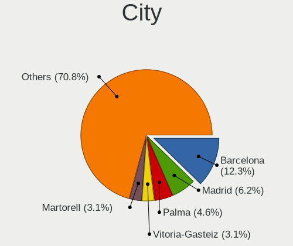
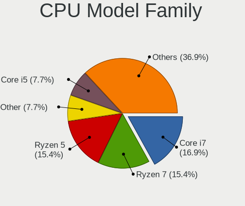
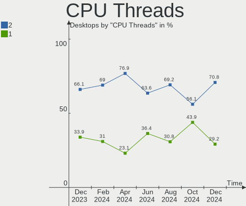
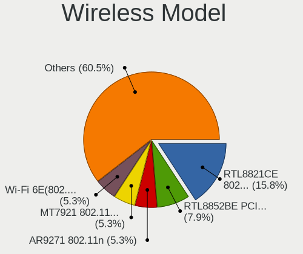
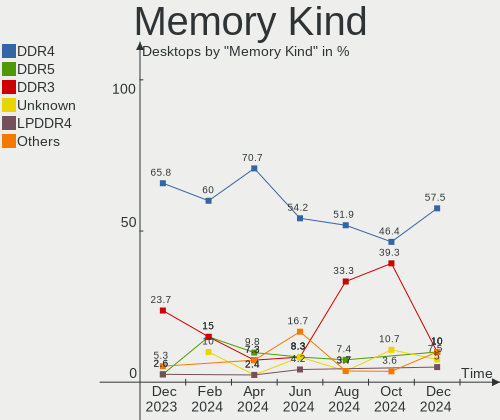
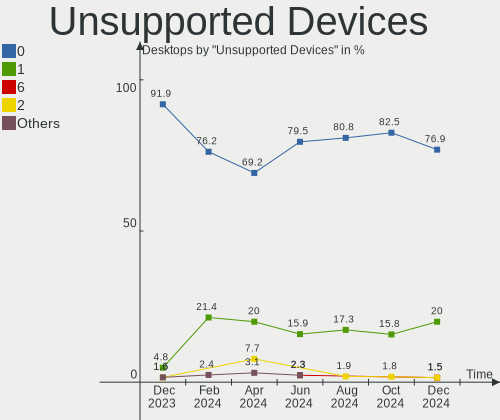

Linux in Spain - Hardware Trends (Desktops)
-------------------------------------------

A project to identify most popular hardware characteristics and track their change
over time based on data collected by Linux users at https://Linux-Hardware.org.

Anyone can contribute to this report by the [hw-probe](https://github.com/linuxhw/hw-probe) tool:

    sudo -E hw-probe -all -upload

Period: Oct, 2023.

Contents
--------

* [ System ](#system)
  - [ OS                       ](#os)
  - [ OS Family                ](#os-family)
  - [ Kernel                   ](#kernel)
  - [ Kernel Family            ](#kernel-family)
  - [ Kernel Major Ver.        ](#kernel-major-ver)
  - [ Arch                     ](#arch)
  - [ DE                       ](#de)
  - [ Display Server           ](#display-server)
  - [ Display Manager          ](#display-manager)
  - [ OS Lang                  ](#os-lang)
  - [ Boot Mode                ](#boot-mode)
  - [ Filesystem               ](#filesystem)
  - [ Part. scheme             ](#part-scheme)
  - [ Dual Boot with Linux/BSD ](#dual-boot-with-linuxbsd)
  - [ Dual Boot (Win)          ](#dual-boot-win)

* [ Board ](#board)
  - [ Vendor                   ](#vendor)
  - [ Model                    ](#model)
  - [ Model Family             ](#model-family)
  - [ MFG Year                 ](#mfg-year)
  - [ Form Factor              ](#form-factor)
  - [ Secure Boot              ](#secure-boot)
  - [ Coreboot                 ](#coreboot)
  - [ RAM Size                 ](#ram-size)
  - [ RAM Used                 ](#ram-used)
  - [ Total Drives             ](#total-drives)
  - [ Has CD-ROM               ](#has-cd-rom)
  - [ Has Ethernet             ](#has-ethernet)
  - [ Has WiFi                 ](#has-wifi)
  - [ Has Bluetooth            ](#has-bluetooth)

* [ Location ](#location)
  - [ Country                  ](#country)
  - [ City                     ](#city)

* [ Drives ](#drives)
  - [ Drive Vendor             ](#drive-vendor)
  - [ Drive Model              ](#drive-model)
  - [ HDD Vendor               ](#hdd-vendor)
  - [ SSD Vendor               ](#ssd-vendor)
  - [ Drive Kind               ](#drive-kind)
  - [ Drive Connector          ](#drive-connector)
  - [ Drive Size               ](#drive-size)
  - [ Space Total              ](#space-total)
  - [ Space Used               ](#space-used)
  - [ Malfunc. Drives          ](#malfunc-drives)
  - [ Malfunc. Drive Vendor    ](#malfunc-drive-vendor)
  - [ Malfunc. HDD Vendor      ](#malfunc-hdd-vendor)
  - [ Malfunc. Drive Kind      ](#malfunc-drive-kind)
  - [ Failed Drives            ](#failed-drives)
  - [ Failed Drive Vendor      ](#failed-drive-vendor)
  - [ Drive Status             ](#drive-status)

* [ Storage controller ](#storage-controller)
  - [ Storage Vendor           ](#storage-vendor)
  - [ Storage Model            ](#storage-model)
  - [ Storage Kind             ](#storage-kind)

* [ Processor ](#processor)
  - [ CPU Vendor               ](#cpu-vendor)
  - [ CPU Model                ](#cpu-model)
  - [ CPU Model Family         ](#cpu-model-family)
  - [ CPU Cores                ](#cpu-cores)
  - [ CPU Sockets              ](#cpu-sockets)
  - [ CPU Threads              ](#cpu-threads)
  - [ CPU Op-Modes             ](#cpu-op-modes)
  - [ CPU Microcode            ](#cpu-microcode)
  - [ CPU Microarch            ](#cpu-microarch)

* [ Graphics ](#graphics)
  - [ GPU Vendor               ](#gpu-vendor)
  - [ GPU Model                ](#gpu-model)
  - [ GPU Combo                ](#gpu-combo)
  - [ GPU Driver               ](#gpu-driver)
  - [ GPU Memory               ](#gpu-memory)

* [ Monitor ](#monitor)
  - [ Monitor Vendor           ](#monitor-vendor)
  - [ Monitor Model            ](#monitor-model)
  - [ Monitor Resolution       ](#monitor-resolution)
  - [ Monitor Diagonal         ](#monitor-diagonal)
  - [ Monitor Width            ](#monitor-width)
  - [ Aspect Ratio             ](#aspect-ratio)
  - [ Monitor Area             ](#monitor-area)
  - [ Pixel Density            ](#pixel-density)
  - [ Multiple Monitors        ](#multiple-monitors)

* [ Network ](#network)
  - [ Net Controller Vendor    ](#net-controller-vendor)
  - [ Net Controller Model     ](#net-controller-model)
  - [ Wireless Vendor          ](#wireless-vendor)
  - [ Wireless Model           ](#wireless-model)
  - [ Ethernet Vendor          ](#ethernet-vendor)
  - [ Ethernet Model           ](#ethernet-model)
  - [ Net Controller Kind      ](#net-controller-kind)
  - [ Used Controller          ](#used-controller)
  - [ NICs                     ](#nics)
  - [ IPv6                     ](#ipv6)

* [ Bluetooth ](#bluetooth)
  - [ Bluetooth Vendor         ](#bluetooth-vendor)
  - [ Bluetooth Model          ](#bluetooth-model)

* [ Sound ](#sound)
  - [ Sound Vendor             ](#sound-vendor)
  - [ Sound Model              ](#sound-model)

* [ Memory ](#memory)
  - [ Memory Vendor            ](#memory-vendor)
  - [ Memory Model             ](#memory-model)
  - [ Memory Kind              ](#memory-kind)
  - [ Memory Form Factor       ](#memory-form-factor)
  - [ Memory Size              ](#memory-size)
  - [ Memory Speed             ](#memory-speed)

* [ Printers & scanners ](#printers--scanners)
  - [ Printer Vendor           ](#printer-vendor)
  - [ Printer Model            ](#printer-model)
  - [ Scanner Vendor           ](#scanner-vendor)
  - [ Scanner Model            ](#scanner-model)

* [ Camera ](#camera)
  - [ Camera Vendor            ](#camera-vendor)
  - [ Camera Model             ](#camera-model)

* [ Security ](#security)
  - [ Fingerprint Vendor       ](#fingerprint-vendor)
  - [ Fingerprint Model        ](#fingerprint-model)
  - [ Chipcard Vendor          ](#chipcard-vendor)
  - [ Chipcard Model           ](#chipcard-model)

* [ Unsupported ](#unsupported)
  - [ Unsupported Devices      ](#unsupported-devices)
  - [ Unsupported Device Types ](#unsupported-device-types)

System
------

OS
--

Installed operating systems

| Name                         | Desktops | Percent |
|------------------------------|----------|---------|
| Ubuntu 22.04                 | 7        | 11.67%  |
| Fedora 38                    | 7        | 11.67%  |
| Linux Mint 21.2              | 4        | 6.67%   |
| Arch Rolling                 | 4        | 6.67%   |
| Zorin 16                     | 3        | 5%      |
| Debian 12                    | 3        | 5%      |
| Debian                       | 3        | 5%      |
| Ubuntu 23.10                 | 2        | 3.33%   |
| Pop!_OS 22.04                | 2        | 3.33%   |
| OpenMandriva 23.08           | 2        | 3.33%   |
| Gentoo 2.14                  | 2        | 3.33%   |
| Debian 11                    | 2        | 3.33%   |
| Xubuntu 22.04                | 1        | 1.67%   |
| Ubuntu Budgie 22.04          | 1        | 1.67%   |
| Ubuntu 23.04                 | 1        | 1.67%   |
| Ubuntu 20.04                 | 1        | 1.67%   |
| org.kde.Platform 5.15-21.08  | 1        | 1.67%   |
| openSUSE Tumbleweed-XXXXXXXX | 1        | 1.67%   |
| OpenMandriva 4.3             | 1        | 1.67%   |
| OpenMandriva 23.10           | 1        | 1.67%   |
| OpenMandriva 23.09           | 1        | 1.67%   |
| OpenMandriva 23.01           | 1        | 1.67%   |
| MX 21                        | 1        | 1.67%   |
| LMDE 6                       | 1        | 1.67%   |
| Linux Mint 20.3              | 1        | 1.67%   |
| Kubuntu 23.10                | 1        | 1.67%   |
| Kubuntu 23.04                | 1        | 1.67%   |
| Kali 2023.3                  | 1        | 1.67%   |
| Fedora 39                    | 1        | 1.67%   |
| EndeavourOS Rolling          | 1        | 1.67%   |
| BuildRoot 2023.05.1          | 1        | 1.67%   |

OS Family
---------

OS without a version

| Name             | Desktops | Percent |
|------------------|----------|---------|
| Ubuntu           | 11       | 18.33%  |
| Fedora           | 8        | 13.33%  |
| Debian           | 8        | 13.33%  |
| OpenMandriva     | 6        | 10%     |
| Linux Mint       | 5        | 8.33%   |
| Arch             | 4        | 6.67%   |
| Zorin            | 3        | 5%      |
| Pop!_OS          | 2        | 3.33%   |
| Kubuntu          | 2        | 3.33%   |
| Gentoo           | 2        | 3.33%   |
| Xubuntu          | 1        | 1.67%   |
| Ubuntu Budgie    | 1        | 1.67%   |
| org.kde.Platform | 1        | 1.67%   |
| openSUSE         | 1        | 1.67%   |
| MX               | 1        | 1.67%   |
| LMDE             | 1        | 1.67%   |
| Kali             | 1        | 1.67%   |
| EndeavourOS      | 1        | 1.67%   |
| BuildRoot        | 1        | 1.67%   |

Kernel
------

Version of the Linux kernel

| Version                   | Desktops | Percent |
|---------------------------|----------|---------|
| 6.2.0-34-generic          | 6        | 10%     |
| 6.5.0-9-generic           | 3        | 5%      |
| 6.2.0-35-generic          | 3        | 5%      |
| 6.1.0-13-amd64            | 3        | 5%      |
| 6.5.6-200.fc38.x86_64     | 2        | 3.33%   |
| 6.5.0-1-amd64             | 2        | 3.33%   |
| 6.4.11-desktop-1omv2390   | 2        | 3.33%   |
| 6.2.9-300.fc38.x86_64     | 2        | 3.33%   |
| 5.15.0-87-generic         | 2        | 3.33%   |
| 5.15.0-86-generic         | 2        | 3.33%   |
| 5.15.0-84-generic         | 2        | 3.33%   |
| 5.10.0-25-amd64           | 2        | 3.33%   |
| 6.5.9-arch2-1             | 1        | 1.67%   |
| 6.5.8-zen1-1-zen          | 1        | 1.67%   |
| 6.5.8-200.fc38.x86_64     | 1        | 1.67%   |
| 6.5.7-arch1-1             | 1        | 1.67%   |
| 6.5.7-300.fc39.x86_64     | 1        | 1.67%   |
| 6.5.7-200.fc38.x86_64     | 1        | 1.67%   |
| 6.5.6-arch2-1             | 1        | 1.67%   |
| 6.5.6-76060506-generic    | 1        | 1.67%   |
| 6.5.6-1-default           | 1        | 1.67%   |
| 6.5.5-gentoo-Ryzen        | 1        | 1.67%   |
| 6.5.5-desktop-1omv2390    | 1        | 1.67%   |
| 6.5.5-arch1-1             | 1        | 1.67%   |
| 6.5.5-200.fc38.x86_64     | 1        | 1.67%   |
| 6.5.0-kali3-amd64         | 1        | 1.67%   |
| 6.5.0-desktop-1omv2390    | 1        | 1.67%   |
| 6.4.6-76060406-generic    | 1        | 1.67%   |
| 6.4.16                    | 1        | 1.67%   |
| 6.4.0-4-amd64             | 1        | 1.67%   |
| 6.2.0-33-generic          | 1        | 1.67%   |
| 6.2.0-32-generic          | 1        | 1.67%   |
| 6.1.57-gentoo-x86_64      | 1        | 1.67%   |
| 6.1.1-desktop-1omv2290    | 1        | 1.67%   |
| 6.1.0-12-amd64            | 1        | 1.67%   |
| 5.4.0-166-generic         | 1        | 1.67%   |
| 5.19.0-45-generic         | 1        | 1.67%   |
| 5.18.17-amd64-desktop-hwe | 1        | 1.67%   |
| 5.16.7-desktop-1omv4003   | 1        | 1.67%   |
| 5.15.0-76-generic         | 1        | 1.67%   |

Kernel Family
-------------

Linux kernel without a distro release

| Version | Desktops | Percent |
|---------|----------|---------|
| 6.2.0   | 11       | 18.33%  |
| 6.5.0   | 7        | 11.67%  |
| 5.15.0  | 7        | 11.67%  |
| 6.5.6   | 5        | 8.33%   |
| 6.5.5   | 4        | 6.67%   |
| 6.1.0   | 4        | 6.67%   |
| 6.5.7   | 3        | 5%      |
| 6.5.8   | 2        | 3.33%   |
| 6.4.11  | 2        | 3.33%   |
| 6.2.9   | 2        | 3.33%   |
| 5.10.0  | 2        | 3.33%   |
| 6.5.9   | 1        | 1.67%   |
| 6.4.6   | 1        | 1.67%   |
| 6.4.16  | 1        | 1.67%   |
| 6.4.0   | 1        | 1.67%   |
| 6.1.57  | 1        | 1.67%   |
| 6.1.1   | 1        | 1.67%   |
| 5.4.0   | 1        | 1.67%   |
| 5.19.0  | 1        | 1.67%   |
| 5.18.17 | 1        | 1.67%   |
| 5.16.7  | 1        | 1.67%   |
| 5.14.0  | 1        | 1.67%   |

Kernel Major Ver.
-----------------

Linux kernel major version

| Version | Desktops | Percent |
|---------|----------|---------|
| 6.5     | 22       | 36.67%  |
| 6.2     | 13       | 21.67%  |
| 5.15    | 7        | 11.67%  |
| 6.1     | 6        | 10%     |
| 6.4     | 5        | 8.33%   |
| 5.10    | 2        | 3.33%   |
| 5.4     | 1        | 1.67%   |
| 5.19    | 1        | 1.67%   |
| 5.18    | 1        | 1.67%   |
| 5.16    | 1        | 1.67%   |
| 5.14    | 1        | 1.67%   |

Arch
----

OS architecture (x86_64, i586, etc.)

| Name   | Desktops | Percent |
|--------|----------|---------|
| x86_64 | 60       | 100%    |

DE
--

Desktop Environment

| Name       | Desktops | Percent |
|------------|----------|---------|
| GNOME      | 29       | 48.33%  |
| KDE5       | 13       | 21.67%  |
| X-Cinnamon | 6        | 10%     |
| XFCE       | 4        | 6.67%   |
| Unknown    | 3        | 5%      |
| MATE       | 1        | 1.67%   |
| KDE        | 1        | 1.67%   |
| i3         | 1        | 1.67%   |
| Deepin     | 1        | 1.67%   |
| Budgie     | 1        | 1.67%   |

Display Server
--------------

X11 or Wayland

| Name    | Desktops | Percent |
|---------|----------|---------|
| X11     | 36       | 60%     |
| Wayland | 21       | 35%     |
| Unknown | 2        | 3.33%   |
| Tty     | 1        | 1.67%   |

Display Manager
---------------

SDDM, LightDM, etc.

| Name    | Desktops | Percent |
|---------|----------|---------|
| Unknown | 20       | 33.33%  |
| SDDM    | 16       | 26.67%  |
| GDM3    | 12       | 20%     |
| LightDM | 9        | 15%     |
| GDM     | 3        | 5%      |

OS Lang
-------

Language

| Lang       | Desktops | Percent |
|------------|----------|---------|
| es_ES      | 44       | 73.33%  |
| en_US      | 8        | 13.33%  |
| ca_ES      | 3        | 5%      |
| gl_ES      | 1        | 1.67%   |
| es_ES.UTF8 | 1        | 1.67%   |
| en_GB      | 1        | 1.67%   |
| C          | 1        | 1.67%   |
| Unknown    | 1        | 1.67%   |

Boot Mode
---------

EFI or BIOS

| Mode | Desktops | Percent |
|------|----------|---------|
| BIOS | 32       | 53.33%  |
| EFI  | 28       | 46.67%  |

Filesystem
----------

Type of filesystem

| Type    | Desktops | Percent |
|---------|----------|---------|
| Ext4    | 37       | 61.67%  |
| Tmpfs   | 13       | 21.67%  |
| Btrfs   | 9        | 15%     |
| Overlay | 1        | 1.67%   |

Part. scheme
------------

Scheme of partitioning

| Type    | Desktops | Percent |
|---------|----------|---------|
| GPT     | 34       | 56.67%  |
| Unknown | 18       | 30%     |
| MBR     | 8        | 13.33%  |

Dual Boot with Linux/BSD
------------------------

Hosting more than one Linux/BSD

| Dual boot | Desktops | Percent |
|-----------|----------|---------|
| No        | 49       | 81.67%  |
| Yes       | 11       | 18.33%  |

Dual Boot (Win)
---------------

Hosting Linux and Windows

| Dual boot | Desktops | Percent |
|-----------|----------|---------|
| No        | 35       | 58.33%  |
| Yes       | 25       | 41.67%  |

Board
-----

Vendor
------

Motherboard manufacturer

| Name                | Desktops | Percent |
|---------------------|----------|---------|
| ASUSTek Computer    | 21       | 35%     |
| MSI                 | 9        | 15%     |
| Gigabyte Technology | 8        | 13.33%  |
| Hewlett-Packard     | 7        | 11.67%  |
| ASRock              | 3        | 5%      |
| Packard Bell        | 2        | 3.33%   |
| Intel               | 2        | 3.33%   |
| Dell                | 2        | 3.33%   |
| Pegatron            | 1        | 1.67%   |
| Lenovo              | 1        | 1.67%   |
| Koloe               | 1        | 1.67%   |
| Foxconn             | 1        | 1.67%   |
| AZW                 | 1        | 1.67%   |
| Apple               | 1        | 1.67%   |

Model
-----

Motherboard model

| Name                                      | Desktops | Percent |
|-------------------------------------------|----------|---------|
| MSI MS-7C56                               | 2        | 3.33%   |
| MSI MS-7B79                               | 2        | 3.33%   |
| ASUS TUF Gaming X570-PLUS                 | 2        | 3.33%   |
| ASUS TUF Gaming B550-PLUS                 | 2        | 3.33%   |
| Pegatron WH661AA-ABE p6300es              | 1        | 1.67%   |
| Packard Bell IMEDIA S3840                 | 1        | 1.67%   |
| Packard Bell IMEDIA S3720                 | 1        | 1.67%   |
| MSI MS-7C91                               | 1        | 1.67%   |
| MSI MS-7B86                               | 1        | 1.67%   |
| MSI MS-7A38                               | 1        | 1.67%   |
| MSI MS-7996                               | 1        | 1.67%   |
| MSI MS-7125                               | 1        | 1.67%   |
| Lenovo IdeaCentre G5 14IMB05 90N900G1ES   | 1        | 1.67%   |
| Koloe Thurley                             | 1        | 1.67%   |
| Intel X99                                 | 1        | 1.67%   |
| Intel Jasper Lake Client Platform         | 1        | 1.67%   |
| HP Victus by 15L Gaming Desktop TG02-0xxx | 1        | 1.67%   |
| HP Pavilion Desktop 590-a0xxx             | 1        | 1.67%   |
| HP EliteDesk 800 G2 SFF                   | 1        | 1.67%   |
| HP EliteDesk 800 G1 TWR                   | 1        | 1.67%   |
| HP EliteDesk 800 G1 SFF                   | 1        | 1.67%   |
| HP Compaq Elite 8300 SFF                  | 1        | 1.67%   |
| HP 550-171ns                              | 1        | 1.67%   |
| Gigabyte Z390 UD                          | 1        | 1.67%   |
| Gigabyte X470 AORUS ULTRA GAMING          | 1        | 1.67%   |
| Gigabyte H81M-HD3                         | 1        | 1.67%   |
| Gigabyte H310M S2H 2.0                    | 1        | 1.67%   |
| Gigabyte GA-MA790XT-UD4P                  | 1        | 1.67%   |
| Gigabyte B85M-D3V Plus                    | 1        | 1.67%   |
| Gigabyte B550M DS3H                       | 1        | 1.67%   |
| Gigabyte B550I AORUS PRO AX               | 1        | 1.67%   |
| Foxconn Pro 3500 Series                   | 1        | 1.67%   |
| Dell OptiPlex 9020                        | 1        | 1.67%   |
| Dell OptiPlex 3000                        | 1        | 1.67%   |
| AZW Green G5                              | 1        | 1.67%   |
| ASUS TUF Gaming B550M-PLUS WIFI II        | 1        | 1.67%   |
| ASUS TUF Gaming B550-PLUS WIFI II         | 1        | 1.67%   |
| ASUS TUF Gaming B450M-PLUS II             | 1        | 1.67%   |
| ASUS ROG STRIX X570-I GAMING              | 1        | 1.67%   |
| ASUS ROG STRIX B550-F GAMING              | 1        | 1.67%   |

Model Family
------------

Motherboard model prefix

| Name                     | Desktops | Percent |
|--------------------------|----------|---------|
| ASUS TUF                 | 7        | 11.67%  |
| ASUS ROG                 | 4        | 6.67%   |
| HP EliteDesk             | 3        | 5%      |
| ASUS PRIME               | 3        | 5%      |
| Packard Bell IMEDIA      | 2        | 3.33%   |
| MSI MS-7C56              | 2        | 3.33%   |
| MSI MS-7B79              | 2        | 3.33%   |
| Dell OptiPlex            | 2        | 3.33%   |
| Pegatron WH661AA-ABE     | 1        | 1.67%   |
| MSI MS-7C91              | 1        | 1.67%   |
| MSI MS-7B86              | 1        | 1.67%   |
| MSI MS-7A38              | 1        | 1.67%   |
| MSI MS-7996              | 1        | 1.67%   |
| MSI MS-7125              | 1        | 1.67%   |
| Lenovo IdeaCentre        | 1        | 1.67%   |
| Koloe Thurley            | 1        | 1.67%   |
| Intel X99                | 1        | 1.67%   |
| Intel Jasper             | 1        | 1.67%   |
| HP Victus                | 1        | 1.67%   |
| HP Pavilion              | 1        | 1.67%   |
| HP Compaq                | 1        | 1.67%   |
| HP 550-171ns             | 1        | 1.67%   |
| Gigabyte Z390            | 1        | 1.67%   |
| Gigabyte X470            | 1        | 1.67%   |
| Gigabyte H81M-HD3        | 1        | 1.67%   |
| Gigabyte H310M           | 1        | 1.67%   |
| Gigabyte GA-MA790XT-UD4P | 1        | 1.67%   |
| Gigabyte B85M-D3V        | 1        | 1.67%   |
| Gigabyte B550M           | 1        | 1.67%   |
| Gigabyte B550I           | 1        | 1.67%   |
| Foxconn Pro              | 1        | 1.67%   |
| AZW Green                | 1        | 1.67%   |
| ASUS P8H77-M             | 1        | 1.67%   |
| ASUS P5G41T-M            | 1        | 1.67%   |
| ASUS M4A78LT-M           | 1        | 1.67%   |
| ASUS K30AD               | 1        | 1.67%   |
| ASUS ASUS                | 1        | 1.67%   |
| ASUS All                 | 1        | 1.67%   |
| ASUS A88XM-E             | 1        | 1.67%   |
| ASRock X79               | 1        | 1.67%   |

MFG Year
--------

Motherboard manufacture year

| Year | Desktops | Percent |
|------|----------|---------|
| 2019 | 10       | 16.67%  |
| 2020 | 9        | 15%     |
| 2021 | 5        | 8.33%   |
| 2012 | 5        | 8.33%   |
| 2018 | 4        | 6.67%   |
| 2010 | 4        | 6.67%   |
| 2022 | 3        | 5%      |
| 2015 | 3        | 5%      |
| 2014 | 3        | 5%      |
| 2013 | 3        | 5%      |
| 2009 | 3        | 5%      |
| 2023 | 2        | 3.33%   |
| 2017 | 2        | 3.33%   |
| 2016 | 2        | 3.33%   |
| 2011 | 1        | 1.67%   |
| 2005 | 1        | 1.67%   |

Form Factor
-----------

Physical design of the computer

| Name    | Desktops | Percent |
|---------|----------|---------|
| Desktop | 60       | 100%    |

Secure Boot
-----------

Enabled or disabled

| State    | Desktops | Percent |
|----------|----------|---------|
| Disabled | 58       | 96.67%  |
| Enabled  | 2        | 3.33%   |

Coreboot
--------

Have coreboot on board

| Used | Desktops | Percent |
|------|----------|---------|
| No   | 60       | 100%    |

RAM Size
--------

Total RAM memory

| Size in GB  | Desktops | Percent |
|-------------|----------|---------|
| 16.01-24.0  | 25       | 41.67%  |
| 32.01-64.0  | 9        | 15%     |
| 8.01-16.0   | 8        | 13.33%  |
| 4.01-8.0    | 7        | 11.67%  |
| 3.01-4.0    | 7        | 11.67%  |
| 24.01-32.0  | 2        | 3.33%   |
| 64.01-256.0 | 2        | 3.33%   |

RAM Used
--------

Used RAM memory

| Used GB   | Desktops | Percent |
|-----------|----------|---------|
| 2.01-3.0  | 20       | 33.33%  |
| 4.01-8.0  | 13       | 21.67%  |
| 1.01-2.0  | 13       | 21.67%  |
| 3.01-4.0  | 12       | 20%     |
| 8.01-16.0 | 1        | 1.67%   |
| 0.01-0.5  | 1        | 1.67%   |

Total Drives
------------

Number of drives on board

| Drives | Desktops | Percent |
|--------|----------|---------|
| 2      | 20       | 33.33%  |
| 1      | 20       | 33.33%  |
| 3      | 12       | 20%     |
| 4      | 5        | 8.33%   |
| 5      | 2        | 3.33%   |
| 7      | 1        | 1.67%   |

Has CD-ROM
----------

Has CD-ROM on board

| Presented | Desktops | Percent |
|-----------|----------|---------|
| No        | 38       | 63.33%  |
| Yes       | 22       | 36.67%  |

Has Ethernet
------------

Has Ethernet on board

| Presented | Desktops | Percent |
|-----------|----------|---------|
| Yes       | 60       | 100%    |

Has WiFi
--------

Has WiFi module

| Presented | Desktops | Percent |
|-----------|----------|---------|
| Yes       | 33       | 55%     |
| No        | 27       | 45%     |

Has Bluetooth
-------------

Has Bluetooth module

| Presented | Desktops | Percent |
|-----------|----------|---------|
| Yes       | 34       | 56.67%  |
| No        | 26       | 43.33%  |

Location
--------

Country
-------

Geographic location (country)

| Country | Desktops | Percent |
|---------|----------|---------|
| Spain   | 60       | 100%    |

City
----

Geographic location (city)

| City                       | Desktops | Percent |
|----------------------------|----------|---------|
| Madrid                     | 6        | 10%     |
| Barcelona                  | 4        | 6.67%   |
| Seville                    | 3        | 5%      |
| Granada                    | 3        | 5%      |
| Palma                      | 2        | 3.33%   |
| Málaga                    | 2        | 3.33%   |
| Villena                    | 1        | 1.67%   |
| Vigo                       | 1        | 1.67%   |
| Valladolid                 | 1        | 1.67%   |
| Valencia                   | 1        | 1.67%   |
| Úbeda                     | 1        | 1.67%   |
| Tias                       | 1        | 1.67%   |
| Teguise                    | 1        | 1.67%   |
| Santurtzi                  | 1        | 1.67%   |
| Santiago de Compostela     | 1        | 1.67%   |
| Santander                  | 1        | 1.67%   |
| San Agustin del Guadalix   | 1        | 1.67%   |
| Ribarroja del Turia        | 1        | 1.67%   |
| Reus                       | 1        | 1.67%   |
| Puentecesures              | 1        | 1.67%   |
| Puente La Reina – Gares  | 1        | 1.67%   |
| Pinto                      | 1        | 1.67%   |
| Penaranda de Bracamonte    | 1        | 1.67%   |
| Pedrezuela                 | 1        | 1.67%   |
| Oviedo                     | 1        | 1.67%   |
| Ourense                    | 1        | 1.67%   |
| Olesa de Montserrat        | 1        | 1.67%   |
| Oleiros                    | 1        | 1.67%   |
| Mostoles                   | 1        | 1.67%   |
| Montijo                    | 1        | 1.67%   |
| Martorell                  | 1        | 1.67%   |
| Marmolejo                  | 1        | 1.67%   |
| Las Palmas de Gran Canaria | 1        | 1.67%   |
| Laguna de Duero            | 1        | 1.67%   |
| Igualada                   | 1        | 1.67%   |
| Ibiza Town                 | 1        | 1.67%   |
| Fuenlabrada                | 1        | 1.67%   |
| Fraga                      | 1        | 1.67%   |
| Elda                       | 1        | 1.67%   |
| Daganzo de Arriba          | 1        | 1.67%   |

Drives
------

Drive Vendor
------------

Hard drive vendors

| Vendor                      | Desktops | Drives | Percent |
|-----------------------------|----------|--------|---------|
| WDC                         | 19       | 23     | 16.96%  |
| Seagate                     | 19       | 23     | 16.96%  |
| Kingston                    | 15       | 17     | 13.39%  |
| Samsung Electronics         | 13       | 19     | 11.61%  |
| Crucial                     | 5        | 5      | 4.46%   |
| Toshiba                     | 4        | 4      | 3.57%   |
| SanDisk                     | 3        | 3      | 2.68%   |
| Phison Electronics          | 3        | 3      | 2.68%   |
| Micron/Crucial Technology   | 3        | 3      | 2.68%   |
| Hitachi                     | 3        | 4      | 2.68%   |
| PNY                         | 2        | 2      | 1.79%   |
| MAXIO Technology (Hangzhou) | 2        | 2      | 1.79%   |
| KIOXIA                      | 2        | 2      | 1.79%   |
| Kingston Technology Company | 2        | 2      | 1.79%   |
| Emtec                       | 2        | 2      | 1.79%   |
| Unknown                     | 1        | 1      | 0.89%   |
| SK hynix                    | 1        | 1      | 0.89%   |
| OCZ                         | 1        | 1      | 0.89%   |
| Maxtor                      | 1        | 1      | 0.89%   |
| KingSpec                    | 1        | 1      | 0.89%   |
| Kingchuxing                 | 1        | 1      | 0.89%   |
| Kimtigo                     | 1        | 1      | 0.89%   |
| Intel                       | 1        | 1      | 0.89%   |
| Gigabyte Technology         | 1        | 1      | 0.89%   |
| Fujitsu                     | 1        | 1      | 0.89%   |
| Fanxiang                    | 1        | 1      | 0.89%   |
| Corsair                     | 1        | 1      | 0.89%   |
| Apple                       | 1        | 1      | 0.89%   |
| Aoluska                     | 1        | 1      | 0.89%   |
| AMD                         | 1        | 3      | 0.89%   |

Drive Model
-----------

Hard drive models

| Model                                 | Desktops | Percent |
|---------------------------------------|----------|---------|
| Kingston SA400S37240G 240GB SSD       | 5        | 3.88%   |
| Seagate ST2000DM008-2FR102 2TB        | 4        | 3.1%    |
| Seagate ST1000DM010-2EP102 1TB        | 4        | 3.1%    |
| Samsung SSD 860 EVO 500GB             | 3        | 2.33%   |
| Micron/Crucial P2 NVMe PCIe SSD 500GB | 3        | 2.33%   |
| WDC WD30EZRZ-00GXCB0 3TB              | 2        | 1.55%   |
| WDC WD20EZRZ-00Z5HB0 2TB              | 2        | 1.55%   |
| Seagate ST1000DM003-1SB102 1TB        | 2        | 1.55%   |
| Samsung SSD 980 500GB                 | 2        | 1.55%   |
| Samsung SSD 850 EVO 250GB             | 2        | 1.55%   |
| Kingston SA400S37480G 480GB SSD       | 2        | 1.55%   |
| Kingston SA400S37120G 120GB SSD       | 2        | 1.55%   |
| Crucial CT240BX500SSD1 240GB          | 2        | 1.55%   |
| WDC WDS500G3X0C-00SJG0 500GB          | 1        | 0.78%   |
| WDC WD6400AAKS-22A7B2 640GB           | 1        | 0.78%   |
| WDC WD5000AVCS-632DY1 500GB           | 1        | 0.78%   |
| WDC WD40EFAX-68JH4N1 4TB              | 1        | 0.78%   |
| WDC WD40EFAX-68JH4N0 4TB              | 1        | 0.78%   |
| WDC WD3200BPVT-22JJ5T0 320GB          | 1        | 0.78%   |
| WDC WD3200AAJS-22B4A0 320GB           | 1        | 0.78%   |
| WDC WD20PURX-64P6ZY0 2TB              | 1        | 0.78%   |
| WDC WD20EARS-00MVWB0 2TB              | 1        | 0.78%   |
| WDC WD1600BEVS-22RST0 160GB           | 1        | 0.78%   |
| WDC WD10EZRX-00A3KB0 1TB              | 1        | 0.78%   |
| WDC WD10EZEX-60M2NA0 1TB              | 1        | 0.78%   |
| WDC WD10EZEX-22MFCA0 1TB              | 1        | 0.78%   |
| WDC WD10EZEX-22BN5A0 1TB              | 1        | 0.78%   |
| WDC WD10EZEX-08WN4A0 1TB              | 1        | 0.78%   |
| WDC WD10EZEX-08M2NA0 1TB              | 1        | 0.78%   |
| WDC WD10EZEX-00KUWA0 1TB              | 1        | 0.78%   |
| WDC WD10EARS-00Y5B1 1TB               | 1        | 0.78%   |
| WDC WD1002FAEX-00Z3A0 1TB             | 1        | 0.78%   |
| Unknown SD/MMC/MS PRO 16GB            | 1        | 0.78%   |
| Toshiba HDWD220 2TB                   | 1        | 0.78%   |
| Toshiba DT01ACA200 2TB                | 1        | 0.78%   |
| Toshiba DT01ACA100 1TB                | 1        | 0.78%   |
| Toshiba DT01ACA050 500GB              | 1        | 0.78%   |
| SK hynix BC711 HFM512GD3JX013N 512GB  | 1        | 0.78%   |
| Seagate ST500LT012-1DG142 500GB       | 1        | 0.78%   |
| Seagate ST500DM002-1BD142 500GB       | 1        | 0.78%   |

HDD Vendor
----------

Hard disk drive vendors

| Vendor              | Desktops | Drives | Percent |
|---------------------|----------|--------|---------|
| Seagate             | 19       | 22     | 38.78%  |
| WDC                 | 18       | 22     | 36.73%  |
| Toshiba             | 4        | 4      | 8.16%   |
| Hitachi             | 3        | 4      | 6.12%   |
| Samsung Electronics | 2        | 2      | 4.08%   |
| Unknown             | 1        | 1      | 2.04%   |
| Fujitsu             | 1        | 1      | 2.04%   |
| Apple               | 1        | 1      | 2.04%   |

SSD Vendor
----------

Solid state drive vendors

| Vendor              | Desktops | Drives | Percent |
|---------------------|----------|--------|---------|
| Kingston            | 10       | 11     | 27.03%  |
| Samsung Electronics | 9        | 11     | 24.32%  |
| Crucial             | 5        | 5      | 13.51%  |
| SanDisk             | 2        | 2      | 5.41%   |
| PNY                 | 2        | 2      | 5.41%   |
| Emtec               | 2        | 2      | 5.41%   |
| OCZ                 | 1        | 1      | 2.7%    |
| Maxtor              | 1        | 1      | 2.7%    |
| KingSpec            | 1        | 1      | 2.7%    |
| Kingchuxing         | 1        | 1      | 2.7%    |
| Kimtigo             | 1        | 1      | 2.7%    |
| Gigabyte Technology | 1        | 1      | 2.7%    |
| Corsair             | 1        | 1      | 2.7%    |

Drive Kind
----------

HDD or SSD

| Kind    | Desktops | Drives | Percent |
|---------|----------|--------|---------|
| HDD     | 37       | 57     | 38.95%  |
| SSD     | 31       | 40     | 32.63%  |
| NVMe    | 25       | 32     | 26.32%  |
| Unknown | 2        | 2      | 2.11%   |

Drive Connector
---------------

SATA, SAS, NVMe, etc.

| Type | Desktops | Drives | Percent |
|------|----------|--------|---------|
| SATA | 51       | 96     | 64.56%  |
| NVMe | 25       | 32     | 31.65%  |
| SAS  | 3        | 3      | 3.8%    |

Drive Size
----------

Size of hard drive

| Size in TB | Desktops | Drives | Percent |
|------------|----------|--------|---------|
| 0.01-0.5   | 34       | 50     | 43.59%  |
| 0.51-1.0   | 26       | 27     | 33.33%  |
| 1.01-2.0   | 10       | 12     | 12.82%  |
| 3.01-4.0   | 4        | 4      | 5.13%   |
| 2.01-3.0   | 3        | 3      | 3.85%   |
| 10.01-20.0 | 1        | 1      | 1.28%   |

Space Total
-----------

Amount of disk space available on the file system

| Size in GB     | Desktops | Percent |
|----------------|----------|---------|
| 501-1000       | 15       | 25%     |
| 251-500        | 14       | 23.33%  |
| 101-250        | 14       | 23.33%  |
| 1001-2000      | 6        | 10%     |
| More than 3000 | 5        | 8.33%   |
| 2001-3000      | 4        | 6.67%   |
| 51-100         | 2        | 3.33%   |

Space Used
----------

Amount of used disk space

| Used GB        | Desktops | Percent |
|----------------|----------|---------|
| 1-20           | 21       | 35%     |
| 101-250        | 11       | 18.33%  |
| 21-50          | 9        | 15%     |
| 251-500        | 6        | 10%     |
| 51-100         | 6        | 10%     |
| 501-1000       | 3        | 5%      |
| More than 3000 | 2        | 3.33%   |
| 2001-3000      | 1        | 1.67%   |
| 1001-2000      | 1        | 1.67%   |

Malfunc. Drives
---------------

Drive models with a malfunction

| Model                           | Desktops | Drives | Percent |
|---------------------------------|----------|--------|---------|
| WDC WD40EFAX-68JH4N1 4TB        | 1        | 1      | 25%     |
| Toshiba DT01ACA100 1TB          | 1        | 1      | 25%     |
| Seagate ST500LT012-1DG142 500GB | 1        | 1      | 25%     |
| Seagate ST3500830AS 500GB       | 1        | 1      | 25%     |

Malfunc. Drive Vendor
---------------------

Vendors of faulty drives

| Vendor  | Desktops | Drives | Percent |
|---------|----------|--------|---------|
| Seagate | 2        | 2      | 50%     |
| WDC     | 1        | 1      | 25%     |
| Toshiba | 1        | 1      | 25%     |

Malfunc. HDD Vendor
-------------------

Vendors of faulty HDD drives

| Vendor  | Desktops | Drives | Percent |
|---------|----------|--------|---------|
| Seagate | 2        | 2      | 50%     |
| WDC     | 1        | 1      | 25%     |
| Toshiba | 1        | 1      | 25%     |

Malfunc. Drive Kind
-------------------

Kinds of faulty drives

| Kind | Desktops | Drives | Percent |
|------|----------|--------|---------|
| HDD  | 3        | 4      | 100%    |

Failed Drives
-------------

Failed drive models

Zero info for selected period =(

Failed Drive Vendor
-------------------

Failed drive vendors

Zero info for selected period =(

Drive Status
------------

Number of failed and malfunc. drives

| Status   | Desktops | Drives | Percent |
|----------|----------|--------|---------|
| Detected | 34       | 66     | 52.31%  |
| Works    | 28       | 61     | 43.08%  |
| Malfunc  | 3        | 4      | 4.62%   |

Storage controller
------------------

Storage Vendor
--------------

Storage controller vendors

| Vendor                      | Desktops | Percent |
|-----------------------------|----------|---------|
| Intel                       | 31       | 32.63%  |
| AMD                         | 27       | 28.42%  |
| Kingston Technology Company | 8        | 8.42%   |
| Samsung Electronics         | 6        | 6.32%   |
| Phison Electronics          | 3        | 3.16%   |
| Nvidia                      | 3        | 3.16%   |
| Micron/Crucial Technology   | 3        | 3.16%   |
| Marvell Technology Group    | 3        | 3.16%   |
| SanDisk                     | 2        | 2.11%   |
| MAXIO Technology (Hangzhou) | 2        | 2.11%   |
| KIOXIA                      | 2        | 2.11%   |
| SK hynix                    | 1        | 1.05%   |
| Seagate Technology          | 1        | 1.05%   |
| JMicron Technology          | 1        | 1.05%   |
| HighPoint Technologies      | 1        | 1.05%   |
| ASMedia Technology          | 1        | 1.05%   |

Storage Model
-------------

Storage controller models

| Model                                                                          | Desktops | Percent |
|--------------------------------------------------------------------------------|----------|---------|
| AMD FCH SATA Controller [AHCI mode]                                            | 11       | 10%     |
| AMD 500 Series Chipset SATA Controller                                         | 11       | 10%     |
| AMD 400 Series Chipset SATA Controller                                         | 7        | 6.36%   |
| Intel 8 Series/C220 Series Chipset Family 6-port SATA Controller 1 [AHCI mode] | 6        | 5.45%   |
| Samsung NVMe SSD Controller 980 (DRAM-less)                                    | 4        | 3.64%   |
| Micron/Crucial P2 [Nick P2] / P3 / P3 Plus NVMe PCIe SSD (DRAM-less)           | 3        | 2.73%   |
| Intel Q170/Q150/B150/H170/H110/Z170/CM236 Chipset SATA Controller [AHCI Mode]  | 3        | 2.73%   |
| Intel 200 Series PCH SATA controller [AHCI mode]                               | 3        | 2.73%   |
| MAXIO (Hangzhou) NVMe SSD Controller MAP1202                                   | 2        | 1.82%   |
| Kingston Company NV2 NVMe SSD SM2267XT                                         | 2        | 1.82%   |
| Kingston Company NV1 NVMe SSD SM2263XT                                         | 2        | 1.82%   |
| Kingston Company A2000 NVMe SSD SM2263EN                                       | 2        | 1.82%   |
| Intel Volume Management Device NVMe RAID Controller                            | 2        | 1.82%   |
| Intel NM10/ICH7 Family SATA Controller [IDE mode]                              | 2        | 1.82%   |
| Intel Alder Lake-S PCH SATA Controller [AHCI Mode]                             | 2        | 1.82%   |
| Intel 82801JI (ICH10 Family) SATA AHCI Controller                              | 2        | 1.82%   |
| Intel 6 Series/C200 Series Chipset Family 6 port Desktop SATA AHCI Controller  | 2        | 1.82%   |
| AMD SB7x0/SB8x0/SB9x0 SATA Controller [AHCI mode]                              | 2        | 1.82%   |
| AMD SB7x0/SB8x0/SB9x0 IDE Controller                                           | 2        | 1.82%   |
| SK hynix Gold P31/BC711/PC711 NVMe Solid State Drive                           | 1        | 0.91%   |
| Seagate FireCuda 530 SSD                                                       | 1        | 0.91%   |
| SanDisk PC SN735 NVMe SSD (DRAM-less)                                          | 1        | 0.91%   |
| SanDisk Extreme Pro / WD Black 2018/SN750/PC SN720 NVMe SSD                    | 1        | 0.91%   |
| Samsung NVMe SSD Controller SM981/PM981/PM983                                  | 1        | 0.91%   |
| Samsung NVMe SSD Controller PM9A1/PM9A3/980PRO                                 | 1        | 0.91%   |
| Phison E18 PCIe4 NVMe Controller                                               | 1        | 0.91%   |
| Phison E16 PCIe4 NVMe Controller                                               | 1        | 0.91%   |
| Phison E12 NVMe Controller                                                     | 1        | 0.91%   |
| Nvidia MCP73 IDE Controller                                                    | 1        | 0.91%   |
| Nvidia MCP61 SATA Controller                                                   | 1        | 0.91%   |
| Nvidia MCP61 IDE                                                               | 1        | 0.91%   |
| Nvidia GeForce 7100/nForce 630i SATA                                           | 1        | 0.91%   |
| Nvidia CK804 Serial ATA Controller                                             | 1        | 0.91%   |
| Nvidia CK804 IDE                                                               | 1        | 0.91%   |
| Marvell Group 88SE9220 PCIe 2.0 x2 2-port SATA 6 Gb/s RAID Controller          | 1        | 0.91%   |
| Marvell Group 88SE9172 SATA III 6Gb/s RAID Controller                          | 1        | 0.91%   |
| Marvell Group 88SE9172 SATA 6Gb/s Controller                                   | 1        | 0.91%   |
| Marvell Group 88SE912x IDE Controller                                          | 1        | 0.91%   |
| KIOXIA RD500/Exceria Plus/Exceria Plus G2 NVMe SSD                             | 1        | 0.91%   |
| KIOXIA NVMe SSD Controller BG5 (DRAM-less)                                     | 1        | 0.91%   |

Storage Kind
------------

Kind of storage controller (IDE, SATA, NVMe, SAS, ...)

| Kind | Desktops | Percent |
|------|----------|---------|
| SATA | 53       | 57.61%  |
| NVMe | 25       | 27.17%  |
| IDE  | 10       | 10.87%  |
| RAID | 4        | 4.35%   |

Processor
---------

CPU Vendor
----------

Processor vendors

| Vendor | Desktops | Percent |
|--------|----------|---------|
| Intel  | 31       | 51.67%  |
| AMD    | 29       | 48.33%  |

CPU Model
---------

Processor models

| Model                                       | Desktops | Percent |
|---------------------------------------------|----------|---------|
| Intel Core i5-4590 CPU @ 3.30GHz            | 3        | 5%      |
| AMD Ryzen 7 5800X 8-Core Processor          | 3        | 5%      |
| AMD Ryzen 5 5600X 6-Core Processor          | 3        | 5%      |
| Intel Core i5-7400 CPU @ 3.00GHz            | 2        | 3.33%   |
| Intel Core i3-2120 CPU @ 3.30GHz            | 2        | 3.33%   |
| AMD Ryzen 7 5700G with Radeon Graphics      | 2        | 3.33%   |
| AMD Ryzen 7 2700X Eight-Core Processor      | 2        | 3.33%   |
| AMD Ryzen 5 5500                            | 2        | 3.33%   |
| AMD Ryzen 5 3600 6-Core Processor           | 2        | 3.33%   |
| AMD Ryzen 5 2600 Six-Core Processor         | 2        | 3.33%   |
| Intel Xeon CPU E5620 @ 2.40GHz              | 1        | 1.67%   |
| Intel Xeon CPU E5-2678 v3 @ 2.50GHz         | 1        | 1.67%   |
| Intel Pentium Gold G5420 CPU @ 3.80GHz      | 1        | 1.67%   |
| Intel Pentium Dual-Core CPU E5700 @ 3.00GHz | 1        | 1.67%   |
| Intel Pentium CPU G3260 @ 3.30GHz           | 1        | 1.67%   |
| Intel N100                                  | 1        | 1.67%   |
| Intel Core i7-9700K CPU @ 3.60GHz           | 1        | 1.67%   |
| Intel Core i7-4960X CPU @ 3.60GHz           | 1        | 1.67%   |
| Intel Core i7-4790S CPU @ 3.20GHz           | 1        | 1.67%   |
| Intel Core i7-4790K CPU @ 4.00GHz           | 1        | 1.67%   |
| Intel Core i7-3770 CPU @ 3.40GHz            | 1        | 1.67%   |
| Intel Core i7-2600 CPU @ 3.40GHz            | 1        | 1.67%   |
| Intel Core i7 CPU 920 @ 2.67GHz             | 1        | 1.67%   |
| Intel Core i5-8400 CPU @ 2.80GHz            | 1        | 1.67%   |
| Intel Core i5-6500 CPU @ 3.20GHz            | 1        | 1.67%   |
| Intel Core i5-4440 CPU @ 3.10GHz            | 1        | 1.67%   |
| Intel Core i5-10500 CPU @ 3.10GHz           | 1        | 1.67%   |
| Intel Core i5-10400F CPU @ 2.90GHz          | 1        | 1.67%   |
| Intel Core i3-6100 CPU @ 3.70GHz            | 1        | 1.67%   |
| Intel Core 2 Duo CPU E7500 @ 2.93GHz        | 1        | 1.67%   |
| Intel Celeron N5105 @ 2.00GHz               | 1        | 1.67%   |
| Intel Celeron CPU E3300 @ 2.50GHz           | 1        | 1.67%   |
| Intel 12th Gen Core i5-12500T               | 1        | 1.67%   |
| Intel 12th Gen Core i5-12400F               | 1        | 1.67%   |
| AMD Ryzen 9 7950X3D 16-Core Processor       | 1        | 1.67%   |
| AMD Ryzen 9 3900X 12-Core Processor         | 1        | 1.67%   |
| AMD Ryzen 5 5600 6-Core Processor           | 1        | 1.67%   |
| AMD Ryzen 5 3400G with Radeon Vega Graphics | 1        | 1.67%   |
| AMD Ryzen 5 2400G with Radeon Vega Graphics | 1        | 1.67%   |
| AMD Ryzen 3 3200G with Radeon Vega Graphics | 1        | 1.67%   |

CPU Model Family
----------------

Processor model prefix

| Model                   | Desktops | Percent |
|-------------------------|----------|---------|
| AMD Ryzen 5             | 12       | 20%     |
| Intel Core i5           | 10       | 16.67%  |
| Intel Core i7           | 7        | 11.67%  |
| AMD Ryzen 7             | 7        | 11.67%  |
| Other                   | 4        | 6.67%   |
| Intel Core i3           | 3        | 5%      |
| Intel Xeon              | 2        | 3.33%   |
| Intel Celeron           | 2        | 3.33%   |
| AMD Ryzen 9             | 2        | 3.33%   |
| Intel Pentium Gold      | 1        | 1.67%   |
| Intel Pentium Dual-Core | 1        | 1.67%   |
| Intel Pentium           | 1        | 1.67%   |
| Intel Core 2 Duo        | 1        | 1.67%   |
| AMD Ryzen 3             | 1        | 1.67%   |
| AMD Phenom II X4        | 1        | 1.67%   |
| AMD Athlon II X4        | 1        | 1.67%   |
| AMD Athlon II X2        | 1        | 1.67%   |
| AMD Athlon 64 X2        | 1        | 1.67%   |
| AMD A6                  | 1        | 1.67%   |
| AMD A10                 | 1        | 1.67%   |

CPU Cores
---------

Number of processor cores

| Number | Desktops | Percent |
|--------|----------|---------|
| 4      | 19       | 31.67%  |
| 6      | 16       | 26.67%  |
| 2      | 12       | 20%     |
| 8      | 9        | 15%     |
| 12     | 2        | 3.33%   |
| 16     | 1        | 1.67%   |
| 1      | 1        | 1.67%   |

CPU Sockets
-----------

Number of sockets

| Number | Desktops | Percent |
|--------|----------|---------|
| 1      | 59       | 98.33%  |
| 2      | 1        | 1.67%   |

CPU Threads
-----------

Threads per core (Hyper-Threading)

| Number | Desktops | Percent |
|--------|----------|---------|
| 2      | 39       | 65%     |
| 1      | 21       | 35%     |

CPU Op-Modes
------------

CPU Operation Modes (32-bit, 64-bit)

| Op mode        | Desktops | Percent |
|----------------|----------|---------|
| 32-bit, 64-bit | 60       | 100%    |

CPU Microcode
-------------

Microcode number

| Number     | Desktops | Percent |
|------------|----------|---------|
| Unknown    | 26       | 43.33%  |
| 0x306c3    | 3        | 5%      |
| 0x0a201016 | 3        | 5%      |
| 0x08701021 | 3        | 5%      |
| 0x1067a    | 2        | 3.33%   |
| 0x0a50000d | 2        | 3.33%   |
| 0x0a50000c | 2        | 3.33%   |
| 0x08108109 | 2        | 3.33%   |
| 0x0800820d | 2        | 3.33%   |
| 0xa0653    | 1        | 1.67%   |
| 0x906ea    | 1        | 1.67%   |
| 0x906e9    | 1        | 1.67%   |
| 0x506e3    | 1        | 1.67%   |
| 0x306f2    | 1        | 1.67%   |
| 0x0a601203 | 1        | 1.67%   |
| 0x0a20120e | 1        | 1.67%   |
| 0x0a20120a | 1        | 1.67%   |
| 0x0a201025 | 1        | 1.67%   |
| 0x08101016 | 1        | 1.67%   |
| 0x06003104 | 1        | 1.67%   |
| 0x06001119 | 1        | 1.67%   |
| 0x010000db | 1        | 1.67%   |
| 0x010000c8 | 1        | 1.67%   |
| 0x00000000 | 1        | 1.67%   |

CPU Microarch
-------------

Microarchitecture

| Name             | Desktops | Percent |
|------------------|----------|---------|
| Zen 3            | 11       | 18.33%  |
| Haswell          | 8        | 13.33%  |
| Zen+             | 6        | 10%     |
| KabyLake         | 5        | 8.33%   |
| Zen 2            | 3        | 5%      |
| SandyBridge      | 3        | 5%      |
| Penryn           | 3        | 5%      |
| K10              | 3        | 5%      |
| Unknown          | 3        | 5%      |
| Skylake          | 2        | 3.33%   |
| IvyBridge        | 2        | 3.33%   |
| CometLake        | 2        | 3.33%   |
| Alderlake Hybrid | 2        | 3.33%   |
| Zen              | 1        | 1.67%   |
| Westmere         | 1        | 1.67%   |
| Steamroller      | 1        | 1.67%   |
| Piledriver       | 1        | 1.67%   |
| Nehalem          | 1        | 1.67%   |
| K8 Hammer        | 1        | 1.67%   |
| Excavator        | 1        | 1.67%   |

Graphics
--------

GPU Vendor
----------

Vendors of graphics cards

| Vendor | Desktops | Percent |
|--------|----------|---------|
| AMD    | 26       | 42.62%  |
| Nvidia | 20       | 32.79%  |
| Intel  | 15       | 24.59%  |

GPU Model
---------

Graphics card models

| Model                                                                       | Desktops | Percent |
|-----------------------------------------------------------------------------|----------|---------|
| Intel Xeon E3-1200 v3/4th Gen Core Processor Integrated Graphics Controller | 4        | 6.56%   |
| AMD Ellesmere [Radeon RX 470/480/570/570X/580/580X/590]                     | 4        | 6.56%   |
| Nvidia GK208B [GeForce GT 710]                                              | 3        | 4.92%   |
| AMD Navi 23 [Radeon RX 6600/6600 XT/6600M]                                  | 3        | 4.92%   |
| Intel 2nd Generation Core Processor Family Integrated Graphics Controller   | 2        | 3.28%   |
| AMD Baffin [Radeon RX 550 640SP / RX 560/560X]                              | 2        | 3.28%   |
| Nvidia TU116 [GeForce GTX 1660]                                             | 1        | 1.64%   |
| Nvidia TU116 [GeForce GTX 1660 Ti]                                          | 1        | 1.64%   |
| Nvidia TU116 [GeForce GTX 1660 SUPER]                                       | 1        | 1.64%   |
| Nvidia TU116 [GeForce GTX 1650]                                             | 1        | 1.64%   |
| Nvidia TU104 [GeForce RTX 2070 SUPER]                                       | 1        | 1.64%   |
| Nvidia GP108 [GeForce GT 1030]                                              | 1        | 1.64%   |
| Nvidia GP107 [GeForce GTX 1050 Ti]                                          | 1        | 1.64%   |
| Nvidia GP106 [GeForce GTX 1060 6GB]                                         | 1        | 1.64%   |
| Nvidia GP106 [GeForce GTX 1060 3GB]                                         | 1        | 1.64%   |
| Nvidia GK208B [GeForce GT 720]                                              | 1        | 1.64%   |
| Nvidia GK104 [GeForce GTX 760]                                              | 1        | 1.64%   |
| Nvidia GA106 [GeForce RTX 3060 Lite Hash Rate]                              | 1        | 1.64%   |
| Nvidia GA106 [GeForce RTX 3050 OEM]                                         | 1        | 1.64%   |
| Nvidia GA104 [GeForce RTX 3070 Lite Hash Rate]                              | 1        | 1.64%   |
| Nvidia GA104 [GeForce RTX 3060 Ti Lite Hash Rate]                           | 1        | 1.64%   |
| Nvidia G94 [GeForce 9600 GT]                                                | 1        | 1.64%   |
| Nvidia AD104 [GeForce RTX 4070]                                             | 1        | 1.64%   |
| Intel JasperLake [UHD Graphics]                                             | 1        | 1.64%   |
| Intel IvyBridge GT2 [HD Graphics 4000]                                      | 1        | 1.64%   |
| Intel HD Graphics 530                                                       | 1        | 1.64%   |
| Intel DG2 [Arc A770]                                                        | 1        | 1.64%   |
| Intel CometLake-S GT2 [UHD Graphics 630]                                    | 1        | 1.64%   |
| Intel CoffeeLake-S GT1 [UHD Graphics 610]                                   | 1        | 1.64%   |
| Intel Alder Lake-S GT1 [UHD Graphics 770]                                   | 1        | 1.64%   |
| Intel Alder Lake-N [UHD Graphics]                                           | 1        | 1.64%   |
| Intel 4 Series Chipset Integrated Graphics Controller                       | 1        | 1.64%   |
| AMD Stoney [Radeon R2/R3/R4/R5 Graphics]                                    | 1        | 1.64%   |
| AMD RV770 [Radeon HD 4850]                                                  | 1        | 1.64%   |
| AMD RV730 PRO [Radeon HD 4650]                                              | 1        | 1.64%   |
| AMD RV710 [Radeon HD 4350/4550]                                             | 1        | 1.64%   |
| AMD RS780L [Radeon 3000]                                                    | 1        | 1.64%   |
| AMD Richland [Radeon HD 8470D]                                              | 1        | 1.64%   |
| AMD Raven Ridge [Radeon Vega Series / Radeon Vega Mobile Series]            | 1        | 1.64%   |
| AMD Raphael                                                                 | 1        | 1.64%   |

GPU Combo
---------

Combinations of graphics cards

| Name         | Desktops | Percent |
|--------------|----------|---------|
| 1 x AMD      | 25       | 41.67%  |
| 1 x Nvidia   | 19       | 31.67%  |
| 1 x Intel    | 15       | 25%     |
| AMD + Nvidia | 1        | 1.67%   |

GPU Driver
----------

Free vs proprietary

| Driver      | Desktops | Percent |
|-------------|----------|---------|
| Free        | 46       | 76.67%  |
| Proprietary | 12       | 20%     |
| Unknown     | 2        | 3.33%   |

GPU Memory
----------

Total video memory

| Size in GB | Desktops | Percent |
|------------|----------|---------|
| Unknown    | 28       | 46.67%  |
| 7.01-8.0   | 10       | 16.67%  |
| 1.01-2.0   | 7        | 11.67%  |
| 3.01-4.0   | 4        | 6.67%   |
| 0.01-0.5   | 4        | 6.67%   |
| 8.01-16.0  | 3        | 5%      |
| 5.01-6.0   | 2        | 3.33%   |
| 0.51-1.0   | 2        | 3.33%   |

Monitor
-------

Monitor Vendor
--------------

Monitor vendors

| Vendor               | Desktops | Percent |
|----------------------|----------|---------|
| Samsung Electronics  | 13       | 20.63%  |
| Hewlett-Packard      | 10       | 15.87%  |
| Goldstar             | 7        | 11.11%  |
| AOC                  | 6        | 9.52%   |
| Acer                 | 5        | 7.94%   |
| BenQ                 | 4        | 6.35%   |
| Lenovo               | 3        | 4.76%   |
| Dell                 | 3        | 4.76%   |
| Ancor Communications | 3        | 4.76%   |
| Philips              | 2        | 3.17%   |
| STD                  | 1        | 1.59%   |
| Denver               | 1        | 1.59%   |
| Daewoo               | 1        | 1.59%   |
| Cbox                 | 1        | 1.59%   |
| Belinea              | 1        | 1.59%   |
| ASUSTek Computer     | 1        | 1.59%   |
| Unknown              | 1        | 1.59%   |

Monitor Model
-------------

Monitor models

| Model                                                                 | Desktops | Percent |
|-----------------------------------------------------------------------|----------|---------|
| Samsung Electronics S24F350 SAM0D20 1920x1080 521x293mm 23.5-inch     | 2        | 3.08%   |
| AOC 24B2W1G5 AOC2402 1920x1080 527x296mm 23.8-inch                    | 2        | 3.08%   |
| STD LED STD0001 1920x1080 520x310mm 23.8-inch                         | 1        | 1.54%   |
| Samsung Electronics SyncMaster SAM03D0 1440x900 410x257mm 19.1-inch   | 1        | 1.54%   |
| Samsung Electronics SyncMaster SAM0370 1680x1050 459x296mm 21.5-inch  | 1        | 1.54%   |
| Samsung Electronics SMBX2331 SAM076E 1920x1080 509x286mm 23.0-inch    | 1        | 1.54%   |
| Samsung Electronics S24D330 SAM0D92 1920x1080 530x300mm 24.0-inch     | 1        | 1.54%   |
| Samsung Electronics S24D300 SAM0B43 1920x1080 531x299mm 24.0-inch     | 1        | 1.54%   |
| Samsung Electronics LU28R55 SAM1019 3840x2160 632x360mm 28.6-inch     | 1        | 1.54%   |
| Samsung Electronics LS49AG95 SAM71AA 2560x1440 1193x336mm 48.8-inch   | 1        | 1.54%   |
| Samsung Electronics LCD Monitor SAM723F 3840x2160 700x390mm 31.5-inch | 1        | 1.54%   |
| Samsung Electronics LCD Monitor SAM0659 1920x1080                     | 1        | 1.54%   |
| Samsung Electronics LCD Monitor SAM0509 1920x1080                     | 1        | 1.54%   |
| Samsung Electronics LC27G5xT SAM707A 2560x1440 698x393mm 31.5-inch    | 1        | 1.54%   |
| Philips PHL 226E9Q PHLC17D 1920x1080 477x268mm 21.5-inch              | 1        | 1.54%   |
| Philips PHL 203V5 PHLC0CE 1600x900 434x236mm 19.4-inch                | 1        | 1.54%   |
| Lenovo Y27-30 LEN66F8 1920x1080 597x336mm 27.0-inch                   | 1        | 1.54%   |
| Lenovo G24-20 LEN66CF 1920x1080 527x296mm 23.8-inch                   | 1        | 1.54%   |
| Lenovo C27-35 LEN66BA 1920x1080 597x336mm 27.0-inch                   | 1        | 1.54%   |
| Hewlett-Packard x20LED HWP2910 1600x900 443x249mm 20.0-inch           | 1        | 1.54%   |
| Hewlett-Packard P222va HWP322B 1920x1080 477x268mm 21.5-inch          | 1        | 1.54%   |
| Hewlett-Packard OMEN by HP 25 HPN3425 1920x1080 543x302mm 24.5-inch   | 1        | 1.54%   |
| Hewlett-Packard L2245w HWP26FC 1680x1050 473x296mm 22.0-inch          | 1        | 1.54%   |
| Hewlett-Packard L1940T HWP2682 1280x1024 338x270mm 17.0-inch          | 1        | 1.54%   |
| Hewlett-Packard L1740 HWP2648 1280x1024 338x270mm 17.0-inch           | 1        | 1.54%   |
| Hewlett-Packard 27mx HPN359C 1920x1080 598x336mm 27.0-inch            | 1        | 1.54%   |
| Hewlett-Packard 24fw HPN3605 1920x1080 530x300mm 24.0-inch            | 1        | 1.54%   |
| Hewlett-Packard 22xi HWP3030 1920x1080 480x270mm 21.7-inch            | 1        | 1.54%   |
| Hewlett-Packard 22cwa HWP3183 1920x1080 476x268mm 21.5-inch           | 1        | 1.54%   |
| Goldstar ULTRAWIDE GSM5BF7 2560x1080 673x284mm 28.8-inch              | 1        | 1.54%   |
| Goldstar MP59G GSM5B34 1920x1080 480x270mm 21.7-inch                  | 1        | 1.54%   |
| Goldstar L1915S GSM4A90 1280x1024 376x301mm 19.0-inch                 | 1        | 1.54%   |
| Goldstar HDR WFHD GSM7714 2560x1080 798x334mm 34.1-inch               | 1        | 1.54%   |
| Goldstar HDR 4K GSM7707 3840x2160 600x340mm 27.2-inch                 | 1        | 1.54%   |
| Goldstar FULL HD GSM5BDF 1920x1080 480x270mm 21.7-inch                | 1        | 1.54%   |
| Goldstar FULL HD GSM5AB9 1920x1080 480x270mm 21.7-inch                | 1        | 1.54%   |
| Denver SC24-M1F LHC2380 1920x1080 527x296mm 23.8-inch                 | 1        | 1.54%   |
| Dell UP2716D DEL40DE 2560x1440 600x340mm 27.2-inch                    | 1        | 1.54%   |
| Dell P2720D DELD101 2560x1440 597x336mm 27.0-inch                     | 1        | 1.54%   |
| Dell AW2721D DELA179 2560x1440 600x350mm 27.3-inch                    | 1        | 1.54%   |

Monitor Resolution
------------------

Monitor screen resolution

| Resolution         | Desktops | Percent |
|--------------------|----------|---------|
| 1920x1080 (FHD)    | 25       | 42.37%  |
| 2560x1440 (QHD)    | 10       | 16.95%  |
| 3840x2160 (4K)     | 4        | 6.78%   |
| 1680x1050 (WSXGA+) | 4        | 6.78%   |
| 1280x1024 (SXGA)   | 4        | 6.78%   |
| 3840x1080          | 2        | 3.39%   |
| 2560x1080          | 2        | 3.39%   |
| 1600x900 (HD+)     | 2        | 3.39%   |
| 1366x768 (WXGA)    | 2        | 3.39%   |
| Unknown            | 2        | 3.39%   |
| 3468x1468          | 1        | 1.69%   |
| 1440x900 (WXGA+)   | 1        | 1.69%   |

Monitor Diagonal
----------------

Diagonal size in inches

| Inches  | Desktops | Percent |
|---------|----------|---------|
| 27      | 11       | 18.03%  |
| 21      | 11       | 18.03%  |
| 24      | 8        | 13.11%  |
| 23      | 8        | 13.11%  |
| Unknown | 5        | 8.2%    |
| 19      | 4        | 6.56%   |
| 28      | 2        | 3.28%   |
| 22      | 2        | 3.28%   |
| 20      | 2        | 3.28%   |
| 17      | 2        | 3.28%   |
| 48      | 1        | 1.64%   |
| 43      | 1        | 1.64%   |
| 34      | 1        | 1.64%   |
| 31      | 1        | 1.64%   |
| 18      | 1        | 1.64%   |
| 15      | 1        | 1.64%   |

Monitor Width
-------------

Physical width

| Width in mm | Desktops | Percent |
|-------------|----------|---------|
| 501-600     | 22       | 38.6%   |
| 401-500     | 18       | 31.58%  |
| Unknown     | 5        | 8.77%   |
| 601-700     | 4        | 7.02%   |
| 301-350     | 3        | 5.26%   |
| 351-400     | 2        | 3.51%   |
| 701-800     | 1        | 1.75%   |
| 1001-1500   | 1        | 1.75%   |
| 901-1000    | 1        | 1.75%   |

Aspect Ratio
------------

Proportional relationship between the width and the height

| Ratio   | Desktops | Percent |
|---------|----------|---------|
| 16/9    | 39       | 70.91%  |
| 16/10   | 6        | 10.91%  |
| 5/4     | 3        | 5.45%   |
| Unknown | 3        | 5.45%   |
| 21/9    | 2        | 3.64%   |
| 6/5     | 1        | 1.82%   |
| 32/9    | 1        | 1.82%   |

Monitor Area
------------

Area in inch²

| Area in inch² | Desktops | Percent |
|----------------|----------|---------|
| 201-250        | 24       | 40%     |
| 301-350        | 11       | 18.33%  |
| 151-200        | 8        | 13.33%  |
| Unknown        | 5        | 8.33%   |
| 351-500        | 3        | 5%      |
| 251-300        | 3        | 5%      |
| 141-150        | 3        | 5%      |
| 501-1000       | 2        | 3.33%   |
| 91-100         | 1        | 1.67%   |

Pixel Density
-------------

Pixels per inch

| Density | Desktops | Percent |
|---------|----------|---------|
| 51-100  | 34       | 60.71%  |
| 101-120 | 15       | 26.79%  |
| Unknown | 5        | 8.93%   |
| 161-240 | 1        | 1.79%   |
| 121-160 | 1        | 1.79%   |

Multiple Monitors
-----------------

Total monitors connected

| Total | Desktops | Percent |
|-------|----------|---------|
| 1     | 47       | 78.33%  |
| 2     | 10       | 16.67%  |
| 0     | 2        | 3.33%   |
| 3     | 1        | 1.67%   |

Network
-------

Net Controller Vendor
---------------------

Controller vendors

| Vendor                          | Desktops | Percent |
|---------------------------------|----------|---------|
| Realtek Semiconductor           | 43       | 48.86%  |
| Intel                           | 20       | 22.73%  |
| Qualcomm Atheros                | 3        | 3.41%   |
| Nvidia                          | 3        | 3.41%   |
| Microsoft                       | 3        | 3.41%   |
| MediaTek                        | 3        | 3.41%   |
| TP-Link                         | 2        | 2.27%   |
| Broadcom                        | 2        | 2.27%   |
| ZyDAS                           | 1        | 1.14%   |
| Tehuti Networks                 | 1        | 1.14%   |
| Ralink Technology               | 1        | 1.14%   |
| Ralink                          | 1        | 1.14%   |
| Qualcomm Atheros Communications | 1        | 1.14%   |
| Marvell Technology Group        | 1        | 1.14%   |
| Huawei Technologies             | 1        | 1.14%   |
| DisplayLink                     | 1        | 1.14%   |
| ASIX Electronics                | 1        | 1.14%   |

Net Controller Model
--------------------

Controller models

| Model                                                             | Desktops | Percent |
|-------------------------------------------------------------------|----------|---------|
| Realtek RTL8111/8168/8411 PCI Express Gigabit Ethernet Controller | 34       | 33.01%  |
| Realtek RTL8125 2.5GbE Controller                                 | 6        | 5.83%   |
| Intel Wi-Fi 6 AX200                                               | 5        | 4.85%   |
| MediaTek MT7921 802.11ax PCI Express Wireless Network Adapter     | 3        | 2.91%   |
| Intel I211 Gigabit Network Connection                             | 3        | 2.91%   |
| Intel Ethernet Controller I225-V                                  | 3        | 2.91%   |
| Intel Ethernet Connection I217-LM                                 | 3        | 2.91%   |
| Realtek RTL8821CE 802.11ac PCIe Wireless Network Adapter          | 2        | 1.94%   |
| Realtek RTL810xE PCI Express Fast Ethernet controller             | 2        | 1.94%   |
| Qualcomm Atheros AR9287 Wireless Network Adapter (PCI-Express)    | 2        | 1.94%   |
| Microsoft Xbox Wireless Adapter for Windows                       | 2        | 1.94%   |
| Intel Wireless-AC 9260                                            | 2        | 1.94%   |
| Intel Wi-Fi 6 AX210/AX211/AX411 160MHz                            | 2        | 1.94%   |
| ZyDAS ZD1211B 802.11g                                             | 1        | 0.97%   |
| TP-Link TL-WN722N v2/v3 [Realtek RTL8188EUS]                      | 1        | 0.97%   |
| TP-Link Archer T3U [Realtek RTL8812BU]                            | 1        | 0.97%   |
| Tehuti Networks TN9210 10GBase-T Ethernet Adapter                 | 1        | 0.97%   |
| Realtek RTL8852AE 802.11ax PCIe Wireless Network Adapter          | 1        | 0.97%   |
| Realtek RTL8822CE 802.11ac PCIe Wireless Network Adapter          | 1        | 0.97%   |
| Realtek RTL8821AE 802.11ac PCIe Wireless Network Adapter          | 1        | 0.97%   |
| Realtek RTL8192EE PCIe Wireless Network Adapter                   | 1        | 0.97%   |
| Realtek RTL8192CU 802.11n WLAN Adapter                            | 1        | 0.97%   |
| Realtek RTL8188EUS 802.11n Wireless Network Adapter               | 1        | 0.97%   |
| Realtek RTL8153 Gigabit Ethernet Adapter                          | 1        | 0.97%   |
| Ralink RT2870/RT3070 Wireless Adapter                             | 1        | 0.97%   |
| Ralink RT2561/RT61 rev B 802.11g                                  | 1        | 0.97%   |
| Qualcomm Atheros AR9271 802.11n                                   | 1        | 0.97%   |
| Qualcomm Atheros AR8131 Gigabit Ethernet                          | 1        | 0.97%   |
| Nvidia MCP73 Ethernet                                             | 1        | 0.97%   |
| Nvidia MCP61 Ethernet                                             | 1        | 0.97%   |
| Nvidia CK804 Ethernet Controller                                  | 1        | 0.97%   |
| Microsoft Xbox 360 Wireless Adapter                               | 1        | 0.97%   |
| Marvell Group 88E8053 PCI-E Gigabit Ethernet Controller           | 1        | 0.97%   |
| Intel Wireless 8265 / 8275                                        | 1        | 0.97%   |
| Intel Ethernet Connection I217-V                                  | 1        | 0.97%   |
| Intel Ethernet Connection (2) I219-LM                             | 1        | 0.97%   |
| Intel Ethernet Connection (14) I219-V                             | 1        | 0.97%   |
| Intel CNVi: Wi-Fi                                                 | 1        | 0.97%   |
| Intel 82579V Gigabit Network Connection                           | 1        | 0.97%   |
| Intel 82579LM Gigabit Network Connection (Lewisville)             | 1        | 0.97%   |

Wireless Vendor
---------------

Wireless vendors

| Vendor                          | Desktops | Percent |
|---------------------------------|----------|---------|
| Intel                           | 11       | 32.35%  |
| Realtek Semiconductor           | 8        | 23.53%  |
| Microsoft                       | 3        | 8.82%   |
| MediaTek                        | 3        | 8.82%   |
| TP-Link                         | 2        | 5.88%   |
| Qualcomm Atheros                | 2        | 5.88%   |
| ZyDAS                           | 1        | 2.94%   |
| Ralink Technology               | 1        | 2.94%   |
| Ralink                          | 1        | 2.94%   |
| Qualcomm Atheros Communications | 1        | 2.94%   |
| Broadcom                        | 1        | 2.94%   |

Wireless Model
--------------

Wireless models

| Model                                                          | Desktops | Percent |
|----------------------------------------------------------------|----------|---------|
| Intel Wi-Fi 6 AX200                                            | 5        | 14.71%  |
| MediaTek MT7921 802.11ax PCI Express Wireless Network Adapter  | 3        | 8.82%   |
| Realtek RTL8821CE 802.11ac PCIe Wireless Network Adapter       | 2        | 5.88%   |
| Qualcomm Atheros AR9287 Wireless Network Adapter (PCI-Express) | 2        | 5.88%   |
| Microsoft Xbox Wireless Adapter for Windows                    | 2        | 5.88%   |
| Intel Wireless-AC 9260                                         | 2        | 5.88%   |
| Intel Wi-Fi 6 AX210/AX211/AX411 160MHz                         | 2        | 5.88%   |
| ZyDAS ZD1211B 802.11g                                          | 1        | 2.94%   |
| TP-Link TL-WN722N v2/v3 [Realtek RTL8188EUS]                   | 1        | 2.94%   |
| TP-Link Archer T3U [Realtek RTL8812BU]                         | 1        | 2.94%   |
| Realtek RTL8852AE 802.11ax PCIe Wireless Network Adapter       | 1        | 2.94%   |
| Realtek RTL8822CE 802.11ac PCIe Wireless Network Adapter       | 1        | 2.94%   |
| Realtek RTL8821AE 802.11ac PCIe Wireless Network Adapter       | 1        | 2.94%   |
| Realtek RTL8192EE PCIe Wireless Network Adapter                | 1        | 2.94%   |
| Realtek RTL8192CU 802.11n WLAN Adapter                         | 1        | 2.94%   |
| Realtek RTL8188EUS 802.11n Wireless Network Adapter            | 1        | 2.94%   |
| Ralink RT2870/RT3070 Wireless Adapter                          | 1        | 2.94%   |
| Ralink RT2561/RT61 rev B 802.11g                               | 1        | 2.94%   |
| Qualcomm Atheros AR9271 802.11n                                | 1        | 2.94%   |
| Microsoft Xbox 360 Wireless Adapter                            | 1        | 2.94%   |
| Intel Wireless 8265 / 8275                                     | 1        | 2.94%   |
| Intel CNVi: Wi-Fi                                              | 1        | 2.94%   |
| Broadcom BCM4322 802.11a/b/g/n Wireless LAN Controller         | 1        | 2.94%   |

Ethernet Vendor
---------------

Ethernet vendors

| Vendor                   | Desktops | Percent |
|--------------------------|----------|---------|
| Realtek Semiconductor    | 41       | 62.12%  |
| Intel                    | 16       | 24.24%  |
| Nvidia                   | 3        | 4.55%   |
| Tehuti Networks          | 1        | 1.52%   |
| Qualcomm Atheros         | 1        | 1.52%   |
| Marvell Technology Group | 1        | 1.52%   |
| DisplayLink              | 1        | 1.52%   |
| Broadcom                 | 1        | 1.52%   |
| ASIX Electronics         | 1        | 1.52%   |

Ethernet Model
--------------

Ethernet models

| Model                                                                         | Desktops | Percent |
|-------------------------------------------------------------------------------|----------|---------|
| Realtek RTL8111/8168/8411 PCI Express Gigabit Ethernet Controller             | 34       | 50%     |
| Realtek RTL8125 2.5GbE Controller                                             | 6        | 8.82%   |
| Intel I211 Gigabit Network Connection                                         | 3        | 4.41%   |
| Intel Ethernet Controller I225-V                                              | 3        | 4.41%   |
| Intel Ethernet Connection I217-LM                                             | 3        | 4.41%   |
| Realtek RTL810xE PCI Express Fast Ethernet controller                         | 2        | 2.94%   |
| Tehuti Networks TN9210 10GBase-T Ethernet Adapter                             | 1        | 1.47%   |
| Realtek RTL8153 Gigabit Ethernet Adapter                                      | 1        | 1.47%   |
| Qualcomm Atheros AR8131 Gigabit Ethernet                                      | 1        | 1.47%   |
| Nvidia MCP73 Ethernet                                                         | 1        | 1.47%   |
| Nvidia MCP61 Ethernet                                                         | 1        | 1.47%   |
| Nvidia CK804 Ethernet Controller                                              | 1        | 1.47%   |
| Marvell Group 88E8053 PCI-E Gigabit Ethernet Controller                       | 1        | 1.47%   |
| Intel Ethernet Connection I217-V                                              | 1        | 1.47%   |
| Intel Ethernet Connection (2) I219-LM                                         | 1        | 1.47%   |
| Intel Ethernet Connection (14) I219-V                                         | 1        | 1.47%   |
| Intel 82579V Gigabit Network Connection                                       | 1        | 1.47%   |
| Intel 82579LM Gigabit Network Connection (Lewisville)                         | 1        | 1.47%   |
| Intel 82574L Gigabit Network Connection                                       | 1        | 1.47%   |
| Intel 82571EB/82571GB Gigabit Ethernet Controller D0/D1 (copper applications) | 1        | 1.47%   |
| DisplayLink Kensington Dock (Composite Device)                                | 1        | 1.47%   |
| Broadcom NetLink BCM57781 Gigabit Ethernet PCIe                               | 1        | 1.47%   |
| ASIX AX88179 Gigabit Ethernet                                                 | 1        | 1.47%   |

Net Controller Kind
-------------------

Ethernet, WiFi or modem

| Kind     | Desktops | Percent |
|----------|----------|---------|
| Ethernet | 60       | 64.52%  |
| WiFi     | 32       | 34.41%  |
| Modem    | 1        | 1.08%   |

Used Controller
---------------

Currently used network controller

| Kind     | Desktops | Percent |
|----------|----------|---------|
| Ethernet | 43       | 68.25%  |
| WiFi     | 20       | 31.75%  |

NICs
----

Total network controllers on board

| Total | Desktops | Percent |
|-------|----------|---------|
| 1     | 29       | 48.33%  |
| 2     | 26       | 43.33%  |
| 3     | 3        | 5%      |
| 4     | 1        | 1.67%   |
| 0     | 1        | 1.67%   |

IPv6
----

IPv6 vs IPv4

| Used | Desktops | Percent |
|------|----------|---------|
| No   | 57       | 95%     |
| Yes  | 3        | 5%      |

Bluetooth
---------

Bluetooth Vendor
----------------

Controller vendors

| Vendor                     | Desktops | Percent |
|----------------------------|----------|---------|
| Intel                      | 11       | 31.43%  |
| Cambridge Silicon Radio    | 9        | 25.71%  |
| Realtek Semiconductor      | 7        | 20%     |
| IMC Networks               | 3        | 8.57%   |
| TP-Link                    | 1        | 2.86%   |
| Integrated System Solution | 1        | 2.86%   |
| Foxconn / Hon Hai          | 1        | 2.86%   |
| Broadcom                   | 1        | 2.86%   |
| Apple                      | 1        | 2.86%   |

Bluetooth Model
---------------

Controller models

| Model                                               | Desktops | Percent |
|-----------------------------------------------------|----------|---------|
| Cambridge Silicon Radio Bluetooth Dongle (HCI mode) | 9        | 25.71%  |
| Realtek Bluetooth Radio                             | 6        | 17.14%  |
| Intel AX200 Bluetooth                               | 5        | 14.29%  |
| Intel Wireless-AC 9260 Bluetooth Adapter            | 2        | 5.71%   |
| Intel AX210 Bluetooth                               | 2        | 5.71%   |
| IMC Networks Wireless_Device                        | 2        | 5.71%   |
| TP-Link UB500 Adapter                               | 1        | 2.86%   |
| Realtek  Bluetooth 4.2 Adapter                      | 1        | 2.86%   |
| Intel Bluetooth wireless interface                  | 1        | 2.86%   |
| Intel AX201 Bluetooth                               | 1        | 2.86%   |
| Integrated System Solution Bluetooth Device         | 1        | 2.86%   |
| IMC Networks Bluetooth Radio                        | 1        | 2.86%   |
| Foxconn / Hon Hai MediaTek MT7921 Bluetooth         | 1        | 2.86%   |
| Broadcom Bluetooth 3.0 USB Dongle                   | 1        | 2.86%   |
| Apple Built-in Bluetooth 2.0+EDR HCI                | 1        | 2.86%   |

Sound
-----

Sound Vendor
------------

Sound card vendors

| Vendor                    | Desktops | Percent |
|---------------------------|----------|---------|
| AMD                       | 33       | 32.35%  |
| Intel                     | 30       | 29.41%  |
| Nvidia                    | 22       | 21.57%  |
| JMTek                     | 3        | 2.94%   |
| Creative Labs             | 2        | 1.96%   |
| SteelSeries ApS           | 1        | 0.98%   |
| SOMIC Industrial          | 1        | 0.98%   |
| Sennheiser Communications | 1        | 0.98%   |
| RODE Microphones          | 1        | 0.98%   |
| Logitech                  | 1        | 0.98%   |
| iCreate Technologies      | 1        | 0.98%   |
| Generalplus Technology    | 1        | 0.98%   |
| Corsair                   | 1        | 0.98%   |
| ClearOne Communications   | 1        | 0.98%   |
| Cambridge Silicon Radio   | 1        | 0.98%   |
| C-Media Electronics       | 1        | 0.98%   |
| ASUSTek Computer          | 1        | 0.98%   |

Sound Model
-----------

Sound card models

| Model                                                                      | Desktops | Percent |
|----------------------------------------------------------------------------|----------|---------|
| AMD Starship/Matisse HD Audio Controller                                   | 10       | 7.81%   |
| Intel 8 Series/C220 Series Chipset High Definition Audio Controller        | 8        | 6.25%   |
| AMD Family 17h/19h HD Audio Controller                                     | 7        | 5.47%   |
| AMD Ellesmere HDMI Audio [Radeon RX 470/480 / 570/580/590]                 | 5        | 3.91%   |
| Nvidia TU116 High Definition Audio Controller                              | 4        | 3.13%   |
| Nvidia GK208 HDMI/DP Audio Controller                                      | 4        | 3.13%   |
| Intel Xeon E3-1200 v3/4th Gen Core Processor HD Audio Controller           | 4        | 3.13%   |
| AMD Renoir Radeon High Definition Audio Controller                         | 4        | 3.13%   |
| AMD Navi 21/23 HDMI/DP Audio Controller                                    | 4        | 3.13%   |
| AMD Family 17h (Models 00h-0fh) HD Audio Controller                        | 4        | 3.13%   |
| JMTek USB PnP Audio Device                                                 | 3        | 2.34%   |
| Intel 200 Series PCH HD Audio                                              | 3        | 2.34%   |
| Intel 100 Series/C230 Series Chipset Family HD Audio Controller            | 3        | 2.34%   |
| Nvidia GP106 High Definition Audio Controller                              | 2        | 1.56%   |
| Nvidia GA106 High Definition Audio Controller                              | 2        | 1.56%   |
| Nvidia GA104 High Definition Audio Controller                              | 2        | 1.56%   |
| Intel NM10/ICH7 Family High Definition Audio Controller                    | 2        | 1.56%   |
| Intel Alder Lake-S HD Audio Controller                                     | 2        | 1.56%   |
| Intel 82801JI (ICH10 Family) HD Audio Controller                           | 2        | 1.56%   |
| Intel 7 Series/C216 Chipset Family High Definition Audio Controller        | 2        | 1.56%   |
| Intel 6 Series/C200 Series Chipset Family High Definition Audio Controller | 2        | 1.56%   |
| AMD SBx00 Azalia (Intel HDA)                                               | 2        | 1.56%   |
| AMD RV710/730 HDMI Audio [Radeon HD 4000 series]                           | 2        | 1.56%   |
| AMD Raven/Raven2/Fenghuang HDMI/DP Audio Controller                        | 2        | 1.56%   |
| AMD Oland/Hainan/Cape Verde/Pitcairn HDMI Audio [Radeon HD 7000 Series]    | 2        | 1.56%   |
| AMD Navi 10 HDMI Audio                                                     | 2        | 1.56%   |
| AMD FCH Azalia Controller                                                  | 2        | 1.56%   |
| AMD Baffin HDMI/DP Audio [Radeon RX 550 640SP / RX 560/560X]               | 2        | 1.56%   |
| SteelSeries ApS SteelSeries Arctis 7                                       | 1        | 0.78%   |
| SOMIC Industrial G941_White_Shark                                          | 1        | 0.78%   |
| Sennheiser Communications GSP 370                                          | 1        | 0.78%   |
| RODE Microphones RODE NT-USB Mini                                          | 1        | 0.78%   |
| Nvidia TU104 HD Audio Controller                                           | 1        | 0.78%   |
| Nvidia MCP73 High Definition Audio                                         | 1        | 0.78%   |
| Nvidia MCP61 High Definition Audio                                         | 1        | 0.78%   |
| Nvidia GP108 High Definition Audio Controller                              | 1        | 0.78%   |
| Nvidia GP107GL High Definition Audio Controller                            | 1        | 0.78%   |
| Nvidia GK104 HDMI Audio Controller                                         | 1        | 0.78%   |
| Nvidia CK804 AC'97 Audio Controller                                        | 1        | 0.78%   |
| Nvidia Audio device                                                        | 1        | 0.78%   |

Memory
------

Memory Vendor
-------------

Memory module vendors

| Vendor              | Desktops | Percent |
|---------------------|----------|---------|
| Kingston            | 9        | 25.71%  |
| Corsair             | 8        | 22.86%  |
| Unknown             | 5        | 14.29%  |
| Crucial             | 4        | 11.43%  |
| SK hynix            | 2        | 5.71%   |
| Samsung Electronics | 2        | 5.71%   |
| G.Skill             | 2        | 5.71%   |
| Micron Technology   | 1        | 2.86%   |
| KLEVV               | 1        | 2.86%   |
| Unknown             | 1        | 2.86%   |

Memory Model
------------

Memory module models

| Model                                                    | Desktops | Percent |
|----------------------------------------------------------|----------|---------|
| Kingston RAM KF3200C16D4/16GX 16GB DIMM DDR4 3200MT/s    | 2        | 5.26%   |
| Corsair RAM CMK16GX4M2E3200C16 8GB DIMM DDR4 3200MT/s    | 2        | 5.26%   |
| Corsair RAM CMK16GX4M2B3200C16 8GB DIMM DDR4 3600MT/s    | 2        | 5.26%   |
| Unknown RAM Module 4GB DIMM DDR3 1333MT/s                | 1        | 2.63%   |
| Unknown RAM Module 4GB DIMM 1600MT/s                     | 1        | 2.63%   |
| Unknown RAM Module 4GB DIMM 1333MT/s                     | 1        | 2.63%   |
| Unknown RAM Module 1GB DIMM                              | 1        | 2.63%   |
| Unknown RAM 3600 C20 Series 32GB DIMM DDR4 3666MT/s      | 1        | 2.63%   |
| Unknown RAM 3200 C18 Series 16384MB DIMM DDR4 2400MT/s   | 1        | 2.63%   |
| SK hynix RAM HMT451U6BFR8C-PB 4GB DIMM DDR3 1600MT/s     | 1        | 2.63%   |
| SK hynix RAM HMAA2GU6AJR8N-XN 16GB DIMM DDR4 3200MT/s    | 1        | 2.63%   |
| Samsung RAM Module 8GB DIMM DDR4 2133MT/s                | 1        | 2.63%   |
| Samsung RAM M378B5773CH0-CH9 2GB DIMM DDR3 1867MT/s      | 1        | 2.63%   |
| Micron RAM 4ATF1G64HZ-3G2F1 8GB SODIMM DDR4 3200MT/s     | 1        | 2.63%   |
| KLEVV RAM KD48GU880-32A160U 8GB DIMM DDR4 3800MT/s       | 1        | 2.63%   |
| Kingston RAM KHX3200C16D4/8GX 8GB DIMM DDR4 3733MT/s     | 1        | 2.63%   |
| Kingston RAM KHX2933C15D4/8GX 8GB DIMM DDR4 2933MT/s     | 1        | 2.63%   |
| Kingston RAM KHX2400C15/8G 8GB DIMM DDR4 3400MT/s        | 1        | 2.63%   |
| Kingston RAM KF3600C18D4/16GX 16GB DIMM DDR4 3600MT/s    | 1        | 2.63%   |
| Kingston RAM KF3600C17D4/8GX 8GB DIMM DDR4 3600MT/s      | 1        | 2.63%   |
| Kingston RAM 99U5584-009.A00LF 4096MB DIMM DDR3 1600MT/s | 1        | 2.63%   |
| Kingston RAM 99U5403-003.A00LF 2GB DIMM DDR3 1333MT/s    | 1        | 2.63%   |
| G.Skill RAM F4-3600C16-16GTZNC 16GB DIMM DDR4 3600MT/s   | 1        | 2.63%   |
| G.Skill RAM F4-2400C15-8GIS 8GB DIMM DDR4 2400MT/s       | 1        | 2.63%   |
| G.Skill RAM F4-2133C15-8GIS 8GB DIMM DDR4 2133MT/s       | 1        | 2.63%   |
| Crucial RAM CT8G4DFS824A.C8FDD1 8GB DIMM DDR4 3200MT/s   | 1        | 2.63%   |
| Crucial RAM CT16G4DFRA32A.C8FB 16GB DIMM DDR4 3266MT/s   | 1        | 2.63%   |
| Crucial RAM BLS8G4D26BFSEK.8FD 8GB DIMM DDR4 3000MT/s    | 1        | 2.63%   |
| Crucial RAM BLS8G4D240FSC.16FBD 8GB DIMM DDR4 2933MT/s   | 1        | 2.63%   |
| Crucial RAM BLS8G4D240FSC.16FARG 8GB DIMM DDR4 2400MT/s  | 1        | 2.63%   |
| Corsair RAM CMW16GX4M2C3200C16 8GB DIMM DDR4 3733MT/s    | 1        | 2.63%   |
| Corsair RAM CMK8GX4M1A2400C16 8GB DIMM DDR4 2800MT/s     | 1        | 2.63%   |
| Corsair RAM CMK32GX4M2E3200C16 16GB DIMM DDR4 3534MT/s   | 1        | 2.63%   |
| Corsair RAM CMH32GX5M2B6000Z30 16GB DIMM DDR5 4800MT/s   | 1        | 2.63%   |
| Unknown                                                  | 1        | 2.63%   |

Memory Kind
-----------

Memory module kinds

| Kind    | Desktops | Percent |
|---------|----------|---------|
| DDR4    | 23       | 71.88%  |
| Unknown | 4        | 12.5%   |
| DDR3    | 3        | 9.38%   |
| SDRAM   | 1        | 3.13%   |
| DDR5    | 1        | 3.13%   |

Memory Form Factor
------------------

Physical design of the memory module

| Name   | Desktops | Percent |
|--------|----------|---------|
| DIMM   | 30       | 96.77%  |
| SODIMM | 1        | 3.23%   |

Memory Size
-----------

Memory module size

| Size  | Desktops | Percent |
|-------|----------|---------|
| 8192  | 16       | 51.61%  |
| 16384 | 8        | 25.81%  |
| 4096  | 4        | 12.9%   |
| 32768 | 1        | 3.23%   |
| 2048  | 1        | 3.23%   |
| 1024  | 1        | 3.23%   |

Memory Speed
------------

Memory module speed

| Speed   | Desktops | Percent |
|---------|----------|---------|
| 3200    | 8        | 21.62%  |
| 3600    | 5        | 13.51%  |
| 1333    | 3        | 8.11%   |
| 3733    | 2        | 5.41%   |
| 2933    | 2        | 5.41%   |
| 2400    | 2        | 5.41%   |
| 2133    | 2        | 5.41%   |
| 1600    | 2        | 5.41%   |
| 4800    | 1        | 2.7%    |
| 4266    | 1        | 2.7%    |
| 3800    | 1        | 2.7%    |
| 3666    | 1        | 2.7%    |
| 3534    | 1        | 2.7%    |
| 3400    | 1        | 2.7%    |
| 3266    | 1        | 2.7%    |
| 3000    | 1        | 2.7%    |
| 2800    | 1        | 2.7%    |
| 1867    | 1        | 2.7%    |
| Unknown | 1        | 2.7%    |

Printers & scanners
-------------------

Printer Vendor
--------------

Printer device vendors

| Vendor             | Desktops | Percent |
|--------------------|----------|---------|
| Brother Industries | 2        | 66.67%  |
| Hewlett-Packard    | 1        | 33.33%  |

Printer Model
-------------

Printer device models

| Model                | Desktops | Percent |
|----------------------|----------|---------|
| HP DeskJet 35xx      | 1        | 33.33%  |
| Brother DCP-L3550CDW | 1        | 33.33%  |
| Brother DCP-J140W    | 1        | 33.33%  |

Scanner Vendor
--------------

Scanner device vendors

| Vendor | Desktops | Percent |
|--------|----------|---------|
| Canon  | 1        | 100%    |

Scanner Model
-------------

Scanner device models

| Model                              | Desktops | Percent |
|------------------------------------|----------|---------|
| Canon CanoScan N670U/N676U/LiDE 20 | 1        | 100%    |

Camera
------

Camera Vendor
-------------

Camera device vendors

| Vendor              | Desktops | Percent |
|---------------------|----------|---------|
| Logitech            | 2        | 25%     |
| ValueHD             | 1        | 12.5%   |
| Samsung Electronics | 1        | 12.5%   |
| Microsoft           | 1        | 12.5%   |
| Microdia            | 1        | 12.5%   |
| Jieli Technology    | 1        | 12.5%   |
| Creative Technology | 1        | 12.5%   |

Camera Model
------------

Camera device models

| Model                                   | Desktops | Percent |
|-----------------------------------------|----------|---------|
| Logitech Webcam C310                    | 2        | 25%     |
| ValueHD Konftel Cam20                   | 1        | 12.5%   |
| Samsung Galaxy series, misc. (MTP mode) | 1        | 12.5%   |
| Microsoft LifeCam HD-3000               | 1        | 12.5%   |
| Microdia Sonix USB 2.0 Camera           | 1        | 12.5%   |
| Jieli USB PHY 2.0                       | 1        | 12.5%   |
| Creative Live! Cam Sync 1080p V2        | 1        | 12.5%   |

Security
--------

Fingerprint Vendor
------------------

Fingerprint sensor vendors

Zero info for selected period =(

Fingerprint Model
-----------------

Fingerprint sensor models

Zero info for selected period =(

Chipcard Vendor
---------------

Chipcard module vendors

| Vendor              | Desktops | Percent |
|---------------------|----------|---------|
| Chicony Electronics | 1        | 100%    |

Chipcard Model
--------------

Chipcard module models

| Model                                                | Desktops | Percent |
|------------------------------------------------------|----------|---------|
| Chicony Electronics HP Skylab USB Smartcard Keyboard | 1        | 100%    |

Unsupported
-----------

Unsupported Devices
-------------------

Total unsupported devices on board

| Total | Desktops | Percent |
|-------|----------|---------|
| 0     | 55       | 91.67%  |
| 1     | 5        | 8.33%   |

Unsupported Device Types
------------------------

Types of unsupported devices

| Type          | Desktops | Percent |
|---------------|----------|---------|
| Graphics card | 3        | 60%     |
| Storage/raid  | 1        | 20%     |
| Net/ethernet  | 1        | 20%     |

