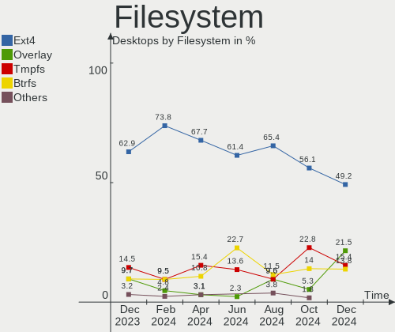
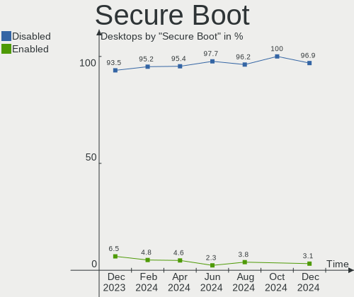
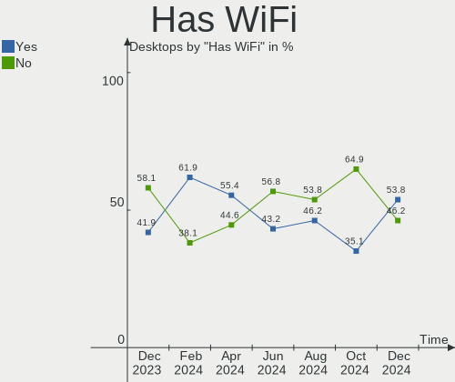
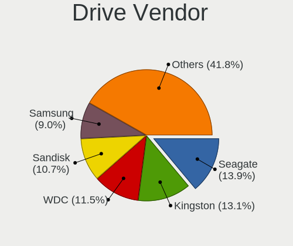
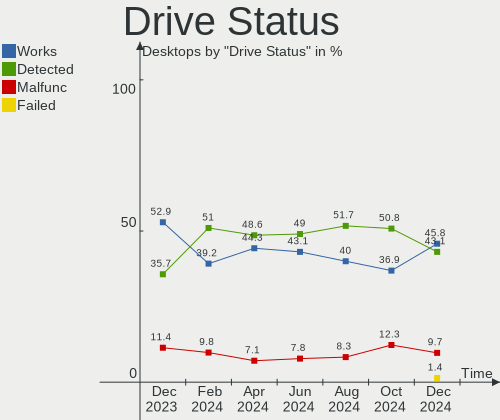
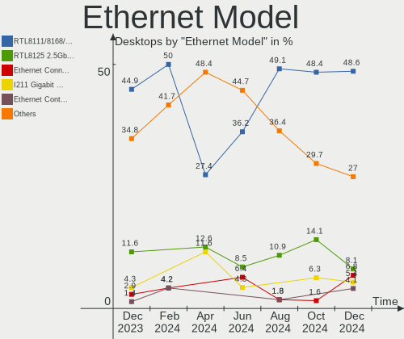
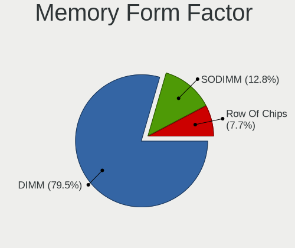

Linux in Spain - Hardware Trends (Desktops)
-------------------------------------------

A project to identify most popular hardware characteristics and track their change
over time based on data collected by Linux users at https://Linux-Hardware.org.

Anyone can contribute to this report by the [hw-probe](https://github.com/linuxhw/hw-probe) tool:

    sudo -E hw-probe -all -upload

Period: Jul, 2023.

Contents
--------

* [ System ](#system)
  - [ OS                       ](#os)
  - [ OS Family                ](#os-family)
  - [ Kernel                   ](#kernel)
  - [ Kernel Family            ](#kernel-family)
  - [ Kernel Major Ver.        ](#kernel-major-ver)
  - [ Arch                     ](#arch)
  - [ DE                       ](#de)
  - [ Display Server           ](#display-server)
  - [ Display Manager          ](#display-manager)
  - [ OS Lang                  ](#os-lang)
  - [ Boot Mode                ](#boot-mode)
  - [ Filesystem               ](#filesystem)
  - [ Part. scheme             ](#part-scheme)
  - [ Dual Boot with Linux/BSD ](#dual-boot-with-linuxbsd)
  - [ Dual Boot (Win)          ](#dual-boot-win)

* [ Board ](#board)
  - [ Vendor                   ](#vendor)
  - [ Model                    ](#model)
  - [ Model Family             ](#model-family)
  - [ MFG Year                 ](#mfg-year)
  - [ Form Factor              ](#form-factor)
  - [ Secure Boot              ](#secure-boot)
  - [ Coreboot                 ](#coreboot)
  - [ RAM Size                 ](#ram-size)
  - [ RAM Used                 ](#ram-used)
  - [ Total Drives             ](#total-drives)
  - [ Has CD-ROM               ](#has-cd-rom)
  - [ Has Ethernet             ](#has-ethernet)
  - [ Has WiFi                 ](#has-wifi)
  - [ Has Bluetooth            ](#has-bluetooth)

* [ Location ](#location)
  - [ Country                  ](#country)
  - [ City                     ](#city)

* [ Drives ](#drives)
  - [ Drive Vendor             ](#drive-vendor)
  - [ Drive Model              ](#drive-model)
  - [ HDD Vendor               ](#hdd-vendor)
  - [ SSD Vendor               ](#ssd-vendor)
  - [ Drive Kind               ](#drive-kind)
  - [ Drive Connector          ](#drive-connector)
  - [ Drive Size               ](#drive-size)
  - [ Space Total              ](#space-total)
  - [ Space Used               ](#space-used)
  - [ Malfunc. Drives          ](#malfunc-drives)
  - [ Malfunc. Drive Vendor    ](#malfunc-drive-vendor)
  - [ Malfunc. HDD Vendor      ](#malfunc-hdd-vendor)
  - [ Malfunc. Drive Kind      ](#malfunc-drive-kind)
  - [ Failed Drives            ](#failed-drives)
  - [ Failed Drive Vendor      ](#failed-drive-vendor)
  - [ Drive Status             ](#drive-status)

* [ Storage controller ](#storage-controller)
  - [ Storage Vendor           ](#storage-vendor)
  - [ Storage Model            ](#storage-model)
  - [ Storage Kind             ](#storage-kind)

* [ Processor ](#processor)
  - [ CPU Vendor               ](#cpu-vendor)
  - [ CPU Model                ](#cpu-model)
  - [ CPU Model Family         ](#cpu-model-family)
  - [ CPU Cores                ](#cpu-cores)
  - [ CPU Sockets              ](#cpu-sockets)
  - [ CPU Threads              ](#cpu-threads)
  - [ CPU Op-Modes             ](#cpu-op-modes)
  - [ CPU Microcode            ](#cpu-microcode)
  - [ CPU Microarch            ](#cpu-microarch)

* [ Graphics ](#graphics)
  - [ GPU Vendor               ](#gpu-vendor)
  - [ GPU Model                ](#gpu-model)
  - [ GPU Combo                ](#gpu-combo)
  - [ GPU Driver               ](#gpu-driver)
  - [ GPU Memory               ](#gpu-memory)

* [ Monitor ](#monitor)
  - [ Monitor Vendor           ](#monitor-vendor)
  - [ Monitor Model            ](#monitor-model)
  - [ Monitor Resolution       ](#monitor-resolution)
  - [ Monitor Diagonal         ](#monitor-diagonal)
  - [ Monitor Width            ](#monitor-width)
  - [ Aspect Ratio             ](#aspect-ratio)
  - [ Monitor Area             ](#monitor-area)
  - [ Pixel Density            ](#pixel-density)
  - [ Multiple Monitors        ](#multiple-monitors)

* [ Network ](#network)
  - [ Net Controller Vendor    ](#net-controller-vendor)
  - [ Net Controller Model     ](#net-controller-model)
  - [ Wireless Vendor          ](#wireless-vendor)
  - [ Wireless Model           ](#wireless-model)
  - [ Ethernet Vendor          ](#ethernet-vendor)
  - [ Ethernet Model           ](#ethernet-model)
  - [ Net Controller Kind      ](#net-controller-kind)
  - [ Used Controller          ](#used-controller)
  - [ NICs                     ](#nics)
  - [ IPv6                     ](#ipv6)

* [ Bluetooth ](#bluetooth)
  - [ Bluetooth Vendor         ](#bluetooth-vendor)
  - [ Bluetooth Model          ](#bluetooth-model)

* [ Sound ](#sound)
  - [ Sound Vendor             ](#sound-vendor)
  - [ Sound Model              ](#sound-model)

* [ Memory ](#memory)
  - [ Memory Vendor            ](#memory-vendor)
  - [ Memory Model             ](#memory-model)
  - [ Memory Kind              ](#memory-kind)
  - [ Memory Form Factor       ](#memory-form-factor)
  - [ Memory Size              ](#memory-size)
  - [ Memory Speed             ](#memory-speed)

* [ Printers & scanners ](#printers--scanners)
  - [ Printer Vendor           ](#printer-vendor)
  - [ Printer Model            ](#printer-model)
  - [ Scanner Vendor           ](#scanner-vendor)
  - [ Scanner Model            ](#scanner-model)

* [ Camera ](#camera)
  - [ Camera Vendor            ](#camera-vendor)
  - [ Camera Model             ](#camera-model)

* [ Security ](#security)
  - [ Fingerprint Vendor       ](#fingerprint-vendor)
  - [ Fingerprint Model        ](#fingerprint-model)
  - [ Chipcard Vendor          ](#chipcard-vendor)
  - [ Chipcard Model           ](#chipcard-model)

* [ Unsupported ](#unsupported)
  - [ Unsupported Devices      ](#unsupported-devices)
  - [ Unsupported Device Types ](#unsupported-device-types)

System
------

OS
--

Installed operating systems

| Name                         | Desktops | Percent |
|------------------------------|----------|---------|
| Linux Mint 21.1              | 4        | 10.26%  |
| Fedora 38                    | 4        | 10.26%  |
| Ubuntu 22.04                 | 3        | 7.69%   |
| Debian 12                    | 3        | 7.69%   |
| OpenMandriva 23.03           | 2        | 5.13%   |
| Nobara 38                    | 2        | 5.13%   |
| Linux Mint 21.2              | 2        | 5.13%   |
| Kali 2023.2                  | 2        | 5.13%   |
| Debian 11                    | 2        | 5.13%   |
| Ubuntu Studio 23.04          | 1        | 2.56%   |
| Ubuntu 23.04                 | 1        | 2.56%   |
| Ubuntu 20.04                 | 1        | 2.56%   |
| Ubuntu 18.04                 | 1        | 2.56%   |
| Pop!_OS 22.04                | 1        | 2.56%   |
| openSUSE Tumbleweed-XXXXXXXX | 1        | 2.56%   |
| OpenMandriva 23.01           | 1        | 2.56%   |
| Nobara 36                    | 1        | 2.56%   |
| Manjaro                      | 1        | 2.56%   |
| Linux Mint 20.3              | 1        | 2.56%   |
| Kubuntu 22.04                | 1        | 2.56%   |
| GNOME OS Nightly             | 1        | 2.56%   |
| Gentoo 2.14                  | 1        | 2.56%   |
| Fedora 36                    | 1        | 2.56%   |
| ArcoLinux Rolling            | 1        | 2.56%   |

OS Family
---------

OS without a version

| Name          | Desktops | Percent |
|---------------|----------|---------|
| Linux Mint    | 7        | 17.95%  |
| Ubuntu        | 6        | 15.38%  |
| Fedora        | 5        | 12.82%  |
| Debian        | 5        | 12.82%  |
| OpenMandriva  | 3        | 7.69%   |
| Nobara        | 3        | 7.69%   |
| Kali          | 2        | 5.13%   |
| Ubuntu Studio | 1        | 2.56%   |
| Pop!_OS       | 1        | 2.56%   |
| openSUSE      | 1        | 2.56%   |
| Manjaro       | 1        | 2.56%   |
| Kubuntu       | 1        | 2.56%   |
| GNOME OS      | 1        | 2.56%   |
| Gentoo        | 1        | 2.56%   |
| ArcoLinux     | 1        | 2.56%   |

Kernel
------

Version of the Linux kernel

| Version                      | Desktops | Percent |
|------------------------------|----------|---------|
| 5.19.0-46-generic            | 6        | 15.38%  |
| 6.3.8-200.fc38.x86_64        | 3        | 7.69%   |
| 6.3.10-200.fsync.fc38.x86_64 | 2        | 5.13%   |
| 6.3.0-kali1-amd64            | 2        | 5.13%   |
| 6.2.6-desktop-1omv2390       | 2        | 5.13%   |
| 6.1.0-10-amd64               | 2        | 5.13%   |
| 5.15.0-76-generic            | 2        | 5.13%   |
| 6.4.3-1-default              | 1        | 2.56%   |
| 6.4.0                        | 1        | 2.56%   |
| 6.3.5-2-MANJARO              | 1        | 2.56%   |
| 6.3.12-200.fc38.x86_64       | 1        | 2.56%   |
| 6.2.6-76060206-generic       | 1        | 2.56%   |
| 6.2.15-100.fc36.x86_64       | 1        | 2.56%   |
| 6.2.0-25-generic             | 1        | 2.56%   |
| 6.2.0-1007-lowlatency        | 1        | 2.56%   |
| 6.1.38-1-lts                 | 1        | 2.56%   |
| 6.1.1-desktop-1omv2290       | 1        | 2.56%   |
| 6.1.0-9-amd64                | 1        | 2.56%   |
| 6.1.0-1016-oem               | 1        | 2.56%   |
| 6.0.14-201.fsync.fc36.x86_64 | 1        | 2.56%   |
| 5.4.0-153-generic            | 1        | 2.56%   |
| 5.17.5-300.fc36.x86_64       | 1        | 2.56%   |
| 5.16.0-0.bpo.4-amd64         | 1        | 2.56%   |
| 5.15.0-78-generic            | 1        | 2.56%   |
| 5.15.0-73-generic            | 1        | 2.56%   |
| 5.10.0-23-amd64              | 1        | 2.56%   |
| 4.15.0-166-generic           | 1        | 2.56%   |

Kernel Family
-------------

Linux kernel without a distro release

| Version | Desktops | Percent |
|---------|----------|---------|
| 5.19.0  | 6        | 15.38%  |
| 6.1.0   | 4        | 10.26%  |
| 5.15.0  | 4        | 10.26%  |
| 6.3.8   | 3        | 7.69%   |
| 6.2.6   | 3        | 7.69%   |
| 6.3.10  | 2        | 5.13%   |
| 6.3.0   | 2        | 5.13%   |
| 6.2.0   | 2        | 5.13%   |
| 6.4.3   | 1        | 2.56%   |
| 6.4.0   | 1        | 2.56%   |
| 6.3.5   | 1        | 2.56%   |
| 6.3.12  | 1        | 2.56%   |
| 6.2.15  | 1        | 2.56%   |
| 6.1.38  | 1        | 2.56%   |
| 6.1.1   | 1        | 2.56%   |
| 6.0.14  | 1        | 2.56%   |
| 5.4.0   | 1        | 2.56%   |
| 5.17.5  | 1        | 2.56%   |
| 5.16.0  | 1        | 2.56%   |
| 5.10.0  | 1        | 2.56%   |
| 4.15.0  | 1        | 2.56%   |

Kernel Major Ver.
-----------------

Linux kernel major version

| Version | Desktops | Percent |
|---------|----------|---------|
| 6.3     | 9        | 23.08%  |
| 6.2     | 6        | 15.38%  |
| 6.1     | 6        | 15.38%  |
| 5.19    | 6        | 15.38%  |
| 5.15    | 4        | 10.26%  |
| 6.4     | 2        | 5.13%   |
| 6.0     | 1        | 2.56%   |
| 5.4     | 1        | 2.56%   |
| 5.17    | 1        | 2.56%   |
| 5.16    | 1        | 2.56%   |
| 5.10    | 1        | 2.56%   |
| 4.15    | 1        | 2.56%   |

Arch
----

OS architecture (x86_64, i586, etc.)

| Name   | Desktops | Percent |
|--------|----------|---------|
| x86_64 | 39       | 100%    |

DE
--

Desktop Environment

| Name            | Desktops | Percent |
|-----------------|----------|---------|
| GNOME           | 14       | 35.9%   |
| KDE5            | 9        | 23.08%  |
| X-Cinnamon      | 7        | 17.95%  |
| XFCE            | 3        | 7.69%   |
| Unknown         | 3        | 7.69%   |
| MATE            | 1        | 2.56%   |
| LXQt            | 1        | 2.56%   |
| GNOME Flashback | 1        | 2.56%   |

Display Server
--------------

X11 or Wayland

| Name    | Desktops | Percent |
|---------|----------|---------|
| X11     | 27       | 69.23%  |
| Wayland | 10       | 25.64%  |
| Tty     | 1        | 2.56%   |
| Unknown | 1        | 2.56%   |

Display Manager
---------------

SDDM, LightDM, etc.

| Name    | Desktops | Percent |
|---------|----------|---------|
| Unknown | 13       | 33.33%  |
| SDDM    | 7        | 17.95%  |
| GDM3    | 7        | 17.95%  |
| LightDM | 6        | 15.38%  |
| GDM     | 5        | 12.82%  |
| WDM     | 1        | 2.56%   |

OS Lang
-------

Language

| Lang    | Desktops | Percent |
|---------|----------|---------|
| es_ES   | 28       | 71.79%  |
| en_US   | 8        | 20.51%  |
| de_DE   | 1        | 2.56%   |
| ca_ES   | 1        | 2.56%   |
| Unknown | 1        | 2.56%   |

Boot Mode
---------

EFI or BIOS

| Mode | Desktops | Percent |
|------|----------|---------|
| EFI  | 21       | 53.85%  |
| BIOS | 18       | 46.15%  |

Filesystem
----------

Type of filesystem

| Type    | Desktops | Percent |
|---------|----------|---------|
| Ext4    | 26       | 66.67%  |
| Btrfs   | 6        | 15.38%  |
| Tmpfs   | 4        | 10.26%  |
| Overlay | 3        | 7.69%   |

Part. scheme
------------

Scheme of partitioning

| Type    | Desktops | Percent |
|---------|----------|---------|
| GPT     | 17       | 43.59%  |
| Unknown | 12       | 30.77%  |
| MBR     | 10       | 25.64%  |

Dual Boot with Linux/BSD
------------------------

Hosting more than one Linux/BSD

| Dual boot | Desktops | Percent |
|-----------|----------|---------|
| No        | 29       | 74.36%  |
| Yes       | 10       | 25.64%  |

Dual Boot (Win)
---------------

Hosting Linux and Windows

| Dual boot | Desktops | Percent |
|-----------|----------|---------|
| No        | 27       | 69.23%  |
| Yes       | 12       | 30.77%  |

Board
-----

Vendor
------

Motherboard manufacturer

| Name                                 | Desktops | Percent |
|--------------------------------------|----------|---------|
| Gigabyte Technology                  | 9        | 23.08%  |
| ASUSTek Computer                     | 9        | 23.08%  |
| MSI                                  | 5        | 12.82%  |
| Hewlett-Packard                      | 4        | 10.26%  |
| ASRock                               | 3        | 7.69%   |
| Dell                                 | 2        | 5.13%   |
| Unknown                              | 2        | 5.13%   |
| Shenzhen Meigao Electronic Equipment | 1        | 2.56%   |
| Pegatron                             | 1        | 2.56%   |
| Medion                               | 1        | 2.56%   |
| Lenovo                               | 1        | 2.56%   |
| Intel                                | 1        | 2.56%   |

Model
-----

Motherboard model

| Name                                       | Desktops | Percent |
|--------------------------------------------|----------|---------|
| Unknown                                    | 2        | 5.13%   |
| Shenzhen Meigao Electronic Equipment UM590 | 1        | 2.56%   |
| Pegatron h8-1120es                         | 1        | 2.56%   |
| MSI MS-7B89                                | 1        | 2.56%   |
| MSI MS-7B86                                | 1        | 2.56%   |
| MSI MS-7B79                                | 1        | 2.56%   |
| MSI MS-7918                                | 1        | 2.56%   |
| MSI MS-7817                                | 1        | 2.56%   |
| Medion Akoya E20009 MD34024/C579           | 1        | 2.56%   |
| Lenovo ThinkCentre M93p 10AAA09USP         | 1        | 2.56%   |
| Intel DG31PR AAD97573-205                  | 1        | 2.56%   |
| HP ProDesk 400 G7 Small Form Factor PC     | 1        | 2.56%   |
| HP EliteDesk 800 G8 Tower PC               | 1        | 2.56%   |
| HP EliteDesk 800 G2 SFF                    | 1        | 2.56%   |
| HP Compaq 8200 Elite SFF PC                | 1        | 2.56%   |
| Gigabyte Z390 GAMING X                     | 1        | 2.56%   |
| Gigabyte Z170X-Gaming 3                    | 1        | 2.56%   |
| Gigabyte X570 AORUS ELITE                  | 1        | 2.56%   |
| Gigabyte B75-D3V                           | 1        | 2.56%   |
| Gigabyte B650M AORUS ELITE AX              | 1        | 2.56%   |
| Gigabyte B560 HD3                          | 1        | 2.56%   |
| Gigabyte B450 AORUS M                      | 1        | 2.56%   |
| Gigabyte A320M-H                           | 1        | 2.56%   |
| Gigabyte 970A-DS3P                         | 1        | 2.56%   |
| Dell OptiPlex 745                          | 1        | 2.56%   |
| Dell OptiPlex 3010                         | 1        | 2.56%   |
| ASUS Z77-A                                 | 1        | 2.56%   |
| ASUS SABERTOOTH P67                        | 1        | 2.56%   |
| ASUS ROG STRIX B450-F GAMING               | 1        | 2.56%   |
| ASUS ROG STRIX B365-G GAMING               | 1        | 2.56%   |
| ASUS PRIME H510M-K R2.0                    | 1        | 2.56%   |
| ASUS PRIME H310T R2.0                      | 1        | 2.56%   |
| ASUS P5Q PRO TURBO                         | 1        | 2.56%   |
| ASUS M5A78L-M/USB3                         | 1        | 2.56%   |
| ASUS H110M-D                               | 1        | 2.56%   |
| ASRock X399 Phantom Gaming 6               | 1        | 2.56%   |
| ASRock G41C-GS R2.0                        | 1        | 2.56%   |
| ASRock A75M-HVS                            | 1        | 2.56%   |

Model Family
------------

Motherboard model prefix

| Name                                       | Desktops | Percent |
|--------------------------------------------|----------|---------|
| HP EliteDesk                               | 2        | 5.13%   |
| Dell OptiPlex                              | 2        | 5.13%   |
| ASUS ROG                                   | 2        | 5.13%   |
| ASUS PRIME                                 | 2        | 5.13%   |
| Unknown                                    | 2        | 5.13%   |
| Shenzhen Meigao Electronic Equipment UM590 | 1        | 2.56%   |
| Pegatron h8-1120es                         | 1        | 2.56%   |
| MSI MS-7B89                                | 1        | 2.56%   |
| MSI MS-7B86                                | 1        | 2.56%   |
| MSI MS-7B79                                | 1        | 2.56%   |
| MSI MS-7918                                | 1        | 2.56%   |
| MSI MS-7817                                | 1        | 2.56%   |
| Medion Akoya                               | 1        | 2.56%   |
| Lenovo ThinkCentre                         | 1        | 2.56%   |
| Intel DG31PR                               | 1        | 2.56%   |
| HP ProDesk                                 | 1        | 2.56%   |
| HP Compaq                                  | 1        | 2.56%   |
| Gigabyte Z390                              | 1        | 2.56%   |
| Gigabyte Z170X-Gaming                      | 1        | 2.56%   |
| Gigabyte X570                              | 1        | 2.56%   |
| Gigabyte B75-D3V                           | 1        | 2.56%   |
| Gigabyte B650M                             | 1        | 2.56%   |
| Gigabyte B560                              | 1        | 2.56%   |
| Gigabyte B450                              | 1        | 2.56%   |
| Gigabyte A320M-H                           | 1        | 2.56%   |
| Gigabyte 970A-DS3P                         | 1        | 2.56%   |
| ASUS Z77-A                                 | 1        | 2.56%   |
| ASUS SABERTOOTH                            | 1        | 2.56%   |
| ASUS P5Q                                   | 1        | 2.56%   |
| ASUS M5A78L-M                              | 1        | 2.56%   |
| ASUS H110M-D                               | 1        | 2.56%   |
| ASRock X399                                | 1        | 2.56%   |
| ASRock G41C-GS                             | 1        | 2.56%   |
| ASRock A75M-HVS                            | 1        | 2.56%   |

MFG Year
--------

Motherboard manufacture year

| Year | Desktops | Percent |
|------|----------|---------|
| 2018 | 6        | 15.38%  |
| 2019 | 5        | 12.82%  |
| 2011 | 5        | 12.82%  |
| 2023 | 3        | 7.69%   |
| 2022 | 3        | 7.69%   |
| 2021 | 3        | 7.69%   |
| 2015 | 3        | 7.69%   |
| 2013 | 3        | 7.69%   |
| 2014 | 2        | 5.13%   |
| 2012 | 2        | 5.13%   |
| 2007 | 2        | 5.13%   |
| 2017 | 1        | 2.56%   |
| 2009 | 1        | 2.56%   |

Form Factor
-----------

Physical design of the computer

| Name    | Desktops | Percent |
|---------|----------|---------|
| Desktop | 39       | 100%    |

Secure Boot
-----------

Enabled or disabled

| State    | Desktops | Percent |
|----------|----------|---------|
| Disabled | 36       | 92.31%  |
| Enabled  | 3        | 7.69%   |

Coreboot
--------

Have coreboot on board

| Used | Desktops | Percent |
|------|----------|---------|
| No   | 39       | 100%    |

RAM Size
--------

Total RAM memory

| Size in GB  | Desktops | Percent |
|-------------|----------|---------|
| 16.01-24.0  | 13       | 33.33%  |
| 32.01-64.0  | 10       | 25.64%  |
| 8.01-16.0   | 6        | 15.38%  |
| 3.01-4.0    | 4        | 10.26%  |
| 4.01-8.0    | 3        | 7.69%   |
| 2.01-3.0    | 1        | 2.56%   |
| 64.01-256.0 | 1        | 2.56%   |
| 1.01-2.0    | 1        | 2.56%   |

RAM Used
--------

Used RAM memory

| Used GB    | Desktops | Percent |
|------------|----------|---------|
| 2.01-3.0   | 12       | 30.77%  |
| 3.01-4.0   | 8        | 20.51%  |
| 1.01-2.0   | 7        | 17.95%  |
| 8.01-16.0  | 5        | 12.82%  |
| 4.01-8.0   | 4        | 10.26%  |
| 0.51-1.0   | 2        | 5.13%   |
| 16.01-24.0 | 1        | 2.56%   |

Total Drives
------------

Number of drives on board

| Drives | Desktops | Percent |
|--------|----------|---------|
| 1      | 13       | 33.33%  |
| 2      | 11       | 28.21%  |
| 5      | 6        | 15.38%  |
| 3      | 6        | 15.38%  |
| 4      | 3        | 7.69%   |

Has CD-ROM
----------

Has CD-ROM on board

| Presented | Desktops | Percent |
|-----------|----------|---------|
| No        | 24       | 61.54%  |
| Yes       | 15       | 38.46%  |

Has Ethernet
------------

Has Ethernet on board

| Presented | Desktops | Percent |
|-----------|----------|---------|
| Yes       | 39       | 100%    |

Has WiFi
--------

Has WiFi module

| Presented | Desktops | Percent |
|-----------|----------|---------|
| No        | 24       | 61.54%  |
| Yes       | 15       | 38.46%  |

Has Bluetooth
-------------

Has Bluetooth module

| Presented | Desktops | Percent |
|-----------|----------|---------|
| No        | 25       | 64.1%   |
| Yes       | 14       | 35.9%   |

Location
--------

Country
-------

Geographic location (country)

| Country | Desktops | Percent |
|---------|----------|---------|
| Spain   | 39       | 100%    |

City
----

Geographic location (city)

| City                     | Desktops | Percent |
|--------------------------|----------|---------|
| Madrid                   | 11       | 28.21%  |
| Zaragoza                 | 2        | 5.13%   |
| Valencia                 | 2        | 5.13%   |
| Ponferrada               | 2        | 5.13%   |
| Donostia / San Sebastian | 2        | 5.13%   |
| Barcelona                | 2        | 5.13%   |
| Vigo                     | 1        | 2.56%   |
| Vecindario               | 1        | 2.56%   |
| Santa Coloma de Gramenet | 1        | 2.56%   |
| Pozuelo de Alarcón      | 1        | 2.56%   |
| Oviedo                   | 1        | 2.56%   |
| Osuna                    | 1        | 2.56%   |
| Mostoles                 | 1        | 2.56%   |
| Logroño                 | 1        | 2.56%   |
| Las Rozas de Madrid      | 1        | 2.56%   |
| Girona                   | 1        | 2.56%   |
| Getxo                    | 1        | 2.56%   |
| Cadalso de los Vidrios   | 1        | 2.56%   |
| Bormujos                 | 1        | 2.56%   |
| Barakaldo                | 1        | 2.56%   |
| Ávila                   | 1        | 2.56%   |
| Ames                     | 1        | 2.56%   |
| Algaida                  | 1        | 2.56%   |
| Alcobendas               | 1        | 2.56%   |

Drives
------

Drive Vendor
------------

Hard drive vendors

| Vendor                      | Desktops | Drives | Percent |
|-----------------------------|----------|--------|---------|
| Seagate                     | 14       | 20     | 18.42%  |
| Samsung Electronics         | 10       | 13     | 13.16%  |
| Kingston                    | 9        | 11     | 11.84%  |
| WDC                         | 8        | 9      | 10.53%  |
| SanDisk                     | 7        | 9      | 9.21%   |
| Crucial                     | 7        | 7      | 9.21%   |
| Toshiba                     | 4        | 4      | 5.26%   |
| Hitachi                     | 3        | 4      | 3.95%   |
| Phison Electronics          | 2        | 3      | 2.63%   |
| OCZ                         | 2        | 3      | 2.63%   |
| Emtec                       | 2        | 2      | 2.63%   |
| Unknown                     | 1        | 1      | 1.32%   |
| SK hynix                    | 1        | 1      | 1.32%   |
| Silicon Motion              | 1        | 1      | 1.32%   |
| PNY                         | 1        | 1      | 1.32%   |
| Maxtor                      | 1        | 1      | 1.32%   |
| Kingston Technology Company | 1        | 1      | 1.32%   |
| China                       | 1        | 1      | 1.32%   |
| A-DATA Technology           | 1        | 2      | 1.32%   |

Drive Model
-----------

Hard drive models

| Model                                                 | Desktops | Percent |
|-------------------------------------------------------|----------|---------|
| Seagate ST3500418AS 500GB                             | 3        | 3.49%   |
| Kingston SA400S37240G 240GB SSD                       | 3        | 3.49%   |
| Seagate ST1000DM003-1ER162 1TB                        | 2        | 2.33%   |
| Seagate ST1000DM003-1CH162 1TB                        | 2        | 2.33%   |
| Kingston SA400S37480G 480GB SSD                       | 2        | 2.33%   |
| Emtec X150 240GB SSD                                  | 2        | 2.33%   |
| Crucial CT480BX500SSD1 480GB                          | 2        | 2.33%   |
| WDC WDS500G2B0B-00YS70 500GB SSD                      | 1        | 1.16%   |
| WDC WDS100T2B0A-00SM50 1TB SSD                        | 1        | 1.16%   |
| WDC WD80EZZX-11CSGA0 8TB                              | 1        | 1.16%   |
| WDC WD800JD-75MSA3 80GB                               | 1        | 1.16%   |
| WDC WD40EFAX-68JH4N0 4TB                              | 1        | 1.16%   |
| WDC WD2500BEVT-80A23T0 250GB                          | 1        | 1.16%   |
| WDC WD20EARX-00PASB0 2TB                              | 1        | 1.16%   |
| WDC WD10EZEX-00BBHA0 1TB                              | 1        | 1.16%   |
| WDC WD1002FAEX-00Z3A0 1TB                             | 1        | 1.16%   |
| Unknown ISOCOM  64GB                                  | 1        | 1.16%   |
| Toshiba TR200 240GB SSD                               | 1        | 1.16%   |
| Toshiba HDWR160 6TB                                   | 1        | 1.16%   |
| Toshiba DT01ACA100 1TB                                | 1        | 1.16%   |
| Toshiba DT01ACA050 500GB                              | 1        | 1.16%   |
| SK hynix BC711 HFM256GD3JX013N 256GB                  | 1        | 1.16%   |
| Silicon Motion SM2263EN/SM2263XT SSD Controller 500GB | 1        | 1.16%   |
| Seagate ST9320421AS 320GB                             | 1        | 1.16%   |
| Seagate ST8000DM004-2CX188 8TB                        | 1        | 1.16%   |
| Seagate ST500LM000-SSHD-8GB                           | 1        | 1.16%   |
| Seagate ST3500630AS 500GB                             | 1        | 1.16%   |
| Seagate ST3250312CS 250GB                             | 1        | 1.16%   |
| Seagate ST3250310AS 250GB                             | 1        | 1.16%   |
| Seagate ST2000DM008-2UB102 2TB                        | 1        | 1.16%   |
| Seagate ST2000DM008-2FR102 2TB                        | 1        | 1.16%   |
| Seagate ST1000LM048-2E7172 1TB                        | 1        | 1.16%   |
| Seagate ST1000LM024 HN-M101MBB 1TB                    | 1        | 1.16%   |
| Seagate ST1000DM003-1SB102 1TB                        | 1        | 1.16%   |
| Sandisk WD Blue SN550 NVMe SSD 250GB                  | 1        | 1.16%   |
| Sandisk WD Blue SN500 / PC SN520 NVMe SSD 512GB       | 1        | 1.16%   |
| SanDisk SSD PLUS 480GB                                | 1        | 1.16%   |
| SanDisk SSD PLUS 240GB                                | 1        | 1.16%   |
| SanDisk SSD PLUS 120 GB                               | 1        | 1.16%   |
| SanDisk SSD PLUS 1000GB                               | 1        | 1.16%   |

HDD Vendor
----------

Hard disk drive vendors

| Vendor              | Desktops | Drives | Percent |
|---------------------|----------|--------|---------|
| Seagate             | 14       | 20     | 46.67%  |
| WDC                 | 7        | 7      | 23.33%  |
| Toshiba             | 3        | 3      | 10%     |
| Hitachi             | 3        | 4      | 10%     |
| Samsung Electronics | 2        | 2      | 6.67%   |
| Maxtor              | 1        | 1      | 3.33%   |

SSD Vendor
----------

Solid state drive vendors

| Vendor              | Desktops | Drives | Percent |
|---------------------|----------|--------|---------|
| Crucial             | 7        | 7      | 21.21%  |
| Samsung Electronics | 6        | 6      | 18.18%  |
| Kingston            | 6        | 8      | 18.18%  |
| SanDisk             | 4        | 5      | 12.12%  |
| WDC                 | 2        | 2      | 6.06%   |
| OCZ                 | 2        | 3      | 6.06%   |
| Emtec               | 2        | 2      | 6.06%   |
| Toshiba             | 1        | 1      | 3.03%   |
| PNY                 | 1        | 1      | 3.03%   |
| China               | 1        | 1      | 3.03%   |
| A-DATA Technology   | 1        | 2      | 3.03%   |

Drive Kind
----------

HDD or SSD

| Kind | Desktops | Drives | Percent |
|------|----------|--------|---------|
| SSD  | 24       | 38     | 40%     |
| HDD  | 20       | 37     | 33.33%  |
| NVMe | 15       | 18     | 25%     |
| MMC  | 1        | 1      | 1.67%   |

Drive Connector
---------------

SATA, SAS, NVMe, etc.

| Type | Desktops | Drives | Percent |
|------|----------|--------|---------|
| SATA | 32       | 74     | 65.31%  |
| NVMe | 15       | 18     | 30.61%  |
| SAS  | 1        | 1      | 2.04%   |
| MMC  | 1        | 1      | 2.04%   |

Drive Size
----------

Size of hard drive

| Size in TB | Desktops | Drives | Percent |
|------------|----------|--------|---------|
| 0.01-0.5   | 26       | 45     | 52%     |
| 0.51-1.0   | 17       | 20     | 34%     |
| 1.01-2.0   | 4        | 5      | 8%      |
| 4.01-10.0  | 2        | 4      | 4%      |
| 3.01-4.0   | 1        | 1      | 2%      |

Space Total
-----------

Amount of disk space available on the file system

| Size in GB     | Desktops | Percent |
|----------------|----------|---------|
| 501-1000       | 9        | 23.08%  |
| 251-500        | 8        | 20.51%  |
| 101-250        | 5        | 12.82%  |
| 1001-2000      | 5        | 12.82%  |
| More than 3000 | 4        | 10.26%  |
| 51-100         | 3        | 7.69%   |
| 2001-3000      | 2        | 5.13%   |
| 21-50          | 1        | 2.56%   |
| 1-20           | 1        | 2.56%   |
| Unknown        | 1        | 2.56%   |

Space Used
----------

Amount of used disk space

| Used GB        | Desktops | Percent |
|----------------|----------|---------|
| 101-250        | 9        | 23.08%  |
| 1-20           | 9        | 23.08%  |
| 21-50          | 6        | 15.38%  |
| 501-1000       | 5        | 12.82%  |
| 251-500        | 4        | 10.26%  |
| More than 3000 | 2        | 5.13%   |
| 2001-3000      | 1        | 2.56%   |
| 1001-2000      | 1        | 2.56%   |
| 51-100         | 1        | 2.56%   |
| Unknown        | 1        | 2.56%   |

Malfunc. Drives
---------------

Drive models with a malfunction

| Model                     | Desktops | Drives | Percent |
|---------------------------|----------|--------|---------|
| WDC WD40EFAX-68JH4N0 4TB  | 1        | 1      | 25%     |
| WDC WD1002FAEX-00Z3A0 1TB | 1        | 1      | 25%     |
| Seagate ST3500418AS 500GB | 1        | 1      | 25%     |
| SanDisk SSD PLUS 1000GB   | 1        | 1      | 25%     |

Malfunc. Drive Vendor
---------------------

Vendors of faulty drives

| Vendor  | Desktops | Drives | Percent |
|---------|----------|--------|---------|
| WDC     | 2        | 2      | 50%     |
| Seagate | 1        | 1      | 25%     |
| SanDisk | 1        | 1      | 25%     |

Malfunc. HDD Vendor
-------------------

Vendors of faulty HDD drives

| Vendor  | Desktops | Drives | Percent |
|---------|----------|--------|---------|
| WDC     | 2        | 2      | 66.67%  |
| Seagate | 1        | 1      | 33.33%  |

Malfunc. Drive Kind
-------------------

Kinds of faulty drives

| Kind | Desktops | Drives | Percent |
|------|----------|--------|---------|
| HDD  | 3        | 3      | 75%     |
| SSD  | 1        | 1      | 25%     |

Failed Drives
-------------

Failed drive models

Zero info for selected period =(

Failed Drive Vendor
-------------------

Failed drive vendors

Zero info for selected period =(

Drive Status
------------

Number of failed and malfunc. drives

| Status   | Desktops | Drives | Percent |
|----------|----------|--------|---------|
| Works    | 20       | 41     | 47.62%  |
| Detected | 18       | 49     | 42.86%  |
| Malfunc  | 4        | 4      | 9.52%   |

Storage controller
------------------

Storage Vendor
--------------

Storage controller vendors

| Vendor                      | Desktops | Percent |
|-----------------------------|----------|---------|
| Intel                       | 25       | 42.37%  |
| AMD                         | 14       | 23.73%  |
| Samsung Electronics         | 5        | 8.47%   |
| Kingston Technology Company | 4        | 6.78%   |
| SanDisk                     | 3        | 5.08%   |
| Phison Electronics          | 2        | 3.39%   |
| Marvell Technology Group    | 2        | 3.39%   |
| JMicron Technology          | 2        | 3.39%   |
| SK hynix                    | 1        | 1.69%   |
| Silicon Motion              | 1        | 1.69%   |

Storage Model
-------------

Storage controller models

| Model                                                                          | Desktops | Percent |
|--------------------------------------------------------------------------------|----------|---------|
| AMD FCH SATA Controller [AHCI mode]                                            | 7        | 10.45%  |
| AMD 400 Series Chipset SATA Controller                                         | 5        | 7.46%   |
| Intel 6 Series/C200 Series Chipset Family 6 port Desktop SATA AHCI Controller  | 4        | 5.97%   |
| Intel Q170/Q150/B150/H170/H110/Z170/CM236 Chipset SATA Controller [AHCI Mode]  | 3        | 4.48%   |
| Samsung NVMe SSD Controller SM981/PM981/PM983                                  | 2        | 2.99%   |
| Intel NM10/ICH7 Family SATA Controller [IDE mode]                              | 2        | 2.99%   |
| Intel Comet Lake SATA AHCI Controller                                          | 2        | 2.99%   |
| Intel 8 Series/C220 Series Chipset Family 6-port SATA Controller 1 [AHCI mode] | 2        | 2.99%   |
| Intel 500 Series Chipset Family SATA AHCI Controller                           | 2        | 2.99%   |
| Intel 200 Series PCH SATA controller [AHCI mode]                               | 2        | 2.99%   |
| AMD SB7x0/SB8x0/SB9x0 SATA Controller [IDE mode]                               | 2        | 2.99%   |
| SK hynix Gold P31/BC711/PC711 NVMe Solid State Drive                           | 1        | 1.49%   |
| Silicon Motion SM2263EN/SM2263XT (DRAM-less) NVMe SSD Controllers              | 1        | 1.49%   |
| SanDisk WD Blue SN570 NVMe SSD 1TB                                             | 1        | 1.49%   |
| SanDisk WD Blue SN550 NVMe SSD                                                 | 1        | 1.49%   |
| SanDisk WD Blue SN500 / PC SN520 NVMe SSD                                      | 1        | 1.49%   |
| Samsung NVMe SSD Controller SM961/PM961/SM963                                  | 1        | 1.49%   |
| Samsung NVMe SSD Controller PM9A1/PM9A3/980PRO                                 | 1        | 1.49%   |
| Samsung NVMe SSD Controller 980                                                | 1        | 1.49%   |
| Phison PS5013 E13 NVMe Controller                                              | 1        | 1.49%   |
| Phison E12 NVMe Controller                                                     | 1        | 1.49%   |
| Marvell Group 88SE9215 PCIe 2.0 x1 4-port SATA 6 Gb/s Controller               | 1        | 1.49%   |
| Marvell Group 88SE9172 SATA 6Gb/s Controller                                   | 1        | 1.49%   |
| Kingston Company U-SNS8154P3 NVMe SSD                                          | 1        | 1.49%   |
| Kingston Company Company Non-Volatile memory controller                        | 1        | 1.49%   |
| Kingston Company NVMe Controller                                               | 1        | 1.49%   |
| Kingston Company A2000 NVMe SSD                                                | 1        | 1.49%   |
| JMicron JMB362 SATA Controller                                                 | 1        | 1.49%   |
| JMicron JMB361 AHCI/IDE                                                        | 1        | 1.49%   |
| Intel SATA Controller [RAID mode]                                              | 1        | 1.49%   |
| Intel Celeron N3350/Pentium N4200/Atom E3900 Series SATA AHCI Controller       | 1        | 1.49%   |
| Intel Cannon Lake PCH SATA AHCI Controller                                     | 1        | 1.49%   |
| Intel 9 Series Chipset Family SATA Controller [AHCI Mode]                      | 1        | 1.49%   |
| Intel 82801JI (ICH10 Family) SATA AHCI Controller                              | 1        | 1.49%   |
| Intel 82801HR/HO/HH (ICH8R/DO/DH) 2 port SATA Controller [IDE mode]            | 1        | 1.49%   |
| Intel 82801H (ICH8 Family) 4 port SATA Controller [IDE mode]                   | 1        | 1.49%   |
| Intel 82801G (ICH7 Family) IDE Controller                                      | 1        | 1.49%   |
| Intel 7 Series/C210 Series Chipset Family 6-port SATA Controller [AHCI mode]   | 1        | 1.49%   |
| Intel 7 Series/C210 Series Chipset Family 4-port SATA Controller [IDE mode]    | 1        | 1.49%   |
| Intel 7 Series/C210 Series Chipset Family 2-port SATA Controller [IDE mode]    | 1        | 1.49%   |

Storage Kind
------------

Kind of storage controller (IDE, SATA, NVMe, SAS, ...)

| Kind | Desktops | Percent |
|------|----------|---------|
| SATA | 34       | 59.65%  |
| NVMe | 15       | 26.32%  |
| IDE  | 7        | 12.28%  |
| RAID | 1        | 1.75%   |

Processor
---------

CPU Vendor
----------

Processor vendors

| Vendor | Desktops | Percent |
|--------|----------|---------|
| Intel  | 25       | 64.1%   |
| AMD    | 14       | 35.9%   |

CPU Model
---------

Processor models

| Model                                          | Desktops | Percent |
|------------------------------------------------|----------|---------|
| Intel Core i5-3570 CPU @ 3.40GHz               | 2        | 5.13%   |
| Intel 11th Gen Core i5-11400 @ 2.60GHz         | 2        | 5.13%   |
| AMD Ryzen 9 5900HX with Radeon Graphics        | 2        | 5.13%   |
| AMD Ryzen 5 3600 6-Core Processor              | 2        | 5.13%   |
| Intel Core i7-2600K CPU @ 3.40GHz              | 1        | 2.56%   |
| Intel Core i7-2600 CPU @ 3.40GHz               | 1        | 2.56%   |
| Intel Core i5-9600K CPU @ 3.70GHz              | 1        | 2.56%   |
| Intel Core i5-8400 CPU @ 2.80GHz               | 1        | 2.56%   |
| Intel Core i5-6600K CPU @ 3.50GHz              | 1        | 2.56%   |
| Intel Core i5-6500 CPU @ 3.20GHz               | 1        | 2.56%   |
| Intel Core i5-4690K CPU @ 3.50GHz              | 1        | 2.56%   |
| Intel Core i5-4590 CPU @ 3.30GHz               | 1        | 2.56%   |
| Intel Core i5-4570T CPU @ 2.90GHz              | 1        | 2.56%   |
| Intel Core i5-3570K CPU @ 3.40GHz              | 1        | 2.56%   |
| Intel Core i3-9100 CPU @ 3.60GHz               | 1        | 2.56%   |
| Intel Core i3-7100 CPU @ 3.90GHz               | 1        | 2.56%   |
| Intel Core i3-2100 CPU @ 3.10GHz               | 1        | 2.56%   |
| Intel Core i3-10100 CPU @ 3.60GHz              | 1        | 2.56%   |
| Intel Core 2 Quad CPU Q6600 @ 2.40GHz          | 1        | 2.56%   |
| Intel Core 2 Duo CPU E8400 @ 3.00GHz           | 1        | 2.56%   |
| Intel Core 2 Duo CPU E7400 @ 2.80GHz           | 1        | 2.56%   |
| Intel Core 2 CPU 4300 @ 1.80GHz                | 1        | 2.56%   |
| Intel Celeron CPU N3350 @ 1.10GHz              | 1        | 2.56%   |
| Intel Celeron CPU G3930 @ 2.90GHz              | 1        | 2.56%   |
| Intel 11th Gen Core i7-11700 @ 2.50GHz         | 1        | 2.56%   |
| AMD Ryzen Threadripper 1920X 12-Core Processor | 1        | 2.56%   |
| AMD Ryzen 9 3900X 12-Core Processor            | 1        | 2.56%   |
| AMD Ryzen 7 7700X 8-Core Processor             | 1        | 2.56%   |
| AMD Ryzen 7 3800X 8-Core Processor             | 1        | 2.56%   |
| AMD Ryzen 7 3700X 8-Core Processor             | 1        | 2.56%   |
| AMD Ryzen 5 5600G with Radeon Graphics         | 1        | 2.56%   |
| AMD Ryzen 3 3200G with Radeon Vega Graphics    | 1        | 2.56%   |
| AMD FX-8320 Eight-Core Processor               | 1        | 2.56%   |
| AMD FX-4350 Quad-Core Processor                | 1        | 2.56%   |
| AMD Athlon II X4 631 Quad-Core Processor       | 1        | 2.56%   |

CPU Model Family
----------------

Processor model prefix

| Model                  | Desktops | Percent |
|------------------------|----------|---------|
| Intel Core i5          | 10       | 25.64%  |
| Intel Core i3          | 4        | 10.26%  |
| Other                  | 3        | 7.69%   |
| AMD Ryzen 9            | 3        | 7.69%   |
| AMD Ryzen 7            | 3        | 7.69%   |
| AMD Ryzen 5            | 3        | 7.69%   |
| Intel Core i7          | 2        | 5.13%   |
| Intel Core 2 Duo       | 2        | 5.13%   |
| Intel Celeron          | 2        | 5.13%   |
| AMD FX                 | 2        | 5.13%   |
| Intel Core 2 Quad      | 1        | 2.56%   |
| Intel Core 2           | 1        | 2.56%   |
| AMD Ryzen Threadripper | 1        | 2.56%   |
| AMD Ryzen 3            | 1        | 2.56%   |
| AMD Athlon II X4       | 1        | 2.56%   |

CPU Cores
---------

Number of processor cores

| Number | Desktops | Percent |
|--------|----------|---------|
| 4      | 15       | 38.46%  |
| 2      | 9        | 23.08%  |
| 6      | 7        | 17.95%  |
| 8      | 6        | 15.38%  |
| 12     | 2        | 5.13%   |

CPU Sockets
-----------

Number of sockets

| Number | Desktops | Percent |
|--------|----------|---------|
| 1      | 39       | 100%    |

CPU Threads
-----------

Threads per core (Hyper-Threading)

| Number | Desktops | Percent |
|--------|----------|---------|
| 2      | 21       | 53.85%  |
| 1      | 18       | 46.15%  |

CPU Op-Modes
------------

CPU Operation Modes (32-bit, 64-bit)

| Op mode        | Desktops | Percent |
|----------------|----------|---------|
| 32-bit, 64-bit | 39       | 100%    |

CPU Microcode
-------------

Microcode number

| Number     | Desktops | Percent |
|------------|----------|---------|
| Unknown    | 13       | 33.33%  |
| 0xa0671    | 2        | 5.13%   |
| 0x306a9    | 2        | 5.13%   |
| 0x0a50000c | 2        | 5.13%   |
| 0x08701021 | 2        | 5.13%   |
| 0xa0653    | 1        | 2.56%   |
| 0x906ed    | 1        | 2.56%   |
| 0x906ea    | 1        | 2.56%   |
| 0x906e9    | 1        | 2.56%   |
| 0x6f2      | 1        | 2.56%   |
| 0x506c9    | 1        | 2.56%   |
| 0x306c3    | 1        | 2.56%   |
| 0x206a7    | 1        | 2.56%   |
| 0x1067a    | 1        | 2.56%   |
| 0x0a601203 | 1        | 2.56%   |
| 0x0a50000d | 1        | 2.56%   |
| 0x08701030 | 1        | 2.56%   |
| 0x08701013 | 1        | 2.56%   |
| 0x08108109 | 1        | 2.56%   |
| 0x08001137 | 1        | 2.56%   |
| 0x06000852 | 1        | 2.56%   |
| 0x0600081f | 1        | 2.56%   |
| 0x03000027 | 1        | 2.56%   |

CPU Microarch
-------------

Microarchitecture

| Name        | Desktops | Percent |
|-------------|----------|---------|
| Zen 2       | 5        | 12.82%  |
| KabyLake    | 5        | 12.82%  |
| Zen 3       | 3        | 7.69%   |
| SandyBridge | 3        | 7.69%   |
| IvyBridge   | 3        | 7.69%   |
| Icelake     | 3        | 7.69%   |
| Haswell     | 3        | 7.69%   |
| Skylake     | 2        | 5.13%   |
| Piledriver  | 2        | 5.13%   |
| Penryn      | 2        | 5.13%   |
| Core        | 2        | 5.13%   |
| Zen+        | 1        | 2.56%   |
| Zen         | 1        | 2.56%   |
| K10 Llano   | 1        | 2.56%   |
| Goldmont    | 1        | 2.56%   |
| CometLake   | 1        | 2.56%   |
| Unknown     | 1        | 2.56%   |

Graphics
--------

GPU Vendor
----------

Vendors of graphics cards

| Vendor | Desktops | Percent |
|--------|----------|---------|
| Nvidia | 18       | 43.9%   |
| Intel  | 14       | 34.15%  |
| AMD    | 9        | 21.95%  |

GPU Model
---------

Graphics card models

| Model                                                                       | Desktops | Percent |
|-----------------------------------------------------------------------------|----------|---------|
| Nvidia GP108 [GeForce GT 1030]                                              | 4        | 9.76%   |
| AMD Cezanne [Radeon Vega Series / Radeon Vega Mobile Series]                | 3        | 7.32%   |
| Intel RocketLake-S GT1 [UHD Graphics 730]                                   | 2        | 4.88%   |
| Nvidia TU116 [GeForce GTX 1650 SUPER]                                       | 1        | 2.44%   |
| Nvidia GT218 [GeForce 210]                                                  | 1        | 2.44%   |
| Nvidia GP107 [GeForce GTX 1050 Ti]                                          | 1        | 2.44%   |
| Nvidia GP106 [GeForce GTX 1060 6GB]                                         | 1        | 2.44%   |
| Nvidia GM204 [GeForce GTX 970]                                              | 1        | 2.44%   |
| Nvidia GM107 [GeForce GTX 750]                                              | 1        | 2.44%   |
| Nvidia GK208B [GeForce GT 730]                                              | 1        | 2.44%   |
| Nvidia GK106 [GeForce GTX 660]                                              | 1        | 2.44%   |
| Nvidia GF116 [GeForce GTX 550 Ti]                                           | 1        | 2.44%   |
| Nvidia GF116 [GeForce GT 545]                                               | 1        | 2.44%   |
| Nvidia GF110 [GeForce GTX 580]                                              | 1        | 2.44%   |
| Nvidia GA106 [GeForce RTX 3060 Lite Hash Rate]                              | 1        | 2.44%   |
| Nvidia GA104 [GeForce RTX 3070]                                             | 1        | 2.44%   |
| Nvidia G72 [GeForce 7300 LE]                                                | 1        | 2.44%   |
| Intel Xeon E3-1200 v3/4th Gen Core Processor Integrated Graphics Controller | 1        | 2.44%   |
| Intel Xeon E3-1200 v2/3rd Gen Core processor Graphics Controller            | 1        | 2.44%   |
| Intel RocketLake-S GT1 [UHD Graphics 750]                                   | 1        | 2.44%   |
| Intel HD Graphics 630                                                       | 1        | 2.44%   |
| Intel HD Graphics 610                                                       | 1        | 2.44%   |
| Intel HD Graphics 530                                                       | 1        | 2.44%   |
| Intel HD Graphics 500                                                       | 1        | 2.44%   |
| Intel CometLake-S GT2 [UHD Graphics 630]                                    | 1        | 2.44%   |
| Intel CoffeeLake-S GT2 [UHD Graphics 630]                                   | 1        | 2.44%   |
| Intel 82Q963/Q965 Integrated Graphics Controller                            | 1        | 2.44%   |
| Intel 82G33/G31 Express Integrated Graphics Controller                      | 1        | 2.44%   |
| Intel 2nd Generation Core Processor Family Integrated Graphics Controller   | 1        | 2.44%   |
| AMD Raphael                                                                 | 1        | 2.44%   |
| AMD Picasso/Raven 2 [Radeon Vega Series / Radeon Vega Mobile Series]        | 1        | 2.44%   |
| AMD Navi 23 [Radeon RX 6650 XT / 6700S / 6800S]                             | 1        | 2.44%   |
| AMD Navi 23 [Radeon RX 6600/6600 XT/6600M]                                  | 1        | 2.44%   |
| AMD Juniper PRO [Radeon HD 5750]                                            | 1        | 2.44%   |
| AMD Ellesmere [Radeon RX 470/480/570/570X/580/580X/590]                     | 1        | 2.44%   |

GPU Combo
---------

Combinations of graphics cards

| Name         | Desktops | Percent |
|--------------|----------|---------|
| 1 x Nvidia   | 16       | 41.03%  |
| 1 x Intel    | 14       | 35.9%   |
| 1 x AMD      | 7        | 17.95%  |
| AMD + Nvidia | 2        | 5.13%   |

GPU Driver
----------

Free vs proprietary

| Driver      | Desktops | Percent |
|-------------|----------|---------|
| Free        | 26       | 66.67%  |
| Proprietary | 12       | 30.77%  |
| Unknown     | 1        | 2.56%   |

GPU Memory
----------

Total video memory

| Size in GB | Desktops | Percent |
|------------|----------|---------|
| Unknown    | 21       | 53.85%  |
| 1.01-2.0   | 6        | 15.38%  |
| 7.01-8.0   | 3        | 7.69%   |
| 3.01-4.0   | 3        | 7.69%   |
| 0.01-0.5   | 3        | 7.69%   |
| 0.51-1.0   | 2        | 5.13%   |
| 5.01-6.0   | 1        | 2.56%   |

Monitor
-------

Monitor Vendor
--------------

Monitor vendors

| Vendor               | Desktops | Percent |
|----------------------|----------|---------|
| Samsung Electronics  | 11       | 25%     |
| Goldstar             | 8        | 18.18%  |
| Dell                 | 4        | 9.09%   |
| ViewSonic            | 2        | 4.55%   |
| Philips              | 2        | 4.55%   |
| Iiyama               | 2        | 4.55%   |
| BenQ                 | 2        | 4.55%   |
| AOC                  | 2        | 4.55%   |
| Ancor Communications | 2        | 4.55%   |
| Vestel Elektronik    | 1        | 2.27%   |
| STN                  | 1        | 2.27%   |
| Sony                 | 1        | 2.27%   |
| RTK                  | 1        | 2.27%   |
| Plain Tree Systems   | 1        | 2.27%   |
| LG Electronics       | 1        | 2.27%   |
| Lenovo               | 1        | 2.27%   |
| Hewlett-Packard      | 1        | 2.27%   |
| Acer                 | 1        | 2.27%   |

Monitor Model
-------------

Monitor models

| Model                                                                   | Desktops | Percent |
|-------------------------------------------------------------------------|----------|---------|
| Samsung Electronics S24D330 SAM0D92 1920x1080 531x299mm 24.0-inch       | 2        | 4.35%   |
| Goldstar 2D FHD TV GSM59C6 1920x1080 509x286mm 23.0-inch                | 2        | 4.35%   |
| ViewSonic XG2401 SERIES VSCBB31 1920x1080 531x299mm 24.0-inch           | 1        | 2.17%   |
| ViewSonic VX2758-SERIES VSCA738 2560x1440 598x336mm 27.0-inch           | 1        | 2.17%   |
| Vestel Elektronik 42 FHD_LCD-TV VES3700 1920x540                        | 1        | 2.17%   |
| STN LCD Monitor SAMTRON                                                 | 1        | 2.17%   |
| Sony TV SNY4803 1920x1080 1107x623mm 50.0-inch                          | 1        | 2.17%   |
| Samsung Electronics SyncMaster SAM0022 1280x1024 312x234mm 15.4-inch    | 1        | 2.17%   |
| Samsung Electronics SMS27A350H SAM07CE 1920x1080 598x336mm 27.0-inch    | 1        | 2.17%   |
| Samsung Electronics SAMTRON STN0022 1280x1024 380x300mm 19.1-inch       | 1        | 2.17%   |
| Samsung Electronics S24E450 SAM0C80 1920x1080 520x290mm 23.4-inch       | 1        | 2.17%   |
| Samsung Electronics LF27T35 SAM707F 1920x1080 598x337mm 27.0-inch       | 1        | 2.17%   |
| Samsung Electronics LCD Monitor SAM720D 3840x2160 1872x1053mm 84.6-inch | 1        | 2.17%   |
| Samsung Electronics LCD Monitor SAM7017 3840x2160 1872x1053mm 84.6-inch | 1        | 2.17%   |
| Samsung Electronics LCD Monitor S34J55x 3440x1440                       | 1        | 2.17%   |
| Samsung Electronics C27F390 SAM0D33 1920x1080 598x336mm 27.0-inch       | 1        | 2.17%   |
| RTK LCD Monitor RTK1D1A 1920x1080 1020x570mm 46.0-inch                  | 1        | 2.17%   |
| Plain Tree Systems Monitor PTS0770 1440x900 410x256mm 19.0-inch         | 1        | 2.17%   |
| Philips PHL 243V7 PHLC155 1920x1080 530x300mm 24.0-inch                 | 1        | 2.17%   |
| Philips PHL 223V5 PHLC0CF 1920x1080 477x268mm 21.5-inch                 | 1        | 2.17%   |
| LG Electronics LCD Monitor L1953S 2560x1024                             | 1        | 2.17%   |
| Lenovo C24-25 LEN66B0 1920x1080 527x296mm 23.8-inch                     | 1        | 2.17%   |
| Iiyama PL2466H IVM614C 1920x1080 522x294mm 23.6-inch                    | 1        | 2.17%   |
| Iiyama PL2280W IVM561F 1680x1050 474x296mm 22.0-inch                    | 1        | 2.17%   |
| Hewlett-Packard S2331 HWP2907 1920x1080 510x290mm 23.1-inch             | 1        | 2.17%   |
| Hewlett-Packard LCD Monitor S2331 1920x1080                             | 1        | 2.17%   |
| Goldstar M2762D GSM576E 1920x1080 598x336mm 27.0-inch                   | 1        | 2.17%   |
| Goldstar LG IPS FULLHD GSM5AB8 1920x1080 480x270mm 21.7-inch            | 1        | 2.17%   |
| Goldstar L1953S GSM4B3E 1280x1024 338x270mm 17.0-inch                   | 1        | 2.17%   |
| Goldstar HDR 4K GSM7706 3840x2160 600x340mm 27.2-inch                   | 1        | 2.17%   |
| Goldstar FULL HD GSM5ABB 1920x1080 480x270mm 21.7-inch                  | 1        | 2.17%   |
| Goldstar E2260 GSM57DF 1920x1080 477x268mm 21.5-inch                    | 1        | 2.17%   |
| Dell U2414H DELA0A3 1920x1080 527x296mm 23.8-inch                       | 1        | 2.17%   |
| Dell G2722HS DEL427F 1920x1080 597x336mm 27.0-inch                      | 1        | 2.17%   |
| Dell 2007FP DELA021 1600x1200 410x310mm 20.2-inch                       | 1        | 2.17%   |
| Dell 1708FP DEL4024 1280x1024 338x270mm 17.0-inch                       | 1        | 2.17%   |
| BenQ XL2430T BNQ7F3F 1920x1080 531x298mm 24.0-inch                      | 1        | 2.17%   |
| BenQ GW2280 BNQ78E8 1920x1080 476x268mm 21.5-inch                       | 1        | 2.17%   |
| BenQ GL2706PQ BNQ78E0 2560x1440 597x336mm 27.0-inch                     | 1        | 2.17%   |
| AOC 24B2W1 AOC2402 1920x1080 527x296mm 23.8-inch                        | 1        | 2.17%   |

Monitor Resolution
------------------

Monitor screen resolution

| Resolution         | Desktops | Percent |
|--------------------|----------|---------|
| 1920x1080 (FHD)    | 25       | 59.52%  |
| 3840x2160 (4K)     | 4        | 9.52%   |
| 2560x1440 (QHD)    | 3        | 7.14%   |
| 1280x1024 (SXGA)   | 3        | 7.14%   |
| 3440x1440          | 1        | 2.38%   |
| 2560x1024          | 1        | 2.38%   |
| 1680x1050 (WSXGA+) | 1        | 2.38%   |
| 1600x1200          | 1        | 2.38%   |
| 1440x900 (WXGA+)   | 1        | 2.38%   |
| 1280x720 (HD)      | 1        | 2.38%   |
| Unknown            | 1        | 2.38%   |

Monitor Diagonal
----------------

Diagonal size in inches

| Inches  | Desktops | Percent |
|---------|----------|---------|
| 27      | 8        | 18.18%  |
| 23      | 8        | 18.18%  |
| 24      | 7        | 15.91%  |
| 21      | 6        | 13.64%  |
| 84      | 3        | 6.82%   |
| 19      | 3        | 6.82%   |
| Unknown | 3        | 6.82%   |
| 60      | 1        | 2.27%   |
| 46      | 1        | 2.27%   |
| 22      | 1        | 2.27%   |
| 20      | 1        | 2.27%   |
| 17      | 1        | 2.27%   |
| 15      | 1        | 2.27%   |

Monitor Width
-------------

Physical width

| Width in mm | Desktops | Percent |
|-------------|----------|---------|
| 501-600     | 21       | 50%     |
| 401-500     | 9        | 21.43%  |
| 1501-2000   | 3        | 7.14%   |
| Unknown     | 3        | 7.14%   |
| 351-400     | 2        | 4.76%   |
| 301-350     | 2        | 4.76%   |
| 1001-1500   | 2        | 4.76%   |

Aspect Ratio
------------

Proportional relationship between the width and the height

| Ratio   | Desktops | Percent |
|---------|----------|---------|
| 16/9    | 30       | 75%     |
| 5/4     | 3        | 7.5%    |
| Unknown | 3        | 7.5%    |
| 4/3     | 2        | 5%      |
| 16/10   | 2        | 5%      |

Monitor Area
------------

Area in inch²

| Area in inch² | Desktops | Percent |
|----------------|----------|---------|
| 201-250        | 20       | 46.51%  |
| 301-350        | 8        | 18.6%   |
| 151-200        | 5        | 11.63%  |
| More than 1000 | 4        | 9.3%    |
| Unknown        | 3        | 6.98%   |
| 141-150        | 1        | 2.33%   |
| 111-120        | 1        | 2.33%   |
| 501-1000       | 1        | 2.33%   |

Pixel Density
-------------

Pixels per inch

| Density | Desktops | Percent |
|---------|----------|---------|
| 51-100  | 25       | 64.1%   |
| 101-120 | 8        | 20.51%  |
| Unknown | 3        | 7.69%   |
| 1-50    | 2        | 5.13%   |
| 161-240 | 1        | 2.56%   |

Multiple Monitors
-----------------

Total monitors connected

| Total | Desktops | Percent |
|-------|----------|---------|
| 1     | 30       | 76.92%  |
| 2     | 7        | 17.95%  |
| 3     | 1        | 2.56%   |
| 0     | 1        | 2.56%   |

Network
-------

Net Controller Vendor
---------------------

Controller vendors

| Vendor                | Desktops | Percent |
|-----------------------|----------|---------|
| Realtek Semiconductor | 25       | 48.08%  |
| Intel                 | 15       | 28.85%  |
| Qualcomm Atheros      | 4        | 7.69%   |
| TP-Link               | 2        | 3.85%   |
| STMicroelectronics    | 1        | 1.92%   |
| Ralink Technology     | 1        | 1.92%   |
| Ralink                | 1        | 1.92%   |
| MediaTek              | 1        | 1.92%   |
| Leaflabs              | 1        | 1.92%   |
| Broadcom              | 1        | 1.92%   |

Net Controller Model
--------------------

Controller models

| Model                                                                                         | Desktops | Percent |
|-----------------------------------------------------------------------------------------------|----------|---------|
| Realtek RTL8111/8168/8411 PCI Express Gigabit Ethernet Controller                             | 22       | 37.29%  |
| Intel I211 Gigabit Network Connection                                                         | 3        | 5.08%   |
| Realtek RTL8125 2.5GbE Controller                                                             | 2        | 3.39%   |
| Qualcomm Atheros Killer E220x Gigabit Ethernet Controller                                     | 2        | 3.39%   |
| Intel Wi-Fi 6 AX210/AX211/AX411 160MHz                                                        | 2        | 3.39%   |
| TP-Link TL-WN823N v2/v3 [Realtek RTL8192EU]                                                   | 1        | 1.69%   |
| TP-Link Archer T2U PLUS [RTL8821AU]                                                           | 1        | 1.69%   |
| STMicroelectronics Virtual COM Port                                                           | 1        | 1.69%   |
| Realtek RTL8811AU 802.11a/b/g/n/ac WLAN Adapter                                               | 1        | 1.69%   |
| Realtek RTL8188EUS 802.11n Wireless Network Adapter                                           | 1        | 1.69%   |
| Realtek RTL8153 Gigabit Ethernet Adapter                                                      | 1        | 1.69%   |
| Realtek Realtek 8812AU/8821AU 802.11ac WLAN Adapter [USB Wireless Dual-Band Adapter 2.4/5Ghz] | 1        | 1.69%   |
| Realtek 802.11ac NIC                                                                          | 1        | 1.69%   |
| Ralink RT2770 Wireless Adapter                                                                | 1        | 1.69%   |
| Ralink RT5390 Wireless 802.11n 1T/1R PCIe                                                     | 1        | 1.69%   |
| Qualcomm Atheros AR922X Wireless Network Adapter                                              | 1        | 1.69%   |
| Qualcomm Atheros AR8161 Gigabit Ethernet                                                      | 1        | 1.69%   |
| Qualcomm Atheros AR8121/AR8113/AR8114 Gigabit or Fast Ethernet                                | 1        | 1.69%   |
| MediaTek MT7921K (RZ608) Wi-Fi 6E 80MHz                                                       | 1        | 1.69%   |
| Leaflabs Maple serial interface                                                               | 1        | 1.69%   |
| Intel Wireless-AC 9260                                                                        | 1        | 1.69%   |
| Intel Wi-Fi 6 AX200                                                                           | 1        | 1.69%   |
| Intel Ethernet Controller I225-V                                                              | 1        | 1.69%   |
| Intel Ethernet Connection I217-LM                                                             | 1        | 1.69%   |
| Intel Ethernet Connection (7) I219-V                                                          | 1        | 1.69%   |
| Intel Ethernet Connection (2) I219-V                                                          | 1        | 1.69%   |
| Intel Ethernet Connection (2) I219-LM                                                         | 1        | 1.69%   |
| Intel Ethernet Connection (14) I219-LM                                                        | 1        | 1.69%   |
| Intel Ethernet Connection (11) I219-LM                                                        | 1        | 1.69%   |
| Intel Comet Lake PCH CNVi WiFi                                                                | 1        | 1.69%   |
| Intel 82579V Gigabit Network Connection                                                       | 1        | 1.69%   |
| Intel 82579LM Gigabit Network Connection (Lewisville)                                         | 1        | 1.69%   |
| Broadcom NetXtreme BCM5754 Gigabit Ethernet PCI Express                                       | 1        | 1.69%   |

Wireless Vendor
---------------

Wireless vendors

| Vendor                | Desktops | Percent |
|-----------------------|----------|---------|
| Intel                 | 5        | 33.33%  |
| Realtek Semiconductor | 4        | 26.67%  |
| TP-Link               | 2        | 13.33%  |
| Ralink Technology     | 1        | 6.67%   |
| Ralink                | 1        | 6.67%   |
| Qualcomm Atheros      | 1        | 6.67%   |
| MediaTek              | 1        | 6.67%   |

Wireless Model
--------------

Wireless models

| Model                                                                                         | Desktops | Percent |
|-----------------------------------------------------------------------------------------------|----------|---------|
| Intel Wi-Fi 6 AX210/AX211/AX411 160MHz                                                        | 2        | 13.33%  |
| TP-Link TL-WN823N v2/v3 [Realtek RTL8192EU]                                                   | 1        | 6.67%   |
| TP-Link Archer T2U PLUS [RTL8821AU]                                                           | 1        | 6.67%   |
| Realtek RTL8811AU 802.11a/b/g/n/ac WLAN Adapter                                               | 1        | 6.67%   |
| Realtek RTL8188EUS 802.11n Wireless Network Adapter                                           | 1        | 6.67%   |
| Realtek Realtek 8812AU/8821AU 802.11ac WLAN Adapter [USB Wireless Dual-Band Adapter 2.4/5Ghz] | 1        | 6.67%   |
| Realtek 802.11ac NIC                                                                          | 1        | 6.67%   |
| Ralink RT2770 Wireless Adapter                                                                | 1        | 6.67%   |
| Ralink RT5390 Wireless 802.11n 1T/1R PCIe                                                     | 1        | 6.67%   |
| Qualcomm Atheros AR922X Wireless Network Adapter                                              | 1        | 6.67%   |
| MediaTek MT7921K (RZ608) Wi-Fi 6E 80MHz                                                       | 1        | 6.67%   |
| Intel Wireless-AC 9260                                                                        | 1        | 6.67%   |
| Intel Wi-Fi 6 AX200                                                                           | 1        | 6.67%   |
| Intel Comet Lake PCH CNVi WiFi                                                                | 1        | 6.67%   |

Ethernet Vendor
---------------

Ethernet vendors

| Vendor                | Desktops | Percent |
|-----------------------|----------|---------|
| Realtek Semiconductor | 24       | 58.54%  |
| Intel                 | 12       | 29.27%  |
| Qualcomm Atheros      | 4        | 9.76%   |
| Broadcom              | 1        | 2.44%   |

Ethernet Model
--------------

Ethernet models

| Model                                                             | Desktops | Percent |
|-------------------------------------------------------------------|----------|---------|
| Realtek RTL8111/8168/8411 PCI Express Gigabit Ethernet Controller | 22       | 52.38%  |
| Intel I211 Gigabit Network Connection                             | 3        | 7.14%   |
| Realtek RTL8125 2.5GbE Controller                                 | 2        | 4.76%   |
| Qualcomm Atheros Killer E220x Gigabit Ethernet Controller         | 2        | 4.76%   |
| Realtek RTL8153 Gigabit Ethernet Adapter                          | 1        | 2.38%   |
| Qualcomm Atheros AR8161 Gigabit Ethernet                          | 1        | 2.38%   |
| Qualcomm Atheros AR8121/AR8113/AR8114 Gigabit or Fast Ethernet    | 1        | 2.38%   |
| Intel Ethernet Controller I225-V                                  | 1        | 2.38%   |
| Intel Ethernet Connection I217-LM                                 | 1        | 2.38%   |
| Intel Ethernet Connection (7) I219-V                              | 1        | 2.38%   |
| Intel Ethernet Connection (2) I219-V                              | 1        | 2.38%   |
| Intel Ethernet Connection (2) I219-LM                             | 1        | 2.38%   |
| Intel Ethernet Connection (14) I219-LM                            | 1        | 2.38%   |
| Intel Ethernet Connection (11) I219-LM                            | 1        | 2.38%   |
| Intel 82579V Gigabit Network Connection                           | 1        | 2.38%   |
| Intel 82579LM Gigabit Network Connection (Lewisville)             | 1        | 2.38%   |
| Broadcom NetXtreme BCM5754 Gigabit Ethernet PCI Express           | 1        | 2.38%   |

Net Controller Kind
-------------------

Ethernet, WiFi or modem

| Kind     | Desktops | Percent |
|----------|----------|---------|
| Ethernet | 39       | 69.64%  |
| WiFi     | 15       | 26.79%  |
| Modem    | 2        | 3.57%   |

Used Controller
---------------

Currently used network controller

| Kind     | Desktops | Percent |
|----------|----------|---------|
| Ethernet | 31       | 79.49%  |
| WiFi     | 8        | 20.51%  |

NICs
----

Total network controllers on board

| Total | Desktops | Percent |
|-------|----------|---------|
| 1     | 29       | 74.36%  |
| 2     | 9        | 23.08%  |
| 3     | 1        | 2.56%   |

IPv6
----

IPv6 vs IPv4

| Used | Desktops | Percent |
|------|----------|---------|
| No   | 35       | 89.74%  |
| Yes  | 4        | 10.26%  |

Bluetooth
---------

Bluetooth Vendor
----------------

Controller vendors

| Vendor                  | Desktops | Percent |
|-------------------------|----------|---------|
| Realtek Semiconductor   | 6        | 40%     |
| Intel                   | 5        | 33.33%  |
| Cambridge Silicon Radio | 2        | 13.33%  |
| MediaTek                | 1        | 6.67%   |
| Broadcom                | 1        | 6.67%   |

Bluetooth Model
---------------

Controller models

| Model                                               | Desktops | Percent |
|-----------------------------------------------------|----------|---------|
| Realtek Bluetooth Radio                             | 4        | 26.67%  |
| Realtek Bluetooth 5.1 Radio                         | 2        | 13.33%  |
| Intel AX210 Bluetooth                               | 2        | 13.33%  |
| Cambridge Silicon Radio Bluetooth Dongle (HCI mode) | 2        | 13.33%  |
| MediaTek Wireless_Device                            | 1        | 6.67%   |
| Intel Wireless-AC 9260 Bluetooth Adapter            | 1        | 6.67%   |
| Intel AX201 Bluetooth                               | 1        | 6.67%   |
| Intel AX200 Bluetooth                               | 1        | 6.67%   |
| Broadcom BCM2045 Bluetooth                          | 1        | 6.67%   |

Sound
-----

Sound Vendor
------------

Sound card vendors

| Vendor              | Desktops | Percent |
|---------------------|----------|---------|
| Intel               | 25       | 39.68%  |
| Nvidia              | 17       | 26.98%  |
| AMD                 | 16       | 25.4%   |
| Texas Instruments   | 1        | 1.59%   |
| Tenx Technology     | 1        | 1.59%   |
| HiBy                | 1        | 1.59%   |
| Creative Technology | 1        | 1.59%   |
| Creative Labs       | 1        | 1.59%   |

Sound Model
-----------

Sound card models

| Model                                                                      | Desktops | Percent |
|----------------------------------------------------------------------------|----------|---------|
| AMD Starship/Matisse HD Audio Controller                                   | 5        | 7.04%   |
| AMD Family 17h/19h HD Audio Controller                                     | 5        | 7.04%   |
| Nvidia GP108 High Definition Audio Controller                              | 4        | 5.63%   |
| Intel 6 Series/C200 Series Chipset Family High Definition Audio Controller | 4        | 5.63%   |
| Intel 100 Series/C230 Series Chipset Family HD Audio Controller            | 4        | 5.63%   |
| AMD Renoir Radeon High Definition Audio Controller                         | 3        | 4.23%   |
| Nvidia GF116 High Definition Audio Controller                              | 2        | 2.82%   |
| Intel Tiger Lake-H HD Audio Controller                                     | 2        | 2.82%   |
| Intel NM10/ICH7 Family High Definition Audio Controller                    | 2        | 2.82%   |
| Intel 8 Series/C220 Series Chipset High Definition Audio Controller        | 2        | 2.82%   |
| Intel 7 Series/C216 Chipset Family High Definition Audio Controller        | 2        | 2.82%   |
| Intel 200 Series PCH HD Audio                                              | 2        | 2.82%   |
| AMD SBx00 Azalia (Intel HDA)                                               | 2        | 2.82%   |
| AMD Navi 21/23 HDMI/DP Audio Controller                                    | 2        | 2.82%   |
| Texas Instruments PCM2902 Audio Codec                                      | 1        | 1.41%   |
| Tenx Technology USB AUDIO                                                  | 1        | 1.41%   |
| Nvidia TU116 High Definition Audio Controller                              | 1        | 1.41%   |
| Nvidia High Definition Audio Controller                                    | 1        | 1.41%   |
| Nvidia GP107GL High Definition Audio Controller                            | 1        | 1.41%   |
| Nvidia GP106 High Definition Audio Controller                              | 1        | 1.41%   |
| Nvidia GM204 High Definition Audio Controller                              | 1        | 1.41%   |
| Nvidia GM107 High Definition Audio Controller [GeForce 940MX]              | 1        | 1.41%   |
| Nvidia GK208 HDMI/DP Audio Controller                                      | 1        | 1.41%   |
| Nvidia GK106 HDMI Audio Controller                                         | 1        | 1.41%   |
| Nvidia GF110 High Definition Audio Controller                              | 1        | 1.41%   |
| Nvidia GA106 High Definition Audio Controller                              | 1        | 1.41%   |
| Nvidia GA104 High Definition Audio Controller                              | 1        | 1.41%   |
| Intel Xeon E3-1200 v3/4th Gen Core Processor HD Audio Controller           | 1        | 1.41%   |
| Intel HD Graphics SGPC                                                     | 1        | 1.41%   |
| Intel Comet Lake PCH cAVS                                                  | 1        | 1.41%   |
| Intel Celeron N3350/Pentium N4200/Atom E3900 Series Audio Cluster          | 1        | 1.41%   |
| Intel Cannon Lake PCH cAVS                                                 | 1        | 1.41%   |
| Intel 9 Series Chipset Family HD Audio Controller                          | 1        | 1.41%   |
| Intel 82801JI (ICH10 Family) HD Audio Controller                           | 1        | 1.41%   |
| Intel 82801H (ICH8 Family) HD Audio Controller                             | 1        | 1.41%   |
| HiBy R3PRO                                                                 | 1        | 1.41%   |
| Creative Technology Sound Blaster Play! 2                                  | 1        | 1.41%   |
| Creative Labs CA0108/CA10300 [Sound Blaster Audigy Series]                 | 1        | 1.41%   |
| AMD Rembrandt Radeon High Definition Audio Controller                      | 1        | 1.41%   |
| AMD Raven/Raven2/Fenghuang HDMI/DP Audio Controller                        | 1        | 1.41%   |

Memory
------

Memory Vendor
-------------

Memory module vendors

| Vendor              | Desktops | Percent |
|---------------------|----------|---------|
| Kingston            | 7        | 25.93%  |
| Samsung Electronics | 4        | 14.81%  |
| Crucial             | 4        | 14.81%  |
| Corsair             | 4        | 14.81%  |
| SK hynix            | 3        | 11.11%  |
| Unknown (ABCD)      | 1        | 3.7%    |
| Unknown             | 1        | 3.7%    |
| G.Skill             | 1        | 3.7%    |
| Avant               | 1        | 3.7%    |
| A-DATA Technology   | 1        | 3.7%    |

Memory Model
------------

Memory module models

| Model                                                             | Desktops | Percent |
|-------------------------------------------------------------------|----------|---------|
| Unknown RAM Module 2GB DIMM SDRAM                                 | 1        | 3.33%   |
| Unknown (ABCD) RAM 123456789012345678 1536MB DIMM LPDDR4 2400MT/s | 1        | 3.33%   |
| SK hynix RAM HMT351U6CFR8C-H9 4GB DIMM DDR3 1600MT/s              | 1        | 3.33%   |
| SK hynix RAM HMT351U6BFR8C-H9 4GB DIMM DDR3 1450MT/s              | 1        | 3.33%   |
| SK hynix RAM HMA81GU6AFR8N-UH 8GB DIMM DDR4 2400MT/s              | 1        | 3.33%   |
| Samsung RAM Module 8GB DIMM DDR4 3200MT/s                         | 1        | 3.33%   |
| Samsung RAM Module 2GB DIMM DDR3 1333MT/s                         | 1        | 3.33%   |
| Samsung RAM M471B5773CHS-CH9 2048MB SODIMM DDR3 4199MT/s          | 1        | 3.33%   |
| Samsung RAM M471B1G73DB0-YK0 8GB SODIMM DDR3 1600MT/s             | 1        | 3.33%   |
| Samsung RAM M378A5244CB0-CRC 4GB DIMM DDR4 3066MT/s               | 1        | 3.33%   |
| Kingston RAM Module 8GB DIMM DDR4 3200MT/s                        | 1        | 3.33%   |
| Kingston RAM KHX3200C16D4/8GX 8GB DIMM DDR4 3600MT/s              | 1        | 3.33%   |
| Kingston RAM KHX2400C14S4/16G 16GB SODIMM DDR4 2667MT/s           | 1        | 3.33%   |
| Kingston RAM KF556C40-32 32GB DIMM DDR5 5808MT/s                  | 1        | 3.33%   |
| Kingston RAM 99U5471-020.A00LF 4GB DIMM DDR3 1600MT/s             | 1        | 3.33%   |
| Kingston RAM 9905700-025.A00G 8GB SODIMM DDR4 2667MT/s            | 1        | 3.33%   |
| Kingston RAM 9905700-024.A00G 8GB SODIMM DDR4 2400MT/s            | 1        | 3.33%   |
| Kingston RAM 9905678-041.A00G 4GB DIMM DDR4 2400MT/s              | 1        | 3.33%   |
| G.Skill RAM F4-3200C16-8GVK 8GB DIMM DDR4 3200MT/s                | 1        | 3.33%   |
| Crucial RAM CT8G4DFS8266.M8FD 8GB DIMM DDR4 3600MT/s              | 1        | 3.33%   |
| Crucial RAM BLS8G4D32AESCK.M8FE 8GB DIMM DDR4 3200MT/s            | 1        | 3.33%   |
| Crucial RAM BLS8G3D18ADS3 8GB DIMM DDR3 1866MT/s                  | 1        | 3.33%   |
| Crucial RAM BL8G32C16U4WL.M8FE 8GB DIMM DDR4 3200MT/s             | 1        | 3.33%   |
| Crucial RAM BL8G32C16U4R.8FE 8GB DIMM DDR4 3200MT/s               | 1        | 3.33%   |
| Corsair RAM CMZ16GX3M4A1600C9 4GB DIMM DDR3 1600MT/s              | 1        | 3.33%   |
| Corsair RAM CMK32GX4M2D3600C18 16GB DIMM DDR4 3800MT/s            | 1        | 3.33%   |
| Corsair RAM CMK32GX4M2B3000C15 16GB DIMM DDR4 3000MT/s            | 1        | 3.33%   |
| Corsair RAM CMK16GX4M2B3200C16 8GB DIMM DDR4 3600MT/s             | 1        | 3.33%   |
| Avant RAM F6451U67F9333G 4GB DIMM DDR3 1333MT/s                   | 1        | 3.33%   |
| A-DATA RAM Module 16GB DIMM DDR4 3200MT/s                         | 1        | 3.33%   |

Memory Kind
-----------

Memory module kinds

| Kind   | Desktops | Percent |
|--------|----------|---------|
| DDR4   | 15       | 57.69%  |
| DDR3   | 7        | 26.92%  |
| SDRAM  | 2        | 7.69%   |
| LPDDR4 | 1        | 3.85%   |
| DDR5   | 1        | 3.85%   |

Memory Form Factor
------------------

Physical design of the memory module

| Name   | Desktops | Percent |
|--------|----------|---------|
| DIMM   | 22       | 88%     |
| SODIMM | 3        | 12%     |

Memory Size
-----------

Memory module size

| Size  | Desktops | Percent |
|-------|----------|---------|
| 8192  | 11       | 42.31%  |
| 4096  | 6        | 23.08%  |
| 16384 | 5        | 19.23%  |
| 2048  | 3        | 11.54%  |
| 32768 | 1        | 3.85%   |

Memory Speed
------------

Memory module speed

| Speed   | Desktops | Percent |
|---------|----------|---------|
| 3200    | 6        | 20.69%  |
| 2400    | 4        | 13.79%  |
| 1600    | 4        | 13.79%  |
| 3600    | 3        | 10.34%  |
| 2667    | 2        | 6.9%    |
| 1333    | 2        | 6.9%    |
| 5808    | 1        | 3.45%   |
| 4199    | 1        | 3.45%   |
| 3800    | 1        | 3.45%   |
| 3066    | 1        | 3.45%   |
| 3000    | 1        | 3.45%   |
| 1866    | 1        | 3.45%   |
| 1450    | 1        | 3.45%   |
| Unknown | 1        | 3.45%   |

Printers & scanners
-------------------

Printer Vendor
--------------

Printer device vendors

Zero info for selected period =(

Printer Model
-------------

Printer device models

Zero info for selected period =(

Scanner Vendor
--------------

Scanner device vendors

| Vendor | Desktops | Percent |
|--------|----------|---------|
| Canon  | 1        | 100%    |

Scanner Model
-------------

Scanner device models

| Model                         | Desktops | Percent |
|-------------------------------|----------|---------|
| Canon CanoScan N1240U/LiDE 30 | 1        | 100%    |

Camera
------

Camera Vendor
-------------

Camera device vendors

| Vendor                        | Desktops | Percent |
|-------------------------------|----------|---------|
| Sunplus Innovation Technology | 1        | 25%     |
| Microdia                      | 1        | 25%     |
| Logitech                      | 1        | 25%     |
| 2M UVC CAMERA                 | 1        | 25%     |

Camera Model
------------

Camera device models

| Model                     | Desktops | Percent |
|---------------------------|----------|---------|
| Sunplus HD 720P webcam    | 1        | 25%     |
| Microdia Webcam Vitade AF | 1        | 25%     |
| Logitech Webcam C270      | 1        | 25%     |
| 2M UVC CAMERA Web Camera  | 1        | 25%     |

Security
--------

Fingerprint Vendor
------------------

Fingerprint sensor vendors

Zero info for selected period =(

Fingerprint Model
-----------------

Fingerprint sensor models

Zero info for selected period =(

Chipcard Vendor
---------------

Chipcard module vendors

| Vendor      | Desktops | Percent |
|-------------|----------|---------|
| Alcor Micro | 1        | 100%    |

Chipcard Model
--------------

Chipcard module models

| Model                               | Desktops | Percent |
|-------------------------------------|----------|---------|
| Alcor Micro AU9540 Smartcard Reader | 1        | 100%    |

Unsupported
-----------

Unsupported Devices
-------------------

Total unsupported devices on board

| Total | Desktops | Percent |
|-------|----------|---------|
| 0     | 33       | 84.62%  |
| 1     | 4        | 10.26%  |
| 2     | 2        | 5.13%   |

Unsupported Device Types
------------------------

Types of unsupported devices

| Type                     | Desktops | Percent |
|--------------------------|----------|---------|
| Sound                    | 1        | 14.29%  |
| Network                  | 1        | 14.29%  |
| Net/wireless             | 1        | 14.29%  |
| Multimedia controller    | 1        | 14.29%  |
| Graphics card            | 1        | 14.29%  |
| Communication controller | 1        | 14.29%  |
| Chipcard                 | 1        | 14.29%  |

