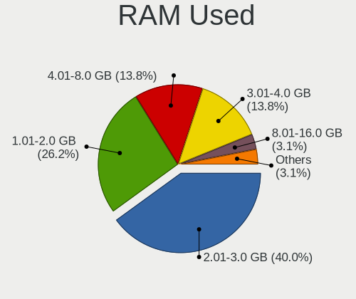
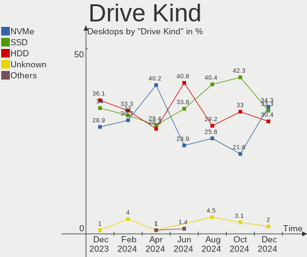
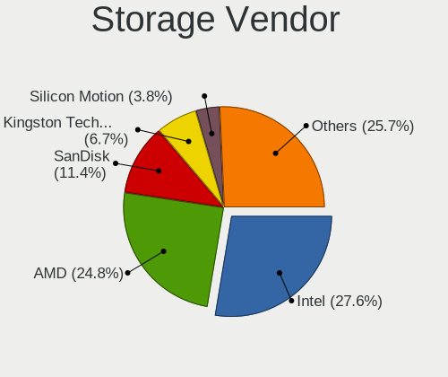
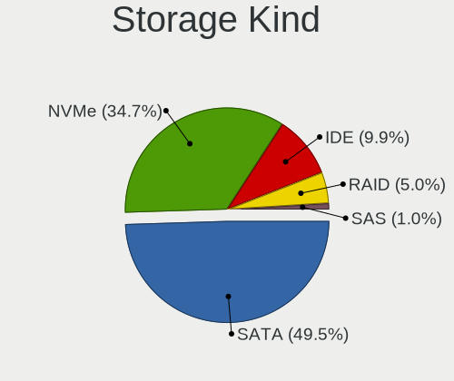
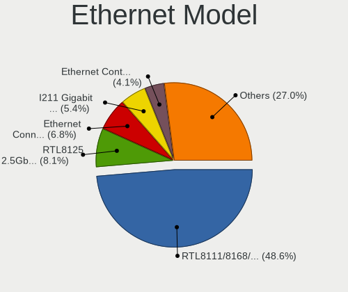
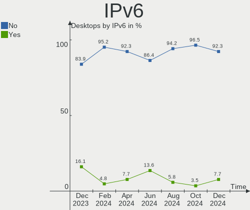
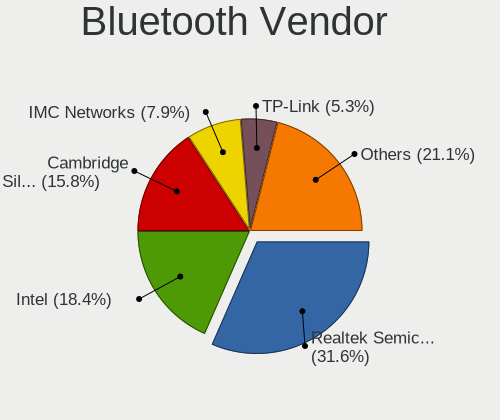

Linux in Spain - Hardware Trends (Desktops)
-------------------------------------------

A project to identify most popular hardware characteristics and track their change
over time based on data collected by Linux users at https://Linux-Hardware.org.

Anyone can contribute to this report by the [hw-probe](https://github.com/linuxhw/hw-probe) tool:

    sudo -E hw-probe -all -upload

Period: Apr, 2023.

Contents
--------

* [ System ](#system)
  - [ OS                       ](#os)
  - [ OS Family                ](#os-family)
  - [ Kernel                   ](#kernel)
  - [ Kernel Family            ](#kernel-family)
  - [ Kernel Major Ver.        ](#kernel-major-ver)
  - [ Arch                     ](#arch)
  - [ DE                       ](#de)
  - [ Display Server           ](#display-server)
  - [ Display Manager          ](#display-manager)
  - [ OS Lang                  ](#os-lang)
  - [ Boot Mode                ](#boot-mode)
  - [ Filesystem               ](#filesystem)
  - [ Part. scheme             ](#part-scheme)
  - [ Dual Boot with Linux/BSD ](#dual-boot-with-linuxbsd)
  - [ Dual Boot (Win)          ](#dual-boot-win)

* [ Board ](#board)
  - [ Vendor                   ](#vendor)
  - [ Model                    ](#model)
  - [ Model Family             ](#model-family)
  - [ MFG Year                 ](#mfg-year)
  - [ Form Factor              ](#form-factor)
  - [ Secure Boot              ](#secure-boot)
  - [ Coreboot                 ](#coreboot)
  - [ RAM Size                 ](#ram-size)
  - [ RAM Used                 ](#ram-used)
  - [ Total Drives             ](#total-drives)
  - [ Has CD-ROM               ](#has-cd-rom)
  - [ Has Ethernet             ](#has-ethernet)
  - [ Has WiFi                 ](#has-wifi)
  - [ Has Bluetooth            ](#has-bluetooth)

* [ Location ](#location)
  - [ Country                  ](#country)
  - [ City                     ](#city)

* [ Drives ](#drives)
  - [ Drive Vendor             ](#drive-vendor)
  - [ Drive Model              ](#drive-model)
  - [ HDD Vendor               ](#hdd-vendor)
  - [ SSD Vendor               ](#ssd-vendor)
  - [ Drive Kind               ](#drive-kind)
  - [ Drive Connector          ](#drive-connector)
  - [ Drive Size               ](#drive-size)
  - [ Space Total              ](#space-total)
  - [ Space Used               ](#space-used)
  - [ Malfunc. Drives          ](#malfunc-drives)
  - [ Malfunc. Drive Vendor    ](#malfunc-drive-vendor)
  - [ Malfunc. HDD Vendor      ](#malfunc-hdd-vendor)
  - [ Malfunc. Drive Kind      ](#malfunc-drive-kind)
  - [ Failed Drives            ](#failed-drives)
  - [ Failed Drive Vendor      ](#failed-drive-vendor)
  - [ Drive Status             ](#drive-status)

* [ Storage controller ](#storage-controller)
  - [ Storage Vendor           ](#storage-vendor)
  - [ Storage Model            ](#storage-model)
  - [ Storage Kind             ](#storage-kind)

* [ Processor ](#processor)
  - [ CPU Vendor               ](#cpu-vendor)
  - [ CPU Model                ](#cpu-model)
  - [ CPU Model Family         ](#cpu-model-family)
  - [ CPU Cores                ](#cpu-cores)
  - [ CPU Sockets              ](#cpu-sockets)
  - [ CPU Threads              ](#cpu-threads)
  - [ CPU Op-Modes             ](#cpu-op-modes)
  - [ CPU Microcode            ](#cpu-microcode)
  - [ CPU Microarch            ](#cpu-microarch)

* [ Graphics ](#graphics)
  - [ GPU Vendor               ](#gpu-vendor)
  - [ GPU Model                ](#gpu-model)
  - [ GPU Combo                ](#gpu-combo)
  - [ GPU Driver               ](#gpu-driver)
  - [ GPU Memory               ](#gpu-memory)

* [ Monitor ](#monitor)
  - [ Monitor Vendor           ](#monitor-vendor)
  - [ Monitor Model            ](#monitor-model)
  - [ Monitor Resolution       ](#monitor-resolution)
  - [ Monitor Diagonal         ](#monitor-diagonal)
  - [ Monitor Width            ](#monitor-width)
  - [ Aspect Ratio             ](#aspect-ratio)
  - [ Monitor Area             ](#monitor-area)
  - [ Pixel Density            ](#pixel-density)
  - [ Multiple Monitors        ](#multiple-monitors)

* [ Network ](#network)
  - [ Net Controller Vendor    ](#net-controller-vendor)
  - [ Net Controller Model     ](#net-controller-model)
  - [ Wireless Vendor          ](#wireless-vendor)
  - [ Wireless Model           ](#wireless-model)
  - [ Ethernet Vendor          ](#ethernet-vendor)
  - [ Ethernet Model           ](#ethernet-model)
  - [ Net Controller Kind      ](#net-controller-kind)
  - [ Used Controller          ](#used-controller)
  - [ NICs                     ](#nics)
  - [ IPv6                     ](#ipv6)

* [ Bluetooth ](#bluetooth)
  - [ Bluetooth Vendor         ](#bluetooth-vendor)
  - [ Bluetooth Model          ](#bluetooth-model)

* [ Sound ](#sound)
  - [ Sound Vendor             ](#sound-vendor)
  - [ Sound Model              ](#sound-model)

* [ Memory ](#memory)
  - [ Memory Vendor            ](#memory-vendor)
  - [ Memory Model             ](#memory-model)
  - [ Memory Kind              ](#memory-kind)
  - [ Memory Form Factor       ](#memory-form-factor)
  - [ Memory Size              ](#memory-size)
  - [ Memory Speed             ](#memory-speed)

* [ Printers & scanners ](#printers--scanners)
  - [ Printer Vendor           ](#printer-vendor)
  - [ Printer Model            ](#printer-model)
  - [ Scanner Vendor           ](#scanner-vendor)
  - [ Scanner Model            ](#scanner-model)

* [ Camera ](#camera)
  - [ Camera Vendor            ](#camera-vendor)
  - [ Camera Model             ](#camera-model)

* [ Security ](#security)
  - [ Fingerprint Vendor       ](#fingerprint-vendor)
  - [ Fingerprint Model        ](#fingerprint-model)
  - [ Chipcard Vendor          ](#chipcard-vendor)
  - [ Chipcard Model           ](#chipcard-model)

* [ Unsupported ](#unsupported)
  - [ Unsupported Devices      ](#unsupported-devices)
  - [ Unsupported Device Types ](#unsupported-device-types)

System
------

OS
--

Installed operating systems

| Name                         | Desktops | Percent |
|------------------------------|----------|---------|
| OpenMandriva 23.03           | 10       | 15.87%  |
| Debian 11                    | 6        | 9.52%   |
| ArcoLinux Rolling            | 4        | 6.35%   |
| Ubuntu 22.10                 | 3        | 4.76%   |
| Ubuntu 22.04                 | 3        | 4.76%   |
| OpenMandriva 23.01           | 3        | 4.76%   |
| Kubuntu 22.04                | 3        | 4.76%   |
| KDE neon 22.04               | 3        | 4.76%   |
| Manjaro                      | 2        | 3.17%   |
| Linux Mint 21.1              | 2        | 3.17%   |
| Fedora 37                    | 2        | 3.17%   |
| Debian 12                    | 2        | 3.17%   |
| Zorin 16                     | 1        | 1.59%   |
| Ubuntu Unity 22.04           | 1        | 1.59%   |
| Ubuntu MATE 22.04            | 1        | 1.59%   |
| Ubuntu 20.04                 | 1        | 1.59%   |
| Slackware 15.0               | 1        | 1.59%   |
| openSUSE Tumbleweed-XXXXXXXX | 1        | 1.59%   |
| OpenMandriva 4.3             | 1        | 1.59%   |
| MX 23                        | 1        | 1.59%   |
| Manjaro 22.1.0               | 1        | 1.59%   |
| Kubuntu 22.10                | 1        | 1.59%   |
| Kali 2023.1                  | 1        | 1.59%   |
| Gentoo 2.9                   | 1        | 1.59%   |
| Fedora 36                    | 1        | 1.59%   |
| EndeavourOS Rolling          | 1        | 1.59%   |
| Elementary 7                 | 1        | 1.59%   |
| Devuan 4                     | 1        | 1.59%   |
| Debian 10                    | 1        | 1.59%   |
| ChimeraOS 41                 | 1        | 1.59%   |
| BigLinux 22.1.0              | 1        | 1.59%   |
| Arch Rolling                 | 1        | 1.59%   |

OS Family
---------

OS without a version

| Name         | Desktops | Percent |
|--------------|----------|---------|
| OpenMandriva | 14       | 22.22%  |
| Debian       | 9        | 14.29%  |
| Ubuntu       | 7        | 11.11%  |
| Kubuntu      | 4        | 6.35%   |
| ArcoLinux    | 4        | 6.35%   |
| Manjaro      | 3        | 4.76%   |
| KDE neon     | 3        | 4.76%   |
| Fedora       | 3        | 4.76%   |
| Linux Mint   | 2        | 3.17%   |
| Zorin        | 1        | 1.59%   |
| Ubuntu Unity | 1        | 1.59%   |
| Ubuntu MATE  | 1        | 1.59%   |
| Slackware    | 1        | 1.59%   |
| openSUSE     | 1        | 1.59%   |
| MX           | 1        | 1.59%   |
| Kali         | 1        | 1.59%   |
| Gentoo       | 1        | 1.59%   |
| EndeavourOS  | 1        | 1.59%   |
| Elementary   | 1        | 1.59%   |
| Devuan       | 1        | 1.59%   |
| ChimeraOS    | 1        | 1.59%   |
| BigLinux     | 1        | 1.59%   |
| Arch         | 1        | 1.59%   |

Kernel
------

Version of the Linux kernel

| Version                 | Desktops | Percent |
|-------------------------|----------|---------|
| 5.19.0-38-generic       | 11       | 17.46%  |
| 6.2.6-desktop-1omv2390  | 10       | 15.87%  |
| 5.10.0-21-amd64         | 6        | 9.52%   |
| 6.1.1-desktop-1omv2290  | 3        | 4.76%   |
| 6.2.10-arch1-1          | 2        | 3.17%   |
| 6.1.0-7-amd64           | 2        | 3.17%   |
| 5.19.0-40-generic       | 2        | 3.17%   |
| 5.15.0-67-generic       | 2        | 3.17%   |
| 5.10.0-20-amd64         | 2        | 3.17%   |
| 6.2.8-200.fc37.x86_64   | 1        | 1.59%   |
| 6.2.8-1-MANJARO         | 1        | 1.59%   |
| 6.2.8-1-default         | 1        | 1.59%   |
| 6.2.13-arch1-1          | 1        | 1.59%   |
| 6.2.12-zen1-1-zen       | 1        | 1.59%   |
| 6.2.12-arch1-1          | 1        | 1.59%   |
| 6.2.11-arch1-1          | 1        | 1.59%   |
| 6.1.23-1-MANJARO        | 1        | 1.59%   |
| 6.1.21-1-MANJARO        | 1        | 1.59%   |
| 6.1.21-1-lts            | 1        | 1.59%   |
| 6.1.12-gentoo-x86_64    | 1        | 1.59%   |
| 6.1.0-kali7-amd64       | 1        | 1.59%   |
| 6.0.8-200.fc36.x86_64   | 1        | 1.59%   |
| 6.0.7-301.fc37.x86_64   | 1        | 1.59%   |
| 5.19.17-Unraid          | 1        | 1.59%   |
| 5.19.0-41-generic       | 1        | 1.59%   |
| 5.18.0-051800-generic   | 1        | 1.59%   |
| 5.16.7-desktop-1omv4003 | 1        | 1.59%   |
| 5.16.11-1-BIGLINUX      | 1        | 1.59%   |
| 5.15.0-71-lowlatency    | 1        | 1.59%   |
| 5.15.0-70-generic       | 1        | 1.59%   |
| 5.15.0-69-generic       | 1        | 1.59%   |
| 4.19.0-23-amd64         | 1        | 1.59%   |

Kernel Family
-------------

Linux kernel without a distro release

| Version | Desktops | Percent |
|---------|----------|---------|
| 5.19.0  | 14       | 22.22%  |
| 6.2.6   | 10       | 15.87%  |
| 5.10.0  | 8        | 12.7%   |
| 5.15.0  | 5        | 7.94%   |
| 6.2.8   | 3        | 4.76%   |
| 6.1.1   | 3        | 4.76%   |
| 6.1.0   | 3        | 4.76%   |
| 6.2.12  | 2        | 3.17%   |
| 6.2.10  | 2        | 3.17%   |
| 6.1.21  | 2        | 3.17%   |
| 6.2.13  | 1        | 1.59%   |
| 6.2.11  | 1        | 1.59%   |
| 6.1.23  | 1        | 1.59%   |
| 6.1.12  | 1        | 1.59%   |
| 6.0.8   | 1        | 1.59%   |
| 6.0.7   | 1        | 1.59%   |
| 5.19.17 | 1        | 1.59%   |
| 5.18.0  | 1        | 1.59%   |
| 5.16.7  | 1        | 1.59%   |
| 5.16.11 | 1        | 1.59%   |
| 4.19.0  | 1        | 1.59%   |

Kernel Major Ver.
-----------------

Linux kernel major version

| Version | Desktops | Percent |
|---------|----------|---------|
| 6.2     | 19       | 30.16%  |
| 5.19    | 15       | 23.81%  |
| 6.1     | 10       | 15.87%  |
| 5.10    | 8        | 12.7%   |
| 5.15    | 5        | 7.94%   |
| 6.0     | 2        | 3.17%   |
| 5.16    | 2        | 3.17%   |
| 5.18    | 1        | 1.59%   |
| 4.19    | 1        | 1.59%   |

Arch
----

OS architecture (x86_64, i586, etc.)

| Name   | Desktops | Percent |
|--------|----------|---------|
| x86_64 | 63       | 100%    |

DE
--

Desktop Environment

| Name       | Desktops | Percent |
|------------|----------|---------|
| KDE5       | 29       | 46.03%  |
| GNOME      | 16       | 25.4%   |
| Unknown    | 5        | 7.94%   |
| LXQt       | 3        | 4.76%   |
| XFCE       | 2        | 3.17%   |
| X-Cinnamon | 2        | 3.17%   |
| Unity      | 1        | 1.59%   |
| Pantheon   | 1        | 1.59%   |
| openbox    | 1        | 1.59%   |
| MATE       | 1        | 1.59%   |
| Hyprland   | 1        | 1.59%   |
| chadwm     | 1        | 1.59%   |

Display Server
--------------

X11 or Wayland

| Name    | Desktops | Percent |
|---------|----------|---------|
| X11     | 48       | 76.19%  |
| Wayland | 11       | 17.46%  |
| Unknown | 3        | 4.76%   |
| Tty     | 1        | 1.59%   |

Display Manager
---------------

SDDM, LightDM, etc.

| Name    | Desktops | Percent |
|---------|----------|---------|
| Unknown | 24       | 38.1%   |
| SDDM    | 23       | 36.51%  |
| GDM3    | 6        | 9.52%   |
| LightDM | 5        | 7.94%   |
| GDM     | 4        | 6.35%   |
| LXDM    | 1        | 1.59%   |

OS Lang
-------

Language

| Lang       | Desktops | Percent |
|------------|----------|---------|
| es_ES      | 45       | 71.43%  |
| en_US      | 8        | 12.7%   |
| Unknown    | 4        | 6.35%   |
| ca_ES      | 3        | 4.76%   |
| es_ES.UTF8 | 1        | 1.59%   |
| ca_AD      | 1        | 1.59%   |
| C          | 1        | 1.59%   |

Boot Mode
---------

EFI or BIOS

| Mode | Desktops | Percent |
|------|----------|---------|
| BIOS | 33       | 52.38%  |
| EFI  | 30       | 47.62%  |

Filesystem
----------

Type of filesystem

| Type    | Desktops | Percent |
|---------|----------|---------|
| Ext4    | 41       | 65.08%  |
| Btrfs   | 12       | 19.05%  |
| Overlay | 5        | 7.94%   |
| Zfs     | 2        | 3.17%   |
| Tmpfs   | 2        | 3.17%   |
| Xfs     | 1        | 1.59%   |

Part. scheme
------------

Scheme of partitioning

| Type    | Desktops | Percent |
|---------|----------|---------|
| GPT     | 37       | 58.73%  |
| Unknown | 19       | 30.16%  |
| MBR     | 7        | 11.11%  |

Dual Boot with Linux/BSD
------------------------

Hosting more than one Linux/BSD

| Dual boot | Desktops | Percent |
|-----------|----------|---------|
| No        | 44       | 69.84%  |
| Yes       | 19       | 30.16%  |

Dual Boot (Win)
---------------

Hosting Linux and Windows

| Dual boot | Desktops | Percent |
|-----------|----------|---------|
| No        | 34       | 53.97%  |
| Yes       | 29       | 46.03%  |

Board
-----

Vendor
------

Motherboard manufacturer

| Name                | Desktops | Percent |
|---------------------|----------|---------|
| ASUSTek Computer    | 18       | 28.57%  |
| Gigabyte Technology | 13       | 20.63%  |
| Hewlett-Packard     | 9        | 14.29%  |
| MSI                 | 8        | 12.7%   |
| Dell                | 3        | 4.76%   |
| Lenovo              | 2        | 3.17%   |
| BESSTAR Tech        | 2        | 3.17%   |
| ASRock              | 2        | 3.17%   |
| AMI                 | 2        | 3.17%   |
| Shuttle             | 1        | 1.59%   |
| Packard Bell        | 1        | 1.59%   |
| Medion              | 1        | 1.59%   |
| Acer                | 1        | 1.59%   |

Model
-----

Motherboard model

| Name                                    | Desktops | Percent |
|-----------------------------------------|----------|---------|
| HP EliteDesk 800 G1 SFF                 | 2        | 3.17%   |
| ASUS TUF Gaming B550-PLUS               | 2        | 3.17%   |
| ASUS PRIME A320M-K                      | 2        | 3.17%   |
| ASRock H81M-VG4 R2.0                    | 2        | 3.17%   |
| AMI Intel                               | 2        | 3.17%   |
| Shuttle SG45                            | 1        | 1.59%   |
| Packard Bell IMEDIA S2870               | 1        | 1.59%   |
| MSI MS-7C95                             | 1        | 1.59%   |
| MSI MS-7C52                             | 1        | 1.59%   |
| MSI MS-7C09                             | 1        | 1.59%   |
| MSI MS-7B29                             | 1        | 1.59%   |
| MSI MS-7A74                             | 1        | 1.59%   |
| MSI MS-7A63                             | 1        | 1.59%   |
| MSI MS-7721                             | 1        | 1.59%   |
| MSI MS-7693                             | 1        | 1.59%   |
| Medion D3F3-EM                          | 1        | 1.59%   |
| Lenovo ThinkCentre M700 10J0S05U00      | 1        | 1.59%   |
| Lenovo IdeaCentre 300S-08IHH 90F1006CSP | 1        | 1.59%   |
| HP Z640 Workstation                     | 1        | 1.59%   |
| HP Z420 Workstation                     | 1        | 1.59%   |
| HP EliteDesk 800 G2 DM 35W              | 1        | 1.59%   |
| HP EliteDesk 700 G1 SFF                 | 1        | 1.59%   |
| HP Compaq Elite 8300 SFF                | 1        | 1.59%   |
| HP Compaq Elite 8300 CMT                | 1        | 1.59%   |
| HP Compaq dc7800 Small Form Factor      | 1        | 1.59%   |
| Gigabyte Z390 UD                        | 1        | 1.59%   |
| Gigabyte Z390 GAMING X                  | 1        | 1.59%   |
| Gigabyte Z370 HD3P                      | 1        | 1.59%   |
| Gigabyte X299 AORUS Ultra Gaming Pro    | 1        | 1.59%   |
| Gigabyte H61MA-D3V                      | 1        | 1.59%   |
| Gigabyte F2A88XM-HD3                    | 1        | 1.59%   |
| Gigabyte F2A68HM-H                      | 1        | 1.59%   |
| Gigabyte EX58-UD5                       | 1        | 1.59%   |
| Gigabyte B75-D3V                        | 1        | 1.59%   |
| Gigabyte B365M DS3H                     | 1        | 1.59%   |
| Gigabyte B365M D3H                      | 1        | 1.59%   |
| Gigabyte AX370-Gaming 5                 | 1        | 1.59%   |
| Gigabyte AB350-Gaming 3                 | 1        | 1.59%   |
| Dell Precision T3600                    | 1        | 1.59%   |
| Dell OptiPlex 390                       | 1        | 1.59%   |

Model Family
------------

Motherboard model prefix

| Name                  | Desktops | Percent |
|-----------------------|----------|---------|
| ASUS TUF              | 5        | 7.94%   |
| ASUS PRIME            | 5        | 7.94%   |
| HP EliteDesk          | 4        | 6.35%   |
| HP Compaq             | 3        | 4.76%   |
| Gigabyte Z390         | 2        | 3.17%   |
| Gigabyte B365M        | 2        | 3.17%   |
| Dell OptiPlex         | 2        | 3.17%   |
| ASUS ROG              | 2        | 3.17%   |
| ASRock H81M-VG4       | 2        | 3.17%   |
| AMI Intel             | 2        | 3.17%   |
| Shuttle SG45          | 1        | 1.59%   |
| Packard Bell IMEDIA   | 1        | 1.59%   |
| MSI MS-7C95           | 1        | 1.59%   |
| MSI MS-7C52           | 1        | 1.59%   |
| MSI MS-7C09           | 1        | 1.59%   |
| MSI MS-7B29           | 1        | 1.59%   |
| MSI MS-7A74           | 1        | 1.59%   |
| MSI MS-7A63           | 1        | 1.59%   |
| MSI MS-7721           | 1        | 1.59%   |
| MSI MS-7693           | 1        | 1.59%   |
| Medion D3F3-EM        | 1        | 1.59%   |
| Lenovo ThinkCentre    | 1        | 1.59%   |
| Lenovo IdeaCentre     | 1        | 1.59%   |
| HP Z640               | 1        | 1.59%   |
| HP Z420               | 1        | 1.59%   |
| Gigabyte Z370         | 1        | 1.59%   |
| Gigabyte X299         | 1        | 1.59%   |
| Gigabyte H61MA-D3V    | 1        | 1.59%   |
| Gigabyte F2A88XM-HD3  | 1        | 1.59%   |
| Gigabyte F2A68HM-H    | 1        | 1.59%   |
| Gigabyte EX58-UD5     | 1        | 1.59%   |
| Gigabyte B75-D3V      | 1        | 1.59%   |
| Gigabyte AX370-Gaming | 1        | 1.59%   |
| Gigabyte AB350-Gaming | 1        | 1.59%   |
| Dell Precision        | 1        | 1.59%   |
| BESSTAR Tech UM700    | 1        | 1.59%   |
| BESSTAR Tech HX90     | 1        | 1.59%   |
| ASUS Z170-PRO         | 1        | 1.59%   |
| ASUS Z170-K           | 1        | 1.59%   |
| ASUS VM42             | 1        | 1.59%   |

MFG Year
--------

Motherboard manufacture year

| Year | Desktops | Percent |
|------|----------|---------|
| 2017 | 7        | 11.11%  |
| 2015 | 7        | 11.11%  |
| 2014 | 7        | 11.11%  |
| 2020 | 6        | 9.52%   |
| 2018 | 6        | 9.52%   |
| 2013 | 6        | 9.52%   |
| 2022 | 5        | 7.94%   |
| 2012 | 5        | 7.94%   |
| 2019 | 4        | 6.35%   |
| 2016 | 4        | 6.35%   |
| 2008 | 2        | 3.17%   |
| 2007 | 2        | 3.17%   |
| 2021 | 1        | 1.59%   |
| 2011 | 1        | 1.59%   |

Form Factor
-----------

Physical design of the computer

| Name    | Desktops | Percent |
|---------|----------|---------|
| Desktop | 63       | 100%    |

Secure Boot
-----------

Enabled or disabled

| State    | Desktops | Percent |
|----------|----------|---------|
| Disabled | 61       | 96.83%  |
| Enabled  | 2        | 3.17%   |

Coreboot
--------

Have coreboot on board

| Used | Desktops | Percent |
|------|----------|---------|
| No   | 63       | 100%    |

RAM Size
--------

Total RAM memory

| Size in GB  | Desktops | Percent |
|-------------|----------|---------|
| 16.01-24.0  | 15       | 23.81%  |
| 32.01-64.0  | 14       | 22.22%  |
| 8.01-16.0   | 12       | 19.05%  |
| 4.01-8.0    | 10       | 15.87%  |
| 64.01-256.0 | 5        | 7.94%   |
| 24.01-32.0  | 4        | 6.35%   |
| 3.01-4.0    | 3        | 4.76%   |

RAM Used
--------

Used RAM memory

| Used GB    | Desktops | Percent |
|------------|----------|---------|
| 1.01-2.0   | 23       | 36.51%  |
| 2.01-3.0   | 13       | 20.63%  |
| 3.01-4.0   | 12       | 19.05%  |
| 4.01-8.0   | 6        | 9.52%   |
| 0.51-1.0   | 3        | 4.76%   |
| 16.01-24.0 | 2        | 3.17%   |
| 8.01-16.0  | 2        | 3.17%   |
| 32.01-64.0 | 1        | 1.59%   |
| 0.01-0.5   | 1        | 1.59%   |

Total Drives
------------

Number of drives on board

| Drives | Desktops | Percent |
|--------|----------|---------|
| 2      | 29       | 46.03%  |
| 3      | 11       | 17.46%  |
| 1      | 9        | 14.29%  |
| 4      | 5        | 7.94%   |
| 6      | 4        | 6.35%   |
| 7      | 2        | 3.17%   |
| 5      | 2        | 3.17%   |
| 9      | 1        | 1.59%   |

Has CD-ROM
----------

Has CD-ROM on board

| Presented | Desktops | Percent |
|-----------|----------|---------|
| No        | 42       | 66.67%  |
| Yes       | 21       | 33.33%  |

Has Ethernet
------------

Has Ethernet on board

| Presented | Desktops | Percent |
|-----------|----------|---------|
| Yes       | 63       | 100%    |

Has WiFi
--------

Has WiFi module

| Presented | Desktops | Percent |
|-----------|----------|---------|
| No        | 34       | 53.97%  |
| Yes       | 29       | 46.03%  |

Has Bluetooth
-------------

Has Bluetooth module

| Presented | Desktops | Percent |
|-----------|----------|---------|
| No        | 39       | 61.9%   |
| Yes       | 24       | 38.1%   |

Location
--------

Country
-------

Geographic location (country)

| Country | Desktops | Percent |
|---------|----------|---------|
| Spain   | 63       | 100%    |

City
----

Geographic location (city)

| City                       | Desktops | Percent |
|----------------------------|----------|---------|
| Madrid                     | 6        | 9.52%   |
| Barcelona                  | 6        | 9.52%   |
| Valencia                   | 3        | 4.76%   |
| Oviedo                     | 3        | 4.76%   |
| Burgos                     | 3        | 4.76%   |
| Palma                      | 2        | 3.17%   |
| Ourense                    | 2        | 3.17%   |
| Fuenlabrada                | 2        | 3.17%   |
| Badalona                   | 2        | 3.17%   |
| Alcalá de Henares         | 2        | 3.17%   |
| A Coruña                  | 2        | 3.17%   |
| Zaragoza                   | 1        | 1.59%   |
| Valladolid                 | 1        | 1.59%   |
| Valderrobres               | 1        | 1.59%   |
| Seville                    | 1        | 1.59%   |
| Sedavi                     | 1        | 1.59%   |
| Santa Cruz de Tenerife     | 1        | 1.59%   |
| Sant Celoni                | 1        | 1.59%   |
| Sanlúcar de Barrameda     | 1        | 1.59%   |
| Sabadell                   | 1        | 1.59%   |
| Roda de Berà              | 1        | 1.59%   |
| Palencia                   | 1        | 1.59%   |
| Ontinyent                  | 1        | 1.59%   |
| Miranda de Ebro            | 1        | 1.59%   |
| Mérida                    | 1        | 1.59%   |
| Marbella                   | 1        | 1.59%   |
| Lugones                    | 1        | 1.59%   |
| Lleida                     | 1        | 1.59%   |
| Las Palmas de Gran Canaria | 1        | 1.59%   |
| La Peza                    | 1        | 1.59%   |
| Izoria                     | 1        | 1.59%   |
| Irun                       | 1        | 1.59%   |
| Hueneja                    | 1        | 1.59%   |
| Elche                      | 1        | 1.59%   |
| el Catllar                 | 1        | 1.59%   |
| Donostia / San Sebastian   | 1        | 1.59%   |
| Catarroja                  | 1        | 1.59%   |
| Carballo                   | 1        | 1.59%   |
| Arcos de la Frontera       | 1        | 1.59%   |
| Alicante                   | 1        | 1.59%   |

Drives
------

Drive Vendor
------------

Hard drive vendors

| Vendor                       | Desktops | Drives  | Percent |
|------------------------------|----------|---------|---------|
| Seagate                      | 30       | 47      | 22.06%  |
| WDC                          | 23       | 30      | 16.91%  |
| Samsung Electronics          | 18       | 24      | 13.24%  |
| Kingston                     | 15       | 16      | 11.03%  |
| Crucial                      | 11       | 14      | 8.09%   |
| Sandisk                      | 8        | 11      | 5.88%   |
| Toshiba                      | 6        | 7       | 4.41%   |
| Hitachi                      | 3        | 3       | 2.21%   |
| China                        | 3        | 3       | 2.21%   |
| Silicon Motion               | 2        | 2       | 1.47%   |
| Micron/Crucial Technology    | 2        | 3       | 1.47%   |
| WALRAM                       | 1        | 1       | 0.74%   |
| Transcend                    | 1        | 1       | 0.74%   |
| SSD 2TB                      | 1        | 1       | 0.74%   |
| SPCC                         | 1        | 1       | 0.74%   |
| Shenzhen Longsys Electronics | 1        | 1       | 0.74%   |
| OYUNKEY                      | 1        | 1       | 0.74%   |
| Morebeck-N100                | 1        | 1       | 0.74%   |
| Maxtor                       | 1        | 1       | 0.74%   |
| Kingston Technology Company  | 1        | 1       | 0.74%   |
| HPE                          | 1        | 2       | 0.74%   |
| HL-DT-ST                     | 1        | Unknown | 0.74%   |
| HGST                         | 1        | 1       | 0.74%   |
| Fanxiang                     | 1        | 1       | 0.74%   |
| BAITITON                     | 1        | 1       | 0.74%   |
| Unknown                      | 1        | 1       | 0.74%   |

Drive Model
-----------

Hard drive models

| Model                                                 | Desktops | Percent |
|-------------------------------------------------------|----------|---------|
| Seagate ST500DM002-1BD142 500GB                       | 7        | 4.19%   |
| Seagate ST2000DM008-2FR102 2TB                        | 4        | 2.4%    |
| Seagate ST1000DM010-2EP102 1TB                        | 4        | 2.4%    |
| Kingston SA400S37120G 120GB SSD                       | 4        | 2.4%    |
| Crucial CT480BX500SSD1 480GB                          | 4        | 2.4%    |
| Seagate ST1000DM003-1ER162 1TB                        | 3        | 1.8%    |
| Samsung NVMe SSD Controller SM981/PM981/PM983 1TB     | 3        | 1.8%    |
| Kingston SV300S37A120G 120GB SSD                      | 3        | 1.8%    |
| Kingston SA400S37240G 240GB SSD                       | 3        | 1.8%    |
| WDC WDS500G2B0A-00SM50 500GB SSD                      | 2        | 1.2%    |
| WDC WD20EZRZ-00Z5HB0 2TB                              | 2        | 1.2%    |
| WDC WD20EARX-00PASB0 2TB                              | 2        | 1.2%    |
| WDC WD10EZEX-08WN4A0 1TB                              | 2        | 1.2%    |
| Toshiba DT01ACA200 2TB                                | 2        | 1.2%    |
| Seagate ST3500418AS 500GB                             | 2        | 1.2%    |
| Seagate ST3120827AS 120GB                             | 2        | 1.2%    |
| Seagate ST2000DM008-2UB102 2TB                        | 2        | 1.2%    |
| Seagate ST1000DM003-1CH162 1TB                        | 2        | 1.2%    |
| Sandisk WD Black 2018/SN750 / PC SN720 NVMe SSD 500GB | 2        | 1.2%    |
| Samsung SSD 870 QVO 2TB                               | 2        | 1.2%    |
| Samsung SSD 860 EVO 500GB                             | 2        | 1.2%    |
| Samsung SSD 850 EVO 250GB                             | 2        | 1.2%    |
| Crucial CT500MX500SSD1 500GB                          | 2        | 1.2%    |
| Crucial CT1000MX500SSD1 1TB                           | 2        | 1.2%    |
| Crucial CT1000BX500SSD1 1TB                           | 2        | 1.2%    |
| WDC WDS500G2B0B-00YS70 500GB SSD                      | 1        | 0.6%    |
| WDC WDS240G2G0B-00EPW0 240GB SSD                      | 1        | 0.6%    |
| WDC WDS240G1G0A-00SS50 240GB SSD                      | 1        | 0.6%    |
| WDC WDS100T2B0A-00SM50 1TB SSD                        | 1        | 0.6%    |
| WDC WD80EFAX-68KNBN0 8TB                              | 1        | 0.6%    |
| WDC WD6003FZBX-00K5WB0 6TB                            | 1        | 0.6%    |
| WDC WD5000LPLX-08ZNTT0 500GB                          | 1        | 0.6%    |
| WDC WD5000AAKX-00ERMA0 500GB                          | 1        | 0.6%    |
| WDC WD40EZAZ-00SF3B0 4TB                              | 1        | 0.6%    |
| WDC WD40EFAX-68JH4N0 4TB                              | 1        | 0.6%    |
| WDC WD20PURZ-85GU6Y0 2TB                              | 1        | 0.6%    |
| WDC WD20EARS-14MVWB0 2TB                              | 1        | 0.6%    |
| WDC WD20EARS-00MVWB0 2TB                              | 1        | 0.6%    |
| WDC WD10EZRX-00A8LB0 1TB                              | 1        | 0.6%    |
| WDC WD10EZEX-75WN4A1 1TB                              | 1        | 0.6%    |

HDD Vendor
----------

Hard disk drive vendors

| Vendor              | Desktops | Drives | Percent |
|---------------------|----------|--------|---------|
| Seagate             | 30       | 47     | 49.18%  |
| WDC                 | 17       | 23     | 27.87%  |
| Toshiba             | 5        | 6      | 8.2%    |
| Samsung Electronics | 3        | 3      | 4.92%   |
| Hitachi             | 3        | 3      | 4.92%   |
| Maxtor              | 1        | 1      | 1.64%   |
| HPE                 | 1        | 2      | 1.64%   |
| HGST                | 1        | 1      | 1.64%   |

SSD Vendor
----------

Solid state drive vendors

| Vendor              | Desktops | Drives | Percent |
|---------------------|----------|--------|---------|
| Kingston            | 14       | 14     | 22.95%  |
| Samsung Electronics | 13       | 14     | 21.31%  |
| Crucial             | 11       | 13     | 18.03%  |
| WDC                 | 7        | 7      | 11.48%  |
| SanDisk             | 7        | 8      | 11.48%  |
| China               | 3        | 3      | 4.92%   |
| Transcend           | 1        | 1      | 1.64%   |
| Toshiba             | 1        | 1      | 1.64%   |
| SPCC                | 1        | 1      | 1.64%   |
| OYUNKEY             | 1        | 1      | 1.64%   |
| Fanxiang            | 1        | 1      | 1.64%   |
| BAITITON            | 1        | 1      | 1.64%   |

Drive Kind
----------

HDD or SSD

| Kind    | Desktops | Drives | Percent |
|---------|----------|--------|---------|
| HDD     | 48       | 86     | 43.24%  |
| SSD     | 42       | 65     | 37.84%  |
| NVMe    | 18       | 21     | 16.22%  |
| Unknown | 2        | 2      | 1.8%    |
| MMC     | 1        | 1      | 0.9%    |

Drive Connector
---------------

SATA, SAS, NVMe, etc.

| Type | Desktops | Drives | Percent |
|------|----------|--------|---------|
| SATA | 62       | 148    | 72.09%  |
| NVMe | 18       | 21     | 20.93%  |
| SAS  | 5        | 5      | 5.81%   |
| MMC  | 1        | 1      | 1.16%   |

Drive Size
----------

Size of hard drive

| Size in TB | Desktops | Drives | Percent |
|------------|----------|--------|---------|
| 0.01-0.5   | 45       | 76     | 45.92%  |
| 0.51-1.0   | 27       | 38     | 27.55%  |
| 1.01-2.0   | 17       | 25     | 17.35%  |
| 4.01-10.0  | 4        | 5      | 4.08%   |
| 3.01-4.0   | 3        | 4      | 3.06%   |
| 2.01-3.0   | 2        | 3      | 2.04%   |

Space Total
-----------

Amount of disk space available on the file system

| Size in GB     | Desktops | Percent |
|----------------|----------|---------|
| 251-500        | 11       | 17.46%  |
| 101-250        | 11       | 17.46%  |
| More than 3000 | 9        | 14.29%  |
| 2001-3000      | 7        | 11.11%  |
| 501-1000       | 7        | 11.11%  |
| Unknown        | 6        | 9.52%   |
| 1-20           | 5        | 7.94%   |
| 1001-2000      | 4        | 6.35%   |
| 51-100         | 2        | 3.17%   |
| 21-50          | 1        | 1.59%   |

Space Used
----------

Amount of used disk space

| Used GB        | Desktops | Percent |
|----------------|----------|---------|
| 1-20           | 20       | 31.75%  |
| 51-100         | 9        | 14.29%  |
| Unknown        | 6        | 9.52%   |
| More than 3000 | 5        | 7.94%   |
| 501-1000       | 5        | 7.94%   |
| 251-500        | 4        | 6.35%   |
| 21-50          | 4        | 6.35%   |
| 101-250        | 4        | 6.35%   |
| 1001-2000      | 4        | 6.35%   |
| 2001-3000      | 2        | 3.17%   |

Malfunc. Drives
---------------

Drive models with a malfunction

| Model                            | Desktops | Drives | Percent |
|----------------------------------|----------|--------|---------|
| Seagate ST500DM002-1BD142 500GB  | 2        | 2      | 11.11%  |
| Kingston SV300S37A120G 120GB SSD | 2        | 2      | 11.11%  |
| WDC WD20PURZ-85GU6Y0 2TB         | 1        | 1      | 5.56%   |
| WDC WD20EARS-00MVWB0 2TB         | 1        | 2      | 5.56%   |
| WDC WD1002FAEX-00Z3A0 1TB        | 1        | 1      | 5.56%   |
| Seagate ST9500325AS 500GB        | 1        | 1      | 5.56%   |
| Seagate ST3500630AS 500GB        | 1        | 1      | 5.56%   |
| Seagate ST3500418AS 500GB        | 1        | 1      | 5.56%   |
| Seagate ST3500320AS 500GB        | 1        | 1      | 5.56%   |
| Seagate ST3120827AS 120GB        | 1        | 1      | 5.56%   |
| Seagate ST31000528AS 1TB         | 1        | 1      | 5.56%   |
| Seagate ST3000DM001-1ER166 3TB   | 1        | 1      | 5.56%   |
| Samsung Electronics HD103UJ 1TB  | 1        | 1      | 5.56%   |
| Samsung Electronics HD103SJ 1TB  | 1        | 1      | 5.56%   |
| Maxtor 6Y120L0 128GB             | 1        | 1      | 5.56%   |
| HPE MB4000GEFNA 4TB              | 1        | 2      | 5.56%   |

Malfunc. Drive Vendor
---------------------

Vendors of faulty drives

| Vendor              | Desktops | Drives | Percent |
|---------------------|----------|--------|---------|
| Seagate             | 8        | 9      | 47.06%  |
| WDC                 | 3        | 4      | 17.65%  |
| Samsung Electronics | 2        | 2      | 11.76%  |
| Kingston            | 2        | 2      | 11.76%  |
| Maxtor              | 1        | 1      | 5.88%   |
| HPE                 | 1        | 2      | 5.88%   |

Malfunc. HDD Vendor
-------------------

Vendors of faulty HDD drives

| Vendor              | Desktops | Drives | Percent |
|---------------------|----------|--------|---------|
| Seagate             | 8        | 9      | 53.33%  |
| WDC                 | 3        | 4      | 20%     |
| Samsung Electronics | 2        | 2      | 13.33%  |
| Maxtor              | 1        | 1      | 6.67%   |
| HPE                 | 1        | 2      | 6.67%   |

Malfunc. Drive Kind
-------------------

Kinds of faulty drives

| Kind | Desktops | Drives | Percent |
|------|----------|--------|---------|
| HDD  | 13       | 18     | 86.67%  |
| SSD  | 2        | 2      | 13.33%  |

Failed Drives
-------------

Failed drive models

Zero info for selected period =(

Failed Drive Vendor
-------------------

Failed drive vendors

Zero info for selected period =(

Drive Status
------------

Number of failed and malfunc. drives

| Status   | Desktops | Drives | Percent |
|----------|----------|--------|---------|
| Works    | 37       | 86     | 45.68%  |
| Detected | 29       | 69     | 35.8%   |
| Malfunc  | 15       | 20     | 18.52%  |

Storage controller
------------------

Storage Vendor
--------------

Storage controller vendors

| Vendor                        | Desktops | Percent |
|-------------------------------|----------|---------|
| Intel                         | 43       | 49.43%  |
| AMD                           | 20       | 22.99%  |
| Samsung Electronics           | 6        | 6.9%    |
| Silicon Motion                | 3        | 3.45%   |
| Micron/Crucial Technology     | 3        | 3.45%   |
| Kingston Technology Company   | 3        | 3.45%   |
| SanDisk                       | 2        | 2.3%    |
| JMicron Technology            | 2        | 2.3%    |
| Shenzhen Longsys Electronics  | 1        | 1.15%   |
| Marvell Technology Group      | 1        | 1.15%   |
| LSI Logic / Symbios Logic     | 1        | 1.15%   |
| Integrated Technology Express | 1        | 1.15%   |
| ASMedia Technology            | 1        | 1.15%   |

Storage Model
-------------

Storage controller models

| Model                                                                          | Desktops | Percent |
|--------------------------------------------------------------------------------|----------|---------|
| AMD FCH SATA Controller [AHCI mode]                                            | 13       | 12.15%  |
| Intel 200 Series PCH SATA controller [AHCI mode]                               | 8        | 7.48%   |
| Intel 8 Series/C220 Series Chipset Family 6-port SATA Controller 1 [AHCI mode] | 7        | 6.54%   |
| Intel Q170/Q150/B150/H170/H110/Z170/CM236 Chipset SATA Controller [AHCI Mode]  | 5        | 4.67%   |
| Intel Cannon Lake PCH SATA AHCI Controller                                     | 4        | 3.74%   |
| Silicon Motion SM2263EN/SM2263XT SSD Controller                                | 3        | 2.8%    |
| Samsung NVMe SSD Controller SM981/PM981/PM983                                  | 3        | 2.8%    |
| Micron/Crucial NVMe Storage Controller                                         | 3        | 2.8%    |
| Intel 6 Series/C200 Series Chipset Family 6 port Desktop SATA AHCI Controller  | 3        | 2.8%    |
| AMD FCH SATA Controller D                                                      | 3        | 2.8%    |
| AMD 500 Series Chipset SATA Controller                                         | 3        | 2.8%    |
| SanDisk WD Black 2018/SN750 / PC SN720 NVMe SSD                                | 2        | 1.87%   |
| Samsung NVMe SSD Controller 980                                                | 2        | 1.87%   |
| Kingston Company NVMe Controller                                               | 2        | 1.87%   |
| Intel C602 chipset 4-Port SATA Storage Control Unit                            | 2        | 1.87%   |
| Intel C600/X79 series chipset 6-Port SATA AHCI Controller                      | 2        | 1.87%   |
| Intel 82801JI (ICH10 Family) 4 port SATA IDE Controller #1                     | 2        | 1.87%   |
| Intel 82801JI (ICH10 Family) 2 port SATA IDE Controller #2                     | 2        | 1.87%   |
| Intel 82801I (ICH9 Family) 2 port SATA Controller [IDE mode]                   | 2        | 1.87%   |
| Intel 7 Series/C210 Series Chipset Family 6-port SATA Controller [AHCI mode]   | 2        | 1.87%   |
| AMD 400 Series Chipset SATA Controller                                         | 2        | 1.87%   |
| Shenzhen Longsys Non-Volatile memory controller                                | 1        | 0.93%   |
| SanDisk Non-Volatile memory controller                                         | 1        | 0.93%   |
| Samsung NVMe SSD Controller SM961/PM961/SM963                                  | 1        | 0.93%   |
| Samsung NVMe SSD Controller PM9A1/PM9A3/980PRO                                 | 1        | 0.93%   |
| Micron/Crucial P2 NVMe PCIe SSD                                                | 1        | 0.93%   |
| Marvell Group 88SE9172 SATA 6Gb/s Controller                                   | 1        | 0.93%   |
| LSI Logic / Symbios Logic MegaRAID SAS 2108 [Liberator]                        | 1        | 0.93%   |
| Kingston Company OM3PDP3 NVMe SSD                                              | 1        | 0.93%   |
| JMicron JMB368 IDE controller                                                  | 1        | 0.93%   |
| JMicron JMB363 SATA/IDE Controller                                             | 1        | 0.93%   |
| Intel SATA Controller [RAID mode]                                              | 1        | 0.93%   |
| Intel Comet Lake PCH-H RAID                                                    | 1        | 0.93%   |
| Intel Celeron/Pentium Silver Processor SATA Controller                         | 1        | 0.93%   |
| Intel Celeron N3350/Pentium N4200/Atom E3900 Series SATA AHCI Controller       | 1        | 0.93%   |
| Intel C610/X99 series chipset sSATA Controller [AHCI mode]                     | 1        | 0.93%   |
| Intel C610/X99 series chipset 6-Port SATA Controller [AHCI mode]               | 1        | 0.93%   |
| Intel C600/X79 series chipset IDE-r Controller                                 | 1        | 0.93%   |
| Intel 82Q35 Express PT IDER Controller                                         | 1        | 0.93%   |
| Intel 82801IR/IO/IH (ICH9R/DO/DH) 4 port SATA Controller [IDE mode]            | 1        | 0.93%   |

Storage Kind
------------

Kind of storage controller (IDE, SATA, NVMe, SAS, ...)

| Kind | Desktops | Percent |
|------|----------|---------|
| SATA | 55       | 63.22%  |
| NVMe | 18       | 20.69%  |
| IDE  | 8        | 9.2%    |
| RAID | 4        | 4.6%    |
| SAS  | 2        | 2.3%    |

Processor
---------

CPU Vendor
----------

Processor vendors

| Vendor | Desktops | Percent |
|--------|----------|---------|
| Intel  | 43       | 68.25%  |
| AMD    | 20       | 31.75%  |

CPU Model
---------

Processor models

| Model                                  | Desktops | Percent |
|----------------------------------------|----------|---------|
| Intel Pentium Gold G5400 CPU @ 3.70GHz | 2        | 3.17%   |
| Intel Core i7-9700K CPU @ 3.60GHz      | 2        | 3.17%   |
| Intel Core i7-3770 CPU @ 3.40GHz       | 2        | 3.17%   |
| Intel Core i5-4570 CPU @ 3.20GHz       | 2        | 3.17%   |
| Intel Core 2 Duo CPU E6550 @ 2.33GHz   | 2        | 3.17%   |
| AMD Ryzen 5 5600 6-Core Processor      | 2        | 3.17%   |
| Intel Xeon CPU E5-2643 v3 @ 3.40GHz    | 1        | 1.59%   |
| Intel Xeon CPU E5-1650 0 @ 3.20GHz     | 1        | 1.59%   |
| Intel Xeon CPU E5-1603 0 @ 2.80GHz     | 1        | 1.59%   |
| Intel Pentium CPU G4400T @ 2.90GHz     | 1        | 1.59%   |
| Intel Pentium CPU G4400 @ 3.30GHz      | 1        | 1.59%   |
| Intel Pentium CPU G3240 @ 3.10GHz      | 1        | 1.59%   |
| Intel Core i9-9900KF CPU @ 3.60GHz     | 1        | 1.59%   |
| Intel Core i9-7900X CPU @ 3.30GHz      | 1        | 1.59%   |
| Intel Core i7-9700F CPU @ 3.00GHz      | 1        | 1.59%   |
| Intel Core i7-8700K CPU @ 3.70GHz      | 1        | 1.59%   |
| Intel Core i7-7700K CPU @ 4.20GHz      | 1        | 1.59%   |
| Intel Core i7-6700T CPU @ 2.80GHz      | 1        | 1.59%   |
| Intel Core i7-6700K CPU @ 4.00GHz      | 1        | 1.59%   |
| Intel Core i7-6700 CPU @ 3.40GHz       | 1        | 1.59%   |
| Intel Core i7-4790 CPU @ 3.60GHz       | 1        | 1.59%   |
| Intel Core i7 CPU 920 @ 2.67GHz        | 1        | 1.59%   |
| Intel Core i5-9400F CPU @ 2.90GHz      | 1        | 1.59%   |
| Intel Core i5-7600K CPU @ 3.80GHz      | 1        | 1.59%   |
| Intel Core i5-7500 CPU @ 3.40GHz       | 1        | 1.59%   |
| Intel Core i5-4590 CPU @ 3.30GHz       | 1        | 1.59%   |
| Intel Core i5-4460S CPU @ 2.90GHz      | 1        | 1.59%   |
| Intel Core i5-4460 CPU @ 3.20GHz       | 1        | 1.59%   |
| Intel Core i5-3570 CPU @ 3.40GHz       | 1        | 1.59%   |
| Intel Core i5-2400 CPU @ 3.10GHz       | 1        | 1.59%   |
| Intel Core i5-10400F CPU @ 2.90GHz     | 1        | 1.59%   |
| Intel Core i3-9100 CPU @ 3.60GHz       | 1        | 1.59%   |
| Intel Core i3-3240 CPU @ 3.40GHz       | 1        | 1.59%   |
| Intel Core i3-3220 CPU @ 3.30GHz       | 1        | 1.59%   |
| Intel Core i3-2120 CPU @ 3.30GHz       | 1        | 1.59%   |
| Intel Core 2 Quad CPU Q8200 @ 2.33GHz  | 1        | 1.59%   |
| Intel Celeron J4105 CPU @ 1.50GHz      | 1        | 1.59%   |
| Intel Celeron CPU N3350 @ 1.10GHz      | 1        | 1.59%   |
| Intel Celeron 2957U @ 1.40GHz          | 1        | 1.59%   |
| AMD Ryzen 9 5900X 12-Core Processor    | 1        | 1.59%   |

CPU Model Family
----------------

Processor model prefix

| Model              | Desktops | Percent |
|--------------------|----------|---------|
| Intel Core i7      | 12       | 19.05%  |
| Intel Core i5      | 11       | 17.46%  |
| AMD Ryzen 5        | 7        | 11.11%  |
| Intel Core i3      | 4        | 6.35%   |
| AMD Ryzen 7        | 4        | 6.35%   |
| Intel Xeon         | 3        | 4.76%   |
| Intel Pentium      | 3        | 4.76%   |
| Intel Celeron      | 3        | 4.76%   |
| Intel Pentium Gold | 2        | 3.17%   |
| Intel Core i9      | 2        | 3.17%   |
| Intel Core 2 Duo   | 2        | 3.17%   |
| AMD Ryzen 9        | 2        | 3.17%   |
| AMD A8             | 2        | 3.17%   |
| AMD A10            | 2        | 3.17%   |
| Intel Core 2 Quad  | 1        | 1.59%   |
| AMD FX             | 1        | 1.59%   |
| AMD Athlon         | 1        | 1.59%   |
| AMD A6             | 1        | 1.59%   |

CPU Cores
---------

Number of processor cores

| Number | Desktops | Percent |
|--------|----------|---------|
| 4      | 25       | 39.68%  |
| 2      | 17       | 26.98%  |
| 6      | 10       | 15.87%  |
| 8      | 8        | 12.7%   |
| 12     | 1        | 1.59%   |
| 10     | 1        | 1.59%   |
| 1      | 1        | 1.59%   |

CPU Sockets
-----------

Number of sockets

| Number | Desktops | Percent |
|--------|----------|---------|
| 1      | 63       | 100%    |

CPU Threads
-----------

Threads per core (Hyper-Threading)

| Number | Desktops | Percent |
|--------|----------|---------|
| 2      | 39       | 61.9%   |
| 1      | 24       | 38.1%   |

CPU Op-Modes
------------

CPU Operation Modes (32-bit, 64-bit)

| Op mode        | Desktops | Percent |
|----------------|----------|---------|
| 32-bit, 64-bit | 63       | 100%    |

CPU Microcode
-------------

Microcode number

| Number     | Desktops | Percent |
|------------|----------|---------|
| Unknown    | 28       | 44.44%  |
| 0x306a9    | 5        | 7.94%   |
| 0x06003106 | 4        | 6.35%   |
| 0x306c3    | 3        | 4.76%   |
| 0x6fb      | 2        | 3.17%   |
| 0x506e3    | 2        | 3.17%   |
| 0x906eb    | 1        | 1.59%   |
| 0x906ea    | 1        | 1.59%   |
| 0x906e9    | 1        | 1.59%   |
| 0x706a1    | 1        | 1.59%   |
| 0x506c9    | 1        | 1.59%   |
| 0x40651    | 1        | 1.59%   |
| 0x206d7    | 1        | 1.59%   |
| 0x206a7    | 1        | 1.59%   |
| 0x106a5    | 1        | 1.59%   |
| 0x0a50000d | 1        | 1.59%   |
| 0x0a20120a | 1        | 1.59%   |
| 0x0a201025 | 1        | 1.59%   |
| 0x0a201016 | 1        | 1.59%   |
| 0x08701013 | 1        | 1.59%   |
| 0x08108109 | 1        | 1.59%   |
| 0x08101016 | 1        | 1.59%   |
| 0x0800820d | 1        | 1.59%   |
| 0x08001126 | 1        | 1.59%   |
| 0x06001119 | 1        | 1.59%   |

CPU Microarch
-------------

Microarchitecture

| Name          | Desktops | Percent |
|---------------|----------|---------|
| KabyLake      | 12       | 19.05%  |
| Haswell       | 9        | 14.29%  |
| Skylake       | 6        | 9.52%   |
| Zen 3         | 5        | 7.94%   |
| IvyBridge     | 5        | 7.94%   |
| Zen+          | 4        | 6.35%   |
| Steamroller   | 4        | 6.35%   |
| SandyBridge   | 4        | 6.35%   |
| Zen           | 3        | 4.76%   |
| Piledriver    | 2        | 3.17%   |
| Core          | 2        | 3.17%   |
| Zen 2         | 1        | 1.59%   |
| Penryn        | 1        | 1.59%   |
| Nehalem       | 1        | 1.59%   |
| Goldmont plus | 1        | 1.59%   |
| Goldmont      | 1        | 1.59%   |
| CometLake     | 1        | 1.59%   |
| Unknown       | 1        | 1.59%   |

Graphics
--------

GPU Vendor
----------

Vendors of graphics cards

| Vendor | Desktops | Percent |
|--------|----------|---------|
| Nvidia | 27       | 42.19%  |
| AMD    | 20       | 31.25%  |
| Intel  | 17       | 26.56%  |

GPU Model
---------

Graphics card models

| Model                                                                       | Desktops | Percent |
|-----------------------------------------------------------------------------|----------|---------|
| Nvidia GP107 [GeForce GTX 1050 Ti]                                          | 4        | 6.25%   |
| Intel Xeon E3-1200 v3/4th Gen Core Processor Integrated Graphics Controller | 4        | 6.25%   |
| AMD Kaveri [Radeon R7 Graphics]                                             | 4        | 6.25%   |
| Nvidia GP106 [GeForce GTX 1060 3GB]                                         | 3        | 4.69%   |
| AMD Ellesmere [Radeon RX 470/480/570/570X/580/580X/590]                     | 3        | 4.69%   |
| Nvidia GT218 [GeForce 210]                                                  | 2        | 3.13%   |
| Nvidia GP108 [GeForce GT 1030]                                              | 2        | 3.13%   |
| Nvidia GP107 [GeForce GTX 1050]                                             | 2        | 3.13%   |
| Intel Xeon E3-1200 v2/3rd Gen Core processor Graphics Controller            | 2        | 3.13%   |
| Intel IvyBridge GT2 [HD Graphics 4000]                                      | 2        | 3.13%   |
| Intel HD Graphics 510                                                       | 2        | 3.13%   |
| AMD Picasso/Raven 2 [Radeon Vega Series / Radeon Vega Mobile Series]        | 2        | 3.13%   |
| Nvidia TU116 [GeForce GTX 1660]                                             | 1        | 1.56%   |
| Nvidia TU116 [GeForce GTX 1650 SUPER]                                       | 1        | 1.56%   |
| Nvidia TU104 [GeForce RTX 2080 Rev. A]                                      | 1        | 1.56%   |
| Nvidia GP102 [GeForce GTX 1080 Ti]                                          | 1        | 1.56%   |
| Nvidia GM107 [GeForce GTX 750 Ti]                                           | 1        | 1.56%   |
| Nvidia GK208B [GeForce GT 730]                                              | 1        | 1.56%   |
| Nvidia GK208B [GeForce GT 720]                                              | 1        | 1.56%   |
| Nvidia GK208B [GeForce GT 710]                                              | 1        | 1.56%   |
| Nvidia GK208 [GeForce GT 630 Rev. 2]                                        | 1        | 1.56%   |
| Nvidia GK107GL [Quadro K2000]                                               | 1        | 1.56%   |
| Nvidia GK107 [NVS 510]                                                      | 1        | 1.56%   |
| Nvidia GF119 [GeForce GT 610]                                               | 1        | 1.56%   |
| Nvidia GA106 [GeForce RTX 3060 Lite Hash Rate]                              | 1        | 1.56%   |
| Nvidia GA104 [GeForce RTX 3060 Ti]                                          | 1        | 1.56%   |
| Intel HD Graphics 630                                                       | 1        | 1.56%   |
| Intel HD Graphics 530                                                       | 1        | 1.56%   |
| Intel HD Graphics 500                                                       | 1        | 1.56%   |
| Intel Haswell-ULT Integrated Graphics Controller                            | 1        | 1.56%   |
| Intel GeminiLake [UHD Graphics 600]                                         | 1        | 1.56%   |
| Intel CoffeeLake-S GT1 [UHD Graphics 610]                                   | 1        | 1.56%   |
| Intel 2nd Generation Core Processor Family Integrated Graphics Controller   | 1        | 1.56%   |
| AMD Tahiti PRO [Radeon HD 7950/8950 OEM / R9 280]                           | 1        | 1.56%   |
| AMD RV610 [Radeon HD 2400 PRO]                                              | 1        | 1.56%   |
| AMD Richland [Radeon HD 8470D]                                              | 1        | 1.56%   |
| AMD Raven Ridge [Radeon Vega Series / Radeon Vega Mobile Series]            | 1        | 1.56%   |
| AMD Raphael                                                                 | 1        | 1.56%   |
| AMD Oland [Radeon HD 8570 / R5 430 OEM / R7 240/340 / Radeon 520 OEM]       | 1        | 1.56%   |
| AMD Navi 23 [Radeon RX 6600/6600 XT/6600M]                                  | 1        | 1.56%   |

GPU Combo
---------

Combinations of graphics cards

| Name       | Desktops | Percent |
|------------|----------|---------|
| 1 x Nvidia | 27       | 42.86%  |
| 1 x AMD    | 20       | 31.75%  |
| 1 x Intel  | 16       | 25.4%   |

GPU Driver
----------

Free vs proprietary

| Driver      | Desktops | Percent |
|-------------|----------|---------|
| Free        | 46       | 73.02%  |
| Proprietary | 13       | 20.63%  |
| Unknown     | 4        | 6.35%   |

GPU Memory
----------

Total video memory

| Size in GB | Desktops | Percent |
|------------|----------|---------|
| Unknown    | 31       | 49.21%  |
| 1.01-2.0   | 8        | 12.7%   |
| 3.01-4.0   | 6        | 9.52%   |
| 7.01-8.0   | 5        | 7.94%   |
| 0.51-1.0   | 5        | 7.94%   |
| 2.01-3.0   | 3        | 4.76%   |
| 0.01-0.5   | 3        | 4.76%   |
| 5.01-6.0   | 1        | 1.59%   |
| 8.01-16.0  | 1        | 1.59%   |

Monitor
-------

Monitor Vendor
--------------

Monitor vendors

| Vendor               | Desktops | Percent |
|----------------------|----------|---------|
| Samsung Electronics  | 12       | 17.39%  |
| Goldstar             | 8        | 11.59%  |
| Dell                 | 7        | 10.14%  |
| Hewlett-Packard      | 6        | 8.7%    |
| Ancor Communications | 5        | 7.25%   |
| Philips              | 4        | 5.8%    |
| Acer                 | 4        | 5.8%    |
| LG Electronics       | 3        | 4.35%   |
| BenQ                 | 3        | 4.35%   |
| AOC                  | 3        | 4.35%   |
| Fujitsu Siemens      | 2        | 2.9%    |
| ASUSTek Computer     | 2        | 2.9%    |
| XKX                  | 1        | 1.45%   |
| Xiaomi               | 1        | 1.45%   |
| Unknown              | 1        | 1.45%   |
| Sony                 | 1        | 1.45%   |
| Packard Bell         | 1        | 1.45%   |
| KUP                  | 1        | 1.45%   |
| KEB                  | 1        | 1.45%   |
| JCH                  | 1        | 1.45%   |
| AGO                  | 1        | 1.45%   |
| Unknown              | 1        | 1.45%   |

Monitor Model
-------------

Monitor models

| Model                                                                  | Desktops | Percent |
|------------------------------------------------------------------------|----------|---------|
| Goldstar FULL HD GSM5ABB 1920x1080 480x270mm 21.7-inch                 | 2        | 2.82%   |
| Ancor Communications ASUS VX239 ACI23E1 1920x1080 509x286mm 23.0-inch  | 2        | 2.82%   |
| XKX VGA XKX2380 1920x1080 520x310mm 23.8-inch                          | 1        | 1.41%   |
| Xiaomi Mi TV XMD009A 3440x1440 480x270mm 21.7-inch                     | 1        | 1.41%   |
| Unknown LCD Monitor FFFF 2288x1287 2550x2550mm 142.0-inch              | 1        | 1.41%   |
| Sony TV SNY3002 1920x1080 531x299mm 24.0-inch                          | 1        | 1.41%   |
| Samsung Electronics U28D590 SAM0B81 3840x2160 608x345mm 27.5-inch      | 1        | 1.41%   |
| Samsung Electronics SyncMaster SAM0428 1680x1050 459x296mm 21.5-inch   | 1        | 1.41%   |
| Samsung Electronics SMEX2220 SAM0686 1920x1080 477x268mm 21.5-inch     | 1        | 1.41%   |
| Samsung Electronics S24F350 SAM0D20 1920x1080 521x293mm 23.5-inch      | 1        | 1.41%   |
| Samsung Electronics S24D332 SAM0F5E 1920x1080 531x299mm 24.0-inch      | 1        | 1.41%   |
| Samsung Electronics S24D330 SAM0D92 1920x1080 531x299mm 24.0-inch      | 1        | 1.41%   |
| Samsung Electronics LF24T35 SAM707D 1920x1080 528x297mm 23.9-inch      | 1        | 1.41%   |
| Samsung Electronics LCD Monitor U28E590 5560x2300                      | 1        | 1.41%   |
| Samsung Electronics LCD Monitor SAM0E33 1920x1080 1210x680mm 54.6-inch | 1        | 1.41%   |
| Samsung Electronics LCD Monitor S24E450                                | 1        | 1.41%   |
| Samsung Electronics LCD Monitor S22C300 3840x1080                      | 1        | 1.41%   |
| Samsung Electronics C32F391 SAM0D34 1920x1080 698x393mm 31.5-inch      | 1        | 1.41%   |
| Samsung Electronics C24F390 SAM0D2C 1920x1080 521x293mm 23.5-inch      | 1        | 1.41%   |
| Philips PHL 246E9Q PHLC17C 1920x1080 527x296mm 23.8-inch               | 1        | 1.41%   |
| Philips PHL 243S7 PHL090F 1920x1080 527x296mm 23.8-inch                | 1        | 1.41%   |
| Philips PHL 237E7 PHLC101 1920x1080 509x286mm 23.0-inch                | 1        | 1.41%   |
| Philips 190C PHL0849 1280x1024 376x301mm 19.0-inch                     | 1        | 1.41%   |
| Packard Bell Viseo 230Ws PKB00C1 1920x1080 509x286mm 23.0-inch         | 1        | 1.41%   |
| LG Electronics LCD Monitor LG ULTRAWIDE 2560x1080                      | 1        | 1.41%   |
| LG Electronics LCD Monitor LG TV                                       | 1        | 1.41%   |
| LG Electronics LCD Monitor L1715S 3200x1080                            | 1        | 1.41%   |
| KUP K50DLG12US KUP0001 3840x2160                                       | 1        | 1.41%   |
| KEB display KEB0156 2560x1600 300x260mm 15.6-inch                      | 1        | 1.41%   |
| JCH F24 JCH1919 1920x1080 520x310mm 23.8-inch                          | 1        | 1.41%   |
| Hewlett-Packard VH27 HPN3525 1920x1080 598x336mm 27.0-inch             | 1        | 1.41%   |
| Hewlett-Packard LCD Monitor Inc. HP 27q 2560x1440                      | 1        | 1.41%   |
| Hewlett-Packard LA1951 HWP285B 1280x960 380x300mm 19.1-inch            | 1        | 1.41%   |
| Hewlett-Packard LA1951 HWP285A 1280x1024 380x300mm 19.1-inch           | 1        | 1.41%   |
| Hewlett-Packard 2311x HWP2939 1920x1080 510x287mm 23.0-inch            | 1        | 1.41%   |
| Hewlett-Packard 19ka HWP3328 1366x768 410x230mm 18.5-inch              | 1        | 1.41%   |
| Goldstar M2762D GSM576E 1920x1080 598x336mm 27.0-inch                  | 1        | 1.41%   |
| Goldstar IPS235 GSM587D 1920x1080 510x290mm 23.1-inch                  | 1        | 1.41%   |
| Goldstar HDR WFHD GSM7749 2560x1080 798x334mm 34.1-inch                | 1        | 1.41%   |
| Goldstar HDR WFHD GSM7714 2560x1080 798x334mm 34.1-inch                | 1        | 1.41%   |

Monitor Resolution
------------------

Monitor screen resolution

| Resolution         | Desktops | Percent |
|--------------------|----------|---------|
| 1920x1080 (FHD)    | 33       | 52.38%  |
| 2560x1440 (QHD)    | 5        | 7.94%   |
| 3840x2160 (4K)     | 4        | 6.35%   |
| 2560x1080          | 3        | 4.76%   |
| 1280x1024 (SXGA)   | 3        | 4.76%   |
| Unknown            | 3        | 4.76%   |
| 1680x1050 (WSXGA+) | 2        | 3.17%   |
| 1366x768 (WXGA)    | 2        | 3.17%   |
| 5560x2300          | 1        | 1.59%   |
| 3840x1080          | 1        | 1.59%   |
| 3440x1440          | 1        | 1.59%   |
| 3200x1080          | 1        | 1.59%   |
| 2288x1287          | 1        | 1.59%   |
| 1600x1200          | 1        | 1.59%   |
| 1440x900 (WXGA+)   | 1        | 1.59%   |
| 1280x960           | 1        | 1.59%   |

Monitor Diagonal
----------------

Diagonal size in inches

| Inches  | Desktops | Percent |
|---------|----------|---------|
| 23      | 11       | 17.19%  |
| Unknown | 9        | 14.06%  |
| 27      | 8        | 12.5%   |
| 24      | 8        | 12.5%   |
| 21      | 8        | 12.5%   |
| 19      | 3        | 4.69%   |
| 18      | 3        | 4.69%   |
| 34      | 2        | 3.13%   |
| 31      | 2        | 3.13%   |
| 142     | 1        | 1.56%   |
| 54      | 1        | 1.56%   |
| 40      | 1        | 1.56%   |
| 32      | 1        | 1.56%   |
| 25      | 1        | 1.56%   |
| 22      | 1        | 1.56%   |
| 20      | 1        | 1.56%   |
| 17      | 1        | 1.56%   |
| 15      | 1        | 1.56%   |
| 12      | 1        | 1.56%   |

Monitor Width
-------------

Physical width

| Width in mm    | Desktops | Percent |
|----------------|----------|---------|
| 501-600        | 27       | 43.55%  |
| 401-500        | 11       | 17.74%  |
| Unknown        | 9        | 14.52%  |
| 701-800        | 3        | 4.84%   |
| 601-700        | 3        | 4.84%   |
| 351-400        | 3        | 4.84%   |
| 201-300        | 2        | 3.23%   |
| More than 2000 | 1        | 1.61%   |
| 801-900        | 1        | 1.61%   |
| 301-350        | 1        | 1.61%   |
| 1001-1500      | 1        | 1.61%   |

Aspect Ratio
------------

Proportional relationship between the width and the height

| Ratio   | Desktops | Percent |
|---------|----------|---------|
| 16/9    | 38       | 64.41%  |
| Unknown | 8        | 13.56%  |
| 16/10   | 3        | 5.08%   |
| 6/5     | 2        | 3.39%   |
| 5/4     | 2        | 3.39%   |
| 4/3     | 2        | 3.39%   |
| 21/9    | 2        | 3.39%   |
| 3/2     | 1        | 1.69%   |
| 1.00    | 1        | 1.69%   |

Monitor Area
------------

Area in inch²

| Area in inch² | Desktops | Percent |
|----------------|----------|---------|
| 201-250        | 26       | 40.63%  |
| Unknown        | 9        | 14.06%  |
| 301-350        | 8        | 12.5%   |
| 151-200        | 6        | 9.38%   |
| 351-500        | 5        | 7.81%   |
| 141-150        | 3        | 4.69%   |
| More than 1000 | 2        | 3.13%   |
| 251-300        | 2        | 3.13%   |
| 71-80          | 1        | 1.56%   |
| 121-130        | 1        | 1.56%   |
| 501-1000       | 1        | 1.56%   |

Pixel Density
-------------

Pixels per inch

| Density | Desktops | Percent |
|---------|----------|---------|
| 51-100  | 37       | 60.66%  |
| 101-120 | 9        | 14.75%  |
| Unknown | 9        | 14.75%  |
| 121-160 | 3        | 4.92%   |
| 1-50    | 2        | 3.28%   |
| 161-240 | 1        | 1.64%   |

Multiple Monitors
-----------------

Total monitors connected

| Total | Desktops | Percent |
|-------|----------|---------|
| 1     | 43       | 68.25%  |
| 2     | 13       | 20.63%  |
| 0     | 4        | 6.35%   |
| 3     | 3        | 4.76%   |

Network
-------

Net Controller Vendor
---------------------

Controller vendors

| Vendor                   | Desktops | Percent |
|--------------------------|----------|---------|
| Realtek Semiconductor    | 42       | 47.19%  |
| Intel                    | 31       | 34.83%  |
| Qualcomm Atheros         | 6        | 6.74%   |
| TP-Link                  | 3        | 3.37%   |
| Ralink Technology        | 1        | 1.12%   |
| Microsoft                | 1        | 1.12%   |
| MediaTek                 | 1        | 1.12%   |
| Marvell Technology Group | 1        | 1.12%   |
| Lenovo                   | 1        | 1.12%   |
| Broadcom                 | 1        | 1.12%   |
| ASIX Electronics         | 1        | 1.12%   |

Net Controller Model
--------------------

Controller models

| Model                                                                         | Desktops | Percent |
|-------------------------------------------------------------------------------|----------|---------|
| Realtek RTL8111/8168/8411 PCI Express Gigabit Ethernet Controller             | 34       | 32.08%  |
| Intel Ethernet Connection (2) I219-V                                          | 8        | 7.55%   |
| Intel Wi-Fi 6 AX200                                                           | 4        | 3.77%   |
| Intel 82579LM Gigabit Network Connection (Lewisville)                         | 4        | 3.77%   |
| Realtek RTL88x2bu [AC1200 Techkey]                                            | 3        | 2.83%   |
| Intel Ethernet Controller I225-V                                              | 3        | 2.83%   |
| Intel Ethernet Connection I217-LM                                             | 3        | 2.83%   |
| TP-Link 802.11ac WLAN Adapter                                                 | 2        | 1.89%   |
| Realtek RTL8169 PCI Gigabit Ethernet Controller                               | 2        | 1.89%   |
| Realtek RTL8153 Gigabit Ethernet Adapter                                      | 2        | 1.89%   |
| Realtek RTL8125 2.5GbE Controller                                             | 2        | 1.89%   |
| Intel Wireless 7265                                                           | 2        | 1.89%   |
| Intel 82571EB/82571GB Gigabit Ethernet Controller D0/D1 (copper applications) | 2        | 1.89%   |
| TP-Link Archer T9UH v1 [Realtek RTL8814AU]                                    | 1        | 0.94%   |
| TP-Link Archer T3U [Realtek RTL8812BU]                                        | 1        | 0.94%   |
| Realtek RTL8821CE 802.11ac PCIe Wireless Network Adapter                      | 1        | 0.94%   |
| Realtek RTL8821AE 802.11ac PCIe Wireless Network Adapter                      | 1        | 0.94%   |
| Realtek RTL8812AU 802.11a/b/g/n/ac 2T2R DB WLAN Adapter                       | 1        | 0.94%   |
| Realtek RTL8812AE 802.11ac PCIe Wireless Network Adapter                      | 1        | 0.94%   |
| Realtek RTL8811AU 802.11a/b/g/n/ac WLAN Adapter                               | 1        | 0.94%   |
| Realtek RTL8192EE PCIe Wireless Network Adapter                               | 1        | 0.94%   |
| Realtek RTL8191SU 802.11n WLAN Adapter                                        | 1        | 0.94%   |
| Realtek RTL-8100/8101L/8139 PCI Fast Ethernet Adapter                         | 1        | 0.94%   |
| Ralink RT3072 Wireless Adapter                                                | 1        | 0.94%   |
| Qualcomm Atheros QCA9377 802.11ac Wireless Network Adapter                    | 1        | 0.94%   |
| Qualcomm Atheros QCA6174 802.11ac Wireless Network Adapter                    | 1        | 0.94%   |
| Qualcomm Atheros Killer E2500 Gigabit Ethernet Controller                     | 1        | 0.94%   |
| Qualcomm Atheros Killer E220x Gigabit Ethernet Controller                     | 1        | 0.94%   |
| Qualcomm Atheros AR9462 Wireless Network Adapter                              | 1        | 0.94%   |
| Qualcomm Atheros AR8161 Gigabit Ethernet                                      | 1        | 0.94%   |
| Microsoft Xbox Wireless Adapter for Windows                                   | 1        | 0.94%   |
| MediaTek MT7922 802.11ax PCI Express Wireless Network Adapter                 | 1        | 0.94%   |
| Marvell Group 88E8056 PCI-E Gigabit Ethernet Controller                       | 1        | 0.94%   |
| Lenovo ThinkPad TBT 3 Dock                                                    | 1        | 0.94%   |
| Intel Wireless 8260                                                           | 1        | 0.94%   |
| Intel Wi-Fi 6 AX210/AX211/AX411 160MHz                                        | 1        | 0.94%   |
| Intel I211 Gigabit Network Connection                                         | 1        | 0.94%   |
| Intel I210 Gigabit Network Connection                                         | 1        | 0.94%   |
| Intel Gemini Lake PCH CNVi WiFi                                               | 1        | 0.94%   |
| Intel Ethernet Connection (7) I219-V                                          | 1        | 0.94%   |

Wireless Vendor
---------------

Wireless vendors

| Vendor                | Desktops | Percent |
|-----------------------|----------|---------|
| Realtek Semiconductor | 10       | 33.33%  |
| Intel                 | 10       | 33.33%  |
| TP-Link               | 3        | 10%     |
| Qualcomm Atheros      | 3        | 10%     |
| Ralink Technology     | 1        | 3.33%   |
| Microsoft             | 1        | 3.33%   |
| MediaTek              | 1        | 3.33%   |
| Broadcom              | 1        | 3.33%   |

Wireless Model
--------------

Wireless models

| Model                                                         | Desktops | Percent |
|---------------------------------------------------------------|----------|---------|
| Intel Wi-Fi 6 AX200                                           | 4        | 12.9%   |
| Realtek RTL88x2bu [AC1200 Techkey]                            | 3        | 9.68%   |
| TP-Link 802.11ac WLAN Adapter                                 | 2        | 6.45%   |
| Intel Wireless 7265                                           | 2        | 6.45%   |
| TP-Link Archer T9UH v1 [Realtek RTL8814AU]                    | 1        | 3.23%   |
| TP-Link Archer T3U [Realtek RTL8812BU]                        | 1        | 3.23%   |
| Realtek RTL8821CE 802.11ac PCIe Wireless Network Adapter      | 1        | 3.23%   |
| Realtek RTL8821AE 802.11ac PCIe Wireless Network Adapter      | 1        | 3.23%   |
| Realtek RTL8812AU 802.11a/b/g/n/ac 2T2R DB WLAN Adapter       | 1        | 3.23%   |
| Realtek RTL8812AE 802.11ac PCIe Wireless Network Adapter      | 1        | 3.23%   |
| Realtek RTL8811AU 802.11a/b/g/n/ac WLAN Adapter               | 1        | 3.23%   |
| Realtek RTL8192EE PCIe Wireless Network Adapter               | 1        | 3.23%   |
| Realtek RTL8191SU 802.11n WLAN Adapter                        | 1        | 3.23%   |
| Ralink RT3072 Wireless Adapter                                | 1        | 3.23%   |
| Qualcomm Atheros QCA9377 802.11ac Wireless Network Adapter    | 1        | 3.23%   |
| Qualcomm Atheros QCA6174 802.11ac Wireless Network Adapter    | 1        | 3.23%   |
| Qualcomm Atheros AR9462 Wireless Network Adapter              | 1        | 3.23%   |
| Microsoft Xbox Wireless Adapter for Windows                   | 1        | 3.23%   |
| MediaTek MT7922 802.11ax PCI Express Wireless Network Adapter | 1        | 3.23%   |
| Intel Wireless 8260                                           | 1        | 3.23%   |
| Intel Wi-Fi 6 AX210/AX211/AX411 160MHz                        | 1        | 3.23%   |
| Intel Gemini Lake PCH CNVi WiFi                               | 1        | 3.23%   |
| Intel Dual Band Wireless-AC 3168NGW [Stone Peak]              | 1        | 3.23%   |
| Broadcom Network controller                                   | 1        | 3.23%   |

Ethernet Vendor
---------------

Ethernet vendors

| Vendor                   | Desktops | Percent |
|--------------------------|----------|---------|
| Realtek Semiconductor    | 39       | 54.93%  |
| Intel                    | 26       | 36.62%  |
| Qualcomm Atheros         | 3        | 4.23%   |
| Marvell Technology Group | 1        | 1.41%   |
| Lenovo                   | 1        | 1.41%   |
| ASIX Electronics         | 1        | 1.41%   |

Ethernet Model
--------------

Ethernet models

| Model                                                                         | Desktops | Percent |
|-------------------------------------------------------------------------------|----------|---------|
| Realtek RTL8111/8168/8411 PCI Express Gigabit Ethernet Controller             | 34       | 45.33%  |
| Intel Ethernet Connection (2) I219-V                                          | 8        | 10.67%  |
| Intel 82579LM Gigabit Network Connection (Lewisville)                         | 4        | 5.33%   |
| Intel Ethernet Controller I225-V                                              | 3        | 4%      |
| Intel Ethernet Connection I217-LM                                             | 3        | 4%      |
| Realtek RTL8169 PCI Gigabit Ethernet Controller                               | 2        | 2.67%   |
| Realtek RTL8153 Gigabit Ethernet Adapter                                      | 2        | 2.67%   |
| Realtek RTL8125 2.5GbE Controller                                             | 2        | 2.67%   |
| Intel 82571EB/82571GB Gigabit Ethernet Controller D0/D1 (copper applications) | 2        | 2.67%   |
| Realtek RTL-8100/8101L/8139 PCI Fast Ethernet Adapter                         | 1        | 1.33%   |
| Qualcomm Atheros Killer E2500 Gigabit Ethernet Controller                     | 1        | 1.33%   |
| Qualcomm Atheros Killer E220x Gigabit Ethernet Controller                     | 1        | 1.33%   |
| Qualcomm Atheros AR8161 Gigabit Ethernet                                      | 1        | 1.33%   |
| Marvell Group 88E8056 PCI-E Gigabit Ethernet Controller                       | 1        | 1.33%   |
| Lenovo ThinkPad TBT 3 Dock                                                    | 1        | 1.33%   |
| Intel I211 Gigabit Network Connection                                         | 1        | 1.33%   |
| Intel I210 Gigabit Network Connection                                         | 1        | 1.33%   |
| Intel Ethernet Connection (7) I219-V                                          | 1        | 1.33%   |
| Intel Ethernet Connection (2) I219-LM                                         | 1        | 1.33%   |
| Intel Ethernet Connection (2) I218-LM                                         | 1        | 1.33%   |
| Intel Ethernet Connection (11) I219-V                                         | 1        | 1.33%   |
| Intel 82579V Gigabit Network Connection                                       | 1        | 1.33%   |
| Intel 82566DM-2 Gigabit Network Connection                                    | 1        | 1.33%   |
| ASIX AX88179 Gigabit Ethernet                                                 | 1        | 1.33%   |

Net Controller Kind
-------------------

Ethernet, WiFi or modem

| Kind     | Desktops | Percent |
|----------|----------|---------|
| Ethernet | 63       | 68.48%  |
| WiFi     | 29       | 31.52%  |

Used Controller
---------------

Currently used network controller

| Kind     | Desktops | Percent |
|----------|----------|---------|
| Ethernet | 49       | 74.24%  |
| WiFi     | 17       | 25.76%  |

NICs
----

Total network controllers on board

| Total | Desktops | Percent |
|-------|----------|---------|
| 1     | 37       | 58.73%  |
| 2     | 21       | 33.33%  |
| 3     | 4        | 6.35%   |
| 4     | 1        | 1.59%   |

IPv6
----

IPv6 vs IPv4

| Used | Desktops | Percent |
|------|----------|---------|
| No   | 62       | 98.41%  |
| Yes  | 1        | 1.59%   |

Bluetooth
---------

Bluetooth Vendor
----------------

Controller vendors

| Vendor                          | Desktops | Percent |
|---------------------------------|----------|---------|
| Intel                           | 10       | 41.67%  |
| Cambridge Silicon Radio         | 4        | 16.67%  |
| Realtek Semiconductor           | 3        | 12.5%   |
| ASUSTek Computer                | 3        | 12.5%   |
| Qualcomm Atheros Communications | 2        | 8.33%   |
| Lite-On Technology              | 1        | 4.17%   |
| Broadcom                        | 1        | 4.17%   |

Bluetooth Model
---------------

Controller models

| Model                                               | Desktops | Percent |
|-----------------------------------------------------|----------|---------|
| Intel AX200 Bluetooth                               | 4        | 16.67%  |
| Cambridge Silicon Radio Bluetooth Dongle (HCI mode) | 4        | 16.67%  |
| Realtek Bluetooth Radio                             | 3        | 12.5%   |
| Intel Bluetooth wireless interface                  | 3        | 12.5%   |
| Qualcomm Atheros  Bluetooth Device                  | 2        | 8.33%   |
| ASUS Broadcom BCM20702A0 Bluetooth                  | 2        | 8.33%   |
| Lite-On Bluetooth Device                            | 1        | 4.17%   |
| Intel Wireless-AC 3168 Bluetooth                    | 1        | 4.17%   |
| Intel Bluetooth 9460/9560 Jefferson Peak (JfP)      | 1        | 4.17%   |
| Intel AX210 Bluetooth                               | 1        | 4.17%   |
| Broadcom Bluetooth Device                           | 1        | 4.17%   |
| ASUS Bluetooth Radio                                | 1        | 4.17%   |

Sound
-----

Sound Vendor
------------

Sound card vendors

| Vendor                  | Desktops | Percent |
|-------------------------|----------|---------|
| Intel                   | 40       | 35.4%   |
| Nvidia                  | 26       | 23.01%  |
| AMD                     | 26       | 23.01%  |
| C-Media Electronics     | 4        | 3.54%   |
| Texas Instruments       | 2        | 1.77%   |
| Dell                    | 2        | 1.77%   |
| Creative Labs           | 2        | 1.77%   |
| XMOS                    | 1        | 0.88%   |
| VIA Technologies        | 1        | 0.88%   |
| Syntek                  | 1        | 0.88%   |
| SteelSeries ApS         | 1        | 0.88%   |
| QinHeng Electronics     | 1        | 0.88%   |
| Philips (or NXP)        | 1        | 0.88%   |
| Logitech                | 1        | 0.88%   |
| Lenovo                  | 1        | 0.88%   |
| JMTek                   | 1        | 0.88%   |
| BEHRINGER International | 1        | 0.88%   |
| ASUSTek Computer        | 1        | 0.88%   |

Sound Model
-----------

Sound card models

| Model                                                                       | Desktops | Percent |
|-----------------------------------------------------------------------------|----------|---------|
| Intel 200 Series PCH HD Audio                                               | 8        | 6.15%   |
| Intel 8 Series/C220 Series Chipset High Definition Audio Controller         | 7        | 5.38%   |
| Nvidia GP107GL High Definition Audio Controller                             | 6        | 4.62%   |
| Intel 100 Series/C230 Series Chipset Family HD Audio Controller             | 5        | 3.85%   |
| AMD Starship/Matisse HD Audio Controller                                    | 5        | 3.85%   |
| AMD FCH Azalia Controller                                                   | 5        | 3.85%   |
| Nvidia GK208 HDMI/DP Audio Controller                                       | 4        | 3.08%   |
| Intel 6 Series/C200 Series Chipset Family High Definition Audio Controller  | 4        | 3.08%   |
| AMD Kaveri HDMI/DP Audio Controller                                         | 4        | 3.08%   |
| AMD Family 17h/19h HD Audio Controller                                      | 4        | 3.08%   |
| AMD Family 17h (Models 00h-0fh) HD Audio Controller                         | 4        | 3.08%   |
| Nvidia GP106 High Definition Audio Controller                               | 3        | 2.31%   |
| Intel Xeon E3-1200 v3/4th Gen Core Processor HD Audio Controller            | 3        | 2.31%   |
| Intel 7 Series/C216 Chipset Family High Definition Audio Controller         | 3        | 2.31%   |
| C-Media Electronics Audio Adapter (Unitek Y-247A)                           | 3        | 2.31%   |
| AMD Raven/Raven2/Fenghuang HDMI/DP Audio Controller                         | 3        | 2.31%   |
| AMD Ellesmere HDMI Audio [Radeon RX 470/480 / 570/580/590]                  | 3        | 2.31%   |
| Nvidia TU116 High Definition Audio Controller                               | 2        | 1.54%   |
| Nvidia GP108 High Definition Audio Controller                               | 2        | 1.54%   |
| Nvidia GK107 HDMI Audio Controller                                          | 2        | 1.54%   |
| Intel Cannon Lake PCH cAVS                                                  | 2        | 1.54%   |
| Intel C600/X79 series chipset High Definition Audio Controller              | 2        | 1.54%   |
| Intel 82801JI (ICH10 Family) HD Audio Controller                            | 2        | 1.54%   |
| Intel 82801I (ICH9 Family) HD Audio Controller                              | 2        | 1.54%   |
| Dell AC511 Sound Bar                                                        | 2        | 1.54%   |
| XMOS iFi (by AMR) HD USB Audio                                              | 1        | 0.77%   |
| VIA Technologies VT1720/24 [Envy24PT/HT] PCI Multi-Channel Audio Controller | 1        | 0.77%   |
| Texas Instruments PCM2902 Audio Codec                                       | 1        | 0.77%   |
| Texas Instruments PCM2900C Audio CODEC                                      | 1        | 0.77%   |
| Syntek USB Ear-Microphone                                                   | 1        | 0.77%   |
| SteelSeries ApS SteelSeries Arctis 7                                        | 1        | 0.77%   |
| QinHeng Electronics CH345 MIDI adapter                                      | 1        | 0.77%   |
| Philips (or NXP) CME M-KEY                                                  | 1        | 0.77%   |
| Nvidia TU104 HD Audio Controller                                            | 1        | 0.77%   |
| Nvidia High Definition Audio Controller                                     | 1        | 0.77%   |
| Nvidia GP102 HDMI Audio Controller                                          | 1        | 0.77%   |
| Nvidia GM107 High Definition Audio Controller [GeForce 940MX]               | 1        | 0.77%   |
| Nvidia GF119 HDMI Audio Controller                                          | 1        | 0.77%   |
| Nvidia GA106 High Definition Audio Controller                               | 1        | 0.77%   |
| Nvidia GA104 High Definition Audio Controller                               | 1        | 0.77%   |

Memory
------

Memory Vendor
-------------

Memory module vendors

| Vendor              | Desktops | Percent |
|---------------------|----------|---------|
| Kingston            | 14       | 25.93%  |
| Crucial             | 7        | 12.96%  |
| SK hynix            | 5        | 9.26%   |
| Samsung Electronics | 5        | 9.26%   |
| Micron Technology   | 4        | 7.41%   |
| Nanya Technology    | 3        | 5.56%   |
| G.Skill             | 3        | 5.56%   |
| Corsair             | 3        | 5.56%   |
| Unknown (ABCD)      | 2        | 3.7%    |
| Unknown             | 2        | 3.7%    |
| Team                | 1        | 1.85%   |
| Kllisre             | 1        | 1.85%   |
| GOODRAM             | 1        | 1.85%   |
| Apacer              | 1        | 1.85%   |
| A-DATA Technology   | 1        | 1.85%   |
| Unknown             | 1        | 1.85%   |

Memory Model
------------

Memory module models

| Model                                                          | Desktops | Percent |
|----------------------------------------------------------------|----------|---------|
| Unknown (ABCD) RAM 123456789012345678 2GB DIMM LPDDR4 2400MT/s | 2        | 3.33%   |
| SK hynix RAM Module 4GB DIMM DDR3 1600MT/s                     | 2        | 3.33%   |
| Nanya RAM NT2GC64B88B0NF-CG 2GB DIMM DDR3 1333MT/s             | 2        | 3.33%   |
| Kingston RAM 9905471-006.A02LF 4GB DIMM DDR3 1333MT/s          | 2        | 3.33%   |
| Unknown RAM Module 8GB DIMM 400MT/s                            | 1        | 1.67%   |
| Unknown RAM Module 4GB DIMM DDR3 1333MT/s                      | 1        | 1.67%   |
| Team RAM TEAMGROUP-UD4-3600 16GB DIMM DDR4 3733MT/s            | 1        | 1.67%   |
| SK hynix RAM Module 8GB DIMM DDR3 1600MT/s                     | 1        | 1.67%   |
| SK hynix RAM Module 2GB DIMM DDR3 1600MT/s                     | 1        | 1.67%   |
| SK hynix RAM HYMP112U64CP8-Y5 1GB DIMM DDR2 1639MT/s           | 1        | 1.67%   |
| SK hynix RAM HMT451U6BFR8C-PB 4GB DIMM DDR3 1600MT/s           | 1        | 1.67%   |
| SK hynix RAM HMT351U7CFR8C-PB 4GB DIMM DDR3 1600MT/s           | 1        | 1.67%   |
| Samsung RAM M391B5273DH0-YK0 4GB DIMM DDR3 1600MT/s            | 1        | 1.67%   |
| Samsung RAM M391B5273DH0-CH9 4GB DIMM DDR3 1333MT/s            | 1        | 1.67%   |
| Samsung RAM M378B5773DH0-CH9 2GB DIMM DDR3 1333MT/s            | 1        | 1.67%   |
| Samsung RAM M378B5273DH0-CH9 4GB DIMM DDR3 2133MT/s            | 1        | 1.67%   |
| Samsung RAM M378A2K43CB1-CRC 16GB DIMM DDR4 2400MT/s           | 1        | 1.67%   |
| Samsung RAM M3 78T5663QZ3-CF7 2GB DIMM DDR2 800MT/s            | 1        | 1.67%   |
| Nanya RAM NT2GC64B88G0NF-CG 2GB DIMM DDR3 1333MT/s             | 1        | 1.67%   |
| Nanya RAM M2F4G64CB88C7N-DI 4GB DIMM DDR3 1600MT/s             | 1        | 1.67%   |
| Micron RAM 8JTF51264AZ-1G6E1 4GB DIMM DDR3 1600MT/s            | 1        | 1.67%   |
| Micron RAM 18KSF51272AZ-1G4M1 4GB DIMM DDR3 1333MT/s           | 1        | 1.67%   |
| Micron RAM 18JSF51272AZ-1G6M 4GB DIMM DDR3 1600MT/s            | 1        | 1.67%   |
| Micron RAM 16JTF51264AZ-1G4M1 4GB DIMM DDR3 1333MT/s           | 1        | 1.67%   |
| Kllisre RAM Module 8GB DIMM DDR4 2400MT/s                      | 1        | 1.67%   |
| Kingston RAM KHX2666C16/8G 8GB DIMM DDR4 3466MT/s              | 1        | 1.67%   |
| Kingston RAM KHX1866C10D3/ 8GB DIMM DDR3 1866MT/s              | 1        | 1.67%   |
| Kingston RAM KHX1600C10D3/ 4GB DIMM DDR3 1600MT/s              | 1        | 1.67%   |
| Kingston RAM KF3200C20S4/32GX 32GB SODIMM DDR4 3200MT/s        | 1        | 1.67%   |
| Kingston RAM KF3200C16D4/32GX 32GB DIMM DDR4 3933MT/s          | 1        | 1.67%   |
| Kingston RAM KF3200C16D4/16GX 16GB DIMM DDR4 3200MT/s          | 1        | 1.67%   |
| Kingston RAM 99U5471-056.A00LF 8GB DIMM DDR3 1600MT/s          | 1        | 1.67%   |
| Kingston RAM 99U5469-045.A00LF 4GB SODIMM DDR3 1600MT/s        | 1        | 1.67%   |
| Kingston RAM 9965640-035.C00G 32GB DIMM DDR4 2400MT/s          | 1        | 1.67%   |
| Kingston RAM 9905625-030.A00G 8GB DIMM DDR4 2133MT/s           | 1        | 1.67%   |
| Kingston RAM 9905471-081.A00LF 8GB DIMM DDR3 1600MT/s          | 1        | 1.67%   |
| Kingston RAM 9905471-011.A00LF 4096MB DIMM DDR3 1600MT/s       | 1        | 1.67%   |
| Kingston RAM 9905458-026.A00LF 4GB DIMM DDR3 1333MT/s          | 1        | 1.67%   |
| GOODRAM RAM GR2133D464L15S/4G 4GB DIMM DDR4 2133MT/s           | 1        | 1.67%   |
| G.Skill RAM F4-3200C16-8GVKB 8GB DIMM DDR4 3866MT/s            | 1        | 1.67%   |

Memory Kind
-----------

Memory module kinds

| Kind    | Desktops | Percent |
|---------|----------|---------|
| DDR4    | 21       | 47.73%  |
| DDR3    | 17       | 38.64%  |
| SDRAM   | 2        | 4.55%   |
| LPDDR4  | 2        | 4.55%   |
| DDR2    | 1        | 2.27%   |
| Unknown | 1        | 2.27%   |

Memory Form Factor
------------------

Physical design of the memory module

| Name   | Desktops | Percent |
|--------|----------|---------|
| DIMM   | 40       | 95.24%  |
| SODIMM | 2        | 4.76%   |

Memory Size
-----------

Memory module size

| Size  | Desktops | Percent |
|-------|----------|---------|
| 8192  | 16       | 33.33%  |
| 4096  | 14       | 29.17%  |
| 16384 | 9        | 18.75%  |
| 32768 | 4        | 8.33%   |
| 2048  | 4        | 8.33%   |
| 1024  | 1        | 2.08%   |

Memory Speed
------------

Memory module speed

| Speed | Desktops | Percent |
|-------|----------|---------|
| 1600  | 12       | 25%     |
| 2400  | 8        | 16.67%  |
| 1333  | 7        | 14.58%  |
| 3200  | 5        | 10.42%  |
| 2133  | 4        | 8.33%   |
| 3000  | 3        | 6.25%   |
| 3933  | 1        | 2.08%   |
| 3866  | 1        | 2.08%   |
| 3733  | 1        | 2.08%   |
| 3466  | 1        | 2.08%   |
| 2933  | 1        | 2.08%   |
| 2473  | 1        | 2.08%   |
| 1866  | 1        | 2.08%   |
| 1639  | 1        | 2.08%   |
| 400   | 1        | 2.08%   |

Printers & scanners
-------------------

Printer Vendor
--------------

Printer device vendors

| Vendor          | Desktops | Percent |
|-----------------|----------|---------|
| Hewlett-Packard | 1        | 100%    |

Printer Model
-------------

Printer device models

| Model               | Desktops | Percent |
|---------------------|----------|---------|
| HP ENVY 5540 series | 1        | 100%    |

Scanner Vendor
--------------

Scanner device vendors

Zero info for selected period =(

Scanner Model
-------------

Scanner device models

Zero info for selected period =(

Camera
------

Camera Vendor
-------------

Camera device vendors

| Vendor                        | Desktops | Percent |
|-------------------------------|----------|---------|
| Microdia                      | 3        | 42.86%  |
| Cubeternet                    | 2        | 28.57%  |
| Sunplus Innovation Technology | 1        | 14.29%  |
| bx ic                         | 1        | 14.29%  |

Camera Model
------------

Camera device models

| Model                       | Desktops | Percent |
|-----------------------------|----------|---------|
| Cubeternet USB2.0 Camera    | 2        | 28.57%  |
| Sunplus ezcap U3 capture-04 | 1        | 14.29%  |
| Microdia Webcam Vitade AF   | 1        | 14.29%  |
| Microdia Camera             | 1        | 14.29%  |
| Microdia ACR010 USB Webcam  | 1        | 14.29%  |
| bx ic NGS XPRESSCAM300      | 1        | 14.29%  |

Security
--------

Fingerprint Vendor
------------------

Fingerprint sensor vendors

Zero info for selected period =(

Fingerprint Model
-----------------

Fingerprint sensor models

Zero info for selected period =(

Chipcard Vendor
---------------

Chipcard module vendors

| Vendor      | Desktops | Percent |
|-------------|----------|---------|
| Alcor Micro | 1        | 100%    |

Chipcard Model
--------------

Chipcard module models

| Model                               | Desktops | Percent |
|-------------------------------------|----------|---------|
| Alcor Micro AU9540 Smartcard Reader | 1        | 100%    |

Unsupported
-----------

Unsupported Devices
-------------------

Total unsupported devices on board

| Total | Desktops | Percent |
|-------|----------|---------|
| 0     | 50       | 79.37%  |
| 1     | 13       | 20.63%  |

Unsupported Device Types
------------------------

Types of unsupported devices

| Type                | Desktops | Percent |
|---------------------|----------|---------|
| Graphics card       | 6        | 46.15%  |
| Net/wireless        | 2        | 15.38%  |
| Unassigned class    | 1        | 7.69%   |
| Storage/nvme        | 1        | 7.69%   |
| Sound               | 1        | 7.69%   |
| Firewire controller | 1        | 7.69%   |
| Chipcard            | 1        | 7.69%   |

