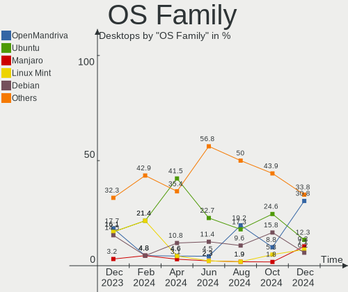
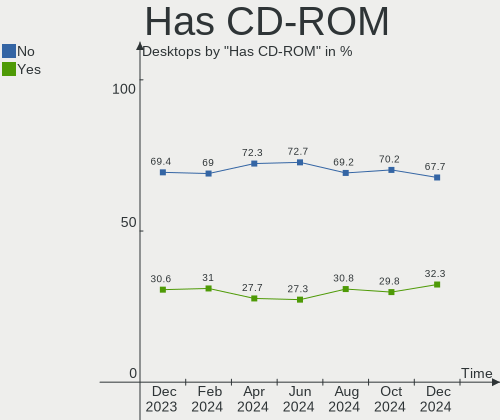
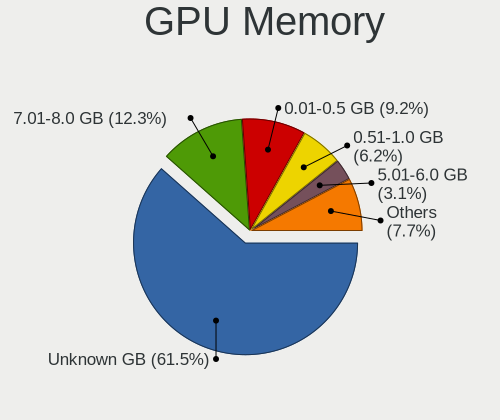
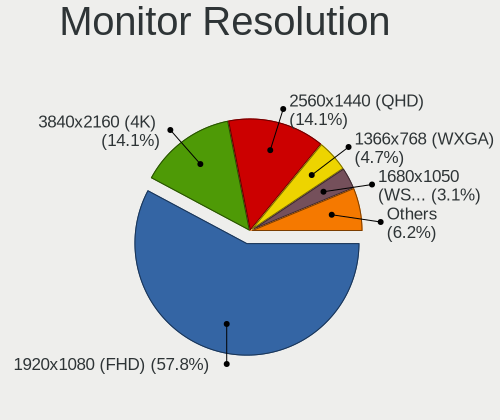
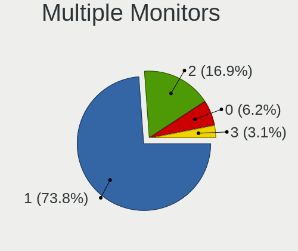
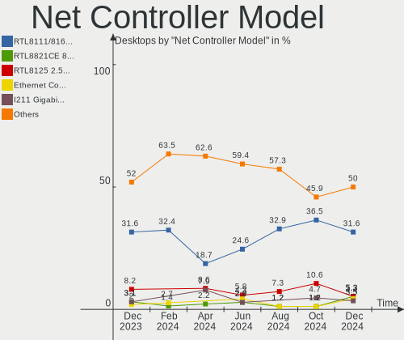
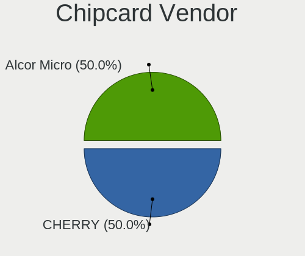

Linux in Spain - Hardware Trends (Desktops)
-------------------------------------------

A project to identify most popular hardware characteristics and track their change
over time based on data collected by Linux users at https://Linux-Hardware.org.

Anyone can contribute to this report by the [hw-probe](https://github.com/linuxhw/hw-probe) tool:

    sudo -E hw-probe -all -upload

Period: Sep, 2023.

Contents
--------

* [ System ](#system)
  - [ OS                       ](#os)
  - [ OS Family                ](#os-family)
  - [ Kernel                   ](#kernel)
  - [ Kernel Family            ](#kernel-family)
  - [ Kernel Major Ver.        ](#kernel-major-ver)
  - [ Arch                     ](#arch)
  - [ DE                       ](#de)
  - [ Display Server           ](#display-server)
  - [ Display Manager          ](#display-manager)
  - [ OS Lang                  ](#os-lang)
  - [ Boot Mode                ](#boot-mode)
  - [ Filesystem               ](#filesystem)
  - [ Part. scheme             ](#part-scheme)
  - [ Dual Boot with Linux/BSD ](#dual-boot-with-linuxbsd)
  - [ Dual Boot (Win)          ](#dual-boot-win)

* [ Board ](#board)
  - [ Vendor                   ](#vendor)
  - [ Model                    ](#model)
  - [ Model Family             ](#model-family)
  - [ MFG Year                 ](#mfg-year)
  - [ Form Factor              ](#form-factor)
  - [ Secure Boot              ](#secure-boot)
  - [ Coreboot                 ](#coreboot)
  - [ RAM Size                 ](#ram-size)
  - [ RAM Used                 ](#ram-used)
  - [ Total Drives             ](#total-drives)
  - [ Has CD-ROM               ](#has-cd-rom)
  - [ Has Ethernet             ](#has-ethernet)
  - [ Has WiFi                 ](#has-wifi)
  - [ Has Bluetooth            ](#has-bluetooth)

* [ Location ](#location)
  - [ Country                  ](#country)
  - [ City                     ](#city)

* [ Drives ](#drives)
  - [ Drive Vendor             ](#drive-vendor)
  - [ Drive Model              ](#drive-model)
  - [ HDD Vendor               ](#hdd-vendor)
  - [ SSD Vendor               ](#ssd-vendor)
  - [ Drive Kind               ](#drive-kind)
  - [ Drive Connector          ](#drive-connector)
  - [ Drive Size               ](#drive-size)
  - [ Space Total              ](#space-total)
  - [ Space Used               ](#space-used)
  - [ Malfunc. Drives          ](#malfunc-drives)
  - [ Malfunc. Drive Vendor    ](#malfunc-drive-vendor)
  - [ Malfunc. HDD Vendor      ](#malfunc-hdd-vendor)
  - [ Malfunc. Drive Kind      ](#malfunc-drive-kind)
  - [ Failed Drives            ](#failed-drives)
  - [ Failed Drive Vendor      ](#failed-drive-vendor)
  - [ Drive Status             ](#drive-status)

* [ Storage controller ](#storage-controller)
  - [ Storage Vendor           ](#storage-vendor)
  - [ Storage Model            ](#storage-model)
  - [ Storage Kind             ](#storage-kind)

* [ Processor ](#processor)
  - [ CPU Vendor               ](#cpu-vendor)
  - [ CPU Model                ](#cpu-model)
  - [ CPU Model Family         ](#cpu-model-family)
  - [ CPU Cores                ](#cpu-cores)
  - [ CPU Sockets              ](#cpu-sockets)
  - [ CPU Threads              ](#cpu-threads)
  - [ CPU Op-Modes             ](#cpu-op-modes)
  - [ CPU Microcode            ](#cpu-microcode)
  - [ CPU Microarch            ](#cpu-microarch)

* [ Graphics ](#graphics)
  - [ GPU Vendor               ](#gpu-vendor)
  - [ GPU Model                ](#gpu-model)
  - [ GPU Combo                ](#gpu-combo)
  - [ GPU Driver               ](#gpu-driver)
  - [ GPU Memory               ](#gpu-memory)

* [ Monitor ](#monitor)
  - [ Monitor Vendor           ](#monitor-vendor)
  - [ Monitor Model            ](#monitor-model)
  - [ Monitor Resolution       ](#monitor-resolution)
  - [ Monitor Diagonal         ](#monitor-diagonal)
  - [ Monitor Width            ](#monitor-width)
  - [ Aspect Ratio             ](#aspect-ratio)
  - [ Monitor Area             ](#monitor-area)
  - [ Pixel Density            ](#pixel-density)
  - [ Multiple Monitors        ](#multiple-monitors)

* [ Network ](#network)
  - [ Net Controller Vendor    ](#net-controller-vendor)
  - [ Net Controller Model     ](#net-controller-model)
  - [ Wireless Vendor          ](#wireless-vendor)
  - [ Wireless Model           ](#wireless-model)
  - [ Ethernet Vendor          ](#ethernet-vendor)
  - [ Ethernet Model           ](#ethernet-model)
  - [ Net Controller Kind      ](#net-controller-kind)
  - [ Used Controller          ](#used-controller)
  - [ NICs                     ](#nics)
  - [ IPv6                     ](#ipv6)

* [ Bluetooth ](#bluetooth)
  - [ Bluetooth Vendor         ](#bluetooth-vendor)
  - [ Bluetooth Model          ](#bluetooth-model)

* [ Sound ](#sound)
  - [ Sound Vendor             ](#sound-vendor)
  - [ Sound Model              ](#sound-model)

* [ Memory ](#memory)
  - [ Memory Vendor            ](#memory-vendor)
  - [ Memory Model             ](#memory-model)
  - [ Memory Kind              ](#memory-kind)
  - [ Memory Form Factor       ](#memory-form-factor)
  - [ Memory Size              ](#memory-size)
  - [ Memory Speed             ](#memory-speed)

* [ Printers & scanners ](#printers--scanners)
  - [ Printer Vendor           ](#printer-vendor)
  - [ Printer Model            ](#printer-model)
  - [ Scanner Vendor           ](#scanner-vendor)
  - [ Scanner Model            ](#scanner-model)

* [ Camera ](#camera)
  - [ Camera Vendor            ](#camera-vendor)
  - [ Camera Model             ](#camera-model)

* [ Security ](#security)
  - [ Fingerprint Vendor       ](#fingerprint-vendor)
  - [ Fingerprint Model        ](#fingerprint-model)
  - [ Chipcard Vendor          ](#chipcard-vendor)
  - [ Chipcard Model           ](#chipcard-model)

* [ Unsupported ](#unsupported)
  - [ Unsupported Devices      ](#unsupported-devices)
  - [ Unsupported Device Types ](#unsupported-device-types)

System
------

OS
--

Installed operating systems

| Name                         | Desktops | Percent |
|------------------------------|----------|---------|
| Ubuntu 22.04                 | 7        | 15.91%  |
| OpenMandriva 23.08           | 7        | 15.91%  |
| Fedora 38                    | 6        | 13.64%  |
| Linux Mint 21.2              | 5        | 11.36%  |
| OpenMandriva 4.2             | 2        | 4.55%   |
| Kali 2023.3                  | 2        | 4.55%   |
| ArcoLinux Rolling            | 2        | 4.55%   |
| Arch Rolling                 | 2        | 4.55%   |
| Ubuntu 23.04                 | 1        | 2.27%   |
| Ubuntu 22.10                 | 1        | 2.27%   |
| SteamOS 4                    | 1        | 2.27%   |
| openSUSE Tumbleweed-XXXXXXXX | 1        | 2.27%   |
| OpenMandriva 23.09           | 1        | 2.27%   |
| Manjaro                      | 1        | 2.27%   |
| Linux Mint 20                | 1        | 2.27%   |
| Kubuntu 22.04                | 1        | 2.27%   |
| Gentoo 2.14                  | 1        | 2.27%   |
| Garuda Linux Rolling         | 1        | 2.27%   |
| Debian 11                    | 1        | 2.27%   |

OS Family
---------

OS without a version

| Name         | Desktops | Percent |
|--------------|----------|---------|
| OpenMandriva | 10       | 22.73%  |
| Ubuntu       | 9        | 20.45%  |
| Linux Mint   | 6        | 13.64%  |
| Fedora       | 6        | 13.64%  |
| Kali         | 2        | 4.55%   |
| ArcoLinux    | 2        | 4.55%   |
| Arch         | 2        | 4.55%   |
| SteamOS      | 1        | 2.27%   |
| openSUSE     | 1        | 2.27%   |
| Manjaro      | 1        | 2.27%   |
| Kubuntu      | 1        | 2.27%   |
| Gentoo       | 1        | 2.27%   |
| Garuda Linux | 1        | 2.27%   |
| Debian       | 1        | 2.27%   |

Kernel
------

Version of the Linux kernel

| Version                  | Desktops | Percent |
|--------------------------|----------|---------|
| 6.4.8-desktop-2omv2390   | 4        | 9.09%   |
| 6.2.0-33-generic         | 4        | 9.09%   |
| 6.4.11-desktop-1omv2390  | 3        | 6.82%   |
| 5.15.0-83-generic        | 3        | 6.82%   |
| 6.4.15-200.fc38.x86_64   | 2        | 4.55%   |
| 6.4.12-arch1-1           | 2        | 4.55%   |
| 6.2.9-300.fc38.x86_64    | 2        | 4.55%   |
| 6.2.0-32-generic         | 2        | 4.55%   |
| 5.15.0-84-generic        | 2        | 4.55%   |
| 5.10.14-desktop-1omv4002 | 2        | 4.55%   |
| 6.5.5-200.fc38.x86_64    | 1        | 2.27%   |
| 6.5.3-zen1-1-zen         | 1        | 2.27%   |
| 6.5.1-desktop-1omv2390   | 1        | 2.27%   |
| 6.5.1-1-MANJARO          | 1        | 2.27%   |
| 6.5.0-kali1-amd64        | 1        | 2.27%   |
| 6.4.8-arch1-1            | 1        | 2.27%   |
| 6.4.13-200.fc38.x86_64   | 1        | 2.27%   |
| 6.4.12-zen1-1-zen        | 1        | 2.27%   |
| 6.4.11-1-default         | 1        | 2.27%   |
| 6.4.0-kali3-amd64        | 1        | 2.27%   |
| 6.3.7-zen1-1-zen         | 1        | 2.27%   |
| 6.2.0-20-generic         | 1        | 2.27%   |
| 6.1.53-gentoo-dist       | 1        | 2.27%   |
| 6.1.0-1016-oem           | 1        | 2.27%   |
| 5.4.0-162-generic        | 1        | 2.27%   |
| 5.19.0-50-generic        | 1        | 2.27%   |
| 5.19.0-46-generic        | 1        | 2.27%   |
| 5.10.0-25-amd64          | 1        | 2.27%   |

Kernel Family
-------------

Linux kernel without a distro release

| Version | Desktops | Percent |
|---------|----------|---------|
| 6.2.0   | 7        | 15.91%  |
| 6.4.8   | 5        | 11.36%  |
| 5.15.0  | 5        | 11.36%  |
| 6.4.11  | 4        | 9.09%   |
| 6.4.12  | 3        | 6.82%   |
| 6.5.1   | 2        | 4.55%   |
| 6.4.15  | 2        | 4.55%   |
| 6.2.9   | 2        | 4.55%   |
| 5.19.0  | 2        | 4.55%   |
| 5.10.14 | 2        | 4.55%   |
| 6.5.5   | 1        | 2.27%   |
| 6.5.3   | 1        | 2.27%   |
| 6.5.0   | 1        | 2.27%   |
| 6.4.13  | 1        | 2.27%   |
| 6.4.0   | 1        | 2.27%   |
| 6.3.7   | 1        | 2.27%   |
| 6.1.53  | 1        | 2.27%   |
| 6.1.0   | 1        | 2.27%   |
| 5.4.0   | 1        | 2.27%   |
| 5.10.0  | 1        | 2.27%   |

Kernel Major Ver.
-----------------

Linux kernel major version

| Version | Desktops | Percent |
|---------|----------|---------|
| 6.4     | 16       | 36.36%  |
| 6.2     | 9        | 20.45%  |
| 6.5     | 5        | 11.36%  |
| 5.15    | 5        | 11.36%  |
| 5.10    | 3        | 6.82%   |
| 6.1     | 2        | 4.55%   |
| 5.19    | 2        | 4.55%   |
| 6.3     | 1        | 2.27%   |
| 5.4     | 1        | 2.27%   |

Arch
----

OS architecture (x86_64, i586, etc.)

| Name   | Desktops | Percent |
|--------|----------|---------|
| x86_64 | 44       | 100%    |

DE
--

Desktop Environment

| Name       | Desktops | Percent |
|------------|----------|---------|
| GNOME      | 19       | 43.18%  |
| KDE5       | 18       | 40.91%  |
| X-Cinnamon | 4        | 9.09%   |
| XFCE       | 2        | 4.55%   |
| Hyprland   | 1        | 2.27%   |

Display Server
--------------

X11 or Wayland

| Name    | Desktops | Percent |
|---------|----------|---------|
| X11     | 22       | 50%     |
| Wayland | 21       | 47.73%  |
| Unknown | 1        | 2.27%   |

Display Manager
---------------

SDDM, LightDM, etc.

| Name    | Desktops | Percent |
|---------|----------|---------|
| SDDM    | 16       | 36.36%  |
| Unknown | 16       | 36.36%  |
| GDM3    | 9        | 20.45%  |
| LightDM | 2        | 4.55%   |
| GDM     | 1        | 2.27%   |

OS Lang
-------

Language

| Lang  | Desktops | Percent |
|-------|----------|---------|
| es_ES | 33       | 75%     |
| en_US | 8        | 18.18%  |
| C     | 3        | 6.82%   |

Boot Mode
---------

EFI or BIOS

| Mode | Desktops | Percent |
|------|----------|---------|
| BIOS | 22       | 50%     |
| EFI  | 22       | 50%     |

Filesystem
----------

Type of filesystem

| Type    | Desktops | Percent |
|---------|----------|---------|
| Ext4    | 20       | 45.45%  |
| Tmpfs   | 9        | 20.45%  |
| Btrfs   | 9        | 20.45%  |
| Overlay | 6        | 13.64%  |

Part. scheme
------------

Scheme of partitioning

| Type    | Desktops | Percent |
|---------|----------|---------|
| GPT     | 24       | 54.55%  |
| Unknown | 16       | 36.36%  |
| MBR     | 4        | 9.09%   |

Dual Boot with Linux/BSD
------------------------

Hosting more than one Linux/BSD

| Dual boot | Desktops | Percent |
|-----------|----------|---------|
| No        | 32       | 72.73%  |
| Yes       | 12       | 27.27%  |

Dual Boot (Win)
---------------

Hosting Linux and Windows

| Dual boot | Desktops | Percent |
|-----------|----------|---------|
| No        | 26       | 59.09%  |
| Yes       | 18       | 40.91%  |

Board
-----

Vendor
------

Motherboard manufacturer

| Name                | Desktops | Percent |
|---------------------|----------|---------|
| ASUSTek Computer    | 16       | 36.36%  |
| Gigabyte Technology | 8        | 18.18%  |
| MSI                 | 7        | 15.91%  |
| Hewlett-Packard     | 3        | 6.82%   |
| Intel               | 2        | 4.55%   |
| Dell                | 2        | 4.55%   |
| BESSTAR Tech        | 2        | 4.55%   |
| ASRock              | 2        | 4.55%   |
| SLIMBOOK            | 1        | 2.27%   |
| Biostar             | 1        | 2.27%   |

Model
-----

Motherboard model

| Name                          | Desktops | Percent |
|-------------------------------|----------|---------|
| ASUS ROG STRIX B365-G GAMING  | 2        | 4.55%   |
| ASUS All Series               | 2        | 4.55%   |
| SLIMBOOK ONE-AM5              | 1        | 2.27%   |
| MSI PPPPP-CCC#MMMMMMMM        | 1        | 2.27%   |
| MSI NQ874AA-ABE p6010es       | 1        | 2.27%   |
| MSI MS-7D78                   | 1        | 2.27%   |
| MSI MS-7D07                   | 1        | 2.27%   |
| MSI MS-7C91                   | 1        | 2.27%   |
| MSI MS-7C75                   | 1        | 2.27%   |
| MSI MS-7A38                   | 1        | 2.27%   |
| Intel SHARKBAY                | 1        | 2.27%   |
| Intel DG31PR AAD97573-205     | 1        | 2.27%   |
| HP Z400 Workstation           | 1        | 2.27%   |
| HP ProDesk 600 G1 SFF         | 1        | 2.27%   |
| HP Compaq 8200 Elite SFF PC   | 1        | 2.27%   |
| Gigabyte X99-UD4-CF           | 1        | 2.27%   |
| Gigabyte X570S AORUS ELITE AX | 1        | 2.27%   |
| Gigabyte H61M-S2PV            | 1        | 2.27%   |
| Gigabyte H310M S2H 2.0        | 1        | 2.27%   |
| Gigabyte B450M S2H            | 1        | 2.27%   |
| Gigabyte B450M DS3H           | 1        | 2.27%   |
| Gigabyte B365M H              | 1        | 2.27%   |
| Gigabyte 970A-DS3P            | 1        | 2.27%   |
| Dell Precision T5600          | 1        | 2.27%   |
| Dell OptiPlex 3010            | 1        | 2.27%   |
| Biostar A68N-2100K            | 1        | 2.27%   |
| BESSTAR Tech HX90             | 1        | 2.27%   |
| BESSTAR Tech HM90             | 1        | 2.27%   |
| ASUS TUF B360-PRO GAMING WIFI | 1        | 2.27%   |
| ASUS ROG CROSSHAIR X670E HERO | 1        | 2.27%   |
| ASUS PRIME Z590-A             | 1        | 2.27%   |
| ASUS PRIME X670E-PRO WIFI     | 1        | 2.27%   |
| ASUS PRIME X570-PRO           | 1        | 2.27%   |
| ASUS PRIME B450M-A            | 1        | 2.27%   |
| ASUS P5K-E                    | 1        | 2.27%   |
| ASUS P5G41T-M LX              | 1        | 2.27%   |
| ASUS M2N-E SLI                | 1        | 2.27%   |
| ASUS H110M-D                  | 1        | 2.27%   |
| ASUS B150M-A                  | 1        | 2.27%   |
| ASUS A88XM-PLUS               | 1        | 2.27%   |

Model Family
------------

Motherboard model prefix

| Name                   | Desktops | Percent |
|------------------------|----------|---------|
| ASUS PRIME             | 4        | 9.09%   |
| ASUS ROG               | 3        | 6.82%   |
| Gigabyte B450M         | 2        | 4.55%   |
| ASUS All               | 2        | 4.55%   |
| SLIMBOOK ONE-AM5       | 1        | 2.27%   |
| MSI PPPPP-CCC#MMMMMMMM | 1        | 2.27%   |
| MSI NQ874AA-ABE        | 1        | 2.27%   |
| MSI MS-7D78            | 1        | 2.27%   |
| MSI MS-7D07            | 1        | 2.27%   |
| MSI MS-7C91            | 1        | 2.27%   |
| MSI MS-7C75            | 1        | 2.27%   |
| MSI MS-7A38            | 1        | 2.27%   |
| Intel SHARKBAY         | 1        | 2.27%   |
| Intel DG31PR           | 1        | 2.27%   |
| HP Z400                | 1        | 2.27%   |
| HP ProDesk             | 1        | 2.27%   |
| HP Compaq              | 1        | 2.27%   |
| Gigabyte X99-UD4-CF    | 1        | 2.27%   |
| Gigabyte X570S         | 1        | 2.27%   |
| Gigabyte H61M-S2PV     | 1        | 2.27%   |
| Gigabyte H310M         | 1        | 2.27%   |
| Gigabyte B365M         | 1        | 2.27%   |
| Gigabyte 970A-DS3P     | 1        | 2.27%   |
| Dell Precision         | 1        | 2.27%   |
| Dell OptiPlex          | 1        | 2.27%   |
| Biostar A68N-2100K     | 1        | 2.27%   |
| BESSTAR Tech HX90      | 1        | 2.27%   |
| BESSTAR Tech HM90      | 1        | 2.27%   |
| ASUS TUF               | 1        | 2.27%   |
| ASUS P5K-E             | 1        | 2.27%   |
| ASUS P5G41T-M          | 1        | 2.27%   |
| ASUS M2N-E             | 1        | 2.27%   |
| ASUS H110M-D           | 1        | 2.27%   |
| ASUS B150M-A           | 1        | 2.27%   |
| ASUS A88XM-PLUS        | 1        | 2.27%   |
| ASRock 970             | 1        | 2.27%   |
| ASRock 960GC-GS        | 1        | 2.27%   |

MFG Year
--------

Motherboard manufacture year

| Year | Desktops | Percent |
|------|----------|---------|
| 2022 | 6        | 13.64%  |
| 2018 | 6        | 13.64%  |
| 2013 | 6        | 13.64%  |
| 2019 | 5        | 11.36%  |
| 2021 | 4        | 9.09%   |
| 2020 | 3        | 6.82%   |
| 2010 | 3        | 6.82%   |
| 2015 | 2        | 4.55%   |
| 2012 | 2        | 4.55%   |
| 2011 | 2        | 4.55%   |
| 2007 | 2        | 4.55%   |
| 2014 | 1        | 2.27%   |
| 2009 | 1        | 2.27%   |
| 2006 | 1        | 2.27%   |

Form Factor
-----------

Physical design of the computer

| Name    | Desktops | Percent |
|---------|----------|---------|
| Desktop | 44       | 100%    |

Secure Boot
-----------

Enabled or disabled

| State    | Desktops | Percent |
|----------|----------|---------|
| Disabled | 43       | 97.73%  |
| Enabled  | 1        | 2.27%   |

Coreboot
--------

Have coreboot on board

| Used | Desktops | Percent |
|------|----------|---------|
| No   | 44       | 100%    |

RAM Size
--------

Total RAM memory

| Size in GB  | Desktops | Percent |
|-------------|----------|---------|
| 16.01-24.0  | 12       | 27.27%  |
| 64.01-256.0 | 8        | 18.18%  |
| 8.01-16.0   | 8        | 18.18%  |
| 4.01-8.0    | 7        | 15.91%  |
| 32.01-64.0  | 4        | 9.09%   |
| 3.01-4.0    | 2        | 4.55%   |
| 24.01-32.0  | 2        | 4.55%   |
| 2.01-3.0    | 1        | 2.27%   |

RAM Used
--------

Used RAM memory

| Used GB   | Desktops | Percent |
|-----------|----------|---------|
| 2.01-3.0  | 15       | 34.09%  |
| 1.01-2.0  | 11       | 25%     |
| 4.01-8.0  | 9        | 20.45%  |
| 3.01-4.0  | 7        | 15.91%  |
| 8.01-16.0 | 2        | 4.55%   |

Total Drives
------------

Number of drives on board

| Drives | Desktops | Percent |
|--------|----------|---------|
| 1      | 12       | 27.27%  |
| 2      | 11       | 25%     |
| 3      | 8        | 18.18%  |
| 4      | 6        | 13.64%  |
| 5      | 4        | 9.09%   |
| 9      | 1        | 2.27%   |
| 8      | 1        | 2.27%   |
| 0      | 1        | 2.27%   |

Has CD-ROM
----------

Has CD-ROM on board

| Presented | Desktops | Percent |
|-----------|----------|---------|
| No        | 24       | 54.55%  |
| Yes       | 20       | 45.45%  |

Has Ethernet
------------

Has Ethernet on board

| Presented | Desktops | Percent |
|-----------|----------|---------|
| Yes       | 44       | 100%    |

Has WiFi
--------

Has WiFi module

| Presented | Desktops | Percent |
|-----------|----------|---------|
| Yes       | 22       | 50%     |
| No        | 22       | 50%     |

Has Bluetooth
-------------

Has Bluetooth module

| Presented | Desktops | Percent |
|-----------|----------|---------|
| No        | 23       | 52.27%  |
| Yes       | 21       | 47.73%  |

Location
--------

Country
-------

Geographic location (country)

| Country | Desktops | Percent |
|---------|----------|---------|
| Spain   | 44       | 100%    |

City
----

Geographic location (city)

| City                       | Desktops | Percent |
|----------------------------|----------|---------|
| Madrid                     | 5        | 11.36%  |
| Barcelona                  | 4        | 9.09%   |
| Zaragoza                   | 3        | 6.82%   |
| Valencia                   | 2        | 4.55%   |
| Seville                    | 2        | 4.55%   |
| Valladolid                 | 1        | 2.27%   |
| Torredembarra              | 1        | 2.27%   |
| Sant Quirze del Valles     | 1        | 2.27%   |
| Salamanca                  | 1        | 2.27%   |
| Pontevedra                 | 1        | 2.27%   |
| Ponte Caldelas             | 1        | 2.27%   |
| Pinto                      | 1        | 2.27%   |
| Paracuellos de Jarama      | 1        | 2.27%   |
| Monforte de Lemos          | 1        | 2.27%   |
| Mataró                    | 1        | 2.27%   |
| Lasarte                    | 1        | 2.27%   |
| Las Palmas de Gran Canaria | 1        | 2.27%   |
| la Nucia                   | 1        | 2.27%   |
| Jaén                      | 1        | 2.27%   |
| Guía de Isora             | 1        | 2.27%   |
| Granada                    | 1        | 2.27%   |
| Errenteria                 | 1        | 2.27%   |
| Donostia / San Sebastian   | 1        | 2.27%   |
| Cartagena                  | 1        | 2.27%   |
| Carandia                   | 1        | 2.27%   |
| Burgos                     | 1        | 2.27%   |
| Bilbao                     | 1        | 2.27%   |
| Aspe                       | 1        | 2.27%   |
| Arrecife                   | 1        | 2.27%   |
| Amposta                    | 1        | 2.27%   |
| Alicante                   | 1        | 2.27%   |
| Alcobendas                 | 1        | 2.27%   |
| Albacete                   | 1        | 2.27%   |

Drives
------

Drive Vendor
------------

Hard drive vendors

| Vendor                      | Desktops | Drives | Percent |
|-----------------------------|----------|--------|---------|
| Seagate                     | 13       | 15     | 13.68%  |
| Kingston                    | 13       | 16     | 13.68%  |
| WDC                         | 11       | 16     | 11.58%  |
| Samsung Electronics         | 11       | 14     | 11.58%  |
| Toshiba                     | 9        | 11     | 9.47%   |
| SanDisk                     | 9        | 13     | 9.47%   |
| Crucial                     | 7        | 9      | 7.37%   |
| China                       | 3        | 3      | 3.16%   |
| Phison Electronics          | 2        | 2      | 2.11%   |
| Micron/Crucial Technology   | 2        | 3      | 2.11%   |
| KingDian                    | 2        | 2      | 2.11%   |
| Transcend                   | 1        | 1      | 1.05%   |
| SABRENT                     | 1        | 1      | 1.05%   |
| OCZ                         | 1        | 1      | 1.05%   |
| Micron Technology           | 1        | 1      | 1.05%   |
| Maxtor                      | 1        | 1      | 1.05%   |
| KIOXIA-EXCERIA              | 1        | 1      | 1.05%   |
| Kingston Technology Company | 1        | 1      | 1.05%   |
| Inateck                     | 1        | 1      | 1.05%   |
| GLOWAY                      | 1        | 1      | 1.05%   |
| Emtec                       | 1        | 1      | 1.05%   |
| Drevo                       | 1        | 1      | 1.05%   |
| AMD                         | 1        | 2      | 1.05%   |
| AEW                         | 1        | 1      | 1.05%   |

Drive Model
-----------

Hard drive models

| Model                                               | Desktops | Percent |
|-----------------------------------------------------|----------|---------|
| Kingston SA400S37480G 480GB SSD                     | 7        | 6.48%   |
| Seagate ST1000DM003-1ER162 1TB                      | 4        | 3.7%    |
| Kingston SV300S37A120G 120GB SSD                    | 4        | 3.7%    |
| Seagate ST500DM002-1BD142 500GB                     | 3        | 2.78%   |
| Samsung SSD 850 EVO 250GB                           | 3        | 2.78%   |
| Kingston SA400S37240G 240GB SSD                     | 3        | 2.78%   |
| WDC WDS100T2B0A-00SM50 1TB SSD                      | 2        | 1.85%   |
| WDC WD40EFAX-68JH4N0 4TB                            | 2        | 1.85%   |
| Toshiba HDWR160 6TB                                 | 2        | 1.85%   |
| Toshiba DT01ACA100 1TB                              | 2        | 1.85%   |
| Seagate ST1000DM010-2EP102 1TB                      | 2        | 1.85%   |
| Sandisk WD_BLACK SN770 2TB                          | 2        | 1.85%   |
| Samsung SSD 840 EVO 120GB                           | 2        | 1.85%   |
| Samsung NVMe SSD Controller SM981/PM981/PM983 256GB | 2        | 1.85%   |
| Phison PS5013 E13 NVMe Controller 512GB             | 2        | 1.85%   |
| Micron/Crucial P2 NVMe PCIe SSD 1TB                 | 2        | 1.85%   |
| KingDian S280-240GB SSD                             | 2        | 1.85%   |
| Crucial CT500MX500SSD1 500GB                        | 2        | 1.85%   |
| WDC WD60EFRX-68L0BN1 6TB                            | 1        | 0.93%   |
| WDC WD5000AAKS-65A7B2 500GB                         | 1        | 0.93%   |
| WDC WD5000AAKS-22V1A0 500GB                         | 1        | 0.93%   |
| WDC WD40EFAX-68JH4N1 4TB                            | 1        | 0.93%   |
| WDC WD3200AAKS-00VYA0 320GB                         | 1        | 0.93%   |
| WDC WD30EZRZ-00GXCB0 3TB                            | 1        | 0.93%   |
| WDC WD3000HLHX-60JJPV1 304GB                        | 1        | 0.93%   |
| WDC WD2500JS-60MHB5 250GB                           | 1        | 0.93%   |
| WDC WD2500AAKX-603CA0 250GB                         | 1        | 0.93%   |
| WDC WD20EZBX-00AYRA0 2TB                            | 1        | 0.93%   |
| WDC WD10EZEX-60M2NA0 1TB                            | 1        | 0.93%   |
| WDC WD10EZEX-08WN4A0 1TB                            | 1        | 0.93%   |
| Transcend TS1TSSD230S 1TB                           | 1        | 0.93%   |
| Toshiba TR200 480GB SSD                             | 1        | 0.93%   |
| Toshiba TR200 240GB SSD                             | 1        | 0.93%   |
| Toshiba MQ01ABF050 500GB                            | 1        | 0.93%   |
| Toshiba HDWG480 8TB                                 | 1        | 0.93%   |
| Toshiba HDWD110 1TB                                 | 1        | 0.93%   |
| Seagate ST3500312CS 500GB                           | 1        | 0.93%   |
| Seagate ST2000DM008-2UB102 2TB                      | 1        | 0.93%   |
| Seagate ST2000DM001-9YN164 2TB                      | 1        | 0.93%   |
| Seagate ST2000DM001-1ER164 2TB                      | 1        | 0.93%   |

HDD Vendor
----------

Hard disk drive vendors

| Vendor  | Desktops | Drives | Percent |
|---------|----------|--------|---------|
| Seagate | 13       | 15     | 40.63%  |
| WDC     | 11       | 14     | 34.38%  |
| Toshiba | 7        | 7      | 21.88%  |
| SABRENT | 1        | 1      | 3.13%   |

SSD Vendor
----------

Solid state drive vendors

| Vendor              | Desktops | Drives | Percent |
|---------------------|----------|--------|---------|
| Kingston            | 13       | 16     | 25.49%  |
| Samsung Electronics | 9        | 9      | 17.65%  |
| SanDisk             | 6        | 7      | 11.76%  |
| Crucial             | 6        | 8      | 11.76%  |
| China               | 3        | 3      | 5.88%   |
| WDC                 | 2        | 2      | 3.92%   |
| Toshiba             | 2        | 4      | 3.92%   |
| KingDian            | 2        | 2      | 3.92%   |
| Transcend           | 1        | 1      | 1.96%   |
| OCZ                 | 1        | 1      | 1.96%   |
| Maxtor              | 1        | 1      | 1.96%   |
| KIOXIA-EXCERIA      | 1        | 1      | 1.96%   |
| GLOWAY              | 1        | 1      | 1.96%   |
| Emtec               | 1        | 1      | 1.96%   |
| Drevo               | 1        | 1      | 1.96%   |
| AEW                 | 1        | 1      | 1.96%   |

Drive Kind
----------

HDD or SSD

| Kind | Desktops | Drives | Percent |
|------|----------|--------|---------|
| SSD  | 30       | 59     | 41.67%  |
| HDD  | 26       | 37     | 36.11%  |
| NVMe | 16       | 22     | 22.22%  |

Drive Connector
---------------

SATA, SAS, NVMe, etc.

| Type | Desktops | Drives | Percent |
|------|----------|--------|---------|
| SATA | 40       | 94     | 70.18%  |
| NVMe | 15       | 21     | 26.32%  |
| SAS  | 2        | 3      | 3.51%   |

Drive Size
----------

Size of hard drive

| Size in TB | Desktops | Drives | Percent |
|------------|----------|--------|---------|
| 0.01-0.5   | 32       | 58     | 49.23%  |
| 0.51-1.0   | 19       | 22     | 29.23%  |
| 1.01-2.0   | 6        | 8      | 9.23%   |
| 4.01-10.0  | 4        | 4      | 6.15%   |
| 3.01-4.0   | 3        | 3      | 4.62%   |
| 2.01-3.0   | 1        | 1      | 1.54%   |

Space Total
-----------

Amount of disk space available on the file system

| Size in GB     | Desktops | Percent |
|----------------|----------|---------|
| 251-500        | 13       | 29.55%  |
| More than 3000 | 6        | 13.64%  |
| 101-250        | 6        | 13.64%  |
| 1001-2000      | 6        | 13.64%  |
| 1-20           | 5        | 11.36%  |
| 501-1000       | 3        | 6.82%   |
| Unknown        | 3        | 6.82%   |
| 2001-3000      | 2        | 4.55%   |

Space Used
----------

Amount of used disk space

| Used GB        | Desktops | Percent |
|----------------|----------|---------|
| 1-20           | 14       | 31.82%  |
| 21-50          | 8        | 18.18%  |
| 51-100         | 5        | 11.36%  |
| 101-250        | 4        | 9.09%   |
| More than 3000 | 3        | 6.82%   |
| 501-1000       | 3        | 6.82%   |
| Unknown        | 3        | 6.82%   |
| 1001-2000      | 2        | 4.55%   |
| 251-500        | 1        | 2.27%   |
| 2001-3000      | 1        | 2.27%   |

Malfunc. Drives
---------------

Drive models with a malfunction

| Model                           | Desktops | Drives | Percent |
|---------------------------------|----------|--------|---------|
| Seagate ST500DM002-1BD142 500GB | 3        | 3      | 37.5%   |
| Transcend TS1TSSD230S 1TB       | 1        | 1      | 12.5%   |
| Toshiba DT01ACA100 1TB          | 1        | 1      | 12.5%   |
| SanDisk SSD PLUS 240GB          | 1        | 1      | 12.5%   |
| Kingston SA400S37240G 240GB SSD | 1        | 1      | 12.5%   |
| KingDian S280-240GB SSD         | 1        | 1      | 12.5%   |

Malfunc. Drive Vendor
---------------------

Vendors of faulty drives

| Vendor    | Desktops | Drives | Percent |
|-----------|----------|--------|---------|
| Seagate   | 3        | 3      | 37.5%   |
| Transcend | 1        | 1      | 12.5%   |
| Toshiba   | 1        | 1      | 12.5%   |
| SanDisk   | 1        | 1      | 12.5%   |
| Kingston  | 1        | 1      | 12.5%   |
| KingDian  | 1        | 1      | 12.5%   |

Malfunc. HDD Vendor
-------------------

Vendors of faulty HDD drives

| Vendor  | Desktops | Drives | Percent |
|---------|----------|--------|---------|
| Seagate | 3        | 3      | 75%     |
| Toshiba | 1        | 1      | 25%     |

Malfunc. Drive Kind
-------------------

Kinds of faulty drives

| Kind | Desktops | Drives | Percent |
|------|----------|--------|---------|
| HDD  | 4        | 4      | 57.14%  |
| SSD  | 3        | 4      | 42.86%  |

Failed Drives
-------------

Failed drive models

Zero info for selected period =(

Failed Drive Vendor
-------------------

Failed drive vendors

Zero info for selected period =(

Drive Status
------------

Number of failed and malfunc. drives

| Status   | Desktops | Drives | Percent |
|----------|----------|--------|---------|
| Detected | 26       | 60     | 50.98%  |
| Works    | 18       | 50     | 35.29%  |
| Malfunc  | 7        | 8      | 13.73%  |

Storage controller
------------------

Storage Vendor
--------------

Storage controller vendors

| Vendor                      | Desktops | Percent |
|-----------------------------|----------|---------|
| Intel                       | 25       | 40.32%  |
| AMD                         | 18       | 29.03%  |
| SanDisk                     | 4        | 6.45%   |
| Samsung Electronics         | 3        | 4.84%   |
| Micron/Crucial Technology   | 3        | 4.84%   |
| Phison Electronics          | 2        | 3.23%   |
| ASMedia Technology          | 2        | 3.23%   |
| Nvidia                      | 1        | 1.61%   |
| Micron Technology           | 1        | 1.61%   |
| Marvell Technology Group    | 1        | 1.61%   |
| Kingston Technology Company | 1        | 1.61%   |
| JMicron Technology          | 1        | 1.61%   |

Storage Model
-------------

Storage controller models

| Model                                                                                   | Desktops | Percent |
|-----------------------------------------------------------------------------------------|----------|---------|
| AMD FCH SATA Controller [AHCI mode]                                                     | 11       | 15.49%  |
| Intel 8 Series/C220 Series Chipset Family 6-port SATA Controller 1 [AHCI mode]          | 4        | 5.63%   |
| Intel 200 Series PCH SATA controller [AHCI mode]                                        | 4        | 5.63%   |
| AMD 400 Series Chipset SATA Controller                                                  | 4        | 5.63%   |
| SanDisk WD Black SN770 / PC SN740 256GB / PC SN560 (DRAM-less) NVMe SSD                 | 3        | 4.23%   |
| Micron/Crucial P2 [Nick P2] / P3 / P3 Plus NVMe PCIe SSD (DRAM-less)                    | 3        | 4.23%   |
| Intel NM10/ICH7 Family SATA Controller [IDE mode]                                       | 3        | 4.23%   |
| AMD SB7x0/SB8x0/SB9x0 SATA Controller [AHCI mode]                                       | 3        | 4.23%   |
| Samsung NVMe SSD Controller SM981/PM981/PM983                                           | 2        | 2.82%   |
| Phison PS5013 E13 NVMe Controller                                                       | 2        | 2.82%   |
| Intel Q170/Q150/B150/H170/H110/Z170/CM236 Chipset SATA Controller [AHCI Mode]           | 2        | 2.82%   |
| Intel 6 Series/C200 Series Chipset Family 6 port Desktop SATA AHCI Controller           | 2        | 2.82%   |
| Intel 500 Series Chipset Family SATA AHCI Controller                                    | 2        | 2.82%   |
| AMD SB7x0/SB8x0/SB9x0 IDE Controller                                                    | 2        | 2.82%   |
| SanDisk WD PC SN810 / Black SN850 NVMe SSD                                              | 1        | 1.41%   |
| Samsung NVMe SSD Controller 980                                                         | 1        | 1.41%   |
| Nvidia CK804 Serial ATA Controller                                                      | 1        | 1.41%   |
| Nvidia CK804 IDE                                                                        | 1        | 1.41%   |
| Micron 2300 NVMe SSD [Santana]                                                          | 1        | 1.41%   |
| Marvell Group 88SE9215 PCIe 2.0 x1 4-port SATA 6 Gb/s Controller                        | 1        | 1.41%   |
| Kingston Company A2000 NVMe SSD                                                         | 1        | 1.41%   |
| JMicron JMB363 SATA/IDE Controller                                                      | 1        | 1.41%   |
| Intel SATA Controller [RAID mode]                                                       | 1        | 1.41%   |
| Intel Comet Lake SATA AHCI Controller                                                   | 1        | 1.41%   |
| Intel Cannon Lake PCH SATA AHCI Controller                                              | 1        | 1.41%   |
| Intel C610/X99 series chipset sSATA Controller [AHCI mode]                              | 1        | 1.41%   |
| Intel C602 chipset 4-Port SATA Storage Control Unit                                     | 1        | 1.41%   |
| Intel C600/X79 series chipset 6-Port SATA AHCI Controller                               | 1        | 1.41%   |
| Intel 82801IR/IO/IH (ICH9R/DO/DH) 6 port SATA Controller [AHCI mode]                    | 1        | 1.41%   |
| Intel 82801G (ICH7 Family) IDE Controller                                               | 1        | 1.41%   |
| Intel 6 Series/C200 Series Chipset Family Desktop SATA Controller (IDE mode, ports 4-5) | 1        | 1.41%   |
| Intel 6 Series/C200 Series Chipset Family Desktop SATA Controller (IDE mode, ports 0-3) | 1        | 1.41%   |
| Intel 5 Series/3400 Series Chipset 6 port SATA AHCI Controller                          | 1        | 1.41%   |
| ASMedia ASM1062 Serial ATA Controller                                                   | 1        | 1.41%   |
| ASMedia 1064 SATA Controller                                                            | 1        | 1.41%   |
| AMD FCH SATA Controller [RAID Bottom]                                                   | 1        | 1.41%   |
| AMD FCH RAID Controller                                                                 | 1        | 1.41%   |
| AMD 500 Series Chipset SATA Controller                                                  | 1        | 1.41%   |

Storage Kind
------------

Kind of storage controller (IDE, SATA, NVMe, SAS, ...)

| Kind | Desktops | Percent |
|------|----------|---------|
| SATA | 38       | 59.38%  |
| NVMe | 15       | 23.44%  |
| IDE  | 8        | 12.5%   |
| RAID | 2        | 3.13%   |
| SAS  | 1        | 1.56%   |

Processor
---------

CPU Vendor
----------

Processor vendors

| Vendor | Desktops | Percent |
|--------|----------|---------|
| Intel  | 25       | 56.82%  |
| AMD    | 19       | 43.18%  |

CPU Model
---------

Processor models

| Model                                          | Desktops | Percent |
|------------------------------------------------|----------|---------|
| Intel Core i3-9100 CPU @ 3.60GHz               | 3        | 6.82%   |
| AMD Ryzen 9 5900HX with Radeon Graphics        | 2        | 4.55%   |
| AMD Ryzen 7 5800X 8-Core Processor             | 2        | 4.55%   |
| AMD FX-8350 Eight-Core Processor               | 2        | 4.55%   |
| Intel Xeon CPU W3680 @ 3.33GHz                 | 1        | 2.27%   |
| Intel Xeon CPU E5-2690 0 @ 2.90GHz             | 1        | 2.27%   |
| Intel Pentium Dual CPU E2220 @ 2.40GHz         | 1        | 2.27%   |
| Intel Core i7-9700 CPU @ 3.00GHz               | 1        | 2.27%   |
| Intel Core i7-5820K CPU @ 3.30GHz              | 1        | 2.27%   |
| Intel Core i7-4770 CPU @ 3.40GHz               | 1        | 2.27%   |
| Intel Core i7 CPU 860 @ 2.80GHz                | 1        | 2.27%   |
| Intel Core i5-8400 CPU @ 2.80GHz               | 1        | 2.27%   |
| Intel Core i5-6500 CPU @ 3.20GHz               | 1        | 2.27%   |
| Intel Core i5-4590 CPU @ 3.30GHz               | 1        | 2.27%   |
| Intel Core i5-4460 CPU @ 3.20GHz               | 1        | 2.27%   |
| Intel Core i5-4310M CPU @ 2.70GHz              | 1        | 2.27%   |
| Intel Core i5-2400 CPU @ 3.10GHz               | 1        | 2.27%   |
| Intel Core i5-2320 CPU @ 3.00GHz               | 1        | 2.27%   |
| Intel Core i5-10400F CPU @ 2.90GHz             | 1        | 2.27%   |
| Intel Core i3-7100 CPU @ 3.90GHz               | 1        | 2.27%   |
| Intel Core i3-3240 CPU @ 3.40GHz               | 1        | 2.27%   |
| Intel Core 2 Quad CPU Q9400 @ 2.66GHz          | 1        | 2.27%   |
| Intel Core 2 Quad CPU Q6600 @ 2.40GHz          | 1        | 2.27%   |
| Intel Core 2 Duo CPU E8400 @ 3.00GHz           | 1        | 2.27%   |
| Intel 11th Gen Core i9-11900KF @ 3.50GHz       | 1        | 2.27%   |
| Intel 11th Gen Core i5-11600KF @ 3.90GHz       | 1        | 2.27%   |
| AMD Ryzen 9 7950X3D 16-Core Processor          | 1        | 2.27%   |
| AMD Ryzen 9 7900X 12-Core Processor            | 1        | 2.27%   |
| AMD Ryzen 9 4900H with Radeon Graphics         | 1        | 2.27%   |
| AMD Ryzen 7 7700 8-Core Processor              | 1        | 2.27%   |
| AMD Ryzen 7 3700X 8-Core Processor             | 1        | 2.27%   |
| AMD Ryzen 5 3400G with Radeon Vega Graphics    | 1        | 2.27%   |
| AMD Ryzen 5 2500X Quad-Core Processor          | 1        | 2.27%   |
| AMD Ryzen 5 2400G with Radeon Vega Graphics    | 1        | 2.27%   |
| AMD Ryzen 5 1600 Six-Core Processor            | 1        | 2.27%   |
| AMD FX-4300 Quad-Core Processor                | 1        | 2.27%   |
| AMD E1-6010 APU with AMD Radeon R2 Graphics    | 1        | 2.27%   |
| AMD Athlon 64 X2 Dual Core Processor 4200+     | 1        | 2.27%   |
| AMD A8-7650K Radeon R7, 10 Compute Cores 4C+6G | 1        | 2.27%   |

CPU Model Family
----------------

Processor model prefix

| Model              | Desktops | Percent |
|--------------------|----------|---------|
| Intel Core i5      | 8        | 18.18%  |
| Intel Core i3      | 5        | 11.36%  |
| AMD Ryzen 9        | 5        | 11.36%  |
| Intel Core i7      | 4        | 9.09%   |
| AMD Ryzen 7        | 4        | 9.09%   |
| AMD Ryzen 5        | 4        | 9.09%   |
| AMD FX             | 3        | 6.82%   |
| Other              | 2        | 4.55%   |
| Intel Xeon         | 2        | 4.55%   |
| Intel Core 2 Quad  | 2        | 4.55%   |
| Intel Pentium Dual | 1        | 2.27%   |
| Intel Core 2 Duo   | 1        | 2.27%   |
| AMD E1             | 1        | 2.27%   |
| AMD Athlon 64 X2   | 1        | 2.27%   |
| AMD A8             | 1        | 2.27%   |

CPU Cores
---------

Number of processor cores

| Number | Desktops | Percent |
|--------|----------|---------|
| 4      | 17       | 38.64%  |
| 8      | 9        | 20.45%  |
| 2      | 9        | 20.45%  |
| 6      | 6        | 13.64%  |
| 16     | 2        | 4.55%   |
| 12     | 1        | 2.27%   |

CPU Sockets
-----------

Number of sockets

| Number | Desktops | Percent |
|--------|----------|---------|
| 1      | 43       | 97.73%  |
| 2      | 1        | 2.27%   |

CPU Threads
-----------

Threads per core (Hyper-Threading)

| Number | Desktops | Percent |
|--------|----------|---------|
| 2      | 27       | 61.36%  |
| 1      | 17       | 38.64%  |

CPU Op-Modes
------------

CPU Operation Modes (32-bit, 64-bit)

| Op mode        | Desktops | Percent |
|----------------|----------|---------|
| 32-bit, 64-bit | 44       | 100%    |

CPU Microcode
-------------

Microcode number

| Number     | Desktops | Percent |
|------------|----------|---------|
| Unknown    | 25       | 56.82%  |
| 0x0a601203 | 3        | 6.82%   |
| 0x0800820d | 2        | 4.55%   |
| 0xa0671    | 1        | 2.27%   |
| 0x906ed    | 1        | 2.27%   |
| 0x906e9    | 1        | 2.27%   |
| 0x6fb      | 1        | 2.27%   |
| 0x1067a    | 1        | 2.27%   |
| 0x0a50000d | 1        | 2.27%   |
| 0x0a50000c | 1        | 2.27%   |
| 0x0a20120a | 1        | 2.27%   |
| 0x08701030 | 1        | 2.27%   |
| 0x08108109 | 1        | 2.27%   |
| 0x07030106 | 1        | 2.27%   |
| 0x06003106 | 1        | 2.27%   |
| 0x06000852 | 1        | 2.27%   |
| 0x06000817 | 1        | 2.27%   |

CPU Microarch
-------------

Microarchitecture

| Name        | Desktops | Percent |
|-------------|----------|---------|
| KabyLake    | 6        | 13.64%  |
| Haswell     | 5        | 11.36%  |
| Zen 3       | 4        | 9.09%   |
| Zen+        | 3        | 6.82%   |
| SandyBridge | 3        | 6.82%   |
| Piledriver  | 3        | 6.82%   |
| Unknown     | 3        | 6.82%   |
| Zen 2       | 2        | 4.55%   |
| Penryn      | 2        | 4.55%   |
| Icelake     | 2        | 4.55%   |
| Core        | 2        | 4.55%   |
| Zen         | 1        | 2.27%   |
| Westmere    | 1        | 2.27%   |
| Steamroller | 1        | 2.27%   |
| Skylake     | 1        | 2.27%   |
| Puma        | 1        | 2.27%   |
| Nehalem     | 1        | 2.27%   |
| K8 Hammer   | 1        | 2.27%   |
| IvyBridge   | 1        | 2.27%   |
| CometLake   | 1        | 2.27%   |

Graphics
--------

GPU Vendor
----------

Vendors of graphics cards

| Vendor | Desktops | Percent |
|--------|----------|---------|
| Nvidia | 22       | 44.9%   |
| AMD    | 14       | 28.57%  |
| Intel  | 13       | 26.53%  |

GPU Model
---------

Graphics card models

| Model                                                                       | Desktops | Percent |
|-----------------------------------------------------------------------------|----------|---------|
| Intel CoffeeLake-S GT2 [UHD Graphics 630]                                   | 3        | 5.88%   |
| AMD Raphael                                                                 | 3        | 5.88%   |
| Nvidia TU116 [GeForce GTX 1650 SUPER]                                       | 2        | 3.92%   |
| Nvidia GK208B [GeForce GT 710]                                              | 2        | 3.92%   |
| Intel Xeon E3-1200 v3/4th Gen Core Processor Integrated Graphics Controller | 2        | 3.92%   |
| Intel 82G33/G31 Express Integrated Graphics Controller                      | 2        | 3.92%   |
| Intel 2nd Generation Core Processor Family Integrated Graphics Controller   | 2        | 3.92%   |
| AMD Cezanne [Radeon Vega Series / Radeon Vega Mobile Series]                | 2        | 3.92%   |
| Nvidia TU117 [GeForce GTX 1650]                                             | 1        | 1.96%   |
| Nvidia TU104 [GeForce RTX 2080 Rev. A]                                      | 1        | 1.96%   |
| Nvidia TU104 [GeForce RTX 2070 SUPER]                                       | 1        | 1.96%   |
| Nvidia TU104 [GeForce RTX 2060]                                             | 1        | 1.96%   |
| Nvidia GT218 [GeForce 210]                                                  | 1        | 1.96%   |
| Nvidia GT200 [GeForce GTX 260]                                              | 1        | 1.96%   |
| Nvidia GP108 [GeForce GT 1030]                                              | 1        | 1.96%   |
| Nvidia GP107 [GeForce GTX 1050 Ti]                                          | 1        | 1.96%   |
| Nvidia GP106 [GeForce GTX 1060 6GB]                                         | 1        | 1.96%   |
| Nvidia GP106 [GeForce GTX 1060 3GB]                                         | 1        | 1.96%   |
| Nvidia GP104 [GeForce GTX 1070]                                             | 1        | 1.96%   |
| Nvidia GP102 [GeForce GTX 1080 Ti]                                          | 1        | 1.96%   |
| Nvidia GM107 [GeForce GTX 750 Ti]                                           | 1        | 1.96%   |
| Nvidia GK208B [GeForce GT 730]                                              | 1        | 1.96%   |
| Nvidia GK104GL [Quadro K4200]                                               | 1        | 1.96%   |
| Nvidia GF119 [GeForce GT 610]                                               | 1        | 1.96%   |
| Nvidia GA106 [RTX A2000]                                                    | 1        | 1.96%   |
| Nvidia GA106 [GeForce RTX 3060]                                             | 1        | 1.96%   |
| Nvidia G96CGL [Quadro FX 580]                                               | 1        | 1.96%   |
| Intel Xeon E3-1200 v2/3rd Gen Core processor Graphics Controller            | 1        | 1.96%   |
| Intel HD Graphics 630                                                       | 1        | 1.96%   |
| Intel HD Graphics 530                                                       | 1        | 1.96%   |
| Intel 4th Gen Core Processor Integrated Graphics Controller                 | 1        | 1.96%   |
| AMD RS780L [Radeon 3000]                                                    | 1        | 1.96%   |
| AMD Renoir                                                                  | 1        | 1.96%   |
| AMD Raven Ridge [Radeon Vega Series / Radeon Vega Mobile Series]            | 1        | 1.96%   |
| AMD Picasso/Raven 2 [Radeon Vega Series / Radeon Vega Mobile Series]        | 1        | 1.96%   |
| AMD Oland XT [Radeon HD 8670 / R5 340X OEM / R7 250/350/350X OEM]           | 1        | 1.96%   |
| AMD Navi 23 [Radeon RX 6600/6600 XT/6600M]                                  | 1        | 1.96%   |
| AMD Navi 22 [Radeon RX 6700/6700 XT/6750 XT / 6800M/6850M XT]               | 1        | 1.96%   |
| AMD Navi 10 [Radeon RX 5600 OEM/5600 XT / 5700/5700 XT]                     | 1        | 1.96%   |
| AMD Mullins [Radeon R2 Graphics]                                            | 1        | 1.96%   |

GPU Combo
---------

Combinations of graphics cards

| Name           | Desktops | Percent |
|----------------|----------|---------|
| 1 x Nvidia     | 17       | 38.64%  |
| 1 x AMD        | 11       | 25%     |
| 1 x Intel      | 10       | 22.73%  |
| Intel + Nvidia | 2        | 4.55%   |
| AMD + Nvidia   | 2        | 4.55%   |
| 2 x Nvidia     | 1        | 2.27%   |
| 2 x AMD        | 1        | 2.27%   |

GPU Driver
----------

Free vs proprietary

| Driver      | Desktops | Percent |
|-------------|----------|---------|
| Free        | 30       | 68.18%  |
| Proprietary | 12       | 27.27%  |
| Unknown     | 2        | 4.55%   |

GPU Memory
----------

Total video memory

| Size in GB | Desktops | Percent |
|------------|----------|---------|
| Unknown    | 21       | 47.73%  |
| 3.01-4.0   | 5        | 11.36%  |
| 1.01-2.0   | 4        | 9.09%   |
| 0.51-1.0   | 4        | 9.09%   |
| 7.01-8.0   | 3        | 6.82%   |
| 0.01-0.5   | 3        | 6.82%   |
| 5.01-6.0   | 2        | 4.55%   |
| 8.01-16.0  | 2        | 4.55%   |

Monitor
-------

Monitor Vendor
--------------

Monitor vendors

| Vendor               | Desktops | Percent |
|----------------------|----------|---------|
| Goldstar             | 9        | 18.37%  |
| Samsung Electronics  | 7        | 14.29%  |
| Philips              | 4        | 8.16%   |
| Hewlett-Packard      | 4        | 8.16%   |
| Dell                 | 4        | 8.16%   |
| Lenovo               | 3        | 6.12%   |
| Ancor Communications | 3        | 6.12%   |
| BenQ                 | 2        | 4.08%   |
| Acer                 | 2        | 4.08%   |
| ViewSonic            | 1        | 2.04%   |
| VIE                  | 1        | 2.04%   |
| Unknown              | 1        | 2.04%   |
| TR_                  | 1        | 2.04%   |
| OEM                  | 1        | 2.04%   |
| NEC Computers        | 1        | 2.04%   |
| LG Electronics       | 1        | 2.04%   |
| HKC                  | 1        | 2.04%   |
| HannStar             | 1        | 2.04%   |
| Fujitsu Siemens      | 1        | 2.04%   |
| AOC                  | 1        | 2.04%   |

Monitor Model
-------------

Monitor models

| Model                                                                | Desktops | Percent |
|----------------------------------------------------------------------|----------|---------|
| Samsung Electronics S24E450 SAM0C80 1920x1080 520x290mm 23.4-inch    | 2        | 3.7%    |
| ViewSonic VA3456-WQHD VSCFC3A 3440x1440 800x335mm 34.1-inch          | 1        | 1.85%   |
| VIE NXM27REG02 VIE0023 1920x1080 600x330mm 27.0-inch                 | 1        | 1.85%   |
| Unknown LCD Monitor FFFF 2288x1287 2550x2550mm 142.0-inch            | 1        | 1.85%   |
| TR_ LCD Monitor TR_5511 1920x1080 518x333mm 24.2-inch                | 1        | 1.85%   |
| Samsung Electronics U32J59x SAM0F35 3840x2160 697x392mm 31.5-inch    | 1        | 1.85%   |
| Samsung Electronics U28E590 SAM0C4D 3840x2160 610x350mm 27.7-inch    | 1        | 1.85%   |
| Samsung Electronics U28E590 SAM0C4C 3840x2160 608x345mm 27.5-inch    | 1        | 1.85%   |
| Samsung Electronics SyncMaster SAM01B9 1280x1024 340x270mm 17.1-inch | 1        | 1.85%   |
| Samsung Electronics SyncMaster SAM01B8 1280x1024 338x270mm 17.0-inch | 1        | 1.85%   |
| Samsung Electronics S27F358 SAM0D73 1920x1080 598x336mm 27.0-inch    | 1        | 1.85%   |
| Samsung Electronics LCD Monitor SAM0659 1920x1080                    | 1        | 1.85%   |
| Samsung Electronics LCD Monitor SAM0530 1360x768                     | 1        | 1.85%   |
| Samsung Electronics LCD Monitor SAM052F 1360x768 410x260mm 19.1-inch | 1        | 1.85%   |
| Philips PHL 328E1 PHLC204 3840x2160 697x392mm 31.5-inch              | 1        | 1.85%   |
| Philips PHL 278E8Q PHLC161 1920x1080 598x336mm 27.0-inch             | 1        | 1.85%   |
| Philips PHL 223V5 PHLC0CF 1920x1080 477x268mm 21.5-inch              | 1        | 1.85%   |
| Philips LCD Monitor PHL 273V7 1920x1080                              | 1        | 1.85%   |
| OEM 22_LCD_TV OEM3700 1920x540                                       | 1        | 1.85%   |
| NEC Computers EA243WM NEC6865 1920x1200 519x324mm 24.1-inch          | 1        | 1.85%   |
| LG Electronics LCD Monitor L1953S 1280x1024                          | 1        | 1.85%   |
| Lenovo LEN L24q-30 LEN65FB 2560x1440 527x296mm 23.8-inch             | 1        | 1.85%   |
| Lenovo D27q-30 LEN66FA 2560x1440 598x336mm 27.0-inch                 | 1        | 1.85%   |
| Lenovo C24-25 LEN66B0 1920x1080 527x296mm 23.8-inch                  | 1        | 1.85%   |
| HKC 24E4 HKC2413 1920x1080 526x296mm 23.8-inch                       | 1        | 1.85%   |
| Hewlett-Packard LP2475w HWP26F7 1920x1200 546x352mm 25.6-inch        | 1        | 1.85%   |
| Hewlett-Packard E221c HWP3092 1920x1080 497x292mm 22.7-inch          | 1        | 1.85%   |
| Hewlett-Packard 22xi HWP302F 1920x1080 480x270mm 21.7-inch           | 1        | 1.85%   |
| Hewlett-Packard 22cw HWP3183 1920x1080 476x268mm 21.5-inch           | 1        | 1.85%   |
| HannStar Hanns.G HH181 HSD203B 1366x768 410x230mm 18.5-inch          | 1        | 1.85%   |
| Goldstar W1943 GSM4BAD 1360x768 406x229mm 18.4-inch                  | 1        | 1.85%   |
| Goldstar ULTRAWIDE GSM76F9 2560x1080 798x334mm 34.1-inch             | 1        | 1.85%   |
| Goldstar ULTRAWIDE GSM5AFB 2560x1080 798x334mm 34.1-inch             | 1        | 1.85%   |
| Goldstar ULTRAWIDE GSM59F1 2560x1080 673x284mm 28.8-inch             | 1        | 1.85%   |
| Goldstar ULTRAFINE GSM5BC2 3840x2160 600x340mm 27.2-inch             | 1        | 1.85%   |
| Goldstar M2732 GSM5960 1920x1080 598x336mm 27.0-inch                 | 1        | 1.85%   |
| Goldstar L1750SQ GSM43E8 1280x1024 338x270mm 17.0-inch               | 1        | 1.85%   |
| Goldstar 22BK55WV GSM5B4A 1680x1050 480x300mm 22.3-inch              | 1        | 1.85%   |
| Goldstar 19EN33 GSM4C18 1366x768 410x230mm 18.5-inch                 | 1        | 1.85%   |
| Fujitsu Siemens B23T-6 LED FUS07FC 1920x1080 509x286mm 23.0-inch     | 1        | 1.85%   |

Monitor Resolution
------------------

Monitor screen resolution

| Resolution         | Desktops | Percent |
|--------------------|----------|---------|
| 1920x1080 (FHD)    | 23       | 46.94%  |
| 3840x2160 (4K)     | 6        | 12.24%  |
| 2560x1440 (QHD)    | 3        | 6.12%   |
| 2560x1080          | 3        | 6.12%   |
| 1280x1024 (SXGA)   | 3        | 6.12%   |
| 1920x1200 (WUXGA)  | 2        | 4.08%   |
| 1366x768 (WXGA)    | 2        | 4.08%   |
| 1360x768           | 2        | 4.08%   |
| 3440x1440          | 1        | 2.04%   |
| 2288x1287          | 1        | 2.04%   |
| 1920x540           | 1        | 2.04%   |
| 1680x1050 (WSXGA+) | 1        | 2.04%   |
| 1440x900 (WXGA+)   | 1        | 2.04%   |

Monitor Diagonal
----------------

Diagonal size in inches

| Inches  | Desktops | Percent |
|---------|----------|---------|
| 27      | 13       | 25%     |
| 24      | 6        | 11.54%  |
| 23      | 6        | 11.54%  |
| Unknown | 5        | 9.62%   |
| 34      | 4        | 7.69%   |
| 21      | 4        | 7.69%   |
| 18      | 4        | 7.69%   |
| 31      | 3        | 5.77%   |
| 22      | 2        | 3.85%   |
| 17      | 2        | 3.85%   |
| 142     | 1        | 1.92%   |
| 25      | 1        | 1.92%   |
| 19      | 1        | 1.92%   |

Monitor Width
-------------

Physical width

| Width in mm    | Desktops | Percent |
|----------------|----------|---------|
| 501-600        | 20       | 40.82%  |
| 401-500        | 10       | 20.41%  |
| 601-700        | 7        | 14.29%  |
| Unknown        | 5        | 10.2%   |
| 701-800        | 4        | 8.16%   |
| 301-350        | 2        | 4.08%   |
| More than 2000 | 1        | 2.04%   |

Aspect Ratio
------------

Proportional relationship between the width and the height

| Ratio   | Desktops | Percent |
|---------|----------|---------|
| 16/9    | 32       | 66.67%  |
| 16/10   | 6        | 12.5%   |
| 21/9    | 4        | 8.33%   |
| Unknown | 3        | 6.25%   |
| 5/4     | 2        | 4.17%   |
| 1.00    | 1        | 2.08%   |

Monitor Area
------------

Area in inch²

| Area in inch² | Desktops | Percent |
|----------------|----------|---------|
| 201-250        | 14       | 28%     |
| 301-350        | 13       | 26%     |
| 351-500        | 7        | 14%     |
| 141-150        | 5        | 10%     |
| Unknown        | 5        | 10%     |
| 251-300        | 3        | 6%      |
| 151-200        | 2        | 4%      |
| More than 1000 | 1        | 2%      |

Pixel Density
-------------

Pixels per inch

| Density | Desktops | Percent |
|---------|----------|---------|
| 51-100  | 28       | 58.33%  |
| 121-160 | 7        | 14.58%  |
| 101-120 | 7        | 14.58%  |
| Unknown | 5        | 10.42%  |
| 1-50    | 1        | 2.08%   |

Multiple Monitors
-----------------

Total monitors connected

| Total | Desktops | Percent |
|-------|----------|---------|
| 1     | 32       | 72.73%  |
| 2     | 10       | 22.73%  |
| 4     | 1        | 2.27%   |
| 0     | 1        | 2.27%   |

Network
-------

Net Controller Vendor
---------------------

Controller vendors

| Vendor                          | Desktops | Percent |
|---------------------------------|----------|---------|
| Realtek Semiconductor           | 29       | 49.15%  |
| Intel                           | 15       | 25.42%  |
| MediaTek                        | 5        | 8.47%   |
| Qualcomm Atheros                | 2        | 3.39%   |
| TP-Link                         | 1        | 1.69%   |
| Ralink                          | 1        | 1.69%   |
| Qualcomm Atheros Communications | 1        | 1.69%   |
| Nvidia                          | 1        | 1.69%   |
| Marvell Technology Group        | 1        | 1.69%   |
| D-Link                          | 1        | 1.69%   |
| Broadcom                        | 1        | 1.69%   |
| Aquantia                        | 1        | 1.69%   |

Net Controller Model
--------------------

Controller models

| Model                                                                                         | Desktops | Percent |
|-----------------------------------------------------------------------------------------------|----------|---------|
| Realtek RTL8111/8168/8411 PCI Express Gigabit Ethernet Controller                             | 23       | 31.94%  |
| Realtek RTL8125 2.5GbE Controller                                                             | 5        | 6.94%   |
| Intel Ethernet Controller I225-V                                                              | 5        | 6.94%   |
| Intel Wi-Fi 6 AX200                                                                           | 4        | 5.56%   |
| Realtek RTL88x2bu [AC1200 Techkey]                                                            | 2        | 2.78%   |
| MediaTek MT7922 802.11ax PCI Express Wireless Network Adapter                                 | 2        | 2.78%   |
| MediaTek MT7921K (RZ608) Wi-Fi 6E 80MHz                                                       | 2        | 2.78%   |
| Intel Ethernet Connection (2) I219-V                                                          | 2        | 2.78%   |
| Intel 82579LM Gigabit Network Connection (Lewisville)                                         | 2        | 2.78%   |
| TP-Link Archer T2U PLUS [RTL8821AU]                                                           | 1        | 1.39%   |
| Realtek RTL8821AE 802.11ac PCIe Wireless Network Adapter                                      | 1        | 1.39%   |
| Realtek RTL8812AE 802.11ac PCIe Wireless Network Adapter                                      | 1        | 1.39%   |
| Realtek RTL8192CE PCIe Wireless Network Adapter                                               | 1        | 1.39%   |
| Realtek RTL8188EUS 802.11n Wireless Network Adapter                                           | 1        | 1.39%   |
| Realtek RTL8187 Wireless Adapter                                                              | 1        | 1.39%   |
| Realtek RTL810xE PCI Express Fast Ethernet controller                                         | 1        | 1.39%   |
| Realtek Realtek 8812AU/8821AU 802.11ac WLAN Adapter [USB Wireless Dual-Band Adapter 2.4/5Ghz] | 1        | 1.39%   |
| Ralink RT2790 Wireless 802.11n 1T/2R PCIe                                                     | 1        | 1.39%   |
| Qualcomm Atheros TP-Link TL-WN322G v3 / TL-WN422G v2 802.11g [Atheros AR9271]                 | 1        | 1.39%   |
| Qualcomm Atheros AR8151 v2.0 Gigabit Ethernet                                                 | 1        | 1.39%   |
| Qualcomm Atheros AR8131 Gigabit Ethernet                                                      | 1        | 1.39%   |
| Nvidia CK804 Ethernet Controller                                                              | 1        | 1.39%   |
| MediaTek MT65xx Preloader                                                                     | 1        | 1.39%   |
| Marvell Group 88E8056 PCI-E Gigabit Ethernet Controller                                       | 1        | 1.39%   |
| Intel Wireless-AC 9260                                                                        | 1        | 1.39%   |
| Intel Wi-Fi 6 AX210/AX211/AX411 160MHz                                                        | 1        | 1.39%   |
| Intel I211 Gigabit Network Connection                                                         | 1        | 1.39%   |
| Intel Ethernet Connection I217-LM                                                             | 1        | 1.39%   |
| Intel Ethernet Connection (7) I219-V                                                          | 1        | 1.39%   |
| Intel Ethernet Connection (2) I218-V                                                          | 1        | 1.39%   |
| Intel Cannon Lake PCH CNVi WiFi                                                               | 1        | 1.39%   |
| D-Link 802.11 n WLAN                                                                          | 1        | 1.39%   |
| Broadcom NetXtreme BCM5764M Gigabit Ethernet PCIe                                             | 1        | 1.39%   |
| Aquantia AQC113CS NBase-T/IEEE 802.3bz Ethernet Controller [AQtion]                           | 1        | 1.39%   |

Wireless Vendor
---------------

Wireless vendors

| Vendor                          | Desktops | Percent |
|---------------------------------|----------|---------|
| Realtek Semiconductor           | 7        | 31.82%  |
| Intel                           | 7        | 31.82%  |
| MediaTek                        | 4        | 18.18%  |
| TP-Link                         | 1        | 4.55%   |
| Ralink                          | 1        | 4.55%   |
| Qualcomm Atheros Communications | 1        | 4.55%   |
| D-Link                          | 1        | 4.55%   |

Wireless Model
--------------

Wireless models

| Model                                                                                         | Desktops | Percent |
|-----------------------------------------------------------------------------------------------|----------|---------|
| Intel Wi-Fi 6 AX200                                                                           | 4        | 17.39%  |
| Realtek RTL88x2bu [AC1200 Techkey]                                                            | 2        | 8.7%    |
| MediaTek MT7922 802.11ax PCI Express Wireless Network Adapter                                 | 2        | 8.7%    |
| MediaTek MT7921K (RZ608) Wi-Fi 6E 80MHz                                                       | 2        | 8.7%    |
| TP-Link Archer T2U PLUS [RTL8821AU]                                                           | 1        | 4.35%   |
| Realtek RTL8821AE 802.11ac PCIe Wireless Network Adapter                                      | 1        | 4.35%   |
| Realtek RTL8812AE 802.11ac PCIe Wireless Network Adapter                                      | 1        | 4.35%   |
| Realtek RTL8192CE PCIe Wireless Network Adapter                                               | 1        | 4.35%   |
| Realtek RTL8188EUS 802.11n Wireless Network Adapter                                           | 1        | 4.35%   |
| Realtek RTL8187 Wireless Adapter                                                              | 1        | 4.35%   |
| Realtek Realtek 8812AU/8821AU 802.11ac WLAN Adapter [USB Wireless Dual-Band Adapter 2.4/5Ghz] | 1        | 4.35%   |
| Ralink RT2790 Wireless 802.11n 1T/2R PCIe                                                     | 1        | 4.35%   |
| Qualcomm Atheros TP-Link TL-WN322G v3 / TL-WN422G v2 802.11g [Atheros AR9271]                 | 1        | 4.35%   |
| Intel Wireless-AC 9260                                                                        | 1        | 4.35%   |
| Intel Wi-Fi 6 AX210/AX211/AX411 160MHz                                                        | 1        | 4.35%   |
| Intel Cannon Lake PCH CNVi WiFi                                                               | 1        | 4.35%   |
| D-Link 802.11 n WLAN                                                                          | 1        | 4.35%   |

Ethernet Vendor
---------------

Ethernet vendors

| Vendor                   | Desktops | Percent |
|--------------------------|----------|---------|
| Realtek Semiconductor    | 28       | 59.57%  |
| Intel                    | 13       | 27.66%  |
| Qualcomm Atheros         | 2        | 4.26%   |
| Nvidia                   | 1        | 2.13%   |
| Marvell Technology Group | 1        | 2.13%   |
| Broadcom                 | 1        | 2.13%   |
| Aquantia                 | 1        | 2.13%   |

Ethernet Model
--------------

Ethernet models

| Model                                                               | Desktops | Percent |
|---------------------------------------------------------------------|----------|---------|
| Realtek RTL8111/8168/8411 PCI Express Gigabit Ethernet Controller   | 23       | 47.92%  |
| Realtek RTL8125 2.5GbE Controller                                   | 5        | 10.42%  |
| Intel Ethernet Controller I225-V                                    | 5        | 10.42%  |
| Intel Ethernet Connection (2) I219-V                                | 2        | 4.17%   |
| Intel 82579LM Gigabit Network Connection (Lewisville)               | 2        | 4.17%   |
| Realtek RTL810xE PCI Express Fast Ethernet controller               | 1        | 2.08%   |
| Qualcomm Atheros AR8151 v2.0 Gigabit Ethernet                       | 1        | 2.08%   |
| Qualcomm Atheros AR8131 Gigabit Ethernet                            | 1        | 2.08%   |
| Nvidia CK804 Ethernet Controller                                    | 1        | 2.08%   |
| Marvell Group 88E8056 PCI-E Gigabit Ethernet Controller             | 1        | 2.08%   |
| Intel I211 Gigabit Network Connection                               | 1        | 2.08%   |
| Intel Ethernet Connection I217-LM                                   | 1        | 2.08%   |
| Intel Ethernet Connection (7) I219-V                                | 1        | 2.08%   |
| Intel Ethernet Connection (2) I218-V                                | 1        | 2.08%   |
| Broadcom NetXtreme BCM5764M Gigabit Ethernet PCIe                   | 1        | 2.08%   |
| Aquantia AQC113CS NBase-T/IEEE 802.3bz Ethernet Controller [AQtion] | 1        | 2.08%   |

Net Controller Kind
-------------------

Ethernet, WiFi or modem

| Kind     | Desktops | Percent |
|----------|----------|---------|
| Ethernet | 44       | 65.67%  |
| WiFi     | 22       | 32.84%  |
| Modem    | 1        | 1.49%   |

Used Controller
---------------

Currently used network controller

| Kind     | Desktops | Percent |
|----------|----------|---------|
| Ethernet | 35       | 71.43%  |
| WiFi     | 14       | 28.57%  |

NICs
----

Total network controllers on board

| Total | Desktops | Percent |
|-------|----------|---------|
| 1     | 26       | 59.09%  |
| 2     | 17       | 38.64%  |
| 3     | 1        | 2.27%   |

IPv6
----

IPv6 vs IPv4

| Used | Desktops | Percent |
|------|----------|---------|
| No   | 40       | 90.91%  |
| Yes  | 4        | 9.09%   |

Bluetooth
---------

Bluetooth Vendor
----------------

Controller vendors

| Vendor                     | Desktops | Percent |
|----------------------------|----------|---------|
| Intel                      | 7        | 33.33%  |
| Realtek Semiconductor      | 3        | 14.29%  |
| MediaTek                   | 3        | 14.29%  |
| Cambridge Silicon Radio    | 2        | 9.52%   |
| TP-Link                    | 1        | 4.76%   |
| Integrated System Solution | 1        | 4.76%   |
| IMC Networks               | 1        | 4.76%   |
| Foxconn / Hon Hai          | 1        | 4.76%   |
| Broadcom                   | 1        | 4.76%   |
| Belkin Components          | 1        | 4.76%   |

Bluetooth Model
---------------

Controller models

| Model                                                | Desktops | Percent |
|------------------------------------------------------|----------|---------|
| Intel AX200 Bluetooth                                | 4        | 19.05%  |
| Realtek Bluetooth Radio                              | 3        | 14.29%  |
| MediaTek Wireless_Device                             | 3        | 14.29%  |
| Cambridge Silicon Radio Bluetooth Dongle (HCI mode)  | 2        | 9.52%   |
| TP-Link UB5A Adapter                                 | 1        | 4.76%   |
| Intel Wireless-AC 9260 Bluetooth Adapter             | 1        | 4.76%   |
| Intel Bluetooth 9460/9560 Jefferson Peak (JfP)       | 1        | 4.76%   |
| Intel AX210 Bluetooth                                | 1        | 4.76%   |
| Integrated System Solution Bluetooth Device          | 1        | 4.76%   |
| IMC Networks Bluetooth Radio                         | 1        | 4.76%   |
| Foxconn / Hon Hai Wireless_Device                    | 1        | 4.76%   |
| Broadcom BCM20702A0 Bluetooth 4.0                    | 1        | 4.76%   |
| Belkin Components Bluetooth Device with trace filter | 1        | 4.76%   |

Sound
-----

Sound Vendor
------------

Sound card vendors

| Vendor                   | Desktops | Percent |
|--------------------------|----------|---------|
| Intel                    | 25       | 32.89%  |
| Nvidia                   | 20       | 26.32%  |
| AMD                      | 18       | 23.68%  |
| C-Media Electronics      | 3        | 3.95%   |
| ASUSTek Computer         | 3        | 3.95%   |
| Focusrite-Novation       | 2        | 2.63%   |
| Texas Instruments        | 1        | 1.32%   |
| Razer USA                | 1        | 1.32%   |
| Micro Star International | 1        | 1.32%   |
| JMTek                    | 1        | 1.32%   |
| AKAI Professional M.I.   | 1        | 1.32%   |

Sound Model
-----------

Sound card models

| Model                                                                      | Desktops | Percent |
|----------------------------------------------------------------------------|----------|---------|
| AMD Family 17h/19h HD Audio Controller                                     | 7        | 7.53%   |
| Intel 8 Series/C220 Series Chipset High Definition Audio Controller        | 4        | 4.3%    |
| Intel 200 Series PCH HD Audio                                              | 4        | 4.3%    |
| Nvidia TU104 HD Audio Controller                                           | 3        | 3.23%   |
| Nvidia GK208 HDMI/DP Audio Controller                                      | 3        | 3.23%   |
| Intel NM10/ICH7 Family High Definition Audio Controller                    | 3        | 3.23%   |
| Intel 6 Series/C200 Series Chipset Family High Definition Audio Controller | 3        | 3.23%   |
| AMD Starship/Matisse HD Audio Controller                                   | 3        | 3.23%   |
| AMD SBx00 Azalia (Intel HDA)                                               | 3        | 3.23%   |
| AMD Renoir Radeon High Definition Audio Controller                         | 3        | 3.23%   |
| AMD Rembrandt Radeon High Definition Audio Controller                      | 3        | 3.23%   |
| Nvidia TU116 High Definition Audio Controller                              | 2        | 2.15%   |
| Nvidia GP106 High Definition Audio Controller                              | 2        | 2.15%   |
| Nvidia GA106 High Definition Audio Controller                              | 2        | 2.15%   |
| Intel Xeon E3-1200 v3/4th Gen Core Processor HD Audio Controller           | 2        | 2.15%   |
| Intel Tiger Lake-H HD Audio Controller                                     | 2        | 2.15%   |
| Intel 100 Series/C230 Series Chipset Family HD Audio Controller            | 2        | 2.15%   |
| C-Media Electronics Audio Adapter (Unitek Y-247A)                          | 2        | 2.15%   |
| AMD Raven/Raven2/Fenghuang HDMI/DP Audio Controller                        | 2        | 2.15%   |
| AMD Navi 21/23 HDMI/DP Audio Controller                                    | 2        | 2.15%   |
| AMD FCH Azalia Controller                                                  | 2        | 2.15%   |
| AMD Family 17h (Models 00h-0fh) HD Audio Controller                        | 2        | 2.15%   |
| Texas Instruments PCM2902 Audio Codec                                      | 1        | 1.08%   |
| Razer USA Gaming Controller [Raiju 2 Tournament Edition (USB)]             | 1        | 1.08%   |
| Nvidia TU107 GeForce GTX 1650 High Definition Audio Controller             | 1        | 1.08%   |
| Nvidia High Definition Audio Controller                                    | 1        | 1.08%   |
| Nvidia GP108 High Definition Audio Controller                              | 1        | 1.08%   |
| Nvidia GP107GL High Definition Audio Controller                            | 1        | 1.08%   |
| Nvidia GP104 High Definition Audio Controller                              | 1        | 1.08%   |
| Nvidia GP102 HDMI Audio Controller                                         | 1        | 1.08%   |
| Nvidia GM107 High Definition Audio Controller [GeForce 940MX]              | 1        | 1.08%   |
| Nvidia GK104 HDMI Audio Controller                                         | 1        | 1.08%   |
| Nvidia GF119 HDMI Audio Controller                                         | 1        | 1.08%   |
| Micro Star International USB Audio                                         | 1        | 1.08%   |
| JMTek USB PnP Audio Device                                                 | 1        | 1.08%   |
| Intel Comet Lake PCH cAVS                                                  | 1        | 1.08%   |
| Intel Cannon Lake PCH cAVS                                                 | 1        | 1.08%   |
| Intel C610/X99 series chipset HD Audio Controller                          | 1        | 1.08%   |
| Intel C600/X79 series chipset High Definition Audio Controller             | 1        | 1.08%   |
| Intel 82801JI (ICH10 Family) HD Audio Controller                           | 1        | 1.08%   |

Memory
------

Memory Vendor
-------------

Memory module vendors

| Vendor              | Desktops | Percent |
|---------------------|----------|---------|
| Kingston            | 6        | 23.08%  |
| Corsair             | 6        | 23.08%  |
| Crucial             | 3        | 11.54%  |
| Unknown             | 2        | 7.69%   |
| SK hynix            | 2        | 7.69%   |
| G.Skill             | 2        | 7.69%   |
| Wodposit            | 1        | 3.85%   |
| Samsung Electronics | 1        | 3.85%   |
| GOODRAM             | 1        | 3.85%   |
| Elpida              | 1        | 3.85%   |
| Unknown             | 1        | 3.85%   |

Memory Model
------------

Memory module models

| Model                                                   | Desktops | Percent |
|---------------------------------------------------------|----------|---------|
| Corsair RAM CMK32GX4M2Z3600C18 16GB DIMM DDR4 3800MT/s  | 2        | 7.14%   |
| Corsair RAM CMK32GX4M2B3000C15 16GB DIMM DDR4 3000MT/s  | 2        | 7.14%   |
| Wodposit RAM WPBH16D316SWA-8G 8GB SODIMM DDR3 1600MT/s  | 1        | 3.57%   |
| Unknown RAM Module 2GB DIMM DDR 667MT/s                 | 1        | 3.57%   |
| Unknown RAM Module 2048MB DIMM 667MT/s                  | 1        | 3.57%   |
| SK hynix RAM HMT451U6BFR8A-PB 4GB DIMM DDR3 1600MT/s    | 1        | 3.57%   |
| SK hynix RAM HMT351U6CFR8C-PB 4GB DIMM DDR3 1800MT/s    | 1        | 3.57%   |
| Samsung RAM M3 78T5663QZ3-CF7 2GB DIMM DDR2 800MT/s     | 1        | 3.57%   |
| Kingston RAM KHX2933C15D4/8GX 8GB DIMM DDR4 2933MT/s    | 1        | 3.57%   |
| Kingston RAM KHX2666C16/16G 16GB DIMM DDR4 3200MT/s     | 1        | 3.57%   |
| Kingston RAM KHX2400C11D3/8GX 8GB DIMM DDR3 2400MT/s    | 1        | 3.57%   |
| Kingston RAM KF3200C20S4/32GX 32GB SODIMM DDR4 3200MT/s | 1        | 3.57%   |
| Kingston RAM KF3200C16D4/8GX 8GB DIMM DDR4 3600MT/s     | 1        | 3.57%   |
| Kingston RAM 9905702-021.A00G 8GB DIMM DDR4 2400MT/s    | 1        | 3.57%   |
| GOODRAM RAM GR3200S464L22S/8G 8GB SODIMM DDR4 3200MT/s  | 1        | 3.57%   |
| G.Skill RAM F5-5200J3636C16G 16GB DIMM DDR5 4800MT/s    | 1        | 3.57%   |
| G.Skill RAM F3-1866C9-8GXM 8GB DIMM DDR3 1866MT/s       | 1        | 3.57%   |
| Elpida RAM EBE10UE8AEFA-8G-E 1GB DIMM DDR2 800MT/s      | 1        | 3.57%   |
| Crucial RAM CT4G4DFS824A.M8FB 4GB DIMM DDR4 2400MT/s    | 1        | 3.57%   |
| Crucial RAM BLS8G4D26BFSEK.8FD 8GB DIMM DDR4 3000MT/s   | 1        | 3.57%   |
| Crucial RAM BLS8G4D240FSE.16FBD2 8GB DIMM DDR4 2400MT/s | 1        | 3.57%   |
| Corsair RAM CMK64GX4M2E3200C16 32GB DIMM DDR4 3200MT/s  | 1        | 3.57%   |
| Corsair RAM CMK16GX4M2E3200C16 8GB DIMM DDR4 3200MT/s   | 1        | 3.57%   |
| Corsair RAM CMK16GX4M2B3000C15 8GB DIMM DDR4 3533MT/s   | 1        | 3.57%   |
| Corsair RAM CMH32GX5M2B6000Z30 16GB DIMM DDR5 4800MT/s  | 1        | 3.57%   |
| Unknown                                                 | 1        | 3.57%   |

Memory Kind
-----------

Memory module kinds

| Kind    | Desktops | Percent |
|---------|----------|---------|
| DDR4    | 12       | 48%     |
| DDR3    | 5        | 20%     |
| DDR5    | 2        | 8%      |
| DDR2    | 2        | 8%      |
| Unknown | 2        | 8%      |
| SDRAM   | 1        | 4%      |
| DDR     | 1        | 4%      |

Memory Form Factor
------------------

Physical design of the memory module

| Name   | Desktops | Percent |
|--------|----------|---------|
| DIMM   | 20       | 86.96%  |
| SODIMM | 3        | 13.04%  |

Memory Size
-----------

Memory module size

| Size  | Desktops | Percent |
|-------|----------|---------|
| 8192  | 10       | 40%     |
| 16384 | 5        | 20%     |
| 4096  | 4        | 16%     |
| 2048  | 3        | 12%     |
| 32768 | 2        | 8%      |
| 1024  | 1        | 4%      |

Memory Speed
------------

Memory module speed

| Speed | Desktops | Percent |
|-------|----------|---------|
| 3200  | 5        | 17.86%  |
| 2400  | 4        | 14.29%  |
| 3000  | 3        | 10.71%  |
| 4800  | 2        | 7.14%   |
| 3800  | 2        | 7.14%   |
| 667   | 2        | 7.14%   |
| 52217 | 1        | 3.57%   |
| 3600  | 1        | 3.57%   |
| 3533  | 1        | 3.57%   |
| 2933  | 1        | 3.57%   |
| 1866  | 1        | 3.57%   |
| 1800  | 1        | 3.57%   |
| 1648  | 1        | 3.57%   |
| 1639  | 1        | 3.57%   |
| 1600  | 1        | 3.57%   |
| 800   | 1        | 3.57%   |

Printers & scanners
-------------------

Printer Vendor
--------------

Printer device vendors

| Vendor          | Desktops | Percent |
|-----------------|----------|---------|
| Hewlett-Packard | 1        | 50%     |
| Canon           | 1        | 50%     |

Printer Model
-------------

Printer device models

| Model                     | Desktops | Percent |
|---------------------------|----------|---------|
| HP Deskjet 2050 J510      | 1        | 50%     |
| Canon PIXMA MG2900 Series | 1        | 50%     |

Scanner Vendor
--------------

Scanner device vendors

Zero info for selected period =(

Scanner Model
-------------

Scanner device models

Zero info for selected period =(

Camera
------

Camera Vendor
-------------

Camera device vendors

| Vendor                        | Desktops | Percent |
|-------------------------------|----------|---------|
| Logitech                      | 3        | 33.33%  |
| Trust                         | 2        | 22.22%  |
| Sunplus Innovation Technology | 1        | 11.11%  |
| DHZJ-221208-K                 | 1        | 11.11%  |
| Chicony Electronics           | 1        | 11.11%  |
| ARC International             | 1        | 11.11%  |

Camera Model
------------

Camera device models

| Model                             | Desktops | Percent |
|-----------------------------------|----------|---------|
| Trust USB Camera                  | 1        | 11.11%  |
| Trust Full HD Webcam              | 1        | 11.11%  |
| Sunplus HD720P Webcam             | 1        | 11.11%  |
| Logitech Webcam C930e             | 1        | 11.11%  |
| Logitech Webcam C310              | 1        | 11.11%  |
| Logitech BRIO                     | 1        | 11.11%  |
| DHZJ-221208-K USB Camera          | 1        | 11.11%  |
| Chicony HP 720p HD Monitor Webcam | 1        | 11.11%  |
| ARC International Camera          | 1        | 11.11%  |

Security
--------

Fingerprint Vendor
------------------

Fingerprint sensor vendors

Zero info for selected period =(

Fingerprint Model
-----------------

Fingerprint sensor models

Zero info for selected period =(

Chipcard Vendor
---------------

Chipcard module vendors

| Vendor      | Desktops | Percent |
|-------------|----------|---------|
| Alcor Micro | 2        | 100%    |

Chipcard Model
--------------

Chipcard module models

| Model                               | Desktops | Percent |
|-------------------------------------|----------|---------|
| Alcor Micro Watchdata W 1981        | 1        | 50%     |
| Alcor Micro AU9540 Smartcard Reader | 1        | 50%     |

Unsupported
-----------

Unsupported Devices
-------------------

Total unsupported devices on board

| Total | Desktops | Percent |
|-------|----------|---------|
| 0     | 33       | 75%     |
| 1     | 8        | 18.18%  |
| 2     | 2        | 4.55%   |
| 4     | 1        | 2.27%   |

Unsupported Device Types
------------------------

Types of unsupported devices

| Type                  | Desktops | Percent |
|-----------------------|----------|---------|
| Graphics card         | 5        | 38.46%  |
| Unassigned class      | 2        | 15.38%  |
| Multimedia controller | 2        | 15.38%  |
| Chipcard              | 2        | 15.38%  |
| Storage/raid          | 1        | 7.69%   |
| Net/wireless          | 1        | 7.69%   |

