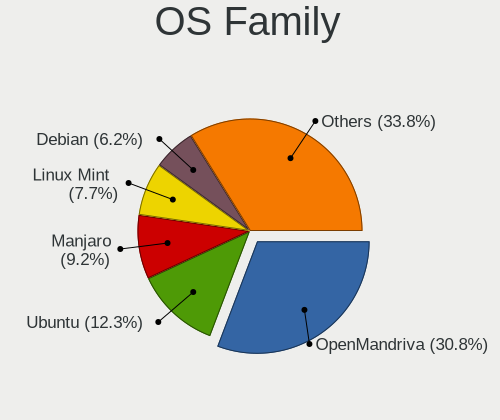
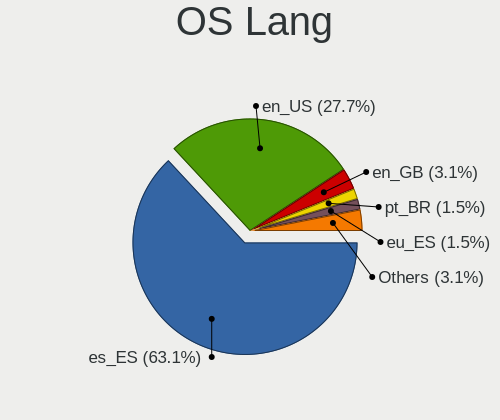
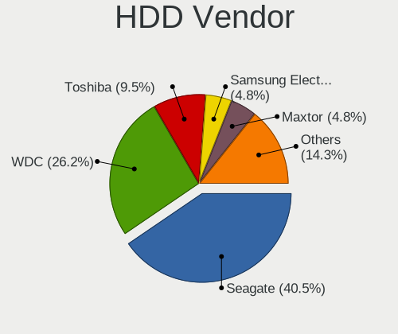
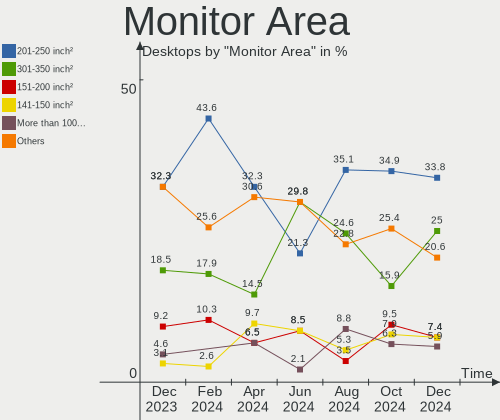
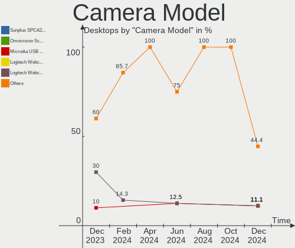

Linux in Spain - Hardware Trends (Desktops)
-------------------------------------------

A project to identify most popular hardware characteristics and track their change
over time based on data collected by Linux users at https://Linux-Hardware.org.

Anyone can contribute to this report by the [hw-probe](https://github.com/linuxhw/hw-probe) tool:

    sudo -E hw-probe -all -upload

Period: Sep, 2022.

Contents
--------

* [ System ](#system)
  - [ OS                       ](#os)
  - [ OS Family                ](#os-family)
  - [ Kernel                   ](#kernel)
  - [ Kernel Family            ](#kernel-family)
  - [ Kernel Major Ver.        ](#kernel-major-ver)
  - [ Arch                     ](#arch)
  - [ DE                       ](#de)
  - [ Display Server           ](#display-server)
  - [ Display Manager          ](#display-manager)
  - [ OS Lang                  ](#os-lang)
  - [ Boot Mode                ](#boot-mode)
  - [ Filesystem               ](#filesystem)
  - [ Part. scheme             ](#part-scheme)
  - [ Dual Boot with Linux/BSD ](#dual-boot-with-linuxbsd)
  - [ Dual Boot (Win)          ](#dual-boot-win)

* [ Board ](#board)
  - [ Vendor                   ](#vendor)
  - [ Model                    ](#model)
  - [ Model Family             ](#model-family)
  - [ MFG Year                 ](#mfg-year)
  - [ Form Factor              ](#form-factor)
  - [ Secure Boot              ](#secure-boot)
  - [ Coreboot                 ](#coreboot)
  - [ RAM Size                 ](#ram-size)
  - [ RAM Used                 ](#ram-used)
  - [ Total Drives             ](#total-drives)
  - [ Has CD-ROM               ](#has-cd-rom)
  - [ Has Ethernet             ](#has-ethernet)
  - [ Has WiFi                 ](#has-wifi)
  - [ Has Bluetooth            ](#has-bluetooth)

* [ Location ](#location)
  - [ Country                  ](#country)
  - [ City                     ](#city)

* [ Drives ](#drives)
  - [ Drive Vendor             ](#drive-vendor)
  - [ Drive Model              ](#drive-model)
  - [ HDD Vendor               ](#hdd-vendor)
  - [ SSD Vendor               ](#ssd-vendor)
  - [ Drive Kind               ](#drive-kind)
  - [ Drive Connector          ](#drive-connector)
  - [ Drive Size               ](#drive-size)
  - [ Space Total              ](#space-total)
  - [ Space Used               ](#space-used)
  - [ Malfunc. Drives          ](#malfunc-drives)
  - [ Malfunc. Drive Vendor    ](#malfunc-drive-vendor)
  - [ Malfunc. HDD Vendor      ](#malfunc-hdd-vendor)
  - [ Malfunc. Drive Kind      ](#malfunc-drive-kind)
  - [ Failed Drives            ](#failed-drives)
  - [ Failed Drive Vendor      ](#failed-drive-vendor)
  - [ Drive Status             ](#drive-status)

* [ Storage controller ](#storage-controller)
  - [ Storage Vendor           ](#storage-vendor)
  - [ Storage Model            ](#storage-model)
  - [ Storage Kind             ](#storage-kind)

* [ Processor ](#processor)
  - [ CPU Vendor               ](#cpu-vendor)
  - [ CPU Model                ](#cpu-model)
  - [ CPU Model Family         ](#cpu-model-family)
  - [ CPU Cores                ](#cpu-cores)
  - [ CPU Sockets              ](#cpu-sockets)
  - [ CPU Threads              ](#cpu-threads)
  - [ CPU Op-Modes             ](#cpu-op-modes)
  - [ CPU Microcode            ](#cpu-microcode)
  - [ CPU Microarch            ](#cpu-microarch)

* [ Graphics ](#graphics)
  - [ GPU Vendor               ](#gpu-vendor)
  - [ GPU Model                ](#gpu-model)
  - [ GPU Combo                ](#gpu-combo)
  - [ GPU Driver               ](#gpu-driver)
  - [ GPU Memory               ](#gpu-memory)

* [ Monitor ](#monitor)
  - [ Monitor Vendor           ](#monitor-vendor)
  - [ Monitor Model            ](#monitor-model)
  - [ Monitor Resolution       ](#monitor-resolution)
  - [ Monitor Diagonal         ](#monitor-diagonal)
  - [ Monitor Width            ](#monitor-width)
  - [ Aspect Ratio             ](#aspect-ratio)
  - [ Monitor Area             ](#monitor-area)
  - [ Pixel Density            ](#pixel-density)
  - [ Multiple Monitors        ](#multiple-monitors)

* [ Network ](#network)
  - [ Net Controller Vendor    ](#net-controller-vendor)
  - [ Net Controller Model     ](#net-controller-model)
  - [ Wireless Vendor          ](#wireless-vendor)
  - [ Wireless Model           ](#wireless-model)
  - [ Ethernet Vendor          ](#ethernet-vendor)
  - [ Ethernet Model           ](#ethernet-model)
  - [ Net Controller Kind      ](#net-controller-kind)
  - [ Used Controller          ](#used-controller)
  - [ NICs                     ](#nics)
  - [ IPv6                     ](#ipv6)

* [ Bluetooth ](#bluetooth)
  - [ Bluetooth Vendor         ](#bluetooth-vendor)
  - [ Bluetooth Model          ](#bluetooth-model)

* [ Sound ](#sound)
  - [ Sound Vendor             ](#sound-vendor)
  - [ Sound Model              ](#sound-model)

* [ Memory ](#memory)
  - [ Memory Vendor            ](#memory-vendor)
  - [ Memory Model             ](#memory-model)
  - [ Memory Kind              ](#memory-kind)
  - [ Memory Form Factor       ](#memory-form-factor)
  - [ Memory Size              ](#memory-size)
  - [ Memory Speed             ](#memory-speed)

* [ Printers & scanners ](#printers--scanners)
  - [ Printer Vendor           ](#printer-vendor)
  - [ Printer Model            ](#printer-model)
  - [ Scanner Vendor           ](#scanner-vendor)
  - [ Scanner Model            ](#scanner-model)

* [ Camera ](#camera)
  - [ Camera Vendor            ](#camera-vendor)
  - [ Camera Model             ](#camera-model)

* [ Security ](#security)
  - [ Fingerprint Vendor       ](#fingerprint-vendor)
  - [ Fingerprint Model        ](#fingerprint-model)
  - [ Chipcard Vendor          ](#chipcard-vendor)
  - [ Chipcard Model           ](#chipcard-model)

* [ Unsupported ](#unsupported)
  - [ Unsupported Devices      ](#unsupported-devices)
  - [ Unsupported Device Types ](#unsupported-device-types)

System
------

OS
--

Installed operating systems

| Name                         | Desktops | Percent |
|------------------------------|----------|---------|
| OpenMandriva 4.3             | 10       | 20.83%  |
| Debian 11                    | 6        | 12.5%   |
| Ubuntu 22.04                 | 5        | 10.42%  |
| Fedora 36                    | 4        | 8.33%   |
| Ubuntu 20.04                 | 3        | 6.25%   |
| Arch                         | 3        | 6.25%   |
| Debian Testing               | 2        | 4.17%   |
| Zorin 16                     | 1        | 2.08%   |
| ROSA R11.1                   | 1        | 2.08%   |
| Pop!_OS 22.04                | 1        | 2.08%   |
| openSUSE Tumbleweed-XXXXXXXX | 1        | 2.08%   |
| OpenMandriva 4.90            | 1        | 2.08%   |
| Nobara 36                    | 1        | 2.08%   |
| Manjaro 22.0.0               | 1        | 2.08%   |
| Linux Mint 20.3              | 1        | 2.08%   |
| Kubuntu 22.04                | 1        | 2.08%   |
| Kubuntu 20.04                | 1        | 2.08%   |
| Kali 2022.3                  | 1        | 2.08%   |
| Gentoo 2.8                   | 1        | 2.08%   |
| Garuda Linux                 | 1        | 2.08%   |
| Fedora 37                    | 1        | 2.08%   |
| Arch Rolling                 | 1        | 2.08%   |

OS Family
---------

OS without a version

| Name         | Desktops | Percent |
|--------------|----------|---------|
| OpenMandriva | 11       | 22.92%  |
| Ubuntu       | 8        | 16.67%  |
| Debian       | 8        | 16.67%  |
| Fedora       | 5        | 10.42%  |
| Arch         | 4        | 8.33%   |
| Kubuntu      | 2        | 4.17%   |
| Zorin        | 1        | 2.08%   |
| ROSA         | 1        | 2.08%   |
| Pop!_OS      | 1        | 2.08%   |
| openSUSE     | 1        | 2.08%   |
| Nobara       | 1        | 2.08%   |
| Manjaro      | 1        | 2.08%   |
| Linux Mint   | 1        | 2.08%   |
| Kali         | 1        | 2.08%   |
| Gentoo       | 1        | 2.08%   |
| Garuda Linux | 1        | 2.08%   |

Kernel
------

Version of the Linux kernel

| Version                                            | Desktops | Percent |
|----------------------------------------------------|----------|---------|
| 5.16.7-desktop-1omv4003                            | 10       | 20.83%  |
| 5.15.0-48-generic                                  | 3        | 6.25%   |
| 5.15.0-47-generic                                  | 3        | 6.25%   |
| 5.15.0-46-generic                                  | 3        | 6.25%   |
| 5.10.0-18-amd64                                    | 3        | 6.25%   |
| 5.19.4-200.fc36.x86_64                             | 2        | 4.17%   |
| 5.18.0-4-amd64                                     | 2        | 4.17%   |
| 6.0.0-0.rc6.20220922gitdc164f4fb00a.43.fc38.x86_64 | 1        | 2.08%   |
| 5.4.32-generic-2rosa-x86_64                        | 1        | 2.08%   |
| 5.4.0-126-generic                                  | 1        | 2.08%   |
| 5.19.9-zen1-1-zen                                  | 1        | 2.08%   |
| 5.19.9-arch1-1                                     | 1        | 2.08%   |
| 5.19.9-201.fsync.fc36.x86_64                       | 1        | 2.08%   |
| 5.19.9-200.fc36.x86_64                             | 1        | 2.08%   |
| 5.19.8-1-default                                   | 1        | 2.08%   |
| 5.19.7-arch1-1                                     | 1        | 2.08%   |
| 5.19.7-1-clear                                     | 1        | 2.08%   |
| 5.19.6-200.fc36.x86_64                             | 1        | 2.08%   |
| 5.19.11-renacuajo                                  | 1        | 2.08%   |
| 5.19.0-76051900-generic                            | 1        | 2.08%   |
| 5.19.0-1-amd64                                     | 1        | 2.08%   |
| 5.18.12-desktop-3omv4090                           | 1        | 2.08%   |
| 5.18.0-kali5-amd64                                 | 1        | 2.08%   |
| 5.15.67-1-lts                                      | 1        | 2.08%   |
| 5.15.65-1-MANJARO                                  | 1        | 2.08%   |
| 5.15.0-47-lowlatency                               | 1        | 2.08%   |
| 5.13.0-39-generic                                  | 1        | 2.08%   |
| 5.10.0-9-amd64                                     | 1        | 2.08%   |
| 5.10.0-14-amd64                                    | 1        | 2.08%   |

Kernel Family
-------------

Linux kernel without a distro release

| Version | Desktops | Percent |
|---------|----------|---------|
| 5.16.7  | 10       | 20.83%  |
| 5.15.0  | 10       | 20.83%  |
| 5.10.0  | 5        | 10.42%  |
| 5.19.9  | 4        | 8.33%   |
| 5.18.0  | 3        | 6.25%   |
| 5.19.7  | 2        | 4.17%   |
| 5.19.4  | 2        | 4.17%   |
| 5.19.0  | 2        | 4.17%   |
| 6.0.0   | 1        | 2.08%   |
| 5.4.32  | 1        | 2.08%   |
| 5.4.0   | 1        | 2.08%   |
| 5.19.8  | 1        | 2.08%   |
| 5.19.6  | 1        | 2.08%   |
| 5.19.11 | 1        | 2.08%   |
| 5.18.12 | 1        | 2.08%   |
| 5.15.67 | 1        | 2.08%   |
| 5.15.65 | 1        | 2.08%   |
| 5.13.0  | 1        | 2.08%   |

Kernel Major Ver.
-----------------

Linux kernel major version

| Version | Desktops | Percent |
|---------|----------|---------|
| 5.19    | 13       | 27.08%  |
| 5.15    | 12       | 25%     |
| 5.16    | 10       | 20.83%  |
| 5.10    | 5        | 10.42%  |
| 5.18    | 4        | 8.33%   |
| 5.4     | 2        | 4.17%   |
| 6.0     | 1        | 2.08%   |
| 5.13    | 1        | 2.08%   |

Arch
----

OS architecture (x86_64, i586, etc.)

| Name   | Desktops | Percent |
|--------|----------|---------|
| x86_64 | 48       | 100%    |

DE
--

Desktop Environment

| Name       | Desktops | Percent |
|------------|----------|---------|
| KDE5       | 23       | 47.92%  |
| GNOME      | 18       | 37.5%   |
| X-Cinnamon | 3        | 6.25%   |
| XFCE       | 1        | 2.08%   |
| LXQt       | 1        | 2.08%   |
| i3         | 1        | 2.08%   |
| Unknown    | 1        | 2.08%   |

Display Server
--------------

X11 or Wayland

| Name    | Desktops | Percent |
|---------|----------|---------|
| X11     | 37       | 77.08%  |
| Wayland | 9        | 18.75%  |
| Tty     | 2        | 4.17%   |

Display Manager
---------------

SDDM, LightDM, etc.

| Name    | Desktops | Percent |
|---------|----------|---------|
| SDDM    | 22       | 45.83%  |
| Unknown | 13       | 27.08%  |
| GDM3    | 5        | 10.42%  |
| GDM     | 4        | 8.33%   |
| LightDM | 3        | 6.25%   |
| LXDM    | 1        | 2.08%   |

OS Lang
-------

Language

| Lang           | Desktops | Percent |
|----------------|----------|---------|
| es_ES          | 36       | 75%     |
| en_US          | 8        | 16.67%  |
| ca_ES          | 3        | 6.25%   |
| ca_ES@valencia | 1        | 2.08%   |

Boot Mode
---------

EFI or BIOS

| Mode | Desktops | Percent |
|------|----------|---------|
| BIOS | 24       | 50%     |
| EFI  | 24       | 50%     |

Filesystem
----------

Type of filesystem

| Type    | Desktops | Percent |
|---------|----------|---------|
| Ext4    | 29       | 60.42%  |
| Overlay | 10       | 20.83%  |
| Btrfs   | 8        | 16.67%  |
| Xfs     | 1        | 2.08%   |

Part. scheme
------------

Scheme of partitioning

| Type    | Desktops | Percent |
|---------|----------|---------|
| GPT     | 21       | 43.75%  |
| Unknown | 18       | 37.5%   |
| MBR     | 9        | 18.75%  |

Dual Boot with Linux/BSD
------------------------

Hosting more than one Linux/BSD

| Dual boot | Desktops | Percent |
|-----------|----------|---------|
| No        | 32       | 66.67%  |
| Yes       | 16       | 33.33%  |

Dual Boot (Win)
---------------

Hosting Linux and Windows

| Dual boot | Desktops | Percent |
|-----------|----------|---------|
| No        | 36       | 75%     |
| Yes       | 12       | 25%     |

Board
-----

Vendor
------

Motherboard manufacturer

| Name                | Desktops | Percent |
|---------------------|----------|---------|
| ASUSTek Computer    | 16       | 33.33%  |
| MSI                 | 7        | 14.58%  |
| Gigabyte Technology | 6        | 12.5%   |
| ASRock              | 6        | 12.5%   |
| Lenovo              | 3        | 6.25%   |
| Acer                | 3        | 6.25%   |
| Hewlett-Packard     | 2        | 4.17%   |
| Shuttle             | 1        | 2.08%   |
| Minix               | 1        | 2.08%   |
| Medion              | 1        | 2.08%   |
| ECS                 | 1        | 2.08%   |
| Unknown             | 1        | 2.08%   |

Model
-----

Motherboard model

| Name                                | Desktops | Percent |
|-------------------------------------|----------|---------|
| ASUS All Series                     | 3        | 6.25%   |
| MSI MS-7693                         | 2        | 4.17%   |
| ASRock X399 Phantom Gaming 6        | 2        | 4.17%   |
| Shuttle DH470                       | 1        | 2.08%   |
| MSI PPPPP-CCC#MMMMMMMM              | 1        | 2.08%   |
| MSI MS-7D20                         | 1        | 2.08%   |
| MSI MS-7C91                         | 1        | 2.08%   |
| MSI MS-7C00                         | 1        | 2.08%   |
| MSI MS-7B49                         | 1        | 2.08%   |
| Minix NEO G41V-4 Max                | 1        | 2.08%   |
| Medion H61H2-LM3                    | 1        | 2.08%   |
| Lenovo ThinkStation P330 30CY0006US | 1        | 2.08%   |
| Lenovo ThinkCentre M900 10FGS0FT05  | 1        | 2.08%   |
| Lenovo ThinkCentre E73 10AS0035SP   | 1        | 2.08%   |
| HP ENVY TE01-1xxx                   | 1        | 2.08%   |
| HP 550-145ns                        | 1        | 2.08%   |
| Gigabyte Z590 GAMING X              | 1        | 2.08%   |
| Gigabyte X570 AORUS PRO             | 1        | 2.08%   |
| Gigabyte B365M DS3H                 | 1        | 2.08%   |
| Gigabyte AX370-Gaming K5            | 1        | 2.08%   |
| Gigabyte ALDA+                      | 1        | 2.08%   |
| Gigabyte 945GCM-S2L                 | 1        | 2.08%   |
| ECS GeForce 8000 series             | 1        | 2.08%   |
| ASUS ROG STRIX Z590-E GAMING WIFI   | 1        | 2.08%   |
| ASUS ROG STRIX B365-G GAMING        | 1        | 2.08%   |
| ASUS PRIME Z590-A                   | 1        | 2.08%   |
| ASUS PRIME X570-P                   | 1        | 2.08%   |
| ASUS PRIME B560M-A                  | 1        | 2.08%   |
| ASUS P5Q SE2                        | 1        | 2.08%   |
| ASUS P5K                            | 1        | 2.08%   |
| ASUS P5B-Deluxe                     | 1        | 2.08%   |
| ASUS M5A97 PRO                      | 1        | 2.08%   |
| ASUS M5A97 EVO R2.0                 | 1        | 2.08%   |
| ASUS M4N72-E                        | 1        | 2.08%   |
| ASUS H110M-D                        | 1        | 2.08%   |
| ASUS H110M-A                        | 1        | 2.08%   |
| ASRock Z170 Extreme4                | 1        | 2.08%   |
| ASRock J3355B-ITX                   | 1        | 2.08%   |
| ASRock B550M Pro4                   | 1        | 2.08%   |
| ASRock A75M-HVS                     | 1        | 2.08%   |

Model Family
------------

Motherboard model prefix

| Name                   | Desktops | Percent |
|------------------------|----------|---------|
| ASUS PRIME             | 3        | 6.25%   |
| ASUS All               | 3        | 6.25%   |
| MSI MS-7693            | 2        | 4.17%   |
| Lenovo ThinkCentre     | 2        | 4.17%   |
| ASUS ROG               | 2        | 4.17%   |
| ASUS M5A97             | 2        | 4.17%   |
| ASRock X399            | 2        | 4.17%   |
| Acer Aspire            | 2        | 4.17%   |
| Shuttle DH470          | 1        | 2.08%   |
| MSI PPPPP-CCC#MMMMMMMM | 1        | 2.08%   |
| MSI MS-7D20            | 1        | 2.08%   |
| MSI MS-7C91            | 1        | 2.08%   |
| MSI MS-7C00            | 1        | 2.08%   |
| MSI MS-7B49            | 1        | 2.08%   |
| Minix NEO              | 1        | 2.08%   |
| Medion H61H2-LM3       | 1        | 2.08%   |
| Lenovo ThinkStation    | 1        | 2.08%   |
| HP ENVY                | 1        | 2.08%   |
| HP 550-145ns           | 1        | 2.08%   |
| Gigabyte Z590          | 1        | 2.08%   |
| Gigabyte X570          | 1        | 2.08%   |
| Gigabyte B365M         | 1        | 2.08%   |
| Gigabyte AX370-Gaming  | 1        | 2.08%   |
| Gigabyte ALDA+         | 1        | 2.08%   |
| Gigabyte 945GCM-S2L    | 1        | 2.08%   |
| ECS GeForce            | 1        | 2.08%   |
| ASUS P5Q               | 1        | 2.08%   |
| ASUS P5K               | 1        | 2.08%   |
| ASUS P5B-Deluxe        | 1        | 2.08%   |
| ASUS M4N72-E           | 1        | 2.08%   |
| ASUS H110M-D           | 1        | 2.08%   |
| ASUS H110M-A           | 1        | 2.08%   |
| ASRock Z170            | 1        | 2.08%   |
| ASRock J3355B-ITX      | 1        | 2.08%   |
| ASRock B550M           | 1        | 2.08%   |
| ASRock A75M-HVS        | 1        | 2.08%   |
| Acer Revo              | 1        | 2.08%   |
| Unknown                | 1        | 2.08%   |

MFG Year
--------

Motherboard manufacture year

| Year | Desktops | Percent |
|------|----------|---------|
| 2021 | 8        | 16.67%  |
| 2019 | 6        | 12.5%   |
| 2015 | 5        | 10.42%  |
| 2020 | 3        | 6.25%   |
| 2016 | 3        | 6.25%   |
| 2014 | 3        | 6.25%   |
| 2011 | 3        | 6.25%   |
| 2010 | 3        | 6.25%   |
| 2018 | 2        | 4.17%   |
| 2017 | 2        | 4.17%   |
| 2013 | 2        | 4.17%   |
| 2012 | 2        | 4.17%   |
| 2008 | 2        | 4.17%   |
| 2007 | 2        | 4.17%   |
| 2022 | 1        | 2.08%   |
| 2006 | 1        | 2.08%   |

Form Factor
-----------

Physical design of the computer

| Name    | Desktops | Percent |
|---------|----------|---------|
| Desktop | 48       | 100%    |

Secure Boot
-----------

Enabled or disabled

| State    | Desktops | Percent |
|----------|----------|---------|
| Disabled | 46       | 95.83%  |
| Enabled  | 2        | 4.17%   |

Coreboot
--------

Have coreboot on board

| Used | Desktops | Percent |
|------|----------|---------|
| No   | 48       | 100%    |

RAM Size
--------

Total RAM memory

| Size in GB | Desktops | Percent |
|------------|----------|---------|
| 32.01-64.0 | 13       | 27.08%  |
| 8.01-16.0  | 11       | 22.92%  |
| 4.01-8.0   | 7        | 14.58%  |
| 3.01-4.0   | 7        | 14.58%  |
| 16.01-24.0 | 7        | 14.58%  |
| 1.01-2.0   | 2        | 4.17%   |
| 24.01-32.0 | 1        | 2.08%   |

RAM Used
--------

Used RAM memory

| Used GB   | Desktops | Percent |
|-----------|----------|---------|
| 1.01-2.0  | 15       | 31.25%  |
| 4.01-8.0  | 13       | 27.08%  |
| 2.01-3.0  | 11       | 22.92%  |
| 3.01-4.0  | 5        | 10.42%  |
| 8.01-16.0 | 2        | 4.17%   |
| 0.51-1.0  | 2        | 4.17%   |

Total Drives
------------

Number of drives on board

| Drives | Desktops | Percent |
|--------|----------|---------|
| 2      | 15       | 31.25%  |
| 1      | 14       | 29.17%  |
| 3      | 9        | 18.75%  |
| 4      | 6        | 12.5%   |
| 7      | 2        | 4.17%   |
| 9      | 1        | 2.08%   |
| 5      | 1        | 2.08%   |

Has CD-ROM
----------

Has CD-ROM on board

| Presented | Desktops | Percent |
|-----------|----------|---------|
| No        | 30       | 62.5%   |
| Yes       | 18       | 37.5%   |

Has Ethernet
------------

Has Ethernet on board

| Presented | Desktops | Percent |
|-----------|----------|---------|
| Yes       | 48       | 100%    |

Has WiFi
--------

Has WiFi module

| Presented | Desktops | Percent |
|-----------|----------|---------|
| Yes       | 24       | 50%     |
| No        | 24       | 50%     |

Has Bluetooth
-------------

Has Bluetooth module

| Presented | Desktops | Percent |
|-----------|----------|---------|
| No        | 31       | 64.58%  |
| Yes       | 17       | 35.42%  |

Location
--------

Country
-------

Geographic location (country)

| Country | Desktops | Percent |
|---------|----------|---------|
| Spain   | 48       | 100%    |

City
----

Geographic location (city)

| City                       | Desktops | Percent |
|----------------------------|----------|---------|
| Seville                    | 5        | 10.42%  |
| Valencia                   | 4        | 8.33%   |
| Madrid                     | 4        | 8.33%   |
| Las Palmas de Gran Canaria | 3        | 6.25%   |
| Jerez de la Frontera       | 2        | 4.17%   |
| Barcelona                  | 2        | 4.17%   |
| Villanueva del Pardillo    | 1        | 2.08%   |
| Vigo                       | 1        | 2.08%   |
| Valdemoro                  | 1        | 2.08%   |
| Terrassa                   | 1        | 2.08%   |
| Tarazona                   | 1        | 2.08%   |
| Sanxenxo                   | 1        | 2.08%   |
| Santiago de Compostela     | 1        | 2.08%   |
| Santa Pola                 | 1        | 2.08%   |
| San Fernando               | 1        | 2.08%   |
| Rubí                      | 1        | 2.08%   |
| Riells del Fai             | 1        | 2.08%   |
| Pamplona                   | 1        | 2.08%   |
| Palencia                   | 1        | 2.08%   |
| Málaga                    | 1        | 2.08%   |
| Leganés                   | 1        | 2.08%   |
| Jaén                      | 1        | 2.08%   |
| Gelves                     | 1        | 2.08%   |
| Fuengirola                 | 1        | 2.08%   |
| Ejea de los Caballeros     | 1        | 2.08%   |
| Daimiel                    | 1        | 2.08%   |
| Bakio                      | 1        | 2.08%   |
| Almería                   | 1        | 2.08%   |
| Alhaurin de la Torre       | 1        | 2.08%   |
| Algeciras                  | 1        | 2.08%   |
| Alcorcón                  | 1        | 2.08%   |
| Alcalá de Henares         | 1        | 2.08%   |
| Alaquas                    | 1        | 2.08%   |
| Agost                      | 1        | 2.08%   |

Drives
------

Drive Vendor
------------

Hard drive vendors

| Vendor                    | Desktops | Drives | Percent |
|---------------------------|----------|--------|---------|
| Seagate                   | 21       | 26     | 21%     |
| WDC                       | 15       | 22     | 15%     |
| Samsung Electronics       | 11       | 15     | 11%     |
| Kingston                  | 10       | 10     | 10%     |
| Toshiba                   | 8        | 12     | 8%      |
| SanDisk                   | 5        | 5      | 5%      |
| Crucial                   | 5        | 6      | 5%      |
| Unknown                   | 3        | 3      | 3%      |
| SK hynix                  | 2        | 2      | 2%      |
| Micron/Crucial Technology | 2        | 2      | 2%      |
| KIOXIA-EXCERIA            | 2        | 3      | 2%      |
| Intel                     | 2        | 2      | 2%      |
| Emtec                     | 2        | 2      | 2%      |
| China                     | 2        | 2      | 2%      |
| USB30                     | 1        | 1      | 1%      |
| Transcend                 | 1        | 1      | 1%      |
| Phison                    | 1        | 1      | 1%      |
| Maxtor                    | 1        | 1      | 1%      |
| KingSpec                  | 1        | 1      | 1%      |
| KingDian                  | 1        | 1      | 1%      |
| Kimtigo                   | 1        | 1      | 1%      |
| JMicron Technology        | 1        | 1      | 1%      |
| ASMedia                   | 1        | 1      | 1%      |
| Unknown                   | 1        | 1      | 1%      |

Drive Model
-----------

Hard drive models

| Model                                               | Desktops | Percent |
|-----------------------------------------------------|----------|---------|
| Seagate ST1000DM010-2EP102 1TB                      | 3        | 2.59%   |
| WDC WDS500G2B0A-00SM50 500GB SSD                    | 2        | 1.72%   |
| WDC WD20EZRX-00D8PB0 2TB                            | 2        | 1.72%   |
| Unknown SD/MMC/MS PRO 2GB                           | 2        | 1.72%   |
| Toshiba HDWD110 1TB                                 | 2        | 1.72%   |
| Seagate ST500DM002-1BD142 500GB                     | 2        | 1.72%   |
| Seagate ST2000DM008-2FR102 2TB                      | 2        | 1.72%   |
| Samsung SSD 980 PRO 1TB                             | 2        | 1.72%   |
| Samsung SSD 970 EVO Plus 500GB                      | 2        | 1.72%   |
| Samsung SSD 860 EVO 500GB                           | 2        | 1.72%   |
| Samsung SSD 840 EVO 120GB                           | 2        | 1.72%   |
| Samsung NVMe SSD Controller SM981/PM981/PM983 256GB | 2        | 1.72%   |
| Micron/Crucial P1 NVMe PCIe SSD 1TB                 | 2        | 1.72%   |
| Kingston SV300S37A240G 240GB SSD                    | 2        | 1.72%   |
| Kingston SV300S37A120G 120GB SSD                    | 2        | 1.72%   |
| Kingston SA400S37480G 480GB SSD                     | 2        | 1.72%   |
| Crucial CT480BX500SSD1 480GB                        | 2        | 1.72%   |
| WDC WDS500G3XHC-00SJG0 500GB                        | 1        | 0.86%   |
| WDC WDS100T2B0A-00SM50 1TB SSD                      | 1        | 0.86%   |
| WDC WD6401AALS-00L3B2 640GB                         | 1        | 0.86%   |
| WDC WD5000AAKX-08U6AA0 500GB                        | 1        | 0.86%   |
| WDC WD5000AAKX-00ERMA0 500GB                        | 1        | 0.86%   |
| WDC WD40EZRZ-75GXCB0 4TB                            | 1        | 0.86%   |
| WDC WD40EFAX-68JH4N0 4TB                            | 1        | 0.86%   |
| WDC WD3200AAKS-00UU3A0 320GB                        | 1        | 0.86%   |
| WDC WD30EZRZ-00Z5HB0 3TB                            | 1        | 0.86%   |
| WDC WD20EZRX-00DC0B0 2TB                            | 1        | 0.86%   |
| WDC WD20EARX-00PASB0 2TB                            | 1        | 0.86%   |
| WDC WD15EARS-00MVWB0 1TB                            | 1        | 0.86%   |
| WDC WD10PURX-64E5EY0 1TB                            | 1        | 0.86%   |
| WDC WD10EZEX-21M2NA0 1TB                            | 1        | 0.86%   |
| WDC WD10EZEX-08WN4A0 1TB                            | 1        | 0.86%   |
| WDC WD10EZEX-00WN4A0 1TB                            | 1        | 0.86%   |
| WDC WD10EALX-009BA0 1TB                             | 1        | 0.86%   |
| WDC WD10EADX-22TDHB0 1TB                            | 1        | 0.86%   |
| USB30 Disk 120GB                                    | 1        | 0.86%   |
| Unknown SD01G  1GB                                  | 1        | 0.86%   |
| Transcend TS1TSSD230S 1TB                           | 1        | 0.86%   |
| Toshiba TR200 480GB SSD                             | 1        | 0.86%   |
| Toshiba TR150 480GB SSD                             | 1        | 0.86%   |

HDD Vendor
----------

Hard disk drive vendors

| Vendor  | Desktops | Drives | Percent |
|---------|----------|--------|---------|
| Seagate | 21       | 26     | 48.84%  |
| WDC     | 14       | 18     | 32.56%  |
| Toshiba | 5        | 7      | 11.63%  |
| Unknown | 2        | 2      | 4.65%   |
| ASMedia | 1        | 1      | 2.33%   |

SSD Vendor
----------

Solid state drive vendors

| Vendor              | Desktops | Drives | Percent |
|---------------------|----------|--------|---------|
| Kingston            | 9        | 9      | 23.08%  |
| Samsung Electronics | 6        | 7      | 15.38%  |
| Crucial             | 4        | 4      | 10.26%  |
| WDC                 | 3        | 3      | 7.69%   |
| Toshiba             | 3        | 5      | 7.69%   |
| SanDisk             | 2        | 2      | 5.13%   |
| Emtec               | 2        | 2      | 5.13%   |
| China               | 2        | 2      | 5.13%   |
| USB30               | 1        | 1      | 2.56%   |
| Transcend           | 1        | 1      | 2.56%   |
| Maxtor              | 1        | 1      | 2.56%   |
| KIOXIA-EXCERIA      | 1        | 1      | 2.56%   |
| KingSpec            | 1        | 1      | 2.56%   |
| KingDian            | 1        | 1      | 2.56%   |
| Kimtigo             | 1        | 1      | 2.56%   |
| Unknown             | 1        | 1      | 2.56%   |

Drive Kind
----------

HDD or SSD

| Kind | Desktops | Drives | Percent |
|------|----------|--------|---------|
| HDD  | 36       | 54     | 45%     |
| SSD  | 26       | 42     | 32.5%   |
| NVMe | 17       | 24     | 21.25%  |
| MMC  | 1        | 2      | 1.25%   |

Drive Connector
---------------

SATA, SAS, NVMe, etc.

| Type | Desktops | Drives | Percent |
|------|----------|--------|---------|
| SATA | 43       | 92     | 66.15%  |
| NVMe | 16       | 23     | 24.62%  |
| SAS  | 5        | 5      | 7.69%   |
| MMC  | 1        | 2      | 1.54%   |

Drive Size
----------

Size of hard drive

| Size in TB | Desktops | Drives | Percent |
|------------|----------|--------|---------|
| 0.01-0.5   | 37       | 51     | 49.33%  |
| 0.51-1.0   | 22       | 25     | 29.33%  |
| 1.01-2.0   | 8        | 10     | 10.67%  |
| 3.01-4.0   | 3        | 4      | 4%      |
| 2.01-3.0   | 3        | 4      | 4%      |
| 4.01-10.0  | 2        | 2      | 2.67%   |

Space Total
-----------

Amount of disk space available on the file system

| Size in GB     | Desktops | Percent |
|----------------|----------|---------|
| 1-20           | 11       | 22.92%  |
| 101-250        | 9        | 18.75%  |
| 501-1000       | 8        | 16.67%  |
| 251-500        | 6        | 12.5%   |
| 2001-3000      | 6        | 12.5%   |
| More than 3000 | 4        | 8.33%   |
| 1001-2000      | 3        | 6.25%   |
| 21-50          | 1        | 2.08%   |

Space Used
----------

Amount of used disk space

| Used GB        | Desktops | Percent |
|----------------|----------|---------|
| 1-20           | 24       | 50%     |
| 21-50          | 4        | 8.33%   |
| 101-250        | 4        | 8.33%   |
| 501-1000       | 4        | 8.33%   |
| More than 3000 | 3        | 6.25%   |
| 251-500        | 3        | 6.25%   |
| 1001-2000      | 3        | 6.25%   |
| 51-100         | 3        | 6.25%   |

Malfunc. Drives
---------------

Drive models with a malfunction

| Model                          | Desktops | Drives | Percent |
|--------------------------------|----------|--------|---------|
| Transcend TS1TSSD230S 1TB      | 1        | 1      | 25%     |
| Seagate ST3500820AS 500GB      | 1        | 1      | 25%     |
| Seagate ST3160023AS 160GB      | 1        | 1      | 25%     |
| Seagate ST3000DM001-9YN166 3TB | 1        | 1      | 25%     |

Malfunc. Drive Vendor
---------------------

Vendors of faulty drives

| Vendor    | Desktops | Drives | Percent |
|-----------|----------|--------|---------|
| Seagate   | 3        | 3      | 75%     |
| Transcend | 1        | 1      | 25%     |

Malfunc. HDD Vendor
-------------------

Vendors of faulty HDD drives

| Vendor  | Desktops | Drives | Percent |
|---------|----------|--------|---------|
| Seagate | 3        | 3      | 100%    |

Malfunc. Drive Kind
-------------------

Kinds of faulty drives

| Kind | Desktops | Drives | Percent |
|------|----------|--------|---------|
| HDD  | 3        | 3      | 75%     |
| SSD  | 1        | 1      | 25%     |

Failed Drives
-------------

Failed drive models

Zero info for selected period =(

Failed Drive Vendor
-------------------

Failed drive vendors

Zero info for selected period =(

Drive Status
------------

Number of failed and malfunc. drives

| Status   | Desktops | Drives | Percent |
|----------|----------|--------|---------|
| Works    | 27       | 72     | 51.92%  |
| Detected | 21       | 46     | 40.38%  |
| Malfunc  | 4        | 4      | 7.69%   |

Storage controller
------------------

Storage Vendor
--------------

Storage controller vendors

| Vendor                      | Desktops | Percent |
|-----------------------------|----------|---------|
| Intel                       | 32       | 46.38%  |
| AMD                         | 13       | 18.84%  |
| Samsung Electronics         | 6        | 8.7%    |
| SanDisk                     | 4        | 5.8%    |
| Micron/Crucial Technology   | 4        | 5.8%    |
| Nvidia                      | 2        | 2.9%    |
| JMicron Technology          | 2        | 2.9%    |
| SK hynix                    | 1        | 1.45%   |
| Phison Electronics          | 1        | 1.45%   |
| Marvell Technology Group    | 1        | 1.45%   |
| KIOXIA                      | 1        | 1.45%   |
| Kingston Technology Company | 1        | 1.45%   |
| ASMedia Technology          | 1        | 1.45%   |

Storage Model
-------------

Storage controller models

| Model                                                                          | Desktops | Percent |
|--------------------------------------------------------------------------------|----------|---------|
| AMD FCH SATA Controller [AHCI mode]                                            | 6        | 7.41%   |
| Intel 8 Series/C220 Series Chipset Family 6-port SATA Controller 1 [AHCI mode] | 5        | 6.17%   |
| Samsung NVMe SSD Controller SM981/PM981/PM983                                  | 4        | 4.94%   |
| Intel Q170/Q150/B150/H170/H110/Z170/CM236 Chipset SATA Controller [AHCI Mode]  | 4        | 4.94%   |
| Intel 500 Series Chipset Family SATA AHCI Controller                           | 4        | 4.94%   |
| AMD SB7x0/SB8x0/SB9x0 SATA Controller [AHCI mode]                              | 4        | 4.94%   |
| Intel 200 Series PCH SATA controller [AHCI mode]                               | 3        | 3.7%    |
| SanDisk WD Black 2018/SN750 / PC SN720 NVMe SSD                                | 2        | 2.47%   |
| Samsung NVMe SSD Controller PM9A1/PM9A3/980PRO                                 | 2        | 2.47%   |
| Nvidia MCP78S [GeForce 8200] IDE                                               | 2        | 2.47%   |
| Nvidia MCP78S [GeForce 8200] AHCI Controller                                   | 2        | 2.47%   |
| Micron/Crucial P1 NVMe PCIe SSD                                                | 2        | 2.47%   |
| Intel SATA Controller [RAID mode]                                              | 2        | 2.47%   |
| Intel NM10/ICH7 Family SATA Controller [IDE mode]                              | 2        | 2.47%   |
| Intel Celeron N3350/Pentium N4200/Atom E3900 Series SATA AHCI Controller       | 2        | 2.47%   |
| Intel Cannon Lake PCH SATA AHCI Controller                                     | 2        | 2.47%   |
| Intel 6 Series/C200 Series Chipset Family 6 port Desktop SATA AHCI Controller  | 2        | 2.47%   |
| AMD X399 Series Chipset SATA Controller                                        | 2        | 2.47%   |
| AMD 500 Series Chipset SATA Controller                                         | 2        | 2.47%   |
| SK hynix Gold P31 SSD                                                          | 1        | 1.23%   |
| SanDisk WD Blue SN550 NVMe SSD                                                 | 1        | 1.23%   |
| SanDisk WD Blue SN500 / PC SN520 NVMe SSD                                      | 1        | 1.23%   |
| Phison E12 NVMe Controller                                                     | 1        | 1.23%   |
| Micron/Crucial P2 NVMe PCIe SSD                                                | 1        | 1.23%   |
| Micron/Crucial Non-Volatile memory controller                                  | 1        | 1.23%   |
| Marvell Group 88SE6101/6102 single-port PATA133 interface                      | 1        | 1.23%   |
| KIOXIA NVMe SSD                                                                | 1        | 1.23%   |
| KIOXIA Non-Volatile memory controller                                          | 1        | 1.23%   |
| Kingston Company Company Non-Volatile memory controller                        | 1        | 1.23%   |
| JMicron JMB363 SATA/IDE Controller                                             | 1        | 1.23%   |
| JMicron JMB362 SATA Controller                                                 | 1        | 1.23%   |
| Intel SSD Pro 7600p/760p/E 6100p Series                                        | 1        | 1.23%   |
| Intel SSD 660P Series                                                          | 1        | 1.23%   |
| Intel Comet Lake SATA AHCI Controller                                          | 1        | 1.23%   |
| Intel Celeron/Pentium Silver Processor SATA Controller                         | 1        | 1.23%   |
| Intel 82801JI (ICH10 Family) SATA AHCI Controller                              | 1        | 1.23%   |
| Intel 82801IB (ICH9) 2 port SATA Controller [IDE mode]                         | 1        | 1.23%   |
| Intel 82801I (ICH9 Family) 2 port SATA Controller [IDE mode]                   | 1        | 1.23%   |
| Intel 82801HR/HO/HH (ICH8R/DO/DH) 2 port SATA Controller [IDE mode]            | 1        | 1.23%   |
| Intel 82801H (ICH8 Family) 4 port SATA Controller [IDE mode]                   | 1        | 1.23%   |

Storage Kind
------------

Kind of storage controller (IDE, SATA, NVMe, SAS, ...)

| Kind | Desktops | Percent |
|------|----------|---------|
| SATA | 40       | 59.7%   |
| NVMe | 16       | 23.88%  |
| IDE  | 8        | 11.94%  |
| RAID | 3        | 4.48%   |

Processor
---------

CPU Vendor
----------

Processor vendors

| Vendor | Desktops | Percent |
|--------|----------|---------|
| Intel  | 33       | 68.75%  |
| AMD    | 15       | 31.25%  |

CPU Model
---------

Processor models

| Model                                          | Desktops | Percent |
|------------------------------------------------|----------|---------|
| Intel Core i7-9700 CPU @ 3.00GHz               | 2        | 4.17%   |
| Intel Core i5-6600K CPU @ 3.50GHz              | 2        | 4.17%   |
| AMD Ryzen Threadripper 1920X 12-Core Processor | 2        | 4.17%   |
| AMD FX-8350 Eight-Core Processor               | 2        | 4.17%   |
| Intel Xeon CPU E3-1270 v3 @ 3.50GHz            | 1        | 2.08%   |
| Intel Pentium Gold G6405 CPU @ 4.10GHz         | 1        | 2.08%   |
| Intel Pentium CPU G3250 @ 3.20GHz              | 1        | 2.08%   |
| Intel Pentium CPU G3220 @ 3.00GHz              | 1        | 2.08%   |
| Intel Core i9-9900KF CPU @ 3.60GHz             | 1        | 2.08%   |
| Intel Core i7-4790 CPU @ 3.60GHz               | 1        | 2.08%   |
| Intel Core i7-10700 CPU @ 2.90GHz              | 1        | 2.08%   |
| Intel Core i5-6500 CPU @ 3.20GHz               | 1        | 2.08%   |
| Intel Core i5-6400 CPU @ 2.70GHz               | 1        | 2.08%   |
| Intel Core i5-4690 CPU @ 3.50GHz               | 1        | 2.08%   |
| Intel Core i5-10400 CPU @ 2.90GHz              | 1        | 2.08%   |
| Intel Core i5 CPU 650 @ 3.20GHz                | 1        | 2.08%   |
| Intel Core i3-9100 CPU @ 3.60GHz               | 1        | 2.08%   |
| Intel Core i3-8350K CPU @ 4.00GHz              | 1        | 2.08%   |
| Intel Core i3-2100 CPU @ 3.10GHz               | 1        | 2.08%   |
| Intel Core 2 Quad CPU Q8200 @ 2.33GHz          | 1        | 2.08%   |
| Intel Core 2 Duo CPU E8400 @ 3.00GHz           | 1        | 2.08%   |
| Intel Core 2 Duo CPU E7400 @ 2.80GHz           | 1        | 2.08%   |
| Intel Core 2 Duo CPU E6550 @ 2.33GHz           | 1        | 2.08%   |
| Intel Core 2 CPU 6300 @ 1.86GHz                | 1        | 2.08%   |
| Intel Celeron N4120 CPU @ 1.10GHz              | 1        | 2.08%   |
| Intel Celeron CPU N3050 @ 1.60GHz              | 1        | 2.08%   |
| Intel Celeron CPU J3455 @ 1.50GHz              | 1        | 2.08%   |
| Intel Celeron CPU J3355 @ 2.00GHz              | 1        | 2.08%   |
| Intel Celeron CPU G550 @ 2.60GHz               | 1        | 2.08%   |
| Intel 11th Gen Core i9-11900KF @ 3.50GHz       | 1        | 2.08%   |
| Intel 11th Gen Core i7-11700K @ 3.60GHz        | 1        | 2.08%   |
| Intel 11th Gen Core i5-11600KF @ 3.90GHz       | 1        | 2.08%   |
| Intel 11th Gen Core i5-11400F @ 2.60GHz        | 1        | 2.08%   |
| AMD Ryzen 9 5900X 12-Core Processor            | 1        | 2.08%   |
| AMD Ryzen 9 3900X 12-Core Processor            | 1        | 2.08%   |
| AMD Ryzen 5 5600G with Radeon Graphics         | 1        | 2.08%   |
| AMD Ryzen 5 3400G with Radeon Vega Graphics    | 1        | 2.08%   |
| AMD Ryzen 5 2600X Six-Core Processor           | 1        | 2.08%   |
| AMD Phenom II X6 1090T Processor               | 1        | 2.08%   |
| AMD FX-8300 Eight-Core Processor               | 1        | 2.08%   |

CPU Model Family
----------------

Processor model prefix

| Model                  | Desktops | Percent |
|------------------------|----------|---------|
| Intel Core i5          | 7        | 14.58%  |
| Intel Celeron          | 5        | 10.42%  |
| Other                  | 4        | 8.33%   |
| Intel Core i7          | 4        | 8.33%   |
| AMD FX                 | 4        | 8.33%   |
| Intel Core i3          | 3        | 6.25%   |
| Intel Core 2 Duo       | 3        | 6.25%   |
| AMD Ryzen 5            | 3        | 6.25%   |
| Intel Pentium          | 2        | 4.17%   |
| AMD Ryzen Threadripper | 2        | 4.17%   |
| AMD Ryzen 9            | 2        | 4.17%   |
| Intel Xeon             | 1        | 2.08%   |
| Intel Pentium Gold     | 1        | 2.08%   |
| Intel Core i9          | 1        | 2.08%   |
| Intel Core 2 Quad      | 1        | 2.08%   |
| Intel Core 2           | 1        | 2.08%   |
| AMD Phenom II X6       | 1        | 2.08%   |
| AMD Athlon II X4       | 1        | 2.08%   |
| AMD A8                 | 1        | 2.08%   |
| AMD A4                 | 1        | 2.08%   |

CPU Cores
---------

Number of processor cores

| Number | Desktops | Percent |
|--------|----------|---------|
| 4      | 17       | 35.42%  |
| 2      | 15       | 31.25%  |
| 8      | 6        | 12.5%   |
| 6      | 6        | 12.5%   |
| 12     | 4        | 8.33%   |

CPU Sockets
-----------

Number of sockets

| Number | Desktops | Percent |
|--------|----------|---------|
| 1      | 48       | 100%    |

CPU Threads
-----------

Threads per core (Hyper-Threading)

| Number | Desktops | Percent |
|--------|----------|---------|
| 2      | 24       | 50%     |
| 1      | 24       | 50%     |

CPU Op-Modes
------------

CPU Operation Modes (32-bit, 64-bit)

| Op mode        | Desktops | Percent |
|----------------|----------|---------|
| 32-bit, 64-bit | 48       | 100%    |

CPU Microcode
-------------

Microcode number

| Number     | Desktops | Percent |
|------------|----------|---------|
| Unknown    | 11       | 22.92%  |
| 0x306c3    | 5        | 10.42%  |
| 0xa0671    | 3        | 6.25%   |
| 0x506e3    | 3        | 6.25%   |
| 0xa0653    | 2        | 4.17%   |
| 0x906eb    | 2        | 4.17%   |
| 0x506c9    | 2        | 4.17%   |
| 0x206a7    | 2        | 4.17%   |
| 0x1067a    | 2        | 4.17%   |
| 0x08001137 | 2        | 4.17%   |
| 0x06000822 | 2        | 4.17%   |
| 0xa0655    | 1        | 2.08%   |
| 0x906ec    | 1        | 2.08%   |
| 0x706a8    | 1        | 2.08%   |
| 0x6fb      | 1        | 2.08%   |
| 0x406c3    | 1        | 2.08%   |
| 0x20652    | 1        | 2.08%   |
| 0x10677    | 1        | 2.08%   |
| 0x0a50000b | 1        | 2.08%   |
| 0x0a201016 | 1        | 2.08%   |
| 0x08701021 | 1        | 2.08%   |
| 0x03000027 | 1        | 2.08%   |
| 0x01000086 | 1        | 2.08%   |

CPU Microarch
-------------

Microarchitecture

| Name          | Desktops | Percent |
|---------------|----------|---------|
| KabyLake      | 5        | 10.42%  |
| Haswell       | 5        | 10.42%  |
| Skylake       | 4        | 8.33%   |
| Piledriver    | 3        | 6.25%   |
| Penryn        | 3        | 6.25%   |
| Icelake       | 3        | 6.25%   |
| CometLake     | 3        | 6.25%   |
| Zen+          | 2        | 4.17%   |
| Zen 3         | 2        | 4.17%   |
| Zen           | 2        | 4.17%   |
| SandyBridge   | 2        | 4.17%   |
| K10           | 2        | 4.17%   |
| Goldmont      | 2        | 4.17%   |
| Core          | 2        | 4.17%   |
| Zen 2         | 1        | 2.08%   |
| Westmere      | 1        | 2.08%   |
| Steamroller   | 1        | 2.08%   |
| Silvermont    | 1        | 2.08%   |
| K10 Llano     | 1        | 2.08%   |
| Goldmont plus | 1        | 2.08%   |
| Bulldozer     | 1        | 2.08%   |
| Unknown       | 1        | 2.08%   |

Graphics
--------

GPU Vendor
----------

Vendors of graphics cards

| Vendor | Desktops | Percent |
|--------|----------|---------|
| Nvidia | 26       | 50%     |
| Intel  | 17       | 32.69%  |
| AMD    | 9        | 17.31%  |

GPU Model
---------

Graphics card models

| Model                                                                                    | Desktops | Percent |
|------------------------------------------------------------------------------------------|----------|---------|
| Nvidia GP107 [GeForce GTX 1050 Ti]                                                       | 4        | 7.41%   |
| Intel CoffeeLake-S GT2 [UHD Graphics 630]                                                | 4        | 7.41%   |
| Nvidia GP108 [GeForce GT 1030]                                                           | 2        | 3.7%    |
| Nvidia GK208B [GeForce GT 730]                                                           | 2        | 3.7%    |
| Nvidia GK208B [GeForce GT 710]                                                           | 2        | 3.7%    |
| Intel Xeon E3-1200 v3/4th Gen Core Processor Integrated Graphics Controller              | 2        | 3.7%    |
| Intel HD Graphics 530                                                                    | 2        | 3.7%    |
| Intel HD Graphics 500                                                                    | 2        | 3.7%    |
| Intel CometLake-S GT2 [UHD Graphics 630]                                                 | 2        | 3.7%    |
| Intel 2nd Generation Core Processor Family Integrated Graphics Controller                | 2        | 3.7%    |
| AMD Ellesmere [Radeon RX 470/480/570/570X/580/580X/590]                                  | 2        | 3.7%    |
| Nvidia TU117 [GeForce GTX 1650]                                                          | 1        | 1.85%   |
| Nvidia TU116 [GeForce GTX 1660]                                                          | 1        | 1.85%   |
| Nvidia TU116 [GeForce GTX 1650 SUPER]                                                    | 1        | 1.85%   |
| Nvidia TU104 [GeForce RTX 2080 Rev. A]                                                   | 1        | 1.85%   |
| Nvidia NV44 [GeForce 7100 GS]                                                            | 1        | 1.85%   |
| Nvidia NV43 [GeForce 6600]                                                               | 1        | 1.85%   |
| Nvidia GT218 [GeForce 210]                                                               | 1        | 1.85%   |
| Nvidia GT216 [GeForce GT 220]                                                            | 1        | 1.85%   |
| Nvidia GP107 [GeForce GTX 1050]                                                          | 1        | 1.85%   |
| Nvidia GM107GL [Quadro K1200]                                                            | 1        | 1.85%   |
| Nvidia GM107 [GeForce GTX 750]                                                           | 1        | 1.85%   |
| Nvidia GM107 [GeForce GTX 750 Ti]                                                        | 1        | 1.85%   |
| Nvidia GA106 [GeForce RTX 3060 Lite Hash Rate]                                           | 1        | 1.85%   |
| Nvidia GA104 [GeForce RTX 3060]                                                          | 1        | 1.85%   |
| Nvidia G94 [GeForce 9600 GT]                                                             | 1        | 1.85%   |
| Nvidia G86 [GeForce 8400 GS]                                                             | 1        | 1.85%   |
| Intel GeminiLake [UHD Graphics 600]                                                      | 1        | 1.85%   |
| Intel CometLake-S GT1 [UHD Graphics 610]                                                 | 1        | 1.85%   |
| Intel Atom/Celeron/Pentium Processor x5-E8000/J3xxx/N3xxx Integrated Graphics Controller | 1        | 1.85%   |
| AMD SuperSumo [Radeon HD 6410D]                                                          | 1        | 1.85%   |
| AMD Picasso/Raven 2 [Radeon Vega Series / Radeon Vega Mobile Series]                     | 1        | 1.85%   |
| AMD Park [Mobility Radeon HD 5430]                                                       | 1        | 1.85%   |
| AMD Navi 22 [Radeon RX 6700/6700 XT/6750 XT / 6800M]                                     | 1        | 1.85%   |
| AMD Kaveri [Radeon R7 Graphics]                                                          | 1        | 1.85%   |
| AMD Jet PRO [Radeon R5 M230 / R7 M260DX / Radeon 520 Mobile]                             | 1        | 1.85%   |
| AMD Curacao XT / Trinidad XT [Radeon R7 370 / R9 270X/370X]                              | 1        | 1.85%   |
| AMD Cezanne                                                                              | 1        | 1.85%   |
| AMD Cape Verde GL [FirePro W4100]                                                        | 1        | 1.85%   |

GPU Combo
---------

Combinations of graphics cards

| Name           | Desktops | Percent |
|----------------|----------|---------|
| 1 x Nvidia     | 25       | 52.08%  |
| 1 x Intel      | 13       | 27.08%  |
| 1 x AMD        | 7        | 14.58%  |
| 2 x AMD        | 2        | 4.17%   |
| Intel + Nvidia | 1        | 2.08%   |

GPU Driver
----------

Free vs proprietary

| Driver      | Desktops | Percent |
|-------------|----------|---------|
| Free        | 34       | 70.83%  |
| Proprietary | 13       | 27.08%  |
| Unknown     | 1        | 2.08%   |

GPU Memory
----------

Total video memory

| Size in GB | Desktops | Percent |
|------------|----------|---------|
| Unknown    | 25       | 52.08%  |
| 1.01-2.0   | 8        | 16.67%  |
| 3.01-4.0   | 5        | 10.42%  |
| 0.51-1.0   | 3        | 6.25%   |
| 0.01-0.5   | 3        | 6.25%   |
| 8.01-16.0  | 2        | 4.17%   |
| 7.01-8.0   | 1        | 2.08%   |
| 5.01-6.0   | 1        | 2.08%   |

Monitor
-------

Monitor Vendor
--------------

Monitor vendors

| Vendor               | Desktops | Percent |
|----------------------|----------|---------|
| Samsung Electronics  | 12       | 21.82%  |
| Goldstar             | 8        | 14.55%  |
| Hewlett-Packard      | 4        | 7.27%   |
| Dell                 | 4        | 7.27%   |
| BenQ                 | 4        | 7.27%   |
| AOC                  | 4        | 7.27%   |
| Philips              | 3        | 5.45%   |
| Ancor Communications | 3        | 5.45%   |
| ASUSTek Computer     | 2        | 3.64%   |
| Acer                 | 2        | 3.64%   |
| Xiaomi               | 1        | 1.82%   |
| ViewSonic            | 1        | 1.82%   |
| Sunplus              | 1        | 1.82%   |
| Sony                 | 1        | 1.82%   |
| Optoma               | 1        | 1.82%   |
| NEC Computers        | 1        | 1.82%   |
| MSI                  | 1        | 1.82%   |
| LG Electronics       | 1        | 1.82%   |
| Eizo                 | 1        | 1.82%   |

Monitor Model
-------------

Monitor models

| Model                                                                 | Desktops | Percent |
|-----------------------------------------------------------------------|----------|---------|
| Samsung Electronics T24B301 SAM098E 1920x1080 521x293mm 23.5-inch     | 2        | 3.45%   |
| Samsung Electronics S24D330 SAM0D92 1920x1080 531x299mm 24.0-inch     | 2        | 3.45%   |
| AOC 2218 AOC2218 1680x1050 526x296mm 23.8-inch                        | 2        | 3.45%   |
| Xiaomi Mi TV XMD009A 3440x1440 480x270mm 21.7-inch                    | 1        | 1.72%   |
| ViewSonic VX2757 VSCF931 1920x1080 598x336mm 27.0-inch                | 1        | 1.72%   |
| Sunplus Monitor TV SPVFFFF 1920x1080 376x301mm 19.0-inch              | 1        | 1.72%   |
| Sony SDM-HS74 SNY2F70 1280x1024 338x270mm 17.0-inch                   | 1        | 1.72%   |
| Samsung Electronics U28E590 SAM0C4E 3840x2160 610x350mm 27.7-inch     | 1        | 1.72%   |
| Samsung Electronics SyncMaster SAM0485 1920x1080 520x320mm 24.0-inch  | 1        | 1.72%   |
| Samsung Electronics SyncMaster SAM027F 1680x1050 474x296mm 22.0-inch  | 1        | 1.72%   |
| Samsung Electronics SMB2230N SAM0635 1920x1080 477x268mm 21.5-inch    | 1        | 1.72%   |
| Samsung Electronics LCD Monitor SAM7103 3840x2160 700x390mm 31.5-inch | 1        | 1.72%   |
| Samsung Electronics LCD Monitor SAM0B7C 1920x1080 886x498mm 40.0-inch | 1        | 1.72%   |
| Samsung Electronics C32F391 SAM0D35 1920x1080 698x393mm 31.5-inch     | 1        | 1.72%   |
| Samsung Electronics C27JG5x SAM0F58 2560x1440 597x336mm 27.0-inch     | 1        | 1.72%   |
| Philips PHL 328E8Q PHLC164 1920x1080 698x393mm 31.5-inch              | 1        | 1.72%   |
| Philips PHL 276E8V PHLC18F 3840x2160 597x336mm 27.0-inch              | 1        | 1.72%   |
| Philips 170C4 PHLC005 1280x1024 338x270mm 17.0-inch                   | 1        | 1.72%   |
| Optoma WXGA OTM0381 1280x1024                                         | 1        | 1.72%   |
| NEC Computers EA241WM NEC674F 1920x1200 518x324mm 24.1-inch           | 1        | 1.72%   |
| MSI MAG321CURV MSI3DA2 3840x2160 700x390mm 31.5-inch                  | 1        | 1.72%   |
| LG Electronics LCD Monitor LG IPS FULLHD 1920x1080                    | 1        | 1.72%   |
| Hewlett-Packard M27f FHD HPN370B 1920x1080 597x336mm 27.0-inch        | 1        | 1.72%   |
| Hewlett-Packard LA2205 HWP2848 1680x1050 470x300mm 22.0-inch          | 1        | 1.72%   |
| Hewlett-Packard LA1951 HWP285A 1280x1024 380x300mm 19.1-inch          | 1        | 1.72%   |
| Hewlett-Packard 32 Display HPN351A 1920x1080 698x393mm 31.5-inch      | 1        | 1.72%   |
| Hewlett-Packard 20kd HWP332E 1440x900 419x262mm 19.5-inch             | 1        | 1.72%   |
| Goldstar W1934 GSM4B7A 1440x900 410x260mm 19.1-inch                   | 1        | 1.72%   |
| Goldstar ULTRAWIDE GSM59F1 2560x1080 673x284mm 28.8-inch              | 1        | 1.72%   |
| Goldstar M228WA GSM563D 1680x1050 434x270mm 20.1-inch                 | 1        | 1.72%   |
| Goldstar L222W GSM5664 1680x1050 474x296mm 22.0-inch                  | 1        | 1.72%   |
| Goldstar HD GSM5ACD 1366x768 410x230mm 18.5-inch                      | 1        | 1.72%   |
| Goldstar FULL HD GSM5B55 1920x1080 480x270mm 21.7-inch                | 1        | 1.72%   |
| Goldstar FULL HD GSM5B54 1920x1080 480x270mm 21.7-inch                | 1        | 1.72%   |
| Goldstar FULL HD GSM5AB9 1920x1080 480x270mm 21.7-inch                | 1        | 1.72%   |
| Goldstar E1942 GSM4C09 1366x768 410x230mm 18.5-inch                   | 1        | 1.72%   |
| Eizo EV2333W ENC2068 1920x1080 510x287mm 23.0-inch                    | 1        | 1.72%   |
| Dell U2711 DELA055 2560x1440 597x336mm 27.0-inch                      | 1        | 1.72%   |
| Dell P2720D DELD100 2560x1440 597x336mm 27.0-inch                     | 1        | 1.72%   |
| Dell P2214H DELA097 1920x1080 477x268mm 21.5-inch                     | 1        | 1.72%   |

Monitor Resolution
------------------

Monitor screen resolution

| Resolution         | Desktops | Percent |
|--------------------|----------|---------|
| 1920x1080 (FHD)    | 26       | 45.61%  |
| 3840x2160 (4K)     | 7        | 12.28%  |
| 2560x1440 (QHD)    | 4        | 7.02%   |
| 1680x1050 (WSXGA+) | 4        | 7.02%   |
| 1366x768 (WXGA)    | 4        | 7.02%   |
| 1280x1024 (SXGA)   | 4        | 7.02%   |
| 1920x1200 (WUXGA)  | 3        | 5.26%   |
| 1440x900 (WXGA+)   | 2        | 3.51%   |
| 3440x1440          | 1        | 1.75%   |
| 2560x1080          | 1        | 1.75%   |
| 1024x768 (XGA)     | 1        | 1.75%   |

Monitor Diagonal
----------------

Diagonal size in inches

| Inches  | Desktops | Percent |
|---------|----------|---------|
| 27      | 10       | 17.54%  |
| 24      | 7        | 12.28%  |
| 21      | 7        | 12.28%  |
| 23      | 6        | 10.53%  |
| 31      | 4        | 7.02%   |
| 22      | 4        | 7.02%   |
| 19      | 4        | 7.02%   |
| 18      | 4        | 7.02%   |
| 17      | 2        | 3.51%   |
| Unknown | 2        | 3.51%   |
| 43      | 1        | 1.75%   |
| 40      | 1        | 1.75%   |
| 34      | 1        | 1.75%   |
| 32      | 1        | 1.75%   |
| 26      | 1        | 1.75%   |
| 25      | 1        | 1.75%   |
| 15      | 1        | 1.75%   |

Monitor Width
-------------

Physical width

| Width in mm | Desktops | Percent |
|-------------|----------|---------|
| 501-600     | 21       | 38.89%  |
| 401-500     | 16       | 29.63%  |
| 601-700     | 6        | 11.11%  |
| 301-350     | 3        | 5.56%   |
| 701-800     | 2        | 3.7%    |
| 351-400     | 2        | 3.7%    |
| Unknown     | 2        | 3.7%    |
| 801-900     | 1        | 1.85%   |
| 901-1000    | 1        | 1.85%   |

Aspect Ratio
------------

Proportional relationship between the width and the height

| Ratio   | Desktops | Percent |
|---------|----------|---------|
| 16/9    | 36       | 66.67%  |
| 16/10   | 10       | 18.52%  |
| 5/4     | 5        | 9.26%   |
| 4/3     | 1        | 1.85%   |
| 21/9    | 1        | 1.85%   |
| Unknown | 1        | 1.85%   |

Monitor Area
------------

Area in inch²

| Area in inch² | Desktops | Percent |
|----------------|----------|---------|
| 201-250        | 18       | 32.14%  |
| 301-350        | 10       | 17.86%  |
| 351-500        | 6        | 10.71%  |
| 251-300        | 6        | 10.71%  |
| 141-150        | 6        | 10.71%  |
| 151-200        | 5        | 8.93%   |
| 501-1000       | 2        | 3.57%   |
| Unknown        | 2        | 3.57%   |
| 101-110        | 1        | 1.79%   |

Pixel Density
-------------

Pixels per inch

| Density | Desktops | Percent |
|---------|----------|---------|
| 51-100  | 34       | 62.96%  |
| 101-120 | 11       | 20.37%  |
| 121-160 | 5        | 9.26%   |
| 161-240 | 2        | 3.7%    |
| Unknown | 2        | 3.7%    |

Multiple Monitors
-----------------

Total monitors connected

| Total | Desktops | Percent |
|-------|----------|---------|
| 1     | 36       | 75%     |
| 2     | 10       | 20.83%  |
| 3     | 2        | 4.17%   |

Network
-------

Net Controller Vendor
---------------------

Controller vendors

| Vendor                          | Desktops | Percent |
|---------------------------------|----------|---------|
| Realtek Semiconductor           | 32       | 45.71%  |
| Intel                           | 24       | 34.29%  |
| Qualcomm Atheros                | 3        | 4.29%   |
| TP-Link                         | 2        | 2.86%   |
| Ralink Technology               | 2        | 2.86%   |
| Qualcomm Atheros Communications | 2        | 2.86%   |
| Qualcomm                        | 1        | 1.43%   |
| Nvidia                          | 1        | 1.43%   |
| NetGear                         | 1        | 1.43%   |
| Marvell Technology Group        | 1        | 1.43%   |
| D-Link System                   | 1        | 1.43%   |

Net Controller Model
--------------------

Controller models

| Model                                                                                         | Desktops | Percent |
|-----------------------------------------------------------------------------------------------|----------|---------|
| Realtek RTL8111/8168/8411 PCI Express Gigabit Ethernet Controller                             | 24       | 30%     |
| Realtek RTL8125 2.5GbE Controller                                                             | 5        | 6.25%   |
| Intel I211 Gigabit Network Connection                                                         | 5        | 6.25%   |
| Intel Wireless 7265                                                                           | 3        | 3.75%   |
| Intel Ethernet Controller I225-V                                                              | 3        | 3.75%   |
| Intel Ethernet Connection (2) I219-V                                                          | 3        | 3.75%   |
| Realtek RTL8192EE PCIe Wireless Network Adapter                                               | 2        | 2.5%    |
| Qualcomm Atheros Killer E220x Gigabit Ethernet Controller                                     | 2        | 2.5%    |
| Qualcomm Atheros AR9271 802.11n                                                               | 2        | 2.5%    |
| Intel Wireless 3165                                                                           | 2        | 2.5%    |
| Intel Wi-Fi 6 AX210/AX211/AX411 160MHz                                                        | 2        | 2.5%    |
| Intel Wi-Fi 6 AX200                                                                           | 2        | 2.5%    |
| TP-Link TL-WN823N v2/v3 [Realtek RTL8192EU]                                                   | 1        | 1.25%   |
| TP-Link TL-WN821N v5/v6 [RTL8192EU]                                                           | 1        | 1.25%   |
| Realtek RTL8191SU 802.11n WLAN Adapter                                                        | 1        | 1.25%   |
| Realtek RTL8187 Wireless Adapter                                                              | 1        | 1.25%   |
| Realtek RTL-8100/8101L/8139 PCI Fast Ethernet Adapter                                         | 1        | 1.25%   |
| Realtek Realtek 8812AU/8821AU 802.11ac WLAN Adapter [USB Wireless Dual-Band Adapter 2.4/5Ghz] | 1        | 1.25%   |
| Realtek 802.11ac NIC                                                                          | 1        | 1.25%   |
| Ralink RT5370 Wireless Adapter                                                                | 1        | 1.25%   |
| Ralink RT2870/RT3070 Wireless Adapter                                                         | 1        | 1.25%   |
| Qualcomm Mobile Router                                                                        | 1        | 1.25%   |
| Qualcomm Atheros AR9287 Wireless Network Adapter (PCI-Express)                                | 1        | 1.25%   |
| Nvidia MCP77 Ethernet                                                                         | 1        | 1.25%   |
| NetGear WNA1100 Wireless-N 150 [Atheros AR9271]                                               | 1        | 1.25%   |
| Marvell Group 88E8056 PCI-E Gigabit Ethernet Controller                                       | 1        | 1.25%   |
| Marvell Group 88E8001 Gigabit Ethernet Controller                                             | 1        | 1.25%   |
| Intel Ethernet Connection (7) I219-V                                                          | 1        | 1.25%   |
| Intel Ethernet Connection (7) I219-LM                                                         | 1        | 1.25%   |
| Intel Ethernet Connection (2) I219-LM                                                         | 1        | 1.25%   |
| Intel Ethernet Connection (2) I218-V                                                          | 1        | 1.25%   |
| Intel Ethernet Connection (14) I219-V                                                         | 1        | 1.25%   |
| Intel Dual Band Wireless-AC 3168NGW [Stone Peak]                                              | 1        | 1.25%   |
| Intel Comet Lake PCH CNVi WiFi                                                                | 1        | 1.25%   |
| Intel 82599ES 10-Gigabit SFI/SFP+ Network Connection                                          | 1        | 1.25%   |
| Intel 82579V Gigabit Network Connection                                                       | 1        | 1.25%   |
| D-Link System DWA-140 RangeBooster N Adapter(rev.B2) [Ralink RT3072]                          | 1        | 1.25%   |

Wireless Vendor
---------------

Wireless vendors

| Vendor                          | Desktops | Percent |
|---------------------------------|----------|---------|
| Intel                           | 11       | 42.31%  |
| Realtek Semiconductor           | 6        | 23.08%  |
| TP-Link                         | 2        | 7.69%   |
| Ralink Technology               | 2        | 7.69%   |
| Qualcomm Atheros Communications | 2        | 7.69%   |
| Qualcomm Atheros                | 1        | 3.85%   |
| NetGear                         | 1        | 3.85%   |
| D-Link System                   | 1        | 3.85%   |

Wireless Model
--------------

Wireless models

| Model                                                                                         | Desktops | Percent |
|-----------------------------------------------------------------------------------------------|----------|---------|
| Intel Wireless 7265                                                                           | 3        | 11.54%  |
| Realtek RTL8192EE PCIe Wireless Network Adapter                                               | 2        | 7.69%   |
| Qualcomm Atheros AR9271 802.11n                                                               | 2        | 7.69%   |
| Intel Wireless 3165                                                                           | 2        | 7.69%   |
| Intel Wi-Fi 6 AX210/AX211/AX411 160MHz                                                        | 2        | 7.69%   |
| Intel Wi-Fi 6 AX200                                                                           | 2        | 7.69%   |
| TP-Link TL-WN823N v2/v3 [Realtek RTL8192EU]                                                   | 1        | 3.85%   |
| TP-Link TL-WN821N v5/v6 [RTL8192EU]                                                           | 1        | 3.85%   |
| Realtek RTL8191SU 802.11n WLAN Adapter                                                        | 1        | 3.85%   |
| Realtek RTL8187 Wireless Adapter                                                              | 1        | 3.85%   |
| Realtek Realtek 8812AU/8821AU 802.11ac WLAN Adapter [USB Wireless Dual-Band Adapter 2.4/5Ghz] | 1        | 3.85%   |
| Realtek 802.11ac NIC                                                                          | 1        | 3.85%   |
| Ralink RT5370 Wireless Adapter                                                                | 1        | 3.85%   |
| Ralink RT2870/RT3070 Wireless Adapter                                                         | 1        | 3.85%   |
| Qualcomm Atheros AR9287 Wireless Network Adapter (PCI-Express)                                | 1        | 3.85%   |
| NetGear WNA1100 Wireless-N 150 [Atheros AR9271]                                               | 1        | 3.85%   |
| Intel Dual Band Wireless-AC 3168NGW [Stone Peak]                                              | 1        | 3.85%   |
| Intel Comet Lake PCH CNVi WiFi                                                                | 1        | 3.85%   |
| D-Link System DWA-140 RangeBooster N Adapter(rev.B2) [Ralink RT3072]                          | 1        | 3.85%   |

Ethernet Vendor
---------------

Ethernet vendors

| Vendor                   | Desktops | Percent |
|--------------------------|----------|---------|
| Realtek Semiconductor    | 30       | 57.69%  |
| Intel                    | 17       | 32.69%  |
| Qualcomm Atheros         | 2        | 3.85%   |
| Qualcomm                 | 1        | 1.92%   |
| Nvidia                   | 1        | 1.92%   |
| Marvell Technology Group | 1        | 1.92%   |

Ethernet Model
--------------

Ethernet models

| Model                                                             | Desktops | Percent |
|-------------------------------------------------------------------|----------|---------|
| Realtek RTL8111/8168/8411 PCI Express Gigabit Ethernet Controller | 24       | 44.44%  |
| Realtek RTL8125 2.5GbE Controller                                 | 5        | 9.26%   |
| Intel I211 Gigabit Network Connection                             | 5        | 9.26%   |
| Intel Ethernet Controller I225-V                                  | 3        | 5.56%   |
| Intel Ethernet Connection (2) I219-V                              | 3        | 5.56%   |
| Qualcomm Atheros Killer E220x Gigabit Ethernet Controller         | 2        | 3.7%    |
| Realtek RTL-8100/8101L/8139 PCI Fast Ethernet Adapter             | 1        | 1.85%   |
| Qualcomm Mobile Router                                            | 1        | 1.85%   |
| Nvidia MCP77 Ethernet                                             | 1        | 1.85%   |
| Marvell Group 88E8056 PCI-E Gigabit Ethernet Controller           | 1        | 1.85%   |
| Marvell Group 88E8001 Gigabit Ethernet Controller                 | 1        | 1.85%   |
| Intel Ethernet Connection (7) I219-V                              | 1        | 1.85%   |
| Intel Ethernet Connection (7) I219-LM                             | 1        | 1.85%   |
| Intel Ethernet Connection (2) I219-LM                             | 1        | 1.85%   |
| Intel Ethernet Connection (2) I218-V                              | 1        | 1.85%   |
| Intel Ethernet Connection (14) I219-V                             | 1        | 1.85%   |
| Intel 82599ES 10-Gigabit SFI/SFP+ Network Connection              | 1        | 1.85%   |
| Intel 82579V Gigabit Network Connection                           | 1        | 1.85%   |

Net Controller Kind
-------------------

Ethernet, WiFi or modem

| Kind     | Desktops | Percent |
|----------|----------|---------|
| Ethernet | 48       | 66.67%  |
| WiFi     | 24       | 33.33%  |

Used Controller
---------------

Currently used network controller

| Kind     | Desktops | Percent |
|----------|----------|---------|
| Ethernet | 40       | 81.63%  |
| WiFi     | 9        | 18.37%  |

NICs
----

Total network controllers on board

| Total | Desktops | Percent |
|-------|----------|---------|
| 1     | 27       | 56.25%  |
| 2     | 20       | 41.67%  |
| 3     | 1        | 2.08%   |

IPv6
----

IPv6 vs IPv4

| Used | Desktops | Percent |
|------|----------|---------|
| No   | 42       | 87.5%   |
| Yes  | 6        | 12.5%   |

Bluetooth
---------

Bluetooth Vendor
----------------

Controller vendors

| Vendor                  | Desktops | Percent |
|-------------------------|----------|---------|
| Intel                   | 10       | 55.56%  |
| Realtek Semiconductor   | 4        | 22.22%  |
| Cambridge Silicon Radio | 3        | 16.67%  |
| TP-Link                 | 1        | 5.56%   |

Bluetooth Model
---------------

Controller models

| Model                                               | Desktops | Percent |
|-----------------------------------------------------|----------|---------|
| Realtek Bluetooth Radio                             | 4        | 22.22%  |
| Intel Bluetooth wireless interface                  | 4        | 22.22%  |
| Cambridge Silicon Radio Bluetooth Dongle (HCI mode) | 3        | 16.67%  |
| Intel AX210 Bluetooth                               | 2        | 11.11%  |
| Intel AX200 Bluetooth                               | 2        | 11.11%  |
| TP-Link UB500 Adapter                               | 1        | 5.56%   |
| Intel Wireless-AC 3168 Bluetooth                    | 1        | 5.56%   |
| Intel AX201 Bluetooth                               | 1        | 5.56%   |

Sound
-----

Sound Vendor
------------

Sound card vendors

| Vendor                  | Desktops | Percent |
|-------------------------|----------|---------|
| Intel                   | 32       | 36.78%  |
| Nvidia                  | 23       | 26.44%  |
| AMD                     | 14       | 16.09%  |
| C-Media Electronics     | 4        | 4.6%    |
| BEHRINGER International | 2        | 2.3%    |
| ASUSTek Computer        | 2        | 2.3%    |
| ZOOM                    | 1        | 1.15%   |
| VIA Technologies        | 1        | 1.15%   |
| Texas Instruments       | 1        | 1.15%   |
| QinHeng Electronics     | 1        | 1.15%   |
| Philips (or NXP)        | 1        | 1.15%   |
| Nektar                  | 1        | 1.15%   |
| Mark of the Unicorn     | 1        | 1.15%   |
| Mackie Designs          | 1        | 1.15%   |
| Kingston Technology     | 1        | 1.15%   |
| Corsair                 | 1        | 1.15%   |

Sound Model
-----------

Sound card models

| Model                                                                       | Desktops | Percent |
|-----------------------------------------------------------------------------|----------|---------|
| Nvidia GP107GL High Definition Audio Controller                             | 5        | 5.1%    |
| Intel 8 Series/C220 Series Chipset High Definition Audio Controller         | 5        | 5.1%    |
| Nvidia GK208 HDMI/DP Audio Controller                                       | 4        | 4.08%   |
| Intel Tiger Lake-H HD Audio Controller                                      | 4        | 4.08%   |
| AMD SBx00 Azalia (Intel HDA)                                                | 4        | 4.08%   |
| Nvidia GM107 High Definition Audio Controller [GeForce 940MX]               | 3        | 3.06%   |
| Intel 200 Series PCH HD Audio                                               | 3        | 3.06%   |
| Intel 100 Series/C230 Series Chipset Family HD Audio Controller             | 3        | 3.06%   |
| Nvidia TU116 High Definition Audio Controller                               | 2        | 2.04%   |
| Nvidia MCP72XE/MCP72P/MCP78U/MCP78S High Definition Audio                   | 2        | 2.04%   |
| Nvidia GP108 High Definition Audio Controller                               | 2        | 2.04%   |
| Intel Xeon E3-1200 v3/4th Gen Core Processor HD Audio Controller            | 2        | 2.04%   |
| Intel NM10/ICH7 Family High Definition Audio Controller                     | 2        | 2.04%   |
| Intel Comet Lake PCH cAVS                                                   | 2        | 2.04%   |
| Intel Celeron N3350/Pentium N4200/Atom E3900 Series Audio Cluster           | 2        | 2.04%   |
| Intel Cannon Lake PCH cAVS                                                  | 2        | 2.04%   |
| Intel 6 Series/C200 Series Chipset Family High Definition Audio Controller  | 2        | 2.04%   |
| C-Media Electronics Audio Adapter (Unitek Y-247A)                           | 2        | 2.04%   |
| AMD Starship/Matisse HD Audio Controller                                    | 2        | 2.04%   |
| AMD Oland/Hainan/Cape Verde/Pitcairn HDMI Audio [Radeon HD 7000 Series]     | 2        | 2.04%   |
| AMD FCH Azalia Controller                                                   | 2        | 2.04%   |
| AMD Family 17h/19h HD Audio Controller                                      | 2        | 2.04%   |
| AMD Family 17h (Models 00h-0fh) HD Audio Controller                         | 2        | 2.04%   |
| AMD Ellesmere HDMI Audio [Radeon RX 470/480 / 570/580/590]                  | 2        | 2.04%   |
| ZOOM H1n                                                                    | 1        | 1.02%   |
| VIA Technologies VT1720/24 [Envy24PT/HT] PCI Multi-Channel Audio Controller | 1        | 1.02%   |
| Texas Instruments PCM2900C Audio CODEC                                      | 1        | 1.02%   |
| QinHeng Electronics CH345 MIDI adapter                                      | 1        | 1.02%   |
| Philips (or NXP) CME M-KEY                                                  | 1        | 1.02%   |
| Nvidia TU107 GeForce GTX 1650 High Definition Audio Controller              | 1        | 1.02%   |
| Nvidia TU104 HD Audio Controller                                            | 1        | 1.02%   |
| Nvidia High Definition Audio Controller                                     | 1        | 1.02%   |
| Nvidia GT216 HDMI Audio Controller                                          | 1        | 1.02%   |
| Nvidia GA106 High Definition Audio Controller                               | 1        | 1.02%   |
| Nvidia GA104 High Definition Audio Controller                               | 1        | 1.02%   |
| Nektar Impact LX25+                                                         | 1        | 1.02%   |
| Mark of the Unicorn M2                                                      | 1        | 1.02%   |
| Mackie Designs Onyx Blackjack                                               | 1        | 1.02%   |
| Kingston Technology HyperX QuadCast                                         | 1        | 1.02%   |
| Intel Celeron/Pentium Silver Processor High Definition Audio                | 1        | 1.02%   |

Memory
------

Memory Vendor
-------------

Memory module vendors

| Vendor              | Desktops | Percent |
|---------------------|----------|---------|
| Kingston            | 8        | 25.81%  |
| Corsair             | 6        | 19.35%  |
| Crucial             | 5        | 16.13%  |
| Unknown (ABCD)      | 2        | 6.45%   |
| Unknown             | 2        | 6.45%   |
| SK hynix            | 2        | 6.45%   |
| Micron Technology   | 2        | 6.45%   |
| Team                | 1        | 3.23%   |
| Samsung Electronics | 1        | 3.23%   |
| GeIL                | 1        | 3.23%   |
| Elpida              | 1        | 3.23%   |

Memory Model
------------

Memory module models

| Model                                                           | Desktops | Percent |
|-----------------------------------------------------------------|----------|---------|
| Unknown (ABCD) RAM 123456789012345678 2048MB DIMM DDR3 2133MT/s | 2        | 6.06%   |
| Corsair RAM CMK16GX4M2B3000C15 8GB DIMM DDR4 3200MT/s           | 2        | 6.06%   |
| Unknown RAM Module 2GB DIMM DDR2 667MT/s                        | 1        | 3.03%   |
| Unknown RAM Module 2GB DIMM 667MT/s                             | 1        | 3.03%   |
| Team RAM TEAMGROUP-UD4-3600 32GB DIMM DDR4 3600MT/s             | 1        | 3.03%   |
| SK hynix RAM HMT451S6BFR8A-PB 4GB SODIMM DDR3 1600MT/s          | 1        | 3.03%   |
| SK hynix RAM HMT425S6CFR6A-PB 2GB SODIMM DDR3 1600MT/s          | 1        | 3.03%   |
| Samsung RAM M378A1K43CB2-CRC 8GB DIMM DDR4 3500MT/s             | 1        | 3.03%   |
| Samsung RAM M378A1K43BB1-CPB 8GB DIMM DDR4 2733MT/s             | 1        | 3.03%   |
| Micron RAM Module 16GB DIMM DDR4 3200MT/s                       | 1        | 3.03%   |
| Micron RAM 8JTF25664AZ-1G6M1 2GB DIMM DDR3 1600MT/s             | 1        | 3.03%   |
| Kingston RAM Module 4GB DIMM DDR3 1333MT/s                      | 1        | 3.03%   |
| Kingston RAM Module 2GB DIMM DDR2 400MT/s                       | 1        | 3.03%   |
| Kingston RAM KHX3200C16D4/16GX 16GB DIMM DDR4 3600MT/s          | 1        | 3.03%   |
| Kingston RAM KHX2666C16D4/4G 4GB DIMM DDR4 2667MT/s             | 1        | 3.03%   |
| Kingston RAM KHX2666C13/16GX 16GB DIMM DDR4 3200MT/s            | 1        | 3.03%   |
| Kingston RAM KHX1600C10D3/8G 8GB DIMM DDR3 1600MT/s             | 1        | 3.03%   |
| Kingston RAM KF3200C16D4/8GX 8GB DIMM DDR4 3600MT/s             | 1        | 3.03%   |
| Kingston RAM 99U5584-005.A00LF 4096MB DIMM DDR3 1600MT/s        | 1        | 3.03%   |
| Kingston RAM 99U5469-046.A00LF 4096MB DIMM DDR3 1600MT/s        | 1        | 3.03%   |
| GeIL RAM CL9-9-9 D3-1333 8GB DIMM DDR3 1333MT/s                 | 1        | 3.03%   |
| Elpida RAM EBJ21UE8BDF0-DJ-F 2GB DIMM DDR3 1333MT/s             | 1        | 3.03%   |
| Crucial RAM CT8G4DFS824A.M8FB 8GB DIMM DDR4 2400MT/s            | 1        | 3.03%   |
| Crucial RAM CT25664BA160BJ.M4F 2GB DIMM DDR3 1600MT/s           | 1        | 3.03%   |
| Crucial RAM CT16G4SFRA32A.M8FF 16384MB SODIMM DDR4 3200MT/s     | 1        | 3.03%   |
| Crucial RAM BLT8G3D1608ET3LX0. 8GB DIMM DDR3 1867MT/s           | 1        | 3.03%   |
| Crucial RAM BL16G32C16U4B.16FE 16GB DIMM DDR4 3200MT/s          | 1        | 3.03%   |
| Corsair RAM CMV8GX3M1A1600C11 8GB DIMM DDR3 1600MT/s            | 1        | 3.03%   |
| Corsair RAM CMT16GX4M2Z3200C16 8GB DIMM DDR4 2667MT/s           | 1        | 3.03%   |
| Corsair RAM CMK32GX4M2B3000C15 16GB DIMM DDR4 3000MT/s          | 1        | 3.03%   |
| Corsair RAM CMK16GX4M2E3200C16 8GB DIMM DDR4 3200MT/s           | 1        | 3.03%   |

Memory Kind
-----------

Memory module kinds

| Kind    | Desktops | Percent |
|---------|----------|---------|
| DDR4    | 15       | 51.72%  |
| DDR3    | 8        | 27.59%  |
| LPDDR4  | 2        | 6.9%    |
| DDR2    | 2        | 6.9%    |
| SDRAM   | 1        | 3.45%   |
| Unknown | 1        | 3.45%   |

Memory Form Factor
------------------

Physical design of the memory module

| Name   | Desktops | Percent |
|--------|----------|---------|
| DIMM   | 26       | 89.66%  |
| SODIMM | 3        | 10.34%  |

Memory Size
-----------

Memory module size

| Size  | Desktops | Percent |
|-------|----------|---------|
| 8192  | 12       | 38.71%  |
| 16384 | 8        | 25.81%  |
| 2048  | 6        | 19.35%  |
| 4096  | 4        | 12.9%   |
| 32768 | 1        | 3.23%   |

Memory Speed
------------

Memory module speed

| Speed | Desktops | Percent |
|-------|----------|---------|
| 1600  | 6        | 18.75%  |
| 3200  | 5        | 15.63%  |
| 3600  | 3        | 9.38%   |
| 2400  | 3        | 9.38%   |
| 1333  | 3        | 9.38%   |
| 3466  | 2        | 6.25%   |
| 2667  | 2        | 6.25%   |
| 1867  | 2        | 6.25%   |
| 667   | 2        | 6.25%   |
| 3500  | 1        | 3.13%   |
| 3000  | 1        | 3.13%   |
| 2733  | 1        | 3.13%   |
| 400   | 1        | 3.13%   |

Printers & scanners
-------------------

Printer Vendor
--------------

Printer device vendors

Zero info for selected period =(

Printer Model
-------------

Printer device models

Zero info for selected period =(

Scanner Vendor
--------------

Scanner device vendors

| Vendor | Desktops | Percent |
|--------|----------|---------|
| Canon  | 2        | 100%    |

Scanner Model
-------------

Scanner device models

| Model                              | Desktops | Percent |
|------------------------------------|----------|---------|
| Canon CanoScan N670U/N676U/LiDE 20 | 1        | 50%     |
| Canon CanoScan N650U/N656U         | 1        | 50%     |

Camera
------

Camera Vendor
-------------

Camera device vendors

| Vendor                        | Desktops | Percent |
|-------------------------------|----------|---------|
| Sunplus Innovation Technology | 3        | 33.33%  |
| Microdia                      | 2        | 22.22%  |
| Logitech                      | 2        | 22.22%  |
| Samsung Electronics           | 1        | 11.11%  |
| KYE Systems (Mouse Systems)   | 1        | 11.11%  |

Camera Model
------------

Camera device models

| Model                                           | Desktops | Percent |
|-------------------------------------------------|----------|---------|
| Sunplus ezcap U3 capture-04                     | 1        | 11.11%  |
| Sunplus AUSDOM FHD Camera                       | 1        | 11.11%  |
| Sunplus Aukey-PC-LM1E Camera                    | 1        | 11.11%  |
| Samsung Galaxy A5 (MTP)                         | 1        | 11.11%  |
| Microdia Webcam Vitade AF                       | 1        | 11.11%  |
| Microdia CyberTrack H6                          | 1        | 11.11%  |
| Logitech Webcam C270                            | 1        | 11.11%  |
| Logitech HD Pro Webcam C920                     | 1        | 11.11%  |
| KYE Systems (Mouse Systems) JOYACCESS JA-Webcam | 1        | 11.11%  |

Security
--------

Fingerprint Vendor
------------------

Fingerprint sensor vendors

Zero info for selected period =(

Fingerprint Model
-----------------

Fingerprint sensor models

Zero info for selected period =(

Chipcard Vendor
---------------

Chipcard module vendors

Zero info for selected period =(

Chipcard Model
--------------

Chipcard module models

Zero info for selected period =(

Unsupported
-----------

Unsupported Devices
-------------------

Total unsupported devices on board

| Total | Desktops | Percent |
|-------|----------|---------|
| 0     | 44       | 91.67%  |
| 2     | 2        | 4.17%   |
| 1     | 2        | 4.17%   |

Unsupported Device Types
------------------------

Types of unsupported devices

| Type                     | Desktops | Percent |
|--------------------------|----------|---------|
| Sound                    | 2        | 40%     |
| Net/wireless             | 1        | 20%     |
| Graphics card            | 1        | 20%     |
| Communication controller | 1        | 20%     |

