Linux in Spain - Hardware Trends (Desktops)
-------------------------------------------

A project to identify most popular hardware characteristics and track their change
over time based on data collected by Linux users at https://Linux-Hardware.org.

Anyone can contribute to this report by the [hw-probe](https://github.com/linuxhw/hw-probe) tool:

    sudo -E hw-probe -all -upload

Period: Oct, 2022.

Contents
--------

* [ System ](#system)
  - [ OS                       ](#os)
  - [ OS Family                ](#os-family)
  - [ Kernel                   ](#kernel)
  - [ Kernel Family            ](#kernel-family)
  - [ Kernel Major Ver.        ](#kernel-major-ver)
  - [ Arch                     ](#arch)
  - [ DE                       ](#de)
  - [ Display Server           ](#display-server)
  - [ Display Manager          ](#display-manager)
  - [ OS Lang                  ](#os-lang)
  - [ Boot Mode                ](#boot-mode)
  - [ Filesystem               ](#filesystem)
  - [ Part. scheme             ](#part-scheme)
  - [ Dual Boot with Linux/BSD ](#dual-boot-with-linuxbsd)
  - [ Dual Boot (Win)          ](#dual-boot-win)

* [ Board ](#board)
  - [ Vendor                   ](#vendor)
  - [ Model                    ](#model)
  - [ Model Family             ](#model-family)
  - [ MFG Year                 ](#mfg-year)
  - [ Form Factor              ](#form-factor)
  - [ Secure Boot              ](#secure-boot)
  - [ Coreboot                 ](#coreboot)
  - [ RAM Size                 ](#ram-size)
  - [ RAM Used                 ](#ram-used)
  - [ Total Drives             ](#total-drives)
  - [ Has CD-ROM               ](#has-cd-rom)
  - [ Has Ethernet             ](#has-ethernet)
  - [ Has WiFi                 ](#has-wifi)
  - [ Has Bluetooth            ](#has-bluetooth)

* [ Location ](#location)
  - [ Country                  ](#country)
  - [ City                     ](#city)

* [ Drives ](#drives)
  - [ Drive Vendor             ](#drive-vendor)
  - [ Drive Model              ](#drive-model)
  - [ HDD Vendor               ](#hdd-vendor)
  - [ SSD Vendor               ](#ssd-vendor)
  - [ Drive Kind               ](#drive-kind)
  - [ Drive Connector          ](#drive-connector)
  - [ Drive Size               ](#drive-size)
  - [ Space Total              ](#space-total)
  - [ Space Used               ](#space-used)
  - [ Malfunc. Drives          ](#malfunc-drives)
  - [ Malfunc. Drive Vendor    ](#malfunc-drive-vendor)
  - [ Malfunc. HDD Vendor      ](#malfunc-hdd-vendor)
  - [ Malfunc. Drive Kind      ](#malfunc-drive-kind)
  - [ Failed Drives            ](#failed-drives)
  - [ Failed Drive Vendor      ](#failed-drive-vendor)
  - [ Drive Status             ](#drive-status)

* [ Storage controller ](#storage-controller)
  - [ Storage Vendor           ](#storage-vendor)
  - [ Storage Model            ](#storage-model)
  - [ Storage Kind             ](#storage-kind)

* [ Processor ](#processor)
  - [ CPU Vendor               ](#cpu-vendor)
  - [ CPU Model                ](#cpu-model)
  - [ CPU Model Family         ](#cpu-model-family)
  - [ CPU Cores                ](#cpu-cores)
  - [ CPU Sockets              ](#cpu-sockets)
  - [ CPU Threads              ](#cpu-threads)
  - [ CPU Op-Modes             ](#cpu-op-modes)
  - [ CPU Microcode            ](#cpu-microcode)
  - [ CPU Microarch            ](#cpu-microarch)

* [ Graphics ](#graphics)
  - [ GPU Vendor               ](#gpu-vendor)
  - [ GPU Model                ](#gpu-model)
  - [ GPU Combo                ](#gpu-combo)
  - [ GPU Driver               ](#gpu-driver)
  - [ GPU Memory               ](#gpu-memory)

* [ Monitor ](#monitor)
  - [ Monitor Vendor           ](#monitor-vendor)
  - [ Monitor Model            ](#monitor-model)
  - [ Monitor Resolution       ](#monitor-resolution)
  - [ Monitor Diagonal         ](#monitor-diagonal)
  - [ Monitor Width            ](#monitor-width)
  - [ Aspect Ratio             ](#aspect-ratio)
  - [ Monitor Area             ](#monitor-area)
  - [ Pixel Density            ](#pixel-density)
  - [ Multiple Monitors        ](#multiple-monitors)

* [ Network ](#network)
  - [ Net Controller Vendor    ](#net-controller-vendor)
  - [ Net Controller Model     ](#net-controller-model)
  - [ Wireless Vendor          ](#wireless-vendor)
  - [ Wireless Model           ](#wireless-model)
  - [ Ethernet Vendor          ](#ethernet-vendor)
  - [ Ethernet Model           ](#ethernet-model)
  - [ Net Controller Kind      ](#net-controller-kind)
  - [ Used Controller          ](#used-controller)
  - [ NICs                     ](#nics)
  - [ IPv6                     ](#ipv6)

* [ Bluetooth ](#bluetooth)
  - [ Bluetooth Vendor         ](#bluetooth-vendor)
  - [ Bluetooth Model          ](#bluetooth-model)

* [ Sound ](#sound)
  - [ Sound Vendor             ](#sound-vendor)
  - [ Sound Model              ](#sound-model)

* [ Memory ](#memory)
  - [ Memory Vendor            ](#memory-vendor)
  - [ Memory Model             ](#memory-model)
  - [ Memory Kind              ](#memory-kind)
  - [ Memory Form Factor       ](#memory-form-factor)
  - [ Memory Size              ](#memory-size)
  - [ Memory Speed             ](#memory-speed)

* [ Printers & scanners ](#printers--scanners)
  - [ Printer Vendor           ](#printer-vendor)
  - [ Printer Model            ](#printer-model)
  - [ Scanner Vendor           ](#scanner-vendor)
  - [ Scanner Model            ](#scanner-model)

* [ Camera ](#camera)
  - [ Camera Vendor            ](#camera-vendor)
  - [ Camera Model             ](#camera-model)

* [ Security ](#security)
  - [ Fingerprint Vendor       ](#fingerprint-vendor)
  - [ Fingerprint Model        ](#fingerprint-model)
  - [ Chipcard Vendor          ](#chipcard-vendor)
  - [ Chipcard Model           ](#chipcard-model)

* [ Unsupported ](#unsupported)
  - [ Unsupported Devices      ](#unsupported-devices)
  - [ Unsupported Device Types ](#unsupported-device-types)

System
------

OS
--

Installed operating systems

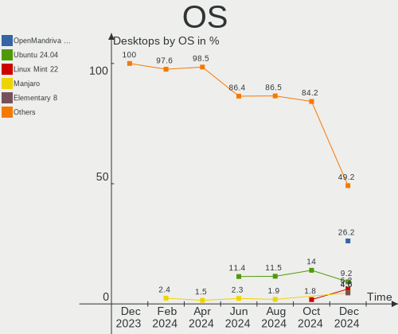

| Name                        | Desktops | Percent |
|-----------------------------|----------|---------|
| Ubuntu 22.04                | 13       | 22.81%  |
| OpenMandriva 4.3            | 6        | 10.53%  |
| Linux Mint 21               | 4        | 7.02%   |
| Fedora 36                   | 3        | 5.26%   |
| Pop!_OS 22.04               | 2        | 3.51%   |
| Nobara 36                   | 2        | 3.51%   |
| Manjaro 22.0.0              | 2        | 3.51%   |
| Debian 11                   | 2        | 3.51%   |
| Zorin 15                    | 1        | 1.75%   |
| Xubuntu 18.04               | 1        | 1.75%   |
| Ubuntu Studio 22.04         | 1        | 1.75%   |
| Ubuntu 22.10                | 1        | 1.75%   |
| Ubuntu 18.04                | 1        | 1.75%   |
| ROSA 12.2                   | 1        | 1.75%   |
| org.kde.Platform 5.15-21.08 | 1        | 1.75%   |
| OpenMandriva 4.50           | 1        | 1.75%   |
| OpenMandriva 4.2            | 1        | 1.75%   |
| Manjaro                     | 1        | 1.75%   |
| Lubuntu 22.04               | 1        | 1.75%   |
| Linux Mint 20.3             | 1        | 1.75%   |
| Linux Mint 20.2             | 1        | 1.75%   |
| Linux Mint 18.3             | 1        | 1.75%   |
| Kubuntu 22.04               | 1        | 1.75%   |
| KDE neon 20.04              | 1        | 1.75%   |
| Garuda Linux Rolling        | 1        | 1.75%   |
| Fedora 37                   | 1        | 1.75%   |
| EndeavourOS Rolling         | 1        | 1.75%   |
| Debian                      | 1        | 1.75%   |
| Clear Linux 36010           | 1        | 1.75%   |
| ArcoLinux                   | 1        | 1.75%   |
| Arch Rolling                | 1        | 1.75%   |

OS Family
---------

OS without a version

| Name             | Desktops | Percent |
|------------------|----------|---------|
| Ubuntu           | 15       | 26.32%  |
| OpenMandriva     | 8        | 14.04%  |
| Linux Mint       | 7        | 12.28%  |
| Fedora           | 4        | 7.02%   |
| Manjaro          | 3        | 5.26%   |
| Debian           | 3        | 5.26%   |
| Pop!_OS          | 2        | 3.51%   |
| Nobara           | 2        | 3.51%   |
| Zorin            | 1        | 1.75%   |
| Xubuntu          | 1        | 1.75%   |
| Ubuntu Studio    | 1        | 1.75%   |
| ROSA             | 1        | 1.75%   |
| org.kde.Platform | 1        | 1.75%   |
| Lubuntu          | 1        | 1.75%   |
| Kubuntu          | 1        | 1.75%   |
| KDE neon         | 1        | 1.75%   |
| Garuda Linux     | 1        | 1.75%   |
| EndeavourOS      | 1        | 1.75%   |
| Clear Linux      | 1        | 1.75%   |
| ArcoLinux        | 1        | 1.75%   |
| Arch             | 1        | 1.75%   |

Kernel
------

Version of the Linux kernel

| Version                            | Desktops | Percent |
|------------------------------------|----------|---------|
| 5.15.0-50-generic                  | 11       | 19.3%   |
| 5.16.7-desktop-1omv4003            | 6        | 10.53%  |
| 5.15.0-52-generic                  | 5        | 8.77%   |
| 5.15.0-48-generic                  | 3        | 5.26%   |
| 6.0.2-zen1-1-zen                   | 2        | 3.51%   |
| 5.19.16-201.fsync.fc36.x86_64      | 2        | 3.51%   |
| 4.15.0-193-generic                 | 2        | 3.51%   |
| 6.0.2-2-MANJARO                    | 1        | 1.75%   |
| 6.0.1-zen2-1-zen                   | 1        | 1.75%   |
| 6.0.0-2-amd64                      | 1        | 1.75%   |
| 5.4.0-126-generic                  | 1        | 1.75%   |
| 5.19.16-76051916-generic           | 1        | 1.75%   |
| 5.19.15-201.fc36.x86_64            | 1        | 1.75%   |
| 5.19.13-300.fc37.x86_64            | 1        | 1.75%   |
| 5.19.13-200.fc36.x86_64            | 1        | 1.75%   |
| 5.19.12-desktop-2omv4090           | 1        | 1.75%   |
| 5.19.12-200.fc36.x86_64            | 1        | 1.75%   |
| 5.19.0-76051900-generic            | 1        | 1.75%   |
| 5.19.0-3-rt10-MANJARO              | 1        | 1.75%   |
| 5.19.0-23-generic                  | 1        | 1.75%   |
| 5.19.0-2-amd64                     | 1        | 1.75%   |
| 5.19.0-16.2-liquorix-amd64         | 1        | 1.75%   |
| 5.18.17-amd64-desktop-hwe          | 1        | 1.75%   |
| 5.16.13-1132.native                | 1        | 1.75%   |
| 5.15.74-1-lts                      | 1        | 1.75%   |
| 5.15.0-52-lowlatency               | 1        | 1.75%   |
| 5.15.0-41-generic                  | 1        | 1.75%   |
| 5.14.0-1054-oem                    | 1        | 1.75%   |
| 5.10.74-generic-2rosa2021.1-x86_64 | 1        | 1.75%   |
| 5.10.146-1-MANJARO                 | 1        | 1.75%   |
| 5.10.14-desktop-1omv4002           | 1        | 1.75%   |
| 5.10.0-18-amd64                    | 1        | 1.75%   |
| 4.15.0-142-generic                 | 1        | 1.75%   |

Kernel Family
-------------

Linux kernel without a distro release

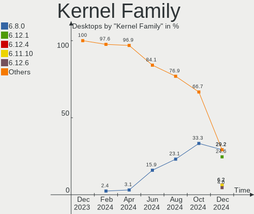

| Version  | Desktops | Percent |
|----------|----------|---------|
| 5.15.0   | 21       | 36.84%  |
| 5.16.7   | 6        | 10.53%  |
| 5.19.0   | 5        | 8.77%   |
| 6.0.2    | 3        | 5.26%   |
| 5.19.16  | 3        | 5.26%   |
| 4.15.0   | 3        | 5.26%   |
| 5.19.13  | 2        | 3.51%   |
| 5.19.12  | 2        | 3.51%   |
| 6.0.1    | 1        | 1.75%   |
| 6.0.0    | 1        | 1.75%   |
| 5.4.0    | 1        | 1.75%   |
| 5.19.15  | 1        | 1.75%   |
| 5.18.17  | 1        | 1.75%   |
| 5.16.13  | 1        | 1.75%   |
| 5.15.74  | 1        | 1.75%   |
| 5.14.0   | 1        | 1.75%   |
| 5.10.74  | 1        | 1.75%   |
| 5.10.146 | 1        | 1.75%   |
| 5.10.14  | 1        | 1.75%   |
| 5.10.0   | 1        | 1.75%   |

Kernel Major Ver.
-----------------

Linux kernel major version

| Version | Desktops | Percent |
|---------|----------|---------|
| 5.15    | 22       | 38.6%   |
| 5.19    | 13       | 22.81%  |
| 5.16    | 7        | 12.28%  |
| 6.0     | 5        | 8.77%   |
| 5.10    | 4        | 7.02%   |
| 4.15    | 3        | 5.26%   |
| 5.4     | 1        | 1.75%   |
| 5.18    | 1        | 1.75%   |
| 5.14    | 1        | 1.75%   |

Arch
----

OS architecture (x86_64, i586, etc.)

| Name   | Desktops | Percent |
|--------|----------|---------|
| x86_64 | 57       | 100%    |

DE
--

Desktop Environment

| Name       | Desktops | Percent |
|------------|----------|---------|
| GNOME      | 26       | 45.61%  |
| KDE5       | 18       | 31.58%  |
| X-Cinnamon | 5        | 8.77%   |
| XFCE       | 2        | 3.51%   |
| MATE       | 2        | 3.51%   |
| LXQt       | 2        | 3.51%   |
| Deepin     | 1        | 1.75%   |
| Unknown    | 1        | 1.75%   |

Display Server
--------------

X11 or Wayland

| Name    | Desktops | Percent |
|---------|----------|---------|
| X11     | 40       | 70.18%  |
| Wayland | 14       | 24.56%  |
| Tty     | 3        | 5.26%   |

Display Manager
---------------

SDDM, LightDM, etc.

| Name    | Desktops | Percent |
|---------|----------|---------|
| Unknown | 22       | 38.6%   |
| SDDM    | 14       | 24.56%  |
| GDM3    | 13       | 22.81%  |
| LightDM | 5        | 8.77%   |
| GDM     | 2        | 3.51%   |
| LXDM    | 1        | 1.75%   |

OS Lang
-------

Language

| Lang  | Desktops | Percent |
|-------|----------|---------|
| es_ES | 44       | 77.19%  |
| en_US | 8        | 14.04%  |
| fr_FR | 1        | 1.75%   |
| es_MX | 1        | 1.75%   |
| en_GB | 1        | 1.75%   |
| ca_ES | 1        | 1.75%   |
| ca_AD | 1        | 1.75%   |

Boot Mode
---------

EFI or BIOS

| Mode | Desktops | Percent |
|------|----------|---------|
| BIOS | 40       | 70.18%  |
| EFI  | 17       | 29.82%  |

Filesystem
----------

Type of filesystem

| Type    | Desktops | Percent |
|---------|----------|---------|
| Ext4    | 41       | 71.93%  |
| Overlay | 8        | 14.04%  |
| Btrfs   | 7        | 12.28%  |
| Xfs     | 1        | 1.75%   |

Part. scheme
------------

Scheme of partitioning

| Type    | Desktops | Percent |
|---------|----------|---------|
| GPT     | 29       | 50.88%  |
| Unknown | 21       | 36.84%  |
| MBR     | 7        | 12.28%  |

Dual Boot with Linux/BSD
------------------------

Hosting more than one Linux/BSD

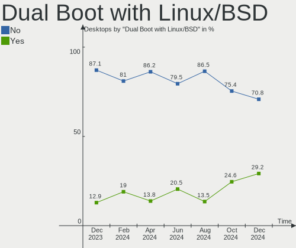

| Dual boot | Desktops | Percent |
|-----------|----------|---------|
| No        | 44       | 77.19%  |
| Yes       | 13       | 22.81%  |

Dual Boot (Win)
---------------

Hosting Linux and Windows

| Dual boot | Desktops | Percent |
|-----------|----------|---------|
| No        | 36       | 63.16%  |
| Yes       | 21       | 36.84%  |

Board
-----

Vendor
------

Motherboard manufacturer

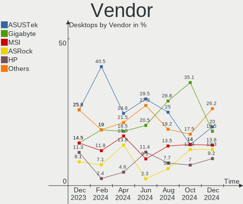

| Name                | Desktops | Percent |
|---------------------|----------|---------|
| Gigabyte Technology | 15       | 26.32%  |
| ASUSTek Computer    | 14       | 24.56%  |
| MSI                 | 11       | 19.3%   |
| Hewlett-Packard     | 4        | 7.02%   |
| Intel               | 2        | 3.51%   |
| Dell                | 2        | 3.51%   |
| ASRock              | 2        | 3.51%   |
| Unknown             | 2        | 3.51%   |
| Shuttle             | 1        | 1.75%   |
| Medion              | 1        | 1.75%   |
| Lenovo              | 1        | 1.75%   |
| BESSTAR Tech        | 1        | 1.75%   |
| Acer                | 1        | 1.75%   |

Model
-----

Motherboard model

| Name                                | Desktops | Percent |
|-------------------------------------|----------|---------|
| Unknown                             | 2        | 3.51%   |
| Shuttle DH470                       | 1        | 1.75%   |
| MSI WC846AA-ABE HPE-140es           | 1        | 1.75%   |
| MSI MS-7D54                         | 1        | 1.75%   |
| MSI MS-7D18                         | 1        | 1.75%   |
| MSI MS-7C95                         | 1        | 1.75%   |
| MSI MS-7C80                         | 1        | 1.75%   |
| MSI MS-7B98                         | 1        | 1.75%   |
| MSI MS-7B51                         | 1        | 1.75%   |
| MSI MS-7B07                         | 1        | 1.75%   |
| MSI MS-7918                         | 1        | 1.75%   |
| MSI MS-7817                         | 1        | 1.75%   |
| MSI MS-7512                         | 1        | 1.75%   |
| Medion MS-7797                      | 1        | 1.75%   |
| Lenovo ThinkStation P900 30A4A01EAU | 1        | 1.75%   |
| Intel H410M-E                       | 1        | 1.75%   |
| Intel D34010WYK H14771-304          | 1        | 1.75%   |
| HP Slim Desktop 290-a0xxx           | 1        | 1.75%   |
| HP rp5800                           | 1        | 1.75%   |
| HP Compaq Elite 8300 SFF            | 1        | 1.75%   |
| HP Compaq 8200 Elite SFF PC         | 1        | 1.75%   |
| Gigabyte Z97-HD3                    | 1        | 1.75%   |
| Gigabyte X79-UP4                    | 1        | 1.75%   |
| Gigabyte X570 AORUS PRO             | 1        | 1.75%   |
| Gigabyte X470 AORUS ULTRA GAMING    | 1        | 1.75%   |
| Gigabyte P55M-UD2                   | 1        | 1.75%   |
| Gigabyte P55A-UD3                   | 1        | 1.75%   |
| Gigabyte P55-US3L                   | 1        | 1.75%   |
| Gigabyte H410M S2H V3               | 1        | 1.75%   |
| Gigabyte GA-MA790XT-UD4P            | 1        | 1.75%   |
| Gigabyte GA-MA69VM-S2               | 1        | 1.75%   |
| Gigabyte EP43-DS3L                  | 1        | 1.75%   |
| Gigabyte B560M H                    | 1        | 1.75%   |
| Gigabyte B550M DS3H                 | 1        | 1.75%   |
| Gigabyte B450M GAMING               | 1        | 1.75%   |
| Gigabyte B365M DS3H                 | 1        | 1.75%   |
| Dell Precision WorkStation T3500    | 1        | 1.75%   |
| Dell OptiPlex 7050                  | 1        | 1.75%   |
| BESSTAR Tech Z83-F                  | 1        | 1.75%   |
| ASUS Z170I PRO GAMING               | 1        | 1.75%   |

Model Family
------------

Motherboard model prefix

| Name                     | Desktops | Percent |
|--------------------------|----------|---------|
| ASUS PRIME               | 5        | 8.77%   |
| HP Compaq                | 2        | 3.51%   |
| Unknown                  | 2        | 3.51%   |
| Shuttle DH470            | 1        | 1.75%   |
| MSI WC846AA-ABE          | 1        | 1.75%   |
| MSI MS-7D54              | 1        | 1.75%   |
| MSI MS-7D18              | 1        | 1.75%   |
| MSI MS-7C95              | 1        | 1.75%   |
| MSI MS-7C80              | 1        | 1.75%   |
| MSI MS-7B98              | 1        | 1.75%   |
| MSI MS-7B51              | 1        | 1.75%   |
| MSI MS-7B07              | 1        | 1.75%   |
| MSI MS-7918              | 1        | 1.75%   |
| MSI MS-7817              | 1        | 1.75%   |
| MSI MS-7512              | 1        | 1.75%   |
| Medion MS-7797           | 1        | 1.75%   |
| Lenovo ThinkStation      | 1        | 1.75%   |
| Intel H410M-E            | 1        | 1.75%   |
| Intel D34010WYK          | 1        | 1.75%   |
| HP Slim                  | 1        | 1.75%   |
| HP rp5800                | 1        | 1.75%   |
| Gigabyte Z97-HD3         | 1        | 1.75%   |
| Gigabyte X79-UP4         | 1        | 1.75%   |
| Gigabyte X570            | 1        | 1.75%   |
| Gigabyte X470            | 1        | 1.75%   |
| Gigabyte P55M-UD2        | 1        | 1.75%   |
| Gigabyte P55A-UD3        | 1        | 1.75%   |
| Gigabyte P55-US3L        | 1        | 1.75%   |
| Gigabyte H410M           | 1        | 1.75%   |
| Gigabyte GA-MA790XT-UD4P | 1        | 1.75%   |
| Gigabyte GA-MA69VM-S2    | 1        | 1.75%   |
| Gigabyte EP43-DS3L       | 1        | 1.75%   |
| Gigabyte B560M           | 1        | 1.75%   |
| Gigabyte B550M           | 1        | 1.75%   |
| Gigabyte B450M           | 1        | 1.75%   |
| Gigabyte B365M           | 1        | 1.75%   |
| Dell Precision           | 1        | 1.75%   |
| Dell OptiPlex            | 1        | 1.75%   |
| BESSTAR Tech Z83-F       | 1        | 1.75%   |
| ASUS Z170I               | 1        | 1.75%   |

MFG Year
--------

Motherboard manufacture year

| Year | Desktops | Percent |
|------|----------|---------|
| 2021 | 9        | 15.79%  |
| 2018 | 8        | 14.04%  |
| 2020 | 5        | 8.77%   |
| 2019 | 5        | 8.77%   |
| 2009 | 5        | 8.77%   |
| 2013 | 4        | 7.02%   |
| 2015 | 3        | 5.26%   |
| 2014 | 3        | 5.26%   |
| 2012 | 3        | 5.26%   |
| 2017 | 2        | 3.51%   |
| 2016 | 2        | 3.51%   |
| 2011 | 2        | 3.51%   |
| 2010 | 2        | 3.51%   |
| 2008 | 2        | 3.51%   |
| 2007 | 2        | 3.51%   |

Form Factor
-----------

Physical design of the computer

| Name    | Desktops | Percent |
|---------|----------|---------|
| Desktop | 57       | 100%    |

Secure Boot
-----------

Enabled or disabled

| State    | Desktops | Percent |
|----------|----------|---------|
| Disabled | 56       | 98.25%  |
| Enabled  | 1        | 1.75%   |

Coreboot
--------

Have coreboot on board

| Used | Desktops | Percent |
|------|----------|---------|
| No   | 57       | 100%    |

RAM Size
--------

Total RAM memory

| Size in GB  | Desktops | Percent |
|-------------|----------|---------|
| 16.01-24.0  | 14       | 24.56%  |
| 8.01-16.0   | 14       | 24.56%  |
| 3.01-4.0    | 9        | 15.79%  |
| 4.01-8.0    | 8        | 14.04%  |
| 32.01-64.0  | 7        | 12.28%  |
| 64.01-256.0 | 4        | 7.02%   |
| 24.01-32.0  | 1        | 1.75%   |

RAM Used
--------

Used RAM memory

| Used GB   | Desktops | Percent |
|-----------|----------|---------|
| 1.01-2.0  | 19       | 33.33%  |
| 2.01-3.0  | 16       | 28.07%  |
| 3.01-4.0  | 9        | 15.79%  |
| 4.01-8.0  | 8        | 14.04%  |
| 0.51-1.0  | 3        | 5.26%   |
| 8.01-16.0 | 2        | 3.51%   |

Total Drives
------------

Number of drives on board

| Drives | Desktops | Percent |
|--------|----------|---------|
| 1      | 19       | 33.33%  |
| 2      | 16       | 28.07%  |
| 3      | 9        | 15.79%  |
| 4      | 8        | 14.04%  |
| 5      | 3        | 5.26%   |
| 7      | 1        | 1.75%   |
| 6      | 1        | 1.75%   |

Has CD-ROM
----------

Has CD-ROM on board

| Presented | Desktops | Percent |
|-----------|----------|---------|
| No        | 39       | 68.42%  |
| Yes       | 18       | 31.58%  |

Has Ethernet
------------

Has Ethernet on board

| Presented | Desktops | Percent |
|-----------|----------|---------|
| Yes       | 57       | 100%    |

Has WiFi
--------

Has WiFi module

| Presented | Desktops | Percent |
|-----------|----------|---------|
| No        | 39       | 68.42%  |
| Yes       | 18       | 31.58%  |

Has Bluetooth
-------------

Has Bluetooth module

| Presented | Desktops | Percent |
|-----------|----------|---------|
| No        | 35       | 61.4%   |
| Yes       | 22       | 38.6%   |

Location
--------

Country
-------

Geographic location (country)

| Country | Desktops | Percent |
|---------|----------|---------|
| Spain   | 57       | 100%    |

City
----

Geographic location (city)

| City                       | Desktops | Percent |
|----------------------------|----------|---------|
| Madrid                     | 10       | 17.54%  |
| Barcelona                  | 4        | 7.02%   |
| Torrejón de Ardoz         | 3        | 5.26%   |
| Pamplona                   | 3        | 5.26%   |
| Seville                    | 2        | 3.51%   |
| Roquetas de Mar            | 2        | 3.51%   |
| Huelva                     | 2        | 3.51%   |
| Bilbao                     | 2        | 3.51%   |
| Villanubla                 | 1        | 1.75%   |
| Vigo                       | 1        | 1.75%   |
| Vicar                      | 1        | 1.75%   |
| Valencia                   | 1        | 1.75%   |
| Trazo                      | 1        | 1.75%   |
| Tossa de Mar               | 1        | 1.75%   |
| Tarragona                  | 1        | 1.75%   |
| Santiago de Compostela     | 1        | 1.75%   |
| Sant Boi de Llobregat      | 1        | 1.75%   |
| Sabadell                   | 1        | 1.75%   |
| Otur                       | 1        | 1.75%   |
| Ontigola                   | 1        | 1.75%   |
| Mérida                    | 1        | 1.75%   |
| Mazarrón                  | 1        | 1.75%   |
| Marin                      | 1        | 1.75%   |
| Marchena                   | 1        | 1.75%   |
| Los Realejos               | 1        | 1.75%   |
| Las Palmas de Gran Canaria | 1        | 1.75%   |
| Jerez de la Frontera       | 1        | 1.75%   |
| Gijón                     | 1        | 1.75%   |
| el Prat de Llobregat       | 1        | 1.75%   |
| Donostia / San Sebastian   | 1        | 1.75%   |
| Coslada                    | 1        | 1.75%   |
| Chapineria                 | 1        | 1.75%   |
| Calonge                    | 1        | 1.75%   |
| Banyoles                   | 1        | 1.75%   |
| Armilla                    | 1        | 1.75%   |
| Algeciras                  | 1        | 1.75%   |
| Albacete                   | 1        | 1.75%   |

Drives
------

Drive Vendor
------------

Hard drive vendors

| Vendor                      | Desktops | Drives | Percent |
|-----------------------------|----------|--------|---------|
| Seagate                     | 22       | 26     | 18.8%   |
| WDC                         | 20       | 30     | 17.09%  |
| Kingston                    | 18       | 20     | 15.38%  |
| Samsung Electronics         | 14       | 18     | 11.97%  |
| Sandisk                     | 11       | 12     | 9.4%    |
| Crucial                     | 5        | 5      | 4.27%   |
| Toshiba                     | 4        | 4      | 3.42%   |
| Phison Electronics          | 2        | 2      | 1.71%   |
| Micron/Crucial Technology   | 2        | 2      | 1.71%   |
| Kingston Technology Company | 2        | 2      | 1.71%   |
| Intenso                     | 2        | 2      | 1.71%   |
| Hitachi                     | 2        | 2      | 1.71%   |
| Emtec                       | 2        | 2      | 1.71%   |
| China                       | 2        | 2      | 1.71%   |
| Yeyian                      | 1        | 1      | 0.85%   |
| Unknown                     | 1        | 1      | 0.85%   |
| Phison                      | 1        | 1      | 0.85%   |
| Maxtor                      | 1        | 1      | 0.85%   |
| KIOXIA-EXCERIA              | 1        | 1      | 0.85%   |
| JMicron Technology          | 1        | 1      | 0.85%   |
| Intel                       | 1        | 1      | 0.85%   |
| Corsair                     | 1        | 2      | 0.85%   |
| A-DATA Technology           | 1        | 1      | 0.85%   |

Drive Model
-----------

Hard drive models

| Model                                               | Desktops | Percent |
|-----------------------------------------------------|----------|---------|
| Kingston SA400S37480G 480GB SSD                     | 5        | 3.7%    |
| Seagate ST1000DM010-2EP102 1TB                      | 4        | 2.96%   |
| Kingston SV300S37A120G 120GB SSD                    | 4        | 2.96%   |
| Kingston SA400S37240G 240GB SSD                     | 3        | 2.22%   |
| WDC WDS100T2B0A-00SM50 1TB SSD                      | 2        | 1.48%   |
| Toshiba DT01ACA100 1TB                              | 2        | 1.48%   |
| Seagate ST3500418AS 500GB                           | 2        | 1.48%   |
| Seagate ST31000528AS 1TB                            | 2        | 1.48%   |
| Seagate ST3000DM001-1ER166 3TB                      | 2        | 1.48%   |
| Seagate ST2000DM001-9YN164 2TB                      | 2        | 1.48%   |
| SanDisk SSD PLUS 480GB                              | 2        | 1.48%   |
| SanDisk SSD PLUS 1000GB                             | 2        | 1.48%   |
| Samsung SSD 980 500GB                               | 2        | 1.48%   |
| Samsung SSD 860 EVO 250GB                           | 2        | 1.48%   |
| Samsung NVMe SSD Controller SM981/PM981/PM983 500GB | 2        | 1.48%   |
| Samsung HM641JI 640GB                               | 2        | 1.48%   |
| Phison E16 PCIe4 NVMe Controller 1TB                | 2        | 1.48%   |
| Yeyian VALK 2000 512GB                              | 1        | 0.74%   |
| WDC WDS500G2B0B-00YS70 500GB SSD                    | 1        | 0.74%   |
| WDC WDS500G2B0A-00SM50 500GB SSD                    | 1        | 0.74%   |
| WDC WDS200T2B0A-00SM50 2TB SSD                      | 1        | 0.74%   |
| WDC WD6400AAKS-22A7B0 640GB                         | 1        | 0.74%   |
| WDC WD5000AZLX-60K2TA0 500GB                        | 1        | 0.74%   |
| WDC WD5000AAKX-60U6AA0 500GB                        | 1        | 0.74%   |
| WDC WD5000AAKS-00YGA0 500GB                         | 1        | 0.74%   |
| WDC WD40EZRX-00SPEB0 4TB                            | 1        | 0.74%   |
| WDC WD40EFRX-68N32N0 4TB                            | 1        | 0.74%   |
| WDC WD3200BEVT-60ZCT0 320GB                         | 1        | 0.74%   |
| WDC WD3200AAJS-56M0A0 320GB                         | 1        | 0.74%   |
| WDC WD30EZRZ-00GXCB0 3TB                            | 1        | 0.74%   |
| WDC WD30EURX-63T0FY0 3TB                            | 1        | 0.74%   |
| WDC WD20PURX-64P6ZY0 2TB                            | 1        | 0.74%   |
| WDC WD20EZRZ-00Z5HB0 2TB                            | 1        | 0.74%   |
| WDC WD20EZRX-00D8PB0 2TB                            | 1        | 0.74%   |
| WDC WD20EARS-00MVWB0 2TB                            | 1        | 0.74%   |
| WDC WD15EARS-00MVWB0 1TB                            | 1        | 0.74%   |
| WDC WD10JPVX-22JC3T0 1TB                            | 1        | 0.74%   |
| WDC WD10EZRX-00D8PB0 1TB                            | 1        | 0.74%   |
| WDC WD10EZRX-00A3KB0 1TB                            | 1        | 0.74%   |
| WDC WD10EZEX-22MFCA0 1TB                            | 1        | 0.74%   |

HDD Vendor
----------

Hard disk drive vendors

| Vendor              | Desktops | Drives | Percent |
|---------------------|----------|--------|---------|
| Seagate             | 22       | 26     | 43.14%  |
| WDC                 | 18       | 25     | 35.29%  |
| Samsung Electronics | 5        | 5      | 9.8%    |
| Toshiba             | 3        | 3      | 5.88%   |
| Hitachi             | 2        | 2      | 3.92%   |
| Maxtor              | 1        | 1      | 1.96%   |

SSD Vendor
----------

Solid state drive vendors

| Vendor              | Desktops | Drives | Percent |
|---------------------|----------|--------|---------|
| Kingston            | 17       | 19     | 36.96%  |
| SanDisk             | 6        | 7      | 13.04%  |
| Samsung Electronics | 5        | 5      | 10.87%  |
| Crucial             | 4        | 4      | 8.7%    |
| WDC                 | 3        | 5      | 6.52%   |
| Intenso             | 2        | 2      | 4.35%   |
| Emtec               | 2        | 2      | 4.35%   |
| China               | 2        | 2      | 4.35%   |
| Yeyian              | 1        | 1      | 2.17%   |
| Toshiba             | 1        | 1      | 2.17%   |
| KIOXIA-EXCERIA      | 1        | 1      | 2.17%   |
| Intel               | 1        | 1      | 2.17%   |
| A-DATA Technology   | 1        | 1      | 2.17%   |

Drive Kind
----------

HDD or SSD

| Kind | Desktops | Drives | Percent |
|------|----------|--------|---------|
| HDD  | 39       | 62     | 43.33%  |
| SSD  | 34       | 51     | 37.78%  |
| NVMe | 16       | 25     | 17.78%  |
| MMC  | 1        | 1      | 1.11%   |

Drive Connector
---------------

SATA, SAS, NVMe, etc.

| Type | Desktops | Drives | Percent |
|------|----------|--------|---------|
| SATA | 53       | 113    | 75.71%  |
| NVMe | 15       | 24     | 21.43%  |
| SAS  | 1        | 1      | 1.43%   |
| MMC  | 1        | 1      | 1.43%   |

Drive Size
----------

Size of hard drive

| Size in TB | Desktops | Drives | Percent |
|------------|----------|--------|---------|
| 0.01-0.5   | 39       | 60     | 48.75%  |
| 0.51-1.0   | 26       | 33     | 32.5%   |
| 1.01-2.0   | 6        | 8      | 7.5%    |
| 2.01-3.0   | 5        | 6      | 6.25%   |
| 3.01-4.0   | 2        | 3      | 2.5%    |
| 4.01-10.0  | 2        | 3      | 2.5%    |

Space Total
-----------

Amount of disk space available on the file system

| Size in GB     | Desktops | Percent |
|----------------|----------|---------|
| 501-1000       | 12       | 21.05%  |
| 101-250        | 10       | 17.54%  |
| 251-500        | 9        | 15.79%  |
| 2001-3000      | 6        | 10.53%  |
| 1-20           | 6        | 10.53%  |
| 1001-2000      | 5        | 8.77%   |
| More than 3000 | 3        | 5.26%   |
| 51-100         | 3        | 5.26%   |
| 21-50          | 2        | 3.51%   |
| Unknown        | 1        | 1.75%   |

Space Used
----------

Amount of used disk space

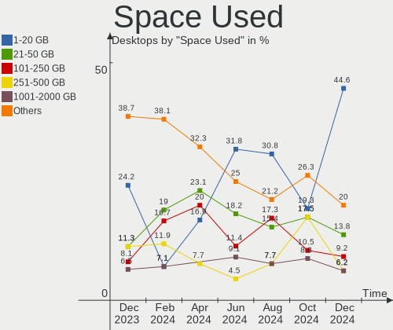

| Used GB   | Desktops | Percent |
|-----------|----------|---------|
| 1-20      | 20       | 35.09%  |
| 21-50     | 8        | 14.04%  |
| 101-250   | 8        | 14.04%  |
| 501-1000  | 7        | 12.28%  |
| 251-500   | 4        | 7.02%   |
| 2001-3000 | 3        | 5.26%   |
| 1001-2000 | 3        | 5.26%   |
| 51-100    | 3        | 5.26%   |
| Unknown   | 1        | 1.75%   |

Malfunc. Drives
---------------

Drive models with a malfunction

| Model                             | Desktops | Drives | Percent |
|-----------------------------------|----------|--------|---------|
| WDC WD5000AAKS-00YGA0 500GB       | 1        | 1      | 14.29%  |
| WDC WD10EAVS-00D7B0 1TB           | 1        | 1      | 14.29%  |
| Seagate ST3000DM001-1ER166 3TB    | 1        | 1      | 14.29%  |
| Seagate ST2000DM001-9YN164 2TB    | 1        | 1      | 14.29%  |
| Seagate ST1000DM010-2EP102 1TB    | 1        | 1      | 14.29%  |
| SanDisk SDSSDX480GG25 480GB       | 1        | 1      | 14.29%  |
| Samsung Electronics HD501LJ 500GB | 1        | 1      | 14.29%  |

Malfunc. Drive Vendor
---------------------

Vendors of faulty drives

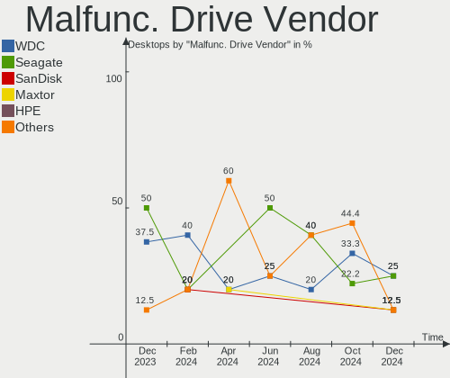

| Vendor              | Desktops | Drives | Percent |
|---------------------|----------|--------|---------|
| Seagate             | 3        | 3      | 42.86%  |
| WDC                 | 2        | 2      | 28.57%  |
| SanDisk             | 1        | 1      | 14.29%  |
| Samsung Electronics | 1        | 1      | 14.29%  |

Malfunc. HDD Vendor
-------------------

Vendors of faulty HDD drives

| Vendor              | Desktops | Drives | Percent |
|---------------------|----------|--------|---------|
| Seagate             | 3        | 3      | 50%     |
| WDC                 | 2        | 2      | 33.33%  |
| Samsung Electronics | 1        | 1      | 16.67%  |

Malfunc. Drive Kind
-------------------

Kinds of faulty drives

| Kind | Desktops | Drives | Percent |
|------|----------|--------|---------|
| HDD  | 4        | 6      | 80%     |
| SSD  | 1        | 1      | 20%     |

Failed Drives
-------------

Failed drive models

| Model                             | Desktops | Drives | Percent |
|-----------------------------------|----------|--------|---------|
| Samsung Electronics SSD 980 500GB | 1        | 1      | 100%    |

Failed Drive Vendor
-------------------

Failed drive vendors

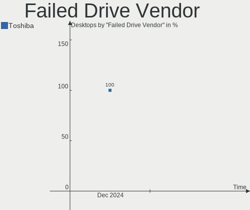

| Vendor              | Desktops | Drives | Percent |
|---------------------|----------|--------|---------|
| Samsung Electronics | 1        | 1      | 100%    |

Drive Status
------------

Number of failed and malfunc. drives

| Status   | Desktops | Drives | Percent |
|----------|----------|--------|---------|
| Detected | 37       | 88     | 60.66%  |
| Works    | 18       | 43     | 29.51%  |
| Malfunc  | 5        | 7      | 8.2%    |
| Failed   | 1        | 1      | 1.64%   |

Storage controller
------------------

Storage Vendor
--------------

Storage controller vendors

| Vendor                        | Desktops | Percent |
|-------------------------------|----------|---------|
| Intel                         | 40       | 45.98%  |
| AMD                           | 16       | 18.39%  |
| Samsung Electronics           | 7        | 8.05%   |
| SanDisk                       | 5        | 5.75%   |
| JMicron Technology            | 5        | 5.75%   |
| Phison Electronics            | 4        | 4.6%    |
| Micron/Crucial Technology     | 3        | 3.45%   |
| Kingston Technology Company   | 3        | 3.45%   |
| Marvell Technology Group      | 2        | 2.3%    |
| Integrated Technology Express | 1        | 1.15%   |
| ASMedia Technology            | 1        | 1.15%   |

Storage Model
-------------

Storage controller models

| Model                                                                          | Desktops | Percent |
|--------------------------------------------------------------------------------|----------|---------|
| AMD FCH SATA Controller [AHCI mode]                                            | 11       | 10.78%  |
| Intel Q170/Q150/B150/H170/H110/Z170/CM236 Chipset SATA Controller [AHCI Mode]  | 5        | 4.9%    |
| JMicron JMB363 SATA/IDE Controller                                             | 4        | 3.92%   |
| Intel 500 Series Chipset Family SATA AHCI Controller                           | 4        | 3.92%   |
| Samsung NVMe SSD Controller PM9A1/PM9A3/980PRO                                 | 3        | 2.94%   |
| Phison E16 PCIe4 NVMe Controller                                               | 3        | 2.94%   |
| Intel SATA Controller [RAID mode]                                              | 3        | 2.94%   |
| Intel 82801JI (ICH10 Family) SATA AHCI Controller                              | 3        | 2.94%   |
| Intel 8 Series/C220 Series Chipset Family 6-port SATA Controller 1 [AHCI mode] | 3        | 2.94%   |
| Intel 7 Series/C210 Series Chipset Family 6-port SATA Controller [AHCI mode]   | 3        | 2.94%   |
| AMD 400 Series Chipset SATA Controller                                         | 3        | 2.94%   |
| Samsung NVMe SSD Controller SM981/PM981/PM983                                  | 2        | 1.96%   |
| Samsung NVMe SSD Controller 980                                                | 2        | 1.96%   |
| Micron/Crucial P2 NVMe PCIe SSD                                                | 2        | 1.96%   |
| Intel Comet Lake SATA AHCI Controller                                          | 2        | 1.96%   |
| Intel 9 Series Chipset Family SATA Controller [AHCI Mode]                      | 2        | 1.96%   |
| Intel 5 Series/3400 Series Chipset 6 port SATA AHCI Controller                 | 2        | 1.96%   |
| AMD 500 Series Chipset SATA Controller                                         | 2        | 1.96%   |
| SanDisk WD Blue SN550 NVMe SSD                                                 | 1        | 0.98%   |
| SanDisk WD Blue SN500 / PC SN520 NVMe SSD                                      | 1        | 0.98%   |
| SanDisk WD Black NVMe SSD                                                      | 1        | 0.98%   |
| SanDisk WD Black 2018/SN750 / PC SN720 NVMe SSD                                | 1        | 0.98%   |
| SanDisk Non-Volatile memory controller                                         | 1        | 0.98%   |
| Samsung NVMe SSD Controller SM961/PM961/SM963                                  | 1        | 0.98%   |
| Phison E12 NVMe Controller                                                     | 1        | 0.98%   |
| Micron/Crucial P1 NVMe PCIe SSD                                                | 1        | 0.98%   |
| Marvell Group 88SE91A3 SATA-600 Controller                                     | 1        | 0.98%   |
| Marvell Group 88SE9172 SATA 6Gb/s Controller                                   | 1        | 0.98%   |
| Kingston Company Company Non-Volatile memory controller                        | 1        | 0.98%   |
| Kingston Company KC2000 NVMe SSD                                               | 1        | 0.98%   |
| Kingston Company A2000 NVMe SSD                                                | 1        | 0.98%   |
| JMicron JMB368 IDE controller                                                  | 1        | 0.98%   |
| Intel Volume Management Device NVMe RAID Controller                            | 1        | 0.98%   |
| Intel Sunrise Point-LP SATA Controller [AHCI mode]                             | 1        | 0.98%   |
| Intel NM10/ICH7 Family SATA Controller [AHCI mode]                             | 1        | 0.98%   |
| Intel Cannon Lake PCH SATA AHCI Controller                                     | 1        | 0.98%   |
| Intel C610/X99 series chipset sSATA Controller [AHCI mode]                     | 1        | 0.98%   |
| Intel C610/X99 series chipset IDE-r Controller                                 | 1        | 0.98%   |
| Intel C610/X99 series chipset 6-Port SATA Controller [AHCI mode]               | 1        | 0.98%   |
| Intel C600/X79 series chipset 6-Port SATA AHCI Controller                      | 1        | 0.98%   |

Storage Kind
------------

Kind of storage controller (IDE, SATA, NVMe, SAS, ...)

| Kind | Desktops | Percent |
|------|----------|---------|
| SATA | 51       | 63.75%  |
| NVMe | 15       | 18.75%  |
| IDE  | 10       | 12.5%   |
| RAID | 4        | 5%      |

Processor
---------

CPU Vendor
----------

Processor vendors

| Vendor | Desktops | Percent |
|--------|----------|---------|
| Intel  | 41       | 71.93%  |
| AMD    | 16       | 28.07%  |

CPU Model
---------

Processor models

| Model                                       | Desktops | Percent |
|---------------------------------------------|----------|---------|
| Intel Core i5-2400 CPU @ 3.10GHz            | 2        | 3.51%   |
| Intel Core i5-10400 CPU @ 2.90GHz           | 2        | 3.51%   |
| Intel Core i5 CPU 750 @ 2.67GHz             | 2        | 3.51%   |
| Intel Core 2 Quad CPU Q6600 @ 2.40GHz       | 2        | 3.51%   |
| AMD Ryzen 9 3900X 12-Core Processor         | 2        | 3.51%   |
| AMD Ryzen 5 5600X 6-Core Processor          | 2        | 3.51%   |
| AMD Ryzen 5 3400G with Radeon Vega Graphics | 2        | 3.51%   |
| Intel Xeon CPU X5450 @ 3.00GHz              | 1        | 1.75%   |
| Intel Xeon CPU W3530 @ 2.80GHz              | 1        | 1.75%   |
| Intel Xeon CPU E5-2689 0 @ 2.60GHz          | 1        | 1.75%   |
| Intel Xeon CPU E5-2650 v2 @ 2.60GHz         | 1        | 1.75%   |
| Intel Xeon CPU E5-2640 v3 @ 2.60GHz         | 1        | 1.75%   |
| Intel Pentium Gold G6400 CPU @ 4.00GHz      | 1        | 1.75%   |
| Intel Genuine CPU 0000 @ 3.30GHz            | 1        | 1.75%   |
| Intel Genuine CPU 0000 @ 2.40GHz            | 1        | 1.75%   |
| Intel Core i7-9700 CPU @ 3.00GHz            | 1        | 1.75%   |
| Intel Core i7-6700K CPU @ 4.00GHz           | 1        | 1.75%   |
| Intel Core i7-6700 CPU @ 3.40GHz            | 1        | 1.75%   |
| Intel Core i7-4790 CPU @ 3.60GHz            | 1        | 1.75%   |
| Intel Core i7-3770 CPU @ 3.40GHz            | 1        | 1.75%   |
| Intel Core i7 CPU 860 @ 2.80GHz             | 1        | 1.75%   |
| Intel Core i5-9400F CPU @ 2.90GHz           | 1        | 1.75%   |
| Intel Core i5-8600K CPU @ 3.60GHz           | 1        | 1.75%   |
| Intel Core i5-6500 CPU @ 3.20GHz            | 1        | 1.75%   |
| Intel Core i5-6400 CPU @ 2.70GHz            | 1        | 1.75%   |
| Intel Core i5-4690K CPU @ 3.50GHz           | 1        | 1.75%   |
| Intel Core i5-4690 CPU @ 3.50GHz            | 1        | 1.75%   |
| Intel Core i5-4460 CPU @ 3.20GHz            | 1        | 1.75%   |
| Intel Core i5-3470 CPU @ 3.20GHz            | 1        | 1.75%   |
| Intel Core i3-6100T CPU @ 3.20GHz           | 1        | 1.75%   |
| Intel Core i3-6006U CPU @ 2.00GHz           | 1        | 1.75%   |
| Intel Core i3-4150T CPU @ 3.00GHz           | 1        | 1.75%   |
| Intel Core i3-4010U CPU @ 1.70GHz           | 1        | 1.75%   |
| Intel Core i3-10105F CPU @ 3.70GHz          | 1        | 1.75%   |
| Intel Core i3 CPU 530 @ 2.93GHz             | 1        | 1.75%   |
| Intel Core 2 Quad CPU Q9550 @ 2.83GHz       | 1        | 1.75%   |
| Intel Atom x5-Z8350 CPU @ 1.44GHz           | 1        | 1.75%   |
| Intel 12th Gen Core i7-12700K               | 1        | 1.75%   |
| Intel 11th Gen Core i5-11400F @ 2.60GHz     | 1        | 1.75%   |
| Intel 11th Gen Core i5-11400 @ 2.60GHz      | 1        | 1.75%   |

CPU Model Family
----------------

Processor model prefix

| Model              | Desktops | Percent |
|--------------------|----------|---------|
| Intel Core i5      | 14       | 24.56%  |
| Intel Core i7      | 6        | 10.53%  |
| Intel Core i3      | 6        | 10.53%  |
| AMD Ryzen 5        | 6        | 10.53%  |
| Intel Xeon         | 5        | 8.77%   |
| Other              | 3        | 5.26%   |
| Intel Core 2 Quad  | 3        | 5.26%   |
| AMD Ryzen 7        | 3        | 5.26%   |
| Intel Genuine      | 2        | 3.51%   |
| AMD Ryzen 9        | 2        | 3.51%   |
| AMD A4             | 2        | 3.51%   |
| Intel Pentium Gold | 1        | 1.75%   |
| Intel Atom         | 1        | 1.75%   |
| AMD Ryzen 3        | 1        | 1.75%   |
| AMD Phenom II X4   | 1        | 1.75%   |
| AMD Athlon 64 X2   | 1        | 1.75%   |

CPU Cores
---------

Number of processor cores

| Number | Desktops | Percent |
|--------|----------|---------|
| 4      | 28       | 49.12%  |
| 6      | 9        | 15.79%  |
| 2      | 8        | 14.04%  |
| 8      | 6        | 10.53%  |
| 12     | 3        | 5.26%   |
| 16     | 1        | 1.75%   |
| 10     | 1        | 1.75%   |
| 1      | 1        | 1.75%   |

CPU Sockets
-----------

Number of sockets

| Number | Desktops | Percent |
|--------|----------|---------|
| 1      | 56       | 98.25%  |
| 2      | 1        | 1.75%   |

CPU Threads
-----------

Threads per core (Hyper-Threading)

| Number | Desktops | Percent |
|--------|----------|---------|
| 2      | 34       | 59.65%  |
| 1      | 23       | 40.35%  |

CPU Op-Modes
------------

CPU Operation Modes (32-bit, 64-bit)

| Op mode        | Desktops | Percent |
|----------------|----------|---------|
| 32-bit, 64-bit | 57       | 100%    |

CPU Microcode
-------------

Microcode number

| Number     | Desktops | Percent |
|------------|----------|---------|
| Unknown    | 21       | 36.84%  |
| 0x506e3    | 4        | 7.02%   |
| 0x306c3    | 4        | 7.02%   |
| 0xa0653    | 3        | 5.26%   |
| 0x08701021 | 3        | 5.26%   |
| 0x6fb      | 2        | 3.51%   |
| 0x106e5    | 2        | 3.51%   |
| 0xa0671    | 1        | 1.75%   |
| 0x406e3    | 1        | 1.75%   |
| 0x406c4    | 1        | 1.75%   |
| 0x40651    | 1        | 1.75%   |
| 0x306f2    | 1        | 1.75%   |
| 0x306a9    | 1        | 1.75%   |
| 0x206d7    | 1        | 1.75%   |
| 0x206a7    | 1        | 1.75%   |
| 0x106a5    | 1        | 1.75%   |
| 0x1067a    | 1        | 1.75%   |
| 0x0a20120a | 1        | 1.75%   |
| 0x0a201016 | 1        | 1.75%   |
| 0x0a201006 | 1        | 1.75%   |
| 0x08108109 | 1        | 1.75%   |
| 0x08101016 | 1        | 1.75%   |
| 0x08001138 | 1        | 1.75%   |
| 0x06006705 | 1        | 1.75%   |
| 0x06001119 | 1        | 1.75%   |

CPU Microarch
-------------

Microarchitecture

| Name        | Desktops | Percent |
|-------------|----------|---------|
| Skylake     | 7        | 12.28%  |
| Haswell     | 7        | 12.28%  |
| CometLake   | 5        | 8.77%   |
| Zen 3       | 4        | 7.02%   |
| Nehalem     | 4        | 7.02%   |
| Zen+        | 3        | 5.26%   |
| Zen 2       | 3        | 5.26%   |
| SandyBridge | 3        | 5.26%   |
| KabyLake    | 3        | 5.26%   |
| IvyBridge   | 3        | 5.26%   |
| Zen         | 2        | 3.51%   |
| Penryn      | 2        | 3.51%   |
| Core        | 2        | 3.51%   |
| Unknown     | 2        | 3.51%   |
| Westmere    | 1        | 1.75%   |
| Silvermont  | 1        | 1.75%   |
| Piledriver  | 1        | 1.75%   |
| K8 Hammer   | 1        | 1.75%   |
| K10         | 1        | 1.75%   |
| Icelake     | 1        | 1.75%   |
| Excavator   | 1        | 1.75%   |

Graphics
--------

GPU Vendor
----------

Vendors of graphics cards

| Vendor | Desktops | Percent |
|--------|----------|---------|
| Nvidia | 27       | 47.37%  |
| Intel  | 16       | 28.07%  |
| AMD    | 14       | 24.56%  |

GPU Model
---------

Graphics card models

| Model                                                                                    | Desktops | Percent |
|------------------------------------------------------------------------------------------|----------|---------|
| Nvidia GK208B [GeForce GT 710]                                                           | 3        | 5.17%   |
| Nvidia GT215 [GeForce GT 240]                                                            | 2        | 3.45%   |
| Nvidia GP108 [GeForce GT 1030]                                                           | 2        | 3.45%   |
| Nvidia GP104 [GeForce GTX 1070]                                                          | 2        | 3.45%   |
| Nvidia GM204 [GeForce GTX 970]                                                           | 2        | 3.45%   |
| Intel Xeon E3-1200 v3/4th Gen Core Processor Integrated Graphics Controller              | 2        | 3.45%   |
| Intel CometLake-S GT2 [UHD Graphics 630]                                                 | 2        | 3.45%   |
| AMD Picasso/Raven 2 [Radeon Vega Series / Radeon Vega Mobile Series]                     | 2        | 3.45%   |
| AMD Ellesmere [Radeon RX 470/480/570/570X/580/580X/590]                                  | 2        | 3.45%   |
| Nvidia TU116 [GeForce GTX 1660 SUPER]                                                    | 1        | 1.72%   |
| Nvidia TU104GL [Quadro RTX 4000]                                                         | 1        | 1.72%   |
| Nvidia GT218 [GeForce G210]                                                              | 1        | 1.72%   |
| Nvidia GT218 [GeForce 210]                                                               | 1        | 1.72%   |
| Nvidia GT200 [GeForce GTX 260]                                                           | 1        | 1.72%   |
| Nvidia GP107 [GeForce GTX 1050 Ti]                                                       | 1        | 1.72%   |
| Nvidia GP106 [GeForce GTX 1060 6GB]                                                      | 1        | 1.72%   |
| Nvidia GM206 [GeForce GTX 950]                                                           | 1        | 1.72%   |
| Nvidia GK208B [GeForce GT 720]                                                           | 1        | 1.72%   |
| Nvidia GF119 [GeForce GT 620 OEM]                                                        | 1        | 1.72%   |
| Nvidia GF106GL [Quadro 2000]                                                             | 1        | 1.72%   |
| Nvidia GF100 [GeForce GTX 480]                                                           | 1        | 1.72%   |
| Nvidia GF100 [GeForce GTX 470]                                                           | 1        | 1.72%   |
| Nvidia GA104 [GeForce RTX 3060]                                                          | 1        | 1.72%   |
| Nvidia GA102 [GeForce RTX 3090]                                                          | 1        | 1.72%   |
| Nvidia GA102 [GeForce RTX 3080 Ti]                                                       | 1        | 1.72%   |
| Intel Xeon E3-1200 v2/3rd Gen Core processor Graphics Controller                         | 1        | 1.72%   |
| Intel Skylake GT2 [HD Graphics 520]                                                      | 1        | 1.72%   |
| Intel HD Graphics 630                                                                    | 1        | 1.72%   |
| Intel HD Graphics 530                                                                    | 1        | 1.72%   |
| Intel Haswell-ULT Integrated Graphics Controller                                         | 1        | 1.72%   |
| Intel CometLake-S GT1 [UHD Graphics 610]                                                 | 1        | 1.72%   |
| Intel CoffeeLake-S GT2 [UHD Graphics 630]                                                | 1        | 1.72%   |
| Intel Atom/Celeron/Pentium Processor x5-E8000/J3xxx/N3xxx Integrated Graphics Controller | 1        | 1.72%   |
| Intel AlderLake-S GT1                                                                    | 1        | 1.72%   |
| Intel 82Q35 Express Integrated Graphics Controller                                       | 1        | 1.72%   |
| Intel 4th Generation Core Processor Family Integrated Graphics Controller                | 1        | 1.72%   |
| Intel 2nd Generation Core Processor Family Integrated Graphics Controller                | 1        | 1.72%   |
| AMD Vega 10 XL/XT [Radeon RX Vega 56/64]                                                 | 1        | 1.72%   |
| AMD Stoney [Radeon R2/R3/R4/R5 Graphics]                                                 | 1        | 1.72%   |
| AMD Richland [Radeon HD 8370D]                                                           | 1        | 1.72%   |

GPU Combo
---------

Combinations of graphics cards

| Name       | Desktops | Percent |
|------------|----------|---------|
| 1 x Nvidia | 27       | 47.37%  |
| 1 x Intel  | 16       | 28.07%  |
| 1 x AMD    | 13       | 22.81%  |
| 2 x AMD    | 1        | 1.75%   |

GPU Driver
----------

Free vs proprietary

| Driver      | Desktops | Percent |
|-------------|----------|---------|
| Free        | 41       | 71.93%  |
| Proprietary | 14       | 24.56%  |
| Unknown     | 2        | 3.51%   |

GPU Memory
----------

Total video memory

| Size in GB | Desktops | Percent |
|------------|----------|---------|
| Unknown    | 30       | 52.63%  |
| 1.01-2.0   | 9        | 15.79%  |
| 0.51-1.0   | 7        | 12.28%  |
| 7.01-8.0   | 4        | 7.02%   |
| 3.01-4.0   | 2        | 3.51%   |
| 0.01-0.5   | 2        | 3.51%   |
| 5.01-6.0   | 1        | 1.75%   |
| 16.01-24.0 | 1        | 1.75%   |
| 8.01-16.0  | 1        | 1.75%   |

Monitor
-------

Monitor Vendor
--------------

Monitor vendors

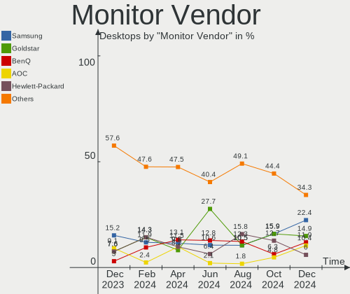

| Vendor               | Desktops | Percent |
|----------------------|----------|---------|
| Samsung Electronics  | 10       | 17.54%  |
| Goldstar             | 8        | 14.04%  |
| BenQ                 | 8        | 14.04%  |
| Hewlett-Packard      | 6        | 10.53%  |
| Philips              | 4        | 7.02%   |
| Xiaomi               | 2        | 3.51%   |
| Sony                 | 2        | 3.51%   |
| Lenovo               | 2        | 3.51%   |
| Dell                 | 2        | 3.51%   |
| ASUSTek Computer     | 2        | 3.51%   |
| AOC                  | 2        | 3.51%   |
| Ancor Communications | 2        | 3.51%   |
| Acer                 | 2        | 3.51%   |
| S2-Tek               | 1        | 1.75%   |
| NEC Computers        | 1        | 1.75%   |
| LG Electronics       | 1        | 1.75%   |
| Haier                | 1        | 1.75%   |
| Gigabyte Technology  | 1        | 1.75%   |

Monitor Model
-------------

Monitor models

| Model                                                                  | Desktops | Percent |
|------------------------------------------------------------------------|----------|---------|
| Xiaomi Mi TV XMD00E1 1440x900 708x398mm 32.0-inch                      | 1        | 1.69%   |
| Xiaomi Mi TV XMD009A 3440x1440 480x270mm 21.7-inch                     | 1        | 1.69%   |
| Sony TV SNY4803 1920x1080 1107x623mm 50.0-inch                         | 1        | 1.69%   |
| Sony TV *30 SNYB105 3840x2160 1439x809mm 65.0-inch                     | 1        | 1.69%   |
| Samsung Electronics S27F350 SAM0D22 1920x1080 598x336mm 27.0-inch      | 1        | 1.69%   |
| Samsung Electronics S24F350 SAM0D20 1920x1080 521x293mm 23.5-inch      | 1        | 1.69%   |
| Samsung Electronics S22F350 SAM0D1B 1920x1080 477x268mm 21.5-inch      | 1        | 1.69%   |
| Samsung Electronics S22C650 SAM0A05 1920x1080 477x268mm 21.5-inch      | 1        | 1.69%   |
| Samsung Electronics LCD Monitor SAM7106 1920x1080 1210x680mm 54.6-inch | 1        | 1.69%   |
| Samsung Electronics LCD Monitor SAM0F13 3840x2160 890x500mm 40.2-inch  | 1        | 1.69%   |
| Samsung Electronics LCD Monitor SAM0A7D 1920x1080 1060x626mm 48.5-inch | 1        | 1.69%   |
| Samsung Electronics LCD Monitor SAM067A 1360x768                       | 1        | 1.69%   |
| Samsung Electronics C32JG5x SAM0FDE 2560x1440 700x390mm 31.5-inch      | 1        | 1.69%   |
| Samsung Electronics C32F391 SAM0D34 1920x1080 698x393mm 31.5-inch      | 1        | 1.69%   |
| S2-Tek TV STK531A 1920x1080 930x530mm 42.1-inch                        | 1        | 1.69%   |
| Philips PHL 246V5 PHLC0C5 1920x1080 531x299mm 24.0-inch                | 1        | 1.69%   |
| Philips PHL 245E1 PHLC20B 2560x1440 530x300mm 24.0-inch                | 1        | 1.69%   |
| Philips LCD Monitor PHL 243V5 1920x1080                                | 1        | 1.69%   |
| Philips LCD Monitor FTV 1920x1080                                      | 1        | 1.69%   |
| NEC Computers LCD2070VX NEC66C6 1600x1200 408x306mm 20.1-inch          | 1        | 1.69%   |
| LG Electronics LCD Monitor LG Ultra HD 3840x2160                       | 1        | 1.69%   |
| Lenovo LEN L28u-30 LEN65FA 3840x2160 621x341mm 27.9-inch               | 1        | 1.69%   |
| Lenovo L2251p Wide LEN0A0C 1680x1050 474x296mm 22.0-inch               | 1        | 1.69%   |
| Hewlett-Packard M27f FHD HPN370A 1920x1080 597x336mm 27.0-inch         | 1        | 1.69%   |
| Hewlett-Packard LA2205 HWP2848 1680x1050 473x296mm 22.0-inch           | 1        | 1.69%   |
| Hewlett-Packard E190i HWP3118 1280x1024 380x300mm 19.1-inch            | 1        | 1.69%   |
| Hewlett-Packard 24x HPN3636 1920x1080 527x297mm 23.8-inch              | 1        | 1.69%   |
| Hewlett-Packard 24m HPN3577 1920x1080 527x297mm 23.8-inch              | 1        | 1.69%   |
| Hewlett-Packard 22fw HPN3541 1920x1080 476x268mm 21.5-inch             | 1        | 1.69%   |
| Haier LT32K1 HAR3281 1360x768 697x392mm 31.5-inch                      | 1        | 1.69%   |
| Goldstar W1941 GSM4B91 1360x768 406x229mm 18.4-inch                    | 1        | 1.69%   |
| Goldstar ULTRAWIDE GSM59F1 2560x1080 798x334mm 34.1-inch               | 1        | 1.69%   |
| Goldstar M2762D GSM576E 1920x1080 598x336mm 27.0-inch                  | 1        | 1.69%   |
| Goldstar M2232 GSM595C 1920x1080 476x267mm 21.5-inch                   | 1        | 1.69%   |
| Goldstar M208WA GSM4E62 1680x1050 434x270mm 20.1-inch                  | 1        | 1.69%   |
| Goldstar LG HDR 4K GSM7707 3840x2160 600x340mm 27.2-inch               | 1        | 1.69%   |
| Goldstar HD GSM5ACD 1366x768 410x230mm 18.5-inch                       | 1        | 1.69%   |
| Goldstar FULL HD GSM5B55 1920x1080 480x270mm 21.7-inch                 | 1        | 1.69%   |
| Goldstar FULL HD GSM5AB9 1920x1080 480x270mm 21.7-inch                 | 1        | 1.69%   |
| Gigabyte Technology M28U GBT2800 3840x2160 697x392mm 31.5-inch         | 1        | 1.69%   |

Monitor Resolution
------------------

Monitor screen resolution

| Resolution         | Desktops | Percent |
|--------------------|----------|---------|
| 1920x1080 (FHD)    | 30       | 51.72%  |
| 3840x2160 (4K)     | 9        | 15.52%  |
| 1680x1050 (WSXGA+) | 4        | 6.9%    |
| 2560x1440 (QHD)    | 3        | 5.17%   |
| 1360x768           | 3        | 5.17%   |
| 1440x900 (WXGA+)   | 2        | 3.45%   |
| 1366x768 (WXGA)    | 2        | 3.45%   |
| 1280x1024 (SXGA)   | 2        | 3.45%   |
| 3440x1440          | 1        | 1.72%   |
| 2560x1080          | 1        | 1.72%   |
| 1600x1200          | 1        | 1.72%   |

Monitor Diagonal
----------------

Diagonal size in inches

| Inches  | Desktops | Percent |
|---------|----------|---------|
| 27      | 10       | 16.95%  |
| 21      | 9        | 15.25%  |
| 24      | 7        | 11.86%  |
| 31      | 5        | 8.47%   |
| 23      | 4        | 6.78%   |
| 19      | 4        | 6.78%   |
| Unknown | 4        | 6.78%   |
| 22      | 3        | 5.08%   |
| 18      | 3        | 5.08%   |
| 20      | 2        | 3.39%   |
| 84      | 1        | 1.69%   |
| 75      | 1        | 1.69%   |
| 60      | 1        | 1.69%   |
| 54      | 1        | 1.69%   |
| 48      | 1        | 1.69%   |
| 43      | 1        | 1.69%   |
| 42      | 1        | 1.69%   |
| 34      | 1        | 1.69%   |

Monitor Width
-------------

Physical width

| Width in mm | Desktops | Percent |
|-------------|----------|---------|
| 401-500     | 20       | 34.48%  |
| 501-600     | 18       | 31.03%  |
| 601-700     | 6        | 10.34%  |
| Unknown     | 4        | 6.9%    |
| 1001-1500   | 3        | 5.17%   |
| 351-400     | 2        | 3.45%   |
| 1501-2000   | 2        | 3.45%   |
| 901-1000    | 2        | 3.45%   |
| 701-800     | 1        | 1.72%   |

Aspect Ratio
------------

Proportional relationship between the width and the height

| Ratio   | Desktops | Percent |
|---------|----------|---------|
| 16/9    | 42       | 76.36%  |
| 16/10   | 6        | 10.91%  |
| Unknown | 3        | 5.45%   |
| 5/4     | 2        | 3.64%   |
| 4/3     | 1        | 1.82%   |
| 21/9    | 1        | 1.82%   |

Monitor Area
------------

Area in inch²

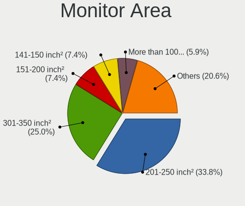

| Area in inch² | Desktops | Percent |
|----------------|----------|---------|
| 201-250        | 18       | 31.03%  |
| 301-350        | 10       | 17.24%  |
| 151-200        | 9        | 15.52%  |
| 351-500        | 6        | 10.34%  |
| More than 1000 | 5        | 8.62%   |
| Unknown        | 4        | 6.9%    |
| 141-150        | 3        | 5.17%   |
| 501-1000       | 2        | 3.45%   |
| 251-300        | 1        | 1.72%   |

Pixel Density
-------------

Pixels per inch

| Density | Desktops | Percent |
|---------|----------|---------|
| 51-100  | 30       | 54.55%  |
| 101-120 | 11       | 20%     |
| 121-160 | 5        | 9.09%   |
| 1-50    | 4        | 7.27%   |
| Unknown | 4        | 7.27%   |
| 161-240 | 1        | 1.82%   |

Multiple Monitors
-----------------

Total monitors connected

| Total | Desktops | Percent |
|-------|----------|---------|
| 1     | 48       | 84.21%  |
| 2     | 6        | 10.53%  |
| 0     | 2        | 3.51%   |
| 3     | 1        | 1.75%   |

Network
-------

Net Controller Vendor
---------------------

Controller vendors

| Vendor                   | Desktops | Percent |
|--------------------------|----------|---------|
| Realtek Semiconductor    | 36       | 48.65%  |
| Intel                    | 25       | 33.78%  |
| Qualcomm Atheros         | 6        | 8.11%   |
| Ralink                   | 2        | 2.7%    |
| TP-Link                  | 1        | 1.35%   |
| Ralink Technology        | 1        | 1.35%   |
| Marvell Technology Group | 1        | 1.35%   |
| Broadcom                 | 1        | 1.35%   |
| ASUSTek Computer         | 1        | 1.35%   |

Net Controller Model
--------------------

Controller models

| Model                                                             | Desktops | Percent |
|-------------------------------------------------------------------|----------|---------|
| Realtek RTL8111/8168/8411 PCI Express Gigabit Ethernet Controller | 26       | 30.95%  |
| Realtek RTL8125 2.5GbE Controller                                 | 5        | 5.95%   |
| Intel I211 Gigabit Network Connection                             | 5        | 5.95%   |
| Intel 82579LM Gigabit Network Connection (Lewisville)             | 4        | 4.76%   |
| Intel Wi-Fi 6 AX210/AX211/AX411 160MHz                            | 3        | 3.57%   |
| Intel Wi-Fi 6 AX200                                               | 3        | 3.57%   |
| Intel Ethernet Connection (7) I219-V                              | 3        | 3.57%   |
| Intel Ethernet Connection (2) I219-V                              | 3        | 3.57%   |
| Realtek RTL88x2bu [AC1200 Techkey]                                | 2        | 2.38%   |
| Qualcomm Atheros QCA6174 802.11ac Wireless Network Adapter        | 2        | 2.38%   |
| Intel Ethernet Connection (14) I219-V                             | 2        | 2.38%   |
| TP-Link Archer T3U [Realtek RTL8812BU]                            | 1        | 1.19%   |
| Realtek RTL8821AE 802.11ac PCIe Wireless Network Adapter          | 1        | 1.19%   |
| Realtek RTL8814AU 802.11a/b/g/n/ac Wireless Adapter               | 1        | 1.19%   |
| Realtek RTL8188CE 802.11b/g/n WiFi Adapter                        | 1        | 1.19%   |
| Realtek RTL8187 Wireless Adapter                                  | 1        | 1.19%   |
| Realtek RTL810xE PCI Express Fast Ethernet controller             | 1        | 1.19%   |
| Realtek RTL-8110SC/8169SC Gigabit Ethernet                        | 1        | 1.19%   |
| Realtek 802.11ac NIC                                              | 1        | 1.19%   |
| Ralink RT5572 Wireless Adapter                                    | 1        | 1.19%   |
| Ralink RT3092 Wireless 802.11n 2T/2R PCIe                         | 1        | 1.19%   |
| Ralink RT3090 Wireless 802.11n 1T/1R PCIe                         | 1        | 1.19%   |
| Qualcomm Atheros QCA8171 Gigabit Ethernet                         | 1        | 1.19%   |
| Qualcomm Atheros Killer E220x Gigabit Ethernet Controller         | 1        | 1.19%   |
| Qualcomm Atheros AR9227 Wireless Network Adapter                  | 1        | 1.19%   |
| Qualcomm Atheros AR5212/5213/2414 Wireless Network Adapter        | 1        | 1.19%   |
| Marvell Group 88E8053 PCI-E Gigabit Ethernet Controller           | 1        | 1.19%   |
| Intel I350 Gigabit Network Connection                             | 1        | 1.19%   |
| Intel I210 Gigabit Network Connection                             | 1        | 1.19%   |
| Intel Ethernet Controller I225-V                                  | 1        | 1.19%   |
| Intel Ethernet Connection I218-V                                  | 1        | 1.19%   |
| Intel Ethernet Connection (5) I219-LM                             | 1        | 1.19%   |
| Intel Ethernet Connection (2) I218-LM                             | 1        | 1.19%   |
| Intel Dual Band Wireless-AC 3168NGW [Stone Peak]                  | 1        | 1.19%   |
| Intel 82566DM-2 Gigabit Network Connection                        | 1        | 1.19%   |
| Broadcom NetXtreme BCM5761 Gigabit Ethernet PCIe                  | 1        | 1.19%   |
| ASUS N10 Nano 802.11n Network Adapter [Realtek RTL8192CU]         | 1        | 1.19%   |

Wireless Vendor
---------------

Wireless vendors

| Vendor                | Desktops | Percent |
|-----------------------|----------|---------|
| Intel                 | 7        | 31.82%  |
| Realtek Semiconductor | 6        | 27.27%  |
| Qualcomm Atheros      | 4        | 18.18%  |
| Ralink                | 2        | 9.09%   |
| TP-Link               | 1        | 4.55%   |
| Ralink Technology     | 1        | 4.55%   |
| ASUSTek Computer      | 1        | 4.55%   |

Wireless Model
--------------

Wireless models

| Model                                                      | Desktops | Percent |
|------------------------------------------------------------|----------|---------|
| Intel Wi-Fi 6 AX210/AX211/AX411 160MHz                     | 3        | 13.04%  |
| Intel Wi-Fi 6 AX200                                        | 3        | 13.04%  |
| Realtek RTL88x2bu [AC1200 Techkey]                         | 2        | 8.7%    |
| Qualcomm Atheros QCA6174 802.11ac Wireless Network Adapter | 2        | 8.7%    |
| TP-Link Archer T3U [Realtek RTL8812BU]                     | 1        | 4.35%   |
| Realtek RTL8821AE 802.11ac PCIe Wireless Network Adapter   | 1        | 4.35%   |
| Realtek RTL8814AU 802.11a/b/g/n/ac Wireless Adapter        | 1        | 4.35%   |
| Realtek RTL8188CE 802.11b/g/n WiFi Adapter                 | 1        | 4.35%   |
| Realtek RTL8187 Wireless Adapter                           | 1        | 4.35%   |
| Realtek 802.11ac NIC                                       | 1        | 4.35%   |
| Ralink RT5572 Wireless Adapter                             | 1        | 4.35%   |
| Ralink RT3092 Wireless 802.11n 2T/2R PCIe                  | 1        | 4.35%   |
| Ralink RT3090 Wireless 802.11n 1T/1R PCIe                  | 1        | 4.35%   |
| Qualcomm Atheros AR9227 Wireless Network Adapter           | 1        | 4.35%   |
| Qualcomm Atheros AR5212/5213/2414 Wireless Network Adapter | 1        | 4.35%   |
| Intel Dual Band Wireless-AC 3168NGW [Stone Peak]           | 1        | 4.35%   |
| ASUS N10 Nano 802.11n Network Adapter [Realtek RTL8192CU]  | 1        | 4.35%   |

Ethernet Vendor
---------------

Ethernet vendors

| Vendor                   | Desktops | Percent |
|--------------------------|----------|---------|
| Realtek Semiconductor    | 33       | 55.93%  |
| Intel                    | 22       | 37.29%  |
| Qualcomm Atheros         | 2        | 3.39%   |
| Marvell Technology Group | 1        | 1.69%   |
| Broadcom                 | 1        | 1.69%   |

Ethernet Model
--------------

Ethernet models

| Model                                                             | Desktops | Percent |
|-------------------------------------------------------------------|----------|---------|
| Realtek RTL8111/8168/8411 PCI Express Gigabit Ethernet Controller | 26       | 42.62%  |
| Realtek RTL8125 2.5GbE Controller                                 | 5        | 8.2%    |
| Intel I211 Gigabit Network Connection                             | 5        | 8.2%    |
| Intel 82579LM Gigabit Network Connection (Lewisville)             | 4        | 6.56%   |
| Intel Ethernet Connection (7) I219-V                              | 3        | 4.92%   |
| Intel Ethernet Connection (2) I219-V                              | 3        | 4.92%   |
| Intel Ethernet Connection (14) I219-V                             | 2        | 3.28%   |
| Realtek RTL810xE PCI Express Fast Ethernet controller             | 1        | 1.64%   |
| Realtek RTL-8110SC/8169SC Gigabit Ethernet                        | 1        | 1.64%   |
| Qualcomm Atheros QCA8171 Gigabit Ethernet                         | 1        | 1.64%   |
| Qualcomm Atheros Killer E220x Gigabit Ethernet Controller         | 1        | 1.64%   |
| Marvell Group 88E8053 PCI-E Gigabit Ethernet Controller           | 1        | 1.64%   |
| Intel I350 Gigabit Network Connection                             | 1        | 1.64%   |
| Intel I210 Gigabit Network Connection                             | 1        | 1.64%   |
| Intel Ethernet Controller I225-V                                  | 1        | 1.64%   |
| Intel Ethernet Connection I218-V                                  | 1        | 1.64%   |
| Intel Ethernet Connection (5) I219-LM                             | 1        | 1.64%   |
| Intel Ethernet Connection (2) I218-LM                             | 1        | 1.64%   |
| Intel 82566DM-2 Gigabit Network Connection                        | 1        | 1.64%   |
| Broadcom NetXtreme BCM5761 Gigabit Ethernet PCIe                  | 1        | 1.64%   |

Net Controller Kind
-------------------

Ethernet, WiFi or modem

| Kind     | Desktops | Percent |
|----------|----------|---------|
| Ethernet | 57       | 76%     |
| WiFi     | 18       | 24%     |

Used Controller
---------------

Currently used network controller

| Kind     | Desktops | Percent |
|----------|----------|---------|
| Ethernet | 49       | 84.48%  |
| WiFi     | 9        | 15.52%  |

NICs
----

Total network controllers on board

| Total | Desktops | Percent |
|-------|----------|---------|
| 1     | 33       | 57.89%  |
| 2     | 23       | 40.35%  |
| 5     | 1        | 1.75%   |

IPv6
----

IPv6 vs IPv4

| Used | Desktops | Percent |
|------|----------|---------|
| No   | 52       | 91.23%  |
| Yes  | 5        | 8.77%   |

Bluetooth
---------

Bluetooth Vendor
----------------

Controller vendors

| Vendor                  | Desktops | Percent |
|-------------------------|----------|---------|
| Intel                   | 6        | 27.27%  |
| Cambridge Silicon Radio | 6        | 27.27%  |
| Realtek Semiconductor   | 4        | 18.18%  |
| ASUSTek Computer        | 2        | 9.09%   |
| TP-Link                 | 1        | 4.55%   |
| Realtek                 | 1        | 4.55%   |
| IMC Networks            | 1        | 4.55%   |
| Broadcom                | 1        | 4.55%   |

Bluetooth Model
---------------

Controller models

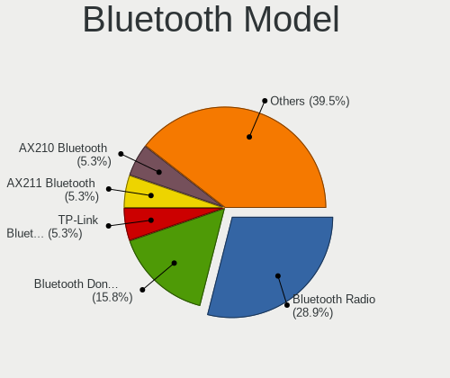

| Model                                               | Desktops | Percent |
|-----------------------------------------------------|----------|---------|
| Cambridge Silicon Radio Bluetooth Dongle (HCI mode) | 6        | 27.27%  |
| Realtek Bluetooth Radio                             | 3        | 13.64%  |
| Intel AX210 Bluetooth                               | 3        | 13.64%  |
| Intel AX200 Bluetooth                               | 2        | 9.09%   |
| ASUS Qualcomm Bluetooth 4.1                         | 2        | 9.09%   |
| TP-Link TPuLink UB500 Adapter                       | 1        | 4.55%   |
| Realtek  Bluetooth 4.2 Adapter                      | 1        | 4.55%   |
| Realtek Bluetooth Radio                             | 1        | 4.55%   |
| Intel Wireless-AC 3168 Bluetooth                    | 1        | 4.55%   |
| IMC Networks Bluetooth Device                       | 1        | 4.55%   |
| Broadcom BCM2045 Bluetooth                          | 1        | 4.55%   |

Sound
-----

Sound Vendor
------------

Sound card vendors

| Vendor                               | Desktops | Percent |
|--------------------------------------|----------|---------|
| Intel                                | 40       | 42.55%  |
| Nvidia                               | 26       | 27.66%  |
| AMD                                  | 21       | 22.34%  |
| Logitech                             | 2        | 2.13%   |
| Kingston Technology                  | 2        | 2.13%   |
| Thesycon Systemsoftware & Consulting | 1        | 1.06%   |
| SteelSeries ApS                      | 1        | 1.06%   |
| Micro Star International             | 1        | 1.06%   |

Sound Model
-----------

Sound card models

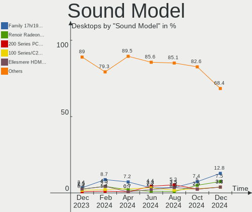

| Model                                                                      | Desktops | Percent |
|----------------------------------------------------------------------------|----------|---------|
| AMD Starship/Matisse HD Audio Controller                                   | 6        | 5.61%   |
| Intel 100 Series/C230 Series Chipset Family HD Audio Controller            | 5        | 4.67%   |
| Nvidia High Definition Audio Controller                                    | 4        | 3.74%   |
| Nvidia GK208 HDMI/DP Audio Controller                                      | 4        | 3.74%   |
| Intel 5 Series/3400 Series Chipset High Definition Audio                   | 4        | 3.74%   |
| AMD Family 17h/19h HD Audio Controller                                     | 4        | 3.74%   |
| Intel 82801JI (ICH10 Family) HD Audio Controller                           | 3        | 2.8%    |
| Intel 8 Series/C220 Series Chipset High Definition Audio Controller        | 3        | 2.8%    |
| Intel 7 Series/C216 Chipset Family High Definition Audio Controller        | 3        | 2.8%    |
| AMD Raven/Raven2/Fenghuang HDMI/DP Audio Controller                        | 3        | 2.8%    |
| Nvidia GP108 High Definition Audio Controller                              | 2        | 1.87%   |
| Nvidia GP104 High Definition Audio Controller                              | 2        | 1.87%   |
| Nvidia GM204 High Definition Audio Controller                              | 2        | 1.87%   |
| Nvidia GF100 High Definition Audio Controller                              | 2        | 1.87%   |
| Nvidia GA102 High Definition Audio Controller                              | 2        | 1.87%   |
| Kingston Technology HyperX QuadCast                                        | 2        | 1.87%   |
| Intel Tiger Lake-H HD Audio Controller                                     | 2        | 1.87%   |
| Intel Comet Lake PCH cAVS                                                  | 2        | 1.87%   |
| Intel Cannon Lake PCH cAVS                                                 | 2        | 1.87%   |
| Intel Audio device                                                         | 2        | 1.87%   |
| Intel 9 Series Chipset Family HD Audio Controller                          | 2        | 1.87%   |
| Intel 6 Series/C200 Series Chipset Family High Definition Audio Controller | 2        | 1.87%   |
| Intel 200 Series PCH HD Audio                                              | 2        | 1.87%   |
| AMD SBx00 Azalia (Intel HDA)                                               | 2        | 1.87%   |
| AMD Oland/Hainan/Cape Verde/Pitcairn HDMI Audio [Radeon HD 7000 Series]    | 2        | 1.87%   |
| AMD Navi 21/23 HDMI/DP Audio Controller                                    | 2        | 1.87%   |
| AMD Family 17h (Models 00h-0fh) HD Audio Controller                        | 2        | 1.87%   |
| AMD Ellesmere HDMI Audio [Radeon RX 470/480 / 570/580/590]                 | 2        | 1.87%   |
| Thesycon Systemsoftware & Consulting D10s                                  | 1        | 0.93%   |
| SteelSeries ApS SteelSeries Arctis 9                                       | 1        | 0.93%   |
| Nvidia TU116 High Definition Audio Controller                              | 1        | 0.93%   |
| Nvidia TU104 HD Audio Controller                                           | 1        | 0.93%   |
| Nvidia GP107GL High Definition Audio Controller                            | 1        | 0.93%   |
| Nvidia GP106 High Definition Audio Controller                              | 1        | 0.93%   |
| Nvidia GM206 High Definition Audio Controller                              | 1        | 0.93%   |
| Nvidia GF119 HDMI Audio Controller                                         | 1        | 0.93%   |
| Nvidia GF106 High Definition Audio Controller                              | 1        | 0.93%   |
| Nvidia GA104 High Definition Audio Controller                              | 1        | 0.93%   |
| Micro Star International USB Audio                                         | 1        | 0.93%   |
| Logitech [G533 Wireless Headset Dongle]                                    | 1        | 0.93%   |

Memory
------

Memory Vendor
-------------

Memory module vendors

| Vendor              | Desktops | Percent |
|---------------------|----------|---------|
| Kingston            | 6        | 20.69%  |
| G.Skill             | 5        | 17.24%  |
| Unknown             | 4        | 13.79%  |
| Corsair             | 4        | 13.79%  |
| SK hynix            | 3        | 10.34%  |
| Samsung Electronics | 3        | 10.34%  |
| Crucial             | 2        | 6.9%    |
| Micron Technology   | 1        | 3.45%   |
| A-DATA Technology   | 1        | 3.45%   |

Memory Model
------------

Memory module models

| Model                                                    | Desktops | Percent |
|----------------------------------------------------------|----------|---------|
| G.Skill RAM F4-2400C15-8GIS 8GB DIMM DDR4 2400MT/s       | 2        | 6.67%   |
| Unknown RAM Module 4GB DIMM DDR3 1600MT/s                | 1        | 3.33%   |
| Unknown RAM Module 2GB DIMM SDRAM                        | 1        | 3.33%   |
| Unknown RAM Module 2GB DIMM DDR2 800MT/s                 | 1        | 3.33%   |
| Unknown RAM Module 1GB DIMM SDRAM                        | 1        | 3.33%   |
| SK hynix RAM Module 4GB DIMM DDR3 1066MT/s               | 1        | 3.33%   |
| SK hynix RAM HMA42GR7MFR4N-TF 16GB DIMM DDR4 2133MT/s    | 1        | 3.33%   |
| SK hynix RAM HMA41GU6AFR8N-TF 8GB DIMM DDR4 2465MT/s     | 1        | 3.33%   |
| Samsung RAM M393A2G40DB0-CPB 16GB DIMM DDR4 2133MT/s     | 1        | 3.33%   |
| Samsung RAM M378B5173QH0-CK0 4GB DIMM DDR3 1600MT/s      | 1        | 3.33%   |
| Samsung RAM M378B1G73EB0-YK0 8GB DIMM DDR3 1600MT/s      | 1        | 3.33%   |
| Micron RAM 16JTF1G64AZ-1G6E1 8GB DIMM DDR3 1600MT/s      | 1        | 3.33%   |
| Kingston RAM KHX3200C16D4/16GX 16GB DIMM DDR4 3600MT/s   | 1        | 3.33%   |
| Kingston RAM KHX2400C15/8G 8GB DIMM DDR4 3400MT/s        | 1        | 3.33%   |
| Kingston RAM KF3200C16D4/8GX 8GB DIMM DDR4 3600MT/s      | 1        | 3.33%   |
| Kingston RAM 99U5702-095.A00G 8GB DIMM DDR4 2667MT/s     | 1        | 3.33%   |
| Kingston RAM 99U5471-054.A00LF 8GB DIMM DDR3 1600MT/s    | 1        | 3.33%   |
| Kingston RAM 9905469-055.A00LF 4GB SODIMM DDR3 1600MT/s  | 1        | 3.33%   |
| G.Skill RAM F4-3600C16-8GTZN 8GB DIMM DDR4 3666MT/s      | 1        | 3.33%   |
| G.Skill RAM F4-3600C16-16GTZNC 16GB DIMM DDR4 3600MT/s   | 1        | 3.33%   |
| G.Skill RAM F3-12800CL9-4GBXL 4GB DIMM DDR3 1867MT/s     | 1        | 3.33%   |
| Crucial RAM CT8G4DFS824A.M8FE 8GB DIMM DDR4 2933MT/s     | 1        | 3.33%   |
| Crucial RAM CT8G4DFS824A.C8FE 8GB DIMM DDR4 3000MT/s     | 1        | 3.33%   |
| Crucial RAM CT16G4SFRA32A.M8FF 16GB SODIMM DDR4 3200MT/s | 1        | 3.33%   |
| Corsair RAM CMV8GX4M1A2400C16 8GB DIMM DDR4 2400MT/s     | 1        | 3.33%   |
| Corsair RAM CMK8GX4M1A2400C16 8GB DIMM DDR4 2800MT/s     | 1        | 3.33%   |
| Corsair RAM CMK32GX4M4D3600C16 8GB DIMM DDR4 3600MT/s    | 1        | 3.33%   |
| Corsair RAM CMK16GX4M2B3200C16 8192MB DIMM DDR4 3600MT/s | 1        | 3.33%   |
| A-DATA RAM DDR4 2400 2OZ 8GB DIMM DDR4 3000MT/s          | 1        | 3.33%   |

Memory Kind
-----------

Memory module kinds

| Kind  | Desktops | Percent |
|-------|----------|---------|
| DDR4  | 15       | 60%     |
| DDR3  | 6        | 24%     |
| SDRAM | 3        | 12%     |
| DDR2  | 1        | 4%      |

Memory Form Factor
------------------

Physical design of the memory module

| Name   | Desktops | Percent |
|--------|----------|---------|
| DIMM   | 22       | 91.67%  |
| SODIMM | 2        | 8.33%   |

Memory Size
-----------

Memory module size

| Size  | Desktops | Percent |
|-------|----------|---------|
| 8192  | 13       | 54.17%  |
| 16384 | 4        | 16.67%  |
| 4096  | 4        | 16.67%  |
| 2048  | 2        | 8.33%   |
| 1024  | 1        | 4.17%   |

Memory Speed
------------

Memory module speed

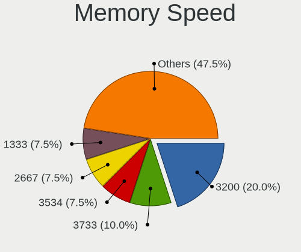

| Speed   | Desktops | Percent |
|---------|----------|---------|
| 3600    | 5        | 18.52%  |
| 1600    | 4        | 14.81%  |
| 3000    | 2        | 7.41%   |
| 2400    | 2        | 7.41%   |
| Unknown | 2        | 7.41%   |
| 3666    | 1        | 3.7%    |
| 3400    | 1        | 3.7%    |
| 3200    | 1        | 3.7%    |
| 2933    | 1        | 3.7%    |
| 2800    | 1        | 3.7%    |
| 2667    | 1        | 3.7%    |
| 2465    | 1        | 3.7%    |
| 2133    | 1        | 3.7%    |
| 1867    | 1        | 3.7%    |
| 1866    | 1        | 3.7%    |
| 1066    | 1        | 3.7%    |
| 800     | 1        | 3.7%    |

Printers & scanners
-------------------

Printer Vendor
--------------

Printer device vendors

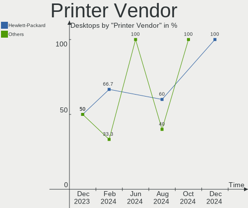

| Vendor             | Desktops | Percent |
|--------------------|----------|---------|
| Brother Industries | 2        | 100%    |

Printer Model
-------------

Printer device models

| Model                     | Desktops | Percent |
|---------------------------|----------|---------|
| Brother DCP-L2510D series | 1        | 50%     |
| Brother DCP-1610W         | 1        | 50%     |

Scanner Vendor
--------------

Scanner device vendors

Zero info for selected period =(

Scanner Model
-------------

Scanner device models

Zero info for selected period =(

Camera
------

Camera Vendor
-------------

Camera device vendors

| Vendor                        | Desktops | Percent |
|-------------------------------|----------|---------|
| Creative Technology           | 2        | 28.57%  |
| Sunplus Innovation Technology | 1        | 14.29%  |
| Realtek Semiconductor         | 1        | 14.29%  |
| Microdia                      | 1        | 14.29%  |
| Logitech                      | 1        | 14.29%  |
| Cubeternet                    | 1        | 14.29%  |

Camera Model
------------

Camera device models

| Model                                                               | Desktops | Percent |
|---------------------------------------------------------------------|----------|---------|
| Sunplus AUSDOM FHD Camera                                           | 1        | 14.29%  |
| Realtek USB Camera                                                  | 1        | 14.29%  |
| Microdia Webcam Vitade AF                                           | 1        | 14.29%  |
| Logitech Webcam C270                                                | 1        | 14.29%  |
| Cubeternet EtronTech CMOS based eSP570 WebCam [Onyx Titanium TC101] | 1        | 14.29%  |
| Creative Live! Cam Sync 1080p V2                                    | 1        | 14.29%  |
| Creative Live! Cam Chat HD [VF0700]                                 | 1        | 14.29%  |

Security
--------

Fingerprint Vendor
------------------

Fingerprint sensor vendors

Zero info for selected period =(

Fingerprint Model
-----------------

Fingerprint sensor models

Zero info for selected period =(

Chipcard Vendor
---------------

Chipcard module vendors

Zero info for selected period =(

Chipcard Model
--------------

Chipcard module models

Zero info for selected period =(

Unsupported
-----------

Unsupported Devices
-------------------

Total unsupported devices on board

| Total | Desktops | Percent |
|-------|----------|---------|
| 0     | 50       | 87.72%  |
| 1     | 6        | 10.53%  |
| 2     | 1        | 1.75%   |

Unsupported Device Types
------------------------

Types of unsupported devices

| Type                     | Desktops | Percent |
|--------------------------|----------|---------|
| Graphics card            | 3        | 37.5%   |
| Net/wireless             | 2        | 25%     |
| Unassigned class         | 1        | 12.5%   |
| Sound                    | 1        | 12.5%   |
| Communication controller | 1        | 12.5%   |

