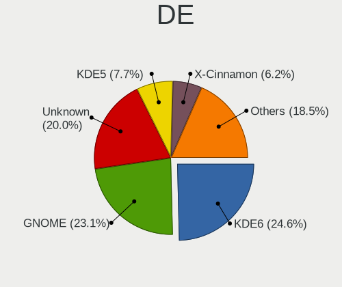
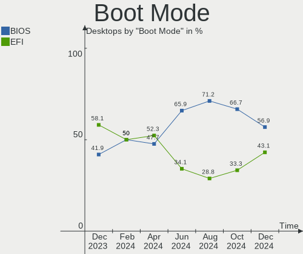
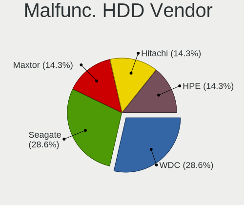
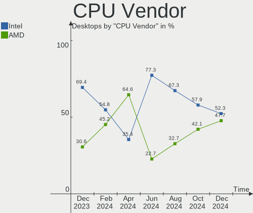
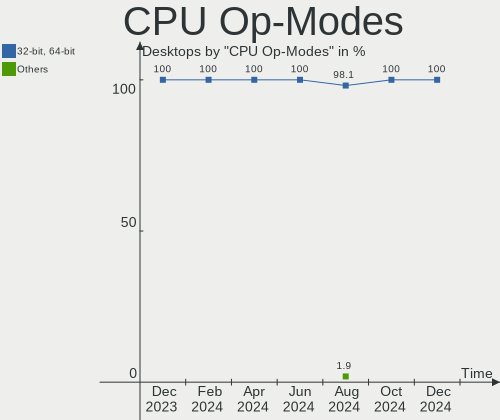
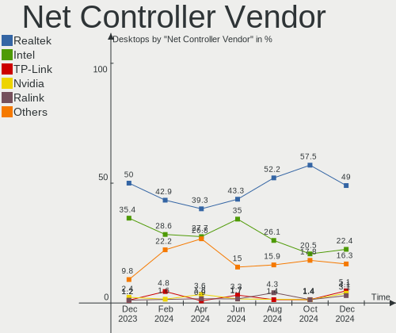
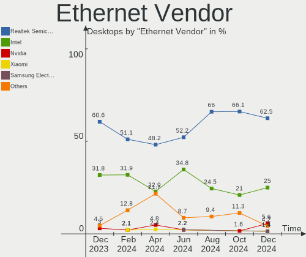

Linux in Spain - Hardware Trends (Desktops)
-------------------------------------------

A project to identify most popular hardware characteristics and track their change
over time based on data collected by Linux users at https://Linux-Hardware.org.

Anyone can contribute to this report by the [hw-probe](https://github.com/linuxhw/hw-probe) tool:

    sudo -E hw-probe -all -upload

Period: Dec, 2022.

Contents
--------

* [ System ](#system)
  - [ OS                       ](#os)
  - [ OS Family                ](#os-family)
  - [ Kernel                   ](#kernel)
  - [ Kernel Family            ](#kernel-family)
  - [ Kernel Major Ver.        ](#kernel-major-ver)
  - [ Arch                     ](#arch)
  - [ DE                       ](#de)
  - [ Display Server           ](#display-server)
  - [ Display Manager          ](#display-manager)
  - [ OS Lang                  ](#os-lang)
  - [ Boot Mode                ](#boot-mode)
  - [ Filesystem               ](#filesystem)
  - [ Part. scheme             ](#part-scheme)
  - [ Dual Boot with Linux/BSD ](#dual-boot-with-linuxbsd)
  - [ Dual Boot (Win)          ](#dual-boot-win)

* [ Board ](#board)
  - [ Vendor                   ](#vendor)
  - [ Model                    ](#model)
  - [ Model Family             ](#model-family)
  - [ MFG Year                 ](#mfg-year)
  - [ Form Factor              ](#form-factor)
  - [ Secure Boot              ](#secure-boot)
  - [ Coreboot                 ](#coreboot)
  - [ RAM Size                 ](#ram-size)
  - [ RAM Used                 ](#ram-used)
  - [ Total Drives             ](#total-drives)
  - [ Has CD-ROM               ](#has-cd-rom)
  - [ Has Ethernet             ](#has-ethernet)
  - [ Has WiFi                 ](#has-wifi)
  - [ Has Bluetooth            ](#has-bluetooth)

* [ Location ](#location)
  - [ Country                  ](#country)
  - [ City                     ](#city)

* [ Drives ](#drives)
  - [ Drive Vendor             ](#drive-vendor)
  - [ Drive Model              ](#drive-model)
  - [ HDD Vendor               ](#hdd-vendor)
  - [ SSD Vendor               ](#ssd-vendor)
  - [ Drive Kind               ](#drive-kind)
  - [ Drive Connector          ](#drive-connector)
  - [ Drive Size               ](#drive-size)
  - [ Space Total              ](#space-total)
  - [ Space Used               ](#space-used)
  - [ Malfunc. Drives          ](#malfunc-drives)
  - [ Malfunc. Drive Vendor    ](#malfunc-drive-vendor)
  - [ Malfunc. HDD Vendor      ](#malfunc-hdd-vendor)
  - [ Malfunc. Drive Kind      ](#malfunc-drive-kind)
  - [ Failed Drives            ](#failed-drives)
  - [ Failed Drive Vendor      ](#failed-drive-vendor)
  - [ Drive Status             ](#drive-status)

* [ Storage controller ](#storage-controller)
  - [ Storage Vendor           ](#storage-vendor)
  - [ Storage Model            ](#storage-model)
  - [ Storage Kind             ](#storage-kind)

* [ Processor ](#processor)
  - [ CPU Vendor               ](#cpu-vendor)
  - [ CPU Model                ](#cpu-model)
  - [ CPU Model Family         ](#cpu-model-family)
  - [ CPU Cores                ](#cpu-cores)
  - [ CPU Sockets              ](#cpu-sockets)
  - [ CPU Threads              ](#cpu-threads)
  - [ CPU Op-Modes             ](#cpu-op-modes)
  - [ CPU Microcode            ](#cpu-microcode)
  - [ CPU Microarch            ](#cpu-microarch)

* [ Graphics ](#graphics)
  - [ GPU Vendor               ](#gpu-vendor)
  - [ GPU Model                ](#gpu-model)
  - [ GPU Combo                ](#gpu-combo)
  - [ GPU Driver               ](#gpu-driver)
  - [ GPU Memory               ](#gpu-memory)

* [ Monitor ](#monitor)
  - [ Monitor Vendor           ](#monitor-vendor)
  - [ Monitor Model            ](#monitor-model)
  - [ Monitor Resolution       ](#monitor-resolution)
  - [ Monitor Diagonal         ](#monitor-diagonal)
  - [ Monitor Width            ](#monitor-width)
  - [ Aspect Ratio             ](#aspect-ratio)
  - [ Monitor Area             ](#monitor-area)
  - [ Pixel Density            ](#pixel-density)
  - [ Multiple Monitors        ](#multiple-monitors)

* [ Network ](#network)
  - [ Net Controller Vendor    ](#net-controller-vendor)
  - [ Net Controller Model     ](#net-controller-model)
  - [ Wireless Vendor          ](#wireless-vendor)
  - [ Wireless Model           ](#wireless-model)
  - [ Ethernet Vendor          ](#ethernet-vendor)
  - [ Ethernet Model           ](#ethernet-model)
  - [ Net Controller Kind      ](#net-controller-kind)
  - [ Used Controller          ](#used-controller)
  - [ NICs                     ](#nics)
  - [ IPv6                     ](#ipv6)

* [ Bluetooth ](#bluetooth)
  - [ Bluetooth Vendor         ](#bluetooth-vendor)
  - [ Bluetooth Model          ](#bluetooth-model)

* [ Sound ](#sound)
  - [ Sound Vendor             ](#sound-vendor)
  - [ Sound Model              ](#sound-model)

* [ Memory ](#memory)
  - [ Memory Vendor            ](#memory-vendor)
  - [ Memory Model             ](#memory-model)
  - [ Memory Kind              ](#memory-kind)
  - [ Memory Form Factor       ](#memory-form-factor)
  - [ Memory Size              ](#memory-size)
  - [ Memory Speed             ](#memory-speed)

* [ Printers & scanners ](#printers--scanners)
  - [ Printer Vendor           ](#printer-vendor)
  - [ Printer Model            ](#printer-model)
  - [ Scanner Vendor           ](#scanner-vendor)
  - [ Scanner Model            ](#scanner-model)

* [ Camera ](#camera)
  - [ Camera Vendor            ](#camera-vendor)
  - [ Camera Model             ](#camera-model)

* [ Security ](#security)
  - [ Fingerprint Vendor       ](#fingerprint-vendor)
  - [ Fingerprint Model        ](#fingerprint-model)
  - [ Chipcard Vendor          ](#chipcard-vendor)
  - [ Chipcard Model           ](#chipcard-model)

* [ Unsupported ](#unsupported)
  - [ Unsupported Devices      ](#unsupported-devices)
  - [ Unsupported Device Types ](#unsupported-device-types)

System
------

OS
--

Installed operating systems

| Name                      | Desktops | Percent |
|---------------------------|----------|---------|
| Ubuntu 22.04              | 7        | 15.56%  |
| Fedora 37                 | 5        | 11.11%  |
| Linux Mint 21             | 4        | 8.89%   |
| Manjaro 22.0.0            | 3        | 6.67%   |
| Linux Mint 20.3           | 3        | 6.67%   |
| Debian 11                 | 3        | 6.67%   |
| Ubuntu MATE 20.04         | 2        | 4.44%   |
| Debian                    | 2        | 4.44%   |
| Zorin 16                  | 1        | 2.22%   |
| Ubuntu 23.04              | 1        | 2.22%   |
| Ubuntu 20.04              | 1        | 2.22%   |
| Pop!_OS 22.04             | 1        | 2.22%   |
| openSUSE Microos-XXXXXXXX | 1        | 2.22%   |
| OpenMandriva 4.50         | 1        | 2.22%   |
| OpenMandriva 4.3          | 1        | 2.22%   |
| OpenMandriva 22.12        | 1        | 2.22%   |
| Manjaro                   | 1        | 2.22%   |
| Lubuntu 22.04             | 1        | 2.22%   |
| Kubuntu 22.10             | 1        | 2.22%   |
| Kubuntu 20.04             | 1        | 2.22%   |
| KDE neon 20.04            | 1        | 2.22%   |
| Kali 2022.4               | 1        | 2.22%   |
| Gentoo 2.9                | 1        | 2.22%   |
| Adk 2022.12               | 1        | 2.22%   |

OS Family
---------

OS without a version

| Name         | Desktops | Percent |
|--------------|----------|---------|
| Ubuntu       | 9        | 20%     |
| Linux Mint   | 7        | 15.56%  |
| Fedora       | 5        | 11.11%  |
| Debian       | 5        | 11.11%  |
| Manjaro      | 4        | 8.89%   |
| OpenMandriva | 3        | 6.67%   |
| Ubuntu MATE  | 2        | 4.44%   |
| Kubuntu      | 2        | 4.44%   |
| Zorin        | 1        | 2.22%   |
| Pop!_OS      | 1        | 2.22%   |
| openSUSE     | 1        | 2.22%   |
| Lubuntu      | 1        | 2.22%   |
| KDE neon     | 1        | 2.22%   |
| Kali         | 1        | 2.22%   |
| Gentoo       | 1        | 2.22%   |
| Adk          | 1        | 2.22%   |

Kernel
------

Version of the Linux kernel

| Version                  | Desktops | Percent |
|--------------------------|----------|---------|
| 5.15.0-56-generic        | 10       | 22.22%  |
| 6.0.11-1-MANJARO         | 3        | 6.67%   |
| 6.0.11-300.fc37.x86_64   | 2        | 4.44%   |
| 5.4.0-135-generic        | 2        | 4.44%   |
| 5.4.0-113-generic        | 2        | 4.44%   |
| 5.15.0-53-generic        | 2        | 4.44%   |
| 5.15.0-43-generic        | 2        | 4.44%   |
| 5.10.0-19-amd64          | 2        | 4.44%   |
| 6.1.1-arch1-1            | 1        | 2.22%   |
| 6.0.8-1-MANJARO          | 1        | 2.22%   |
| 6.0.7-301.fc37.x86_64    | 1        | 2.22%   |
| 6.0.6-76060006-generic   | 1        | 2.22%   |
| 6.0.15-300.fc37.x86_64   | 1        | 2.22%   |
| 6.0.10-desktop-2omv22090 | 1        | 2.22%   |
| 6.0.10-300.fc37.x86_64   | 1        | 2.22%   |
| 6.0.10-1-default         | 1        | 2.22%   |
| 6.0.0-kali5-amd64        | 1        | 2.22%   |
| 6.0.0-5-amd64            | 1        | 2.22%   |
| 6.0.0-4-amd64            | 1        | 2.22%   |
| 5.19.12-desktop-2omv4090 | 1        | 2.22%   |
| 5.19.0-26-generic        | 1        | 2.22%   |
| 5.19.0-21-generic        | 1        | 2.22%   |
| 5.16.7-desktop-1omv4003  | 1        | 2.22%   |
| 5.15.69-gentoo           | 1        | 2.22%   |
| 5.15.0-57-generic        | 1        | 2.22%   |
| 5.11.0-43-generic        | 1        | 2.22%   |
| 5.11.0-27-generic        | 1        | 2.22%   |
| 5.10.0-20-amd64          | 1        | 2.22%   |

Kernel Family
-------------

Linux kernel without a distro release

| Version | Desktops | Percent |
|---------|----------|---------|
| 5.15.0  | 15       | 33.33%  |
| 6.0.11  | 5        | 11.11%  |
| 5.4.0   | 4        | 8.89%   |
| 6.0.10  | 3        | 6.67%   |
| 6.0.0   | 3        | 6.67%   |
| 5.10.0  | 3        | 6.67%   |
| 5.19.0  | 2        | 4.44%   |
| 5.11.0  | 2        | 4.44%   |
| 6.1.1   | 1        | 2.22%   |
| 6.0.8   | 1        | 2.22%   |
| 6.0.7   | 1        | 2.22%   |
| 6.0.6   | 1        | 2.22%   |
| 6.0.15  | 1        | 2.22%   |
| 5.19.12 | 1        | 2.22%   |
| 5.16.7  | 1        | 2.22%   |
| 5.15.69 | 1        | 2.22%   |

Kernel Major Ver.
-----------------

Linux kernel major version

| Version | Desktops | Percent |
|---------|----------|---------|
| 5.15    | 16       | 35.56%  |
| 6.0     | 15       | 33.33%  |
| 5.4     | 4        | 8.89%   |
| 5.19    | 3        | 6.67%   |
| 5.10    | 3        | 6.67%   |
| 5.11    | 2        | 4.44%   |
| 6.1     | 1        | 2.22%   |
| 5.16    | 1        | 2.22%   |

Arch
----

OS architecture (x86_64, i586, etc.)

| Name   | Desktops | Percent |
|--------|----------|---------|
| x86_64 | 45       | 100%    |

DE
--

Desktop Environment

| Name       | Desktops | Percent |
|------------|----------|---------|
| KDE5       | 16       | 35.56%  |
| GNOME      | 15       | 33.33%  |
| X-Cinnamon | 6        | 13.33%  |
| XFCE       | 3        | 6.67%   |
| MATE       | 3        | 6.67%   |
| LXQt       | 1        | 2.22%   |
| LXDE       | 1        | 2.22%   |

Display Server
--------------

X11 or Wayland

| Name    | Desktops | Percent |
|---------|----------|---------|
| X11     | 32       | 71.11%  |
| Wayland | 12       | 26.67%  |
| Tty     | 1        | 2.22%   |

Display Manager
---------------

SDDM, LightDM, etc.

| Name    | Desktops | Percent |
|---------|----------|---------|
| Unknown | 15       | 33.33%  |
| SDDM    | 10       | 22.22%  |
| LightDM | 10       | 22.22%  |
| GDM3    | 9        | 20%     |
| GDM     | 1        | 2.22%   |

OS Lang
-------

Language

| Lang  | Desktops | Percent |
|-------|----------|---------|
| es_ES | 32       | 71.11%  |
| en_US | 8        | 17.78%  |
| ca_ES | 2        | 4.44%   |
| pt_PT | 1        | 2.22%   |
| it_IT | 1        | 2.22%   |
| en_GB | 1        | 2.22%   |

Boot Mode
---------

EFI or BIOS

| Mode | Desktops | Percent |
|------|----------|---------|
| EFI  | 25       | 55.56%  |
| BIOS | 20       | 44.44%  |

Filesystem
----------

Type of filesystem

| Type    | Desktops | Percent |
|---------|----------|---------|
| Ext4    | 30       | 66.67%  |
| Btrfs   | 11       | 24.44%  |
| Overlay | 4        | 8.89%   |

Part. scheme
------------

Scheme of partitioning

| Type    | Desktops | Percent |
|---------|----------|---------|
| GPT     | 22       | 48.89%  |
| Unknown | 15       | 33.33%  |
| MBR     | 8        | 17.78%  |

Dual Boot with Linux/BSD
------------------------

Hosting more than one Linux/BSD

| Dual boot | Desktops | Percent |
|-----------|----------|---------|
| No        | 35       | 77.78%  |
| Yes       | 10       | 22.22%  |

Dual Boot (Win)
---------------

Hosting Linux and Windows

| Dual boot | Desktops | Percent |
|-----------|----------|---------|
| No        | 26       | 57.78%  |
| Yes       | 19       | 42.22%  |

Board
-----

Vendor
------

Motherboard manufacturer

| Name                | Desktops | Percent |
|---------------------|----------|---------|
| Gigabyte Technology | 12       | 26.67%  |
| MSI                 | 11       | 24.44%  |
| ASUSTek Computer    | 10       | 22.22%  |
| Intel               | 3        | 6.67%   |
| Hewlett-Packard     | 3        | 6.67%   |
| Dell                | 2        | 4.44%   |
| Pro-B               | 1        | 2.22%   |
| Medion              | 1        | 2.22%   |
| MACHINIST           | 1        | 2.22%   |
| ASRock              | 1        | 2.22%   |

Model
-----

Motherboard model

| Name                               | Desktops | Percent |
|------------------------------------|----------|---------|
| Gigabyte Z390 UD                   | 2        | 4.44%   |
| Pro-B INSYS                        | 1        | 2.22%   |
| MSI p6590es                        | 1        | 2.22%   |
| MSI NM917AA-ABU CQ5001UK           | 1        | 2.22%   |
| MSI MS-7D54                        | 1        | 2.22%   |
| MSI MS-7D25                        | 1        | 2.22%   |
| MSI MS-7C91                        | 1        | 2.22%   |
| MSI MS-7C56                        | 1        | 2.22%   |
| MSI MS-7C51                        | 1        | 2.22%   |
| MSI MS-7B84                        | 1        | 2.22%   |
| MSI MS-7B49                        | 1        | 2.22%   |
| MSI MS-7A40                        | 1        | 2.22%   |
| MSI KBL-U Pro Cubi2 (MS-B142)      | 1        | 2.22%   |
| Medion Akoya P4228 D/C223          | 1        | 2.22%   |
| MACHINIST X99-RS9 V2.0             | 1        | 2.22%   |
| Intel OEM                          | 1        | 2.22%   |
| Intel DH55TC AAE70932-303          | 1        | 2.22%   |
| Intel D34010WYK H14771-304         | 1        | 2.22%   |
| HP Slim Desktop S01-aF2xxx         | 1        | 2.22%   |
| HP ProDesk 600 G5 SFF              | 1        | 2.22%   |
| HP CQ2962ESm                       | 1        | 2.22%   |
| Gigabyte Z97-HD3                   | 1        | 2.22%   |
| Gigabyte Z370M DS3H                | 1        | 2.22%   |
| Gigabyte H510M S2H V2              | 1        | 2.22%   |
| Gigabyte GA-880GA-UD3H             | 1        | 2.22%   |
| Gigabyte GA-78LMT-USB3 6.0         | 1        | 2.22%   |
| Gigabyte F2A68HM-DS2               | 1        | 2.22%   |
| Gigabyte B75-D3V                   | 1        | 2.22%   |
| Gigabyte B550 AORUS ELITE          | 1        | 2.22%   |
| Gigabyte B450 AORUS M              | 1        | 2.22%   |
| Gigabyte ALDA+                     | 1        | 2.22%   |
| Dell Precision Tower 7810          | 1        | 2.22%   |
| Dell Precision T1500               | 1        | 2.22%   |
| ASUS TUF Gaming B660-PLUS WIFI D4  | 1        | 2.22%   |
| ASUS STRIX H270F GAMING            | 1        | 2.22%   |
| ASUS SABERTOOTH 990FX              | 1        | 2.22%   |
| ASUS ROG STRIX X670E-I GAMING WIFI | 1        | 2.22%   |
| ASUS ROG STRIX B550-F GAMING       | 1        | 2.22%   |
| ASUS ROG STRIX B365-G GAMING       | 1        | 2.22%   |
| ASUS ROG Maximus Z690 FORMULA      | 1        | 2.22%   |

Model Family
------------

Motherboard model prefix

| Name                   | Desktops | Percent |
|------------------------|----------|---------|
| ASUS ROG               | 4        | 8.89%   |
| Gigabyte Z390          | 2        | 4.44%   |
| Dell Precision         | 2        | 4.44%   |
| Pro-B INSYS            | 1        | 2.22%   |
| MSI p6590es            | 1        | 2.22%   |
| MSI NM917AA-ABU        | 1        | 2.22%   |
| MSI MS-7D54            | 1        | 2.22%   |
| MSI MS-7D25            | 1        | 2.22%   |
| MSI MS-7C91            | 1        | 2.22%   |
| MSI MS-7C56            | 1        | 2.22%   |
| MSI MS-7C51            | 1        | 2.22%   |
| MSI MS-7B84            | 1        | 2.22%   |
| MSI MS-7B49            | 1        | 2.22%   |
| MSI MS-7A40            | 1        | 2.22%   |
| MSI KBL-U              | 1        | 2.22%   |
| Medion Akoya           | 1        | 2.22%   |
| MACHINIST X99-RS9      | 1        | 2.22%   |
| Intel OEM              | 1        | 2.22%   |
| Intel DH55TC           | 1        | 2.22%   |
| Intel D34010WYK        | 1        | 2.22%   |
| HP Slim                | 1        | 2.22%   |
| HP ProDesk             | 1        | 2.22%   |
| HP CQ2962ESm           | 1        | 2.22%   |
| Gigabyte Z97-HD3       | 1        | 2.22%   |
| Gigabyte Z370M         | 1        | 2.22%   |
| Gigabyte H510M         | 1        | 2.22%   |
| Gigabyte GA-880GA-UD3H | 1        | 2.22%   |
| Gigabyte GA-78LMT-USB3 | 1        | 2.22%   |
| Gigabyte F2A68HM-DS2   | 1        | 2.22%   |
| Gigabyte B75-D3V       | 1        | 2.22%   |
| Gigabyte B550          | 1        | 2.22%   |
| Gigabyte B450          | 1        | 2.22%   |
| Gigabyte ALDA+         | 1        | 2.22%   |
| ASUS TUF               | 1        | 2.22%   |
| ASUS STRIX             | 1        | 2.22%   |
| ASUS SABERTOOTH        | 1        | 2.22%   |
| ASUS PRIME             | 1        | 2.22%   |
| ASUS M5A78L-M          | 1        | 2.22%   |
| ASUS M4A785TD-V        | 1        | 2.22%   |
| ASRock B75             | 1        | 2.22%   |

MFG Year
--------

Motherboard manufacture year

| Year | Desktops | Percent |
|------|----------|---------|
| 2021 | 6        | 13.33%  |
| 2018 | 5        | 11.11%  |
| 2020 | 4        | 8.89%   |
| 2017 | 4        | 8.89%   |
| 2014 | 4        | 8.89%   |
| 2010 | 4        | 8.89%   |
| 2022 | 3        | 6.67%   |
| 2019 | 3        | 6.67%   |
| 2016 | 3        | 6.67%   |
| 2012 | 3        | 6.67%   |
| 2009 | 3        | 6.67%   |
| 2015 | 1        | 2.22%   |
| 2013 | 1        | 2.22%   |
| 2011 | 1        | 2.22%   |

Form Factor
-----------

Physical design of the computer

| Name    | Desktops | Percent |
|---------|----------|---------|
| Desktop | 45       | 100%    |

Secure Boot
-----------

Enabled or disabled

| State    | Desktops | Percent |
|----------|----------|---------|
| Disabled | 43       | 95.56%  |
| Enabled  | 2        | 4.44%   |

Coreboot
--------

Have coreboot on board

| Used | Desktops | Percent |
|------|----------|---------|
| No   | 45       | 100%    |

RAM Size
--------

Total RAM memory

| Size in GB  | Desktops | Percent |
|-------------|----------|---------|
| 16.01-24.0  | 12       | 26.67%  |
| 32.01-64.0  | 10       | 22.22%  |
| 8.01-16.0   | 6        | 13.33%  |
| 4.01-8.0    | 5        | 11.11%  |
| 3.01-4.0    | 5        | 11.11%  |
| 24.01-32.0  | 3        | 6.67%   |
| 64.01-256.0 | 3        | 6.67%   |
| 1.01-2.0    | 1        | 2.22%   |

RAM Used
--------

Used RAM memory

| Used GB   | Desktops | Percent |
|-----------|----------|---------|
| 1.01-2.0  | 15       | 33.33%  |
| 2.01-3.0  | 10       | 22.22%  |
| 4.01-8.0  | 9        | 20%     |
| 3.01-4.0  | 8        | 17.78%  |
| 0.51-1.0  | 2        | 4.44%   |
| 8.01-16.0 | 1        | 2.22%   |

Total Drives
------------

Number of drives on board

| Drives | Desktops | Percent |
|--------|----------|---------|
| 2      | 13       | 28.89%  |
| 1      | 11       | 24.44%  |
| 3      | 9        | 20%     |
| 5      | 5        | 11.11%  |
| 4      | 5        | 11.11%  |
| 7      | 2        | 4.44%   |

Has CD-ROM
----------

Has CD-ROM on board

| Presented | Desktops | Percent |
|-----------|----------|---------|
| No        | 29       | 64.44%  |
| Yes       | 16       | 35.56%  |

Has Ethernet
------------

Has Ethernet on board

| Presented | Desktops | Percent |
|-----------|----------|---------|
| Yes       | 45       | 100%    |

Has WiFi
--------

Has WiFi module

| Presented | Desktops | Percent |
|-----------|----------|---------|
| No        | 27       | 60%     |
| Yes       | 18       | 40%     |

Has Bluetooth
-------------

Has Bluetooth module

| Presented | Desktops | Percent |
|-----------|----------|---------|
| No        | 33       | 73.33%  |
| Yes       | 12       | 26.67%  |

Location
--------

Country
-------

Geographic location (country)

| Country | Desktops | Percent |
|---------|----------|---------|
| Spain   | 45       | 100%    |

City
----

Geographic location (city)

| City                        | Desktops | Percent |
|-----------------------------|----------|---------|
| Madrid                      | 6        | 13.33%  |
| Valencia                    | 3        | 6.67%   |
| Vigo                        | 2        | 4.44%   |
| Castelló de la Plana       | 2        | 4.44%   |
| Alicante                    | 2        | 4.44%   |
| Zaragoza                    | 1        | 2.22%   |
| Valls                       | 1        | 2.22%   |
| Torrevieja                  | 1        | 2.22%   |
| Torrelodones                | 1        | 2.22%   |
| Terrassa                    | 1        | 2.22%   |
| Santa Perpetua de Mogoda    | 1        | 2.22%   |
| Santa Cruz de Tenerife      | 1        | 2.22%   |
| San Sebastián de los Reyes | 1        | 2.22%   |
| San Fernando                | 1        | 2.22%   |
| Puente-Genil                | 1        | 2.22%   |
| Palencia                    | 1        | 2.22%   |
| Mislata                     | 1        | 2.22%   |
| Mieres                      | 1        | 2.22%   |
| Marbella                    | 1        | 2.22%   |
| Málaga                     | 1        | 2.22%   |
| Lorqui                      | 1        | 2.22%   |
| Logroño                    | 1        | 2.22%   |
| Llombai                     | 1        | 2.22%   |
| La Solana                   | 1        | 2.22%   |
| Jeres del Marquesado        | 1        | 2.22%   |
| Igualada                    | 1        | 2.22%   |
| Getxo                       | 1        | 2.22%   |
| Getafe                      | 1        | 2.22%   |
| Écija                      | 1        | 2.22%   |
| Castelldefels               | 1        | 2.22%   |
| Camarzana de Tera           | 1        | 2.22%   |
| Barcarrota                  | 1        | 2.22%   |
| Arona                       | 1        | 2.22%   |
| Alcorcón                   | 1        | 2.22%   |
| A Coruña                   | 1        | 2.22%   |

Drives
------

Drive Vendor
------------

Hard drive vendors

| Vendor                    | Desktops | Drives | Percent |
|---------------------------|----------|--------|---------|
| Seagate                   | 17       | 24     | 17.89%  |
| WDC                       | 15       | 21     | 15.79%  |
| Kingston                  | 13       | 16     | 13.68%  |
| Sandisk                   | 10       | 12     | 10.53%  |
| Samsung Electronics       | 9        | 12     | 9.47%   |
| Crucial                   | 8        | 11     | 8.42%   |
| Toshiba                   | 4        | 4      | 4.21%   |
| Micron/Crucial Technology | 2        | 2      | 2.11%   |
| Hitachi                   | 2        | 2      | 2.11%   |
| USB3.0                    | 1        | 1      | 1.05%   |
| SPCC                      | 1        | 1      | 1.05%   |
| SK hynix                  | 1        | 1      | 1.05%   |
| Patriot                   | 1        | 1      | 1.05%   |
| MILAN                     | 1        | 1      | 1.05%   |
| Micron Technology         | 1        | 1      | 1.05%   |
| Lite-On Technology        | 1        | 1      | 1.05%   |
| KIOXIA-EXCERIA            | 1        | 1      | 1.05%   |
| KIOXIA                    | 1        | 1      | 1.05%   |
| KingFast                  | 1        | 1      | 1.05%   |
| JMicron Technology        | 1        | 1      | 1.05%   |
| GOODRAM                   | 1        | 1      | 1.05%   |
| Dogfish                   | 1        | 1      | 1.05%   |
| China                     | 1        | 1      | 1.05%   |
| ASMT                      | 1        | 2      | 1.05%   |

Drive Model
-----------

Hard drive models

| Model                                               | Desktops | Percent |
|-----------------------------------------------------|----------|---------|
| Kingston SA400S37240G 240GB SSD                     | 6        | 5.36%   |
| Seagate ST2000DM008-2FR102 2TB                      | 5        | 4.46%   |
| Samsung NVMe SSD Controller SM981/PM981/PM983 500GB | 4        | 3.57%   |
| Crucial CT500MX500SSD1 500GB                        | 4        | 3.57%   |
| WDC WD20EARX-00PASB0 2TB                            | 3        | 2.68%   |
| Kingston SA400S37480G 480GB SSD                     | 3        | 2.68%   |
| Seagate ST3500418AS 500GB                           | 2        | 1.79%   |
| Seagate ST31000524AS 1TB                            | 2        | 1.79%   |
| SanDisk SSD PLUS 480GB                              | 2        | 1.79%   |
| Micron/Crucial P2 NVMe PCIe SSD 500GB               | 2        | 1.79%   |
| Kingston SV300S37A120G 120GB SSD                    | 2        | 1.79%   |
| Kingston SUV400S37120G 120GB SSD                    | 2        | 1.79%   |
| WDC WDS250G2B0A-00SM50 250GB SSD                    | 1        | 0.89%   |
| WDC WDS100T2B0A-00SM50 1TB SSD                      | 1        | 0.89%   |
| WDC WD6400AAKS-65A7B2 640GB                         | 1        | 0.89%   |
| WDC WD5000AZRX-00A8LB0 500GB                        | 1        | 0.89%   |
| WDC WD5000AAKX-60U6AA0 500GB                        | 1        | 0.89%   |
| WDC WD5000AAKS-60A7B2 500GB                         | 1        | 0.89%   |
| WDC WD40EZRZ-75GXCB0 4TB                            | 1        | 0.89%   |
| WDC WD40EZRZ-00GXCB0 4TB                            | 1        | 0.89%   |
| WDC WD40EFRX-68WT0N0 4TB                            | 1        | 0.89%   |
| WDC WD40EFAX-68JH4N0 4TB                            | 1        | 0.89%   |
| WDC WD30EFRX-68EUZN0 3TB                            | 1        | 0.89%   |
| WDC WD20EZRX-00D8PB0 2TB                            | 1        | 0.89%   |
| WDC WD20EARX-00MMMB0 2TB                            | 1        | 0.89%   |
| WDC WD10EZEX-60WN4A1 1TB                            | 1        | 0.89%   |
| WDC WD10EZEX-21WN4A0 1TB                            | 1        | 0.89%   |
| WDC WD10EACS-65D6B0 1TB                             | 1        | 0.89%   |
| WDC WD1002FAEX-00Y9A0 1TB                           | 1        | 0.89%   |
| USB3.0 Super Speed 1TB                              | 1        | 0.89%   |
| Toshiba HDWR160 6TB                                 | 1        | 0.89%   |
| Toshiba HDWQ140 4TB                                 | 1        | 0.89%   |
| Toshiba DT01ACA200 2TB                              | 1        | 0.89%   |
| Toshiba DT01ACA050 500GB                            | 1        | 0.89%   |
| SPCC Solid State Disk 256GB                         | 1        | 0.89%   |
| SK hynix SC311 SATA 256GB SSD                       | 1        | 0.89%   |
| Seagate ST500DM002-1BD142 500GB                     | 1        | 0.89%   |
| Seagate ST5000LM000-2AN170 5TB                      | 1        | 0.89%   |
| Seagate ST4000DM004-2U9104 4TB                      | 1        | 0.89%   |
| Seagate ST3500413AS 500GB                           | 1        | 0.89%   |

HDD Vendor
----------

Hard disk drive vendors

| Vendor  | Desktops | Drives | Percent |
|---------|----------|--------|---------|
| Seagate | 17       | 24     | 42.5%   |
| WDC     | 15       | 19     | 37.5%   |
| Toshiba | 4        | 4      | 10%     |
| Hitachi | 2        | 2      | 5%      |
| USB3.0  | 1        | 1      | 2.5%    |
| ASMT    | 1        | 2      | 2.5%    |

SSD Vendor
----------

Solid state drive vendors

| Vendor              | Desktops | Drives | Percent |
|---------------------|----------|--------|---------|
| Kingston            | 13       | 16     | 32.5%   |
| SanDisk             | 8        | 9      | 20%     |
| Crucial             | 8        | 11     | 20%     |
| WDC                 | 2        | 2      | 5%      |
| Samsung Electronics | 2        | 2      | 5%      |
| SPCC                | 1        | 1      | 2.5%    |
| SK hynix            | 1        | 1      | 2.5%    |
| Patriot             | 1        | 1      | 2.5%    |
| KingFast            | 1        | 1      | 2.5%    |
| GOODRAM             | 1        | 1      | 2.5%    |
| Dogfish             | 1        | 1      | 2.5%    |
| China               | 1        | 1      | 2.5%    |

Drive Kind
----------

HDD or SSD

| Kind    | Desktops | Drives | Percent |
|---------|----------|--------|---------|
| HDD     | 32       | 52     | 40.51%  |
| SSD     | 31       | 47     | 39.24%  |
| NVMe    | 14       | 19     | 17.72%  |
| Unknown | 2        | 2      | 2.53%   |

Drive Connector
---------------

SATA, SAS, NVMe, etc.

| Type | Desktops | Drives | Percent |
|------|----------|--------|---------|
| SATA | 40       | 95     | 67.8%   |
| NVMe | 14       | 19     | 23.73%  |
| SAS  | 5        | 6      | 8.47%   |

Drive Size
----------

Size of hard drive

| Size in TB | Desktops | Drives | Percent |
|------------|----------|--------|---------|
| 0.01-0.5   | 37       | 52     | 49.33%  |
| 1.01-2.0   | 15       | 17     | 20%     |
| 0.51-1.0   | 14       | 19     | 18.67%  |
| 3.01-4.0   | 5        | 6      | 6.67%   |
| 4.01-10.0  | 3        | 4      | 4%      |
| 2.01-3.0   | 1        | 1      | 1.33%   |

Space Total
-----------

Amount of disk space available on the file system

| Size in GB     | Desktops | Percent |
|----------------|----------|---------|
| 101-250        | 11       | 24.44%  |
| 251-500        | 8        | 17.78%  |
| More than 3000 | 7        | 15.56%  |
| 501-1000       | 6        | 13.33%  |
| 1001-2000      | 4        | 8.89%   |
| 2001-3000      | 3        | 6.67%   |
| 1-20           | 3        | 6.67%   |
| 21-50          | 1        | 2.22%   |
| 51-100         | 1        | 2.22%   |
| Unknown        | 1        | 2.22%   |

Space Used
----------

Amount of used disk space

| Used GB        | Desktops | Percent |
|----------------|----------|---------|
| 21-50          | 10       | 22.22%  |
| 1-20           | 8        | 17.78%  |
| 51-100         | 8        | 17.78%  |
| 251-500        | 4        | 8.89%   |
| 101-250        | 4        | 8.89%   |
| 2001-3000      | 3        | 6.67%   |
| 1001-2000      | 3        | 6.67%   |
| More than 3000 | 2        | 4.44%   |
| 501-1000       | 2        | 4.44%   |
| Unknown        | 1        | 2.22%   |

Malfunc. Drives
---------------

Drive models with a malfunction

| Model                          | Desktops | Drives | Percent |
|--------------------------------|----------|--------|---------|
| WDC WD20EARX-00PASB0 2TB       | 2        | 2      | 50%     |
| Seagate ST5000LM000-2AN170 5TB | 1        | 2      | 25%     |
| Dogfish SSD 256GB              | 1        | 1      | 25%     |

Malfunc. Drive Vendor
---------------------

Vendors of faulty drives

| Vendor  | Desktops | Drives | Percent |
|---------|----------|--------|---------|
| WDC     | 2        | 2      | 50%     |
| Seagate | 1        | 2      | 25%     |
| Dogfish | 1        | 1      | 25%     |

Malfunc. HDD Vendor
-------------------

Vendors of faulty HDD drives

| Vendor  | Desktops | Drives | Percent |
|---------|----------|--------|---------|
| WDC     | 2        | 2      | 66.67%  |
| Seagate | 1        | 2      | 33.33%  |

Malfunc. Drive Kind
-------------------

Kinds of faulty drives

| Kind | Desktops | Drives | Percent |
|------|----------|--------|---------|
| HDD  | 3        | 4      | 75%     |
| SSD  | 1        | 1      | 25%     |

Failed Drives
-------------

Failed drive models

| Model                     | Desktops | Drives | Percent |
|---------------------------|----------|--------|---------|
| Seagate ST3500418AS 500GB | 1        | 1      | 100%    |

Failed Drive Vendor
-------------------

Failed drive vendors

| Vendor  | Desktops | Drives | Percent |
|---------|----------|--------|---------|
| Seagate | 1        | 1      | 100%    |

Drive Status
------------

Number of failed and malfunc. drives

| Status   | Desktops | Drives | Percent |
|----------|----------|--------|---------|
| Detected | 24       | 54     | 47.06%  |
| Works    | 22       | 60     | 43.14%  |
| Malfunc  | 4        | 5      | 7.84%   |
| Failed   | 1        | 1      | 1.96%   |

Storage controller
------------------

Storage Vendor
--------------

Storage controller vendors

| Vendor                    | Desktops | Percent |
|---------------------------|----------|---------|
| Intel                     | 27       | 41.54%  |
| AMD                       | 18       | 27.69%  |
| Samsung Electronics       | 7        | 10.77%  |
| SanDisk                   | 2        | 3.08%   |
| Micron/Crucial Technology | 2        | 3.08%   |
| LSI Logic / Symbios Logic | 2        | 3.08%   |
| KIOXIA                    | 2        | 3.08%   |
| ASMedia Technology        | 2        | 3.08%   |
| Micron Technology         | 1        | 1.54%   |
| Lite-On Technology        | 1        | 1.54%   |
| JMicron Technology        | 1        | 1.54%   |

Storage Model
-------------

Storage controller models

| Model                                                                          | Desktops | Percent |
|--------------------------------------------------------------------------------|----------|---------|
| Samsung NVMe SSD Controller SM981/PM981/PM983                                  | 6        | 7.5%    |
| AMD FCH SATA Controller [AHCI mode]                                            | 6        | 7.5%    |
| Intel 200 Series PCH SATA controller [AHCI mode]                               | 4        | 5%      |
| AMD SB7x0/SB8x0/SB9x0 SATA Controller [IDE mode]                               | 4        | 5%      |
| AMD SB7x0/SB8x0/SB9x0 IDE Controller                                           | 4        | 5%      |
| Intel Alder Lake-S PCH SATA Controller [AHCI Mode]                             | 3        | 3.75%   |
| AMD 500 Series Chipset SATA Controller                                         | 3        | 3.75%   |
| AMD 400 Series Chipset SATA Controller                                         | 3        | 3.75%   |
| SanDisk Non-Volatile memory controller                                         | 2        | 2.5%    |
| Samsung NVMe SSD Controller PM9A1/PM9A3/980PRO                                 | 2        | 2.5%    |
| Micron/Crucial P2 NVMe PCIe SSD                                                | 2        | 2.5%    |
| Intel Volume Management Device NVMe RAID Controller                            | 2        | 2.5%    |
| Intel Cannon Lake PCH SATA AHCI Controller                                     | 2        | 2.5%    |
| Intel 8 Series/C220 Series Chipset Family 6-port SATA Controller 1 [AHCI mode] | 2        | 2.5%    |
| Intel 500 Series Chipset Family SATA AHCI Controller                           | 2        | 2.5%    |
| Intel 5 Series/3400 Series Chipset 6 port SATA AHCI Controller                 | 2        | 2.5%    |
| ASMedia ASM1062 Serial ATA Controller                                          | 2        | 2.5%    |
| SanDisk WD Black 2018/SN750 / PC SN720 NVMe SSD                                | 1        | 1.25%   |
| Micron Non-Volatile memory controller                                          | 1        | 1.25%   |
| LSI Logic / Symbios Logic SAS2008 PCI-Express Fusion-MPT SAS-2 [Falcon]        | 1        | 1.25%   |
| LSI Logic / Symbios Logic MegaRAID SAS-3 3008 [Fury]                           | 1        | 1.25%   |
| Lite-On Non-Volatile memory controller                                         | 1        | 1.25%   |
| KIOXIA NVMe SSD                                                                | 1        | 1.25%   |
| KIOXIA Non-Volatile memory controller                                          | 1        | 1.25%   |
| JMicron JMB363 SATA/IDE Controller                                             | 1        | 1.25%   |
| Intel Sunrise Point-LP SATA Controller [AHCI mode]                             | 1        | 1.25%   |
| Intel SATA Controller [RAID mode]                                              | 1        | 1.25%   |
| Intel NM10/ICH7 Family SATA Controller [IDE mode]                              | 1        | 1.25%   |
| Intel Celeron/Pentium Silver Processor SATA Controller                         | 1        | 1.25%   |
| Intel C610/X99 series chipset sSATA Controller [AHCI mode]                     | 1        | 1.25%   |
| Intel 9 Series Chipset Family SATA Controller [AHCI Mode]                      | 1        | 1.25%   |
| Intel 82801JD/DO (ICH10 Family) SATA AHCI Controller                           | 1        | 1.25%   |
| Intel 8 Series SATA Controller 1 [AHCI mode]                                   | 1        | 1.25%   |
| Intel 7 Series/C210 Series Chipset Family 6-port SATA Controller [AHCI mode]   | 1        | 1.25%   |
| Intel 7 Series/C210 Series Chipset Family 4-port SATA Controller [IDE mode]    | 1        | 1.25%   |
| Intel 7 Series/C210 Series Chipset Family 2-port SATA Controller [IDE mode]    | 1        | 1.25%   |
| Intel 6 Series/C200 Series Chipset Family 6 port Desktop SATA AHCI Controller  | 1        | 1.25%   |
| Intel 5 Series/3400 Series Chipset PT IDER Controller                          | 1        | 1.25%   |
| Intel 5 Series/3400 Series Chipset 4 port SATA IDE Controller                  | 1        | 1.25%   |
| Intel 5 Series/3400 Series Chipset 2 port SATA IDE Controller                  | 1        | 1.25%   |

Storage Kind
------------

Kind of storage controller (IDE, SATA, NVMe, SAS, ...)

| Kind | Desktops | Percent |
|------|----------|---------|
| SATA | 40       | 59.7%   |
| NVMe | 14       | 20.9%   |
| IDE  | 7        | 10.45%  |
| RAID | 5        | 7.46%   |
| SAS  | 1        | 1.49%   |

Processor
---------

CPU Vendor
----------

Processor vendors

| Vendor | Desktops | Percent |
|--------|----------|---------|
| Intel  | 27       | 60%     |
| AMD    | 18       | 40%     |

CPU Model
---------

Processor models

| Model                                           | Desktops | Percent |
|-------------------------------------------------|----------|---------|
| AMD Ryzen 5 3600 6-Core Processor               | 2        | 4.44%   |
| Intel Xeon CPU E5-2666 v3 @ 2.90GHz             | 1        | 2.22%   |
| Intel Xeon CPU E5-2609 v4 @ 1.70GHz             | 1        | 2.22%   |
| Intel Core i7-9700K CPU @ 3.60GHz               | 1        | 2.22%   |
| Intel Core i7-9700F CPU @ 3.00GHz               | 1        | 2.22%   |
| Intel Core i7-8700 CPU @ 3.20GHz                | 1        | 2.22%   |
| Intel Core i7-7700 CPU @ 3.60GHz                | 1        | 2.22%   |
| Intel Core i7-4790 CPU @ 3.60GHz                | 1        | 2.22%   |
| Intel Core i7 CPU 860 @ 2.80GHz                 | 1        | 2.22%   |
| Intel Core i5-9500 CPU @ 3.00GHz                | 1        | 2.22%   |
| Intel Core i5-7200U CPU @ 2.50GHz               | 1        | 2.22%   |
| Intel Core i5-3570 CPU @ 3.40GHz                | 1        | 2.22%   |
| Intel Core i5-10400F CPU @ 2.90GHz              | 1        | 2.22%   |
| Intel Core i5 CPU 750 @ 2.67GHz                 | 1        | 2.22%   |
| Intel Core i5 CPU 650 @ 3.20GHz                 | 1        | 2.22%   |
| Intel Core i3-9100 CPU @ 3.60GHz                | 1        | 2.22%   |
| Intel Core i3-8100 CPU @ 3.60GHz                | 1        | 2.22%   |
| Intel Core i3-4160 CPU @ 3.60GHz                | 1        | 2.22%   |
| Intel Core i3-4010U CPU @ 1.70GHz               | 1        | 2.22%   |
| Intel Core i3-3220T CPU @ 2.80GHz               | 1        | 2.22%   |
| Intel Core i3-3220 CPU @ 3.30GHz                | 1        | 2.22%   |
| Intel Core 2 Quad CPU Q6600 @ 2.40GHz           | 1        | 2.22%   |
| Intel Core 2 Duo CPU E7600 @ 3.06GHz            | 1        | 2.22%   |
| Intel Celeron J4025 CPU @ 2.00GHz               | 1        | 2.22%   |
| Intel 12th Gen Core i9-12900K                   | 1        | 2.22%   |
| Intel 12th Gen Core i7-12700                    | 1        | 2.22%   |
| Intel 12th Gen Core i5-12600K                   | 1        | 2.22%   |
| Intel 11th Gen Core i5-11400 @ 2.60GHz          | 1        | 2.22%   |
| AMD Ryzen 9 7950X 16-Core Processor             | 1        | 2.22%   |
| AMD Ryzen 9 5900X 12-Core Processor             | 1        | 2.22%   |
| AMD Ryzen 7 5700G with Radeon Graphics          | 1        | 2.22%   |
| AMD Ryzen 7 1700 Eight-Core Processor           | 1        | 2.22%   |
| AMD Ryzen 5 PRO 3400G with Radeon Vega Graphics | 1        | 2.22%   |
| AMD Ryzen 5 5600X 6-Core Processor              | 1        | 2.22%   |
| AMD Ryzen 5 5600 6-Core Processor               | 1        | 2.22%   |
| AMD Ryzen 5 3500X 6-Core Processor              | 1        | 2.22%   |
| AMD Ryzen 3 2200G with Radeon Vega Graphics     | 1        | 2.22%   |
| AMD Phenom II X4 955 Processor                  | 1        | 2.22%   |
| AMD FX-8120 Eight-Core Processor                | 1        | 2.22%   |
| AMD FX-6100 Six-Core Processor                  | 1        | 2.22%   |

CPU Model Family
----------------

Processor model prefix

| Model             | Desktops | Percent |
|-------------------|----------|---------|
| Intel Core i7     | 6        | 13.33%  |
| Intel Core i5     | 6        | 13.33%  |
| Intel Core i3     | 6        | 13.33%  |
| AMD Ryzen 5       | 5        | 11.11%  |
| Other             | 4        | 8.89%   |
| Intel Xeon        | 2        | 4.44%   |
| AMD Ryzen 9       | 2        | 4.44%   |
| AMD Ryzen 7       | 2        | 4.44%   |
| AMD FX            | 2        | 4.44%   |
| AMD Athlon II X2  | 2        | 4.44%   |
| AMD A10           | 2        | 4.44%   |
| Intel Core 2 Quad | 1        | 2.22%   |
| Intel Core 2 Duo  | 1        | 2.22%   |
| Intel Celeron     | 1        | 2.22%   |
| AMD Ryzen 5 PRO   | 1        | 2.22%   |
| AMD Ryzen 3       | 1        | 2.22%   |
| AMD Phenom II X4  | 1        | 2.22%   |

CPU Cores
---------

Number of processor cores

| Number | Desktops | Percent |
|--------|----------|---------|
| 4      | 12       | 26.67%  |
| 2      | 12       | 26.67%  |
| 6      | 9        | 20%     |
| 8      | 5        | 11.11%  |
| 16     | 2        | 4.44%   |
| 12     | 2        | 4.44%   |
| 10     | 2        | 4.44%   |
| 3      | 1        | 2.22%   |

CPU Sockets
-----------

Number of sockets

| Number | Desktops | Percent |
|--------|----------|---------|
| 1      | 45       | 100%    |

CPU Threads
-----------

Threads per core (Hyper-Threading)

| Number | Desktops | Percent |
|--------|----------|---------|
| 2      | 28       | 62.22%  |
| 1      | 17       | 37.78%  |

CPU Op-Modes
------------

CPU Operation Modes (32-bit, 64-bit)

| Op mode        | Desktops | Percent |
|----------------|----------|---------|
| 32-bit, 64-bit | 45       | 100%    |

CPU Microcode
-------------

Microcode number

| Number     | Desktops | Percent |
|------------|----------|---------|
| Unknown    | 8        | 17.78%  |
| 0x90672    | 3        | 6.67%   |
| 0x306a9    | 3        | 6.67%   |
| 0x906ed    | 2        | 4.44%   |
| 0x906eb    | 2        | 4.44%   |
| 0x106e5    | 2        | 4.44%   |
| 0x0600063e | 2        | 4.44%   |
| 0xa0671    | 1        | 2.22%   |
| 0xa0653    | 1        | 2.22%   |
| 0x906ea    | 1        | 2.22%   |
| 0x806e9    | 1        | 2.22%   |
| 0x706a8    | 1        | 2.22%   |
| 0x6fb      | 1        | 2.22%   |
| 0x406f1    | 1        | 2.22%   |
| 0x40651    | 1        | 2.22%   |
| 0x306f2    | 1        | 2.22%   |
| 0x306c3    | 1        | 2.22%   |
| 0x20655    | 1        | 2.22%   |
| 0x1067a    | 1        | 2.22%   |
| 0x0a601203 | 1        | 2.22%   |
| 0x0a50000d | 1        | 2.22%   |
| 0x0a201016 | 1        | 2.22%   |
| 0x08701021 | 1        | 2.22%   |
| 0x08701013 | 1        | 2.22%   |
| 0x08108109 | 1        | 2.22%   |
| 0x08101016 | 1        | 2.22%   |
| 0x08001138 | 1        | 2.22%   |
| 0x06003106 | 1        | 2.22%   |
| 0x010000c8 | 1        | 2.22%   |
| 0x010000c7 | 1        | 2.22%   |

CPU Microarch
-------------

Microarchitecture

| Name             | Desktops | Percent |
|------------------|----------|---------|
| KabyLake         | 8        | 17.78%  |
| Zen 3            | 4        | 8.89%   |
| Haswell          | 4        | 8.89%   |
| Zen 2            | 3        | 6.67%   |
| K10              | 3        | 6.67%   |
| IvyBridge        | 3        | 6.67%   |
| Zen              | 2        | 4.44%   |
| Nehalem          | 2        | 4.44%   |
| Bulldozer        | 2        | 4.44%   |
| Alderlake Hybrid | 2        | 4.44%   |
| Unknown          | 2        | 4.44%   |
| Zen+             | 1        | 2.22%   |
| Westmere         | 1        | 2.22%   |
| Steamroller      | 1        | 2.22%   |
| Piledriver       | 1        | 2.22%   |
| Penryn           | 1        | 2.22%   |
| Icelake          | 1        | 2.22%   |
| Goldmont plus    | 1        | 2.22%   |
| Core             | 1        | 2.22%   |
| CometLake        | 1        | 2.22%   |
| Broadwell        | 1        | 2.22%   |

Graphics
--------

GPU Vendor
----------

Vendors of graphics cards

| Vendor | Desktops | Percent |
|--------|----------|---------|
| Nvidia | 18       | 36.73%  |
| AMD    | 17       | 34.69%  |
| Intel  | 14       | 28.57%  |

GPU Model
---------

Graphics card models

| Model                                                                       | Desktops | Percent |
|-----------------------------------------------------------------------------|----------|---------|
| Nvidia GP107 [GeForce GTX 1050 Ti]                                          | 3        | 5.88%   |
| Intel CoffeeLake-S GT2 [UHD Graphics 630]                                   | 3        | 5.88%   |
| Nvidia GK104 [GeForce GTX 770]                                              | 2        | 3.92%   |
| Intel AlderLake-S GT1                                                       | 2        | 3.92%   |
| AMD Navi 22 [Radeon RX 6700/6700 XT/6750 XT / 6800M]                        | 2        | 3.92%   |
| AMD Ellesmere [Radeon RX 470/480/570/570X/580/580X/590]                     | 2        | 3.92%   |
| Nvidia TU117 [GeForce GTX 1650]                                             | 1        | 1.96%   |
| Nvidia TU116 [GeForce GTX 1660 Ti]                                          | 1        | 1.96%   |
| Nvidia TU116 [GeForce GTX 1650 SUPER]                                       | 1        | 1.96%   |
| Nvidia TU106 [GeForce RTX 2060 SUPER]                                       | 1        | 1.96%   |
| Nvidia GT218 [GeForce 210]                                                  | 1        | 1.96%   |
| Nvidia GP104 [GeForce GTX 1070]                                             | 1        | 1.96%   |
| Nvidia GM206 [GeForce GTX 950]                                              | 1        | 1.96%   |
| Nvidia GM107 [GeForce GTX 750]                                              | 1        | 1.96%   |
| Nvidia GM107 [GeForce GTX 745]                                              | 1        | 1.96%   |
| Nvidia GK208B [GeForce GT 710]                                              | 1        | 1.96%   |
| Nvidia GF119 [NVS 310]                                                      | 1        | 1.96%   |
| Nvidia GF108 [GeForce GT 730]                                               | 1        | 1.96%   |
| Nvidia GA102 [GeForce RTX 3090 Ti]                                          | 1        | 1.96%   |
| Intel Xeon E3-1200 v3/4th Gen Core Processor Integrated Graphics Controller | 1        | 1.96%   |
| Intel Xeon E3-1200 v2/3rd Gen Core processor Graphics Controller            | 1        | 1.96%   |
| Intel RocketLake-S GT1 [UHD Graphics 730]                                   | 1        | 1.96%   |
| Intel HD Graphics 630                                                       | 1        | 1.96%   |
| Intel HD Graphics 620                                                       | 1        | 1.96%   |
| Intel Haswell-ULT Integrated Graphics Controller                            | 1        | 1.96%   |
| Intel GeminiLake [UHD Graphics 600]                                         | 1        | 1.96%   |
| Intel 82G33/G31 Express Integrated Graphics Controller                      | 1        | 1.96%   |
| Intel 4th Generation Core Processor Family Integrated Graphics Controller   | 1        | 1.96%   |
| AMD Tonga XT / Amethyst XT [Radeon R9 380X / R9 M295X]                      | 1        | 1.96%   |
| AMD RV730 PRO [Radeon HD 4650]                                              | 1        | 1.96%   |
| AMD RV710 [Radeon HD 4550]                                                  | 1        | 1.96%   |
| AMD RV530 [Radeon X1600] (Secondary)                                        | 1        | 1.96%   |
| AMD RV530 [Radeon X1600 PRO]                                                | 1        | 1.96%   |
| AMD RS880 [Radeon HD 4200]                                                  | 1        | 1.96%   |
| AMD Raven Ridge [Radeon Vega Series / Radeon Vega Mobile Series]            | 1        | 1.96%   |
| AMD Raphael                                                                 | 1        | 1.96%   |
| AMD Polaris 20 XL [Radeon RX 580 2048SP]                                    | 1        | 1.96%   |
| AMD Picasso/Raven 2 [Radeon Vega Series / Radeon Vega Mobile Series]        | 1        | 1.96%   |
| AMD Navi 24 [Radeon RX 6400/6500 XT/6500M]                                  | 1        | 1.96%   |
| AMD Lexa PRO [Radeon 540/540X/550/550X / RX 540X/550/550X]                  | 1        | 1.96%   |

GPU Combo
---------

Combinations of graphics cards

| Name           | Desktops | Percent |
|----------------|----------|---------|
| 1 x Nvidia     | 17       | 37.78%  |
| 1 x AMD        | 14       | 31.11%  |
| 1 x Intel      | 10       | 22.22%  |
| 2 x AMD        | 2        | 4.44%   |
| Intel + Nvidia | 1        | 2.22%   |
| Intel + AMD    | 1        | 2.22%   |

GPU Driver
----------

Free vs proprietary

| Driver      | Desktops | Percent |
|-------------|----------|---------|
| Free        | 35       | 77.78%  |
| Proprietary | 6        | 13.33%  |
| Unknown     | 4        | 8.89%   |

GPU Memory
----------

Total video memory

| Size in GB | Desktops | Percent |
|------------|----------|---------|
| Unknown    | 24       | 53.33%  |
| 3.01-4.0   | 7        | 15.56%  |
| 1.01-2.0   | 6        | 13.33%  |
| 0.01-0.5   | 4        | 8.89%   |
| 0.51-1.0   | 2        | 4.44%   |
| 7.01-8.0   | 1        | 2.22%   |
| 8.01-16.0  | 1        | 2.22%   |

Monitor
-------

Monitor Vendor
--------------

Monitor vendors

| Vendor               | Desktops | Percent |
|----------------------|----------|---------|
| Goldstar             | 9        | 19.57%  |
| Samsung Electronics  | 6        | 13.04%  |
| Hewlett-Packard      | 5        | 10.87%  |
| BenQ                 | 5        | 10.87%  |
| Dell                 | 3        | 6.52%   |
| Ancor Communications | 3        | 6.52%   |
| Acer                 | 3        | 6.52%   |
| Philips              | 2        | 4.35%   |
| Lenovo               | 2        | 4.35%   |
| AOC                  | 2        | 4.35%   |
| ViewSonic            | 1        | 2.17%   |
| Unknown              | 1        | 2.17%   |
| Sony                 | 1        | 2.17%   |
| MSI                  | 1        | 2.17%   |
| HannStar             | 1        | 2.17%   |
| ASUSTek Computer     | 1        | 2.17%   |

Monitor Model
-------------

Monitor models

| Model                                                                   | Desktops | Percent |
|-------------------------------------------------------------------------|----------|---------|
| Goldstar HDR WFHD GSM7714 2560x1080 798x334mm 34.1-inch                 | 2        | 3.77%   |
| ViewSonic VX2476 Series VSCD332 1920x1080 527x296mm 23.8-inch           | 1        | 1.89%   |
| Unknown LCD Monitor FFFF 2288x1287 2550x2550mm 142.0-inch               | 1        | 1.89%   |
| Sony TV SNY7A02 1360x768 576x324mm 26.0-inch                            | 1        | 1.89%   |
| Samsung Electronics U28E590 SAM0C4E 3840x2160 608x345mm 27.5-inch       | 1        | 1.89%   |
| Samsung Electronics U28E590 SAM0C4D 3840x2160 607x345mm 27.5-inch       | 1        | 1.89%   |
| Samsung Electronics SyncMaster SAM03D2 1680x1050 474x296mm 22.0-inch    | 1        | 1.89%   |
| Samsung Electronics SA300/SA350 SAM07D2 1920x1080 477x268mm 21.5-inch   | 1        | 1.89%   |
| Samsung Electronics S27F350 SAM0D22 1920x1080 600x340mm 27.2-inch       | 1        | 1.89%   |
| Samsung Electronics S24E450 SAM0C80 1920x1080 520x290mm 23.4-inch       | 1        | 1.89%   |
| Samsung Electronics S24D330 SAM0D92 1920x1080 531x299mm 24.0-inch       | 1        | 1.89%   |
| Samsung Electronics S22D300 SAM0B3F 1920x1080 477x268mm 21.5-inch       | 1        | 1.89%   |
| Samsung Electronics LCD Monitor SAM0FEE 3840x2160 1872x1053mm 84.6-inch | 1        | 1.89%   |
| Samsung Electronics LCD Monitor SAM067A 1360x768                        | 1        | 1.89%   |
| Philips PHL 273V7 PHLC156 1920x1080 598x336mm 27.0-inch                 | 1        | 1.89%   |
| Philips PHL 243S5L PHL091F 1920x1080 521x293mm 23.5-inch                | 1        | 1.89%   |
| MSI G272 MSI4CB5 1920x1080 598x336mm 27.0-inch                          | 1        | 1.89%   |
| Lenovo LEN T2454pA LEN60C9 1920x1200 518x324mm 24.1-inch                | 1        | 1.89%   |
| Lenovo LEN L1900pA LEN114F 1280x1024 376x301mm 19.0-inch                | 1        | 1.89%   |
| Hewlett-Packard Z22i HWP308C 1920x1080 477x268mm 21.5-inch              | 1        | 1.89%   |
| Hewlett-Packard Pavilion32 HWP3338 2560x1440 708x399mm 32.0-inch        | 1        | 1.89%   |
| Hewlett-Packard M27 HPN377E 1920x1080 598x336mm 27.0-inch               | 1        | 1.89%   |
| Hewlett-Packard Compaq LV2011 HWP300C 1600x900 443x249mm 20.0-inch      | 1        | 1.89%   |
| Hewlett-Packard 2010 HWP2888 1600x900 442x249mm 20.0-inch               | 1        | 1.89%   |
| HannStar HE195APB HSD4774 1366x768 410x230mm 18.5-inch                  | 1        | 1.89%   |
| Goldstar W2253 GSM56DC 1920x1080 510x290mm 23.1-inch                    | 1        | 1.89%   |
| Goldstar W2246 GSM5783 1920x1080 477x268mm 21.5-inch                    | 1        | 1.89%   |
| Goldstar ULTRAGEAR GSM5BB2 1920x1080 527x296mm 23.8-inch                | 1        | 1.89%   |
| Goldstar TV SSCR2 GSMC0C8 3840x2160                                     | 1        | 1.89%   |
| Goldstar MP59G GSM5B34 1920x1080 480x270mm 21.7-inch                    | 1        | 1.89%   |
| Goldstar M2762D GSM576E 1920x1080 598x336mm 27.0-inch                   | 1        | 1.89%   |
| Goldstar L1910S GSM4A78 1280x1024 376x301mm 19.0-inch                   | 1        | 1.89%   |
| Goldstar 22M35 GSM5A31 1920x1080 480x270mm 21.7-inch                    | 1        | 1.89%   |
| Dell U2412M DELA07A 1920x1200 518x324mm 24.1-inch                       | 1        | 1.89%   |
| Dell S2721NX DEL41FF 1920x1080 598x336mm 27.0-inch                      | 1        | 1.89%   |
| Dell P2217 DELD098 1680x1050 474x296mm 22.0-inch                        | 1        | 1.89%   |
| Dell G2210 DELD01F 1680x1050 474x296mm 22.0-inch                        | 1        | 1.89%   |
| BenQ LCD BNQ8024 2560x1440 597x336mm 27.0-inch                          | 1        | 1.89%   |
| BenQ GW2470 BNQ78E4 1920x1080 527x296mm 23.8-inch                       | 1        | 1.89%   |
| BenQ GW2470 BNQ78D9 1920x1080 527x296mm 23.8-inch                       | 1        | 1.89%   |

Monitor Resolution
------------------

Monitor screen resolution

| Resolution         | Desktops | Percent |
|--------------------|----------|---------|
| 1920x1080 (FHD)    | 26       | 53.06%  |
| 3840x2160 (4K)     | 3        | 6.12%   |
| 2560x1440 (QHD)    | 3        | 6.12%   |
| 1680x1050 (WSXGA+) | 3        | 6.12%   |
| 1280x1024 (SXGA)   | 3        | 6.12%   |
| 2560x1080          | 2        | 4.08%   |
| 1920x1200 (WUXGA)  | 2        | 4.08%   |
| 1600x900 (HD+)     | 2        | 4.08%   |
| 1360x768           | 2        | 4.08%   |
| 2288x1287          | 1        | 2.04%   |
| 1440x900 (WXGA+)   | 1        | 2.04%   |
| 1366x768 (WXGA)    | 1        | 2.04%   |

Monitor Diagonal
----------------

Diagonal size in inches

| Inches  | Desktops | Percent |
|---------|----------|---------|
| 27      | 11       | 21.57%  |
| 24      | 8        | 15.69%  |
| 23      | 8        | 15.69%  |
| 21      | 6        | 11.76%  |
| 22      | 3        | 5.88%   |
| 20      | 3        | 5.88%   |
| 34      | 2        | 3.92%   |
| 19      | 2        | 3.92%   |
| 142     | 1        | 1.96%   |
| 84      | 1        | 1.96%   |
| 72      | 1        | 1.96%   |
| 32      | 1        | 1.96%   |
| 26      | 1        | 1.96%   |
| 18      | 1        | 1.96%   |
| 17      | 1        | 1.96%   |
| Unknown | 1        | 1.96%   |

Monitor Width
-------------

Physical width

| Width in mm    | Desktops | Percent |
|----------------|----------|---------|
| 501-600        | 26       | 52%     |
| 401-500        | 13       | 26%     |
| 701-800        | 3        | 6%      |
| 351-400        | 2        | 4%      |
| 1501-2000      | 2        | 4%      |
| More than 2000 | 1        | 2%      |
| 601-700        | 1        | 2%      |
| 301-350        | 1        | 2%      |
| Unknown        | 1        | 2%      |

Aspect Ratio
------------

Proportional relationship between the width and the height

| Ratio | Desktops | Percent |
|-------|----------|---------|
| 16/9  | 32       | 74.42%  |
| 16/10 | 5        | 11.63%  |
| 5/4   | 3        | 6.98%   |
| 21/9  | 2        | 4.65%   |
| 1.00  | 1        | 2.33%   |

Monitor Area
------------

Area in inch²

| Area in inch² | Desktops | Percent |
|----------------|----------|---------|
| 201-250        | 19       | 38%     |
| 301-350        | 11       | 22%     |
| 151-200        | 7        | 14%     |
| 251-300        | 4        | 8%      |
| More than 1000 | 3        | 6%      |
| 351-500        | 3        | 6%      |
| 141-150        | 2        | 4%      |
| Unknown        | 1        | 2%      |

Pixel Density
-------------

Pixels per inch

| Density | Desktops | Percent |
|---------|----------|---------|
| 51-100  | 35       | 76.09%  |
| 101-120 | 8        | 17.39%  |
| 1-50    | 1        | 2.17%   |
| 121-160 | 1        | 2.17%   |
| Unknown | 1        | 2.17%   |

Multiple Monitors
-----------------

Total monitors connected

| Total | Desktops | Percent |
|-------|----------|---------|
| 1     | 32       | 71.11%  |
| 2     | 9        | 20%     |
| 0     | 3        | 6.67%   |
| 4     | 1        | 2.22%   |

Network
-------

Net Controller Vendor
---------------------

Controller vendors

| Vendor                | Desktops | Percent |
|-----------------------|----------|---------|
| Realtek Semiconductor | 32       | 52.46%  |
| Intel                 | 17       | 27.87%  |
| Ralink Technology     | 3        | 4.92%   |
| Qualcomm Atheros      | 2        | 3.28%   |
| Samsung Electronics   | 1        | 1.64%   |
| Ralink                | 1        | 1.64%   |
| MediaTek              | 1        | 1.64%   |
| Broadcom              | 1        | 1.64%   |
| Belkin Components     | 1        | 1.64%   |
| ASIX Electronics      | 1        | 1.64%   |
| Aquantia              | 1        | 1.64%   |

Net Controller Model
--------------------

Controller models

| Model                                                                                         | Desktops | Percent |
|-----------------------------------------------------------------------------------------------|----------|---------|
| Realtek RTL8111/8168/8411 PCI Express Gigabit Ethernet Controller                             | 26       | 37.68%  |
| Intel Ethernet Controller I225-V                                                              | 4        | 5.8%    |
| Realtek RTL8125 2.5GbE Controller                                                             | 3        | 4.35%   |
| Intel Ethernet Connection (2) I219-V                                                          | 3        | 4.35%   |
| Realtek 802.11ac NIC                                                                          | 2        | 2.9%    |
| Ralink RT2870/RT3070 Wireless Adapter                                                         | 2        | 2.9%    |
| Intel Wi-Fi 6 AX210/AX211/AX411 160MHz                                                        | 2        | 2.9%    |
| Intel Dual Band Wireless-AC 3168NGW [Stone Peak]                                              | 2        | 2.9%    |
| Samsung GT-I9070 (network tethering, USB debugging enabled)                                   | 1        | 1.45%   |
| Realtek RTL88x2bu [AC1200 Techkey]                                                            | 1        | 1.45%   |
| Realtek RTL8822CE 802.11ac PCIe Wireless Network Adapter                                      | 1        | 1.45%   |
| Realtek RTL8192EE PCIe Wireless Network Adapter                                               | 1        | 1.45%   |
| Realtek RTL8192CE PCIe Wireless Network Adapter                                               | 1        | 1.45%   |
| Realtek RTL8188EUS 802.11n Wireless Network Adapter                                           | 1        | 1.45%   |
| Realtek RTL8188CE 802.11b/g/n WiFi Adapter                                                    | 1        | 1.45%   |
| Realtek RTL810xE PCI Express Fast Ethernet controller                                         | 1        | 1.45%   |
| Realtek Realtek 8812AU/8821AU 802.11ac WLAN Adapter [USB Wireless Dual-Band Adapter 2.4/5Ghz] | 1        | 1.45%   |
| Ralink RT5572 Wireless Adapter                                                                | 1        | 1.45%   |
| Ralink RT2561/RT61 802.11g PCI                                                                | 1        | 1.45%   |
| Qualcomm Atheros QCA8171 Gigabit Ethernet                                                     | 1        | 1.45%   |
| Qualcomm Atheros AR8161 Gigabit Ethernet                                                      | 1        | 1.45%   |
| MediaTek MT7922 802.11ax PCI Express Wireless Network Adapter                                 | 1        | 1.45%   |
| Intel Ethernet Connection I218-V                                                              | 1        | 1.45%   |
| Intel Ethernet Connection I217-LM                                                             | 1        | 1.45%   |
| Intel Ethernet Connection (7) I219-LM                                                         | 1        | 1.45%   |
| Intel Ethernet Connection (14) I219-V                                                         | 1        | 1.45%   |
| Intel Alder Lake-S PCH CNVi WiFi                                                              | 1        | 1.45%   |
| Intel 82578DC Gigabit Network Connection                                                      | 1        | 1.45%   |
| Intel 82574L Gigabit Network Connection                                                       | 1        | 1.45%   |
| Broadcom NetLink BCM57780 Gigabit Ethernet PCIe                                               | 1        | 1.45%   |
| Belkin Components F7D2101 802.11n Surf & Share Wireless Adapter v1000 [Realtek RTL8192SU]     | 1        | 1.45%   |
| ASIX AX88772B                                                                                 | 1        | 1.45%   |
| Aquantia AQC113CS NBase-T/IEEE 802.3bz Ethernet Controller [AQtion]                           | 1        | 1.45%   |

Wireless Vendor
---------------

Wireless vendors

| Vendor                | Desktops | Percent |
|-----------------------|----------|---------|
| Realtek Semiconductor | 9        | 45%     |
| Intel                 | 5        | 25%     |
| Ralink Technology     | 3        | 15%     |
| Ralink                | 1        | 5%      |
| MediaTek              | 1        | 5%      |
| Belkin Components     | 1        | 5%      |

Wireless Model
--------------

Wireless models

| Model                                                                                         | Desktops | Percent |
|-----------------------------------------------------------------------------------------------|----------|---------|
| Realtek 802.11ac NIC                                                                          | 2        | 10%     |
| Ralink RT2870/RT3070 Wireless Adapter                                                         | 2        | 10%     |
| Intel Wi-Fi 6 AX210/AX211/AX411 160MHz                                                        | 2        | 10%     |
| Intel Dual Band Wireless-AC 3168NGW [Stone Peak]                                              | 2        | 10%     |
| Realtek RTL88x2bu [AC1200 Techkey]                                                            | 1        | 5%      |
| Realtek RTL8822CE 802.11ac PCIe Wireless Network Adapter                                      | 1        | 5%      |
| Realtek RTL8192EE PCIe Wireless Network Adapter                                               | 1        | 5%      |
| Realtek RTL8192CE PCIe Wireless Network Adapter                                               | 1        | 5%      |
| Realtek RTL8188EUS 802.11n Wireless Network Adapter                                           | 1        | 5%      |
| Realtek RTL8188CE 802.11b/g/n WiFi Adapter                                                    | 1        | 5%      |
| Realtek Realtek 8812AU/8821AU 802.11ac WLAN Adapter [USB Wireless Dual-Band Adapter 2.4/5Ghz] | 1        | 5%      |
| Ralink RT5572 Wireless Adapter                                                                | 1        | 5%      |
| Ralink RT2561/RT61 802.11g PCI                                                                | 1        | 5%      |
| MediaTek MT7922 802.11ax PCI Express Wireless Network Adapter                                 | 1        | 5%      |
| Intel Alder Lake-S PCH CNVi WiFi                                                              | 1        | 5%      |
| Belkin Components F7D2101 802.11n Surf & Share Wireless Adapter v1000 [Realtek RTL8192SU]     | 1        | 5%      |

Ethernet Vendor
---------------

Ethernet vendors

| Vendor                | Desktops | Percent |
|-----------------------|----------|---------|
| Realtek Semiconductor | 28       | 59.57%  |
| Intel                 | 13       | 27.66%  |
| Qualcomm Atheros      | 2        | 4.26%   |
| Samsung Electronics   | 1        | 2.13%   |
| Broadcom              | 1        | 2.13%   |
| ASIX Electronics      | 1        | 2.13%   |
| Aquantia              | 1        | 2.13%   |

Ethernet Model
--------------

Ethernet models

| Model                                                               | Desktops | Percent |
|---------------------------------------------------------------------|----------|---------|
| Realtek RTL8111/8168/8411 PCI Express Gigabit Ethernet Controller   | 26       | 53.06%  |
| Intel Ethernet Controller I225-V                                    | 4        | 8.16%   |
| Realtek RTL8125 2.5GbE Controller                                   | 3        | 6.12%   |
| Intel Ethernet Connection (2) I219-V                                | 3        | 6.12%   |
| Samsung GT-I9070 (network tethering, USB debugging enabled)         | 1        | 2.04%   |
| Realtek RTL810xE PCI Express Fast Ethernet controller               | 1        | 2.04%   |
| Qualcomm Atheros QCA8171 Gigabit Ethernet                           | 1        | 2.04%   |
| Qualcomm Atheros AR8161 Gigabit Ethernet                            | 1        | 2.04%   |
| Intel Ethernet Connection I218-V                                    | 1        | 2.04%   |
| Intel Ethernet Connection I217-LM                                   | 1        | 2.04%   |
| Intel Ethernet Connection (7) I219-LM                               | 1        | 2.04%   |
| Intel Ethernet Connection (14) I219-V                               | 1        | 2.04%   |
| Intel 82578DC Gigabit Network Connection                            | 1        | 2.04%   |
| Intel 82574L Gigabit Network Connection                             | 1        | 2.04%   |
| Broadcom NetLink BCM57780 Gigabit Ethernet PCIe                     | 1        | 2.04%   |
| ASIX AX88772B                                                       | 1        | 2.04%   |
| Aquantia AQC113CS NBase-T/IEEE 802.3bz Ethernet Controller [AQtion] | 1        | 2.04%   |

Net Controller Kind
-------------------

Ethernet, WiFi or modem

| Kind     | Desktops | Percent |
|----------|----------|---------|
| Ethernet | 45       | 71.43%  |
| WiFi     | 18       | 28.57%  |

Used Controller
---------------

Currently used network controller

| Kind     | Desktops | Percent |
|----------|----------|---------|
| Ethernet | 33       | 71.74%  |
| WiFi     | 13       | 28.26%  |

NICs
----

Total network controllers on board

| Total | Desktops | Percent |
|-------|----------|---------|
| 1     | 31       | 68.89%  |
| 2     | 11       | 24.44%  |
| 3     | 2        | 4.44%   |
| 0     | 1        | 2.22%   |

IPv6
----

IPv6 vs IPv4

| Used | Desktops | Percent |
|------|----------|---------|
| No   | 44       | 97.78%  |
| Yes  | 1        | 2.22%   |

Bluetooth
---------

Bluetooth Vendor
----------------

Controller vendors

| Vendor                  | Desktops | Percent |
|-------------------------|----------|---------|
| Intel                   | 5        | 41.67%  |
| Realtek Semiconductor   | 4        | 33.33%  |
| Cambridge Silicon Radio | 3        | 25%     |

Bluetooth Model
---------------

Controller models

| Model                                               | Desktops | Percent |
|-----------------------------------------------------|----------|---------|
| Realtek Bluetooth Radio                             | 4        | 33.33%  |
| Cambridge Silicon Radio Bluetooth Dongle (HCI mode) | 3        | 25%     |
| Intel Wireless-AC 3168 Bluetooth                    | 2        | 16.67%  |
| Intel AX210 Bluetooth                               | 2        | 16.67%  |
| Intel AX201 Bluetooth                               | 1        | 8.33%   |

Sound
-----

Sound Vendor
------------

Sound card vendors

| Vendor                   | Desktops | Percent |
|--------------------------|----------|---------|
| Intel                    | 26       | 32.5%   |
| AMD                      | 24       | 30%     |
| Nvidia                   | 18       | 22.5%   |
| Creative Labs            | 2        | 2.5%    |
| ASUSTek Computer         | 2        | 2.5%    |
| Sony                     | 1        | 1.25%   |
| Plantronics              | 1        | 1.25%   |
| Micro Star International | 1        | 1.25%   |
| Kingston Technology      | 1        | 1.25%   |
| GN Netcom                | 1        | 1.25%   |
| Focusrite-Novation       | 1        | 1.25%   |
| C-Media Electronics      | 1        | 1.25%   |
| Barco Display Systems    | 1        | 1.25%   |

Sound Model
-----------

Sound card models

| Model                                                               | Desktops | Percent |
|---------------------------------------------------------------------|----------|---------|
| AMD Starship/Matisse HD Audio Controller                            | 6        | 6.45%   |
| Intel 200 Series PCH HD Audio                                       | 4        | 4.3%    |
| AMD SBx00 Azalia (Intel HDA)                                        | 4        | 4.3%    |
| Nvidia GP107GL High Definition Audio Controller                     | 3        | 3.23%   |
| Intel Alder Lake-S HD Audio Controller                              | 3        | 3.23%   |
| Intel 5 Series/3400 Series Chipset High Definition Audio            | 3        | 3.23%   |
| AMD Navi 21/23 HDMI/DP Audio Controller                             | 3        | 3.23%   |
| AMD Family 17h/19h HD Audio Controller                              | 3        | 3.23%   |
| AMD Ellesmere HDMI Audio [Radeon RX 470/480 / 570/580/590]          | 3        | 3.23%   |
| Nvidia TU116 High Definition Audio Controller                       | 2        | 2.15%   |
| Nvidia GM107 High Definition Audio Controller [GeForce 940MX]       | 2        | 2.15%   |
| Nvidia GK104 HDMI Audio Controller                                  | 2        | 2.15%   |
| Intel Xeon E3-1200 v3/4th Gen Core Processor HD Audio Controller    | 2        | 2.15%   |
| Intel Cannon Lake PCH cAVS                                          | 2        | 2.15%   |
| Intel 8 Series/C220 Series Chipset High Definition Audio Controller | 2        | 2.15%   |
| Intel 7 Series/C216 Chipset Family High Definition Audio Controller | 2        | 2.15%   |
| ASUSTek Computer USB Audio                                          | 2        | 2.15%   |
| AMD RV710/730 HDMI Audio [Radeon HD 4000 series]                    | 2        | 2.15%   |
| AMD Raven/Raven2/Fenghuang HDMI/DP Audio Controller                 | 2        | 2.15%   |
| AMD FCH Azalia Controller                                           | 2        | 2.15%   |
| Sony DualShock 4 [CUH-ZCT2x]                                        | 1        | 1.08%   |
| Plantronics Audio 648 USB                                           | 1        | 1.08%   |
| Nvidia TU107 GeForce GTX 1650 High Definition Audio Controller      | 1        | 1.08%   |
| Nvidia TU106 High Definition Audio Controller                       | 1        | 1.08%   |
| Nvidia High Definition Audio Controller                             | 1        | 1.08%   |
| Nvidia GP104 High Definition Audio Controller                       | 1        | 1.08%   |
| Nvidia GM206 High Definition Audio Controller                       | 1        | 1.08%   |
| Nvidia GK208 HDMI/DP Audio Controller                               | 1        | 1.08%   |
| Nvidia GF119 HDMI Audio Controller                                  | 1        | 1.08%   |
| Nvidia GF108 High Definition Audio Controller                       | 1        | 1.08%   |
| Nvidia GA102 High Definition Audio Controller                       | 1        | 1.08%   |
| Micro Star International USB Audio                                  | 1        | 1.08%   |
| Kingston Technology HyperX SoloCast                                 | 1        | 1.08%   |
| Intel Tiger Lake-H HD Audio Controller                              | 1        | 1.08%   |
| Intel Sunrise Point-LP HD Audio                                     | 1        | 1.08%   |
| Intel NM10/ICH7 Family High Definition Audio Controller             | 1        | 1.08%   |
| Intel Haswell-ULT HD Audio Controller                               | 1        | 1.08%   |
| Intel Celeron/Pentium Silver Processor High Definition Audio        | 1        | 1.08%   |
| Intel C610/X99 series chipset HD Audio Controller                   | 1        | 1.08%   |
| Intel Audio device                                                  | 1        | 1.08%   |

Memory
------

Memory Vendor
-------------

Memory module vendors

| Vendor              | Desktops | Percent |
|---------------------|----------|---------|
| Corsair             | 5        | 20%     |
| Unknown             | 4        | 16%     |
| Samsung Electronics | 4        | 16%     |
| Kingston            | 4        | 16%     |
| Crucial             | 3        | 12%     |
| SK hynix            | 1        | 4%      |
| Micron Technology   | 1        | 4%      |
| GOODRAM             | 1        | 4%      |
| Apacer              | 1        | 4%      |
| Unknown             | 1        | 4%      |

Memory Model
------------

Memory module models

| Model                                                     | Desktops | Percent |
|-----------------------------------------------------------|----------|---------|
| Samsung RAM M378B1G73EB0-YK0 8GB DIMM DDR3 1600MT/s       | 2        | 7.41%   |
| Unknown RAM Module 4GB DIMM DDR3 1600MT/s                 | 1        | 3.7%    |
| Unknown RAM Module 4GB DIMM 667MT/s                       | 1        | 3.7%    |
| Unknown RAM Module 4GB DIMM 1066MT/s                      | 1        | 3.7%    |
| Unknown RAM Module 2GB DIMM 1333MT/s                      | 1        | 3.7%    |
| Unknown RAM Module 2GB DIMM 1066MT/s                      | 1        | 3.7%    |
| SK hynix RAM HMT351U6BFR8C-H9 4096MB DIMM 1450MT/s        | 1        | 3.7%    |
| Samsung RAM Module 8GB SODIMM DDR4 2400MT/s               | 1        | 3.7%    |
| Samsung RAM Module 16GB DIMM DDR4 2667MT/s                | 1        | 3.7%    |
| Samsung RAM M378B5673FH0-CH9 2GB DIMM DDR3 1600MT/s       | 1        | 3.7%    |
| Micron RAM 9ASF51272PZ-2G3B1 4GB RIMM DDR4 2400MT/s       | 1        | 3.7%    |
| Kingston RAM KHX3000C15D4/8GX 8GB DIMM DDR4 3400MT/s      | 1        | 3.7%    |
| Kingston RAM KHX1600C10D3/8GX 8192MB DIMM DDR3 1600MT/s   | 1        | 3.7%    |
| Kingston RAM KF552C40-32 32GB DIMM DDR5 5200MT/s          | 1        | 3.7%    |
| Kingston RAM KF552C40-16 16GB DIMM DDR5 5200MT/s          | 1        | 3.7%    |
| GOODRAM RAM GR2133S464L15/8G 8GB SODIMM DDR4 2133MT/s     | 1        | 3.7%    |
| Crucial RAM CT8G4DFS824A.C8FDD1 8GB DIMM DDR4 3200MT/s    | 1        | 3.7%    |
| Crucial RAM CT16G4DFD824A.C16FJ 16GB DIMM DDR4 2400MT/s   | 1        | 3.7%    |
| Crucial RAM BL8G36C16U4B.M8FE1 8GB DIMM DDR4 3733MT/s     | 1        | 3.7%    |
| Corsair RAM CMT64GX5M2B5200C40 32GB DIMM 4800MT/s         | 1        | 3.7%    |
| Corsair RAM CMK32GX4M2E3200C16 16384MB DIMM DDR4 3200MT/s | 1        | 3.7%    |
| Corsair RAM CMK32GX4M2B3000C15 16GB DIMM DDR4 3000MT/s    | 1        | 3.7%    |
| Corsair RAM CMK16GX4M2E3200C16 8GB DIMM DDR4 3200MT/s     | 1        | 3.7%    |
| Corsair RAM CMK16GX4M2B3200C16 8GB DIMM DDR4 3600MT/s     | 1        | 3.7%    |
| Apacer RAM D12.2326WC.001 16GB DIMM DDR4 2667MT/s         | 1        | 3.7%    |
| Unknown                                                   | 1        | 3.7%    |

Memory Kind
-----------

Memory module kinds

| Kind    | Desktops | Percent |
|---------|----------|---------|
| DDR4    | 13       | 52%     |
| DDR3    | 4        | 16%     |
| Unknown | 4        | 16%     |
| DDR5    | 2        | 8%      |
| SDRAM   | 1        | 4%      |
| DDR2    | 1        | 4%      |

Memory Form Factor
------------------

Physical design of the memory module

| Name   | Desktops | Percent |
|--------|----------|---------|
| DIMM   | 21       | 87.5%   |
| SODIMM | 2        | 8.33%   |
| RIMM   | 1        | 4.17%   |

Memory Size
-----------

Memory module size

| Size  | Desktops | Percent |
|-------|----------|---------|
| 8192  | 10       | 35.71%  |
| 16384 | 6        | 21.43%  |
| 4096  | 5        | 17.86%  |
| 2048  | 4        | 14.29%  |
| 32768 | 2        | 7.14%   |
| 1024  | 1        | 3.57%   |

Memory Speed
------------

Memory module speed

| Speed | Desktops | Percent |
|-------|----------|---------|
| 1600  | 4        | 16%     |
| 3200  | 3        | 12%     |
| 2400  | 3        | 12%     |
| 5200  | 2        | 8%      |
| 2667  | 2        | 8%      |
| 4800  | 1        | 4%      |
| 3733  | 1        | 4%      |
| 3600  | 1        | 4%      |
| 3400  | 1        | 4%      |
| 3000  | 1        | 4%      |
| 2133  | 1        | 4%      |
| 1450  | 1        | 4%      |
| 1333  | 1        | 4%      |
| 1066  | 1        | 4%      |
| 1033  | 1        | 4%      |
| 667   | 1        | 4%      |

Printers & scanners
-------------------

Printer Vendor
--------------

Printer device vendors

| Vendor                | Desktops | Percent |
|-----------------------|----------|---------|
| Lexmark International | 1        | 50%     |
| Canon                 | 1        | 50%     |

Printer Model
-------------

Printer device models

| Model                         | Desktops | Percent |
|-------------------------------|----------|---------|
| Lexmark International B2236dw | 1        | 50%     |
| Canon LiDE 400                | 1        | 50%     |

Scanner Vendor
--------------

Scanner device vendors

| Vendor      | Desktops | Percent |
|-------------|----------|---------|
| Seiko Epson | 1        | 100%    |

Scanner Model
-------------

Scanner device models

| Model                                             | Desktops | Percent |
|---------------------------------------------------|----------|---------|
| Seiko Epson GT-7300U [Perfection 1260/1260 PHOTO] | 1        | 100%    |

Camera
------

Camera Vendor
-------------

Camera device vendors

| Vendor                      | Desktops | Percent |
|-----------------------------|----------|---------|
| Microdia                    | 2        | 28.57%  |
| Samsung Electronics         | 1        | 14.29%  |
| Realtek Semiconductor       | 1        | 14.29%  |
| Microsoft                   | 1        | 14.29%  |
| Logitech                    | 1        | 14.29%  |
| KYE Systems (Mouse Systems) | 1        | 14.29%  |

Camera Model
------------

Camera device models

| Model                                           | Desktops | Percent |
|-------------------------------------------------|----------|---------|
| Microdia Webcam Vitade AF                       | 2        | 28.57%  |
| Samsung Galaxy A5 (MTP)                         | 1        | 14.29%  |
| Realtek Full HD webcam                          | 1        | 14.29%  |
| Microsoft LifeCam Studio                        | 1        | 14.29%  |
| Logitech Webcam C310                            | 1        | 14.29%  |
| KYE Systems (Mouse Systems) JOYACCESS JA-Webcam | 1        | 14.29%  |

Security
--------

Fingerprint Vendor
------------------

Fingerprint sensor vendors

Zero info for selected period =(

Fingerprint Model
-----------------

Fingerprint sensor models

Zero info for selected period =(

Chipcard Vendor
---------------

Chipcard module vendors

| Vendor              | Desktops | Percent |
|---------------------|----------|---------|
| SCM Microsystems    | 1        | 50%     |
| Chicony Electronics | 1        | 50%     |

Chipcard Model
--------------

Chipcard module models

| Model                                                  | Desktops | Percent |
|--------------------------------------------------------|----------|---------|
| SCM Microsystems SCR331-LC1 / SCR3310 SmartCard Reader | 1        | 50%     |
| Chicony Electronics HP Skylab USB Smartcard Keyboard   | 1        | 50%     |

Unsupported
-----------

Unsupported Devices
-------------------

Total unsupported devices on board

| Total | Desktops | Percent |
|-------|----------|---------|
| 0     | 35       | 77.78%  |
| 1     | 8        | 17.78%  |
| 5     | 1        | 2.22%   |
| 2     | 1        | 2.22%   |

Unsupported Device Types
------------------------

Types of unsupported devices

| Type                     | Desktops | Percent |
|--------------------------|----------|---------|
| Graphics card            | 5        | 33.33%  |
| Net/wireless             | 2        | 13.33%  |
| Camera                   | 2        | 13.33%  |
| Unassigned class         | 1        | 6.67%   |
| Tv card                  | 1        | 6.67%   |
| Storage/raid             | 1        | 6.67%   |
| Sound                    | 1        | 6.67%   |
| Communication controller | 1        | 6.67%   |
| Chipcard                 | 1        | 6.67%   |

