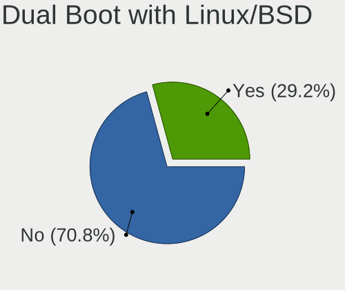
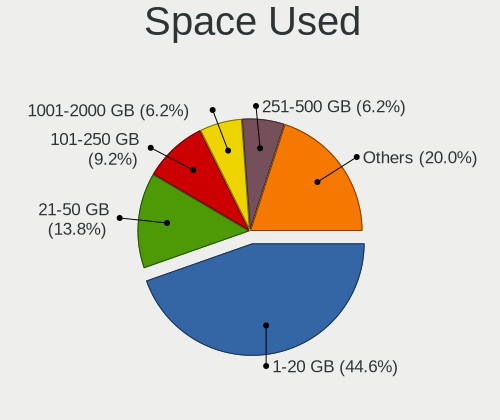
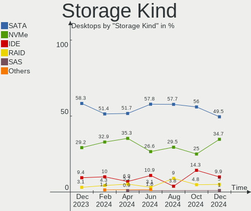
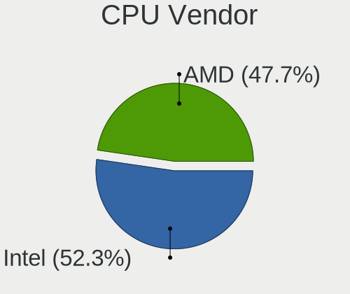
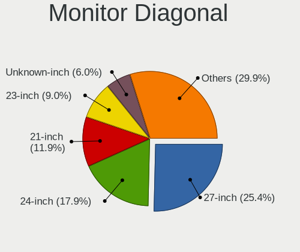
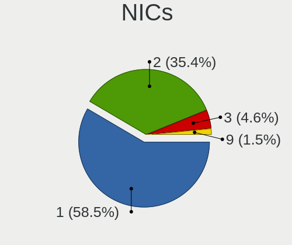
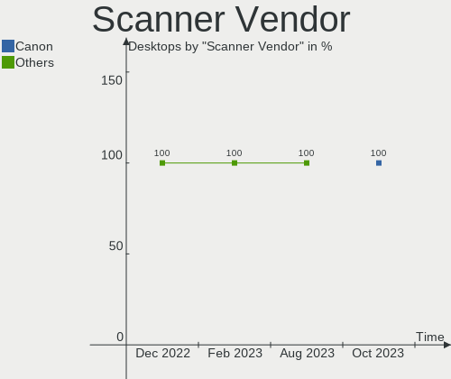

Linux in Spain - Hardware Trends (Desktops)
-------------------------------------------

A project to identify most popular hardware characteristics and track their change
over time based on data collected by Linux users at https://Linux-Hardware.org.

Anyone can contribute to this report by the [hw-probe](https://github.com/linuxhw/hw-probe) tool:

    sudo -E hw-probe -all -upload

Period: Mar, 2023.

Contents
--------

* [ System ](#system)
  - [ OS                       ](#os)
  - [ OS Family                ](#os-family)
  - [ Kernel                   ](#kernel)
  - [ Kernel Family            ](#kernel-family)
  - [ Kernel Major Ver.        ](#kernel-major-ver)
  - [ Arch                     ](#arch)
  - [ DE                       ](#de)
  - [ Display Server           ](#display-server)
  - [ Display Manager          ](#display-manager)
  - [ OS Lang                  ](#os-lang)
  - [ Boot Mode                ](#boot-mode)
  - [ Filesystem               ](#filesystem)
  - [ Part. scheme             ](#part-scheme)
  - [ Dual Boot with Linux/BSD ](#dual-boot-with-linuxbsd)
  - [ Dual Boot (Win)          ](#dual-boot-win)

* [ Board ](#board)
  - [ Vendor                   ](#vendor)
  - [ Model                    ](#model)
  - [ Model Family             ](#model-family)
  - [ MFG Year                 ](#mfg-year)
  - [ Form Factor              ](#form-factor)
  - [ Secure Boot              ](#secure-boot)
  - [ Coreboot                 ](#coreboot)
  - [ RAM Size                 ](#ram-size)
  - [ RAM Used                 ](#ram-used)
  - [ Total Drives             ](#total-drives)
  - [ Has CD-ROM               ](#has-cd-rom)
  - [ Has Ethernet             ](#has-ethernet)
  - [ Has WiFi                 ](#has-wifi)
  - [ Has Bluetooth            ](#has-bluetooth)

* [ Location ](#location)
  - [ Country                  ](#country)
  - [ City                     ](#city)

* [ Drives ](#drives)
  - [ Drive Vendor             ](#drive-vendor)
  - [ Drive Model              ](#drive-model)
  - [ HDD Vendor               ](#hdd-vendor)
  - [ SSD Vendor               ](#ssd-vendor)
  - [ Drive Kind               ](#drive-kind)
  - [ Drive Connector          ](#drive-connector)
  - [ Drive Size               ](#drive-size)
  - [ Space Total              ](#space-total)
  - [ Space Used               ](#space-used)
  - [ Malfunc. Drives          ](#malfunc-drives)
  - [ Malfunc. Drive Vendor    ](#malfunc-drive-vendor)
  - [ Malfunc. HDD Vendor      ](#malfunc-hdd-vendor)
  - [ Malfunc. Drive Kind      ](#malfunc-drive-kind)
  - [ Failed Drives            ](#failed-drives)
  - [ Failed Drive Vendor      ](#failed-drive-vendor)
  - [ Drive Status             ](#drive-status)

* [ Storage controller ](#storage-controller)
  - [ Storage Vendor           ](#storage-vendor)
  - [ Storage Model            ](#storage-model)
  - [ Storage Kind             ](#storage-kind)

* [ Processor ](#processor)
  - [ CPU Vendor               ](#cpu-vendor)
  - [ CPU Model                ](#cpu-model)
  - [ CPU Model Family         ](#cpu-model-family)
  - [ CPU Cores                ](#cpu-cores)
  - [ CPU Sockets              ](#cpu-sockets)
  - [ CPU Threads              ](#cpu-threads)
  - [ CPU Op-Modes             ](#cpu-op-modes)
  - [ CPU Microcode            ](#cpu-microcode)
  - [ CPU Microarch            ](#cpu-microarch)

* [ Graphics ](#graphics)
  - [ GPU Vendor               ](#gpu-vendor)
  - [ GPU Model                ](#gpu-model)
  - [ GPU Combo                ](#gpu-combo)
  - [ GPU Driver               ](#gpu-driver)
  - [ GPU Memory               ](#gpu-memory)

* [ Monitor ](#monitor)
  - [ Monitor Vendor           ](#monitor-vendor)
  - [ Monitor Model            ](#monitor-model)
  - [ Monitor Resolution       ](#monitor-resolution)
  - [ Monitor Diagonal         ](#monitor-diagonal)
  - [ Monitor Width            ](#monitor-width)
  - [ Aspect Ratio             ](#aspect-ratio)
  - [ Monitor Area             ](#monitor-area)
  - [ Pixel Density            ](#pixel-density)
  - [ Multiple Monitors        ](#multiple-monitors)

* [ Network ](#network)
  - [ Net Controller Vendor    ](#net-controller-vendor)
  - [ Net Controller Model     ](#net-controller-model)
  - [ Wireless Vendor          ](#wireless-vendor)
  - [ Wireless Model           ](#wireless-model)
  - [ Ethernet Vendor          ](#ethernet-vendor)
  - [ Ethernet Model           ](#ethernet-model)
  - [ Net Controller Kind      ](#net-controller-kind)
  - [ Used Controller          ](#used-controller)
  - [ NICs                     ](#nics)
  - [ IPv6                     ](#ipv6)

* [ Bluetooth ](#bluetooth)
  - [ Bluetooth Vendor         ](#bluetooth-vendor)
  - [ Bluetooth Model          ](#bluetooth-model)

* [ Sound ](#sound)
  - [ Sound Vendor             ](#sound-vendor)
  - [ Sound Model              ](#sound-model)

* [ Memory ](#memory)
  - [ Memory Vendor            ](#memory-vendor)
  - [ Memory Model             ](#memory-model)
  - [ Memory Kind              ](#memory-kind)
  - [ Memory Form Factor       ](#memory-form-factor)
  - [ Memory Size              ](#memory-size)
  - [ Memory Speed             ](#memory-speed)

* [ Printers & scanners ](#printers--scanners)
  - [ Printer Vendor           ](#printer-vendor)
  - [ Printer Model            ](#printer-model)
  - [ Scanner Vendor           ](#scanner-vendor)
  - [ Scanner Model            ](#scanner-model)

* [ Camera ](#camera)
  - [ Camera Vendor            ](#camera-vendor)
  - [ Camera Model             ](#camera-model)

* [ Security ](#security)
  - [ Fingerprint Vendor       ](#fingerprint-vendor)
  - [ Fingerprint Model        ](#fingerprint-model)
  - [ Chipcard Vendor          ](#chipcard-vendor)
  - [ Chipcard Model           ](#chipcard-model)

* [ Unsupported ](#unsupported)
  - [ Unsupported Devices      ](#unsupported-devices)
  - [ Unsupported Device Types ](#unsupported-device-types)

System
------

OS
--

Installed operating systems

| Name               | Desktops | Percent |
|--------------------|----------|---------|
| Ubuntu 22.04       | 9        | 15%     |
| Debian 11          | 9        | 15%     |
| OpenMandriva 23.03 | 5        | 8.33%   |
| Linux Mint 21.1    | 5        | 8.33%   |
| Fedora 37          | 4        | 6.67%   |
| Ubuntu 22.10       | 3        | 5%      |
| Ubuntu 20.04       | 2        | 3.33%   |
| OpenMandriva 23.01 | 2        | 3.33%   |
| KDE neon 22.04     | 2        | 3.33%   |
| Debian 12          | 2        | 3.33%   |
| Zorin 16           | 1        | 1.67%   |
| openSUSE Leap-15.4 | 1        | 1.67%   |
| OpenMandriva 4.50  | 1        | 1.67%   |
| OpenMandriva 4.3   | 1        | 1.67%   |
| Manjaro            | 1        | 1.67%   |
| Lubuntu 22.10      | 1        | 1.67%   |
| Lubuntu 22.04      | 1        | 1.67%   |
| LMDE 5             | 1        | 1.67%   |
| Linux Mint 20.3    | 1        | 1.67%   |
| Kubuntu 22.10      | 1        | 1.67%   |
| Kubuntu 22.04      | 1        | 1.67%   |
| Kali 2023.1        | 1        | 1.67%   |
| Gentoo 2.13        | 1        | 1.67%   |
| Elementary 7       | 1        | 1.67%   |
| Debian 10          | 1        | 1.67%   |
| Debian             | 1        | 1.67%   |
| Arch Rolling       | 1        | 1.67%   |

OS Family
---------

OS without a version

| Name         | Desktops | Percent |
|--------------|----------|---------|
| Ubuntu       | 14       | 23.33%  |
| Debian       | 13       | 21.67%  |
| OpenMandriva | 9        | 15%     |
| Linux Mint   | 6        | 10%     |
| Fedora       | 4        | 6.67%   |
| Lubuntu      | 2        | 3.33%   |
| Kubuntu      | 2        | 3.33%   |
| KDE neon     | 2        | 3.33%   |
| Zorin        | 1        | 1.67%   |
| openSUSE     | 1        | 1.67%   |
| Manjaro      | 1        | 1.67%   |
| LMDE         | 1        | 1.67%   |
| Kali         | 1        | 1.67%   |
| Gentoo       | 1        | 1.67%   |
| Elementary   | 1        | 1.67%   |
| Arch         | 1        | 1.67%   |

Kernel
------

Version of the Linux kernel

| Version                      | Desktops | Percent |
|------------------------------|----------|---------|
| 5.19.0-35-generic            | 10       | 16.67%  |
| 5.10.0-21-amd64              | 6        | 10%     |
| 5.15.0-67-generic            | 5        | 8.33%   |
| 6.2.6-desktop-1omv2390       | 4        | 6.67%   |
| 5.19.0-32-generic            | 4        | 6.67%   |
| 6.1.1-desktop-1omv2290       | 3        | 5%      |
| 5.19.0-38-generic            | 2        | 3.33%   |
| 5.15.0-56-generic            | 2        | 3.33%   |
| 5.10.0-20-amd64              | 2        | 3.33%   |
| 6.2.6-060206-generic         | 1        | 1.67%   |
| 6.2.2-zen2-1-zen             | 1        | 1.67%   |
| 6.1.19-renacuajo             | 1        | 1.67%   |
| 6.1.18-200.fc37.x86_64       | 1        | 1.67%   |
| 6.1.14-603.inttf.fc37.x86_64 | 1        | 1.67%   |
| 6.1.14-200.fc37.x86_64       | 1        | 1.67%   |
| 6.1.13-200.fc37.x86_64       | 1        | 1.67%   |
| 6.1.12-1-MANJARO             | 1        | 1.67%   |
| 6.1.0-kali5-amd64            | 1        | 1.67%   |
| 6.1.0-7-amd64                | 1        | 1.67%   |
| 6.1.0-6-amd64                | 1        | 1.67%   |
| 6.1.0-5-amd64                | 1        | 1.67%   |
| 5.4.0-144-generic            | 1        | 1.67%   |
| 5.19.12-desktop-2omv4090     | 1        | 1.67%   |
| 5.16.13-desktop-1omv4003     | 1        | 1.67%   |
| 5.15.0-60-generic            | 1        | 1.67%   |
| 5.15.0-48-generic            | 1        | 1.67%   |
| 5.14.21-150400.24.46-default | 1        | 1.67%   |
| 5.13.0-30-generic            | 1        | 1.67%   |
| 5.10.0-21-686-pae            | 1        | 1.67%   |
| 5.10.0-20-686-pae            | 1        | 1.67%   |
| 4.19.0-18-rt-amd64           | 1        | 1.67%   |

Kernel Family
-------------

Linux kernel without a distro release

| Version | Desktops | Percent |
|---------|----------|---------|
| 5.19.0  | 16       | 26.67%  |
| 5.10.0  | 10       | 16.67%  |
| 5.15.0  | 9        | 15%     |
| 6.2.6   | 5        | 8.33%   |
| 6.1.0   | 4        | 6.67%   |
| 6.1.1   | 3        | 5%      |
| 6.1.14  | 2        | 3.33%   |
| 6.2.2   | 1        | 1.67%   |
| 6.1.19  | 1        | 1.67%   |
| 6.1.18  | 1        | 1.67%   |
| 6.1.13  | 1        | 1.67%   |
| 6.1.12  | 1        | 1.67%   |
| 5.4.0   | 1        | 1.67%   |
| 5.19.12 | 1        | 1.67%   |
| 5.16.13 | 1        | 1.67%   |
| 5.14.21 | 1        | 1.67%   |
| 5.13.0  | 1        | 1.67%   |
| 4.19.0  | 1        | 1.67%   |

Kernel Major Ver.
-----------------

Linux kernel major version

| Version | Desktops | Percent |
|---------|----------|---------|
| 5.19    | 17       | 28.33%  |
| 6.1     | 13       | 21.67%  |
| 5.10    | 10       | 16.67%  |
| 5.15    | 9        | 15%     |
| 6.2     | 6        | 10%     |
| 5.4     | 1        | 1.67%   |
| 5.16    | 1        | 1.67%   |
| 5.14    | 1        | 1.67%   |
| 5.13    | 1        | 1.67%   |
| 4.19    | 1        | 1.67%   |

Arch
----

OS architecture (x86_64, i586, etc.)

| Name   | Desktops | Percent |
|--------|----------|---------|
| x86_64 | 58       | 96.67%  |
| i686   | 2        | 3.33%   |

DE
--

Desktop Environment

| Name       | Desktops | Percent |
|------------|----------|---------|
| GNOME      | 24       | 40%     |
| KDE5       | 16       | 26.67%  |
| X-Cinnamon | 6        | 10%     |
| Unknown    | 6        | 10%     |
| XFCE       | 3        | 5%      |
| LXQt       | 2        | 3.33%   |
| Pantheon   | 1        | 1.67%   |
| LXDE       | 1        | 1.67%   |
| Budgie     | 1        | 1.67%   |

Display Server
--------------

X11 or Wayland

| Name    | Desktops | Percent |
|---------|----------|---------|
| X11     | 45       | 75%     |
| Wayland | 10       | 16.67%  |
| Unknown | 3        | 5%      |
| Tty     | 2        | 3.33%   |

Display Manager
---------------

SDDM, LightDM, etc.

| Name    | Desktops | Percent |
|---------|----------|---------|
| Unknown | 19       | 31.67%  |
| SDDM    | 14       | 23.33%  |
| GDM3    | 14       | 23.33%  |
| GDM     | 6        | 10%     |
| LightDM | 5        | 8.33%   |
| SLiM    | 1        | 1.67%   |
| LXDM    | 1        | 1.67%   |

OS Lang
-------

Language

| Lang    | Desktops | Percent |
|---------|----------|---------|
| es_ES   | 44       | 73.33%  |
| en_US   | 8        | 13.33%  |
| ca_ES   | 3        | 5%      |
| Unknown | 2        | 3.33%   |
| gl_ES   | 1        | 1.67%   |
| de_DE   | 1        | 1.67%   |
| ca_FR   | 1        | 1.67%   |

Boot Mode
---------

EFI or BIOS

| Mode | Desktops | Percent |
|------|----------|---------|
| EFI  | 32       | 53.33%  |
| BIOS | 28       | 46.67%  |

Filesystem
----------

Type of filesystem

| Type    | Desktops | Percent |
|---------|----------|---------|
| Ext4    | 48       | 80%     |
| Overlay | 4        | 6.67%   |
| Btrfs   | 4        | 6.67%   |
| Xfs     | 3        | 5%      |
| Ext3    | 1        | 1.67%   |

Part. scheme
------------

Scheme of partitioning

| Type    | Desktops | Percent |
|---------|----------|---------|
| GPT     | 36       | 60%     |
| Unknown | 14       | 23.33%  |
| MBR     | 10       | 16.67%  |

Dual Boot with Linux/BSD
------------------------

Hosting more than one Linux/BSD

| Dual boot | Desktops | Percent |
|-----------|----------|---------|
| No        | 40       | 66.67%  |
| Yes       | 20       | 33.33%  |

Dual Boot (Win)
---------------

Hosting Linux and Windows

| Dual boot | Desktops | Percent |
|-----------|----------|---------|
| No        | 32       | 53.33%  |
| Yes       | 28       | 46.67%  |

Board
-----

Vendor
------

Motherboard manufacturer

| Name                | Desktops | Percent |
|---------------------|----------|---------|
| ASUSTek Computer    | 22       | 36.67%  |
| Gigabyte Technology | 11       | 18.33%  |
| MSI                 | 9        | 15%     |
| Hewlett-Packard     | 6        | 10%     |
| Intel               | 4        | 6.67%   |
| Lenovo              | 2        | 3.33%   |
| ASRock              | 2        | 3.33%   |
| Acer                | 2        | 3.33%   |
| HPE                 | 1        | 1.67%   |
| Dell                | 1        | 1.67%   |

Model
-----

Motherboard model

| Name                                    | Desktops | Percent |
|-----------------------------------------|----------|---------|
| MSI MS-7E06                             | 1        | 1.67%   |
| MSI MS-7D67                             | 1        | 1.67%   |
| MSI MS-7C84                             | 1        | 1.67%   |
| MSI MS-7C35                             | 1        | 1.67%   |
| MSI MS-7C02                             | 1        | 1.67%   |
| MSI MS-7A69                             | 1        | 1.67%   |
| MSI MS-7A38                             | 1        | 1.67%   |
| MSI MS-7592                             | 1        | 1.67%   |
| MSI CML-U PRO Cubi 5 (MS-B183)          | 1        | 1.67%   |
| Lenovo ThinkCentre M910q 10MUS17J00     | 1        | 1.67%   |
| Lenovo H50-55 90BF001SUK                | 1        | 1.67%   |
| Intel X79 V2.72A                        | 1        | 1.67%   |
| Intel Jasper Lake Client Platform       | 1        | 1.67%   |
| Intel DH55TC AAE70932-303               | 1        | 1.67%   |
| HPE ProLiant MicroServer Gen10          | 1        | 1.67%   |
| HP Z620 Workstation                     | 1        | 1.67%   |
| HP Z220 CMT Workstation                 | 1        | 1.67%   |
| HP EliteDesk 800 G1 SFF                 | 1        | 1.67%   |
| HP Compaq dc7800p Convertible Minitower | 1        | 1.67%   |
| HP Compaq dc7800 Small Form Factor      | 1        | 1.67%   |
| HP Compaq 8200 Elite SFF PC             | 1        | 1.67%   |
| Gigabyte Z77X-D3H                       | 1        | 1.67%   |
| Gigabyte H81M-S1                        | 1        | 1.67%   |
| Gigabyte H61M-DS2                       | 1        | 1.67%   |
| Gigabyte GA-MA790XT-UD4P                | 1        | 1.67%   |
| Gigabyte EX58-UD5                       | 1        | 1.67%   |
| Gigabyte B85M-DS3H-A                    | 1        | 1.67%   |
| Gigabyte B760M DS3H DDR4                | 1        | 1.67%   |
| Gigabyte B760M AORUS ELITE AX           | 1        | 1.67%   |
| Gigabyte B450M DS3H                     | 1        | 1.67%   |
| Gigabyte B250M-DS3H                     | 1        | 1.67%   |
| Gigabyte A520 AORUS ELITE               | 1        | 1.67%   |
| Dell OptiPlex 3050                      | 1        | 1.67%   |
| ASUS Z170 PRO GAMING                    | 1        | 1.67%   |
| ASUS ROG STRIX Z590-E GAMING WIFI       | 1        | 1.67%   |
| ASUS ROG STRIX Z370-E GAMING            | 1        | 1.67%   |
| ASUS ROG STRIX B650-A GAMING WIFI       | 1        | 1.67%   |
| ASUS ROG STRIX B550-F GAMING            | 1        | 1.67%   |
| ASUS ROG STRIX B365-G GAMING            | 1        | 1.67%   |
| ASUS Pro WS WRX80E-SAGE SE WIFI         | 1        | 1.67%   |

Model Family
------------

Motherboard model prefix

| Name                     | Desktops | Percent |
|--------------------------|----------|---------|
| ASUS ROG                 | 5        | 8.33%   |
| ASUS PRIME               | 5        | 8.33%   |
| HP Compaq                | 3        | 5%      |
| Gigabyte B760M           | 2        | 3.33%   |
| MSI MS-7E06              | 1        | 1.67%   |
| MSI MS-7D67              | 1        | 1.67%   |
| MSI MS-7C84              | 1        | 1.67%   |
| MSI MS-7C35              | 1        | 1.67%   |
| MSI MS-7C02              | 1        | 1.67%   |
| MSI MS-7A69              | 1        | 1.67%   |
| MSI MS-7A38              | 1        | 1.67%   |
| MSI MS-7592              | 1        | 1.67%   |
| MSI CML-U                | 1        | 1.67%   |
| Lenovo ThinkCentre       | 1        | 1.67%   |
| Lenovo H50-55            | 1        | 1.67%   |
| Intel X79                | 1        | 1.67%   |
| Intel Jasper             | 1        | 1.67%   |
| Intel DH55TC             | 1        | 1.67%   |
| HPE ProLiant             | 1        | 1.67%   |
| HP Z620                  | 1        | 1.67%   |
| HP Z220                  | 1        | 1.67%   |
| HP EliteDesk             | 1        | 1.67%   |
| Gigabyte Z77X-D3H        | 1        | 1.67%   |
| Gigabyte H81M-S1         | 1        | 1.67%   |
| Gigabyte H61M-DS2        | 1        | 1.67%   |
| Gigabyte GA-MA790XT-UD4P | 1        | 1.67%   |
| Gigabyte EX58-UD5        | 1        | 1.67%   |
| Gigabyte B85M-DS3H-A     | 1        | 1.67%   |
| Gigabyte B450M           | 1        | 1.67%   |
| Gigabyte B250M-DS3H      | 1        | 1.67%   |
| Gigabyte A520            | 1        | 1.67%   |
| Dell OptiPlex            | 1        | 1.67%   |
| ASUS Z170                | 1        | 1.67%   |
| ASUS Pro                 | 1        | 1.67%   |
| ASUS PB60                | 1        | 1.67%   |
| ASUS P8P67               | 1        | 1.67%   |
| ASUS P7H55-M             | 1        | 1.67%   |
| ASUS P5Q                 | 1        | 1.67%   |
| ASUS P5G41T-M            | 1        | 1.67%   |
| ASUS M5A97               | 1        | 1.67%   |

MFG Year
--------

Motherboard manufacture year

| Year | Desktops | Percent |
|------|----------|---------|
| 2022 | 6        | 10%     |
| 2019 | 5        | 8.33%   |
| 2016 | 5        | 8.33%   |
| 2015 | 5        | 8.33%   |
| 2012 | 5        | 8.33%   |
| 2010 | 5        | 8.33%   |
| 2020 | 4        | 6.67%   |
| 2018 | 4        | 6.67%   |
| 2017 | 4        | 6.67%   |
| 2021 | 3        | 5%      |
| 2014 | 3        | 5%      |
| 2013 | 3        | 5%      |
| 2011 | 2        | 3.33%   |
| 2009 | 2        | 3.33%   |
| 2007 | 2        | 3.33%   |
| 2023 | 1        | 1.67%   |
| 2008 | 1        | 1.67%   |

Form Factor
-----------

Physical design of the computer

| Name    | Desktops | Percent |
|---------|----------|---------|
| Desktop | 60       | 100%    |

Secure Boot
-----------

Enabled or disabled

| State    | Desktops | Percent |
|----------|----------|---------|
| Disabled | 57       | 95%     |
| Enabled  | 3        | 5%      |

Coreboot
--------

Have coreboot on board

| Used | Desktops | Percent |
|------|----------|---------|
| No   | 60       | 100%    |

RAM Size
--------

Total RAM memory

| Size in GB      | Desktops | Percent |
|-----------------|----------|---------|
| 32.01-64.0      | 14       | 23.33%  |
| 16.01-24.0      | 14       | 23.33%  |
| 8.01-16.0       | 13       | 21.67%  |
| 4.01-8.0        | 9        | 15%     |
| 3.01-4.0        | 5        | 8.33%   |
| 24.01-32.0      | 3        | 5%      |
| More than 256.0 | 1        | 1.67%   |
| 64.01-256.0     | 1        | 1.67%   |

RAM Used
--------

Used RAM memory

| Used GB    | Desktops | Percent |
|------------|----------|---------|
| 1.01-2.0   | 19       | 31.67%  |
| 2.01-3.0   | 14       | 23.33%  |
| 4.01-8.0   | 12       | 20%     |
| 3.01-4.0   | 8        | 13.33%  |
| 8.01-16.0  | 3        | 5%      |
| 0.51-1.0   | 2        | 3.33%   |
| 32.01-64.0 | 1        | 1.67%   |
| 0.01-0.5   | 1        | 1.67%   |

Total Drives
------------

Number of drives on board

| Drives | Desktops | Percent |
|--------|----------|---------|
| 2      | 23       | 38.33%  |
| 3      | 13       | 21.67%  |
| 1      | 12       | 20%     |
| 5      | 5        | 8.33%   |
| 4      | 3        | 5%      |
| 6      | 2        | 3.33%   |
| 10     | 1        | 1.67%   |
| 8      | 1        | 1.67%   |

Has CD-ROM
----------

Has CD-ROM on board

| Presented | Desktops | Percent |
|-----------|----------|---------|
| No        | 35       | 58.33%  |
| Yes       | 25       | 41.67%  |

Has Ethernet
------------

Has Ethernet on board

| Presented | Desktops | Percent |
|-----------|----------|---------|
| Yes       | 59       | 98.33%  |
| No        | 1        | 1.67%   |

Has WiFi
--------

Has WiFi module

| Presented | Desktops | Percent |
|-----------|----------|---------|
| No        | 33       | 55%     |
| Yes       | 27       | 45%     |

Has Bluetooth
-------------

Has Bluetooth module

| Presented | Desktops | Percent |
|-----------|----------|---------|
| No        | 34       | 56.67%  |
| Yes       | 26       | 43.33%  |

Location
--------

Country
-------

Geographic location (country)

| Country | Desktops | Percent |
|---------|----------|---------|
| Spain   | 60       | 100%    |

City
----

Geographic location (city)

| City                        | Desktops | Percent |
|-----------------------------|----------|---------|
| Madrid                      | 12       | 20%     |
| Seville                     | 2        | 3.33%   |
| Oviedo                      | 2        | 3.33%   |
| Las Palmas de Gran Canaria  | 2        | 3.33%   |
| Bilbao                      | 2        | 3.33%   |
| Barcelona                   | 2        | 3.33%   |
| Vigo                        | 1        | 1.67%   |
| Valencia                    | 1        | 1.67%   |
| Usurbil                     | 1        | 1.67%   |
| Tres Cantos                 | 1        | 1.67%   |
| Torrejón de Ardoz          | 1        | 1.67%   |
| Tinajo                      | 1        | 1.67%   |
| Sant Cugat del Vallès      | 1        | 1.67%   |
| San Sebastián de los Reyes | 1        | 1.67%   |
| Rincon de la Victoria       | 1        | 1.67%   |
| Ponteareas                  | 1        | 1.67%   |
| Palencia                    | 1        | 1.67%   |
| Ourense                     | 1        | 1.67%   |
| Ocana                       | 1        | 1.67%   |
| Murcia                      | 1        | 1.67%   |
| Mérida                     | 1        | 1.67%   |
| Mataró                     | 1        | 1.67%   |
| Marbella                    | 1        | 1.67%   |
| Macanet de la Selva         | 1        | 1.67%   |
| Logroño                    | 1        | 1.67%   |
| León                       | 1        | 1.67%   |
| Jaén                       | 1        | 1.67%   |
| Irun                        | 1        | 1.67%   |
| Huelva                      | 1        | 1.67%   |
| Girona                      | 1        | 1.67%   |
| Elche                       | 1        | 1.67%   |
| Ejea de los Caballeros      | 1        | 1.67%   |
| Córdoba                    | 1        | 1.67%   |
| Camas                       | 1        | 1.67%   |
| Calatorao                   | 1        | 1.67%   |
| Burgos                      | 1        | 1.67%   |
| Bigues i Riells             | 1        | 1.67%   |
| Benijofar                   | 1        | 1.67%   |
| Banyoles                    | 1        | 1.67%   |
| Baeza                       | 1        | 1.67%   |

Drives
------

Drive Vendor
------------

Hard drive vendors

| Vendor                    | Desktops | Drives | Percent |
|---------------------------|----------|--------|---------|
| Seagate                   | 28       | 37     | 21.54%  |
| Kingston                  | 19       | 19     | 14.62%  |
| WDC                       | 18       | 26     | 13.85%  |
| Samsung Electronics       | 18       | 24     | 13.85%  |
| Toshiba                   | 11       | 19     | 8.46%   |
| Crucial                   | 8        | 10     | 6.15%   |
| Intel                     | 4        | 4      | 3.08%   |
| SanDisk                   | 3        | 4      | 2.31%   |
| KIOXIA-EXCERIA            | 3        | 3      | 2.31%   |
| Transcend                 | 2        | 2      | 1.54%   |
| OCZ                       | 2        | 4      | 1.54%   |
| Maxtor                    | 2        | 2      | 1.54%   |
| A-DATA Technology         | 2        | 3      | 1.54%   |
| ValueTech                 | 1        | 1      | 0.77%   |
| USB30                     | 1        | 1      | 0.77%   |
| SABRENT                   | 1        | 1      | 0.77%   |
| Micron/Crucial Technology | 1        | 1      | 0.77%   |
| KingSpec                  | 1        | 1      | 0.77%   |
| KingDian                  | 1        | 1      | 0.77%   |
| Kimtigo                   | 1        | 1      | 0.77%   |
| Hitachi                   | 1        | 1      | 0.77%   |
| Emtec                     | 1        | 1      | 0.77%   |
| Corsair                   | 1        | 1      | 0.77%   |

Drive Model
-----------

Hard drive models

| Model                                               | Desktops | Percent |
|-----------------------------------------------------|----------|---------|
| Kingston SA400S37480G 480GB SSD                     | 5        | 3.33%   |
| Seagate ST2000DM008-2FR102 2TB                      | 4        | 2.67%   |
| Seagate ST1000DM010-2EP102 1TB                      | 4        | 2.67%   |
| Samsung NVMe SSD Controller SM981/PM981/PM983 250GB | 4        | 2.67%   |
| Kingston SA400S37240G 240GB SSD                     | 4        | 2.67%   |
| Toshiba DT01ACA100 1TB                              | 3        | 2%      |
| Seagate ST500DM002-1BD142 500GB                     | 3        | 2%      |
| Kingston SV300S37A120G 120GB SSD                    | 3        | 2%      |
| WDC WD40EFRX-68N32N0 4TB                            | 2        | 1.33%   |
| WDC WD20EARX-00PASB0 2TB                            | 2        | 1.33%   |
| WDC WD10EZEX-08WN4A0 1TB                            | 2        | 1.33%   |
| Toshiba DT01ACA300 3TB                              | 2        | 1.33%   |
| Seagate ST4000DM004-2U9104 4TB                      | 2        | 1.33%   |
| Samsung SSD 980 PRO 1TB                             | 2        | 1.33%   |
| Samsung SSD 860 EVO 500GB                           | 2        | 1.33%   |
| OCZ TRION100 240GB SSD                              | 2        | 1.33%   |
| KIOXIA-EXCERIA PRO SSD 1TB                          | 2        | 1.33%   |
| Kingston SA400S37120G 120GB SSD                     | 2        | 1.33%   |
| A-DATA SP550 120GB SSD                              | 2        | 1.33%   |
| WDC WDS480G2G0B-00EPW0 480GB SSD                    | 1        | 0.67%   |
| WDC WDS240G2G0A-00JH30 240GB SSD                    | 1        | 0.67%   |
| WDC WDS100T2B0A-00SM50 1TB SSD                      | 1        | 0.67%   |
| WDC WD6400AAKS-65A7B2 640GB                         | 1        | 0.67%   |
| WDC WD5000HHTZ-60N21V0 500GB                        | 1        | 0.67%   |
| WDC WD5000AAKX-603CA0 500GB                         | 1        | 0.67%   |
| WDC WD5000AAKX-08U6AA0 500GB                        | 1        | 0.67%   |
| WDC WD40EZRZ-75GXCB0 4TB                            | 1        | 0.67%   |
| WDC WD40EFZX-68AWUN0 4TB                            | 1        | 0.67%   |
| WDC WD40EFAX-68JH4N1 4TB                            | 1        | 0.67%   |
| WDC WD40EFAX-68JH4N0 4TB                            | 1        | 0.67%   |
| WDC WD30EZRZ-00GXCB0 3TB                            | 1        | 0.67%   |
| WDC WD20EZRZ-00Z5HB0 2TB                            | 1        | 0.67%   |
| WDC WD20EZRX-22D8PB0 2TB                            | 1        | 0.67%   |
| WDC WD20EZRX-00D8PB0 2TB                            | 1        | 0.67%   |
| WDC WD20EZBX-00AYRA0 2TB                            | 1        | 0.67%   |
| WDC WD10EZEX-60WN4A0 1TB                            | 1        | 0.67%   |
| WDC WD10EZEX-60M2NA0 1TB                            | 1        | 0.67%   |
| WDC WD10EARS-22Y5B1 1TB                             | 1        | 0.67%   |
| ValueTech Basics 256GB SSD                          | 1        | 0.67%   |
| USB30 Disk 500GB                                    | 1        | 0.67%   |

HDD Vendor
----------

Hard disk drive vendors

| Vendor              | Desktops | Drives | Percent |
|---------------------|----------|--------|---------|
| Seagate             | 28       | 37     | 49.12%  |
| WDC                 | 16       | 23     | 28.07%  |
| Toshiba             | 9        | 15     | 15.79%  |
| Samsung Electronics | 2        | 2      | 3.51%   |
| Maxtor              | 1        | 1      | 1.75%   |
| Hitachi             | 1        | 1      | 1.75%   |

SSD Vendor
----------

Solid state drive vendors

| Vendor              | Desktops | Drives | Percent |
|---------------------|----------|--------|---------|
| Kingston            | 17       | 17     | 31.48%  |
| Samsung Electronics | 9        | 10     | 16.67%  |
| Crucial             | 7        | 8      | 12.96%  |
| WDC                 | 3        | 3      | 5.56%   |
| Transcend           | 2        | 2      | 3.7%    |
| Toshiba             | 2        | 4      | 3.7%    |
| OCZ                 | 2        | 4      | 3.7%    |
| Intel               | 2        | 2      | 3.7%    |
| A-DATA Technology   | 2        | 3      | 3.7%    |
| ValueTech           | 1        | 1      | 1.85%   |
| USB30               | 1        | 1      | 1.85%   |
| SanDisk             | 1        | 1      | 1.85%   |
| SABRENT             | 1        | 1      | 1.85%   |
| Maxtor              | 1        | 1      | 1.85%   |
| KingSpec            | 1        | 1      | 1.85%   |
| KingDian            | 1        | 1      | 1.85%   |
| Kimtigo             | 1        | 1      | 1.85%   |

Drive Kind
----------

HDD or SSD

| Kind | Desktops | Drives | Percent |
|------|----------|--------|---------|
| HDD  | 43       | 79     | 41.35%  |
| SSD  | 40       | 61     | 38.46%  |
| NVMe | 21       | 27     | 20.19%  |

Drive Connector
---------------

SATA, SAS, NVMe, etc.

| Type | Desktops | Drives | Percent |
|------|----------|--------|---------|
| SATA | 56       | 138    | 70.89%  |
| NVMe | 21       | 27     | 26.58%  |
| SAS  | 2        | 2      | 2.53%   |

Drive Size
----------

Size of hard drive

| Size in TB | Desktops | Drives | Percent |
|------------|----------|--------|---------|
| 0.01-0.5   | 43       | 67     | 44.33%  |
| 0.51-1.0   | 27       | 30     | 27.84%  |
| 1.01-2.0   | 15       | 27     | 15.46%  |
| 3.01-4.0   | 7        | 10     | 7.22%   |
| 2.01-3.0   | 4        | 5      | 4.12%   |
| 4.01-10.0  | 1        | 1      | 1.03%   |

Space Total
-----------

Amount of disk space available on the file system

| Size in GB     | Desktops | Percent |
|----------------|----------|---------|
| 101-250        | 14       | 23.33%  |
| 251-500        | 11       | 18.33%  |
| More than 3000 | 10       | 16.67%  |
| 501-1000       | 10       | 16.67%  |
| 21-50          | 3        | 5%      |
| 1001-2000      | 3        | 5%      |
| 1-20           | 3        | 5%      |
| 2001-3000      | 2        | 3.33%   |
| 51-100         | 2        | 3.33%   |
| Unknown        | 2        | 3.33%   |

Space Used
----------

Amount of used disk space

| Used GB        | Desktops | Percent |
|----------------|----------|---------|
| 1-20           | 20       | 33.33%  |
| 101-250        | 9        | 15%     |
| 51-100         | 7        | 11.67%  |
| 21-50          | 5        | 8.33%   |
| More than 3000 | 4        | 6.67%   |
| 1001-2000      | 4        | 6.67%   |
| 501-1000       | 4        | 6.67%   |
| 251-500        | 3        | 5%      |
| 2001-3000      | 2        | 3.33%   |
| Unknown        | 2        | 3.33%   |

Malfunc. Drives
---------------

Drive models with a malfunction

| Model                            | Desktops | Drives | Percent |
|----------------------------------|----------|--------|---------|
| Toshiba DT01ACA100 1TB           | 2        | 2      | 12.5%   |
| Seagate ST1000DM010-2EP102 1TB   | 2        | 2      | 12.5%   |
| Kingston SV300S37A120G 120GB SSD | 2        | 2      | 12.5%   |
| WDC WD40EFRX-68N32N0 4TB         | 1        | 1      | 6.25%   |
| WDC WD20EARX-00PASB0 2TB         | 1        | 1      | 6.25%   |
| Transcend TS1TSSD230S 1TB        | 1        | 1      | 6.25%   |
| Seagate ST500DM002-1BD142 500GB  | 1        | 1      | 6.25%   |
| Seagate ST3250824AS 250GB        | 1        | 1      | 6.25%   |
| Seagate ST3000DM001-9YN166 3TB   | 1        | 1      | 6.25%   |
| Samsung Electronics HD153WI 1TB  | 1        | 1      | 6.25%   |
| Kingston SUV400S37240G 240GB SSD | 1        | 1      | 6.25%   |
| Crucial CT750MX300SSD1 752GB     | 1        | 1      | 6.25%   |
| Corsair MP400 8TB                | 1        | 1      | 6.25%   |

Malfunc. Drive Vendor
---------------------

Vendors of faulty drives

| Vendor              | Desktops | Drives | Percent |
|---------------------|----------|--------|---------|
| Seagate             | 5        | 5      | 31.25%  |
| Kingston            | 3        | 3      | 18.75%  |
| WDC                 | 2        | 2      | 12.5%   |
| Toshiba             | 2        | 2      | 12.5%   |
| Transcend           | 1        | 1      | 6.25%   |
| Samsung Electronics | 1        | 1      | 6.25%   |
| Crucial             | 1        | 1      | 6.25%   |
| Corsair             | 1        | 1      | 6.25%   |

Malfunc. HDD Vendor
-------------------

Vendors of faulty HDD drives

| Vendor              | Desktops | Drives | Percent |
|---------------------|----------|--------|---------|
| Seagate             | 5        | 5      | 50%     |
| WDC                 | 2        | 2      | 20%     |
| Toshiba             | 2        | 2      | 20%     |
| Samsung Electronics | 1        | 1      | 10%     |

Malfunc. Drive Kind
-------------------

Kinds of faulty drives

| Kind | Desktops | Drives | Percent |
|------|----------|--------|---------|
| HDD  | 10       | 10     | 62.5%   |
| SSD  | 5        | 5      | 31.25%  |
| NVMe | 1        | 1      | 6.25%   |

Failed Drives
-------------

Failed drive models

Zero info for selected period =(

Failed Drive Vendor
-------------------

Failed drive vendors

Zero info for selected period =(

Drive Status
------------

Number of failed and malfunc. drives

| Status   | Desktops | Drives | Percent |
|----------|----------|--------|---------|
| Works    | 35       | 91     | 45.45%  |
| Detected | 27       | 60     | 35.06%  |
| Malfunc  | 15       | 16     | 19.48%  |

Storage controller
------------------

Storage Vendor
--------------

Storage controller vendors

| Vendor                      | Desktops | Percent |
|-----------------------------|----------|---------|
| Intel                       | 44       | 47.83%  |
| AMD                         | 15       | 16.3%   |
| Samsung Electronics         | 9        | 9.78%   |
| JMicron Technology          | 5        | 5.43%   |
| Marvell Technology Group    | 4        | 4.35%   |
| ASMedia Technology          | 4        | 4.35%   |
| Micron/Crucial Technology   | 3        | 3.26%   |
| SanDisk                     | 2        | 2.17%   |
| Phison Electronics          | 2        | 2.17%   |
| KIOXIA                      | 2        | 2.17%   |
| Kingston Technology Company | 2        | 2.17%   |

Storage Model
-------------

Storage controller models

| Model                                                                                   | Desktops | Percent |
|-----------------------------------------------------------------------------------------|----------|---------|
| AMD FCH SATA Controller [AHCI mode]                                                     | 9        | 7.69%   |
| Intel 8 Series/C220 Series Chipset Family 6-port SATA Controller 1 [AHCI mode]          | 6        | 5.13%   |
| Intel 200 Series PCH SATA controller [AHCI mode]                                        | 6        | 5.13%   |
| Samsung NVMe SSD Controller SM981/PM981/PM983                                           | 5        | 4.27%   |
| ASMedia ASM1062 Serial ATA Controller                                                   | 4        | 3.42%   |
| Samsung NVMe SSD Controller PM9A1/PM9A3/980PRO                                          | 3        | 2.56%   |
| Micron/Crucial P2 NVMe PCIe SSD                                                         | 3        | 2.56%   |
| Intel 700 Series Chipset Family SATA AHCI Controller                                    | 3        | 2.56%   |
| Intel 500 Series Chipset Family SATA AHCI Controller                                    | 3        | 2.56%   |
| Intel 5 Series/3400 Series Chipset 4 port SATA IDE Controller                           | 3        | 2.56%   |
| Intel 5 Series/3400 Series Chipset 2 port SATA IDE Controller                           | 3        | 2.56%   |
| AMD 400 Series Chipset SATA Controller                                                  | 3        | 2.56%   |
| SanDisk WD Blue SN570 NVMe SSD 1TB                                                      | 2        | 1.71%   |
| JMicron JMB363 SATA/IDE Controller                                                      | 2        | 1.71%   |
| Intel SATA Controller [RAID mode]                                                       | 2        | 1.71%   |
| Intel Q170/Q150/B150/H170/H110/Z170/CM236 Chipset SATA Controller [AHCI Mode]           | 2        | 1.71%   |
| Intel NM10/ICH7 Family SATA Controller [IDE mode]                                       | 2        | 1.71%   |
| Intel 82Q35 Express PT IDER Controller                                                  | 2        | 1.71%   |
| Intel 82801IR/IO/IH (ICH9R/DO/DH) 4 port SATA Controller [IDE mode]                     | 2        | 1.71%   |
| Intel 82801I (ICH9 Family) 2 port SATA Controller [IDE mode]                            | 2        | 1.71%   |
| Intel 7 Series/C210 Series Chipset Family 6-port SATA Controller [AHCI mode]            | 2        | 1.71%   |
| Intel 6 Series/C200 Series Chipset Family Desktop SATA Controller (IDE mode, ports 4-5) | 2        | 1.71%   |
| Intel 6 Series/C200 Series Chipset Family Desktop SATA Controller (IDE mode, ports 0-3) | 2        | 1.71%   |
| AMD SB7x0/SB8x0/SB9x0 SATA Controller [IDE mode]                                        | 2        | 1.71%   |
| AMD SB7x0/SB8x0/SB9x0 IDE Controller                                                    | 2        | 1.71%   |
| AMD 500 Series Chipset SATA Controller                                                  | 2        | 1.71%   |
| Samsung NVMe SSD Controller SM961/PM961/SM963                                           | 1        | 0.85%   |
| Samsung NVMe SSD Controller 980                                                         | 1        | 0.85%   |
| Phison PS5013 E13 NVMe Controller                                                       | 1        | 0.85%   |
| Phison E12 NVMe Controller                                                              | 1        | 0.85%   |
| Marvell Group 88SE9230 PCIe 2.0 x2 4-port SATA 6 Gb/s RAID Controller                   | 1        | 0.85%   |
| Marvell Group 88SE9215 PCIe 2.0 x1 4-port SATA 6 Gb/s Controller                        | 1        | 0.85%   |
| Marvell Group 88SE9172 SATA 6Gb/s Controller                                            | 1        | 0.85%   |
| Marvell Group 88SE9128 PCIe SATA 6 Gb/s RAID controller with HyperDuo                   | 1        | 0.85%   |
| KIOXIA NVMe SSD                                                                         | 1        | 0.85%   |
| KIOXIA Non-Volatile memory controller                                                   | 1        | 0.85%   |
| Kingston Company SNVS2000G [NV1 NVMe PCIe SSD 2TB]                                      | 1        | 0.85%   |
| Kingston Company A2000 NVMe SSD                                                         | 1        | 0.85%   |
| JMicron JMB58x AHCI SATA controller                                                     | 1        | 0.85%   |
| JMicron JMB368 IDE controller                                                           | 1        | 0.85%   |

Storage Kind
------------

Kind of storage controller (IDE, SATA, NVMe, SAS, ...)

| Kind | Desktops | Percent |
|------|----------|---------|
| SATA | 47       | 52.81%  |
| NVMe | 21       | 23.6%   |
| IDE  | 15       | 16.85%  |
| RAID | 5        | 5.62%   |
| SAS  | 1        | 1.12%   |

Processor
---------

CPU Vendor
----------

Processor vendors

| Vendor | Desktops | Percent |
|--------|----------|---------|
| Intel  | 44       | 73.33%  |
| AMD    | 16       | 26.67%  |

CPU Model
---------

Processor models

| Model                                 | Desktops | Percent |
|---------------------------------------|----------|---------|
| Intel Core i5-7400 CPU @ 3.00GHz      | 2        | 3.33%   |
| Intel Core i5 CPU 650 @ 3.20GHz       | 2        | 3.33%   |
| Intel Core 2 Quad CPU Q6600 @ 2.40GHz | 2        | 3.33%   |
| AMD Ryzen 7 3700X 8-Core Processor    | 2        | 3.33%   |
| AMD Ryzen 5 3600 6-Core Processor     | 2        | 3.33%   |
| Intel Xeon CPU X3470 @ 2.93GHz        | 1        | 1.67%   |
| Intel Xeon CPU E5-2630 v2 @ 2.60GHz   | 1        | 1.67%   |
| Intel Xeon CPU E5-2609 0 @ 2.40GHz    | 1        | 1.67%   |
| Intel Xeon CPU E3-1240 V2 @ 3.40GHz   | 1        | 1.67%   |
| Intel Pentium CPU G840 @ 2.80GHz      | 1        | 1.67%   |
| Intel Pentium CPU G3220 @ 3.00GHz     | 1        | 1.67%   |
| Intel Pentium CPU 6405U @ 2.40GHz     | 1        | 1.67%   |
| Intel Core i7-8700K CPU @ 3.70GHz     | 1        | 1.67%   |
| Intel Core i7-6700 CPU @ 3.40GHz      | 1        | 1.67%   |
| Intel Core i7-4770K CPU @ 3.50GHz     | 1        | 1.67%   |
| Intel Core i7-3770 CPU @ 3.40GHz      | 1        | 1.67%   |
| Intel Core i7 CPU 920 @ 2.67GHz       | 1        | 1.67%   |
| Intel Core i5-7500T CPU @ 2.70GHz     | 1        | 1.67%   |
| Intel Core i5-6600T CPU @ 2.70GHz     | 1        | 1.67%   |
| Intel Core i5-6500 CPU @ 3.20GHz      | 1        | 1.67%   |
| Intel Core i5-6400 CPU @ 2.70GHz      | 1        | 1.67%   |
| Intel Core i5-4590 CPU @ 3.30GHz      | 1        | 1.67%   |
| Intel Core i5-4460 CPU @ 3.20GHz      | 1        | 1.67%   |
| Intel Core i5-3570 CPU @ 3.40GHz      | 1        | 1.67%   |
| Intel Core i5-2400 CPU @ 3.10GHz      | 1        | 1.67%   |
| Intel Core i5 CPU 760 @ 2.80GHz       | 1        | 1.67%   |
| Intel Core i3-9100 CPU @ 3.60GHz      | 1        | 1.67%   |
| Intel Core i3-8100T CPU @ 3.10GHz     | 1        | 1.67%   |
| Intel Core i3-7100 CPU @ 3.90GHz      | 1        | 1.67%   |
| Intel Core i3-4150 CPU @ 3.50GHz      | 1        | 1.67%   |
| Intel Core i3-4130 CPU @ 3.40GHz      | 1        | 1.67%   |
| Intel Core i3-10105 CPU @ 3.70GHz     | 1        | 1.67%   |
| Intel Core 2 Duo CPU E8500 @ 3.16GHz  | 1        | 1.67%   |
| Intel Core 2 Duo CPU E8400 @ 3.00GHz  | 1        | 1.67%   |
| Intel Core 2 Duo CPU E6750 @ 2.66GHz  | 1        | 1.67%   |
| Intel Celeron N5105 @ 2.00GHz         | 1        | 1.67%   |
| Intel Celeron CPU J1900 @ 1.99GHz     | 1        | 1.67%   |
| Intel 13th Gen Core i7-13700KF        | 1        | 1.67%   |
| Intel 13th Gen Core i7-13700K         | 1        | 1.67%   |
| Intel 13th Gen Core i5-13600K         | 1        | 1.67%   |

CPU Model Family
----------------

Processor model prefix

| Model                  | Desktops | Percent |
|------------------------|----------|---------|
| Intel Core i5          | 13       | 21.67%  |
| Other                  | 6        | 10%     |
| Intel Core i3          | 6        | 10%     |
| Intel Core i7          | 5        | 8.33%   |
| AMD Ryzen 5            | 5        | 8.33%   |
| Intel Xeon             | 4        | 6.67%   |
| Intel Pentium          | 3        | 5%      |
| Intel Core 2 Duo       | 3        | 5%      |
| AMD Ryzen 7            | 3        | 5%      |
| Intel Core 2 Quad      | 2        | 3.33%   |
| Intel Celeron          | 2        | 3.33%   |
| AMD Ryzen Threadripper | 1        | 1.67%   |
| AMD Ryzen 9            | 1        | 1.67%   |
| AMD Phenom II X4       | 1        | 1.67%   |
| AMD Opteron            | 1        | 1.67%   |
| AMD FX                 | 1        | 1.67%   |
| AMD Athlon II X2       | 1        | 1.67%   |
| AMD Athlon             | 1        | 1.67%   |
| AMD A10                | 1        | 1.67%   |

CPU Cores
---------

Number of processor cores

| Number | Desktops | Percent |
|--------|----------|---------|
| 4      | 26       | 43.33%  |
| 2      | 14       | 23.33%  |
| 6      | 7        | 11.67%  |
| 8      | 5        | 8.33%   |
| 16     | 3        | 5%      |
| 64     | 1        | 1.67%   |
| 14     | 1        | 1.67%   |
| 12     | 1        | 1.67%   |
| 3      | 1        | 1.67%   |
| 1      | 1        | 1.67%   |

CPU Sockets
-----------

Number of sockets

| Number | Desktops | Percent |
|--------|----------|---------|
| 1      | 59       | 98.33%  |
| 2      | 1        | 1.67%   |

CPU Threads
-----------

Threads per core (Hyper-Threading)

| Number | Desktops | Percent |
|--------|----------|---------|
| 2      | 34       | 56.67%  |
| 1      | 26       | 43.33%  |

CPU Op-Modes
------------

CPU Operation Modes (32-bit, 64-bit)

| Op mode        | Desktops | Percent |
|----------------|----------|---------|
| 32-bit, 64-bit | 60       | 100%    |

CPU Microcode
-------------

Microcode number

| Number     | Desktops | Percent |
|------------|----------|---------|
| Unknown    | 17       | 28.33%  |
| 0x306c3    | 3        | 5%      |
| 0x08701021 | 3        | 5%      |
| 0xb0671    | 2        | 3.33%   |
| 0x906eb    | 2        | 3.33%   |
| 0x906e9    | 2        | 3.33%   |
| 0x506e3    | 2        | 3.33%   |
| 0x206a7    | 2        | 3.33%   |
| 0x106e5    | 2        | 3.33%   |
| 0xa0671    | 1        | 1.67%   |
| 0xa0653    | 1        | 1.67%   |
| 0x906ea    | 1        | 1.67%   |
| 0x906c0    | 1        | 1.67%   |
| 0x90672    | 1        | 1.67%   |
| 0x806ec    | 1        | 1.67%   |
| 0x6fb      | 1        | 1.67%   |
| 0x306e4    | 1        | 1.67%   |
| 0x306a9    | 1        | 1.67%   |
| 0x30678    | 1        | 1.67%   |
| 0x206d7    | 1        | 1.67%   |
| 0x20655    | 1        | 1.67%   |
| 0x20652    | 1        | 1.67%   |
| 0x106a5    | 1        | 1.67%   |
| 0x1067a    | 1        | 1.67%   |
| 0x0a601201 | 1        | 1.67%   |
| 0x0a50000d | 1        | 1.67%   |
| 0x08301055 | 1        | 1.67%   |
| 0x08101016 | 1        | 1.67%   |
| 0x0810100b | 1        | 1.67%   |
| 0x0800820d | 1        | 1.67%   |
| 0x0600611a | 1        | 1.67%   |
| 0x06003106 | 1        | 1.67%   |
| 0x06000852 | 1        | 1.67%   |
| 0x010000c7 | 1        | 1.67%   |

CPU Microarch
-------------

Microarchitecture

| Name             | Desktops | Percent |
|------------------|----------|---------|
| KabyLake         | 8        | 13.33%  |
| Haswell          | 6        | 10%     |
| Zen 2            | 5        | 8.33%   |
| Skylake          | 4        | 6.67%   |
| IvyBridge        | 4        | 6.67%   |
| SandyBridge      | 3        | 5%      |
| Nehalem          | 3        | 5%      |
| Core             | 3        | 5%      |
| Alderlake Hybrid | 3        | 5%      |
| Unknown          | 3        | 5%      |
| Zen              | 2        | 3.33%   |
| Westmere         | 2        | 3.33%   |
| Penryn           | 2        | 3.33%   |
| K10              | 2        | 3.33%   |
| Icelake          | 2        | 3.33%   |
| Zen+             | 1        | 1.67%   |
| Zen 3            | 1        | 1.67%   |
| Tremont          | 1        | 1.67%   |
| Steamroller      | 1        | 1.67%   |
| Silvermont       | 1        | 1.67%   |
| Piledriver       | 1        | 1.67%   |
| Excavator        | 1        | 1.67%   |
| CometLake        | 1        | 1.67%   |

Graphics
--------

GPU Vendor
----------

Vendors of graphics cards

| Vendor            | Desktops | Percent |
|-------------------|----------|---------|
| Nvidia            | 33       | 49.25%  |
| Intel             | 18       | 26.87%  |
| AMD               | 15       | 22.39%  |
| ASPEED Technology | 1        | 1.49%   |

GPU Model
---------

Graphics card models

| Model                                                                       | Desktops | Percent |
|-----------------------------------------------------------------------------|----------|---------|
| Nvidia GP107 [GeForce GTX 1050 Ti]                                          | 3        | 4.35%   |
| Nvidia GK208B [GeForce GT 710]                                              | 3        | 4.35%   |
| Nvidia GT218 [GeForce 210]                                                  | 2        | 2.9%    |
| Nvidia GM107 [GeForce GTX 750 Ti]                                           | 2        | 2.9%    |
| Nvidia GA102 [GeForce RTX 3090]                                             | 2        | 2.9%    |
| Intel Xeon E3-1200 v3/4th Gen Core Processor Integrated Graphics Controller | 2        | 2.9%    |
| Intel Raptor Lake-S GT1 [UHD Graphics 770]                                  | 2        | 2.9%    |
| Intel HD Graphics 530                                                       | 2        | 2.9%    |
| Intel CoffeeLake-S GT2 [UHD Graphics 630]                                   | 2        | 2.9%    |
| Intel 4th Generation Core Processor Family Integrated Graphics Controller   | 2        | 2.9%    |
| Nvidia TU117 [GeForce GTX 1650]                                             | 1        | 1.45%   |
| Nvidia TU116 [GeForce GTX 1660 SUPER]                                       | 1        | 1.45%   |
| Nvidia TU116 [GeForce GTX 1650 SUPER]                                       | 1        | 1.45%   |
| Nvidia TU106 [GeForce RTX 2060 Rev. A]                                      | 1        | 1.45%   |
| Nvidia TU104 [GeForce RTX 2080 Rev. A]                                      | 1        | 1.45%   |
| Nvidia GT216 [GeForce 315]                                                  | 1        | 1.45%   |
| Nvidia GP107 [GeForce GTX 1050]                                             | 1        | 1.45%   |
| Nvidia GP106 [GeForce GTX 1060 6GB]                                         | 1        | 1.45%   |
| Nvidia GP106 [GeForce GTX 1060 3GB]                                         | 1        | 1.45%   |
| Nvidia GP102 [GeForce GTX 1080 Ti]                                          | 1        | 1.45%   |
| Nvidia GM206 [GeForce GTX 960]                                              | 1        | 1.45%   |
| Nvidia GK208B [GeForce GT 730]                                              | 1        | 1.45%   |
| Nvidia GK208B [GeForce GT 720]                                              | 1        | 1.45%   |
| Nvidia GK107 [GeForce GTX 650]                                              | 1        | 1.45%   |
| Nvidia GF119 [NVS 315]                                                      | 1        | 1.45%   |
| Nvidia GF110 [GeForce GTX 570 Rev. 2]                                       | 1        | 1.45%   |
| Nvidia GF100GL [Quadro 4000]                                                | 1        | 1.45%   |
| Nvidia GA104 [GeForce RTX 3070]                                             | 1        | 1.45%   |
| Nvidia GA104 [GeForce RTX 3060]                                             | 1        | 1.45%   |
| Nvidia G86 [Quadro NVS 290]                                                 | 1        | 1.45%   |
| Nvidia AD102 [GeForce RTX 4090]                                             | 1        | 1.45%   |
| Intel JasperLake [UHD Graphics]                                             | 1        | 1.45%   |
| Intel HD Graphics 630                                                       | 1        | 1.45%   |
| Intel CometLake-S GT2 [UHD Graphics 630]                                    | 1        | 1.45%   |
| Intel Comet Lake-U GT2 [UHD Graphics 620]                                   | 1        | 1.45%   |
| Intel Atom Processor Z36xxx/Z37xxx Series Graphics & Display                | 1        | 1.45%   |
| Intel AlderLake-S GT1                                                       | 1        | 1.45%   |
| Intel 82Q35 Express Integrated Graphics Controller                          | 1        | 1.45%   |
| Intel 2nd Generation Core Processor Family Integrated Graphics Controller   | 1        | 1.45%   |
| ASPEED Technology ASPEED Graphics Family                                    | 1        | 1.45%   |

GPU Combo
---------

Combinations of graphics cards

| Name            | Desktops | Percent |
|-----------------|----------|---------|
| 1 x Nvidia      | 27       | 45%     |
| 1 x Intel       | 13       | 21.67%  |
| 1 x AMD         | 12       | 20%     |
| Intel + Nvidia  | 4        | 6.67%   |
| 2 x AMD         | 2        | 3.33%   |
| Nvidia + ASPEED | 1        | 1.67%   |
| AMD + Nvidia    | 1        | 1.67%   |

GPU Driver
----------

Free vs proprietary

| Driver      | Desktops | Percent |
|-------------|----------|---------|
| Free        | 42       | 70%     |
| Proprietary | 15       | 25%     |
| Unknown     | 3        | 5%      |

GPU Memory
----------

Total video memory

| Size in GB | Desktops | Percent |
|------------|----------|---------|
| Unknown    | 26       | 43.33%  |
| 0.01-0.5   | 8        | 13.33%  |
| 1.01-2.0   | 6        | 10%     |
| 3.01-4.0   | 5        | 8.33%   |
| 0.51-1.0   | 5        | 8.33%   |
| 5.01-6.0   | 3        | 5%      |
| 7.01-8.0   | 2        | 3.33%   |
| 16.01-24.0 | 2        | 3.33%   |
| 8.01-16.0  | 2        | 3.33%   |
| 2.01-3.0   | 1        | 1.67%   |

Monitor
-------

Monitor Vendor
--------------

Monitor vendors

| Vendor               | Desktops | Percent |
|----------------------|----------|---------|
| Philips              | 7        | 12.28%  |
| Hewlett-Packard      | 7        | 12.28%  |
| Goldstar             | 7        | 12.28%  |
| BenQ                 | 7        | 12.28%  |
| Samsung Electronics  | 5        | 8.77%   |
| Dell                 | 5        | 8.77%   |
| AOC                  | 5        | 8.77%   |
| Acer                 | 5        | 8.77%   |
| SAC                  | 1        | 1.75%   |
| NSL                  | 1        | 1.75%   |
| Microstep            | 1        | 1.75%   |
| Lenovo Group Limited | 1        | 1.75%   |
| Lenovo               | 1        | 1.75%   |
| Jean                 | 1        | 1.75%   |
| Fujitsu Siemens      | 1        | 1.75%   |
| Beko                 | 1        | 1.75%   |
| Ancor Communications | 1        | 1.75%   |

Monitor Model
-------------

Monitor models

| Model                                                                  | Desktops | Percent |
|------------------------------------------------------------------------|----------|---------|
| Hewlett-Packard E201 HWP305F 1600x900 443x249mm 20.0-inch              | 2        | 3.03%   |
| Hewlett-Packard E201 HWP305C 1600x900 443x249mm 20.0-inch              | 2        | 3.03%   |
| Samsung Electronics SMS27A350H SAM07CE 1920x1080 598x336mm 27.0-inch   | 1        | 1.52%   |
| Samsung Electronics SA300/SA350 SAM07D2 1920x1080 477x268mm 21.5-inch  | 1        | 1.52%   |
| Samsung Electronics S22F350 SAM0D1A 1920x1080 477x268mm 21.5-inch      | 1        | 1.52%   |
| Samsung Electronics S22D300 SAM0B3F 1920x1080 477x268mm 21.5-inch      | 1        | 1.52%   |
| Samsung Electronics Odyssey G50A SAM7180 2560x1440 597x336mm 27.0-inch | 1        | 1.52%   |
| Samsung Electronics LCD Monitor SAM0659 1920x1080                      | 1        | 1.52%   |
| SAC LED MONITOR SAC952D 1920x1080 443x249mm 20.0-inch                  | 1        | 1.52%   |
| Philips PHL 328E9Q PHLC180 1920x1080 698x393mm 31.5-inch               | 1        | 1.52%   |
| Philips PHL 278E8Q PHLC161 1920x1080 598x336mm 27.0-inch               | 1        | 1.52%   |
| Philips PHL 276E8V PHLC18F 3840x2160 597x336mm 27.0-inch               | 1        | 1.52%   |
| Philips LCD Monitor PHL 273V7 1920x1080                                | 1        | 1.52%   |
| Philips 220X PHLC030 1680x1050 474x296mm 22.0-inch                     | 1        | 1.52%   |
| Philips 200WS PHL0850 1680x1050 434x270mm 20.1-inch                    | 1        | 1.52%   |
| Philips 190VW PHLC021 1440x900 408x255mm 18.9-inch                     | 1        | 1.52%   |
| NSL RGB-27QHD NSL2711 2560x1440 597x336mm 27.0-inch                    | 1        | 1.52%   |
| Microstep LCD Monitor MSI G27C4 1920x1080                              | 1        | 1.52%   |
| Lenovo L29w-30 LEN66E5 2560x1080 673x284mm 28.8-inch                   | 1        | 1.52%   |
| Lenovo Group Limited LCD Monitor L24e-30 1920x1080                     | 1        | 1.52%   |
| Jean JT178x4 JEN0DB2 1280x1024 338x270mm 17.0-inch                     | 1        | 1.52%   |
| Hewlett-Packard w19 HWP2678 1440x900 400x250mm 18.6-inch               | 1        | 1.52%   |
| Hewlett-Packard V201a HWP3121 1600x900 432x239mm 19.4-inch             | 1        | 1.52%   |
| Hewlett-Packard E233 HPN3461 1920x1080 510x290mm 23.1-inch             | 1        | 1.52%   |
| Hewlett-Packard E231 HWP3065 1920x1080 509x286mm 23.0-inch             | 1        | 1.52%   |
| Hewlett-Packard 24er HWP3320 1920x1080 527x296mm 23.8-inch             | 1        | 1.52%   |
| Goldstar W2253 GSM56DD 1920x1080 510x290mm 23.1-inch                   | 1        | 1.52%   |
| Goldstar ULTRAGEAR GSM5B71 1920x1080 597x336mm 27.0-inch               | 1        | 1.52%   |
| Goldstar L1715S GSM436F 1280x1024 338x270mm 17.0-inch                  | 1        | 1.52%   |
| Goldstar IPS235 GSM587D 1920x1080 510x290mm 23.1-inch                  | 1        | 1.52%   |
| Goldstar HDR 4K GSM7707 3840x2160 600x340mm 27.2-inch                  | 1        | 1.52%   |
| Goldstar HDR 4K GSM7706 3840x2160 600x340mm 27.2-inch                  | 1        | 1.52%   |
| Goldstar HD PLUS GSM5AC5 1600x900 440x250mm 19.9-inch                  | 1        | 1.52%   |
| Goldstar FULL HD GSM5ABB 1920x1080 480x270mm 21.7-inch                 | 1        | 1.52%   |
| Goldstar FLATRON L1510 S GSM3B55 1024x768 304x228mm 15.0-inch          | 1        | 1.52%   |
| Fujitsu Siemens B19-5 FUS06AB 1280x1024 376x301mm 19.0-inch            | 1        | 1.52%   |
| Dell U2719D DEL415F 2560x1440 597x336mm 27.0-inch                      | 1        | 1.52%   |
| Dell S3422DWG DELD12D 3440x1440 797x334mm 34.0-inch                    | 1        | 1.52%   |
| Dell S3422DWG DELD125 3440x1440 797x334mm 34.0-inch                    | 1        | 1.52%   |
| Dell P2418HZm DELD0C4 1920x1080 527x296mm 23.8-inch                    | 1        | 1.52%   |

Monitor Resolution
------------------

Monitor screen resolution

| Resolution         | Desktops | Percent |
|--------------------|----------|---------|
| 1920x1080 (FHD)    | 28       | 47.46%  |
| 2560x1440 (QHD)    | 6        | 10.17%  |
| 1280x1024 (SXGA)   | 6        | 10.17%  |
| 3840x2160 (4K)     | 4        | 6.78%   |
| 1600x900 (HD+)     | 4        | 6.78%   |
| 1680x1050 (WSXGA+) | 3        | 5.08%   |
| 1440x900 (WXGA+)   | 2        | 3.39%   |
| 3440x1440          | 1        | 1.69%   |
| 2560x1080          | 1        | 1.69%   |
| 1920x1200 (WUXGA)  | 1        | 1.69%   |
| 1360x768           | 1        | 1.69%   |
| 1024x768 (XGA)     | 1        | 1.69%   |
| Unknown            | 1        | 1.69%   |

Monitor Diagonal
----------------

Diagonal size in inches

| Inches  | Desktops | Percent |
|---------|----------|---------|
| 27      | 11       | 18.33%  |
| 23      | 8        | 13.33%  |
| Unknown | 8        | 13.33%  |
| 24      | 7        | 11.67%  |
| 21      | 5        | 8.33%   |
| 19      | 4        | 6.67%   |
| 17      | 4        | 6.67%   |
| 22      | 3        | 5%      |
| 20      | 2        | 3.33%   |
| 18      | 2        | 3.33%   |
| 15      | 2        | 3.33%   |
| 34      | 1        | 1.67%   |
| 32      | 1        | 1.67%   |
| 31      | 1        | 1.67%   |
| 28      | 1        | 1.67%   |

Monitor Width
-------------

Physical width

| Width in mm | Desktops | Percent |
|-------------|----------|---------|
| 501-600     | 26       | 44.83%  |
| 401-500     | 12       | 20.69%  |
| Unknown     | 8        | 13.79%  |
| 301-350     | 5        | 8.62%   |
| 351-400     | 3        | 5.17%   |
| 701-800     | 2        | 3.45%   |
| 601-700     | 2        | 3.45%   |

Aspect Ratio
------------

Proportional relationship between the width and the height

| Ratio   | Desktops | Percent |
|---------|----------|---------|
| 16/9    | 34       | 60.71%  |
| Unknown | 7        | 12.5%   |
| 5/4     | 6        | 10.71%  |
| 16/10   | 6        | 10.71%  |
| 21/9    | 2        | 3.57%   |
| 4/3     | 1        | 1.79%   |

Monitor Area
------------

Area in inch²

| Area in inch² | Desktops | Percent |
|----------------|----------|---------|
| 201-250        | 20       | 33.33%  |
| 301-350        | 11       | 18.33%  |
| 151-200        | 9        | 15%     |
| Unknown        | 8        | 13.33%  |
| 141-150        | 4        | 6.67%   |
| 351-500        | 3        | 5%      |
| 251-300        | 3        | 5%      |
| 101-110        | 2        | 3.33%   |

Pixel Density
-------------

Pixels per inch

| Density | Desktops | Percent |
|---------|----------|---------|
| 51-100  | 32       | 58.18%  |
| 101-120 | 11       | 20%     |
| Unknown | 8        | 14.55%  |
| 161-240 | 3        | 5.45%   |
| 121-160 | 1        | 1.82%   |

Multiple Monitors
-----------------

Total monitors connected

| Total | Desktops | Percent |
|-------|----------|---------|
| 1     | 42       | 70%     |
| 2     | 11       | 18.33%  |
| 0     | 6        | 10%     |
| 3     | 1        | 1.67%   |

Network
-------

Net Controller Vendor
---------------------

Controller vendors

| Vendor                | Desktops | Percent |
|-----------------------|----------|---------|
| Realtek Semiconductor | 37       | 47.44%  |
| Intel                 | 28       | 35.9%   |
| Ralink Technology     | 3        | 3.85%   |
| Qualcomm Atheros      | 3        | 3.85%   |
| MediaTek              | 2        | 2.56%   |
| Xiaomi                | 1        | 1.28%   |
| Ralink                | 1        | 1.28%   |
| D-Link System         | 1        | 1.28%   |
| Broadcom              | 1        | 1.28%   |
| Arduino SA            | 1        | 1.28%   |

Net Controller Model
--------------------

Controller models

| Model                                                                | Desktops | Percent |
|----------------------------------------------------------------------|----------|---------|
| Realtek RTL8111/8168/8411 PCI Express Gigabit Ethernet Controller    | 26       | 27.96%  |
| Realtek RTL8125 2.5GbE Controller                                    | 6        | 6.45%   |
| Intel Wi-Fi 6 AX200                                                  | 5        | 5.38%   |
| Intel Ethernet Controller I225-V                                     | 5        | 5.38%   |
| Intel Ethernet Connection (2) I219-V                                 | 4        | 4.3%    |
| Intel 82579LM Gigabit Network Connection (Lewisville)                | 4        | 4.3%    |
| Realtek RTL8821AE 802.11ac PCIe Wireless Network Adapter             | 2        | 2.15%   |
| Realtek RTL8188EUS 802.11n Wireless Network Adapter                  | 2        | 2.15%   |
| Ralink RT2870/RT3070 Wireless Adapter                                | 2        | 2.15%   |
| MediaTek MT7922 802.11ax PCI Express Wireless Network Adapter        | 2        | 2.15%   |
| Intel Ethernet Connection I217-V                                     | 2        | 2.15%   |
| Intel 82566DM-2 Gigabit Network Connection                           | 2        | 2.15%   |
| Intel 700 Series Chipset Family Wi-Fi                                | 2        | 2.15%   |
| Xiaomi Mi/Redmi series (RNDIS)                                       | 1        | 1.08%   |
| Realtek RTL8822BE 802.11a/b/g/n/ac WiFi adapter                      | 1        | 1.08%   |
| Realtek RTL8821CE 802.11ac PCIe Wireless Network Adapter             | 1        | 1.08%   |
| Realtek RTL8192CU 802.11n WLAN Adapter                               | 1        | 1.08%   |
| Realtek RTL8192CE PCIe Wireless Network Adapter                      | 1        | 1.08%   |
| Realtek RTL8188CUS 802.11n WLAN Adapter                              | 1        | 1.08%   |
| Realtek RTL8153 Gigabit Ethernet Adapter                             | 1        | 1.08%   |
| Realtek RTL810xE PCI Express Fast Ethernet controller                | 1        | 1.08%   |
| Ralink RT5370 Wireless Adapter                                       | 1        | 1.08%   |
| Ralink RT3090 Wireless 802.11n 1T/1R PCIe                            | 1        | 1.08%   |
| Qualcomm Atheros AR922X Wireless Network Adapter                     | 1        | 1.08%   |
| Qualcomm Atheros AR8151 v2.0 Gigabit Ethernet                        | 1        | 1.08%   |
| Qualcomm Atheros AR8131 Gigabit Ethernet                             | 1        | 1.08%   |
| Qualcomm Atheros AR8121/AR8113/AR8114 Gigabit or Fast Ethernet       | 1        | 1.08%   |
| Intel Wi-Fi 6 AX210/AX211/AX411 160MHz                               | 1        | 1.08%   |
| Intel I211 Gigabit Network Connection                                | 1        | 1.08%   |
| Intel Ethernet Controller X550                                       | 1        | 1.08%   |
| Intel Ethernet Connection I217-LM                                    | 1        | 1.08%   |
| Intel Ethernet Connection (7) I219-V                                 | 1        | 1.08%   |
| Intel Ethernet Connection (6) I219-V                                 | 1        | 1.08%   |
| Intel Ethernet Connection (2) I219-LM                                | 1        | 1.08%   |
| Intel Ethernet Connection (14) I219-V                                | 1        | 1.08%   |
| Intel Comet Lake PCH-LP CNVi WiFi                                    | 1        | 1.08%   |
| Intel Cannon Lake PCH CNVi WiFi                                      | 1        | 1.08%   |
| Intel 82578DC Gigabit Network Connection                             | 1        | 1.08%   |
| Intel 82574L Gigabit Network Connection                              | 1        | 1.08%   |
| D-Link System DWA-140 RangeBooster N Adapter(rev.B2) [Ralink RT3072] | 1        | 1.08%   |

Wireless Vendor
---------------

Wireless vendors

| Vendor                | Desktops | Percent |
|-----------------------|----------|---------|
| Intel                 | 10       | 37.04%  |
| Realtek Semiconductor | 9        | 33.33%  |
| Ralink Technology     | 3        | 11.11%  |
| MediaTek              | 2        | 7.41%   |
| Ralink                | 1        | 3.7%    |
| Qualcomm Atheros      | 1        | 3.7%    |
| D-Link System         | 1        | 3.7%    |

Wireless Model
--------------

Wireless models

| Model                                                                | Desktops | Percent |
|----------------------------------------------------------------------|----------|---------|
| Intel Wi-Fi 6 AX200                                                  | 5        | 18.52%  |
| Realtek RTL8821AE 802.11ac PCIe Wireless Network Adapter             | 2        | 7.41%   |
| Realtek RTL8188EUS 802.11n Wireless Network Adapter                  | 2        | 7.41%   |
| Ralink RT2870/RT3070 Wireless Adapter                                | 2        | 7.41%   |
| MediaTek MT7922 802.11ax PCI Express Wireless Network Adapter        | 2        | 7.41%   |
| Intel 700 Series Chipset Family Wi-Fi                                | 2        | 7.41%   |
| Realtek RTL8822BE 802.11a/b/g/n/ac WiFi adapter                      | 1        | 3.7%    |
| Realtek RTL8821CE 802.11ac PCIe Wireless Network Adapter             | 1        | 3.7%    |
| Realtek RTL8192CU 802.11n WLAN Adapter                               | 1        | 3.7%    |
| Realtek RTL8192CE PCIe Wireless Network Adapter                      | 1        | 3.7%    |
| Realtek RTL8188CUS 802.11n WLAN Adapter                              | 1        | 3.7%    |
| Ralink RT5370 Wireless Adapter                                       | 1        | 3.7%    |
| Ralink RT3090 Wireless 802.11n 1T/1R PCIe                            | 1        | 3.7%    |
| Qualcomm Atheros AR922X Wireless Network Adapter                     | 1        | 3.7%    |
| Intel Wi-Fi 6 AX210/AX211/AX411 160MHz                               | 1        | 3.7%    |
| Intel Comet Lake PCH-LP CNVi WiFi                                    | 1        | 3.7%    |
| Intel Cannon Lake PCH CNVi WiFi                                      | 1        | 3.7%    |
| D-Link System DWA-140 RangeBooster N Adapter(rev.B2) [Ralink RT3072] | 1        | 3.7%    |

Ethernet Vendor
---------------

Ethernet vendors

| Vendor                | Desktops | Percent |
|-----------------------|----------|---------|
| Realtek Semiconductor | 33       | 52.38%  |
| Intel                 | 25       | 39.68%  |
| Qualcomm Atheros      | 3        | 4.76%   |
| Xiaomi                | 1        | 1.59%   |
| Broadcom              | 1        | 1.59%   |

Ethernet Model
--------------

Ethernet models

| Model                                                             | Desktops | Percent |
|-------------------------------------------------------------------|----------|---------|
| Realtek RTL8111/8168/8411 PCI Express Gigabit Ethernet Controller | 26       | 40%     |
| Realtek RTL8125 2.5GbE Controller                                 | 6        | 9.23%   |
| Intel Ethernet Controller I225-V                                  | 5        | 7.69%   |
| Intel Ethernet Connection (2) I219-V                              | 4        | 6.15%   |
| Intel 82579LM Gigabit Network Connection (Lewisville)             | 4        | 6.15%   |
| Intel Ethernet Connection I217-V                                  | 2        | 3.08%   |
| Intel 82566DM-2 Gigabit Network Connection                        | 2        | 3.08%   |
| Xiaomi Mi/Redmi series (RNDIS)                                    | 1        | 1.54%   |
| Realtek RTL8153 Gigabit Ethernet Adapter                          | 1        | 1.54%   |
| Realtek RTL810xE PCI Express Fast Ethernet controller             | 1        | 1.54%   |
| Qualcomm Atheros AR8151 v2.0 Gigabit Ethernet                     | 1        | 1.54%   |
| Qualcomm Atheros AR8131 Gigabit Ethernet                          | 1        | 1.54%   |
| Qualcomm Atheros AR8121/AR8113/AR8114 Gigabit or Fast Ethernet    | 1        | 1.54%   |
| Intel I211 Gigabit Network Connection                             | 1        | 1.54%   |
| Intel Ethernet Controller X550                                    | 1        | 1.54%   |
| Intel Ethernet Connection I217-LM                                 | 1        | 1.54%   |
| Intel Ethernet Connection (7) I219-V                              | 1        | 1.54%   |
| Intel Ethernet Connection (6) I219-V                              | 1        | 1.54%   |
| Intel Ethernet Connection (2) I219-LM                             | 1        | 1.54%   |
| Intel Ethernet Connection (14) I219-V                             | 1        | 1.54%   |
| Intel 82578DC Gigabit Network Connection                          | 1        | 1.54%   |
| Intel 82574L Gigabit Network Connection                           | 1        | 1.54%   |
| Broadcom NetXtreme BCM5720 Gigabit Ethernet PCIe                  | 1        | 1.54%   |

Net Controller Kind
-------------------

Ethernet, WiFi or modem

| Kind     | Desktops | Percent |
|----------|----------|---------|
| Ethernet | 59       | 67.82%  |
| WiFi     | 27       | 31.03%  |
| Modem    | 1        | 1.15%   |

Used Controller
---------------

Currently used network controller

| Kind     | Desktops | Percent |
|----------|----------|---------|
| Ethernet | 50       | 79.37%  |
| WiFi     | 13       | 20.63%  |

NICs
----

Total network controllers on board

| Total | Desktops | Percent |
|-------|----------|---------|
| 1     | 35       | 58.33%  |
| 2     | 22       | 36.67%  |
| 3     | 2        | 3.33%   |
| 0     | 1        | 1.67%   |

IPv6
----

IPv6 vs IPv4

| Used | Desktops | Percent |
|------|----------|---------|
| No   | 56       | 93.33%  |
| Yes  | 4        | 6.67%   |

Bluetooth
---------

Bluetooth Vendor
----------------

Controller vendors

| Vendor                     | Desktops | Percent |
|----------------------------|----------|---------|
| Intel                      | 8        | 30.77%  |
| Cambridge Silicon Radio    | 7        | 26.92%  |
| Realtek Semiconductor      | 4        | 15.38%  |
| ASUSTek Computer           | 3        | 11.54%  |
| MediaTek                   | 1        | 3.85%   |
| Integrated System Solution | 1        | 3.85%   |
| IMC Networks               | 1        | 3.85%   |
| Foxconn / Hon Hai          | 1        | 3.85%   |

Bluetooth Model
---------------

Controller models

| Model                                               | Desktops | Percent |
|-----------------------------------------------------|----------|---------|
| Cambridge Silicon Radio Bluetooth Dongle (HCI mode) | 7        | 26.92%  |
| Realtek Bluetooth Radio                             | 3        | 11.54%  |
| Intel AX200 Bluetooth                               | 3        | 11.54%  |
| Intel Bluetooth Device                              | 2        | 7.69%   |
| Intel Bluetooth 9460/9560 Jefferson Peak (JfP)      | 2        | 7.69%   |
| Realtek RTL8821A Bluetooth                          | 1        | 3.85%   |
| MediaTek Wireless_Device                            | 1        | 3.85%   |
| Intel AX210 Bluetooth                               | 1        | 3.85%   |
| Integrated System Solution Bluetooth Device         | 1        | 3.85%   |
| IMC Networks Bluetooth Radio                        | 1        | 3.85%   |
| Foxconn / Hon Hai Wireless_Device                   | 1        | 3.85%   |
| ASUS Broadcom BCM20702A0 Bluetooth                  | 1        | 3.85%   |
| ASUS Bluetooth Radio                                | 1        | 3.85%   |
| ASUS Bluetooth Adapter                              | 1        | 3.85%   |

Sound
-----

Sound Vendor
------------

Sound card vendors

| Vendor                   | Desktops | Percent |
|--------------------------|----------|---------|
| Intel                    | 43       | 39.81%  |
| Nvidia                   | 32       | 29.63%  |
| AMD                      | 18       | 16.67%  |
| Texas Instruments        | 3        | 2.78%   |
| Corsair                  | 2        | 1.85%   |
| SteelSeries ApS          | 1        | 0.93%   |
| Plantronics              | 1        | 0.93%   |
| Micro Star International | 1        | 0.93%   |
| Logitech                 | 1        | 0.93%   |
| JMTek                    | 1        | 0.93%   |
| Dell                     | 1        | 0.93%   |
| Conexant Systems         | 1        | 0.93%   |
| C-Media Electronics      | 1        | 0.93%   |
| ASUSTek Computer         | 1        | 0.93%   |
| Apple                    | 1        | 0.93%   |

Sound Model
-----------

Sound card models

| Model                                                                      | Desktops | Percent |
|----------------------------------------------------------------------------|----------|---------|
| Intel 200 Series PCH HD Audio                                              | 7        | 5.74%   |
| Intel 8 Series/C220 Series Chipset High Definition Audio Controller        | 6        | 4.92%   |
| Nvidia GK208 HDMI/DP Audio Controller                                      | 5        | 4.1%    |
| AMD Starship/Matisse HD Audio Controller                                   | 5        | 4.1%    |
| Nvidia GP107GL High Definition Audio Controller                            | 4        | 3.28%   |
| Intel Xeon E3-1200 v3/4th Gen Core Processor HD Audio Controller           | 4        | 3.28%   |
| Intel 5 Series/3400 Series Chipset High Definition Audio                   | 4        | 3.28%   |
| AMD Family 17h/19h HD Audio Controller                                     | 4        | 3.28%   |
| Intel 700 Series Chipset Family Precise Touch and Stylus Port #1           | 3        | 2.46%   |
| Intel 6 Series/C200 Series Chipset Family High Definition Audio Controller | 3        | 2.46%   |
| Intel 100 Series/C230 Series Chipset Family HD Audio Controller            | 3        | 2.46%   |
| AMD SBx00 Azalia (Intel HDA)                                               | 3        | 2.46%   |
| Nvidia TU116 High Definition Audio Controller                              | 2        | 1.64%   |
| Nvidia High Definition Audio Controller                                    | 2        | 1.64%   |
| Nvidia GP106 High Definition Audio Controller                              | 2        | 1.64%   |
| Nvidia GM107 High Definition Audio Controller [GeForce 940MX]              | 2        | 1.64%   |
| Nvidia GA104 High Definition Audio Controller                              | 2        | 1.64%   |
| Nvidia GA102 High Definition Audio Controller                              | 2        | 1.64%   |
| Intel NM10/ICH7 Family High Definition Audio Controller                    | 2        | 1.64%   |
| Intel C600/X79 series chipset High Definition Audio Controller             | 2        | 1.64%   |
| Intel 82801JI (ICH10 Family) HD Audio Controller                           | 2        | 1.64%   |
| Intel 82801I (ICH9 Family) HD Audio Controller                             | 2        | 1.64%   |
| Intel 7 Series/C216 Chipset Family High Definition Audio Controller        | 2        | 1.64%   |
| AMD Tobago HDMI Audio [Radeon R7 360 / R9 360 OEM]                         | 2        | 1.64%   |
| AMD Oland/Hainan/Cape Verde/Pitcairn HDMI Audio [Radeon HD 7000 Series]    | 2        | 1.64%   |
| Texas Instruments TMS320C6414 TMS320C6415 TMS320C6416                      | 1        | 0.82%   |
| Texas Instruments PCM2902 Audio Codec                                      | 1        | 0.82%   |
| Texas Instruments PCM2900C Audio CODEC                                     | 1        | 0.82%   |
| SteelSeries ApS Arctis Pro Wireless                                        | 1        | 0.82%   |
| Plantronics BT600                                                          | 1        | 0.82%   |
| Nvidia TU107 GeForce GTX 1650 High Definition Audio Controller             | 1        | 0.82%   |
| Nvidia TU106 High Definition Audio Controller                              | 1        | 0.82%   |
| Nvidia TU104 HD Audio Controller                                           | 1        | 0.82%   |
| Nvidia GT216 HDMI Audio Controller                                         | 1        | 0.82%   |
| Nvidia GP102 HDMI Audio Controller                                         | 1        | 0.82%   |
| Nvidia GM206 High Definition Audio Controller                              | 1        | 0.82%   |
| Nvidia GK107 HDMI Audio Controller                                         | 1        | 0.82%   |
| Nvidia GF119 HDMI Audio Controller                                         | 1        | 0.82%   |
| Nvidia GF110 High Definition Audio Controller                              | 1        | 0.82%   |
| Nvidia GF100 High Definition Audio Controller                              | 1        | 0.82%   |

Memory
------

Memory Vendor
-------------

Memory module vendors

| Vendor              | Desktops | Percent |
|---------------------|----------|---------|
| Corsair             | 11       | 26.19%  |
| Kingston            | 7        | 16.67%  |
| Samsung Electronics | 6        | 14.29%  |
| Unknown             | 5        | 11.9%   |
| Crucial             | 4        | 9.52%   |
| SK hynix            | 3        | 7.14%   |
| G.Skill             | 2        | 4.76%   |
| Unknown (0x0B45)    | 1        | 2.38%   |
| Unifosa             | 1        | 2.38%   |
| Nanya Technology    | 1        | 2.38%   |
| Micron Technology   | 1        | 2.38%   |

Memory Model
------------

Memory module models

| Model                                                            | Desktops | Percent |
|------------------------------------------------------------------|----------|---------|
| Samsung RAM M471A1K43CB1-CRC 8GB SODIMM DDR4 2667MT/s            | 2        | 4.35%   |
| Crucial RAM CT8G4DFS824A.M8FD 8GB DIMM DDR4 3400MT/s             | 2        | 4.35%   |
| Corsair RAM CMK16GX4M2B3000C15 8GB DIMM DDR4 3200MT/s            | 2        | 4.35%   |
| Unknown RAM Module 8GB DIMM SDRAM                                | 1        | 2.17%   |
| Unknown RAM Module 8GB DIMM DDR3 1600MT/s                        | 1        | 2.17%   |
| Unknown RAM Module 8GB DIMM DDR3 1333MT/s                        | 1        | 2.17%   |
| Unknown RAM Module 8GB DIMM 400MT/s                              | 1        | 2.17%   |
| Unknown RAM Module 4GB DIMM DDR3 1600MT/s                        | 1        | 2.17%   |
| Unknown (0x0B45) RAM WPBH26D416SXA-16G 16GB SODIMM DDR4 2667MT/s | 1        | 2.17%   |
| Unifosa RAM GU512303EP0202 2GB DIMM DDR3 1333MT/s                | 1        | 2.17%   |
| SK hynix RAM HMT451U6BFR8C-PB 4GB DIMM DDR3 1600MT/s             | 1        | 2.17%   |
| SK hynix RAM HMT451U6BFR8A-PB 4GB DIMM DDR3 1600MT/s             | 1        | 2.17%   |
| SK hynix RAM HMT41GU6BFR8C-PB 8GB DIMM DDR3 1600MT/s             | 1        | 2.17%   |
| SK hynix RAM HMA81GU7AFR8N-UH 8GB DIMM DDR4 2400MT/s             | 1        | 2.17%   |
| Samsung RAM Module 2GB DIMM DDR3 1333MT/s                        | 1        | 2.17%   |
| Samsung RAM M471A1K43DB1-CTD 8GB SODIMM DDR4 2667MT/s            | 1        | 2.17%   |
| Samsung RAM M393B5170GB0 4GB DIMM DDR3 1866MT/s                  | 1        | 2.17%   |
| Samsung RAM M393A8G40AB2-CWE 64GB DIMM DDR4 3200MT/s             | 1        | 2.17%   |
| Samsung RAM M391A1K43BB1-CRC 8GB DIMM DDR4 2400MT/s              | 1        | 2.17%   |
| Nanya RAM NT2GT64U8HD0BY-AD 2GB DIMM DDR2 2048MT/s               | 1        | 2.17%   |
| Micron RAM 8KTF51264AZ-1G6E1 4GB DIMM DDR3 1600MT/s              | 1        | 2.17%   |
| Kingston RAM Module 4GB DIMM DDR3 1333MT/s                       | 1        | 2.17%   |
| Kingston RAM KHX2933C15D4/8GX 8GB DIMM DDR4 2933MT/s             | 1        | 2.17%   |
| Kingston RAM KHX1866C9D3/4GX 4GB DIMM DDR3 1867MT/s              | 1        | 2.17%   |
| Kingston RAM KHX1600C9D3/8GX 8192MB DIMM DDR3 2133MT/s           | 1        | 2.17%   |
| Kingston RAM KF556C36-16 16GB DIMM 6400MT/s                      | 1        | 2.17%   |
| Kingston RAM KF552C40-16 16GB DIMM DDR5 5200MT/s                 | 1        | 2.17%   |
| Kingston RAM KF548C38-32 32GB DIMM 4800MT/s                      | 1        | 2.17%   |
| G.Skill RAM F4-2133C15-8GIS 8GB DIMM DDR4 2133MT/s               | 1        | 2.17%   |
| G.Skill RAM F4-2133C15-4GIS 4GB DIMM DDR4 2133MT/s               | 1        | 2.17%   |
| Crucial RAM CT8G4DFS824A.M8FE 8GB DIMM DDR4 2933MT/s             | 1        | 2.17%   |
| Crucial RAM CT8G4DFS824A.C8FBD1 8GB DIMM DDR4 3000MT/s           | 1        | 2.17%   |
| Crucial RAM CT8G4DFS8213.C8FDD1 8GB DIMM DDR4 2400MT/s           | 1        | 2.17%   |
| Crucial RAM BLS8G4D26BFSEK.8FD 8GB DIMM DDR4 3000MT/s            | 1        | 2.17%   |
| Corsair RAM CMT32GX5M2B5600C36 16GB DIMM DDR5 5600MT/s           | 1        | 2.17%   |
| Corsair RAM CMT16GX4M2Z3200C16 8GB DIMM DDR4 2667MT/s            | 1        | 2.17%   |
| Corsair RAM CMK32GX4M2E3200C16 16GB DIMM DDR4 3534MT/s           | 1        | 2.17%   |
| Corsair RAM CMK32GX4M2B3200C16 16GB DIMM DDR4 3400MT/s           | 1        | 2.17%   |
| Corsair RAM CMK32GX4M2B3000C15 16GB DIMM DDR4 3000MT/s           | 1        | 2.17%   |
| Corsair RAM CMK16GX4M2E3200C16 8GB DIMM DDR4 3200MT/s            | 1        | 2.17%   |

Memory Kind
-----------

Memory module kinds

| Kind    | Desktops | Percent |
|---------|----------|---------|
| DDR4    | 19       | 52.78%  |
| DDR3    | 9        | 25%     |
| DDR5    | 5        | 13.89%  |
| SDRAM   | 2        | 5.56%   |
| Unknown | 1        | 2.78%   |

Memory Form Factor
------------------

Physical design of the memory module

| Name   | Desktops | Percent |
|--------|----------|---------|
| DIMM   | 33       | 91.67%  |
| SODIMM | 3        | 8.33%   |

Memory Size
-----------

Memory module size

| Size  | Desktops | Percent |
|-------|----------|---------|
| 8192  | 19       | 48.72%  |
| 16384 | 7        | 17.95%  |
| 4096  | 7        | 17.95%  |
| 2048  | 3        | 7.69%   |
| 32768 | 2        | 5.13%   |
| 65536 | 1        | 2.56%   |

Memory Speed
------------

Memory module speed

| Speed   | Desktops | Percent |
|---------|----------|---------|
| 2667    | 4        | 9.76%   |
| 1600    | 4        | 9.76%   |
| 3400    | 3        | 7.32%   |
| 3000    | 3        | 7.32%   |
| 2133    | 3        | 7.32%   |
| 1333    | 3        | 7.32%   |
| 4800    | 2        | 4.88%   |
| 3466    | 2        | 4.88%   |
| 3200    | 2        | 4.88%   |
| 2933    | 2        | 4.88%   |
| 2400    | 2        | 4.88%   |
| 6400    | 1        | 2.44%   |
| 5600    | 1        | 2.44%   |
| 5200    | 1        | 2.44%   |
| 3600    | 1        | 2.44%   |
| 3534    | 1        | 2.44%   |
| 2800    | 1        | 2.44%   |
| 2048    | 1        | 2.44%   |
| 1867    | 1        | 2.44%   |
| 1866    | 1        | 2.44%   |
| 400     | 1        | 2.44%   |
| Unknown | 1        | 2.44%   |

Printers & scanners
-------------------

Printer Vendor
--------------

Printer device vendors

| Vendor              | Desktops | Percent |
|---------------------|----------|---------|
| Prolific Technology | 1        | 50%     |
| Konica Minolta      | 1        | 50%     |

Printer Model
-------------

Printer device models

| Model                         | Desktops | Percent |
|-------------------------------|----------|---------|
| Prolific PL2305 Parallel Port | 1        | 50%     |
| Konica Minolta PagePro 1380MF | 1        | 50%     |

Scanner Vendor
--------------

Scanner device vendors

| Vendor                      | Desktops | Percent |
|-----------------------------|----------|---------|
| Acer Peripherals (now BenQ) | 1        | 100%    |

Scanner Model
-------------

Scanner device models

| Model                                       | Desktops | Percent |
|---------------------------------------------|----------|---------|
| Acer Peripherals (now BenQ) S2W 3300U/4300U | 1        | 100%    |

Camera
------

Camera Vendor
-------------

Camera device vendors

| Vendor                        | Desktops | Percent |
|-------------------------------|----------|---------|
| Logitech                      | 3        | 23.08%  |
| Realtek Semiconductor         | 2        | 15.38%  |
| Microdia                      | 2        | 15.38%  |
| Trust                         | 1        | 7.69%   |
| Sunplus Innovation Technology | 1        | 7.69%   |
| Microsoft                     | 1        | 7.69%   |
| Huawei Technologies           | 1        | 7.69%   |
| Chicony Electronics           | 1        | 7.69%   |
| Aveo Technology               | 1        | 7.69%   |

Camera Model
------------

Camera device models

| Model                            | Desktops | Percent |
|----------------------------------|----------|---------|
| Trust USB Camera                 | 1        | 7.69%   |
| Sunplus NexiGo N930AF FHD Webcam | 1        | 7.69%   |
| Realtek FULL HD 1080P Webcam     | 1        | 7.69%   |
| Realtek Dell_Monitor_IR_Webcam   | 1        | 7.69%   |
| Microsoft LifeCam HD-3000        | 1        | 7.69%   |
| Microdia Webcam Vitade AF        | 1        | 7.69%   |
| Microdia Camera                  | 1        | 7.69%   |
| Logitech Webcam C925e            | 1        | 7.69%   |
| Logitech HD Pro Webcam C920      | 1        | 7.69%   |
| Logitech C920 PRO HD Webcam      | 1        | 7.69%   |
| Huawei UVC Camera                | 1        | 7.69%   |
| Chicony HP Deluxe Webcam KQ246AA | 1        | 7.69%   |
| Aveo USB2.0 Camera               | 1        | 7.69%   |

Security
--------

Fingerprint Vendor
------------------

Fingerprint sensor vendors

Zero info for selected period =(

Fingerprint Model
-----------------

Fingerprint sensor models

Zero info for selected period =(

Chipcard Vendor
---------------

Chipcard module vendors

| Vendor | Desktops | Percent |
|--------|----------|---------|
| Bit4id | 1        | 100%    |

Chipcard Model
--------------

Chipcard module models

| Model               | Desktops | Percent |
|---------------------|----------|---------|
| Bit4id miniLector-s | 1        | 100%    |

Unsupported
-----------

Unsupported Devices
-------------------

Total unsupported devices on board

| Total | Desktops | Percent |
|-------|----------|---------|
| 0     | 52       | 86.67%  |
| 1     | 4        | 6.67%   |
| 2     | 3        | 5%      |
| 3     | 1        | 1.67%   |

Unsupported Device Types
------------------------

Types of unsupported devices

| Type                     | Desktops | Percent |
|--------------------------|----------|---------|
| Graphics card            | 4        | 40%     |
| Sound                    | 3        | 30%     |
| Network                  | 1        | 10%     |
| Communication controller | 1        | 10%     |
| Camera                   | 1        | 10%     |

