Linux in Spain - Hardware Trends (Notebooks)
--------------------------------------------

A project to identify most popular hardware characteristics and track their change
over time based on data collected by Linux users at https://Linux-Hardware.org.

Anyone can contribute to this report by the [hw-probe](https://github.com/linuxhw/hw-probe) tool:

    sudo -E hw-probe -all -upload

Period: Dec, 2025.

Contents
--------

* [ System ](#system)
  - [ OS                       ](#os)
  - [ OS Family                ](#os-family)
  - [ Kernel                   ](#kernel)
  - [ Kernel Family            ](#kernel-family)
  - [ Kernel Major Ver.        ](#kernel-major-ver)
  - [ Arch                     ](#arch)
  - [ DE                       ](#de)
  - [ Display Server           ](#display-server)
  - [ Display Manager          ](#display-manager)
  - [ OS Lang                  ](#os-lang)
  - [ Boot Mode                ](#boot-mode)
  - [ Filesystem               ](#filesystem)
  - [ Part. scheme             ](#part-scheme)
  - [ Dual Boot with Linux/BSD ](#dual-boot-with-linuxbsd)
  - [ Dual Boot (Win)          ](#dual-boot-win)

* [ Board ](#board)
  - [ Vendor                   ](#vendor)
  - [ Model                    ](#model)
  - [ Model Family             ](#model-family)
  - [ MFG Year                 ](#mfg-year)
  - [ Form Factor              ](#form-factor)
  - [ Secure Boot              ](#secure-boot)
  - [ Coreboot                 ](#coreboot)
  - [ RAM Size                 ](#ram-size)
  - [ RAM Used                 ](#ram-used)
  - [ Total Drives             ](#total-drives)
  - [ Has CD-ROM               ](#has-cd-rom)
  - [ Has Ethernet             ](#has-ethernet)
  - [ Has WiFi                 ](#has-wifi)
  - [ Has Bluetooth            ](#has-bluetooth)

* [ Location ](#location)
  - [ Country                  ](#country)
  - [ City                     ](#city)

* [ Drives ](#drives)
  - [ Drive Vendor             ](#drive-vendor)
  - [ Drive Model              ](#drive-model)
  - [ HDD Vendor               ](#hdd-vendor)
  - [ SSD Vendor               ](#ssd-vendor)
  - [ Drive Kind               ](#drive-kind)
  - [ Drive Connector          ](#drive-connector)
  - [ Drive Size               ](#drive-size)
  - [ Space Total              ](#space-total)
  - [ Space Used               ](#space-used)
  - [ Malfunc. Drives          ](#malfunc-drives)
  - [ Malfunc. Drive Vendor    ](#malfunc-drive-vendor)
  - [ Malfunc. HDD Vendor      ](#malfunc-hdd-vendor)
  - [ Malfunc. Drive Kind      ](#malfunc-drive-kind)
  - [ Failed Drives            ](#failed-drives)
  - [ Failed Drive Vendor      ](#failed-drive-vendor)
  - [ Drive Status             ](#drive-status)

* [ Storage controller ](#storage-controller)
  - [ Storage Vendor           ](#storage-vendor)
  - [ Storage Model            ](#storage-model)
  - [ Storage Kind             ](#storage-kind)

* [ Processor ](#processor)
  - [ CPU Vendor               ](#cpu-vendor)
  - [ CPU Model                ](#cpu-model)
  - [ CPU Model Family         ](#cpu-model-family)
  - [ CPU Cores                ](#cpu-cores)
  - [ CPU Sockets              ](#cpu-sockets)
  - [ CPU Threads              ](#cpu-threads)
  - [ CPU Op-Modes             ](#cpu-op-modes)
  - [ CPU Microcode            ](#cpu-microcode)
  - [ CPU Microarch            ](#cpu-microarch)

* [ Graphics ](#graphics)
  - [ GPU Vendor               ](#gpu-vendor)
  - [ GPU Model                ](#gpu-model)
  - [ GPU Combo                ](#gpu-combo)
  - [ GPU Driver               ](#gpu-driver)
  - [ GPU Memory               ](#gpu-memory)

* [ Monitor ](#monitor)
  - [ Monitor Vendor           ](#monitor-vendor)
  - [ Monitor Model            ](#monitor-model)
  - [ Monitor Resolution       ](#monitor-resolution)
  - [ Monitor Diagonal         ](#monitor-diagonal)
  - [ Monitor Width            ](#monitor-width)
  - [ Aspect Ratio             ](#aspect-ratio)
  - [ Monitor Area             ](#monitor-area)
  - [ Pixel Density            ](#pixel-density)
  - [ Multiple Monitors        ](#multiple-monitors)

* [ Network ](#network)
  - [ Net Controller Vendor    ](#net-controller-vendor)
  - [ Net Controller Model     ](#net-controller-model)
  - [ Wireless Vendor          ](#wireless-vendor)
  - [ Wireless Model           ](#wireless-model)
  - [ Ethernet Vendor          ](#ethernet-vendor)
  - [ Ethernet Model           ](#ethernet-model)
  - [ Net Controller Kind      ](#net-controller-kind)
  - [ Used Controller          ](#used-controller)
  - [ NICs                     ](#nics)
  - [ IPv6                     ](#ipv6)

* [ Bluetooth ](#bluetooth)
  - [ Bluetooth Vendor         ](#bluetooth-vendor)
  - [ Bluetooth Model          ](#bluetooth-model)

* [ Sound ](#sound)
  - [ Sound Vendor             ](#sound-vendor)
  - [ Sound Model              ](#sound-model)

* [ Memory ](#memory)
  - [ Memory Vendor            ](#memory-vendor)
  - [ Memory Model             ](#memory-model)
  - [ Memory Kind              ](#memory-kind)
  - [ Memory Form Factor       ](#memory-form-factor)
  - [ Memory Size              ](#memory-size)
  - [ Memory Speed             ](#memory-speed)

* [ Printers & scanners ](#printers--scanners)
  - [ Printer Vendor           ](#printer-vendor)
  - [ Printer Model            ](#printer-model)
  - [ Scanner Vendor           ](#scanner-vendor)
  - [ Scanner Model            ](#scanner-model)

* [ Camera ](#camera)
  - [ Camera Vendor            ](#camera-vendor)
  - [ Camera Model             ](#camera-model)

* [ Security ](#security)
  - [ Fingerprint Vendor       ](#fingerprint-vendor)
  - [ Fingerprint Model        ](#fingerprint-model)
  - [ Chipcard Vendor          ](#chipcard-vendor)
  - [ Chipcard Model           ](#chipcard-model)

* [ Unsupported ](#unsupported)
  - [ Unsupported Devices      ](#unsupported-devices)
  - [ Unsupported Device Types ](#unsupported-device-types)

System
------

OS
--

Installed operating systems

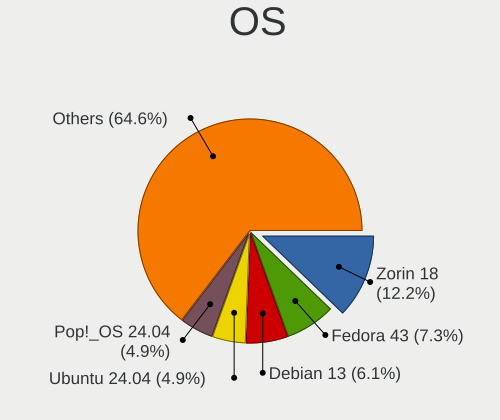

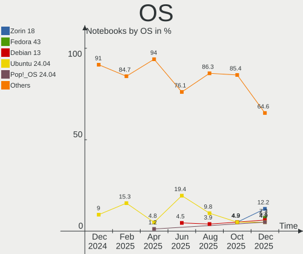

| Name                | Notebooks | Percent |
|---------------------|-----------|---------|
| Zorin 18            | 10        | 12.2%   |
| Fedora 43           | 6         | 7.32%   |
| Debian 13           | 5         | 6.1%    |
| Ubuntu 24.04        | 4         | 4.88%   |
| Pop!_OS 24.04       | 4         | 4.88%   |
| OpenMandriva 25.90  | 4         | 4.88%   |
| Linux Mint 22.2     | 4         | 4.88%   |
| Bazzite 43          | 4         | 4.88%   |
| Zorin 17            | 3         | 3.66%   |
| CachyOS Rolling     | 3         | 3.66%   |
| Arch Rolling        | 3         | 3.66%   |
| ROSA 13.1           | 2         | 2.44%   |
| OpenMandriva 6.0    | 2         | 2.44%   |
| Manjaro             | 2         | 2.44%   |
| Kubuntu 25.10       | 2         | 2.44%   |
| Fedora 42           | 2         | 2.44%   |
| Elementary 8        | 2         | 2.44%   |
| Bazzite 42          | 2         | 2.44%   |
| Ubuntu 25.04        | 1         | 1.22%   |
| Ubuntu 22.04        | 1         | 1.22%   |
| TUXEDO OS 24.04     | 1         | 1.22%   |
| OpenMandriva 25.11  | 1         | 1.22%   |
| OpenMandriva 25.06  | 1         | 1.22%   |
| OpenMandriva 24.12  | 1         | 1.22%   |
| OpenMandriva 24.09  | 1         | 1.22%   |
| NixOS 25.11         | 1         | 1.22%   |
| Manjaro 25.0.10     | 1         | 1.22%   |
| LMDE 7              | 1         | 1.22%   |
| Linux Mint 22       | 1         | 1.22%   |
| KDE neon 24.04      | 1         | 1.22%   |
| Kali 2025.4         | 1         | 1.22%   |
| Gentoo 2.18         | 1         | 1.22%   |
| EndeavourOS Rolling | 1         | 1.22%   |
| Deepin 25           | 1         | 1.22%   |
| Debian 12           | 1         | 1.22%   |
| Cuerdos 2.0         | 1         | 1.22%   |

OS Family
---------

OS without a version

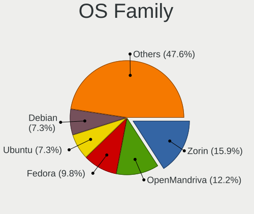

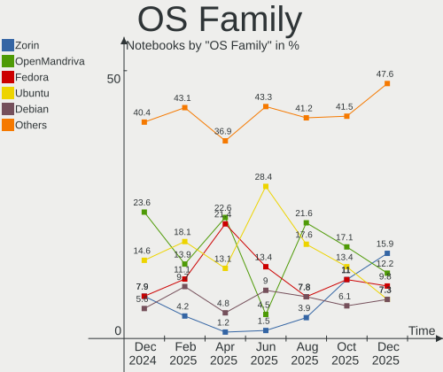

| Name         | Notebooks | Percent |
|--------------|-----------|---------|
| Zorin        | 13        | 15.85%  |
| OpenMandriva | 10        | 12.2%   |
| Fedora       | 8         | 9.76%   |
| Ubuntu       | 6         | 7.32%   |
| Debian       | 6         | 7.32%   |
| Bazzite      | 6         | 7.32%   |
| Linux Mint   | 5         | 6.1%    |
| Pop!_OS      | 4         | 4.88%   |
| Manjaro      | 3         | 3.66%   |
| CachyOS      | 3         | 3.66%   |
| Arch         | 3         | 3.66%   |
| ROSA         | 2         | 2.44%   |
| Kubuntu      | 2         | 2.44%   |
| Elementary   | 2         | 2.44%   |
| TUXEDO OS    | 1         | 1.22%   |
| NixOS        | 1         | 1.22%   |
| LMDE         | 1         | 1.22%   |
| KDE neon     | 1         | 1.22%   |
| Kali         | 1         | 1.22%   |
| Gentoo       | 1         | 1.22%   |
| EndeavourOS  | 1         | 1.22%   |
| Deepin       | 1         | 1.22%   |
| Cuerdos      | 1         | 1.22%   |

Kernel
------

Version of the Linux kernel

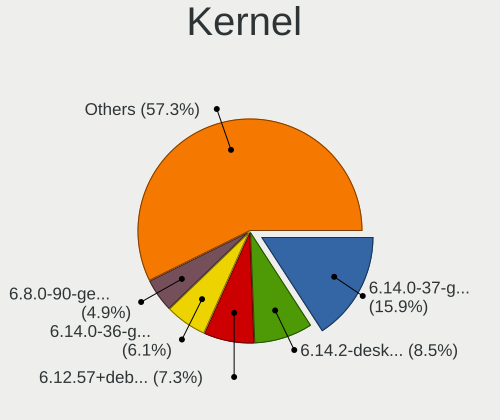

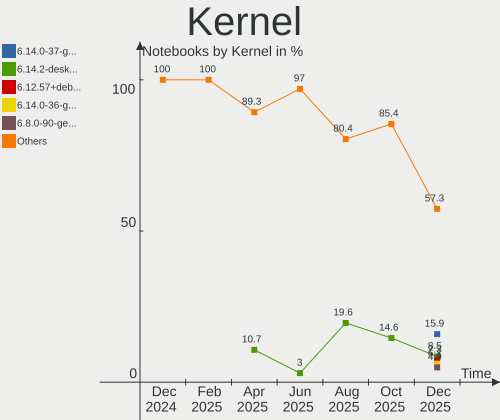

| Version                        | Notebooks | Percent |
|--------------------------------|-----------|---------|
| 6.14.0-37-generic              | 13        | 15.85%  |
| 6.14.2-desktop-3omv2590        | 7         | 8.54%   |
| 6.12.57+deb13-amd64            | 6         | 7.32%   |
| 6.14.0-36-generic              | 5         | 6.1%    |
| 6.8.0-90-generic               | 4         | 4.88%   |
| 6.17.9-76061709-generic        | 4         | 4.88%   |
| 6.17.12-300.fc43.x86_64        | 3         | 3.66%   |
| 6.8.0-88-generic               | 2         | 2.44%   |
| 6.18.1-2-cachyos               | 2         | 2.44%   |
| 6.17.7-ba20.fc43.x86_64        | 2         | 2.44%   |
| 6.17.7-ba19.fc43.x86_64        | 2         | 2.44%   |
| 6.17.10-200.fc42.x86_64        | 2         | 2.44%   |
| 6.17.0-7-generic               | 2         | 2.44%   |
| 6.16.4-116.bazzite.fc42.x86_64 | 2         | 2.44%   |
| 6.14.0-29-generic              | 2         | 2.44%   |
| 6.12.47-generic-5rosa13-x86_64 | 2         | 2.44%   |
| 6.8.0-38-generic               | 1         | 1.22%   |
| 6.6.99-1-MANJARO               | 1         | 1.22%   |
| 6.18.1-arch1-2                 | 1         | 1.22%   |
| 6.18.0-desktop-1omv2590        | 1         | 1.22%   |
| 6.18.0-3-cachyos               | 1         | 1.22%   |
| 6.17.9-zen1-1-zen              | 1         | 1.22%   |
| 6.17.9-gentoo-firmware         | 1         | 1.22%   |
| 6.17.9-arch1-1                 | 1         | 1.22%   |
| 6.17.9-amd64-desktop-rolling   | 1         | 1.22%   |
| 6.17.9-300.fc43.x86_64         | 1         | 1.22%   |
| 6.17.7-300.fc43.x86_64         | 1         | 1.22%   |
| 6.17.10+kali-amd64             | 1         | 1.22%   |
| 6.17.1-300.fc43.x86_64         | 1         | 1.22%   |
| 6.14.2-zen1-1-zen              | 1         | 1.22%   |
| 6.14.0-119037-tuxedo           | 1         | 1.22%   |
| 6.12.61-1-MANJARO              | 1         | 1.22%   |
| 6.12.58-cuerdos                | 1         | 1.22%   |
| 6.12.58                        | 1         | 1.22%   |
| 6.12.48-1-MANJARO              | 1         | 1.22%   |
| 6.12.1-desktop-1omv2490        | 1         | 1.22%   |
| 6.11.0-desktop-2omv2490        | 1         | 1.22%   |
| 6.1.0-41-amd64                 | 1         | 1.22%   |

Kernel Family
-------------

Linux kernel without a distro release

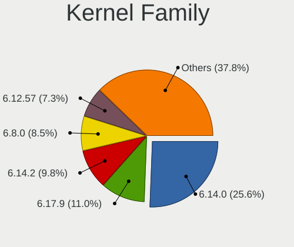

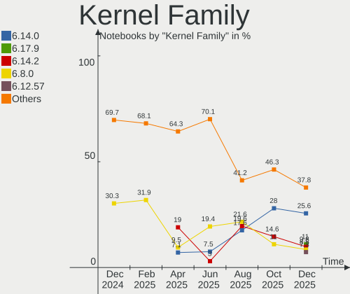

| Version | Notebooks | Percent |
|---------|-----------|---------|
| 6.14.0  | 21        | 25.61%  |
| 6.17.9  | 9         | 10.98%  |
| 6.14.2  | 8         | 9.76%   |
| 6.8.0   | 7         | 8.54%   |
| 6.12.57 | 6         | 7.32%   |
| 6.17.7  | 5         | 6.1%    |
| 6.18.1  | 3         | 3.66%   |
| 6.17.12 | 3         | 3.66%   |
| 6.17.10 | 3         | 3.66%   |
| 6.18.0  | 2         | 2.44%   |
| 6.17.0  | 2         | 2.44%   |
| 6.16.4  | 2         | 2.44%   |
| 6.12.58 | 2         | 2.44%   |
| 6.12.47 | 2         | 2.44%   |
| 6.6.99  | 1         | 1.22%   |
| 6.17.1  | 1         | 1.22%   |
| 6.12.61 | 1         | 1.22%   |
| 6.12.48 | 1         | 1.22%   |
| 6.12.1  | 1         | 1.22%   |
| 6.11.0  | 1         | 1.22%   |
| 6.1.0   | 1         | 1.22%   |

Kernel Major Ver.
-----------------

Linux kernel major version

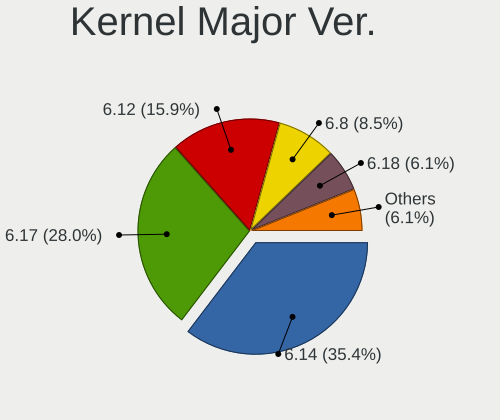

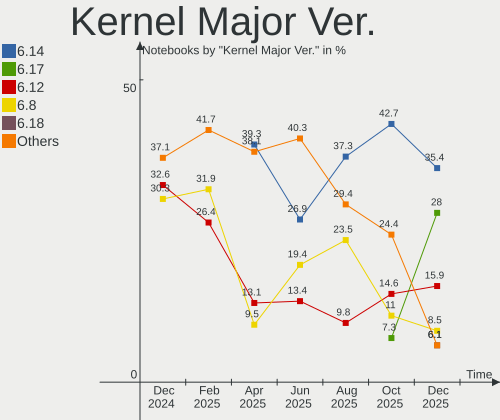

| Version | Notebooks | Percent |
|---------|-----------|---------|
| 6.14    | 29        | 35.37%  |
| 6.17    | 23        | 28.05%  |
| 6.12    | 13        | 15.85%  |
| 6.8     | 7         | 8.54%   |
| 6.18    | 5         | 6.1%    |
| 6.16    | 2         | 2.44%   |
| 6.6     | 1         | 1.22%   |
| 6.11    | 1         | 1.22%   |
| 6.1     | 1         | 1.22%   |

Arch
----

OS architecture (x86_64, i586, etc.)

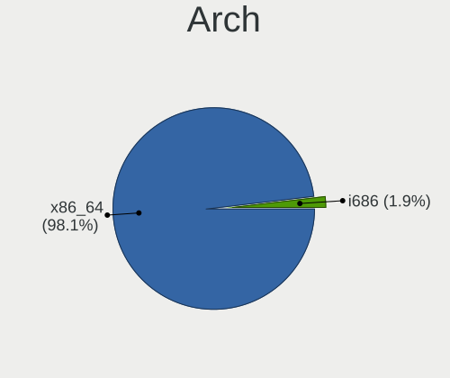

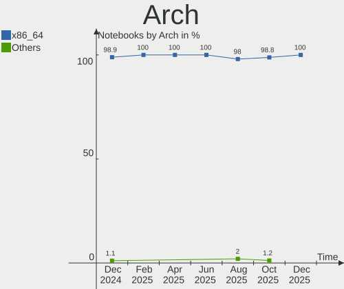

| Name   | Notebooks | Percent |
|--------|-----------|---------|
| x86_64 | 82        | 100%    |

DE
--

Desktop Environment

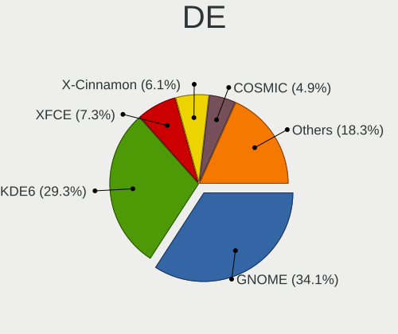

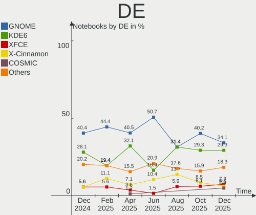

| Name          | Notebooks | Percent |
|---------------|-----------|---------|
| GNOME         | 28        | 34.15%  |
| KDE6          | 24        | 29.27%  |
| XFCE          | 6         | 7.32%   |
| X-Cinnamon    | 5         | 6.1%    |
| COSMIC        | 4         | 4.88%   |
| LXQt          | 3         | 3.66%   |
| Hyprland      | 3         | 3.66%   |
| Pantheon      | 2         | 2.44%   |
| MATE          | 2         | 2.44%   |
| i3            | 1         | 1.22%   |
| GNOME Classic | 1         | 1.22%   |
| DWM           | 1         | 1.22%   |
| Deepin        | 1         | 1.22%   |
| Cinnamon      | 1         | 1.22%   |

Display Server
--------------

X11 or Wayland

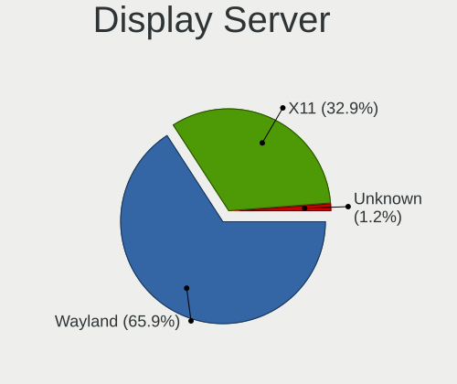

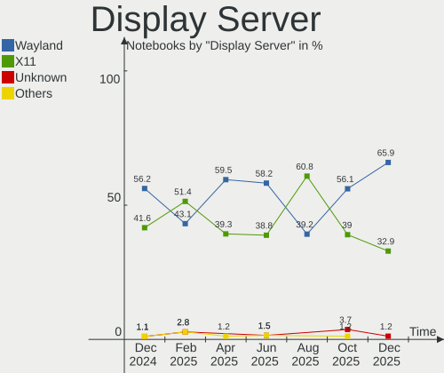

| Name    | Notebooks | Percent |
|---------|-----------|---------|
| Wayland | 54        | 65.85%  |
| X11     | 27        | 32.93%  |
| Unknown | 1         | 1.22%   |

Display Manager
---------------

SDDM, LightDM, etc.

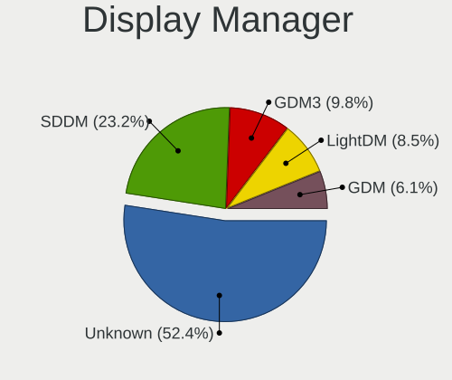

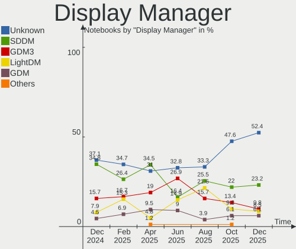

| Name    | Notebooks | Percent |
|---------|-----------|---------|
| Unknown | 43        | 52.44%  |
| SDDM    | 19        | 23.17%  |
| GDM3    | 8         | 9.76%   |
| LightDM | 7         | 8.54%   |
| GDM     | 5         | 6.1%    |

OS Lang
-------

Language

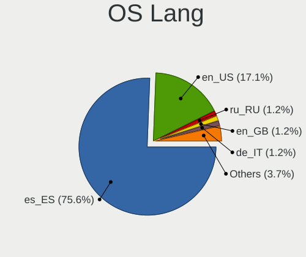

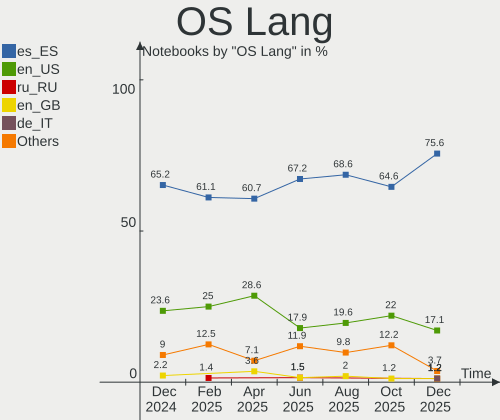

| Lang   | Notebooks | Percent |
|--------|-----------|---------|
| es_ES  | 62        | 75.61%  |
| en_US  | 14        | 17.07%  |
| ru_RU  | 1         | 1.22%   |
| en_GB  | 1         | 1.22%   |
| de_IT  | 1         | 1.22%   |
| de_DE  | 1         | 1.22%   |
| ca_AD  | 1         | 1.22%   |
| ast_ES | 1         | 1.22%   |

Boot Mode
---------

EFI or BIOS

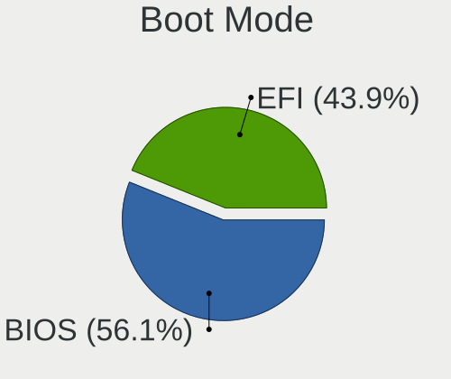

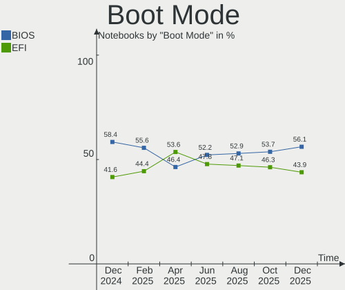

| Mode | Notebooks | Percent |
|------|-----------|---------|
| BIOS | 46        | 56.1%   |
| EFI  | 36        | 43.9%   |

Filesystem
----------

Type of filesystem

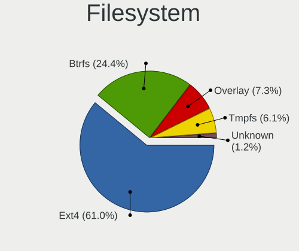

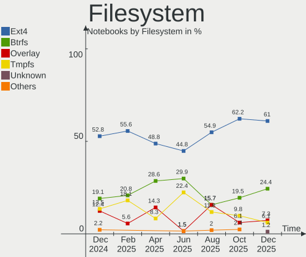

| Type    | Notebooks | Percent |
|---------|-----------|---------|
| Ext4    | 50        | 60.98%  |
| Btrfs   | 20        | 24.39%  |
| Overlay | 6         | 7.32%   |
| Tmpfs   | 5         | 6.1%    |
| Unknown | 1         | 1.22%   |

Part. scheme
------------

Scheme of partitioning

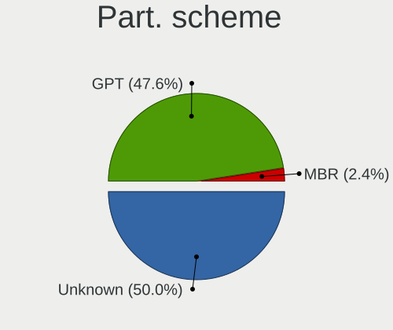

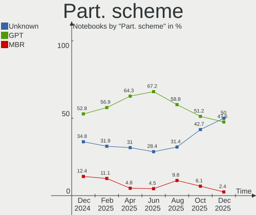

| Type    | Notebooks | Percent |
|---------|-----------|---------|
| Unknown | 41        | 50%     |
| GPT     | 39        | 47.56%  |
| MBR     | 2         | 2.44%   |

Dual Boot with Linux/BSD
------------------------

Hosting more than one Linux/BSD

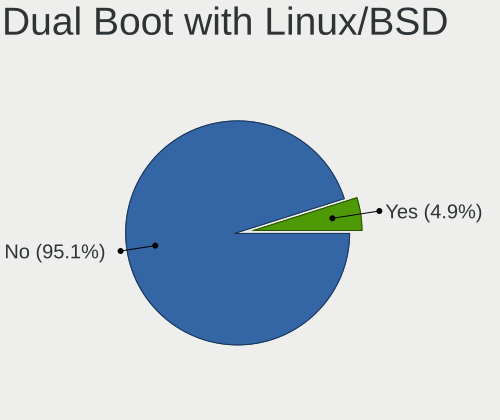

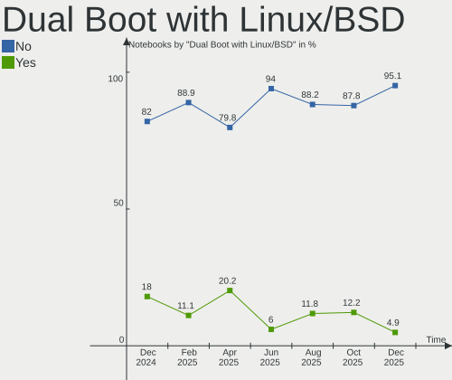

| Dual boot | Notebooks | Percent |
|-----------|-----------|---------|
| No        | 78        | 95.12%  |
| Yes       | 4         | 4.88%   |

Dual Boot (Win)
---------------

Hosting Linux and Windows

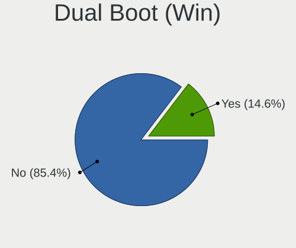

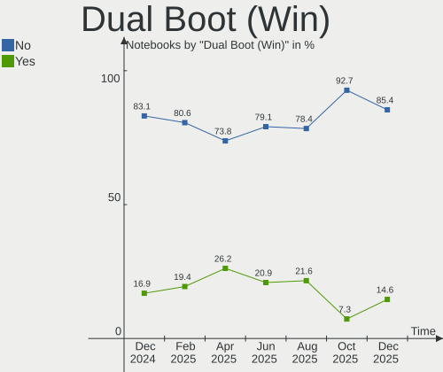

| Dual boot | Notebooks | Percent |
|-----------|-----------|---------|
| No        | 70        | 85.37%  |
| Yes       | 12        | 14.63%  |

Board
-----

Vendor
------

Motherboard manufacturer

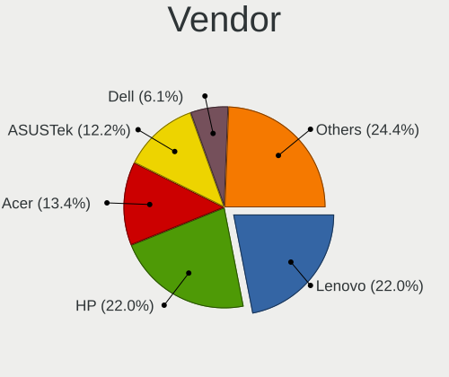

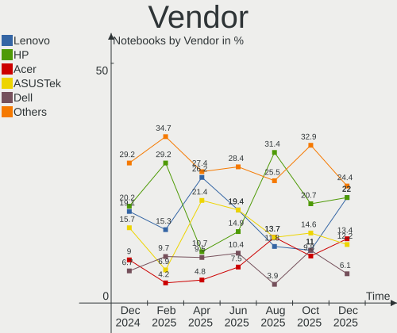

| Name             | Notebooks | Percent |
|------------------|-----------|---------|
| Lenovo           | 18        | 21.95%  |
| Hewlett-Packard  | 18        | 21.95%  |
| Acer             | 11        | 13.41%  |
| ASUSTek Computer | 10        | 12.2%   |
| Dell             | 5         | 6.1%    |
| MSI              | 3         | 3.66%   |
| HUAWEI           | 3         | 3.66%   |
| Toshiba          | 2         | 2.44%   |
| Apple            | 2         | 2.44%   |
| Unknown          | 2         | 2.44%   |
| XMG              | 1         | 1.22%   |
| VANT             | 1         | 1.22%   |
| Timi             | 1         | 1.22%   |
| Sony             | 1         | 1.22%   |
| SLIMBOOK         | 1         | 1.22%   |
| PC Componentes   | 1         | 1.22%   |
| Packard Bell     | 1         | 1.22%   |
| AMI              | 1         | 1.22%   |

Model
-----

Motherboard model

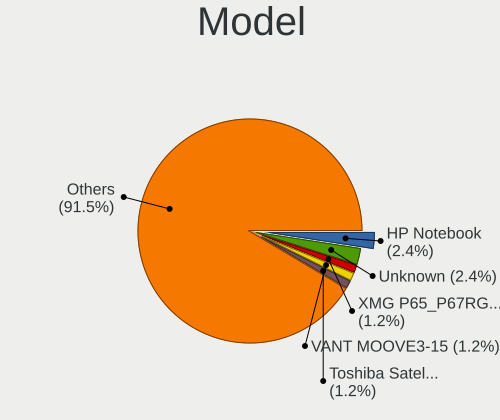

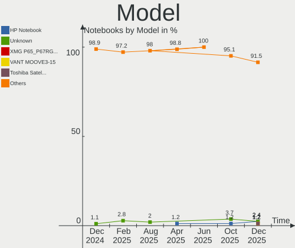

| Name                                     | Notebooks | Percent |
|------------------------------------------|-----------|---------|
| HP Notebook                              | 2         | 2.44%   |
| Unknown                                  | 2         | 2.44%   |
| XMG P65_P67RGRERA                        | 1         | 1.22%   |
| VANT MOOVE3-15                           | 1         | 1.22%   |
| Toshiba Satellite U300                   | 1         | 1.22%   |
| Toshiba Satellite P50-C                  | 1         | 1.22%   |
| Timi TM1703                              | 1         | 1.22%   |
| Sony VGN-FW41J_H                         | 1         | 1.22%   |
| SLIMBOOK EVO15-A8                        | 1         | 1.22%   |
| PC Componentes PcCom Revolt              | 1         | 1.22%   |
| Packard Bell EasyNote TS11HR             | 1         | 1.22%   |
| MSI Thin 15 B13VE                        | 1         | 1.22%   |
| MSI Stealth 15M B12UE                    | 1         | 1.22%   |
| MSI Katana 15 B12VFK                     | 1         | 1.22%   |
| Lenovo V15 G2 IJL 82QY                   | 1         | 1.22%   |
| Lenovo V15 G2 ALC 82KD                   | 1         | 1.22%   |
| Lenovo V130-15IKB 81HN                   | 1         | 1.22%   |
| Lenovo ThinkPad X260 20F5S3J301          | 1         | 1.22%   |
| Lenovo ThinkPad X1 Carbon 7th 20QDCTO1WW | 1         | 1.22%   |
| Lenovo ThinkPad T14 Gen 1 20S1S52500     | 1         | 1.22%   |
| Lenovo ThinkPad L430 24663N1             | 1         | 1.22%   |
| Lenovo LOQ 15ARP9 83JC                   | 1         | 1.22%   |
| Lenovo Legion Pro 5 16IAX10H 83LU        | 1         | 1.22%   |
| Lenovo Legion 5 15IRX10 83LY             | 1         | 1.22%   |
| Lenovo IdeaPad Slim 5 14IRL8 82XD        | 1         | 1.22%   |
| Lenovo IdeaPad Slim 3 15ABR8 82XM        | 1         | 1.22%   |
| Lenovo IdeaPad S145-15AST 81N3           | 1         | 1.22%   |
| Lenovo IdeaPad Gaming 3 15ARH05 82EY     | 1         | 1.22%   |
| Lenovo IdeaPad Gaming 3 15ACH6 82K2      | 1         | 1.22%   |
| Lenovo IdeaPad 3 15ITL6 82H8             | 1         | 1.22%   |
| Lenovo IdeaPad 3 14ITL6 82H7             | 1         | 1.22%   |
| Lenovo G50-45 80E3                       | 1         | 1.22%   |
| HUAWEI VGHH-XX                           | 1         | 1.22%   |
| HUAWEI FLMH-XX                           | 1         | 1.22%   |
| HUAWEI BOHB-WAX9                         | 1         | 1.22%   |
| HP Victus by Gaming Laptop 16-s0xxx      | 1         | 1.22%   |
| HP ProBook 4520s                         | 1         | 1.22%   |
| HP ProBook 4340s                         | 1         | 1.22%   |
| HP Presario CQ57                         | 1         | 1.22%   |
| HP Pavilion Notebook 15-bc5xxx           | 1         | 1.22%   |

Model Family
------------

Motherboard model prefix

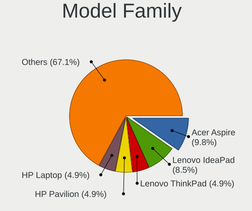

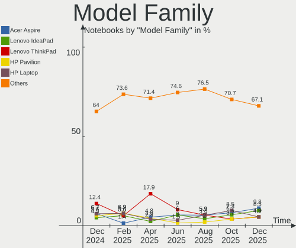

| Name                  | Notebooks | Percent |
|-----------------------|-----------|---------|
| Acer Aspire           | 8         | 9.76%   |
| Lenovo IdeaPad        | 7         | 8.54%   |
| Lenovo ThinkPad       | 4         | 4.88%   |
| HP Pavilion           | 4         | 4.88%   |
| HP Laptop             | 4         | 4.88%   |
| Dell Latitude         | 3         | 3.66%   |
| Toshiba Satellite     | 2         | 2.44%   |
| Lenovo V15            | 2         | 2.44%   |
| Lenovo Legion         | 2         | 2.44%   |
| HP ProBook            | 2         | 2.44%   |
| HP Notebook           | 2         | 2.44%   |
| ASUS ZenBook          | 2         | 2.44%   |
| ASUS Vivobook         | 2         | 2.44%   |
| ASUS ROG              | 2         | 2.44%   |
| Unknown               | 2         | 2.44%   |
| XMG P65               | 1         | 1.22%   |
| VANT MOOVE3-15        | 1         | 1.22%   |
| Timi TM1703           | 1         | 1.22%   |
| Sony VGN-FW41J        | 1         | 1.22%   |
| SLIMBOOK EVO15-A8     | 1         | 1.22%   |
| PC Componentes PcCom  | 1         | 1.22%   |
| Packard Bell EasyNote | 1         | 1.22%   |
| MSI Thin              | 1         | 1.22%   |
| MSI Stealth           | 1         | 1.22%   |
| MSI Katana            | 1         | 1.22%   |
| Lenovo V130-15IKB     | 1         | 1.22%   |
| Lenovo LOQ            | 1         | 1.22%   |
| Lenovo G50-45         | 1         | 1.22%   |
| HUAWEI VGHH-XX        | 1         | 1.22%   |
| HUAWEI FLMH-XX        | 1         | 1.22%   |
| HUAWEI BOHB-WAX9      | 1         | 1.22%   |
| HP Victus             | 1         | 1.22%   |
| HP Presario           | 1         | 1.22%   |
| HP ENVY               | 1         | 1.22%   |
| HP EliteBook          | 1         | 1.22%   |
| HP Elite              | 1         | 1.22%   |
| HP 650                | 1         | 1.22%   |
| Dell XPS              | 1         | 1.22%   |
| Dell Inspiron         | 1         | 1.22%   |
| ASUS X555QG           | 1         | 1.22%   |

MFG Year
--------

Motherboard manufacture year

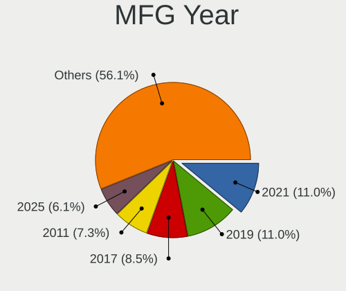

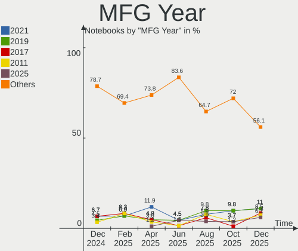

| Year | Notebooks | Percent |
|------|-----------|---------|
| 2021 | 9         | 10.98%  |
| 2019 | 9         | 10.98%  |
| 2017 | 7         | 8.54%   |
| 2011 | 6         | 7.32%   |
| 2025 | 5         | 6.1%    |
| 2024 | 5         | 6.1%    |
| 2020 | 5         | 6.1%    |
| 2016 | 5         | 6.1%    |
| 2023 | 4         | 4.88%   |
| 2018 | 4         | 4.88%   |
| 2015 | 4         | 4.88%   |
| 2012 | 4         | 4.88%   |
| 2022 | 3         | 3.66%   |
| 2014 | 3         | 3.66%   |
| 2008 | 3         | 3.66%   |
| 2013 | 2         | 2.44%   |
| 2010 | 1         | 1.22%   |
| 2009 | 1         | 1.22%   |
| 2007 | 1         | 1.22%   |
| 2006 | 1         | 1.22%   |

Form Factor
-----------

Physical design of the computer

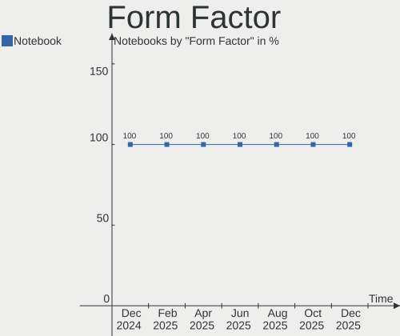

| Name     | Notebooks | Percent |
|----------|-----------|---------|
| Notebook | 82        | 100%    |

Secure Boot
-----------

Enabled or disabled

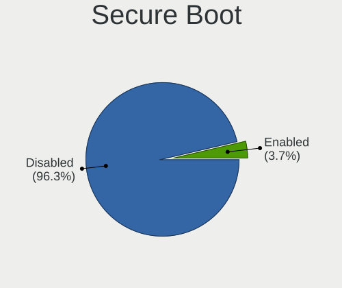

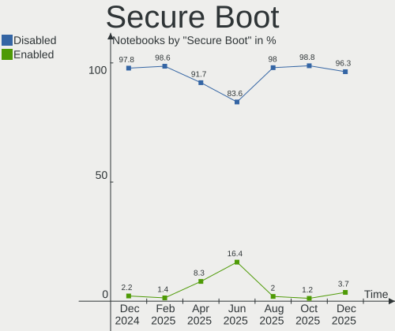

| State    | Notebooks | Percent |
|----------|-----------|---------|
| Disabled | 79        | 96.34%  |
| Enabled  | 3         | 3.66%   |

Coreboot
--------

Have coreboot on board

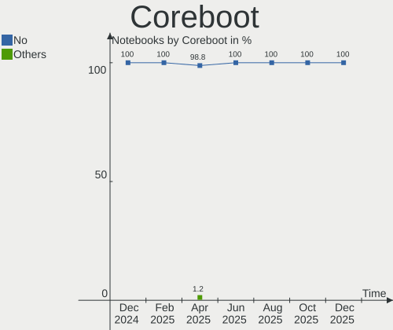

| Used | Notebooks | Percent |
|------|-----------|---------|
| No   | 82        | 100%    |

RAM Size
--------

Total RAM memory

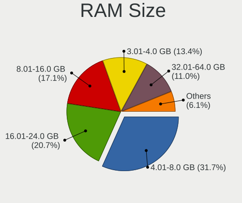

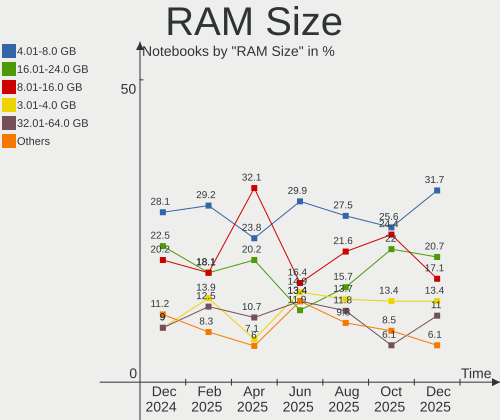

| Size in GB  | Notebooks | Percent |
|-------------|-----------|---------|
| 4.01-8.0    | 26        | 31.71%  |
| 16.01-24.0  | 17        | 20.73%  |
| 8.01-16.0   | 14        | 17.07%  |
| 3.01-4.0    | 11        | 13.41%  |
| 32.01-64.0  | 9         | 10.98%  |
| 24.01-32.0  | 2         | 2.44%   |
| 2.01-3.0    | 2         | 2.44%   |
| 64.01-256.0 | 1         | 1.22%   |

RAM Used
--------

Used RAM memory

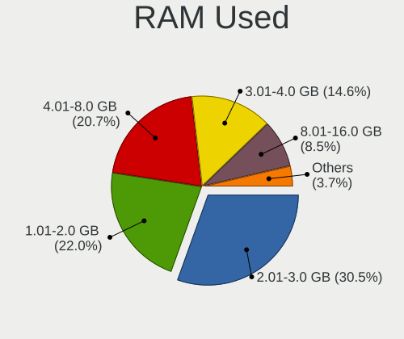

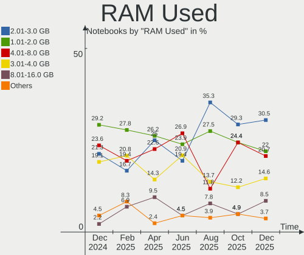

| Used GB   | Notebooks | Percent |
|-----------|-----------|---------|
| 2.01-3.0  | 25        | 30.49%  |
| 1.01-2.0  | 18        | 21.95%  |
| 4.01-8.0  | 17        | 20.73%  |
| 3.01-4.0  | 12        | 14.63%  |
| 8.01-16.0 | 7         | 8.54%   |
| 0.51-1.0  | 3         | 3.66%   |

Total Drives
------------

Number of drives on board

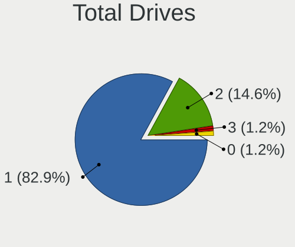

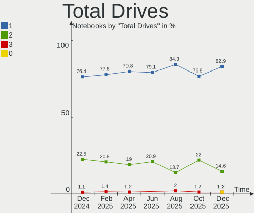

| Drives | Notebooks | Percent |
|--------|-----------|---------|
| 1      | 68        | 82.93%  |
| 2      | 12        | 14.63%  |
| 3      | 1         | 1.22%   |
| 0      | 1         | 1.22%   |

Has CD-ROM
----------

Has CD-ROM on board

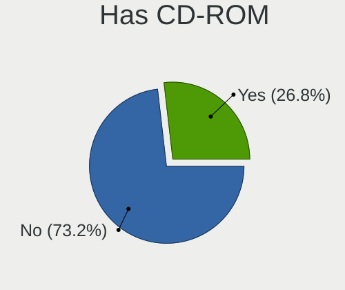

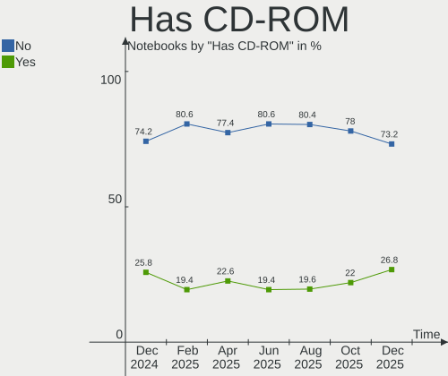

| Presented | Notebooks | Percent |
|-----------|-----------|---------|
| No        | 60        | 73.17%  |
| Yes       | 22        | 26.83%  |

Has Ethernet
------------

Has Ethernet on board

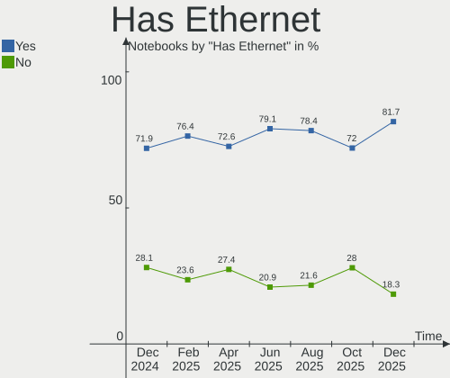

| Presented | Notebooks | Percent |
|-----------|-----------|---------|
| Yes       | 67        | 81.71%  |
| No        | 15        | 18.29%  |

Has WiFi
--------

Has WiFi module

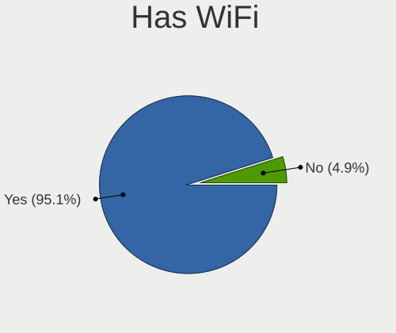

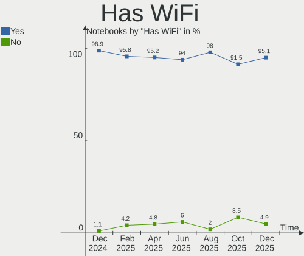

| Presented | Notebooks | Percent |
|-----------|-----------|---------|
| Yes       | 78        | 95.12%  |
| No        | 4         | 4.88%   |

Has Bluetooth
-------------

Has Bluetooth module

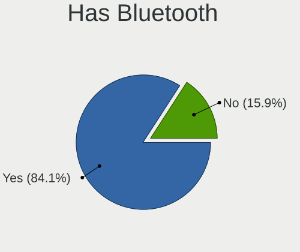

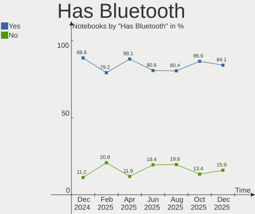

| Presented | Notebooks | Percent |
|-----------|-----------|---------|
| Yes       | 69        | 84.15%  |
| No        | 13        | 15.85%  |

Location
--------

Country
-------

Geographic location (country)

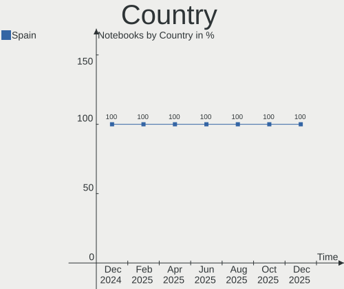

| Country | Notebooks | Percent |
|---------|-----------|---------|
| Spain   | 82        | 100%    |

City
----

Geographic location (city)

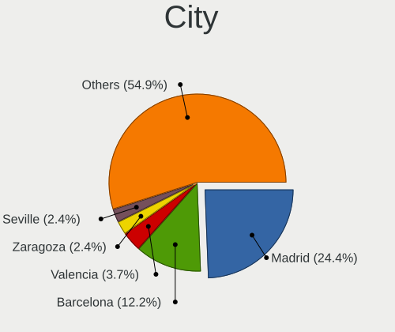

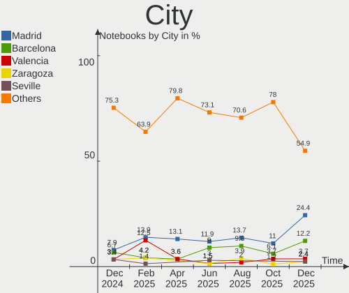

| City                        | Notebooks | Percent |
|-----------------------------|-----------|---------|
| Madrid                      | 20        | 24.39%  |
| Barcelona                   | 10        | 12.2%   |
| Valencia                    | 3         | 3.66%   |
| Zaragoza                    | 2         | 2.44%   |
| Seville                     | 2         | 2.44%   |
| Murcia                      | 2         | 2.44%   |
| Dos Hermanas                | 2         | 2.44%   |
| Donostia / San Sebastian    | 2         | 2.44%   |
| Avilés                     | 2         | 2.44%   |
| Vitoria-Gasteiz             | 1         | 1.22%   |
| Valladolid                  | 1         | 1.22%   |
| Torrenueva                  | 1         | 1.22%   |
| Tarragona                   | 1         | 1.22%   |
| Santander                   | 1         | 1.22%   |
| Santa Cruz de La Palma      | 1         | 1.22%   |
| Sant Celoni                 | 1         | 1.22%   |
| Sant Boi de Llobregat       | 1         | 1.22%   |
| Salou                       | 1         | 1.22%   |
| Rubí                       | 1         | 1.22%   |
| Puente La Reina – Gares   | 1         | 1.22%   |
| Oviedo                      | 1         | 1.22%   |
| O Burgo                     | 1         | 1.22%   |
| Montilla                    | 1         | 1.22%   |
| Mérida                     | 1         | 1.22%   |
| Málaga                     | 1         | 1.22%   |
| Mahon                       | 1         | 1.22%   |
| Linares                     | 1         | 1.22%   |
| Lierganes                   | 1         | 1.22%   |
| Legazpia                    | 1         | 1.22%   |
| Las Palmas de Gran Canaria  | 1         | 1.22%   |
| La Línea de la Concepción | 1         | 1.22%   |
| Guardamar del Segura        | 1         | 1.22%   |
| Finestrat                   | 1         | 1.22%   |
| El Puerto de Santa María   | 1         | 1.22%   |
| Cullera                     | 1         | 1.22%   |
| Coria del Río              | 1         | 1.22%   |
| Conil de la Frontera        | 1         | 1.22%   |
| Colmenar Viejo              | 1         | 1.22%   |
| Collado Villalba            | 1         | 1.22%   |
| Ciutadella                  | 1         | 1.22%   |

Drives
------

Drive Vendor
------------

Hard drive vendors

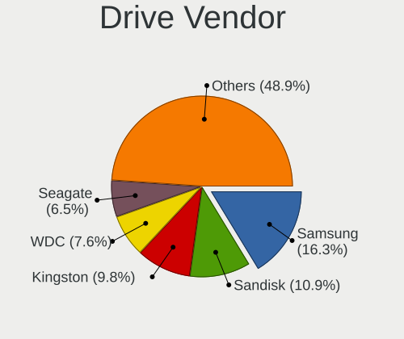

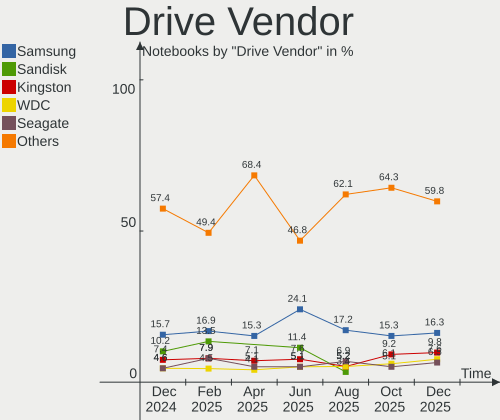

| Vendor                                  | Notebooks | Drives | Percent |
|-----------------------------------------|-----------|--------|---------|
| Samsung Electronics                     | 15        | 15     | 16.3%   |
| Sandisk                                 | 10        | 10     | 10.87%  |
| Kingston                                | 9         | 9      | 9.78%   |
| WDC                                     | 7         | 7      | 7.61%   |
| Seagate                                 | 6         | 6      | 6.52%   |
| Intel                                   | 6         | 6      | 6.52%   |
| Toshiba                                 | 5         | 5      | 5.43%   |
| SK hynix                                | 4         | 4      | 4.35%   |
| Micron Technology                       | 4         | 4      | 4.35%   |
| Kingston Technology Company             | 3         | 3      | 3.26%   |
| Micron/Crucial Technology               | 2         | 2      | 2.17%   |
| MAXIO Technology (Hangzhou)             | 2         | 3      | 2.17%   |
| KIOXIA                                  | 2         | 2      | 2.17%   |
| China                                   | 2         | 2      | 2.17%   |
| Unknown                                 | 1         | 1      | 1.09%   |
| TOPGIANT                                | 1         | 1      | 1.09%   |
| Shenzhen Unionmemory Information System | 1         | 1      | 1.09%   |
| SABRENT                                 | 1         | 1      | 1.09%   |
| Phison Electronics                      | 1         | 1      | 1.09%   |
| LITEON                                  | 1         | 1      | 1.09%   |
| KIOXIA-EXCERIA                          | 1         | 1      | 1.09%   |
| Hitachi                                 | 1         | 1      | 1.09%   |
| Hewlett-Packard                         | 1         | 1      | 1.09%   |
| EAGET                                   | 1         | 1      | 1.09%   |
| Crucial                                 | 1         | 1      | 1.09%   |
| C400-MTF                                | 1         | 1      | 1.09%   |
| Apple                                   | 1         | 1      | 1.09%   |
| ADATA Technology                        | 1         | 1      | 1.09%   |
| A-DATA Technology                       | 1         | 1      | 1.09%   |

Drive Model
-----------

Hard drive models

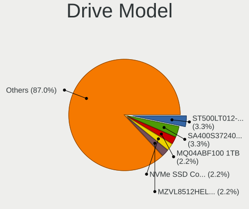

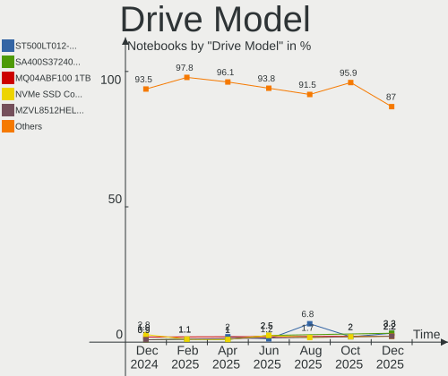

| Model                                                                   | Notebooks | Percent |
|-------------------------------------------------------------------------|-----------|---------|
| Seagate ST500LT012-1DG142 500GB                                         | 3         | 3.26%   |
| Kingston SA400S37240G 240GB SSD                                         | 3         | 3.26%   |
| Toshiba MQ04ABF100 1TB                                                  | 2         | 2.17%   |
| Samsung NVMe SSD Controller SM981/PM981/PM983 1TB                       | 2         | 2.17%   |
| Samsung MZVL8512HELU-00BTW 512GB                                        | 2         | 2.17%   |
| Kingston SV300S37A120G 120GB SSD                                        | 2         | 2.17%   |
| Kingston SA400S37480G 480GB SSD                                         | 2         | 2.17%   |
| Intel SSD 660P Series 512GB                                             | 2         | 2.17%   |
| WDC WDS500G2B0B-00YS70 500GB SSD                                        | 1         | 1.09%   |
| WDC WD7500BPVX-16JC3T3 752GB                                            | 1         | 1.09%   |
| WDC WD5000LPVX-22V0TT0 500GB                                            | 1         | 1.09%   |
| WDC WD3200BEVT-22ZCT0 320GB                                             | 1         | 1.09%   |
| WDC WD10SPZX-75Z10T1 1TB                                                | 1         | 1.09%   |
| WDC PC SN730 SDBPNTY-256G-1027 256GB                                    | 1         | 1.09%   |
| WDC PC SN530 SDBPNPZ-1T00-1114 1TB                                      | 1         | 1.09%   |
| Unknown MMC Card  249GB                                                 | 1         | 1.09%   |
| Toshiba MQ01ABD100 1TB                                                  | 1         | 1.09%   |
| Toshiba MK3276GSX 320GB                                                 | 1         | 1.09%   |
| Toshiba MK2552GSX 250GB                                                 | 1         | 1.09%   |
| TOPGIANT TG550 256GB SSD                                                | 1         | 1.09%   |
| SK hynix Platinum P41/PC801 NVMe Solid State Drive 1TB                  | 1         | 1.09%   |
| SK hynix HFS256G39TNF-N3A0A 256GB SSD                                   | 1         | 1.09%   |
| SK hynix Gold P31/BC711/PC711 NVMe Solid State Drive 512GB              | 1         | 1.09%   |
| SK hynix BC511 512GB                                                    | 1         | 1.09%   |
| Shenzhen Unionmemory Information System AM620 PCIe 3.0 NVMe SSD 512GB   | 1         | 1.09%   |
| Seagate ST9500420AS 500GB                                               | 1         | 1.09%   |
| Seagate ST9500325AS 500GB                                               | 1         | 1.09%   |
| Seagate ST9120822AS 120GB                                               | 1         | 1.09%   |
| SanDisk X600 M.2 2280 SATA 128GB SSD                                    | 1         | 1.09%   |
| Sandisk WD PC SN740 SDDPNQD-512G-1127 512GB                             | 1         | 1.09%   |
| Sandisk WD PC SN740 SDDPNQD-256G-2006 256GB                             | 1         | 1.09%   |
| Sandisk WD Blue SN550 NVMe SSD 1024GB                                   | 1         | 1.09%   |
| Sandisk WD Black SN770 / PC SN740 256GB / PC SN560 (DRAM-less) NVMe SSD | 1         | 1.09%   |
| Sandisk WD Black SN750 / PC SN730 NVMe SSD 500GB                        | 1         | 1.09%   |
| SanDisk SSD PLUS 480GB                                                  | 1         | 1.09%   |
| Sandisk SSD PLUS 1TB                                                    | 1         | 1.09%   |
| Sandisk SN8000S NVMe SSD 1TB                                            | 1         | 1.09%   |
| SanDisk SDSSDH3 2T00 2TB                                                | 1         | 1.09%   |
| Samsung SSD PM851 M.2 2280 256GB                                        | 1         | 1.09%   |
| Samsung SSD 870 EVO 500GB                                               | 1         | 1.09%   |

HDD Vendor
----------

Hard disk drive vendors

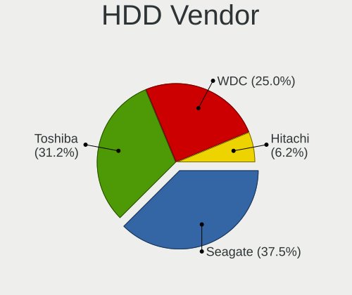

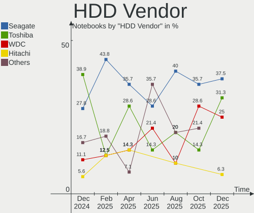

| Vendor  | Notebooks | Drives | Percent |
|---------|-----------|--------|---------|
| Seagate | 6         | 6      | 37.5%   |
| Toshiba | 5         | 5      | 31.25%  |
| WDC     | 4         | 4      | 25%     |
| Hitachi | 1         | 1      | 6.25%   |

SSD Vendor
----------

Solid state drive vendors

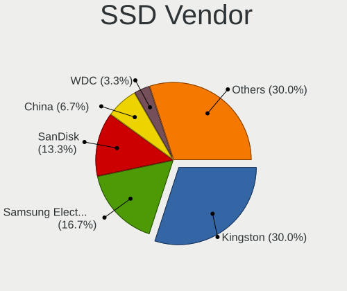

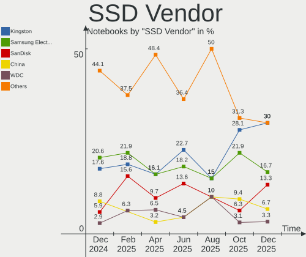

| Vendor              | Notebooks | Drives | Percent |
|---------------------|-----------|--------|---------|
| Kingston            | 9         | 9      | 30%     |
| Samsung Electronics | 5         | 5      | 16.67%  |
| SanDisk             | 4         | 4      | 13.33%  |
| China               | 2         | 2      | 6.67%   |
| WDC                 | 1         | 1      | 3.33%   |
| TOPGIANT            | 1         | 1      | 3.33%   |
| SK hynix            | 1         | 1      | 3.33%   |
| SABRENT             | 1         | 1      | 3.33%   |
| LITEON              | 1         | 1      | 3.33%   |
| Intel               | 1         | 1      | 3.33%   |
| EAGET               | 1         | 1      | 3.33%   |
| Crucial             | 1         | 1      | 3.33%   |
| Apple               | 1         | 1      | 3.33%   |
| A-DATA Technology   | 1         | 1      | 3.33%   |

Drive Kind
----------

HDD or SSD

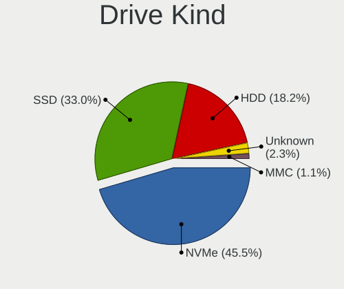

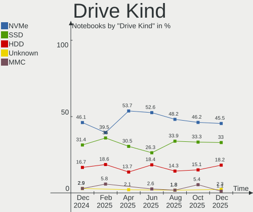

| Kind    | Notebooks | Drives | Percent |
|---------|-----------|--------|---------|
| NVMe    | 40        | 44     | 45.45%  |
| SSD     | 29        | 30     | 32.95%  |
| HDD     | 16        | 16     | 18.18%  |
| Unknown | 2         | 2      | 2.27%   |
| MMC     | 1         | 1      | 1.14%   |

Drive Connector
---------------

SATA, SAS, NVMe, etc.

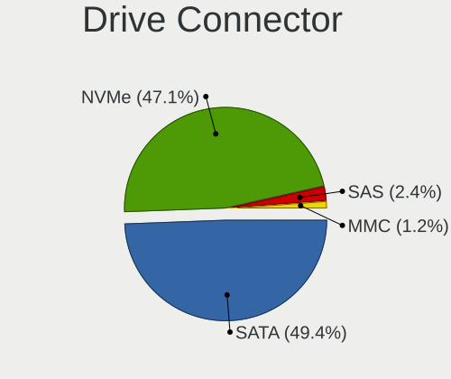

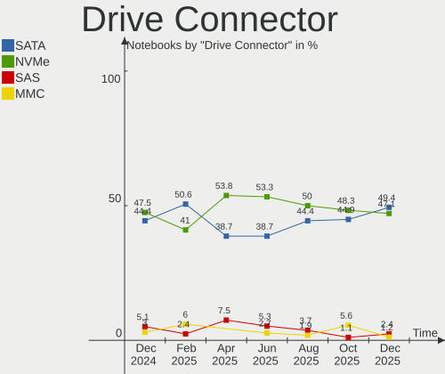

| Type | Notebooks | Drives | Percent |
|------|-----------|--------|---------|
| SATA | 42        | 45     | 49.41%  |
| NVMe | 40        | 44     | 47.06%  |
| SAS  | 2         | 3      | 2.35%   |
| MMC  | 1         | 1      | 1.18%   |

Drive Size
----------

Size of hard drive

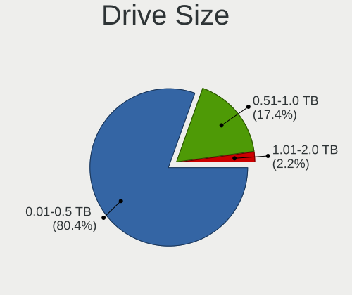

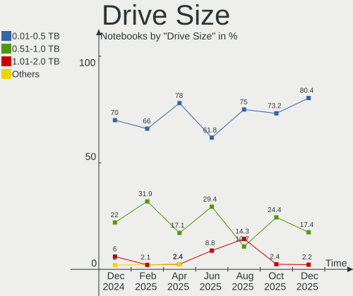

| Size in TB | Notebooks | Drives | Percent |
|------------|-----------|--------|---------|
| 0.01-0.5   | 37        | 37     | 80.43%  |
| 0.51-1.0   | 8         | 8      | 17.39%  |
| 1.01-2.0   | 1         | 1      | 2.17%   |

Space Total
-----------

Amount of disk space available on the file system

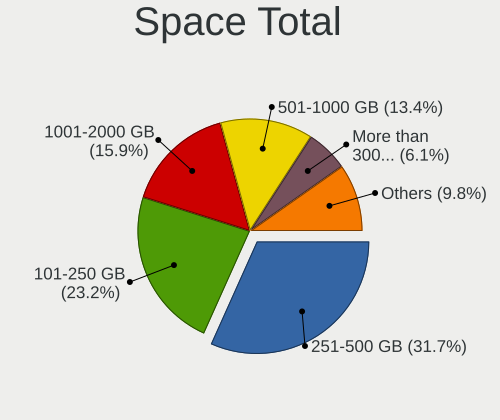

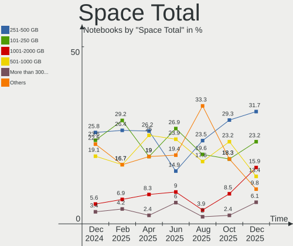

| Size in GB     | Notebooks | Percent |
|----------------|-----------|---------|
| 251-500        | 26        | 31.71%  |
| 101-250        | 19        | 23.17%  |
| 1001-2000      | 13        | 15.85%  |
| 501-1000       | 11        | 13.41%  |
| More than 3000 | 5         | 6.1%    |
| Unknown        | 4         | 4.88%   |
| 2001-3000      | 2         | 2.44%   |
| 1-20           | 2         | 2.44%   |

Space Used
----------

Amount of used disk space

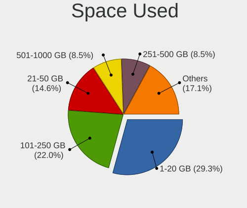

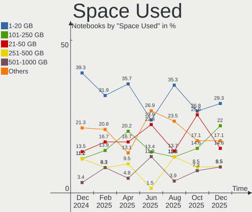

| Used GB   | Notebooks | Percent |
|-----------|-----------|---------|
| 1-20      | 24        | 29.27%  |
| 101-250   | 18        | 21.95%  |
| 21-50     | 12        | 14.63%  |
| 251-500   | 7         | 8.54%   |
| 501-1000  | 7         | 8.54%   |
| 51-100    | 7         | 8.54%   |
| Unknown   | 4         | 4.88%   |
| 1001-2000 | 2         | 2.44%   |
| 2001-3000 | 1         | 1.22%   |

Malfunc. Drives
---------------

Drive models with a malfunction

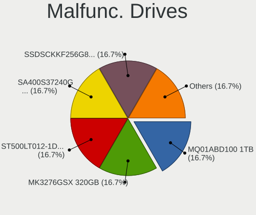

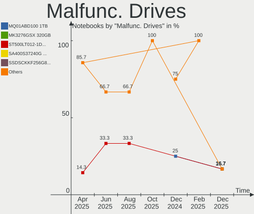

| Model                           | Notebooks | Drives | Percent |
|---------------------------------|-----------|--------|---------|
| Toshiba MQ01ABD100 1TB          | 1         | 1      | 16.67%  |
| Toshiba MK3276GSX 320GB         | 1         | 1      | 16.67%  |
| Seagate ST500LT012-1DG142 500GB | 1         | 1      | 16.67%  |
| Kingston SA400S37240G 240GB SSD | 1         | 1      | 16.67%  |
| Intel SSDSCKKF256G8H 256GB      | 1         | 1      | 16.67%  |
| Hitachi HTS545050A7E380 500GB   | 1         | 1      | 16.67%  |

Malfunc. Drive Vendor
---------------------

Vendors of faulty drives

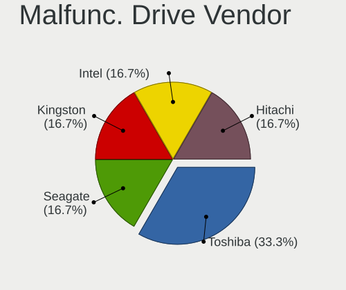

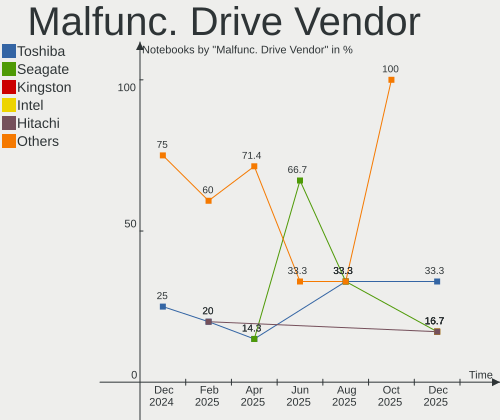

| Vendor   | Notebooks | Drives | Percent |
|----------|-----------|--------|---------|
| Toshiba  | 2         | 2      | 33.33%  |
| Seagate  | 1         | 1      | 16.67%  |
| Kingston | 1         | 1      | 16.67%  |
| Intel    | 1         | 1      | 16.67%  |
| Hitachi  | 1         | 1      | 16.67%  |

Malfunc. HDD Vendor
-------------------

Vendors of faulty HDD drives

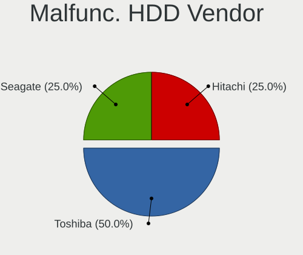

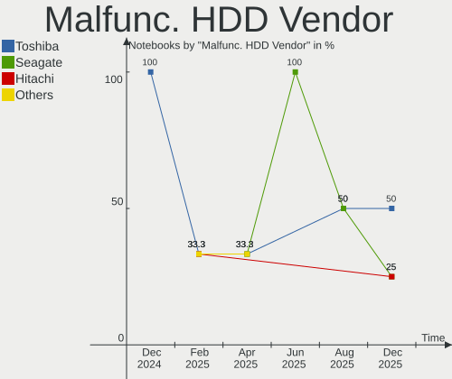

| Vendor  | Notebooks | Drives | Percent |
|---------|-----------|--------|---------|
| Toshiba | 2         | 2      | 50%     |
| Seagate | 1         | 1      | 25%     |
| Hitachi | 1         | 1      | 25%     |

Malfunc. Drive Kind
-------------------

Kinds of faulty drives

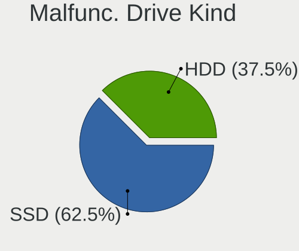

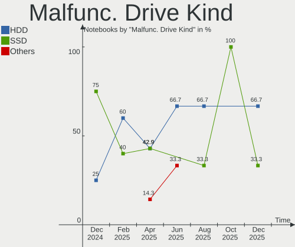

| Kind | Notebooks | Drives | Percent |
|------|-----------|--------|---------|
| HDD  | 4         | 4      | 66.67%  |
| SSD  | 2         | 2      | 33.33%  |

Failed Drives
-------------

Failed drive models

Zero info for selected period =(

Failed Drive Vendor
-------------------

Failed drive vendors

Zero info for selected period =(

Drive Status
------------

Number of failed and malfunc. drives

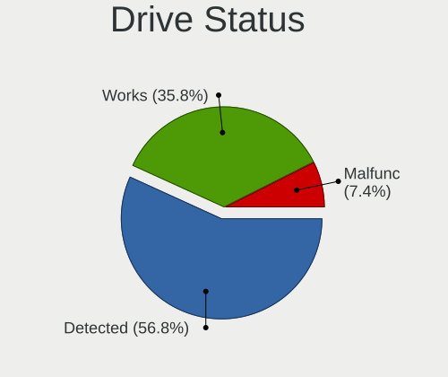

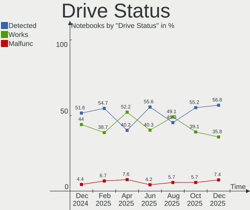

| Status   | Notebooks | Drives | Percent |
|----------|-----------|--------|---------|
| Detected | 46        | 54     | 56.79%  |
| Works    | 29        | 33     | 35.8%   |
| Malfunc  | 6         | 6      | 7.41%   |

Storage controller
------------------

Storage Vendor
--------------

Storage controller vendors

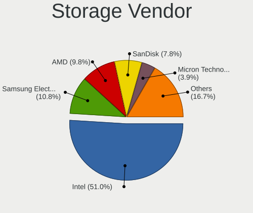

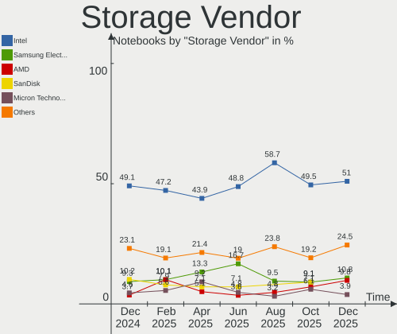

| Vendor                           | Notebooks | Percent |
|----------------------------------|-----------|---------|
| Intel                            | 52        | 50.98%  |
| Samsung Electronics              | 11        | 10.78%  |
| AMD                              | 10        | 9.8%    |
| SanDisk                          | 8         | 7.84%   |
| Micron Technology                | 4         | 3.92%   |
| SK hynix                         | 3         | 2.94%   |
| KIOXIA                           | 3         | 2.94%   |
| Kingston Technology Company      | 3         | 2.94%   |
| Micron/Crucial Technology        | 2         | 1.96%   |
| MAXIO Technology (Hangzhou)      | 2         | 1.96%   |
| Union Memory (Shenzhen)          | 1         | 0.98%   |
| Silicon Integrated Systems [SiS] | 1         | 0.98%   |
| Phison Electronics               | 1         | 0.98%   |
| ADATA Technology                 | 1         | 0.98%   |

Storage Model
-------------

Storage controller models

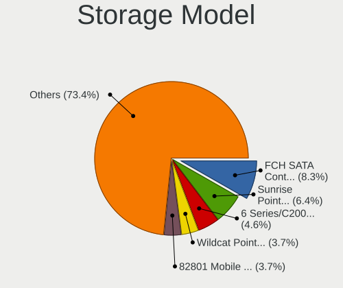

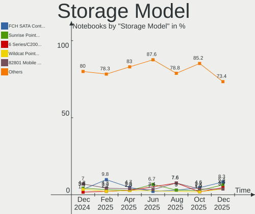

| Model                                                                        | Notebooks | Percent |
|------------------------------------------------------------------------------|-----------|---------|
| AMD FCH SATA Controller [AHCI mode]                                          | 9         | 8.26%   |
| Intel Sunrise Point-LP SATA Controller [AHCI mode]                           | 7         | 6.42%   |
| Intel 6 Series/C200 Series Chipset Family 6 port Mobile SATA AHCI Controller | 5         | 4.59%   |
| Intel Wildcat Point-LP SATA Controller [AHCI Mode]                           | 4         | 3.67%   |
| Intel 82801 Mobile SATA Controller [RAID mode]                               | 4         | 3.67%   |
| Intel 7 Series Chipset Family 6-port SATA Controller [AHCI mode]             | 4         | 3.67%   |
| SanDisk WD SN560/SN740/SN770/SN5000 NVMe SSD                                 | 3         | 2.75%   |
| Samsung NVMe SSD Controller PM9C1a (DRAM-less)                               | 3         | 2.75%   |
| Micron 2400 NVMe SSD (DRAM-less)                                             | 3         | 2.75%   |
| Intel Volume Management Device NVMe RAID Controller                          | 3         | 2.75%   |
| Intel Tiger Lake-LP SATA Controller                                          | 3         | 2.75%   |
| Intel SSD 660P Series                                                        | 3         | 2.75%   |
| Intel Jasper Lake SATA AHCI Controller                                       | 3         | 2.75%   |
| SanDisk Ultra 3D / WD PC SN530, IX SN530, Blue SN550 NVMe SSD (DRAM-less)    | 2         | 1.83%   |
| SanDisk Extreme Pro / WD Black SN750 / PC SN730 / Red SN700 NVMe SSD         | 2         | 1.83%   |
| Samsung NVMe SSD Controller SM981/PM981/PM983                                | 2         | 1.83%   |
| Samsung NVMe SSD Controller PM9B1 (DRAM-less)                                | 2         | 1.83%   |
| Samsung BM9C1 QLC NVME SSD (DRAM-less)                                       | 2         | 1.83%   |
| Intel RST Volume Management Device Controller                                | 2         | 1.83%   |
| Intel Alder Lake-P SATA AHCI Controller                                      | 2         | 1.83%   |
| Intel 82801IBM/IEM (ICH9M/ICH9M-E) 4 port SATA Controller [AHCI mode]        | 2         | 1.83%   |
| Intel 8 Series SATA Controller 1 [AHCI mode]                                 | 2         | 1.83%   |
| Union Memory (Shenzhen) AM620 PCIe 3.0 NVMe SSD 512GB                        | 1         | 0.92%   |
| SK hynix Platinum P41/PC801 NVMe Solid State Drive                           | 1         | 0.92%   |
| SK hynix Gold P31/BC711/PC711 NVMe Solid State Drive                         | 1         | 0.92%   |
| SK hynix BC511 NVMe SSD                                                      | 1         | 0.92%   |
| Silicon Integrated Systems [SiS] SATA Controller / IDE mode                  | 1         | 0.92%   |
| Silicon Integrated Systems [SiS] 5513 IDE Controller                         | 1         | 0.92%   |
| Sandisk SN8000S NVMe SSD                                                     | 1         | 0.92%   |
| Samsung S4LN058A01[SSUBX] AHCI SSD Controller (Apple slot)                   | 1         | 0.92%   |
| Samsung NVMe SSD Controller 980 (DRAM-less)                                  | 1         | 0.92%   |
| Phison E16 PCIe4 NVMe Controller                                             | 1         | 0.92%   |
| Micron/Crucial P310 NVMe PCIe SSD (DRAM-less)                                | 1         | 0.92%   |
| Micron/Crucial P2 [Nick P2] / P3 / P3 Plus NVMe PCIe SSD (DRAM-less)         | 1         | 0.92%   |
| Micron 2450 NVMe SSD [HendrixV] (DRAM-less)                                  | 1         | 0.92%   |
| MAXIO (Hangzhou) NVMe SSD Controller MAP1602 (DRAM-less)                     | 1         | 0.92%   |
| MAXIO (Hangzhou) NVMe SSD Controller MAP1202 (DRAM-less)                     | 1         | 0.92%   |
| KIOXIA NVMe SSD Controller XG8                                               | 1         | 0.92%   |
| KIOXIA NVMe SSD Controller BG6 (DRAM-less)                                   | 1         | 0.92%   |
| KIOXIA NVMe SSD                                                              | 1         | 0.92%   |

Storage Kind
------------

Kind of storage controller (IDE, SATA, NVMe, SAS, ...)

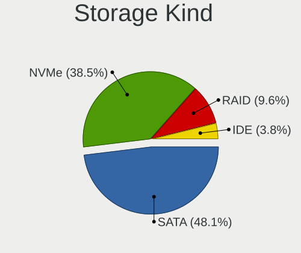

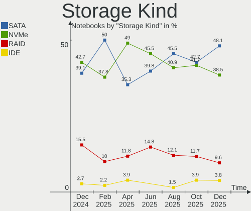

| Kind | Notebooks | Percent |
|------|-----------|---------|
| SATA | 50        | 48.08%  |
| NVMe | 40        | 38.46%  |
| RAID | 10        | 9.62%   |
| IDE  | 4         | 3.85%   |

Processor
---------

CPU Vendor
----------

Processor vendors

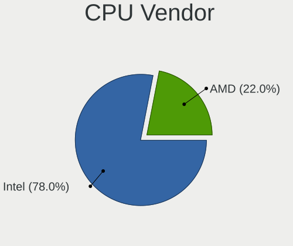

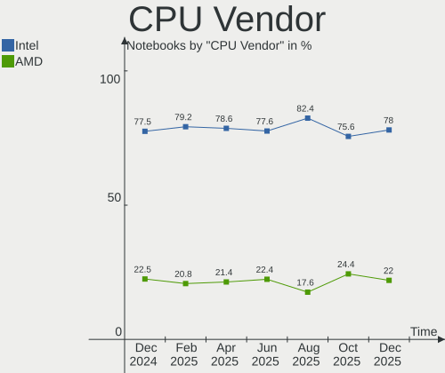

| Vendor | Notebooks | Percent |
|--------|-----------|---------|
| Intel  | 64        | 78.05%  |
| AMD    | 18        | 21.95%  |

CPU Model
---------

Processor models

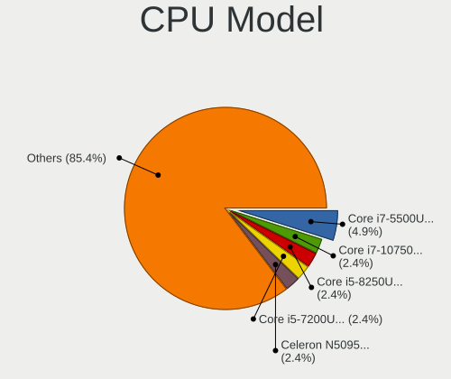

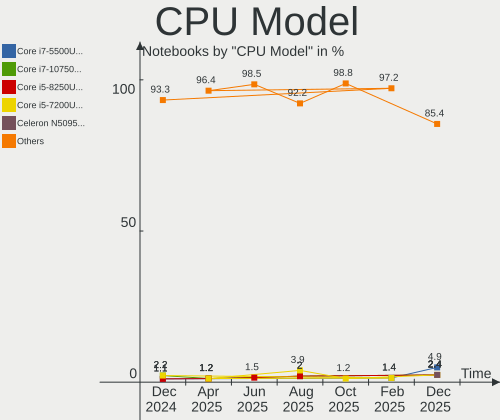

| Model                                   | Notebooks | Percent |
|-----------------------------------------|-----------|---------|
| Intel Core i7-5500U CPU @ 2.40GHz       | 4         | 4.88%   |
| Intel Core i7-10750H CPU @ 2.60GHz      | 2         | 2.44%   |
| Intel Core i5-8250U CPU @ 1.60GHz       | 2         | 2.44%   |
| Intel Core i5-7200U CPU @ 2.50GHz       | 2         | 2.44%   |
| Intel Celeron N5095 @ 2.00GHz           | 2         | 2.44%   |
| Intel 13th Gen Core i5-1334U            | 2         | 2.44%   |
| Intel 11th Gen Core i5-1135G7 @ 2.40GHz | 2         | 2.44%   |
| AMD Ryzen 7 4800H with Radeon Graphics  | 2         | 2.44%   |
| AMD Ryzen 5 7520U with Radeon Graphics  | 2         | 2.44%   |
| Intel Pentium Dual CPU T3400 @ 2.16GHz  | 1         | 1.22%   |
| Intel Pentium Dual CPU T3200 @ 2.00GHz  | 1         | 1.22%   |
| Intel Core Ultra 9 275HX                | 1         | 1.22%   |
| Intel Core Ultra 9 185H                 | 1         | 1.22%   |
| Intel Core Ultra 7 155H                 | 1         | 1.22%   |
| Intel Core Ultra 5 125H                 | 1         | 1.22%   |
| Intel Core m5-6Y54 CPU @ 1.10GHz        | 1         | 1.22%   |
| Intel Core i9-14900HX                   | 1         | 1.22%   |
| Intel Core i7-9750H CPU @ 2.60GHz       | 1         | 1.22%   |
| Intel Core i7-8750H CPU @ 2.20GHz       | 1         | 1.22%   |
| Intel Core i7-8550U CPU @ 1.80GHz       | 1         | 1.22%   |
| Intel Core i7-6700HQ CPU @ 2.60GHz      | 1         | 1.22%   |
| Intel Core i7-4710HQ CPU @ 2.50GHz      | 1         | 1.22%   |
| Intel Core i7-3610QM CPU @ 2.30GHz      | 1         | 1.22%   |
| Intel Core i7-2630QM CPU @ 2.00GHz      | 1         | 1.22%   |
| Intel Core i7-10510U CPU @ 1.80GHz      | 1         | 1.22%   |
| Intel Core i5-8365U CPU @ 1.60GHz       | 1         | 1.22%   |
| Intel Core i5-8350U CPU @ 1.70GHz       | 1         | 1.22%   |
| Intel Core i5-8265U CPU @ 1.60GHz       | 1         | 1.22%   |
| Intel Core i5-6440HQ CPU @ 2.60GHz      | 1         | 1.22%   |
| Intel Core i5-6300U CPU @ 2.40GHz       | 1         | 1.22%   |
| Intel Core i5-6200U CPU @ 2.30GHz       | 1         | 1.22%   |
| Intel Core i5-5287U CPU @ 2.90GHz       | 1         | 1.22%   |
| Intel Core i5-4200U CPU @ 1.60GHz       | 1         | 1.22%   |
| Intel Core i5-3210M CPU @ 2.50GHz       | 1         | 1.22%   |
| Intel Core i5-2435M CPU @ 2.40GHz       | 1         | 1.22%   |
| Intel Core i5-2430M CPU @ 2.40GHz       | 1         | 1.22%   |
| Intel Core i5-2410M CPU @ 2.30GHz       | 1         | 1.22%   |
| Intel Core i5-1035G1 CPU @ 1.00GHz      | 1         | 1.22%   |
| Intel Core i5-10310U CPU @ 1.70GHz      | 1         | 1.22%   |
| Intel Core i5-10210U CPU @ 1.60GHz      | 1         | 1.22%   |

CPU Model Family
----------------

Processor model prefix

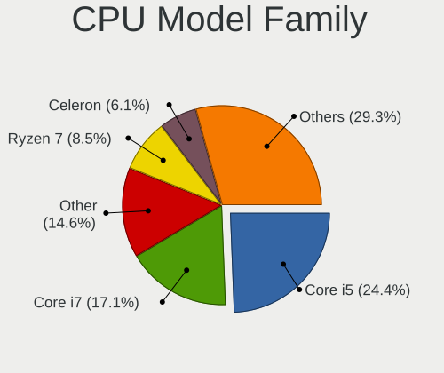

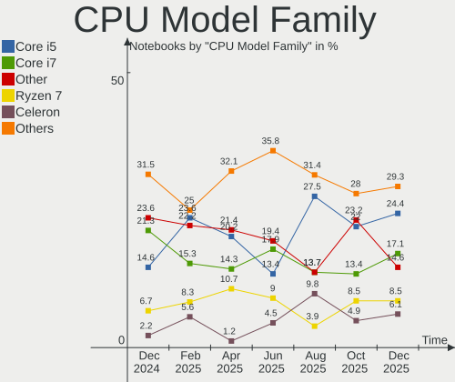

| Model              | Notebooks | Percent |
|--------------------|-----------|---------|
| Intel Core i5      | 20        | 24.39%  |
| Intel Core i7      | 14        | 17.07%  |
| Other              | 12        | 14.63%  |
| AMD Ryzen 7        | 7         | 8.54%   |
| Intel Celeron      | 5         | 6.1%    |
| Intel Core         | 4         | 4.88%   |
| AMD Ryzen 5        | 4         | 4.88%   |
| Intel Core i3      | 3         | 3.66%   |
| Intel Pentium Dual | 2         | 2.44%   |
| Intel Core 2 Duo   | 2         | 2.44%   |
| AMD E1             | 2         | 2.44%   |
| Intel Core m5      | 1         | 1.22%   |
| Intel Core i9      | 1         | 1.22%   |
| Intel Core 2       | 1         | 1.22%   |
| AMD Ryzen 3        | 1         | 1.22%   |
| AMD E              | 1         | 1.22%   |
| AMD A6             | 1         | 1.22%   |
| AMD A10            | 1         | 1.22%   |

CPU Cores
---------

Number of processor cores

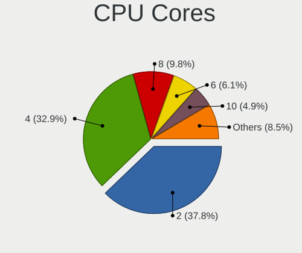

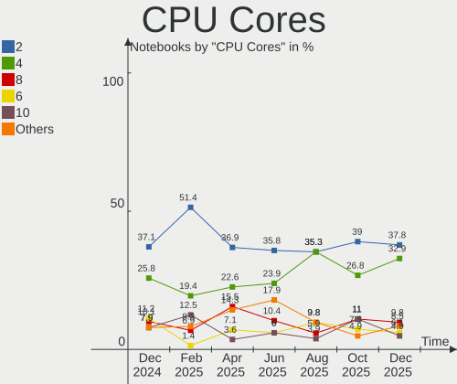

| Number | Notebooks | Percent |
|--------|-----------|---------|
| 2      | 31        | 37.8%   |
| 4      | 27        | 32.93%  |
| 8      | 8         | 9.76%   |
| 6      | 5         | 6.1%    |
| 10     | 4         | 4.88%   |
| 14     | 3         | 3.66%   |
| 24     | 2         | 2.44%   |
| 16     | 2         | 2.44%   |

CPU Sockets
-----------

Number of sockets

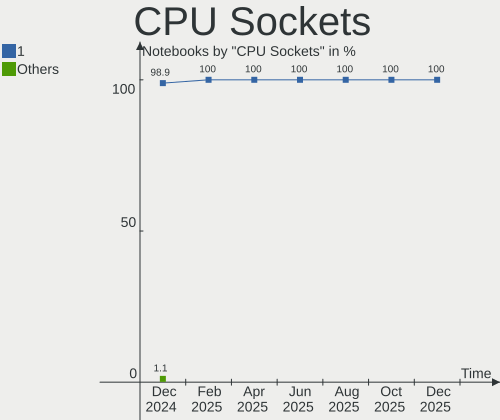

| Number | Notebooks | Percent |
|--------|-----------|---------|
| 1      | 82        | 100%    |

CPU Threads
-----------

Threads per core (Hyper-Threading)

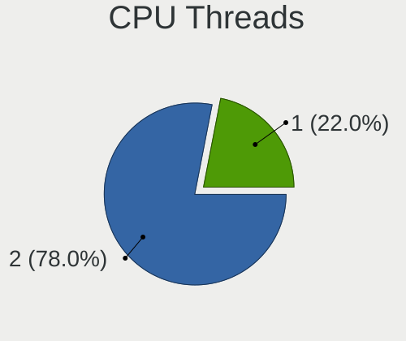

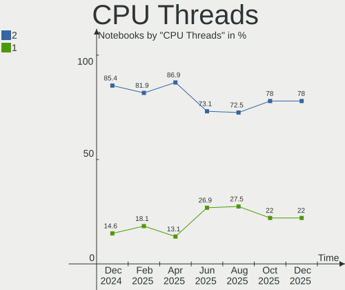

| Number | Notebooks | Percent |
|--------|-----------|---------|
| 2      | 64        | 78.05%  |
| 1      | 18        | 21.95%  |

CPU Op-Modes
------------

CPU Operation Modes (32-bit, 64-bit)

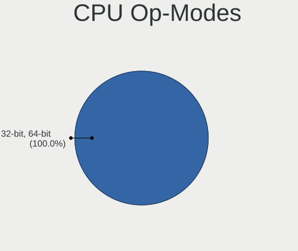

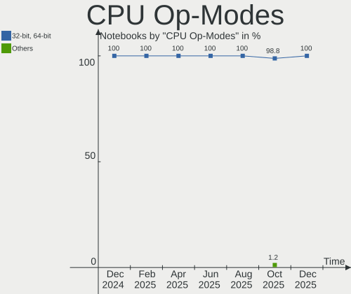

| Op mode        | Notebooks | Percent |
|----------------|-----------|---------|
| 32-bit, 64-bit | 82        | 100%    |

CPU Microcode
-------------

Microcode number

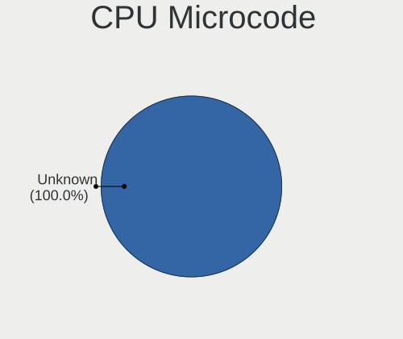

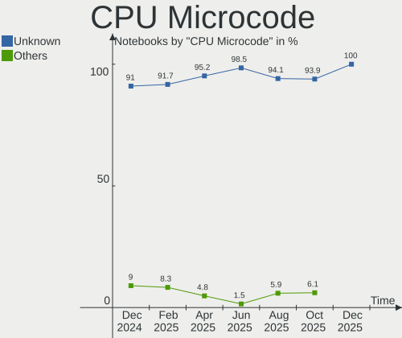

| Number  | Notebooks | Percent |
|---------|-----------|---------|
| Unknown | 82        | 100%    |

CPU Microarch
-------------

Microarchitecture

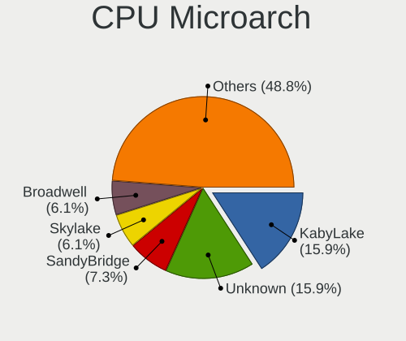

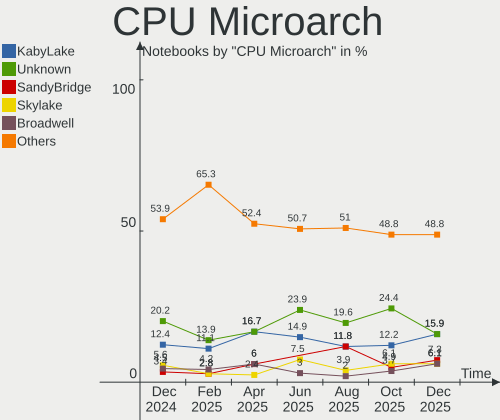

| Name              | Notebooks | Percent |
|-------------------|-----------|---------|
| KabyLake          | 13        | 15.85%  |
| Unknown           | 13        | 15.85%  |
| SandyBridge       | 6         | 7.32%   |
| Skylake           | 5         | 6.1%    |
| Broadwell         | 5         | 6.1%    |
| TigerLake         | 4         | 4.88%   |
| Core              | 4         | 4.88%   |
| Alderlake Hybrid  | 4         | 4.88%   |
| Zen 3             | 3         | 3.66%   |
| IvyBridge         | 3         | 3.66%   |
| Haswell           | 3         | 3.66%   |
| Zen 2             | 2         | 2.44%   |
| Tremont           | 2         | 2.44%   |
| Puma              | 2         | 2.44%   |
| Excavator         | 2         | 2.44%   |
| CometLake         | 2         | 2.44%   |
| Zen               | 1         | 1.22%   |
| Westmere          | 1         | 1.22%   |
| Silvermont        | 1         | 1.22%   |
| Penryn            | 1         | 1.22%   |
| Meteorlake Hybrid | 1         | 1.22%   |
| Lunarlake Hybrid  | 1         | 1.22%   |
| Jaguar            | 1         | 1.22%   |
| IceLake           | 1         | 1.22%   |
| Bobcat            | 1         | 1.22%   |

Graphics
--------

GPU Vendor
----------

Vendors of graphics cards

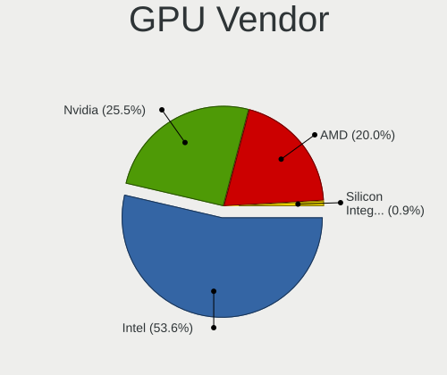

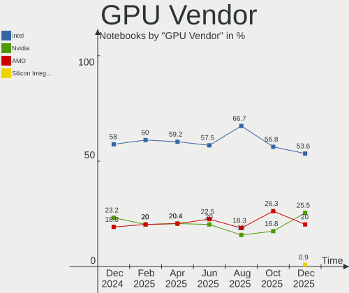

| Vendor                           | Notebooks | Percent |
|----------------------------------|-----------|---------|
| Intel                            | 59        | 53.64%  |
| Nvidia                           | 28        | 25.45%  |
| AMD                              | 22        | 20%     |
| Silicon Integrated Systems [SiS] | 1         | 0.91%   |

GPU Model
---------

Graphics card models

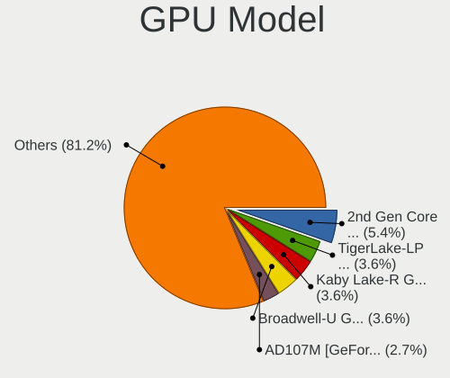

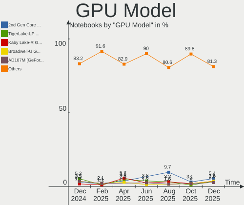

| Model                                                                     | Notebooks | Percent |
|---------------------------------------------------------------------------|-----------|---------|
| Intel 2nd Generation Core Processor Family Integrated Graphics Controller | 6         | 5.36%   |
| Intel TigerLake-LP GT2 [Iris Xe Graphics]                                 | 4         | 3.57%   |
| Intel Kaby Lake-R GT2 [UHD Graphics 620]                                  | 4         | 3.57%   |
| Intel Broadwell-U GT2 [HD Graphics 5500]                                  | 4         | 3.57%   |
| Nvidia AD107M [GeForce RTX 4060 Max-Q / Mobile]                           | 3         | 2.68%   |
| Nvidia AD107M [GeForce RTX 4050 Max-Q / Mobile]                           | 3         | 2.68%   |
| Intel Meteor Lake-P [Intel Arc Graphics]                                  | 3         | 2.68%   |
| Intel JasperLake [UHD Graphics]                                           | 3         | 2.68%   |
| Intel CometLake-U GT2 [UHD Graphics]                                      | 3         | 2.68%   |
| Intel 3rd Gen Core processor Graphics Controller                          | 3         | 2.68%   |
| Nvidia GP108M [GeForce MX150]                                             | 2         | 1.79%   |
| Nvidia GM108M [GeForce 840M]                                              | 2         | 1.79%   |
| Nvidia GA107M [GeForce RTX 3050 Mobile]                                   | 2         | 1.79%   |
| Nvidia GA106M [GeForce RTX 3060 Mobile / Max-Q]                           | 2         | 1.79%   |
| Intel WhiskeyLake-U GT2 [UHD Graphics 620]                                | 2         | 1.79%   |
| Intel Skylake-U GT2 [HD Graphics 520]                                     | 2         | 1.79%   |
| Intel Skylake-H GT2 [HD Graphics 530]                                     | 2         | 1.79%   |
| Intel Raptor Lake-P [UHD Graphics]                                        | 2         | 1.79%   |
| Intel Raptor Lake-P [Iris Xe Graphics]                                    | 2         | 1.79%   |
| Intel Kaby Lake-U GT2 [HD Graphics 620]                                   | 2         | 1.79%   |
| Intel Haswell-ULT Integrated Graphics Controller                          | 2         | 1.79%   |
| Intel CometLake-H GT2 [UHD Graphics]                                      | 2         | 1.79%   |
| Intel CoffeeLake-H GT2 [UHD Graphics 630]                                 | 2         | 1.79%   |
| AMD Renoir [Radeon Vega Series / Radeon Vega Mobile Series]               | 2         | 1.79%   |
| AMD Mendocino [Radeon 610M]                                               | 2         | 1.79%   |
| AMD Cezanne [Radeon Vega Series / Radeon Vega Mobile Series]              | 2         | 1.79%   |
| Silicon Integrated Systems [SiS] 771/671 PCIE VGA Display Adapter         | 1         | 0.89%   |
| Nvidia TU117M [GeForce GTX 1650 Ti Mobile]                                | 1         | 0.89%   |
| Nvidia TU117M [GeForce GTX 1650 Mobile / Max-Q]                           | 1         | 0.89%   |
| Nvidia TU106M [GeForce RTX 2070 Mobile / Max-Q Refresh]                   | 1         | 0.89%   |
| Nvidia GP108BM [GeForce MX250]                                            | 1         | 0.89%   |
| Nvidia GP107M [GeForce GTX 1050 Ti Mobile]                                | 1         | 0.89%   |
| Nvidia GM204M [GeForce GTX 960 OEM / 970M]                                | 1         | 0.89%   |
| Nvidia GM108M [GeForce 940MX]                                             | 1         | 0.89%   |
| Nvidia GM108M [GeForce 930M]                                              | 1         | 0.89%   |
| Nvidia GF119M [GeForce GT 520M]                                           | 1         | 0.89%   |
| Nvidia GF119M [GeForce 610M]                                              | 1         | 0.89%   |
| Nvidia GF117M [GeForce 610M/710M/810M/820M / GT 620M/625M/630M/720M]      | 1         | 0.89%   |
| Nvidia GB206M [GeForce RTX 5070 Max-Q / Mobile]                           | 1         | 0.89%   |
| Nvidia GB205M [GeForce RTX 5070 Ti Mobile]                                | 1         | 0.89%   |

GPU Combo
---------

Combinations of graphics cards

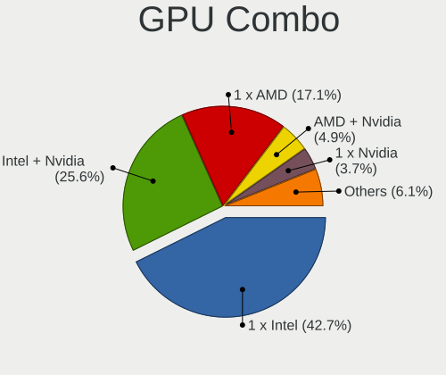

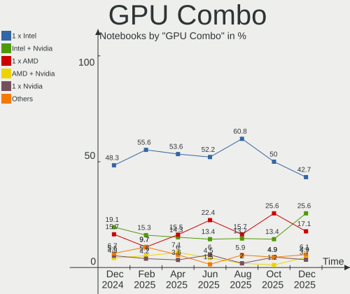

| Name           | Notebooks | Percent |
|----------------|-----------|---------|
| 1 x Intel      | 35        | 42.68%  |
| Intel + Nvidia | 21        | 25.61%  |
| 1 x AMD        | 14        | 17.07%  |
| AMD + Nvidia   | 4         | 4.88%   |
| 1 x Nvidia     | 3         | 3.66%   |
| Intel + AMD    | 3         | 3.66%   |
| 2 x AMD        | 1         | 1.22%   |
| 1 x SiS        | 1         | 1.22%   |

GPU Driver
----------

Free vs proprietary

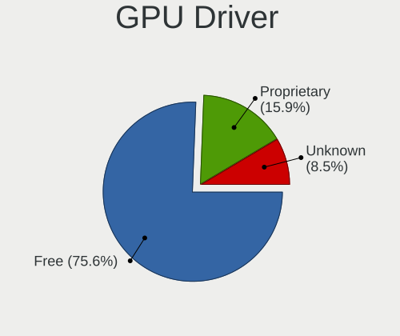

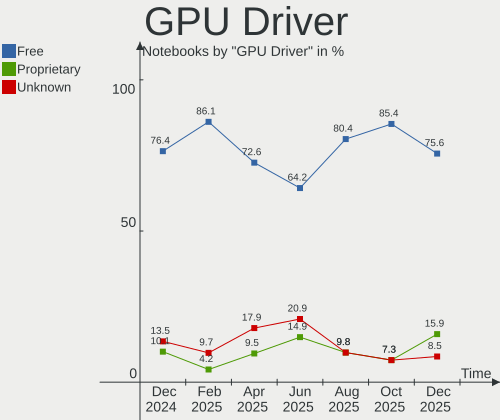

| Driver      | Notebooks | Percent |
|-------------|-----------|---------|
| Free        | 62        | 75.61%  |
| Proprietary | 13        | 15.85%  |
| Unknown     | 7         | 8.54%   |

GPU Memory
----------

Total video memory

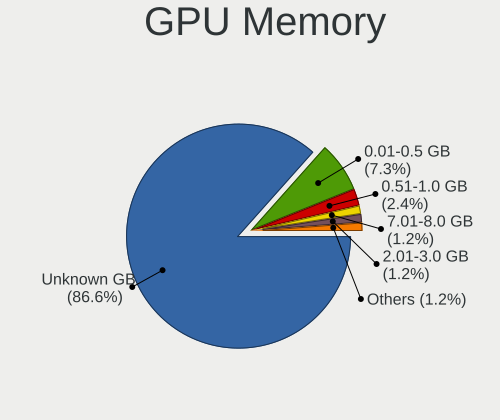

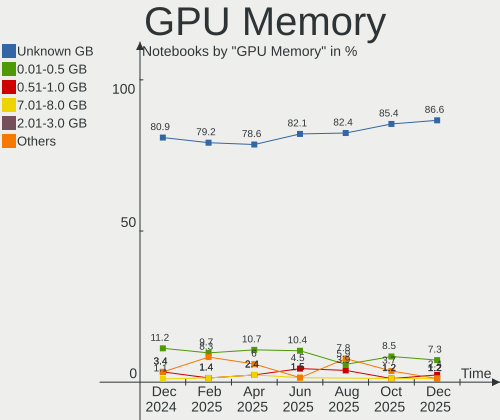

| Size in GB | Notebooks | Percent |
|------------|-----------|---------|
| Unknown    | 71        | 86.59%  |
| 0.01-0.5   | 6         | 7.32%   |
| 0.51-1.0   | 2         | 2.44%   |
| 7.01-8.0   | 1         | 1.22%   |
| 2.01-3.0   | 1         | 1.22%   |
| 1.01-2.0   | 1         | 1.22%   |

Monitor
-------

Monitor Vendor
--------------

Monitor vendors

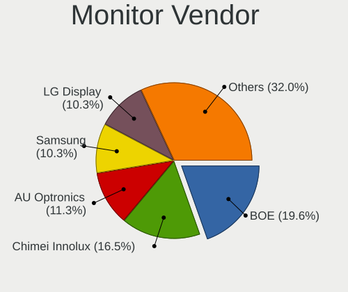

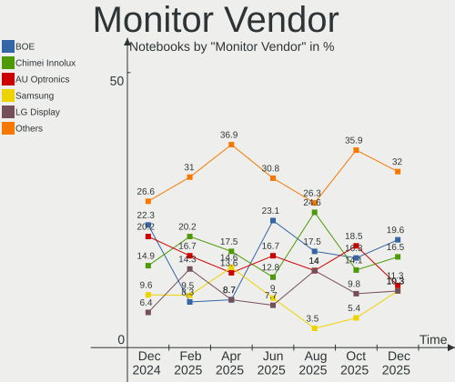

| Vendor                  | Notebooks | Percent |
|-------------------------|-----------|---------|
| BOE                     | 19        | 19.59%  |
| Chimei Innolux          | 16        | 16.49%  |
| AU Optronics            | 11        | 11.34%  |
| Samsung Electronics     | 10        | 10.31%  |
| LG Display              | 10        | 10.31%  |
| Lenovo                  | 3         | 3.09%   |
| Apple                   | 3         | 3.09%   |
| Sony                    | 2         | 2.06%   |
| PANDA                   | 2         | 2.06%   |
| Goldstar                | 2         | 2.06%   |
| EDO                     | 2         | 2.06%   |
| Chi Mei Optoelectronics | 2         | 2.06%   |
| BenQ                    | 2         | 2.06%   |
| Acer                    | 2         | 2.06%   |
| VXN                     | 1         | 1.03%   |
| Vestel Elektronik       | 1         | 1.03%   |
| Toshiba                 | 1         | 1.03%   |
| Sharp                   | 1         | 1.03%   |
| RTK                     | 1         | 1.03%   |
| MSI                     | 1         | 1.03%   |
| InfoVision              | 1         | 1.03%   |
| HannStar                | 1         | 1.03%   |
| Dell                    | 1         | 1.03%   |
| CSW                     | 1         | 1.03%   |
| CHD                     | 1         | 1.03%   |

Monitor Model
-------------

Monitor models

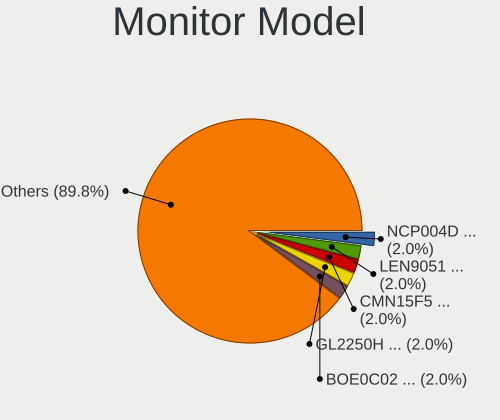

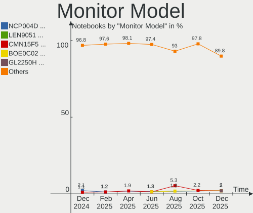

| Model                                                                   | Notebooks | Percent |
|-------------------------------------------------------------------------|-----------|---------|
| PANDA LCD Monitor NCP004D 1920x1080 344x194mm 15.5-inch                 | 2         | 2.04%   |
| Lenovo LCD Monitor LEN9051 1920x1080 344x194mm 15.5-inch                | 2         | 2.04%   |
| Chimei Innolux LCD Monitor CMN15F5 1920x1080 344x193mm 15.5-inch        | 2         | 2.04%   |
| BOE LCD Monitor BOE0C02 1920x1080 344x194mm 15.5-inch                   | 2         | 2.04%   |
| BenQ GL2250H BNQ78A1 1920x1080 477x268mm 21.5-inch                      | 2         | 2.04%   |
| AU Optronics LCD Monitor AUOD0A2 1920x1080 344x193mm 15.5-inch          | 2         | 2.04%   |
| AU Optronics LCD Monitor AUO26EC 1366x768 344x193mm 15.5-inch           | 2         | 2.04%   |
| VXN VisN236HUZ15 VXN1421                                                | 1         | 1.02%   |
| Vestel Elektronik 40UHD_LCD_TV VES3700 3840x2160 880x500mm 39.8-inch    | 1         | 1.02%   |
| Toshiba ScreenXpert TSB8888 1080x2160                                   | 1         | 1.02%   |
| Sony TV SNYA401 1920x1080                                               | 1         | 1.02%   |
| Sony PJ SNY0FF4 1600x1200                                               | 1         | 1.02%   |
| Sharp LCD Monitor SHP1421 3200x1800 294x165mm 13.3-inch                 | 1         | 1.02%   |
| Samsung Electronics SMXL2270HD SAM072B 1920x1080 476x268mm 21.5-inch    | 1         | 1.02%   |
| Samsung Electronics LCD Monitor SEC4251 1366x768 344x194mm 15.5-inch    | 1         | 1.02%   |
| Samsung Electronics LCD Monitor SEC3945 1280x800 331x207mm 15.4-inch    | 1         | 1.02%   |
| Samsung Electronics LCD Monitor SEC3859 1366x768 293x165mm 13.2-inch    | 1         | 1.02%   |
| Samsung Electronics LCD Monitor SEC364A 1366x768 344x194mm 15.5-inch    | 1         | 1.02%   |
| Samsung Electronics LCD Monitor SDC4187 1920x1200 302x189mm 14.0-inch   | 1         | 1.02%   |
| Samsung Electronics LCD Monitor SAM73AC 3840x2160 1872x1053mm 84.6-inch | 1         | 1.02%   |
| Samsung Electronics LCD Monitor SAM7016 3840x2160 1872x1053mm 84.6-inch | 1         | 1.02%   |
| Samsung Electronics LCD Monitor SAM0C28 1920x1080 1209x680mm 54.6-inch  | 1         | 1.02%   |
| Samsung Electronics LCD Monitor SAM0902 1920x1080 890x500mm 40.2-inch   | 1         | 1.02%   |
| Samsung Electronics ATNA60HU01-0  SDC420B                               | 1         | 1.02%   |
| RTK HX150T RTK1920 1920x1080 344x195mm 15.6-inch                        | 1         | 1.02%   |
| MSI MP273QP MSI30B6 2560x1440 600x330mm 27.0-inch                       | 1         | 1.02%   |
| LG Display LP156WH2-TLRA LGD026B 1366x768 344x194mm 15.5-inch           | 1         | 1.02%   |
| LG Display LCD Monitor LGD05EE 2560x1440 309x174mm 14.0-inch            | 1         | 1.02%   |
| LG Display LCD Monitor LGD059E 1920x1080 382x215mm 17.3-inch            | 1         | 1.02%   |
| LG Display LCD Monitor LGD04A5 1920x1280 253x169mm 12.0-inch            | 1         | 1.02%   |
| LG Display LCD Monitor LGD0493 1366x768 344x194mm 15.5-inch             | 1         | 1.02%   |
| LG Display LCD Monitor LGD046F 1920x1080 344x194mm 15.5-inch            | 1         | 1.02%   |
| LG Display LCD Monitor LGD0469 1920x1080 382x215mm 17.3-inch            | 1         | 1.02%   |
| LG Display LCD Monitor LGD0468 1366x768 344x194mm 15.5-inch             | 1         | 1.02%   |
| LG Display LCD Monitor LGD0335 1366x768 310x174mm 14.0-inch             | 1         | 1.02%   |
| LG Display LCD Monitor LGD02F2 1366x768 344x194mm 15.5-inch             | 1         | 1.02%   |
| Lenovo LCD Monitor LEN9052 1920x1080 344x194mm 15.5-inch                | 1         | 1.02%   |
| InfoVision LCD Monitor IVO04E3 1366x768 277x156mm 12.5-inch             | 1         | 1.02%   |
| HannStar LCD Monitor HSD0001 1920x1080 309x174mm 14.0-inch              | 1         | 1.02%   |
| Goldstar ULTRAWIDE GSM5BF7 2560x1080 673x284mm 28.8-inch                | 1         | 1.02%   |

Monitor Resolution
------------------

Monitor screen resolution

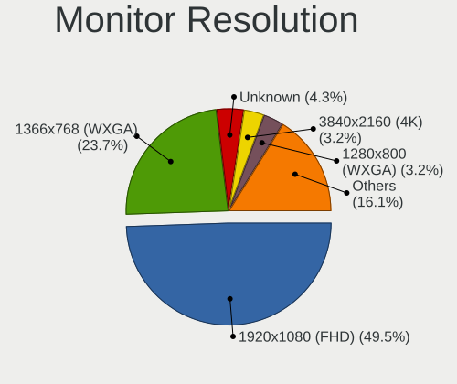

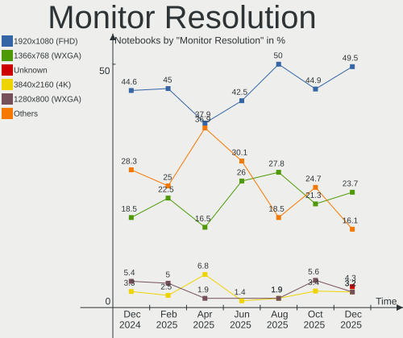

| Resolution       | Notebooks | Percent |
|------------------|-----------|---------|
| 1920x1080 (FHD)  | 46        | 49.46%  |
| 1366x768 (WXGA)  | 22        | 23.66%  |
| Unknown          | 4         | 4.3%    |
| 3840x2160 (4K)   | 3         | 3.23%   |
| 1280x800 (WXGA)  | 3         | 3.23%   |
| 2880x1800        | 2         | 2.15%   |
| 2560x1600        | 2         | 2.15%   |
| 2560x1440 (QHD)  | 2         | 2.15%   |
| 2560x1080        | 2         | 2.15%   |
| 1600x1200        | 2         | 2.15%   |
| 3200x1800 (QHD+) | 1         | 1.08%   |
| 2160x1440        | 1         | 1.08%   |
| 1920x515         | 1         | 1.08%   |
| 1920x1280        | 1         | 1.08%   |
| 1280x1024 (SXGA) | 1         | 1.08%   |

Monitor Diagonal
----------------

Diagonal size in inches

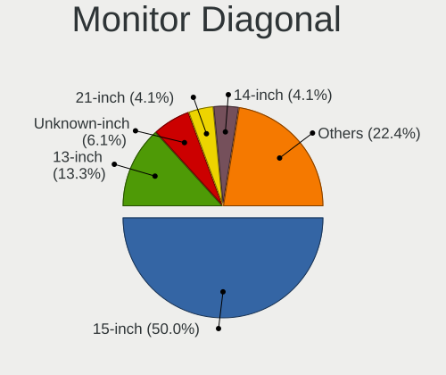

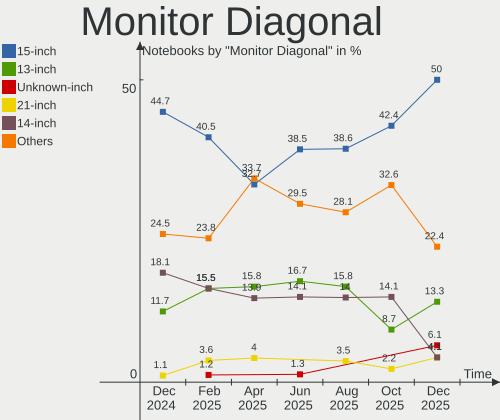

| Inches  | Notebooks | Percent |
|---------|-----------|---------|
| 15      | 49        | 50%     |
| 13      | 13        | 13.27%  |
| Unknown | 6         | 6.12%   |
| 21      | 4         | 4.08%   |
| 14      | 4         | 4.08%   |
| 84      | 3         | 3.06%   |
| 17      | 3         | 3.06%   |
| 16      | 3         | 3.06%   |
| 54      | 2         | 2.04%   |
| 12      | 2         | 2.04%   |
| 86      | 1         | 1.02%   |
| 72      | 1         | 1.02%   |
| 63      | 1         | 1.02%   |
| 34      | 1         | 1.02%   |
| 32      | 1         | 1.02%   |
| 29      | 1         | 1.02%   |
| 27      | 1         | 1.02%   |
| 23      | 1         | 1.02%   |
| 20      | 1         | 1.02%   |

Monitor Width
-------------

Physical width

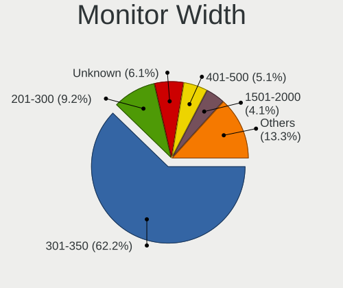

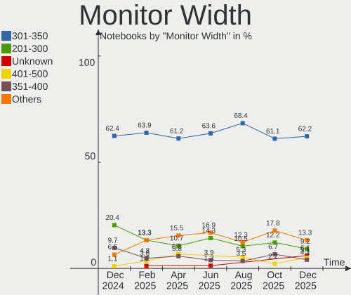

| Width in mm | Notebooks | Percent |
|-------------|-----------|---------|
| 301-350     | 61        | 62.24%  |
| 201-300     | 9         | 9.18%   |
| Unknown     | 6         | 6.12%   |
| 401-500     | 5         | 5.1%    |
| 351-400     | 4         | 4.08%   |
| 1501-2000   | 4         | 4.08%   |
| 1001-1500   | 4         | 4.08%   |
| 701-800     | 2         | 2.04%   |
| 501-600     | 2         | 2.04%   |
| 601-700     | 1         | 1.02%   |

Aspect Ratio
------------

Proportional relationship between the width and the height

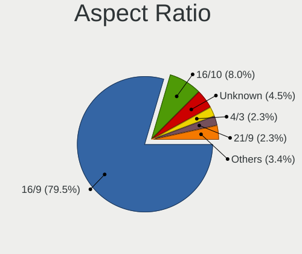

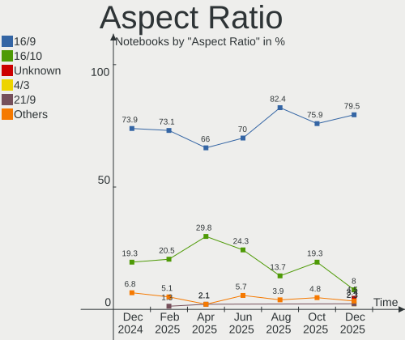

| Ratio   | Notebooks | Percent |
|---------|-----------|---------|
| 16/9    | 70        | 79.55%  |
| 16/10   | 7         | 7.95%   |
| Unknown | 4         | 4.55%   |
| 4/3     | 2         | 2.27%   |
| 21/9    | 2         | 2.27%   |
| 3/2     | 1         | 1.14%   |
| 3.73    | 1         | 1.14%   |
| 0.56    | 1         | 1.14%   |

Monitor Area
------------

Area in inch²

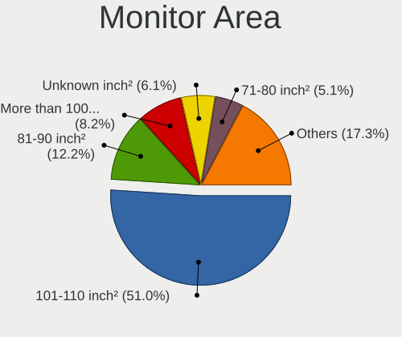

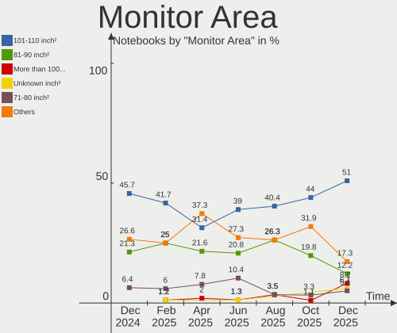

| Area in inch² | Notebooks | Percent |
|----------------|-----------|---------|
| 101-110        | 50        | 51.02%  |
| 81-90          | 12        | 12.24%  |
| More than 1000 | 8         | 8.16%   |
| Unknown        | 6         | 6.12%   |
| 71-80          | 5         | 5.1%    |
| 201-250        | 4         | 4.08%   |
| 121-130        | 3         | 3.06%   |
| 61-70          | 2         | 2.04%   |
| 351-500        | 2         | 2.04%   |
| 301-350        | 2         | 2.04%   |
| 151-200        | 2         | 2.04%   |
| 111-120        | 2         | 2.04%   |

Pixel Density
-------------

Pixels per inch

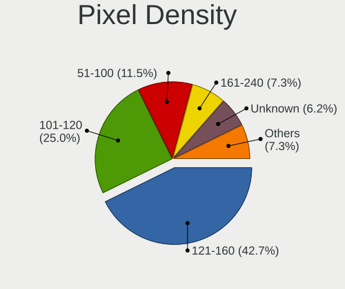

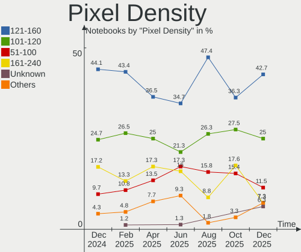

| Density       | Notebooks | Percent |
|---------------|-----------|---------|
| 121-160       | 41        | 42.71%  |
| 101-120       | 24        | 25%     |
| 51-100        | 11        | 11.46%  |
| 161-240       | 7         | 7.29%   |
| Unknown       | 6         | 6.25%   |
| 1-50          | 5         | 5.21%   |
| More than 240 | 2         | 2.08%   |

Multiple Monitors
-----------------

Total monitors connected

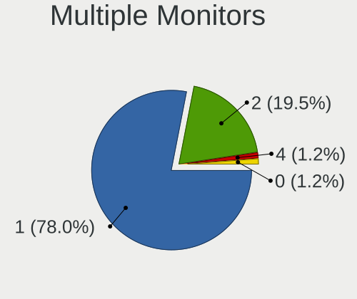

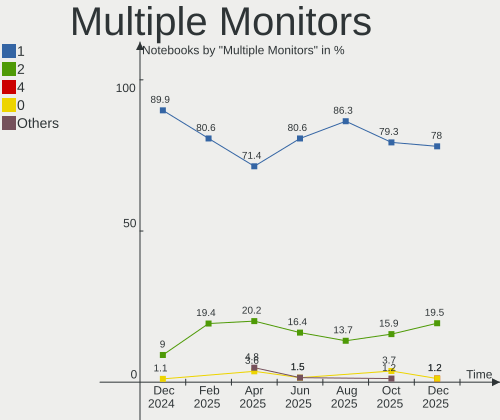

| Total | Notebooks | Percent |
|-------|-----------|---------|
| 1     | 64        | 78.05%  |
| 2     | 16        | 19.51%  |
| 4     | 1         | 1.22%   |
| 0     | 1         | 1.22%   |

Network
-------

Net Controller Vendor
---------------------

Controller vendors

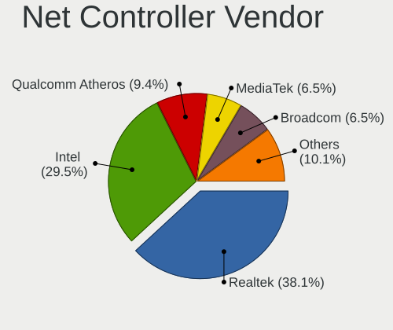

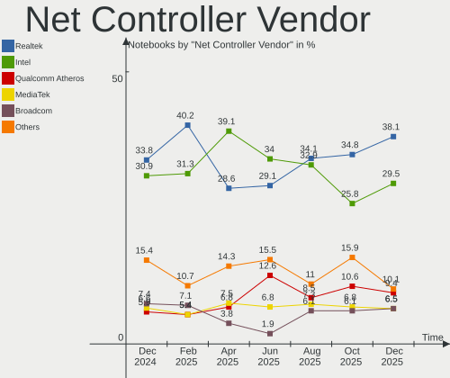

| Vendor                                 | Notebooks | Percent |
|----------------------------------------|-----------|---------|
| Realtek Semiconductor                  | 53        | 38.13%  |
| Intel                                  | 41        | 29.5%   |
| Qualcomm Atheros                       | 13        | 9.35%   |
| MediaTek                               | 9         | 6.47%   |
| Broadcom                               | 9         | 6.47%   |
| Xiaomi                                 | 2         | 1.44%   |
| Ralink                                 | 2         | 1.44%   |
| Marvell Technology Group               | 2         | 1.44%   |
| TP-Link                                | 1         | 0.72%   |
| Suzhou Motorcomm Electronic Technology | 1         | 0.72%   |
| Silicon Integrated Systems [SiS]       | 1         | 0.72%   |
| Shenzhen Goodix Technology             | 1         | 0.72%   |
| Ralink Technology                      | 1         | 0.72%   |
| Huawei Technologies                    | 1         | 0.72%   |
| Hewlett-Packard                        | 1         | 0.72%   |
| Broadcom Limited                       | 1         | 0.72%   |

Net Controller Model
--------------------

Controller models

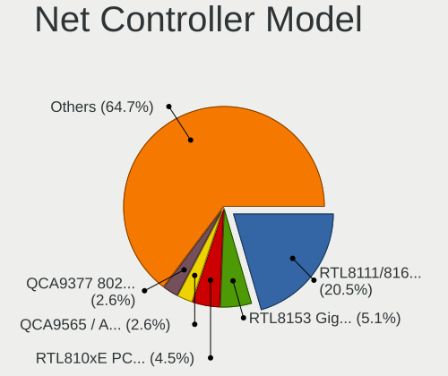

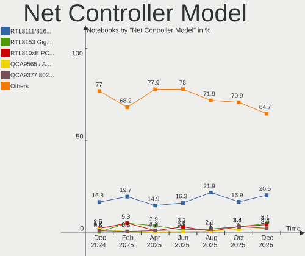

| Model                                                                  | Notebooks | Percent |
|------------------------------------------------------------------------|-----------|---------|
| Realtek RTL8111/8168/8211/8411 PCI Express Gigabit Ethernet Controller | 32        | 20.51%  |
| Realtek RTL8153 Gigabit Ethernet Adapter                               | 8         | 5.13%   |
| Realtek RTL810xE PCI Express Fast Ethernet controller                  | 7         | 4.49%   |
| Qualcomm Atheros QCA9565 / AR9565 Wireless Network Adapter             | 4         | 2.56%   |
| Qualcomm Atheros QCA9377 802.11ac Wireless Network Adapter             | 4         | 2.56%   |
| MediaTek MT7921 802.11ax PCIe Wireless Network Adapter [Filogic 330]   | 4         | 2.56%   |
| Realtek RTL8822CE 802.11ac PCIe Wireless Network Adapter               | 3         | 1.92%   |
| MediaTek MT7902 802.11ax PCIe Wireless Network Adapter [Filogic 310]   | 3         | 1.92%   |
| Intel Wireless 8265 / 8275                                             | 3         | 1.92%   |
| Intel Wireless 8260                                                    | 3         | 1.92%   |
| Intel Wi-Fi 6 AX201                                                    | 3         | 1.92%   |
| Intel Raptor Lake PCH CNVi WiFi                                        | 3         | 1.92%   |
| Intel Meteor Lake PCH CNVi WiFi                                        | 3         | 1.92%   |
| Intel Comet Lake PCH-LP CNVi WiFi                                      | 3         | 1.92%   |
| Xiaomi Mi/Redmi series (RNDIS)                                         | 2         | 1.28%   |
| Realtek RTL8723BE PCIe Wireless Network Adapter                        | 2         | 1.28%   |
| Qualcomm Atheros AR9285 Wireless Network Adapter (PCI-Express)         | 2         | 1.28%   |
| MediaTek MT7922 802.11ax PCI Express Wireless Network Adapter          | 2         | 1.28%   |
| Intel Wireless 7265                                                    | 2         | 1.28%   |
| Intel Comet Lake PCH CNVi WiFi                                         | 2         | 1.28%   |
| Intel Centrino Wireless-N 100                                          | 2         | 1.28%   |
| Intel Cannon Point-LP CNVi [Wireless-AC]                               | 2         | 1.28%   |
| Intel Alder Lake-P PCH CNVi WiFi                                       | 2         | 1.28%   |
| TP-Link AC600 wireless Realtek RTL8811AU [Archer T2U Nano]             | 1         | 0.64%   |
| Suzhou Motorcomm Electronic YT6801 Gigabit Ethernet Controller         | 1         | 0.64%   |
| Silicon Integrated Systems [SiS] 191 Gigabit Ethernet Adapter          | 1         | 0.64%   |
| Shenzhen Goodix Fingerprint Reader                                     | 1         | 0.64%   |
| Realtek RTL8922AE 802.11be PCIe Wireless Network Adapter               | 1         | 0.64%   |
| Realtek RTL8852BE-VT PCIe 802.11ax Wireless Network Controller         | 1         | 0.64%   |
| Realtek RTL8852BE PCIe 802.11ax Wireless Network Controller            | 1         | 0.64%   |
| Realtek RTL8821AE 802.11ac PCIe Wireless Network Adapter               | 1         | 0.64%   |
| Realtek RTL8723DE Wireless Network Adapter                             | 1         | 0.64%   |
| Realtek RTL8192EU 802.11b/g/n WLAN Adapter                             | 1         | 0.64%   |
| Realtek RTL8192EE PCIe Wireless Network Adapter                        | 1         | 0.64%   |
| Realtek RTL8152 Fast Ethernet Adapter                                  | 1         | 0.64%   |
| Realtek Killer E2600 GbE Controller                                    | 1         | 0.64%   |
| Realtek 802.11ac NIC                                                   | 1         | 0.64%   |
| Ralink RT5370 Wireless Adapter                                         | 1         | 0.64%   |
| Ralink RT5390 Wireless 802.11n 1T/1R PCIe                              | 1         | 0.64%   |
| Ralink RT3290 Wireless 802.11n 1T/1R PCIe                              | 1         | 0.64%   |

Wireless Vendor
---------------

Wireless vendors

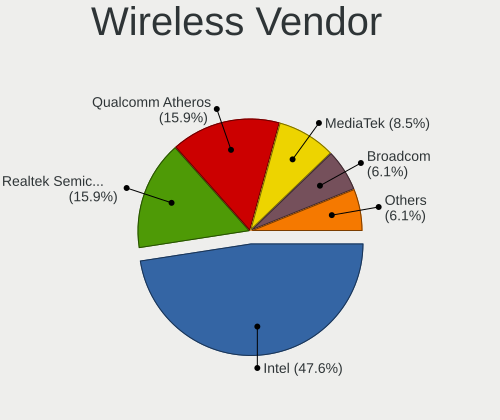

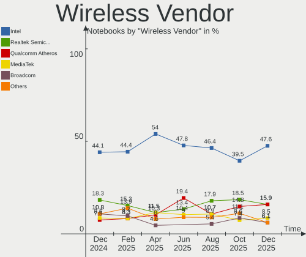

| Vendor                | Notebooks | Percent |
|-----------------------|-----------|---------|
| Intel                 | 39        | 47.56%  |
| Realtek Semiconductor | 13        | 15.85%  |
| Qualcomm Atheros      | 13        | 15.85%  |
| MediaTek              | 7         | 8.54%   |
| Broadcom              | 5         | 6.1%    |
| Ralink                | 2         | 2.44%   |
| TP-Link               | 1         | 1.22%   |
| Ralink Technology     | 1         | 1.22%   |
| Broadcom Limited      | 1         | 1.22%   |

Wireless Model
--------------

Wireless models

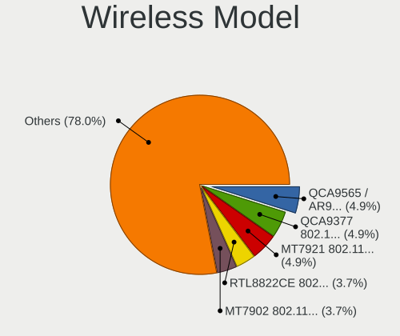

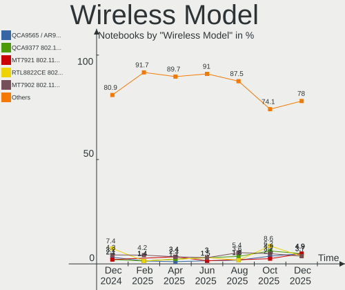

| Model                                                                | Notebooks | Percent |
|----------------------------------------------------------------------|-----------|---------|
| Qualcomm Atheros QCA9565 / AR9565 Wireless Network Adapter           | 4         | 4.88%   |
| Qualcomm Atheros QCA9377 802.11ac Wireless Network Adapter           | 4         | 4.88%   |
| MediaTek MT7921 802.11ax PCIe Wireless Network Adapter [Filogic 330] | 4         | 4.88%   |
| Realtek RTL8822CE 802.11ac PCIe Wireless Network Adapter             | 3         | 3.66%   |
| MediaTek MT7902 802.11ax PCIe Wireless Network Adapter [Filogic 310] | 3         | 3.66%   |
| Intel Wireless 8265 / 8275                                           | 3         | 3.66%   |
| Intel Wireless 8260                                                  | 3         | 3.66%   |
| Intel Wi-Fi 6 AX201                                                  | 3         | 3.66%   |
| Intel Raptor Lake PCH CNVi WiFi                                      | 3         | 3.66%   |
| Intel Meteor Lake PCH CNVi WiFi                                      | 3         | 3.66%   |
| Intel Comet Lake PCH-LP CNVi WiFi                                    | 3         | 3.66%   |
| Realtek RTL8723BE PCIe Wireless Network Adapter                      | 2         | 2.44%   |
| Qualcomm Atheros AR9285 Wireless Network Adapter (PCI-Express)       | 2         | 2.44%   |
| Intel Wireless 7265                                                  | 2         | 2.44%   |
| Intel Comet Lake PCH CNVi WiFi                                       | 2         | 2.44%   |
| Intel Centrino Wireless-N 100                                        | 2         | 2.44%   |
| Intel Cannon Point-LP CNVi [Wireless-AC]                             | 2         | 2.44%   |
| TP-Link AC600 wireless Realtek RTL8811AU [Archer T2U Nano]           | 1         | 1.22%   |
| Realtek RTL8922AE 802.11be PCIe Wireless Network Adapter             | 1         | 1.22%   |
| Realtek RTL8852BE-VT PCIe 802.11ax Wireless Network Controller       | 1         | 1.22%   |
| Realtek RTL8852BE PCIe 802.11ax Wireless Network Controller          | 1         | 1.22%   |
| Realtek RTL8821AE 802.11ac PCIe Wireless Network Adapter             | 1         | 1.22%   |
| Realtek RTL8723DE Wireless Network Adapter                           | 1         | 1.22%   |
| Realtek RTL8192EU 802.11b/g/n WLAN Adapter                           | 1         | 1.22%   |
| Realtek RTL8192EE PCIe Wireless Network Adapter                      | 1         | 1.22%   |
| Realtek 802.11ac NIC                                                 | 1         | 1.22%   |
| Ralink RT5370 Wireless Adapter                                       | 1         | 1.22%   |
| Ralink RT5390 Wireless 802.11n 1T/1R PCIe                            | 1         | 1.22%   |
| Ralink RT3290 Wireless 802.11n 1T/1R PCIe                            | 1         | 1.22%   |
| Qualcomm Atheros AR9485 Wireless Network Adapter                     | 1         | 1.22%   |
| Qualcomm Atheros AR9462 Wireless Network Adapter                     | 1         | 1.22%   |
| Qualcomm Atheros AR928X Wireless Network Adapter (PCI-Express)       | 1         | 1.22%   |
| Intel Wireless 3160                                                  | 1         | 1.22%   |
| Intel WiFi Link 5100                                                 | 1         | 1.22%   |
| Intel Wi-Fi 6E(802.11ax) AX210/AX1675* 2x2 [Typhoon Peak]            | 1         | 1.22%   |
| Intel Wi-Fi 6 AX200                                                  | 1         | 1.22%   |
| Intel PRO/Wireless 4965 AG or AGN [Kedron] Network Connection        | 1         | 1.22%   |
| Intel PRO/Wireless 3945ABG [Golan] Network Connection                | 1         | 1.22%   |
| Intel Jasper Lake PCH CNVi WiFi                                      | 1         | 1.22%   |
| Intel Dual Band Wireless-AC 3168NGW [Stone Peak]                     | 1         | 1.22%   |

Ethernet Vendor
---------------

Ethernet vendors

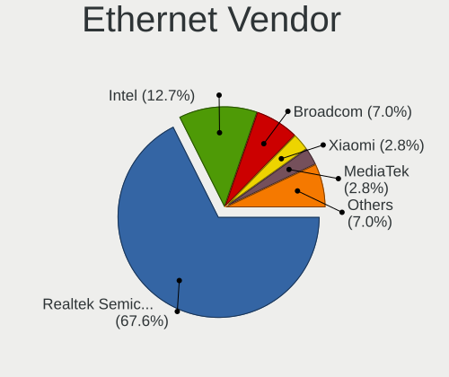

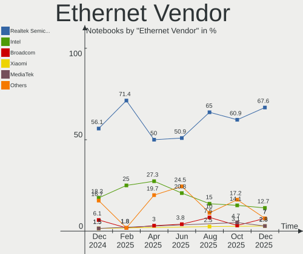

| Vendor                                 | Notebooks | Percent |
|----------------------------------------|-----------|---------|
| Realtek Semiconductor                  | 48        | 67.61%  |
| Intel                                  | 9         | 12.68%  |
| Broadcom                               | 5         | 7.04%   |
| Xiaomi                                 | 2         | 2.82%   |
| MediaTek                               | 2         | 2.82%   |
| Marvell Technology Group               | 2         | 2.82%   |
| Suzhou Motorcomm Electronic Technology | 1         | 1.41%   |
| Silicon Integrated Systems [SiS]       | 1         | 1.41%   |
| Hewlett-Packard                        | 1         | 1.41%   |

Ethernet Model
--------------

Ethernet models

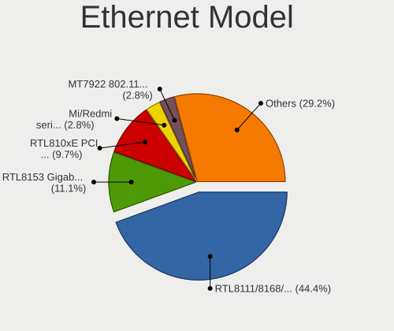

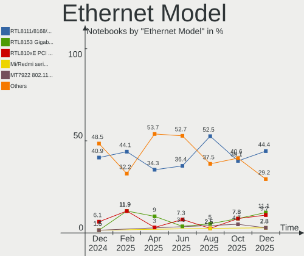

| Model                                                                  | Notebooks | Percent |
|------------------------------------------------------------------------|-----------|---------|
| Realtek RTL8111/8168/8211/8411 PCI Express Gigabit Ethernet Controller | 32        | 44.44%  |
| Realtek RTL8153 Gigabit Ethernet Adapter                               | 8         | 11.11%  |
| Realtek RTL810xE PCI Express Fast Ethernet controller                  | 7         | 9.72%   |
| Xiaomi Mi/Redmi series (RNDIS)                                         | 2         | 2.78%   |
| MediaTek MT7922 802.11ax PCI Express Wireless Network Adapter          | 2         | 2.78%   |
| Intel Alder Lake-P PCH CNVi WiFi                                       | 2         | 2.78%   |
| Suzhou Motorcomm Electronic YT6801 Gigabit Ethernet Controller         | 1         | 1.39%   |
| Silicon Integrated Systems [SiS] 191 Gigabit Ethernet Adapter          | 1         | 1.39%   |
| Realtek RTL8152 Fast Ethernet Adapter                                  | 1         | 1.39%   |
| Realtek Killer E2600 GbE Controller                                    | 1         | 1.39%   |
| Marvell Group 88E8071 PCI-E Gigabit Ethernet Controller                | 1         | 1.39%   |
| Marvell Group 88E8055 PCI-E Gigabit Ethernet Controller                | 1         | 1.39%   |
| Intel Ethernet Connection I219-LM                                      | 1         | 1.39%   |
| Intel Ethernet Connection (5) I219-LM                                  | 1         | 1.39%   |
| Intel Ethernet Connection (4) I219-LM                                  | 1         | 1.39%   |
| Intel Ethernet Connection (23) I219-V                                  | 1         | 1.39%   |
| Intel Ethernet Connection (13) I219-V                                  | 1         | 1.39%   |
| Intel Ethernet Connection (13) I219-LM                                 | 1         | 1.39%   |
| Intel Ethernet Connection (10) I219-LM                                 | 1         | 1.39%   |
| HP HP lt4120 Snapdragon X5 LTE                                         | 1         | 1.39%   |
| Broadcom NetXtreme BCM57786 Gigabit Ethernet PCIe                      | 1         | 1.39%   |
| Broadcom NetXtreme BCM57765 Gigabit Ethernet PCIe                      | 1         | 1.39%   |
| Broadcom NetLink BCM57785 Gigabit Ethernet PCIe                        | 1         | 1.39%   |
| Broadcom NetLink BCM57780 Gigabit Ethernet PCIe                        | 1         | 1.39%   |
| Broadcom BCM4401-B0 100Base-TX                                         | 1         | 1.39%   |

Net Controller Kind
-------------------

Ethernet, WiFi or modem

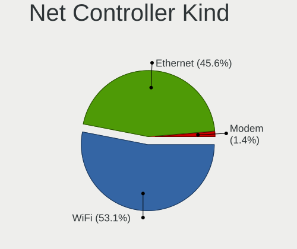

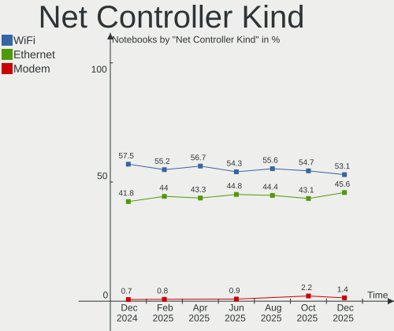

| Kind     | Notebooks | Percent |
|----------|-----------|---------|
| WiFi     | 78        | 53.06%  |
| Ethernet | 67        | 45.58%  |
| Modem    | 2         | 1.36%   |

Used Controller
---------------

Currently used network controller

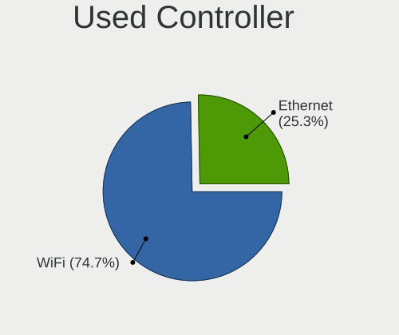

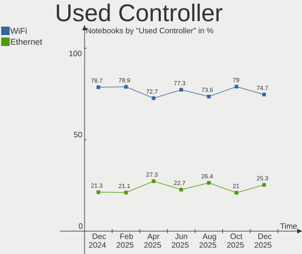

| Kind     | Notebooks | Percent |
|----------|-----------|---------|
| WiFi     | 65        | 74.71%  |
| Ethernet | 22        | 25.29%  |

NICs
----

Total network controllers on board

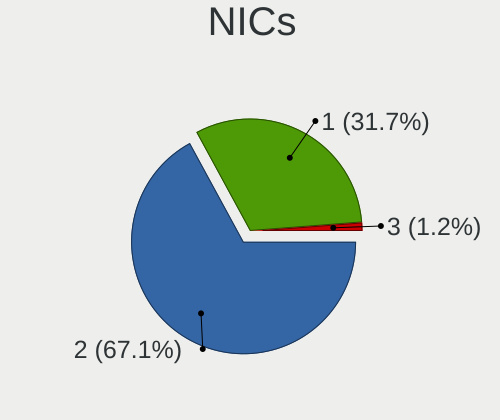

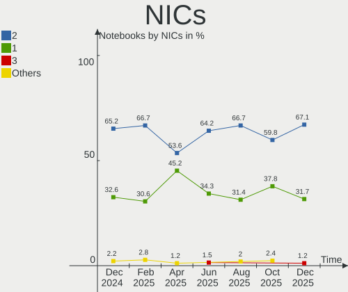

| Total | Notebooks | Percent |
|-------|-----------|---------|
| 2     | 55        | 67.07%  |
| 1     | 26        | 31.71%  |
| 3     | 1         | 1.22%   |

IPv6
----

IPv6 vs IPv4

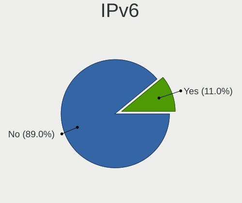

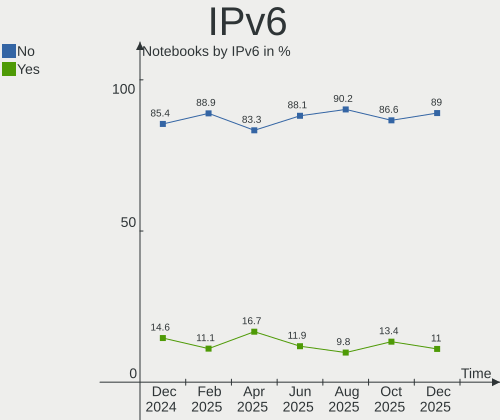

| Used | Notebooks | Percent |
|------|-----------|---------|
| No   | 73        | 89.02%  |
| Yes  | 9         | 10.98%  |

Bluetooth
---------

Bluetooth Vendor
----------------

Controller vendors

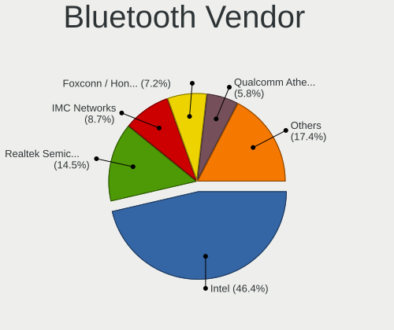

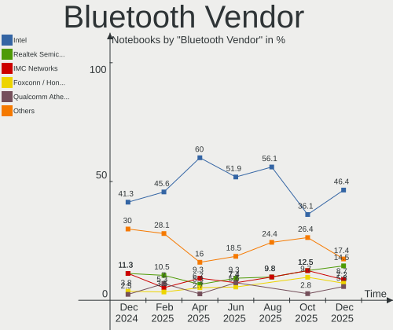

| Vendor                          | Notebooks | Percent |
|---------------------------------|-----------|---------|
| Intel                           | 32        | 46.38%  |
| Realtek Semiconductor           | 10        | 14.49%  |
| IMC Networks                    | 6         | 8.7%    |
| Foxconn / Hon Hai               | 5         | 7.25%   |
| Qualcomm Atheros Communications | 4         | 5.8%    |
| Lite-On Technology              | 3         | 4.35%   |
| Broadcom                        | 3         | 4.35%   |
| Apple                           | 2         | 2.9%    |
| Toshiba                         | 1         | 1.45%   |
| Ralink                          | 1         | 1.45%   |
| MediaTek                        | 1         | 1.45%   |
| Alps Electric                   | 1         | 1.45%   |

Bluetooth Model
---------------

Controller models

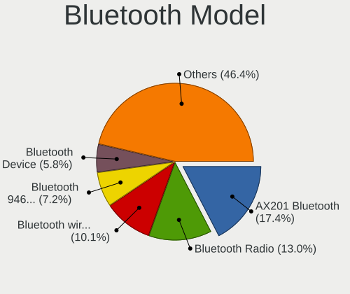

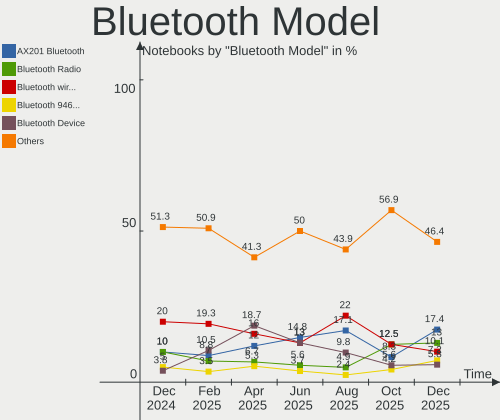

| Model                                            | Notebooks | Percent |
|--------------------------------------------------|-----------|---------|
| Intel AX201 Bluetooth                            | 12        | 17.39%  |
| Realtek Bluetooth Radio                          | 9         | 13.04%  |
| Intel Bluetooth wireless interface               | 7         | 10.14%  |
| Intel Bluetooth 9460/9560 Jefferson Peak (JfP)   | 5         | 7.25%   |
| Intel Bluetooth Device                           | 4         | 5.8%    |
| IMC Networks Wireless_Device                     | 4         | 5.8%    |
| Qualcomm Atheros  Bluetooth Device               | 2         | 2.9%    |
| Lite-On Atheros AR3012 Bluetooth                 | 2         | 2.9%    |
| Foxconn / Hon Hai Bluetooth Device               | 2         | 2.9%    |
| Apple Bluetooth Host Controller                  | 2         | 2.9%    |
| Toshiba Integrated Bluetooth HCI                 | 1         | 1.45%   |
| Realtek  Bluetooth 4.2 Adapter                   | 1         | 1.45%   |
| Ralink RT3290 Bluetooth                          | 1         | 1.45%   |
| Qualcomm Atheros AR3012 Bluetooth 4.0            | 1         | 1.45%   |
| Qualcomm Atheros AR3012 Bluetooth                | 1         | 1.45%   |
| MediaTek Wireless_Device                         | 1         | 1.45%   |
| Lite-On Wireless_Device                          | 1         | 1.45%   |
| Intel Wireless-AC 3168 Bluetooth                 | 1         | 1.45%   |
| Intel Centrino Advanced-N 6230 Bluetooth adapter | 1         | 1.45%   |
| Intel AX210 Bluetooth                            | 1         | 1.45%   |
| Intel AX200 Bluetooth                            | 1         | 1.45%   |
| IMC Networks Bluetooth Radio                     | 1         | 1.45%   |
| IMC Networks Bluetooth Device                    | 1         | 1.45%   |
| Foxconn / Hon Hai Wireless_Device                | 1         | 1.45%   |
| Foxconn / Hon Hai MediaTek Bluetooth Adapter     | 1         | 1.45%   |
| Foxconn / Hon Hai BCM20702A0                     | 1         | 1.45%   |
| Broadcom Bluetooth                               | 1         | 1.45%   |
| Broadcom BCM43142A0 Bluetooth Device             | 1         | 1.45%   |
| Broadcom BCM20702A0 Bluetooth                    | 1         | 1.45%   |
| Alps Electric BCM2046 Bluetooth Device           | 1         | 1.45%   |

Sound
-----

Sound Vendor
------------

Sound card vendors

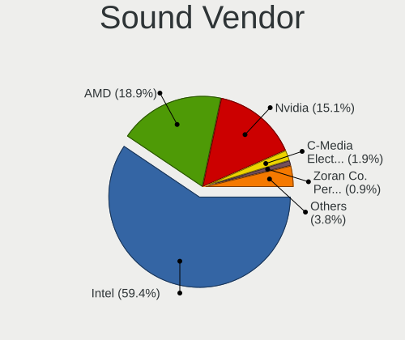

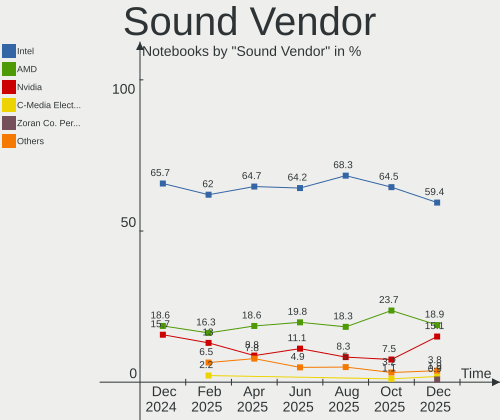

| Vendor                                       | Notebooks | Percent |
|----------------------------------------------|-----------|---------|
| Intel                                        | 63        | 59.43%  |
| AMD                                          | 20        | 18.87%  |
| Nvidia                                       | 16        | 15.09%  |
| C-Media Electronics                          | 2         | 1.89%   |
| Zoran Co. Personal Media Division (Nogatech) | 1         | 0.94%   |
| Walmart                                      | 1         | 0.94%   |
| Thesycon Systemsoftware & Consulting         | 1         | 0.94%   |
| Silicon Integrated Systems [SiS]             | 1         | 0.94%   |
| Sennheiser                                   | 1         | 0.94%   |

Sound Model
-----------

Sound card models

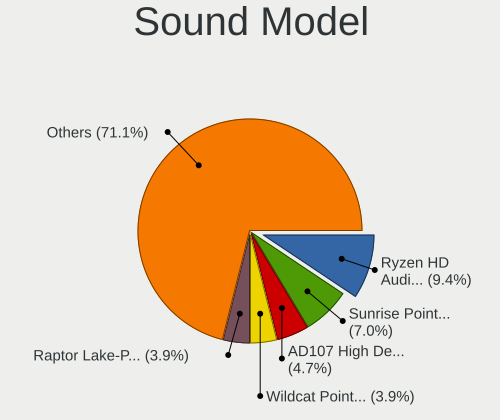

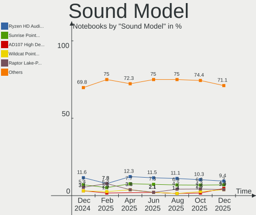

| Model                                                                      | Notebooks | Percent |
|----------------------------------------------------------------------------|-----------|---------|
| AMD Ryzen HD Audio Controller                                              | 12        | 9.38%   |
| Intel Sunrise Point-LP HD Audio                                            | 9         | 7.03%   |
| Nvidia AD107 High Definition Audio Controller                              | 6         | 4.69%   |
| Intel Wildcat Point-LP High Definition Audio Controller                    | 5         | 3.91%   |
| Intel Raptor Lake-P/U/H cAVS                                               | 5         | 3.91%   |
| Intel Broadwell-U Audio Controller                                         | 5         | 3.91%   |
| Intel 6 Series/C200 Series Chipset Family High Definition Audio Controller | 5         | 3.91%   |
| Intel Tiger Lake-LP Smart Sound Technology Audio Controller                | 4         | 3.13%   |
| Intel 7 Series/C216 Chipset Family High Definition Audio Controller        | 4         | 3.13%   |
| AMD Renoir/Cezanne HDMI/DP Audio Controller                                | 4         | 3.13%   |
| AMD Radeon High Definition Audio Controller                                | 4         | 3.13%   |
| AMD Kabini HDMI/DP Audio                                                   | 4         | 3.13%   |
| Intel Meteor Lake-P HD Audio Controller                                    | 3         | 2.34%   |
| Intel Jasper Lake HD Audio                                                 | 3         | 2.34%   |
| Intel Comet Lake PCH-LP cAVS                                               | 3         | 2.34%   |
| AMD FCH Azalia Controller                                                  | 3         | 2.34%   |
| Nvidia TU107 GeForce GTX 1650 High Definition Audio Controller             | 2         | 1.56%   |
| Nvidia GA106 High Definition Audio Controller                              | 2         | 1.56%   |
| Intel Haswell-ULT HD Audio Controller                                      | 2         | 1.56%   |
| Intel Comet Lake PCH cAVS                                                  | 2         | 1.56%   |
| Intel Cannon Point-LP High Definition Audio Controller                     | 2         | 1.56%   |
| Intel Cannon Lake PCH cAVS                                                 | 2         | 1.56%   |
| Intel Alder Lake PCH-P High Definition Audio Controller                    | 2         | 1.56%   |
| Intel 82801I (ICH9 Family) HD Audio Controller                             | 2         | 1.56%   |
| Intel 8 Series HD Audio Controller                                         | 2         | 1.56%   |
| AMD RV710/730 HDMI Audio [Radeon HD 4000 series]                           | 2         | 1.56%   |
| AMD Family 15h (Models 60h-6fh) Audio Controller                           | 2         | 1.56%   |
| Zoran Co. Personal Media Division (Nogatech) USB Audio and HID             | 1         | 0.78%   |
| Walmart AB13X Headset Adapter                                              | 1         | 0.78%   |
| Thesycon Systemsoftware & Consulting E30                                   | 1         | 0.78%   |
| Silicon Integrated Systems [SiS] Azalia Audio Controller                   | 1         | 0.78%   |
| Sennheiser BTD 700                                                         | 1         | 0.78%   |
| Nvidia TU106 High Definition Audio Controller                              | 1         | 0.78%   |
| Nvidia GP107GL High Definition Audio Controller                            | 1         | 0.78%   |
| Nvidia GM204 High Definition Audio Controller                              | 1         | 0.78%   |
| Nvidia GB206 High Definition Audio Controller                              | 1         | 0.78%   |
| Nvidia GB205 High Definition Audio Controller                              | 1         | 0.78%   |
| Nvidia GA107 High Definition Audio Controller                              | 1         | 0.78%   |
| Intel Xeon E3-1200 v3/4th Gen Core Processor HD Audio Controller           | 1         | 0.78%   |
| Intel Raptor Lake High Definition Audio Controller                         | 1         | 0.78%   |

Memory
------

Memory Vendor
-------------

Memory module vendors

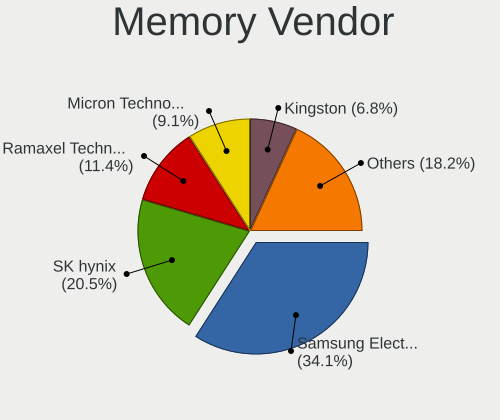

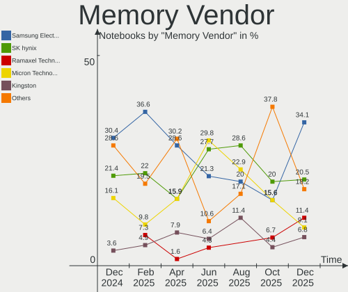

| Vendor              | Notebooks | Percent |
|---------------------|-----------|---------|
| Samsung Electronics | 15        | 34.09%  |
| SK hynix            | 9         | 20.45%  |
| Ramaxel Technology  | 5         | 11.36%  |
| Micron Technology   | 4         | 9.09%   |
| Kingston            | 3         | 6.82%   |
| Unknown             | 3         | 6.82%   |
| Unknown             | 1         | 2.27%   |
| Micron/Elpida       | 1         | 2.27%   |
| Elpida              | 1         | 2.27%   |
| Corsair             | 1         | 2.27%   |
| Apacer              | 1         | 2.27%   |

Memory Model
------------

Memory module models

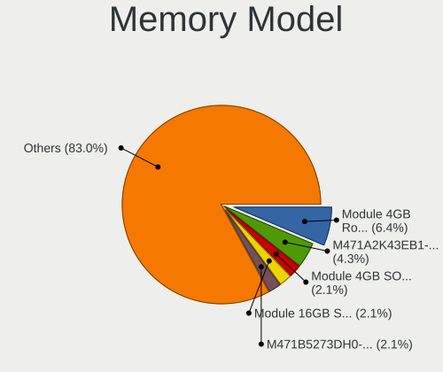

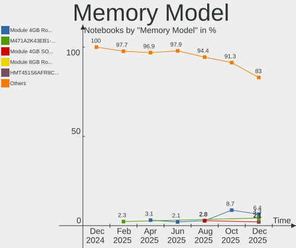

| Model                                                            | Notebooks | Percent |
|------------------------------------------------------------------|-----------|---------|
| Unknown                                                          | 3         | 6.38%   |
| Samsung RAM M471A2K43EB1-CWE 16GB SODIMM DDR4 3200MT/s           | 2         | 4.26%   |
| Unknown RAM Module 4GB SODIMM DDR3 1600MT/s                      | 1         | 2.13%   |
| SK hynix RAM Module 8GB Row Of Chips LPDDR3 2133MT/s             | 1         | 2.13%   |
| SK hynix RAM HMT451S6AFR8C-PB 4GB SODIMM DDR3 1600MT/s           | 1         | 2.13%   |
| SK hynix RAM HMCG78AGBSA095N 16GB SODIMM DDR5 5600MT/s           | 1         | 2.13%   |
| SK hynix RAM HMA82GS6DJR8N-XN 16GB SODIMM DDR4 3200MT/s          | 1         | 2.13%   |
| SK hynix RAM HMA81GS6CJR8N-VK 8GB SODIMM DDR4 2400MT/s           | 1         | 2.13%   |
| SK hynix RAM HMA81GS6CJR8N-UH 8GB SODIMM DDR4 2667MT/s           | 1         | 2.13%   |
| SK hynix RAM HMA81GS6AFR8N-UH 8GB SODIMM DDR4 2667MT/s           | 1         | 2.13%   |
| SK hynix RAM H9CCNNNCLTALAR-NTD 4GB Row Of Chips LPDDR3 1867MT/s | 1         | 2.13%   |
| SK hynix RAM H5AN8G6NCJR-VKC 4GB SODIMM DDR4 2667MT/s            | 1         | 2.13%   |
| SK hynix RAM H58G66BK7BX067 16GB Row Of Chips LPDDR5 8533MT/s    | 1         | 2.13%   |
| Samsung RAM Module 16GB SODIMM DDR4 2400MT/s                     | 1         | 2.13%   |
| Samsung RAM M471B5273DH0-CK0 4GB SODIMM DDR3 2400MT/s            | 1         | 2.13%   |
| Samsung RAM M471B5273DH0-CH9 4GB SODIMM DDR3 1600MT/s            | 1         | 2.13%   |
| Samsung RAM M471B5273CH0-CH9 4GB SODIMM DDR3 1334MT/s            | 1         | 2.13%   |
| Samsung RAM M471B1G73QH0-YK0 8GB SODIMM DDR3 1600MT/s            | 1         | 2.13%   |
| Samsung RAM M471A5244CB0-CWE 4GB SODIMM DDR4 3200MT/s            | 1         | 2.13%   |
| Samsung RAM M471A5244CB0-CRC 4GB SODIMM DDR4 2667MT/s            | 1         | 2.13%   |
| Samsung RAM M471A5143EB0-CPB 4GB SODIMM DDR4 2133MT/s            | 1         | 2.13%   |
| Samsung RAM M471A2G43BB2-CWE 16GB SODIMM DDR4 3200MT/s           | 1         | 2.13%   |
| Samsung RAM M471A1K43DB1-CWE 8GB SODIMM DDR4 3200MT/s            | 1         | 2.13%   |
| Samsung RAM M471A1K43DB1-CTD 8GB SODIMM DDR4 2667MT/s            | 1         | 2.13%   |
| Samsung RAM M471A1G44AB0-CWE 8GiB SODIMM DDR4 3200MT/s           | 1         | 2.13%   |
| Samsung RAM M471A1G44AB0-CWE 8GB Row Of Chips DDR4 3200MT/s      | 1         | 2.13%   |
| Samsung RAM M471A1G43DB0-CPB 8GB SODIMM DDR4 3200MT/s            | 1         | 2.13%   |
| Samsung RAM M425R2GA3EB0-CWMOL 16GB SODIMM DDR5 5600MT/s         | 1         | 2.13%   |
| Ramaxel RAM RMT3020EC58E9F1333 4GB SODIMM DDR3 4199MT/s          | 1         | 2.13%   |
| Ramaxel RAM RMSB3400KB06IVF-4800 12GB SODIMM DDR5 4800MT/s       | 1         | 2.13%   |
| Ramaxel RAM RMSA3320KE78HAF-3200 8GB SODIMM DDR4 3200MT/s        | 1         | 2.13%   |
| Ramaxel RAM RMSA3310MF96HAF-3200 8GB SODIMM DDR4 3200MT/s        | 1         | 2.13%   |
| Ramaxel RAM RMSA3270ME86H9F-2666 4GB SODIMM DDR4 2667MT/s        | 1         | 2.13%   |
| Micron/Elpida RAM Module 4GB SODIMM LPDDR3 1867MT/s              | 1         | 2.13%   |
| Micron RAM 8KTF51264HZ-1G6N1 4GB SODIMM DDR3 1600MT/s            | 1         | 2.13%   |
| Micron RAM 8ATF1G64HZ-3G2J1 8GB SODIMM DDR4 3200MT/s             | 1         | 2.13%   |
| Micron RAM 4ATF51264HZ-3G2R1 4GB SODIMM DDR4 3200MT/s            | 1         | 2.13%   |
| Micron RAM 4ATF51264HZ-3G2J1 4GB Row Of Chips DDR4 3200MT/s      | 1         | 2.13%   |
| Kingston RAM HP594908-HR1-ELD 2GB SODIMM DDR3 1333MT/s           | 1         | 2.13%   |
| Kingston RAM HP16D3LS1KBGH/4G 4GB SODIMM DDR3 1600MT/s           | 1         | 2.13%   |

Memory Kind
-----------

Memory module kinds

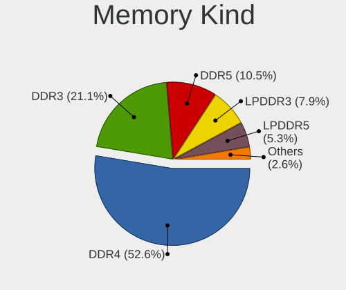

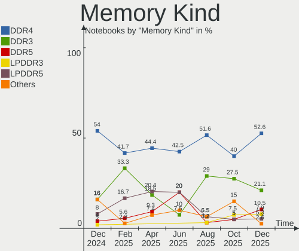

| Kind   | Notebooks | Percent |
|--------|-----------|---------|
| DDR4   | 20        | 52.63%  |
| DDR3   | 8         | 21.05%  |
| DDR5   | 4         | 10.53%  |
| LPDDR3 | 3         | 7.89%   |
| LPDDR5 | 2         | 5.26%   |
| SDRAM  | 1         | 2.63%   |

Memory Form Factor
------------------

Physical design of the memory module

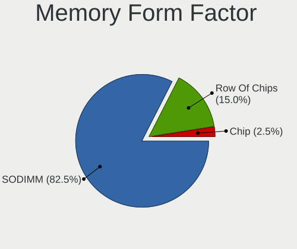

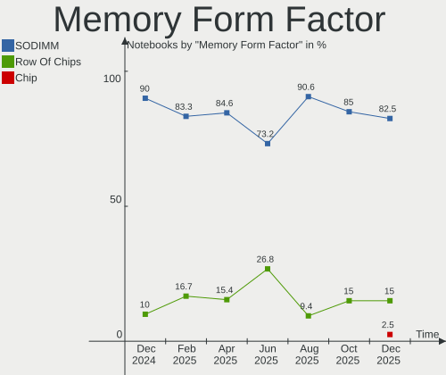

| Name         | Notebooks | Percent |
|--------------|-----------|---------|
| SODIMM       | 33        | 82.5%   |
| Row Of Chips | 6         | 15%     |
| Chip         | 1         | 2.5%    |

Memory Size
-----------

Memory module size

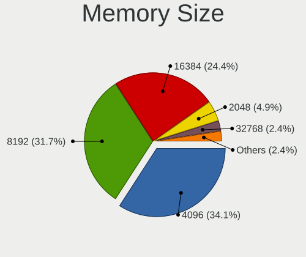

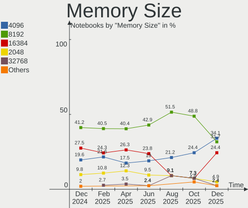

| Size  | Notebooks | Percent |
|-------|-----------|---------|
| 4096  | 14        | 34.15%  |
| 8192  | 13        | 31.71%  |
| 16384 | 10        | 24.39%  |
| 2048  | 2         | 4.88%   |
| 32768 | 1         | 2.44%   |
| 12288 | 1         | 2.44%   |

Memory Speed
------------

Memory module speed

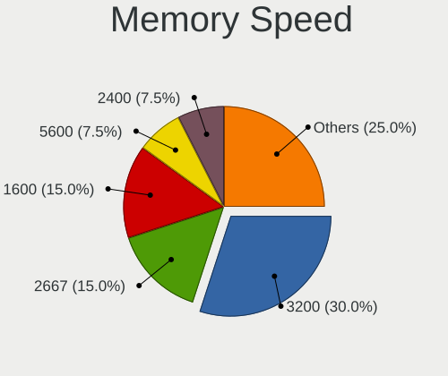

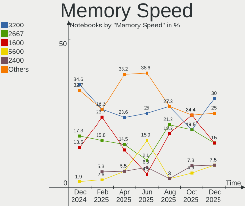

| Speed | Notebooks | Percent |
|-------|-----------|---------|
| 3200  | 12        | 30%     |
| 2667  | 6         | 15%     |
| 1600  | 6         | 15%     |
| 5600  | 3         | 7.5%    |
| 2400  | 3         | 7.5%    |
| 2133  | 2         | 5%      |
| 1867  | 2         | 5%      |
| 8533  | 1         | 2.5%    |
| 7467  | 1         | 2.5%    |
| 4800  | 1         | 2.5%    |
| 4199  | 1         | 2.5%    |
| 1334  | 1         | 2.5%    |
| 1333  | 1         | 2.5%    |

Printers & scanners
-------------------

Printer Vendor
--------------

Printer device vendors

Zero info for selected period =(

Printer Model
-------------

Printer device models

Zero info for selected period =(

Scanner Vendor
--------------

Scanner device vendors

Zero info for selected period =(

Scanner Model
-------------

Scanner device models

Zero info for selected period =(

Camera
------

Camera Vendor
-------------

Camera device vendors

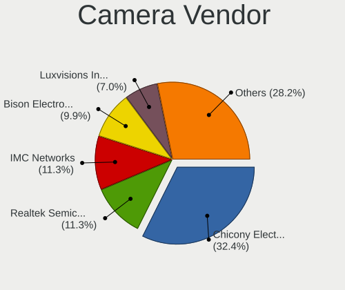

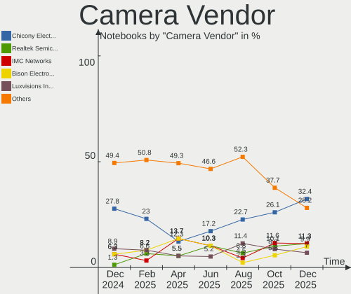

| Vendor                                 | Notebooks | Percent |
|----------------------------------------|-----------|---------|
| Chicony Electronics                    | 23        | 32.39%  |
| Realtek Semiconductor                  | 8         | 11.27%  |
| IMC Networks                           | 8         | 11.27%  |
| Bison Electronics                      | 7         | 9.86%   |
| Luxvisions Innotech Limited            | 5         | 7.04%   |
| Cheng Uei Precision Industry (Foxlink) | 3         | 4.23%   |
| Alcor Micro                            | 3         | 4.23%   |
| Syntek                                 | 2         | 2.82%   |
| Suyin                                  | 2         | 2.82%   |
| Quanta                                 | 2         | 2.82%   |
| Primax Electronics                     | 2         | 2.82%   |
| SenseTek                               | 1         | 1.41%   |
| Ricoh                                  | 1         | 1.41%   |
| Microdia                               | 1         | 1.41%   |
| kingcome                               | 1         | 1.41%   |
| Apple                                  | 1         | 1.41%   |
| Acer                                   | 1         | 1.41%   |

Camera Model
------------

Camera device models

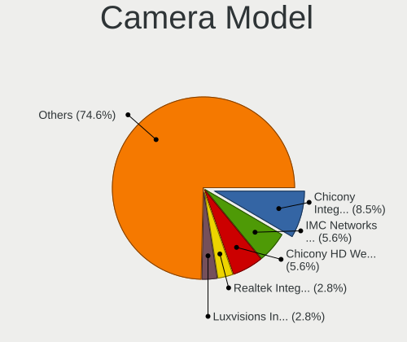

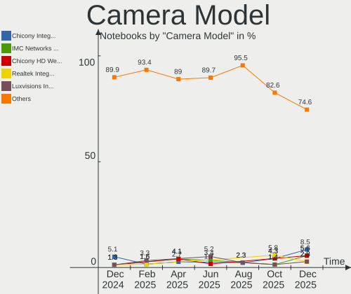

| Model                                                 | Notebooks | Percent |
|-------------------------------------------------------|-----------|---------|
| Chicony Integrated Camera                             | 6         | 8.45%   |
| IMC Networks Integrated Camera                        | 4         | 5.63%   |
| Chicony HD WebCam                                     | 4         | 5.63%   |
| Realtek Integrated_Webcam_HD                          | 2         | 2.82%   |
| Luxvisions Innotech Limited Integrated Camera         | 2         | 2.82%   |
| IMC Networks USB2.0 HD UVC WebCam                     | 2         | 2.82%   |
| Alcor Micro Asus Integrated Webcam                    | 2         | 2.82%   |
| Syntek USB Camera Device                              | 1         | 1.41%   |
| Syntek Integrated Camera                              | 1         | 1.41%   |
| Suyin HD WebCam                                       | 1         | 1.41%   |
| Suyin Acer/HP Integrated Webcam [CN0314]              | 1         | 1.41%   |
| SenseTek FHD Camera                                   | 1         | 1.41%   |
| Ricoh Sony Vaio Integrated Webcam                     | 1         | 1.41%   |
| Realtek USB2.0 VGA UVC WebCam                         | 1         | 1.41%   |
| Realtek USB Camera                                    | 1         | 1.41%   |
| Realtek Integrated Webcam                             | 1         | 1.41%   |
| Realtek HP Truevision HD                              | 1         | 1.41%   |
| Realtek HP "Truevision HD" laptop camera              | 1         | 1.41%   |
| Realtek Acer 640 x 480 laptop camera                  | 1         | 1.41%   |
| Quanta ov9734_techfront_camera                        | 1         | 1.41%   |
| Quanta HP Webcam                                      | 1         | 1.41%   |
| Primax HP Webcam-101                                  | 1         | 1.41%   |
| Primax HP HD Webcam [Fixed]                           | 1         | 1.41%   |
| Microdia Integrated_Webcam_HD                         | 1         | 1.41%   |
| Luxvisions Innotech Limited HP TrueVision HD Camera   | 1         | 1.41%   |
| Luxvisions Innotech Limited HP True Vision HD Camera  | 1         | 1.41%   |
| Luxvisions Innotech Limited HP True Vision FHD Camera | 1         | 1.41%   |
| kingcome FHD WebCam                                   | 1         | 1.41%   |
| IMC Networks USB2.0 VGA UVC WebCam                    | 1         | 1.41%   |
| IMC Networks USB2.0 HD IR UVC WebCam                  | 1         | 1.41%   |
| Chicony XiaoMi USB 2.0 Webcam                         | 1         | 1.41%   |
| Chicony USB2.0 VGA UVC WebCam                         | 1         | 1.41%   |
| Chicony USB 2.0 Camera                                | 1         | 1.41%   |
| Chicony TOSHIBA Web Camera - HD                       | 1         | 1.41%   |
| Chicony Integrated Camera (1920x1080)                 | 1         | 1.41%   |
| Chicony HP Wide Vision HD Camera                      | 1         | 1.41%   |
| Chicony HP TrueVision HD                              | 1         | 1.41%   |
| Chicony HP True Vision FHD Camera                     | 1         | 1.41%   |
| Chicony HP HD Camera                                  | 1         | 1.41%   |
| Chicony HP Full HD Camera                             | 1         | 1.41%   |

Security
--------

Fingerprint Vendor
------------------

Fingerprint sensor vendors

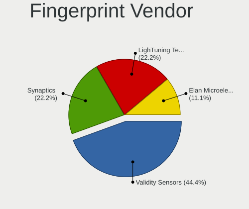

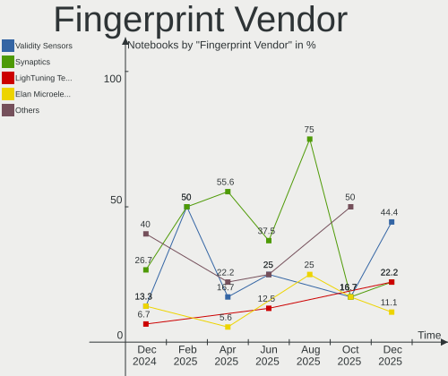

| Vendor                | Notebooks | Percent |
|-----------------------|-----------|---------|
| Validity Sensors      | 4         | 44.44%  |
| Synaptics             | 2         | 22.22%  |
| LighTuning Technology | 2         | 22.22%  |
| Elan Microelectronics | 1         | 11.11%  |

Fingerprint Model
-----------------

Fingerprint sensor models

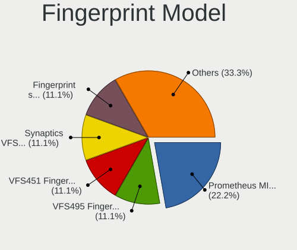

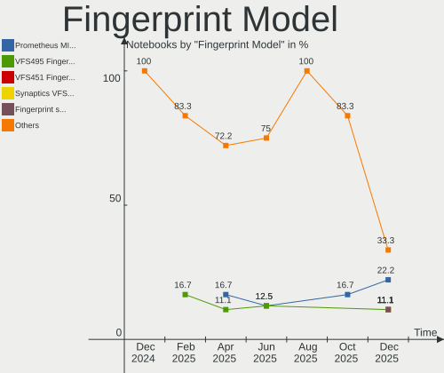

| Model                                                                      | Notebooks | Percent |
|----------------------------------------------------------------------------|-----------|---------|
| Synaptics Prometheus MIS Touch Fingerprint Reader                          | 2         | 22.22%  |
| Validity Sensors VFS495 Fingerprint Reader                                 | 1         | 11.11%  |
| Validity Sensors VFS451 Fingerprint Reader                                 | 1         | 11.11%  |
| Validity Sensors Synaptics VFS7552 Touch Fingerprint Sensor with PurePrint | 1         | 11.11%  |
| Validity Sensors Fingerprint scanner                                       | 1         | 11.11%  |
| LighTuning ES603 Swipe Fingerprint Sensor                                  | 1         | 11.11%  |
| LighTuning EgisTec Touch Fingerprint Sensor                                | 1         | 11.11%  |
| Elan ELAN:Fingerprint                                                      | 1         | 11.11%  |

Chipcard Vendor
---------------

Chipcard module vendors

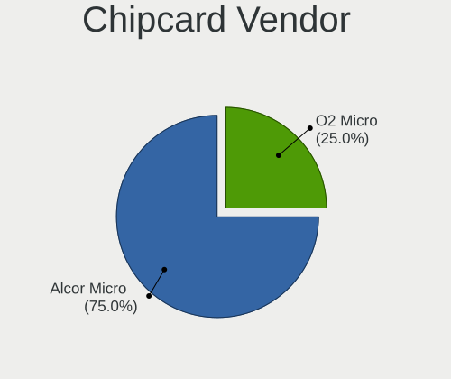

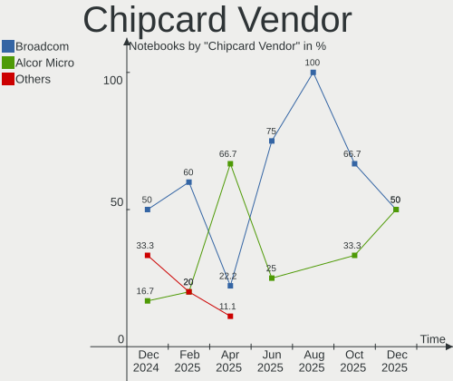

| Vendor      | Notebooks | Percent |
|-------------|-----------|---------|
| Broadcom    | 1         | 50%     |
| Alcor Micro | 1         | 50%     |

Chipcard Model
--------------

Chipcard module models

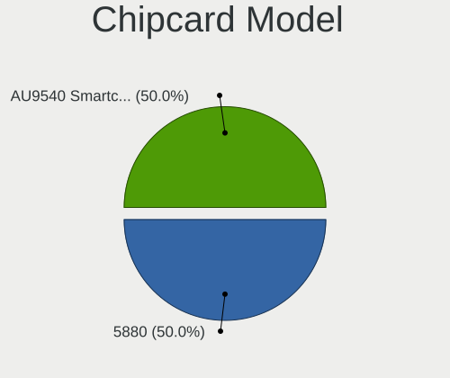

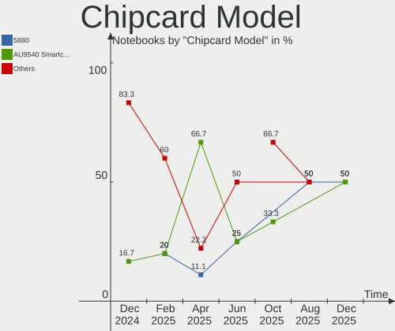

| Model                               | Notebooks | Percent |
|-------------------------------------|-----------|---------|
| Broadcom 5880                       | 1         | 50%     |
| Alcor Micro AU9540 Smartcard Reader | 1         | 50%     |

Unsupported
-----------

Unsupported Devices
-------------------

Total unsupported devices on board

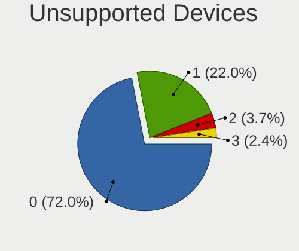

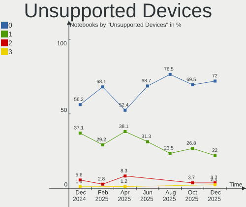

| Total | Notebooks | Percent |
|-------|-----------|---------|
| 0     | 59        | 71.95%  |
| 1     | 18        | 21.95%  |
| 2     | 3         | 3.66%   |
| 3     | 2         | 2.44%   |

Unsupported Device Types
------------------------

Types of unsupported devices

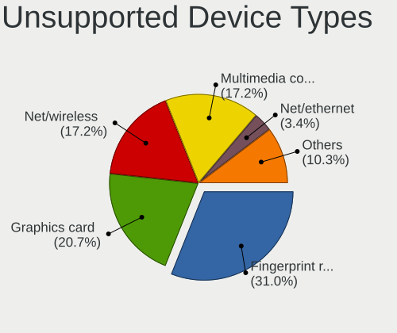

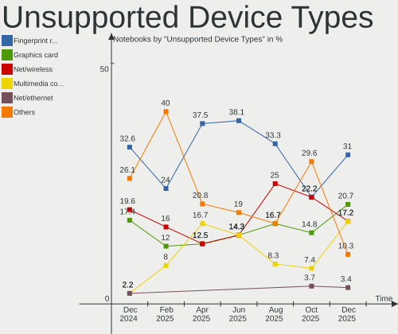

| Type                  | Notebooks | Percent |
|-----------------------|-----------|---------|
| Fingerprint reader    | 9         | 31.03%  |
| Graphics card         | 6         | 20.69%  |
| Net/wireless          | 5         | 17.24%  |
| Multimedia controller | 5         | 17.24%  |
| Net/ethernet          | 1         | 3.45%   |
| Flash memory          | 1         | 3.45%   |
| Chipcard              | 1         | 3.45%   |
| Bluetooth             | 1         | 3.45%   |

