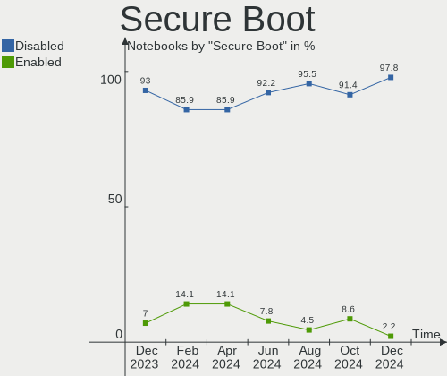
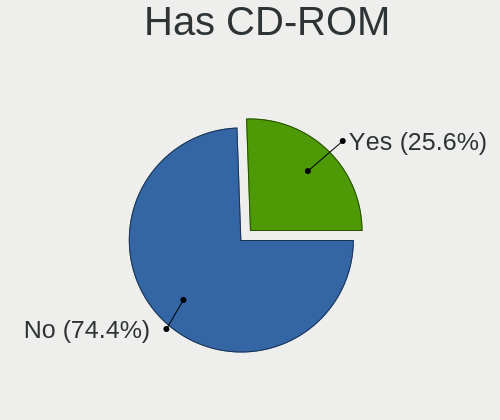
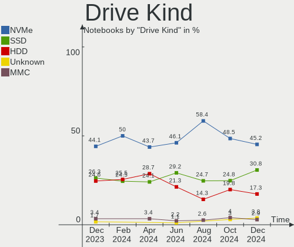
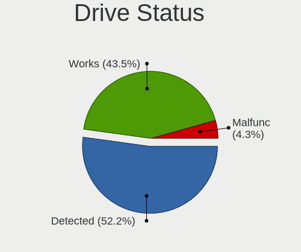
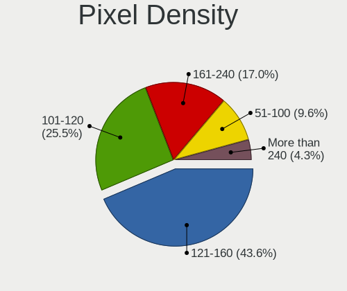

Linux in Spain - Hardware Trends (Notebooks)
--------------------------------------------

A project to identify most popular hardware characteristics and track their change
over time based on data collected by Linux users at https://Linux-Hardware.org.

Anyone can contribute to this report by the [hw-probe](https://github.com/linuxhw/hw-probe) tool:

    sudo -E hw-probe -all -upload

Period: Dec, 2022.

Contents
--------

* [ System ](#system)
  - [ OS                       ](#os)
  - [ OS Family                ](#os-family)
  - [ Kernel                   ](#kernel)
  - [ Kernel Family            ](#kernel-family)
  - [ Kernel Major Ver.        ](#kernel-major-ver)
  - [ Arch                     ](#arch)
  - [ DE                       ](#de)
  - [ Display Server           ](#display-server)
  - [ Display Manager          ](#display-manager)
  - [ OS Lang                  ](#os-lang)
  - [ Boot Mode                ](#boot-mode)
  - [ Filesystem               ](#filesystem)
  - [ Part. scheme             ](#part-scheme)
  - [ Dual Boot with Linux/BSD ](#dual-boot-with-linuxbsd)
  - [ Dual Boot (Win)          ](#dual-boot-win)

* [ Board ](#board)
  - [ Vendor                   ](#vendor)
  - [ Model                    ](#model)
  - [ Model Family             ](#model-family)
  - [ MFG Year                 ](#mfg-year)
  - [ Form Factor              ](#form-factor)
  - [ Secure Boot              ](#secure-boot)
  - [ Coreboot                 ](#coreboot)
  - [ RAM Size                 ](#ram-size)
  - [ RAM Used                 ](#ram-used)
  - [ Total Drives             ](#total-drives)
  - [ Has CD-ROM               ](#has-cd-rom)
  - [ Has Ethernet             ](#has-ethernet)
  - [ Has WiFi                 ](#has-wifi)
  - [ Has Bluetooth            ](#has-bluetooth)

* [ Location ](#location)
  - [ Country                  ](#country)
  - [ City                     ](#city)

* [ Drives ](#drives)
  - [ Drive Vendor             ](#drive-vendor)
  - [ Drive Model              ](#drive-model)
  - [ HDD Vendor               ](#hdd-vendor)
  - [ SSD Vendor               ](#ssd-vendor)
  - [ Drive Kind               ](#drive-kind)
  - [ Drive Connector          ](#drive-connector)
  - [ Drive Size               ](#drive-size)
  - [ Space Total              ](#space-total)
  - [ Space Used               ](#space-used)
  - [ Malfunc. Drives          ](#malfunc-drives)
  - [ Malfunc. Drive Vendor    ](#malfunc-drive-vendor)
  - [ Malfunc. HDD Vendor      ](#malfunc-hdd-vendor)
  - [ Malfunc. Drive Kind      ](#malfunc-drive-kind)
  - [ Failed Drives            ](#failed-drives)
  - [ Failed Drive Vendor      ](#failed-drive-vendor)
  - [ Drive Status             ](#drive-status)

* [ Storage controller ](#storage-controller)
  - [ Storage Vendor           ](#storage-vendor)
  - [ Storage Model            ](#storage-model)
  - [ Storage Kind             ](#storage-kind)

* [ Processor ](#processor)
  - [ CPU Vendor               ](#cpu-vendor)
  - [ CPU Model                ](#cpu-model)
  - [ CPU Model Family         ](#cpu-model-family)
  - [ CPU Cores                ](#cpu-cores)
  - [ CPU Sockets              ](#cpu-sockets)
  - [ CPU Threads              ](#cpu-threads)
  - [ CPU Op-Modes             ](#cpu-op-modes)
  - [ CPU Microcode            ](#cpu-microcode)
  - [ CPU Microarch            ](#cpu-microarch)

* [ Graphics ](#graphics)
  - [ GPU Vendor               ](#gpu-vendor)
  - [ GPU Model                ](#gpu-model)
  - [ GPU Combo                ](#gpu-combo)
  - [ GPU Driver               ](#gpu-driver)
  - [ GPU Memory               ](#gpu-memory)

* [ Monitor ](#monitor)
  - [ Monitor Vendor           ](#monitor-vendor)
  - [ Monitor Model            ](#monitor-model)
  - [ Monitor Resolution       ](#monitor-resolution)
  - [ Monitor Diagonal         ](#monitor-diagonal)
  - [ Monitor Width            ](#monitor-width)
  - [ Aspect Ratio             ](#aspect-ratio)
  - [ Monitor Area             ](#monitor-area)
  - [ Pixel Density            ](#pixel-density)
  - [ Multiple Monitors        ](#multiple-monitors)

* [ Network ](#network)
  - [ Net Controller Vendor    ](#net-controller-vendor)
  - [ Net Controller Model     ](#net-controller-model)
  - [ Wireless Vendor          ](#wireless-vendor)
  - [ Wireless Model           ](#wireless-model)
  - [ Ethernet Vendor          ](#ethernet-vendor)
  - [ Ethernet Model           ](#ethernet-model)
  - [ Net Controller Kind      ](#net-controller-kind)
  - [ Used Controller          ](#used-controller)
  - [ NICs                     ](#nics)
  - [ IPv6                     ](#ipv6)

* [ Bluetooth ](#bluetooth)
  - [ Bluetooth Vendor         ](#bluetooth-vendor)
  - [ Bluetooth Model          ](#bluetooth-model)

* [ Sound ](#sound)
  - [ Sound Vendor             ](#sound-vendor)
  - [ Sound Model              ](#sound-model)

* [ Memory ](#memory)
  - [ Memory Vendor            ](#memory-vendor)
  - [ Memory Model             ](#memory-model)
  - [ Memory Kind              ](#memory-kind)
  - [ Memory Form Factor       ](#memory-form-factor)
  - [ Memory Size              ](#memory-size)
  - [ Memory Speed             ](#memory-speed)

* [ Printers & scanners ](#printers--scanners)
  - [ Printer Vendor           ](#printer-vendor)
  - [ Printer Model            ](#printer-model)
  - [ Scanner Vendor           ](#scanner-vendor)
  - [ Scanner Model            ](#scanner-model)

* [ Camera ](#camera)
  - [ Camera Vendor            ](#camera-vendor)
  - [ Camera Model             ](#camera-model)

* [ Security ](#security)
  - [ Fingerprint Vendor       ](#fingerprint-vendor)
  - [ Fingerprint Model        ](#fingerprint-model)
  - [ Chipcard Vendor          ](#chipcard-vendor)
  - [ Chipcard Model           ](#chipcard-model)

* [ Unsupported ](#unsupported)
  - [ Unsupported Devices      ](#unsupported-devices)
  - [ Unsupported Device Types ](#unsupported-device-types)

System
------

OS
--

Installed operating systems

| Name                      | Notebooks | Percent |
|---------------------------|-----------|---------|
| Ubuntu 22.04              | 15        | 16.3%   |
| Fedora 37                 | 7         | 7.61%   |
| Zorin 16                  | 6         | 6.52%   |
| Debian 11                 | 6         | 6.52%   |
| Linux Mint 21             | 5         | 5.43%   |
| Ubuntu 22.10              | 4         | 4.35%   |
| Pop!_OS 22.04             | 4         | 4.35%   |
| OpenMandriva 4.3          | 4         | 4.35%   |
| KDE neon 22.04            | 4         | 4.35%   |
| Ubuntu 20.04              | 3         | 3.26%   |
| Arch Rolling              | 3         | 3.26%   |
| Nobara 36                 | 2         | 2.17%   |
| Linux Mint 20.3           | 2         | 2.17%   |
| Kali 2022.4               | 2         | 2.17%   |
| Garuda Linux Soaring      | 2         | 2.17%   |
| Endless 4.0.13            | 2         | 2.17%   |
| Elementary 6.1            | 2         | 2.17%   |
| Debian                    | 2         | 2.17%   |
| ArcoLinux Rolling         | 2         | 2.17%   |
| Ubuntu Unity 22.04        | 1         | 1.09%   |
| Ubuntu Unity 16.04        | 1         | 1.09%   |
| Ubuntu Studio 22.04       | 1         | 1.09%   |
| Ubuntu Budgie 20.04       | 1         | 1.09%   |
| SteamOS 3.5               | 1         | 1.09%   |
| SteamOS 3.4.3             | 1         | 1.09%   |
| SteamOS 3.4.2             | 1         | 1.09%   |
| Parrot 5.1                | 1         | 1.09%   |
| Manjaro 22.12-development | 1         | 1.09%   |
| Manjaro                   | 1         | 1.09%   |
| Lubuntu 22.04             | 1         | 1.09%   |
| Linux Mint 21.1           | 1         | 1.09%   |
| Lilidog 22                | 1         | 1.09%   |
| Kubuntu 22.04             | 1         | 1.09%   |
| Fedora 36                 | 1         | 1.09%   |

OS Family
---------

OS without a version

| Name          | Notebooks | Percent |
|---------------|-----------|---------|
| Ubuntu        | 22        | 23.91%  |
| Linux Mint    | 8         | 8.7%    |
| Fedora        | 8         | 8.7%    |
| Debian        | 8         | 8.7%    |
| Zorin         | 6         | 6.52%   |
| Pop!_OS       | 4         | 4.35%   |
| OpenMandriva  | 4         | 4.35%   |
| KDE neon      | 4         | 4.35%   |
| SteamOS       | 3         | 3.26%   |
| Arch          | 3         | 3.26%   |
| Ubuntu Unity  | 2         | 2.17%   |
| Nobara        | 2         | 2.17%   |
| Manjaro       | 2         | 2.17%   |
| Kali          | 2         | 2.17%   |
| Garuda Linux  | 2         | 2.17%   |
| Endless       | 2         | 2.17%   |
| Elementary    | 2         | 2.17%   |
| ArcoLinux     | 2         | 2.17%   |
| Ubuntu Studio | 1         | 1.09%   |
| Ubuntu Budgie | 1         | 1.09%   |
| Parrot        | 1         | 1.09%   |
| Lubuntu       | 1         | 1.09%   |
| Lilidog       | 1         | 1.09%   |
| Kubuntu       | 1         | 1.09%   |

Kernel
------

Version of the Linux kernel

| Version                  | Notebooks | Percent |
|--------------------------|-----------|---------|
| 5.15.0-56-generic        | 28        | 30.43%  |
| 5.16.7-desktop-1omv4003  | 4         | 4.35%   |
| 6.0.10-300.fc37.x86_64   | 3         | 3.26%   |
| 5.4.0-135-generic        | 3         | 3.26%   |
| 5.15.0-53-generic        | 3         | 3.26%   |
| 6.0.6-76060006-generic   | 2         | 2.17%   |
| 6.0.12-arch1-1           | 2         | 2.17%   |
| 6.0.12-300.fc37.x86_64   | 2         | 2.17%   |
| 6.0.11-arch1-1           | 2         | 2.17%   |
| 6.0.10-201.fc36.x86_64   | 2         | 2.17%   |
| 6.0.0-5-amd64            | 2         | 2.17%   |
| 6.0.0-0.deb11.2-amd64    | 2         | 2.17%   |
| 5.19.0-26-generic        | 2         | 2.17%   |
| 5.13.0-valve36-1-neptune | 2         | 2.17%   |
| 5.11.0-35-generic        | 2         | 2.17%   |
| 5.10.0-20-amd64          | 2         | 2.17%   |
| 5.10.0-18-amd64          | 2         | 2.17%   |
| 6.1.1-zen1-1-zen         | 1         | 1.09%   |
| 6.1.1-1-MANJARO          | 1         | 1.09%   |
| 6.1.0-1-MANJARO          | 1         | 1.09%   |
| 6.0.9-060009-generic     | 1         | 1.09%   |
| 6.0.8-xm1.0.fc37.x86_64  | 1         | 1.09%   |
| 6.0.8-200.fc36.x86_64    | 1         | 1.09%   |
| 6.0.15-300.fc37.x86_64   | 1         | 1.09%   |
| 6.0.12-zen1-1-zen        | 1         | 1.09%   |
| 6.0.12-76060006-generic  | 1         | 1.09%   |
| 6.0.0-kali6-amd64        | 1         | 1.09%   |
| 6.0.0-kali5-amd64        | 1         | 1.09%   |
| 6.0.0-2parrot1-amd64     | 1         | 1.09%   |
| 6.0.0-1009-oem           | 1         | 1.09%   |
| 5.4.0-65-generic         | 1         | 1.09%   |
| 5.19.0-27-generic        | 1         | 1.09%   |
| 5.18.10-76051810-generic | 1         | 1.09%   |
| 5.15.80-1-lts            | 1         | 1.09%   |
| 5.15.0-56-lowlatency     | 1         | 1.09%   |
| 5.15.0-52-generic        | 1         | 1.09%   |
| 5.15.0-48-generic        | 1         | 1.09%   |
| 5.15.0-43-generic        | 1         | 1.09%   |
| 5.13.0-valve35-1-neptune | 1         | 1.09%   |
| 5.13.0-37-generic        | 1         | 1.09%   |

Kernel Family
-------------

Linux kernel without a distro release

| Version | Notebooks | Percent |
|---------|-----------|---------|
| 5.15.0  | 35        | 38.04%  |
| 6.0.0   | 8         | 8.7%    |
| 6.0.12  | 6         | 6.52%   |
| 6.0.10  | 5         | 5.43%   |
| 5.13.0  | 5         | 5.43%   |
| 5.10.0  | 5         | 5.43%   |
| 5.4.0   | 4         | 4.35%   |
| 5.16.7  | 4         | 4.35%   |
| 5.19.0  | 3         | 3.26%   |
| 5.11.0  | 3         | 3.26%   |
| 6.1.1   | 2         | 2.17%   |
| 6.0.8   | 2         | 2.17%   |
| 6.0.6   | 2         | 2.17%   |
| 6.0.11  | 2         | 2.17%   |
| 6.1.0   | 1         | 1.09%   |
| 6.0.9   | 1         | 1.09%   |
| 6.0.15  | 1         | 1.09%   |
| 5.18.10 | 1         | 1.09%   |
| 5.15.80 | 1         | 1.09%   |
| 4.15.0  | 1         | 1.09%   |

Kernel Major Ver.
-----------------

Linux kernel major version

| Version | Notebooks | Percent |
|---------|-----------|---------|
| 5.15    | 36        | 39.13%  |
| 6.0     | 27        | 29.35%  |
| 5.13    | 5         | 5.43%   |
| 5.10    | 5         | 5.43%   |
| 5.4     | 4         | 4.35%   |
| 5.16    | 4         | 4.35%   |
| 6.1     | 3         | 3.26%   |
| 5.19    | 3         | 3.26%   |
| 5.11    | 3         | 3.26%   |
| 5.18    | 1         | 1.09%   |
| 4.15    | 1         | 1.09%   |

Arch
----

OS architecture (x86_64, i586, etc.)

| Name   | Notebooks | Percent |
|--------|-----------|---------|
| x86_64 | 92        | 100%    |

DE
--

Desktop Environment

| Name             | Notebooks | Percent |
|------------------|-----------|---------|
| GNOME            | 42        | 45.65%  |
| KDE5             | 22        | 23.91%  |
| XFCE             | 8         | 8.7%    |
| X-Cinnamon       | 7         | 7.61%   |
| Unity            | 2         | 2.17%   |
| Pantheon         | 2         | 2.17%   |
| LXQt             | 2         | 2.17%   |
| Unknown          | 2         | 2.17%   |
| MATE             | 1         | 1.09%   |
| lightdm-xsession | 1         | 1.09%   |
| i3               | 1         | 1.09%   |
| Budgie           | 1         | 1.09%   |
| bspwm            | 1         | 1.09%   |

Display Server
--------------

X11 or Wayland

| Name    | Notebooks | Percent |
|---------|-----------|---------|
| X11     | 67        | 72.83%  |
| Wayland | 22        | 23.91%  |
| Tty     | 2         | 2.17%   |
| Unknown | 1         | 1.09%   |

Display Manager
---------------

SDDM, LightDM, etc.

| Name    | Notebooks | Percent |
|---------|-----------|---------|
| Unknown | 30        | 32.61%  |
| GDM3    | 26        | 28.26%  |
| LightDM | 15        | 16.3%   |
| SDDM    | 14        | 15.22%  |
| GDM     | 6         | 6.52%   |
| Ly      | 1         | 1.09%   |

OS Lang
-------

Language

| Lang  | Notebooks | Percent |
|-------|-----------|---------|
| es_ES | 56        | 60.87%  |
| en_US | 26        | 28.26%  |
| ca_ES | 4         | 4.35%   |
| en_GB | 2         | 2.17%   |
| pt_BR | 1         | 1.09%   |
| it_IT | 1         | 1.09%   |
| gl_ES | 1         | 1.09%   |
| eu_ES | 1         | 1.09%   |

Boot Mode
---------

EFI or BIOS

| Mode | Notebooks | Percent |
|------|-----------|---------|
| EFI  | 51        | 55.43%  |
| BIOS | 41        | 44.57%  |

Filesystem
----------

Type of filesystem

| Type    | Notebooks | Percent |
|---------|-----------|---------|
| Ext4    | 69        | 75%     |
| Btrfs   | 15        | 16.3%   |
| Overlay | 5         | 5.43%   |
| Zfs     | 2         | 2.17%   |
| Ext3    | 1         | 1.09%   |

Part. scheme
------------

Scheme of partitioning

| Type    | Notebooks | Percent |
|---------|-----------|---------|
| GPT     | 52        | 56.52%  |
| Unknown | 28        | 30.43%  |
| MBR     | 12        | 13.04%  |

Dual Boot with Linux/BSD
------------------------

Hosting more than one Linux/BSD

| Dual boot | Notebooks | Percent |
|-----------|-----------|---------|
| No        | 88        | 95.65%  |
| Yes       | 4         | 4.35%   |

Dual Boot (Win)
---------------

Hosting Linux and Windows

| Dual boot | Notebooks | Percent |
|-----------|-----------|---------|
| No        | 63        | 68.48%  |
| Yes       | 29        | 31.52%  |

Board
-----

Vendor
------

Motherboard manufacturer

| Name                | Notebooks | Percent |
|---------------------|-----------|---------|
| Lenovo              | 22        | 23.91%  |
| Hewlett-Packard     | 15        | 16.3%   |
| ASUSTek Computer    | 13        | 14.13%  |
| Acer                | 10        | 10.87%  |
| MSI                 | 7         | 7.61%   |
| Dell                | 7         | 7.61%   |
| Valve               | 3         | 3.26%   |
| Toshiba             | 3         | 3.26%   |
| Packard Bell        | 2         | 2.17%   |
| HUAWEI              | 2         | 2.17%   |
| Sony                | 1         | 1.09%   |
| Intel               | 1         | 1.09%   |
| Gigabyte Technology | 1         | 1.09%   |
| Dynabook            | 1         | 1.09%   |
| Chuwi               | 1         | 1.09%   |
| Apple               | 1         | 1.09%   |
| Alienware           | 1         | 1.09%   |
| Unknown             | 1         | 1.09%   |

Model
-----

Motherboard model

| Name                                     | Notebooks | Percent |
|------------------------------------------|-----------|---------|
| Valve Jupiter                            | 3         | 3.26%   |
| Lenovo Legion 5 15ACH6H 82JU             | 2         | 2.17%   |
| HP OMEN by Laptop 16-c0xxx               | 2         | 2.17%   |
| Toshiba TECRA A11                        | 1         | 1.09%   |
| Toshiba Satellite L10W-B-101             | 1         | 1.09%   |
| Toshiba PORTEGE M800                     | 1         | 1.09%   |
| Sony VPCEB2M1E                           | 1         | 1.09%   |
| Packard Bell EasyNote TK85               | 1         | 1.09%   |
| Packard Bell EasyNote TE11BZ             | 1         | 1.09%   |
| MSI Stealth 15M B12UE                    | 1         | 1.09%   |
| MSI PS42 8RB                             | 1         | 1.09%   |
| MSI MS-7A34                              | 1         | 1.09%   |
| MSI Modern 14 A10RB                      | 1         | 1.09%   |
| MSI GF63 Thin 9SC                        | 1         | 1.09%   |
| MSI GE72 6QD                             | 1         | 1.09%   |
| MSI GE62 6QD                             | 1         | 1.09%   |
| Lenovo Yoga Slim 7 ProX 14IAH7 82TK      | 1         | 1.09%   |
| Lenovo Yoga 300-11IBR 80M1               | 1         | 1.09%   |
| Lenovo ThinkPad X220 Tablet 4298R65      | 1         | 1.09%   |
| Lenovo ThinkPad X1 Carbon 6th 20KGS0YB00 | 1         | 1.09%   |
| Lenovo ThinkPad T440s 20ARS2A500         | 1         | 1.09%   |
| Lenovo ThinkPad P17 Gen 1 20SN001MPB     | 1         | 1.09%   |
| Lenovo ThinkPad L15 Gen 2 20X4S4LM01     | 1         | 1.09%   |
| Lenovo ThinkPad E15 Gen 2 20TD0017SP     | 1         | 1.09%   |
| Lenovo ThinkBook 15-IIL 20SM             | 1         | 1.09%   |
| Lenovo ThinkBook 14-IIL 20SL             | 1         | 1.09%   |
| Lenovo Legion Y540-15IRH-PG0 81SY        | 1         | 1.09%   |
| Lenovo Legion 7 16ITHg6 82K6             | 1         | 1.09%   |
| Lenovo Legion 5 15ARH05 82B5             | 1         | 1.09%   |
| Lenovo IdeaPad Gaming 3 15ACH6 82K2      | 1         | 1.09%   |
| Lenovo IdeaPad 700-15ISK 80RU            | 1         | 1.09%   |
| Lenovo IdeaPad 5 14ABA7 82SE             | 1         | 1.09%   |
| Lenovo IdeaPad 330-15IKB 81DE            | 1         | 1.09%   |
| Lenovo IdeaPad 330-15ARR 81D2            | 1         | 1.09%   |
| Lenovo G710                              | 1         | 1.09%   |
| Lenovo B590 62743PG                      | 1         | 1.09%   |
| Intel Kabylake Platform                  | 1         | 1.09%   |
| HUAWEI KLVL-WXXW                         | 1         | 1.09%   |
| HUAWEI BOHB-WAX9                         | 1         | 1.09%   |
| HP ZBook 15 G2                           | 1         | 1.09%   |

Model Family
------------

Motherboard model prefix

| Name                  | Notebooks | Percent |
|-----------------------|-----------|---------|
| Acer Aspire           | 8         | 8.7%    |
| Lenovo ThinkPad       | 6         | 6.52%   |
| Lenovo Legion         | 5         | 5.43%   |
| Lenovo IdeaPad        | 5         | 5.43%   |
| ASUS VivoBook         | 4         | 4.35%   |
| Valve Jupiter         | 3         | 3.26%   |
| HP OMEN               | 3         | 3.26%   |
| Dell Latitude         | 3         | 3.26%   |
| Packard Bell EasyNote | 2         | 2.17%   |
| Lenovo Yoga           | 2         | 2.17%   |
| Lenovo ThinkBook      | 2         | 2.17%   |
| HP Victus             | 2         | 2.17%   |
| Dell Inspiron         | 2         | 2.17%   |
| Toshiba TECRA         | 1         | 1.09%   |
| Toshiba Satellite     | 1         | 1.09%   |
| Toshiba PORTEGE       | 1         | 1.09%   |
| Sony VPCEB2M1E        | 1         | 1.09%   |
| MSI Stealth           | 1         | 1.09%   |
| MSI PS42              | 1         | 1.09%   |
| MSI MS-7A34           | 1         | 1.09%   |
| MSI Modern            | 1         | 1.09%   |
| MSI GF63              | 1         | 1.09%   |
| MSI GE72              | 1         | 1.09%   |
| MSI GE62              | 1         | 1.09%   |
| Lenovo G710           | 1         | 1.09%   |
| Lenovo B590           | 1         | 1.09%   |
| Intel Kabylake        | 1         | 1.09%   |
| HUAWEI KLVL-WXXW      | 1         | 1.09%   |
| HUAWEI BOHB-WAX9      | 1         | 1.09%   |
| HP ZBook              | 1         | 1.09%   |
| HP ProBook            | 1         | 1.09%   |
| HP Pavilion           | 1         | 1.09%   |
| HP Notebook           | 1         | 1.09%   |
| HP Mini               | 1         | 1.09%   |
| HP Laptop             | 1         | 1.09%   |
| HP ENVY               | 1         | 1.09%   |
| HP EliteBook          | 1         | 1.09%   |
| HP 620                | 1         | 1.09%   |
| HP 250                | 1         | 1.09%   |
| Gigabyte AERO         | 1         | 1.09%   |

MFG Year
--------

Motherboard manufacture year

| Year | Notebooks | Percent |
|------|-----------|---------|
| 2021 | 21        | 22.83%  |
| 2019 | 12        | 13.04%  |
| 2022 | 11        | 11.96%  |
| 2018 | 8         | 8.7%    |
| 2015 | 8         | 8.7%    |
| 2010 | 7         | 7.61%   |
| 2016 | 4         | 4.35%   |
| 2014 | 4         | 4.35%   |
| 2020 | 3         | 3.26%   |
| 2017 | 3         | 3.26%   |
| 2012 | 3         | 3.26%   |
| 2011 | 3         | 3.26%   |
| 2013 | 2         | 2.17%   |
| 2009 | 2         | 2.17%   |
| 2008 | 1         | 1.09%   |

Form Factor
-----------

Physical design of the computer

| Name     | Notebooks | Percent |
|----------|-----------|---------|
| Notebook | 92        | 100%    |

Secure Boot
-----------

Enabled or disabled

| State    | Notebooks | Percent |
|----------|-----------|---------|
| Disabled | 85        | 92.39%  |
| Enabled  | 7         | 7.61%   |

Coreboot
--------

Have coreboot on board

| Used | Notebooks | Percent |
|------|-----------|---------|
| No   | 92        | 100%    |

RAM Size
--------

Total RAM memory

| Size in GB  | Notebooks | Percent |
|-------------|-----------|---------|
| 4.01-8.0    | 25        | 27.17%  |
| 8.01-16.0   | 24        | 26.09%  |
| 3.01-4.0    | 14        | 15.22%  |
| 32.01-64.0  | 12        | 13.04%  |
| 16.01-24.0  | 12        | 13.04%  |
| 24.01-32.0  | 2         | 2.17%   |
| 64.01-256.0 | 1         | 1.09%   |
| 1.01-2.0    | 1         | 1.09%   |
| 0.51-1.0    | 1         | 1.09%   |

RAM Used
--------

Used RAM memory

| Used GB    | Notebooks | Percent |
|------------|-----------|---------|
| 1.01-2.0   | 25        | 27.17%  |
| 2.01-3.0   | 22        | 23.91%  |
| 4.01-8.0   | 18        | 19.57%  |
| 3.01-4.0   | 15        | 16.3%   |
| 8.01-16.0  | 6         | 6.52%   |
| 0.51-1.0   | 4         | 4.35%   |
| 24.01-32.0 | 1         | 1.09%   |
| 0.01-0.5   | 1         | 1.09%   |

Total Drives
------------

Number of drives on board

| Drives | Notebooks | Percent |
|--------|-----------|---------|
| 1      | 66        | 71.74%  |
| 2      | 22        | 23.91%  |
| 3      | 2         | 2.17%   |
| 4      | 1         | 1.09%   |
| 0      | 1         | 1.09%   |

Has CD-ROM
----------

Has CD-ROM on board

| Presented | Notebooks | Percent |
|-----------|-----------|---------|
| No        | 71        | 77.17%  |
| Yes       | 21        | 22.83%  |

Has Ethernet
------------

Has Ethernet on board

| Presented | Notebooks | Percent |
|-----------|-----------|---------|
| Yes       | 72        | 78.26%  |
| No        | 20        | 21.74%  |

Has WiFi
--------

Has WiFi module

| Presented | Notebooks | Percent |
|-----------|-----------|---------|
| Yes       | 91        | 98.91%  |
| No        | 1         | 1.09%   |

Has Bluetooth
-------------

Has Bluetooth module

| Presented | Notebooks | Percent |
|-----------|-----------|---------|
| Yes       | 77        | 83.7%   |
| No        | 15        | 16.3%   |

Location
--------

Country
-------

Geographic location (country)

| Country | Notebooks | Percent |
|---------|-----------|---------|
| Spain   | 92        | 100%    |

City
----

Geographic location (city)

| City                        | Notebooks | Percent |
|-----------------------------|-----------|---------|
| Madrid                      | 21        | 22.83%  |
| Barcelona                   | 7         | 7.61%   |
| Seville                     | 4         | 4.35%   |
| Valencia                    | 3         | 3.26%   |
| Oviedo                      | 3         | 3.26%   |
| Murcia                      | 3         | 3.26%   |
| Alicante                    | 3         | 3.26%   |
| Valladolid                  | 2         | 2.17%   |
| Tarragona                   | 2         | 2.17%   |
| Las Palmas de Gran Canaria  | 2         | 2.17%   |
| Granada                     | 2         | 2.17%   |
| Calafell                    | 2         | 2.17%   |
| Zizur Mayor                 | 1         | 1.09%   |
| Zaragoza                    | 1         | 1.09%   |
| Zafra                       | 1         | 1.09%   |
| Villafranca de los Barros   | 1         | 1.09%   |
| Terrassa                    | 1         | 1.09%   |
| Santiago de Compostela      | 1         | 1.09%   |
| Sant Feliu de Llobregat     | 1         | 1.09%   |
| San Juan de Moro            | 1         | 1.09%   |
| San Cristóbal de La Laguna | 1         | 1.09%   |
| Salamanca                   | 1         | 1.09%   |
| Rubí                       | 1         | 1.09%   |
| Quijas                      | 1         | 1.09%   |
| Principality of Asturias    | 1         | 1.09%   |
| Prado del Rey               | 1         | 1.09%   |
| Pozuelo de Alarcón         | 1         | 1.09%   |
| Ponferrada                  | 1         | 1.09%   |
| Pollença                   | 1         | 1.09%   |
| Pineda de Mar               | 1         | 1.09%   |
| Navalcarnero                | 1         | 1.09%   |
| Mostoles                    | 1         | 1.09%   |
| Monforte de Lemos           | 1         | 1.09%   |
| Maracena                    | 1         | 1.09%   |
| Manlleu                     | 1         | 1.09%   |
| Málaga                     | 1         | 1.09%   |
| Los Palacios y Villafranca  | 1         | 1.09%   |
| Logroño                    | 1         | 1.09%   |
| Lleida                      | 1         | 1.09%   |
| La Llagosta                 | 1         | 1.09%   |

Drives
------

Drive Vendor
------------

Hard drive vendors

| Vendor                      | Notebooks | Drives | Percent |
|-----------------------------|-----------|--------|---------|
| Samsung Electronics         | 17        | 17     | 14.66%  |
| Seagate                     | 13        | 14     | 11.21%  |
| WDC                         | 12        | 14     | 10.34%  |
| Kingston                    | 11        | 11     | 9.48%   |
| SanDisk                     | 10        | 10     | 8.62%   |
| Micron Technology           | 10        | 10     | 8.62%   |
| SK hynix                    | 8         | 8      | 6.9%    |
| Toshiba                     | 6         | 6      | 5.17%   |
| Intel                       | 3         | 3      | 2.59%   |
| Unknown                     | 2         | 3      | 1.72%   |
| Micron/Crucial Technology   | 2         | 2      | 1.72%   |
| Kingston Technology Company | 2         | 2      | 1.72%   |
| HGST                        | 2         | 2      | 1.72%   |
| Crucial                     | 2         | 3      | 1.72%   |
| China                       | 2         | 2      | 1.72%   |
| Silicon Motion              | 1         | 1      | 0.86%   |
| Ramsta S                    | 1         | 1      | 0.86%   |
| PNY                         | 1         | 1      | 0.86%   |
| Phison Electronics          | 1         | 1      | 0.86%   |
| Phison                      | 1         | 1      | 0.86%   |
| Netac                       | 1         | 1      | 0.86%   |
| Lexar                       | 1         | 1      | 0.86%   |
| Lenovo                      | 1         | 1      | 0.86%   |
| KIOXIA                      | 1         | 1      | 0.86%   |
| KingFast                    | 1         | 1      | 0.86%   |
| Gigabyte Technology         | 1         | 1      | 0.86%   |
| FORESEE                     | 1         | 1      | 0.86%   |
| BRAVEEAGLE                  | 1         | 1      | 0.86%   |
| BAITITON                    | 1         | 1      | 0.86%   |

Drive Model
-----------

Hard drive models

| Model                                                  | Notebooks | Percent |
|--------------------------------------------------------|-----------|---------|
| Kingston SA400S37480G 480GB SSD                        | 4         | 3.33%   |
| Kingston SA400S37240G 240GB SSD                        | 4         | 3.33%   |
| WDC WDS240G2G0A-00JH30 240GB SSD                       | 2         | 1.67%   |
| Unknown MMC Card  256GB                                | 2         | 1.67%   |
| Toshiba MQ04ABF100 1TB                                 | 2         | 1.67%   |
| Seagate ST500LT012-1DG142 500GB                        | 2         | 1.67%   |
| Sandisk WD Black SN750 / PC SN730 NVMe SSD 512GB       | 2         | 1.67%   |
| Samsung SSD 860 EVO 1TB                                | 2         | 1.67%   |
| Samsung NVMe SSD Controller PM9A1/PM9A3/980PRO 2TB     | 2         | 1.67%   |
| Micron/Crucial P2 NVMe PCIe SSD 500GB                  | 2         | 1.67%   |
| WDC WDS500G2X0C-00L350 500GB                           | 1         | 0.83%   |
| WDC WDS500G2B0B-00YS70 500GB SSD                       | 1         | 0.83%   |
| WDC WDS256G1X0C-00ENX0 256GB                           | 1         | 0.83%   |
| WDC WDS100T2B0A-00SM50 1TB SSD                         | 1         | 0.83%   |
| WDC WD6400BEVT-22A0RT0 640GB                           | 1         | 0.83%   |
| WDC WD5000LPCX-24VHAT0 500GB                           | 1         | 0.83%   |
| WDC WD1600BEVT-22A23T0 160GB                           | 1         | 0.83%   |
| WDC WD10JPVX-60JC3T1 1TB                               | 1         | 0.83%   |
| WDC WD10EZEX-08WN4A0 1TB                               | 1         | 0.83%   |
| WDC PC SN730 SDBPNTY-1T00-1006 1TB                     | 1         | 0.83%   |
| WDC PC SN530 SDBPMPZ-512G-1101 512GB                   | 1         | 0.83%   |
| WDC PC SN520 SDAPNUW-512G-1032 512GB                   | 1         | 0.83%   |
| Unknown MMC Card  512GB                                | 1         | 0.83%   |
| Toshiba MQ01ACF050 500GB                               | 1         | 0.83%   |
| Toshiba KXG6AZNV256G 256GB                             | 1         | 0.83%   |
| Toshiba KXG50ZNV256G 256GB                             | 1         | 0.83%   |
| Toshiba KBG40ZNS128G NVMe 128GB                        | 1         | 0.83%   |
| SK hynix SKHynix_HFS001TD9TNI-L2B0B 1TB                | 1         | 0.83%   |
| SK hynix PC711 HFS512GDE9X073N 512GB                   | 1         | 0.83%   |
| SK hynix PC401 NVMe Solid State Drive 256GB            | 1         | 0.83%   |
| SK hynix PC300 NVMe 512GB                              | 1         | 0.83%   |
| SK hynix HFS256G39MND-3510A 256GB SSD                  | 1         | 0.83%   |
| SK hynix HFM512GD3JX013N 512GB                         | 1         | 0.83%   |
| SK hynix BC711 NVMe 512GB                              | 1         | 0.83%   |
| SK hynix BC501 NVMe Solid State Drive 512GB            | 1         | 0.83%   |
| Silicon Motion SM2263EN/SM2263XT SSD Controller 1024GB | 1         | 0.83%   |
| Seagate ST9500325AS 500GB                              | 1         | 0.83%   |
| Seagate ST500LM012 HN-M500MBB 500GB                    | 1         | 0.83%   |
| Seagate ST500LM000-SSHD-8GB                            | 1         | 0.83%   |
| Seagate ST4000LM024-2AN17V 4TB                         | 1         | 0.83%   |

HDD Vendor
----------

Hard disk drive vendors

| Vendor  | Notebooks | Drives | Percent |
|---------|-----------|--------|---------|
| Seagate | 11        | 12     | 52.38%  |
| WDC     | 5         | 5      | 23.81%  |
| Toshiba | 3         | 3      | 14.29%  |
| HGST    | 2         | 2      | 9.52%   |

SSD Vendor
----------

Solid state drive vendors

| Vendor              | Notebooks | Drives | Percent |
|---------------------|-----------|--------|---------|
| Kingston            | 10        | 10     | 28.57%  |
| Samsung Electronics | 5         | 5      | 14.29%  |
| WDC                 | 4         | 4      | 11.43%  |
| SanDisk             | 3         | 3      | 8.57%   |
| Micron Technology   | 3         | 3      | 8.57%   |
| China               | 2         | 2      | 5.71%   |
| SK hynix            | 1         | 1      | 2.86%   |
| PNY                 | 1         | 1      | 2.86%   |
| Netac               | 1         | 1      | 2.86%   |
| Lexar               | 1         | 1      | 2.86%   |
| FORESEE             | 1         | 1      | 2.86%   |
| Crucial             | 1         | 2      | 2.86%   |
| BRAVEEAGLE          | 1         | 1      | 2.86%   |
| BAITITON            | 1         | 1      | 2.86%   |

Drive Kind
----------

HDD or SSD

| Kind    | Notebooks | Drives | Percent |
|---------|-----------|--------|---------|
| NVMe    | 50        | 56     | 46.3%   |
| SSD     | 31        | 36     | 28.7%   |
| HDD     | 21        | 22     | 19.44%  |
| Unknown | 4         | 4      | 3.7%    |
| MMC     | 2         | 3      | 1.85%   |

Drive Connector
---------------

SATA, SAS, NVMe, etc.

| Type | Notebooks | Drives | Percent |
|------|-----------|--------|---------|
| NVMe | 50        | 56     | 49.5%   |
| SATA | 45        | 56     | 44.55%  |
| SAS  | 4         | 6      | 3.96%   |
| MMC  | 2         | 3      | 1.98%   |

Drive Size
----------

Size of hard drive

| Size in TB | Notebooks | Drives | Percent |
|------------|-----------|--------|---------|
| 0.01-0.5   | 33        | 37     | 62.26%  |
| 0.51-1.0   | 18        | 18     | 33.96%  |
| 3.01-4.0   | 1         | 1      | 1.89%   |
| 4.01-10.0  | 1         | 2      | 1.89%   |

Space Total
-----------

Amount of disk space available on the file system

| Size in GB     | Notebooks | Percent |
|----------------|-----------|---------|
| 251-500        | 30        | 32.61%  |
| 101-250        | 29        | 31.52%  |
| 501-1000       | 15        | 16.3%   |
| 1001-2000      | 5         | 5.43%   |
| 1-20           | 4         | 4.35%   |
| More than 3000 | 3         | 3.26%   |
| 21-50          | 2         | 2.17%   |
| 51-100         | 2         | 2.17%   |
| Unknown        | 2         | 2.17%   |

Space Used
----------

Amount of used disk space

| Used GB        | Notebooks | Percent |
|----------------|-----------|---------|
| 1-20           | 32        | 34.78%  |
| 101-250        | 16        | 17.39%  |
| 21-50          | 13        | 14.13%  |
| 251-500        | 12        | 13.04%  |
| 51-100         | 12        | 13.04%  |
| 501-1000       | 3         | 3.26%   |
| Unknown        | 2         | 2.17%   |
| More than 3000 | 1         | 1.09%   |
| 1001-2000      | 1         | 1.09%   |

Malfunc. Drives
---------------

Drive models with a malfunction

| Model                                               | Notebooks | Drives | Percent |
|-----------------------------------------------------|-----------|--------|---------|
| Seagate ST500LT012-1DG142 500GB                     | 1         | 1      | 20%     |
| Seagate ST4000LM024-2AN17V 4TB                      | 1         | 1      | 20%     |
| SanDisk SSD PLUS 480GB                              | 1         | 1      | 20%     |
| Micron Technology MTFDDAV256TDL-1AW1ZABHA 256GB SSD | 1         | 1      | 20%     |
| HGST HTS545050A7E380 500GB                          | 1         | 1      | 20%     |

Malfunc. Drive Vendor
---------------------

Vendors of faulty drives

| Vendor            | Notebooks | Drives | Percent |
|-------------------|-----------|--------|---------|
| Seagate           | 2         | 2      | 40%     |
| SanDisk           | 1         | 1      | 20%     |
| Micron Technology | 1         | 1      | 20%     |
| HGST              | 1         | 1      | 20%     |

Malfunc. HDD Vendor
-------------------

Vendors of faulty HDD drives

| Vendor  | Notebooks | Drives | Percent |
|---------|-----------|--------|---------|
| Seagate | 2         | 2      | 66.67%  |
| HGST    | 1         | 1      | 33.33%  |

Malfunc. Drive Kind
-------------------

Kinds of faulty drives

| Kind | Notebooks | Drives | Percent |
|------|-----------|--------|---------|
| HDD  | 3         | 3      | 60%     |
| SSD  | 2         | 2      | 40%     |

Failed Drives
-------------

Failed drive models

Zero info for selected period =(

Failed Drive Vendor
-------------------

Failed drive vendors

Zero info for selected period =(

Drive Status
------------

Number of failed and malfunc. drives

| Status   | Notebooks | Drives | Percent |
|----------|-----------|--------|---------|
| Works    | 47        | 59     | 48.96%  |
| Detected | 44        | 57     | 45.83%  |
| Malfunc  | 5         | 5      | 5.21%   |

Storage controller
------------------

Storage Vendor
--------------

Storage controller vendors

| Vendor                       | Notebooks | Percent |
|------------------------------|-----------|---------|
| Intel                        | 53        | 43.8%   |
| AMD                          | 15        | 12.4%   |
| SanDisk                      | 12        | 9.92%   |
| Samsung Electronics          | 12        | 9.92%   |
| SK hynix                     | 7         | 5.79%   |
| Micron Technology            | 7         | 5.79%   |
| Phison Electronics           | 3         | 2.48%   |
| Micron/Crucial Technology    | 3         | 2.48%   |
| Kingston Technology Company  | 3         | 2.48%   |
| Toshiba America Info Systems | 2         | 1.65%   |
| KIOXIA                       | 2         | 1.65%   |
| Silicon Motion               | 1         | 0.83%   |
| Lenovo                       | 1         | 0.83%   |

Storage Model
-------------

Storage controller models

| Model                                                                          | Notebooks | Percent |
|--------------------------------------------------------------------------------|-----------|---------|
| AMD FCH SATA Controller [AHCI mode]                                            | 15        | 12%     |
| Micron Non-Volatile memory controller                                          | 7         | 5.6%    |
| Intel Sunrise Point-LP SATA Controller [AHCI mode]                             | 7         | 5.6%    |
| Samsung NVMe SSD Controller 980                                                | 5         | 4%      |
| Intel HM170/QM170 Chipset SATA Controller [AHCI Mode]                          | 5         | 4%      |
| Samsung NVMe SSD Controller SM981/PM981/PM983                                  | 4         | 3.2%    |
| Intel 5 Series/3400 Series Chipset 4 port SATA AHCI Controller                 | 4         | 3.2%    |
| SK hynix Gold P31/PC711 NVMe Solid State Drive                                 | 3         | 2.4%    |
| SanDisk WD Black SN750 / PC SN730 NVMe SSD                                     | 3         | 2.4%    |
| Samsung NVMe SSD Controller PM9A1/PM9A3/980PRO                                 | 3         | 2.4%    |
| Micron/Crucial P2 NVMe PCIe SSD                                                | 3         | 2.4%    |
| Intel Volume Management Device NVMe RAID Controller                            | 3         | 2.4%    |
| Intel Non-Volatile memory controller                                           | 3         | 2.4%    |
| Intel Ice Lake-LP SATA Controller [AHCI mode]                                  | 3         | 2.4%    |
| Intel 82801IBM/IEM (ICH9M/ICH9M-E) 4 port SATA Controller [AHCI mode]          | 3         | 2.4%    |
| Intel 8 Series SATA Controller 1 [AHCI mode]                                   | 3         | 2.4%    |
| Intel 7 Series Chipset Family 6-port SATA Controller [AHCI mode]               | 3         | 2.4%    |
| Intel 6 Series/C200 Series Chipset Family 6 port Mobile SATA AHCI Controller   | 3         | 2.4%    |
| SanDisk WD Blue SN500 / PC SN520 NVMe SSD                                      | 2         | 1.6%    |
| SanDisk WD Black 2018/SN750 / PC SN720 NVMe SSD                                | 2         | 1.6%    |
| SanDisk Non-Volatile memory controller                                         | 2         | 1.6%    |
| Phison PS5013 E13 NVMe Controller                                              | 2         | 1.6%    |
| KIOXIA NVMe SSD Controller BG4                                                 | 2         | 1.6%    |
| Intel Comet Lake SATA AHCI Controller                                          | 2         | 1.6%    |
| Intel Celeron/Pentium Silver Processor SATA Controller                         | 2         | 1.6%    |
| Intel Cannon Lake Mobile PCH SATA AHCI Controller                              | 2         | 1.6%    |
| Intel 82801 Mobile SATA Controller [RAID mode]                                 | 2         | 1.6%    |
| Intel 8 Series/C220 Series Chipset Family 6-port SATA Controller 1 [AHCI mode] | 2         | 1.6%    |
| Intel 500 Series Chipset Family SATA AHCI Controller                           | 2         | 1.6%    |
| Toshiba America Info Systems XG6 NVMe SSD Controller                           | 1         | 0.8%    |
| Toshiba America Info Systems XG5 NVMe SSD Controller                           | 1         | 0.8%    |
| SK hynix PC401 NVMe Solid State Drive 256GB                                    | 1         | 0.8%    |
| SK hynix PC300 NVMe Solid State Drive 512GB                                    | 1         | 0.8%    |
| SK hynix Non-Volatile memory controller                                        | 1         | 0.8%    |
| SK hynix BC501 NVMe Solid State Drive                                          | 1         | 0.8%    |
| Silicon Motion SM2263EN/SM2263XT SSD Controller                                | 1         | 0.8%    |
| SanDisk WD PC SN810 / Black SN850 NVMe SSD                                     | 1         | 0.8%    |
| SanDisk WD Blue SN570 NVMe SSD                                                 | 1         | 0.8%    |
| SanDisk WD Black NVMe SSD                                                      | 1         | 0.8%    |
| Phison E18 PCIe4 NVMe Controller                                               | 1         | 0.8%    |

Storage Kind
------------

Kind of storage controller (IDE, SATA, NVMe, SAS, ...)

| Kind | Notebooks | Percent |
|------|-----------|---------|
| SATA | 61        | 52.14%  |
| NVMe | 50        | 42.74%  |
| RAID | 5         | 4.27%   |
| IDE  | 1         | 0.85%   |

Processor
---------

CPU Vendor
----------

Processor vendors

| Vendor | Notebooks | Percent |
|--------|-----------|---------|
| Intel  | 64        | 69.57%  |
| AMD    | 28        | 30.43%  |

CPU Model
---------

Processor models

| Model                                         | Notebooks | Percent |
|-----------------------------------------------|-----------|---------|
| AMD Ryzen 7 5800H with Radeon Graphics        | 7         | 7.61%   |
| Intel Core i7-6700HQ CPU @ 2.60GHz            | 5         | 5.43%   |
| Intel Core i7-8550U CPU @ 1.80GHz             | 4         | 4.35%   |
| Intel Core i5-10210U CPU @ 1.60GHz            | 3         | 3.26%   |
| Intel 12th Gen Core i7-12700H                 | 3         | 3.26%   |
| Intel 11th Gen Core i7-11800H @ 2.30GHz       | 3         | 3.26%   |
| AMD Custom APU 0405                           | 3         | 3.26%   |
| Intel Core i7-9750H CPU @ 2.60GHz             | 2         | 2.17%   |
| Intel Core i5-6200U CPU @ 2.30GHz             | 2         | 2.17%   |
| Intel Core i3-7100U CPU @ 2.40GHz             | 2         | 2.17%   |
| Intel Core i3-2310M CPU @ 2.10GHz             | 2         | 2.17%   |
| Intel Core 2 Duo CPU P8400 @ 2.26GHz          | 2         | 2.17%   |
| Intel Celeron N4020 CPU @ 1.10GHz             | 2         | 2.17%   |
| AMD Ryzen 7 4800H with Radeon Graphics        | 2         | 2.17%   |
| AMD Ryzen 5 3500U with Radeon Vega Mobile Gfx | 2         | 2.17%   |
| AMD Ryzen 5 2500U with Radeon Vega Mobile Gfx | 2         | 2.17%   |
| Intel Pentium Dual-Core CPU T4500 @ 2.30GHz   | 1         | 1.09%   |
| Intel Pentium Dual-Core CPU T4300 @ 2.10GHz   | 1         | 1.09%   |
| Intel Pentium CPU P6200 @ 2.13GHz             | 1         | 1.09%   |
| Intel Pentium CPU P6100 @ 2.00GHz             | 1         | 1.09%   |
| Intel Core i9-10885H CPU @ 2.40GHz            | 1         | 1.09%   |
| Intel Core i7-4810MQ CPU @ 2.80GHz            | 1         | 1.09%   |
| Intel Core i7-4500U CPU @ 1.80GHz             | 1         | 1.09%   |
| Intel Core i7-3610QM CPU @ 2.30GHz            | 1         | 1.09%   |
| Intel Core i7-1065G7 CPU @ 1.30GHz            | 1         | 1.09%   |
| Intel Core i5-9300H CPU @ 2.40GHz             | 1         | 1.09%   |
| Intel Core i5-8250U CPU @ 1.60GHz             | 1         | 1.09%   |
| Intel Core i5-5257U CPU @ 2.70GHz             | 1         | 1.09%   |
| Intel Core i5-5200U CPU @ 2.20GHz             | 1         | 1.09%   |
| Intel Core i5-4300U CPU @ 1.90GHz             | 1         | 1.09%   |
| Intel Core i5-4210M CPU @ 2.60GHz             | 1         | 1.09%   |
| Intel Core i5-2467M CPU @ 1.60GHz             | 1         | 1.09%   |
| Intel Core i5-1035G4 CPU @ 1.10GHz            | 1         | 1.09%   |
| Intel Core i5-1035G1 CPU @ 1.00GHz            | 1         | 1.09%   |
| Intel Core i3-4005U CPU @ 1.70GHz             | 1         | 1.09%   |
| Intel Core i3-3110M CPU @ 2.40GHz             | 1         | 1.09%   |
| Intel Core i3-2350M CPU @ 2.30GHz             | 1         | 1.09%   |
| Intel Core i3 CPU M 380 @ 2.53GHz             | 1         | 1.09%   |
| Intel Core i3 CPU M 350 @ 2.27GHz             | 1         | 1.09%   |
| Intel Core i3 CPU M 330 @ 2.13GHz             | 1         | 1.09%   |

CPU Model Family
----------------

Processor model prefix

| Model                   | Notebooks | Percent |
|-------------------------|-----------|---------|
| Other                   | 17        | 18.48%  |
| Intel Core i7           | 15        | 16.3%   |
| Intel Core i5           | 14        | 15.22%  |
| AMD Ryzen 7             | 12        | 13.04%  |
| Intel Core i3           | 10        | 10.87%  |
| AMD Ryzen 5             | 8         | 8.7%    |
| Intel Celeron           | 4         | 4.35%   |
| Intel Pentium Dual-Core | 2         | 2.17%   |
| Intel Pentium           | 2         | 2.17%   |
| Intel Core 2 Duo        | 2         | 2.17%   |
| Intel Core i9           | 1         | 1.09%   |
| Intel Atom              | 1         | 1.09%   |
| AMD FX                  | 1         | 1.09%   |
| AMD E1                  | 1         | 1.09%   |
| AMD A6                  | 1         | 1.09%   |
| AMD A4                  | 1         | 1.09%   |

CPU Cores
---------

Number of processor cores

| Number | Notebooks | Percent |
|--------|-----------|---------|
| 4      | 34        | 36.96%  |
| 2      | 32        | 34.78%  |
| 8      | 15        | 16.3%   |
| 6      | 5         | 5.43%   |
| 14     | 4         | 4.35%   |
| 10     | 1         | 1.09%   |
| 1      | 1         | 1.09%   |

CPU Sockets
-----------

Number of sockets

| Number | Notebooks | Percent |
|--------|-----------|---------|
| 1      | 92        | 100%    |

CPU Threads
-----------

Threads per core (Hyper-Threading)

| Number | Notebooks | Percent |
|--------|-----------|---------|
| 2      | 76        | 82.61%  |
| 1      | 16        | 17.39%  |

CPU Op-Modes
------------

CPU Operation Modes (32-bit, 64-bit)

| Op mode        | Notebooks | Percent |
|----------------|-----------|---------|
| 32-bit, 64-bit | 92        | 100%    |

CPU Microcode
-------------

Microcode number

| Number     | Notebooks | Percent |
|------------|-----------|---------|
| Unknown    | 25        | 27.17%  |
| 0x0a50000c | 8         | 8.7%    |
| 0x906a3    | 5         | 5.43%   |
| 0x806ea    | 5         | 5.43%   |
| 0x506e3    | 4         | 4.35%   |
| 0x806d1    | 3         | 3.26%   |
| 0x706e5    | 3         | 3.26%   |
| 0x806ec    | 2         | 2.17%   |
| 0x806e9    | 2         | 2.17%   |
| 0x406e3    | 2         | 2.17%   |
| 0x40651    | 2         | 2.17%   |
| 0x306a9    | 2         | 2.17%   |
| 0x206a7    | 2         | 2.17%   |
| 0x20655    | 2         | 2.17%   |
| 0x20652    | 2         | 2.17%   |
| 0x10676    | 2         | 2.17%   |
| 0x08108109 | 2         | 2.17%   |
| 0xa0652    | 1         | 1.09%   |
| 0x906ed    | 1         | 1.09%   |
| 0x906ea    | 1         | 1.09%   |
| 0x806c1    | 1         | 1.09%   |
| 0x706a8    | 1         | 1.09%   |
| 0x406c3    | 1         | 1.09%   |
| 0x306d4    | 1         | 1.09%   |
| 0x30678    | 1         | 1.09%   |
| 0x106ca    | 1         | 1.09%   |
| 0x08608103 | 1         | 1.09%   |
| 0x08608102 | 1         | 1.09%   |
| 0x08600106 | 1         | 1.09%   |
| 0x0810100b | 1         | 1.09%   |
| 0x08001105 | 1         | 1.09%   |
| 0x0700010f | 1         | 1.09%   |
| 0x06006705 | 1         | 1.09%   |
| 0x06006704 | 1         | 1.09%   |
| 0x06003106 | 1         | 1.09%   |
| 0x05000119 | 1         | 1.09%   |

CPU Microarch
-------------

Microarchitecture

| Name             | Notebooks | Percent |
|------------------|-----------|---------|
| KabyLake         | 13        | 14.13%  |
| Zen 3            | 9         | 9.78%   |
| Skylake          | 7         | 7.61%   |
| Unknown          | 7         | 7.61%   |
| Westmere         | 5         | 5.43%   |
| TigerLake        | 5         | 5.43%   |
| Icelake          | 5         | 5.43%   |
| Haswell          | 5         | 5.43%   |
| Alderlake Hybrid | 5         | 5.43%   |
| SandyBridge      | 4         | 4.35%   |
| Penryn           | 4         | 4.35%   |
| Zen+             | 3         | 3.26%   |
| Zen              | 3         | 3.26%   |
| Zen 2            | 2         | 2.17%   |
| Silvermont       | 2         | 2.17%   |
| IvyBridge        | 2         | 2.17%   |
| Goldmont plus    | 2         | 2.17%   |
| Excavator        | 2         | 2.17%   |
| Broadwell        | 2         | 2.17%   |
| Steamroller      | 1         | 1.09%   |
| Jaguar           | 1         | 1.09%   |
| CometLake        | 1         | 1.09%   |
| Bonnell          | 1         | 1.09%   |
| Bobcat           | 1         | 1.09%   |

Graphics
--------

GPU Vendor
----------

Vendors of graphics cards

| Vendor | Notebooks | Percent |
|--------|-----------|---------|
| Intel  | 61        | 46.92%  |
| Nvidia | 39        | 30%     |
| AMD    | 30        | 23.08%  |

GPU Model
---------

Graphics card models

| Model                                                                     | Notebooks | Percent |
|---------------------------------------------------------------------------|-----------|---------|
| AMD Cezanne [Radeon Vega Series / Radeon Vega Mobile Series]              | 8         | 6.06%   |
| Nvidia GA106M [GeForce RTX 3060 Mobile / Max-Q]                           | 6         | 4.55%   |
| Intel UHD Graphics 620                                                    | 5         | 3.79%   |
| Intel TigerLake-LP GT2 [Iris Xe Graphics]                                 | 5         | 3.79%   |
| Intel HD Graphics 530                                                     | 5         | 3.79%   |
| Nvidia TU117M [GeForce GTX 1650 Mobile / Max-Q]                           | 4         | 3.03%   |
| Intel Mobile 4 Series Chipset Integrated Graphics Controller              | 4         | 3.03%   |
| Intel Alder Lake-P Integrated Graphics Controller                         | 4         | 3.03%   |
| Intel 2nd Generation Core Processor Family Integrated Graphics Controller | 4         | 3.03%   |
| Nvidia GM107M [GeForce GTX 960M]                                          | 3         | 2.27%   |
| Nvidia GA107M [GeForce RTX 3050 Ti Mobile]                                | 3         | 2.27%   |
| Intel TigerLake-H GT1 [UHD Graphics]                                      | 3         | 2.27%   |
| Intel Haswell-ULT Integrated Graphics Controller                          | 3         | 2.27%   |
| Intel Core Processor Integrated Graphics Controller                       | 3         | 2.27%   |
| Intel CometLake-U GT2 [UHD Graphics]                                      | 3         | 2.27%   |
| AMD VanGogh [AMD Custom GPU 0405]                                         | 3         | 2.27%   |
| AMD Picasso/Raven 2 [Radeon Vega Series / Radeon Vega Mobile Series]      | 3         | 2.27%   |
| Nvidia GP108M [GeForce MX150]                                             | 2         | 1.52%   |
| Nvidia GM107M [GeForce GTX 950M]                                          | 2         | 1.52%   |
| Nvidia GA107M [GeForce RTX 3050 Mobile]                                   | 2         | 1.52%   |
| Nvidia GA104M [GeForce RTX 3080 Mobile / Max-Q 8GB/16GB]                  | 2         | 1.52%   |
| Intel Skylake GT2 [HD Graphics 520]                                       | 2         | 1.52%   |
| Intel HD Graphics 620                                                     | 2         | 1.52%   |
| Intel GeminiLake [UHD Graphics 600]                                       | 2         | 1.52%   |
| Intel CoffeeLake-H GT2 [UHD Graphics 630]                                 | 2         | 1.52%   |
| Intel 4th Gen Core Processor Integrated Graphics Controller               | 2         | 1.52%   |
| Intel 3rd Gen Core processor Graphics Controller                          | 2         | 1.52%   |
| AMD Stoney [Radeon R2/R3/R4/R5 Graphics]                                  | 2         | 1.52%   |
| AMD Raven Ridge [Radeon Vega Series / Radeon Vega Mobile Series]          | 2         | 1.52%   |
| AMD Lucienne                                                              | 2         | 1.52%   |
| Nvidia TU117M                                                             | 1         | 0.76%   |
| Nvidia TU104GLM [Quadro RTX 4000 Mobile / Max-Q]                          | 1         | 0.76%   |
| Nvidia GP108M [GeForce MX250]                                             | 1         | 0.76%   |
| Nvidia GP107M [GeForce GTX 1050 Mobile]                                   | 1         | 0.76%   |
| Nvidia GP107M [GeForce GTX 1050 3 GB Max-Q]                               | 1         | 0.76%   |
| Nvidia GM107 [GeForce 940MX]                                              | 1         | 0.76%   |
| Nvidia GK208BM [GeForce 920M]                                             | 1         | 0.76%   |
| Nvidia GK208B [GeForce GT 730]                                            | 1         | 0.76%   |
| Nvidia GK107M [GeForce GT 640M]                                           | 1         | 0.76%   |
| Nvidia GK107GLM [Quadro K1100M]                                           | 1         | 0.76%   |

GPU Combo
---------

Combinations of graphics cards

| Name           | Notebooks | Percent |
|----------------|-----------|---------|
| 1 x Intel      | 32        | 34.78%  |
| Intel + Nvidia | 27        | 29.35%  |
| 1 x AMD        | 17        | 18.48%  |
| AMD + Nvidia   | 9         | 9.78%   |
| 1 x Nvidia     | 3         | 3.26%   |
| 2 x AMD        | 2         | 2.17%   |
| Intel + AMD    | 2         | 2.17%   |

GPU Driver
----------

Free vs proprietary

| Driver      | Notebooks | Percent |
|-------------|-----------|---------|
| Free        | 72        | 78.26%  |
| Proprietary | 19        | 20.65%  |
| Unknown     | 1         | 1.09%   |

GPU Memory
----------

Total video memory

| Size in GB | Notebooks | Percent |
|------------|-----------|---------|
| Unknown    | 57        | 61.96%  |
| 1.01-2.0   | 14        | 15.22%  |
| 0.01-0.5   | 9         | 9.78%   |
| 3.01-4.0   | 5         | 5.43%   |
| 0.51-1.0   | 4         | 4.35%   |
| 7.01-8.0   | 2         | 2.17%   |
| 5.01-6.0   | 1         | 1.09%   |

Monitor
-------

Monitor Vendor
--------------

Monitor vendors

| Vendor                  | Notebooks | Percent |
|-------------------------|-----------|---------|
| BOE                     | 24        | 21.24%  |
| Chimei Innolux          | 18        | 15.93%  |
| AU Optronics            | 18        | 15.93%  |
| Samsung Electronics     | 8         | 7.08%   |
| LG Display              | 7         | 6.19%   |
| Goldstar                | 4         | 3.54%   |
| Chi Mei Optoelectronics | 4         | 3.54%   |
| Valve                   | 3         | 2.65%   |
| BenQ                    | 3         | 2.65%   |
| Sharp                   | 2         | 1.77%   |
| Hewlett-Packard         | 2         | 1.77%   |
| Dell                    | 2         | 1.77%   |
| AOC                     | 2         | 1.77%   |
| Ancor Communications    | 2         | 1.77%   |
| ViewSonic               | 1         | 0.88%   |
| Sony                    | 1         | 0.88%   |
| SGT                     | 1         | 0.88%   |
| PANDA                   | 1         | 0.88%   |
| NCS                     | 1         | 0.88%   |
| MSI                     | 1         | 0.88%   |
| LG Electronics          | 1         | 0.88%   |
| Lenovo                  | 1         | 0.88%   |
| ITE                     | 1         | 0.88%   |
| HannStar                | 1         | 0.88%   |
| CSO                     | 1         | 0.88%   |
| BUBALUS                 | 1         | 0.88%   |
| BOE Technology Group    | 1         | 0.88%   |
| Apple                   | 1         | 0.88%   |

Monitor Model
-------------

Monitor models

| Model                                                                 | Notebooks | Percent |
|-----------------------------------------------------------------------|-----------|---------|
| Valve ANX7530 U VLV3001 800x1280 100x150mm 7.1-inch                   | 3         | 2.63%   |
| AU Optronics LCD Monitor AUO21ED 1920x1080 344x193mm 15.5-inch        | 3         | 2.63%   |
| Chimei Innolux LCD Monitor CMN1609 1920x1080 355x199mm 16.0-inch      | 2         | 1.75%   |
| Chimei Innolux LCD Monitor CMN15C2 1920x1080 344x194mm 15.5-inch      | 2         | 1.75%   |
| Chimei Innolux LCD Monitor CMN14D5 1920x1080 309x173mm 13.9-inch      | 2         | 1.75%   |
| BOE LCD Monitor BOE06A5 1366x768 344x194mm 15.5-inch                  | 2         | 1.75%   |
| AU Optronics LCD Monitor AUO38ED 1920x1080 344x193mm 15.5-inch        | 2         | 1.75%   |
| AU Optronics LCD Monitor AUO26EC 1366x768 344x193mm 15.5-inch         | 2         | 1.75%   |
| ViewSonic VA2261 VSC0F30 1920x1080 477x268mm 21.5-inch                | 1         | 0.88%   |
| Sony NvidiaDefault SNY05FA 1366x768 290x170mm 13.2-inch               | 1         | 0.88%   |
| Sharp LCD Monitor SHP1542 1920x1080 309x174mm 14.0-inch               | 1         | 0.88%   |
| Sharp LCD Monitor SHP1453 1920x1080 346x194mm 15.6-inch               | 1         | 0.88%   |
| SGT MDS-133F02 SGT6DB6 1920x1080 294x166mm 13.3-inch                  | 1         | 0.88%   |
| Samsung Electronics SMB2230H SAM0648 1920x1080                        | 1         | 0.88%   |
| Samsung Electronics S24C350 SAM0A3A 1920x1080 530x300mm 24.0-inch     | 1         | 0.88%   |
| Samsung Electronics LF27T35 SAM707F 1920x1080 598x337mm 27.0-inch     | 1         | 0.88%   |
| Samsung Electronics LCD Monitor SEC5443 1920x1200 331x207mm 15.4-inch | 1         | 0.88%   |
| Samsung Electronics LCD Monitor SEC3741 1280x800 331x207mm 15.4-inch  | 1         | 0.88%   |
| Samsung Electronics LCD Monitor SDC4E51 1366x768 344x194mm 15.5-inch  | 1         | 0.88%   |
| Samsung Electronics LCD Monitor SDC4154 2880x1800 302x189mm 14.0-inch | 1         | 0.88%   |
| Samsung Electronics C27F398 SAM0D44 1920x1080 598x336mm 27.0-inch     | 1         | 0.88%   |
| PANDA LCD Monitor NCP004D 1920x1080 344x194mm 15.5-inch               | 1         | 0.88%   |
| NCS LCD Monitor NCS2275 1920x1080 300x230mm 14.9-inch                 | 1         | 0.88%   |
| MSI MAG321CURV MSI3DA2 3840x2160 700x390mm 31.5-inch                  | 1         | 0.88%   |
| LG Electronics LCD Monitor LG HDR DQHD                                | 1         | 0.88%   |
| LG Display LCD Monitor LGDD901 1366x768 344x194mm 15.5-inch           | 1         | 0.88%   |
| LG Display LCD Monitor LGD06DA 1920x1080 344x194mm 15.5-inch          | 1         | 0.88%   |
| LG Display LCD Monitor LGD05FE 1920x1080 344x194mm 15.5-inch          | 1         | 0.88%   |
| LG Display LCD Monitor LGD04E2 1366x768 344x194mm 15.5-inch           | 1         | 0.88%   |
| LG Display LCD Monitor LGD046F 1920x1080 344x194mm 15.5-inch          | 1         | 0.88%   |
| LG Display LCD Monitor LGD02D8 1366x768 277x156mm 12.5-inch           | 1         | 0.88%   |
| LG Display LCD Monitor LGD02AD 1366x768 344x194mm 15.5-inch           | 1         | 0.88%   |
| Lenovo LCD Monitor LEN40BA 1920x1080 344x194mm 15.5-inch              | 1         | 0.88%   |
| ITE Compose ITE6662 1920x1080                                         | 1         | 0.88%   |
| Hewlett-Packard f1703 HWP2594 1280x1024 338x270mm 17.0-inch           | 1         | 0.88%   |
| Hewlett-Packard 27f HPN354B 1920x1080 598x336mm 27.0-inch             | 1         | 0.88%   |
| HannStar HSD101PFW2 HSD03E9 1024x600 222x125mm 10.0-inch              | 1         | 0.88%   |
| Goldstar ULTRAWIDE GSM59F2 2560x1080 798x334mm 34.1-inch              | 1         | 0.88%   |
| Goldstar ULTRAGEAR GSM5B80 2560x1440 597x336mm 27.0-inch              | 1         | 0.88%   |
| Goldstar IPS FULLHD GSM5AB8 1920x1080 480x270mm 21.7-inch             | 1         | 0.88%   |

Monitor Resolution
------------------

Monitor screen resolution

| Resolution         | Notebooks | Percent |
|--------------------|-----------|---------|
| 1920x1080 (FHD)    | 46        | 46.46%  |
| 1366x768 (WXGA)    | 29        | 29.29%  |
| 800x1280           | 3         | 3.03%   |
| 3840x2160 (4K)     | 3         | 3.03%   |
| 2560x1600          | 2         | 2.02%   |
| 2560x1440 (QHD)    | 2         | 2.02%   |
| 1920x1200 (WUXGA)  | 2         | 2.02%   |
| 1600x900 (HD+)     | 2         | 2.02%   |
| 5760x1080          | 1         | 1.01%   |
| 3072x1920          | 1         | 1.01%   |
| 2880x1800          | 1         | 1.01%   |
| 2560x1080          | 1         | 1.01%   |
| 2160x1440          | 1         | 1.01%   |
| 1680x1050 (WSXGA+) | 1         | 1.01%   |
| 1440x900 (WXGA+)   | 1         | 1.01%   |
| 1280x1024 (SXGA)   | 1         | 1.01%   |
| 1024x600           | 1         | 1.01%   |
| Unknown            | 1         | 1.01%   |

Monitor Diagonal
----------------

Diagonal size in inches

| Inches  | Notebooks | Percent |
|---------|-----------|---------|
| 15      | 49        | 44.14%  |
| 14      | 11        | 9.91%   |
| 17      | 10        | 9.01%   |
| 13      | 7         | 6.31%   |
| 16      | 5         | 4.5%    |
| 27      | 4         | 3.6%    |
| 24      | 4         | 3.6%    |
| 21      | 4         | 3.6%    |
| 11      | 3         | 2.7%    |
| 7       | 3         | 2.7%    |
| 31      | 2         | 1.8%    |
| 23      | 2         | 1.8%    |
| Unknown | 2         | 1.8%    |
| 34      | 1         | 0.9%    |
| 33      | 1         | 0.9%    |
| 20      | 1         | 0.9%    |
| 12      | 1         | 0.9%    |
| 10      | 1         | 0.9%    |

Monitor Width
-------------

Physical width

| Width in mm | Notebooks | Percent |
|-------------|-----------|---------|
| 301-350     | 63        | 57.8%   |
| 351-400     | 13        | 11.93%  |
| 201-300     | 10        | 9.17%   |
| 501-600     | 9         | 8.26%   |
| 401-500     | 5         | 4.59%   |
| 601-700     | 3         | 2.75%   |
| 1-100       | 3         | 2.75%   |
| Unknown     | 2         | 1.83%   |
| 701-800     | 1         | 0.92%   |

Aspect Ratio
------------

Proportional relationship between the width and the height

| Ratio   | Notebooks | Percent |
|---------|-----------|---------|
| 16/9    | 76        | 81.72%  |
| 16/10   | 9         | 9.68%   |
| 0.67    | 3         | 3.23%   |
| 5/4     | 1         | 1.08%   |
| 4/3     | 1         | 1.08%   |
| 3/2     | 1         | 1.08%   |
| 21/9    | 1         | 1.08%   |
| Unknown | 1         | 1.08%   |

Monitor Area
------------

Area in inch²

| Area in inch² | Notebooks | Percent |
|----------------|-----------|---------|
| 101-110        | 51        | 46.79%  |
| 81-90          | 14        | 12.84%  |
| 201-250        | 8         | 7.34%   |
| 121-130        | 6         | 5.5%    |
| 301-350        | 4         | 3.67%   |
| 51-60          | 3         | 2.75%   |
| 351-500        | 3         | 2.75%   |
| 1-40           | 3         | 2.75%   |
| 151-200        | 3         | 2.75%   |
| 131-140        | 3         | 2.75%   |
| 91-100         | 3         | 2.75%   |
| 71-80          | 2         | 1.83%   |
| Unknown        | 2         | 1.83%   |
| 61-70          | 1         | 0.92%   |
| 41-50          | 1         | 0.92%   |
| 141-150        | 1         | 0.92%   |
| 111-120        | 1         | 0.92%   |

Pixel Density
-------------

Pixels per inch

| Density       | Notebooks | Percent |
|---------------|-----------|---------|
| 121-160       | 46        | 43.4%   |
| 101-120       | 29        | 27.36%  |
| 51-100        | 17        | 16.04%  |
| 161-240       | 8         | 7.55%   |
| More than 240 | 4         | 3.77%   |
| Unknown       | 2         | 1.89%   |

Multiple Monitors
-----------------

Total monitors connected

| Total | Notebooks | Percent |
|-------|-----------|---------|
| 1     | 68        | 73.91%  |
| 2     | 16        | 17.39%  |
| 3     | 4         | 4.35%   |
| 0     | 3         | 3.26%   |
| 4     | 1         | 1.09%   |

Network
-------

Net Controller Vendor
---------------------

Controller vendors

| Vendor                            | Notebooks | Percent |
|-----------------------------------|-----------|---------|
| Realtek Semiconductor             | 59        | 39.86%  |
| Intel                             | 44        | 29.73%  |
| Qualcomm Atheros                  | 18        | 12.16%  |
| Broadcom                          | 7         | 4.73%   |
| MediaTek                          | 4         | 2.7%    |
| TP-Link                           | 3         | 2.03%   |
| Broadcom Limited                  | 3         | 2.03%   |
| Marvell Technology Group          | 2         | 1.35%   |
| Samsung Electronics               | 1         | 0.68%   |
| Ralink                            | 1         | 0.68%   |
| Qualcomm                          | 1         | 0.68%   |
| NetGear                           | 1         | 0.68%   |
| JMicron Technology                | 1         | 0.68%   |
| Hewlett-Packard                   | 1         | 0.68%   |
| Ericsson Business Mobile Networks | 1         | 0.68%   |
| ASIX Electronics                  | 1         | 0.68%   |

Net Controller Model
--------------------

Controller models

| Model                                                             | Notebooks | Percent |
|-------------------------------------------------------------------|-----------|---------|
| Realtek RTL8111/8168/8411 PCI Express Gigabit Ethernet Controller | 39        | 22.29%  |
| Realtek RTL8821CE 802.11ac PCIe Wireless Network Adapter          | 6         | 3.43%   |
| Qualcomm Atheros QCA9377 802.11ac Wireless Network Adapter        | 6         | 3.43%   |
| Realtek RTL8852AE 802.11ax PCIe Wireless Network Adapter          | 5         | 2.86%   |
| Intel Alder Lake-P PCH CNVi WiFi                                  | 5         | 2.86%   |
| Realtek RTL8822CE 802.11ac PCIe Wireless Network Adapter          | 4         | 2.29%   |
| Realtek RTL8723BE PCIe Wireless Network Adapter                   | 4         | 2.29%   |
| Realtek RTL810xE PCI Express Fast Ethernet controller             | 4         | 2.29%   |
| Intel Wi-Fi 6 AX200                                               | 4         | 2.29%   |
| Realtek RTL8153 Gigabit Ethernet Adapter                          | 3         | 1.71%   |
| Qualcomm Atheros AR9285 Wireless Network Adapter (PCI-Express)    | 3         | 1.71%   |
| MediaTek MT7921 802.11ax PCI Express Wireless Network Adapter     | 3         | 1.71%   |
| Intel Wireless 7260                                               | 3         | 1.71%   |
| Intel Wireless 3165                                               | 3         | 1.71%   |
| Intel Wi-Fi 6 AX201                                               | 3         | 1.71%   |
| Realtek Killer E2600 Gigabit Ethernet Controller                  | 2         | 1.14%   |
| Qualcomm Atheros Killer E2400 Gigabit Ethernet Controller         | 2         | 1.14%   |
| Qualcomm Atheros AR928X Wireless Network Adapter (PCI-Express)    | 2         | 1.14%   |
| Qualcomm Atheros AR9287 Wireless Network Adapter (PCI-Express)    | 2         | 1.14%   |
| Intel Wireless 7265                                               | 2         | 1.14%   |
| Intel WiFi Link 5100                                              | 2         | 1.14%   |
| Intel Wi-Fi 6 AX210/AX211/AX411 160MHz                            | 2         | 1.14%   |
| Intel Tiger Lake PCH CNVi WiFi                                    | 2         | 1.14%   |
| Intel Ice Lake-LP PCH CNVi WiFi                                   | 2         | 1.14%   |
| Intel Ethernet Connection I218-LM                                 | 2         | 1.14%   |
| Intel Dual Band Wireless-AC 3165 Plus Bluetooth                   | 2         | 1.14%   |
| Intel Comet Lake PCH-LP CNVi WiFi                                 | 2         | 1.14%   |
| Intel Cannon Lake PCH CNVi WiFi                                   | 2         | 1.14%   |
| Broadcom NetLink BCM57780 Gigabit Ethernet PCIe                   | 2         | 1.14%   |
| Broadcom BCM43602 802.11ac Wireless LAN SoC                       | 2         | 1.14%   |
| Broadcom BCM43142 802.11b/g/n                                     | 2         | 1.14%   |
| TP-Link TL-WN823N v2/v3 [Realtek RTL8192EU]                       | 1         | 0.57%   |
| TP-Link TL-WN722N v2/v3 [Realtek RTL8188EUS]                      | 1         | 0.57%   |
| TP-Link AC600 wireless Realtek RTL8811AU [Archer T2U Nano]        | 1         | 0.57%   |
| Samsung Galaxy series, misc. (tethering mode)                     | 1         | 0.57%   |
| Realtek RTL8822BE 802.11a/b/g/n/ac WiFi adapter                   | 1         | 0.57%   |
| Realtek RTL8821AE 802.11ac PCIe Wireless Network Adapter          | 1         | 0.57%   |
| Realtek RTL8814AU 802.11a/b/g/n/ac Wireless Adapter               | 1         | 0.57%   |
| Realtek RTL8812AU 802.11a/b/g/n/ac 2T2R DB WLAN Adapter           | 1         | 0.57%   |
| Realtek RTL8723DE Wireless Network Adapter                        | 1         | 0.57%   |

Wireless Vendor
---------------

Wireless vendors

| Vendor                | Notebooks | Percent |
|-----------------------|-----------|---------|
| Intel                 | 41        | 42.27%  |
| Realtek Semiconductor | 26        | 26.8%   |
| Qualcomm Atheros      | 14        | 14.43%  |
| Broadcom              | 5         | 5.15%   |
| MediaTek              | 4         | 4.12%   |
| TP-Link               | 3         | 3.09%   |
| Ralink                | 1         | 1.03%   |
| NetGear               | 1         | 1.03%   |
| Hewlett-Packard       | 1         | 1.03%   |
| Broadcom Limited      | 1         | 1.03%   |

Wireless Model
--------------

Wireless models

| Model                                                                                         | Notebooks | Percent |
|-----------------------------------------------------------------------------------------------|-----------|---------|
| Realtek RTL8821CE 802.11ac PCIe Wireless Network Adapter                                      | 6         | 6.06%   |
| Qualcomm Atheros QCA9377 802.11ac Wireless Network Adapter                                    | 6         | 6.06%   |
| Realtek RTL8852AE 802.11ax PCIe Wireless Network Adapter                                      | 5         | 5.05%   |
| Intel Alder Lake-P PCH CNVi WiFi                                                              | 5         | 5.05%   |
| Realtek RTL8822CE 802.11ac PCIe Wireless Network Adapter                                      | 4         | 4.04%   |
| Realtek RTL8723BE PCIe Wireless Network Adapter                                               | 4         | 4.04%   |
| Intel Wi-Fi 6 AX200                                                                           | 4         | 4.04%   |
| Qualcomm Atheros AR9285 Wireless Network Adapter (PCI-Express)                                | 3         | 3.03%   |
| MediaTek MT7921 802.11ax PCI Express Wireless Network Adapter                                 | 3         | 3.03%   |
| Intel Wireless 7260                                                                           | 3         | 3.03%   |
| Intel Wireless 3165                                                                           | 3         | 3.03%   |
| Intel Wi-Fi 6 AX201                                                                           | 3         | 3.03%   |
| Qualcomm Atheros AR928X Wireless Network Adapter (PCI-Express)                                | 2         | 2.02%   |
| Qualcomm Atheros AR9287 Wireless Network Adapter (PCI-Express)                                | 2         | 2.02%   |
| Intel Wireless 7265                                                                           | 2         | 2.02%   |
| Intel WiFi Link 5100                                                                          | 2         | 2.02%   |
| Intel Wi-Fi 6 AX210/AX211/AX411 160MHz                                                        | 2         | 2.02%   |
| Intel Tiger Lake PCH CNVi WiFi                                                                | 2         | 2.02%   |
| Intel Ice Lake-LP PCH CNVi WiFi                                                               | 2         | 2.02%   |
| Intel Dual Band Wireless-AC 3165 Plus Bluetooth                                               | 2         | 2.02%   |
| Intel Comet Lake PCH-LP CNVi WiFi                                                             | 2         | 2.02%   |
| Intel Cannon Lake PCH CNVi WiFi                                                               | 2         | 2.02%   |
| Broadcom BCM43602 802.11ac Wireless LAN SoC                                                   | 2         | 2.02%   |
| Broadcom BCM43142 802.11b/g/n                                                                 | 2         | 2.02%   |
| TP-Link TL-WN823N v2/v3 [Realtek RTL8192EU]                                                   | 1         | 1.01%   |
| TP-Link TL-WN722N v2/v3 [Realtek RTL8188EUS]                                                  | 1         | 1.01%   |
| TP-Link AC600 wireless Realtek RTL8811AU [Archer T2U Nano]                                    | 1         | 1.01%   |
| Realtek RTL8822BE 802.11a/b/g/n/ac WiFi adapter                                               | 1         | 1.01%   |
| Realtek RTL8821AE 802.11ac PCIe Wireless Network Adapter                                      | 1         | 1.01%   |
| Realtek RTL8814AU 802.11a/b/g/n/ac Wireless Adapter                                           | 1         | 1.01%   |
| Realtek RTL8812AU 802.11a/b/g/n/ac 2T2R DB WLAN Adapter                                       | 1         | 1.01%   |
| Realtek RTL8723DE Wireless Network Adapter                                                    | 1         | 1.01%   |
| Realtek RTL8191SEvA Wireless LAN Controller                                                   | 1         | 1.01%   |
| Realtek Realtek Network controller                                                            | 1         | 1.01%   |
| Realtek Realtek 8812AU/8821AU 802.11ac WLAN Adapter [USB Wireless Dual-Band Adapter 2.4/5Ghz] | 1         | 1.01%   |
| Realtek 802.11n WLAN Adapter                                                                  | 1         | 1.01%   |
| Ralink RT3090 Wireless 802.11n 1T/1R PCIe                                                     | 1         | 1.01%   |
| Qualcomm Atheros AR9485 Wireless Network Adapter                                              | 1         | 1.01%   |
| NetGear A6210                                                                                 | 1         | 1.01%   |
| MediaTek MT7922 802.11ax PCI Express Wireless Network Adapter                                 | 1         | 1.01%   |

Ethernet Vendor
---------------

Ethernet vendors

| Vendor                   | Notebooks | Percent |
|--------------------------|-----------|---------|
| Realtek Semiconductor    | 48        | 64.86%  |
| Intel                    | 11        | 14.86%  |
| Qualcomm Atheros         | 5         | 6.76%   |
| Marvell Technology Group | 2         | 2.7%    |
| Broadcom Limited         | 2         | 2.7%    |
| Broadcom                 | 2         | 2.7%    |
| Samsung Electronics      | 1         | 1.35%   |
| Qualcomm                 | 1         | 1.35%   |
| JMicron Technology       | 1         | 1.35%   |
| ASIX Electronics         | 1         | 1.35%   |

Ethernet Model
--------------

Ethernet models

| Model                                                                          | Notebooks | Percent |
|--------------------------------------------------------------------------------|-----------|---------|
| Realtek RTL8111/8168/8411 PCI Express Gigabit Ethernet Controller              | 39        | 52%     |
| Realtek RTL810xE PCI Express Fast Ethernet controller                          | 4         | 5.33%   |
| Realtek RTL8153 Gigabit Ethernet Adapter                                       | 3         | 4%      |
| Realtek Killer E2600 Gigabit Ethernet Controller                               | 2         | 2.67%   |
| Qualcomm Atheros Killer E2400 Gigabit Ethernet Controller                      | 2         | 2.67%   |
| Intel Ethernet Connection I218-LM                                              | 2         | 2.67%   |
| Broadcom NetLink BCM57780 Gigabit Ethernet PCIe                                | 2         | 2.67%   |
| Samsung Galaxy series, misc. (tethering mode)                                  | 1         | 1.33%   |
| Realtek Killer E3000 2.5GbE Controller                                         | 1         | 1.33%   |
| Qualcomm MegaFon M150-4                                                        | 1         | 1.33%   |
| Qualcomm Atheros QCA8172 Fast Ethernet                                         | 1         | 1.33%   |
| Qualcomm Atheros AR8151 v2.0 Gigabit Ethernet                                  | 1         | 1.33%   |
| Qualcomm Atheros AR8132 Fast Ethernet                                          | 1         | 1.33%   |
| Marvell Group Yukon Optima 88E8059 [PCIe Gigabit Ethernet Controller with AVB] | 1         | 1.33%   |
| Marvell Group 88E8040T PCI-E Fast Ethernet Controller                          | 1         | 1.33%   |
| JMicron JMC250 PCI Express Gigabit Ethernet Controller                         | 1         | 1.33%   |
| Intel Ethernet Connection I219-V                                               | 1         | 1.33%   |
| Intel Ethernet Connection I217-LM                                              | 1         | 1.33%   |
| Intel Ethernet Connection (4) I219-V                                           | 1         | 1.33%   |
| Intel Ethernet Connection (16) I219-LM                                         | 1         | 1.33%   |
| Intel Ethernet Connection (13) I219-V                                          | 1         | 1.33%   |
| Intel Ethernet Connection (11) I219-LM                                         | 1         | 1.33%   |
| Intel 82579LM Gigabit Network Connection (Lewisville)                          | 1         | 1.33%   |
| Intel 82577LC Gigabit Network Connection                                       | 1         | 1.33%   |
| Intel 82567LM Gigabit Network Connection                                       | 1         | 1.33%   |
| Broadcom Limited NetXtreme BCM5761 Gigabit Ethernet PCIe                       | 1         | 1.33%   |
| Broadcom Limited NetLink BCM57780 Gigabit Ethernet PCIe                        | 1         | 1.33%   |
| ASIX AX88179 Gigabit Ethernet                                                  | 1         | 1.33%   |

Net Controller Kind
-------------------

Ethernet, WiFi or modem

| Kind     | Notebooks | Percent |
|----------|-----------|---------|
| WiFi     | 91        | 55.49%  |
| Ethernet | 72        | 43.9%   |
| Modem    | 1         | 0.61%   |

Used Controller
---------------

Currently used network controller

| Kind     | Notebooks | Percent |
|----------|-----------|---------|
| WiFi     | 74        | 77.89%  |
| Ethernet | 21        | 22.11%  |

NICs
----

Total network controllers on board

| Total | Notebooks | Percent |
|-------|-----------|---------|
| 2     | 68        | 73.91%  |
| 1     | 23        | 25%     |
| 0     | 1         | 1.09%   |

IPv6
----

IPv6 vs IPv4

| Used | Notebooks | Percent |
|------|-----------|---------|
| No   | 85        | 92.39%  |
| Yes  | 7         | 7.61%   |

Bluetooth
---------

Bluetooth Vendor
----------------

Controller vendors

| Vendor                          | Notebooks | Percent |
|---------------------------------|-----------|---------|
| Intel                           | 34        | 44.16%  |
| Realtek Semiconductor           | 14        | 18.18%  |
| IMC Networks                    | 9         | 11.69%  |
| Foxconn / Hon Hai               | 4         | 5.19%   |
| Lite-On Technology              | 3         | 3.9%    |
| Broadcom                        | 3         | 3.9%    |
| Toshiba                         | 2         | 2.6%    |
| Realtek                         | 2         | 2.6%    |
| Ralink Technology               | 1         | 1.3%    |
| Qualcomm Atheros Communications | 1         | 1.3%    |
| Foxconn International           | 1         | 1.3%    |
| Dell                            | 1         | 1.3%    |
| ASUSTek Computer                | 1         | 1.3%    |
| Apple                           | 1         | 1.3%    |

Bluetooth Model
---------------

Controller models

| Model                                             | Notebooks | Percent |
|---------------------------------------------------|-----------|---------|
| Intel Bluetooth wireless interface                | 11        | 14.29%  |
| Realtek Bluetooth Radio                           | 10        | 12.99%  |
| Intel AX201 Bluetooth                             | 9         | 11.69%  |
| IMC Networks Bluetooth Radio                      | 7         | 9.09%   |
| Intel Bluetooth 9460/9560 Jefferson Peak (JfP)    | 5         | 6.49%   |
| Intel AX200 Bluetooth                             | 4         | 5.19%   |
| Realtek  Bluetooth 4.2 Adapter                    | 3         | 3.9%    |
| Lite-On Qualcomm Atheros QCA9377 Bluetooth        | 3         | 3.9%    |
| Realtek Bluetooth Radio                           | 2         | 2.6%    |
| Intel Bluetooth Device                            | 2         | 2.6%    |
| Intel AX210 Bluetooth                             | 2         | 2.6%    |
| Foxconn / Hon Hai Wireless_Device                 | 2         | 2.6%    |
| Toshiba Integrated Bluetooth HCI                  | 1         | 1.3%    |
| Toshiba Bluetooth Radio                           | 1         | 1.3%    |
| Realtek RTL8723B Bluetooth                        | 1         | 1.3%    |
| Ralink Motorola BC4 Bluetooth 3.0+HS Adapter      | 1         | 1.3%    |
| Qualcomm Atheros AR3011 Bluetooth                 | 1         | 1.3%    |
| Intel Wireless-AC 3168 Bluetooth                  | 1         | 1.3%    |
| IMC Networks Wireless_Device                      | 1         | 1.3%    |
| IMC Networks Bluetooth Device                     | 1         | 1.3%    |
| Foxconn International BCM43142A0 Bluetooth module | 1         | 1.3%    |
| Foxconn / Hon Hai Bluetooth Device                | 1         | 1.3%    |
| Foxconn / Hon Hai BCM43142A0 broadcom bluetooth   | 1         | 1.3%    |
| Dell Wireless 370 Bluetooth Mini-card             | 1         | 1.3%    |
| Broadcom HP Portable Bumble Bee                   | 1         | 1.3%    |
| Broadcom BCM20703A1 Bluetooth 4.1 + LE            | 1         | 1.3%    |
| Broadcom BCM20702A0                               | 1         | 1.3%    |
| ASUS BT-270 Bluetooth Adapter                     | 1         | 1.3%    |
| Apple Bluetooth Host Controller                   | 1         | 1.3%    |

Sound
-----

Sound Vendor
------------

Sound card vendors

| Vendor                  | Notebooks | Percent |
|-------------------------|-----------|---------|
| Intel                   | 64        | 50.39%  |
| AMD                     | 31        | 24.41%  |
| Nvidia                  | 24        | 18.9%   |
| JMTek                   | 2         | 1.57%   |
| Texas Instruments       | 1         | 0.79%   |
| Realtek Semiconductor   | 1         | 0.79%   |
| GN Netcom               | 1         | 0.79%   |
| DSEA A/S                | 1         | 0.79%   |
| BEHRINGER International | 1         | 0.79%   |
| ASUSTek Computer        | 1         | 0.79%   |

Sound Model
-----------

Sound card models

| Model                                                                      | Notebooks | Percent |
|----------------------------------------------------------------------------|-----------|---------|
| AMD Family 17h/19h HD Audio Controller                                     | 18        | 11.84%  |
| Intel Sunrise Point-LP HD Audio                                            | 9         | 5.92%   |
| AMD Renoir Radeon High Definition Audio Controller                         | 9         | 5.92%   |
| Nvidia GA106 High Definition Audio Controller                              | 6         | 3.95%   |
| Intel Tiger Lake-LP Smart Sound Technology Audio Controller                | 5         | 3.29%   |
| Intel Alder Lake PCH-P High Definition Audio Controller                    | 5         | 3.29%   |
| Intel 5 Series/3400 Series Chipset High Definition Audio                   | 5         | 3.29%   |
| Intel 100 Series/C230 Series Chipset Family HD Audio Controller            | 5         | 3.29%   |
| Nvidia TU107 GeForce GTX 1650 High Definition Audio Controller             | 4         | 2.63%   |
| Nvidia Audio device                                                        | 4         | 2.63%   |
| Intel 82801I (ICH9 Family) HD Audio Controller                             | 4         | 2.63%   |
| AMD Rembrandt Radeon High Definition Audio Controller                      | 4         | 2.63%   |
| AMD Raven/Raven2/Fenghuang HDMI/DP Audio Controller                        | 4         | 2.63%   |
| Nvidia GA104 High Definition Audio Controller                              | 3         | 1.97%   |
| Intel Tiger Lake-H HD Audio Controller                                     | 3         | 1.97%   |
| Intel Ice Lake-LP Smart Sound Technology Audio Controller                  | 3         | 1.97%   |
| Intel Haswell-ULT HD Audio Controller                                      | 3         | 1.97%   |
| Intel Comet Lake PCH-LP cAVS                                               | 3         | 1.97%   |
| Intel Cannon Lake PCH cAVS                                                 | 3         | 1.97%   |
| Intel 8 Series HD Audio Controller                                         | 3         | 1.97%   |
| Intel 7 Series/C216 Chipset Family High Definition Audio Controller        | 3         | 1.97%   |
| Intel 6 Series/C200 Series Chipset Family High Definition Audio Controller | 3         | 1.97%   |
| AMD FCH Azalia Controller                                                  | 3         | 1.97%   |
| Nvidia GK208 HDMI/DP Audio Controller                                      | 2         | 1.32%   |
| Intel Wildcat Point-LP High Definition Audio Controller                    | 2         | 1.32%   |
| Intel Celeron/Pentium Silver Processor High Definition Audio               | 2         | 1.32%   |
| Intel Broadwell-U Audio Controller                                         | 2         | 1.32%   |
| Intel 8 Series/C220 Series Chipset High Definition Audio Controller        | 2         | 1.32%   |
| AMD High Definition Audio Controller                                       | 2         | 1.32%   |
| AMD Family 15h (Models 60h-6fh) Audio Controller                           | 2         | 1.32%   |
| AMD Cedar HDMI Audio [Radeon HD 5400/6300/7300 Series]                     | 2         | 1.32%   |
| Texas Instruments PCM2902 Audio Codec                                      | 1         | 0.66%   |
| Realtek Semiconductor USB Audio                                            | 1         | 0.66%   |
| Nvidia TU104 HD Audio Controller                                           | 1         | 0.66%   |
| Nvidia GP107GL High Definition Audio Controller                            | 1         | 0.66%   |
| Nvidia GM107 High Definition Audio Controller [GeForce 940MX]              | 1         | 0.66%   |
| Nvidia GK107 HDMI Audio Controller                                         | 1         | 0.66%   |
| Nvidia GF108 High Definition Audio Controller                              | 1         | 0.66%   |
| JMTek USB Speaker                                                          | 1         | 0.66%   |
| JMTek USB PnP Audio Device                                                 | 1         | 0.66%   |

Memory
------

Memory Vendor
-------------

Memory module vendors

| Vendor              | Notebooks | Percent |
|---------------------|-----------|---------|
| Samsung Electronics | 19        | 31.67%  |
| SK hynix            | 15        | 25%     |
| Kingston            | 8         | 13.33%  |
| Micron Technology   | 6         | 10%     |
| Crucial             | 6         | 10%     |
| Unknown             | 1         | 1.67%   |
| Ramaxel Technology  | 1         | 1.67%   |
| Netac               | 1         | 1.67%   |
| Nanya Technology    | 1         | 1.67%   |
| G.Skill             | 1         | 1.67%   |
| Unknown             | 1         | 1.67%   |

Memory Model
------------

Memory module models

| Model                                                            | Notebooks | Percent |
|------------------------------------------------------------------|-----------|---------|
| SK hynix RAM HMA41GS6AFR8N-TF 8GB SODIMM DDR4 2667MT/s           | 3         | 5%      |
| SK hynix RAM HMAA2GS6CJR8N-XN 16GB SODIMM DDR4 3200MT/s          | 2         | 3.33%   |
| Samsung RAM M471A2K43EB1-CWE 16GB SODIMM DDR4 3200MT/s           | 2         | 3.33%   |
| Samsung RAM M471A1G44AB0-CWE 8GB SODIMM DDR4 3200MT/s            | 2         | 3.33%   |
| Micron RAM MTC4C10163S1SC48BA1 8GB SODIMM DDR5 4800MT/s          | 2         | 3.33%   |
| Unknown RAM Module 2GB SODIMM DDR3 1333MT/s                      | 1         | 1.67%   |
| SK hynix RAM HMT41GS6BFR8A-PB 8GB SODIMM DDR3 1600MT/s           | 1         | 1.67%   |
| SK hynix RAM HMAA2GS6AJR8N-XN 16GB SODIMM DDR4 3200MT/s          | 1         | 1.67%   |
| SK hynix RAM HMA851S6JJR6N-VK 4GB SODIMM DDR4 2667MT/s           | 1         | 1.67%   |
| SK hynix RAM HMA82GS6CJR8N-VK 16GB SODIMM DDR4 2667MT/s          | 1         | 1.67%   |
| SK hynix RAM HMA81GS6JJR8N-VK 8GB SODIMM DDR4 2667MT/s           | 1         | 1.67%   |
| SK hynix RAM HMA81GS6DJR8N-XN 8GB SODIMM DDR4 3200MT/s           | 1         | 1.67%   |
| SK hynix RAM HMA81GS6AFR8N-UH 8GB SODIMM DDR4 2667MT/s           | 1         | 1.67%   |
| SK hynix RAM H9JCNNNCP3MLYR-N6E 2GB Row Of Chips 6400MT/s        | 1         | 1.67%   |
| SK hynix RAM H9HCNNNCPMMLXR-NEE 8GB SODIMM LPDDR4 4266MT/s       | 1         | 1.67%   |
| SK hynix RAM H9CCNNNBJTALAR-NUD 4GB Row Of Chips LPDDR3 1867MT/s | 1         | 1.67%   |
| Samsung RAM Module 4GB SODIMM DDR4 2133MT/s                      | 1         | 1.67%   |
| Samsung RAM M471B5673FH0-CF8 2GB SODIMM DDR3 1067MT/s            | 1         | 1.67%   |
| Samsung RAM M471B5273DH0-CH9 4096MB SODIMM DDR3 1334MT/s         | 1         | 1.67%   |
| Samsung RAM M471B5173EB0-YK0 4GB SODIMM DDR3 1600MT/s            | 1         | 1.67%   |
| Samsung RAM M471A5244CB0-CWE 4GB SODIMM DDR4 3200MT/s            | 1         | 1.67%   |
| Samsung RAM M471A5244CB0-CTD 4GB SODIMM DDR4 3266MT/s            | 1         | 1.67%   |
| Samsung RAM M471A5244CB0-CRC 4GB SODIMM DDR4 2667MT/s            | 1         | 1.67%   |
| Samsung RAM M471A2K43DB1-CWE 16GB SODIMM DDR4 3200MT/s           | 1         | 1.67%   |
| Samsung RAM M471A2K43CB1-CTD 16GB SODIMM DDR4 8400MT/s           | 1         | 1.67%   |
| Samsung RAM M471A1K43EB1-CWE 8GB SODIMM DDR4 3200MT/s            | 1         | 1.67%   |
| Samsung RAM M471A1K43DB1-CWE 8GB SODIMM DDR4 3200MT/s            | 1         | 1.67%   |
| Samsung RAM M471A1K43CB1-CTD 8GB SODIMM DDR4 2667MT/s            | 1         | 1.67%   |
| Samsung RAM M471A1K43BB0-CPB 8GB SODIMM DDR4 2133MT/s            | 1         | 1.67%   |
| Samsung RAM M471A1G44AB0-CWE 8GB Row Of Chips DDR4 3200MT/s      | 1         | 1.67%   |
| Samsung RAM K4E6E304EB-EGCG 4GB Row Of Chips LPDDR3 2133MT/s     | 1         | 1.67%   |
| Ramaxel RAM RMSA3320ME88HBF-3200 16GB SODIMM DDR4 3200MT/s       | 1         | 1.67%   |
| Netac RAM Module 16GB SODIMM DDR4 3200MT/s                       | 1         | 1.67%   |
| Nanya RAM NT8GA64D88CX3S-JR 8GB SODIMM DDR4 3200MT/s             | 1         | 1.67%   |
| Micron RAM MT40A512M8HX-093E 4GB SODIMM DDR4 2133MT/s            | 1         | 1.67%   |
| Micron RAM 8KTF51264HDZ-1G6E1 4GB SODIMM DDR3 1600MT/s           | 1         | 1.67%   |
| Micron RAM 4ATF1G64HZ-3G2F1 8GB Row Of Chips DDR4 3200MT/s       | 1         | 1.67%   |
| Micron RAM 16KTF1G64HZ-1G6E1 8GB SODIMM DDR3 1600MT/s            | 1         | 1.67%   |
| Kingston RAM KHX2400C 8GB SODIMM DDR4 1200MT/s                   | 1         | 1.67%   |
| Kingston RAM KHX2133C13S4/8G 8GB SODIMM DDR4 2133MT/s            | 1         | 1.67%   |

Memory Kind
-----------

Memory module kinds

| Kind   | Notebooks | Percent |
|--------|-----------|---------|
| DDR4   | 38        | 70.37%  |
| DDR3   | 8         | 14.81%  |
| DDR5   | 3         | 5.56%   |
| LPDDR3 | 2         | 3.7%    |
| LPDDR5 | 1         | 1.85%   |
| LPDDR4 | 1         | 1.85%   |
| DDR2   | 1         | 1.85%   |

Memory Form Factor
------------------

Physical design of the memory module

| Name         | Notebooks | Percent |
|--------------|-----------|---------|
| SODIMM       | 49        | 90.74%  |
| Row Of Chips | 5         | 9.26%   |

Memory Size
-----------

Memory module size

| Size  | Notebooks | Percent |
|-------|-----------|---------|
| 8192  | 24        | 43.64%  |
| 16384 | 13        | 23.64%  |
| 4096  | 12        | 21.82%  |
| 32768 | 3         | 5.45%   |
| 2048  | 3         | 5.45%   |

Memory Speed
------------

Memory module speed

| Speed | Notebooks | Percent |
|-------|-----------|---------|
| 3200  | 19        | 34.55%  |
| 2667  | 13        | 23.64%  |
| 1600  | 5         | 9.09%   |
| 2133  | 4         | 7.27%   |
| 4800  | 3         | 5.45%   |
| 8400  | 1         | 1.82%   |
| 6400  | 1         | 1.82%   |
| 4266  | 1         | 1.82%   |
| 3266  | 1         | 1.82%   |
| 2400  | 1         | 1.82%   |
| 1867  | 1         | 1.82%   |
| 1334  | 1         | 1.82%   |
| 1333  | 1         | 1.82%   |
| 1200  | 1         | 1.82%   |
| 1067  | 1         | 1.82%   |
| 800   | 1         | 1.82%   |

Printers & scanners
-------------------

Printer Vendor
--------------

Printer device vendors

Zero info for selected period =(

Printer Model
-------------

Printer device models

Zero info for selected period =(

Scanner Vendor
--------------

Scanner device vendors

Zero info for selected period =(

Scanner Model
-------------

Scanner device models

Zero info for selected period =(

Camera
------

Camera Vendor
-------------

Camera device vendors

| Vendor                                 | Notebooks | Percent |
|----------------------------------------|-----------|---------|
| Chicony Electronics                    | 17        | 23.94%  |
| IMC Networks                           | 12        | 16.9%   |
| Quanta                                 | 7         | 9.86%   |
| Microdia                               | 7         | 9.86%   |
| Acer                                   | 6         | 8.45%   |
| Realtek Semiconductor                  | 4         | 5.63%   |
| Luxvisions Innotech Limited            | 3         | 4.23%   |
| Syntek                                 | 2         | 2.82%   |
| Sunplus Innovation Technology          | 2         | 2.82%   |
| Cheng Uei Precision Industry (Foxlink) | 2         | 2.82%   |
| Alcor Micro                            | 2         | 2.82%   |
| USB Camera                             | 1         | 1.41%   |
| Suyin                                  | 1         | 1.41%   |
| Sunplus IT                             | 1         | 1.41%   |
| Sonix Technology                       | 1         | 1.41%   |
| Lite-On Technology                     | 1         | 1.41%   |
| Goodong                                | 1         | 1.41%   |
| Fitipower Integrated Technology        | 1         | 1.41%   |

Camera Model
------------

Camera device models

| Model                                                       | Notebooks | Percent |
|-------------------------------------------------------------|-----------|---------|
| Chicony Integrated Camera                                   | 6         | 8.45%   |
| Quanta HP Wide Vision HD Camera                             | 4         | 5.63%   |
| Microdia Integrated_Webcam_HD                               | 4         | 5.63%   |
| IMC Networks USB2.0 VGA UVC WebCam                          | 4         | 5.63%   |
| Chicony HD WebCam                                           | 3         | 4.23%   |
| Acer Integrated Camera                                      | 3         | 4.23%   |
| IMC Networks USB2.0 HD UVC WebCam                           | 2         | 2.82%   |
| Alcor Micro Asus Integrated Webcam                          | 2         | 2.82%   |
| Acer HD Webcam                                              | 2         | 2.82%   |
| USB Camera USB Camera                                       | 1         | 1.41%   |
| Syntek Lenovo EasyCamera                                    | 1         | 1.41%   |
| Syntek EasyCamera                                           | 1         | 1.41%   |
| Suyin 1.3M WebCam (notebook emachines E730, Acer sub-brand) | 1         | 1.41%   |
| Sunplus IT AUKEY PC-LM1 USB Camera                          | 1         | 1.41%   |
| Sunplus Laptop Integrated WebCam HD                         | 1         | 1.41%   |
| Sunplus HD WebCam                                           | 1         | 1.41%   |
| Sonix USB2.0 HD UVC WebCam                                  | 1         | 1.41%   |
| Realtek USB2.0 VGA UVC WebCam                               | 1         | 1.41%   |
| Realtek Lenovo EasyCamera                                   | 1         | 1.41%   |
| Realtek Integrated_Webcam_HD                                | 1         | 1.41%   |
| Realtek HP Wide Vision HD Camera                            | 1         | 1.41%   |
| Quanta VGA WebCam                                           | 1         | 1.41%   |
| Quanta HD User Facing                                       | 1         | 1.41%   |
| Quanta ACER HD User Facing                                  | 1         | 1.41%   |
| Microdia Webcam Vitade AF                                   | 1         | 1.41%   |
| Microdia Webcam                                             | 1         | 1.41%   |
| Microdia Sonix Integrated Webcam                            | 1         | 1.41%   |
| Luxvisions Innotech Limited Integrated Camera               | 1         | 1.41%   |
| Luxvisions Innotech Limited HP Wide Vision HD Camera        | 1         | 1.41%   |
| Luxvisions Innotech Limited HP TrueVision HD Camera         | 1         | 1.41%   |
| Lite-On Integrated Camera                                   | 1         | 1.41%   |
| IMC Networks TOSHIBA Web Camera - HD                        | 1         | 1.41%   |
| IMC Networks ov9734_azurewave_camera                        | 1         | 1.41%   |
| IMC Networks Integrated Webcam                              | 1         | 1.41%   |
| IMC Networks Integrated Camera                              | 1         | 1.41%   |
| IMC Networks HD Camera                                      | 1         | 1.41%   |
| IMC Networks EasyCamera                                     | 1         | 1.41%   |
| Goodong USB Camera                                          | 1         | 1.41%   |
| Fitipower Integrated HP WebCam                              | 1         | 1.41%   |
| Chicony VGA WebCam                                          | 1         | 1.41%   |

Security
--------

Fingerprint Vendor
------------------

Fingerprint sensor vendors

| Vendor                     | Notebooks | Percent |
|----------------------------|-----------|---------|
| Synaptics                  | 3         | 37.5%   |
| Validity Sensors           | 2         | 25%     |
| Shenzhen Goodix Technology | 2         | 25%     |
| AuthenTec                  | 1         | 12.5%   |

Fingerprint Model
-----------------

Fingerprint sensor models

| Model                                             | Notebooks | Percent |
|---------------------------------------------------|-----------|---------|
| Validity Sensors VFS495 Fingerprint Reader        | 2         | 25%     |
| Shenzhen Goodix  FingerPrint Device               | 2         | 25%     |
| Synaptics Prometheus MIS Touch Fingerprint Reader | 1         | 12.5%   |
| Synaptics Metallica MIS Touch Fingerprint Reader  | 1         | 12.5%   |
| AuthenTec Fingerprint Sensor                      | 1         | 12.5%   |
| Unknown                                           | 1         | 12.5%   |

Chipcard Vendor
---------------

Chipcard module vendors

| Vendor      | Notebooks | Percent |
|-------------|-----------|---------|
| Broadcom    | 2         | 50%     |
| Alcor Micro | 2         | 50%     |

Chipcard Model
--------------

Chipcard module models

| Model                                          | Notebooks | Percent |
|------------------------------------------------|-----------|---------|
| Alcor Micro AU9540 Smartcard Reader            | 2         | 50%     |
| Broadcom BCM5880 Secure Applications Processor | 1         | 25%     |
| Broadcom 58200                                 | 1         | 25%     |

Unsupported
-----------

Unsupported Devices
-------------------

Total unsupported devices on board

| Total | Notebooks | Percent |
|-------|-----------|---------|
| 0     | 65        | 70.65%  |
| 1     | 21        | 22.83%  |
| 2     | 5         | 5.43%   |
| 5     | 1         | 1.09%   |

Unsupported Device Types
------------------------

Types of unsupported devices

| Type                     | Notebooks | Percent |
|--------------------------|-----------|---------|
| Graphics card            | 10        | 28.57%  |
| Fingerprint reader       | 7         | 20%     |
| Chipcard                 | 4         | 11.43%  |
| Net/wireless             | 3         | 8.57%   |
| Storage                  | 2         | 5.71%   |
| Multimedia controller    | 2         | 5.71%   |
| Camera                   | 2         | 5.71%   |
| Sound                    | 1         | 2.86%   |
| Net/ethernet             | 1         | 2.86%   |
| Communication controller | 1         | 2.86%   |
| Card reader              | 1         | 2.86%   |
| Bluetooth                | 1         | 2.86%   |

