Linux in Spain - Hardware Trends (Notebooks)
--------------------------------------------

A project to identify most popular hardware characteristics and track their change
over time based on data collected by Linux users at https://Linux-Hardware.org.

Anyone can contribute to this report by the [hw-probe](https://github.com/linuxhw/hw-probe) tool:

    sudo -E hw-probe -all -upload

Period: Aug, 2023.

Contents
--------

* [ System ](#system)
  - [ OS                       ](#os)
  - [ OS Family                ](#os-family)
  - [ Kernel                   ](#kernel)
  - [ Kernel Family            ](#kernel-family)
  - [ Kernel Major Ver.        ](#kernel-major-ver)
  - [ Arch                     ](#arch)
  - [ DE                       ](#de)
  - [ Display Server           ](#display-server)
  - [ Display Manager          ](#display-manager)
  - [ OS Lang                  ](#os-lang)
  - [ Boot Mode                ](#boot-mode)
  - [ Filesystem               ](#filesystem)
  - [ Part. scheme             ](#part-scheme)
  - [ Dual Boot with Linux/BSD ](#dual-boot-with-linuxbsd)
  - [ Dual Boot (Win)          ](#dual-boot-win)

* [ Board ](#board)
  - [ Vendor                   ](#vendor)
  - [ Model                    ](#model)
  - [ Model Family             ](#model-family)
  - [ MFG Year                 ](#mfg-year)
  - [ Form Factor              ](#form-factor)
  - [ Secure Boot              ](#secure-boot)
  - [ Coreboot                 ](#coreboot)
  - [ RAM Size                 ](#ram-size)
  - [ RAM Used                 ](#ram-used)
  - [ Total Drives             ](#total-drives)
  - [ Has CD-ROM               ](#has-cd-rom)
  - [ Has Ethernet             ](#has-ethernet)
  - [ Has WiFi                 ](#has-wifi)
  - [ Has Bluetooth            ](#has-bluetooth)

* [ Location ](#location)
  - [ Country                  ](#country)
  - [ City                     ](#city)

* [ Drives ](#drives)
  - [ Drive Vendor             ](#drive-vendor)
  - [ Drive Model              ](#drive-model)
  - [ HDD Vendor               ](#hdd-vendor)
  - [ SSD Vendor               ](#ssd-vendor)
  - [ Drive Kind               ](#drive-kind)
  - [ Drive Connector          ](#drive-connector)
  - [ Drive Size               ](#drive-size)
  - [ Space Total              ](#space-total)
  - [ Space Used               ](#space-used)
  - [ Malfunc. Drives          ](#malfunc-drives)
  - [ Malfunc. Drive Vendor    ](#malfunc-drive-vendor)
  - [ Malfunc. HDD Vendor      ](#malfunc-hdd-vendor)
  - [ Malfunc. Drive Kind      ](#malfunc-drive-kind)
  - [ Failed Drives            ](#failed-drives)
  - [ Failed Drive Vendor      ](#failed-drive-vendor)
  - [ Drive Status             ](#drive-status)

* [ Storage controller ](#storage-controller)
  - [ Storage Vendor           ](#storage-vendor)
  - [ Storage Model            ](#storage-model)
  - [ Storage Kind             ](#storage-kind)

* [ Processor ](#processor)
  - [ CPU Vendor               ](#cpu-vendor)
  - [ CPU Model                ](#cpu-model)
  - [ CPU Model Family         ](#cpu-model-family)
  - [ CPU Cores                ](#cpu-cores)
  - [ CPU Sockets              ](#cpu-sockets)
  - [ CPU Threads              ](#cpu-threads)
  - [ CPU Op-Modes             ](#cpu-op-modes)
  - [ CPU Microcode            ](#cpu-microcode)
  - [ CPU Microarch            ](#cpu-microarch)

* [ Graphics ](#graphics)
  - [ GPU Vendor               ](#gpu-vendor)
  - [ GPU Model                ](#gpu-model)
  - [ GPU Combo                ](#gpu-combo)
  - [ GPU Driver               ](#gpu-driver)
  - [ GPU Memory               ](#gpu-memory)

* [ Monitor ](#monitor)
  - [ Monitor Vendor           ](#monitor-vendor)
  - [ Monitor Model            ](#monitor-model)
  - [ Monitor Resolution       ](#monitor-resolution)
  - [ Monitor Diagonal         ](#monitor-diagonal)
  - [ Monitor Width            ](#monitor-width)
  - [ Aspect Ratio             ](#aspect-ratio)
  - [ Monitor Area             ](#monitor-area)
  - [ Pixel Density            ](#pixel-density)
  - [ Multiple Monitors        ](#multiple-monitors)

* [ Network ](#network)
  - [ Net Controller Vendor    ](#net-controller-vendor)
  - [ Net Controller Model     ](#net-controller-model)
  - [ Wireless Vendor          ](#wireless-vendor)
  - [ Wireless Model           ](#wireless-model)
  - [ Ethernet Vendor          ](#ethernet-vendor)
  - [ Ethernet Model           ](#ethernet-model)
  - [ Net Controller Kind      ](#net-controller-kind)
  - [ Used Controller          ](#used-controller)
  - [ NICs                     ](#nics)
  - [ IPv6                     ](#ipv6)

* [ Bluetooth ](#bluetooth)
  - [ Bluetooth Vendor         ](#bluetooth-vendor)
  - [ Bluetooth Model          ](#bluetooth-model)

* [ Sound ](#sound)
  - [ Sound Vendor             ](#sound-vendor)
  - [ Sound Model              ](#sound-model)

* [ Memory ](#memory)
  - [ Memory Vendor            ](#memory-vendor)
  - [ Memory Model             ](#memory-model)
  - [ Memory Kind              ](#memory-kind)
  - [ Memory Form Factor       ](#memory-form-factor)
  - [ Memory Size              ](#memory-size)
  - [ Memory Speed             ](#memory-speed)

* [ Printers & scanners ](#printers--scanners)
  - [ Printer Vendor           ](#printer-vendor)
  - [ Printer Model            ](#printer-model)
  - [ Scanner Vendor           ](#scanner-vendor)
  - [ Scanner Model            ](#scanner-model)

* [ Camera ](#camera)
  - [ Camera Vendor            ](#camera-vendor)
  - [ Camera Model             ](#camera-model)

* [ Security ](#security)
  - [ Fingerprint Vendor       ](#fingerprint-vendor)
  - [ Fingerprint Model        ](#fingerprint-model)
  - [ Chipcard Vendor          ](#chipcard-vendor)
  - [ Chipcard Model           ](#chipcard-model)

* [ Unsupported ](#unsupported)
  - [ Unsupported Devices      ](#unsupported-devices)
  - [ Unsupported Device Types ](#unsupported-device-types)

System
------

OS
--

Installed operating systems

| Name                | Notebooks | Percent |
|---------------------|-----------|---------|
| Ubuntu 22.04        | 14        | 16.09%  |
| OpenMandriva 23.08  | 8         | 9.2%    |
| Pop!_OS 22.04       | 7         | 8.05%   |
| Fedora 38           | 7         | 8.05%   |
| Debian 12           | 6         | 6.9%    |
| Zorin 16            | 5         | 5.75%   |
| Ubuntu 20.04        | 5         | 5.75%   |
| Linux Mint 21.2     | 5         | 5.75%   |
| EndeavourOS Rolling | 4         | 4.6%    |
| ArcoLinux Rolling   | 3         | 3.45%   |
| SteamOS 3.4.8       | 2         | 2.3%    |
| Debian 11           | 2         | 2.3%    |
| Arch Rolling        | 2         | 2.3%    |
| Xubuntu 22.04       | 1         | 1.15%   |
| SteamOS 3.5         | 1         | 1.15%   |
| OpenMandriva 23.03  | 1         | 1.15%   |
| Manjaro 23.0.0      | 1         | 1.15%   |
| Manjaro             | 1         | 1.15%   |
| Linux Mint 21       | 1         | 1.15%   |
| Lilidog 23          | 1         | 1.15%   |
| Kubuntu 22.04       | 1         | 1.15%   |
| Gentoo 2.14         | 1         | 1.15%   |
| Gentoo 2.13         | 1         | 1.15%   |
| Endless 4.0.9       | 1         | 1.15%   |
| Elementary 7        | 1         | 1.15%   |
| ChimeraOS 43-1      | 1         | 1.15%   |
| BunsenLabs 10.5     | 1         | 1.15%   |
| Archcraft Rolling   | 1         | 1.15%   |
| Arch32              | 1         | 1.15%   |
| antiX 22            | 1         | 1.15%   |

OS Family
---------

OS without a version

| Name         | Notebooks | Percent |
|--------------|-----------|---------|
| Ubuntu       | 19        | 21.84%  |
| OpenMandriva | 9         | 10.34%  |
| Debian       | 8         | 9.2%    |
| Pop!_OS      | 7         | 8.05%   |
| Fedora       | 7         | 8.05%   |
| Linux Mint   | 6         | 6.9%    |
| Zorin        | 5         | 5.75%   |
| EndeavourOS  | 4         | 4.6%    |
| SteamOS      | 3         | 3.45%   |
| ArcoLinux    | 3         | 3.45%   |
| Manjaro      | 2         | 2.3%    |
| Gentoo       | 2         | 2.3%    |
| Arch         | 2         | 2.3%    |
| Xubuntu      | 1         | 1.15%   |
| Lilidog      | 1         | 1.15%   |
| Kubuntu      | 1         | 1.15%   |
| Endless      | 1         | 1.15%   |
| Elementary   | 1         | 1.15%   |
| ChimeraOS    | 1         | 1.15%   |
| BunsenLabs   | 1         | 1.15%   |
| Archcraft    | 1         | 1.15%   |
| Arch32       | 1         | 1.15%   |
| antiX        | 1         | 1.15%   |

Kernel
------

Version of the Linux kernel

| Version                    | Notebooks | Percent |
|----------------------------|-----------|---------|
| 6.2.0-26-generic           | 11        | 12.64%  |
| 6.4.6-76060406-generic     | 6         | 6.9%    |
| 5.15.0-79-generic          | 6         | 6.9%    |
| 5.15.0-78-generic          | 6         | 6.9%    |
| 6.4.11-desktop-1omv2390    | 5         | 5.75%   |
| 6.4.8-desktop-2omv2390     | 3         | 3.45%   |
| 6.4.7-200.fc38.x86_64      | 3         | 3.45%   |
| 5.19.0-50-generic          | 3         | 3.45%   |
| 6.4.7-arch1-3              | 2         | 2.3%    |
| 6.1.0-11-amd64             | 2         | 2.3%    |
| 6.1.0-10-amd64             | 2         | 2.3%    |
| 5.13.0-valve36-1-neptune   | 2         | 2.3%    |
| 6.4.9-1-MANJARO            | 1         | 1.15%   |
| 6.4.9-060409-generic       | 1         | 1.15%   |
| 6.4.8-arch1-1              | 1         | 1.15%   |
| 6.4.7-arch1-2              | 1         | 1.15%   |
| 6.4.6-200.fc38.x86_64      | 1         | 1.15%   |
| 6.4.6-1-MANJARO            | 1         | 1.15%   |
| 6.4.5-1-liquorix-amd64     | 1         | 1.15%   |
| 6.4.12-200.fc38.x86_64     | 1         | 1.15%   |
| 6.4.11-zen2-1-zen          | 1         | 1.15%   |
| 6.4.11-arch2-1             | 1         | 1.15%   |
| 6.4.10-zen2-1-zen          | 1         | 1.15%   |
| 6.4.10-arch1-1             | 1         | 1.15%   |
| 6.3.9-chimeraos-1          | 1         | 1.15%   |
| 6.3.3-arch1-1              | 1         | 1.15%   |
| 6.3.12-200.fc38.x86_64     | 1         | 1.15%   |
| 6.2.9-300.fc38.x86_64      | 1         | 1.15%   |
| 6.2.6-desktop-1omv2390     | 1         | 1.15%   |
| 6.2.6-76060206-generic     | 1         | 1.15%   |
| 6.2.0-31-generic           | 1         | 1.15%   |
| 6.1.46-1-lts               | 1         | 1.15%   |
| 6.1.41-gentoo-dist         | 1         | 1.15%   |
| 6.1.39-valve1-1-neptune-61 | 1         | 1.15%   |
| 6.1.38-cuerdos-amd         | 1         | 1.15%   |
| 6.1.28-gentoo              | 1         | 1.15%   |
| 6.1.12-arch1-1.0           | 1         | 1.15%   |
| 6.1.0-10-686-pae           | 1         | 1.15%   |
| 5.15.0-82-generic          | 1         | 1.15%   |
| 5.15.0-76-generic          | 1         | 1.15%   |

Kernel Family
-------------

Linux kernel without a distro release

| Version  | Notebooks | Percent |
|----------|-----------|---------|
| 5.15.0   | 17        | 19.54%  |
| 6.2.0    | 12        | 13.79%  |
| 6.4.6    | 8         | 9.2%    |
| 6.4.11   | 7         | 8.05%   |
| 6.4.7    | 6         | 6.9%    |
| 6.1.0    | 5         | 5.75%   |
| 6.4.8    | 4         | 4.6%    |
| 5.19.0   | 3         | 3.45%   |
| 6.4.9    | 2         | 2.3%    |
| 6.4.10   | 2         | 2.3%    |
| 6.2.6    | 2         | 2.3%    |
| 5.13.0   | 2         | 2.3%    |
| 5.10.0   | 2         | 2.3%    |
| 6.4.5    | 1         | 1.15%   |
| 6.4.12   | 1         | 1.15%   |
| 6.3.9    | 1         | 1.15%   |
| 6.3.3    | 1         | 1.15%   |
| 6.3.12   | 1         | 1.15%   |
| 6.2.9    | 1         | 1.15%   |
| 6.1.46   | 1         | 1.15%   |
| 6.1.41   | 1         | 1.15%   |
| 6.1.39   | 1         | 1.15%   |
| 6.1.38   | 1         | 1.15%   |
| 6.1.28   | 1         | 1.15%   |
| 6.1.12   | 1         | 1.15%   |
| 5.11.0   | 1         | 1.15%   |
| 5.10.142 | 1         | 1.15%   |
| 4.19.0   | 1         | 1.15%   |

Kernel Major Ver.
-----------------

Linux kernel major version

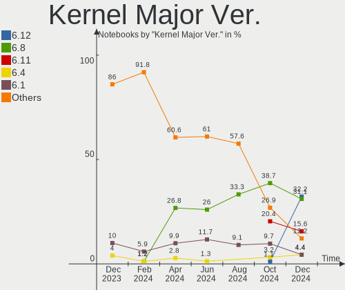

| Version | Notebooks | Percent |
|---------|-----------|---------|
| 6.4     | 31        | 35.63%  |
| 5.15    | 17        | 19.54%  |
| 6.2     | 15        | 17.24%  |
| 6.1     | 11        | 12.64%  |
| 6.3     | 3         | 3.45%   |
| 5.19    | 3         | 3.45%   |
| 5.10    | 3         | 3.45%   |
| 5.13    | 2         | 2.3%    |
| 5.11    | 1         | 1.15%   |
| 4.19    | 1         | 1.15%   |

Arch
----

OS architecture (x86_64, i586, etc.)

| Name   | Notebooks | Percent |
|--------|-----------|---------|
| x86_64 | 84        | 96.55%  |
| i686   | 3         | 3.45%   |

DE
--

Desktop Environment

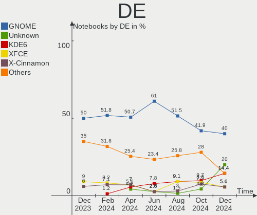

| Name             | Notebooks | Percent |
|------------------|-----------|---------|
| GNOME            | 40        | 45.98%  |
| KDE5             | 17        | 19.54%  |
| XFCE             | 10        | 11.49%  |
| X-Cinnamon       | 5         | 5.75%   |
| LXQt             | 5         | 5.75%   |
| Unknown          | 4         | 4.6%    |
| Pantheon         | 1         | 1.15%   |
| MATE             | 1         | 1.15%   |
| lightdm-xsession | 1         | 1.15%   |
| icewm            | 1         | 1.15%   |
| i3               | 1         | 1.15%   |
| GNOME Classic    | 1         | 1.15%   |

Display Server
--------------

X11 or Wayland

| Name    | Notebooks | Percent |
|---------|-----------|---------|
| X11     | 56        | 64.37%  |
| Wayland | 28        | 32.18%  |
| Tty     | 2         | 2.3%    |
| Unknown | 1         | 1.15%   |

Display Manager
---------------

SDDM, LightDM, etc.

| Name    | Notebooks | Percent |
|---------|-----------|---------|
| Unknown | 37        | 42.53%  |
| GDM3    | 16        | 18.39%  |
| SDDM    | 15        | 17.24%  |
| LightDM | 13        | 14.94%  |
| GDM     | 5         | 5.75%   |
| SLIMSKI | 1         | 1.15%   |

OS Lang
-------

Language

| Lang    | Notebooks | Percent |
|---------|-----------|---------|
| es_ES   | 59        | 67.82%  |
| en_US   | 19        | 21.84%  |
| ca_ES   | 3         | 3.45%   |
| ru_RU   | 1         | 1.15%   |
| pt_BR   | 1         | 1.15%   |
| gl_ES   | 1         | 1.15%   |
| en_GB   | 1         | 1.15%   |
| ast_ES  | 1         | 1.15%   |
| Unknown | 1         | 1.15%   |

Boot Mode
---------

EFI or BIOS

| Mode | Notebooks | Percent |
|------|-----------|---------|
| EFI  | 45        | 51.72%  |
| BIOS | 42        | 48.28%  |

Filesystem
----------

Type of filesystem

| Type    | Notebooks | Percent |
|---------|-----------|---------|
| Ext4    | 60        | 68.97%  |
| Btrfs   | 14        | 16.09%  |
| Tmpfs   | 11        | 12.64%  |
| Xfs     | 1         | 1.15%   |
| Overlay | 1         | 1.15%   |

Part. scheme
------------

Scheme of partitioning

| Type    | Notebooks | Percent |
|---------|-----------|---------|
| GPT     | 46        | 52.87%  |
| Unknown | 34        | 39.08%  |
| MBR     | 7         | 8.05%   |

Dual Boot with Linux/BSD
------------------------

Hosting more than one Linux/BSD

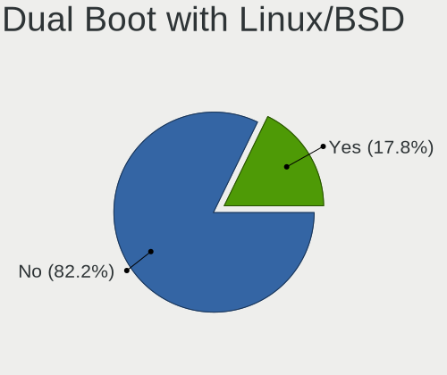

| Dual boot | Notebooks | Percent |
|-----------|-----------|---------|
| No        | 77        | 88.51%  |
| Yes       | 10        | 11.49%  |

Dual Boot (Win)
---------------

Hosting Linux and Windows

| Dual boot | Notebooks | Percent |
|-----------|-----------|---------|
| No        | 71        | 81.61%  |
| Yes       | 16        | 18.39%  |

Board
-----

Vendor
------

Motherboard manufacturer

| Name                 | Notebooks | Percent |
|----------------------|-----------|---------|
| Hewlett-Packard      | 14        | 16.09%  |
| ASUSTek Computer     | 12        | 13.79%  |
| Acer                 | 12        | 13.79%  |
| Lenovo               | 11        | 12.64%  |
| Dell                 | 8         | 9.2%    |
| MSI                  | 6         | 6.9%    |
| Valve                | 3         | 3.45%   |
| Sony                 | 2         | 2.3%    |
| Packard Bell         | 2         | 2.3%    |
| Notebook             | 2         | 2.3%    |
| Medion               | 2         | 2.3%    |
| Dynabook             | 2         | 2.3%    |
| Chuwi                | 2         | 2.3%    |
| Toshiba              | 1         | 1.15%   |
| System76             | 1         | 1.15%   |
| SGIN                 | 1         | 1.15%   |
| PC Specialist        | 1         | 1.15%   |
| Intel Client Systems | 1         | 1.15%   |
| HUAWEI               | 1         | 1.15%   |
| AXDIA International  | 1         | 1.15%   |
| Apple                | 1         | 1.15%   |
| Alurin               | 1         | 1.15%   |

Model
-----

Motherboard model

| Name                                 | Notebooks | Percent |
|--------------------------------------|-----------|---------|
| Valve Jupiter                        | 3         | 3.45%   |
| Medion E15301                        | 2         | 2.3%    |
| Chuwi GemiBook Pro                   | 2         | 2.3%    |
| Acer Aspire E1-571                   | 2         | 2.3%    |
| Toshiba PORTEGE R700                 | 1         | 1.15%   |
| System76 Galago Pro                  | 1         | 1.15%   |
| Sony VPCSB2L1R                       | 1         | 1.15%   |
| Sony VGN-NS11S_S                     | 1         | 1.15%   |
| SGIN laptop                          | 1         | 1.15%   |
| PC Specialist NH5xAx                 | 1         | 1.15%   |
| Packard Bell EasyNote TK85           | 1         | 1.15%   |
| Packard Bell EasyNote TJ66           | 1         | 1.15%   |
| Notebook NS5x_NS7xPU                 | 1         | 1.15%   |
| Notebook NL4x_NL5xLU                 | 1         | 1.15%   |
| MSI Summit E16Flip A13VET            | 1         | 1.15%   |
| MSI Modern 15 A10M                   | 1         | 1.15%   |
| MSI Katana GF66 12UGS                | 1         | 1.15%   |
| MSI GF75 Thin 10SC                   | 1         | 1.15%   |
| MSI GE60 2OC\2OD\2OE                 | 1         | 1.15%   |
| MSI Creator Z16 A11UET               | 1         | 1.15%   |
| Lenovo ThinkPad X230 2325AJG         | 1         | 1.15%   |
| Lenovo ThinkPad L13 20R3CTO1WW       | 1         | 1.15%   |
| Lenovo ThinkPad Edge 25453BG         | 1         | 1.15%   |
| Lenovo ThinkPad E15 Gen 3 20YGCTO1WW | 1         | 1.15%   |
| Lenovo ThinkBook 16p Gen 2 20YM      | 1         | 1.15%   |
| Lenovo IdeaPad Z500 20202            | 1         | 1.15%   |
| Lenovo IdeaPad 330-15IKB 81DE        | 1         | 1.15%   |
| Lenovo IdeaPad 110-15AST 80TR        | 1         | 1.15%   |
| Lenovo G505s 20255                   | 1         | 1.15%   |
| Lenovo B50-50 80S2                   | 1         | 1.15%   |
| Intel Client Systems LAPQC71A        | 1         | 1.15%   |
| HUAWEI BOHK-WAX9X                    | 1         | 1.15%   |
| HP Victus by Laptop 16-e0xxx         | 1         | 1.15%   |
| HP Victus by Laptop 16-d1xxx         | 1         | 1.15%   |
| HP Victus by Gaming Laptop 16-r0xxx  | 1         | 1.15%   |
| HP ProBook 4540s                     | 1         | 1.15%   |
| HP Pavilion Laptop 15-ck0xx          | 1         | 1.15%   |
| HP Pavilion Laptop 14-dv1xxx         | 1         | 1.15%   |
| HP OMEN by Laptop 16-c0xxx           | 1         | 1.15%   |
| HP Laptop 15s-fq4xxx                 | 1         | 1.15%   |

Model Family
------------

Motherboard model prefix

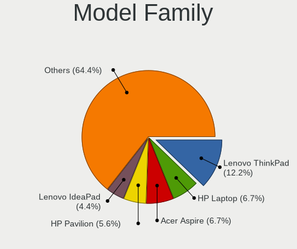

| Name                          | Notebooks | Percent |
|-------------------------------|-----------|---------|
| Acer Aspire                   | 7         | 8.05%   |
| HP Laptop                     | 5         | 5.75%   |
| ASUS VivoBook                 | 5         | 5.75%   |
| Lenovo ThinkPad               | 4         | 4.6%    |
| Dell Latitude                 | 4         | 4.6%    |
| ASUS ROG                      | 4         | 4.6%    |
| Valve Jupiter                 | 3         | 3.45%   |
| Lenovo IdeaPad                | 3         | 3.45%   |
| HP Victus                     | 3         | 3.45%   |
| Packard Bell EasyNote         | 2         | 2.3%    |
| Medion E15301                 | 2         | 2.3%    |
| HP Pavilion                   | 2         | 2.3%    |
| Dynabook Satellite            | 2         | 2.3%    |
| Dell XPS                      | 2         | 2.3%    |
| Chuwi GemiBook                | 2         | 2.3%    |
| Acer TravelMate               | 2         | 2.3%    |
| Acer Extensa                  | 2         | 2.3%    |
| Toshiba PORTEGE               | 1         | 1.15%   |
| System76 Galago               | 1         | 1.15%   |
| Sony VPCSB2L1R                | 1         | 1.15%   |
| Sony VGN-NS11S                | 1         | 1.15%   |
| SGIN laptop                   | 1         | 1.15%   |
| PC Specialist NH5xAx          | 1         | 1.15%   |
| Notebook NS5x                 | 1         | 1.15%   |
| Notebook NL4x                 | 1         | 1.15%   |
| MSI Summit                    | 1         | 1.15%   |
| MSI Modern                    | 1         | 1.15%   |
| MSI Katana                    | 1         | 1.15%   |
| MSI GF75                      | 1         | 1.15%   |
| MSI GE60                      | 1         | 1.15%   |
| MSI Creator                   | 1         | 1.15%   |
| Lenovo ThinkBook              | 1         | 1.15%   |
| Lenovo G505s                  | 1         | 1.15%   |
| Lenovo B50-50                 | 1         | 1.15%   |
| Intel Client Systems LAPQC71A | 1         | 1.15%   |
| HUAWEI BOHK-WAX9X             | 1         | 1.15%   |
| HP ProBook                    | 1         | 1.15%   |
| HP OMEN                       | 1         | 1.15%   |
| HP EliteBook                  | 1         | 1.15%   |
| HP 255                        | 1         | 1.15%   |

MFG Year
--------

Motherboard manufacture year

| Year | Notebooks | Percent |
|------|-----------|---------|
| 2021 | 18        | 20.69%  |
| 2022 | 12        | 13.79%  |
| 2019 | 8         | 9.2%    |
| 2020 | 7         | 8.05%   |
| 2018 | 7         | 8.05%   |
| 2012 | 7         | 8.05%   |
| 2023 | 4         | 4.6%    |
| 2010 | 4         | 4.6%    |
| 2009 | 4         | 4.6%    |
| 2013 | 3         | 3.45%   |
| 2017 | 2         | 2.3%    |
| 2016 | 2         | 2.3%    |
| 2015 | 2         | 2.3%    |
| 2014 | 2         | 2.3%    |
| 2011 | 2         | 2.3%    |
| 2008 | 2         | 2.3%    |
| 2007 | 1         | 1.15%   |

Form Factor
-----------

Physical design of the computer

| Name     | Notebooks | Percent |
|----------|-----------|---------|
| Notebook | 87        | 100%    |

Secure Boot
-----------

Enabled or disabled

| State    | Notebooks | Percent |
|----------|-----------|---------|
| Disabled | 79        | 90.8%   |
| Enabled  | 8         | 9.2%    |

Coreboot
--------

Have coreboot on board

| Used | Notebooks | Percent |
|------|-----------|---------|
| No   | 87        | 100%    |

RAM Size
--------

Total RAM memory

| Size in GB  | Notebooks | Percent |
|-------------|-----------|---------|
| 4.01-8.0    | 25        | 28.74%  |
| 8.01-16.0   | 20        | 22.99%  |
| 16.01-24.0  | 15        | 17.24%  |
| 3.01-4.0    | 12        | 13.79%  |
| 32.01-64.0  | 8         | 9.2%    |
| 64.01-256.0 | 3         | 3.45%   |
| 0.51-1.0    | 2         | 2.3%    |
| 2.01-3.0    | 1         | 1.15%   |
| 1.01-2.0    | 1         | 1.15%   |

RAM Used
--------

Used RAM memory

| Used GB   | Notebooks | Percent |
|-----------|-----------|---------|
| 1.01-2.0  | 29        | 33.33%  |
| 2.01-3.0  | 20        | 22.99%  |
| 4.01-8.0  | 13        | 14.94%  |
| 3.01-4.0  | 13        | 14.94%  |
| 0.51-1.0  | 5         | 5.75%   |
| 8.01-16.0 | 4         | 4.6%    |
| 0.01-0.5  | 3         | 3.45%   |

Total Drives
------------

Number of drives on board

| Drives | Notebooks | Percent |
|--------|-----------|---------|
| 1      | 65        | 74.71%  |
| 2      | 17        | 19.54%  |
| 3      | 4         | 4.6%    |
| 4      | 1         | 1.15%   |

Has CD-ROM
----------

Has CD-ROM on board

| Presented | Notebooks | Percent |
|-----------|-----------|---------|
| No        | 72        | 82.76%  |
| Yes       | 15        | 17.24%  |

Has Ethernet
------------

Has Ethernet on board

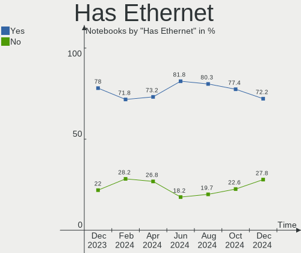

| Presented | Notebooks | Percent |
|-----------|-----------|---------|
| Yes       | 64        | 73.56%  |
| No        | 23        | 26.44%  |

Has WiFi
--------

Has WiFi module

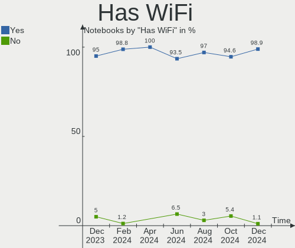

| Presented | Notebooks | Percent |
|-----------|-----------|---------|
| Yes       | 86        | 98.85%  |
| No        | 1         | 1.15%   |

Has Bluetooth
-------------

Has Bluetooth module

| Presented | Notebooks | Percent |
|-----------|-----------|---------|
| Yes       | 74        | 85.06%  |
| No        | 13        | 14.94%  |

Location
--------

Country
-------

Geographic location (country)

| Country | Notebooks | Percent |
|---------|-----------|---------|
| Spain   | 87        | 100%    |

City
----

Geographic location (city)

| City                        | Notebooks | Percent |
|-----------------------------|-----------|---------|
| Madrid                      | 21        | 24.14%  |
| Barcelona                   | 9         | 10.34%  |
| Seville                     | 4         | 4.6%    |
| Valladolid                  | 3         | 3.45%   |
| Valencia                    | 3         | 3.45%   |
| Benicarló                  | 3         | 3.45%   |
| Zaragoza                    | 2         | 2.3%    |
| Sant Celoni                 | 2         | 2.3%    |
| Alcobendas                  | 2         | 2.3%    |
| Xàtiva                     | 1         | 1.15%   |
| Vigo                        | 1         | 1.15%   |
| Valdemoro                   | 1         | 1.15%   |
| Torrelavega                 | 1         | 1.15%   |
| Sanxenxo                    | 1         | 1.15%   |
| Santa Cruz de Tenerife      | 1         | 1.15%   |
| Sant Feliu de Llobregat     | 1         | 1.15%   |
| San Vicent del Raspeig      | 1         | 1.15%   |
| Salamanca                   | 1         | 1.15%   |
| Sabadell                    | 1         | 1.15%   |
| Riudoms                     | 1         | 1.15%   |
| Pontevedra                  | 1         | 1.15%   |
| Palma                       | 1         | 1.15%   |
| Monzon                      | 1         | 1.15%   |
| Mollet del Vallès          | 1         | 1.15%   |
| Mataró                     | 1         | 1.15%   |
| Manises                     | 1         | 1.15%   |
| Málaga                     | 1         | 1.15%   |
| Legazpia                    | 1         | 1.15%   |
| Leganés                    | 1         | 1.15%   |
| la Vall d'Uixo              | 1         | 1.15%   |
| La Línea de la Concepción | 1         | 1.15%   |
| Jerez de la Frontera        | 1         | 1.15%   |
| Huelva                      | 1         | 1.15%   |
| Fuenlabrada                 | 1         | 1.15%   |
| Fogars de Tordera           | 1         | 1.15%   |
| Donostia / San Sebastian    | 1         | 1.15%   |
| Córdoba                    | 1         | 1.15%   |
| Colindres                   | 1         | 1.15%   |
| Coiros                      | 1         | 1.15%   |
| Cervera del Rio Alhama      | 1         | 1.15%   |

Drives
------

Drive Vendor
------------

Hard drive vendors

| Vendor                      | Notebooks | Drives | Percent |
|-----------------------------|-----------|--------|---------|
| Sandisk                     | 12        | 12     | 10.81%  |
| Samsung Electronics         | 12        | 12     | 10.81%  |
| Kingston                    | 12        | 12     | 10.81%  |
| Unknown                     | 7         | 8      | 6.31%   |
| Micron Technology           | 7         | 7      | 6.31%   |
| WDC                         | 6         | 7      | 5.41%   |
| Toshiba                     | 6         | 7      | 5.41%   |
| SK hynix                    | 5         | 5      | 4.5%    |
| Intel                       | 5         | 7      | 4.5%    |
| Kingston Technology Company | 4         | 4      | 3.6%    |
| Hitachi                     | 4         | 4      | 3.6%    |
| Crucial                     | 4         | 4      | 3.6%    |
| Seagate                     | 3         | 3      | 2.7%    |
| KIOXIA                      | 3         | 3      | 2.7%    |
| Phison                      | 2         | 2      | 1.8%    |
| Micron/Crucial Technology   | 2         | 2      | 1.8%    |
| HGST                        | 2         | 2      | 1.8%    |
| FORESEE                     | 2         | 2      | 1.8%    |
| Emtec                       | 2         | 2      | 1.8%    |
| China                       | 2         | 2      | 1.8%    |
| XrayDisk                    | 1         | 1      | 0.9%    |
| Verbatim                    | 1         | 1      | 0.9%    |
| Patriot                     | 1         | 1      | 0.9%    |
| Netac                       | 1         | 1      | 0.9%    |
| Lexar                       | 1         | 1      | 0.9%    |
| KIOXIA-EXCERIA              | 1         | 1      | 0.9%    |
| Intenso                     | 1         | 1      | 0.9%    |
| CT1000P3                    | 1         | 1      | 0.9%    |
| Unknown                     | 1         | 1      | 0.9%    |

Drive Model
-----------

Hard drive models

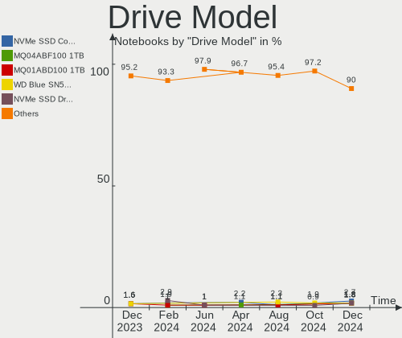

| Model                                                 | Notebooks | Percent |
|-------------------------------------------------------|-----------|---------|
| Kingston SA400S37240G 240GB SSD                       | 6         | 5.22%   |
| Samsung NVMe SSD Controller PM9A1/PM9A3/980PRO 1024GB | 3         | 2.61%   |
| Kingston Company OM3PDP3 NVMe SSD 256GB               | 3         | 2.61%   |
| Unknown MMC Card  64GB                                | 2         | 1.74%   |
| Unknown MMC Card  32GB                                | 2         | 1.74%   |
| Unknown MMC Card  128GB                               | 2         | 1.74%   |
| Toshiba TR200 240GB SSD                               | 2         | 1.74%   |
| SK hynix PC801 NVMe 512GB                             | 2         | 1.74%   |
| Sandisk WD Blue SN550 NVMe SSD 250GB                  | 2         | 1.74%   |
| Samsung SSD 860 EVO 500GB                             | 2         | 1.74%   |
| Micron/Crucial P2 NVMe PCIe SSD 1TB                   | 2         | 1.74%   |
| Micron MTFDHBA512TDV-1AZ1AABHA 512GB                  | 2         | 1.74%   |
| Kingston SA400S37480G 480GB SSD                       | 2         | 1.74%   |
| HGST HTS545050A7E680 500GB                            | 2         | 1.74%   |
| FORESEE 256GB SSD                                     | 2         | 1.74%   |
| Emtec X250 256GB                                      | 2         | 1.74%   |
| XrayDisk 512GB                                        | 1         | 0.87%   |
| WDC WDS500G2B0C-00PXH0 500GB                          | 1         | 0.87%   |
| WDC WD5000BPVT-60HXZT3 500GB                          | 1         | 0.87%   |
| WDC WD3200BPVT-22JJ5T0 320GB                          | 1         | 0.87%   |
| WDC WD10JPVX-22JC3T0 1TB                              | 1         | 0.87%   |
| WDC WD10 JPVX-22JC3T0 1TB                             | 1         | 0.87%   |
| WDC WD10 EZEX-08Y20A0 1TB                             | 1         | 0.87%   |
| WDC PC SN530 SDBPNPZ-256G-1114 256GB                  | 1         | 0.87%   |
| Verbatim MySSD Drive 512GB                            | 1         | 0.87%   |
| Unknown Externa 1TB                                   | 1         | 0.87%   |
| Unknown 58K722  128GB                                 | 1         | 0.87%   |
| Toshiba XG6 NVMe SSD Controller 1024GB                | 1         | 0.87%   |
| Toshiba TR150 240GB SSD                               | 1         | 0.87%   |
| Toshiba MQ01ABF050 500GB                              | 1         | 0.87%   |
| Toshiba KXG50ZNV512G NVMe 512GB                       | 1         | 0.87%   |
| SK hynix SKHynix_HFM256GD3HX015N 256GB                | 1         | 0.87%   |
| SK hynix BC711 NVMe 512GB                             | 1         | 0.87%   |
| SK hynix BC501 HFM256GDJTNG-8310A 256GB               | 1         | 0.87%   |
| Seagate ST1000LM035-1RK172 1TB                        | 1         | 0.87%   |
| Seagate OneTouch SSD 1TB                              | 1         | 0.87%   |
| Seagate Basic 1TB                                     | 1         | 0.87%   |
| Sandisk WD_BLACK SN770 2TB                            | 1         | 0.87%   |
| Sandisk WD PC SN560 SDDPNQE-1T00-1002 1TB             | 1         | 0.87%   |
| Sandisk WD Black SN750 / PC SN730 NVMe SSD 1024GB     | 1         | 0.87%   |

HDD Vendor
----------

Hard disk drive vendors

| Vendor  | Notebooks | Drives | Percent |
|---------|-----------|--------|---------|
| WDC     | 4         | 5      | 33.33%  |
| Hitachi | 4         | 4      | 33.33%  |
| HGST    | 2         | 2      | 16.67%  |
| Toshiba | 1         | 1      | 8.33%   |
| Seagate | 1         | 1      | 8.33%   |

SSD Vendor
----------

Solid state drive vendors

| Vendor              | Notebooks | Drives | Percent |
|---------------------|-----------|--------|---------|
| Kingston            | 9         | 9      | 21.95%  |
| Samsung Electronics | 5         | 5      | 12.2%   |
| SanDisk             | 4         | 4      | 9.76%   |
| Toshiba             | 3         | 4      | 7.32%   |
| Crucial             | 3         | 3      | 7.32%   |
| Phison              | 2         | 2      | 4.88%   |
| FORESEE             | 2         | 2      | 4.88%   |
| Emtec               | 2         | 2      | 4.88%   |
| China               | 2         | 2      | 4.88%   |
| Verbatim            | 1         | 1      | 2.44%   |
| Seagate             | 1         | 1      | 2.44%   |
| Patriot             | 1         | 1      | 2.44%   |
| Netac               | 1         | 1      | 2.44%   |
| Micron Technology   | 1         | 1      | 2.44%   |
| Lexar               | 1         | 1      | 2.44%   |
| KIOXIA-EXCERIA      | 1         | 1      | 2.44%   |
| Intenso             | 1         | 1      | 2.44%   |
| CT1000P3            | 1         | 1      | 2.44%   |

Drive Kind
----------

HDD or SSD

| Kind    | Notebooks | Drives | Percent |
|---------|-----------|--------|---------|
| NVMe    | 45        | 50     | 43.27%  |
| SSD     | 38        | 42     | 36.54%  |
| HDD     | 11        | 13     | 10.58%  |
| MMC     | 7         | 8      | 6.73%   |
| Unknown | 3         | 3      | 2.88%   |

Drive Connector
---------------

SATA, SAS, NVMe, etc.

| Type | Notebooks | Drives | Percent |
|------|-----------|--------|---------|
| NVMe | 45        | 50     | 43.69%  |
| SATA | 44        | 48     | 42.72%  |
| SAS  | 7         | 10     | 6.8%    |
| MMC  | 7         | 8      | 6.8%    |

Drive Size
----------

Size of hard drive

| Size in TB | Notebooks | Drives | Percent |
|------------|-----------|--------|---------|
| 0.01-0.5   | 36        | 40     | 73.47%  |
| 0.51-1.0   | 12        | 14     | 24.49%  |
| 1.01-2.0   | 1         | 1      | 2.04%   |

Space Total
-----------

Amount of disk space available on the file system

| Size in GB     | Notebooks | Percent |
|----------------|-----------|---------|
| 101-250        | 29        | 33.33%  |
| 251-500        | 28        | 32.18%  |
| 501-1000       | 12        | 13.79%  |
| 1001-2000      | 7         | 8.05%   |
| 51-100         | 4         | 4.6%    |
| More than 3000 | 2         | 2.3%    |
| 2001-3000      | 2         | 2.3%    |
| 21-50          | 1         | 1.15%   |
| 1-20           | 1         | 1.15%   |
| Unknown        | 1         | 1.15%   |

Space Used
----------

Amount of used disk space

| Used GB        | Notebooks | Percent |
|----------------|-----------|---------|
| 1-20           | 29        | 33.33%  |
| 101-250        | 15        | 17.24%  |
| 51-100         | 15        | 17.24%  |
| 21-50          | 14        | 16.09%  |
| 501-1000       | 9         | 10.34%  |
| 251-500        | 3         | 3.45%   |
| More than 3000 | 1         | 1.15%   |
| Unknown        | 1         | 1.15%   |

Malfunc. Drives
---------------

Drive models with a malfunction

| Model                                   | Notebooks | Drives | Percent |
|-----------------------------------------|-----------|--------|---------|
| HGST HTS545050A7E680 500GB              | 2         | 2      | 33.33%  |
| WDC WD5000BPVT-60HXZT3 500GB            | 1         | 1      | 16.67%  |
| SK hynix BC501 HFM256GDJTNG-8310A 256GB | 1         | 1      | 16.67%  |
| SanDisk SSD PLUS 240 GB                 | 1         | 1      | 16.67%  |
| Hitachi HTS543216L9A300 160GB           | 1         | 1      | 16.67%  |

Malfunc. Drive Vendor
---------------------

Vendors of faulty drives

| Vendor   | Notebooks | Drives | Percent |
|----------|-----------|--------|---------|
| HGST     | 2         | 2      | 33.33%  |
| WDC      | 1         | 1      | 16.67%  |
| SK hynix | 1         | 1      | 16.67%  |
| SanDisk  | 1         | 1      | 16.67%  |
| Hitachi  | 1         | 1      | 16.67%  |

Malfunc. HDD Vendor
-------------------

Vendors of faulty HDD drives

| Vendor  | Notebooks | Drives | Percent |
|---------|-----------|--------|---------|
| HGST    | 2         | 2      | 50%     |
| WDC     | 1         | 1      | 25%     |
| Hitachi | 1         | 1      | 25%     |

Malfunc. Drive Kind
-------------------

Kinds of faulty drives

| Kind | Notebooks | Drives | Percent |
|------|-----------|--------|---------|
| HDD  | 4         | 4      | 66.67%  |
| NVMe | 1         | 1      | 16.67%  |
| SSD  | 1         | 1      | 16.67%  |

Failed Drives
-------------

Failed drive models

Zero info for selected period =(

Failed Drive Vendor
-------------------

Failed drive vendors

Zero info for selected period =(

Drive Status
------------

Number of failed and malfunc. drives

| Status   | Notebooks | Drives | Percent |
|----------|-----------|--------|---------|
| Detected | 53        | 71     | 58.24%  |
| Works    | 32        | 39     | 35.16%  |
| Malfunc  | 6         | 6      | 6.59%   |

Storage controller
------------------

Storage Vendor
--------------

Storage controller vendors

| Vendor                       | Notebooks | Percent |
|------------------------------|-----------|---------|
| Intel                        | 57        | 50.89%  |
| AMD                          | 13        | 11.61%  |
| SanDisk                      | 10        | 8.93%   |
| Samsung Electronics          | 7         | 6.25%   |
| Micron Technology            | 6         | 5.36%   |
| Kingston Technology Company  | 6         | 5.36%   |
| SK hynix                     | 5         | 4.46%   |
| Micron/Crucial Technology    | 3         | 2.68%   |
| KIOXIA                       | 3         | 2.68%   |
| Toshiba America Info Systems | 2         | 1.79%   |

Storage Model
-------------

Storage controller models

| Model                                                                        | Notebooks | Percent |
|------------------------------------------------------------------------------|-----------|---------|
| Intel Volume Management Device NVMe RAID Controller                          | 11        | 9.02%   |
| AMD FCH SATA Controller [AHCI mode]                                          | 11        | 9.02%   |
| Intel 7 Series Chipset Family 6-port SATA Controller [AHCI mode]             | 6         | 4.92%   |
| Intel Sunrise Point-LP SATA Controller [AHCI mode]                           | 5         | 4.1%    |
| SanDisk WD Blue SN550 NVMe SSD                                               | 4         | 3.28%   |
| Kingston Company OM3PDP3 NVMe SSD                                            | 4         | 3.28%   |
| Intel 82801IBM/IEM (ICH9M/ICH9M-E) 4 port SATA Controller [AHCI mode]        | 4         | 3.28%   |
| SanDisk WD Black SN770 / PC SN740 256GB / PC SN560 (DRAM-less) NVMe SSD      | 3         | 2.46%   |
| Samsung NVMe SSD Controller SM981/PM981/PM983                                | 3         | 2.46%   |
| Samsung NVMe SSD Controller PM9A1/PM9A3/980PRO                               | 3         | 2.46%   |
| Intel Tiger Lake-LP SATA Controller                                          | 3         | 2.46%   |
| Intel Jasper Lake SATA AHCI Controller                                       | 3         | 2.46%   |
| Intel Cannon Lake Mobile PCH SATA AHCI Controller                            | 3         | 2.46%   |
| Intel 5 Series/3400 Series Chipset 4 port SATA AHCI Controller               | 3         | 2.46%   |
| SK hynix Platinum P41/PC801 NVMe Solid State Drive                           | 2         | 1.64%   |
| SK hynix Gold P31/BC711/PC711 NVMe Solid State Drive                         | 2         | 1.64%   |
| Micron/Crucial P2 [Nick P2] / P3 / P3 Plus NVMe PCIe SSD (DRAM-less)         | 2         | 1.64%   |
| Micron 2450 NVMe SSD [HendrixV] (DRAM-less)                                  | 2         | 1.64%   |
| Micron 2300 NVMe SSD [Santana]                                               | 2         | 1.64%   |
| KIOXIA NVMe SSD Controller BG4 (DRAM-less)                                   | 2         | 1.64%   |
| Intel Volume Management Device NVMe RAID Controller Intel Corporation        | 2         | 1.64%   |
| Intel SSD 670p Series [Keystone Harbor]                                      | 2         | 1.64%   |
| Intel Celeron/Pentium Silver Processor SATA Controller                       | 2         | 1.64%   |
| Intel Alder Lake-P SATA AHCI Controller                                      | 2         | 1.64%   |
| Intel 6 Series/C200 Series Chipset Family 6 port Mobile SATA AHCI Controller | 2         | 1.64%   |
| AMD SB7x0/SB8x0/SB9x0 SATA Controller [AHCI mode]                            | 2         | 1.64%   |
| Toshiba America Info Systems XG6 NVMe SSD Controller                         | 1         | 0.82%   |
| Toshiba America Info Systems XG5 NVMe SSD Controller                         | 1         | 0.82%   |
| SK hynix BC501 NVMe Solid State Drive                                        | 1         | 0.82%   |
| SanDisk WD Black SN750 / PC SN730 NVMe SSD                                   | 1         | 0.82%   |
| SanDisk PC SN735 NVMe SSD (DRAM-less)                                        | 1         | 0.82%   |
| SanDisk PC SN520 NVMe SSD                                                    | 1         | 0.82%   |
| Samsung NVMe SSD Controller 980                                              | 1         | 0.82%   |
| Micron/Crucial P5 Plus NVMe PCIe SSD                                         | 1         | 0.82%   |
| Micron 3400 NVMe SSD [Hendrix]                                               | 1         | 0.82%   |
| Micron 2210 NVMe SSD [Cobain]                                                | 1         | 0.82%   |
| KIOXIA NVMe SSD Controller BG5 (DRAM-less)                                   | 1         | 0.82%   |
| Kingston Company U-SNS8154P3 NVMe SSD                                        | 1         | 0.82%   |
| Kingston Company OM8PCP Design-In PCIe 3 NVMe SSD (DRAM-less)                | 1         | 0.82%   |
| Intel Wildcat Point-LP SATA Controller [AHCI Mode]                           | 1         | 0.82%   |

Storage Kind
------------

Kind of storage controller (IDE, SATA, NVMe, SAS, ...)

| Kind | Notebooks | Percent |
|------|-----------|---------|
| SATA | 57        | 48.31%  |
| NVMe | 45        | 38.14%  |
| RAID | 14        | 11.86%  |
| IDE  | 2         | 1.69%   |

Processor
---------

CPU Vendor
----------

Processor vendors

| Vendor | Notebooks | Percent |
|--------|-----------|---------|
| Intel  | 65        | 74.71%  |
| AMD    | 22        | 25.29%  |

CPU Model
---------

Processor models

| Model                                         | Notebooks | Percent |
|-----------------------------------------------|-----------|---------|
| Intel Core i7-3612QM CPU @ 2.10GHz            | 3         | 3.45%   |
| AMD Ryzen 7 5800H with Radeon Graphics        | 3         | 3.45%   |
| AMD Ryzen 5 3500U with Radeon Vega Mobile Gfx | 3         | 3.45%   |
| AMD Custom APU 0405                           | 3         | 3.45%   |
| Intel Core i7-10510U CPU @ 1.80GHz            | 2         | 2.3%    |
| Intel Core i5-3230M CPU @ 2.60GHz             | 2         | 2.3%    |
| Intel Core i5-1035G1 CPU @ 1.00GHz            | 2         | 2.3%    |
| Intel Core i5 CPU M 460 @ 2.53GHz             | 2         | 2.3%    |
| Intel Celeron N5100 @ 1.10GHz                 | 2         | 2.3%    |
| Intel 12th Gen Core i7-12700H                 | 2         | 2.3%    |
| Intel 12th Gen Core i7-1265U                  | 2         | 2.3%    |
| Intel 11th Gen Core i7-1165G7 @ 2.80GHz       | 2         | 2.3%    |
| Intel 11th Gen Core i7-11370H @ 3.30GHz       | 2         | 2.3%    |
| Intel 11th Gen Core i5-1135G7 @ 2.40GHz       | 2         | 2.3%    |
| AMD Ryzen 5 2500U with Radeon Vega Mobile Gfx | 2         | 2.3%    |
| Intel Pentium Dual-Core CPU T4300 @ 2.10GHz   | 1         | 1.15%   |
| Intel Pentium CPU N4200 @ 1.10GHz             | 1         | 1.15%   |
| Intel Pentium CPU 2117U @ 1.80GHz             | 1         | 1.15%   |
| Intel Genuine CPU 575 @ 2.00GHz               | 1         | 1.15%   |
| Intel Core i9-9980HK CPU @ 2.40GHz            | 1         | 1.15%   |
| Intel Core i7-9750H CPU @ 2.60GHz             | 1         | 1.15%   |
| Intel Core i7-8750H CPU @ 2.20GHz             | 1         | 1.15%   |
| Intel Core i7-8550U CPU @ 1.80GHz             | 1         | 1.15%   |
| Intel Core i7-7700HQ CPU @ 2.80GHz            | 1         | 1.15%   |
| Intel Core i7-6820HQ CPU @ 2.70GHz            | 1         | 1.15%   |
| Intel Core i7-6600U CPU @ 2.60GHz             | 1         | 1.15%   |
| Intel Core i7-2640M CPU @ 2.80GHz             | 1         | 1.15%   |
| Intel Core i7-10750H CPU @ 2.60GHz            | 1         | 1.15%   |
| Intel Core i5-8265U CPU @ 1.60GHz             | 1         | 1.15%   |
| Intel Core i5-8250U CPU @ 1.60GHz             | 1         | 1.15%   |
| Intel Core i5-4210U CPU @ 1.70GHz             | 1         | 1.15%   |
| Intel Core i5-4200M CPU @ 2.50GHz             | 1         | 1.15%   |
| Intel Core i5-2467M CPU @ 1.60GHz             | 1         | 1.15%   |
| Intel Core i5-2415M CPU @ 2.30GHz             | 1         | 1.15%   |
| Intel Core i5-10210U CPU @ 1.60GHz            | 1         | 1.15%   |
| Intel Core i5 CPU M 450 @ 2.40GHz             | 1         | 1.15%   |
| Intel Core i3-7020U CPU @ 2.30GHz             | 1         | 1.15%   |
| Intel Core i3-5005U CPU @ 2.00GHz             | 1         | 1.15%   |
| Intel Core 2 Duo CPU T5800 @ 2.00GHz          | 1         | 1.15%   |
| Intel Core 2 Duo CPU P7450 @ 2.13GHz          | 1         | 1.15%   |

CPU Model Family
----------------

Processor model prefix

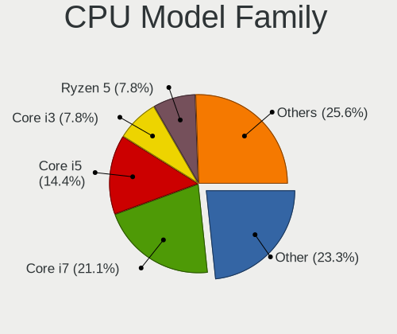

| Model                   | Notebooks | Percent |
|-------------------------|-----------|---------|
| Other                   | 24        | 27.59%  |
| Intel Core i5           | 14        | 16.09%  |
| Intel Core i7           | 13        | 14.94%  |
| Intel Celeron           | 6         | 6.9%    |
| AMD Ryzen 7             | 6         | 6.9%    |
| AMD Ryzen 5             | 6         | 6.9%    |
| Intel Pentium           | 2         | 2.3%    |
| Intel Core i3           | 2         | 2.3%    |
| Intel Core 2 Duo        | 2         | 2.3%    |
| Intel Atom              | 2         | 2.3%    |
| Intel Pentium Dual-Core | 1         | 1.15%   |
| Intel Genuine           | 1         | 1.15%   |
| Intel Core i9           | 1         | 1.15%   |
| Intel Celeron M         | 1         | 1.15%   |
| AMD Ryzen 9             | 1         | 1.15%   |
| AMD E1                  | 1         | 1.15%   |
| AMD C-70                | 1         | 1.15%   |
| AMD Athlon X2           | 1         | 1.15%   |
| AMD Athlon II Neo       | 1         | 1.15%   |
| AMD A8                  | 1         | 1.15%   |

CPU Cores
---------

Number of processor cores

| Number | Notebooks | Percent |
|--------|-----------|---------|
| 4      | 33        | 37.93%  |
| 2      | 27        | 31.03%  |
| 8      | 8         | 9.2%    |
| 6      | 5         | 5.75%   |
| 1      | 4         | 4.6%    |
| 14     | 3         | 3.45%   |
| 10     | 3         | 3.45%   |
| 12     | 2         | 2.3%    |
| 24     | 1         | 1.15%   |
| 20     | 1         | 1.15%   |

CPU Sockets
-----------

Number of sockets

| Number | Notebooks | Percent |
|--------|-----------|---------|
| 1      | 87        | 100%    |

CPU Threads
-----------

Threads per core (Hyper-Threading)

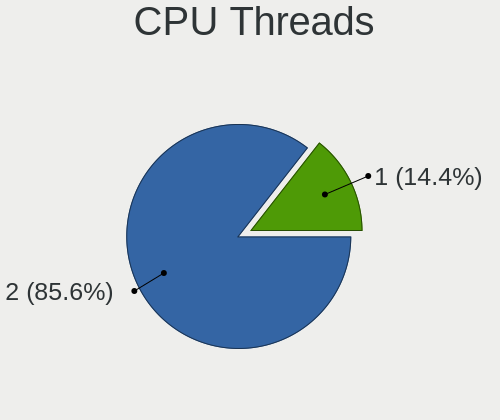

| Number | Notebooks | Percent |
|--------|-----------|---------|
| 2      | 64        | 73.56%  |
| 1      | 23        | 26.44%  |

CPU Op-Modes
------------

CPU Operation Modes (32-bit, 64-bit)

| Op mode        | Notebooks | Percent |
|----------------|-----------|---------|
| 32-bit, 64-bit | 86        | 98.85%  |
| 32-bit         | 1         | 1.15%   |

CPU Microcode
-------------

Microcode number

| Number     | Notebooks | Percent |
|------------|-----------|---------|
| Unknown    | 51        | 58.62%  |
| 0x806ea    | 3         | 3.45%   |
| 0x806c1    | 3         | 3.45%   |
| 0xb06a2    | 2         | 2.3%    |
| 0x906a4    | 2         | 2.3%    |
| 0x806c2    | 2         | 2.3%    |
| 0x206a7    | 2         | 2.3%    |
| 0x1067a    | 2         | 2.3%    |
| 0x08108109 | 2         | 2.3%    |
| 0xb0671    | 1         | 1.15%   |
| 0x806ec    | 1         | 1.15%   |
| 0x706a1    | 1         | 1.15%   |
| 0x6d8      | 1         | 1.15%   |
| 0x40651    | 1         | 1.15%   |
| 0x306a9    | 1         | 1.15%   |
| 0x106ca    | 1         | 1.15%   |
| 0x0a50000d | 1         | 1.15%   |
| 0x0a50000c | 1         | 1.15%   |
| 0x0a404102 | 1         | 1.15%   |
| 0x08701013 | 1         | 1.15%   |
| 0x08600104 | 1         | 1.15%   |
| 0x0810100b | 1         | 1.15%   |
| 0x08101007 | 1         | 1.15%   |
| 0x0700010f | 1         | 1.15%   |
| 0x06006704 | 1         | 1.15%   |
| 0x05000119 | 1         | 1.15%   |
| 0x010000c8 | 1         | 1.15%   |

CPU Microarch
-------------

Microarchitecture

| Name             | Notebooks | Percent |
|------------------|-----------|---------|
| Unknown          | 14        | 16.09%  |
| KabyLake         | 12        | 13.79%  |
| TigerLake        | 9         | 10.34%  |
| IvyBridge        | 6         | 6.9%    |
| Zen 3            | 4         | 4.6%    |
| Zen+             | 3         | 3.45%   |
| Westmere         | 3         | 3.45%   |
| SandyBridge      | 3         | 3.45%   |
| Alderlake Hybrid | 3         | 3.45%   |
| Zen 2            | 2         | 2.3%    |
| Zen              | 2         | 2.3%    |
| Tremont          | 2         | 2.3%    |
| Skylake          | 2         | 2.3%    |
| Penryn           | 2         | 2.3%    |
| IceLake          | 2         | 2.3%    |
| Haswell          | 2         | 2.3%    |
| Goldmont plus    | 2         | 2.3%    |
| Core             | 2         | 2.3%    |
| Silvermont       | 1         | 1.15%   |
| Piledriver       | 1         | 1.15%   |
| P6               | 1         | 1.15%   |
| K8 Hammer        | 1         | 1.15%   |
| K10              | 1         | 1.15%   |
| Jaguar           | 1         | 1.15%   |
| Goldmont         | 1         | 1.15%   |
| Excavator        | 1         | 1.15%   |
| CometLake        | 1         | 1.15%   |
| Broadwell        | 1         | 1.15%   |
| Bonnell          | 1         | 1.15%   |
| Bobcat           | 1         | 1.15%   |

Graphics
--------

GPU Vendor
----------

Vendors of graphics cards

| Vendor | Notebooks | Percent |
|--------|-----------|---------|
| Intel  | 62        | 53.91%  |
| Nvidia | 27        | 23.48%  |
| AMD    | 26        | 22.61%  |

GPU Model
---------

Graphics card models

| Model                                                                     | Notebooks | Percent |
|---------------------------------------------------------------------------|-----------|---------|
| Intel TigerLake-LP GT2 [Iris Xe Graphics]                                 | 8         | 6.78%   |
| Intel 3rd Gen Core processor Graphics Controller                          | 6         | 5.08%   |
| AMD Cezanne [Radeon Vega Series / Radeon Vega Mobile Series]              | 4         | 3.39%   |
| Nvidia TU117M [GeForce GTX 1650 Mobile / Max-Q]                           | 3         | 2.54%   |
| Nvidia GA106M [GeForce RTX 3060 Mobile / Max-Q]                           | 3         | 2.54%   |
| Intel JasperLake [UHD Graphics]                                           | 3         | 2.54%   |
| Intel CometLake-U GT2 [UHD Graphics]                                      | 3         | 2.54%   |
| Intel CoffeeLake-H GT2 [UHD Graphics 630]                                 | 3         | 2.54%   |
| Intel Alder Lake-UP3 GT2 [Iris Xe Graphics]                               | 3         | 2.54%   |
| Intel Alder Lake-P Integrated Graphics Controller                         | 3         | 2.54%   |
| Intel 2nd Generation Core Processor Family Integrated Graphics Controller | 3         | 2.54%   |
| AMD VanGogh [AMD Custom GPU 0405]                                         | 3         | 2.54%   |
| AMD Picasso/Raven 2 [Radeon Vega Series / Radeon Vega Mobile Series]      | 3         | 2.54%   |
| Nvidia GA107M [GeForce RTX 3050 Ti Mobile]                                | 2         | 1.69%   |
| Nvidia GA107M [GeForce RTX 3050 Mobile]                                   | 2         | 1.69%   |
| Nvidia AD107M [GeForce RTX 4060 Max-Q / Mobile]                           | 2         | 1.69%   |
| Intel UHD Graphics 620                                                    | 2         | 1.69%   |
| Intel Raptor Lake-S UHD Graphics                                          | 2         | 1.69%   |
| Intel Raptor Lake-P [Iris Xe Graphics]                                    | 2         | 1.69%   |
| Intel Mobile 4 Series Chipset Integrated Graphics Controller              | 2         | 1.69%   |
| Intel Iris Plus Graphics G1 (Ice Lake)                                    | 2         | 1.69%   |
| Intel GeminiLake [UHD Graphics 600]                                       | 2         | 1.69%   |
| Intel Core Processor Integrated Graphics Controller                       | 2         | 1.69%   |
| AMD Raven Ridge [Radeon Vega Series / Radeon Vega Mobile Series]          | 2         | 1.69%   |
| Nvidia TU117M [GeForce MX550]                                             | 1         | 0.85%   |
| Nvidia TU116M [GeForce GTX 1660 Ti Mobile]                                | 1         | 0.85%   |
| Nvidia TU116M [GeForce GTX 1650 Ti Mobile]                                | 1         | 0.85%   |
| Nvidia TU106M [GeForce RTX 2070 Mobile / Max-Q Refresh]                   | 1         | 0.85%   |
| Nvidia GT216M [GeForce GT 240M]                                           | 1         | 0.85%   |
| Nvidia GP107M [GeForce GTX 1050 Mobile]                                   | 1         | 0.85%   |
| Nvidia GP106M [GeForce GTX 1060 Mobile]                                   | 1         | 0.85%   |
| Nvidia GM108M [GeForce 940MX]                                             | 1         | 0.85%   |
| Nvidia GM108M [GeForce 840M]                                              | 1         | 0.85%   |
| Nvidia GK208M [GeForce GT 740M]                                           | 1         | 0.85%   |
| Nvidia GK107M [GeForce GT 640M]                                           | 1         | 0.85%   |
| Nvidia GK106M [GeForce GTX 765M]                                          | 1         | 0.85%   |
| Nvidia GA104 [Geforce RTX 3070 Ti Laptop GPU]                             | 1         | 0.85%   |
| Nvidia AD107M [GeForce RTX 4050 Max-Q / Mobile]                           | 1         | 0.85%   |
| Nvidia AD107GLM [RTX 2000 Ada Generation Laptop GPU]                      | 1         | 0.85%   |
| Intel WhiskeyLake-U GT2 [UHD Graphics 620]                                | 1         | 0.85%   |

GPU Combo
---------

Combinations of graphics cards

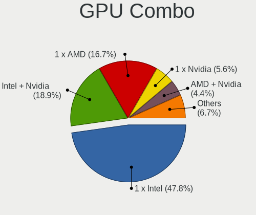

| Name           | Notebooks | Percent |
|----------------|-----------|---------|
| 1 x Intel      | 37        | 42.53%  |
| Intel + Nvidia | 19        | 21.84%  |
| 1 x AMD        | 15        | 17.24%  |
| AMD + Nvidia   | 5         | 5.75%   |
| 2 x AMD        | 3         | 3.45%   |
| 1 x Nvidia     | 3         | 3.45%   |
| Intel + AMD    | 3         | 3.45%   |
| 2 x Intel      | 2         | 2.3%    |

GPU Driver
----------

Free vs proprietary

| Driver      | Notebooks | Percent |
|-------------|-----------|---------|
| Free        | 70        | 80.46%  |
| Proprietary | 16        | 18.39%  |
| Unknown     | 1         | 1.15%   |

GPU Memory
----------

Total video memory

| Size in GB | Notebooks | Percent |
|------------|-----------|---------|
| Unknown    | 68        | 78.16%  |
| 0.01-0.5   | 10        | 11.49%  |
| 0.51-1.0   | 5         | 5.75%   |
| 3.01-4.0   | 2         | 2.3%    |
| 7.01-8.0   | 1         | 1.15%   |
| 1.01-2.0   | 1         | 1.15%   |

Monitor
-------

Monitor Vendor
--------------

Monitor vendors

| Vendor                  | Notebooks | Percent |
|-------------------------|-----------|---------|
| AU Optronics            | 20        | 22.22%  |
| BOE                     | 18        | 20%     |
| Chimei Innolux          | 13        | 14.44%  |
| PANDA                   | 6         | 6.67%   |
| LG Display              | 6         | 6.67%   |
| Valve                   | 3         | 3.33%   |
| Samsung Electronics     | 3         | 3.33%   |
| TMX                     | 2         | 2.22%   |
| Sharp                   | 2         | 2.22%   |
| BenQ                    | 2         | 2.22%   |
| ___                     | 1         | 1.11%   |
| UTV                     | 1         | 1.11%   |
| Philips                 | 1         | 1.11%   |
| Mi                      | 1         | 1.11%   |
| Lenovo                  | 1         | 1.11%   |
| HKC                     | 1         | 1.11%   |
| Hewlett-Packard         | 1         | 1.11%   |
| HannStar                | 1         | 1.11%   |
| Goldstar                | 1         | 1.11%   |
| CSO                     | 1         | 1.11%   |
| Chi Mei Optoelectronics | 1         | 1.11%   |
| ASUSTek Computer        | 1         | 1.11%   |
| Apple                   | 1         | 1.11%   |
| Ancor Communications    | 1         | 1.11%   |
| Acer                    | 1         | 1.11%   |

Monitor Model
-------------

Monitor models

| Model                                                                 | Notebooks | Percent |
|-----------------------------------------------------------------------|-----------|---------|
| Valve ANX7530 U VLV3001 800x1280 100x150mm 7.1-inch                   | 3         | 3.3%    |
| AU Optronics LCD Monitor AUO22EC 1366x768 344x193mm 15.5-inch         | 3         | 3.3%    |
| PANDA LCD Monitor NCP002D 1920x1080 344x194mm 15.5-inch               | 2         | 2.2%    |
| Chimei Innolux LCD Monitor CMN15DB 1366x768 344x193mm 15.5-inch       | 2         | 2.2%    |
| BOE LCD Monitor BOE0872 1920x1080 344x194mm 15.5-inch                 | 2         | 2.2%    |
| AU Optronics LCD Monitor AUO205C 1366x768 256x144mm 11.6-inch         | 2         | 2.2%    |
| ___ LCDTV16 ___9000 1360x768                                          | 1         | 1.1%    |
| UTV MONITOR UTV002F 3840x2160 1872x1053mm 84.6-inch                   | 1         | 1.1%    |
| TMX TL160ADMP03-0 TMX1603 2560x1600 345x215mm 16.0-inch               | 1         | 1.1%    |
| TMX TL156VDXP0101 TMX1561 1920x1080 344x194mm 15.5-inch               | 1         | 1.1%    |
| Sharp LCD Monitor SHP14BA 1920x1080 340x190mm 15.3-inch               | 1         | 1.1%    |
| Sharp LCD Monitor SHP1453 1920x1080 346x194mm 15.6-inch               | 1         | 1.1%    |
| Samsung Electronics S24D330 SAM0D92 1920x1080 531x299mm 24.0-inch     | 1         | 1.1%    |
| Samsung Electronics LCD Monitor SDC4552 1366x768 344x194mm 15.5-inch  | 1         | 1.1%    |
| Samsung Electronics LCD Monitor SDC4171 2880x1800 302x189mm 14.0-inch | 1         | 1.1%    |
| Philips 22PFL3403DEU PHLD058 1680x1050 820x461mm 37.0-inch            | 1         | 1.1%    |
| PANDA LCD Monitor NCP005E 1920x1080 309x174mm 14.0-inch               | 1         | 1.1%    |
| PANDA LCD Monitor NCP0050 1920x1080 309x174mm 14.0-inch               | 1         | 1.1%    |
| PANDA LCD Monitor NCP004D 1920x1080 344x194mm 15.5-inch               | 1         | 1.1%    |
| PANDA LCD Monitor NCP004B 1920x1080 344x194mm 15.5-inch               | 1         | 1.1%    |
| Mi 27 NFGL XMIB004 1920x1080 598x336mm 27.0-inch                      | 1         | 1.1%    |
| LG Display LP156WH2-TLF1 LGD021F 1366x768 344x194mm 15.5-inch         | 1         | 1.1%    |
| LG Display LCD Monitor LGD0709 1920x1080 344x194mm 15.5-inch          | 1         | 1.1%    |
| LG Display LCD Monitor LGD05E5 1920x1080 344x194mm 15.5-inch          | 1         | 1.1%    |
| LG Display LCD Monitor LGD053F 1920x1080 344x194mm 15.5-inch          | 1         | 1.1%    |
| LG Display LCD Monitor LGD04B7 1366x768 344x194mm 15.5-inch           | 1         | 1.1%    |
| LG Display LCD Monitor LGD02D8 1366x768 277x156mm 12.5-inch           | 1         | 1.1%    |
| Lenovo LCD Monitor LEN40B2 1920x1080 344x193mm 15.5-inch              | 1         | 1.1%    |
| HKC LCD Monitor HKC3CFE 1920x1080 344x194mm 15.5-inch                 | 1         | 1.1%    |
| Hewlett-Packard E241i HWP3123 1920x1200 518x324mm 24.1-inch           | 1         | 1.1%    |
| Hewlett-Packard E241i HWP3122 1920x1200 518x324mm 24.1-inch           | 1         | 1.1%    |
| HannStar LCD Monitor HSD03E9 1024x600 220x129mm 10.0-inch             | 1         | 1.1%    |
| Goldstar ULTRAWIDE GSM76FD 2560x1080 798x334mm 34.1-inch              | 1         | 1.1%    |
| CSO LCD Monitor CSO1603 2560x1600 344x215mm 16.0-inch                 | 1         | 1.1%    |
| Chimei Innolux P140ZKA-BZ1 CMN8C02 2160x1440 296x197mm 14.0-inch      | 1         | 1.1%    |
| Chimei Innolux LCD Monitor CMN162E 1920x1080 355x199mm 16.0-inch      | 1         | 1.1%    |
| Chimei Innolux LCD Monitor CMN1609 1920x1080 355x199mm 16.0-inch      | 1         | 1.1%    |
| Chimei Innolux LCD Monitor CMN15F5 1920x1080 344x193mm 15.5-inch      | 1         | 1.1%    |
| Chimei Innolux LCD Monitor CMN15D5 1920x1080 344x193mm 15.5-inch      | 1         | 1.1%    |
| Chimei Innolux LCD Monitor CMN15BC 1366x768 344x193mm 15.5-inch       | 1         | 1.1%    |

Monitor Resolution
------------------

Monitor screen resolution

| Resolution         | Notebooks | Percent |
|--------------------|-----------|---------|
| 1920x1080 (FHD)    | 46        | 55.42%  |
| 1366x768 (WXGA)    | 20        | 24.1%   |
| 2560x1600          | 4         | 4.82%   |
| 800x1280           | 3         | 3.61%   |
| 2160x1440          | 2         | 2.41%   |
| 1280x800 (WXGA)    | 2         | 2.41%   |
| 3840x2160 (4K)     | 1         | 1.2%    |
| 2880x1800          | 1         | 1.2%    |
| 2560x1080          | 1         | 1.2%    |
| 1680x1050 (WSXGA+) | 1         | 1.2%    |
| 1440x900 (WXGA+)   | 1         | 1.2%    |
| 1024x600           | 1         | 1.2%    |

Monitor Diagonal
----------------

Diagonal size in inches

| Inches  | Notebooks | Percent |
|---------|-----------|---------|
| 15      | 46        | 51.11%  |
| 14      | 9         | 10%     |
| 16      | 8         | 8.89%   |
| 13      | 6         | 6.67%   |
| 24      | 3         | 3.33%   |
| 23      | 3         | 3.33%   |
| 11      | 3         | 3.33%   |
| 7       | 3         | 3.33%   |
| 27      | 2         | 2.22%   |
| 84      | 1         | 1.11%   |
| 37      | 1         | 1.11%   |
| 34      | 1         | 1.11%   |
| 17      | 1         | 1.11%   |
| 12      | 1         | 1.11%   |
| 10      | 1         | 1.11%   |
| Unknown | 1         | 1.11%   |

Monitor Width
-------------

Physical width

| Width in mm | Notebooks | Percent |
|-------------|-----------|---------|
| 301-350     | 60        | 67.42%  |
| 201-300     | 10        | 11.24%  |
| 501-600     | 7         | 7.87%   |
| 351-400     | 5         | 5.62%   |
| 1-100       | 3         | 3.37%   |
| 801-900     | 1         | 1.12%   |
| 701-800     | 1         | 1.12%   |
| 1501-2000   | 1         | 1.12%   |
| Unknown     | 1         | 1.12%   |

Aspect Ratio
------------

Proportional relationship between the width and the height

| Ratio | Notebooks | Percent |
|-------|-----------|---------|
| 16/9  | 68        | 82.93%  |
| 16/10 | 8         | 9.76%   |
| 0.67  | 3         | 3.66%   |
| 3/2   | 2         | 2.44%   |
| 21/9  | 1         | 1.22%   |

Monitor Area
------------

Area in inch²

| Area in inch² | Notebooks | Percent |
|----------------|-----------|---------|
| 101-110        | 50        | 56.18%  |
| 81-90          | 13        | 14.61%  |
| 201-250        | 4         | 4.49%   |
| 111-120        | 4         | 4.49%   |
| 51-60          | 3         | 3.37%   |
| 1-40           | 3         | 3.37%   |
| 71-80          | 2         | 2.25%   |
| 301-350        | 2         | 2.25%   |
| More than 1000 | 1         | 1.12%   |
| 61-70          | 1         | 1.12%   |
| 351-500        | 1         | 1.12%   |
| 41-50          | 1         | 1.12%   |
| 251-300        | 1         | 1.12%   |
| 121-130        | 1         | 1.12%   |
| 501-1000       | 1         | 1.12%   |
| Unknown        | 1         | 1.12%   |

Pixel Density
-------------

Pixels per inch

| Density       | Notebooks | Percent |
|---------------|-----------|---------|
| 121-160       | 47        | 52.81%  |
| 101-120       | 16        | 17.98%  |
| 51-100        | 13        | 14.61%  |
| 161-240       | 11        | 12.36%  |
| More than 240 | 1         | 1.12%   |
| Unknown       | 1         | 1.12%   |

Multiple Monitors
-----------------

Total monitors connected

| Total | Notebooks | Percent |
|-------|-----------|---------|
| 1     | 74        | 85.06%  |
| 2     | 9         | 10.34%  |
| 3     | 2         | 2.3%    |
| 0     | 2         | 2.3%    |

Network
-------

Net Controller Vendor
---------------------

Controller vendors

| Vendor                            | Notebooks | Percent |
|-----------------------------------|-----------|---------|
| Realtek Semiconductor             | 50        | 35.71%  |
| Intel                             | 43        | 30.71%  |
| Qualcomm Atheros                  | 13        | 9.29%   |
| Broadcom                          | 10        | 7.14%   |
| MediaTek                          | 7         | 5%      |
| ASIX Electronics                  | 3         | 2.14%   |
| Xiaomi                            | 2         | 1.43%   |
| Ralink Technology                 | 2         | 1.43%   |
| Ralink                            | 1         | 0.71%   |
| Microchip Technology              | 1         | 0.71%   |
| Marvell Technology Group          | 1         | 0.71%   |
| Huawei Technologies               | 1         | 0.71%   |
| Hewlett-Packard                   | 1         | 0.71%   |
| Google                            | 1         | 0.71%   |
| Ericsson Business Mobile Networks | 1         | 0.71%   |
| Dell                              | 1         | 0.71%   |
| Broadcom Limited                  | 1         | 0.71%   |
| ASUSTek Computer                  | 1         | 0.71%   |

Net Controller Model
--------------------

Controller models

| Model                                                             | Notebooks | Percent |
|-------------------------------------------------------------------|-----------|---------|
| Realtek RTL8111/8168/8411 PCI Express Gigabit Ethernet Controller | 26        | 16.25%  |
| Realtek RTL810xE PCI Express Fast Ethernet controller             | 6         | 3.75%   |
| Realtek RTL8822CE 802.11ac PCIe Wireless Network Adapter          | 5         | 3.13%   |
| Realtek RTL8821CE 802.11ac PCIe Wireless Network Adapter          | 5         | 3.13%   |
| MediaTek MT7921 802.11ax PCI Express Wireless Network Adapter     | 5         | 3.13%   |
| Intel Wireless 3165                                               | 5         | 3.13%   |
| Intel Wi-Fi 6 AX200                                               | 5         | 3.13%   |
| Intel Wi-Fi 6 AX201                                               | 4         | 2.5%    |
| Intel Alder Lake-P PCH CNVi WiFi                                  | 4         | 2.5%    |
| Realtek 802.11ac NIC                                              | 3         | 1.88%   |
| Qualcomm Atheros QCA9565 / AR9565 Wireless Network Adapter        | 3         | 1.88%   |
| Intel Comet Lake PCH-LP CNVi WiFi                                 | 3         | 1.88%   |
| Broadcom BCM4313 802.11bgn Wireless Network Adapter               | 3         | 1.88%   |
| ASIX AX88179 Gigabit Ethernet                                     | 3         | 1.88%   |
| Realtek RTL8852AE 802.11ax PCIe Wireless Network Adapter          | 2         | 1.25%   |
| Realtek RTL8822BE 802.11a/b/g/n/ac WiFi adapter                   | 2         | 1.25%   |
| Realtek RTL8153 Gigabit Ethernet Adapter                          | 2         | 1.25%   |
| Qualcomm Atheros QCA9377 802.11ac Wireless Network Adapter        | 2         | 1.25%   |
| Qualcomm Atheros QCA6174 802.11ac Wireless Network Adapter        | 2         | 1.25%   |
| Qualcomm Atheros AR928X Wireless Network Adapter (PCI-Express)    | 2         | 1.25%   |
| Qualcomm Atheros AR8131 Gigabit Ethernet                          | 2         | 1.25%   |
| Intel WiFi Link 5100                                              | 2         | 1.25%   |
| Intel Wi-Fi 6 AX210/AX211/AX411 160MHz                            | 2         | 1.25%   |
| Intel Raptor Lake PCH CNVi WiFi                                   | 2         | 1.25%   |
| Intel 700 Series Chipset Family Wi-Fi                             | 2         | 1.25%   |
| Broadcom NetLink BCM57785 Gigabit Ethernet PCIe                   | 2         | 1.25%   |
| Broadcom NetLink BCM57780 Gigabit Ethernet PCIe                   | 2         | 1.25%   |
| Xiaomi Mi/Redmi series (RNDIS)                                    | 1         | 0.63%   |
| Xiaomi Mi/Redmi series (RNDIS + ADB)                              | 1         | 0.63%   |
| Realtek RTL8821AE 802.11ac PCIe Wireless Network Adapter          | 1         | 0.63%   |
| Realtek RTL8723BE PCIe Wireless Network Adapter                   | 1         | 0.63%   |
| Realtek RTL8188CE 802.11b/g/n WiFi Adapter                        | 1         | 0.63%   |
| Realtek RTL8152 Fast Ethernet Adapter                             | 1         | 0.63%   |
| Realtek RTL8125 2.5GbE Controller                                 | 1         | 0.63%   |
| Realtek PCIe GbE Family Controller                                | 1         | 0.63%   |
| Realtek 802.11n WLAN Adapter                                      | 1         | 0.63%   |
| Ralink RT2501/RT2573 Wireless Adapter                             | 1         | 0.63%   |
| Ralink MT7601U Wireless Adapter                                   | 1         | 0.63%   |
| Ralink RT3290 Wireless 802.11n 1T/1R PCIe                         | 1         | 0.63%   |
| Qualcomm Atheros QCA8172 Fast Ethernet                            | 1         | 0.63%   |

Wireless Vendor
---------------

Wireless vendors

| Vendor                | Notebooks | Percent |
|-----------------------|-----------|---------|
| Intel                 | 41        | 45.56%  |
| Realtek Semiconductor | 21        | 23.33%  |
| Qualcomm Atheros      | 10        | 11.11%  |
| MediaTek              | 7         | 7.78%   |
| Broadcom              | 6         | 6.67%   |
| Ralink Technology     | 2         | 2.22%   |
| Ralink                | 1         | 1.11%   |
| Dell                  | 1         | 1.11%   |
| ASUSTek Computer      | 1         | 1.11%   |

Wireless Model
--------------

Wireless models

| Model                                                          | Notebooks | Percent |
|----------------------------------------------------------------|-----------|---------|
| Realtek RTL8822CE 802.11ac PCIe Wireless Network Adapter       | 5         | 5.56%   |
| Realtek RTL8821CE 802.11ac PCIe Wireless Network Adapter       | 5         | 5.56%   |
| MediaTek MT7921 802.11ax PCI Express Wireless Network Adapter  | 5         | 5.56%   |
| Intel Wireless 3165                                            | 5         | 5.56%   |
| Intel Wi-Fi 6 AX200                                            | 5         | 5.56%   |
| Intel Wi-Fi 6 AX201                                            | 4         | 4.44%   |
| Intel Alder Lake-P PCH CNVi WiFi                               | 4         | 4.44%   |
| Realtek 802.11ac NIC                                           | 3         | 3.33%   |
| Qualcomm Atheros QCA9565 / AR9565 Wireless Network Adapter     | 3         | 3.33%   |
| Intel Comet Lake PCH-LP CNVi WiFi                              | 3         | 3.33%   |
| Broadcom BCM4313 802.11bgn Wireless Network Adapter            | 3         | 3.33%   |
| Realtek RTL8852AE 802.11ax PCIe Wireless Network Adapter       | 2         | 2.22%   |
| Realtek RTL8822BE 802.11a/b/g/n/ac WiFi adapter                | 2         | 2.22%   |
| Qualcomm Atheros QCA9377 802.11ac Wireless Network Adapter     | 2         | 2.22%   |
| Qualcomm Atheros QCA6174 802.11ac Wireless Network Adapter     | 2         | 2.22%   |
| Qualcomm Atheros AR928X Wireless Network Adapter (PCI-Express) | 2         | 2.22%   |
| Intel WiFi Link 5100                                           | 2         | 2.22%   |
| Intel Wi-Fi 6 AX210/AX211/AX411 160MHz                         | 2         | 2.22%   |
| Intel Raptor Lake PCH CNVi WiFi                                | 2         | 2.22%   |
| Intel 700 Series Chipset Family Wi-Fi                          | 2         | 2.22%   |
| Realtek RTL8821AE 802.11ac PCIe Wireless Network Adapter       | 1         | 1.11%   |
| Realtek RTL8723BE PCIe Wireless Network Adapter                | 1         | 1.11%   |
| Realtek RTL8188CE 802.11b/g/n WiFi Adapter                     | 1         | 1.11%   |
| Realtek 802.11n WLAN Adapter                                   | 1         | 1.11%   |
| Ralink RT2501/RT2573 Wireless Adapter                          | 1         | 1.11%   |
| Ralink MT7601U Wireless Adapter                                | 1         | 1.11%   |
| Ralink RT3290 Wireless 802.11n 1T/1R PCIe                      | 1         | 1.11%   |
| Qualcomm Atheros AR9462 Wireless Network Adapter               | 1         | 1.11%   |
| MediaTek MT7922 802.11ax PCI Express Wireless Network Adapter  | 1         | 1.11%   |
| MediaTek 802.11AC MT7663 Wireless Network Adapter              | 1         | 1.11%   |
| Intel Wireless 8260                                            | 1         | 1.11%   |
| Intel Wireless 7265                                            | 1         | 1.11%   |
| Intel Wireless 7260                                            | 1         | 1.11%   |
| Intel Wi-Fi 6 AX201 160MHz                                     | 1         | 1.11%   |
| Intel Ice Lake-LP PCH CNVi WiFi                                | 1         | 1.11%   |
| Intel Comet Lake PCH CNVi WiFi                                 | 1         | 1.11%   |
| Intel Centrino Wireless-N 2230                                 | 1         | 1.11%   |
| Intel Centrino Advanced-N 6230 [Rainbow Peak]                  | 1         | 1.11%   |
| Intel Centrino Advanced-N 6205 [Taylor Peak]                   | 1         | 1.11%   |
| Intel Centrino Advanced-N 6200                                 | 1         | 1.11%   |

Ethernet Vendor
---------------

Ethernet vendors

| Vendor                   | Notebooks | Percent |
|--------------------------|-----------|---------|
| Realtek Semiconductor    | 36        | 53.73%  |
| Intel                    | 8         | 11.94%  |
| Broadcom                 | 8         | 11.94%  |
| Qualcomm Atheros         | 5         | 7.46%   |
| ASIX Electronics         | 3         | 4.48%   |
| Xiaomi                   | 2         | 2.99%   |
| Microchip Technology     | 1         | 1.49%   |
| Marvell Technology Group | 1         | 1.49%   |
| Hewlett-Packard          | 1         | 1.49%   |
| Google                   | 1         | 1.49%   |
| Broadcom Limited         | 1         | 1.49%   |

Ethernet Model
--------------

Ethernet models

| Model                                                             | Notebooks | Percent |
|-------------------------------------------------------------------|-----------|---------|
| Realtek RTL8111/8168/8411 PCI Express Gigabit Ethernet Controller | 26        | 38.24%  |
| Realtek RTL810xE PCI Express Fast Ethernet controller             | 6         | 8.82%   |
| ASIX AX88179 Gigabit Ethernet                                     | 3         | 4.41%   |
| Realtek RTL8153 Gigabit Ethernet Adapter                          | 2         | 2.94%   |
| Qualcomm Atheros AR8131 Gigabit Ethernet                          | 2         | 2.94%   |
| Broadcom NetLink BCM57785 Gigabit Ethernet PCIe                   | 2         | 2.94%   |
| Broadcom NetLink BCM57780 Gigabit Ethernet PCIe                   | 2         | 2.94%   |
| Xiaomi Mi/Redmi series (RNDIS)                                    | 1         | 1.47%   |
| Xiaomi Mi/Redmi series (RNDIS + ADB)                              | 1         | 1.47%   |
| Realtek RTL8152 Fast Ethernet Adapter                             | 1         | 1.47%   |
| Realtek RTL8125 2.5GbE Controller                                 | 1         | 1.47%   |
| Realtek PCIe GbE Family Controller                                | 1         | 1.47%   |
| Qualcomm Atheros QCA8172 Fast Ethernet                            | 1         | 1.47%   |
| Qualcomm Atheros Killer E220x Gigabit Ethernet Controller         | 1         | 1.47%   |
| Qualcomm Atheros AR8132 Fast Ethernet                             | 1         | 1.47%   |
| Microchip LAN7500 Ethernet 10/100/1000 Adapter                    | 1         | 1.47%   |
| Marvell Group 88E8055 PCI-E Gigabit Ethernet Controller           | 1         | 1.47%   |
| Intel Ethernet Controller I219-LM                                 | 1         | 1.47%   |
| Intel Ethernet Connection I219-LM                                 | 1         | 1.47%   |
| Intel Ethernet Connection (2) I219-LM                             | 1         | 1.47%   |
| Intel Ethernet Connection (16) I219-LM                            | 1         | 1.47%   |
| Intel Ethernet Connection (13) I219-V                             | 1         | 1.47%   |
| Intel Ethernet Connection (10) I219-V                             | 1         | 1.47%   |
| Intel 82579LM Gigabit Network Connection (Lewisville)             | 1         | 1.47%   |
| Intel 82577LC Gigabit Network Connection                          | 1         | 1.47%   |
| HP HP lt4120 Snapdragon X5 LTE                                    | 1         | 1.47%   |
| Google Pixel 6 Pro                                                | 1         | 1.47%   |
| Broadcom NetXtreme BCM57786 Gigabit Ethernet PCIe                 | 1         | 1.47%   |
| Broadcom NetXtreme BCM57765 Gigabit Ethernet PCIe                 | 1         | 1.47%   |
| Broadcom NetXtreme BCM5764M Gigabit Ethernet PCIe                 | 1         | 1.47%   |
| Broadcom NetLink BCM5784M Gigabit Ethernet PCIe                   | 1         | 1.47%   |
| Broadcom Limited NetLink BCM57780 Gigabit Ethernet PCIe           | 1         | 1.47%   |

Net Controller Kind
-------------------

Ethernet, WiFi or modem

| Kind     | Notebooks | Percent |
|----------|-----------|---------|
| WiFi     | 86        | 56.58%  |
| Ethernet | 64        | 42.11%  |
| Modem    | 2         | 1.32%   |

Used Controller
---------------

Currently used network controller

| Kind     | Notebooks | Percent |
|----------|-----------|---------|
| WiFi     | 72        | 82.76%  |
| Ethernet | 15        | 17.24%  |

NICs
----

Total network controllers on board

| Total | Notebooks | Percent |
|-------|-----------|---------|
| 2     | 54        | 62.07%  |
| 1     | 31        | 35.63%  |
| 0     | 2         | 2.3%    |

IPv6
----

IPv6 vs IPv4

| Used | Notebooks | Percent |
|------|-----------|---------|
| No   | 77        | 88.51%  |
| Yes  | 10        | 11.49%  |

Bluetooth
---------

Bluetooth Vendor
----------------

Controller vendors

| Vendor                          | Notebooks | Percent |
|---------------------------------|-----------|---------|
| Intel                           | 34        | 45.33%  |
| IMC Networks                    | 10        | 13.33%  |
| Realtek Semiconductor           | 9         | 12%     |
| Qualcomm Atheros Communications | 6         | 8%      |
| Foxconn / Hon Hai               | 4         | 5.33%   |
| ASUSTek Computer                | 3         | 4%      |
| Lite-On Technology              | 2         | 2.67%   |
| Toshiba                         | 1         | 1.33%   |
| Realtek                         | 1         | 1.33%   |
| Ralink                          | 1         | 1.33%   |
| Foxconn International           | 1         | 1.33%   |
| Cambridge Silicon Radio         | 1         | 1.33%   |
| Broadcom                        | 1         | 1.33%   |
| Apple                           | 1         | 1.33%   |

Bluetooth Model
---------------

Controller models

| Model                                               | Notebooks | Percent |
|-----------------------------------------------------|-----------|---------|
| Intel Bluetooth wireless interface                  | 8         | 10.67%  |
| Intel AX201 Bluetooth                               | 7         | 9.33%   |
| Realtek Bluetooth Radio                             | 6         | 8%      |
| IMC Networks Bluetooth Radio                        | 6         | 8%      |
| Intel Bluetooth Device                              | 5         | 6.67%   |
| Intel Bluetooth 9460/9560 Jefferson Peak (JfP)      | 5         | 6.67%   |
| Intel AX200 Bluetooth                               | 5         | 6.67%   |
| Qualcomm Atheros  Bluetooth Device                  | 4         | 5.33%   |
| IMC Networks Wireless_Device                        | 4         | 5.33%   |
| Realtek  Bluetooth 4.2 Adapter                      | 2         | 2.67%   |
| Intel AX210 Bluetooth                               | 2         | 2.67%   |
| Toshiba Askey Bluetooth Module                      | 1         | 1.33%   |
| Realtek RTL8821A Bluetooth                          | 1         | 1.33%   |
| Realtek 802.11ac WLAN Adapter                       | 1         | 1.33%   |
| Ralink RT3290 Bluetooth                             | 1         | 1.33%   |
| Qualcomm Atheros QCA61x4 Bluetooth 4.0              | 1         | 1.33%   |
| Qualcomm Atheros AR3012 Bluetooth 4.0               | 1         | 1.33%   |
| Lite-On Wireless_Device                             | 1         | 1.33%   |
| Lite-On Atheros AR3012 Bluetooth                    | 1         | 1.33%   |
| Intel Centrino Bluetooth Wireless Transceiver       | 1         | 1.33%   |
| Intel Centrino Advanced-N 6230 Bluetooth adapter    | 1         | 1.33%   |
| Foxconn International BCM43142A0 Bluetooth module   | 1         | 1.33%   |
| Foxconn / Hon Hai Wireless_Device                   | 1         | 1.33%   |
| Foxconn / Hon Hai MediaTek Bluetooth Adapter        | 1         | 1.33%   |
| Foxconn / Hon Hai Bluetooth Device                  | 1         | 1.33%   |
| Foxconn / Hon Hai Acer Bluetooth module             | 1         | 1.33%   |
| Cambridge Silicon Radio Bluetooth Dongle (HCI mode) | 1         | 1.33%   |
| Broadcom BCM20702 Bluetooth 4.0 [ThinkPad]          | 1         | 1.33%   |
| ASUS BT-270 Bluetooth Adapter                       | 1         | 1.33%   |
| ASUS BT-183 Bluetooth 2.0+EDR adapter               | 1         | 1.33%   |
| ASUS ASUS USB-BT500                                 | 1         | 1.33%   |
| Apple Bluetooth Host Controller                     | 1         | 1.33%   |

Sound
-----

Sound Vendor
------------

Sound card vendors

| Vendor                  | Notebooks | Percent |
|-------------------------|-----------|---------|
| Intel                   | 64        | 59.26%  |
| AMD                     | 23        | 21.3%   |
| Nvidia                  | 17        | 15.74%  |
| MosArt Semiconductor    | 1         | 0.93%   |
| Corsair                 | 1         | 0.93%   |
| BEHRINGER International | 1         | 0.93%   |
| Barco Display Systems   | 1         | 0.93%   |

Sound Model
-----------

Sound card models

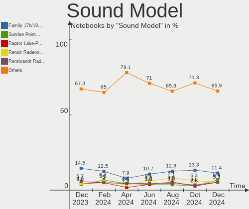

| Model                                                                      | Notebooks | Percent |
|----------------------------------------------------------------------------|-----------|---------|
| AMD Family 17h/19h HD Audio Controller                                     | 12        | 9.45%   |
| Intel Tiger Lake-LP Smart Sound Technology Audio Controller                | 9         | 7.09%   |
| Nvidia Audio device                                                        | 8         | 6.3%    |
| Intel 7 Series/C216 Chipset Family High Definition Audio Controller        | 7         | 5.51%   |
| Intel Alder Lake PCH-P High Definition Audio Controller                    | 6         | 4.72%   |
| Intel Sunrise Point-LP HD Audio                                            | 5         | 3.94%   |
| AMD Renoir Radeon High Definition Audio Controller                         | 5         | 3.94%   |
| AMD Raven/Raven2/Fenghuang HDMI/DP Audio Controller                        | 5         | 3.94%   |
| Intel 82801I (ICH9 Family) HD Audio Controller                             | 4         | 3.15%   |
| Nvidia GA106 High Definition Audio Controller                              | 3         | 2.36%   |
| Intel Jasper Lake HD Audio                                                 | 3         | 2.36%   |
| Intel Comet Lake PCH-LP cAVS                                               | 3         | 2.36%   |
| Intel Cannon Lake PCH cAVS                                                 | 3         | 2.36%   |
| Intel 5 Series/3400 Series Chipset High Definition Audio                   | 3         | 2.36%   |
| AMD Rembrandt Radeon High Definition Audio Controller                      | 3         | 2.36%   |
| AMD FCH Azalia Controller                                                  | 3         | 2.36%   |
| Nvidia TU116 High Definition Audio Controller                              | 2         | 1.57%   |
| Intel Raptor Lake-P/U/H cAVS                                               | 2         | 1.57%   |
| Intel Ice Lake-LP Smart Sound Technology Audio Controller                  | 2         | 1.57%   |
| Intel Celeron/Pentium Silver Processor High Definition Audio               | 2         | 1.57%   |
| Intel 700 Series Chipset Family Precise Touch and Stylus Port #1           | 2         | 1.57%   |
| Intel 6 Series/C200 Series Chipset Family High Definition Audio Controller | 2         | 1.57%   |
| AMD SBx00 Azalia (Intel HDA)                                               | 2         | 1.57%   |
| Nvidia TU106 High Definition Audio Controller                              | 1         | 0.79%   |
| Nvidia GT216 HDMI Audio Controller                                         | 1         | 0.79%   |
| Nvidia GP106 High Definition Audio Controller                              | 1         | 0.79%   |
| Nvidia GA104 High Definition Audio Controller                              | 1         | 0.79%   |
| MosArt Semiconductor MosArt USB Audio Device                               | 1         | 0.79%   |
| Intel Xeon E3-1200 v3/4th Gen Core Processor HD Audio Controller           | 1         | 0.79%   |
| Intel Wildcat Point-LP High Definition Audio Controller                    | 1         | 0.79%   |
| Intel Tiger Lake-H HD Audio Controller                                     | 1         | 0.79%   |
| Intel NM10/ICH7 Family High Definition Audio Controller                    | 1         | 0.79%   |
| Intel Haswell-ULT HD Audio Controller                                      | 1         | 0.79%   |
| Intel Comet Lake PCH cAVS                                                  | 1         | 0.79%   |
| Intel CM238 HD Audio Controller                                            | 1         | 0.79%   |
| Intel Celeron N3350/Pentium N4200/Atom E3900 Series Audio Cluster          | 1         | 0.79%   |
| Intel Cannon Point-LP High Definition Audio Controller                     | 1         | 0.79%   |
| Intel Broadwell-U Audio Controller                                         | 1         | 0.79%   |
| Intel 82801FB/FBM/FR/FW/FRW (ICH6 Family) High Definition Audio Controller | 1         | 0.79%   |
| Intel 8 Series/C220 Series Chipset High Definition Audio Controller        | 1         | 0.79%   |

Memory
------

Memory Vendor
-------------

Memory module vendors

| Vendor              | Notebooks | Percent |
|---------------------|-----------|---------|
| Micron Technology   | 12        | 23.08%  |
| Kingston            | 10        | 19.23%  |
| Samsung Electronics | 8         | 15.38%  |
| SK hynix            | 6         | 11.54%  |
| Unknown             | 4         | 7.69%   |
| Crucial             | 3         | 5.77%   |
| Nanya Technology    | 2         | 3.85%   |
| A-DATA Technology   | 2         | 3.85%   |
| Unknown (ABCD)      | 1         | 1.92%   |
| Goldkey             | 1         | 1.92%   |
| G.Skill             | 1         | 1.92%   |
| Corsair             | 1         | 1.92%   |
| Unknown             | 1         | 1.92%   |

Memory Model
------------

Memory module models

| Model                                                            | Notebooks | Percent |
|------------------------------------------------------------------|-----------|---------|
| Micron RAM 8ATF1G64HZ-3G2R1 8GB SODIMM DDR4 3200MT/s             | 3         | 5.45%   |
| Micron RAM 53E1G32D4NQ-046WTE 1GB Row Of Chips LPDDR4 3200MT/s   | 2         | 3.64%   |
| Kingston RAM ACR256X64D3S1333C9 2GB SODIMM DDR3 1334MT/s         | 2         | 3.64%   |
| Unknown RAM Module 512MB SODIMM SDRAM                            | 1         | 1.82%   |
| Unknown RAM Module 4GB SODIMM DDR3 1600MT/s                      | 1         | 1.82%   |
| Unknown RAM Module 2GB SODIMM DDR3 1333MT/s                      | 1         | 1.82%   |
| Unknown RAM Module 256MB SODIMM SDRAM                            | 1         | 1.82%   |
| Unknown RAM Module 1GB SODIMM DDR2 667MT/s                       | 1         | 1.82%   |
| Unknown (ABCD) RAM 123456789012345678 4GB SODIMM LPDDR4 2400MT/s | 1         | 1.82%   |
| SK hynix RAM HMT451S6BFR8A-PB 4GB SODIMM DDR3 1600MT/s           | 1         | 1.82%   |
| SK hynix RAM HMT351S6EFR8C-PB 4GB SODIMM DDR3 1600MT/s           | 1         | 1.82%   |
| SK hynix RAM HMAA2GS6CJR8N-XN 16GB SODIMM DDR4 3200MT/s          | 1         | 1.82%   |
| SK hynix RAM HMAA1GS6CMR8N-VK 8GB SODIMM DDR4 2667MT/s           | 1         | 1.82%   |
| SK hynix RAM HMAA1GS6CJR6N-XN 8GB SODIMM DDR4 3200MT/s           | 1         | 1.82%   |
| SK hynix RAM H9JCNNNFA5MLYR-N6E 4GB Row Of Chips LPDDR5 6400MT/s | 1         | 1.82%   |
| Samsung RAM M471A5244BB0-CRC 4GB SODIMM DDR4 2667MT/s            | 1         | 1.82%   |
| Samsung RAM M471A2K43DB1-CWE 16GB SODIMM DDR4 3200MT/s           | 1         | 1.82%   |
| Samsung RAM M471A2G43AB2-CWE 16GB SODIMM DDR4 3200MT/s           | 1         | 1.82%   |
| Samsung RAM M471A1K43DB1-CTD 8GB SODIMM DDR4 2667MT/s            | 1         | 1.82%   |
| Samsung RAM M471A1K43BB1-CRC 8GB SODIMM DDR4 2667MT/s            | 1         | 1.82%   |
| Samsung RAM M471A1G44AB0-CWE 8GB SODIMM DDR4 3200MT/s            | 1         | 1.82%   |
| Samsung RAM M471A1G43DB0-CPB 8GB SODIMM DDR4 2667MT/s            | 1         | 1.82%   |
| Samsung RAM M425R1GB4BB0-CWMOD 8GB SODIMM DDR5 5600MT/s          | 1         | 1.82%   |
| Samsung RAM M4 70T5663EH3-CF7 2GB SODIMM DDR2 975MT/s            | 1         | 1.82%   |
| Samsung RAM M4 70T2864EH3-CF7 1GB SODIMM DDR2 2048MT/s           | 1         | 1.82%   |
| Nanya RAM NT8GA64D88CX3S-JR 8GB SODIMM DDR4 3200MT/s             | 1         | 1.82%   |
| Nanya RAM NT4GC64B8HG0NS-CG 4GB SODIMM DDR3 1334MT/s             | 1         | 1.82%   |
| Micron RAM Module 8GB SODIMM DDR4 3200MT/s                       | 1         | 1.82%   |
| Micron RAM 8KTF51264HZ-1G6E1 4GB SODIMM DDR3 1600MT/s            | 1         | 1.82%   |
| Micron RAM 8ATF2G64HZ-3G2F1 16GB SODIMM DDR4 3200MT/s            | 1         | 1.82%   |
| Micron RAM 8ATF1G64HZ-3G2J1 8GB SODIMM DDR4 3200MT/s             | 1         | 1.82%   |
| Micron RAM 4ATF51264HZ-3G2J1 4GB Row Of Chips DDR4 3200MT/s      | 1         | 1.82%   |
| Micron RAM 4ATF1G64HZ-3G2E1 8GB SODIMM DDR4 3200MT/s             | 1         | 1.82%   |
| Micron RAM 16KTF51264HZ-1G6M1 4GB SODIMM DDR3 1600MT/s           | 1         | 1.82%   |
| Kingston RAM HP32D4S2S8MR-8 8GB SODIMM DDR4 3200MT/s             | 1         | 1.82%   |
| Kingston RAM ACR32D4S2S1ME-8 8GB SODIMM DDR4 3200MT/s            | 1         | 1.82%   |
| Kingston RAM ACR256X64D2S800C6 2GB SODIMM DDR2 800MT/s           | 1         | 1.82%   |
| Kingston RAM ACR16D3LS1NGG/4G 4GB SODIMM DDR3 1600MT/s           | 1         | 1.82%   |
| Kingston RAM ACR16D3LS1KFG/4G 4GB SODIMM DDR3 1600MT/s           | 1         | 1.82%   |
| Kingston RAM 99U5469-044.A00LF 4GB SODIMM DDR3 1600MT/s          | 1         | 1.82%   |

Memory Kind
-----------

Memory module kinds

| Kind    | Notebooks | Percent |
|---------|-----------|---------|
| DDR4    | 22        | 50%     |
| DDR3    | 12        | 27.27%  |
| LPDDR4  | 3         | 6.82%   |
| SDRAM   | 2         | 4.55%   |
| DDR2    | 2         | 4.55%   |
| LPDDR5  | 1         | 2.27%   |
| DDR5    | 1         | 2.27%   |
| Unknown | 1         | 2.27%   |

Memory Form Factor
------------------

Physical design of the memory module

| Name         | Notebooks | Percent |
|--------------|-----------|---------|
| SODIMM       | 40        | 90.91%  |
| Row Of Chips | 4         | 9.09%   |

Memory Size
-----------

Memory module size

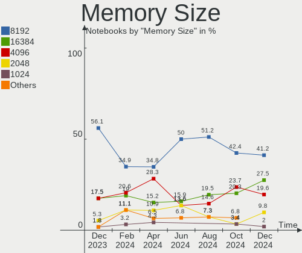

| Size  | Notebooks | Percent |
|-------|-----------|---------|
| 8192  | 21        | 42.86%  |
| 4096  | 11        | 22.45%  |
| 16384 | 7         | 14.29%  |
| 2048  | 5         | 10.2%   |
| 1024  | 2         | 4.08%   |
| 32768 | 1         | 2.04%   |
| 512   | 1         | 2.04%   |
| 256   | 1         | 2.04%   |

Memory Speed
------------

Memory module speed

| Speed   | Notebooks | Percent |
|---------|-----------|---------|
| 3200    | 17        | 36.17%  |
| 1600    | 8         | 17.02%  |
| 2667    | 7         | 14.89%  |
| 1334    | 4         | 8.51%   |
| 2400    | 2         | 4.26%   |
| 1333    | 2         | 4.26%   |
| 6400    | 1         | 2.13%   |
| 5600    | 1         | 2.13%   |
| 4800    | 1         | 2.13%   |
| 2048    | 1         | 2.13%   |
| 800     | 1         | 2.13%   |
| 667     | 1         | 2.13%   |
| Unknown | 1         | 2.13%   |

Printers & scanners
-------------------

Printer Vendor
--------------

Printer device vendors

| Vendor             | Notebooks | Percent |
|--------------------|-----------|---------|
| Brother Industries | 1         | 100%    |

Printer Model
-------------

Printer device models

| Model               | Notebooks | Percent |
|---------------------|-----------|---------|
| Brother DCP-L2520DW | 1         | 100%    |

Scanner Vendor
--------------

Scanner device vendors

Zero info for selected period =(

Scanner Model
-------------

Scanner device models

Zero info for selected period =(

Camera
------

Camera Vendor
-------------

Camera device vendors

| Vendor                                 | Notebooks | Percent |
|----------------------------------------|-----------|---------|
| Chicony Electronics                    | 17        | 22.97%  |
| Microdia                               | 12        | 16.22%  |
| Quanta                                 | 6         | 8.11%   |
| IMC Networks                           | 6         | 8.11%   |
| Bison Electronics                      | 6         | 8.11%   |
| Suyin                                  | 3         | 4.05%   |
| Sonix Technology                       | 3         | 4.05%   |
| Luxvisions Innotech Limited            | 3         | 4.05%   |
| Sunplus Innovation Technology          | 2         | 2.7%    |
| Samsung Electronics                    | 2         | 2.7%    |
| Realtek Semiconductor                  | 2         | 2.7%    |
| Apple                                  | 2         | 2.7%    |
| Y Media                                | 1         | 1.35%   |
| USB Camera CS                          | 1         | 1.35%   |
| Syntek                                 | 1         | 1.35%   |
| Ricoh                                  | 1         | 1.35%   |
| Lite-On Technology                     | 1         | 1.35%   |
| icSpring                               | 1         | 1.35%   |
| Creative Technology                    | 1         | 1.35%   |
| Cheng Uei Precision Industry (Foxlink) | 1         | 1.35%   |
| ALi                                    | 1         | 1.35%   |
| Acer                                   | 1         | 1.35%   |

Camera Model
------------

Camera device models

| Model                                                       | Notebooks | Percent |
|-------------------------------------------------------------|-----------|---------|
| Microdia Integrated_Webcam_HD                               | 6         | 8%      |
| Chicony HD WebCam                                           | 5         | 6.67%   |
| Microdia Webcam Vitade AF                                   | 4         | 5.33%   |
| Sonix USB2.0 HD UVC WebCam                                  | 3         | 4%      |
| Luxvisions Innotech Limited HP TrueVision HD Camera         | 3         | 4%      |
| Chicony Integrated Camera                                   | 3         | 4%      |
| Chicony HP Wide Vision HD Camera                            | 3         | 4%      |
| Suyin Acer/HP Integrated Webcam [CN0314]                    | 2         | 2.67%   |
| Samsung Galaxy series, misc. (MTP mode)                     | 2         | 2.67%   |
| Quanta HP Wide Vision HD Camera                             | 2         | 2.67%   |
| IMC Networks USB2.0 VGA UVC WebCam                          | 2         | 2.67%   |
| Bison BisonCam,NB Pro                                       | 2         | 2.67%   |
| Y Media USB Camera                                          | 1         | 1.33%   |
| USB Camera CS USB Camera CS                                 | 1         | 1.33%   |
| Syntek EasyCamera                                           | 1         | 1.33%   |
| Suyin 1.3M WebCam (notebook emachines E730, Acer sub-brand) | 1         | 1.33%   |
| Sunplus HP HD Webcam [Fixed]                                | 1         | 1.33%   |
| Sunplus Dell E5570 integrated webcam                        | 1         | 1.33%   |
| Ricoh Sony Vaio Integrated Webcam                           | 1         | 1.33%   |
| Realtek Lenovo EasyCamera                                   | 1         | 1.33%   |
| Realtek 2SF001                                              | 1         | 1.33%   |
| Quanta ov9734_techfront_camera                              | 1         | 1.33%   |
| Quanta HP True Vision FHD Camera                            | 1         | 1.33%   |
| Quanta HD User Facing                                       | 1         | 1.33%   |
| Quanta ACER HD User Facing                                  | 1         | 1.33%   |
| Microdia USB 2.0 Camera                                     | 1         | 1.33%   |
| Microdia Integrated_Webcam_FHD                              | 1         | 1.33%   |
| Microdia GC02M2                                             | 1         | 1.33%   |
| Lite-On HP TrueVision HD Camera                             | 1         | 1.33%   |
| IMC Networks USB2.0 HD UVC WebCam                           | 1         | 1.33%   |
| IMC Networks Lenovo EasyCamera                              | 1         | 1.33%   |
| IMC Networks Integrated Webcam                              | 1         | 1.33%   |
| IMC Networks Integrated Camera                              | 1         | 1.33%   |
| icSpring camera                                             | 1         | 1.33%   |
| Creative Live! Cam Sync 1080p V2                            | 1         | 1.33%   |
| Chicony USB2.0 Camera                                       | 1         | 1.33%   |
| Chicony Lenovo EasyCamera                                   | 1         | 1.33%   |
| Chicony HP Webcam                                           | 1         | 1.33%   |
| Chicony HD WebCam (Acer)                                    | 1         | 1.33%   |
| Chicony HD User Facing                                      | 1         | 1.33%   |

Security
--------

Fingerprint Vendor
------------------

Fingerprint sensor vendors

| Vendor                     | Notebooks | Percent |
|----------------------------|-----------|---------|
| Shenzhen Goodix Technology | 2         | 28.57%  |
| AuthenTec                  | 2         | 28.57%  |
| Validity Sensors           | 1         | 14.29%  |
| Synaptics                  | 1         | 14.29%  |
| Elan Microelectronics      | 1         | 14.29%  |

Fingerprint Model
-----------------

Fingerprint sensor models

| Model                                | Notebooks | Percent |
|--------------------------------------|-----------|---------|
| Validity Sensors VFS491              | 1         | 14.29%  |
| Shenzhen Goodix  Fingerprint Device  | 1         | 14.29%  |
| Shenzhen Goodix Fingerprint Reader   | 1         | 14.29%  |
| Elan ELAN:ARM-M4                     | 1         | 14.29%  |
| AuthenTec AES1660 Fingerprint Sensor | 1         | 14.29%  |
| AuthenTec AES1600                    | 1         | 14.29%  |
| Unknown                              | 1         | 14.29%  |

Chipcard Vendor
---------------

Chipcard module vendors

| Vendor                | Notebooks | Percent |
|-----------------------|-----------|---------|
| Broadcom              | 4         | 57.14%  |
| Upek                  | 1         | 14.29%  |
| Gemalto (was Gemplus) | 1         | 14.29%  |
| Cherry                | 1         | 14.29%  |

Chipcard Model
--------------

Chipcard module models

| Model                                                      | Notebooks | Percent |
|------------------------------------------------------------|-----------|---------|
| Broadcom 58200                                             | 3         | 42.86%  |
| Upek TouchChip Fingerprint Coprocessor (WBF advanced mode) | 1         | 14.29%  |
| Gemalto (was Gemplus) Compact Smart Card Reader Writer     | 1         | 14.29%  |
| Cherry SmartCard Reader Keyboard KC 1000 SC                | 1         | 14.29%  |
| Broadcom 5880                                              | 1         | 14.29%  |

Unsupported
-----------

Unsupported Devices
-------------------

Total unsupported devices on board

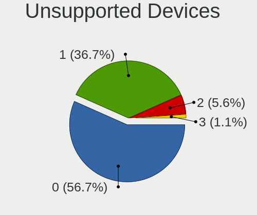

| Total | Notebooks | Percent |
|-------|-----------|---------|
| 0     | 64        | 73.56%  |
| 1     | 16        | 18.39%  |
| 3     | 3         | 3.45%   |
| 2     | 3         | 3.45%   |
| 4     | 1         | 1.15%   |

Unsupported Device Types
------------------------

Types of unsupported devices

| Type                  | Notebooks | Percent |
|-----------------------|-----------|---------|
| Graphics card         | 8         | 25%     |
| Fingerprint reader    | 7         | 21.88%  |
| Chipcard              | 5         | 15.63%  |
| Net/wireless          | 3         | 9.38%   |
| Multimedia controller | 3         | 9.38%   |
| Camera                | 2         | 6.25%   |
| Bluetooth             | 2         | 6.25%   |
| Storage/raid          | 1         | 3.13%   |
| Storage               | 1         | 3.13%   |

