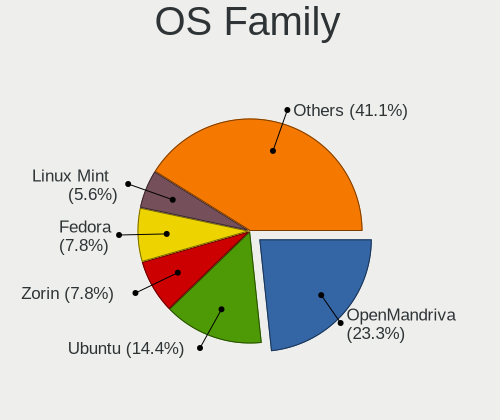
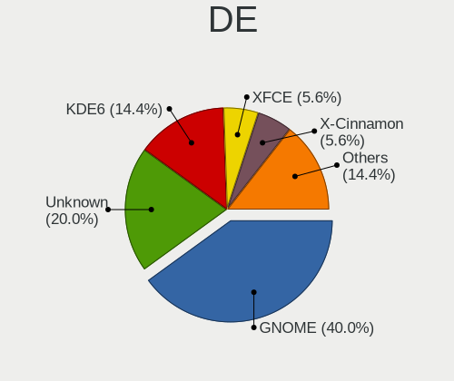
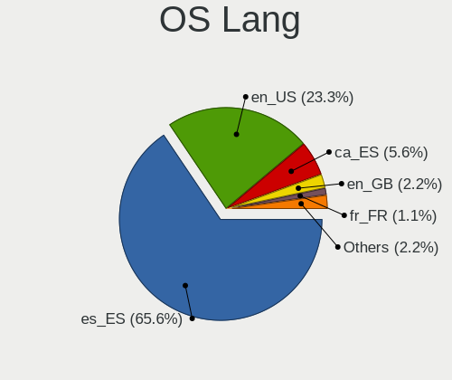
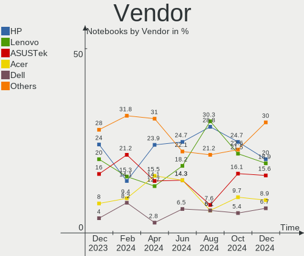
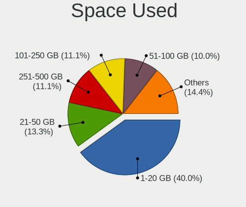
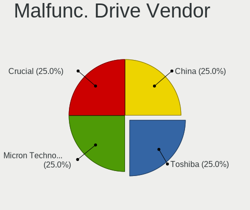
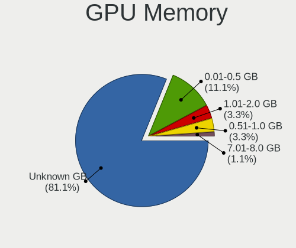
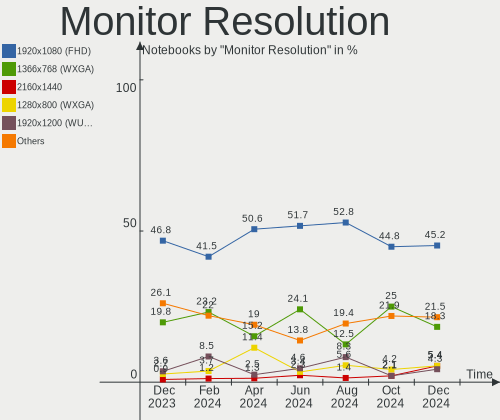

Linux in Spain - Hardware Trends (Notebooks)
--------------------------------------------

A project to identify most popular hardware characteristics and track their change
over time based on data collected by Linux users at https://Linux-Hardware.org.

Anyone can contribute to this report by the [hw-probe](https://github.com/linuxhw/hw-probe) tool:

    sudo -E hw-probe -all -upload

Period: Mar, 2023.

Contents
--------

* [ System ](#system)
  - [ OS                       ](#os)
  - [ OS Family                ](#os-family)
  - [ Kernel                   ](#kernel)
  - [ Kernel Family            ](#kernel-family)
  - [ Kernel Major Ver.        ](#kernel-major-ver)
  - [ Arch                     ](#arch)
  - [ DE                       ](#de)
  - [ Display Server           ](#display-server)
  - [ Display Manager          ](#display-manager)
  - [ OS Lang                  ](#os-lang)
  - [ Boot Mode                ](#boot-mode)
  - [ Filesystem               ](#filesystem)
  - [ Part. scheme             ](#part-scheme)
  - [ Dual Boot with Linux/BSD ](#dual-boot-with-linuxbsd)
  - [ Dual Boot (Win)          ](#dual-boot-win)

* [ Board ](#board)
  - [ Vendor                   ](#vendor)
  - [ Model                    ](#model)
  - [ Model Family             ](#model-family)
  - [ MFG Year                 ](#mfg-year)
  - [ Form Factor              ](#form-factor)
  - [ Secure Boot              ](#secure-boot)
  - [ Coreboot                 ](#coreboot)
  - [ RAM Size                 ](#ram-size)
  - [ RAM Used                 ](#ram-used)
  - [ Total Drives             ](#total-drives)
  - [ Has CD-ROM               ](#has-cd-rom)
  - [ Has Ethernet             ](#has-ethernet)
  - [ Has WiFi                 ](#has-wifi)
  - [ Has Bluetooth            ](#has-bluetooth)

* [ Location ](#location)
  - [ Country                  ](#country)
  - [ City                     ](#city)

* [ Drives ](#drives)
  - [ Drive Vendor             ](#drive-vendor)
  - [ Drive Model              ](#drive-model)
  - [ HDD Vendor               ](#hdd-vendor)
  - [ SSD Vendor               ](#ssd-vendor)
  - [ Drive Kind               ](#drive-kind)
  - [ Drive Connector          ](#drive-connector)
  - [ Drive Size               ](#drive-size)
  - [ Space Total              ](#space-total)
  - [ Space Used               ](#space-used)
  - [ Malfunc. Drives          ](#malfunc-drives)
  - [ Malfunc. Drive Vendor    ](#malfunc-drive-vendor)
  - [ Malfunc. HDD Vendor      ](#malfunc-hdd-vendor)
  - [ Malfunc. Drive Kind      ](#malfunc-drive-kind)
  - [ Failed Drives            ](#failed-drives)
  - [ Failed Drive Vendor      ](#failed-drive-vendor)
  - [ Drive Status             ](#drive-status)

* [ Storage controller ](#storage-controller)
  - [ Storage Vendor           ](#storage-vendor)
  - [ Storage Model            ](#storage-model)
  - [ Storage Kind             ](#storage-kind)

* [ Processor ](#processor)
  - [ CPU Vendor               ](#cpu-vendor)
  - [ CPU Model                ](#cpu-model)
  - [ CPU Model Family         ](#cpu-model-family)
  - [ CPU Cores                ](#cpu-cores)
  - [ CPU Sockets              ](#cpu-sockets)
  - [ CPU Threads              ](#cpu-threads)
  - [ CPU Op-Modes             ](#cpu-op-modes)
  - [ CPU Microcode            ](#cpu-microcode)
  - [ CPU Microarch            ](#cpu-microarch)

* [ Graphics ](#graphics)
  - [ GPU Vendor               ](#gpu-vendor)
  - [ GPU Model                ](#gpu-model)
  - [ GPU Combo                ](#gpu-combo)
  - [ GPU Driver               ](#gpu-driver)
  - [ GPU Memory               ](#gpu-memory)

* [ Monitor ](#monitor)
  - [ Monitor Vendor           ](#monitor-vendor)
  - [ Monitor Model            ](#monitor-model)
  - [ Monitor Resolution       ](#monitor-resolution)
  - [ Monitor Diagonal         ](#monitor-diagonal)
  - [ Monitor Width            ](#monitor-width)
  - [ Aspect Ratio             ](#aspect-ratio)
  - [ Monitor Area             ](#monitor-area)
  - [ Pixel Density            ](#pixel-density)
  - [ Multiple Monitors        ](#multiple-monitors)

* [ Network ](#network)
  - [ Net Controller Vendor    ](#net-controller-vendor)
  - [ Net Controller Model     ](#net-controller-model)
  - [ Wireless Vendor          ](#wireless-vendor)
  - [ Wireless Model           ](#wireless-model)
  - [ Ethernet Vendor          ](#ethernet-vendor)
  - [ Ethernet Model           ](#ethernet-model)
  - [ Net Controller Kind      ](#net-controller-kind)
  - [ Used Controller          ](#used-controller)
  - [ NICs                     ](#nics)
  - [ IPv6                     ](#ipv6)

* [ Bluetooth ](#bluetooth)
  - [ Bluetooth Vendor         ](#bluetooth-vendor)
  - [ Bluetooth Model          ](#bluetooth-model)

* [ Sound ](#sound)
  - [ Sound Vendor             ](#sound-vendor)
  - [ Sound Model              ](#sound-model)

* [ Memory ](#memory)
  - [ Memory Vendor            ](#memory-vendor)
  - [ Memory Model             ](#memory-model)
  - [ Memory Kind              ](#memory-kind)
  - [ Memory Form Factor       ](#memory-form-factor)
  - [ Memory Size              ](#memory-size)
  - [ Memory Speed             ](#memory-speed)

* [ Printers & scanners ](#printers--scanners)
  - [ Printer Vendor           ](#printer-vendor)
  - [ Printer Model            ](#printer-model)
  - [ Scanner Vendor           ](#scanner-vendor)
  - [ Scanner Model            ](#scanner-model)

* [ Camera ](#camera)
  - [ Camera Vendor            ](#camera-vendor)
  - [ Camera Model             ](#camera-model)

* [ Security ](#security)
  - [ Fingerprint Vendor       ](#fingerprint-vendor)
  - [ Fingerprint Model        ](#fingerprint-model)
  - [ Chipcard Vendor          ](#chipcard-vendor)
  - [ Chipcard Model           ](#chipcard-model)

* [ Unsupported ](#unsupported)
  - [ Unsupported Devices      ](#unsupported-devices)
  - [ Unsupported Device Types ](#unsupported-device-types)

System
------

OS
--

Installed operating systems

| Name               | Notebooks | Percent |
|--------------------|-----------|---------|
| Ubuntu 22.04       | 17        | 15.89%  |
| Fedora 37          | 11        | 10.28%  |
| Linux Mint 21.1    | 10        | 9.35%   |
| Zorin 16           | 6         | 5.61%   |
| Ubuntu 22.10       | 6         | 5.61%   |
| OpenMandriva 23.01 | 6         | 5.61%   |
| Kali 2023.1        | 5         | 4.67%   |
| OpenMandriva 23.03 | 4         | 3.74%   |
| Nobara 37          | 4         | 3.74%   |
| Debian 11          | 4         | 3.74%   |
| Ubuntu 20.04       | 3         | 2.8%    |
| SteamOS 3.4.4      | 2         | 1.87%   |
| Pop!_OS 22.04      | 2         | 1.87%   |
| Manjaro            | 2         | 1.87%   |
| LMDE 5             | 2         | 1.87%   |
| Linux Mint 20.3    | 2         | 1.87%   |
| Debian 12          | 2         | 1.87%   |
| ArcoLinux Rolling  | 2         | 1.87%   |
| Xubuntu 22.04      | 1         | 0.93%   |
| SteamOS 3.5        | 1         | 0.93%   |
| Puppy 9            | 1         | 0.93%   |
| Parrot 5.2         | 1         | 0.93%   |
| openSUSE Leap-15.4 | 1         | 0.93%   |
| OpenMandriva 4.3   | 1         | 0.93%   |
| OpenMandriva 4.2   | 1         | 0.93%   |
| Manjaro 22.0.5     | 1         | 0.93%   |
| Loc OS 22          | 1         | 0.93%   |
| Linux Mint 20.1    | 1         | 0.93%   |
| Linux Mint 19.3    | 1         | 0.93%   |
| Kubuntu 22.10      | 1         | 0.93%   |
| KDE neon 22.04     | 1         | 0.93%   |
| Gentoo 2.13        | 1         | 0.93%   |
| Elementary 7       | 1         | 0.93%   |
| Arch Rolling       | 1         | 0.93%   |
| antiX 22           | 1         | 0.93%   |

OS Family
---------

OS without a version

| Name         | Notebooks | Percent |
|--------------|-----------|---------|
| Ubuntu       | 26        | 24.3%   |
| Linux Mint   | 14        | 13.08%  |
| OpenMandriva | 12        | 11.21%  |
| Fedora       | 11        | 10.28%  |
| Zorin        | 6         | 5.61%   |
| Debian       | 6         | 5.61%   |
| Kali         | 5         | 4.67%   |
| Nobara       | 4         | 3.74%   |
| SteamOS      | 3         | 2.8%    |
| Manjaro      | 3         | 2.8%    |
| Pop!_OS      | 2         | 1.87%   |
| LMDE         | 2         | 1.87%   |
| ArcoLinux    | 2         | 1.87%   |
| Xubuntu      | 1         | 0.93%   |
| Puppy        | 1         | 0.93%   |
| Parrot       | 1         | 0.93%   |
| openSUSE     | 1         | 0.93%   |
| Loc OS       | 1         | 0.93%   |
| Kubuntu      | 1         | 0.93%   |
| KDE neon     | 1         | 0.93%   |
| Gentoo       | 1         | 0.93%   |
| Elementary   | 1         | 0.93%   |
| Arch         | 1         | 0.93%   |
| antiX        | 1         | 0.93%   |

Kernel
------

Version of the Linux kernel

| Version                      | Notebooks | Percent |
|------------------------------|-----------|---------|
| 5.19.0-35-generic            | 19        | 17.76%  |
| 5.15.0-67-generic            | 11        | 10.28%  |
| 6.1.1-desktop-1omv2290       | 6         | 5.61%   |
| 5.19.0-38-generic            | 5         | 4.67%   |
| 6.2.6-desktop-1omv2390       | 4         | 3.74%   |
| 5.4.0-144-generic            | 4         | 3.74%   |
| 6.1.0-kali5-amd64            | 3         | 2.8%    |
| 5.15.0-60-generic            | 3         | 2.8%    |
| 5.10.0-21-amd64              | 3         | 2.8%    |
| 6.2.7-200.fc37.x86_64        | 2         | 1.87%   |
| 6.2.6-201.fsync.fc37.x86_64  | 2         | 1.87%   |
| 6.1.18-200.fc37.x86_64       | 2         | 1.87%   |
| 6.1.14-200.fc37.x86_64       | 2         | 1.87%   |
| 5.15.0-69-generic            | 2         | 1.87%   |
| 5.13.0-valve36-1-neptune     | 2         | 1.87%   |
| 6.2.8-arch1-1                | 1         | 0.93%   |
| 6.2.8-060208-generic         | 1         | 0.93%   |
| 6.2.7-custom                 | 1         | 0.93%   |
| 6.2.2-gentoo-x86_64          | 1         | 0.93%   |
| 6.2.2-arch1-1                | 1         | 0.93%   |
| 6.1.4-203.fsync.fc37.x86_64  | 1         | 0.93%   |
| 6.1.19-1-MANJARO             | 1         | 0.93%   |
| 6.1.19-1-lts                 | 1         | 0.93%   |
| 6.1.15-200.fc37.x86_64       | 1         | 0.93%   |
| 6.1.13-200.fc37.x86_64       | 1         | 0.93%   |
| 6.1.12-valve2-1-neptune-61   | 1         | 0.93%   |
| 6.1.12-1-MANJARO             | 1         | 0.93%   |
| 6.1.11-76060111-generic      | 1         | 0.93%   |
| 6.1.11-201.fsync.fc37.x86_64 | 1         | 0.93%   |
| 6.1.11-200.fc37.x86_64       | 1         | 0.93%   |
| 6.1.10-200.fc37.x86_64       | 1         | 0.93%   |
| 6.1.0-kali7-amd64            | 1         | 0.93%   |
| 6.1.0-6-amd64                | 1         | 0.93%   |
| 6.1.0-5-amd64                | 1         | 0.93%   |
| 6.0.16-301.fsync.fc37.x86_64 | 1         | 0.93%   |
| 6.0.12-76060006-generic      | 1         | 0.93%   |
| 6.0.0-12parrot1-amd64        | 1         | 0.93%   |
| 5.4.53                       | 1         | 0.93%   |
| 5.4.0-53-generic             | 1         | 0.93%   |
| 5.19.0-21-generic            | 1         | 0.93%   |

Kernel Family
-------------

Linux kernel without a distro release

| Version  | Notebooks | Percent |
|----------|-----------|---------|
| 5.19.0   | 26        | 24.3%   |
| 5.15.0   | 16        | 14.95%  |
| 6.2.6    | 6         | 5.61%   |
| 6.1.1    | 6         | 5.61%   |
| 6.1.0    | 6         | 5.61%   |
| 5.10.0   | 6         | 5.61%   |
| 5.4.0    | 5         | 4.67%   |
| 6.2.7    | 3         | 2.8%    |
| 6.1.11   | 3         | 2.8%    |
| 5.13.0   | 3         | 2.8%    |
| 6.2.8    | 2         | 1.87%   |
| 6.2.2    | 2         | 1.87%   |
| 6.1.19   | 2         | 1.87%   |
| 6.1.18   | 2         | 1.87%   |
| 6.1.14   | 2         | 1.87%   |
| 6.1.12   | 2         | 1.87%   |
| 6.1.4    | 1         | 0.93%   |
| 6.1.15   | 1         | 0.93%   |
| 6.1.13   | 1         | 0.93%   |
| 6.1.10   | 1         | 0.93%   |
| 6.0.16   | 1         | 0.93%   |
| 6.0.12   | 1         | 0.93%   |
| 6.0.0    | 1         | 0.93%   |
| 5.4.53   | 1         | 0.93%   |
| 5.16.13  | 1         | 0.93%   |
| 5.15.102 | 1         | 0.93%   |
| 5.14.21  | 1         | 0.93%   |
| 5.14.0   | 1         | 0.93%   |
| 5.10.14  | 1         | 0.93%   |
| 5.10.109 | 1         | 0.93%   |
| 4.9.0    | 1         | 0.93%   |

Kernel Major Ver.
-----------------

Linux kernel major version

| Version | Notebooks | Percent |
|---------|-----------|---------|
| 6.1     | 27        | 25.23%  |
| 5.19    | 26        | 24.3%   |
| 5.15    | 17        | 15.89%  |
| 6.2     | 13        | 12.15%  |
| 5.10    | 8         | 7.48%   |
| 5.4     | 6         | 5.61%   |
| 6.0     | 3         | 2.8%    |
| 5.13    | 3         | 2.8%    |
| 5.14    | 2         | 1.87%   |
| 5.16    | 1         | 0.93%   |
| 4.9     | 1         | 0.93%   |

Arch
----

OS architecture (x86_64, i586, etc.)

| Name   | Notebooks | Percent |
|--------|-----------|---------|
| x86_64 | 105       | 98.13%  |
| i686   | 2         | 1.87%   |

DE
--

Desktop Environment

| Name          | Notebooks | Percent |
|---------------|-----------|---------|
| GNOME         | 48        | 44.86%  |
| KDE5          | 25        | 23.36%  |
| X-Cinnamon    | 12        | 11.21%  |
| XFCE          | 9         | 8.41%   |
| Cinnamon      | 3         | 2.8%    |
| Unknown       | 3         | 2.8%    |
| Pantheon      | 1         | 0.93%   |
| Openbox       | 1         | 0.93%   |
| MATE          | 1         | 0.93%   |
| icewm         | 1         | 0.93%   |
| i3            | 1         | 0.93%   |
| GNOME Classic | 1         | 0.93%   |
| DWM           | 1         | 0.93%   |

Display Server
--------------

X11 or Wayland

| Name    | Notebooks | Percent |
|---------|-----------|---------|
| X11     | 75        | 70.09%  |
| Wayland | 30        | 28.04%  |
| Tty     | 2         | 1.87%   |

Display Manager
---------------

SDDM, LightDM, etc.

| Name    | Notebooks | Percent |
|---------|-----------|---------|
| Unknown | 44        | 41.12%  |
| GDM3    | 28        | 26.17%  |
| SDDM    | 16        | 14.95%  |
| LightDM | 10        | 9.35%   |
| GDM     | 9         | 8.41%   |

OS Lang
-------

Language

| Lang    | Notebooks | Percent |
|---------|-----------|---------|
| es_ES   | 68        | 63.55%  |
| en_US   | 26        | 24.3%   |
| en_GB   | 5         | 4.67%   |
| ca_ES   | 4         | 3.74%   |
| de_DE   | 2         | 1.87%   |
| an_ES   | 1         | 0.93%   |
| Unknown | 1         | 0.93%   |

Boot Mode
---------

EFI or BIOS

| Mode | Notebooks | Percent |
|------|-----------|---------|
| EFI  | 63        | 58.88%  |
| BIOS | 44        | 41.12%  |

Filesystem
----------

Type of filesystem

| Type    | Notebooks | Percent |
|---------|-----------|---------|
| Ext4    | 78        | 72.9%   |
| Btrfs   | 18        | 16.82%  |
| Overlay | 8         | 7.48%   |
| Zfs     | 1         | 0.93%   |
| Ext3    | 1         | 0.93%   |
| Aufs    | 1         | 0.93%   |

Part. scheme
------------

Scheme of partitioning

| Type    | Notebooks | Percent |
|---------|-----------|---------|
| GPT     | 59        | 55.14%  |
| Unknown | 38        | 35.51%  |
| MBR     | 10        | 9.35%   |

Dual Boot with Linux/BSD
------------------------

Hosting more than one Linux/BSD

| Dual boot | Notebooks | Percent |
|-----------|-----------|---------|
| No        | 92        | 85.98%  |
| Yes       | 15        | 14.02%  |

Dual Boot (Win)
---------------

Hosting Linux and Windows

| Dual boot | Notebooks | Percent |
|-----------|-----------|---------|
| No        | 74        | 69.16%  |
| Yes       | 33        | 30.84%  |

Board
-----

Vendor
------

Motherboard manufacturer

| Name                | Notebooks | Percent |
|---------------------|-----------|---------|
| Lenovo              | 21        | 19.63%  |
| ASUSTek Computer    | 13        | 12.15%  |
| Hewlett-Packard     | 12        | 11.21%  |
| Acer                | 11        | 10.28%  |
| MSI                 | 9         | 8.41%   |
| Dell                | 7         | 6.54%   |
| Chuwi               | 7         | 6.54%   |
| HUAWEI              | 4         | 3.74%   |
| Valve               | 3         | 2.8%    |
| Notebook            | 3         | 2.8%    |
| Intel               | 3         | 2.8%    |
| Dynabook            | 3         | 2.8%    |
| Toshiba             | 2         | 1.87%   |
| Apple               | 2         | 1.87%   |
| TEKNOSERVICE        | 1         | 0.93%   |
| Sony                | 1         | 0.93%   |
| Samsung Electronics | 1         | 0.93%   |
| Razer               | 1         | 0.93%   |
| Packard Bell        | 1         | 0.93%   |
| Gigabyte Technology | 1         | 0.93%   |
| Fujitsu Siemens     | 1         | 0.93%   |

Model
-----

Motherboard model

| Name                                       | Notebooks | Percent |
|--------------------------------------------|-----------|---------|
| Chuwi GemiBook Pro                         | 4         | 3.74%   |
| Valve Jupiter                              | 3         | 2.8%    |
| Lenovo IdeaPad 3 15ITL6 82H8               | 2         | 1.87%   |
| Intel powered classmate PC                 | 2         | 1.87%   |
| HP OMEN by Laptop 16-c0xxx                 | 2         | 1.87%   |
| Chuwi HeroBook Air                         | 2         | 1.87%   |
| Toshiba Satellite Pro L300                 | 1         | 0.93%   |
| Toshiba Satellite A100                     | 1         | 0.93%   |
| TEKNOSERVICE NJ5x_NJ7xLU                   | 1         | 0.93%   |
| Sony SVF1521B1EW                           | 1         | 0.93%   |
| Samsung N150P/N210P/N220P                  | 1         | 0.93%   |
| Razer Blade 14 (2022) - RZ09-0427          | 1         | 0.93%   |
| Packard Bell EasyNote LJ75                 | 1         | 0.93%   |
| Notebook NL40_50CU                         | 1         | 0.93%   |
| Notebook N2x0WU                            | 1         | 0.93%   |
| Notebook L140CU                            | 1         | 0.93%   |
| MSI Stealth GS77 12UHS                     | 1         | 0.93%   |
| MSI Pulse GL66 12UEK                       | 1         | 0.93%   |
| MSI PE62 7RD                               | 1         | 0.93%   |
| MSI P65 Creator 8RD                        | 1         | 0.93%   |
| MSI Modern 15 A5M                          | 1         | 0.93%   |
| MSI Katana GF66 12UC                       | 1         | 0.93%   |
| MSI GL75 Leopard 10SEK                     | 1         | 0.93%   |
| MSI GF63 Thin 9SC                          | 1         | 0.93%   |
| MSI CX61 2PC                               | 1         | 0.93%   |
| Lenovo Y520-15IKBN 80WK                    | 1         | 0.93%   |
| Lenovo ThinkPad X1 Carbon Gen 9 20XW005GSP | 1         | 0.93%   |
| Lenovo ThinkPad X1 Carbon 5th 20HQS20422   | 1         | 0.93%   |
| Lenovo ThinkPad T480 20L6S3H102            | 1         | 0.93%   |
| Lenovo ThinkPad T15p Gen 1 20TN0005SP      | 1         | 0.93%   |
| Lenovo ThinkPad T14s Gen 2i 20WM00A8SP     | 1         | 0.93%   |
| Lenovo ThinkPad P1 Gen 2 20QUS10L17        | 1         | 0.93%   |
| Lenovo ThinkPad L14 Gen 3 21C1002SSP       | 1         | 0.93%   |
| Lenovo ThinkPad E490 20N8002ASP            | 1         | 0.93%   |
| Lenovo ThinkPad E15 Gen 4 21EDCTO1WW       | 1         | 0.93%   |
| Lenovo Legion 5 15ACH6H 82JU               | 1         | 0.93%   |
| Lenovo IdeaPad Gaming 3 15IAH7 82S9        | 1         | 0.93%   |
| Lenovo IdeaPad Gaming 3 15ARH05 82EY       | 1         | 0.93%   |
| Lenovo IdeaPad 330-15IKB 81DE              | 1         | 0.93%   |
| Lenovo IdeaPad 330-15ICH 81FK              | 1         | 0.93%   |

Model Family
------------

Motherboard model prefix

| Name                  | Notebooks | Percent |
|-----------------------|-----------|---------|
| Lenovo ThinkPad       | 9         | 8.41%   |
| Lenovo IdeaPad        | 8         | 7.48%   |
| Acer Aspire           | 8         | 7.48%   |
| Chuwi GemiBook        | 4         | 3.74%   |
| Valve Jupiter         | 3         | 2.8%    |
| HP Pavilion           | 3         | 2.8%    |
| Chuwi HeroBook        | 3         | 2.8%    |
| Toshiba Satellite     | 2         | 1.87%   |
| Intel powered         | 2         | 1.87%   |
| HP OMEN               | 2         | 1.87%   |
| HP 250                | 2         | 1.87%   |
| Dynabook Satellite    | 2         | 1.87%   |
| Dell Precision        | 2         | 1.87%   |
| Dell Latitude         | 2         | 1.87%   |
| ASUS ZenBook          | 2         | 1.87%   |
| ASUS ASUS             | 2         | 1.87%   |
| Acer TravelMate       | 2         | 1.87%   |
| TEKNOSERVICE NJ5x     | 1         | 0.93%   |
| Sony SVF1521B1EW      | 1         | 0.93%   |
| Samsung N150P         | 1         | 0.93%   |
| Razer Blade           | 1         | 0.93%   |
| Packard Bell EasyNote | 1         | 0.93%   |
| Notebook NL40         | 1         | 0.93%   |
| Notebook N2x0WU       | 1         | 0.93%   |
| Notebook L140CU       | 1         | 0.93%   |
| MSI Stealth           | 1         | 0.93%   |
| MSI Pulse             | 1         | 0.93%   |
| MSI PE62              | 1         | 0.93%   |
| MSI P65               | 1         | 0.93%   |
| MSI Modern            | 1         | 0.93%   |
| MSI Katana            | 1         | 0.93%   |
| MSI GL75              | 1         | 0.93%   |
| MSI GF63              | 1         | 0.93%   |
| MSI CX61              | 1         | 0.93%   |
| Lenovo Y520-15IKBN    | 1         | 0.93%   |
| Lenovo Legion         | 1         | 0.93%   |
| Lenovo G580           | 1         | 0.93%   |
| Lenovo G500           | 1         | 0.93%   |
| Intel Kabylake        | 1         | 0.93%   |
| HUAWEI NBLK-WAX9X     | 1         | 0.93%   |

MFG Year
--------

Motherboard manufacture year

| Year | Notebooks | Percent |
|------|-----------|---------|
| 2021 | 24        | 22.43%  |
| 2022 | 15        | 14.02%  |
| 2018 | 12        | 11.21%  |
| 2019 | 11        | 10.28%  |
| 2011 | 7         | 6.54%   |
| 2015 | 6         | 5.61%   |
| 2020 | 5         | 4.67%   |
| 2013 | 5         | 4.67%   |
| 2014 | 4         | 3.74%   |
| 2012 | 4         | 3.74%   |
| 2009 | 4         | 3.74%   |
| 2017 | 3         | 2.8%    |
| 2010 | 3         | 2.8%    |
| 2008 | 2         | 1.87%   |
| 2007 | 1         | 0.93%   |
| 2006 | 1         | 0.93%   |

Form Factor
-----------

Physical design of the computer

| Name     | Notebooks | Percent |
|----------|-----------|---------|
| Notebook | 107       | 100%    |

Secure Boot
-----------

Enabled or disabled

| State    | Notebooks | Percent |
|----------|-----------|---------|
| Disabled | 100       | 93.46%  |
| Enabled  | 7         | 6.54%   |

Coreboot
--------

Have coreboot on board

| Used | Notebooks | Percent |
|------|-----------|---------|
| No   | 107       | 100%    |

RAM Size
--------

Total RAM memory

| Size in GB  | Notebooks | Percent |
|-------------|-----------|---------|
| 4.01-8.0    | 24        | 22.43%  |
| 16.01-24.0  | 23        | 21.5%   |
| 8.01-16.0   | 23        | 21.5%   |
| 3.01-4.0    | 21        | 19.63%  |
| 32.01-64.0  | 7         | 6.54%   |
| 0.51-1.0    | 3         | 2.8%    |
| 2.01-3.0    | 2         | 1.87%   |
| 1.01-2.0    | 2         | 1.87%   |
| 24.01-32.0  | 1         | 0.93%   |
| 64.01-256.0 | 1         | 0.93%   |

RAM Used
--------

Used RAM memory

| Used GB    | Notebooks | Percent |
|------------|-----------|---------|
| 2.01-3.0   | 28        | 26.17%  |
| 1.01-2.0   | 28        | 26.17%  |
| 4.01-8.0   | 19        | 17.76%  |
| 3.01-4.0   | 15        | 14.02%  |
| 0.51-1.0   | 9         | 8.41%   |
| 8.01-16.0  | 6         | 5.61%   |
| 16.01-24.0 | 1         | 0.93%   |
| 0.01-0.5   | 1         | 0.93%   |

Total Drives
------------

Number of drives on board

| Drives | Notebooks | Percent |
|--------|-----------|---------|
| 1      | 81        | 75.7%   |
| 2      | 25        | 23.36%  |
| 3      | 1         | 0.93%   |

Has CD-ROM
----------

Has CD-ROM on board

| Presented | Notebooks | Percent |
|-----------|-----------|---------|
| No        | 81        | 75.7%   |
| Yes       | 26        | 24.3%   |

Has Ethernet
------------

Has Ethernet on board

| Presented | Notebooks | Percent |
|-----------|-----------|---------|
| Yes       | 81        | 75.7%   |
| No        | 26        | 24.3%   |

Has WiFi
--------

Has WiFi module

| Presented | Notebooks | Percent |
|-----------|-----------|---------|
| Yes       | 105       | 98.13%  |
| No        | 2         | 1.87%   |

Has Bluetooth
-------------

Has Bluetooth module

| Presented | Notebooks | Percent |
|-----------|-----------|---------|
| Yes       | 82        | 76.64%  |
| No        | 25        | 23.36%  |

Location
--------

Country
-------

Geographic location (country)

| Country | Notebooks | Percent |
|---------|-----------|---------|
| Spain   | 107       | 100%    |

City
----

Geographic location (city)

| City                        | Notebooks | Percent |
|-----------------------------|-----------|---------|
| Madrid                      | 21        | 19.63%  |
| Barcelona                   | 13        | 12.15%  |
| Vigo                        | 5         | 4.67%   |
| Málaga                     | 5         | 4.67%   |
| Zaragoza                    | 3         | 2.8%    |
| Seville                     | 3         | 2.8%    |
| Granada                     | 3         | 2.8%    |
| Terrassa                    | 2         | 1.87%   |
| Bilbao                      | 2         | 1.87%   |
| Almería                    | 2         | 1.87%   |
| Villanueva de la Torre      | 1         | 0.93%   |
| Villanueva de la Canada     | 1         | 0.93%   |
| Villafranca de los Barros   | 1         | 0.93%   |
| Villacarrillo               | 1         | 0.93%   |
| Vila-seca                   | 1         | 0.93%   |
| Vera                        | 1         | 0.93%   |
| Valladolid                  | 1         | 0.93%   |
| Tarragona                   | 1         | 0.93%   |
| Santa Coloma de Cervelló   | 1         | 0.93%   |
| Sant Vicenç dels Horts     | 1         | 0.93%   |
| San Martin de Montalban     | 1         | 0.93%   |
| San Cristóbal de La Laguna | 1         | 0.93%   |
| Salamanca                   | 1         | 0.93%   |
| Sabadell                    | 1         | 0.93%   |
| Rincon de la Victoria       | 1         | 0.93%   |
| Riells i Viabrea            | 1         | 0.93%   |
| Quart de Poblet             | 1         | 0.93%   |
| Puertollano                 | 1         | 0.93%   |
| Pinseque                    | 1         | 0.93%   |
| Paterna                     | 1         | 0.93%   |
| Palma                       | 1         | 0.93%   |
| Orallo                      | 1         | 0.93%   |
| Onda                        | 1         | 0.93%   |
| Navarcles                   | 1         | 0.93%   |
| Marbella                    | 1         | 0.93%   |
| Majadahonda                 | 1         | 0.93%   |
| Llanes                      | 1         | 0.93%   |
| Las Palmas de Gran Canaria  | 1         | 0.93%   |
| Laguna de Duero             | 1         | 0.93%   |
| L'Eliana                    | 1         | 0.93%   |

Drives
------

Drive Vendor
------------

Hard drive vendors

| Vendor                      | Notebooks | Drives | Percent |
|-----------------------------|-----------|--------|---------|
| Samsung Electronics         | 21        | 21     | 15.67%  |
| WDC                         | 17        | 17     | 12.69%  |
| Seagate                     | 16        | 16     | 11.94%  |
| Unknown                     | 7         | 7      | 5.22%   |
| Kingston                    | 7         | 7      | 5.22%   |
| Sandisk                     | 6         | 6      | 4.48%   |
| Micron Technology           | 6         | 6      | 4.48%   |
| Kingston Technology Company | 6         | 6      | 4.48%   |
| Toshiba                     | 5         | 5      | 3.73%   |
| Phison Electronics          | 5         | 5      | 3.73%   |
| Hitachi                     | 5         | 5      | 3.73%   |
| China                       | 5         | 5      | 3.73%   |
| Intel                       | 4         | 4      | 2.99%   |
| SK hynix                    | 3         | 3      | 2.24%   |
| Crucial                     | 3         | 4      | 2.24%   |
| KIOXIA                      | 2         | 2      | 1.49%   |
| Intenso                     | 2         | 2      | 1.49%   |
| HGST                        | 2         | 2      | 1.49%   |
| FORESEE                     | 2         | 2      | 1.49%   |
| Verbatim                    | 1         | 1      | 0.75%   |
| UMIS                        | 1         | 1      | 0.75%   |
| Realtek                     | 1         | 1      | 0.75%   |
| PNY                         | 1         | 1      | 0.75%   |
| Phison                      | 1         | 1      | 0.75%   |
| Netac                       | 1         | 1      | 0.75%   |
| Fujitsu                     | 1         | 1      | 0.75%   |
| BIWIN                       | 1         | 1      | 0.75%   |
| Apple                       | 1         | 1      | 0.75%   |
| A-DATA Technology           | 1         | 1      | 0.75%   |

Drive Model
-----------

Hard drive models

| Model                                               | Notebooks | Percent |
|-----------------------------------------------------|-----------|---------|
| Phison PS5013 E13 NVMe Controller 256GB             | 4         | 2.99%   |
| Seagate ST1000LM035-1RK172 1TB                      | 3         | 2.24%   |
| China G521N256GB SSD                                | 3         | 2.24%   |
| WDC WD10JPVX-22JC3T0 1TB                            | 2         | 1.49%   |
| Unknown MMC Card  128GB                             | 2         | 1.49%   |
| Toshiba MQ01ABD100 1TB                              | 2         | 1.49%   |
| Seagate ST1000LM048-2E7172 1TB                      | 2         | 1.49%   |
| Sandisk WD Black SN750 / PC SN730 NVMe SSD 1TB      | 2         | 1.49%   |
| Samsung NVMe SSD Controller SM981/PM981/PM983 250GB | 2         | 1.49%   |
| Kingston Company U-SNS8154P3 NVMe SSD 256GB         | 2         | 1.49%   |
| Kingston Company OM3PDP3 NVMe SSD 256GB             | 2         | 1.49%   |
| Kingston SA400S37240G 240GB SSD                     | 2         | 1.49%   |
| Hitachi HTS545050B9A300 500GB                       | 2         | 1.49%   |
| Hitachi HTS545016B9A300 160GB                       | 2         | 1.49%   |
| WDC WDS500G3X0C-00SJG0 500GB                        | 1         | 0.75%   |
| WDC WDS240G2G0A-00JH30 240GB SSD                    | 1         | 0.75%   |
| WDC WDS120G2G0B-00EPW0 120GB SSD                    | 1         | 0.75%   |
| WDC WDS120G2G0A-00JH30 120GB SSD                    | 1         | 0.75%   |
| WDC WDS100T1R0B-68A4Z0 1TB SSD                      | 1         | 0.75%   |
| WDC WD5000BEVT-22A0RT0 500GB                        | 1         | 0.75%   |
| WDC WD2500BEVS-22UST0 250GB                         | 1         | 0.75%   |
| WDC WD10SPZX-60Z10T0 1TB                            | 1         | 0.75%   |
| WDC WD10SPZX-24Z10 1TB                              | 1         | 0.75%   |
| WDC PC SN730 SDBQNTY-512G-1001 512GB                | 1         | 0.75%   |
| WDC PC SN730 SDBPNTY-1T00-1032 1TB                  | 1         | 0.75%   |
| WDC PC SN530 SDBPNPZ-512G-1006 512GB                | 1         | 0.75%   |
| WDC PC SN520 SDAPNUW-512G-1032 512GB                | 1         | 0.75%   |
| WDC PC SN520 SDAPNUW-256G-1002 256GB                | 1         | 0.75%   |
| WDC PC SN520 SDAPMUW-512G-1101 512GB                | 1         | 0.75%   |
| Verbatim MySSD Drive 512GB                          | 1         | 0.75%   |
| Unknown SA04G  4GB                                  | 1         | 0.75%   |
| Unknown MMC Card  32GB                              | 1         | 0.75%   |
| Unknown MMC Card  256GB                             | 1         | 0.75%   |
| Unknown M0S002  64GB                                | 1         | 0.75%   |
| Unknown ASTC  4GB                                   | 1         | 0.75%   |
| UMIS RPJTJ512MGE1QDQ 512GB                          | 1         | 0.75%   |
| Toshiba MQ01ABD050 500GB                            | 1         | 0.75%   |
| Toshiba KXG60ZNV512G 512GB                          | 1         | 0.75%   |
| Toshiba KBG30ZMT512G 512GB                          | 1         | 0.75%   |
| SK hynix PC611 NVMe 512GB                           | 1         | 0.75%   |

HDD Vendor
----------

Hard disk drive vendors

| Vendor              | Notebooks | Drives | Percent |
|---------------------|-----------|--------|---------|
| Seagate             | 16        | 16     | 45.71%  |
| WDC                 | 6         | 6      | 17.14%  |
| Hitachi             | 5         | 5      | 14.29%  |
| Toshiba             | 3         | 3      | 8.57%   |
| Samsung Electronics | 2         | 2      | 5.71%   |
| HGST                | 2         | 2      | 5.71%   |
| Fujitsu             | 1         | 1      | 2.86%   |

SSD Vendor
----------

Solid state drive vendors

| Vendor              | Notebooks | Drives | Percent |
|---------------------|-----------|--------|---------|
| Kingston            | 6         | 6      | 18.75%  |
| China               | 5         | 5      | 15.63%  |
| WDC                 | 4         | 4      | 12.5%   |
| Samsung Electronics | 4         | 4      | 12.5%   |
| Crucial             | 3         | 4      | 9.38%   |
| Intenso             | 2         | 2      | 6.25%   |
| FORESEE             | 2         | 2      | 6.25%   |
| Verbatim            | 1         | 1      | 3.13%   |
| PNY                 | 1         | 1      | 3.13%   |
| Netac               | 1         | 1      | 3.13%   |
| Intel               | 1         | 1      | 3.13%   |
| BIWIN               | 1         | 1      | 3.13%   |
| A-DATA Technology   | 1         | 1      | 3.13%   |

Drive Kind
----------

HDD or SSD

| Kind | Notebooks | Drives | Percent |
|------|-----------|--------|---------|
| NVMe | 54        | 60     | 42.52%  |
| HDD  | 35        | 35     | 27.56%  |
| SSD  | 31        | 33     | 24.41%  |
| MMC  | 7         | 7      | 5.51%   |

Drive Connector
---------------

SATA, SAS, NVMe, etc.

| Type | Notebooks | Drives | Percent |
|------|-----------|--------|---------|
| SATA | 57        | 66     | 47.11%  |
| NVMe | 54        | 59     | 44.63%  |
| MMC  | 7         | 7      | 5.79%   |
| SAS  | 3         | 3      | 2.48%   |

Drive Size
----------

Size of hard drive

| Size in TB | Notebooks | Drives | Percent |
|------------|-----------|--------|---------|
| 0.01-0.5   | 41        | 44     | 63.08%  |
| 0.51-1.0   | 21        | 21     | 32.31%  |
| 1.01-2.0   | 3         | 3      | 4.62%   |

Space Total
-----------

Amount of disk space available on the file system

| Size in GB     | Notebooks | Percent |
|----------------|-----------|---------|
| 101-250        | 42        | 39.25%  |
| 251-500        | 34        | 31.78%  |
| 1-20           | 8         | 7.48%   |
| 501-1000       | 8         | 7.48%   |
| 1001-2000      | 6         | 5.61%   |
| 51-100         | 4         | 3.74%   |
| 21-50          | 2         | 1.87%   |
| More than 3000 | 1         | 0.93%   |
| 2001-3000      | 1         | 0.93%   |
| Unknown        | 1         | 0.93%   |

Space Used
----------

Amount of used disk space

| Used GB  | Notebooks | Percent |
|----------|-----------|---------|
| 1-20     | 41        | 38.32%  |
| 101-250  | 21        | 19.63%  |
| 21-50    | 19        | 17.76%  |
| 51-100   | 12        | 11.21%  |
| 251-500  | 10        | 9.35%   |
| 501-1000 | 3         | 2.8%    |
| Unknown  | 1         | 0.93%   |

Malfunc. Drives
---------------

Drive models with a malfunction

| Model                         | Notebooks | Drives | Percent |
|-------------------------------|-----------|--------|---------|
| China G521N256GB SSD          | 3         | 3      | 33.33%  |
| WDC WD5000BEVT-22A0RT0 500GB  | 1         | 1      | 11.11%  |
| SK hynix PC611 NVMe 512GB     | 1         | 1      | 11.11%  |
| Seagate ST9250320AS 250GB     | 1         | 1      | 11.11%  |
| Hitachi HTS545050B9A300 500GB | 1         | 1      | 11.11%  |
| Fujitsu MHY2120BH 120GB       | 1         | 1      | 11.11%  |
| Crucial CT750MX300SSD1 752GB  | 1         | 1      | 11.11%  |

Malfunc. Drive Vendor
---------------------

Vendors of faulty drives

| Vendor   | Notebooks | Drives | Percent |
|----------|-----------|--------|---------|
| China    | 3         | 3      | 33.33%  |
| WDC      | 1         | 1      | 11.11%  |
| SK hynix | 1         | 1      | 11.11%  |
| Seagate  | 1         | 1      | 11.11%  |
| Hitachi  | 1         | 1      | 11.11%  |
| Fujitsu  | 1         | 1      | 11.11%  |
| Crucial  | 1         | 1      | 11.11%  |

Malfunc. HDD Vendor
-------------------

Vendors of faulty HDD drives

| Vendor  | Notebooks | Drives | Percent |
|---------|-----------|--------|---------|
| WDC     | 1         | 1      | 25%     |
| Seagate | 1         | 1      | 25%     |
| Hitachi | 1         | 1      | 25%     |
| Fujitsu | 1         | 1      | 25%     |

Malfunc. Drive Kind
-------------------

Kinds of faulty drives

| Kind | Notebooks | Drives | Percent |
|------|-----------|--------|---------|
| SSD  | 4         | 4      | 44.44%  |
| HDD  | 4         | 4      | 44.44%  |
| NVMe | 1         | 1      | 11.11%  |

Failed Drives
-------------

Failed drive models

Zero info for selected period =(

Failed Drive Vendor
-------------------

Failed drive vendors

Zero info for selected period =(

Drive Status
------------

Number of failed and malfunc. drives

| Status   | Notebooks | Drives | Percent |
|----------|-----------|--------|---------|
| Detected | 55        | 67     | 48.67%  |
| Works    | 49        | 59     | 43.36%  |
| Malfunc  | 9         | 9      | 7.96%   |

Storage controller
------------------

Storage Vendor
--------------

Storage controller vendors

| Vendor                       | Notebooks | Percent |
|------------------------------|-----------|---------|
| Intel                        | 70        | 52.63%  |
| Samsung Electronics          | 15        | 11.28%  |
| SanDisk                      | 12        | 9.02%   |
| AMD                          | 9         | 6.77%   |
| Kingston Technology Company  | 7         | 5.26%   |
| Micron Technology            | 6         | 4.51%   |
| Phison Electronics           | 5         | 3.76%   |
| SK hynix                     | 3         | 2.26%   |
| Toshiba America Info Systems | 2         | 1.5%    |
| KIOXIA                       | 2         | 1.5%    |
| Union Memory (Shenzhen)      | 1         | 0.75%   |
| Apple                        | 1         | 0.75%   |

Storage Model
-------------

Storage controller models

| Model                                                                          | Notebooks | Percent |
|--------------------------------------------------------------------------------|-----------|---------|
| AMD FCH SATA Controller [AHCI mode]                                            | 9         | 6.52%   |
| Samsung NVMe SSD Controller SM981/PM981/PM983                                  | 6         | 4.35%   |
| Intel 7 Series Chipset Family 6-port SATA Controller [AHCI mode]               | 6         | 4.35%   |
| Micron NVMe Storage Controller                                                 | 5         | 3.62%   |
| Intel Volume Management Device NVMe RAID Controller                            | 5         | 3.62%   |
| Intel 82801 Mobile SATA Controller [RAID mode]                                 | 5         | 3.62%   |
| Intel 6 Series/C200 Series Chipset Family 6 port Mobile SATA AHCI Controller   | 5         | 3.62%   |
| SanDisk WD Black SN750 / PC SN730 NVMe SSD                                     | 4         | 2.9%    |
| Samsung NVMe SSD Controller PM9A1/PM9A3/980PRO                                 | 4         | 2.9%    |
| Samsung NVMe SSD Controller 980                                                | 4         | 2.9%    |
| Phison PS5013 E13 NVMe Controller                                              | 4         | 2.9%    |
| Intel Sunrise Point-LP SATA Controller [AHCI mode]                             | 4         | 2.9%    |
| Intel NM10/ICH7 Family SATA Controller [AHCI mode]                             | 4         | 2.9%    |
| Intel Jasper Lake SATA AHCI Controller                                         | 4         | 2.9%    |
| Intel Cannon Lake Mobile PCH SATA AHCI Controller                              | 4         | 2.9%    |
| Intel 8 Series SATA Controller 1 [AHCI mode]                                   | 4         | 2.9%    |
| Kingston Company OM3PDP3 NVMe SSD                                              | 3         | 2.17%   |
| Intel Tiger Lake-LP SATA Controller                                            | 3         | 2.17%   |
| Intel Comet Lake SATA AHCI Controller                                          | 3         | 2.17%   |
| Intel Atom Processor E3800 Series SATA AHCI Controller                         | 3         | 2.17%   |
| Intel Alder Lake-P SATA AHCI Controller                                        | 3         | 2.17%   |
| Intel 5 Series/3400 Series Chipset 4 port SATA AHCI Controller                 | 3         | 2.17%   |
| SanDisk WD Blue SN550 NVMe SSD                                                 | 2         | 1.45%   |
| SanDisk WD Blue SN500 / PC SN520 NVMe SSD                                      | 2         | 1.45%   |
| KIOXIA NVMe SSD Controller BG4                                                 | 2         | 1.45%   |
| Kingston Company U-SNS8154P3 NVMe SSD                                          | 2         | 1.45%   |
| Intel SSD 660P Series                                                          | 2         | 1.45%   |
| Intel HM170/QM170 Chipset SATA Controller [AHCI Mode]                          | 2         | 1.45%   |
| Intel Celeron/Pentium Silver Processor SATA Controller                         | 2         | 1.45%   |
| Intel 8 Series/C220 Series Chipset Family 6-port SATA Controller 1 [AHCI mode] | 2         | 1.45%   |
| Intel 400 Series Chipset Family SATA AHCI Controller                           | 2         | 1.45%   |
| Union Memory (Shenzhen) AM630 PCIe 4.0 x4 NVMe SSD Controller                  | 1         | 0.72%   |
| Toshiba America Info Systems XG6 NVMe SSD Controller                           | 1         | 0.72%   |
| Toshiba America Info Systems BG3 NVMe SSD Controller                           | 1         | 0.72%   |
| SK hynix PC401 NVMe Solid State Drive 256GB                                    | 1         | 0.72%   |
| SK hynix Non-Volatile memory controller                                        | 1         | 0.72%   |
| SK hynix BC501 NVMe Solid State Drive                                          | 1         | 0.72%   |
| SanDisk WD Blue SN570 NVMe SSD 1TB                                             | 1         | 0.72%   |
| SanDisk PC SN520 NVMe SSD                                                      | 1         | 0.72%   |
| SanDisk NVMe Controller                                                        | 1         | 0.72%   |

Storage Kind
------------

Kind of storage controller (IDE, SATA, NVMe, SAS, ...)

| Kind | Notebooks | Percent |
|------|-----------|---------|
| SATA | 68        | 50.37%  |
| NVMe | 54        | 40%     |
| RAID | 10        | 7.41%   |
| IDE  | 3         | 2.22%   |

Processor
---------

CPU Vendor
----------

Processor vendors

| Vendor | Notebooks | Percent |
|--------|-----------|---------|
| Intel  | 87        | 81.31%  |
| AMD    | 20        | 18.69%  |

CPU Model
---------

Processor models

| Model                                         | Notebooks | Percent |
|-----------------------------------------------|-----------|---------|
| Intel Core i7-8750H CPU @ 2.20GHz             | 5         | 4.67%   |
| Intel 11th Gen Core i5-1135G7 @ 2.40GHz       | 5         | 4.67%   |
| Intel Celeron N5100 @ 1.10GHz                 | 4         | 3.74%   |
| Intel Core i5-10210U CPU @ 1.60GHz            | 3         | 2.8%    |
| Intel Atom CPU N450 @ 1.66GHz                 | 3         | 2.8%    |
| AMD Custom APU 0405                           | 3         | 2.8%    |
| Intel Core i7-9850H CPU @ 2.60GHz             | 2         | 1.87%   |
| Intel Core i7-3520M CPU @ 2.90GHz             | 2         | 1.87%   |
| Intel Core i7-10750H CPU @ 2.60GHz            | 2         | 1.87%   |
| Intel Core i7-10510U CPU @ 1.80GHz            | 2         | 1.87%   |
| Intel Core i5-8265U CPU @ 1.60GHz             | 2         | 1.87%   |
| Intel Core i5 CPU M 430 @ 2.27GHz             | 2         | 1.87%   |
| Intel Celeron N4020 CPU @ 1.10GHz             | 2         | 1.87%   |
| Intel 12th Gen Core i9-12900H                 | 2         | 1.87%   |
| Intel 12th Gen Core i7-12700H                 | 2         | 1.87%   |
| Intel 11th Gen Core i7-1165G7 @ 2.80GHz       | 2         | 1.87%   |
| AMD Ryzen 7 5800H with Radeon Graphics        | 2         | 1.87%   |
| AMD Ryzen 5 5500U with Radeon Graphics        | 2         | 1.87%   |
| AMD Ryzen 5 3500U with Radeon Vega Mobile Gfx | 2         | 1.87%   |
| AMD Ryzen 5 2500U with Radeon Vega Mobile Gfx | 2         | 1.87%   |
| Intel Pentium Dual-Core CPU T4200 @ 2.00GHz   | 1         | 0.93%   |
| Intel Pentium CPU N3540 @ 2.16GHz             | 1         | 0.93%   |
| Intel Pentium CPU 987 @ 1.50GHz               | 1         | 0.93%   |
| Intel CPU Version                             | 1         | 0.93%   |
| Intel Core M-5Y31 CPU @ 0.90GHz               | 1         | 0.93%   |
| Intel Core i7-9750H CPU @ 2.60GHz             | 1         | 0.93%   |
| Intel Core i7-8650U CPU @ 1.90GHz             | 1         | 0.93%   |
| Intel Core i7-8550U CPU @ 1.80GHz             | 1         | 0.93%   |
| Intel Core i7-7700HQ CPU @ 2.80GHz            | 1         | 0.93%   |
| Intel Core i7-7600U CPU @ 2.80GHz             | 1         | 0.93%   |
| Intel Core i7-6700HQ CPU @ 2.60GHz            | 1         | 0.93%   |
| Intel Core i7-4800MQ CPU @ 2.70GHz            | 1         | 0.93%   |
| Intel Core i7-4720HQ CPU @ 2.60GHz            | 1         | 0.93%   |
| Intel Core i7-4712MQ CPU @ 2.30GHz            | 1         | 0.93%   |
| Intel Core i7-2670QM CPU @ 2.20GHz            | 1         | 0.93%   |
| Intel Core i5-8250U CPU @ 1.60GHz             | 1         | 0.93%   |
| Intel Core i5-7300HQ CPU @ 2.50GHz            | 1         | 0.93%   |
| Intel Core i5-4210U CPU @ 1.70GHz             | 1         | 0.93%   |
| Intel Core i5-4200U CPU @ 1.60GHz             | 1         | 0.93%   |
| Intel Core i5-2467M CPU @ 1.60GHz             | 1         | 0.93%   |

CPU Model Family
----------------

Processor model prefix

| Model                   | Notebooks | Percent |
|-------------------------|-----------|---------|
| Intel Core i7           | 23        | 21.5%   |
| Other                   | 21        | 19.63%  |
| Intel Core i5           | 14        | 13.08%  |
| Intel Celeron           | 11        | 10.28%  |
| Intel Core i3           | 9         | 8.41%   |
| AMD Ryzen 5             | 7         | 6.54%   |
| Intel Atom              | 5         | 4.67%   |
| AMD Ryzen 7             | 5         | 4.67%   |
| Intel Pentium           | 2         | 1.87%   |
| Intel Core 2 Duo        | 2         | 1.87%   |
| AMD Ryzen 9             | 2         | 1.87%   |
| AMD A4                  | 2         | 1.87%   |
| Intel Pentium Dual-Core | 1         | 0.93%   |
| Intel Core M            | 1         | 0.93%   |
| Intel Core 2            | 1         | 0.93%   |
| AMD E2                  | 1         | 0.93%   |

CPU Cores
---------

Number of processor cores

| Number | Notebooks | Percent |
|--------|-----------|---------|
| 4      | 41        | 38.32%  |
| 2      | 34        | 31.78%  |
| 6      | 13        | 12.15%  |
| 8      | 8         | 7.48%   |
| 14     | 4         | 3.74%   |
| 1      | 4         | 3.74%   |
| 12     | 2         | 1.87%   |
| 10     | 1         | 0.93%   |

CPU Sockets
-----------

Number of sockets

| Number | Notebooks | Percent |
|--------|-----------|---------|
| 1      | 107       | 100%    |

CPU Threads
-----------

Threads per core (Hyper-Threading)

| Number | Notebooks | Percent |
|--------|-----------|---------|
| 2      | 82        | 76.64%  |
| 1      | 25        | 23.36%  |

CPU Op-Modes
------------

CPU Operation Modes (32-bit, 64-bit)

| Op mode        | Notebooks | Percent |
|----------------|-----------|---------|
| 32-bit, 64-bit | 107       | 100%    |

CPU Microcode
-------------

Microcode number

| Number     | Notebooks | Percent |
|------------|-----------|---------|
| Unknown    | 32        | 29.91%  |
| 0x806c1    | 6         | 5.61%   |
| 0x806ea    | 4         | 3.74%   |
| 0x206a7    | 4         | 3.74%   |
| 0x106ca    | 4         | 3.74%   |
| 0xa0652    | 3         | 2.8%    |
| 0x906ea    | 3         | 2.8%    |
| 0x906a3    | 3         | 2.8%    |
| 0x806ec    | 3         | 2.8%    |
| 0x30678    | 3         | 2.8%    |
| 0x20652    | 3         | 2.8%    |
| 0x0a50000d | 3         | 2.8%    |
| 0x0a50000c | 3         | 2.8%    |
| 0x906ed    | 2         | 1.87%   |
| 0x906e9    | 2         | 1.87%   |
| 0x906c0    | 2         | 1.87%   |
| 0x806eb    | 2         | 1.87%   |
| 0x706a8    | 2         | 1.87%   |
| 0x40651    | 2         | 1.87%   |
| 0x1067a    | 2         | 1.87%   |
| 0x08108109 | 2         | 1.87%   |
| 0x906a4    | 1         | 0.93%   |
| 0x806e9    | 1         | 0.93%   |
| 0x806d1    | 1         | 0.93%   |
| 0x806c2    | 1         | 0.93%   |
| 0x6fa      | 1         | 0.93%   |
| 0x6f6      | 1         | 0.93%   |
| 0x506e3    | 1         | 0.93%   |
| 0x406c4    | 1         | 0.93%   |
| 0x406c3    | 1         | 0.93%   |
| 0x306d4    | 1         | 0.93%   |
| 0x306a9    | 1         | 0.93%   |
| 0x0a404101 | 1         | 0.93%   |
| 0x08608103 | 1         | 0.93%   |
| 0x08608102 | 1         | 0.93%   |
| 0x08600104 | 1         | 0.93%   |
| 0x05000119 | 1         | 0.93%   |
| 0x03000027 | 1         | 0.93%   |

CPU Microarch
-------------

Microarchitecture

| Name             | Notebooks | Percent |
|------------------|-----------|---------|
| KabyLake         | 23        | 21.5%   |
| TigerLake        | 9         | 8.41%   |
| Unknown          | 9         | 8.41%   |
| SandyBridge      | 7         | 6.54%   |
| Haswell          | 7         | 6.54%   |
| Zen 3            | 6         | 5.61%   |
| Silvermont       | 5         | 4.67%   |
| Tremont          | 4         | 3.74%   |
| IvyBridge        | 4         | 3.74%   |
| Bonnell          | 4         | 3.74%   |
| Alderlake Hybrid | 4         | 3.74%   |
| Westmere         | 3         | 2.8%    |
| CometLake        | 3         | 2.8%    |
| Zen+             | 2         | 1.87%   |
| Zen              | 2         | 1.87%   |
| Penryn           | 2         | 1.87%   |
| Icelake          | 2         | 1.87%   |
| Goldmont plus    | 2         | 1.87%   |
| Core             | 2         | 1.87%   |
| Broadwell        | 2         | 1.87%   |
| Zen 2            | 1         | 0.93%   |
| Skylake          | 1         | 0.93%   |
| K10 Llano        | 1         | 0.93%   |
| Excavator        | 1         | 0.93%   |
| Bobcat           | 1         | 0.93%   |

Graphics
--------

GPU Vendor
----------

Vendors of graphics cards

| Vendor | Notebooks | Percent |
|--------|-----------|---------|
| Intel  | 82        | 56.94%  |
| Nvidia | 37        | 25.69%  |
| AMD    | 25        | 17.36%  |

GPU Model
---------

Graphics card models

| Model                                                                                    | Notebooks | Percent |
|------------------------------------------------------------------------------------------|-----------|---------|
| Intel TigerLake-LP GT2 [Iris Xe Graphics]                                                | 9         | 6.16%   |
| Intel CoffeeLake-H GT2 [UHD Graphics 630]                                                | 8         | 5.48%   |
| Intel Alder Lake-P Integrated Graphics Controller                                        | 6         | 4.11%   |
| Intel 2nd Generation Core Processor Family Integrated Graphics Controller                | 6         | 4.11%   |
| Intel CometLake-U GT2 [UHD Graphics]                                                     | 5         | 3.42%   |
| AMD Cezanne [Radeon Vega Series / Radeon Vega Mobile Series]                             | 5         | 3.42%   |
| Nvidia GA106M [GeForce RTX 3060 Mobile / Max-Q]                                          | 4         | 2.74%   |
| Intel JasperLake [UHD Graphics]                                                          | 4         | 2.74%   |
| Intel Haswell-ULT Integrated Graphics Controller                                         | 4         | 2.74%   |
| Intel Atom Processor D4xx/D5xx/N4xx/N5xx Integrated Graphics Controller                  | 4         | 2.74%   |
| Intel 3rd Gen Core processor Graphics Controller                                         | 4         | 2.74%   |
| Nvidia GP107M [GeForce GTX 1050 Mobile]                                                  | 3         | 2.05%   |
| Intel UHD Graphics 620                                                                   | 3         | 2.05%   |
| Intel HD Graphics 620                                                                    | 3         | 2.05%   |
| Intel CometLake-H GT2 [UHD Graphics]                                                     | 3         | 2.05%   |
| Intel Atom Processor Z36xxx/Z37xxx Series Graphics & Display                             | 3         | 2.05%   |
| Intel 4th Gen Core Processor Integrated Graphics Controller                              | 3         | 2.05%   |
| AMD VanGogh [AMD Custom GPU 0405]                                                        | 3         | 2.05%   |
| Nvidia TU117M                                                                            | 2         | 1.37%   |
| Nvidia GF117M [GeForce 610M/710M/810M/820M / GT 620M/625M/630M/720M]                     | 2         | 1.37%   |
| Nvidia GA107M [GeForce RTX 3050 Mobile]                                                  | 2         | 1.37%   |
| Nvidia GA104M [GeForce RTX 3070 Mobile / Max-Q]                                          | 2         | 1.37%   |
| Intel WhiskeyLake-U GT2 [UHD Graphics 620]                                               | 2         | 1.37%   |
| Intel Mobile 4 Series Chipset Integrated Graphics Controller                             | 2         | 1.37%   |
| Intel HD Graphics 630                                                                    | 2         | 1.37%   |
| Intel GeminiLake [UHD Graphics 600]                                                      | 2         | 1.37%   |
| Intel Atom/Celeron/Pentium Processor x5-E8000/J3xxx/N3xxx Integrated Graphics Controller | 2         | 1.37%   |
| AMD Raven Ridge [Radeon Vega Series / Radeon Vega Mobile Series]                         | 2         | 1.37%   |
| AMD Picasso/Raven 2 [Radeon Vega Series / Radeon Vega Mobile Series]                     | 2         | 1.37%   |
| AMD Park [Mobility Radeon HD 5430/5450/5470]                                             | 2         | 1.37%   |
| AMD Lucienne                                                                             | 2         | 1.37%   |
| Nvidia TU117M [GeForce GTX 1650 Mobile / Max-Q]                                          | 1         | 0.68%   |
| Nvidia TU117GLM [T600 Laptop GPU]                                                        | 1         | 0.68%   |
| Nvidia TU117GLM [Quadro T2000 Mobile / Max-Q]                                            | 1         | 0.68%   |
| Nvidia TU106M [GeForce RTX 2060 Mobile]                                                  | 1         | 0.68%   |
| Nvidia GP108M [GeForce MX150]                                                            | 1         | 0.68%   |
| Nvidia GP108BM [GeForce MX250]                                                           | 1         | 0.68%   |
| Nvidia GP107M [GeForce GTX 1050 Ti Mobile]                                               | 1         | 0.68%   |
| Nvidia GP107M [GeForce GTX 1050 3 GB Max-Q]                                              | 1         | 0.68%   |
| Nvidia GP106M [GeForce GTX 1060 Mobile]                                                  | 1         | 0.68%   |

GPU Combo
---------

Combinations of graphics cards

| Name           | Notebooks | Percent |
|----------------|-----------|---------|
| 1 x Intel      | 50        | 46.73%  |
| Intel + Nvidia | 31        | 28.97%  |
| 1 x AMD        | 18        | 16.82%  |
| AMD + Nvidia   | 5         | 4.67%   |
| 2 x AMD        | 1         | 0.93%   |
| 1 x Nvidia     | 1         | 0.93%   |
| Intel + AMD    | 1         | 0.93%   |

GPU Driver
----------

Free vs proprietary

| Driver      | Notebooks | Percent |
|-------------|-----------|---------|
| Free        | 88        | 82.24%  |
| Proprietary | 18        | 16.82%  |
| Unknown     | 1         | 0.93%   |

GPU Memory
----------

Total video memory

| Size in GB | Notebooks | Percent |
|------------|-----------|---------|
| Unknown    | 76        | 71.03%  |
| 0.01-0.5   | 10        | 9.35%   |
| 0.51-1.0   | 9         | 8.41%   |
| 5.01-6.0   | 4         | 3.74%   |
| 3.01-4.0   | 4         | 3.74%   |
| 7.01-8.0   | 2         | 1.87%   |
| 1.01-2.0   | 2         | 1.87%   |

Monitor
-------

Monitor Vendor
--------------

Monitor vendors

| Vendor                  | Notebooks | Percent |
|-------------------------|-----------|---------|
| Chimei Innolux          | 23        | 19.33%  |
| BOE                     | 21        | 17.65%  |
| AU Optronics            | 20        | 16.81%  |
| LG Display              | 11        | 9.24%   |
| Samsung Electronics     | 6         | 5.04%   |
| Dell                    | 5         | 4.2%    |
| Valve                   | 3         | 2.52%   |
| Sharp                   | 3         | 2.52%   |
| PANDA                   | 3         | 2.52%   |
| Goldstar                | 3         | 2.52%   |
| Philips                 | 2         | 1.68%   |
| LG Philips              | 2         | 1.68%   |
| Hewlett-Packard         | 2         | 1.68%   |
| CSO                     | 2         | 1.68%   |
| CPT                     | 2         | 1.68%   |
| Chi Mei Optoelectronics | 2         | 1.68%   |
| Apple                   | 2         | 1.68%   |
| Acer                    | 2         | 1.68%   |
| NEC Computers           | 1         | 0.84%   |
| Mi                      | 1         | 0.84%   |
| Lenovo                  | 1         | 0.84%   |
| Fujitsu Siemens         | 1         | 0.84%   |
| BenQ                    | 1         | 0.84%   |

Monitor Model
-------------

Monitor models

| Model                                                                 | Notebooks | Percent |
|-----------------------------------------------------------------------|-----------|---------|
| BOE LCD Monitor BOE0893 2160x1440 296x197mm 14.0-inch                 | 4         | 3.36%   |
| Valve ANX7530 U VLV3001 800x1280 100x150mm 7.1-inch                   | 3         | 2.52%   |
| Chimei Innolux LCD Monitor CMN1521 1920x1080 344x193mm 15.5-inch      | 3         | 2.52%   |
| LG Display LCD Monitor LGD033A 1366x768 344x194mm 15.5-inch           | 2         | 1.68%   |
| Dell P2419H DELD0DA 1920x1080 527x296mm 23.8-inch                     | 2         | 1.68%   |
| CPT LCD Monitor CPT1C85 1366x768 222x125mm 10.0-inch                  | 2         | 1.68%   |
| Chimei Innolux LCD Monitor CMN15F5 1920x1080 344x193mm 15.5-inch      | 2         | 1.68%   |
| Chimei Innolux LCD Monitor CMN15E8 1920x1080 344x193mm 15.5-inch      | 2         | 1.68%   |
| Chimei Innolux LCD Monitor CMN15E7 1920x1080 344x193mm 15.5-inch      | 2         | 1.68%   |
| Chimei Innolux LCD Monitor CMN15D5 1920x1080 344x193mm 15.5-inch      | 2         | 1.68%   |
| Chimei Innolux LCD Monitor CMN15BE 1366x768 344x194mm 15.5-inch       | 2         | 1.68%   |
| BOE LCD Monitor BOE06A5 1366x768 344x194mm 15.5-inch                  | 2         | 1.68%   |
| Sharp LQ140M1JW49 SHP1523 1920x1080 309x174mm 14.0-inch               | 1         | 0.84%   |
| Sharp LCD Monitor SHP1542 1920x1080 309x174mm 14.0-inch               | 1         | 0.84%   |
| Sharp LCD Monitor SHP14BA 1920x1080 344x194mm 15.5-inch               | 1         | 0.84%   |
| Samsung Electronics SyncMaster SAM010C 1280x1024 338x270mm 17.0-inch  | 1         | 0.84%   |
| Samsung Electronics S24D390 SAM0B65 1920x1080 521x293mm 23.5-inch     | 1         | 0.84%   |
| Samsung Electronics LCD Monitor SEC4251 1366x768 344x194mm 15.5-inch  | 1         | 0.84%   |
| Samsung Electronics LCD Monitor SDC4143 3840x2160 344x194mm 15.5-inch | 1         | 0.84%   |
| Samsung Electronics LCD Monitor SDC324C 1920x1080 344x194mm 15.5-inch | 1         | 0.84%   |
| Samsung Electronics C32JG5x SAM0FE0 2560x1440 697x392mm 31.5-inch     | 1         | 0.84%   |
| Philips PHL 243V5 PHLC0D1 1920x1080 521x293mm 23.5-inch               | 1         | 0.84%   |
| Philips PHL 221V8 PHLC211 1920x1080 477x268mm 21.5-inch               | 1         | 0.84%   |
| PANDA LCD Monitor NCP0046 1920x1080 344x194mm 15.5-inch               | 1         | 0.84%   |
| PANDA LCD Monitor NCP0035 1920x1080 309x174mm 14.0-inch               | 1         | 0.84%   |
| PANDA LCD Monitor NCP002D 1920x1080 344x194mm 15.5-inch               | 1         | 0.84%   |
| NEC Computers E233WM NEC2BE5 1920x1080 509x286mm 23.0-inch            | 1         | 0.84%   |
| Mi 27 NFGL XMIB004 1920x1080 598x336mm 27.0-inch                      | 1         | 0.84%   |
| LG Philips LP154WX4-TLC8 LPL0120 1280x800 331x207mm 15.4-inch         | 1         | 0.84%   |
| LG Philips LCD Monitor LPLC700 1280x800 331x207mm 15.4-inch           | 1         | 0.84%   |
| LG Display LCD Monitor LGD05D0 1920x1080 344x194mm 15.5-inch          | 1         | 0.84%   |
| LG Display LCD Monitor LGD05C8 1920x1080 344x194mm 15.5-inch          | 1         | 0.84%   |
| LG Display LCD Monitor LGD0533 1920x1080 344x194mm 15.5-inch          | 1         | 0.84%   |
| LG Display LCD Monitor LGD0468 1366x768 344x194mm 15.5-inch           | 1         | 0.84%   |
| LG Display LCD Monitor LGD0456 1366x768 344x194mm 15.5-inch           | 1         | 0.84%   |
| LG Display LCD Monitor LGD039F 1366x768 345x194mm 15.6-inch           | 1         | 0.84%   |
| LG Display LCD Monitor LGD033B 1366x768 344x194mm 15.5-inch           | 1         | 0.84%   |
| LG Display LCD Monitor LGD02DC 1366x768 344x194mm 15.5-inch           | 1         | 0.84%   |
| LG Display LCD Monitor LGD0259 1920x1080 345x194mm 15.6-inch          | 1         | 0.84%   |
| Lenovo C27-35 LEN66BA 1920x1080 597x336mm 27.0-inch                   | 1         | 0.84%   |

Monitor Resolution
------------------

Monitor screen resolution

| Resolution         | Notebooks | Percent |
|--------------------|-----------|---------|
| 1920x1080 (FHD)    | 56        | 51.38%  |
| 1366x768 (WXGA)    | 26        | 23.85%  |
| 2160x1440          | 5         | 4.59%   |
| 3840x2160 (4K)     | 4         | 3.67%   |
| 1280x800 (WXGA)    | 4         | 3.67%   |
| 800x1280           | 3         | 2.75%   |
| 1280x1024 (SXGA)   | 3         | 2.75%   |
| 1920x1200 (WUXGA)  | 2         | 1.83%   |
| 1024x600           | 2         | 1.83%   |
| 2560x1600          | 1         | 0.92%   |
| 2560x1440 (QHD)    | 1         | 0.92%   |
| 2304x1440          | 1         | 0.92%   |
| 1680x1050 (WSXGA+) | 1         | 0.92%   |

Monitor Diagonal
----------------

Diagonal size in inches

| Inches | Notebooks | Percent |
|--------|-----------|---------|
| 15     | 60        | 50.42%  |
| 14     | 12        | 10.08%  |
| 13     | 10        | 8.4%    |
| 24     | 5         | 4.2%    |
| 23     | 5         | 4.2%    |
| 27     | 4         | 3.36%   |
| 17     | 4         | 3.36%   |
| 10     | 4         | 3.36%   |
| 21     | 3         | 2.52%   |
| 7      | 3         | 2.52%   |
| 19     | 2         | 1.68%   |
| 16     | 2         | 1.68%   |
| 11     | 2         | 1.68%   |
| 31     | 1         | 0.84%   |
| 22     | 1         | 0.84%   |
| 12     | 1         | 0.84%   |

Monitor Width
-------------

Physical width

| Width in mm | Notebooks | Percent |
|-------------|-----------|---------|
| 301-350     | 73        | 62.39%  |
| 201-300     | 16        | 13.68%  |
| 501-600     | 13        | 11.11%  |
| 351-400     | 7         | 5.98%   |
| 401-500     | 4         | 3.42%   |
| 1-100       | 3         | 2.56%   |
| 601-700     | 1         | 0.85%   |

Aspect Ratio
------------

Proportional relationship between the width and the height

| Ratio | Notebooks | Percent |
|-------|-----------|---------|
| 16/9  | 85        | 80.95%  |
| 16/10 | 9         | 8.57%   |
| 3/2   | 5         | 4.76%   |
| 5/4   | 3         | 2.86%   |
| 0.67  | 3         | 2.86%   |

Monitor Area
------------

Area in inch²

| Area in inch² | Notebooks | Percent |
|----------------|-----------|---------|
| 101-110        | 62        | 53.45%  |
| 81-90          | 19        | 16.38%  |
| 201-250        | 10        | 8.62%   |
| 41-50          | 4         | 3.45%   |
| 301-350        | 4         | 3.45%   |
| 71-80          | 3         | 2.59%   |
| 1-40           | 3         | 2.59%   |
| 151-200        | 3         | 2.59%   |
| 121-130        | 3         | 2.59%   |
| 51-60          | 2         | 1.72%   |
| 61-70          | 1         | 0.86%   |
| 351-500        | 1         | 0.86%   |
| 141-150        | 1         | 0.86%   |

Pixel Density
-------------

Pixels per inch

| Density       | Notebooks | Percent |
|---------------|-----------|---------|
| 121-160       | 51        | 43.59%  |
| 101-120       | 26        | 22.22%  |
| 51-100        | 21        | 17.95%  |
| 161-240       | 15        | 12.82%  |
| More than 240 | 4         | 3.42%   |

Multiple Monitors
-----------------

Total monitors connected

| Total | Notebooks | Percent |
|-------|-----------|---------|
| 1     | 87        | 81.31%  |
| 2     | 16        | 14.95%  |
| 3     | 3         | 2.8%    |
| 0     | 1         | 0.93%   |

Network
-------

Net Controller Vendor
---------------------

Controller vendors

| Vendor                   | Notebooks | Percent |
|--------------------------|-----------|---------|
| Realtek Semiconductor    | 63        | 36.84%  |
| Intel                    | 50        | 29.24%  |
| Qualcomm Atheros         | 22        | 12.87%  |
| Broadcom                 | 12        | 7.02%   |
| MediaTek                 | 4         | 2.34%   |
| Broadcom Limited         | 4         | 2.34%   |
| JMicron Technology       | 3         | 1.75%   |
| TP-Link                  | 2         | 1.17%   |
| Ralink Technology        | 2         | 1.17%   |
| ASIX Electronics         | 2         | 1.17%   |
| Xiaomi                   | 1         | 0.58%   |
| T & A Mobile Phones      | 1         | 0.58%   |
| Ralink                   | 1         | 0.58%   |
| Marvell Technology Group | 1         | 0.58%   |
| Edimax Technology        | 1         | 0.58%   |
| Dell                     | 1         | 0.58%   |
| Accton Technology        | 1         | 0.58%   |

Net Controller Model
--------------------

Controller models

| Model                                                             | Notebooks | Percent |
|-------------------------------------------------------------------|-----------|---------|
| Realtek RTL8111/8168/8411 PCI Express Gigabit Ethernet Controller | 39        | 19.6%   |
| Intel Wi-Fi 6 AX201                                               | 8         | 4.02%   |
| Intel Alder Lake-P PCH CNVi WiFi                                  | 6         | 3.02%   |
| Realtek RTL8822CE 802.11ac PCIe Wireless Network Adapter          | 5         | 2.51%   |
| Realtek RTL810xE PCI Express Fast Ethernet controller             | 5         | 2.51%   |
| Intel Comet Lake PCH-LP CNVi WiFi                                 | 5         | 2.51%   |
| Intel Cannon Lake PCH CNVi WiFi                                   | 5         | 2.51%   |
| Realtek RTL8852AE 802.11ax PCIe Wireless Network Adapter          | 4         | 2.01%   |
| Broadcom BCM4313 802.11bgn Wireless Network Adapter               | 4         | 2.01%   |
| Realtek RTL8821CE 802.11ac PCIe Wireless Network Adapter          | 3         | 1.51%   |
| Realtek RTL8153 Gigabit Ethernet Adapter                          | 3         | 1.51%   |
| Qualcomm Atheros QCA9565 / AR9565 Wireless Network Adapter        | 3         | 1.51%   |
| Qualcomm Atheros QCA9377 802.11ac Wireless Network Adapter        | 3         | 1.51%   |
| Qualcomm Atheros AR9285 Wireless Network Adapter (PCI-Express)    | 3         | 1.51%   |
| Intel Wireless-AC 9260                                            | 3         | 1.51%   |
| Intel Wireless 3165                                               | 3         | 1.51%   |
| Intel Wi-Fi 6 AX201 160MHz                                        | 3         | 1.51%   |
| Intel Wi-Fi 6 AX200                                               | 3         | 1.51%   |
| Realtek RTL8812AU 802.11a/b/g/n/ac 2T2R DB WLAN Adapter           | 2         | 1.01%   |
| Realtek RTL8723BU 802.11b/g/n WLAN Adapter                        | 2         | 1.01%   |
| Realtek RTL8191SEvB Wireless LAN Controller                       | 2         | 1.01%   |
| Realtek RTL8125 2.5GbE Controller                                 | 2         | 1.01%   |
| Qualcomm Atheros QCA6174 802.11ac Wireless Network Adapter        | 2         | 1.01%   |
| Qualcomm Atheros AR928X Wireless Network Adapter (PCI-Express)    | 2         | 1.01%   |
| Qualcomm Atheros AR8151 v2.0 Gigabit Ethernet                     | 2         | 1.01%   |
| MediaTek MT7921 802.11ax PCI Express Wireless Network Adapter     | 2         | 1.01%   |
| JMicron JMC260 PCI Express Fast Ethernet Controller               | 2         | 1.01%   |
| Intel Wireless 8265 / 8275                                        | 2         | 1.01%   |
| Intel PRO/Wireless 3945ABG [Golan] Network Connection             | 2         | 1.01%   |
| Intel Ethernet Connection (4) I219-LM                             | 2         | 1.01%   |
| Intel Ethernet Connection (16) I219-V                             | 2         | 1.01%   |
| Intel Comet Lake PCH CNVi WiFi                                    | 2         | 1.01%   |
| Broadcom NetLink BCM57785 Gigabit Ethernet PCIe                   | 2         | 1.01%   |
| Broadcom Limited NetLink BCM57780 Gigabit Ethernet PCIe           | 2         | 1.01%   |
| Broadcom BCM43142 802.11b/g/n                                     | 2         | 1.01%   |
| ASIX AX88179 Gigabit Ethernet                                     | 2         | 1.01%   |
| Xiaomi Mi/Redmi series (RNDIS + ADB)                              | 1         | 0.5%    |
| TP-Link AC600 wireless Realtek RTL8811AU [Archer T2U Nano]        | 1         | 0.5%    |
| TP-Link 802.11ac NIC                                              | 1         | 0.5%    |
| T & A Mobile Phones Unisoc Phone                                  | 1         | 0.5%    |

Wireless Vendor
---------------

Wireless vendors

| Vendor                | Notebooks | Percent |
|-----------------------|-----------|---------|
| Intel                 | 50        | 43.86%  |
| Realtek Semiconductor | 26        | 22.81%  |
| Qualcomm Atheros      | 16        | 14.04%  |
| Broadcom              | 9         | 7.89%   |
| MediaTek              | 4         | 3.51%   |
| TP-Link               | 2         | 1.75%   |
| Ralink Technology     | 2         | 1.75%   |
| Ralink                | 1         | 0.88%   |
| Edimax Technology     | 1         | 0.88%   |
| Dell                  | 1         | 0.88%   |
| Broadcom Limited      | 1         | 0.88%   |
| Accton Technology     | 1         | 0.88%   |

Wireless Model
--------------

Wireless models

| Model                                                          | Notebooks | Percent |
|----------------------------------------------------------------|-----------|---------|
| Intel Wi-Fi 6 AX201                                            | 8         | 7.02%   |
| Intel Alder Lake-P PCH CNVi WiFi                               | 6         | 5.26%   |
| Realtek RTL8822CE 802.11ac PCIe Wireless Network Adapter       | 5         | 4.39%   |
| Intel Comet Lake PCH-LP CNVi WiFi                              | 5         | 4.39%   |
| Intel Cannon Lake PCH CNVi WiFi                                | 5         | 4.39%   |
| Realtek RTL8852AE 802.11ax PCIe Wireless Network Adapter       | 4         | 3.51%   |
| Broadcom BCM4313 802.11bgn Wireless Network Adapter            | 4         | 3.51%   |
| Realtek RTL8821CE 802.11ac PCIe Wireless Network Adapter       | 3         | 2.63%   |
| Qualcomm Atheros QCA9565 / AR9565 Wireless Network Adapter     | 3         | 2.63%   |
| Qualcomm Atheros QCA9377 802.11ac Wireless Network Adapter     | 3         | 2.63%   |
| Qualcomm Atheros AR9285 Wireless Network Adapter (PCI-Express) | 3         | 2.63%   |
| Intel Wireless-AC 9260                                         | 3         | 2.63%   |
| Intel Wireless 3165                                            | 3         | 2.63%   |
| Intel Wi-Fi 6 AX201 160MHz                                     | 3         | 2.63%   |
| Intel Wi-Fi 6 AX200                                            | 3         | 2.63%   |
| Realtek RTL8812AU 802.11a/b/g/n/ac 2T2R DB WLAN Adapter        | 2         | 1.75%   |
| Realtek RTL8723BU 802.11b/g/n WLAN Adapter                     | 2         | 1.75%   |
| Realtek RTL8191SEvB Wireless LAN Controller                    | 2         | 1.75%   |
| Qualcomm Atheros QCA6174 802.11ac Wireless Network Adapter     | 2         | 1.75%   |
| Qualcomm Atheros AR928X Wireless Network Adapter (PCI-Express) | 2         | 1.75%   |
| MediaTek MT7921 802.11ax PCI Express Wireless Network Adapter  | 2         | 1.75%   |
| Intel Wireless 8265 / 8275                                     | 2         | 1.75%   |
| Intel PRO/Wireless 3945ABG [Golan] Network Connection          | 2         | 1.75%   |
| Intel Comet Lake PCH CNVi WiFi                                 | 2         | 1.75%   |
| Broadcom BCM43142 802.11b/g/n                                  | 2         | 1.75%   |
| TP-Link AC600 wireless Realtek RTL8811AU [Archer T2U Nano]     | 1         | 0.88%   |
| TP-Link 802.11ac NIC                                           | 1         | 0.88%   |
| Realtek RTL88x2bu [AC1200 Techkey]                             | 1         | 0.88%   |
| Realtek RTL8852BE PCIe 802.11ax Wireless Network Controller    | 1         | 0.88%   |
| Realtek RTL8822BE 802.11a/b/g/n/ac WiFi adapter                | 1         | 0.88%   |
| Realtek RTL8821AE 802.11ac PCIe Wireless Network Adapter       | 1         | 0.88%   |
| Realtek RTL8723AE PCIe Wireless Network Adapter                | 1         | 0.88%   |
| Realtek RTL8188EE Wireless Network Adapter                     | 1         | 0.88%   |
| Realtek RTL8188CE 802.11b/g/n WiFi Adapter                     | 1         | 0.88%   |
| Realtek 802.11n WLAN Adapter                                   | 1         | 0.88%   |
| Ralink RT5372 Wireless Adapter                                 | 1         | 0.88%   |
| Ralink RT2870/RT3070 Wireless Adapter                          | 1         | 0.88%   |
| Ralink RT5390 Wireless 802.11n 1T/1R PCIe                      | 1         | 0.88%   |
| Qualcomm Atheros AR9485 Wireless Network Adapter               | 1         | 0.88%   |
| Qualcomm Atheros AR9462 Wireless Network Adapter               | 1         | 0.88%   |

Ethernet Vendor
---------------

Ethernet vendors

| Vendor                   | Notebooks | Percent |
|--------------------------|-----------|---------|
| Realtek Semiconductor    | 51        | 60.71%  |
| Intel                    | 11        | 13.1%   |
| Qualcomm Atheros         | 6         | 7.14%   |
| Broadcom                 | 6         | 7.14%   |
| JMicron Technology       | 3         | 3.57%   |
| Broadcom Limited         | 3         | 3.57%   |
| ASIX Electronics         | 2         | 2.38%   |
| Xiaomi                   | 1         | 1.19%   |
| Marvell Technology Group | 1         | 1.19%   |

Ethernet Model
--------------

Ethernet models

| Model                                                             | Notebooks | Percent |
|-------------------------------------------------------------------|-----------|---------|
| Realtek RTL8111/8168/8411 PCI Express Gigabit Ethernet Controller | 39        | 46.43%  |
| Realtek RTL810xE PCI Express Fast Ethernet controller             | 5         | 5.95%   |
| Realtek RTL8153 Gigabit Ethernet Adapter                          | 3         | 3.57%   |
| Realtek RTL8125 2.5GbE Controller                                 | 2         | 2.38%   |
| Qualcomm Atheros AR8151 v2.0 Gigabit Ethernet                     | 2         | 2.38%   |
| JMicron JMC260 PCI Express Fast Ethernet Controller               | 2         | 2.38%   |
| Intel Ethernet Connection (4) I219-LM                             | 2         | 2.38%   |
| Intel Ethernet Connection (16) I219-V                             | 2         | 2.38%   |
| Broadcom NetLink BCM57785 Gigabit Ethernet PCIe                   | 2         | 2.38%   |
| Broadcom Limited NetLink BCM57780 Gigabit Ethernet PCIe           | 2         | 2.38%   |
| ASIX AX88179 Gigabit Ethernet                                     | 2         | 2.38%   |
| Xiaomi Mi/Redmi series (RNDIS + ADB)                              | 1         | 1.19%   |
| Realtek RTL8152 Fast Ethernet Adapter                             | 1         | 1.19%   |
| Realtek Killer E3000 2.5GbE Controller                            | 1         | 1.19%   |
| Qualcomm Atheros QCA8172 Fast Ethernet                            | 1         | 1.19%   |
| Qualcomm Atheros QCA8171 Gigabit Ethernet                         | 1         | 1.19%   |
| Qualcomm Atheros AR8162 Fast Ethernet                             | 1         | 1.19%   |
| Qualcomm Atheros AR8161 Gigabit Ethernet                          | 1         | 1.19%   |
| Marvell Group 88E8040 PCI-E Fast Ethernet Controller              | 1         | 1.19%   |
| JMicron JMC250 PCI Express Gigabit Ethernet Controller            | 1         | 1.19%   |
| Intel PRO/100 VE Network Connection                               | 1         | 1.19%   |
| Intel Ethernet Connection I217-LM                                 | 1         | 1.19%   |
| Intel Ethernet Connection (7) I219-LM                             | 1         | 1.19%   |
| Intel Ethernet Connection (16) I219-LM                            | 1         | 1.19%   |
| Intel Ethernet Connection (13) I219-V                             | 1         | 1.19%   |
| Intel Ethernet Connection (11) I219-V                             | 1         | 1.19%   |
| Intel 82567LF Gigabit Network Connection                          | 1         | 1.19%   |
| Broadcom NetXtreme BCM57786 Gigabit Ethernet PCIe                 | 1         | 1.19%   |
| Broadcom NetXtreme BCM57765 Gigabit Ethernet PCIe                 | 1         | 1.19%   |
| Broadcom NetLink BCM5787M Gigabit Ethernet PCI Express            | 1         | 1.19%   |
| Broadcom NetLink BCM57780 Gigabit Ethernet PCIe                   | 1         | 1.19%   |
| Broadcom Limited NetXtreme BCM5761 Gigabit Ethernet PCIe          | 1         | 1.19%   |

Net Controller Kind
-------------------

Ethernet, WiFi or modem

| Kind     | Notebooks | Percent |
|----------|-----------|---------|
| WiFi     | 105       | 56.15%  |
| Ethernet | 81        | 43.32%  |
| Unknown  | 1         | 0.53%   |

Used Controller
---------------

Currently used network controller

| Kind     | Notebooks | Percent |
|----------|-----------|---------|
| WiFi     | 84        | 81.55%  |
| Ethernet | 19        | 18.45%  |

NICs
----

Total network controllers on board

| Total | Notebooks | Percent |
|-------|-----------|---------|
| 2     | 74        | 69.16%  |
| 1     | 28        | 26.17%  |
| 0     | 5         | 4.67%   |

IPv6
----

IPv6 vs IPv4

| Used | Notebooks | Percent |
|------|-----------|---------|
| No   | 102       | 95.33%  |
| Yes  | 5         | 4.67%   |

Bluetooth
---------

Bluetooth Vendor
----------------

Controller vendors

| Vendor                          | Notebooks | Percent |
|---------------------------------|-----------|---------|
| Intel                           | 44        | 53.66%  |
| Realtek Semiconductor           | 10        | 12.2%   |
| Qualcomm Atheros Communications | 6         | 7.32%   |
| IMC Networks                    | 6         | 7.32%   |
| Lite-On Technology              | 5         | 6.1%    |
| Foxconn / Hon Hai               | 4         | 4.88%   |
| Realtek                         | 2         | 2.44%   |
| Toshiba                         | 1         | 1.22%   |
| Taiyo Yuden                     | 1         | 1.22%   |
| MediaTek                        | 1         | 1.22%   |
| Dell                            | 1         | 1.22%   |
| Apple                           | 1         | 1.22%   |

Bluetooth Model
---------------

Controller models

| Model                                          | Notebooks | Percent |
|------------------------------------------------|-----------|---------|
| Intel AX201 Bluetooth                          | 16        | 19.51%  |
| Intel Bluetooth 9460/9560 Jefferson Peak (JfP) | 11        | 13.41%  |
| Realtek Bluetooth Radio                        | 7         | 8.54%   |
| Intel Bluetooth wireless interface             | 6         | 7.32%   |
| Intel Wireless-AC 9260 Bluetooth Adapter       | 3         | 3.66%   |
| Intel Bluetooth Device                         | 3         | 3.66%   |
| Intel AX200 Bluetooth                          | 3         | 3.66%   |
| IMC Networks Bluetooth Radio                   | 3         | 3.66%   |
| Realtek  Bluetooth 4.2 Adapter                 | 2         | 2.44%   |
| Realtek Bluetooth Radio                        | 2         | 2.44%   |
| Qualcomm Atheros  Bluetooth Device             | 2         | 2.44%   |
| Qualcomm Atheros QCA61x4 Bluetooth 4.0         | 2         | 2.44%   |
| Qualcomm Atheros AR3011 Bluetooth              | 2         | 2.44%   |
| Lite-On Atheros AR3012 Bluetooth               | 2         | 2.44%   |
| Toshiba Integrated Bluetooth HCI               | 1         | 1.22%   |
| Taiyo Yuden Bluetooth Device                   | 1         | 1.22%   |
| Realtek RTL8821A Bluetooth                     | 1         | 1.22%   |
| MediaTek Wireless_Device                       | 1         | 1.22%   |
| Lite-On Wireless_Device                        | 1         | 1.22%   |
| Lite-On Qualcomm Atheros QCA9377 Bluetooth     | 1         | 1.22%   |
| Lite-On BCM43142A0                             | 1         | 1.22%   |
| Intel Wireless-AC 3168 Bluetooth               | 1         | 1.22%   |
| Intel Centrino Bluetooth Wireless Transceiver  | 1         | 1.22%   |
| IMC Networks Wireless_Device                   | 1         | 1.22%   |
| IMC Networks Bluetooth                         | 1         | 1.22%   |
| IMC Networks Atheros AR3012 Bluetooth          | 1         | 1.22%   |
| Foxconn / Hon Hai Wireless_Device              | 1         | 1.22%   |
| Foxconn / Hon Hai Broadcom BCM20702 Bluetooth  | 1         | 1.22%   |
| Foxconn / Hon Hai Bluetooth Device             | 1         | 1.22%   |
| Foxconn / Hon Hai BCM43142A0                   | 1         | 1.22%   |
| Dell DW375 Bluetooth Module                    | 1         | 1.22%   |
| Apple Bluetooth USB Host Controller            | 1         | 1.22%   |

Sound
-----

Sound Vendor
------------

Sound card vendors

| Vendor              | Notebooks | Percent |
|---------------------|-----------|---------|
| Intel               | 86        | 64.18%  |
| AMD                 | 24        | 17.91%  |
| Nvidia              | 18        | 13.43%  |
| Lenovo              | 2         | 1.49%   |
| Samsung Electronics | 1         | 0.75%   |
| Plantronics         | 1         | 0.75%   |
| M-Audio             | 1         | 0.75%   |
| Logitech            | 1         | 0.75%   |

Sound Model
-----------

Sound card models

| Model                                                                      | Notebooks | Percent |
|----------------------------------------------------------------------------|-----------|---------|
| AMD Family 17h/19h HD Audio Controller                                     | 14        | 8.75%   |
| Intel Tiger Lake-LP Smart Sound Technology Audio Controller                | 9         | 5.63%   |
| Intel Cannon Lake PCH cAVS                                                 | 8         | 5%      |
| Intel Alder Lake PCH-P High Definition Audio Controller                    | 7         | 4.38%   |
| AMD Renoir Radeon High Definition Audio Controller                         | 7         | 4.38%   |
| Intel Sunrise Point-LP HD Audio                                            | 6         | 3.75%   |
| Intel 7 Series/C216 Chipset Family High Definition Audio Controller        | 6         | 3.75%   |
| Intel NM10/ICH7 Family High Definition Audio Controller                    | 5         | 3.13%   |
| Intel Comet Lake PCH-LP cAVS                                               | 5         | 3.13%   |
| Intel 6 Series/C200 Series Chipset Family High Definition Audio Controller | 5         | 3.13%   |
| Nvidia GA106 High Definition Audio Controller                              | 4         | 2.5%    |
| Intel Jasper Lake HD Audio                                                 | 4         | 2.5%    |
| Intel Haswell-ULT HD Audio Controller                                      | 4         | 2.5%    |
| Intel 8 Series HD Audio Controller                                         | 4         | 2.5%    |
| AMD Rembrandt Radeon High Definition Audio Controller                      | 4         | 2.5%    |
| AMD Raven/Raven2/Fenghuang HDMI/DP Audio Controller                        | 4         | 2.5%    |
| Nvidia Audio device                                                        | 3         | 1.88%   |
| Intel Xeon E3-1200 v3/4th Gen Core Processor HD Audio Controller           | 3         | 1.88%   |
| Intel Comet Lake PCH cAVS                                                  | 3         | 1.88%   |
| Intel Atom Processor Z36xxx/Z37xxx Series High Definition Audio Controller | 3         | 1.88%   |
| Intel 8 Series/C220 Series Chipset High Definition Audio Controller        | 3         | 1.88%   |
| Intel 5 Series/3400 Series Chipset High Definition Audio                   | 3         | 1.88%   |
| Nvidia TU107 GeForce GTX 1650 High Definition Audio Controller             | 2         | 1.25%   |
| Nvidia GP106 High Definition Audio Controller                              | 2         | 1.25%   |
| Nvidia GA104 High Definition Audio Controller                              | 2         | 1.25%   |
| Intel Wildcat Point-LP High Definition Audio Controller                    | 2         | 1.25%   |
| Intel CM238 HD Audio Controller                                            | 2         | 1.25%   |
| Intel Celeron/Pentium Silver Processor High Definition Audio               | 2         | 1.25%   |
| Intel Cannon Point-LP High Definition Audio Controller                     | 2         | 1.25%   |
| Intel Broadwell-U Audio Controller                                         | 2         | 1.25%   |
| Intel 82801I (ICH9 Family) HD Audio Controller                             | 2         | 1.25%   |
| AMD FCH Azalia Controller                                                  | 2         | 1.25%   |
| AMD Cedar HDMI Audio [Radeon HD 5400/6300/7300 Series]                     | 2         | 1.25%   |
| Samsung Electronics USB C Earphones                                        | 1         | 0.63%   |
| Plantronics BT600                                                          | 1         | 0.63%   |
| Nvidia TU106 High Definition Audio Controller                              | 1         | 0.63%   |
| Nvidia GP107GL High Definition Audio Controller                            | 1         | 0.63%   |
| Nvidia GP104 High Definition Audio Controller                              | 1         | 0.63%   |
| Nvidia GK208 HDMI/DP Audio Controller                                      | 1         | 0.63%   |
| Nvidia GF108 High Definition Audio Controller                              | 1         | 0.63%   |

Memory
------

Memory Vendor
-------------

Memory module vendors

| Vendor              | Notebooks | Percent |
|---------------------|-----------|---------|
| Samsung Electronics | 18        | 27.69%  |
| Micron Technology   | 13        | 20%     |
| SK hynix            | 9         | 13.85%  |
| Unknown             | 7         | 10.77%  |
| Crucial             | 5         | 7.69%   |
| Ramaxel Technology  | 3         | 4.62%   |
| Kingston            | 3         | 4.62%   |
| Elpida              | 2         | 3.08%   |
| A-DATA Technology   | 2         | 3.08%   |
| Unknown (ABCD)      | 1         | 1.54%   |
| Neo Forza           | 1         | 1.54%   |
| Unknown             | 1         | 1.54%   |

Memory Model
------------

Memory module models

| Model                                                                    | Notebooks | Percent |
|--------------------------------------------------------------------------|-----------|---------|
| Micron RAM 53E1G32D4NQ-046WTE 4GB Row Of Chips LPDDR4 3200MT/s           | 4         | 5.97%   |
| Unknown RAM Module 1GB SODIMM DDR2 667MT/s                               | 2         | 2.99%   |
| Unknown RAM Module 1024MB SODIMM DDR2 667MT/s                            | 2         | 2.99%   |
| SK hynix RAM HMAA1GS6CJR6N-XN 8GB SODIMM DDR4 3200MT/s                   | 2         | 2.99%   |
| Samsung RAM M471A1K43EB1-CWE 8GB SODIMM DDR4 3200MT/s                    | 2         | 2.99%   |
| Ramaxel RAM RMSA3300ME78HBF-2666 16GB SODIMM DDR4 2667MT/s               | 2         | 2.99%   |
| Micron RAM 8ATF1G64HZ-3G2R1 8GB SODIMM DDR4 3200MT/s                     | 2         | 2.99%   |
| Unknown RAM Module 8GB SODIMM DDR3 1333MT/s                              | 1         | 1.49%   |
| Unknown RAM Module 4GB SODIMM DDR3                                       | 1         | 1.49%   |
| Unknown RAM Module 2GB SODIMM DDR3 1600MT/s                              | 1         | 1.49%   |
| Unknown RAM Module 2GB SODIMM DDR3 1066MT/s                              | 1         | 1.49%   |
| Unknown (ABCD) RAM 123456789012345678 2GB SODIMM LPDDR4 2400MT/s         | 1         | 1.49%   |
| SK hynix RAM HMT451S6BFR8A-PB 4GB SODIMM DDR3 1600MT/s                   | 1         | 1.49%   |
| SK hynix RAM HMT351S6EFR8A-PB 4GB SODIMM DDR3 1600MT/s                   | 1         | 1.49%   |
| SK hynix RAM HMAA4GS6AJR8N-XN 32GB SODIMM DDR4 3200MT/s                  | 1         | 1.49%   |
| SK hynix RAM HMA851S6CJR6N-VK 4GB Row Of Chips DDR4 2667MT/s             | 1         | 1.49%   |
| SK hynix RAM HMA82GS6CJR8N-VK 16GB SODIMM DDR4 2667MT/s                  | 1         | 1.49%   |
| SK hynix RAM HMA82GS6AFR8N-UH 16GB SODIMM DDR4 2667MT/s                  | 1         | 1.49%   |
| SK hynix RAM HCNNNFAMMLXR-NEE 4GB Row Of Chips LPDDR4 4267MT/s           | 1         | 1.49%   |
| Samsung RAM UBE3D4AA-MGCR 2GB Row Of Chips LPDDR4 4267MT/s               | 1         | 1.49%   |
| Samsung RAM Module 16GB SODIMM DDR4 2667MT/s                             | 1         | 1.49%   |
| Samsung RAM M471B5673EH1-CF8 2GB SODIMM DDR3 4199MT/s                    | 1         | 1.49%   |
| Samsung RAM M471B5273DH0-CH9 4GB SODIMM DDR3 1334MT/s                    | 1         | 1.49%   |
| Samsung RAM M471A5244CB0-CTD 4GB SODIMM DDR4 3266MT/s                    | 1         | 1.49%   |
| Samsung RAM M471A5244CB0-CRC 4GB SODIMM DDR4 2667MT/s                    | 1         | 1.49%   |
| Samsung RAM M471A2G43BB2-CWE 16GB SODIMM DDR4 3200MT/s                   | 1         | 1.49%   |
| Samsung RAM M471A1K43DB1-CWE 8GB SODIMM DDR4 3200MT/s                    | 1         | 1.49%   |
| Samsung RAM M471A1K43DB1-CTD 8GB SODIMM DDR4 2667MT/s                    | 1         | 1.49%   |
| Samsung RAM M471A1K43CB1-CTD 8GB SODIMM DDR4 2667MT/s                    | 1         | 1.49%   |
| Samsung RAM M471A1G44BB0-CWE 8GB SODIMM DDR4 3200MT/s                    | 1         | 1.49%   |
| Samsung RAM M471A1G44AB0-CWE 8GB SODIMM DDR4 3200MT/s                    | 1         | 1.49%   |
| Samsung RAM M425R4GA3BB0-CQKOD 32GB SODIMM DDR5 4800MT/s                 | 1         | 1.49%   |
| Samsung RAM K4EBE3 4ED-EGCG 8GB Row Of Chips LPDDR3 2133MT/s             | 1         | 1.49%   |
| Samsung RAM K4E6E304EC-EGCG 4GB Row Of Chips LPDDR3 2133MT/s             | 1         | 1.49%   |
| Samsung RAM K4A8G165WC-BCTD 4GB Row Of Chips DDR4 2667MT/s               | 1         | 1.49%   |
| Samsung RAM C5C5C5C5C5C5C5C5C5C5C5C5C5C5C5C5C5C5 2GB SODIMM DDR2 800MT/s | 1         | 1.49%   |
| Ramaxel RAM RMSA3260MH78HAF-2666 8192MB SODIMM DDR4 2667MT/s             | 1         | 1.49%   |
| Neo Forza RAM NMSO440D85-2666E 4GB SODIMM DDR4 2667MT/s                  | 1         | 1.49%   |
| Micron RAM MTC4C10163S1SC48BA1 8GB Row Of Chips DDR5 4800MT/s            | 1         | 1.49%   |
| Micron RAM MTC16C2085S1SC48BA1 32GB SODIMM DDR5 4800MT/s                 | 1         | 1.49%   |

Memory Kind
-----------

Memory module kinds

| Kind   | Notebooks | Percent |
|--------|-----------|---------|
| DDR4   | 31        | 50.82%  |
| DDR3   | 11        | 18.03%  |
| LPDDR4 | 7         | 11.48%  |
| DDR2   | 5         | 8.2%    |
| LPDDR3 | 3         | 4.92%   |
| DDR5   | 3         | 4.92%   |
| SDRAM  | 1         | 1.64%   |

Memory Form Factor
------------------

Physical design of the memory module

| Name         | Notebooks | Percent |
|--------------|-----------|---------|
| SODIMM       | 49        | 80.33%  |
| Row Of Chips | 12        | 19.67%  |

Memory Size
-----------

Memory module size

| Size  | Notebooks | Percent |
|-------|-----------|---------|
| 8192  | 23        | 37.1%   |
| 4096  | 19        | 30.65%  |
| 16384 | 9         | 14.52%  |
| 2048  | 4         | 6.45%   |
| 1024  | 4         | 6.45%   |
| 32768 | 3         | 4.84%   |

Memory Speed
------------

Memory module speed

| Speed   | Notebooks | Percent |
|---------|-----------|---------|
| 3200    | 18        | 28.13%  |
| 2667    | 17        | 26.56%  |
| 1600    | 5         | 7.81%   |
| 667     | 4         | 6.25%   |
| 4800    | 3         | 4.69%   |
| 2400    | 3         | 4.69%   |
| 4267    | 2         | 3.13%   |
| 2133    | 2         | 3.13%   |
| 1334    | 2         | 3.13%   |
| 4199    | 1         | 1.56%   |
| 3266    | 1         | 1.56%   |
| 1867    | 1         | 1.56%   |
| 1333    | 1         | 1.56%   |
| 1067    | 1         | 1.56%   |
| 1066    | 1         | 1.56%   |
| 800     | 1         | 1.56%   |
| Unknown | 1         | 1.56%   |

Printers & scanners
-------------------

Printer Vendor
--------------

Printer device vendors

| Vendor          | Notebooks | Percent |
|-----------------|-----------|---------|
| Hewlett-Packard | 1         | 100%    |

Printer Model
-------------

Printer device models

| Model                  | Notebooks | Percent |
|------------------------|-----------|---------|
| HP DeskJet 2600 series | 1         | 100%    |

Scanner Vendor
--------------

Scanner device vendors

Zero info for selected period =(

Scanner Model
-------------

Scanner device models

Zero info for selected period =(

Camera
------

Camera Vendor
-------------

Camera device vendors

| Vendor                                 | Notebooks | Percent |
|----------------------------------------|-----------|---------|
| Chicony Electronics                    | 19        | 21.59%  |
| IMC Networks                           | 12        | 13.64%  |
| Acer                                   | 11        | 12.5%   |
| Sunplus Innovation Technology          | 7         | 7.95%   |
| Microdia                               | 7         | 7.95%   |
| Syntek                                 | 5         | 5.68%   |
| Realtek Semiconductor                  | 5         | 5.68%   |
| Quanta                                 | 5         | 5.68%   |
| Alcor Micro                            | 4         | 4.55%   |
| USB Camera                             | 2         | 2.27%   |
| Suyin                                  | 2         | 2.27%   |
| Luxvisions Innotech Limited            | 2         | 2.27%   |
| Z-Star Microelectronics                | 1         | 1.14%   |
| Sonix Technology                       | 1         | 1.14%   |
| Silicon Motion                         | 1         | 1.14%   |
| Lite-On Technology                     | 1         | 1.14%   |
| Generalplus Technology                 | 1         | 1.14%   |
| Cheng Uei Precision Industry (Foxlink) | 1         | 1.14%   |
| Apple                                  | 1         | 1.14%   |

Camera Model
------------

Camera device models

| Model                                                | Notebooks | Percent |
|------------------------------------------------------|-----------|---------|
| Chicony Integrated Camera                            | 4         | 4.55%   |
| Chicony HD WebCam                                    | 4         | 4.55%   |
| Acer HD Webcam                                       | 4         | 4.55%   |
| Sunplus Hy HD Camera                                 | 3         | 3.41%   |
| IMC Networks USB2.0 HD UVC WebCam                    | 3         | 3.41%   |
| IMC Networks Integrated Camera                       | 3         | 3.41%   |
| Chicony USB2.0 Camera                                | 3         | 3.41%   |
| Alcor Micro Asus Integrated Webcam                   | 3         | 3.41%   |
| USB Camera USB Camera                                | 2         | 2.27%   |
| Syntek Integrated Camera                             | 2         | 2.27%   |
| Syntek EasyCamera                                    | 2         | 2.27%   |
| Realtek USB Camera                                   | 2         | 2.27%   |
| Realtek F117                                         | 2         | 2.27%   |
| Quanta HP Wide Vision HD Camera                      | 2         | 2.27%   |
| Microdia Webcam Vitade AF                            | 2         | 2.27%   |
| Microdia Integrated_Webcam_HD                        | 2         | 2.27%   |
| IMC Networks ov9734_azurewave_camera                 | 2         | 2.27%   |
| Chicony Acer CrystalEye Webcam                       | 2         | 2.27%   |
| Acer Integrated Camera                               | 2         | 2.27%   |
| Acer EasyCamera                                      | 2         | 2.27%   |
| Z-Star Webcam                                        | 1         | 1.14%   |
| Syntek Lenovo EasyCamera                             | 1         | 1.14%   |
| Suyin HP TrueVision HD Integrated Webcam             | 1         | 1.14%   |
| Suyin Acer CrystalEye Webcam                         | 1         | 1.14%   |
| Sunplus USB Camera                                   | 1         | 1.14%   |
| Sunplus Integrated_Webcam_HD                         | 1         | 1.14%   |
| Sunplus HD WebCam                                    | 1         | 1.14%   |
| Sunplus 1.3M HD WebCam                               | 1         | 1.14%   |
| Sonix USB2.0 HD UVC WebCam                           | 1         | 1.14%   |
| Silicon Motion HP Webcam-50                          | 1         | 1.14%   |
| Realtek Lenovo EasyCamera                            | 1         | 1.14%   |
| Quanta HP TrueVision HD Camera                       | 1         | 1.14%   |
| Quanta HD User Facing                                | 1         | 1.14%   |
| Quanta HD Camera                                     | 1         | 1.14%   |
| Microdia Laptop_Integrated_Webcam_HD                 | 1         | 1.14%   |
| Microdia Integrated_Webcam_FHD                       | 1         | 1.14%   |
| Microdia HP Webcam                                   | 1         | 1.14%   |
| Luxvisions Innotech Limited HP Wide Vision HD Camera | 1         | 1.14%   |
| Luxvisions Innotech Limited HP HD Camera             | 1         | 1.14%   |
| Lite-On HP Webcam                                    | 1         | 1.14%   |

Security
--------

Fingerprint Vendor
------------------

Fingerprint sensor vendors

| Vendor                     | Notebooks | Percent |
|----------------------------|-----------|---------|
| Synaptics                  | 6         | 42.86%  |
| Shenzhen Goodix Technology | 4         | 28.57%  |
| Elan Microelectronics      | 2         | 14.29%  |
| Validity Sensors           | 1         | 7.14%   |
| AuthenTec                  | 1         | 7.14%   |

Fingerprint Model
-----------------

Fingerprint sensor models

| Model                                             | Notebooks | Percent |
|---------------------------------------------------|-----------|---------|
| Shenzhen Goodix  Fingerprint Device               | 4         | 28.57%  |
| Synaptics UWP WBDI Device                         | 2         | 14.29%  |
| Synaptics Prometheus MIS Touch Fingerprint Reader | 2         | 14.29%  |
| Validity Sensors Synaptics WBDI                   | 1         | 7.14%   |
| Synaptics Metallica MOH Touch Fingerprint Reader  | 1         | 7.14%   |
| Synaptics Metallica MIS Touch Fingerprint Reader  | 1         | 7.14%   |
| Elan ELAN:Fingerprint                             | 1         | 7.14%   |
| Elan ELAN:ARM-M4                                  | 1         | 7.14%   |
| AuthenTec AES2550 Fingerprint Sensor              | 1         | 7.14%   |

Chipcard Vendor
---------------

Chipcard module vendors

| Vendor      | Notebooks | Percent |
|-------------|-----------|---------|
| Alcor Micro | 3         | 75%     |
| Broadcom    | 1         | 25%     |

Chipcard Model
--------------

Chipcard module models

| Model                                                                        | Notebooks | Percent |
|------------------------------------------------------------------------------|-----------|---------|
| Alcor Micro AU9540 Smartcard Reader                                          | 3         | 75%     |
| Broadcom BCM5880 Secure Applications Processor with fingerprint touch sensor | 1         | 25%     |

Unsupported
-----------

Unsupported Devices
-------------------

Total unsupported devices on board

| Total | Notebooks | Percent |
|-------|-----------|---------|
| 0     | 75        | 70.09%  |
| 1     | 21        | 19.63%  |
| 2     | 9         | 8.41%   |
| 3     | 2         | 1.87%   |

Unsupported Device Types
------------------------

Types of unsupported devices

| Type                  | Notebooks | Percent |
|-----------------------|-----------|---------|
| Fingerprint reader    | 13        | 30.23%  |
| Graphics card         | 10        | 23.26%  |
| Net/wireless          | 9         | 20.93%  |
| Camera                | 4         | 9.3%    |
| Chipcard              | 3         | 6.98%   |
| Storage               | 2         | 4.65%   |
| Multimedia controller | 2         | 4.65%   |

