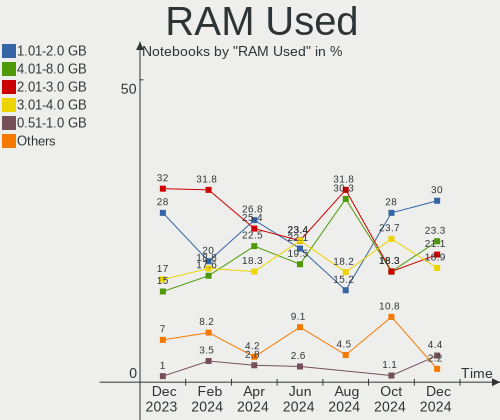
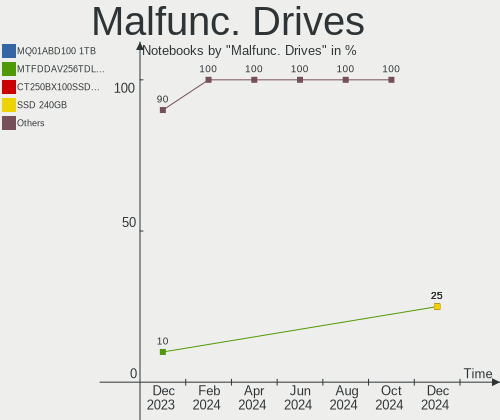
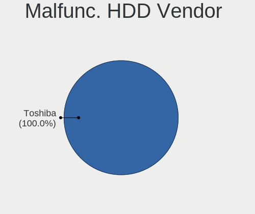
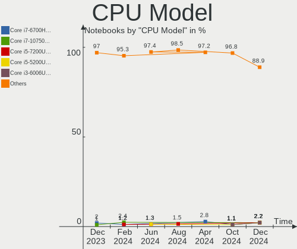
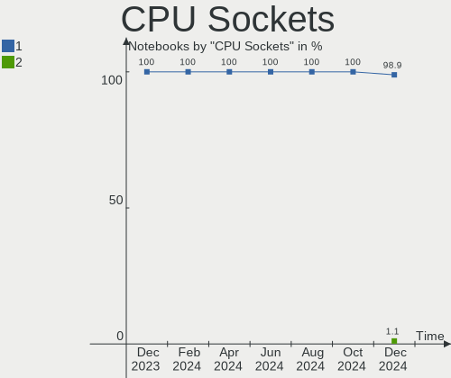
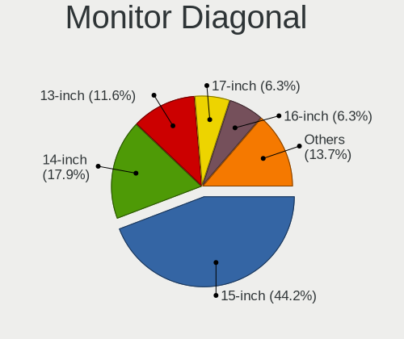
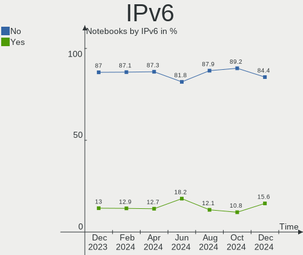
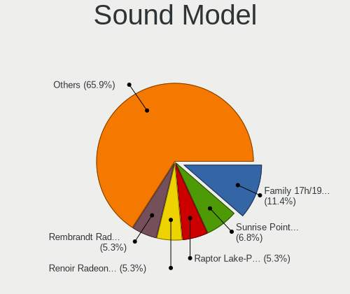
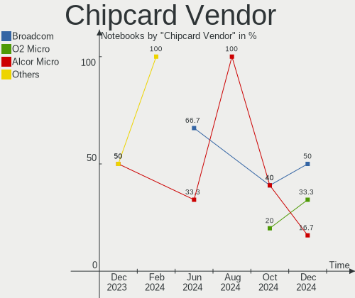
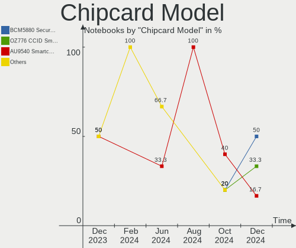

Linux in Spain - Hardware Trends (Notebooks)
--------------------------------------------

A project to identify most popular hardware characteristics and track their change
over time based on data collected by Linux users at https://Linux-Hardware.org.

Anyone can contribute to this report by the [hw-probe](https://github.com/linuxhw/hw-probe) tool:

    sudo -E hw-probe -all -upload

Contents
--------

* [ System ](#system)
  - [ OS                       ](#os)
  - [ OS Family                ](#os-family)
  - [ Kernel                   ](#kernel)
  - [ Kernel Family            ](#kernel-family)
  - [ Kernel Major Ver.        ](#kernel-major-ver)
  - [ Arch                     ](#arch)
  - [ DE                       ](#de)
  - [ Display Server           ](#display-server)
  - [ Display Manager          ](#display-manager)
  - [ OS Lang                  ](#os-lang)
  - [ Boot Mode                ](#boot-mode)
  - [ Filesystem               ](#filesystem)
  - [ Part. scheme             ](#part-scheme)
  - [ Dual Boot with Linux/BSD ](#dual-boot-with-linuxbsd)
  - [ Dual Boot (Win)          ](#dual-boot-win)

* [ Board ](#board)
  - [ Vendor                   ](#vendor)
  - [ Model                    ](#model)
  - [ Model Family             ](#model-family)
  - [ MFG Year                 ](#mfg-year)
  - [ Form Factor              ](#form-factor)
  - [ Secure Boot              ](#secure-boot)
  - [ Coreboot                 ](#coreboot)
  - [ RAM Size                 ](#ram-size)
  - [ RAM Used                 ](#ram-used)
  - [ Total Drives             ](#total-drives)
  - [ Has CD-ROM               ](#has-cd-rom)
  - [ Has Ethernet             ](#has-ethernet)
  - [ Has WiFi                 ](#has-wifi)
  - [ Has Bluetooth            ](#has-bluetooth)

* [ Location ](#location)
  - [ Country                  ](#country)
  - [ City                     ](#city)

* [ Drives ](#drives)
  - [ Drive Vendor             ](#drive-vendor)
  - [ Drive Model              ](#drive-model)
  - [ HDD Vendor               ](#hdd-vendor)
  - [ SSD Vendor               ](#ssd-vendor)
  - [ Drive Kind               ](#drive-kind)
  - [ Drive Connector          ](#drive-connector)
  - [ Drive Size               ](#drive-size)
  - [ Space Total              ](#space-total)
  - [ Space Used               ](#space-used)
  - [ Malfunc. Drives          ](#malfunc-drives)
  - [ Malfunc. Drive Vendor    ](#malfunc-drive-vendor)
  - [ Malfunc. HDD Vendor      ](#malfunc-hdd-vendor)
  - [ Malfunc. Drive Kind      ](#malfunc-drive-kind)
  - [ Failed Drives            ](#failed-drives)
  - [ Failed Drive Vendor      ](#failed-drive-vendor)
  - [ Drive Status             ](#drive-status)

* [ Storage controller ](#storage-controller)
  - [ Storage Vendor           ](#storage-vendor)
  - [ Storage Model            ](#storage-model)
  - [ Storage Kind             ](#storage-kind)

* [ Processor ](#processor)
  - [ CPU Vendor               ](#cpu-vendor)
  - [ CPU Model                ](#cpu-model)
  - [ CPU Model Family         ](#cpu-model-family)
  - [ CPU Cores                ](#cpu-cores)
  - [ CPU Sockets              ](#cpu-sockets)
  - [ CPU Threads              ](#cpu-threads)
  - [ CPU Op-Modes             ](#cpu-op-modes)
  - [ CPU Microcode            ](#cpu-microcode)
  - [ CPU Microarch            ](#cpu-microarch)

* [ Graphics ](#graphics)
  - [ GPU Vendor               ](#gpu-vendor)
  - [ GPU Model                ](#gpu-model)
  - [ GPU Combo                ](#gpu-combo)
  - [ GPU Driver               ](#gpu-driver)
  - [ GPU Memory               ](#gpu-memory)

* [ Monitor ](#monitor)
  - [ Monitor Vendor           ](#monitor-vendor)
  - [ Monitor Model            ](#monitor-model)
  - [ Monitor Resolution       ](#monitor-resolution)
  - [ Monitor Diagonal         ](#monitor-diagonal)
  - [ Monitor Width            ](#monitor-width)
  - [ Aspect Ratio             ](#aspect-ratio)
  - [ Monitor Area             ](#monitor-area)
  - [ Pixel Density            ](#pixel-density)
  - [ Multiple Monitors        ](#multiple-monitors)

* [ Network ](#network)
  - [ Net Controller Vendor    ](#net-controller-vendor)
  - [ Net Controller Model     ](#net-controller-model)
  - [ Wireless Vendor          ](#wireless-vendor)
  - [ Wireless Model           ](#wireless-model)
  - [ Ethernet Vendor          ](#ethernet-vendor)
  - [ Ethernet Model           ](#ethernet-model)
  - [ Net Controller Kind      ](#net-controller-kind)
  - [ Used Controller          ](#used-controller)
  - [ NICs                     ](#nics)
  - [ IPv6                     ](#ipv6)

* [ Bluetooth ](#bluetooth)
  - [ Bluetooth Vendor         ](#bluetooth-vendor)
  - [ Bluetooth Model          ](#bluetooth-model)

* [ Sound ](#sound)
  - [ Sound Vendor             ](#sound-vendor)
  - [ Sound Model              ](#sound-model)

* [ Memory ](#memory)
  - [ Memory Vendor            ](#memory-vendor)
  - [ Memory Model             ](#memory-model)
  - [ Memory Kind              ](#memory-kind)
  - [ Memory Form Factor       ](#memory-form-factor)
  - [ Memory Size              ](#memory-size)
  - [ Memory Speed             ](#memory-speed)

* [ Printers & scanners ](#printers--scanners)
  - [ Printer Vendor           ](#printer-vendor)
  - [ Printer Model            ](#printer-model)
  - [ Scanner Vendor           ](#scanner-vendor)
  - [ Scanner Model            ](#scanner-model)

* [ Camera ](#camera)
  - [ Camera Vendor            ](#camera-vendor)
  - [ Camera Model             ](#camera-model)

* [ Security ](#security)
  - [ Fingerprint Vendor       ](#fingerprint-vendor)
  - [ Fingerprint Model        ](#fingerprint-model)
  - [ Chipcard Vendor          ](#chipcard-vendor)
  - [ Chipcard Model           ](#chipcard-model)

* [ Unsupported ](#unsupported)
  - [ Unsupported Devices      ](#unsupported-devices)
  - [ Unsupported Device Types ](#unsupported-device-types)

System
------

OS
--

Installed operating systems

| Name              | Notebooks | Percent |
|-------------------|-----------|---------|
| Debian 11         | 7         | 10%     |
| Linux Mint 20.3   | 5         | 7.14%   |
| Fedora 35         | 5         | 7.14%   |
| Ubuntu 21.10      | 4         | 5.71%   |
| Ubuntu 20.04      | 4         | 5.71%   |
| OpenMandriva 4.3  | 4         | 5.71%   |
| Arch Rolling      | 4         | 5.71%   |
| Ubuntu 22.04      | 3         | 4.29%   |
| Ubuntu 18.04      | 3         | 4.29%   |
| Zorin 16          | 2         | 2.86%   |
| Zorin 15          | 2         | 2.86%   |
| Manjaro 21.2.6    | 2         | 2.86%   |
| Manjaro           | 2         | 2.86%   |
| Kubuntu 20.04     | 2         | 2.86%   |
| KDE neon 20.04    | 2         | 2.86%   |
| Kali 2022.1       | 2         | 2.86%   |
| Elementary 6.1    | 2         | 2.86%   |
| Arch              | 2         | 2.86%   |
| Xubuntu 18.04     | 1         | 1.43%   |
| RHEL 8            | 1         | 1.43%   |
| Pop!_OS 22.04     | 1         | 1.43%   |
| openSUSE 20220421 | 1         | 1.43%   |
| openSUSE 20220410 | 1         | 1.43%   |
| OpenMandriva 4.2  | 1         | 1.43%   |
| Linux Mint 20.2   | 1         | 1.43%   |
| Linux Mint 19.3   | 1         | 1.43%   |
| Kubuntu 21.10     | 1         | 1.43%   |
| Fedora 36         | 1         | 1.43%   |
| Endless 4.0.4     | 1         | 1.43%   |
| Debian Testing    | 1         | 1.43%   |
| Debian 10         | 1         | 1.43%   |

OS Family
---------

OS without a version

| Name         | Notebooks | Percent |
|--------------|-----------|---------|
| Ubuntu       | 14        | 20%     |
| Debian       | 9         | 12.86%  |
| Linux Mint   | 7         | 10%     |
| Fedora       | 6         | 8.57%   |
| Arch         | 6         | 8.57%   |
| OpenMandriva | 5         | 7.14%   |
| Zorin        | 4         | 5.71%   |
| Manjaro      | 4         | 5.71%   |
| Kubuntu      | 3         | 4.29%   |
| openSUSE     | 2         | 2.86%   |
| KDE neon     | 2         | 2.86%   |
| Kali         | 2         | 2.86%   |
| Elementary   | 2         | 2.86%   |
| Xubuntu      | 1         | 1.43%   |
| RHEL         | 1         | 1.43%   |
| Pop!_OS      | 1         | 1.43%   |
| Endless      | 1         | 1.43%   |

Kernel
------

Version of the Linux kernel

| Version                      | Notebooks | Percent |
|------------------------------|-----------|---------|
| 5.13.0-39-generic            | 9         | 12.86%  |
| 5.10.0-13-amd64              | 5         | 7.14%   |
| 5.4.0-107-generic            | 4         | 5.71%   |
| 5.17.1-arch1-1               | 4         | 5.71%   |
| 5.16.7-desktop-1omv4003      | 4         | 5.71%   |
| 5.15.0-25-generic            | 4         | 5.71%   |
| 5.15.32-1-MANJARO            | 3         | 4.29%   |
| 5.4.0-109-generic            | 2         | 2.86%   |
| 5.16.20-200.fc35.x86_64      | 2         | 2.86%   |
| 4.15.0-175-generic           | 2         | 2.86%   |
| 5.4.0-91-generic             | 1         | 1.43%   |
| 5.4.0-105-generic            | 1         | 1.43%   |
| 5.4.0-104-generic            | 1         | 1.43%   |
| 5.4.0-100-generic            | 1         | 1.43%   |
| 5.17.4-200.fc35.x86_64       | 1         | 1.43%   |
| 5.17.3-arch1-1               | 1         | 1.43%   |
| 5.17.3-1-default             | 1         | 1.43%   |
| 5.17.2-arch3-1               | 1         | 1.43%   |
| 5.17.2-300.fc36.x86_64       | 1         | 1.43%   |
| 5.17.1-3-MANJARO             | 1         | 1.43%   |
| 5.17.1-1-default             | 1         | 1.43%   |
| 5.17.0-051700-generic        | 1         | 1.43%   |
| 5.16.19-76051619-generic     | 1         | 1.43%   |
| 5.16.19-200.fc35.x86_64      | 1         | 1.43%   |
| 5.16.18-200.fc35.x86_64      | 1         | 1.43%   |
| 5.16.0-kali6-amd64           | 1         | 1.43%   |
| 5.16.0-6-amd64               | 1         | 1.43%   |
| 5.15.21-051521-generic       | 1         | 1.43%   |
| 5.15.0-kali3-amd64           | 1         | 1.43%   |
| 5.15.0-27-generic            | 1         | 1.43%   |
| 5.13.0-37-generic            | 1         | 1.43%   |
| 5.13.0-30-generic            | 1         | 1.43%   |
| 5.13.0-27-generic            | 1         | 1.43%   |
| 5.13.0-19-generic            | 1         | 1.43%   |
| 5.11.0-43-generic            | 1         | 1.43%   |
| 5.11.0-35-generic            | 1         | 1.43%   |
| 5.10.14-desktop-1omv4002     | 1         | 1.43%   |
| 5.10.109-loc-os              | 1         | 1.43%   |
| 5.10.0-13-686                | 1         | 1.43%   |
| 4.19.0-10-amd64              | 1         | 1.43%   |
| 4.18.0-348.20.1.el8_5.x86_64 | 1         | 1.43%   |

Kernel Family
-------------

Linux kernel without a distro release

| Version  | Notebooks | Percent |
|----------|-----------|---------|
| 5.13.0   | 13        | 18.57%  |
| 5.4.0    | 10        | 14.29%  |
| 5.17.1   | 6         | 8.57%   |
| 5.15.0   | 6         | 8.57%   |
| 5.10.0   | 6         | 8.57%   |
| 5.16.7   | 4         | 5.71%   |
| 5.15.32  | 3         | 4.29%   |
| 5.17.3   | 2         | 2.86%   |
| 5.17.2   | 2         | 2.86%   |
| 5.16.20  | 2         | 2.86%   |
| 5.16.19  | 2         | 2.86%   |
| 5.16.0   | 2         | 2.86%   |
| 5.11.0   | 2         | 2.86%   |
| 4.15.0   | 2         | 2.86%   |
| 5.17.4   | 1         | 1.43%   |
| 5.17.0   | 1         | 1.43%   |
| 5.16.18  | 1         | 1.43%   |
| 5.15.21  | 1         | 1.43%   |
| 5.10.14  | 1         | 1.43%   |
| 5.10.109 | 1         | 1.43%   |
| 4.19.0   | 1         | 1.43%   |
| 4.18.0   | 1         | 1.43%   |

Kernel Major Ver.
-----------------

Linux kernel major version

| Version | Notebooks | Percent |
|---------|-----------|---------|
| 5.13    | 13        | 18.57%  |
| 5.17    | 12        | 17.14%  |
| 5.16    | 11        | 15.71%  |
| 5.4     | 10        | 14.29%  |
| 5.15    | 10        | 14.29%  |
| 5.10    | 8         | 11.43%  |
| 5.11    | 2         | 2.86%   |
| 4.15    | 2         | 2.86%   |
| 4.19    | 1         | 1.43%   |
| 4.18    | 1         | 1.43%   |

Arch
----

OS architecture (x86_64, i586, etc.)

| Name   | Notebooks | Percent |
|--------|-----------|---------|
| x86_64 | 63        | 90%     |
| i686   | 7         | 10%     |

DE
--

Desktop Environment

| Name       | Notebooks | Percent |
|------------|-----------|---------|
| GNOME      | 27        | 38.57%  |
| KDE5       | 15        | 21.43%  |
| XFCE       | 8         | 11.43%  |
| X-Cinnamon | 6         | 8.57%   |
| MATE       | 4         | 5.71%   |
| LXDE       | 3         | 4.29%   |
| Pantheon   | 2         | 2.86%   |
| LXQt       | 2         | 2.86%   |
| Unity      | 1         | 1.43%   |
| Cinnamon   | 1         | 1.43%   |
| Unknown    | 1         | 1.43%   |

Display Server
--------------

X11 or Wayland

| Name    | Notebooks | Percent |
|---------|-----------|---------|
| X11     | 58        | 82.86%  |
| Wayland | 11        | 15.71%  |
| Unknown | 1         | 1.43%   |

Display Manager
---------------

SDDM, LightDM, etc.

| Name    | Notebooks | Percent |
|---------|-----------|---------|
| Unknown | 20        | 28.57%  |
| LightDM | 14        | 20%     |
| SDDM    | 13        | 18.57%  |
| GDM3    | 12        | 17.14%  |
| GDM     | 10        | 14.29%  |
| XDM     | 1         | 1.43%   |

OS Lang
-------

Language

| Lang  | Notebooks | Percent |
|-------|-----------|---------|
| es_ES | 48        | 68.57%  |
| en_US | 11        | 15.71%  |
| ca_ES | 4         | 5.71%   |
| pt_BR | 1         | 1.43%   |
| it_IT | 1         | 1.43%   |
| eu_ES | 1         | 1.43%   |
| es_MX | 1         | 1.43%   |
| en_NZ | 1         | 1.43%   |
| en_GB | 1         | 1.43%   |
| C     | 1         | 1.43%   |

Boot Mode
---------

EFI or BIOS

| Mode | Notebooks | Percent |
|------|-----------|---------|
| BIOS | 36        | 51.43%  |
| EFI  | 34        | 48.57%  |

Filesystem
----------

Type of filesystem

| Type    | Notebooks | Percent |
|---------|-----------|---------|
| Ext4    | 57        | 81.43%  |
| Overlay | 7         | 10%     |
| Btrfs   | 5         | 7.14%   |
| Zfs     | 1         | 1.43%   |

Part. scheme
------------

Scheme of partitioning

| Type    | Notebooks | Percent |
|---------|-----------|---------|
| Unknown | 33        | 47.14%  |
| GPT     | 27        | 38.57%  |
| MBR     | 10        | 14.29%  |

Dual Boot with Linux/BSD
------------------------

Hosting more than one Linux/BSD

| Dual boot | Notebooks | Percent |
|-----------|-----------|---------|
| No        | 64        | 91.43%  |
| Yes       | 6         | 8.57%   |

Dual Boot (Win)
---------------

Hosting Linux and Windows

| Dual boot | Notebooks | Percent |
|-----------|-----------|---------|
| No        | 50        | 71.43%  |
| Yes       | 20        | 28.57%  |

Board
-----

Vendor
------

Motherboard manufacturer

| Name             | Notebooks | Percent |
|------------------|-----------|---------|
| Lenovo           | 16        | 22.86%  |
| Hewlett-Packard  | 14        | 20%     |
| Acer             | 8         | 11.43%  |
| Dell             | 6         | 8.57%   |
| Toshiba          | 5         | 7.14%   |
| MSI              | 4         | 5.71%   |
| ASUSTek Computer | 4         | 5.71%   |
| SLIMBOOK         | 2         | 2.86%   |
| Chuwi            | 2         | 2.86%   |
| Unknown          | 2         | 2.86%   |
| Sony             | 1         | 1.43%   |
| Packard Bell     | 1         | 1.43%   |
| LG Electronics   | 1         | 1.43%   |
| HUAWEI           | 1         | 1.43%   |
| eMachines        | 1         | 1.43%   |
| Apple            | 1         | 1.43%   |
| AMI              | 1         | 1.43%   |

Model
-----

Motherboard model

| Name                                   | Notebooks | Percent |
|----------------------------------------|-----------|---------|
| Unknown                                | 3         | 4.29%   |
| MSI Prestige 15 A11UC                  | 2         | 2.86%   |
| Lenovo Z50-70 20354                    | 2         | 2.86%   |
| Toshiba Satellite U840                 | 1         | 1.43%   |
| Toshiba Satellite Pro C660             | 1         | 1.43%   |
| Toshiba Satellite L300                 | 1         | 1.43%   |
| Toshiba Satellite L10W-B-101           | 1         | 1.43%   |
| Toshiba NB520                          | 1         | 1.43%   |
| Sony VGN-NW21EF_S                      | 1         | 1.43%   |
| SLIMBOOK PROX15-AMD                    | 1         | 1.43%   |
| SLIMBOOK PRO                           | 1         | 1.43%   |
| Packard Bell EasyNote TN36             | 1         | 1.43%   |
| MSI Prestige 15 A11SCX                 | 1         | 1.43%   |
| MSI GX700                              | 1         | 1.43%   |
| LG 15Z95P-G.AA78B                      | 1         | 1.43%   |
| Lenovo Yoga 300-11IBY 80M0             | 1         | 1.43%   |
| Lenovo ThinkPad X270 W10DG 20K5S00A00  | 1         | 1.43%   |
| Lenovo ThinkPad X250 20CLS2GD00        | 1         | 1.43%   |
| Lenovo ThinkPad T480 20L6S29D02        | 1         | 1.43%   |
| Lenovo ThinkPad P53 20QN000ESP         | 1         | 1.43%   |
| Lenovo ThinkPad L15 Gen 2 20X3CTO1WW   | 1         | 1.43%   |
| Lenovo ThinkPad Edge E540 20C6003VSP   | 1         | 1.43%   |
| Lenovo ThinkPad E14 Gen 3 20Y7CTO1WW   | 1         | 1.43%   |
| Lenovo ThinkBook 16p Gen 2 20YM        | 1         | 1.43%   |
| Lenovo ThinkBook 15 G2 ARE 20VG        | 1         | 1.43%   |
| Lenovo IdeaPad S540-13ARE 82DL         | 1         | 1.43%   |
| Lenovo IdeaPad 510-15IKB 80SV          | 1         | 1.43%   |
| Lenovo IdeaPad 3 15ITL6 82H8           | 1         | 1.43%   |
| Lenovo G580 2189                       | 1         | 1.43%   |
| HUAWEI KLVL-WXX9                       | 1         | 1.43%   |
| HP Stream Notebook PC 13               | 1         | 1.43%   |
| HP ProBook 650 G1                      | 1         | 1.43%   |
| HP Presario C500 (RY512EA#ABE)         | 1         | 1.43%   |
| HP Pavilion g6                         | 1         | 1.43%   |
| HP Pavilion dv6500                     | 1         | 1.43%   |
| HP Laptop 15s-fq2xxx                   | 1         | 1.43%   |
| HP Laptop 15s-fq1xxx                   | 1         | 1.43%   |
| HP Laptop 15-da0xxx                    | 1         | 1.43%   |
| HP Laptop 14s-dq1xxx                   | 1         | 1.43%   |
| HP Compaq Mini CQ10-100                | 1         | 1.43%   |
| HP Compaq 6730b (GW687AV)              | 1         | 1.43%   |
| HP Compaq 15                           | 1         | 1.43%   |
| HP 650                                 | 1         | 1.43%   |
| HP 250 G7 Notebook PC                  | 1         | 1.43%   |
| eMachines D730                         | 1         | 1.43%   |
| Dell XPS 15 9570                       | 1         | 1.43%   |
| Dell XPS 13 9370                       | 1         | 1.43%   |
| Dell XPS 13 7390                       | 1         | 1.43%   |
| Dell Studio 1749                       | 1         | 1.43%   |
| Dell Latitude D630                     | 1         | 1.43%   |
| Dell G15 5510                          | 1         | 1.43%   |
| Chuwi AeroBook Pro                     | 1         | 1.43%   |
| ASUS ZenBook UX431DA_UM431DA           | 1         | 1.43%   |
| ASUS X550VX                            | 1         | 1.43%   |
| ASUS X540LJ                            | 1         | 1.43%   |
| ASUS VivoBook_ASUSLaptop X512DA_X512DA | 1         | 1.43%   |
| Apple MacBookPro9,2                    | 1         | 1.43%   |
| AMI Intel                              | 1         | 1.43%   |
| Acer TravelMate P256-MG                | 1         | 1.43%   |
| Acer TravelMate 6592                   | 1         | 1.43%   |

Model Family
------------

Motherboard model prefix

| Name                  | Notebooks | Percent |
|-----------------------|-----------|---------|
| Lenovo ThinkPad       | 7         | 10%     |
| Toshiba Satellite     | 4         | 5.71%   |
| HP Laptop             | 4         | 5.71%   |
| Acer Aspire           | 4         | 5.71%   |
| MSI Prestige          | 3         | 4.29%   |
| Lenovo IdeaPad        | 3         | 4.29%   |
| HP Compaq             | 3         | 4.29%   |
| Dell XPS              | 3         | 4.29%   |
| Unknown               | 3         | 4.29%   |
| Lenovo Z50-70         | 2         | 2.86%   |
| Lenovo ThinkBook      | 2         | 2.86%   |
| HP Pavilion           | 2         | 2.86%   |
| Acer TravelMate       | 2         | 2.86%   |
| Toshiba NB520         | 1         | 1.43%   |
| Sony VGN-NW21EF       | 1         | 1.43%   |
| SLIMBOOK PROX15-AMD   | 1         | 1.43%   |
| SLIMBOOK PRO          | 1         | 1.43%   |
| Packard Bell EasyNote | 1         | 1.43%   |
| MSI GX700             | 1         | 1.43%   |
| LG 15Z95P-G.AA78B     | 1         | 1.43%   |
| Lenovo Yoga           | 1         | 1.43%   |
| Lenovo G580           | 1         | 1.43%   |
| HUAWEI KLVL-WXX9      | 1         | 1.43%   |
| HP Stream             | 1         | 1.43%   |
| HP ProBook            | 1         | 1.43%   |
| HP Presario           | 1         | 1.43%   |
| HP 650                | 1         | 1.43%   |
| HP 250                | 1         | 1.43%   |
| eMachines D730        | 1         | 1.43%   |
| Dell Studio           | 1         | 1.43%   |
| Dell Latitude         | 1         | 1.43%   |
| Dell G15              | 1         | 1.43%   |
| Chuwi AeroBook        | 1         | 1.43%   |
| ASUS ZenBook          | 1         | 1.43%   |
| ASUS X550VX           | 1         | 1.43%   |
| ASUS X540LJ           | 1         | 1.43%   |
| ASUS VivoBook         | 1         | 1.43%   |
| Apple MacBookPro9     | 1         | 1.43%   |
| AMI Intel             | 1         | 1.43%   |
| Acer Nitro            | 1         | 1.43%   |
| Acer Extensa          | 1         | 1.43%   |

MFG Year
--------

Motherboard manufacture year

| Year | Notebooks | Percent |
|------|-----------|---------|
| 2021 | 14        | 20%     |
| 2020 | 6         | 8.57%   |
| 2019 | 6         | 8.57%   |
| 2014 | 6         | 8.57%   |
| 2018 | 5         | 7.14%   |
| 2015 | 5         | 7.14%   |
| 2012 | 4         | 5.71%   |
| 2007 | 4         | 5.71%   |
| 2016 | 3         | 4.29%   |
| 2011 | 3         | 4.29%   |
| 2010 | 3         | 4.29%   |
| 2009 | 3         | 4.29%   |
| 2017 | 2         | 2.86%   |
| 2013 | 2         | 2.86%   |
| 2008 | 2         | 2.86%   |
| 2006 | 2         | 2.86%   |

Form Factor
-----------

Physical design of the computer

| Name     | Notebooks | Percent |
|----------|-----------|---------|
| Notebook | 70        | 100%    |

Secure Boot
-----------

Enabled or disabled

| State    | Notebooks | Percent |
|----------|-----------|---------|
| Disabled | 68        | 97.14%  |
| Enabled  | 2         | 2.86%   |

Coreboot
--------

Have coreboot on board

| Used | Notebooks | Percent |
|------|-----------|---------|
| No   | 70        | 100%    |

RAM Size
--------

Total RAM memory

| Size in GB  | Notebooks | Percent |
|-------------|-----------|---------|
| 4.01-8.0    | 15        | 21.43%  |
| 16.01-24.0  | 15        | 21.43%  |
| 8.01-16.0   | 14        | 20%     |
| 3.01-4.0    | 10        | 14.29%  |
| 32.01-64.0  | 4         | 5.71%   |
| 1.01-2.0    | 4         | 5.71%   |
| 2.01-3.0    | 3         | 4.29%   |
| 0.51-1.0    | 3         | 4.29%   |
| 64.01-256.0 | 2         | 2.86%   |

RAM Used
--------

Used RAM memory

| Used GB    | Notebooks | Percent |
|------------|-----------|---------|
| 1.01-2.0   | 26        | 37.14%  |
| 2.01-3.0   | 14        | 20%     |
| 0.51-1.0   | 10        | 14.29%  |
| 4.01-8.0   | 8         | 11.43%  |
| 8.01-16.0  | 6         | 8.57%   |
| 3.01-4.0   | 4         | 5.71%   |
| 24.01-32.0 | 1         | 1.43%   |
| 16.01-24.0 | 1         | 1.43%   |

Total Drives
------------

Number of drives on board

| Drives | Notebooks | Percent |
|--------|-----------|---------|
| 1      | 50        | 71.43%  |
| 2      | 18        | 25.71%  |
| 5      | 1         | 1.43%   |
| 0      | 1         | 1.43%   |

Has CD-ROM
----------

Has CD-ROM on board

| Presented | Notebooks | Percent |
|-----------|-----------|---------|
| No        | 45        | 64.29%  |
| Yes       | 25        | 35.71%  |

Has Ethernet
------------

Has Ethernet on board

| Presented | Notebooks | Percent |
|-----------|-----------|---------|
| Yes       | 55        | 78.57%  |
| No        | 15        | 21.43%  |

Has WiFi
--------

Has WiFi module

| Presented | Notebooks | Percent |
|-----------|-----------|---------|
| Yes       | 70        | 100%    |

Has Bluetooth
-------------

Has Bluetooth module

| Presented | Notebooks | Percent |
|-----------|-----------|---------|
| Yes       | 47        | 67.14%  |
| No        | 23        | 32.86%  |

Location
--------

Country
-------

Geographic location (country)

| Country | Notebooks | Percent |
|---------|-----------|---------|
| Spain   | 70        | 100%    |

City
----

Geographic location (city)

| City                       | Notebooks | Percent |
|----------------------------|-----------|---------|
| Madrid                     | 11        | 15.71%  |
| Barcelona                  | 11        | 15.71%  |
| Zaragoza                   | 4         | 5.71%   |
| Santa Cruz de Tenerife     | 2         | 2.86%   |
| Montornès del Vallès     | 2         | 2.86%   |
| Las Palmas de Gran Canaria | 2         | 2.86%   |
| Ibi                        | 2         | 2.86%   |
| A Coruña                  | 2         | 2.86%   |
| Vitoria-Gasteiz            | 1         | 1.43%   |
| Valencia                   | 1         | 1.43%   |
| Tres Cantos                | 1         | 1.43%   |
| Torrevieja                 | 1         | 1.43%   |
| Santander                  | 1         | 1.43%   |
| Sant Joan Despí           | 1         | 1.43%   |
| Salamanca                  | 1         | 1.43%   |
| Rubí                      | 1         | 1.43%   |
| Ripollet                   | 1         | 1.43%   |
| Pontevedra                 | 1         | 1.43%   |
| Parla                      | 1         | 1.43%   |
| Palma                      | 1         | 1.43%   |
| Oviedo                     | 1         | 1.43%   |
| Málaga                    | 1         | 1.43%   |
| Lorca                      | 1         | 1.43%   |
| Logroño                   | 1         | 1.43%   |
| León                      | 1         | 1.43%   |
| Lanjaron                   | 1         | 1.43%   |
| Igualada                   | 1         | 1.43%   |
| Girona                     | 1         | 1.43%   |
| Gijón                     | 1         | 1.43%   |
| Getxo                      | 1         | 1.43%   |
| Getafe                     | 1         | 1.43%   |
| Daya Vieja                 | 1         | 1.43%   |
| Cornellà de Llobregat     | 1         | 1.43%   |
| Córdoba                   | 1         | 1.43%   |
| Ciudad Real                | 1         | 1.43%   |
| Cambrils                   | 1         | 1.43%   |
| Burlata                    | 1         | 1.43%   |
| Baiona                     | 1         | 1.43%   |
| Avilés                    | 1         | 1.43%   |
| Arce                       | 1         | 1.43%   |
| Alcobendas                 | 1         | 1.43%   |
| Alcalá de Henares         | 1         | 1.43%   |

Drives
------

Drive Vendor
------------

Hard drive vendors

| Vendor              | Notebooks | Drives | Percent |
|---------------------|-----------|--------|---------|
| WDC                 | 12        | 12     | 13.95%  |
| Samsung Electronics | 12        | 12     | 13.95%  |
| Toshiba             | 11        | 12     | 12.79%  |
| Seagate             | 8         | 8      | 9.3%    |
| SanDisk             | 8         | 8      | 9.3%    |
| Kingston            | 6         | 7      | 6.98%   |
| Unknown             | 3         | 3      | 3.49%   |
| SK Hynix            | 3         | 3      | 3.49%   |
| Phison              | 2         | 2      | 2.33%   |
| KIOXIA              | 2         | 2      | 2.33%   |
| KingDian            | 2         | 2      | 2.33%   |
| USB3.0              | 1         | 1      | 1.16%   |
| Teclast             | 1         | 1      | 1.16%   |
| Realtek             | 1         | 2      | 1.16%   |
| oyunkey             | 1         | 1      | 1.16%   |
| ORICO               | 1         | 1      | 1.16%   |
| Micron Technology   | 1         | 1      | 1.16%   |
| Intenso             | 1         | 1      | 1.16%   |
| Intel               | 1         | 1      | 1.16%   |
| HGST                | 1         | 1      | 1.16%   |
| GOODRAM             | 1         | 1      | 1.16%   |
| Fujitsu             | 1         | 1      | 1.16%   |
| faspeed             | 1         | 1      | 1.16%   |
| EAGET               | 1         | 1      | 1.16%   |
| DOGFISH             | 1         | 1      | 1.16%   |
| Crucial             | 1         | 1      | 1.16%   |
| China               | 1         | 1      | 1.16%   |
| Apple               | 1         | 1      | 1.16%   |

Drive Model
-----------

Hard drive models

| Model                                    | Notebooks | Percent |
|------------------------------------------|-----------|---------|
| Kingston SA400S37240G 240GB SSD          | 3         | 3.37%   |
| Toshiba MQ01ABF050 500GB                 | 2         | 2.25%   |
| Seagate ST500LT012-1DG142 500GB          | 2         | 2.25%   |
| Seagate Expansion+ 2TB                   | 2         | 2.25%   |
| SanDisk SSD PLUS 1000GB                  | 2         | 2.25%   |
| Sandisk NVMe SSD Drive 1024GB            | 2         | 2.25%   |
| Samsung NVMe SSD Drive 512GB             | 2         | 2.25%   |
| Samsung NVMe SSD Drive 1024GB            | 2         | 2.25%   |
| Phison NVMe SSD Drive 1TB                | 2         | 2.25%   |
| WDC WDS500G2B0B-00YS70 500GB SSD         | 1         | 1.12%   |
| WDC WDS120G1G0B-00RC30 120GB SSD         | 1         | 1.12%   |
| WDC WD5000LPVX-08V0TT2 500GB             | 1         | 1.12%   |
| WDC WD5000BEVT-60A0RT0 500GB             | 1         | 1.12%   |
| WDC WD3200BEVS-26VAT0 320GB              | 1         | 1.12%   |
| WDC WD2500BEVT-22A23T0 250GB             | 1         | 1.12%   |
| WDC WD1600BEVT-60ZCT1 160GB              | 1         | 1.12%   |
| WDC WD1600BEVS-60RST0 160GB              | 1         | 1.12%   |
| WDC WD1200UE-22KVT0 120GB                | 1         | 1.12%   |
| WDC WD10SPZX-21Z10T0 1TB                 | 1         | 1.12%   |
| WDC PC SN720 SDAQNTW-512G-1001 512GB     | 1         | 1.12%   |
| WDC PC SA530 SDASN8Y-256G-1006 256GB     | 1         | 1.12%   |
| USB3.0 Super Speed 320GB                 | 1         | 1.12%   |
| Unknown MMC Card  32GB                   | 1         | 1.12%   |
| Unknown MMC Card  2GB                    | 1         | 1.12%   |
| Unknown MMC Card  16GB                   | 1         | 1.12%   |
| Toshiba THNSNK256GCS8 SATA 256GB SSD     | 1         | 1.12%   |
| Toshiba MK5056GSY 500GB                  | 1         | 1.12%   |
| Toshiba MK3275GSX 320GB                  | 1         | 1.12%   |
| Toshiba MK3256GSY 320GB                  | 1         | 1.12%   |
| Toshiba MK1637GSX 160GB                  | 1         | 1.12%   |
| Toshiba MK1246GSX 120GB                  | 1         | 1.12%   |
| Toshiba KXG6AZNV256G 256GB               | 1         | 1.12%   |
| Toshiba KXG60ZNV512G 512GB               | 1         | 1.12%   |
| Toshiba KXG50ZNV512G NVMe 512GB          | 1         | 1.12%   |
| Toshiba KBG30ZMV256G 256GB               | 1         | 1.12%   |
| Teclast BD256GB SHCB-2280 SSD            | 1         | 1.12%   |
| SK Hynix PC601 NVMe 512GB                | 1         | 1.12%   |
| SK Hynix HFM512GDJTNG-8310A 512GB        | 1         | 1.12%   |
| SK Hynix HFM512GD3JX013N 512GB           | 1         | 1.12%   |
| Seagate ST9500325AS 500GB                | 1         | 1.12%   |
| Seagate ST9160314AS 160GB                | 1         | 1.12%   |
| Seagate ST2000LM015-2E8174 2TB           | 1         | 1.12%   |
| Seagate ST2000LM003 HN-M201RAD 2TB       | 1         | 1.12%   |
| SanDisk SSD PLUS 480GB                   | 1         | 1.12%   |
| SanDisk SDSSDA120G 120GB                 | 1         | 1.12%   |
| Sandisk NVMe SSD Drive 512GB             | 1         | 1.12%   |
| Sandisk NVMe SSD Drive 1TB               | 1         | 1.12%   |
| Samsung SSD 860 PRO 256GB                | 1         | 1.12%   |
| Samsung SSD 840 Series 250GB             | 1         | 1.12%   |
| Samsung PM981 NVMe 1024GB                | 1         | 1.12%   |
| Samsung MZVLW256HEHP-000L7 256GB         | 1         | 1.12%   |
| Samsung MZVLB512HBJQ-000L2 512GB         | 1         | 1.12%   |
| Samsung MZVL2512HCJQ-00B00 512GB         | 1         | 1.12%   |
| Samsung MZALQ256HBJD-00BL1 256GB         | 1         | 1.12%   |
| Samsung MZALQ256HAJD-000L2 256GB         | 1         | 1.12%   |
| Realtek RTL9210B-CG 1TB                  | 1         | 1.12%   |
| Realtek RTL9210 NVME 1TB                 | 1         | 1.12%   |
| oyunkey 480GB                            | 1         | 1.12%   |
| ORICO RV500-256G                         | 1         | 1.12%   |
| Micron MTFDDAK256TBN-1AR1ZABHA 256GB SSD | 1         | 1.12%   |

HDD Vendor
----------

Hard disk drive vendors

| Vendor  | Notebooks | Drives | Percent |
|---------|-----------|--------|---------|
| WDC     | 8         | 8      | 30.77%  |
| Seagate | 8         | 8      | 30.77%  |
| Toshiba | 7         | 7      | 26.92%  |
| HGST    | 1         | 1      | 3.85%   |
| Fujitsu | 1         | 1      | 3.85%   |
| Apple   | 1         | 1      | 3.85%   |

SSD Vendor
----------

Solid state drive vendors

| Vendor              | Notebooks | Drives | Percent |
|---------------------|-----------|--------|---------|
| SanDisk             | 4         | 4      | 17.39%  |
| Kingston            | 4         | 4      | 17.39%  |
| WDC                 | 3         | 3      | 13.04%  |
| Samsung Electronics | 2         | 2      | 8.7%    |
| USB3.0              | 1         | 1      | 4.35%   |
| Toshiba             | 1         | 1      | 4.35%   |
| Teclast             | 1         | 1      | 4.35%   |
| Micron Technology   | 1         | 1      | 4.35%   |
| KingDian            | 1         | 1      | 4.35%   |
| GOODRAM             | 1         | 1      | 4.35%   |
| EAGET               | 1         | 1      | 4.35%   |
| DOGFISH             | 1         | 1      | 4.35%   |
| Crucial             | 1         | 1      | 4.35%   |
| China               | 1         | 1      | 4.35%   |

Drive Kind
----------

HDD or SSD

| Kind    | Notebooks | Drives | Percent |
|---------|-----------|--------|---------|
| NVMe    | 25        | 32     | 31.65%  |
| HDD     | 25        | 26     | 31.65%  |
| SSD     | 22        | 23     | 27.85%  |
| Unknown | 4         | 5      | 5.06%   |
| MMC     | 3         | 3      | 3.8%    |

Drive Connector
---------------

SATA, SAS, NVMe, etc.

| Type | Notebooks | Drives | Percent |
|------|-----------|--------|---------|
| SATA | 43        | 50     | 57.33%  |
| NVMe | 25        | 30     | 33.33%  |
| SAS  | 4         | 6      | 5.33%   |
| MMC  | 3         | 3      | 4%      |

Drive Size
----------

Size of hard drive

| Size in TB | Notebooks | Drives | Percent |
|------------|-----------|--------|---------|
| 0.01-0.5   | 37        | 39     | 78.72%  |
| 0.51-1.0   | 6         | 6      | 12.77%  |
| 1.01-2.0   | 4         | 4      | 8.51%   |

Space Total
-----------

Amount of disk space available on the file system

| Size in GB     | Notebooks | Percent |
|----------------|-----------|---------|
| 251-500        | 26        | 37.14%  |
| 101-250        | 18        | 25.71%  |
| 501-1000       | 7         | 10%     |
| 1001-2000      | 5         | 7.14%   |
| 1-20           | 5         | 7.14%   |
| More than 3000 | 3         | 4.29%   |
| 51-100         | 3         | 4.29%   |
| 21-50          | 2         | 2.86%   |
| Unknown        | 1         | 1.43%   |

Space Used
----------

Amount of used disk space

| Used GB   | Notebooks | Percent |
|-----------|-----------|---------|
| 1-20      | 26        | 37.14%  |
| 21-50     | 11        | 15.71%  |
| 101-250   | 10        | 14.29%  |
| 251-500   | 8         | 11.43%  |
| 51-100    | 7         | 10%     |
| 501-1000  | 4         | 5.71%   |
| 1001-2000 | 2         | 2.86%   |
| 2001-3000 | 1         | 1.43%   |
| Unknown   | 1         | 1.43%   |

Malfunc. Drives
---------------

Drive models with a malfunction

| Model                                               | Notebooks | Drives | Percent |
|-----------------------------------------------------|-----------|--------|---------|
| WDC WD1600BEVS-60RST0 160GB                         | 1         | 1      | 14.29%  |
| Toshiba THNSNK256GCS8 SATA 256GB SSD                | 1         | 1      | 14.29%  |
| Toshiba MK3256GSY 320GB                             | 1         | 1      | 14.29%  |
| Seagate ST9500325AS 500GB                           | 1         | 1      | 14.29%  |
| SanDisk SSD PLUS 480GB                              | 1         | 1      | 14.29%  |
| Micron Technology MTFDDAK256TBN-1AR1ZABHA 256GB SSD | 1         | 1      | 14.29%  |
| Crucial CT525MX300SSD1 528GB                        | 1         | 1      | 14.29%  |

Malfunc. Drive Vendor
---------------------

Vendors of faulty drives

| Vendor            | Notebooks | Drives | Percent |
|-------------------|-----------|--------|---------|
| Toshiba           | 2         | 2      | 28.57%  |
| WDC               | 1         | 1      | 14.29%  |
| Seagate           | 1         | 1      | 14.29%  |
| SanDisk           | 1         | 1      | 14.29%  |
| Micron Technology | 1         | 1      | 14.29%  |
| Crucial           | 1         | 1      | 14.29%  |

Malfunc. HDD Vendor
-------------------

Vendors of faulty HDD drives

| Vendor  | Notebooks | Drives | Percent |
|---------|-----------|--------|---------|
| WDC     | 1         | 1      | 33.33%  |
| Toshiba | 1         | 1      | 33.33%  |
| Seagate | 1         | 1      | 33.33%  |

Malfunc. Drive Kind
-------------------

Kinds of faulty drives

| Kind | Notebooks | Drives | Percent |
|------|-----------|--------|---------|
| SSD  | 4         | 4      | 57.14%  |
| HDD  | 3         | 3      | 42.86%  |

Failed Drives
-------------

Failed drive models

Zero info for selected period =(

Failed Drive Vendor
-------------------

Failed drive vendors

Zero info for selected period =(

Drive Status
------------

Number of failed and malfunc. drives

| Status   | Notebooks | Drives | Percent |
|----------|-----------|--------|---------|
| Detected | 37        | 49     | 50%     |
| Works    | 30        | 33     | 40.54%  |
| Malfunc  | 7         | 7      | 9.46%   |

Storage controller
------------------

Storage Vendor
--------------

Storage controller vendors

| Vendor                       | Notebooks | Percent |
|------------------------------|-----------|---------|
| Intel                        | 47        | 58.75%  |
| Samsung Electronics          | 10        | 12.5%   |
| AMD                          | 6         | 7.5%    |
| Sandisk                      | 5         | 6.25%   |
| Toshiba America Info Systems | 3         | 3.75%   |
| SK Hynix                     | 3         | 3.75%   |
| Phison Electronics           | 2         | 2.5%    |
| KIOXIA                       | 2         | 2.5%    |
| Kingston Technology Company  | 2         | 2.5%    |

Storage Model
-------------

Storage controller models

| Model                                                                            | Notebooks | Percent |
|----------------------------------------------------------------------------------|-----------|---------|
| AMD FCH SATA Controller [AHCI mode]                                              | 6         | 6.9%    |
| Intel Wildcat Point-LP SATA Controller [AHCI Mode]                               | 5         | 5.75%   |
| Intel Celeron/Pentium Silver Processor SATA Controller                           | 5         | 5.75%   |
| Intel 82801HM/HEM (ICH8M/ICH8M-E) IDE Controller                                 | 4         | 4.6%    |
| Intel 82801 Mobile SATA Controller [RAID mode]                                   | 4         | 4.6%    |
| Samsung NVMe SSD Controller SM981/PM981/PM983                                    | 3         | 3.45%   |
| Samsung NVMe SSD Controller PM9A1/PM9A3/980PRO                                   | 3         | 3.45%   |
| Samsung NVMe SSD Controller 980                                                  | 3         | 3.45%   |
| Intel Sunrise Point-LP SATA Controller [AHCI mode]                               | 3         | 3.45%   |
| Intel 82801IBM/IEM (ICH9M/ICH9M-E) 4 port SATA Controller [AHCI mode]            | 3         | 3.45%   |
| Intel 82801HM/HEM (ICH8M/ICH8M-E) SATA Controller [AHCI mode]                    | 3         | 3.45%   |
| Intel 8 Series SATA Controller 1 [AHCI mode]                                     | 3         | 3.45%   |
| Intel 7 Series Chipset Family 6-port SATA Controller [AHCI mode]                 | 3         | 3.45%   |
| Sandisk WD Blue SN550 NVMe SSD                                                   | 2         | 2.3%    |
| Sandisk WD Black SN750 / PC SN730 NVMe SSD                                       | 2         | 2.3%    |
| Phison E12 NVMe Controller                                                       | 2         | 2.3%    |
| KIOXIA Non-Volatile memory controller                                            | 2         | 2.3%    |
| Intel Atom Processor E3800 Series SATA AHCI Controller                           | 2         | 2.3%    |
| Intel 82801IBM/IEM (ICH9M/ICH9M-E) 2 port SATA Controller [IDE mode]             | 2         | 2.3%    |
| Intel 82801GBM/GHM (ICH7-M Family) SATA Controller [AHCI mode]                   | 2         | 2.3%    |
| Intel 8 Series/C220 Series Chipset Family 6-port SATA Controller 1 [AHCI mode]   | 2         | 2.3%    |
| Intel 6 Series/C200 Series Chipset Family 6 port Mobile SATA AHCI Controller     | 2         | 2.3%    |
| Intel 5 Series/3400 Series Chipset 4 port SATA AHCI Controller                   | 2         | 2.3%    |
| Toshiba America Info Systems XG6 NVMe SSD Controller                             | 1         | 1.15%   |
| Toshiba America Info Systems Toshiba America Info Non-Volatile memory controller | 1         | 1.15%   |
| Toshiba America Info Systems BG3 NVMe SSD Controller                             | 1         | 1.15%   |
| SK Hynix Non-Volatile memory controller                                          | 1         | 1.15%   |
| SK Hynix Gold P31 SSD                                                            | 1         | 1.15%   |
| SK Hynix BC501 NVMe Solid State Drive                                            | 1         | 1.15%   |
| Sandisk WD Black 2018/SN750 / PC SN720 NVMe SSD                                  | 1         | 1.15%   |
| Samsung NVMe SSD Controller SM961/PM961/SM963                                    | 1         | 1.15%   |
| Kingston Company U-SNS8154P3 NVMe SSD                                            | 1         | 1.15%   |
| Kingston Company A2000 NVMe SSD                                                  | 1         | 1.15%   |
| Intel Volume Management Device NVMe RAID Controller                              | 1         | 1.15%   |
| Intel Tiger Lake-LP SATA Controller [AHCI mode]                                  | 1         | 1.15%   |
| Intel SSD 660P Series                                                            | 1         | 1.15%   |
| Intel NM10/ICH7 Family SATA Controller [AHCI mode]                               | 1         | 1.15%   |
| Intel HM170/QM170 Chipset SATA Controller [AHCI Mode]                            | 1         | 1.15%   |
| Intel Cannon Lake Mobile PCH SATA AHCI Controller                                | 1         | 1.15%   |
| Intel 82801HM/HEM (ICH8M/ICH8M-E) SATA Controller [IDE mode]                     | 1         | 1.15%   |
| Intel 82801GBM/GHM (ICH7-M Family) SATA Controller [IDE mode]                    | 1         | 1.15%   |
| Intel 82801G (ICH7 Family) IDE Controller                                        | 1         | 1.15%   |

Storage Kind
------------

Kind of storage controller (IDE, SATA, NVMe, SAS, ...)

| Kind | Notebooks | Percent |
|------|-----------|---------|
| SATA | 45        | 54.22%  |
| NVMe | 25        | 30.12%  |
| IDE  | 8         | 9.64%   |
| RAID | 5         | 6.02%   |

Processor
---------

CPU Vendor
----------

Processor vendors

| Vendor | Notebooks | Percent |
|--------|-----------|---------|
| Intel  | 60        | 85.71%  |
| AMD    | 10        | 14.29%  |

CPU Model
---------

Processor models

| Model                                         | Notebooks | Percent |
|-----------------------------------------------|-----------|---------|
| Intel Core i7-4510U CPU @ 2.00GHz             | 3         | 4.29%   |
| Intel Celeron N4120 CPU @ 1.10GHz             | 3         | 4.29%   |
| Intel Celeron CPU N2840 @ 2.16GHz             | 3         | 4.29%   |
| Intel 11th Gen Core i7-1195G7 @ 2.90GHz       | 3         | 4.29%   |
| Intel 11th Gen Core i5-1135G7 @ 2.40GHz       | 3         | 4.29%   |
| Intel Pentium Dual CPU T3400 @ 2.16GHz        | 2         | 2.86%   |
| Intel Genuine CPU T2050 @ 1.60GHz             | 2         | 2.86%   |
| Intel Core i5-5200U CPU @ 2.20GHz             | 2         | 2.86%   |
| Intel Core i3-5005U CPU @ 2.00GHz             | 2         | 2.86%   |
| AMD Ryzen 7 5800H with Radeon Graphics        | 2         | 2.86%   |
| Intel Pentium Dual-Core CPU T4300 @ 2.10GHz   | 1         | 1.43%   |
| Intel Core m3-8100Y CPU @ 1.10GHz             | 1         | 1.43%   |
| Intel Core i7-9750H CPU @ 2.60GHz             | 1         | 1.43%   |
| Intel Core i7-8750H CPU @ 2.20GHz             | 1         | 1.43%   |
| Intel Core i7-8650U CPU @ 1.90GHz             | 1         | 1.43%   |
| Intel Core i7-8550U CPU @ 1.80GHz             | 1         | 1.43%   |
| Intel Core i7-7500U CPU @ 2.70GHz             | 1         | 1.43%   |
| Intel Core i7-6700HQ CPU @ 2.60GHz            | 1         | 1.43%   |
| Intel Core i7-3520M CPU @ 2.90GHz             | 1         | 1.43%   |
| Intel Core i7-10870H CPU @ 2.20GHz            | 1         | 1.43%   |
| Intel Core i7-1065G7 CPU @ 1.30GHz            | 1         | 1.43%   |
| Intel Core i7-10510U CPU @ 1.80GHz            | 1         | 1.43%   |
| Intel Core i5-7200U CPU @ 2.50GHz             | 1         | 1.43%   |
| Intel Core i5-6200U CPU @ 2.30GHz             | 1         | 1.43%   |
| Intel Core i5-5300U CPU @ 2.30GHz             | 1         | 1.43%   |
| Intel Core i5-4210M CPU @ 2.60GHz             | 1         | 1.43%   |
| Intel Core i5-4200M CPU @ 2.50GHz             | 1         | 1.43%   |
| Intel Core i5-3317U CPU @ 1.70GHz             | 1         | 1.43%   |
| Intel Core i5-3230M CPU @ 2.60GHz             | 1         | 1.43%   |
| Intel Core i5-2430M CPU @ 2.40GHz             | 1         | 1.43%   |
| Intel Core i5-2410M CPU @ 2.30GHz             | 1         | 1.43%   |
| Intel Core i5-1035G1 CPU @ 1.00GHz            | 1         | 1.43%   |
| Intel Core i5 CPU M 460 @ 2.53GHz             | 1         | 1.43%   |
| Intel Core i3-7020U CPU @ 2.30GHz             | 1         | 1.43%   |
| Intel Core i3-2328M CPU @ 2.20GHz             | 1         | 1.43%   |
| Intel Core i3 CPU M 370 @ 2.40GHz             | 1         | 1.43%   |
| Intel Core 2 Duo CPU T8100 @ 2.10GHz          | 1         | 1.43%   |
| Intel Core 2 Duo CPU T7100 @ 1.80GHz          | 1         | 1.43%   |
| Intel Core 2 Duo CPU T6670 @ 2.20GHz          | 1         | 1.43%   |
| Intel Core 2 Duo CPU T5870 @ 2.00GHz          | 1         | 1.43%   |
| Intel Core 2 Duo CPU T5450 @ 1.66GHz          | 1         | 1.43%   |
| Intel Core 2 Duo CPU P8600 @ 2.40GHz          | 1         | 1.43%   |
| Intel Celeron N4020 CPU @ 1.10GHz             | 1         | 1.43%   |
| Intel Celeron N4000 CPU @ 1.10GHz             | 1         | 1.43%   |
| Intel Atom CPU N270 @ 1.60GHz                 | 1         | 1.43%   |
| Intel Atom CPU N2600 @ 1.60GHz                | 1         | 1.43%   |
| Intel 11th Gen Core i7-1185G7 @ 3.00GHz       | 1         | 1.43%   |
| AMD Ryzen 7 5700U with Radeon Graphics        | 1         | 1.43%   |
| AMD Ryzen 7 4800U with Radeon Graphics        | 1         | 1.43%   |
| AMD Ryzen 7 4800H with Radeon Graphics        | 1         | 1.43%   |
| AMD Ryzen 7 3700U with Radeon Vega Mobile Gfx | 1         | 1.43%   |
| AMD Ryzen 5 4600H with Radeon Graphics        | 1         | 1.43%   |
| AMD Ryzen 5 3500U with Radeon Vega Mobile Gfx | 1         | 1.43%   |
| AMD Ryzen 3 4300U with Radeon Graphics        | 1         | 1.43%   |
| AMD E1-2100 APU with Radeon HD Graphics       | 1         | 1.43%   |

CPU Model Family
----------------

Processor model prefix

| Model                   | Notebooks | Percent |
|-------------------------|-----------|---------|
| Intel Core i7           | 13        | 18.57%  |
| Intel Core i5           | 13        | 18.57%  |
| Intel Celeron           | 8         | 11.43%  |
| Other                   | 7         | 10%     |
| Intel Core 2 Duo        | 6         | 8.57%   |
| AMD Ryzen 7             | 6         | 8.57%   |
| Intel Core i3           | 5         | 7.14%   |
| Intel Pentium Dual      | 2         | 2.86%   |
| Intel Genuine           | 2         | 2.86%   |
| Intel Atom              | 2         | 2.86%   |
| AMD Ryzen 5             | 2         | 2.86%   |
| Intel Pentium Dual-Core | 1         | 1.43%   |
| Intel Core m3           | 1         | 1.43%   |
| AMD Ryzen 3             | 1         | 1.43%   |
| AMD E1                  | 1         | 1.43%   |

CPU Cores
---------

Number of processor cores

| Number | Notebooks | Percent |
|--------|-----------|---------|
| 2      | 41        | 58.57%  |
| 4      | 19        | 27.14%  |
| 8      | 6         | 8.57%   |
| 6      | 3         | 4.29%   |
| 1      | 1         | 1.43%   |

CPU Sockets
-----------

Number of sockets

| Number | Notebooks | Percent |
|--------|-----------|---------|
| 1      | 70        | 100%    |

CPU Threads
-----------

Threads per core (Hyper-Threading)

| Number | Notebooks | Percent |
|--------|-----------|---------|
| 2      | 49        | 70%     |
| 1      | 21        | 30%     |

CPU Op-Modes
------------

CPU Operation Modes (32-bit, 64-bit)

| Op mode        | Notebooks | Percent |
|----------------|-----------|---------|
| 32-bit, 64-bit | 66        | 94.29%  |
| 32-bit         | 4         | 5.71%   |

CPU Microcode
-------------

Microcode number

| Number     | Notebooks | Percent |
|------------|-----------|---------|
| Unknown    | 12        | 17.14%  |
| 0x6fd      | 5         | 7.14%   |
| 0x306d4    | 5         | 7.14%   |
| 0x706a8    | 4         | 5.71%   |
| 0x806ea    | 3         | 4.29%   |
| 0x806e9    | 3         | 4.29%   |
| 0x806c1    | 3         | 4.29%   |
| 0x40651    | 3         | 4.29%   |
| 0x206a7    | 3         | 4.29%   |
| 0x08600106 | 3         | 4.29%   |
| 0x906ea    | 2         | 2.86%   |
| 0x806c2    | 2         | 2.86%   |
| 0x706e5    | 2         | 2.86%   |
| 0x6e8      | 2         | 2.86%   |
| 0x306c3    | 2         | 2.86%   |
| 0x306a9    | 2         | 2.86%   |
| 0x20655    | 2         | 2.86%   |
| 0x1067a    | 2         | 2.86%   |
| 0x406e3    | 1         | 1.43%   |
| 0x30678    | 1         | 1.43%   |
| 0x30661    | 1         | 1.43%   |
| 0x106c2    | 1         | 1.43%   |
| 0x0a50000c | 1         | 1.43%   |
| 0x08608103 | 1         | 1.43%   |
| 0x08600103 | 1         | 1.43%   |
| 0x08108109 | 1         | 1.43%   |
| 0x08108102 | 1         | 1.43%   |
| 0x0700010f | 1         | 1.43%   |

CPU Microarch
-------------

Microarchitecture

| Name          | Notebooks | Percent |
|---------------|-----------|---------|
| KabyLake      | 9         | 12.86%  |
| TigerLake     | 7         | 10%     |
| Haswell       | 5         | 7.14%   |
| Goldmont plus | 5         | 7.14%   |
| Core          | 5         | 7.14%   |
| Broadwell     | 5         | 7.14%   |
| Zen 2         | 4         | 5.71%   |
| Penryn        | 4         | 5.71%   |
| Silvermont    | 3         | 4.29%   |
| SandyBridge   | 3         | 4.29%   |
| IvyBridge     | 3         | 4.29%   |
| Zen+          | 2         | 2.86%   |
| Zen 3         | 2         | 2.86%   |
| Westmere      | 2         | 2.86%   |
| Skylake       | 2         | 2.86%   |
| P6            | 2         | 2.86%   |
| IceLake       | 2         | 2.86%   |
| Bonnell       | 2         | 2.86%   |
| Jaguar        | 1         | 1.43%   |
| CometLake     | 1         | 1.43%   |
| Unknown       | 1         | 1.43%   |

Graphics
--------

GPU Vendor
----------

Vendors of graphics cards

| Vendor | Notebooks | Percent |
|--------|-----------|---------|
| Intel  | 54        | 61.36%  |
| Nvidia | 20        | 22.73%  |
| AMD    | 14        | 15.91%  |

GPU Model
---------

Graphics card models

| Model                                                                         | Notebooks | Percent |
|-------------------------------------------------------------------------------|-----------|---------|
| Intel TigerLake-LP GT2 [Iris Xe Graphics]                                     | 7         | 7.61%   |
| Intel HD Graphics 5500                                                        | 5         | 5.43%   |
| Intel GeminiLake [UHD Graphics 600]                                           | 5         | 5.43%   |
| Intel Mobile 4 Series Chipset Integrated Graphics Controller                  | 4         | 4.35%   |
| AMD Renoir                                                                    | 4         | 4.35%   |
| Intel HD Graphics 620                                                         | 3         | 3.26%   |
| Intel Haswell-ULT Integrated Graphics Controller                              | 3         | 3.26%   |
| Intel Atom Processor Z36xxx/Z37xxx Series Graphics & Display                  | 3         | 3.26%   |
| Intel 3rd Gen Core processor Graphics Controller                              | 3         | 3.26%   |
| Intel 2nd Generation Core Processor Family Integrated Graphics Controller     | 3         | 3.26%   |
| Nvidia GF117M [GeForce 610M/710M/810M/820M / GT 620M/625M/630M/720M]          | 2         | 2.17%   |
| Nvidia GA107M [GeForce RTX 3050 Mobile]                                       | 2         | 2.17%   |
| Nvidia GA106M [GeForce RTX 3060 Mobile / Max-Q]                               | 2         | 2.17%   |
| Intel UHD Graphics 620                                                        | 2         | 2.17%   |
| Intel Mobile GM965/GL960 Integrated Graphics Controller (secondary)           | 2         | 2.17%   |
| Intel Mobile GM965/GL960 Integrated Graphics Controller (primary)             | 2         | 2.17%   |
| Intel Mobile 945GM/GMS/GME, 943/940GML Express Integrated Graphics Controller | 2         | 2.17%   |
| Intel 4th Gen Core Processor Integrated Graphics Controller                   | 2         | 2.17%   |
| AMD Picasso/Raven 2 [Radeon Vega Series / Radeon Vega Mobile Series]          | 2         | 2.17%   |
| AMD Cezanne                                                                   | 2         | 2.17%   |
| Nvidia TU117M                                                                 | 1         | 1.09%   |
| Nvidia TU117GLM [Quadro T1000 Mobile]                                         | 1         | 1.09%   |
| Nvidia GP108M [GeForce MX150]                                                 | 1         | 1.09%   |
| Nvidia GP107M [GeForce GTX 1050 Ti Mobile]                                    | 1         | 1.09%   |
| Nvidia GM108M [GeForce 940M]                                                  | 1         | 1.09%   |
| Nvidia GM108M [GeForce 940MX]                                                 | 1         | 1.09%   |
| Nvidia GM108M [GeForce 840M]                                                  | 1         | 1.09%   |
| Nvidia GM107M [GeForce GTX 950M]                                              | 1         | 1.09%   |
| Nvidia GK208M [GeForce GT 740M]                                               | 1         | 1.09%   |
| Nvidia GK208BM [GeForce 920M]                                                 | 1         | 1.09%   |
| Nvidia GF108M [GeForce GT 635M]                                               | 1         | 1.09%   |
| Nvidia GA104M [GeForce RTX 3070 Mobile / Max-Q]                               | 1         | 1.09%   |
| Nvidia G84M [GeForce 8600M GT]                                                | 1         | 1.09%   |
| Nvidia G72M [Quadro NVS 110M/GeForce Go 7300]                                 | 1         | 1.09%   |
| Intel UHD Graphics 615                                                        | 1         | 1.09%   |
| Intel Skylake GT2 [HD Graphics 520]                                           | 1         | 1.09%   |
| Intel Mobile 945GSE Express Integrated Graphics Controller                    | 1         | 1.09%   |
| Intel Mobile 945GM/GMS, 943/940GML Express Integrated Graphics Controller     | 1         | 1.09%   |
| Intel Iris Plus Graphics G7                                                   | 1         | 1.09%   |
| Intel Iris Plus Graphics G1 (Ice Lake)                                        | 1         | 1.09%   |
| Intel HD Graphics 530                                                         | 1         | 1.09%   |
| Intel Core Processor Integrated Graphics Controller                           | 1         | 1.09%   |
| Intel CometLake-U GT2 [UHD Graphics]                                          | 1         | 1.09%   |
| Intel CometLake-H GT2 [UHD Graphics]                                          | 1         | 1.09%   |
| Intel CoffeeLake-H GT2 [UHD Graphics 630]                                     | 1         | 1.09%   |
| Intel Atom Processor D2xxx/N2xxx Integrated Graphics Controller               | 1         | 1.09%   |
| AMD Seymour [Radeon HD 6400M/7400M Series]                                    | 1         | 1.09%   |
| AMD RV710/M92 [Mobility Radeon HD 4530/4570/545v]                             | 1         | 1.09%   |
| AMD RV610/M74 [Mobility Radeon HD 2400 XT]                                    | 1         | 1.09%   |
| AMD Madison [Mobility Radeon HD 5650/5750 / 6530M/6550M]                      | 1         | 1.09%   |
| AMD Lucienne                                                                  | 1         | 1.09%   |
| AMD Kabini [Radeon HD 8210]                                                   | 1         | 1.09%   |

GPU Combo
---------

Combinations of graphics cards

| Name           | Notebooks | Percent |
|----------------|-----------|---------|
| 1 x Intel      | 38        | 54.29%  |
| Intel + Nvidia | 15        | 21.43%  |
| 1 x AMD        | 11        | 15.71%  |
| 1 x Nvidia     | 3         | 4.29%   |
| AMD + Nvidia   | 2         | 2.86%   |
| Intel + AMD    | 1         | 1.43%   |

GPU Driver
----------

Free vs proprietary

| Driver      | Notebooks | Percent |
|-------------|-----------|---------|
| Free        | 58        | 82.86%  |
| Proprietary | 10        | 14.29%  |
| Unknown     | 2         | 2.86%   |

GPU Memory
----------

Total video memory

| Size in GB | Notebooks | Percent |
|------------|-----------|---------|
| Unknown    | 49        | 70%     |
| 0.01-0.5   | 9         | 12.86%  |
| 1.01-2.0   | 6         | 8.57%   |
| 3.01-4.0   | 3         | 4.29%   |
| 0.51-1.0   | 2         | 2.86%   |
| 5.01-6.0   | 1         | 1.43%   |

Monitor
-------

Monitor Vendor
--------------

Monitor vendors

| Vendor                  | Notebooks | Percent |
|-------------------------|-----------|---------|
| Chimei Innolux          | 16        | 18.18%  |
| AU Optronics            | 15        | 17.05%  |
| BOE                     | 9         | 10.23%  |
| Samsung Electronics     | 6         | 6.82%   |
| LG Display              | 6         | 6.82%   |
| HannStar                | 4         | 4.55%   |
| Chi Mei Optoelectronics | 4         | 4.55%   |
| Sharp                   | 3         | 3.41%   |
| LG Philips              | 3         | 3.41%   |
| Philips                 | 2         | 2.27%   |
| PANDA                   | 2         | 2.27%   |
| Hewlett-Packard         | 2         | 2.27%   |
| Dell                    | 2         | 2.27%   |
| Apple                   | 2         | 2.27%   |
| AOC                     | 2         | 2.27%   |
| Acer                    | 2         | 2.27%   |
| ViewSonic               | 1         | 1.14%   |
| TCL                     | 1         | 1.14%   |
| MSI                     | 1         | 1.14%   |
| Lenovo                  | 1         | 1.14%   |
| InfoVision              | 1         | 1.14%   |
| Goldstar                | 1         | 1.14%   |
| CSO                     | 1         | 1.14%   |
| Ancor Communications    | 1         | 1.14%   |

Monitor Model
-------------

Monitor models

| Model                                                                    | Notebooks | Percent |
|--------------------------------------------------------------------------|-----------|---------|
| Chimei Innolux LCD Monitor CMN15F5 1920x1080 344x193mm 15.5-inch         | 2         | 2.27%   |
| Chimei Innolux LCD Monitor CMN15E8 1920x1080 344x193mm 15.5-inch         | 2         | 2.27%   |
| Chimei Innolux LCD Monitor CMN152D 1920x1080 344x193mm 15.5-inch         | 2         | 2.27%   |
| ViewSonic VA2465 SERIES VSCB730 1920x1080 521x293mm 23.5-inch            | 1         | 1.14%   |
| TCL LCD TV TCL0030 1920x1080 708x398mm 32.0-inch                         | 1         | 1.14%   |
| Sharp LQ156M1JW01 SHP14C3 1920x1080 344x194mm 15.5-inch                  | 1         | 1.14%   |
| Sharp LCD Monitor SHP148D 3840x2160 344x194mm 15.5-inch                  | 1         | 1.14%   |
| Sharp LCD Monitor SHP148B 3840x2160 294x165mm 13.3-inch                  | 1         | 1.14%   |
| Samsung Electronics SMB2240W SAM0699 1680x1050 459x296mm 21.5-inch       | 1         | 1.14%   |
| Samsung Electronics LCD Monitor SEC5541 1366x768 344x193mm 15.5-inch     | 1         | 1.14%   |
| Samsung Electronics LCD Monitor SEC4251 1366x768 344x194mm 15.5-inch     | 1         | 1.14%   |
| Samsung Electronics LCD Monitor SEC3741 1366x768 309x174mm 14.0-inch     | 1         | 1.14%   |
| Samsung Electronics LCD Monitor SEC364E 1024x600 223x125mm 10.1-inch     | 1         | 1.14%   |
| Samsung Electronics LCD Monitor SDC424A 3200x1800 293x165mm 13.2-inch    | 1         | 1.14%   |
| Philips PHL 345E2 PHLC237 3440x1440 800x335mm 34.1-inch                  | 1         | 1.14%   |
| Philips PHI26PFL3405H PHLD074 1360x768 640x360mm 28.9-inch               | 1         | 1.14%   |
| PANDA LCD Monitor NCP0056 1920x1080 309x174mm 14.0-inch                  | 1         | 1.14%   |
| PANDA LCD Monitor NCP0035 1920x1080 309x174mm 14.0-inch                  | 1         | 1.14%   |
| MSI MAG321CURV MSI3DA2 3840x2160 700x390mm 31.5-inch                     | 1         | 1.14%   |
| LG Philips LP154WX4-TLAB LPL3D01 1280x800 331x207mm 15.4-inch            | 1         | 1.14%   |
| LG Philips LCD Monitor LPLBC00 1280x800 331x207mm 15.4-inch              | 1         | 1.14%   |
| LG Philips LCD Monitor LPL2388 1440x900 367x230mm 17.1-inch              | 1         | 1.14%   |
| LG Display LCD Monitor LGD0645 1920x1080 344x194mm 15.5-inch             | 1         | 1.14%   |
| LG Display LCD Monitor LGD0533 1920x1080 344x194mm 15.5-inch             | 1         | 1.14%   |
| LG Display LCD Monitor LGD0465 1366x768 344x194mm 15.5-inch              | 1         | 1.14%   |
| LG Display LCD Monitor LGD0456 1366x768 344x194mm 15.5-inch              | 1         | 1.14%   |
| LG Display LCD Monitor LGD03CD 1366x768 277x156mm 12.5-inch              | 1         | 1.14%   |
| LG Display LCD Monitor LGD033A 1366x768 344x194mm 15.5-inch              | 1         | 1.14%   |
| Lenovo Q24h-10 LEN66A8 2560x1440 526x296mm 23.8-inch                     | 1         | 1.14%   |
| InfoVision LCD Monitor IVO8544 1920x1080 294x165mm 13.3-inch             | 1         | 1.14%   |
| Hewlett-Packard 27w HPN3494 1920x1080 598x336mm 27.0-inch                | 1         | 1.14%   |
| Hewlett-Packard 27es HWP3326 1920x1080 598x336mm 27.0-inch               | 1         | 1.14%   |
| HannStar HZ194A HSD6677 1366x768 410x230mm 18.5-inch                     | 1         | 1.14%   |
| HannStar HSG1142 HSP0020 1920x1080 409x230mm 18.5-inch                   | 1         | 1.14%   |
| HannStar HSD100IFW1 HSD03E9 1024x600 220x129mm 10.0-inch                 | 1         | 1.14%   |
| HannStar AG172 HSDC017 1280x1024 340x270mm 17.1-inch                     | 1         | 1.14%   |
| Goldstar ULTRAGEAR GSM5BB2 1920x1080 527x296mm 23.8-inch                 | 1         | 1.14%   |
| Dell E178WFP DELD016 1440x900 370x230mm 17.2-inch                        | 1         | 1.14%   |
| Dell 1908FP DEL4025 1280x1024 376x301mm 19.0-inch                        | 1         | 1.14%   |
| CSO LCD Monitor CSO1603 2560x1600 344x215mm 16.0-inch                    | 1         | 1.14%   |
| Chimei Innolux P140ZKA-BZ1 CMN8C03 2160x1440 296x197mm 14.0-inch         | 1         | 1.14%   |
| Chimei Innolux LCD Monitor CMN15E7 1920x1080 344x193mm 15.5-inch         | 1         | 1.14%   |
| Chimei Innolux LCD Monitor CMN15DB 1366x768 344x193mm 15.5-inch          | 1         | 1.14%   |
| Chimei Innolux LCD Monitor CMN15CA 1366x768 344x193mm 15.5-inch          | 1         | 1.14%   |
| Chimei Innolux LCD Monitor CMN15C0 1920x1080 344x194mm 15.5-inch         | 1         | 1.14%   |
| Chimei Innolux LCD Monitor CMN1526 1920x1080 344x193mm 15.5-inch         | 1         | 1.14%   |
| Chimei Innolux LCD Monitor CMN14D6 1366x768 309x173mm 13.9-inch          | 1         | 1.14%   |
| Chimei Innolux LCD Monitor CMN13B0 2560x1600 286x178mm 13.3-inch         | 1         | 1.14%   |
| Chimei Innolux LCD Monitor CMN1239 1920x1080 276x155mm 12.5-inch         | 1         | 1.14%   |
| Chimei Innolux LCD Monitor CMN1128 1366x768 256x144mm 11.6-inch          | 1         | 1.14%   |
| Chi Mei Optoelectronics LCD Monitor CMO1703 1440x900 367x230mm 17.1-inch | 1         | 1.14%   |
| Chi Mei Optoelectronics LCD Monitor CMO15A1 1366x768 344x193mm 15.5-inch | 1         | 1.14%   |
| Chi Mei Optoelectronics LCD Monitor CMO1558 1366x768 344x193mm 15.5-inch | 1         | 1.14%   |
| Chi Mei Optoelectronics LCD Monitor CMO1444 1366x768 309x174mm 14.0-inch | 1         | 1.14%   |
| BOE LCD Monitor BOE0A8A 1920x1080 344x194mm 15.5-inch                    | 1         | 1.14%   |
| BOE LCD Monitor BOE09DE 1920x1080 309x174mm 14.0-inch                    | 1         | 1.14%   |
| BOE LCD Monitor BOE092E 1920x1080 310x173mm 14.0-inch                    | 1         | 1.14%   |
| BOE LCD Monitor BOE08C6 1920x1080 344x194mm 15.5-inch                    | 1         | 1.14%   |
| BOE LCD Monitor BOE074F 1920x1080 309x173mm 13.9-inch                    | 1         | 1.14%   |
| BOE LCD Monitor BOE06FA 1920x1080 294x165mm 13.3-inch                    | 1         | 1.14%   |

Monitor Resolution
------------------

Monitor screen resolution

| Resolution         | Notebooks | Percent |
|--------------------|-----------|---------|
| 1920x1080 (FHD)    | 32        | 38.1%   |
| 1366x768 (WXGA)    | 24        | 28.57%  |
| 1440x900 (WXGA+)   | 5         | 5.95%   |
| 1280x800 (WXGA)    | 5         | 5.95%   |
| 3840x2160 (4K)     | 4         | 4.76%   |
| 1680x1050 (WSXGA+) | 3         | 3.57%   |
| 2560x1600          | 2         | 2.38%   |
| 2560x1440 (QHD)    | 2         | 2.38%   |
| 1280x1024 (SXGA)   | 2         | 2.38%   |
| 1024x600           | 2         | 2.38%   |
| 3440x1440          | 1         | 1.19%   |
| 3200x1800 (QHD+)   | 1         | 1.19%   |
| 2160x1440          | 1         | 1.19%   |

Monitor Diagonal
----------------

Diagonal size in inches

| Inches | Notebooks | Percent |
|--------|-----------|---------|
| 15     | 40        | 45.98%  |
| 13     | 11        | 12.64%  |
| 14     | 6         | 6.9%    |
| 17     | 5         | 5.75%   |
| 23     | 3         | 3.45%   |
| 31     | 2         | 2.3%    |
| 27     | 2         | 2.3%    |
| 24     | 2         | 2.3%    |
| 20     | 2         | 2.3%    |
| 19     | 2         | 2.3%    |
| 12     | 2         | 2.3%    |
| 11     | 2         | 2.3%    |
| 10     | 2         | 2.3%    |
| 34     | 1         | 1.15%   |
| 32     | 1         | 1.15%   |
| 28     | 1         | 1.15%   |
| 22     | 1         | 1.15%   |
| 18     | 1         | 1.15%   |
| 16     | 1         | 1.15%   |

Monitor Width
-------------

Physical width

| Width in mm | Notebooks | Percent |
|-------------|-----------|---------|
| 301-350     | 50        | 58.14%  |
| 201-300     | 15        | 17.44%  |
| 501-600     | 7         | 8.14%   |
| 401-500     | 5         | 5.81%   |
| 351-400     | 5         | 5.81%   |
| 701-800     | 2         | 2.33%   |
| 601-700     | 2         | 2.33%   |

Aspect Ratio
------------

Proportional relationship between the width and the height

| Ratio | Notebooks | Percent |
|-------|-----------|---------|
| 16/9  | 58        | 73.42%  |
| 16/10 | 17        | 21.52%  |
| 5/4   | 2         | 2.53%   |
| 3/2   | 1         | 1.27%   |
| 21/9  | 1         | 1.27%   |

Monitor Area
------------

Area in inch²

| Area in inch² | Notebooks | Percent |
|----------------|-----------|---------|
| 101-110        | 40        | 46.51%  |
| 81-90          | 10        | 11.63%  |
| 71-80          | 7         | 8.14%   |
| 201-250        | 5         | 5.81%   |
| 351-500        | 4         | 4.65%   |
| 151-200        | 4         | 4.65%   |
| 131-140        | 3         | 3.49%   |
| 61-70          | 2         | 2.33%   |
| 51-60          | 2         | 2.33%   |
| 41-50          | 2         | 2.33%   |
| 301-350        | 2         | 2.33%   |
| 141-150        | 2         | 2.33%   |
| 251-300        | 1         | 1.16%   |
| 121-130        | 1         | 1.16%   |
| 111-120        | 1         | 1.16%   |

Pixel Density
-------------

Pixels per inch

| Density       | Notebooks | Percent |
|---------------|-----------|---------|
| 121-160       | 29        | 35.37%  |
| 51-100        | 22        | 26.83%  |
| 101-120       | 21        | 25.61%  |
| 161-240       | 6         | 7.32%   |
| More than 240 | 4         | 4.88%   |

Multiple Monitors
-----------------

Total monitors connected

| Total | Notebooks | Percent |
|-------|-----------|---------|
| 1     | 54        | 77.14%  |
| 2     | 11        | 15.71%  |
| 3     | 4         | 5.71%   |
| 0     | 1         | 1.43%   |

Network
-------

Net Controller Vendor
---------------------

Controller vendors

| Vendor                            | Notebooks | Percent |
|-----------------------------------|-----------|---------|
| Realtek Semiconductor             | 46        | 39.32%  |
| Intel                             | 33        | 28.21%  |
| Qualcomm Atheros                  | 18        | 15.38%  |
| Broadcom                          | 7         | 5.98%   |
| MEDIATEK                          | 3         | 2.56%   |
| Broadcom Limited                  | 3         | 2.56%   |
| TP-Link                           | 2         | 1.71%   |
| Ralink                            | 2         | 1.71%   |
| Qualcomm                          | 1         | 0.85%   |
| Marvell Technology Group          | 1         | 0.85%   |
| Ericsson Business Mobile Networks | 1         | 0.85%   |

Net Controller Model
--------------------

Controller models

| Model                                                                                         | Notebooks | Percent |
|-----------------------------------------------------------------------------------------------|-----------|---------|
| Realtek RTL8111/8168/8411 PCI Express Gigabit Ethernet Controller                             | 21        | 16.03%  |
| Realtek RTL810xE PCI Express Fast Ethernet controller                                         | 8         | 6.11%   |
| Intel Wi-Fi 6 AX200                                                                           | 8         | 6.11%   |
| Realtek RTL8153 Gigabit Ethernet Adapter                                                      | 6         | 4.58%   |
| Qualcomm Atheros QCA9565 / AR9565 Wireless Network Adapter                                    | 5         | 3.82%   |
| Realtek RTL8821CE 802.11ac PCIe Wireless Network Adapter                                      | 4         | 3.05%   |
| Realtek RTL8822CE 802.11ac PCIe Wireless Network Adapter                                      | 3         | 2.29%   |
| MEDIATEK MT7921 802.11ax PCI Express Wireless Network Adapter                                 | 3         | 2.29%   |
| Intel Wireless 8265 / 8275                                                                    | 3         | 2.29%   |
| Intel Wireless 7265                                                                           | 3         | 2.29%   |
| Intel Wi-Fi 6 AX201                                                                           | 3         | 2.29%   |
| Realtek RTL8723BE PCIe Wireless Network Adapter                                               | 2         | 1.53%   |
| Realtek Killer E2600 Gigabit Ethernet Controller                                              | 2         | 1.53%   |
| Qualcomm Atheros QCA9377 802.11ac Wireless Network Adapter                                    | 2         | 1.53%   |
| Qualcomm Atheros QCA6174 802.11ac Wireless Network Adapter                                    | 2         | 1.53%   |
| Qualcomm Atheros AR928X Wireless Network Adapter (PCI-Express)                                | 2         | 1.53%   |
| Qualcomm Atheros AR9285 Wireless Network Adapter (PCI-Express)                                | 2         | 1.53%   |
| Intel Wi-Fi 6 AX210/AX211/AX411 160MHz                                                        | 2         | 1.53%   |
| Intel PRO/Wireless 4965 AG or AGN [Kedron] Network Connection                                 | 2         | 1.53%   |
| Intel PRO/Wireless 3945ABG [Golan] Network Connection                                         | 2         | 1.53%   |
| Broadcom BCM4311 802.11b/g WLAN                                                               | 2         | 1.53%   |
| TP-Link 802.11n NIC                                                                           | 1         | 0.76%   |
| TP-Link 802.11ac WLAN Adapter                                                                 | 1         | 0.76%   |
| Realtek RTL8821AE 802.11ac PCIe Wireless Network Adapter                                      | 1         | 0.76%   |
| Realtek RTL8814AU 802.11a/b/g/n/ac Wireless Adapter                                           | 1         | 0.76%   |
| Realtek RTL8723DE Wireless Network Adapter                                                    | 1         | 0.76%   |
| Realtek RTL8188CE 802.11b/g/n WiFi Adapter                                                    | 1         | 0.76%   |
| Realtek RTL-8100/8101L/8139 PCI Fast Ethernet Adapter                                         | 1         | 0.76%   |
| Realtek Realtek 8812AU/8821AU 802.11ac WLAN Adapter [USB Wireless Dual-Band Adapter 2.4/5Ghz] | 1         | 0.76%   |
| Ralink RT5390 Wireless 802.11n 1T/1R PCIe                                                     | 1         | 0.76%   |
| Ralink RT2500 Wireless 802.11bg                                                               | 1         | 0.76%   |
| Qualcomm Mi A1                                                                                | 1         | 0.76%   |
| Qualcomm Atheros AR9485 Wireless Network Adapter                                              | 1         | 0.76%   |
| Qualcomm Atheros AR9287 Wireless Network Adapter (PCI-Express)                                | 1         | 0.76%   |
| Qualcomm Atheros AR8162 Fast Ethernet                                                         | 1         | 0.76%   |
| Qualcomm Atheros AR8152 v2.0 Fast Ethernet                                                    | 1         | 0.76%   |
| Qualcomm Atheros AR8132 Fast Ethernet                                                         | 1         | 0.76%   |
| Qualcomm Atheros AR242x / AR542x Wireless Network Adapter (PCI-Express)                       | 1         | 0.76%   |
| Marvell Group 88E8057 PCI-E Gigabit Ethernet Controller                                       | 1         | 0.76%   |
| Intel Wireless 8260                                                                           | 1         | 0.76%   |
| Intel Wireless 7260                                                                           | 1         | 0.76%   |
| Intel Wireless 3160                                                                           | 1         | 0.76%   |
| Intel PRO/Wireless 5100 AGN [Shiloh] Network Connection                                       | 1         | 0.76%   |
| Intel Gemini Lake PCH CNVi WiFi                                                               | 1         | 0.76%   |
| Intel Ethernet Connection I219-V                                                              | 1         | 0.76%   |
| Intel Ethernet Connection I217-V                                                              | 1         | 0.76%   |
| Intel Ethernet Connection (7) I219-V                                                          | 1         | 0.76%   |
| Intel Ethernet Connection (4) I219-LM                                                         | 1         | 0.76%   |
| Intel Ethernet Connection (3) I218-LM                                                         | 1         | 0.76%   |
| Intel Ethernet Connection (13) I219-V                                                         | 1         | 0.76%   |
| Intel Dual Band Wireless-AC 3165 Plus Bluetooth                                               | 1         | 0.76%   |
| Intel Comet Lake PCH CNVi WiFi                                                                | 1         | 0.76%   |
| Intel Centrino Wireless-N 2230                                                                | 1         | 0.76%   |
| Intel 82566MM Gigabit Network Connection                                                      | 1         | 0.76%   |
| Ericsson Business Mobile Networks N5321 gw                                                    | 1         | 0.76%   |
| Broadcom NetXtreme BCM57765 Gigabit Ethernet PCIe                                             | 1         | 0.76%   |
| Broadcom NetXtreme BCM5755M Gigabit Ethernet PCI Express                                      | 1         | 0.76%   |
| Broadcom NetLink BCM57785 Gigabit Ethernet PCIe                                               | 1         | 0.76%   |
| Broadcom NetLink BCM57780 Gigabit Ethernet PCIe                                               | 1         | 0.76%   |
| Broadcom Limited NetLink BCM5787M Gigabit Ethernet PCI Express                                | 1         | 0.76%   |

Wireless Vendor
---------------

Wireless vendors

| Vendor                | Notebooks | Percent |
|-----------------------|-----------|---------|
| Intel                 | 31        | 41.33%  |
| Qualcomm Atheros      | 16        | 21.33%  |
| Realtek Semiconductor | 14        | 18.67%  |
| Broadcom              | 5         | 6.67%   |
| MEDIATEK              | 3         | 4%      |
| TP-Link               | 2         | 2.67%   |
| Ralink                | 2         | 2.67%   |
| Broadcom Limited      | 2         | 2.67%   |

Wireless Model
--------------

Wireless models

| Model                                                                                         | Notebooks | Percent |
|-----------------------------------------------------------------------------------------------|-----------|---------|
| Intel Wi-Fi 6 AX200                                                                           | 8         | 10.67%  |
| Qualcomm Atheros QCA9565 / AR9565 Wireless Network Adapter                                    | 5         | 6.67%   |
| Realtek RTL8821CE 802.11ac PCIe Wireless Network Adapter                                      | 4         | 5.33%   |
| Realtek RTL8822CE 802.11ac PCIe Wireless Network Adapter                                      | 3         | 4%      |
| MEDIATEK MT7921 802.11ax PCI Express Wireless Network Adapter                                 | 3         | 4%      |
| Intel Wireless 8265 / 8275                                                                    | 3         | 4%      |
| Intel Wireless 7265                                                                           | 3         | 4%      |
| Intel Wi-Fi 6 AX201                                                                           | 3         | 4%      |
| Realtek RTL8723BE PCIe Wireless Network Adapter                                               | 2         | 2.67%   |
| Qualcomm Atheros QCA9377 802.11ac Wireless Network Adapter                                    | 2         | 2.67%   |
| Qualcomm Atheros QCA6174 802.11ac Wireless Network Adapter                                    | 2         | 2.67%   |
| Qualcomm Atheros AR928X Wireless Network Adapter (PCI-Express)                                | 2         | 2.67%   |
| Qualcomm Atheros AR9285 Wireless Network Adapter (PCI-Express)                                | 2         | 2.67%   |
| Intel Wi-Fi 6 AX210/AX211/AX411 160MHz                                                        | 2         | 2.67%   |
| Intel PRO/Wireless 4965 AG or AGN [Kedron] Network Connection                                 | 2         | 2.67%   |
| Intel PRO/Wireless 3945ABG [Golan] Network Connection                                         | 2         | 2.67%   |
| Broadcom BCM4311 802.11b/g WLAN                                                               | 2         | 2.67%   |
| TP-Link 802.11n NIC                                                                           | 1         | 1.33%   |
| TP-Link 802.11ac WLAN Adapter                                                                 | 1         | 1.33%   |
| Realtek RTL8821AE 802.11ac PCIe Wireless Network Adapter                                      | 1         | 1.33%   |
| Realtek RTL8814AU 802.11a/b/g/n/ac Wireless Adapter                                           | 1         | 1.33%   |
| Realtek RTL8723DE Wireless Network Adapter                                                    | 1         | 1.33%   |
| Realtek RTL8188CE 802.11b/g/n WiFi Adapter                                                    | 1         | 1.33%   |
| Realtek Realtek 8812AU/8821AU 802.11ac WLAN Adapter [USB Wireless Dual-Band Adapter 2.4/5Ghz] | 1         | 1.33%   |
| Ralink RT5390 Wireless 802.11n 1T/1R PCIe                                                     | 1         | 1.33%   |
| Ralink RT2500 Wireless 802.11bg                                                               | 1         | 1.33%   |
| Qualcomm Atheros AR9485 Wireless Network Adapter                                              | 1         | 1.33%   |
| Qualcomm Atheros AR9287 Wireless Network Adapter (PCI-Express)                                | 1         | 1.33%   |
| Qualcomm Atheros AR242x / AR542x Wireless Network Adapter (PCI-Express)                       | 1         | 1.33%   |
| Intel Wireless 8260                                                                           | 1         | 1.33%   |
| Intel Wireless 7260                                                                           | 1         | 1.33%   |
| Intel Wireless 3160                                                                           | 1         | 1.33%   |
| Intel PRO/Wireless 5100 AGN [Shiloh] Network Connection                                       | 1         | 1.33%   |
| Intel Gemini Lake PCH CNVi WiFi                                                               | 1         | 1.33%   |
| Intel Dual Band Wireless-AC 3165 Plus Bluetooth                                               | 1         | 1.33%   |
| Intel Comet Lake PCH CNVi WiFi                                                                | 1         | 1.33%   |
| Intel Centrino Wireless-N 2230                                                                | 1         | 1.33%   |
| Broadcom Limited BCM4313 802.11bgn Wireless Network Adapter                                   | 1         | 1.33%   |
| Broadcom Limited BCM4312 802.11b/g LP-PHY                                                     | 1         | 1.33%   |
| Broadcom BCM4331 802.11a/b/g/n                                                                | 1         | 1.33%   |
| Broadcom BCM43228 802.11a/b/g/n                                                               | 1         | 1.33%   |
| Broadcom BCM43227 802.11b/g/n                                                                 | 1         | 1.33%   |

Ethernet Vendor
---------------

Ethernet vendors

| Vendor                   | Notebooks | Percent |
|--------------------------|-----------|---------|
| Realtek Semiconductor    | 38        | 69.09%  |
| Intel                    | 7         | 12.73%  |
| Broadcom                 | 4         | 7.27%   |
| Qualcomm Atheros         | 3         | 5.45%   |
| Qualcomm                 | 1         | 1.82%   |
| Marvell Technology Group | 1         | 1.82%   |
| Broadcom Limited         | 1         | 1.82%   |

Ethernet Model
--------------

Ethernet models

| Model                                                             | Notebooks | Percent |
|-------------------------------------------------------------------|-----------|---------|
| Realtek RTL8111/8168/8411 PCI Express Gigabit Ethernet Controller | 21        | 38.18%  |
| Realtek RTL810xE PCI Express Fast Ethernet controller             | 8         | 14.55%  |
| Realtek RTL8153 Gigabit Ethernet Adapter                          | 6         | 10.91%  |
| Realtek Killer E2600 Gigabit Ethernet Controller                  | 2         | 3.64%   |
| Realtek RTL-8100/8101L/8139 PCI Fast Ethernet Adapter             | 1         | 1.82%   |
| Qualcomm Mi A1                                                    | 1         | 1.82%   |
| Qualcomm Atheros AR8162 Fast Ethernet                             | 1         | 1.82%   |
| Qualcomm Atheros AR8152 v2.0 Fast Ethernet                        | 1         | 1.82%   |
| Qualcomm Atheros AR8132 Fast Ethernet                             | 1         | 1.82%   |
| Marvell Group 88E8057 PCI-E Gigabit Ethernet Controller           | 1         | 1.82%   |
| Intel Ethernet Connection I219-V                                  | 1         | 1.82%   |
| Intel Ethernet Connection I217-V                                  | 1         | 1.82%   |
| Intel Ethernet Connection (7) I219-V                              | 1         | 1.82%   |
| Intel Ethernet Connection (4) I219-LM                             | 1         | 1.82%   |
| Intel Ethernet Connection (3) I218-LM                             | 1         | 1.82%   |
| Intel Ethernet Connection (13) I219-V                             | 1         | 1.82%   |
| Intel 82566MM Gigabit Network Connection                          | 1         | 1.82%   |
| Broadcom NetXtreme BCM57765 Gigabit Ethernet PCIe                 | 1         | 1.82%   |
| Broadcom NetXtreme BCM5755M Gigabit Ethernet PCI Express          | 1         | 1.82%   |
| Broadcom NetLink BCM57785 Gigabit Ethernet PCIe                   | 1         | 1.82%   |
| Broadcom NetLink BCM57780 Gigabit Ethernet PCIe                   | 1         | 1.82%   |
| Broadcom Limited NetLink BCM5787M Gigabit Ethernet PCI Express    | 1         | 1.82%   |

Net Controller Kind
-------------------

Ethernet, WiFi or modem

| Kind     | Notebooks | Percent |
|----------|-----------|---------|
| WiFi     | 70        | 55.56%  |
| Ethernet | 55        | 43.65%  |
| Modem    | 1         | 0.79%   |

Used Controller
---------------

Currently used network controller

| Kind     | Notebooks | Percent |
|----------|-----------|---------|
| WiFi     | 54        | 72.97%  |
| Ethernet | 20        | 27.03%  |

NICs
----

Total network controllers on board

| Total | Notebooks | Percent |
|-------|-----------|---------|
| 2     | 48        | 68.57%  |
| 1     | 21        | 30%     |
| 3     | 1         | 1.43%   |

IPv6
----

IPv6 vs IPv4

| Used | Notebooks | Percent |
|------|-----------|---------|
| No   | 65        | 92.86%  |
| Yes  | 5         | 7.14%   |

Bluetooth
---------

Bluetooth Vendor
----------------

Controller vendors

| Vendor                          | Notebooks | Percent |
|---------------------------------|-----------|---------|
| Intel                           | 24        | 51.06%  |
| Realtek Semiconductor           | 8         | 17.02%  |
| Qualcomm Atheros Communications | 4         | 8.51%   |
| Foxconn / Hon Hai               | 4         | 8.51%   |
| Lite-On Technology              | 2         | 4.26%   |
| Toshiba                         | 1         | 2.13%   |
| Realtek                         | 1         | 2.13%   |
| IMC Networks                    | 1         | 2.13%   |
| Broadcom                        | 1         | 2.13%   |
| Apple                           | 1         | 2.13%   |

Bluetooth Model
---------------

Controller models

| Model                                          | Notebooks | Percent |
|------------------------------------------------|-----------|---------|
| Intel Bluetooth wireless interface             | 9         | 19.15%  |
| Intel AX200 Bluetooth                          | 7         | 14.89%  |
| Realtek Bluetooth Radio                        | 6         | 12.77%  |
| Intel AX201 Bluetooth                          | 4         | 8.51%   |
| Qualcomm Atheros AR3012 Bluetooth 4.0          | 2         | 4.26%   |
| Intel AX210 Bluetooth                          | 2         | 4.26%   |
| Foxconn / Hon Hai Wireless_Device              | 2         | 4.26%   |
| Toshiba Bluetooth Radio                        | 1         | 2.13%   |
| Realtek  Bluetooth 4.2 Adapter                 | 1         | 2.13%   |
| Realtek 802.11n WLAN Adapter                   | 1         | 2.13%   |
| Realtek Bluetooth Radio                        | 1         | 2.13%   |
| Qualcomm Atheros QCA61x4 Bluetooth 4.0         | 1         | 2.13%   |
| Qualcomm Atheros AR3011 Bluetooth              | 1         | 2.13%   |
| Lite-On Wireless_Device                        | 1         | 2.13%   |
| Lite-On Qualcomm Atheros QCA9377 Bluetooth     | 1         | 2.13%   |
| Intel Centrino Bluetooth Wireless Transceiver  | 1         | 2.13%   |
| Intel Bluetooth 9460/9560 Jefferson Peak (JfP) | 1         | 2.13%   |
| IMC Networks Bluetooth Device                  | 1         | 2.13%   |
| Foxconn / Hon Hai Broadcom BCM20702 Bluetooth  | 1         | 2.13%   |
| Foxconn / Hon Hai Bluetooth Device             | 1         | 2.13%   |
| Broadcom HP Portable Bumble Bee                | 1         | 2.13%   |
| Apple Bluetooth USB Host Controller            | 1         | 2.13%   |

Sound
-----

Sound Vendor
------------

Sound card vendors

| Vendor          | Notebooks | Percent |
|-----------------|-----------|---------|
| Intel           | 60        | 75%     |
| AMD             | 12        | 15%     |
| Nvidia          | 6         | 7.5%    |
| SteelSeries ApS | 1         | 1.25%   |
| Plantronics     | 1         | 1.25%   |

Sound Model
-----------

Sound card models

| Model                                                                      | Notebooks | Percent |
|----------------------------------------------------------------------------|-----------|---------|
| AMD Family 17h/19h HD Audio Controller                                     | 9         | 9.18%   |
| Intel Tiger Lake-LP Smart Sound Technology Audio Controller                | 7         | 7.14%   |
| Intel Sunrise Point-LP HD Audio                                            | 7         | 7.14%   |
| Intel Wildcat Point-LP High Definition Audio Controller                    | 5         | 5.1%    |
| Intel Celeron/Pentium Silver Processor High Definition Audio               | 5         | 5.1%    |
| Intel Broadwell-U Audio Controller                                         | 5         | 5.1%    |
| Intel 82801I (ICH9 Family) HD Audio Controller                             | 5         | 5.1%    |
| AMD Renoir Radeon High Definition Audio Controller                         | 5         | 5.1%    |
| Intel NM10/ICH7 Family High Definition Audio Controller                    | 4         | 4.08%   |
| Intel 82801H (ICH8 Family) HD Audio Controller                             | 4         | 4.08%   |
| Intel 7 Series/C216 Chipset Family High Definition Audio Controller        | 4         | 4.08%   |
| Intel Haswell-ULT HD Audio Controller                                      | 3         | 3.06%   |
| Intel Atom Processor Z36xxx/Z37xxx Series High Definition Audio Controller | 3         | 3.06%   |
| Intel 8 Series HD Audio Controller                                         | 3         | 3.06%   |
| Nvidia Audio device                                                        | 2         | 2.04%   |
| Intel Xeon E3-1200 v3/4th Gen Core Processor HD Audio Controller           | 2         | 2.04%   |
| Intel Ice Lake-LP Smart Sound Technology Audio Controller                  | 2         | 2.04%   |
| Intel Cannon Lake PCH cAVS                                                 | 2         | 2.04%   |
| Intel 8 Series/C220 Series Chipset High Definition Audio Controller        | 2         | 2.04%   |
| Intel 6 Series/C200 Series Chipset Family High Definition Audio Controller | 2         | 2.04%   |
| Intel 5 Series/3400 Series Chipset High Definition Audio                   | 2         | 2.04%   |
| AMD Raven/Raven2/Fenghuang HDMI/DP Audio Controller                        | 2         | 2.04%   |
| SteelSeries ApS SteelSeries Arctis 7P                                      | 1         | 1.02%   |
| Plantronics Blackwire 3210 Series                                          | 1         | 1.02%   |
| Nvidia TU107 GeForce GTX 1650 High Definition Audio Controller             | 1         | 1.02%   |
| Nvidia GK208 HDMI/DP Audio Controller                                      | 1         | 1.02%   |
| Nvidia GF108 High Definition Audio Controller                              | 1         | 1.02%   |
| Nvidia GA104 High Definition Audio Controller                              | 1         | 1.02%   |
| Intel Comet Lake PCH-LP cAVS                                               | 1         | 1.02%   |
| Intel Comet Lake PCH cAVS                                                  | 1         | 1.02%   |
| Intel 100 Series/C230 Series Chipset Family HD Audio Controller            | 1         | 1.02%   |
| AMD RV710/730 HDMI Audio [Radeon HD 4000 series]                           | 1         | 1.02%   |
| AMD Redwood HDMI Audio [Radeon HD 5000 Series]                             | 1         | 1.02%   |
| AMD Kabini HDMI/DP Audio                                                   | 1         | 1.02%   |
| AMD FCH Azalia Controller                                                  | 1         | 1.02%   |

Memory
------

Memory Vendor
-------------

Memory module vendors

| Vendor              | Notebooks | Percent |
|---------------------|-----------|---------|
| Samsung Electronics | 16        | 30.77%  |
| Micron Technology   | 8         | 15.38%  |
| SK Hynix            | 5         | 9.62%   |
| Unknown             | 4         | 7.69%   |
| Kingston            | 4         | 7.69%   |
| Crucial             | 4         | 7.69%   |
| Unknown (ABCD)      | 3         | 5.77%   |
| Ramaxel Technology  | 2         | 3.85%   |
| Toshiba             | 1         | 1.92%   |
| Nanya Technology    | 1         | 1.92%   |
| GOODRAM             | 1         | 1.92%   |
| CSX                 | 1         | 1.92%   |
| Avant               | 1         | 1.92%   |
| Unknown             | 1         | 1.92%   |

Memory Model
------------

Memory module models

| Model                                                               | Notebooks | Percent |
|---------------------------------------------------------------------|-----------|---------|
| Unknown (ABCD) RAM 123456789012345678 2048MB SODIMM LPDDR4 2400MT/s | 3         | 5.45%   |
| SK Hynix RAM H9CCNNNCLGALAR-NVD 8192MB Row Of Chips LPDDR3 2133MT/s | 2         | 3.64%   |
| Samsung RAM M471B1G73QH0-YK0 8GB SODIMM DDR3 1600MT/s               | 2         | 3.64%   |
| Micron RAM 4ATF1G64HZ-3G2E1 8GB SODIMM DDR4 3200MT/s                | 2         | 3.64%   |
| Unknown RAM Module 4GB SODIMM DDR3 1600MT/s                         | 1         | 1.82%   |
| Unknown RAM Module 2GB SODIMM DDR2 667MT/s                          | 1         | 1.82%   |
| Unknown RAM Module 1GB SODIMM SDRAM                                 | 1         | 1.82%   |
| Unknown RAM Module 1GB SODIMM DDR2 667MT/s                          | 1         | 1.82%   |
| Toshiba RAM 8HTF12864HDY-800G1 2GB SODIMM 1066MT/s                  | 1         | 1.82%   |
| Toshiba RAM 64T128020EDL2.5C2 4GB SODIMM 1066MT/s                   | 1         | 1.82%   |
| SK Hynix RAM HMT451S6BFR8A-PB 4GB SODIMM DDR3 1600MT/s              | 1         | 1.82%   |
| SK Hynix RAM HMAA1GS6CMR6N-VK 8GB SODIMM DDR4 2667MT/s              | 1         | 1.82%   |
| SK Hynix RAM HMA81GS6CJR8N-VK 8GB SODIMM DDR4 2667MT/s              | 1         | 1.82%   |
| Samsung RAM UBE3D4AA-MGCR 2GB Row Of Chips LPDDR4 4267MT/s          | 1         | 1.82%   |
| Samsung RAM M471B5273DH0-CH9 4GB SODIMM DDR3 1334MT/s               | 1         | 1.82%   |
| Samsung RAM M471B5173QH0-YK0 4GB SODIMM DDR3 1600MT/s               | 1         | 1.82%   |
| Samsung RAM M471B5173EB0-YK0 4GB SODIMM DDR3 1600MT/s               | 1         | 1.82%   |
| Samsung RAM M471B5173DB0-YK0 4096MB SODIMM DDR3 1600MT/s            | 1         | 1.82%   |
| Samsung RAM M471B1G73DB0-YK0 8GB SODIMM DDR3 1600MT/s               | 1         | 1.82%   |
| Samsung RAM M471B1G73BH0-YK0 8192MB SODIMM DDR3 1600MT/s            | 1         | 1.82%   |
| Samsung RAM M471A5244CB0-CWE 4GB SODIMM DDR4 3200MT/s               | 1         | 1.82%   |
| Samsung RAM M471A5244CB0-CRC 4096MB SODIMM DDR4 2667MT/s            | 1         | 1.82%   |
| Samsung RAM M471A2K43EB1-CWE 16384MB SODIMM DDR4 3200MT/s           | 1         | 1.82%   |
| Samsung RAM M471A2K43DB1-CWE 16GB SODIMM DDR4 3200MT/s              | 1         | 1.82%   |
| Samsung RAM M471A2K43CB1-CTD 16GB SODIMM DDR4 2667MT/s              | 1         | 1.82%   |
| Samsung RAM M471A2K43CB1-CRC 16GB SODIMM DDR4 2667MT/s              | 1         | 1.82%   |
| Samsung RAM M471A1K43DB1-CTD 8GB SODIMM DDR4 2667MT/s               | 1         | 1.82%   |
| Samsung RAM M471A1K43BB1-CRC 8GB SODIMM DDR4 2667MT/s               | 1         | 1.82%   |
| Samsung RAM M471A1G44AB0-CTD 8GB Row Of Chips DDR4 2667MT/s         | 1         | 1.82%   |
| Ramaxel RAM RMSA3320ME88HBF-3200 16GB SODIMM DDR4 3200MT/s          | 1         | 1.82%   |
| Ramaxel RAM RMSA3260NA78HAF-2666 8GB SODIMM DDR4 2667MT/s           | 1         | 1.82%   |
| Nanya RAM NT4GC64B8HB0NS-CG 4GB SODIMM DDR3 1334MT/s                | 1         | 1.82%   |
| Micron RAM Module 4GB Row Of Chips LPDDR3 1867MT/s                  | 1         | 1.82%   |
| Micron RAM Module 2GB SODIMM DDR3 1333MT/s                          | 1         | 1.82%   |
| Micron RAM 8ATF1G64HZ-2G6E1 8192MB SODIMM DDR4 2667MT/s             | 1         | 1.82%   |
| Micron RAM 4ATF51264HZ-3G2J1 4GB Row Of Chips DDR4 3200MT/s         | 1         | 1.82%   |
| Micron RAM 4ATF51264HZ-2G3AZ 4096MB SODIMM DDR4 2133MT/s            | 1         | 1.82%   |
| Micron RAM 4ATF1G64HZ-3G2E1 8GB Row Of Chips DDR4 3200MT/s          | 1         | 1.82%   |
| Kingston RAM KHX1600C9S3L/4G 4GB SODIMM DDR3 1600MT/s               | 1         | 1.82%   |
| Kingston RAM HP536726-H41-HYA 4GB SODIMM DDR3 1333MT/s              | 1         | 1.82%   |
| Kingston RAM ACR16D3LS1KNG/8G 8GB SODIMM DDR3 1600MT/s              | 1         | 1.82%   |
| Kingston RAM 9905428-045.A00LF 4GB SODIMM DDR3 1334MT/s             | 1         | 1.82%   |
| GOODRAM RAM GR2133S464L15/16G 16GB SODIMM DDR4 2133MT/s             | 1         | 1.82%   |
| CSX RAM Module 8GB SODIMM DDR3 1600MT/s                             | 1         | 1.82%   |
| Crucial RAM CT8G4SFRA266.M8FR 8GB SODIMM DDR4 2667MT/s              | 1         | 1.82%   |
| Crucial RAM CT32G4SFD8266.C16FB 32GB SODIMM DDR4 2667MT/s           | 1         | 1.82%   |
| Crucial RAM CT16G4SFRA32A.M16FRS 16384MB SODIMM DDR4 3200MT/s       | 1         | 1.82%   |
| Crucial RAM CT102464BF160B.M16 8GB SODIMM DDR3 1600MT/s             | 1         | 1.82%   |
| Avant RAM J642GU42J5213N4 16GB SODIMM DDR4 2133MT/s                 | 1         | 1.82%   |
| Unknown                                                             | 1         | 1.82%   |

Memory Kind
-----------

Memory module kinds

| Kind   | Notebooks | Percent |
|--------|-----------|---------|
| DDR4   | 19        | 45.24%  |
| DDR3   | 12        | 28.57%  |
| LPDDR4 | 4         | 9.52%   |
| LPDDR3 | 3         | 7.14%   |
| DDR2   | 3         | 7.14%   |
| SDRAM  | 1         | 2.38%   |

Memory Form Factor
------------------

Physical design of the memory module

| Name         | Notebooks | Percent |
|--------------|-----------|---------|
| SODIMM       | 36        | 83.72%  |
| Row Of Chips | 7         | 16.28%  |

Memory Size
-----------

Memory module size

| Size  | Notebooks | Percent |
|-------|-----------|---------|
| 8192  | 19        | 41.3%   |
| 4096  | 14        | 30.43%  |
| 16384 | 8         | 17.39%  |
| 2048  | 2         | 4.35%   |
| 1024  | 2         | 4.35%   |
| 32768 | 1         | 2.17%   |

Memory Speed
------------

Memory module speed

| Speed   | Notebooks | Percent |
|---------|-----------|---------|
| 2667    | 13        | 28.26%  |
| 1600    | 9         | 19.57%  |
| 3200    | 6         | 13.04%  |
| 2133    | 5         | 10.87%  |
| 2400    | 3         | 6.52%   |
| 1334    | 2         | 4.35%   |
| 1333    | 2         | 4.35%   |
| 667     | 2         | 4.35%   |
| 4267    | 1         | 2.17%   |
| 1867    | 1         | 2.17%   |
| 1066    | 1         | 2.17%   |
| Unknown | 1         | 2.17%   |

Printers & scanners
-------------------

Printer Vendor
--------------

Printer device vendors

| Vendor          | Notebooks | Percent |
|-----------------|-----------|---------|
| Hewlett-Packard | 1         | 100%    |

Printer Model
-------------

Printer device models

| Model            | Notebooks | Percent |
|------------------|-----------|---------|
| HP LaserJet 1320 | 1         | 100%    |

Scanner Vendor
--------------

Scanner device vendors

Zero info for selected period =(

Scanner Model
-------------

Scanner device models

Zero info for selected period =(

Camera
------

Camera Vendor
-------------

Camera device vendors

| Vendor                                 | Notebooks | Percent |
|----------------------------------------|-----------|---------|
| Chicony Electronics                    | 18        | 26.47%  |
| Acer                                   | 12        | 17.65%  |
| IMC Networks                           | 6         | 8.82%   |
| Realtek Semiconductor                  | 5         | 7.35%   |
| Microdia                               | 5         | 7.35%   |
| Cheng Uei Precision Industry (Foxlink) | 4         | 5.88%   |
| Quanta                                 | 3         | 4.41%   |
| KYE Systems (Mouse Systems)            | 3         | 4.41%   |
| Sunplus Innovation Technology          | 2         | 2.94%   |
| Lite-On Technology                     | 2         | 2.94%   |
| USB Camera                             | 1         | 1.47%   |
| Syntek                                 | 1         | 1.47%   |
| Suyin                                  | 1         | 1.47%   |
| Silicon Motion                         | 1         | 1.47%   |
| Logitech                               | 1         | 1.47%   |
| Generalplus Technology                 | 1         | 1.47%   |
| Apple                                  | 1         | 1.47%   |
| Alcor Micro                            | 1         | 1.47%   |

Camera Model
------------

Camera device models

| Model                                                          | Notebooks | Percent |
|----------------------------------------------------------------|-----------|---------|
| Microdia Integrated_Webcam_HD                                  | 3         | 4.35%   |
| KYE Systems (Mouse Systems) PC-LM1E Camera                     | 3         | 4.35%   |
| Chicony Integrated Camera                                      | 3         | 4.35%   |
| Chicony HD WebCam                                              | 3         | 4.35%   |
| Acer Lenovo EasyCamera                                         | 3         | 4.35%   |
| Acer Integrated Camera                                         | 3         | 4.35%   |
| Acer HD Camera                                                 | 3         | 4.35%   |
| Quanta HP TrueVision HD Camera                                 | 2         | 2.9%    |
| IMC Networks Integrated Camera                                 | 2         | 2.9%    |
| Chicony CNF9055 Toshiba Webcam                                 | 2         | 2.9%    |
| USB Camera USB Camera                                          | 1         | 1.45%   |
| Syntek HD WebCam                                               | 1         | 1.45%   |
| Suyin HP TrueVision HD Integrated Webcam                       | 1         | 1.45%   |
| Sunplus HD WebCam                                              | 1         | 1.45%   |
| Sunplus 1.3M HD WebCam                                         | 1         | 1.45%   |
| Silicon Motion USB 2.0 PC Cam                                  | 1         | 1.45%   |
| Realtek MTD Camera                                             | 1         | 1.45%   |
| Realtek Integrated_Webcam_HD                                   | 1         | 1.45%   |
| Realtek Integrated Camera                                      | 1         | 1.45%   |
| Realtek HP Truevision HD                                       | 1         | 1.45%   |
| Realtek HD Webcam - Realtek                                    | 1         | 1.45%   |
| Quanta HD User Facing                                          | 1         | 1.45%   |
| Microdia USB 2.0 Camera                                        | 1         | 1.45%   |
| Microdia Laptop_Integrated_Webcam_2M                           | 1         | 1.45%   |
| Logitech HD Webcam C525                                        | 1         | 1.45%   |
| Lite-On Integrated Camera                                      | 1         | 1.45%   |
| Lite-On HP HD Webcam                                           | 1         | 1.45%   |
| IMC Networks USB2.0 HD UVC WebCam                              | 1         | 1.45%   |
| IMC Networks TOSHIBA Web Camera - HD                           | 1         | 1.45%   |
| IMC Networks HP TrueVision HD Camera                           | 1         | 1.45%   |
| IMC Networks HD Camera                                         | 1         | 1.45%   |
| Generalplus USB WEBCAM                                         | 1         | 1.45%   |
| Chicony VGA 24fps UVC Webcam                                   | 1         | 1.45%   |
| Chicony USB2.0 VGA UVC WebCam                                  | 1         | 1.45%   |
| Chicony TOSHIBA Web Camera - MP                                | 1         | 1.45%   |
| Chicony Sony Visual Communication Camera                       | 1         | 1.45%   |
| Chicony LG Camera                                              | 1         | 1.45%   |
| Chicony Lenovo EasyCamera                                      | 1         | 1.45%   |
| Chicony EasyCamera                                             | 1         | 1.45%   |
| Chicony CKF7037 HP webcam                                      | 1         | 1.45%   |
| Chicony Camera                                                 | 1         | 1.45%   |
| Chicony 1.3M Webcam                                            | 1         | 1.45%   |
| Cheng Uei Precision Industry (Foxlink) Webcam                  | 1         | 1.45%   |
| Cheng Uei Precision Industry (Foxlink) HP Webcam-101           | 1         | 1.45%   |
| Cheng Uei Precision Industry (Foxlink) HP Webcam               | 1         | 1.45%   |
| Cheng Uei Precision Industry (Foxlink) HP TrueVision HD Camera | 1         | 1.45%   |
| Apple FaceTime HD Camera                                       | 1         | 1.45%   |
| Alcor Micro USB 2.0 PC Camera                                  | 1         | 1.45%   |
| Acer SunplusIT Integrated Camera                               | 1         | 1.45%   |
| Acer Integrated IR Camera                                      | 1         | 1.45%   |
| Acer Crystal Eye Webcam                                        | 1         | 1.45%   |
| Acer BisonCam,NB Pro                                           | 1         | 1.45%   |

Security
--------

Fingerprint Vendor
------------------

Fingerprint sensor vendors

| Vendor                     | Notebooks | Percent |
|----------------------------|-----------|---------|
| Synaptics                  | 5         | 50%     |
| Validity Sensors           | 2         | 20%     |
| Upek                       | 1         | 10%     |
| Shenzhen Goodix Technology | 1         | 10%     |
| Elan Microelectronics      | 1         | 10%     |

Fingerprint Model
-----------------

Fingerprint sensor models

| Model                                                  | Notebooks | Percent |
|--------------------------------------------------------|-----------|---------|
| Unknown                                                | 3         | 30%     |
| Validity Sensors VFS5011 Fingerprint Reader            | 1         | 10%     |
| Validity Sensors Synaptics WBDI                        | 1         | 10%     |
| Upek Biometric Touchchip/Touchstrip Fingerprint Sensor | 1         | 10%     |
| Synaptics Prometheus MIS Touch Fingerprint Reader      | 1         | 10%     |
| Synaptics Metallica MIS Touch Fingerprint Reader       | 1         | 10%     |
| Shenzhen Goodix  Fingerprint Device                    | 1         | 10%     |
| Elan ELAN:Fingerprint                                  | 1         | 10%     |

Chipcard Vendor
---------------

Chipcard module vendors

| Vendor      | Notebooks | Percent |
|-------------|-----------|---------|
| Alcor Micro | 2         | 66.67%  |
| O2 Micro    | 1         | 33.33%  |

Chipcard Model
--------------

Chipcard module models

| Model                                | Notebooks | Percent |
|--------------------------------------|-----------|---------|
| Alcor Micro AU9540 Smartcard Reader  | 2         | 66.67%  |
| O2 Micro OZ776 CCID Smartcard Reader | 1         | 33.33%  |

Unsupported
-----------

Unsupported Devices
-------------------

Total unsupported devices on board

| Total | Notebooks | Percent |
|-------|-----------|---------|
| 0     | 43        | 61.43%  |
| 1     | 21        | 30%     |
| 2     | 4         | 5.71%   |
| 8     | 1         | 1.43%   |
| 3     | 1         | 1.43%   |

Unsupported Device Types
------------------------

Types of unsupported devices

| Type                     | Notebooks | Percent |
|--------------------------|-----------|---------|
| Fingerprint reader       | 10        | 25.64%  |
| Net/wireless             | 8         | 20.51%  |
| Graphics card            | 7         | 17.95%  |
| Storage                  | 3         | 7.69%   |
| Multimedia controller    | 3         | 7.69%   |
| Chipcard                 | 3         | 7.69%   |
| Sound                    | 1         | 2.56%   |
| Communication controller | 1         | 2.56%   |
| Card reader              | 1         | 2.56%   |
| Camera                   | 1         | 2.56%   |
| Bluetooth                | 1         | 2.56%   |

