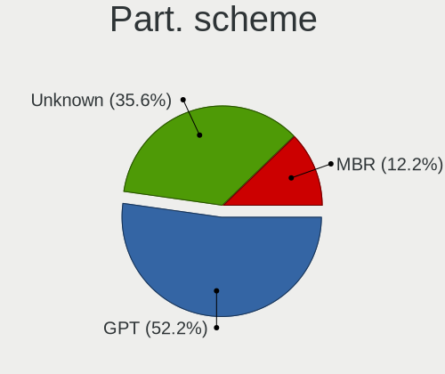
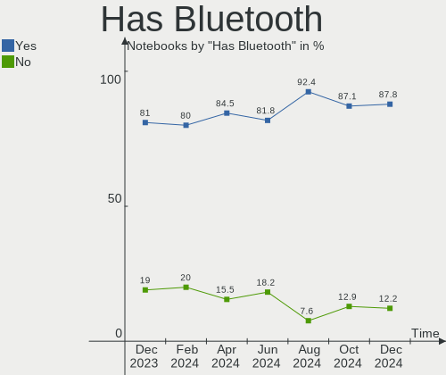
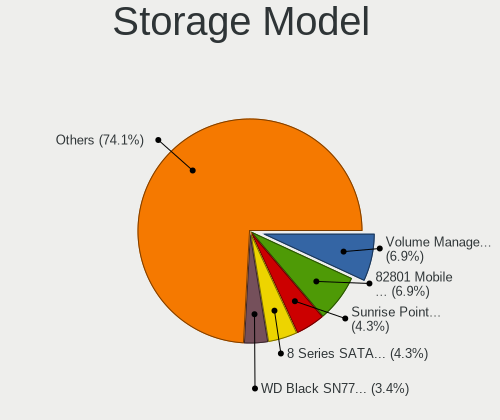
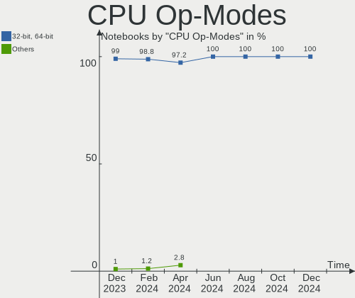
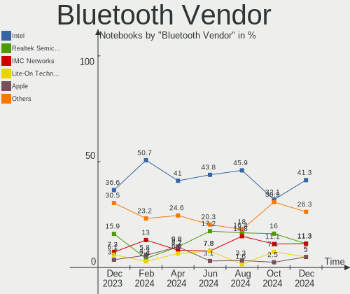
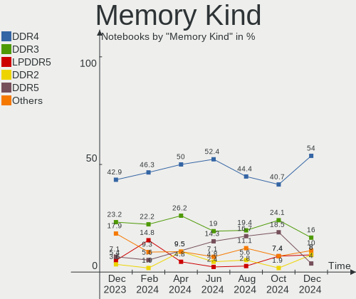
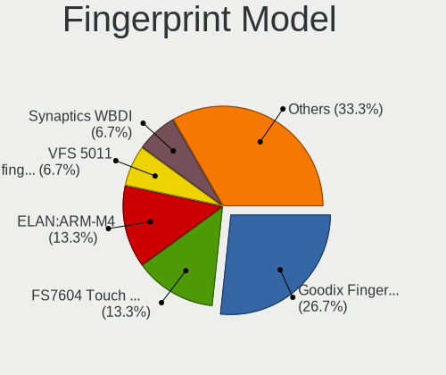
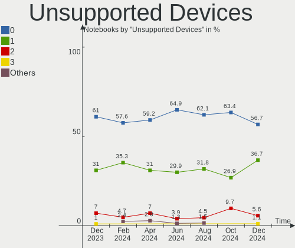

Linux in Spain - Hardware Trends (Notebooks)
--------------------------------------------

A project to identify most popular hardware characteristics and track their change
over time based on data collected by Linux users at https://Linux-Hardware.org.

Anyone can contribute to this report by the [hw-probe](https://github.com/linuxhw/hw-probe) tool:

    sudo -E hw-probe -all -upload

Period: Jan, 2024.

Contents
--------

* [ System ](#system)
  - [ OS                       ](#os)
  - [ OS Family                ](#os-family)
  - [ Kernel                   ](#kernel)
  - [ Kernel Family            ](#kernel-family)
  - [ Kernel Major Ver.        ](#kernel-major-ver)
  - [ Arch                     ](#arch)
  - [ DE                       ](#de)
  - [ Display Server           ](#display-server)
  - [ Display Manager          ](#display-manager)
  - [ OS Lang                  ](#os-lang)
  - [ Boot Mode                ](#boot-mode)
  - [ Filesystem               ](#filesystem)
  - [ Part. scheme             ](#part-scheme)
  - [ Dual Boot with Linux/BSD ](#dual-boot-with-linuxbsd)
  - [ Dual Boot (Win)          ](#dual-boot-win)

* [ Board ](#board)
  - [ Vendor                   ](#vendor)
  - [ Model                    ](#model)
  - [ Model Family             ](#model-family)
  - [ MFG Year                 ](#mfg-year)
  - [ Form Factor              ](#form-factor)
  - [ Secure Boot              ](#secure-boot)
  - [ Coreboot                 ](#coreboot)
  - [ RAM Size                 ](#ram-size)
  - [ RAM Used                 ](#ram-used)
  - [ Total Drives             ](#total-drives)
  - [ Has CD-ROM               ](#has-cd-rom)
  - [ Has Ethernet             ](#has-ethernet)
  - [ Has WiFi                 ](#has-wifi)
  - [ Has Bluetooth            ](#has-bluetooth)

* [ Location ](#location)
  - [ Country                  ](#country)
  - [ City                     ](#city)

* [ Drives ](#drives)
  - [ Drive Vendor             ](#drive-vendor)
  - [ Drive Model              ](#drive-model)
  - [ HDD Vendor               ](#hdd-vendor)
  - [ SSD Vendor               ](#ssd-vendor)
  - [ Drive Kind               ](#drive-kind)
  - [ Drive Connector          ](#drive-connector)
  - [ Drive Size               ](#drive-size)
  - [ Space Total              ](#space-total)
  - [ Space Used               ](#space-used)
  - [ Malfunc. Drives          ](#malfunc-drives)
  - [ Malfunc. Drive Vendor    ](#malfunc-drive-vendor)
  - [ Malfunc. HDD Vendor      ](#malfunc-hdd-vendor)
  - [ Malfunc. Drive Kind      ](#malfunc-drive-kind)
  - [ Failed Drives            ](#failed-drives)
  - [ Failed Drive Vendor      ](#failed-drive-vendor)
  - [ Drive Status             ](#drive-status)

* [ Storage controller ](#storage-controller)
  - [ Storage Vendor           ](#storage-vendor)
  - [ Storage Model            ](#storage-model)
  - [ Storage Kind             ](#storage-kind)

* [ Processor ](#processor)
  - [ CPU Vendor               ](#cpu-vendor)
  - [ CPU Model                ](#cpu-model)
  - [ CPU Model Family         ](#cpu-model-family)
  - [ CPU Cores                ](#cpu-cores)
  - [ CPU Sockets              ](#cpu-sockets)
  - [ CPU Threads              ](#cpu-threads)
  - [ CPU Op-Modes             ](#cpu-op-modes)
  - [ CPU Microcode            ](#cpu-microcode)
  - [ CPU Microarch            ](#cpu-microarch)

* [ Graphics ](#graphics)
  - [ GPU Vendor               ](#gpu-vendor)
  - [ GPU Model                ](#gpu-model)
  - [ GPU Combo                ](#gpu-combo)
  - [ GPU Driver               ](#gpu-driver)
  - [ GPU Memory               ](#gpu-memory)

* [ Monitor ](#monitor)
  - [ Monitor Vendor           ](#monitor-vendor)
  - [ Monitor Model            ](#monitor-model)
  - [ Monitor Resolution       ](#monitor-resolution)
  - [ Monitor Diagonal         ](#monitor-diagonal)
  - [ Monitor Width            ](#monitor-width)
  - [ Aspect Ratio             ](#aspect-ratio)
  - [ Monitor Area             ](#monitor-area)
  - [ Pixel Density            ](#pixel-density)
  - [ Multiple Monitors        ](#multiple-monitors)

* [ Network ](#network)
  - [ Net Controller Vendor    ](#net-controller-vendor)
  - [ Net Controller Model     ](#net-controller-model)
  - [ Wireless Vendor          ](#wireless-vendor)
  - [ Wireless Model           ](#wireless-model)
  - [ Ethernet Vendor          ](#ethernet-vendor)
  - [ Ethernet Model           ](#ethernet-model)
  - [ Net Controller Kind      ](#net-controller-kind)
  - [ Used Controller          ](#used-controller)
  - [ NICs                     ](#nics)
  - [ IPv6                     ](#ipv6)

* [ Bluetooth ](#bluetooth)
  - [ Bluetooth Vendor         ](#bluetooth-vendor)
  - [ Bluetooth Model          ](#bluetooth-model)

* [ Sound ](#sound)
  - [ Sound Vendor             ](#sound-vendor)
  - [ Sound Model              ](#sound-model)

* [ Memory ](#memory)
  - [ Memory Vendor            ](#memory-vendor)
  - [ Memory Model             ](#memory-model)
  - [ Memory Kind              ](#memory-kind)
  - [ Memory Form Factor       ](#memory-form-factor)
  - [ Memory Size              ](#memory-size)
  - [ Memory Speed             ](#memory-speed)

* [ Printers & scanners ](#printers--scanners)
  - [ Printer Vendor           ](#printer-vendor)
  - [ Printer Model            ](#printer-model)
  - [ Scanner Vendor           ](#scanner-vendor)
  - [ Scanner Model            ](#scanner-model)

* [ Camera ](#camera)
  - [ Camera Vendor            ](#camera-vendor)
  - [ Camera Model             ](#camera-model)

* [ Security ](#security)
  - [ Fingerprint Vendor       ](#fingerprint-vendor)
  - [ Fingerprint Model        ](#fingerprint-model)
  - [ Chipcard Vendor          ](#chipcard-vendor)
  - [ Chipcard Model           ](#chipcard-model)

* [ Unsupported ](#unsupported)
  - [ Unsupported Devices      ](#unsupported-devices)
  - [ Unsupported Device Types ](#unsupported-device-types)

System
------

OS
--

Installed operating systems

| Name                 | Notebooks | Percent |
|----------------------|-----------|---------|
| Ubuntu 22.04         | 14        | 15.91%  |
| Fedora 39            | 14        | 15.91%  |
| ArcoLinux Rolling    | 5         | 5.68%   |
| SteamOS 3.5.7        | 4         | 4.55%   |
| Linux Mint 21.2      | 4         | 4.55%   |
| Zorin 17             | 3         | 3.41%   |
| Zorin 16             | 3         | 3.41%   |
| Ubuntu 23.10         | 3         | 3.41%   |
| Pop!_OS 22.04        | 3         | 3.41%   |
| Manjaro              | 3         | 3.41%   |
| Linux Mint 21.3      | 3         | 3.41%   |
| Kali 2023.4          | 3         | 3.41%   |
| Debian 12            | 3         | 3.41%   |
| Nobara 38            | 2         | 2.27%   |
| Manjaro 23.1.3       | 2         | 2.27%   |
| Debian 11            | 2         | 2.27%   |
| Xubuntu 22.04        | 1         | 1.14%   |
| Xubuntu 21.04        | 1         | 1.14%   |
| Xero Rolling         | 1         | 1.14%   |
| Ubuntu Budgie 22.04  | 1         | 1.14%   |
| Ubuntu 22.10         | 1         | 1.14%   |
| Ubuntu 20.04         | 1         | 1.14%   |
| OpenMandriva 5.0     | 1         | 1.14%   |
| OpenMandriva 23.01   | 1         | 1.14%   |
| Manjaro 23.1.2       | 1         | 1.14%   |
| LMDE 6               | 1         | 1.14%   |
| Linux Mint 21.1      | 1         | 1.14%   |
| Linux Mint 20.3      | 1         | 1.14%   |
| KDE neon 22.04       | 1         | 1.14%   |
| Garuda Linux Soaring | 1         | 1.14%   |
| Endless 5.1.0        | 1         | 1.14%   |
| Elementary 7.1       | 1         | 1.14%   |
| Debian               | 1         | 1.14%   |

OS Family
---------

OS without a version

| Name          | Notebooks | Percent |
|---------------|-----------|---------|
| Ubuntu        | 19        | 21.59%  |
| Fedora        | 14        | 15.91%  |
| Linux Mint    | 9         | 10.23%  |
| Zorin         | 6         | 6.82%   |
| Manjaro       | 6         | 6.82%   |
| Debian        | 6         | 6.82%   |
| ArcoLinux     | 5         | 5.68%   |
| SteamOS       | 4         | 4.55%   |
| Pop!_OS       | 3         | 3.41%   |
| Kali          | 3         | 3.41%   |
| Xubuntu       | 2         | 2.27%   |
| OpenMandriva  | 2         | 2.27%   |
| Nobara        | 2         | 2.27%   |
| Xero          | 1         | 1.14%   |
| Ubuntu Budgie | 1         | 1.14%   |
| LMDE          | 1         | 1.14%   |
| KDE neon      | 1         | 1.14%   |
| Garuda Linux  | 1         | 1.14%   |
| Endless       | 1         | 1.14%   |
| Elementary    | 1         | 1.14%   |

Kernel
------

Version of the Linux kernel

| Version                     | Notebooks | Percent |
|-----------------------------|-----------|---------|
| 6.5.0-14-generic            | 16        | 18.18%  |
| 5.15.0-91-generic           | 7         | 7.95%   |
| 6.6.9-200.fc39.x86_64       | 5         | 5.68%   |
| 6.1.52-valve9-1-neptune-61  | 4         | 4.55%   |
| 6.1.0-17-amd64              | 4         | 4.55%   |
| 6.6.8-200.fc39.x86_64       | 3         | 3.41%   |
| 6.6.6-76060606-generic      | 3         | 3.41%   |
| 6.6.11-200.fc39.x86_64      | 3         | 3.41%   |
| 6.2.0-39-generic            | 3         | 3.41%   |
| 5.15.0-92-generic           | 3         | 3.41%   |
| 6.7.2-arch1-1               | 2         | 2.27%   |
| 6.7.0-0-MANJARO             | 2         | 2.27%   |
| 6.6.8-2-MANJARO             | 2         | 2.27%   |
| 6.6.4-arch1-1               | 2         | 2.27%   |
| 6.6.10-1-MANJARO            | 2         | 2.27%   |
| 6.5.0-kali3-amd64           | 2         | 2.27%   |
| 6.5.0-15-generic            | 2         | 2.27%   |
| 6.2.0-33-generic            | 2         | 2.27%   |
| 6.7.0-zen3-1-zen            | 1         | 1.14%   |
| 6.7.0-arch3-1               | 1         | 1.14%   |
| 6.6.9-amd64                 | 1         | 1.14%   |
| 6.6.8-200.fsync.fc38.x86_64 | 1         | 1.14%   |
| 6.6.2-desktop-1omv2390      | 1         | 1.14%   |
| 6.6.13-200.fc39.x86_64      | 1         | 1.14%   |
| 6.6.10-200.fc39.x86_64      | 1         | 1.14%   |
| 6.6.1-arch1-1               | 1         | 1.14%   |
| 6.5.9-200.fsync.fc38.x86_64 | 1         | 1.14%   |
| 6.5.11-300.fc39.x86_64      | 1         | 1.14%   |
| 6.5.0-9-generic             | 1         | 1.14%   |
| 6.5.0-5-amd64               | 1         | 1.14%   |
| 6.5.0-10-generic            | 1         | 1.14%   |
| 6.2.0-37-generic            | 1         | 1.14%   |
| 6.2.0-26-generic            | 1         | 1.14%   |
| 6.1.1-desktop-1omv2290      | 1         | 1.14%   |
| 5.4.0-170-generic           | 1         | 1.14%   |
| 5.19.0-46-generic           | 1         | 1.14%   |
| 5.11.0-44-lowlatency        | 1         | 1.14%   |
| 5.10.0-27-amd64             | 1         | 1.14%   |
| 5.10.0-20-amd64             | 1         | 1.14%   |

Kernel Family
-------------

Linux kernel without a distro release

| Version | Notebooks | Percent |
|---------|-----------|---------|
| 6.5.0   | 23        | 26.14%  |
| 5.15.0  | 10        | 11.36%  |
| 6.2.0   | 7         | 7.95%   |
| 6.6.9   | 6         | 6.82%   |
| 6.6.8   | 6         | 6.82%   |
| 6.7.0   | 4         | 4.55%   |
| 6.1.52  | 4         | 4.55%   |
| 6.1.0   | 4         | 4.55%   |
| 6.6.6   | 3         | 3.41%   |
| 6.6.11  | 3         | 3.41%   |
| 6.6.10  | 3         | 3.41%   |
| 6.7.2   | 2         | 2.27%   |
| 6.6.4   | 2         | 2.27%   |
| 5.10.0  | 2         | 2.27%   |
| 6.6.2   | 1         | 1.14%   |
| 6.6.13  | 1         | 1.14%   |
| 6.6.1   | 1         | 1.14%   |
| 6.5.9   | 1         | 1.14%   |
| 6.5.11  | 1         | 1.14%   |
| 6.1.1   | 1         | 1.14%   |
| 5.4.0   | 1         | 1.14%   |
| 5.19.0  | 1         | 1.14%   |
| 5.11.0  | 1         | 1.14%   |

Kernel Major Ver.
-----------------

Linux kernel major version

| Version | Notebooks | Percent |
|---------|-----------|---------|
| 6.6     | 26        | 29.55%  |
| 6.5     | 25        | 28.41%  |
| 5.15    | 10        | 11.36%  |
| 6.1     | 9         | 10.23%  |
| 6.2     | 7         | 7.95%   |
| 6.7     | 6         | 6.82%   |
| 5.10    | 2         | 2.27%   |
| 5.4     | 1         | 1.14%   |
| 5.19    | 1         | 1.14%   |
| 5.11    | 1         | 1.14%   |

Arch
----

OS architecture (x86_64, i586, etc.)

| Name   | Notebooks | Percent |
|--------|-----------|---------|
| x86_64 | 88        | 100%    |

DE
--

Desktop Environment

| Name            | Notebooks | Percent |
|-----------------|-----------|---------|
| GNOME           | 46        | 52.27%  |
| KDE5            | 17        | 19.32%  |
| X-Cinnamon      | 10        | 11.36%  |
| XFCE            | 6         | 6.82%   |
| MATE            | 2         | 2.27%   |
| Pantheon        | 1         | 1.14%   |
| Hyprland        | 1         | 1.14%   |
| GNOME Flashback | 1         | 1.14%   |
| Endless:GNOME   | 1         | 1.14%   |
| Cinnamon        | 1         | 1.14%   |
| Budgie          | 1         | 1.14%   |
| Unknown         | 1         | 1.14%   |

Display Server
--------------

X11 or Wayland

| Name    | Notebooks | Percent |
|---------|-----------|---------|
| X11     | 48        | 54.55%  |
| Wayland | 40        | 45.45%  |

Display Manager
---------------

SDDM, LightDM, etc.

| Name    | Notebooks | Percent |
|---------|-----------|---------|
| Unknown | 34        | 38.64%  |
| GDM3    | 23        | 26.14%  |
| LightDM | 13        | 14.77%  |
| SDDM    | 11        | 12.5%   |
| GDM     | 7         | 7.95%   |

OS Lang
-------

Language

| Lang  | Notebooks | Percent |
|-------|-----------|---------|
| es_ES | 51        | 57.95%  |
| en_US | 19        | 21.59%  |
| en_GB | 9         | 10.23%  |
| C     | 4         | 4.55%   |
| ca_ES | 2         | 2.27%   |
| uk_UA | 1         | 1.14%   |
| eu_ES | 1         | 1.14%   |
| ca_AD | 1         | 1.14%   |

Boot Mode
---------

EFI or BIOS

| Mode | Notebooks | Percent |
|------|-----------|---------|
| EFI  | 45        | 51.14%  |
| BIOS | 43        | 48.86%  |

Filesystem
----------

Type of filesystem

| Type    | Notebooks | Percent |
|---------|-----------|---------|
| Ext4    | 46        | 52.27%  |
| Btrfs   | 23        | 26.14%  |
| Tmpfs   | 14        | 15.91%  |
| Overlay | 4         | 4.55%   |
| Zfs     | 1         | 1.14%   |

Part. scheme
------------

Scheme of partitioning

| Type    | Notebooks | Percent |
|---------|-----------|---------|
| GPT     | 45        | 51.14%  |
| Unknown | 34        | 38.64%  |
| MBR     | 9         | 10.23%  |

Dual Boot with Linux/BSD
------------------------

Hosting more than one Linux/BSD

| Dual boot | Notebooks | Percent |
|-----------|-----------|---------|
| No        | 83        | 94.32%  |
| Yes       | 5         | 5.68%   |

Dual Boot (Win)
---------------

Hosting Linux and Windows

| Dual boot | Notebooks | Percent |
|-----------|-----------|---------|
| No        | 66        | 75%     |
| Yes       | 22        | 25%     |

Board
-----

Vendor
------

Motherboard manufacturer

| Name                | Notebooks | Percent |
|---------------------|-----------|---------|
| Hewlett-Packard     | 17        | 19.32%  |
| Lenovo              | 15        | 17.05%  |
| Acer                | 9         | 10.23%  |
| ASUSTek Computer    | 8         | 9.09%   |
| Dell                | 6         | 6.82%   |
| MSI                 | 5         | 5.68%   |
| Apple               | 5         | 5.68%   |
| Valve               | 4         | 4.55%   |
| Toshiba             | 4         | 4.55%   |
| Sony                | 2         | 2.27%   |
| HUAWEI              | 2         | 2.27%   |
| Unknown             | 2         | 2.27%   |
| Samsung Electronics | 1         | 1.14%   |
| Primux Tech         | 1         | 1.14%   |
| Notebook            | 1         | 1.14%   |
| Jumper              | 1         | 1.14%   |
| HONOR               | 1         | 1.14%   |
| Gigabyte Technology | 1         | 1.14%   |
| AZW                 | 1         | 1.14%   |
| Alurin              | 1         | 1.14%   |
| Alienware           | 1         | 1.14%   |

Model
-----

Motherboard model

| Name                                 | Notebooks | Percent |
|--------------------------------------|-----------|---------|
| Valve Jupiter                        | 2         | 2.27%   |
| Valve Galileo                        | 2         | 2.27%   |
| HUAWEI BOD-WXX9                      | 2         | 2.27%   |
| Unknown                              | 2         | 2.27%   |
| Toshiba Satellite L750               | 1         | 1.14%   |
| Toshiba Satellite L50t-A             | 1         | 1.14%   |
| Toshiba PORTEGE R700                 | 1         | 1.14%   |
| Toshiba NB250                        | 1         | 1.14%   |
| Sony VPCEB3B4E                       | 1         | 1.14%   |
| Sony VGN-NS11Z_S                     | 1         | 1.14%   |
| Samsung 530U3BI/530U4BI/530U4BH      | 1         | 1.14%   |
| Primux Tech Primux_1406F_W10         | 1         | 1.14%   |
| Notebook W350STQ/W370ST              | 1         | 1.14%   |
| MSI Stealth 15M B12UE                | 1         | 1.14%   |
| MSI Prestige 16Studio A13VF          | 1         | 1.14%   |
| MSI Modern 15 H B13M                 | 1         | 1.14%   |
| MSI Modern 15 B7M                    | 1         | 1.14%   |
| MSI Modern 15 A5M                    | 1         | 1.14%   |
| Lenovo ThinkPad X260 20F5S3J301      | 1         | 1.14%   |
| Lenovo ThinkPad X240 20AMS31700      | 1         | 1.14%   |
| Lenovo ThinkPad X1 Carbon 34604T9    | 1         | 1.14%   |
| Lenovo ThinkPad T440 20B7S1M20F      | 1         | 1.14%   |
| Lenovo ThinkPad T16 Gen 1 21CHCTO1WW | 1         | 1.14%   |
| Lenovo ThinkPad P1 Gen 3 20TJS2F40W  | 1         | 1.14%   |
| Lenovo ThinkPad L15 Gen 1 20U3CTO1WW | 1         | 1.14%   |
| Lenovo ThinkPad E16 Gen 1 21JTCTO1WW | 1         | 1.14%   |
| Lenovo ThinkPad E15 Gen 2 20TD001HSP | 1         | 1.14%   |
| Lenovo IdeaPad Pro 5 14IMH9 83D2     | 1         | 1.14%   |
| Lenovo IdeaPad Gaming 3 15ACH6 82K2  | 1         | 1.14%   |
| Lenovo IdeaPad 3 15ITL6 82H8         | 1         | 1.14%   |
| Lenovo IdeaPad 3 15IAU7 82RK         | 1         | 1.14%   |
| Lenovo G710 20252                    | 1         | 1.14%   |
| Lenovo G580 2189                     | 1         | 1.14%   |
| Jumper EZpad                         | 1         | 1.14%   |
| HONOR HLYL-WXX9                      | 1         | 1.14%   |
| HP ProBook 640 G1                    | 1         | 1.14%   |
| HP Pavilion Sleekbook 14             | 1         | 1.14%   |
| HP Pavilion Laptop 15-ck0xx          | 1         | 1.14%   |
| HP Pavilion Laptop 14-dv1xxx         | 1         | 1.14%   |
| HP Pavilion Gaming Laptop 15-ec2xxx  | 1         | 1.14%   |

Model Family
------------

Motherboard model prefix

| Name               | Notebooks | Percent |
|--------------------|-----------|---------|
| Lenovo ThinkPad    | 9         | 10.23%  |
| HP Laptop          | 6         | 6.82%   |
| Lenovo IdeaPad     | 4         | 4.55%   |
| HP Pavilion        | 4         | 4.55%   |
| Acer Aspire        | 4         | 4.55%   |
| MSI Modern         | 3         | 3.41%   |
| Dell Latitude      | 3         | 3.41%   |
| Acer TravelMate    | 3         | 3.41%   |
| Valve Jupiter      | 2         | 2.27%   |
| Valve Galileo      | 2         | 2.27%   |
| Toshiba Satellite  | 2         | 2.27%   |
| HUAWEI BOD-WXX9    | 2         | 2.27%   |
| Dell Inspiron      | 2         | 2.27%   |
| ASUS Zenbook       | 2         | 2.27%   |
| Apple MacBookPro9  | 2         | 2.27%   |
| Apple MacBookPro11 | 2         | 2.27%   |
| Acer Nitro         | 2         | 2.27%   |
| Unknown            | 2         | 2.27%   |
| Toshiba PORTEGE    | 1         | 1.14%   |
| Toshiba NB250      | 1         | 1.14%   |
| Sony VPCEB3B4E     | 1         | 1.14%   |
| Sony VGN-NS11Z     | 1         | 1.14%   |
| Samsung 530U3BI    | 1         | 1.14%   |
| Primux Tech Primux | 1         | 1.14%   |
| Notebook W350STQ   | 1         | 1.14%   |
| MSI Stealth        | 1         | 1.14%   |
| MSI Prestige       | 1         | 1.14%   |
| Lenovo G710        | 1         | 1.14%   |
| Lenovo G580        | 1         | 1.14%   |
| Jumper EZpad       | 1         | 1.14%   |
| HONOR HLYL-WXX9    | 1         | 1.14%   |
| HP ProBook         | 1         | 1.14%   |
| HP Notebook        | 1         | 1.14%   |
| HP EliteDesk       | 1         | 1.14%   |
| HP EliteBook       | 1         | 1.14%   |
| HP 650             | 1         | 1.14%   |
| HP 630             | 1         | 1.14%   |
| HP 350             | 1         | 1.14%   |
| Gigabyte G5        | 1         | 1.14%   |
| Dell XPS           | 1         | 1.14%   |

MFG Year
--------

Motherboard manufacture year

| Year | Notebooks | Percent |
|------|-----------|---------|
| 2021 | 15        | 17.05%  |
| 2022 | 11        | 12.5%   |
| 2023 | 10        | 11.36%  |
| 2012 | 8         | 9.09%   |
| 2020 | 6         | 6.82%   |
| 2018 | 5         | 5.68%   |
| 2014 | 5         | 5.68%   |
| 2013 | 5         | 5.68%   |
| 2011 | 5         | 5.68%   |
| 2019 | 4         | 4.55%   |
| 2017 | 4         | 4.55%   |
| 2010 | 4         | 4.55%   |
| 2016 | 2         | 2.27%   |
| 2009 | 2         | 2.27%   |
| 2015 | 1         | 1.14%   |
| 2006 | 1         | 1.14%   |

Form Factor
-----------

Physical design of the computer

| Name     | Notebooks | Percent |
|----------|-----------|---------|
| Notebook | 88        | 100%    |

Secure Boot
-----------

Enabled or disabled

| State    | Notebooks | Percent |
|----------|-----------|---------|
| Disabled | 79        | 89.77%  |
| Enabled  | 9         | 10.23%  |

Coreboot
--------

Have coreboot on board

| Used | Notebooks | Percent |
|------|-----------|---------|
| No   | 88        | 100%    |

RAM Size
--------

Total RAM memory

| Size in GB | Notebooks | Percent |
|------------|-----------|---------|
| 4.01-8.0   | 30        | 34.09%  |
| 8.01-16.0  | 19        | 21.59%  |
| 3.01-4.0   | 15        | 17.05%  |
| 16.01-24.0 | 12        | 13.64%  |
| 32.01-64.0 | 9         | 10.23%  |
| 24.01-32.0 | 1         | 1.14%   |
| 1.01-2.0   | 1         | 1.14%   |
| 0.51-1.0   | 1         | 1.14%   |

RAM Used
--------

Used RAM memory

| Used GB   | Notebooks | Percent |
|-----------|-----------|---------|
| 1.01-2.0  | 26        | 29.55%  |
| 4.01-8.0  | 24        | 27.27%  |
| 3.01-4.0  | 17        | 19.32%  |
| 2.01-3.0  | 16        | 18.18%  |
| 8.01-16.0 | 4         | 4.55%   |
| 0.01-0.5  | 1         | 1.14%   |

Total Drives
------------

Number of drives on board

| Drives | Notebooks | Percent |
|--------|-----------|---------|
| 1      | 62        | 70.45%  |
| 2      | 23        | 26.14%  |
| 4      | 2         | 2.27%   |
| 3      | 1         | 1.14%   |

Has CD-ROM
----------

Has CD-ROM on board

| Presented | Notebooks | Percent |
|-----------|-----------|---------|
| No        | 69        | 78.41%  |
| Yes       | 19        | 21.59%  |

Has Ethernet
------------

Has Ethernet on board

| Presented | Notebooks | Percent |
|-----------|-----------|---------|
| Yes       | 60        | 68.18%  |
| No        | 28        | 31.82%  |

Has WiFi
--------

Has WiFi module

| Presented | Notebooks | Percent |
|-----------|-----------|---------|
| Yes       | 87        | 98.86%  |
| No        | 1         | 1.14%   |

Has Bluetooth
-------------

Has Bluetooth module

| Presented | Notebooks | Percent |
|-----------|-----------|---------|
| Yes       | 69        | 78.41%  |
| No        | 19        | 21.59%  |

Location
--------

Country
-------

Geographic location (country)

| Country | Notebooks | Percent |
|---------|-----------|---------|
| Spain   | 88        | 100%    |

City
----

Geographic location (city)

| City                     | Notebooks | Percent |
|--------------------------|-----------|---------|
| Barcelona                | 8         | 9.09%   |
| Madrid                   | 7         | 7.95%   |
| Zaragoza                 | 4         | 4.55%   |
| Valencia                 | 4         | 4.55%   |
| Valladolid               | 2         | 2.27%   |
| Murcia                   | 2         | 2.27%   |
| Granada                  | 2         | 2.27%   |
| Castelló de la Plana    | 2         | 2.27%   |
| Alicante                 | 2         | 2.27%   |
| Zafra                    | 1         | 1.14%   |
| Yeles                    | 1         | 1.14%   |
| Vilanova i la Geltrú    | 1         | 1.14%   |
| Vila-seca                | 1         | 1.14%   |
| Vigo                     | 1         | 1.14%   |
| Vera                     | 1         | 1.14%   |
| Tui                      | 1         | 1.14%   |
| Tres Cantos              | 1         | 1.14%   |
| Torremolinos             | 1         | 1.14%   |
| Taradell                 | 1         | 1.14%   |
| Sitges                   | 1         | 1.14%   |
| Santa Cruz de Tenerife   | 1         | 1.14%   |
| Sant Adrià de Besòs    | 1         | 1.14%   |
| Rafal                    | 1         | 1.14%   |
| Puente de Domingo Florez | 1         | 1.14%   |
| Pontevedra               | 1         | 1.14%   |
| Plasencia                | 1         | 1.14%   |
| Pinto                    | 1         | 1.14%   |
| Parla                    | 1         | 1.14%   |
| Pamplona                 | 1         | 1.14%   |
| Palma                    | 1         | 1.14%   |
| Nigran                   | 1         | 1.14%   |
| Nerja                    | 1         | 1.14%   |
| Moana                    | 1         | 1.14%   |
| Mieres                   | 1         | 1.14%   |
| Marbella                 | 1         | 1.14%   |
| Málaga                  | 1         | 1.14%   |
| Majadahonda              | 1         | 1.14%   |
| Mahon                    | 1         | 1.14%   |
| Las Rozas de Madrid      | 1         | 1.14%   |
| Las Navas del Marques    | 1         | 1.14%   |

Drives
------

Drive Vendor
------------

Hard drive vendors

| Vendor                      | Notebooks | Drives | Percent |
|-----------------------------|-----------|--------|---------|
| Sandisk                     | 13        | 13     | 11.02%  |
| Samsung Electronics         | 11        | 11     | 9.32%   |
| WDC                         | 9         | 9      | 7.63%   |
| Unknown                     | 9         | 9      | 7.63%   |
| SK hynix                    | 8         | 8      | 6.78%   |
| Kingston                    | 8         | 8      | 6.78%   |
| Intel                       | 7         | 8      | 5.93%   |
| Micron Technology           | 6         | 6      | 5.08%   |
| Toshiba                     | 5         | 5      | 4.24%   |
| Seagate                     | 5         | 5      | 4.24%   |
| Phison Electronics          | 5         | 5      | 4.24%   |
| Apple                       | 5         | 5      | 4.24%   |
| Crucial                     | 4         | 4      | 3.39%   |
| Kingston Technology Company | 3         | 3      | 2.54%   |
| China                       | 3         | 3      | 2.54%   |
| KIOXIA                      | 2         | 2      | 1.69%   |
| XrayDisk                    | 1         | 1      | 0.85%   |
| USB3.0                      | 1         | 1      | 0.85%   |
| Teclast                     | 1         | 1      | 0.85%   |
| Silicon Motion              | 1         | 1      | 0.85%   |
| Netac                       | 1         | 1      | 0.85%   |
| Micron/Crucial Technology   | 1         | 1      | 0.85%   |
| MAXIO Technology (Hangzhou) | 1         | 1      | 0.85%   |
| LITEON                      | 1         | 1      | 0.85%   |
| JMicron Technology          | 1         | 1      | 0.85%   |
| JetFlash                    | 1         | 1      | 0.85%   |
| Hitachi                     | 1         | 1      | 0.85%   |
| HGST                        | 1         | 1      | 0.85%   |
| Emtec                       | 1         | 1      | 0.85%   |
| BAITITON                    | 1         | 1      | 0.85%   |
| A-DATA Technology           | 1         | 1      | 0.85%   |

Drive Model
-----------

Hard drive models

| Model                                                 | Notebooks | Percent |
|-------------------------------------------------------|-----------|---------|
| Phison PS5013 E13 NVMe Controller 256GB               | 4         | 3.36%   |
| Kingston SA400S37240G 240GB SSD                       | 4         | 3.36%   |
| Unknown MMC Card  64GB                                | 3         | 2.52%   |
| SK hynix BC501 NVMe Solid State Drive 512GB           | 3         | 2.52%   |
| Seagate ST500LM021-1KJ152 500GB                       | 2         | 1.68%   |
| SanDisk SSD PLUS 480GB                                | 2         | 1.68%   |
| Kingston Company OM3PDP3 NVMe SSD 256GB               | 2         | 1.68%   |
| Intel SSD 600P Series 256GB                           | 2         | 1.68%   |
| XrayDisk 512GB                                        | 1         | 0.84%   |
| WDC WDS120G2G0A-00JH30 120GB SSD                      | 1         | 0.84%   |
| WDC WD7500BPKT-75PK4T0 752GB                          | 1         | 0.84%   |
| WDC WD5000LPVX-60V0TT0 500GB                          | 1         | 0.84%   |
| WDC WD5000LPVX-22V0TT0 500GB                          | 1         | 0.84%   |
| WDC WD10SPZX-21Z10T0 1TB                              | 1         | 0.84%   |
| WDC WD10SPCX-00KHST0 1TB                              | 1         | 0.84%   |
| WDC WD Blue SA510 M.2 2280 500GB                      | 1         | 0.84%   |
| WDC PC SN730 SDBQNTY-512G-1001 512GB                  | 1         | 0.84%   |
| WDC PC SN730 SDBPNTY-512G-1036 512GB                  | 1         | 0.84%   |
| USB3.0 Super Speed 500GB SSD                          | 1         | 0.84%   |
| Unknown SLD64G  64GB                                  | 1         | 0.84%   |
| Unknown MMC Card  32GB                                | 1         | 0.84%   |
| Unknown MMC Card  2GB                                 | 1         | 0.84%   |
| Unknown MMC Card  256GB                               | 1         | 0.84%   |
| Unknown MMC Card  16GB                                | 1         | 0.84%   |
| Unknown MMC Card  128GB                               | 1         | 0.84%   |
| Toshiba THNSNH128GMCT 128GB SSD                       | 1         | 0.84%   |
| Toshiba MQ04ABF100 1TB                                | 1         | 0.84%   |
| Toshiba MQ01ABF050 500GB                              | 1         | 0.84%   |
| Toshiba MQ01ABD100 1TB                                | 1         | 0.84%   |
| Toshiba MQ01ABD075 752GB                              | 1         | 0.84%   |
| Teclast BD256GB SLCB-2280 SSD                         | 1         | 0.84%   |
| SK hynix SKHynix_HFS512GD9TNI-L2B0B 512GB             | 1         | 0.84%   |
| SK hynix SKHynix_HFS001TEJ4X112N 1024GB               | 1         | 0.84%   |
| SK hynix PC601 NVMe 512GB                             | 1         | 0.84%   |
| SK hynix HFS128G39TND-N210A 128GB SSD                 | 1         | 0.84%   |
| SK hynix HFS001TEJ9X108N 1TB                          | 1         | 0.84%   |
| Silicon Motion SM2263EN/SM2263XT SSD Controller 128GB | 1         | 0.84%   |
| Seagate ST9500325AS 500GB                             | 1         | 0.84%   |
| Seagate ST500LM012 HN-M500MBB 500GB                   | 1         | 0.84%   |
| Seagate ST1000LM035-1RK172 1TB                        | 1         | 0.84%   |

HDD Vendor
----------

Hard disk drive vendors

| Vendor              | Notebooks | Drives | Percent |
|---------------------|-----------|--------|---------|
| WDC                 | 5         | 5      | 27.78%  |
| Seagate             | 5         | 5      | 27.78%  |
| Toshiba             | 4         | 4      | 22.22%  |
| Samsung Electronics | 1         | 1      | 5.56%   |
| Hitachi             | 1         | 1      | 5.56%   |
| HGST                | 1         | 1      | 5.56%   |
| Apple               | 1         | 1      | 5.56%   |

SSD Vendor
----------

Solid state drive vendors

| Vendor              | Notebooks | Drives | Percent |
|---------------------|-----------|--------|---------|
| Kingston            | 7         | 7      | 18.92%  |
| SanDisk             | 6         | 6      | 16.22%  |
| Crucial             | 4         | 4      | 10.81%  |
| Samsung Electronics | 3         | 3      | 8.11%   |
| China               | 3         | 3      | 8.11%   |
| Apple               | 3         | 3      | 8.11%   |
| WDC                 | 2         | 2      | 5.41%   |
| USB3.0              | 1         | 1      | 2.7%    |
| Toshiba             | 1         | 1      | 2.7%    |
| Teclast             | 1         | 1      | 2.7%    |
| SK hynix            | 1         | 1      | 2.7%    |
| Netac               | 1         | 1      | 2.7%    |
| LITEON              | 1         | 1      | 2.7%    |
| Intel               | 1         | 1      | 2.7%    |
| Emtec               | 1         | 1      | 2.7%    |
| BAITITON            | 1         | 1      | 2.7%    |

Drive Kind
----------

HDD or SSD

| Kind    | Notebooks | Drives | Percent |
|---------|-----------|--------|---------|
| NVMe    | 47        | 52     | 43.12%  |
| SSD     | 32        | 37     | 29.36%  |
| HDD     | 18        | 18     | 16.51%  |
| MMC     | 9         | 9      | 8.26%   |
| Unknown | 3         | 3      | 2.75%   |

Drive Connector
---------------

SATA, SAS, NVMe, etc.

| Type | Notebooks | Drives | Percent |
|------|-----------|--------|---------|
| NVMe | 47        | 52     | 45.63%  |
| SATA | 43        | 54     | 41.75%  |
| MMC  | 9         | 9      | 8.74%   |
| SAS  | 4         | 4      | 3.88%   |

Drive Size
----------

Size of hard drive

| Size in TB | Notebooks | Drives | Percent |
|------------|-----------|--------|---------|
| 0.01-0.5   | 37        | 42     | 74%     |
| 0.51-1.0   | 13        | 13     | 26%     |

Space Total
-----------

Amount of disk space available on the file system

| Size in GB     | Notebooks | Percent |
|----------------|-----------|---------|
| 251-500        | 26        | 29.55%  |
| 101-250        | 26        | 29.55%  |
| 501-1000       | 16        | 18.18%  |
| 1001-2000      | 8         | 9.09%   |
| 1-20           | 6         | 6.82%   |
| 51-100         | 2         | 2.27%   |
| More than 3000 | 1         | 1.14%   |
| 21-50          | 1         | 1.14%   |
| 2001-3000      | 1         | 1.14%   |
| Unknown        | 1         | 1.14%   |

Space Used
----------

Amount of used disk space

| Used GB  | Notebooks | Percent |
|----------|-----------|---------|
| 1-20     | 30        | 34.09%  |
| 101-250  | 16        | 18.18%  |
| 21-50    | 15        | 17.05%  |
| 51-100   | 10        | 11.36%  |
| 501-1000 | 9         | 10.23%  |
| 251-500  | 7         | 7.95%   |
| Unknown  | 1         | 1.14%   |

Malfunc. Drives
---------------

Drive models with a malfunction

| Model                                 | Notebooks | Drives | Percent |
|---------------------------------------|-----------|--------|---------|
| WDC WD5000LPVX-22V0TT0 500GB          | 1         | 1      | 25%     |
| Toshiba MQ01ABF050 500GB              | 1         | 1      | 25%     |
| SK hynix HFS128G39TND-N210A 128GB SSD | 1         | 1      | 25%     |
| BAITITON BT58SSD12S 512GB             | 1         | 1      | 25%     |

Malfunc. Drive Vendor
---------------------

Vendors of faulty drives

| Vendor   | Notebooks | Drives | Percent |
|----------|-----------|--------|---------|
| WDC      | 1         | 1      | 25%     |
| Toshiba  | 1         | 1      | 25%     |
| SK hynix | 1         | 1      | 25%     |
| BAITITON | 1         | 1      | 25%     |

Malfunc. HDD Vendor
-------------------

Vendors of faulty HDD drives

| Vendor  | Notebooks | Drives | Percent |
|---------|-----------|--------|---------|
| WDC     | 1         | 1      | 50%     |
| Toshiba | 1         | 1      | 50%     |

Malfunc. Drive Kind
-------------------

Kinds of faulty drives

| Kind | Notebooks | Drives | Percent |
|------|-----------|--------|---------|
| SSD  | 2         | 2      | 50%     |
| HDD  | 2         | 2      | 50%     |

Failed Drives
-------------

Failed drive models

Zero info for selected period =(

Failed Drive Vendor
-------------------

Failed drive vendors

Zero info for selected period =(

Drive Status
------------

Number of failed and malfunc. drives

| Status   | Notebooks | Drives | Percent |
|----------|-----------|--------|---------|
| Detected | 55        | 73     | 58.51%  |
| Works    | 35        | 42     | 37.23%  |
| Malfunc  | 4         | 4      | 4.26%   |

Storage controller
------------------

Storage Vendor
--------------

Storage controller vendors

| Vendor                      | Notebooks | Percent |
|-----------------------------|-----------|---------|
| Intel                       | 56        | 52.83%  |
| Samsung Electronics         | 10        | 9.43%   |
| SanDisk                     | 8         | 7.55%   |
| SK hynix                    | 7         | 6.6%    |
| Micron Technology           | 6         | 5.66%   |
| Phison Electronics          | 5         | 4.72%   |
| Kingston Technology Company | 4         | 3.77%   |
| AMD                         | 4         | 3.77%   |
| KIOXIA                      | 2         | 1.89%   |
| Silicon Motion              | 1         | 0.94%   |
| Micron/Crucial Technology   | 1         | 0.94%   |
| MAXIO Technology (Hangzhou) | 1         | 0.94%   |
| ADATA Technology            | 1         | 0.94%   |

Storage Model
-------------

Storage controller models

| Model                                                                          | Notebooks | Percent |
|--------------------------------------------------------------------------------|-----------|---------|
| Intel Volume Management Device NVMe RAID Controller                            | 7         | 5.88%   |
| Intel Sunrise Point-LP SATA Controller [AHCI mode]                             | 6         | 5.04%   |
| Samsung NVMe SSD Controller 980 (DRAM-less)                                    | 5         | 4.2%    |
| Intel 7 Series Chipset Family 6-port SATA Controller [AHCI mode]               | 5         | 4.2%    |
| Intel 5 Series/3400 Series Chipset 4 port SATA AHCI Controller                 | 5         | 4.2%    |
| Phison PS5013-E13 PCIe3 NVMe Controller (DRAM-less)                            | 4         | 3.36%   |
| Intel SSD 670p Series [Keystone Harbor]                                        | 4         | 3.36%   |
| Intel Celeron/Pentium Silver Processor SATA Controller                         | 4         | 3.36%   |
| Intel 6 Series/C200 Series Chipset Family 6 port Mobile SATA AHCI Controller   | 4         | 3.36%   |
| SK hynix BC501 NVMe Solid State Drive                                          | 3         | 2.52%   |
| Intel Cannon Lake Mobile PCH SATA AHCI Controller                              | 3         | 2.52%   |
| Intel Alder Lake-P SATA AHCI Controller                                        | 3         | 2.52%   |
| Intel 8 Series/C220 Series Chipset Family 6-port SATA Controller 1 [AHCI mode] | 3         | 2.52%   |
| AMD FCH SATA Controller [AHCI mode]                                            | 3         | 2.52%   |
| SK hynix BC901 NVMe Solid State Drive (DRAM-less)                              | 2         | 1.68%   |
| SanDisk WD Black SN770 / PC SN740 256GB / PC SN560 (DRAM-less) NVMe SSD        | 2         | 1.68%   |
| SanDisk Extreme Pro / WD Black SN750 / PC SN730 / Red SN700 NVMe SSD           | 2         | 1.68%   |
| Samsung S4LN058A01[SSUBX] AHCI SSD Controller (Apple slot)                     | 2         | 1.68%   |
| Kingston Company OM3PDP3 NVMe SSD                                              | 2         | 1.68%   |
| Intel Volume Management Device NVMe RAID Controller Intel Corporation          | 2         | 1.68%   |
| Intel Tiger Lake-LP SATA Controller                                            | 2         | 1.68%   |
| Intel SSD 600P Series                                                          | 2         | 1.68%   |
| Intel 82801 Mobile SATA Controller [RAID mode]                                 | 2         | 1.68%   |
| Intel 8 Series SATA Controller 1 [AHCI mode]                                   | 2         | 1.68%   |
| SK hynix PC611 NVMe Solid State Drive                                          | 1         | 0.84%   |
| SK hynix PC601 NVMe Solid State Drive                                          | 1         | 0.84%   |
| Silicon Motion SM2263EN/SM2263XT (DRAM-less) NVMe SSD Controllers              | 1         | 0.84%   |
| SanDisk WD PC SN540 / Green SN350 NVMe SSD 1 TB (DRAM-less)                    | 1         | 0.84%   |
| SanDisk WD Blue SN500 / PC SN520 x2 M.2 2280 NVMe SSD                          | 1         | 0.84%   |
| SanDisk Ultra 3D / WD Blue SN550 NVMe SSD                                      | 1         | 0.84%   |
| SanDisk Extreme Pro / WD Black 2018/SN750/PC SN720 NVMe SSD                    | 1         | 0.84%   |
| Samsung S4LN053X01 AHCI SSD Controller(Apple slot)                             | 1         | 0.84%   |
| Samsung NVMe SSD Controller SM961/PM961/SM963                                  | 1         | 0.84%   |
| Samsung NVMe SSD Controller PM9A1/PM9A3/980PRO                                 | 1         | 0.84%   |
| Phison E16 PCIe4 NVMe Controller                                               | 1         | 0.84%   |
| Micron/Crucial P2 [Nick P2] / P3 / P3 Plus NVMe PCIe SSD (DRAM-less)           | 1         | 0.84%   |
| Micron 3460 NVMe SSD                                                           | 1         | 0.84%   |
| Micron 3400 NVMe SSD [Hendrix]                                                 | 1         | 0.84%   |
| Micron 2450 NVMe SSD [HendrixV] (DRAM-less)                                    | 1         | 0.84%   |
| Micron 2400 NVMe SSD (DRAM-less)                                               | 1         | 0.84%   |

Storage Kind
------------

Kind of storage controller (IDE, SATA, NVMe, SAS, ...)

| Kind | Notebooks | Percent |
|------|-----------|---------|
| SATA | 52        | 46.43%  |
| NVMe | 46        | 41.07%  |
| RAID | 11        | 9.82%   |
| IDE  | 3         | 2.68%   |

Processor
---------

CPU Vendor
----------

Processor vendors

| Vendor | Notebooks | Percent |
|--------|-----------|---------|
| Intel  | 69        | 78.41%  |
| AMD    | 19        | 21.59%  |

CPU Model
---------

Processor models

| Model                                    | Notebooks | Percent |
|------------------------------------------|-----------|---------|
| Intel 11th Gen Core i5-1135G7 @ 2.40GHz  | 5         | 5.68%   |
| AMD Custom APU 0405                      | 4         | 4.55%   |
| Intel Core i5-7200U CPU @ 2.50GHz        | 3         | 3.41%   |
| Intel Core i7-8750H CPU @ 2.20GHz        | 2         | 2.27%   |
| Intel Core i7-10850H CPU @ 2.70GHz       | 2         | 2.27%   |
| Intel Core i5-4210M CPU @ 2.60GHz        | 2         | 2.27%   |
| Intel 12th Gen Core i7-1255U             | 2         | 2.27%   |
| AMD Ryzen 7 5800H with Radeon Graphics   | 2         | 2.27%   |
| Intel Pentium Silver N5030 CPU @ 1.10GHz | 1         | 1.14%   |
| Intel Pentium CPU P6200 @ 2.13GHz        | 1         | 1.14%   |
| Intel Pentium CPU P6100 @ 2.00GHz        | 1         | 1.14%   |
| Intel Core Ultra 7 155H                  | 1         | 1.14%   |
| Intel Core i7-8550U CPU @ 1.80GHz        | 1         | 1.14%   |
| Intel Core i7-7500U CPU @ 2.70GHz        | 1         | 1.14%   |
| Intel Core i7-4980HQ CPU @ 2.80GHz       | 1         | 1.14%   |
| Intel Core i7-4710HQ CPU @ 2.50GHz       | 1         | 1.14%   |
| Intel Core i7-4700MQ CPU @ 2.40GHz       | 1         | 1.14%   |
| Intel Core i7-3720QM CPU @ 2.60GHz       | 1         | 1.14%   |
| Intel Core i7-3667U CPU @ 2.00GHz        | 1         | 1.14%   |
| Intel Core i7-3520M CPU @ 2.90GHz        | 1         | 1.14%   |
| Intel Core i7-2760QM CPU @ 2.40GHz       | 1         | 1.14%   |
| Intel Core i7-2630QM CPU @ 2.00GHz       | 1         | 1.14%   |
| Intel Core i7-10510U CPU @ 1.80GHz       | 1         | 1.14%   |
| Intel Core i5-9300H CPU @ 2.40GHz        | 1         | 1.14%   |
| Intel Core i5-8265U CPU @ 1.60GHz        | 1         | 1.14%   |
| Intel Core i5-8250U CPU @ 1.60GHz        | 1         | 1.14%   |
| Intel Core i5-6300U CPU @ 2.40GHz        | 1         | 1.14%   |
| Intel Core i5-5257U CPU @ 2.70GHz        | 1         | 1.14%   |
| Intel Core i5-5200U CPU @ 2.20GHz        | 1         | 1.14%   |
| Intel Core i5-4300U CPU @ 1.90GHz        | 1         | 1.14%   |
| Intel Core i5-4258U CPU @ 2.40GHz        | 1         | 1.14%   |
| Intel Core i5-4200U CPU @ 1.60GHz        | 1         | 1.14%   |
| Intel Core i5-4200M CPU @ 2.50GHz        | 1         | 1.14%   |
| Intel Core i5-3337U CPU @ 1.80GHz        | 1         | 1.14%   |
| Intel Core i5-3210M CPU @ 2.50GHz        | 1         | 1.14%   |
| Intel Core i5-2467M CPU @ 1.60GHz        | 1         | 1.14%   |
| Intel Core i5-2430M CPU @ 2.40GHz        | 1         | 1.14%   |
| Intel Core i5 CPU M 520 @ 2.40GHz        | 1         | 1.14%   |
| Intel Core i3-2367M CPU @ 1.40GHz        | 1         | 1.14%   |
| Intel Core i3-2348M CPU @ 2.30GHz        | 1         | 1.14%   |

CPU Model Family
----------------

Processor model prefix

| Model                   | Notebooks | Percent |
|-------------------------|-----------|---------|
| Other                   | 22        | 25%     |
| Intel Core i5           | 20        | 22.73%  |
| Intel Core i7           | 15        | 17.05%  |
| AMD Ryzen 7             | 6         | 6.82%   |
| Intel Core i3           | 5         | 5.68%   |
| Intel Celeron           | 5         | 5.68%   |
| AMD Ryzen 5             | 5         | 5.68%   |
| Intel Pentium           | 2         | 2.27%   |
| Intel Atom              | 2         | 2.27%   |
| Intel Pentium Silver    | 1         | 1.14%   |
| Intel Core 2 Duo        | 1         | 1.14%   |
| Intel Core              | 1         | 1.14%   |
| AMD Turion 64 X2 Mobile | 1         | 1.14%   |
| AMD Ryzen 7 PRO         | 1         | 1.14%   |
| AMD Ryzen 5 PRO         | 1         | 1.14%   |

CPU Cores
---------

Number of processor cores

| Number | Notebooks | Percent |
|--------|-----------|---------|
| 2      | 32        | 36.36%  |
| 4      | 30        | 34.09%  |
| 6      | 9         | 10.23%  |
| 10     | 6         | 6.82%   |
| 8      | 6         | 6.82%   |
| 14     | 3         | 3.41%   |
| 16     | 1         | 1.14%   |
| 1      | 1         | 1.14%   |

CPU Sockets
-----------

Number of sockets

| Number | Notebooks | Percent |
|--------|-----------|---------|
| 1      | 88        | 100%    |

CPU Threads
-----------

Threads per core (Hyper-Threading)

| Number | Notebooks | Percent |
|--------|-----------|---------|
| 2      | 73        | 82.95%  |
| 1      | 15        | 17.05%  |

CPU Op-Modes
------------

CPU Operation Modes (32-bit, 64-bit)

| Op mode        | Notebooks | Percent |
|----------------|-----------|---------|
| 32-bit, 64-bit | 88        | 100%    |

CPU Microcode
-------------

Microcode number

| Number     | Notebooks | Percent |
|------------|-----------|---------|
| Unknown    | 62        | 70.45%  |
| 0x806e9    | 2         | 2.27%   |
| 0x306c3    | 2         | 2.27%   |
| 0x20655    | 2         | 2.27%   |
| 0x0a50000d | 2         | 2.27%   |
| 0x0a50000c | 2         | 2.27%   |
| 0x0a404102 | 2         | 2.27%   |
| 0x08608103 | 2         | 2.27%   |
| 0x906a4    | 1         | 1.14%   |
| 0x806ea    | 1         | 1.14%   |
| 0x806c2    | 1         | 1.14%   |
| 0x806c1    | 1         | 1.14%   |
| 0x6fd      | 1         | 1.14%   |
| 0x306d4    | 1         | 1.14%   |
| 0x306a9    | 1         | 1.14%   |
| 0x206a7    | 1         | 1.14%   |
| 0x20652    | 1         | 1.14%   |
| 0x106ca    | 1         | 1.14%   |
| 0x08a00008 | 1         | 1.14%   |
| 0x08600104 | 1         | 1.14%   |

CPU Microarch
-------------

Microarchitecture

| Name             | Notebooks | Percent |
|------------------|-----------|---------|
| Unknown          | 13        | 14.77%  |
| KabyLake         | 11        | 12.5%   |
| Haswell          | 9         | 10.23%  |
| TigerLake        | 7         | 7.95%   |
| Alderlake Hybrid | 7         | 7.95%   |
| Westmere         | 6         | 6.82%   |
| SandyBridge      | 6         | 6.82%   |
| IvyBridge        | 5         | 5.68%   |
| Zen 3            | 4         | 4.55%   |
| Goldmont plus    | 4         | 4.55%   |
| Zen 2            | 2         | 2.27%   |
| Zen              | 2         | 2.27%   |
| Silvermont       | 2         | 2.27%   |
| CometLake        | 2         | 2.27%   |
| Broadwell        | 2         | 2.27%   |
| Zen+             | 1         | 1.14%   |
| Skylake          | 1         | 1.14%   |
| K8 Hammer        | 1         | 1.14%   |
| Goldmont         | 1         | 1.14%   |
| Core             | 1         | 1.14%   |
| Bonnell          | 1         | 1.14%   |

Graphics
--------

GPU Vendor
----------

Vendors of graphics cards

| Vendor | Notebooks | Percent |
|--------|-----------|---------|
| Intel  | 66        | 60.55%  |
| AMD    | 24        | 22.02%  |
| Nvidia | 19        | 17.43%  |

GPU Model
---------

Graphics card models

| Model                                                                     | Notebooks | Percent |
|---------------------------------------------------------------------------|-----------|---------|
| Intel TigerLake-LP GT2 [Iris Xe Graphics]                                 | 7         | 6.42%   |
| Intel Core Processor Integrated Graphics Controller                       | 6         | 5.5%    |
| Intel 4th Gen Core Processor Integrated Graphics Controller               | 5         | 4.59%   |
| Intel 3rd Gen Core processor Graphics Controller                          | 5         | 4.59%   |
| Intel 2nd Generation Core Processor Family Integrated Graphics Controller | 5         | 4.59%   |
| Intel HD Graphics 620                                                     | 4         | 3.67%   |
| Intel Haswell-ULT Integrated Graphics Controller                          | 3         | 2.75%   |
| Intel GeminiLake [UHD Graphics 600]                                       | 3         | 2.75%   |
| Intel CoffeeLake-H GT2 [UHD Graphics 630]                                 | 3         | 2.75%   |
| Nvidia TU117M [GeForce GTX 1650 Mobile / Max-Q]                           | 2         | 1.83%   |
| Nvidia GA107M [GeForce RTX 3050 Ti Mobile]                                | 2         | 1.83%   |
| Nvidia GA106M [GeForce RTX 3060 Mobile / Max-Q]                           | 2         | 1.83%   |
| Intel UHD Graphics 620                                                    | 2         | 1.83%   |
| Intel Raptor Lake-P [UHD Graphics]                                        | 2         | 1.83%   |
| Intel CometLake-H GT2 [UHD Graphics]                                      | 2         | 1.83%   |
| AMD VanGogh [AMD Custom GPU 0405]                                         | 2         | 1.83%   |
| AMD Sephiroth [AMD Custom GPU 0405]                                       | 2         | 1.83%   |
| AMD Renoir [Radeon RX Vega 6 (Ryzen 4000/5000 Mobile Series)]             | 2         | 1.83%   |
| AMD Rembrandt [Radeon 680M]                                               | 2         | 1.83%   |
| AMD Picasso/Raven 2 [Radeon Vega Series / Radeon Vega Mobile Series]      | 2         | 1.83%   |
| AMD Lucienne                                                              | 2         | 1.83%   |
| AMD Cezanne [Radeon Vega Series / Radeon Vega Mobile Series]              | 2         | 1.83%   |
| AMD Barcelo                                                               | 2         | 1.83%   |
| Nvidia GP107M [GeForce GTX 1050 Mobile]                                   | 1         | 0.92%   |
| Nvidia GP104M [GeForce GTX 1070 Mobile]                                   | 1         | 0.92%   |
| Nvidia GM108M [GeForce 940MX]                                             | 1         | 0.92%   |
| Nvidia GM107M [GeForce GTX 850M]                                          | 1         | 0.92%   |
| Nvidia GK107M [GeForce GT 650M Mac Edition]                               | 1         | 0.92%   |
| Nvidia GK107M [GeForce GT 640M]                                           | 1         | 0.92%   |
| Nvidia GK106M [GeForce GTX 765M]                                          | 1         | 0.92%   |
| Nvidia GF119M [GeForce GT 520M]                                           | 1         | 0.92%   |
| Nvidia GF117M [GeForce 610M/710M/810M/820M / GT 620M/625M/630M/720M]      | 1         | 0.92%   |
| Nvidia GF108M [GeForce GT 540M]                                           | 1         | 0.92%   |
| Nvidia GF108M [GeForce GT 520M]                                           | 1         | 0.92%   |
| Nvidia GA107M [GeForce RTX 3050 Mobile]                                   | 1         | 0.92%   |
| Nvidia AD107M [GeForce RTX 4060 Max-Q / Mobile]                           | 1         | 0.92%   |
| Intel WhiskeyLake-U GT2 [UHD Graphics 620]                                | 1         | 0.92%   |
| Intel TigerLake-H GT1 [UHD Graphics]                                      | 1         | 0.92%   |
| Intel Skylake GT2 [HD Graphics 520]                                       | 1         | 0.92%   |
| Intel Raptor Lake-P [Iris Xe Graphics]                                    | 1         | 0.92%   |

GPU Combo
---------

Combinations of graphics cards

| Name           | Notebooks | Percent |
|----------------|-----------|---------|
| 1 x Intel      | 47        | 53.41%  |
| 1 x AMD        | 19        | 21.59%  |
| Intel + Nvidia | 15        | 17.05%  |
| Intel + AMD    | 3         | 3.41%   |
| 1 x Nvidia     | 2         | 2.27%   |
| AMD + Nvidia   | 2         | 2.27%   |

GPU Driver
----------

Free vs proprietary

| Driver      | Notebooks | Percent |
|-------------|-----------|---------|
| Free        | 78        | 88.64%  |
| Proprietary | 9         | 10.23%  |
| Unknown     | 1         | 1.14%   |

GPU Memory
----------

Total video memory

| Size in GB | Notebooks | Percent |
|------------|-----------|---------|
| Unknown    | 68        | 77.27%  |
| 0.01-0.5   | 7         | 7.95%   |
| 1.01-2.0   | 5         | 5.68%   |
| 3.01-4.0   | 4         | 4.55%   |
| 0.51-1.0   | 4         | 4.55%   |

Monitor
-------

Monitor Vendor
--------------

Monitor vendors

| Vendor                  | Notebooks | Percent |
|-------------------------|-----------|---------|
| BOE                     | 19        | 19.19%  |
| AU Optronics            | 19        | 19.19%  |
| LG Display              | 10        | 10.1%   |
| Chimei Innolux          | 9         | 9.09%   |
| Samsung Electronics     | 6         | 6.06%   |
| Apple                   | 5         | 5.05%   |
| Valve                   | 4         | 4.04%   |
| Hewlett-Packard         | 4         | 4.04%   |
| PANDA                   | 3         | 3.03%   |
| BenQ                    | 3         | 3.03%   |
| Lenovo                  | 2         | 2.02%   |
| Goldstar                | 2         | 2.02%   |
| Dell                    | 2         | 2.02%   |
| Ancor Communications    | 2         | 2.02%   |
| SBI                     | 1         | 1.01%   |
| MSI                     | 1         | 1.01%   |
| JDZ                     | 1         | 1.01%   |
| InfoVision              | 1         | 1.01%   |
| HKC                     | 1         | 1.01%   |
| CPT                     | 1         | 1.01%   |
| Chi Mei Optoelectronics | 1         | 1.01%   |
| CHD                     | 1         | 1.01%   |
| AOC                     | 1         | 1.01%   |

Monitor Model
-------------

Monitor models

| Model                                                                 | Notebooks | Percent |
|-----------------------------------------------------------------------|-----------|---------|
| Valve ANX7530 U VLV3003 800x1280 100x160mm 7.4-inch                   | 2         | 2.02%   |
| Valve ANX7530 U VLV3001 800x1280 100x150mm 7.1-inch                   | 2         | 2.02%   |
| Chimei Innolux LCD Monitor CMN15E7 1920x1080 344x193mm 15.5-inch      | 2         | 2.02%   |
| BOE LCD Monitor BOE0991 1920x1080 344x194mm 15.5-inch                 | 2         | 2.02%   |
| BOE LCD Monitor BOE0872 1920x1080 344x194mm 15.5-inch                 | 2         | 2.02%   |
| AU Optronics LCD Monitor AUOAF90 1920x1080 344x193mm 15.5-inch        | 2         | 2.02%   |
| SBI SBID-MX075-V3 SBI00BB 3840x2160 1660x934mm 75.0-inch              | 1         | 1.01%   |
| Samsung Electronics LCD Monitor SEC5541 1366x768 344x193mm 15.5-inch  | 1         | 1.01%   |
| Samsung Electronics LCD Monitor SEC5441 1366x768 344x194mm 15.5-inch  | 1         | 1.01%   |
| Samsung Electronics LCD Monitor SDC419F 2880x1800 302x189mm 14.0-inch | 1         | 1.01%   |
| Samsung Electronics LCD Monitor SDC4180 2880x1620 344x194mm 15.5-inch | 1         | 1.01%   |
| Samsung Electronics LCD Monitor SDC4161 1920x1080 344x194mm 15.5-inch | 1         | 1.01%   |
| Samsung Electronics LCD Monitor SAM07C0 1920x1080 700x390mm 31.5-inch | 1         | 1.01%   |
| PANDA LCD Monitor NCP004D 1920x1080 344x194mm 15.5-inch               | 1         | 1.01%   |
| PANDA LCD Monitor NCP0035 1920x1080 309x174mm 14.0-inch               | 1         | 1.01%   |
| PANDA LCD Monitor NCP002B 1920x1080 309x174mm 14.0-inch               | 1         | 1.01%   |
| MSI G27CQ4 MSI3CB0 2560x1440 597x336mm 27.0-inch                      | 1         | 1.01%   |
| LG Display LCD Monitor LGD0739 1920x1080 344x194mm 15.5-inch          | 1         | 1.01%   |
| LG Display LCD Monitor LGD06CE 1920x1200 288x180mm 13.4-inch          | 1         | 1.01%   |
| LG Display LCD Monitor LGD05F1 1920x1080 309x174mm 14.0-inch          | 1         | 1.01%   |
| LG Display LCD Monitor LGD0563 1920x1080 344x194mm 15.5-inch          | 1         | 1.01%   |
| LG Display LCD Monitor LGD0395 1366x768 344x194mm 15.5-inch           | 1         | 1.01%   |
| LG Display LCD Monitor LGD0382 1600x900 309x174mm 14.0-inch           | 1         | 1.01%   |
| LG Display LCD Monitor LGD033A 1366x768 344x194mm 15.5-inch           | 1         | 1.01%   |
| LG Display LCD Monitor LGD02DC 1366x768 344x194mm 15.5-inch           | 1         | 1.01%   |
| LG Display LCD Monitor LGD0259 1920x1080 345x194mm 15.6-inch          | 1         | 1.01%   |
| LG Display LCD Monitor LGD0249 1280x800 304x190mm 14.1-inch           | 1         | 1.01%   |
| Lenovo T24i-2L LEN62B0 1920x1080 527x296mm 23.8-inch                  | 1         | 1.01%   |
| Lenovo Q24i-10 LEN65F3 1920x1080 527x296mm 23.8-inch                  | 1         | 1.01%   |
| JDZ LCD Monitor JDZ0203 1920x1080 309x174mm 14.0-inch                 | 1         | 1.01%   |
| InfoVision LCD Monitor IVO04E3 1366x768 277x156mm 12.5-inch           | 1         | 1.01%   |
| HKC LCD Monitor HKC36BB 1366x768 309x174mm 14.0-inch                  | 1         | 1.01%   |
| Hewlett-Packard V27e HPN36B1 1920x1080 598x336mm 27.0-inch            | 1         | 1.01%   |
| Hewlett-Packard OMEN by HP 32 HPN337A 2560x1440 708x399mm 32.0-inch   | 1         | 1.01%   |
| Hewlett-Packard M24fwa FHD HPN372F 1920x1080 527x296mm 23.8-inch      | 1         | 1.01%   |
| Hewlett-Packard 24w HPN3431 1920x1080 527x296mm 23.8-inch             | 1         | 1.01%   |
| Goldstar FULL HD GSM5AB9 1920x1080 480x270mm 21.7-inch                | 1         | 1.01%   |
| Goldstar E2211 GSM5838 1920x1080 477x268mm 21.5-inch                  | 1         | 1.01%   |
| Dell P2419H DELD0DA 1920x1080 527x296mm 23.8-inch                     | 1         | 1.01%   |
| Dell E178FP DELA027 1280x1024 338x270mm 17.0-inch                     | 1         | 1.01%   |

Monitor Resolution
------------------

Monitor screen resolution

| Resolution         | Notebooks | Percent |
|--------------------|-----------|---------|
| 1920x1080 (FHD)    | 44        | 48.89%  |
| 1366x768 (WXGA)    | 20        | 22.22%  |
| 800x1280           | 4         | 4.44%   |
| 2560x1600          | 4         | 4.44%   |
| 2560x1440 (QHD)    | 3         | 3.33%   |
| 1280x800 (WXGA)    | 3         | 3.33%   |
| 3840x2160 (4K)     | 2         | 2.22%   |
| 2880x1800          | 2         | 2.22%   |
| 1920x1200 (WUXGA)  | 2         | 2.22%   |
| 1600x900 (HD+)     | 2         | 2.22%   |
| 2880x1620          | 1         | 1.11%   |
| 1680x1050 (WSXGA+) | 1         | 1.11%   |
| 1280x1024 (SXGA)   | 1         | 1.11%   |
| 1024x600           | 1         | 1.11%   |

Monitor Diagonal
----------------

Diagonal size in inches

| Inches | Notebooks | Percent |
|--------|-----------|---------|
| 15     | 47        | 47.47%  |
| 13     | 9         | 9.09%   |
| 14     | 8         | 8.08%   |
| 24     | 6         | 6.06%   |
| 23     | 4         | 4.04%   |
| 16     | 4         | 4.04%   |
| 7      | 4         | 4.04%   |
| 21     | 3         | 3.03%   |
| 17     | 3         | 3.03%   |
| 32     | 2         | 2.02%   |
| 27     | 2         | 2.02%   |
| 12     | 2         | 2.02%   |
| 75     | 1         | 1.01%   |
| 46     | 1         | 1.01%   |
| 22     | 1         | 1.01%   |
| 11     | 1         | 1.01%   |
| 10     | 1         | 1.01%   |

Monitor Width
-------------

Physical width

| Width in mm | Notebooks | Percent |
|-------------|-----------|---------|
| 301-350     | 63        | 64.29%  |
| 501-600     | 11        | 11.22%  |
| 201-300     | 8         | 8.16%   |
| 401-500     | 4         | 4.08%   |
| 351-400     | 4         | 4.08%   |
| 1-100       | 4         | 4.08%   |
| 701-800     | 2         | 2.04%   |
| 1501-2000   | 1         | 1.02%   |
| 1001-1500   | 1         | 1.02%   |

Aspect Ratio
------------

Proportional relationship between the width and the height

| Ratio | Notebooks | Percent |
|-------|-----------|---------|
| 16/9  | 67        | 79.76%  |
| 16/10 | 12        | 14.29%  |
| 0.67  | 2         | 2.38%   |
| 0.62  | 2         | 2.38%   |
| 5/4   | 1         | 1.19%   |

Monitor Area
------------

Area in inch²

| Area in inch² | Notebooks | Percent |
|----------------|-----------|---------|
| 101-110        | 48        | 48.48%  |
| 81-90          | 15        | 15.15%  |
| 201-250        | 13        | 13.13%  |
| 1-40           | 4         | 4.04%   |
| 111-120        | 3         | 3.03%   |
| 71-80          | 2         | 2.02%   |
| 61-70          | 2         | 2.02%   |
| 351-500        | 2         | 2.02%   |
| 301-350        | 2         | 2.02%   |
| More than 1000 | 1         | 1.01%   |
| 51-60          | 1         | 1.01%   |
| 41-50          | 1         | 1.01%   |
| 151-200        | 1         | 1.01%   |
| 141-150        | 1         | 1.01%   |
| 131-140        | 1         | 1.01%   |
| 121-130        | 1         | 1.01%   |
| 501-1000       | 1         | 1.01%   |

Pixel Density
-------------

Pixels per inch

| Density       | Notebooks | Percent |
|---------------|-----------|---------|
| 121-160       | 44        | 44.44%  |
| 101-120       | 23        | 23.23%  |
| 51-100        | 19        | 19.19%  |
| 161-240       | 11        | 11.11%  |
| More than 240 | 1         | 1.01%   |
| 1-50          | 1         | 1.01%   |

Multiple Monitors
-----------------

Total monitors connected

| Total | Notebooks | Percent |
|-------|-----------|---------|
| 1     | 68        | 77.27%  |
| 2     | 18        | 20.45%  |
| 0     | 2         | 2.27%   |

Network
-------

Net Controller Vendor
---------------------

Controller vendors

| Vendor                            | Notebooks | Percent |
|-----------------------------------|-----------|---------|
| Realtek Semiconductor             | 41        | 31.78%  |
| Intel                             | 37        | 28.68%  |
| Qualcomm Atheros                  | 14        | 10.85%  |
| MediaTek                          | 10        | 7.75%   |
| Broadcom                          | 9         | 6.98%   |
| Broadcom Limited                  | 4         | 3.1%    |
| Qualcomm                          | 3         | 2.33%   |
| Marvell Technology Group          | 2         | 1.55%   |
| Ericsson Business Mobile Networks | 2         | 1.55%   |
| ASIX Electronics                  | 2         | 1.55%   |
| TP-Link                           | 1         | 0.78%   |
| Ralink Technology                 | 1         | 0.78%   |
| Lenovo                            | 1         | 0.78%   |
| JMicron Technology                | 1         | 0.78%   |
| DisplayLink                       | 1         | 0.78%   |

Net Controller Model
--------------------

Controller models

| Model                                                                  | Notebooks | Percent |
|------------------------------------------------------------------------|-----------|---------|
| Realtek RTL8111/8168/8211/8411 PCI Express Gigabit Ethernet Controller | 22        | 14.38%  |
| Realtek RTL8153 Gigabit Ethernet Adapter                               | 6         | 3.92%   |
| Qualcomm Atheros AR9285 Wireless Network Adapter (PCI-Express)         | 6         | 3.92%   |
| MediaTek MT7921 802.11ax PCI Express Wireless Network Adapter          | 6         | 3.92%   |
| Intel Wi-Fi 6 AX201                                                    | 5         | 3.27%   |
| Intel Wireless 7260                                                    | 4         | 2.61%   |
| Intel Alder Lake-P PCH CNVi WiFi                                       | 4         | 2.61%   |
| Realtek RTL8822CE 802.11ac PCIe Wireless Network Adapter               | 3         | 1.96%   |
| Realtek RTL8723BE PCIe Wireless Network Adapter                        | 3         | 1.96%   |
| Realtek RTL810xE PCI Express Fast Ethernet controller                  | 3         | 1.96%   |
| Qualcomm QCNFA765 Wireless Network Adapter                             | 3         | 1.96%   |
| Intel Wireless 8265 / 8275                                             | 3         | 1.96%   |
| Intel Wireless 7265                                                    | 3         | 1.96%   |
| Realtek RTL8821CE 802.11ac PCIe Wireless Network Adapter               | 2         | 1.31%   |
| Qualcomm Atheros QCA9565 / AR9565 Wireless Network Adapter             | 2         | 1.31%   |
| Qualcomm Atheros QCA6174 802.11ac Wireless Network Adapter             | 2         | 1.31%   |
| MediaTek Wi-Fi 6E MT7902 Wireless Network Adapter                      | 2         | 1.31%   |
| MediaTek MT7921K (RZ608) Wi-Fi 6E 80MHz                                | 2         | 1.31%   |
| Intel Wireless 3165                                                    | 2         | 1.31%   |
| Intel Wi-Fi 6 AX200                                                    | 2         | 1.31%   |
| Intel Raptor Lake PCH CNVi WiFi                                        | 2         | 1.31%   |
| Intel Ethernet Connection I218-LM                                      | 2         | 1.31%   |
| Intel Comet Lake PCH CNVi WiFi                                         | 2         | 1.31%   |
| Intel Centrino Advanced-N 6200                                         | 2         | 1.31%   |
| Broadcom NetXtreme BCM57765 Gigabit Ethernet PCIe                      | 2         | 1.31%   |
| Broadcom Limited NetLink BCM57780 Gigabit Ethernet PCIe                | 2         | 1.31%   |
| Broadcom BCM43602 802.11ac Wireless LAN SoC                            | 2         | 1.31%   |
| Broadcom BCM4331 802.11a/b/g/n                                         | 2         | 1.31%   |
| ASIX AX88179 Gigabit Ethernet                                          | 2         | 1.31%   |
| TP-Link 802.11ac WLAN Adapter                                          | 1         | 0.65%   |
| Realtek RTL8852BE PCIe 802.11ax Wireless Network Controller            | 1         | 0.65%   |
| Realtek RTL8852AE WiFi 6 802.11ax PCIe Adapter                         | 1         | 0.65%   |
| Realtek RTL8852AE 802.11ax PCIe Wireless Network Adapter               | 1         | 0.65%   |
| Realtek RTL8822BE 802.11a/b/g/n/ac WiFi adapter                        | 1         | 0.65%   |
| Realtek RTL8723BU 802.11b/g/n WLAN Adapter                             | 1         | 0.65%   |
| Realtek RTL8188EUS 802.11n Wireless Network Adapter                    | 1         | 0.65%   |
| Realtek Killer E2600 GbE Controller                                    | 1         | 0.65%   |
| Realtek 802.11n WLAN Adapter                                           | 1         | 0.65%   |
| Realtek 802.11ac NIC                                                   | 1         | 0.65%   |
| Ralink RT2870/RT3070 Wireless Adapter                                  | 1         | 0.65%   |

Wireless Vendor
---------------

Wireless vendors

| Vendor                            | Notebooks | Percent |
|-----------------------------------|-----------|---------|
| Intel                             | 36        | 40%     |
| Realtek Semiconductor             | 16        | 17.78%  |
| Qualcomm Atheros                  | 12        | 13.33%  |
| MediaTek                          | 10        | 11.11%  |
| Broadcom                          | 8         | 8.89%   |
| Qualcomm                          | 3         | 3.33%   |
| Broadcom Limited                  | 2         | 2.22%   |
| TP-Link                           | 1         | 1.11%   |
| Ralink Technology                 | 1         | 1.11%   |
| Ericsson Business Mobile Networks | 1         | 1.11%   |

Wireless Model
--------------

Wireless models

| Model                                                          | Notebooks | Percent |
|----------------------------------------------------------------|-----------|---------|
| Qualcomm Atheros AR9285 Wireless Network Adapter (PCI-Express) | 6         | 6.67%   |
| MediaTek MT7921 802.11ax PCI Express Wireless Network Adapter  | 6         | 6.67%   |
| Intel Wi-Fi 6 AX201                                            | 5         | 5.56%   |
| Intel Wireless 7260                                            | 4         | 4.44%   |
| Intel Alder Lake-P PCH CNVi WiFi                               | 4         | 4.44%   |
| Realtek RTL8822CE 802.11ac PCIe Wireless Network Adapter       | 3         | 3.33%   |
| Realtek RTL8723BE PCIe Wireless Network Adapter                | 3         | 3.33%   |
| Qualcomm QCNFA765 Wireless Network Adapter                     | 3         | 3.33%   |
| Intel Wireless 8265 / 8275                                     | 3         | 3.33%   |
| Intel Wireless 7265                                            | 3         | 3.33%   |
| Realtek RTL8821CE 802.11ac PCIe Wireless Network Adapter       | 2         | 2.22%   |
| Qualcomm Atheros QCA9565 / AR9565 Wireless Network Adapter     | 2         | 2.22%   |
| Qualcomm Atheros QCA6174 802.11ac Wireless Network Adapter     | 2         | 2.22%   |
| MediaTek Wi-Fi 6E MT7902 Wireless Network Adapter              | 2         | 2.22%   |
| MediaTek MT7921K (RZ608) Wi-Fi 6E 80MHz                        | 2         | 2.22%   |
| Intel Wireless 3165                                            | 2         | 2.22%   |
| Intel Wi-Fi 6 AX200                                            | 2         | 2.22%   |
| Intel Raptor Lake PCH CNVi WiFi                                | 2         | 2.22%   |
| Intel Comet Lake PCH CNVi WiFi                                 | 2         | 2.22%   |
| Intel Centrino Advanced-N 6200                                 | 2         | 2.22%   |
| Broadcom BCM43602 802.11ac Wireless LAN SoC                    | 2         | 2.22%   |
| Broadcom BCM4331 802.11a/b/g/n                                 | 2         | 2.22%   |
| TP-Link 802.11ac WLAN Adapter                                  | 1         | 1.11%   |
| Realtek RTL8852BE PCIe 802.11ax Wireless Network Controller    | 1         | 1.11%   |
| Realtek RTL8852AE WiFi 6 802.11ax PCIe Adapter                 | 1         | 1.11%   |
| Realtek RTL8852AE 802.11ax PCIe Wireless Network Adapter       | 1         | 1.11%   |
| Realtek RTL8822BE 802.11a/b/g/n/ac WiFi adapter                | 1         | 1.11%   |
| Realtek RTL8723BU 802.11b/g/n WLAN Adapter                     | 1         | 1.11%   |
| Realtek RTL8188EUS 802.11n Wireless Network Adapter            | 1         | 1.11%   |
| Realtek 802.11n WLAN Adapter                                   | 1         | 1.11%   |
| Realtek 802.11ac NIC                                           | 1         | 1.11%   |
| Ralink RT2870/RT3070 Wireless Adapter                          | 1         | 1.11%   |
| Qualcomm Atheros AR9485 Wireless Network Adapter               | 1         | 1.11%   |
| Qualcomm Atheros AR9462 Wireless Network Adapter               | 1         | 1.11%   |
| Intel Wireless-AC                                              | 1         | 1.11%   |
| Intel Wireless 8260                                            | 1         | 1.11%   |
| Intel WiFi Link 5100                                           | 1         | 1.11%   |
| Intel Tiger Lake PCH CNVi WiFi                                 | 1         | 1.11%   |
| Intel Centrino Advanced-N 6230 [Rainbow Peak]                  | 1         | 1.11%   |
| Intel Centrino Advanced-N 6205 [Taylor Peak]                   | 1         | 1.11%   |

Ethernet Vendor
---------------

Ethernet vendors

| Vendor                   | Notebooks | Percent |
|--------------------------|-----------|---------|
| Realtek Semiconductor    | 32        | 51.61%  |
| Intel                    | 11        | 17.74%  |
| Qualcomm Atheros         | 5         | 8.06%   |
| Broadcom                 | 5         | 8.06%   |
| Marvell Technology Group | 2         | 3.23%   |
| Broadcom Limited         | 2         | 3.23%   |
| ASIX Electronics         | 2         | 3.23%   |
| Lenovo                   | 1         | 1.61%   |
| JMicron Technology       | 1         | 1.61%   |
| DisplayLink              | 1         | 1.61%   |

Ethernet Model
--------------

Ethernet models

| Model                                                                          | Notebooks | Percent |
|--------------------------------------------------------------------------------|-----------|---------|
| Realtek RTL8111/8168/8211/8411 PCI Express Gigabit Ethernet Controller         | 22        | 35.48%  |
| Realtek RTL8153 Gigabit Ethernet Adapter                                       | 6         | 9.68%   |
| Realtek RTL810xE PCI Express Fast Ethernet controller                          | 3         | 4.84%   |
| Intel Ethernet Connection I218-LM                                              | 2         | 3.23%   |
| Broadcom NetXtreme BCM57765 Gigabit Ethernet PCIe                              | 2         | 3.23%   |
| Broadcom Limited NetLink BCM57780 Gigabit Ethernet PCIe                        | 2         | 3.23%   |
| ASIX AX88179 Gigabit Ethernet                                                  | 2         | 3.23%   |
| Realtek Killer E2600 GbE Controller                                            | 1         | 1.61%   |
| Qualcomm Atheros QCA8172 Fast Ethernet                                         | 1         | 1.61%   |
| Qualcomm Atheros Killer E2500 Gigabit Ethernet Controller                      | 1         | 1.61%   |
| Qualcomm Atheros AR8162 Fast Ethernet                                          | 1         | 1.61%   |
| Qualcomm Atheros AR8161 Gigabit Ethernet                                       | 1         | 1.61%   |
| Qualcomm Atheros AR8152 v2.0 Fast Ethernet                                     | 1         | 1.61%   |
| Marvell Group Yukon Optima 88E8059 [PCIe Gigabit Ethernet Controller with AVB] | 1         | 1.61%   |
| Marvell Group 88E8055 PCI-E Gigabit Ethernet Controller                        | 1         | 1.61%   |
| Lenovo ThinkPad TBT 3 Dock                                                     | 1         | 1.61%   |
| JMicron JMC250 PCI Express Gigabit Ethernet Controller                         | 1         | 1.61%   |
| Intel Ethernet Connection I219-LM                                              | 1         | 1.61%   |
| Intel Ethernet Connection I217-V                                               | 1         | 1.61%   |
| Intel Ethernet Connection (4) I219-V                                           | 1         | 1.61%   |
| Intel Ethernet Connection (4) I219-LM                                          | 1         | 1.61%   |
| Intel Ethernet Connection (16) I219-LM                                         | 1         | 1.61%   |
| Intel Ethernet Connection (14) I219-V                                          | 1         | 1.61%   |
| Intel Ethernet Connection (11) I219-LM                                         | 1         | 1.61%   |
| Intel Ethernet Connection (10) I219-V                                          | 1         | 1.61%   |
| Intel 82577LM Gigabit Network Connection                                       | 1         | 1.61%   |
| DisplayLink USB3.0 Dual Video Dock                                             | 1         | 1.61%   |
| Broadcom NetXtreme BCM5761e Gigabit Ethernet PCIe                              | 1         | 1.61%   |
| Broadcom NetLink BCM57785 Gigabit Ethernet PCIe                                | 1         | 1.61%   |
| Broadcom BCM4401-B0 100Base-TX                                                 | 1         | 1.61%   |

Net Controller Kind
-------------------

Ethernet, WiFi or modem

| Kind     | Notebooks | Percent |
|----------|-----------|---------|
| WiFi     | 87        | 58.78%  |
| Ethernet | 60        | 40.54%  |
| Modem    | 1         | 0.68%   |

Used Controller
---------------

Currently used network controller

| Kind     | Notebooks | Percent |
|----------|-----------|---------|
| WiFi     | 78        | 83.87%  |
| Ethernet | 15        | 16.13%  |

NICs
----

Total network controllers on board

| Total | Notebooks | Percent |
|-------|-----------|---------|
| 2     | 49        | 55.68%  |
| 1     | 37        | 42.05%  |
| 0     | 2         | 2.27%   |

IPv6
----

IPv6 vs IPv4

| Used | Notebooks | Percent |
|------|-----------|---------|
| No   | 80        | 90.91%  |
| Yes  | 8         | 9.09%   |

Bluetooth
---------

Bluetooth Vendor
----------------

Controller vendors

| Vendor                          | Notebooks | Percent |
|---------------------------------|-----------|---------|
| Intel                           | 30        | 43.48%  |
| Realtek Semiconductor           | 10        | 14.49%  |
| IMC Networks                    | 6         | 8.7%    |
| Apple                           | 5         | 7.25%   |
| Qualcomm Atheros Communications | 4         | 5.8%    |
| MediaTek                        | 3         | 4.35%   |
| Foxconn / Hon Hai               | 3         | 4.35%   |
| Toshiba                         | 2         | 2.9%    |
| Broadcom                        | 2         | 2.9%    |
| USI                             | 1         | 1.45%   |
| Realtek                         | 1         | 1.45%   |
| Lite-On Technology              | 1         | 1.45%   |
| Foxconn International           | 1         | 1.45%   |

Bluetooth Model
---------------

Controller models

| Model                                             | Notebooks | Percent |
|---------------------------------------------------|-----------|---------|
| Intel Bluetooth wireless interface                | 12        | 17.39%  |
| Intel AX201 Bluetooth                             | 10        | 14.49%  |
| Realtek Bluetooth Radio                           | 7         | 10.14%  |
| Intel Bluetooth Device                            | 4         | 5.8%    |
| IMC Networks Wireless_Device                      | 4         | 5.8%    |
| MediaTek Wireless_Device                          | 3         | 4.35%   |
| Apple Bluetooth Host Controller                   | 3         | 4.35%   |
| Realtek  Bluetooth 4.2 Adapter                    | 2         | 2.9%    |
| Intel Bluetooth 9460/9560 Jefferson Peak (JfP)    | 2         | 2.9%    |
| Intel AX200 Bluetooth                             | 2         | 2.9%    |
| IMC Networks Bluetooth Radio                      | 2         | 2.9%    |
| Foxconn / Hon Hai Wireless_Device                 | 2         | 2.9%    |
| Apple Bluetooth USB Host Controller               | 2         | 2.9%    |
| USI Bluetooth Device                              | 1         | 1.45%   |
| Toshiba BRCM Bluetooth Controller BCM2070         | 1         | 1.45%   |
| Toshiba Bluetooth Device                          | 1         | 1.45%   |
| Realtek RTL8723A Bluetooth                        | 1         | 1.45%   |
| Realtek Bluetooth Radio                           | 1         | 1.45%   |
| Qualcomm Atheros  Bluetooth Device                | 1         | 1.45%   |
| Qualcomm Atheros QCA61x4 Bluetooth 4.0            | 1         | 1.45%   |
| Qualcomm Atheros AR3012 Bluetooth                 | 1         | 1.45%   |
| Qualcomm Atheros AR3011 Bluetooth                 | 1         | 1.45%   |
| Lite-On Wireless_Device                           | 1         | 1.45%   |
| Foxconn International BCM43142A0 Bluetooth module | 1         | 1.45%   |
| Foxconn / Hon Hai Broadcom BCM20702 Bluetooth     | 1         | 1.45%   |
| Broadcom HP Portable Bumble Bee                   | 1         | 1.45%   |
| Broadcom BCM20702 Bluetooth 4.0 [ThinkPad]        | 1         | 1.45%   |

Sound
-----

Sound Vendor
------------

Sound card vendors

| Vendor                | Notebooks | Percent |
|-----------------------|-----------|---------|
| Intel                 | 68        | 61.82%  |
| AMD                   | 20        | 18.18%  |
| Nvidia                | 13        | 11.82%  |
| Logitech              | 3         | 2.73%   |
| Silicon Motion        | 1         | 0.91%   |
| Realtek Semiconductor | 1         | 0.91%   |
| Lenovo                | 1         | 0.91%   |
| Kingston Technology   | 1         | 0.91%   |
| ASUSTek Computer      | 1         | 0.91%   |
| Anlya.cn              | 1         | 0.91%   |

Sound Model
-----------

Sound card models

| Model                                                                      | Notebooks | Percent |
|----------------------------------------------------------------------------|-----------|---------|
| AMD Family 17h/19h HD Audio Controller                                     | 14        | 10.45%  |
| Intel Tiger Lake-LP Smart Sound Technology Audio Controller                | 7         | 5.22%   |
| Intel Sunrise Point-LP HD Audio                                            | 7         | 5.22%   |
| Intel 7 Series/C216 Chipset Family High Definition Audio Controller        | 7         | 5.22%   |
| AMD Renoir Radeon High Definition Audio Controller                         | 7         | 5.22%   |
| AMD Rembrandt Radeon High Definition Audio Controller                      | 7         | 5.22%   |
| Intel 8 Series/C220 Series Chipset High Definition Audio Controller        | 6         | 4.48%   |
| Intel 5 Series/3400 Series Chipset High Definition Audio                   | 6         | 4.48%   |
| Intel Xeon E3-1200 v3/4th Gen Core Processor HD Audio Controller           | 5         | 3.73%   |
| Intel Alder Lake PCH-P High Definition Audio Controller                    | 5         | 3.73%   |
| Intel Celeron/Pentium Silver Processor High Definition Audio               | 4         | 2.99%   |
| Intel 6 Series/C200 Series Chipset Family High Definition Audio Controller | 4         | 2.99%   |
| Nvidia Audio device                                                        | 3         | 2.24%   |
| Intel Raptor Lake-P/U/H cAVS                                               | 3         | 2.24%   |
| Intel Haswell-ULT HD Audio Controller                                      | 3         | 2.24%   |
| Intel Cannon Lake PCH cAVS                                                 | 3         | 2.24%   |
| Intel 8 Series HD Audio Controller                                         | 3         | 2.24%   |
| AMD Raven/Raven2/Fenghuang HDMI/DP Audio Controller                        | 3         | 2.24%   |
| Nvidia TU107 GeForce GTX 1650 High Definition Audio Controller             | 2         | 1.49%   |
| Nvidia GF108 High Definition Audio Controller                              | 2         | 1.49%   |
| Nvidia GA106 High Definition Audio Controller                              | 2         | 1.49%   |
| Logitech H390 headset with microphone                                      | 2         | 1.49%   |
| Intel Wildcat Point-LP High Definition Audio Controller                    | 2         | 1.49%   |
| Intel Comet Lake PCH cAVS                                                  | 2         | 1.49%   |
| Intel Broadwell-U Audio Controller                                         | 2         | 1.49%   |
| Silicon Motion SMI USB Display                                             | 1         | 0.75%   |
| Realtek Semiconductor Alienware 510H                                       | 1         | 0.75%   |
| Nvidia GP107GL High Definition Audio Controller                            | 1         | 0.75%   |
| Nvidia GP104 High Definition Audio Controller                              | 1         | 0.75%   |
| Nvidia GK107 HDMI Audio Controller                                         | 1         | 0.75%   |
| Nvidia GF119 HDMI Audio Controller                                         | 1         | 0.75%   |
| Logitech Headset H340                                                      | 1         | 0.75%   |
| Lenovo ThinkPad Thunderbolt 3 Dock USB Audio                               | 1         | 0.75%   |
| Kingston Technology HyperX Cloud Flight Wireless                           | 1         | 0.75%   |
| Intel USB PnP Sound Device                                                 | 1         | 0.75%   |
| Intel Tiger Lake-H HD Audio Controller                                     | 1         | 0.75%   |
| Intel NM10/ICH7 Family High Definition Audio Controller                    | 1         | 0.75%   |
| Intel Meteor Lake-P HD Audio Controller                                    | 1         | 0.75%   |
| Intel Comet Lake PCH-LP cAVS                                               | 1         | 0.75%   |
| Intel Celeron N3350/Pentium N4200/Atom E3900 Series Audio Cluster          | 1         | 0.75%   |

Memory
------

Memory Vendor
-------------

Memory module vendors

| Vendor              | Notebooks | Percent |
|---------------------|-----------|---------|
| Samsung Electronics | 18        | 33.96%  |
| SK hynix            | 9         | 16.98%  |
| Micron Technology   | 8         | 15.09%  |
| Kingston            | 7         | 13.21%  |
| Ramaxel Technology  | 3         | 5.66%   |
| Unknown (ABCD)      | 2         | 3.77%   |
| A-DATA Technology   | 2         | 3.77%   |
| Crucial             | 1         | 1.89%   |
| ChangXin Memory     | 1         | 1.89%   |
| Apacer              | 1         | 1.89%   |
| Unknown             | 1         | 1.89%   |

Memory Model
------------

Memory module models

| Model                                                               | Notebooks | Percent |
|---------------------------------------------------------------------|-----------|---------|
| Samsung RAM M471A2K43EB1-CWE 16GB SODIMM DDR4 3200MT/s              | 3         | 5.56%   |
| Unknown (ABCD) RAM 123456789012345678 2048MB SODIMM LPDDR4 2400MT/s | 2         | 3.7%    |
| SK hynix RAM H9JCNNNFA5MLYR-N6E 8GB SODIMM LPDDR5 6400MT/s          | 2         | 3.7%    |
| Samsung RAM M471B5173QH0-YK0 4096MB SODIMM DDR3 1600MT/s            | 2         | 3.7%    |
| Samsung RAM M471A1G44BB0-CWE 8GB SODIMM DDR4 3200MT/s               | 2         | 3.7%    |
| SK hynix RAM Module 4GB SODIMM DDR3 1066MT/s                        | 1         | 1.85%   |
| SK hynix RAM HMT42556MFR6A-G7 2GB Chip DDR3 1333MT/s                | 1         | 1.85%   |
| SK hynix RAM HMT351S6EFR8A-PB 4GB SODIMM DDR3 1600MT/s              | 1         | 1.85%   |
| SK hynix RAM HMT325S6BFR8C-H9 2GB SODIMM DDR3 1600MT/s              | 1         | 1.85%   |
| SK hynix RAM HMT325S6BFR8C-H9 2GB SODIMM DDR3 1333MT/s              | 1         | 1.85%   |
| SK hynix RAM HMAA4GS6AJR8N-XN 32GB SODIMM DDR4 3200MT/s             | 1         | 1.85%   |
| SK hynix RAM H9JCNNNFA5MLYR-N6E 4GB Row Of Chips LPDDR5 6400MT/s    | 1         | 1.85%   |
| Samsung RAM Module 4GB SODIMM DDR3 1867MT/s                         | 1         | 1.85%   |
| Samsung RAM M471B5273CH0-YK0 4096MB SODIMM DDR3 1600MT/s            | 1         | 1.85%   |
| Samsung RAM M471B5273CH0-CH9 4GB SODIMM DDR3 1334MT/s               | 1         | 1.85%   |
| Samsung RAM M471B5173DB0-YK0 4GB SODIMM DDR3 1600MT/s               | 1         | 1.85%   |
| Samsung RAM M471A5244CB0-CWE 4GB SODIMM DDR4 3200MT/s               | 1         | 1.85%   |
| Samsung RAM M471A5244CB0-CRC 4GB SODIMM DDR4 2667MT/s               | 1         | 1.85%   |
| Samsung RAM M471A2K43DB1-CWE 16GB SODIMM DDR4 3200MT/s              | 1         | 1.85%   |
| Samsung RAM M471A2K43CB1-CTD 16GB SODIMM DDR4 8400MT/s              | 1         | 1.85%   |
| Samsung RAM M471A1K43EB1-CWE 8GB SODIMM DDR4 3200MT/s               | 1         | 1.85%   |
| Samsung RAM M471A1K43CB1-CRC 8GB SODIMM DDR4 2667MT/s               | 1         | 1.85%   |
| Samsung RAM M471A1K43BB1-CRC 8GB SODIMM DDR4 2667MT/s               | 1         | 1.85%   |
| Samsung RAM M425R1GB4BB0-CQKOL 8GB SODIMM DDR5 4800MT/s             | 1         | 1.85%   |
| Ramaxel RAM RMT3160ED58E9W1600 4096MB SODIMM DDR3 1600MT/s          | 1         | 1.85%   |
| Ramaxel RAM RMSA3330MF88HCF-3200 32GB SODIMM DDR4 3200MT/s          | 1         | 1.85%   |
| Ramaxel RAM RMSA3310MF96HAF-3200 8GB SODIMM DDR4 3200MT/s           | 1         | 1.85%   |
| Micron RAM MT40A512M16LY-075:E 4GB Row Of Chips DDR4 2800MT/s       | 1         | 1.85%   |
| Micron RAM MT40A1G16TB-062E:F 8GB Row Of Chips DDR4 3200MT/s        | 1         | 1.85%   |
| Micron RAM Module 8GB SODIMM LPDDR3 2133MT/s                        | 1         | 1.85%   |
| Micron RAM Module 4GB SODIMM DDR3 1600MT/s                          | 1         | 1.85%   |
| Micron RAM 8KTF25664HZ-1G6M1 2GB SODIMM DDR3 1600MT/s               | 1         | 1.85%   |
| Micron RAM 8JSF25664HZ-1G4D1 2GB SODIMM DDR3 1334MT/s               | 1         | 1.85%   |
| Micron RAM 8ATF1G64HZ-3G2R1 8GB SODIMM DDR4 3200MT/s                | 1         | 1.85%   |
| Micron RAM 4ATF1G64HZ-3G2E1 8GB Row Of Chips DDR4 3200MT/s          | 1         | 1.85%   |
| Kingston RAM TSB16D3LS1KBG/4G 4GB SODIMM DDR3 1600MT/s              | 1         | 1.85%   |
| Kingston RAM Module 8GB SODIMM DDR4 2667MT/s                        | 1         | 1.85%   |
| Kingston RAM HP687515-H66-MCN 4096MB SODIMM DDR3 1600MT/s           | 1         | 1.85%   |
| Kingston RAM HP32D4S2S8MR-8 8GB SODIMM DDR4 3200MT/s                | 1         | 1.85%   |
| Kingston RAM ACR32D4S2S8MF-16 16GB SODIMM DDR4 3200MT/s             | 1         | 1.85%   |

Memory Kind
-----------

Memory module kinds

| Kind   | Notebooks | Percent |
|--------|-----------|---------|
| DDR4   | 21        | 45.65%  |
| DDR3   | 16        | 34.78%  |
| LPDDR5 | 4         | 8.7%    |
| LPDDR4 | 3         | 6.52%   |
| LPDDR3 | 1         | 2.17%   |
| DDR5   | 1         | 2.17%   |

Memory Form Factor
------------------

Physical design of the memory module

| Name         | Notebooks | Percent |
|--------------|-----------|---------|
| SODIMM       | 40        | 85.11%  |
| Row Of Chips | 6         | 12.77%  |
| Chip         | 1         | 2.13%   |

Memory Size
-----------

Memory module size

| Size  | Notebooks | Percent |
|-------|-----------|---------|
| 8192  | 16        | 32.65%  |
| 4096  | 14        | 28.57%  |
| 16384 | 11        | 22.45%  |
| 2048  | 5         | 10.2%   |
| 32768 | 2         | 4.08%   |
| 1024  | 1         | 2.04%   |

Memory Speed
------------

Memory module speed

| Speed | Notebooks | Percent |
|-------|-----------|---------|
| 3200  | 15        | 32.61%  |
| 1600  | 10        | 21.74%  |
| 6400  | 4         | 8.7%    |
| 2667  | 3         | 6.52%   |
| 2400  | 3         | 6.52%   |
| 1334  | 2         | 4.35%   |
| 1333  | 2         | 4.35%   |
| 8400  | 1         | 2.17%   |
| 4800  | 1         | 2.17%   |
| 3733  | 1         | 2.17%   |
| 2800  | 1         | 2.17%   |
| 2133  | 1         | 2.17%   |
| 1867  | 1         | 2.17%   |
| 1066  | 1         | 2.17%   |

Printers & scanners
-------------------

Printer Vendor
--------------

Printer device vendors

Zero info for selected period =(

Printer Model
-------------

Printer device models

Zero info for selected period =(

Scanner Vendor
--------------

Scanner device vendors

| Vendor | Notebooks | Percent |
|--------|-----------|---------|
| Canon  | 1         | 100%    |

Scanner Model
-------------

Scanner device models

| Model                   | Notebooks | Percent |
|-------------------------|-----------|---------|
| Canon CanoScan LiDE 220 | 1         | 100%    |

Camera
------

Camera Vendor
-------------

Camera device vendors

| Vendor                                 | Notebooks | Percent |
|----------------------------------------|-----------|---------|
| Chicony Electronics                    | 17        | 22.08%  |
| Quanta                                 | 11        | 14.29%  |
| IMC Networks                           | 8         | 10.39%  |
| Bison Electronics                      | 6         | 7.79%   |
| Cheng Uei Precision Industry (Foxlink) | 5         | 6.49%   |
| Sunplus Innovation Technology          | 4         | 5.19%   |
| Realtek Semiconductor                  | 4         | 5.19%   |
| Apple                                  | 3         | 3.9%    |
| Alcor Micro                            | 3         | 3.9%    |
| Microdia                               | 2         | 2.6%    |
| Logitech                               | 2         | 2.6%    |
| Lite-On Technology                     | 2         | 2.6%    |
| webcamvendor                           | 1         | 1.3%    |
| Syntek                                 | 1         | 1.3%    |
| Sunplus Technology                     | 1         | 1.3%    |
| Silicon Motion                         | 1         | 1.3%    |
| Shinetech                              | 1         | 1.3%    |
| Samsung Electronics                    | 1         | 1.3%    |
| Ricoh                                  | 1         | 1.3%    |
| Importek                               | 1         | 1.3%    |
| Acer                                   | 1         | 1.3%    |
| Unknown                                | 1         | 1.3%    |

Camera Model
------------

Camera device models

| Model                                                          | Notebooks | Percent |
|----------------------------------------------------------------|-----------|---------|
| Chicony Integrated Camera                                      | 6         | 7.79%   |
| IMC Networks USB2.0 HD UVC WebCam                              | 4         | 5.19%   |
| Quanta HP TrueVision HD Camera                                 | 3         | 3.9%    |
| IMC Networks Integrated Camera                                 | 3         | 3.9%    |
| Chicony HD WebCam                                              | 3         | 3.9%    |
| Quanta HD User Facing                                          | 2         | 2.6%    |
| Quanta HD Camera                                               | 2         | 2.6%    |
| Cheng Uei Precision Industry (Foxlink) HP TrueVision HD Camera | 2         | 2.6%    |
| Cheng Uei Precision Industry (Foxlink) HP Truevision HD        | 2         | 2.6%    |
| Bison HD Webcam                                                | 2         | 2.6%    |
| Apple FaceTime HD Camera                                       | 2         | 2.6%    |
| Alcor Micro USB 2.0 Camera                                     | 2         | 2.6%    |
| webcamvendor webcamproduct                                     | 1         | 1.3%    |
| Syntek Integrated Camera                                       | 1         | 1.3%    |
| Sunplus 1.3M HD WebCam                                         | 1         | 1.3%    |
| Sunplus SPCA2281 Web Camera                                    | 1         | 1.3%    |
| Sunplus Laptop Integrated Webcam FHD                           | 1         | 1.3%    |
| Sunplus HD WebCam                                              | 1         | 1.3%    |
| Sunplus FHD Camera Microphone                                  | 1         | 1.3%    |
| Silicon Motion WebCam SC-13HDL11431N                           | 1         | 1.3%    |
| Shinetech USB2.0 FHD UVC WebCam                                | 1         | 1.3%    |
| Samsung Galaxy series, misc. (MTP mode)                        | 1         | 1.3%    |
| Ricoh Sony Vaio Integrated Webcam                              | 1         | 1.3%    |
| Realtek USB Camera                                             | 1         | 1.3%    |
| Realtek Integrated_Webcam_HD                                   | 1         | 1.3%    |
| Realtek HP Truevision HD                                       | 1         | 1.3%    |
| Realtek 2SF001                                                 | 1         | 1.3%    |
| Quanta ov9734_techfront_camera                                 | 1         | 1.3%    |
| Quanta HP Wide Vision HD Camera                                | 1         | 1.3%    |
| Quanta HP True Vision HD Camera                                | 1         | 1.3%    |
| Quanta ACER HD User Facing                                     | 1         | 1.3%    |
| Microdia USB 2.0 Camera                                        | 1         | 1.3%    |
| Microdia HP Integrated Webcam                                  | 1         | 1.3%    |
| Logitech C920 PRO HD Webcam                                    | 1         | 1.3%    |
| Logitech C505 HD Webcam                                        | 1         | 1.3%    |
| Lite-On Integrated Camera                                      | 1         | 1.3%    |
| Lite-On HP HD Camera                                           | 1         | 1.3%    |
| Importek TOSHIBA Web Camera - HD                               | 1         | 1.3%    |
| IMC Networks XHC Camera                                        | 1         | 1.3%    |
| Chicony USB2.0 Camera                                          | 1         | 1.3%    |

Security
--------

Fingerprint Vendor
------------------

Fingerprint sensor vendors

| Vendor                     | Notebooks | Percent |
|----------------------------|-----------|---------|
| Shenzhen Goodix Technology | 5         | 50%     |
| Elan Microelectronics      | 2         | 20%     |
| Upek                       | 1         | 10%     |
| Synaptics                  | 1         | 10%     |
| AuthenTec                  | 1         | 10%     |

Fingerprint Model
-----------------

Fingerprint sensor models

| Model                                                  | Notebooks | Percent |
|--------------------------------------------------------|-----------|---------|
| Shenzhen Goodix  Fingerprint Device                    | 3         | 30%     |
| Shenzhen Goodix Fingerprint Reader                     | 2         | 20%     |
| Upek Biometric Touchchip/Touchstrip Fingerprint Sensor | 1         | 10%     |
| Synaptics Prometheus MIS Touch Fingerprint Reader      | 1         | 10%     |
| Elan ELAN:Fingerprint                                  | 1         | 10%     |
| Elan ELAN:ARM-M4                                       | 1         | 10%     |
| AuthenTec Fingerprint Sensor                           | 1         | 10%     |

Chipcard Vendor
---------------

Chipcard module vendors

| Vendor      | Notebooks | Percent |
|-------------|-----------|---------|
| Broadcom    | 2         | 40%     |
| Alcor Micro | 2         | 40%     |
| Upek        | 1         | 20%     |

Chipcard Model
--------------

Chipcard module models

| Model                                                      | Notebooks | Percent |
|------------------------------------------------------------|-----------|---------|
| Alcor Micro AU9540 Smartcard Reader                        | 2         | 40%     |
| Upek TouchChip Fingerprint Coprocessor (WBF advanced mode) | 1         | 20%     |
| Broadcom 5880                                              | 1         | 20%     |
| Broadcom 58200                                             | 1         | 20%     |

Unsupported
-----------

Unsupported Devices
-------------------

Total unsupported devices on board

| Total | Notebooks | Percent |
|-------|-----------|---------|
| 0     | 63        | 71.59%  |
| 1     | 19        | 21.59%  |
| 2     | 5         | 5.68%   |
| 3     | 1         | 1.14%   |

Unsupported Device Types
------------------------

Types of unsupported devices

| Type                     | Notebooks | Percent |
|--------------------------|-----------|---------|
| Fingerprint reader       | 10        | 30.3%   |
| Camera                   | 5         | 15.15%  |
| Net/wireless             | 4         | 12.12%  |
| Multimedia controller    | 4         | 12.12%  |
| Chipcard                 | 4         | 12.12%  |
| Graphics card            | 3         | 9.09%   |
| Communication controller | 2         | 6.06%   |
| Bluetooth                | 1         | 3.03%   |

