Linux in Spain - Hardware Trends (Notebooks)
--------------------------------------------

A project to identify most popular hardware characteristics and track their change
over time based on data collected by Linux users at https://Linux-Hardware.org.

Anyone can contribute to this report by the [hw-probe](https://github.com/linuxhw/hw-probe) tool:

    sudo -E hw-probe -all -upload

Period: Sep, 2023.

Contents
--------

* [ System ](#system)
  - [ OS                       ](#os)
  - [ OS Family                ](#os-family)
  - [ Kernel                   ](#kernel)
  - [ Kernel Family            ](#kernel-family)
  - [ Kernel Major Ver.        ](#kernel-major-ver)
  - [ Arch                     ](#arch)
  - [ DE                       ](#de)
  - [ Display Server           ](#display-server)
  - [ Display Manager          ](#display-manager)
  - [ OS Lang                  ](#os-lang)
  - [ Boot Mode                ](#boot-mode)
  - [ Filesystem               ](#filesystem)
  - [ Part. scheme             ](#part-scheme)
  - [ Dual Boot with Linux/BSD ](#dual-boot-with-linuxbsd)
  - [ Dual Boot (Win)          ](#dual-boot-win)

* [ Board ](#board)
  - [ Vendor                   ](#vendor)
  - [ Model                    ](#model)
  - [ Model Family             ](#model-family)
  - [ MFG Year                 ](#mfg-year)
  - [ Form Factor              ](#form-factor)
  - [ Secure Boot              ](#secure-boot)
  - [ Coreboot                 ](#coreboot)
  - [ RAM Size                 ](#ram-size)
  - [ RAM Used                 ](#ram-used)
  - [ Total Drives             ](#total-drives)
  - [ Has CD-ROM               ](#has-cd-rom)
  - [ Has Ethernet             ](#has-ethernet)
  - [ Has WiFi                 ](#has-wifi)
  - [ Has Bluetooth            ](#has-bluetooth)

* [ Location ](#location)
  - [ Country                  ](#country)
  - [ City                     ](#city)

* [ Drives ](#drives)
  - [ Drive Vendor             ](#drive-vendor)
  - [ Drive Model              ](#drive-model)
  - [ HDD Vendor               ](#hdd-vendor)
  - [ SSD Vendor               ](#ssd-vendor)
  - [ Drive Kind               ](#drive-kind)
  - [ Drive Connector          ](#drive-connector)
  - [ Drive Size               ](#drive-size)
  - [ Space Total              ](#space-total)
  - [ Space Used               ](#space-used)
  - [ Malfunc. Drives          ](#malfunc-drives)
  - [ Malfunc. Drive Vendor    ](#malfunc-drive-vendor)
  - [ Malfunc. HDD Vendor      ](#malfunc-hdd-vendor)
  - [ Malfunc. Drive Kind      ](#malfunc-drive-kind)
  - [ Failed Drives            ](#failed-drives)
  - [ Failed Drive Vendor      ](#failed-drive-vendor)
  - [ Drive Status             ](#drive-status)

* [ Storage controller ](#storage-controller)
  - [ Storage Vendor           ](#storage-vendor)
  - [ Storage Model            ](#storage-model)
  - [ Storage Kind             ](#storage-kind)

* [ Processor ](#processor)
  - [ CPU Vendor               ](#cpu-vendor)
  - [ CPU Model                ](#cpu-model)
  - [ CPU Model Family         ](#cpu-model-family)
  - [ CPU Cores                ](#cpu-cores)
  - [ CPU Sockets              ](#cpu-sockets)
  - [ CPU Threads              ](#cpu-threads)
  - [ CPU Op-Modes             ](#cpu-op-modes)
  - [ CPU Microcode            ](#cpu-microcode)
  - [ CPU Microarch            ](#cpu-microarch)

* [ Graphics ](#graphics)
  - [ GPU Vendor               ](#gpu-vendor)
  - [ GPU Model                ](#gpu-model)
  - [ GPU Combo                ](#gpu-combo)
  - [ GPU Driver               ](#gpu-driver)
  - [ GPU Memory               ](#gpu-memory)

* [ Monitor ](#monitor)
  - [ Monitor Vendor           ](#monitor-vendor)
  - [ Monitor Model            ](#monitor-model)
  - [ Monitor Resolution       ](#monitor-resolution)
  - [ Monitor Diagonal         ](#monitor-diagonal)
  - [ Monitor Width            ](#monitor-width)
  - [ Aspect Ratio             ](#aspect-ratio)
  - [ Monitor Area             ](#monitor-area)
  - [ Pixel Density            ](#pixel-density)
  - [ Multiple Monitors        ](#multiple-monitors)

* [ Network ](#network)
  - [ Net Controller Vendor    ](#net-controller-vendor)
  - [ Net Controller Model     ](#net-controller-model)
  - [ Wireless Vendor          ](#wireless-vendor)
  - [ Wireless Model           ](#wireless-model)
  - [ Ethernet Vendor          ](#ethernet-vendor)
  - [ Ethernet Model           ](#ethernet-model)
  - [ Net Controller Kind      ](#net-controller-kind)
  - [ Used Controller          ](#used-controller)
  - [ NICs                     ](#nics)
  - [ IPv6                     ](#ipv6)

* [ Bluetooth ](#bluetooth)
  - [ Bluetooth Vendor         ](#bluetooth-vendor)
  - [ Bluetooth Model          ](#bluetooth-model)

* [ Sound ](#sound)
  - [ Sound Vendor             ](#sound-vendor)
  - [ Sound Model              ](#sound-model)

* [ Memory ](#memory)
  - [ Memory Vendor            ](#memory-vendor)
  - [ Memory Model             ](#memory-model)
  - [ Memory Kind              ](#memory-kind)
  - [ Memory Form Factor       ](#memory-form-factor)
  - [ Memory Size              ](#memory-size)
  - [ Memory Speed             ](#memory-speed)

* [ Printers & scanners ](#printers--scanners)
  - [ Printer Vendor           ](#printer-vendor)
  - [ Printer Model            ](#printer-model)
  - [ Scanner Vendor           ](#scanner-vendor)
  - [ Scanner Model            ](#scanner-model)

* [ Camera ](#camera)
  - [ Camera Vendor            ](#camera-vendor)
  - [ Camera Model             ](#camera-model)

* [ Security ](#security)
  - [ Fingerprint Vendor       ](#fingerprint-vendor)
  - [ Fingerprint Model        ](#fingerprint-model)
  - [ Chipcard Vendor          ](#chipcard-vendor)
  - [ Chipcard Model           ](#chipcard-model)

* [ Unsupported ](#unsupported)
  - [ Unsupported Devices      ](#unsupported-devices)
  - [ Unsupported Device Types ](#unsupported-device-types)

System
------

OS
--

Installed operating systems

| Name               | Notebooks | Percent |
|--------------------|-----------|---------|
| Ubuntu 22.04       | 18        | 15.93%  |
| Fedora 38          | 12        | 10.62%  |
| OpenMandriva 23.08 | 8         | 7.08%   |
| Debian 12          | 8         | 7.08%   |
| Linux Mint 21.2    | 6         | 5.31%   |
| Zorin 16           | 5         | 4.42%   |
| Ubuntu 23.04       | 5         | 4.42%   |
| ArcoLinux Rolling  | 4         | 3.54%   |
| Arch Rolling       | 4         | 3.54%   |
| Ubuntu 20.04       | 3         | 2.65%   |
| Sparky 7.1         | 2         | 1.77%   |
| OpenMandriva 4.3   | 2         | 1.77%   |
| OpenMandriva 23.09 | 2         | 1.77%   |
| Linux Mint 20.3    | 2         | 1.77%   |
| Kubuntu 22.04      | 2         | 1.77%   |
| Gentoo 2.14        | 2         | 1.77%   |
| Debian 11          | 2         | 1.77%   |
| Clear Linux 39970  | 2         | 1.77%   |
| Archcraft Rolling  | 2         | 1.77%   |
| Xero Rolling       | 1         | 0.88%   |
| Ubuntu MATE 20.04  | 1         | 0.88%   |
| TUXEDO OS 22.04    | 1         | 0.88%   |
| SteamOS 3.5        | 1         | 0.88%   |
| SteamOS 3.4.10     | 1         | 0.88%   |
| ROSA 12.4          | 1         | 0.88%   |
| ROSA 12.2          | 1         | 0.88%   |
| Rocky Linux 9.2    | 1         | 0.88%   |
| Pop!_OS 22.04      | 1         | 0.88%   |
| Oracle Linux 9.2   | 1         | 0.88%   |
| OpenMandriva 4.2   | 1         | 0.88%   |
| OpenMandriva 23.03 | 1         | 0.88%   |
| MX 23              | 1         | 0.88%   |
| Linux Mint 21.1    | 1         | 0.88%   |
| Kubuntu 20.04      | 1         | 0.88%   |
| KDE neon 22.04     | 1         | 0.88%   |
| Kali 2023.3        | 1         | 0.88%   |
| Fedora 39          | 1         | 0.88%   |
| Fedora 36          | 1         | 0.88%   |
| ChimeraOS 43-1     | 1         | 0.88%   |
| BunsenLabs 10.5    | 1         | 0.88%   |

OS Family
---------

OS without a version

| Name         | Notebooks | Percent |
|--------------|-----------|---------|
| Ubuntu       | 26        | 23.01%  |
| OpenMandriva | 14        | 12.39%  |
| Fedora       | 14        | 12.39%  |
| Debian       | 10        | 8.85%   |
| Linux Mint   | 9         | 7.96%   |
| Zorin        | 5         | 4.42%   |
| ArcoLinux    | 4         | 3.54%   |
| Arch         | 4         | 3.54%   |
| Kubuntu      | 3         | 2.65%   |
| SteamOS      | 2         | 1.77%   |
| Sparky       | 2         | 1.77%   |
| ROSA         | 2         | 1.77%   |
| Gentoo       | 2         | 1.77%   |
| Clear Linux  | 2         | 1.77%   |
| Archcraft    | 2         | 1.77%   |
| Xero         | 1         | 0.88%   |
| Ubuntu MATE  | 1         | 0.88%   |
| TUXEDO OS    | 1         | 0.88%   |
| Rocky Linux  | 1         | 0.88%   |
| Pop!_OS      | 1         | 0.88%   |
| Oracle Linux | 1         | 0.88%   |
| MX           | 1         | 0.88%   |
| KDE neon     | 1         | 0.88%   |
| Kali         | 1         | 0.88%   |
| ChimeraOS    | 1         | 0.88%   |
| BunsenLabs   | 1         | 0.88%   |
| Alpine       | 1         | 0.88%   |

Kernel
------

Version of the Linux kernel

| Version                 | Notebooks | Percent |
|-------------------------|-----------|---------|
| 6.2.0-32-generic        | 13        | 11.5%   |
| 5.15.0-84-generic       | 8         | 7.08%   |
| 5.15.0-83-generic       | 7         | 6.19%   |
| 6.4.11-desktop-1omv2390 | 6         | 5.31%   |
| 6.2.0-33-generic        | 6         | 5.31%   |
| 6.1.0-12-amd64          | 6         | 5.31%   |
| 6.4.13-200.fc38.x86_64  | 4         | 3.54%   |
| 6.4.14-200.fc38.x86_64  | 3         | 2.65%   |
| 6.5.3-arch1-1           | 2         | 1.77%   |
| 6.5.3-1360.native       | 2         | 1.77%   |
| 6.5.2-arch1-1           | 2         | 1.77%   |
| 6.4.8-desktop-2omv2390  | 2         | 1.77%   |
| 6.4.12-arch1-1          | 2         | 1.77%   |
| 6.2.0-31-generic        | 2         | 1.77%   |
| 6.1.0-10-amd64          | 2         | 1.77%   |
| 5.16.7-desktop-1omv4003 | 2         | 1.77%   |
| 5.15.0-82-generic       | 2         | 1.77%   |
| 5.10.0-24-amd64         | 2         | 1.77%   |
| 6.5.5-zen1-1-zen        | 1         | 0.88%   |
| 6.5.5-200.fc38.x86_64   | 1         | 0.88%   |
| 6.5.4-arch2-1           | 1         | 0.88%   |
| 6.5.4-300.fc39.x86_64   | 1         | 0.88%   |
| 6.5.3-x64v4-xanmod1     | 1         | 0.88%   |
| 6.5.3-desktop-1omv2390  | 1         | 0.88%   |
| 6.5.1-desktop-1omv2390  | 1         | 0.88%   |
| 6.5.0-kali1-amd64       | 1         | 0.88%   |
| 6.4.6-76060406-generic  | 1         | 0.88%   |
| 6.4.15-200.fc38.x86_64  | 1         | 0.88%   |
| 6.4.12-zen1-1-zen       | 1         | 0.88%   |
| 6.4.12-200.fc38.x86_64  | 1         | 0.88%   |
| 6.4.11-200.fc38.x86_64  | 1         | 0.88%   |
| 6.4.0-060400-generic    | 1         | 0.88%   |
| 6.3.9-chimeraos-1       | 1         | 0.88%   |
| 6.3.8-arch1-1           | 1         | 0.88%   |
| 6.2.9-300.fc38.x86_64   | 1         | 0.88%   |
| 6.2.6-desktop-1omv2390  | 1         | 0.88%   |
| 6.2.0-26-generic        | 1         | 0.88%   |
| 6.2.0-10022-tuxedo      | 1         | 0.88%   |
| 6.1.53-gentoo-r1        | 1         | 0.88%   |
| 6.1.46-gentoo           | 1         | 0.88%   |

Kernel Family
-------------

Linux kernel without a distro release

| Version | Notebooks | Percent |
|---------|-----------|---------|
| 6.2.0   | 23        | 20.35%  |
| 5.15.0  | 20        | 17.7%   |
| 6.1.0   | 10        | 8.85%   |
| 6.4.11  | 7         | 6.19%   |
| 6.5.3   | 6         | 5.31%   |
| 6.4.13  | 4         | 3.54%   |
| 6.4.12  | 4         | 3.54%   |
| 6.4.14  | 3         | 2.65%   |
| 5.4.0   | 3         | 2.65%   |
| 5.10.0  | 3         | 2.65%   |
| 6.5.5   | 2         | 1.77%   |
| 6.5.4   | 2         | 1.77%   |
| 6.5.2   | 2         | 1.77%   |
| 6.4.8   | 2         | 1.77%   |
| 5.16.7  | 2         | 1.77%   |
| 6.5.1   | 1         | 0.88%   |
| 6.5.0   | 1         | 0.88%   |
| 6.4.6   | 1         | 0.88%   |
| 6.4.15  | 1         | 0.88%   |
| 6.4.0   | 1         | 0.88%   |
| 6.3.9   | 1         | 0.88%   |
| 6.3.8   | 1         | 0.88%   |
| 6.2.9   | 1         | 0.88%   |
| 6.2.6   | 1         | 0.88%   |
| 6.1.53  | 1         | 0.88%   |
| 6.1.46  | 1         | 0.88%   |
| 6.1.43  | 1         | 0.88%   |
| 5.19.13 | 1         | 0.88%   |
| 5.17.5  | 1         | 0.88%   |
| 5.15.79 | 1         | 0.88%   |
| 5.14.0  | 1         | 0.88%   |
| 5.13.0  | 1         | 0.88%   |
| 5.10.74 | 1         | 0.88%   |
| 5.10.14 | 1         | 0.88%   |
| 4.19.0  | 1         | 0.88%   |

Kernel Major Ver.
-----------------

Linux kernel major version

| Version | Notebooks | Percent |
|---------|-----------|---------|
| 6.2     | 25        | 22.12%  |
| 6.4     | 23        | 20.35%  |
| 5.15    | 21        | 18.58%  |
| 6.5     | 14        | 12.39%  |
| 6.1     | 13        | 11.5%   |
| 5.10    | 5         | 4.42%   |
| 5.4     | 3         | 2.65%   |
| 6.3     | 2         | 1.77%   |
| 5.16    | 2         | 1.77%   |
| 5.19    | 1         | 0.88%   |
| 5.17    | 1         | 0.88%   |
| 5.14    | 1         | 0.88%   |
| 5.13    | 1         | 0.88%   |
| 4.19    | 1         | 0.88%   |

Arch
----

OS architecture (x86_64, i586, etc.)

| Name   | Notebooks | Percent |
|--------|-----------|---------|
| x86_64 | 113       | 100%    |

DE
--

Desktop Environment

| Name       | Notebooks | Percent |
|------------|-----------|---------|
| GNOME      | 54        | 47.79%  |
| KDE5       | 27        | 23.89%  |
| X-Cinnamon | 9         | 7.96%   |
| XFCE       | 8         | 7.08%   |
| LXQt       | 4         | 3.54%   |
| i3         | 3         | 2.65%   |
| Unknown    | 3         | 2.65%   |
| MATE       | 2         | 1.77%   |
| Hyprland   | 1         | 0.88%   |
| Budgie     | 1         | 0.88%   |
| awesome    | 1         | 0.88%   |

Display Server
--------------

X11 or Wayland

| Name    | Notebooks | Percent |
|---------|-----------|---------|
| X11     | 58        | 51.33%  |
| Wayland | 54        | 47.79%  |
| Unknown | 1         | 0.88%   |

Display Manager
---------------

SDDM, LightDM, etc.

| Name    | Notebooks | Percent |
|---------|-----------|---------|
| Unknown | 38        | 33.63%  |
| SDDM    | 29        | 25.66%  |
| GDM3    | 27        | 23.89%  |
| LightDM | 13        | 11.5%   |
| GDM     | 6         | 5.31%   |

OS Lang
-------

Language

| Lang    | Notebooks | Percent |
|---------|-----------|---------|
| es_ES   | 56        | 49.56%  |
| en_US   | 42        | 37.17%  |
| ca_ES   | 5         | 4.42%   |
| en_GB   | 3         | 2.65%   |
| Unknown | 3         | 2.65%   |
| pt_BR   | 1         | 0.88%   |
| gl_ES   | 1         | 0.88%   |
| de_DE   | 1         | 0.88%   |
| C       | 1         | 0.88%   |

Boot Mode
---------

EFI or BIOS

| Mode | Notebooks | Percent |
|------|-----------|---------|
| EFI  | 80        | 70.8%   |
| BIOS | 33        | 29.2%   |

Filesystem
----------

Type of filesystem

| Type    | Notebooks | Percent |
|---------|-----------|---------|
| Ext4    | 72        | 63.72%  |
| Btrfs   | 21        | 18.58%  |
| Overlay | 10        | 8.85%   |
| Tmpfs   | 7         | 6.19%   |
| Xfs     | 3         | 2.65%   |

Part. scheme
------------

Scheme of partitioning

| Type    | Notebooks | Percent |
|---------|-----------|---------|
| GPT     | 74        | 65.49%  |
| Unknown | 33        | 29.2%   |
| MBR     | 6         | 5.31%   |

Dual Boot with Linux/BSD
------------------------

Hosting more than one Linux/BSD

| Dual boot | Notebooks | Percent |
|-----------|-----------|---------|
| No        | 92        | 81.42%  |
| Yes       | 21        | 18.58%  |

Dual Boot (Win)
---------------

Hosting Linux and Windows

| Dual boot | Notebooks | Percent |
|-----------|-----------|---------|
| No        | 80        | 70.8%   |
| Yes       | 33        | 29.2%   |

Board
-----

Vendor
------

Motherboard manufacturer

| Name                | Notebooks | Percent |
|---------------------|-----------|---------|
| Lenovo              | 28        | 24.78%  |
| Hewlett-Packard     | 22        | 19.47%  |
| ASUSTek Computer    | 15        | 13.27%  |
| MSI                 | 10        | 8.85%   |
| Dell                | 7         | 6.19%   |
| Toshiba             | 5         | 4.42%   |
| Acer                | 5         | 4.42%   |
| Sony                | 3         | 2.65%   |
| Chuwi               | 3         | 2.65%   |
| Valve               | 2         | 1.77%   |
| SLIMBOOK            | 2         | 1.77%   |
| Fujitsu             | 2         | 1.77%   |
| Primux Tech         | 1         | 0.88%   |
| Packard Bell        | 1         | 0.88%   |
| Notebook            | 1         | 0.88%   |
| LG Electronics      | 1         | 0.88%   |
| IP3 Technology      | 1         | 0.88%   |
| HUAWEI              | 1         | 0.88%   |
| Google              | 1         | 0.88%   |
| Gigabyte Technology | 1         | 0.88%   |
| Apple               | 1         | 0.88%   |

Model
-----

Motherboard model

| Name                                  | Notebooks | Percent |
|---------------------------------------|-----------|---------|
| Valve Jupiter                         | 2         | 1.77%   |
| MSI Prestige 14H B12UCX               | 2         | 1.77%   |
| Lenovo V15 G2 ALC 82KD                | 2         | 1.77%   |
| Lenovo Legion 5 Pro 16ACH6H 82JQ      | 2         | 1.77%   |
| Lenovo IdeaPad 3 15ITL6 82H8          | 2         | 1.77%   |
| Lenovo IdeaPad 3 15ALC6 82KU          | 2         | 1.77%   |
| HP Pavilion g6                        | 2         | 1.77%   |
| HP Pavilion dv6                       | 2         | 1.77%   |
| HP Laptop 15-fc0xxx                   | 2         | 1.77%   |
| Chuwi GemiBook Pro                    | 2         | 1.77%   |
| ASUS ROG Zephyrus G14 GA401II_GA401II | 2         | 1.77%   |
| Toshiba Satellite Pro R40-D           | 1         | 0.88%   |
| Toshiba Satellite L50-A-1DL           | 1         | 0.88%   |
| Toshiba Satellite L10W-B-101          | 1         | 0.88%   |
| Toshiba PORTEGE Z830                  | 1         | 0.88%   |
| Toshiba PORTEGE X30-E                 | 1         | 0.88%   |
| Sony VPCSB2L1R                        | 1         | 0.88%   |
| Sony VGN-AW41MF_H                     | 1         | 0.88%   |
| Sony SVF14A15CXB                      | 1         | 0.88%   |
| SLIMBOOK PROX14-AMD                   | 1         | 0.88%   |
| SLIMBOOK Essential15L                 | 1         | 0.88%   |
| Primux Tech Primux_1406F_W10          | 1         | 0.88%   |
| Packard Bell EasyNote TK85            | 1         | 0.88%   |
| Notebook W65_67SR                     | 1         | 0.88%   |
| MSI Prestige 15 A10SC                 | 1         | 0.88%   |
| MSI Prestige 14 A10SC                 | 1         | 0.88%   |
| MSI Modern 14 A10M                    | 1         | 0.88%   |
| MSI Katana GF66 12UC                  | 1         | 0.88%   |
| MSI GF75 Thin 10SC                    | 1         | 0.88%   |
| MSI GE70 2PE                          | 1         | 0.88%   |
| MSI GE62 7RD                          | 1         | 0.88%   |
| MSI Alpha 15 A3DDK                    | 1         | 0.88%   |
| LG 13U70Q-G.AA75B                     | 1         | 0.88%   |
| Lenovo Z50-70 20354                   | 1         | 0.88%   |
| Lenovo V15 G3 ABA 82TV                | 1         | 0.88%   |
| Lenovo V145-15AST 81MT                | 1         | 0.88%   |
| Lenovo ThinkPad X390 20Q0002UUS       | 1         | 0.88%   |
| Lenovo ThinkPad X270 W10DG 20K5S3F000 | 1         | 0.88%   |
| Lenovo ThinkPad X220 Tablet 4298R65   | 1         | 0.88%   |
| Lenovo ThinkPad T15p Gen 3 21DACTO1WW | 1         | 0.88%   |

Model Family
------------

Motherboard model prefix

| Name                  | Notebooks | Percent |
|-----------------------|-----------|---------|
| Lenovo ThinkPad       | 8         | 7.08%   |
| Lenovo IdeaPad        | 8         | 7.08%   |
| HP Pavilion           | 8         | 7.08%   |
| HP Laptop             | 7         | 6.19%   |
| ASUS ZenBook          | 5         | 4.42%   |
| MSI Prestige          | 4         | 3.54%   |
| Lenovo Legion         | 4         | 3.54%   |
| Dell XPS              | 4         | 3.54%   |
| ASUS ROG              | 4         | 3.54%   |
| Acer Aspire           | 4         | 3.54%   |
| Toshiba Satellite     | 3         | 2.65%   |
| Lenovo V15            | 3         | 2.65%   |
| Chuwi GemiBook        | 3         | 2.65%   |
| Valve Jupiter         | 2         | 1.77%   |
| Toshiba PORTEGE       | 2         | 1.77%   |
| Fujitsu LIFEBOOK      | 2         | 1.77%   |
| Dell Inspiron         | 2         | 1.77%   |
| Sony VPCSB2L1R        | 1         | 0.88%   |
| Sony VGN-AW41MF       | 1         | 0.88%   |
| Sony SVF14A15CXB      | 1         | 0.88%   |
| SLIMBOOK PROX14-AMD   | 1         | 0.88%   |
| SLIMBOOK Essential15L | 1         | 0.88%   |
| Primux Tech Primux    | 1         | 0.88%   |
| Packard Bell EasyNote | 1         | 0.88%   |
| Notebook W65          | 1         | 0.88%   |
| MSI Modern            | 1         | 0.88%   |
| MSI Katana            | 1         | 0.88%   |
| MSI GF75              | 1         | 0.88%   |
| MSI GE70              | 1         | 0.88%   |
| MSI GE62              | 1         | 0.88%   |
| MSI Alpha             | 1         | 0.88%   |
| LG 13U70Q-G.AA75B     | 1         | 0.88%   |
| Lenovo Z50-70         | 1         | 0.88%   |
| Lenovo V145-15AST     | 1         | 0.88%   |
| Lenovo ThinkBook      | 1         | 0.88%   |
| Lenovo G70-70         | 1         | 0.88%   |
| Lenovo G580           | 1         | 0.88%   |
| IP3 ARN59P            | 1         | 0.88%   |
| HUAWEI KLVL-WXX9      | 1         | 0.88%   |
| HP ZBook              | 1         | 0.88%   |

MFG Year
--------

Motherboard manufacture year

| Year | Notebooks | Percent |
|------|-----------|---------|
| 2021 | 23        | 20.35%  |
| 2022 | 13        | 11.5%   |
| 2020 | 12        | 10.62%  |
| 2019 | 11        | 9.73%   |
| 2023 | 8         | 7.08%   |
| 2011 | 8         | 7.08%   |
| 2014 | 7         | 6.19%   |
| 2018 | 6         | 5.31%   |
| 2017 | 6         | 5.31%   |
| 2015 | 4         | 3.54%   |
| 2012 | 4         | 3.54%   |
| 2013 | 3         | 2.65%   |
| 2016 | 2         | 1.77%   |
| 2010 | 2         | 1.77%   |
| 2009 | 2         | 1.77%   |
| 2008 | 2         | 1.77%   |

Form Factor
-----------

Physical design of the computer

| Name     | Notebooks | Percent |
|----------|-----------|---------|
| Notebook | 113       | 100%    |

Secure Boot
-----------

Enabled or disabled

| State    | Notebooks | Percent |
|----------|-----------|---------|
| Disabled | 102       | 90.27%  |
| Enabled  | 11        | 9.73%   |

Coreboot
--------

Have coreboot on board

| Used | Notebooks | Percent |
|------|-----------|---------|
| No   | 112       | 99.12%  |
| Yes  | 1         | 0.88%   |

RAM Size
--------

Total RAM memory

| Size in GB | Notebooks | Percent |
|------------|-----------|---------|
| 8.01-16.0  | 37        | 32.74%  |
| 4.01-8.0   | 28        | 24.78%  |
| 3.01-4.0   | 17        | 15.04%  |
| 16.01-24.0 | 17        | 15.04%  |
| 32.01-64.0 | 12        | 10.62%  |
| 24.01-32.0 | 2         | 1.77%   |

RAM Used
--------

Used RAM memory

| Used GB   | Notebooks | Percent |
|-----------|-----------|---------|
| 1.01-2.0  | 31        | 27.43%  |
| 2.01-3.0  | 29        | 25.66%  |
| 4.01-8.0  | 23        | 20.35%  |
| 3.01-4.0  | 19        | 16.81%  |
| 8.01-16.0 | 5         | 4.42%   |
| 0.51-1.0  | 5         | 4.42%   |
| 0.01-0.5  | 1         | 0.88%   |

Total Drives
------------

Number of drives on board

| Drives | Notebooks | Percent |
|--------|-----------|---------|
| 1      | 82        | 72.57%  |
| 2      | 29        | 25.66%  |
| 3      | 1         | 0.88%   |
| 0      | 1         | 0.88%   |

Has CD-ROM
----------

Has CD-ROM on board

| Presented | Notebooks | Percent |
|-----------|-----------|---------|
| No        | 88        | 77.88%  |
| Yes       | 25        | 22.12%  |

Has Ethernet
------------

Has Ethernet on board

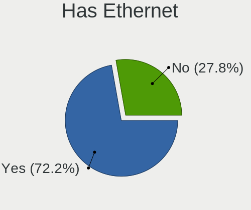

| Presented | Notebooks | Percent |
|-----------|-----------|---------|
| Yes       | 80        | 70.8%   |
| No        | 33        | 29.2%   |

Has WiFi
--------

Has WiFi module

| Presented | Notebooks | Percent |
|-----------|-----------|---------|
| Yes       | 113       | 100%    |

Has Bluetooth
-------------

Has Bluetooth module

| Presented | Notebooks | Percent |
|-----------|-----------|---------|
| Yes       | 104       | 92.04%  |
| No        | 9         | 7.96%   |

Location
--------

Country
-------

Geographic location (country)

| Country | Notebooks | Percent |
|---------|-----------|---------|
| Spain   | 113       | 100%    |

City
----

Geographic location (city)

| City                       | Notebooks | Percent |
|----------------------------|-----------|---------|
| Madrid                     | 20        | 17.7%   |
| Barcelona                  | 17        | 15.04%  |
| Vigo                       | 3         | 2.65%   |
| Málaga                    | 3         | 2.65%   |
| Alicante                   | 3         | 2.65%   |
| Zaragoza                   | 2         | 1.77%   |
| Vitoria-Gasteiz            | 2         | 1.77%   |
| Valencia                   | 2         | 1.77%   |
| Seville                    | 2         | 1.77%   |
| Sant Pere de Ribes         | 2         | 1.77%   |
| San Vicent del Raspeig     | 2         | 1.77%   |
| Girona                     | 2         | 1.77%   |
| Castelló de la Plana      | 2         | 1.77%   |
| Burgos                     | 2         | 1.77%   |
| Vila-seca                  | 1         | 0.88%   |
| Valladolid                 | 1         | 0.88%   |
| Totana                     | 1         | 0.88%   |
| Torrejón de Ardoz         | 1         | 0.88%   |
| Soria                      | 1         | 0.88%   |
| Santiago de Compostela     | 1         | 0.88%   |
| Santa Eugènia             | 1         | 0.88%   |
| Santa Cruz de Tenerife     | 1         | 0.88%   |
| San Juan de Aznalfarache   | 1         | 0.88%   |
| Rivas-Vaciamadrid          | 1         | 0.88%   |
| Reus                       | 1         | 0.88%   |
| Puente La Reina – Gares  | 1         | 0.88%   |
| Pliego                     | 1         | 0.88%   |
| Pamplona                   | 1         | 0.88%   |
| Pallejà                   | 1         | 0.88%   |
| Oviedo                     | 1         | 0.88%   |
| Murcia                     | 1         | 0.88%   |
| Motril                     | 1         | 0.88%   |
| Moguer                     | 1         | 0.88%   |
| Mijarojos                  | 1         | 0.88%   |
| Mancha Real                | 1         | 0.88%   |
| Los Palacios y Villafranca | 1         | 0.88%   |
| Lliria                     | 1         | 0.88%   |
| Las Palmas de Gran Canaria | 1         | 0.88%   |
| La Pobla de Vallbona       | 1         | 0.88%   |
| La Palma del Condado       | 1         | 0.88%   |

Drives
------

Drive Vendor
------------

Hard drive vendors

| Vendor                      | Notebooks | Drives | Percent |
|-----------------------------|-----------|--------|---------|
| Samsung Electronics         | 18        | 18     | 13.14%  |
| SK hynix                    | 13        | 13     | 9.49%   |
| SanDisk                     | 13        | 13     | 9.49%   |
| Toshiba                     | 11        | 13     | 8.03%   |
| WDC                         | 10        | 10     | 7.3%    |
| Micron Technology           | 10        | 11     | 7.3%    |
| Seagate                     | 9         | 10     | 6.57%   |
| Intel                       | 7         | 7      | 5.11%   |
| Crucial                     | 6         | 6      | 4.38%   |
| Unknown                     | 5         | 5      | 3.65%   |
| Kingston                    | 5         | 5      | 3.65%   |
| Phison Electronics          | 4         | 4      | 2.92%   |
| Kingston Technology Company | 3         | 3      | 2.19%   |
| Hitachi                     | 3         | 3      | 2.19%   |
| KIOXIA-EXCERIA              | 2         | 2      | 1.46%   |
| KIOXIA                      | 2         | 2      | 1.46%   |
| Intenso                     | 2         | 2      | 1.46%   |
| China                       | 2         | 2      | 1.46%   |
| Unknown                     | 2         | 2      | 1.46%   |
| TCSUNBOW                    | 1         | 1      | 0.73%   |
| Solid State Storage         | 1         | 1      | 0.73%   |
| SABRENT                     | 1         | 1      | 0.73%   |
| Netac                       | 1         | 1      | 0.73%   |
| LITEON                      | 1         | 1      | 0.73%   |
| Lexar                       | 1         | 1      | 0.73%   |
| Inateck                     | 1         | 1      | 0.73%   |
| HGST                        | 1         | 1      | 0.73%   |
| BAITITON                    | 1         | 1      | 0.73%   |
| Apple                       | 1         | 1      | 0.73%   |

Drive Model
-----------

Hard drive models

| Model                                               | Notebooks | Percent |
|-----------------------------------------------------|-----------|---------|
| SK hynix HFM512GD3JX013N 512GB                      | 3         | 2.17%   |
| Unknown SD/MMC/MS PRO 128GB                         | 2         | 1.45%   |
| Toshiba TR200 240GB SSD                             | 2         | 1.45%   |
| Toshiba THNSNH128GMCT 128GB SSD                     | 2         | 1.45%   |
| SK hynix SKHynix_HFS001TDE9X084N 1TB                | 2         | 1.45%   |
| Seagate ST500LT012-1DG142 500GB                     | 2         | 1.45%   |
| Seagate Expansion 1TB                               | 2         | 1.45%   |
| Sandisk WD Blue SN550 NVMe SSD 512GB                | 2         | 1.45%   |
| SanDisk SSD PLUS 480GB                              | 2         | 1.45%   |
| Samsung NVMe SSD Controller SM981/PM981/PM983 256GB | 2         | 1.45%   |
| Samsung MZVLQ512HALU-000H1 512GB                    | 2         | 1.45%   |
| KIOXIA-EXCERIA SATA SSD 480GB                       | 2         | 1.45%   |
| KIOXIA KBG40ZNV512G 512GB                           | 2         | 1.45%   |
| Kingston SA400S37240G 240GB SSD                     | 2         | 1.45%   |
| Intel SSDPEKNW512GZL 512GB                          | 2         | 1.45%   |
| Intel SSDPEKNU512GZH 512GB                          | 2         | 1.45%   |
| Crucial CT1000MX500SSD1 1TB                         | 2         | 1.45%   |
| Unknown                                             | 2         | 1.45%   |
| WDC WDS500G2X0C-00L350 500GB                        | 1         | 0.72%   |
| WDC WDS240G1G0A-00SS50 240GB SSD                    | 1         | 0.72%   |
| WDC WDS200T2B0C-00PXH0 2TB                          | 1         | 0.72%   |
| WDC WD10SPZX-21Z10T0 1TB                            | 1         | 0.72%   |
| WDC WD10JPVX-60JC3T1 1TB                            | 1         | 0.72%   |
| WDC WD10EZEX-60M2NA0 1TB                            | 1         | 0.72%   |
| WDC PC SN730 SDBPNTY-512G-1101 512GB                | 1         | 0.72%   |
| WDC PC SN730 SDBPNTY-1T00-1101 1TB                  | 1         | 0.72%   |
| WDC PC SN520 SDAPMUW-256G-1101 256GB                | 1         | 0.72%   |
| WDC PC SA530 SDASN8Y-256G-1006 256GB                | 1         | 0.72%   |
| Unknown SD32G  32GB                                 | 1         | 0.72%   |
| Unknown MMC Card  32GB                              | 1         | 0.72%   |
| Unknown MMC Card  256GB                             | 1         | 0.72%   |
| Toshiba THNSNB128GMCJ 128GB SSD                     | 1         | 0.72%   |
| Toshiba MQ01ABD100 1TB                              | 1         | 0.72%   |
| Toshiba MQ01ABD075H 752GB                           | 1         | 0.72%   |
| Toshiba MQ01ABD075 752GB                            | 1         | 0.72%   |
| Toshiba MK5055GSX 500GB                             | 1         | 0.72%   |
| Toshiba HDWL110 1TB                                 | 1         | 0.72%   |
| Toshiba BG3 NVMe SSD Controller 512GB               | 1         | 0.72%   |
| TCSUNBOW X3 480G SSD                                | 1         | 0.72%   |
| Solid State Storage SSSTC CL1-4D256 256GB           | 1         | 0.72%   |

HDD Vendor
----------

Hard disk drive vendors

| Vendor  | Notebooks | Drives | Percent |
|---------|-----------|--------|---------|
| Seagate | 8         | 9      | 34.78%  |
| Toshiba | 5         | 6      | 21.74%  |
| WDC     | 3         | 3      | 13.04%  |
| Hitachi | 3         | 3      | 13.04%  |
| Unknown | 2         | 2      | 8.7%    |
| SABRENT | 1         | 1      | 4.35%   |
| HGST    | 1         | 1      | 4.35%   |

SSD Vendor
----------

Solid state drive vendors

| Vendor              | Notebooks | Drives | Percent |
|---------------------|-----------|--------|---------|
| Toshiba             | 5         | 5      | 12.5%   |
| SanDisk             | 5         | 5      | 12.5%   |
| Samsung Electronics | 5         | 5      | 12.5%   |
| Crucial             | 5         | 5      | 12.5%   |
| Kingston            | 4         | 4      | 10%     |
| SK hynix            | 3         | 3      | 7.5%    |
| WDC                 | 2         | 2      | 5%      |
| KIOXIA-EXCERIA      | 2         | 2      | 5%      |
| Intenso             | 2         | 2      | 5%      |
| China               | 2         | 2      | 5%      |
| TCSUNBOW            | 1         | 1      | 2.5%    |
| Netac               | 1         | 1      | 2.5%    |
| BAITITON            | 1         | 1      | 2.5%    |
| Apple               | 1         | 1      | 2.5%    |
| Unknown             | 1         | 1      | 2.5%    |

Drive Kind
----------

HDD or SSD

| Kind    | Notebooks | Drives | Percent |
|---------|-----------|--------|---------|
| NVMe    | 67        | 71     | 50.76%  |
| SSD     | 37        | 40     | 28.03%  |
| HDD     | 23        | 25     | 17.42%  |
| MMC     | 4         | 4      | 3.03%   |
| Unknown | 1         | 1      | 0.76%   |

Drive Connector
---------------

SATA, SAS, NVMe, etc.

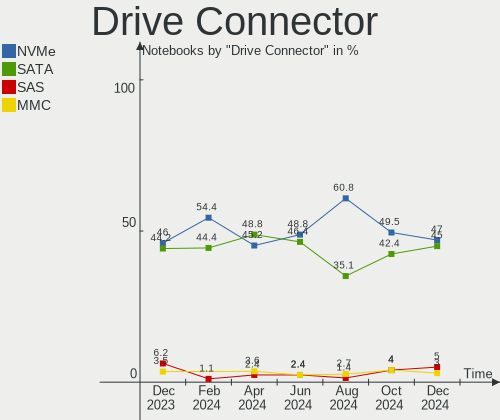

| Type | Notebooks | Drives | Percent |
|------|-----------|--------|---------|
| NVMe | 67        | 70     | 51.54%  |
| SATA | 50        | 57     | 38.46%  |
| SAS  | 9         | 10     | 6.92%   |
| MMC  | 4         | 4      | 3.08%   |

Drive Size
----------

Size of hard drive

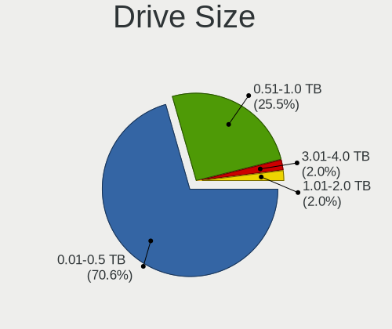

| Size in TB | Notebooks | Drives | Percent |
|------------|-----------|--------|---------|
| 0.01-0.5   | 36        | 42     | 62.07%  |
| 0.51-1.0   | 19        | 19     | 32.76%  |
| 1.01-2.0   | 2         | 2      | 3.45%   |
| 4.01-10.0  | 1         | 2      | 1.72%   |

Space Total
-----------

Amount of disk space available on the file system

| Size in GB     | Notebooks | Percent |
|----------------|-----------|---------|
| 251-500        | 28        | 24.78%  |
| 501-1000       | 23        | 20.35%  |
| 101-250        | 20        | 17.7%   |
| 1001-2000      | 10        | 8.85%   |
| 1-20           | 8         | 7.08%   |
| More than 3000 | 7         | 6.19%   |
| 21-50          | 6         | 5.31%   |
| 51-100         | 5         | 4.42%   |
| Unknown        | 5         | 4.42%   |
| 2001-3000      | 1         | 0.88%   |

Space Used
----------

Amount of used disk space

| Used GB        | Notebooks | Percent |
|----------------|-----------|---------|
| 1-20           | 42        | 37.17%  |
| 21-50          | 21        | 18.58%  |
| 51-100         | 13        | 11.5%   |
| 101-250        | 12        | 10.62%  |
| 501-1000       | 8         | 7.08%   |
| 251-500        | 7         | 6.19%   |
| Unknown        | 5         | 4.42%   |
| 1001-2000      | 3         | 2.65%   |
| More than 3000 | 1         | 0.88%   |
| 2001-3000      | 1         | 0.88%   |

Malfunc. Drives
---------------

Drive models with a malfunction

| Model                                            | Notebooks | Drives | Percent |
|--------------------------------------------------|-----------|--------|---------|
| SK hynix HFS256G39TND-N210A 256GB SSD            | 1         | 1      | 12.5%   |
| SK hynix HFS256G32TNH-73A0A 256GB SSD            | 1         | 1      | 12.5%   |
| Seagate ST500LT012-9WS142 500GB                  | 1         | 1      | 12.5%   |
| Seagate ST500LT012-1DG142 500GB                  | 1         | 1      | 12.5%   |
| Samsung Electronics MZNLH128HBHQ-000H1 128GB SSD | 1         | 1      | 12.5%   |
| Kingston SA400S37480G 480GB SSD                  | 1         | 1      | 12.5%   |
| Hitachi HTS543216L9SA00 160GB                    | 1         | 1      | 12.5%   |
| China G521N256GB                                 | 1         | 1      | 12.5%   |

Malfunc. Drive Vendor
---------------------

Vendors of faulty drives

| Vendor              | Notebooks | Drives | Percent |
|---------------------|-----------|--------|---------|
| SK hynix            | 2         | 2      | 25%     |
| Seagate             | 2         | 2      | 25%     |
| Samsung Electronics | 1         | 1      | 12.5%   |
| Kingston            | 1         | 1      | 12.5%   |
| Hitachi             | 1         | 1      | 12.5%   |
| China               | 1         | 1      | 12.5%   |

Malfunc. HDD Vendor
-------------------

Vendors of faulty HDD drives

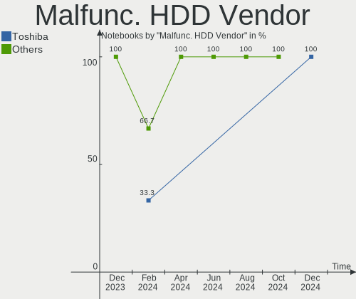

| Vendor  | Notebooks | Drives | Percent |
|---------|-----------|--------|---------|
| Seagate | 2         | 2      | 66.67%  |
| Hitachi | 1         | 1      | 33.33%  |

Malfunc. Drive Kind
-------------------

Kinds of faulty drives

| Kind | Notebooks | Drives | Percent |
|------|-----------|--------|---------|
| SSD  | 5         | 5      | 62.5%   |
| HDD  | 3         | 3      | 37.5%   |

Failed Drives
-------------

Failed drive models

Zero info for selected period =(

Failed Drive Vendor
-------------------

Failed drive vendors

Zero info for selected period =(

Drive Status
------------

Number of failed and malfunc. drives

| Status   | Notebooks | Drives | Percent |
|----------|-----------|--------|---------|
| Works    | 61        | 72     | 52.14%  |
| Detected | 48        | 61     | 41.03%  |
| Malfunc  | 8         | 8      | 6.84%   |

Storage controller
------------------

Storage Vendor
--------------

Storage controller vendors

| Vendor                         | Notebooks | Percent |
|--------------------------------|-----------|---------|
| Intel                          | 67        | 45.58%  |
| AMD                            | 18        | 12.24%  |
| Samsung Electronics            | 14        | 9.52%   |
| SanDisk                        | 13        | 8.84%   |
| SK hynix                       | 10        | 6.8%    |
| Micron Technology              | 10        | 6.8%    |
| Phison Electronics             | 4         | 2.72%   |
| Kingston Technology Company    | 4         | 2.72%   |
| KIOXIA                         | 2         | 1.36%   |
| Toshiba America Info Systems   | 1         | 0.68%   |
| Solid State Storage Technology | 1         | 0.68%   |
| Shenzhen Longsys Electronics   | 1         | 0.68%   |
| Micron/Crucial Technology      | 1         | 0.68%   |
| Lite-On Technology             | 1         | 0.68%   |

Storage Model
-------------

Storage controller models

| Model                                                                          | Notebooks | Percent |
|--------------------------------------------------------------------------------|-----------|---------|
| AMD FCH SATA Controller [AHCI mode]                                            | 18        | 11.69%  |
| Intel Volume Management Device NVMe RAID Controller                            | 10        | 6.49%   |
| SK hynix Gold P31/BC711/PC711 NVMe Solid State Drive                           | 6         | 3.9%    |
| Intel SSD 670p Series [Keystone Harbor]                                        | 6         | 3.9%    |
| Intel Celeron/Pentium Silver Processor SATA Controller                         | 6         | 3.9%    |
| Intel 6 Series/C200 Series Chipset Family 6 port Mobile SATA AHCI Controller   | 6         | 3.9%    |
| Samsung NVMe SSD Controller 980                                                | 5         | 3.25%   |
| Intel 7 Series Chipset Family 6-port SATA Controller [AHCI mode]               | 5         | 3.25%   |
| Samsung NVMe SSD Controller SM981/PM981/PM983                                  | 4         | 2.6%    |
| Intel 82801 Mobile SATA Controller [RAID mode]                                 | 4         | 2.6%    |
| Intel 8 Series/C220 Series Chipset Family 6-port SATA Controller 1 [AHCI mode] | 4         | 2.6%    |
| Intel 8 Series SATA Controller 1 [AHCI mode]                                   | 4         | 2.6%    |
| SanDisk WD Black SN750 / PC SN730 NVMe SSD                                     | 3         | 1.95%   |
| Micron 2450 NVMe SSD [HendrixV] (DRAM-less)                                    | 3         | 1.95%   |
| Micron 2210 NVMe SSD [Cobain]                                                  | 3         | 1.95%   |
| Intel Tiger Lake-LP SATA Controller                                            | 3         | 1.95%   |
| Intel Sunrise Point-LP SATA Controller [AHCI mode]                             | 3         | 1.95%   |
| Intel 82801IBM/IEM (ICH9M/ICH9M-E) 4 port SATA Controller [AHCI mode]          | 3         | 1.95%   |
| SanDisk WD PC SN810 / Black SN850 NVMe SSD                                     | 2         | 1.3%    |
| SanDisk WD Blue SN550 NVMe SSD                                                 | 2         | 1.3%    |
| SanDisk WD Black SN770 / PC SN740 256GB / PC SN560 (DRAM-less) NVMe SSD        | 2         | 1.3%    |
| SanDisk WD Black 2018/SN750 / PC SN720 NVMe SSD                                | 2         | 1.3%    |
| Micron 2400 NVMe SSD (DRAM-less)                                               | 2         | 1.3%    |
| KIOXIA NVMe SSD Controller BG4 (DRAM-less)                                     | 2         | 1.3%    |
| Intel Jasper Lake SATA AHCI Controller                                         | 2         | 1.3%    |
| Intel Atom Processor E3800 Series SATA AHCI Controller                         | 2         | 1.3%    |
| Intel 5 Series/3400 Series Chipset 4 port SATA AHCI Controller                 | 2         | 1.3%    |
| Toshiba America Info Systems BG3 NVMe SSD Controller                           | 1         | 0.65%   |
| Solid State Storage CL1-3D256-Q11 NVMe SSD M.2                                 | 1         | 0.65%   |
| SK hynix Platinum P41/PC801 NVMe Solid State Drive                             | 1         | 0.65%   |
| SK hynix PC611 NVMe Solid State Drive                                          | 1         | 0.65%   |
| SK hynix PC401 NVMe Solid State Drive 256GB                                    | 1         | 0.65%   |
| SK hynix BC501 NVMe Solid State Drive                                          | 1         | 0.65%   |
| Shenzhen Longsys Non-Volatile memory controller                                | 1         | 0.65%   |
| SanDisk WD Blue SN550 NVMe SSD 2TB (DRAM-less)                                 | 1         | 0.65%   |
| SanDisk PC SN520 NVMe SSD                                                      | 1         | 0.65%   |
| Samsung S4LN058A01[SSUBX] AHCI SSD Controller (Apple slot)                     | 1         | 0.65%   |
| Samsung NVMe SSD Controller SM961/PM961/SM963                                  | 1         | 0.65%   |
| Samsung NVMe SSD Controller S4LV008[Pascal]                                    | 1         | 0.65%   |
| Samsung NVMe SSD Controller PM9B1                                              | 1         | 0.65%   |

Storage Kind
------------

Kind of storage controller (IDE, SATA, NVMe, SAS, ...)

| Kind | Notebooks | Percent |
|------|-----------|---------|
| SATA | 69        | 45.7%   |
| NVMe | 67        | 44.37%  |
| RAID | 14        | 9.27%   |
| IDE  | 1         | 0.66%   |

Processor
---------

CPU Vendor
----------

Processor vendors

| Vendor | Notebooks | Percent |
|--------|-----------|---------|
| Intel  | 80        | 70.8%   |
| AMD    | 33        | 29.2%   |

CPU Model
---------

Processor models

| Model                                       | Notebooks | Percent |
|---------------------------------------------|-----------|---------|
| AMD Ryzen 7 5700U with Radeon Graphics      | 6         | 5.31%   |
| Intel 12th Gen Core i7-12700H               | 4         | 3.54%   |
| Intel 11th Gen Core i5-1135G7 @ 2.40GHz     | 4         | 3.54%   |
| AMD Ryzen 7 5800H with Radeon Graphics      | 4         | 3.54%   |
| Intel Core i7-10510U CPU @ 1.80GHz          | 3         | 2.65%   |
| Intel Celeron N4020 CPU @ 1.10GHz           | 3         | 2.65%   |
| Intel Celeron N4000 CPU @ 1.10GHz           | 3         | 2.65%   |
| AMD Ryzen 7 4800H with Radeon Graphics      | 3         | 2.65%   |
| Intel Core i7-8565U CPU @ 1.80GHz           | 2         | 1.77%   |
| Intel Core i7-7700HQ CPU @ 2.80GHz          | 2         | 1.77%   |
| Intel Core i7-4700MQ CPU @ 2.40GHz          | 2         | 1.77%   |
| Intel Core i7-4500U CPU @ 1.80GHz           | 2         | 1.77%   |
| Intel Core i7-2640M CPU @ 2.80GHz           | 2         | 1.77%   |
| Intel Core i7-10710U CPU @ 1.10GHz          | 2         | 1.77%   |
| Intel Core i5-8250U CPU @ 1.60GHz           | 2         | 1.77%   |
| Intel Core i5-1035G1 CPU @ 1.00GHz          | 2         | 1.77%   |
| Intel Celeron N5100 @ 1.10GHz               | 2         | 1.77%   |
| Intel 12th Gen Core i7-12650H               | 2         | 1.77%   |
| AMD Ryzen 7 4800HS with Radeon Graphics     | 2         | 1.77%   |
| AMD Custom APU 0405                         | 2         | 1.77%   |
| Intel Pentium Dual-Core CPU T4300 @ 2.10GHz | 1         | 0.88%   |
| Intel Pentium CPU N3710 @ 1.60GHz           | 1         | 0.88%   |
| Intel Core i7-9750H CPU @ 2.60GHz           | 1         | 0.88%   |
| Intel Core i7-8750H CPU @ 2.20GHz           | 1         | 0.88%   |
| Intel Core i7-8550U CPU @ 1.80GHz           | 1         | 0.88%   |
| Intel Core i7-4790K CPU @ 4.00GHz           | 1         | 0.88%   |
| Intel Core i7-4710MQ CPU @ 2.50GHz          | 1         | 0.88%   |
| Intel Core i7-4700HQ CPU @ 2.40GHz          | 1         | 0.88%   |
| Intel Core i7-4510U CPU @ 2.00GHz           | 1         | 0.88%   |
| Intel Core i7-3612QM CPU @ 2.10GHz          | 1         | 0.88%   |
| Intel Core i7-3520M CPU @ 2.90GHz           | 1         | 0.88%   |
| Intel Core i7-2670QM CPU @ 2.20GHz          | 1         | 0.88%   |
| Intel Core i7-10750H CPU @ 2.60GHz          | 1         | 0.88%   |
| Intel Core i5-6300U CPU @ 2.40GHz           | 1         | 0.88%   |
| Intel Core i5-6200U CPU @ 2.30GHz           | 1         | 0.88%   |
| Intel Core i5-5250U CPU @ 1.60GHz           | 1         | 0.88%   |
| Intel Core i5-3337U CPU @ 1.80GHz           | 1         | 0.88%   |
| Intel Core i5-3210M CPU @ 2.50GHz           | 1         | 0.88%   |
| Intel Core i5-2467M CPU @ 1.60GHz           | 1         | 0.88%   |
| Intel Core i5-2430M CPU @ 2.40GHz           | 1         | 0.88%   |

CPU Model Family
----------------

Processor model prefix

| Model                   | Notebooks | Percent |
|-------------------------|-----------|---------|
| Intel Core i7           | 26        | 23.01%  |
| Other                   | 21        | 18.58%  |
| AMD Ryzen 7             | 21        | 18.58%  |
| Intel Core i5           | 15        | 13.27%  |
| Intel Celeron           | 12        | 10.62%  |
| Intel Core i3           | 5         | 4.42%   |
| AMD Ryzen 5             | 3         | 2.65%   |
| Intel Core 2 Duo        | 2         | 1.77%   |
| AMD A4                  | 2         | 1.77%   |
| Intel Pentium Dual-Core | 1         | 0.88%   |
| Intel Pentium           | 1         | 0.88%   |
| AMD Ryzen 9             | 1         | 0.88%   |
| AMD Ryzen 7 PRO         | 1         | 0.88%   |
| AMD Ryzen 3             | 1         | 0.88%   |
| AMD A8                  | 1         | 0.88%   |

CPU Cores
---------

Number of processor cores

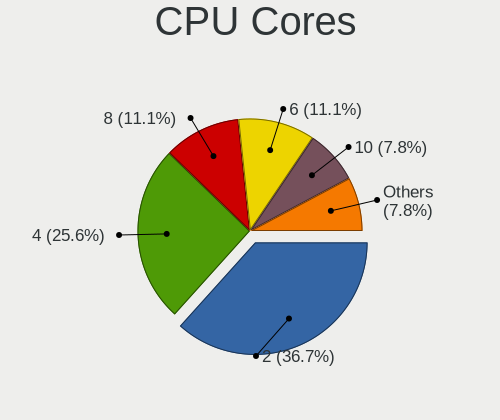

| Number | Notebooks | Percent |
|--------|-----------|---------|
| 2      | 37        | 32.74%  |
| 4      | 36        | 31.86%  |
| 8      | 21        | 18.58%  |
| 14     | 6         | 5.31%   |
| 6      | 6         | 5.31%   |
| 10     | 5         | 4.42%   |
| 16     | 1         | 0.88%   |
| 12     | 1         | 0.88%   |

CPU Sockets
-----------

Number of sockets

| Number | Notebooks | Percent |
|--------|-----------|---------|
| 1      | 113       | 100%    |

CPU Threads
-----------

Threads per core (Hyper-Threading)

| Number | Notebooks | Percent |
|--------|-----------|---------|
| 2      | 89        | 78.76%  |
| 1      | 24        | 21.24%  |

CPU Op-Modes
------------

CPU Operation Modes (32-bit, 64-bit)

| Op mode        | Notebooks | Percent |
|----------------|-----------|---------|
| 32-bit, 64-bit | 113       | 100%    |

CPU Microcode
-------------

Microcode number

| Number     | Notebooks | Percent |
|------------|-----------|---------|
| Unknown    | 55        | 48.67%  |
| 0x306c3    | 4         | 3.54%   |
| 0x08608103 | 4         | 3.54%   |
| 0x0a50000d | 3         | 2.65%   |
| 0x0a50000c | 3         | 2.65%   |
| 0x08600106 | 3         | 2.65%   |
| 0x906a3    | 2         | 1.77%   |
| 0x806c2    | 2         | 1.77%   |
| 0x706e5    | 2         | 1.77%   |
| 0x706a8    | 2         | 1.77%   |
| 0x406e3    | 2         | 1.77%   |
| 0x306a9    | 2         | 1.77%   |
| 0x206a7    | 2         | 1.77%   |
| 0x08608102 | 2         | 1.77%   |
| 0x06006704 | 2         | 1.77%   |
| 0xb06a2    | 1         | 0.88%   |
| 0x906a4    | 1         | 0.88%   |
| 0x90672    | 1         | 0.88%   |
| 0x806ec    | 1         | 0.88%   |
| 0x806eb    | 1         | 0.88%   |
| 0x806e9    | 1         | 0.88%   |
| 0x806c1    | 1         | 0.88%   |
| 0x706a1    | 1         | 0.88%   |
| 0x406c4    | 1         | 0.88%   |
| 0x40651    | 1         | 0.88%   |
| 0x30678    | 1         | 0.88%   |
| 0x1067a    | 1         | 0.88%   |
| 0x10676    | 1         | 0.88%   |
| 0x0a704103 | 1         | 0.88%   |
| 0x0a601203 | 1         | 0.88%   |
| 0x0a50000b | 1         | 0.88%   |
| 0x08a00008 | 1         | 0.88%   |
| 0x08600109 | 1         | 0.88%   |
| 0x08600104 | 1         | 0.88%   |
| 0x08600103 | 1         | 0.88%   |
| 0x08108102 | 1         | 0.88%   |
| 0x06006705 | 1         | 0.88%   |
| 0x06001119 | 1         | 0.88%   |

CPU Microarch
-------------

Microarchitecture

| Name             | Notebooks | Percent |
|------------------|-----------|---------|
| Unknown          | 15        | 13.27%  |
| KabyLake         | 14        | 12.39%  |
| Haswell          | 9         | 7.96%   |
| Alderlake Hybrid | 9         | 7.96%   |
| Zen 3            | 8         | 7.08%   |
| Zen 2            | 7         | 6.19%   |
| SandyBridge      | 7         | 6.19%   |
| Goldmont plus    | 7         | 6.19%   |
| TigerLake        | 6         | 5.31%   |
| IvyBridge        | 4         | 3.54%   |
| CometLake        | 4         | 3.54%   |
| Westmere         | 3         | 2.65%   |
| Silvermont       | 3         | 2.65%   |
| Penryn           | 3         | 2.65%   |
| Excavator        | 3         | 2.65%   |
| Zen+             | 2         | 1.77%   |
| Tremont          | 2         | 1.77%   |
| Skylake          | 2         | 1.77%   |
| IceLake          | 2         | 1.77%   |
| Broadwell        | 2         | 1.77%   |
| Piledriver       | 1         | 0.88%   |

Graphics
--------

GPU Vendor
----------

Vendors of graphics cards

| Vendor | Notebooks | Percent |
|--------|-----------|---------|
| Intel  | 76        | 50%     |
| AMD    | 41        | 26.97%  |
| Nvidia | 35        | 23.03%  |

GPU Model
---------

Graphics card models

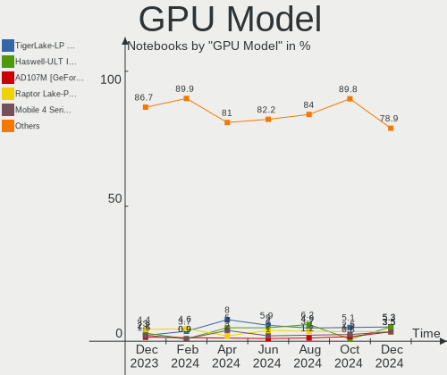

| Model                                                                     | Notebooks | Percent |
|---------------------------------------------------------------------------|-----------|---------|
| Intel GeminiLake [UHD Graphics 600]                                       | 7         | 4.55%   |
| Intel 2nd Generation Core Processor Family Integrated Graphics Controller | 7         | 4.55%   |
| AMD Renoir                                                                | 7         | 4.55%   |
| AMD Lucienne                                                              | 7         | 4.55%   |
| Intel TigerLake-LP GT2 [Iris Xe Graphics]                                 | 5         | 3.25%   |
| Intel Alder Lake-P Integrated Graphics Controller                         | 5         | 3.25%   |
| Nvidia TU117M [GeForce GTX 1650 Mobile / Max-Q]                           | 4         | 2.6%    |
| Nvidia GA107M [GeForce RTX 3050 Mobile]                                   | 4         | 2.6%    |
| Intel Haswell-ULT Integrated Graphics Controller                          | 4         | 2.6%    |
| Intel CometLake-U GT2 [UHD Graphics]                                      | 4         | 2.6%    |
| Intel 3rd Gen Core processor Graphics Controller                          | 4         | 2.6%    |
| AMD Cezanne [Radeon Vega Series / Radeon Vega Mobile Series]              | 4         | 2.6%    |
| Nvidia GA104M [GeForce RTX 3070 Mobile / Max-Q]                           | 3         | 1.95%   |
| Intel UHD Graphics 620                                                    | 3         | 1.95%   |
| Intel 4th Gen Core Processor Integrated Graphics Controller               | 3         | 1.95%   |
| AMD Stoney [Radeon R2/R3/R4/R5 Graphics]                                  | 3         | 1.95%   |
| AMD Barcelo                                                               | 3         | 1.95%   |
| Nvidia TU116M [GeForce GTX 1650 Ti Mobile]                                | 2         | 1.3%    |
| Nvidia GP107M [GeForce GTX 1050 Mobile]                                   | 2         | 1.3%    |
| Nvidia GF117M [GeForce 610M/710M/810M/820M / GT 620M/625M/630M/720M]      | 2         | 1.3%    |
| Nvidia GA107M [GeForce RTX 2050]                                          | 2         | 1.3%    |
| Nvidia AD107M [GeForce RTX 4060 Max-Q / Mobile]                           | 2         | 1.3%    |
| Intel WhiskeyLake-U GT2 [UHD Graphics 620]                                | 2         | 1.3%    |
| Intel Skylake GT2 [HD Graphics 520]                                       | 2         | 1.3%    |
| Intel Raptor Lake-P [Iris Xe Graphics]                                    | 2         | 1.3%    |
| Intel JasperLake [UHD Graphics]                                           | 2         | 1.3%    |
| Intel Iris Plus Graphics G1 (Ice Lake)                                    | 2         | 1.3%    |
| Intel HD Graphics 630                                                     | 2         | 1.3%    |
| Intel Core Processor Integrated Graphics Controller                       | 2         | 1.3%    |
| Intel CometLake-H GT2 [UHD Graphics]                                      | 2         | 1.3%    |
| Intel Comet Lake UHD Graphics                                             | 2         | 1.3%    |
| Intel CoffeeLake-H GT2 [UHD Graphics 630]                                 | 2         | 1.3%    |
| Intel Atom Processor Z36xxx/Z37xxx Series Graphics & Display              | 2         | 1.3%    |
| Intel Alder Lake-P GT1 [UHD Graphics]                                     | 2         | 1.3%    |
| AMD VanGogh [AMD Custom GPU 0405]                                         | 2         | 1.3%    |
| AMD Thames [Radeon HD 7500M/7600M Series]                                 | 2         | 1.3%    |
| AMD Seymour [Radeon HD 6400M/7400M Series]                                | 2         | 1.3%    |
| AMD Picasso/Raven 2 [Radeon Vega Series / Radeon Vega Mobile Series]      | 2         | 1.3%    |
| Nvidia TU117M [GeForce GTX 1650 Ti Mobile]                                | 1         | 0.65%   |
| Nvidia GP108BM [GeForce MX250]                                            | 1         | 0.65%   |

GPU Combo
---------

Combinations of graphics cards

| Name           | Notebooks | Percent |
|----------------|-----------|---------|
| 1 x Intel      | 44        | 38.94%  |
| Intel + Nvidia | 24        | 21.24%  |
| 1 x AMD        | 24        | 21.24%  |
| AMD + Nvidia   | 8         | 7.08%   |
| Intel + AMD    | 7         | 6.19%   |
| 1 x Nvidia     | 3         | 2.65%   |
| 2 x AMD        | 2         | 1.77%   |
| Other          | 1         | 0.88%   |

GPU Driver
----------

Free vs proprietary

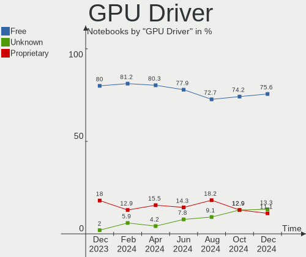

| Driver      | Notebooks | Percent |
|-------------|-----------|---------|
| Free        | 92        | 81.42%  |
| Proprietary | 16        | 14.16%  |
| Unknown     | 5         | 4.42%   |

GPU Memory
----------

Total video memory

| Size in GB | Notebooks | Percent |
|------------|-----------|---------|
| Unknown    | 75        | 66.37%  |
| 0.01-0.5   | 19        | 16.81%  |
| 1.01-2.0   | 13        | 11.5%   |
| 3.01-4.0   | 3         | 2.65%   |
| 7.01-8.0   | 1         | 0.88%   |
| 5.01-6.0   | 1         | 0.88%   |
| 0.51-1.0   | 1         | 0.88%   |

Monitor
-------

Monitor Vendor
--------------

Monitor vendors

| Vendor                  | Notebooks | Percent |
|-------------------------|-----------|---------|
| Chimei Innolux          | 27        | 20.77%  |
| BOE                     | 20        | 15.38%  |
| AU Optronics            | 20        | 15.38%  |
| LG Display              | 13        | 10%     |
| Samsung Electronics     | 12        | 9.23%   |
| Goldstar                | 6         | 4.62%   |
| PANDA                   | 4         | 3.08%   |
| Chi Mei Optoelectronics | 4         | 3.08%   |
| Sharp                   | 3         | 2.31%   |
| Hewlett-Packard         | 3         | 2.31%   |
| BenQ                    | 3         | 2.31%   |
| Valve                   | 2         | 1.54%   |
| Toshiba                 | 2         | 1.54%   |
| Philips                 | 2         | 1.54%   |
| Dell                    | 2         | 1.54%   |
| AOC                     | 2         | 1.54%   |
| Acer                    | 2         | 1.54%   |
| Lenovo                  | 1         | 0.77%   |
| CSO                     | 1         | 0.77%   |
| Apple                   | 1         | 0.77%   |

Monitor Model
-------------

Monitor models

| Model                                                                     | Notebooks | Percent |
|---------------------------------------------------------------------------|-----------|---------|
| Chimei Innolux LCD Monitor CMN15F5 1920x1080 344x193mm 15.5-inch          | 3         | 2.29%   |
| Chimei Innolux LCD Monitor CMN14D5 1920x1080 309x173mm 13.9-inch          | 3         | 2.29%   |
| Valve ANX7530 U VLV3001 800x1280 100x150mm 7.1-inch                       | 2         | 1.53%   |
| Samsung Electronics LCD Monitor SDC4158 1920x1080 294x165mm 13.3-inch     | 2         | 1.53%   |
| PANDA LCD Monitor NCP0050 1920x1080 309x174mm 14.0-inch                   | 2         | 1.53%   |
| Chimei Innolux LCD Monitor CMN15E8 1920x1080 344x193mm 15.5-inch          | 2         | 1.53%   |
| Chimei Innolux LCD Monitor CMN15DB 1366x768 344x193mm 15.5-inch           | 2         | 1.53%   |
| Chimei Innolux LCD Monitor CMN14D4 1920x1080 309x173mm 13.9-inch          | 2         | 1.53%   |
| Chimei Innolux LCD Monitor CMN14C3 1366x768 309x173mm 13.9-inch           | 2         | 1.53%   |
| Chi Mei Optoelectronics LCD Monitor CMO1720 1920x1080 380x210mm 17.1-inch | 2         | 1.53%   |
| Chi Mei Optoelectronics LCD Monitor CMO15A1 1366x768 344x193mm 15.5-inch  | 2         | 1.53%   |
| BOE LCD Monitor BOE0A42 1920x1200 302x188mm 14.0-inch                     | 2         | 1.53%   |
| BOE LCD Monitor BOE08D5 1920x1080 344x194mm 15.5-inch                     | 2         | 1.53%   |
| BOE LCD Monitor BOE0893 2160x1440 296x197mm 14.0-inch                     | 2         | 1.53%   |
| AU Optronics LCD Monitor AUO403D 1920x1080 309x173mm 13.9-inch            | 2         | 1.53%   |
| Toshiba no-audio-HD TSB8888 1080x1920 1080x1920mm 86.7-inch               | 1         | 0.76%   |
| Toshiba LT133EE09500 LCD090A 1366x768 295x166mm 13.3-inch                 | 1         | 0.76%   |
| Sharp LCD Monitor SHP1548 1920x1200 288x180mm 13.4-inch                   | 1         | 0.76%   |
| Sharp LCD Monitor SHP14BA 1920x1080 344x194mm 15.5-inch                   | 1         | 0.76%   |
| Sharp LCD Monitor SHP1476 3840x2160 346x194mm 15.6-inch                   | 1         | 0.76%   |
| Samsung Electronics SyncMaster SAM010C 1280x1024 340x270mm 17.1-inch      | 1         | 0.76%   |
| Samsung Electronics S24F350 SAM0D20 1920x1080 521x293mm 23.5-inch         | 1         | 0.76%   |
| Samsung Electronics LU28R55 SAM1017 3840x2160 632x360mm 28.6-inch         | 1         | 0.76%   |
| Samsung Electronics LF24T35 SAM707D 1920x1080 528x297mm 23.9-inch         | 1         | 0.76%   |
| Samsung Electronics LCD Monitor SDC4181 2880x1800 302x189mm 14.0-inch     | 1         | 0.76%   |
| Samsung Electronics LCD Monitor SDC4171 2880x1800 302x189mm 14.0-inch     | 1         | 0.76%   |
| Samsung Electronics LCD Monitor SDC4164 3840x2400 344x215mm 16.0-inch     | 1         | 0.76%   |
| Samsung Electronics LCD Monitor SDC4163 3456x2160 288x180mm 13.4-inch     | 1         | 0.76%   |
| Samsung Electronics LCD Monitor SDC4161 1920x1080 344x194mm 15.5-inch     | 1         | 0.76%   |
| Samsung Electronics LCD Monitor SAM0B60 1920x1080 887x500mm 40.1-inch     | 1         | 0.76%   |
| Philips LCD Monitor PHL4650 1280x768 530x398mm 26.1-inch                  | 1         | 0.76%   |
| Philips 24M1N3200V PHLC278 1920x1080 527x296mm 23.8-inch                  | 1         | 0.76%   |
| PANDA LCD Monitor NCP0035 1920x1080 344x194mm 15.5-inch                   | 1         | 0.76%   |
| PANDA LCD Monitor NCP002D 1920x1080 344x194mm 15.5-inch                   | 1         | 0.76%   |
| LG Display LP156WH2-TLF1 LGD021F 1366x768 344x194mm 15.5-inch             | 1         | 0.76%   |
| LG Display LCD Monitor LGD06CD 1920x1080 294x165mm 13.3-inch              | 1         | 0.76%   |
| LG Display LCD Monitor LGD06A5 1920x1080 344x194mm 15.5-inch              | 1         | 0.76%   |
| LG Display LCD Monitor LGD062C 1920x1080 309x174mm 14.0-inch              | 1         | 0.76%   |
| LG Display LCD Monitor LGD0577 1920x1080 294x165mm 13.3-inch              | 1         | 0.76%   |
| LG Display LCD Monitor LGD0456 1366x768 344x194mm 15.5-inch               | 1         | 0.76%   |

Monitor Resolution
------------------

Monitor screen resolution

| Resolution        | Notebooks | Percent |
|-------------------|-----------|---------|
| 1920x1080 (FHD)   | 57        | 50%     |
| 1366x768 (WXGA)   | 26        | 22.81%  |
| 1920x1200 (WUXGA) | 5         | 4.39%   |
| 3840x2160 (4K)    | 4         | 3.51%   |
| 2160x1440         | 4         | 3.51%   |
| 2560x1600         | 3         | 2.63%   |
| 1600x900 (HD+)    | 3         | 2.63%   |
| 800x1280          | 2         | 1.75%   |
| 2880x1800         | 2         | 1.75%   |
| 2560x1440 (QHD)   | 2         | 1.75%   |
| 3840x2400         | 1         | 0.88%   |
| 3456x2160         | 1         | 0.88%   |
| 2560x2880         | 1         | 0.88%   |
| 1440x900 (WXGA+)  | 1         | 0.88%   |
| 1280x768          | 1         | 0.88%   |
| 1280x1024 (SXGA)  | 1         | 0.88%   |

Monitor Diagonal
----------------

Diagonal size in inches

| Inches | Notebooks | Percent |
|--------|-----------|---------|
| 15     | 44        | 33.85%  |
| 13     | 23        | 17.69%  |
| 14     | 18        | 13.85%  |
| 17     | 8         | 6.15%   |
| 23     | 6         | 4.62%   |
| 27     | 5         | 3.85%   |
| 24     | 5         | 3.85%   |
| 16     | 5         | 3.85%   |
| 21     | 4         | 3.08%   |
| 31     | 2         | 1.54%   |
| 12     | 2         | 1.54%   |
| 11     | 2         | 1.54%   |
| 7      | 2         | 1.54%   |
| 86     | 1         | 0.77%   |
| 40     | 1         | 0.77%   |
| 34     | 1         | 0.77%   |
| 28     | 1         | 0.77%   |

Monitor Width
-------------

Physical width

| Width in mm | Notebooks | Percent |
|-------------|-----------|---------|
| 301-350     | 75        | 58.59%  |
| 201-300     | 18        | 14.06%  |
| 501-600     | 14        | 10.94%  |
| 351-400     | 8         | 6.25%   |
| 401-500     | 5         | 3.91%   |
| 601-700     | 3         | 2.34%   |
| 1-100       | 2         | 1.56%   |
| 801-900     | 1         | 0.78%   |
| 701-800     | 1         | 0.78%   |
| 1001-1500   | 1         | 0.78%   |

Aspect Ratio
------------

Proportional relationship between the width and the height

| Ratio | Notebooks | Percent |
|-------|-----------|---------|
| 16/9  | 87        | 79.09%  |
| 16/10 | 14        | 12.73%  |
| 3/2   | 4         | 3.64%   |
| 0.67  | 2         | 1.82%   |
| 5/4   | 1         | 0.91%   |
| 0.89  | 1         | 0.91%   |
| 0.56  | 1         | 0.91%   |

Monitor Area
------------

Area in inch²

| Area in inch² | Notebooks | Percent |
|----------------|-----------|---------|
| 101-110        | 45        | 35.16%  |
| 81-90          | 30        | 23.44%  |
| 201-250        | 12        | 9.38%   |
| 71-80          | 11        | 8.59%   |
| 121-130        | 6         | 4.69%   |
| 351-500        | 4         | 3.13%   |
| 301-350        | 4         | 3.13%   |
| 111-120        | 4         | 3.13%   |
| 61-70          | 2         | 1.56%   |
| 51-60          | 2         | 1.56%   |
| 1-40           | 2         | 1.56%   |
| 501-1000       | 2         | 1.56%   |
| More than 1000 | 1         | 0.78%   |
| 251-300        | 1         | 0.78%   |
| 141-150        | 1         | 0.78%   |
| 131-140        | 1         | 0.78%   |

Pixel Density
-------------

Pixels per inch

| Density       | Notebooks | Percent |
|---------------|-----------|---------|
| 121-160       | 56        | 44.09%  |
| 101-120       | 25        | 19.69%  |
| 161-240       | 20        | 15.75%  |
| 51-100        | 19        | 14.96%  |
| More than 240 | 5         | 3.94%   |
| 1-50          | 2         | 1.57%   |

Multiple Monitors
-----------------

Total monitors connected

| Total | Notebooks | Percent |
|-------|-----------|---------|
| 1     | 83        | 73.45%  |
| 2     | 18        | 15.93%  |
| 3     | 6         | 5.31%   |
| 0     | 6         | 5.31%   |

Network
-------

Net Controller Vendor
---------------------

Controller vendors

| Vendor                   | Notebooks | Percent |
|--------------------------|-----------|---------|
| Realtek Semiconductor    | 66        | 37.08%  |
| Intel                    | 60        | 33.71%  |
| Qualcomm Atheros         | 17        | 9.55%   |
| MediaTek                 | 8         | 4.49%   |
| Broadcom                 | 7         | 3.93%   |
| TP-Link                  | 3         | 1.69%   |
| Ralink                   | 3         | 1.69%   |
| Broadcom Limited         | 3         | 1.69%   |
| Ralink Technology        | 2         | 1.12%   |
| ASIX Electronics         | 2         | 1.12%   |
| Sierra Wireless          | 1         | 0.56%   |
| Motorola PCS             | 1         | 0.56%   |
| Marvell Technology Group | 1         | 0.56%   |
| Huawei Technologies      | 1         | 0.56%   |
| Google                   | 1         | 0.56%   |
| Edimax Technology        | 1         | 0.56%   |
| D-Link System            | 1         | 0.56%   |

Net Controller Model
--------------------

Controller models

| Model                                                             | Notebooks | Percent |
|-------------------------------------------------------------------|-----------|---------|
| Realtek RTL8111/8168/8411 PCI Express Gigabit Ethernet Controller | 42        | 20.49%  |
| Realtek RTL8822CE 802.11ac PCIe Wireless Network Adapter          | 9         | 4.39%   |
| Intel Alder Lake-P PCH CNVi WiFi                                  | 9         | 4.39%   |
| Realtek RTL8153 Gigabit Ethernet Adapter                          | 8         | 3.9%    |
| Intel Wi-Fi 6 AX200                                               | 7         | 3.41%   |
| Realtek RTL8821CE 802.11ac PCIe Wireless Network Adapter          | 5         | 2.44%   |
| MediaTek MT7921 802.11ax PCI Express Wireless Network Adapter     | 5         | 2.44%   |
| Intel Wireless 8265 / 8275                                        | 5         | 2.44%   |
| Intel Comet Lake PCH-LP CNVi WiFi                                 | 5         | 2.44%   |
| Intel Wi-Fi 6 AX201                                               | 4         | 1.95%   |
| Realtek RTL8852AE 802.11ax PCIe Wireless Network Adapter          | 3         | 1.46%   |
| Realtek RTL810xE PCI Express Fast Ethernet controller             | 3         | 1.46%   |
| Ralink RT3290 Wireless 802.11n 1T/1R PCIe                         | 3         | 1.46%   |
| Qualcomm Atheros QCA9565 / AR9565 Wireless Network Adapter        | 3         | 1.46%   |
| Qualcomm Atheros QCA9377 802.11ac Wireless Network Adapter        | 3         | 1.46%   |
| Qualcomm Atheros AR9285 Wireless Network Adapter (PCI-Express)    | 3         | 1.46%   |
| Intel Wireless 3165                                               | 3         | 1.46%   |
| TP-Link UE300 10/100/1000 LAN (ethernet mode) [Realtek RTL8153]   | 2         | 0.98%   |
| Realtek RTL88x2bu [AC1200 Techkey]                                | 2         | 0.98%   |
| Realtek RTL8852BE PCIe 802.11ax Wireless Network Controller       | 2         | 0.98%   |
| Realtek RTL8723DE Wireless Network Adapter                        | 2         | 0.98%   |
| Realtek RTL8723BE PCIe Wireless Network Adapter                   | 2         | 0.98%   |
| Realtek RTL8152 Fast Ethernet Adapter                             | 2         | 0.98%   |
| Realtek 802.11ac NIC                                              | 2         | 0.98%   |
| Qualcomm Atheros QCA6174 802.11ac Wireless Network Adapter        | 2         | 0.98%   |
| Qualcomm Atheros Killer E220x Gigabit Ethernet Controller         | 2         | 0.98%   |
| MediaTek MT7922 802.11ax PCI Express Wireless Network Adapter     | 2         | 0.98%   |
| Intel Wireless 7260                                               | 2         | 0.98%   |
| Intel Wireless 3160                                               | 2         | 0.98%   |
| Intel Gemini Lake PCH CNVi WiFi                                   | 2         | 0.98%   |
| Intel Comet Lake PCH CNVi WiFi                                    | 2         | 0.98%   |
| Intel 82579V Gigabit Network Connection                           | 2         | 0.98%   |
| Broadcom BCM43142 802.11b/g/n                                     | 2         | 0.98%   |
| Broadcom BCM4313 802.11bgn Wireless Network Adapter               | 2         | 0.98%   |
| ASIX AX88179 Gigabit Ethernet                                     | 2         | 0.98%   |
| TP-Link 802.11ac WLAN Adapter                                     | 1         | 0.49%   |
| Sierra Wireless MC8305 Modem                                      | 1         | 0.49%   |
| Realtek Killer E2600 Gigabit Ethernet Controller                  | 1         | 0.49%   |
| Ralink RT5370 Wireless Adapter                                    | 1         | 0.49%   |
| Ralink MT7610U ("Archer T2U" 2.4G+5G WLAN Adapter                 | 1         | 0.49%   |

Wireless Vendor
---------------

Wireless vendors

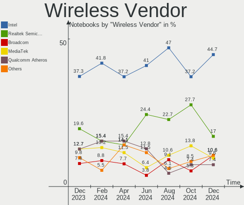

| Vendor                | Notebooks | Percent |
|-----------------------|-----------|---------|
| Intel                 | 57        | 47.5%   |
| Realtek Semiconductor | 26        | 21.67%  |
| Qualcomm Atheros      | 12        | 10%     |
| MediaTek              | 8         | 6.67%   |
| Broadcom              | 5         | 4.17%   |
| Ralink                | 3         | 2.5%    |
| Broadcom Limited      | 3         | 2.5%    |
| Ralink Technology     | 2         | 1.67%   |
| TP-Link               | 1         | 0.83%   |
| Sierra Wireless       | 1         | 0.83%   |
| Edimax Technology     | 1         | 0.83%   |
| D-Link System         | 1         | 0.83%   |

Wireless Model
--------------

Wireless models

| Model                                                          | Notebooks | Percent |
|----------------------------------------------------------------|-----------|---------|
| Realtek RTL8822CE 802.11ac PCIe Wireless Network Adapter       | 9         | 7.44%   |
| Intel Alder Lake-P PCH CNVi WiFi                               | 9         | 7.44%   |
| Intel Wi-Fi 6 AX200                                            | 7         | 5.79%   |
| Realtek RTL8821CE 802.11ac PCIe Wireless Network Adapter       | 5         | 4.13%   |
| MediaTek MT7921 802.11ax PCI Express Wireless Network Adapter  | 5         | 4.13%   |
| Intel Wireless 8265 / 8275                                     | 5         | 4.13%   |
| Intel Comet Lake PCH-LP CNVi WiFi                              | 5         | 4.13%   |
| Intel Wi-Fi 6 AX201                                            | 4         | 3.31%   |
| Realtek RTL8852AE 802.11ax PCIe Wireless Network Adapter       | 3         | 2.48%   |
| Ralink RT3290 Wireless 802.11n 1T/1R PCIe                      | 3         | 2.48%   |
| Qualcomm Atheros QCA9565 / AR9565 Wireless Network Adapter     | 3         | 2.48%   |
| Qualcomm Atheros QCA9377 802.11ac Wireless Network Adapter     | 3         | 2.48%   |
| Qualcomm Atheros AR9285 Wireless Network Adapter (PCI-Express) | 3         | 2.48%   |
| Intel Wireless 3165                                            | 3         | 2.48%   |
| Realtek RTL88x2bu [AC1200 Techkey]                             | 2         | 1.65%   |
| Realtek RTL8852BE PCIe 802.11ax Wireless Network Controller    | 2         | 1.65%   |
| Realtek RTL8723DE Wireless Network Adapter                     | 2         | 1.65%   |
| Realtek RTL8723BE PCIe Wireless Network Adapter                | 2         | 1.65%   |
| Realtek 802.11ac NIC                                           | 2         | 1.65%   |
| Qualcomm Atheros QCA6174 802.11ac Wireless Network Adapter     | 2         | 1.65%   |
| MediaTek MT7922 802.11ax PCI Express Wireless Network Adapter  | 2         | 1.65%   |
| Intel Wireless 7260                                            | 2         | 1.65%   |
| Intel Wireless 3160                                            | 2         | 1.65%   |
| Intel Gemini Lake PCH CNVi WiFi                                | 2         | 1.65%   |
| Intel Comet Lake PCH CNVi WiFi                                 | 2         | 1.65%   |
| Broadcom BCM43142 802.11b/g/n                                  | 2         | 1.65%   |
| Broadcom BCM4313 802.11bgn Wireless Network Adapter            | 2         | 1.65%   |
| TP-Link 802.11ac WLAN Adapter                                  | 1         | 0.83%   |
| Sierra Wireless MC8305 Modem                                   | 1         | 0.83%   |
| Ralink RT5370 Wireless Adapter                                 | 1         | 0.83%   |
| Ralink MT7610U ("Archer T2U" 2.4G+5G WLAN Adapter              | 1         | 0.83%   |
| Qualcomm Atheros AR9287 Wireless Network Adapter (PCI-Express) | 1         | 0.83%   |
| MediaTek Wi-Fi 6E MT7902 Wireless Network Adapter              | 1         | 0.83%   |
| Intel Wireless-AC 9260                                         | 1         | 0.83%   |
| Intel Wireless 8260                                            | 1         | 0.83%   |
| Intel WiFi Link 5100                                           | 1         | 0.83%   |
| Intel Wi-Fi 6 AX210/AX211/AX411 160MHz                         | 1         | 0.83%   |
| Intel Wi-Fi 6 AX201 160MHz                                     | 1         | 0.83%   |
| Intel Raptor Lake PCH CNVi WiFi                                | 1         | 0.83%   |
| Intel Ice Lake-LP PCH CNVi WiFi                                | 1         | 0.83%   |

Ethernet Vendor
---------------

Ethernet vendors

| Vendor                   | Notebooks | Percent |
|--------------------------|-----------|---------|
| Realtek Semiconductor    | 54        | 67.5%   |
| Intel                    | 11        | 13.75%  |
| Qualcomm Atheros         | 6         | 7.5%    |
| Broadcom                 | 3         | 3.75%   |
| TP-Link                  | 2         | 2.5%    |
| ASIX Electronics         | 2         | 2.5%    |
| Marvell Technology Group | 1         | 1.25%   |
| Google                   | 1         | 1.25%   |

Ethernet Model
--------------

Ethernet models

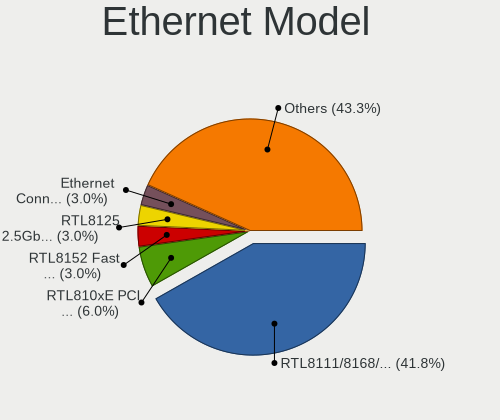

| Model                                                             | Notebooks | Percent |
|-------------------------------------------------------------------|-----------|---------|
| Realtek RTL8111/8168/8411 PCI Express Gigabit Ethernet Controller | 42        | 51.22%  |
| Realtek RTL8153 Gigabit Ethernet Adapter                          | 8         | 9.76%   |
| Realtek RTL810xE PCI Express Fast Ethernet controller             | 3         | 3.66%   |
| TP-Link UE300 10/100/1000 LAN (ethernet mode) [Realtek RTL8153]   | 2         | 2.44%   |
| Realtek RTL8152 Fast Ethernet Adapter                             | 2         | 2.44%   |
| Qualcomm Atheros Killer E220x Gigabit Ethernet Controller         | 2         | 2.44%   |
| Intel 82579V Gigabit Network Connection                           | 2         | 2.44%   |
| ASIX AX88179 Gigabit Ethernet                                     | 2         | 2.44%   |
| Realtek Killer E2600 Gigabit Ethernet Controller                  | 1         | 1.22%   |
| Qualcomm Atheros QCA8171 Gigabit Ethernet                         | 1         | 1.22%   |
| Qualcomm Atheros Killer E2500 Gigabit Ethernet Controller         | 1         | 1.22%   |
| Qualcomm Atheros AR8162 Fast Ethernet                             | 1         | 1.22%   |
| Qualcomm Atheros AR8131 Gigabit Ethernet                          | 1         | 1.22%   |
| Marvell Group 88E8057 PCI-E Gigabit Ethernet Controller           | 1         | 1.22%   |
| Intel Ethernet Connection I219-LM                                 | 1         | 1.22%   |
| Intel Ethernet Connection I217-LM                                 | 1         | 1.22%   |
| Intel Ethernet Connection (6) I219-V                              | 1         | 1.22%   |
| Intel Ethernet Connection (4) I219-V                              | 1         | 1.22%   |
| Intel Ethernet Connection (17) I219-LM                            | 1         | 1.22%   |
| Intel Ethernet Connection (16) I219-V                             | 1         | 1.22%   |
| Intel Ethernet Connection (10) I219-V                             | 1         | 1.22%   |
| Intel 82579LM Gigabit Network Connection (Lewisville)             | 1         | 1.22%   |
| Intel 82577LM Gigabit Network Connection                          | 1         | 1.22%   |
| Google Pixel 7 Pro                                                | 1         | 1.22%   |
| Broadcom NetXtreme BCM57786 Gigabit Ethernet PCIe                 | 1         | 1.22%   |
| Broadcom NetLink BCM57785 Gigabit Ethernet PCIe                   | 1         | 1.22%   |
| Broadcom NetLink BCM57780 Gigabit Ethernet PCIe                   | 1         | 1.22%   |

Net Controller Kind
-------------------

Ethernet, WiFi or modem

| Kind     | Notebooks | Percent |
|----------|-----------|---------|
| WiFi     | 113       | 58.25%  |
| Ethernet | 79        | 40.72%  |
| Modem    | 1         | 0.52%   |
| Unknown  | 1         | 0.52%   |

Used Controller
---------------

Currently used network controller

| Kind     | Notebooks | Percent |
|----------|-----------|---------|
| WiFi     | 89        | 76.72%  |
| Ethernet | 27        | 23.28%  |

NICs
----

Total network controllers on board

| Total | Notebooks | Percent |
|-------|-----------|---------|
| 2     | 65        | 57.52%  |
| 1     | 48        | 42.48%  |

IPv6
----

IPv6 vs IPv4

| Used | Notebooks | Percent |
|------|-----------|---------|
| No   | 101       | 89.38%  |
| Yes  | 12        | 10.62%  |

Bluetooth
---------

Bluetooth Vendor
----------------

Controller vendors

| Vendor                          | Notebooks | Percent |
|---------------------------------|-----------|---------|
| Intel                           | 51        | 49.04%  |
| Realtek Semiconductor           | 17        | 16.35%  |
| IMC Networks                    | 8         | 7.69%   |
| Foxconn / Hon Hai               | 7         | 6.73%   |
| Qualcomm Atheros Communications | 6         | 5.77%   |
| Ralink                          | 3         | 2.88%   |
| Lite-On Technology              | 3         | 2.88%   |
| Toshiba                         | 1         | 0.96%   |
| Realtek                         | 1         | 0.96%   |
| MediaTek                        | 1         | 0.96%   |
| Foxconn International           | 1         | 0.96%   |
| Cambridge Silicon Radio         | 1         | 0.96%   |
| Askey Computer                  | 1         | 0.96%   |
| Apple                           | 1         | 0.96%   |
| Alps Electric                   | 1         | 0.96%   |
| Actions                         | 1         | 0.96%   |

Bluetooth Model
---------------

Controller models

| Model                                               | Notebooks | Percent |
|-----------------------------------------------------|-----------|---------|
| Intel Bluetooth wireless interface                  | 14        | 13.46%  |
| Realtek Bluetooth Radio                             | 13        | 12.5%   |
| Intel AX201 Bluetooth                               | 11        | 10.58%  |
| Intel Bluetooth Device                              | 9         | 8.65%   |
| Intel Bluetooth 9460/9560 Jefferson Peak (JfP)      | 8         | 7.69%   |
| Intel AX200 Bluetooth                               | 6         | 5.77%   |
| Realtek  Bluetooth 4.2 Adapter                      | 4         | 3.85%   |
| IMC Networks Bluetooth Radio                        | 4         | 3.85%   |
| Ralink RT3290 Bluetooth                             | 3         | 2.88%   |
| Qualcomm Atheros AR3011 Bluetooth                   | 3         | 2.88%   |
| IMC Networks Wireless_Device                        | 3         | 2.88%   |
| Foxconn / Hon Hai MediaTek Bluetooth Adapter        | 3         | 2.88%   |
| Qualcomm Atheros QCA61x4 Bluetooth 4.0              | 2         | 1.92%   |
| Lite-On Qualcomm Atheros QCA9377 Bluetooth          | 2         | 1.92%   |
| Toshiba Bluetooth Radio                             | 1         | 0.96%   |
| Realtek Bluetooth Radio                             | 1         | 0.96%   |
| Qualcomm Atheros  Bluetooth Device                  | 1         | 0.96%   |
| MediaTek Wireless_Device                            | 1         | 0.96%   |
| Lite-On Atheros AR3012 Bluetooth                    | 1         | 0.96%   |
| Intel Wireless-AC 3168 Bluetooth                    | 1         | 0.96%   |
| Intel Centrino Advanced-N 6230 Bluetooth adapter    | 1         | 0.96%   |
| Intel AX210 Bluetooth                               | 1         | 0.96%   |
| IMC Networks Bluetooth Device                       | 1         | 0.96%   |
| Foxconn International BCM43142A0 Bluetooth module   | 1         | 0.96%   |
| Foxconn / Hon Hai Wireless_Device                   | 1         | 0.96%   |
| Foxconn / Hon Hai Broadcom BCM20702 Bluetooth       | 1         | 0.96%   |
| Foxconn / Hon Hai BCM43142A0                        | 1         | 0.96%   |
| Foxconn / Hon Hai BCM20702A0                        | 1         | 0.96%   |
| Cambridge Silicon Radio Bluetooth Dongle (HCI mode) | 1         | 0.96%   |
| Askey Bluetooth Device                              | 1         | 0.96%   |
| Apple Bluetooth USB Host Controller                 | 1         | 0.96%   |
| Alps Electric BCM2046 Bluetooth Device              | 1         | 0.96%   |
| Actions general adapter                             | 1         | 0.96%   |

Sound
-----

Sound Vendor
------------

Sound card vendors

| Vendor            | Notebooks | Percent |
|-------------------|-----------|---------|
| Intel             | 80        | 58.39%  |
| AMD               | 36        | 26.28%  |
| Nvidia            | 15        | 10.95%  |
| Texas Instruments | 1         | 0.73%   |
| SteelSeries ApS   | 1         | 0.73%   |
| Sony              | 1         | 0.73%   |
| Plantronics       | 1         | 0.73%   |
| Lenovo            | 1         | 0.73%   |
| JMTek             | 1         | 0.73%   |

Sound Model
-----------

Sound card models

| Model                                                                      | Notebooks | Percent |
|----------------------------------------------------------------------------|-----------|---------|
| AMD Family 17h/19h HD Audio Controller                                     | 26        | 15.12%  |
| AMD Renoir Radeon High Definition Audio Controller                         | 19        | 11.05%  |
| Intel Alder Lake PCH-P High Definition Audio Controller                    | 8         | 4.65%   |
| Intel Celeron/Pentium Silver Processor High Definition Audio               | 7         | 4.07%   |
| Intel Tiger Lake-LP Smart Sound Technology Audio Controller                | 6         | 3.49%   |
| Intel Sunrise Point-LP HD Audio                                            | 6         | 3.49%   |
| Intel Comet Lake PCH-LP cAVS                                               | 6         | 3.49%   |
| Intel 6 Series/C200 Series Chipset Family High Definition Audio Controller | 6         | 3.49%   |
| Nvidia Audio device                                                        | 5         | 2.91%   |
| Intel 7 Series/C216 Chipset Family High Definition Audio Controller        | 5         | 2.91%   |
| Intel Xeon E3-1200 v3/4th Gen Core Processor HD Audio Controller           | 4         | 2.33%   |
| Intel Haswell-ULT HD Audio Controller                                      | 4         | 2.33%   |
| Intel 8 Series/C220 Series Chipset High Definition Audio Controller        | 4         | 2.33%   |
| Intel 8 Series HD Audio Controller                                         | 4         | 2.33%   |
| AMD Rembrandt Radeon High Definition Audio Controller                      | 4         | 2.33%   |
| Nvidia GA104 High Definition Audio Controller                              | 3         | 1.74%   |
| Intel 82801I (ICH9 Family) HD Audio Controller                             | 3         | 1.74%   |
| Intel 5 Series/3400 Series Chipset High Definition Audio                   | 3         | 1.74%   |
| AMD High Definition Audio Controller                                       | 3         | 1.74%   |
| AMD Family 15h (Models 60h-6fh) Audio Controller                           | 3         | 1.74%   |
| Nvidia TU116 High Definition Audio Controller                              | 2         | 1.16%   |
| Nvidia GP107GL High Definition Audio Controller                            | 2         | 1.16%   |
| Intel Wildcat Point-LP High Definition Audio Controller                    | 2         | 1.16%   |
| Intel Raptor Lake-P/U/H cAVS                                               | 2         | 1.16%   |
| Intel Jasper Lake HD Audio                                                 | 2         | 1.16%   |
| Intel Ice Lake-LP Smart Sound Technology Audio Controller                  | 2         | 1.16%   |
| Intel Comet Lake PCH cAVS                                                  | 2         | 1.16%   |
| Intel CM238 HD Audio Controller                                            | 2         | 1.16%   |
| Intel Cannon Point-LP High Definition Audio Controller                     | 2         | 1.16%   |
| Intel Cannon Lake PCH cAVS                                                 | 2         | 1.16%   |
| Intel Broadwell-U Audio Controller                                         | 2         | 1.16%   |
| Intel Atom Processor Z36xxx/Z37xxx Series High Definition Audio Controller | 2         | 1.16%   |
| Texas Instruments PCM2902 Audio Codec                                      | 1         | 0.58%   |
| SteelSeries ApS SteelSeries Arctis 1 Wireless                              | 1         | 0.58%   |
| Sony DualShock 4 [CUH-ZCT2x]                                               | 1         | 0.58%   |
| Plantronics Blackwire 3220 Series                                          | 1         | 0.58%   |
| Nvidia TU107 GeForce GTX 1650 High Definition Audio Controller             | 1         | 0.58%   |
| Nvidia GK107 HDMI Audio Controller                                         | 1         | 0.58%   |
| Nvidia GA106 High Definition Audio Controller                              | 1         | 0.58%   |
| Lenovo ThinkPad USB-C Dock Audio                                           | 1         | 0.58%   |

Memory
------

Memory Vendor
-------------

Memory module vendors

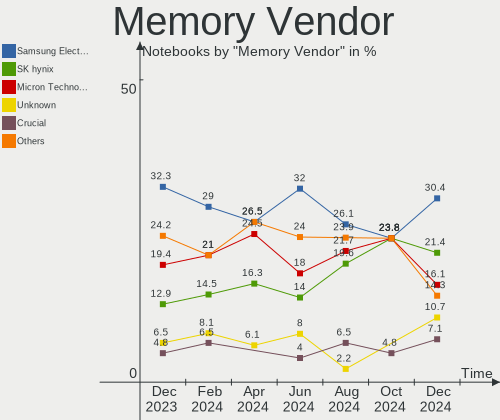

| Vendor              | Notebooks | Percent |
|---------------------|-----------|---------|
| Samsung Electronics | 35        | 38.04%  |
| SK hynix            | 17        | 18.48%  |
| Micron Technology   | 15        | 16.3%   |
| Kingston            | 11        | 11.96%  |
| Crucial             | 3         | 3.26%   |
| Ramaxel Technology  | 2         | 2.17%   |
| A-DATA Technology   | 2         | 2.17%   |
| Unknown             | 1         | 1.09%   |
| Nanya Technology    | 1         | 1.09%   |
| GOODRAM             | 1         | 1.09%   |
| ff                  | 1         | 1.09%   |
| 8CFD000080AD        | 1         | 1.09%   |
| 4ea5                | 1         | 1.09%   |
| Unknown             | 1         | 1.09%   |

Memory Model
------------

Memory module models

| Model                                                            | Notebooks | Percent |
|------------------------------------------------------------------|-----------|---------|
| Samsung RAM M471A1G44AB0-CWE 8GB SODIMM DDR4 3200MT/s            | 7         | 7.45%   |
| SK hynix RAM HMAA1GS6CJR6N-XN 8GB SODIMM DDR4 3200MT/s           | 4         | 4.26%   |
| Samsung RAM M471B5273DH0-CH9 4GB SODIMM DDR3 1334MT/s            | 3         | 3.19%   |
| SK hynix RAM HMT351S6CFR8C-PB 4GB SODIMM DDR3 1600MT/s           | 2         | 2.13%   |
| SK hynix RAM HMA81GS6CJR8N-VK 8GB SODIMM DDR4 2667MT/s           | 2         | 2.13%   |
| SK hynix RAM HMA81GS6AFR8N-UH 8GB SODIMM DDR4 2667MT/s           | 2         | 2.13%   |
| Samsung RAM M471A2K43EB1-CWE 16GB SODIMM DDR4 3200MT/s           | 2         | 2.13%   |
| Samsung RAM M471A1K43CB1-CRC 8GB SODIMM DDR4 2667MT/s            | 2         | 2.13%   |
| Samsung RAM M471A1G44AB0-CWE 8GB Row Of Chips DDR4 3200MT/s      | 2         | 2.13%   |
| Micron RAM 8ATF1G64HZ-3G2J1 8GB SODIMM DDR4 3200MT/s             | 2         | 2.13%   |
| Micron RAM 53E1G32D4NQ-046WTE 1GB Row Of Chips LPDDR4 3200MT/s   | 2         | 2.13%   |
| Unknown RAM Module 2GB SODIMM DDR3 1333MT/s                      | 1         | 1.06%   |
| SK hynix RAM HMT451S6BFR8A-PB 4GB SODIMM DDR3 1600MT/s           | 1         | 1.06%   |
| SK hynix RAM HMT41GS6AFR8A-PB 8192MB SODIMM DDR3 1600MT/s        | 1         | 1.06%   |
| SK hynix RAM HMAA1GS6DMR6N-XN 8GB Row Of Chips DDR4 3200MT/s     | 1         | 1.06%   |
| SK hynix RAM HMA851S6JJR6N-VK 4GB SODIMM DDR4 2667MT/s           | 1         | 1.06%   |
| SK hynix RAM HMA851S6AFR6N-UH 4GB SODIMM DDR4 2400MT/s           | 1         | 1.06%   |
| SK hynix RAM H9JCNNNFA5MLYR-N6E 4GB Row Of Chips LPDDR5 6400MT/s | 1         | 1.06%   |
| SK hynix RAM H9HCNNNCPMMLXR-NEE 8GB SODIMM LPDDR4 4266MT/s       | 1         | 1.06%   |
| Samsung RAM UBE3D4AA-MGCR 2048MB Row Of Chips LPDDR4 4267MT/s    | 1         | 1.06%   |
| Samsung RAM Module 8GB SODIMM DDR5 4800MT/s                      | 1         | 1.06%   |
| Samsung RAM M471B5173EB0-YK0 4GB SODIMM DDR3 1600MT/s            | 1         | 1.06%   |
| Samsung RAM M471B1G73QH0-YK0 8GB SODIMM DDR3 1867MT/s            | 1         | 1.06%   |
| Samsung RAM M471A5244CB0-CTD 4GB SODIMM DDR4 3266MT/s            | 1         | 1.06%   |
| Samsung RAM M471A5244CB0-CRC 4GB SODIMM DDR4 2667MT/s            | 1         | 1.06%   |
| Samsung RAM M471A5244BB0-CWE 4GB SODIMM DDR4 3200MT/s            | 1         | 1.06%   |
| Samsung RAM M471A5143EB0-CPB 4GB SODIMM DDR4 2133MT/s            | 1         | 1.06%   |
| Samsung RAM M471A2K43DB1-CTD 16GB SODIMM DDR4 2667MT/s           | 1         | 1.06%   |
| Samsung RAM M471A2K43CB1-CTD 16GB SODIMM DDR4 8400MT/s           | 1         | 1.06%   |
| Samsung RAM M471A2G43AB2-CWE 16GB SODIMM DDR4 3200MT/s           | 1         | 1.06%   |
| Samsung RAM M471A1K43EB1-CWE 8GB SODIMM DDR4 3200MT/s            | 1         | 1.06%   |
| Samsung RAM M471A1K43DB1-CTD 8GB SODIMM DDR4 2667MT/s            | 1         | 1.06%   |
| Samsung RAM M471A1K43BB1-CTD 8GB SODIMM DDR4 2667MT/s            | 1         | 1.06%   |
| Samsung RAM M471A1G44BB0-CWE 8GB SODIMM DDR4 3200MT/s            | 1         | 1.06%   |
| Samsung RAM M471A1G44BB0-CWE 8GB Row Of Chips DDR4 3200MT/s      | 1         | 1.06%   |
| Samsung RAM M425R1GB4BB0-CWMOD 8GB SODIMM DDR5 5600MT/s          | 1         | 1.06%   |
| Samsung RAM M4 70T5663QZ3-CF7 2GB SODIMM DDR2 2048MT/s           | 1         | 1.06%   |
| Samsung RAM K4F8E304HB-MGCJ 1GB LPDDR4 2400MT/s                  | 1         | 1.06%   |
| Samsung RAM K4EBE3 4ED-EGCG 8GB Row Of Chips LPDDR3 2133MT/s     | 1         | 1.06%   |
| Samsung RAM K4E6E304EB-EGCG 4GB Row Of Chips LPDDR3 2133MT/s     | 1         | 1.06%   |

Memory Kind
-----------

Memory module kinds

| Kind   | Notebooks | Percent |
|--------|-----------|---------|
| DDR4   | 43        | 56.58%  |
| DDR3   | 16        | 21.05%  |
| DDR5   | 7         | 9.21%   |
| LPDDR4 | 5         | 6.58%   |
| LPDDR5 | 2         | 2.63%   |
| LPDDR3 | 2         | 2.63%   |
| SDRAM  | 1         | 1.32%   |

Memory Form Factor
------------------

Physical design of the memory module

| Name            | Notebooks | Percent |
|-----------------|-----------|---------|
| SODIMM          | 64        | 78.05%  |
| Row Of Chips    | 16        | 19.51%  |
| Proprietary Car | 1         | 1.22%   |
| Unknown         | 1         | 1.22%   |

Memory Size
-----------

Memory module size

| Size  | Notebooks | Percent |
|-------|-----------|---------|
| 8192  | 44        | 54.32%  |
| 4096  | 20        | 24.69%  |
| 16384 | 10        | 12.35%  |
| 2048  | 4         | 4.94%   |
| 32768 | 2         | 2.47%   |
| 1024  | 1         | 1.23%   |

Memory Speed
------------

Memory module speed

| Speed | Notebooks | Percent |
|-------|-----------|---------|
| 3200  | 27        | 34.62%  |
| 2667  | 14        | 17.95%  |
| 1600  | 11        | 14.1%   |
| 4800  | 6         | 7.69%   |
| 2400  | 4         | 5.13%   |
| 1334  | 4         | 5.13%   |
| 2133  | 3         | 3.85%   |
| 6400  | 2         | 2.56%   |
| 8400  | 1         | 1.28%   |
| 5600  | 1         | 1.28%   |
| 4267  | 1         | 1.28%   |
| 4266  | 1         | 1.28%   |
| 3266  | 1         | 1.28%   |
| 2048  | 1         | 1.28%   |
| 1333  | 1         | 1.28%   |

Printers & scanners
-------------------

Printer Vendor
--------------

Printer device vendors

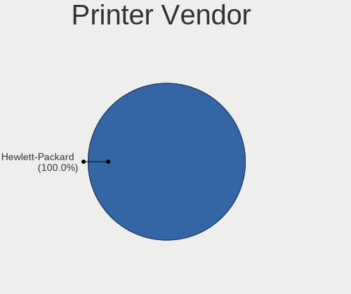

| Vendor          | Notebooks | Percent |
|-----------------|-----------|---------|
| Hewlett-Packard | 1         | 100%    |

Printer Model
-------------

Printer device models

| Model                  | Notebooks | Percent |
|------------------------|-----------|---------|
| HP DeskJet 2600 series | 1         | 100%    |

Scanner Vendor
--------------

Scanner device vendors

Zero info for selected period =(

Scanner Model
-------------

Scanner device models

Zero info for selected period =(

Camera
------

Camera Vendor
-------------

Camera device vendors

| Vendor                                 | Notebooks | Percent |
|----------------------------------------|-----------|---------|
| Chicony Electronics                    | 21        | 21.88%  |
| IMC Networks                           | 15        | 15.63%  |
| Microdia                               | 11        | 11.46%  |
| Quanta                                 | 9         | 9.38%   |
| Bison Electronics                      | 9         | 9.38%   |
| Suyin                                  | 4         | 4.17%   |
| Sunplus Innovation Technology          | 4         | 4.17%   |
| Cheng Uei Precision Industry (Foxlink) | 4         | 4.17%   |
| Acer                                   | 4         | 4.17%   |
| Sonix Technology                       | 2         | 2.08%   |
| Realtek Semiconductor                  | 2         | 2.08%   |
| Luxvisions Innotech Limited            | 2         | 2.08%   |
| Logitech                               | 2         | 2.08%   |
| Syntek                                 | 1         | 1.04%   |
| Ricoh                                  | 1         | 1.04%   |
| Lite-On Technology                     | 1         | 1.04%   |
| Creative Technology                    | 1         | 1.04%   |
| Colorado                               | 1         | 1.04%   |
| Apple                                  | 1         | 1.04%   |
| Alcor Micro                            | 1         | 1.04%   |

Camera Model
------------

Camera device models

| Model                                                       | Notebooks | Percent |
|-------------------------------------------------------------|-----------|---------|
| IMC Networks USB2.0 HD UVC WebCam                           | 6         | 6.25%   |
| IMC Networks Integrated Camera                              | 5         | 5.21%   |
| Chicony Integrated Camera                                   | 5         | 5.21%   |
| Microdia Webcam Vitade AF                                   | 3         | 3.13%   |
| Bison Integrated Camera                                     | 3         | 3.13%   |
| Bison HD Webcam                                             | 3         | 3.13%   |
| Quanta HP Webcam                                            | 2         | 2.08%   |
| Quanta HP True Vision FHD Camera                            | 2         | 2.08%   |
| Microdia Integrated_Webcam_HD                               | 2         | 2.08%   |
| Microdia Camera                                             | 2         | 2.08%   |
| Luxvisions Innotech Limited HP TrueVision HD Camera         | 2         | 2.08%   |
| Chicony HP Truevision HD camera                             | 2         | 2.08%   |
| Chicony HD Webcam                                           | 2         | 2.08%   |
| Chicony FJ Camera                                           | 2         | 2.08%   |
| Acer Integrated Camera                                      | 2         | 2.08%   |
| Syntek Integrated Camera                                    | 1         | 1.04%   |
| Suyin HP TrueVision HD                                      | 1         | 1.04%   |
| Suyin HD Webcam                                             | 1         | 1.04%   |
| Suyin Acer/HP Integrated Webcam [CN0314]                    | 1         | 1.04%   |
| Suyin 1.3M WebCam (notebook emachines E730, Acer sub-brand) | 1         | 1.04%   |
| Sunplus TOSHIBA Web Camera - HD                             | 1         | 1.04%   |
| Sunplus Laptop_Integrated_Webcam_FHD                        | 1         | 1.04%   |
| Sunplus Hy HD Camera                                        | 1         | 1.04%   |
| Sunplus HP Truevision HD                                    | 1         | 1.04%   |
| Sonix USB2.0 HD UVC WebCam                                  | 1         | 1.04%   |
| Sonix USB2.0 FHD UVC WebCam                                 | 1         | 1.04%   |
| Ricoh Visual Communication Camera VGP-VCC9 [R5U870]         | 1         | 1.04%   |
| Realtek Integrated_Webcam_HD                                | 1         | 1.04%   |
| Realtek HP Webcam                                           | 1         | 1.04%   |
| Quanta VGA WebCam                                           | 1         | 1.04%   |
| Quanta USB2.0 HD UVC WebCam                                 | 1         | 1.04%   |
| Quanta HP Wide Vision HD Camera                             | 1         | 1.04%   |
| Quanta HP 5MP Camera                                        | 1         | 1.04%   |
| Quanta HD User Facing                                       | 1         | 1.04%   |
| Microdia USB 2.0 Camera                                     | 1         | 1.04%   |
| Microdia Lenovo EasyCamera                                  | 1         | 1.04%   |
| Microdia Integrated_Webcam_FHD                              | 1         | 1.04%   |
| Microdia HP Integrated Webcam                               | 1         | 1.04%   |
| Logitech Webcam C925e                                       | 1         | 1.04%   |
| Logitech HD Webcam C525                                     | 1         | 1.04%   |

Security
--------

Fingerprint Vendor
------------------

Fingerprint sensor vendors

| Vendor                     | Notebooks | Percent |
|----------------------------|-----------|---------|
| Synaptics                  | 8         | 36.36%  |
| Validity Sensors           | 5         | 22.73%  |
| Shenzhen Goodix Technology | 3         | 13.64%  |
| Elan Microelectronics      | 3         | 13.64%  |
| AuthenTec                  | 3         | 13.64%  |

Fingerprint Model
-----------------

Fingerprint sensor models

| Model                                                    | Notebooks | Percent |
|----------------------------------------------------------|-----------|---------|
| Synaptics Prometheus MIS Touch Fingerprint Reader        | 3         | 13.64%  |
| Synaptics WBDI Fingerprint Reader USB 086                | 2         | 9.09%   |
| Shenzhen Goodix  FingerPrint Device                      | 2         | 9.09%   |
| Elan ELAN:ARM-M4                                         | 2         | 9.09%   |
| Validity Sensors VFS5011 Fingerprint Reader              | 1         | 4.55%   |
| Validity Sensors VFS495 Fingerprint Reader               | 1         | 4.55%   |
| Validity Sensors VFS471 Fingerprint Reader               | 1         | 4.55%   |
| Validity Sensors Synaptics WBDI                          | 1         | 4.55%   |
| Validity Sensors Fingerprint scanner                     | 1         | 4.55%   |
| Synaptics WBDI                                           | 1         | 4.55%   |
| Synaptics Metallica MOH Touch Fingerprint Reader         | 1         | 4.55%   |
| Synaptics FS7604 Touch Fingerprint Sensor with PurePrint | 1         | 4.55%   |
| Shenzhen Goodix Fingerprint Reader                       | 1         | 4.55%   |
| Elan ELAN:Fingerprint                                    | 1         | 4.55%   |
| AuthenTec Fingerprint Sensor                             | 1         | 4.55%   |
| AuthenTec AES2550 Fingerprint Sensor                     | 1         | 4.55%   |
| AuthenTec AES1660 Fingerprint Sensor                     | 1         | 4.55%   |

Chipcard Vendor
---------------

Chipcard module vendors

| Vendor      | Notebooks | Percent |
|-------------|-----------|---------|
| Alcor Micro | 3         | 60%     |
| O2 Micro    | 2         | 40%     |

Chipcard Model
--------------

Chipcard module models

| Model                                | Notebooks | Percent |
|--------------------------------------|-----------|---------|
| Alcor Micro AU9540 Smartcard Reader  | 3         | 60%     |
| O2 Micro OZ776 CCID Smartcard Reader | 2         | 40%     |

Unsupported
-----------

Unsupported Devices
-------------------

Total unsupported devices on board

| Total | Notebooks | Percent |
|-------|-----------|---------|
| 0     | 69        | 61.06%  |
| 1     | 28        | 24.78%  |
| 2     | 11        | 9.73%   |
| 3     | 3         | 2.65%   |
| 6     | 1         | 0.88%   |
| 5     | 1         | 0.88%   |

Unsupported Device Types
------------------------

Types of unsupported devices

| Type                     | Notebooks | Percent |
|--------------------------|-----------|---------|
| Fingerprint reader       | 21        | 30.88%  |
| Graphics card            | 16        | 23.53%  |
| Net/wireless             | 8         | 11.76%  |
| Multimedia controller    | 6         | 8.82%   |
| Bluetooth                | 6         | 8.82%   |
| Chipcard                 | 5         | 7.35%   |
| Card reader              | 2         | 2.94%   |
| Camera                   | 2         | 2.94%   |
| Sound                    | 1         | 1.47%   |
| Communication controller | 1         | 1.47%   |

