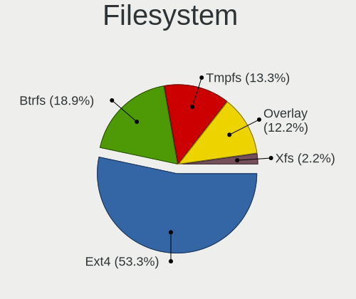
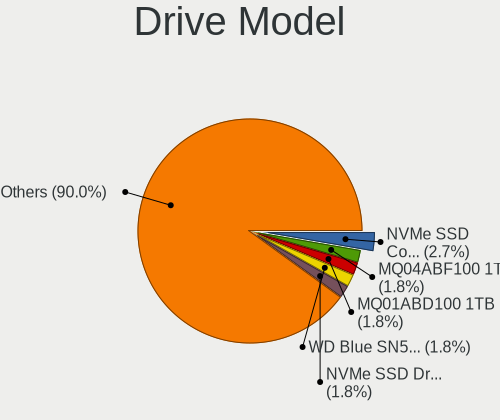
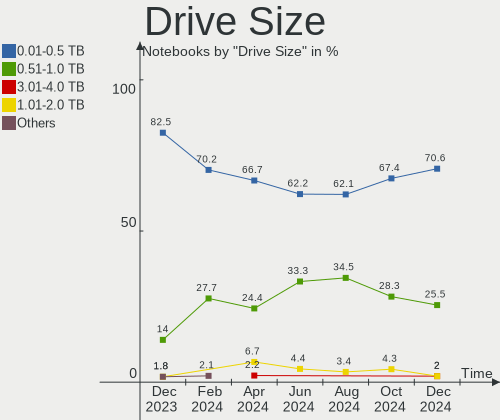
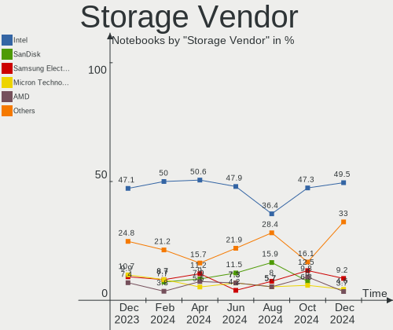
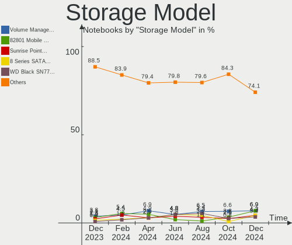
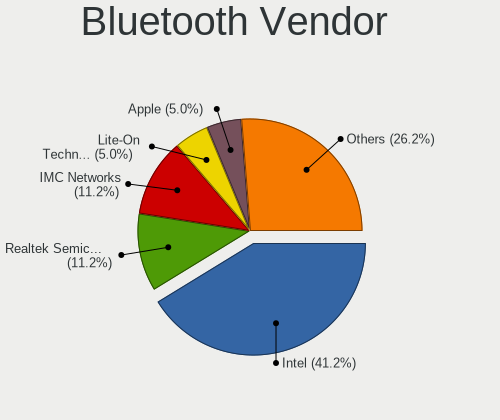
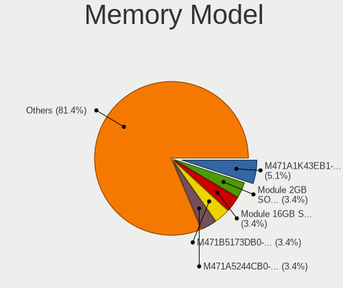
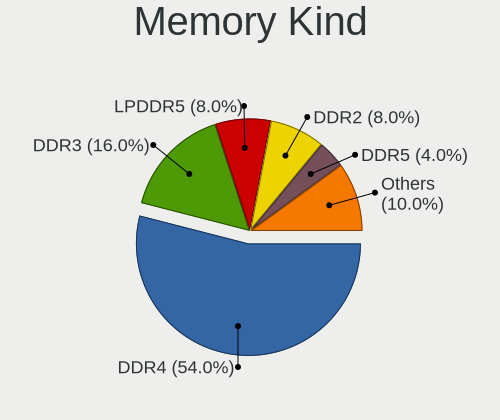
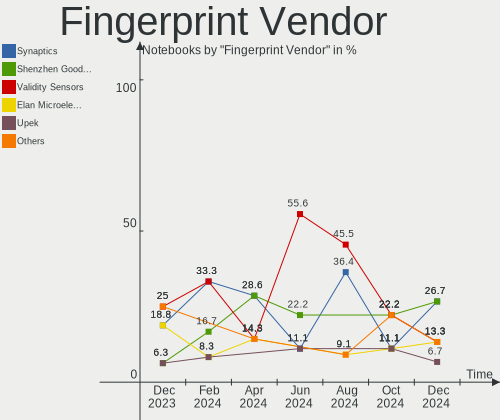

Linux in Spain - Hardware Trends (Notebooks)
--------------------------------------------

A project to identify most popular hardware characteristics and track their change
over time based on data collected by Linux users at https://Linux-Hardware.org.

Anyone can contribute to this report by the [hw-probe](https://github.com/linuxhw/hw-probe) tool:

    sudo -E hw-probe -all -upload

Period: Nov, 2023.

Contents
--------

* [ System ](#system)
  - [ OS                       ](#os)
  - [ OS Family                ](#os-family)
  - [ Kernel                   ](#kernel)
  - [ Kernel Family            ](#kernel-family)
  - [ Kernel Major Ver.        ](#kernel-major-ver)
  - [ Arch                     ](#arch)
  - [ DE                       ](#de)
  - [ Display Server           ](#display-server)
  - [ Display Manager          ](#display-manager)
  - [ OS Lang                  ](#os-lang)
  - [ Boot Mode                ](#boot-mode)
  - [ Filesystem               ](#filesystem)
  - [ Part. scheme             ](#part-scheme)
  - [ Dual Boot with Linux/BSD ](#dual-boot-with-linuxbsd)
  - [ Dual Boot (Win)          ](#dual-boot-win)

* [ Board ](#board)
  - [ Vendor                   ](#vendor)
  - [ Model                    ](#model)
  - [ Model Family             ](#model-family)
  - [ MFG Year                 ](#mfg-year)
  - [ Form Factor              ](#form-factor)
  - [ Secure Boot              ](#secure-boot)
  - [ Coreboot                 ](#coreboot)
  - [ RAM Size                 ](#ram-size)
  - [ RAM Used                 ](#ram-used)
  - [ Total Drives             ](#total-drives)
  - [ Has CD-ROM               ](#has-cd-rom)
  - [ Has Ethernet             ](#has-ethernet)
  - [ Has WiFi                 ](#has-wifi)
  - [ Has Bluetooth            ](#has-bluetooth)

* [ Location ](#location)
  - [ Country                  ](#country)
  - [ City                     ](#city)

* [ Drives ](#drives)
  - [ Drive Vendor             ](#drive-vendor)
  - [ Drive Model              ](#drive-model)
  - [ HDD Vendor               ](#hdd-vendor)
  - [ SSD Vendor               ](#ssd-vendor)
  - [ Drive Kind               ](#drive-kind)
  - [ Drive Connector          ](#drive-connector)
  - [ Drive Size               ](#drive-size)
  - [ Space Total              ](#space-total)
  - [ Space Used               ](#space-used)
  - [ Malfunc. Drives          ](#malfunc-drives)
  - [ Malfunc. Drive Vendor    ](#malfunc-drive-vendor)
  - [ Malfunc. HDD Vendor      ](#malfunc-hdd-vendor)
  - [ Malfunc. Drive Kind      ](#malfunc-drive-kind)
  - [ Failed Drives            ](#failed-drives)
  - [ Failed Drive Vendor      ](#failed-drive-vendor)
  - [ Drive Status             ](#drive-status)

* [ Storage controller ](#storage-controller)
  - [ Storage Vendor           ](#storage-vendor)
  - [ Storage Model            ](#storage-model)
  - [ Storage Kind             ](#storage-kind)

* [ Processor ](#processor)
  - [ CPU Vendor               ](#cpu-vendor)
  - [ CPU Model                ](#cpu-model)
  - [ CPU Model Family         ](#cpu-model-family)
  - [ CPU Cores                ](#cpu-cores)
  - [ CPU Sockets              ](#cpu-sockets)
  - [ CPU Threads              ](#cpu-threads)
  - [ CPU Op-Modes             ](#cpu-op-modes)
  - [ CPU Microcode            ](#cpu-microcode)
  - [ CPU Microarch            ](#cpu-microarch)

* [ Graphics ](#graphics)
  - [ GPU Vendor               ](#gpu-vendor)
  - [ GPU Model                ](#gpu-model)
  - [ GPU Combo                ](#gpu-combo)
  - [ GPU Driver               ](#gpu-driver)
  - [ GPU Memory               ](#gpu-memory)

* [ Monitor ](#monitor)
  - [ Monitor Vendor           ](#monitor-vendor)
  - [ Monitor Model            ](#monitor-model)
  - [ Monitor Resolution       ](#monitor-resolution)
  - [ Monitor Diagonal         ](#monitor-diagonal)
  - [ Monitor Width            ](#monitor-width)
  - [ Aspect Ratio             ](#aspect-ratio)
  - [ Monitor Area             ](#monitor-area)
  - [ Pixel Density            ](#pixel-density)
  - [ Multiple Monitors        ](#multiple-monitors)

* [ Network ](#network)
  - [ Net Controller Vendor    ](#net-controller-vendor)
  - [ Net Controller Model     ](#net-controller-model)
  - [ Wireless Vendor          ](#wireless-vendor)
  - [ Wireless Model           ](#wireless-model)
  - [ Ethernet Vendor          ](#ethernet-vendor)
  - [ Ethernet Model           ](#ethernet-model)
  - [ Net Controller Kind      ](#net-controller-kind)
  - [ Used Controller          ](#used-controller)
  - [ NICs                     ](#nics)
  - [ IPv6                     ](#ipv6)

* [ Bluetooth ](#bluetooth)
  - [ Bluetooth Vendor         ](#bluetooth-vendor)
  - [ Bluetooth Model          ](#bluetooth-model)

* [ Sound ](#sound)
  - [ Sound Vendor             ](#sound-vendor)
  - [ Sound Model              ](#sound-model)

* [ Memory ](#memory)
  - [ Memory Vendor            ](#memory-vendor)
  - [ Memory Model             ](#memory-model)
  - [ Memory Kind              ](#memory-kind)
  - [ Memory Form Factor       ](#memory-form-factor)
  - [ Memory Size              ](#memory-size)
  - [ Memory Speed             ](#memory-speed)

* [ Printers & scanners ](#printers--scanners)
  - [ Printer Vendor           ](#printer-vendor)
  - [ Printer Model            ](#printer-model)
  - [ Scanner Vendor           ](#scanner-vendor)
  - [ Scanner Model            ](#scanner-model)

* [ Camera ](#camera)
  - [ Camera Vendor            ](#camera-vendor)
  - [ Camera Model             ](#camera-model)

* [ Security ](#security)
  - [ Fingerprint Vendor       ](#fingerprint-vendor)
  - [ Fingerprint Model        ](#fingerprint-model)
  - [ Chipcard Vendor          ](#chipcard-vendor)
  - [ Chipcard Model           ](#chipcard-model)

* [ Unsupported ](#unsupported)
  - [ Unsupported Devices      ](#unsupported-devices)
  - [ Unsupported Device Types ](#unsupported-device-types)

System
------

OS
--

Installed operating systems

| Name                         | Notebooks | Percent |
|------------------------------|-----------|---------|
| Ubuntu 22.04                 | 19        | 22.35%  |
| Debian 12                    | 8         | 9.41%   |
| Ubuntu 23.10                 | 5         | 5.88%   |
| Fedora 39                    | 5         | 5.88%   |
| Zorin 16                     | 4         | 4.71%   |
| Linux Mint 21.2              | 4         | 4.71%   |
| Fedora 38                    | 4         | 4.71%   |
| OpenMandriva 23.11           | 3         | 3.53%   |
| Kubuntu 23.10                | 3         | 3.53%   |
| OpenMandriva 5.0             | 2         | 2.35%   |
| OpenMandriva 23.08           | 2         | 2.35%   |
| Kali 2023.3                  | 2         | 2.35%   |
| Gentoo 2.14                  | 2         | 2.35%   |
| Xero Rolling                 | 1         | 1.18%   |
| Ubuntu 22.10                 | 1         | 1.18%   |
| Ubuntu 21.10                 | 1         | 1.18%   |
| SteamOS 3.5.5                | 1         | 1.18%   |
| Pop!_OS 22.04                | 1         | 1.18%   |
| openSUSE Tumbleweed-XXXXXXXX | 1         | 1.18%   |
| OpenMandriva 4.2             | 1         | 1.18%   |
| OpenMandriva 23.10           | 1         | 1.18%   |
| Manjaro                      | 1         | 1.18%   |
| LMDE 6                       | 1         | 1.18%   |
| Kubuntu 22.04                | 1         | 1.18%   |
| Fedora 33                    | 1         | 1.18%   |
| Endless 5.0.6                | 1         | 1.18%   |
| Endless 4.0.14               | 1         | 1.18%   |
| EndeavourOS Rolling          | 1         | 1.18%   |
| Elementary 6.1               | 1         | 1.18%   |
| Devuan 6                     | 1         | 1.18%   |
| Debian 11                    | 1         | 1.18%   |
| BunsenLabs 11                | 1         | 1.18%   |
| ArcoLinux Rolling            | 1         | 1.18%   |
| ArcoLinux                    | 1         | 1.18%   |
| Arch Rolling                 | 1         | 1.18%   |

OS Family
---------

OS without a version

| Name         | Notebooks | Percent |
|--------------|-----------|---------|
| Ubuntu       | 26        | 30.59%  |
| Fedora       | 10        | 11.76%  |
| OpenMandriva | 9         | 10.59%  |
| Debian       | 9         | 10.59%  |
| Zorin        | 4         | 4.71%   |
| Linux Mint   | 4         | 4.71%   |
| Kubuntu      | 4         | 4.71%   |
| Kali         | 2         | 2.35%   |
| Gentoo       | 2         | 2.35%   |
| Endless      | 2         | 2.35%   |
| ArcoLinux    | 2         | 2.35%   |
| Xero         | 1         | 1.18%   |
| SteamOS      | 1         | 1.18%   |
| Pop!_OS      | 1         | 1.18%   |
| openSUSE     | 1         | 1.18%   |
| Manjaro      | 1         | 1.18%   |
| LMDE         | 1         | 1.18%   |
| EndeavourOS  | 1         | 1.18%   |
| Elementary   | 1         | 1.18%   |
| Devuan       | 1         | 1.18%   |
| BunsenLabs   | 1         | 1.18%   |
| Arch         | 1         | 1.18%   |

Kernel
------

Version of the Linux kernel

| Version                    | Notebooks | Percent |
|----------------------------|-----------|---------|
| 6.2.0-36-generic           | 10        | 11.76%  |
| 6.2.0-37-generic           | 9         | 10.59%  |
| 6.1.0-13-amd64             | 9         | 10.59%  |
| 6.5.0-10-generic           | 6         | 7.06%   |
| 5.15.0-89-generic          | 4         | 4.71%   |
| 5.15.0-88-generic          | 4         | 4.71%   |
| 6.5.11-300.fc39.x86_64     | 3         | 3.53%   |
| 6.6.2-desktop-1omv2390     | 2         | 2.35%   |
| 6.6.1-arch1-1              | 2         | 2.35%   |
| 6.6.0-desktop-1omv2390     | 2         | 2.35%   |
| 6.5.8-200.fc38.x86_64      | 2         | 2.35%   |
| 6.5.0-kali3-amd64          | 2         | 2.35%   |
| 6.4.11-desktop-1omv2390    | 2         | 2.35%   |
| 6.6.1-desktop-1omv2390     | 1         | 1.18%   |
| 6.6.1-55.g1fcc265-default  | 1         | 1.18%   |
| 6.6.0-gentoo               | 1         | 1.18%   |
| 6.5.9-arch2-1              | 1         | 1.18%   |
| 6.5.9-300.fc39.x86_64      | 1         | 1.18%   |
| 6.5.9-200.fc38.x86_64      | 1         | 1.18%   |
| 6.5.6-76060506-generic     | 1         | 1.18%   |
| 6.5.5-desktop-1omv2390     | 1         | 1.18%   |
| 6.5.4-060504-generic       | 1         | 1.18%   |
| 6.5.11-lqx1-1-lqx          | 1         | 1.18%   |
| 6.5.11-1-MANJARO           | 1         | 1.18%   |
| 6.5.10-300.fc39.x86_64     | 1         | 1.18%   |
| 6.5.10-200.fc38.x86_64     | 1         | 1.18%   |
| 6.5.0-9-generic            | 1         | 1.18%   |
| 6.1.61-1-lts               | 1         | 1.18%   |
| 6.1.57-gentoo-x86_64       | 1         | 1.18%   |
| 6.1.52-valve7-1-neptune-61 | 1         | 1.18%   |
| 6.1.0-9-amd64              | 1         | 1.18%   |
| 5.19.0-46-generic          | 1         | 1.18%   |
| 5.15.0-78-generic          | 1         | 1.18%   |
| 5.15.0-47-generic          | 1         | 1.18%   |
| 5.14.18-100.fc33.x86_64    | 1         | 1.18%   |
| 5.14.0-1055-oem            | 1         | 1.18%   |
| 5.13.0-52-generic          | 1         | 1.18%   |
| 5.11.0-35-generic          | 1         | 1.18%   |
| 5.10.14-desktop-1omv4002   | 1         | 1.18%   |
| 5.10.0-26-amd64            | 1         | 1.18%   |

Kernel Family
-------------

Linux kernel without a distro release

| Version | Notebooks | Percent |
|---------|-----------|---------|
| 6.2.0   | 19        | 22.35%  |
| 6.1.0   | 10        | 11.76%  |
| 5.15.0  | 10        | 11.76%  |
| 6.5.0   | 9         | 10.59%  |
| 6.5.11  | 5         | 5.88%   |
| 6.6.1   | 4         | 4.71%   |
| 6.6.0   | 3         | 3.53%   |
| 6.5.9   | 3         | 3.53%   |
| 6.6.2   | 2         | 2.35%   |
| 6.5.8   | 2         | 2.35%   |
| 6.5.10  | 2         | 2.35%   |
| 6.4.11  | 2         | 2.35%   |
| 5.10.0  | 2         | 2.35%   |
| 6.5.6   | 1         | 1.18%   |
| 6.5.5   | 1         | 1.18%   |
| 6.5.4   | 1         | 1.18%   |
| 6.1.61  | 1         | 1.18%   |
| 6.1.57  | 1         | 1.18%   |
| 6.1.52  | 1         | 1.18%   |
| 5.19.0  | 1         | 1.18%   |
| 5.14.18 | 1         | 1.18%   |
| 5.14.0  | 1         | 1.18%   |
| 5.13.0  | 1         | 1.18%   |
| 5.11.0  | 1         | 1.18%   |
| 5.10.14 | 1         | 1.18%   |

Kernel Major Ver.
-----------------

Linux kernel major version

| Version | Notebooks | Percent |
|---------|-----------|---------|
| 6.5     | 24        | 28.24%  |
| 6.2     | 19        | 22.35%  |
| 6.1     | 13        | 15.29%  |
| 5.15    | 10        | 11.76%  |
| 6.6     | 9         | 10.59%  |
| 5.10    | 3         | 3.53%   |
| 6.4     | 2         | 2.35%   |
| 5.14    | 2         | 2.35%   |
| 5.19    | 1         | 1.18%   |
| 5.13    | 1         | 1.18%   |
| 5.11    | 1         | 1.18%   |

Arch
----

OS architecture (x86_64, i586, etc.)

| Name   | Notebooks | Percent |
|--------|-----------|---------|
| x86_64 | 85        | 100%    |

DE
--

Desktop Environment

| Name          | Notebooks | Percent |
|---------------|-----------|---------|
| GNOME         | 48        | 56.47%  |
| KDE5          | 20        | 23.53%  |
| X-Cinnamon    | 6         | 7.06%   |
| MATE          | 2         | 2.35%   |
| LXQt          | 2         | 2.35%   |
| XFCE          | 1         | 1.18%   |
| Pantheon      | 1         | 1.18%   |
| LXDE          | 1         | 1.18%   |
| KDE           | 1         | 1.18%   |
| Endless:GNOME | 1         | 1.18%   |
| Deepin        | 1         | 1.18%   |
| BunsenLabs    | 1         | 1.18%   |

Display Server
--------------

X11 or Wayland

| Name    | Notebooks | Percent |
|---------|-----------|---------|
| X11     | 41        | 48.24%  |
| Wayland | 40        | 47.06%  |
| Tty     | 2         | 2.35%   |
| Unknown | 2         | 2.35%   |

Display Manager
---------------

SDDM, LightDM, etc.

| Name    | Notebooks | Percent |
|---------|-----------|---------|
| GDM3    | 28        | 32.94%  |
| Unknown | 25        | 29.41%  |
| SDDM    | 18        | 21.18%  |
| LightDM | 9         | 10.59%  |
| GDM     | 4         | 4.71%   |
| KDM     | 1         | 1.18%   |

OS Lang
-------

Language

| Lang    | Notebooks | Percent |
|---------|-----------|---------|
| es_ES   | 54        | 63.53%  |
| en_US   | 16        | 18.82%  |
| ca_ES   | 4         | 4.71%   |
| C       | 4         | 4.71%   |
| en_GB   | 3         | 3.53%   |
| de_DE   | 2         | 2.35%   |
| fr_FR   | 1         | 1.18%   |
| Unknown | 1         | 1.18%   |

Boot Mode
---------

EFI or BIOS

| Mode | Notebooks | Percent |
|------|-----------|---------|
| EFI  | 57        | 67.06%  |
| BIOS | 28        | 32.94%  |

Filesystem
----------

Type of filesystem

| Type    | Notebooks | Percent |
|---------|-----------|---------|
| Ext4    | 51        | 60%     |
| Btrfs   | 17        | 20%     |
| Tmpfs   | 9         | 10.59%  |
| Overlay | 6         | 7.06%   |
| Xfs     | 2         | 2.35%   |

Part. scheme
------------

Scheme of partitioning

| Type    | Notebooks | Percent |
|---------|-----------|---------|
| GPT     | 57        | 67.06%  |
| Unknown | 23        | 27.06%  |
| MBR     | 5         | 5.88%   |

Dual Boot with Linux/BSD
------------------------

Hosting more than one Linux/BSD

| Dual boot | Notebooks | Percent |
|-----------|-----------|---------|
| No        | 75        | 88.24%  |
| Yes       | 10        | 11.76%  |

Dual Boot (Win)
---------------

Hosting Linux and Windows

| Dual boot | Notebooks | Percent |
|-----------|-----------|---------|
| No        | 60        | 70.59%  |
| Yes       | 25        | 29.41%  |

Board
-----

Vendor
------

Motherboard manufacturer

| Name                        | Notebooks | Percent |
|-----------------------------|-----------|---------|
| Lenovo                      | 21        | 24.71%  |
| Hewlett-Packard             | 18        | 21.18%  |
| ASUSTek Computer            | 13        | 15.29%  |
| MSI                         | 9         | 10.59%  |
| Dell                        | 6         | 7.06%   |
| Toshiba                     | 3         | 3.53%   |
| Alurin                      | 2         | 2.35%   |
| Unknown                     | 2         | 2.35%   |
| Valve                       | 1         | 1.18%   |
| Star Labs                   | 1         | 1.18%   |
| Sony                        | 1         | 1.18%   |
| SHENZHEN YOUDISI E-COMMERCE | 1         | 1.18%   |
| LG Electronics              | 1         | 1.18%   |
| HONOR                       | 1         | 1.18%   |
| Apple                       | 1         | 1.18%   |
| Allview                     | 1         | 1.18%   |
| ALLDOCUBE                   | 1         | 1.18%   |
| Adreamer                    | 1         | 1.18%   |
| Acer                        | 1         | 1.18%   |

Model
-----

Motherboard model

| Name                                     | Notebooks | Percent |
|------------------------------------------|-----------|---------|
| ASUS VivoBook_ASUSLaptop M1502YA_M1502YA | 2         | 2.35%   |
| Unknown                                  | 2         | 2.35%   |
| Valve Jupiter                            | 1         | 1.18%   |
| Toshiba TECRA R950                       | 1         | 1.18%   |
| Toshiba PORTEGE Z30-B                    | 1         | 1.18%   |
| Toshiba PORTEGE Z30-A                    | 1         | 1.18%   |
| Star Labs Lite                           | 1         | 1.18%   |
| Sony VPCEB1J8E                           | 1         | 1.18%   |
| SHENZHEN YOUDISI E-COMMERCE XBOOK-3      | 1         | 1.18%   |
| MSI Pulse GL76 12UEK                     | 1         | 1.18%   |
| MSI Pulse GL66 12UEK                     | 1         | 1.18%   |
| MSI Prestige 16Studio A13VF              | 1         | 1.18%   |
| MSI Prestige 15 A10SC                    | 1         | 1.18%   |
| MSI Prestige 14 A11SCS                   | 1         | 1.18%   |
| MSI Prestige 14 A10SC                    | 1         | 1.18%   |
| MSI Modern 15 B7M                        | 1         | 1.18%   |
| MSI GF75 Thin 10SC                       | 1         | 1.18%   |
| MSI Bravo 15 A4DDR                       | 1         | 1.18%   |
| LG 15Z90RT-G.AD75B                       | 1         | 1.18%   |
| Lenovo Z50-75 80EC                       | 1         | 1.18%   |
| Lenovo Yoga Slim 9 14IAP7 82T0           | 1         | 1.18%   |
| Lenovo V15 G4 AMN 82YU                   | 1         | 1.18%   |
| Lenovo ThinkPad X240 20AMS2EC00          | 1         | 1.18%   |
| Lenovo ThinkPad X13 Gen 3 21CMCTO1WW     | 1         | 1.18%   |
| Lenovo ThinkPad X1 Carbon 346034U        | 1         | 1.18%   |
| Lenovo ThinkPad T470s W10DG 20JTS07B00   | 1         | 1.18%   |
| Lenovo ThinkPad T460 20FMS57C00          | 1         | 1.18%   |
| Lenovo ThinkPad L540 20AUS11P00          | 1         | 1.18%   |
| Lenovo ThinkPad Edge E320 1298RZ7        | 1         | 1.18%   |
| Lenovo ThinkPad E560 20EVA02SSP          | 1         | 1.18%   |
| Lenovo ThinkPad E15 Gen 4 21EDCTO1WW     | 1         | 1.18%   |
| Lenovo ThinkPad E14 Gen 4 21EBCTO1WW     | 1         | 1.18%   |
| Lenovo ThinkBook 14 G3 ACL 21A2          | 1         | 1.18%   |
| Lenovo Legion Pro 7 16ARX8H 82WS         | 1         | 1.18%   |
| Lenovo Legion 5 15ARH05H 82B1            | 1         | 1.18%   |
| Lenovo IdeaPad Pro 5 16APH8 83AR         | 1         | 1.18%   |
| Lenovo IdeaPad Gaming 3 15ACH6 82K2      | 1         | 1.18%   |
| Lenovo IdeaPad 3 15ITL6 82H8             | 1         | 1.18%   |
| Lenovo G580 2189                         | 1         | 1.18%   |
| Lenovo G50-80 80E5                       | 1         | 1.18%   |

Model Family
------------

Motherboard model prefix

| Name                                | Notebooks | Percent |
|-------------------------------------|-----------|---------|
| Lenovo ThinkPad                     | 10        | 11.76%  |
| ASUS Vivobook                       | 5         | 5.88%   |
| MSI Prestige                        | 4         | 4.71%   |
| Lenovo IdeaPad                      | 3         | 3.53%   |
| HP Pavilion                         | 3         | 3.53%   |
| Dell Latitude                       | 3         | 3.53%   |
| Toshiba PORTEGE                     | 2         | 2.35%   |
| MSI Pulse                           | 2         | 2.35%   |
| Lenovo Legion                       | 2         | 2.35%   |
| HP ProBook                          | 2         | 2.35%   |
| HP Laptop                           | 2         | 2.35%   |
| HP ENVY                             | 2         | 2.35%   |
| ASUS ROG                            | 2         | 2.35%   |
| Unknown                             | 2         | 2.35%   |
| Valve Jupiter                       | 1         | 1.18%   |
| Toshiba TECRA                       | 1         | 1.18%   |
| Star Labs Lite                      | 1         | 1.18%   |
| Sony VPCEB1J8E                      | 1         | 1.18%   |
| SHENZHEN YOUDISI E-COMMERCE XBOOK-3 | 1         | 1.18%   |
| MSI Modern                          | 1         | 1.18%   |
| MSI GF75                            | 1         | 1.18%   |
| MSI Bravo                           | 1         | 1.18%   |
| LG 15Z90RT-G.AD75B                  | 1         | 1.18%   |
| Lenovo Z50-75                       | 1         | 1.18%   |
| Lenovo Yoga                         | 1         | 1.18%   |
| Lenovo V15                          | 1         | 1.18%   |
| Lenovo ThinkBook                    | 1         | 1.18%   |
| Lenovo G580                         | 1         | 1.18%   |
| Lenovo G50-80                       | 1         | 1.18%   |
| HONOR HLYL-WXX9                     | 1         | 1.18%   |
| HP ZBook                            | 1         | 1.18%   |
| HP Stream                           | 1         | 1.18%   |
| HP Spectre                          | 1         | 1.18%   |
| HP OMEN                             | 1         | 1.18%   |
| HP EliteBook                        | 1         | 1.18%   |
| HP Elite                            | 1         | 1.18%   |
| HP Compaq                           | 1         | 1.18%   |
| HP 630                              | 1         | 1.18%   |
| HP 250                              | 1         | 1.18%   |
| Dell Precision                      | 1         | 1.18%   |

MFG Year
--------

Motherboard manufacture year

| Year | Notebooks | Percent |
|------|-----------|---------|
| 2023 | 14        | 16.47%  |
| 2021 | 13        | 15.29%  |
| 2022 | 11        | 12.94%  |
| 2019 | 7         | 8.24%   |
| 2013 | 6         | 7.06%   |
| 2020 | 5         | 5.88%   |
| 2012 | 5         | 5.88%   |
| 2017 | 4         | 4.71%   |
| 2011 | 4         | 4.71%   |
| 2018 | 3         | 3.53%   |
| 2016 | 3         | 3.53%   |
| 2014 | 3         | 3.53%   |
| 2015 | 2         | 2.35%   |
| 2010 | 2         | 2.35%   |
| 2008 | 2         | 2.35%   |
| 2009 | 1         | 1.18%   |

Form Factor
-----------

Physical design of the computer

| Name     | Notebooks | Percent |
|----------|-----------|---------|
| Notebook | 85        | 100%    |

Secure Boot
-----------

Enabled or disabled

| State    | Notebooks | Percent |
|----------|-----------|---------|
| Disabled | 74        | 87.06%  |
| Enabled  | 11        | 12.94%  |

Coreboot
--------

Have coreboot on board

| Used | Notebooks | Percent |
|------|-----------|---------|
| No   | 85        | 100%    |

RAM Size
--------

Total RAM memory

| Size in GB | Notebooks | Percent |
|------------|-----------|---------|
| 4.01-8.0   | 28        | 32.94%  |
| 8.01-16.0  | 22        | 25.88%  |
| 16.01-24.0 | 14        | 16.47%  |
| 3.01-4.0   | 10        | 11.76%  |
| 32.01-64.0 | 9         | 10.59%  |
| 24.01-32.0 | 1         | 1.18%   |
| 2.01-3.0   | 1         | 1.18%   |

RAM Used
--------

Used RAM memory

| Used GB    | Notebooks | Percent |
|------------|-----------|---------|
| 2.01-3.0   | 21        | 24.71%  |
| 1.01-2.0   | 21        | 24.71%  |
| 3.01-4.0   | 20        | 23.53%  |
| 4.01-8.0   | 15        | 17.65%  |
| 8.01-16.0  | 4         | 4.71%   |
| 16.01-24.0 | 2         | 2.35%   |
| 0.51-1.0   | 2         | 2.35%   |

Total Drives
------------

Number of drives on board

| Drives | Notebooks | Percent |
|--------|-----------|---------|
| 1      | 63        | 74.12%  |
| 2      | 22        | 25.88%  |

Has CD-ROM
----------

Has CD-ROM on board

| Presented | Notebooks | Percent |
|-----------|-----------|---------|
| No        | 67        | 78.82%  |
| Yes       | 18        | 21.18%  |

Has Ethernet
------------

Has Ethernet on board

| Presented | Notebooks | Percent |
|-----------|-----------|---------|
| Yes       | 59        | 69.41%  |
| No        | 26        | 30.59%  |

Has WiFi
--------

Has WiFi module

| Presented | Notebooks | Percent |
|-----------|-----------|---------|
| Yes       | 85        | 100%    |

Has Bluetooth
-------------

Has Bluetooth module

| Presented | Notebooks | Percent |
|-----------|-----------|---------|
| Yes       | 74        | 87.06%  |
| No        | 11        | 12.94%  |

Location
--------

Country
-------

Geographic location (country)

| Country | Notebooks | Percent |
|---------|-----------|---------|
| Spain   | 85        | 100%    |

City
----

Geographic location (city)

| City                     | Notebooks | Percent |
|--------------------------|-----------|---------|
| Madrid                   | 19        | 22.35%  |
| Barcelona                | 7         | 8.24%   |
| Valencia                 | 4         | 4.71%   |
| Alicante                 | 3         | 3.53%   |
| Zaragoza                 | 2         | 2.35%   |
| Seville                  | 2         | 2.35%   |
| Santander                | 2         | 2.35%   |
| Oviedo                   | 2         | 2.35%   |
| A Coruña                | 2         | 2.35%   |
| Vitoria-Gasteiz          | 1         | 1.18%   |
| Vigo                     | 1         | 1.18%   |
| Vallmoll                 | 1         | 1.18%   |
| Valle Gran Rey           | 1         | 1.18%   |
| Tres Cantos              | 1         | 1.18%   |
| Torrent                  | 1         | 1.18%   |
| Torremolinos             | 1         | 1.18%   |
| Telde                    | 1         | 1.18%   |
| Tarragona                | 1         | 1.18%   |
| Santa Coloma de Gramenet | 1         | 1.18%   |
| Sant Andreu de la Barca  | 1         | 1.18%   |
| Sabadell                 | 1         | 1.18%   |
| Puerto Real              | 1         | 1.18%   |
| Palma                    | 1         | 1.18%   |
| Nerja                    | 1         | 1.18%   |
| Mutxamel                 | 1         | 1.18%   |
| Monterroso               | 1         | 1.18%   |
| Lugo                     | 1         | 1.18%   |
| Lloret de Mar            | 1         | 1.18%   |
| Lleida                   | 1         | 1.18%   |
| Las Pajanosas            | 1         | 1.18%   |
| Lalin                    | 1         | 1.18%   |
| Jerez de la Frontera     | 1         | 1.18%   |
| Guadalajara              | 1         | 1.18%   |
| Granada                  | 1         | 1.18%   |
| Gijón                   | 1         | 1.18%   |
| Font-Rubi                | 1         | 1.18%   |
| El Sauzal                | 1         | 1.18%   |
| Donostia / San Sebastian | 1         | 1.18%   |
| Creixell                 | 1         | 1.18%   |
| Córdoba                 | 1         | 1.18%   |

Drives
------

Drive Vendor
------------

Hard drive vendors

| Vendor                      | Notebooks | Drives | Percent |
|-----------------------------|-----------|--------|---------|
| Samsung Electronics         | 15        | 17     | 14.56%  |
| Micron Technology           | 10        | 10     | 9.71%   |
| Unknown                     | 9         | 9      | 8.74%   |
| SanDisk                     | 9         | 9      | 8.74%   |
| WDC                         | 7         | 8      | 6.8%    |
| Toshiba                     | 7         | 7      | 6.8%    |
| Intel                       | 6         | 6      | 5.83%   |
| Seagate                     | 5         | 5      | 4.85%   |
| Kingston                    | 5         | 6      | 4.85%   |
| SK hynix                    | 4         | 4      | 3.88%   |
| Crucial                     | 4         | 4      | 3.88%   |
| Phison Electronics          | 2         | 2      | 1.94%   |
| Kingston Technology Company | 2         | 3      | 1.94%   |
| Hitachi                     | 2         | 2      | 1.94%   |
| VISIPRO                     | 1         | 1      | 0.97%   |
| Star                        | 1         | 1      | 0.97%   |
| SPCC                        | 1         | 1      | 0.97%   |
| Silicon Motion              | 1         | 1      | 0.97%   |
| Netac                       | 1         | 1      | 0.97%   |
| LITEONIT                    | 1         | 1      | 0.97%   |
| LITEON                      | 1         | 1      | 0.97%   |
| KUU                         | 1         | 1      | 0.97%   |
| KIOXIA-EXCERIA              | 1         | 1      | 0.97%   |
| KingDian                    | 1         | 1      | 0.97%   |
| Intenso                     | 1         | 1      | 0.97%   |
| Fanxiang                    | 1         | 1      | 0.97%   |
| Emtec                       | 1         | 1      | 0.97%   |
| China                       | 1         | 1      | 0.97%   |
| BAITITON                    | 1         | 1      | 0.97%   |
| Unknown                     | 1         | 1      | 0.97%   |

Drive Model
-----------

Hard drive models

| Model                                                 | Notebooks | Percent |
|-------------------------------------------------------|-----------|---------|
| Unknown MMC Card  128GB                               | 3         | 2.8%    |
| Micron 2400_MTFDKBA512QFM 512GB                       | 3         | 2.8%    |
| Toshiba MQ04ABF100 1TB                                | 2         | 1.87%   |
| Toshiba MQ01ABD100 1TB                                | 2         | 1.87%   |
| SanDisk SSD PLUS 480GB                                | 2         | 1.87%   |
| Samsung MZVLB1T0HBLR-000H1 1TB                        | 2         | 1.87%   |
| Micron 2450_MTFDKBA1T0TFK 1TB                         | 2         | 1.87%   |
| Kingston SA400S37480G 480GB SSD                       | 2         | 1.87%   |
| Intel SSDPEKNU512GZ 512GB                             | 2         | 1.87%   |
| WDC WDS500G2B0A-00SM50 500GB SSD                      | 1         | 0.93%   |
| WDC WD5000LPCX-00VHAT0 500GB                          | 1         | 0.93%   |
| WDC WD5000BEVT-22A0RT0 500GB                          | 1         | 0.93%   |
| WDC WD3200BEVT-26ZCT0 320GB                           | 1         | 0.93%   |
| WDC WD10 JPVX-60JC3T1 1TB                             | 1         | 0.93%   |
| WDC PC SN810 NVMe 512GB                               | 1         | 0.93%   |
| WDC PC SN730 SDBPNTY-512G-1036 512GB                  | 1         | 0.93%   |
| WDC PC SN530 SDBPNPZ-512G-1032 512GB                  | 1         | 0.93%   |
| VISIPRO SSD 256GB                                     | 1         | 0.93%   |
| Unknown SD/MMC/MS PRO 128GB                           | 1         | 0.93%   |
| Unknown SC32G  32GB                                   | 1         | 0.93%   |
| Unknown MMC Card  64GB                                | 1         | 0.93%   |
| Unknown MMC Card  32GB                                | 1         | 0.93%   |
| Unknown MMC Card  256GB                               | 1         | 0.93%   |
| Unknown DA4064  64GB                                  | 1         | 0.93%   |
| Toshiba THNSNJ256GMCU 256GB SSD                       | 1         | 0.93%   |
| Toshiba MK5061GSYN 500GB                              | 1         | 0.93%   |
| Toshiba BG3 NVMe SSD Controller 128GB                 | 1         | 0.93%   |
| Star Drive SATA SSD 480GB                             | 1         | 0.93%   |
| SPCC Solid State Disk 512GB                           | 1         | 0.93%   |
| SK hynix SKHynix_HFS001TEJ4X112N 1TB                  | 1         | 0.93%   |
| SK hynix PC601 HFS512GD9TNG-L2A0A 512GB               | 1         | 0.93%   |
| SK hynix HFS512GEJ9X101N 512GB                        | 1         | 0.93%   |
| SK hynix BC501 NVMe Solid State Drive 512GB           | 1         | 0.93%   |
| Silicon Motion SM2263EN/SM2263XT SSD Controller 256GB | 1         | 0.93%   |
| Seagate ST9250311CS 250GB                             | 1         | 0.93%   |
| Seagate ST500LM021-1KJ152 500GB                       | 1         | 0.93%   |
| Seagate ST1000LX015-1U7172 1TB                        | 1         | 0.93%   |
| Seagate ST1000LM035-1RK172 1TB                        | 1         | 0.93%   |
| Seagate FireCuda 530 ZP500GM30013 500GB               | 1         | 0.93%   |
| Sandisk WD PC SN740 SDDQMQD-256G-1001 256GB           | 1         | 0.93%   |

HDD Vendor
----------

Hard disk drive vendors

| Vendor  | Notebooks | Drives | Percent |
|---------|-----------|--------|---------|
| Toshiba | 5         | 5      | 31.25%  |
| WDC     | 4         | 4      | 25%     |
| Seagate | 4         | 4      | 25%     |
| Hitachi | 2         | 2      | 12.5%   |
| Unknown | 1         | 1      | 6.25%   |

SSD Vendor
----------

Solid state drive vendors

| Vendor              | Notebooks | Drives | Percent |
|---------------------|-----------|--------|---------|
| SanDisk             | 6         | 6      | 18.75%  |
| Kingston            | 4         | 5      | 12.5%   |
| Samsung Electronics | 3         | 4      | 9.38%   |
| Crucial             | 3         | 3      | 9.38%   |
| WDC                 | 1         | 1      | 3.13%   |
| VISIPRO             | 1         | 1      | 3.13%   |
| Toshiba             | 1         | 1      | 3.13%   |
| Star                | 1         | 1      | 3.13%   |
| SPCC                | 1         | 1      | 3.13%   |
| Netac               | 1         | 1      | 3.13%   |
| Micron Technology   | 1         | 1      | 3.13%   |
| LITEONIT            | 1         | 1      | 3.13%   |
| LITEON              | 1         | 1      | 3.13%   |
| KUU                 | 1         | 1      | 3.13%   |
| KingDian            | 1         | 1      | 3.13%   |
| Intenso             | 1         | 1      | 3.13%   |
| Intel               | 1         | 1      | 3.13%   |
| Fanxiang            | 1         | 1      | 3.13%   |
| China               | 1         | 1      | 3.13%   |
| BAITITON            | 1         | 1      | 3.13%   |

Drive Kind
----------

HDD or SSD

| Kind    | Notebooks | Drives | Percent |
|---------|-----------|--------|---------|
| NVMe    | 45        | 48     | 44.55%  |
| SSD     | 31        | 34     | 30.69%  |
| HDD     | 16        | 16     | 15.84%  |
| MMC     | 8         | 9      | 7.92%   |
| Unknown | 1         | 1      | 0.99%   |

Drive Connector
---------------

SATA, SAS, NVMe, etc.

| Type | Notebooks | Drives | Percent |
|------|-----------|--------|---------|
| NVMe | 45        | 48     | 45.92%  |
| SATA | 42        | 48     | 42.86%  |
| MMC  | 8         | 9      | 8.16%   |
| SAS  | 3         | 3      | 3.06%   |

Drive Size
----------

Size of hard drive

| Size in TB | Notebooks | Drives | Percent |
|------------|-----------|--------|---------|
| 0.01-0.5   | 32        | 37     | 71.11%  |
| 0.51-1.0   | 12        | 12     | 26.67%  |
| 1.01-2.0   | 1         | 1      | 2.22%   |

Space Total
-----------

Amount of disk space available on the file system

| Size in GB     | Notebooks | Percent |
|----------------|-----------|---------|
| 251-500        | 24        | 28.24%  |
| 101-250        | 19        | 22.35%  |
| 501-1000       | 16        | 18.82%  |
| 1001-2000      | 8         | 9.41%   |
| 1-20           | 5         | 5.88%   |
| 51-100         | 5         | 5.88%   |
| 21-50          | 3         | 3.53%   |
| More than 3000 | 2         | 2.35%   |
| 2001-3000      | 2         | 2.35%   |
| Unknown        | 1         | 1.18%   |

Space Used
----------

Amount of used disk space

| Used GB   | Notebooks | Percent |
|-----------|-----------|---------|
| 1-20      | 24        | 28.24%  |
| 21-50     | 21        | 24.71%  |
| 101-250   | 13        | 15.29%  |
| 51-100    | 9         | 10.59%  |
| 251-500   | 8         | 9.41%   |
| 1001-2000 | 5         | 5.88%   |
| 501-1000  | 4         | 4.71%   |
| Unknown   | 1         | 1.18%   |

Malfunc. Drives
---------------

Drive models with a malfunction

| Model                                       | Notebooks | Drives | Percent |
|---------------------------------------------|-----------|--------|---------|
| Toshiba MQ01ABD100 1TB                      | 1         | 1      | 25%     |
| Seagate ST9250311CS 250GB                   | 1         | 1      | 25%     |
| Seagate ST500LM021-1KJ152 500GB             | 1         | 1      | 25%     |
| Samsung Electronics SSD 840 EVO 250GB mSATA | 1         | 1      | 25%     |

Malfunc. Drive Vendor
---------------------

Vendors of faulty drives

| Vendor              | Notebooks | Drives | Percent |
|---------------------|-----------|--------|---------|
| Seagate             | 2         | 2      | 50%     |
| Toshiba             | 1         | 1      | 25%     |
| Samsung Electronics | 1         | 1      | 25%     |

Malfunc. HDD Vendor
-------------------

Vendors of faulty HDD drives

| Vendor  | Notebooks | Drives | Percent |
|---------|-----------|--------|---------|
| Seagate | 2         | 2      | 66.67%  |
| Toshiba | 1         | 1      | 33.33%  |

Malfunc. Drive Kind
-------------------

Kinds of faulty drives

| Kind | Notebooks | Drives | Percent |
|------|-----------|--------|---------|
| HDD  | 3         | 3      | 75%     |
| SSD  | 1         | 1      | 25%     |

Failed Drives
-------------

Failed drive models

Zero info for selected period =(

Failed Drive Vendor
-------------------

Failed drive vendors

Zero info for selected period =(

Drive Status
------------

Number of failed and malfunc. drives

| Status   | Notebooks | Drives | Percent |
|----------|-----------|--------|---------|
| Works    | 47        | 54     | 52.22%  |
| Detected | 39        | 50     | 43.33%  |
| Malfunc  | 4         | 4      | 4.44%   |

Storage controller
------------------

Storage Vendor
--------------

Storage controller vendors

| Vendor                       | Notebooks | Percent |
|------------------------------|-----------|---------|
| Intel                        | 54        | 52.94%  |
| Samsung Electronics          | 12        | 11.76%  |
| Micron Technology            | 9         | 8.82%   |
| AMD                          | 7         | 6.86%   |
| SanDisk                      | 6         | 5.88%   |
| SK hynix                     | 4         | 3.92%   |
| Kingston Technology Company  | 3         | 2.94%   |
| Phison Electronics           | 2         | 1.96%   |
| Toshiba America Info Systems | 1         | 0.98%   |
| Silicon Motion               | 1         | 0.98%   |
| Seagate Technology           | 1         | 0.98%   |
| Micron/Crucial Technology    | 1         | 0.98%   |
| KIOXIA                       | 1         | 0.98%   |

Storage Model
-------------

Storage controller models

| Model                                                                          | Notebooks | Percent |
|--------------------------------------------------------------------------------|-----------|---------|
| Intel Sunrise Point-LP SATA Controller [AHCI mode]                             | 7         | 6.6%    |
| AMD FCH SATA Controller [AHCI mode]                                            | 7         | 6.6%    |
| Intel 82801 Mobile SATA Controller [RAID mode]                                 | 6         | 5.66%   |
| Intel Celeron/Pentium Silver Processor SATA Controller                         | 5         | 4.72%   |
| Micron 2450 NVMe SSD [HendrixV] (DRAM-less)                                    | 4         | 3.77%   |
| Intel 8 Series SATA Controller 1 [AHCI mode]                                   | 4         | 3.77%   |
| Intel 5 Series/3400 Series Chipset 4 port SATA AHCI Controller                 | 4         | 3.77%   |
| Samsung NVMe SSD Controller SM981/PM981/PM983                                  | 3         | 2.83%   |
| Samsung NVMe SSD Controller PM9B1 (DRAM-less)                                  | 3         | 2.83%   |
| Samsung NVMe SSD Controller 980 (DRAM-less)                                    | 3         | 2.83%   |
| Micron 2400 NVMe SSD (DRAM-less)                                               | 3         | 2.83%   |
| Intel Volume Management Device NVMe RAID Controller Intel Corporation          | 3         | 2.83%   |
| Intel SSD 670p Series [Keystone Harbor]                                        | 3         | 2.83%   |
| Intel 8 Series/C220 Series Chipset Family 6-port SATA Controller 1 [AHCI mode] | 3         | 2.83%   |
| Intel 7 Series Chipset Family 6-port SATA Controller [AHCI mode]               | 3         | 2.83%   |
| SanDisk Ultra 3D / WD Blue SN550 NVMe SSD                                      | 2         | 1.89%   |
| Samsung NVMe SSD Controller PM9A1/PM9A3/980PRO                                 | 2         | 1.89%   |
| Intel Wildcat Point-LP SATA Controller [AHCI Mode]                             | 2         | 1.89%   |
| Intel Tiger Lake-LP SATA Controller                                            | 2         | 1.89%   |
| Intel SSD 660P Series                                                          | 2         | 1.89%   |
| Intel Cannon Lake Mobile PCH SATA AHCI Controller                              | 2         | 1.89%   |
| Intel Alder Lake-P SATA AHCI Controller                                        | 2         | 1.89%   |
| Intel 82801IBM/IEM (ICH9M/ICH9M-E) 4 port SATA Controller [AHCI mode]          | 2         | 1.89%   |
| Intel 6 Series/C200 Series Chipset Family 6 port Mobile SATA AHCI Controller   | 2         | 1.89%   |
| Toshiba America Info Systems BG3 x2 NVMe SSD Controller (DRAM-less)            | 1         | 0.94%   |
| SK hynix Platinum P41/PC801 NVMe Solid State Drive                             | 1         | 0.94%   |
| SK hynix PC601 NVMe Solid State Drive                                          | 1         | 0.94%   |
| SK hynix BC901 NVMe Solid State Drive (DRAM-less)                              | 1         | 0.94%   |
| SK hynix BC501 NVMe Solid State Drive                                          | 1         | 0.94%   |
| Silicon Motion SM2263EN/SM2263XT (DRAM-less) NVMe SSD Controllers              | 1         | 0.94%   |
| Seagate FireCuda 530 SSD                                                       | 1         | 0.94%   |
| SanDisk WD PC SN810 / Black SN850 NVMe SSD                                     | 1         | 0.94%   |
| Sandisk WD PC SN740 NVMe SSD 512GB (DRAM-less)                                 | 1         | 0.94%   |
| SanDisk WD Black SN770 / PC SN740 256GB / PC SN560 (DRAM-less) NVMe SSD        | 1         | 0.94%   |
| SanDisk Extreme Pro / WD Black SN750 / PC SN730 / Red SN700 NVMe SSD           | 1         | 0.94%   |
| Samsung NVMe SSD Controller SM951/PM951                                        | 1         | 0.94%   |
| Phison PS5013-E13 PCIe3 NVMe Controller (DRAM-less)                            | 1         | 0.94%   |
| Phison E12 NVMe Controller                                                     | 1         | 0.94%   |
| Micron/Crucial P5 Plus NVMe PCIe SSD                                           | 1         | 0.94%   |
| Micron 3400 NVMe SSD [Hendrix]                                                 | 1         | 0.94%   |

Storage Kind
------------

Kind of storage controller (IDE, SATA, NVMe, SAS, ...)

| Kind | Notebooks | Percent |
|------|-----------|---------|
| SATA | 50        | 47.62%  |
| NVMe | 45        | 42.86%  |
| RAID | 10        | 9.52%   |

Processor
---------

CPU Vendor
----------

Processor vendors

| Vendor | Notebooks | Percent |
|--------|-----------|---------|
| Intel  | 61        | 71.76%  |
| AMD    | 24        | 28.24%  |

CPU Model
---------

Processor models

| Model                                    | Notebooks | Percent |
|------------------------------------------|-----------|---------|
| AMD Ryzen 7 7730U with Radeon Graphics   | 3         | 3.53%   |
| Intel Core i7-9750H CPU @ 2.60GHz        | 2         | 2.35%   |
| Intel Core i7-5500U CPU @ 2.40GHz        | 2         | 2.35%   |
| Intel Core i7-10710U CPU @ 1.10GHz       | 2         | 2.35%   |
| Intel Core i5-6300U CPU @ 2.40GHz        | 2         | 2.35%   |
| Intel Core i5-4210M CPU @ 2.60GHz        | 2         | 2.35%   |
| Intel Core i3-1005G1 CPU @ 1.20GHz       | 2         | 2.35%   |
| Intel Celeron N4020 CPU @ 1.10GHz        | 2         | 2.35%   |
| Intel Celeron N4000 CPU @ 1.10GHz        | 2         | 2.35%   |
| AMD Ryzen 7 6800H with Radeon Graphics   | 2         | 2.35%   |
| AMD Ryzen 7 5800H with Radeon Graphics   | 2         | 2.35%   |
| AMD Ryzen 7 4800H with Radeon Graphics   | 2         | 2.35%   |
| AMD Ryzen 5 5625U with Radeon Graphics   | 2         | 2.35%   |
| Intel Pentium Silver N5000 CPU @ 1.10GHz | 1         | 1.18%   |
| Intel Core m5-6Y57 CPU @ 1.10GHz         | 1         | 1.18%   |
| Intel Core i7-8565U CPU @ 1.80GHz        | 1         | 1.18%   |
| Intel Core i7-6500U CPU @ 2.50GHz        | 1         | 1.18%   |
| Intel Core i7-4600M CPU @ 2.90GHz        | 1         | 1.18%   |
| Intel Core i7-4510U CPU @ 2.00GHz        | 1         | 1.18%   |
| Intel Core i7-4500U CPU @ 1.80GHz        | 1         | 1.18%   |
| Intel Core i7-3520M CPU @ 2.90GHz        | 1         | 1.18%   |
| Intel Core i7-2630QM CPU @ 2.00GHz       | 1         | 1.18%   |
| Intel Core i7-10750H CPU @ 2.60GHz       | 1         | 1.18%   |
| Intel Core i5-8300H CPU @ 2.30GHz        | 1         | 1.18%   |
| Intel Core i5-8265U CPU @ 1.60GHz        | 1         | 1.18%   |
| Intel Core i5-8250U CPU @ 1.60GHz        | 1         | 1.18%   |
| Intel Core i5-7200U CPU @ 2.50GHz        | 1         | 1.18%   |
| Intel Core i5-6200U CPU @ 2.30GHz        | 1         | 1.18%   |
| Intel Core i5-4310U CPU @ 2.00GHz        | 1         | 1.18%   |
| Intel Core i5-4210U CPU @ 1.70GHz        | 1         | 1.18%   |
| Intel Core i5-3427U CPU @ 1.80GHz        | 1         | 1.18%   |
| Intel Core i5-3340M CPU @ 2.70GHz        | 1         | 1.18%   |
| Intel Core i5-3230M CPU @ 2.60GHz        | 1         | 1.18%   |
| Intel Core i5-3210M CPU @ 2.50GHz        | 1         | 1.18%   |
| Intel Core i5-2415M CPU @ 2.30GHz        | 1         | 1.18%   |
| Intel Core i5 CPU M 430 @ 2.27GHz        | 1         | 1.18%   |
| Intel Core i3-6006U CPU @ 2.00GHz        | 1         | 1.18%   |
| Intel Core i3-10110U CPU @ 2.10GHz       | 1         | 1.18%   |
| Intel Core i3 CPU M 370 @ 2.40GHz        | 1         | 1.18%   |
| Intel Core i3 CPU M 350 @ 2.27GHz        | 1         | 1.18%   |

CPU Model Family
----------------

Processor model prefix

| Model                | Notebooks | Percent |
|----------------------|-----------|---------|
| Intel Core i5        | 17        | 20%     |
| Intel Core i7        | 14        | 16.47%  |
| Other                | 12        | 14.12%  |
| AMD Ryzen 7          | 12        | 14.12%  |
| Intel Core i3        | 7         | 8.24%   |
| Intel Celeron        | 7         | 8.24%   |
| AMD Ryzen 5          | 5         | 5.88%   |
| Intel Core 2 Duo     | 2         | 2.35%   |
| Intel Pentium Silver | 1         | 1.18%   |
| Intel Core m5        | 1         | 1.18%   |
| Intel Atom           | 1         | 1.18%   |
| AMD Ryzen 9          | 1         | 1.18%   |
| AMD Ryzen 7 PRO      | 1         | 1.18%   |
| AMD Ryzen 3          | 1         | 1.18%   |
| AMD FX               | 1         | 1.18%   |
| AMD E1               | 1         | 1.18%   |
| AMD A10              | 1         | 1.18%   |

CPU Cores
---------

Number of processor cores

| Number | Notebooks | Percent |
|--------|-----------|---------|
| 2      | 39        | 45.88%  |
| 4      | 15        | 17.65%  |
| 8      | 13        | 15.29%  |
| 6      | 9         | 10.59%  |
| 14     | 5         | 5.88%   |
| 12     | 2         | 2.35%   |
| 16     | 1         | 1.18%   |
| 10     | 1         | 1.18%   |

CPU Sockets
-----------

Number of sockets

| Number | Notebooks | Percent |
|--------|-----------|---------|
| 1      | 85        | 100%    |

CPU Threads
-----------

Threads per core (Hyper-Threading)

| Number | Notebooks | Percent |
|--------|-----------|---------|
| 2      | 71        | 83.53%  |
| 1      | 14        | 16.47%  |

CPU Op-Modes
------------

CPU Operation Modes (32-bit, 64-bit)

| Op mode        | Notebooks | Percent |
|----------------|-----------|---------|
| 32-bit, 64-bit | 85        | 100%    |

CPU Microcode
-------------

Microcode number

| Number     | Notebooks | Percent |
|------------|-----------|---------|
| Unknown    | 50        | 58.82%  |
| 0x0a50000d | 6         | 7.06%   |
| 0x406e3    | 3         | 3.53%   |
| 0x40651    | 3         | 3.53%   |
| 0x08600104 | 3         | 3.53%   |
| 0x306a9    | 2         | 2.35%   |
| 0x0a404102 | 2         | 2.35%   |
| 0xa0660    | 1         | 1.18%   |
| 0x806ec    | 1         | 1.18%   |
| 0x806ea    | 1         | 1.18%   |
| 0x806c1    | 1         | 1.18%   |
| 0x706e5    | 1         | 1.18%   |
| 0x706a8    | 1         | 1.18%   |
| 0x706a1    | 1         | 1.18%   |
| 0x506c9    | 1         | 1.18%   |
| 0x306c3    | 1         | 1.18%   |
| 0x206a7    | 1         | 1.18%   |
| 0x0a50000c | 1         | 1.18%   |
| 0x0a404101 | 1         | 1.18%   |
| 0x08a00008 | 1         | 1.18%   |
| 0x08608104 | 1         | 1.18%   |
| 0x07030105 | 1         | 1.18%   |
| 0x06003106 | 1         | 1.18%   |

CPU Microarch
-------------

Microarchitecture

| Name             | Notebooks | Percent |
|------------------|-----------|---------|
| Unknown          | 12        | 14.12%  |
| Zen 3            | 8         | 9.41%   |
| KabyLake         | 8         | 9.41%   |
| Haswell          | 7         | 8.24%   |
| Skylake          | 6         | 7.06%   |
| Goldmont plus    | 6         | 7.06%   |
| Alderlake Hybrid | 6         | 7.06%   |
| IvyBridge        | 5         | 5.88%   |
| Westmere         | 4         | 4.71%   |
| Zen 2            | 3         | 3.53%   |
| TigerLake        | 3         | 3.53%   |
| CometLake        | 3         | 3.53%   |
| SandyBridge      | 2         | 2.35%   |
| IceLake          | 2         | 2.35%   |
| Broadwell        | 2         | 2.35%   |
| Tremont          | 1         | 1.18%   |
| Steamroller      | 1         | 1.18%   |
| Silvermont       | 1         | 1.18%   |
| Puma             | 1         | 1.18%   |
| Penryn           | 1         | 1.18%   |
| Goldmont         | 1         | 1.18%   |
| Excavator        | 1         | 1.18%   |
| Core             | 1         | 1.18%   |

Graphics
--------

GPU Vendor
----------

Vendors of graphics cards

| Vendor | Notebooks | Percent |
|--------|-----------|---------|
| Intel  | 59        | 55.66%  |
| AMD    | 29        | 27.36%  |
| Nvidia | 18        | 16.98%  |

GPU Model
---------

Graphics card models

| Model                                                                         | Notebooks | Percent |
|-------------------------------------------------------------------------------|-----------|---------|
| AMD Barcelo                                                                   | 6         | 5.5%    |
| Nvidia TU117M [GeForce GTX 1650 Mobile / Max-Q]                               | 5         | 4.59%   |
| Intel Skylake GT2 [HD Graphics 520]                                           | 5         | 4.59%   |
| Intel GeminiLake [UHD Graphics 600]                                           | 5         | 4.59%   |
| Intel 3rd Gen Core processor Graphics Controller                              | 5         | 4.59%   |
| Nvidia GA106M [GeForce RTX 3060 Mobile / Max-Q]                               | 4         | 3.67%   |
| Intel Raptor Lake-P [Iris Xe Graphics]                                        | 4         | 3.67%   |
| Intel Haswell-ULT Integrated Graphics Controller                              | 4         | 3.67%   |
| Intel TigerLake-LP GT2 [Iris Xe Graphics]                                     | 3         | 2.75%   |
| Intel Core Processor Integrated Graphics Controller                           | 3         | 2.75%   |
| Intel CoffeeLake-H GT2 [UHD Graphics 630]                                     | 3         | 2.75%   |
| Intel 4th Gen Core Processor Integrated Graphics Controller                   | 3         | 2.75%   |
| AMD Renoir [Radeon RX Vega 6 (Ryzen 4000/5000 Mobile Series)]                 | 3         | 2.75%   |
| AMD Rembrandt [Radeon 680M]                                                   | 3         | 2.75%   |
| Intel WhiskeyLake-U GT2 [UHD Graphics 620]                                    | 2         | 1.83%   |
| Intel Iris Plus Graphics G1 (Ice Lake)                                        | 2         | 1.83%   |
| Intel HD Graphics 5500                                                        | 2         | 1.83%   |
| Intel Comet Lake UHD Graphics                                                 | 2         | 1.83%   |
| Intel Alder Lake-P Integrated Graphics Controller                             | 2         | 1.83%   |
| Intel Alder Lake-P GT2 [Iris Xe Graphics]                                     | 2         | 1.83%   |
| Intel 2nd Generation Core Processor Family Integrated Graphics Controller     | 2         | 1.83%   |
| AMD Sun XT [Radeon HD 8670A/8670M/8690M / R5 M330 / M430 / Radeon 520 Mobile] | 2         | 1.83%   |
| AMD Mendocino                                                                 | 2         | 1.83%   |
| AMD Lucienne                                                                  | 2         | 1.83%   |
| AMD Cezanne [Radeon Vega Series / Radeon Vega Mobile Series]                  | 2         | 1.83%   |
| Nvidia TU117M [GeForce GTX 1650 Ti Mobile]                                    | 1         | 0.92%   |
| Nvidia TU106M [GeForce RTX 2060 Mobile]                                       | 1         | 0.92%   |
| Nvidia GP108BM [GeForce MX250]                                                | 1         | 0.92%   |
| Nvidia GP107M [GeForce GTX 1050 Mobile]                                       | 1         | 0.92%   |
| Nvidia GF117M [GeForce 610M/710M/810M/820M / GT 620M/625M/630M/720M]          | 1         | 0.92%   |
| Nvidia GA107M [GeForce RTX 3050 Mobile]                                       | 1         | 0.92%   |
| Nvidia GA107GLM [RTX A1000 6GB Laptop GPU]                                    | 1         | 0.92%   |
| Nvidia AD107M [GeForce RTX 4060 Max-Q / Mobile]                               | 1         | 0.92%   |
| Nvidia AD104M [GeForce RTX 4080 Max-Q / Mobile]                               | 1         | 0.92%   |
| Intel UHD Graphics 620                                                        | 1         | 0.92%   |
| Intel Mobile 4 Series Chipset Integrated Graphics Controller                  | 1         | 0.92%   |
| Intel JasperLake [UHD Graphics]                                               | 1         | 0.92%   |
| Intel HD Graphics 620                                                         | 1         | 0.92%   |
| Intel HD Graphics 515                                                         | 1         | 0.92%   |
| Intel HD Graphics 500                                                         | 1         | 0.92%   |

GPU Combo
---------

Combinations of graphics cards

| Name           | Notebooks | Percent |
|----------------|-----------|---------|
| 1 x Intel      | 41        | 48.24%  |
| 1 x AMD        | 18        | 21.18%  |
| Intel + Nvidia | 13        | 15.29%  |
| Intel + AMD    | 4         | 4.71%   |
| AMD + Nvidia   | 4         | 4.71%   |
| 2 x AMD        | 3         | 3.53%   |
| 2 x Intel      | 1         | 1.18%   |
| 1 x Nvidia     | 1         | 1.18%   |

GPU Driver
----------

Free vs proprietary

| Driver      | Notebooks | Percent |
|-------------|-----------|---------|
| Free        | 73        | 85.88%  |
| Proprietary | 11        | 12.94%  |
| Unknown     | 1         | 1.18%   |

GPU Memory
----------

Total video memory

| Size in GB | Notebooks | Percent |
|------------|-----------|---------|
| Unknown    | 63        | 74.12%  |
| 0.01-0.5   | 9         | 10.59%  |
| 1.01-2.0   | 5         | 5.88%   |
| 3.01-4.0   | 4         | 4.71%   |
| 5.01-6.0   | 2         | 2.35%   |
| 0.51-1.0   | 2         | 2.35%   |

Monitor
-------

Monitor Vendor
--------------

Monitor vendors

| Vendor                  | Notebooks | Percent |
|-------------------------|-----------|---------|
| Chimei Innolux          | 19        | 18.81%  |
| AU Optronics            | 19        | 18.81%  |
| BOE                     | 17        | 16.83%  |
| LG Display              | 9         | 8.91%   |
| Samsung Electronics     | 8         | 7.92%   |
| Philips                 | 3         | 2.97%   |
| PANDA                   | 3         | 2.97%   |
| Goldstar                | 3         | 2.97%   |
| Sharp                   | 2         | 1.98%   |
| Dell                    | 2         | 1.98%   |
| AOC                     | 2         | 1.98%   |
| ___                     | 1         | 0.99%   |
| Valve                   | 1         | 0.99%   |
| Unknown                 | 1         | 0.99%   |
| MDP                     | 1         | 0.99%   |
| LG Philips              | 1         | 0.99%   |
| Hewlett-Packard         | 1         | 0.99%   |
| HannStar                | 1         | 0.99%   |
| CSO                     | 1         | 0.99%   |
| Chi Mei Optoelectronics | 1         | 0.99%   |
| BenQ                    | 1         | 0.99%   |
| ASUSTek Computer        | 1         | 0.99%   |
| Arzopa                  | 1         | 0.99%   |
| Apple                   | 1         | 0.99%   |
| Acer                    | 1         | 0.99%   |

Monitor Model
-------------

Monitor models

| Model                                                                  | Notebooks | Percent |
|------------------------------------------------------------------------|-----------|---------|
| Chimei Innolux LCD Monitor CMN15F5 1920x1080 344x193mm 15.5-inch       | 3         | 2.94%   |
| LG Display LCD Monitor LGD0521 1920x1080 309x174mm 14.0-inch           | 2         | 1.96%   |
| Goldstar HDR WFHD GSM5BB9 2560x1080 798x334mm 34.1-inch                | 2         | 1.96%   |
| BOE LCD Monitor BOE0747 1920x1080 345x195mm 15.6-inch                  | 2         | 1.96%   |
| AU Optronics LCD Monitor AUOAF90 1920x1080 344x193mm 15.5-inch         | 2         | 1.96%   |
| AU Optronics LCD Monitor AUO71EC 1366x768 344x193mm 15.5-inch          | 2         | 1.96%   |
| ___ LCDTV16 ___9000 1360x768                                           | 1         | 0.98%   |
| Valve ANX7530 U VLV3001 800x1280 100x150mm 7.1-inch                    | 1         | 0.98%   |
| Unknown LCD TV 9000 1360x768 1600x900mm 72.3-inch                      | 1         | 0.98%   |
| Sharp LQ173M1JW08 SHP1544 1920x1080 382x215mm 17.3-inch                | 1         | 0.98%   |
| Sharp LQ133M1JW02 SHP141A 1920x1080 294x165mm 13.3-inch                | 1         | 0.98%   |
| Samsung Electronics S24F350 SAM0D20 1920x1080 521x293mm 23.5-inch      | 1         | 0.98%   |
| Samsung Electronics S24D330 SAM0D92 1920x1080 531x299mm 24.0-inch      | 1         | 0.98%   |
| Samsung Electronics LCD Monitor SDC4852 1366x768 344x194mm 15.5-inch   | 1         | 0.98%   |
| Samsung Electronics LCD Monitor SDC418E 1920x1080 344x194mm 15.5-inch  | 1         | 0.98%   |
| Samsung Electronics LCD Monitor SDC4171 2880x1800 302x189mm 14.0-inch  | 1         | 0.98%   |
| Samsung Electronics LCD Monitor SDC4152 2880x1800 302x189mm 14.0-inch  | 1         | 0.98%   |
| Samsung Electronics LCD Monitor SAM71A5 1920x1080 1210x680mm 54.6-inch | 1         | 0.98%   |
| Samsung Electronics LC27G5xT SAM7079 2560x1440 597x336mm 27.0-inch     | 1         | 0.98%   |
| Samsung Electronics LC24RG50 SAM0F90 1920x1080 532x304mm 24.1-inch     | 1         | 0.98%   |
| Philips PHL 273V7 PHLC156 1920x1080 598x336mm 27.0-inch                | 1         | 0.98%   |
| Philips PHL 271V8 PHLC213 1920x1080 598x336mm 27.0-inch                | 1         | 0.98%   |
| Philips PHL 223V5 PHLC0CF 1920x1080 477x268mm 21.5-inch                | 1         | 0.98%   |
| PANDA LM156LF1L03 NCP001C 1920x1080 344x194mm 15.5-inch                | 1         | 0.98%   |
| PANDA LM116LF3L02 NCP000A 1920x1080 256x144mm 11.6-inch                | 1         | 0.98%   |
| PANDA LCD Monitor NCP0035 1920x1080 309x174mm 14.0-inch                | 1         | 0.98%   |
| MDP Adapter MDP1060 1920x1200 708x398mm 32.0-inch                      | 1         | 0.98%   |
| LG Philips LCD Monitor LPLA104 1440x900 367x230mm 17.1-inch            | 1         | 0.98%   |
| LG Display LCD Monitor LGD06F9 1920x1200 302x189mm 14.0-inch           | 1         | 0.98%   |
| LG Display LCD Monitor LGD062E 1920x1080 344x194mm 15.5-inch           | 1         | 0.98%   |
| LG Display LCD Monitor LGD05FE 1920x1080 344x194mm 15.5-inch           | 1         | 0.98%   |
| LG Display LCD Monitor LGD0563 1920x1080 344x194mm 15.5-inch           | 1         | 0.98%   |
| LG Display LCD Monitor LGD04A5 1920x1280 253x169mm 12.0-inch           | 1         | 0.98%   |
| LG Display LCD Monitor LGD045E 1366x768 310x174mm 14.0-inch            | 1         | 0.98%   |
| LG Display LCD Monitor LGD033A 1366x768 344x194mm 15.5-inch            | 1         | 0.98%   |
| Hewlett-Packard 22es HWP331B 1920x1080 476x268mm 21.5-inch             | 1         | 0.98%   |
| HannStar LCD Monitor HSD0001 1920x1080 309x174mm 14.0-inch             | 1         | 0.98%   |
| Goldstar 32LG3000 GSM75F0 1920x1080 700x390mm 31.5-inch                | 1         | 0.98%   |
| Dell U2723QE DEL4279 3840x2160 600x340mm 27.2-inch                     | 1         | 0.98%   |
| Dell P2719H DEL4185 1920x1080 598x336mm 27.0-inch                      | 1         | 0.98%   |

Monitor Resolution
------------------

Monitor screen resolution

| Resolution        | Notebooks | Percent |
|-------------------|-----------|---------|
| 1920x1080 (FHD)   | 47        | 50%     |
| 1366x768 (WXGA)   | 21        | 22.34%  |
| 3840x2160 (4K)    | 4         | 4.26%   |
| 2560x1600         | 4         | 4.26%   |
| 1920x1200 (WUXGA) | 4         | 4.26%   |
| 2560x1440 (QHD)   | 3         | 3.19%   |
| 2880x1800         | 2         | 2.13%   |
| 2560x1080         | 2         | 2.13%   |
| 1440x900 (WXGA+)  | 2         | 2.13%   |
| 800x1280          | 1         | 1.06%   |
| 3440x1440         | 1         | 1.06%   |
| 1920x1280         | 1         | 1.06%   |
| 1360x768          | 1         | 1.06%   |
| 1280x800 (WXGA)   | 1         | 1.06%   |

Monitor Diagonal
----------------

Diagonal size in inches

| Inches  | Notebooks | Percent |
|---------|-----------|---------|
| 15      | 42        | 41.58%  |
| 13      | 16        | 15.84%  |
| 14      | 8         | 7.92%   |
| 23      | 5         | 4.95%   |
| 16      | 5         | 4.95%   |
| 27      | 4         | 3.96%   |
| 17      | 4         | 3.96%   |
| 34      | 3         | 2.97%   |
| 31      | 2         | 1.98%   |
| 12      | 2         | 1.98%   |
| 11      | 2         | 1.98%   |
| 72      | 1         | 0.99%   |
| 54      | 1         | 0.99%   |
| 36      | 1         | 0.99%   |
| 32      | 1         | 0.99%   |
| 24      | 1         | 0.99%   |
| 21      | 1         | 0.99%   |
| 7       | 1         | 0.99%   |
| Unknown | 1         | 0.99%   |

Monitor Width
-------------

Physical width

| Width in mm | Notebooks | Percent |
|-------------|-----------|---------|
| 301-350     | 62        | 62%     |
| 201-300     | 12        | 12%     |
| 501-600     | 8         | 8%      |
| 701-800     | 5         | 5%      |
| 351-400     | 5         | 5%      |
| 601-700     | 2         | 2%      |
| 401-500     | 2         | 2%      |
| 1501-2000   | 1         | 1%      |
| 1001-1500   | 1         | 1%      |
| 1-100       | 1         | 1%      |
| Unknown     | 1         | 1%      |

Aspect Ratio
------------

Proportional relationship between the width and the height

| Ratio | Notebooks | Percent |
|-------|-----------|---------|
| 16/9  | 69        | 81.18%  |
| 16/10 | 11        | 12.94%  |
| 21/9  | 3         | 3.53%   |
| 3/2   | 1         | 1.18%   |
| 0.67  | 1         | 1.18%   |

Monitor Area
------------

Area in inch²

| Area in inch² | Notebooks | Percent |
|----------------|-----------|---------|
| 101-110        | 43        | 42.57%  |
| 81-90          | 17        | 16.83%  |
| 71-80          | 7         | 6.93%   |
| 351-500        | 6         | 5.94%   |
| 201-250        | 6         | 5.94%   |
| 301-350        | 4         | 3.96%   |
| 111-120        | 4         | 3.96%   |
| 121-130        | 3         | 2.97%   |
| More than 1000 | 2         | 1.98%   |
| 61-70          | 2         | 1.98%   |
| 51-60          | 2         | 1.98%   |
| 1-40           | 1         | 0.99%   |
| 251-300        | 1         | 0.99%   |
| 131-140        | 1         | 0.99%   |
| 501-1000       | 1         | 0.99%   |
| Unknown        | 1         | 0.99%   |

Pixel Density
-------------

Pixels per inch

| Density       | Notebooks | Percent |
|---------------|-----------|---------|
| 121-160       | 41        | 41.84%  |
| 101-120       | 21        | 21.43%  |
| 51-100        | 16        | 16.33%  |
| 161-240       | 14        | 14.29%  |
| More than 240 | 3         | 3.06%   |
| 1-50          | 2         | 2.04%   |
| Unknown       | 1         | 1.02%   |

Multiple Monitors
-----------------

Total monitors connected

| Total | Notebooks | Percent |
|-------|-----------|---------|
| 1     | 63        | 74.12%  |
| 2     | 15        | 17.65%  |
| 0     | 4         | 4.71%   |
| 3     | 2         | 2.35%   |
| 4     | 1         | 1.18%   |

Network
-------

Net Controller Vendor
---------------------

Controller vendors

| Vendor                   | Notebooks | Percent |
|--------------------------|-----------|---------|
| Realtek Semiconductor    | 46        | 34.07%  |
| Intel                    | 42        | 31.11%  |
| Qualcomm Atheros         | 13        | 9.63%   |
| MediaTek                 | 11        | 8.15%   |
| TP-Link                  | 6         | 4.44%   |
| Broadcom                 | 5         | 3.7%    |
| Sierra Wireless          | 2         | 1.48%   |
| Samsung Electronics      | 1         | 0.74%   |
| Ralink                   | 1         | 0.74%   |
| Qualcomm                 | 1         | 0.74%   |
| Marvell Technology Group | 1         | 0.74%   |
| Lenovo                   | 1         | 0.74%   |
| JMicron Technology       | 1         | 0.74%   |
| Hewlett-Packard          | 1         | 0.74%   |
| DisplayLink              | 1         | 0.74%   |
| Broadcom Limited         | 1         | 0.74%   |
| ASIX Electronics         | 1         | 0.74%   |

Net Controller Model
--------------------

Controller models

| Model                                                             | Notebooks | Percent |
|-------------------------------------------------------------------|-----------|---------|
| Realtek RTL8111/8168/8411 PCI Express Gigabit Ethernet Controller | 30        | 18.52%  |
| Realtek RTL8153 Gigabit Ethernet Adapter                          | 6         | 3.7%    |
| Intel Wireless 8260                                               | 5         | 3.09%   |
| Realtek RTL8821CE 802.11ac PCIe Wireless Network Adapter          | 4         | 2.47%   |
| MediaTek MT7921 802.11ax PCI Express Wireless Network Adapter     | 4         | 2.47%   |
| Intel Wireless 7260                                               | 4         | 2.47%   |
| Intel Raptor Lake PCH CNVi WiFi                                   | 4         | 2.47%   |
| Intel Alder Lake-P PCH CNVi WiFi                                  | 4         | 2.47%   |
| TP-Link Archer T3U [Realtek RTL8812BU]                            | 3         | 1.85%   |
| Realtek RTL8822CE 802.11ac PCIe Wireless Network Adapter          | 3         | 1.85%   |
| Qualcomm Atheros QCA9565 / AR9565 Wireless Network Adapter        | 3         | 1.85%   |
| Qualcomm Atheros AR9285 Wireless Network Adapter (PCI-Express)    | 3         | 1.85%   |
| MediaTek Wi-Fi 6E MT7902 Wireless Network Adapter                 | 3         | 1.85%   |
| MediaTek MT7922 802.11ax PCI Express Wireless Network Adapter     | 3         | 1.85%   |
| Intel Wi-Fi 6 AX200                                               | 3         | 1.85%   |
| Intel Cannon Lake PCH CNVi WiFi                                   | 3         | 1.85%   |
| Sierra Wireless EM7305                                            | 2         | 1.23%   |
| Realtek RTL88x2bu [AC1200 Techkey]                                | 2         | 1.23%   |
| Realtek RTL8723BU 802.11b/g/n WLAN Adapter                        | 2         | 1.23%   |
| Realtek RTL810xE PCI Express Fast Ethernet controller             | 2         | 1.23%   |
| Realtek 802.11n WLAN Adapter                                      | 2         | 1.23%   |
| Qualcomm Atheros AR9485 Wireless Network Adapter                  | 2         | 1.23%   |
| Intel Wireless 3160                                               | 2         | 1.23%   |
| Intel Wi-Fi 6 AX201                                               | 2         | 1.23%   |
| Intel Ethernet Connection I219-LM                                 | 2         | 1.23%   |
| Intel Ethernet Connection I218-LM                                 | 2         | 1.23%   |
| Intel Ethernet Connection I217-V                                  | 2         | 1.23%   |
| Intel Comet Lake PCH-LP CNVi WiFi                                 | 2         | 1.23%   |
| Intel Centrino Advanced-N 6205 [Taylor Peak]                      | 2         | 1.23%   |
| Intel Cannon Point-LP CNVi [Wireless-AC]                          | 2         | 1.23%   |
| Broadcom BCM43228 802.11a/b/g/n                                   | 2         | 1.23%   |
| TP-Link TL-WN823N v2/v3 [Realtek RTL8192EU]                       | 1         | 0.62%   |
| TP-Link 802.11ac WLAN Adapter                                     | 1         | 0.62%   |
| TP-Link 802.11ac NIC                                              | 1         | 0.62%   |
| Samsung Galaxy series, misc. (tethering mode)                     | 1         | 0.62%   |
| Realtek USB 10/100/1G/2.5G LAN                                    | 1         | 0.62%   |
| Realtek RTL8852BE PCIe 802.11ax Wireless Network Controller       | 1         | 0.62%   |
| Realtek RTL8822BE 802.11a/b/g/n/ac WiFi adapter                   | 1         | 0.62%   |
| Realtek RTL8821AE 802.11ac PCIe Wireless Network Adapter          | 1         | 0.62%   |
| Realtek RTL8812AU 802.11a/b/g/n/ac 2T2R DB WLAN Adapter           | 1         | 0.62%   |

Wireless Vendor
---------------

Wireless vendors

| Vendor                | Notebooks | Percent |
|-----------------------|-----------|---------|
| Intel                 | 39        | 41.05%  |
| Realtek Semiconductor | 19        | 20%     |
| Qualcomm Atheros      | 11        | 11.58%  |
| MediaTek              | 11        | 11.58%  |
| TP-Link               | 6         | 6.32%   |
| Broadcom              | 4         | 4.21%   |
| Sierra Wireless       | 2         | 2.11%   |
| Ralink                | 1         | 1.05%   |
| Qualcomm              | 1         | 1.05%   |
| Broadcom Limited      | 1         | 1.05%   |

Wireless Model
--------------

Wireless models

| Model                                                          | Notebooks | Percent |
|----------------------------------------------------------------|-----------|---------|
| Intel Wireless 8260                                            | 5         | 5.15%   |
| Realtek RTL8821CE 802.11ac PCIe Wireless Network Adapter       | 4         | 4.12%   |
| MediaTek MT7921 802.11ax PCI Express Wireless Network Adapter  | 4         | 4.12%   |
| Intel Wireless 7260                                            | 4         | 4.12%   |
| Intel Raptor Lake PCH CNVi WiFi                                | 4         | 4.12%   |
| Intel Alder Lake-P PCH CNVi WiFi                               | 4         | 4.12%   |
| TP-Link Archer T3U [Realtek RTL8812BU]                         | 3         | 3.09%   |
| Realtek RTL8822CE 802.11ac PCIe Wireless Network Adapter       | 3         | 3.09%   |
| Qualcomm Atheros QCA9565 / AR9565 Wireless Network Adapter     | 3         | 3.09%   |
| Qualcomm Atheros AR9285 Wireless Network Adapter (PCI-Express) | 3         | 3.09%   |
| MediaTek Wi-Fi 6E MT7902 Wireless Network Adapter              | 3         | 3.09%   |
| MediaTek MT7922 802.11ax PCI Express Wireless Network Adapter  | 3         | 3.09%   |
| Intel Wi-Fi 6 AX200                                            | 3         | 3.09%   |
| Intel Cannon Lake PCH CNVi WiFi                                | 3         | 3.09%   |
| Sierra Wireless EM7305                                         | 2         | 2.06%   |
| Realtek RTL88x2bu [AC1200 Techkey]                             | 2         | 2.06%   |
| Realtek RTL8723BU 802.11b/g/n WLAN Adapter                     | 2         | 2.06%   |
| Realtek 802.11n WLAN Adapter                                   | 2         | 2.06%   |
| Qualcomm Atheros AR9485 Wireless Network Adapter               | 2         | 2.06%   |
| Intel Wireless 3160                                            | 2         | 2.06%   |
| Intel Wi-Fi 6 AX201                                            | 2         | 2.06%   |
| Intel Comet Lake PCH-LP CNVi WiFi                              | 2         | 2.06%   |
| Intel Centrino Advanced-N 6205 [Taylor Peak]                   | 2         | 2.06%   |
| Intel Cannon Point-LP CNVi [Wireless-AC]                       | 2         | 2.06%   |
| Broadcom BCM43228 802.11a/b/g/n                                | 2         | 2.06%   |
| TP-Link TL-WN823N v2/v3 [Realtek RTL8192EU]                    | 1         | 1.03%   |
| TP-Link 802.11ac WLAN Adapter                                  | 1         | 1.03%   |
| TP-Link 802.11ac NIC                                           | 1         | 1.03%   |
| Realtek RTL8852BE PCIe 802.11ax Wireless Network Controller    | 1         | 1.03%   |
| Realtek RTL8822BE 802.11a/b/g/n/ac WiFi adapter                | 1         | 1.03%   |
| Realtek RTL8821AE 802.11ac PCIe Wireless Network Adapter       | 1         | 1.03%   |
| Realtek RTL8812AU 802.11a/b/g/n/ac 2T2R DB WLAN Adapter        | 1         | 1.03%   |
| Realtek RTL8723DE Wireless Network Adapter                     | 1         | 1.03%   |
| Realtek RTL8191SU 802.11n WLAN Adapter                         | 1         | 1.03%   |
| Realtek Realtek WLAN controller                                | 1         | 1.03%   |
| Realtek 802.11ac NIC                                           | 1         | 1.03%   |
| Ralink RT3290 Wireless 802.11n 1T/1R PCIe                      | 1         | 1.03%   |
| Qualcomm QCNFA765 Wireless Network Adapter                     | 1         | 1.03%   |
| Qualcomm Atheros QCA9377 802.11ac Wireless Network Adapter     | 1         | 1.03%   |
| Qualcomm Atheros QCA6174 802.11ac Wireless Network Adapter     | 1         | 1.03%   |

Ethernet Vendor
---------------

Ethernet vendors

| Vendor                   | Notebooks | Percent |
|--------------------------|-----------|---------|
| Realtek Semiconductor    | 38        | 61.29%  |
| Intel                    | 13        | 20.97%  |
| Qualcomm Atheros         | 2         | 3.23%   |
| Broadcom                 | 2         | 3.23%   |
| Samsung Electronics      | 1         | 1.61%   |
| Marvell Technology Group | 1         | 1.61%   |
| Lenovo                   | 1         | 1.61%   |
| JMicron Technology       | 1         | 1.61%   |
| Hewlett-Packard          | 1         | 1.61%   |
| DisplayLink              | 1         | 1.61%   |
| ASIX Electronics         | 1         | 1.61%   |

Ethernet Model
--------------

Ethernet models

| Model                                                                          | Notebooks | Percent |
|--------------------------------------------------------------------------------|-----------|---------|
| Realtek RTL8111/8168/8411 PCI Express Gigabit Ethernet Controller              | 30        | 46.15%  |
| Realtek RTL8153 Gigabit Ethernet Adapter                                       | 6         | 9.23%   |
| Realtek RTL810xE PCI Express Fast Ethernet controller                          | 2         | 3.08%   |
| Intel Ethernet Connection I219-LM                                              | 2         | 3.08%   |
| Intel Ethernet Connection I218-LM                                              | 2         | 3.08%   |
| Intel Ethernet Connection I217-V                                               | 2         | 3.08%   |
| Samsung Galaxy series, misc. (tethering mode)                                  | 1         | 1.54%   |
| Realtek USB 10/100/1G/2.5G LAN                                                 | 1         | 1.54%   |
| Realtek RTL8152 Fast Ethernet Adapter                                          | 1         | 1.54%   |
| Realtek RTL8125 2.5GbE Controller                                              | 1         | 1.54%   |
| Qualcomm Atheros AR8162 Fast Ethernet                                          | 1         | 1.54%   |
| Qualcomm Atheros AR8151 v2.0 Gigabit Ethernet                                  | 1         | 1.54%   |
| Marvell Group Yukon Optima 88E8059 [PCIe Gigabit Ethernet Controller with AVB] | 1         | 1.54%   |
| Lenovo USB-C Dock Ethernet                                                     | 1         | 1.54%   |
| JMicron JMC250 PCI Express Gigabit Ethernet Controller                         | 1         | 1.54%   |
| Intel Ethernet Connection I219-V                                               | 1         | 1.54%   |
| Intel Ethernet Connection I217-LM                                              | 1         | 1.54%   |
| Intel Ethernet Connection (6) I219-V                                           | 1         | 1.54%   |
| Intel Ethernet Connection (3) I218-V                                           | 1         | 1.54%   |
| Intel Ethernet Connection (16) I219-LM                                         | 1         | 1.54%   |
| Intel 82579V Gigabit Network Connection                                        | 1         | 1.54%   |
| Intel 82579LM Gigabit Network Connection (Lewisville)                          | 1         | 1.54%   |
| HP lt4120 Snapdragon X5 LTE                                                    | 1         | 1.54%   |
| DisplayLink Comsol CMDL32D                                                     | 1         | 1.54%   |
| Broadcom NetXtreme BCM57786 Gigabit Ethernet PCIe                              | 1         | 1.54%   |
| Broadcom NetXtreme BCM57765 Gigabit Ethernet PCIe                              | 1         | 1.54%   |
| ASIX AX88179 Gigabit Ethernet                                                  | 1         | 1.54%   |

Net Controller Kind
-------------------

Ethernet, WiFi or modem

| Kind     | Notebooks | Percent |
|----------|-----------|---------|
| WiFi     | 85        | 59.03%  |
| Ethernet | 59        | 40.97%  |

Used Controller
---------------

Currently used network controller

| Kind     | Notebooks | Percent |
|----------|-----------|---------|
| WiFi     | 69        | 75%     |
| Ethernet | 23        | 25%     |

NICs
----

Total network controllers on board

| Total | Notebooks | Percent |
|-------|-----------|---------|
| 2     | 50        | 58.82%  |
| 1     | 32        | 37.65%  |
| 0     | 3         | 3.53%   |

IPv6
----

IPv6 vs IPv4

| Used | Notebooks | Percent |
|------|-----------|---------|
| No   | 77        | 90.59%  |
| Yes  | 8         | 9.41%   |

Bluetooth
---------

Bluetooth Vendor
----------------

Controller vendors

| Vendor                          | Notebooks | Percent |
|---------------------------------|-----------|---------|
| Intel                           | 36        | 47.37%  |
| IMC Networks                    | 10        | 13.16%  |
| Realtek Semiconductor           | 8         | 10.53%  |
| Foxconn / Hon Hai               | 7         | 9.21%   |
| Broadcom                        | 4         | 5.26%   |
| Qualcomm Atheros Communications | 3         | 3.95%   |
| USI                             | 1         | 1.32%   |
| Toshiba                         | 1         | 1.32%   |
| Realtek                         | 1         | 1.32%   |
| Ralink                          | 1         | 1.32%   |
| MediaTek                        | 1         | 1.32%   |
| Lite-On Technology              | 1         | 1.32%   |
| ASUSTek Computer                | 1         | 1.32%   |
| Apple                           | 1         | 1.32%   |

Bluetooth Model
---------------

Controller models

| Model                                                                               | Notebooks | Percent |
|-------------------------------------------------------------------------------------|-----------|---------|
| Intel Bluetooth wireless interface                                                  | 11        | 14.47%  |
| Intel AX201 Bluetooth                                                               | 8         | 10.53%  |
| Intel Bluetooth 9460/9560 Jefferson Peak (JfP)                                      | 7         | 9.21%   |
| Intel Bluetooth Device                                                              | 6         | 7.89%   |
| IMC Networks Wireless_Device                                                        | 5         | 6.58%   |
| Realtek Bluetooth Radio                                                             | 4         | 5.26%   |
| Realtek  Bluetooth 4.2 Adapter                                                      | 3         | 3.95%   |
| Intel AX200 Bluetooth                                                               | 3         | 3.95%   |
| IMC Networks Bluetooth Radio                                                        | 3         | 3.95%   |
| Foxconn / Hon Hai MediaTek Bluetooth Adapter                                        | 3         | 3.95%   |
| IMC Networks Bluetooth Device                                                       | 2         | 2.63%   |
| Broadcom HP Portable Bumble Bee                                                     | 2         | 2.63%   |
| USI Bluetooth Device                                                                | 1         | 1.32%   |
| Toshiba Bluetooth USB Host Controller                                               | 1         | 1.32%   |
| Realtek Bluetooth 5.1 Radio                                                         | 1         | 1.32%   |
| Realtek 802.11ac WLAN Adapter                                                       | 1         | 1.32%   |
| Ralink RT3290 Bluetooth                                                             | 1         | 1.32%   |
| Qualcomm Atheros  Bluetooth Device                                                  | 1         | 1.32%   |
| Qualcomm Atheros AR3012 Bluetooth 4.0                                               | 1         | 1.32%   |
| Qualcomm Atheros AR3011 Bluetooth                                                   | 1         | 1.32%   |
| MediaTek Wireless_Device                                                            | 1         | 1.32%   |
| Lite-On Atheros AR3012 Bluetooth                                                    | 1         | 1.32%   |
| Intel Wireless-AC 3168 Bluetooth                                                    | 1         | 1.32%   |
| Foxconn / Hon Hai Wireless_Device                                                   | 1         | 1.32%   |
| Foxconn / Hon Hai Foxconn T77H114 BCM2070 [Single-Chip Bluetooth 2.1 + EDR Adapter] | 1         | 1.32%   |
| Foxconn / Hon Hai Broadcom BCM20702 Bluetooth                                       | 1         | 1.32%   |
| Foxconn / Hon Hai Bluetooth Adapter                                                 | 1         | 1.32%   |
| Broadcom BCM20702 Bluetooth 4.0 [ThinkPad]                                          | 1         | 1.32%   |
| Broadcom BCM2045B (BDC-2.1)                                                         | 1         | 1.32%   |
| ASUS BT-253 Bluetooth Adapter                                                       | 1         | 1.32%   |
| Apple Bluetooth Host Controller                                                     | 1         | 1.32%   |

Sound
-----

Sound Vendor
------------

Sound card vendors

| Vendor              | Notebooks | Percent |
|---------------------|-----------|---------|
| Intel               | 60        | 55.56%  |
| AMD                 | 25        | 23.15%  |
| Nvidia              | 11        | 10.19%  |
| Lenovo              | 2         | 1.85%   |
| Dell                | 2         | 1.85%   |
| Trust               | 1         | 0.93%   |
| SteelSeries ApS     | 1         | 0.93%   |
| Logitech            | 1         | 0.93%   |
| Creative Technology | 1         | 0.93%   |
| C-Media Electronics | 1         | 0.93%   |
| ASUSTek Computer    | 1         | 0.93%   |
| Apple               | 1         | 0.93%   |
| Anlya.cn            | 1         | 0.93%   |

Sound Model
-----------

Sound card models

| Model                                                                      | Notebooks | Percent |
|----------------------------------------------------------------------------|-----------|---------|
| AMD Family 17h/19h HD Audio Controller                                     | 19        | 14.07%  |
| AMD Renoir Radeon High Definition Audio Controller                         | 10        | 7.41%   |
| Intel Sunrise Point-LP HD Audio                                            | 8         | 5.93%   |
| Intel Celeron/Pentium Silver Processor High Definition Audio               | 6         | 4.44%   |
| Intel 7 Series/C216 Chipset Family High Definition Audio Controller        | 5         | 3.7%    |
| AMD Rembrandt Radeon High Definition Audio Controller                      | 5         | 3.7%    |
| Nvidia GA106 High Definition Audio Controller                              | 4         | 2.96%   |
| Intel Raptor Lake-P/U/H cAVS                                               | 4         | 2.96%   |
| Intel Haswell-ULT HD Audio Controller                                      | 4         | 2.96%   |
| Intel Alder Lake PCH-P High Definition Audio Controller                    | 4         | 2.96%   |
| Intel 8 Series HD Audio Controller                                         | 4         | 2.96%   |
| Intel 5 Series/3400 Series Chipset High Definition Audio                   | 4         | 2.96%   |
| Nvidia Audio device                                                        | 3         | 2.22%   |
| Intel Xeon E3-1200 v3/4th Gen Core Processor HD Audio Controller           | 3         | 2.22%   |
| Intel Tiger Lake-LP Smart Sound Technology Audio Controller                | 3         | 2.22%   |
| Intel Comet Lake PCH-LP cAVS                                               | 3         | 2.22%   |
| Intel Cannon Lake PCH cAVS                                                 | 3         | 2.22%   |
| Intel 8 Series/C220 Series Chipset High Definition Audio Controller        | 3         | 2.22%   |
| Nvidia TU107 GeForce GTX 1650 High Definition Audio Controller             | 2         | 1.48%   |
| Intel Wildcat Point-LP High Definition Audio Controller                    | 2         | 1.48%   |
| Intel Ice Lake-LP Smart Sound Technology Audio Controller                  | 2         | 1.48%   |
| Intel Cannon Point-LP High Definition Audio Controller                     | 2         | 1.48%   |
| Intel Broadwell-U Audio Controller                                         | 2         | 1.48%   |
| Intel 82801I (ICH9 Family) HD Audio Controller                             | 2         | 1.48%   |
| Intel 6 Series/C200 Series Chipset Family High Definition Audio Controller | 2         | 1.48%   |
| AMD Kabini HDMI/DP Audio                                                   | 2         | 1.48%   |
| AMD FCH Azalia Controller                                                  | 2         | 1.48%   |
| Trust GXT 211 Microphone                                                   | 1         | 0.74%   |
| SteelSeries ApS Arctis Nova Pro Wireless                                   | 1         | 0.74%   |
| Nvidia TU106 High Definition Audio Controller                              | 1         | 0.74%   |
| Nvidia GP107GL High Definition Audio Controller                            | 1         | 0.74%   |
| Logitech H390 headset with microphone                                      | 1         | 0.74%   |
| Lenovo ThinkPad USB-C Dock Gen2 USB Audio                                  | 1         | 0.74%   |
| Lenovo ThinkPad USB-C Dock Audio                                           | 1         | 0.74%   |
| Intel Jasper Lake HD Audio                                                 | 1         | 0.74%   |
| Intel Comet Lake PCH cAVS                                                  | 1         | 0.74%   |
| Intel Celeron N3350/Pentium N4200/Atom E3900 Series Audio Cluster          | 1         | 0.74%   |
| Dell PROFESSIONAL SOUND BAR AE515                                          | 1         | 0.74%   |
| Dell Headset WH3022                                                        | 1         | 0.74%   |
| Creative Technology SB Omni Surround 5.1                                   | 1         | 0.74%   |

Memory
------

Memory Vendor
-------------

Memory module vendors

| Vendor              | Notebooks | Percent |
|---------------------|-----------|---------|
| Samsung Electronics | 20        | 29.41%  |
| SK hynix            | 17        | 25%     |
| Micron Technology   | 10        | 14.71%  |
| Kingston            | 4         | 5.88%   |
| Ramaxel Technology  | 3         | 4.41%   |
| Elpida              | 3         | 4.41%   |
| Unknown             | 2         | 2.94%   |
| Unknown             | 2         | 2.94%   |
| Unknown (ABCD)      | 1         | 1.47%   |
| Transcend           | 1         | 1.47%   |
| Timetec             | 1         | 1.47%   |
| Nanya Technology    | 1         | 1.47%   |
| Micron/Elpida       | 1         | 1.47%   |
| Kllisre             | 1         | 1.47%   |
| G.Skill             | 1         | 1.47%   |

Memory Model
------------

Memory module models

| Model                                                            | Notebooks | Percent |
|------------------------------------------------------------------|-----------|---------|
| Samsung RAM M471A1K43EB1-CWE 8GB SODIMM DDR4 3200MT/s            | 4         | 5.71%   |
| Samsung RAM M471A1G44BB0-CWE 8GB SODIMM DDR4 3200MT/s            | 4         | 5.71%   |
| SK hynix RAM HMA81GS6DJR8N-XN 8GB SODIMM DDR4 3200MT/s           | 2         | 2.86%   |
| Unknown                                                          | 2         | 2.86%   |
| Unknown RAM Module 8GB SODIMM DDR3 1600MT/s                      | 1         | 1.43%   |
| Unknown RAM Module 2GB SODIMM DDR3                               | 1         | 1.43%   |
| Unknown (ABCD) RAM 123456789012345678 2GB SODIMM LPDDR4 2400MT/s | 1         | 1.43%   |
| Transcend RAM JM667QSU-2G 2GB SODIMM DDR2 667MT/s                | 1         | 1.43%   |
| Timetec RAM S16G-2133 16GB SODIMM DDR4 2133MT/s                  | 1         | 1.43%   |
| SK hynix RAM Module 8GB SODIMM DDR3 1066MT/s                     | 1         | 1.43%   |
| SK hynix RAM HYMP112S64CP6-Y5 1GB SODIMM DDR2 667MT/s            | 1         | 1.43%   |
| SK hynix RAM HMT451S6CFR6A-PB 4GB SODIMM DDR3 1600MT/s           | 1         | 1.43%   |
| SK hynix RAM HMT451S6BFR8A-PB 4GB SODIMM DDR3 1600MT/s           | 1         | 1.43%   |
| SK hynix RAM HMT41GS6DFR8A-PB 8GB SODIMM DDR3 1600MT/s           | 1         | 1.43%   |
| SK hynix RAM HMT351S6EFR8A-PB 4096MB SODIMM DDR3 1600MT/s        | 1         | 1.43%   |
| SK hynix RAM HMT351S6CFR8C-PB 4GB SODIMM DDR3 1600MT/s           | 1         | 1.43%   |
| SK hynix RAM HMCG78AGBSA095N 16GB SODIMM DDR5 5600MT/s           | 1         | 1.43%   |
| SK hynix RAM HMAA1GS6CJR6N-XN 8GB SODIMM DDR4 3200MT/s           | 1         | 1.43%   |
| SK hynix RAM HMA851S6DJR6N-XN 4GB SODIMM DDR4 3200MT/s           | 1         | 1.43%   |
| SK hynix RAM HMA81GS6JJR8N-VK 8GB SODIMM DDR4 2667MT/s           | 1         | 1.43%   |
| SK hynix RAM HMA81GS6CJR8N-VK 8GB SODIMM DDR4 2667MT/s           | 1         | 1.43%   |
| SK hynix RAM H9JCNNNFA5MLYR-N6E 4GB Row Of Chips LPDDR5 6400MT/s | 1         | 1.43%   |
| SK hynix RAM H9JCNNNCP3MLYR-N6E 2GB Row Of Chips LPDDR5 6400MT/s | 1         | 1.43%   |
| SK hynix RAM H9HCNNNCPMMLXR-NEE 8GB SODIMM LPDDR4 4266MT/s       | 1         | 1.43%   |
| Samsung RAM Module 16GB SODIMM DDR4 3200MT/s                     | 1         | 1.43%   |
| Samsung RAM Module 16GB SODIMM DDR4 2667MT/s                     | 1         | 1.43%   |
| Samsung RAM M471B5173EB0-YK0 4GB SODIMM DDR3 1600MT/s            | 1         | 1.43%   |
| Samsung RAM M471B5173DB0-YK0 4GB SODIMM DDR3 1600MT/s            | 1         | 1.43%   |
| Samsung RAM M471B1G73QH0-YK0 8GB SODIMM DDR3 1867MT/s            | 1         | 1.43%   |
| Samsung RAM M471B1G73EB0-YK0 8GB SODIMM DDR3 1600MT/s            | 1         | 1.43%   |
| Samsung RAM M471A5244CB0-CRC 4096MB SODIMM DDR4 2667MT/s         | 1         | 1.43%   |
| Samsung RAM M471A4G43AB1-CWE 32GB SODIMM DDR4 3200MT/s           | 1         | 1.43%   |
| Samsung RAM M471A2K43EB1-CTD 16GB SODIMM DDR4 2667MT/s           | 1         | 1.43%   |
| Samsung RAM M471A2K43DB1-CTD 16GB SODIMM DDR4 2667MT/s           | 1         | 1.43%   |
| Samsung RAM M471A1G44AB0-CWE 8GB SODIMM DDR4 3200MT/s            | 1         | 1.43%   |
| Samsung RAM M425R1GB4BB0-CQKOL 8GB SODIMM 4800MT/s               | 1         | 1.43%   |
| Samsung RAM M378A5244CB0-CRC 4GB SODIMM DDR4 2400MT/s            | 1         | 1.43%   |
| Samsung RAM K4A8G165WC-BCTD 4GB Row Of Chips DDR4 2667MT/s       | 1         | 1.43%   |
| Ramaxel RAM RMT3160ED58E9W1600 4GB SODIMM DDR3 1600MT/s          | 1         | 1.43%   |
| Ramaxel RAM RMSA3270ME86H9F-2666 4GB SODIMM DDR4 2667MT/s        | 1         | 1.43%   |

Memory Kind
-----------

Memory module kinds

| Kind   | Notebooks | Percent |
|--------|-----------|---------|
| DDR4   | 25        | 44.64%  |
| DDR3   | 16        | 28.57%  |
| LPDDR5 | 5         | 8.93%   |
| LPDDR4 | 3         | 5.36%   |
| DDR5   | 3         | 5.36%   |
| LPDDR3 | 2         | 3.57%   |
| DDR2   | 2         | 3.57%   |

Memory Form Factor
------------------

Physical design of the memory module

| Name         | Notebooks | Percent |
|--------------|-----------|---------|
| SODIMM       | 48        | 84.21%  |
| Row Of Chips | 8         | 14.04%  |
| Chip         | 1         | 1.75%   |

Memory Size
-----------

Memory module size

| Size  | Notebooks | Percent |
|-------|-----------|---------|
| 8192  | 30        | 48.39%  |
| 4096  | 17        | 27.42%  |
| 16384 | 7         | 11.29%  |
| 2048  | 5         | 8.06%   |
| 32768 | 2         | 3.23%   |
| 1024  | 1         | 1.61%   |

Memory Speed
------------

Memory module speed

| Speed   | Notebooks | Percent |
|---------|-----------|---------|
| 3200    | 15        | 26.32%  |
| 1600    | 10        | 17.54%  |
| 2667    | 9         | 15.79%  |
| 6400    | 5         | 8.77%   |
| 2400    | 3         | 5.26%   |
| 4800    | 2         | 3.51%   |
| 1867    | 2         | 3.51%   |
| 1333    | 2         | 3.51%   |
| 5600    | 1         | 1.75%   |
| 4267    | 1         | 1.75%   |
| 4266    | 1         | 1.75%   |
| 2133    | 1         | 1.75%   |
| 1334    | 1         | 1.75%   |
| 1066    | 1         | 1.75%   |
| 975     | 1         | 1.75%   |
| 667     | 1         | 1.75%   |
| Unknown | 1         | 1.75%   |

Printers & scanners
-------------------

Printer Vendor
--------------

Printer device vendors

| Vendor          | Notebooks | Percent |
|-----------------|-----------|---------|
| Hewlett-Packard | 1         | 100%    |

Printer Model
-------------

Printer device models

| Model               | Notebooks | Percent |
|---------------------|-----------|---------|
| HP Printing Support | 1         | 100%    |

Scanner Vendor
--------------

Scanner device vendors

| Vendor | Notebooks | Percent |
|--------|-----------|---------|
| Canon  | 1         | 100%    |

Scanner Model
-------------

Scanner device models

| Model                   | Notebooks | Percent |
|-------------------------|-----------|---------|
| Canon CanoScan LiDE 210 | 1         | 100%    |

Camera
------

Camera Vendor
-------------

Camera device vendors

| Vendor                                 | Notebooks | Percent |
|----------------------------------------|-----------|---------|
| Chicony Electronics                    | 16        | 20%     |
| Bison Electronics                      | 14        | 17.5%   |
| IMC Networks                           | 8         | 10%     |
| Realtek Semiconductor                  | 7         | 8.75%   |
| Microdia                               | 5         | 6.25%   |
| Apple                                  | 5         | 6.25%   |
| Sunplus Innovation Technology          | 3         | 3.75%   |
| Quanta                                 | 3         | 3.75%   |
| Luxvisions Innotech Limited            | 3         | 3.75%   |
| Cheng Uei Precision Industry (Foxlink) | 3         | 3.75%   |
| Sonix Technology                       | 2         | 2.5%    |
| Lite-On Technology                     | 2         | 2.5%    |
| Suyin                                  | 1         | 1.25%   |
| SunplusIT                              | 1         | 1.25%   |
| ShineTech                              | 1         | 1.25%   |
| Logitech                               | 1         | 1.25%   |
| Importek                               | 1         | 1.25%   |
| HDR webcam                             | 1         | 1.25%   |
| Cubeternet                             | 1         | 1.25%   |
| Alcor Micro                            | 1         | 1.25%   |
| Unknown                                | 1         | 1.25%   |

Camera Model
------------

Camera device models

| Model                                         | Notebooks | Percent |
|-----------------------------------------------|-----------|---------|
| Chicony Integrated Camera                     | 8         | 10%     |
| Realtek USB Camera                            | 4         | 5%      |
| IMC Networks USB2.0 HD UVC WebCam             | 3         | 3.75%   |
| IMC Networks Integrated Camera                | 3         | 3.75%   |
| Bison Lenovo EasyCamera                       | 3         | 3.75%   |
| Bison Integrated Camera                       | 3         | 3.75%   |
| Bison HD Webcam                               | 3         | 3.75%   |
| Apple iPhone 5/5C/5S/6/SE/7/8/X/XR            | 3         | 3.75%   |
| Sonix USB2.0 HD UVC WebCam                    | 2         | 2.5%    |
| Microdia Integrated_Webcam_HD                 | 2         | 2.5%    |
| Microdia HP Integrated Webcam                 | 2         | 2.5%    |
| Chicony TOSHIBA Web Camera - FHD              | 2         | 2.5%    |
| Bison HD Camera                               | 2         | 2.5%    |
| Suyin Acer/Lenovo Webcam [CN0316]             | 1         | 1.25%   |
| SunplusIT HP TrueVision HD Camera             | 1         | 1.25%   |
| Sunplus Integrated_Webcam_HD                  | 1         | 1.25%   |
| Sunplus HP Truevision HD                      | 1         | 1.25%   |
| Sunplus HD WebCam                             | 1         | 1.25%   |
| ShineTech USB2.0 HD UVC WebCam                | 1         | 1.25%   |
| Realtek USB2.0 VGA UVC WebCam                 | 1         | 1.25%   |
| Realtek HP Webcam                             | 1         | 1.25%   |
| Realtek Bluetooth Radio                       | 1         | 1.25%   |
| Quanta HP Wide Vision HD Camera               | 1         | 1.25%   |
| Quanta HP Webcam                              | 1         | 1.25%   |
| Quanta HD Camera                              | 1         | 1.25%   |
| Microdia Webcam                               | 1         | 1.25%   |
| Luxvisions Innotech Limited LGE Camera        | 1         | 1.25%   |
| Luxvisions Innotech Limited Integrated Camera | 1         | 1.25%   |
| Luxvisions Innotech Limited HP HD Camera      | 1         | 1.25%   |
| Logitech Webcam C270                          | 1         | 1.25%   |
| Lite-On Integrated Camera                     | 1         | 1.25%   |
| Lite-On HP HD Webcam                          | 1         | 1.25%   |
| Importek HP Webcam                            | 1         | 1.25%   |
| IMC Networks USB2.0 VGA UVC WebCam            | 1         | 1.25%   |
| IMC Networks Integrated Webcam                | 1         | 1.25%   |
| HDR webcam HDR webcam                         | 1         | 1.25%   |
| Cubeternet USB2.0 Camera                      | 1         | 1.25%   |
| Chicony USB2.0 VGA UVC WebCam                 | 1         | 1.25%   |
| Chicony TOSHIBA Web Camera - HD               | 1         | 1.25%   |
| Chicony HP TrueVision HD Camera               | 1         | 1.25%   |

Security
--------

Fingerprint Vendor
------------------

Fingerprint sensor vendors

| Vendor                     | Notebooks | Percent |
|----------------------------|-----------|---------|
| Validity Sensors           | 7         | 46.67%  |
| Synaptics                  | 5         | 33.33%  |
| Shenzhen Goodix Technology | 1         | 6.67%   |
| Focal-systems.Corp         | 1         | 6.67%   |
| AuthenTec                  | 1         | 6.67%   |

Fingerprint Model
-----------------

Fingerprint sensor models

| Model                                        | Notebooks | Percent |
|----------------------------------------------|-----------|---------|
| Synaptics WBDI Fingerprint Reader USB 086    | 3         | 20%     |
| Validity Sensors VFS 5011 fingerprint sensor | 2         | 13.33%  |
| Validity Sensors VFS5011 Fingerprint Reader  | 1         | 6.67%   |
| Validity Sensors VFS495 Fingerprint Reader   | 1         | 6.67%   |
| Validity Sensors VFS301 Fingerprint Reader   | 1         | 6.67%   |
| Validity Sensors VFS Fingerprint sensor      | 1         | 6.67%   |
| Validity Sensors Fingerprint scanner         | 1         | 6.67%   |
| Synaptics UWP WBDI                           | 1         | 6.67%   |
| Synaptics Fingerprint reader [HP G6]         | 1         | 6.67%   |
| Shenzhen Goodix Fingerprint Reader           | 1         | 6.67%   |
| Focal-systems.Corp FT9201Fingerprint.        | 1         | 6.67%   |
| AuthenTec Fingerprint Sensor                 | 1         | 6.67%   |

Chipcard Vendor
---------------

Chipcard module vendors

| Vendor      | Notebooks | Percent |
|-------------|-----------|---------|
| Alcor Micro | 4         | 57.14%  |
| Upek        | 1         | 14.29%  |
| O2 Micro    | 1         | 14.29%  |
| Broadcom    | 1         | 14.29%  |

Chipcard Model
--------------

Chipcard module models

| Model                                                      | Notebooks | Percent |
|------------------------------------------------------------|-----------|---------|
| Alcor Micro AU9540 Smartcard Reader                        | 4         | 57.14%  |
| Upek TouchChip Fingerprint Coprocessor (WBF advanced mode) | 1         | 14.29%  |
| O2 Micro OZ776 CCID Smartcard Reader                       | 1         | 14.29%  |
| Broadcom 58200                                             | 1         | 14.29%  |

Unsupported
-----------

Unsupported Devices
-------------------

Total unsupported devices on board

| Total | Notebooks | Percent |
|-------|-----------|---------|
| 0     | 47        | 55.29%  |
| 1     | 29        | 34.12%  |
| 2     | 8         | 9.41%   |
| 3     | 1         | 1.18%   |

Unsupported Device Types
------------------------

Types of unsupported devices

| Type                  | Notebooks | Percent |
|-----------------------|-----------|---------|
| Fingerprint reader    | 15        | 31.25%  |
| Multimedia controller | 7         | 14.58%  |
| Graphics card         | 7         | 14.58%  |
| Net/wireless          | 6         | 12.5%   |
| Chipcard              | 6         | 12.5%   |
| Camera                | 4         | 8.33%   |
| Bluetooth             | 2         | 4.17%   |
| Card reader           | 1         | 2.08%   |

