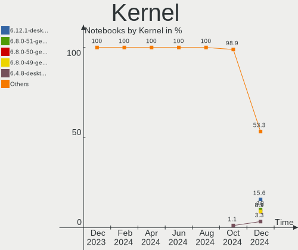
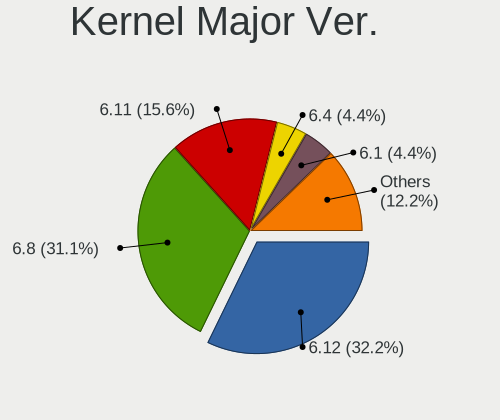
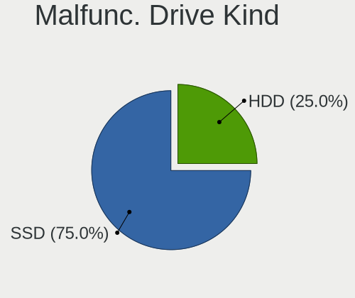
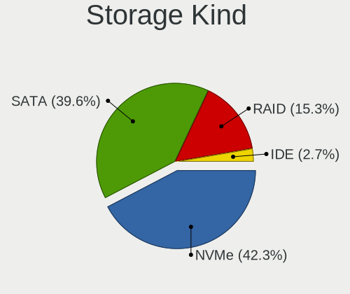
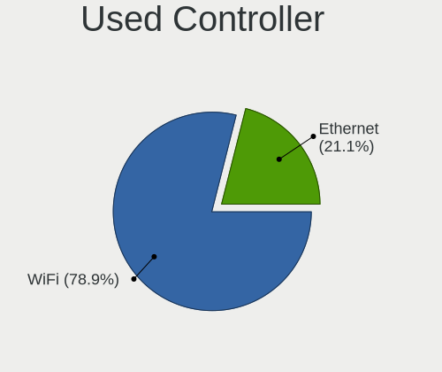
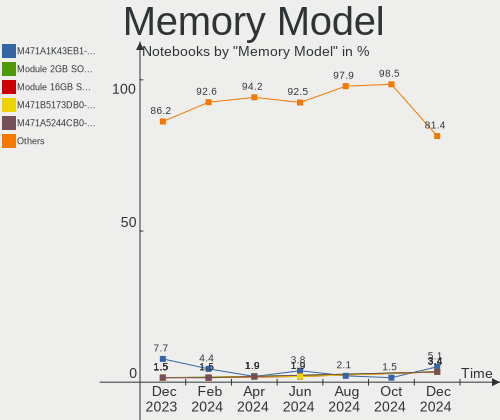
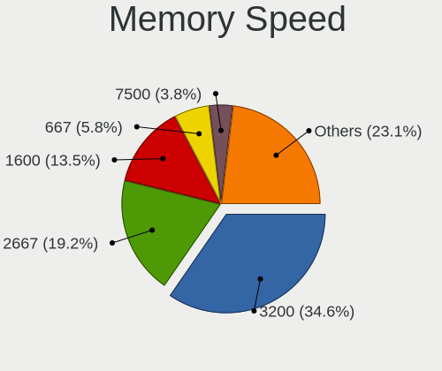
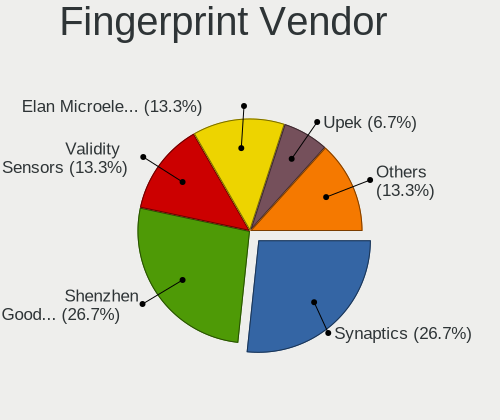

Linux in Spain - Hardware Trends (Notebooks)
--------------------------------------------

A project to identify most popular hardware characteristics and track their change
over time based on data collected by Linux users at https://Linux-Hardware.org.

Anyone can contribute to this report by the [hw-probe](https://github.com/linuxhw/hw-probe) tool:

    sudo -E hw-probe -all -upload

Period: Sep, 2022.

Contents
--------

* [ System ](#system)
  - [ OS                       ](#os)
  - [ OS Family                ](#os-family)
  - [ Kernel                   ](#kernel)
  - [ Kernel Family            ](#kernel-family)
  - [ Kernel Major Ver.        ](#kernel-major-ver)
  - [ Arch                     ](#arch)
  - [ DE                       ](#de)
  - [ Display Server           ](#display-server)
  - [ Display Manager          ](#display-manager)
  - [ OS Lang                  ](#os-lang)
  - [ Boot Mode                ](#boot-mode)
  - [ Filesystem               ](#filesystem)
  - [ Part. scheme             ](#part-scheme)
  - [ Dual Boot with Linux/BSD ](#dual-boot-with-linuxbsd)
  - [ Dual Boot (Win)          ](#dual-boot-win)

* [ Board ](#board)
  - [ Vendor                   ](#vendor)
  - [ Model                    ](#model)
  - [ Model Family             ](#model-family)
  - [ MFG Year                 ](#mfg-year)
  - [ Form Factor              ](#form-factor)
  - [ Secure Boot              ](#secure-boot)
  - [ Coreboot                 ](#coreboot)
  - [ RAM Size                 ](#ram-size)
  - [ RAM Used                 ](#ram-used)
  - [ Total Drives             ](#total-drives)
  - [ Has CD-ROM               ](#has-cd-rom)
  - [ Has Ethernet             ](#has-ethernet)
  - [ Has WiFi                 ](#has-wifi)
  - [ Has Bluetooth            ](#has-bluetooth)

* [ Location ](#location)
  - [ Country                  ](#country)
  - [ City                     ](#city)

* [ Drives ](#drives)
  - [ Drive Vendor             ](#drive-vendor)
  - [ Drive Model              ](#drive-model)
  - [ HDD Vendor               ](#hdd-vendor)
  - [ SSD Vendor               ](#ssd-vendor)
  - [ Drive Kind               ](#drive-kind)
  - [ Drive Connector          ](#drive-connector)
  - [ Drive Size               ](#drive-size)
  - [ Space Total              ](#space-total)
  - [ Space Used               ](#space-used)
  - [ Malfunc. Drives          ](#malfunc-drives)
  - [ Malfunc. Drive Vendor    ](#malfunc-drive-vendor)
  - [ Malfunc. HDD Vendor      ](#malfunc-hdd-vendor)
  - [ Malfunc. Drive Kind      ](#malfunc-drive-kind)
  - [ Failed Drives            ](#failed-drives)
  - [ Failed Drive Vendor      ](#failed-drive-vendor)
  - [ Drive Status             ](#drive-status)

* [ Storage controller ](#storage-controller)
  - [ Storage Vendor           ](#storage-vendor)
  - [ Storage Model            ](#storage-model)
  - [ Storage Kind             ](#storage-kind)

* [ Processor ](#processor)
  - [ CPU Vendor               ](#cpu-vendor)
  - [ CPU Model                ](#cpu-model)
  - [ CPU Model Family         ](#cpu-model-family)
  - [ CPU Cores                ](#cpu-cores)
  - [ CPU Sockets              ](#cpu-sockets)
  - [ CPU Threads              ](#cpu-threads)
  - [ CPU Op-Modes             ](#cpu-op-modes)
  - [ CPU Microcode            ](#cpu-microcode)
  - [ CPU Microarch            ](#cpu-microarch)

* [ Graphics ](#graphics)
  - [ GPU Vendor               ](#gpu-vendor)
  - [ GPU Model                ](#gpu-model)
  - [ GPU Combo                ](#gpu-combo)
  - [ GPU Driver               ](#gpu-driver)
  - [ GPU Memory               ](#gpu-memory)

* [ Monitor ](#monitor)
  - [ Monitor Vendor           ](#monitor-vendor)
  - [ Monitor Model            ](#monitor-model)
  - [ Monitor Resolution       ](#monitor-resolution)
  - [ Monitor Diagonal         ](#monitor-diagonal)
  - [ Monitor Width            ](#monitor-width)
  - [ Aspect Ratio             ](#aspect-ratio)
  - [ Monitor Area             ](#monitor-area)
  - [ Pixel Density            ](#pixel-density)
  - [ Multiple Monitors        ](#multiple-monitors)

* [ Network ](#network)
  - [ Net Controller Vendor    ](#net-controller-vendor)
  - [ Net Controller Model     ](#net-controller-model)
  - [ Wireless Vendor          ](#wireless-vendor)
  - [ Wireless Model           ](#wireless-model)
  - [ Ethernet Vendor          ](#ethernet-vendor)
  - [ Ethernet Model           ](#ethernet-model)
  - [ Net Controller Kind      ](#net-controller-kind)
  - [ Used Controller          ](#used-controller)
  - [ NICs                     ](#nics)
  - [ IPv6                     ](#ipv6)

* [ Bluetooth ](#bluetooth)
  - [ Bluetooth Vendor         ](#bluetooth-vendor)
  - [ Bluetooth Model          ](#bluetooth-model)

* [ Sound ](#sound)
  - [ Sound Vendor             ](#sound-vendor)
  - [ Sound Model              ](#sound-model)

* [ Memory ](#memory)
  - [ Memory Vendor            ](#memory-vendor)
  - [ Memory Model             ](#memory-model)
  - [ Memory Kind              ](#memory-kind)
  - [ Memory Form Factor       ](#memory-form-factor)
  - [ Memory Size              ](#memory-size)
  - [ Memory Speed             ](#memory-speed)

* [ Printers & scanners ](#printers--scanners)
  - [ Printer Vendor           ](#printer-vendor)
  - [ Printer Model            ](#printer-model)
  - [ Scanner Vendor           ](#scanner-vendor)
  - [ Scanner Model            ](#scanner-model)

* [ Camera ](#camera)
  - [ Camera Vendor            ](#camera-vendor)
  - [ Camera Model             ](#camera-model)

* [ Security ](#security)
  - [ Fingerprint Vendor       ](#fingerprint-vendor)
  - [ Fingerprint Model        ](#fingerprint-model)
  - [ Chipcard Vendor          ](#chipcard-vendor)
  - [ Chipcard Model           ](#chipcard-model)

* [ Unsupported ](#unsupported)
  - [ Unsupported Devices      ](#unsupported-devices)
  - [ Unsupported Device Types ](#unsupported-device-types)

System
------

OS
--

Installed operating systems

| Name                | Notebooks | Percent |
|---------------------|-----------|---------|
| Debian 11           | 28        | 26.67%  |
| Ubuntu 22.04        | 20        | 19.05%  |
| Fedora 36           | 8         | 7.62%   |
| Linux Mint 20.3     | 5         | 4.76%   |
| Ubuntu 20.04        | 4         | 3.81%   |
| Pop!_OS 22.04       | 3         | 2.86%   |
| OpenMandriva 4.3    | 3         | 2.86%   |
| Manjaro             | 3         | 2.86%   |
| KDE neon 20.04      | 3         | 2.86%   |
| SteamOS 3.3.1       | 2         | 1.9%    |
| OpenMandriva 4.90   | 2         | 1.9%    |
| Manjaro 22.0.0      | 2         | 1.9%    |
| Linux Mint 21       | 2         | 1.9%    |
| Arch                | 2         | 1.9%    |
| Zorin 16            | 1         | 0.95%   |
| Zorin 15            | 1         | 0.95%   |
| Ubuntu MATE 22.04   | 1         | 0.95%   |
| Ubuntu MATE 20.04   | 1         | 0.95%   |
| SteamOS 3.4         | 1         | 0.95%   |
| Nobara 36           | 1         | 0.95%   |
| Lubuntu 20.04       | 1         | 0.95%   |
| LMDE 5              | 1         | 0.95%   |
| Linux Mint 19.2     | 1         | 0.95%   |
| Kubuntu 20.04       | 1         | 0.95%   |
| Fedora 37           | 1         | 0.95%   |
| Endless 4.0.9       | 1         | 0.95%   |
| Endless 4.0.8       | 1         | 0.95%   |
| EndeavourOS Rolling | 1         | 0.95%   |
| Debian Unstable     | 1         | 0.95%   |
| Debian 10           | 1         | 0.95%   |
| Artix Rolling       | 1         | 0.95%   |
| ArcoLinux Rolling   | 1         | 0.95%   |

OS Family
---------

OS without a version

| Name         | Notebooks | Percent |
|--------------|-----------|---------|
| Debian       | 30        | 28.57%  |
| Ubuntu       | 24        | 22.86%  |
| Fedora       | 9         | 8.57%   |
| Linux Mint   | 8         | 7.62%   |
| OpenMandriva | 5         | 4.76%   |
| Manjaro      | 5         | 4.76%   |
| SteamOS      | 3         | 2.86%   |
| Pop!_OS      | 3         | 2.86%   |
| KDE neon     | 3         | 2.86%   |
| Zorin        | 2         | 1.9%    |
| Ubuntu MATE  | 2         | 1.9%    |
| Endless      | 2         | 1.9%    |
| Arch         | 2         | 1.9%    |
| Nobara       | 1         | 0.95%   |
| Lubuntu      | 1         | 0.95%   |
| LMDE         | 1         | 0.95%   |
| Kubuntu      | 1         | 0.95%   |
| EndeavourOS  | 1         | 0.95%   |
| Artix        | 1         | 0.95%   |
| ArcoLinux    | 1         | 0.95%   |

Kernel
------

Version of the Linux kernel

| Version                                        | Notebooks | Percent |
|------------------------------------------------|-----------|---------|
| 5.10.0-18-amd64                                | 19        | 18.1%   |
| 5.15.0-47-generic                              | 15        | 14.29%  |
| 5.15.0-48-generic                              | 9         | 8.57%   |
| 5.15.0-46-generic                              | 6         | 5.71%   |
| 5.4.0-125-generic                              | 4         | 3.81%   |
| 5.10.0-17-amd64                                | 4         | 3.81%   |
| 5.19.0-76051900-generic                        | 3         | 2.86%   |
| 5.16.7-desktop-1omv4003                        | 3         | 2.86%   |
| 5.19.9-200.fc36.x86_64                         | 2         | 1.9%    |
| 5.19.6-200.fc36.x86_64                         | 2         | 1.9%    |
| 5.19.0-1-amd64                                 | 2         | 1.9%    |
| 5.13.0-valve21.1-1-neptune-02211-gc54cda5a36f3 | 2         | 1.9%    |
| 5.11.0-35-generic                              | 2         | 1.9%    |
| 6.0.0-1-MANJARO                                | 1         | 0.95%   |
| 5.4.0-54-generic                               | 1         | 0.95%   |
| 5.4.0-124-generic                              | 1         | 0.95%   |
| 5.4.0-121-generic                              | 1         | 0.95%   |
| 5.19.9-xanmod1                                 | 1         | 0.95%   |
| 5.19.9-arch1-1                                 | 1         | 0.95%   |
| 5.19.8-zen1-1-zen                              | 1         | 0.95%   |
| 5.19.8-300.fc37.x86_64                         | 1         | 0.95%   |
| 5.19.8-200.fc36.x86_64                         | 1         | 0.95%   |
| 5.19.7-204.fsync.fc36.x86_64                   | 1         | 0.95%   |
| 5.19.7-200.fc36.x86_64                         | 1         | 0.95%   |
| 5.19.7-1-MANJARO                               | 1         | 0.95%   |
| 5.19.6-arch1-1                                 | 1         | 0.95%   |
| 5.19.2-artix1-2                                | 1         | 0.95%   |
| 5.19.11-200.fc36.x86_64                        | 1         | 0.95%   |
| 5.19.11-051911-generic                         | 1         | 0.95%   |
| 5.19.10-arch1-1                                | 1         | 0.95%   |
| 5.19.10-200.fc36.x86_64                        | 1         | 0.95%   |
| 5.19.0-3-rt10-MANJARO                          | 1         | 0.95%   |
| 5.18.9-desktop-gcc-1omv4090                    | 1         | 0.95%   |
| 5.18.12-desktop-3omv4090                       | 1         | 0.95%   |
| 5.18.0-4-amd64                                 | 1         | 0.95%   |
| 5.15.65-1-MANJARO                              | 1         | 0.95%   |
| 5.15.60-1-MANJARO                              | 1         | 0.95%   |
| 5.15.0-50-generic                              | 1         | 0.95%   |
| 5.14.0-1051-oem                                | 1         | 0.95%   |
| 5.13.0-valve24-1-neptune-02226-g5b8545e4c5a1   | 1         | 0.95%   |

Kernel Family
-------------

Linux kernel without a distro release

| Version | Notebooks | Percent |
|---------|-----------|---------|
| 5.15.0  | 31        | 29.52%  |
| 5.10.0  | 26        | 24.76%  |
| 5.4.0   | 7         | 6.67%   |
| 5.19.0  | 6         | 5.71%   |
| 5.19.9  | 4         | 3.81%   |
| 5.19.8  | 3         | 2.86%   |
| 5.19.7  | 3         | 2.86%   |
| 5.19.6  | 3         | 2.86%   |
| 5.16.7  | 3         | 2.86%   |
| 5.13.0  | 3         | 2.86%   |
| 5.19.11 | 2         | 1.9%    |
| 5.19.10 | 2         | 1.9%    |
| 5.11.0  | 2         | 1.9%    |
| 6.0.0   | 1         | 0.95%   |
| 5.19.2  | 1         | 0.95%   |
| 5.18.9  | 1         | 0.95%   |
| 5.18.12 | 1         | 0.95%   |
| 5.18.0  | 1         | 0.95%   |
| 5.15.65 | 1         | 0.95%   |
| 5.15.60 | 1         | 0.95%   |
| 5.14.0  | 1         | 0.95%   |
| 4.19.0  | 1         | 0.95%   |
| 4.15.0  | 1         | 0.95%   |

Kernel Major Ver.
-----------------

Linux kernel major version

| Version | Notebooks | Percent |
|---------|-----------|---------|
| 5.15    | 33        | 31.43%  |
| 5.10    | 26        | 24.76%  |
| 5.19    | 24        | 22.86%  |
| 5.4     | 7         | 6.67%   |
| 5.18    | 3         | 2.86%   |
| 5.16    | 3         | 2.86%   |
| 5.13    | 3         | 2.86%   |
| 5.11    | 2         | 1.9%    |
| 6.0     | 1         | 0.95%   |
| 5.14    | 1         | 0.95%   |
| 4.19    | 1         | 0.95%   |
| 4.15    | 1         | 0.95%   |

Arch
----

OS architecture (x86_64, i586, etc.)

| Name   | Notebooks | Percent |
|--------|-----------|---------|
| x86_64 | 103       | 98.1%   |
| i686   | 2         | 1.9%    |

DE
--

Desktop Environment

| Name            | Notebooks | Percent |
|-----------------|-----------|---------|
| GNOME           | 56        | 53.33%  |
| KDE5            | 19        | 18.1%   |
| XFCE            | 6         | 5.71%   |
| X-Cinnamon      | 6         | 5.71%   |
| Unknown         | 5         | 4.76%   |
| openbox         | 3         | 2.86%   |
| MATE            | 3         | 2.86%   |
| i3              | 2         | 1.9%    |
| Cinnamon        | 2         | 1.9%    |
| LXQt            | 1         | 0.95%   |
| LXDE            | 1         | 0.95%   |
| GNOME Flashback | 1         | 0.95%   |

Display Server
--------------

X11 or Wayland

| Name    | Notebooks | Percent |
|---------|-----------|---------|
| X11     | 65        | 61.9%   |
| Wayland | 36        | 34.29%  |
| Unknown | 3         | 2.86%   |
| Tty     | 1         | 0.95%   |

Display Manager
---------------

SDDM, LightDM, etc.

| Name    | Notebooks | Percent |
|---------|-----------|---------|
| Unknown | 35        | 33.33%  |
| GDM     | 22        | 20.95%  |
| GDM3    | 18        | 17.14%  |
| LightDM | 15        | 14.29%  |
| SDDM    | 13        | 12.38%  |
| Ly      | 2         | 1.9%    |

OS Lang
-------

Language

| Lang    | Notebooks | Percent |
|---------|-----------|---------|
| es_ES   | 66        | 62.86%  |
| en_US   | 21        | 20%     |
| en_GB   | 6         | 5.71%   |
| ca_ES   | 5         | 4.76%   |
| it_IT   | 2         | 1.9%    |
| fr_FR   | 1         | 0.95%   |
| es_AR   | 1         | 0.95%   |
| C       | 1         | 0.95%   |
| an_ES   | 1         | 0.95%   |
| Unknown | 1         | 0.95%   |

Boot Mode
---------

EFI or BIOS

| Mode | Notebooks | Percent |
|------|-----------|---------|
| EFI  | 63        | 60%     |
| BIOS | 42        | 40%     |

Filesystem
----------

Type of filesystem

| Type    | Notebooks | Percent |
|---------|-----------|---------|
| Ext4    | 76        | 72.38%  |
| Btrfs   | 14        | 13.33%  |
| Xfs     | 10        | 9.52%   |
| Overlay | 5         | 4.76%   |

Part. scheme
------------

Scheme of partitioning

| Type    | Notebooks | Percent |
|---------|-----------|---------|
| GPT     | 49        | 46.67%  |
| Unknown | 49        | 46.67%  |
| MBR     | 7         | 6.67%   |

Dual Boot with Linux/BSD
------------------------

Hosting more than one Linux/BSD

| Dual boot | Notebooks | Percent |
|-----------|-----------|---------|
| No        | 98        | 93.33%  |
| Yes       | 7         | 6.67%   |

Dual Boot (Win)
---------------

Hosting Linux and Windows

| Dual boot | Notebooks | Percent |
|-----------|-----------|---------|
| No        | 73        | 69.52%  |
| Yes       | 32        | 30.48%  |

Board
-----

Vendor
------

Motherboard manufacturer

| Name                | Notebooks | Percent |
|---------------------|-----------|---------|
| Lenovo              | 22        | 20.95%  |
| ASUSTek Computer    | 18        | 17.14%  |
| Hewlett-Packard     | 16        | 15.24%  |
| MSI                 | 8         | 7.62%   |
| Dell                | 7         | 6.67%   |
| Chuwi               | 4         | 3.81%   |
| Acer                | 4         | 3.81%   |
| Valve               | 3         | 2.86%   |
| Toshiba             | 3         | 2.86%   |
| HUAWEI              | 3         | 2.86%   |
| Apple               | 3         | 2.86%   |
| Sony                | 2         | 1.9%    |
| LG Electronics      | 2         | 1.9%    |
| Samsung Electronics | 1         | 0.95%   |
| Notebook            | 1         | 0.95%   |
| Medion              | 1         | 0.95%   |
| Intel               | 1         | 0.95%   |
| INFINITY            | 1         | 0.95%   |
| HONOR               | 1         | 0.95%   |
| Fujitsu             | 1         | 0.95%   |
| BESSTAR Tech        | 1         | 0.95%   |
| AXDIA International | 1         | 0.95%   |
| Unknown             | 1         | 0.95%   |

Model
-----

Motherboard model

| Name                                       | Notebooks | Percent |
|--------------------------------------------|-----------|---------|
| Valve Jupiter                              | 3         | 2.86%   |
| HUAWEI HN-WX9X                             | 3         | 2.86%   |
| HP Stream Notebook PC 13                   | 2         | 1.9%    |
| Dell Latitude E7240                        | 2         | 1.9%    |
| Chuwi HeroBook Air                         | 2         | 1.9%    |
| ASUS VivoBook 15_ASUS Laptop X540MA_R540MA | 2         | 1.9%    |
| ASUS ROG Strix G513QM_G513QM               | 2         | 1.9%    |
| Unknown                                    | 2         | 1.9%    |
| Toshiba Satellite P50-B-11L                | 1         | 0.95%   |
| Toshiba Satellite L50D-B                   | 1         | 0.95%   |
| Toshiba Satellite A500                     | 1         | 0.95%   |
| Sony VPCEH2D0E                             | 1         | 0.95%   |
| Sony VPCEB1Z1E                             | 1         | 0.95%   |
| Samsung 305V4A/305V5A                      | 1         | 0.95%   |
| Notebook N141CU                            | 1         | 0.95%   |
| MSI Prestige 15 A10SC                      | 1         | 0.95%   |
| MSI Prestige 14 A11SCX                     | 1         | 0.95%   |
| MSI Modern 14 C12M                         | 1         | 0.95%   |
| MSI Katana GF66 12UC                       | 1         | 0.95%   |
| MSI GF75 Thin 10SC                         | 1         | 0.95%   |
| MSI GF63 8RD                               | 1         | 0.95%   |
| MSI Bravo 15 B5DD                          | 1         | 0.95%   |
| MSI Alpha 15 A4DEK                         | 1         | 0.95%   |
| Medion E4251 MD61227                       | 1         | 0.95%   |
| LG P530-K.AE23B                            | 1         | 0.95%   |
| LG 14Z990-V.AP72B                          | 1         | 0.95%   |
| Lenovo Y520-15IKBN 80WK                    | 1         | 0.95%   |
| Lenovo V145-15AST 81MT                     | 1         | 0.95%   |
| Lenovo ThinkPad T450 20BV001CSP            | 1         | 0.95%   |
| Lenovo ThinkPad T440s 20ARS06C00           | 1         | 0.95%   |
| Lenovo ThinkPad T440 20B7A1P700            | 1         | 0.95%   |
| Lenovo ThinkPad T14 Gen 2a 20XK000YSP      | 1         | 0.95%   |
| Lenovo ThinkPad L15 Gen 1 20U3000SSP       | 1         | 0.95%   |
| Lenovo ThinkPad L14 Gen 1 20U1S1TS00       | 1         | 0.95%   |
| Lenovo ThinkPad E15 Gen 2 20TD001HSP       | 1         | 0.95%   |
| Lenovo ThinkPad E15 Gen 2 20TD0017SP       | 1         | 0.95%   |
| Lenovo ThinkBook 16p Gen 2 20YM            | 1         | 0.95%   |
| Lenovo Legion Y530-15ICH 81FV              | 1         | 0.95%   |
| Lenovo Legion 5 15ARH05 82B5               | 1         | 0.95%   |
| Lenovo IdeaPad S340-15IIL 81VW             | 1         | 0.95%   |

Model Family
------------

Motherboard model prefix

| Name               | Notebooks | Percent |
|--------------------|-----------|---------|
| Lenovo ThinkPad    | 8         | 7.62%   |
| Lenovo IdeaPad     | 7         | 6.67%   |
| ASUS ROG           | 6         | 5.71%   |
| Dell Latitude      | 5         | 4.76%   |
| ASUS VivoBook      | 4         | 3.81%   |
| Valve Jupiter      | 3         | 2.86%   |
| Toshiba Satellite  | 3         | 2.86%   |
| HUAWEI HN-WX9X     | 3         | 2.86%   |
| HP Compaq          | 3         | 2.86%   |
| MSI Prestige       | 2         | 1.9%    |
| Lenovo Legion      | 2         | 1.9%    |
| HP Stream          | 2         | 1.9%    |
| HP Pavilion        | 2         | 1.9%    |
| HP Laptop          | 2         | 1.9%    |
| HP 250             | 2         | 1.9%    |
| Chuwi HeroBook     | 2         | 1.9%    |
| ASUS ZenBook       | 2         | 1.9%    |
| ASUS TUF           | 2         | 1.9%    |
| Acer TravelMate    | 2         | 1.9%    |
| Acer Aspire        | 2         | 1.9%    |
| Unknown            | 2         | 1.9%    |
| Sony VPCEH2D0E     | 1         | 0.95%   |
| Sony VPCEB1Z1E     | 1         | 0.95%   |
| Samsung 305V4A     | 1         | 0.95%   |
| Notebook N141CU    | 1         | 0.95%   |
| MSI Modern         | 1         | 0.95%   |
| MSI Katana         | 1         | 0.95%   |
| MSI GF75           | 1         | 0.95%   |
| MSI GF63           | 1         | 0.95%   |
| MSI Bravo          | 1         | 0.95%   |
| MSI Alpha          | 1         | 0.95%   |
| Medion E4251       | 1         | 0.95%   |
| LG P530-K.AE23B    | 1         | 0.95%   |
| LG 14Z990-V.AP72B  | 1         | 0.95%   |
| Lenovo Y520-15IKBN | 1         | 0.95%   |
| Lenovo V145-15AST  | 1         | 0.95%   |
| Lenovo ThinkBook   | 1         | 0.95%   |
| Lenovo G50-70      | 1         | 0.95%   |
| Lenovo B570e       | 1         | 0.95%   |
| Intel H81U         | 1         | 0.95%   |

MFG Year
--------

Motherboard manufacture year

| Year | Notebooks | Percent |
|------|-----------|---------|
| 2021 | 19        | 18.1%   |
| 2020 | 16        | 15.24%  |
| 2018 | 16        | 15.24%  |
| 2019 | 13        | 12.38%  |
| 2014 | 7         | 6.67%   |
| 2013 | 7         | 6.67%   |
| 2022 | 6         | 5.71%   |
| 2011 | 5         | 4.76%   |
| 2010 | 4         | 3.81%   |
| 2015 | 3         | 2.86%   |
| 2007 | 3         | 2.86%   |
| 2017 | 2         | 1.9%    |
| 2008 | 2         | 1.9%    |
| 2009 | 1         | 0.95%   |
| 2004 | 1         | 0.95%   |

Form Factor
-----------

Physical design of the computer

| Name     | Notebooks | Percent |
|----------|-----------|---------|
| Notebook | 105       | 100%    |

Secure Boot
-----------

Enabled or disabled

| State    | Notebooks | Percent |
|----------|-----------|---------|
| Disabled | 97        | 92.38%  |
| Enabled  | 8         | 7.62%   |

Coreboot
--------

Have coreboot on board

| Used | Notebooks | Percent |
|------|-----------|---------|
| No   | 105       | 100%    |

RAM Size
--------

Total RAM memory

| Size in GB | Notebooks | Percent |
|------------|-----------|---------|
| 4.01-8.0   | 30        | 28.57%  |
| 8.01-16.0  | 23        | 21.9%   |
| 16.01-24.0 | 19        | 18.1%   |
| 3.01-4.0   | 18        | 17.14%  |
| 32.01-64.0 | 9         | 8.57%   |
| 1.01-2.0   | 3         | 2.86%   |
| 24.01-32.0 | 1         | 0.95%   |
| 2.01-3.0   | 1         | 0.95%   |
| 0.51-1.0   | 1         | 0.95%   |

RAM Used
--------

Used RAM memory

| Used GB   | Notebooks | Percent |
|-----------|-----------|---------|
| 2.01-3.0  | 36        | 34.29%  |
| 1.01-2.0  | 36        | 34.29%  |
| 3.01-4.0  | 15        | 14.29%  |
| 4.01-8.0  | 11        | 10.48%  |
| 8.01-16.0 | 4         | 3.81%   |
| 0.51-1.0  | 2         | 1.9%    |
| 0.01-0.5  | 1         | 0.95%   |

Total Drives
------------

Number of drives on board

| Drives | Notebooks | Percent |
|--------|-----------|---------|
| 1      | 81        | 77.14%  |
| 2      | 23        | 21.9%   |
| 3      | 1         | 0.95%   |

Has CD-ROM
----------

Has CD-ROM on board

| Presented | Notebooks | Percent |
|-----------|-----------|---------|
| No        | 89        | 84.76%  |
| Yes       | 16        | 15.24%  |

Has Ethernet
------------

Has Ethernet on board

| Presented | Notebooks | Percent |
|-----------|-----------|---------|
| Yes       | 82        | 78.1%   |
| No        | 23        | 21.9%   |

Has WiFi
--------

Has WiFi module

| Presented | Notebooks | Percent |
|-----------|-----------|---------|
| Yes       | 102       | 97.14%  |
| No        | 3         | 2.86%   |

Has Bluetooth
-------------

Has Bluetooth module

| Presented | Notebooks | Percent |
|-----------|-----------|---------|
| Yes       | 78        | 74.29%  |
| No        | 27        | 25.71%  |

Location
--------

Country
-------

Geographic location (country)

| Country | Notebooks | Percent |
|---------|-----------|---------|
| Spain   | 105       | 100%    |

City
----

Geographic location (city)

| City                       | Notebooks | Percent |
|----------------------------|-----------|---------|
| Madrid                     | 19        | 18.1%   |
| Seville                    | 18        | 17.14%  |
| Barcelona                  | 15        | 14.29%  |
| Palma                      | 3         | 2.86%   |
| Las Palmas de Gran Canaria | 3         | 2.86%   |
| Valencia                   | 2         | 1.9%    |
| Santiago de Compostela     | 2         | 1.9%    |
| Sanlúcar de Barrameda     | 2         | 1.9%    |
| Pozuelo de Alarcón        | 2         | 1.9%    |
| León                      | 2         | 1.9%    |
| Donostia / San Sebastian   | 2         | 1.9%    |
| Zuera                      | 1         | 0.95%   |
| Zamora                     | 1         | 0.95%   |
| Vitoria-Gasteiz            | 1         | 0.95%   |
| Villena                    | 1         | 0.95%   |
| Vallirana                  | 1         | 0.95%   |
| Touro                      | 1         | 0.95%   |
| Torrevieja                 | 1         | 0.95%   |
| Sueca                      | 1         | 0.95%   |
| Solares                    | 1         | 0.95%   |
| Sesena                     | 1         | 0.95%   |
| Sant Ferran de ses Roques  | 1         | 0.95%   |
| San Bartolomé de Tirajana | 1         | 0.95%   |
| Rubí                      | 1         | 0.95%   |
| Petrel                     | 1         | 0.95%   |
| Palafolls                  | 1         | 0.95%   |
| Oviedo                     | 1         | 0.95%   |
| Ortuella                   | 1         | 0.95%   |
| Órgiva                    | 1         | 0.95%   |
| Mostoles                   | 1         | 0.95%   |
| Monterrubio de Armuna      | 1         | 0.95%   |
| Málaga                    | 1         | 0.95%   |
| Granada                    | 1         | 0.95%   |
| Fernán Núñez            | 1         | 0.95%   |
| Dos Hermanas               | 1         | 0.95%   |
| Cuenca                     | 1         | 0.95%   |
| Colmenar Viejo             | 1         | 0.95%   |
| Chiclana de la Frontera    | 1         | 0.95%   |
| Castelldefels              | 1         | 0.95%   |
| Cartagena                  | 1         | 0.95%   |

Drives
------

Drive Vendor
------------

Hard drive vendors

| Vendor                    | Notebooks | Drives | Percent |
|---------------------------|-----------|--------|---------|
| Samsung Electronics       | 25        | 26     | 20%     |
| Kingston                  | 13        | 13     | 10.4%   |
| Unknown                   | 10        | 13     | 8%      |
| Sandisk                   | 10        | 10     | 8%      |
| WDC                       | 9         | 10     | 7.2%    |
| Micron Technology         | 8         | 8      | 6.4%    |
| SK hynix                  | 7         | 7      | 5.6%    |
| Toshiba                   | 6         | 6      | 4.8%    |
| Intel                     | 6         | 6      | 4.8%    |
| Seagate                   | 5         | 5      | 4%      |
| Hitachi                   | 4         | 4      | 3.2%    |
| Netac                     | 3         | 3      | 2.4%    |
| Phison                    | 2         | 2      | 1.6%    |
| KIOXIA                    | 2         | 2      | 1.6%    |
| Crucial                   | 2         | 3      | 1.6%    |
| Phison Electronics        | 1         | 1      | 0.8%    |
| Patriot                   | 1         | 1      | 0.8%    |
| Micron/Crucial Technology | 1         | 1      | 0.8%    |
| Kston                     | 1         | 1      | 0.8%    |
| KLONER                    | 1         | 1      | 0.8%    |
| KIOXIA-EXCERIA            | 1         | 1      | 0.8%    |
| KingSpec                  | 1         | 1      | 0.8%    |
| JMicron Technology        | 1         | 1      | 0.8%    |
| Intenso                   | 1         | 1      | 0.8%    |
| HGST                      | 1         | 1      | 0.8%    |
| faspeed                   | 1         | 1      | 0.8%    |
| Apple                     | 1         | 1      | 0.8%    |
| Unknown                   | 1         | 1      | 0.8%    |

Drive Model
-----------

Hard drive models

| Model                                               | Notebooks | Percent |
|-----------------------------------------------------|-----------|---------|
| Kingston SA400S37240G 240GB SSD                     | 5         | 3.85%   |
| Unknown MMC Card  32GB                              | 3         | 2.31%   |
| Samsung MZVLB256HAHQ-00000 256GB                    | 3         | 2.31%   |
| SK hynix HFM001TD3JX013N 1024GB                     | 2         | 1.54%   |
| Seagate ST1000LM024 HN-M101MBB 1TB                  | 2         | 1.54%   |
| Sandisk WD Blue SN550 NVMe SSD 1024GB               | 2         | 1.54%   |
| Sandisk WD Black SN750 / PC SN730 NVMe SSD 1024GB   | 2         | 1.54%   |
| Samsung NVMe SSD Controller SM981/PM981/PM983 256GB | 2         | 1.54%   |
| Netac SSD 128GB                                     | 2         | 1.54%   |
| Kingston RBUSC180DS37256GJ 256GB SSD                | 2         | 1.54%   |
| Intel SSDPEKNW512G8 512GB                           | 2         | 1.54%   |
| Hitachi HTS545050B9A300 500GB                       | 2         | 1.54%   |
| WDC WDS500G2B0B-00YS70 500GB SSD                    | 1         | 0.77%   |
| WDC WDS100T3X0C-00SJG0 1TB                          | 1         | 0.77%   |
| WDC WDBNCE0010PNC 1TB SSD                           | 1         | 0.77%   |
| WDC WD5000BEVT-22A0RT0 500GB                        | 1         | 0.77%   |
| WDC WD3200BPVT-24JJ5T0 320GB                        | 1         | 0.77%   |
| WDC WD3200BEVT-60ZCT0 320GB                         | 1         | 0.77%   |
| WDC WD10SPZX-21Z10T0 1TB                            | 1         | 0.77%   |
| WDC PC SN520 SDAPNUW-256G                           | 1         | 0.77%   |
| WDC PC SN520 SDAPMUW-512G-1101 512GB                | 1         | 0.77%   |
| WDC PC SA530 SDASN8Y256G1009 256GB                  | 1         | 0.77%   |
| Unknown SU08G  8GB                                  | 1         | 0.77%   |
| Unknown SL64G  64GB                                 | 1         | 0.77%   |
| Unknown SE32G  32GB                                 | 1         | 0.77%   |
| Unknown SD64G  64GB                                 | 1         | 0.77%   |
| Unknown SD/MMC/MS PRO 2GB                           | 1         | 0.77%   |
| Unknown MMC Card  64GB                              | 1         | 0.77%   |
| Unknown MMC Card  512GB                             | 1         | 0.77%   |
| Unknown MMC Card  128GB                             | 1         | 0.77%   |
| Unknown Biwin  64GB                                 | 1         | 0.77%   |
| Unknown 032GE4  32GB                                | 1         | 0.77%   |
| Toshiba TR200 480GB SSD                             | 1         | 0.77%   |
| Toshiba MQ04ABF100 1TB                              | 1         | 0.77%   |
| Toshiba MQ01ABF050 500GB                            | 1         | 0.77%   |
| Toshiba MQ01ABD100 1TB                              | 1         | 0.77%   |
| Toshiba MK5059GSXP 500GB                            | 1         | 0.77%   |
| Toshiba MK1234GAX 120GB                             | 1         | 0.77%   |
| SK hynix SH920 mSATA 128GB SSD                      | 1         | 0.77%   |
| SK hynix NVMe SSD Drive 256GB                       | 1         | 0.77%   |

HDD Vendor
----------

Hard disk drive vendors

| Vendor  | Notebooks | Drives | Percent |
|---------|-----------|--------|---------|
| Toshiba | 5         | 5      | 25%     |
| Seagate | 5         | 5      | 25%     |
| WDC     | 4         | 4      | 20%     |
| Hitachi | 4         | 4      | 20%     |
| Unknown | 1         | 1      | 5%      |
| HGST    | 1         | 1      | 5%      |

SSD Vendor
----------

Solid state drive vendors

| Vendor              | Notebooks | Drives | Percent |
|---------------------|-----------|--------|---------|
| Kingston            | 8         | 8      | 22.86%  |
| Samsung Electronics | 6         | 6      | 17.14%  |
| SanDisk             | 4         | 4      | 11.43%  |
| SK hynix            | 3         | 3      | 8.57%   |
| Netac               | 3         | 3      | 8.57%   |
| WDC                 | 2         | 2      | 5.71%   |
| Toshiba             | 1         | 1      | 2.86%   |
| Patriot             | 1         | 1      | 2.86%   |
| Kston               | 1         | 1      | 2.86%   |
| KLONER              | 1         | 1      | 2.86%   |
| KIOXIA-EXCERIA      | 1         | 1      | 2.86%   |
| KingSpec            | 1         | 1      | 2.86%   |
| Intel               | 1         | 1      | 2.86%   |
| Crucial             | 1         | 1      | 2.86%   |
| Apple               | 1         | 1      | 2.86%   |

Drive Kind
----------

HDD or SSD

| Kind    | Notebooks | Drives | Percent |
|---------|-----------|--------|---------|
| NVMe    | 56        | 59     | 46.67%  |
| SSD     | 33        | 35     | 27.5%   |
| HDD     | 19        | 20     | 15.83%  |
| MMC     | 10        | 14     | 8.33%   |
| Unknown | 2         | 3      | 1.67%   |

Drive Connector
---------------

SATA, SAS, NVMe, etc.

| Type | Notebooks | Drives | Percent |
|------|-----------|--------|---------|
| NVMe | 55        | 58     | 47.01%  |
| SATA | 50        | 57     | 42.74%  |
| MMC  | 10        | 14     | 8.55%   |
| SAS  | 2         | 2      | 1.71%   |

Drive Size
----------

Size of hard drive

| Size in TB | Notebooks | Drives | Percent |
|------------|-----------|--------|---------|
| 0.01-0.5   | 38        | 42     | 74.51%  |
| 0.51-1.0   | 12        | 12     | 23.53%  |
| 1.01-2.0   | 1         | 1      | 1.96%   |

Space Total
-----------

Amount of disk space available on the file system

| Size in GB     | Notebooks | Percent |
|----------------|-----------|---------|
| 101-250        | 38        | 36.19%  |
| 251-500        | 23        | 21.9%   |
| 501-1000       | 17        | 16.19%  |
| 1001-2000      | 9         | 8.57%   |
| 1-20           | 6         | 5.71%   |
| 51-100         | 5         | 4.76%   |
| 21-50          | 4         | 3.81%   |
| More than 3000 | 1         | 0.95%   |
| 2001-3000      | 1         | 0.95%   |
| Unknown        | 1         | 0.95%   |

Space Used
----------

Amount of used disk space

| Used GB   | Notebooks | Percent |
|-----------|-----------|---------|
| 1-20      | 32        | 30.48%  |
| 21-50     | 25        | 23.81%  |
| 101-250   | 15        | 14.29%  |
| 251-500   | 11        | 10.48%  |
| 51-100    | 11        | 10.48%  |
| 501-1000  | 8         | 7.62%   |
| 1001-2000 | 1         | 0.95%   |
| 0         | 1         | 0.95%   |
| Unknown   | 1         | 0.95%   |

Malfunc. Drives
---------------

Drive models with a malfunction

| Model                              | Notebooks | Drives | Percent |
|------------------------------------|-----------|--------|---------|
| Seagate ST1000LM024 HN-M101MBB 1TB | 1         | 1      | 33.33%  |
| SanDisk SSD PLUS 480GB             | 1         | 1      | 33.33%  |
| Hitachi HTS545050B9A300 500GB      | 1         | 1      | 33.33%  |

Malfunc. Drive Vendor
---------------------

Vendors of faulty drives

| Vendor  | Notebooks | Drives | Percent |
|---------|-----------|--------|---------|
| Seagate | 1         | 1      | 33.33%  |
| SanDisk | 1         | 1      | 33.33%  |
| Hitachi | 1         | 1      | 33.33%  |

Malfunc. HDD Vendor
-------------------

Vendors of faulty HDD drives

| Vendor  | Notebooks | Drives | Percent |
|---------|-----------|--------|---------|
| Seagate | 1         | 1      | 50%     |
| Hitachi | 1         | 1      | 50%     |

Malfunc. Drive Kind
-------------------

Kinds of faulty drives

| Kind | Notebooks | Drives | Percent |
|------|-----------|--------|---------|
| HDD  | 2         | 2      | 66.67%  |
| SSD  | 1         | 1      | 33.33%  |

Failed Drives
-------------

Failed drive models

Zero info for selected period =(

Failed Drive Vendor
-------------------

Failed drive vendors

Zero info for selected period =(

Drive Status
------------

Number of failed and malfunc. drives

| Status   | Notebooks | Drives | Percent |
|----------|-----------|--------|---------|
| Detected | 58        | 73     | 53.21%  |
| Works    | 48        | 55     | 44.04%  |
| Malfunc  | 3         | 3      | 2.75%   |

Storage controller
------------------

Storage Vendor
--------------

Storage controller vendors

| Vendor                       | Notebooks | Percent |
|------------------------------|-----------|---------|
| Intel                        | 59        | 47.58%  |
| Samsung Electronics          | 20        | 16.13%  |
| AMD                          | 12        | 9.68%   |
| SanDisk                      | 9         | 7.26%   |
| Micron Technology            | 8         | 6.45%   |
| Kingston Technology Company  | 5         | 4.03%   |
| SK hynix                     | 3         | 2.42%   |
| Phison Electronics           | 3         | 2.42%   |
| Micron/Crucial Technology    | 2         | 1.61%   |
| Toshiba America Info Systems | 1         | 0.81%   |
| Nvidia                       | 1         | 0.81%   |
| KIOXIA                       | 1         | 0.81%   |

Storage Model
-------------

Storage controller models

| Model                                                                        | Notebooks | Percent |
|------------------------------------------------------------------------------|-----------|---------|
| AMD FCH SATA Controller [AHCI mode]                                          | 11        | 8.4%    |
| Samsung NVMe SSD Controller SM981/PM981/PM983                                | 9         | 6.87%   |
| Micron Non-Volatile memory controller                                        | 8         | 6.11%   |
| Intel 8 Series SATA Controller 1 [AHCI mode]                                 | 8         | 6.11%   |
| Samsung NVMe SSD Controller 980                                              | 7         | 5.34%   |
| Intel Celeron/Pentium Silver Processor SATA Controller                       | 6         | 4.58%   |
| Intel 5 Series/3400 Series Chipset 4 port SATA AHCI Controller               | 5         | 3.82%   |
| Intel Volume Management Device NVMe RAID Controller                          | 4         | 3.05%   |
| Intel Sunrise Point-LP SATA Controller [AHCI mode]                           | 4         | 3.05%   |
| Intel SSD 660P Series                                                        | 4         | 3.05%   |
| Intel Cannon Point-LP SATA Controller [AHCI Mode]                            | 4         | 3.05%   |
| Intel Cannon Lake Mobile PCH SATA AHCI Controller                            | 4         | 3.05%   |
| Intel 82801 Mobile SATA Controller [RAID mode]                               | 4         | 3.05%   |
| SanDisk WD Black SN750 / PC SN730 NVMe SSD                                   | 3         | 2.29%   |
| Kingston Company U-SNS8154P3 NVMe SSD                                        | 3         | 2.29%   |
| Intel 82801HM/HEM (ICH8M/ICH8M-E) IDE Controller                             | 3         | 2.29%   |
| Intel 6 Series/C200 Series Chipset Family 6 port Mobile SATA AHCI Controller | 3         | 2.29%   |
| SK hynix Gold P31 SSD                                                        | 2         | 1.53%   |
| SanDisk WD Blue SN550 NVMe SSD                                               | 2         | 1.53%   |
| SanDisk PC SN520 NVMe SSD                                                    | 2         | 1.53%   |
| Samsung NVMe SSD Controller PM9A1/PM9A3/980PRO                               | 2         | 1.53%   |
| Phison PS5013 E13 NVMe Controller                                            | 2         | 1.53%   |
| Micron/Crucial P2 NVMe PCIe SSD                                              | 2         | 1.53%   |
| Intel Tiger Lake-LP SATA Controller                                          | 2         | 1.53%   |
| Intel 82801IBM/IEM (ICH9M/ICH9M-E) 4 port SATA Controller [AHCI mode]        | 2         | 1.53%   |
| Intel 82801HM/HEM (ICH8M/ICH8M-E) SATA Controller [AHCI mode]                | 2         | 1.53%   |
| Toshiba America Info Systems XG6 NVMe SSD Controller                         | 1         | 0.76%   |
| SK hynix BC511                                                               | 1         | 0.76%   |
| SanDisk WD Blue SN500 / PC SN520 NVMe SSD                                    | 1         | 0.76%   |
| SanDisk Non-Volatile memory controller                                       | 1         | 0.76%   |
| Samsung Electronics SATA controller                                          | 1         | 0.76%   |
| Samsung Electronics Non-Volatile memory controller                           | 1         | 0.76%   |
| Phison E12 NVMe Controller                                                   | 1         | 0.76%   |
| Nvidia MCP79 SATA Controller                                                 | 1         | 0.76%   |
| KIOXIA NVMe SSD Controller BG4                                               | 1         | 0.76%   |
| Kingston Company Company Non-Volatile memory controller                      | 1         | 0.76%   |
| Kingston Company OM3PDP3 NVMe SSD                                            | 1         | 0.76%   |
| Intel Wildcat Point-LP SATA Controller [AHCI Mode]                           | 1         | 0.76%   |
| Intel SSD 600P Series                                                        | 1         | 0.76%   |
| Intel Mobile PM965/GM965 PT IDER Controller                                  | 1         | 0.76%   |

Storage Kind
------------

Kind of storage controller (IDE, SATA, NVMe, SAS, ...)

| Kind | Notebooks | Percent |
|------|-----------|---------|
| SATA | 60        | 46.88%  |
| NVMe | 55        | 42.97%  |
| RAID | 8         | 6.25%   |
| IDE  | 5         | 3.91%   |

Processor
---------

CPU Vendor
----------

Processor vendors

| Vendor | Notebooks | Percent |
|--------|-----------|---------|
| Intel  | 74        | 70.48%  |
| AMD    | 31        | 29.52%  |

CPU Model
---------

Processor models

| Model                                         | Notebooks | Percent |
|-----------------------------------------------|-----------|---------|
| AMD Ryzen 7 5800H with Radeon Graphics        | 5         | 4.76%   |
| Intel Core i7-8750H CPU @ 2.20GHz             | 4         | 3.81%   |
| Intel 11th Gen Core i5-1135G7 @ 2.40GHz       | 4         | 3.81%   |
| Intel Core i7-8565U CPU @ 1.80GHz             | 3         | 2.86%   |
| Intel Core i7-8550U CPU @ 1.80GHz             | 3         | 2.86%   |
| Intel Celeron N4000 CPU @ 1.10GHz             | 3         | 2.86%   |
| AMD Ryzen 5 3500U with Radeon Vega Mobile Gfx | 3         | 2.86%   |
| AMD Custom APU 0405                           | 3         | 2.86%   |
| AMD A6-9225 RADEON R4, 5 COMPUTE CORES 2C+3G  | 3         | 2.86%   |
| Intel Core i7-10750H CPU @ 2.60GHz            | 2         | 1.9%    |
| Intel Core i7-10510U CPU @ 1.80GHz            | 2         | 1.9%    |
| Intel Core i5-4310U CPU @ 2.00GHz             | 2         | 1.9%    |
| Intel Core i5-10210U CPU @ 1.60GHz            | 2         | 1.9%    |
| Intel Celeron N4020 CPU @ 1.10GHz             | 2         | 1.9%    |
| Intel Celeron CPU N2840 @ 2.16GHz             | 2         | 1.9%    |
| Intel 11th Gen Core i7-1185G7 @ 3.00GHz       | 2         | 1.9%    |
| AMD Ryzen 9 5900HX with Radeon Graphics       | 2         | 1.9%    |
| AMD Ryzen 7 4800H with Radeon Graphics        | 2         | 1.9%    |
| Intel Pentium Dual CPU T3200 @ 2.00GHz        | 1         | 0.95%   |
| Intel Pentium CPU P6200 @ 2.13GHz             | 1         | 0.95%   |
| Intel Pentium CPU B950 @ 2.10GHz              | 1         | 0.95%   |
| Intel Mobile Pentium 4 CPU 3.06GHz            | 1         | 0.95%   |
| Intel Core i7-6700HQ CPU @ 2.60GHz            | 1         | 0.95%   |
| Intel Core i7-4720HQ CPU @ 2.60GHz            | 1         | 0.95%   |
| Intel Core i7-4650U CPU @ 1.70GHz             | 1         | 0.95%   |
| Intel Core i7-4600U CPU @ 2.10GHz             | 1         | 0.95%   |
| Intel Core i7-4510U CPU @ 2.00GHz             | 1         | 0.95%   |
| Intel Core i7-4500U CPU @ 1.80GHz             | 1         | 0.95%   |
| Intel Core i7-10710U CPU @ 1.10GHz            | 1         | 0.95%   |
| Intel Core i7 CPU M 620 @ 2.67GHz             | 1         | 0.95%   |
| Intel Core i5-8300H CPU @ 2.30GHz             | 1         | 0.95%   |
| Intel Core i5-8265U CPU @ 1.60GHz             | 1         | 0.95%   |
| Intel Core i5-8259U CPU @ 2.30GHz             | 1         | 0.95%   |
| Intel Core i5-8250U CPU @ 1.60GHz             | 1         | 0.95%   |
| Intel Core i5-7300HQ CPU @ 2.50GHz            | 1         | 0.95%   |
| Intel Core i5-5250U CPU @ 1.60GHz             | 1         | 0.95%   |
| Intel Core i5-5200U CPU @ 2.20GHz             | 1         | 0.95%   |
| Intel Core i5-4300Y CPU @ 1.60GHz             | 1         | 0.95%   |
| Intel Core i5-4300U CPU @ 1.90GHz             | 1         | 0.95%   |
| Intel Core i5-4210U CPU @ 1.70GHz             | 1         | 0.95%   |

CPU Model Family
----------------

Processor model prefix

| Model                  | Notebooks | Percent |
|------------------------|-----------|---------|
| Intel Core i7          | 22        | 20.95%  |
| Intel Core i5          | 17        | 16.19%  |
| Other                  | 15        | 14.29%  |
| AMD Ryzen 7            | 11        | 10.48%  |
| Intel Celeron          | 10        | 9.52%   |
| AMD Ryzen 5            | 7         | 6.67%   |
| AMD A6                 | 4         | 3.81%   |
| Intel Core i3          | 3         | 2.86%   |
| Intel Core 2 Duo       | 3         | 2.86%   |
| Intel Atom             | 3         | 2.86%   |
| Intel Pentium          | 2         | 1.9%    |
| AMD Ryzen 9            | 2         | 1.9%    |
| Intel Pentium Dual     | 1         | 0.95%   |
| Intel Mobile Pentium 4 | 1         | 0.95%   |
| Intel Celeron M        | 1         | 0.95%   |
| AMD Ryzen 7 PRO        | 1         | 0.95%   |
| AMD A8                 | 1         | 0.95%   |
| AMD A4                 | 1         | 0.95%   |

CPU Cores
---------

Number of processor cores

| Number | Notebooks | Percent |
|--------|-----------|---------|
| 2      | 38        | 36.19%  |
| 4      | 37        | 35.24%  |
| 8      | 15        | 14.29%  |
| 6      | 11        | 10.48%  |
| 1      | 2         | 1.9%    |
| 14     | 1         | 0.95%   |
| 10     | 1         | 0.95%   |

CPU Sockets
-----------

Number of sockets

| Number | Notebooks | Percent |
|--------|-----------|---------|
| 1      | 105       | 100%    |

CPU Threads
-----------

Threads per core (Hyper-Threading)

| Number | Notebooks | Percent |
|--------|-----------|---------|
| 2      | 74        | 70.48%  |
| 1      | 31        | 29.52%  |

CPU Op-Modes
------------

CPU Operation Modes (32-bit, 64-bit)

| Op mode        | Notebooks | Percent |
|----------------|-----------|---------|
| 32-bit, 64-bit | 104       | 99.05%  |
| 32-bit         | 1         | 0.95%   |

CPU Microcode
-------------

Microcode number

| Number     | Notebooks | Percent |
|------------|-----------|---------|
| Unknown    | 32        | 30.48%  |
| 0x806c1    | 7         | 6.67%   |
| 0x40651    | 6         | 5.71%   |
| 0x806ea    | 5         | 4.76%   |
| 0x0a50000c | 5         | 4.76%   |
| 0x906ea    | 3         | 2.86%   |
| 0x806ec    | 3         | 2.86%   |
| 0x706a1    | 3         | 2.86%   |
| 0x6fd      | 3         | 2.86%   |
| 0x20655    | 3         | 2.86%   |
| 0x08600104 | 3         | 2.86%   |
| 0x08108109 | 3         | 2.86%   |
| 0x706a8    | 2         | 1.9%    |
| 0x306d4    | 2         | 1.9%    |
| 0x0a50000b | 2         | 1.9%    |
| 0x08600106 | 2         | 1.9%    |
| 0x06006705 | 2         | 1.9%    |
| 0xf29      | 1         | 0.95%   |
| 0xa0660    | 1         | 0.95%   |
| 0xa0652    | 1         | 0.95%   |
| 0x906e9    | 1         | 0.95%   |
| 0x906c0    | 1         | 0.95%   |
| 0x906a4    | 1         | 0.95%   |
| 0x906a3    | 1         | 0.95%   |
| 0x806eb    | 1         | 0.95%   |
| 0x806d1    | 1         | 0.95%   |
| 0x706e5    | 1         | 0.95%   |
| 0x6fa      | 1         | 0.95%   |
| 0x506e3    | 1         | 0.95%   |
| 0x406c4    | 1         | 0.95%   |
| 0x206a7    | 1         | 0.95%   |
| 0x20652    | 1         | 0.95%   |
| 0x0a404101 | 1         | 0.95%   |
| 0x08608103 | 1         | 0.95%   |
| 0x07030104 | 1         | 0.95%   |
| 0x03000027 | 1         | 0.95%   |

CPU Microarch
-------------

Microarchitecture

| Name             | Notebooks | Percent |
|------------------|-----------|---------|
| KabyLake         | 19        | 18.1%   |
| Haswell          | 11        | 10.48%  |
| Zen 3            | 9         | 8.57%   |
| TigerLake        | 8         | 7.62%   |
| Unknown          | 7         | 6.67%   |
| Zen 2            | 6         | 5.71%   |
| Goldmont plus    | 6         | 5.71%   |
| Westmere         | 5         | 4.76%   |
| Core             | 5         | 4.76%   |
| Silvermont       | 4         | 3.81%   |
| Excavator        | 4         | 3.81%   |
| Zen+             | 3         | 2.86%   |
| SandyBridge      | 3         | 2.86%   |
| CometLake        | 3         | 2.86%   |
| Icelake          | 2         | 1.9%    |
| Broadwell        | 2         | 1.9%    |
| Zen              | 1         | 0.95%   |
| Tremont          | 1         | 0.95%   |
| Skylake          | 1         | 0.95%   |
| Puma             | 1         | 0.95%   |
| NetBurst         | 1         | 0.95%   |
| K10 Llano        | 1         | 0.95%   |
| Bonnell          | 1         | 0.95%   |
| Alderlake Hybrid | 1         | 0.95%   |

Graphics
--------

GPU Vendor
----------

Vendors of graphics cards

| Vendor | Notebooks | Percent |
|--------|-----------|---------|
| Intel  | 68        | 50.37%  |
| Nvidia | 34        | 25.19%  |
| AMD    | 33        | 24.44%  |

GPU Model
---------

Graphics card models

| Model                                                                     | Notebooks | Percent |
|---------------------------------------------------------------------------|-----------|---------|
| Intel Haswell-ULT Integrated Graphics Controller                          | 9         | 6.47%   |
| AMD Cezanne                                                               | 9         | 6.47%   |
| Nvidia GA106M [GeForce RTX 3060 Mobile / Max-Q]                           | 7         | 5.04%   |
| Intel TigerLake-LP GT2 [Iris Xe Graphics]                                 | 7         | 5.04%   |
| Intel GeminiLake [UHD Graphics 600]                                       | 6         | 4.32%   |
| Intel CoffeeLake-H GT2 [UHD Graphics 630]                                 | 5         | 3.6%    |
| AMD Renoir                                                                | 5         | 3.6%    |
| Nvidia GP107M [GeForce GTX 1050 Mobile]                                   | 4         | 2.88%   |
| Intel WhiskeyLake-U GT2 [UHD Graphics 620]                                | 4         | 2.88%   |
| Intel UHD Graphics 620                                                    | 4         | 2.88%   |
| Intel CometLake-U GT2 [UHD Graphics]                                      | 4         | 2.88%   |
| AMD Stoney [Radeon R2/R3/R4/R5 Graphics]                                  | 4         | 2.88%   |
| AMD Picasso/Raven 2 [Radeon Vega Series / Radeon Vega Mobile Series]      | 4         | 2.88%   |
| Nvidia TU117M                                                             | 3         | 2.16%   |
| Nvidia GA107M [GeForce RTX 3050 Mobile]                                   | 3         | 2.16%   |
| Intel Core Processor Integrated Graphics Controller                       | 3         | 2.16%   |
| Intel Atom Processor Z36xxx/Z37xxx Series Graphics & Display              | 3         | 2.16%   |
| Intel 2nd Generation Core Processor Family Integrated Graphics Controller | 3         | 2.16%   |
| AMD VanGogh [AMD Custom GPU 0405]                                         | 3         | 2.16%   |
| Nvidia TU117M [GeForce GTX 1650 Mobile / Max-Q]                           | 2         | 1.44%   |
| Intel CometLake-H GT2 [UHD Graphics]                                      | 2         | 1.44%   |
| AMD Rembrandt [Radeon 680M]                                               | 2         | 1.44%   |
| Nvidia TU116M [GeForce GTX 1650 Ti Mobile]                                | 1         | 0.72%   |
| Nvidia TU106M [GeForce RTX 2060 Mobile]                                   | 1         | 0.72%   |
| Nvidia GT218M [GeForce 310M]                                              | 1         | 0.72%   |
| Nvidia GT216M [GeForce GT 330M]                                           | 1         | 0.72%   |
| Nvidia GP107M [GeForce GTX 1050 Ti Max-Q]                                 | 1         | 0.72%   |
| Nvidia GP106M [GeForce GTX 1060 Mobile]                                   | 1         | 0.72%   |
| Nvidia GM108M [GeForce MX110]                                             | 1         | 0.72%   |
| Nvidia GM108M [GeForce 940MX]                                             | 1         | 0.72%   |
| Nvidia GM108M [GeForce 840M]                                              | 1         | 0.72%   |
| Nvidia GM107M [GeForce GTX 960M]                                          | 1         | 0.72%   |
| Nvidia GF119M [GeForce GT 520M]                                           | 1         | 0.72%   |
| Nvidia GA107BM [GeForce RTX 3050 Mobile]                                  | 1         | 0.72%   |
| Nvidia G98M [GeForce 9200M GS]                                            | 1         | 0.72%   |
| Nvidia G84GLM [Quadro FX 570M]                                            | 1         | 0.72%   |
| Nvidia C79 [GeForce 9400M / ION]                                          | 1         | 0.72%   |
| Intel VGA compatible controller                                           | 1         | 0.72%   |
| Intel TigerLake-H GT1 [UHD Graphics]                                      | 1         | 0.72%   |
| Intel Tiger Lake UHD Graphics                                             | 1         | 0.72%   |

GPU Combo
---------

Combinations of graphics cards

| Name           | Notebooks | Percent |
|----------------|-----------|---------|
| 1 x Intel      | 49        | 46.67%  |
| Intel + Nvidia | 18        | 17.14%  |
| 1 x AMD        | 18        | 17.14%  |
| AMD + Nvidia   | 11        | 10.48%  |
| 1 x Nvidia     | 5         | 4.76%   |
| 2 x AMD        | 3         | 2.86%   |
| Intel + AMD    | 1         | 0.95%   |

GPU Driver
----------

Free vs proprietary

| Driver      | Notebooks | Percent |
|-------------|-----------|---------|
| Free        | 78        | 74.29%  |
| Proprietary | 20        | 19.05%  |
| Unknown     | 7         | 6.67%   |

GPU Memory
----------

Total video memory

| Size in GB | Notebooks | Percent |
|------------|-----------|---------|
| Unknown    | 73        | 69.52%  |
| 0.01-0.5   | 11        | 10.48%  |
| 3.01-4.0   | 9         | 8.57%   |
| 0.51-1.0   | 6         | 5.71%   |
| 5.01-6.0   | 3         | 2.86%   |
| 1.01-2.0   | 3         | 2.86%   |

Monitor
-------

Monitor Vendor
--------------

Monitor vendors

| Vendor                  | Notebooks | Percent |
|-------------------------|-----------|---------|
| Chimei Innolux          | 20        | 16.13%  |
| AU Optronics            | 19        | 15.32%  |
| BOE                     | 15        | 12.1%   |
| LG Display              | 12        | 9.68%   |
| Samsung Electronics     | 11        | 8.87%   |
| Sharp                   | 4         | 3.23%   |
| Philips                 | 4         | 3.23%   |
| Lenovo                  | 4         | 3.23%   |
| Hewlett-Packard         | 3         | 2.42%   |
| Goldstar                | 3         | 2.42%   |
| Apple                   | 3         | 2.42%   |
| AOC                     | 3         | 2.42%   |
| AGO                     | 3         | 2.42%   |
| Sony                    | 2         | 1.61%   |
| Dell                    | 2         | 1.61%   |
| CSO                     | 2         | 1.61%   |
| BenQ                    | 2         | 1.61%   |
| Analogix                | 2         | 1.61%   |
| ViewSonic               | 1         | 0.81%   |
| Videoseven              | 1         | 0.81%   |
| Valve                   | 1         | 0.81%   |
| TMX                     | 1         | 0.81%   |
| PANDA                   | 1         | 0.81%   |
| LG Philips              | 1         | 0.81%   |
| InfoVision              | 1         | 0.81%   |
| HannStar Display        | 1         | 0.81%   |
| Gateway                 | 1         | 0.81%   |
| Chi Mei Optoelectronics | 1         | 0.81%   |

Monitor Model
-------------

Monitor models

| Model                                                                  | Notebooks | Percent |
|------------------------------------------------------------------------|-----------|---------|
| Chimei Innolux LCD Monitor CMN15DB 1366x768 344x193mm 15.5-inch        | 5         | 4%      |
| Lenovo LCD Monitor LEN40BA 1920x1080 344x194mm 15.5-inch               | 3         | 2.4%    |
| Philips PHL 243V5 PHLC0D1 1920x1080 521x293mm 23.5-inch                | 2         | 1.6%    |
| Chimei Innolux LCD Monitor CMN15F4 1920x1080 344x193mm 15.5-inch       | 2         | 1.6%    |
| Chimei Innolux LCD Monitor CMN1482 1600x900 309x174mm 14.0-inch        | 2         | 1.6%    |
| BOE LCD Monitor BOE09AD 1366x768 256x144mm 11.6-inch                   | 2         | 1.6%    |
| AU Optronics LCD Monitor AUOAF90 1920x1080 344x193mm 15.5-inch         | 2         | 1.6%    |
| AU Optronics LCD Monitor AUO61ED 1920x1080 344x194mm 15.5-inch         | 2         | 1.6%    |
| AU Optronics LCD Monitor AUO312C 1366x768 293x164mm 13.2-inch          | 2         | 1.6%    |
| Apple Color LCD APP9CDF 1440x900 286x179mm 13.3-inch                   | 2         | 1.6%    |
| Analogix ANX7530 U ANX7539 800x1280                                    | 2         | 1.6%    |
| AGO LCD Monitor AGO6201 1920x1080 256x192mm 12.6-inch                  | 2         | 1.6%    |
| ViewSonic VA2465 SERIES VSCB730 1920x1080 521x293mm 23.5-inch          | 1         | 0.8%    |
| Videoseven L215DS IGM2200 1920x1080 480x270mm 21.7-inch                | 1         | 0.8%    |
| Valve ANX7530 U VLV3001 800x1280 100x150mm 7.1-inch                    | 1         | 0.8%    |
| TMX TL156MDMP01-0 TMX1560 3200x2000 336x210mm 15.6-inch                | 1         | 0.8%    |
| Sony TV SNYB800 1280x768 690x390mm 31.2-inch                           | 1         | 0.8%    |
| Sony LCD Monitor MS_0025 1920x1080 340x190mm 15.3-inch                 | 1         | 0.8%    |
| Sharp LQ173M1JW04 SHP14E1 1920x1080 382x215mm 17.3-inch                | 1         | 0.8%    |
| Sharp LQ156M1JW25 SHP152C 1920x1080 344x194mm 15.5-inch                | 1         | 0.8%    |
| Sharp LCD Monitor SHP14AE 1920x1080 294x165mm 13.3-inch                | 1         | 0.8%    |
| Sharp LCD Monitor SHP14A1 3840x2160 344x194mm 15.5-inch                | 1         | 0.8%    |
| Samsung Electronics S24D330 SAM0D92 1920x1080 531x299mm 24.0-inch      | 1         | 0.8%    |
| Samsung Electronics S22D300 SAM0B3F 1920x1080 477x268mm 21.5-inch      | 1         | 0.8%    |
| Samsung Electronics LF24T35 SAM707D 1920x1080 528x297mm 23.9-inch      | 1         | 0.8%    |
| Samsung Electronics LCD Monitor SEC4E45 1280x800 331x207mm 15.4-inch   | 1         | 0.8%    |
| Samsung Electronics LCD Monitor SEC3641 1366x768 353x198mm 15.9-inch   | 1         | 0.8%    |
| Samsung Electronics LCD Monitor SEC324A 1366x768 344x194mm 15.5-inch   | 1         | 0.8%    |
| Samsung Electronics LCD Monitor SEC3157 1280x800 303x190mm 14.1-inch   | 1         | 0.8%    |
| Samsung Electronics LCD Monitor SDC415D 3840x2400 344x215mm 16.0-inch  | 1         | 0.8%    |
| Samsung Electronics LCD Monitor SAM7106 1920x1080 1210x680mm 54.6-inch | 1         | 0.8%    |
| Samsung Electronics LCD Monitor SAM0C39 1920x1080 885x498mm 40.0-inch  | 1         | 0.8%    |
| Samsung Electronics LC32G7xT SAM705A 2560x1440 698x393mm 31.5-inch     | 1         | 0.8%    |
| Philips PHL 244E5 PHLC0C0 1920x1080 527x296mm 23.8-inch                | 1         | 0.8%    |
| Philips PHL 241V8 PHLC212 1920x1080 527x296mm 23.8-inch                | 1         | 0.8%    |
| PANDA LCD Monitor NCP0050 1920x1080 309x174mm 14.0-inch                | 1         | 0.8%    |
| LG Philips LCD Monitor LPLDB00 1280x800 331x207mm 15.4-inch            | 1         | 0.8%    |
| LG Display LCD Monitor LGD05FE 1920x1080 344x194mm 15.5-inch           | 1         | 0.8%    |
| LG Display LCD Monitor LGD05E5 1920x1080 344x194mm 15.5-inch           | 1         | 0.8%    |
| LG Display LCD Monitor LGD05B6 1920x1080 309x174mm 14.0-inch           | 1         | 0.8%    |

Monitor Resolution
------------------

Monitor screen resolution

| Resolution         | Notebooks | Percent |
|--------------------|-----------|---------|
| 1920x1080 (FHD)    | 58        | 53.21%  |
| 1366x768 (WXGA)    | 25        | 22.94%  |
| 1440x900 (WXGA+)   | 4         | 3.67%   |
| 800x1280           | 3         | 2.75%   |
| 1600x900 (HD+)     | 3         | 2.75%   |
| 1280x800 (WXGA)    | 3         | 2.75%   |
| 3840x2160 (4K)     | 2         | 1.83%   |
| 2560x1600          | 2         | 1.83%   |
| 2560x1440 (QHD)    | 2         | 1.83%   |
| 2160x1440          | 2         | 1.83%   |
| 3840x2400          | 1         | 0.92%   |
| 3200x2000          | 1         | 0.92%   |
| 1920x1200 (WUXGA)  | 1         | 0.92%   |
| 1680x1050 (WSXGA+) | 1         | 0.92%   |
| 1280x768           | 1         | 0.92%   |

Monitor Diagonal
----------------

Diagonal size in inches

| Inches  | Notebooks | Percent |
|---------|-----------|---------|
| 15      | 48        | 38.71%  |
| 14      | 15        | 12.1%   |
| 13      | 14        | 11.29%  |
| 24      | 8         | 6.45%   |
| 23      | 7         | 5.65%   |
| 21      | 5         | 4.03%   |
| 16      | 4         | 3.23%   |
| 12      | 4         | 3.23%   |
| 31      | 3         | 2.42%   |
| 27      | 3         | 2.42%   |
| 17      | 3         | 2.42%   |
| 11      | 3         | 2.42%   |
| Unknown | 3         | 2.42%   |
| 54      | 1         | 0.81%   |
| 47      | 1         | 0.81%   |
| 22      | 1         | 0.81%   |
| 7       | 1         | 0.81%   |

Monitor Width
-------------

Physical width

| Width in mm | Notebooks | Percent |
|-------------|-----------|---------|
| 301-350     | 69        | 55.65%  |
| 501-600     | 18        | 14.52%  |
| 201-300     | 17        | 13.71%  |
| 401-500     | 6         | 4.84%   |
| 351-400     | 5         | 4.03%   |
| 601-700     | 3         | 2.42%   |
| Unknown     | 3         | 2.42%   |
| 1001-1500   | 2         | 1.61%   |
| 1-100       | 1         | 0.81%   |

Aspect Ratio
------------

Proportional relationship between the width and the height

| Ratio   | Notebooks | Percent |
|---------|-----------|---------|
| 16/9    | 84        | 77.78%  |
| 16/10   | 15        | 13.89%  |
| 4/3     | 3         | 2.78%   |
| 3/2     | 2         | 1.85%   |
| 0.62    | 2         | 1.85%   |
| 0.67    | 1         | 0.93%   |
| Unknown | 1         | 0.93%   |

Monitor Area
------------

Area in inch²

| Area in inch² | Notebooks | Percent |
|----------------|-----------|---------|
| 101-110        | 48        | 39.02%  |
| 81-90          | 20        | 16.26%  |
| 201-250        | 17        | 13.82%  |
| 71-80          | 10        | 8.13%   |
| 251-300        | 4         | 3.25%   |
| 51-60          | 3         | 2.44%   |
| 351-500        | 3         | 2.44%   |
| 301-350        | 3         | 2.44%   |
| 121-130        | 3         | 2.44%   |
| 111-120        | 3         | 2.44%   |
| Unknown        | 3         | 2.44%   |
| 61-70          | 2         | 1.63%   |
| More than 1000 | 1         | 0.81%   |
| 1-40           | 1         | 0.81%   |
| 501-1000       | 1         | 0.81%   |
| 91-100         | 1         | 0.81%   |

Pixel Density
-------------

Pixels per inch

| Density       | Notebooks | Percent |
|---------------|-----------|---------|
| 121-160       | 53        | 43.44%  |
| 51-100        | 27        | 22.13%  |
| 101-120       | 22        | 18.03%  |
| 161-240       | 10        | 8.2%    |
| More than 240 | 4         | 3.28%   |
| 1-50          | 3         | 2.46%   |
| Unknown       | 3         | 2.46%   |

Multiple Monitors
-----------------

Total monitors connected

| Total | Notebooks | Percent |
|-------|-----------|---------|
| 1     | 70        | 66.67%  |
| 2     | 25        | 23.81%  |
| 0     | 8         | 7.62%   |
| 3     | 2         | 1.9%    |

Network
-------

Net Controller Vendor
---------------------

Controller vendors

| Vendor                            | Notebooks | Percent |
|-----------------------------------|-----------|---------|
| Realtek Semiconductor             | 73        | 43.45%  |
| Intel                             | 49        | 29.17%  |
| Qualcomm Atheros                  | 11        | 6.55%   |
| Broadcom                          | 8         | 4.76%   |
| TP-Link                           | 5         | 2.98%   |
| Samsung Electronics               | 3         | 1.79%   |
| Qualcomm                          | 3         | 1.79%   |
| MediaTek                          | 3         | 1.79%   |
| Marvell Technology Group          | 2         | 1.19%   |
| Broadcom Limited                  | 2         | 1.19%   |
| Ralink                            | 1         | 0.6%    |
| Qualcomm Atheros Communications   | 1         | 0.6%    |
| OnePlus Technology (Shenzhen)     | 1         | 0.6%    |
| Lenovo                            | 1         | 0.6%    |
| Google                            | 1         | 0.6%    |
| Ericsson Business Mobile Networks | 1         | 0.6%    |
| Edimax Technology                 | 1         | 0.6%    |
| Dell                              | 1         | 0.6%    |
| AMD                               | 1         | 0.6%    |

Net Controller Model
--------------------

Controller models

| Model                                                             | Notebooks | Percent |
|-------------------------------------------------------------------|-----------|---------|
| Realtek RTL8111/8168/8411 PCI Express Gigabit Ethernet Controller | 42        | 21.11%  |
| Intel Wi-Fi 6 AX200                                               | 13        | 6.53%   |
| Realtek RTL8822CE 802.11ac PCIe Wireless Network Adapter          | 9         | 4.52%   |
| Realtek RTL8153 Gigabit Ethernet Adapter                          | 9         | 4.52%   |
| Realtek RTL8821CE 802.11ac PCIe Wireless Network Adapter          | 8         | 4.02%   |
| Intel Wi-Fi 6 AX201                                               | 7         | 3.52%   |
| Realtek RTL810xE PCI Express Fast Ethernet controller             | 5         | 2.51%   |
| Intel Wireless 7265                                               | 4         | 2.01%   |
| Intel Ethernet Connection I218-LM                                 | 4         | 2.01%   |
| TP-Link UE300 10/100/1000 LAN (ethernet mode) [Realtek RTL8153]   | 3         | 1.51%   |
| Samsung Galaxy series, misc. (tethering mode)                     | 3         | 1.51%   |
| Qualcomm Atheros QCA9377 802.11ac Wireless Network Adapter        | 3         | 1.51%   |
| Qualcomm Atheros AR9285 Wireless Network Adapter (PCI-Express)    | 3         | 1.51%   |
| Intel Wireless 7260                                               | 3         | 1.51%   |
| Intel Cannon Lake PCH CNVi WiFi                                   | 3         | 1.51%   |
| Broadcom BCM43142 802.11b/g/n                                     | 3         | 1.51%   |
| Realtek RTL8852AE 802.11ax PCIe Wireless Network Adapter          | 2         | 1.01%   |
| Realtek RTL8723BU 802.11b/g/n WLAN Adapter                        | 2         | 1.01%   |
| Realtek RTL8192CU 802.11n WLAN Adapter                            | 2         | 1.01%   |
| Realtek RTL8188EUS 802.11n Wireless Network Adapter               | 2         | 1.01%   |
| Realtek RTL8152 Fast Ethernet Adapter                             | 2         | 1.01%   |
| Qualcomm Mobile Router                                            | 2         | 1.01%   |
| Qualcomm Atheros AR9485 Wireless Network Adapter                  | 2         | 1.01%   |
| MediaTek MT7921 802.11ax PCI Express Wireless Network Adapter     | 2         | 1.01%   |
| Intel Wireless 8265 / 8275                                        | 2         | 1.01%   |
| Intel Wireless 3165                                               | 2         | 1.01%   |
| Intel Wireless 3160                                               | 2         | 1.01%   |
| Intel Ethernet Connection (10) I219-V                             | 2         | 1.01%   |
| Intel Comet Lake PCH CNVi WiFi                                    | 2         | 1.01%   |
| Intel Cannon Point-LP CNVi [Wireless-AC]                          | 2         | 1.01%   |
| Intel Alder Lake-P PCH CNVi WiFi                                  | 2         | 1.01%   |
| Broadcom Limited BCM4360 802.11ac Wireless Network Adapter        | 2         | 1.01%   |
| Broadcom BCM4311 802.11b/g WLAN                                   | 2         | 1.01%   |
| TP-Link TL-WN823N v2/v3 [Realtek RTL8192EU]                       | 1         | 0.5%    |
| TP-Link TL-WN821N v5/v6 [RTL8192EU]                               | 1         | 0.5%    |
| Realtek RTL8822BE 802.11a/b/g/n/ac WiFi adapter                   | 1         | 0.5%    |
| Realtek RTL8723DE Wireless Network Adapter                        | 1         | 0.5%    |
| Realtek RTL8723BE PCIe Wireless Network Adapter                   | 1         | 0.5%    |
| Realtek RTL8191SEvB Wireless LAN Controller                       | 1         | 0.5%    |
| Realtek RTL8191SEvA Wireless LAN Controller                       | 1         | 0.5%    |

Wireless Vendor
---------------

Wireless vendors

| Vendor                            | Notebooks | Percent |
|-----------------------------------|-----------|---------|
| Intel                             | 47        | 43.52%  |
| Realtek Semiconductor             | 31        | 28.7%   |
| Qualcomm Atheros                  | 9         | 8.33%   |
| Broadcom                          | 8         | 7.41%   |
| MediaTek                          | 3         | 2.78%   |
| TP-Link                           | 2         | 1.85%   |
| Broadcom Limited                  | 2         | 1.85%   |
| Ralink                            | 1         | 0.93%   |
| Qualcomm Atheros Communications   | 1         | 0.93%   |
| Qualcomm                          | 1         | 0.93%   |
| Ericsson Business Mobile Networks | 1         | 0.93%   |
| Edimax Technology                 | 1         | 0.93%   |
| Dell                              | 1         | 0.93%   |

Wireless Model
--------------

Wireless models

| Model                                                          | Notebooks | Percent |
|----------------------------------------------------------------|-----------|---------|
| Intel Wi-Fi 6 AX200                                            | 13        | 11.82%  |
| Realtek RTL8822CE 802.11ac PCIe Wireless Network Adapter       | 9         | 8.18%   |
| Realtek RTL8821CE 802.11ac PCIe Wireless Network Adapter       | 8         | 7.27%   |
| Intel Wi-Fi 6 AX201                                            | 7         | 6.36%   |
| Intel Wireless 7265                                            | 4         | 3.64%   |
| Qualcomm Atheros QCA9377 802.11ac Wireless Network Adapter     | 3         | 2.73%   |
| Qualcomm Atheros AR9285 Wireless Network Adapter (PCI-Express) | 3         | 2.73%   |
| Intel Wireless 7260                                            | 3         | 2.73%   |
| Intel Cannon Lake PCH CNVi WiFi                                | 3         | 2.73%   |
| Broadcom BCM43142 802.11b/g/n                                  | 3         | 2.73%   |
| Realtek RTL8852AE 802.11ax PCIe Wireless Network Adapter       | 2         | 1.82%   |
| Realtek RTL8723BU 802.11b/g/n WLAN Adapter                     | 2         | 1.82%   |
| Realtek RTL8192CU 802.11n WLAN Adapter                         | 2         | 1.82%   |
| Realtek RTL8188EUS 802.11n Wireless Network Adapter            | 2         | 1.82%   |
| Qualcomm Atheros AR9485 Wireless Network Adapter               | 2         | 1.82%   |
| MediaTek MT7921 802.11ax PCI Express Wireless Network Adapter  | 2         | 1.82%   |
| Intel Wireless 8265 / 8275                                     | 2         | 1.82%   |
| Intel Wireless 3165                                            | 2         | 1.82%   |
| Intel Wireless 3160                                            | 2         | 1.82%   |
| Intel Comet Lake PCH CNVi WiFi                                 | 2         | 1.82%   |
| Intel Cannon Point-LP CNVi [Wireless-AC]                       | 2         | 1.82%   |
| Intel Alder Lake-P PCH CNVi WiFi                               | 2         | 1.82%   |
| Broadcom Limited BCM4360 802.11ac Wireless Network Adapter     | 2         | 1.82%   |
| Broadcom BCM4311 802.11b/g WLAN                                | 2         | 1.82%   |
| TP-Link TL-WN823N v2/v3 [Realtek RTL8192EU]                    | 1         | 0.91%   |
| TP-Link TL-WN821N v5/v6 [RTL8192EU]                            | 1         | 0.91%   |
| Realtek RTL8822BE 802.11a/b/g/n/ac WiFi adapter                | 1         | 0.91%   |
| Realtek RTL8723DE Wireless Network Adapter                     | 1         | 0.91%   |
| Realtek RTL8723BE PCIe Wireless Network Adapter                | 1         | 0.91%   |
| Realtek RTL8191SEvB Wireless LAN Controller                    | 1         | 0.91%   |
| Realtek RTL8191SEvA Wireless LAN Controller                    | 1         | 0.91%   |
| Realtek RTL8188CE 802.11b/g/n WiFi Adapter                     | 1         | 0.91%   |
| Realtek Realtek Network controller                             | 1         | 0.91%   |
| Realtek 802.11ac NIC                                           | 1         | 0.91%   |
| Ralink RT3290 Wireless 802.11n 1T/1R PCIe                      | 1         | 0.91%   |
| Qualcomm QCNFA765 Wireless Network Adapter                     | 1         | 0.91%   |
| Qualcomm Atheros QCA6174 802.11ac Wireless Network Adapter     | 1         | 0.91%   |
| Qualcomm Atheros AR9271 802.11n                                | 1         | 0.91%   |
| MediaTek MT7922 802.11ax PCI Express Wireless Network Adapter  | 1         | 0.91%   |
| Intel Tiger Lake PCH CNVi WiFi                                 | 1         | 0.91%   |

Ethernet Vendor
---------------

Ethernet vendors

| Vendor                        | Notebooks | Percent |
|-------------------------------|-----------|---------|
| Realtek Semiconductor         | 57        | 67.06%  |
| Intel                         | 10        | 11.76%  |
| TP-Link                       | 3         | 3.53%   |
| Samsung Electronics           | 3         | 3.53%   |
| Broadcom                      | 3         | 3.53%   |
| Qualcomm Atheros              | 2         | 2.35%   |
| Qualcomm                      | 2         | 2.35%   |
| Marvell Technology Group      | 2         | 2.35%   |
| OnePlus Technology (Shenzhen) | 1         | 1.18%   |
| Lenovo                        | 1         | 1.18%   |
| Google                        | 1         | 1.18%   |

Ethernet Model
--------------

Ethernet models

| Model                                                                          | Notebooks | Percent |
|--------------------------------------------------------------------------------|-----------|---------|
| Realtek RTL8111/8168/8411 PCI Express Gigabit Ethernet Controller              | 42        | 47.73%  |
| Realtek RTL8153 Gigabit Ethernet Adapter                                       | 9         | 10.23%  |
| Realtek RTL810xE PCI Express Fast Ethernet controller                          | 5         | 5.68%   |
| Intel Ethernet Connection I218-LM                                              | 4         | 4.55%   |
| TP-Link UE300 10/100/1000 LAN (ethernet mode) [Realtek RTL8153]                | 3         | 3.41%   |
| Samsung Galaxy series, misc. (tethering mode)                                  | 3         | 3.41%   |
| Realtek RTL8152 Fast Ethernet Adapter                                          | 2         | 2.27%   |
| Qualcomm Mobile Router                                                         | 2         | 2.27%   |
| Intel Ethernet Connection (10) I219-V                                          | 2         | 2.27%   |
| Realtek RTL8125 2.5GbE Controller                                              | 1         | 1.14%   |
| Realtek RTL-8100/8101L/8139 PCI Fast Ethernet Adapter                          | 1         | 1.14%   |
| Qualcomm Atheros QCA8171 Gigabit Ethernet                                      | 1         | 1.14%   |
| Qualcomm Atheros AR8132 Fast Ethernet                                          | 1         | 1.14%   |
| OnePlus (Shenzhen) OnePlus                                                     | 1         | 1.14%   |
| Marvell Group Yukon Optima 88E8059 [PCIe Gigabit Ethernet Controller with AVB] | 1         | 1.14%   |
| Marvell Group 88E8042 PCI-E Fast Ethernet Controller                           | 1         | 1.14%   |
| Lenovo USB-C Dock Ethernet                                                     | 1         | 1.14%   |
| Intel Ethernet Connection (4) I219-LM                                          | 1         | 1.14%   |
| Intel Ethernet Connection (3) I218-V                                           | 1         | 1.14%   |
| Intel 82566MM Gigabit Network Connection                                       | 1         | 1.14%   |
| Intel 82562GT 10/100 Network Connection                                        | 1         | 1.14%   |
| Google Pixel 6                                                                 | 1         | 1.14%   |
| Broadcom NetXtreme BCM5764M Gigabit Ethernet PCIe                              | 1         | 1.14%   |
| Broadcom NetXtreme BCM5755M Gigabit Ethernet PCI Express                       | 1         | 1.14%   |
| Broadcom NetLink BCM57780 Gigabit Ethernet PCIe                                | 1         | 1.14%   |

Net Controller Kind
-------------------

Ethernet, WiFi or modem

| Kind     | Notebooks | Percent |
|----------|-----------|---------|
| WiFi     | 102       | 55.14%  |
| Ethernet | 82        | 44.32%  |
| Modem    | 1         | 0.54%   |

Used Controller
---------------

Currently used network controller

| Kind     | Notebooks | Percent |
|----------|-----------|---------|
| WiFi     | 73        | 62.93%  |
| Ethernet | 43        | 37.07%  |

NICs
----

Total network controllers on board

| Total | Notebooks | Percent |
|-------|-----------|---------|
| 2     | 61        | 58.1%   |
| 1     | 39        | 37.14%  |
| 0     | 4         | 3.81%   |
| 3     | 1         | 0.95%   |

IPv6
----

IPv6 vs IPv4

| Used | Notebooks | Percent |
|------|-----------|---------|
| No   | 95        | 90.48%  |
| Yes  | 10        | 9.52%   |

Bluetooth
---------

Bluetooth Vendor
----------------

Controller vendors

| Vendor                          | Notebooks | Percent |
|---------------------------------|-----------|---------|
| Intel                           | 39        | 49.37%  |
| Realtek Semiconductor           | 11        | 13.92%  |
| IMC Networks                    | 9         | 11.39%  |
| Qualcomm Atheros Communications | 6         | 7.59%   |
| Realtek                         | 3         | 3.8%    |
| Apple                           | 3         | 3.8%    |
| Foxconn / Hon Hai               | 2         | 2.53%   |
| Broadcom                        | 2         | 2.53%   |
| Toshiba                         | 1         | 1.27%   |
| Ralink                          | 1         | 1.27%   |
| Hewlett-Packard                 | 1         | 1.27%   |
| ASUSTek Computer                | 1         | 1.27%   |

Bluetooth Model
---------------

Controller models

| Model                                          | Notebooks | Percent |
|------------------------------------------------|-----------|---------|
| Intel AX200 Bluetooth                          | 13        | 16.46%  |
| Intel AX201 Bluetooth                          | 11        | 13.92%  |
| Intel Bluetooth wireless interface             | 9         | 11.39%  |
| Realtek Bluetooth Radio                        | 8         | 10.13%  |
| Intel Bluetooth 9460/9560 Jefferson Peak (JfP) | 6         | 7.59%   |
| IMC Networks Bluetooth Radio                   | 4         | 5.06%   |
| Realtek Bluetooth Radio                        | 3         | 3.8%    |
| Qualcomm Atheros  Bluetooth Device             | 3         | 3.8%    |
| IMC Networks 802.11ac WLAN Adapter             | 3         | 3.8%    |
| Foxconn / Hon Hai Wireless_Device              | 2         | 2.53%   |
| Broadcom BCM43142A0 Bluetooth Device           | 2         | 2.53%   |
| Apple Bluetooth USB Host Controller            | 2         | 2.53%   |
| Toshiba BCM43142A0                             | 1         | 1.27%   |
| Realtek RTL8822BE Bluetooth 4.2 Adapter        | 1         | 1.27%   |
| Realtek RTL8723B Bluetooth                     | 1         | 1.27%   |
| Realtek  Bluetooth 4.2 Adapter                 | 1         | 1.27%   |
| Ralink RT3290 Bluetooth                        | 1         | 1.27%   |
| Qualcomm Atheros QCA61x4 Bluetooth 4.0         | 1         | 1.27%   |
| Qualcomm Atheros AR3012 Bluetooth 4.0          | 1         | 1.27%   |
| Qualcomm Atheros AR3011 Bluetooth              | 1         | 1.27%   |
| IMC Networks Wireless_Device                   | 1         | 1.27%   |
| IMC Networks Bluetooth Device                  | 1         | 1.27%   |
| HP Bluetooth 2.0 Interface [Broadcom BCM2045]  | 1         | 1.27%   |
| ASUS BT-270 Bluetooth Adapter                  | 1         | 1.27%   |
| Apple Bluetooth Host Controller                | 1         | 1.27%   |

Sound
-----

Sound Vendor
------------

Sound card vendors

| Vendor                               | Notebooks | Percent |
|--------------------------------------|-----------|---------|
| Intel                                | 69        | 53.49%  |
| AMD                                  | 33        | 25.58%  |
| Nvidia                               | 18        | 13.95%  |
| Lenovo                               | 2         | 1.55%   |
| Thesycon Systemsoftware & Consulting | 1         | 0.78%   |
| Realtek Semiconductor                | 1         | 0.78%   |
| Plantronics                          | 1         | 0.78%   |
| Logitech                             | 1         | 0.78%   |
| Corsair                              | 1         | 0.78%   |
| C-Media Electronics                  | 1         | 0.78%   |
| BEHRINGER International              | 1         | 0.78%   |

Sound Model
-----------

Sound card models

| Model                                                                      | Notebooks | Percent |
|----------------------------------------------------------------------------|-----------|---------|
| AMD Family 17h/19h HD Audio Controller                                     | 22        | 13.25%  |
| AMD Renoir Radeon High Definition Audio Controller                         | 11        | 6.63%   |
| Intel Haswell-ULT HD Audio Controller                                      | 10        | 6.02%   |
| Intel 8 Series HD Audio Controller                                         | 10        | 6.02%   |
| Intel Tiger Lake-LP Smart Sound Technology Audio Controller                | 8         | 4.82%   |
| Nvidia GA106 High Definition Audio Controller                              | 7         | 4.22%   |
| Intel Celeron/Pentium Silver Processor High Definition Audio               | 6         | 3.61%   |
| Intel Comet Lake PCH-LP cAVS                                               | 5         | 3.01%   |
| Intel Cannon Point-LP High Definition Audio Controller                     | 5         | 3.01%   |
| Intel Cannon Lake PCH cAVS                                                 | 5         | 3.01%   |
| Intel 5 Series/3400 Series Chipset High Definition Audio                   | 5         | 3.01%   |
| Intel Sunrise Point-LP HD Audio                                            | 4         | 2.41%   |
| AMD Rembrandt Radeon High Definition Audio Controller                      | 4         | 2.41%   |
| AMD Raven/Raven2/Fenghuang HDMI/DP Audio Controller                        | 4         | 2.41%   |
| AMD High Definition Audio Controller                                       | 4         | 2.41%   |
| AMD Family 15h (Models 60h-6fh) Audio Controller                           | 4         | 2.41%   |
| Intel 82801H (ICH8 Family) HD Audio Controller                             | 3         | 1.81%   |
| Intel 6 Series/C200 Series Chipset Family High Definition Audio Controller | 3         | 1.81%   |
| Nvidia TU107 GeForce GTX 1650 High Definition Audio Controller             | 2         | 1.2%    |
| Nvidia GP107GL High Definition Audio Controller                            | 2         | 1.2%    |
| Intel Wildcat Point-LP High Definition Audio Controller                    | 2         | 1.2%    |
| Intel Comet Lake PCH cAVS                                                  | 2         | 1.2%    |
| Intel Broadwell-U Audio Controller                                         | 2         | 1.2%    |
| Intel Atom Processor Z36xxx/Z37xxx Series High Definition Audio Controller | 2         | 1.2%    |
| Intel Alder Lake PCH-P High Definition Audio Controller                    | 2         | 1.2%    |
| Intel 82801I (ICH9 Family) HD Audio Controller                             | 2         | 1.2%    |
| AMD Navi 10 HDMI Audio                                                     | 2         | 1.2%    |
| AMD FCH Azalia Controller                                                  | 2         | 1.2%    |
| Thesycon Systemsoftware & Consulting D50s                                  | 1         | 0.6%    |
| Realtek Semiconductor USB Audio                                            | 1         | 0.6%    |
| Plantronics Blackwire 3220 Series                                          | 1         | 0.6%    |
| Nvidia TU116 High Definition Audio Controller                              | 1         | 0.6%    |
| Nvidia TU106 High Definition Audio Controller                              | 1         | 0.6%    |
| Nvidia MCP79 High Definition Audio                                         | 1         | 0.6%    |
| Nvidia High Definition Audio Controller                                    | 1         | 0.6%    |
| Nvidia GT216 HDMI Audio Controller                                         | 1         | 0.6%    |
| Nvidia GP106 High Definition Audio Controller                              | 1         | 0.6%    |
| Nvidia Audio device                                                        | 1         | 0.6%    |
| Logitech Z205                                                              | 1         | 0.6%    |
| Lenovo ThinkPad USB-C Dock Gen2 USB Audio                                  | 1         | 0.6%    |

Memory
------

Memory Vendor
-------------

Memory module vendors

| Vendor              | Notebooks | Percent |
|---------------------|-----------|---------|
| Samsung Electronics | 25        | 34.72%  |
| SK hynix            | 22        | 30.56%  |
| Micron Technology   | 5         | 6.94%   |
| Unknown             | 3         | 4.17%   |
| Kingston            | 3         | 4.17%   |
| Unknown (ABCD)      | 2         | 2.78%   |
| Ramaxel Technology  | 2         | 2.78%   |
| Elpida              | 2         | 2.78%   |
| Crucial             | 2         | 2.78%   |
| Silicon Power       | 1         | 1.39%   |
| GOODRAM             | 1         | 1.39%   |
| G.Skill             | 1         | 1.39%   |
| Apacer              | 1         | 1.39%   |
| A-DATA Technology   | 1         | 1.39%   |
| Unknown             | 1         | 1.39%   |

Memory Model
------------

Memory module models

| Model                                                                     | Notebooks | Percent |
|---------------------------------------------------------------------------|-----------|---------|
| SK hynix RAM HMA851S6CJR6N-VK 4GB SODIMM DDR4 2667MT/s                    | 4         | 5.41%   |
| Samsung RAM M471A1K43DB1-CWE 8192MB SODIMM DDR4 3200MT/s                  | 3         | 4.05%   |
| Unknown (ABCD) RAM 123456789012345678 1GB SODIMM LPDDR4 2400MT/s          | 2         | 2.7%    |
| SK hynix RAM HMT451S6BFR8A-PB 4096MB SODIMM DDR3 1600MT/s                 | 2         | 2.7%    |
| SK hynix RAM HCNNNCPMMLXR-NEE 2GB Row Of Chips LPDDR4 4267MT/s            | 2         | 2.7%    |
| Samsung RAM M471B5173QH0-YK0 4GB SODIMM DDR3 1600MT/s                     | 2         | 2.7%    |
| Samsung RAM M471A5244CB0-CTD 4GB SODIMM DDR4 3266MT/s                     | 2         | 2.7%    |
| Samsung RAM M471A2K43CB1-CTD 16384MB SODIMM DDR4 8400MT/s                 | 2         | 2.7%    |
| Samsung RAM M471A1K43EB1-CWE 8GB SODIMM DDR4 3200MT/s                     | 2         | 2.7%    |
| Samsung RAM M471A1G44AB0-CWE 8GB SODIMM DDR4 3200MT/s                     | 2         | 2.7%    |
| Unknown RAM Module 8GB SODIMM DDR4 2667MT/s                               | 1         | 1.35%   |
| Unknown RAM Module 4GB SODIMM DDR3                                        | 1         | 1.35%   |
| Unknown RAM Module 2GB SODIMM DDR3 1333MT/s                               | 1         | 1.35%   |
| Unknown RAM Module 2GB SODIMM DDR3                                        | 1         | 1.35%   |
| SK hynix RAM Module 4GB SODIMM DDR3 1600MT/s                              | 1         | 1.35%   |
| SK hynix RAM Module 4GB DIMM DDR3 1066MT/s                                | 1         | 1.35%   |
| SK hynix RAM HMT451S6BFR8A-PB 4GB SODIMM DDR3 1600MT/s                    | 1         | 1.35%   |
| SK hynix RAM HMP351S6AFR8C-S6 4096MB SODIMM DDR2 975MT/s                  | 1         | 1.35%   |
| SK hynix RAM HMAB2GS6CMR6N-XN 16GB SODIMM DDR4 3200MT/s                   | 1         | 1.35%   |
| SK hynix RAM HMAA1GS6CJR6N-XN 8GB SODIMM DDR4 3200MT/s                    | 1         | 1.35%   |
| SK hynix RAM HMA851S6JJR6N-VK 4GB SODIMM DDR4 2667MT/s                    | 1         | 1.35%   |
| SK hynix RAM HMA81GS6JJR8N-VK 8GB SODIMM DDR4 2667MT/s                    | 1         | 1.35%   |
| SK hynix RAM HMA81GS6DJR8N-XN 8GB SODIMM DDR4 3200MT/s                    | 1         | 1.35%   |
| SK hynix RAM HMA81GS6CJR8N-VK 8GB SODIMM DDR4 2400MT/s                    | 1         | 1.35%   |
| SK hynix RAM HMA81GS6CJR8N-VK 8192MB SODIMM DDR4 2667MT/s                 | 1         | 1.35%   |
| SK hynix RAM HMA81GS6AFR8N-UH 8GB SODIMM DDR4 2400MT/s                    | 1         | 1.35%   |
| SK hynix RAM H9CCNNNCLGALAR-NVD 8GB Row Of Chips LPDDR3 2133MT/s          | 1         | 1.35%   |
| SK hynix RAM 858585858585858585858585858585858585 2GB SODIMM DDR2 800MT/s | 1         | 1.35%   |
| Silicon Power RAM SP016GBSFU266B02 16GB SODIMM DDR4 2667MT/s              | 1         | 1.35%   |
| Samsung RAM UBE3D4AA-MGCR 2GB Row Of Chips LPDDR4 4267MT/s                | 1         | 1.35%   |
| Samsung RAM M471B5773CHS-CH9 2GB SODIMM DDR3 4199MT/s                     | 1         | 1.35%   |
| Samsung RAM M471B5273CH0-CH9 4GB SODIMM DDR3 1334MT/s                     | 1         | 1.35%   |
| Samsung RAM M471B1G73QH0-YK0 8192MB SODIMM DDR3 1600MT/s                  | 1         | 1.35%   |
| Samsung RAM M471B1G73DB0-YK0 8GB SODIMM DDR3 1600MT/s                     | 1         | 1.35%   |
| Samsung RAM M471A5244CB0-CWE 4GB SODIMM DDR4 3200MT/s                     | 1         | 1.35%   |
| Samsung RAM M471A5244CB0-CWE 4GB Row Of Chips DDR4 3200MT/s               | 1         | 1.35%   |
| Samsung RAM M471A5244CB0-CRC 4GB SODIMM DDR4 2667MT/s                     | 1         | 1.35%   |
| Samsung RAM M471A4G43AB1-CWE 32GB SODIMM DDR4 3200MT/s                    | 1         | 1.35%   |
| Samsung RAM M471A2K43DB1-CWE 16GB SODIMM DDR4 3200MT/s                    | 1         | 1.35%   |
| Samsung RAM M4 70T5663QZ3-CF7 2GB SODIMM DDR2 2048MT/s                    | 1         | 1.35%   |

Memory Kind
-----------

Memory module kinds

| Kind   | Notebooks | Percent |
|--------|-----------|---------|
| DDR4   | 34        | 56.67%  |
| DDR3   | 12        | 20%     |
| LPDDR4 | 7         | 11.67%  |
| SDRAM  | 2         | 3.33%   |
| LPDDR3 | 2         | 3.33%   |
| DDR2   | 2         | 3.33%   |
| DDR    | 1         | 1.67%   |

Memory Form Factor
------------------

Physical design of the memory module

| Name         | Notebooks | Percent |
|--------------|-----------|---------|
| SODIMM       | 52        | 85.25%  |
| Row Of Chips | 7         | 11.48%  |
| DIMM         | 1         | 1.64%   |
| Chip         | 1         | 1.64%   |

Memory Size
-----------

Memory module size

| Size  | Notebooks | Percent |
|-------|-----------|---------|
| 8192  | 27        | 40.3%   |
| 4096  | 22        | 32.84%  |
| 16384 | 8         | 11.94%  |
| 2048  | 5         | 7.46%   |
| 32768 | 2         | 2.99%   |
| 1024  | 2         | 2.99%   |
| 3072  | 1         | 1.49%   |

Memory Speed
------------

Memory module speed

| Speed   | Notebooks | Percent |
|---------|-----------|---------|
| 3200    | 16        | 25%     |
| 2667    | 14        | 21.88%  |
| 1600    | 6         | 9.38%   |
| 2400    | 5         | 7.81%   |
| 4267    | 3         | 4.69%   |
| 8400    | 2         | 3.13%   |
| 3266    | 2         | 3.13%   |
| 2133    | 2         | 3.13%   |
| 4266    | 1         | 1.56%   |
| 4199    | 1         | 1.56%   |
| 2933    | 1         | 1.56%   |
| 2048    | 1         | 1.56%   |
| 1867    | 1         | 1.56%   |
| 1334    | 1         | 1.56%   |
| 1333    | 1         | 1.56%   |
| 1067    | 1         | 1.56%   |
| 1066    | 1         | 1.56%   |
| 975     | 1         | 1.56%   |
| 800     | 1         | 1.56%   |
| 667     | 1         | 1.56%   |
| 333     | 1         | 1.56%   |
| Unknown | 1         | 1.56%   |

Printers & scanners
-------------------

Printer Vendor
--------------

Printer device vendors

Zero info for selected period =(

Printer Model
-------------

Printer device models

Zero info for selected period =(

Scanner Vendor
--------------

Scanner device vendors

Zero info for selected period =(

Scanner Model
-------------

Scanner device models

Zero info for selected period =(

Camera
------

Camera Vendor
-------------

Camera device vendors

| Vendor                                 | Notebooks | Percent |
|----------------------------------------|-----------|---------|
| Chicony Electronics                    | 18        | 21.18%  |
| IMC Networks                           | 16        | 18.82%  |
| Acer                                   | 8         | 9.41%   |
| Microdia                               | 6         | 7.06%   |
| Quanta                                 | 5         | 5.88%   |
| Suyin                                  | 4         | 4.71%   |
| Sunplus Innovation Technology          | 4         | 4.71%   |
| Realtek Semiconductor                  | 3         | 3.53%   |
| Cheng Uei Precision Industry (Foxlink) | 3         | 3.53%   |
| Syntek                                 | 2         | 2.35%   |
| Luxvisions Innotech Limited            | 2         | 2.35%   |
| Lite-On Technology                     | 2         | 2.35%   |
| icSpring                               | 2         | 2.35%   |
| Xiaomi                                 | 1         | 1.18%   |
| Trust                                  | 1         | 1.18%   |
| Silicon Motion                         | 1         | 1.18%   |
| Samsung Electronics                    | 1         | 1.18%   |
| Jieli Technology                       | 1         | 1.18%   |
| GRANDSTREAM GUV3100                    | 1         | 1.18%   |
| ARC International                      | 1         | 1.18%   |
| Apple                                  | 1         | 1.18%   |
| ALi                                    | 1         | 1.18%   |
| Alcor Micro                            | 1         | 1.18%   |

Camera Model
------------

Camera device models

| Model                                               | Notebooks | Percent |
|-----------------------------------------------------|-----------|---------|
| Chicony Integrated Camera                           | 8         | 9.3%    |
| IMC Networks USB2.0 HD UVC WebCam                   | 6         | 6.98%   |
| IMC Networks HD Camera                              | 4         | 4.65%   |
| IMC Networks USB2.0 VGA UVC WebCam                  | 3         | 3.49%   |
| Suyin HP Truevision HD                              | 2         | 2.33%   |
| Quanta HP Wide Vision HD Camera                     | 2         | 2.33%   |
| Quanta HP TrueVision HD Camera                      | 2         | 2.33%   |
| Microdia Integrated_Webcam_HD                       | 2         | 2.33%   |
| Microdia Integrated Webcam                          | 2         | 2.33%   |
| IMC Networks Integrated Camera                      | 2         | 2.33%   |
| icSpring camera                                     | 2         | 2.33%   |
| Chicony HD WebCam                                   | 2         | 2.33%   |
| Acer Integrated Camera                              | 2         | 2.33%   |
| Acer HD Webcam                                      | 2         | 2.33%   |
| Acer EasyCamera                                     | 2         | 2.33%   |
| Xiaomi POCO X3 Pro                                  | 1         | 1.16%   |
| Trust Full HD Webcam                                | 1         | 1.16%   |
| Syntek Integrated Camera                            | 1         | 1.16%   |
| Syntek EasyCamera                                   | 1         | 1.16%   |
| Suyin USB 2.0 HD Camera                             | 1         | 1.16%   |
| Suyin Sony Visual Communication Camera              | 1         | 1.16%   |
| Sunplus Integrated_Webcam_HD                        | 1         | 1.16%   |
| Sunplus Integrated_Webcam_FHD                       | 1         | 1.16%   |
| Sunplus HD WebCam                                   | 1         | 1.16%   |
| Sunplus 1.3M HD WebCam                              | 1         | 1.16%   |
| Silicon Motion WebCam SCB-1100N                     | 1         | 1.16%   |
| Samsung Galaxy A5 (MTP)                             | 1         | 1.16%   |
| Realtek MTD Camera                                  | 1         | 1.16%   |
| Realtek Lenovo EasyCamrea                           | 1         | 1.16%   |
| Realtek Front Camera                                | 1         | 1.16%   |
| Realtek Back Camera                                 | 1         | 1.16%   |
| Quanta FHD User Facing                              | 1         | 1.16%   |
| Microdia Webcam Vitade AF                           | 1         | 1.16%   |
| Microdia Webcam                                     | 1         | 1.16%   |
| Luxvisions Innotech Limited Integrated Camera       | 1         | 1.16%   |
| Luxvisions Innotech Limited HP TrueVision HD Camera | 1         | 1.16%   |
| Lite-On Integrated Camera                           | 1         | 1.16%   |
| Lite-On HP Webcam                                   | 1         | 1.16%   |
| Jieli USB PHY 2.0                                   | 1         | 1.16%   |
| IMC Networks TOSHIBA Web Camera - HD                | 1         | 1.16%   |

Security
--------

Fingerprint Vendor
------------------

Fingerprint sensor vendors

| Vendor                     | Notebooks | Percent |
|----------------------------|-----------|---------|
| Shenzhen Goodix Technology | 5         | 35.71%  |
| Synaptics                  | 4         | 28.57%  |
| Validity Sensors           | 2         | 14.29%  |
| Elan Microelectronics      | 2         | 14.29%  |
| AuthenTec                  | 1         | 7.14%   |

Fingerprint Model
-----------------

Fingerprint sensor models

| Model                                                                      | Notebooks | Percent |
|----------------------------------------------------------------------------|-----------|---------|
| Shenzhen Goodix Fingerprint Reader                                         | 3         | 21.43%  |
| Unknown                                                                    | 3         | 21.43%  |
| Shenzhen Goodix  Fingerprint Device                                        | 2         | 14.29%  |
| Elan ELAN:Fingerprint                                                      | 2         | 14.29%  |
| Validity Sensors VFS 5011 fingerprint sensor                               | 1         | 7.14%   |
| Validity Sensors Synaptics VFS7552 Touch Fingerprint Sensor with PurePrint | 1         | 7.14%   |
| Synaptics Prometheus MIS Touch Fingerprint Reader                          | 1         | 7.14%   |
| AuthenTec AES2501 Fingerprint Sensor                                       | 1         | 7.14%   |

Chipcard Vendor
---------------

Chipcard module vendors

| Vendor      | Notebooks | Percent |
|-------------|-----------|---------|
| Alcor Micro | 6         | 54.55%  |
| Broadcom    | 3         | 27.27%  |
| O2 Micro    | 1         | 9.09%   |
| C3PO        | 1         | 9.09%   |

Chipcard Model
--------------

Chipcard module models

| Model                                                                        | Notebooks | Percent |
|------------------------------------------------------------------------------|-----------|---------|
| Alcor Micro AU9540 Smartcard Reader                                          | 6         | 54.55%  |
| O2 Micro OZ776 CCID Smartcard Reader                                         | 1         | 9.09%   |
| C3PO LTC31v2                                                                 | 1         | 9.09%   |
| Broadcom BCM5880 Secure Applications Processor with fingerprint swipe sensor | 1         | 9.09%   |
| Broadcom BCM5880 Secure Applications Processor                               | 1         | 9.09%   |
| Broadcom 58200                                                               | 1         | 9.09%   |

Unsupported
-----------

Unsupported Devices
-------------------

Total unsupported devices on board

| Total | Notebooks | Percent |
|-------|-----------|---------|
| 0     | 63        | 60%     |
| 1     | 31        | 29.52%  |
| 2     | 9         | 8.57%   |
| 4     | 1         | 0.95%   |
| 3     | 1         | 0.95%   |

Unsupported Device Types
------------------------

Types of unsupported devices

| Type                  | Notebooks | Percent |
|-----------------------|-----------|---------|
| Fingerprint reader    | 14        | 25.93%  |
| Graphics card         | 12        | 22.22%  |
| Chipcard              | 10        | 18.52%  |
| Net/wireless          | 9         | 16.67%  |
| Multimedia controller | 5         | 9.26%   |
| Bluetooth             | 2         | 3.7%    |
| Net/ethernet          | 1         | 1.85%   |
| Card reader           | 1         | 1.85%   |

