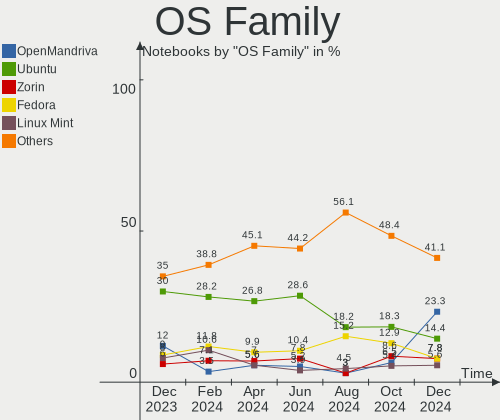
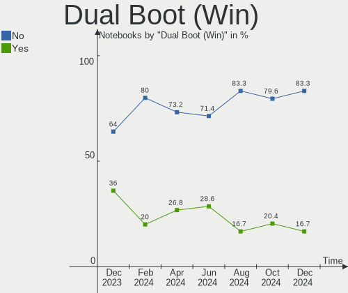
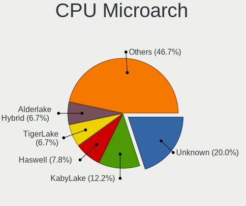
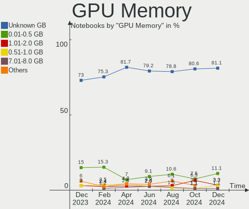
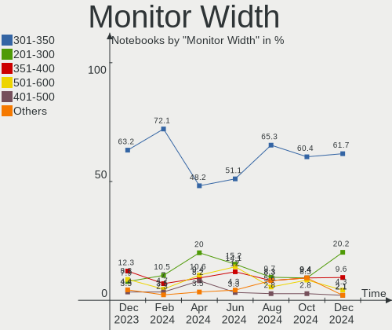
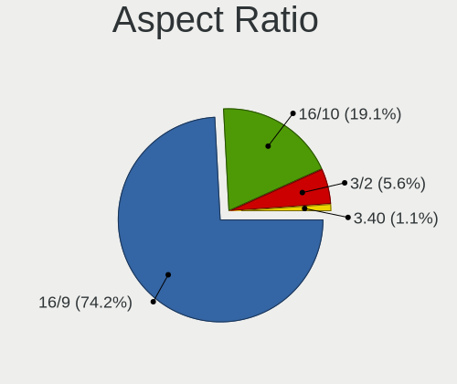
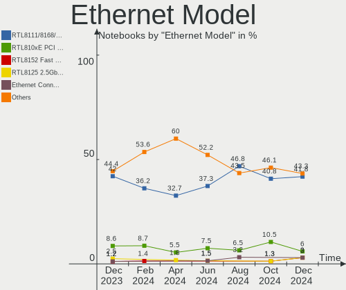
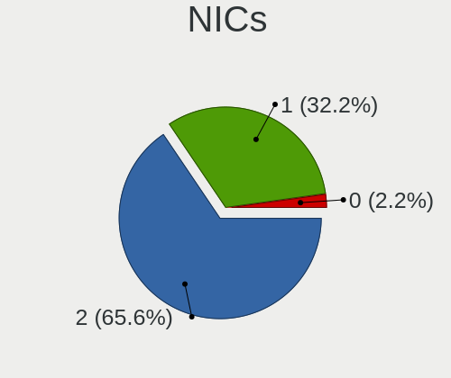
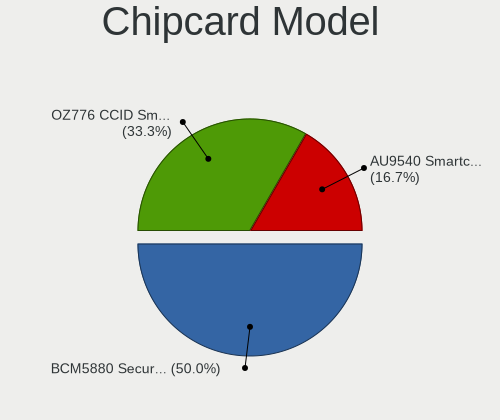

Linux in Spain - Hardware Trends (Notebooks)
--------------------------------------------

A project to identify most popular hardware characteristics and track their change
over time based on data collected by Linux users at https://Linux-Hardware.org.

Anyone can contribute to this report by the [hw-probe](https://github.com/linuxhw/hw-probe) tool:

    sudo -E hw-probe -all -upload

Period: Jan, 2023.

Contents
--------

* [ System ](#system)
  - [ OS                       ](#os)
  - [ OS Family                ](#os-family)
  - [ Kernel                   ](#kernel)
  - [ Kernel Family            ](#kernel-family)
  - [ Kernel Major Ver.        ](#kernel-major-ver)
  - [ Arch                     ](#arch)
  - [ DE                       ](#de)
  - [ Display Server           ](#display-server)
  - [ Display Manager          ](#display-manager)
  - [ OS Lang                  ](#os-lang)
  - [ Boot Mode                ](#boot-mode)
  - [ Filesystem               ](#filesystem)
  - [ Part. scheme             ](#part-scheme)
  - [ Dual Boot with Linux/BSD ](#dual-boot-with-linuxbsd)
  - [ Dual Boot (Win)          ](#dual-boot-win)

* [ Board ](#board)
  - [ Vendor                   ](#vendor)
  - [ Model                    ](#model)
  - [ Model Family             ](#model-family)
  - [ MFG Year                 ](#mfg-year)
  - [ Form Factor              ](#form-factor)
  - [ Secure Boot              ](#secure-boot)
  - [ Coreboot                 ](#coreboot)
  - [ RAM Size                 ](#ram-size)
  - [ RAM Used                 ](#ram-used)
  - [ Total Drives             ](#total-drives)
  - [ Has CD-ROM               ](#has-cd-rom)
  - [ Has Ethernet             ](#has-ethernet)
  - [ Has WiFi                 ](#has-wifi)
  - [ Has Bluetooth            ](#has-bluetooth)

* [ Location ](#location)
  - [ Country                  ](#country)
  - [ City                     ](#city)

* [ Drives ](#drives)
  - [ Drive Vendor             ](#drive-vendor)
  - [ Drive Model              ](#drive-model)
  - [ HDD Vendor               ](#hdd-vendor)
  - [ SSD Vendor               ](#ssd-vendor)
  - [ Drive Kind               ](#drive-kind)
  - [ Drive Connector          ](#drive-connector)
  - [ Drive Size               ](#drive-size)
  - [ Space Total              ](#space-total)
  - [ Space Used               ](#space-used)
  - [ Malfunc. Drives          ](#malfunc-drives)
  - [ Malfunc. Drive Vendor    ](#malfunc-drive-vendor)
  - [ Malfunc. HDD Vendor      ](#malfunc-hdd-vendor)
  - [ Malfunc. Drive Kind      ](#malfunc-drive-kind)
  - [ Failed Drives            ](#failed-drives)
  - [ Failed Drive Vendor      ](#failed-drive-vendor)
  - [ Drive Status             ](#drive-status)

* [ Storage controller ](#storage-controller)
  - [ Storage Vendor           ](#storage-vendor)
  - [ Storage Model            ](#storage-model)
  - [ Storage Kind             ](#storage-kind)

* [ Processor ](#processor)
  - [ CPU Vendor               ](#cpu-vendor)
  - [ CPU Model                ](#cpu-model)
  - [ CPU Model Family         ](#cpu-model-family)
  - [ CPU Cores                ](#cpu-cores)
  - [ CPU Sockets              ](#cpu-sockets)
  - [ CPU Threads              ](#cpu-threads)
  - [ CPU Op-Modes             ](#cpu-op-modes)
  - [ CPU Microcode            ](#cpu-microcode)
  - [ CPU Microarch            ](#cpu-microarch)

* [ Graphics ](#graphics)
  - [ GPU Vendor               ](#gpu-vendor)
  - [ GPU Model                ](#gpu-model)
  - [ GPU Combo                ](#gpu-combo)
  - [ GPU Driver               ](#gpu-driver)
  - [ GPU Memory               ](#gpu-memory)

* [ Monitor ](#monitor)
  - [ Monitor Vendor           ](#monitor-vendor)
  - [ Monitor Model            ](#monitor-model)
  - [ Monitor Resolution       ](#monitor-resolution)
  - [ Monitor Diagonal         ](#monitor-diagonal)
  - [ Monitor Width            ](#monitor-width)
  - [ Aspect Ratio             ](#aspect-ratio)
  - [ Monitor Area             ](#monitor-area)
  - [ Pixel Density            ](#pixel-density)
  - [ Multiple Monitors        ](#multiple-monitors)

* [ Network ](#network)
  - [ Net Controller Vendor    ](#net-controller-vendor)
  - [ Net Controller Model     ](#net-controller-model)
  - [ Wireless Vendor          ](#wireless-vendor)
  - [ Wireless Model           ](#wireless-model)
  - [ Ethernet Vendor          ](#ethernet-vendor)
  - [ Ethernet Model           ](#ethernet-model)
  - [ Net Controller Kind      ](#net-controller-kind)
  - [ Used Controller          ](#used-controller)
  - [ NICs                     ](#nics)
  - [ IPv6                     ](#ipv6)

* [ Bluetooth ](#bluetooth)
  - [ Bluetooth Vendor         ](#bluetooth-vendor)
  - [ Bluetooth Model          ](#bluetooth-model)

* [ Sound ](#sound)
  - [ Sound Vendor             ](#sound-vendor)
  - [ Sound Model              ](#sound-model)

* [ Memory ](#memory)
  - [ Memory Vendor            ](#memory-vendor)
  - [ Memory Model             ](#memory-model)
  - [ Memory Kind              ](#memory-kind)
  - [ Memory Form Factor       ](#memory-form-factor)
  - [ Memory Size              ](#memory-size)
  - [ Memory Speed             ](#memory-speed)

* [ Printers & scanners ](#printers--scanners)
  - [ Printer Vendor           ](#printer-vendor)
  - [ Printer Model            ](#printer-model)
  - [ Scanner Vendor           ](#scanner-vendor)
  - [ Scanner Model            ](#scanner-model)

* [ Camera ](#camera)
  - [ Camera Vendor            ](#camera-vendor)
  - [ Camera Model             ](#camera-model)

* [ Security ](#security)
  - [ Fingerprint Vendor       ](#fingerprint-vendor)
  - [ Fingerprint Model        ](#fingerprint-model)
  - [ Chipcard Vendor          ](#chipcard-vendor)
  - [ Chipcard Model           ](#chipcard-model)

* [ Unsupported ](#unsupported)
  - [ Unsupported Devices      ](#unsupported-devices)
  - [ Unsupported Device Types ](#unsupported-device-types)

System
------

OS
--

Installed operating systems

| Name                 | Notebooks | Percent |
|----------------------|-----------|---------|
| OpenMandriva 23.01   | 23        | 22.33%  |
| Ubuntu 22.04         | 11        | 10.68%  |
| Ubuntu 22.10         | 7         | 6.8%    |
| KDE neon 22.04       | 5         | 4.85%   |
| Fedora 37            | 5         | 4.85%   |
| Ubuntu 20.04         | 4         | 3.88%   |
| Debian 11            | 4         | 3.88%   |
| ArcoLinux Rolling    | 4         | 3.88%   |
| Linux Mint 21.1      | 3         | 2.91%   |
| Arch Rolling         | 3         | 2.91%   |
| Zorin 16             | 2         | 1.94%   |
| Manjaro 22.0.0       | 2         | 1.94%   |
| LMDE 5               | 2         | 1.94%   |
| Kubuntu 22.10        | 2         | 1.94%   |
| Kubuntu 22.04        | 2         | 1.94%   |
| Kali 2022.4          | 2         | 1.94%   |
| Garuda Linux Soaring | 2         | 1.94%   |
| Xubuntu 22.04        | 1         | 0.97%   |
| Void Linux Rolling   | 1         | 0.97%   |
| Ultramarine Linux 36 | 1         | 0.97%   |
| Ubuntu Studio 22.04  | 1         | 0.97%   |
| SteamOS 3.4.4        | 1         | 0.97%   |
| Pop!_OS 22.04        | 1         | 0.97%   |
| Pop 22.04            | 1         | 0.97%   |
| OpenMandriva 4.3     | 1         | 0.97%   |
| Nobara 37            | 1         | 0.97%   |
| Manjaro              | 1         | 0.97%   |
| Lubuntu 22.10        | 1         | 0.97%   |
| Lubuntu 22.04        | 1         | 0.97%   |
| Linux Mint 20.3      | 1         | 0.97%   |
| Linux Mint 20.2      | 1         | 0.97%   |
| Linux Mint 19.3      | 1         | 0.97%   |
| Kubuntu 23.04        | 1         | 0.97%   |
| Gentoo 2.9           | 1         | 0.97%   |
| Endless 4.0.13       | 1         | 0.97%   |
| Elementary 6.1       | 1         | 0.97%   |
| Debian 11-updates    | 1         | 0.97%   |

OS Family
---------

OS without a version

| Name              | Notebooks | Percent |
|-------------------|-----------|---------|
| OpenMandriva      | 24        | 23.3%   |
| Ubuntu            | 22        | 21.36%  |
| Linux Mint        | 6         | 5.83%   |
| Kubuntu           | 5         | 4.85%   |
| KDE neon          | 5         | 4.85%   |
| Fedora            | 5         | 4.85%   |
| Debian            | 5         | 4.85%   |
| ArcoLinux         | 4         | 3.88%   |
| Manjaro           | 3         | 2.91%   |
| Arch              | 3         | 2.91%   |
| Zorin             | 2         | 1.94%   |
| Lubuntu           | 2         | 1.94%   |
| LMDE              | 2         | 1.94%   |
| Kali              | 2         | 1.94%   |
| Garuda Linux      | 2         | 1.94%   |
| Xubuntu           | 1         | 0.97%   |
| Void Linux        | 1         | 0.97%   |
| Ultramarine Linux | 1         | 0.97%   |
| Ubuntu Studio     | 1         | 0.97%   |
| SteamOS           | 1         | 0.97%   |
| Pop!_OS           | 1         | 0.97%   |
| Pop               | 1         | 0.97%   |
| Nobara            | 1         | 0.97%   |
| Gentoo            | 1         | 0.97%   |
| Endless           | 1         | 0.97%   |
| Elementary        | 1         | 0.97%   |

Kernel
------

Version of the Linux kernel

| Version                     | Notebooks | Percent |
|-----------------------------|-----------|---------|
| 6.1.1-desktop-1omv2290      | 22        | 21.36%  |
| 5.15.0-58-generic           | 14        | 13.59%  |
| 5.15.0-57-generic           | 6         | 5.83%   |
| 5.19.0-29-generic           | 5         | 4.85%   |
| 5.15.0-56-generic           | 5         | 4.85%   |
| 5.10.0-20-amd64             | 4         | 3.88%   |
| 6.1.1-arch1-1               | 3         | 2.91%   |
| 6.1.6-arch1-1               | 2         | 1.94%   |
| 6.0.16-300.fc37.x86_64      | 2         | 1.94%   |
| 6.0.12-76060006-generic     | 2         | 1.94%   |
| 6.0.0-kali6-amd64           | 2         | 1.94%   |
| 5.4.0-135-generic           | 2         | 1.94%   |
| 5.19.0-28-generic           | 2         | 1.94%   |
| 5.15.0-43-generic           | 2         | 1.94%   |
| 5.10.0-18-amd64             | 2         | 1.94%   |
| 6.1.7-zen1-1-zen            | 1         | 0.97%   |
| 6.1.7-arch1-1               | 1         | 0.97%   |
| 6.1.7-200.fc37.x86_64       | 1         | 0.97%   |
| 6.1.6-gentoo                | 1         | 0.97%   |
| 6.1.6-200.fc37.x86_64       | 1         | 0.97%   |
| 6.1.5-100.fc36.x86_64       | 1         | 0.97%   |
| 6.1.4-desktop-1omv2301      | 1         | 0.97%   |
| 6.1.4-arch1-1               | 1         | 0.97%   |
| 6.1.4-203.fsync.fc37.x86_64 | 1         | 0.97%   |
| 6.1.1-zen1-1-zen            | 1         | 0.97%   |
| 6.1.0-060100rc4-generic     | 1         | 0.97%   |
| 6.0.17-300.fc37.x86_64      | 1         | 0.97%   |
| 5.4.0-137-generic           | 1         | 0.97%   |
| 5.4.0-131-generic           | 1         | 0.97%   |
| 5.19.17-2-MANJARO           | 1         | 0.97%   |
| 5.19.0-31-generic           | 1         | 0.97%   |
| 5.19.0-26-generic           | 1         | 0.97%   |
| 5.19.0-21-generic           | 1         | 0.97%   |
| 5.18.19_1                   | 1         | 0.97%   |
| 5.16.7-desktop-1omv4003     | 1         | 0.97%   |
| 5.15.89-1-MANJARO           | 1         | 0.97%   |
| 5.15.85-1-MANJARO           | 1         | 0.97%   |
| 5.15.0-53-generic           | 1         | 0.97%   |
| 5.15.0-50-lowlatency        | 1         | 0.97%   |
| 5.15.0-39-generic           | 1         | 0.97%   |

Kernel Family
-------------

Linux kernel without a distro release

| Version | Notebooks | Percent |
|---------|-----------|---------|
| 5.15.0  | 30        | 29.13%  |
| 6.1.1   | 26        | 25.24%  |
| 5.19.0  | 10        | 9.71%   |
| 5.10.0  | 7         | 6.8%    |
| 6.1.6   | 4         | 3.88%   |
| 5.4.0   | 4         | 3.88%   |
| 6.1.7   | 3         | 2.91%   |
| 6.1.4   | 3         | 2.91%   |
| 6.0.16  | 2         | 1.94%   |
| 6.0.12  | 2         | 1.94%   |
| 6.0.0   | 2         | 1.94%   |
| 6.1.5   | 1         | 0.97%   |
| 6.1.0   | 1         | 0.97%   |
| 6.0.17  | 1         | 0.97%   |
| 5.19.17 | 1         | 0.97%   |
| 5.18.19 | 1         | 0.97%   |
| 5.16.7  | 1         | 0.97%   |
| 5.15.89 | 1         | 0.97%   |
| 5.15.85 | 1         | 0.97%   |
| 5.13.0  | 1         | 0.97%   |
| 5.11.0  | 1         | 0.97%   |

Kernel Major Ver.
-----------------

Linux kernel major version

| Version | Notebooks | Percent |
|---------|-----------|---------|
| 6.1     | 38        | 36.89%  |
| 5.15    | 32        | 31.07%  |
| 5.19    | 11        | 10.68%  |
| 6.0     | 7         | 6.8%    |
| 5.10    | 7         | 6.8%    |
| 5.4     | 4         | 3.88%   |
| 5.18    | 1         | 0.97%   |
| 5.16    | 1         | 0.97%   |
| 5.13    | 1         | 0.97%   |
| 5.11    | 1         | 0.97%   |

Arch
----

OS architecture (x86_64, i586, etc.)

| Name   | Notebooks | Percent |
|--------|-----------|---------|
| x86_64 | 102       | 99.03%  |
| i686   | 1         | 0.97%   |

DE
--

Desktop Environment

| Name            | Notebooks | Percent |
|-----------------|-----------|---------|
| KDE5            | 38        | 36.89%  |
| GNOME           | 37        | 35.92%  |
| XFCE            | 12        | 11.65%  |
| X-Cinnamon      | 7         | 6.8%    |
| LXQt            | 2         | 1.94%   |
| Pantheon        | 1         | 0.97%   |
| LeftWM          | 1         | 0.97%   |
| i3              | 1         | 0.97%   |
| GNOME Flashback | 1         | 0.97%   |
| DWM             | 1         | 0.97%   |
| Budgie          | 1         | 0.97%   |
| Unknown         | 1         | 0.97%   |

Display Server
--------------

X11 or Wayland

| Name    | Notebooks | Percent |
|---------|-----------|---------|
| X11     | 75        | 72.82%  |
| Wayland | 26        | 25.24%  |
| Tty     | 1         | 0.97%   |
| Unknown | 1         | 0.97%   |

Display Manager
---------------

SDDM, LightDM, etc.

| Name    | Notebooks | Percent |
|---------|-----------|---------|
| SDDM    | 34        | 33.01%  |
| Unknown | 27        | 26.21%  |
| GDM3    | 19        | 18.45%  |
| LightDM | 13        | 12.62%  |
| GDM     | 9         | 8.74%   |
| SLiM    | 1         | 0.97%   |

OS Lang
-------

Language

| Lang    | Notebooks | Percent |
|---------|-----------|---------|
| es_ES   | 65        | 63.11%  |
| en_US   | 24        | 23.3%   |
| ca_ES   | 6         | 5.83%   |
| en_GB   | 2         | 1.94%   |
| it_IT   | 1         | 0.97%   |
| eu_ES   | 1         | 0.97%   |
| ca_AD   | 1         | 0.97%   |
| C       | 1         | 0.97%   |
| an_ES   | 1         | 0.97%   |
| Unknown | 1         | 0.97%   |

Boot Mode
---------

EFI or BIOS

| Mode | Notebooks | Percent |
|------|-----------|---------|
| EFI  | 55        | 53.4%   |
| BIOS | 48        | 46.6%   |

Filesystem
----------

Type of filesystem

| Type    | Notebooks | Percent |
|---------|-----------|---------|
| Ext4    | 65        | 63.11%  |
| Overlay | 19        | 18.45%  |
| Btrfs   | 16        | 15.53%  |
| Zfs     | 1         | 0.97%   |
| Xfs     | 1         | 0.97%   |
| Ext3    | 1         | 0.97%   |

Part. scheme
------------

Scheme of partitioning

| Type    | Notebooks | Percent |
|---------|-----------|---------|
| GPT     | 58        | 56.31%  |
| Unknown | 26        | 25.24%  |
| MBR     | 19        | 18.45%  |

Dual Boot with Linux/BSD
------------------------

Hosting more than one Linux/BSD

| Dual boot | Notebooks | Percent |
|-----------|-----------|---------|
| No        | 84        | 81.55%  |
| Yes       | 19        | 18.45%  |

Dual Boot (Win)
---------------

Hosting Linux and Windows

| Dual boot | Notebooks | Percent |
|-----------|-----------|---------|
| No        | 70        | 67.96%  |
| Yes       | 33        | 32.04%  |

Board
-----

Vendor
------

Motherboard manufacturer

| Name                | Notebooks | Percent |
|---------------------|-----------|---------|
| ASUSTek Computer    | 19        | 18.45%  |
| Hewlett-Packard     | 18        | 17.48%  |
| MSI                 | 11        | 10.68%  |
| Lenovo              | 10        | 9.71%   |
| Acer                | 10        | 9.71%   |
| Dell                | 6         | 5.83%   |
| Samsung Electronics | 4         | 3.88%   |
| Toshiba             | 3         | 2.91%   |
| Chuwi               | 3         | 2.91%   |
| Apple               | 3         | 2.91%   |
| Sony                | 2         | 1.94%   |
| Valve               | 1         | 0.97%   |
| SLIMBOOK            | 1         | 0.97%   |
| Razer               | 1         | 0.97%   |
| Qilive              | 1         | 0.97%   |
| Packard Bell        | 1         | 0.97%   |
| Notebook            | 1         | 0.97%   |
| Intel               | 1         | 0.97%   |
| HUAWEI              | 1         | 0.97%   |
| Google              | 1         | 0.97%   |
| Fujitsu             | 1         | 0.97%   |
| eMachines           | 1         | 0.97%   |
| Dynabook            | 1         | 0.97%   |
| Clevo               | 1         | 0.97%   |
| ALLDOCUBE           | 1         | 0.97%   |

Model
-----

Motherboard model

| Name                                | Notebooks | Percent |
|-------------------------------------|-----------|---------|
| Samsung RF510/RF410/RF710           | 2         | 1.94%   |
| MSI Bravo 17 A4DDK                  | 2         | 1.94%   |
| Chuwi GemiBook Pro                  | 2         | 1.94%   |
| ASUS K53U                           | 2         | 1.94%   |
| Valve Jupiter                       | 1         | 0.97%   |
| Toshiba Satellite Pro NB10-A-12Q    | 1         | 0.97%   |
| Toshiba PORTEGE X30-E               | 1         | 0.97%   |
| Toshiba NB520                       | 1         | 0.97%   |
| Sony VPCCW1S1E                      | 1         | 0.97%   |
| Sony VGN-AR51J                      | 1         | 0.97%   |
| SLIMBOOK PRO                        | 1         | 0.97%   |
| Samsung R520/R522/R620              | 1         | 0.97%   |
| Samsung 305V4A/305V5A               | 1         | 0.97%   |
| Razer Blade 14 (2022) - RZ09-0427   | 1         | 0.97%   |
| Qilive QW2214SP                     | 1         | 0.97%   |
| Packard Bell EasyNote TS44HR        | 1         | 0.97%   |
| Notebook N13_N140ZU                 | 1         | 0.97%   |
| MSI Stealth GS77 12UHS              | 1         | 0.97%   |
| MSI Stealth 15M B12UE               | 1         | 0.97%   |
| MSI Raider GE76 12UHS               | 1         | 0.97%   |
| MSI Modern 14 B10RBSW               | 1         | 0.97%   |
| MSI Katana GF66 11UC                | 1         | 0.97%   |
| MSI GF75 Thin 10UE                  | 1         | 0.97%   |
| MSI GE66 Raider 10SF                | 1         | 0.97%   |
| MSI Bravo 15 B5DD                   | 1         | 0.97%   |
| MSI Alpha 15 A3DDK                  | 1         | 0.97%   |
| Lenovo V110-15ISK 80TL              | 1         | 0.97%   |
| Lenovo ThinkPad X220 4291QZ1        | 1         | 0.97%   |
| Lenovo ThinkPad T420 4236PN3        | 1         | 0.97%   |
| Lenovo ThinkBook 13s G4 IAP 21AR    | 1         | 0.97%   |
| Lenovo Legion 5 15ACH6H 82JU        | 1         | 0.97%   |
| Lenovo IdeaPad Slim 1-14AST-05 81VS | 1         | 0.97%   |
| Lenovo IdeaPad 3 15ITL6 82H8        | 1         | 0.97%   |
| Lenovo IdeaPad 3 14ITL6 82H7        | 1         | 0.97%   |
| Lenovo G480 20150                   | 1         | 0.97%   |
| Lenovo B51-80 80LM                  | 1         | 0.97%   |
| Intel powered classmate PC          | 1         | 0.97%   |
| HUAWEI BOD-WXX9                     | 1         | 0.97%   |
| HP Victus by Laptop 16-e1xxx        | 1         | 0.97%   |
| HP Victus by Laptop 16-d0xxx        | 1         | 0.97%   |

Model Family
------------

Motherboard model prefix

| Name                  | Notebooks | Percent |
|-----------------------|-----------|---------|
| Acer Aspire           | 8         | 7.77%   |
| Dell Latitude         | 4         | 3.88%   |
| MSI Bravo             | 3         | 2.91%   |
| Lenovo IdeaPad        | 3         | 2.91%   |
| HP OMEN               | 3         | 2.91%   |
| ASUS VivoBook         | 3         | 2.91%   |
| Samsung RF510         | 2         | 1.94%   |
| MSI Stealth           | 2         | 1.94%   |
| Lenovo ThinkPad       | 2         | 1.94%   |
| HP Victus             | 2         | 1.94%   |
| HP EliteBook          | 2         | 1.94%   |
| HP 255                | 2         | 1.94%   |
| Chuwi GemiBook        | 2         | 1.94%   |
| ASUS ROG              | 2         | 1.94%   |
| ASUS K53U             | 2         | 1.94%   |
| Valve Jupiter         | 1         | 0.97%   |
| Toshiba Satellite     | 1         | 0.97%   |
| Toshiba PORTEGE       | 1         | 0.97%   |
| Toshiba NB520         | 1         | 0.97%   |
| Sony VPCCW1S1E        | 1         | 0.97%   |
| Sony VGN-AR51J        | 1         | 0.97%   |
| SLIMBOOK PRO          | 1         | 0.97%   |
| Samsung R520          | 1         | 0.97%   |
| Samsung 305V4A        | 1         | 0.97%   |
| Razer Blade           | 1         | 0.97%   |
| Qilive QW2214SP       | 1         | 0.97%   |
| Packard Bell EasyNote | 1         | 0.97%   |
| Notebook N13          | 1         | 0.97%   |
| MSI Raider            | 1         | 0.97%   |
| MSI Modern            | 1         | 0.97%   |
| MSI Katana            | 1         | 0.97%   |
| MSI GF75              | 1         | 0.97%   |
| MSI GE66              | 1         | 0.97%   |
| MSI Alpha             | 1         | 0.97%   |
| Lenovo V110-15ISK     | 1         | 0.97%   |
| Lenovo ThinkBook      | 1         | 0.97%   |
| Lenovo Legion         | 1         | 0.97%   |
| Lenovo G480           | 1         | 0.97%   |
| Lenovo B51-80         | 1         | 0.97%   |
| Intel powered         | 1         | 0.97%   |

MFG Year
--------

Motherboard manufacture year

| Year | Notebooks | Percent |
|------|-----------|---------|
| 2021 | 17        | 16.5%   |
| 2011 | 14        | 13.59%  |
| 2022 | 11        | 10.68%  |
| 2012 | 9         | 8.74%   |
| 2020 | 8         | 7.77%   |
| 2018 | 7         | 6.8%    |
| 2010 | 7         | 6.8%    |
| 2019 | 5         | 4.85%   |
| 2016 | 5         | 4.85%   |
| 2015 | 5         | 4.85%   |
| 2014 | 5         | 4.85%   |
| 2013 | 3         | 2.91%   |
| 2009 | 3         | 2.91%   |
| 2007 | 2         | 1.94%   |
| 2017 | 1         | 0.97%   |
| 2008 | 1         | 0.97%   |

Form Factor
-----------

Physical design of the computer

| Name     | Notebooks | Percent |
|----------|-----------|---------|
| Notebook | 103       | 100%    |

Secure Boot
-----------

Enabled or disabled

| State    | Notebooks | Percent |
|----------|-----------|---------|
| Disabled | 97        | 94.17%  |
| Enabled  | 6         | 5.83%   |

Coreboot
--------

Have coreboot on board

| Used | Notebooks | Percent |
|------|-----------|---------|
| No   | 102       | 99.03%  |
| Yes  | 1         | 0.97%   |

RAM Size
--------

Total RAM memory

| Size in GB | Notebooks | Percent |
|------------|-----------|---------|
| 4.01-8.0   | 34        | 33.01%  |
| 8.01-16.0  | 22        | 21.36%  |
| 3.01-4.0   | 20        | 19.42%  |
| 16.01-24.0 | 13        | 12.62%  |
| 32.01-64.0 | 7         | 6.8%    |
| 1.01-2.0   | 5         | 4.85%   |
| 24.01-32.0 | 2         | 1.94%   |

RAM Used
--------

Used RAM memory

| Used GB   | Notebooks | Percent |
|-----------|-----------|---------|
| 1.01-2.0  | 36        | 34.95%  |
| 2.01-3.0  | 35        | 33.98%  |
| 4.01-8.0  | 11        | 10.68%  |
| 3.01-4.0  | 11        | 10.68%  |
| 0.51-1.0  | 7         | 6.8%    |
| 8.01-16.0 | 3         | 2.91%   |

Total Drives
------------

Number of drives on board

| Drives | Notebooks | Percent |
|--------|-----------|---------|
| 1      | 74        | 71.84%  |
| 2      | 28        | 27.18%  |
| 3      | 1         | 0.97%   |

Has CD-ROM
----------

Has CD-ROM on board

| Presented | Notebooks | Percent |
|-----------|-----------|---------|
| No        | 67        | 65.05%  |
| Yes       | 36        | 34.95%  |

Has Ethernet
------------

Has Ethernet on board

| Presented | Notebooks | Percent |
|-----------|-----------|---------|
| Yes       | 86        | 83.5%   |
| No        | 17        | 16.5%   |

Has WiFi
--------

Has WiFi module

| Presented | Notebooks | Percent |
|-----------|-----------|---------|
| Yes       | 102       | 99.03%  |
| No        | 1         | 0.97%   |

Has Bluetooth
-------------

Has Bluetooth module

| Presented | Notebooks | Percent |
|-----------|-----------|---------|
| Yes       | 81        | 78.64%  |
| No        | 22        | 21.36%  |

Location
--------

Country
-------

Geographic location (country)

| Country | Notebooks | Percent |
|---------|-----------|---------|
| Spain   | 103       | 100%    |

City
----

Geographic location (city)

| City                       | Notebooks | Percent |
|----------------------------|-----------|---------|
| Madrid                     | 19        | 18.45%  |
| Barcelona                  | 12        | 11.65%  |
| Seville                    | 5         | 4.85%   |
| Valladolid                 | 4         | 3.88%   |
| Málaga                    | 4         | 3.88%   |
| Valencia                   | 3         | 2.91%   |
| Zaragoza                   | 2         | 1.94%   |
| Huesca                     | 2         | 1.94%   |
| Granada                    | 2         | 1.94%   |
| Bilbao                     | 2         | 1.94%   |
| Badalona                   | 2         | 1.94%   |
| Alcobendas                 | 2         | 1.94%   |
| Zafra                      | 1         | 0.97%   |
| Xàtiva                    | 1         | 0.97%   |
| Villafranca de los Barros  | 1         | 0.97%   |
| Valdemoro                  | 1         | 0.97%   |
| Torrejón de Ardoz         | 1         | 0.97%   |
| Tarragona                  | 1         | 0.97%   |
| Santiago de Compostela     | 1         | 0.97%   |
| Sant Joan d'Alacant        | 1         | 0.97%   |
| Sant Esteve Sesrovires     | 1         | 0.97%   |
| San Fernando               | 1         | 0.97%   |
| Salamanca                  | 1         | 0.97%   |
| Sabadell                   | 1         | 0.97%   |
| Roquetas de Mar            | 1         | 0.97%   |
| Rivas-Vaciamadrid          | 1         | 0.97%   |
| Quijas                     | 1         | 0.97%   |
| Puertollano                | 1         | 0.97%   |
| Puerto de la Cruz          | 1         | 0.97%   |
| Pozuelo de Alarcón        | 1         | 0.97%   |
| Oropesa                    | 1         | 0.97%   |
| Ojen                       | 1         | 0.97%   |
| Navarcles                  | 1         | 0.97%   |
| Macanet de la Selva        | 1         | 0.97%   |
| Lugones                    | 1         | 0.97%   |
| Las Palmas de Gran Canaria | 1         | 0.97%   |
| Laguna de Duero            | 1         | 0.97%   |
| Jadraque                   | 1         | 0.97%   |
| Irun                       | 1         | 0.97%   |
| El Puerto de Santa María  | 1         | 0.97%   |

Drives
------

Drive Vendor
------------

Hard drive vendors

| Vendor                       | Notebooks | Drives | Percent |
|------------------------------|-----------|--------|---------|
| Samsung Electronics          | 21        | 22     | 16.8%   |
| Kingston                     | 17        | 17     | 13.6%   |
| Micron Technology            | 11        | 11     | 8.8%    |
| WDC                          | 10        | 10     | 8%      |
| Toshiba                      | 9         | 9      | 7.2%    |
| Unknown                      | 7         | 9      | 5.6%    |
| Seagate                      | 7         | 7      | 5.6%    |
| SanDisk                      | 6         | 6      | 4.8%    |
| Crucial                      | 6         | 6      | 4.8%    |
| HGST                         | 3         | 3      | 2.4%    |
| SK hynix                     | 2         | 2      | 1.6%    |
| Phison Electronics           | 2         | 2      | 1.6%    |
| Netac                        | 2         | 2      | 1.6%    |
| KIOXIA                       | 2         | 2      | 1.6%    |
| Kingston Technology Company  | 2         | 2      | 1.6%    |
| Hitachi                      | 2         | 2      | 1.6%    |
| China                        | 2         | 2      | 1.6%    |
| USB30                        | 1         | 1      | 0.8%    |
| Union Memory                 | 1         | 1      | 0.8%    |
| Shenzhen Longsys Electronics | 1         | 1      | 0.8%    |
| PNY                          | 1         | 1      | 0.8%    |
| Phison                       | 1         | 1      | 0.8%    |
| O2 Micro                     | 1         | 1      | 0.8%    |
| Netac SS                     | 1         | 1      | 0.8%    |
| Intenso                      | 1         | 1      | 0.8%    |
| Intel                        | 1         | 1      | 0.8%    |
| FORESEE                      | 1         | 1      | 0.8%    |
| Emtec                        | 1         | 1      | 0.8%    |
| Apple                        | 1         | 1      | 0.8%    |
| Advantech                    | 1         | 1      | 0.8%    |
| Unknown                      | 1         | 1      | 0.8%    |

Drive Model
-----------

Hard drive models

| Model                                          | Notebooks | Percent |
|------------------------------------------------|-----------|---------|
| Kingston SA400S37480G 480GB SSD                | 5         | 3.91%   |
| Kingston SA400S37240G 240GB SSD                | 5         | 3.91%   |
| Sandisk WD Black SN750 / PC SN730 NVMe SSD 1TB | 4         | 3.13%   |
| Micron 2450_MTFDKBA1T0TFK 1TB                  | 3         | 2.34%   |
| Unknown SD32G  32GB                            | 2         | 1.56%   |
| Unknown MMC Card  128GB                        | 2         | 1.56%   |
| Toshiba MQ01ABF050 500GB                       | 2         | 1.56%   |
| Samsung SSD 860 EVO 500GB                      | 2         | 1.56%   |
| Samsung MZVLB1T0HBLR-00000 1TB                 | 2         | 1.56%   |
| Samsung MZVL21T0HCLR-00B00 1TB                 | 2         | 1.56%   |
| Samsung HM641JI 640GB                          | 2         | 1.56%   |
| Micron MTFDKBA512TFH-1BC1AABHA 512GB           | 2         | 1.56%   |
| Micron 3400_MTFDKBA1T0TFH 1TB                  | 2         | 1.56%   |
| Kingston Company U-SNS8154P3 NVMe SSD 256GB    | 2         | 1.56%   |
| Kingston OM8PCP31024F-AI1 1024GB               | 2         | 1.56%   |
| Crucial CT1000MX500SSD1 1TB                    | 2         | 1.56%   |
| WDC WDS240G2G0A-00JH30 240GB SSD               | 1         | 0.78%   |
| WDC WDS100T2B0A 1TB SSD                        | 1         | 0.78%   |
| WDC WD7500BPKT-22PK4T0 752GB                   | 1         | 0.78%   |
| WDC WD3200BEKT-60V5T1 320GB                    | 1         | 0.78%   |
| WDC WD2500BEVT-08A23T1 250GB                   | 1         | 0.78%   |
| WDC WD2500BEVS-22UST0 250GB                    | 1         | 0.78%   |
| WDC WD10SPZX-21Z10T0 1TB                       | 1         | 0.78%   |
| WDC WD10JPVX-22JC3T0 1TB                       | 1         | 0.78%   |
| WDC WD10JPVX-22J 1TB                           | 1         | 0.78%   |
| WDC WD My Passport 264F 1TB                    | 1         | 0.78%   |
| USB30 Disk 250GB                               | 1         | 0.78%   |
| Unknown SD/MMC/MS PRO 2GB                      | 1         | 0.78%   |
| Unknown MMC64G  64GB                           | 1         | 0.78%   |
| Unknown MMC Card  32GB                         | 1         | 0.78%   |
| Unknown MMC Card  249GB                        | 1         | 0.78%   |
| Unknown MMC Card  16GB                         | 1         | 0.78%   |
| Union Memory UMIS RPJTJ256MEE1OWX 256GB        | 1         | 0.78%   |
| Toshiba TR200 240GB SSD                        | 1         | 0.78%   |
| Toshiba MQ01ABD050 500GB                       | 1         | 0.78%   |
| Toshiba MK3275GSX 320GB                        | 1         | 0.78%   |
| Toshiba MK3265GSX 320GB                        | 1         | 0.78%   |
| Toshiba MK2576GSX 250GB                        | 1         | 0.78%   |
| Toshiba KSG60ZMV256G M.2 2280 256GB SSD        | 1         | 0.78%   |
| Toshiba BG3 NVMe SSD Controller 256GB          | 1         | 0.78%   |

HDD Vendor
----------

Hard disk drive vendors

| Vendor              | Notebooks | Drives | Percent |
|---------------------|-----------|--------|---------|
| WDC                 | 7         | 7      | 24.14%  |
| Seagate             | 7         | 7      | 24.14%  |
| Toshiba             | 6         | 6      | 20.69%  |
| HGST                | 3         | 3      | 10.34%  |
| Samsung Electronics | 2         | 2      | 6.9%    |
| Hitachi             | 2         | 2      | 6.9%    |
| Unknown             | 1         | 1      | 3.45%   |
| Apple               | 1         | 1      | 3.45%   |

SSD Vendor
----------

Solid state drive vendors

| Vendor              | Notebooks | Drives | Percent |
|---------------------|-----------|--------|---------|
| Kingston            | 12        | 12     | 29.27%  |
| Samsung Electronics | 7         | 8      | 17.07%  |
| Crucial             | 6         | 6      | 14.63%  |
| WDC                 | 2         | 2      | 4.88%   |
| Toshiba             | 2         | 2      | 4.88%   |
| Netac               | 2         | 2      | 4.88%   |
| China               | 2         | 2      | 4.88%   |
| USB30               | 1         | 1      | 2.44%   |
| SanDisk             | 1         | 1      | 2.44%   |
| PNY                 | 1         | 1      | 2.44%   |
| Micron Technology   | 1         | 1      | 2.44%   |
| Intenso             | 1         | 1      | 2.44%   |
| FORESEE             | 1         | 1      | 2.44%   |
| Emtec               | 1         | 1      | 2.44%   |
| Advantech           | 1         | 1      | 2.44%   |

Drive Kind
----------

HDD or SSD

| Kind    | Notebooks | Drives | Percent |
|---------|-----------|--------|---------|
| NVMe    | 42        | 46     | 35%     |
| SSD     | 39        | 42     | 32.5%   |
| HDD     | 29        | 29     | 24.17%  |
| MMC     | 8         | 9      | 6.67%   |
| Unknown | 2         | 2      | 1.67%   |

Drive Connector
---------------

SATA, SAS, NVMe, etc.

| Type | Notebooks | Drives | Percent |
|------|-----------|--------|---------|
| SATA | 61        | 69     | 53.04%  |
| NVMe | 42        | 46     | 36.52%  |
| MMC  | 8         | 9      | 6.96%   |
| SAS  | 4         | 4      | 3.48%   |

Drive Size
----------

Size of hard drive

| Size in TB | Notebooks | Drives | Percent |
|------------|-----------|--------|---------|
| 0.01-0.5   | 49        | 53     | 73.13%  |
| 0.51-1.0   | 17        | 17     | 25.37%  |
| 1.01-2.0   | 1         | 1      | 1.49%   |

Space Total
-----------

Amount of disk space available on the file system

| Size in GB     | Notebooks | Percent |
|----------------|-----------|---------|
| 101-250        | 28        | 27.18%  |
| 251-500        | 20        | 19.42%  |
| 501-1000       | 20        | 19.42%  |
| 1-20           | 15        | 14.56%  |
| 1001-2000      | 6         | 5.83%   |
| 51-100         | 6         | 5.83%   |
| More than 3000 | 3         | 2.91%   |
| 21-50          | 3         | 2.91%   |
| Unknown        | 2         | 1.94%   |

Space Used
----------

Amount of used disk space

| Used GB        | Notebooks | Percent |
|----------------|-----------|---------|
| 1-20           | 41        | 39.81%  |
| 21-50          | 21        | 20.39%  |
| 101-250        | 14        | 13.59%  |
| 51-100         | 12        | 11.65%  |
| 251-500        | 6         | 5.83%   |
| 501-1000       | 6         | 5.83%   |
| Unknown        | 2         | 1.94%   |
| More than 3000 | 1         | 0.97%   |

Malfunc. Drives
---------------

Drive models with a malfunction

| Model                             | Notebooks | Drives | Percent |
|-----------------------------------|-----------|--------|---------|
| WDC WD3200BEKT-60V5T1 320GB       | 1         | 1      | 10%     |
| Toshiba MQ01ABD050 500GB          | 1         | 1      | 10%     |
| Seagate ST9500420ASG 500GB        | 1         | 1      | 10%     |
| Seagate ST9160412AS 160GB         | 1         | 1      | 10%     |
| Seagate ST2000LM015-2E8174 2TB    | 1         | 1      | 10%     |
| Seagate ST1000LM035-1RK172 1TB    | 1         | 1      | 10%     |
| Samsung Electronics HM641JI 640GB | 1         | 1      | 10%     |
| Kingston SV300S37A120G 120GB SSD  | 1         | 1      | 10%     |
| Kingston SA400S37480G 480GB SSD   | 1         | 1      | 10%     |
| HGST HTS721010A9E630 1TB          | 1         | 1      | 10%     |

Malfunc. Drive Vendor
---------------------

Vendors of faulty drives

| Vendor              | Notebooks | Drives | Percent |
|---------------------|-----------|--------|---------|
| Seagate             | 4         | 4      | 40%     |
| Kingston            | 2         | 2      | 20%     |
| WDC                 | 1         | 1      | 10%     |
| Toshiba             | 1         | 1      | 10%     |
| Samsung Electronics | 1         | 1      | 10%     |
| HGST                | 1         | 1      | 10%     |

Malfunc. HDD Vendor
-------------------

Vendors of faulty HDD drives

| Vendor              | Notebooks | Drives | Percent |
|---------------------|-----------|--------|---------|
| Seagate             | 4         | 4      | 50%     |
| WDC                 | 1         | 1      | 12.5%   |
| Toshiba             | 1         | 1      | 12.5%   |
| Samsung Electronics | 1         | 1      | 12.5%   |
| HGST                | 1         | 1      | 12.5%   |

Malfunc. Drive Kind
-------------------

Kinds of faulty drives

| Kind | Notebooks | Drives | Percent |
|------|-----------|--------|---------|
| HDD  | 8         | 8      | 80%     |
| SSD  | 2         | 2      | 20%     |

Failed Drives
-------------

Failed drive models

Zero info for selected period =(

Failed Drive Vendor
-------------------

Failed drive vendors

Zero info for selected period =(

Drive Status
------------

Number of failed and malfunc. drives

| Status   | Notebooks | Drives | Percent |
|----------|-----------|--------|---------|
| Works    | 53        | 58     | 47.32%  |
| Detected | 49        | 60     | 43.75%  |
| Malfunc  | 10        | 10     | 8.93%   |

Storage controller
------------------

Storage Vendor
--------------

Storage controller vendors

| Vendor                       | Notebooks | Percent |
|------------------------------|-----------|---------|
| Intel                        | 66        | 52.8%   |
| AMD                          | 15        | 12%     |
| Samsung Electronics          | 12        | 9.6%    |
| Micron Technology            | 10        | 8%      |
| Kingston Technology Company  | 7         | 5.6%    |
| SanDisk                      | 5         | 4%      |
| SK hynix                     | 2         | 1.6%    |
| Phison Electronics           | 2         | 1.6%    |
| KIOXIA                       | 2         | 1.6%    |
| Union Memory (Shenzhen)      | 1         | 0.8%    |
| Toshiba America Info Systems | 1         | 0.8%    |
| Shenzhen Longsys Electronics | 1         | 0.8%    |
| O2 Micro                     | 1         | 0.8%    |

Storage Model
-------------

Storage controller models

| Model                                                                        | Notebooks | Percent |
|------------------------------------------------------------------------------|-----------|---------|
| AMD FCH SATA Controller [AHCI mode]                                          | 12        | 9.02%   |
| Micron Non-Volatile memory controller                                        | 10        | 7.52%   |
| Intel 7 Series Chipset Family 6-port SATA Controller [AHCI mode]             | 9         | 6.77%   |
| Samsung NVMe SSD Controller SM981/PM981/PM983                                | 7         | 5.26%   |
| Intel 6 Series/C200 Series Chipset Family 6 port Mobile SATA AHCI Controller | 6         | 4.51%   |
| Intel 5 Series/3400 Series Chipset 4 port SATA AHCI Controller               | 6         | 4.51%   |
| Intel Sunrise Point-LP SATA Controller [AHCI mode]                           | 5         | 3.76%   |
| Intel 82801 Mobile SATA Controller [RAID mode]                               | 5         | 3.76%   |
| SanDisk WD Black SN750 / PC SN730 NVMe SSD                                   | 4         | 3.01%   |
| Kingston Company Company Non-Volatile memory controller                      | 4         | 3.01%   |
| Intel Volume Management Device NVMe RAID Controller                          | 4         | 3.01%   |
| Intel NM10/ICH7 Family SATA Controller [AHCI mode]                           | 4         | 3.01%   |
| Intel Jasper Lake SATA AHCI Controller                                       | 3         | 2.26%   |
| Intel Celeron/Pentium Silver Processor SATA Controller                       | 3         | 2.26%   |
| Intel 82801IBM/IEM (ICH9M/ICH9M-E) 4 port SATA Controller [AHCI mode]        | 3         | 2.26%   |
| Intel 82801HM/HEM (ICH8M/ICH8M-E) SATA Controller [AHCI mode]                | 3         | 2.26%   |
| Intel 82801HM/HEM (ICH8M/ICH8M-E) IDE Controller                             | 3         | 2.26%   |
| AMD SB7x0/SB8x0/SB9x0 SATA Controller [AHCI mode]                            | 3         | 2.26%   |
| Samsung NVMe SSD Controller PM9A1/PM9A3/980PRO                               | 2         | 1.5%    |
| Samsung NVMe SSD Controller 980                                              | 2         | 1.5%    |
| KIOXIA NVMe SSD Controller BG4                                               | 2         | 1.5%    |
| Kingston Company U-SNS8154P3 NVMe SSD                                        | 2         | 1.5%    |
| Intel Tiger Lake-LP SATA Controller                                          | 2         | 1.5%    |
| Intel HM170/QM170 Chipset SATA Controller [AHCI Mode]                        | 2         | 1.5%    |
| Intel Comet Lake SATA AHCI Controller                                        | 2         | 1.5%    |
| Intel 8 Series SATA Controller 1 [AHCI mode]                                 | 2         | 1.5%    |
| AMD SB7x0/SB8x0/SB9x0 IDE Controller                                         | 2         | 1.5%    |
| Union Memory (Shenzhen) Non-Volatile memory controller                       | 1         | 0.75%   |
| Toshiba America Info Systems BG3 NVMe SSD Controller                         | 1         | 0.75%   |
| SK hynix PC401 NVMe Solid State Drive 256GB                                  | 1         | 0.75%   |
| SK hynix Gold P31/PC711 NVMe Solid State Drive                               | 1         | 0.75%   |
| Shenzhen Longsys Electronics Non-Volatile memory controller                  | 1         | 0.75%   |
| SanDisk WD Blue SN570 NVMe SSD                                               | 1         | 0.75%   |
| Samsung NVMe SSD Controller SM951/PM951                                      | 1         | 0.75%   |
| Phison PS5013 E13 NVMe Controller                                            | 1         | 0.75%   |
| Phison E16 PCIe4 NVMe Controller                                             | 1         | 0.75%   |
| O2 Micro Non-Volatile memory controller                                      | 1         | 0.75%   |
| Kingston Company A2000 NVMe SSD                                              | 1         | 0.75%   |
| Intel Wildcat Point-LP SATA Controller [AHCI Mode]                           | 1         | 0.75%   |
| Intel SSD 660P Series                                                        | 1         | 0.75%   |

Storage Kind
------------

Kind of storage controller (IDE, SATA, NVMe, SAS, ...)

| Kind | Notebooks | Percent |
|------|-----------|---------|
| SATA | 73        | 56.15%  |
| NVMe | 42        | 32.31%  |
| RAID | 10        | 7.69%   |
| IDE  | 5         | 3.85%   |

Processor
---------

CPU Vendor
----------

Processor vendors

| Vendor | Notebooks | Percent |
|--------|-----------|---------|
| Intel  | 79        | 76.7%   |
| AMD    | 24        | 23.3%   |

CPU Model
---------

Processor models

| Model                                       | Notebooks | Percent |
|---------------------------------------------|-----------|---------|
| AMD Ryzen 7 5800H with Radeon Graphics      | 4         | 3.88%   |
| Intel Core i7-6500U CPU @ 2.50GHz           | 3         | 2.91%   |
| Intel Core i5-8250U CPU @ 1.60GHz           | 3         | 2.91%   |
| Intel Core i5-10210U CPU @ 1.60GHz          | 3         | 2.91%   |
| Intel Celeron N5100 @ 1.10GHz               | 3         | 2.91%   |
| Intel Celeron N4020 CPU @ 1.10GHz           | 3         | 2.91%   |
| Intel Celeron CPU N2840 @ 2.16GHz           | 3         | 2.91%   |
| AMD Ryzen 7 4800H with Radeon Graphics      | 3         | 2.91%   |
| Intel Core i7-6700HQ CPU @ 2.60GHz          | 2         | 1.94%   |
| Intel Core i7-4510U CPU @ 2.00GHz           | 2         | 1.94%   |
| Intel Core i7-10750H CPU @ 2.60GHz          | 2         | 1.94%   |
| Intel Core i5 CPU M 480 @ 2.67GHz           | 2         | 1.94%   |
| Intel Core i3 CPU M 370 @ 2.40GHz           | 2         | 1.94%   |
| Intel 12th Gen Core i7-12700H               | 2         | 1.94%   |
| Intel 11th Gen Core i7-11800H @ 2.30GHz     | 2         | 1.94%   |
| Intel 11th Gen Core i5-1135G7 @ 2.40GHz     | 2         | 1.94%   |
| AMD Ryzen 9 6900HX with Radeon Graphics     | 2         | 1.94%   |
| AMD Ryzen 7 6800H with Radeon Graphics      | 2         | 1.94%   |
| Intel Pentium Dual-Core CPU T4500 @ 2.30GHz | 1         | 0.97%   |
| Intel Pentium Dual-Core CPU T4200 @ 2.00GHz | 1         | 0.97%   |
| Intel Pentium CPU B980 @ 2.40GHz            | 1         | 0.97%   |
| Intel Pentium CPU B960 @ 2.20GHz            | 1         | 0.97%   |
| Intel Pentium CPU 2117U @ 1.80GHz           | 1         | 0.97%   |
| Intel Core i7-8750H CPU @ 2.20GHz           | 1         | 0.97%   |
| Intel Core i7-8565U CPU @ 1.80GHz           | 1         | 0.97%   |
| Intel Core i7-4650U CPU @ 1.70GHz           | 1         | 0.97%   |
| Intel Core i7-3630QM CPU @ 2.40GHz          | 1         | 0.97%   |
| Intel Core i7-3610QM CPU @ 2.30GHz          | 1         | 0.97%   |
| Intel Core i7-2620M CPU @ 2.70GHz           | 1         | 0.97%   |
| Intel Core i7-10510U CPU @ 1.80GHz          | 1         | 0.97%   |
| Intel Core i7 CPU Q 720 @ 1.60GHz           | 1         | 0.97%   |
| Intel Core i5-8365U CPU @ 1.60GHz           | 1         | 0.97%   |
| Intel Core i5-8350U CPU @ 1.70GHz           | 1         | 0.97%   |
| Intel Core i5-8265U CPU @ 1.60GHz           | 1         | 0.97%   |
| Intel Core i5-5300U CPU @ 2.30GHz           | 1         | 0.97%   |
| Intel Core i5-3340M CPU @ 2.70GHz           | 1         | 0.97%   |
| Intel Core i5-3210M CPU @ 2.50GHz           | 1         | 0.97%   |
| Intel Core i5-2540M CPU @ 2.60GHz           | 1         | 0.97%   |
| Intel Core i5-2430M CPU @ 2.40GHz           | 1         | 0.97%   |
| Intel Core i5-2410M CPU @ 2.30GHz           | 1         | 0.97%   |

CPU Model Family
----------------

Processor model prefix

| Model                   | Notebooks | Percent |
|-------------------------|-----------|---------|
| Intel Core i7           | 17        | 16.5%   |
| Intel Core i5           | 17        | 16.5%   |
| Other                   | 12        | 11.65%  |
| Intel Core i3           | 11        | 10.68%  |
| Intel Celeron           | 11        | 10.68%  |
| AMD Ryzen 7             | 10        | 9.71%   |
| Intel Core 2 Duo        | 4         | 3.88%   |
| Intel Atom              | 4         | 3.88%   |
| Intel Pentium           | 3         | 2.91%   |
| AMD E                   | 3         | 2.91%   |
| Intel Pentium Dual-Core | 2         | 1.94%   |
| AMD Ryzen 9             | 2         | 1.94%   |
| AMD A8                  | 2         | 1.94%   |
| AMD Ryzen 5             | 1         | 0.97%   |
| AMD Ryzen 3             | 1         | 0.97%   |
| AMD E1                  | 1         | 0.97%   |
| AMD A6                  | 1         | 0.97%   |
| AMD A10                 | 1         | 0.97%   |

CPU Cores
---------

Number of processor cores

| Number | Notebooks | Percent |
|--------|-----------|---------|
| 2      | 55        | 53.4%   |
| 4      | 24        | 23.3%   |
| 8      | 13        | 12.62%  |
| 6      | 5         | 4.85%   |
| 14     | 3         | 2.91%   |
| 1      | 2         | 1.94%   |
| 12     | 1         | 0.97%   |

CPU Sockets
-----------

Number of sockets

| Number | Notebooks | Percent |
|--------|-----------|---------|
| 1      | 103       | 100%    |

CPU Threads
-----------

Threads per core (Hyper-Threading)

| Number | Notebooks | Percent |
|--------|-----------|---------|
| 2      | 75        | 72.82%  |
| 1      | 28        | 27.18%  |

CPU Op-Modes
------------

CPU Operation Modes (32-bit, 64-bit)

| Op mode        | Notebooks | Percent |
|----------------|-----------|---------|
| 32-bit, 64-bit | 102       | 99.03%  |
| 32-bit         | 1         | 0.97%   |

CPU Microcode
-------------

Microcode number

| Number     | Notebooks | Percent |
|------------|-----------|---------|
| Unknown    | 26        | 25.24%  |
| 0x206a7    | 7         | 6.8%    |
| 0x806ec    | 5         | 4.85%   |
| 0x306a9    | 5         | 4.85%   |
| 0x906a3    | 4         | 3.88%   |
| 0x806ea    | 4         | 3.88%   |
| 0x906c0    | 3         | 2.91%   |
| 0x406e3    | 3         | 2.91%   |
| 0x20655    | 3         | 2.91%   |
| 0x1067a    | 3         | 2.91%   |
| 0xa0652    | 2         | 1.94%   |
| 0x806d1    | 2         | 1.94%   |
| 0x806c1    | 2         | 1.94%   |
| 0x706a8    | 2         | 1.94%   |
| 0x40651    | 2         | 1.94%   |
| 0x30678    | 2         | 1.94%   |
| 0x106ca    | 2         | 1.94%   |
| 0x0a50000c | 2         | 1.94%   |
| 0x0a404102 | 2         | 1.94%   |
| 0x0a404101 | 2         | 1.94%   |
| 0x08600104 | 2         | 1.94%   |
| 0x06006705 | 2         | 1.94%   |
| 0x0500010d | 2         | 1.94%   |
| 0x806eb    | 1         | 0.97%   |
| 0x706e5    | 1         | 0.97%   |
| 0x6fd      | 1         | 0.97%   |
| 0x6fb      | 1         | 0.97%   |
| 0x506e3    | 1         | 0.97%   |
| 0x30661    | 1         | 0.97%   |
| 0x20652    | 1         | 0.97%   |
| 0x106e5    | 1         | 0.97%   |
| 0x10676    | 1         | 0.97%   |
| 0x08608103 | 1         | 0.97%   |
| 0x08600106 | 1         | 0.97%   |
| 0x08108109 | 1         | 0.97%   |
| 0x06003106 | 1         | 0.97%   |
| 0x05000029 | 1         | 0.97%   |

CPU Microarch
-------------

Microarchitecture

| Name             | Notebooks | Percent |
|------------------|-----------|---------|
| KabyLake         | 12        | 11.65%  |
| SandyBridge      | 9         | 8.74%   |
| IvyBridge        | 7         | 6.8%    |
| Unknown          | 7         | 6.8%    |
| Westmere         | 6         | 5.83%   |
| Skylake          | 6         | 5.83%   |
| Zen 3            | 4         | 3.88%   |
| Silvermont       | 4         | 3.88%   |
| Penryn           | 4         | 3.88%   |
| Bonnell          | 4         | 3.88%   |
| Alderlake Hybrid | 4         | 3.88%   |
| Zen 2            | 3         | 2.91%   |
| Tremont          | 3         | 2.91%   |
| TigerLake        | 3         | 2.91%   |
| Icelake          | 3         | 2.91%   |
| Haswell          | 3         | 2.91%   |
| Goldmont plus    | 3         | 2.91%   |
| Bobcat           | 3         | 2.91%   |
| Zen+             | 2         | 1.94%   |
| Excavator        | 2         | 1.94%   |
| Core             | 2         | 1.94%   |
| CometLake        | 2         | 1.94%   |
| Broadwell        | 2         | 1.94%   |
| Steamroller      | 1         | 0.97%   |
| Puma             | 1         | 0.97%   |
| Piledriver       | 1         | 0.97%   |
| Nehalem          | 1         | 0.97%   |
| K10 Llano        | 1         | 0.97%   |

Graphics
--------

GPU Vendor
----------

Vendors of graphics cards

| Vendor | Notebooks | Percent |
|--------|-----------|---------|
| Intel  | 70        | 52.24%  |
| Nvidia | 33        | 24.63%  |
| AMD    | 31        | 23.13%  |

GPU Model
---------

Graphics card models

| Model                                                                         | Notebooks | Percent |
|-------------------------------------------------------------------------------|-----------|---------|
| Intel 2nd Generation Core Processor Family Integrated Graphics Controller     | 9         | 6.29%   |
| Intel 3rd Gen Core processor Graphics Controller                              | 7         | 4.9%    |
| Nvidia GA106M [GeForce RTX 3060 Mobile / Max-Q]                               | 6         | 4.2%    |
| Intel UHD Graphics 620                                                        | 4         | 2.8%    |
| Intel CometLake-U GT2 [UHD Graphics]                                          | 4         | 2.8%    |
| Intel Alder Lake-P Integrated Graphics Controller                             | 4         | 2.8%    |
| AMD Rembrandt [Radeon 680M]                                                   | 4         | 2.8%    |
| AMD Navi 14 [Radeon RX 5500/5500M / Pro 5500M]                                | 4         | 2.8%    |
| AMD Cezanne [Radeon Vega Series / Radeon Vega Mobile Series]                  | 4         | 2.8%    |
| Intel WhiskeyLake-U GT2 [UHD Graphics 620]                                    | 3         | 2.1%    |
| Intel TigerLake-H GT1 [UHD Graphics]                                          | 3         | 2.1%    |
| Intel Skylake GT2 [HD Graphics 520]                                           | 3         | 2.1%    |
| Intel JasperLake [UHD Graphics]                                               | 3         | 2.1%    |
| Intel Haswell-ULT Integrated Graphics Controller                              | 3         | 2.1%    |
| Intel GeminiLake [UHD Graphics 600]                                           | 3         | 2.1%    |
| Intel Core Processor Integrated Graphics Controller                           | 3         | 2.1%    |
| Intel Atom Processor Z36xxx/Z37xxx Series Graphics & Display                  | 3         | 2.1%    |
| Intel Atom Processor D4xx/D5xx/N4xx/N5xx Integrated Graphics Controller       | 3         | 2.1%    |
| AMD Renoir                                                                    | 3         | 2.1%    |
| AMD Park [Mobility Radeon HD 5430/5450/5470]                                  | 3         | 2.1%    |
| Nvidia GT216M [GeForce GT 330M]                                               | 2         | 1.4%    |
| Nvidia GF117M [GeForce 610M/710M/810M/820M / GT 620M/625M/630M/720M]          | 2         | 1.4%    |
| Nvidia GA107M [GeForce RTX 3050 Mobile]                                       | 2         | 1.4%    |
| Nvidia GA103M [GeForce RTX 3080 Ti Mobile]                                    | 2         | 1.4%    |
| Intel TigerLake-LP GT2 [Iris Xe Graphics]                                     | 2         | 1.4%    |
| Intel HD Graphics 5500                                                        | 2         | 1.4%    |
| Intel HD Graphics 530                                                         | 2         | 1.4%    |
| Intel CometLake-H GT2 [UHD Graphics]                                          | 2         | 1.4%    |
| AMD Wrestler [Radeon HD 6310]                                                 | 2         | 1.4%    |
| AMD Sun XT [Radeon HD 8670A/8670M/8690M / R5 M330 / M430 / Radeon 520 Mobile] | 2         | 1.4%    |
| AMD Stoney [Radeon R2/R3/R4/R5 Graphics]                                      | 2         | 1.4%    |
| AMD Seymour [Radeon HD 6400M/7400M Series]                                    | 2         | 1.4%    |
| AMD Picasso/Raven 2 [Radeon Vega Series / Radeon Vega Mobile Series]          | 2         | 1.4%    |
| Nvidia TU117M [GeForce GTX 1650 Mobile / Max-Q]                               | 1         | 0.7%    |
| Nvidia TU106M [GeForce RTX 2070 Mobile / Max-Q Refresh]                       | 1         | 0.7%    |
| Nvidia TU106M [GeForce RTX 2060 Mobile]                                       | 1         | 0.7%    |
| Nvidia GT216M [GeForce GT 230M]                                               | 1         | 0.7%    |
| Nvidia GP107M [GeForce MX350]                                                 | 1         | 0.7%    |
| Nvidia GP107M [GeForce GTX 1050 Mobile]                                       | 1         | 0.7%    |
| Nvidia GM206M [GeForce GTX 965M]                                              | 1         | 0.7%    |

GPU Combo
---------

Combinations of graphics cards

| Name           | Notebooks | Percent |
|----------------|-----------|---------|
| 1 x Intel      | 42        | 40.78%  |
| Intel + Nvidia | 22        | 21.36%  |
| 1 x AMD        | 13        | 12.62%  |
| 2 x AMD        | 9         | 8.74%   |
| AMD + Nvidia   | 6         | 5.83%   |
| 1 x Nvidia     | 5         | 4.85%   |
| 2 x Intel      | 3         | 2.91%   |
| Intel + AMD    | 3         | 2.91%   |

GPU Driver
----------

Free vs proprietary

| Driver      | Notebooks | Percent |
|-------------|-----------|---------|
| Free        | 87        | 84.47%  |
| Proprietary | 13        | 12.62%  |
| Unknown     | 3         | 2.91%   |

GPU Memory
----------

Total video memory

| Size in GB | Notebooks | Percent |
|------------|-----------|---------|
| Unknown    | 66        | 64.08%  |
| 0.01-0.5   | 17        | 16.5%   |
| 0.51-1.0   | 7         | 6.8%    |
| 1.01-2.0   | 4         | 3.88%   |
| 5.01-6.0   | 3         | 2.91%   |
| 7.01-8.0   | 2         | 1.94%   |
| 3.01-4.0   | 2         | 1.94%   |
| 8.01-16.0  | 2         | 1.94%   |

Monitor
-------

Monitor Vendor
--------------

Monitor vendors

| Vendor                  | Notebooks | Percent |
|-------------------------|-----------|---------|
| AU Optronics            | 23        | 19.17%  |
| BOE                     | 20        | 16.67%  |
| Chimei Innolux          | 16        | 13.33%  |
| LG Display              | 14        | 11.67%  |
| Samsung Electronics     | 11        | 9.17%   |
| Sharp                   | 4         | 3.33%   |
| Goldstar                | 4         | 3.33%   |
| Chi Mei Optoelectronics | 3         | 2.5%    |
| Apple                   | 3         | 2.5%    |
| InfoVision              | 2         | 1.67%   |
| Dell                    | 2         | 1.67%   |
| CPT                     | 2         | 1.67%   |
| BenQ                    | 2         | 1.67%   |
| Vestel Elektronik       | 1         | 0.83%   |
| Valve                   | 1         | 0.83%   |
| Sony                    | 1         | 0.83%   |
| Philips                 | 1         | 0.83%   |
| PANDA                   | 1         | 0.83%   |
| Lenovo                  | 1         | 0.83%   |
| KDC                     | 1         | 0.83%   |
| Hewlett-Packard         | 1         | 0.83%   |
| HannStar                | 1         | 0.83%   |
| Eizo                    | 1         | 0.83%   |
| BUBALUS                 | 1         | 0.83%   |
| ASUSTek Computer        | 1         | 0.83%   |
| Ancor Communications    | 1         | 0.83%   |
| Acer                    | 1         | 0.83%   |

Monitor Model
-------------

Monitor models

| Model                                                                 | Notebooks | Percent |
|-----------------------------------------------------------------------|-----------|---------|
| AU Optronics LCD Monitor AUO26EC 1366x768 344x193mm 15.5-inch         | 5         | 4.17%   |
| AU Optronics LCD Monitor AUO978F 1920x1080 382x215mm 17.3-inch        | 3         | 2.5%    |
| Sharp LQ173M1JW08 SHP1544 1920x1080 382x215mm 17.3-inch               | 2         | 1.67%   |
| LG Display LCD Monitor LGD02DC 1366x768 344x194mm 15.5-inch           | 2         | 1.67%   |
| LG Display LCD Monitor LGD02AC 1366x768 344x194mm 15.5-inch           | 2         | 1.67%   |
| Chimei Innolux P140ZKA-BZ1 CMN8C02 2160x1440 296x197mm 14.0-inch      | 2         | 1.67%   |
| Chimei Innolux LCD Monitor CMN15E7 1920x1080 344x193mm 15.5-inch      | 2         | 1.67%   |
| Chimei Innolux LCD Monitor CMN15CA 1366x768 344x193mm 15.5-inch       | 2         | 1.67%   |
| Chimei Innolux LCD Monitor CMN14D4 1920x1080 309x173mm 13.9-inch      | 2         | 1.67%   |
| BOE LCD Monitor BOE06A5 1366x768 344x194mm 15.5-inch                  | 2         | 1.67%   |
| AU Optronics LCD Monitor AUOAF90 1920x1080 344x193mm 15.5-inch        | 2         | 1.67%   |
| AU Optronics LCD Monitor AUO48EC 1366x768 344x193mm 15.5-inch         | 2         | 1.67%   |
| Vestel Elektronik 50FHD_LCD_TV VES3700 1920x1080 1280x720mm 57.8-inch | 1         | 0.83%   |
| Valve ANX7530 U VLV3001 800x1280 100x150mm 7.1-inch                   | 1         | 0.83%   |
| Sony Nvidia Defaul t Flat Panel SNY05FA 1366x768 309x174mm 14.0-inch  | 1         | 0.83%   |
| Sharp LQ156M1JW03 SHP14C5 1920x1080 344x194mm 15.5-inch               | 1         | 0.83%   |
| Sharp LQ140M1JW49 SHP1523 1920x1080 309x174mm 14.0-inch               | 1         | 0.83%   |
| Samsung Electronics SyncMaster SAM0486 1920x1080                      | 1         | 0.83%   |
| Samsung Electronics SMB2230H SAM0648 1920x1080                        | 1         | 0.83%   |
| Samsung Electronics S24F350 SAM0D20 1920x1080 521x293mm 23.5-inch     | 1         | 0.83%   |
| Samsung Electronics LCD Monitor SEC5441 1366x768 344x194mm 15.5-inch  | 1         | 0.83%   |
| Samsung Electronics LCD Monitor SEC454C 1366x768 309x174mm 14.0-inch  | 1         | 0.83%   |
| Samsung Electronics LCD Monitor SEC4251 1366x768 344x194mm 15.5-inch  | 1         | 0.83%   |
| Samsung Electronics LCD Monitor SEC364E 1024x600 223x125mm 10.1-inch  | 1         | 0.83%   |
| Samsung Electronics LCD Monitor SEC3442 1366x768 344x194mm 15.5-inch  | 1         | 0.83%   |
| Samsung Electronics LCD Monitor SEC324A 1366x768 344x194mm 15.5-inch  | 1         | 0.83%   |
| Samsung Electronics LCD Monitor SDC415D 3840x2400 344x215mm 16.0-inch | 1         | 0.83%   |
| Samsung Electronics LCD Monitor SDC4154 2880x1800 302x189mm 14.0-inch | 1         | 0.83%   |
| Philips PHL 346B1C PHL093E 3440x1440 797x334mm 34.0-inch              | 1         | 0.83%   |
| PANDA LCD Monitor NCP0046 1920x1080 344x194mm 15.5-inch               | 1         | 0.83%   |
| LG Display LP156WH1-TLA3 LGD01C2 1366x768 344x194mm 15.5-inch         | 1         | 0.83%   |
| LG Display LCD Monitor LGD40A0 1366x768 310x174mm 14.0-inch           | 1         | 0.83%   |
| LG Display LCD Monitor LGD071D 1920x1080 344x194mm 15.5-inch          | 1         | 0.83%   |
| LG Display LCD Monitor LGD05D8 1920x1080 344x194mm 15.5-inch          | 1         | 0.83%   |
| LG Display LCD Monitor LGD0577 1920x1080 294x165mm 13.3-inch          | 1         | 0.83%   |
| LG Display LCD Monitor LGD045C 1366x768 345x194mm 15.6-inch           | 1         | 0.83%   |
| LG Display LCD Monitor LGD02DF 1600x900 310x174mm 14.0-inch           | 1         | 0.83%   |
| LG Display LCD Monitor LGD02D3 1366x768 277x156mm 12.5-inch           | 1         | 0.83%   |
| LG Display LCD Monitor LGD0259 1920x1080 345x194mm 15.6-inch          | 1         | 0.83%   |
| LG Display LCD Monitor LGD0218 1366x768 293x165mm 13.2-inch           | 1         | 0.83%   |

Monitor Resolution
------------------

Monitor screen resolution

| Resolution         | Notebooks | Percent |
|--------------------|-----------|---------|
| 1920x1080 (FHD)    | 45        | 40.91%  |
| 1366x768 (WXGA)    | 42        | 38.18%  |
| 2560x1440 (QHD)    | 3         | 2.73%   |
| 1920x1200 (WUXGA)  | 3         | 2.73%   |
| 1600x900 (HD+)     | 3         | 2.73%   |
| 2160x1440          | 2         | 1.82%   |
| 1280x800 (WXGA)    | 2         | 1.82%   |
| 1024x600           | 2         | 1.82%   |
| 800x1280           | 1         | 0.91%   |
| 3840x2400          | 1         | 0.91%   |
| 3840x2160 (4K)     | 1         | 0.91%   |
| 3440x1440          | 1         | 0.91%   |
| 2880x1800          | 1         | 0.91%   |
| 1680x1050 (WSXGA+) | 1         | 0.91%   |
| 1440x900 (WXGA+)   | 1         | 0.91%   |
| 1280x1024 (SXGA)   | 1         | 0.91%   |

Monitor Diagonal
----------------

Diagonal size in inches

| Inches  | Notebooks | Percent |
|---------|-----------|---------|
| 15      | 55        | 45.83%  |
| 14      | 11        | 9.17%   |
| 13      | 11        | 9.17%   |
| 17      | 9         | 7.5%    |
| 27      | 5         | 4.17%   |
| 24      | 4         | 3.33%   |
| 16      | 4         | 3.33%   |
| 11      | 4         | 3.33%   |
| 23      | 3         | 2.5%    |
| 21      | 3         | 2.5%    |
| 10      | 3         | 2.5%    |
| Unknown | 2         | 1.67%   |
| 84      | 1         | 0.83%   |
| 34      | 1         | 0.83%   |
| 25      | 1         | 0.83%   |
| 19      | 1         | 0.83%   |
| 12      | 1         | 0.83%   |
| 7       | 1         | 0.83%   |

Monitor Width
-------------

Physical width

| Width in mm | Notebooks | Percent |
|-------------|-----------|---------|
| 301-350     | 70        | 58.82%  |
| 201-300     | 15        | 12.61%  |
| 351-400     | 14        | 11.76%  |
| 501-600     | 11        | 9.24%   |
| 401-500     | 3         | 2.52%   |
| Unknown     | 2         | 1.68%   |
| 701-800     | 1         | 0.84%   |
| 601-700     | 1         | 0.84%   |
| 1501-2000   | 1         | 0.84%   |
| 1-100       | 1         | 0.84%   |

Aspect Ratio
------------

Proportional relationship between the width and the height

| Ratio | Notebooks | Percent |
|-------|-----------|---------|
| 16/9  | 90        | 87.38%  |
| 16/10 | 8         | 7.77%   |
| 3/2   | 2         | 1.94%   |
| 5/4   | 1         | 0.97%   |
| 21/9  | 1         | 0.97%   |
| 0.67  | 1         | 0.97%   |

Monitor Area
------------

Area in inch²

| Area in inch² | Notebooks | Percent |
|----------------|-----------|---------|
| 101-110        | 57        | 47.5%   |
| 81-90          | 19        | 15.83%  |
| 201-250        | 7         | 5.83%   |
| 121-130        | 7         | 5.83%   |
| 301-350        | 5         | 4.17%   |
| 51-60          | 4         | 3.33%   |
| 71-80          | 3         | 2.5%    |
| 41-50          | 3         | 2.5%    |
| 151-200        | 3         | 2.5%    |
| 251-300        | 2         | 1.67%   |
| 131-140        | 2         | 1.67%   |
| Unknown        | 2         | 1.67%   |
| More than 1000 | 1         | 0.83%   |
| 61-70          | 1         | 0.83%   |
| 351-500        | 1         | 0.83%   |
| 1-40           | 1         | 0.83%   |
| 111-120        | 1         | 0.83%   |
| 91-100         | 1         | 0.83%   |

Pixel Density
-------------

Pixels per inch

| Density       | Notebooks | Percent |
|---------------|-----------|---------|
| 121-160       | 46        | 39.66%  |
| 101-120       | 43        | 37.07%  |
| 51-100        | 16        | 13.79%  |
| 161-240       | 7         | 6.03%   |
| More than 240 | 2         | 1.72%   |
| Unknown       | 2         | 1.72%   |

Multiple Monitors
-----------------

Total monitors connected

| Total | Notebooks | Percent |
|-------|-----------|---------|
| 1     | 82        | 79.61%  |
| 2     | 19        | 18.45%  |
| 3     | 1         | 0.97%   |
| 0     | 1         | 0.97%   |

Network
-------

Net Controller Vendor
---------------------

Controller vendors

| Vendor                            | Notebooks | Percent |
|-----------------------------------|-----------|---------|
| Realtek Semiconductor             | 63        | 38.41%  |
| Intel                             | 44        | 26.83%  |
| Qualcomm Atheros                  | 24        | 14.63%  |
| Broadcom                          | 15        | 9.15%   |
| Marvell Technology Group          | 6         | 3.66%   |
| MediaTek                          | 3         | 1.83%   |
| TP-Link                           | 2         | 1.22%   |
| Broadcom Limited                  | 2         | 1.22%   |
| Ralink Technology                 | 1         | 0.61%   |
| Ralink                            | 1         | 0.61%   |
| Qualcomm Atheros Communications   | 1         | 0.61%   |
| JMicron Technology                | 1         | 0.61%   |
| Ericsson Business Mobile Networks | 1         | 0.61%   |

Net Controller Model
--------------------

Controller models

| Model                                                                          | Notebooks | Percent |
|--------------------------------------------------------------------------------|-----------|---------|
| Realtek RTL8111/8168/8411 PCI Express Gigabit Ethernet Controller              | 35        | 18.13%  |
| Realtek RTL810xE PCI Express Fast Ethernet controller                          | 10        | 5.18%   |
| Qualcomm Atheros AR9485 Wireless Network Adapter                               | 7         | 3.63%   |
| Realtek RTL8153 Gigabit Ethernet Adapter                                       | 6         | 3.11%   |
| Qualcomm Atheros QCA9565 / AR9565 Wireless Network Adapter                     | 5         | 2.59%   |
| Intel Wi-Fi 6 AX200                                                            | 5         | 2.59%   |
| Broadcom BCM4313 802.11bgn Wireless Network Adapter                            | 5         | 2.59%   |
| Qualcomm Atheros AR9285 Wireless Network Adapter (PCI-Express)                 | 4         | 2.07%   |
| Intel Wireless 8265 / 8275                                                     | 4         | 2.07%   |
| Intel Comet Lake PCH-LP CNVi WiFi                                              | 4         | 2.07%   |
| Intel Alder Lake-P PCH CNVi WiFi                                               | 4         | 2.07%   |
| Realtek RTL8852AE 802.11ax PCIe Wireless Network Adapter                       | 3         | 1.55%   |
| Realtek RTL8822CE 802.11ac PCIe Wireless Network Adapter                       | 3         | 1.55%   |
| Realtek RTL8821CE 802.11ac PCIe Wireless Network Adapter                       | 3         | 1.55%   |
| Realtek RTL8723BE PCIe Wireless Network Adapter                                | 3         | 1.55%   |
| Intel Wireless 7265                                                            | 3         | 1.55%   |
| Intel Wi-Fi 6 AX201                                                            | 3         | 1.55%   |
| Intel Tiger Lake PCH CNVi WiFi                                                 | 3         | 1.55%   |
| Broadcom NetLink BCM57785 Gigabit Ethernet PCIe                                | 3         | 1.55%   |
| TP-Link UE300 10/100/1000 LAN (ethernet mode) [Realtek RTL8153]                | 2         | 1.04%   |
| Realtek RTL8821AE 802.11ac PCIe Wireless Network Adapter                       | 2         | 1.04%   |
| Realtek RTL8152 Fast Ethernet Adapter                                          | 2         | 1.04%   |
| Realtek RTL8125 2.5GbE Controller                                              | 2         | 1.04%   |
| Realtek Killer E3000 2.5GbE Controller                                         | 2         | 1.04%   |
| Qualcomm Atheros QCA9377 802.11ac Wireless Network Adapter                     | 2         | 1.04%   |
| Qualcomm Atheros AR9462 Wireless Network Adapter                               | 2         | 1.04%   |
| Qualcomm Atheros AR8151 v2.0 Gigabit Ethernet                                  | 2         | 1.04%   |
| MediaTek MT7922 802.11ax PCI Express Wireless Network Adapter                  | 2         | 1.04%   |
| Marvell Group Yukon Optima 88E8059 [PCIe Gigabit Ethernet Controller with AVB] | 2         | 1.04%   |
| Marvell Group 88E8057 PCI-E Gigabit Ethernet Controller                        | 2         | 1.04%   |
| Intel Wireless 7260                                                            | 2         | 1.04%   |
| Intel PRO/Wireless 4965 AG or AGN [Kedron] Network Connection                  | 2         | 1.04%   |
| Intel Comet Lake PCH CNVi WiFi                                                 | 2         | 1.04%   |
| Intel Centrino Advanced-N 6205 [Taylor Peak]                                   | 2         | 1.04%   |
| Intel 82579LM Gigabit Network Connection (Lewisville)                          | 2         | 1.04%   |
| Realtek RTL8822BE 802.11a/b/g/n/ac WiFi adapter                                | 1         | 0.52%   |
| Realtek RTL8723DE Wireless Network Adapter                                     | 1         | 0.52%   |
| Realtek RTL8723BU 802.11b/g/n WLAN Adapter                                     | 1         | 0.52%   |
| Realtek RTL8723AE PCIe Wireless Network Adapter                                | 1         | 0.52%   |
| Realtek Killer E2600 Gigabit Ethernet Controller                               | 1         | 0.52%   |

Wireless Vendor
---------------

Wireless vendors

| Vendor                          | Notebooks | Percent |
|---------------------------------|-----------|---------|
| Intel                           | 44        | 42.72%  |
| Qualcomm Atheros                | 23        | 22.33%  |
| Realtek Semiconductor           | 18        | 17.48%  |
| Broadcom                        | 10        | 9.71%   |
| MediaTek                        | 3         | 2.91%   |
| Broadcom Limited                | 2         | 1.94%   |
| Ralink Technology               | 1         | 0.97%   |
| Ralink                          | 1         | 0.97%   |
| Qualcomm Atheros Communications | 1         | 0.97%   |

Wireless Model
--------------

Wireless models

| Model                                                                   | Notebooks | Percent |
|-------------------------------------------------------------------------|-----------|---------|
| Qualcomm Atheros AR9485 Wireless Network Adapter                        | 7         | 6.73%   |
| Qualcomm Atheros QCA9565 / AR9565 Wireless Network Adapter              | 5         | 4.81%   |
| Intel Wi-Fi 6 AX200                                                     | 5         | 4.81%   |
| Broadcom BCM4313 802.11bgn Wireless Network Adapter                     | 5         | 4.81%   |
| Qualcomm Atheros AR9285 Wireless Network Adapter (PCI-Express)          | 4         | 3.85%   |
| Intel Wireless 8265 / 8275                                              | 4         | 3.85%   |
| Intel Comet Lake PCH-LP CNVi WiFi                                       | 4         | 3.85%   |
| Intel Alder Lake-P PCH CNVi WiFi                                        | 4         | 3.85%   |
| Realtek RTL8852AE 802.11ax PCIe Wireless Network Adapter                | 3         | 2.88%   |
| Realtek RTL8822CE 802.11ac PCIe Wireless Network Adapter                | 3         | 2.88%   |
| Realtek RTL8821CE 802.11ac PCIe Wireless Network Adapter                | 3         | 2.88%   |
| Realtek RTL8723BE PCIe Wireless Network Adapter                         | 3         | 2.88%   |
| Intel Wireless 7265                                                     | 3         | 2.88%   |
| Intel Wi-Fi 6 AX201                                                     | 3         | 2.88%   |
| Intel Tiger Lake PCH CNVi WiFi                                          | 3         | 2.88%   |
| Realtek RTL8821AE 802.11ac PCIe Wireless Network Adapter                | 2         | 1.92%   |
| Qualcomm Atheros QCA9377 802.11ac Wireless Network Adapter              | 2         | 1.92%   |
| Qualcomm Atheros AR9462 Wireless Network Adapter                        | 2         | 1.92%   |
| MediaTek MT7922 802.11ax PCI Express Wireless Network Adapter           | 2         | 1.92%   |
| Intel Wireless 7260                                                     | 2         | 1.92%   |
| Intel PRO/Wireless 4965 AG or AGN [Kedron] Network Connection           | 2         | 1.92%   |
| Intel Comet Lake PCH CNVi WiFi                                          | 2         | 1.92%   |
| Intel Centrino Advanced-N 6205 [Taylor Peak]                            | 2         | 1.92%   |
| Realtek RTL8822BE 802.11a/b/g/n/ac WiFi adapter                         | 1         | 0.96%   |
| Realtek RTL8723DE Wireless Network Adapter                              | 1         | 0.96%   |
| Realtek RTL8723BU 802.11b/g/n WLAN Adapter                              | 1         | 0.96%   |
| Realtek RTL8723AE PCIe Wireless Network Adapter                         | 1         | 0.96%   |
| Realtek 802.11ac WLAN Adapter                                           | 1         | 0.96%   |
| Ralink RT5370 Wireless Adapter                                          | 1         | 0.96%   |
| Ralink RT5390 Wireless 802.11n 1T/1R PCIe                               | 1         | 0.96%   |
| Qualcomm Atheros AR9271 802.11n                                         | 1         | 0.96%   |
| Qualcomm Atheros AR928X Wireless Network Adapter (PCI-Express)          | 1         | 0.96%   |
| Qualcomm Atheros AR9287 Wireless Network Adapter (PCI-Express)          | 1         | 0.96%   |
| Qualcomm Atheros AR242x / AR542x Wireless Network Adapter (PCI-Express) | 1         | 0.96%   |
| MediaTek WLAN controller                                                | 1         | 0.96%   |
| Intel Wireless-AC 9260                                                  | 1         | 0.96%   |
| Intel Wireless 3165                                                     | 1         | 0.96%   |
| Intel WiFi Link 5100                                                    | 1         | 0.96%   |
| Intel Wi-Fi 6 AX201 160MHz                                              | 1         | 0.96%   |
| Intel Dual Band Wireless-AC 3165 Plus Bluetooth                         | 1         | 0.96%   |

Ethernet Vendor
---------------

Ethernet vendors

| Vendor                   | Notebooks | Percent |
|--------------------------|-----------|---------|
| Realtek Semiconductor    | 58        | 65.91%  |
| Intel                    | 8         | 9.09%   |
| Broadcom                 | 8         | 9.09%   |
| Marvell Technology Group | 6         | 6.82%   |
| Qualcomm Atheros         | 5         | 5.68%   |
| TP-Link                  | 2         | 2.27%   |
| JMicron Technology       | 1         | 1.14%   |

Ethernet Model
--------------

Ethernet models

| Model                                                                          | Notebooks | Percent |
|--------------------------------------------------------------------------------|-----------|---------|
| Realtek RTL8111/8168/8411 PCI Express Gigabit Ethernet Controller              | 35        | 39.77%  |
| Realtek RTL810xE PCI Express Fast Ethernet controller                          | 10        | 11.36%  |
| Realtek RTL8153 Gigabit Ethernet Adapter                                       | 6         | 6.82%   |
| Broadcom NetLink BCM57785 Gigabit Ethernet PCIe                                | 3         | 3.41%   |
| TP-Link UE300 10/100/1000 LAN (ethernet mode) [Realtek RTL8153]                | 2         | 2.27%   |
| Realtek RTL8152 Fast Ethernet Adapter                                          | 2         | 2.27%   |
| Realtek RTL8125 2.5GbE Controller                                              | 2         | 2.27%   |
| Realtek Killer E3000 2.5GbE Controller                                         | 2         | 2.27%   |
| Qualcomm Atheros AR8151 v2.0 Gigabit Ethernet                                  | 2         | 2.27%   |
| Marvell Group Yukon Optima 88E8059 [PCIe Gigabit Ethernet Controller with AVB] | 2         | 2.27%   |
| Marvell Group 88E8057 PCI-E Gigabit Ethernet Controller                        | 2         | 2.27%   |
| Intel 82579LM Gigabit Network Connection (Lewisville)                          | 2         | 2.27%   |
| Realtek Killer E2600 Gigabit Ethernet Controller                               | 1         | 1.14%   |
| Qualcomm Atheros AR8162 Fast Ethernet                                          | 1         | 1.14%   |
| Qualcomm Atheros AR8132 Fast Ethernet                                          | 1         | 1.14%   |
| Qualcomm Atheros AR8131 Gigabit Ethernet                                       | 1         | 1.14%   |
| Marvell Group 88E8058 PCI-E Gigabit Ethernet Controller                        | 1         | 1.14%   |
| Marvell Group 88E8055 PCI-E Gigabit Ethernet Controller                        | 1         | 1.14%   |
| JMicron JMC260 PCI Express Fast Ethernet Controller                            | 1         | 1.14%   |
| Intel Ethernet controller                                                      | 1         | 1.14%   |
| Intel Ethernet Connection (6) I219-LM                                          | 1         | 1.14%   |
| Intel Ethernet Connection (4) I219-V                                           | 1         | 1.14%   |
| Intel Ethernet Connection (4) I219-LM                                          | 1         | 1.14%   |
| Intel Ethernet Connection (3) I218-LM                                          | 1         | 1.14%   |
| Intel Ethernet Connection (10) I219-V                                          | 1         | 1.14%   |
| Broadcom NetXtreme BCM57786 Gigabit Ethernet PCIe                              | 1         | 1.14%   |
| Broadcom NetXtreme BCM57765 Gigabit Ethernet PCIe                              | 1         | 1.14%   |
| Broadcom NetXtreme BCM5761 Gigabit Ethernet PCIe                               | 1         | 1.14%   |
| Broadcom NetLink BCM5787M Gigabit Ethernet PCI Express                         | 1         | 1.14%   |
| Broadcom NetLink BCM57780 Gigabit Ethernet PCIe                                | 1         | 1.14%   |

Net Controller Kind
-------------------

Ethernet, WiFi or modem

| Kind     | Notebooks | Percent |
|----------|-----------|---------|
| WiFi     | 102       | 53.97%  |
| Ethernet | 86        | 45.5%   |
| Modem    | 1         | 0.53%   |

Used Controller
---------------

Currently used network controller

| Kind     | Notebooks | Percent |
|----------|-----------|---------|
| WiFi     | 83        | 75.45%  |
| Ethernet | 27        | 24.55%  |

NICs
----

Total network controllers on board

| Total | Notebooks | Percent |
|-------|-----------|---------|
| 2     | 77        | 74.76%  |
| 1     | 24        | 23.3%   |
| 0     | 2         | 1.94%   |

IPv6
----

IPv6 vs IPv4

| Used | Notebooks | Percent |
|------|-----------|---------|
| No   | 92        | 89.32%  |
| Yes  | 11        | 10.68%  |

Bluetooth
---------

Bluetooth Vendor
----------------

Controller vendors

| Vendor                          | Notebooks | Percent |
|---------------------------------|-----------|---------|
| Intel                           | 38        | 46.91%  |
| Realtek Semiconductor           | 10        | 12.35%  |
| Qualcomm Atheros Communications | 8         | 9.88%   |
| IMC Networks                    | 8         | 9.88%   |
| Broadcom                        | 4         | 4.94%   |
| Lite-On Technology              | 3         | 3.7%    |
| Foxconn / Hon Hai               | 3         | 3.7%    |
| Apple                           | 3         | 3.7%    |
| Toshiba                         | 1         | 1.23%   |
| Realtek                         | 1         | 1.23%   |
| Dell                            | 1         | 1.23%   |
| Alps Electric                   | 1         | 1.23%   |

Bluetooth Model
---------------

Controller models

| Model                                             | Notebooks | Percent |
|---------------------------------------------------|-----------|---------|
| Intel Bluetooth Device                            | 15        | 18.52%  |
| Intel Bluetooth wireless interface                | 12        | 14.81%  |
| Realtek Bluetooth Radio                           | 8         | 9.88%   |
| Intel AX200 Bluetooth                             | 5         | 6.17%   |
| Intel Bluetooth 9460/9560 Jefferson Peak (JfP)    | 4         | 4.94%   |
| IMC Networks Bluetooth Radio                      | 4         | 4.94%   |
| Qualcomm Atheros  Bluetooth Device                | 3         | 3.7%    |
| Qualcomm Atheros AR3011 Bluetooth                 | 3         | 3.7%    |
| Qualcomm Atheros AR3012 Bluetooth 4.0             | 2         | 2.47%   |
| Lite-On Atheros AR3012 Bluetooth                  | 2         | 2.47%   |
| Foxconn / Hon Hai Wireless_Device                 | 2         | 2.47%   |
| Apple Bluetooth USB Host Controller               | 2         | 2.47%   |
| Toshiba Atheros AR3012 Bluetooth                  | 1         | 1.23%   |
| Realtek RTL8821A Bluetooth                        | 1         | 1.23%   |
| Realtek 802.11n WLAN Adapter                      | 1         | 1.23%   |
| Realtek Bluetooth Radio                           | 1         | 1.23%   |
| Lite-On Bluetooth Device                          | 1         | 1.23%   |
| Intel Wireless-AC 9260 Bluetooth Adapter          | 1         | 1.23%   |
| Intel Centrino Bluetooth Wireless Transceiver     | 1         | 1.23%   |
| IMC Networks Wireless_Device                      | 1         | 1.23%   |
| IMC Networks Bluetooth module                     | 1         | 1.23%   |
| IMC Networks Bluetooth Device                     | 1         | 1.23%   |
| IMC Networks Atheros AR3012 Bluetooth 4.0 Adapter | 1         | 1.23%   |
| Foxconn / Hon Hai Bluetooth Device                | 1         | 1.23%   |
| Dell BCM20702A0 Bluetooth Module                  | 1         | 1.23%   |
| Broadcom BCM43142A0 Bluetooth Device              | 1         | 1.23%   |
| Broadcom BCM2070 Bluetooth Device                 | 1         | 1.23%   |
| Broadcom BCM2045B (BDC-2.1)                       | 1         | 1.23%   |
| Broadcom BCM2045 Bluetooth                        | 1         | 1.23%   |
| Apple Bluetooth HCI                               | 1         | 1.23%   |
| Alps Electric BCM2046 Bluetooth Device            | 1         | 1.23%   |

Sound
-----

Sound Vendor
------------

Sound card vendors

| Vendor            | Notebooks | Percent |
|-------------------|-----------|---------|
| Intel             | 79        | 61.72%  |
| AMD               | 28        | 21.88%  |
| Nvidia            | 19        | 14.84%  |
| Texas Instruments | 1         | 0.78%   |
| GN Netcom         | 1         | 0.78%   |

Sound Model
-----------

Sound card models

| Model                                                                      | Notebooks | Percent |
|----------------------------------------------------------------------------|-----------|---------|
| AMD Family 17h/19h HD Audio Controller                                     | 14        | 9.09%   |
| Intel 7 Series/C216 Chipset Family High Definition Audio Controller        | 10        | 6.49%   |
| Intel Sunrise Point-LP HD Audio                                            | 8         | 5.19%   |
| Intel 5 Series/3400 Series Chipset High Definition Audio                   | 7         | 4.55%   |
| Nvidia GA106 High Definition Audio Controller                              | 6         | 3.9%    |
| Intel 6 Series/C200 Series Chipset Family High Definition Audio Controller | 6         | 3.9%    |
| Intel NM10/ICH7 Family High Definition Audio Controller                    | 4         | 2.6%    |
| Intel Comet Lake PCH-LP cAVS                                               | 4         | 2.6%    |
| Intel Alder Lake PCH-P High Definition Audio Controller                    | 4         | 2.6%    |
| AMD Renoir Radeon High Definition Audio Controller                         | 4         | 2.6%    |
| AMD Navi 10 HDMI Audio                                                     | 4         | 2.6%    |
| AMD FCH Azalia Controller                                                  | 4         | 2.6%    |
| Nvidia GT216 HDMI Audio Controller                                         | 3         | 1.95%   |
| Nvidia Audio device                                                        | 3         | 1.95%   |
| Intel Tiger Lake-LP Smart Sound Technology Audio Controller                | 3         | 1.95%   |
| Intel Tiger Lake-H HD Audio Controller                                     | 3         | 1.95%   |
| Intel Jasper Lake HD Audio                                                 | 3         | 1.95%   |
| Intel Haswell-ULT HD Audio Controller                                      | 3         | 1.95%   |
| Intel Celeron/Pentium Silver Processor High Definition Audio               | 3         | 1.95%   |
| Intel Cannon Point-LP High Definition Audio Controller                     | 3         | 1.95%   |
| Intel Atom Processor Z36xxx/Z37xxx Series High Definition Audio Controller | 3         | 1.95%   |
| Intel 82801I (ICH9 Family) HD Audio Controller                             | 3         | 1.95%   |
| Intel 82801H (ICH8 Family) HD Audio Controller                             | 3         | 1.95%   |
| Intel 8 Series HD Audio Controller                                         | 3         | 1.95%   |
| AMD Wrestler HDMI Audio                                                    | 3         | 1.95%   |
| AMD SBx00 Azalia (Intel HDA)                                               | 3         | 1.95%   |
| AMD Rembrandt Radeon High Definition Audio Controller                      | 3         | 1.95%   |
| AMD Cedar HDMI Audio [Radeon HD 5400/6300/7300 Series]                     | 3         | 1.95%   |
| Nvidia TU106 High Definition Audio Controller                              | 2         | 1.3%    |
| Intel Wildcat Point-LP High Definition Audio Controller                    | 2         | 1.3%    |
| Intel Comet Lake PCH cAVS                                                  | 2         | 1.3%    |
| Intel Broadwell-U Audio Controller                                         | 2         | 1.3%    |
| Intel 100 Series/C230 Series Chipset Family HD Audio Controller            | 2         | 1.3%    |
| AMD High Definition Audio Controller                                       | 2         | 1.3%    |
| AMD Family 15h (Models 60h-6fh) Audio Controller                           | 2         | 1.3%    |
| Texas Instruments PCM2902 Audio Codec                                      | 1         | 0.65%   |
| Nvidia TU107 GeForce GTX 1650 High Definition Audio Controller             | 1         | 0.65%   |
| Nvidia GP107GL High Definition Audio Controller                            | 1         | 0.65%   |
| Nvidia GM206 High Definition Audio Controller                              | 1         | 0.65%   |
| Nvidia GF108 High Definition Audio Controller                              | 1         | 0.65%   |

Memory
------

Memory Vendor
-------------

Memory module vendors

| Vendor              | Notebooks | Percent |
|---------------------|-----------|---------|
| Samsung Electronics | 22        | 27.16%  |
| SK hynix            | 17        | 20.99%  |
| Micron Technology   | 13        | 16.05%  |
| Kingston            | 11        | 13.58%  |
| Crucial             | 6         | 7.41%   |
| Unknown             | 5         | 6.17%   |
| Ramaxel Technology  | 2         | 2.47%   |
| Elpida              | 2         | 2.47%   |
| Unknown (ABCD)      | 1         | 1.23%   |
| Silicon Power       | 1         | 1.23%   |
| A-DATA Technology   | 1         | 1.23%   |

Memory Model
------------

Memory module models

| Model                                                            | Notebooks | Percent |
|------------------------------------------------------------------|-----------|---------|
| Samsung RAM M471A1K43DB1-CWE 8GB SODIMM DDR4 3200MT/s            | 3         | 3.61%   |
| SK hynix RAM HMT351S6BFR8C-H9 4GB SODIMM DDR3 1333MT/s           | 2         | 2.41%   |
| SK hynix RAM HMT325S6BFR8C-H9 2GB SODIMM DDR3 1600MT/s           | 2         | 2.41%   |
| SK hynix RAM HMA81GS6DJR8N-XN 8GB SODIMM DDR4 3200MT/s           | 2         | 2.41%   |
| SK hynix RAM HMA81GS6CJR8N-XN 8GB SODIMM DDR4 3200MT/s           | 2         | 2.41%   |
| Samsung RAM M471B5273DH0-CH9 4GB SODIMM DDR3 1334MT/s            | 2         | 2.41%   |
| Samsung RAM M471B5173QH0-YK0 4GB SODIMM DDR3 1600MT/s            | 2         | 2.41%   |
| Samsung RAM M471A2K43EB1-CWE 16GB SODIMM DDR4 3200MT/s           | 2         | 2.41%   |
| Samsung RAM M425R2GA3BB0-CQKOL 16GB SODIMM DDR5 4800MT/s         | 2         | 2.41%   |
| Samsung RAM M425R1GB4BB0-CQKOL 8GB SODIMM DDR5 4800MT/s          | 2         | 2.41%   |
| Micron RAM 53E1G32D4NQ-046WTE 4GB Row Of Chips LPDDR4 3200MT/s   | 2         | 2.41%   |
| Unknown RAM Module 2GB SODIMM DDR3                               | 1         | 1.2%    |
| Unknown RAM Module 2GB SODIMM DDR2 667MT/s                       | 1         | 1.2%    |
| Unknown RAM Module 2GB SODIMM DDR2                               | 1         | 1.2%    |
| Unknown RAM Module 2GB SODIMM 800MT/s                            | 1         | 1.2%    |
| Unknown RAM Module 2GB SODIMM 667MT/s                            | 1         | 1.2%    |
| Unknown (ABCD) RAM 123456789012345678 2GB SODIMM LPDDR4 2400MT/s | 1         | 1.2%    |
| SK hynix RAM Module 4GB SODIMM DDR3 1600MT/s                     | 1         | 1.2%    |
| SK hynix RAM HMT451S6AFR8A-PB 4GB SODIMM DDR3 1600MT/s           | 1         | 1.2%    |
| SK hynix RAM HMT425S6AFR6A-PB 2GB SODIMM DDR3 1600MT/s           | 1         | 1.2%    |
| SK hynix RAM HMT351S6CFR8C-PB 4GB SODIMM DDR3 1600MT/s           | 1         | 1.2%    |
| SK hynix RAM HMT351S6CFR8C-H9 4GB SODIMM DDR3 1333MT/s           | 1         | 1.2%    |
| SK hynix RAM HMCG78MEBSA095N 16GB SODIMM DDR5 4800MT/s           | 1         | 1.2%    |
| SK hynix RAM HMAA2GS6AJR8N-XN 16GB SODIMM DDR4 3200MT/s          | 1         | 1.2%    |
| SK hynix RAM HMA851S6AFR6N-UH 4GB SODIMM DDR4 2667MT/s           | 1         | 1.2%    |
| SK hynix RAM HMA41GS6AFR8N-TF 8GB SODIMM DDR4 2667MT/s           | 1         | 1.2%    |
| SK hynix RAM H9HCNNNCPMMLXR-NEE 8GB SODIMM LPDDR4 4266MT/s       | 1         | 1.2%    |
| Silicon Power RAM SP016GBSFU240B02 16GB SODIMM DDR4 2400MT/s     | 1         | 1.2%    |
| Samsung RAM Module 16GB SODIMM DDR4 2667MT/s                     | 1         | 1.2%    |
| Samsung RAM M471B5673FH0-CF8 2GB SODIMM 1067MT/s                 | 1         | 1.2%    |
| Samsung RAM M471B1G73QH0-YK0 8GB SODIMM DDR3 1867MT/s            | 1         | 1.2%    |
| Samsung RAM M471A5244CB0-CTD 4GB SODIMM DDR4 3266MT/s            | 1         | 1.2%    |
| Samsung RAM M471A5244CB0-CTD 4GB Row Of Chips DDR4 2667MT/s      | 1         | 1.2%    |
| Samsung RAM M471A2K43DB1-CWE 16GB SODIMM DDR4 3200MT/s           | 1         | 1.2%    |
| Samsung RAM M471A1K43EB1-CWE 8GB SODIMM DDR4 3200MT/s            | 1         | 1.2%    |
| Samsung RAM M471A1K43CB1-CTD 8GB SODIMM DDR4 2667MT/s            | 1         | 1.2%    |
| Samsung RAM M471A1K43CB1-CRC 8GB SODIMM DDR4 2667MT/s            | 1         | 1.2%    |
| Ramaxel RAM RMT3160ME68FAF1600 8GB SODIMM DDR3 1600MT/s          | 1         | 1.2%    |
| Ramaxel RAM Module 8192MB SODIMM DDR4 2400MT/s                   | 1         | 1.2%    |
| Micron RAM MTC4C10163S1SC48BA1 8GB Row Of Chips DDR5 4800MT/s    | 1         | 1.2%    |

Memory Kind
-----------

Memory module kinds

| Kind    | Notebooks | Percent |
|---------|-----------|---------|
| DDR4    | 28        | 41.79%  |
| DDR3    | 21        | 31.34%  |
| LPDDR4  | 6         | 8.96%   |
| DDR5    | 6         | 8.96%   |
| DDR2    | 2         | 2.99%   |
| Unknown | 2         | 2.99%   |
| SDRAM   | 1         | 1.49%   |
| LPDDR5  | 1         | 1.49%   |

Memory Form Factor
------------------

Physical design of the memory module

| Name         | Notebooks | Percent |
|--------------|-----------|---------|
| SODIMM       | 59        | 89.39%  |
| Row Of Chips | 7         | 10.61%  |

Memory Size
-----------

Memory module size

| Size  | Notebooks | Percent |
|-------|-----------|---------|
| 4096  | 25        | 35.21%  |
| 8192  | 23        | 32.39%  |
| 16384 | 11        | 15.49%  |
| 2048  | 11        | 15.49%  |
| 1024  | 1         | 1.41%   |

Memory Speed
------------

Memory module speed

| Speed   | Notebooks | Percent |
|---------|-----------|---------|
| 3200    | 17        | 22.37%  |
| 1600    | 13        | 17.11%  |
| 2667    | 10        | 13.16%  |
| 2400    | 7         | 9.21%   |
| 4800    | 6         | 7.89%   |
| 1334    | 5         | 6.58%   |
| 1333    | 5         | 6.58%   |
| 667     | 2         | 2.63%   |
| Unknown | 2         | 2.63%   |
| 6400    | 1         | 1.32%   |
| 4267    | 1         | 1.32%   |
| 4266    | 1         | 1.32%   |
| 3266    | 1         | 1.32%   |
| 2133    | 1         | 1.32%   |
| 1866    | 1         | 1.32%   |
| 1639    | 1         | 1.32%   |
| 1067    | 1         | 1.32%   |
| 800     | 1         | 1.32%   |

Printers & scanners
-------------------

Printer Vendor
--------------

Printer device vendors

| Vendor          | Notebooks | Percent |
|-----------------|-----------|---------|
| Seiko Epson     | 1         | 50%     |
| Hewlett-Packard | 1         | 50%     |

Printer Model
-------------

Printer device models

| Model                       | Notebooks | Percent |
|-----------------------------|-----------|---------|
| Seiko Epson ET-2700 Series  | 1         | 50%     |
| HP DeskJet F2492 All-in-One | 1         | 50%     |

Scanner Vendor
--------------

Scanner device vendors

Zero info for selected period =(

Scanner Model
-------------

Scanner device models

Zero info for selected period =(

Camera
------

Camera Vendor
-------------

Camera device vendors

| Vendor                                 | Notebooks | Percent |
|----------------------------------------|-----------|---------|
| Chicony Electronics                    | 26        | 26.8%   |
| IMC Networks                           | 8         | 8.25%   |
| Realtek Semiconductor                  | 7         | 7.22%   |
| Acer                                   | 7         | 7.22%   |
| Sunplus Innovation Technology          | 6         | 6.19%   |
| Suyin                                  | 5         | 5.15%   |
| Microdia                               | 5         | 5.15%   |
| Alcor Micro                            | 5         | 5.15%   |
| Quanta                                 | 4         | 4.12%   |
| Luxvisions Innotech Limited            | 4         | 4.12%   |
| Cheng Uei Precision Industry (Foxlink) | 4         | 4.12%   |
| Silicon Motion                         | 3         | 3.09%   |
| Ricoh                                  | 2         | 2.06%   |
| Logitech                               | 2         | 2.06%   |
| Apple                                  | 2         | 2.06%   |
| Z-Star Microelectronics                | 1         | 1.03%   |
| Trust                                  | 1         | 1.03%   |
| Syntek                                 | 1         | 1.03%   |
| Primax Electronics                     | 1         | 1.03%   |
| Lite-On Technology                     | 1         | 1.03%   |
| Intel                                  | 1         | 1.03%   |
| icSpring                               | 1         | 1.03%   |

Camera Model
------------

Camera device models

| Model                                                       | Notebooks | Percent |
|-------------------------------------------------------------|-----------|---------|
| Sunplus HD WebCam                                           | 3         | 3.09%   |
| Luxvisions Innotech Limited HP Wide Vision HD Camera        | 3         | 3.09%   |
| IMC Networks USB2.0 HD UVC WebCam                           | 3         | 3.09%   |
| Chicony USB2.0 VGA UVC WebCam                               | 3         | 3.09%   |
| Chicony integrated camera                                   | 3         | 3.09%   |
| Chicony HD Webcam                                           | 3         | 3.09%   |
| Alcor Micro Asus Integrated Webcam                          | 3         | 3.09%   |
| Acer HD Webcam                                              | 3         | 3.09%   |
| Silicon Motion WebCam SCB-0370N                             | 2         | 2.06%   |
| Realtek USB Camera                                          | 2         | 2.06%   |
| Microdia Webcam Vitade AF                                   | 2         | 2.06%   |
| Microdia Integrated Webcam                                  | 2         | 2.06%   |
| IMC Networks Integrated Camera                              | 2         | 2.06%   |
| Chicony TOSHIBA Web Camera - HD                             | 2         | 2.06%   |
| Chicony CNFA078                                             | 2         | 2.06%   |
| Acer Integrated Camera                                      | 2         | 2.06%   |
| Z-Star Namuga 1.3M Webcam                                   | 1         | 1.03%   |
| Trust USB Camera                                            | 1         | 1.03%   |
| Syntek Lenovo EasyCamera                                    | 1         | 1.03%   |
| Suyin Intel Webcam                                          | 1         | 1.03%   |
| Suyin Integrated_Webcam_HD                                  | 1         | 1.03%   |
| Suyin Acer/HP Integrated Webcam [CN0314]                    | 1         | 1.03%   |
| Suyin Acer CrystalEye Webcam                                | 1         | 1.03%   |
| Suyin 1.3M WebCam (notebook emachines E730, Acer sub-brand) | 1         | 1.03%   |
| Sunplus USB Camera                                          | 1         | 1.03%   |
| Sunplus Integrated_Webcam_HD                                | 1         | 1.03%   |
| Sunplus Asus Webcam                                         | 1         | 1.03%   |
| Silicon Motion WebCam SCB-1100N                             | 1         | 1.03%   |
| Ricoh Visual Communication Camera VGP-VCC6 [R5U870]         | 1         | 1.03%   |
| Ricoh Sony Vaio Integrated Webcam                           | 1         | 1.03%   |
| Realtek MTD camera                                          | 1         | 1.03%   |
| Realtek Integrated_Webcam_HD                                | 1         | 1.03%   |
| Realtek Integrated Webcam_HD                                | 1         | 1.03%   |
| Realtek HP Truevision HD integrated webcam                  | 1         | 1.03%   |
| Realtek EasyCamera                                          | 1         | 1.03%   |
| Quanta USB2.0 VGA UVC WebCam                                | 1         | 1.03%   |
| Quanta HP Wide Vision HD Camera                             | 1         | 1.03%   |
| Quanta HP HD Camera                                         | 1         | 1.03%   |
| Quanta HD Camera                                            | 1         | 1.03%   |
| Primax webcam                                               | 1         | 1.03%   |

Security
--------

Fingerprint Vendor
------------------

Fingerprint sensor vendors

| Vendor                     | Notebooks | Percent |
|----------------------------|-----------|---------|
| Validity Sensors           | 2         | 28.57%  |
| Upek                       | 2         | 28.57%  |
| Synaptics                  | 1         | 14.29%  |
| Shenzhen Goodix Technology | 1         | 14.29%  |
| AuthenTec                  | 1         | 14.29%  |

Fingerprint Model
-----------------

Fingerprint sensor models

| Model                                                                      | Notebooks | Percent |
|----------------------------------------------------------------------------|-----------|---------|
| Upek Biometric Touchchip/Touchstrip Fingerprint Sensor                     | 2         | 28.57%  |
| Validity Sensors VFS451 Fingerprint Reader                                 | 1         | 14.29%  |
| Validity Sensors Synaptics VFS7552 Touch Fingerprint Sensor with PurePrint | 1         | 14.29%  |
| Synaptics  VFS7552 Touch Fingerprint Sensor with PurePrint                 | 1         | 14.29%  |
| Shenzhen Goodix  Fingerprint Device                                        | 1         | 14.29%  |
| AuthenTec AES1660 Fingerprint Sensor                                       | 1         | 14.29%  |

Chipcard Vendor
---------------

Chipcard module vendors

| Vendor      | Notebooks | Percent |
|-------------|-----------|---------|
| Broadcom    | 2         | 50%     |
| O2 Micro    | 1         | 25%     |
| Alcor Micro | 1         | 25%     |

Chipcard Model
--------------

Chipcard module models

| Model                                          | Notebooks | Percent |
|------------------------------------------------|-----------|---------|
| O2 Micro OZ776 CCID Smartcard Reader           | 1         | 25%     |
| Broadcom BCM5880 Secure Applications Processor | 1         | 25%     |
| Broadcom 5880                                  | 1         | 25%     |
| Alcor Micro AU9540 Smartcard Reader            | 1         | 25%     |

Unsupported
-----------

Unsupported Devices
-------------------

Total unsupported devices on board

| Total | Notebooks | Percent |
|-------|-----------|---------|
| 0     | 79        | 76.7%   |
| 1     | 19        | 18.45%  |
| 2     | 5         | 4.85%   |

Unsupported Device Types
------------------------

Types of unsupported devices

| Type                     | Notebooks | Percent |
|--------------------------|-----------|---------|
| Graphics card            | 9         | 32.14%  |
| Fingerprint reader       | 7         | 25%     |
| Chipcard                 | 4         | 14.29%  |
| Camera                   | 3         | 10.71%  |
| Multimedia controller    | 2         | 7.14%   |
| Net/wireless             | 1         | 3.57%   |
| Communication controller | 1         | 3.57%   |
| Card reader              | 1         | 3.57%   |

