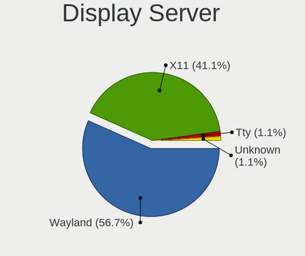
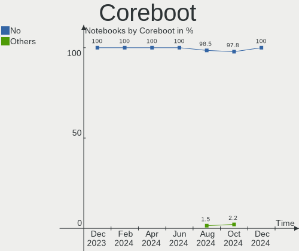
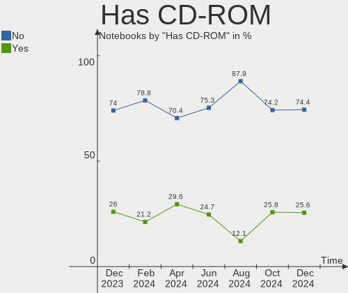
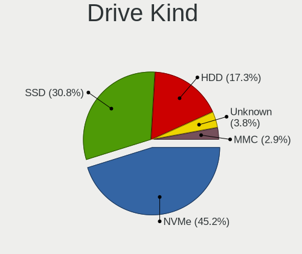
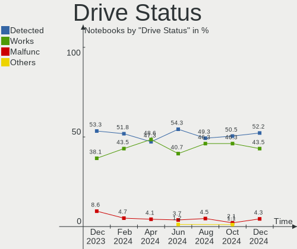
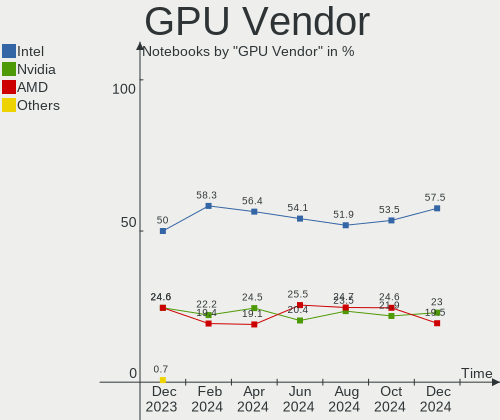
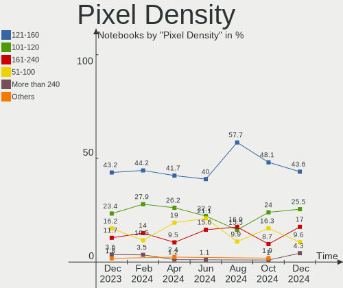
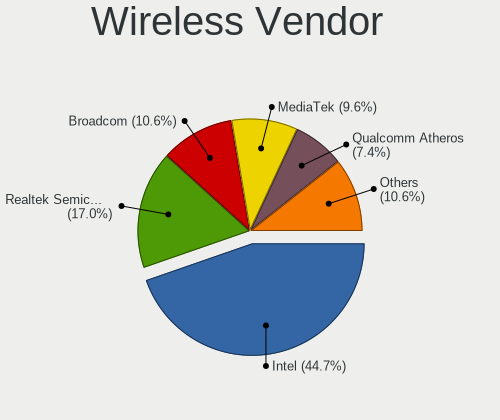
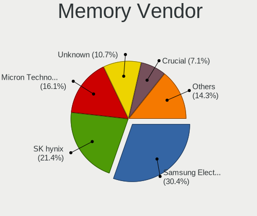
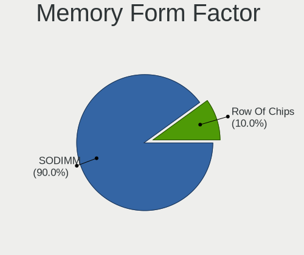

Linux in Spain - Hardware Trends (Notebooks)
--------------------------------------------

A project to identify most popular hardware characteristics and track their change
over time based on data collected by Linux users at https://Linux-Hardware.org.

Anyone can contribute to this report by the [hw-probe](https://github.com/linuxhw/hw-probe) tool:

    sudo -E hw-probe -all -upload

Contents
--------

* [ System ](#system)
  - [ OS                       ](#os)
  - [ OS Family                ](#os-family)
  - [ Kernel                   ](#kernel)
  - [ Kernel Family            ](#kernel-family)
  - [ Kernel Major Ver.        ](#kernel-major-ver)
  - [ Arch                     ](#arch)
  - [ DE                       ](#de)
  - [ Display Server           ](#display-server)
  - [ Display Manager          ](#display-manager)
  - [ OS Lang                  ](#os-lang)
  - [ Boot Mode                ](#boot-mode)
  - [ Filesystem               ](#filesystem)
  - [ Part. scheme             ](#part-scheme)
  - [ Dual Boot with Linux/BSD ](#dual-boot-with-linuxbsd)
  - [ Dual Boot (Win)          ](#dual-boot-win)

* [ Board ](#board)
  - [ Vendor                   ](#vendor)
  - [ Model                    ](#model)
  - [ Model Family             ](#model-family)
  - [ MFG Year                 ](#mfg-year)
  - [ Form Factor              ](#form-factor)
  - [ Secure Boot              ](#secure-boot)
  - [ Coreboot                 ](#coreboot)
  - [ RAM Size                 ](#ram-size)
  - [ RAM Used                 ](#ram-used)
  - [ Total Drives             ](#total-drives)
  - [ Has CD-ROM               ](#has-cd-rom)
  - [ Has Ethernet             ](#has-ethernet)
  - [ Has WiFi                 ](#has-wifi)
  - [ Has Bluetooth            ](#has-bluetooth)

* [ Location ](#location)
  - [ Country                  ](#country)
  - [ City                     ](#city)

* [ Drives ](#drives)
  - [ Drive Vendor             ](#drive-vendor)
  - [ Drive Model              ](#drive-model)
  - [ HDD Vendor               ](#hdd-vendor)
  - [ SSD Vendor               ](#ssd-vendor)
  - [ Drive Kind               ](#drive-kind)
  - [ Drive Connector          ](#drive-connector)
  - [ Drive Size               ](#drive-size)
  - [ Space Total              ](#space-total)
  - [ Space Used               ](#space-used)
  - [ Malfunc. Drives          ](#malfunc-drives)
  - [ Malfunc. Drive Vendor    ](#malfunc-drive-vendor)
  - [ Malfunc. HDD Vendor      ](#malfunc-hdd-vendor)
  - [ Malfunc. Drive Kind      ](#malfunc-drive-kind)
  - [ Failed Drives            ](#failed-drives)
  - [ Failed Drive Vendor      ](#failed-drive-vendor)
  - [ Drive Status             ](#drive-status)

* [ Storage controller ](#storage-controller)
  - [ Storage Vendor           ](#storage-vendor)
  - [ Storage Model            ](#storage-model)
  - [ Storage Kind             ](#storage-kind)

* [ Processor ](#processor)
  - [ CPU Vendor               ](#cpu-vendor)
  - [ CPU Model                ](#cpu-model)
  - [ CPU Model Family         ](#cpu-model-family)
  - [ CPU Cores                ](#cpu-cores)
  - [ CPU Sockets              ](#cpu-sockets)
  - [ CPU Threads              ](#cpu-threads)
  - [ CPU Op-Modes             ](#cpu-op-modes)
  - [ CPU Microcode            ](#cpu-microcode)
  - [ CPU Microarch            ](#cpu-microarch)

* [ Graphics ](#graphics)
  - [ GPU Vendor               ](#gpu-vendor)
  - [ GPU Model                ](#gpu-model)
  - [ GPU Combo                ](#gpu-combo)
  - [ GPU Driver               ](#gpu-driver)
  - [ GPU Memory               ](#gpu-memory)

* [ Monitor ](#monitor)
  - [ Monitor Vendor           ](#monitor-vendor)
  - [ Monitor Model            ](#monitor-model)
  - [ Monitor Resolution       ](#monitor-resolution)
  - [ Monitor Diagonal         ](#monitor-diagonal)
  - [ Monitor Width            ](#monitor-width)
  - [ Aspect Ratio             ](#aspect-ratio)
  - [ Monitor Area             ](#monitor-area)
  - [ Pixel Density            ](#pixel-density)
  - [ Multiple Monitors        ](#multiple-monitors)

* [ Network ](#network)
  - [ Net Controller Vendor    ](#net-controller-vendor)
  - [ Net Controller Model     ](#net-controller-model)
  - [ Wireless Vendor          ](#wireless-vendor)
  - [ Wireless Model           ](#wireless-model)
  - [ Ethernet Vendor          ](#ethernet-vendor)
  - [ Ethernet Model           ](#ethernet-model)
  - [ Net Controller Kind      ](#net-controller-kind)
  - [ Used Controller          ](#used-controller)
  - [ NICs                     ](#nics)
  - [ IPv6                     ](#ipv6)

* [ Bluetooth ](#bluetooth)
  - [ Bluetooth Vendor         ](#bluetooth-vendor)
  - [ Bluetooth Model          ](#bluetooth-model)

* [ Sound ](#sound)
  - [ Sound Vendor             ](#sound-vendor)
  - [ Sound Model              ](#sound-model)

* [ Memory ](#memory)
  - [ Memory Vendor            ](#memory-vendor)
  - [ Memory Model             ](#memory-model)
  - [ Memory Kind              ](#memory-kind)
  - [ Memory Form Factor       ](#memory-form-factor)
  - [ Memory Size              ](#memory-size)
  - [ Memory Speed             ](#memory-speed)

* [ Printers & scanners ](#printers--scanners)
  - [ Printer Vendor           ](#printer-vendor)
  - [ Printer Model            ](#printer-model)
  - [ Scanner Vendor           ](#scanner-vendor)
  - [ Scanner Model            ](#scanner-model)

* [ Camera ](#camera)
  - [ Camera Vendor            ](#camera-vendor)
  - [ Camera Model             ](#camera-model)

* [ Security ](#security)
  - [ Fingerprint Vendor       ](#fingerprint-vendor)
  - [ Fingerprint Model        ](#fingerprint-model)
  - [ Chipcard Vendor          ](#chipcard-vendor)
  - [ Chipcard Model           ](#chipcard-model)

* [ Unsupported ](#unsupported)
  - [ Unsupported Devices      ](#unsupported-devices)
  - [ Unsupported Device Types ](#unsupported-device-types)

System
------

OS
--

Installed operating systems

| Name                | Notebooks | Percent |
|---------------------|-----------|---------|
| Ubuntu 22.04        | 15        | 19.48%  |
| Debian 11           | 9         | 11.69%  |
| Linux Mint 20.3     | 8         | 10.39%  |
| Ubuntu 20.04        | 6         | 7.79%   |
| Fedora 35           | 4         | 5.19%   |
| OpenMandriva 4.3    | 3         | 3.9%    |
| Fedora 36           | 3         | 3.9%    |
| Zorin 16            | 2         | 2.6%    |
| SteamOS 3.2         | 2         | 2.6%    |
| Manjaro             | 2         | 2.6%    |
| Xubuntu 22.04       | 1         | 1.3%    |
| Xubuntu 20.04       | 1         | 1.3%    |
| Ubuntu MATE 22.04   | 1         | 1.3%    |
| Ubuntu MATE 20.04   | 1         | 1.3%    |
| Ubuntu Budgie 21.10 | 1         | 1.3%    |
| Ubuntu 18.04        | 1         | 1.3%    |
| Pop!_OS 22.04       | 1         | 1.3%    |
| Pop!_OS 21.10       | 1         | 1.3%    |
| Parrot 5.0          | 1         | 1.3%    |
| Manjaro 21.2.6      | 1         | 1.3%    |
| LMDE 5              | 1         | 1.3%    |
| Linux Mint 20.1     | 1         | 1.3%    |
| Kubuntu 22.04       | 1         | 1.3%    |
| Kubuntu 20.04       | 1         | 1.3%    |
| KDE neon 20.04      | 1         | 1.3%    |
| Kali 2022.2         | 1         | 1.3%    |
| Fedora 33           | 1         | 1.3%    |
| Endless 4.0.6       | 1         | 1.3%    |
| EndeavourOS         | 1         | 1.3%    |
| Elementary 6.1      | 1         | 1.3%    |
| Debian Testing      | 1         | 1.3%    |
| Arch                | 1         | 1.3%    |
| Alpine 3.15.4       | 1         | 1.3%    |

OS Family
---------

OS without a version

| Name          | Notebooks | Percent |
|---------------|-----------|---------|
| Ubuntu        | 22        | 28.57%  |
| Debian        | 10        | 12.99%  |
| Linux Mint    | 9         | 11.69%  |
| Fedora        | 8         | 10.39%  |
| OpenMandriva  | 3         | 3.9%    |
| Manjaro       | 3         | 3.9%    |
| Zorin         | 2         | 2.6%    |
| Xubuntu       | 2         | 2.6%    |
| Ubuntu MATE   | 2         | 2.6%    |
| SteamOS       | 2         | 2.6%    |
| Pop!_OS       | 2         | 2.6%    |
| Kubuntu       | 2         | 2.6%    |
| Ubuntu Budgie | 1         | 1.3%    |
| Parrot        | 1         | 1.3%    |
| LMDE          | 1         | 1.3%    |
| KDE neon      | 1         | 1.3%    |
| Kali          | 1         | 1.3%    |
| Endless       | 1         | 1.3%    |
| EndeavourOS   | 1         | 1.3%    |
| Elementary    | 1         | 1.3%    |
| Arch          | 1         | 1.3%    |
| Alpine        | 1         | 1.3%    |

Kernel
------

Version of the Linux kernel

| Version                                      | Notebooks | Percent |
|----------------------------------------------|-----------|---------|
| 5.15.0-27-generic                            | 9         | 11.69%  |
| 5.10.0-14-amd64                              | 8         | 10.39%  |
| 5.4.0-109-generic                            | 5         | 6.49%   |
| 5.13.0-41-generic                            | 4         | 5.19%   |
| 5.13.0-40-generic                            | 4         | 5.19%   |
| 5.16.7-desktop-1omv4003                      | 3         | 3.9%    |
| 5.15.0-33-generic                            | 3         | 3.9%    |
| 5.15.0-30-generic                            | 3         | 3.9%    |
| 5.4.0-113-generic                            | 2         | 2.6%    |
| 5.4.0-110-generic                            | 2         | 2.6%    |
| 5.17.5-76051705-generic                      | 2         | 2.6%    |
| 5.17.4-200.fc35.x86_64                       | 2         | 2.6%    |
| 5.4.0-91-generic                             | 1         | 1.3%    |
| 5.4.0-107-generic                            | 1         | 1.3%    |
| 5.18.1-arch1-1                               | 1         | 1.3%    |
| 5.18.0-051800rc7-generic                     | 1         | 1.3%    |
| 5.17.9-arch1-1                               | 1         | 1.3%    |
| 5.17.8-300.fc36.x86_64                       | 1         | 1.3%    |
| 5.17.8-200.fc35.x86_64                       | 1         | 1.3%    |
| 5.17.6-300.fc36.x86_64                       | 1         | 1.3%    |
| 5.17.5-300.fc36.x86_64                       | 1         | 1.3%    |
| 5.17.5-200.fc35.x86_64                       | 1         | 1.3%    |
| 5.17.1-3-MANJARO                             | 1         | 1.3%    |
| 5.17.0-1-amd64                               | 1         | 1.3%    |
| 5.16.6-051606-generic                        | 1         | 1.3%    |
| 5.16.0-kali7-amd64                           | 1         | 1.3%    |
| 5.16.0-12parrot1-amd64                       | 1         | 1.3%    |
| 5.15.38-1-MANJARO                            | 1         | 1.3%    |
| 5.15.37-0-lts                                | 1         | 1.3%    |
| 5.15.32-1-MANJARO                            | 1         | 1.3%    |
| 5.15.0-25-generic                            | 1         | 1.3%    |
| 5.15.0-1008-aws                              | 1         | 1.3%    |
| 5.14.18-100.fc33.x86_64                      | 1         | 1.3%    |
| 5.14.0-1034-oem                              | 1         | 1.3%    |
| 5.13.0-valve15-1-neptune-02197-gf6ec7ad3762a | 1         | 1.3%    |
| 5.13.0-valve14-1-neptune-02195-g5b0f749d00fa | 1         | 1.3%    |
| 5.13.0-44-generic                            | 1         | 1.3%    |
| 5.13.0-39-generic                            | 1         | 1.3%    |
| 5.13.0-30-generic                            | 1         | 1.3%    |
| 5.11.0-35-generic                            | 1         | 1.3%    |
| 5.10.0-13-amd64                              | 1         | 1.3%    |
| 5.10.0-12-amd64                              | 1         | 1.3%    |

Kernel Family
-------------

Linux kernel without a distro release

| Version | Notebooks | Percent |
|---------|-----------|---------|
| 5.15.0  | 17        | 22.08%  |
| 5.13.0  | 13        | 16.88%  |
| 5.4.0   | 11        | 14.29%  |
| 5.10.0  | 10        | 12.99%  |
| 5.17.5  | 4         | 5.19%   |
| 5.16.7  | 3         | 3.9%    |
| 5.17.8  | 2         | 2.6%    |
| 5.17.4  | 2         | 2.6%    |
| 5.16.0  | 2         | 2.6%    |
| 5.18.1  | 1         | 1.3%    |
| 5.18.0  | 1         | 1.3%    |
| 5.17.9  | 1         | 1.3%    |
| 5.17.6  | 1         | 1.3%    |
| 5.17.1  | 1         | 1.3%    |
| 5.17.0  | 1         | 1.3%    |
| 5.16.6  | 1         | 1.3%    |
| 5.15.38 | 1         | 1.3%    |
| 5.15.37 | 1         | 1.3%    |
| 5.15.32 | 1         | 1.3%    |
| 5.14.18 | 1         | 1.3%    |
| 5.14.0  | 1         | 1.3%    |
| 5.11.0  | 1         | 1.3%    |

Kernel Major Ver.
-----------------

Linux kernel major version

| Version | Notebooks | Percent |
|---------|-----------|---------|
| 5.15    | 20        | 25.97%  |
| 5.13    | 13        | 16.88%  |
| 5.17    | 12        | 15.58%  |
| 5.4     | 11        | 14.29%  |
| 5.10    | 10        | 12.99%  |
| 5.16    | 6         | 7.79%   |
| 5.18    | 2         | 2.6%    |
| 5.14    | 2         | 2.6%    |
| 5.11    | 1         | 1.3%    |

Arch
----

OS architecture (x86_64, i586, etc.)

| Name   | Notebooks | Percent |
|--------|-----------|---------|
| x86_64 | 76        | 98.7%   |
| i686   | 1         | 1.3%    |

DE
--

Desktop Environment

| Name       | Notebooks | Percent |
|------------|-----------|---------|
| GNOME      | 36        | 46.75%  |
| X-Cinnamon | 12        | 15.58%  |
| KDE5       | 12        | 15.58%  |
| XFCE       | 7         | 9.09%   |
| MATE       | 4         | 5.19%   |
| Pantheon   | 1         | 1.3%    |
| i3         | 1         | 1.3%    |
| Cutefish   | 1         | 1.3%    |
| Cinnamon   | 1         | 1.3%    |
| Budgie     | 1         | 1.3%    |
| Unknown    | 1         | 1.3%    |

Display Server
--------------

X11 or Wayland

| Name    | Notebooks | Percent |
|---------|-----------|---------|
| X11     | 58        | 75.32%  |
| Wayland | 18        | 23.38%  |
| Tty     | 1         | 1.3%    |

Display Manager
---------------

SDDM, LightDM, etc.

| Name    | Notebooks | Percent |
|---------|-----------|---------|
| Unknown | 24        | 31.17%  |
| GDM3    | 18        | 23.38%  |
| LightDM | 16        | 20.78%  |
| GDM     | 10        | 12.99%  |
| SDDM    | 9         | 11.69%  |

OS Lang
-------

Language

| Lang  | Notebooks | Percent |
|-------|-----------|---------|
| es_ES | 57        | 74.03%  |
| en_US | 12        | 15.58%  |
| C     | 3         | 3.9%    |
| ru_RU | 1         | 1.3%    |
| pt_BR | 1         | 1.3%    |
| en_GB | 1         | 1.3%    |
| ca_ES | 1         | 1.3%    |
| an_ES | 1         | 1.3%    |

Boot Mode
---------

EFI or BIOS

| Mode | Notebooks | Percent |
|------|-----------|---------|
| EFI  | 45        | 58.44%  |
| BIOS | 32        | 41.56%  |

Filesystem
----------

Type of filesystem

| Type    | Notebooks | Percent |
|---------|-----------|---------|
| Ext4    | 62        | 80.52%  |
| Btrfs   | 9         | 11.69%  |
| Overlay | 4         | 5.19%   |
| Xfs     | 1         | 1.3%    |
| Jfs     | 1         | 1.3%    |

Part. scheme
------------

Scheme of partitioning

| Type    | Notebooks | Percent |
|---------|-----------|---------|
| Unknown | 38        | 49.35%  |
| GPT     | 33        | 42.86%  |
| MBR     | 6         | 7.79%   |

Dual Boot with Linux/BSD
------------------------

Hosting more than one Linux/BSD

| Dual boot | Notebooks | Percent |
|-----------|-----------|---------|
| No        | 73        | 94.81%  |
| Yes       | 4         | 5.19%   |

Dual Boot (Win)
---------------

Hosting Linux and Windows

| Dual boot | Notebooks | Percent |
|-----------|-----------|---------|
| No        | 57        | 74.03%  |
| Yes       | 20        | 25.97%  |

Board
-----

Vendor
------

Motherboard manufacturer

| Name                | Notebooks | Percent |
|---------------------|-----------|---------|
| Hewlett-Packard     | 20        | 25.97%  |
| Lenovo              | 14        | 18.18%  |
| MSI                 | 8         | 10.39%  |
| Acer                | 7         | 9.09%   |
| Dell                | 6         | 7.79%   |
| ASUSTek Computer    | 6         | 7.79%   |
| Chuwi               | 3         | 3.9%    |
| Valve               | 2         | 2.6%    |
| Toshiba             | 2         | 2.6%    |
| SLIMBOOK            | 2         | 2.6%    |
| Samsung Electronics | 1         | 1.3%    |
| Notebook            | 1         | 1.3%    |
| Medion              | 1         | 1.3%    |
| HONOR               | 1         | 1.3%    |
| Fujitsu             | 1         | 1.3%    |
| Apple               | 1         | 1.3%    |
| Unknown             | 1         | 1.3%    |

Model
-----

Motherboard model

| Name                                       | Notebooks | Percent |
|--------------------------------------------|-----------|---------|
| Valve Jupiter                              | 2         | 2.6%    |
| Lenovo V145-15AST 81MT                     | 2         | 2.6%    |
| Lenovo IdeaPad 3 15ITL6 82H8               | 2         | 2.6%    |
| HP ProBook 450 G8 Notebook PC              | 2         | 2.6%    |
| HP Pavilion Gaming Laptop 16-a0xxx         | 2         | 2.6%    |
| HP Pavilion g6                             | 2         | 2.6%    |
| HP EliteBook 840 G5                        | 2         | 2.6%    |
| Dell Latitude 5420                         | 2         | 2.6%    |
| Toshiba Satellite L10W-B-101               | 1         | 1.3%    |
| Toshiba PORTEGE Z830                       | 1         | 1.3%    |
| SLIMBOOK EXECUTIVE-14                      | 1         | 1.3%    |
| SLIMBOOK Essential15L                      | 1         | 1.3%    |
| Samsung RF510/RF410/RF710                  | 1         | 1.3%    |
| Notebook PD5x_7xPNP_PNN_PNT                | 1         | 1.3%    |
| MSI Prestige 15 A11SCS                     | 1         | 1.3%    |
| MSI Prestige 14 A12UC                      | 1         | 1.3%    |
| MSI PR600                                  | 1         | 1.3%    |
| MSI Modern 14 B11MO                        | 1         | 1.3%    |
| MSI GP62MVR 6RF                            | 1         | 1.3%    |
| MSI GF63 Thin 9SC                          | 1         | 1.3%    |
| MSI GE62 6QE                               | 1         | 1.3%    |
| MSI GE62 2QD                               | 1         | 1.3%    |
| Medion S6421 MD60703                       | 1         | 1.3%    |
| Lenovo Y520-15IKBN 80WK                    | 1         | 1.3%    |
| Lenovo ThinkPad X270 W10DG 20K6000UUS      | 1         | 1.3%    |
| Lenovo ThinkPad X250 20CLS0LE00            | 1         | 1.3%    |
| Lenovo ThinkPad X200s 74663RG              | 1         | 1.3%    |
| Lenovo Legion 5 Pro 16IAH7H 82RF           | 1         | 1.3%    |
| Lenovo Legion 5 15ACH6H 82JU               | 1         | 1.3%    |
| Lenovo IdeaPad 330-15IKB 81DE              | 1         | 1.3%    |
| Lenovo IdeaPad 320-15IKB 80XL              | 1         | 1.3%    |
| Lenovo G580 2189                           | 1         | 1.3%    |
| Lenovo G580 20150                          | 1         | 1.3%    |
| HONOR HLYL-WXX9                            | 1         | 1.3%    |
| HP Victus by Laptop 16-e0xxx               | 1         | 1.3%    |
| HP ProBook 6470b                           | 1         | 1.3%    |
| HP Notebook                                | 1         | 1.3%    |
| HP Mini 5103                               | 1         | 1.3%    |
| HP Laptop 15s-fq1xxx                       | 1         | 1.3%    |
| HP Laptop 15s-eq2xxx                       | 1         | 1.3%    |
| HP Laptop 15-bw0xx                         | 1         | 1.3%    |
| HP ENVY Notebook 13-ab0XX                  | 1         | 1.3%    |
| HP Compaq 6730s                            | 1         | 1.3%    |
| HP Compaq 15                               | 1         | 1.3%    |
| HP 340S G7 Notebook PC                     | 1         | 1.3%    |
| HP 15                                      | 1         | 1.3%    |
| Fujitsu LIFEBOOK E5511                     | 1         | 1.3%    |
| Dell Latitude E4310                        | 1         | 1.3%    |
| Dell Latitude 5480                         | 1         | 1.3%    |
| Dell Inspiron 5515                         | 1         | 1.3%    |
| Dell G15 5510                              | 1         | 1.3%    |
| Chuwi Hi10 Go                              | 1         | 1.3%    |
| Chuwi HeroBook Air                         | 1         | 1.3%    |
| Chuwi GemiBook                             | 1         | 1.3%    |
| ASUS VivoBook_ASUSLaptop X509DA_D509DA     | 1         | 1.3%    |
| ASUS VivoBook_ASUSLaptop X430FA_S430FA     | 1         | 1.3%    |
| ASUS VivoBook 15_ASUS Laptop X540MA_F540MA | 1         | 1.3%    |
| ASUS N10Jc                                 | 1         | 1.3%    |
| ASUS ASUS TUF Gaming A15 FA506IU_FA506IU   | 1         | 1.3%    |
| ASUS ASUS EXPERTBOOK B9400CEA_B9400CEA     | 1         | 1.3%    |

Model Family
------------

Motherboard model prefix

| Name                  | Notebooks | Percent |
|-----------------------|-----------|---------|
| Acer Aspire           | 5         | 6.49%   |
| Lenovo IdeaPad        | 4         | 5.19%   |
| HP Pavilion           | 4         | 5.19%   |
| Dell Latitude         | 4         | 5.19%   |
| Lenovo ThinkPad       | 3         | 3.9%    |
| HP ProBook            | 3         | 3.9%    |
| HP Laptop             | 3         | 3.9%    |
| ASUS VivoBook         | 3         | 3.9%    |
| Valve Jupiter         | 2         | 2.6%    |
| MSI Prestige          | 2         | 2.6%    |
| MSI GE62              | 2         | 2.6%    |
| Lenovo V145-15AST     | 2         | 2.6%    |
| Lenovo Legion         | 2         | 2.6%    |
| Lenovo G580           | 2         | 2.6%    |
| HP EliteBook          | 2         | 2.6%    |
| HP Compaq             | 2         | 2.6%    |
| ASUS ASUS             | 2         | 2.6%    |
| Acer TravelMate       | 2         | 2.6%    |
| Toshiba Satellite     | 1         | 1.3%    |
| Toshiba PORTEGE       | 1         | 1.3%    |
| SLIMBOOK EXECUTIVE-14 | 1         | 1.3%    |
| SLIMBOOK Essential15L | 1         | 1.3%    |
| Samsung RF510         | 1         | 1.3%    |
| Notebook PD5x         | 1         | 1.3%    |
| MSI PR600             | 1         | 1.3%    |
| MSI Modern            | 1         | 1.3%    |
| MSI GP62MVR           | 1         | 1.3%    |
| MSI GF63              | 1         | 1.3%    |
| Medion S6421          | 1         | 1.3%    |
| Lenovo Y520-15IKBN    | 1         | 1.3%    |
| HONOR HLYL-WXX9       | 1         | 1.3%    |
| HP Victus             | 1         | 1.3%    |
| HP Notebook           | 1         | 1.3%    |
| HP Mini               | 1         | 1.3%    |
| HP ENVY               | 1         | 1.3%    |
| HP 340S               | 1         | 1.3%    |
| HP 15                 | 1         | 1.3%    |
| Fujitsu LIFEBOOK      | 1         | 1.3%    |
| Dell Inspiron         | 1         | 1.3%    |
| Dell G15              | 1         | 1.3%    |
| Chuwi Hi10            | 1         | 1.3%    |
| Chuwi HeroBook        | 1         | 1.3%    |
| Chuwi GemiBook        | 1         | 1.3%    |
| ASUS N10Jc            | 1         | 1.3%    |
| Apple MacBookPro5     | 1         | 1.3%    |
| Unknown               | 1         | 1.3%    |

MFG Year
--------

Motherboard manufacture year

| Year | Notebooks | Percent |
|------|-----------|---------|
| 2021 | 16        | 20.78%  |
| 2020 | 10        | 12.99%  |
| 2018 | 8         | 10.39%  |
| 2017 | 8         | 10.39%  |
| 2022 | 5         | 6.49%   |
| 2019 | 4         | 5.19%   |
| 2012 | 4         | 5.19%   |
| 2010 | 4         | 5.19%   |
| 2015 | 3         | 3.9%    |
| 2014 | 3         | 3.9%    |
| 2013 | 3         | 3.9%    |
| 2016 | 2         | 2.6%    |
| 2011 | 2         | 2.6%    |
| 2009 | 2         | 2.6%    |
| 2008 | 2         | 2.6%    |
| 2007 | 1         | 1.3%    |

Form Factor
-----------

Physical design of the computer

| Name     | Notebooks | Percent |
|----------|-----------|---------|
| Notebook | 77        | 100%    |

Secure Boot
-----------

Enabled or disabled

| State    | Notebooks | Percent |
|----------|-----------|---------|
| Disabled | 70        | 90.91%  |
| Enabled  | 7         | 9.09%   |

Coreboot
--------

Have coreboot on board

| Used | Notebooks | Percent |
|------|-----------|---------|
| No   | 77        | 100%    |

RAM Size
--------

Total RAM memory

| Size in GB  | Notebooks | Percent |
|-------------|-----------|---------|
| 4.01-8.0    | 24        | 31.17%  |
| 16.01-24.0  | 17        | 22.08%  |
| 8.01-16.0   | 14        | 18.18%  |
| 3.01-4.0    | 11        | 14.29%  |
| 32.01-64.0  | 7         | 9.09%   |
| 1.01-2.0    | 2         | 2.6%    |
| 2.01-3.0    | 1         | 1.3%    |
| 64.01-256.0 | 1         | 1.3%    |

RAM Used
--------

Used RAM memory

| Used GB   | Notebooks | Percent |
|-----------|-----------|---------|
| 1.01-2.0  | 28        | 36.36%  |
| 4.01-8.0  | 20        | 25.97%  |
| 2.01-3.0  | 18        | 23.38%  |
| 3.01-4.0  | 8         | 10.39%  |
| 8.01-16.0 | 2         | 2.6%    |
| 0.51-1.0  | 1         | 1.3%    |

Total Drives
------------

Number of drives on board

| Drives | Notebooks | Percent |
|--------|-----------|---------|
| 1      | 63        | 81.82%  |
| 2      | 12        | 15.58%  |
| 3      | 1         | 1.3%    |
| 0      | 1         | 1.3%    |

Has CD-ROM
----------

Has CD-ROM on board

| Presented | Notebooks | Percent |
|-----------|-----------|---------|
| No        | 60        | 77.92%  |
| Yes       | 17        | 22.08%  |

Has Ethernet
------------

Has Ethernet on board

| Presented | Notebooks | Percent |
|-----------|-----------|---------|
| Yes       | 58        | 75.32%  |
| No        | 19        | 24.68%  |

Has WiFi
--------

Has WiFi module

| Presented | Notebooks | Percent |
|-----------|-----------|---------|
| Yes       | 77        | 100%    |

Has Bluetooth
-------------

Has Bluetooth module

| Presented | Notebooks | Percent |
|-----------|-----------|---------|
| Yes       | 63        | 81.82%  |
| No        | 14        | 18.18%  |

Location
--------

Country
-------

Geographic location (country)

| Country | Notebooks | Percent |
|---------|-----------|---------|
| Spain   | 77        | 100%    |

City
----

Geographic location (city)

| City                        | Notebooks | Percent |
|-----------------------------|-----------|---------|
| Madrid                      | 15        | 19.48%  |
| Barcelona                   | 7         | 9.09%   |
| Seville                     | 3         | 3.9%    |
| Vitoria-Gasteiz             | 2         | 2.6%    |
| Valencia                    | 2         | 2.6%    |
| Oviedo                      | 2         | 2.6%    |
| Granada                     | 2         | 2.6%    |
| Vilagarcia de Arousa        | 1         | 1.3%    |
| Valladolid                  | 1         | 1.3%    |
| Torrijos                    | 1         | 1.3%    |
| Torrevieja                  | 1         | 1.3%    |
| Torre Pacheco               | 1         | 1.3%    |
| Torre del Mar               | 1         | 1.3%    |
| Sesena                      | 1         | 1.3%    |
| Santiago de Compostela      | 1         | 1.3%    |
| Sangonera la Verde          | 1         | 1.3%    |
| San Sebastián de los Reyes | 1         | 1.3%    |
| Sabadell                    | 1         | 1.3%    |
| Ponferrada                  | 1         | 1.3%    |
| Petrel                      | 1         | 1.3%    |
| Palma                       | 1         | 1.3%    |
| Mostoles                    | 1         | 1.3%    |
| Montornès del Vallès      | 1         | 1.3%    |
| Montijo                     | 1         | 1.3%    |
| Molina de Segura            | 1         | 1.3%    |
| Miengo                      | 1         | 1.3%    |
| Málaga                     | 1         | 1.3%    |
| Logroño                    | 1         | 1.3%    |
| León                       | 1         | 1.3%    |
| Las Palmas de Gran Canaria  | 1         | 1.3%    |
| la Nucia                    | 1         | 1.3%    |
| Jerez de la Frontera        | 1         | 1.3%    |
| Ingenio                     | 1         | 1.3%    |
| Felanitx                    | 1         | 1.3%    |
| Errenteria                  | 1         | 1.3%    |
| Dos Hermanas                | 1         | 1.3%    |
| Donostia / San Sebastian    | 1         | 1.3%    |
| Chiclana de la Frontera     | 1         | 1.3%    |
| Castelldefels               | 1         | 1.3%    |
| Boadilla del Monte          | 1         | 1.3%    |
| Benissa                     | 1         | 1.3%    |
| Baza                        | 1         | 1.3%    |
| Barakaldo                   | 1         | 1.3%    |
| Banyoles                    | 1         | 1.3%    |
| Badajoz                     | 1         | 1.3%    |
| Avilés                     | 1         | 1.3%    |
| Almonte                     | 1         | 1.3%    |
| Alcorcón                   | 1         | 1.3%    |
| Alcobendas                  | 1         | 1.3%    |
| Alboraya                    | 1         | 1.3%    |
| Albacete                    | 1         | 1.3%    |

Drives
------

Drive Vendor
------------

Hard drive vendors

| Vendor                      | Notebooks | Drives | Percent |
|-----------------------------|-----------|--------|---------|
| Samsung Electronics         | 13        | 14     | 14.77%  |
| Kingston                    | 13        | 13     | 14.77%  |
| WDC                         | 8         | 8      | 9.09%   |
| Micron Technology           | 8         | 8      | 9.09%   |
| Unknown                     | 6         | 7      | 6.82%   |
| Toshiba                     | 6         | 6      | 6.82%   |
| SK Hynix                    | 6         | 6      | 6.82%   |
| HGST                        | 5         | 5      | 5.68%   |
| KIOXIA                      | 4         | 4      | 4.55%   |
| Seagate                     | 2         | 2      | 2.27%   |
| SanDisk                     | 2         | 2      | 2.27%   |
| Patriot                     | 2         | 2      | 2.27%   |
| Netac                       | 2         | 2      | 2.27%   |
| Intel                       | 2         | 2      | 2.27%   |
| Phison                      | 1         | 1      | 1.14%   |
| O2 Micro                    | 1         | 1      | 1.14%   |
| MAXIO Technology (Hangzhou) | 1         | 1      | 1.14%   |
| KIOXIA-EXCERIA              | 1         | 1      | 1.14%   |
| KingSpec                    | 1         | 1      | 1.14%   |
| Hitachi                     | 1         | 1      | 1.14%   |
| EMTEC                       | 1         | 1      | 1.14%   |
| Crucial                     | 1         | 1      | 1.14%   |
| Unknown                     | 1         | 1      | 1.14%   |

Drive Model
-----------

Hard drive models

| Model                                    | Notebooks | Percent |
|------------------------------------------|-----------|---------|
| Micron NVMe SSD Drive 512GB              | 3         | 3.37%   |
| HGST HTS721010A9E630 1TB                 | 3         | 3.37%   |
| Toshiba MQ01ABD050 500GB                 | 2         | 2.25%   |
| Samsung SSD 980 PRO 1TB                  | 2         | 2.25%   |
| Samsung NVMe SSD Drive 512GB             | 2         | 2.25%   |
| Kingston SA400S37960G 960GB SSD          | 2         | 2.25%   |
| Kingston SA400S37480G 480GB SSD          | 2         | 2.25%   |
| Kingston SA400S37240G 240GB SSD          | 2         | 2.25%   |
| Kingston NVMe SSD Drive 512GB            | 2         | 2.25%   |
| WDC WDS500G2B0A-00SM50 500GB SSD         | 1         | 1.12%   |
| WDC WDS250G3X0C-00SJG0 250GB             | 1         | 1.12%   |
| WDC WDS200T2B0C-00PXH0 2TB               | 1         | 1.12%   |
| WDC WD5000LPLX-08ZNTT0 500GB             | 1         | 1.12%   |
| WDC WD1600BEKT-75A25T0 160GB             | 1         | 1.12%   |
| WDC WD10SPZX-21Z10T0 1TB                 | 1         | 1.12%   |
| WDC PC SN730 SDBPNTY-512G-1036 512GB     | 1         | 1.12%   |
| WDC PC SN720 SDAPNTW-1T00-1006 1TB       | 1         | 1.12%   |
| Unknown SD/MMC/MS PRO 999GB              | 1         | 1.12%   |
| Unknown SC64G  64GB                      | 1         | 1.12%   |
| Unknown MMC Card  64GB                   | 1         | 1.12%   |
| Unknown MMC Card  498GB                  | 1         | 1.12%   |
| Unknown MMC Card  32GB                   | 1         | 1.12%   |
| Unknown MMC Card  128GB                  | 1         | 1.12%   |
| Toshiba THNSNB128GMCJ 128GB SSD          | 1         | 1.12%   |
| Toshiba MQ01ABD075 752GB                 | 1         | 1.12%   |
| Toshiba MK1637GSX 160GB                  | 1         | 1.12%   |
| Toshiba KBG30ZMV256G 256GB               | 1         | 1.12%   |
| SK Hynix SKHynix_HFS001TDE9X084N 1TB     | 1         | 1.12%   |
| SK Hynix PC711 HFS512GDE9X073N 512GB     | 1         | 1.12%   |
| SK Hynix NVMe SSD Drive 256GB            | 1         | 1.12%   |
| SK Hynix HFS256G32TNH-73A0A 256GB SSD    | 1         | 1.12%   |
| SK Hynix HFS256G32TND-N210A 256GB SSD    | 1         | 1.12%   |
| SK Hynix HBG4e  32GB                     | 1         | 1.12%   |
| Seagate ST500LM012 HN-M500MBB 500GB      | 1         | 1.12%   |
| Seagate ST1000LM035-1RK172 1TB           | 1         | 1.12%   |
| SanDisk SDSSDH3 500G                     | 1         | 1.12%   |
| SanDisk SDSSDH3 1T00 1TB                 | 1         | 1.12%   |
| Samsung SSD SM871 2.5 7mm 256GB          | 1         | 1.12%   |
| Samsung SSD 970 PRO 512GB                | 1         | 1.12%   |
| Samsung SSD 860 EVO 1TB                  | 1         | 1.12%   |
| Samsung SSD 840 Series 250GB             | 1         | 1.12%   |
| Samsung SSD 840 EVO 250GB                | 1         | 1.12%   |
| Samsung NVMe SSD Drive 256GB             | 1         | 1.12%   |
| Samsung NVMe SSD Drive 1024GB            | 1         | 1.12%   |
| Samsung MZVLQ512HBLU-00B07 512GB         | 1         | 1.12%   |
| Samsung MZVLQ512HALU-000H1 512GB         | 1         | 1.12%   |
| Samsung MZVLB1T0HBLR-00000 1TB           | 1         | 1.12%   |
| Phison 1TB SM2801T24GKBB4S-E162          | 1         | 1.12%   |
| Patriot P210 128GB SSD                   | 1         | 1.12%   |
| Patriot M.2 P300 512GB                   | 1         | 1.12%   |
| O2 Micro NVMe SSD Drive 64GB             | 1         | 1.12%   |
| Netac SSD 128GB                          | 1         | 1.12%   |
| Netac S535N8/256 256GB SSD               | 1         | 1.12%   |
| Micron MTFDKBA1T0TFH 1TB                 | 1         | 1.12%   |
| Micron MTFDHBA256TCK-1AS1AABHA 256GB     | 1         | 1.12%   |
| Micron MTFDDAV256TBN-1AR15ABHA 256GB SSD | 1         | 1.12%   |
| Micron 3400_MTFDKBA1T0TFH 1TB            | 1         | 1.12%   |
| Micron 2210_MTFDHBA1T0QFD 1TB            | 1         | 1.12%   |
| MAXIO (Hangzhou) NVMe SSD Drive 128GB    | 1         | 1.12%   |
| KIOXIA-EXCERIA SATA SSD 480GB            | 1         | 1.12%   |

HDD Vendor
----------

Hard disk drive vendors

| Vendor  | Notebooks | Drives | Percent |
|---------|-----------|--------|---------|
| HGST    | 5         | 5      | 31.25%  |
| Toshiba | 4         | 4      | 25%     |
| WDC     | 3         | 3      | 18.75%  |
| Seagate | 2         | 2      | 12.5%   |
| Unknown | 1         | 1      | 6.25%   |
| Hitachi | 1         | 1      | 6.25%   |

SSD Vendor
----------

Solid state drive vendors

| Vendor              | Notebooks | Drives | Percent |
|---------------------|-----------|--------|---------|
| Kingston            | 9         | 9      | 32.14%  |
| Samsung Electronics | 4         | 4      | 14.29%  |
| SK Hynix            | 2         | 2      | 7.14%   |
| SanDisk             | 2         | 2      | 7.14%   |
| Netac               | 2         | 2      | 7.14%   |
| WDC                 | 1         | 1      | 3.57%   |
| Toshiba             | 1         | 1      | 3.57%   |
| Patriot             | 1         | 1      | 3.57%   |
| Micron Technology   | 1         | 1      | 3.57%   |
| KIOXIA-EXCERIA      | 1         | 1      | 3.57%   |
| KingSpec            | 1         | 1      | 3.57%   |
| Intel               | 1         | 1      | 3.57%   |
| EMTEC               | 1         | 1      | 3.57%   |
| Crucial             | 1         | 1      | 3.57%   |

Drive Kind
----------

HDD or SSD

| Kind | Notebooks | Drives | Percent |
|------|-----------|--------|---------|
| NVMe | 36        | 38     | 41.86%  |
| SSD  | 27        | 28     | 31.4%   |
| HDD  | 16        | 16     | 18.6%   |
| MMC  | 7         | 8      | 8.14%   |

Drive Connector
---------------

SATA, SAS, NVMe, etc.

| Type | Notebooks | Drives | Percent |
|------|-----------|--------|---------|
| SATA | 41        | 43     | 48.24%  |
| NVMe | 36        | 38     | 42.35%  |
| MMC  | 7         | 8      | 8.24%   |
| SAS  | 1         | 1      | 1.18%   |

Drive Size
----------

Size of hard drive

| Size in TB | Notebooks | Drives | Percent |
|------------|-----------|--------|---------|
| 0.01-0.5   | 31        | 32     | 72.09%  |
| 0.51-1.0   | 12        | 12     | 27.91%  |

Space Total
-----------

Amount of disk space available on the file system

| Size in GB     | Notebooks | Percent |
|----------------|-----------|---------|
| 251-500        | 27        | 35.06%  |
| 101-250        | 26        | 33.77%  |
| 1-20           | 7         | 9.09%   |
| 501-1000       | 7         | 9.09%   |
| 51-100         | 4         | 5.19%   |
| 1001-2000      | 3         | 3.9%    |
| More than 3000 | 1         | 1.3%    |
| 21-50          | 1         | 1.3%    |
| Unknown        | 1         | 1.3%    |

Space Used
----------

Amount of used disk space

| Used GB   | Notebooks | Percent |
|-----------|-----------|---------|
| 1-20      | 27        | 35.06%  |
| 21-50     | 16        | 20.78%  |
| 101-250   | 16        | 20.78%  |
| 51-100    | 9         | 11.69%  |
| 251-500   | 6         | 7.79%   |
| 1001-2000 | 1         | 1.3%    |
| 501-1000  | 1         | 1.3%    |
| Unknown   | 1         | 1.3%    |

Malfunc. Drives
---------------

Drive models with a malfunction

| Model                                       | Notebooks | Drives | Percent |
|---------------------------------------------|-----------|--------|---------|
| Toshiba MQ01ABD075 752GB                    | 1         | 1      | 20%     |
| Seagate ST1000LM035-1RK172 1TB              | 1         | 1      | 20%     |
| Samsung Electronics SSD SM871 2.5 7mm 256GB | 1         | 1      | 20%     |
| Samsung Electronics SSD 970 PRO 512GB       | 1         | 1      | 20%     |
| HGST HTS545050A7E680 500GB                  | 1         | 1      | 20%     |

Malfunc. Drive Vendor
---------------------

Vendors of faulty drives

| Vendor              | Notebooks | Drives | Percent |
|---------------------|-----------|--------|---------|
| Samsung Electronics | 2         | 2      | 40%     |
| Toshiba             | 1         | 1      | 20%     |
| Seagate             | 1         | 1      | 20%     |
| HGST                | 1         | 1      | 20%     |

Malfunc. HDD Vendor
-------------------

Vendors of faulty HDD drives

| Vendor  | Notebooks | Drives | Percent |
|---------|-----------|--------|---------|
| Toshiba | 1         | 1      | 33.33%  |
| Seagate | 1         | 1      | 33.33%  |
| HGST    | 1         | 1      | 33.33%  |

Malfunc. Drive Kind
-------------------

Kinds of faulty drives

| Kind | Notebooks | Drives | Percent |
|------|-----------|--------|---------|
| HDD  | 3         | 3      | 60%     |
| NVMe | 1         | 1      | 20%     |
| SSD  | 1         | 1      | 20%     |

Failed Drives
-------------

Failed drive models

Zero info for selected period =(

Failed Drive Vendor
-------------------

Failed drive vendors

Zero info for selected period =(

Drive Status
------------

Number of failed and malfunc. drives

| Status   | Notebooks | Drives | Percent |
|----------|-----------|--------|---------|
| Detected | 41        | 50     | 51.9%   |
| Works    | 33        | 35     | 41.77%  |
| Malfunc  | 5         | 5      | 6.33%   |

Storage controller
------------------

Storage Vendor
--------------

Storage controller vendors

| Vendor                       | Notebooks | Percent |
|------------------------------|-----------|---------|
| Intel                        | 49        | 50.52%  |
| AMD                          | 11        | 11.34%  |
| Samsung Electronics          | 9         | 9.28%   |
| Micron Technology            | 7         | 7.22%   |
| Sandisk                      | 4         | 4.12%   |
| Kingston Technology Company  | 4         | 4.12%   |
| SK Hynix                     | 3         | 3.09%   |
| KIOXIA                       | 3         | 3.09%   |
| Toshiba America Info Systems | 2         | 2.06%   |
| Phison Electronics           | 2         | 2.06%   |
| O2 Micro                     | 1         | 1.03%   |
| Nvidia                       | 1         | 1.03%   |
| MAXIO Technology (Hangzhou)  | 1         | 1.03%   |

Storage Model
-------------

Storage controller models

| Model                                                                         | Notebooks | Percent |
|-------------------------------------------------------------------------------|-----------|---------|
| AMD FCH SATA Controller [AHCI mode]                                           | 10        | 9.9%    |
| Intel 82801 Mobile SATA Controller [RAID mode]                                | 8         | 7.92%   |
| Micron Non-Volatile memory controller                                         | 7         | 6.93%   |
| Intel Sunrise Point-LP SATA Controller [AHCI mode]                            | 6         | 5.94%   |
| Intel Volume Management Device NVMe RAID Controller                           | 5         | 4.95%   |
| Samsung NVMe SSD Controller 980                                               | 4         | 3.96%   |
| Intel 7 Series Chipset Family 6-port SATA Controller [AHCI mode]              | 4         | 3.96%   |
| Samsung NVMe SSD Controller SM981/PM981/PM983                                 | 3         | 2.97%   |
| KIOXIA Non-Volatile memory controller                                         | 3         | 2.97%   |
| Intel HM170/QM170 Chipset SATA Controller [AHCI Mode]                         | 3         | 2.97%   |
| Intel Celeron/Pentium Silver Processor SATA Controller                        | 3         | 2.97%   |
| SK Hynix Gold P31 SSD                                                         | 2         | 1.98%   |
| Sandisk WD Black SN750 / PC SN730 NVMe SSD                                    | 2         | 1.98%   |
| Samsung NVMe SSD Controller PM9A1/PM9A3/980PRO                                | 2         | 1.98%   |
| Kingston Company U-SNS8154P3 NVMe SSD                                         | 2         | 1.98%   |
| Intel Tiger Lake-LP SATA Controller [AHCI mode]                               | 2         | 1.98%   |
| Intel Ice Lake-LP SATA Controller [AHCI mode]                                 | 2         | 1.98%   |
| Intel 82801IBM/IEM (ICH9M/ICH9M-E) 4 port SATA Controller [AHCI mode]         | 2         | 1.98%   |
| Intel 8 Series SATA Controller 1 [AHCI mode]                                  | 2         | 1.98%   |
| Intel 5 Series/3400 Series Chipset 4 port SATA AHCI Controller                | 2         | 1.98%   |
| Toshiba America Info Systems XG6 NVMe SSD Controller                          | 1         | 0.99%   |
| Toshiba America Info Systems BG3 NVMe SSD Controller                          | 1         | 0.99%   |
| SK Hynix BC511                                                                | 1         | 0.99%   |
| Sandisk WD Black 2018/SN750 / PC SN720 NVMe SSD                               | 1         | 0.99%   |
| Sandisk Non-Volatile memory controller                                        | 1         | 0.99%   |
| Samsung NVMe SSD Controller SM951/PM951                                       | 1         | 0.99%   |
| Phison PS5013 E13 NVMe Controller                                             | 1         | 0.99%   |
| Phison E16 PCIe4 NVMe Controller                                              | 1         | 0.99%   |
| O2 Micro Non-Volatile memory controller                                       | 1         | 0.99%   |
| Nvidia MCP79 AHCI Controller                                                  | 1         | 0.99%   |
| MAXIO (Hangzhou) NVMe SSD Controller MAP1202                                  | 1         | 0.99%   |
| Kingston Company Company Non-Volatile memory controller                       | 1         | 0.99%   |
| Kingston Company OM3PDP3 NVMe SSD                                             | 1         | 0.99%   |
| Intel Wildcat Point-LP SATA Controller [AHCI Mode]                            | 1         | 0.99%   |
| Intel SSD 660P Series                                                         | 1         | 0.99%   |
| Intel Q170/Q150/B150/H170/H110/Z170/CM236 Chipset SATA Controller [AHCI Mode] | 1         | 0.99%   |
| Intel NM10/ICH7 Family SATA Controller [IDE mode]                             | 1         | 0.99%   |
| Intel Jasper Lake SATA AHCI Controller                                        | 1         | 0.99%   |
| Intel Comet Lake SATA AHCI Controller                                         | 1         | 0.99%   |
| Intel Cannon Lake Mobile PCH SATA AHCI Controller                             | 1         | 0.99%   |
| Intel Atom Processor E3800 Series SATA AHCI Controller                        | 1         | 0.99%   |
| Intel 82801HM/HEM (ICH8M/ICH8M-E) SATA Controller [IDE mode]                  | 1         | 0.99%   |
| Intel 82801HM/HEM (ICH8M/ICH8M-E) SATA Controller [AHCI mode]                 | 1         | 0.99%   |
| Intel 82801HM/HEM (ICH8M/ICH8M-E) IDE Controller                              | 1         | 0.99%   |
| Intel 82801GBM/GHM (ICH7-M Family) SATA Controller [IDE mode]                 | 1         | 0.99%   |
| Intel 6 Series/C200 Series Chipset Family 6 port Mobile SATA AHCI Controller  | 1         | 0.99%   |
| AMD FCH SATA Controller [IDE mode]                                            | 1         | 0.99%   |

Storage Kind
------------

Kind of storage controller (IDE, SATA, NVMe, SAS, ...)

| Kind | Notebooks | Percent |
|------|-----------|---------|
| SATA | 46        | 46.46%  |
| NVMe | 36        | 36.36%  |
| RAID | 13        | 13.13%  |
| IDE  | 4         | 4.04%   |

Processor
---------

CPU Vendor
----------

Processor vendors

| Vendor | Notebooks | Percent |
|--------|-----------|---------|
| Intel  | 61        | 79.22%  |
| AMD    | 16        | 20.78%  |

CPU Model
---------

Processor models

| Model                                         | Notebooks | Percent |
|-----------------------------------------------|-----------|---------|
| Intel Core i5-8250U CPU @ 1.60GHz             | 3         | 3.9%    |
| Intel Core i5-1035G1 CPU @ 1.00GHz            | 3         | 3.9%    |
| Intel 11th Gen Core i7-1165G7 @ 2.80GHz       | 3         | 3.9%    |
| Intel Core i7-6700HQ CPU @ 2.60GHz            | 2         | 2.6%    |
| Intel Core i7-4510U CPU @ 2.00GHz             | 2         | 2.6%    |
| Intel Core i7-10750H CPU @ 2.60GHz            | 2         | 2.6%    |
| Intel Core i5-7200U CPU @ 2.50GHz             | 2         | 2.6%    |
| Intel Core i5-6200U CPU @ 2.30GHz             | 2         | 2.6%    |
| Intel 12th Gen Core i7-12700H                 | 2         | 2.6%    |
| Intel 11th Gen Core i7-1185G7 @ 3.00GHz       | 2         | 2.6%    |
| Intel 11th Gen Core i5-1135G7 @ 2.40GHz       | 2         | 2.6%    |
| AMD Ryzen 7 5800H with Radeon Graphics        | 2         | 2.6%    |
| AMD Ryzen 7 5700U with Radeon Graphics        | 2         | 2.6%    |
| AMD Custom APU 0405                           | 2         | 2.6%    |
| AMD A4-9125 RADEON R3, 4 COMPUTE CORES 2C+2G  | 2         | 2.6%    |
| Intel Core i7-9750H CPU @ 2.60GHz             | 1         | 1.3%    |
| Intel Core i7-7820HQ CPU @ 2.90GHz            | 1         | 1.3%    |
| Intel Core i7-7700HQ CPU @ 2.80GHz            | 1         | 1.3%    |
| Intel Core i7-5700HQ CPU @ 2.70GHz            | 1         | 1.3%    |
| Intel Core i7-3520M CPU @ 2.90GHz             | 1         | 1.3%    |
| Intel Core i7-10870H CPU @ 2.20GHz            | 1         | 1.3%    |
| Intel Core i7-10510U CPU @ 1.80GHz            | 1         | 1.3%    |
| Intel Core i5-8265U CPU @ 1.60GHz             | 1         | 1.3%    |
| Intel Core i5-5200U CPU @ 2.20GHz             | 1         | 1.3%    |
| Intel Core i5-3320M CPU @ 2.60GHz             | 1         | 1.3%    |
| Intel Core i5-3230M CPU @ 2.60GHz             | 1         | 1.3%    |
| Intel Core i5-3210M CPU @ 2.50GHz             | 1         | 1.3%    |
| Intel Core i5-2467M CPU @ 1.60GHz             | 1         | 1.3%    |
| Intel Core i5 CPU M 560 @ 2.67GHz             | 1         | 1.3%    |
| Intel Core i5 CPU M 480 @ 2.67GHz             | 1         | 1.3%    |
| Intel Core i3-6006U CPU @ 2.00GHz             | 1         | 1.3%    |
| Intel Core i3-1005G1 CPU @ 1.20GHz            | 1         | 1.3%    |
| Intel Core i3 CPU M 370 @ 2.40GHz             | 1         | 1.3%    |
| Intel Core 2 Duo CPU T9400 @ 2.53GHz          | 1         | 1.3%    |
| Intel Core 2 Duo CPU T5870 @ 2.00GHz          | 1         | 1.3%    |
| Intel Core 2 Duo CPU T5670 @ 1.80GHz          | 1         | 1.3%    |
| Intel Core 2 Duo CPU T5450 @ 1.66GHz          | 1         | 1.3%    |
| Intel Core 2 Duo CPU L9400 @ 1.86GHz          | 1         | 1.3%    |
| Intel Celeron N4500 @ 1.10GHz                 | 1         | 1.3%    |
| Intel Celeron N4020 CPU @ 1.10GHz             | 1         | 1.3%    |
| Intel Celeron N4000 CPU @ 1.10GHz             | 1         | 1.3%    |
| Intel Celeron J4125 CPU @ 2.00GHz             | 1         | 1.3%    |
| Intel Celeron CPU N3050 @ 1.60GHz             | 1         | 1.3%    |
| Intel Celeron CPU N2840 @ 2.16GHz             | 1         | 1.3%    |
| Intel Atom CPU N455 @ 1.66GHz                 | 1         | 1.3%    |
| Intel Atom CPU N270 @ 1.60GHz                 | 1         | 1.3%    |
| Intel 12th Gen Core i7-1280P                  | 1         | 1.3%    |
| Intel 11th Gen Core i7-1195G7 @ 2.90GHz       | 1         | 1.3%    |
| Intel 11th Gen Core i7-11370H @ 3.30GHz       | 1         | 1.3%    |
| Intel 11th Gen Core i5-1145G7 @ 2.60GHz       | 1         | 1.3%    |
| Intel 11th Gen Core i3-1115G4 @ 3.00GHz       | 1         | 1.3%    |
| AMD Ryzen 7 4800H with Radeon Graphics        | 1         | 1.3%    |
| AMD Ryzen 7 3700U with Radeon Vega Mobile Gfx | 1         | 1.3%    |
| AMD Ryzen 5 4600H with Radeon Graphics        | 1         | 1.3%    |
| AMD E1-2100 APU with Radeon HD Graphics       | 1         | 1.3%    |
| AMD A9-9420 RADEON R5, 5 COMPUTE CORES 2C+3G  | 1         | 1.3%    |
| AMD A9-9410 RADEON R5, 5 COMPUTE CORES 2C+3G  | 1         | 1.3%    |
| AMD A4-5000 APU with Radeon HD Graphics       | 1         | 1.3%    |
| AMD A4-3305M APU with Radeon HD Graphics      | 1         | 1.3%    |

CPU Model Family
----------------

Processor model prefix

| Model            | Notebooks | Percent |
|------------------|-----------|---------|
| Other            | 18        | 23.38%  |
| Intel Core i5    | 18        | 23.38%  |
| Intel Core i7    | 13        | 16.88%  |
| Intel Celeron    | 6         | 7.79%   |
| AMD Ryzen 7      | 6         | 7.79%   |
| Intel Core 2 Duo | 5         | 6.49%   |
| AMD A4           | 4         | 5.19%   |
| Intel Core i3    | 3         | 3.9%    |
| Intel Atom       | 2         | 2.6%    |
| AMD Ryzen 5      | 1         | 1.3%    |
| AMD E1           | 1         | 1.3%    |

CPU Cores
---------

Number of processor cores

| Number | Notebooks | Percent |
|--------|-----------|---------|
| 2      | 34        | 44.16%  |
| 4      | 28        | 36.36%  |
| 8      | 6         | 7.79%   |
| 6      | 4         | 5.19%   |
| 14     | 3         | 3.9%    |
| 1      | 2         | 2.6%    |

CPU Sockets
-----------

Number of sockets

| Number | Notebooks | Percent |
|--------|-----------|---------|
| 1      | 77        | 100%    |

CPU Threads
-----------

Threads per core (Hyper-Threading)

| Number | Notebooks | Percent |
|--------|-----------|---------|
| 2      | 58        | 75.32%  |
| 1      | 19        | 24.68%  |

CPU Op-Modes
------------

CPU Operation Modes (32-bit, 64-bit)

| Op mode        | Notebooks | Percent |
|----------------|-----------|---------|
| 32-bit, 64-bit | 76        | 98.7%   |
| 32-bit         | 1         | 1.3%    |

CPU Microcode
-------------

Microcode number

| Number     | Notebooks | Percent |
|------------|-----------|---------|
| Unknown    | 22        | 28.57%  |
| 0x806c1    | 8         | 10.39%  |
| 0x706e5    | 4         | 5.19%   |
| 0x906a3    | 3         | 3.9%    |
| 0x6fd      | 3         | 3.9%    |
| 0x306a9    | 3         | 3.9%    |
| 0x20655    | 3         | 3.9%    |
| 0xa0652    | 2         | 2.6%    |
| 0x906e9    | 2         | 2.6%    |
| 0x806ea    | 2         | 2.6%    |
| 0x806e9    | 2         | 2.6%    |
| 0x406e3    | 2         | 2.6%    |
| 0x0a50000c | 2         | 2.6%    |
| 0x08600104 | 2         | 2.6%    |
| 0x906ed    | 1         | 1.3%    |
| 0x906c0    | 1         | 1.3%    |
| 0x806ec    | 1         | 1.3%    |
| 0x806eb    | 1         | 1.3%    |
| 0x706a8    | 1         | 1.3%    |
| 0x506e3    | 1         | 1.3%    |
| 0x406c3    | 1         | 1.3%    |
| 0x40651    | 1         | 1.3%    |
| 0x306d4    | 1         | 1.3%    |
| 0x206a7    | 1         | 1.3%    |
| 0x10676    | 1         | 1.3%    |
| 0x08608103 | 1         | 1.3%    |
| 0x0700010f | 1         | 1.3%    |
| 0x0700010b | 1         | 1.3%    |
| 0x06006705 | 1         | 1.3%    |
| 0x06006704 | 1         | 1.3%    |
| 0x03000027 | 1         | 1.3%    |

CPU Microarch
-------------

Microarchitecture

| Name             | Notebooks | Percent |
|------------------|-----------|---------|
| TigerLake        | 11        | 14.29%  |
| KabyLake         | 10        | 12.99%  |
| Skylake          | 5         | 6.49%   |
| Unknown          | 5         | 6.49%   |
| IvyBridge        | 4         | 5.19%   |
| IceLake          | 4         | 5.19%   |
| Excavator        | 4         | 5.19%   |
| Westmere         | 3         | 3.9%    |
| Goldmont plus    | 3         | 3.9%    |
| Core             | 3         | 3.9%    |
| CometLake        | 3         | 3.9%    |
| Zen 3            | 2         | 2.6%    |
| Zen 2            | 2         | 2.6%    |
| Silvermont       | 2         | 2.6%    |
| Penryn           | 2         | 2.6%    |
| Jaguar           | 2         | 2.6%    |
| Haswell          | 2         | 2.6%    |
| Broadwell        | 2         | 2.6%    |
| Bonnell          | 2         | 2.6%    |
| Alderlake Hybrid | 2         | 2.6%    |
| Zen+             | 1         | 1.3%    |
| Tremont          | 1         | 1.3%    |
| SandyBridge      | 1         | 1.3%    |
| K10 Llano        | 1         | 1.3%    |

Graphics
--------

GPU Vendor
----------

Vendors of graphics cards

| Vendor | Notebooks | Percent |
|--------|-----------|---------|
| Intel  | 57        | 58.16%  |
| AMD    | 21        | 21.43%  |
| Nvidia | 20        | 20.41%  |

GPU Model
---------

Graphics card models

| Model                                                                                    | Notebooks | Percent |
|------------------------------------------------------------------------------------------|-----------|---------|
| Intel TigerLake-LP GT2 [Iris Xe Graphics]                                                | 10        | 9.8%    |
| Intel Iris Plus Graphics G1 (Ice Lake)                                                   | 4         | 3.92%   |
| Intel 3rd Gen Core processor Graphics Controller                                         | 4         | 3.92%   |
| AMD Stoney [Radeon R2/R3/R4/R5 Graphics]                                                 | 4         | 3.92%   |
| Intel UHD Graphics 620                                                                   | 3         | 2.94%   |
| Intel Skylake GT2 [HD Graphics 520]                                                      | 3         | 2.94%   |
| Intel GeminiLake [UHD Graphics 600]                                                      | 3         | 2.94%   |
| Intel CometLake-H GT2 [UHD Graphics]                                                     | 3         | 2.94%   |
| Intel Alder Lake-P Integrated Graphics Controller                                        | 3         | 2.94%   |
| Nvidia TU117M [GeForce GTX 1650 Ti Mobile]                                               | 2         | 1.96%   |
| Nvidia TU116M [GeForce GTX 1660 Ti Mobile]                                               | 2         | 1.96%   |
| Nvidia GA106M [GeForce RTX 3060 Mobile / Max-Q]                                          | 2         | 1.96%   |
| Intel Mobile 4 Series Chipset Integrated Graphics Controller                             | 2         | 1.96%   |
| Intel HD Graphics 630                                                                    | 2         | 1.96%   |
| Intel HD Graphics 620                                                                    | 2         | 1.96%   |
| Intel HD Graphics 530                                                                    | 2         | 1.96%   |
| Intel Haswell-ULT Integrated Graphics Controller                                         | 2         | 1.96%   |
| AMD VanGogh [AMD Custom GPU 0405]                                                        | 2         | 1.96%   |
| AMD Sun XT [Radeon HD 8670A/8670M/8690M / R5 M330 / M430 / Radeon 520 Mobile]            | 2         | 1.96%   |
| AMD Renoir                                                                               | 2         | 1.96%   |
| AMD Lucienne                                                                             | 2         | 1.96%   |
| AMD Cezanne                                                                              | 2         | 1.96%   |
| Nvidia TU117M [GeForce GTX 1650 Mobile / Max-Q]                                          | 1         | 0.98%   |
| Nvidia GT216M [GeForce GT 330M]                                                          | 1         | 0.98%   |
| Nvidia GP107M [GeForce GTX 1050 Mobile]                                                  | 1         | 0.98%   |
| Nvidia GP106M [GeForce GTX 1060 Mobile]                                                  | 1         | 0.98%   |
| Nvidia GM206M [GeForce GTX 965M]                                                         | 1         | 0.98%   |
| Nvidia GM108M [GeForce 840M]                                                             | 1         | 0.98%   |
| Nvidia GM107M [GeForce GTX 960M]                                                         | 1         | 0.98%   |
| Nvidia GF117M [GeForce 610M/710M/810M/820M / GT 620M/625M/630M/720M]                     | 1         | 0.98%   |
| Nvidia GF108M [GeForce GT 635M]                                                          | 1         | 0.98%   |
| Nvidia GA107M [GeForce RTX 3050 Ti Mobile]                                               | 1         | 0.98%   |
| Nvidia GA107M [GeForce RTX 3050 Mobile]                                                  | 1         | 0.98%   |
| Nvidia GA104M [GeForce RTX 3070 Mobile / Max-Q]                                          | 1         | 0.98%   |
| Nvidia GA104 [Geforce RTX 3070 Ti Laptop GPU]                                            | 1         | 0.98%   |
| Nvidia G96CM [GeForce 9600M GT]                                                          | 1         | 0.98%   |
| Nvidia C79 [GeForce 9400M]                                                               | 1         | 0.98%   |
| Intel WhiskeyLake-U GT2 [UHD Graphics 620]                                               | 1         | 0.98%   |
| Intel Tiger Lake UHD Graphics                                                            | 1         | 0.98%   |
| Intel Mobile GM965/GL960 Integrated Graphics Controller (secondary)                      | 1         | 0.98%   |
| Intel Mobile GM965/GL960 Integrated Graphics Controller (primary)                        | 1         | 0.98%   |
| Intel Mobile 945GSE Express Integrated Graphics Controller                               | 1         | 0.98%   |
| Intel Mobile 945GM/GMS/GME, 943/940GML Express Integrated Graphics Controller            | 1         | 0.98%   |
| Intel JasperLake [UHD Graphics]                                                          | 1         | 0.98%   |
| Intel HD Graphics 5600                                                                   | 1         | 0.98%   |
| Intel HD Graphics 5500                                                                   | 1         | 0.98%   |
| Intel Core Processor Integrated Graphics Controller                                      | 1         | 0.98%   |
| Intel CometLake-U GT2 [UHD Graphics]                                                     | 1         | 0.98%   |
| Intel CoffeeLake-H GT2 [UHD Graphics 630]                                                | 1         | 0.98%   |
| Intel Atom/Celeron/Pentium Processor x5-E8000/J3xxx/N3xxx Integrated Graphics Controller | 1         | 0.98%   |
| Intel Atom Processor Z36xxx/Z37xxx Series Graphics & Display                             | 1         | 0.98%   |
| Intel Atom Processor D4xx/D5xx/N4xx/N5xx Integrated Graphics Controller                  | 1         | 0.98%   |
| Intel 2nd Generation Core Processor Family Integrated Graphics Controller                | 1         | 0.98%   |
| AMD Topaz XT [Radeon R7 M260/M265 / M340/M360 / M440/M445 / 530/535 / 620/625 Mobile]    | 1         | 0.98%   |
| AMD Thames [Radeon HD 7500M/7600M Series]                                                | 1         | 0.98%   |
| AMD SuperSumo [Radeon HD 6480G]                                                          | 1         | 0.98%   |
| AMD RV610/M74 [Mobility Radeon HD 2400 XT]                                               | 1         | 0.98%   |
| AMD Picasso/Raven 2 [Radeon Vega Series / Radeon Vega Mobile Series]                     | 1         | 0.98%   |
| AMD Park [Mobility Radeon HD 5430/5450/5470]                                             | 1         | 0.98%   |
| AMD Kabini [Radeon HD 8330]                                                              | 1         | 0.98%   |

GPU Combo
---------

Combinations of graphics cards

| Name           | Notebooks | Percent |
|----------------|-----------|---------|
| 1 x Intel      | 39        | 50.65%  |
| Intel + Nvidia | 15        | 19.48%  |
| 1 x AMD        | 14        | 18.18%  |
| Intel + AMD    | 3         | 3.9%    |
| AMD + Nvidia   | 3         | 3.9%    |
| 2 x Nvidia     | 1         | 1.3%    |
| 2 x AMD        | 1         | 1.3%    |
| 1 x Nvidia     | 1         | 1.3%    |

GPU Driver
----------

Free vs proprietary

| Driver      | Notebooks | Percent |
|-------------|-----------|---------|
| Free        | 63        | 81.82%  |
| Proprietary | 13        | 16.88%  |
| Unknown     | 1         | 1.3%    |

GPU Memory
----------

Total video memory

| Size in GB | Notebooks | Percent |
|------------|-----------|---------|
| Unknown    | 60        | 77.92%  |
| 0.01-0.5   | 11        | 14.29%  |
| 0.51-1.0   | 3         | 3.9%    |
| 1.01-2.0   | 2         | 2.6%    |
| 3.01-4.0   | 1         | 1.3%    |

Monitor
-------

Monitor Vendor
--------------

Monitor vendors

| Vendor                  | Notebooks | Percent |
|-------------------------|-----------|---------|
| Chimei Innolux          | 22        | 24.18%  |
| BOE                     | 13        | 14.29%  |
| AU Optronics            | 13        | 14.29%  |
| Samsung Electronics     | 10        | 10.99%  |
| LG Display              | 10        | 10.99%  |
| Dell                    | 5         | 5.49%   |
| BenQ                    | 2         | 2.2%    |
| ANX                     | 2         | 2.2%    |
| TCL                     | 1         | 1.1%    |
| Lenovo                  | 1         | 1.1%    |
| InfoVision              | 1         | 1.1%    |
| Iiyama                  | 1         | 1.1%    |
| HUAWEI                  | 1         | 1.1%    |
| Hewlett-Packard         | 1         | 1.1%    |
| Goldstar                | 1         | 1.1%    |
| EXP                     | 1         | 1.1%    |
| CSO                     | 1         | 1.1%    |
| CPT                     | 1         | 1.1%    |
| Chi Mei Optoelectronics | 1         | 1.1%    |
| ASUSTek Computer        | 1         | 1.1%    |
| Apple                   | 1         | 1.1%    |
| Ancor Communications    | 1         | 1.1%    |

Monitor Model
-------------

Monitor models

| Model                                                                    | Notebooks | Percent |
|--------------------------------------------------------------------------|-----------|---------|
| Chimei Innolux LCD Monitor CMN15F5 1920x1080 344x193mm 15.5-inch         | 4         | 4.35%   |
| Chimei Innolux LCD Monitor CMN15DB 1366x768 344x193mm 15.5-inch          | 3         | 3.26%   |
| Samsung Electronics LCD Monitor SEC5441 1366x768 309x174mm 14.0-inch     | 2         | 2.17%   |
| Chimei Innolux LCD Monitor CMN14FF 1920x1080 309x173mm 13.9-inch         | 2         | 2.17%   |
| BOE LCD Monitor BOE06A5 1366x768 344x194mm 15.5-inch                     | 2         | 2.17%   |
| ANX ANX7530 U ANX7539 800x1280                                           | 2         | 2.17%   |
| TCL LCD TV TCL0030 1920x1080 708x398mm 32.0-inch                         | 1         | 1.09%   |
| Samsung Electronics SyncMaster SAM027C 1680x1050 433x271mm 20.1-inch     | 1         | 1.09%   |
| Samsung Electronics SyncMaster SAM010D 1280x1024 338x270mm 17.0-inch     | 1         | 1.09%   |
| Samsung Electronics SMEX2220 SAM0685 1920x1080 477x268mm 21.5-inch       | 1         | 1.09%   |
| Samsung Electronics LCD Monitor SEC4252 1366x768 344x194mm 15.5-inch     | 1         | 1.09%   |
| Samsung Electronics LCD Monitor SEC3945 1280x800 331x207mm 15.4-inch     | 1         | 1.09%   |
| Samsung Electronics LCD Monitor SDC415A 3200x1800 293x165mm 13.2-inch    | 1         | 1.09%   |
| Samsung Electronics LCD Monitor SDC324C 1920x1080 344x194mm 15.5-inch    | 1         | 1.09%   |
| Samsung Electronics LCD Monitor SAM0B32 1366x768 607x345mm 27.5-inch     | 1         | 1.09%   |
| Samsung Electronics C27JG5x SAM0FDC 2560x1440 597x336mm 27.0-inch        | 1         | 1.09%   |
| LG Display LCD Monitor LGD068D 1920x1080 309x174mm 14.0-inch             | 1         | 1.09%   |
| LG Display LCD Monitor LGD068B 1920x1080 309x174mm 14.0-inch             | 1         | 1.09%   |
| LG Display LCD Monitor LGD05F1 1920x1080 309x174mm 14.0-inch             | 1         | 1.09%   |
| LG Display LCD Monitor LGD0590 1920x1080 344x194mm 15.5-inch             | 1         | 1.09%   |
| LG Display LCD Monitor LGD04A7 1920x1080 344x194mm 15.5-inch             | 1         | 1.09%   |
| LG Display LCD Monitor LGD046F 1920x1080 344x194mm 15.5-inch             | 1         | 1.09%   |
| LG Display LCD Monitor LGD034D 1366x768 344x194mm 15.5-inch              | 1         | 1.09%   |
| LG Display LCD Monitor LGD033A 1366x768 344x194mm 15.5-inch              | 1         | 1.09%   |
| LG Display LCD Monitor LGD02F2 1366x768 344x194mm 15.5-inch              | 1         | 1.09%   |
| LG Display LCD Monitor LGD0254 1600x900 310x174mm 14.0-inch              | 1         | 1.09%   |
| Lenovo LCD Monitor LEN4010 1280x800 261x163mm 12.1-inch                  | 1         | 1.09%   |
| InfoVision LCD Monitor IVO04E3 1366x768 277x156mm 12.5-inch              | 1         | 1.09%   |
| Iiyama PL2783Q IVM661E 2560x1440 597x336mm 27.0-inch                     | 1         | 1.09%   |
| HUAWEI ZQE-CBA HWV6A25 3440x1440 797x334mm 34.0-inch                     | 1         | 1.09%   |
| Hewlett-Packard 27w HPN3494 1920x1080 598x336mm 27.0-inch                | 1         | 1.09%   |
| Goldstar 24EA53 GSM59AA 1920x1080 510x290mm 23.1-inch                    | 1         | 1.09%   |
| EXP EPDP17.1127 EXP9632 1920x1080 1150x650mm 52.0-inch                   | 1         | 1.09%   |
| Dell U2415 DELA0BA 1920x1200 518x324mm 24.1-inch                         | 1         | 1.09%   |
| Dell S2721HGF DEL41E7 1920x1080 597x336mm 27.0-inch                      | 1         | 1.09%   |
| Dell S2721DS DELA19D 2560x1440 597x336mm 27.0-inch                       | 1         | 1.09%   |
| Dell P2416D DELA0C3 2560x1440 527x296mm 23.8-inch                        | 1         | 1.09%   |
| Dell E178WFP DELD016 1440x900 370x230mm 17.2-inch                        | 1         | 1.09%   |
| CSO LCD Monitor CSO1402 2880x1800 302x188mm 14.0-inch                    | 1         | 1.09%   |
| CPT LCD Monitor CPT04E2 1024x600 222x130mm 10.1-inch                     | 1         | 1.09%   |
| Chimei Innolux P130ZFA-BA1 CMN8201 2160x1440 275x183mm 13.0-inch         | 1         | 1.09%   |
| Chimei Innolux LCD Monitor CMN1609 1920x1080 355x199mm 16.0-inch         | 1         | 1.09%   |
| Chimei Innolux LCD Monitor CMN1606 1920x1080 355x199mm 16.0-inch         | 1         | 1.09%   |
| Chimei Innolux LCD Monitor CMN15E8 1920x1080 344x193mm 15.5-inch         | 1         | 1.09%   |
| Chimei Innolux LCD Monitor CMN15E5 1920x1080 344x193mm 15.5-inch         | 1         | 1.09%   |
| Chimei Innolux LCD Monitor CMN15D2 1920x1080 344x193mm 15.5-inch         | 1         | 1.09%   |
| Chimei Innolux LCD Monitor CMN15CA 1366x768 344x193mm 15.5-inch          | 1         | 1.09%   |
| Chimei Innolux LCD Monitor CMN152E 1920x1080 344x193mm 15.5-inch         | 1         | 1.09%   |
| Chimei Innolux LCD Monitor CMN1521 1920x1080 344x193mm 15.5-inch         | 1         | 1.09%   |
| Chimei Innolux LCD Monitor CMN1512 1920x1080 344x193mm 15.5-inch         | 1         | 1.09%   |
| Chimei Innolux LCD Monitor CMN1408 1920x1080 309x173mm 13.9-inch         | 1         | 1.09%   |
| Chimei Innolux LCD Monitor CMN1132 1366x768 256x144mm 11.6-inch          | 1         | 1.09%   |
| Chimei Innolux LCD Monitor CMN1128 1366x768 256x144mm 11.6-inch          | 1         | 1.09%   |
| Chi Mei Optoelectronics LCD Monitor CMO1025 1024x600 222x125mm 10.0-inch | 1         | 1.09%   |
| BOE LCD Monitor BOE0A8A 1920x1080 344x194mm 15.5-inch                    | 1         | 1.09%   |
| BOE LCD Monitor BOE0A1F 2560x1600 344x215mm 16.0-inch                    | 1         | 1.09%   |
| BOE LCD Monitor BOE09D8 1920x1080 344x194mm 15.5-inch                    | 1         | 1.09%   |
| BOE LCD Monitor BOE09AD 1366x768 256x144mm 11.6-inch                     | 1         | 1.09%   |
| BOE LCD Monitor BOE08F7 1920x1080 355x200mm 16.0-inch                    | 1         | 1.09%   |
| BOE LCD Monitor BOE08D5 1920x1080 344x194mm 15.5-inch                    | 1         | 1.09%   |

Monitor Resolution
------------------

Monitor screen resolution

| Resolution         | Notebooks | Percent |
|--------------------|-----------|---------|
| 1920x1080 (FHD)    | 41        | 46.59%  |
| 1366x768 (WXGA)    | 24        | 27.27%  |
| 2560x1440 (QHD)    | 4         | 4.55%   |
| 1280x800 (WXGA)    | 4         | 4.55%   |
| 800x1280           | 2         | 2.27%   |
| 3440x1440          | 2         | 2.27%   |
| 1440x900 (WXGA+)   | 2         | 2.27%   |
| 1024x600           | 2         | 2.27%   |
| 3200x1800 (QHD+)   | 1         | 1.14%   |
| 2880x1800          | 1         | 1.14%   |
| 2560x1600          | 1         | 1.14%   |
| 2160x1440          | 1         | 1.14%   |
| 1680x1050 (WSXGA+) | 1         | 1.14%   |
| 1600x900 (HD+)     | 1         | 1.14%   |
| 1280x1024 (SXGA)   | 1         | 1.14%   |

Monitor Diagonal
----------------

Diagonal size in inches

| Inches  | Notebooks | Percent |
|---------|-----------|---------|
| 15      | 43        | 47.25%  |
| 14      | 8         | 8.79%   |
| 13      | 6         | 6.59%   |
| 27      | 5         | 5.49%   |
| 16      | 5         | 5.49%   |
| 24      | 3         | 3.3%    |
| 12      | 3         | 3.3%    |
| 11      | 3         | 3.3%    |
| 21      | 2         | 2.2%    |
| 17      | 2         | 2.2%    |
| 10      | 2         | 2.2%    |
| Unknown | 2         | 2.2%    |
| 52      | 1         | 1.1%    |
| 40      | 1         | 1.1%    |
| 35      | 1         | 1.1%    |
| 34      | 1         | 1.1%    |
| 32      | 1         | 1.1%    |
| 23      | 1         | 1.1%    |
| 20      | 1         | 1.1%    |

Monitor Width
-------------

Physical width

| Width in mm | Notebooks | Percent |
|-------------|-----------|---------|
| 301-350     | 55        | 60.44%  |
| 201-300     | 10        | 10.99%  |
| 501-600     | 9         | 9.89%   |
| 351-400     | 7         | 7.69%   |
| 401-500     | 3         | 3.3%    |
| 801-900     | 2         | 2.2%    |
| 701-800     | 2         | 2.2%    |
| Unknown     | 2         | 2.2%    |
| 1001-1500   | 1         | 1.1%    |

Aspect Ratio
------------

Proportional relationship between the width and the height

| Ratio | Notebooks | Percent |
|-------|-----------|---------|
| 16/9  | 64        | 81.01%  |
| 16/10 | 9         | 11.39%  |
| 21/9  | 2         | 2.53%   |
| 0.62  | 2         | 2.53%   |
| 5/4   | 1         | 1.27%   |
| 3/2   | 1         | 1.27%   |

Monitor Area
------------

Area in inch²

| Area in inch² | Notebooks | Percent |
|----------------|-----------|---------|
| 101-110        | 47        | 51.09%  |
| 81-90          | 12        | 13.04%  |
| 301-350        | 5         | 5.43%   |
| 201-250        | 4         | 4.35%   |
| 61-70          | 3         | 3.26%   |
| 51-60          | 3         | 3.26%   |
| 351-500        | 3         | 3.26%   |
| 71-80          | 2         | 2.17%   |
| 41-50          | 2         | 2.17%   |
| 251-300        | 2         | 2.17%   |
| 151-200        | 2         | 2.17%   |
| Unknown        | 2         | 2.17%   |
| More than 1000 | 1         | 1.09%   |
| 141-150        | 1         | 1.09%   |
| 131-140        | 1         | 1.09%   |
| 111-120        | 1         | 1.09%   |
| 501-1000       | 1         | 1.09%   |

Pixel Density
-------------

Pixels per inch

| Density       | Notebooks | Percent |
|---------------|-----------|---------|
| 121-160       | 43        | 48.31%  |
| 101-120       | 25        | 28.09%  |
| 51-100        | 13        | 14.61%  |
| More than 240 | 2         | 2.25%   |
| 1-50          | 2         | 2.25%   |
| 161-240       | 2         | 2.25%   |
| Unknown       | 2         | 2.25%   |

Multiple Monitors
-----------------

Total monitors connected

| Total | Notebooks | Percent |
|-------|-----------|---------|
| 1     | 57        | 74.03%  |
| 2     | 15        | 19.48%  |
| 3     | 3         | 3.9%    |
| 0     | 2         | 2.6%    |

Network
-------

Net Controller Vendor
---------------------

Controller vendors

| Vendor                   | Notebooks | Percent |
|--------------------------|-----------|---------|
| Realtek Semiconductor    | 45        | 38.14%  |
| Intel                    | 39        | 33.05%  |
| Qualcomm Atheros         | 19        | 16.1%   |
| Marvell Technology Group | 3         | 2.54%   |
| Broadcom                 | 3         | 2.54%   |
| TP-Link                  | 2         | 1.69%   |
| Broadcom Limited         | 2         | 1.69%   |
| Samsung Electronics      | 1         | 0.85%   |
| Ralink Technology        | 1         | 0.85%   |
| Ralink                   | 1         | 0.85%   |
| Nvidia                   | 1         | 0.85%   |
| MEDIATEK                 | 1         | 0.85%   |

Net Controller Model
--------------------

Controller models

| Model                                                                          | Notebooks | Percent |
|--------------------------------------------------------------------------------|-----------|---------|
| Realtek RTL8111/8168/8411 PCI Express Gigabit Ethernet Controller              | 23        | 16.31%  |
| Intel Wi-Fi 6 AX201                                                            | 10        | 7.09%   |
| Realtek RTL8822CE 802.11ac PCIe Wireless Network Adapter                       | 8         | 5.67%   |
| Qualcomm Atheros QCA9377 802.11ac Wireless Network Adapter                     | 6         | 4.26%   |
| Realtek RTL810xE PCI Express Fast Ethernet controller                          | 5         | 3.55%   |
| Realtek RTL8821CE 802.11ac PCIe Wireless Network Adapter                       | 4         | 2.84%   |
| Realtek RTL8153 Gigabit Ethernet Adapter                                       | 4         | 2.84%   |
| Intel Wireless 7265                                                            | 4         | 2.84%   |
| Intel Wireless 8265 / 8275                                                     | 3         | 2.13%   |
| Intel Wireless 3165                                                            | 3         | 2.13%   |
| Intel Ethernet Connection (13) I219-LM                                         | 3         | 2.13%   |
| Intel Alder Lake-P PCH CNVi WiFi                                               | 3         | 2.13%   |
| Realtek RTL8723BU 802.11b/g/n WLAN Adapter                                     | 2         | 1.42%   |
| Realtek RTL8723BE PCIe Wireless Network Adapter                                | 2         | 1.42%   |
| Qualcomm Atheros QCA9565 / AR9565 Wireless Network Adapter                     | 2         | 1.42%   |
| Qualcomm Atheros Killer E2400 Gigabit Ethernet Controller                      | 2         | 1.42%   |
| Qualcomm Atheros AR9485 Wireless Network Adapter                               | 2         | 1.42%   |
| Qualcomm Atheros AR8162 Fast Ethernet                                          | 2         | 1.42%   |
| Marvell Group Yukon Optima 88E8059 [PCIe Gigabit Ethernet Controller with AVB] | 2         | 1.42%   |
| Intel PRO/Wireless 4965 AG or AGN [Kedron] Network Connection                  | 2         | 1.42%   |
| Intel Ice Lake-LP PCH CNVi WiFi                                                | 2         | 1.42%   |
| Intel Ethernet Connection (4) I219-V                                           | 2         | 1.42%   |
| Intel Comet Lake PCH CNVi WiFi                                                 | 2         | 1.42%   |
| Intel 82579V Gigabit Network Connection                                        | 2         | 1.42%   |
| Broadcom Limited BCM4313 802.11bgn Wireless Network Adapter                    | 2         | 1.42%   |
| TP-Link TL-WN823N v2/v3 [Realtek RTL8192EU]                                    | 1         | 0.71%   |
| TP-Link Archer T2U PLUS [RTL8821AU]                                            | 1         | 0.71%   |
| Samsung GT-I9070 (network tethering, USB debugging enabled)                    | 1         | 0.71%   |
| Realtek RTL88x2bu [AC1200 Techkey]                                             | 1         | 0.71%   |
| Realtek RTL8852AE 802.11ax PCIe Wireless Network Adapter                       | 1         | 0.71%   |
| Realtek RTL8822BE 802.11a/b/g/n/ac WiFi adapter                                | 1         | 0.71%   |
| Realtek RTL8188EE Wireless Network Adapter                                     | 1         | 0.71%   |
| Realtek RTL8188CE 802.11b/g/n WiFi Adapter                                     | 1         | 0.71%   |
| Realtek RTL8152 Fast Ethernet Adapter                                          | 1         | 0.71%   |
| Realtek Killer E2600 Gigabit Ethernet Controller                               | 1         | 0.71%   |
| Ralink MT7610U ("Archer T2U" 2.4G+5G WLAN Adapter                              | 1         | 0.71%   |
| Ralink RT3290 Wireless 802.11n 1T/1R PCIe                                      | 1         | 0.71%   |
| Qualcomm Atheros QCA8171 Gigabit Ethernet                                      | 1         | 0.71%   |
| Qualcomm Atheros QCA6174 802.11ac Wireless Network Adapter                     | 1         | 0.71%   |
| Qualcomm Atheros Killer E220x Gigabit Ethernet Controller                      | 1         | 0.71%   |
| Qualcomm Atheros AR928X Wireless Network Adapter (PCI-Express)                 | 1         | 0.71%   |
| Qualcomm Atheros AR9287 Wireless Network Adapter (PCI-Express)                 | 1         | 0.71%   |
| Qualcomm Atheros AR9285 Wireless Network Adapter (PCI-Express)                 | 1         | 0.71%   |
| Nvidia MCP79 Ethernet                                                          | 1         | 0.71%   |
| MEDIATEK MT7921 802.11ax PCI Express Wireless Network Adapter                  | 1         | 0.71%   |
| Marvell Group 88E8042 PCI-E Fast Ethernet Controller                           | 1         | 0.71%   |
| Intel Wireless 8260                                                            | 1         | 0.71%   |
| Intel Wireless 3160                                                            | 1         | 0.71%   |
| Intel Wi-Fi 6 AX200                                                            | 1         | 0.71%   |
| Intel Ultimate N WiFi Link 5300                                                | 1         | 0.71%   |
| Intel PRO/Wireless 5100 AGN [Shiloh] Network Connection                        | 1         | 0.71%   |
| Intel Ethernet Connection I219-V                                               | 1         | 0.71%   |
| Intel Ethernet Connection (5) I219-LM                                          | 1         | 0.71%   |
| Intel Ethernet Connection (3) I218-LM                                          | 1         | 0.71%   |
| Intel Ethernet Connection (13) I219-V                                          | 1         | 0.71%   |
| Intel Comet Lake PCH-LP CNVi WiFi                                              | 1         | 0.71%   |
| Intel Centrino Advanced-N 6200                                                 | 1         | 0.71%   |
| Intel Cannon Lake PCH CNVi WiFi                                                | 1         | 0.71%   |
| Intel 82577LM Gigabit Network Connection                                       | 1         | 0.71%   |
| Intel 82567LM Gigabit Network Connection                                       | 1         | 0.71%   |

Wireless Vendor
---------------

Wireless vendors

| Vendor                | Notebooks | Percent |
|-----------------------|-----------|---------|
| Intel                 | 37        | 45.68%  |
| Realtek Semiconductor | 21        | 25.93%  |
| Qualcomm Atheros      | 14        | 17.28%  |
| TP-Link               | 2         | 2.47%   |
| Broadcom Limited      | 2         | 2.47%   |
| Broadcom              | 2         | 2.47%   |
| Ralink Technology     | 1         | 1.23%   |
| Ralink                | 1         | 1.23%   |
| MEDIATEK              | 1         | 1.23%   |

Wireless Model
--------------

Wireless models

| Model                                                          | Notebooks | Percent |
|----------------------------------------------------------------|-----------|---------|
| Intel Wi-Fi 6 AX201                                            | 10        | 12.35%  |
| Realtek RTL8822CE 802.11ac PCIe Wireless Network Adapter       | 8         | 9.88%   |
| Qualcomm Atheros QCA9377 802.11ac Wireless Network Adapter     | 6         | 7.41%   |
| Realtek RTL8821CE 802.11ac PCIe Wireless Network Adapter       | 4         | 4.94%   |
| Intel Wireless 7265                                            | 4         | 4.94%   |
| Intel Wireless 8265 / 8275                                     | 3         | 3.7%    |
| Intel Wireless 3165                                            | 3         | 3.7%    |
| Intel Alder Lake-P PCH CNVi WiFi                               | 3         | 3.7%    |
| Realtek RTL8723BU 802.11b/g/n WLAN Adapter                     | 2         | 2.47%   |
| Realtek RTL8723BE PCIe Wireless Network Adapter                | 2         | 2.47%   |
| Qualcomm Atheros QCA9565 / AR9565 Wireless Network Adapter     | 2         | 2.47%   |
| Qualcomm Atheros AR9485 Wireless Network Adapter               | 2         | 2.47%   |
| Intel PRO/Wireless 4965 AG or AGN [Kedron] Network Connection  | 2         | 2.47%   |
| Intel Ice Lake-LP PCH CNVi WiFi                                | 2         | 2.47%   |
| Intel Comet Lake PCH CNVi WiFi                                 | 2         | 2.47%   |
| Broadcom Limited BCM4313 802.11bgn Wireless Network Adapter    | 2         | 2.47%   |
| TP-Link TL-WN823N v2/v3 [Realtek RTL8192EU]                    | 1         | 1.23%   |
| TP-Link Archer T2U PLUS [RTL8821AU]                            | 1         | 1.23%   |
| Realtek RTL88x2bu [AC1200 Techkey]                             | 1         | 1.23%   |
| Realtek RTL8852AE 802.11ax PCIe Wireless Network Adapter       | 1         | 1.23%   |
| Realtek RTL8822BE 802.11a/b/g/n/ac WiFi adapter                | 1         | 1.23%   |
| Realtek RTL8188EE Wireless Network Adapter                     | 1         | 1.23%   |
| Realtek RTL8188CE 802.11b/g/n WiFi Adapter                     | 1         | 1.23%   |
| Ralink MT7610U ("Archer T2U" 2.4G+5G WLAN Adapter              | 1         | 1.23%   |
| Ralink RT3290 Wireless 802.11n 1T/1R PCIe                      | 1         | 1.23%   |
| Qualcomm Atheros QCA6174 802.11ac Wireless Network Adapter     | 1         | 1.23%   |
| Qualcomm Atheros AR928X Wireless Network Adapter (PCI-Express) | 1         | 1.23%   |
| Qualcomm Atheros AR9287 Wireless Network Adapter (PCI-Express) | 1         | 1.23%   |
| Qualcomm Atheros AR9285 Wireless Network Adapter (PCI-Express) | 1         | 1.23%   |
| MEDIATEK MT7921 802.11ax PCI Express Wireless Network Adapter  | 1         | 1.23%   |
| Intel Wireless 8260                                            | 1         | 1.23%   |
| Intel Wireless 3160                                            | 1         | 1.23%   |
| Intel Wi-Fi 6 AX200                                            | 1         | 1.23%   |
| Intel Ultimate N WiFi Link 5300                                | 1         | 1.23%   |
| Intel PRO/Wireless 5100 AGN [Shiloh] Network Connection        | 1         | 1.23%   |
| Intel Comet Lake PCH-LP CNVi WiFi                              | 1         | 1.23%   |
| Intel Centrino Advanced-N 6200                                 | 1         | 1.23%   |
| Intel Cannon Lake PCH CNVi WiFi                                | 1         | 1.23%   |
| Broadcom BCM4322 802.11a/b/g/n Wireless LAN Controller         | 1         | 1.23%   |
| Broadcom BCM4313 802.11bgn Wireless Network Adapter            | 1         | 1.23%   |

Ethernet Vendor
---------------

Ethernet vendors

| Vendor                   | Notebooks | Percent |
|--------------------------|-----------|---------|
| Realtek Semiconductor    | 33        | 55.93%  |
| Intel                    | 14        | 23.73%  |
| Qualcomm Atheros         | 6         | 10.17%  |
| Marvell Technology Group | 3         | 5.08%   |
| Samsung Electronics      | 1         | 1.69%   |
| Nvidia                   | 1         | 1.69%   |
| Broadcom                 | 1         | 1.69%   |

Ethernet Model
--------------

Ethernet models

| Model                                                                          | Notebooks | Percent |
|--------------------------------------------------------------------------------|-----------|---------|
| Realtek RTL8111/8168/8411 PCI Express Gigabit Ethernet Controller              | 23        | 38.33%  |
| Realtek RTL810xE PCI Express Fast Ethernet controller                          | 5         | 8.33%   |
| Realtek RTL8153 Gigabit Ethernet Adapter                                       | 4         | 6.67%   |
| Intel Ethernet Connection (13) I219-LM                                         | 3         | 5%      |
| Qualcomm Atheros Killer E2400 Gigabit Ethernet Controller                      | 2         | 3.33%   |
| Qualcomm Atheros AR8162 Fast Ethernet                                          | 2         | 3.33%   |
| Marvell Group Yukon Optima 88E8059 [PCIe Gigabit Ethernet Controller with AVB] | 2         | 3.33%   |
| Intel Ethernet Connection (4) I219-V                                           | 2         | 3.33%   |
| Intel 82579V Gigabit Network Connection                                        | 2         | 3.33%   |
| Samsung GT-I9070 (network tethering, USB debugging enabled)                    | 1         | 1.67%   |
| Realtek RTL8152 Fast Ethernet Adapter                                          | 1         | 1.67%   |
| Realtek Killer E2600 Gigabit Ethernet Controller                               | 1         | 1.67%   |
| Qualcomm Atheros QCA8171 Gigabit Ethernet                                      | 1         | 1.67%   |
| Qualcomm Atheros Killer E220x Gigabit Ethernet Controller                      | 1         | 1.67%   |
| Nvidia MCP79 Ethernet                                                          | 1         | 1.67%   |
| Marvell Group 88E8042 PCI-E Fast Ethernet Controller                           | 1         | 1.67%   |
| Intel Ethernet Connection I219-V                                               | 1         | 1.67%   |
| Intel Ethernet Connection (5) I219-LM                                          | 1         | 1.67%   |
| Intel Ethernet Connection (3) I218-LM                                          | 1         | 1.67%   |
| Intel Ethernet Connection (13) I219-V                                          | 1         | 1.67%   |
| Intel 82577LM Gigabit Network Connection                                       | 1         | 1.67%   |
| Intel 82567LM Gigabit Network Connection                                       | 1         | 1.67%   |
| Intel 82566MM Gigabit Network Connection                                       | 1         | 1.67%   |
| Broadcom NetLink BCM57780 Gigabit Ethernet PCIe                                | 1         | 1.67%   |

Net Controller Kind
-------------------

Ethernet, WiFi or modem

| Kind     | Notebooks | Percent |
|----------|-----------|---------|
| WiFi     | 77        | 57.04%  |
| Ethernet | 58        | 42.96%  |

Used Controller
---------------

Currently used network controller

| Kind     | Notebooks | Percent |
|----------|-----------|---------|
| WiFi     | 65        | 79.27%  |
| Ethernet | 17        | 20.73%  |

NICs
----

Total network controllers on board

| Total | Notebooks | Percent |
|-------|-----------|---------|
| 2     | 54        | 70.13%  |
| 1     | 21        | 27.27%  |
| 0     | 2         | 2.6%    |

IPv6
----

IPv6 vs IPv4

| Used | Notebooks | Percent |
|------|-----------|---------|
| No   | 68        | 88.31%  |
| Yes  | 9         | 11.69%  |

Bluetooth
---------

Bluetooth Vendor
----------------

Controller vendors

| Vendor                          | Notebooks | Percent |
|---------------------------------|-----------|---------|
| Intel                           | 30        | 47.62%  |
| Realtek Semiconductor           | 9         | 14.29%  |
| Qualcomm Atheros Communications | 5         | 7.94%   |
| Lite-On Technology              | 5         | 7.94%   |
| IMC Networks                    | 5         | 7.94%   |
| Foxconn / Hon Hai               | 3         | 4.76%   |
| Toshiba                         | 1         | 1.59%   |
| Realtek                         | 1         | 1.59%   |
| Ralink                          | 1         | 1.59%   |
| Broadcom                        | 1         | 1.59%   |
| ASUSTek Computer                | 1         | 1.59%   |
| Apple                           | 1         | 1.59%   |

Bluetooth Model
---------------

Controller models

| Model                                          | Notebooks | Percent |
|------------------------------------------------|-----------|---------|
| Intel AX201 Bluetooth                          | 13        | 20.63%  |
| Intel Bluetooth wireless interface             | 11        | 17.46%  |
| Realtek Bluetooth Radio                        | 6         | 9.52%   |
| IMC Networks Bluetooth Radio                   | 4         | 6.35%   |
| Realtek 802.11ac WLAN Adapter                  | 3         | 4.76%   |
| Qualcomm Atheros  Bluetooth Device             | 3         | 4.76%   |
| Intel Bluetooth Device                         | 3         | 4.76%   |
| Lite-On Qualcomm Atheros QCA9377 Bluetooth     | 2         | 3.17%   |
| Intel Bluetooth 9460/9560 Jefferson Peak (JfP) | 2         | 3.17%   |
| Foxconn / Hon Hai Broadcom BCM20702 Bluetooth  | 2         | 3.17%   |
| Toshiba Bluetooth Radio                        | 1         | 1.59%   |
| Realtek Bluetooth Radio                        | 1         | 1.59%   |
| Ralink RT3290 Bluetooth                        | 1         | 1.59%   |
| Qualcomm Atheros QCA61x4 Bluetooth 4.0         | 1         | 1.59%   |
| Qualcomm Atheros AR3011 Bluetooth              | 1         | 1.59%   |
| Lite-On Qualcomm Atheros Bluetooth             | 1         | 1.59%   |
| Lite-On Bluetooth Radio                        | 1         | 1.59%   |
| Lite-On Atheros AR3012 Bluetooth               | 1         | 1.59%   |
| Intel AX200 Bluetooth                          | 1         | 1.59%   |
| IMC Networks Bluetooth Device                  | 1         | 1.59%   |
| Foxconn / Hon Hai Wireless_Device              | 1         | 1.59%   |
| Broadcom HP Portable SoftSailing               | 1         | 1.59%   |
| ASUS BT-183 Bluetooth 2.0+EDR adapter          | 1         | 1.59%   |
| Apple Bluetooth Host Controller                | 1         | 1.59%   |

Sound
-----

Sound Vendor
------------

Sound card vendors

| Vendor              | Notebooks | Percent |
|---------------------|-----------|---------|
| Intel               | 60        | 65.93%  |
| AMD                 | 17        | 18.68%  |
| Nvidia              | 11        | 12.09%  |
| Logitech            | 1         | 1.1%    |
| Huawei Technologies | 1         | 1.1%    |
| C-Media Electronics | 1         | 1.1%    |

Sound Model
-----------

Sound card models

| Model                                                                                             | Notebooks | Percent |
|---------------------------------------------------------------------------------------------------|-----------|---------|
| Intel Tiger Lake-LP Smart Sound Technology Audio Controller                                       | 11        | 10.19%  |
| Intel Sunrise Point-LP HD Audio                                                                   | 8         | 7.41%   |
| AMD Family 17h/19h HD Audio Controller                                                            | 7         | 6.48%   |
| AMD Renoir Radeon High Definition Audio Controller                                                | 5         | 4.63%   |
| Intel Ice Lake-LP Smart Sound Technology Audio Controller                                         | 4         | 3.7%    |
| Intel 7 Series/C216 Chipset Family High Definition Audio Controller                               | 4         | 3.7%    |
| AMD High Definition Audio Controller                                                              | 4         | 3.7%    |
| AMD Family 15h (Models 60h-6fh) Audio Controller                                                  | 4         | 3.7%    |
| Nvidia Audio device                                                                               | 3         | 2.78%   |
| Intel Comet Lake PCH cAVS                                                                         | 3         | 2.78%   |
| Intel Celeron/Pentium Silver Processor High Definition Audio                                      | 3         | 2.78%   |
| Intel Alder Lake PCH-P High Definition Audio Controller                                           | 3         | 2.78%   |
| Intel 5 Series/3400 Series Chipset High Definition Audio                                          | 3         | 2.78%   |
| AMD FCH Azalia Controller                                                                         | 3         | 2.78%   |
| Nvidia GA104 High Definition Audio Controller                                                     | 2         | 1.85%   |
| Intel NM10/ICH7 Family High Definition Audio Controller                                           | 2         | 1.85%   |
| Intel Haswell-ULT HD Audio Controller                                                             | 2         | 1.85%   |
| Intel CM238 HD Audio Controller                                                                   | 2         | 1.85%   |
| Intel Broadwell-U Audio Controller                                                                | 2         | 1.85%   |
| Intel 82801I (ICH9 Family) HD Audio Controller                                                    | 2         | 1.85%   |
| Intel 82801H (ICH8 Family) HD Audio Controller                                                    | 2         | 1.85%   |
| Intel 8 Series HD Audio Controller                                                                | 2         | 1.85%   |
| Intel 100 Series/C230 Series Chipset Family HD Audio Controller                                   | 2         | 1.85%   |
| AMD Rembrandt Radeon High Definition Audio Controller                                             | 2         | 1.85%   |
| AMD Kabini HDMI/DP Audio                                                                          | 2         | 1.85%   |
| Nvidia TU116 High Definition Audio Controller                                                     | 1         | 0.93%   |
| Nvidia TU107 GeForce GTX 1650 High Definition Audio Controller                                    | 1         | 0.93%   |
| Nvidia MCP79 High Definition Audio                                                                | 1         | 0.93%   |
| Nvidia GT216 HDMI Audio Controller                                                                | 1         | 0.93%   |
| Nvidia GP106 High Definition Audio Controller                                                     | 1         | 0.93%   |
| Nvidia GF108 High Definition Audio Controller                                                     | 1         | 0.93%   |
| Logitech G935 Gaming Headset                                                                      | 1         | 0.93%   |
| Intel Wildcat Point-LP High Definition Audio Controller                                           | 1         | 0.93%   |
| Intel Jasper Lake HD Audio                                                                        | 1         | 0.93%   |
| Intel Comet Lake PCH-LP cAVS                                                                      | 1         | 0.93%   |
| Intel Cannon Point-LP High Definition Audio Controller                                            | 1         | 0.93%   |
| Intel Cannon Lake PCH cAVS                                                                        | 1         | 0.93%   |
| Intel Atom/Celeron/Pentium Processor x5-E8000/J3xxx/N3xxx Series High Definition Audio Controller | 1         | 0.93%   |
| Intel Atom Processor Z36xxx/Z37xxx Series High Definition Audio Controller                        | 1         | 0.93%   |
| Intel 8 Series/C220 Series Chipset High Definition Audio Controller                               | 1         | 0.93%   |
| Intel 6 Series/C200 Series Chipset Family High Definition Audio Controller                        | 1         | 0.93%   |
| Huawei Technologies MateView GT                                                                   | 1         | 0.93%   |
| C-Media Electronics Audio Adapter (Unitek Y-247A)                                                 | 1         | 0.93%   |
| AMD Raven/Raven2/Fenghuang HDMI/DP Audio Controller                                               | 1         | 0.93%   |
| AMD Cedar HDMI Audio [Radeon HD 5400/6300/7300 Series]                                            | 1         | 0.93%   |
| AMD BeaverCreek HDMI Audio [Radeon HD 6500D and 6400G-6600G series]                               | 1         | 0.93%   |

Memory
------

Memory Vendor
-------------

Memory module vendors

| Vendor                       | Notebooks | Percent |
|------------------------------|-----------|---------|
| Samsung Electronics          | 15        | 33.33%  |
| SK Hynix                     | 11        | 24.44%  |
| Kingston                     | 5         | 11.11%  |
| Crucial                      | 4         | 8.89%   |
| Micron Technology            | 3         | 6.67%   |
| Unknown (ABCD)               | 1         | 2.22%   |
| Unknown                      | 1         | 2.22%   |
| Ramaxel Technology           | 1         | 2.22%   |
| Patriot Memory (PDP Systems) | 1         | 2.22%   |
| Nanya Technology             | 1         | 2.22%   |
| GOODRAM                      | 1         | 2.22%   |
| Corsair                      | 1         | 2.22%   |

Memory Model
------------

Memory module models

| Model                                                                       | Notebooks | Percent |
|-----------------------------------------------------------------------------|-----------|---------|
| Samsung RAM M471B5173QH0-YK0 4GB SODIMM DDR3 1600MT/s                       | 2         | 4.44%   |
| Samsung RAM M471A2G43AB2-CWE 16GB SODIMM DDR4 3200MT/s                      | 2         | 4.44%   |
| Samsung RAM M471A1K43DB1-CWE 8GB SODIMM DDR4 3200MT/s                       | 2         | 4.44%   |
| Unknown RAM Module 2GB SODIMM SDRAM                                         | 1         | 2.22%   |
| Unknown (ABCD) RAM 123456789012345678 2GB SODIMM DDR4 2400MT/s              | 1         | 2.22%   |
| SK Hynix RAM Module 8GB SODIMM DDR4 3200MT/s                                | 1         | 2.22%   |
| SK Hynix RAM Module 16GB SODIMM DDR4 2400MT/s                               | 1         | 2.22%   |
| SK Hynix RAM HMAA4GS6AJR8N-VK 32GB SODIMM DDR4 2667MT/s                     | 1         | 2.22%   |
| SK Hynix RAM HMAA2GS6CJR8N-XN 16384MB SODIMM DDR4 3200MT/s                  | 1         | 2.22%   |
| SK Hynix RAM HMAA1GS6CJR6N-XN 8GB SODIMM DDR4 3200MT/s                      | 1         | 2.22%   |
| SK Hynix RAM HMAA1GS6CJR6N-XN 8192MB SODIMM DDR4 3200MT/s                   | 1         | 2.22%   |
| SK Hynix RAM HMA81GS6CJR8N-XN 8GB SODIMM DDR4 3200MT/s                      | 1         | 2.22%   |
| SK Hynix RAM HMA81GS6CJR8N-VK 8GB SODIMM DDR4 2667MT/s                      | 1         | 2.22%   |
| SK Hynix RAM HMA81GS6CJR8N-VK 8192MB SODIMM DDR4 2667MT/s                   | 1         | 2.22%   |
| SK Hynix RAM HMA81GS6AFR8N-UH 8GB SODIMM DDR4 2667MT/s                      | 1         | 2.22%   |
| SK Hynix RAM H9HCNNNFAMMLXR-NEE 4GB Row Of Chips LPDDR4 4267MT/s            | 1         | 2.22%   |
| Samsung RAM Module 8GB SODIMM DDR4 3200MT/s                                 | 1         | 2.22%   |
| Samsung RAM Module 8192MB SODIMM DDR4 2400MT/s                              | 1         | 2.22%   |
| Samsung RAM Module 4096MB SODIMM DDR3 1067MT/s                              | 1         | 2.22%   |
| Samsung RAM M471B1G73QH0-YK0 8192MB SODIMM DDR3 1600MT/s                    | 1         | 2.22%   |
| Samsung RAM M471B1G73DB0-YK0 8192MB SODIMM DDR3 1600MT/s                    | 1         | 2.22%   |
| Samsung RAM M471A5244CB0-CRC 4GB SODIMM DDR4 2667MT/s                       | 1         | 2.22%   |
| Samsung RAM M425R2GA3BB0-CQKOD 16GB SODIMM 4800MT/s                         | 1         | 2.22%   |
| Samsung RAM K4E6E304EB-EGCF 4GB Row Of Chips LPDDR3 1867MT/s                | 1         | 2.22%   |
| Samsung RAM K4BDG1646Q-HYKO 2GB SODIMM DDR3 1600MT/s                        | 1         | 2.22%   |
| Ramaxel RAM RMSA3260NA78HAF-2666 8GB SODIMM DDR4 2667MT/s                   | 1         | 2.22%   |
| Patriot Memory (PDP Systems) RAM PSD416G32002S 16384MB SODIMM DDR4 3200MT/s | 1         | 2.22%   |
| Nanya RAM M2S4G64CB8HG4N-DI 4GB SODIMM DDR3 1600MT/s                        | 1         | 2.22%   |
| Micron RAM Module 8GB SODIMM DDR4 2400MT/s                                  | 1         | 2.22%   |
| Micron RAM 53E1G32D2NP-046 2GB Row Of Chips LPDDR4 4267MT/s                 | 1         | 2.22%   |
| Micron RAM 4ATF1G64HZ-3G2E1 8192MB Row Of Chips DDR4 3200MT/s               | 1         | 2.22%   |
| Kingston RAM MSI24D4S7S8MB-8 8GB SODIMM DDR4 2400MT/s                       | 1         | 2.22%   |
| Kingston RAM KHX2400C14S4/8G 8GB SODIMM DDR4 2400MT/s                       | 1         | 2.22%   |
| Kingston RAM HP536727-H41-ELD 4GB SODIMM DDR3 1600MT/s                      | 1         | 2.22%   |
| Kingston RAM ACR256X64D3S1333C9 2GB SODIMM DDR3 1334MT/s                    | 1         | 2.22%   |
| Kingston RAM 99U5469-051.A00LF 4096MB SODIMM DDR3 1600MT/s                  | 1         | 2.22%   |
| GOODRAM RAM GR2666S464L19/16G 16GB SODIMM DDR4 2667MT/s                     | 1         | 2.22%   |
| Crucial RAM CT8G4SFRA266.C8FR 8GB SODIMM DDR4 2667MT/s                      | 1         | 2.22%   |
| Crucial RAM CT32G4SFD832A.C16FE 32GB SODIMM DDR4 3200MT/s                   | 1         | 2.22%   |
| Crucial RAM CT16G4SFRA32A.M8FB 16GB SODIMM DDR4 3200MT/s                    | 1         | 2.22%   |
| Crucial RAM CT16G4SFD824A.M16FRS 16384MB SODIMM DDR4 2400MT/s               | 1         | 2.22%   |
| Corsair RAM CMSX8GX4M1A2400C16 8192MB SODIMM DDR4 2400MT/s                  | 1         | 2.22%   |

Memory Kind
-----------

Memory module kinds

| Kind    | Notebooks | Percent |
|---------|-----------|---------|
| DDR4    | 26        | 63.41%  |
| DDR3    | 9         | 21.95%  |
| LPDDR4  | 3         | 7.32%   |
| SDRAM   | 1         | 2.44%   |
| LPDDR3  | 1         | 2.44%   |
| Unknown | 1         | 2.44%   |

Memory Form Factor
------------------

Physical design of the memory module

| Name         | Notebooks | Percent |
|--------------|-----------|---------|
| SODIMM       | 37        | 90.24%  |
| Row Of Chips | 4         | 9.76%   |

Memory Size
-----------

Memory module size

| Size  | Notebooks | Percent |
|-------|-----------|---------|
| 8192  | 20        | 46.51%  |
| 16384 | 9         | 20.93%  |
| 4096  | 9         | 20.93%  |
| 2048  | 3         | 6.98%   |
| 32768 | 2         | 4.65%   |

Memory Speed
------------

Memory module speed

| Speed   | Notebooks | Percent |
|---------|-----------|---------|
| 3200    | 14        | 32.56%  |
| 2667    | 9         | 20.93%  |
| 2400    | 7         | 16.28%  |
| 1600    | 6         | 13.95%  |
| 4267    | 2         | 4.65%   |
| 4800    | 1         | 2.33%   |
| 1867    | 1         | 2.33%   |
| 1334    | 1         | 2.33%   |
| 1067    | 1         | 2.33%   |
| Unknown | 1         | 2.33%   |

Printers & scanners
-------------------

Printer Vendor
--------------

Printer device vendors

Zero info for selected period =(

Printer Model
-------------

Printer device models

Zero info for selected period =(

Scanner Vendor
--------------

Scanner device vendors

Zero info for selected period =(

Scanner Model
-------------

Scanner device models

Zero info for selected period =(

Camera
------

Camera Vendor
-------------

Camera device vendors

| Vendor                                 | Notebooks | Percent |
|----------------------------------------|-----------|---------|
| Chicony Electronics                    | 15        | 22.73%  |
| Acer                                   | 8         | 12.12%  |
| IMC Networks                           | 7         | 10.61%  |
| Quanta                                 | 6         | 9.09%   |
| Sunplus Innovation Technology          | 5         | 7.58%   |
| Realtek Semiconductor                  | 5         | 7.58%   |
| Microdia                               | 5         | 7.58%   |
| Syntek                                 | 3         | 4.55%   |
| Suyin                                  | 3         | 4.55%   |
| Cheng Uei Precision Industry (Foxlink) | 2         | 3.03%   |
| USB Camera                             | 1         | 1.52%   |
| Silicon Motion                         | 1         | 1.52%   |
| Primax Electronics                     | 1         | 1.52%   |
| Luxvisions Innotech Limited            | 1         | 1.52%   |
| Lite-On Technology                     | 1         | 1.52%   |
| Lenovo                                 | 1         | 1.52%   |
| Apple                                  | 1         | 1.52%   |

Camera Model
------------

Camera device models

| Model                                                       | Notebooks | Percent |
|-------------------------------------------------------------|-----------|---------|
| Microdia Integrated_Webcam_HD                               | 3         | 4.48%   |
| Syntek EasyCamera                                           | 2         | 2.99%   |
| Sunplus HD WebCam                                           | 2         | 2.99%   |
| Quanta HP HD Camera                                         | 2         | 2.99%   |
| IMC Networks USB2.0 HD UVC WebCam                           | 2         | 2.99%   |
| IMC Networks HP TrueVision HD Camera                        | 2         | 2.99%   |
| Chicony HP TrueVision HD Camera                             | 2         | 2.99%   |
| Chicony EasyCamera                                          | 2         | 2.99%   |
| Acer Integrated Camera                                      | 2         | 2.99%   |
| Acer HD Webcam                                              | 2         | 2.99%   |
| Acer BisonCam,NB Pro                                        | 2         | 2.99%   |
| USB Camera USB Camera                                       | 1         | 1.49%   |
| Syntek Lenovo EasyCamera                                    | 1         | 1.49%   |
| Suyin VGA Webcam                                            | 1         | 1.49%   |
| Suyin HP TrueVision HD Integrated Webcam                    | 1         | 1.49%   |
| Suyin 1.3M WebCam (notebook emachines E730, Acer sub-brand) | 1         | 1.49%   |
| Sunplus TOSHIBA Web Camera - HD                             | 1         | 1.49%   |
| Sunplus HP TrueVision HD Camera                             | 1         | 1.49%   |
| Sunplus HK 1080P K20Pro                                     | 1         | 1.49%   |
| Silicon Motion WebCam SCB-0370N                             | 1         | 1.49%   |
| Realtek Integrated Webcam HD                                | 1         | 1.49%   |
| Realtek HP Truevision HD integrated webcam                  | 1         | 1.49%   |
| Realtek HD WebCam                                           | 1         | 1.49%   |
| Realtek Front Camera                                        | 1         | 1.49%   |
| Realtek EasyCamera                                          | 1         | 1.49%   |
| Realtek Back Camera                                         | 1         | 1.49%   |
| Quanta HP Wide Vision HD Camera                             | 1         | 1.49%   |
| Quanta HP TrueVision HD Camera                              | 1         | 1.49%   |
| Quanta HD User Facing                                       | 1         | 1.49%   |
| Quanta HD Camera                                            | 1         | 1.49%   |
| Primax Villem                                               | 1         | 1.49%   |
| Microdia Webcam Vitade AF                                   | 1         | 1.49%   |
| Microdia Sonix USB 2.0 Camera                               | 1         | 1.49%   |
| Luxvisions Innotech Limited HP HD Camera                    | 1         | 1.49%   |
| Lite-On Integrated Camera                                   | 1         | 1.49%   |
| Lenovo Integrated Webcam                                    | 1         | 1.49%   |
| IMC Networks USB2.0 VGA UVC WebCam                          | 1         | 1.49%   |
| IMC Networks TOSHIBA Web Camera - HD                        | 1         | 1.49%   |
| IMC Networks HP TrueVision HD                               | 1         | 1.49%   |
| Chicony USB2.0 VGA UVC WebCam                               | 1         | 1.49%   |
| Chicony Lenovo EasyCamera                                   | 1         | 1.49%   |
| Chicony Integrated HP HD Webcam                             | 1         | 1.49%   |
| Chicony Integrated Camera                                   | 1         | 1.49%   |
| Chicony HP Truevision HD                                    | 1         | 1.49%   |
| Chicony HP HD Camera                                        | 1         | 1.49%   |
| Chicony HD Webcam                                           | 1         | 1.49%   |
| Chicony HD User Facing                                      | 1         | 1.49%   |
| Chicony FJ Camera                                           | 1         | 1.49%   |
| Chicony CKF7063 Webcam (HP)                                 | 1         | 1.49%   |
| Chicony 2.0M UVC Webcam / CNF7129                           | 1         | 1.49%   |
| Cheng Uei Precision Industry (Foxlink) HP Webcam-101        | 1         | 1.49%   |
| Cheng Uei Precision Industry (Foxlink) HP Truevision HD     | 1         | 1.49%   |
| Apple Built-in iSight                                       | 1         | 1.49%   |
| Acer HD Camera                                              | 1         | 1.49%   |
| Acer Crystal Eye Webcam                                     | 1         | 1.49%   |

Security
--------

Fingerprint Vendor
------------------

Fingerprint sensor vendors

| Vendor                     | Notebooks | Percent |
|----------------------------|-----------|---------|
| Validity Sensors           | 3         | 33.33%  |
| Synaptics                  | 2         | 22.22%  |
| Upek                       | 1         | 11.11%  |
| Shenzhen Goodix Technology | 1         | 11.11%  |
| Elan Microelectronics      | 1         | 11.11%  |
| AuthenTec                  | 1         | 11.11%  |

Fingerprint Model
-----------------

Fingerprint sensor models

| Model                                                  | Notebooks | Percent |
|--------------------------------------------------------|-----------|---------|
| Unknown                                                | 2         | 22.22%  |
| Validity Sensors VFS491                                | 1         | 11.11%  |
| Validity Sensors VFS 5011 fingerprint sensor           | 1         | 11.11%  |
| Validity Sensors Synaptics WBDI                        | 1         | 11.11%  |
| Upek Biometric Touchchip/Touchstrip Fingerprint Sensor | 1         | 11.11%  |
| Shenzhen Goodix Fingerprint Reader                     | 1         | 11.11%  |
| Elan ELAN:ARM-M4                                       | 1         | 11.11%  |
| AuthenTec AES2810                                      | 1         | 11.11%  |

Chipcard Vendor
---------------

Chipcard module vendors

| Vendor      | Notebooks | Percent |
|-------------|-----------|---------|
| Broadcom    | 3         | 75%     |
| Alcor Micro | 1         | 25%     |

Chipcard Model
--------------

Chipcard module models

| Model                                          | Notebooks | Percent |
|------------------------------------------------|-----------|---------|
| Broadcom BCM5880 Secure Applications Processor | 1         | 25%     |
| Broadcom 5880                                  | 1         | 25%     |
| Broadcom 58200                                 | 1         | 25%     |
| Alcor Micro AU9540 Smartcard Reader            | 1         | 25%     |

Unsupported
-----------

Unsupported Devices
-------------------

Total unsupported devices on board

| Total | Notebooks | Percent |
|-------|-----------|---------|
| 0     | 57        | 74.03%  |
| 1     | 14        | 18.18%  |
| 2     | 4         | 5.19%   |
| 4     | 1         | 1.3%    |
| 3     | 1         | 1.3%    |

Unsupported Device Types
------------------------

Types of unsupported devices

| Type                     | Notebooks | Percent |
|--------------------------|-----------|---------|
| Fingerprint reader       | 9         | 33.33%  |
| Graphics card            | 5         | 18.52%  |
| Net/wireless             | 4         | 14.81%  |
| Storage                  | 2         | 7.41%   |
| Chipcard                 | 2         | 7.41%   |
| Bluetooth                | 2         | 7.41%   |
| Sound                    | 1         | 3.7%    |
| Multimedia controller    | 1         | 3.7%    |
| Communication controller | 1         | 3.7%    |

