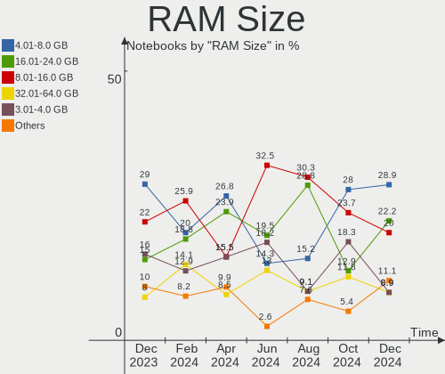
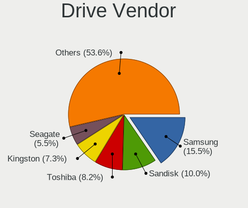
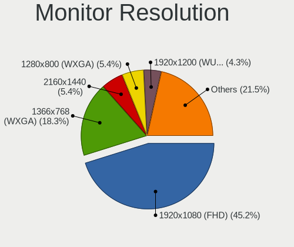
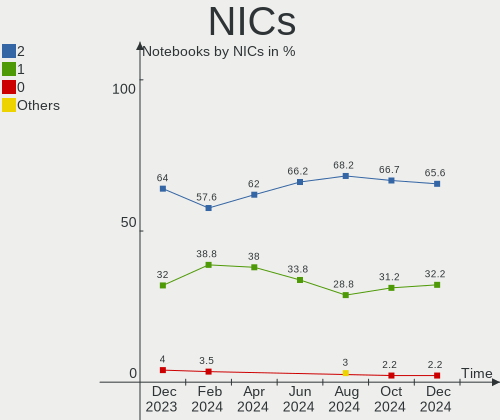
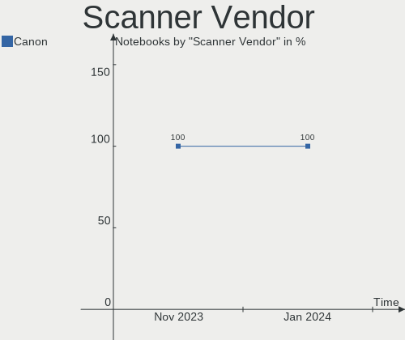
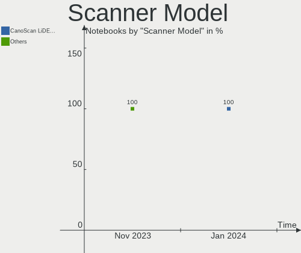

Linux in Spain - Hardware Trends (Notebooks)
--------------------------------------------

A project to identify most popular hardware characteristics and track their change
over time based on data collected by Linux users at https://Linux-Hardware.org.

Anyone can contribute to this report by the [hw-probe](https://github.com/linuxhw/hw-probe) tool:

    sudo -E hw-probe -all -upload

Period: Oct, 2023.

Contents
--------

* [ System ](#system)
  - [ OS                       ](#os)
  - [ OS Family                ](#os-family)
  - [ Kernel                   ](#kernel)
  - [ Kernel Family            ](#kernel-family)
  - [ Kernel Major Ver.        ](#kernel-major-ver)
  - [ Arch                     ](#arch)
  - [ DE                       ](#de)
  - [ Display Server           ](#display-server)
  - [ Display Manager          ](#display-manager)
  - [ OS Lang                  ](#os-lang)
  - [ Boot Mode                ](#boot-mode)
  - [ Filesystem               ](#filesystem)
  - [ Part. scheme             ](#part-scheme)
  - [ Dual Boot with Linux/BSD ](#dual-boot-with-linuxbsd)
  - [ Dual Boot (Win)          ](#dual-boot-win)

* [ Board ](#board)
  - [ Vendor                   ](#vendor)
  - [ Model                    ](#model)
  - [ Model Family             ](#model-family)
  - [ MFG Year                 ](#mfg-year)
  - [ Form Factor              ](#form-factor)
  - [ Secure Boot              ](#secure-boot)
  - [ Coreboot                 ](#coreboot)
  - [ RAM Size                 ](#ram-size)
  - [ RAM Used                 ](#ram-used)
  - [ Total Drives             ](#total-drives)
  - [ Has CD-ROM               ](#has-cd-rom)
  - [ Has Ethernet             ](#has-ethernet)
  - [ Has WiFi                 ](#has-wifi)
  - [ Has Bluetooth            ](#has-bluetooth)

* [ Location ](#location)
  - [ Country                  ](#country)
  - [ City                     ](#city)

* [ Drives ](#drives)
  - [ Drive Vendor             ](#drive-vendor)
  - [ Drive Model              ](#drive-model)
  - [ HDD Vendor               ](#hdd-vendor)
  - [ SSD Vendor               ](#ssd-vendor)
  - [ Drive Kind               ](#drive-kind)
  - [ Drive Connector          ](#drive-connector)
  - [ Drive Size               ](#drive-size)
  - [ Space Total              ](#space-total)
  - [ Space Used               ](#space-used)
  - [ Malfunc. Drives          ](#malfunc-drives)
  - [ Malfunc. Drive Vendor    ](#malfunc-drive-vendor)
  - [ Malfunc. HDD Vendor      ](#malfunc-hdd-vendor)
  - [ Malfunc. Drive Kind      ](#malfunc-drive-kind)
  - [ Failed Drives            ](#failed-drives)
  - [ Failed Drive Vendor      ](#failed-drive-vendor)
  - [ Drive Status             ](#drive-status)

* [ Storage controller ](#storage-controller)
  - [ Storage Vendor           ](#storage-vendor)
  - [ Storage Model            ](#storage-model)
  - [ Storage Kind             ](#storage-kind)

* [ Processor ](#processor)
  - [ CPU Vendor               ](#cpu-vendor)
  - [ CPU Model                ](#cpu-model)
  - [ CPU Model Family         ](#cpu-model-family)
  - [ CPU Cores                ](#cpu-cores)
  - [ CPU Sockets              ](#cpu-sockets)
  - [ CPU Threads              ](#cpu-threads)
  - [ CPU Op-Modes             ](#cpu-op-modes)
  - [ CPU Microcode            ](#cpu-microcode)
  - [ CPU Microarch            ](#cpu-microarch)

* [ Graphics ](#graphics)
  - [ GPU Vendor               ](#gpu-vendor)
  - [ GPU Model                ](#gpu-model)
  - [ GPU Combo                ](#gpu-combo)
  - [ GPU Driver               ](#gpu-driver)
  - [ GPU Memory               ](#gpu-memory)

* [ Monitor ](#monitor)
  - [ Monitor Vendor           ](#monitor-vendor)
  - [ Monitor Model            ](#monitor-model)
  - [ Monitor Resolution       ](#monitor-resolution)
  - [ Monitor Diagonal         ](#monitor-diagonal)
  - [ Monitor Width            ](#monitor-width)
  - [ Aspect Ratio             ](#aspect-ratio)
  - [ Monitor Area             ](#monitor-area)
  - [ Pixel Density            ](#pixel-density)
  - [ Multiple Monitors        ](#multiple-monitors)

* [ Network ](#network)
  - [ Net Controller Vendor    ](#net-controller-vendor)
  - [ Net Controller Model     ](#net-controller-model)
  - [ Wireless Vendor          ](#wireless-vendor)
  - [ Wireless Model           ](#wireless-model)
  - [ Ethernet Vendor          ](#ethernet-vendor)
  - [ Ethernet Model           ](#ethernet-model)
  - [ Net Controller Kind      ](#net-controller-kind)
  - [ Used Controller          ](#used-controller)
  - [ NICs                     ](#nics)
  - [ IPv6                     ](#ipv6)

* [ Bluetooth ](#bluetooth)
  - [ Bluetooth Vendor         ](#bluetooth-vendor)
  - [ Bluetooth Model          ](#bluetooth-model)

* [ Sound ](#sound)
  - [ Sound Vendor             ](#sound-vendor)
  - [ Sound Model              ](#sound-model)

* [ Memory ](#memory)
  - [ Memory Vendor            ](#memory-vendor)
  - [ Memory Model             ](#memory-model)
  - [ Memory Kind              ](#memory-kind)
  - [ Memory Form Factor       ](#memory-form-factor)
  - [ Memory Size              ](#memory-size)
  - [ Memory Speed             ](#memory-speed)

* [ Printers & scanners ](#printers--scanners)
  - [ Printer Vendor           ](#printer-vendor)
  - [ Printer Model            ](#printer-model)
  - [ Scanner Vendor           ](#scanner-vendor)
  - [ Scanner Model            ](#scanner-model)

* [ Camera ](#camera)
  - [ Camera Vendor            ](#camera-vendor)
  - [ Camera Model             ](#camera-model)

* [ Security ](#security)
  - [ Fingerprint Vendor       ](#fingerprint-vendor)
  - [ Fingerprint Model        ](#fingerprint-model)
  - [ Chipcard Vendor          ](#chipcard-vendor)
  - [ Chipcard Model           ](#chipcard-model)

* [ Unsupported ](#unsupported)
  - [ Unsupported Devices      ](#unsupported-devices)
  - [ Unsupported Device Types ](#unsupported-device-types)

System
------

OS
--

Installed operating systems

| Name                | Notebooks | Percent |
|---------------------|-----------|---------|
| Ubuntu 22.04        | 23        | 20.91%  |
| Fedora 38           | 15        | 13.64%  |
| Debian 12           | 12        | 10.91%  |
| Arch Rolling        | 8         | 7.27%   |
| Linux Mint 21.2     | 6         | 5.45%   |
| OpenMandriva 23.08  | 5         | 4.55%   |
| Zorin 16            | 2         | 1.82%   |
| Ubuntu 23.10        | 2         | 1.82%   |
| Ubuntu 23.04        | 2         | 1.82%   |
| Kali 2023.3         | 2         | 1.82%   |
| Fedora 39           | 2         | 1.82%   |
| Endless 5.0.6       | 2         | 1.82%   |
| ArcoLinux Rolling   | 2         | 1.82%   |
| Xero Rolling        | 1         | 0.91%   |
| Ubuntu Studio 22.04 | 1         | 0.91%   |
| Ubuntu 20.04        | 1         | 0.91%   |
| Ubuntu 18.04        | 1         | 0.91%   |
| SteamOS 3.6         | 1         | 0.91%   |
| SteamOS 3.4.11      | 1         | 0.91%   |
| Sparky 7.0          | 1         | 0.91%   |
| Rocky Linux 9.2     | 1         | 0.91%   |
| Pop!_OS 22.04       | 1         | 0.91%   |
| Oracle Linux 9.2    | 1         | 0.91%   |
| OpenMandriva 23.03  | 1         | 0.91%   |
| Nobara 38           | 1         | 0.91%   |
| NixOS 23.05         | 1         | 0.91%   |
| MX 21               | 1         | 0.91%   |
| Manjaro             | 1         | 0.91%   |
| Lubuntu 20.04       | 1         | 0.91%   |
| Linux Mint 21.1     | 1         | 0.91%   |
| Linux Mint 21       | 1         | 0.91%   |
| Kubuntu 23.04       | 1         | 0.91%   |
| Kubuntu 22.04       | 1         | 0.91%   |
| Kubuntu 20.04       | 1         | 0.91%   |
| Gentoo 2.14         | 1         | 0.91%   |
| Fedora 36           | 1         | 0.91%   |
| Debian 11           | 1         | 0.91%   |
| Debian              | 1         | 0.91%   |
| BunsenLabs 10.5     | 1         | 0.91%   |
| ArcoLinux           | 1         | 0.91%   |

OS Family
---------

OS without a version

| Name          | Notebooks | Percent |
|---------------|-----------|---------|
| Ubuntu        | 29        | 26.36%  |
| Fedora        | 18        | 16.36%  |
| Debian        | 14        | 12.73%  |
| Linux Mint    | 8         | 7.27%   |
| Arch          | 8         | 7.27%   |
| OpenMandriva  | 6         | 5.45%   |
| Kubuntu       | 3         | 2.73%   |
| ArcoLinux     | 3         | 2.73%   |
| Zorin         | 2         | 1.82%   |
| SteamOS       | 2         | 1.82%   |
| Kali          | 2         | 1.82%   |
| Endless       | 2         | 1.82%   |
| Xero          | 1         | 0.91%   |
| Ubuntu Studio | 1         | 0.91%   |
| Sparky        | 1         | 0.91%   |
| Rocky Linux   | 1         | 0.91%   |
| Pop!_OS       | 1         | 0.91%   |
| Oracle Linux  | 1         | 0.91%   |
| Nobara        | 1         | 0.91%   |
| NixOS         | 1         | 0.91%   |
| MX            | 1         | 0.91%   |
| Manjaro       | 1         | 0.91%   |
| Lubuntu       | 1         | 0.91%   |
| Gentoo        | 1         | 0.91%   |
| BunsenLabs    | 1         | 0.91%   |

Kernel
------

Version of the Linux kernel

| Version                     | Notebooks | Percent |
|-----------------------------|-----------|---------|
| 6.2.0-34-generic            | 14        | 12.73%  |
| 6.5.5-200.fc38.x86_64       | 6         | 5.45%   |
| 6.1.0-13-amd64              | 6         | 5.45%   |
| 6.4.11-desktop-1omv2390     | 5         | 4.55%   |
| 6.2.0-35-generic            | 5         | 4.55%   |
| 5.15.0-87-generic           | 5         | 4.55%   |
| 6.1.0-12-amd64              | 4         | 3.64%   |
| 5.15.0-84-generic           | 4         | 3.64%   |
| 6.5.7-200.fc38.x86_64       | 3         | 2.73%   |
| 6.5.6-200.fc38.x86_64       | 3         | 2.73%   |
| 6.5.5-arch1-1               | 3         | 2.73%   |
| 6.5.9-arch2-1               | 2         | 1.82%   |
| 6.5.7-arch1-1               | 2         | 1.82%   |
| 6.2.9-300.fc38.x86_64       | 2         | 1.82%   |
| 6.2.0-33-generic            | 2         | 1.82%   |
| 6.1.0-10-amd64              | 2         | 1.82%   |
| 5.15.0-47-generic           | 2         | 1.82%   |
| 6.5.9-200.fsync.fc38.x86_64 | 1         | 0.91%   |
| 6.5.8-arch1-1               | 1         | 0.91%   |
| 6.5.8-300.fc39.x86_64       | 1         | 0.91%   |
| 6.5.8-1-liquorix-amd64      | 1         | 0.91%   |
| 6.5.7-300.fc39.x86_64       | 1         | 0.91%   |
| 6.5.6-lqx1-1-lqx            | 1         | 0.91%   |
| 6.5.6-76060506-generic      | 1         | 0.91%   |
| 6.5.5                       | 1         | 0.91%   |
| 6.5.0-kali2-amd64           | 1         | 0.91%   |
| 6.5.0-9-generic             | 1         | 0.91%   |
| 6.5.0-10-generic            | 1         | 0.91%   |
| 6.5.0-1-amd64               | 1         | 0.91%   |
| 6.4.12-surface              | 1         | 0.91%   |
| 6.4.0-kali3-amd64           | 1         | 0.91%   |
| 6.3.5-200.fc38.x86_64       | 1         | 0.91%   |
| 6.2.6-desktop-1omv2390      | 1         | 0.91%   |
| 6.2.15-100.fc36.x86_64      | 1         | 0.91%   |
| 6.2.0-36-generic            | 1         | 0.91%   |
| 6.2.0-26-generic            | 1         | 0.91%   |
| 6.1.59-1-lts                | 1         | 0.91%   |
| 6.1.57-1-lts                | 1         | 0.91%   |
| 6.1.56-1-lts                | 1         | 0.91%   |
| 6.1.55-1-MANJARO            | 1         | 0.91%   |

Kernel Family
-------------

Linux kernel without a distro release

| Version | Notebooks | Percent |
|---------|-----------|---------|
| 6.2.0   | 23        | 20.91%  |
| 5.15.0  | 14        | 12.73%  |
| 6.1.0   | 13        | 11.82%  |
| 6.5.5   | 10        | 9.09%   |
| 6.5.7   | 6         | 5.45%   |
| 6.5.6   | 5         | 4.55%   |
| 6.4.11  | 5         | 4.55%   |
| 6.5.0   | 4         | 3.64%   |
| 6.5.9   | 3         | 2.73%   |
| 6.5.8   | 3         | 2.73%   |
| 6.2.9   | 2         | 1.82%   |
| 5.4.0   | 2         | 1.82%   |
| 5.19.0  | 2         | 1.82%   |
| 5.10.0  | 2         | 1.82%   |
| 6.4.12  | 1         | 0.91%   |
| 6.4.0   | 1         | 0.91%   |
| 6.3.5   | 1         | 0.91%   |
| 6.2.6   | 1         | 0.91%   |
| 6.2.15  | 1         | 0.91%   |
| 6.1.59  | 1         | 0.91%   |
| 6.1.57  | 1         | 0.91%   |
| 6.1.56  | 1         | 0.91%   |
| 6.1.55  | 1         | 0.91%   |
| 6.1.53  | 1         | 0.91%   |
| 6.1.52  | 1         | 0.91%   |
| 5.8.0   | 1         | 0.91%   |
| 5.14.0  | 1         | 0.91%   |
| 5.13.0  | 1         | 0.91%   |
| 4.19.0  | 1         | 0.91%   |
| 4.15.0  | 1         | 0.91%   |

Kernel Major Ver.
-----------------

Linux kernel major version

| Version | Notebooks | Percent |
|---------|-----------|---------|
| 6.5     | 31        | 28.18%  |
| 6.2     | 27        | 24.55%  |
| 6.1     | 19        | 17.27%  |
| 5.15    | 14        | 12.73%  |
| 6.4     | 7         | 6.36%   |
| 5.4     | 2         | 1.82%   |
| 5.19    | 2         | 1.82%   |
| 5.10    | 2         | 1.82%   |
| 6.3     | 1         | 0.91%   |
| 5.8     | 1         | 0.91%   |
| 5.14    | 1         | 0.91%   |
| 5.13    | 1         | 0.91%   |
| 4.19    | 1         | 0.91%   |
| 4.15    | 1         | 0.91%   |

Arch
----

OS architecture (x86_64, i586, etc.)

| Name   | Notebooks | Percent |
|--------|-----------|---------|
| x86_64 | 109       | 99.09%  |
| i686   | 1         | 0.91%   |

DE
--

Desktop Environment

| Name          | Notebooks | Percent |
|---------------|-----------|---------|
| GNOME         | 60        | 54.55%  |
| KDE5          | 23        | 20.91%  |
| X-Cinnamon    | 9         | 8.18%   |
| XFCE          | 7         | 6.36%   |
| Endless:GNOME | 2         | 1.82%   |
| MATE          | 1         | 0.91%   |
| LXQt          | 1         | 0.91%   |
| KDE           | 1         | 0.91%   |
| i3            | 1         | 0.91%   |
| Deepin        | 1         | 0.91%   |
| Cutefish      | 1         | 0.91%   |
| Budgie        | 1         | 0.91%   |
| bspwm         | 1         | 0.91%   |
| Unknown       | 1         | 0.91%   |

Display Server
--------------

X11 or Wayland

| Name    | Notebooks | Percent |
|---------|-----------|---------|
| Wayland | 58        | 52.73%  |
| X11     | 49        | 44.55%  |
| Tty     | 2         | 1.82%   |
| Unknown | 1         | 0.91%   |

Display Manager
---------------

SDDM, LightDM, etc.

| Name    | Notebooks | Percent |
|---------|-----------|---------|
| Unknown | 38        | 34.55%  |
| GDM3    | 34        | 30.91%  |
| SDDM    | 18        | 16.36%  |
| LightDM | 10        | 9.09%   |
| GDM     | 10        | 9.09%   |

OS Lang
-------

Language

| Lang           | Notebooks | Percent |
|----------------|-----------|---------|
| es_ES          | 63        | 57.27%  |
| en_US          | 30        | 27.27%  |
| ca_ES          | 6         | 5.45%   |
| en_GB          | 3         | 2.73%   |
| de_DE          | 2         | 1.82%   |
| eu_ES          | 1         | 0.91%   |
| eo             | 1         | 0.91%   |
| en_CA          | 1         | 0.91%   |
| ca_ES@valencia | 1         | 0.91%   |
| C              | 1         | 0.91%   |
| Unknown        | 1         | 0.91%   |

Boot Mode
---------

EFI or BIOS

| Mode | Notebooks | Percent |
|------|-----------|---------|
| EFI  | 71        | 64.55%  |
| BIOS | 39        | 35.45%  |

Filesystem
----------

Type of filesystem

| Type    | Notebooks | Percent |
|---------|-----------|---------|
| Ext4    | 63        | 57.27%  |
| Btrfs   | 22        | 20%     |
| Tmpfs   | 12        | 10.91%  |
| Xfs     | 7         | 6.36%   |
| Overlay | 5         | 4.55%   |
| Zfs     | 1         | 0.91%   |

Part. scheme
------------

Scheme of partitioning

| Type    | Notebooks | Percent |
|---------|-----------|---------|
| GPT     | 67        | 60.91%  |
| Unknown | 35        | 31.82%  |
| MBR     | 8         | 7.27%   |

Dual Boot with Linux/BSD
------------------------

Hosting more than one Linux/BSD

| Dual boot | Notebooks | Percent |
|-----------|-----------|---------|
| No        | 98        | 89.09%  |
| Yes       | 12        | 10.91%  |

Dual Boot (Win)
---------------

Hosting Linux and Windows

| Dual boot | Notebooks | Percent |
|-----------|-----------|---------|
| No        | 78        | 70.91%  |
| Yes       | 32        | 29.09%  |

Board
-----

Vendor
------

Motherboard manufacturer

| Name             | Notebooks | Percent |
|------------------|-----------|---------|
| Hewlett-Packard  | 19        | 17.27%  |
| Lenovo           | 18        | 16.36%  |
| ASUSTek Computer | 16        | 14.55%  |
| MSI              | 11        | 10%     |
| Acer             | 7         | 6.36%   |
| Dell             | 6         | 5.45%   |
| Toshiba          | 4         | 3.64%   |
| VANT             | 2         | 1.82%   |
| Valve            | 2         | 1.82%   |
| Teclast          | 2         | 1.82%   |
| SLIMBOOK         | 2         | 1.82%   |
| Packard Bell     | 2         | 1.82%   |
| HUAWEI           | 2         | 1.82%   |
| Dynabook         | 2         | 1.82%   |
| Apple            | 2         | 1.82%   |
| TUXEDO           | 1         | 0.91%   |
| Timi             | 1         | 0.91%   |
| Sony             | 1         | 0.91%   |
| Shuttle          | 1         | 0.91%   |
| rocky            | 1         | 0.91%   |
| Razer            | 1         | 0.91%   |
| Panasonic        | 1         | 0.91%   |
| Medion           | 1         | 0.91%   |
| Google           | 1         | 0.91%   |
| Chuwi            | 1         | 0.91%   |
| AZW              | 1         | 0.91%   |
| Allview          | 1         | 0.91%   |
| Unknown          | 1         | 0.91%   |

Model
-----

Motherboard model

| Name                                    | Notebooks | Percent |
|-----------------------------------------|-----------|---------|
| Valve Jupiter                           | 2         | 1.82%   |
| MSI Prestige 14H B12UCX                 | 2         | 1.82%   |
| Lenovo IdeaPad 3 15ITL6 82H8            | 2         | 1.82%   |
| Lenovo G500 20236                       | 2         | 1.82%   |
| HP TouchSmart tm2                       | 2         | 1.82%   |
| HP Notebook                             | 2         | 1.82%   |
| Acer TravelMate P259-M                  | 2         | 1.82%   |
| Unknown                                 | 2         | 1.82%   |
| VANT MOOVE3-15                          | 1         | 0.91%   |
| VANT MOOVE14_2023                       | 1         | 0.91%   |
| TUXEDO InfinityBook Pro Gen8 (MK1)      | 1         | 0.91%   |
| Toshiba TECRA R950                      | 1         | 0.91%   |
| Toshiba Satellite P50t-B-118            | 1         | 0.91%   |
| Toshiba Satellite C55-C                 | 1         | 0.91%   |
| Toshiba QOSMIO X70-B                    | 1         | 0.91%   |
| Timi RedmiBook Pro 14S                  | 1         | 0.91%   |
| Teclast F7S                             | 1         | 0.91%   |
| Teclast F7 Plus                         | 1         | 0.91%   |
| Sony VPCSB2L1R                          | 1         | 0.91%   |
| SLIMBOOK TITAN                          | 1         | 0.91%   |
| SLIMBOOK PROX14-10                      | 1         | 0.91%   |
| Shuttle DS47D                           | 1         | 0.91%   |
| rocky ASUS EXPERTBOOK B1402CBA_B1402CBA | 1         | 0.91%   |
| Razer Blade 14 (2022) - RZ09-0427       | 1         | 0.91%   |
| Panasonic CF-C1AD06GDE                  | 1         | 0.91%   |
| Packard Bell EasyNote MH36              | 1         | 0.91%   |
| Packard Bell DOT S                      | 1         | 0.91%   |
| MSI Vector GP68HX 12VH                  | 1         | 0.91%   |
| MSI PS42 Modern 8MO                     | 1         | 0.91%   |
| MSI Prestige 15 A11SCX                  | 1         | 0.91%   |
| MSI Prestige 15 A10SC                   | 1         | 0.91%   |
| MSI Modern 15 A5M                       | 1         | 0.91%   |
| MSI Modern 15 A10M                      | 1         | 0.91%   |
| MSI Modern 14 A10RAS                    | 1         | 0.91%   |
| MSI GF75 Thin 10SC                      | 1         | 0.91%   |
| MSI GE63 Raider RGB 8RE                 | 1         | 0.91%   |
| Medion E15415                           | 1         | 0.91%   |
| Lenovo ZIWB2                            | 1         | 0.91%   |
| Lenovo Yoga Slim 7 ProX 14IAH7 82TK     | 1         | 0.91%   |
| Lenovo ThinkPad X270 20HMS1T600         | 1         | 0.91%   |

Model Family
------------

Motherboard model prefix

| Name                   | Notebooks | Percent |
|------------------------|-----------|---------|
| Lenovo ThinkPad        | 5         | 4.55%   |
| Lenovo IdeaPad         | 5         | 4.55%   |
| MSI Prestige           | 4         | 3.64%   |
| Acer Aspire            | 4         | 3.64%   |
| MSI Modern             | 3         | 2.73%   |
| HP Pavilion            | 3         | 2.73%   |
| HP Laptop              | 3         | 2.73%   |
| ASUS VivoBook          | 3         | 2.73%   |
| Acer TravelMate        | 3         | 2.73%   |
| Valve Jupiter          | 2         | 1.82%   |
| Toshiba Satellite      | 2         | 1.82%   |
| Lenovo ThinkBook       | 2         | 1.82%   |
| Lenovo G500            | 2         | 1.82%   |
| HP TouchSmart          | 2         | 1.82%   |
| HP Notebook            | 2         | 1.82%   |
| HP EliteBook           | 2         | 1.82%   |
| Dynabook Satellite     | 2         | 1.82%   |
| Dell XPS               | 2         | 1.82%   |
| Dell Latitude          | 2         | 1.82%   |
| ASUS Zenbook           | 2         | 1.82%   |
| ASUS ROG               | 2         | 1.82%   |
| ASUS ASUS              | 2         | 1.82%   |
| Unknown                | 2         | 1.82%   |
| VANT MOOVE3-15         | 1         | 0.91%   |
| VANT MOOVE14           | 1         | 0.91%   |
| TUXEDO InfinityBook    | 1         | 0.91%   |
| Toshiba TECRA          | 1         | 0.91%   |
| Toshiba QOSMIO         | 1         | 0.91%   |
| Timi RedmiBook         | 1         | 0.91%   |
| Teclast F7S            | 1         | 0.91%   |
| Teclast F7             | 1         | 0.91%   |
| Sony VPCSB2L1R         | 1         | 0.91%   |
| SLIMBOOK TITAN         | 1         | 0.91%   |
| SLIMBOOK PROX14-10     | 1         | 0.91%   |
| Shuttle DS47D          | 1         | 0.91%   |
| rocky ASUS             | 1         | 0.91%   |
| Razer Blade            | 1         | 0.91%   |
| Panasonic CF-C1AD06GDE | 1         | 0.91%   |
| Packard Bell EasyNote  | 1         | 0.91%   |
| Packard Bell DOT       | 1         | 0.91%   |

MFG Year
--------

Motherboard manufacture year

| Year | Notebooks | Percent |
|------|-----------|---------|
| 2021 | 18        | 16.36%  |
| 2023 | 14        | 12.73%  |
| 2020 | 10        | 9.09%   |
| 2022 | 9         | 8.18%   |
| 2019 | 9         | 8.18%   |
| 2018 | 7         | 6.36%   |
| 2014 | 7         | 6.36%   |
| 2013 | 6         | 5.45%   |
| 2012 | 6         | 5.45%   |
| 2010 | 6         | 5.45%   |
| 2015 | 5         | 4.55%   |
| 2017 | 3         | 2.73%   |
| 2016 | 3         | 2.73%   |
| 2011 | 2         | 1.82%   |
| 2009 | 2         | 1.82%   |
| 2008 | 2         | 1.82%   |
| 2006 | 1         | 0.91%   |

Form Factor
-----------

Physical design of the computer

| Name     | Notebooks | Percent |
|----------|-----------|---------|
| Notebook | 110       | 100%    |

Secure Boot
-----------

Enabled or disabled

| State    | Notebooks | Percent |
|----------|-----------|---------|
| Disabled | 94        | 85.45%  |
| Enabled  | 16        | 14.55%  |

Coreboot
--------

Have coreboot on board

| Used | Notebooks | Percent |
|------|-----------|---------|
| No   | 109       | 99.09%  |
| Yes  | 1         | 0.91%   |

RAM Size
--------

Total RAM memory

| Size in GB  | Notebooks | Percent |
|-------------|-----------|---------|
| 4.01-8.0    | 32        | 29.09%  |
| 8.01-16.0   | 24        | 21.82%  |
| 16.01-24.0  | 19        | 17.27%  |
| 3.01-4.0    | 18        | 16.36%  |
| 32.01-64.0  | 11        | 10%     |
| 24.01-32.0  | 2         | 1.82%   |
| 64.01-256.0 | 2         | 1.82%   |
| 2.01-3.0    | 1         | 0.91%   |
| 1.01-2.0    | 1         | 0.91%   |

RAM Used
--------

Used RAM memory

| Used GB    | Notebooks | Percent |
|------------|-----------|---------|
| 2.01-3.0   | 29        | 26.36%  |
| 1.01-2.0   | 27        | 24.55%  |
| 4.01-8.0   | 24        | 21.82%  |
| 3.01-4.0   | 20        | 18.18%  |
| 8.01-16.0  | 8         | 7.27%   |
| 16.01-24.0 | 1         | 0.91%   |
| 0.51-1.0   | 1         | 0.91%   |

Total Drives
------------

Number of drives on board

| Drives | Notebooks | Percent |
|--------|-----------|---------|
| 1      | 79        | 71.82%  |
| 2      | 30        | 27.27%  |
| 3      | 1         | 0.91%   |

Has CD-ROM
----------

Has CD-ROM on board

| Presented | Notebooks | Percent |
|-----------|-----------|---------|
| No        | 84        | 76.36%  |
| Yes       | 26        | 23.64%  |

Has Ethernet
------------

Has Ethernet on board

| Presented | Notebooks | Percent |
|-----------|-----------|---------|
| Yes       | 80        | 72.73%  |
| No        | 30        | 27.27%  |

Has WiFi
--------

Has WiFi module

| Presented | Notebooks | Percent |
|-----------|-----------|---------|
| Yes       | 109       | 99.09%  |
| No        | 1         | 0.91%   |

Has Bluetooth
-------------

Has Bluetooth module

| Presented | Notebooks | Percent |
|-----------|-----------|---------|
| Yes       | 91        | 82.73%  |
| No        | 19        | 17.27%  |

Location
--------

Country
-------

Geographic location (country)

| Country | Notebooks | Percent |
|---------|-----------|---------|
| Spain   | 110       | 100%    |

City
----

Geographic location (city)

| City                       | Notebooks | Percent |
|----------------------------|-----------|---------|
| Barcelona                  | 13        | 11.82%  |
| Madrid                     | 12        | 10.91%  |
| Seville                    | 6         | 5.45%   |
| Zaragoza                   | 4         | 3.64%   |
| Vigo                       | 3         | 2.73%   |
| Valencia                   | 3         | 2.73%   |
| Las Palmas de Gran Canaria | 3         | 2.73%   |
| Granada                    | 3         | 2.73%   |
| Valladolid                 | 2         | 1.82%   |
| Santander                  | 2         | 1.82%   |
| Pamplona                   | 2         | 1.82%   |
| Palma                      | 2         | 1.82%   |
| Manises                    | 2         | 1.82%   |
| Girona                     | 2         | 1.82%   |
| Daganzo de Arriba          | 2         | 1.82%   |
| Antas                      | 2         | 1.82%   |
| Alicante                   | 2         | 1.82%   |
| Tuineje                    | 1         | 0.91%   |
| Totana                     | 1         | 0.91%   |
| Tortosa                    | 1         | 0.91%   |
| Torre Pacheco              | 1         | 0.91%   |
| Toledo                     | 1         | 0.91%   |
| Tavernes de la Valldigna   | 1         | 0.91%   |
| Santa Maria del Camí      | 1         | 0.91%   |
| Santa Eugènia             | 1         | 0.91%   |
| Sant Andreu de la Barca    | 1         | 0.91%   |
| Salamanca                  | 1         | 0.91%   |
| Sabadell                   | 1         | 0.91%   |
| Roses                      | 1         | 0.91%   |
| Ripollet                   | 1         | 0.91%   |
| Rincon de la Victoria      | 1         | 0.91%   |
| Premia de Mar              | 1         | 0.91%   |
| Porcuna                    | 1         | 0.91%   |
| Oviedo                     | 1         | 0.91%   |
| Onda                       | 1         | 0.91%   |
| Murcia                     | 1         | 0.91%   |
| Mollet del Vallès         | 1         | 0.91%   |
| Málaga                    | 1         | 0.91%   |
| Llubí                     | 1         | 0.91%   |
| Lleida                     | 1         | 0.91%   |

Drives
------

Drive Vendor
------------

Hard drive vendors

| Vendor                       | Notebooks | Drives | Percent |
|------------------------------|-----------|--------|---------|
| Samsung Electronics          | 19        | 20     | 13.77%  |
| Kingston                     | 15        | 16     | 10.87%  |
| WDC                          | 12        | 12     | 8.7%    |
| Seagate                      | 12        | 12     | 8.7%    |
| Sandisk                      | 11        | 11     | 7.97%   |
| Unknown                      | 9         | 11     | 6.52%   |
| Toshiba                      | 8         | 8      | 5.8%    |
| Micron Technology            | 8         | 8      | 5.8%    |
| Intel                        | 7         | 7      | 5.07%   |
| SK hynix                     | 5         | 5      | 3.62%   |
| Phison Electronics           | 4         | 4      | 2.9%    |
| Teclast                      | 2         | 2      | 1.45%   |
| HGST                         | 2         | 2      | 1.45%   |
| FORESEE                      | 2         | 2      | 1.45%   |
| China                        | 2         | 2      | 1.45%   |
| Apple                        | 2         | 3      | 1.45%   |
| Verbatim                     | 1         | 1      | 0.72%   |
| Union Memory (Shenzhen)      | 1         | 1      | 0.72%   |
| UMIS                         | 1         | 1      | 0.72%   |
| Silicon Motion               | 1         | 1      | 0.72%   |
| Shenzhen Longsys Electronics | 1         | 1      | 0.72%   |
| Phison                       | 1         | 1      | 0.72%   |
| Netac                        | 1         | 1      | 0.72%   |
| Micron/Crucial Technology    | 1         | 1      | 0.72%   |
| LITEON                       | 1         | 1      | 0.72%   |
| LaCie                        | 1         | 1      | 0.72%   |
| KIOXIA-EXCERIA               | 1         | 1      | 0.72%   |
| KIOXIA                       | 1         | 1      | 0.72%   |
| Kingston Technology Company  | 1         | 2      | 0.72%   |
| KingSpec                     | 1         | 1      | 0.72%   |
| Hitachi                      | 1         | 1      | 0.72%   |
| Crucial                      | 1         | 1      | 0.72%   |
| BAITITON                     | 1         | 1      | 0.72%   |
| Unknown                      | 1         | 1      | 0.72%   |

Drive Model
-----------

Hard drive models

| Model                                              | Notebooks | Percent |
|----------------------------------------------------|-----------|---------|
| Seagate ST500LT012-1DG142 500GB                    | 4         | 2.84%   |
| Samsung NVMe SSD Controller SM981/PM981/PM983 1TB  | 3         | 2.13%   |
| Kingston SA400S37480G 480GB SSD                    | 3         | 2.13%   |
| Intel SSDPEKNU512GZ 512GB                          | 3         | 2.13%   |
| Unknown MMC Card  64GB                             | 2         | 1.42%   |
| Unknown MMC Card  32GB                             | 2         | 1.42%   |
| Unknown MMC Card  128GB                            | 2         | 1.42%   |
| Toshiba MQ01ABD100 1TB                             | 2         | 1.42%   |
| Seagate ST9500325AS 500GB                          | 2         | 1.42%   |
| Samsung MZVL21T0HCLR-00B00 1TB                     | 2         | 1.42%   |
| Phison PS5013 E13 NVMe Controller 256GB            | 2         | 1.42%   |
| Kingston SA400S37240G 240GB SSD                    | 2         | 1.42%   |
| Intel SSD 660P Series 1024GB                       | 2         | 1.42%   |
| WDC WDS500G2B0C-00PXH0 500GB                       | 1         | 0.71%   |
| WDC WDS100T2B0C-00PXH0 1TB                         | 1         | 0.71%   |
| WDC WDS100T2B0A-00SM50 1TB SSD                     | 1         | 0.71%   |
| WDC WD6400BEVT-22A0RT0 640GB                       | 1         | 0.71%   |
| WDC WD5000LPCX-24C6HT0 500GB                       | 1         | 0.71%   |
| WDC WD5000LPCX-22VHAT1 500GB                       | 1         | 0.71%   |
| WDC WD5000BEVT-22A0RT0 500GB                       | 1         | 0.71%   |
| WDC WD3200BEVT-26ZCT0 320GB                        | 1         | 0.71%   |
| WDC WD3200BEVT-22ZCT0 320GB                        | 1         | 0.71%   |
| WDC PC SN730 SDBPNTY-1T00-1032 1TB                 | 1         | 0.71%   |
| WDC PC SN530 SDBPMPZ-256G-1101 256GB               | 1         | 0.71%   |
| WDC PC SN530 NVMe 256GB                            | 1         | 0.71%   |
| Verbatim Vi560 S3 512GB SSD                        | 1         | 0.71%   |
| Unknown xD/SD/M.S.                                 | 1         | 0.71%   |
| Unknown SC32G  32GB                                | 1         | 0.71%   |
| Unknown NVMe SSD Drive 512GB                       | 1         | 0.71%   |
| Unknown MMC Card  7GB                              | 1         | 0.71%   |
| Unknown MMC Card  249GB                            | 1         | 0.71%   |
| Union Memory (Shenzhen) UMIS RPETJ256MGE2MDQ 256GB | 1         | 0.71%   |
| UMIS RPETJ256MGE2MDQ 256GB                         | 1         | 0.71%   |
| Toshiba XG6 NVMe SSD Controller 256GB              | 1         | 0.71%   |
| Toshiba TR200 240GB SSD                            | 1         | 0.71%   |
| Toshiba MQ04ABF100 1TB                             | 1         | 0.71%   |
| Toshiba MQ01ABF050 500GB                           | 1         | 0.71%   |
| Toshiba MK5061GSYN 500GB                           | 1         | 0.71%   |
| Toshiba KSG60ZMV256G 256GB SSD                     | 1         | 0.71%   |
| Teclast 256GB NA850-2280 SSD                       | 1         | 0.71%   |

HDD Vendor
----------

Hard disk drive vendors

| Vendor  | Notebooks | Drives | Percent |
|---------|-----------|--------|---------|
| Seagate | 12        | 12     | 44.44%  |
| WDC     | 6         | 6      | 22.22%  |
| Toshiba | 5         | 5      | 18.52%  |
| HGST    | 2         | 2      | 7.41%   |
| LaCie   | 1         | 1      | 3.7%    |
| Hitachi | 1         | 1      | 3.7%    |

SSD Vendor
----------

Solid state drive vendors

| Vendor              | Notebooks | Drives | Percent |
|---------------------|-----------|--------|---------|
| Kingston            | 11        | 12     | 27.5%   |
| Samsung Electronics | 6         | 6      | 15%     |
| SanDisk             | 5         | 5      | 12.5%   |
| Toshiba             | 2         | 2      | 5%      |
| Teclast             | 2         | 2      | 5%      |
| Micron Technology   | 2         | 2      | 5%      |
| FORESEE             | 2         | 2      | 5%      |
| China               | 2         | 2      | 5%      |
| WDC                 | 1         | 1      | 2.5%    |
| Verbatim            | 1         | 1      | 2.5%    |
| Netac               | 1         | 1      | 2.5%    |
| LITEON              | 1         | 1      | 2.5%    |
| KIOXIA-EXCERIA      | 1         | 1      | 2.5%    |
| KingSpec            | 1         | 1      | 2.5%    |
| Crucial             | 1         | 1      | 2.5%    |
| BAITITON            | 1         | 1      | 2.5%    |

Drive Kind
----------

HDD or SSD

| Kind    | Notebooks | Drives | Percent |
|---------|-----------|--------|---------|
| NVMe    | 58        | 65     | 44.62%  |
| SSD     | 36        | 41     | 27.69%  |
| HDD     | 26        | 27     | 20%     |
| MMC     | 9         | 10     | 6.92%   |
| Unknown | 1         | 1      | 0.77%   |

Drive Connector
---------------

SATA, SAS, NVMe, etc.

| Type | Notebooks | Drives | Percent |
|------|-----------|--------|---------|
| NVMe | 58        | 65     | 46.03%  |
| SATA | 55        | 65     | 43.65%  |
| MMC  | 9         | 10     | 7.14%   |
| SAS  | 4         | 4      | 3.17%   |

Drive Size
----------

Size of hard drive

| Size in TB | Notebooks | Drives | Percent |
|------------|-----------|--------|---------|
| 0.01-0.5   | 44        | 51     | 72.13%  |
| 0.51-1.0   | 14        | 14     | 22.95%  |
| 1.01-2.0   | 3         | 3      | 4.92%   |

Space Total
-----------

Amount of disk space available on the file system

| Size in GB     | Notebooks | Percent |
|----------------|-----------|---------|
| 251-500        | 39        | 35.45%  |
| 101-250        | 25        | 22.73%  |
| 501-1000       | 15        | 13.64%  |
| 1001-2000      | 11        | 10%     |
| 1-20           | 7         | 6.36%   |
| 51-100         | 4         | 3.64%   |
| More than 3000 | 3         | 2.73%   |
| 2001-3000      | 3         | 2.73%   |
| Unknown        | 2         | 1.82%   |
| 21-50          | 1         | 0.91%   |

Space Used
----------

Amount of used disk space

| Used GB   | Notebooks | Percent |
|-----------|-----------|---------|
| 1-20      | 38        | 34.55%  |
| 101-250   | 20        | 18.18%  |
| 21-50     | 16        | 14.55%  |
| 251-500   | 10        | 9.09%   |
| 51-100    | 10        | 9.09%   |
| 501-1000  | 8         | 7.27%   |
| 1001-2000 | 6         | 5.45%   |
| Unknown   | 2         | 1.82%   |

Malfunc. Drives
---------------

Drive models with a malfunction

| Model                                               | Notebooks | Drives | Percent |
|-----------------------------------------------------|-----------|--------|---------|
| WDC WD6400BEVT-22A0RT0 640GB                        | 1         | 1      | 25%     |
| WDC WD5000LPCX-24C6HT0 500GB                        | 1         | 1      | 25%     |
| Samsung Electronics MZNLH128HBHQ-000H1 128GB SSD    | 1         | 1      | 25%     |
| Micron Technology MTFDDAV256TBN-1AR15ABHA 256GB SSD | 1         | 1      | 25%     |

Malfunc. Drive Vendor
---------------------

Vendors of faulty drives

| Vendor              | Notebooks | Drives | Percent |
|---------------------|-----------|--------|---------|
| WDC                 | 2         | 2      | 50%     |
| Samsung Electronics | 1         | 1      | 25%     |
| Micron Technology   | 1         | 1      | 25%     |

Malfunc. HDD Vendor
-------------------

Vendors of faulty HDD drives

| Vendor | Notebooks | Drives | Percent |
|--------|-----------|--------|---------|
| WDC    | 2         | 2      | 100%    |

Malfunc. Drive Kind
-------------------

Kinds of faulty drives

| Kind | Notebooks | Drives | Percent |
|------|-----------|--------|---------|
| SSD  | 2         | 2      | 50%     |
| HDD  | 2         | 2      | 50%     |

Failed Drives
-------------

Failed drive models

Zero info for selected period =(

Failed Drive Vendor
-------------------

Failed drive vendors

Zero info for selected period =(

Drive Status
------------

Number of failed and malfunc. drives

| Status   | Notebooks | Drives | Percent |
|----------|-----------|--------|---------|
| Works    | 57        | 66     | 49.57%  |
| Detected | 54        | 74     | 46.96%  |
| Malfunc  | 4         | 4      | 3.48%   |

Storage controller
------------------

Storage Vendor
--------------

Storage controller vendors

| Vendor                       | Notebooks | Percent |
|------------------------------|-----------|---------|
| Intel                        | 72        | 54.55%  |
| Samsung Electronics          | 13        | 9.85%   |
| SanDisk                      | 11        | 8.33%   |
| Micron Technology            | 6         | 4.55%   |
| SK hynix                     | 5         | 3.79%   |
| Phison Electronics           | 5         | 3.79%   |
| Kingston Technology Company  | 5         | 3.79%   |
| AMD                          | 5         | 3.79%   |
| Union Memory (Shenzhen)      | 1         | 0.76%   |
| Toshiba America Info Systems | 1         | 0.76%   |
| Solidigm                     | 1         | 0.76%   |
| Silicon Motion               | 1         | 0.76%   |
| Silicon Image                | 1         | 0.76%   |
| Shenzhen Longsys Electronics | 1         | 0.76%   |
| Nvidia                       | 1         | 0.76%   |
| Micron/Crucial Technology    | 1         | 0.76%   |
| KIOXIA                       | 1         | 0.76%   |
| Apple                        | 1         | 0.76%   |

Storage Model
-------------

Storage controller models

| Model                                                                          | Notebooks | Percent |
|--------------------------------------------------------------------------------|-----------|---------|
| Intel 7 Series Chipset Family 6-port SATA Controller [AHCI mode]               | 11        | 7.8%    |
| Intel Volume Management Device NVMe RAID Controller                            | 6         | 4.26%   |
| Intel Sunrise Point-LP SATA Controller [AHCI mode]                             | 6         | 4.26%   |
| Samsung NVMe SSD Controller SM981/PM981/PM983                                  | 5         | 3.55%   |
| Samsung NVMe SSD Controller PM9A1/PM9A3/980PRO                                 | 5         | 3.55%   |
| Intel Comet Lake SATA AHCI Controller                                          | 5         | 3.55%   |
| Intel Celeron/Pentium Silver Processor SATA Controller                         | 5         | 3.55%   |
| AMD FCH SATA Controller [AHCI mode]                                            | 5         | 3.55%   |
| Intel SSD 670p Series [Keystone Harbor]                                        | 4         | 2.84%   |
| Intel 82801IBM/IEM (ICH9M/ICH9M-E) 4 port SATA Controller [AHCI mode]          | 4         | 2.84%   |
| SanDisk Ultra 3D / WD Blue SN550 NVMe SSD                                      | 3         | 2.13%   |
| Phison PS5013-E13 PCIe3 NVMe Controller (DRAM-less)                            | 3         | 2.13%   |
| Intel Wildcat Point-LP SATA Controller [AHCI Mode]                             | 3         | 2.13%   |
| Intel Tiger Lake-LP SATA Controller                                            | 3         | 2.13%   |
| Intel SSD 660P Series                                                          | 3         | 2.13%   |
| Intel 82801 Mobile SATA Controller [RAID mode]                                 | 3         | 2.13%   |
| Intel 8 Series/C220 Series Chipset Family 6-port SATA Controller 1 [AHCI mode] | 3         | 2.13%   |
| Intel 8 Series SATA Controller 1 [AHCI mode]                                   | 3         | 2.13%   |
| SK hynix Gold P31/BC711/PC711 NVMe Solid State Drive                           | 2         | 1.42%   |
| SanDisk WD Black SN770 / PC SN740 256GB / PC SN560 (DRAM-less) NVMe SSD        | 2         | 1.42%   |
| SanDisk Extreme Pro / WD Black SN750 / PC SN730 / Red SN700 NVMe SSD           | 2         | 1.42%   |
| Samsung NVMe SSD Controller 980 (DRAM-less)                                    | 2         | 1.42%   |
| Micron 2450 NVMe SSD [HendrixV] (DRAM-less)                                    | 2         | 1.42%   |
| Micron 2400 NVMe SSD (DRAM-less)                                               | 2         | 1.42%   |
| Kingston Company OM8PCP Design-In PCIe 3 NVMe SSD (DRAM-less)                  | 2         | 1.42%   |
| Intel Volume Management Device NVMe RAID Controller Intel Corporation          | 2         | 1.42%   |
| Intel Cannon Point-LP SATA Controller [AHCI Mode]                              | 2         | 1.42%   |
| Intel Alder Lake-P SATA AHCI Controller                                        | 2         | 1.42%   |
| Intel 5 Series/3400 Series Chipset 4 port SATA AHCI Controller                 | 2         | 1.42%   |
| Union Memory (Shenzhen) AM630 PCIe 4.0 NVMe SSD 256GB                          | 1         | 0.71%   |
| Toshiba America Info Systems XG6 NVMe SSD Controller                           | 1         | 0.71%   |
| Solidigm P41 Plus NVMe SSD (DRAM-less) [Echo Harbor]                           | 1         | 0.71%   |
| SK hynix BC901 NVMe Solid State Drive (DRAM-less)                              | 1         | 0.71%   |
| SK hynix BC511 NVMe SSD                                                        | 1         | 0.71%   |
| SK hynix BC501 NVMe Solid State Drive                                          | 1         | 0.71%   |
| Silicon Motion SM2263EN/SM2263XT (DRAM-less) NVMe SSD Controllers              | 1         | 0.71%   |
| Silicon Image SiI 3531 [SATALink/SATARaid] Serial ATA Controller               | 1         | 0.71%   |
| Shenzhen Longsys FORESEE P900 BGA NVMe SSD (DRAM-less)                         | 1         | 0.71%   |
| SanDisk WD Blue SN500 / PC SN520 x2 M.2 2280 NVMe SSD                          | 1         | 0.71%   |
| SanDisk Ultra 3D / WD Blue SN570 NVMe SSD (DRAM-less)                          | 1         | 0.71%   |

Storage Kind
------------

Kind of storage controller (IDE, SATA, NVMe, SAS, ...)

| Kind | Notebooks | Percent |
|------|-----------|---------|
| SATA | 62        | 45.93%  |
| NVMe | 57        | 42.22%  |
| RAID | 12        | 8.89%   |
| IDE  | 4         | 2.96%   |

Processor
---------

CPU Vendor
----------

Processor vendors

| Vendor | Notebooks | Percent |
|--------|-----------|---------|
| Intel  | 86        | 78.18%  |
| AMD    | 24        | 21.82%  |

CPU Model
---------

Processor models

| Model                                   | Notebooks | Percent |
|-----------------------------------------|-----------|---------|
| Intel 12th Gen Core i5-1235U            | 4         | 3.64%   |
| Intel Core i7-10510U CPU @ 1.80GHz      | 3         | 2.73%   |
| Intel 11th Gen Core i5-1135G7 @ 2.40GHz | 3         | 2.73%   |
| AMD Ryzen 7 4800H with Radeon Graphics  | 3         | 2.73%   |
| Intel Genuine CPU U4100 @ 1.30GHz       | 2         | 1.82%   |
| Intel Core i7-5500U CPU @ 2.40GHz       | 2         | 1.82%   |
| Intel Core i5-6200U CPU @ 2.30GHz       | 2         | 1.82%   |
| Intel Core i5-4210U CPU @ 1.70GHz       | 2         | 1.82%   |
| Intel Core i5-3317U CPU @ 1.70GHz       | 2         | 1.82%   |
| Intel Core i5-10210U CPU @ 1.60GHz      | 2         | 1.82%   |
| Intel Core i3-7020U CPU @ 2.30GHz       | 2         | 1.82%   |
| Intel Core i3-3110M CPU @ 2.40GHz       | 2         | 1.82%   |
| Intel Celeron N4020 CPU @ 1.10GHz       | 2         | 1.82%   |
| Intel Celeron N4000 CPU @ 1.10GHz       | 2         | 1.82%   |
| Intel 13th Gen Core i7-13700H           | 2         | 1.82%   |
| Intel 12th Gen Core i7-12650H           | 2         | 1.82%   |
| Intel 11th Gen Core i7-1185G7 @ 3.00GHz | 2         | 1.82%   |
| AMD Ryzen 7 5700U with Radeon Graphics  | 2         | 1.82%   |
| AMD Ryzen 5 5500U with Radeon Graphics  | 2         | 1.82%   |
| AMD Custom APU 0405                     | 2         | 1.82%   |
| Intel Pentium Dual CPU T3400 @ 2.16GHz  | 1         | 0.91%   |
| Intel Pentium CPU P6200 @ 2.13GHz       | 1         | 0.91%   |
| Intel Core m5-6Y57 CPU @ 1.10GHz        | 1         | 0.91%   |
| Intel Core m3-8100Y CPU @ 1.10GHz       | 1         | 0.91%   |
| Intel Core i7-8750H CPU @ 2.20GHz       | 1         | 0.91%   |
| Intel Core i7-7700HQ CPU @ 2.80GHz      | 1         | 0.91%   |
| Intel Core i7-6700HQ CPU @ 2.60GHz      | 1         | 0.91%   |
| Intel Core i7-4720HQ CPU @ 2.60GHz      | 1         | 0.91%   |
| Intel Core i7-4710HQ CPU @ 2.50GHz      | 1         | 0.91%   |
| Intel Core i7-4600M CPU @ 2.90GHz       | 1         | 0.91%   |
| Intel Core i7-3632QM CPU @ 2.20GHz      | 1         | 0.91%   |
| Intel Core i7-3612QM CPU @ 2.10GHz      | 1         | 0.91%   |
| Intel Core i7-3537U CPU @ 2.00GHz       | 1         | 0.91%   |
| Intel Core i7-3520M CPU @ 2.90GHz       | 1         | 0.91%   |
| Intel Core i7-2640M CPU @ 2.80GHz       | 1         | 0.91%   |
| Intel Core i7-10750H CPU @ 2.60GHz      | 1         | 0.91%   |
| Intel Core i7-10710U CPU @ 1.10GHz      | 1         | 0.91%   |
| Intel Core i7-1065G7 CPU @ 1.30GHz      | 1         | 0.91%   |
| Intel Core i5-8350U CPU @ 1.70GHz       | 1         | 0.91%   |
| Intel Core i5-8279U CPU @ 2.40GHz       | 1         | 0.91%   |

CPU Model Family
----------------

Processor model prefix

| Model                   | Notebooks | Percent |
|-------------------------|-----------|---------|
| Other                   | 22        | 20%     |
| Intel Core i5           | 21        | 19.09%  |
| Intel Core i7           | 19        | 17.27%  |
| AMD Ryzen 7             | 9         | 8.18%   |
| Intel Celeron           | 8         | 7.27%   |
| Intel Core i3           | 7         | 6.36%   |
| AMD Ryzen 5             | 5         | 4.55%   |
| Intel Core 2 Duo        | 3         | 2.73%   |
| Intel Genuine           | 2         | 1.82%   |
| Intel Atom              | 2         | 1.82%   |
| AMD Ryzen 9             | 2         | 1.82%   |
| Intel Pentium Dual      | 1         | 0.91%   |
| Intel Pentium           | 1         | 0.91%   |
| Intel Core m5           | 1         | 0.91%   |
| Intel Core m3           | 1         | 0.91%   |
| AMD Turion 64 X2 Mobile | 1         | 0.91%   |
| AMD Ryzen 7 PRO         | 1         | 0.91%   |
| AMD Ryzen 5 PRO         | 1         | 0.91%   |
| AMD Athlon              | 1         | 0.91%   |
| AMD A8                  | 1         | 0.91%   |
| AMD A10                 | 1         | 0.91%   |

CPU Cores
---------

Number of processor cores

| Number | Notebooks | Percent |
|--------|-----------|---------|
| 2      | 46        | 41.82%  |
| 4      | 31        | 28.18%  |
| 8      | 14        | 12.73%  |
| 6      | 7         | 6.36%   |
| 10     | 6         | 5.45%   |
| 14     | 4         | 3.64%   |
| 16     | 1         | 0.91%   |
| 12     | 1         | 0.91%   |

CPU Sockets
-----------

Number of sockets

| Number | Notebooks | Percent |
|--------|-----------|---------|
| 1      | 110       | 100%    |

CPU Threads
-----------

Threads per core (Hyper-Threading)

| Number | Notebooks | Percent |
|--------|-----------|---------|
| 2      | 90        | 81.82%  |
| 1      | 20        | 18.18%  |

CPU Op-Modes
------------

CPU Operation Modes (32-bit, 64-bit)

| Op mode        | Notebooks | Percent |
|----------------|-----------|---------|
| 32-bit, 64-bit | 110       | 100%    |

CPU Microcode
-------------

Microcode number

| Number     | Notebooks | Percent |
|------------|-----------|---------|
| Unknown    | 69        | 62.73%  |
| 0x806ec    | 3         | 2.73%   |
| 0x806ea    | 3         | 2.73%   |
| 0x08600106 | 3         | 2.73%   |
| 0x906a4    | 2         | 1.82%   |
| 0x706a8    | 2         | 1.82%   |
| 0x406e3    | 2         | 1.82%   |
| 0x306a9    | 2         | 1.82%   |
| 0x206a7    | 2         | 1.82%   |
| 0x0a50000d | 2         | 1.82%   |
| 0x0a50000c | 2         | 1.82%   |
| 0x0a404102 | 2         | 1.82%   |
| 0x08600104 | 2         | 1.82%   |
| 0x08108109 | 2         | 1.82%   |
| 0xa0660    | 1         | 0.91%   |
| 0x906a3    | 1         | 0.91%   |
| 0x806e9    | 1         | 0.91%   |
| 0x706a1    | 1         | 0.91%   |
| 0x6fd      | 1         | 0.91%   |
| 0x6fb      | 1         | 0.91%   |
| 0x40651    | 1         | 0.91%   |
| 0x306c3    | 1         | 0.91%   |
| 0x08a00008 | 1         | 0.91%   |
| 0x08608103 | 1         | 0.91%   |
| 0x08608102 | 1         | 0.91%   |
| 0x06006118 | 1         | 0.91%   |

CPU Microarch
-------------

Microarchitecture

| Name             | Notebooks | Percent |
|------------------|-----------|---------|
| KabyLake         | 18        | 16.36%  |
| IvyBridge        | 11        | 10%     |
| Alderlake Hybrid | 11        | 10%     |
| Unknown          | 11        | 10%     |
| TigerLake        | 6         | 5.45%   |
| Haswell          | 6         | 5.45%   |
| Zen 3            | 5         | 4.55%   |
| Zen 2            | 5         | 4.55%   |
| Goldmont plus    | 5         | 4.55%   |
| Skylake          | 4         | 3.64%   |
| Penryn           | 4         | 3.64%   |
| Westmere         | 3         | 2.73%   |
| SandyBridge      | 3         | 2.73%   |
| Broadwell        | 3         | 2.73%   |
| Zen+             | 2         | 1.82%   |
| Silvermont       | 2         | 1.82%   |
| IceLake          | 2         | 1.82%   |
| Core             | 2         | 1.82%   |
| CometLake        | 2         | 1.82%   |
| Puma             | 1         | 0.91%   |
| K8 Hammer        | 1         | 0.91%   |
| Goldmont         | 1         | 0.91%   |
| Excavator        | 1         | 0.91%   |
| Bonnell          | 1         | 0.91%   |

Graphics
--------

GPU Vendor
----------

Vendors of graphics cards

| Vendor | Notebooks | Percent |
|--------|-----------|---------|
| Intel  | 84        | 58.74%  |
| AMD    | 32        | 22.38%  |
| Nvidia | 27        | 18.88%  |

GPU Model
---------

Graphics card models

| Model                                                                         | Notebooks | Percent |
|-------------------------------------------------------------------------------|-----------|---------|
| Intel 3rd Gen Core processor Graphics Controller                              | 11        | 7.59%   |
| Intel TigerLake-LP GT2 [Iris Xe Graphics]                                     | 6         | 4.14%   |
| Intel CometLake-U GT2 [UHD Graphics]                                          | 6         | 4.14%   |
| Nvidia TU117M [GeForce GTX 1650 Mobile / Max-Q]                               | 5         | 3.45%   |
| Intel GeminiLake [UHD Graphics 600]                                           | 5         | 3.45%   |
| AMD Renoir [Radeon RX Vega 6 (Ryzen 4000/5000 Mobile Series)]                 | 5         | 3.45%   |
| Intel Mobile 4 Series Chipset Integrated Graphics Controller                  | 4         | 2.76%   |
| Intel HD Graphics 620                                                         | 4         | 2.76%   |
| AMD Lucienne                                                                  | 4         | 2.76%   |
| Intel Raptor Lake-P [Iris Xe Graphics]                                        | 3         | 2.07%   |
| Intel HD Graphics 5500                                                        | 3         | 2.07%   |
| Intel Haswell-ULT Integrated Graphics Controller                              | 3         | 2.07%   |
| Intel Core Processor Integrated Graphics Controller                           | 3         | 2.07%   |
| Intel Alder Lake-P GT1 [UHD Graphics]                                         | 3         | 2.07%   |
| Intel 4th Gen Core Processor Integrated Graphics Controller                   | 3         | 2.07%   |
| Intel 2nd Generation Core Processor Family Integrated Graphics Controller     | 3         | 2.07%   |
| AMD Barcelo                                                                   | 3         | 2.07%   |
| Nvidia GA107M [GeForce RTX 3050 Mobile]                                       | 2         | 1.38%   |
| Nvidia GA107M [GeForce RTX 2050]                                              | 2         | 1.38%   |
| Nvidia AD107M [GeForce RTX 4060 Max-Q / Mobile]                               | 2         | 1.38%   |
| Intel WhiskeyLake-U GT2 [UHD Graphics 620]                                    | 2         | 1.38%   |
| Intel Skylake GT2 [HD Graphics 520]                                           | 2         | 1.38%   |
| Intel Alder Lake-UP3 GT2 [UHD Graphics]                                       | 2         | 1.38%   |
| Intel Alder Lake-UP3 GT2 [Iris Xe Graphics]                                   | 2         | 1.38%   |
| Intel Alder Lake-P GT2 [Iris Xe Graphics]                                     | 2         | 1.38%   |
| AMD Venus PRO [Radeon HD 8850M / R9 M265X]                                    | 2         | 1.38%   |
| AMD VanGogh [AMD Custom GPU 0405]                                             | 2         | 1.38%   |
| AMD Sun XT [Radeon HD 8670A/8670M/8690M / R5 M330 / M430 / Radeon 520 Mobile] | 2         | 1.38%   |
| AMD RV711/M93 [Mobility Radeon HD 4350/4550/530v/540v/545v / FirePro RG220]   | 2         | 1.38%   |
| AMD Rembrandt [Radeon 680M]                                                   | 2         | 1.38%   |
| AMD Picasso/Raven 2 [Radeon Vega Series / Radeon Vega Mobile Series]          | 2         | 1.38%   |
| AMD Cezanne [Radeon Vega Series / Radeon Vega Mobile Series]                  | 2         | 1.38%   |
| Nvidia TU116M [GeForce GTX 1650 Ti Mobile]                                    | 1         | 0.69%   |
| Nvidia GT216M [GeForce GT 325M]                                               | 1         | 0.69%   |
| Nvidia GP108M [GeForce MX330]                                                 | 1         | 0.69%   |
| Nvidia GP108M [GeForce MX250]                                                 | 1         | 0.69%   |
| Nvidia GP107M [GeForce GTX 1050 Mobile]                                       | 1         | 0.69%   |
| Nvidia GP106M [GeForce GTX 1060 Mobile]                                       | 1         | 0.69%   |
| Nvidia GM107M [GeForce GTX 960M]                                              | 1         | 0.69%   |
| Nvidia GK208M [GeForce GT 740M]                                               | 1         | 0.69%   |

GPU Combo
---------

Combinations of graphics cards

| Name           | Notebooks | Percent |
|----------------|-----------|---------|
| 1 x Intel      | 57        | 51.82%  |
| Intel + Nvidia | 20        | 18.18%  |
| 1 x AMD        | 17        | 15.45%  |
| Intel + AMD    | 7         | 6.36%   |
| AMD + Nvidia   | 6         | 5.45%   |
| 2 x AMD        | 2         | 1.82%   |
| 1 x Nvidia     | 1         | 0.91%   |

GPU Driver
----------

Free vs proprietary

| Driver      | Notebooks | Percent |
|-------------|-----------|---------|
| Free        | 98        | 89.09%  |
| Proprietary | 12        | 10.91%  |

GPU Memory
----------

Total video memory

| Size in GB | Notebooks | Percent |
|------------|-----------|---------|
| Unknown    | 76        | 69.09%  |
| 0.01-0.5   | 16        | 14.55%  |
| 1.01-2.0   | 8         | 7.27%   |
| 3.01-4.0   | 6         | 5.45%   |
| 0.51-1.0   | 3         | 2.73%   |
| 5.01-6.0   | 1         | 0.91%   |

Monitor
-------

Monitor Vendor
--------------

Monitor vendors

| Vendor                  | Notebooks | Percent |
|-------------------------|-----------|---------|
| AU Optronics            | 27        | 21.77%  |
| Chimei Innolux          | 22        | 17.74%  |
| BOE                     | 16        | 12.9%   |
| Samsung Electronics     | 14        | 11.29%  |
| LG Display              | 11        | 8.87%   |
| Sharp                   | 5         | 4.03%   |
| PANDA                   | 4         | 3.23%   |
| Lenovo                  | 4         | 3.23%   |
| Apple                   | 3         | 2.42%   |
| Valve                   | 2         | 1.61%   |
| LG Philips              | 2         | 1.61%   |
| Dell                    | 2         | 1.61%   |
| Chi Mei Optoelectronics | 2         | 1.61%   |
| BenQ                    | 2         | 1.61%   |
| LTM                     | 1         | 0.81%   |
| Hewlett-Packard         | 1         | 0.81%   |
| Gigabyte Technology     | 1         | 0.81%   |
| CSO                     | 1         | 0.81%   |
| Arzopa                  | 1         | 0.81%   |
| Ancor Communications    | 1         | 0.81%   |
| AGO                     | 1         | 0.81%   |
| Acer                    | 1         | 0.81%   |

Monitor Model
-------------

Monitor models

| Model                                                                   | Notebooks | Percent |
|-------------------------------------------------------------------------|-----------|---------|
| LG Display LCD Monitor LGD033A 1366x768 344x194mm 15.5-inch             | 3         | 2.4%    |
| Chimei Innolux LCD Monitor CMN15F5 1920x1080 344x193mm 15.5-inch        | 3         | 2.4%    |
| Chimei Innolux LCD Monitor CMN15E8 1920x1080 344x193mm 15.5-inch        | 3         | 2.4%    |
| Chimei Innolux LCD Monitor CMN14D4 1920x1080 309x173mm 13.9-inch        | 3         | 2.4%    |
| Valve ANX7530 U VLV3001 800x1280 100x150mm 7.1-inch                     | 2         | 1.6%    |
| Samsung Electronics S22F350 SAM0D1A 1920x1080 477x268mm 21.5-inch       | 2         | 1.6%    |
| Samsung Electronics LCD Monitor SDC4171 2880x1800 302x189mm 14.0-inch   | 2         | 1.6%    |
| LG Display LCD Monitor LGD05E5 1920x1080 344x194mm 15.5-inch            | 2         | 1.6%    |
| LG Display LCD Monitor LGD0506 1366x768 344x194mm 15.5-inch             | 2         | 1.6%    |
| Chimei Innolux LCD Monitor CMN153B 1920x1080 344x193mm 15.5-inch        | 2         | 1.6%    |
| Chimei Innolux LCD Monitor CMN14D5 1920x1080 309x173mm 13.9-inch        | 2         | 1.6%    |
| BOE LCD Monitor BOE0A42 1920x1200 302x188mm 14.0-inch                   | 2         | 1.6%    |
| BOE LCD Monitor BOE0893 2160x1440 296x197mm 14.0-inch                   | 2         | 1.6%    |
| AU Optronics LCD Monitor AUO9514 1280x800 261x163mm 12.1-inch           | 2         | 1.6%    |
| AU Optronics LCD Monitor AUO71EC 1366x768 344x193mm 15.5-inch           | 2         | 1.6%    |
| AU Optronics LCD Monitor AUO21ED 1920x1080 344x194mm 15.5-inch          | 2         | 1.6%    |
| Sharp LQ156D1JX01 SHP1414 3840x2160 346x194mm 15.6-inch                 | 1         | 0.8%    |
| Sharp LQ140M1JW49 SHP1523 1920x1080 309x174mm 14.0-inch                 | 1         | 0.8%    |
| Sharp LCD Monitor SHP14F9 1920x1200 288x180mm 13.4-inch                 | 1         | 0.8%    |
| Sharp LCD Monitor SHP144F 1920x1080 276x156mm 12.5-inch                 | 1         | 0.8%    |
| Sharp LCD Monitor SHP1421 3200x1800 294x165mm 13.3-inch                 | 1         | 0.8%    |
| Samsung Electronics SyncMaster SAM03EE 1680x1050                        | 1         | 0.8%    |
| Samsung Electronics S27F358 SAM0D73 1920x1080 598x336mm 27.0-inch       | 1         | 0.8%    |
| Samsung Electronics S24F350 SAM0D20 1920x1080 521x293mm 23.5-inch       | 1         | 0.8%    |
| Samsung Electronics S24E450 SAM0C80 1920x1080 520x290mm 23.4-inch       | 1         | 0.8%    |
| Samsung Electronics S22D300 SAM0B3F 1920x1080 477x268mm 21.5-inch       | 1         | 0.8%    |
| Samsung Electronics LCD Monitor SEC5441 1366x768 309x174mm 14.0-inch    | 1         | 0.8%    |
| Samsung Electronics LCD Monitor SEC524D 1366x768 353x198mm 15.9-inch    | 1         | 0.8%    |
| Samsung Electronics LCD Monitor SDC4E51 1366x768 344x194mm 15.5-inch    | 1         | 0.8%    |
| Samsung Electronics LCD Monitor SDC3652 1366x768 344x194mm 15.5-inch    | 1         | 0.8%    |
| Samsung Electronics LCD Monitor SDC3147 1920x1080 276x155mm 12.5-inch   | 1         | 0.8%    |
| Samsung Electronics LCD Monitor SAM0E83 3840x2160 1872x1053mm 84.6-inch | 1         | 0.8%    |
| PANDA LM156LF1L03 NCP001C 1920x1080 344x194mm 15.5-inch                 | 1         | 0.8%    |
| PANDA LCD Monitor NCP0059 2560x1600 302x189mm 14.0-inch                 | 1         | 0.8%    |
| PANDA LCD Monitor NCP0050 1920x1080 309x174mm 14.0-inch                 | 1         | 0.8%    |
| PANDA LCD Monitor NCP002D 1920x1080 344x194mm 15.5-inch                 | 1         | 0.8%    |
| LTM LCD Monitor LTM3145 1200x1920 110x170mm 8.0-inch                    | 1         | 0.8%    |
| LG Philips LCD Monitor LPLA002 1440x900 367x230mm 17.1-inch             | 1         | 0.8%    |
| LG Philips LCD Monitor LPL3B01 1280x800 331x207mm 15.4-inch             | 1         | 0.8%    |
| LG Display LCD Monitor LGD0710 2560x1600 286x179mm 13.3-inch            | 1         | 0.8%    |

Monitor Resolution
------------------

Monitor screen resolution

| Resolution         | Notebooks | Percent |
|--------------------|-----------|---------|
| 1920x1080 (FHD)    | 54        | 46.55%  |
| 1366x768 (WXGA)    | 28        | 24.14%  |
| 2560x1600          | 5         | 4.31%   |
| 2880x1800          | 4         | 3.45%   |
| 1920x1200 (WUXGA)  | 4         | 3.45%   |
| 1680x1050 (WSXGA+) | 4         | 3.45%   |
| 3840x2160 (4K)     | 3         | 2.59%   |
| 1280x800 (WXGA)    | 3         | 2.59%   |
| 800x1280           | 2         | 1.72%   |
| 2560x1440 (QHD)    | 2         | 1.72%   |
| 2160x1440          | 2         | 1.72%   |
| 3200x1800 (QHD+)   | 1         | 0.86%   |
| 3072x1920          | 1         | 0.86%   |
| 1440x900 (WXGA+)   | 1         | 0.86%   |
| 1200x1920          | 1         | 0.86%   |
| 1024x600           | 1         | 0.86%   |

Monitor Diagonal
----------------

Diagonal size in inches

| Inches  | Notebooks | Percent |
|---------|-----------|---------|
| 15      | 51        | 40.8%   |
| 14      | 19        | 15.2%   |
| 13      | 15        | 12%     |
| 12      | 6         | 4.8%    |
| 27      | 5         | 4%      |
| 17      | 5         | 4%      |
| 23      | 4         | 3.2%    |
| 24      | 3         | 2.4%    |
| 21      | 3         | 2.4%    |
| 20      | 2         | 1.6%    |
| 16      | 2         | 1.6%    |
| 11      | 2         | 1.6%    |
| 7       | 2         | 1.6%    |
| 84      | 1         | 0.8%    |
| 31      | 1         | 0.8%    |
| 22      | 1         | 0.8%    |
| 10      | 1         | 0.8%    |
| 8       | 1         | 0.8%    |
| Unknown | 1         | 0.8%    |

Monitor Width
-------------

Physical width

| Width in mm | Notebooks | Percent |
|-------------|-----------|---------|
| 301-350     | 78        | 62.9%   |
| 201-300     | 16        | 12.9%   |
| 501-600     | 11        | 8.87%   |
| 351-400     | 7         | 5.65%   |
| 401-500     | 5         | 4.03%   |
| 601-700     | 2         | 1.61%   |
| 1-100       | 2         | 1.61%   |
| 1501-2000   | 1         | 0.81%   |
| 101-200     | 1         | 0.81%   |
| Unknown     | 1         | 0.81%   |

Aspect Ratio
------------

Proportional relationship between the width and the height

| Ratio | Notebooks | Percent |
|-------|-----------|---------|
| 16/9  | 84        | 75%     |
| 16/10 | 22        | 19.64%  |
| 3/2   | 2         | 1.79%   |
| 0.67  | 2         | 1.79%   |
| 4/3   | 1         | 0.89%   |
| 0.65  | 1         | 0.89%   |

Monitor Area
------------

Area in inch²

| Area in inch² | Notebooks | Percent |
|----------------|-----------|---------|
| 101-110        | 51        | 41.13%  |
| 81-90          | 29        | 23.39%  |
| 201-250        | 10        | 8.06%   |
| 71-80          | 5         | 4.03%   |
| 61-70          | 5         | 4.03%   |
| 301-350        | 5         | 4.03%   |
| 121-130        | 4         | 3.23%   |
| 1-40           | 3         | 2.42%   |
| 51-60          | 2         | 1.61%   |
| 151-200        | 2         | 1.61%   |
| 111-120        | 2         | 1.61%   |
| More than 1000 | 1         | 0.81%   |
| 351-500        | 1         | 0.81%   |
| 41-50          | 1         | 0.81%   |
| 131-140        | 1         | 0.81%   |
| 91-100         | 1         | 0.81%   |
| Unknown        | 1         | 0.81%   |

Pixel Density
-------------

Pixels per inch

| Density       | Notebooks | Percent |
|---------------|-----------|---------|
| 121-160       | 49        | 39.2%   |
| 101-120       | 26        | 20.8%   |
| 51-100        | 22        | 17.6%   |
| 161-240       | 19        | 15.2%   |
| More than 240 | 8         | 6.4%    |
| Unknown       | 1         | 0.8%    |

Multiple Monitors
-----------------

Total monitors connected

| Total | Notebooks | Percent |
|-------|-----------|---------|
| 1     | 91        | 82.73%  |
| 2     | 16        | 14.55%  |
| 3     | 2         | 1.82%   |
| 0     | 1         | 0.91%   |

Network
-------

Net Controller Vendor
---------------------

Controller vendors

| Vendor                   | Notebooks | Percent |
|--------------------------|-----------|---------|
| Realtek Semiconductor    | 66        | 36.67%  |
| Intel                    | 61        | 33.89%  |
| Qualcomm Atheros         | 11        | 6.11%   |
| MediaTek                 | 7         | 3.89%   |
| Broadcom                 | 7         | 3.89%   |
| Ralink                   | 4         | 2.22%   |
| ASIX Electronics         | 4         | 2.22%   |
| Xiaomi                   | 3         | 1.67%   |
| Huawei Technologies      | 3         | 1.67%   |
| Broadcom Limited         | 2         | 1.11%   |
| Apple                    | 2         | 1.11%   |
| Qualcomm                 | 1         | 0.56%   |
| OPPO Electronics         | 1         | 0.56%   |
| Nvidia                   | 1         | 0.56%   |
| NetGear                  | 1         | 0.56%   |
| Marvell Technology Group | 1         | 0.56%   |
| Lenovo                   | 1         | 0.56%   |
| DisplayLink              | 1         | 0.56%   |
| Dell                     | 1         | 0.56%   |
| Belkin Components        | 1         | 0.56%   |
| Arduino SA               | 1         | 0.56%   |

Net Controller Model
--------------------

Controller models

| Model                                                             | Notebooks | Percent |
|-------------------------------------------------------------------|-----------|---------|
| Realtek RTL8111/8168/8411 PCI Express Gigabit Ethernet Controller | 36        | 16.9%   |
| Realtek RTL810xE PCI Express Fast Ethernet controller             | 10        | 4.69%   |
| Realtek RTL8153 Gigabit Ethernet Adapter                          | 9         | 4.23%   |
| Realtek RTL8822CE 802.11ac PCIe Wireless Network Adapter          | 7         | 3.29%   |
| Intel Comet Lake PCH-LP CNVi WiFi                                 | 7         | 3.29%   |
| Intel Alder Lake-P PCH CNVi WiFi                                  | 7         | 3.29%   |
| Intel Wi-Fi 6 AX200                                               | 5         | 2.35%   |
| Intel Wireless 7265                                               | 4         | 1.88%   |
| Intel Wireless 3160                                               | 4         | 1.88%   |
| Intel Wi-Fi 6 AX201                                               | 4         | 1.88%   |
| Intel Ethernet Connection (16) I219-V                             | 4         | 1.88%   |
| Ralink RT3290 Wireless 802.11n 1T/1R PCIe                         | 3         | 1.41%   |
| Qualcomm Atheros AR9485 Wireless Network Adapter                  | 3         | 1.41%   |
| MediaTek MT7922 802.11ax PCI Express Wireless Network Adapter     | 3         | 1.41%   |
| MediaTek MT7921 802.11ax PCI Express Wireless Network Adapter     | 3         | 1.41%   |
| Intel Wireless 8265 / 8275                                        | 3         | 1.41%   |
| Intel Wireless 3165                                               | 3         | 1.41%   |
| Intel Wi-Fi 6 AX210/AX211/AX411 160MHz                            | 3         | 1.41%   |
| Intel Raptor Lake PCH CNVi WiFi                                   | 3         | 1.41%   |
| Intel Centrino Wireless-N 1000 [Condor Peak]                      | 3         | 1.41%   |
| ASIX AX88179 Gigabit Ethernet                                     | 3         | 1.41%   |
| Xiaomi Mi/Redmi series (RNDIS)                                    | 2         | 0.94%   |
| Realtek RTL8852BE PCIe 802.11ax Wireless Network Controller       | 2         | 0.94%   |
| Realtek RTL8821CE 802.11ac PCIe Wireless Network Adapter          | 2         | 0.94%   |
| Realtek RTL8812AU 802.11a/b/g/n/ac 2T2R DB WLAN Adapter           | 2         | 0.94%   |
| Realtek RTL8188CE 802.11b/g/n WiFi Adapter                        | 2         | 0.94%   |
| Realtek RTL8125 2.5GbE Controller                                 | 2         | 0.94%   |
| Realtek 802.11ac NIC                                              | 2         | 0.94%   |
| Qualcomm Atheros QCA8172 Fast Ethernet                            | 2         | 0.94%   |
| Intel Wireless 7260                                               | 2         | 0.94%   |
| Intel Ethernet Connection (4) I219-LM                             | 2         | 0.94%   |
| Intel Centrino Wireless-N 135                                     | 2         | 0.94%   |
| Broadcom BCM4313 802.11bgn Wireless Network Adapter               | 2         | 0.94%   |
| Xiaomi Mi/Redmi series (RNDIS + ADB)                              | 1         | 0.47%   |
| Realtek RTL88x2bu [AC1200 Techkey]                                | 1         | 0.47%   |
| Realtek RTL8852AE 802.11ax PCIe Wireless Network Adapter          | 1         | 0.47%   |
| Realtek RTL8822BE 802.11a/b/g/n/ac WiFi adapter                   | 1         | 0.47%   |
| Realtek RTL8821AE 802.11ac PCIe Wireless Network Adapter          | 1         | 0.47%   |
| Realtek RTL8814AU 802.11a/b/g/n/ac Wireless Adapter               | 1         | 0.47%   |
| Realtek RTL8723DE Wireless Network Adapter                        | 1         | 0.47%   |

Wireless Vendor
---------------

Wireless vendors

| Vendor                | Notebooks | Percent |
|-----------------------|-----------|---------|
| Intel                 | 59        | 52.68%  |
| Realtek Semiconductor | 24        | 21.43%  |
| Qualcomm Atheros      | 7         | 6.25%   |
| MediaTek              | 7         | 6.25%   |
| Broadcom              | 7         | 6.25%   |
| Ralink                | 4         | 3.57%   |
| Qualcomm              | 1         | 0.89%   |
| NetGear               | 1         | 0.89%   |
| Broadcom Limited      | 1         | 0.89%   |
| Belkin Components     | 1         | 0.89%   |

Wireless Model
--------------

Wireless models

| Model                                                         | Notebooks | Percent |
|---------------------------------------------------------------|-----------|---------|
| Realtek RTL8822CE 802.11ac PCIe Wireless Network Adapter      | 7         | 6.03%   |
| Intel Comet Lake PCH-LP CNVi WiFi                             | 7         | 6.03%   |
| Intel Alder Lake-P PCH CNVi WiFi                              | 7         | 6.03%   |
| Intel Wi-Fi 6 AX200                                           | 5         | 4.31%   |
| Intel Wireless 7265                                           | 4         | 3.45%   |
| Intel Wireless 3160                                           | 4         | 3.45%   |
| Intel Wi-Fi 6 AX201                                           | 4         | 3.45%   |
| Ralink RT3290 Wireless 802.11n 1T/1R PCIe                     | 3         | 2.59%   |
| Qualcomm Atheros AR9485 Wireless Network Adapter              | 3         | 2.59%   |
| MediaTek MT7922 802.11ax PCI Express Wireless Network Adapter | 3         | 2.59%   |
| MediaTek MT7921 802.11ax PCI Express Wireless Network Adapter | 3         | 2.59%   |
| Intel Wireless 8265 / 8275                                    | 3         | 2.59%   |
| Intel Wireless 3165                                           | 3         | 2.59%   |
| Intel Wi-Fi 6 AX210/AX211/AX411 160MHz                        | 3         | 2.59%   |
| Intel Raptor Lake PCH CNVi WiFi                               | 3         | 2.59%   |
| Intel Centrino Wireless-N 1000 [Condor Peak]                  | 3         | 2.59%   |
| Realtek RTL8852BE PCIe 802.11ax Wireless Network Controller   | 2         | 1.72%   |
| Realtek RTL8821CE 802.11ac PCIe Wireless Network Adapter      | 2         | 1.72%   |
| Realtek RTL8812AU 802.11a/b/g/n/ac 2T2R DB WLAN Adapter       | 2         | 1.72%   |
| Realtek RTL8188CE 802.11b/g/n WiFi Adapter                    | 2         | 1.72%   |
| Realtek 802.11ac NIC                                          | 2         | 1.72%   |
| Intel Wireless 7260                                           | 2         | 1.72%   |
| Intel Centrino Wireless-N 135                                 | 2         | 1.72%   |
| Broadcom BCM4313 802.11bgn Wireless Network Adapter           | 2         | 1.72%   |
| Realtek RTL88x2bu [AC1200 Techkey]                            | 1         | 0.86%   |
| Realtek RTL8852AE 802.11ax PCIe Wireless Network Adapter      | 1         | 0.86%   |
| Realtek RTL8822BE 802.11a/b/g/n/ac WiFi adapter               | 1         | 0.86%   |
| Realtek RTL8821AE 802.11ac PCIe Wireless Network Adapter      | 1         | 0.86%   |
| Realtek RTL8814AU 802.11a/b/g/n/ac Wireless Adapter           | 1         | 0.86%   |
| Realtek RTL8723DE Wireless Network Adapter                    | 1         | 0.86%   |
| Realtek RTL8723BE PCIe Wireless Network Adapter               | 1         | 0.86%   |
| Realtek RTL8192CU 802.11n WLAN Adapter                        | 1         | 0.86%   |
| Realtek RTL8191SU 802.11n WLAN Adapter                        | 1         | 0.86%   |
| Realtek RTL8187B Wireless 802.11g 54Mbps Network Adapter      | 1         | 0.86%   |
| Realtek 802.11n WLAN Adapter                                  | 1         | 0.86%   |
| Ralink RT5390 Wireless 802.11n 1T/1R PCIe                     | 1         | 0.86%   |
| Qualcomm QCA6390 Wireless Network Adapter                     | 1         | 0.86%   |
| Qualcomm Atheros QCA9565 / AR9565 Wireless Network Adapter    | 1         | 0.86%   |
| Qualcomm Atheros QCA9377 802.11ac Wireless Network Adapter    | 1         | 0.86%   |
| Qualcomm Atheros QCA6174 802.11ac Wireless Network Adapter    | 1         | 0.86%   |

Ethernet Vendor
---------------

Ethernet vendors

| Vendor                   | Notebooks | Percent |
|--------------------------|-----------|---------|
| Realtek Semiconductor    | 54        | 61.36%  |
| Intel                    | 12        | 13.64%  |
| Qualcomm Atheros         | 5         | 5.68%   |
| ASIX Electronics         | 4         | 4.55%   |
| Xiaomi                   | 3         | 3.41%   |
| Apple                    | 2         | 2.27%   |
| OPPO Electronics         | 1         | 1.14%   |
| Nvidia                   | 1         | 1.14%   |
| Marvell Technology Group | 1         | 1.14%   |
| Lenovo                   | 1         | 1.14%   |
| Huawei Technologies      | 1         | 1.14%   |
| DisplayLink              | 1         | 1.14%   |
| Broadcom Limited         | 1         | 1.14%   |
| Broadcom                 | 1         | 1.14%   |

Ethernet Model
--------------

Ethernet models

| Model                                                             | Notebooks | Percent |
|-------------------------------------------------------------------|-----------|---------|
| Realtek RTL8111/8168/8411 PCI Express Gigabit Ethernet Controller | 36        | 39.13%  |
| Realtek RTL810xE PCI Express Fast Ethernet controller             | 10        | 10.87%  |
| Realtek RTL8153 Gigabit Ethernet Adapter                          | 9         | 9.78%   |
| Intel Ethernet Connection (16) I219-V                             | 4         | 4.35%   |
| ASIX AX88179 Gigabit Ethernet                                     | 3         | 3.26%   |
| Xiaomi Mi/Redmi series (RNDIS)                                    | 2         | 2.17%   |
| Realtek RTL8125 2.5GbE Controller                                 | 2         | 2.17%   |
| Qualcomm Atheros QCA8172 Fast Ethernet                            | 2         | 2.17%   |
| Intel Ethernet Connection (4) I219-LM                             | 2         | 2.17%   |
| Xiaomi Mi/Redmi series (RNDIS + ADB)                              | 1         | 1.09%   |
| Realtek RTL8152 Fast Ethernet Adapter                             | 1         | 1.09%   |
| Qualcomm Atheros Killer E2500 Gigabit Ethernet Controller         | 1         | 1.09%   |
| Qualcomm Atheros AR8162 Fast Ethernet                             | 1         | 1.09%   |
| Qualcomm Atheros AR8131 Gigabit Ethernet                          | 1         | 1.09%   |
| OPPO WAIPIO-MTP _SN:AC53F926                                      | 1         | 1.09%   |
| Nvidia MCP51 Ethernet Controller                                  | 1         | 1.09%   |
| Marvell Group 88E8055 PCI-E Gigabit Ethernet Controller           | 1         | 1.09%   |
| Lenovo Ethernet adapter [U2L 100P-Y1]                             | 1         | 1.09%   |
| Intel Ethernet Connection I217-LM                                 | 1         | 1.09%   |
| Intel Ethernet Connection (14) I219-LM                            | 1         | 1.09%   |
| Intel Ethernet Connection (13) I219-V                             | 1         | 1.09%   |
| Intel 82579V Gigabit Network Connection                           | 1         | 1.09%   |
| Intel 82577LM Gigabit Network Connection                          | 1         | 1.09%   |
| Intel 82567LM Gigabit Network Connection                          | 1         | 1.09%   |
| Huawei ALP-AL00                                                   | 1         | 1.09%   |
| DisplayLink ThinkPad USB 3.0 Ultra Dock                           | 1         | 1.09%   |
| Broadcom NetLink BCM57785 Gigabit Ethernet PCIe                   | 1         | 1.09%   |
| Broadcom Limited NetLink BCM57780 Gigabit Ethernet PCIe           | 1         | 1.09%   |
| ASIX AX88772                                                      | 1         | 1.09%   |
| Apple iPad                                                        | 1         | 1.09%   |
| Apple iBridge                                                     | 1         | 1.09%   |

Net Controller Kind
-------------------

Ethernet, WiFi or modem

| Kind     | Notebooks | Percent |
|----------|-----------|---------|
| WiFi     | 109       | 55.9%   |
| Ethernet | 81        | 41.54%  |
| Modem    | 4         | 2.05%   |
| Unknown  | 1         | 0.51%   |

Used Controller
---------------

Currently used network controller

| Kind     | Notebooks | Percent |
|----------|-----------|---------|
| WiFi     | 90        | 80.36%  |
| Ethernet | 22        | 19.64%  |

NICs
----

Total network controllers on board

| Total | Notebooks | Percent |
|-------|-----------|---------|
| 2     | 64        | 58.18%  |
| 1     | 44        | 40%     |
| 3     | 1         | 0.91%   |
| 0     | 1         | 0.91%   |

IPv6
----

IPv6 vs IPv4

| Used | Notebooks | Percent |
|------|-----------|---------|
| No   | 103       | 93.64%  |
| Yes  | 7         | 6.36%   |

Bluetooth
---------

Bluetooth Vendor
----------------

Controller vendors

| Vendor                          | Notebooks | Percent |
|---------------------------------|-----------|---------|
| Intel                           | 53        | 57.61%  |
| Realtek Semiconductor           | 10        | 10.87%  |
| IMC Networks                    | 9         | 9.78%   |
| Foxconn / Hon Hai               | 4         | 4.35%   |
| Ralink                          | 3         | 3.26%   |
| Realtek                         | 2         | 2.17%   |
| Qualcomm Atheros Communications | 2         | 2.17%   |
| Lite-On Technology              | 2         | 2.17%   |
| Hewlett-Packard                 | 2         | 2.17%   |
| Toshiba                         | 1         | 1.09%   |
| Opticis                         | 1         | 1.09%   |
| Broadcom                        | 1         | 1.09%   |
| Apple                           | 1         | 1.09%   |
| Alps Electric                   | 1         | 1.09%   |

Bluetooth Model
---------------

Controller models

| Model                                          | Notebooks | Percent |
|------------------------------------------------|-----------|---------|
| Intel Bluetooth wireless interface             | 16        | 17.39%  |
| Intel AX201 Bluetooth                          | 10        | 10.87%  |
| Intel Bluetooth Device                         | 9         | 9.78%   |
| Realtek Bluetooth Radio                        | 7         | 7.61%   |
| Intel Bluetooth 9460/9560 Jefferson Peak (JfP) | 7         | 7.61%   |
| Intel AX200 Bluetooth                          | 5         | 5.43%   |
| IMC Networks Wireless_Device                   | 4         | 4.35%   |
| IMC Networks Bluetooth Radio                   | 4         | 4.35%   |
| Realtek  Bluetooth 4.2 Adapter                 | 3         | 3.26%   |
| Ralink RT3290 Bluetooth                        | 3         | 3.26%   |
| Intel AX210 Bluetooth                          | 3         | 3.26%   |
| Realtek Bluetooth Radio                        | 2         | 2.17%   |
| Qualcomm Atheros QCA61x4 Bluetooth 4.0         | 2         | 2.17%   |
| Intel Centrino Bluetooth Wireless Transceiver  | 2         | 2.17%   |
| HP Broadcom 2070 Bluetooth Combo               | 2         | 2.17%   |
| Foxconn / Hon Hai Wireless_Device              | 2         | 2.17%   |
| Toshiba Bluetooth USB Host Controller          | 1         | 1.09%   |
| Opticis Bluetooth Radio                        | 1         | 1.09%   |
| Lite-On Wireless_Device                        | 1         | 1.09%   |
| Lite-On Atheros Bluetooth                      | 1         | 1.09%   |
| Intel Wireless-AC 9260 Bluetooth Adapter       | 1         | 1.09%   |
| IMC Networks Bluetooth Device                  | 1         | 1.09%   |
| Foxconn / Hon Hai Broadcom BCM20702 Bluetooth  | 1         | 1.09%   |
| Foxconn / Hon Hai Bluetooth Device             | 1         | 1.09%   |
| Broadcom BCM43142A0 Bluetooth 4.0              | 1         | 1.09%   |
| Apple Built-in Bluetooth 2.0+EDR HCI           | 1         | 1.09%   |
| Alps Electric UGTZ4 Bluetooth                  | 1         | 1.09%   |

Sound
-----

Sound Vendor
------------

Sound card vendors

| Vendor              | Notebooks | Percent |
|---------------------|-----------|---------|
| Intel               | 85        | 62.96%  |
| AMD                 | 27        | 20%     |
| Nvidia              | 14        | 10.37%  |
| C-Media Electronics | 3         | 2.22%   |
| Lenovo              | 2         | 1.48%   |
| Hewlett-Packard     | 2         | 1.48%   |
| Logitech            | 1         | 0.74%   |
| Apple               | 1         | 0.74%   |

Sound Model
-----------

Sound card models

| Model                                                               | Notebooks | Percent |
|---------------------------------------------------------------------|-----------|---------|
| AMD Family 17h/19h HD Audio Controller                              | 17        | 10.56%  |
| Intel 7 Series/C216 Chipset Family High Definition Audio Controller | 13        | 8.07%   |
| AMD Renoir Radeon High Definition Audio Controller                  | 12        | 7.45%   |
| Intel Sunrise Point-LP HD Audio                                     | 9         | 5.59%   |
| Intel Alder Lake PCH-P High Definition Audio Controller             | 9         | 5.59%   |
| Intel Comet Lake PCH-LP cAVS                                        | 7         | 4.35%   |
| Intel Tiger Lake-LP Smart Sound Technology Audio Controller         | 6         | 3.73%   |
| Intel Celeron/Pentium Silver Processor High Definition Audio        | 5         | 3.11%   |
| Intel 82801I (ICH9 Family) HD Audio Controller                      | 5         | 3.11%   |
| AMD Rembrandt Radeon High Definition Audio Controller               | 5         | 3.11%   |
| Intel Cannon Point-LP High Definition Audio Controller              | 4         | 2.48%   |
| Nvidia Audio device                                                 | 3         | 1.86%   |
| Intel Xeon E3-1200 v3/4th Gen Core Processor HD Audio Controller    | 3         | 1.86%   |
| Intel Wildcat Point-LP High Definition Audio Controller             | 3         | 1.86%   |
| Intel Raptor Lake-P/U/H cAVS                                        | 3         | 1.86%   |
| Intel Haswell-ULT HD Audio Controller                               | 3         | 1.86%   |
| Intel Broadwell-U Audio Controller                                  | 3         | 1.86%   |
| Intel 8 Series/C220 Series Chipset High Definition Audio Controller | 3         | 1.86%   |
| Intel 8 Series HD Audio Controller                                  | 3         | 1.86%   |
| Intel 5 Series/3400 Series Chipset High Definition Audio            | 3         | 1.86%   |
| AMD RV710/730 HDMI Audio [Radeon HD 4000 series]                    | 3         | 1.86%   |
| Nvidia TU107 GeForce GTX 1650 High Definition Audio Controller      | 2         | 1.24%   |
| Nvidia GA104 High Definition Audio Controller                       | 2         | 1.24%   |
| C-Media Electronics USB Advanced Audio Device                       | 2         | 1.24%   |
| AMD Raven/Raven2/Fenghuang HDMI/DP Audio Controller                 | 2         | 1.24%   |
| AMD Kabini HDMI/DP Audio                                            | 2         | 1.24%   |
| Nvidia TU116 High Definition Audio Controller                       | 1         | 0.62%   |
| Nvidia MCP51 High Definition Audio                                  | 1         | 0.62%   |
| Nvidia GT216 HDMI Audio Controller                                  | 1         | 0.62%   |
| Nvidia GP106 High Definition Audio Controller                       | 1         | 0.62%   |
| Nvidia GK107 HDMI Audio Controller                                  | 1         | 0.62%   |
| Nvidia GF108 High Definition Audio Controller                       | 1         | 0.62%   |
| Nvidia GA106 High Definition Audio Controller                       | 1         | 0.62%   |
| Logitech Headset H340                                               | 1         | 0.62%   |
| Lenovo ThinkVision T24v Wide Monitor for USB-Audio                  | 1         | 0.62%   |
| Lenovo T2424Z Monitor for USB-Audio                                 | 1         | 0.62%   |
| Intel Tiger Lake-H HD Audio Controller                              | 1         | 0.62%   |
| Intel NM10/ICH7 Family High Definition Audio Controller             | 1         | 0.62%   |
| Intel Ice Lake-LP Smart Sound Technology Audio Controller           | 1         | 0.62%   |
| Intel Comet Lake PCH cAVS                                           | 1         | 0.62%   |

Memory
------

Memory Vendor
-------------

Memory module vendors

| Vendor              | Notebooks | Percent |
|---------------------|-----------|---------|
| Samsung Electronics | 25        | 32.47%  |
| SK hynix            | 23        | 29.87%  |
| Micron Technology   | 11        | 14.29%  |
| Crucial             | 5         | 6.49%   |
| Kingston            | 4         | 5.19%   |
| Unknown             | 2         | 2.6%    |
| Ramaxel Technology  | 2         | 2.6%    |
| Elpida              | 2         | 2.6%    |
| Unknown (ABCD)      | 1         | 1.3%    |
| Nanya Technology    | 1         | 1.3%    |
| A-DATA Technology   | 1         | 1.3%    |

Memory Model
------------

Memory module models

| Model                                                            | Notebooks | Percent |
|------------------------------------------------------------------|-----------|---------|
| SK hynix RAM HMT451S6BFR8A-PB 4GB SODIMM DDR3 1600MT/s           | 2         | 2.53%   |
| SK hynix RAM HMT351S6CFR8C-PB 4GB SODIMM DDR3 1600MT/s           | 2         | 2.53%   |
| SK hynix RAM HMAA2GS6CJR8N-XN 16GB SODIMM DDR4 3200MT/s          | 2         | 2.53%   |
| SK hynix RAM HMA41GS6AFR8N-TF 8GB SODIMM DDR4 2667MT/s           | 2         | 2.53%   |
| SK hynix RAM H9JCNNNCP3MLYR-N6E 4GB Row Of Chips LPDDR5 6400MT/s | 2         | 2.53%   |
| SK hynix RAM H9HCNNNCPMMLXR-NEE 8GB SODIMM LPDDR4 4266MT/s       | 2         | 2.53%   |
| Samsung RAM M471B5673EH1-CH9 2GB SODIMM DDR3 1334MT/s            | 2         | 2.53%   |
| Samsung RAM M471A2K43EB1-CTD 16GB SODIMM DDR4 2667MT/s           | 2         | 2.53%   |
| Samsung RAM M471A2K43DB1-CWE 16GB SODIMM DDR4 3200MT/s           | 2         | 2.53%   |
| Unknown RAM Module 8GB SODIMM DDR3 1600MT/s                      | 1         | 1.27%   |
| Unknown RAM Module 512MB SODIMM DDR2                             | 1         | 1.27%   |
| Unknown RAM Module 2048MB SODIMM DDR2                            | 1         | 1.27%   |
| Unknown (ABCD) RAM 123456789012345678 2GB SODIMM LPDDR4 2400MT/s | 1         | 1.27%   |
| SK hynix RAM Module 8GB SODIMM DDR3 1066MT/s                     | 1         | 1.27%   |
| SK hynix RAM HMT851S6AMR6R-PB 4GB Chip DDR3 1600MT/s             | 1         | 1.27%   |
| SK hynix RAM HMT41GS6AFR8A-PB 8GB SODIMM DDR3 1600MT/s           | 1         | 1.27%   |
| SK hynix RAM HMT351S6EFR8A-PB 4GB SODIMM DDR3 1600MT/s           | 1         | 1.27%   |
| SK hynix RAM HMAA2GS6AJR8N-XN 16GB SODIMM DDR4 3200MT/s          | 1         | 1.27%   |
| SK hynix RAM HMAA1GS6CJR6N-XN 8GB SODIMM DDR4 3200MT/s           | 1         | 1.27%   |
| SK hynix RAM HMAA1GS6CJR6N-XN 8GB Row Of Chips DDR4 3200MT/s     | 1         | 1.27%   |
| SK hynix RAM HMA851S6JJR6N-VK 4GB SODIMM DDR4 2667MT/s           | 1         | 1.27%   |
| SK hynix RAM HMA851S6CJR6N-VK 4GB SODIMM DDR4 2667MT/s           | 1         | 1.27%   |
| SK hynix RAM HMA851S6AFR6N-UH 4GB SODIMM DDR4 2667MT/s           | 1         | 1.27%   |
| SK hynix RAM HMA451S6AFR8N-TF 4GB SODIMM DDR4 2133MT/s           | 1         | 1.27%   |
| Samsung RAM Module 4GB SODIMM LPDDR3 2133MT/s                    | 1         | 1.27%   |
| Samsung RAM Module 16GB SODIMM DDR4 2667MT/s                     | 1         | 1.27%   |
| Samsung RAM M471B5673FH0-CH9 2GB SODIMM DDR3 1334MT/s            | 1         | 1.27%   |
| Samsung RAM M471B5174BM0-YK0 4GB SODIMM DDR3 1600MT/s            | 1         | 1.27%   |
| Samsung RAM M471B1G73QH0-YK0 8GB SODIMM DDR3 1867MT/s            | 1         | 1.27%   |
| Samsung RAM M471A5244CB0-CWE 4GB SODIMM DDR4 3200MT/s            | 1         | 1.27%   |
| Samsung RAM M471A5244CB0-CWE 4GB Row Of Chips DDR4 3200MT/s      | 1         | 1.27%   |
| Samsung RAM M471A5244CB0-CTD 4GB SODIMM DDR4 3266MT/s            | 1         | 1.27%   |
| Samsung RAM M471A4G43MB1-CTD 32GB SODIMM DDR4 2667MT/s           | 1         | 1.27%   |
| Samsung RAM M471A2K43EB1-CWE 16GB SODIMM DDR4 3200MT/s           | 1         | 1.27%   |
| Samsung RAM M471A2K43CB1-CTD 16GB SODIMM DDR4 8400MT/s           | 1         | 1.27%   |
| Samsung RAM M471A2K43CB1-CRC 16GB SODIMM DDR4 2667MT/s           | 1         | 1.27%   |
| Samsung RAM M471A2K43BB1-CPB 16GB SODIMM DDR4 2133MT/s           | 1         | 1.27%   |
| Samsung RAM M471A1K43EB1-CWE 8GB SODIMM DDR4 3200MT/s            | 1         | 1.27%   |
| Samsung RAM M471A1G44BB0-CWE 8GB SODIMM DDR4 3200MT/s            | 1         | 1.27%   |
| Samsung RAM M471A1G44AB0-CWE 8GB Row Of Chips DDR4 3200MT/s      | 1         | 1.27%   |

Memory Kind
-----------

Memory module kinds

| Kind   | Notebooks | Percent |
|--------|-----------|---------|
| DDR4   | 33        | 50.77%  |
| DDR3   | 18        | 27.69%  |
| LPDDR4 | 4         | 6.15%   |
| LPDDR5 | 3         | 4.62%   |
| LPDDR3 | 3         | 4.62%   |
| DDR5   | 2         | 3.08%   |
| DDR2   | 2         | 3.08%   |

Memory Form Factor
------------------

Physical design of the memory module

| Name         | Notebooks | Percent |
|--------------|-----------|---------|
| SODIMM       | 58        | 85.29%  |
| Row Of Chips | 9         | 13.24%  |
| Chip         | 1         | 1.47%   |

Memory Size
-----------

Memory module size

| Size  | Notebooks | Percent |
|-------|-----------|---------|
| 8192  | 28        | 37.84%  |
| 4096  | 20        | 27.03%  |
| 16384 | 15        | 20.27%  |
| 2048  | 7         | 9.46%   |
| 32768 | 3         | 4.05%   |
| 512   | 1         | 1.35%   |

Memory Speed
------------

Memory module speed

| Speed   | Notebooks | Percent |
|---------|-----------|---------|
| 3200    | 21        | 30.88%  |
| 1600    | 13        | 19.12%  |
| 2667    | 12        | 17.65%  |
| 6400    | 3         | 4.41%   |
| 2133    | 3         | 4.41%   |
| 1334    | 3         | 4.41%   |
| 4800    | 2         | 2.94%   |
| 4266    | 2         | 2.94%   |
| 2400    | 2         | 2.94%   |
| 1333    | 2         | 2.94%   |
| 8400    | 1         | 1.47%   |
| 3266    | 1         | 1.47%   |
| 1066    | 1         | 1.47%   |
| 975     | 1         | 1.47%   |
| Unknown | 1         | 1.47%   |

Printers & scanners
-------------------

Printer Vendor
--------------

Printer device vendors

| Vendor          | Notebooks | Percent |
|-----------------|-----------|---------|
| Hewlett-Packard | 1         | 100%    |

Printer Model
-------------

Printer device models

| Model               | Notebooks | Percent |
|---------------------|-----------|---------|
| HP Printing Support | 1         | 100%    |

Scanner Vendor
--------------

Scanner device vendors

| Vendor | Notebooks | Percent |
|--------|-----------|---------|
| Canon  | 1         | 100%    |

Scanner Model
-------------

Scanner device models

| Model                   | Notebooks | Percent |
|-------------------------|-----------|---------|
| Canon CanoScan LiDE 210 | 1         | 100%    |

Camera
------

Camera Vendor
-------------

Camera device vendors

| Vendor                                 | Notebooks | Percent |
|----------------------------------------|-----------|---------|
| Chicony Electronics                    | 16        | 16.84%  |
| Bison Electronics                      | 11        | 11.58%  |
| IMC Networks                           | 10        | 10.53%  |
| Cheng Uei Precision Industry (Foxlink) | 8         | 8.42%   |
| Realtek Semiconductor                  | 7         | 7.37%   |
| Microdia                               | 7         | 7.37%   |
| Syntek                                 | 4         | 4.21%   |
| Quanta                                 | 4         | 4.21%   |
| Luxvisions Innotech Limited            | 4         | 4.21%   |
| Sunplus Innovation Technology          | 3         | 3.16%   |
| Sonix Technology                       | 3         | 3.16%   |
| Apple                                  | 3         | 3.16%   |
| Acer                                   | 3         | 3.16%   |
| Logitech                               | 2         | 2.11%   |
| Alcor Micro                            | 2         | 2.11%   |
| Tripath Technology                     | 1         | 1.05%   |
| SunplusIT                              | 1         | 1.05%   |
| ShineTech                              | 1         | 1.05%   |
| Samsung Electronics                    | 1         | 1.05%   |
| Lite-On Technology                     | 1         | 1.05%   |
| Lenovo                                 | 1         | 1.05%   |
| Importek                               | 1         | 1.05%   |
| 8SSC21D67422V1SR28902JL                | 1         | 1.05%   |

Camera Model
------------

Camera device models

| Model                                             | Notebooks | Percent |
|---------------------------------------------------|-----------|---------|
| Chicony HD Webcam                                 | 4         | 4.21%   |
| Bison HD Webcam                                   | 4         | 4.21%   |
| IMC Networks Integrated Camera                    | 3         | 3.16%   |
| Syntek HP Webcam                                  | 2         | 2.11%   |
| Sonix USB2.0 HD UVC WebCam                        | 2         | 2.11%   |
| Realtek Lenovo EasyCamera                         | 2         | 2.11%   |
| Microdia Integrated_Webcam_HD                     | 2         | 2.11%   |
| Luxvisions Innotech Limited Integrated RGB Camera | 2         | 2.11%   |
| IMC Networks USB2.0 HD UVC WebCam                 | 2         | 2.11%   |
| Chicony USB2.0 HD UVC WebCam                      | 2         | 2.11%   |
| Chicony HP TrueVision HD Camera                   | 2         | 2.11%   |
| Chicony HP TrueVision HD                          | 2         | 2.11%   |
| Cheng Uei Precision Industry (Foxlink) HD Camera  | 2         | 2.11%   |
| Bison Integrated Camera                           | 2         | 2.11%   |
| Bison BisonCam,NB Pro                             | 2         | 2.11%   |
| Apple FaceTime HD Camera (Built-in)               | 2         | 2.11%   |
| Alcor Micro USB 2.0 Camera                        | 2         | 2.11%   |
| Acer Integrated Camera                            | 2         | 2.11%   |
| Tripath 2M Front Camera                           | 1         | 1.05%   |
| Syntek Lenovo EasyCamera                          | 1         | 1.05%   |
| Syntek Integrated RGB Camera                      | 1         | 1.05%   |
| SunplusIT FHD Webcam                              | 1         | 1.05%   |
| Sunplus XiaoMi USB 2.0 Webcam                     | 1         | 1.05%   |
| Sunplus HD WebCam                                 | 1         | 1.05%   |
| Sunplus Camera                                    | 1         | 1.05%   |
| Sonix USB2.0 FHD UVC WebCam                       | 1         | 1.05%   |
| ShineTech USB2.0 HD UVC WebCam                    | 1         | 1.05%   |
| Samsung Galaxy series, misc. (MTP mode)           | 1         | 1.05%   |
| Realtek USB2.0 VGA UVC WebCam                     | 1         | 1.05%   |
| Realtek USB2.0 camera                             | 1         | 1.05%   |
| Realtek Integrated_Webcam_HD                      | 1         | 1.05%   |
| Realtek HP Truevision HD integrated webcam        | 1         | 1.05%   |
| Realtek HD WebCam                                 | 1         | 1.05%   |
| Quanta USB2.0 VGA UVC WebCam                      | 1         | 1.05%   |
| Quanta HP Webcam                                  | 1         | 1.05%   |
| Quanta HP HD Camera                               | 1         | 1.05%   |
| Quanta FHD User Facing                            | 1         | 1.05%   |
| Microdia Webcam Vitade AF                         | 1         | 1.05%   |
| Microdia USB 2.0 Camera                           | 1         | 1.05%   |
| Microdia Lenovo EasyCamera                        | 1         | 1.05%   |

Security
--------

Fingerprint Vendor
------------------

Fingerprint sensor vendors

| Vendor                     | Notebooks | Percent |
|----------------------------|-----------|---------|
| Validity Sensors           | 4         | 28.57%  |
| Synaptics                  | 4         | 28.57%  |
| Shenzhen Goodix Technology | 3         | 21.43%  |
| AuthenTec                  | 3         | 21.43%  |

Fingerprint Model
-----------------

Fingerprint sensor models

| Model                                                                      | Notebooks | Percent |
|----------------------------------------------------------------------------|-----------|---------|
| Synaptics WBDI Fingerprint Reader USB 086                                  | 3         | 21.43%  |
| Validity Sensors VFS301 Fingerprint Reader                                 | 2         | 14.29%  |
| Shenzhen Goodix  Fingerprint Device                                        | 2         | 14.29%  |
| Validity Sensors Synaptics VFS7552 Touch Fingerprint Sensor with PurePrint | 1         | 7.14%   |
| Validity Sensors Swipe Fingerprint Sensor                                  | 1         | 7.14%   |
| Synaptics Fingerprint reader [HP G6]                                       | 1         | 7.14%   |
| Shenzhen Goodix FingerPrint                                                | 1         | 7.14%   |
| AuthenTec Fingerprint Sensor                                               | 1         | 7.14%   |
| AuthenTec AES2501 Fingerprint Sensor                                       | 1         | 7.14%   |
| AuthenTec AES1660 Fingerprint Sensor                                       | 1         | 7.14%   |

Chipcard Vendor
---------------

Chipcard module vendors

| Vendor      | Notebooks | Percent |
|-------------|-----------|---------|
| Alcor Micro | 4         | 80%     |
| Broadcom    | 1         | 20%     |

Chipcard Model
--------------

Chipcard module models

| Model                                                                        | Notebooks | Percent |
|------------------------------------------------------------------------------|-----------|---------|
| Alcor Micro AU9540 Smartcard Reader                                          | 4         | 80%     |
| Broadcom BCM5880 Secure Applications Processor with fingerprint swipe sensor | 1         | 20%     |

Unsupported
-----------

Unsupported Devices
-------------------

Total unsupported devices on board

| Total | Notebooks | Percent |
|-------|-----------|---------|
| 0     | 74        | 67.27%  |
| 1     | 29        | 26.36%  |
| 2     | 5         | 4.55%   |
| 4     | 2         | 1.82%   |

Unsupported Device Types
------------------------

Types of unsupported devices

| Type                  | Notebooks | Percent |
|-----------------------|-----------|---------|
| Fingerprint reader    | 14        | 30.43%  |
| Graphics card         | 10        | 21.74%  |
| Multimedia controller | 5         | 10.87%  |
| Net/wireless          | 4         | 8.7%    |
| Chipcard              | 4         | 8.7%    |
| Bluetooth             | 4         | 8.7%    |
| Storage/ide           | 1         | 2.17%   |
| Sound                 | 1         | 2.17%   |
| Network               | 1         | 2.17%   |
| Card reader           | 1         | 2.17%   |
| Camera                | 1         | 2.17%   |

