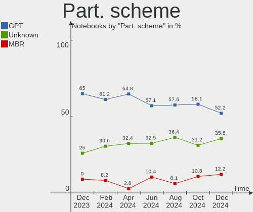
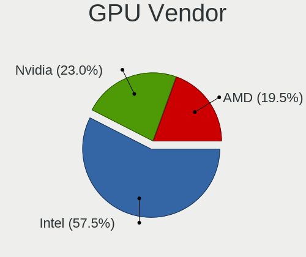
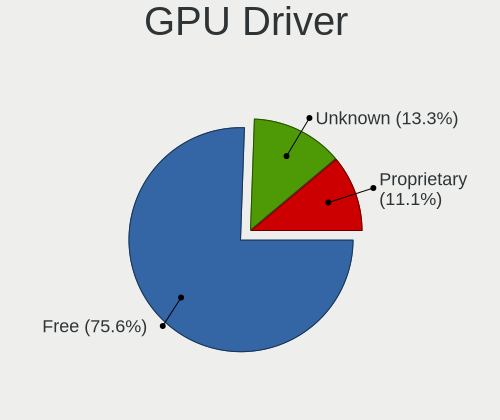
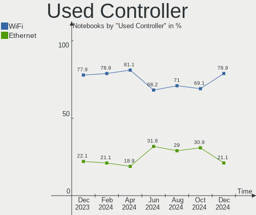

Linux in Spain - Hardware Trends (Notebooks)
--------------------------------------------

A project to identify most popular hardware characteristics and track their change
over time based on data collected by Linux users at https://Linux-Hardware.org.

Anyone can contribute to this report by the [hw-probe](https://github.com/linuxhw/hw-probe) tool:

    sudo -E hw-probe -all -upload

Period: Dec, 2023.

Contents
--------

* [ System ](#system)
  - [ OS                       ](#os)
  - [ OS Family                ](#os-family)
  - [ Kernel                   ](#kernel)
  - [ Kernel Family            ](#kernel-family)
  - [ Kernel Major Ver.        ](#kernel-major-ver)
  - [ Arch                     ](#arch)
  - [ DE                       ](#de)
  - [ Display Server           ](#display-server)
  - [ Display Manager          ](#display-manager)
  - [ OS Lang                  ](#os-lang)
  - [ Boot Mode                ](#boot-mode)
  - [ Filesystem               ](#filesystem)
  - [ Part. scheme             ](#part-scheme)
  - [ Dual Boot with Linux/BSD ](#dual-boot-with-linuxbsd)
  - [ Dual Boot (Win)          ](#dual-boot-win)

* [ Board ](#board)
  - [ Vendor                   ](#vendor)
  - [ Model                    ](#model)
  - [ Model Family             ](#model-family)
  - [ MFG Year                 ](#mfg-year)
  - [ Form Factor              ](#form-factor)
  - [ Secure Boot              ](#secure-boot)
  - [ Coreboot                 ](#coreboot)
  - [ RAM Size                 ](#ram-size)
  - [ RAM Used                 ](#ram-used)
  - [ Total Drives             ](#total-drives)
  - [ Has CD-ROM               ](#has-cd-rom)
  - [ Has Ethernet             ](#has-ethernet)
  - [ Has WiFi                 ](#has-wifi)
  - [ Has Bluetooth            ](#has-bluetooth)

* [ Location ](#location)
  - [ Country                  ](#country)
  - [ City                     ](#city)

* [ Drives ](#drives)
  - [ Drive Vendor             ](#drive-vendor)
  - [ Drive Model              ](#drive-model)
  - [ HDD Vendor               ](#hdd-vendor)
  - [ SSD Vendor               ](#ssd-vendor)
  - [ Drive Kind               ](#drive-kind)
  - [ Drive Connector          ](#drive-connector)
  - [ Drive Size               ](#drive-size)
  - [ Space Total              ](#space-total)
  - [ Space Used               ](#space-used)
  - [ Malfunc. Drives          ](#malfunc-drives)
  - [ Malfunc. Drive Vendor    ](#malfunc-drive-vendor)
  - [ Malfunc. HDD Vendor      ](#malfunc-hdd-vendor)
  - [ Malfunc. Drive Kind      ](#malfunc-drive-kind)
  - [ Failed Drives            ](#failed-drives)
  - [ Failed Drive Vendor      ](#failed-drive-vendor)
  - [ Drive Status             ](#drive-status)

* [ Storage controller ](#storage-controller)
  - [ Storage Vendor           ](#storage-vendor)
  - [ Storage Model            ](#storage-model)
  - [ Storage Kind             ](#storage-kind)

* [ Processor ](#processor)
  - [ CPU Vendor               ](#cpu-vendor)
  - [ CPU Model                ](#cpu-model)
  - [ CPU Model Family         ](#cpu-model-family)
  - [ CPU Cores                ](#cpu-cores)
  - [ CPU Sockets              ](#cpu-sockets)
  - [ CPU Threads              ](#cpu-threads)
  - [ CPU Op-Modes             ](#cpu-op-modes)
  - [ CPU Microcode            ](#cpu-microcode)
  - [ CPU Microarch            ](#cpu-microarch)

* [ Graphics ](#graphics)
  - [ GPU Vendor               ](#gpu-vendor)
  - [ GPU Model                ](#gpu-model)
  - [ GPU Combo                ](#gpu-combo)
  - [ GPU Driver               ](#gpu-driver)
  - [ GPU Memory               ](#gpu-memory)

* [ Monitor ](#monitor)
  - [ Monitor Vendor           ](#monitor-vendor)
  - [ Monitor Model            ](#monitor-model)
  - [ Monitor Resolution       ](#monitor-resolution)
  - [ Monitor Diagonal         ](#monitor-diagonal)
  - [ Monitor Width            ](#monitor-width)
  - [ Aspect Ratio             ](#aspect-ratio)
  - [ Monitor Area             ](#monitor-area)
  - [ Pixel Density            ](#pixel-density)
  - [ Multiple Monitors        ](#multiple-monitors)

* [ Network ](#network)
  - [ Net Controller Vendor    ](#net-controller-vendor)
  - [ Net Controller Model     ](#net-controller-model)
  - [ Wireless Vendor          ](#wireless-vendor)
  - [ Wireless Model           ](#wireless-model)
  - [ Ethernet Vendor          ](#ethernet-vendor)
  - [ Ethernet Model           ](#ethernet-model)
  - [ Net Controller Kind      ](#net-controller-kind)
  - [ Used Controller          ](#used-controller)
  - [ NICs                     ](#nics)
  - [ IPv6                     ](#ipv6)

* [ Bluetooth ](#bluetooth)
  - [ Bluetooth Vendor         ](#bluetooth-vendor)
  - [ Bluetooth Model          ](#bluetooth-model)

* [ Sound ](#sound)
  - [ Sound Vendor             ](#sound-vendor)
  - [ Sound Model              ](#sound-model)

* [ Memory ](#memory)
  - [ Memory Vendor            ](#memory-vendor)
  - [ Memory Model             ](#memory-model)
  - [ Memory Kind              ](#memory-kind)
  - [ Memory Form Factor       ](#memory-form-factor)
  - [ Memory Size              ](#memory-size)
  - [ Memory Speed             ](#memory-speed)

* [ Printers & scanners ](#printers--scanners)
  - [ Printer Vendor           ](#printer-vendor)
  - [ Printer Model            ](#printer-model)
  - [ Scanner Vendor           ](#scanner-vendor)
  - [ Scanner Model            ](#scanner-model)

* [ Camera ](#camera)
  - [ Camera Vendor            ](#camera-vendor)
  - [ Camera Model             ](#camera-model)

* [ Security ](#security)
  - [ Fingerprint Vendor       ](#fingerprint-vendor)
  - [ Fingerprint Model        ](#fingerprint-model)
  - [ Chipcard Vendor          ](#chipcard-vendor)
  - [ Chipcard Model           ](#chipcard-model)

* [ Unsupported ](#unsupported)
  - [ Unsupported Devices      ](#unsupported-devices)
  - [ Unsupported Device Types ](#unsupported-device-types)

System
------

OS
--

Installed operating systems

| Name                         | Notebooks | Percent |
|------------------------------|-----------|---------|
| Ubuntu 22.04                 | 25        | 24.75%  |
| Fedora 39                    | 8         | 7.92%   |
| ArcoLinux Rolling            | 8         | 7.92%   |
| Linux Mint 21.2              | 7         | 6.93%   |
| OpenMandriva 5.0             | 6         | 5.94%   |
| Ubuntu 23.10                 | 5         | 4.95%   |
| Debian 12                    | 5         | 4.95%   |
| Zorin 16                     | 4         | 3.96%   |
| Arch Rolling                 | 4         | 3.96%   |
| OpenMandriva 23.08           | 3         | 2.97%   |
| Xero Rolling                 | 2         | 1.98%   |
| openSUSE Tumbleweed-XXXXXXXX | 2         | 1.98%   |
| Kubuntu 23.10                | 2         | 1.98%   |
| Kubuntu 22.04                | 2         | 1.98%   |
| Debian                       | 2         | 1.98%   |
| Zorin 17                     | 1         | 0.99%   |
| Zorin 15                     | 1         | 0.99%   |
| Ubuntu MATE 23.10            | 1         | 0.99%   |
| Ubuntu MATE 22.04            | 1         | 0.99%   |
| OpenMandriva 4.2             | 1         | 0.99%   |
| OpenMandriva 23.90           | 1         | 0.99%   |
| OpenMandriva 23.11           | 1         | 0.99%   |
| Manjaro 23.1.0               | 1         | 0.99%   |
| Lubuntu 20.04                | 1         | 0.99%   |
| Linux Mint 21.1              | 1         | 0.99%   |
| Kubuntu 20.04                | 1         | 0.99%   |
| Gentoo 2.14                  | 1         | 0.99%   |
| Fedora 37                    | 1         | 0.99%   |
| EndeavourOS Rolling          | 1         | 0.99%   |
| Debian 6                     | 1         | 0.99%   |
| Artix                        | 1         | 0.99%   |

OS Family
---------

OS without a version

| Name         | Notebooks | Percent |
|--------------|-----------|---------|
| Ubuntu       | 30        | 29.7%   |
| OpenMandriva | 12        | 11.88%  |
| Fedora       | 9         | 8.91%   |
| Linux Mint   | 8         | 7.92%   |
| Debian       | 8         | 7.92%   |
| ArcoLinux    | 8         | 7.92%   |
| Zorin        | 6         | 5.94%   |
| Kubuntu      | 5         | 4.95%   |
| Arch         | 4         | 3.96%   |
| Xero         | 2         | 1.98%   |
| Ubuntu MATE  | 2         | 1.98%   |
| openSUSE     | 2         | 1.98%   |
| Manjaro      | 1         | 0.99%   |
| Lubuntu      | 1         | 0.99%   |
| Gentoo       | 1         | 0.99%   |
| EndeavourOS  | 1         | 0.99%   |
| Artix        | 1         | 0.99%   |

Kernel
------

Version of the Linux kernel

| Version                    | Notebooks | Percent |
|----------------------------|-----------|---------|
| 6.2.0-39-generic           | 13        | 12.87%  |
| 6.2.0-37-generic           | 9         | 8.91%   |
| 5.15.0-91-generic          | 9         | 8.91%   |
| 6.6.2-desktop-1omv2390     | 7         | 6.93%   |
| 6.5.0-14-generic           | 5         | 4.95%   |
| 6.6.4-arch1-1              | 3         | 2.97%   |
| 6.6.3-arch1-1              | 3         | 2.97%   |
| 6.4.11-desktop-1omv2390    | 3         | 2.97%   |
| 6.6.7-arch1-1              | 2         | 1.98%   |
| 6.6.6-arch1-1              | 2         | 1.98%   |
| 6.6.6-200.fc39.x86_64      | 2         | 1.98%   |
| 6.6.6-1-default            | 2         | 1.98%   |
| 6.6.5-arch1-1              | 2         | 1.98%   |
| 6.6.2-201.fc39.x86_64      | 2         | 1.98%   |
| 6.6.1-060601-generic       | 2         | 1.98%   |
| 6.5.0-5-amd64              | 2         | 1.98%   |
| 6.2.0-26-generic           | 2         | 1.98%   |
| 6.1.0-15-amd64             | 2         | 1.98%   |
| 6.1.0-13-amd64             | 2         | 1.98%   |
| 6.1.0-1027-oem             | 2         | 1.98%   |
| 5.15.0-89-generic          | 2         | 1.98%   |
| 6.6.8-arch1-1              | 1         | 0.99%   |
| 6.6.8-200.fc39.x86_64      | 1         | 0.99%   |
| 6.6.7-zen1-1-zen           | 1         | 0.99%   |
| 6.6.4-200.fc39.x86_64      | 1         | 0.99%   |
| 6.6.3-gentoo-r1            | 1         | 0.99%   |
| 6.6.2-arch1-1              | 1         | 0.99%   |
| 6.6.1-desktop-1omv2390     | 1         | 0.99%   |
| 6.6.1-1-MANJARO            | 1         | 0.99%   |
| 6.5.6-300.fc39.x86_64      | 1         | 0.99%   |
| 6.5.12-100.fc37.x86_64     | 1         | 0.99%   |
| 6.5.0-13-generic           | 1         | 0.99%   |
| 6.4.16-200.mbp.fc38.x86_64 | 1         | 0.99%   |
| 6.2.0-36-generic           | 1         | 0.99%   |
| 6.1.64-1-lts               | 1         | 0.99%   |
| 6.1.0-16-amd64             | 1         | 0.99%   |
| 6.1.0-15-686-pae           | 1         | 0.99%   |
| 6.1.0-1025-oem             | 1         | 0.99%   |
| 5.4.0-152-generic          | 1         | 0.99%   |
| 5.4.0-150-generic          | 1         | 0.99%   |

Kernel Family
-------------

Linux kernel without a distro release

| Version | Notebooks | Percent |
|---------|-----------|---------|
| 6.2.0   | 25        | 24.75%  |
| 5.15.0  | 14        | 13.86%  |
| 6.6.2   | 10        | 9.9%    |
| 6.1.0   | 9         | 8.91%   |
| 6.5.0   | 8         | 7.92%   |
| 6.6.6   | 6         | 5.94%   |
| 6.6.4   | 4         | 3.96%   |
| 6.6.3   | 4         | 3.96%   |
| 6.6.1   | 4         | 3.96%   |
| 6.6.7   | 3         | 2.97%   |
| 6.4.11  | 3         | 2.97%   |
| 6.6.8   | 2         | 1.98%   |
| 6.6.5   | 2         | 1.98%   |
| 5.4.0   | 2         | 1.98%   |
| 6.5.6   | 1         | 0.99%   |
| 6.5.12  | 1         | 0.99%   |
| 6.4.16  | 1         | 0.99%   |
| 6.1.64  | 1         | 0.99%   |
| 5.10.14 | 1         | 0.99%   |

Kernel Major Ver.
-----------------

Linux kernel major version

| Version | Notebooks | Percent |
|---------|-----------|---------|
| 6.6     | 35        | 34.65%  |
| 6.2     | 25        | 24.75%  |
| 5.15    | 14        | 13.86%  |
| 6.5     | 10        | 9.9%    |
| 6.1     | 10        | 9.9%    |
| 6.4     | 4         | 3.96%   |
| 5.4     | 2         | 1.98%   |
| 5.10    | 1         | 0.99%   |

Arch
----

OS architecture (x86_64, i586, etc.)

| Name   | Notebooks | Percent |
|--------|-----------|---------|
| x86_64 | 99        | 98.02%  |
| i686   | 2         | 1.98%   |

DE
--

Desktop Environment

| Name       | Notebooks | Percent |
|------------|-----------|---------|
| GNOME      | 50        | 49.5%   |
| KDE5       | 29        | 28.71%  |
| XFCE       | 9         | 8.91%   |
| X-Cinnamon | 6         | 5.94%   |
| MATE       | 3         | 2.97%   |
| sway       | 1         | 0.99%   |
| LXQt       | 1         | 0.99%   |
| Cinnamon   | 1         | 0.99%   |
| Unknown    | 1         | 0.99%   |

Display Server
--------------

X11 or Wayland

| Name    | Notebooks | Percent |
|---------|-----------|---------|
| X11     | 50        | 49.5%   |
| Wayland | 50        | 49.5%   |
| Tty     | 1         | 0.99%   |

Display Manager
---------------

SDDM, LightDM, etc.

| Name    | Notebooks | Percent |
|---------|-----------|---------|
| GDM3    | 31        | 30.69%  |
| SDDM    | 29        | 28.71%  |
| Unknown | 26        | 25.74%  |
| LightDM | 12        | 11.88%  |
| GDM     | 3         | 2.97%   |

OS Lang
-------

Language

| Lang    | Notebooks | Percent |
|---------|-----------|---------|
| es_ES   | 72        | 71.29%  |
| en_US   | 22        | 21.78%  |
| ru_UA   | 1         | 0.99%   |
| POSIX   | 1         | 0.99%   |
| it_IT   | 1         | 0.99%   |
| es_AR   | 1         | 0.99%   |
| en_GB   | 1         | 0.99%   |
| bg_BG   | 1         | 0.99%   |
| Unknown | 1         | 0.99%   |

Boot Mode
---------

EFI or BIOS

| Mode | Notebooks | Percent |
|------|-----------|---------|
| BIOS | 51        | 50.5%   |
| EFI  | 50        | 49.5%   |

Filesystem
----------

Type of filesystem

| Type    | Notebooks | Percent |
|---------|-----------|---------|
| Ext4    | 52        | 51.49%  |
| Tmpfs   | 22        | 21.78%  |
| Btrfs   | 18        | 17.82%  |
| Overlay | 8         | 7.92%   |
| Zfs     | 1         | 0.99%   |

Part. scheme
------------

Scheme of partitioning

| Type    | Notebooks | Percent |
|---------|-----------|---------|
| GPT     | 65        | 64.36%  |
| Unknown | 27        | 26.73%  |
| MBR     | 9         | 8.91%   |

Dual Boot with Linux/BSD
------------------------

Hosting more than one Linux/BSD

| Dual boot | Notebooks | Percent |
|-----------|-----------|---------|
| No        | 84        | 83.17%  |
| Yes       | 17        | 16.83%  |

Dual Boot (Win)
---------------

Hosting Linux and Windows

| Dual boot | Notebooks | Percent |
|-----------|-----------|---------|
| No        | 66        | 65.35%  |
| Yes       | 35        | 34.65%  |

Board
-----

Vendor
------

Motherboard manufacturer

| Name                | Notebooks | Percent |
|---------------------|-----------|---------|
| Hewlett-Packard     | 24        | 23.76%  |
| Lenovo              | 20        | 19.8%   |
| ASUSTek Computer    | 17        | 16.83%  |
| Acer                | 8         | 7.92%   |
| Dell                | 4         | 3.96%   |
| Apple               | 4         | 3.96%   |
| MSI                 | 3         | 2.97%   |
| Packard Bell        | 2         | 1.98%   |
| Notebook            | 2         | 1.98%   |
| Alurin              | 2         | 1.98%   |
| Unknown             | 2         | 1.98%   |
| XIAOMI              | 1         | 0.99%   |
| TUXEDO              | 1         | 0.99%   |
| SLIMBOOK            | 1         | 0.99%   |
| Samsung Electronics | 1         | 0.99%   |
| Qilive              | 1         | 0.99%   |
| Panasonic           | 1         | 0.99%   |
| HUAWEI              | 1         | 0.99%   |
| Fujitsu Siemens     | 1         | 0.99%   |
| Framework           | 1         | 0.99%   |
| Clevo               | 1         | 0.99%   |
| BAKED               | 1         | 0.99%   |
| Allview             | 1         | 0.99%   |
| Adreamer            | 1         | 0.99%   |

Model
-----

Motherboard model

| Name                                     | Notebooks | Percent |
|------------------------------------------|-----------|---------|
| Unknown                                  | 3         | 2.97%   |
| Lenovo IdeaPad Gaming 3 15ACH6 82K2      | 2         | 1.98%   |
| HP Laptop 15-fd0xxx                      | 2         | 1.98%   |
| Dell Vostro 3550                         | 2         | 1.98%   |
| ASUS VivoBook_ASUSLaptop K3402ZA_K3402ZA | 2         | 1.98%   |
| XIAOMI Redmi Book Pro 15 2023            | 1         | 0.99%   |
| TUXEDO InfinityBook Pro Gen8 (MK2)       | 1         | 0.99%   |
| SLIMBOOK PROX-AMD5                       | 1         | 0.99%   |
| Samsung R530/R730                        | 1         | 0.99%   |
| Qilive QW20141BSP                        | 1         | 0.99%   |
| Panasonic CF-19RDRCHH7                   | 1         | 0.99%   |
| Packard Bell EasyNote TN36               | 1         | 0.99%   |
| Packard Bell EasyNote TE11BZ             | 1         | 0.99%   |
| Notebook W65_67SR                        | 1         | 0.99%   |
| Notebook N24_25JU                        | 1         | 0.99%   |
| MSI Prestige 15 A12UD                    | 1         | 0.99%   |
| MSI GS66 Stealth 10SE                    | 1         | 0.99%   |
| MSI Alpha 17 C7VF                        | 1         | 0.99%   |
| Lenovo Yoga Slim 7 14APU8 83AA           | 1         | 0.99%   |
| Lenovo ThinkPad X1 Carbon 6th 20KHS0J700 | 1         | 0.99%   |
| Lenovo ThinkPad X1 Carbon 6th 20KGS4QH1E | 1         | 0.99%   |
| Lenovo ThinkPad W500 40624DG             | 1         | 0.99%   |
| Lenovo ThinkPad T550 20CJS1VD01          | 1         | 0.99%   |
| Lenovo ThinkPad SL500 274678G            | 1         | 0.99%   |
| Lenovo ThinkPad L15 Gen 4 21H3CTO1WW     | 1         | 0.99%   |
| Lenovo ThinkPad E16 Gen 1 21JNCTO1WW     | 1         | 0.99%   |
| Lenovo Legion 5 15ARH05H 82B1            | 1         | 0.99%   |
| Lenovo IdeaPad Y700-15ISK 80NV           | 1         | 0.99%   |
| Lenovo IdeaPad Slim 3 15IAH8 83ER        | 1         | 0.99%   |
| Lenovo IdeaPad Pro 5 16APH8 83AR         | 1         | 0.99%   |
| Lenovo IdeaPad Gaming 3 15IAH7 82S9      | 1         | 0.99%   |
| Lenovo IdeaPad 320S-15IKB 81BQ           | 1         | 0.99%   |
| Lenovo IdeaPad 3 15ITL6 82H8             | 1         | 0.99%   |
| Lenovo G50-80 80L0                       | 1         | 0.99%   |
| Lenovo B590 62742QG                      | 1         | 0.99%   |
| Lenovo B50-50 80S2                       | 1         | 0.99%   |
| HUAWEI KLVL-WXX9                         | 1         | 0.99%   |
| HP Victus by Laptop 16-e1xxx             | 1         | 0.99%   |
| HP Victus by Laptop 16-e0xxx             | 1         | 0.99%   |
| HP Victus by Gaming Laptop 16-s0xxx      | 1         | 0.99%   |

Model Family
------------

Motherboard model prefix

| Name                    | Notebooks | Percent |
|-------------------------|-----------|---------|
| Lenovo IdeaPad          | 8         | 7.92%   |
| Lenovo ThinkPad         | 7         | 6.93%   |
| HP Pavilion             | 7         | 6.93%   |
| HP Laptop               | 6         | 5.94%   |
| ASUS VivoBook           | 6         | 5.94%   |
| Acer Aspire             | 6         | 5.94%   |
| HP Victus               | 3         | 2.97%   |
| HP EliteBook            | 3         | 2.97%   |
| Dell Vostro             | 3         | 2.97%   |
| ASUS Zenbook            | 3         | 2.97%   |
| ASUS ROG                | 3         | 2.97%   |
| Unknown                 | 3         | 2.97%   |
| Packard Bell EasyNote   | 2         | 1.98%   |
| Apple MacBookPro11      | 2         | 1.98%   |
| Acer Nitro              | 2         | 1.98%   |
| XIAOMI Redmi            | 1         | 0.99%   |
| TUXEDO InfinityBook     | 1         | 0.99%   |
| SLIMBOOK PROX-AMD5      | 1         | 0.99%   |
| Samsung R530            | 1         | 0.99%   |
| Qilive QW20141BSP       | 1         | 0.99%   |
| Panasonic CF-19RDRCHH7  | 1         | 0.99%   |
| Notebook W65            | 1         | 0.99%   |
| Notebook N24            | 1         | 0.99%   |
| MSI Prestige            | 1         | 0.99%   |
| MSI GS66                | 1         | 0.99%   |
| MSI Alpha               | 1         | 0.99%   |
| Lenovo Yoga             | 1         | 0.99%   |
| Lenovo Legion           | 1         | 0.99%   |
| Lenovo G50-80           | 1         | 0.99%   |
| Lenovo B590             | 1         | 0.99%   |
| Lenovo B50-50           | 1         | 0.99%   |
| HUAWEI KLVL-WXX9        | 1         | 0.99%   |
| HP G62                  | 1         | 0.99%   |
| HP 630                  | 1         | 0.99%   |
| HP 255                  | 1         | 0.99%   |
| HP 240                  | 1         | 0.99%   |
| Fujitsu Siemens ESPRIMO | 1         | 0.99%   |
| Framework Laptop        | 1         | 0.99%   |
| Dell Latitude           | 1         | 0.99%   |
| Clevo W760              | 1         | 0.99%   |

MFG Year
--------

Motherboard manufacture year

| Year | Notebooks | Percent |
|------|-----------|---------|
| 2023 | 17        | 16.83%  |
| 2022 | 14        | 13.86%  |
| 2021 | 12        | 11.88%  |
| 2020 | 9         | 8.91%   |
| 2018 | 6         | 5.94%   |
| 2015 | 6         | 5.94%   |
| 2011 | 6         | 5.94%   |
| 2013 | 5         | 4.95%   |
| 2009 | 5         | 4.95%   |
| 2014 | 4         | 3.96%   |
| 2010 | 4         | 3.96%   |
| 2019 | 3         | 2.97%   |
| 2017 | 3         | 2.97%   |
| 2012 | 3         | 2.97%   |
| 2008 | 2         | 1.98%   |
| 2016 | 1         | 0.99%   |
| 2007 | 1         | 0.99%   |

Form Factor
-----------

Physical design of the computer

| Name     | Notebooks | Percent |
|----------|-----------|---------|
| Notebook | 101       | 100%    |

Secure Boot
-----------

Enabled or disabled

| State    | Notebooks | Percent |
|----------|-----------|---------|
| Disabled | 94        | 93.07%  |
| Enabled  | 7         | 6.93%   |

Coreboot
--------

Have coreboot on board

| Used | Notebooks | Percent |
|------|-----------|---------|
| No   | 101       | 100%    |

RAM Size
--------

Total RAM memory

| Size in GB  | Notebooks | Percent |
|-------------|-----------|---------|
| 4.01-8.0    | 29        | 28.71%  |
| 8.01-16.0   | 23        | 22.77%  |
| 3.01-4.0    | 16        | 15.84%  |
| 16.01-24.0  | 15        | 14.85%  |
| 32.01-64.0  | 8         | 7.92%   |
| 24.01-32.0  | 6         | 5.94%   |
| 1.01-2.0    | 2         | 1.98%   |
| 2.01-3.0    | 1         | 0.99%   |
| 64.01-256.0 | 1         | 0.99%   |

RAM Used
--------

Used RAM memory

| Used GB    | Notebooks | Percent |
|------------|-----------|---------|
| 2.01-3.0   | 33        | 32.67%  |
| 1.01-2.0   | 26        | 25.74%  |
| 3.01-4.0   | 17        | 16.83%  |
| 4.01-8.0   | 16        | 15.84%  |
| 8.01-16.0  | 3         | 2.97%   |
| 16.01-24.0 | 2         | 1.98%   |
| 0.01-0.5   | 2         | 1.98%   |
| 32.01-64.0 | 1         | 0.99%   |
| 0.51-1.0   | 1         | 0.99%   |

Total Drives
------------

Number of drives on board

| Drives | Notebooks | Percent |
|--------|-----------|---------|
| 1      | 77        | 76.24%  |
| 2      | 22        | 21.78%  |
| 3      | 2         | 1.98%   |

Has CD-ROM
----------

Has CD-ROM on board

| Presented | Notebooks | Percent |
|-----------|-----------|---------|
| No        | 74        | 73.27%  |
| Yes       | 27        | 26.73%  |

Has Ethernet
------------

Has Ethernet on board

| Presented | Notebooks | Percent |
|-----------|-----------|---------|
| Yes       | 76        | 75.25%  |
| No        | 25        | 24.75%  |

Has WiFi
--------

Has WiFi module

| Presented | Notebooks | Percent |
|-----------|-----------|---------|
| Yes       | 100       | 99.01%  |
| No        | 1         | 0.99%   |

Has Bluetooth
-------------

Has Bluetooth module

| Presented | Notebooks | Percent |
|-----------|-----------|---------|
| Yes       | 82        | 81.19%  |
| No        | 19        | 18.81%  |

Location
--------

Country
-------

Geographic location (country)

| Country | Notebooks | Percent |
|---------|-----------|---------|
| Spain   | 101       | 100%    |

City
----

Geographic location (city)

| City                      | Notebooks | Percent |
|---------------------------|-----------|---------|
| Madrid                    | 14        | 13.86%  |
| Barcelona                 | 10        | 9.9%    |
| Valencia                  | 5         | 4.95%   |
| Seville                   | 4         | 3.96%   |
| Palma                     | 4         | 3.96%   |
| Granada                   | 3         | 2.97%   |
| Girona                    | 3         | 2.97%   |
| Zaragoza                  | 2         | 1.98%   |
| Vigo                      | 2         | 1.98%   |
| Valladolid                | 2         | 1.98%   |
| Murcia                    | 2         | 1.98%   |
| Jerez de la Frontera      | 2         | 1.98%   |
| Alicante                  | 2         | 1.98%   |
| Xinzo de Limia            | 1         | 0.99%   |
| Vitoria-Gasteiz           | 1         | 0.99%   |
| Vic                       | 1         | 0.99%   |
| Valle Gran Rey            | 1         | 0.99%   |
| Tortosa                   | 1         | 0.99%   |
| Toledo                    | 1         | 0.99%   |
| Teruel                    | 1         | 0.99%   |
| Santa Pola                | 1         | 0.99%   |
| Sant Feliu de Guíxols    | 1         | 0.99%   |
| Rubí                     | 1         | 0.99%   |
| Punta Umbría             | 1         | 0.99%   |
| Pola de Laviana           | 1         | 0.99%   |
| Pioz                      | 1         | 0.99%   |
| Penaranda de Bracamonte   | 1         | 0.99%   |
| Molina de Segura          | 1         | 0.99%   |
| Málaga                   | 1         | 0.99%   |
| Lugones                   | 1         | 0.99%   |
| Lleida                    | 1         | 0.99%   |
| La Solana                 | 1         | 0.99%   |
| L'Hospitalet de Llobregat | 1         | 0.99%   |
| Jalon                     | 1         | 0.99%   |
| Irun                      | 1         | 0.99%   |
| Icod de los Vinos         | 1         | 0.99%   |
| Ibiza Town                | 1         | 0.99%   |
| Gijón                    | 1         | 0.99%   |
| Getafe                    | 1         | 0.99%   |
| Gelida                    | 1         | 0.99%   |

Drives
------

Drive Vendor
------------

Hard drive vendors

| Vendor                      | Notebooks | Drives | Percent |
|-----------------------------|-----------|--------|---------|
| Samsung Electronics         | 16        | 16     | 13.11%  |
| Micron Technology           | 15        | 16     | 12.3%   |
| Kingston                    | 12        | 12     | 9.84%   |
| WDC                         | 10        | 10     | 8.2%    |
| Sandisk                     | 10        | 12     | 8.2%    |
| Seagate                     | 8         | 8      | 6.56%   |
| Intel                       | 6         | 6      | 4.92%   |
| Unknown                     | 5         | 6      | 4.1%    |
| Toshiba                     | 4         | 4      | 3.28%   |
| SK hynix                    | 4         | 4      | 3.28%   |
| KIOXIA                      | 3         | 3      | 2.46%   |
| Apple                       | 3         | 3      | 2.46%   |
| USB                         | 2         | 2      | 1.64%   |
| Netac                       | 2         | 2      | 1.64%   |
| Hitachi                     | 2         | 2      | 1.64%   |
| HGST                        | 2         | 2      | 1.64%   |
| Crucial                     | 2         | 2      | 1.64%   |
| China                       | 2         | 2      | 1.64%   |
| XrayDisk                    | 1         | 1      | 0.82%   |
| VISIPRO                     | 1         | 1      | 0.82%   |
| Teclast                     | 1         | 1      | 0.82%   |
| Silicon Motion              | 1         | 1      | 0.82%   |
| SABRENT                     | 1         | 1      | 0.82%   |
| Phison Electronics          | 1         | 1      | 0.82%   |
| Micron/Crucial Technology   | 1         | 1      | 0.82%   |
| MAXIO Technology (Hangzhou) | 1         | 1      | 0.82%   |
| Lexar                       | 1         | 1      | 0.82%   |
| Kingston Technology Company | 1         | 1      | 0.82%   |
| JMicron Technology          | 1         | 1      | 0.82%   |
| GOODRAM                     | 1         | 1      | 0.82%   |
| Dogfish                     | 1         | 1      | 0.82%   |
| ASMT                        | 1         | 1      | 0.82%   |

Drive Model
-----------

Hard drive models

| Model                                               | Notebooks | Percent |
|-----------------------------------------------------|-----------|---------|
| Sandisk WD Blue SN550 NVMe SSD 1TB                  | 3         | 2.38%   |
| Micron 2450_MTFDKBA512TFK 512GB                     | 3         | 2.38%   |
| USB 3.1 1TB                                         | 2         | 1.59%   |
| Unknown MMC Card  16GB                              | 2         | 1.59%   |
| Toshiba MQ01ABD100 1TB                              | 2         | 1.59%   |
| Seagate ST9500325AS 500GB                           | 2         | 1.59%   |
| Seagate ST500LT012-1DG142 500GB                     | 2         | 1.59%   |
| SanDisk NVMe SSD Drive 1TB                          | 2         | 1.59%   |
| Samsung NVMe SSD Controller SM981/PM981/PM983 512GB | 2         | 1.59%   |
| Samsung NVMe SSD Controller PM9A1/PM9A3/980PRO 2TB  | 2         | 1.59%   |
| Micron 2400_MTFDKBA512QFM 512GB                     | 2         | 1.59%   |
| KIOXIA KBG40ZNV512G 512GB                           | 2         | 1.59%   |
| Kingston SV300S37A240G 240GB SSD                    | 2         | 1.59%   |
| Kingston SFYRD2000G 2TB                             | 2         | 1.59%   |
| Kingston SA400S37480G 480GB SSD                     | 2         | 1.59%   |
| Intel SSD 660P Series 1TB                           | 2         | 1.59%   |
| XrayDisk 120GB                                      | 1         | 0.79%   |
| WDC WDS250G2B0A-00SM50 250GB SSD                    | 1         | 0.79%   |
| WDC WD5000LPVX-08V0TT2 500GB                        | 1         | 0.79%   |
| WDC WD5000LPCX-60VHAT1 500GB                        | 1         | 0.79%   |
| WDC WD5000LPCX-24VHAT0 500GB                        | 1         | 0.79%   |
| WDC WD5000BPKT-75PK4T0 500GB                        | 1         | 0.79%   |
| WDC WD2500BPVT-00JJ5T0 250GB                        | 1         | 0.79%   |
| WDC WD1600BEVT-22ZCT0 160GB                         | 1         | 0.79%   |
| WDC WD10SPCX-24HWST1 1TB                            | 1         | 0.79%   |
| WDC PC SN730 SDBPNTY-1T00-1006 1TB                  | 1         | 0.79%   |
| WDC PC SN520 SDAPNUW-512G-1002 512GB                | 1         | 0.79%   |
| VISIPRO SSD 256GB                                   | 1         | 0.79%   |
| Unknown SD16G  16GB                                 | 1         | 0.79%   |
| Unknown NVMe SSD Drive 2TB                          | 1         | 0.79%   |
| Unknown ISOCOM  64GB                                | 1         | 0.79%   |
| Unknown 58K722  128GB                               | 1         | 0.79%   |
| Toshiba THNSNH128GMCT 128GB SSD                     | 1         | 0.79%   |
| Toshiba MK1665GSX 160GB                             | 1         | 0.79%   |
| Teclast BD256GB SLCB-2280 SSD                       | 1         | 0.79%   |
| SK hynix SKHynix_HFS001TEJ4X113N 1TB                | 1         | 0.79%   |
| SK hynix SKHynix_HFS001TEJ4X112N 1TB                | 1         | 0.79%   |
| SK hynix HFM512GDJTNG-8310A 512GB                   | 1         | 0.79%   |
| SK hynix BC511 HFM512GDJTNI-82A0A 512GB             | 1         | 0.79%   |
| Silicon Motion NVME SSD 1TB                         | 1         | 0.79%   |

HDD Vendor
----------

Hard disk drive vendors

| Vendor              | Notebooks | Drives | Percent |
|---------------------|-----------|--------|---------|
| Seagate             | 8         | 8      | 28.57%  |
| WDC                 | 7         | 7      | 25%     |
| Toshiba             | 3         | 3      | 10.71%  |
| Samsung Electronics | 3         | 3      | 10.71%  |
| USB                 | 2         | 2      | 7.14%   |
| Hitachi             | 2         | 2      | 7.14%   |
| HGST                | 2         | 2      | 7.14%   |
| SABRENT             | 1         | 1      | 3.57%   |

SSD Vendor
----------

Solid state drive vendors

| Vendor              | Notebooks | Drives | Percent |
|---------------------|-----------|--------|---------|
| Kingston            | 9         | 9      | 28.13%  |
| Samsung Electronics | 3         | 3      | 9.38%   |
| Micron Technology   | 3         | 3      | 9.38%   |
| SanDisk             | 2         | 2      | 6.25%   |
| China               | 2         | 2      | 6.25%   |
| Apple               | 2         | 2      | 6.25%   |
| WDC                 | 1         | 1      | 3.13%   |
| VISIPRO             | 1         | 1      | 3.13%   |
| Toshiba             | 1         | 1      | 3.13%   |
| Teclast             | 1         | 1      | 3.13%   |
| Netac               | 1         | 1      | 3.13%   |
| Lexar               | 1         | 1      | 3.13%   |
| Intel               | 1         | 1      | 3.13%   |
| GOODRAM             | 1         | 1      | 3.13%   |
| Dogfish             | 1         | 1      | 3.13%   |
| Crucial             | 1         | 1      | 3.13%   |
| ASMT                | 1         | 1      | 3.13%   |

Drive Kind
----------

HDD or SSD

| Kind    | Notebooks | Drives | Percent |
|---------|-----------|--------|---------|
| NVMe    | 53        | 59     | 44.54%  |
| SSD     | 32        | 32     | 26.89%  |
| HDD     | 28        | 28     | 23.53%  |
| MMC     | 4         | 5      | 3.36%   |
| Unknown | 2         | 2      | 1.68%   |

Drive Connector
---------------

SATA, SAS, NVMe, etc.

| Type | Notebooks | Drives | Percent |
|------|-----------|--------|---------|
| NVMe | 53        | 59     | 46.49%  |
| SATA | 50        | 55     | 43.86%  |
| SAS  | 7         | 7      | 6.14%   |
| MMC  | 4         | 5      | 3.51%   |

Drive Size
----------

Size of hard drive

| Size in TB | Notebooks | Drives | Percent |
|------------|-----------|--------|---------|
| 0.01-0.5   | 46        | 47     | 77.97%  |
| 0.51-1.0   | 10        | 10     | 16.95%  |
| 1.01-2.0   | 3         | 3      | 5.08%   |

Space Total
-----------

Amount of disk space available on the file system

| Size in GB     | Notebooks | Percent |
|----------------|-----------|---------|
| 101-250        | 26        | 25.74%  |
| 251-500        | 23        | 22.77%  |
| 501-1000       | 22        | 21.78%  |
| 51-100         | 9         | 8.91%   |
| 1001-2000      | 7         | 6.93%   |
| More than 3000 | 5         | 4.95%   |
| 1-20           | 5         | 4.95%   |
| 2001-3000      | 2         | 1.98%   |
| Unknown        | 2         | 1.98%   |

Space Used
----------

Amount of used disk space

| Used GB   | Notebooks | Percent |
|-----------|-----------|---------|
| 1-20      | 37        | 36.63%  |
| 101-250   | 17        | 16.83%  |
| 21-50     | 15        | 14.85%  |
| 51-100    | 14        | 13.86%  |
| 251-500   | 9         | 8.91%   |
| 1001-2000 | 3         | 2.97%   |
| 501-1000  | 3         | 2.97%   |
| Unknown   | 2         | 1.98%   |
| 0         | 1         | 0.99%   |

Malfunc. Drives
---------------

Drive models with a malfunction

| Model                                               | Notebooks | Drives | Percent |
|-----------------------------------------------------|-----------|--------|---------|
| WDC WD5000LPCX-24VHAT0 500GB                        | 1         | 1      | 10%     |
| WDC WD5000BPKT-75PK4T0 500GB                        | 1         | 1      | 10%     |
| SK hynix BC511 HFM512GDJTNI-82A0A 512GB             | 1         | 1      | 10%     |
| Seagate ST9250827AS 250GB                           | 1         | 1      | 10%     |
| Seagate ST500LT012-1DG142 500GB                     | 1         | 1      | 10%     |
| Samsung Electronics HM320II 320GB                   | 1         | 1      | 10%     |
| Micron Technology MTFDDAV256TDL-1AW1ZABHA 256GB SSD | 1         | 1      | 10%     |
| Kingston SUV400S37240G 240GB SSD                    | 1         | 1      | 10%     |
| Dogfish SSD 256GB                                   | 1         | 1      | 10%     |
| China SSD 512GB                                     | 1         | 1      | 10%     |

Malfunc. Drive Vendor
---------------------

Vendors of faulty drives

| Vendor              | Notebooks | Drives | Percent |
|---------------------|-----------|--------|---------|
| WDC                 | 2         | 2      | 20%     |
| Seagate             | 2         | 2      | 20%     |
| SK hynix            | 1         | 1      | 10%     |
| Samsung Electronics | 1         | 1      | 10%     |
| Micron Technology   | 1         | 1      | 10%     |
| Kingston            | 1         | 1      | 10%     |
| Dogfish             | 1         | 1      | 10%     |
| China               | 1         | 1      | 10%     |

Malfunc. HDD Vendor
-------------------

Vendors of faulty HDD drives

| Vendor              | Notebooks | Drives | Percent |
|---------------------|-----------|--------|---------|
| WDC                 | 2         | 2      | 40%     |
| Seagate             | 2         | 2      | 40%     |
| Samsung Electronics | 1         | 1      | 20%     |

Malfunc. Drive Kind
-------------------

Kinds of faulty drives

| Kind | Notebooks | Drives | Percent |
|------|-----------|--------|---------|
| HDD  | 5         | 5      | 50%     |
| SSD  | 4         | 4      | 40%     |
| NVMe | 1         | 1      | 10%     |

Failed Drives
-------------

Failed drive models

Zero info for selected period =(

Failed Drive Vendor
-------------------

Failed drive vendors

Zero info for selected period =(

Drive Status
------------

Number of failed and malfunc. drives

| Status   | Notebooks | Drives | Percent |
|----------|-----------|--------|---------|
| Detected | 56        | 68     | 52.83%  |
| Works    | 41        | 48     | 38.68%  |
| Malfunc  | 9         | 10     | 8.49%   |

Storage controller
------------------

Storage Vendor
--------------

Storage controller vendors

| Vendor                           | Notebooks | Percent |
|----------------------------------|-----------|---------|
| Intel                            | 57        | 46.34%  |
| Micron Technology                | 13        | 10.57%  |
| Samsung Electronics              | 12        | 9.76%   |
| SanDisk                          | 10        | 8.13%   |
| AMD                              | 10        | 8.13%   |
| SK hynix                         | 4         | 3.25%   |
| Kingston Technology Company      | 4         | 3.25%   |
| KIOXIA                           | 3         | 2.44%   |
| Micron/Crucial Technology        | 2         | 1.63%   |
| Solidigm                         | 1         | 0.81%   |
| Silicon Motion                   | 1         | 0.81%   |
| Silicon Integrated Systems [SiS] | 1         | 0.81%   |
| Phison Electronics               | 1         | 0.81%   |
| Nvidia                           | 1         | 0.81%   |
| Netac Technology                 | 1         | 0.81%   |
| MAXIO Technology (Hangzhou)      | 1         | 0.81%   |
| Apple                            | 1         | 0.81%   |

Storage Model
-------------

Storage controller models

| Model                                                                          | Notebooks | Percent |
|--------------------------------------------------------------------------------|-----------|---------|
| AMD FCH SATA Controller [AHCI mode]                                            | 10        | 7.58%   |
| Intel Volume Management Device NVMe RAID Controller                            | 5         | 3.79%   |
| Intel Celeron/Pentium Silver Processor SATA Controller                         | 5         | 3.79%   |
| Intel 82801IBM/IEM (ICH9M/ICH9M-E) 4 port SATA Controller [AHCI mode]          | 5         | 3.79%   |
| Micron 2450 NVMe SSD [HendrixV] (DRAM-less)                                    | 4         | 3.03%   |
| Intel 82801 Mobile SATA Controller [RAID mode]                                 | 4         | 3.03%   |
| Intel 6 Series/C200 Series Chipset Family 6 port Mobile SATA AHCI Controller   | 4         | 3.03%   |
| SanDisk Ultra 3D / WD Blue SN550 NVMe SSD                                      | 3         | 2.27%   |
| Samsung NVMe SSD Controller SM981/PM981/PM983                                  | 3         | 2.27%   |
| Samsung NVMe SSD Controller PM9A1/PM9A3/980PRO                                 | 3         | 2.27%   |
| Micron 3400 NVMe SSD [Hendrix]                                                 | 3         | 2.27%   |
| Micron 2400 NVMe SSD (DRAM-less)                                               | 3         | 2.27%   |
| Kingston Company KC3000/FURY Renegade NVMe SSD E18                             | 3         | 2.27%   |
| Intel Wildcat Point-LP SATA Controller [AHCI Mode]                             | 3         | 2.27%   |
| Intel Tiger Lake-LP SATA Controller                                            | 3         | 2.27%   |
| Intel Sunrise Point-LP SATA Controller [AHCI mode]                             | 3         | 2.27%   |
| Intel SSD 670p Series [Keystone Harbor]                                        | 3         | 2.27%   |
| Intel HM170/QM170 Chipset SATA Controller [AHCI Mode]                          | 3         | 2.27%   |
| Intel 5 Series/3400 Series Chipset 6 port SATA AHCI Controller                 | 3         | 2.27%   |
| SK hynix BC901 NVMe Solid State Drive (DRAM-less)                              | 2         | 1.52%   |
| SanDisk Extreme Pro / WD Black SN750 / PC SN730 / Red SN700 NVMe SSD           | 2         | 1.52%   |
| Samsung S4LN053X01 AHCI SSD Controller(Apple slot)                             | 2         | 1.52%   |
| Samsung NVMe SSD Controller PM9B1 (DRAM-less)                                  | 2         | 1.52%   |
| Samsung NVMe SSD Controller 980 (DRAM-less)                                    | 2         | 1.52%   |
| Micron/Crucial P2 [Nick P2] / P3 / P3 Plus NVMe PCIe SSD (DRAM-less)           | 2         | 1.52%   |
| Micron 2210 NVMe SSD [Cobain]                                                  | 2         | 1.52%   |
| KIOXIA NVMe SSD Controller BG4 (DRAM-less)                                     | 2         | 1.52%   |
| Intel Volume Management Device NVMe RAID Controller Intel Corporation          | 2         | 1.52%   |
| Intel SSD 660P Series                                                          | 2         | 1.52%   |
| Intel Celeron N3350/Pentium N4200/Atom E3900 Series SATA AHCI Controller       | 2         | 1.52%   |
| Intel Alder Lake-P SATA AHCI Controller                                        | 2         | 1.52%   |
| Intel 8 Series/C220 Series Chipset Family 6-port SATA Controller 1 [AHCI mode] | 2         | 1.52%   |
| Intel 8 Series SATA Controller 1 [AHCI mode]                                   | 2         | 1.52%   |
| Intel 7 Series Chipset Family 6-port SATA Controller [AHCI mode]               | 2         | 1.52%   |
| Intel 5 Series/3400 Series Chipset 4 port SATA AHCI Controller                 | 2         | 1.52%   |
| Solidigm P41 Plus NVMe SSD (DRAM-less) [Echo Harbor]                           | 1         | 0.76%   |
| SK hynix BC511 NVMe SSD                                                        | 1         | 0.76%   |
| SK hynix BC501 NVMe Solid State Drive                                          | 1         | 0.76%   |
| Silicon Motion SM2263EN/SM2263XT (DRAM-less) NVMe SSD Controllers              | 1         | 0.76%   |
| Silicon Integrated Systems [SiS] SATA Controller / IDE mode                    | 1         | 0.76%   |

Storage Kind
------------

Kind of storage controller (IDE, SATA, NVMe, SAS, ...)

| Kind | Notebooks | Percent |
|------|-----------|---------|
| SATA | 58        | 46.77%  |
| NVMe | 53        | 42.74%  |
| RAID | 11        | 8.87%   |
| IDE  | 2         | 1.61%   |

Processor
---------

CPU Vendor
----------

Processor vendors

| Vendor | Notebooks | Percent |
|--------|-----------|---------|
| Intel  | 74        | 73.27%  |
| AMD    | 27        | 26.73%  |

CPU Model
---------

Processor models

| Model                                         | Notebooks | Percent |
|-----------------------------------------------|-----------|---------|
| Intel 13th Gen Core i7-1355U                  | 4         | 3.96%   |
| AMD Ryzen 7 5800H with Radeon Graphics        | 4         | 3.96%   |
| Intel Celeron N4020 CPU @ 1.10GHz             | 3         | 2.97%   |
| Intel 12th Gen Core i7-12700H                 | 3         | 2.97%   |
| Intel Core i7-6700HQ CPU @ 2.60GHz            | 2         | 1.98%   |
| Intel Core i5-8250U CPU @ 1.60GHz             | 2         | 1.98%   |
| Intel 12th Gen Core i5-12450H                 | 2         | 1.98%   |
| Intel 11th Gen Core i5-1155G7 @ 2.50GHz       | 2         | 1.98%   |
| AMD Ryzen 7 7840HS w/ Radeon 780M Graphics    | 2         | 1.98%   |
| AMD Ryzen 7 5700U with Radeon Graphics        | 2         | 1.98%   |
| AMD Ryzen 7 4800H with Radeon Graphics        | 2         | 1.98%   |
| AMD Ryzen 5 3500U with Radeon Vega Mobile Gfx | 2         | 1.98%   |
| Intel Pentium Dual CPU T3400 @ 2.16GHz        | 1         | 0.99%   |
| Intel Pentium Dual CPU T3200 @ 2.00GHz        | 1         | 0.99%   |
| Intel Pentium Dual CPU T2390 @ 1.86GHz        | 1         | 0.99%   |
| Intel Pentium CPU N4200 @ 1.10GHz             | 1         | 0.99%   |
| Intel Core i7-8650U CPU @ 1.90GHz             | 1         | 0.99%   |
| Intel Core i7-8565U CPU @ 1.80GHz             | 1         | 0.99%   |
| Intel Core i7-7700HQ CPU @ 2.80GHz            | 1         | 0.99%   |
| Intel Core i7-5500U CPU @ 2.40GHz             | 1         | 0.99%   |
| Intel Core i7-4870HQ CPU @ 2.50GHz            | 1         | 0.99%   |
| Intel Core i7-4700MQ CPU @ 2.40GHz            | 1         | 0.99%   |
| Intel Core i7-4700HQ CPU @ 2.40GHz            | 1         | 0.99%   |
| Intel Core i7-2670QM CPU @ 2.20GHz            | 1         | 0.99%   |
| Intel Core i7-2640M CPU @ 2.80GHz             | 1         | 0.99%   |
| Intel Core i7-10875H CPU @ 2.30GHz            | 1         | 0.99%   |
| Intel Core i7-10750H CPU @ 2.60GHz            | 1         | 0.99%   |
| Intel Core i7 CPU Q 840 @ 1.87GHz             | 1         | 0.99%   |
| Intel Core i5-8350U CPU @ 1.70GHz             | 1         | 0.99%   |
| Intel Core i5-8257U CPU @ 1.40GHz             | 1         | 0.99%   |
| Intel Core i5-7300U CPU @ 2.60GHz             | 1         | 0.99%   |
| Intel Core i5-6200U CPU @ 2.30GHz             | 1         | 0.99%   |
| Intel Core i5-5300U CPU @ 2.30GHz             | 1         | 0.99%   |
| Intel Core i5-4300U CPU @ 1.90GHz             | 1         | 0.99%   |
| Intel Core i5-4258U CPU @ 2.40GHz             | 1         | 0.99%   |
| Intel Core i5-3230M CPU @ 2.60GHz             | 1         | 0.99%   |
| Intel Core i5-3210M CPU @ 2.50GHz             | 1         | 0.99%   |
| Intel Core i5-2430M CPU @ 2.40GHz             | 1         | 0.99%   |
| Intel Core i5-2410M CPU @ 2.30GHz             | 1         | 0.99%   |
| Intel Core i5-1035G1 CPU @ 1.00GHz            | 1         | 0.99%   |

CPU Model Family
----------------

Processor model prefix

| Model              | Notebooks | Percent |
|--------------------|-----------|---------|
| Other              | 19        | 18.81%  |
| Intel Core i5      | 17        | 16.83%  |
| AMD Ryzen 7        | 15        | 14.85%  |
| Intel Core i7      | 14        | 13.86%  |
| Intel Celeron      | 8         | 7.92%   |
| Intel Core i3      | 7         | 6.93%   |
| AMD Ryzen 5        | 6         | 5.94%   |
| Intel Core 2 Duo   | 4         | 3.96%   |
| Intel Pentium Dual | 3         | 2.97%   |
| AMD Ryzen 9        | 2         | 1.98%   |
| AMD E1             | 2         | 1.98%   |
| Intel Pentium      | 1         | 0.99%   |
| Intel Atom         | 1         | 0.99%   |
| AMD Ryzen 3        | 1         | 0.99%   |
| AMD E2             | 1         | 0.99%   |

CPU Cores
---------

Number of processor cores

| Number | Notebooks | Percent |
|--------|-----------|---------|
| 2      | 37        | 36.63%  |
| 4      | 26        | 25.74%  |
| 8      | 21        | 20.79%  |
| 10     | 6         | 5.94%   |
| 14     | 5         | 4.95%   |
| 6      | 3         | 2.97%   |
| 16     | 1         | 0.99%   |
| 12     | 1         | 0.99%   |
| 1      | 1         | 0.99%   |

CPU Sockets
-----------

Number of sockets

| Number | Notebooks | Percent |
|--------|-----------|---------|
| 1      | 101       | 100%    |

CPU Threads
-----------

Threads per core (Hyper-Threading)

| Number | Notebooks | Percent |
|--------|-----------|---------|
| 2      | 79        | 78.22%  |
| 1      | 22        | 21.78%  |

CPU Op-Modes
------------

CPU Operation Modes (32-bit, 64-bit)

| Op mode        | Notebooks | Percent |
|----------------|-----------|---------|
| 32-bit, 64-bit | 100       | 99.01%  |
| 32-bit         | 1         | 0.99%   |

CPU Microcode
-------------

Microcode number

| Number     | Notebooks | Percent |
|------------|-----------|---------|
| Unknown    | 71        | 70.3%   |
| 0x0a704103 | 3         | 2.97%   |
| 0xb06a3    | 2         | 1.98%   |
| 0x6fd      | 2         | 1.98%   |
| 0x10676    | 2         | 1.98%   |
| 0x0a50000d | 2         | 1.98%   |
| 0xb06a2    | 1         | 0.99%   |
| 0x906a4    | 1         | 0.99%   |
| 0x906a3    | 1         | 0.99%   |
| 0x806ea    | 1         | 0.99%   |
| 0x706a8    | 1         | 0.99%   |
| 0x506c9    | 1         | 0.99%   |
| 0x206a7    | 1         | 0.99%   |
| 0x20652    | 1         | 0.99%   |
| 0x0a601203 | 1         | 0.99%   |
| 0x0a50000f | 1         | 0.99%   |
| 0x0a50000c | 1         | 0.99%   |
| 0x0a404102 | 1         | 0.99%   |
| 0x08a00008 | 1         | 0.99%   |
| 0x08608102 | 1         | 0.99%   |
| 0x08600106 | 1         | 0.99%   |
| 0x08600104 | 1         | 0.99%   |
| 0x08108102 | 1         | 0.99%   |
| 0x0700010f | 1         | 0.99%   |
| 0x05000119 | 1         | 0.99%   |

CPU Microarch
-------------

Microarchitecture

| Name             | Notebooks | Percent |
|------------------|-----------|---------|
| Unknown          | 16        | 15.84%  |
| Alderlake Hybrid | 11        | 10.89%  |
| KabyLake         | 8         | 7.92%   |
| Haswell          | 7         | 6.93%   |
| Zen 3            | 6         | 5.94%   |
| SandyBridge      | 5         | 4.95%   |
| Goldmont plus    | 5         | 4.95%   |
| Westmere         | 4         | 3.96%   |
| TigerLake        | 4         | 3.96%   |
| Core             | 4         | 3.96%   |
| Zen 2            | 3         | 2.97%   |
| Skylake          | 3         | 2.97%   |
| Penryn           | 3         | 2.97%   |
| CometLake        | 3         | 2.97%   |
| Broadwell        | 3         | 2.97%   |
| Zen+             | 2         | 1.98%   |
| Silvermont       | 2         | 1.98%   |
| IvyBridge        | 2         | 1.98%   |
| Goldmont         | 2         | 1.98%   |
| Zen              | 1         | 0.99%   |
| Nehalem          | 1         | 0.99%   |
| Jaguar           | 1         | 0.99%   |
| IceLake          | 1         | 0.99%   |
| Gracemont        | 1         | 0.99%   |
| Excavator        | 1         | 0.99%   |
| Bonnell          | 1         | 0.99%   |
| Bobcat           | 1         | 0.99%   |

Graphics
--------

GPU Vendor
----------

Vendors of graphics cards

| Vendor                           | Notebooks | Percent |
|----------------------------------|-----------|---------|
| Intel                            | 67        | 49.26%  |
| Nvidia                           | 34        | 25%     |
| AMD                              | 34        | 25%     |
| Silicon Integrated Systems [SiS] | 1         | 0.74%   |

GPU Model
---------

Graphics card models

| Model                                                                     | Notebooks | Percent |
|---------------------------------------------------------------------------|-----------|---------|
| Intel Raptor Lake-P [Iris Xe Graphics]                                    | 6         | 4.38%   |
| Intel GeminiLake [UHD Graphics 600]                                       | 5         | 3.65%   |
| Intel 2nd Generation Core Processor Family Integrated Graphics Controller | 5         | 3.65%   |
| AMD Phoenix1                                                              | 5         | 3.65%   |
| AMD Cezanne [Radeon Vega Series / Radeon Vega Mobile Series]              | 5         | 3.65%   |
| Intel UHD Graphics 620                                                    | 4         | 2.92%   |
| Intel Haswell-ULT Integrated Graphics Controller                          | 4         | 2.92%   |
| Intel Core Processor Integrated Graphics Controller                       | 4         | 2.92%   |
| Nvidia TU106M [GeForce RTX 2060 Mobile]                                   | 3         | 2.19%   |
| Nvidia GA107M [GeForce RTX 3050 Mobile]                                   | 3         | 2.19%   |
| Intel TigerLake-LP GT2 [Iris Xe Graphics]                                 | 3         | 2.19%   |
| Intel Mobile 4 Series Chipset Integrated Graphics Controller              | 3         | 2.19%   |
| Intel HD Graphics 5500                                                    | 3         | 2.19%   |
| Intel CometLake-H GT2 [UHD Graphics]                                      | 3         | 2.19%   |
| Intel Alder Lake-P GT2 [Iris Xe Graphics]                                 | 3         | 2.19%   |
| AMD Renoir [Radeon RX Vega 6 (Ryzen 4000/5000 Mobile Series)]             | 3         | 2.19%   |
| Nvidia GN20-P0-R-K2 [GeForce RTX 3050 6GB Laptop GPU]                     | 2         | 1.46%   |
| Nvidia GA107M [GeForce RTX 3050 Ti Mobile]                                | 2         | 1.46%   |
| Nvidia GA106M [GeForce RTX 3060 Mobile / Max-Q]                           | 2         | 1.46%   |
| Nvidia AD107M [GeForce RTX 4060 Max-Q / Mobile]                           | 2         | 1.46%   |
| Intel Alder Lake-P Integrated Graphics Controller                         | 2         | 1.46%   |
| Intel Alder Lake-P GT1 [UHD Graphics]                                     | 2         | 1.46%   |
| Intel 4th Gen Core Processor Integrated Graphics Controller               | 2         | 1.46%   |
| Intel 3rd Gen Core processor Graphics Controller                          | 2         | 1.46%   |
| AMD Whistler [Radeon HD 6630M/6650M/6750M/7670M/7690M]                    | 2         | 1.46%   |
| AMD Thames [Radeon HD 7500M/7600M Series]                                 | 2         | 1.46%   |
| AMD Rembrandt [Radeon 680M]                                               | 2         | 1.46%   |
| AMD Picasso/Raven 2 [Radeon Vega Series / Radeon Vega Mobile Series]      | 2         | 1.46%   |
| AMD Mendocino                                                             | 2         | 1.46%   |
| AMD Lucienne                                                              | 2         | 1.46%   |
| Silicon Integrated Systems [SiS] 771/671 PCIE VGA Display Adapter         | 1         | 0.73%   |
| Nvidia TU117M [GeForce MX550]                                             | 1         | 0.73%   |
| Nvidia TU117M [GeForce GTX 1650 Mobile / Max-Q]                           | 1         | 0.73%   |
| Nvidia TU116M [GeForce GTX 1650 Ti Mobile]                                | 1         | 0.73%   |
| Nvidia GT218M [GeForce 310M]                                              | 1         | 0.73%   |
| Nvidia GP108M [GeForce MX330]                                             | 1         | 0.73%   |
| Nvidia GP108M [GeForce MX150]                                             | 1         | 0.73%   |
| Nvidia GP107M [GeForce GTX 1050 Mobile]                                   | 1         | 0.73%   |
| Nvidia GP107M [GeForce GTX 1050 3 GB Max-Q]                               | 1         | 0.73%   |
| Nvidia GP106BM [GeForce GTX 1060 Mobile 6GB]                              | 1         | 0.73%   |

GPU Combo
---------

Combinations of graphics cards

| Name           | Notebooks | Percent |
|----------------|-----------|---------|
| 1 x Intel      | 41        | 40.59%  |
| Intel + Nvidia | 19        | 18.81%  |
| 1 x AMD        | 18        | 17.82%  |
| AMD + Nvidia   | 10        | 9.9%    |
| Intel + AMD    | 6         | 5.94%   |
| 1 x Nvidia     | 5         | 4.95%   |
| 2 x Intel      | 1         | 0.99%   |
| 1 x SiS        | 1         | 0.99%   |

GPU Driver
----------

Free vs proprietary

| Driver      | Notebooks | Percent |
|-------------|-----------|---------|
| Free        | 81        | 80.2%   |
| Proprietary | 18        | 17.82%  |
| Unknown     | 2         | 1.98%   |

GPU Memory
----------

Total video memory

| Size in GB | Notebooks | Percent |
|------------|-----------|---------|
| Unknown    | 73        | 72.28%  |
| 0.01-0.5   | 16        | 15.84%  |
| 3.01-4.0   | 4         | 3.96%   |
| 1.01-2.0   | 3         | 2.97%   |
| 0.51-1.0   | 3         | 2.97%   |
| 5.01-6.0   | 1         | 0.99%   |
| 2.01-3.0   | 1         | 0.99%   |

Monitor
-------

Monitor Vendor
--------------

Monitor vendors

| Vendor                  | Notebooks | Percent |
|-------------------------|-----------|---------|
| BOE                     | 21        | 18.1%   |
| AU Optronics            | 17        | 14.66%  |
| Chimei Innolux          | 16        | 13.79%  |
| Samsung Electronics     | 13        | 11.21%  |
| LG Display              | 9         | 7.76%   |
| Chi Mei Optoelectronics | 6         | 5.17%   |
| Goldstar                | 4         | 3.45%   |
| Dell                    | 4         | 3.45%   |
| Apple                   | 4         | 3.45%   |
| PANDA                   | 3         | 2.59%   |
| CSO                     | 3         | 2.59%   |
| Lenovo                  | 2         | 1.72%   |
| ASUSTek Computer        | 2         | 1.72%   |
| Yuraku                  | 1         | 0.86%   |
| Vestel Elektronik       | 1         | 0.86%   |
| UGD                     | 1         | 0.86%   |
| TMX                     | 1         | 0.86%   |
| STA                     | 1         | 0.86%   |
| Sharp                   | 1         | 0.86%   |
| MSI                     | 1         | 0.86%   |
| InfoVision              | 1         | 0.86%   |
| HUAWEI                  | 1         | 0.86%   |
| HKC                     | 1         | 0.86%   |
| Hewlett-Packard         | 1         | 0.86%   |
| GreenWood               | 1         | 0.86%   |

Monitor Model
-------------

Monitor models

| Model                                                                  | Notebooks | Percent |
|------------------------------------------------------------------------|-----------|---------|
| Samsung Electronics LCD Monitor SDC4171 2880x1800 302x189mm 14.0-inch  | 3         | 2.59%   |
| Chimei Innolux LCD Monitor CMN15F5 1920x1080 344x193mm 15.5-inch       | 2         | 1.72%   |
| Chimei Innolux LCD Monitor CMN15E6 1366x768 344x193mm 15.5-inch        | 2         | 1.72%   |
| Chimei Innolux LCD Monitor CMN15C4 1920x1080 344x193mm 15.5-inch       | 2         | 1.72%   |
| BOE LCD Monitor BOE0AAD 1920x1080 355x200mm 16.0-inch                  | 2         | 1.72%   |
| BOE LCD Monitor BOE0A81 1920x1080 344x194mm 15.5-inch                  | 2         | 1.72%   |
| Yuraku YM22RPA FAC01C6 1680x1050 474x296mm 22.0-inch                   | 1         | 0.86%   |
| Vestel Elektronik 55UHD_LCD_TV VES3700 3840x2160 1872x1053mm 84.6-inch | 1         | 0.86%   |
| UGD Artist22R Pro UGD2202 1920x1080 476x268mm 21.5-inch                | 1         | 0.86%   |
| TMX TL156MDMP31-0 TMX2005 3200x2000 336x210mm 15.6-inch                | 1         | 0.86%   |
| STA XR140EA1T STA0450 1366x768 310x174mm 14.0-inch                     | 1         | 0.86%   |
| Sharp LQ156M1JW03 SHP14C5 1920x1080 344x194mm 15.5-inch                | 1         | 0.86%   |
| Samsung Electronics S24C31x SAM7311 1920x1080 521x293mm 23.5-inch      | 1         | 0.86%   |
| Samsung Electronics S24A31x SAM7115 1920x1080 527x296mm 23.8-inch      | 1         | 0.86%   |
| Samsung Electronics LCD Monitor SEC554E 1024x600 223x125mm 10.1-inch   | 1         | 0.86%   |
| Samsung Electronics LCD Monitor SEC3859 1366x768 293x165mm 13.2-inch   | 1         | 0.86%   |
| Samsung Electronics LCD Monitor SEC3642 1366x768 309x174mm 14.0-inch   | 1         | 0.86%   |
| Samsung Electronics LCD Monitor SEC3245 1366x768 344x194mm 15.5-inch   | 1         | 0.86%   |
| Samsung Electronics LCD Monitor SDC4852 1366x768 344x194mm 15.5-inch   | 1         | 0.86%   |
| Samsung Electronics LCD Monitor SDC4189 2944x1840 312x195mm 14.5-inch  | 1         | 0.86%   |
| Samsung Electronics LCD Monitor SAM07C0 1920x1080 480x270mm 21.7-inch  | 1         | 0.86%   |
| Samsung Electronics LCD Monitor SAM01FF 1360x768 885x498mm 40.0-inch   | 1         | 0.86%   |
| PANDA LM156LF1L03 NCP001C 1920x1080 344x194mm 15.5-inch                | 1         | 0.86%   |
| PANDA LCD Monitor NCP0050 1920x1080 309x174mm 14.0-inch                | 1         | 0.86%   |
| PANDA LCD Monitor NCP0035 1920x1080 309x174mm 14.0-inch                | 1         | 0.86%   |
| MSI G241V MSI3BA7 1920x1080 527x296mm 23.8-inch                        | 1         | 0.86%   |
| LG Display LCD Monitor LGD06B9 1920x1200 286x179mm 13.3-inch           | 1         | 0.86%   |
| LG Display LCD Monitor LGD0533 1920x1080 344x194mm 15.5-inch           | 1         | 0.86%   |
| LG Display LCD Monitor LGD046F 1920x1080 344x194mm 15.5-inch           | 1         | 0.86%   |
| LG Display LCD Monitor LGD038E 1366x768 344x194mm 15.5-inch            | 1         | 0.86%   |
| LG Display LCD Monitor LGD0372 1600x900 382x215mm 17.3-inch            | 1         | 0.86%   |
| LG Display LCD Monitor LGD034D 1366x768 344x194mm 15.5-inch            | 1         | 0.86%   |
| LG Display LCD Monitor LGD033B 1366x768 344x194mm 15.5-inch            | 1         | 0.86%   |
| LG Display LCD Monitor LGD032C 1920x1080 344x194mm 15.5-inch           | 1         | 0.86%   |
| LG Display LCD Monitor LGD02E3 1366x768 344x194mm 15.5-inch            | 1         | 0.86%   |
| Lenovo LCD Monitor LEN4055 1920x1200 331x207mm 15.4-inch               | 1         | 0.86%   |
| Lenovo LCD Monitor LEN4050 1280x800 331x207mm 15.4-inch                | 1         | 0.86%   |
| InfoVision LCD Monitor IVO03F4 1920x1080 309x173mm 13.9-inch           | 1         | 0.86%   |
| HUAWEI AD80HW HWV2402 1920x1080 527x296mm 23.8-inch                    | 1         | 0.86%   |
| HKC LCD Monitor HKC3D00 1920x1080 344x194mm 15.5-inch                  | 1         | 0.86%   |

Monitor Resolution
------------------

Monitor screen resolution

| Resolution         | Notebooks | Percent |
|--------------------|-----------|---------|
| 1920x1080 (FHD)    | 53        | 47.32%  |
| 1366x768 (WXGA)    | 22        | 19.64%  |
| 2560x1440 (QHD)    | 5         | 4.46%   |
| 3840x2160 (4K)     | 4         | 3.57%   |
| 2880x1800          | 4         | 3.57%   |
| 2560x1600          | 4         | 3.57%   |
| 1920x1200 (WUXGA)  | 4         | 3.57%   |
| 1600x900 (HD+)     | 4         | 3.57%   |
| 1280x800 (WXGA)    | 3         | 2.68%   |
| 1680x1050 (WSXGA+) | 2         | 1.79%   |
| 3200x2000          | 1         | 0.89%   |
| 2944x1840          | 1         | 0.89%   |
| 2256x1504          | 1         | 0.89%   |
| 2160x1440          | 1         | 0.89%   |
| 1440x900 (WXGA+)   | 1         | 0.89%   |
| 1360x768           | 1         | 0.89%   |
| 1024x600           | 1         | 0.89%   |

Monitor Diagonal
----------------

Diagonal size in inches

| Inches | Notebooks | Percent |
|--------|-----------|---------|
| 15     | 56        | 48.7%   |
| 14     | 12        | 10.43%  |
| 13     | 12        | 10.43%  |
| 17     | 10        | 8.7%    |
| 16     | 5         | 4.35%   |
| 24     | 4         | 3.48%   |
| 23     | 3         | 2.61%   |
| 27     | 2         | 1.74%   |
| 21     | 2         | 1.74%   |
| 84     | 1         | 0.87%   |
| 46     | 1         | 0.87%   |
| 40     | 1         | 0.87%   |
| 31     | 1         | 0.87%   |
| 26     | 1         | 0.87%   |
| 22     | 1         | 0.87%   |
| 20     | 1         | 0.87%   |
| 19     | 1         | 0.87%   |
| 10     | 1         | 0.87%   |

Monitor Width
-------------

Physical width

| Width in mm | Notebooks | Percent |
|-------------|-----------|---------|
| 301-350     | 74        | 64.35%  |
| 351-400     | 13        | 11.3%   |
| 501-600     | 10        | 8.7%    |
| 201-300     | 9         | 7.83%   |
| 401-500     | 5         | 4.35%   |
| 801-900     | 1         | 0.87%   |
| 601-700     | 1         | 0.87%   |
| 1501-2000   | 1         | 0.87%   |
| 1001-1500   | 1         | 0.87%   |

Aspect Ratio
------------

Proportional relationship between the width and the height

| Ratio | Notebooks | Percent |
|-------|-----------|---------|
| 16/9  | 82        | 79.61%  |
| 16/10 | 19        | 18.45%  |
| 3/2   | 2         | 1.94%   |

Monitor Area
------------

Area in inch²

| Area in inch² | Notebooks | Percent |
|----------------|-----------|---------|
| 101-110        | 59        | 51.3%   |
| 81-90          | 17        | 14.78%  |
| 121-130        | 10        | 8.7%    |
| 201-250        | 9         | 7.83%   |
| 71-80          | 6         | 5.22%   |
| 301-350        | 3         | 2.61%   |
| 151-200        | 3         | 2.61%   |
| 111-120        | 2         | 1.74%   |
| 501-1000       | 2         | 1.74%   |
| More than 1000 | 1         | 0.87%   |
| 351-500        | 1         | 0.87%   |
| 41-50          | 1         | 0.87%   |
| 91-100         | 1         | 0.87%   |

Pixel Density
-------------

Pixels per inch

| Density       | Notebooks | Percent |
|---------------|-----------|---------|
| 121-160       | 49        | 43.75%  |
| 101-120       | 27        | 24.11%  |
| 51-100        | 17        | 15.18%  |
| 161-240       | 13        | 11.61%  |
| More than 240 | 4         | 3.57%   |
| 1-50          | 2         | 1.79%   |

Multiple Monitors
-----------------

Total monitors connected

| Total | Notebooks | Percent |
|-------|-----------|---------|
| 1     | 79        | 78.22%  |
| 2     | 15        | 14.85%  |
| 0     | 4         | 3.96%   |
| 3     | 3         | 2.97%   |

Network
-------

Net Controller Vendor
---------------------

Controller vendors

| Vendor                            | Notebooks | Percent |
|-----------------------------------|-----------|---------|
| Realtek Semiconductor             | 58        | 35.58%  |
| Intel                             | 39        | 23.93%  |
| Qualcomm Atheros                  | 16        | 9.82%   |
| MediaTek                          | 16        | 9.82%   |
| Broadcom                          | 8         | 4.91%   |
| ASIX Electronics                  | 5         | 3.07%   |
| TP-Link                           | 3         | 1.84%   |
| Ralink Technology                 | 2         | 1.23%   |
| Ericsson Business Mobile Networks | 2         | 1.23%   |
| DisplayLink                       | 2         | 1.23%   |
| Broadcom Limited                  | 2         | 1.23%   |
| Xiaomi                            | 1         | 0.61%   |
| Silicon Integrated Systems [SiS]  | 1         | 0.61%   |
| Samsung Electronics               | 1         | 0.61%   |
| Ralink                            | 1         | 0.61%   |
| Qualcomm Technologies             | 1         | 0.61%   |
| Nvidia                            | 1         | 0.61%   |
| Marvell Technology Group          | 1         | 0.61%   |
| JMicron Technology                | 1         | 0.61%   |
| Edimax Technology                 | 1         | 0.61%   |
| Unknown                           | 1         | 0.61%   |

Net Controller Model
--------------------

Controller models

| Model                                                              | Notebooks | Percent |
|--------------------------------------------------------------------|-----------|---------|
| Realtek RTL8111/8168/8411 PCI Express Gigabit Ethernet Controller  | 34        | 17.71%  |
| Realtek RTL810xE PCI Express Fast Ethernet controller              | 7         | 3.65%   |
| MediaTek MT7921 802.11ax PCI Express Wireless Network Adapter      | 7         | 3.65%   |
| Intel Alder Lake-P PCH CNVi WiFi                                   | 7         | 3.65%   |
| MediaTek MT7922 802.11ax PCI Express Wireless Network Adapter      | 6         | 3.13%   |
| Intel Wireless 8265 / 8275                                         | 5         | 2.6%    |
| Realtek RTL8153 Gigabit Ethernet Adapter                           | 4         | 2.08%   |
| Qualcomm Atheros AR9285 Wireless Network Adapter (PCI-Express)     | 4         | 2.08%   |
| ASIX AX88179 Gigabit Ethernet                                      | 4         | 2.08%   |
| Realtek RTL8852BE PCIe 802.11ax Wireless Network Controller        | 3         | 1.56%   |
| Realtek RTL8852AE 802.11ax PCIe Wireless Network Adapter           | 3         | 1.56%   |
| Realtek RTL8822CE 802.11ac PCIe Wireless Network Adapter           | 3         | 1.56%   |
| Realtek RTL8821CE 802.11ac PCIe Wireless Network Adapter           | 3         | 1.56%   |
| Realtek 802.11n WLAN Adapter                                       | 3         | 1.56%   |
| Intel Wireless 7265                                                | 3         | 1.56%   |
| Intel Wi-Fi 6 AX201                                                | 3         | 1.56%   |
| Intel Wi-Fi 6 AX200                                                | 3         | 1.56%   |
| Intel Raptor Lake PCH CNVi WiFi                                    | 3         | 1.56%   |
| TP-Link 802.11ac NIC                                               | 2         | 1.04%   |
| Realtek RTL8723BU 802.11b/g/n WLAN Adapter                         | 2         | 1.04%   |
| Realtek RTL8723BE PCIe Wireless Network Adapter                    | 2         | 1.04%   |
| Realtek RTL8125 2.5GbE Controller                                  | 2         | 1.04%   |
| Qualcomm Atheros QCA9565 / AR9565 Wireless Network Adapter         | 2         | 1.04%   |
| Qualcomm Atheros AR9485 Wireless Network Adapter                   | 2         | 1.04%   |
| Qualcomm Atheros AR8151 v2.0 Gigabit Ethernet                      | 2         | 1.04%   |
| MediaTek Wi-Fi 6E MT7902 Wireless Network Adapter                  | 2         | 1.04%   |
| Intel Wireless 7260                                                | 2         | 1.04%   |
| Intel Ethernet Connection (4) I219-LM                              | 2         | 1.04%   |
| Intel Ethernet Connection (16) I219-V                              | 2         | 1.04%   |
| Intel Comet Lake PCH CNVi WiFi                                     | 2         | 1.04%   |
| Intel 82577LM Gigabit Network Connection                           | 2         | 1.04%   |
| Ericsson Business Mobile Networks F3507g Mobile Broadband Module   | 2         | 1.04%   |
| Broadcom BCM4313 802.11bgn Wireless Network Adapter                | 2         | 1.04%   |
| Xiaomi Mi/Redmi series (RNDIS + ADB)                               | 1         | 0.52%   |
| TP-Link 802.11ac WLAN Adapter                                      | 1         | 0.52%   |
| Silicon Integrated Systems [SiS] 191 Gigabit Ethernet Adapter      | 1         | 0.52%   |
| Samsung GT-I9070 (network tethering, USB debugging enabled)        | 1         | 0.52%   |
| Realtek RTL88x2bu [AC1200 Techkey]                                 | 1         | 0.52%   |
| Realtek RTL8852BE PCIe 802.11ax Wireless Network Controller [1T1R] | 1         | 0.52%   |
| Realtek RTL8191SU 802.11n WLAN Adapter                             | 1         | 0.52%   |

Wireless Vendor
---------------

Wireless vendors

| Vendor                | Notebooks | Percent |
|-----------------------|-----------|---------|
| Intel                 | 39        | 36.45%  |
| Realtek Semiconductor | 21        | 19.63%  |
| MediaTek              | 16        | 14.95%  |
| Qualcomm Atheros      | 13        | 12.15%  |
| Broadcom              | 8         | 7.48%   |
| TP-Link               | 3         | 2.8%    |
| Ralink Technology     | 2         | 1.87%   |
| Broadcom Limited      | 2         | 1.87%   |
| Ralink                | 1         | 0.93%   |
| Edimax Technology     | 1         | 0.93%   |
| Unknown               | 1         | 0.93%   |

Wireless Model
--------------

Wireless models

| Model                                                                   | Notebooks | Percent |
|-------------------------------------------------------------------------|-----------|---------|
| MediaTek MT7921 802.11ax PCI Express Wireless Network Adapter           | 7         | 6.42%   |
| Intel Alder Lake-P PCH CNVi WiFi                                        | 7         | 6.42%   |
| MediaTek MT7922 802.11ax PCI Express Wireless Network Adapter           | 6         | 5.5%    |
| Intel Wireless 8265 / 8275                                              | 5         | 4.59%   |
| Qualcomm Atheros AR9285 Wireless Network Adapter (PCI-Express)          | 4         | 3.67%   |
| Realtek RTL8852BE PCIe 802.11ax Wireless Network Controller             | 3         | 2.75%   |
| Realtek RTL8852AE 802.11ax PCIe Wireless Network Adapter                | 3         | 2.75%   |
| Realtek RTL8822CE 802.11ac PCIe Wireless Network Adapter                | 3         | 2.75%   |
| Realtek RTL8821CE 802.11ac PCIe Wireless Network Adapter                | 3         | 2.75%   |
| Realtek 802.11n WLAN Adapter                                            | 3         | 2.75%   |
| Intel Wireless 7265                                                     | 3         | 2.75%   |
| Intel Wi-Fi 6 AX201                                                     | 3         | 2.75%   |
| Intel Wi-Fi 6 AX200                                                     | 3         | 2.75%   |
| Intel Raptor Lake PCH CNVi WiFi                                         | 3         | 2.75%   |
| TP-Link 802.11ac NIC                                                    | 2         | 1.83%   |
| Realtek RTL8723BU 802.11b/g/n WLAN Adapter                              | 2         | 1.83%   |
| Realtek RTL8723BE PCIe Wireless Network Adapter                         | 2         | 1.83%   |
| Qualcomm Atheros QCA9565 / AR9565 Wireless Network Adapter              | 2         | 1.83%   |
| Qualcomm Atheros AR9485 Wireless Network Adapter                        | 2         | 1.83%   |
| MediaTek Wi-Fi 6E MT7902 Wireless Network Adapter                       | 2         | 1.83%   |
| Intel Wireless 7260                                                     | 2         | 1.83%   |
| Intel Comet Lake PCH CNVi WiFi                                          | 2         | 1.83%   |
| Broadcom BCM4313 802.11bgn Wireless Network Adapter                     | 2         | 1.83%   |
| TP-Link 802.11ac WLAN Adapter                                           | 1         | 0.92%   |
| Realtek RTL88x2bu [AC1200 Techkey]                                      | 1         | 0.92%   |
| Realtek RTL8852BE PCIe 802.11ax Wireless Network Controller [1T1R]      | 1         | 0.92%   |
| Realtek RTL8191SU 802.11n WLAN Adapter                                  | 1         | 0.92%   |
| Realtek 802.11ac WLAN Adapter                                           | 1         | 0.92%   |
| Ralink RT3072 Wireless Adapter                                          | 1         | 0.92%   |
| Ralink MT7601U Wireless Adapter                                         | 1         | 0.92%   |
| Ralink RT3290 Wireless 802.11n 1T/1R PCIe                               | 1         | 0.92%   |
| Qualcomm Atheros QCA9377 802.11ac Wireless Network Adapter              | 1         | 0.92%   |
| Qualcomm Atheros QCA6174 802.11ac Wireless Network Adapter              | 1         | 0.92%   |
| Qualcomm Atheros AR9462 Wireless Network Adapter                        | 1         | 0.92%   |
| Qualcomm Atheros AR928X Wireless Network Adapter (PCI-Express)          | 1         | 0.92%   |
| Qualcomm Atheros AR242x / AR542x Wireless Network Adapter (PCI-Express) | 1         | 0.92%   |
| MediaTek WiFi                                                           | 1         | 0.92%   |
| Intel Wireless 8260                                                     | 1         | 0.92%   |
| Intel Wireless 3160                                                     | 1         | 0.92%   |
| Intel WiFi Link 5100                                                    | 1         | 0.92%   |

Ethernet Vendor
---------------

Ethernet vendors

| Vendor                           | Notebooks | Percent |
|----------------------------------|-----------|---------|
| Realtek Semiconductor            | 49        | 62.82%  |
| Intel                            | 12        | 15.38%  |
| ASIX Electronics                 | 5         | 6.41%   |
| Qualcomm Atheros                 | 4         | 5.13%   |
| DisplayLink                      | 2         | 2.56%   |
| Xiaomi                           | 1         | 1.28%   |
| Silicon Integrated Systems [SiS] | 1         | 1.28%   |
| Nvidia                           | 1         | 1.28%   |
| Marvell Technology Group         | 1         | 1.28%   |
| JMicron Technology               | 1         | 1.28%   |
| Broadcom                         | 1         | 1.28%   |

Ethernet Model
--------------

Ethernet models

| Model                                                             | Notebooks | Percent |
|-------------------------------------------------------------------|-----------|---------|
| Realtek RTL8111/8168/8411 PCI Express Gigabit Ethernet Controller | 34        | 43.59%  |
| Realtek RTL810xE PCI Express Fast Ethernet controller             | 7         | 8.97%   |
| Realtek RTL8153 Gigabit Ethernet Adapter                          | 4         | 5.13%   |
| ASIX AX88179 Gigabit Ethernet                                     | 4         | 5.13%   |
| Realtek RTL8125 2.5GbE Controller                                 | 2         | 2.56%   |
| Qualcomm Atheros AR8151 v2.0 Gigabit Ethernet                     | 2         | 2.56%   |
| Intel Ethernet Connection (4) I219-LM                             | 2         | 2.56%   |
| Intel Ethernet Connection (16) I219-V                             | 2         | 2.56%   |
| Intel 82577LM Gigabit Network Connection                          | 2         | 2.56%   |
| Xiaomi Mi/Redmi series (RNDIS + ADB)                              | 1         | 1.28%   |
| Silicon Integrated Systems [SiS] 191 Gigabit Ethernet Adapter     | 1         | 1.28%   |
| Realtek RTL8152 Fast Ethernet Adapter                             | 1         | 1.28%   |
| Realtek Killer E2600 Gigabit Ethernet Controller                  | 1         | 1.28%   |
| Qualcomm Atheros QCA8171 Gigabit Ethernet                         | 1         | 1.28%   |
| Qualcomm Atheros AR8132 Fast Ethernet                             | 1         | 1.28%   |
| Nvidia MCP79 Ethernet                                             | 1         | 1.28%   |
| Marvell Group 88E8040 PCI-E Fast Ethernet Controller              | 1         | 1.28%   |
| JMicron JMC250 PCI Express Gigabit Ethernet Controller            | 1         | 1.28%   |
| Intel Killer E3100X 2.5 Gigabit Ethernet Controller               | 1         | 1.28%   |
| Intel Ethernet Connection I218-LM                                 | 1         | 1.28%   |
| Intel Ethernet Connection (3) I218-LM                             | 1         | 1.28%   |
| Intel Ethernet Connection (23) I219-V                             | 1         | 1.28%   |
| Intel Ethernet Connection (16) I219-LM                            | 1         | 1.28%   |
| Intel 82567LF Gigabit Network Connection                          | 1         | 1.28%   |
| DisplayLink USB3.0 5K Graphic Docking                             | 1         | 1.28%   |
| DisplayLink Dell USB 3.0 Dock                                     | 1         | 1.28%   |
| Broadcom NetLink BCM57785 Gigabit Ethernet PCIe                   | 1         | 1.28%   |
| ASIX AX88772                                                      | 1         | 1.28%   |

Net Controller Kind
-------------------

Ethernet, WiFi or modem

| Kind     | Notebooks | Percent |
|----------|-----------|---------|
| WiFi     | 100       | 55.25%  |
| Ethernet | 76        | 41.99%  |
| Modem    | 3         | 1.66%   |
| Unknown  | 2         | 1.1%    |

Used Controller
---------------

Currently used network controller

| Kind     | Notebooks | Percent |
|----------|-----------|---------|
| WiFi     | 84        | 80%     |
| Ethernet | 21        | 20%     |

NICs
----

Total network controllers on board

| Total | Notebooks | Percent |
|-------|-----------|---------|
| 2     | 64        | 63.37%  |
| 1     | 33        | 32.67%  |
| 0     | 4         | 3.96%   |

IPv6
----

IPv6 vs IPv4

| Used | Notebooks | Percent |
|------|-----------|---------|
| No   | 88        | 87.13%  |
| Yes  | 13        | 12.87%  |

Bluetooth
---------

Bluetooth Vendor
----------------

Controller vendors

| Vendor                          | Notebooks | Percent |
|---------------------------------|-----------|---------|
| Intel                           | 31        | 37.35%  |
| Realtek Semiconductor           | 13        | 15.66%  |
| Qualcomm Atheros Communications | 7         | 8.43%   |
| IMC Networks                    | 6         | 7.23%   |
| Foxconn / Hon Hai               | 6         | 7.23%   |
| Lite-On Technology              | 5         | 6.02%   |
| Broadcom                        | 4         | 4.82%   |
| MediaTek                        | 3         | 3.61%   |
| Apple                           | 3         | 3.61%   |
| TP-Link                         | 1         | 1.2%    |
| Realtek                         | 1         | 1.2%    |
| Ralink                          | 1         | 1.2%    |
| Hewlett-Packard                 | 1         | 1.2%    |
| Alps Electric                   | 1         | 1.2%    |

Bluetooth Model
---------------

Controller models

| Model                                              | Notebooks | Percent |
|----------------------------------------------------|-----------|---------|
| Intel Bluetooth Device                             | 13        | 15.66%  |
| Realtek Bluetooth Radio                            | 11        | 13.25%  |
| Intel Bluetooth wireless interface                 | 10        | 12.05%  |
| IMC Networks Wireless_Device                       | 5         | 6.02%   |
| Qualcomm Atheros AR3011 Bluetooth                  | 3         | 3.61%   |
| MediaTek Wireless_Device                           | 3         | 3.61%   |
| Lite-On Wireless_Device                            | 3         | 3.61%   |
| Intel Bluetooth 9460/9560 Jefferson Peak (JfP)     | 3         | 3.61%   |
| Intel AX200 Bluetooth                              | 3         | 3.61%   |
| Apple Bluetooth Host Controller                    | 3         | 3.61%   |
| Qualcomm Atheros  Bluetooth Device                 | 2         | 2.41%   |
| Foxconn / Hon Hai MediaTek Bluetooth Adapter       | 2         | 2.41%   |
| Foxconn / Hon Hai Bluetooth Adapter                | 2         | 2.41%   |
| Broadcom BCM2045B (BDC-2.1) [Bluetooth Controller] | 2         | 2.41%   |
| TP-Link UB500 Adapter                              | 1         | 1.2%    |
| Realtek RTL8723B Bluetooth                         | 1         | 1.2%    |
| Realtek  Bluetooth 4.2 Adapter                     | 1         | 1.2%    |
| Realtek Bluetooth Radio                            | 1         | 1.2%    |
| Ralink RT3290 Bluetooth                            | 1         | 1.2%    |
| Qualcomm Atheros Bluetooth USB Host Controller     | 1         | 1.2%    |
| Qualcomm Atheros AR3012 Bluetooth 4.0              | 1         | 1.2%    |
| Lite-On Bluetooth Device                           | 1         | 1.2%    |
| Lite-On Atheros AR3012 Bluetooth                   | 1         | 1.2%    |
| Intel Wireless-AC 3168 Bluetooth                   | 1         | 1.2%    |
| Intel AX210 Bluetooth                              | 1         | 1.2%    |
| IMC Networks Bluetooth Radio                       | 1         | 1.2%    |
| HP Broadcom 2070 Bluetooth Combo                   | 1         | 1.2%    |
| Foxconn / Hon Hai Wireless_Device                  | 1         | 1.2%    |
| Foxconn / Hon Hai Bluetooth Device                 | 1         | 1.2%    |
| Broadcom BCM43142A0 Bluetooth Device               | 1         | 1.2%    |
| Broadcom BCM20702A0                                | 1         | 1.2%    |
| Alps Electric UGTZ4 Bluetooth                      | 1         | 1.2%    |

Sound
-----

Sound Vendor
------------

Sound card vendors

| Vendor                           | Notebooks | Percent |
|----------------------------------|-----------|---------|
| Intel                            | 72        | 55.38%  |
| AMD                              | 28        | 21.54%  |
| Nvidia                           | 20        | 15.38%  |
| Texas Instruments                | 2         | 1.54%   |
| Silicon Integrated Systems [SiS] | 1         | 0.77%   |
| Lenovo                           | 1         | 0.77%   |
| Dell                             | 1         | 0.77%   |
| Creative Technology              | 1         | 0.77%   |
| Corsair                          | 1         | 0.77%   |
| CMX Systems                      | 1         | 0.77%   |
| Apple                            | 1         | 0.77%   |
| Unknown                          | 1         | 0.77%   |

Sound Model
-----------

Sound card models

| Model                                                                      | Notebooks | Percent |
|----------------------------------------------------------------------------|-----------|---------|
| AMD Family 17h/19h HD Audio Controller                                     | 24        | 14.81%  |
| AMD Rembrandt Radeon High Definition Audio Controller                      | 9         | 5.56%   |
| Intel Alder Lake PCH-P High Definition Audio Controller                    | 8         | 4.94%   |
| AMD Renoir Radeon High Definition Audio Controller                         | 8         | 4.94%   |
| Intel Raptor Lake-P/U/H cAVS                                               | 7         | 4.32%   |
| Nvidia Audio device                                                        | 6         | 3.7%    |
| Intel Sunrise Point-LP HD Audio                                            | 6         | 3.7%    |
| Intel Celeron/Pentium Silver Processor High Definition Audio               | 5         | 3.09%   |
| Intel 82801I (ICH9 Family) HD Audio Controller                             | 5         | 3.09%   |
| Intel 5 Series/3400 Series Chipset High Definition Audio                   | 5         | 3.09%   |
| Intel Tiger Lake-LP Smart Sound Technology Audio Controller                | 4         | 2.47%   |
| Intel Haswell-ULT HD Audio Controller                                      | 4         | 2.47%   |
| Intel 8 Series HD Audio Controller                                         | 4         | 2.47%   |
| Intel 6 Series/C200 Series Chipset Family High Definition Audio Controller | 4         | 2.47%   |
| Nvidia TU106 High Definition Audio Controller                              | 3         | 1.85%   |
| Intel Wildcat Point-LP High Definition Audio Controller                    | 3         | 1.85%   |
| Intel Comet Lake PCH cAVS                                                  | 3         | 1.85%   |
| Intel Broadwell-U Audio Controller                                         | 3         | 1.85%   |
| Intel 8 Series/C220 Series Chipset High Definition Audio Controller        | 3         | 1.85%   |
| Intel 7 Series/C216 Chipset Family High Definition Audio Controller        | 3         | 1.85%   |
| AMD Raven/Raven2/Fenghuang HDMI/DP Audio Controller                        | 3         | 1.85%   |
| Texas Instruments PCM2902 Audio Codec                                      | 2         | 1.23%   |
| Nvidia GA106 High Definition Audio Controller                              | 2         | 1.23%   |
| Intel Xeon E3-1200 v3/4th Gen Core Processor HD Audio Controller           | 2         | 1.23%   |
| Intel Celeron N3350/Pentium N4200/Atom E3900 Series Audio Cluster          | 2         | 1.23%   |
| Intel Cannon Point-LP High Definition Audio Controller                     | 2         | 1.23%   |
| Intel 100 Series/C230 Series Chipset Family HD Audio Controller            | 2         | 1.23%   |
| AMD FCH Azalia Controller                                                  | 2         | 1.23%   |
| Silicon Integrated Systems [SiS] Azalia Audio Controller                   | 1         | 0.62%   |
| Nvidia TU116 High Definition Audio Controller                              | 1         | 0.62%   |
| Nvidia TU107 GeForce GTX 1650 High Definition Audio Controller             | 1         | 0.62%   |
| Nvidia MCP79 High Definition Audio                                         | 1         | 0.62%   |
| Nvidia High Definition Audio Controller                                    | 1         | 0.62%   |
| Nvidia GP107GL High Definition Audio Controller                            | 1         | 0.62%   |
| Nvidia GP106 High Definition Audio Controller                              | 1         | 0.62%   |
| Nvidia GK107 HDMI Audio Controller                                         | 1         | 0.62%   |
| Nvidia GF108 High Definition Audio Controller                              | 1         | 0.62%   |
| Nvidia GA104 High Definition Audio Controller                              | 1         | 0.62%   |
| Lenovo ThinkPad USB-C Dock Gen2 USB Audio                                  | 1         | 0.62%   |
| Intel NM10/ICH7 Family High Definition Audio Controller                    | 1         | 0.62%   |

Memory
------

Memory Vendor
-------------

Memory module vendors

| Vendor              | Notebooks | Percent |
|---------------------|-----------|---------|
| Samsung Electronics | 20        | 31.75%  |
| Micron Technology   | 13        | 20.63%  |
| SK hynix            | 8         | 12.7%   |
| Unknown (ABCD)      | 4         | 6.35%   |
| Unknown             | 4         | 6.35%   |
| Nanya Technology    | 3         | 4.76%   |
| Crucial             | 3         | 4.76%   |
| Kingston            | 2         | 3.17%   |
| Silicon Power       | 1         | 1.59%   |
| Ramaxel Technology  | 1         | 1.59%   |
| GOODRAM             | 1         | 1.59%   |
| G.Skill             | 1         | 1.59%   |
| Elpida              | 1         | 1.59%   |
| A-DATA Technology   | 1         | 1.59%   |

Memory Model
------------

Memory module models

| Model                                                            | Notebooks | Percent |
|------------------------------------------------------------------|-----------|---------|
| Samsung RAM M471A1K43EB1-CWE 8GB SODIMM DDR4 3200MT/s            | 5         | 7.58%   |
| Unknown (ABCD) RAM 123456789012345678 2GB SODIMM LPDDR4 2400MT/s | 4         | 6.06%   |
| SK hynix RAM HMAA1GS6CJR6N-XN 8GB SODIMM DDR4 3200MT/s           | 3         | 4.55%   |
| Samsung RAM M471B1G73QH0-YK0 8GB SODIMM DDR3 1867MT/s            | 2         | 3.03%   |
| Samsung RAM M471B1G73DB0-YK0 8GB SODIMM DDR3 1600MT/s            | 2         | 3.03%   |
| Nanya RAM NT8GA64D88AX3S-HR 8GB SODIMM DDR4 2667MT/s             | 2         | 3.03%   |
| Micron RAM 4ATF1G64HZ-3G2F1 8GB SODIMM DDR4 3200MT/s             | 2         | 3.03%   |
| Unknown RAM Module 4GB SODIMM DDR3 1067MT/s                      | 1         | 1.52%   |
| Unknown RAM Module 2GB SODIMM DDR2 800MT/s                       | 1         | 1.52%   |
| Unknown RAM Module 2GB SODIMM DDR2 667MT/s                       | 1         | 1.52%   |
| Unknown RAM Module 1GB DIMM DRAM                                 | 1         | 1.52%   |
| SK hynix RAM HMCG78AGBSA095N 16GB SODIMM DDR5 5600MT/s           | 1         | 1.52%   |
| SK hynix RAM HMCG66AGBSA092N 8GB SODIMM DDR5 5600MT/s            | 1         | 1.52%   |
| SK hynix RAM HMAA2GS6AJR8N-XN 16GB SODIMM DDR4 3200MT/s          | 1         | 1.52%   |
| SK hynix RAM H9HCNNNFAMMLXR-NEE 4GB Row Of Chips LPDDR4 4267MT/s | 1         | 1.52%   |
| SK hynix RAM H9CCNNNCLGALAR-NVD 8GB Row Of Chips LPDDR3 2133MT/s | 1         | 1.52%   |
| Silicon Power RAM SP008GLSTU160N02 8GB SODIMM DDR3 1600MT/s      | 1         | 1.52%   |
| Samsung RAM Module 16GB SODIMM DDR4 3200MT/s                     | 1         | 1.52%   |
| Samsung RAM M471B5273DH0-CH9 4096MB SODIMM DDR3 1334MT/s         | 1         | 1.52%   |
| Samsung RAM M471B5173EB0-YK0 4GB SODIMM DDR3 1600MT/s            | 1         | 1.52%   |
| Samsung RAM M471B5173DB0-YK0 4GB SODIMM DDR3 1600MT/s            | 1         | 1.52%   |
| Samsung RAM M471A5244CB0-CWE 4GB SODIMM DDR4 3200MT/s            | 1         | 1.52%   |
| Samsung RAM M471A1K43CB1-CRC 8GB SODIMM DDR4 2667MT/s            | 1         | 1.52%   |
| Samsung RAM M471A1G44CB0-CWE 8GB SODIMM DDR4 3200MT/s            | 1         | 1.52%   |
| Samsung RAM M471A1G44BB0-CWE 8GB SODIMM DDR4 3200MT/s            | 1         | 1.52%   |
| Samsung RAM M425R1GB4BB0-CQKOL 8GB SODIMM DDR5 4800MT/s          | 1         | 1.52%   |
| Samsung RAM K4UBE3D4AA-MGCR 8GB SODIMM LPDDR4 4266MT/s           | 1         | 1.52%   |
| Samsung RAM K4EBE304EB-EGCG 8GB Row Of Chips LPDDR3 2133MT/s     | 1         | 1.52%   |
| Samsung RAM K3LKCKC0BM-MGCP 8GB SODIMM 6400MT/s                  | 1         | 1.52%   |
| Samsung RAM K3LKBKB0BM-MGCP 4GB SODIMM LPDDR5 6400MT/s           | 1         | 1.52%   |
| Ramaxel RAM RMSA3340MF88HBF-3200 16GB SODIMM DDR4 3200MT/s       | 1         | 1.52%   |
| Nanya RAM NT4GC64B8HG0NS-CG 4GB SODIMM DDR3 1334MT/s             | 1         | 1.52%   |
| Nanya RAM NT4GC64B8HB0NS-CG 4GB SODIMM DDR3 1334MT/s             | 1         | 1.52%   |
| Micron RAM MT62F1G32D4DR-031 2GB Row Of Chips LPDDR5 6400MT/s    | 1         | 1.52%   |
| Micron RAM MT52L1G32D4PG-093 8GB Row Of Chips LPDDR3 2133MT/s    | 1         | 1.52%   |
| Micron RAM Module 8GB SODIMM DDR4 3200MT/s                       | 1         | 1.52%   |
| Micron RAM Module 4GB SODIMM DDR3 1600MT/s                       | 1         | 1.52%   |
| Micron RAM 8JTF5126 4HZ-1GD 1 4GB SODIMM DDR3 1600MT/s           | 1         | 1.52%   |
| Micron RAM 8ATF1G64HZ-3G2R1 8GB SODIMM DDR4 3200MT/s             | 1         | 1.52%   |
| Micron RAM 8ATF1G64HZ-3G2J1 8GB SODIMM DDR4 3200MT/s             | 1         | 1.52%   |

Memory Kind
-----------

Memory module kinds

| Kind   | Notebooks | Percent |
|--------|-----------|---------|
| DDR4   | 25        | 43.86%  |
| DDR3   | 13        | 22.81%  |
| LPDDR4 | 6         | 10.53%  |
| DDR5   | 4         | 7.02%   |
| LPDDR5 | 3         | 5.26%   |
| LPDDR3 | 3         | 5.26%   |
| DDR2   | 2         | 3.51%   |
| DRAM   | 1         | 1.75%   |

Memory Form Factor
------------------

Physical design of the memory module

| Name         | Notebooks | Percent |
|--------------|-----------|---------|
| SODIMM       | 50        | 86.21%  |
| Row Of Chips | 7         | 12.07%  |
| DIMM         | 1         | 1.72%   |

Memory Size
-----------

Memory module size

| Size  | Notebooks | Percent |
|-------|-----------|---------|
| 8192  | 33        | 56.9%   |
| 16384 | 10        | 17.24%  |
| 4096  | 10        | 17.24%  |
| 2048  | 3         | 5.17%   |
| 32768 | 1         | 1.72%   |
| 1024  | 1         | 1.72%   |

Memory Speed
------------

Memory module speed

| Speed   | Notebooks | Percent |
|---------|-----------|---------|
| 3200    | 20        | 33.33%  |
| 1600    | 9         | 15%     |
| 2667    | 7         | 11.67%  |
| 2400    | 5         | 8.33%   |
| 6400    | 3         | 5%      |
| 5600    | 3         | 5%      |
| 2133    | 3         | 5%      |
| 1334    | 2         | 3.33%   |
| 1067    | 2         | 3.33%   |
| 4800    | 1         | 1.67%   |
| 4267    | 1         | 1.67%   |
| 4266    | 1         | 1.67%   |
| 800     | 1         | 1.67%   |
| 667     | 1         | 1.67%   |
| Unknown | 1         | 1.67%   |

Printers & scanners
-------------------

Printer Vendor
--------------

Printer device vendors

| Vendor             | Notebooks | Percent |
|--------------------|-----------|---------|
| Brother Industries | 2         | 100%    |

Printer Model
-------------

Printer device models

| Model                         | Notebooks | Percent |
|-------------------------------|-----------|---------|
| Brother HL-2240D series       | 1         | 50%     |
| Brother HL-2030 Laser Printer | 1         | 50%     |

Scanner Vendor
--------------

Scanner device vendors

Zero info for selected period =(

Scanner Model
-------------

Scanner device models

Zero info for selected period =(

Camera
------

Camera Vendor
-------------

Camera device vendors

| Vendor                                 | Notebooks | Percent |
|----------------------------------------|-----------|---------|
| Chicony Electronics                    | 19        | 20.21%  |
| IMC Networks                           | 17        | 18.09%  |
| Quanta                                 | 10        | 10.64%  |
| Realtek Semiconductor                  | 5         | 5.32%   |
| Cheng Uei Precision Industry (Foxlink) | 5         | 5.32%   |
| Bison Electronics                      | 5         | 5.32%   |
| SunplusIT                              | 3         | 3.19%   |
| Microdia                               | 3         | 3.19%   |
| Logitech                               | 3         | 3.19%   |
| Alcor Micro                            | 3         | 3.19%   |
| Sonix Technology                       | 2         | 2.13%   |
| Ricoh                                  | 2         | 2.13%   |
| Lenovo                                 | 2         | 2.13%   |
| Syntek                                 | 1         | 1.06%   |
| Suyin                                  | 1         | 1.06%   |
| Sunplus Technology                     | 1         | 1.06%   |
| Sunplus Innovation Technology          | 1         | 1.06%   |
| Silicon Motion                         | 1         | 1.06%   |
| Luxvisions Innotech Limited            | 1         | 1.06%   |
| Intel                                  | 1         | 1.06%   |
| icSpring                               | 1         | 1.06%   |
| Genesys Logic                          | 1         | 1.06%   |
| DigiTech                               | 1         | 1.06%   |
| Creative Technology                    | 1         | 1.06%   |
| Apple                                  | 1         | 1.06%   |
| Acer                                   | 1         | 1.06%   |
| 8SSC21D67422V1SR28902JL                | 1         | 1.06%   |
| Unknown                                | 1         | 1.06%   |

Camera Model
------------

Camera device models

| Model                                                | Notebooks | Percent |
|------------------------------------------------------|-----------|---------|
| IMC Networks Integrated Camera                       | 7         | 7.45%   |
| IMC Networks USB2.0 HD UVC WebCam                    | 5         | 5.32%   |
| Chicony Integrated Camera                            | 5         | 5.32%   |
| Chicony HP Truevision HD camera                      | 4         | 4.26%   |
| Quanta ACER HD User Facing                           | 3         | 3.19%   |
| Ricoh Integrated Webcam                              | 2         | 2.13%   |
| Quanta HP Wide Vision HD Camera                      | 2         | 2.13%   |
| Quanta HP Webcam                                     | 2         | 2.13%   |
| Bison Integrated Camera                              | 2         | 2.13%   |
| Bison HD Camera                                      | 2         | 2.13%   |
| Alcor Micro USB 2.0 Camera                           | 2         | 2.13%   |
| Syntek Integrated Camera                             | 1         | 1.06%   |
| Suyin HP TrueVision HD Integrated Webcam             | 1         | 1.06%   |
| SunplusIT XiaoMi USB 2.0 Webcam                      | 1         | 1.06%   |
| SunplusIT HP TrueVision HD Camera                    | 1         | 1.06%   |
| SunplusIT FHD Webcam                                 | 1         | 1.06%   |
| Sunplus 1.3M HD WebCam                               | 1         | 1.06%   |
| Sunplus HD WebCam                                    | 1         | 1.06%   |
| Sonix USB2.0 HD UVC WebCam                           | 1         | 1.06%   |
| Sonix USB2.0 FHD UVC WebCam                          | 1         | 1.06%   |
| Silicon Motion USB 2.0 PC Cam                        | 1         | 1.06%   |
| Realtek USB2.0 VGA UVC WebCam                        | 1         | 1.06%   |
| Realtek USB camera                                   | 1         | 1.06%   |
| Realtek Lenovo EasyCamera                            | 1         | 1.06%   |
| Realtek Laptop Camera                                | 1         | 1.06%   |
| Realtek Integrated Webcam HD                         | 1         | 1.06%   |
| Quanta USB2.0 VGA UVC WebCam                         | 1         | 1.06%   |
| Quanta HP TrueVision HD Camera                       | 1         | 1.06%   |
| Quanta HP True Vision FHD Camera                     | 1         | 1.06%   |
| Microdia Sonix USB 2.0 Camera                        | 1         | 1.06%   |
| Microdia HP Integrated Webcam                        | 1         | 1.06%   |
| Microdia Dell Integrated HD Webcam                   | 1         | 1.06%   |
| Luxvisions Innotech Limited HP Wide Vision HD Camera | 1         | 1.06%   |
| Logitech StreamCam                                   | 1         | 1.06%   |
| Logitech HD Pro Webcam C920                          | 1         | 1.06%   |
| Logitech C920 PRO HD Webcam                          | 1         | 1.06%   |
| Lenovo UVC Camera                                    | 1         | 1.06%   |
| Lenovo CNF7237&CNF7238                               | 1         | 1.06%   |
| Intel RealSense 3D Camera (Front F200)               | 1         | 1.06%   |
| IMC Networks USB2.0 VGA UVC WebCam                   | 1         | 1.06%   |

Security
--------

Fingerprint Vendor
------------------

Fingerprint sensor vendors

| Vendor                             | Notebooks | Percent |
|------------------------------------|-----------|---------|
| Validity Sensors                   | 4         | 25%     |
| Synaptics                          | 3         | 18.75%  |
| Elan Microelectronics              | 3         | 18.75%  |
| Realtek USB2.0 Finger Print Bridge | 2         | 12.5%   |
| Upek                               | 1         | 6.25%   |
| Shenzhen Goodix Technology         | 1         | 6.25%   |
| LighTuning Technology              | 1         | 6.25%   |
| AuthenTec                          | 1         | 6.25%   |

Fingerprint Model
-----------------

Fingerprint sensor models

| Model                                                           | Notebooks | Percent |
|-----------------------------------------------------------------|-----------|---------|
| Validity Sensors VFS5011 Fingerprint Reader                     | 3         | 18.75%  |
| Synaptics Metallica MIS Touch Fingerprint Reader                | 2         | 12.5%   |
| Realtek USB2.0 Finger Print Bridge FocalTech Fingerprint Device | 2         | 12.5%   |
| Elan ELAN:ARM-M4                                                | 2         | 12.5%   |
| Validity Sensors VFS451 Fingerprint Reader                      | 1         | 6.25%   |
| Upek Biometric Touchchip/Touchstrip Fingerprint Sensor          | 1         | 6.25%   |
| Synaptics WBDI Fingerprint Reader USB 086                       | 1         | 6.25%   |
| Shenzhen Goodix  Fingerprint Device                             | 1         | 6.25%   |
| LighTuning ES603 Swipe Fingerprint Sensor                       | 1         | 6.25%   |
| Elan ELAN:Fingerprint                                           | 1         | 6.25%   |
| AuthenTec AES2810                                               | 1         | 6.25%   |

Chipcard Vendor
---------------

Chipcard module vendors

| Vendor                | Notebooks | Percent |
|-----------------------|-----------|---------|
| Alcor Micro           | 1         | 50%     |
| Advanced Card Systems | 1         | 50%     |

Chipcard Model
--------------

Chipcard module models

| Model                                        | Notebooks | Percent |
|----------------------------------------------|-----------|---------|
| Alcor Micro AU9540 Smartcard Reader          | 1         | 50%     |
| Advanced Card Systems ACR38 SmartCard Reader | 1         | 50%     |

Unsupported
-----------

Unsupported Devices
-------------------

Total unsupported devices on board

| Total | Notebooks | Percent |
|-------|-----------|---------|
| 0     | 61        | 60.4%   |
| 1     | 31        | 30.69%  |
| 2     | 7         | 6.93%   |
| 4     | 1         | 0.99%   |
| 3     | 1         | 0.99%   |

Unsupported Device Types
------------------------

Types of unsupported devices

| Type                     | Notebooks | Percent |
|--------------------------|-----------|---------|
| Fingerprint reader       | 16        | 31.37%  |
| Graphics card            | 9         | 17.65%  |
| Net/wireless             | 8         | 15.69%  |
| Multimedia controller    | 6         | 11.76%  |
| Network                  | 3         | 5.88%   |
| Camera                   | 3         | 5.88%   |
| Chipcard                 | 2         | 3.92%   |
| Bluetooth                | 2         | 3.92%   |
| Communication controller | 1         | 1.96%   |
| Card reader              | 1         | 1.96%   |

