Linux in Spain - Hardware Trends (Notebooks)
--------------------------------------------

A project to identify most popular hardware characteristics and track their change
over time based on data collected by Linux users at https://Linux-Hardware.org.

Anyone can contribute to this report by the [hw-probe](https://github.com/linuxhw/hw-probe) tool:

    sudo -E hw-probe -all -upload

Period: Feb, 2023.

Contents
--------

* [ System ](#system)
  - [ OS                       ](#os)
  - [ OS Family                ](#os-family)
  - [ Kernel                   ](#kernel)
  - [ Kernel Family            ](#kernel-family)
  - [ Kernel Major Ver.        ](#kernel-major-ver)
  - [ Arch                     ](#arch)
  - [ DE                       ](#de)
  - [ Display Server           ](#display-server)
  - [ Display Manager          ](#display-manager)
  - [ OS Lang                  ](#os-lang)
  - [ Boot Mode                ](#boot-mode)
  - [ Filesystem               ](#filesystem)
  - [ Part. scheme             ](#part-scheme)
  - [ Dual Boot with Linux/BSD ](#dual-boot-with-linuxbsd)
  - [ Dual Boot (Win)          ](#dual-boot-win)

* [ Board ](#board)
  - [ Vendor                   ](#vendor)
  - [ Model                    ](#model)
  - [ Model Family             ](#model-family)
  - [ MFG Year                 ](#mfg-year)
  - [ Form Factor              ](#form-factor)
  - [ Secure Boot              ](#secure-boot)
  - [ Coreboot                 ](#coreboot)
  - [ RAM Size                 ](#ram-size)
  - [ RAM Used                 ](#ram-used)
  - [ Total Drives             ](#total-drives)
  - [ Has CD-ROM               ](#has-cd-rom)
  - [ Has Ethernet             ](#has-ethernet)
  - [ Has WiFi                 ](#has-wifi)
  - [ Has Bluetooth            ](#has-bluetooth)

* [ Location ](#location)
  - [ Country                  ](#country)
  - [ City                     ](#city)

* [ Drives ](#drives)
  - [ Drive Vendor             ](#drive-vendor)
  - [ Drive Model              ](#drive-model)
  - [ HDD Vendor               ](#hdd-vendor)
  - [ SSD Vendor               ](#ssd-vendor)
  - [ Drive Kind               ](#drive-kind)
  - [ Drive Connector          ](#drive-connector)
  - [ Drive Size               ](#drive-size)
  - [ Space Total              ](#space-total)
  - [ Space Used               ](#space-used)
  - [ Malfunc. Drives          ](#malfunc-drives)
  - [ Malfunc. Drive Vendor    ](#malfunc-drive-vendor)
  - [ Malfunc. HDD Vendor      ](#malfunc-hdd-vendor)
  - [ Malfunc. Drive Kind      ](#malfunc-drive-kind)
  - [ Failed Drives            ](#failed-drives)
  - [ Failed Drive Vendor      ](#failed-drive-vendor)
  - [ Drive Status             ](#drive-status)

* [ Storage controller ](#storage-controller)
  - [ Storage Vendor           ](#storage-vendor)
  - [ Storage Model            ](#storage-model)
  - [ Storage Kind             ](#storage-kind)

* [ Processor ](#processor)
  - [ CPU Vendor               ](#cpu-vendor)
  - [ CPU Model                ](#cpu-model)
  - [ CPU Model Family         ](#cpu-model-family)
  - [ CPU Cores                ](#cpu-cores)
  - [ CPU Sockets              ](#cpu-sockets)
  - [ CPU Threads              ](#cpu-threads)
  - [ CPU Op-Modes             ](#cpu-op-modes)
  - [ CPU Microcode            ](#cpu-microcode)
  - [ CPU Microarch            ](#cpu-microarch)

* [ Graphics ](#graphics)
  - [ GPU Vendor               ](#gpu-vendor)
  - [ GPU Model                ](#gpu-model)
  - [ GPU Combo                ](#gpu-combo)
  - [ GPU Driver               ](#gpu-driver)
  - [ GPU Memory               ](#gpu-memory)

* [ Monitor ](#monitor)
  - [ Monitor Vendor           ](#monitor-vendor)
  - [ Monitor Model            ](#monitor-model)
  - [ Monitor Resolution       ](#monitor-resolution)
  - [ Monitor Diagonal         ](#monitor-diagonal)
  - [ Monitor Width            ](#monitor-width)
  - [ Aspect Ratio             ](#aspect-ratio)
  - [ Monitor Area             ](#monitor-area)
  - [ Pixel Density            ](#pixel-density)
  - [ Multiple Monitors        ](#multiple-monitors)

* [ Network ](#network)
  - [ Net Controller Vendor    ](#net-controller-vendor)
  - [ Net Controller Model     ](#net-controller-model)
  - [ Wireless Vendor          ](#wireless-vendor)
  - [ Wireless Model           ](#wireless-model)
  - [ Ethernet Vendor          ](#ethernet-vendor)
  - [ Ethernet Model           ](#ethernet-model)
  - [ Net Controller Kind      ](#net-controller-kind)
  - [ Used Controller          ](#used-controller)
  - [ NICs                     ](#nics)
  - [ IPv6                     ](#ipv6)

* [ Bluetooth ](#bluetooth)
  - [ Bluetooth Vendor         ](#bluetooth-vendor)
  - [ Bluetooth Model          ](#bluetooth-model)

* [ Sound ](#sound)
  - [ Sound Vendor             ](#sound-vendor)
  - [ Sound Model              ](#sound-model)

* [ Memory ](#memory)
  - [ Memory Vendor            ](#memory-vendor)
  - [ Memory Model             ](#memory-model)
  - [ Memory Kind              ](#memory-kind)
  - [ Memory Form Factor       ](#memory-form-factor)
  - [ Memory Size              ](#memory-size)
  - [ Memory Speed             ](#memory-speed)

* [ Printers & scanners ](#printers--scanners)
  - [ Printer Vendor           ](#printer-vendor)
  - [ Printer Model            ](#printer-model)
  - [ Scanner Vendor           ](#scanner-vendor)
  - [ Scanner Model            ](#scanner-model)

* [ Camera ](#camera)
  - [ Camera Vendor            ](#camera-vendor)
  - [ Camera Model             ](#camera-model)

* [ Security ](#security)
  - [ Fingerprint Vendor       ](#fingerprint-vendor)
  - [ Fingerprint Model        ](#fingerprint-model)
  - [ Chipcard Vendor          ](#chipcard-vendor)
  - [ Chipcard Model           ](#chipcard-model)

* [ Unsupported ](#unsupported)
  - [ Unsupported Devices      ](#unsupported-devices)
  - [ Unsupported Device Types ](#unsupported-device-types)

System
------

OS
--

Installed operating systems

| Name                         | Notebooks | Percent |
|------------------------------|-----------|---------|
| Ubuntu 22.04                 | 14        | 16.09%  |
| Fedora 37                    | 9         | 10.34%  |
| Debian 11                    | 8         | 9.2%    |
| Linux Mint 21.1              | 7         | 8.05%   |
| OpenMandriva 23.01           | 6         | 6.9%    |
| Ubuntu 22.10                 | 5         | 5.75%   |
| Zorin 16                     | 4         | 4.6%    |
| Pop!_OS 22.04                | 3         | 3.45%   |
| openSUSE Tumbleweed-XXXXXXXX | 2         | 2.3%    |
| Nobara 37                    | 2         | 2.3%    |
| BunsenLabs 11                | 2         | 2.3%    |
| Xubuntu 20.04                | 1         | 1.15%   |
| Ubuntu MATE 22.04            | 1         | 1.15%   |
| Ubuntu 23.04                 | 1         | 1.15%   |
| Ubuntu 20.04                 | 1         | 1.15%   |
| Ubuntu 18.04                 | 1         | 1.15%   |
| SteamOS 3.5                  | 1         | 1.15%   |
| SteamOS 3.4.4                | 1         | 1.15%   |
| Sparky 7                     | 1         | 1.15%   |
| ROSA 12.3                    | 1         | 1.15%   |
| ROSA 12.1                    | 1         | 1.15%   |
| OpenMandriva 4.3             | 1         | 1.15%   |
| OpenMandriva 22.12           | 1         | 1.15%   |
| Nobara 36                    | 1         | 1.15%   |
| Manjaro 22.0.4               | 1         | 1.15%   |
| Manjaro                      | 1         | 1.15%   |
| Linux Mint 21                | 1         | 1.15%   |
| Linux Mint 20.3              | 1         | 1.15%   |
| Elementary 7                 | 1         | 1.15%   |
| Debian                       | 1         | 1.15%   |
| Clear Linux 38280            | 1         | 1.15%   |
| Artix                        | 1         | 1.15%   |
| ArcoLinux Rolling            | 1         | 1.15%   |
| ArcoLinux                    | 1         | 1.15%   |
| Arch Rolling                 | 1         | 1.15%   |
| Alpine 3.17.1                | 1         | 1.15%   |

OS Family
---------

OS without a version

| Name         | Notebooks | Percent |
|--------------|-----------|---------|
| Ubuntu       | 22        | 25.29%  |
| Linux Mint   | 9         | 10.34%  |
| Fedora       | 9         | 10.34%  |
| Debian       | 9         | 10.34%  |
| OpenMandriva | 8         | 9.2%    |
| Zorin        | 4         | 4.6%    |
| Pop!_OS      | 3         | 3.45%   |
| Nobara       | 3         | 3.45%   |
| SteamOS      | 2         | 2.3%    |
| ROSA         | 2         | 2.3%    |
| openSUSE     | 2         | 2.3%    |
| Manjaro      | 2         | 2.3%    |
| BunsenLabs   | 2         | 2.3%    |
| ArcoLinux    | 2         | 2.3%    |
| Xubuntu      | 1         | 1.15%   |
| Ubuntu MATE  | 1         | 1.15%   |
| Sparky       | 1         | 1.15%   |
| Elementary   | 1         | 1.15%   |
| Clear Linux  | 1         | 1.15%   |
| Artix        | 1         | 1.15%   |
| Arch         | 1         | 1.15%   |
| Alpine       | 1         | 1.15%   |

Kernel
------

Version of the Linux kernel

| Version                            | Notebooks | Percent |
|------------------------------------|-----------|---------|
| 5.15.0-60-generic                  | 12        | 13.79%  |
| 5.15.0-58-generic                  | 8         | 9.2%    |
| 5.19.0-32-generic                  | 7         | 8.05%   |
| 5.10.0-21-amd64                    | 7         | 8.05%   |
| 6.1.1-desktop-1omv2290             | 5         | 5.75%   |
| 6.1.11-200.fc37.x86_64             | 4         | 4.6%    |
| 6.0.12-76060006-generic            | 3         | 3.45%   |
| 5.19.0-29-generic                  | 3         | 3.45%   |
| 6.1.11-201.fsync.fc37.x86_64       | 2         | 2.3%    |
| 5.19.0-31-generic                  | 2         | 2.3%    |
| 5.10.0-21-686-pae                  | 2         | 2.3%    |
| 6.2.0-sparky-amd64                 | 1         | 1.15%   |
| 6.1.9-valve2-1-neptune-61          | 1         | 1.15%   |
| 6.1.9-1-MANJARO                    | 1         | 1.15%   |
| 6.1.8-200.fc37.x86_64              | 1         | 1.15%   |
| 6.1.8-1-default                    | 1         | 1.15%   |
| 6.1.4-desktop-1omv2301             | 1         | 1.15%   |
| 6.1.13-200.fc37.x86_64             | 1         | 1.15%   |
| 6.1.12-arch1-1                     | 1         | 1.15%   |
| 6.1.12-200.fc37.x86_64             | 1         | 1.15%   |
| 6.1.12-1265.native                 | 1         | 1.15%   |
| 6.1.12-1-MANJARO                   | 1         | 1.15%   |
| 6.1.12-1-default                   | 1         | 1.15%   |
| 6.1.11-arch1-1.1                   | 1         | 1.15%   |
| 6.1.11-0-edge                      | 1         | 1.15%   |
| 6.1.10-hardened1-1-hardened        | 1         | 1.15%   |
| 6.1.10-200.fc37.x86_64             | 1         | 1.15%   |
| 6.1.0-3-amd64                      | 1         | 1.15%   |
| 6.0.12-300.fc37.x86_64             | 1         | 1.15%   |
| 6.0.10-desktop-2omv22090           | 1         | 1.15%   |
| 6.0.10-201.fc36.x86_64             | 1         | 1.15%   |
| 5.4.0-91-generic                   | 1         | 1.15%   |
| 5.19.0-21-generic                  | 1         | 1.15%   |
| 5.16.13-desktop-1omv4003           | 1         | 1.15%   |
| 5.15.91-4-lts                      | 1         | 1.15%   |
| 5.15.79-generic-1rosa2021.1-x86_64 | 1         | 1.15%   |
| 5.15.0-56-generic                  | 1         | 1.15%   |
| 5.15.0-41-generic                  | 1         | 1.15%   |
| 5.13.0-valve36-1-neptune           | 1         | 1.15%   |
| 5.11.0-38-generic                  | 1         | 1.15%   |

Kernel Family
-------------

Linux kernel without a distro release

| Version | Notebooks | Percent |
|---------|-----------|---------|
| 5.15.0  | 22        | 25.29%  |
| 5.19.0  | 13        | 14.94%  |
| 5.10.0  | 10        | 11.49%  |
| 6.1.11  | 8         | 9.2%    |
| 6.1.12  | 5         | 5.75%   |
| 6.1.1   | 5         | 5.75%   |
| 6.0.12  | 4         | 4.6%    |
| 6.1.9   | 2         | 2.3%    |
| 6.1.8   | 2         | 2.3%    |
| 6.1.10  | 2         | 2.3%    |
| 6.0.10  | 2         | 2.3%    |
| 6.2.0   | 1         | 1.15%   |
| 6.1.4   | 1         | 1.15%   |
| 6.1.13  | 1         | 1.15%   |
| 6.1.0   | 1         | 1.15%   |
| 5.4.0   | 1         | 1.15%   |
| 5.16.13 | 1         | 1.15%   |
| 5.15.91 | 1         | 1.15%   |
| 5.15.79 | 1         | 1.15%   |
| 5.13.0  | 1         | 1.15%   |
| 5.11.0  | 1         | 1.15%   |
| 5.10.74 | 1         | 1.15%   |
| 4.15.0  | 1         | 1.15%   |

Kernel Major Ver.
-----------------

Linux kernel major version

| Version | Notebooks | Percent |
|---------|-----------|---------|
| 6.1     | 27        | 31.03%  |
| 5.15    | 24        | 27.59%  |
| 5.19    | 13        | 14.94%  |
| 5.10    | 11        | 12.64%  |
| 6.0     | 6         | 6.9%    |
| 6.2     | 1         | 1.15%   |
| 5.4     | 1         | 1.15%   |
| 5.16    | 1         | 1.15%   |
| 5.13    | 1         | 1.15%   |
| 5.11    | 1         | 1.15%   |
| 4.15    | 1         | 1.15%   |

Arch
----

OS architecture (x86_64, i586, etc.)

| Name   | Notebooks | Percent |
|--------|-----------|---------|
| x86_64 | 85        | 97.7%   |
| i686   | 2         | 2.3%    |

DE
--

Desktop Environment

| Name       | Notebooks | Percent |
|------------|-----------|---------|
| GNOME      | 42        | 48.28%  |
| KDE5       | 18        | 20.69%  |
| XFCE       | 9         | 10.34%  |
| X-Cinnamon | 5         | 5.75%   |
| MATE       | 2         | 2.3%    |
| i3         | 2         | 2.3%    |
| Cinnamon   | 2         | 2.3%    |
| Unknown    | 2         | 2.3%    |
| xmonad     | 1         | 1.15%   |
| Pantheon   | 1         | 1.15%   |
| openbox    | 1         | 1.15%   |
| LXQt       | 1         | 1.15%   |
| BunsenLabs | 1         | 1.15%   |

Display Server
--------------

X11 or Wayland

| Name    | Notebooks | Percent |
|---------|-----------|---------|
| X11     | 54        | 62.07%  |
| Wayland | 30        | 34.48%  |
| Unknown | 2         | 2.3%    |
| Tty     | 1         | 1.15%   |

Display Manager
---------------

SDDM, LightDM, etc.

| Name    | Notebooks | Percent |
|---------|-----------|---------|
| Unknown | 36        | 41.38%  |
| GDM3    | 19        | 21.84%  |
| SDDM    | 12        | 13.79%  |
| LightDM | 11        | 12.64%  |
| GDM     | 9         | 10.34%  |

OS Lang
-------

Language

| Lang    | Notebooks | Percent |
|---------|-----------|---------|
| es_ES   | 53        | 60.92%  |
| en_US   | 19        | 21.84%  |
| ca_ES   | 4         | 4.6%    |
| en_GB   | 2         | 2.3%    |
| C       | 2         | 2.3%    |
| ru_RU   | 1         | 1.15%   |
| pl_PL   | 1         | 1.15%   |
| fr_FR   | 1         | 1.15%   |
| es_MX   | 1         | 1.15%   |
| de_DE   | 1         | 1.15%   |
| de_AT   | 1         | 1.15%   |
| Unknown | 1         | 1.15%   |

Boot Mode
---------

EFI or BIOS

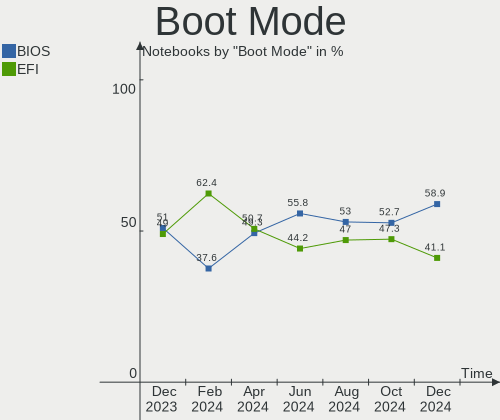

| Mode | Notebooks | Percent |
|------|-----------|---------|
| EFI  | 49        | 56.32%  |
| BIOS | 38        | 43.68%  |

Filesystem
----------

Type of filesystem

| Type    | Notebooks | Percent |
|---------|-----------|---------|
| Ext4    | 66        | 75.86%  |
| Btrfs   | 16        | 18.39%  |
| Overlay | 3         | 3.45%   |
| Xfs     | 1         | 1.15%   |
| Tmpfs   | 1         | 1.15%   |

Part. scheme
------------

Scheme of partitioning

| Type    | Notebooks | Percent |
|---------|-----------|---------|
| GPT     | 42        | 48.28%  |
| Unknown | 34        | 39.08%  |
| MBR     | 11        | 12.64%  |

Dual Boot with Linux/BSD
------------------------

Hosting more than one Linux/BSD

| Dual boot | Notebooks | Percent |
|-----------|-----------|---------|
| No        | 78        | 89.66%  |
| Yes       | 9         | 10.34%  |

Dual Boot (Win)
---------------

Hosting Linux and Windows

| Dual boot | Notebooks | Percent |
|-----------|-----------|---------|
| No        | 59        | 67.82%  |
| Yes       | 28        | 32.18%  |

Board
-----

Vendor
------

Motherboard manufacturer

| Name                | Notebooks | Percent |
|---------------------|-----------|---------|
| Lenovo              | 18        | 20.69%  |
| Hewlett-Packard     | 13        | 14.94%  |
| Acer                | 11        | 12.64%  |
| ASUSTek Computer    | 10        | 11.49%  |
| Dell                | 5         | 5.75%   |
| Unknown             | 4         | 4.6%    |
| MSI                 | 3         | 3.45%   |
| HUAWEI              | 3         | 3.45%   |
| Valve               | 2         | 2.3%    |
| Toshiba             | 2         | 2.3%    |
| Sony                | 2         | 2.3%    |
| SLIMBOOK            | 2         | 2.3%    |
| Gigabyte Technology | 2         | 2.3%    |
| Chuwi               | 2         | 2.3%    |
| Apple               | 2         | 2.3%    |
| WinPAD 110W         | 1         | 1.15%   |
| VANT                | 1         | 1.15%   |
| Teclast             | 1         | 1.15%   |
| Samsung Electronics | 1         | 1.15%   |
| Notebook            | 1         | 1.15%   |
| Google              | 1         | 1.15%   |

Model
-----

Motherboard model

| Name                                    | Notebooks | Percent |
|-----------------------------------------|-----------|---------|
| Unknown                                 | 4         | 4.6%    |
| Valve Jupiter                           | 2         | 2.3%    |
| HUAWEI BOHK-WAX9X                       | 2         | 2.3%    |
| HP Pavilion 15                          | 2         | 2.3%    |
| HP OMEN by Laptop 16-c0xxx              | 2         | 2.3%    |
| ASUS VivoBook_ASUSLaptop X513EAN_K513EA | 2         | 2.3%    |
| WinPAD 110W WinPAD 110W                 | 1         | 1.15%   |
| VANT MOOVE3-14                          | 1         | 1.15%   |
| Toshiba Satellite C855-1T5              | 1         | 1.15%   |
| Toshiba PORTEGE Z30-A                   | 1         | 1.15%   |
| Teclast F7S                             | 1         | 1.15%   |
| Sony VPCZ13M9E                          | 1         | 1.15%   |
| Sony SVF1521N6EW                        | 1         | 1.15%   |
| SLIMBOOK TITAN                          | 1         | 1.15%   |
| SLIMBOOK Essential15L                   | 1         | 1.15%   |
| Samsung R530/R730                       | 1         | 1.15%   |
| Notebook W54_55SU1,SUW                  | 1         | 1.15%   |
| MSI Stealth 15M B12UE                   | 1         | 1.15%   |
| MSI Prestige 15 A12UD                   | 1         | 1.15%   |
| MSI Alpha 15 A3DDK                      | 1         | 1.15%   |
| Lenovo V14-ADA 82C6                     | 1         | 1.15%   |
| Lenovo ThinkPad X250 20CLS2GD00         | 1         | 1.15%   |
| Lenovo ThinkPad X201 3680U6V            | 1         | 1.15%   |
| Lenovo ThinkPad T510 43147VG            | 1         | 1.15%   |
| Lenovo ThinkPad T14s Gen 1 20T1S39D0Y   | 1         | 1.15%   |
| Lenovo ThinkPad P53s 20N6CTO1WW         | 1         | 1.15%   |
| Lenovo ThinkPad P50 20EQS64N09          | 1         | 1.15%   |
| Lenovo ThinkPad P1 Gen 4i 20Y4S1QE10    | 1         | 1.15%   |
| Lenovo ThinkPad Edge E530 62724FU       | 1         | 1.15%   |
| Lenovo ThinkPad E560 20EV003DSP         | 1         | 1.15%   |
| Lenovo Legion Y520-15IKBN 80WK          | 1         | 1.15%   |
| Lenovo Legion 5 15ACH6H 82JU            | 1         | 1.15%   |
| Lenovo IdeaPad S145-15AST 81N3          | 1         | 1.15%   |
| Lenovo IdeaPad 5 15ITL05 82FG           | 1         | 1.15%   |
| Lenovo IdeaPad 330-15ICH 81FK           | 1         | 1.15%   |
| Lenovo IdeaPad 320-15IKB 80XL           | 1         | 1.15%   |
| Lenovo IdeaPad 310-15ISK 80SM           | 1         | 1.15%   |
| Lenovo B50-70 80EU                      | 1         | 1.15%   |
| HUAWEI KLVL-WXX9                        | 1         | 1.15%   |
| HP Presario CQ57                        | 1         | 1.15%   |

Model Family
------------

Motherboard model prefix

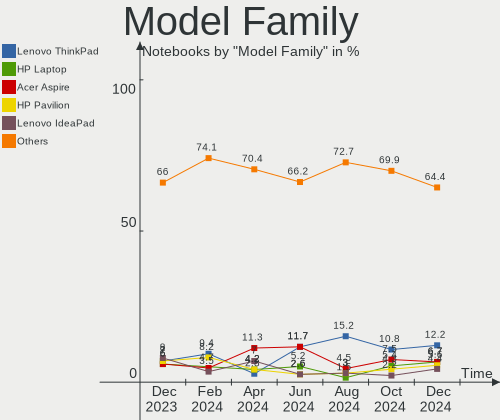

| Name                  | Notebooks | Percent |
|-----------------------|-----------|---------|
| Lenovo ThinkPad       | 9         | 10.34%  |
| Acer Aspire           | 6         | 6.9%    |
| Lenovo IdeaPad        | 5         | 5.75%   |
| HP Pavilion           | 4         | 4.6%    |
| ASUS VivoBook         | 4         | 4.6%    |
| Unknown               | 4         | 4.6%    |
| Valve Jupiter         | 2         | 2.3%    |
| Lenovo Legion         | 2         | 2.3%    |
| HUAWEI BOHK-WAX9X     | 2         | 2.3%    |
| HP OMEN               | 2         | 2.3%    |
| HP EliteBook          | 2         | 2.3%    |
| Dell XPS              | 2         | 2.3%    |
| Dell Latitude         | 2         | 2.3%    |
| ASUS ZenBook          | 2         | 2.3%    |
| Acer Extensa          | 2         | 2.3%    |
| WinPAD 110W WinPAD    | 1         | 1.15%   |
| VANT MOOVE3-14        | 1         | 1.15%   |
| Toshiba Satellite     | 1         | 1.15%   |
| Toshiba PORTEGE       | 1         | 1.15%   |
| Teclast F7S           | 1         | 1.15%   |
| Sony VPCZ13M9E        | 1         | 1.15%   |
| Sony SVF1521N6EW      | 1         | 1.15%   |
| SLIMBOOK TITAN        | 1         | 1.15%   |
| SLIMBOOK Essential15L | 1         | 1.15%   |
| Samsung R530          | 1         | 1.15%   |
| Notebook W54          | 1         | 1.15%   |
| MSI Stealth           | 1         | 1.15%   |
| MSI Prestige          | 1         | 1.15%   |
| MSI Alpha             | 1         | 1.15%   |
| Lenovo V14-ADA        | 1         | 1.15%   |
| Lenovo B50-70         | 1         | 1.15%   |
| HUAWEI KLVL-WXX9      | 1         | 1.15%   |
| HP Presario           | 1         | 1.15%   |
| HP Notebook           | 1         | 1.15%   |
| HP G61                | 1         | 1.15%   |
| HP Compaq             | 1         | 1.15%   |
| HP 250                | 1         | 1.15%   |
| Google Droid          | 1         | 1.15%   |
| Gigabyte RC14UD       | 1         | 1.15%   |
| Gigabyte G5           | 1         | 1.15%   |

MFG Year
--------

Motherboard manufacture year

| Year | Notebooks | Percent |
|------|-----------|---------|
| 2021 | 18        | 20.69%  |
| 2019 | 9         | 10.34%  |
| 2020 | 7         | 8.05%   |
| 2015 | 7         | 8.05%   |
| 2022 | 6         | 6.9%    |
| 2014 | 6         | 6.9%    |
| 2017 | 5         | 5.75%   |
| 2013 | 5         | 5.75%   |
| 2018 | 4         | 4.6%    |
| 2010 | 4         | 4.6%    |
| 2011 | 3         | 3.45%   |
| 2009 | 3         | 3.45%   |
| 2007 | 3         | 3.45%   |
| 2016 | 2         | 2.3%    |
| 2012 | 2         | 2.3%    |
| 2008 | 2         | 2.3%    |
| 2023 | 1         | 1.15%   |

Form Factor
-----------

Physical design of the computer

| Name     | Notebooks | Percent |
|----------|-----------|---------|
| Notebook | 87        | 100%    |

Secure Boot
-----------

Enabled or disabled

| State    | Notebooks | Percent |
|----------|-----------|---------|
| Disabled | 81        | 93.1%   |
| Enabled  | 6         | 6.9%    |

Coreboot
--------

Have coreboot on board

| Used | Notebooks | Percent |
|------|-----------|---------|
| No   | 86        | 98.85%  |
| Yes  | 1         | 1.15%   |

RAM Size
--------

Total RAM memory

| Size in GB  | Notebooks | Percent |
|-------------|-----------|---------|
| 4.01-8.0    | 26        | 29.89%  |
| 3.01-4.0    | 16        | 18.39%  |
| 16.01-24.0  | 15        | 17.24%  |
| 8.01-16.0   | 14        | 16.09%  |
| 32.01-64.0  | 7         | 8.05%   |
| 1.01-2.0    | 3         | 3.45%   |
| 2.01-3.0    | 2         | 2.3%    |
| 64.01-256.0 | 2         | 2.3%    |
| 24.01-32.0  | 1         | 1.15%   |
| 0.51-1.0    | 1         | 1.15%   |

RAM Used
--------

Used RAM memory

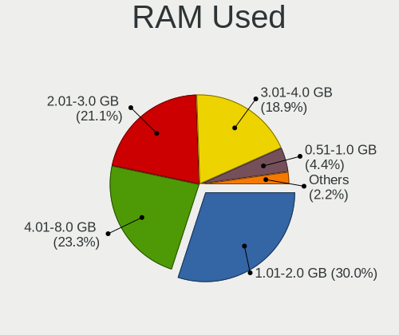

| Used GB   | Notebooks | Percent |
|-----------|-----------|---------|
| 1.01-2.0  | 28        | 32.18%  |
| 2.01-3.0  | 24        | 27.59%  |
| 4.01-8.0  | 16        | 18.39%  |
| 3.01-4.0  | 10        | 11.49%  |
| 0.51-1.0  | 6         | 6.9%    |
| 8.01-16.0 | 3         | 3.45%   |

Total Drives
------------

Number of drives on board

| Drives | Notebooks | Percent |
|--------|-----------|---------|
| 1      | 68        | 78.16%  |
| 2      | 13        | 14.94%  |
| 3      | 6         | 6.9%    |

Has CD-ROM
----------

Has CD-ROM on board

| Presented | Notebooks | Percent |
|-----------|-----------|---------|
| No        | 64        | 73.56%  |
| Yes       | 23        | 26.44%  |

Has Ethernet
------------

Has Ethernet on board

| Presented | Notebooks | Percent |
|-----------|-----------|---------|
| Yes       | 60        | 68.97%  |
| No        | 27        | 31.03%  |

Has WiFi
--------

Has WiFi module

| Presented | Notebooks | Percent |
|-----------|-----------|---------|
| Yes       | 83        | 95.4%   |
| No        | 4         | 4.6%    |

Has Bluetooth
-------------

Has Bluetooth module

| Presented | Notebooks | Percent |
|-----------|-----------|---------|
| Yes       | 68        | 78.16%  |
| No        | 19        | 21.84%  |

Location
--------

Country
-------

Geographic location (country)

| Country | Notebooks | Percent |
|---------|-----------|---------|
| Spain   | 87        | 100%    |

City
----

Geographic location (city)

| City                     | Notebooks | Percent |
|--------------------------|-----------|---------|
| Barcelona                | 18        | 20.69%  |
| Madrid                   | 13        | 14.94%  |
| Seville                  | 5         | 5.75%   |
| Terrassa                 | 2         | 2.3%    |
| Málaga                  | 2         | 2.3%    |
| Granada                  | 2         | 2.3%    |
| Carballo                 | 2         | 2.3%    |
| Alcobendas               | 2         | 2.3%    |
| Zafra                    | 1         | 1.15%   |
| Vigo                     | 1         | 1.15%   |
| Valladolid               | 1         | 1.15%   |
| Valencia                 | 1         | 1.15%   |
| Talavera de la Reina     | 1         | 1.15%   |
| Santa Coloma de Gramenet | 1         | 1.15%   |
| Roda de Berà            | 1         | 1.15%   |
| Rincon de la Victoria    | 1         | 1.15%   |
| Puentecesures            | 1         | 1.15%   |
| Porrino                  | 1         | 1.15%   |
| Pamplona                 | 1         | 1.15%   |
| Palma                    | 1         | 1.15%   |
| Oviedo                   | 1         | 1.15%   |
| Oropesa                  | 1         | 1.15%   |
| Ontinyent                | 1         | 1.15%   |
| Montijo                  | 1         | 1.15%   |
| Mollet del Vallès       | 1         | 1.15%   |
| Los Barrios              | 1         | 1.15%   |
| León                    | 1         | 1.15%   |
| Ibiza Town               | 1         | 1.15%   |
| Huelva                   | 1         | 1.15%   |
| Guadalajara              | 1         | 1.15%   |
| Gava                     | 1         | 1.15%   |
| Fraga                    | 1         | 1.15%   |
| el Prat de Llobregat     | 1         | 1.15%   |
| Dos Hermanas             | 1         | 1.15%   |
| Cuenca                   | 1         | 1.15%   |
| Coria del Río           | 1         | 1.15%   |
| Córdoba                 | 1         | 1.15%   |
| Collado Villalba         | 1         | 1.15%   |
| Cartagena                | 1         | 1.15%   |
| Caldes de Montbui        | 1         | 1.15%   |

Drives
------

Drive Vendor
------------

Hard drive vendors

| Vendor                      | Notebooks | Drives | Percent |
|-----------------------------|-----------|--------|---------|
| Samsung Electronics         | 16        | 19     | 14.68%  |
| Kingston                    | 13        | 13     | 11.93%  |
| WDC                         | 11        | 11     | 10.09%  |
| Toshiba                     | 9         | 9      | 8.26%   |
| SK hynix                    | 7         | 7      | 6.42%   |
| Unknown                     | 6         | 7      | 5.5%    |
| Seagate                     | 6         | 6      | 5.5%    |
| Micron Technology           | 5         | 5      | 4.59%   |
| Sandisk                     | 4         | 4      | 3.67%   |
| Intel                       | 4         | 4      | 3.67%   |
| Crucial                     | 4         | 4      | 3.67%   |
| Kingston Technology Company | 3         | 3      | 2.75%   |
| Teclast                     | 2         | 2      | 1.83%   |
| Phison Electronics          | 2         | 2      | 1.83%   |
| Netac                       | 2         | 2      | 1.83%   |
| Intenso                     | 2         | 2      | 1.83%   |
| HGST                        | 2         | 2      | 1.83%   |
| USB2.0                      | 1         | 1      | 0.92%   |
| Union Memory                | 1         | 1      | 0.92%   |
| Transcend                   | 1         | 1      | 0.92%   |
| TCSUNBOW                    | 1         | 1      | 0.92%   |
| KIOXIA                      | 1         | 1      | 0.92%   |
| JMicron Technology          | 1         | 1      | 0.92%   |
| Indilinx                    | 1         | 1      | 0.92%   |
| Hitachi                     | 1         | 1      | 0.92%   |
| Dogfish                     | 1         | 1      | 0.92%   |
| Apple                       | 1         | 1      | 0.92%   |
| Unknown                     | 1         | 1      | 0.92%   |

Drive Model
-----------

Hard drive models

| Model                                               | Notebooks | Percent |
|-----------------------------------------------------|-----------|---------|
| Kingston SA400S37240G 240GB SSD                     | 6         | 5.41%   |
| Samsung NVMe SSD Controller SM981/PM981/PM983 250GB | 3         | 2.7%    |
| Unknown MMC Card  128GB                             | 2         | 1.8%    |
| Toshiba MQ01ABD050 500GB                            | 2         | 1.8%    |
| Teclast BD256GB SHCB-2280 SSD                       | 2         | 1.8%    |
| SK hynix HFM001TD3JX013N 1TB                        | 2         | 1.8%    |
| Seagate ST9500325AS 500GB                           | 2         | 1.8%    |
| Seagate Expansion 1TB                               | 2         | 1.8%    |
| Phison E16 PCIe4 NVMe Controller 512GB              | 2         | 1.8%    |
| Micron 2210_MTFDHBA512QFD 512GB                     | 2         | 1.8%    |
| Kingston SUV400S37240G 240GB SSD                    | 2         | 1.8%    |
| Kingston SA400S37120G 120GB SSD                     | 2         | 1.8%    |
| WDC WDS200T2B0C-00PXH0 2TB                          | 1         | 0.9%    |
| WDC WDS100T1R0B-68A4Z0 1TB SSD                      | 1         | 0.9%    |
| WDC WD5000LPCX-24VHAT0 500GB                        | 1         | 0.9%    |
| WDC WD5000BEVT-75ZAT0 500GB                         | 1         | 0.9%    |
| WDC WD3200BEVT-22ZCT0 320GB                         | 1         | 0.9%    |
| WDC WD1600BEVT-22ZCT0 160GB                         | 1         | 0.9%    |
| WDC WD10SPZX-21Z10T0 1TB                            | 1         | 0.9%    |
| WDC WD10SPCX-08S8TT0 1TB                            | 1         | 0.9%    |
| WDC WD10JPVX-60JC3T0 1TB                            | 1         | 0.9%    |
| WDC PC SN730 SDBPNTY-512G-1027 512GB                | 1         | 0.9%    |
| WDC PC SA530 SDASN8Y-256G-1006 256GB                | 1         | 0.9%    |
| USB2.0 CardReader                                   | 1         | 0.9%    |
| Unknown SD32G  32GB                                 | 1         | 0.9%    |
| Unknown SC64G  64GB                                 | 1         | 0.9%    |
| Unknown MMC Card  64GB                              | 1         | 0.9%    |
| Unknown Biwin  32GB                                 | 1         | 0.9%    |
| Unknown 00000  32GB                                 | 1         | 0.9%    |
| Union Memory UMIS RPJTJ512MEE1OWX 512GB             | 1         | 0.9%    |
| Transcend TS480GMTS420S 480GB SSD                   | 1         | 0.9%    |
| Toshiba XG6 NVMe SSD Controller 512GB               | 1         | 0.9%    |
| Toshiba THNSNJ256G8NY 256GB SSD                     | 1         | 0.9%    |
| Toshiba MQ01ABD100V 1TB                             | 1         | 0.9%    |
| Toshiba MQ01ABD100 1TB                              | 1         | 0.9%    |
| Toshiba MQ01ABD032 320GB                            | 1         | 0.9%    |
| Toshiba KXG60ZNV512G NVMe 512GB                     | 1         | 0.9%    |
| Toshiba A100 120GB SSD                              | 1         | 0.9%    |
| TCSUNBOW X3 240GB                                   | 1         | 0.9%    |
| SK hynix SKHynix_HFS512GDE9X081N 512GB              | 1         | 0.9%    |

HDD Vendor
----------

Hard disk drive vendors

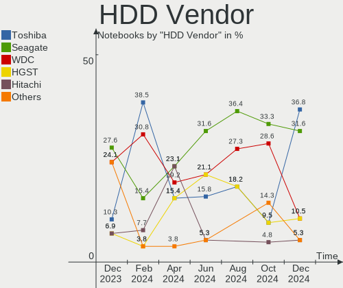

| Vendor             | Notebooks | Drives | Percent |
|--------------------|-----------|--------|---------|
| WDC                | 7         | 7      | 31.82%  |
| Seagate            | 6         | 6      | 27.27%  |
| Toshiba            | 5         | 5      | 22.73%  |
| HGST               | 2         | 2      | 9.09%   |
| JMicron Technology | 1         | 1      | 4.55%   |
| Hitachi            | 1         | 1      | 4.55%   |

SSD Vendor
----------

Solid state drive vendors

| Vendor              | Notebooks | Drives | Percent |
|---------------------|-----------|--------|---------|
| Kingston            | 12        | 12     | 30.77%  |
| Samsung Electronics | 6         | 7      | 15.38%  |
| Crucial             | 4         | 4      | 10.26%  |
| WDC                 | 2         | 2      | 5.13%   |
| Toshiba             | 2         | 2      | 5.13%   |
| Teclast             | 2         | 2      | 5.13%   |
| SK hynix            | 2         | 2      | 5.13%   |
| Netac               | 2         | 2      | 5.13%   |
| Intenso             | 2         | 2      | 5.13%   |
| Transcend           | 1         | 1      | 2.56%   |
| Micron Technology   | 1         | 1      | 2.56%   |
| Intel               | 1         | 1      | 2.56%   |
| Dogfish             | 1         | 1      | 2.56%   |
| Apple               | 1         | 1      | 2.56%   |

Drive Kind
----------

HDD or SSD

| Kind    | Notebooks | Drives | Percent |
|---------|-----------|--------|---------|
| NVMe    | 37        | 40     | 35.92%  |
| SSD     | 36        | 40     | 34.95%  |
| HDD     | 20        | 22     | 19.42%  |
| MMC     | 7         | 8      | 6.8%    |
| Unknown | 3         | 3      | 2.91%   |

Drive Connector
---------------

SATA, SAS, NVMe, etc.

| Type | Notebooks | Drives | Percent |
|------|-----------|--------|---------|
| SATA | 52        | 58     | 50.98%  |
| NVMe | 37        | 40     | 36.27%  |
| MMC  | 7         | 8      | 6.86%   |
| SAS  | 6         | 7      | 5.88%   |

Drive Size
----------

Size of hard drive

| Size in TB | Notebooks | Drives | Percent |
|------------|-----------|--------|---------|
| 0.01-0.5   | 42        | 46     | 73.68%  |
| 0.51-1.0   | 14        | 15     | 24.56%  |
| 1.01-2.0   | 1         | 1      | 1.75%   |

Space Total
-----------

Amount of disk space available on the file system

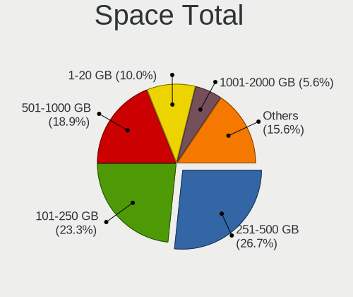

| Size in GB     | Notebooks | Percent |
|----------------|-----------|---------|
| 251-500        | 28        | 32.18%  |
| 101-250        | 22        | 25.29%  |
| 501-1000       | 12        | 13.79%  |
| 1001-2000      | 8         | 9.2%    |
| Unknown        | 5         | 5.75%   |
| 1-20           | 4         | 4.6%    |
| 21-50          | 3         | 3.45%   |
| 2001-3000      | 3         | 3.45%   |
| More than 3000 | 1         | 1.15%   |
| 51-100         | 1         | 1.15%   |

Space Used
----------

Amount of used disk space

| Used GB   | Notebooks | Percent |
|-----------|-----------|---------|
| 1-20      | 27        | 31.03%  |
| 21-50     | 13        | 14.94%  |
| 51-100    | 13        | 14.94%  |
| 101-250   | 12        | 13.79%  |
| 251-500   | 8         | 9.2%    |
| 501-1000  | 6         | 6.9%    |
| Unknown   | 5         | 5.75%   |
| 1001-2000 | 2         | 2.3%    |
| 2001-3000 | 1         | 1.15%   |

Malfunc. Drives
---------------

Drive models with a malfunction

| Model                                                           | Notebooks | Drives | Percent |
|-----------------------------------------------------------------|-----------|--------|---------|
| Toshiba MQ01ABD032 320GB                                        | 1         | 1      | 20%     |
| Samsung Electronics NVMe SSD Controller SM981/PM981/PM983 250GB | 1         | 1      | 20%     |
| Micron Technology C400-MTFDDAK256MAM 256GB SSD                  | 1         | 1      | 20%     |
| Hitachi HTS543232A7A384 320GB                                   | 1         | 1      | 20%     |
| Crucial CT525MX300SSD1 528GB                                    | 1         | 1      | 20%     |

Malfunc. Drive Vendor
---------------------

Vendors of faulty drives

| Vendor              | Notebooks | Drives | Percent |
|---------------------|-----------|--------|---------|
| Toshiba             | 1         | 1      | 20%     |
| Samsung Electronics | 1         | 1      | 20%     |
| Micron Technology   | 1         | 1      | 20%     |
| Hitachi             | 1         | 1      | 20%     |
| Crucial             | 1         | 1      | 20%     |

Malfunc. HDD Vendor
-------------------

Vendors of faulty HDD drives

| Vendor  | Notebooks | Drives | Percent |
|---------|-----------|--------|---------|
| Toshiba | 1         | 1      | 50%     |
| Hitachi | 1         | 1      | 50%     |

Malfunc. Drive Kind
-------------------

Kinds of faulty drives

| Kind | Notebooks | Drives | Percent |
|------|-----------|--------|---------|
| SSD  | 2         | 2      | 40%     |
| HDD  | 2         | 2      | 40%     |
| NVMe | 1         | 1      | 20%     |

Failed Drives
-------------

Failed drive models

Zero info for selected period =(

Failed Drive Vendor
-------------------

Failed drive vendors

Zero info for selected period =(

Drive Status
------------

Number of failed and malfunc. drives

| Status   | Notebooks | Drives | Percent |
|----------|-----------|--------|---------|
| Detected | 52        | 68     | 56.52%  |
| Works    | 35        | 40     | 38.04%  |
| Malfunc  | 5         | 5      | 5.43%   |

Storage controller
------------------

Storage Vendor
--------------

Storage controller vendors

| Vendor                       | Notebooks | Percent |
|------------------------------|-----------|---------|
| Intel                        | 58        | 58%     |
| Samsung Electronics          | 11        | 11%     |
| SanDisk                      | 6         | 6%      |
| SK hynix                     | 5         | 5%      |
| AMD                          | 5         | 5%      |
| Micron Technology            | 4         | 4%      |
| Kingston Technology Company  | 4         | 4%      |
| Toshiba America Info Systems | 2         | 2%      |
| Phison Electronics           | 2         | 2%      |
| Union Memory (Shenzhen)      | 1         | 1%      |
| Marvell Technology Group     | 1         | 1%      |
| KIOXIA                       | 1         | 1%      |

Storage Model
-------------

Storage controller models

| Model                                                                          | Notebooks | Percent |
|--------------------------------------------------------------------------------|-----------|---------|
| Intel Sunrise Point-LP SATA Controller [AHCI mode]                             | 7         | 6.31%   |
| Samsung NVMe SSD Controller SM981/PM981/PM983                                  | 6         | 5.41%   |
| Intel Tiger Lake-LP SATA Controller                                            | 6         | 5.41%   |
| Intel Volume Management Device NVMe RAID Controller                            | 5         | 4.5%    |
| Intel 8 Series SATA Controller 1 [AHCI mode]                                   | 5         | 4.5%    |
| SK hynix Gold P31/PC711 NVMe Solid State Drive                                 | 4         | 3.6%    |
| Micron Non-Volatile memory controller                                          | 4         | 3.6%    |
| Intel Celeron/Pentium Silver Processor SATA Controller                         | 4         | 3.6%    |
| Intel 82801HM/HEM (ICH8M/ICH8M-E) SATA Controller [AHCI mode]                  | 4         | 3.6%    |
| Intel 82801HM/HEM (ICH8M/ICH8M-E) IDE Controller                               | 4         | 3.6%    |
| Intel 7 Series Chipset Family 6-port SATA Controller [AHCI mode]               | 4         | 3.6%    |
| AMD FCH SATA Controller [AHCI mode]                                            | 4         | 3.6%    |
| Samsung NVMe SSD Controller PM9A1/PM9A3/980PRO                                 | 3         | 2.7%    |
| Intel 82801IBM/IEM (ICH9M/ICH9M-E) 4 port SATA Controller [AHCI mode]          | 3         | 2.7%    |
| Intel 82801 Mobile SATA Controller [RAID mode]                                 | 3         | 2.7%    |
| Toshiba America Info Systems XG6 NVMe SSD Controller                           | 2         | 1.8%    |
| SanDisk WD Black SN750 / PC SN730 NVMe SSD                                     | 2         | 1.8%    |
| SanDisk Non-Volatile memory controller                                         | 2         | 1.8%    |
| Phison E16 PCIe4 NVMe Controller                                               | 2         | 1.8%    |
| Intel SSD 660P Series                                                          | 2         | 1.8%    |
| Intel Q170/Q150/B150/H170/H110/Z170/CM236 Chipset SATA Controller [AHCI Mode]  | 2         | 1.8%    |
| Intel Cannon Lake Mobile PCH SATA AHCI Controller                              | 2         | 1.8%    |
| Intel 8 Series/C220 Series Chipset Family 6-port SATA Controller 1 [AHCI mode] | 2         | 1.8%    |
| Intel 6 Series/C200 Series Chipset Family 6 port Mobile SATA AHCI Controller   | 2         | 1.8%    |
| Union Memory (Shenzhen) Non-Volatile memory controller                         | 1         | 0.9%    |
| SK hynix PC401 NVMe Solid State Drive 256GB                                    | 1         | 0.9%    |
| SanDisk WD Blue SN570 NVMe SSD                                                 | 1         | 0.9%    |
| SanDisk WD Blue SN550 NVMe SSD                                                 | 1         | 0.9%    |
| Samsung NVMe SSD Controller SM961/PM961/SM963                                  | 1         | 0.9%    |
| Samsung NVMe SSD Controller 980                                                | 1         | 0.9%    |
| Marvell Group 88SS9183 PCIe SSD Controller                                     | 1         | 0.9%    |
| KIOXIA NVMe SSD Controller BG4                                                 | 1         | 0.9%    |
| Kingston Company U-SNS8154P3 NVMe SSD                                          | 1         | 0.9%    |
| Kingston Company Company Non-Volatile memory controller                        | 1         | 0.9%    |
| Kingston Company OM3PDP3 NVMe SSD                                              | 1         | 0.9%    |
| Kingston Company KC2000 NVMe SSD                                               | 1         | 0.9%    |
| Intel Wildcat Point-LP SATA Controller [AHCI Mode]                             | 1         | 0.9%    |
| Intel Non-Volatile memory controller                                           | 1         | 0.9%    |
| Intel NM10/ICH7 Family SATA Controller [AHCI mode]                             | 1         | 0.9%    |
| Intel Jasper Lake SATA AHCI Controller                                         | 1         | 0.9%    |

Storage Kind
------------

Kind of storage controller (IDE, SATA, NVMe, SAS, ...)

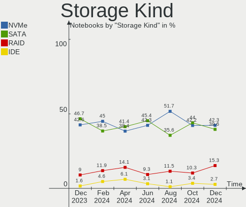

| Kind | Notebooks | Percent |
|------|-----------|---------|
| SATA | 58        | 53.7%   |
| NVMe | 37        | 34.26%  |
| RAID | 8         | 7.41%   |
| IDE  | 5         | 4.63%   |

Processor
---------

CPU Vendor
----------

Processor vendors

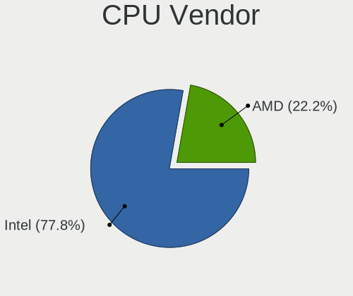

| Vendor | Notebooks | Percent |
|--------|-----------|---------|
| Intel  | 70        | 80.46%  |
| AMD    | 17        | 19.54%  |

CPU Model
---------

Processor models

| Model                                         | Notebooks | Percent |
|-----------------------------------------------|-----------|---------|
| Intel 11th Gen Core i5-1135G7 @ 2.40GHz       | 4         | 4.6%    |
| AMD Ryzen 9 5900HX with Radeon Graphics       | 3         | 3.45%   |
| Intel Core i5-6200U CPU @ 2.30GHz             | 2         | 2.3%    |
| Intel Core i5-4200U CPU @ 1.60GHz             | 2         | 2.3%    |
| Intel Core i5-1035G1 CPU @ 1.00GHz            | 2         | 2.3%    |
| Intel Celeron N4120 CPU @ 1.10GHz             | 2         | 2.3%    |
| Intel Celeron N4020 CPU @ 1.10GHz             | 2         | 2.3%    |
| Intel 12th Gen Core i7-1280P                  | 2         | 2.3%    |
| Intel 11th Gen Core i7-1165G7 @ 2.80GHz       | 2         | 2.3%    |
| AMD Ryzen 7 5800H with Radeon Graphics        | 2         | 2.3%    |
| AMD Ryzen 5 3500U with Radeon Vega Mobile Gfx | 2         | 2.3%    |
| AMD Custom APU 0405                           | 2         | 2.3%    |
| Intel Pentium Dual-Core CPU T4400 @ 2.20GHz   | 1         | 1.15%   |
| Intel Pentium Dual-Core CPU T4300 @ 2.10GHz   | 1         | 1.15%   |
| Intel Pentium CPU N3540 @ 2.16GHz             | 1         | 1.15%   |
| Intel Genuine CPU 575 @ 2.00GHz               | 1         | 1.15%   |
| Intel Core i9-9880H CPU @ 2.30GHz             | 1         | 1.15%   |
| Intel Core i7-9750H CPU @ 2.60GHz             | 1         | 1.15%   |
| Intel Core i7-8565U CPU @ 1.80GHz             | 1         | 1.15%   |
| Intel Core i7-8550U CPU @ 1.80GHz             | 1         | 1.15%   |
| Intel Core i7-7820HQ CPU @ 2.90GHz            | 1         | 1.15%   |
| Intel Core i7-7700HQ CPU @ 2.80GHz            | 1         | 1.15%   |
| Intel Core i7-7500U CPU @ 2.70GHz             | 1         | 1.15%   |
| Intel Core i7-6820HQ CPU @ 2.70GHz            | 1         | 1.15%   |
| Intel Core i7-6500U CPU @ 2.50GHz             | 1         | 1.15%   |
| Intel Core i7-4710HQ CPU @ 2.50GHz            | 1         | 1.15%   |
| Intel Core i7-4578U CPU @ 3.00GHz             | 1         | 1.15%   |
| Intel Core i7-4510U CPU @ 2.00GHz             | 1         | 1.15%   |
| Intel Core i7-10610U CPU @ 1.80GHz            | 1         | 1.15%   |
| Intel Core i7-10510U CPU @ 1.80GHz            | 1         | 1.15%   |
| Intel Core i5-8350U CPU @ 1.70GHz             | 1         | 1.15%   |
| Intel Core i5-8300H CPU @ 2.30GHz             | 1         | 1.15%   |
| Intel Core i5-7300HQ CPU @ 2.50GHz            | 1         | 1.15%   |
| Intel Core i5-5300U CPU @ 2.30GHz             | 1         | 1.15%   |
| Intel Core i5-4310U CPU @ 2.00GHz             | 1         | 1.15%   |
| Intel Core i5-3427U CPU @ 1.80GHz             | 1         | 1.15%   |
| Intel Core i5-3337U CPU @ 1.80GHz             | 1         | 1.15%   |
| Intel Core i5-2467M CPU @ 1.60GHz             | 1         | 1.15%   |
| Intel Core i5 CPU M 560 @ 2.67GHz             | 1         | 1.15%   |
| Intel Core i5 CPU M 520 @ 2.40GHz             | 1         | 1.15%   |

CPU Model Family
----------------

Processor model prefix

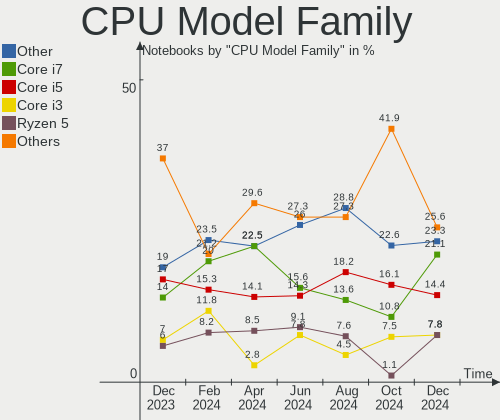

| Model                   | Notebooks | Percent |
|-------------------------|-----------|---------|
| Intel Core i5           | 18        | 20.69%  |
| Other                   | 15        | 17.24%  |
| Intel Core i7           | 13        | 14.94%  |
| Intel Celeron           | 8         | 9.2%    |
| Intel Core i3           | 7         | 8.05%   |
| AMD Ryzen 5             | 4         | 4.6%    |
| Intel Atom              | 3         | 3.45%   |
| AMD Ryzen 9             | 3         | 3.45%   |
| AMD Ryzen 7             | 3         | 3.45%   |
| Intel Pentium Dual-Core | 2         | 2.3%    |
| Intel Core 2 Duo        | 2         | 2.3%    |
| AMD A8                  | 2         | 2.3%    |
| Intel Pentium           | 1         | 1.15%   |
| Intel Genuine           | 1         | 1.15%   |
| Intel Core i9           | 1         | 1.15%   |
| Intel Celeron M         | 1         | 1.15%   |
| AMD Ryzen 3             | 1         | 1.15%   |
| AMD E                   | 1         | 1.15%   |
| AMD A6                  | 1         | 1.15%   |

CPU Cores
---------

Number of processor cores

| Number | Notebooks | Percent |
|--------|-----------|---------|
| 4      | 35        | 40.23%  |
| 2      | 34        | 39.08%  |
| 8      | 7         | 8.05%   |
| 6      | 4         | 4.6%    |
| 1      | 4         | 4.6%    |
| 14     | 2         | 2.3%    |
| 10     | 1         | 1.15%   |

CPU Sockets
-----------

Number of sockets

| Number | Notebooks | Percent |
|--------|-----------|---------|
| 1      | 87        | 100%    |

CPU Threads
-----------

Threads per core (Hyper-Threading)

| Number | Notebooks | Percent |
|--------|-----------|---------|
| 2      | 64        | 73.56%  |
| 1      | 23        | 26.44%  |

CPU Op-Modes
------------

CPU Operation Modes (32-bit, 64-bit)

| Op mode        | Notebooks | Percent |
|----------------|-----------|---------|
| 32-bit, 64-bit | 87        | 100%    |

CPU Microcode
-------------

Microcode number

| Number     | Notebooks | Percent |
|------------|-----------|---------|
| Unknown    | 21        | 24.14%  |
| 0x40651    | 4         | 4.6%    |
| 0x806ec    | 3         | 3.45%   |
| 0x806c1    | 3         | 3.45%   |
| 0x706a8    | 3         | 3.45%   |
| 0x306a9    | 3         | 3.45%   |
| 0x20655    | 3         | 3.45%   |
| 0x0a50000c | 3         | 3.45%   |
| 0x08108109 | 3         | 3.45%   |
| 0x906ea    | 2         | 2.3%    |
| 0x906e9    | 2         | 2.3%    |
| 0x806ea    | 2         | 2.3%    |
| 0x806d1    | 2         | 2.3%    |
| 0x706e5    | 2         | 2.3%    |
| 0x406e3    | 2         | 2.3%    |
| 0x30678    | 2         | 2.3%    |
| 0x206a7    | 2         | 2.3%    |
| 0x1067a    | 2         | 2.3%    |
| 0x0a50000d | 2         | 2.3%    |
| 0x906ed    | 1         | 1.15%   |
| 0x906c0    | 1         | 1.15%   |
| 0x906a4    | 1         | 1.15%   |
| 0x906a3    | 1         | 1.15%   |
| 0x806e9    | 1         | 1.15%   |
| 0x806c2    | 1         | 1.15%   |
| 0x706a1    | 1         | 1.15%   |
| 0x6fd      | 1         | 1.15%   |
| 0x6fa      | 1         | 1.15%   |
| 0x506e3    | 1         | 1.15%   |
| 0x506c9    | 1         | 1.15%   |
| 0x406c3    | 1         | 1.15%   |
| 0x306d4    | 1         | 1.15%   |
| 0x306c3    | 1         | 1.15%   |
| 0x20652    | 1         | 1.15%   |
| 0x106ca    | 1         | 1.15%   |
| 0x10676    | 1         | 1.15%   |
| 0x08600104 | 1         | 1.15%   |
| 0x07030105 | 1         | 1.15%   |
| 0x06006705 | 1         | 1.15%   |
| 0x05000119 | 1         | 1.15%   |

CPU Microarch
-------------

Microarchitecture

| Name             | Notebooks | Percent |
|------------------|-----------|---------|
| KabyLake         | 14        | 16.09%  |
| TigerLake        | 8         | 9.2%    |
| Haswell          | 8         | 9.2%    |
| Zen 3            | 6         | 6.9%    |
| Goldmont plus    | 5         | 5.75%   |
| Zen+             | 4         | 4.6%    |
| Westmere         | 4         | 4.6%    |
| Skylake          | 4         | 4.6%    |
| Penryn           | 4         | 4.6%    |
| IceLake          | 4         | 4.6%    |
| Unknown          | 4         | 4.6%    |
| Silvermont       | 3         | 3.45%   |
| SandyBridge      | 3         | 3.45%   |
| IvyBridge        | 3         | 3.45%   |
| Core             | 3         | 3.45%   |
| Puma             | 2         | 2.3%    |
| Zen 2            | 1         | 1.15%   |
| Tremont          | 1         | 1.15%   |
| Goldmont         | 1         | 1.15%   |
| Excavator        | 1         | 1.15%   |
| Broadwell        | 1         | 1.15%   |
| Bonnell          | 1         | 1.15%   |
| Bobcat           | 1         | 1.15%   |
| Alderlake Hybrid | 1         | 1.15%   |

Graphics
--------

GPU Vendor
----------

Vendors of graphics cards

| Vendor | Notebooks | Percent |
|--------|-----------|---------|
| Intel  | 64        | 58.18%  |
| Nvidia | 28        | 25.45%  |
| AMD    | 18        | 16.36%  |

GPU Model
---------

Graphics card models

| Model                                                                     | Notebooks | Percent |
|---------------------------------------------------------------------------|-----------|---------|
| Intel TigerLake-LP GT2 [Iris Xe Graphics]                                 | 8         | 7.08%   |
| Intel Haswell-ULT Integrated Graphics Controller                          | 6         | 5.31%   |
| Intel GeminiLake [UHD Graphics 600]                                       | 5         | 4.42%   |
| AMD Cezanne [Radeon Vega Series / Radeon Vega Mobile Series]              | 5         | 4.42%   |
| Nvidia GA106M [GeForce RTX 3060 Mobile / Max-Q]                           | 4         | 3.54%   |
| AMD Picasso/Raven 2 [Radeon Vega Series / Radeon Vega Mobile Series]      | 4         | 3.54%   |
| Nvidia GP107M [GeForce GTX 1050 Mobile]                                   | 3         | 2.65%   |
| Intel Skylake GT2 [HD Graphics 520]                                       | 3         | 2.65%   |
| Intel HD Graphics 630                                                     | 3         | 2.65%   |
| Intel HD Graphics 620                                                     | 3         | 2.65%   |
| Intel Core Processor Integrated Graphics Controller                       | 3         | 2.65%   |
| Intel CoffeeLake-H GT2 [UHD Graphics 630]                                 | 3         | 2.65%   |
| Intel 3rd Gen Core processor Graphics Controller                          | 3         | 2.65%   |
| Intel 2nd Generation Core Processor Family Integrated Graphics Controller | 3         | 2.65%   |
| Nvidia GT216M [GeForce GT 330M]                                           | 2         | 1.77%   |
| Nvidia GA104M [GeForce RTX 3070 Mobile / Max-Q]                           | 2         | 1.77%   |
| Intel UHD Graphics 620                                                    | 2         | 1.77%   |
| Intel TigerLake-H GT1 [UHD Graphics]                                      | 2         | 1.77%   |
| Intel Iris Plus Graphics G1 (Ice Lake)                                    | 2         | 1.77%   |
| Intel CometLake-U GT2 [UHD Graphics]                                      | 2         | 1.77%   |
| Intel Atom Processor Z36xxx/Z37xxx Series Graphics & Display              | 2         | 1.77%   |
| Intel Alder Lake-P Integrated Graphics Controller                         | 2         | 1.77%   |
| Intel 4th Gen Core Processor Integrated Graphics Controller               | 2         | 1.77%   |
| AMD VanGogh [AMD Custom GPU 0405]                                         | 2         | 1.77%   |
| AMD Mullins [Radeon R4/R5 Graphics]                                       | 2         | 1.77%   |
| Nvidia TU117M [GeForce GTX 1650 Mobile / Max-Q]                           | 1         | 0.88%   |
| Nvidia TU106M [GeForce RTX 2060 Mobile]                                   | 1         | 0.88%   |
| Nvidia GT218M [NVS 3100M]                                                 | 1         | 0.88%   |
| Nvidia GT218M [GeForce 310M]                                              | 1         | 0.88%   |
| Nvidia GP108GLM [Quadro P520]                                             | 1         | 0.88%   |
| Nvidia GP108BM [GeForce MX250]                                            | 1         | 0.88%   |
| Nvidia GM108M [GeForce 930MX]                                             | 1         | 0.88%   |
| Nvidia GM108M [GeForce 840M]                                              | 1         | 0.88%   |
| Nvidia GM107GLM [Quadro M1000M]                                           | 1         | 0.88%   |
| Nvidia GK208M [GeForce GT 740M]                                           | 1         | 0.88%   |
| Nvidia GK208BM [GeForce 920M]                                             | 1         | 0.88%   |
| Nvidia GF117M [GeForce 610M/710M/810M/820M / GT 620M/625M/630M/720M]      | 1         | 0.88%   |
| Nvidia GA107M [GeForce RTX 3050 Ti Mobile]                                | 1         | 0.88%   |
| Nvidia GA107M [GeForce RTX 3050 Mobile]                                   | 1         | 0.88%   |
| Nvidia G98M [GeForce G 103M]                                              | 1         | 0.88%   |

GPU Combo
---------

Combinations of graphics cards

| Name           | Notebooks | Percent |
|----------------|-----------|---------|
| 1 x Intel      | 43        | 49.43%  |
| Intel + Nvidia | 18        | 20.69%  |
| 1 x AMD        | 11        | 12.64%  |
| 1 x Nvidia     | 7         | 8.05%   |
| AMD + Nvidia   | 3         | 3.45%   |
| 2 x AMD        | 2         | 2.3%    |
| Intel + AMD    | 2         | 2.3%    |
| Other          | 1         | 1.15%   |

GPU Driver
----------

Free vs proprietary

| Driver      | Notebooks | Percent |
|-------------|-----------|---------|
| Free        | 73        | 83.91%  |
| Proprietary | 12        | 13.79%  |
| Unknown     | 2         | 2.3%    |

GPU Memory
----------

Total video memory

| Size in GB | Notebooks | Percent |
|------------|-----------|---------|
| Unknown    | 65        | 74.71%  |
| 0.01-0.5   | 8         | 9.2%    |
| 0.51-1.0   | 6         | 6.9%    |
| 1.01-2.0   | 3         | 3.45%   |
| 7.01-8.0   | 2         | 2.3%    |
| 3.01-4.0   | 2         | 2.3%    |
| 5.01-6.0   | 1         | 1.15%   |

Monitor
-------

Monitor Vendor
--------------

Monitor vendors

| Vendor                  | Notebooks | Percent |
|-------------------------|-----------|---------|
| Chimei Innolux          | 16        | 16.33%  |
| BOE                     | 16        | 16.33%  |
| AU Optronics            | 15        | 15.31%  |
| LG Display              | 9         | 9.18%   |
| Dell                    | 6         | 6.12%   |
| Samsung Electronics     | 5         | 5.1%    |
| Lenovo                  | 5         | 5.1%    |
| Chi Mei Optoelectronics | 4         | 4.08%   |
| Sharp                   | 3         | 3.06%   |
| LG Philips              | 3         | 3.06%   |
| BenQ                    | 3         | 3.06%   |
| Valve                   | 2         | 2.04%   |
| PANDA                   | 2         | 2.04%   |
| Apple                   | 2         | 2.04%   |
| Sony                    | 1         | 1.02%   |
| NEC Computers           | 1         | 1.02%   |
| Hewlett-Packard         | 1         | 1.02%   |
| Goldstar                | 1         | 1.02%   |
| CPT                     | 1         | 1.02%   |
| ASUSTek Computer        | 1         | 1.02%   |
| AOC                     | 1         | 1.02%   |

Monitor Model
-------------

Monitor models

| Model                                                                 | Notebooks | Percent |
|-----------------------------------------------------------------------|-----------|---------|
| AU Optronics LCD Monitor AUO403D 1920x1080 309x173mm 13.9-inch        | 3         | 3.03%   |
| Valve ANX7530 U VLV3001 800x1280 100x150mm 7.1-inch                   | 2         | 2.02%   |
| Chimei Innolux LCD Monitor CMN15F5 1920x1080 344x193mm 15.5-inch      | 2         | 2.02%   |
| Chimei Innolux LCD Monitor CMN15DB 1366x768 344x193mm 15.5-inch       | 2         | 2.02%   |
| BOE LCD Monitor BOE0872 1920x1080 344x194mm 15.5-inch                 | 2         | 2.02%   |
| BenQ GL2460 BNQ78CE 1920x1080 531x299mm 24.0-inch                     | 2         | 2.02%   |
| AU Optronics LCD Monitor AUO61ED 1920x1080 344x193mm 15.5-inch        | 2         | 2.02%   |
| Sony LCD SNY06FA 1600x900 291x164mm 13.2-inch                         | 1         | 1.01%   |
| Sharp LQ173M1JW04 SHP14E1 1920x1080 382x215mm 17.3-inch               | 1         | 1.01%   |
| Sharp LCD Monitor SHP1484 1920x1080 294x165mm 13.3-inch               | 1         | 1.01%   |
| Sharp LCD Monitor SHP1479 1920x1280 259x173mm 12.3-inch               | 1         | 1.01%   |
| Samsung Electronics SMB2240W SAM0699 1680x1050 459x296mm 21.5-inch    | 1         | 1.01%   |
| Samsung Electronics LCD Monitor SEC3152 1366x768 344x194mm 15.5-inch  | 1         | 1.01%   |
| Samsung Electronics LCD Monitor SDC4A51 1366x768 344x194mm 15.5-inch  | 1         | 1.01%   |
| Samsung Electronics LCD Monitor SDC4161 1920x1080 344x194mm 15.5-inch | 1         | 1.01%   |
| Samsung Electronics LCD Monitor SDC415D 3840x2400 344x215mm 16.0-inch | 1         | 1.01%   |
| PANDA LCD Monitor NCP0046 1920x1080 344x194mm 15.5-inch               | 1         | 1.01%   |
| PANDA LCD Monitor NCP0035 1920x1080 344x194mm 15.5-inch               | 1         | 1.01%   |
| NEC Computers E233WM NEC2BE5 1920x1080 509x286mm 23.0-inch            | 1         | 1.01%   |
| LG Philips LP154WX4-TLC8 LPL0120 1280x800 331x207mm 15.4-inch         | 1         | 1.01%   |
| LG Philips LCD Monitor LPLDB00 1280x800 331x207mm 15.4-inch           | 1         | 1.01%   |
| LG Philips LCD Monitor LPLD800 1280x800 331x207mm 15.4-inch           | 1         | 1.01%   |
| LG Display LCD Monitor LGD054F 1920x1080 344x194mm 15.5-inch          | 1         | 1.01%   |
| LG Display LCD Monitor LGD04A7 1920x1080 344x194mm 15.5-inch          | 1         | 1.01%   |
| LG Display LCD Monitor LGD0465 1366x768 344x194mm 15.5-inch           | 1         | 1.01%   |
| LG Display LCD Monitor LGD045C 1366x768 345x194mm 15.6-inch           | 1         | 1.01%   |
| LG Display LCD Monitor LGD0456 1366x768 344x194mm 15.5-inch           | 1         | 1.01%   |
| LG Display LCD Monitor LGD03CD 1366x768 277x156mm 12.5-inch           | 1         | 1.01%   |
| LG Display LCD Monitor LGD039F 1366x768 345x194mm 15.6-inch           | 1         | 1.01%   |
| LG Display LCD Monitor LGD033A 1366x768 344x194mm 15.5-inch           | 1         | 1.01%   |
| LG Display LCD Monitor LGD02F2 1366x768 344x194mm 15.5-inch           | 1         | 1.01%   |
| Lenovo LEN L28u-30 LEN65FA 3840x2160 621x341mm 27.9-inch              | 1         | 1.01%   |
| Lenovo LCD Monitor LEN40BA 1920x1080 344x194mm 15.5-inch              | 1         | 1.01%   |
| Lenovo LCD Monitor LEN40B1 1600x900 344x194mm 15.5-inch               | 1         | 1.01%   |
| Lenovo LCD Monitor LEN4011 1280x800 261x163mm 12.1-inch               | 1         | 1.01%   |
| Lenovo D27-30 LEN66B8 1920x1080 597x336mm 27.0-inch                   | 1         | 1.01%   |
| Lenovo C24-25 LEN66B0 1920x1080 527x296mm 23.8-inch                   | 1         | 1.01%   |
| Hewlett-Packard E233 HPN3460 1920x1080 509x286mm 23.0-inch            | 1         | 1.01%   |
| Goldstar FULL HD GSM5B55 1920x1080 480x270mm 21.7-inch                | 1         | 1.01%   |
| Dell U2721DE DEL41DD 2560x1440 597x336mm 27.0-inch                    | 1         | 1.01%   |

Monitor Resolution
------------------

Monitor screen resolution

| Resolution         | Notebooks | Percent |
|--------------------|-----------|---------|
| 1920x1080 (FHD)    | 41        | 44.57%  |
| 1366x768 (WXGA)    | 25        | 27.17%  |
| 1280x800 (WXGA)    | 6         | 6.52%   |
| 3840x2160 (4K)     | 3         | 3.26%   |
| 800x1280           | 2         | 2.17%   |
| 2560x1600          | 2         | 2.17%   |
| 2560x1440 (QHD)    | 2         | 2.17%   |
| 2160x1440          | 2         | 2.17%   |
| 1600x900 (HD+)     | 2         | 2.17%   |
| 1280x1024 (SXGA)   | 2         | 2.17%   |
| 3840x2400          | 1         | 1.09%   |
| 1920x1280          | 1         | 1.09%   |
| 1680x1050 (WSXGA+) | 1         | 1.09%   |
| 1440x900 (WXGA+)   | 1         | 1.09%   |
| 1024x600           | 1         | 1.09%   |

Monitor Diagonal
----------------

Diagonal size in inches

| Inches | Notebooks | Percent |
|--------|-----------|---------|
| 15     | 49        | 50%     |
| 14     | 11        | 11.22%  |
| 13     | 9         | 9.18%   |
| 23     | 4         | 4.08%   |
| 27     | 3         | 3.06%   |
| 24     | 3         | 3.06%   |
| 17     | 3         | 3.06%   |
| 16     | 3         | 3.06%   |
| 12     | 3         | 3.06%   |
| 21     | 2         | 2.04%   |
| 7      | 2         | 2.04%   |
| 38     | 1         | 1.02%   |
| 31     | 1         | 1.02%   |
| 22     | 1         | 1.02%   |
| 19     | 1         | 1.02%   |
| 11     | 1         | 1.02%   |
| 10     | 1         | 1.02%   |

Monitor Width
-------------

Physical width

| Width in mm | Notebooks | Percent |
|-------------|-----------|---------|
| 301-350     | 65        | 67.01%  |
| 201-300     | 12        | 12.37%  |
| 501-600     | 8         | 8.25%   |
| 351-400     | 4         | 4.12%   |
| 401-500     | 3         | 3.09%   |
| 601-700     | 2         | 2.06%   |
| 1-100       | 2         | 2.06%   |
| 801-900     | 1         | 1.03%   |

Aspect Ratio
------------

Proportional relationship between the width and the height

| Ratio | Notebooks | Percent |
|-------|-----------|---------|
| 16/9  | 69        | 79.31%  |
| 16/10 | 10        | 11.49%  |
| 3/2   | 4         | 4.6%    |
| 5/4   | 2         | 2.3%    |
| 0.67  | 2         | 2.3%    |

Monitor Area
------------

Area in inch²

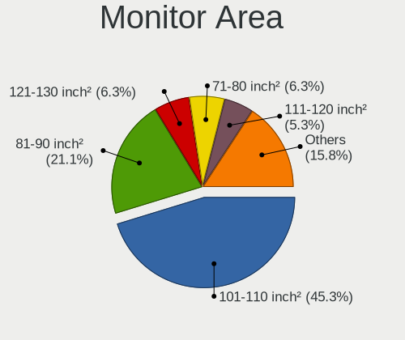

| Area in inch² | Notebooks | Percent |
|----------------|-----------|---------|
| 101-110        | 50        | 51.55%  |
| 81-90          | 15        | 15.46%  |
| 201-250        | 9         | 9.28%   |
| 71-80          | 5         | 5.15%   |
| 61-70          | 3         | 3.09%   |
| 301-350        | 3         | 3.09%   |
| 1-40           | 2         | 2.06%   |
| 121-130        | 2         | 2.06%   |
| 111-120        | 2         | 2.06%   |
| 51-60          | 1         | 1.03%   |
| 351-500        | 1         | 1.03%   |
| 41-50          | 1         | 1.03%   |
| 151-200        | 1         | 1.03%   |
| 141-150        | 1         | 1.03%   |
| 501-1000       | 1         | 1.03%   |

Pixel Density
-------------

Pixels per inch

| Density       | Notebooks | Percent |
|---------------|-----------|---------|
| 121-160       | 38        | 40.43%  |
| 101-120       | 26        | 27.66%  |
| 51-100        | 19        | 20.21%  |
| 161-240       | 10        | 10.64%  |
| More than 240 | 1         | 1.06%   |

Multiple Monitors
-----------------

Total monitors connected

| Total | Notebooks | Percent |
|-------|-----------|---------|
| 1     | 72        | 82.76%  |
| 2     | 11        | 12.64%  |
| 0     | 2         | 2.3%    |
| 4     | 1         | 1.15%   |
| 3     | 1         | 1.15%   |

Network
-------

Net Controller Vendor
---------------------

Controller vendors

| Vendor                            | Notebooks | Percent |
|-----------------------------------|-----------|---------|
| Realtek Semiconductor             | 52        | 39.69%  |
| Intel                             | 41        | 31.3%   |
| Qualcomm Atheros                  | 11        | 8.4%    |
| Broadcom                          | 9         | 6.87%   |
| Ralink                            | 3         | 2.29%   |
| MediaTek                          | 3         | 2.29%   |
| Marvell Technology Group          | 2         | 1.53%   |
| Lenovo                            | 2         | 1.53%   |
| Xiaomi                            | 1         | 0.76%   |
| Sierra Wireless                   | 1         | 0.76%   |
| Huawei Technologies               | 1         | 0.76%   |
| Ericsson Business Mobile Networks | 1         | 0.76%   |
| DisplayLink                       | 1         | 0.76%   |
| Dell                              | 1         | 0.76%   |
| Broadcom Limited                  | 1         | 0.76%   |
| ASIX Electronics                  | 1         | 0.76%   |

Net Controller Model
--------------------

Controller models

| Model                                                             | Notebooks | Percent |
|-------------------------------------------------------------------|-----------|---------|
| Realtek RTL8111/8168/8411 PCI Express Gigabit Ethernet Controller | 24        | 15.58%  |
| Realtek RTL8822CE 802.11ac PCIe Wireless Network Adapter          | 7         | 4.55%   |
| Realtek RTL810xE PCI Express Fast Ethernet controller             | 7         | 4.55%   |
| Realtek RTL8821CE 802.11ac PCIe Wireless Network Adapter          | 5         | 3.25%   |
| Intel Wi-Fi 6 AX201                                               | 5         | 3.25%   |
| Realtek RTL8852AE 802.11ax PCIe Wireless Network Adapter          | 3         | 1.95%   |
| Realtek RTL8153 Gigabit Ethernet Adapter                          | 3         | 1.95%   |
| Qualcomm Atheros QCA9377 802.11ac Wireless Network Adapter        | 3         | 1.95%   |
| Intel Wireless 8265 / 8275                                        | 3         | 1.95%   |
| Intel Wireless 7265                                               | 3         | 1.95%   |
| Intel Wi-Fi 6 AX200                                               | 3         | 1.95%   |
| Intel Alder Lake-P PCH CNVi WiFi                                  | 3         | 1.95%   |
| Broadcom BCM43142 802.11b/g/n                                     | 3         | 1.95%   |
| Realtek 802.11ac NIC                                              | 2         | 1.3%    |
| Ralink RT5390 Wireless 802.11n 1T/1R PCIe                         | 2         | 1.3%    |
| Qualcomm Atheros QCA6174 802.11ac Wireless Network Adapter        | 2         | 1.3%    |
| Qualcomm Atheros AR9285 Wireless Network Adapter (PCI-Express)    | 2         | 1.3%    |
| Marvell Group 88E8040 PCI-E Fast Ethernet Controller              | 2         | 1.3%    |
| Intel Wireless 8260                                               | 2         | 1.3%    |
| Intel Wireless 7260                                               | 2         | 1.3%    |
| Intel Ice Lake-LP PCH CNVi WiFi                                   | 2         | 1.3%    |
| Intel Comet Lake PCH-LP CNVi WiFi                                 | 2         | 1.3%    |
| Intel Centrino Advanced-N 6200                                    | 2         | 1.3%    |
| Intel Cannon Lake PCH CNVi WiFi                                   | 2         | 1.3%    |
| Intel 82577LM Gigabit Network Connection                          | 2         | 1.3%    |
| Broadcom NetXtreme BCM5764M Gigabit Ethernet PCIe                 | 2         | 1.3%    |
| Broadcom BCM4313 802.11bgn Wireless Network Adapter               | 2         | 1.3%    |
| Xiaomi Mi/Redmi series (RNDIS)                                    | 1         | 0.65%   |
| Sierra Wireless EM7305                                            | 1         | 0.65%   |
| Realtek RTL8812AU 802.11a/b/g/n/ac 2T2R DB WLAN Adapter           | 1         | 0.65%   |
| Realtek RTL8723BU 802.11b/g/n WLAN Adapter                        | 1         | 0.65%   |
| Realtek RTL8723AE PCIe Wireless Network Adapter                   | 1         | 0.65%   |
| Realtek RTL8191SEvB Wireless LAN Controller                       | 1         | 0.65%   |
| Realtek RTL8188EUS 802.11n Wireless Network Adapter               | 1         | 0.65%   |
| Realtek RTL8188EE Wireless Network Adapter                        | 1         | 0.65%   |
| Realtek RTL8125 2.5GbE Controller                                 | 1         | 0.65%   |
| Realtek Killer E2600 Gigabit Ethernet Controller                  | 1         | 0.65%   |
| Realtek Killer E2500 Gigabit Ethernet Controller                  | 1         | 0.65%   |
| Ralink RT3090 Wireless 802.11n 1T/1R PCIe                         | 1         | 0.65%   |
| Qualcomm Atheros QCA9565 / AR9565 Wireless Network Adapter        | 1         | 0.65%   |

Wireless Vendor
---------------

Wireless vendors

| Vendor                            | Notebooks | Percent |
|-----------------------------------|-----------|---------|
| Intel                             | 40        | 44.94%  |
| Realtek Semiconductor             | 23        | 25.84%  |
| Qualcomm Atheros                  | 10        | 11.24%  |
| Broadcom                          | 7         | 7.87%   |
| Ralink                            | 3         | 3.37%   |
| MediaTek                          | 2         | 2.25%   |
| Sierra Wireless                   | 1         | 1.12%   |
| Ericsson Business Mobile Networks | 1         | 1.12%   |
| Dell                              | 1         | 1.12%   |
| Broadcom Limited                  | 1         | 1.12%   |

Wireless Model
--------------

Wireless models

| Model                                                          | Notebooks | Percent |
|----------------------------------------------------------------|-----------|---------|
| Realtek RTL8822CE 802.11ac PCIe Wireless Network Adapter       | 7         | 7.87%   |
| Realtek RTL8821CE 802.11ac PCIe Wireless Network Adapter       | 5         | 5.62%   |
| Intel Wi-Fi 6 AX201                                            | 5         | 5.62%   |
| Realtek RTL8852AE 802.11ax PCIe Wireless Network Adapter       | 3         | 3.37%   |
| Qualcomm Atheros QCA9377 802.11ac Wireless Network Adapter     | 3         | 3.37%   |
| Intel Wireless 8265 / 8275                                     | 3         | 3.37%   |
| Intel Wireless 7265                                            | 3         | 3.37%   |
| Intel Wi-Fi 6 AX200                                            | 3         | 3.37%   |
| Intel Alder Lake-P PCH CNVi WiFi                               | 3         | 3.37%   |
| Broadcom BCM43142 802.11b/g/n                                  | 3         | 3.37%   |
| Realtek 802.11ac NIC                                           | 2         | 2.25%   |
| Ralink RT5390 Wireless 802.11n 1T/1R PCIe                      | 2         | 2.25%   |
| Qualcomm Atheros QCA6174 802.11ac Wireless Network Adapter     | 2         | 2.25%   |
| Qualcomm Atheros AR9285 Wireless Network Adapter (PCI-Express) | 2         | 2.25%   |
| Intel Wireless 8260                                            | 2         | 2.25%   |
| Intel Wireless 7260                                            | 2         | 2.25%   |
| Intel Ice Lake-LP PCH CNVi WiFi                                | 2         | 2.25%   |
| Intel Comet Lake PCH-LP CNVi WiFi                              | 2         | 2.25%   |
| Intel Centrino Advanced-N 6200                                 | 2         | 2.25%   |
| Intel Cannon Lake PCH CNVi WiFi                                | 2         | 2.25%   |
| Broadcom BCM4313 802.11bgn Wireless Network Adapter            | 2         | 2.25%   |
| Sierra Wireless EM7305                                         | 1         | 1.12%   |
| Realtek RTL8812AU 802.11a/b/g/n/ac 2T2R DB WLAN Adapter        | 1         | 1.12%   |
| Realtek RTL8723BU 802.11b/g/n WLAN Adapter                     | 1         | 1.12%   |
| Realtek RTL8723AE PCIe Wireless Network Adapter                | 1         | 1.12%   |
| Realtek RTL8191SEvB Wireless LAN Controller                    | 1         | 1.12%   |
| Realtek RTL8188EUS 802.11n Wireless Network Adapter            | 1         | 1.12%   |
| Realtek RTL8188EE Wireless Network Adapter                     | 1         | 1.12%   |
| Ralink RT3090 Wireless 802.11n 1T/1R PCIe                      | 1         | 1.12%   |
| Qualcomm Atheros QCA9565 / AR9565 Wireless Network Adapter     | 1         | 1.12%   |
| Qualcomm Atheros AR9485 Wireless Network Adapter               | 1         | 1.12%   |
| Qualcomm Atheros AR928X Wireless Network Adapter (PCI-Express) | 1         | 1.12%   |
| MediaTek WLAN controller                                       | 1         | 1.12%   |
| MediaTek MT7921 802.11ax PCI Express Wireless Network Adapter  | 1         | 1.12%   |
| Intel Wireless 3165                                            | 1         | 1.12%   |
| Intel Wireless 3160                                            | 1         | 1.12%   |
| Intel Wi-Fi 6 AX210/AX211/AX411 160MHz                         | 1         | 1.12%   |
| Intel Tiger Lake PCH CNVi WiFi                                 | 1         | 1.12%   |
| Intel PRO/Wireless 4965 AG or AGN [Kedron] Network Connection  | 1         | 1.12%   |
| Intel Gemini Lake PCH CNVi WiFi                                | 1         | 1.12%   |

Ethernet Vendor
---------------

Ethernet vendors

| Vendor                   | Notebooks | Percent |
|--------------------------|-----------|---------|
| Realtek Semiconductor    | 37        | 56.92%  |
| Intel                    | 15        | 23.08%  |
| Broadcom                 | 3         | 4.62%   |
| Marvell Technology Group | 2         | 3.08%   |
| Lenovo                   | 2         | 3.08%   |
| Xiaomi                   | 1         | 1.54%   |
| Qualcomm Atheros         | 1         | 1.54%   |
| MediaTek                 | 1         | 1.54%   |
| Huawei Technologies      | 1         | 1.54%   |
| DisplayLink              | 1         | 1.54%   |
| ASIX Electronics         | 1         | 1.54%   |

Ethernet Model
--------------

Ethernet models

| Model                                                             | Notebooks | Percent |
|-------------------------------------------------------------------|-----------|---------|
| Realtek RTL8111/8168/8411 PCI Express Gigabit Ethernet Controller | 24        | 36.92%  |
| Realtek RTL810xE PCI Express Fast Ethernet controller             | 7         | 10.77%  |
| Realtek RTL8153 Gigabit Ethernet Adapter                          | 3         | 4.62%   |
| Marvell Group 88E8040 PCI-E Fast Ethernet Controller              | 2         | 3.08%   |
| Intel 82577LM Gigabit Network Connection                          | 2         | 3.08%   |
| Broadcom NetXtreme BCM5764M Gigabit Ethernet PCIe                 | 2         | 3.08%   |
| Xiaomi Mi/Redmi series (RNDIS)                                    | 1         | 1.54%   |
| Realtek RTL8125 2.5GbE Controller                                 | 1         | 1.54%   |
| Realtek Killer E2600 Gigabit Ethernet Controller                  | 1         | 1.54%   |
| Realtek Killer E2500 Gigabit Ethernet Controller                  | 1         | 1.54%   |
| Qualcomm Atheros AR8152 v1.1 Fast Ethernet                        | 1         | 1.54%   |
| MediaTek moto e(6) plus                                           | 1         | 1.54%   |
| Lenovo USB-C Dock Ethernet                                        | 1         | 1.54%   |
| Lenovo ThinkPad TBT 3 Dock                                        | 1         | 1.54%   |
| Intel Ethernet Connection I219-V                                  | 1         | 1.54%   |
| Intel Ethernet Connection I218-LM                                 | 1         | 1.54%   |
| Intel Ethernet Connection (6) I219-V                              | 1         | 1.54%   |
| Intel Ethernet Connection (5) I219-LM                             | 1         | 1.54%   |
| Intel Ethernet Connection (3) I218-LM                             | 1         | 1.54%   |
| Intel Ethernet Connection (2) I219-LM                             | 1         | 1.54%   |
| Intel Ethernet Connection (16) I219-V                             | 1         | 1.54%   |
| Intel Ethernet Connection (14) I219-V                             | 1         | 1.54%   |
| Intel Ethernet Connection (13) I219-V                             | 1         | 1.54%   |
| Intel Ethernet Connection (10) I219-LM                            | 1         | 1.54%   |
| Intel 82579LM Gigabit Network Connection (Lewisville)             | 1         | 1.54%   |
| Intel 82577LC Gigabit Network Connection                          | 1         | 1.54%   |
| Intel 82562GT 10/100 Network Connection                           | 1         | 1.54%   |
| Huawei MLA-L11                                                    | 1         | 1.54%   |
| DisplayLink Kensington SD3600 Dual Video Dock                     | 1         | 1.54%   |
| Broadcom NetLink BCM5787M Gigabit Ethernet PCI Express            | 1         | 1.54%   |
| ASIX AX88179 Gigabit Ethernet                                     | 1         | 1.54%   |

Net Controller Kind
-------------------

Ethernet, WiFi or modem

| Kind     | Notebooks | Percent |
|----------|-----------|---------|
| WiFi     | 83        | 58.45%  |
| Ethernet | 59        | 41.55%  |

Used Controller
---------------

Currently used network controller

| Kind     | Notebooks | Percent |
|----------|-----------|---------|
| WiFi     | 68        | 77.27%  |
| Ethernet | 20        | 22.73%  |

NICs
----

Total network controllers on board

| Total | Notebooks | Percent |
|-------|-----------|---------|
| 2     | 52        | 59.77%  |
| 1     | 30        | 34.48%  |
| 0     | 4         | 4.6%    |
| 3     | 1         | 1.15%   |

IPv6
----

IPv6 vs IPv4

| Used | Notebooks | Percent |
|------|-----------|---------|
| No   | 81        | 93.1%   |
| Yes  | 6         | 6.9%    |

Bluetooth
---------

Bluetooth Vendor
----------------

Controller vendors

| Vendor                          | Notebooks | Percent |
|---------------------------------|-----------|---------|
| Intel                           | 33        | 48.53%  |
| Realtek Semiconductor           | 8         | 11.76%  |
| Lite-On Technology              | 7         | 10.29%  |
| IMC Networks                    | 5         | 7.35%   |
| Broadcom                        | 4         | 5.88%   |
| Realtek                         | 3         | 4.41%   |
| Foxconn / Hon Hai               | 2         | 2.94%   |
| Apple                           | 2         | 2.94%   |
| Qualcomm Atheros Communications | 1         | 1.47%   |
| Hewlett-Packard                 | 1         | 1.47%   |
| Dell                            | 1         | 1.47%   |
| Cambridge Silicon Radio         | 1         | 1.47%   |

Bluetooth Model
---------------

Controller models

| Model                                               | Notebooks | Percent |
|-----------------------------------------------------|-----------|---------|
| Intel Bluetooth wireless interface                  | 11        | 16.18%  |
| Intel AX201 Bluetooth                               | 8         | 11.76%  |
| Realtek Bluetooth Radio                             | 7         | 10.29%  |
| Intel Bluetooth 9460/9560 Jefferson Peak (JfP)      | 6         | 8.82%   |
| IMC Networks Bluetooth Radio                        | 4         | 5.88%   |
| Realtek 802.11ac WLAN Adapter                       | 3         | 4.41%   |
| Intel AX200 Bluetooth                               | 3         | 4.41%   |
| Lite-On Qualcomm Atheros QCA9377 Bluetooth          | 2         | 2.94%   |
| Intel Centrino Bluetooth Wireless Transceiver       | 2         | 2.94%   |
| Intel Bluetooth Device                              | 2         | 2.94%   |
| Broadcom BCM2045B (BDC-2.1)                         | 2         | 2.94%   |
| Apple Bluetooth Host Controller                     | 2         | 2.94%   |
| Realtek  Bluetooth 4.2 Adapter                      | 1         | 1.47%   |
| Qualcomm Atheros  Bluetooth Device                  | 1         | 1.47%   |
| Lite-On Wireless_Device                             | 1         | 1.47%   |
| Lite-On Broadcom BCM43142A0 Bluetooth Device        | 1         | 1.47%   |
| Lite-On Bluetooth USB Host Controller               | 1         | 1.47%   |
| Lite-On Bluetooth Device                            | 1         | 1.47%   |
| Lite-On Atheros AR3012 Bluetooth                    | 1         | 1.47%   |
| Intel AX210 Bluetooth                               | 1         | 1.47%   |
| IMC Networks Wireless_Device                        | 1         | 1.47%   |
| HP Bluetooth 2.0 Interface [Broadcom BCM2045]       | 1         | 1.47%   |
| Foxconn / Hon Hai Bluetooth Device                  | 1         | 1.47%   |
| Foxconn / Hon Hai BCM43142A0                        | 1         | 1.47%   |
| Dell Wireless 355 Bluetooth                         | 1         | 1.47%   |
| Cambridge Silicon Radio Bluetooth Dongle (HCI mode) | 1         | 1.47%   |
| Broadcom BCM43142A0 Bluetooth 4.0                   | 1         | 1.47%   |
| Broadcom BCM2070 Bluetooth Device                   | 1         | 1.47%   |

Sound
-----

Sound Vendor
------------

Sound card vendors

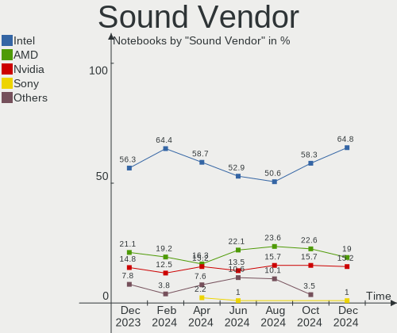

| Vendor                | Notebooks | Percent |
|-----------------------|-----------|---------|
| Intel                 | 68        | 64.15%  |
| AMD                   | 17        | 16.04%  |
| Nvidia                | 14        | 13.21%  |
| Lenovo                | 2         | 1.89%   |
| Realtek Semiconductor | 1         | 0.94%   |
| Plantronics           | 1         | 0.94%   |
| Kingston Technology   | 1         | 0.94%   |
| Focusrite-Novation    | 1         | 0.94%   |
| C-Media Electronics   | 1         | 0.94%   |

Sound Model
-----------

Sound card models

| Model                                                                      | Notebooks | Percent |
|----------------------------------------------------------------------------|-----------|---------|
| AMD Family 17h/19h HD Audio Controller                                     | 11        | 8.59%   |
| Intel Tiger Lake-LP Smart Sound Technology Audio Controller                | 8         | 6.25%   |
| Intel Sunrise Point-LP HD Audio                                            | 8         | 6.25%   |
| Intel Haswell-ULT HD Audio Controller                                      | 6         | 4.69%   |
| Intel 8 Series HD Audio Controller                                         | 6         | 4.69%   |
| Intel Celeron/Pentium Silver Processor High Definition Audio               | 5         | 3.91%   |
| AMD Renoir Radeon High Definition Audio Controller                         | 5         | 3.91%   |
| Nvidia GA106 High Definition Audio Controller                              | 4         | 3.13%   |
| Intel 82801H (ICH8 Family) HD Audio Controller                             | 4         | 3.13%   |
| Intel 7 Series/C216 Chipset Family High Definition Audio Controller        | 4         | 3.13%   |
| Intel 5 Series/3400 Series Chipset High Definition Audio                   | 4         | 3.13%   |
| Intel CM238 HD Audio Controller                                            | 3         | 2.34%   |
| Intel Cannon Lake PCH cAVS                                                 | 3         | 2.34%   |
| Intel Alder Lake PCH-P High Definition Audio Controller                    | 3         | 2.34%   |
| Intel 82801I (ICH9 Family) HD Audio Controller                             | 3         | 2.34%   |
| AMD Raven/Raven2/Fenghuang HDMI/DP Audio Controller                        | 3         | 2.34%   |
| Nvidia High Definition Audio Controller                                    | 2         | 1.56%   |
| Nvidia GT216 HDMI Audio Controller                                         | 2         | 1.56%   |
| Nvidia GA104 High Definition Audio Controller                              | 2         | 1.56%   |
| Intel Xeon E3-1200 v3/4th Gen Core Processor HD Audio Controller           | 2         | 1.56%   |
| Intel Tiger Lake-H HD Audio Controller                                     | 2         | 1.56%   |
| Intel Ice Lake-LP Smart Sound Technology Audio Controller                  | 2         | 1.56%   |
| Intel Comet Lake PCH-LP cAVS                                               | 2         | 1.56%   |
| Intel 8 Series/C220 Series Chipset High Definition Audio Controller        | 2         | 1.56%   |
| Intel 6 Series/C200 Series Chipset Family High Definition Audio Controller | 2         | 1.56%   |
| AMD Rembrandt Radeon High Definition Audio Controller                      | 2         | 1.56%   |
| AMD Kabini HDMI/DP Audio                                                   | 2         | 1.56%   |
| AMD FCH Azalia Controller                                                  | 2         | 1.56%   |
| Realtek Semiconductor USB Audio                                            | 1         | 0.78%   |
| Plantronics Blackwire 3225 Series                                          | 1         | 0.78%   |
| Nvidia TU107 GeForce GTX 1650 High Definition Audio Controller             | 1         | 0.78%   |
| Nvidia TU106 High Definition Audio Controller                              | 1         | 0.78%   |
| Nvidia GM107 High Definition Audio Controller [GeForce 940MX]              | 1         | 0.78%   |
| Nvidia GK208 HDMI/DP Audio Controller                                      | 1         | 0.78%   |
| Lenovo ThinkPad USB-C Dock Gen2 USB Audio                                  | 1         | 0.78%   |
| Lenovo ThinkPad Thunderbolt 3 Dock USB Audio                               | 1         | 0.78%   |
| Kingston Technology HyperX 7.1 Audio                                       | 1         | 0.78%   |
| Intel Wildcat Point-LP High Definition Audio Controller                    | 1         | 0.78%   |
| Intel NM10/ICH7 Family High Definition Audio Controller                    | 1         | 0.78%   |
| Intel Jasper Lake HD Audio                                                 | 1         | 0.78%   |

Memory
------

Memory Vendor
-------------

Memory module vendors

| Vendor              | Notebooks | Percent |
|---------------------|-----------|---------|
| SK hynix            | 14        | 25%     |
| Samsung Electronics | 11        | 19.64%  |
| Crucial             | 6         | 10.71%  |
| Unknown             | 5         | 8.93%   |
| Kingston            | 5         | 8.93%   |
| Micron Technology   | 4         | 7.14%   |
| GOODRAM             | 2         | 3.57%   |
| Unknown (ABCD)      | 1         | 1.79%   |
| Silicon Power       | 1         | 1.79%   |
| Ramaxel Technology  | 1         | 1.79%   |
| Kllisre             | 1         | 1.79%   |
| ff                  | 1         | 1.79%   |
| Elpida              | 1         | 1.79%   |
| Corsair             | 1         | 1.79%   |
| 4ea5                | 1         | 1.79%   |
| Unknown             | 1         | 1.79%   |

Memory Model
------------

Memory module models

| Model                                                                     | Notebooks | Percent |
|---------------------------------------------------------------------------|-----------|---------|
| SK hynix RAM HMA81GS6JJR8N-VK 8GB SODIMM DDR4 2667MT/s                    | 2         | 3.39%   |
| Samsung RAM M471A1G44AB0-CWE 8GB SODIMM DDR4 3200MT/s                     | 2         | 3.39%   |
| Unknown RAM Module 4GB SODIMM DDR3 1333MT/s                               | 1         | 1.69%   |
| Unknown RAM Module 4GB Row Of Chips LPDDR3 1867MT/s                       | 1         | 1.69%   |
| Unknown RAM Module 2GB SODIMM DDR2 800MT/s                                | 1         | 1.69%   |
| Unknown RAM Module 2GB SODIMM DDR2 667MT/s                                | 1         | 1.69%   |
| Unknown RAM Module 2GB DIMM DDR3 1333MT/s                                 | 1         | 1.69%   |
| Unknown (ABCD) RAM 123456789012345678 2GB SODIMM LPDDR4 2400MT/s          | 1         | 1.69%   |
| SK hynix RAM Module 8GB SODIMM DDR3 1600MT/s                              | 1         | 1.69%   |
| SK hynix RAM HMT451S6AFR8A-PB 4GB SODIMM DDR3 1600MT/s                    | 1         | 1.69%   |
| SK hynix RAM HMA851S6DJR6N-XN 4GB Row Of Chips DDR4 3200MT/s              | 1         | 1.69%   |
| SK hynix RAM HMA851S6AFR6N-UH 4GB SODIMM DDR4 2667MT/s                    | 1         | 1.69%   |
| SK hynix RAM HMA82GS6AFR8N-UH 16GB SODIMM DDR4 2667MT/s                   | 1         | 1.69%   |
| SK hynix RAM HMA81GS6CJR8N-VK 8GB SODIMM DDR4 2400MT/s                    | 1         | 1.69%   |
| SK hynix RAM HMA81GS6AFR8N-UH 8GB SODIMM DDR4 2667MT/s                    | 1         | 1.69%   |
| SK hynix RAM H9HCNNNFAMMLXR-NEE 4GB Row Of Chips LPDDR4 4267MT/s          | 1         | 1.69%   |
| SK hynix RAM H9HCNNNCPMMLXR-NEE 8GB SODIMM LPDDR4 4266MT/s                | 1         | 1.69%   |
| SK hynix RAM H9HCNNNCPMALHR-NEE 8GB Row Of Chips LPDDR4 4800MT/s          | 1         | 1.69%   |
| SK hynix RAM H9CCNNNCLGALAR-NVD 8GB Row Of Chips LPDDR3 2133MT/s          | 1         | 1.69%   |
| SK hynix RAM 48594D503132355336344350382D53362020 2GB SODIMM DDR2 667MT/s | 1         | 1.69%   |
| Silicon Power RAM SP004GLSTU160N02 4GB SODIMM DDR3 1600MT/s               | 1         | 1.69%   |
| Samsung RAM M471A5244CB0-CTD 4GB SODIMM DDR4 3266MT/s                     | 1         | 1.69%   |
| Samsung RAM M471A5244BB0-CWE 4GB SODIMM DDR4 3200MT/s                     | 1         | 1.69%   |
| Samsung RAM M471A5244BB0-CPB 4GB SODIMM DDR4 2400MT/s                     | 1         | 1.69%   |
| Samsung RAM M471A2K43EB1-CWE 16GB SODIMM DDR4 3200MT/s                    | 1         | 1.69%   |
| Samsung RAM M471A2G44AM0-CTD 16GB SODIMM DDR4 2667MT/s                    | 1         | 1.69%   |
| Samsung RAM M471A1K43EB1-CWE 8GB SODIMM DDR4 3200MT/s                     | 1         | 1.69%   |
| Samsung RAM M471A1K43DB1-CTD 8GB SODIMM DDR4 2667MT/s                     | 1         | 1.69%   |
| Samsung RAM M471A1K43CB1-CTD 8GB SODIMM DDR4 2667MT/s                     | 1         | 1.69%   |
| Samsung RAM M471A1G44AB0-CWE 8GB Row Of Chips DDR4 3200MT/s               | 1         | 1.69%   |
| Samsung RAM K4F8E304HB-MGCJ 1GB LPDDR4 2400MT/s                           | 1         | 1.69%   |
| Samsung RAM K4EBE3 4ED-EGCG 8GB Row Of Chips LPDDR3 2133MT/s              | 1         | 1.69%   |
| Ramaxel RAM RMSA3230KE68H9F2133 4GB SODIMM DDR4 2133MT/s                  | 1         | 1.69%   |
| Micron RAM 53E1G32D4NQ-046WTE 4GB Row Of Chips LPDDR4 3200MT/s            | 1         | 1.69%   |
| Micron RAM 4ATF51264HZ-3G2R1 4096MB SODIMM DDR4 3200MT/s                  | 1         | 1.69%   |
| Micron RAM 4ATF51264HZ-2G6E! 4GB SODIMM DDR4 2400MT/s                     | 1         | 1.69%   |
| Micron RAM 16ATF2G64HZ-2G3H1 16GB SODIMM DDR4 2400MT/s                    | 1         | 1.69%   |
| Kllisre RAM Module 4GB SODIMM DDR3 1067MT/s                               | 1         | 1.69%   |
| Kingston RAM Module 16GB SODIMM DDR4 3200MT/s                             | 1         | 1.69%   |
| Kingston RAM HP536727-H41-ELD 4GB SODIMM DDR3 1600MT/s                    | 1         | 1.69%   |

Memory Kind
-----------

Memory module kinds

| Kind   | Notebooks | Percent |
|--------|-----------|---------|
| DDR4   | 22        | 48.89%  |
| DDR3   | 10        | 22.22%  |
| LPDDR4 | 7         | 15.56%  |
| LPDDR3 | 3         | 6.67%   |
| DDR2   | 3         | 6.67%   |

Memory Form Factor
------------------

Physical design of the memory module

| Name         | Notebooks | Percent |
|--------------|-----------|---------|
| SODIMM       | 35        | 77.78%  |
| Row Of Chips | 8         | 17.78%  |
| DIMM         | 1         | 2.22%   |
| Unknown      | 1         | 2.22%   |

Memory Size
-----------

Memory module size

| Size  | Notebooks | Percent |
|-------|-----------|---------|
| 8192  | 21        | 42%     |
| 4096  | 14        | 28%     |
| 16384 | 7         | 14%     |
| 2048  | 6         | 12%     |
| 1024  | 2         | 4%      |

Memory Speed
------------

Memory module speed

| Speed | Notebooks | Percent |
|-------|-----------|---------|
| 3200  | 10        | 20%     |
| 2667  | 8         | 16%     |
| 1600  | 8         | 16%     |
| 2400  | 7         | 14%     |
| 2133  | 5         | 10%     |
| 1333  | 3         | 6%      |
| 667   | 2         | 4%      |
| 4800  | 1         | 2%      |
| 4267  | 1         | 2%      |
| 4266  | 1         | 2%      |
| 3266  | 1         | 2%      |
| 1867  | 1         | 2%      |
| 1067  | 1         | 2%      |
| 800   | 1         | 2%      |

Printers & scanners
-------------------

Printer Vendor
--------------

Printer device vendors

Zero info for selected period =(

Printer Model
-------------

Printer device models

Zero info for selected period =(

Scanner Vendor
--------------

Scanner device vendors

Zero info for selected period =(

Scanner Model
-------------

Scanner device models

Zero info for selected period =(

Camera
------

Camera Vendor
-------------

Camera device vendors

| Vendor                                 | Notebooks | Percent |
|----------------------------------------|-----------|---------|
| Chicony Electronics                    | 19        | 23.46%  |
| IMC Networks                           | 9         | 11.11%  |
| Quanta                                 | 8         | 9.88%   |
| Acer                                   | 8         | 9.88%   |
| Realtek Semiconductor                  | 4         | 4.94%   |
| Microdia                               | 4         | 4.94%   |
| Cheng Uei Precision Industry (Foxlink) | 4         | 4.94%   |
| Suyin                                  | 3         | 3.7%    |
| icSpring                               | 3         | 3.7%    |
| Apple                                  | 3         | 3.7%    |
| Luxvisions Innotech Limited            | 2         | 2.47%   |
| Logitech                               | 2         | 2.47%   |
| Lenovo                                 | 2         | 2.47%   |
| Sunplus Innovation Technology          | 1         | 1.23%   |
| Sonix Technology                       | 1         | 1.23%   |
| Ricoh                                  | 1         | 1.23%   |
| Razer USA                              | 1         | 1.23%   |
| OmniVision Technologies                | 1         | 1.23%   |
| MacroSilicon                           | 1         | 1.23%   |
| Intel                                  | 1         | 1.23%   |
| DigiTech                               | 1         | 1.23%   |
| ALi                                    | 1         | 1.23%   |
| Alcor Micro                            | 1         | 1.23%   |

Camera Model
------------

Camera device models

| Model                                             | Notebooks | Percent |
|---------------------------------------------------|-----------|---------|
| Chicony HD WebCam                                 | 5         | 6.17%   |
| Quanta USB2.0 HD UVC WebCam                       | 3         | 3.7%    |
| IMC Networks Integrated Camera                    | 3         | 3.7%    |
| icSpring camera                                   | 3         | 3.7%    |
| Quanta HP Wide Vision HD Camera                   | 2         | 2.47%   |
| Microdia Integrated_Webcam_HD                     | 2         | 2.47%   |
| IMC Networks USB2.0 HD UVC WebCam                 | 2         | 2.47%   |
| IMC Networks ov9734_azurewave_camera              | 2         | 2.47%   |
| Chicony USB2.0 Camera                             | 2         | 2.47%   |
| Chicony Integrated Camera                         | 2         | 2.47%   |
| Chicony EasyCamera                                | 2         | 2.47%   |
| Cheng Uei Precision Industry (Foxlink) HP Webcam  | 2         | 2.47%   |
| Apple iPhone 5/5C/5S/6/SE                         | 2         | 2.47%   |
| Acer BisonCam,NB Pro                              | 2         | 2.47%   |
| Suyin HP Truevision HD                            | 1         | 1.23%   |
| Suyin Acer/HP Integrated Webcam [CN0314]          | 1         | 1.23%   |
| Suyin 1.3M HD WebCam                              | 1         | 1.23%   |
| Sunplus HD WebCam                                 | 1         | 1.23%   |
| Sonix USB2.0 HD UVC WebCam                        | 1         | 1.23%   |
| Ricoh Sony Visual Communication Camera            | 1         | 1.23%   |
| Realtek USB Camera                                | 1         | 1.23%   |
| Realtek Integrated_Webcam_HD                      | 1         | 1.23%   |
| Realtek HP Truevision HD                          | 1         | 1.23%   |
| Realtek EasyCamera                                | 1         | 1.23%   |
| Razer USA Razer Kiyo                              | 1         | 1.23%   |
| Quanta HP Webcam-101                              | 1         | 1.23%   |
| Quanta HD Webcam                                  | 1         | 1.23%   |
| Quanta HD User Facing                             | 1         | 1.23%   |
| OmniVision OV2640 Webcam                          | 1         | 1.23%   |
| Microdia Webcam Vitade AF                         | 1         | 1.23%   |
| Microdia HP Integrated Webcam                     | 1         | 1.23%   |
| MacroSilicon USB Video                            | 1         | 1.23%   |
| Luxvisions Innotech Limited Integrated RGB Camera | 1         | 1.23%   |
| Luxvisions Innotech Limited HP HD Camera          | 1         | 1.23%   |
| Logitech Webcam C270                              | 1         | 1.23%   |
| Logitech BRIO Ultra HD Webcam                     | 1         | 1.23%   |
| Lenovo Integrated Webcam [R5U877]                 | 1         | 1.23%   |
| Lenovo Integrated Webcam                          | 1         | 1.23%   |
| Intel RealSense 3D Camera (Front F200)            | 1         | 1.23%   |
| IMC Networks USB2.0 UVC HD Webcam                 | 1         | 1.23%   |

Security
--------

Fingerprint Vendor
------------------

Fingerprint sensor vendors

| Vendor                     | Notebooks | Percent |
|----------------------------|-----------|---------|
| Validity Sensors           | 3         | 23.08%  |
| Synaptics                  | 3         | 23.08%  |
| Shenzhen Goodix Technology | 3         | 23.08%  |
| Upek                       | 2         | 15.38%  |
| STMicroelectronics         | 1         | 7.69%   |
| LighTuning Technology      | 1         | 7.69%   |

Fingerprint Model
-----------------

Fingerprint sensor models

| Model                                                  | Notebooks | Percent |
|--------------------------------------------------------|-----------|---------|
| Shenzhen Goodix  Fingerprint Device                    | 3         | 23.08%  |
| Unknown                                                | 2         | 15.38%  |
| Validity Sensors VFS7500 Touch Fingerprint Sensor      | 1         | 7.69%   |
| Validity Sensors VFS5011 Fingerprint Reader            | 1         | 7.69%   |
| Validity Sensors VFS491                                | 1         | 7.69%   |
| Upek TCS5B Fingerprint sensor                          | 1         | 7.69%   |
| Upek Biometric Touchchip/Touchstrip Fingerprint Sensor | 1         | 7.69%   |
| Synaptics Prometheus MIS Touch Fingerprint Reader      | 1         | 7.69%   |
| STMicroelectronics Fingerprint Reader                  | 1         | 7.69%   |
| LighTuning EgisTec Touch Fingerprint Sensor            | 1         | 7.69%   |

Chipcard Vendor
---------------

Chipcard module vendors

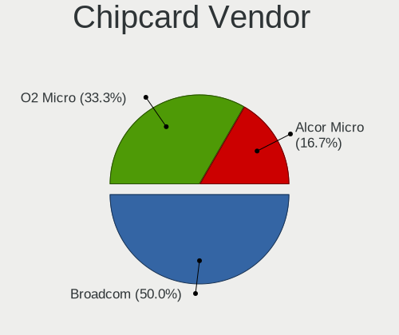

| Vendor      | Notebooks | Percent |
|-------------|-----------|---------|
| Broadcom    | 2         | 66.67%  |
| Alcor Micro | 1         | 33.33%  |

Chipcard Model
--------------

Chipcard module models

| Model                               | Notebooks | Percent |
|-------------------------------------|-----------|---------|
| Broadcom 5880                       | 2         | 66.67%  |
| Alcor Micro AU9540 Smartcard Reader | 1         | 33.33%  |

Unsupported
-----------

Unsupported Devices
-------------------

Total unsupported devices on board

| Total | Notebooks | Percent |
|-------|-----------|---------|
| 0     | 56        | 64.37%  |
| 1     | 24        | 27.59%  |
| 2     | 6         | 6.9%    |
| 3     | 1         | 1.15%   |

Unsupported Device Types
------------------------

Types of unsupported devices

| Type                     | Notebooks | Percent |
|--------------------------|-----------|---------|
| Fingerprint reader       | 13        | 34.21%  |
| Graphics card            | 8         | 21.05%  |
| Net/wireless             | 3         | 7.89%   |
| Multimedia controller    | 3         | 7.89%   |
| Communication controller | 3         | 7.89%   |
| Chipcard                 | 2         | 5.26%   |
| Camera                   | 2         | 5.26%   |
| Storage                  | 1         | 2.63%   |
| Network                  | 1         | 2.63%   |
| Card reader              | 1         | 2.63%   |
| Bluetooth                | 1         | 2.63%   |

