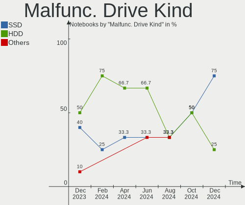
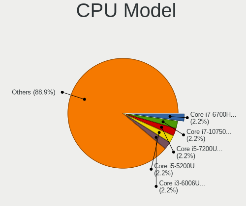
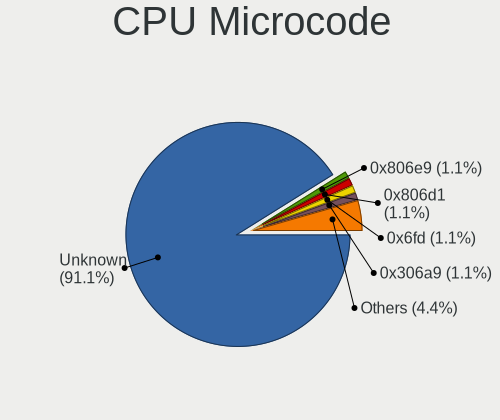
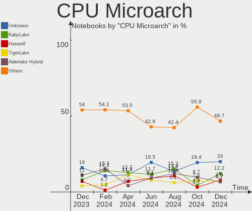
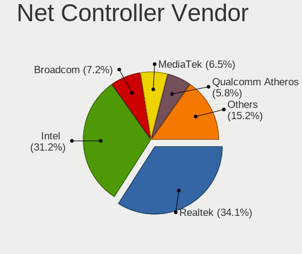
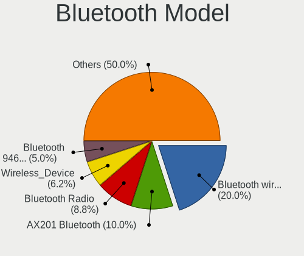
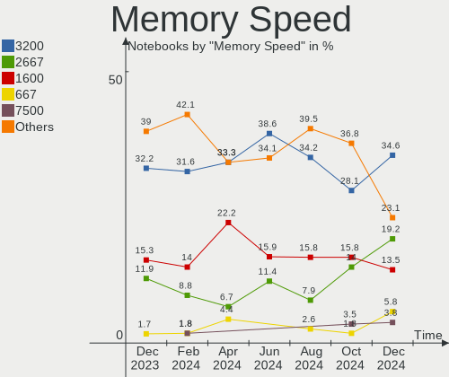
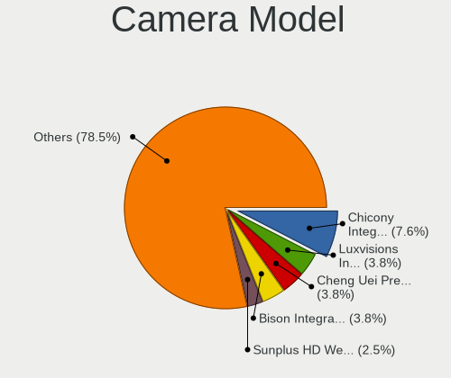

Linux in Spain - Hardware Trends (Notebooks)
--------------------------------------------

A project to identify most popular hardware characteristics and track their change
over time based on data collected by Linux users at https://Linux-Hardware.org.

Anyone can contribute to this report by the [hw-probe](https://github.com/linuxhw/hw-probe) tool:

    sudo -E hw-probe -all -upload

Period: Jun, 2023.

Contents
--------

* [ System ](#system)
  - [ OS                       ](#os)
  - [ OS Family                ](#os-family)
  - [ Kernel                   ](#kernel)
  - [ Kernel Family            ](#kernel-family)
  - [ Kernel Major Ver.        ](#kernel-major-ver)
  - [ Arch                     ](#arch)
  - [ DE                       ](#de)
  - [ Display Server           ](#display-server)
  - [ Display Manager          ](#display-manager)
  - [ OS Lang                  ](#os-lang)
  - [ Boot Mode                ](#boot-mode)
  - [ Filesystem               ](#filesystem)
  - [ Part. scheme             ](#part-scheme)
  - [ Dual Boot with Linux/BSD ](#dual-boot-with-linuxbsd)
  - [ Dual Boot (Win)          ](#dual-boot-win)

* [ Board ](#board)
  - [ Vendor                   ](#vendor)
  - [ Model                    ](#model)
  - [ Model Family             ](#model-family)
  - [ MFG Year                 ](#mfg-year)
  - [ Form Factor              ](#form-factor)
  - [ Secure Boot              ](#secure-boot)
  - [ Coreboot                 ](#coreboot)
  - [ RAM Size                 ](#ram-size)
  - [ RAM Used                 ](#ram-used)
  - [ Total Drives             ](#total-drives)
  - [ Has CD-ROM               ](#has-cd-rom)
  - [ Has Ethernet             ](#has-ethernet)
  - [ Has WiFi                 ](#has-wifi)
  - [ Has Bluetooth            ](#has-bluetooth)

* [ Location ](#location)
  - [ Country                  ](#country)
  - [ City                     ](#city)

* [ Drives ](#drives)
  - [ Drive Vendor             ](#drive-vendor)
  - [ Drive Model              ](#drive-model)
  - [ HDD Vendor               ](#hdd-vendor)
  - [ SSD Vendor               ](#ssd-vendor)
  - [ Drive Kind               ](#drive-kind)
  - [ Drive Connector          ](#drive-connector)
  - [ Drive Size               ](#drive-size)
  - [ Space Total              ](#space-total)
  - [ Space Used               ](#space-used)
  - [ Malfunc. Drives          ](#malfunc-drives)
  - [ Malfunc. Drive Vendor    ](#malfunc-drive-vendor)
  - [ Malfunc. HDD Vendor      ](#malfunc-hdd-vendor)
  - [ Malfunc. Drive Kind      ](#malfunc-drive-kind)
  - [ Failed Drives            ](#failed-drives)
  - [ Failed Drive Vendor      ](#failed-drive-vendor)
  - [ Drive Status             ](#drive-status)

* [ Storage controller ](#storage-controller)
  - [ Storage Vendor           ](#storage-vendor)
  - [ Storage Model            ](#storage-model)
  - [ Storage Kind             ](#storage-kind)

* [ Processor ](#processor)
  - [ CPU Vendor               ](#cpu-vendor)
  - [ CPU Model                ](#cpu-model)
  - [ CPU Model Family         ](#cpu-model-family)
  - [ CPU Cores                ](#cpu-cores)
  - [ CPU Sockets              ](#cpu-sockets)
  - [ CPU Threads              ](#cpu-threads)
  - [ CPU Op-Modes             ](#cpu-op-modes)
  - [ CPU Microcode            ](#cpu-microcode)
  - [ CPU Microarch            ](#cpu-microarch)

* [ Graphics ](#graphics)
  - [ GPU Vendor               ](#gpu-vendor)
  - [ GPU Model                ](#gpu-model)
  - [ GPU Combo                ](#gpu-combo)
  - [ GPU Driver               ](#gpu-driver)
  - [ GPU Memory               ](#gpu-memory)

* [ Monitor ](#monitor)
  - [ Monitor Vendor           ](#monitor-vendor)
  - [ Monitor Model            ](#monitor-model)
  - [ Monitor Resolution       ](#monitor-resolution)
  - [ Monitor Diagonal         ](#monitor-diagonal)
  - [ Monitor Width            ](#monitor-width)
  - [ Aspect Ratio             ](#aspect-ratio)
  - [ Monitor Area             ](#monitor-area)
  - [ Pixel Density            ](#pixel-density)
  - [ Multiple Monitors        ](#multiple-monitors)

* [ Network ](#network)
  - [ Net Controller Vendor    ](#net-controller-vendor)
  - [ Net Controller Model     ](#net-controller-model)
  - [ Wireless Vendor          ](#wireless-vendor)
  - [ Wireless Model           ](#wireless-model)
  - [ Ethernet Vendor          ](#ethernet-vendor)
  - [ Ethernet Model           ](#ethernet-model)
  - [ Net Controller Kind      ](#net-controller-kind)
  - [ Used Controller          ](#used-controller)
  - [ NICs                     ](#nics)
  - [ IPv6                     ](#ipv6)

* [ Bluetooth ](#bluetooth)
  - [ Bluetooth Vendor         ](#bluetooth-vendor)
  - [ Bluetooth Model          ](#bluetooth-model)

* [ Sound ](#sound)
  - [ Sound Vendor             ](#sound-vendor)
  - [ Sound Model              ](#sound-model)

* [ Memory ](#memory)
  - [ Memory Vendor            ](#memory-vendor)
  - [ Memory Model             ](#memory-model)
  - [ Memory Kind              ](#memory-kind)
  - [ Memory Form Factor       ](#memory-form-factor)
  - [ Memory Size              ](#memory-size)
  - [ Memory Speed             ](#memory-speed)

* [ Printers & scanners ](#printers--scanners)
  - [ Printer Vendor           ](#printer-vendor)
  - [ Printer Model            ](#printer-model)
  - [ Scanner Vendor           ](#scanner-vendor)
  - [ Scanner Model            ](#scanner-model)

* [ Camera ](#camera)
  - [ Camera Vendor            ](#camera-vendor)
  - [ Camera Model             ](#camera-model)

* [ Security ](#security)
  - [ Fingerprint Vendor       ](#fingerprint-vendor)
  - [ Fingerprint Model        ](#fingerprint-model)
  - [ Chipcard Vendor          ](#chipcard-vendor)
  - [ Chipcard Model           ](#chipcard-model)

* [ Unsupported ](#unsupported)
  - [ Unsupported Devices      ](#unsupported-devices)
  - [ Unsupported Device Types ](#unsupported-device-types)

System
------

OS
--

Installed operating systems

| Name                         | Notebooks | Percent |
|------------------------------|-----------|---------|
| Ubuntu 22.04                 | 10        | 13.33%  |
| Zorin 16                     | 7         | 9.33%   |
| Linux Mint 21.1              | 7         | 9.33%   |
| Ubuntu 23.04                 | 6         | 8%      |
| Pop!_OS 22.04                | 5         | 6.67%   |
| Ubuntu 20.04                 | 4         | 5.33%   |
| SteamOS 3.4.8                | 3         | 4%      |
| Debian 11                    | 3         | 4%      |
| Arch Rolling                 | 3         | 4%      |
| Ubuntu MATE 20.04            | 2         | 2.67%   |
| OpenMandriva 23.03           | 2         | 2.67%   |
| Manjaro                      | 2         | 2.67%   |
| KDE neon 22.04               | 2         | 2.67%   |
| Kali 2023.2                  | 2         | 2.67%   |
| Debian 12                    | 2         | 2.67%   |
| Xubuntu 18.04                | 1         | 1.33%   |
| Ubuntu Budgie 22.04          | 1         | 1.33%   |
| Ubuntu 18.04                 | 1         | 1.33%   |
| Trisquel 11.0                | 1         | 1.33%   |
| SteamOS 3.4.6                | 1         | 1.33%   |
| openSUSE Tumbleweed-XXXXXXXX | 1         | 1.33%   |
| openSUSE Leap-15.5           | 1         | 1.33%   |
| Manjaro 23.0.0               | 1         | 1.33%   |
| Linux Mint 21.2              | 1         | 1.33%   |
| Lilidog 23                   | 1         | 1.33%   |
| Kubuntu 22.04                | 1         | 1.33%   |
| Fedora 38                    | 1         | 1.33%   |
| Fedora 36                    | 1         | 1.33%   |
| Artix Rolling                | 1         | 1.33%   |
| ArcoLinux Rolling            | 1         | 1.33%   |

OS Family
---------

OS without a version

| Name          | Notebooks | Percent |
|---------------|-----------|---------|
| Ubuntu        | 21        | 28%     |
| Linux Mint    | 8         | 10.67%  |
| Zorin         | 7         | 9.33%   |
| Pop!_OS       | 5         | 6.67%   |
| Debian        | 5         | 6.67%   |
| SteamOS       | 4         | 5.33%   |
| Manjaro       | 3         | 4%      |
| Arch          | 3         | 4%      |
| Ubuntu MATE   | 2         | 2.67%   |
| openSUSE      | 2         | 2.67%   |
| OpenMandriva  | 2         | 2.67%   |
| KDE neon      | 2         | 2.67%   |
| Kali          | 2         | 2.67%   |
| Fedora        | 2         | 2.67%   |
| Xubuntu       | 1         | 1.33%   |
| Ubuntu Budgie | 1         | 1.33%   |
| Trisquel      | 1         | 1.33%   |
| Lilidog       | 1         | 1.33%   |
| Kubuntu       | 1         | 1.33%   |
| Artix         | 1         | 1.33%   |
| ArcoLinux     | 1         | 1.33%   |

Kernel
------

Version of the Linux kernel

| Version                   | Notebooks | Percent |
|---------------------------|-----------|---------|
| 5.15.0-73-generic         | 8         | 10.67%  |
| 5.19.0-45-generic         | 7         | 9.33%   |
| 5.19.0-43-generic         | 6         | 8%      |
| 6.2.6-76060206-generic    | 5         | 6.67%   |
| 6.2.0-20-generic          | 4         | 5.33%   |
| 5.15.0-75-generic         | 4         | 5.33%   |
| 5.13.0-valve36-1-neptune  | 4         | 5.33%   |
| 6.3.5-2-MANJARO           | 2         | 2.67%   |
| 6.2.6-desktop-1omv2390    | 2         | 2.67%   |
| 6.2.0-23-generic          | 2         | 2.67%   |
| 6.1.0-kali9-amd64         | 2         | 2.67%   |
| 6.1.0-9-amd64             | 2         | 2.67%   |
| 5.15.0-71-generic         | 2         | 2.67%   |
| 5.10.0-23-amd64           | 2         | 2.67%   |
| 4.15.0-212-generic        | 2         | 2.67%   |
| 6.3.9-zen1-1-zen          | 1         | 1.33%   |
| 6.3.8-arch1-1             | 1         | 1.33%   |
| 6.3.8-1-liquorix-amd64    | 1         | 1.33%   |
| 6.3.7-arch1-1             | 1         | 1.33%   |
| 6.3.5-273-tkg-bmq         | 1         | 1.33%   |
| 6.3.5-200.fc38.x86_64     | 1         | 1.33%   |
| 6.3.4-artix1-1            | 1         | 1.33%   |
| 6.3.1-060301-generic      | 1         | 1.33%   |
| 6.2.15-100.fc36.x86_64    | 1         | 1.33%   |
| 6.1.31-2-MANJARO          | 1         | 1.33%   |
| 6.1.0-1012-oem            | 1         | 1.33%   |
| 6.1.0-1-amd64             | 1         | 1.33%   |
| 5.4.0-150-generic         | 1         | 1.33%   |
| 5.19.0-46-generic         | 1         | 1.33%   |
| 5.15.0-76-generic         | 1         | 1.33%   |
| 5.15.0-74-lowlatency      | 1         | 1.33%   |
| 5.15.0-72-generic         | 1         | 1.33%   |
| 5.14.21-150500.53-default | 1         | 1.33%   |
| 5.14.14-1-default         | 1         | 1.33%   |
| 5.14.0-1059-oem           | 1         | 1.33%   |
| 5.11.0-27-generic         | 1         | 1.33%   |

Kernel Family
-------------

Linux kernel without a distro release

| Version | Notebooks | Percent |
|---------|-----------|---------|
| 5.15.0  | 17        | 22.67%  |
| 5.19.0  | 14        | 18.67%  |
| 6.2.6   | 7         | 9.33%   |
| 6.2.0   | 6         | 8%      |
| 6.1.0   | 6         | 8%      |
| 6.3.5   | 4         | 5.33%   |
| 5.13.0  | 4         | 5.33%   |
| 6.3.8   | 2         | 2.67%   |
| 5.10.0  | 2         | 2.67%   |
| 4.15.0  | 2         | 2.67%   |
| 6.3.9   | 1         | 1.33%   |
| 6.3.7   | 1         | 1.33%   |
| 6.3.4   | 1         | 1.33%   |
| 6.3.1   | 1         | 1.33%   |
| 6.2.15  | 1         | 1.33%   |
| 6.1.31  | 1         | 1.33%   |
| 5.4.0   | 1         | 1.33%   |
| 5.14.21 | 1         | 1.33%   |
| 5.14.14 | 1         | 1.33%   |
| 5.14.0  | 1         | 1.33%   |
| 5.11.0  | 1         | 1.33%   |

Kernel Major Ver.
-----------------

Linux kernel major version

| Version | Notebooks | Percent |
|---------|-----------|---------|
| 5.15    | 17        | 22.67%  |
| 6.2     | 14        | 18.67%  |
| 5.19    | 14        | 18.67%  |
| 6.3     | 10        | 13.33%  |
| 6.1     | 7         | 9.33%   |
| 5.13    | 4         | 5.33%   |
| 5.14    | 3         | 4%      |
| 5.10    | 2         | 2.67%   |
| 4.15    | 2         | 2.67%   |
| 5.4     | 1         | 1.33%   |
| 5.11    | 1         | 1.33%   |

Arch
----

OS architecture (x86_64, i586, etc.)

| Name   | Notebooks | Percent |
|--------|-----------|---------|
| x86_64 | 73        | 97.33%  |
| i686   | 2         | 2.67%   |

DE
--

Desktop Environment

| Name             | Notebooks | Percent |
|------------------|-----------|---------|
| GNOME            | 35        | 46.67%  |
| KDE5             | 15        | 20%     |
| X-Cinnamon       | 8         | 10.67%  |
| XFCE             | 6         | 8%      |
| MATE             | 3         | 4%      |
| sway             | 1         | 1.33%   |
| LXQt             | 1         | 1.33%   |
| LXDE             | 1         | 1.33%   |
| lightdm-xsession | 1         | 1.33%   |
| Hyprland         | 1         | 1.33%   |
| Dwm              | 1         | 1.33%   |
| Budgie           | 1         | 1.33%   |
| Unknown          | 1         | 1.33%   |

Display Server
--------------

X11 or Wayland

| Name    | Notebooks | Percent |
|---------|-----------|---------|
| X11     | 49        | 65.33%  |
| Wayland | 25        | 33.33%  |
| Unknown | 1         | 1.33%   |

Display Manager
---------------

SDDM, LightDM, etc.

| Name    | Notebooks | Percent |
|---------|-----------|---------|
| Unknown | 26        | 34.67%  |
| GDM3    | 22        | 29.33%  |
| LightDM | 12        | 16%     |
| SDDM    | 7         | 9.33%   |
| GDM     | 5         | 6.67%   |
| LY-DM   | 1         | 1.33%   |
| Ly      | 1         | 1.33%   |
| LXDM    | 1         | 1.33%   |

OS Lang
-------

Language

| Lang    | Notebooks | Percent |
|---------|-----------|---------|
| es_ES   | 47        | 62.67%  |
| en_US   | 21        | 28%     |
| ca_ES   | 2         | 2.67%   |
| ro_RO   | 1         | 1.33%   |
| it_IT   | 1         | 1.33%   |
| eu_ES   | 1         | 1.33%   |
| en_GB   | 1         | 1.33%   |
| Unknown | 1         | 1.33%   |

Boot Mode
---------

EFI or BIOS

| Mode | Notebooks | Percent |
|------|-----------|---------|
| BIOS | 38        | 50.67%  |
| EFI  | 37        | 49.33%  |

Filesystem
----------

Type of filesystem

| Type    | Notebooks | Percent |
|---------|-----------|---------|
| Ext4    | 46        | 61.33%  |
| Tmpfs   | 16        | 21.33%  |
| Btrfs   | 12        | 16%     |
| Overlay | 1         | 1.33%   |

Part. scheme
------------

Scheme of partitioning

| Type    | Notebooks | Percent |
|---------|-----------|---------|
| GPT     | 42        | 56%     |
| Unknown | 27        | 36%     |
| MBR     | 6         | 8%      |

Dual Boot with Linux/BSD
------------------------

Hosting more than one Linux/BSD

| Dual boot | Notebooks | Percent |
|-----------|-----------|---------|
| No        | 65        | 86.67%  |
| Yes       | 10        | 13.33%  |

Dual Boot (Win)
---------------

Hosting Linux and Windows

| Dual boot | Notebooks | Percent |
|-----------|-----------|---------|
| No        | 55        | 73.33%  |
| Yes       | 20        | 26.67%  |

Board
-----

Vendor
------

Motherboard manufacturer

| Name                             | Notebooks | Percent |
|----------------------------------|-----------|---------|
| Lenovo                           | 12        | 16%     |
| MSI                              | 11        | 14.67%  |
| Hewlett-Packard                  | 9         | 12%     |
| HUAWEI                           | 6         | 8%      |
| ASUSTek Computer                 | 6         | 8%      |
| Acer                             | 6         | 8%      |
| Valve                            | 4         | 5.33%   |
| Dell                             | 4         | 5.33%   |
| Toshiba                          | 3         | 4%      |
| Apple                            | 3         | 4%      |
| Samsung Electronics              | 2         | 2.67%   |
| Notebook                         | 2         | 2.67%   |
| win element                      | 1         | 1.33%   |
| Sony                             | 1         | 1.33%   |
| Packard Bell                     | 1         | 1.33%   |
| Micro Computer (HK) Tech Limited | 1         | 1.33%   |
| Chuwi                            | 1         | 1.33%   |
| Beelink                          | 1         | 1.33%   |
| Alurin                           | 1         | 1.33%   |

Model
-----

Motherboard model

| Name                                  | Notebooks | Percent |
|---------------------------------------|-----------|---------|
| Valve Jupiter                         | 4         | 5.33%   |
| MSI Stealth 15M B12UE                 | 2         | 2.67%   |
| HP Pavilion Gaming Laptop 15-ec2xxx   | 2         | 2.67%   |
| win element MoreFine S500+            | 1         | 1.33%   |
| Toshiba TECRA M10                     | 1         | 1.33%   |
| Toshiba Satellite U400                | 1         | 1.33%   |
| Toshiba NB510                         | 1         | 1.33%   |
| Sony VGN-FW41J_H                      | 1         | 1.33%   |
| Samsung RV415/RV515/E3415             | 1         | 1.33%   |
| Samsung RF510/RF410/RF710             | 1         | 1.33%   |
| Packard Bell EasyNote TE11BZ          | 1         | 1.33%   |
| Notebook NL40_50CU                    | 1         | 1.33%   |
| Notebook N141CU                       | 1         | 1.33%   |
| MSI Prestige 16 A12UD                 | 1         | 1.33%   |
| MSI Prestige 15 A10SC                 | 1         | 1.33%   |
| MSI Prestige 14H B12UCX               | 1         | 1.33%   |
| MSI MS-7C75                           | 1         | 1.33%   |
| MSI Modern 14 C12M                    | 1         | 1.33%   |
| MSI Modern 14 B5M                     | 1         | 1.33%   |
| MSI GT72 2QE                          | 1         | 1.33%   |
| MSI GE66 Raider 10UE                  | 1         | 1.33%   |
| MSI Alpha 15 A3DDK                    | 1         | 1.33%   |
| Micro (HK) Tech Limited NUCXI7        | 1         | 1.33%   |
| Lenovo Yoga Slim 7 Pro 16ARH7 82UW    | 1         | 1.33%   |
| Lenovo ThinkPad X270 W10DG 20K5S3F200 | 1         | 1.33%   |
| Lenovo ThinkPad T61 7660A25           | 1         | 1.33%   |
| Lenovo ThinkPad T530 2392AHG          | 1         | 1.33%   |
| Lenovo ThinkPad T480 20L6S3H102       | 1         | 1.33%   |
| Lenovo ThinkPad T470 20HES2SH2B       | 1         | 1.33%   |
| Lenovo ThinkPad T450 20BU000BIX       | 1         | 1.33%   |
| Lenovo ThinkPad P15v Gen 3 21D8CTO1WW | 1         | 1.33%   |
| Lenovo IdeaPad Y700-15ISK 80NV        | 1         | 1.33%   |
| Lenovo IdeaPad Gaming 3 15IAH7 82S9   | 1         | 1.33%   |
| Lenovo IdeaPad Gaming 3 15ACH6 82K2   | 1         | 1.33%   |
| Lenovo G580 2189                      | 1         | 1.33%   |
| HUAWEI NBLB-WAX9N                     | 1         | 1.33%   |
| HUAWEI HKD-WXX                        | 1         | 1.33%   |
| HUAWEI CREM-WXX9                      | 1         | 1.33%   |
| HUAWEI BOHK-WAX9X                     | 1         | 1.33%   |
| HUAWEI BoDE-WXX9                      | 1         | 1.33%   |

Model Family
------------

Motherboard model prefix

| Name                           | Notebooks | Percent |
|--------------------------------|-----------|---------|
| Lenovo ThinkPad                | 7         | 9.33%   |
| Valve Jupiter                  | 4         | 5.33%   |
| MSI Prestige                   | 3         | 4%      |
| Lenovo IdeaPad                 | 3         | 4%      |
| HP Pavilion                    | 3         | 4%      |
| Acer Aspire                    | 3         | 4%      |
| MSI Stealth                    | 2         | 2.67%   |
| MSI Modern                     | 2         | 2.67%   |
| Dell Latitude                  | 2         | 2.67%   |
| Acer TravelMate                | 2         | 2.67%   |
| win element MoreFine           | 1         | 1.33%   |
| Toshiba TECRA                  | 1         | 1.33%   |
| Toshiba Satellite              | 1         | 1.33%   |
| Toshiba NB510                  | 1         | 1.33%   |
| Sony VGN-FW41J                 | 1         | 1.33%   |
| Samsung RV415                  | 1         | 1.33%   |
| Samsung RF510                  | 1         | 1.33%   |
| Packard Bell EasyNote          | 1         | 1.33%   |
| Notebook NL40                  | 1         | 1.33%   |
| Notebook N141CU                | 1         | 1.33%   |
| MSI MS-7C75                    | 1         | 1.33%   |
| MSI GT72                       | 1         | 1.33%   |
| MSI GE66                       | 1         | 1.33%   |
| MSI Alpha                      | 1         | 1.33%   |
| Micro (HK) Tech Limited NUCXI7 | 1         | 1.33%   |
| Lenovo Yoga                    | 1         | 1.33%   |
| Lenovo G580                    | 1         | 1.33%   |
| HUAWEI NBLB-WAX9N              | 1         | 1.33%   |
| HUAWEI HKD-WXX                 | 1         | 1.33%   |
| HUAWEI CREM-WXX9               | 1         | 1.33%   |
| HUAWEI BOHK-WAX9X              | 1         | 1.33%   |
| HUAWEI BoDE-WXX9               | 1         | 1.33%   |
| HUAWEI BOD-WXX9                | 1         | 1.33%   |
| HP OMEN                        | 1         | 1.33%   |
| HP Notebook                    | 1         | 1.33%   |
| HP Laptop                      | 1         | 1.33%   |
| HP G62                         | 1         | 1.33%   |
| HP ENVY                        | 1         | 1.33%   |
| HP Compaq                      | 1         | 1.33%   |
| Dell XPS                       | 1         | 1.33%   |

MFG Year
--------

Motherboard manufacture year

| Year | Notebooks | Percent |
|------|-----------|---------|
| 2022 | 16        | 21.33%  |
| 2021 | 12        | 16%     |
| 2012 | 7         | 9.33%   |
| 2019 | 6         | 8%      |
| 2017 | 5         | 6.67%   |
| 2018 | 4         | 5.33%   |
| 2009 | 4         | 5.33%   |
| 2008 | 4         | 5.33%   |
| 2023 | 3         | 4%      |
| 2020 | 3         | 4%      |
| 2016 | 2         | 2.67%   |
| 2014 | 2         | 2.67%   |
| 2010 | 2         | 2.67%   |
| 2015 | 1         | 1.33%   |
| 2013 | 1         | 1.33%   |
| 2011 | 1         | 1.33%   |
| 2007 | 1         | 1.33%   |
| 2006 | 1         | 1.33%   |

Form Factor
-----------

Physical design of the computer

| Name     | Notebooks | Percent |
|----------|-----------|---------|
| Notebook | 75        | 100%    |

Secure Boot
-----------

Enabled or disabled

| State    | Notebooks | Percent |
|----------|-----------|---------|
| Disabled | 68        | 90.67%  |
| Enabled  | 7         | 9.33%   |

Coreboot
--------

Have coreboot on board

| Used | Notebooks | Percent |
|------|-----------|---------|
| No   | 75        | 100%    |

RAM Size
--------

Total RAM memory

| Size in GB | Notebooks | Percent |
|------------|-----------|---------|
| 4.01-8.0   | 19        | 25.33%  |
| 8.01-16.0  | 16        | 21.33%  |
| 32.01-64.0 | 14        | 18.67%  |
| 3.01-4.0   | 13        | 17.33%  |
| 16.01-24.0 | 9         | 12%     |
| 24.01-32.0 | 2         | 2.67%   |
| 2.01-3.0   | 1         | 1.33%   |
| 1.01-2.0   | 1         | 1.33%   |

RAM Used
--------

Used RAM memory

| Used GB   | Notebooks | Percent |
|-----------|-----------|---------|
| 1.01-2.0  | 24        | 32%     |
| 2.01-3.0  | 17        | 22.67%  |
| 3.01-4.0  | 16        | 21.33%  |
| 4.01-8.0  | 12        | 16%     |
| 8.01-16.0 | 3         | 4%      |
| 0.51-1.0  | 3         | 4%      |

Total Drives
------------

Number of drives on board

| Drives | Notebooks | Percent |
|--------|-----------|---------|
| 1      | 56        | 74.67%  |
| 2      | 14        | 18.67%  |
| 3      | 5         | 6.67%   |

Has CD-ROM
----------

Has CD-ROM on board

| Presented | Notebooks | Percent |
|-----------|-----------|---------|
| No        | 54        | 72%     |
| Yes       | 21        | 28%     |

Has Ethernet
------------

Has Ethernet on board

| Presented | Notebooks | Percent |
|-----------|-----------|---------|
| Yes       | 53        | 70.67%  |
| No        | 22        | 29.33%  |

Has WiFi
--------

Has WiFi module

| Presented | Notebooks | Percent |
|-----------|-----------|---------|
| Yes       | 73        | 97.33%  |
| No        | 2         | 2.67%   |

Has Bluetooth
-------------

Has Bluetooth module

| Presented | Notebooks | Percent |
|-----------|-----------|---------|
| Yes       | 59        | 78.67%  |
| No        | 16        | 21.33%  |

Location
--------

Country
-------

Geographic location (country)

| Country | Notebooks | Percent |
|---------|-----------|---------|
| Spain   | 75        | 100%    |

City
----

Geographic location (city)

| City                       | Notebooks | Percent |
|----------------------------|-----------|---------|
| Madrid                     | 9         | 12%     |
| Barcelona                  | 9         | 12%     |
| Valencia                   | 3         | 4%      |
| Seville                    | 3         | 4%      |
| Zaragoza                   | 2         | 2.67%   |
| Pamplona                   | 2         | 2.67%   |
| Granada                    | 2         | 2.67%   |
| Alcobendas                 | 2         | 2.67%   |
| Zafra                      | 1         | 1.33%   |
| Yecla                      | 1         | 1.33%   |
| Valladolid                 | 1         | 1.33%   |
| Torremolinos               | 1         | 1.33%   |
| Torrelavega                | 1         | 1.33%   |
| Torrejón de Ardoz         | 1         | 1.33%   |
| Santander                  | 1         | 1.33%   |
| Santa Uxia de Ribeira      | 1         | 1.33%   |
| Santa Cruz de Tenerife     | 1         | 1.33%   |
| Sant Pere de Ribes         | 1         | 1.33%   |
| Sant Hipòlit de Voltregà | 1         | 1.33%   |
| Sabadell                   | 1         | 1.33%   |
| Rota                       | 1         | 1.33%   |
| Reus                       | 1         | 1.33%   |
| Palma                      | 1         | 1.33%   |
| Oviedo                     | 1         | 1.33%   |
| Murcia                     | 1         | 1.33%   |
| Mijas                      | 1         | 1.33%   |
| Marbella                   | 1         | 1.33%   |
| Málaga                    | 1         | 1.33%   |
| L'Hospitalet de Llobregat  | 1         | 1.33%   |
| L'Entregu/El Entrego       | 1         | 1.33%   |
| Jodar                      | 1         | 1.33%   |
| Jaén                      | 1         | 1.33%   |
| Hernani                    | 1         | 1.33%   |
| Granadilla de Abona        | 1         | 1.33%   |
| Girona                     | 1         | 1.33%   |
| Gelida                     | 1         | 1.33%   |
| Gava                       | 1         | 1.33%   |
| El Vendrell                | 1         | 1.33%   |
| el Prat de Llobregat       | 1         | 1.33%   |
| Cuenca                     | 1         | 1.33%   |

Drives
------

Drive Vendor
------------

Hard drive vendors

| Vendor                         | Notebooks | Drives | Percent |
|--------------------------------|-----------|--------|---------|
| Samsung Electronics            | 12        | 13     | 12.9%   |
| Kingston                       | 11        | 13     | 11.83%  |
| Sandisk                        | 9         | 9      | 9.68%   |
| Micron Technology              | 8         | 8      | 8.6%    |
| Seagate                        | 6         | 6      | 6.45%   |
| WDC                            | 5         | 6      | 5.38%   |
| Unknown                        | 5         | 5      | 5.38%   |
| Intel                          | 4         | 4      | 4.3%    |
| China                          | 4         | 4      | 4.3%    |
| Toshiba                        | 3         | 3      | 3.23%   |
| HGST                           | 3         | 3      | 3.23%   |
| Crucial                        | 3         | 3      | 3.23%   |
| SK hynix                       | 2         | 2      | 2.15%   |
| Silicon Motion                 | 2         | 2      | 2.15%   |
| Phison Electronics             | 2         | 2      | 2.15%   |
| O2 Micro                       | 2         | 2      | 2.15%   |
| Kingston Technology Company    | 2         | 2      | 2.15%   |
| Hitachi                        | 2         | 2      | 2.15%   |
| Apple                          | 2         | 2      | 2.15%   |
| YMTC                           | 1         | 1      | 1.08%   |
| Solid State Storage Technology | 1         | 1      | 1.08%   |
| OYUNKEY                        | 1         | 1      | 1.08%   |
| KingSpec                       | 1         | 1      | 1.08%   |
| JMicron Technology             | 1         | 1      | 1.08%   |
| BAITITON                       | 1         | 1      | 1.08%   |

Drive Model
-----------

Hard drive models

| Model                                               | Notebooks | Percent |
|-----------------------------------------------------|-----------|---------|
| Kingston SA400S37240G 240GB SSD                     | 5         | 5.26%   |
| Sandisk WD Black SN750 / PC SN730 NVMe SSD 500GB    | 4         | 4.21%   |
| Unknown MMC Card  512GB                             | 2         | 2.11%   |
| Seagate ST9500325AS 500GB                           | 2         | 2.11%   |
| Seagate ST1000LM035-1RK172 1TB                      | 2         | 2.11%   |
| Samsung NVMe SSD Controller PM9A1/PM9A3/980PRO 2TB  | 2         | 2.11%   |
| O2 Micro E2M2 64GB                                  | 2         | 2.11%   |
| Micron 2450_MTFDKBA1T0TFK 1TB                       | 2         | 2.11%   |
| Kingston SA400S37480G 480GB SSD                     | 2         | 2.11%   |
| YMTC PC005 1TB                                      | 1         | 1.05%   |
| WDC WD7500BPVX-22JC3T0 752GB                        | 1         | 1.05%   |
| WDC WD32 00BPVT-22JJ5T0 320GB                       | 1         | 1.05%   |
| WDC WD1600BEVT-22ZCT0 160GB                         | 1         | 1.05%   |
| WDC WD10SPCX-24HWST1 1TB                            | 1         | 1.05%   |
| WDC PC SN730 SDBPNTY-256G-1027 256GB                | 1         | 1.05%   |
| WDC PC SN540 SDDPNPF-512G-1032 512GB                | 1         | 1.05%   |
| Unknown SC32G  32GB                                 | 1         | 1.05%   |
| Unknown NVMe SSD Drive 256GB                        | 1         | 1.05%   |
| Unknown MMC Card  128GB                             | 1         | 1.05%   |
| Toshiba Q300. 480GB SSD                             | 1         | 1.05%   |
| Toshiba MQ04ABF100 1TB                              | 1         | 1.05%   |
| Toshiba MQ01ABD050 500GB                            | 1         | 1.05%   |
| Solid State Storage CL4-3D512-Q11 NVMe SSSTC 512GB  | 1         | 1.05%   |
| SK hynix PC801 NVMe 512GB                           | 1         | 1.05%   |
| SK hynix HFS256G39TND-N210A 256GB SSD               | 1         | 1.05%   |
| Silicon Motion PCIe-8 SSD 256GB                     | 1         | 1.05%   |
| Silicon Motion PCIe-4 SSD 512GB                     | 1         | 1.05%   |
| Seagate ST500LM021-1KJ152 500GB                     | 1         | 1.05%   |
| Seagate ST2000DM008-2FR102 2TB                      | 1         | 1.05%   |
| Sandisk WDC PC SN540 SDDPNPF-512G-1032 512GB        | 1         | 1.05%   |
| Sandisk WD Blue SN550 NVMe SSD 1TB                  | 1         | 1.05%   |
| Sandisk WD Blue SN500 / PC SN520 NVMe SSD 500GB     | 1         | 1.05%   |
| SanDisk SSD PLUS 480GB                              | 1         | 1.05%   |
| SanDisk SDSSDP064G 64GB                             | 1         | 1.05%   |
| Samsung SSD 980 1TB                                 | 1         | 1.05%   |
| Samsung SSD 970 EVO Plus 500GB                      | 1         | 1.05%   |
| Samsung SSD 970 EVO Plus 2TB                        | 1         | 1.05%   |
| Samsung SSD 870 EVO 500GB                           | 1         | 1.05%   |
| Samsung SSD 840 EVO 120GB                           | 1         | 1.05%   |
| Samsung NVMe SSD Controller SM981/PM981/PM983 250GB | 1         | 1.05%   |

HDD Vendor
----------

Hard disk drive vendors

| Vendor  | Notebooks | Drives | Percent |
|---------|-----------|--------|---------|
| Seagate | 6         | 6      | 35.29%  |
| WDC     | 4         | 4      | 23.53%  |
| HGST    | 3         | 3      | 17.65%  |
| Toshiba | 2         | 2      | 11.76%  |
| Hitachi | 2         | 2      | 11.76%  |

SSD Vendor
----------

Solid state drive vendors

| Vendor              | Notebooks | Drives | Percent |
|---------------------|-----------|--------|---------|
| Kingston            | 8         | 10     | 30.77%  |
| China               | 4         | 4      | 15.38%  |
| Samsung Electronics | 3         | 3      | 11.54%  |
| Crucial             | 3         | 3      | 11.54%  |
| SanDisk             | 2         | 2      | 7.69%   |
| Toshiba             | 1         | 1      | 3.85%   |
| SK hynix            | 1         | 1      | 3.85%   |
| Micron Technology   | 1         | 1      | 3.85%   |
| KingSpec            | 1         | 1      | 3.85%   |
| BAITITON            | 1         | 1      | 3.85%   |
| Apple               | 1         | 1      | 3.85%   |

Drive Kind
----------

HDD or SSD

| Kind    | Notebooks | Drives | Percent |
|---------|-----------|--------|---------|
| NVMe    | 43        | 47     | 48.86%  |
| SSD     | 23        | 28     | 26.14%  |
| HDD     | 17        | 17     | 19.32%  |
| MMC     | 4         | 4      | 4.55%   |
| Unknown | 1         | 1      | 1.14%   |

Drive Connector
---------------

SATA, SAS, NVMe, etc.

| Type | Notebooks | Drives | Percent |
|------|-----------|--------|---------|
| NVMe | 43        | 46     | 50.59%  |
| SATA | 36        | 45     | 42.35%  |
| MMC  | 4         | 4      | 4.71%   |
| SAS  | 2         | 2      | 2.35%   |

Drive Size
----------

Size of hard drive

| Size in TB | Notebooks | Drives | Percent |
|------------|-----------|--------|---------|
| 0.01-0.5   | 30        | 35     | 75%     |
| 0.51-1.0   | 9         | 9      | 22.5%   |
| 1.01-2.0   | 1         | 1      | 2.5%    |

Space Total
-----------

Amount of disk space available on the file system

| Size in GB     | Notebooks | Percent |
|----------------|-----------|---------|
| 251-500        | 22        | 29.33%  |
| 101-250        | 19        | 25.33%  |
| 501-1000       | 13        | 17.33%  |
| 51-100         | 9         | 12%     |
| 1001-2000      | 7         | 9.33%   |
| 21-50          | 2         | 2.67%   |
| More than 3000 | 1         | 1.33%   |
| 2001-3000      | 1         | 1.33%   |
| 1-20           | 1         | 1.33%   |

Space Used
----------

Amount of used disk space

| Used GB        | Notebooks | Percent |
|----------------|-----------|---------|
| 1-20           | 22        | 29.33%  |
| 21-50          | 19        | 25.33%  |
| 51-100         | 12        | 16%     |
| 251-500        | 8         | 10.67%  |
| 101-250        | 8         | 10.67%  |
| 501-1000       | 5         | 6.67%   |
| More than 3000 | 1         | 1.33%   |

Malfunc. Drives
---------------

Drive models with a malfunction

| Model                           | Notebooks | Drives | Percent |
|---------------------------------|-----------|--------|---------|
| Toshiba MQ01ABD050 500GB        | 1         | 1      | 25%     |
| Seagate ST9500325AS 500GB       | 1         | 1      | 25%     |
| Seagate ST500LM021-1KJ152 500GB | 1         | 1      | 25%     |
| Hitachi HTS543232L9A300 320GB   | 1         | 1      | 25%     |

Malfunc. Drive Vendor
---------------------

Vendors of faulty drives

| Vendor  | Notebooks | Drives | Percent |
|---------|-----------|--------|---------|
| Seagate | 2         | 2      | 50%     |
| Toshiba | 1         | 1      | 25%     |
| Hitachi | 1         | 1      | 25%     |

Malfunc. HDD Vendor
-------------------

Vendors of faulty HDD drives

| Vendor  | Notebooks | Drives | Percent |
|---------|-----------|--------|---------|
| Seagate | 2         | 2      | 50%     |
| Toshiba | 1         | 1      | 25%     |
| Hitachi | 1         | 1      | 25%     |

Malfunc. Drive Kind
-------------------

Kinds of faulty drives

| Kind | Notebooks | Drives | Percent |
|------|-----------|--------|---------|
| HDD  | 4         | 4      | 100%    |

Failed Drives
-------------

Failed drive models

Zero info for selected period =(

Failed Drive Vendor
-------------------

Failed drive vendors

Zero info for selected period =(

Drive Status
------------

Number of failed and malfunc. drives

| Status   | Notebooks | Drives | Percent |
|----------|-----------|--------|---------|
| Detected | 45        | 58     | 57.69%  |
| Works    | 29        | 35     | 37.18%  |
| Malfunc  | 4         | 4      | 5.13%   |

Storage controller
------------------

Storage Vendor
--------------

Storage controller vendors

| Vendor                         | Notebooks | Percent |
|--------------------------------|-----------|---------|
| Intel                          | 39        | 43.33%  |
| Samsung Electronics            | 10        | 11.11%  |
| SanDisk                        | 9         | 10%     |
| AMD                            | 8         | 8.89%   |
| Micron Technology              | 7         | 7.78%   |
| Kingston Technology Company    | 5         | 5.56%   |
| Silicon Motion                 | 2         | 2.22%   |
| Phison Electronics             | 2         | 2.22%   |
| O2 Micro                       | 2         | 2.22%   |
| Yangtze Memory Technologies    | 1         | 1.11%   |
| Solid State Storage Technology | 1         | 1.11%   |
| SK hynix                       | 1         | 1.11%   |
| Nvidia                         | 1         | 1.11%   |
| Netac Technology               | 1         | 1.11%   |
| Apple                          | 1         | 1.11%   |

Storage Model
-------------

Storage controller models

| Model                                                                 | Notebooks | Percent |
|-----------------------------------------------------------------------|-----------|---------|
| AMD FCH SATA Controller [AHCI mode]                                   | 7         | 7.53%   |
| Intel 82801IBM/IEM (ICH9M/ICH9M-E) 4 port SATA Controller [AHCI mode] | 6         | 6.45%   |
| SanDisk WD Black SN750 / PC SN730 NVMe SSD                            | 5         | 5.38%   |
| Samsung NVMe SSD Controller SM981/PM981/PM983                         | 4         | 4.3%    |
| Micron NVMe Storage Controller                                        | 4         | 4.3%    |
| Intel Sunrise Point-LP SATA Controller [AHCI mode]                    | 4         | 4.3%    |
| Intel 7 Series Chipset Family 6-port SATA Controller [AHCI mode]      | 4         | 4.3%    |
| Kingston Company Company Non-Volatile memory controller               | 3         | 3.23%   |
| Intel Non-Volatile memory controller                                  | 3         | 3.23%   |
| Intel Comet Lake SATA AHCI Controller                                 | 3         | 3.23%   |
| Intel Celeron/Pentium Silver Processor SATA Controller                | 3         | 3.23%   |
| Silicon Motion Non-Volatile memory controller                         | 2         | 2.15%   |
| SanDisk Non-Volatile memory controller                                | 2         | 2.15%   |
| Samsung NVMe SSD Controller PM9A1/PM9A3/980PRO                        | 2         | 2.15%   |
| Samsung NVMe SSD Controller 980                                       | 2         | 2.15%   |
| O2 Micro Non-Volatile memory controller                               | 2         | 2.15%   |
| Micron 2450 NVMe SSD (DRAM-less)                                      | 2         | 2.15%   |
| Intel Volume Management Device NVMe RAID Controller                   | 2         | 2.15%   |
| Intel Cannon Lake Mobile PCH SATA AHCI Controller                     | 2         | 2.15%   |
| Intel 5 Series/3400 Series Chipset 4 port SATA AHCI Controller        | 2         | 2.15%   |
| Yangtze Memory Non-Volatile memory controller                         | 1         | 1.08%   |
| Solid State Storage Non-Volatile memory controller                    | 1         | 1.08%   |
| SK hynix Platinum P41/PC801 NVMe Solid State Drive                    | 1         | 1.08%   |
| SanDisk WD Blue SN550 NVMe SSD                                        | 1         | 1.08%   |
| SanDisk WD Blue SN500 / PC SN520 NVMe SSD                             | 1         | 1.08%   |
| Samsung NVMe SSD Controller SM961/PM961/SM963                         | 1         | 1.08%   |
| Samsung Electronics SATA controller                                   | 1         | 1.08%   |
| Phison PS5021-E21 PCIe4 NVMe Controller (DRAM-less)                   | 1         | 1.08%   |
| Phison E12 NVMe Controller                                            | 1         | 1.08%   |
| Nvidia MCP79 AHCI Controller                                          | 1         | 1.08%   |
| Netac Non-Volatile memory controller                                  | 1         | 1.08%   |
| Micron 2200S NVMe SSD                                                 | 1         | 1.08%   |
| Kingston Company OM3PDP3 NVMe SSD                                     | 1         | 1.08%   |
| Kingston Company A2000 NVMe SSD                                       | 1         | 1.08%   |
| Intel Wildcat Point-LP SATA Controller [AHCI Mode]                    | 1         | 1.08%   |
| Intel SSD 660P Series                                                 | 1         | 1.08%   |
| Intel NM10/ICH7 Family SATA Controller [AHCI mode]                    | 1         | 1.08%   |
| Intel Mobile 4 Series Chipset PT IDER Controller                      | 1         | 1.08%   |
| Intel HM170/QM170 Chipset SATA Controller [AHCI Mode]                 | 1         | 1.08%   |
| Intel Comet Lake PCH-H RAID                                           | 1         | 1.08%   |

Storage Kind
------------

Kind of storage controller (IDE, SATA, NVMe, SAS, ...)

| Kind | Notebooks | Percent |
|------|-----------|---------|
| NVMe | 43        | 47.25%  |
| SATA | 39        | 42.86%  |
| IDE  | 5         | 5.49%   |
| RAID | 4         | 4.4%    |

Processor
---------

CPU Vendor
----------

Processor vendors

| Vendor | Notebooks | Percent |
|--------|-----------|---------|
| Intel  | 56        | 74.67%  |
| AMD    | 19        | 25.33%  |

CPU Model
---------

Processor models

| Model                                       | Notebooks | Percent |
|---------------------------------------------|-----------|---------|
| AMD Ryzen 5 5600H with Radeon Graphics      | 4         | 5.33%   |
| AMD Custom APU 0405                         | 4         | 5.33%   |
| Intel Core 2 Duo CPU P8700 @ 2.53GHz        | 3         | 4%      |
| Intel 12th Gen Core i7-1280P                | 3         | 4%      |
| Intel Core i5-10210U CPU @ 1.60GHz          | 2         | 2.67%   |
| Intel Pentium Dual-Core CPU T4500 @ 2.30GHz | 1         | 1.33%   |
| Intel Core i7-9750H CPU @ 2.60GHz           | 1         | 1.33%   |
| Intel Core i7-8750H CPU @ 2.20GHz           | 1         | 1.33%   |
| Intel Core i7-8650U CPU @ 1.90GHz           | 1         | 1.33%   |
| Intel Core i7-8550U CPU @ 1.80GHz           | 1         | 1.33%   |
| Intel Core i7-6700HQ CPU @ 2.60GHz          | 1         | 1.33%   |
| Intel Core i7-4770HQ CPU @ 2.20GHz          | 1         | 1.33%   |
| Intel Core i7-4720HQ CPU @ 2.60GHz          | 1         | 1.33%   |
| Intel Core i7-3520M CPU @ 2.90GHz           | 1         | 1.33%   |
| Intel Core i7-10870H CPU @ 2.20GHz          | 1         | 1.33%   |
| Intel Core i7-10750H CPU @ 2.60GHz          | 1         | 1.33%   |
| Intel Core i7-10710U CPU @ 1.10GHz          | 1         | 1.33%   |
| Intel Core i7-10700K CPU @ 3.80GHz          | 1         | 1.33%   |
| Intel Core i7-10510U CPU @ 1.80GHz          | 1         | 1.33%   |
| Intel Core i5-7300U CPU @ 2.60GHz           | 1         | 1.33%   |
| Intel Core i5-7200U CPU @ 2.50GHz           | 1         | 1.33%   |
| Intel Core i5-6300U CPU @ 2.40GHz           | 1         | 1.33%   |
| Intel Core i5-5300U CPU @ 2.30GHz           | 1         | 1.33%   |
| Intel Core i5-4200U CPU @ 1.60GHz           | 1         | 1.33%   |
| Intel Core i5-3230M CPU @ 2.60GHz           | 1         | 1.33%   |
| Intel Core i5-2467M CPU @ 1.60GHz           | 1         | 1.33%   |
| Intel Core i5 CPU M 460 @ 2.53GHz           | 1         | 1.33%   |
| Intel Core i3-7100U CPU @ 2.40GHz           | 1         | 1.33%   |
| Intel Core i3-6006U CPU @ 2.00GHz           | 1         | 1.33%   |
| Intel Core i3-3110M CPU @ 2.40GHz           | 1         | 1.33%   |
| Intel Core i3-2328M CPU @ 2.20GHz           | 1         | 1.33%   |
| Intel Core i3-1000NG4 CPU @ 1.10GHz         | 1         | 1.33%   |
| Intel Core i3 CPU M 330 @ 2.13GHz           | 1         | 1.33%   |
| Intel Core 2 Duo CPU T9900 @ 3.06GHz        | 1         | 1.33%   |
| Intel Core 2 Duo CPU T7100 @ 1.80GHz        | 1         | 1.33%   |
| Intel Core 2 Duo CPU T5870 @ 2.00GHz        | 1         | 1.33%   |
| Intel Core 2 Duo CPU P8600 @ 2.40GHz        | 1         | 1.33%   |
| Intel Core 2 Duo CPU P8400 @ 2.26GHz        | 1         | 1.33%   |
| Intel Core 2 CPU T5500 @ 1.66GHz            | 1         | 1.33%   |
| Intel Celeron N4020 CPU @ 1.10GHz           | 1         | 1.33%   |

CPU Model Family
----------------

Processor model prefix

| Model                   | Notebooks | Percent |
|-------------------------|-----------|---------|
| Other                   | 17        | 22.67%  |
| Intel Core i7           | 13        | 17.33%  |
| Intel Core i5           | 10        | 13.33%  |
| Intel Core 2 Duo        | 8         | 10.67%  |
| AMD Ryzen 5             | 7         | 9.33%   |
| Intel Core i3           | 6         | 8%      |
| AMD Ryzen 7             | 4         | 5.33%   |
| Intel Celeron           | 3         | 4%      |
| Intel Pentium Dual-Core | 1         | 1.33%   |
| Intel Core 2            | 1         | 1.33%   |
| Intel Atom              | 1         | 1.33%   |
| AMD Ryzen 9             | 1         | 1.33%   |
| AMD E1                  | 1         | 1.33%   |
| AMD E                   | 1         | 1.33%   |
| AMD A8                  | 1         | 1.33%   |

CPU Cores
---------

Number of processor cores

| Number | Notebooks | Percent |
|--------|-----------|---------|
| 2      | 29        | 38.67%  |
| 4      | 20        | 26.67%  |
| 6      | 10        | 13.33%  |
| 8      | 7         | 9.33%   |
| 14     | 4         | 5.33%   |
| 10     | 3         | 4%      |
| 12     | 2         | 2.67%   |

CPU Sockets
-----------

Number of sockets

| Number | Notebooks | Percent |
|--------|-----------|---------|
| 1      | 75        | 100%    |

CPU Threads
-----------

Threads per core (Hyper-Threading)

| Number | Notebooks | Percent |
|--------|-----------|---------|
| 2      | 57        | 76%     |
| 1      | 18        | 24%     |

CPU Op-Modes
------------

CPU Operation Modes (32-bit, 64-bit)

| Op mode        | Notebooks | Percent |
|----------------|-----------|---------|
| 32-bit, 64-bit | 75        | 100%    |

CPU Microcode
-------------

Microcode number

| Number     | Notebooks | Percent |
|------------|-----------|---------|
| Unknown    | 36        | 48%     |
| 0x906a3    | 4         | 5.33%   |
| 0x806e9    | 3         | 4%      |
| 0xa0652    | 2         | 2.67%   |
| 0x806c1    | 2         | 2.67%   |
| 0x406e3    | 2         | 2.67%   |
| 0x306a9    | 2         | 2.67%   |
| 0x206a7    | 2         | 2.67%   |
| 0x0a50000c | 2         | 2.67%   |
| 0xa0660    | 1         | 1.33%   |
| 0x806ec    | 1         | 1.33%   |
| 0x806ea    | 1         | 1.33%   |
| 0x806d1    | 1         | 1.33%   |
| 0x706a8    | 1         | 1.33%   |
| 0x6f6      | 1         | 1.33%   |
| 0x506e3    | 1         | 1.33%   |
| 0x40651    | 1         | 1.33%   |
| 0x306d4    | 1         | 1.33%   |
| 0x20655    | 1         | 1.33%   |
| 0x20652    | 1         | 1.33%   |
| 0x1067a    | 1         | 1.33%   |
| 0x10676    | 1         | 1.33%   |
| 0x0a50000d | 1         | 1.33%   |
| 0x08608104 | 1         | 1.33%   |
| 0x08608103 | 1         | 1.33%   |
| 0x08108109 | 1         | 1.33%   |
| 0x07030105 | 1         | 1.33%   |
| 0x05000119 | 1         | 1.33%   |
| 0x05000029 | 1         | 1.33%   |

CPU Microarch
-------------

Microarchitecture

| Name             | Notebooks | Percent |
|------------------|-----------|---------|
| KabyLake         | 10        | 13.33%  |
| Unknown          | 9         | 12%     |
| Zen 3            | 7         | 9.33%   |
| Penryn           | 7         | 9.33%   |
| Alderlake Hybrid | 7         | 9.33%   |
| CometLake        | 4         | 5.33%   |
| TigerLake        | 3         | 4%      |
| Skylake          | 3         | 4%      |
| IvyBridge        | 3         | 4%      |
| Haswell          | 3         | 4%      |
| Goldmont plus    | 3         | 4%      |
| Core             | 3         | 4%      |
| Zen+             | 2         | 2.67%   |
| Westmere         | 2         | 2.67%   |
| SandyBridge      | 2         | 2.67%   |
| Icelake          | 2         | 2.67%   |
| Bobcat           | 2         | 2.67%   |
| Puma             | 1         | 1.33%   |
| Broadwell        | 1         | 1.33%   |
| Bonnell          | 1         | 1.33%   |

Graphics
--------

GPU Vendor
----------

Vendors of graphics cards

| Vendor | Notebooks | Percent |
|--------|-----------|---------|
| Intel  | 50        | 53.76%  |
| Nvidia | 22        | 23.66%  |
| AMD    | 21        | 22.58%  |

GPU Model
---------

Graphics card models

| Model                                                                         | Notebooks | Percent |
|-------------------------------------------------------------------------------|-----------|---------|
| Intel Alder Lake-P Integrated Graphics Controller                             | 6         | 6.19%   |
| AMD Cezanne [Radeon Vega Series / Radeon Vega Mobile Series]                  | 6         | 6.19%   |
| Intel Mobile 4 Series Chipset Integrated Graphics Controller                  | 4         | 4.12%   |
| AMD VanGogh [AMD Custom GPU 0405]                                             | 4         | 4.12%   |
| Nvidia TU117M [GeForce GTX 1650 Mobile / Max-Q]                               | 3         | 3.09%   |
| Nvidia GA106M [GeForce RTX 3060 Mobile / Max-Q]                               | 3         | 3.09%   |
| Intel TigerLake-LP GT2 [Iris Xe Graphics]                                     | 3         | 3.09%   |
| Intel HD Graphics 620                                                         | 3         | 3.09%   |
| Intel GeminiLake [UHD Graphics 600]                                           | 3         | 3.09%   |
| Intel CometLake-U GT2 [UHD Graphics]                                          | 3         | 3.09%   |
| Intel 3rd Gen Core processor Graphics Controller                              | 3         | 3.09%   |
| Nvidia TU117M                                                                 | 2         | 2.06%   |
| Nvidia GP107M [GeForce GTX 1050 Mobile]                                       | 2         | 2.06%   |
| Intel UHD Graphics 620                                                        | 2         | 2.06%   |
| Intel Skylake GT2 [HD Graphics 520]                                           | 2         | 2.06%   |
| Intel CometLake-H GT2 [UHD Graphics]                                          | 2         | 2.06%   |
| Intel CoffeeLake-H GT2 [UHD Graphics 630]                                     | 2         | 2.06%   |
| Intel Alder Lake-UP3 GT2 [Iris Xe Graphics]                                   | 2         | 2.06%   |
| Intel 2nd Generation Core Processor Family Integrated Graphics Controller     | 2         | 2.06%   |
| AMD Picasso/Raven 2 [Radeon Vega Series / Radeon Vega Mobile Series]          | 2         | 2.06%   |
| AMD Lucienne                                                                  | 2         | 2.06%   |
| Nvidia TU106M [GeForce RTX 2070 Mobile / Max-Q Refresh]                       | 1         | 1.03%   |
| Nvidia TU104 [GeForce RTX 2070 SUPER]                                         | 1         | 1.03%   |
| Nvidia GT216M [GeForce GT 330M]                                               | 1         | 1.03%   |
| Nvidia GM204M [GeForce GTX 980M]                                              | 1         | 1.03%   |
| Nvidia GK107M [GeForce GT 640M]                                               | 1         | 1.03%   |
| Nvidia GA107M [GeForce RTX 3050 Ti Mobile]                                    | 1         | 1.03%   |
| Nvidia GA107M [GeForce RTX 3050 Mobile]                                       | 1         | 1.03%   |
| Nvidia GA107M [GeForce RTX 2050]                                              | 1         | 1.03%   |
| Nvidia GA107BM [GeForce RTX 3050 Mobile]                                      | 1         | 1.03%   |
| Nvidia GA104M [GeForce RTX 3070 Mobile / Max-Q]                               | 1         | 1.03%   |
| Nvidia G98M [Quadro NVS 150M]                                                 | 1         | 1.03%   |
| Nvidia C79 [GeForce 9400M]                                                    | 1         | 1.03%   |
| Intel Mobile GME965/GLE960 Integrated Graphics Controller                     | 1         | 1.03%   |
| Intel Mobile GM965/GL960 Integrated Graphics Controller (secondary)           | 1         | 1.03%   |
| Intel Mobile GM965/GL960 Integrated Graphics Controller (primary)             | 1         | 1.03%   |
| Intel Mobile 945GM/GMS/GME, 943/940GML Express Integrated Graphics Controller | 1         | 1.03%   |
| Intel Mobile 945GM/GMS, 943/940GML Express Integrated Graphics Controller     | 1         | 1.03%   |
| Intel Iris Plus Graphics G4 (Ice Lake)                                        | 1         | 1.03%   |
| Intel HD Graphics 5500                                                        | 1         | 1.03%   |

GPU Combo
---------

Combinations of graphics cards

| Name           | Notebooks | Percent |
|----------------|-----------|---------|
| 1 x Intel      | 34        | 45.33%  |
| 1 x AMD        | 14        | 18.67%  |
| Intel + Nvidia | 12        | 16%     |
| 1 x Nvidia     | 6         | 8%      |
| AMD + Nvidia   | 4         | 5.33%   |
| 2 x Intel      | 2         | 2.67%   |
| 2 x AMD        | 2         | 2.67%   |
| Intel + AMD    | 1         | 1.33%   |

GPU Driver
----------

Free vs proprietary

| Driver      | Notebooks | Percent |
|-------------|-----------|---------|
| Free        | 65        | 86.67%  |
| Proprietary | 9         | 12%     |
| Unknown     | 1         | 1.33%   |

GPU Memory
----------

Total video memory

| Size in GB | Notebooks | Percent |
|------------|-----------|---------|
| Unknown    | 56        | 74.67%  |
| 0.01-0.5   | 8         | 10.67%  |
| 3.01-4.0   | 4         | 5.33%   |
| 7.01-8.0   | 3         | 4%      |
| 0.51-1.0   | 3         | 4%      |
| 1.01-2.0   | 1         | 1.33%   |

Monitor
-------

Monitor Vendor
--------------

Monitor vendors

| Vendor                  | Notebooks | Percent |
|-------------------------|-----------|---------|
| AU Optronics            | 15        | 17.24%  |
| Samsung Electronics     | 12        | 13.79%  |
| BOE                     | 12        | 13.79%  |
| LG Display              | 9         | 10.34%  |
| Chimei Innolux          | 9         | 10.34%  |
| Valve                   | 4         | 4.6%    |
| Hewlett-Packard         | 3         | 3.45%   |
| Goldstar                | 3         | 3.45%   |
| Apple                   | 3         | 3.45%   |
| Sony                    | 2         | 2.3%    |
| Sharp                   | 2         | 2.3%    |
| Chi Mei Optoelectronics | 2         | 2.3%    |
| TMX                     | 1         | 1.15%   |
| SKY                     | 1         | 1.15%   |
| Philips                 | 1         | 1.15%   |
| Newskill                | 1         | 1.15%   |
| MSI                     | 1         | 1.15%   |
| LG Philips              | 1         | 1.15%   |
| Higer                   | 1         | 1.15%   |
| Dell                    | 1         | 1.15%   |
| CSO                     | 1         | 1.15%   |
| ASUSTek Computer        | 1         | 1.15%   |
| AGO                     | 1         | 1.15%   |

Monitor Model
-------------

Monitor models

| Model                                                                    | Notebooks | Percent |
|--------------------------------------------------------------------------|-----------|---------|
| Valve ANX7530 U VLV3001 800x1280 100x150mm 7.1-inch                      | 4         | 4.55%   |
| Samsung Electronics LCD Monitor SEC5441 1366x768 293x165mm 13.2-inch     | 2         | 2.27%   |
| Chimei Innolux LCD Monitor CMN153B 1920x1080 344x193mm 15.5-inch         | 2         | 2.27%   |
| Chi Mei Optoelectronics LCD Monitor CMO1592 1366x768 344x193mm 15.5-inch | 2         | 2.27%   |
| BOE LCD Monitor BOE0ACC 1920x1080 344x194mm 15.5-inch                    | 2         | 2.27%   |
| BOE LCD Monitor BOE0872 1920x1080 344x194mm 15.5-inch                    | 2         | 2.27%   |
| AU Optronics LCD Monitor AUO21ED 1920x1080 344x194mm 15.5-inch           | 2         | 2.27%   |
| TMX TL142GDXP02-0 TMX1420 2520x1680 300x200mm 14.2-inch                  | 1         | 1.14%   |
| Sony TV SNYC901 1920x1080                                                | 1         | 1.14%   |
| Sony TV SNY2801 1920x1080                                                | 1         | 1.14%   |
| SKY Skyworth SKY0030 1360x850 708x398mm 32.0-inch                        | 1         | 1.14%   |
| Sharp LQ156M1JW03 SHP14C5 1920x1080 344x194mm 15.5-inch                  | 1         | 1.14%   |
| Sharp LCD Monitor SHP14A1 3840x2160 344x194mm 15.5-inch                  | 1         | 1.14%   |
| Samsung Electronics LF24T35 SAM707D 1920x1080 530x300mm 24.0-inch        | 1         | 1.14%   |
| Samsung Electronics LCD Monitor SEC544B 1600x900 382x215mm 17.3-inch     | 1         | 1.14%   |
| Samsung Electronics LCD Monitor SEC4D42 1280x800 303x190mm 14.1-inch     | 1         | 1.14%   |
| Samsung Electronics LCD Monitor SEC374E 1024x600 223x125mm 10.1-inch     | 1         | 1.14%   |
| Samsung Electronics LCD Monitor SEC3741 1280x800 331x207mm 15.4-inch     | 1         | 1.14%   |
| Samsung Electronics LCD Monitor SEC364A 1366x768 344x194mm 15.5-inch     | 1         | 1.14%   |
| Samsung Electronics LCD Monitor SDC4171 2880x1800 302x189mm 14.0-inch    | 1         | 1.14%   |
| Samsung Electronics LCD Monitor SDC324E 1600x900 309x174mm 14.0-inch     | 1         | 1.14%   |
| Samsung Electronics LCD Monitor SAM71A5 1920x1080 1210x680mm 54.6-inch   | 1         | 1.14%   |
| Samsung Electronics C32R50x SAM7000 1920x1080 698x393mm 31.5-inch        | 1         | 1.14%   |
| Philips 200V4 PHLC0BF 1600x900 432x240mm 19.5-inch                       | 1         | 1.14%   |
| Newskill RGB-27QHD NSL2711 2560x1440 530x280mm 23.6-inch                 | 1         | 1.14%   |
| MSI MD272QP MSI40B1 2560x1440 600x330mm 27.0-inch                        | 1         | 1.14%   |
| LG Philips LCD Monitor LPLA900 1280x800 331x207mm 15.4-inch              | 1         | 1.14%   |
| LG Display LP156WH2-TLQ2 LGD027C 1366x768 344x194mm 15.5-inch            | 1         | 1.14%   |
| LG Display LP156WH2-TLC1 LGD01DF 1366x768 344x194mm 15.5-inch            | 1         | 1.14%   |
| LG Display LCD Monitor LGD06CE 1920x1200 288x180mm 13.4-inch             | 1         | 1.14%   |
| LG Display LCD Monitor LGD065B 1920x1080 382x215mm 17.3-inch             | 1         | 1.14%   |
| LG Display LCD Monitor LGD05E5 1920x1080 344x194mm 15.5-inch             | 1         | 1.14%   |
| LG Display LCD Monitor LGD0563 1920x1080 344x194mm 15.5-inch             | 1         | 1.14%   |
| LG Display LCD Monitor LGD04A7 1920x1080 344x194mm 15.5-inch             | 1         | 1.14%   |
| LG Display LCD Monitor LGD0469 1920x1080 382x215mm 17.3-inch             | 1         | 1.14%   |
| LG Display LCD Monitor LGD033A 1366x768 344x194mm 15.5-inch              | 1         | 1.14%   |
| Higer H19W HII1922 1440x900 410x257mm 19.1-inch                          | 1         | 1.14%   |
| Hewlett-Packard M27fe FHD HPN378E 1920x1080 597x336mm 27.0-inch          | 1         | 1.14%   |
| Hewlett-Packard M24f FHD HPN3706 1920x1080 527x296mm 23.8-inch           | 1         | 1.14%   |
| Hewlett-Packard L1940T HWP2682 1280x1024 376x301mm 19.0-inch             | 1         | 1.14%   |

Monitor Resolution
------------------

Monitor screen resolution

| Resolution        | Notebooks | Percent |
|-------------------|-----------|---------|
| 1920x1080 (FHD)   | 32        | 40%     |
| 1366x768 (WXGA)   | 18        | 22.5%   |
| 800x1280          | 4         | 5%      |
| 1280x800 (WXGA)   | 4         | 5%      |
| 2560x1600         | 3         | 3.75%   |
| 2560x1440 (QHD)   | 3         | 3.75%   |
| 1600x900 (HD+)    | 3         | 3.75%   |
| 3840x2160 (4K)    | 2         | 2.5%    |
| 2880x1800         | 2         | 2.5%    |
| 2520x1680         | 2         | 2.5%    |
| 1920x1200 (WUXGA) | 2         | 2.5%    |
| 3840x1600         | 1         | 1.25%   |
| 2560x1080         | 1         | 1.25%   |
| 2160x1440         | 1         | 1.25%   |
| 1440x900 (WXGA+)  | 1         | 1.25%   |
| 1280x1024 (SXGA)  | 1         | 1.25%   |

Monitor Diagonal
----------------

Diagonal size in inches

| Inches | Notebooks | Percent |
|--------|-----------|---------|
| 15     | 37        | 42.05%  |
| 14     | 9         | 10.23%  |
| 13     | 9         | 10.23%  |
| 27     | 4         | 4.55%   |
| 17     | 4         | 4.55%   |
| 16     | 4         | 4.55%   |
| 7      | 4         | 4.55%   |
| 19     | 3         | 3.41%   |
| 72     | 2         | 2.27%   |
| 24     | 2         | 2.27%   |
| 23     | 2         | 2.27%   |
| 12     | 2         | 2.27%   |
| 54     | 1         | 1.14%   |
| 37     | 1         | 1.14%   |
| 34     | 1         | 1.14%   |
| 32     | 1         | 1.14%   |
| 31     | 1         | 1.14%   |
| 21     | 1         | 1.14%   |

Monitor Width
-------------

Physical width

| Width in mm | Notebooks | Percent |
|-------------|-----------|---------|
| 301-350     | 51        | 59.3%   |
| 351-400     | 8         | 9.3%    |
| 201-300     | 7         | 8.14%   |
| 501-600     | 6         | 6.98%   |
| 1-100       | 4         | 4.65%   |
| 401-500     | 3         | 3.49%   |
| 701-800     | 2         | 2.33%   |
| 1501-2000   | 2         | 2.33%   |
| 801-900     | 1         | 1.16%   |
| 601-700     | 1         | 1.16%   |
| 1001-1500   | 1         | 1.16%   |

Aspect Ratio
------------

Proportional relationship between the width and the height

| Ratio | Notebooks | Percent |
|-------|-----------|---------|
| 16/9  | 53        | 68.83%  |
| 16/10 | 13        | 16.88%  |
| 0.67  | 4         | 5.19%   |
| 3/2   | 3         | 3.9%    |
| 21/9  | 2         | 2.6%    |
| 5/4   | 1         | 1.3%    |
| 4/3   | 1         | 1.3%    |

Monitor Area
------------

Area in inch²

| Area in inch² | Notebooks | Percent |
|----------------|-----------|---------|
| 101-110        | 38        | 43.18%  |
| 81-90          | 14        | 15.91%  |
| 201-250        | 5         | 5.68%   |
| 71-80          | 4         | 4.55%   |
| 351-500        | 4         | 4.55%   |
| 1-40           | 4         | 4.55%   |
| 301-350        | 4         | 4.55%   |
| 121-130        | 4         | 4.55%   |
| More than 1000 | 3         | 3.41%   |
| 151-200        | 3         | 3.41%   |
| 111-120        | 3         | 3.41%   |
| 61-70          | 1         | 1.14%   |
| 91-100         | 1         | 1.14%   |

Pixel Density
-------------

Pixels per inch

| Density       | Notebooks | Percent |
|---------------|-----------|---------|
| 121-160       | 31        | 36.05%  |
| 101-120       | 22        | 25.58%  |
| 51-100        | 15        | 17.44%  |
| 161-240       | 13        | 15.12%  |
| 1-50          | 3         | 3.49%   |
| More than 240 | 2         | 2.33%   |

Multiple Monitors
-----------------

Total monitors connected

| Total | Notebooks | Percent |
|-------|-----------|---------|
| 1     | 59        | 78.67%  |
| 2     | 14        | 18.67%  |
| 3     | 1         | 1.33%   |
| 0     | 1         | 1.33%   |

Network
-------

Net Controller Vendor
---------------------

Controller vendors

| Vendor                            | Notebooks | Percent |
|-----------------------------------|-----------|---------|
| Intel                             | 39        | 34.82%  |
| Realtek Semiconductor             | 32        | 28.57%  |
| Qualcomm Atheros                  | 11        | 9.82%   |
| Broadcom                          | 9         | 8.04%   |
| Marvell Technology Group          | 4         | 3.57%   |
| MediaTek                          | 3         | 2.68%   |
| TP-Link                           | 2         | 1.79%   |
| Broadcom Limited                  | 2         | 1.79%   |
| ASIX Electronics                  | 2         | 1.79%   |
| Sierra Wireless                   | 1         | 0.89%   |
| Ralink                            | 1         | 0.89%   |
| Qualcomm                          | 1         | 0.89%   |
| Nvidia                            | 1         | 0.89%   |
| Lenovo                            | 1         | 0.89%   |
| Ericsson Business Mobile Networks | 1         | 0.89%   |
| DisplayLink                       | 1         | 0.89%   |
| D-Link                            | 1         | 0.89%   |

Net Controller Model
--------------------

Controller models

| Model                                                             | Notebooks | Percent |
|-------------------------------------------------------------------|-----------|---------|
| Realtek RTL8111/8168/8411 PCI Express Gigabit Ethernet Controller | 15        | 10.79%  |
| Intel Alder Lake-P PCH CNVi WiFi                                  | 8         | 5.76%   |
| Realtek RTL8822CE 802.11ac PCIe Wireless Network Adapter          | 7         | 5.04%   |
| Realtek RTL810xE PCI Express Fast Ethernet controller             | 4         | 2.88%   |
| Qualcomm Atheros AR9285 Wireless Network Adapter (PCI-Express)    | 4         | 2.88%   |
| Intel WiFi Link 5100                                              | 4         | 2.88%   |
| Realtek RTL8852AE 802.11ax PCIe Wireless Network Adapter          | 3         | 2.16%   |
| Realtek RTL8153 Gigabit Ethernet Adapter                          | 3         | 2.16%   |
| Intel Wi-Fi 6 AX201                                               | 3         | 2.16%   |
| Intel Ethernet Connection (4) I219-LM                             | 3         | 2.16%   |
| Intel Comet Lake PCH-LP CNVi WiFi                                 | 3         | 2.16%   |
| Realtek RTL88x2bu [AC1200 Techkey]                                | 2         | 1.44%   |
| Realtek RTL8852BE PCIe 802.11ax Wireless Network Controller       | 2         | 1.44%   |
| Realtek RTL8125 2.5GbE Controller                                 | 2         | 1.44%   |
| Qualcomm Atheros QCA9565 / AR9565 Wireless Network Adapter        | 2         | 1.44%   |
| Qualcomm Atheros AR8162 Fast Ethernet                             | 2         | 1.44%   |
| Intel Wireless 8265 / 8275                                        | 2         | 1.44%   |
| Intel Wireless 7265                                               | 2         | 1.44%   |
| Intel Wireless 3165                                               | 2         | 1.44%   |
| Intel Wi-Fi 6 AX210/AX211/AX411 160MHz                            | 2         | 1.44%   |
| Intel PRO/Wireless 4965 AG or AGN [Kedron] Network Connection     | 2         | 1.44%   |
| Intel PRO/Wireless 3945ABG [Golan] Network Connection             | 2         | 1.44%   |
| Intel Cannon Lake PCH CNVi WiFi                                   | 2         | 1.44%   |
| Intel 82567LM Gigabit Network Connection                          | 2         | 1.44%   |
| ASIX AX88179 Gigabit Ethernet                                     | 2         | 1.44%   |
| TP-Link UE300 10/100/1000 LAN (ethernet mode) [Realtek RTL8153]   | 1         | 0.72%   |
| TP-Link TL-WN822N Version 4 RTL8192EU                             | 1         | 0.72%   |
| Sierra Wireless EM7455                                            | 1         | 0.72%   |
| Realtek RTL8852AE WiFi 6 802.11ax PCIe Adapter                    | 1         | 0.72%   |
| Realtek RTL8723BU 802.11b/g/n WLAN Adapter                        | 1         | 0.72%   |
| Realtek RTL8723BE PCIe Wireless Network Adapter                   | 1         | 0.72%   |
| Realtek Killer E2600 Gigabit Ethernet Controller                  | 1         | 0.72%   |
| Ralink RT3290 Wireless 802.11n 1T/1R PCIe                         | 1         | 0.72%   |
| Qualcomm Nokia G400 5G                                            | 1         | 0.72%   |
| Qualcomm Atheros QCA9377 802.11ac Wireless Network Adapter        | 1         | 0.72%   |
| Qualcomm Atheros QCA6174 802.11ac Wireless Network Adapter        | 1         | 0.72%   |
| Qualcomm Atheros Killer E220x Gigabit Ethernet Controller         | 1         | 0.72%   |
| Qualcomm Atheros AR9485 Wireless Network Adapter                  | 1         | 0.72%   |
| Qualcomm Atheros AR8151 v2.0 Gigabit Ethernet                     | 1         | 0.72%   |
| Qualcomm Atheros AR8121/AR8113/AR8114 Gigabit or Fast Ethernet    | 1         | 0.72%   |

Wireless Vendor
---------------

Wireless vendors

| Vendor                | Notebooks | Percent |
|-----------------------|-----------|---------|
| Intel                 | 39        | 50%     |
| Realtek Semiconductor | 17        | 21.79%  |
| Qualcomm Atheros      | 9         | 11.54%  |
| Broadcom              | 5         | 6.41%   |
| MediaTek              | 3         | 3.85%   |
| TP-Link               | 1         | 1.28%   |
| Sierra Wireless       | 1         | 1.28%   |
| Ralink                | 1         | 1.28%   |
| D-Link                | 1         | 1.28%   |
| Broadcom Limited      | 1         | 1.28%   |

Wireless Model
--------------

Wireless models

| Model                                                          | Notebooks | Percent |
|----------------------------------------------------------------|-----------|---------|
| Intel Alder Lake-P PCH CNVi WiFi                               | 8         | 10.26%  |
| Realtek RTL8822CE 802.11ac PCIe Wireless Network Adapter       | 7         | 8.97%   |
| Qualcomm Atheros AR9285 Wireless Network Adapter (PCI-Express) | 4         | 5.13%   |
| Intel WiFi Link 5100                                           | 4         | 5.13%   |
| Realtek RTL8852AE 802.11ax PCIe Wireless Network Adapter       | 3         | 3.85%   |
| Intel Wi-Fi 6 AX201                                            | 3         | 3.85%   |
| Intel Comet Lake PCH-LP CNVi WiFi                              | 3         | 3.85%   |
| Realtek RTL88x2bu [AC1200 Techkey]                             | 2         | 2.56%   |
| Realtek RTL8852BE PCIe 802.11ax Wireless Network Controller    | 2         | 2.56%   |
| Qualcomm Atheros QCA9565 / AR9565 Wireless Network Adapter     | 2         | 2.56%   |
| Intel Wireless 8265 / 8275                                     | 2         | 2.56%   |
| Intel Wireless 7265                                            | 2         | 2.56%   |
| Intel Wireless 3165                                            | 2         | 2.56%   |
| Intel Wi-Fi 6 AX210/AX211/AX411 160MHz                         | 2         | 2.56%   |
| Intel PRO/Wireless 4965 AG or AGN [Kedron] Network Connection  | 2         | 2.56%   |
| Intel PRO/Wireless 3945ABG [Golan] Network Connection          | 2         | 2.56%   |
| Intel Cannon Lake PCH CNVi WiFi                                | 2         | 2.56%   |
| TP-Link TL-WN822N Version 4 RTL8192EU                          | 1         | 1.28%   |
| Sierra Wireless EM7455                                         | 1         | 1.28%   |
| Realtek RTL8852AE WiFi 6 802.11ax PCIe Adapter                 | 1         | 1.28%   |
| Realtek RTL8723BU 802.11b/g/n WLAN Adapter                     | 1         | 1.28%   |
| Realtek RTL8723BE PCIe Wireless Network Adapter                | 1         | 1.28%   |
| Ralink RT3290 Wireless 802.11n 1T/1R PCIe                      | 1         | 1.28%   |
| Qualcomm Atheros QCA9377 802.11ac Wireless Network Adapter     | 1         | 1.28%   |
| Qualcomm Atheros QCA6174 802.11ac Wireless Network Adapter     | 1         | 1.28%   |
| Qualcomm Atheros AR9485 Wireless Network Adapter               | 1         | 1.28%   |
| MediaTek MT7922 802.11ax PCI Express Wireless Network Adapter  | 1         | 1.28%   |
| MediaTek MT7921K (RZ608) Wi-Fi 6E 80MHz                        | 1         | 1.28%   |
| MediaTek MT7921 802.11ax PCI Express Wireless Network Adapter  | 1         | 1.28%   |
| Intel Wireless 8260                                            | 1         | 1.28%   |
| Intel Wireless 7260                                            | 1         | 1.28%   |
| Intel Wi-Fi 6 AX200                                            | 1         | 1.28%   |
| Intel Dual Band Wireless-AC 3168NGW [Stone Peak]               | 1         | 1.28%   |
| Intel Comet Lake PCH CNVi WiFi                                 | 1         | 1.28%   |
| Intel Centrino Wireless-N 2200                                 | 1         | 1.28%   |
| Intel Centrino Wireless-N 105                                  | 1         | 1.28%   |
| D-Link 802.11ac NIC                                            | 1         | 1.28%   |
| Broadcom Network controller                                    | 1         | 1.28%   |
| Broadcom Limited BCM4313 802.11bgn Wireless Network Adapter    | 1         | 1.28%   |
| Broadcom BCM4377b Wireless Network Adapter                     | 1         | 1.28%   |

Ethernet Vendor
---------------

Ethernet vendors

| Vendor                   | Notebooks | Percent |
|--------------------------|-----------|---------|
| Realtek Semiconductor    | 24        | 41.38%  |
| Intel                    | 12        | 20.69%  |
| Qualcomm Atheros         | 5         | 8.62%   |
| Broadcom                 | 5         | 8.62%   |
| Marvell Technology Group | 4         | 6.9%    |
| ASIX Electronics         | 2         | 3.45%   |
| TP-Link                  | 1         | 1.72%   |
| Qualcomm                 | 1         | 1.72%   |
| Nvidia                   | 1         | 1.72%   |
| Lenovo                   | 1         | 1.72%   |
| DisplayLink              | 1         | 1.72%   |
| Broadcom Limited         | 1         | 1.72%   |

Ethernet Model
--------------

Ethernet models

| Model                                                                          | Notebooks | Percent |
|--------------------------------------------------------------------------------|-----------|---------|
| Realtek RTL8111/8168/8411 PCI Express Gigabit Ethernet Controller              | 15        | 25.42%  |
| Realtek RTL810xE PCI Express Fast Ethernet controller                          | 4         | 6.78%   |
| Realtek RTL8153 Gigabit Ethernet Adapter                                       | 3         | 5.08%   |
| Intel Ethernet Connection (4) I219-LM                                          | 3         | 5.08%   |
| Realtek RTL8125 2.5GbE Controller                                              | 2         | 3.39%   |
| Qualcomm Atheros AR8162 Fast Ethernet                                          | 2         | 3.39%   |
| Intel 82567LM Gigabit Network Connection                                       | 2         | 3.39%   |
| ASIX AX88179 Gigabit Ethernet                                                  | 2         | 3.39%   |
| TP-Link UE300 10/100/1000 LAN (ethernet mode) [Realtek RTL8153]                | 1         | 1.69%   |
| Realtek Killer E2600 Gigabit Ethernet Controller                               | 1         | 1.69%   |
| Qualcomm Nokia G400 5G                                                         | 1         | 1.69%   |
| Qualcomm Atheros Killer E220x Gigabit Ethernet Controller                      | 1         | 1.69%   |
| Qualcomm Atheros AR8151 v2.0 Gigabit Ethernet                                  | 1         | 1.69%   |
| Qualcomm Atheros AR8121/AR8113/AR8114 Gigabit or Fast Ethernet                 | 1         | 1.69%   |
| Nvidia MCP79 Ethernet                                                          | 1         | 1.69%   |
| Marvell Group Yukon Optima 88E8059 [PCIe Gigabit Ethernet Controller with AVB] | 1         | 1.69%   |
| Marvell Group 88E8055 PCI-E Gigabit Ethernet Controller                        | 1         | 1.69%   |
| Marvell Group 88E8042 PCI-E Fast Ethernet Controller                           | 1         | 1.69%   |
| Marvell Group 88E8040T PCI-E Fast Ethernet Controller                          | 1         | 1.69%   |
| Lenovo USB-C Dock Ethernet                                                     | 1         | 1.69%   |
| Intel Killer E3100X 2.5 Gigabit Ethernet Controller                            | 1         | 1.69%   |
| Intel Ethernet Controller I225-V                                               | 1         | 1.69%   |
| Intel Ethernet Connection I219-LM                                              | 1         | 1.69%   |
| Intel Ethernet Connection (3) I218-LM                                          | 1         | 1.69%   |
| Intel Ethernet Connection (16) I219-V                                          | 1         | 1.69%   |
| Intel 82579LM Gigabit Network Connection (Lewisville)                          | 1         | 1.69%   |
| Intel 82566MM Gigabit Network Connection                                       | 1         | 1.69%   |
| DisplayLink Dell Universal Dock D6000                                          | 1         | 1.69%   |
| Broadcom NetXtreme BCM57786 Gigabit Ethernet PCIe                              | 1         | 1.69%   |
| Broadcom NetXtreme BCM57762 Gigabit Ethernet PCIe                              | 1         | 1.69%   |
| Broadcom NetXtreme BCM5761e Gigabit Ethernet PCIe                              | 1         | 1.69%   |
| Broadcom NetLink BCM57785 Gigabit Ethernet PCIe                                | 1         | 1.69%   |
| Broadcom Limited NetLink BCM57780 Gigabit Ethernet PCIe                        | 1         | 1.69%   |
| Broadcom BCM4401-B0 100Base-TX                                                 | 1         | 1.69%   |

Net Controller Kind
-------------------

Ethernet, WiFi or modem

| Kind     | Notebooks | Percent |
|----------|-----------|---------|
| WiFi     | 73        | 57.03%  |
| Ethernet | 53        | 41.41%  |
| Modem    | 1         | 0.78%   |
| Unknown  | 1         | 0.78%   |

Used Controller
---------------

Currently used network controller

| Kind     | Notebooks | Percent |
|----------|-----------|---------|
| WiFi     | 61        | 76.25%  |
| Ethernet | 19        | 23.75%  |

NICs
----

Total network controllers on board

| Total | Notebooks | Percent |
|-------|-----------|---------|
| 2     | 47        | 62.67%  |
| 1     | 26        | 34.67%  |
| 3     | 1         | 1.33%   |
| 0     | 1         | 1.33%   |

IPv6
----

IPv6 vs IPv4

| Used | Notebooks | Percent |
|------|-----------|---------|
| No   | 68        | 90.67%  |
| Yes  | 7         | 9.33%   |

Bluetooth
---------

Bluetooth Vendor
----------------

Controller vendors

| Vendor                          | Notebooks | Percent |
|---------------------------------|-----------|---------|
| Intel                           | 29        | 48.33%  |
| Realtek Semiconductor           | 8         | 13.33%  |
| IMC Networks                    | 6         | 10%     |
| Realtek                         | 2         | 3.33%   |
| Lite-On Technology              | 2         | 3.33%   |
| Foxconn / Hon Hai               | 2         | 3.33%   |
| Broadcom                        | 2         | 3.33%   |
| Apple                           | 2         | 3.33%   |
| Toshiba                         | 1         | 1.67%   |
| Ralink                          | 1         | 1.67%   |
| Qualcomm Atheros Communications | 1         | 1.67%   |
| MediaTek                        | 1         | 1.67%   |
| Hewlett-Packard                 | 1         | 1.67%   |
| Cambridge Silicon Radio         | 1         | 1.67%   |
| Alps Electric                   | 1         | 1.67%   |

Bluetooth Model
---------------

Controller models

| Model                                               | Notebooks | Percent |
|-----------------------------------------------------|-----------|---------|
| Realtek Bluetooth Radio                             | 8         | 13.33%  |
| Intel Bluetooth wireless interface                  | 8         | 13.33%  |
| Intel AX201 Bluetooth                               | 8         | 13.33%  |
| Intel Bluetooth Device                              | 5         | 8.33%   |
| IMC Networks Bluetooth Radio                        | 5         | 8.33%   |
| Intel Bluetooth 9460/9560 Jefferson Peak (JfP)      | 4         | 6.67%   |
| Realtek Bluetooth Radio                             | 2         | 3.33%   |
| Intel AX210 Bluetooth                               | 2         | 3.33%   |
| Apple Bluetooth Host Controller                     | 2         | 3.33%   |
| Toshiba Bluetooth Device                            | 1         | 1.67%   |
| Ralink RT3290 Bluetooth                             | 1         | 1.67%   |
| Qualcomm Atheros AR3012 Bluetooth 4.0               | 1         | 1.67%   |
| MediaTek Wireless_Device                            | 1         | 1.67%   |
| Lite-On Bluetooth Device                            | 1         | 1.67%   |
| Lite-On Atheros AR3012 Bluetooth                    | 1         | 1.67%   |
| Intel Wireless-AC 3168 Bluetooth                    | 1         | 1.67%   |
| Intel AX200 Bluetooth                               | 1         | 1.67%   |
| IMC Networks Bluetooth Device                       | 1         | 1.67%   |
| HP Broadcom 2070 Bluetooth Combo                    | 1         | 1.67%   |
| Foxconn / Hon Hai MediaTek Bluetooth Adapter        | 1         | 1.67%   |
| Foxconn / Hon Hai Broadcom BCM20702 Bluetooth       | 1         | 1.67%   |
| Cambridge Silicon Radio Bluetooth Dongle (HCI mode) | 1         | 1.67%   |
| Broadcom BCM20702 Bluetooth 4.0 [ThinkPad]          | 1         | 1.67%   |
| Broadcom BCM2070 Bluetooth Device                   | 1         | 1.67%   |
| Alps Electric BCM2046 Bluetooth Device              | 1         | 1.67%   |

Sound
-----

Sound Vendor
------------

Sound card vendors

| Vendor            | Notebooks | Percent |
|-------------------|-----------|---------|
| Intel             | 55        | 57.29%  |
| AMD               | 20        | 20.83%  |
| Nvidia            | 14        | 14.58%  |
| Texas Instruments | 1         | 1.04%   |
| Sony              | 1         | 1.04%   |
| Plantronics       | 1         | 1.04%   |
| Logitech          | 1         | 1.04%   |
| Lenovo            | 1         | 1.04%   |
| Dell              | 1         | 1.04%   |
| Apple             | 1         | 1.04%   |

Sound Model
-----------

Sound card models

| Model                                                               | Notebooks | Percent |
|---------------------------------------------------------------------|-----------|---------|
| AMD Family 17h/19h HD Audio Controller                              | 12        | 10.62%  |
| Intel Alder Lake PCH-P High Definition Audio Controller             | 9         | 7.96%   |
| Intel Sunrise Point-LP HD Audio                                     | 7         | 6.19%   |
| AMD Renoir Radeon High Definition Audio Controller                  | 7         | 6.19%   |
| Intel 82801I (ICH9 Family) HD Audio Controller                      | 6         | 5.31%   |
| Intel 7 Series/C216 Chipset Family High Definition Audio Controller | 5         | 4.42%   |
| AMD Rembrandt Radeon High Definition Audio Controller               | 5         | 4.42%   |
| Intel Comet Lake PCH-LP cAVS                                        | 4         | 3.54%   |
| Nvidia TU107 GeForce GTX 1650 High Definition Audio Controller      | 3         | 2.65%   |
| Nvidia GA106 High Definition Audio Controller                       | 3         | 2.65%   |
| Intel Tiger Lake-LP Smart Sound Technology Audio Controller         | 3         | 2.65%   |
| Intel Comet Lake PCH cAVS                                           | 3         | 2.65%   |
| Intel Celeron/Pentium Silver Processor High Definition Audio        | 3         | 2.65%   |
| Intel NM10/ICH7 Family High Definition Audio Controller             | 2         | 1.77%   |
| Intel Cannon Lake PCH cAVS                                          | 2         | 1.77%   |
| Intel 82801H (ICH8 Family) HD Audio Controller                      | 2         | 1.77%   |
| Intel 8 Series/C220 Series Chipset High Definition Audio Controller | 2         | 1.77%   |
| Intel 5 Series/3400 Series Chipset High Definition Audio            | 2         | 1.77%   |
| AMD FCH Azalia Controller                                           | 2         | 1.77%   |
| Texas Instruments PCM2902 Audio Codec                               | 1         | 0.88%   |
| Sony DualSense wireless controller (PS5)                            | 1         | 0.88%   |
| Plantronics Blackwire 3225 Series                                   | 1         | 0.88%   |
| Nvidia TU106 High Definition Audio Controller                       | 1         | 0.88%   |
| Nvidia TU104 HD Audio Controller                                    | 1         | 0.88%   |
| Nvidia MCP79 High Definition Audio                                  | 1         | 0.88%   |
| Nvidia GT216 HDMI Audio Controller                                  | 1         | 0.88%   |
| Nvidia GP107GL High Definition Audio Controller                     | 1         | 0.88%   |
| Nvidia GM204 High Definition Audio Controller                       | 1         | 0.88%   |
| Nvidia GA104 High Definition Audio Controller                       | 1         | 0.88%   |
| Nvidia Audio device                                                 | 1         | 0.88%   |
| Logitech G432 Gaming Headset                                        | 1         | 0.88%   |
| Lenovo ThinkPad USB-C Dock Gen2 USB Audio                           | 1         | 0.88%   |
| Intel Wildcat Point-LP High Definition Audio Controller             | 1         | 0.88%   |
| Intel Tiger Lake-H HD Audio Controller                              | 1         | 0.88%   |
| Intel Smart Sound Technology Audio Controller                       | 1         | 0.88%   |
| Intel Haswell-ULT HD Audio Controller                               | 1         | 0.88%   |
| Intel Crystal Well HD Audio Controller                              | 1         | 0.88%   |
| Intel Broadwell-U Audio Controller                                  | 1         | 0.88%   |
| Intel 8 Series HD Audio Controller                                  | 1         | 0.88%   |
| Intel 100 Series/C230 Series Chipset Family HD Audio Controller     | 1         | 0.88%   |

Memory
------

Memory Vendor
-------------

Memory module vendors

| Vendor              | Notebooks | Percent |
|---------------------|-----------|---------|
| Samsung Electronics | 11        | 28.21%  |
| SK hynix            | 8         | 20.51%  |
| Kingston            | 4         | 10.26%  |
| Ramaxel Technology  | 3         | 7.69%   |
| Micron Technology   | 3         | 7.69%   |
| Crucial             | 2         | 5.13%   |
| Corsair             | 2         | 5.13%   |
| ChangXin Memory     | 2         | 5.13%   |
| Unknown             | 1         | 2.56%   |
| Silicon Power       | 1         | 2.56%   |
| A-DATA Technology   | 1         | 2.56%   |
| Unknown             | 1         | 2.56%   |

Memory Model
------------

Memory module models

| Model                                                            | Notebooks | Percent |
|------------------------------------------------------------------|-----------|---------|
| SK hynix RAM H9JCNNNFA5MLYR-N6E 4GB Row Of Chips LPDDR5 6400MT/s | 2         | 5.13%   |
| Samsung RAM M471A2K43CB1-CTD 16GB SODIMM DDR4 8400MT/s           | 2         | 5.13%   |
| Ramaxel RAM RMSA3320MR78HAF-3200 8GB SODIMM DDR4 3200MT/s        | 2         | 5.13%   |
| Unknown RAM Module 2GB SODIMM DDR2 667MT/s                       | 1         | 2.56%   |
| SK hynix RAM HYMP512S64CP8-Y5 1024MB SODIMM DDR 667MT/s          | 1         | 2.56%   |
| SK hynix RAM HMT351S6CFR8C-H9 4GB SODIMM DDR3 1334MT/s           | 1         | 2.56%   |
| SK hynix RAM HMAA2GS6AJR8N-XN 16GB SODIMM DDR4 3200MT/s          | 1         | 2.56%   |
| SK hynix RAM HMA82GS6AFR8N-UH 16GB SODIMM DDR4 2667MT/s          | 1         | 2.56%   |
| SK hynix RAM HMA81GS6DJR8N-XN 8GB SODIMM DDR4 3200MT/s           | 1         | 2.56%   |
| SK hynix RAM HMA81GS6AFR8N-UH 8GB SODIMM DDR4 2667MT/s           | 1         | 2.56%   |
| Silicon Power RAM SP016GBSFU266B02 16GB SODIMM DDR4 2667MT/s     | 1         | 2.56%   |
| Samsung RAM UBE3D4AA-MGCR 2GB Row Of Chips LPDDR4 4267MT/s       | 1         | 2.56%   |
| Samsung RAM M471B5173QH0-YK0 4GB SODIMM DDR3 1600MT/s            | 1         | 2.56%   |
| Samsung RAM M471A5244CB0-CTD 4GB Row Of Chips DDR4 2667MT/s      | 1         | 2.56%   |
| Samsung RAM M471A5244CB0-CRC 4GB SODIMM DDR4 2667MT/s            | 1         | 2.56%   |
| Samsung RAM M471A2K43EB1-CWE 16GB SODIMM DDR4 3200MT/s           | 1         | 2.56%   |
| Samsung RAM M471A1K43EB1-CWE 8GB SODIMM DDR4 3200MT/s            | 1         | 2.56%   |
| Samsung RAM M425R2GA3BB0-CQKOL 16GB SODIMM DDR5 4800MT/s         | 1         | 2.56%   |
| Samsung RAM M4 70T5663EH3-CF7 2GB SODIMM DDR2 975MT/s            | 1         | 2.56%   |
| Samsung RAM K4A8G165WC-BCTD 4GB SODIMM DDR4 2667MT/s             | 1         | 2.56%   |
| Ramaxel RAM RMT3160ED58E9W1600 4GB SODIMM DDR3 1600MT/s          | 1         | 2.56%   |
| Micron RAM MT53E1G32D2NP-046 8GB SODIMM LPDDR4 4266MT/s          | 1         | 2.56%   |
| Micron RAM 8ATF1G64HZ-3G2R1 8GB SODIMM DDR4 3200MT/s             | 1         | 2.56%   |
| Micron RAM 16HTF25664HY-800G1 2GB SODIMM DDR2 2048MT/s           | 1         | 2.56%   |
| Kingston RAM MSI16D3LS1MNG/8G 8192MB SODIMM DDR3 1600MT/s        | 1         | 2.56%   |
| Kingston RAM KTX760-ELF 2GB SODIMM DDR2 975MT/s                  | 1         | 2.56%   |
| Kingston RAM CBD26D4S9S8K1C-8 8GB SODIMM DDR4 2667MT/s           | 1         | 2.56%   |
| Kingston RAM ACR256X64D3S13C9G 2GB SODIMM DDR3 1334MT/s          | 1         | 2.56%   |
| Crucial RAM CT16G4SFRA32A.C8FE 16GB SODIMM DDR4 3200MT/s         | 1         | 2.56%   |
| Crucial RAM BL8G32C16S4B.8FE 8GB SODIMM DDR4 3200MT/s            | 1         | 2.56%   |
| Corsair RAM VS2GSDS667D2 2GB SODIMM DDR2 667MT/s                 | 1         | 2.56%   |
| Corsair RAM CMSX32GX4M1A2666C18 32GB SODIMM DDR4 2667MT/s        | 1         | 2.56%   |
| ChangXin Memory RAM DB5CCAM-MK 2GB Row Of Chips LPDDR4 3733MT/s  | 1         | 2.56%   |
| ChangXin Memory RAM DB4ABAM-MK 1GB Row Of Chips LPDDR4 3733MT/s  | 1         | 2.56%   |
| A-DATA RAM AO1P24HC8T1-BQXS 8GB SODIMM DDR4 2400MT/s             | 1         | 2.56%   |
| Unknown                                                          | 1         | 2.56%   |

Memory Kind
-----------

Memory module kinds

| Kind   | Notebooks | Percent |
|--------|-----------|---------|
| DDR4   | 20        | 55.56%  |
| LPDDR4 | 4         | 11.11%  |
| DDR3   | 4         | 11.11%  |
| LPDDR5 | 3         | 8.33%   |
| DDR2   | 3         | 8.33%   |
| SDRAM  | 1         | 2.78%   |
| DDR5   | 1         | 2.78%   |

Memory Form Factor
------------------

Physical design of the memory module

| Name         | Notebooks | Percent |
|--------------|-----------|---------|
| SODIMM       | 29        | 80.56%  |
| Row Of Chips | 7         | 19.44%  |

Memory Size
-----------

Memory module size

| Size  | Notebooks | Percent |
|-------|-----------|---------|
| 8192  | 12        | 32.43%  |
| 16384 | 10        | 27.03%  |
| 4096  | 6         | 16.22%  |
| 2048  | 6         | 16.22%  |
| 1024  | 2         | 5.41%   |
| 32768 | 1         | 2.7%    |

Memory Speed
------------

Memory module speed

| Speed | Notebooks | Percent |
|-------|-----------|---------|
| 3200  | 9         | 24.32%  |
| 2667  | 8         | 21.62%  |
| 6400  | 3         | 8.11%   |
| 1600  | 3         | 8.11%   |
| 667   | 3         | 8.11%   |
| 8400  | 2         | 5.41%   |
| 3733  | 2         | 5.41%   |
| 4800  | 1         | 2.7%    |
| 4267  | 1         | 2.7%    |
| 4266  | 1         | 2.7%    |
| 2400  | 1         | 2.7%    |
| 2048  | 1         | 2.7%    |
| 1334  | 1         | 2.7%    |
| 975   | 1         | 2.7%    |

Printers & scanners
-------------------

Printer Vendor
--------------

Printer device vendors

| Vendor             | Notebooks | Percent |
|--------------------|-----------|---------|
| Hewlett-Packard    | 1         | 50%     |
| Brother Industries | 1         | 50%     |

Printer Model
-------------

Printer device models

| Model                      | Notebooks | Percent |
|----------------------------|-----------|---------|
| HP LaserJet M14-M17        | 1         | 50%     |
| Brother HL-L3270CDW series | 1         | 50%     |

Scanner Vendor
--------------

Scanner device vendors

Zero info for selected period =(

Scanner Model
-------------

Scanner device models

Zero info for selected period =(

Camera
------

Camera Vendor
-------------

Camera device vendors

| Vendor                           | Notebooks | Percent |
|----------------------------------|-----------|---------|
| Chicony Electronics              | 14        | 26.42%  |
| IMC Networks                     | 11        | 20.75%  |
| Sunplus Innovation Technology    | 4         | 7.55%   |
| Quanta                           | 4         | 7.55%   |
| Acer                             | 4         | 7.55%   |
| Bison Electronics                | 3         | 5.66%   |
| Silicon Motion                   | 2         | 3.77%   |
| Realtek Semiconductor            | 2         | 3.77%   |
| Microdia                         | 2         | 3.77%   |
| Unknown (3730304231385631394831) | 1         | 1.89%   |
| Suyin                            | 1         | 1.89%   |
| Ricoh                            | 1         | 1.89%   |
| Luxvisions Innotech Limited      | 1         | 1.89%   |
| Lite-On Technology               | 1         | 1.89%   |
| Importek                         | 1         | 1.89%   |
| Apple                            | 1         | 1.89%   |

Camera Model
------------

Camera device models

| Model                                               | Notebooks | Percent |
|-----------------------------------------------------|-----------|---------|
| Chicony HD WebCam                                   | 4         | 7.55%   |
| Chicony Integrated Camera                           | 3         | 5.66%   |
| Sunplus HD WebCam                                   | 2         | 3.77%   |
| Quanta HP TrueVision HD Camera                      | 2         | 3.77%   |
| IMC Networks USB2.0 VGA UVC WebCam                  | 2         | 3.77%   |
| IMC Networks USB2.0 HD UVC WebCam                   | 2         | 3.77%   |
| IMC Networks ov9734_azurewave_camera                | 2         | 3.77%   |
| IMC Networks Integrated Camera                      | 2         | 3.77%   |
| IMC Networks HD Camera                              | 2         | 3.77%   |
| Acer Integrated Camera                              | 2         | 3.77%   |
| Unknown (3730304231385631394831) USB Camera         | 1         | 1.89%   |
| Suyin HP Webcam-101                                 | 1         | 1.89%   |
| Sunplus HP Wide Vision HD                           | 1         | 1.89%   |
| Sunplus HD 720P webcam                              | 1         | 1.89%   |
| Silicon Motion WebCam SCB-0370N                     | 1         | 1.89%   |
| Silicon Motion WebCam SC-0311139N                   | 1         | 1.89%   |
| Ricoh Sony Vaio Integrated Webcam                   | 1         | 1.89%   |
| Realtek USB2.0 camera                               | 1         | 1.89%   |
| Realtek HD WebCam                                   | 1         | 1.89%   |
| Quanta HD User Facing                               | 1         | 1.89%   |
| Quanta HD Camera                                    | 1         | 1.89%   |
| Microdia Webcam Vitade AF                           | 1         | 1.89%   |
| Microdia Integrated_Webcam_HD                       | 1         | 1.89%   |
| Luxvisions Innotech Limited HP TrueVision HD Camera | 1         | 1.89%   |
| Lite-On Integrated Camera                           | 1         | 1.89%   |
| Importek TOSHIBA Web Camera                         | 1         | 1.89%   |
| IMC Networks Integrated RGB Camera                  | 1         | 1.89%   |
| Chicony USB2.0 Camera                               | 1         | 1.89%   |
| Chicony USB 2.0 Camera                              | 1         | 1.89%   |
| Chicony Lenovo EasyCamera                           | 1         | 1.89%   |
| Chicony HP Wide Vision HD Camera                    | 1         | 1.89%   |
| Chicony HP Webcam                                   | 1         | 1.89%   |
| Chicony HD WebCam (Acer)                            | 1         | 1.89%   |
| Chicony 2.0M UVC Webcam / CNF7129                   | 1         | 1.89%   |
| Bison Integrated Camera                             | 1         | 1.89%   |
| Bison HP Webcam [2 MP Fixed]                        | 1         | 1.89%   |
| Bison BisonCam,NB Pro                               | 1         | 1.89%   |
| Apple Built-in iSight                               | 1         | 1.89%   |
| Acer Lenovo EasyCamera                              | 1         | 1.89%   |
| Acer HD Webcam                                      | 1         | 1.89%   |

Security
--------

Fingerprint Vendor
------------------

Fingerprint sensor vendors

| Vendor                     | Notebooks | Percent |
|----------------------------|-----------|---------|
| Shenzhen Goodix Technology | 5         | 38.46%  |
| Validity Sensors           | 3         | 23.08%  |
| Synaptics                  | 2         | 15.38%  |
| Upek                       | 1         | 7.69%   |
| LighTuning Technology      | 1         | 7.69%   |
| AuthenTec                  | 1         | 7.69%   |

Fingerprint Model
-----------------

Fingerprint sensor models

| Model                                                  | Notebooks | Percent |
|--------------------------------------------------------|-----------|---------|
| Shenzhen Goodix  Fingerprint Device                    | 5         | 38.46%  |
| Validity Sensors VFS 5011 fingerprint sensor           | 1         | 7.69%   |
| Validity Sensors Synaptics WBDI                        | 1         | 7.69%   |
| Validity Sensors Fingerprint scanner                   | 1         | 7.69%   |
| Upek Biometric Touchchip/Touchstrip Fingerprint Sensor | 1         | 7.69%   |
| Synaptics WBDI Fingerprint Reader USB 086              | 1         | 7.69%   |
| Synaptics Prometheus MIS Touch Fingerprint Reader      | 1         | 7.69%   |
| LighTuning ES603 Swipe Fingerprint Sensor              | 1         | 7.69%   |
| AuthenTec AES1600                                      | 1         | 7.69%   |

Chipcard Vendor
---------------

Chipcard module vendors

| Vendor   | Notebooks | Percent |
|----------|-----------|---------|
| Upek     | 1         | 33.33%  |
| O2 Micro | 1         | 33.33%  |
| Lenovo   | 1         | 33.33%  |

Chipcard Model
--------------

Chipcard module models

| Model                                                      | Notebooks | Percent |
|------------------------------------------------------------|-----------|---------|
| Upek TouchChip Fingerprint Coprocessor (WBF advanced mode) | 1         | 33.33%  |
| O2 Micro OZ776 CCID Smartcard Reader                       | 1         | 33.33%  |
| Lenovo Integrated Smart Card Reader                        | 1         | 33.33%  |

Unsupported
-----------

Unsupported Devices
-------------------

Total unsupported devices on board

| Total | Notebooks | Percent |
|-------|-----------|---------|
| 0     | 45        | 60%     |
| 1     | 21        | 28%     |
| 2     | 6         | 8%      |
| 3     | 3         | 4%      |

Unsupported Device Types
------------------------

Types of unsupported devices

| Type                  | Notebooks | Percent |
|-----------------------|-----------|---------|
| Fingerprint reader    | 13        | 30.95%  |
| Graphics card         | 8         | 19.05%  |
| Net/wireless          | 4         | 9.52%   |
| Chipcard              | 3         | 7.14%   |
| Bluetooth             | 3         | 7.14%   |
| Storage               | 2         | 4.76%   |
| Multimedia controller | 2         | 4.76%   |
| Camera                | 2         | 4.76%   |
| Sound                 | 1         | 2.38%   |
| Network               | 1         | 2.38%   |
| Net/ethernet          | 1         | 2.38%   |
| Dvb card              | 1         | 2.38%   |
| Card reader           | 1         | 2.38%   |

