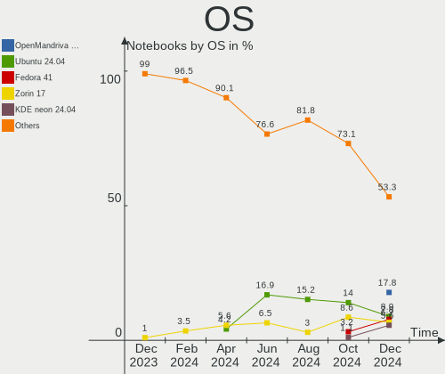
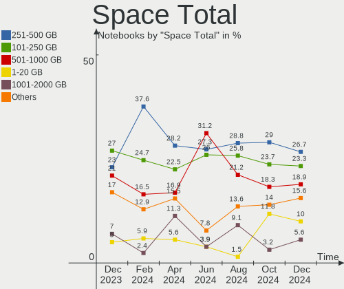
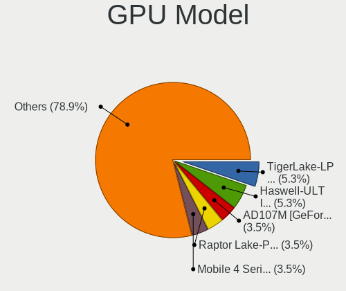
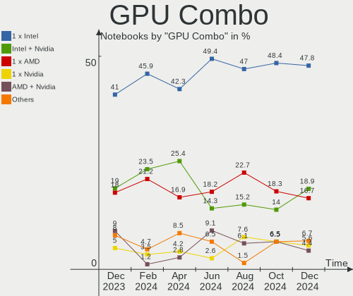
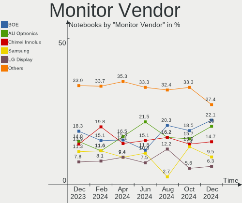
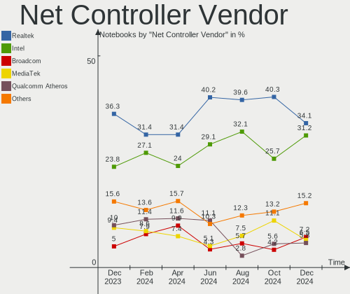
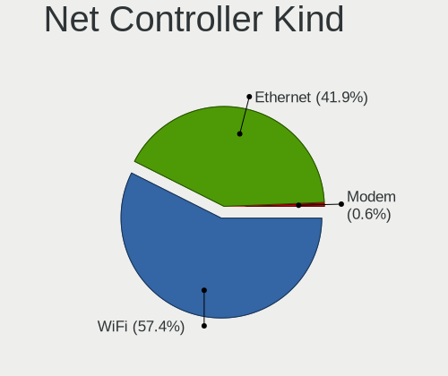

Linux in Spain - Hardware Trends (Notebooks)
--------------------------------------------

A project to identify most popular hardware characteristics and track their change
over time based on data collected by Linux users at https://Linux-Hardware.org.

Anyone can contribute to this report by the [hw-probe](https://github.com/linuxhw/hw-probe) tool:

    sudo -E hw-probe -all -upload

Period: May, 2023.

Contents
--------

* [ System ](#system)
  - [ OS                       ](#os)
  - [ OS Family                ](#os-family)
  - [ Kernel                   ](#kernel)
  - [ Kernel Family            ](#kernel-family)
  - [ Kernel Major Ver.        ](#kernel-major-ver)
  - [ Arch                     ](#arch)
  - [ DE                       ](#de)
  - [ Display Server           ](#display-server)
  - [ Display Manager          ](#display-manager)
  - [ OS Lang                  ](#os-lang)
  - [ Boot Mode                ](#boot-mode)
  - [ Filesystem               ](#filesystem)
  - [ Part. scheme             ](#part-scheme)
  - [ Dual Boot with Linux/BSD ](#dual-boot-with-linuxbsd)
  - [ Dual Boot (Win)          ](#dual-boot-win)

* [ Board ](#board)
  - [ Vendor                   ](#vendor)
  - [ Model                    ](#model)
  - [ Model Family             ](#model-family)
  - [ MFG Year                 ](#mfg-year)
  - [ Form Factor              ](#form-factor)
  - [ Secure Boot              ](#secure-boot)
  - [ Coreboot                 ](#coreboot)
  - [ RAM Size                 ](#ram-size)
  - [ RAM Used                 ](#ram-used)
  - [ Total Drives             ](#total-drives)
  - [ Has CD-ROM               ](#has-cd-rom)
  - [ Has Ethernet             ](#has-ethernet)
  - [ Has WiFi                 ](#has-wifi)
  - [ Has Bluetooth            ](#has-bluetooth)

* [ Location ](#location)
  - [ Country                  ](#country)
  - [ City                     ](#city)

* [ Drives ](#drives)
  - [ Drive Vendor             ](#drive-vendor)
  - [ Drive Model              ](#drive-model)
  - [ HDD Vendor               ](#hdd-vendor)
  - [ SSD Vendor               ](#ssd-vendor)
  - [ Drive Kind               ](#drive-kind)
  - [ Drive Connector          ](#drive-connector)
  - [ Drive Size               ](#drive-size)
  - [ Space Total              ](#space-total)
  - [ Space Used               ](#space-used)
  - [ Malfunc. Drives          ](#malfunc-drives)
  - [ Malfunc. Drive Vendor    ](#malfunc-drive-vendor)
  - [ Malfunc. HDD Vendor      ](#malfunc-hdd-vendor)
  - [ Malfunc. Drive Kind      ](#malfunc-drive-kind)
  - [ Failed Drives            ](#failed-drives)
  - [ Failed Drive Vendor      ](#failed-drive-vendor)
  - [ Drive Status             ](#drive-status)

* [ Storage controller ](#storage-controller)
  - [ Storage Vendor           ](#storage-vendor)
  - [ Storage Model            ](#storage-model)
  - [ Storage Kind             ](#storage-kind)

* [ Processor ](#processor)
  - [ CPU Vendor               ](#cpu-vendor)
  - [ CPU Model                ](#cpu-model)
  - [ CPU Model Family         ](#cpu-model-family)
  - [ CPU Cores                ](#cpu-cores)
  - [ CPU Sockets              ](#cpu-sockets)
  - [ CPU Threads              ](#cpu-threads)
  - [ CPU Op-Modes             ](#cpu-op-modes)
  - [ CPU Microcode            ](#cpu-microcode)
  - [ CPU Microarch            ](#cpu-microarch)

* [ Graphics ](#graphics)
  - [ GPU Vendor               ](#gpu-vendor)
  - [ GPU Model                ](#gpu-model)
  - [ GPU Combo                ](#gpu-combo)
  - [ GPU Driver               ](#gpu-driver)
  - [ GPU Memory               ](#gpu-memory)

* [ Monitor ](#monitor)
  - [ Monitor Vendor           ](#monitor-vendor)
  - [ Monitor Model            ](#monitor-model)
  - [ Monitor Resolution       ](#monitor-resolution)
  - [ Monitor Diagonal         ](#monitor-diagonal)
  - [ Monitor Width            ](#monitor-width)
  - [ Aspect Ratio             ](#aspect-ratio)
  - [ Monitor Area             ](#monitor-area)
  - [ Pixel Density            ](#pixel-density)
  - [ Multiple Monitors        ](#multiple-monitors)

* [ Network ](#network)
  - [ Net Controller Vendor    ](#net-controller-vendor)
  - [ Net Controller Model     ](#net-controller-model)
  - [ Wireless Vendor          ](#wireless-vendor)
  - [ Wireless Model           ](#wireless-model)
  - [ Ethernet Vendor          ](#ethernet-vendor)
  - [ Ethernet Model           ](#ethernet-model)
  - [ Net Controller Kind      ](#net-controller-kind)
  - [ Used Controller          ](#used-controller)
  - [ NICs                     ](#nics)
  - [ IPv6                     ](#ipv6)

* [ Bluetooth ](#bluetooth)
  - [ Bluetooth Vendor         ](#bluetooth-vendor)
  - [ Bluetooth Model          ](#bluetooth-model)

* [ Sound ](#sound)
  - [ Sound Vendor             ](#sound-vendor)
  - [ Sound Model              ](#sound-model)

* [ Memory ](#memory)
  - [ Memory Vendor            ](#memory-vendor)
  - [ Memory Model             ](#memory-model)
  - [ Memory Kind              ](#memory-kind)
  - [ Memory Form Factor       ](#memory-form-factor)
  - [ Memory Size              ](#memory-size)
  - [ Memory Speed             ](#memory-speed)

* [ Printers & scanners ](#printers--scanners)
  - [ Printer Vendor           ](#printer-vendor)
  - [ Printer Model            ](#printer-model)
  - [ Scanner Vendor           ](#scanner-vendor)
  - [ Scanner Model            ](#scanner-model)

* [ Camera ](#camera)
  - [ Camera Vendor            ](#camera-vendor)
  - [ Camera Model             ](#camera-model)

* [ Security ](#security)
  - [ Fingerprint Vendor       ](#fingerprint-vendor)
  - [ Fingerprint Model        ](#fingerprint-model)
  - [ Chipcard Vendor          ](#chipcard-vendor)
  - [ Chipcard Model           ](#chipcard-model)

* [ Unsupported ](#unsupported)
  - [ Unsupported Devices      ](#unsupported-devices)
  - [ Unsupported Device Types ](#unsupported-device-types)

System
------

OS
--

Installed operating systems

| Name                         | Notebooks | Percent |
|------------------------------|-----------|---------|
| Ubuntu 23.04                 | 8         | 10%     |
| Ubuntu 22.04                 | 6         | 7.5%    |
| Fedora 38                    | 6         | 7.5%    |
| Zorin 16                     | 5         | 6.25%   |
| OpenMandriva 23.03           | 5         | 6.25%   |
| Ubuntu 20.04                 | 4         | 5%      |
| Linux Mint 21.1              | 4         | 5%      |
| Debian 11                    | 4         | 5%      |
| Linux Mint 21                | 3         | 3.75%   |
| Kali 2023.2                  | 3         | 3.75%   |
| ArcoLinux Rolling            | 3         | 3.75%   |
| Pop!_OS 22.04                | 2         | 2.5%    |
| OpenMandriva 4.3             | 2         | 2.5%    |
| OpenMandriva 23.01           | 2         | 2.5%    |
| Kubuntu 20.04                | 2         | 2.5%    |
| Gentoo 2.13                  | 2         | 2.5%    |
| Fedora 37                    | 2         | 2.5%    |
| Zorin 15                     | 1         | 1.25%   |
| Xubuntu 20.04                | 1         | 1.25%   |
| SteamOS 3.4.8                | 1         | 1.25%   |
| SteamOS 3.4.6                | 1         | 1.25%   |
| ROSA 12.4                    | 1         | 1.25%   |
| Rocky Linux 8.7              | 1         | 1.25%   |
| Parrot 5.3                   | 1         | 1.25%   |
| openSUSE Tumbleweed-XXXXXXXX | 1         | 1.25%   |
| Nobara 37                    | 1         | 1.25%   |
| Manjaro 22.1.1               | 1         | 1.25%   |
| Manjaro                      | 1         | 1.25%   |
| Linux Mint 20.3              | 1         | 1.25%   |
| Kubuntu 22.04                | 1         | 1.25%   |
| Fedora 36                    | 1         | 1.25%   |
| EndeavourOS Rolling          | 1         | 1.25%   |
| Debian 12                    | 1         | 1.25%   |
| Arch Rolling                 | 1         | 1.25%   |

OS Family
---------

OS without a version

| Name         | Notebooks | Percent |
|--------------|-----------|---------|
| Ubuntu       | 18        | 22.5%   |
| OpenMandriva | 9         | 11.25%  |
| Fedora       | 9         | 11.25%  |
| Linux Mint   | 8         | 10%     |
| Zorin        | 6         | 7.5%    |
| Debian       | 5         | 6.25%   |
| Kubuntu      | 3         | 3.75%   |
| Kali         | 3         | 3.75%   |
| ArcoLinux    | 3         | 3.75%   |
| SteamOS      | 2         | 2.5%    |
| Pop!_OS      | 2         | 2.5%    |
| Manjaro      | 2         | 2.5%    |
| Gentoo       | 2         | 2.5%    |
| Xubuntu      | 1         | 1.25%   |
| ROSA         | 1         | 1.25%   |
| Rocky Linux  | 1         | 1.25%   |
| Parrot       | 1         | 1.25%   |
| openSUSE     | 1         | 1.25%   |
| Nobara       | 1         | 1.25%   |
| EndeavourOS  | 1         | 1.25%   |
| Arch         | 1         | 1.25%   |

Kernel
------

Version of the Linux kernel

| Version                           | Notebooks | Percent |
|-----------------------------------|-----------|---------|
| 6.2.0-20-generic                  | 8         | 10%     |
| 5.15.0-72-generic                 | 7         | 8.75%   |
| 5.15.0-71-generic                 | 7         | 8.75%   |
| 6.2.6-desktop-1omv2390            | 5         | 6.25%   |
| 5.4.0-148-generic                 | 4         | 5%      |
| 5.19.0-41-generic                 | 4         | 5%      |
| 6.2.15-300.fc38.x86_64            | 3         | 3.75%   |
| 6.1.0-kali9-amd64                 | 3         | 3.75%   |
| 6.2.6-76060206-generic            | 2         | 2.5%    |
| 6.2.14-300.fc38.x86_64            | 2         | 2.5%    |
| 5.16.7-desktop-1omv4003           | 2         | 2.5%    |
| 5.13.0-valve36-1-neptune          | 2         | 2.5%    |
| 6.3.4-arch1-1                     | 1         | 1.25%   |
| 6.3.3-arch1-1                     | 1         | 1.25%   |
| 6.3.1-zen1-1-zen                  | 1         | 1.25%   |
| 6.3.1-arch2-1                     | 1         | 1.25%   |
| 6.3.1-arch1-1                     | 1         | 1.25%   |
| 6.3.1-350.vanilla.fc38.x86_64     | 1         | 1.25%   |
| 6.3.1-2-default                   | 1         | 1.25%   |
| 6.3.0-gentoo                      | 1         | 1.25%   |
| 6.3.0-1-MANJARO                   | 1         | 1.25%   |
| 6.2.15-200.fc37.x86_64            | 1         | 1.25%   |
| 6.2.14-300.fsync.fc37.x86_64      | 1         | 1.25%   |
| 6.2.14-060214-generic             | 1         | 1.25%   |
| 6.2.12-200.fc37.x86_64            | 1         | 1.25%   |
| 6.2.10-1.el8.elrepo.x86_64        | 1         | 1.25%   |
| 6.1.28-gentoo                     | 1         | 1.25%   |
| 6.1.26-1-MANJARO                  | 1         | 1.25%   |
| 6.1.20-generic-2rosa2021.1-x86_64 | 1         | 1.25%   |
| 6.1.2-desktop-1omv2301            | 1         | 1.25%   |
| 6.1.1-desktop-1omv2290            | 1         | 1.25%   |
| 6.1.0-9-amd64                     | 1         | 1.25%   |
| 6.1.0-1parrot1-amd64              | 1         | 1.25%   |
| 6.1.0-1012-oem                    | 1         | 1.25%   |
| 6.0.0-6mx-amd64                   | 1         | 1.25%   |
| 5.19.0-42-generic                 | 1         | 1.25%   |
| 5.19.0-32-generic                 | 1         | 1.25%   |
| 5.17.5-300.fc36.x86_64            | 1         | 1.25%   |
| 5.16.0-5mx-amd64                  | 1         | 1.25%   |
| 5.15.0-70-generic                 | 1         | 1.25%   |

Kernel Family
-------------

Linux kernel without a distro release

| Version | Notebooks | Percent |
|---------|-----------|---------|
| 5.15.0  | 16        | 20%     |
| 6.2.0   | 8         | 10%     |
| 6.2.6   | 7         | 8.75%   |
| 6.1.0   | 6         | 7.5%    |
| 5.19.0  | 6         | 7.5%    |
| 6.3.1   | 5         | 6.25%   |
| 6.2.15  | 4         | 5%      |
| 6.2.14  | 4         | 5%      |
| 5.4.0   | 4         | 5%      |
| 6.3.0   | 2         | 2.5%    |
| 5.16.7  | 2         | 2.5%    |
| 5.13.0  | 2         | 2.5%    |
| 5.10.0  | 2         | 2.5%    |
| 6.3.4   | 1         | 1.25%   |
| 6.3.3   | 1         | 1.25%   |
| 6.2.12  | 1         | 1.25%   |
| 6.2.10  | 1         | 1.25%   |
| 6.1.28  | 1         | 1.25%   |
| 6.1.26  | 1         | 1.25%   |
| 6.1.20  | 1         | 1.25%   |
| 6.1.2   | 1         | 1.25%   |
| 6.1.1   | 1         | 1.25%   |
| 6.0.0   | 1         | 1.25%   |
| 5.17.5  | 1         | 1.25%   |
| 5.16.0  | 1         | 1.25%   |

Kernel Major Ver.
-----------------

Linux kernel major version

| Version | Notebooks | Percent |
|---------|-----------|---------|
| 6.2     | 25        | 31.25%  |
| 5.15    | 16        | 20%     |
| 6.1     | 11        | 13.75%  |
| 6.3     | 9         | 11.25%  |
| 5.19    | 6         | 7.5%    |
| 5.4     | 4         | 5%      |
| 5.16    | 3         | 3.75%   |
| 5.13    | 2         | 2.5%    |
| 5.10    | 2         | 2.5%    |
| 6.0     | 1         | 1.25%   |
| 5.17    | 1         | 1.25%   |

Arch
----

OS architecture (x86_64, i586, etc.)

| Name   | Notebooks | Percent |
|--------|-----------|---------|
| x86_64 | 80        | 100%    |

DE
--

Desktop Environment

| Name       | Notebooks | Percent |
|------------|-----------|---------|
| GNOME      | 38        | 47.5%   |
| KDE5       | 19        | 23.75%  |
| XFCE       | 7         | 8.75%   |
| X-Cinnamon | 7         | 8.75%   |
| MATE       | 2         | 2.5%    |
| Unknown    | 2         | 2.5%    |
| LXQt       | 1         | 1.25%   |
| LeftWM     | 1         | 1.25%   |
| i3         | 1         | 1.25%   |
| Hyprland   | 1         | 1.25%   |
| Cinnamon   | 1         | 1.25%   |

Display Server
--------------

X11 or Wayland

| Name    | Notebooks | Percent |
|---------|-----------|---------|
| X11     | 52        | 65%     |
| Wayland | 27        | 33.75%  |
| Unknown | 1         | 1.25%   |

Display Manager
---------------

SDDM, LightDM, etc.

| Name    | Notebooks | Percent |
|---------|-----------|---------|
| Unknown | 29        | 36.25%  |
| SDDM    | 17        | 21.25%  |
| GDM3    | 14        | 17.5%   |
| LightDM | 10        | 12.5%   |
| GDM     | 10        | 12.5%   |

OS Lang
-------

Language

| Lang    | Notebooks | Percent |
|---------|-----------|---------|
| es_ES   | 49        | 61.25%  |
| en_US   | 24        | 30%     |
| en_GB   | 2         | 2.5%    |
| Unknown | 2         | 2.5%    |
| ru_RU   | 1         | 1.25%   |
| de_DE   | 1         | 1.25%   |
| de_CH   | 1         | 1.25%   |

Boot Mode
---------

EFI or BIOS

| Mode | Notebooks | Percent |
|------|-----------|---------|
| EFI  | 47        | 58.75%  |
| BIOS | 33        | 41.25%  |

Filesystem
----------

Type of filesystem

| Type    | Notebooks | Percent |
|---------|-----------|---------|
| Ext4    | 51        | 63.75%  |
| Btrfs   | 15        | 18.75%  |
| Tmpfs   | 8         | 10%     |
| Overlay | 5         | 6.25%   |
| Xfs     | 1         | 1.25%   |

Part. scheme
------------

Scheme of partitioning

| Type    | Notebooks | Percent |
|---------|-----------|---------|
| GPT     | 46        | 57.5%   |
| Unknown | 27        | 33.75%  |
| MBR     | 7         | 8.75%   |

Dual Boot with Linux/BSD
------------------------

Hosting more than one Linux/BSD

| Dual boot | Notebooks | Percent |
|-----------|-----------|---------|
| No        | 66        | 82.5%   |
| Yes       | 14        | 17.5%   |

Dual Boot (Win)
---------------

Hosting Linux and Windows

| Dual boot | Notebooks | Percent |
|-----------|-----------|---------|
| No        | 56        | 70%     |
| Yes       | 24        | 30%     |

Board
-----

Vendor
------

Motherboard manufacturer

| Name                | Notebooks | Percent |
|---------------------|-----------|---------|
| Lenovo              | 18        | 22.5%   |
| Hewlett-Packard     | 15        | 18.75%  |
| ASUSTek Computer    | 12        | 15%     |
| Acer                | 10        | 12.5%   |
| MSI                 | 4         | 5%      |
| Toshiba             | 3         | 3.75%   |
| Apple               | 3         | 3.75%   |
| Valve               | 2         | 2.5%    |
| Notebook            | 2         | 2.5%    |
| Dell                | 2         | 2.5%    |
| Chuwi               | 2         | 2.5%    |
| TerraQue            | 1         | 1.25%   |
| Samsung Electronics | 1         | 1.25%   |
| Razer               | 1         | 1.25%   |
| Gigabyte Technology | 1         | 1.25%   |
| Framework           | 1         | 1.25%   |
| eMachines           | 1         | 1.25%   |
| AZW                 | 1         | 1.25%   |

Model
-----

Motherboard model

| Name                                  | Notebooks | Percent |
|---------------------------------------|-----------|---------|
| Valve Jupiter                         | 2         | 2.5%    |
| Notebook W54_55SU1,SUW                | 2         | 2.5%    |
| HP 255 G8 Notebook PC                 | 2         | 2.5%    |
| ASUS ROG Zephyrus G14 GA401II_GA401II | 2         | 2.5%    |
| Acer TravelMate 5720                  | 2         | 2.5%    |
| Toshiba TECRA M10                     | 1         | 1.25%   |
| Toshiba Satellite L755                | 1         | 1.25%   |
| Toshiba Satellite L50-B               | 1         | 1.25%   |
| TerraQue W65_W67RB                    | 1         | 1.25%   |
| Samsung X420/X520                     | 1         | 1.25%   |
| Razer Blade 14 (2022) - RZ09-0427     | 1         | 1.25%   |
| MSI Stealth 15M B12UE                 | 1         | 1.25%   |
| MSI Modern 14 B4MW                    | 1         | 1.25%   |
| MSI Modern 14 B10MW                   | 1         | 1.25%   |
| MSI Alpha 15 A3DDK                    | 1         | 1.25%   |
| Lenovo Y520-15IKBN 80WK               | 1         | 1.25%   |
| Lenovo V15-ADA 82C7                   | 1         | 1.25%   |
| Lenovo V15 G2 ALC 82KD                | 1         | 1.25%   |
| Lenovo V145-15AST 81MT                | 1         | 1.25%   |
| Lenovo ThinkPad T14s Gen 3 21BRCTO1WW | 1         | 1.25%   |
| Lenovo ThinkPad P1 Gen 4i 20Y4S1QE10  | 1         | 1.25%   |
| Lenovo ThinkPad L13 Gen 2 20VH001BSP  | 1         | 1.25%   |
| Lenovo ThinkPad Helix 36986DG         | 1         | 1.25%   |
| Lenovo ThinkPad E14 Gen 3 20Y7CTO1WW  | 1         | 1.25%   |
| Lenovo ThinkPad A275 20KCS0FT02       | 1         | 1.25%   |
| Lenovo ThinkBook 15-IIL 20SM          | 1         | 1.25%   |
| Lenovo Legion 5 15IMH05 82AU          | 1         | 1.25%   |
| Lenovo Legion 5 15ACH6H 82JU          | 1         | 1.25%   |
| Lenovo IdeaPad 330-15IKB 81DE         | 1         | 1.25%   |
| Lenovo IdeaPad 330-15ICH 81FK         | 1         | 1.25%   |
| Lenovo IdeaPad 3 15ITL6 82H8          | 1         | 1.25%   |
| Lenovo IdeaPad 110-15ISK 80UD         | 1         | 1.25%   |
| Lenovo G580 2189                      | 1         | 1.25%   |
| HP Victus by Laptop 16-e0xxx          | 1         | 1.25%   |
| HP Presario CQ61                      | 1         | 1.25%   |
| HP Pavilion Sleekbook 15              | 1         | 1.25%   |
| HP OMEN Laptop 15-en0xxx              | 1         | 1.25%   |
| HP OMEN by Laptop 15-ce0xx            | 1         | 1.25%   |
| HP Laptop 15s-fq4xxx                  | 1         | 1.25%   |
| HP Laptop 15-db0xxx                   | 1         | 1.25%   |

Model Family
------------

Motherboard model prefix

| Name               | Notebooks | Percent |
|--------------------|-----------|---------|
| Lenovo ThinkPad    | 6         | 7.5%    |
| Lenovo IdeaPad     | 4         | 5%      |
| ASUS VivoBook      | 4         | 5%      |
| Acer Aspire        | 4         | 5%      |
| HP Laptop          | 3         | 3.75%   |
| ASUS ROG           | 3         | 3.75%   |
| Acer TravelMate    | 3         | 3.75%   |
| Valve Jupiter      | 2         | 2.5%    |
| Toshiba Satellite  | 2         | 2.5%    |
| Notebook W54       | 2         | 2.5%    |
| MSI Modern         | 2         | 2.5%    |
| Lenovo Legion      | 2         | 2.5%    |
| HP OMEN            | 2         | 2.5%    |
| HP 255             | 2         | 2.5%    |
| Acer Nitro         | 2         | 2.5%    |
| Toshiba TECRA      | 1         | 1.25%   |
| TerraQue W65       | 1         | 1.25%   |
| Samsung X420       | 1         | 1.25%   |
| Razer Blade        | 1         | 1.25%   |
| MSI Stealth        | 1         | 1.25%   |
| MSI Alpha          | 1         | 1.25%   |
| Lenovo Y520-15IKBN | 1         | 1.25%   |
| Lenovo V15-ADA     | 1         | 1.25%   |
| Lenovo V15         | 1         | 1.25%   |
| Lenovo V145-15AST  | 1         | 1.25%   |
| Lenovo ThinkBook   | 1         | 1.25%   |
| Lenovo G580        | 1         | 1.25%   |
| HP Victus          | 1         | 1.25%   |
| HP Presario        | 1         | 1.25%   |
| HP Pavilion        | 1         | 1.25%   |
| HP Compaq          | 1         | 1.25%   |
| HP 630             | 1         | 1.25%   |
| HP 350             | 1         | 1.25%   |
| HP 250             | 1         | 1.25%   |
| HP 240             | 1         | 1.25%   |
| Gigabyte G5        | 1         | 1.25%   |
| Framework Laptop   | 1         | 1.25%   |
| eMachines eME728   | 1         | 1.25%   |
| Dell XPS           | 1         | 1.25%   |
| Dell Inspiron      | 1         | 1.25%   |

MFG Year
--------

Motherboard manufacture year

| Year | Notebooks | Percent |
|------|-----------|---------|
| 2020 | 12        | 15%     |
| 2022 | 10        | 12.5%   |
| 2021 | 10        | 12.5%   |
| 2018 | 8         | 10%     |
| 2017 | 8         | 10%     |
| 2019 | 5         | 6.25%   |
| 2014 | 4         | 5%      |
| 2011 | 4         | 5%      |
| 2009 | 4         | 5%      |
| 2016 | 3         | 3.75%   |
| 2013 | 3         | 3.75%   |
| 2012 | 2         | 2.5%    |
| 2010 | 2         | 2.5%    |
| 2007 | 2         | 2.5%    |
| 2023 | 1         | 1.25%   |
| 2015 | 1         | 1.25%   |
| 2008 | 1         | 1.25%   |

Form Factor
-----------

Physical design of the computer

| Name     | Notebooks | Percent |
|----------|-----------|---------|
| Notebook | 80        | 100%    |

Secure Boot
-----------

Enabled or disabled

| State    | Notebooks | Percent |
|----------|-----------|---------|
| Disabled | 75        | 93.75%  |
| Enabled  | 5         | 6.25%   |

Coreboot
--------

Have coreboot on board

| Used | Notebooks | Percent |
|------|-----------|---------|
| No   | 80        | 100%    |

RAM Size
--------

Total RAM memory

| Size in GB  | Notebooks | Percent |
|-------------|-----------|---------|
| 4.01-8.0    | 21        | 26.25%  |
| 8.01-16.0   | 19        | 23.75%  |
| 16.01-24.0  | 14        | 17.5%   |
| 3.01-4.0    | 13        | 16.25%  |
| 32.01-64.0  | 7         | 8.75%   |
| 24.01-32.0  | 2         | 2.5%    |
| 1.01-2.0    | 2         | 2.5%    |
| 2.01-3.0    | 1         | 1.25%   |
| 64.01-256.0 | 1         | 1.25%   |

RAM Used
--------

Used RAM memory

| Used GB    | Notebooks | Percent |
|------------|-----------|---------|
| 2.01-3.0   | 18        | 22.5%   |
| 1.01-2.0   | 18        | 22.5%   |
| 3.01-4.0   | 17        | 21.25%  |
| 4.01-8.0   | 16        | 20%     |
| 0.51-1.0   | 6         | 7.5%    |
| 8.01-16.0  | 3         | 3.75%   |
| 16.01-24.0 | 1         | 1.25%   |
| 0.01-0.5   | 1         | 1.25%   |

Total Drives
------------

Number of drives on board

| Drives | Notebooks | Percent |
|--------|-----------|---------|
| 1      | 52        | 65%     |
| 2      | 23        | 28.75%  |
| 3      | 3         | 3.75%   |
| 5      | 1         | 1.25%   |
| 4      | 1         | 1.25%   |

Has CD-ROM
----------

Has CD-ROM on board

| Presented | Notebooks | Percent |
|-----------|-----------|---------|
| No        | 62        | 77.5%   |
| Yes       | 18        | 22.5%   |

Has Ethernet
------------

Has Ethernet on board

| Presented | Notebooks | Percent |
|-----------|-----------|---------|
| Yes       | 63        | 78.75%  |
| No        | 17        | 21.25%  |

Has WiFi
--------

Has WiFi module

| Presented | Notebooks | Percent |
|-----------|-----------|---------|
| Yes       | 80        | 100%    |

Has Bluetooth
-------------

Has Bluetooth module

| Presented | Notebooks | Percent |
|-----------|-----------|---------|
| Yes       | 67        | 83.75%  |
| No        | 13        | 16.25%  |

Location
--------

Country
-------

Geographic location (country)

| Country | Notebooks | Percent |
|---------|-----------|---------|
| Spain   | 80        | 100%    |

City
----

Geographic location (city)

| City                       | Notebooks | Percent |
|----------------------------|-----------|---------|
| Madrid                     | 15        | 18.75%  |
| Barcelona                  | 13        | 16.25%  |
| Valencia                   | 7         | 8.75%   |
| Zaragoza                   | 3         | 3.75%   |
| Girona                     | 3         | 3.75%   |
| Zafra                      | 1         | 1.25%   |
| Xàtiva                    | 1         | 1.25%   |
| Villanueva del Trabuco     | 1         | 1.25%   |
| Vigo                       | 1         | 1.25%   |
| Torrelavega                | 1         | 1.25%   |
| Santiago de Compostela     | 1         | 1.25%   |
| Santa Pola                 | 1         | 1.25%   |
| San Vicent del Raspeig     | 1         | 1.25%   |
| Puerto del Rosario         | 1         | 1.25%   |
| Port de Sagunt             | 1         | 1.25%   |
| Pereiro de Aguiar          | 1         | 1.25%   |
| Paiporta                   | 1         | 1.25%   |
| Ourense                    | 1         | 1.25%   |
| Ocana                      | 1         | 1.25%   |
| Navalagamella              | 1         | 1.25%   |
| Murcia                     | 1         | 1.25%   |
| Montijo                    | 1         | 1.25%   |
| Mislata                    | 1         | 1.25%   |
| Meis                       | 1         | 1.25%   |
| Mataró                    | 1         | 1.25%   |
| Mairena del Alcor          | 1         | 1.25%   |
| Lleida                     | 1         | 1.25%   |
| Las Rozas de Madrid        | 1         | 1.25%   |
| Las Palmas de Gran Canaria | 1         | 1.25%   |
| Laguna de Duero            | 1         | 1.25%   |
| La Albuera                 | 1         | 1.25%   |
| Inca                       | 1         | 1.25%   |
| Gijón                     | 1         | 1.25%   |
| Gibraleón                 | 1         | 1.25%   |
| Gava                       | 1         | 1.25%   |
| Catarroja                  | 1         | 1.25%   |
| Castelló de la Plana      | 1         | 1.25%   |
| Castalla                   | 1         | 1.25%   |
| Bilbao                     | 1         | 1.25%   |
| Arteixo                    | 1         | 1.25%   |

Drives
------

Drive Vendor
------------

Hard drive vendors

| Vendor                      | Notebooks | Drives | Percent |
|-----------------------------|-----------|--------|---------|
| Samsung Electronics         | 14        | 14     | 12.73%  |
| Seagate                     | 13        | 13     | 11.82%  |
| SanDisk                     | 13        | 13     | 11.82%  |
| Toshiba                     | 10        | 10     | 9.09%   |
| SK hynix                    | 7         | 7      | 6.36%   |
| Kingston                    | 7         | 7      | 6.36%   |
| Micron Technology           | 6         | 6      | 5.45%   |
| WDC                         | 5         | 5      | 4.55%   |
| Intel                       | 5         | 6      | 4.55%   |
| Hitachi                     | 4         | 4      | 3.64%   |
| Unknown                     | 3         | 3      | 2.73%   |
| Phison Electronics          | 3         | 3      | 2.73%   |
| Crucial                     | 3         | 3      | 2.73%   |
| Kingston Technology Company | 2         | 2      | 1.82%   |
| China                       | 2         | 3      | 1.82%   |
| Apple                       | 2         | 2      | 1.82%   |
| TCSUNBOW                    | 1         | 1      | 0.91%   |
| SSK                         | 1         | 1      | 0.91%   |
| Silicon Motion              | 1         | 1      | 0.91%   |
| Netac                       | 1         | 1      | 0.91%   |
| Micron/Crucial Technology   | 1         | 1      | 0.91%   |
| KIOXIA                      | 1         | 1      | 0.91%   |
| Inateck                     | 1         | 1      | 0.91%   |
| HGST                        | 1         | 1      | 0.91%   |
| BAITITON                    | 1         | 1      | 0.91%   |
| Apacer                      | 1         | 1      | 0.91%   |
| A-DATA Technology           | 1         | 1      | 0.91%   |

Drive Model
-----------

Hard drive models

| Model                                               | Notebooks | Percent |
|-----------------------------------------------------|-----------|---------|
| Seagate ST1000LM035-1RK172 1TB                      | 4         | 3.57%   |
| Sandisk WD Black SN750 / PC SN730 NVMe SSD 256GB    | 4         | 3.57%   |
| Sandisk WD Blue SN550 NVMe SSD 512GB                | 3         | 2.68%   |
| Toshiba TR200 240GB SSD                             | 2         | 1.79%   |
| Toshiba MQ01ABD100 1TB                              | 2         | 1.79%   |
| Samsung NVMe SSD Controller SM981/PM981/PM983 256GB | 2         | 1.79%   |
| Samsung NVMe SSD Controller PM9A1/PM9A3/980PRO 1TB  | 2         | 1.79%   |
| Samsung MZ7LN256HAJQ-000L2 256GB SSD                | 2         | 1.79%   |
| Phison E16 PCIe4 NVMe Controller 1TB                | 2         | 1.79%   |
| Kingston SA400S37480G 480GB SSD                     | 2         | 1.79%   |
| Kingston SA400S37240G 240GB SSD                     | 2         | 1.79%   |
| WDC WD3200BEVT-22ZCT0 320GB                         | 1         | 0.89%   |
| WDC WD10SPZX-75Z10T3 1TB                            | 1         | 0.89%   |
| WDC WD10SPZX-24Z10 1TB                              | 1         | 0.89%   |
| WDC WD10JPCX-24UE4T0 1TB                            | 1         | 0.89%   |
| WDC PC SN530 SDBPNPZ-512G-1114 512GB                | 1         | 0.89%   |
| Unknown SD/MMC/MS PRO 64GB                          | 1         | 0.89%   |
| Unknown MMC Card  512GB                             | 1         | 0.89%   |
| Unknown MMC Card  2GB                               | 1         | 0.89%   |
| Toshiba MQ04ABF100 1TB                              | 1         | 0.89%   |
| Toshiba MQ01ABF050 500GB                            | 1         | 0.89%   |
| Toshiba MQ01ABD100V 1TB                             | 1         | 0.89%   |
| Toshiba MK5065GSXN 500GB                            | 1         | 0.89%   |
| Toshiba KXG6AZNV512G 512GB                          | 1         | 0.89%   |
| Toshiba HDWJ110 1TB                                 | 1         | 0.89%   |
| TCSUNBOW X3 480G SSD                                | 1         | 0.89%   |
| SSK Disk 256GB                                      | 1         | 0.89%   |
| SK hynix SKHynix_HFM512GDHTNI-87A0B 512GB           | 1         | 0.89%   |
| SK hynix SKHynix_HFM512GD3HX015N 512GB              | 1         | 0.89%   |
| SK hynix SKHynix_HFM256GDHTNI-87A0B 256GB           | 1         | 0.89%   |
| SK hynix SC311 SATA 256GB SSD                       | 1         | 0.89%   |
| SK hynix PC401 NVMe 512GB                           | 1         | 0.89%   |
| SK hynix HFM512GD3JX013N 512GB                      | 1         | 0.89%   |
| SK hynix HFM256GDJTNG-8310A 256GB                   | 1         | 0.89%   |
| Silicon Motion SM2263EN/SM2263XT SSD Controller 1TB | 1         | 0.89%   |
| Seagate ST9500420AS 500GB                           | 1         | 0.89%   |
| Seagate ST9250315AS 250GB                           | 1         | 0.89%   |
| Seagate ST500LT012-1DG142 500GB                     | 1         | 0.89%   |
| Seagate ST2000LM007-1R8174 2TB                      | 1         | 0.89%   |
| Seagate ST1000LM024 HN-M101MBB 1TB                  | 1         | 0.89%   |

HDD Vendor
----------

Hard disk drive vendors

| Vendor  | Notebooks | Drives | Percent |
|---------|-----------|--------|---------|
| Seagate | 13        | 13     | 40.63%  |
| Toshiba | 7         | 7      | 21.88%  |
| WDC     | 4         | 4      | 12.5%   |
| Hitachi | 4         | 4      | 12.5%   |
| Unknown | 1         | 1      | 3.13%   |
| SSK     | 1         | 1      | 3.13%   |
| Inateck | 1         | 1      | 3.13%   |
| HGST    | 1         | 1      | 3.13%   |

SSD Vendor
----------

Solid state drive vendors

| Vendor              | Notebooks | Drives | Percent |
|---------------------|-----------|--------|---------|
| Kingston            | 6         | 6      | 20.69%  |
| Samsung Electronics | 4         | 4      | 13.79%  |
| SanDisk             | 3         | 3      | 10.34%  |
| Crucial             | 3         | 3      | 10.34%  |
| Toshiba             | 2         | 2      | 6.9%    |
| China               | 2         | 3      | 6.9%    |
| Apple               | 2         | 2      | 6.9%    |
| TCSUNBOW            | 1         | 1      | 3.45%   |
| SK hynix            | 1         | 1      | 3.45%   |
| Netac               | 1         | 1      | 3.45%   |
| Micron Technology   | 1         | 1      | 3.45%   |
| Intel               | 1         | 1      | 3.45%   |
| BAITITON            | 1         | 1      | 3.45%   |
| A-DATA Technology   | 1         | 1      | 3.45%   |

Drive Kind
----------

HDD or SSD

| Kind | Notebooks | Drives | Percent |
|------|-----------|--------|---------|
| NVMe | 41        | 48     | 40.59%  |
| SSD  | 29        | 30     | 28.71%  |
| HDD  | 29        | 32     | 28.71%  |
| MMC  | 2         | 2      | 1.98%   |

Drive Connector
---------------

SATA, SAS, NVMe, etc.

| Type | Notebooks | Drives | Percent |
|------|-----------|--------|---------|
| SATA | 46        | 52     | 47.92%  |
| NVMe | 41        | 48     | 42.71%  |
| SAS  | 7         | 10     | 7.29%   |
| MMC  | 2         | 2      | 2.08%   |

Drive Size
----------

Size of hard drive

| Size in TB | Notebooks | Drives | Percent |
|------------|-----------|--------|---------|
| 0.01-0.5   | 38        | 40     | 63.33%  |
| 0.51-1.0   | 20        | 20     | 33.33%  |
| 1.01-2.0   | 1         | 1      | 1.67%   |
| 4.01-10.0  | 1         | 1      | 1.67%   |

Space Total
-----------

Amount of disk space available on the file system

| Size in GB     | Notebooks | Percent |
|----------------|-----------|---------|
| 101-250        | 23        | 28.75%  |
| 251-500        | 17        | 21.25%  |
| 501-1000       | 12        | 15%     |
| 1001-2000      | 8         | 10%     |
| 1-20           | 5         | 6.25%   |
| 51-100         | 5         | 6.25%   |
| 21-50          | 4         | 5%      |
| More than 3000 | 3         | 3.75%   |
| Unknown        | 2         | 2.5%    |
| 2001-3000      | 1         | 1.25%   |

Space Used
----------

Amount of used disk space

| Used GB        | Notebooks | Percent |
|----------------|-----------|---------|
| 1-20           | 27        | 33.75%  |
| 21-50          | 18        | 22.5%   |
| 101-250        | 13        | 16.25%  |
| 51-100         | 8         | 10%     |
| 251-500        | 6         | 7.5%    |
| 501-1000       | 3         | 3.75%   |
| Unknown        | 2         | 2.5%    |
| More than 3000 | 1         | 1.25%   |
| 2001-3000      | 1         | 1.25%   |
| 1001-2000      | 1         | 1.25%   |

Malfunc. Drives
---------------

Drive models with a malfunction

| Model                           | Notebooks | Drives | Percent |
|---------------------------------|-----------|--------|---------|
| Toshiba MK5065GSXN 500GB        | 1         | 1      | 16.67%  |
| Kingston SA400S37480G 480GB SSD | 1         | 1      | 16.67%  |
| Hitachi HTS545050A7E380 500GB   | 1         | 1      | 16.67%  |
| Hitachi HTS543232L9A300 320GB   | 1         | 1      | 16.67%  |
| China SSD 128GB                 | 1         | 1      | 16.67%  |
| China G521N256GB SSD            | 1         | 1      | 16.67%  |

Malfunc. Drive Vendor
---------------------

Vendors of faulty drives

| Vendor   | Notebooks | Drives | Percent |
|----------|-----------|--------|---------|
| Hitachi  | 2         | 2      | 33.33%  |
| China    | 2         | 2      | 33.33%  |
| Toshiba  | 1         | 1      | 16.67%  |
| Kingston | 1         | 1      | 16.67%  |

Malfunc. HDD Vendor
-------------------

Vendors of faulty HDD drives

| Vendor  | Notebooks | Drives | Percent |
|---------|-----------|--------|---------|
| Hitachi | 2         | 2      | 66.67%  |
| Toshiba | 1         | 1      | 33.33%  |

Malfunc. Drive Kind
-------------------

Kinds of faulty drives

| Kind | Notebooks | Drives | Percent |
|------|-----------|--------|---------|
| SSD  | 3         | 3      | 50%     |
| HDD  | 3         | 3      | 50%     |

Failed Drives
-------------

Failed drive models

Zero info for selected period =(

Failed Drive Vendor
-------------------

Failed drive vendors

Zero info for selected period =(

Drive Status
------------

Number of failed and malfunc. drives

| Status   | Notebooks | Drives | Percent |
|----------|-----------|--------|---------|
| Detected | 43        | 63     | 49.43%  |
| Works    | 38        | 43     | 43.68%  |
| Malfunc  | 6         | 6      | 6.9%    |

Storage controller
------------------

Storage Vendor
--------------

Storage controller vendors

| Vendor                       | Notebooks | Percent |
|------------------------------|-----------|---------|
| Intel                        | 48        | 44.04%  |
| AMD                          | 15        | 13.76%  |
| Samsung Electronics          | 12        | 11.01%  |
| SanDisk                      | 11        | 10.09%  |
| SK hynix                     | 6         | 5.5%    |
| Micron Technology            | 5         | 4.59%   |
| Phison Electronics           | 4         | 3.67%   |
| Kingston Technology Company  | 3         | 2.75%   |
| Toshiba America Info Systems | 1         | 0.92%   |
| Silicon Motion               | 1         | 0.92%   |
| Micron/Crucial Technology    | 1         | 0.92%   |
| KIOXIA                       | 1         | 0.92%   |
| ASMedia Technology           | 1         | 0.92%   |

Storage Model
-------------

Storage controller models

| Model                                                                          | Notebooks | Percent |
|--------------------------------------------------------------------------------|-----------|---------|
| AMD FCH SATA Controller [AHCI mode]                                            | 13        | 11.21%  |
| Micron NVMe Storage Controller                                                 | 5         | 4.31%   |
| Intel Volume Management Device NVMe RAID Controller                            | 5         | 4.31%   |
| Intel Sunrise Point-LP SATA Controller [AHCI mode]                             | 5         | 4.31%   |
| Intel 82801IBM/IEM (ICH9M/ICH9M-E) 4 port SATA Controller [AHCI mode]          | 5         | 4.31%   |
| SanDisk WD Blue SN550 NVMe SSD                                                 | 4         | 3.45%   |
| SanDisk WD Black SN750 / PC SN730 NVMe SSD                                     | 4         | 3.45%   |
| Samsung NVMe SSD Controller 980                                                | 4         | 3.45%   |
| Samsung NVMe SSD Controller PM9A1/PM9A3/980PRO                                 | 3         | 2.59%   |
| Intel HM170/QM170 Chipset SATA Controller [AHCI Mode]                          | 3         | 2.59%   |
| Intel Cannon Lake Mobile PCH SATA AHCI Controller                              | 3         | 2.59%   |
| Intel 82801 Mobile SATA Controller [RAID mode]                                 | 3         | 2.59%   |
| Intel 7 Series Chipset Family 6-port SATA Controller [AHCI mode]               | 3         | 2.59%   |
| SK hynix Gold P31/PC711 NVMe Solid State Drive                                 | 2         | 1.72%   |
| SK hynix BC511                                                                 | 2         | 1.72%   |
| Samsung NVMe SSD Controller SM981/PM981/PM983                                  | 2         | 1.72%   |
| Samsung Electronics SATA controller                                            | 2         | 1.72%   |
| Phison E16 PCIe4 NVMe Controller                                               | 2         | 1.72%   |
| Intel Tiger Lake-LP SATA Controller                                            | 2         | 1.72%   |
| Intel Non-Volatile memory controller                                           | 2         | 1.72%   |
| Intel Celeron/Pentium Silver Processor SATA Controller                         | 2         | 1.72%   |
| Intel 82801HM/HEM (ICH8M/ICH8M-E) SATA Controller [IDE mode]                   | 2         | 1.72%   |
| Intel 82801HM/HEM (ICH8M/ICH8M-E) IDE Controller                               | 2         | 1.72%   |
| Intel 8 Series/C220 Series Chipset Family 6-port SATA Controller 1 [AHCI mode] | 2         | 1.72%   |
| Intel 8 Series SATA Controller 1 [AHCI mode]                                   | 2         | 1.72%   |
| Intel 6 Series/C200 Series Chipset Family 6 port Mobile SATA AHCI Controller   | 2         | 1.72%   |
| Intel 400 Series Chipset Family SATA AHCI Controller                           | 2         | 1.72%   |
| AMD SB7x0/SB8x0/SB9x0 SATA Controller [AHCI mode]                              | 2         | 1.72%   |
| Toshiba America Info Systems XG6 NVMe SSD Controller                           | 1         | 0.86%   |
| SK hynix PC401 NVMe Solid State Drive 256GB                                    | 1         | 0.86%   |
| SK hynix BC501 NVMe Solid State Drive                                          | 1         | 0.86%   |
| Silicon Motion SM2263EN/SM2263XT SSD Controller                                | 1         | 0.86%   |
| SanDisk WD Blue SN570 NVMe SSD 1TB                                             | 1         | 0.86%   |
| SanDisk WD Blue SN500 / PC SN520 NVMe SSD                                      | 1         | 0.86%   |
| SanDisk NVMe Controller                                                        | 1         | 0.86%   |
| Samsung NVMe SSD Controller PM9B1                                              | 1         | 0.86%   |
| Phison PS5013 E13 NVMe Controller                                              | 1         | 0.86%   |
| Phison E12 NVMe Controller                                                     | 1         | 0.86%   |
| Micron/Crucial P2 NVMe PCIe SSD                                                | 1         | 0.86%   |
| KIOXIA NVMe SSD Controller BG4                                                 | 1         | 0.86%   |

Storage Kind
------------

Kind of storage controller (IDE, SATA, NVMe, SAS, ...)

| Kind | Notebooks | Percent |
|------|-----------|---------|
| SATA | 56        | 52.34%  |
| NVMe | 41        | 38.32%  |
| RAID | 8         | 7.48%   |
| IDE  | 2         | 1.87%   |

Processor
---------

CPU Vendor
----------

Processor vendors

| Vendor | Notebooks | Percent |
|--------|-----------|---------|
| Intel  | 56        | 70%     |
| AMD    | 24        | 30%     |

CPU Model
---------

Processor models

| Model                                       | Notebooks | Percent |
|---------------------------------------------|-----------|---------|
| Intel Pentium Dual-Core CPU T4300 @ 2.10GHz | 2         | 2.5%    |
| Intel Core i7-8750H CPU @ 2.20GHz           | 2         | 2.5%    |
| Intel Core i7-8550U CPU @ 1.80GHz           | 2         | 2.5%    |
| Intel Core i7-7700HQ CPU @ 2.80GHz          | 2         | 2.5%    |
| Intel Core i7-10750H CPU @ 2.60GHz          | 2         | 2.5%    |
| Intel Core i5-7200U CPU @ 2.50GHz           | 2         | 2.5%    |
| Intel Core i5-3337U CPU @ 1.80GHz           | 2         | 2.5%    |
| Intel Core 2 Duo CPU T5670 @ 1.80GHz        | 2         | 2.5%    |
| Intel 12th Gen Core i7-1260P                | 2         | 2.5%    |
| Intel 11th Gen Core i7-1165G7 @ 2.80GHz     | 2         | 2.5%    |
| Intel 11th Gen Core i5-1135G7 @ 2.40GHz     | 2         | 2.5%    |
| AMD Ryzen 7 4800HS with Radeon Graphics     | 2         | 2.5%    |
| AMD Ryzen 5 5600H with Radeon Graphics      | 2         | 2.5%    |
| AMD Custom APU 0405                         | 2         | 2.5%    |
| Intel Pentium Dual-Core CPU T4500 @ 2.30GHz | 1         | 1.25%   |
| Intel Pentium CPU N3540 @ 2.16GHz           | 1         | 1.25%   |
| Intel Genuine CPU U4100 @ 1.30GHz           | 1         | 1.25%   |
| Intel Core i7-9750H CPU @ 2.60GHz           | 1         | 1.25%   |
| Intel Core i7-7500U CPU @ 2.70GHz           | 1         | 1.25%   |
| Intel Core i7-6700HQ CPU @ 2.60GHz          | 1         | 1.25%   |
| Intel Core i7-4870HQ CPU @ 2.50GHz          | 1         | 1.25%   |
| Intel Core i7-4712MQ CPU @ 2.30GHz          | 1         | 1.25%   |
| Intel Core i7-3520M CPU @ 2.90GHz           | 1         | 1.25%   |
| Intel Core i7-10875H CPU @ 2.30GHz          | 1         | 1.25%   |
| Intel Core i7-1065G7 CPU @ 1.30GHz          | 1         | 1.25%   |
| Intel Core i7-10510U CPU @ 1.80GHz          | 1         | 1.25%   |
| Intel Core i5-7300HQ CPU @ 2.50GHz          | 1         | 1.25%   |
| Intel Core i5-5350U CPU @ 1.80GHz           | 1         | 1.25%   |
| Intel Core i5-2435M CPU @ 2.40GHz           | 1         | 1.25%   |
| Intel Core i5-2410M CPU @ 2.30GHz           | 1         | 1.25%   |
| Intel Core i3-8145U CPU @ 2.10GHz           | 1         | 1.25%   |
| Intel Core i3-6006U CPU @ 2.00GHz           | 1         | 1.25%   |
| Intel Core i3-4100M CPU @ 2.50GHz           | 1         | 1.25%   |
| Intel Core i3-4030U CPU @ 1.90GHz           | 1         | 1.25%   |
| Intel Core i3-4005U CPU @ 1.70GHz           | 1         | 1.25%   |
| Intel Core i3-3217U CPU @ 1.80GHz           | 1         | 1.25%   |
| Intel Core i3 CPU M 370 @ 2.40GHz           | 1         | 1.25%   |
| Intel Core 2 Duo CPU P8600 @ 2.40GHz        | 1         | 1.25%   |
| Intel Celeron N5100 @ 1.10GHz               | 1         | 1.25%   |
| Intel Celeron N4020 CPU @ 1.10GHz           | 1         | 1.25%   |

CPU Model Family
----------------

Processor model prefix

| Model                   | Notebooks | Percent |
|-------------------------|-----------|---------|
| Other                   | 17        | 21.25%  |
| Intel Core i7           | 17        | 21.25%  |
| Intel Core i5           | 8         | 10%     |
| Intel Core i3           | 7         | 8.75%   |
| AMD Ryzen 7             | 7         | 8.75%   |
| AMD Ryzen 5             | 5         | 6.25%   |
| Intel Pentium Dual-Core | 3         | 3.75%   |
| Intel Core 2 Duo        | 3         | 3.75%   |
| Intel Celeron           | 3         | 3.75%   |
| Intel Pentium           | 1         | 1.25%   |
| Intel Genuine           | 1         | 1.25%   |
| Intel Atom              | 1         | 1.25%   |
| AMD Sempron             | 1         | 1.25%   |
| AMD Ryzen 9             | 1         | 1.25%   |
| AMD Ryzen 7 PRO         | 1         | 1.25%   |
| AMD Ryzen 3             | 1         | 1.25%   |
| AMD E                   | 1         | 1.25%   |
| AMD A6                  | 1         | 1.25%   |
| AMD A4                  | 1         | 1.25%   |

CPU Cores
---------

Number of processor cores

| Number | Notebooks | Percent |
|--------|-----------|---------|
| 2      | 32        | 40%     |
| 4      | 22        | 27.5%   |
| 8      | 10        | 12.5%   |
| 6      | 9         | 11.25%  |
| 12     | 2         | 2.5%    |
| 10     | 2         | 2.5%    |
| 1      | 2         | 2.5%    |
| 14     | 1         | 1.25%   |

CPU Sockets
-----------

Number of sockets

| Number | Notebooks | Percent |
|--------|-----------|---------|
| 1      | 80        | 100%    |

CPU Threads
-----------

Threads per core (Hyper-Threading)

| Number | Notebooks | Percent |
|--------|-----------|---------|
| 2      | 59        | 73.75%  |
| 1      | 21        | 26.25%  |

CPU Op-Modes
------------

CPU Operation Modes (32-bit, 64-bit)

| Op mode        | Notebooks | Percent |
|----------------|-----------|---------|
| 32-bit, 64-bit | 80        | 100%    |

CPU Microcode
-------------

Microcode number

| Number     | Notebooks | Percent |
|------------|-----------|---------|
| Unknown    | 34        | 42.5%   |
| 0x1067a    | 4         | 5%      |
| 0x306a9    | 3         | 3.75%   |
| 0x0a50000c | 3         | 3.75%   |
| 0x08600104 | 3         | 3.75%   |
| 0x06006705 | 3         | 3.75%   |
| 0x906e9    | 2         | 2.5%    |
| 0x806e9    | 2         | 2.5%    |
| 0x806c1    | 2         | 2.5%    |
| 0x6fd      | 2         | 2.5%    |
| 0x306c3    | 2         | 2.5%    |
| 0x08108109 | 2         | 2.5%    |
| 0x906c0    | 1         | 1.25%   |
| 0x906a4    | 1         | 1.25%   |
| 0x906a3    | 1         | 1.25%   |
| 0x806ec    | 1         | 1.25%   |
| 0x806ea    | 1         | 1.25%   |
| 0x706a8    | 1         | 1.25%   |
| 0x706a1    | 1         | 1.25%   |
| 0x506e3    | 1         | 1.25%   |
| 0x406e3    | 1         | 1.25%   |
| 0x40651    | 1         | 1.25%   |
| 0x306d4    | 1         | 1.25%   |
| 0x30678    | 1         | 1.25%   |
| 0x106ca    | 1         | 1.25%   |
| 0x0a404102 | 1         | 1.25%   |
| 0x08608103 | 1         | 1.25%   |
| 0x08600106 | 1         | 1.25%   |
| 0x08200103 | 1         | 1.25%   |
| 0x0600611a | 1         | 1.25%   |

CPU Microarch
-------------

Microarchitecture

| Name             | Notebooks | Percent |
|------------------|-----------|---------|
| KabyLake         | 13        | 16.25%  |
| TigerLake        | 5         | 6.25%   |
| Penryn           | 5         | 6.25%   |
| Haswell          | 5         | 6.25%   |
| Alderlake Hybrid | 5         | 6.25%   |
| Unknown          | 5         | 6.25%   |
| Zen+             | 4         | 5%      |
| Zen 3            | 4         | 5%      |
| Zen 2            | 4         | 5%      |
| IvyBridge        | 4         | 5%      |
| Excavator        | 4         | 5%      |
| IceLake          | 3         | 3.75%   |
| CometLake        | 3         | 3.75%   |
| Skylake          | 2         | 2.5%    |
| SandyBridge      | 2         | 2.5%    |
| Goldmont plus    | 2         | 2.5%    |
| Core             | 2         | 2.5%    |
| Zen              | 1         | 1.25%   |
| Westmere         | 1         | 1.25%   |
| Tremont          | 1         | 1.25%   |
| Silvermont       | 1         | 1.25%   |
| K10              | 1         | 1.25%   |
| Broadwell        | 1         | 1.25%   |
| Bonnell          | 1         | 1.25%   |
| Bobcat           | 1         | 1.25%   |

Graphics
--------

GPU Vendor
----------

Vendors of graphics cards

| Vendor | Notebooks | Percent |
|--------|-----------|---------|
| Intel  | 53        | 51.46%  |
| AMD    | 28        | 27.18%  |
| Nvidia | 22        | 21.36%  |

GPU Model
---------

Graphics card models

| Model                                                                                 | Notebooks | Percent |
|---------------------------------------------------------------------------------------|-----------|---------|
| Intel TigerLake-LP GT2 [Iris Xe Graphics]                                             | 5         | 4.72%   |
| AMD Picasso/Raven 2 [Radeon Vega Series / Radeon Vega Mobile Series]                  | 5         | 4.72%   |
| Nvidia GP107M [GeForce GTX 1050 Mobile]                                               | 4         | 3.77%   |
| Nvidia GA106M [GeForce RTX 3060 Mobile / Max-Q]                                       | 4         | 3.77%   |
| Intel Mobile 4 Series Chipset Integrated Graphics Controller                          | 4         | 3.77%   |
| Intel 3rd Gen Core processor Graphics Controller                                      | 4         | 3.77%   |
| AMD Renoir                                                                            | 4         | 3.77%   |
| AMD Cezanne [Radeon Vega Series / Radeon Vega Mobile Series]                          | 4         | 3.77%   |
| Intel HD Graphics 630                                                                 | 3         | 2.83%   |
| Intel HD Graphics 620                                                                 | 3         | 2.83%   |
| Intel CometLake-H GT2 [UHD Graphics]                                                  | 3         | 2.83%   |
| Intel CoffeeLake-H GT2 [UHD Graphics 630]                                             | 3         | 2.83%   |
| Intel Alder Lake-P Integrated Graphics Controller                                     | 3         | 2.83%   |
| AMD Stoney [Radeon R2/R3/R4/R5 Graphics]                                              | 3         | 2.83%   |
| Nvidia TU116M [GeForce GTX 1650 Ti Mobile]                                            | 2         | 1.89%   |
| Intel UHD Graphics 620                                                                | 2         | 1.89%   |
| Intel TigerLake-H GT1 [UHD Graphics]                                                  | 2         | 1.89%   |
| Intel Haswell-ULT Integrated Graphics Controller                                      | 2         | 1.89%   |
| Intel GeminiLake [UHD Graphics 600]                                                   | 2         | 1.89%   |
| Intel 4th Gen Core Processor Integrated Graphics Controller                           | 2         | 1.89%   |
| Intel 2nd Generation Core Processor Family Integrated Graphics Controller             | 2         | 1.89%   |
| AMD VanGogh [AMD Custom GPU 0405]                                                     | 2         | 1.89%   |
| AMD Topaz XT [Radeon R7 M260/M265 / M340/M360 / M440/M445 / 530/535 / 620/625 Mobile] | 2         | 1.89%   |
| AMD Navi 14 [Radeon RX 5500/5500M / Pro 5500M]                                        | 2         | 1.89%   |
| AMD Lucienne                                                                          | 2         | 1.89%   |
| Nvidia TU117M [GeForce GTX 1650 Ti Mobile]                                            | 1         | 0.94%   |
| Nvidia TU117M [GeForce GTX 1650 Mobile / Max-Q]                                       | 1         | 0.94%   |
| Nvidia TU117M                                                                         | 1         | 0.94%   |
| Nvidia TU106M [GeForce RTX 2070 Mobile / Max-Q Refresh]                               | 1         | 0.94%   |
| Nvidia TU106M [GeForce RTX 2060 Mobile]                                               | 1         | 0.94%   |
| Nvidia GM108M [GeForce 940M]                                                          | 1         | 0.94%   |
| Nvidia GM107M [GeForce GTX 950M]                                                      | 1         | 0.94%   |
| Nvidia GK208BM [GeForce 920M]                                                         | 1         | 0.94%   |
| Nvidia GF117M [GeForce 610M/710M/810M/820M / GT 620M/625M/630M/720M]                  | 1         | 0.94%   |
| Nvidia GA107M [GeForce RTX 3050 Mobile]                                               | 1         | 0.94%   |
| Nvidia GA104M [GeForce RTX 3070 Mobile / Max-Q]                                       | 1         | 0.94%   |
| Nvidia G98M [Quadro NVS 150M]                                                         | 1         | 0.94%   |
| Intel WhiskeyLake-U GT2 [UHD Graphics 620]                                            | 1         | 0.94%   |
| Intel Skylake GT2 [HD Graphics 520]                                                   | 1         | 0.94%   |
| Intel JasperLake [UHD Graphics]                                                       | 1         | 0.94%   |

GPU Combo
---------

Combinations of graphics cards

| Name           | Notebooks | Percent |
|----------------|-----------|---------|
| 1 x Intel      | 35        | 43.75%  |
| 1 x AMD        | 17        | 21.25%  |
| Intel + Nvidia | 15        | 18.75%  |
| AMD + Nvidia   | 5         | 6.25%   |
| 2 x AMD        | 3         | 3.75%   |
| 1 x Nvidia     | 2         | 2.5%    |
| Intel + AMD    | 2         | 2.5%    |
| 2 x Intel      | 1         | 1.25%   |

GPU Driver
----------

Free vs proprietary

| Driver      | Notebooks | Percent |
|-------------|-----------|---------|
| Free        | 64        | 80%     |
| Proprietary | 12        | 15%     |
| Unknown     | 4         | 5%      |

GPU Memory
----------

Total video memory

| Size in GB | Notebooks | Percent |
|------------|-----------|---------|
| Unknown    | 56        | 70%     |
| 0.01-0.5   | 11        | 13.75%  |
| 1.01-2.0   | 5         | 6.25%   |
| 3.01-4.0   | 4         | 5%      |
| 7.01-8.0   | 2         | 2.5%    |
| 5.01-6.0   | 1         | 1.25%   |
| 0.51-1.0   | 1         | 1.25%   |

Monitor
-------

Monitor Vendor
--------------

Monitor vendors

| Vendor                  | Notebooks | Percent |
|-------------------------|-----------|---------|
| BOE                     | 16        | 16.49%  |
| AU Optronics            | 16        | 16.49%  |
| LG Display              | 13        | 13.4%   |
| Chimei Innolux          | 11        | 11.34%  |
| Samsung Electronics     | 7         | 7.22%   |
| PANDA                   | 4         | 4.12%   |
| Dell                    | 4         | 4.12%   |
| Apple                   | 3         | 3.09%   |
| Valve                   | 2         | 2.06%   |
| Sharp                   | 2         | 2.06%   |
| Philips                 | 2         | 2.06%   |
| InfoVision              | 2         | 2.06%   |
| Hewlett-Packard         | 2         | 2.06%   |
| Goldstar                | 2         | 2.06%   |
| BenQ                    | 2         | 2.06%   |
| AOC                     | 2         | 2.06%   |
| Ancor Communications    | 2         | 2.06%   |
| Yuraku                  | 1         | 1.03%   |
| MSI                     | 1         | 1.03%   |
| Mi                      | 1         | 1.03%   |
| Chi Mei Optoelectronics | 1         | 1.03%   |
| ASUSTek Computer        | 1         | 1.03%   |

Monitor Model
-------------

Monitor models

| Model                                                                   | Notebooks | Percent |
|-------------------------------------------------------------------------|-----------|---------|
| Valve ANX7530 U VLV3001 800x1280 100x150mm 7.1-inch                     | 2         | 2.04%   |
| Chimei Innolux LCD Monitor CMN15F5 1920x1080 344x193mm 15.5-inch        | 2         | 2.04%   |
| BOE LCD Monitor BOE08E8 1920x1080 344x194mm 15.5-inch                   | 2         | 2.04%   |
| AU Optronics LCD Monitor AUO26EC 1366x768 344x193mm 15.5-inch           | 2         | 2.04%   |
| AU Optronics LCD Monitor AUO21ED 1920x1080 344x194mm 15.5-inch          | 2         | 2.04%   |
| Yuraku MA2221 FAC2221 1920x1080 477x268mm 21.5-inch                     | 1         | 1.02%   |
| Sharp LQ140M1JW49 SHP1523 1920x1080 309x174mm 14.0-inch                 | 1         | 1.02%   |
| Sharp LCD Monitor SHP1476 3840x2160 346x194mm 15.6-inch                 | 1         | 1.02%   |
| Samsung Electronics SyncMaster SAM010C 1280x1024 338x270mm 17.0-inch    | 1         | 1.02%   |
| Samsung Electronics LCD Monitor SEC3451 1366x768 344x194mm 15.5-inch    | 1         | 1.02%   |
| Samsung Electronics LCD Monitor SEC3250 1366x768 309x174mm 14.0-inch    | 1         | 1.02%   |
| Samsung Electronics LCD Monitor SDC4A51 1366x768 344x194mm 15.5-inch    | 1         | 1.02%   |
| Samsung Electronics LCD Monitor SDC4161 1920x1080 344x194mm 15.5-inch   | 1         | 1.02%   |
| Samsung Electronics LCD Monitor SAM7106 1920x1080 1210x680mm 54.6-inch  | 1         | 1.02%   |
| Samsung Electronics LCD Monitor SAM7002 3840x2160 1872x1053mm 84.6-inch | 1         | 1.02%   |
| Philips PHL 243V5 PHLC0D1 1920x1080 521x293mm 23.5-inch                 | 1         | 1.02%   |
| Philips PHL 193V5 PHLC0CD 1366x768 410x230mm 18.5-inch                  | 1         | 1.02%   |
| PANDA LCD Monitor NCP0063 1920x1080 344x194mm 15.5-inch                 | 1         | 1.02%   |
| PANDA LCD Monitor NCP0050 1920x1080 309x174mm 14.0-inch                 | 1         | 1.02%   |
| PANDA LCD Monitor NCP004D 1920x1080 344x194mm 15.5-inch                 | 1         | 1.02%   |
| PANDA LCD Monitor NCP0040 1920x1080 344x194mm 15.5-inch                 | 1         | 1.02%   |
| MSI G32CQ4 MSI3DB5 2560x1440 697x392mm 31.5-inch                        | 1         | 1.02%   |
| MSI G32C4 MSI3DA6 1920x1080 698x393mm 31.5-inch                         | 1         | 1.02%   |
| Mi 27 NFGL XMIB004 1920x1080 598x336mm 27.0-inch                        | 1         | 1.02%   |
| LG Display LP156WH2-TLF1 LGD021F 1366x768 344x194mm 15.5-inch           | 1         | 1.02%   |
| LG Display LP156WH2-TLE1 LGDCF01 1366x768 344x194mm 15.5-inch           | 1         | 1.02%   |
| LG Display LP156WH1-TLA3 LGD01C2 1366x768 344x194mm 15.5-inch           | 1         | 1.02%   |
| LG Display LCD Monitor LGD06F7 1920x1200 302x189mm 14.0-inch            | 1         | 1.02%   |
| LG Display LCD Monitor LGD065B 1920x1080 382x215mm 17.3-inch            | 1         | 1.02%   |
| LG Display LCD Monitor LGD0563 1920x1080 344x194mm 15.5-inch            | 1         | 1.02%   |
| LG Display LCD Monitor LGD0533 1920x1080 344x194mm 15.5-inch            | 1         | 1.02%   |
| LG Display LCD Monitor LGD0532 1920x1080 344x194mm 15.5-inch            | 1         | 1.02%   |
| LG Display LCD Monitor LGD0505 1366x768 344x194mm 15.5-inch             | 1         | 1.02%   |
| LG Display LCD Monitor LGD046F 1920x1080 345x194mm 15.6-inch            | 1         | 1.02%   |
| LG Display LCD Monitor LGD045C 1366x768 345x194mm 15.6-inch             | 1         | 1.02%   |
| LG Display LCD Monitor LGD033A 1366x768 344x194mm 15.5-inch             | 1         | 1.02%   |
| LG Display LCD Monitor LGD02DC 1366x768 344x194mm 15.5-inch             | 1         | 1.02%   |
| InfoVision LCD Monitor IVO0536 1920x1080 294x165mm 13.3-inch            | 1         | 1.02%   |
| InfoVision LCD Monitor IVO03F4 1024x600 223x125mm 10.1-inch             | 1         | 1.02%   |
| Hewlett-Packard L1940T HWP2682 1280x1024 376x301mm 19.0-inch            | 1         | 1.02%   |

Monitor Resolution
------------------

Monitor screen resolution

| Resolution         | Notebooks | Percent |
|--------------------|-----------|---------|
| 1920x1080 (FHD)    | 40        | 44.94%  |
| 1366x768 (WXGA)    | 26        | 29.21%  |
| 2560x1440 (QHD)    | 3         | 3.37%   |
| 1920x1200 (WUXGA)  | 3         | 3.37%   |
| 800x1280           | 2         | 2.25%   |
| 3840x2160 (4K)     | 2         | 2.25%   |
| 1680x1050 (WSXGA+) | 2         | 2.25%   |
| 1440x900 (WXGA+)   | 2         | 2.25%   |
| 1280x800 (WXGA)    | 2         | 2.25%   |
| 1280x1024 (SXGA)   | 2         | 2.25%   |
| 2880x1800          | 1         | 1.12%   |
| 2560x1600          | 1         | 1.12%   |
| 2256x1504          | 1         | 1.12%   |
| 2160x1440          | 1         | 1.12%   |
| 1024x768 (XGA)     | 1         | 1.12%   |

Monitor Diagonal
----------------

Diagonal size in inches

| Inches | Notebooks | Percent |
|--------|-----------|---------|
| 15     | 51        | 52.58%  |
| 14     | 7         | 7.22%   |
| 13     | 7         | 7.22%   |
| 24     | 4         | 4.12%   |
| 23     | 3         | 3.09%   |
| 17     | 3         | 3.09%   |
| 11     | 3         | 3.09%   |
| 31     | 2         | 2.06%   |
| 27     | 2         | 2.06%   |
| 21     | 2         | 2.06%   |
| 19     | 2         | 2.06%   |
| 16     | 2         | 2.06%   |
| 7      | 2         | 2.06%   |
| 84     | 1         | 1.03%   |
| 54     | 1         | 1.03%   |
| 26     | 1         | 1.03%   |
| 25     | 1         | 1.03%   |
| 22     | 1         | 1.03%   |
| 18     | 1         | 1.03%   |
| 12     | 1         | 1.03%   |

Monitor Width
-------------

Physical width

| Width in mm | Notebooks | Percent |
|-------------|-----------|---------|
| 301-350     | 60        | 63.16%  |
| 501-600     | 11        | 11.58%  |
| 201-300     | 9         | 9.47%   |
| 401-500     | 5         | 5.26%   |
| 351-400     | 4         | 4.21%   |
| 601-700     | 2         | 2.11%   |
| 1-100       | 2         | 2.11%   |
| 1501-2000   | 1         | 1.05%   |
| 1001-1500   | 1         | 1.05%   |

Aspect Ratio
------------

Proportional relationship between the width and the height

| Ratio | Notebooks | Percent |
|-------|-----------|---------|
| 16/9  | 67        | 80.72%  |
| 16/10 | 9         | 10.84%  |
| 5/4   | 2         | 2.41%   |
| 3/2   | 2         | 2.41%   |
| 0.67  | 2         | 2.41%   |
| 4/3   | 1         | 1.2%    |

Monitor Area
------------

Area in inch²

| Area in inch² | Notebooks | Percent |
|----------------|-----------|---------|
| 101-110        | 52        | 54.17%  |
| 81-90          | 12        | 12.5%   |
| 201-250        | 7         | 7.29%   |
| 51-60          | 3         | 3.13%   |
| 301-350        | 3         | 3.13%   |
| 151-200        | 3         | 3.13%   |
| More than 1000 | 2         | 2.08%   |
| 71-80          | 2         | 2.08%   |
| 351-500        | 2         | 2.08%   |
| 1-40           | 2         | 2.08%   |
| 251-300        | 2         | 2.08%   |
| 141-150        | 2         | 2.08%   |
| 121-130        | 2         | 2.08%   |
| 61-70          | 1         | 1.04%   |
| 111-120        | 1         | 1.04%   |

Pixel Density
-------------

Pixels per inch

| Density       | Notebooks | Percent |
|---------------|-----------|---------|
| 121-160       | 36        | 37.5%   |
| 101-120       | 28        | 29.17%  |
| 51-100        | 21        | 21.88%  |
| 161-240       | 9         | 9.38%   |
| More than 240 | 1         | 1.04%   |
| 1-50          | 1         | 1.04%   |

Multiple Monitors
-----------------

Total monitors connected

| Total | Notebooks | Percent |
|-------|-----------|---------|
| 1     | 57        | 71.25%  |
| 2     | 16        | 20%     |
| 3     | 4         | 5%      |
| 0     | 3         | 3.75%   |

Network
-------

Net Controller Vendor
---------------------

Controller vendors

| Vendor                            | Notebooks | Percent |
|-----------------------------------|-----------|---------|
| Realtek Semiconductor             | 53        | 41.09%  |
| Intel                             | 35        | 27.13%  |
| Qualcomm Atheros                  | 18        | 13.95%  |
| Broadcom                          | 7         | 5.43%   |
| MediaTek                          | 5         | 3.88%   |
| Lenovo                            | 2         | 1.55%   |
| Broadcom Limited                  | 2         | 1.55%   |
| ASIX Electronics                  | 2         | 1.55%   |
| Xiaomi                            | 1         | 0.78%   |
| TP-Link                           | 1         | 0.78%   |
| Ralink                            | 1         | 0.78%   |
| NetGear                           | 1         | 0.78%   |
| Ericsson Business Mobile Networks | 1         | 0.78%   |

Net Controller Model
--------------------

Controller models

| Model                                                                                         | Notebooks | Percent |
|-----------------------------------------------------------------------------------------------|-----------|---------|
| Realtek RTL8111/8168/8411 PCI Express Gigabit Ethernet Controller                             | 31        | 20.67%  |
| Realtek RTL810xE PCI Express Fast Ethernet controller                                         | 9         | 6%      |
| Realtek RTL8822CE 802.11ac PCIe Wireless Network Adapter                                      | 6         | 4%      |
| Qualcomm Atheros QCA9377 802.11ac Wireless Network Adapter                                    | 6         | 4%      |
| Intel Wi-Fi 6 AX200                                                                           | 5         | 3.33%   |
| Realtek RTL8821CE 802.11ac PCIe Wireless Network Adapter                                      | 4         | 2.67%   |
| Qualcomm Atheros AR9285 Wireless Network Adapter (PCI-Express)                                | 3         | 2%      |
| MediaTek MT7921 802.11ax PCI Express Wireless Network Adapter                                 | 3         | 2%      |
| Intel Wi-Fi 6 AX210/AX211/AX411 160MHz                                                        | 3         | 2%      |
| Intel Wi-Fi 6 AX201                                                                           | 3         | 2%      |
| Intel Comet Lake PCH CNVi WiFi                                                                | 3         | 2%      |
| Intel Cannon Lake PCH CNVi WiFi                                                               | 3         | 2%      |
| Intel Alder Lake-P PCH CNVi WiFi                                                              | 3         | 2%      |
| Realtek RTL8852AE 802.11ax PCIe Wireless Network Adapter                                      | 2         | 1.33%   |
| Realtek RTL8153 Gigabit Ethernet Adapter                                                      | 2         | 1.33%   |
| Realtek Killer E2600 Gigabit Ethernet Controller                                              | 2         | 1.33%   |
| Qualcomm Atheros QCA6174 802.11ac Wireless Network Adapter                                    | 2         | 1.33%   |
| Qualcomm Atheros AR9287 Wireless Network Adapter (PCI-Express)                                | 2         | 1.33%   |
| Qualcomm Atheros AR8131 Gigabit Ethernet                                                      | 2         | 1.33%   |
| Intel Wireless 7265                                                                           | 2         | 1.33%   |
| Intel Wireless 7260                                                                           | 2         | 1.33%   |
| Broadcom NetLink BCM5787M Gigabit Ethernet PCI Express                                        | 2         | 1.33%   |
| ASIX AX88179 Gigabit Ethernet                                                                 | 2         | 1.33%   |
| Xiaomi Mi/Redmi series (RNDIS)                                                                | 1         | 0.67%   |
| TP-Link 802.11ac WLAN Adapter                                                                 | 1         | 0.67%   |
| Realtek RTL88x2bu [AC1200 Techkey]                                                            | 1         | 0.67%   |
| Realtek RTL8852BE PCIe 802.11ax Wireless Network Controller                                   | 1         | 0.67%   |
| Realtek RTL8822BE 802.11a/b/g/n/ac WiFi adapter                                               | 1         | 0.67%   |
| Realtek RTL8812AU 802.11a/b/g/n/ac 2T2R DB WLAN Adapter                                       | 1         | 0.67%   |
| Realtek RTL8723DE Wireless Network Adapter                                                    | 1         | 0.67%   |
| Realtek RTL8723BU 802.11b/g/n WLAN Adapter                                                    | 1         | 0.67%   |
| Realtek RTL8723BE PCIe Wireless Network Adapter                                               | 1         | 0.67%   |
| Realtek RTL8188CE 802.11b/g/n WiFi Adapter                                                    | 1         | 0.67%   |
| Realtek RTL8152 Fast Ethernet Adapter                                                         | 1         | 0.67%   |
| Realtek Realtek 8812AU/8821AU 802.11ac WLAN Adapter [USB Wireless Dual-Band Adapter 2.4/5Ghz] | 1         | 0.67%   |
| Ralink RT3290 Wireless 802.11n 1T/1R PCIe                                                     | 1         | 0.67%   |
| Qualcomm Atheros QCA9565 / AR9565 Wireless Network Adapter                                    | 1         | 0.67%   |
| Qualcomm Atheros AR928X Wireless Network Adapter (PCI-Express)                                | 1         | 0.67%   |
| Qualcomm Atheros AR8162 Fast Ethernet                                                         | 1         | 0.67%   |
| Qualcomm Atheros AR8152 v2.0 Fast Ethernet                                                    | 1         | 0.67%   |

Wireless Vendor
---------------

Wireless vendors

| Vendor                | Notebooks | Percent |
|-----------------------|-----------|---------|
| Intel                 | 35        | 41.18%  |
| Realtek Semiconductor | 21        | 24.71%  |
| Qualcomm Atheros      | 15        | 17.65%  |
| Broadcom              | 5         | 5.88%   |
| MediaTek              | 4         | 4.71%   |
| Broadcom Limited      | 2         | 2.35%   |
| TP-Link               | 1         | 1.18%   |
| Ralink                | 1         | 1.18%   |
| NetGear               | 1         | 1.18%   |

Wireless Model
--------------

Wireless models

| Model                                                                                         | Notebooks | Percent |
|-----------------------------------------------------------------------------------------------|-----------|---------|
| Realtek RTL8822CE 802.11ac PCIe Wireless Network Adapter                                      | 6         | 7.06%   |
| Qualcomm Atheros QCA9377 802.11ac Wireless Network Adapter                                    | 6         | 7.06%   |
| Intel Wi-Fi 6 AX200                                                                           | 5         | 5.88%   |
| Realtek RTL8821CE 802.11ac PCIe Wireless Network Adapter                                      | 4         | 4.71%   |
| Qualcomm Atheros AR9285 Wireless Network Adapter (PCI-Express)                                | 3         | 3.53%   |
| MediaTek MT7921 802.11ax PCI Express Wireless Network Adapter                                 | 3         | 3.53%   |
| Intel Wi-Fi 6 AX210/AX211/AX411 160MHz                                                        | 3         | 3.53%   |
| Intel Wi-Fi 6 AX201                                                                           | 3         | 3.53%   |
| Intel Comet Lake PCH CNVi WiFi                                                                | 3         | 3.53%   |
| Intel Cannon Lake PCH CNVi WiFi                                                               | 3         | 3.53%   |
| Intel Alder Lake-P PCH CNVi WiFi                                                              | 3         | 3.53%   |
| Realtek RTL8852AE 802.11ax PCIe Wireless Network Adapter                                      | 2         | 2.35%   |
| Qualcomm Atheros QCA6174 802.11ac Wireless Network Adapter                                    | 2         | 2.35%   |
| Qualcomm Atheros AR9287 Wireless Network Adapter (PCI-Express)                                | 2         | 2.35%   |
| Intel Wireless 7265                                                                           | 2         | 2.35%   |
| Intel Wireless 7260                                                                           | 2         | 2.35%   |
| TP-Link 802.11ac WLAN Adapter                                                                 | 1         | 1.18%   |
| Realtek RTL88x2bu [AC1200 Techkey]                                                            | 1         | 1.18%   |
| Realtek RTL8852BE PCIe 802.11ax Wireless Network Controller                                   | 1         | 1.18%   |
| Realtek RTL8822BE 802.11a/b/g/n/ac WiFi adapter                                               | 1         | 1.18%   |
| Realtek RTL8812AU 802.11a/b/g/n/ac 2T2R DB WLAN Adapter                                       | 1         | 1.18%   |
| Realtek RTL8723DE Wireless Network Adapter                                                    | 1         | 1.18%   |
| Realtek RTL8723BU 802.11b/g/n WLAN Adapter                                                    | 1         | 1.18%   |
| Realtek RTL8723BE PCIe Wireless Network Adapter                                               | 1         | 1.18%   |
| Realtek RTL8188CE 802.11b/g/n WiFi Adapter                                                    | 1         | 1.18%   |
| Realtek Realtek 8812AU/8821AU 802.11ac WLAN Adapter [USB Wireless Dual-Band Adapter 2.4/5Ghz] | 1         | 1.18%   |
| Ralink RT3290 Wireless 802.11n 1T/1R PCIe                                                     | 1         | 1.18%   |
| Qualcomm Atheros QCA9565 / AR9565 Wireless Network Adapter                                    | 1         | 1.18%   |
| Qualcomm Atheros AR928X Wireless Network Adapter (PCI-Express)                                | 1         | 1.18%   |
| NetGear WNA3100(v1) Wireless-N 300 [Broadcom BCM43231]                                        | 1         | 1.18%   |
| MediaTek MT7630e 802.11bgn Wireless Network Adapter                                           | 1         | 1.18%   |
| Intel Wireless 3165                                                                           | 1         | 1.18%   |
| Intel WiFi Link 5100                                                                          | 1         | 1.18%   |
| Intel Wi-Fi 6 AX201 160MHz                                                                    | 1         | 1.18%   |
| Intel Tiger Lake PCH CNVi WiFi                                                                | 1         | 1.18%   |
| Intel PRO/Wireless 4965 AG or AGN [Kedron] Network Connection                                 | 1         | 1.18%   |
| Intel PRO/Wireless 3945ABG [Golan] Network Connection                                         | 1         | 1.18%   |
| Intel Ice Lake-LP PCH CNVi WiFi                                                               | 1         | 1.18%   |
| Intel Gemini Lake PCH CNVi WiFi                                                               | 1         | 1.18%   |
| Intel Comet Lake PCH-LP CNVi WiFi                                                             | 1         | 1.18%   |

Ethernet Vendor
---------------

Ethernet vendors

| Vendor                | Notebooks | Percent |
|-----------------------|-----------|---------|
| Realtek Semiconductor | 45        | 70.31%  |
| Qualcomm Atheros      | 6         | 9.38%   |
| Intel                 | 4         | 6.25%   |
| Broadcom              | 3         | 4.69%   |
| Lenovo                | 2         | 3.13%   |
| ASIX Electronics      | 2         | 3.13%   |
| Xiaomi                | 1         | 1.56%   |
| MediaTek              | 1         | 1.56%   |

Ethernet Model
--------------

Ethernet models

| Model                                                             | Notebooks | Percent |
|-------------------------------------------------------------------|-----------|---------|
| Realtek RTL8111/8168/8411 PCI Express Gigabit Ethernet Controller | 31        | 48.44%  |
| Realtek RTL810xE PCI Express Fast Ethernet controller             | 9         | 14.06%  |
| Realtek RTL8153 Gigabit Ethernet Adapter                          | 2         | 3.13%   |
| Realtek Killer E2600 Gigabit Ethernet Controller                  | 2         | 3.13%   |
| Qualcomm Atheros AR8131 Gigabit Ethernet                          | 2         | 3.13%   |
| Broadcom NetLink BCM5787M Gigabit Ethernet PCI Express            | 2         | 3.13%   |
| ASIX AX88179 Gigabit Ethernet                                     | 2         | 3.13%   |
| Xiaomi Mi/Redmi series (RNDIS)                                    | 1         | 1.56%   |
| Realtek RTL8152 Fast Ethernet Adapter                             | 1         | 1.56%   |
| Qualcomm Atheros AR8162 Fast Ethernet                             | 1         | 1.56%   |
| Qualcomm Atheros AR8152 v2.0 Fast Ethernet                        | 1         | 1.56%   |
| Qualcomm Atheros AR8151 v2.0 Gigabit Ethernet                     | 1         | 1.56%   |
| Qualcomm Atheros AR8132 Fast Ethernet                             | 1         | 1.56%   |
| MediaTek CPH2211                                                  | 1         | 1.56%   |
| Lenovo USB-C to LAN                                               | 1         | 1.56%   |
| Lenovo USB-C Dock Ethernet                                        | 1         | 1.56%   |
| Intel Ethernet Connection (16) I219-LM                            | 1         | 1.56%   |
| Intel Ethernet Connection (14) I219-V                             | 1         | 1.56%   |
| Intel Ethernet Connection (13) I219-V                             | 1         | 1.56%   |
| Intel 82567LM Gigabit Network Connection                          | 1         | 1.56%   |
| Broadcom NetXtreme BCM57765 Gigabit Ethernet PCIe                 | 1         | 1.56%   |

Net Controller Kind
-------------------

Ethernet, WiFi or modem

| Kind     | Notebooks | Percent |
|----------|-----------|---------|
| WiFi     | 80        | 55.56%  |
| Ethernet | 63        | 43.75%  |
| Modem    | 1         | 0.69%   |

Used Controller
---------------

Currently used network controller

| Kind     | Notebooks | Percent |
|----------|-----------|---------|
| WiFi     | 60        | 73.17%  |
| Ethernet | 22        | 26.83%  |

NICs
----

Total network controllers on board

| Total | Notebooks | Percent |
|-------|-----------|---------|
| 2     | 54        | 67.5%   |
| 1     | 24        | 30%     |
| 3     | 1         | 1.25%   |
| 0     | 1         | 1.25%   |

IPv6
----

IPv6 vs IPv4

| Used | Notebooks | Percent |
|------|-----------|---------|
| No   | 69        | 86.25%  |
| Yes  | 11        | 13.75%  |

Bluetooth
---------

Bluetooth Vendor
----------------

Controller vendors

| Vendor                          | Notebooks | Percent |
|---------------------------------|-----------|---------|
| Intel                           | 28        | 41.79%  |
| Realtek Semiconductor           | 10        | 14.93%  |
| IMC Networks                    | 8         | 11.94%  |
| Qualcomm Atheros Communications | 7         | 10.45%  |
| Broadcom                        | 4         | 5.97%   |
| Foxconn / Hon Hai               | 3         | 4.48%   |
| Apple                           | 3         | 4.48%   |
| Lite-On Technology              | 2         | 2.99%   |
| Toshiba                         | 1         | 1.49%   |
| Ralink                          | 1         | 1.49%   |

Bluetooth Model
---------------

Controller models

| Model                                          | Notebooks | Percent |
|------------------------------------------------|-----------|---------|
| Intel AX201 Bluetooth                          | 8         | 11.94%  |
| Realtek Bluetooth Radio                        | 7         | 10.45%  |
| Intel Bluetooth 9460/9560 Jefferson Peak (JfP) | 7         | 10.45%  |
| Intel Bluetooth wireless interface             | 5         | 7.46%   |
| Intel AX200 Bluetooth                          | 5         | 7.46%   |
| IMC Networks Bluetooth Radio                   | 5         | 7.46%   |
| Realtek  Bluetooth 4.2 Adapter                 | 3         | 4.48%   |
| Qualcomm Atheros  Bluetooth Device             | 3         | 4.48%   |
| Intel AX210 Bluetooth                          | 3         | 4.48%   |
| Qualcomm Atheros QCA61x4 Bluetooth 4.0         | 2         | 2.99%   |
| Lite-On Qualcomm Atheros QCA9377 Bluetooth     | 2         | 2.99%   |
| IMC Networks Wireless_Device                   | 2         | 2.99%   |
| Apple Bluetooth Host Controller                | 2         | 2.99%   |
| Toshiba BCM43142A0                             | 1         | 1.49%   |
| Ralink RT3290 Bluetooth                        | 1         | 1.49%   |
| Qualcomm Atheros AR3012 Bluetooth              | 1         | 1.49%   |
| Qualcomm Atheros AR3011 Bluetooth              | 1         | 1.49%   |
| IMC Networks Bluetooth Device                  | 1         | 1.49%   |
| Foxconn / Hon Hai MediaTek Bluetooth Adapter   | 1         | 1.49%   |
| Foxconn / Hon Hai BT                           | 1         | 1.49%   |
| Foxconn / Hon Hai Broadcom BCM20702 Bluetooth  | 1         | 1.49%   |
| Broadcom HP Portable Bumble Bee                | 1         | 1.49%   |
| Broadcom Bluetooth                             | 1         | 1.49%   |
| Broadcom BCM20702 Bluetooth 4.0 [ThinkPad]     | 1         | 1.49%   |
| Broadcom BCM2045 Bluetooth                     | 1         | 1.49%   |
| Apple Bluetooth USB Host Controller            | 1         | 1.49%   |

Sound
-----

Sound Vendor
------------

Sound card vendors

| Vendor           | Notebooks | Percent |
|------------------|-----------|---------|
| Intel            | 56        | 56.57%  |
| AMD              | 24        | 24.24%  |
| Nvidia           | 15        | 15.15%  |
| Plantronics      | 1         | 1.01%   |
| Logitech         | 1         | 1.01%   |
| Lenovo           | 1         | 1.01%   |
| ASUSTek Computer | 1         | 1.01%   |

Sound Model
-----------

Sound card models

| Model                                                                      | Notebooks | Percent |
|----------------------------------------------------------------------------|-----------|---------|
| AMD Family 17h/19h HD Audio Controller                                     | 16        | 12.7%   |
| AMD Renoir Radeon High Definition Audio Controller                         | 8         | 6.35%   |
| Intel Sunrise Point-LP HD Audio                                            | 6         | 4.76%   |
| Intel Tiger Lake-LP Smart Sound Technology Audio Controller                | 5         | 3.97%   |
| Intel Alder Lake PCH-P High Definition Audio Controller                    | 5         | 3.97%   |
| Intel 82801I (ICH9 Family) HD Audio Controller                             | 5         | 3.97%   |
| Nvidia GA106 High Definition Audio Controller                              | 4         | 3.17%   |
| Intel 7 Series/C216 Chipset Family High Definition Audio Controller        | 4         | 3.17%   |
| AMD Raven/Raven2/Fenghuang HDMI/DP Audio Controller                        | 4         | 3.17%   |
| AMD Family 15h (Models 60h-6fh) Audio Controller                           | 4         | 3.17%   |
| Nvidia TU107 GeForce GTX 1650 High Definition Audio Controller             | 3         | 2.38%   |
| Intel Comet Lake PCH cAVS                                                  | 3         | 2.38%   |
| Intel CM238 HD Audio Controller                                            | 3         | 2.38%   |
| Intel Cannon Lake PCH cAVS                                                 | 3         | 2.38%   |
| Intel 8 Series/C220 Series Chipset High Definition Audio Controller        | 3         | 2.38%   |
| AMD Rembrandt Radeon High Definition Audio Controller                      | 3         | 2.38%   |
| AMD High Definition Audio Controller                                       | 3         | 2.38%   |
| Nvidia TU116 High Definition Audio Controller                              | 2         | 1.59%   |
| Nvidia TU106 High Definition Audio Controller                              | 2         | 1.59%   |
| Nvidia GP107GL High Definition Audio Controller                            | 2         | 1.59%   |
| Intel Xeon E3-1200 v3/4th Gen Core Processor HD Audio Controller           | 2         | 1.59%   |
| Intel Tiger Lake-H HD Audio Controller                                     | 2         | 1.59%   |
| Intel Haswell-ULT HD Audio Controller                                      | 2         | 1.59%   |
| Intel Celeron/Pentium Silver Processor High Definition Audio               | 2         | 1.59%   |
| Intel 82801H (ICH8 Family) HD Audio Controller                             | 2         | 1.59%   |
| Intel 8 Series HD Audio Controller                                         | 2         | 1.59%   |
| Intel 6 Series/C200 Series Chipset Family High Definition Audio Controller | 2         | 1.59%   |
| AMD SBx00 Azalia (Intel HDA)                                               | 2         | 1.59%   |
| AMD Navi 10 HDMI Audio                                                     | 2         | 1.59%   |
| Plantronics Poly Blackwire 3320 Series                                     | 1         | 0.79%   |
| Nvidia GK208 HDMI/DP Audio Controller                                      | 1         | 0.79%   |
| Nvidia GA104 High Definition Audio Controller                              | 1         | 0.79%   |
| Logitech G935 Gaming Headset                                               | 1         | 0.79%   |
| Lenovo ThinkPad USB-C Dock Gen2 USB Audio                                  | 1         | 0.79%   |
| Intel Wildcat Point-LP High Definition Audio Controller                    | 1         | 0.79%   |
| Intel NM10/ICH7 Family High Definition Audio Controller                    | 1         | 0.79%   |
| Intel Jasper Lake HD Audio                                                 | 1         | 0.79%   |
| Intel Ice Lake-LP Smart Sound Technology Audio Controller                  | 1         | 0.79%   |
| Intel Crystal Well HD Audio Controller                                     | 1         | 0.79%   |
| Intel Comet Lake PCH-LP cAVS                                               | 1         | 0.79%   |

Memory
------

Memory Vendor
-------------

Memory module vendors

| Vendor              | Notebooks | Percent |
|---------------------|-----------|---------|
| Samsung Electronics | 15        | 28.3%   |
| Micron Technology   | 10        | 18.87%  |
| SK hynix            | 8         | 15.09%  |
| Kingston            | 4         | 7.55%   |
| Crucial             | 4         | 7.55%   |
| Unknown             | 3         | 5.66%   |
| Ramaxel Technology  | 3         | 5.66%   |
| Silicon Power       | 2         | 3.77%   |
| Unknown (ABCD)      | 1         | 1.89%   |
| Nanya Technology    | 1         | 1.89%   |
| Elpida              | 1         | 1.89%   |
| Corsair             | 1         | 1.89%   |

Memory Model
------------

Memory module models

| Model                                                            | Notebooks | Percent |
|------------------------------------------------------------------|-----------|---------|
| Samsung RAM M471A5244BB0-CRC 4GB SODIMM DDR4 2667MT/s            | 2         | 3.64%   |
| Samsung RAM M471A1K43CB1-CRC 8GB SODIMM DDR4 2667MT/s            | 2         | 3.64%   |
| Samsung RAM M471A1G44AB0-CWE 8GB SODIMM DDR4 3200MT/s            | 2         | 3.64%   |
| Micron RAM 8ATF1G64HZ-3G2J1 8GB SODIMM DDR4 3200MT/s             | 2         | 3.64%   |
| Unknown RAM Module 8GB SODIMM DDR3 1333MT/s                      | 1         | 1.82%   |
| Unknown RAM Module 4GB SODIMM DDR2 800MT/s                       | 1         | 1.82%   |
| Unknown RAM Module 2GB SODIMM DDR2 667MT/s                       | 1         | 1.82%   |
| Unknown (ABCD) RAM 123456789012345678 2GB SODIMM LPDDR4 2400MT/s | 1         | 1.82%   |
| SK hynix RAM HYMP125S64CP8-S6 2GB SODIMM DDR2 800MT/s            | 1         | 1.82%   |
| SK hynix RAM HMT351S6EFR8A-PB 4GB SODIMM DDR3 1600MT/s           | 1         | 1.82%   |
| SK hynix RAM HMCG78MEBSA092N 16GB SODIMM DDR5 4800MT/s           | 1         | 1.82%   |
| SK hynix RAM HMAA2GS6AJR8N-XN 16GB SODIMM DDR4 3200MT/s          | 1         | 1.82%   |
| SK hynix RAM HMAA2GS6AJR8N-XN 16384MB SODIMM DDR4 3200MT/s       | 1         | 1.82%   |
| SK hynix RAM HMA81GS6MFR8N-TF 8192MB SODIMM DDR4 2133MT/s        | 1         | 1.82%   |
| SK hynix RAM HMA81GS6DJR8N-XN 8GB SODIMM DDR4 3200MT/s           | 1         | 1.82%   |
| SK hynix RAM HMA81GS6AFR8N-UH 8GB SODIMM DDR4 2667MT/s           | 1         | 1.82%   |
| Silicon Power RAM SP008GLSTU160N02 8GB SODIMM DDR3 1600MT/s      | 1         | 1.82%   |
| Silicon Power RAM SP004GLSTU160N02 4GB SODIMM DDR3 1600MT/s      | 1         | 1.82%   |
| Samsung RAM M471B5273CH0-CH9 4GB SODIMM DDR3 1334MT/s            | 1         | 1.82%   |
| Samsung RAM M471B5173QH0-YK0 4GB SODIMM DDR3 1600MT/s            | 1         | 1.82%   |
| Samsung RAM M471A5244CB0-CWE 4GB SODIMM DDR4 3200MT/s            | 1         | 1.82%   |
| Samsung RAM M471A2K43EB1-CWE 16GB SODIMM DDR4 3200MT/s           | 1         | 1.82%   |
| Samsung RAM M471A2K43CB1-CTD 16GB SODIMM DDR4 8400MT/s           | 1         | 1.82%   |
| Samsung RAM M471A1K43EB1-CWE 8GB SODIMM DDR4 3200MT/s            | 1         | 1.82%   |
| Samsung RAM M471A1K43DB1-CWE 8GB SODIMM DDR4 3200MT/s            | 1         | 1.82%   |
| Samsung RAM M471A1K43DB1-CTD 8GB SODIMM DDR4 2667MT/s            | 1         | 1.82%   |
| Samsung RAM M471A1K43BB1-CRC 8GB SODIMM DDR4 2667MT/s            | 1         | 1.82%   |
| Samsung RAM M4 70T5663EH3-CF7 2GB SODIMM DDR2 975MT/s            | 1         | 1.82%   |
| Ramaxel RAM RMT3160ED58E9W1600 4GB SODIMM DDR3 1600MT/s          | 1         | 1.82%   |
| Ramaxel RAM RMSA3270ME86H9F-2666 4GB SODIMM DDR4 2667MT/s        | 1         | 1.82%   |
| Ramaxel RAM RMSA3260ME78HAF-2666 8GB SODIMM DDR4 2667MT/s        | 1         | 1.82%   |
| Nanya RAM NT4GC64B8HB0NS-CG 4GB SODIMM DDR3 1334MT/s             | 1         | 1.82%   |
| Micron RAM MTC4C10163S1SC48BA1 8GB Row Of Chips DDR5 4800MT/s    | 1         | 1.82%   |
| Micron RAM MT62F2G32D8DR-031 4GB Row Of Chips LPDDR5 6400MT/s    | 1         | 1.82%   |
| Micron RAM 8ATF1G64HZ-3G2R1 8GB SODIMM DDR4 3200MT/s             | 1         | 1.82%   |
| Micron RAM 53E1G32D4NQ-046WTE 4GB Row Of Chips LPDDR4 3200MT/s   | 1         | 1.82%   |
| Micron RAM 4ATF51264HZ-2G6E1 4GB SODIMM DDR4 2667MT/s            | 1         | 1.82%   |
| Micron RAM 4ATF1G64HZ-3G2E1 8GB SODIMM DDR4 3200MT/s             | 1         | 1.82%   |
| Micron RAM 4ATF1G64HZ-3G2E1 8GB Row Of Chips DDR4 3200MT/s       | 1         | 1.82%   |
| Micron RAM 16ATF2G64HZ-2G3H1 16GB SODIMM DDR4 2400MT/s           | 1         | 1.82%   |

Memory Kind
-----------

Memory module kinds

| Kind   | Notebooks | Percent |
|--------|-----------|---------|
| DDR4   | 29        | 60.42%  |
| DDR3   | 10        | 20.83%  |
| DDR2   | 3         | 6.25%   |
| LPDDR4 | 2         | 4.17%   |
| DDR5   | 2         | 4.17%   |
| SDRAM  | 1         | 2.08%   |
| LPDDR5 | 1         | 2.08%   |

Memory Form Factor
------------------

Physical design of the memory module

| Name         | Notebooks | Percent |
|--------------|-----------|---------|
| SODIMM       | 44        | 91.67%  |
| Row Of Chips | 4         | 8.33%   |

Memory Size
-----------

Memory module size

| Size  | Notebooks | Percent |
|-------|-----------|---------|
| 8192  | 25        | 48.08%  |
| 16384 | 13        | 25%     |
| 4096  | 10        | 19.23%  |
| 2048  | 4         | 7.69%   |

Memory Speed
------------

Memory module speed

| Speed | Notebooks | Percent |
|-------|-----------|---------|
| 3200  | 19        | 38.78%  |
| 2667  | 9         | 18.37%  |
| 1600  | 7         | 14.29%  |
| 4800  | 2         | 4.08%   |
| 2400  | 2         | 4.08%   |
| 1334  | 2         | 4.08%   |
| 800   | 2         | 4.08%   |
| 8400  | 1         | 2.04%   |
| 6400  | 1         | 2.04%   |
| 2133  | 1         | 2.04%   |
| 2048  | 1         | 2.04%   |
| 1333  | 1         | 2.04%   |
| 667   | 1         | 2.04%   |

Printers & scanners
-------------------

Printer Vendor
--------------

Printer device vendors

| Vendor          | Notebooks | Percent |
|-----------------|-----------|---------|
| Hewlett-Packard | 1         | 100%    |

Printer Model
-------------

Printer device models

| Model                    | Notebooks | Percent |
|--------------------------|-----------|---------|
| HP Officejet 7110 series | 1         | 100%    |

Scanner Vendor
--------------

Scanner device vendors

Zero info for selected period =(

Scanner Model
-------------

Scanner device models

Zero info for selected period =(

Camera
------

Camera Vendor
-------------

Camera device vendors

| Vendor                                 | Notebooks | Percent |
|----------------------------------------|-----------|---------|
| Chicony Electronics                    | 19        | 26.39%  |
| Syntek                                 | 7         | 9.72%   |
| IMC Networks                           | 7         | 9.72%   |
| Quanta                                 | 6         | 8.33%   |
| Microdia                               | 4         | 5.56%   |
| Logitech                               | 4         | 5.56%   |
| Bison Electronics                      | 4         | 5.56%   |
| Acer                                   | 4         | 5.56%   |
| Sonix Technology                       | 3         | 4.17%   |
| Cheng Uei Precision Industry (Foxlink) | 3         | 4.17%   |
| Suyin                                  | 2         | 2.78%   |
| Lite-On Technology                     | 2         | 2.78%   |
| Z-Star Microelectronics                | 1         | 1.39%   |
| Sunplus Innovation Technology          | 1         | 1.39%   |
| Realtek Semiconductor                  | 1         | 1.39%   |
| Luxvisions Innotech Limited            | 1         | 1.39%   |
| icSpring                               | 1         | 1.39%   |
| Apple                                  | 1         | 1.39%   |
| Alcor Micro                            | 1         | 1.39%   |

Camera Model
------------

Camera device models

| Model                                             | Notebooks | Percent |
|---------------------------------------------------|-----------|---------|
| Syntek Integrated Camera                          | 4         | 5.48%   |
| Logitech HD Pro Webcam C920                       | 3         | 4.11%   |
| IMC Networks USB2.0 HD UVC WebCam                 | 3         | 4.11%   |
| IMC Networks Integrated Camera                    | 3         | 4.11%   |
| Chicony USB 2.0 Camera                            | 3         | 4.11%   |
| Chicony HP TrueVision HD Camera                   | 3         | 4.11%   |
| Syntek EasyCamera                                 | 2         | 2.74%   |
| Sonix USB2.0 HD UVC WebCam                        | 2         | 2.74%   |
| Quanta HD User Facing                             | 2         | 2.74%   |
| Microdia Integrated_Webcam_HD                     | 2         | 2.74%   |
| Chicony Integrated Camera                         | 2         | 2.74%   |
| Chicony EasyCamera                                | 2         | 2.74%   |
| Bison Integrated Camera                           | 2         | 2.74%   |
| Acer HD Webcam                                    | 2         | 2.74%   |
| Z-Star Webcam                                     | 1         | 1.37%   |
| Syntek HP Webcam                                  | 1         | 1.37%   |
| Suyin Asus Integrated Webcam                      | 1         | 1.37%   |
| Suyin Acer/HP Integrated Webcam [CN0314]          | 1         | 1.37%   |
| Sunplus Hy HD Camera                              | 1         | 1.37%   |
| Sonix USB2.0 FHD UVC WebCam                       | 1         | 1.37%   |
| Realtek HD WebCam                                 | 1         | 1.37%   |
| Quanta VGA WebCam                                 | 1         | 1.37%   |
| Quanta HP Wide Vision HD Camera                   | 1         | 1.37%   |
| Quanta HP Webcam                                  | 1         | 1.37%   |
| Quanta HP TrueVision HD Camera                    | 1         | 1.37%   |
| Microdia HP Integrated Webcam                     | 1         | 1.37%   |
| Microdia CameraA                                  | 1         | 1.37%   |
| Luxvisions Innotech Limited Integrated RGB Camera | 1         | 1.37%   |
| Logitech Webcam C925e                             | 1         | 1.37%   |
| Lite-On TOSHIBA Web Camera - HD                   | 1         | 1.37%   |
| Lite-On HP Webcam                                 | 1         | 1.37%   |
| IMC Networks Integrated RGB Camera                | 1         | 1.37%   |
| icSpring camera                                   | 1         | 1.37%   |
| Chicony USB2.0 VGA UVC WebCam                     | 1         | 1.37%   |
| Chicony USB2.0 HD UVC WebCam                      | 1         | 1.37%   |
| Chicony USB2.0 Camera                             | 1         | 1.37%   |
| Chicony TOSHIBA Web Camera                        | 1         | 1.37%   |
| Chicony Integrated Rear Camera                    | 1         | 1.37%   |
| Chicony HP Wide Vision HD Camera                  | 1         | 1.37%   |
| Chicony HD Webcam                                 | 1         | 1.37%   |

Security
--------

Fingerprint Vendor
------------------

Fingerprint sensor vendors

| Vendor                             | Notebooks | Percent |
|------------------------------------|-----------|---------|
| Synaptics                          | 3         | 37.5%   |
| Shenzhen Goodix Technology         | 2         | 25%     |
| Validity Sensors                   | 1         | 12.5%   |
| Realtek USB2.0 Finger Print Bridge | 1         | 12.5%   |
| AuthenTec                          | 1         | 12.5%   |

Fingerprint Model
-----------------

Fingerprint sensor models

| Model                                                           | Notebooks | Percent |
|-----------------------------------------------------------------|-----------|---------|
| Synaptics UWP WBDI Device                                       | 2         | 25%     |
| Shenzhen Goodix  FingerPrint Device                             | 2         | 25%     |
| Validity Sensors Synaptics WBDI                                 | 1         | 12.5%   |
| Synaptics Prometheus MIS Touch Fingerprint Reader               | 1         | 12.5%   |
| Realtek USB2.0 Finger Print Bridge FocalTech Fingerprint Device | 1         | 12.5%   |
| AuthenTec AES1600                                               | 1         | 12.5%   |

Chipcard Vendor
---------------

Chipcard module vendors

| Vendor      | Notebooks | Percent |
|-------------|-----------|---------|
| Alcor Micro | 3         | 75%     |
| O2 Micro    | 1         | 25%     |

Chipcard Model
--------------

Chipcard module models

| Model                                | Notebooks | Percent |
|--------------------------------------|-----------|---------|
| Alcor Micro AU9540 Smartcard Reader  | 3         | 75%     |
| O2 Micro OZ776 CCID Smartcard Reader | 1         | 25%     |

Unsupported
-----------

Unsupported Devices
-------------------

Total unsupported devices on board

| Total | Notebooks | Percent |
|-------|-----------|---------|
| 0     | 47        | 58.75%  |
| 1     | 25        | 31.25%  |
| 2     | 6         | 7.5%    |
| 5     | 2         | 2.5%    |

Unsupported Device Types
------------------------

Types of unsupported devices

| Type                  | Notebooks | Percent |
|-----------------------|-----------|---------|
| Graphics card         | 13        | 28.26%  |
| Net/wireless          | 9         | 19.57%  |
| Fingerprint reader    | 8         | 17.39%  |
| Multimedia controller | 6         | 13.04%  |
| Bluetooth             | 5         | 10.87%  |
| Chipcard              | 4         | 8.7%    |
| Camera                | 1         | 2.17%   |

