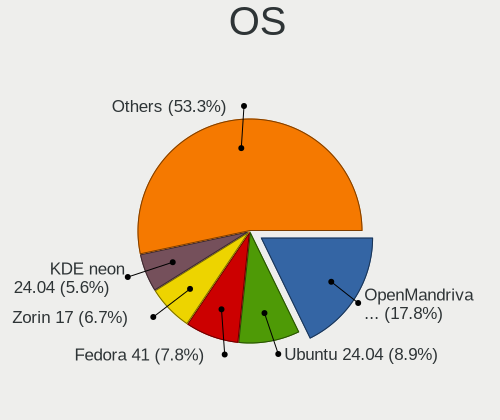
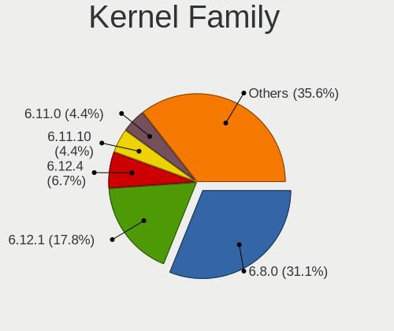
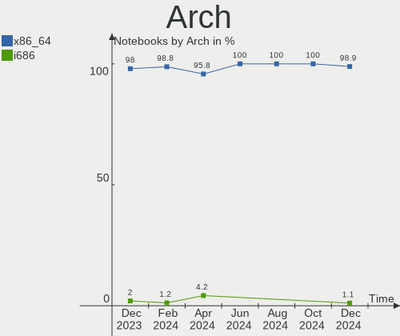
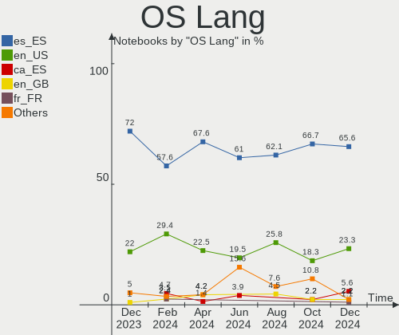
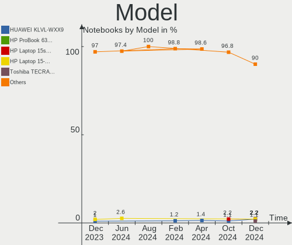
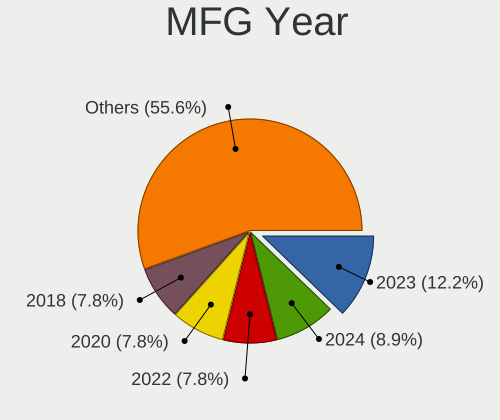
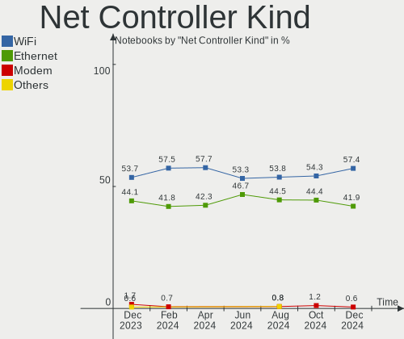
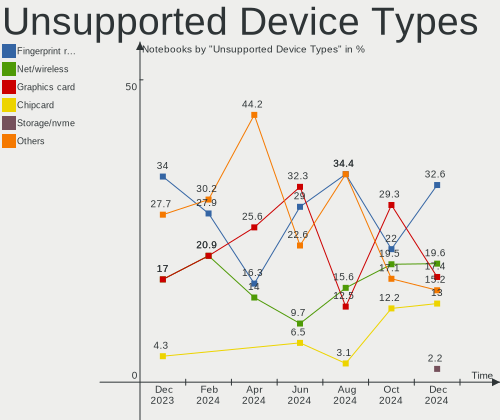

Linux in Spain - Hardware Trends (Notebooks)
--------------------------------------------

A project to identify most popular hardware characteristics and track their change
over time based on data collected by Linux users at https://Linux-Hardware.org.

Anyone can contribute to this report by the [hw-probe](https://github.com/linuxhw/hw-probe) tool:

    sudo -E hw-probe -all -upload

Period: Apr, 2023.

Contents
--------

* [ System ](#system)
  - [ OS                       ](#os)
  - [ OS Family                ](#os-family)
  - [ Kernel                   ](#kernel)
  - [ Kernel Family            ](#kernel-family)
  - [ Kernel Major Ver.        ](#kernel-major-ver)
  - [ Arch                     ](#arch)
  - [ DE                       ](#de)
  - [ Display Server           ](#display-server)
  - [ Display Manager          ](#display-manager)
  - [ OS Lang                  ](#os-lang)
  - [ Boot Mode                ](#boot-mode)
  - [ Filesystem               ](#filesystem)
  - [ Part. scheme             ](#part-scheme)
  - [ Dual Boot with Linux/BSD ](#dual-boot-with-linuxbsd)
  - [ Dual Boot (Win)          ](#dual-boot-win)

* [ Board ](#board)
  - [ Vendor                   ](#vendor)
  - [ Model                    ](#model)
  - [ Model Family             ](#model-family)
  - [ MFG Year                 ](#mfg-year)
  - [ Form Factor              ](#form-factor)
  - [ Secure Boot              ](#secure-boot)
  - [ Coreboot                 ](#coreboot)
  - [ RAM Size                 ](#ram-size)
  - [ RAM Used                 ](#ram-used)
  - [ Total Drives             ](#total-drives)
  - [ Has CD-ROM               ](#has-cd-rom)
  - [ Has Ethernet             ](#has-ethernet)
  - [ Has WiFi                 ](#has-wifi)
  - [ Has Bluetooth            ](#has-bluetooth)

* [ Location ](#location)
  - [ Country                  ](#country)
  - [ City                     ](#city)

* [ Drives ](#drives)
  - [ Drive Vendor             ](#drive-vendor)
  - [ Drive Model              ](#drive-model)
  - [ HDD Vendor               ](#hdd-vendor)
  - [ SSD Vendor               ](#ssd-vendor)
  - [ Drive Kind               ](#drive-kind)
  - [ Drive Connector          ](#drive-connector)
  - [ Drive Size               ](#drive-size)
  - [ Space Total              ](#space-total)
  - [ Space Used               ](#space-used)
  - [ Malfunc. Drives          ](#malfunc-drives)
  - [ Malfunc. Drive Vendor    ](#malfunc-drive-vendor)
  - [ Malfunc. HDD Vendor      ](#malfunc-hdd-vendor)
  - [ Malfunc. Drive Kind      ](#malfunc-drive-kind)
  - [ Failed Drives            ](#failed-drives)
  - [ Failed Drive Vendor      ](#failed-drive-vendor)
  - [ Drive Status             ](#drive-status)

* [ Storage controller ](#storage-controller)
  - [ Storage Vendor           ](#storage-vendor)
  - [ Storage Model            ](#storage-model)
  - [ Storage Kind             ](#storage-kind)

* [ Processor ](#processor)
  - [ CPU Vendor               ](#cpu-vendor)
  - [ CPU Model                ](#cpu-model)
  - [ CPU Model Family         ](#cpu-model-family)
  - [ CPU Cores                ](#cpu-cores)
  - [ CPU Sockets              ](#cpu-sockets)
  - [ CPU Threads              ](#cpu-threads)
  - [ CPU Op-Modes             ](#cpu-op-modes)
  - [ CPU Microcode            ](#cpu-microcode)
  - [ CPU Microarch            ](#cpu-microarch)

* [ Graphics ](#graphics)
  - [ GPU Vendor               ](#gpu-vendor)
  - [ GPU Model                ](#gpu-model)
  - [ GPU Combo                ](#gpu-combo)
  - [ GPU Driver               ](#gpu-driver)
  - [ GPU Memory               ](#gpu-memory)

* [ Monitor ](#monitor)
  - [ Monitor Vendor           ](#monitor-vendor)
  - [ Monitor Model            ](#monitor-model)
  - [ Monitor Resolution       ](#monitor-resolution)
  - [ Monitor Diagonal         ](#monitor-diagonal)
  - [ Monitor Width            ](#monitor-width)
  - [ Aspect Ratio             ](#aspect-ratio)
  - [ Monitor Area             ](#monitor-area)
  - [ Pixel Density            ](#pixel-density)
  - [ Multiple Monitors        ](#multiple-monitors)

* [ Network ](#network)
  - [ Net Controller Vendor    ](#net-controller-vendor)
  - [ Net Controller Model     ](#net-controller-model)
  - [ Wireless Vendor          ](#wireless-vendor)
  - [ Wireless Model           ](#wireless-model)
  - [ Ethernet Vendor          ](#ethernet-vendor)
  - [ Ethernet Model           ](#ethernet-model)
  - [ Net Controller Kind      ](#net-controller-kind)
  - [ Used Controller          ](#used-controller)
  - [ NICs                     ](#nics)
  - [ IPv6                     ](#ipv6)

* [ Bluetooth ](#bluetooth)
  - [ Bluetooth Vendor         ](#bluetooth-vendor)
  - [ Bluetooth Model          ](#bluetooth-model)

* [ Sound ](#sound)
  - [ Sound Vendor             ](#sound-vendor)
  - [ Sound Model              ](#sound-model)

* [ Memory ](#memory)
  - [ Memory Vendor            ](#memory-vendor)
  - [ Memory Model             ](#memory-model)
  - [ Memory Kind              ](#memory-kind)
  - [ Memory Form Factor       ](#memory-form-factor)
  - [ Memory Size              ](#memory-size)
  - [ Memory Speed             ](#memory-speed)

* [ Printers & scanners ](#printers--scanners)
  - [ Printer Vendor           ](#printer-vendor)
  - [ Printer Model            ](#printer-model)
  - [ Scanner Vendor           ](#scanner-vendor)
  - [ Scanner Model            ](#scanner-model)

* [ Camera ](#camera)
  - [ Camera Vendor            ](#camera-vendor)
  - [ Camera Model             ](#camera-model)

* [ Security ](#security)
  - [ Fingerprint Vendor       ](#fingerprint-vendor)
  - [ Fingerprint Model        ](#fingerprint-model)
  - [ Chipcard Vendor          ](#chipcard-vendor)
  - [ Chipcard Model           ](#chipcard-model)

* [ Unsupported ](#unsupported)
  - [ Unsupported Devices      ](#unsupported-devices)
  - [ Unsupported Device Types ](#unsupported-device-types)

System
------

OS
--

Installed operating systems

| Name                         | Notebooks | Percent |
|------------------------------|-----------|---------|
| OpenMandriva 23.03           | 8         | 10%     |
| Ubuntu 22.04                 | 7         | 8.75%   |
| Linux Mint 21.1              | 4         | 5%      |
| Fedora 38                    | 4         | 5%      |
| Debian 11                    | 4         | 5%      |
| Arch Rolling                 | 4         | 5%      |
| Ubuntu 23.04                 | 3         | 3.75%   |
| Ubuntu 22.10                 | 3         | 3.75%   |
| SteamOS 3.4.6                | 3         | 3.75%   |
| KDE neon 22.04               | 3         | 3.75%   |
| Fedora 37                    | 3         | 3.75%   |
| Ubuntu 18.04                 | 2         | 2.5%    |
| Pop!_OS 22.04                | 2         | 2.5%    |
| openSUSE Tumbleweed-XXXXXXXX | 2         | 2.5%    |
| Nobara 37                    | 2         | 2.5%    |
| Manjaro 22.1.0               | 2         | 2.5%    |
| Linux Mint 21                | 2         | 2.5%    |
| Kali 2023.1                  | 2         | 2.5%    |
| Gentoo 2.13                  | 2         | 2.5%    |
| EndeavourOS Rolling          | 2         | 2.5%    |
| Debian 12                    | 2         | 2.5%    |
| Zorin 16                     | 1         | 1.25%   |
| Xubuntu 23.04                | 1         | 1.25%   |
| Xubuntu 22.04                | 1         | 1.25%   |
| Xubuntu 20.04                | 1         | 1.25%   |
| Ultramarine Linux 37         | 1         | 1.25%   |
| Ubuntu 20.04                 | 1         | 1.25%   |
| ROSA 12.3                    | 1         | 1.25%   |
| OpenMandriva 4.3             | 1         | 1.25%   |
| Manjaro                      | 1         | 1.25%   |
| LMDE 5                       | 1         | 1.25%   |
| Linux Mint 20.3              | 1         | 1.25%   |
| Kubuntu 22.04                | 1         | 1.25%   |
| Kaisen 2.2                   | 1         | 1.25%   |
| Garuda Linux Soaring         | 1         | 1.25%   |

OS Family
---------

OS without a version

| Name              | Notebooks | Percent |
|-------------------|-----------|---------|
| Ubuntu            | 16        | 20%     |
| OpenMandriva      | 9         | 11.25%  |
| Linux Mint        | 7         | 8.75%   |
| Fedora            | 7         | 8.75%   |
| Debian            | 6         | 7.5%    |
| Arch              | 4         | 5%      |
| Xubuntu           | 3         | 3.75%   |
| SteamOS           | 3         | 3.75%   |
| Manjaro           | 3         | 3.75%   |
| KDE neon          | 3         | 3.75%   |
| Pop!_OS           | 2         | 2.5%    |
| openSUSE          | 2         | 2.5%    |
| Nobara            | 2         | 2.5%    |
| Kali              | 2         | 2.5%    |
| Gentoo            | 2         | 2.5%    |
| EndeavourOS       | 2         | 2.5%    |
| Zorin             | 1         | 1.25%   |
| Ultramarine Linux | 1         | 1.25%   |
| ROSA              | 1         | 1.25%   |
| LMDE              | 1         | 1.25%   |
| Kubuntu           | 1         | 1.25%   |
| Kaisen            | 1         | 1.25%   |
| Garuda Linux      | 1         | 1.25%   |

Kernel
------

Version of the Linux kernel

| Version                      | Notebooks | Percent |
|------------------------------|-----------|---------|
| 6.2.6-desktop-1omv2390       | 8         | 10%     |
| 5.19.0-38-generic            | 7         | 8.75%   |
| 5.19.0-41-generic            | 4         | 5%      |
| 5.13.0-valve36-1-neptune     | 3         | 3.75%   |
| 6.2.12-300.fc38.x86_64       | 2         | 2.5%    |
| 6.2.12-1-default             | 2         | 2.5%    |
| 6.2.11-300.fc38.x86_64       | 2         | 2.5%    |
| 6.2.0-20-generic             | 2         | 2.5%    |
| 6.1.0-kali7-amd64            | 2         | 2.5%    |
| 5.4.0-146-generic            | 2         | 2.5%    |
| 5.19.0-40-generic            | 2         | 2.5%    |
| 5.15.0-71-generic            | 2         | 2.5%    |
| 5.15.0-69-generic            | 2         | 2.5%    |
| 5.15.0-67-generic            | 2         | 2.5%    |
| 6.2.9-arch1-1                | 1         | 1.25%   |
| 6.2.9-200.fc37.x86_64        | 1         | 1.25%   |
| 6.2.8-zen1-1-zen             | 1         | 1.25%   |
| 6.2.8-200.fsync.fc37.x86_64  | 1         | 1.25%   |
| 6.2.8-1-MANJARO              | 1         | 1.25%   |
| 6.2.6-76060206-generic       | 1         | 1.25%   |
| 6.2.12-200.fc37.x86_64       | 1         | 1.25%   |
| 6.2.11-arch1-1               | 1         | 1.25%   |
| 6.2.11-200.fc37.x86_64       | 1         | 1.25%   |
| 6.2.11-060211-generic        | 1         | 1.25%   |
| 6.2.10-zen1-1-zen            | 1         | 1.25%   |
| 6.2.10-arch1-1               | 1         | 1.25%   |
| 6.2.10-200.fsync.fc37.x86_64 | 1         | 1.25%   |
| 6.2.0-18-generic             | 1         | 1.25%   |
| 6.1.26-x64v1-xanmod1-1-lts   | 1         | 1.25%   |
| 6.1.23-1-MANJARO             | 1         | 1.25%   |
| 6.1.22-1-lts                 | 1         | 1.25%   |
| 6.1.21-1-MANJARO             | 1         | 1.25%   |
| 6.1.15-200.fc37.x86_64       | 1         | 1.25%   |
| 6.1.15-2-liquorix-amd64      | 1         | 1.25%   |
| 6.1.0-7-rt-amd64             | 1         | 1.25%   |
| 6.1.0-7-amd64                | 1         | 1.25%   |
| 6.1.0-1kaisen-amd64          | 1         | 1.25%   |
| 6.1.0-0.deb11.5-amd64        | 1         | 1.25%   |
| 5.19.0-35-generic            | 1         | 1.25%   |
| 5.19.0-32-generic            | 1         | 1.25%   |

Kernel Family
-------------

Linux kernel without a distro release

| Version | Notebooks | Percent |
|---------|-----------|---------|
| 5.19.0  | 15        | 18.75%  |
| 6.2.6   | 9         | 11.25%  |
| 5.15.0  | 9         | 11.25%  |
| 6.1.0   | 6         | 7.5%    |
| 6.2.12  | 5         | 6.25%   |
| 6.2.11  | 5         | 6.25%   |
| 6.2.8   | 3         | 3.75%   |
| 6.2.10  | 3         | 3.75%   |
| 6.2.0   | 3         | 3.75%   |
| 5.13.0  | 3         | 3.75%   |
| 5.10.0  | 3         | 3.75%   |
| 6.2.9   | 2         | 2.5%    |
| 6.1.15  | 2         | 2.5%    |
| 5.4.0   | 2         | 2.5%    |
| 6.1.26  | 1         | 1.25%   |
| 6.1.23  | 1         | 1.25%   |
| 6.1.22  | 1         | 1.25%   |
| 6.1.21  | 1         | 1.25%   |
| 5.16.7  | 1         | 1.25%   |
| 5.15.94 | 1         | 1.25%   |
| 5.15.80 | 1         | 1.25%   |
| 5.15.79 | 1         | 1.25%   |
| 5.11.0  | 1         | 1.25%   |
| 4.15.0  | 1         | 1.25%   |

Kernel Major Ver.
-----------------

Linux kernel major version

| Version | Notebooks | Percent |
|---------|-----------|---------|
| 6.2     | 30        | 37.5%   |
| 5.19    | 15        | 18.75%  |
| 6.1     | 12        | 15%     |
| 5.15    | 12        | 15%     |
| 5.13    | 3         | 3.75%   |
| 5.10    | 3         | 3.75%   |
| 5.4     | 2         | 2.5%    |
| 5.16    | 1         | 1.25%   |
| 5.11    | 1         | 1.25%   |
| 4.15    | 1         | 1.25%   |

Arch
----

OS architecture (x86_64, i586, etc.)

| Name   | Notebooks | Percent |
|--------|-----------|---------|
| x86_64 | 79        | 98.75%  |
| i686   | 1         | 1.25%   |

DE
--

Desktop Environment

| Name            | Notebooks | Percent |
|-----------------|-----------|---------|
| GNOME           | 31        | 38.75%  |
| KDE5            | 26        | 32.5%   |
| XFCE            | 7         | 8.75%   |
| X-Cinnamon      | 5         | 6.25%   |
| Unknown         | 4         | 5%      |
| Budgie          | 2         | 2.5%    |
| bspwm           | 2         | 2.5%    |
| MATE            | 1         | 1.25%   |
| GNOME Flashback | 1         | 1.25%   |
| Cinnamon        | 1         | 1.25%   |

Display Server
--------------

X11 or Wayland

| Name    | Notebooks | Percent |
|---------|-----------|---------|
| X11     | 51        | 63.75%  |
| Wayland | 26        | 32.5%   |
| Unknown | 3         | 3.75%   |

Display Manager
---------------

SDDM, LightDM, etc.

| Name    | Notebooks | Percent |
|---------|-----------|---------|
| Unknown | 28        | 35%     |
| GDM3    | 17        | 21.25%  |
| SDDM    | 16        | 20%     |
| LightDM | 13        | 16.25%  |
| GDM     | 6         | 7.5%    |

OS Lang
-------

Language

| Lang    | Notebooks | Percent |
|---------|-----------|---------|
| es_ES   | 48        | 60%     |
| en_US   | 19        | 23.75%  |
| Unknown | 4         | 5%      |
| en_GB   | 3         | 3.75%   |
| ca_ES   | 2         | 2.5%    |
| POSIX   | 1         | 1.25%   |
| en_AG   | 1         | 1.25%   |
| C       | 1         | 1.25%   |
| an_ES   | 1         | 1.25%   |

Boot Mode
---------

EFI or BIOS

| Mode | Notebooks | Percent |
|------|-----------|---------|
| EFI  | 43        | 53.75%  |
| BIOS | 37        | 46.25%  |

Filesystem
----------

Type of filesystem

| Type    | Notebooks | Percent |
|---------|-----------|---------|
| Ext4    | 45        | 56.25%  |
| Btrfs   | 17        | 21.25%  |
| Overlay | 9         | 11.25%  |
| Tmpfs   | 8         | 10%     |
| Zfs     | 1         | 1.25%   |

Part. scheme
------------

Scheme of partitioning

| Type    | Notebooks | Percent |
|---------|-----------|---------|
| GPT     | 46        | 57.5%   |
| Unknown | 26        | 32.5%   |
| MBR     | 8         | 10%     |

Dual Boot with Linux/BSD
------------------------

Hosting more than one Linux/BSD

| Dual boot | Notebooks | Percent |
|-----------|-----------|---------|
| No        | 72        | 90%     |
| Yes       | 8         | 10%     |

Dual Boot (Win)
---------------

Hosting Linux and Windows

| Dual boot | Notebooks | Percent |
|-----------|-----------|---------|
| No        | 54        | 67.5%   |
| Yes       | 26        | 32.5%   |

Board
-----

Vendor
------

Motherboard manufacturer

| Name                | Notebooks | Percent |
|---------------------|-----------|---------|
| ASUSTek Computer    | 14        | 17.5%   |
| Lenovo              | 13        | 16.25%  |
| Hewlett-Packard     | 12        | 15%     |
| MSI                 | 8         | 10%     |
| Dell                | 8         | 10%     |
| HUAWEI              | 4         | 5%      |
| Valve               | 3         | 3.75%   |
| Toshiba             | 3         | 3.75%   |
| Gigabyte Technology | 3         | 3.75%   |
| Chuwi               | 2         | 2.5%    |
| Acer                | 2         | 2.5%    |
| Timi                | 1         | 1.25%   |
| Thomson             | 1         | 1.25%   |
| Sony                | 1         | 1.25%   |
| MiTAC               | 1         | 1.25%   |
| Medion              | 1         | 1.25%   |
| INSYS               | 1         | 1.25%   |
| Google              | 1         | 1.25%   |
| Dynabook            | 1         | 1.25%   |

Model
-----

Motherboard model

| Name                                              | Notebooks | Percent |
|---------------------------------------------------|-----------|---------|
| Valve Jupiter                                     | 3         | 3.75%   |
| Gigabyte G5 GD                                    | 3         | 3.75%   |
| MSI Modern 14 A10M                                | 2         | 2.5%    |
| Lenovo Legion 5 15ACH6H 82JU                      | 2         | 2.5%    |
| ASUS ROG Zephyrus G14 GA401II_GA401II             | 2         | 2.5%    |
| Toshiba Satellite L500                            | 1         | 1.25%   |
| Toshiba Satellite L50-C                           | 1         | 1.25%   |
| Toshiba Satellite L350D                           | 1         | 1.25%   |
| Timi RedmiBook 16                                 | 1         | 1.25%   |
| Thomson SPNEOX13-4RD64                            | 1         | 1.25%   |
| Sony VPCZ13M9E                                    | 1         | 1.25%   |
| MSI Stealth 15M B12UE                             | 1         | 1.25%   |
| MSI PS42 Modern 8RC                               | 1         | 1.25%   |
| MSI Prestige 15 A12UC                             | 1         | 1.25%   |
| MSI Modern 15 A11SBU                              | 1         | 1.25%   |
| MSI GF63 Thin 9SC                                 | 1         | 1.25%   |
| MSI Bravo 15 B5DD                                 | 1         | 1.25%   |
| MiTAC Notebook PC                                 | 1         | 1.25%   |
| Medion E15415                                     | 1         | 1.25%   |
| Lenovo ThinkPad T490 20N20008US                   | 1         | 1.25%   |
| Lenovo ThinkPad T420 4180FP9                      | 1         | 1.25%   |
| Lenovo ThinkPad T410 2537NY6                      | 1         | 1.25%   |
| Lenovo ThinkPad T14 Gen 1 20S1S4RB26              | 1         | 1.25%   |
| Lenovo ThinkPad Edge 25453BG                      | 1         | 1.25%   |
| Lenovo Legion Y540-15IRH-PG0 81SY                 | 1         | 1.25%   |
| Lenovo Legion 5 Pro 16ACH6H 82JQ                  | 1         | 1.25%   |
| Lenovo IdeaPad 510-15IKB 80SV                     | 1         | 1.25%   |
| Lenovo IdeaPad 5 15ITL05 82FG                     | 1         | 1.25%   |
| Lenovo IdeaPad 330-15ICH 81FK                     | 1         | 1.25%   |
| Lenovo IdeaPad 3 15ALC6 82KU                      | 1         | 1.25%   |
| INSYS PT1-140C                                    | 1         | 1.25%   |
| HUAWEI MRC-WX0                                    | 1         | 1.25%   |
| HUAWEI KLVL-WXXW                                  | 1         | 1.25%   |
| HUAWEI HVY-WXX9                                   | 1         | 1.25%   |
| HUAWEI BOHK-WAX9X                                 | 1         | 1.25%   |
| HP ZBook Firefly 16 inch G9 Mobile Workstation PC | 1         | 1.25%   |
| HP Pavilion Laptop 15-ck0xx                       | 1         | 1.25%   |
| HP Pavilion dv6                                   | 1         | 1.25%   |
| HP OMEN Laptop 15-en1xxx                          | 1         | 1.25%   |
| HP OMEN by Laptop 16-b1xxx                        | 1         | 1.25%   |

Model Family
------------

Motherboard model prefix

| Name                   | Notebooks | Percent |
|------------------------|-----------|---------|
| Lenovo ThinkPad        | 5         | 6.25%   |
| Lenovo Legion          | 4         | 5%      |
| Lenovo IdeaPad         | 4         | 5%      |
| Valve Jupiter          | 3         | 3.75%   |
| Toshiba Satellite      | 3         | 3.75%   |
| MSI Modern             | 3         | 3.75%   |
| HP Laptop              | 3         | 3.75%   |
| Gigabyte G5            | 3         | 3.75%   |
| Dell Latitude          | 3         | 3.75%   |
| Dell Inspiron          | 3         | 3.75%   |
| HP Pavilion            | 2         | 2.5%    |
| HP OMEN                | 2         | 2.5%    |
| HP Compaq              | 2         | 2.5%    |
| ASUS VivoBook          | 2         | 2.5%    |
| ASUS ROG               | 2         | 2.5%    |
| ASUS ASUS              | 2         | 2.5%    |
| Timi RedmiBook         | 1         | 1.25%   |
| Thomson SPNEOX13-4RD64 | 1         | 1.25%   |
| Sony VPCZ13M9E         | 1         | 1.25%   |
| MSI Stealth            | 1         | 1.25%   |
| MSI PS42               | 1         | 1.25%   |
| MSI Prestige           | 1         | 1.25%   |
| MSI GF63               | 1         | 1.25%   |
| MSI Bravo              | 1         | 1.25%   |
| MiTAC Notebook         | 1         | 1.25%   |
| Medion E15415          | 1         | 1.25%   |
| INSYS PT1-140C         | 1         | 1.25%   |
| HUAWEI MRC-WX0         | 1         | 1.25%   |
| HUAWEI KLVL-WXXW       | 1         | 1.25%   |
| HUAWEI HVY-WXX9        | 1         | 1.25%   |
| HUAWEI BOHK-WAX9X      | 1         | 1.25%   |
| HP ZBook               | 1         | 1.25%   |
| HP Notebook            | 1         | 1.25%   |
| HP 255                 | 1         | 1.25%   |
| Google Snappy          | 1         | 1.25%   |
| Dynabook Satellite     | 1         | 1.25%   |
| Dell XPS               | 1         | 1.25%   |
| Dell Precision         | 1         | 1.25%   |
| Chuwi HeroBook         | 1         | 1.25%   |
| Chuwi GemiBook         | 1         | 1.25%   |

MFG Year
--------

Motherboard manufacture year

| Year | Notebooks | Percent |
|------|-----------|---------|
| 2021 | 16        | 20%     |
| 2022 | 13        | 16.25%  |
| 2019 | 9         | 11.25%  |
| 2018 | 9         | 11.25%  |
| 2015 | 7         | 8.75%   |
| 2020 | 6         | 7.5%    |
| 2008 | 4         | 5%      |
| 2014 | 3         | 3.75%   |
| 2009 | 3         | 3.75%   |
| 2017 | 2         | 2.5%    |
| 2012 | 2         | 2.5%    |
| 2010 | 2         | 2.5%    |
| 2016 | 1         | 1.25%   |
| 2011 | 1         | 1.25%   |
| 2007 | 1         | 1.25%   |
| 2006 | 1         | 1.25%   |

Form Factor
-----------

Physical design of the computer

| Name     | Notebooks | Percent |
|----------|-----------|---------|
| Notebook | 80        | 100%    |

Secure Boot
-----------

Enabled or disabled

| State    | Notebooks | Percent |
|----------|-----------|---------|
| Disabled | 73        | 91.25%  |
| Enabled  | 7         | 8.75%   |

Coreboot
--------

Have coreboot on board

| Used | Notebooks | Percent |
|------|-----------|---------|
| No   | 79        | 98.75%  |
| Yes  | 1         | 1.25%   |

RAM Size
--------

Total RAM memory

| Size in GB | Notebooks | Percent |
|------------|-----------|---------|
| 8.01-16.0  | 22        | 27.5%   |
| 16.01-24.0 | 19        | 23.75%  |
| 4.01-8.0   | 18        | 22.5%   |
| 3.01-4.0   | 10        | 12.5%   |
| 32.01-64.0 | 6         | 7.5%    |
| 2.01-3.0   | 3         | 3.75%   |
| 24.01-32.0 | 1         | 1.25%   |
| 1.01-2.0   | 1         | 1.25%   |

RAM Used
--------

Used RAM memory

| Used GB    | Notebooks | Percent |
|------------|-----------|---------|
| 1.01-2.0   | 23        | 28.75%  |
| 4.01-8.0   | 17        | 21.25%  |
| 3.01-4.0   | 16        | 20%     |
| 2.01-3.0   | 16        | 20%     |
| 0.51-1.0   | 4         | 5%      |
| 16.01-24.0 | 2         | 2.5%    |
| 8.01-16.0  | 2         | 2.5%    |

Total Drives
------------

Number of drives on board

| Drives | Notebooks | Percent |
|--------|-----------|---------|
| 1      | 54        | 67.5%   |
| 2      | 22        | 27.5%   |
| 3      | 2         | 2.5%    |
| 0      | 2         | 2.5%    |

Has CD-ROM
----------

Has CD-ROM on board

| Presented | Notebooks | Percent |
|-----------|-----------|---------|
| No        | 61        | 76.25%  |
| Yes       | 19        | 23.75%  |

Has Ethernet
------------

Has Ethernet on board

| Presented | Notebooks | Percent |
|-----------|-----------|---------|
| Yes       | 57        | 71.25%  |
| No        | 23        | 28.75%  |

Has WiFi
--------

Has WiFi module

| Presented | Notebooks | Percent |
|-----------|-----------|---------|
| Yes       | 80        | 100%    |

Has Bluetooth
-------------

Has Bluetooth module

| Presented | Notebooks | Percent |
|-----------|-----------|---------|
| Yes       | 67        | 83.75%  |
| No        | 13        | 16.25%  |

Location
--------

Country
-------

Geographic location (country)

| Country | Notebooks | Percent |
|---------|-----------|---------|
| Spain   | 80        | 100%    |

City
----

Geographic location (city)

| City                     | Notebooks | Percent |
|--------------------------|-----------|---------|
| Madrid                   | 15        | 18.75%  |
| Barcelona                | 12        | 15%     |
| Seville                  | 9         | 11.25%  |
| Valencia                 | 4         | 5%      |
| Ourense                  | 2         | 2.5%    |
| Málaga                  | 2         | 2.5%    |
| Granada                  | 2         | 2.5%    |
| Alcobendas               | 2         | 2.5%    |
| Zumarraga                | 1         | 1.25%   |
| Zaragoza                 | 1         | 1.25%   |
| Zafra                    | 1         | 1.25%   |
| Vigo                     | 1         | 1.25%   |
| Valladolid               | 1         | 1.25%   |
| Torremolinos             | 1         | 1.25%   |
| Segovia                  | 1         | 1.25%   |
| Santander                | 1         | 1.25%   |
| Santa Cruz de Tenerife   | 1         | 1.25%   |
| Sant Feliu de Llobregat  | 1         | 1.25%   |
| Salamanca                | 1         | 1.25%   |
| Reus                     | 1         | 1.25%   |
| Palma                    | 1         | 1.25%   |
| Oviedo                   | 1         | 1.25%   |
| Olesa de Montserrat      | 1         | 1.25%   |
| O Outeiro                | 1         | 1.25%   |
| Mostoles                 | 1         | 1.25%   |
| Maracena                 | 1         | 1.25%   |
| Laguna de Duero          | 1         | 1.25%   |
| La Carolina              | 1         | 1.25%   |
| Girona                   | 1         | 1.25%   |
| Fuenlabrada              | 1         | 1.25%   |
| Ferrol                   | 1         | 1.25%   |
| Estepona                 | 1         | 1.25%   |
| Donostia / San Sebastian | 1         | 1.25%   |
| Collado Villalba         | 1         | 1.25%   |
| Candelaria               | 1         | 1.25%   |
| Burgos                   | 1         | 1.25%   |
| Amurrio                  | 1         | 1.25%   |
| Algeciras                | 1         | 1.25%   |
| Alcorcón                | 1         | 1.25%   |
| Alcazar de San Juan      | 1         | 1.25%   |

Drives
------

Drive Vendor
------------

Hard drive vendors

| Vendor                      | Notebooks | Drives | Percent |
|-----------------------------|-----------|--------|---------|
| Samsung Electronics         | 15        | 19     | 15.15%  |
| Sandisk                     | 12        | 12     | 12.12%  |
| Kingston                    | 11        | 11     | 11.11%  |
| Unknown                     | 8         | 8      | 8.08%   |
| Seagate                     | 8         | 8      | 8.08%   |
| Micron Technology           | 6         | 6      | 6.06%   |
| Phison Electronics          | 5         | 6      | 5.05%   |
| WDC                         | 4         | 4      | 4.04%   |
| Toshiba                     | 4         | 4      | 4.04%   |
| SK hynix                    | 3         | 3      | 3.03%   |
| Phison                      | 3         | 3      | 3.03%   |
| Intel                       | 3         | 4      | 3.03%   |
| Kingston Technology Company | 2         | 2      | 2.02%   |
| Hitachi                     | 2         | 2      | 2.02%   |
| Crucial                     | 2         | 2      | 2.02%   |
| Union Memory                | 1         | 1      | 1.01%   |
| TO Exter                    | 1         | 1      | 1.01%   |
| SABRENT                     | 1         | 1      | 1.01%   |
| Patriot                     | 1         | 1      | 1.01%   |
| Netac                       | 1         | 1      | 1.01%   |
| Micron/Crucial Technology   | 1         | 1      | 1.01%   |
| LITEONIT                    | 1         | 1      | 1.01%   |
| KingSpec                    | 1         | 1      | 1.01%   |
| FORESEE                     | 1         | 1      | 1.01%   |
| Emtec                       | 1         | 1      | 1.01%   |
| China                       | 1         | 1      | 1.01%   |

Drive Model
-----------

Hard drive models

| Model                                             | Notebooks | Percent |
|---------------------------------------------------|-----------|---------|
| Samsung NVMe SSD Controller SM981/PM981/PM983 1TB | 4         | 3.92%   |
| Sandisk WD Black SN750 / PC SN730 NVMe SSD 512GB  | 3         | 2.94%   |
| Kingston SA400S37960G 960GB SSD                   | 3         | 2.94%   |
| Kingston SA400S37480G 480GB SSD                   | 3         | 2.94%   |
| Kingston SA400S37240G 240GB SSD                   | 3         | 2.94%   |
| Unknown MMC Card  32GB                            | 2         | 1.96%   |
| Seagate ST500LT012-1DG142 500GB                   | 2         | 1.96%   |
| Sandisk WD Blue SN550 NVMe SSD 1024GB             | 2         | 1.96%   |
| Phison E16 PCIe4 NVMe Controller 500GB            | 2         | 1.96%   |
| Phison E12 NVMe Controller 512GB                  | 2         | 1.96%   |
| WDC WDS100T1R0B-68A4Z0 1TB SSD                    | 1         | 0.98%   |
| WDC WD6400BEVT-22A0RT0 640GB                      | 1         | 0.98%   |
| WDC WD10SPZX-24Z10 1TB                            | 1         | 0.98%   |
| WDC PC SN730 SDBPNTY-512G-1032 512GB              | 1         | 0.98%   |
| Unknown SD16G  16GB                               | 1         | 0.98%   |
| Unknown SD/MMC/MS PRO 249GB                       | 1         | 0.98%   |
| Unknown MMC Card  64GB                            | 1         | 0.98%   |
| Unknown MMC Card  498GB                           | 1         | 0.98%   |
| Unknown MMC Card  2GB                             | 1         | 0.98%   |
| Unknown MMC Card  256GB                           | 1         | 0.98%   |
| Union Memory UMIS RPJTJ512MEE1OWX 512GB           | 1         | 0.98%   |
| Toshiba MQ04ABF100 1TB                            | 1         | 0.98%   |
| Toshiba MQ01ABD050 500GB                          | 1         | 0.98%   |
| Toshiba MK2546GSX 250GB                           | 1         | 0.98%   |
| Toshiba KXG60ZNV256G 256GB                        | 1         | 0.98%   |
| TO Exter nal USB 3.0 320GB                        | 1         | 0.98%   |
| SK hynix SKHynix_HFS001TDE9X084N 1024GB           | 1         | 0.98%   |
| SK hynix SC300 mSATA 512GB SSD                    | 1         | 0.98%   |
| SK hynix HFS128G32TNF-N3A0A 128GB SSD             | 1         | 0.98%   |
| Seagate ST9250827AS 250GB                         | 1         | 0.98%   |
| Seagate ST2000LM003 HN-M201RAD 2TB                | 1         | 0.98%   |
| Seagate ST1000LM049-2GH172 1TB                    | 1         | 0.98%   |
| Seagate ST1000LM035-1RK172 970GB                  | 1         | 0.98%   |
| Seagate ST1000LM024 HN-M101MBB 1TB                | 1         | 0.98%   |
| Seagate ST1000DM 010-2EP102 1TB                   | 1         | 0.98%   |
| Sandisk WDC PC SN530 SDBPMPZ-256G-1101 256GB      | 1         | 0.98%   |
| Sandisk WD PC SN740 SDDPTQD-1T00 1024GB           | 1         | 0.98%   |
| Sandisk WD Black SN850 1TB                        | 1         | 0.98%   |
| SanDisk SD9SN8W256G1102 256GB SSD                 | 1         | 0.98%   |
| SanDisk SD9SN8W256G1002 256GB SSD                 | 1         | 0.98%   |

HDD Vendor
----------

Hard disk drive vendors

| Vendor              | Notebooks | Drives | Percent |
|---------------------|-----------|--------|---------|
| Seagate             | 8         | 8      | 47.06%  |
| Toshiba             | 3         | 3      | 17.65%  |
| WDC                 | 2         | 2      | 11.76%  |
| Hitachi             | 2         | 2      | 11.76%  |
| Unknown             | 1         | 1      | 5.88%   |
| Samsung Electronics | 1         | 1      | 5.88%   |

SSD Vendor
----------

Solid state drive vendors

| Vendor              | Notebooks | Drives | Percent |
|---------------------|-----------|--------|---------|
| Kingston            | 10        | 10     | 31.25%  |
| Samsung Electronics | 7         | 9      | 21.88%  |
| SK hynix            | 2         | 2      | 6.25%   |
| SanDisk             | 2         | 2      | 6.25%   |
| Crucial             | 2         | 2      | 6.25%   |
| WDC                 | 1         | 1      | 3.13%   |
| TO Exter            | 1         | 1      | 3.13%   |
| Patriot             | 1         | 1      | 3.13%   |
| Netac               | 1         | 1      | 3.13%   |
| LITEONIT            | 1         | 1      | 3.13%   |
| KingSpec            | 1         | 1      | 3.13%   |
| FORESEE             | 1         | 1      | 3.13%   |
| Emtec               | 1         | 1      | 3.13%   |
| China               | 1         | 1      | 3.13%   |

Drive Kind
----------

HDD or SSD

| Kind | Notebooks | Drives | Percent |
|------|-----------|--------|---------|
| NVMe | 41        | 47     | 43.16%  |
| SSD  | 30        | 34     | 31.58%  |
| HDD  | 17        | 17     | 17.89%  |
| MMC  | 7         | 7      | 7.37%   |

Drive Connector
---------------

SATA, SAS, NVMe, etc.

| Type | Notebooks | Drives | Percent |
|------|-----------|--------|---------|
| SATA | 42        | 46     | 44.21%  |
| NVMe | 40        | 46     | 42.11%  |
| MMC  | 7         | 7      | 7.37%   |
| SAS  | 6         | 6      | 6.32%   |

Drive Size
----------

Size of hard drive

| Size in TB | Notebooks | Drives | Percent |
|------------|-----------|--------|---------|
| 0.01-0.5   | 31        | 35     | 65.96%  |
| 0.51-1.0   | 15        | 15     | 31.91%  |
| 1.01-2.0   | 1         | 1      | 2.13%   |

Space Total
-----------

Amount of disk space available on the file system

| Size in GB     | Notebooks | Percent |
|----------------|-----------|---------|
| 251-500        | 21        | 26.25%  |
| 101-250        | 18        | 22.5%   |
| 501-1000       | 14        | 17.5%   |
| 1-20           | 9         | 11.25%  |
| 1001-2000      | 5         | 6.25%   |
| 21-50          | 3         | 3.75%   |
| 51-100         | 3         | 3.75%   |
| Unknown        | 3         | 3.75%   |
| More than 3000 | 2         | 2.5%    |
| 2001-3000      | 2         | 2.5%    |

Space Used
----------

Amount of used disk space

| Used GB   | Notebooks | Percent |
|-----------|-----------|---------|
| 1-20      | 21        | 26.25%  |
| 51-100    | 14        | 17.5%   |
| 21-50     | 13        | 16.25%  |
| 101-250   | 13        | 16.25%  |
| 251-500   | 12        | 15%     |
| Unknown   | 3         | 3.75%   |
| 1001-2000 | 2         | 2.5%    |
| 501-1000  | 2         | 2.5%    |

Malfunc. Drives
---------------

Drive models with a malfunction

| Model                              | Notebooks | Drives | Percent |
|------------------------------------|-----------|--------|---------|
| WDC WD6400BEVT-22A0RT0 640GB       | 1         | 1      | 20%     |
| Toshiba MK2546GSX 250GB            | 1         | 1      | 20%     |
| Seagate ST1000LM024 HN-M101MBB 1TB | 1         | 1      | 20%     |
| Hitachi HTS723232A7A364 320GB      | 1         | 1      | 20%     |
| China G521N256GB                   | 1         | 1      | 20%     |

Malfunc. Drive Vendor
---------------------

Vendors of faulty drives

| Vendor  | Notebooks | Drives | Percent |
|---------|-----------|--------|---------|
| WDC     | 1         | 1      | 20%     |
| Toshiba | 1         | 1      | 20%     |
| Seagate | 1         | 1      | 20%     |
| Hitachi | 1         | 1      | 20%     |
| China   | 1         | 1      | 20%     |

Malfunc. HDD Vendor
-------------------

Vendors of faulty HDD drives

| Vendor  | Notebooks | Drives | Percent |
|---------|-----------|--------|---------|
| WDC     | 1         | 1      | 25%     |
| Toshiba | 1         | 1      | 25%     |
| Seagate | 1         | 1      | 25%     |
| Hitachi | 1         | 1      | 25%     |

Malfunc. Drive Kind
-------------------

Kinds of faulty drives

| Kind | Notebooks | Drives | Percent |
|------|-----------|--------|---------|
| HDD  | 4         | 4      | 80%     |
| SSD  | 1         | 1      | 20%     |

Failed Drives
-------------

Failed drive models

Zero info for selected period =(

Failed Drive Vendor
-------------------

Failed drive vendors

Zero info for selected period =(

Drive Status
------------

Number of failed and malfunc. drives

| Status   | Notebooks | Drives | Percent |
|----------|-----------|--------|---------|
| Detected | 44        | 58     | 51.76%  |
| Works    | 36        | 42     | 42.35%  |
| Malfunc  | 5         | 5      | 5.88%   |

Storage controller
------------------

Storage Vendor
--------------

Storage controller vendors

| Vendor                           | Notebooks | Percent |
|----------------------------------|-----------|---------|
| Intel                            | 41        | 42.27%  |
| AMD                              | 15        | 15.46%  |
| SanDisk                          | 11        | 11.34%  |
| Samsung Electronics              | 8         | 8.25%   |
| Phison Electronics               | 7         | 7.22%   |
| Micron Technology                | 6         | 6.19%   |
| Kingston Technology Company      | 3         | 3.09%   |
| VIA Technologies                 | 1         | 1.03%   |
| Union Memory (Shenzhen)          | 1         | 1.03%   |
| Toshiba America Info Systems     | 1         | 1.03%   |
| SK hynix                         | 1         | 1.03%   |
| Silicon Integrated Systems [SiS] | 1         | 1.03%   |
| Micron/Crucial Technology        | 1         | 1.03%   |

Storage Model
-------------

Storage controller models

| Model                                                                 | Notebooks | Percent |
|-----------------------------------------------------------------------|-----------|---------|
| AMD FCH SATA Controller [AHCI mode]                                   | 13        | 12.75%  |
| Samsung NVMe SSD Controller SM981/PM981/PM983                         | 6         | 5.88%   |
| Micron NVMe Storage Controller                                        | 5         | 4.9%    |
| Intel Wildcat Point-LP SATA Controller [AHCI Mode]                    | 5         | 4.9%    |
| Intel Sunrise Point-LP SATA Controller [AHCI mode]                    | 5         | 4.9%    |
| SanDisk WD Black SN750 / PC SN730 NVMe SSD                            | 4         | 3.92%   |
| Intel Cannon Lake Mobile PCH SATA AHCI Controller                     | 4         | 3.92%   |
| Phison E16 PCIe4 NVMe Controller                                      | 3         | 2.94%   |
| Intel 82801IBM/IEM (ICH9M/ICH9M-E) 4 port SATA Controller [AHCI mode] | 3         | 2.94%   |
| Intel 82801 Mobile SATA Controller [RAID mode]                        | 3         | 2.94%   |
| Intel 500 Series Chipset Family SATA AHCI Controller                  | 3         | 2.94%   |
| SanDisk WD Blue SN550 NVMe SSD                                        | 2         | 1.96%   |
| Samsung NVMe SSD Controller 980                                       | 2         | 1.96%   |
| Phison E12 NVMe Controller                                            | 2         | 1.96%   |
| Intel Volume Management Device NVMe RAID Controller                   | 2         | 1.96%   |
| Intel Comet Lake SATA AHCI Controller                                 | 2         | 1.96%   |
| Intel 7 Series Chipset Family 6-port SATA Controller [AHCI mode]      | 2         | 1.96%   |
| VIA VT82C586A/B/VT82C686/A/B/VT823x/A/C PIPC Bus Master IDE           | 1         | 0.98%   |
| VIA VT8237A SATA 2-Port Controller                                    | 1         | 0.98%   |
| Union Memory (Shenzhen) Non-Volatile memory controller                | 1         | 0.98%   |
| Toshiba America Info Systems XG6 NVMe SSD Controller                  | 1         | 0.98%   |
| SK hynix Gold P31/PC711 NVMe Solid State Drive                        | 1         | 0.98%   |
| Silicon Integrated Systems [SiS] SATA Controller / IDE mode           | 1         | 0.98%   |
| SanDisk WD PC SN810 / Black SN850 NVMe SSD                            | 1         | 0.98%   |
| SanDisk WD Blue SN570 NVMe SSD 1TB                                    | 1         | 0.98%   |
| SanDisk PC SN520 NVMe SSD                                             | 1         | 0.98%   |
| SanDisk NVMe Controller                                               | 1         | 0.98%   |
| Sandisk Non-Volatile memory controller                                | 1         | 0.98%   |
| Phison PS5013 E13 NVMe Controller                                     | 1         | 0.98%   |
| Phison Electronics Non-Volatile memory controller                     | 1         | 0.98%   |
| Micron/Crucial P2 NVMe PCIe SSD                                       | 1         | 0.98%   |
| Micron NVMe Controller                                                | 1         | 0.98%   |
| Kingston Company U-SNS8154P3 NVMe SSD                                 | 1         | 0.98%   |
| Kingston Company Company Non-Volatile memory controller               | 1         | 0.98%   |
| Kingston Company OM3PDP3 NVMe SSD                                     | 1         | 0.98%   |
| Intel Tiger Lake-LP SATA Controller                                   | 1         | 0.98%   |
| Intel SSD 660P Series                                                 | 1         | 0.98%   |
| Intel SSD 600P Series                                                 | 1         | 0.98%   |
| Intel Non-Volatile memory controller                                  | 1         | 0.98%   |
| Intel Jasper Lake SATA AHCI Controller                                | 1         | 0.98%   |

Storage Kind
------------

Kind of storage controller (IDE, SATA, NVMe, SAS, ...)

| Kind | Notebooks | Percent |
|------|-----------|---------|
| SATA | 49        | 50%     |
| NVMe | 40        | 40.82%  |
| RAID | 5         | 5.1%    |
| IDE  | 4         | 4.08%   |

Processor
---------

CPU Vendor
----------

Processor vendors

| Vendor | Notebooks | Percent |
|--------|-----------|---------|
| Intel  | 54        | 67.5%   |
| AMD    | 26        | 32.5%   |

CPU Model
---------

Processor models

| Model                                       | Notebooks | Percent |
|---------------------------------------------|-----------|---------|
| AMD Ryzen 7 5800H with Radeon Graphics      | 5         | 6.25%   |
| Intel Core i5-5200U CPU @ 2.20GHz           | 3         | 3.75%   |
| Intel Core i5-10210U CPU @ 1.60GHz          | 3         | 3.75%   |
| Intel 11th Gen Core i5-11400H @ 2.70GHz     | 3         | 3.75%   |
| AMD Custom APU 0405                         | 3         | 3.75%   |
| Intel Core i7-9750H CPU @ 2.60GHz           | 2         | 2.5%    |
| Intel Core i7-8750H CPU @ 2.20GHz           | 2         | 2.5%    |
| Intel Core i7-8550U CPU @ 1.80GHz           | 2         | 2.5%    |
| Intel Celeron CPU N3350 @ 1.10GHz           | 2         | 2.5%    |
| Intel 12th Gen Core i7-1280P                | 2         | 2.5%    |
| Intel 12th Gen Core i7-12700H               | 2         | 2.5%    |
| Intel 11th Gen Core i7-1165G7 @ 2.80GHz     | 2         | 2.5%    |
| AMD Ryzen 5 5500U with Radeon Graphics      | 2         | 2.5%    |
| Intel Pentium Dual-Core CPU T4400 @ 2.20GHz | 1         | 1.25%   |
| Intel Pentium Dual CPU T2330 @ 1.60GHz      | 1         | 1.25%   |
| Intel Core i7-7500U CPU @ 2.70GHz           | 1         | 1.25%   |
| Intel Core i7-6700HQ CPU @ 2.60GHz          | 1         | 1.25%   |
| Intel Core i7-5600U CPU @ 2.60GHz           | 1         | 1.25%   |
| Intel Core i7-5500U CPU @ 2.40GHz           | 1         | 1.25%   |
| Intel Core i7-4720HQ CPU @ 2.60GHz          | 1         | 1.25%   |
| Intel Core i7-3612QM CPU @ 2.10GHz          | 1         | 1.25%   |
| Intel Core i5-8265U CPU @ 1.60GHz           | 1         | 1.25%   |
| Intel Core i5-6200U CPU @ 2.30GHz           | 1         | 1.25%   |
| Intel Core i5-5300U CPU @ 2.30GHz           | 1         | 1.25%   |
| Intel Core i5-3317U CPU @ 1.70GHz           | 1         | 1.25%   |
| Intel Core i5-2540M CPU @ 2.60GHz           | 1         | 1.25%   |
| Intel Core i5-10310U CPU @ 1.70GHz          | 1         | 1.25%   |
| Intel Core i5-10300H CPU @ 2.50GHz          | 1         | 1.25%   |
| Intel Core i5 CPU M 520 @ 2.40GHz           | 1         | 1.25%   |
| Intel Core i5 CPU M 460 @ 2.53GHz           | 1         | 1.25%   |
| Intel Core i3-8130U CPU @ 2.20GHz           | 1         | 1.25%   |
| Intel Core i3-7020U CPU @ 2.30GHz           | 1         | 1.25%   |
| Intel Core i3-10110U CPU @ 2.10GHz          | 1         | 1.25%   |
| Intel Core 2 Duo CPU U9600 @ 1.60GHz        | 1         | 1.25%   |
| Intel Core 2 Duo CPU T5800 @ 2.00GHz        | 1         | 1.25%   |
| Intel Core 2 Duo CPU P7350 @ 2.00GHz        | 1         | 1.25%   |
| Intel Core 2 CPU T5300 @ 1.73GHz            | 1         | 1.25%   |
| Intel Celeron N5100 @ 1.10GHz               | 1         | 1.25%   |
| Intel Celeron N4020 CPU @ 1.10GHz           | 1         | 1.25%   |
| Intel Celeron CPU N2940 @ 1.83GHz           | 1         | 1.25%   |

CPU Model Family
----------------

Processor model prefix

| Model                   | Notebooks | Percent |
|-------------------------|-----------|---------|
| Other                   | 16        | 20%     |
| Intel Core i5           | 15        | 18.75%  |
| Intel Core i7           | 12        | 15%     |
| AMD Ryzen 7             | 10        | 12.5%   |
| Intel Celeron           | 6         | 7.5%    |
| AMD Ryzen 5             | 5         | 6.25%   |
| Intel Core i3           | 3         | 3.75%   |
| Intel Core 2 Duo        | 3         | 3.75%   |
| Intel Pentium Dual-Core | 1         | 1.25%   |
| Intel Pentium Dual      | 1         | 1.25%   |
| Intel Core 2            | 1         | 1.25%   |
| AMD Turion 64 X2 Mobile | 1         | 1.25%   |
| AMD Ryzen 3             | 1         | 1.25%   |
| AMD FX                  | 1         | 1.25%   |
| AMD E1                  | 1         | 1.25%   |
| AMD Athlon II Neo       | 1         | 1.25%   |
| AMD A4                  | 1         | 1.25%   |
| AMD A10                 | 1         | 1.25%   |

CPU Cores
---------

Number of processor cores

| Number | Notebooks | Percent |
|--------|-----------|---------|
| 2      | 31        | 38.75%  |
| 4      | 21        | 26.25%  |
| 8      | 11        | 13.75%  |
| 6      | 10        | 12.5%   |
| 14     | 4         | 5%      |
| 1      | 2         | 2.5%    |
| 12     | 1         | 1.25%   |

CPU Sockets
-----------

Number of sockets

| Number | Notebooks | Percent |
|--------|-----------|---------|
| 1      | 80        | 100%    |

CPU Threads
-----------

Threads per core (Hyper-Threading)

| Number | Notebooks | Percent |
|--------|-----------|---------|
| 2      | 60        | 75%     |
| 1      | 20        | 25%     |

CPU Op-Modes
------------

CPU Operation Modes (32-bit, 64-bit)

| Op mode        | Notebooks | Percent |
|----------------|-----------|---------|
| 32-bit, 64-bit | 80        | 100%    |

CPU Microcode
-------------

Microcode number

| Number     | Notebooks | Percent |
|------------|-----------|---------|
| Unknown    | 40        | 50%     |
| 0x0a50000c | 4         | 5%      |
| 0x806ea    | 3         | 3.75%   |
| 0x906a3    | 2         | 2.5%    |
| 0x806d1    | 2         | 2.5%    |
| 0x08108109 | 2         | 2.5%    |
| 0xa0652    | 1         | 1.25%   |
| 0x906ea    | 1         | 1.25%   |
| 0x906c0    | 1         | 1.25%   |
| 0x806ec    | 1         | 1.25%   |
| 0x806c1    | 1         | 1.25%   |
| 0x6fd      | 1         | 1.25%   |
| 0x6f2      | 1         | 1.25%   |
| 0x506c9    | 1         | 1.25%   |
| 0x406e3    | 1         | 1.25%   |
| 0x306d4    | 1         | 1.25%   |
| 0x306a9    | 1         | 1.25%   |
| 0x206a7    | 1         | 1.25%   |
| 0x20655    | 1         | 1.25%   |
| 0x1067a    | 1         | 1.25%   |
| 0x10676    | 1         | 1.25%   |
| 0x0a404101 | 1         | 1.25%   |
| 0x08701021 | 1         | 1.25%   |
| 0x08608103 | 1         | 1.25%   |
| 0x08608102 | 1         | 1.25%   |
| 0x08600106 | 1         | 1.25%   |
| 0x08600104 | 1         | 1.25%   |
| 0x08600103 | 1         | 1.25%   |
| 0x0700010b | 1         | 1.25%   |
| 0x06006705 | 1         | 1.25%   |
| 0x0600611a | 1         | 1.25%   |
| 0x06006118 | 1         | 1.25%   |
| 0x010000c8 | 1         | 1.25%   |

CPU Microarch
-------------

Microarchitecture

| Name             | Notebooks | Percent |
|------------------|-----------|---------|
| KabyLake         | 15        | 18.75%  |
| Unknown          | 11        | 13.75%  |
| Broadwell        | 6         | 7.5%    |
| Zen 3            | 5         | 6.25%   |
| Zen 2            | 4         | 5%      |
| Excavator        | 4         | 5%      |
| Core             | 4         | 5%      |
| TigerLake        | 3         | 3.75%   |
| Penryn           | 3         | 3.75%   |
| Alderlake Hybrid | 3         | 3.75%   |
| Zen+             | 2         | 2.5%    |
| Westmere         | 2         | 2.5%    |
| Skylake          | 2         | 2.5%    |
| IvyBridge        | 2         | 2.5%    |
| Icelake          | 2         | 2.5%    |
| Goldmont         | 2         | 2.5%    |
| Zen              | 1         | 1.25%   |
| Tremont          | 1         | 1.25%   |
| Silvermont       | 1         | 1.25%   |
| SandyBridge      | 1         | 1.25%   |
| K8 Hammer        | 1         | 1.25%   |
| K10              | 1         | 1.25%   |
| Jaguar           | 1         | 1.25%   |
| Haswell          | 1         | 1.25%   |
| Goldmont plus    | 1         | 1.25%   |
| CometLake        | 1         | 1.25%   |

Graphics
--------

GPU Vendor
----------

Vendors of graphics cards

| Vendor                           | Notebooks | Percent |
|----------------------------------|-----------|---------|
| Intel                            | 49        | 45.37%  |
| AMD                              | 29        | 26.85%  |
| Nvidia                           | 28        | 25.93%  |
| VIA Technologies                 | 1         | 0.93%   |
| Silicon Integrated Systems [SiS] | 1         | 0.93%   |

GPU Model
---------

Graphics card models

| Model                                                                         | Notebooks | Percent |
|-------------------------------------------------------------------------------|-----------|---------|
| Intel HD Graphics 5500                                                        | 6         | 5.26%   |
| Nvidia GA106M [GeForce RTX 3060 Mobile / Max-Q]                               | 5         | 4.39%   |
| Intel CometLake-U GT2 [UHD Graphics]                                          | 5         | 4.39%   |
| Intel Alder Lake-P Integrated Graphics Controller                             | 5         | 4.39%   |
| Nvidia GA107M [GeForce RTX 3050 Mobile]                                       | 4         | 3.51%   |
| Intel TigerLake-H GT1 [UHD Graphics]                                          | 4         | 3.51%   |
| Intel CoffeeLake-H GT2 [UHD Graphics 630]                                     | 4         | 3.51%   |
| AMD Renoir                                                                    | 4         | 3.51%   |
| AMD Cezanne [Radeon Vega Series / Radeon Vega Mobile Series]                  | 4         | 3.51%   |
| Nvidia GP107M [GeForce GTX 1050 Mobile]                                       | 3         | 2.63%   |
| Intel UHD Graphics 620                                                        | 3         | 2.63%   |
| Intel TigerLake-LP GT2 [Iris Xe Graphics]                                     | 3         | 2.63%   |
| AMD VanGogh [AMD Custom GPU 0405]                                             | 3         | 2.63%   |
| AMD Sun XT [Radeon HD 8670A/8670M/8690M / R5 M330 / M430 / Radeon 520 Mobile] | 3         | 2.63%   |
| AMD Lucienne                                                                  | 3         | 2.63%   |
| Nvidia TU117M [GeForce GTX 1650 Mobile / Max-Q]                               | 2         | 1.75%   |
| Nvidia TU116M [GeForce GTX 1650 Ti Mobile]                                    | 2         | 1.75%   |
| Nvidia GM108M [GeForce 940MX]                                                 | 2         | 1.75%   |
| Nvidia GA104M [GeForce RTX 3070 Mobile / Max-Q]                               | 2         | 1.75%   |
| Intel Mobile 4 Series Chipset Integrated Graphics Controller                  | 2         | 1.75%   |
| Intel HD Graphics 620                                                         | 2         | 1.75%   |
| Intel HD Graphics 500                                                         | 2         | 1.75%   |
| Intel 3rd Gen Core processor Graphics Controller                              | 2         | 1.75%   |
| AMD Wani [Radeon R5/R6/R7 Graphics]                                           | 2         | 1.75%   |
| AMD Stoney [Radeon R2/R3/R4/R5 Graphics]                                      | 2         | 1.75%   |
| AMD RV710/M92 [Mobility Radeon HD 4530/4570/5145/530v/540v/545v]              | 2         | 1.75%   |
| AMD Picasso/Raven 2 [Radeon Vega Series / Radeon Vega Mobile Series]          | 2         | 1.75%   |
| VIA Technologies CN896/VN896/P4M900 [Chrome 9 HC]                             | 1         | 0.88%   |
| Silicon Integrated Systems [SiS] 771/671 PCIE VGA Display Adapter             | 1         | 0.88%   |
| Nvidia TU117M [GeForce MX450]                                                 | 1         | 0.88%   |
| Nvidia TU117M                                                                 | 1         | 0.88%   |
| Nvidia GT216M [GeForce GT 330M]                                               | 1         | 0.88%   |
| Nvidia GM108M [GeForce 930M]                                                  | 1         | 0.88%   |
| Nvidia GM107M [GeForce GTX 960M]                                              | 1         | 0.88%   |
| Nvidia GK106 [GeForce GTX 660]                                                | 1         | 0.88%   |
| Nvidia GF117M [GeForce 610M/710M/810M/820M / GT 620M/625M/630M/720M]          | 1         | 0.88%   |
| Nvidia GF108M [GeForce GT 635M]                                               | 1         | 0.88%   |
| Nvidia GA107M [GeForce RTX 3050 Ti Mobile]                                    | 1         | 0.88%   |
| Intel WhiskeyLake-U GT2 [UHD Graphics 620]                                    | 1         | 0.88%   |
| Intel Skylake GT2 [HD Graphics 520]                                           | 1         | 0.88%   |

GPU Combo
---------

Combinations of graphics cards

| Name           | Notebooks | Percent |
|----------------|-----------|---------|
| 1 x Intel      | 26        | 32.5%   |
| Intel + Nvidia | 19        | 23.75%  |
| 1 x AMD        | 16        | 20%     |
| AMD + Nvidia   | 6         | 7.5%    |
| 2 x AMD        | 4         | 5%      |
| 1 x Nvidia     | 3         | 3.75%   |
| 2 x Intel      | 2         | 2.5%    |
| Intel + AMD    | 2         | 2.5%    |
| 1 x VIA        | 1         | 1.25%   |
| 1 x SiS        | 1         | 1.25%   |

GPU Driver
----------

Free vs proprietary

| Driver      | Notebooks | Percent |
|-------------|-----------|---------|
| Free        | 63        | 78.75%  |
| Proprietary | 13        | 16.25%  |
| Unknown     | 4         | 5%      |

GPU Memory
----------

Total video memory

| Size in GB | Notebooks | Percent |
|------------|-----------|---------|
| Unknown    | 50        | 62.5%   |
| 0.01-0.5   | 12        | 15%     |
| 1.01-2.0   | 8         | 10%     |
| 3.01-4.0   | 6         | 7.5%    |
| 0.51-1.0   | 2         | 2.5%    |
| 7.01-8.0   | 1         | 1.25%   |
| 5.01-6.0   | 1         | 1.25%   |

Monitor
-------

Monitor Vendor
--------------

Monitor vendors

| Vendor               | Notebooks | Percent |
|----------------------|-----------|---------|
| Chimei Innolux       | 16        | 17.78%  |
| BOE                  | 16        | 17.78%  |
| AU Optronics         | 13        | 14.44%  |
| Samsung Electronics  | 9         | 10%     |
| LG Display           | 6         | 6.67%   |
| PANDA                | 5         | 5.56%   |
| AOC                  | 4         | 4.44%   |
| Valve                | 3         | 3.33%   |
| Hewlett-Packard      | 3         | 3.33%   |
| BenQ                 | 3         | 3.33%   |
| Dell                 | 2         | 2.22%   |
| Sony                 | 1         | 1.11%   |
| LG Philips           | 1         | 1.11%   |
| Lenovo               | 1         | 1.11%   |
| HUAWEI               | 1         | 1.11%   |
| HKC                  | 1         | 1.11%   |
| Goldstar             | 1         | 1.11%   |
| CSO                  | 1         | 1.11%   |
| ASUSTek Computer     | 1         | 1.11%   |
| Ancor Communications | 1         | 1.11%   |
| Unknown              | 1         | 1.11%   |

Monitor Model
-------------

Monitor models

| Model                                                                   | Notebooks | Percent |
|-------------------------------------------------------------------------|-----------|---------|
| Chimei Innolux LCD Monitor CMN14D5 1920x1080 309x173mm 13.9-inch        | 4         | 4.4%    |
| Valve ANX7530 U VLV3001 800x1280 100x150mm 7.1-inch                     | 3         | 3.3%    |
| PANDA LCD Monitor NCP004D 1920x1080 344x194mm 15.5-inch                 | 3         | 3.3%    |
| Samsung Electronics LCD Monitor SDC4E51 1366x768 344x194mm 15.5-inch    | 2         | 2.2%    |
| Samsung Electronics LCD Monitor SDC4C48 1920x1080 344x194mm 15.5-inch   | 2         | 2.2%    |
| LG Display LCD Monitor LGD06B3 1920x1200 336x210mm 15.6-inch            | 2         | 2.2%    |
| Chimei Innolux LCD Monitor CMN1735 1920x1080 381x214mm 17.2-inch        | 2         | 2.2%    |
| BOE LCD Monitor BOE0893 2160x1440 296x197mm 14.0-inch                   | 2         | 2.2%    |
| BOE LCD Monitor BOE0700 1920x1080 344x194mm 15.5-inch                   | 2         | 2.2%    |
| AOC 24P2W1DG5 AOC2402 1920x1080 527x296mm 23.8-inch                     | 2         | 2.2%    |
| Sony LCD SNY06FA 1600x900 291x164mm 13.2-inch                           | 1         | 1.1%    |
| Samsung Electronics SMBX2035 SAM06FD 1600x900 443x249mm 20.0-inch       | 1         | 1.1%    |
| Samsung Electronics LCD Monitor SEC5541 1366x768 344x193mm 15.5-inch    | 1         | 1.1%    |
| Samsung Electronics LCD Monitor SEC5441 1366x768 344x194mm 15.5-inch    | 1         | 1.1%    |
| Samsung Electronics LCD Monitor SDC4C46 3840x2160 344x194mm 15.5-inch   | 1         | 1.1%    |
| Samsung Electronics LCD Monitor SAM0E83 3840x2160 1872x1053mm 84.6-inch | 1         | 1.1%    |
| Samsung Electronics C27R500 SAM0F9D 1920x1080 598x336mm 27.0-inch       | 1         | 1.1%    |
| PANDA LCD Monitor NCP0050 1920x1080 309x174mm 14.0-inch                 | 1         | 1.1%    |
| PANDA LCD Monitor NCP002D 1920x1080 344x194mm 15.5-inch                 | 1         | 1.1%    |
| LG Philips LCD Monitor LPLA104 1440x900 367x230mm 17.1-inch             | 1         | 1.1%    |
| LG Display LCD Monitor LGD069A 1920x1080 344x194mm 15.5-inch            | 1         | 1.1%    |
| LG Display LCD Monitor LGD05FE 1920x1080 344x194mm 15.5-inch            | 1         | 1.1%    |
| LG Display LCD Monitor LGD0533 1920x1080 344x194mm 15.5-inch            | 1         | 1.1%    |
| LG Display LCD Monitor LGD02E2 1600x900 310x174mm 14.0-inch             | 1         | 1.1%    |
| Lenovo LCD Monitor LEN4035 1280x800 303x189mm 14.1-inch                 | 1         | 1.1%    |
| HUAWEI ZQE-CBA HWV6A25 3440x1440 797x334mm 34.0-inch                    | 1         | 1.1%    |
| HKC LCD Monitor HKC9051 1920x1080 344x194mm 15.5-inch                   | 1         | 1.1%    |
| Hewlett-Packard X34 HPN3728 3440x1440 800x335mm 34.1-inch               | 1         | 1.1%    |
| Hewlett-Packard 27f HPN354A 1920x1080 598x336mm 27.0-inch               | 1         | 1.1%    |
| Hewlett-Packard 24es HWP3320 1920x1080 527x296mm 23.8-inch              | 1         | 1.1%    |
| Goldstar ULTRAGEAR GSM5C02 1920x1080 600x340mm 27.2-inch                | 1         | 1.1%    |
| Dell S2721HGF DEL41E8 1920x1080 600x340mm 27.2-inch                     | 1         | 1.1%    |
| Dell P2422H DELA1C5 1920x1080 527x296mm 23.8-inch                       | 1         | 1.1%    |
| CSO LCD Monitor CSO1609 2560x1600 345x215mm 16.0-inch                   | 1         | 1.1%    |
| Chimei Innolux LCD Monitor CMN1608 1920x1080 355x199mm 16.0-inch        | 1         | 1.1%    |
| Chimei Innolux LCD Monitor CMN1604 1920x1080 355x199mm 16.0-inch        | 1         | 1.1%    |
| Chimei Innolux LCD Monitor CMN15F5 1920x1080 344x193mm 15.5-inch        | 1         | 1.1%    |
| Chimei Innolux LCD Monitor CMN15E8 1920x1080 344x193mm 15.5-inch        | 1         | 1.1%    |
| Chimei Innolux LCD Monitor CMN15DC 1366x768 344x193mm 15.5-inch         | 1         | 1.1%    |
| Chimei Innolux LCD Monitor CMN15D5 1920x1080 344x193mm 15.5-inch        | 1         | 1.1%    |

Monitor Resolution
------------------

Monitor screen resolution

| Resolution        | Notebooks | Percent |
|-------------------|-----------|---------|
| 1920x1080 (FHD)   | 45        | 52.33%  |
| 1366x768 (WXGA)   | 17        | 19.77%  |
| 3840x2160 (4K)    | 4         | 4.65%   |
| 800x1280          | 3         | 3.49%   |
| 3440x1440         | 3         | 3.49%   |
| 1920x1200 (WUXGA) | 3         | 3.49%   |
| 1600x900 (HD+)    | 3         | 3.49%   |
| 2160x1440         | 2         | 2.33%   |
| 1440x900 (WXGA+)  | 2         | 2.33%   |
| 1280x800 (WXGA)   | 2         | 2.33%   |
| 2560x1600         | 1         | 1.16%   |
| 2560x1440 (QHD)   | 1         | 1.16%   |

Monitor Diagonal
----------------

Diagonal size in inches

| Inches  | Notebooks | Percent |
|---------|-----------|---------|
| 15      | 39        | 43.33%  |
| 13      | 7         | 7.78%   |
| 17      | 6         | 6.67%   |
| 27      | 5         | 5.56%   |
| 16      | 5         | 5.56%   |
| 14      | 5         | 5.56%   |
| 11      | 4         | 4.44%   |
| 24      | 3         | 3.33%   |
| 7       | 3         | 3.33%   |
| 34      | 2         | 2.22%   |
| 23      | 2         | 2.22%   |
| 21      | 2         | 2.22%   |
| 18      | 2         | 2.22%   |
| 84      | 1         | 1.11%   |
| 35      | 1         | 1.11%   |
| 31      | 1         | 1.11%   |
| 20      | 1         | 1.11%   |
| Unknown | 1         | 1.11%   |

Monitor Width
-------------

Physical width

| Width in mm | Notebooks | Percent |
|-------------|-----------|---------|
| 301-350     | 50        | 56.18%  |
| 501-600     | 10        | 11.24%  |
| 351-400     | 10        | 11.24%  |
| 201-300     | 6         | 6.74%   |
| 401-500     | 4         | 4.49%   |
| 1-100       | 3         | 3.37%   |
| 701-800     | 2         | 2.25%   |
| 801-900     | 1         | 1.12%   |
| 601-700     | 1         | 1.12%   |
| 1501-2000   | 1         | 1.12%   |
| Unknown     | 1         | 1.12%   |

Aspect Ratio
------------

Proportional relationship between the width and the height

| Ratio   | Notebooks | Percent |
|---------|-----------|---------|
| 16/9    | 65        | 79.27%  |
| 16/10   | 8         | 9.76%   |
| 21/9    | 3         | 3.66%   |
| 0.67    | 3         | 3.66%   |
| 3/2     | 2         | 2.44%   |
| Unknown | 1         | 1.22%   |

Monitor Area
------------

Area in inch²

| Area in inch² | Notebooks | Percent |
|----------------|-----------|---------|
| 101-110        | 41        | 45.56%  |
| 81-90          | 12        | 13.33%  |
| 201-250        | 6         | 6.67%   |
| 301-350        | 5         | 5.56%   |
| 51-60          | 4         | 4.44%   |
| 351-500        | 4         | 4.44%   |
| 121-130        | 4         | 4.44%   |
| 1-40           | 3         | 3.33%   |
| 111-120        | 3         | 3.33%   |
| 151-200        | 2         | 2.22%   |
| 141-150        | 2         | 2.22%   |
| 131-140        | 2         | 2.22%   |
| More than 1000 | 1         | 1.11%   |
| Unknown        | 1         | 1.11%   |

Pixel Density
-------------

Pixels per inch

| Density       | Notebooks | Percent |
|---------------|-----------|---------|
| 121-160       | 44        | 49.44%  |
| 101-120       | 22        | 24.72%  |
| 51-100        | 15        | 16.85%  |
| 161-240       | 6         | 6.74%   |
| More than 240 | 1         | 1.12%   |
| Unknown       | 1         | 1.12%   |

Multiple Monitors
-----------------

Total monitors connected

| Total | Notebooks | Percent |
|-------|-----------|---------|
| 1     | 58        | 72.5%   |
| 2     | 16        | 20%     |
| 0     | 5         | 6.25%   |
| 3     | 1         | 1.25%   |

Network
-------

Net Controller Vendor
---------------------

Controller vendors

| Vendor                           | Notebooks | Percent |
|----------------------------------|-----------|---------|
| Realtek Semiconductor            | 52        | 41.27%  |
| Intel                            | 46        | 36.51%  |
| Qualcomm Atheros                 | 9         | 7.14%   |
| MediaTek                         | 4         | 3.17%   |
| Broadcom                         | 3         | 2.38%   |
| Xiaomi                           | 2         | 1.59%   |
| TP-Link                          | 2         | 1.59%   |
| ASIX Electronics                 | 2         | 1.59%   |
| VIA Technologies                 | 1         | 0.79%   |
| Silicon Integrated Systems [SiS] | 1         | 0.79%   |
| Shenzhen Goodix Technology       | 1         | 0.79%   |
| Huawei Technologies              | 1         | 0.79%   |
| Dell                             | 1         | 0.79%   |
| D-Link System                    | 1         | 0.79%   |

Net Controller Model
--------------------

Controller models

| Model                                                                   | Notebooks | Percent |
|-------------------------------------------------------------------------|-----------|---------|
| Realtek RTL8111/8168/8411 PCI Express Gigabit Ethernet Controller       | 29        | 19.86%  |
| Realtek RTL8822CE 802.11ac PCIe Wireless Network Adapter                | 8         | 5.48%   |
| Intel Wireless 7265                                                     | 8         | 5.48%   |
| Realtek RTL810xE PCI Express Fast Ethernet controller                   | 7         | 4.79%   |
| Intel Wi-Fi 6 AX200                                                     | 5         | 3.42%   |
| MediaTek MT7921 802.11ax PCI Express Wireless Network Adapter           | 4         | 2.74%   |
| Intel Tiger Lake PCH CNVi WiFi                                          | 4         | 2.74%   |
| Intel Comet Lake PCH-LP CNVi WiFi                                       | 4         | 2.74%   |
| Intel Cannon Lake PCH CNVi WiFi                                         | 4         | 2.74%   |
| Intel Alder Lake-P PCH CNVi WiFi                                        | 4         | 2.74%   |
| Qualcomm Atheros QCA9565 / AR9565 Wireless Network Adapter              | 3         | 2.05%   |
| Intel Wi-Fi 6 AX201                                                     | 3         | 2.05%   |
| Realtek RTL8821CE 802.11ac PCIe Wireless Network Adapter                | 2         | 1.37%   |
| Realtek RTL8723BU 802.11b/g/n WLAN Adapter                              | 2         | 1.37%   |
| Realtek RTL8153 Gigabit Ethernet Adapter                                | 2         | 1.37%   |
| Qualcomm Atheros AR242x / AR542x Wireless Network Adapter (PCI-Express) | 2         | 1.37%   |
| Intel Wireless 3160                                                     | 2         | 1.37%   |
| Intel Ethernet Connection (3) I218-LM                                   | 2         | 1.37%   |
| Intel Centrino Advanced-N 6200                                          | 2         | 1.37%   |
| ASIX AX88179 Gigabit Ethernet                                           | 2         | 1.37%   |
| Xiaomi Mi/Redmi series (RNDIS)                                          | 1         | 0.68%   |
| Xiaomi Mi/Redmi series (RNDIS + ADB)                                    | 1         | 0.68%   |
| VIA VT6102/VT6103 [Rhine-II]                                            | 1         | 0.68%   |
| TP-Link UE300 10/100/1000 LAN (ethernet mode) [Realtek RTL8153]         | 1         | 0.68%   |
| TP-Link TL-WN821N v5/v6 [RTL8192EU]                                     | 1         | 0.68%   |
| TP-Link 802.11ac WLAN Adapter                                           | 1         | 0.68%   |
| Silicon Integrated Systems [SiS] 191 Gigabit Ethernet Adapter           | 1         | 0.68%   |
| Shenzhen Goodix Unknow device                                           | 1         | 0.68%   |
| Realtek RTL8852AE 802.11ax PCIe Wireless Network Adapter                | 1         | 0.68%   |
| Realtek RTL8822BE 802.11a/b/g/n/ac WiFi adapter                         | 1         | 0.68%   |
| Realtek RTL8821AE 802.11ac PCIe Wireless Network Adapter                | 1         | 0.68%   |
| Realtek RTL8814AU 802.11a/b/g/n/ac Wireless Adapter                     | 1         | 0.68%   |
| Realtek RTL8812AU-VS 802.11a/b/g/n/ac 2T2R DB WLAN Adapter              | 1         | 0.68%   |
| Realtek RTL8812AU 802.11a/b/g/n/ac 2T2R DB WLAN Adapter                 | 1         | 0.68%   |
| Realtek RTL8723BE PCIe Wireless Network Adapter                         | 1         | 0.68%   |
| Realtek RTL8191SEvB Wireless LAN Controller                             | 1         | 0.68%   |
| Realtek RTL8188CE 802.11b/g/n WiFi Adapter                              | 1         | 0.68%   |
| Realtek RTL8187B Wireless Adapter                                       | 1         | 0.68%   |
| Realtek RTL8152 Fast Ethernet Adapter                                   | 1         | 0.68%   |
| Qualcomm Atheros QCA9377 802.11ac Wireless Network Adapter              | 1         | 0.68%   |

Wireless Vendor
---------------

Wireless vendors

| Vendor                | Notebooks | Percent |
|-----------------------|-----------|---------|
| Intel                 | 46        | 54.12%  |
| Realtek Semiconductor | 22        | 25.88%  |
| Qualcomm Atheros      | 9         | 10.59%  |
| MediaTek              | 4         | 4.71%   |
| TP-Link               | 2         | 2.35%   |
| D-Link System         | 1         | 1.18%   |
| Broadcom              | 1         | 1.18%   |

Wireless Model
--------------

Wireless models

| Model                                                                   | Notebooks | Percent |
|-------------------------------------------------------------------------|-----------|---------|
| Realtek RTL8822CE 802.11ac PCIe Wireless Network Adapter                | 8         | 9.41%   |
| Intel Wireless 7265                                                     | 8         | 9.41%   |
| Intel Wi-Fi 6 AX200                                                     | 5         | 5.88%   |
| MediaTek MT7921 802.11ax PCI Express Wireless Network Adapter           | 4         | 4.71%   |
| Intel Tiger Lake PCH CNVi WiFi                                          | 4         | 4.71%   |
| Intel Comet Lake PCH-LP CNVi WiFi                                       | 4         | 4.71%   |
| Intel Cannon Lake PCH CNVi WiFi                                         | 4         | 4.71%   |
| Intel Alder Lake-P PCH CNVi WiFi                                        | 4         | 4.71%   |
| Qualcomm Atheros QCA9565 / AR9565 Wireless Network Adapter              | 3         | 3.53%   |
| Intel Wi-Fi 6 AX201                                                     | 3         | 3.53%   |
| Realtek RTL8821CE 802.11ac PCIe Wireless Network Adapter                | 2         | 2.35%   |
| Realtek RTL8723BU 802.11b/g/n WLAN Adapter                              | 2         | 2.35%   |
| Qualcomm Atheros AR242x / AR542x Wireless Network Adapter (PCI-Express) | 2         | 2.35%   |
| Intel Wireless 3160                                                     | 2         | 2.35%   |
| Intel Centrino Advanced-N 6200                                          | 2         | 2.35%   |
| TP-Link TL-WN821N v5/v6 [RTL8192EU]                                     | 1         | 1.18%   |
| TP-Link 802.11ac WLAN Adapter                                           | 1         | 1.18%   |
| Realtek RTL8852AE 802.11ax PCIe Wireless Network Adapter                | 1         | 1.18%   |
| Realtek RTL8822BE 802.11a/b/g/n/ac WiFi adapter                         | 1         | 1.18%   |
| Realtek RTL8821AE 802.11ac PCIe Wireless Network Adapter                | 1         | 1.18%   |
| Realtek RTL8814AU 802.11a/b/g/n/ac Wireless Adapter                     | 1         | 1.18%   |
| Realtek RTL8812AU-VS 802.11a/b/g/n/ac 2T2R DB WLAN Adapter              | 1         | 1.18%   |
| Realtek RTL8812AU 802.11a/b/g/n/ac 2T2R DB WLAN Adapter                 | 1         | 1.18%   |
| Realtek RTL8723BE PCIe Wireless Network Adapter                         | 1         | 1.18%   |
| Realtek RTL8191SEvB Wireless LAN Controller                             | 1         | 1.18%   |
| Realtek RTL8188CE 802.11b/g/n WiFi Adapter                              | 1         | 1.18%   |
| Realtek RTL8187B Wireless Adapter                                       | 1         | 1.18%   |
| Qualcomm Atheros QCA9377 802.11ac Wireless Network Adapter              | 1         | 1.18%   |
| Qualcomm Atheros AR9485 Wireless Network Adapter                        | 1         | 1.18%   |
| Qualcomm Atheros AR9462 Wireless Network Adapter                        | 1         | 1.18%   |
| Qualcomm Atheros AR928X Wireless Network Adapter (PCI-Express)          | 1         | 1.18%   |
| Intel Wireless-AC 9260                                                  | 1         | 1.18%   |
| Intel Wireless 8265 / 8275                                              | 1         | 1.18%   |
| Intel Wireless 7260                                                     | 1         | 1.18%   |
| Intel Wireless 3165                                                     | 1         | 1.18%   |
| Intel WiFi Link 5100                                                    | 1         | 1.18%   |
| Intel Wi-Fi 6 AX210/AX211/AX411 160MHz                                  | 1         | 1.18%   |
| Intel Wi-Fi 6 AX201 160MHz                                              | 1         | 1.18%   |
| Intel Dual Band Wireless-AC 3165 Plus Bluetooth                         | 1         | 1.18%   |
| Intel Centrino Advanced-N 6205 [Taylor Peak]                            | 1         | 1.18%   |

Ethernet Vendor
---------------

Ethernet vendors

| Vendor                           | Notebooks | Percent |
|----------------------------------|-----------|---------|
| Realtek Semiconductor            | 39        | 66.1%   |
| Intel                            | 10        | 16.95%  |
| Xiaomi                           | 2         | 3.39%   |
| Broadcom                         | 2         | 3.39%   |
| ASIX Electronics                 | 2         | 3.39%   |
| VIA Technologies                 | 1         | 1.69%   |
| TP-Link                          | 1         | 1.69%   |
| Silicon Integrated Systems [SiS] | 1         | 1.69%   |
| Huawei Technologies              | 1         | 1.69%   |

Ethernet Model
--------------

Ethernet models

| Model                                                             | Notebooks | Percent |
|-------------------------------------------------------------------|-----------|---------|
| Realtek RTL8111/8168/8411 PCI Express Gigabit Ethernet Controller | 29        | 49.15%  |
| Realtek RTL810xE PCI Express Fast Ethernet controller             | 7         | 11.86%  |
| Realtek RTL8153 Gigabit Ethernet Adapter                          | 2         | 3.39%   |
| Intel Ethernet Connection (3) I218-LM                             | 2         | 3.39%   |
| ASIX AX88179 Gigabit Ethernet                                     | 2         | 3.39%   |
| Xiaomi Mi/Redmi series (RNDIS)                                    | 1         | 1.69%   |
| Xiaomi Mi/Redmi series (RNDIS + ADB)                              | 1         | 1.69%   |
| VIA VT6102/VT6103 [Rhine-II]                                      | 1         | 1.69%   |
| TP-Link UE300 10/100/1000 LAN (ethernet mode) [Realtek RTL8153]   | 1         | 1.69%   |
| Silicon Integrated Systems [SiS] 191 Gigabit Ethernet Adapter     | 1         | 1.69%   |
| Realtek RTL8152 Fast Ethernet Adapter                             | 1         | 1.69%   |
| Intel I211 Gigabit Network Connection                             | 1         | 1.69%   |
| Intel Ethernet Connection (6) I219-V                              | 1         | 1.69%   |
| Intel Ethernet Connection (10) I219-V                             | 1         | 1.69%   |
| Intel Ethernet Connection (10) I219-LM                            | 1         | 1.69%   |
| Intel 82579LM Gigabit Network Connection (Lewisville)             | 1         | 1.69%   |
| Intel 82577LM Gigabit Network Connection                          | 1         | 1.69%   |
| Intel 82577LC Gigabit Network Connection                          | 1         | 1.69%   |
| Intel 82567LM Gigabit Network Connection                          | 1         | 1.69%   |
| Huawei ATU-L21                                                    | 1         | 1.69%   |
| Broadcom NetLink BCM57785 Gigabit Ethernet PCIe                   | 1         | 1.69%   |
| Broadcom BCM4401-B0 100Base-TX                                    | 1         | 1.69%   |

Net Controller Kind
-------------------

Ethernet, WiFi or modem

| Kind     | Notebooks | Percent |
|----------|-----------|---------|
| WiFi     | 80        | 57.55%  |
| Ethernet | 57        | 41.01%  |
| Modem    | 1         | 0.72%   |
| Unknown  | 1         | 0.72%   |

Used Controller
---------------

Currently used network controller

| Kind     | Notebooks | Percent |
|----------|-----------|---------|
| WiFi     | 71        | 84.52%  |
| Ethernet | 13        | 15.48%  |

NICs
----

Total network controllers on board

| Total | Notebooks | Percent |
|-------|-----------|---------|
| 2     | 47        | 58.75%  |
| 1     | 31        | 38.75%  |
| 0     | 2         | 2.5%    |

IPv6
----

IPv6 vs IPv4

| Used | Notebooks | Percent |
|------|-----------|---------|
| No   | 73        | 91.25%  |
| Yes  | 7         | 8.75%   |

Bluetooth
---------

Bluetooth Vendor
----------------

Controller vendors

| Vendor                  | Notebooks | Percent |
|-------------------------|-----------|---------|
| Intel                   | 40        | 57.97%  |
| IMC Networks            | 11        | 15.94%  |
| Realtek Semiconductor   | 7         | 10.14%  |
| Realtek                 | 3         | 4.35%   |
| Foxconn / Hon Hai       | 3         | 4.35%   |
| Cambridge Silicon Radio | 3         | 4.35%   |
| Broadcom                | 1         | 1.45%   |
| ASUSTek Computer        | 1         | 1.45%   |

Bluetooth Model
---------------

Controller models

| Model                                               | Notebooks | Percent |
|-----------------------------------------------------|-----------|---------|
| Intel Bluetooth wireless interface                  | 14        | 20.29%  |
| Intel AX201 Bluetooth                               | 9         | 13.04%  |
| Intel Bluetooth 9460/9560 Jefferson Peak (JfP)      | 8         | 11.59%  |
| Intel AX200 Bluetooth                               | 5         | 7.25%   |
| IMC Networks Bluetooth Radio                        | 5         | 7.25%   |
| Realtek Bluetooth Radio                             | 4         | 5.8%    |
| Intel Bluetooth Device                              | 3         | 4.35%   |
| IMC Networks Wireless_Device                        | 3         | 4.35%   |
| IMC Networks Bluetooth Device                       | 3         | 4.35%   |
| Cambridge Silicon Radio Bluetooth Dongle (HCI mode) | 3         | 4.35%   |
| Realtek  Bluetooth 4.2 Adapter                      | 2         | 2.9%    |
| Realtek 802.11ac WLAN Adapter                       | 2         | 2.9%    |
| Foxconn / Hon Hai Bluetooth Device                  | 2         | 2.9%    |
| Realtek Bluetooth 5.1 Radio                         | 1         | 1.45%   |
| Realtek Bluetooth Radio                             | 1         | 1.45%   |
| Intel AX210 Bluetooth                               | 1         | 1.45%   |
| Foxconn / Hon Hai Wireless_Device                   | 1         | 1.45%   |
| Broadcom BCM2045B (BDC-2.1)                         | 1         | 1.45%   |
| ASUS Broadcom BCM20702A0 Bluetooth                  | 1         | 1.45%   |

Sound
-----

Sound Vendor
------------

Sound card vendors

| Vendor                           | Notebooks | Percent |
|----------------------------------|-----------|---------|
| Intel                            | 52        | 50.98%  |
| AMD                              | 27        | 26.47%  |
| Nvidia                           | 16        | 15.69%  |
| VIA Technologies                 | 1         | 0.98%   |
| SteelSeries ApS                  | 1         | 0.98%   |
| Silicon Integrated Systems [SiS] | 1         | 0.98%   |
| Huawei Technologies              | 1         | 0.98%   |
| GN Netcom                        | 1         | 0.98%   |
| Generalplus Technology           | 1         | 0.98%   |
| ASUSTek Computer                 | 1         | 0.98%   |

Sound Model
-----------

Sound card models

| Model                                                                      | Notebooks | Percent |
|----------------------------------------------------------------------------|-----------|---------|
| AMD Family 17h/19h HD Audio Controller                                     | 14        | 10.94%  |
| AMD Renoir Radeon High Definition Audio Controller                         | 8         | 6.25%   |
| Intel Wildcat Point-LP High Definition Audio Controller                    | 6         | 4.69%   |
| Intel Sunrise Point-LP HD Audio                                            | 6         | 4.69%   |
| Intel Broadwell-U Audio Controller                                         | 6         | 4.69%   |
| Nvidia GA106 High Definition Audio Controller                              | 5         | 3.91%   |
| Intel Comet Lake PCH-LP cAVS                                               | 5         | 3.91%   |
| Intel Alder Lake PCH-P High Definition Audio Controller                    | 5         | 3.91%   |
| Intel Tiger Lake-H HD Audio Controller                                     | 4         | 3.13%   |
| Intel Cannon Lake PCH cAVS                                                 | 4         | 3.13%   |
| Intel 82801I (ICH9 Family) HD Audio Controller                             | 4         | 3.13%   |
| AMD Family 15h (Models 60h-6fh) Audio Controller                           | 4         | 3.13%   |
| Nvidia Audio device                                                        | 3         | 2.34%   |
| Intel Tiger Lake-LP Smart Sound Technology Audio Controller                | 3         | 2.34%   |
| AMD Rembrandt Radeon High Definition Audio Controller                      | 3         | 2.34%   |
| AMD Raven/Raven2/Fenghuang HDMI/DP Audio Controller                        | 3         | 2.34%   |
| AMD Kabini HDMI/DP Audio                                                   | 3         | 2.34%   |
| Nvidia TU116 High Definition Audio Controller                              | 2         | 1.56%   |
| Nvidia GA104 High Definition Audio Controller                              | 2         | 1.56%   |
| Intel Celeron N3350/Pentium N4200/Atom E3900 Series Audio Cluster          | 2         | 1.56%   |
| Intel 7 Series/C216 Chipset Family High Definition Audio Controller        | 2         | 1.56%   |
| Intel 5 Series/3400 Series Chipset High Definition Audio                   | 2         | 1.56%   |
| AMD SBx00 Azalia (Intel HDA)                                               | 2         | 1.56%   |
| AMD RV710/730 HDMI Audio [Radeon HD 4000 series]                           | 2         | 1.56%   |
| AMD High Definition Audio Controller                                       | 2         | 1.56%   |
| VIA Technologies VX900/VT8xxx High Definition Audio Controller             | 1         | 0.78%   |
| SteelSeries ApS SteelSeries Arctis 7                                       | 1         | 0.78%   |
| Silicon Integrated Systems [SiS] Azalia Audio Controller                   | 1         | 0.78%   |
| Nvidia TU107 GeForce GTX 1650 High Definition Audio Controller             | 1         | 0.78%   |
| Nvidia GT216 HDMI Audio Controller                                         | 1         | 0.78%   |
| Nvidia GP107GL High Definition Audio Controller                            | 1         | 0.78%   |
| Nvidia GK106 HDMI Audio Controller                                         | 1         | 0.78%   |
| Nvidia GF108 High Definition Audio Controller                              | 1         | 0.78%   |
| Intel Xeon E3-1200 v3/4th Gen Core Processor HD Audio Controller           | 1         | 0.78%   |
| Intel NM10/ICH7 Family High Definition Audio Controller                    | 1         | 0.78%   |
| Intel Jasper Lake HD Audio                                                 | 1         | 0.78%   |
| Intel Comet Lake PCH cAVS                                                  | 1         | 0.78%   |
| Intel Celeron/Pentium Silver Processor High Definition Audio               | 1         | 0.78%   |
| Intel Cannon Point-LP High Definition Audio Controller                     | 1         | 0.78%   |
| Intel Atom Processor Z36xxx/Z37xxx Series High Definition Audio Controller | 1         | 0.78%   |

Memory
------

Memory Vendor
-------------

Memory module vendors

| Vendor                                           | Notebooks | Percent |
|--------------------------------------------------|-----------|---------|
| Samsung Electronics                              | 23        | 38.98%  |
| SK hynix                                         | 13        | 22.03%  |
| Micron Technology                                | 12        | 20.34%  |
| Kingston                                         | 2         | 3.39%   |
| Unknown (ABCD)                                   | 1         | 1.69%   |
| Unknown (0x202020202020202020202020202020202020) | 1         | 1.69%   |
| Unknown                                          | 1         | 1.69%   |
| Transcend                                        | 1         | 1.69%   |
| Toshiba                                          | 1         | 1.69%   |
| PUSKILL                                          | 1         | 1.69%   |
| Nanya Technology                                 | 1         | 1.69%   |
| fef5                                             | 1         | 1.69%   |
| Corsair                                          | 1         | 1.69%   |

Memory Model
------------

Memory module models

| Model                                                                              | Notebooks | Percent |
|------------------------------------------------------------------------------------|-----------|---------|
| Samsung RAM M471A2K43CB1-CTD 16384MB SODIMM DDR4 8400MT/s                          | 3         | 4.84%   |
| Samsung RAM M471A1K43DB1-CTD 8GB SODIMM DDR4 2667MT/s                              | 3         | 4.84%   |
| Samsung RAM M471B5173QH0-YK0 4GB SODIMM DDR3 1600MT/s                              | 2         | 3.23%   |
| Samsung RAM M471B1G73QH0-YK0 8GB SODIMM DDR3 1867MT/s                              | 2         | 3.23%   |
| Samsung RAM M471A1K43EB1-CWE 8GB SODIMM DDR4 3200MT/s                              | 2         | 3.23%   |
| Samsung RAM M471A1K43CB1-CTD 8GB SODIMM DDR4 2667MT/s                              | 2         | 3.23%   |
| Samsung RAM M4 70T5663QZ3-CF7 2GB SODIMM DDR 2048MT/s                              | 2         | 3.23%   |
| Micron RAM 8ATF1G64HZ-3G2J1 8GB SODIMM DDR4 3200MT/s                               | 2         | 3.23%   |
| Unknown RAM Module 2GB SODIMM SDRAM                                                | 1         | 1.61%   |
| Unknown (ABCD) RAM 123456789012345678 3GB SODIMM LPDDR4 2400MT/s                   | 1         | 1.61%   |
| Unknown (0x202020202020202020202020202020202020) RAM Module 2GB SODIMM DDR 667MT/s | 1         | 1.61%   |
| Transcend RAM JM667QSU-2G 2GB SODIMM DDR2 667MT/s                                  | 1         | 1.61%   |
| Toshiba RAM 8HTF12864HDY-800G1 4GB SODIMM 1066MT/s                                 | 1         | 1.61%   |
| Toshiba RAM 64T128020EDL2.5C2 1GB SODIMM 1066MT/s                                  | 1         | 1.61%   |
| SK hynix RAM HYMP112S64CP6-Y5 1GB SODIMM DDR 667MT/s                               | 1         | 1.61%   |
| SK hynix RAM HMT451S6BFR8A-PB 4GB SODIMM DDR3 1600MT/s                             | 1         | 1.61%   |
| SK hynix RAM HMT41GS6BFR8A-PB 8GB SODIMM DDR3 1600MT/s                             | 1         | 1.61%   |
| SK hynix RAM HMT351S6CFR8C-PB 4GB SODIMM DDR3 1600MT/s                             | 1         | 1.61%   |
| SK hynix RAM HMT112S6AFP8C-G7N0 1GB SODIMM DDR3 1066MT/s                           | 1         | 1.61%   |
| SK hynix RAM HMAA2GS6CJR8N-XN 16GB SODIMM DDR4 3200MT/s                            | 1         | 1.61%   |
| SK hynix RAM HMAA2GS6AJR8N-XN 16GB SODIMM DDR4 3200MT/s                            | 1         | 1.61%   |
| SK hynix RAM HMAA1GS6CJR6N-XN 8GB SODIMM DDR4 3200MT/s                             | 1         | 1.61%   |
| SK hynix RAM HMAA1GS6CJR6N-XN 8GB Row Of Chips DDR4 3200MT/s                       | 1         | 1.61%   |
| SK hynix RAM HMA851S6CJR6N-VK 4GB SODIMM DDR4 2667MT/s                             | 1         | 1.61%   |
| SK hynix RAM HMA851S6AFR6N-UH 4GB SODIMM DDR4 2400MT/s                             | 1         | 1.61%   |
| SK hynix RAM HMA81GS6DJR8N-XN 8GB SODIMM DDR4 3200MT/s                             | 1         | 1.61%   |
| SK hynix RAM H9HCNNNCPMMLXR-NEE 2GB Row Of Chips LPDDR4 4267MT/s                   | 1         | 1.61%   |
| Samsung RAM UBE3D4AA-MGCR 2GB Row Of Chips LPDDR4 4267MT/s                         | 1         | 1.61%   |
| Samsung RAM Module 16GB SODIMM DDR5 4800MT/s                                       | 1         | 1.61%   |
| Samsung RAM M471A2K43EB1-CWE 16GB SODIMM DDR4 3200MT/s                             | 1         | 1.61%   |
| Samsung RAM M471A1K43DB1-CWE 8GB SODIMM DDR4 3200MT/s                              | 1         | 1.61%   |
| Samsung RAM M471A1K43BB1-CTD 8GB SODIMM DDR4 2667MT/s                              | 1         | 1.61%   |
| Samsung RAM M471A1K43BB1-CRC 8GB SODIMM DDR4 2667MT/s                              | 1         | 1.61%   |
| Samsung RAM M471A1G44AB0-CTD 8GB SODIMM DDR4 2667MT/s                              | 1         | 1.61%   |
| Samsung RAM M425R1GB4BB0-CQKOL 8GB SODIMM DDR5 4800MT/s                            | 1         | 1.61%   |
| Samsung RAM K4F8E304HB-MGCJ 1GB LPDDR4 2400MT/s                                    | 1         | 1.61%   |
| PUSKILL RAM PJ16TFK512M8 8GB SODIMM DDR3 1600MT/s                                  | 1         | 1.61%   |
| Nanya RAM NT2GC64B8HC0NS-CG 2GB SODIMM DDR3 1334MT/s                               | 1         | 1.61%   |
| Micron RAM MTC4C10163S1SC48BA1 8GB SODIMM DDR5 4800MT/s                            | 1         | 1.61%   |
| Micron RAM 8KTF51264HZ-1G9N1 4GB SODIMM DDR3 1867MT/s                              | 1         | 1.61%   |

Memory Kind
-----------

Memory module kinds

| Kind    | Notebooks | Percent |
|---------|-----------|---------|
| DDR4    | 24        | 48.98%  |
| DDR3    | 10        | 20.41%  |
| LPDDR4  | 5         | 10.2%   |
| SDRAM   | 3         | 6.12%   |
| DDR5    | 3         | 6.12%   |
| DDR2    | 2         | 4.08%   |
| DDR     | 1         | 2.04%   |
| Unknown | 1         | 2.04%   |

Memory Form Factor
------------------

Physical design of the memory module

| Name         | Notebooks | Percent |
|--------------|-----------|---------|
| SODIMM       | 41        | 83.67%  |
| Row Of Chips | 6         | 12.24%  |
| DIMM         | 1         | 2.04%   |
| Unknown      | 1         | 2.04%   |

Memory Size
-----------

Memory module size

| Size  | Notebooks | Percent |
|-------|-----------|---------|
| 8192  | 25        | 47.17%  |
| 4096  | 11        | 20.75%  |
| 16384 | 8         | 15.09%  |
| 2048  | 6         | 11.32%  |
| 1024  | 3         | 5.66%   |

Memory Speed
------------

Memory module speed

| Speed   | Notebooks | Percent |
|---------|-----------|---------|
| 3200    | 15        | 26.79%  |
| 2667    | 10        | 17.86%  |
| 1600    | 7         | 12.5%   |
| 8400    | 3         | 5.36%   |
| 4800    | 3         | 5.36%   |
| 2400    | 3         | 5.36%   |
| 4267    | 2         | 3.57%   |
| 2048    | 2         | 3.57%   |
| 1066    | 2         | 3.57%   |
| 667     | 2         | 3.57%   |
| 3600    | 1         | 1.79%   |
| 2133    | 1         | 1.79%   |
| 1867    | 1         | 1.79%   |
| 1334    | 1         | 1.79%   |
| 1333    | 1         | 1.79%   |
| 1067    | 1         | 1.79%   |
| Unknown | 1         | 1.79%   |

Printers & scanners
-------------------

Printer Vendor
--------------

Printer device vendors

Zero info for selected period =(

Printer Model
-------------

Printer device models

Zero info for selected period =(

Scanner Vendor
--------------

Scanner device vendors

Zero info for selected period =(

Scanner Model
-------------

Scanner device models

Zero info for selected period =(

Camera
------

Camera Vendor
-------------

Camera device vendors

| Vendor                                 | Notebooks | Percent |
|----------------------------------------|-----------|---------|
| Chicony Electronics                    | 16        | 23.53%  |
| Quanta                                 | 7         | 10.29%  |
| Microdia                               | 7         | 10.29%  |
| IMC Networks                           | 7         | 10.29%  |
| Sunplus Innovation Technology          | 5         | 7.35%   |
| Realtek Semiconductor                  | 4         | 5.88%   |
| Bison Electronics                      | 4         | 5.88%   |
| Syntek                                 | 2         | 2.94%   |
| Suyin                                  | 2         | 2.94%   |
| Sonix Technology                       | 2         | 2.94%   |
| Cheng Uei Precision Industry (Foxlink) | 2         | 2.94%   |
| Samsung Electronics                    | 1         | 1.47%   |
| Ricoh                                  | 1         | 1.47%   |
| Logitech                               | 1         | 1.47%   |
| Lite-On Technology                     | 1         | 1.47%   |
| Lenovo                                 | 1         | 1.47%   |
| icSpring                               | 1         | 1.47%   |
| Genesys Logic                          | 1         | 1.47%   |
| Generalplus Technology                 | 1         | 1.47%   |
| GEMBIRD                                | 1         | 1.47%   |
| Unknown                                | 1         | 1.47%   |

Camera Model
------------

Camera device models

| Model                                      | Notebooks | Percent |
|--------------------------------------------|-----------|---------|
| Chicony USB2.0 Camera                      | 3         | 4.41%   |
| Chicony integrated camera                  | 3         | 4.41%   |
| Sunplus Integrated_Webcam_HD               | 2         | 2.94%   |
| Sunplus HD WebCam                          | 2         | 2.94%   |
| Sonix USB2.0 HD UVC WebCam                 | 2         | 2.94%   |
| Realtek USB2.0 VGA UVC WebCam              | 2         | 2.94%   |
| Quanta HP Wide Vision HD Camera            | 2         | 2.94%   |
| Quanta HP TrueVision HD Camera             | 2         | 2.94%   |
| Microdia Integrated_Webcam_HD              | 2         | 2.94%   |
| IMC Networks Integrated Camera             | 2         | 2.94%   |
| Bison HD Webcam                            | 2         | 2.94%   |
| Syntek Integrated Camera                   | 1         | 1.47%   |
| Syntek EasyCamera                          | 1         | 1.47%   |
| Suyin Integrated_Webcam_HD                 | 1         | 1.47%   |
| Suyin Acer/Lenovo Webcam [CN0316]          | 1         | 1.47%   |
| Sunplus MTD Camera                         | 1         | 1.47%   |
| Samsung Galaxy series, misc. (MTP mode)    | 1         | 1.47%   |
| Ricoh Sony Visual Communication Camera     | 1         | 1.47%   |
| Realtek HP Truevision HD integrated webcam | 1         | 1.47%   |
| Realtek Full HD webcam                     | 1         | 1.47%   |
| Quanta USB2.0 HD UVC WebCam                | 1         | 1.47%   |
| Quanta ov9734_techfront_camera             | 1         | 1.47%   |
| Quanta HP Webcam                           | 1         | 1.47%   |
| Microdia Webcam Vitade AF                  | 1         | 1.47%   |
| Microdia PC-LM1E                           | 1         | 1.47%   |
| Microdia Integrated_Webcam_FHD             | 1         | 1.47%   |
| Microdia Integrated_Webcam_2M              | 1         | 1.47%   |
| Microdia HP Integrated Webcam              | 1         | 1.47%   |
| Logitech Webcam C930e                      | 1         | 1.47%   |
| Lite-On HP Webcam                          | 1         | 1.47%   |
| Lenovo Integrated Webcam [R5U877]          | 1         | 1.47%   |
| IMC Networks VGA UVC WebCam                | 1         | 1.47%   |
| IMC Networks USB2.0 VGA UVC WebCam         | 1         | 1.47%   |
| IMC Networks USB2.0 HD UVC WebCam          | 1         | 1.47%   |
| IMC Networks TOSHIBA Web Camera - HD       | 1         | 1.47%   |
| IMC Networks HD Camera                     | 1         | 1.47%   |
| icSpring camera                            | 1         | 1.47%   |
| Genesys Logic Webcam                       | 1         | 1.47%   |
| Generalplus GENERAL - UVC                  | 1         | 1.47%   |
| GEMBIRD USB2.0 PC CAMERA                   | 1         | 1.47%   |

Security
--------

Fingerprint Vendor
------------------

Fingerprint sensor vendors

| Vendor                     | Notebooks | Percent |
|----------------------------|-----------|---------|
| Synaptics                  | 3         | 42.86%  |
| Upek                       | 2         | 28.57%  |
| Shenzhen Goodix Technology | 2         | 28.57%  |

Fingerprint Model
-----------------

Fingerprint sensor models

| Model                                                  | Notebooks | Percent |
|--------------------------------------------------------|-----------|---------|
| Synaptics WBDI Fingerprint Reader USB 086              | 2         | 28.57%  |
| Shenzhen Goodix  Fingerprint Device                    | 2         | 28.57%  |
| Upek TCS5B Fingerprint sensor                          | 1         | 14.29%  |
| Upek Biometric Touchchip/Touchstrip Fingerprint Sensor | 1         | 14.29%  |
| Synaptics Prometheus MIS Touch Fingerprint Reader      | 1         | 14.29%  |

Chipcard Vendor
---------------

Chipcard module vendors

| Vendor   | Notebooks | Percent |
|----------|-----------|---------|
| Broadcom | 3         | 75%     |
| Lenovo   | 1         | 25%     |

Chipcard Model
--------------

Chipcard module models

| Model                                                                        | Notebooks | Percent |
|------------------------------------------------------------------------------|-----------|---------|
| Broadcom BCM5880 Secure Applications Processor                               | 2         | 50%     |
| Lenovo Integrated Smart Card Reader                                          | 1         | 25%     |
| Broadcom BCM5880 Secure Applications Processor with fingerprint swipe sensor | 1         | 25%     |

Unsupported
-----------

Unsupported Devices
-------------------

Total unsupported devices on board

| Total | Notebooks | Percent |
|-------|-----------|---------|
| 0     | 49        | 61.25%  |
| 1     | 24        | 30%     |
| 2     | 5         | 6.25%   |
| 6     | 1         | 1.25%   |
| 4     | 1         | 1.25%   |

Unsupported Device Types
------------------------

Types of unsupported devices

| Type                     | Notebooks | Percent |
|--------------------------|-----------|---------|
| Graphics card            | 16        | 37.21%  |
| Fingerprint reader       | 7         | 16.28%  |
| Multimedia controller    | 6         | 13.95%  |
| Chipcard                 | 4         | 9.3%    |
| Net/wireless             | 3         | 6.98%   |
| Network                  | 2         | 4.65%   |
| Bluetooth                | 2         | 4.65%   |
| Net/ethernet             | 1         | 2.33%   |
| Communication controller | 1         | 2.33%   |
| Camera                   | 1         | 2.33%   |

