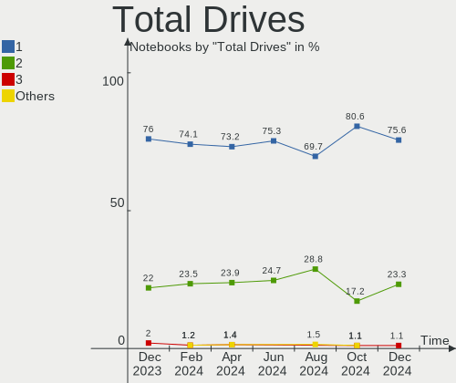
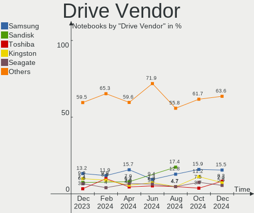
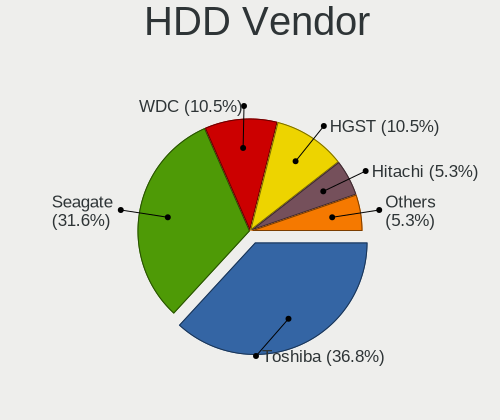
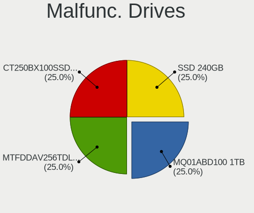
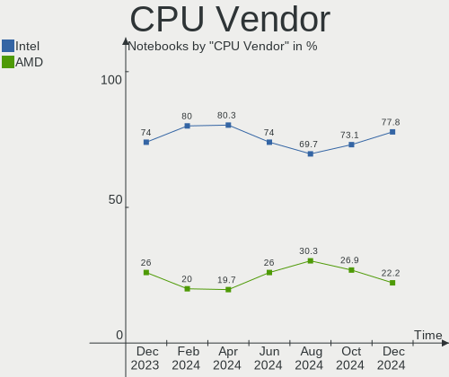
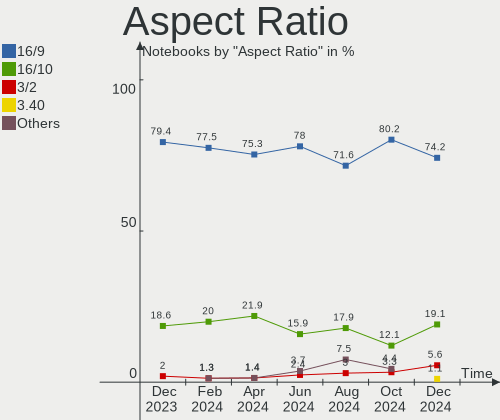
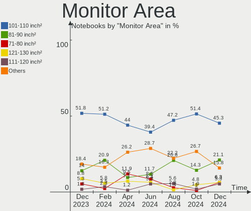
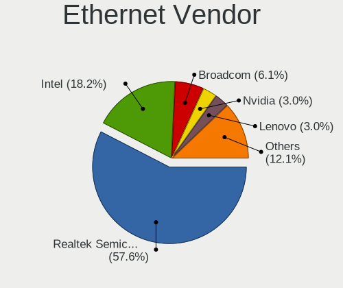
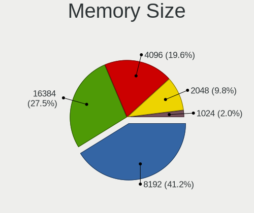
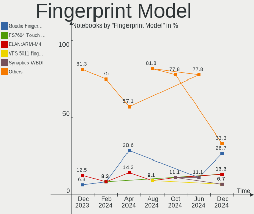

Linux in Spain - Hardware Trends (Notebooks)
--------------------------------------------

A project to identify most popular hardware characteristics and track their change
over time based on data collected by Linux users at https://Linux-Hardware.org.

Anyone can contribute to this report by the [hw-probe](https://github.com/linuxhw/hw-probe) tool:

    sudo -E hw-probe -all -upload

Period: Apr, 2024.

Contents
--------

* [ System ](#system)
  - [ OS                       ](#os)
  - [ OS Family                ](#os-family)
  - [ Kernel                   ](#kernel)
  - [ Kernel Family            ](#kernel-family)
  - [ Kernel Major Ver.        ](#kernel-major-ver)
  - [ Arch                     ](#arch)
  - [ DE                       ](#de)
  - [ Display Server           ](#display-server)
  - [ Display Manager          ](#display-manager)
  - [ OS Lang                  ](#os-lang)
  - [ Boot Mode                ](#boot-mode)
  - [ Filesystem               ](#filesystem)
  - [ Part. scheme             ](#part-scheme)
  - [ Dual Boot with Linux/BSD ](#dual-boot-with-linuxbsd)
  - [ Dual Boot (Win)          ](#dual-boot-win)

* [ Board ](#board)
  - [ Vendor                   ](#vendor)
  - [ Model                    ](#model)
  - [ Model Family             ](#model-family)
  - [ MFG Year                 ](#mfg-year)
  - [ Form Factor              ](#form-factor)
  - [ Secure Boot              ](#secure-boot)
  - [ Coreboot                 ](#coreboot)
  - [ RAM Size                 ](#ram-size)
  - [ RAM Used                 ](#ram-used)
  - [ Total Drives             ](#total-drives)
  - [ Has CD-ROM               ](#has-cd-rom)
  - [ Has Ethernet             ](#has-ethernet)
  - [ Has WiFi                 ](#has-wifi)
  - [ Has Bluetooth            ](#has-bluetooth)

* [ Location ](#location)
  - [ Country                  ](#country)
  - [ City                     ](#city)

* [ Drives ](#drives)
  - [ Drive Vendor             ](#drive-vendor)
  - [ Drive Model              ](#drive-model)
  - [ HDD Vendor               ](#hdd-vendor)
  - [ SSD Vendor               ](#ssd-vendor)
  - [ Drive Kind               ](#drive-kind)
  - [ Drive Connector          ](#drive-connector)
  - [ Drive Size               ](#drive-size)
  - [ Space Total              ](#space-total)
  - [ Space Used               ](#space-used)
  - [ Malfunc. Drives          ](#malfunc-drives)
  - [ Malfunc. Drive Vendor    ](#malfunc-drive-vendor)
  - [ Malfunc. HDD Vendor      ](#malfunc-hdd-vendor)
  - [ Malfunc. Drive Kind      ](#malfunc-drive-kind)
  - [ Failed Drives            ](#failed-drives)
  - [ Failed Drive Vendor      ](#failed-drive-vendor)
  - [ Drive Status             ](#drive-status)

* [ Storage controller ](#storage-controller)
  - [ Storage Vendor           ](#storage-vendor)
  - [ Storage Model            ](#storage-model)
  - [ Storage Kind             ](#storage-kind)

* [ Processor ](#processor)
  - [ CPU Vendor               ](#cpu-vendor)
  - [ CPU Model                ](#cpu-model)
  - [ CPU Model Family         ](#cpu-model-family)
  - [ CPU Cores                ](#cpu-cores)
  - [ CPU Sockets              ](#cpu-sockets)
  - [ CPU Threads              ](#cpu-threads)
  - [ CPU Op-Modes             ](#cpu-op-modes)
  - [ CPU Microcode            ](#cpu-microcode)
  - [ CPU Microarch            ](#cpu-microarch)

* [ Graphics ](#graphics)
  - [ GPU Vendor               ](#gpu-vendor)
  - [ GPU Model                ](#gpu-model)
  - [ GPU Combo                ](#gpu-combo)
  - [ GPU Driver               ](#gpu-driver)
  - [ GPU Memory               ](#gpu-memory)

* [ Monitor ](#monitor)
  - [ Monitor Vendor           ](#monitor-vendor)
  - [ Monitor Model            ](#monitor-model)
  - [ Monitor Resolution       ](#monitor-resolution)
  - [ Monitor Diagonal         ](#monitor-diagonal)
  - [ Monitor Width            ](#monitor-width)
  - [ Aspect Ratio             ](#aspect-ratio)
  - [ Monitor Area             ](#monitor-area)
  - [ Pixel Density            ](#pixel-density)
  - [ Multiple Monitors        ](#multiple-monitors)

* [ Network ](#network)
  - [ Net Controller Vendor    ](#net-controller-vendor)
  - [ Net Controller Model     ](#net-controller-model)
  - [ Wireless Vendor          ](#wireless-vendor)
  - [ Wireless Model           ](#wireless-model)
  - [ Ethernet Vendor          ](#ethernet-vendor)
  - [ Ethernet Model           ](#ethernet-model)
  - [ Net Controller Kind      ](#net-controller-kind)
  - [ Used Controller          ](#used-controller)
  - [ NICs                     ](#nics)
  - [ IPv6                     ](#ipv6)

* [ Bluetooth ](#bluetooth)
  - [ Bluetooth Vendor         ](#bluetooth-vendor)
  - [ Bluetooth Model          ](#bluetooth-model)

* [ Sound ](#sound)
  - [ Sound Vendor             ](#sound-vendor)
  - [ Sound Model              ](#sound-model)

* [ Memory ](#memory)
  - [ Memory Vendor            ](#memory-vendor)
  - [ Memory Model             ](#memory-model)
  - [ Memory Kind              ](#memory-kind)
  - [ Memory Form Factor       ](#memory-form-factor)
  - [ Memory Size              ](#memory-size)
  - [ Memory Speed             ](#memory-speed)

* [ Printers & scanners ](#printers--scanners)
  - [ Printer Vendor           ](#printer-vendor)
  - [ Printer Model            ](#printer-model)
  - [ Scanner Vendor           ](#scanner-vendor)
  - [ Scanner Model            ](#scanner-model)

* [ Camera ](#camera)
  - [ Camera Vendor            ](#camera-vendor)
  - [ Camera Model             ](#camera-model)

* [ Security ](#security)
  - [ Fingerprint Vendor       ](#fingerprint-vendor)
  - [ Fingerprint Model        ](#fingerprint-model)
  - [ Chipcard Vendor          ](#chipcard-vendor)
  - [ Chipcard Model           ](#chipcard-model)

* [ Unsupported ](#unsupported)
  - [ Unsupported Devices      ](#unsupported-devices)
  - [ Unsupported Device Types ](#unsupported-device-types)

System
------

OS
--

Installed operating systems

| Name                         | Notebooks | Percent |
|------------------------------|-----------|---------|
| Ubuntu 22.04                 | 11        | 15.28%  |
| Zorin 17                     | 4         | 5.56%   |
| Fedora 40                    | 4         | 5.56%   |
| Debian 12                    | 4         | 5.56%   |
| Ubuntu 24.04                 | 3         | 4.17%   |
| Ubuntu 23.10                 | 3         | 4.17%   |
| Fedora 39                    | 3         | 4.17%   |
| ArcoLinux Rolling            | 3         | 4.17%   |
| Ubuntu MATE 22.04            | 2         | 2.78%   |
| Ubuntu 20.04                 | 2         | 2.78%   |
| OpenMandriva 23.08           | 2         | 2.78%   |
| LMDE 6                       | 2         | 2.78%   |
| Linux Mint 21.3              | 2         | 2.78%   |
| Garuda Linux Soaring         | 2         | 2.78%   |
| EndeavourOS Rolling          | 2         | 2.78%   |
| Arch Rolling                 | 2         | 2.78%   |
| Zorin 15                     | 1         | 1.39%   |
| Xubuntu 22.04                | 1         | 1.39%   |
| Xubuntu 18.04                | 1         | 1.39%   |
| ROSA 12.5                    | 1         | 1.39%   |
| Puppy 9                      | 1         | 1.39%   |
| Pop!_OS 22.04                | 1         | 1.39%   |
| openSUSE Tumbleweed-XXXXXXXX | 1         | 1.39%   |
| openSUSE Microos-XXXXXXXX    | 1         | 1.39%   |
| openSUSE Leap-15.5           | 1         | 1.39%   |
| OpenMandriva 5.0             | 1         | 1.39%   |
| OpenMandriva 24.01           | 1         | 1.39%   |
| MX 21                        | 1         | 1.39%   |
| Manjaro 23.1.4               | 1         | 1.39%   |
| Manjaro                      | 1         | 1.39%   |
| Lubuntu 23.10                | 1         | 1.39%   |
| Linux Mint 21.2              | 1         | 1.39%   |
| Linux Mint 21.1              | 1         | 1.39%   |
| KDE neon 22.04               | 1         | 1.39%   |
| Gentoo 2.15                  | 1         | 1.39%   |
| Elementary 7.1               | 1         | 1.39%   |
| Debian                       | 1         | 1.39%   |

OS Family
---------

OS without a version

| Name         | Notebooks | Percent |
|--------------|-----------|---------|
| Ubuntu       | 19        | 26.39%  |
| Fedora       | 7         | 9.72%   |
| Zorin        | 5         | 6.94%   |
| Debian       | 5         | 6.94%   |
| OpenMandriva | 4         | 5.56%   |
| Linux Mint   | 4         | 5.56%   |
| openSUSE     | 3         | 4.17%   |
| ArcoLinux    | 3         | 4.17%   |
| Xubuntu      | 2         | 2.78%   |
| Ubuntu MATE  | 2         | 2.78%   |
| Manjaro      | 2         | 2.78%   |
| LMDE         | 2         | 2.78%   |
| Garuda Linux | 2         | 2.78%   |
| EndeavourOS  | 2         | 2.78%   |
| Arch         | 2         | 2.78%   |
| ROSA         | 1         | 1.39%   |
| Puppy        | 1         | 1.39%   |
| Pop!_OS      | 1         | 1.39%   |
| MX           | 1         | 1.39%   |
| Lubuntu      | 1         | 1.39%   |
| KDE neon     | 1         | 1.39%   |
| Gentoo       | 1         | 1.39%   |
| Elementary   | 1         | 1.39%   |

Kernel
------

Version of the Linux kernel

| Version                             | Notebooks | Percent |
|-------------------------------------|-----------|---------|
| 6.5.0-26-generic                    | 11        | 15.28%  |
| 6.1.0-18-amd64                      | 5         | 6.94%   |
| 6.8.7-300.fc40.x86_64               | 4         | 5.56%   |
| 6.5.0-27-generic                    | 4         | 5.56%   |
| 6.8.6-200.fc39.x86_64               | 3         | 4.17%   |
| 6.5.0-28-generic                    | 3         | 4.17%   |
| 6.8.2-arch2-1                       | 2         | 2.78%   |
| 6.8.0-31-generic                    | 2         | 2.78%   |
| 6.6.2-desktop-1omv2390              | 2         | 2.78%   |
| 6.5.0-34-generic                    | 2         | 2.78%   |
| 6.4.11-desktop-1omv2390             | 2         | 2.78%   |
| 5.4.0-150-generic                   | 2         | 2.78%   |
| 5.15.0-102-generic                  | 2         | 2.78%   |
| 5.15.0-101-generic                  | 2         | 2.78%   |
| 6.8.7-zen1-2-zen                    | 1         | 1.39%   |
| 6.8.5-1-default                     | 1         | 1.39%   |
| 6.8.4-zen1-1-zen                    | 1         | 1.39%   |
| 6.8.4-arch1-1                       | 1         | 1.39%   |
| 6.8.2-arch1-1                       | 1         | 1.39%   |
| 6.8.2-1-default                     | 1         | 1.39%   |
| 6.8.1-gentoo                        | 1         | 1.39%   |
| 6.8.0-76060800daily20240311-generic | 1         | 1.39%   |
| 6.8.0-22-generic                    | 1         | 1.39%   |
| 6.7.2-arch1-2                       | 1         | 1.39%   |
| 6.7.12-amd64                        | 1         | 1.39%   |
| 6.6.26-1-MANJARO                    | 1         | 1.39%   |
| 6.6.25-1-lts                        | 1         | 1.39%   |
| 6.6.24-1-lts                        | 1         | 1.39%   |
| 6.5.13-7-MANJARO                    | 1         | 1.39%   |
| 6.5.0-18-generic                    | 1         | 1.39%   |
| 6.5.0-17-generic                    | 1         | 1.39%   |
| 6.5.0-1020-oem                      | 1         | 1.39%   |
| 6.2.0-39-generic                    | 1         | 1.39%   |
| 6.1.0-9mx-ahs-amd64                 | 1         | 1.39%   |
| 6.1.0-20-amd64                      | 1         | 1.39%   |
| 5.4.53                              | 1         | 1.39%   |
| 5.15.127-generic-1rosa2021.1-i686   | 1         | 1.39%   |
| 5.15.0-1028-gke                     | 1         | 1.39%   |
| 5.15.0-051500rc6-generic            | 1         | 1.39%   |
| 5.14.21-150500.55.52-default        | 1         | 1.39%   |

Kernel Family
-------------

Linux kernel without a distro release

| Version  | Notebooks | Percent |
|----------|-----------|---------|
| 6.5.0    | 23        | 31.94%  |
| 6.1.0    | 7         | 9.72%   |
| 5.15.0   | 6         | 8.33%   |
| 6.8.7    | 5         | 6.94%   |
| 6.8.2    | 4         | 5.56%   |
| 6.8.0    | 4         | 5.56%   |
| 6.8.6    | 3         | 4.17%   |
| 6.8.4    | 2         | 2.78%   |
| 6.6.2    | 2         | 2.78%   |
| 6.4.11   | 2         | 2.78%   |
| 5.4.0    | 2         | 2.78%   |
| 6.8.5    | 1         | 1.39%   |
| 6.8.1    | 1         | 1.39%   |
| 6.7.2    | 1         | 1.39%   |
| 6.7.12   | 1         | 1.39%   |
| 6.6.26   | 1         | 1.39%   |
| 6.6.25   | 1         | 1.39%   |
| 6.6.24   | 1         | 1.39%   |
| 6.5.13   | 1         | 1.39%   |
| 6.2.0    | 1         | 1.39%   |
| 5.4.53   | 1         | 1.39%   |
| 5.15.127 | 1         | 1.39%   |
| 5.14.21  | 1         | 1.39%   |

Kernel Major Ver.
-----------------

Linux kernel major version

| Version | Notebooks | Percent |
|---------|-----------|---------|
| 6.5     | 24        | 33.33%  |
| 6.8     | 20        | 27.78%  |
| 6.1     | 7         | 9.72%   |
| 5.15    | 7         | 9.72%   |
| 6.6     | 5         | 6.94%   |
| 5.4     | 3         | 4.17%   |
| 6.7     | 2         | 2.78%   |
| 6.4     | 2         | 2.78%   |
| 6.2     | 1         | 1.39%   |
| 5.14    | 1         | 1.39%   |

Arch
----

OS architecture (x86_64, i586, etc.)

| Name   | Notebooks | Percent |
|--------|-----------|---------|
| x86_64 | 69        | 95.83%  |
| i686   | 3         | 4.17%   |

DE
--

Desktop Environment

| Name       | Notebooks | Percent |
|------------|-----------|---------|
| GNOME      | 36        | 50%     |
| KDE5       | 8         | 11.11%  |
| XFCE       | 5         | 6.94%   |
| X-Cinnamon | 5         | 6.94%   |
| MATE       | 4         | 5.56%   |
| KDE6       | 4         | 5.56%   |
| Unknown    | 4         | 5.56%   |
| LXQt       | 2         | 2.78%   |
| i3         | 2         | 2.78%   |
| Pantheon   | 1         | 1.39%   |
| KDE        | 1         | 1.39%   |

Display Server
--------------

X11 or Wayland

| Name    | Notebooks | Percent |
|---------|-----------|---------|
| X11     | 38        | 52.78%  |
| Wayland | 34        | 47.22%  |

Display Manager
---------------

SDDM, LightDM, etc.

| Name    | Notebooks | Percent |
|---------|-----------|---------|
| Unknown | 25        | 34.72%  |
| GDM3    | 18        | 25%     |
| LightDM | 13        | 18.06%  |
| SDDM    | 12        | 16.67%  |
| GDM     | 4         | 5.56%   |

OS Lang
-------

Language

| Lang    | Notebooks | Percent |
|---------|-----------|---------|
| es_ES   | 48        | 66.67%  |
| en_US   | 16        | 22.22%  |
| en_GB   | 3         | 4.17%   |
| Unknown | 3         | 4.17%   |
| es_EC   | 1         | 1.39%   |
| ca_ES   | 1         | 1.39%   |

Boot Mode
---------

EFI or BIOS

| Mode | Notebooks | Percent |
|------|-----------|---------|
| EFI  | 37        | 51.39%  |
| BIOS | 35        | 48.61%  |

Filesystem
----------

Type of filesystem

| Type    | Notebooks | Percent |
|---------|-----------|---------|
| Ext4    | 42        | 58.33%  |
| Btrfs   | 14        | 19.44%  |
| Tmpfs   | 11        | 15.28%  |
| Overlay | 2         | 2.78%   |
| Zfs     | 1         | 1.39%   |
| Xfs     | 1         | 1.39%   |
| Aufs    | 1         | 1.39%   |

Part. scheme
------------

Scheme of partitioning

| Type    | Notebooks | Percent |
|---------|-----------|---------|
| GPT     | 47        | 65.28%  |
| Unknown | 23        | 31.94%  |
| MBR     | 2         | 2.78%   |

Dual Boot with Linux/BSD
------------------------

Hosting more than one Linux/BSD

| Dual boot | Notebooks | Percent |
|-----------|-----------|---------|
| No        | 62        | 86.11%  |
| Yes       | 10        | 13.89%  |

Dual Boot (Win)
---------------

Hosting Linux and Windows

| Dual boot | Notebooks | Percent |
|-----------|-----------|---------|
| No        | 53        | 73.61%  |
| Yes       | 19        | 26.39%  |

Board
-----

Vendor
------

Motherboard manufacturer

| Name             | Notebooks | Percent |
|------------------|-----------|---------|
| Hewlett-Packard  | 17        | 23.61%  |
| ASUSTek Computer | 11        | 15.28%  |
| Acer             | 11        | 15.28%  |
| Lenovo           | 9         | 12.5%   |
| MSI              | 7         | 9.72%   |
| Apple            | 6         | 8.33%   |
| HUAWEI           | 3         | 4.17%   |
| Packard Bell     | 2         | 2.78%   |
| Dell             | 2         | 2.78%   |
| Toshiba          | 1         | 1.39%   |
| Sony             | 1         | 1.39%   |
| Medion           | 1         | 1.39%   |
| AMI              | 1         | 1.39%   |

Model
-----

Motherboard model

| Name                                   | Notebooks | Percent |
|----------------------------------------|-----------|---------|
| MSI GE72 2QD                           | 2         | 2.78%   |
| ASUS ROG Zephyrus G14 GA401II_GA401II  | 2         | 2.78%   |
| Toshiba NB520                          | 1         | 1.39%   |
| Sony VPCCB4Q1E                         | 1         | 1.39%   |
| Packard Bell EasyNote TM86             | 1         | 1.39%   |
| Packard Bell EasyNote LJ65             | 1         | 1.39%   |
| MSI Summit E13FlipEvo A11MT            | 1         | 1.39%   |
| MSI Stealth 15M B12UE                  | 1         | 1.39%   |
| MSI MS-7E26                            | 1         | 1.39%   |
| MSI Katana 15 B13VGK                   | 1         | 1.39%   |
| MSI GE66 Raider 10UG                   | 1         | 1.39%   |
| Medion E1210                           | 1         | 1.39%   |
| Lenovo ThinkPad L13 Gen 2 20VJS22W00   | 1         | 1.39%   |
| Lenovo ThinkPad E16 Gen 1 21JTCTO1WW   | 1         | 1.39%   |
| Lenovo Legion Y530-15ICH 81FV          | 1         | 1.39%   |
| Lenovo IdeaPad S145-15AST 81N3         | 1         | 1.39%   |
| Lenovo IdeaPad 330-15ICH 81FK          | 1         | 1.39%   |
| Lenovo IdeaPad 320-15IKB 80XL          | 1         | 1.39%   |
| Lenovo IdeaPad 3 15ITL6 82H8           | 1         | 1.39%   |
| Lenovo IdeaPad 1 15AMN7 82VG           | 1         | 1.39%   |
| Lenovo B575e 36852BG                   | 1         | 1.39%   |
| HUAWEI NBLB-WAX9N                      | 1         | 1.39%   |
| HUAWEI KLVL-WXX9                       | 1         | 1.39%   |
| HUAWEI BoDE-WXX9                       | 1         | 1.39%   |
| HP ZBook 15u G6                        | 1         | 1.39%   |
| HP ZBook 15 G5                         | 1         | 1.39%   |
| HP ProBook 4510s                       | 1         | 1.39%   |
| HP ProBook 445 14 inch G10 Notebook PC | 1         | 1.39%   |
| HP ProBook 430 G8 Notebook PC          | 1         | 1.39%   |
| HP Pavilion Laptop 15-ck0xx            | 1         | 1.39%   |
| HP Pavilion Laptop 14-dv1xxx           | 1         | 1.39%   |
| HP Pavilion 13 x2 PC                   | 1         | 1.39%   |
| HP OMEN by Laptop                      | 1         | 1.39%   |
| HP Laptop 15s-fq5xxx                   | 1         | 1.39%   |
| HP Laptop 15s-fq1xxx                   | 1         | 1.39%   |
| HP Laptop 15-fc0xxx                    | 1         | 1.39%   |
| HP EliteBook 840 G3                    | 1         | 1.39%   |
| HP Compaq Presario C700                | 1         | 1.39%   |
| HP Compaq 6730b (GW687AV)              | 1         | 1.39%   |
| HP 255 G6 Notebook PC                  | 1         | 1.39%   |

Model Family
------------

Motherboard model prefix

| Name                  | Notebooks | Percent |
|-----------------------|-----------|---------|
| Acer Aspire           | 8         | 11.11%  |
| Lenovo IdeaPad        | 5         | 6.94%   |
| ASUS VivoBook         | 4         | 5.56%   |
| HP ProBook            | 3         | 4.17%   |
| HP Pavilion           | 3         | 4.17%   |
| HP Laptop             | 3         | 4.17%   |
| Packard Bell EasyNote | 2         | 2.78%   |
| MSI GE72              | 2         | 2.78%   |
| Lenovo ThinkPad       | 2         | 2.78%   |
| HP ZBook              | 2         | 2.78%   |
| HP Compaq             | 2         | 2.78%   |
| Dell XPS              | 2         | 2.78%   |
| ASUS ROG              | 2         | 2.78%   |
| Acer Nitro            | 2         | 2.78%   |
| Toshiba NB520         | 1         | 1.39%   |
| Sony VPCCB4Q1E        | 1         | 1.39%   |
| MSI Summit            | 1         | 1.39%   |
| MSI Stealth           | 1         | 1.39%   |
| MSI MS-7E26           | 1         | 1.39%   |
| MSI Katana            | 1         | 1.39%   |
| MSI GE66              | 1         | 1.39%   |
| Medion E1210          | 1         | 1.39%   |
| Lenovo Legion         | 1         | 1.39%   |
| Lenovo B575e          | 1         | 1.39%   |
| HUAWEI NBLB-WAX9N     | 1         | 1.39%   |
| HUAWEI KLVL-WXX9      | 1         | 1.39%   |
| HUAWEI BoDE-WXX9      | 1         | 1.39%   |
| HP OMEN               | 1         | 1.39%   |
| HP EliteBook          | 1         | 1.39%   |
| HP 255                | 1         | 1.39%   |
| HP 250                | 1         | 1.39%   |
| ASUS ZenBook          | 1         | 1.39%   |
| ASUS X550VX           | 1         | 1.39%   |
| ASUS X550LD           | 1         | 1.39%   |
| ASUS UX32VD           | 1         | 1.39%   |
| ASUS M51Va            | 1         | 1.39%   |
| Apple MacBookPro11    | 1         | 1.39%   |
| Apple MacBookAir7     | 1         | 1.39%   |
| Apple MacBookAir6     | 1         | 1.39%   |
| Apple MacBook6        | 1         | 1.39%   |

MFG Year
--------

Motherboard manufacture year

| Year | Notebooks | Percent |
|------|-----------|---------|
| 2018 | 9         | 12.5%   |
| 2022 | 8         | 11.11%  |
| 2020 | 8         | 11.11%  |
| 2023 | 5         | 6.94%   |
| 2016 | 5         | 6.94%   |
| 2009 | 5         | 6.94%   |
| 2021 | 4         | 5.56%   |
| 2013 | 4         | 5.56%   |
| 2008 | 4         | 5.56%   |
| 2007 | 4         | 5.56%   |
| 2019 | 3         | 4.17%   |
| 2011 | 3         | 4.17%   |
| 2017 | 2         | 2.78%   |
| 2015 | 2         | 2.78%   |
| 2014 | 2         | 2.78%   |
| 2012 | 2         | 2.78%   |
| 2024 | 1         | 1.39%   |
| 2010 | 1         | 1.39%   |

Form Factor
-----------

Physical design of the computer

| Name     | Notebooks | Percent |
|----------|-----------|---------|
| Notebook | 72        | 100%    |

Secure Boot
-----------

Enabled or disabled

| State    | Notebooks | Percent |
|----------|-----------|---------|
| Disabled | 62        | 86.11%  |
| Enabled  | 10        | 13.89%  |

Coreboot
--------

Have coreboot on board

| Used | Notebooks | Percent |
|------|-----------|---------|
| No   | 72        | 100%    |

RAM Size
--------

Total RAM memory

| Size in GB  | Notebooks | Percent |
|-------------|-----------|---------|
| 4.01-8.0    | 19        | 26.39%  |
| 16.01-24.0  | 17        | 23.61%  |
| 8.01-16.0   | 12        | 16.67%  |
| 3.01-4.0    | 11        | 15.28%  |
| 32.01-64.0  | 6         | 8.33%   |
| 1.01-2.0    | 4         | 5.56%   |
| 24.01-32.0  | 1         | 1.39%   |
| 2.01-3.0    | 1         | 1.39%   |
| 64.01-256.0 | 1         | 1.39%   |

RAM Used
--------

Used RAM memory

| Used GB    | Notebooks | Percent |
|------------|-----------|---------|
| 1.01-2.0   | 20        | 27.78%  |
| 2.01-3.0   | 18        | 25%     |
| 4.01-8.0   | 16        | 22.22%  |
| 3.01-4.0   | 13        | 18.06%  |
| 8.01-16.0  | 2         | 2.78%   |
| 0.51-1.0   | 2         | 2.78%   |
| 16.01-24.0 | 1         | 1.39%   |

Total Drives
------------

Number of drives on board

| Drives | Notebooks | Percent |
|--------|-----------|---------|
| 1      | 53        | 73.61%  |
| 2      | 17        | 23.61%  |
| 4      | 1         | 1.39%   |
| 3      | 1         | 1.39%   |

Has CD-ROM
----------

Has CD-ROM on board

| Presented | Notebooks | Percent |
|-----------|-----------|---------|
| No        | 50        | 69.44%  |
| Yes       | 22        | 30.56%  |

Has Ethernet
------------

Has Ethernet on board

| Presented | Notebooks | Percent |
|-----------|-----------|---------|
| Yes       | 53        | 73.61%  |
| No        | 19        | 26.39%  |

Has WiFi
--------

Has WiFi module

| Presented | Notebooks | Percent |
|-----------|-----------|---------|
| Yes       | 72        | 100%    |

Has Bluetooth
-------------

Has Bluetooth module

| Presented | Notebooks | Percent |
|-----------|-----------|---------|
| Yes       | 61        | 84.72%  |
| No        | 11        | 15.28%  |

Location
--------

Country
-------

Geographic location (country)

| Country | Notebooks | Percent |
|---------|-----------|---------|
| Spain   | 72        | 100%    |

City
----

Geographic location (city)

| City                    | Notebooks | Percent |
|-------------------------|-----------|---------|
| Madrid                  | 11        | 15.28%  |
| Barcelona               | 6         | 8.33%   |
| Valladolid              | 3         | 4.17%   |
| Valencia                | 3         | 4.17%   |
| Alicante                | 3         | 4.17%   |
| A Coruña               | 3         | 4.17%   |
| Zaragoza                | 2         | 2.78%   |
| Murcia                  | 2         | 2.78%   |
| Leganés                | 2         | 2.78%   |
| Granada                 | 2         | 2.78%   |
| Bilbao                  | 2         | 2.78%   |
| Zafra                   | 1         | 1.39%   |
| Xinzo de Limia          | 1         | 1.39%   |
| Xàtiva                 | 1         | 1.39%   |
| Vitoria-Gasteiz         | 1         | 1.39%   |
| Vilanova i la Geltrú   | 1         | 1.39%   |
| Vigo                    | 1         | 1.39%   |
| Sierra de Yeguas        | 1         | 1.39%   |
| Seville                 | 1         | 1.39%   |
| Sant Andreu de la Barca | 1         | 1.39%   |
| Sabadell                | 1         | 1.39%   |
| Palma                   | 1         | 1.39%   |
| Manises                 | 1         | 1.39%   |
| Málaga                 | 1         | 1.39%   |
| León                   | 1         | 1.39%   |
| Guadalajara             | 1         | 1.39%   |
| Grinon                  | 1         | 1.39%   |
| Gran Tarajal            | 1         | 1.39%   |
| Gijón                  | 1         | 1.39%   |
| Elche                   | 1         | 1.39%   |
| El Vendrell             | 1         | 1.39%   |
| Creixell                | 1         | 1.39%   |
| Córdoba                | 1         | 1.39%   |
| Collado Villalba        | 1         | 1.39%   |
| Castro Urdiales         | 1         | 1.39%   |
| Cambil                  | 1         | 1.39%   |
| Burgos                  | 1         | 1.39%   |
| Boadilla del Monte      | 1         | 1.39%   |
| Badalona                | 1         | 1.39%   |
| Avilés                 | 1         | 1.39%   |

Drives
------

Drive Vendor
------------

Hard drive vendors

| Vendor              | Notebooks | Drives | Percent |
|---------------------|-----------|--------|---------|
| Samsung Electronics | 14        | 14     | 15.56%  |
| WDC                 | 8         | 8      | 8.89%   |
| Sandisk             | 8         | 9      | 8.89%   |
| Intel               | 7         | 8      | 7.78%   |
| Seagate             | 6         | 6      | 6.67%   |
| Micron Technology   | 6         | 6      | 6.67%   |
| Hitachi             | 6         | 6      | 6.67%   |
| Kingston            | 5         | 6      | 5.56%   |
| Toshiba             | 4         | 4      | 4.44%   |
| Phison Electronics  | 4         | 4      | 4.44%   |
| HGST                | 4         | 4      | 4.44%   |
| Apple               | 3         | 3      | 3.33%   |
| Unknown             | 2         | 2      | 2.22%   |
| SK hynix            | 2         | 2      | 2.22%   |
| KIOXIA              | 2         | 2      | 2.22%   |
| SSSTC               | 1         | 1      | 1.11%   |
| SSK                 | 1         | 1      | 1.11%   |
| Phison              | 1         | 1      | 1.11%   |
| LITEON              | 1         | 1      | 1.11%   |
| Lexar               | 1         | 1      | 1.11%   |
| Hewlett-Packard     | 1         | 1      | 1.11%   |
| Crucial             | 1         | 1      | 1.11%   |
| China               | 1         | 1      | 1.11%   |
| Unknown             | 1         | 1      | 1.11%   |

Drive Model
-----------

Hard drive models

| Model                                             | Notebooks | Percent |
|---------------------------------------------------|-----------|---------|
| HGST HTS721010A9E630 1TB                          | 3         | 3.26%   |
| Unknown MMC Card  64GB                            | 2         | 2.17%   |
| Samsung SSD 860 EVO 1TB                           | 2         | 2.17%   |
| Samsung NVMe SSD Controller SM981/PM981/PM983 1TB | 2         | 2.17%   |
| Phison PS5013 E13 NVMe Controller 512GB           | 2         | 2.17%   |
| Kingston SA400S37240G 240GB SSD                   | 2         | 2.17%   |
| WDC WD5000LPVX-60V0TT0 500GB                      | 1         | 1.09%   |
| WDC WD5000LPCX-22VHAT1 500GB                      | 1         | 1.09%   |
| WDC WD1600BEVT-60ZCT1 160GB                       | 1         | 1.09%   |
| WDC WD10SPZX-24Z10 1TB                            | 1         | 1.09%   |
| WDC WD10JPVX-22JC3T0 1TB                          | 1         | 1.09%   |
| WDC PC SN730 SDBPNTY-1T00-1032 1TB                | 1         | 1.09%   |
| WDC PC SN530 SDBPNPZ-512G-1114 512GB              | 1         | 1.09%   |
| WDC PC SN530 SDBPNPZ-1T00-1002 1TB                | 1         | 1.09%   |
| Toshiba MQ04ABF100 1TB                            | 1         | 1.09%   |
| Toshiba MQ01ABF050 500GB                          | 1         | 1.09%   |
| Toshiba MQ01ABD050 500GB                          | 1         | 1.09%   |
| Toshiba MK3275GSX 320GB                           | 1         | 1.09%   |
| SSSTC CL4-8D256-HP 256GB                          | 1         | 1.09%   |
| SSK Disk 256GB                                    | 1         | 1.09%   |
| SK hynix PC601 HFS512GD9TNG-L2A0A 512GB           | 1         | 1.09%   |
| SK hynix HFS256G39MND-3310A 256GB SSD             | 1         | 1.09%   |
| Seagate ST9320320AS 320GB                         | 1         | 1.09%   |
| Seagate ST500LT012-1DG142 500GB                   | 1         | 1.09%   |
| Seagate ST500LM012 HN-M500MBB 500GB               | 1         | 1.09%   |
| Seagate ST2000LM007-1R8174 2TB                    | 1         | 1.09%   |
| Seagate ST1000LM049-2GH172 1TB                    | 1         | 1.09%   |
| Seagate Backup+ Hub BK 8TB                        | 1         | 1.09%   |
| Sandisk WD PC SN740 SDDQNQD-512G-1014 512GB       | 1         | 1.09%   |
| Sandisk WD PC SN740 SDDQNQD-1T00-1201 1TB         | 1         | 1.09%   |
| Sandisk WD PC SN560 SDDPNQE-1T00-1032 1024GB      | 1         | 1.09%   |
| Sandisk WD Blue SN570 1TB                         | 1         | 1.09%   |
| Sandisk WD Blue SN550 NVMe SSD 2TB                | 1         | 1.09%   |
| Sandisk WD Black SN850 512GB                      | 1         | 1.09%   |
| SanDisk SSD PLUS 480 GB                           | 1         | 1.09%   |
| SanDisk SSD PLUS 2000GB                           | 1         | 1.09%   |
| SanDisk SSD i100 24GB                             | 1         | 1.09%   |
| Samsung SSD 980 500GB                             | 1         | 1.09%   |
| Samsung SSD 860 EVO 250GB                         | 1         | 1.09%   |
| Samsung SSD 850 EVO 250GB                         | 1         | 1.09%   |

HDD Vendor
----------

Hard disk drive vendors

| Vendor              | Notebooks | Drives | Percent |
|---------------------|-----------|--------|---------|
| Seagate             | 6         | 6      | 23.08%  |
| Hitachi             | 6         | 6      | 23.08%  |
| WDC                 | 5         | 5      | 19.23%  |
| Toshiba             | 4         | 4      | 15.38%  |
| HGST                | 4         | 4      | 15.38%  |
| Samsung Electronics | 1         | 1      | 3.85%   |

SSD Vendor
----------

Solid state drive vendors

| Vendor              | Notebooks | Drives | Percent |
|---------------------|-----------|--------|---------|
| Samsung Electronics | 5         | 5      | 22.73%  |
| Kingston            | 4         | 5      | 18.18%  |
| SanDisk             | 3         | 3      | 13.64%  |
| Apple               | 3         | 3      | 13.64%  |
| SSK                 | 1         | 1      | 4.55%   |
| SK hynix            | 1         | 1      | 4.55%   |
| Micron Technology   | 1         | 1      | 4.55%   |
| LITEON              | 1         | 1      | 4.55%   |
| Hewlett-Packard     | 1         | 1      | 4.55%   |
| Crucial             | 1         | 1      | 4.55%   |
| China               | 1         | 1      | 4.55%   |

Drive Kind
----------

HDD or SSD

| Kind | Notebooks | Drives | Percent |
|------|-----------|--------|---------|
| NVMe | 39        | 41     | 43.82%  |
| HDD  | 25        | 26     | 28.09%  |
| SSD  | 22        | 23     | 24.72%  |
| MMC  | 3         | 3      | 3.37%   |

Drive Connector
---------------

SATA, SAS, NVMe, etc.

| Type | Notebooks | Drives | Percent |
|------|-----------|--------|---------|
| SATA | 41        | 47     | 48.24%  |
| NVMe | 39        | 41     | 45.88%  |
| MMC  | 3         | 3      | 3.53%   |
| SAS  | 2         | 2      | 2.35%   |

Drive Size
----------

Size of hard drive

| Size in TB | Notebooks | Drives | Percent |
|------------|-----------|--------|---------|
| 0.01-0.5   | 31        | 34     | 67.39%  |
| 0.51-1.0   | 11        | 11     | 23.91%  |
| 1.01-2.0   | 3         | 3      | 6.52%   |
| 4.01-10.0  | 1         | 1      | 2.17%   |

Space Total
-----------

Amount of disk space available on the file system

| Size in GB     | Notebooks | Percent |
|----------------|-----------|---------|
| 251-500        | 21        | 29.17%  |
| 101-250        | 16        | 22.22%  |
| 501-1000       | 12        | 16.67%  |
| 1001-2000      | 8         | 11.11%  |
| More than 3000 | 4         | 5.56%   |
| 1-20           | 4         | 5.56%   |
| 51-100         | 3         | 4.17%   |
| Unknown        | 2         | 2.78%   |
| 21-50          | 1         | 1.39%   |
| 2001-3000      | 1         | 1.39%   |

Space Used
----------

Amount of used disk space

| Used GB        | Notebooks | Percent |
|----------------|-----------|---------|
| 1-20           | 17        | 23.61%  |
| 21-50          | 13        | 18.06%  |
| 51-100         | 13        | 18.06%  |
| 101-250        | 10        | 13.89%  |
| 251-500        | 7         | 9.72%   |
| 501-1000       | 7         | 9.72%   |
| 2001-3000      | 2         | 2.78%   |
| Unknown        | 2         | 2.78%   |
| More than 3000 | 1         | 1.39%   |

Malfunc. Drives
---------------

Drive models with a malfunction

| Model                         | Notebooks | Drives | Percent |
|-------------------------------|-----------|--------|---------|
| Hitachi HTS723232L9A360 320GB | 1         | 1      | 33.33%  |
| Hitachi HTS542512K9SA00 120GB | 1         | 1      | 33.33%  |
| Apple SSD SD0128F 121GB       | 1         | 1      | 33.33%  |

Malfunc. Drive Vendor
---------------------

Vendors of faulty drives

| Vendor  | Notebooks | Drives | Percent |
|---------|-----------|--------|---------|
| Hitachi | 2         | 2      | 66.67%  |
| Apple   | 1         | 1      | 33.33%  |

Malfunc. HDD Vendor
-------------------

Vendors of faulty HDD drives

| Vendor  | Notebooks | Drives | Percent |
|---------|-----------|--------|---------|
| Hitachi | 2         | 2      | 100%    |

Malfunc. Drive Kind
-------------------

Kinds of faulty drives

| Kind | Notebooks | Drives | Percent |
|------|-----------|--------|---------|
| HDD  | 2         | 2      | 66.67%  |
| SSD  | 1         | 1      | 33.33%  |

Failed Drives
-------------

Failed drive models

Zero info for selected period =(

Failed Drive Vendor
-------------------

Failed drive vendors

Zero info for selected period =(

Drive Status
------------

Number of failed and malfunc. drives

| Status   | Notebooks | Drives | Percent |
|----------|-----------|--------|---------|
| Works    | 37        | 47     | 49.33%  |
| Detected | 35        | 43     | 46.67%  |
| Malfunc  | 3         | 3      | 4%      |

Storage controller
------------------

Storage Vendor
--------------

Storage controller vendors

| Vendor                         | Notebooks | Percent |
|--------------------------------|-----------|---------|
| Intel                          | 45        | 49.45%  |
| Samsung Electronics            | 10        | 10.99%  |
| SanDisk                        | 9         | 9.89%   |
| AMD                            | 8         | 8.79%   |
| Phison Electronics             | 5         | 5.49%   |
| Micron Technology              | 5         | 5.49%   |
| Nvidia                         | 2         | 2.2%    |
| KIOXIA                         | 2         | 2.2%    |
| Solid State Storage Technology | 1         | 1.1%    |
| SK hynix                       | 1         | 1.1%    |
| Shenzhen Longsys Electronics   | 1         | 1.1%    |
| Marvell Technology Group       | 1         | 1.1%    |
| Kingston Technology Company    | 1         | 1.1%    |

Storage Model
-------------

Storage controller models

| Model                                                                   | Notebooks | Percent |
|-------------------------------------------------------------------------|-----------|---------|
| Intel Volume Management Device NVMe RAID Controller                     | 7         | 6.73%   |
| AMD FCH SATA Controller [AHCI mode]                                     | 7         | 6.73%   |
| Intel 82801 Mobile SATA Controller [RAID mode]                          | 5         | 4.81%   |
| Samsung NVMe SSD Controller SM981/PM981/PM983                           | 4         | 3.85%   |
| Intel Cannon Lake Mobile PCH SATA AHCI Controller                       | 4         | 3.85%   |
| Intel 82801IBM/IEM (ICH9M/ICH9M-E) 4 port SATA Controller [AHCI mode]   | 4         | 3.85%   |
| Intel 82801HM/HEM (ICH8M/ICH8M-E) IDE Controller                        | 4         | 3.85%   |
| SanDisk WD Black SN770 / PC SN740 256GB / PC SN560 (DRAM-less) NVMe SSD | 3         | 2.88%   |
| SanDisk Ultra 3D / WD Blue SN550 NVMe SSD                               | 3         | 2.88%   |
| Phison PS5013-E13 PCIe3 NVMe Controller (DRAM-less)                     | 3         | 2.88%   |
| Intel Sunrise Point-LP SATA Controller [AHCI mode]                      | 3         | 2.88%   |
| Intel SSD 670p Series [Keystone Harbor]                                 | 3         | 2.88%   |
| Intel 82801HM/HEM (ICH8M/ICH8M-E) SATA Controller [AHCI mode]           | 3         | 2.88%   |
| Intel 8 Series SATA Controller 1 [AHCI mode]                            | 3         | 2.88%   |
| Nvidia MCP79 AHCI Controller                                            | 2         | 1.92%   |
| Micron 2450 NVMe SSD [HendrixV] (DRAM-less)                             | 2         | 1.92%   |
| Micron 2210 NVMe SSD [Cobain]                                           | 2         | 1.92%   |
| KIOXIA NVMe SSD Controller BG4 (DRAM-less)                              | 2         | 1.92%   |
| Intel Volume Management Device NVMe RAID Controller Intel Corporation   | 2         | 1.92%   |
| Intel Tiger Lake-LP SATA Controller                                     | 2         | 1.92%   |
| Intel SSD 660P Series                                                   | 2         | 1.92%   |
| Intel HM170/QM170 Chipset SATA Controller [AHCI Mode]                   | 2         | 1.92%   |
| Solid State Storage CL4-8D512 NVMe SSD M.2 (DRAM-less)                  | 1         | 0.96%   |
| SK hynix PC601 NVMe Solid State Drive                                   | 1         | 0.96%   |
| Shenzhen Longsys Lexar NM790 NVME SSD (DRAM-less)                       | 1         | 0.96%   |
| SanDisk WD PC SN810 / Black SN850 NVMe SSD                              | 1         | 0.96%   |
| SanDisk Ultra 3D / WD Blue SN570 NVMe SSD (DRAM-less)                   | 1         | 0.96%   |
| SanDisk Extreme Pro / WD Black SN750 / PC SN730 / Red SN700 NVMe SSD    | 1         | 0.96%   |
| Samsung S4LN058A01[SSUBX] AHCI SSD Controller (Apple slot)              | 1         | 0.96%   |
| Samsung S4LN053X01 AHCI SSD Controller(Apple slot)                      | 1         | 0.96%   |
| Samsung NVMe SSD Controller SM961/PM961/SM963                           | 1         | 0.96%   |
| Samsung NVMe SSD Controller SM951/PM951                                 | 1         | 0.96%   |
| Samsung NVMe SSD Controller PM9B1 (DRAM-less)                           | 1         | 0.96%   |
| Samsung NVMe SSD Controller 980 (DRAM-less)                             | 1         | 0.96%   |
| Phison E16 PCIe4 NVMe Controller                                        | 1         | 0.96%   |
| Phison E12 NVMe Controller                                              | 1         | 0.96%   |
| Micron 2400 NVMe SSD (DRAM-less)                                        | 1         | 0.96%   |
| Marvell Group 88SS9183 PCIe SSD Controller                              | 1         | 0.96%   |
| Kingston Company NV2 NVMe SSD SM2269XT                                  | 1         | 0.96%   |
| Intel Tiger Lake SATA AHCI Controller                                   | 1         | 0.96%   |

Storage Kind
------------

Kind of storage controller (IDE, SATA, NVMe, SAS, ...)

| Kind | Notebooks | Percent |
|------|-----------|---------|
| SATA | 42        | 41.58%  |
| NVMe | 39        | 38.61%  |
| RAID | 14        | 13.86%  |
| IDE  | 6         | 5.94%   |

Processor
---------

CPU Vendor
----------

Processor vendors

| Vendor | Notebooks | Percent |
|--------|-----------|---------|
| Intel  | 57        | 79.17%  |
| AMD    | 15        | 20.83%  |

CPU Model
---------

Processor models

| Model                                       | Notebooks | Percent |
|---------------------------------------------|-----------|---------|
| AMD Ryzen 5 7520U with Radeon Graphics      | 4         | 5.56%   |
| Intel Core i7-8750H CPU @ 2.20GHz           | 2         | 2.78%   |
| Intel Core i7-8550U CPU @ 1.80GHz           | 2         | 2.78%   |
| Intel Core i7-6700HQ CPU @ 2.60GHz          | 2         | 2.78%   |
| Intel Core i7-5700HQ CPU @ 2.70GHz          | 2         | 2.78%   |
| Intel Core 2 Duo CPU P8600 @ 2.40GHz        | 2         | 2.78%   |
| Intel 12th Gen Core i7-1280P                | 2         | 2.78%   |
| Intel 12th Gen Core i5-1235U                | 2         | 2.78%   |
| Intel 11th Gen Core i7-1165G7 @ 2.80GHz     | 2         | 2.78%   |
| Intel 11th Gen Core i5-1155G7 @ 2.50GHz     | 2         | 2.78%   |
| Intel 11th Gen Core i5-1135G7 @ 2.40GHz     | 2         | 2.78%   |
| AMD Ryzen 7 4800HS with Radeon Graphics     | 2         | 2.78%   |
| Intel Pentium Dual-Core CPU T4200 @ 2.00GHz | 1         | 1.39%   |
| Intel Pentium Dual CPU T2390 @ 1.86GHz      | 1         | 1.39%   |
| Intel Genuine CPU 585 @ 2.16GHz             | 1         | 1.39%   |
| Intel Core i7-8850H CPU @ 2.60GHz           | 1         | 1.39%   |
| Intel Core i7-8565U CPU @ 1.80GHz           | 1         | 1.39%   |
| Intel Core i7-7500U CPU @ 2.70GHz           | 1         | 1.39%   |
| Intel Core i7-6500U CPU @ 2.50GHz           | 1         | 1.39%   |
| Intel Core i7-4650U CPU @ 1.70GHz           | 1         | 1.39%   |
| Intel Core i7-4510U CPU @ 2.00GHz           | 1         | 1.39%   |
| Intel Core i7-10870H CPU @ 2.20GHz          | 1         | 1.39%   |
| Intel Core i7-1065G7 CPU @ 1.30GHz          | 1         | 1.39%   |
| Intel Core i5-8300H CPU @ 2.30GHz           | 1         | 1.39%   |
| Intel Core i5-6300U CPU @ 2.40GHz           | 1         | 1.39%   |
| Intel Core i5-5350U CPU @ 1.80GHz           | 1         | 1.39%   |
| Intel Core i5-4258U CPU @ 2.40GHz           | 1         | 1.39%   |
| Intel Core i5-4200U CPU @ 1.60GHz           | 1         | 1.39%   |
| Intel Core i5-3317U CPU @ 1.70GHz           | 1         | 1.39%   |
| Intel Core i5-2450M CPU @ 2.50GHz           | 1         | 1.39%   |
| Intel Core i5-2430M CPU @ 2.40GHz           | 1         | 1.39%   |
| Intel Core i5-1035G1 CPU @ 1.00GHz          | 1         | 1.39%   |
| Intel Core i5-10210U CPU @ 1.60GHz          | 1         | 1.39%   |
| Intel Core i3-4005U CPU @ 1.70GHz           | 1         | 1.39%   |
| Intel Core i3 CPU M 350 @ 2.27GHz           | 1         | 1.39%   |
| Intel Core 2 Duo CPU T8100 @ 2.10GHz        | 1         | 1.39%   |
| Intel Core 2 Duo CPU T7300 @ 2.00GHz        | 1         | 1.39%   |
| Intel Core 2 Duo CPU T5870 @ 2.00GHz        | 1         | 1.39%   |
| Intel Core 2 Duo CPU P7550 @ 2.26GHz        | 1         | 1.39%   |
| Intel Core 2 Duo CPU P7350 @ 2.00GHz        | 1         | 1.39%   |

CPU Model Family
----------------

Processor model prefix

| Model                   | Notebooks | Percent |
|-------------------------|-----------|---------|
| Other                   | 16        | 22.22%  |
| Intel Core i7           | 16        | 22.22%  |
| Intel Core i5           | 10        | 13.89%  |
| Intel Core 2 Duo        | 7         | 9.72%   |
| AMD Ryzen 5             | 6         | 8.33%   |
| AMD Ryzen 7             | 4         | 5.56%   |
| Intel Atom              | 3         | 4.17%   |
| Intel Core i3           | 2         | 2.78%   |
| Intel Pentium Dual-Core | 1         | 1.39%   |
| Intel Pentium Dual      | 1         | 1.39%   |
| Intel Genuine           | 1         | 1.39%   |
| Intel Celeron           | 1         | 1.39%   |
| AMD Ryzen 3             | 1         | 1.39%   |
| AMD E2                  | 1         | 1.39%   |
| AMD E1                  | 1         | 1.39%   |
| AMD A6                  | 1         | 1.39%   |

CPU Cores
---------

Number of processor cores

| Number | Notebooks | Percent |
|--------|-----------|---------|
| 4      | 27        | 37.5%   |
| 2      | 26        | 36.11%  |
| 8      | 6         | 8.33%   |
| 6      | 4         | 5.56%   |
| 14     | 3         | 4.17%   |
| 10     | 3         | 4.17%   |
| 1      | 3         | 4.17%   |

CPU Sockets
-----------

Number of sockets

| Number | Notebooks | Percent |
|--------|-----------|---------|
| 1      | 72        | 100%    |

CPU Threads
-----------

Threads per core (Hyper-Threading)

| Number | Notebooks | Percent |
|--------|-----------|---------|
| 2      | 54        | 75%     |
| 1      | 18        | 25%     |

CPU Op-Modes
------------

CPU Operation Modes (32-bit, 64-bit)

| Op mode        | Notebooks | Percent |
|----------------|-----------|---------|
| 32-bit, 64-bit | 70        | 97.22%  |
| 32-bit         | 2         | 2.78%   |

CPU Microcode
-------------

Microcode number

| Number     | Notebooks | Percent |
|------------|-----------|---------|
| Unknown    | 53        | 73.61%  |
| 0x1067a    | 3         | 4.17%   |
| 0x806ea    | 2         | 2.78%   |
| 0x806c1    | 2         | 2.78%   |
| 0x6fd      | 2         | 2.78%   |
| 0x806c2    | 1         | 1.39%   |
| 0x306d4    | 1         | 1.39%   |
| 0x30661    | 1         | 1.39%   |
| 0x106c2    | 1         | 1.39%   |
| 0x10676    | 1         | 1.39%   |
| 0x0a50000f | 1         | 1.39%   |
| 0x08a00008 | 1         | 1.39%   |
| 0x08600104 | 1         | 1.39%   |
| 0x0700010f | 1         | 1.39%   |
| 0x05000119 | 1         | 1.39%   |

CPU Microarch
-------------

Microarchitecture

| Name             | Notebooks | Percent |
|------------------|-----------|---------|
| KabyLake         | 9         | 12.5%   |
| TigerLake        | 8         | 11.11%  |
| Unknown          | 8         | 11.11%  |
| Penryn           | 6         | 8.33%   |
| Haswell          | 5         | 6.94%   |
| Core             | 5         | 6.94%   |
| Skylake          | 4         | 5.56%   |
| Zen 2            | 3         | 4.17%   |
| IceLake          | 3         | 4.17%   |
| Broadwell        | 3         | 4.17%   |
| Alderlake Hybrid | 3         | 4.17%   |
| Zen 3            | 2         | 2.78%   |
| SandyBridge      | 2         | 2.78%   |
| Excavator        | 2         | 2.78%   |
| Bonnell          | 2         | 2.78%   |
| Zen              | 1         | 1.39%   |
| Westmere         | 1         | 1.39%   |
| Silvermont       | 1         | 1.39%   |
| Jaguar           | 1         | 1.39%   |
| IvyBridge        | 1         | 1.39%   |
| CometLake        | 1         | 1.39%   |
| Bobcat           | 1         | 1.39%   |

Graphics
--------

GPU Vendor
----------

Vendors of graphics cards

| Vendor | Notebooks | Percent |
|--------|-----------|---------|
| Intel  | 53        | 55.21%  |
| Nvidia | 24        | 25%     |
| AMD    | 19        | 19.79%  |

GPU Model
---------

Graphics card models

| Model                                                                         | Notebooks | Percent |
|-------------------------------------------------------------------------------|-----------|---------|
| Intel TigerLake-LP GT2 [Iris Xe Graphics]                                     | 8         | 7.84%   |
| Intel Haswell-ULT Integrated Graphics Controller                              | 5         | 4.9%    |
| Nvidia GP107M [GeForce GTX 1050 Mobile]                                       | 4         | 3.92%   |
| Intel Mobile GM965/GL960 Integrated Graphics Controller (secondary)           | 4         | 3.92%   |
| Intel Mobile GM965/GL960 Integrated Graphics Controller (primary)             | 4         | 3.92%   |
| Intel Mobile 4 Series Chipset Integrated Graphics Controller                  | 4         | 3.92%   |
| Intel CoffeeLake-H GT2 [UHD Graphics 630]                                     | 4         | 3.92%   |
| AMD Mendocino                                                                 | 4         | 3.92%   |
| Nvidia GF117M [GeForce 610M/710M/810M/820M / GT 620M/625M/630M/720M]          | 3         | 2.94%   |
| AMD Renoir [Radeon RX Vega 6 (Ryzen 4000/5000 Mobile Series)]                 | 3         | 2.94%   |
| Nvidia TU116M [GeForce GTX 1650 Ti Mobile]                                    | 2         | 1.96%   |
| Nvidia GM108M [GeForce 940MX]                                                 | 2         | 1.96%   |
| Nvidia GM107M [GeForce GTX 960M]                                              | 2         | 1.96%   |
| Nvidia C79 [GeForce 9400M]                                                    | 2         | 1.96%   |
| Intel UHD Graphics 620                                                        | 2         | 1.96%   |
| Intel Skylake GT2 [HD Graphics 520]                                           | 2         | 1.96%   |
| Intel Raptor Lake-P [Iris Xe Graphics]                                        | 2         | 1.96%   |
| Intel HD Graphics 5600                                                        | 2         | 1.96%   |
| Intel HD Graphics 530                                                         | 2         | 1.96%   |
| Intel Alder Lake-UP3 GT2 [Iris Xe Graphics]                                   | 2         | 1.96%   |
| Intel Alder Lake-P GT2 [Iris Xe Graphics]                                     | 2         | 1.96%   |
| Intel 2nd Generation Core Processor Family Integrated Graphics Controller     | 2         | 1.96%   |
| AMD Stoney [Radeon R2/R3/R4/R5 Graphics]                                      | 2         | 1.96%   |
| AMD Barcelo                                                                   | 2         | 1.96%   |
| Nvidia GT216M [GeForce GT 320M]                                               | 1         | 0.98%   |
| Nvidia GP107GLM [Quadro P1000 Mobile]                                         | 1         | 0.98%   |
| Nvidia GM206M [GeForce GTX 965M]                                              | 1         | 0.98%   |
| Nvidia GM107M [GeForce GTX 950M]                                              | 1         | 0.98%   |
| Nvidia GM107 [GeForce 940MX]                                                  | 1         | 0.98%   |
| Nvidia GA107M [GeForce RTX 3050 Ti Mobile]                                    | 1         | 0.98%   |
| Nvidia GA106M [GeForce RTX 3060 Mobile / Max-Q]                               | 1         | 0.98%   |
| Nvidia GA104M [GeForce RTX 3070 Mobile / Max-Q]                               | 1         | 0.98%   |
| Nvidia AD106M [GeForce RTX 4070 Max-Q / Mobile]                               | 1         | 0.98%   |
| Intel WhiskeyLake-U GT2 [UHD Graphics 620]                                    | 1         | 0.98%   |
| Intel TigerLake-H GT1 [UHD Graphics]                                          | 1         | 0.98%   |
| Intel Mobile 945GSE Express Integrated Graphics Controller                    | 1         | 0.98%   |
| Intel Mobile 945GM/GMS/GME, 943/940GML Express Integrated Graphics Controller | 1         | 0.98%   |
| Intel Iris Plus Graphics G7                                                   | 1         | 0.98%   |
| Intel Iris Plus Graphics G1 (Ice Lake)                                        | 1         | 0.98%   |
| Intel HD Graphics 620                                                         | 1         | 0.98%   |

GPU Combo
---------

Combinations of graphics cards

| Name           | Notebooks | Percent |
|----------------|-----------|---------|
| 1 x Intel      | 30        | 41.67%  |
| Intel + Nvidia | 18        | 25%     |
| 1 x AMD        | 12        | 16.67%  |
| 1 x Nvidia     | 3         | 4.17%   |
| Intel + AMD    | 3         | 4.17%   |
| AMD + Nvidia   | 3         | 4.17%   |
| 2 x Intel      | 2         | 2.78%   |
| 2 x AMD        | 1         | 1.39%   |

GPU Driver
----------

Free vs proprietary

| Driver      | Notebooks | Percent |
|-------------|-----------|---------|
| Free        | 58        | 80.56%  |
| Proprietary | 11        | 15.28%  |
| Unknown     | 3         | 4.17%   |

GPU Memory
----------

Total video memory

| Size in GB | Notebooks | Percent |
|------------|-----------|---------|
| Unknown    | 58        | 80.56%  |
| 0.01-0.5   | 6         | 8.33%   |
| 3.01-4.0   | 3         | 4.17%   |
| 0.51-1.0   | 3         | 4.17%   |
| 1.01-2.0   | 2         | 2.78%   |

Monitor
-------

Monitor Vendor
--------------

Monitor vendors

| Vendor                  | Notebooks | Percent |
|-------------------------|-----------|---------|
| AU Optronics            | 14        | 16.28%  |
| BOE                     | 13        | 15.12%  |
| Chimei Innolux          | 12        | 13.95%  |
| Samsung Electronics     | 8         | 9.3%    |
| LG Display              | 8         | 9.3%    |
| Apple                   | 6         | 6.98%   |
| Sharp                   | 2         | 2.33%   |
| PANDA                   | 2         | 2.33%   |
| LG Philips              | 2         | 2.33%   |
| Hewlett-Packard         | 2         | 2.33%   |
| Goldstar                | 2         | 2.33%   |
| Yuraku                  | 1         | 1.16%   |
| Toshiba                 | 1         | 1.16%   |
| Philips                 | 1         | 1.16%   |
| OEM                     | 1         | 1.16%   |
| InfoVision              | 1         | 1.16%   |
| GreenWood               | 1         | 1.16%   |
| Gigabyte Technology     | 1         | 1.16%   |
| Eizo                    | 1         | 1.16%   |
| EDI                     | 1         | 1.16%   |
| Dell                    | 1         | 1.16%   |
| CPT                     | 1         | 1.16%   |
| Chi Mei Optoelectronics | 1         | 1.16%   |
| BenQ                    | 1         | 1.16%   |
| ASUSTek Computer        | 1         | 1.16%   |
| Aosiman                 | 1         | 1.16%   |

Monitor Model
-------------

Monitor models

| Model                                                                 | Notebooks | Percent |
|-----------------------------------------------------------------------|-----------|---------|
| Chimei Innolux LCD Monitor CMN15F5 1920x1080 344x193mm 15.5-inch      | 3         | 3.49%   |
| PANDA LCD Monitor NCP0050 1920x1080 309x174mm 14.0-inch               | 2         | 2.33%   |
| Chimei Innolux LCD Monitor CMN1735 1920x1080 382x215mm 17.3-inch      | 2         | 2.33%   |
| Yuraku YM22RPA FAC01C6 1680x1050 474x296mm 22.0-inch                  | 1         | 1.16%   |
| Toshiba TV TSB0108 1360x768 698x393mm 31.5-inch                       | 1         | 1.16%   |
| Sharp LQ134N1JW53 SHP1521 1920x1200 288x180mm 13.4-inch               | 1         | 1.16%   |
| Sharp LCD Monitor SHP1484 1920x1080 294x165mm 13.3-inch               | 1         | 1.16%   |
| Samsung Electronics SMBX2235 SAM0700 1920x1080 477x268mm 21.5-inch    | 1         | 1.16%   |
| Samsung Electronics S24A31x SAM7115 1920x1080 527x296mm 23.8-inch     | 1         | 1.16%   |
| Samsung Electronics LCD Monitor SEC3945 1280x800 331x207mm 15.4-inch  | 1         | 1.16%   |
| Samsung Electronics LCD Monitor SEC364E 1024x600 223x125mm 10.1-inch  | 1         | 1.16%   |
| Samsung Electronics LCD Monitor SEC3051 1600x900 390x230mm 17.8-inch  | 1         | 1.16%   |
| Samsung Electronics LCD Monitor SDC4163 3456x2160 288x180mm 13.4-inch | 1         | 1.16%   |
| Samsung Electronics LCD Monitor SDC4158 1920x1080 294x165mm 13.3-inch | 1         | 1.16%   |
| Samsung Electronics LCD Monitor SAM03D4 1360x768                      | 1         | 1.16%   |
| Philips 236V4 PHLC0B3 1920x1080 510x287mm 23.0-inch                   | 1         | 1.16%   |
| OEM 26W_LCD_TV OEM3700 1920x540                                       | 1         | 1.16%   |
| LG Philips LP154WX4-TLCB LPL3101 1280x800 331x207mm 15.4-inch         | 1         | 1.16%   |
| LG Philips LP154WX4-TLAB LPL3D01 1280x800 331x207mm 15.4-inch         | 1         | 1.16%   |
| LG Display LP156WH2-TLC1 LGD01DF 1366x768 344x194mm 15.5-inch         | 1         | 1.16%   |
| LG Display LCD Monitor LGD0739 1920x1080 344x194mm 15.5-inch          | 1         | 1.16%   |
| LG Display LCD Monitor LGD062E 1920x1080 344x194mm 15.5-inch          | 1         | 1.16%   |
| LG Display LCD Monitor LGD05E5 1920x1080 344x194mm 15.5-inch          | 1         | 1.16%   |
| LG Display LCD Monitor LGD046B 1366x768 344x194mm 15.5-inch           | 1         | 1.16%   |
| LG Display LCD Monitor LGD040B 1366x768 293x165mm 13.2-inch           | 1         | 1.16%   |
| LG Display LCD Monitor LGD02DC 1366x768 344x194mm 15.5-inch           | 1         | 1.16%   |
| LG Display LCD Monitor LGD01E9 1920x1080 345x194mm 15.6-inch          | 1         | 1.16%   |
| InfoVision LCD Monitor IVO0533 1366x768 293x164mm 13.2-inch           | 1         | 1.16%   |
| Hewlett-Packard 27f 4k HPN363B 3840x2160 597x336mm 27.0-inch          | 1         | 1.16%   |
| Hewlett-Packard 24x HPN3636 1920x1080 527x297mm 23.8-inch             | 1         | 1.16%   |
| GreenWood ARZOPA GWD0156 1920x1080 344x193mm 15.5-inch                | 1         | 1.16%   |
| Goldstar FHD GSM5BC9 1920x1080 480x270mm 21.7-inch                    | 1         | 1.16%   |
| Goldstar 22M35 GSM5A31 1920x1080 480x270mm 21.7-inch                  | 1         | 1.16%   |
| Gigabyte Technology M28U GBT2800 3840x2160 697x392mm 31.5-inch        | 1         | 1.16%   |
| Eizo CG21 ENC1694 1600x1200 432x324mm 21.3-inch                       | 1         | 1.16%   |
| EDI VGA TO HDMI EDI1209 1920x1080 480x270mm 21.7-inch                 | 1         | 1.16%   |
| Dell SE2422HX DELA1CA 1920x1080 527x296mm 23.8-inch                   | 1         | 1.16%   |
| CPT LCD Monitor CPT04C4 1024x600 222x130mm 10.1-inch                  | 1         | 1.16%   |
| Chimei Innolux LCD Monitor CMN15E6 1366x768 344x193mm 15.5-inch       | 1         | 1.16%   |
| Chimei Innolux LCD Monitor CMN15DB 1366x768 344x193mm 15.5-inch       | 1         | 1.16%   |

Monitor Resolution
------------------

Monitor screen resolution

| Resolution         | Notebooks | Percent |
|--------------------|-----------|---------|
| 1920x1080 (FHD)    | 41        | 51.25%  |
| 1366x768 (WXGA)    | 12        | 15%     |
| 1280x800 (WXGA)    | 9         | 11.25%  |
| 3840x2160 (4K)     | 2         | 2.5%    |
| 1920x540           | 2         | 2.5%    |
| 1920x1200 (WUXGA)  | 2         | 2.5%    |
| 1440x900 (WXGA+)   | 2         | 2.5%    |
| 1024x600           | 2         | 2.5%    |
| 3456x2160          | 1         | 1.25%   |
| 2560x1600          | 1         | 1.25%   |
| 2560x1440 (QHD)    | 1         | 1.25%   |
| 2160x1440          | 1         | 1.25%   |
| 1680x1050 (WSXGA+) | 1         | 1.25%   |
| 1600x900 (HD+)     | 1         | 1.25%   |
| 1600x1200          | 1         | 1.25%   |
| 1360x768           | 1         | 1.25%   |

Monitor Diagonal
----------------

Diagonal size in inches

| Inches  | Notebooks | Percent |
|---------|-----------|---------|
| 15      | 37        | 43.02%  |
| 13      | 15        | 17.44%  |
| 21      | 6         | 6.98%   |
| 17      | 6         | 6.98%   |
| 23      | 4         | 4.65%   |
| 14      | 4         | 4.65%   |
| 24      | 3         | 3.49%   |
| 27      | 2         | 2.33%   |
| 10      | 2         | 2.33%   |
| 72      | 1         | 1.16%   |
| 31      | 1         | 1.16%   |
| 22      | 1         | 1.16%   |
| 18      | 1         | 1.16%   |
| 16      | 1         | 1.16%   |
| 12      | 1         | 1.16%   |
| Unknown | 1         | 1.16%   |

Monitor Width
-------------

Physical width

| Width in mm | Notebooks | Percent |
|-------------|-----------|---------|
| 301-350     | 43        | 50%     |
| 201-300     | 17        | 19.77%  |
| 501-600     | 9         | 10.47%  |
| 401-500     | 7         | 8.14%   |
| 351-400     | 7         | 8.14%   |
| 601-700     | 1         | 1.16%   |
| 1501-2000   | 1         | 1.16%   |
| Unknown     | 1         | 1.16%   |

Aspect Ratio
------------

Proportional relationship between the width and the height

| Ratio | Notebooks | Percent |
|-------|-----------|---------|
| 16/9  | 56        | 75.68%  |
| 16/10 | 16        | 21.62%  |
| 4/3   | 1         | 1.35%   |
| 3/2   | 1         | 1.35%   |

Monitor Area
------------

Area in inch²

| Area in inch² | Notebooks | Percent |
|----------------|-----------|---------|
| 101-110        | 37        | 43.53%  |
| 201-250        | 12        | 14.12%  |
| 71-80          | 10        | 11.76%  |
| 81-90          | 9         | 10.59%  |
| 121-130        | 6         | 7.06%   |
| 41-50          | 2         | 2.35%   |
| 301-350        | 2         | 2.35%   |
| More than 1000 | 1         | 1.18%   |
| 61-70          | 1         | 1.18%   |
| 351-500        | 1         | 1.18%   |
| 151-200        | 1         | 1.18%   |
| 141-150        | 1         | 1.18%   |
| 111-120        | 1         | 1.18%   |
| Unknown        | 1         | 1.18%   |

Pixel Density
-------------

Pixels per inch

| Density       | Notebooks | Percent |
|---------------|-----------|---------|
| 121-160       | 36        | 42.35%  |
| 101-120       | 22        | 25.88%  |
| 51-100        | 16        | 18.82%  |
| 161-240       | 8         | 9.41%   |
| More than 240 | 1         | 1.18%   |
| 1-50          | 1         | 1.18%   |
| Unknown       | 1         | 1.18%   |

Multiple Monitors
-----------------

Total monitors connected

| Total | Notebooks | Percent |
|-------|-----------|---------|
| 1     | 56        | 77.78%  |
| 2     | 14        | 19.44%  |
| 3     | 1         | 1.39%   |
| 0     | 1         | 1.39%   |

Network
-------

Net Controller Vendor
---------------------

Controller vendors

| Vendor                   | Notebooks | Percent |
|--------------------------|-----------|---------|
| Realtek Semiconductor    | 38        | 30.65%  |
| Intel                    | 30        | 24.19%  |
| Qualcomm Atheros         | 14        | 11.29%  |
| Broadcom                 | 12        | 9.68%   |
| MediaTek                 | 9         | 7.26%   |
| Broadcom Limited         | 6         | 4.84%   |
| Ralink                   | 4         | 3.23%   |
| ASIX Electronics         | 3         | 2.42%   |
| Nvidia                   | 2         | 1.61%   |
| Marvell Technology Group | 2         | 1.61%   |
| ZyDAS                    | 1         | 0.81%   |
| Xiaomi                   | 1         | 0.81%   |
| Ralink Technology        | 1         | 0.81%   |
| D-Link                   | 1         | 0.81%   |

Net Controller Model
--------------------

Controller models

| Model                                                                   | Notebooks | Percent |
|-------------------------------------------------------------------------|-----------|---------|
| Realtek RTL8111/8168/8211/8411 PCI Express Gigabit Ethernet Controller  | 18        | 13.14%  |
| Realtek RTL8153 Gigabit Ethernet Adapter                                | 9         | 6.57%   |
| Intel Wi-Fi 6 AX201                                                     | 5         | 3.65%   |
| Realtek RTL8822CE 802.11ac PCIe Wireless Network Adapter                | 4         | 2.92%   |
| MediaTek MT7921 802.11ax PCI Express Wireless Network Adapter           | 4         | 2.92%   |
| Realtek RTL810xE PCI Express Fast Ethernet controller                   | 3         | 2.19%   |
| Qualcomm Atheros QCA9377 802.11ac Wireless Network Adapter              | 3         | 2.19%   |
| Intel Wireless 7265                                                     | 3         | 2.19%   |
| Intel Cannon Lake PCH CNVi WiFi                                         | 3         | 2.19%   |
| Broadcom Limited BCM4360 802.11ac Dual Band Wireless Network Adapter    | 3         | 2.19%   |
| ASIX AX88179 Gigabit Ethernet                                           | 3         | 2.19%   |
| Realtek RTL88x2bu [AC1200 Techkey]                                      | 2         | 1.46%   |
| Realtek RTL8188EUS 802.11n Wireless Network Adapter                     | 2         | 1.46%   |
| Ralink RT3290 Wireless 802.11n 1T/1R PCIe                               | 2         | 1.46%   |
| Ralink RT2790 Wireless 802.11n 1T/2R PCIe                               | 2         | 1.46%   |
| Qualcomm Atheros Killer E220x Gigabit Ethernet Controller               | 2         | 1.46%   |
| Qualcomm Atheros AR928X Wireless Network Adapter (PCI-Express)          | 2         | 1.46%   |
| Qualcomm Atheros AR242x / AR542x Wireless Network Adapter (PCI-Express) | 2         | 1.46%   |
| Nvidia MCP79 Ethernet                                                   | 2         | 1.46%   |
| MediaTek Wi-Fi 6E MT7902 Wireless Network Adapter                       | 2         | 1.46%   |
| MediaTek MT7922 802.11ax PCI Express Wireless Network Adapter           | 2         | 1.46%   |
| Intel Wireless 3160                                                     | 2         | 1.46%   |
| Intel Wi-Fi 6E(802.11ax) AX210/AX1675* 2x2 [Typhoon Peak]               | 2         | 1.46%   |
| Intel Wi-Fi 6 AX200                                                     | 2         | 1.46%   |
| Intel Ice Lake-LP PCH CNVi WiFi                                         | 2         | 1.46%   |
| Intel Alder Lake-P PCH CNVi WiFi                                        | 2         | 1.46%   |
| Broadcom NetLink BCM5787M Gigabit Ethernet PCI Express                  | 2         | 1.46%   |
| ZyDAS ZD1211 802.11g                                                    | 1         | 0.73%   |
| Xiaomi Mi/Redmi series (RNDIS + ADB)                                    | 1         | 0.73%   |
| Realtek RTL8852BE PCIe 802.11ax Wireless Network Controller             | 1         | 0.73%   |
| Realtek RTL8822BE 802.11a/b/g/n/ac WiFi adapter                         | 1         | 0.73%   |
| Realtek RTL8821CE 802.11ac PCIe Wireless Network Adapter                | 1         | 0.73%   |
| Realtek RTL8821AE 802.11ac PCIe Wireless Network Adapter                | 1         | 0.73%   |
| Realtek RTL8125 2.5GbE Controller                                       | 1         | 0.73%   |
| Realtek RTL-8100/8101L/8139 PCI Fast Ethernet Adapter                   | 1         | 0.73%   |
| Realtek Killer E2600 GbE Controller                                     | 1         | 0.73%   |
| Ralink RT2870/RT3070 Wireless Adapter                                   | 1         | 0.73%   |
| Qualcomm Atheros QCA9565 / AR9565 Wireless Network Adapter              | 1         | 0.73%   |
| Qualcomm Atheros QCA6174 802.11ac Wireless Network Adapter              | 1         | 0.73%   |
| Qualcomm Atheros AR9485 Wireless Network Adapter                        | 1         | 0.73%   |

Wireless Vendor
---------------

Wireless vendors

| Vendor                | Notebooks | Percent |
|-----------------------|-----------|---------|
| Intel                 | 30        | 37.97%  |
| Qualcomm Atheros      | 12        | 15.19%  |
| Realtek Semiconductor | 11        | 13.92%  |
| MediaTek              | 9         | 11.39%  |
| Broadcom              | 6         | 7.59%   |
| Ralink                | 4         | 5.06%   |
| Broadcom Limited      | 4         | 5.06%   |
| ZyDAS                 | 1         | 1.27%   |
| Ralink Technology     | 1         | 1.27%   |
| D-Link                | 1         | 1.27%   |

Wireless Model
--------------

Wireless models

| Model                                                                   | Notebooks | Percent |
|-------------------------------------------------------------------------|-----------|---------|
| Intel Wi-Fi 6 AX201                                                     | 5         | 6.25%   |
| Realtek RTL8822CE 802.11ac PCIe Wireless Network Adapter                | 4         | 5%      |
| MediaTek MT7921 802.11ax PCI Express Wireless Network Adapter           | 4         | 5%      |
| Qualcomm Atheros QCA9377 802.11ac Wireless Network Adapter              | 3         | 3.75%   |
| Intel Wireless 7265                                                     | 3         | 3.75%   |
| Intel Cannon Lake PCH CNVi WiFi                                         | 3         | 3.75%   |
| Broadcom Limited BCM4360 802.11ac Dual Band Wireless Network Adapter    | 3         | 3.75%   |
| Realtek RTL88x2bu [AC1200 Techkey]                                      | 2         | 2.5%    |
| Realtek RTL8188EUS 802.11n Wireless Network Adapter                     | 2         | 2.5%    |
| Ralink RT3290 Wireless 802.11n 1T/1R PCIe                               | 2         | 2.5%    |
| Ralink RT2790 Wireless 802.11n 1T/2R PCIe                               | 2         | 2.5%    |
| Qualcomm Atheros AR928X Wireless Network Adapter (PCI-Express)          | 2         | 2.5%    |
| Qualcomm Atheros AR242x / AR542x Wireless Network Adapter (PCI-Express) | 2         | 2.5%    |
| MediaTek Wi-Fi 6E MT7902 Wireless Network Adapter                       | 2         | 2.5%    |
| MediaTek MT7922 802.11ax PCI Express Wireless Network Adapter           | 2         | 2.5%    |
| Intel Wireless 3160                                                     | 2         | 2.5%    |
| Intel Wi-Fi 6E(802.11ax) AX210/AX1675* 2x2 [Typhoon Peak]               | 2         | 2.5%    |
| Intel Wi-Fi 6 AX200                                                     | 2         | 2.5%    |
| Intel Ice Lake-LP PCH CNVi WiFi                                         | 2         | 2.5%    |
| Intel Alder Lake-P PCH CNVi WiFi                                        | 2         | 2.5%    |
| ZyDAS ZD1211 802.11g                                                    | 1         | 1.25%   |
| Realtek RTL8852BE PCIe 802.11ax Wireless Network Controller             | 1         | 1.25%   |
| Realtek RTL8822BE 802.11a/b/g/n/ac WiFi adapter                         | 1         | 1.25%   |
| Realtek RTL8821CE 802.11ac PCIe Wireless Network Adapter                | 1         | 1.25%   |
| Realtek RTL8821AE 802.11ac PCIe Wireless Network Adapter                | 1         | 1.25%   |
| Ralink RT2870/RT3070 Wireless Adapter                                   | 1         | 1.25%   |
| Qualcomm Atheros QCA9565 / AR9565 Wireless Network Adapter              | 1         | 1.25%   |
| Qualcomm Atheros QCA6174 802.11ac Wireless Network Adapter              | 1         | 1.25%   |
| Qualcomm Atheros AR9485 Wireless Network Adapter                        | 1         | 1.25%   |
| Qualcomm Atheros AR9287 Wireless Network Adapter (PCI-Express)          | 1         | 1.25%   |
| Qualcomm Atheros AR9285 Wireless Network Adapter (PCI-Express)          | 1         | 1.25%   |
| MediaTek WiFi                                                           | 1         | 1.25%   |
| Intel WiFi Link 5100                                                    | 1         | 1.25%   |
| Intel Tiger Lake PCH CNVi WiFi                                          | 1         | 1.25%   |
| Intel Raptor Lake PCH CNVi WiFi                                         | 1         | 1.25%   |
| Intel PRO/Wireless 5100 AGN [Shiloh] Network Connection                 | 1         | 1.25%   |
| Intel PRO/Wireless 3945ABG [Golan] Network Connection                   | 1         | 1.25%   |
| Intel Dual Band Wireless-AC 3168NGW [Stone Peak]                        | 1         | 1.25%   |
| Intel Comet Lake PCH-LP CNVi WiFi                                       | 1         | 1.25%   |
| Intel Centrino Advanced-N 6235                                          | 1         | 1.25%   |

Ethernet Vendor
---------------

Ethernet vendors

| Vendor                   | Notebooks | Percent |
|--------------------------|-----------|---------|
| Realtek Semiconductor    | 32        | 57.14%  |
| Broadcom                 | 6         | 10.71%  |
| Intel                    | 5         | 8.93%   |
| Qualcomm Atheros         | 3         | 5.36%   |
| ASIX Electronics         | 3         | 5.36%   |
| Nvidia                   | 2         | 3.57%   |
| Marvell Technology Group | 2         | 3.57%   |
| Broadcom Limited         | 2         | 3.57%   |
| Xiaomi                   | 1         | 1.79%   |

Ethernet Model
--------------

Ethernet models

| Model                                                                  | Notebooks | Percent |
|------------------------------------------------------------------------|-----------|---------|
| Realtek RTL8111/8168/8211/8411 PCI Express Gigabit Ethernet Controller | 18        | 31.58%  |
| Realtek RTL8153 Gigabit Ethernet Adapter                               | 9         | 15.79%  |
| Realtek RTL810xE PCI Express Fast Ethernet controller                  | 3         | 5.26%   |
| ASIX AX88179 Gigabit Ethernet                                          | 3         | 5.26%   |
| Qualcomm Atheros Killer E220x Gigabit Ethernet Controller              | 2         | 3.51%   |
| Nvidia MCP79 Ethernet                                                  | 2         | 3.51%   |
| Broadcom NetLink BCM5787M Gigabit Ethernet PCI Express                 | 2         | 3.51%   |
| Xiaomi Mi/Redmi series (RNDIS + ADB)                                   | 1         | 1.75%   |
| Realtek RTL8125 2.5GbE Controller                                      | 1         | 1.75%   |
| Realtek RTL-8100/8101L/8139 PCI Fast Ethernet Adapter                  | 1         | 1.75%   |
| Realtek Killer E2600 GbE Controller                                    | 1         | 1.75%   |
| Qualcomm Atheros AR8151 v2.0 Gigabit Ethernet                          | 1         | 1.75%   |
| Marvell Group 88E8072 PCI-E Gigabit Ethernet Controller                | 1         | 1.75%   |
| Marvell Group 88E8058 PCI-E Gigabit Ethernet Controller                | 1         | 1.75%   |
| Intel Killer E3100X 2.5 Gigabit Ethernet Controller                    | 1         | 1.75%   |
| Intel Ethernet Connection I219-LM                                      | 1         | 1.75%   |
| Intel Ethernet Connection (7) I219-LM                                  | 1         | 1.75%   |
| Intel Ethernet Connection (6) I219-V                                   | 1         | 1.75%   |
| Intel Ethernet Connection (13) I219-LM                                 | 1         | 1.75%   |
| Broadcom NetXtreme BCM57786 Gigabit Ethernet PCIe                      | 1         | 1.75%   |
| Broadcom NetXtreme BCM5764M Gigabit Ethernet PCIe                      | 1         | 1.75%   |
| Broadcom NetLink BCM57785 Gigabit Ethernet PCIe                        | 1         | 1.75%   |
| Broadcom NetLink BCM57780 Gigabit Ethernet PCIe                        | 1         | 1.75%   |
| Broadcom Limited NetLink BCM5787M Gigabit Ethernet PCI Express         | 1         | 1.75%   |
| Broadcom Limited NetLink BCM5784M Gigabit Ethernet PCIe                | 1         | 1.75%   |

Net Controller Kind
-------------------

Ethernet, WiFi or modem

| Kind     | Notebooks | Percent |
|----------|-----------|---------|
| WiFi     | 72        | 57.6%   |
| Ethernet | 53        | 42.4%   |

Used Controller
---------------

Currently used network controller

| Kind     | Notebooks | Percent |
|----------|-----------|---------|
| WiFi     | 60        | 81.08%  |
| Ethernet | 14        | 18.92%  |

NICs
----

Total network controllers on board

| Total | Notebooks | Percent |
|-------|-----------|---------|
| 2     | 44        | 61.11%  |
| 1     | 28        | 38.89%  |

IPv6
----

IPv6 vs IPv4

| Used | Notebooks | Percent |
|------|-----------|---------|
| No   | 63        | 87.5%   |
| Yes  | 9         | 12.5%   |

Bluetooth
---------

Bluetooth Vendor
----------------

Controller vendors

| Vendor                          | Notebooks | Percent |
|---------------------------------|-----------|---------|
| Intel                           | 26        | 41.94%  |
| Realtek Semiconductor           | 6         | 9.68%   |
| Apple                           | 6         | 9.68%   |
| IMC Networks                    | 5         | 8.06%   |
| Lite-On Technology              | 4         | 6.45%   |
| Foxconn / Hon Hai               | 3         | 4.84%   |
| Ralink                          | 2         | 3.23%   |
| Qualcomm Atheros Communications | 2         | 3.23%   |
| MediaTek                        | 2         | 3.23%   |
| Hewlett-Packard                 | 2         | 3.23%   |
| Realtek                         | 1         | 1.61%   |
| Cambridge Silicon Radio         | 1         | 1.61%   |
| Broadcom                        | 1         | 1.61%   |
| ASUSTek Computer                | 1         | 1.61%   |

Bluetooth Model
---------------

Controller models

| Model                                                       | Notebooks | Percent |
|-------------------------------------------------------------|-----------|---------|
| Intel AX201 Bluetooth                                       | 7         | 11.29%  |
| Intel Bluetooth 9460/9560 Jefferson Peak (JfP)              | 6         | 9.68%   |
| Intel Bluetooth wireless interface                          | 5         | 8.06%   |
| Realtek Bluetooth Radio                                     | 4         | 6.45%   |
| IMC Networks Wireless_Device                                | 3         | 4.84%   |
| Apple Bluetooth Host Controller                             | 3         | 4.84%   |
| Ralink RT3290 Bluetooth                                     | 2         | 3.23%   |
| MediaTek Wireless_Device                                    | 2         | 3.23%   |
| Lite-On Wireless_Device                                     | 2         | 3.23%   |
| Intel AX211 Bluetooth                                       | 2         | 3.23%   |
| Intel AX210 Bluetooth                                       | 2         | 3.23%   |
| Intel AX200 Bluetooth                                       | 2         | 3.23%   |
| Apple Bluetooth USB Host Controller                         | 2         | 3.23%   |
| Realtek RTL8822BE Bluetooth 4.2 Adapter                     | 1         | 1.61%   |
| Realtek 802.11ac WLAN Adapter                               | 1         | 1.61%   |
| Realtek Bluetooth Radio                                     | 1         | 1.61%   |
| Qualcomm Atheros  Bluetooth Device                          | 1         | 1.61%   |
| Qualcomm Atheros AR3011 Bluetooth                           | 1         | 1.61%   |
| Lite-On Qualcomm Atheros QCA9377 Bluetooth                  | 1         | 1.61%   |
| Lite-On Atheros AR3012 Bluetooth                            | 1         | 1.61%   |
| Intel Wireless-AC 3168 Bluetooth                            | 1         | 1.61%   |
| Intel Centrino Bluetooth Wireless Transceiver               | 1         | 1.61%   |
| IMC Networks Bluetooth Radio                                | 1         | 1.61%   |
| IMC Networks Bluetooth Device                               | 1         | 1.61%   |
| HP Integrated Module with Bluetooth 2.1 Wireless technology | 1         | 1.61%   |
| HP Bluetooth 2.0 Interface [Broadcom BCM2045]               | 1         | 1.61%   |
| Foxconn / Hon Hai MediaTek Bluetooth Adapter                | 1         | 1.61%   |
| Foxconn / Hon Hai Bluetooth USB Host Controller             | 1         | 1.61%   |
| Foxconn / Hon Hai Bluetooth Device                          | 1         | 1.61%   |
| Cambridge Silicon Radio Bluetooth Dongle (HCI mode)         | 1         | 1.61%   |
| Broadcom BCM20702A0                                         | 1         | 1.61%   |
| ASUS BT-253 Bluetooth Adapter                               | 1         | 1.61%   |
| Apple Bluetooth HCI                                         | 1         | 1.61%   |

Sound
-----

Sound Vendor
------------

Sound card vendors

| Vendor                     | Notebooks | Percent |
|----------------------------|-----------|---------|
| Intel                      | 54        | 57.45%  |
| AMD                        | 16        | 17.02%  |
| Nvidia                     | 15        | 15.96%  |
| Sony                       | 2         | 2.13%   |
| Texas Instruments          | 1         | 1.06%   |
| QinHeng Electronics        | 1         | 1.06%   |
| Logitech                   | 1         | 1.06%   |
| Generalplus Technology     | 1         | 1.06%   |
| Creative Technology        | 1         | 1.06%   |
| C-Media Electronics        | 1         | 1.06%   |
| Altec Lansing Technologies | 1         | 1.06%   |

Sound Model
-----------

Sound card models

| Model                                                                      | Notebooks | Percent |
|----------------------------------------------------------------------------|-----------|---------|
| AMD Family 17h/19h HD Audio Controller                                     | 10        | 8.55%   |
| Intel Tiger Lake-LP Smart Sound Technology Audio Controller                | 8         | 6.84%   |
| Intel Sunrise Point-LP HD Audio                                            | 5         | 4.27%   |
| Intel Haswell-ULT HD Audio Controller                                      | 5         | 4.27%   |
| Intel 82801I (ICH9 Family) HD Audio Controller                             | 5         | 4.27%   |
| Intel 8 Series HD Audio Controller                                         | 5         | 4.27%   |
| AMD Renoir Radeon High Definition Audio Controller                         | 5         | 4.27%   |
| AMD Rembrandt Radeon High Definition Audio Controller                      | 5         | 4.27%   |
| Intel Cannon Lake PCH cAVS                                                 | 4         | 3.42%   |
| Intel Alder Lake PCH-P High Definition Audio Controller                    | 4         | 3.42%   |
| Intel 82801H (ICH8 Family) HD Audio Controller                             | 4         | 3.42%   |
| Nvidia GP107GL High Definition Audio Controller                            | 3         | 2.56%   |
| Intel Broadwell-U Audio Controller                                         | 3         | 2.56%   |
| Nvidia TU116 High Definition Audio Controller                              | 2         | 1.71%   |
| Nvidia MCP79 High Definition Audio                                         | 2         | 1.71%   |
| Nvidia GM107 High Definition Audio Controller [GeForce 940MX]              | 2         | 1.71%   |
| Nvidia Audio device                                                        | 2         | 1.71%   |
| Intel Raptor Lake-P/U/H cAVS                                               | 2         | 1.71%   |
| Intel NM10/ICH7 Family High Definition Audio Controller                    | 2         | 1.71%   |
| Intel Ice Lake-LP Smart Sound Technology Audio Controller                  | 2         | 1.71%   |
| Intel 8 Series/C220 Series Chipset High Definition Audio Controller        | 2         | 1.71%   |
| Intel 6 Series/C200 Series Chipset Family High Definition Audio Controller | 2         | 1.71%   |
| Intel 100 Series/C230 Series Chipset Family HD Audio Controller            | 2         | 1.71%   |
| AMD High Definition Audio Controller                                       | 2         | 1.71%   |
| AMD FCH Azalia Controller                                                  | 2         | 1.71%   |
| AMD Family 15h (Models 60h-6fh) Audio Controller                           | 2         | 1.71%   |
| Texas Instruments PCM2902 Audio Codec                                      | 1         | 0.85%   |
| Sony Wireless Headset                                                      | 1         | 0.85%   |
| Sony DualShock 4 [CUH-ZCT2x]                                               | 1         | 0.85%   |
| QinHeng Electronics CH345 MIDI adapter                                     | 1         | 0.85%   |
| Nvidia GT216 HDMI Audio Controller                                         | 1         | 0.85%   |
| Nvidia GM206 High Definition Audio Controller                              | 1         | 0.85%   |
| Nvidia GA106 High Definition Audio Controller                              | 1         | 0.85%   |
| Nvidia GA104 High Definition Audio Controller                              | 1         | 0.85%   |
| Logitech H390 headset with microphone                                      | 1         | 0.85%   |
| Intel Wildcat Point-LP High Definition Audio Controller                    | 1         | 0.85%   |
| Intel Tiger Lake-H HD Audio Controller                                     | 1         | 0.85%   |
| Intel Comet Lake PCH-LP cAVS                                               | 1         | 0.85%   |
| Intel Comet Lake PCH cAVS                                                  | 1         | 0.85%   |
| Intel Cannon Point-LP High Definition Audio Controller                     | 1         | 0.85%   |

Memory
------

Memory Vendor
-------------

Memory module vendors

| Vendor              | Notebooks | Percent |
|---------------------|-----------|---------|
| Samsung Electronics | 13        | 26%     |
| Micron Technology   | 13        | 26%     |
| SK hynix            | 8         | 16%     |
| Kingston            | 7         | 14%     |
| Unknown             | 3         | 6%      |
| Transcend           | 1         | 2%      |
| Ramaxel Technology  | 1         | 2%      |
| Nanya Technology    | 1         | 2%      |
| Elpida              | 1         | 2%      |
| Corsair             | 1         | 2%      |
| Unknown             | 1         | 2%      |

Memory Model
------------

Memory module models

| Model                                                            | Notebooks | Percent |
|------------------------------------------------------------------|-----------|---------|
| Samsung RAM M471A5244CB0-CTD 4GB SODIMM DDR4 3266MT/s            | 2         | 3.77%   |
| Micron RAM Module 4GB SODIMM DDR3 1600MT/s                       | 2         | 3.77%   |
| Micron RAM 8ATF1G64HZ-3G2R1 8GB SODIMM DDR4 3200MT/s             | 2         | 3.77%   |
| Micron RAM 8ATF1G64HZ-3G2J1 8GB SODIMM DDR4 3200MT/s             | 2         | 3.77%   |
| Micron RAM 4ATF1G64HZ-3G2E1 8GB SODIMM DDR4 3200MT/s             | 2         | 3.77%   |
| Kingston RAM MSI16D3LS1MNG/8G 8GB SODIMM DDR3 1600MT/s           | 2         | 3.77%   |
| Unknown RAM Module DIMM DDR2                                     | 1         | 1.89%   |
| Unknown RAM Module 2GB SODIMM DDR2 667MT/s                       | 1         | 1.89%   |
| Unknown RAM Module 2GB SODIMM 800MT/s                            | 1         | 1.89%   |
| Transcend RAM Module 16384MB SODIMM DDR4 3200MT/s                | 1         | 1.89%   |
| SK hynix RAM Module 4GB SODIMM DDR4 2133MT/s                     | 1         | 1.89%   |
| SK hynix RAM HMT325S6CFR8C-PB 2GB SODIMM DDR3 1600MT/s           | 1         | 1.89%   |
| SK hynix RAM HMAA2GS6AJR8N-XN 16GB SODIMM DDR4 3200MT/s          | 1         | 1.89%   |
| SK hynix RAM HMAA1GS6CJR6N-XN 8GB SODIMM DDR4 3200MT/s           | 1         | 1.89%   |
| SK hynix RAM HMA851S6CJR6N-VK 8GB SODIMM DDR4 2667MT/s           | 1         | 1.89%   |
| SK hynix RAM HMA81GS6DJR8N-XN 8192MB SODIMM DDR4 3200MT/s        | 1         | 1.89%   |
| SK hynix RAM HCNNNFAMMLXR-NEE 4GB Row Of Chips LPDDR4 4267MT/s   | 1         | 1.89%   |
| SK hynix RAM H9CCNNNCLGALAR-NVD 8GB Row Of Chips LPDDR3 2133MT/s | 1         | 1.89%   |
| Samsung RAM Module 8GB SODIMM DDR4 2667MT/s                      | 1         | 1.89%   |
| Samsung RAM Module 4GB SODIMM DDR4 2133MT/s                      | 1         | 1.89%   |
| Samsung RAM Module 4GB SODIMM DDR3 1600MT/s                      | 1         | 1.89%   |
| Samsung RAM Module 2GB SODIMM DDR3 1067MT/s                      | 1         | 1.89%   |
| Samsung RAM Module 1GB SODIMM DDR2 533MT/s                       | 1         | 1.89%   |
| Samsung RAM Module 16GB SODIMM DDR4 2667MT/s                     | 1         | 1.89%   |
| Samsung RAM Module 16384MB SODIMM DDR4 3200MT/s                  | 1         | 1.89%   |
| Samsung RAM M471B5173QH0-YK0 4GB SODIMM DDR3 1600MT/s            | 1         | 1.89%   |
| Samsung RAM M471A5244CB0-CWE 4GB SODIMM DDR4 3200MT/s            | 1         | 1.89%   |
| Samsung RAM M471A2K43EB1-CWE 16GB SODIMM DDR4 3200MT/s           | 1         | 1.89%   |
| Samsung RAM M471A2K43CB1-CTD 16GB SODIMM DDR4 8400MT/s           | 1         | 1.89%   |
| Samsung RAM M471A1K43EB1-CWE 8GB SODIMM DDR4 3200MT/s            | 1         | 1.89%   |
| Samsung RAM M471A1G44BB0-CWE 8GB SODIMM DDR4 3200MT/s            | 1         | 1.89%   |
| Ramaxel RAM RMSA3330MF88HCF-3200 32GB SODIMM DDR4 3200MT/s       | 1         | 1.89%   |
| Nanya RAM Module 1GB SODIMM DDR2 667MT/s                         | 1         | 1.89%   |
| Micron RAM MT62F2G32D8DR-031 WT 8GB SODIMM LPDDR5 6400MT/s       | 1         | 1.89%   |
| Micron RAM MT40A512M16LY-075:E 4GB SODIMM DDR4 3200MT/s          | 1         | 1.89%   |
| Micron RAM 4ATF1G64HZ-3G2F1 8GB SODIMM DDR4 3200MT/s             | 1         | 1.89%   |
| Micron RAM 4ATF1G64HZ-3G2E1 8GB Row Of Chips DDR4 3200MT/s       | 1         | 1.89%   |
| Micron RAM 16HTF25664HY-800J1 2GB SODIMM DDR2 800MT/s            | 1         | 1.89%   |
| Kingston RAM HP16D3LS1KFG/4G 4GB SODIMM DDR3 1600MT/s            | 1         | 1.89%   |
| Kingston RAM ACR512X64D3S13C9G 4GB SODIMM DDR3 1333MT/s          | 1         | 1.89%   |

Memory Kind
-----------

Memory module kinds

| Kind    | Notebooks | Percent |
|---------|-----------|---------|
| DDR4    | 22        | 51.16%  |
| DDR3    | 11        | 25.58%  |
| DDR2    | 4         | 9.3%    |
| LPDDR5  | 2         | 4.65%   |
| SDRAM   | 1         | 2.33%   |
| LPDDR4  | 1         | 2.33%   |
| LPDDR3  | 1         | 2.33%   |
| Unknown | 1         | 2.33%   |

Memory Form Factor
------------------

Physical design of the memory module

| Name         | Notebooks | Percent |
|--------------|-----------|---------|
| SODIMM       | 39        | 88.64%  |
| Row Of Chips | 4         | 9.09%   |
| DIMM         | 1         | 2.27%   |

Memory Size
-----------

Memory module size

| Size    | Notebooks | Percent |
|---------|-----------|---------|
| 8192    | 17        | 36.17%  |
| 4096    | 13        | 27.66%  |
| 16384   | 7         | 14.89%  |
| 2048    | 5         | 10.64%  |
| 32768   | 2         | 4.26%   |
| 1024    | 2         | 4.26%   |
| Unknown | 1         | 2.13%   |

Memory Speed
------------

Memory module speed

| Speed   | Notebooks | Percent |
|---------|-----------|---------|
| 3200    | 16        | 34.78%  |
| 1600    | 10        | 21.74%  |
| 2667    | 3         | 6.52%   |
| 2133    | 3         | 6.52%   |
| 6400    | 2         | 4.35%   |
| 3266    | 2         | 4.35%   |
| 667     | 2         | 4.35%   |
| 8400    | 1         | 2.17%   |
| 4267    | 1         | 2.17%   |
| 2048    | 1         | 2.17%   |
| 1333    | 1         | 2.17%   |
| 1067    | 1         | 2.17%   |
| 800     | 1         | 2.17%   |
| 533     | 1         | 2.17%   |
| Unknown | 1         | 2.17%   |

Printers & scanners
-------------------

Printer Vendor
--------------

Printer device vendors

Zero info for selected period =(

Printer Model
-------------

Printer device models

Zero info for selected period =(

Scanner Vendor
--------------

Scanner device vendors

Zero info for selected period =(

Scanner Model
-------------

Scanner device models

Zero info for selected period =(

Camera
------

Camera Vendor
-------------

Camera device vendors

| Vendor                                 | Notebooks | Percent |
|----------------------------------------|-----------|---------|
| Chicony Electronics                    | 15        | 25.42%  |
| Quanta                                 | 8         | 13.56%  |
| IMC Networks                           | 8         | 13.56%  |
| Syntek                                 | 4         | 6.78%   |
| Suyin                                  | 4         | 6.78%   |
| Realtek Semiconductor                  | 3         | 5.08%   |
| Cheng Uei Precision Industry (Foxlink) | 3         | 5.08%   |
| Bison Electronics                      | 3         | 5.08%   |
| Acer                                   | 3         | 5.08%   |
| Apple                                  | 2         | 3.39%   |
| Ricoh                                  | 1         | 1.69%   |
| Luxvisions Innotech Limited            | 1         | 1.69%   |
| Logitech                               | 1         | 1.69%   |
| Lite-On Technology                     | 1         | 1.69%   |
| Intel                                  | 1         | 1.69%   |
| Alcor Micro                            | 1         | 1.69%   |

Camera Model
------------

Camera device models

| Model                                                       | Notebooks | Percent |
|-------------------------------------------------------------|-----------|---------|
| IMC Networks USB2.0 HD UVC WebCam                           | 3         | 5.08%   |
| Quanta HD User Facing                                       | 2         | 3.39%   |
| IMC Networks Integrated Camera                              | 2         | 3.39%   |
| Chicony Integrated Camera                                   | 2         | 3.39%   |
| Chicony HP Webcam                                           | 2         | 3.39%   |
| Chicony HP HD Camera                                        | 2         | 3.39%   |
| Apple Built-in iSight                                       | 2         | 3.39%   |
| Syntek USB 2.0 UVC PC Camera                                | 1         | 1.69%   |
| Syntek Sonix USB 2.0 Camera                                 | 1         | 1.69%   |
| Syntek Integrated Camera                                    | 1         | 1.69%   |
| Syntek EasyCamera                                           | 1         | 1.69%   |
| Suyin HP TrueVision Full HD                                 | 1         | 1.69%   |
| Suyin Acer/HP Integrated Webcam [CN0314]                    | 1         | 1.69%   |
| Suyin Acer CrystalEye Webcam                                | 1         | 1.69%   |
| Suyin 1.3M WebCam (notebook emachines E730, Acer sub-brand) | 1         | 1.69%   |
| Ricoh USB2.0 Camera                                         | 1         | 1.69%   |
| Realtek USB2.0 VGA UVC WebCam                               | 1         | 1.69%   |
| Realtek Integrated_Webcam_HD                                | 1         | 1.69%   |
| Realtek HD WebCam                                           | 1         | 1.69%   |
| Quanta USB2.0 HD UVC WebCam                                 | 1         | 1.69%   |
| Quanta ov9734_techfront_camera                              | 1         | 1.69%   |
| Quanta HP Wide Vision HD Camera                             | 1         | 1.69%   |
| Quanta HP TrueVision HD Camera                              | 1         | 1.69%   |
| Quanta HD Webcam                                            | 1         | 1.69%   |
| Quanta ACER HD User Facing                                  | 1         | 1.69%   |
| Luxvisions Innotech Limited HP HD Camera                    | 1         | 1.69%   |
| Logitech Webcam C930e                                       | 1         | 1.69%   |
| Lite-On HP HD Webcam                                        | 1         | 1.69%   |
| Intel RealSense SR300                                       | 1         | 1.69%   |
| IMC Networks USB2.0 VGA UVC WebCam                          | 1         | 1.69%   |
| IMC Networks HD Camera                                      | 1         | 1.69%   |
| IMC Networks EasyCamera                                     | 1         | 1.69%   |
| Chicony HP Wide Vision HD Camera                            | 1         | 1.69%   |
| Chicony HP TrueVision HD Camera                             | 1         | 1.69%   |
| Chicony HD WebCam (Acer)                                    | 1         | 1.69%   |
| Chicony HD Webcam                                           | 1         | 1.69%   |
| Chicony CNF9055 Toshiba Webcam                              | 1         | 1.69%   |
| Chicony CKF7037 HP webcam                                   | 1         | 1.69%   |
| Chicony Asus 720p CMOS webcam                               | 1         | 1.69%   |
| Chicony ACER HD User Facing                                 | 1         | 1.69%   |

Security
--------

Fingerprint Vendor
------------------

Fingerprint sensor vendors

| Vendor                     | Notebooks | Percent |
|----------------------------|-----------|---------|
| Synaptics                  | 2         | 28.57%  |
| Shenzhen Goodix Technology | 2         | 28.57%  |
| Validity Sensors           | 1         | 14.29%  |
| Elan Microelectronics      | 1         | 14.29%  |
| AuthenTec                  | 1         | 14.29%  |

Fingerprint Model
-----------------

Fingerprint sensor models

| Model                                                                      | Notebooks | Percent |
|----------------------------------------------------------------------------|-----------|---------|
| Shenzhen Goodix  Fingerprint Device                                        | 2         | 28.57%  |
| Validity Sensors Synaptics VFS7552 Touch Fingerprint Sensor with PurePrint | 1         | 14.29%  |
| Synaptics Prometheus MIS Touch Fingerprint Reader                          | 1         | 14.29%  |
| Synaptics Fingerprint reader [HP G6]                                       | 1         | 14.29%  |
| Elan ELAN:ARM-M4                                                           | 1         | 14.29%  |
| AuthenTec AES1600                                                          | 1         | 14.29%  |

Chipcard Vendor
---------------

Chipcard module vendors

Zero info for selected period =(

Chipcard Model
--------------

Chipcard module models

Zero info for selected period =(

Unsupported
-----------

Unsupported Devices
-------------------

Total unsupported devices on board

| Total | Notebooks | Percent |
|-------|-----------|---------|
| 0     | 40        | 55.56%  |
| 1     | 25        | 34.72%  |
| 2     | 4         | 5.56%   |
| 4     | 2         | 2.78%   |
| 9     | 1         | 1.39%   |

Unsupported Device Types
------------------------

Types of unsupported devices

| Type                     | Notebooks | Percent |
|--------------------------|-----------|---------|
| Graphics card            | 13        | 27.08%  |
| Net/wireless             | 7         | 14.58%  |
| Fingerprint reader       | 7         | 14.58%  |
| Multimedia controller    | 6         | 12.5%   |
| Camera                   | 4         | 8.33%   |
| Bluetooth                | 4         | 8.33%   |
| Communication controller | 3         | 6.25%   |
| Sound                    | 2         | 4.17%   |
| Storage                  | 1         | 2.08%   |
| Card reader              | 1         | 2.08%   |

