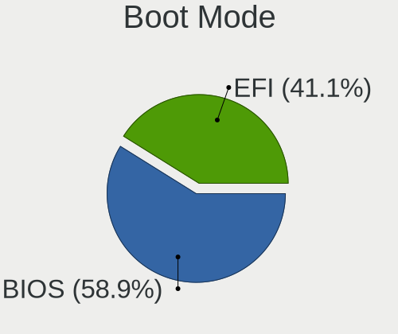
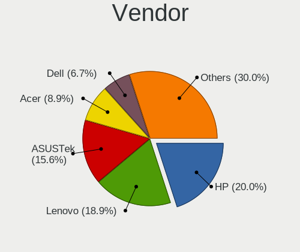
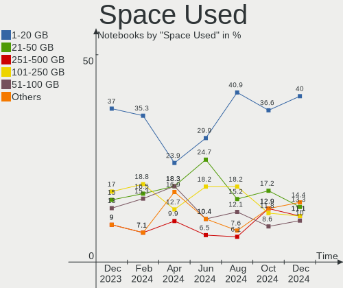
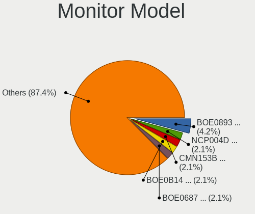
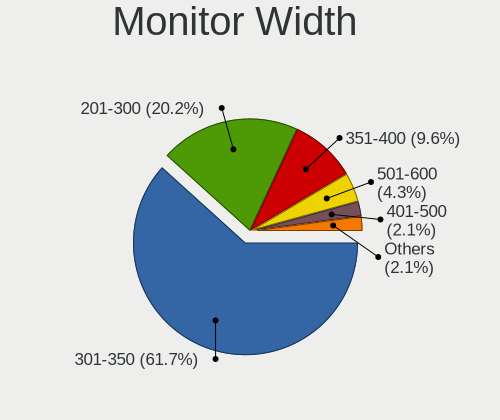
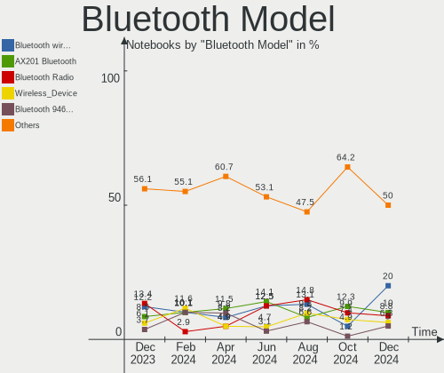
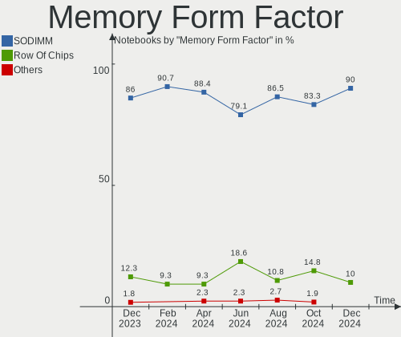
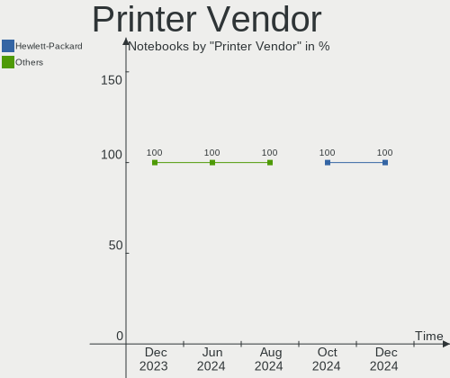
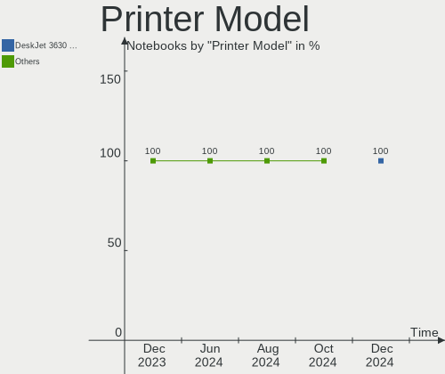
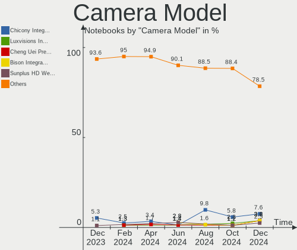

Linux in Spain - Hardware Trends (Notebooks)
--------------------------------------------

A project to identify most popular hardware characteristics and track their change
over time based on data collected by Linux users at https://Linux-Hardware.org.

Anyone can contribute to this report by the [hw-probe](https://github.com/linuxhw/hw-probe) tool:

    sudo -E hw-probe -all -upload

Period: Dec, 2024.

Contents
--------

* [ System ](#system)
  - [ OS                       ](#os)
  - [ OS Family                ](#os-family)
  - [ Kernel                   ](#kernel)
  - [ Kernel Family            ](#kernel-family)
  - [ Kernel Major Ver.        ](#kernel-major-ver)
  - [ Arch                     ](#arch)
  - [ DE                       ](#de)
  - [ Display Server           ](#display-server)
  - [ Display Manager          ](#display-manager)
  - [ OS Lang                  ](#os-lang)
  - [ Boot Mode                ](#boot-mode)
  - [ Filesystem               ](#filesystem)
  - [ Part. scheme             ](#part-scheme)
  - [ Dual Boot with Linux/BSD ](#dual-boot-with-linuxbsd)
  - [ Dual Boot (Win)          ](#dual-boot-win)

* [ Board ](#board)
  - [ Vendor                   ](#vendor)
  - [ Model                    ](#model)
  - [ Model Family             ](#model-family)
  - [ MFG Year                 ](#mfg-year)
  - [ Form Factor              ](#form-factor)
  - [ Secure Boot              ](#secure-boot)
  - [ Coreboot                 ](#coreboot)
  - [ RAM Size                 ](#ram-size)
  - [ RAM Used                 ](#ram-used)
  - [ Total Drives             ](#total-drives)
  - [ Has CD-ROM               ](#has-cd-rom)
  - [ Has Ethernet             ](#has-ethernet)
  - [ Has WiFi                 ](#has-wifi)
  - [ Has Bluetooth            ](#has-bluetooth)

* [ Location ](#location)
  - [ Country                  ](#country)
  - [ City                     ](#city)

* [ Drives ](#drives)
  - [ Drive Vendor             ](#drive-vendor)
  - [ Drive Model              ](#drive-model)
  - [ HDD Vendor               ](#hdd-vendor)
  - [ SSD Vendor               ](#ssd-vendor)
  - [ Drive Kind               ](#drive-kind)
  - [ Drive Connector          ](#drive-connector)
  - [ Drive Size               ](#drive-size)
  - [ Space Total              ](#space-total)
  - [ Space Used               ](#space-used)
  - [ Malfunc. Drives          ](#malfunc-drives)
  - [ Malfunc. Drive Vendor    ](#malfunc-drive-vendor)
  - [ Malfunc. HDD Vendor      ](#malfunc-hdd-vendor)
  - [ Malfunc. Drive Kind      ](#malfunc-drive-kind)
  - [ Failed Drives            ](#failed-drives)
  - [ Failed Drive Vendor      ](#failed-drive-vendor)
  - [ Drive Status             ](#drive-status)

* [ Storage controller ](#storage-controller)
  - [ Storage Vendor           ](#storage-vendor)
  - [ Storage Model            ](#storage-model)
  - [ Storage Kind             ](#storage-kind)

* [ Processor ](#processor)
  - [ CPU Vendor               ](#cpu-vendor)
  - [ CPU Model                ](#cpu-model)
  - [ CPU Model Family         ](#cpu-model-family)
  - [ CPU Cores                ](#cpu-cores)
  - [ CPU Sockets              ](#cpu-sockets)
  - [ CPU Threads              ](#cpu-threads)
  - [ CPU Op-Modes             ](#cpu-op-modes)
  - [ CPU Microcode            ](#cpu-microcode)
  - [ CPU Microarch            ](#cpu-microarch)

* [ Graphics ](#graphics)
  - [ GPU Vendor               ](#gpu-vendor)
  - [ GPU Model                ](#gpu-model)
  - [ GPU Combo                ](#gpu-combo)
  - [ GPU Driver               ](#gpu-driver)
  - [ GPU Memory               ](#gpu-memory)

* [ Monitor ](#monitor)
  - [ Monitor Vendor           ](#monitor-vendor)
  - [ Monitor Model            ](#monitor-model)
  - [ Monitor Resolution       ](#monitor-resolution)
  - [ Monitor Diagonal         ](#monitor-diagonal)
  - [ Monitor Width            ](#monitor-width)
  - [ Aspect Ratio             ](#aspect-ratio)
  - [ Monitor Area             ](#monitor-area)
  - [ Pixel Density            ](#pixel-density)
  - [ Multiple Monitors        ](#multiple-monitors)

* [ Network ](#network)
  - [ Net Controller Vendor    ](#net-controller-vendor)
  - [ Net Controller Model     ](#net-controller-model)
  - [ Wireless Vendor          ](#wireless-vendor)
  - [ Wireless Model           ](#wireless-model)
  - [ Ethernet Vendor          ](#ethernet-vendor)
  - [ Ethernet Model           ](#ethernet-model)
  - [ Net Controller Kind      ](#net-controller-kind)
  - [ Used Controller          ](#used-controller)
  - [ NICs                     ](#nics)
  - [ IPv6                     ](#ipv6)

* [ Bluetooth ](#bluetooth)
  - [ Bluetooth Vendor         ](#bluetooth-vendor)
  - [ Bluetooth Model          ](#bluetooth-model)

* [ Sound ](#sound)
  - [ Sound Vendor             ](#sound-vendor)
  - [ Sound Model              ](#sound-model)

* [ Memory ](#memory)
  - [ Memory Vendor            ](#memory-vendor)
  - [ Memory Model             ](#memory-model)
  - [ Memory Kind              ](#memory-kind)
  - [ Memory Form Factor       ](#memory-form-factor)
  - [ Memory Size              ](#memory-size)
  - [ Memory Speed             ](#memory-speed)

* [ Printers & scanners ](#printers--scanners)
  - [ Printer Vendor           ](#printer-vendor)
  - [ Printer Model            ](#printer-model)
  - [ Scanner Vendor           ](#scanner-vendor)
  - [ Scanner Model            ](#scanner-model)

* [ Camera ](#camera)
  - [ Camera Vendor            ](#camera-vendor)
  - [ Camera Model             ](#camera-model)

* [ Security ](#security)
  - [ Fingerprint Vendor       ](#fingerprint-vendor)
  - [ Fingerprint Model        ](#fingerprint-model)
  - [ Chipcard Vendor          ](#chipcard-vendor)
  - [ Chipcard Model           ](#chipcard-model)

* [ Unsupported ](#unsupported)
  - [ Unsupported Devices      ](#unsupported-devices)
  - [ Unsupported Device Types ](#unsupported-device-types)

System
------

OS
--

Installed operating systems

| Name                 | Notebooks | Percent |
|----------------------|-----------|---------|
| OpenMandriva 24.12   | 16        | 17.78%  |
| Ubuntu 24.04         | 8         | 8.89%   |
| Fedora 41            | 7         | 7.78%   |
| Zorin 17             | 6         | 6.67%   |
| KDE neon 24.04       | 5         | 5.56%   |
| Arch Rolling         | 5         | 5.56%   |
| Debian 12            | 4         | 4.44%   |
| OpenMandriva 23.08   | 3         | 3.33%   |
| Linux Mint 22        | 3         | 3.33%   |
| ArcoLinux Rolling    | 3         | 3.33%   |
| Ubuntu 22.04         | 2         | 2.22%   |
| Manjaro              | 2         | 2.22%   |
| Linux Mint 21.3      | 2         | 2.22%   |
| Kubuntu 24.10        | 2         | 2.22%   |
| Gentoo 2.17          | 2         | 2.22%   |
| Elementary 8         | 2         | 2.22%   |
| Zorin 16             | 1         | 1.11%   |
| Xubuntu 24.10        | 1         | 1.11%   |
| Vanilla 2.0          | 1         | 1.11%   |
| Ubuntu 24.10         | 1         | 1.11%   |
| Ubuntu 24.0          | 1         | 1.11%   |
| Ubuntu 20.04         | 1         | 1.11%   |
| OpenMandriva 5.0     | 1         | 1.11%   |
| OpenMandriva 24.07   | 1         | 1.11%   |
| MX 23                | 1         | 1.11%   |
| Lubuntu 22.04        | 1         | 1.11%   |
| Garuda Linux Rolling | 1         | 1.11%   |
| Elementary 7.1       | 1         | 1.11%   |
| Debian               | 1         | 1.11%   |
| ChimeraOS 46-2       | 1         | 1.11%   |
| Bluefin 41           | 1         | 1.11%   |
| BigLinux 24.2.1      | 1         | 1.11%   |
| Aurora 41            | 1         | 1.11%   |
| AlmaLinux 9.5        | 1         | 1.11%   |

OS Family
---------

OS without a version

| Name         | Notebooks | Percent |
|--------------|-----------|---------|
| OpenMandriva | 21        | 23.33%  |
| Ubuntu       | 13        | 14.44%  |
| Zorin        | 7         | 7.78%   |
| Fedora       | 7         | 7.78%   |
| Linux Mint   | 5         | 5.56%   |
| KDE neon     | 5         | 5.56%   |
| Debian       | 5         | 5.56%   |
| Arch         | 5         | 5.56%   |
| Elementary   | 3         | 3.33%   |
| ArcoLinux    | 3         | 3.33%   |
| Manjaro      | 2         | 2.22%   |
| Kubuntu      | 2         | 2.22%   |
| Gentoo       | 2         | 2.22%   |
| Xubuntu      | 1         | 1.11%   |
| Vanilla      | 1         | 1.11%   |
| MX           | 1         | 1.11%   |
| Lubuntu      | 1         | 1.11%   |
| Garuda Linux | 1         | 1.11%   |
| ChimeraOS    | 1         | 1.11%   |
| Bluefin      | 1         | 1.11%   |
| BigLinux     | 1         | 1.11%   |
| Aurora       | 1         | 1.11%   |
| AlmaLinux    | 1         | 1.11%   |

Kernel
------

Version of the Linux kernel

| Version                    | Notebooks | Percent |
|----------------------------|-----------|---------|
| 6.12.1-desktop-1omv2490    | 14        | 15.56%  |
| 6.8.0-51-generic           | 9         | 10%     |
| 6.8.0-50-generic           | 8         | 8.89%   |
| 6.8.0-49-generic           | 8         | 8.89%   |
| 6.4.8-desktop-2omv2390     | 3         | 3.33%   |
| 6.1.0-28-amd64             | 3         | 3.33%   |
| 6.8.0-40-generic           | 2         | 2.22%   |
| 6.12.7-arch1-1             | 2         | 2.22%   |
| 6.12.4-zen1-1-zen          | 2         | 2.22%   |
| 6.12.4-arch1-1             | 2         | 2.22%   |
| 6.11.3-300.fc41.x86_64     | 2         | 2.22%   |
| 6.11.10-300.fc41.x86_64    | 2         | 2.22%   |
| 6.11.0-13-generic          | 2         | 2.22%   |
| 6.9.12-chos7-chimeraos-1   | 1         | 1.11%   |
| 6.8.0-47-generic           | 1         | 1.11%   |
| 6.6.65-x64v1-xanmod1-1-lts | 1         | 1.11%   |
| 6.6.62-gentoo-x86_64       | 1         | 1.11%   |
| 6.6.2-desktop-1omv2390     | 1         | 1.11%   |
| 6.4.11-desktop-1omv2390    | 1         | 1.11%   |
| 6.2.0-37-generic           | 1         | 1.11%   |
| 6.12.6-desktop-1omv2490    | 1         | 1.11%   |
| 6.12.6-arch1-1             | 1         | 1.11%   |
| 6.12.6-1-liquorix-amd64    | 1         | 1.11%   |
| 6.12.5-200.fc41.x86_64     | 1         | 1.11%   |
| 6.12.4-200.fc41.x86_64     | 1         | 1.11%   |
| 6.12.4-1-MANJARO           | 1         | 1.11%   |
| 6.12.3-gentoo              | 1         | 1.11%   |
| 6.12.1-zen1-1-zen          | 1         | 1.11%   |
| 6.12.1-arch1-1             | 1         | 1.11%   |
| 6.11.8-300.fc41.x86_64     | 1         | 1.11%   |
| 6.11.6-amd64               | 1         | 1.11%   |
| 6.11.5-300.fc41.x86_64     | 1         | 1.11%   |
| 6.11.4-301.fc41.x86_64     | 1         | 1.11%   |
| 6.11.10-amd64              | 1         | 1.11%   |
| 6.11.10-2-MANJARO          | 1         | 1.11%   |
| 6.11.0-9-generic           | 1         | 1.11%   |
| 6.11.0-8-generic           | 1         | 1.11%   |
| 6.10.0-desktop-1omv2490    | 1         | 1.11%   |
| 6.1.0-28-686-pae           | 1         | 1.11%   |
| 5.15.0-94-generic          | 1         | 1.11%   |

Kernel Family
-------------

Linux kernel without a distro release

| Version | Notebooks | Percent |
|---------|-----------|---------|
| 6.8.0   | 28        | 31.11%  |
| 6.12.1  | 16        | 17.78%  |
| 6.12.4  | 6         | 6.67%   |
| 6.11.10 | 4         | 4.44%   |
| 6.11.0  | 4         | 4.44%   |
| 6.1.0   | 4         | 4.44%   |
| 5.15.0  | 4         | 4.44%   |
| 6.4.8   | 3         | 3.33%   |
| 6.12.6  | 3         | 3.33%   |
| 6.12.7  | 2         | 2.22%   |
| 6.11.3  | 2         | 2.22%   |
| 6.9.12  | 1         | 1.11%   |
| 6.6.65  | 1         | 1.11%   |
| 6.6.62  | 1         | 1.11%   |
| 6.6.2   | 1         | 1.11%   |
| 6.4.11  | 1         | 1.11%   |
| 6.2.0   | 1         | 1.11%   |
| 6.12.5  | 1         | 1.11%   |
| 6.12.3  | 1         | 1.11%   |
| 6.11.8  | 1         | 1.11%   |
| 6.11.6  | 1         | 1.11%   |
| 6.11.5  | 1         | 1.11%   |
| 6.11.4  | 1         | 1.11%   |
| 6.10.0  | 1         | 1.11%   |
| 5.14.0  | 1         | 1.11%   |

Kernel Major Ver.
-----------------

Linux kernel major version

| Version | Notebooks | Percent |
|---------|-----------|---------|
| 6.12    | 29        | 32.22%  |
| 6.8     | 28        | 31.11%  |
| 6.11    | 14        | 15.56%  |
| 6.4     | 4         | 4.44%   |
| 6.1     | 4         | 4.44%   |
| 5.15    | 4         | 4.44%   |
| 6.6     | 3         | 3.33%   |
| 6.9     | 1         | 1.11%   |
| 6.2     | 1         | 1.11%   |
| 6.10    | 1         | 1.11%   |
| 5.14    | 1         | 1.11%   |

Arch
----

OS architecture (x86_64, i586, etc.)

| Name   | Notebooks | Percent |
|--------|-----------|---------|
| x86_64 | 89        | 98.89%  |
| i686   | 1         | 1.11%   |

DE
--

Desktop Environment

| Name       | Notebooks | Percent |
|------------|-----------|---------|
| GNOME      | 36        | 40%     |
| Unknown    | 18        | 20%     |
| KDE6       | 13        | 14.44%  |
| XFCE       | 5         | 5.56%   |
| X-Cinnamon | 5         | 5.56%   |
| KDE5       | 5         | 5.56%   |
| Pantheon   | 3         | 3.33%   |
| LXQt       | 2         | 2.22%   |
| MATE       | 1         | 1.11%   |
| KDE4       | 1         | 1.11%   |
| KDE        | 1         | 1.11%   |

Display Server
--------------

X11 or Wayland

| Name    | Notebooks | Percent |
|---------|-----------|---------|
| Wayland | 51        | 56.67%  |
| X11     | 37        | 41.11%  |
| Tty     | 1         | 1.11%   |
| Unknown | 1         | 1.11%   |

Display Manager
---------------

SDDM, LightDM, etc.

| Name    | Notebooks | Percent |
|---------|-----------|---------|
| Unknown | 34        | 37.78%  |
| SDDM    | 31        | 34.44%  |
| GDM3    | 14        | 15.56%  |
| LightDM | 7         | 7.78%   |
| GDM     | 4         | 4.44%   |

OS Lang
-------

Language

| Lang  | Notebooks | Percent |
|-------|-----------|---------|
| es_ES | 59        | 65.56%  |
| en_US | 21        | 23.33%  |
| ca_ES | 5         | 5.56%   |
| en_GB | 2         | 2.22%   |
| fr_FR | 1         | 1.11%   |
| de_DE | 1         | 1.11%   |
| an_ES | 1         | 1.11%   |

Boot Mode
---------

EFI or BIOS

| Mode | Notebooks | Percent |
|------|-----------|---------|
| BIOS | 53        | 58.89%  |
| EFI  | 37        | 41.11%  |

Filesystem
----------

Type of filesystem

| Type    | Notebooks | Percent |
|---------|-----------|---------|
| Ext4    | 48        | 53.33%  |
| Btrfs   | 17        | 18.89%  |
| Tmpfs   | 12        | 13.33%  |
| Overlay | 11        | 12.22%  |
| Xfs     | 2         | 2.22%   |

Part. scheme
------------

Scheme of partitioning

| Type    | Notebooks | Percent |
|---------|-----------|---------|
| GPT     | 47        | 52.22%  |
| Unknown | 32        | 35.56%  |
| MBR     | 11        | 12.22%  |

Dual Boot with Linux/BSD
------------------------

Hosting more than one Linux/BSD

| Dual boot | Notebooks | Percent |
|-----------|-----------|---------|
| No        | 74        | 82.22%  |
| Yes       | 16        | 17.78%  |

Dual Boot (Win)
---------------

Hosting Linux and Windows

| Dual boot | Notebooks | Percent |
|-----------|-----------|---------|
| No        | 75        | 83.33%  |
| Yes       | 15        | 16.67%  |

Board
-----

Vendor
------

Motherboard manufacturer

| Name                | Notebooks | Percent |
|---------------------|-----------|---------|
| Hewlett-Packard     | 18        | 20%     |
| Lenovo              | 17        | 18.89%  |
| ASUSTek Computer    | 14        | 15.56%  |
| Acer                | 8         | 8.89%   |
| Dell                | 6         | 6.67%   |
| Apple               | 5         | 5.56%   |
| MSI                 | 3         | 3.33%   |
| HUAWEI              | 3         | 3.33%   |
| Toshiba             | 2         | 2.22%   |
| Notebook            | 2         | 2.22%   |
| Chuwi               | 2         | 2.22%   |
| Sony                | 1         | 1.11%   |
| SLIMBOOK            | 1         | 1.11%   |
| Schenker            | 1         | 1.11%   |
| Samsung Electronics | 1         | 1.11%   |
| PC Specialist       | 1         | 1.11%   |
| Medion              | 1         | 1.11%   |
| MACHINIST           | 1         | 1.11%   |
| LG Electronics      | 1         | 1.11%   |
| HONOR               | 1         | 1.11%   |
| Unknown             | 1         | 1.11%   |

Model
-----

Motherboard model

| Name                                       | Notebooks | Percent |
|--------------------------------------------|-----------|---------|
| HUAWEI KLVL-WXX9                           | 2         | 2.22%   |
| HP ProBook 630 G8 Notebook PC              | 2         | 2.22%   |
| HP Laptop 15s-eq2xxx                       | 2         | 2.22%   |
| HP Laptop 15-fd0xxx                        | 2         | 2.22%   |
| Toshiba TECRA A10                          | 1         | 1.11%   |
| Toshiba Satellite L50-B                    | 1         | 1.11%   |
| Sony VGN-FZ11M                             | 1         | 1.11%   |
| SLIMBOOK EVO14-A8                          | 1         | 1.11%   |
| Schenker XMG PRO 16 Studio (M24)           | 1         | 1.11%   |
| Samsung 300E4A/300E5A/300E7A/3430EA/3530EA | 1         | 1.11%   |
| PC Specialist P65xRP                       | 1         | 1.11%   |
| Notebook W510LU                            | 1         | 1.11%   |
| Notebook N13_N140ZU                        | 1         | 1.11%   |
| MSI Modern 15 B7M                          | 1         | 1.11%   |
| MSI GL65 9SFK                              | 1         | 1.11%   |
| MSI Alpha 17 C7VF                          | 1         | 1.11%   |
| Medion S6421 MD60703                       | 1         | 1.11%   |
| MACHINIST X99-RS9 V1.11                    | 1         | 1.11%   |
| LG 15Z90R-G.AP55B                          | 1         | 1.11%   |
| Lenovo ThinkPad X250 20CLS35P00            | 1         | 1.11%   |
| Lenovo ThinkPad X240 20AL009CUS            | 1         | 1.11%   |
| Lenovo ThinkPad T480s 20L7CTO1WW           | 1         | 1.11%   |
| Lenovo ThinkPad T470p 20J6CTO1WW           | 1         | 1.11%   |
| Lenovo ThinkPad T450 20BUS35B00            | 1         | 1.11%   |
| Lenovo ThinkPad T14s Gen 6 21M1CTO1WW      | 1         | 1.11%   |
| Lenovo ThinkPad T14 Gen 3 21CGS06G0L       | 1         | 1.11%   |
| Lenovo ThinkPad SL500 274678G              | 1         | 1.11%   |
| Lenovo ThinkPad S1 Yoga 12 20DKS2BD00      | 1         | 1.11%   |
| Lenovo ThinkPad L460 20FVS2LC00            | 1         | 1.11%   |
| Lenovo ThinkPad E14 Gen 5 21JKCTO1WW       | 1         | 1.11%   |
| Lenovo ThinkBook 15 G4 IAP 21DJ            | 1         | 1.11%   |
| Lenovo LOQ 15IRH8 82XV                     | 1         | 1.11%   |
| Lenovo IdeaPad Slim 5 14IRL8 82XD          | 1         | 1.11%   |
| Lenovo IdeaPad Slim 3 15AMN8 82XQ          | 1         | 1.11%   |
| Lenovo IdeaPad 330-17ICH 81FL              | 1         | 1.11%   |
| Lenovo IdeaPad 320-15ISK 80XH              | 1         | 1.11%   |
| HUAWEI KLVL-WXXW                           | 1         | 1.11%   |
| HONOR HYM-WXX                              | 1         | 1.11%   |
| HP ProBook 450 G8 Notebook PC              | 1         | 1.11%   |
| HP Pavilion Sleekbook 15                   | 1         | 1.11%   |

Model Family
------------

Motherboard model prefix

| Name                 | Notebooks | Percent |
|----------------------|-----------|---------|
| Lenovo ThinkPad      | 11        | 12.22%  |
| HP Laptop            | 6         | 6.67%   |
| Acer Aspire          | 6         | 6.67%   |
| HP Pavilion          | 5         | 5.56%   |
| Lenovo IdeaPad       | 4         | 4.44%   |
| Dell Latitude        | 4         | 4.44%   |
| HP ProBook           | 3         | 3.33%   |
| ASUS VivoBook        | 3         | 3.33%   |
| ASUS ASUS            | 3         | 3.33%   |
| HUAWEI KLVL-WXX9     | 2         | 2.22%   |
| Apple MacBookPro9    | 2         | 2.22%   |
| Toshiba TECRA        | 1         | 1.11%   |
| Toshiba Satellite    | 1         | 1.11%   |
| Sony VGN-FZ11M       | 1         | 1.11%   |
| SLIMBOOK EVO14-A8    | 1         | 1.11%   |
| Schenker XMG         | 1         | 1.11%   |
| Samsung 300E4A       | 1         | 1.11%   |
| PC Specialist P65xRP | 1         | 1.11%   |
| Notebook W510LU      | 1         | 1.11%   |
| Notebook N13         | 1         | 1.11%   |
| MSI Modern           | 1         | 1.11%   |
| MSI GL65             | 1         | 1.11%   |
| MSI Alpha            | 1         | 1.11%   |
| Medion S6421         | 1         | 1.11%   |
| MACHINIST X99-RS9    | 1         | 1.11%   |
| LG 15Z90R-G.AP55B    | 1         | 1.11%   |
| Lenovo ThinkBook     | 1         | 1.11%   |
| Lenovo LOQ           | 1         | 1.11%   |
| HUAWEI KLVL-WXXW     | 1         | 1.11%   |
| HONOR HYM-WXX        | 1         | 1.11%   |
| HP Compaq            | 1         | 1.11%   |
| HP 255               | 1         | 1.11%   |
| HP 250               | 1         | 1.11%   |
| HP 15                | 1         | 1.11%   |
| Dell XPS             | 1         | 1.11%   |
| Dell Inspiron        | 1         | 1.11%   |
| Chuwi GemiBook       | 1         | 1.11%   |
| Chuwi CoreBook       | 1         | 1.11%   |
| ASUS ZenBook         | 1         | 1.11%   |
| ASUS X555LDB         | 1         | 1.11%   |

MFG Year
--------

Motherboard manufacture year

| Year | Notebooks | Percent |
|------|-----------|---------|
| 2023 | 11        | 12.22%  |
| 2024 | 8         | 8.89%   |
| 2022 | 7         | 7.78%   |
| 2020 | 7         | 7.78%   |
| 2018 | 7         | 7.78%   |
| 2021 | 6         | 6.67%   |
| 2017 | 6         | 6.67%   |
| 2015 | 6         | 6.67%   |
| 2014 | 6         | 6.67%   |
| 2012 | 5         | 5.56%   |
| 2016 | 4         | 4.44%   |
| 2008 | 4         | 4.44%   |
| 2013 | 3         | 3.33%   |
| 2011 | 3         | 3.33%   |
| 2010 | 3         | 3.33%   |
| 2019 | 2         | 2.22%   |
| 2009 | 1         | 1.11%   |
| 2007 | 1         | 1.11%   |

Form Factor
-----------

Physical design of the computer

| Name     | Notebooks | Percent |
|----------|-----------|---------|
| Notebook | 90        | 100%    |

Secure Boot
-----------

Enabled or disabled

| State    | Notebooks | Percent |
|----------|-----------|---------|
| Disabled | 88        | 97.78%  |
| Enabled  | 2         | 2.22%   |

Coreboot
--------

Have coreboot on board

| Used | Notebooks | Percent |
|------|-----------|---------|
| No   | 90        | 100%    |

RAM Size
--------

Total RAM memory

| Size in GB  | Notebooks | Percent |
|-------------|-----------|---------|
| 4.01-8.0    | 26        | 28.89%  |
| 16.01-24.0  | 20        | 22.22%  |
| 8.01-16.0   | 18        | 20%     |
| 32.01-64.0  | 8         | 8.89%   |
| 3.01-4.0    | 8         | 8.89%   |
| 24.01-32.0  | 5         | 5.56%   |
| 64.01-256.0 | 2         | 2.22%   |
| 1.01-2.0    | 2         | 2.22%   |
| 2.01-3.0    | 1         | 1.11%   |

RAM Used
--------

Used RAM memory

| Used GB   | Notebooks | Percent |
|-----------|-----------|---------|
| 1.01-2.0  | 27        | 30%     |
| 4.01-8.0  | 21        | 23.33%  |
| 2.01-3.0  | 19        | 21.11%  |
| 3.01-4.0  | 17        | 18.89%  |
| 0.51-1.0  | 4         | 4.44%   |
| 8.01-16.0 | 2         | 2.22%   |

Total Drives
------------

Number of drives on board

| Drives | Notebooks | Percent |
|--------|-----------|---------|
| 1      | 68        | 75.56%  |
| 2      | 21        | 23.33%  |
| 3      | 1         | 1.11%   |

Has CD-ROM
----------

Has CD-ROM on board

| Presented | Notebooks | Percent |
|-----------|-----------|---------|
| No        | 67        | 74.44%  |
| Yes       | 23        | 25.56%  |

Has Ethernet
------------

Has Ethernet on board

| Presented | Notebooks | Percent |
|-----------|-----------|---------|
| Yes       | 65        | 72.22%  |
| No        | 25        | 27.78%  |

Has WiFi
--------

Has WiFi module

| Presented | Notebooks | Percent |
|-----------|-----------|---------|
| Yes       | 89        | 98.89%  |
| No        | 1         | 1.11%   |

Has Bluetooth
-------------

Has Bluetooth module

| Presented | Notebooks | Percent |
|-----------|-----------|---------|
| Yes       | 79        | 87.78%  |
| No        | 11        | 12.22%  |

Location
--------

Country
-------

Geographic location (country)

| Country | Notebooks | Percent |
|---------|-----------|---------|
| Spain   | 90        | 100%    |

City
----

Geographic location (city)

| City                    | Notebooks | Percent |
|-------------------------|-----------|---------|
| Madrid                  | 7         | 7.78%   |
| Barcelona               | 6         | 6.67%   |
| Zaragoza                | 3         | 3.33%   |
| Valladolid              | 3         | 3.33%   |
| Valencia                | 3         | 3.33%   |
| Seville                 | 3         | 3.33%   |
| Granada                 | 3         | 3.33%   |
| Vigo                    | 2         | 2.22%   |
| Rubí                   | 2         | 2.22%   |
| Pontevedra              | 2         | 2.22%   |
| Palma                   | 2         | 2.22%   |
| Murcia                  | 2         | 2.22%   |
| Mieres                  | 2         | 2.22%   |
| Málaga                 | 2         | 2.22%   |
| León                   | 2         | 2.22%   |
| Dima                    | 2         | 2.22%   |
| Basauri                 | 2         | 2.22%   |
| A Coruña               | 2         | 2.22%   |
| Zubia                   | 1         | 1.11%   |
| Viveiro                 | 1         | 1.11%   |
| Vitoria-Gasteiz         | 1         | 1.11%   |
| Villarrubia de los Ojos | 1         | 1.11%   |
| Vic                     | 1         | 1.11%   |
| Torremolinos            | 1         | 1.11%   |
| Tiana                   | 1         | 1.11%   |
| Teruel                  | 1         | 1.11%   |
| Telde                   | 1         | 1.11%   |
| Talavera de la Reina    | 1         | 1.11%   |
| Santa Maria del Camí   | 1         | 1.11%   |
| Santa Coloma de Farners | 1         | 1.11%   |
| San Vicent del Raspeig  | 1         | 1.11%   |
| Sabadell                | 1         | 1.11%   |
| Roquetas de Mar         | 1         | 1.11%   |
| Reus                    | 1         | 1.11%   |
| Puçol                  | 1         | 1.11%   |
| Port de Sagunt          | 1         | 1.11%   |
| Pola de Lena            | 1         | 1.11%   |
| Plasencia               | 1         | 1.11%   |
| Penarroya-Pueblonuevo   | 1         | 1.11%   |
| Orba                    | 1         | 1.11%   |

Drives
------

Drive Vendor
------------

Hard drive vendors

| Vendor                      | Notebooks | Drives | Percent |
|-----------------------------|-----------|--------|---------|
| Samsung Electronics         | 17        | 17     | 15.45%  |
| Sandisk                     | 11        | 11     | 10%     |
| Toshiba                     | 9         | 9      | 8.18%   |
| Kingston                    | 8         | 8      | 7.27%   |
| Seagate                     | 6         | 6      | 5.45%   |
| Micron Technology           | 6         | 6      | 5.45%   |
| WDC                         | 5         | 5      | 4.55%   |
| Unknown                     | 4         | 4      | 3.64%   |
| SK hynix                    | 4         | 4      | 3.64%   |
| KIOXIA                      | 4         | 4      | 3.64%   |
| China                       | 4         | 4      | 3.64%   |
| SPCC                        | 3         | 3      | 2.73%   |
| Micron/Crucial Technology   | 3         | 3      | 2.73%   |
| Intel                       | 3         | 3      | 2.73%   |
| Crucial                     | 3         | 3      | 2.73%   |
| MAXIO Technology (Hangzhou) | 2         | 2      | 1.82%   |
| HGST                        | 2         | 2      | 1.82%   |
| Apple                       | 2         | 3      | 1.82%   |
| USB                         | 1         | 1      | 0.91%   |
| Silicon Motion              | 1         | 1      | 0.91%   |
| Realtek Semiconductor       | 1         | 1      | 0.91%   |
| Phison Electronics          | 1         | 1      | 0.91%   |
| LaCie                       | 1         | 1      | 0.91%   |
| Kingston Technology Company | 1         | 1      | 0.91%   |
| KingSpec                    | 1         | 1      | 0.91%   |
| Intenso                     | 1         | 1      | 0.91%   |
| Hitachi                     | 1         | 1      | 0.91%   |
| Fujitsu                     | 1         | 1      | 0.91%   |
| Emtec                       | 1         | 1      | 0.91%   |
| EAGET                       | 1         | 1      | 0.91%   |
| ASMT109x                    | 1         | 1      | 0.91%   |
| Unknown                     | 1         | 1      | 0.91%   |

Drive Model
-----------

Hard drive models

| Model                                               | Notebooks | Percent |
|-----------------------------------------------------|-----------|---------|
| Samsung NVMe SSD Controller SM981/PM981/PM983 512GB | 3         | 2.73%   |
| Toshiba MQ04ABF100 1TB                              | 2         | 1.82%   |
| Toshiba MQ01ABD100 1TB                              | 2         | 1.82%   |
| Sandisk WD Blue SN550 NVMe SSD 256GB                | 2         | 1.82%   |
| SanDisk NVMe SSD Drive 512GB                        | 2         | 1.82%   |
| Samsung SSD 750 EVO 500GB                           | 2         | 1.82%   |
| MAXIO (Hangzhou) NVMe SSD Controller MAP1202 512GB  | 2         | 1.82%   |
| Kingston SA400S37480G 480GB SSD                     | 2         | 1.82%   |
| China SSD 360GB                                     | 2         | 1.82%   |
| WDC WD5000LPCX-24VHAT0 500GB                        | 1         | 0.91%   |
| WDC WD2500BEVT-75A23T0 250GB                        | 1         | 0.91%   |
| WDC WD Blue SA510 M.2 2280 2TB SSD                  | 1         | 0.91%   |
| WDC PC SN530 SDBPNPZ-512G-1006 512GB                | 1         | 0.91%   |
| WDC PC SN520 SDAPNUW-512G-1032 512GB                | 1         | 0.91%   |
| USB SanDisk 3.2Gen1 250GB                           | 1         | 0.91%   |
| Unknown NVMe SSD Drive 512GB                        | 1         | 0.91%   |
| Unknown MMC Card  4GB                               | 1         | 0.91%   |
| Unknown MMC Card  32GB                              | 1         | 0.91%   |
| Unknown MMC Card  1TB                               | 1         | 0.91%   |
| Toshiba XG6 NVMe SSD Controller 1024GB              | 1         | 0.91%   |
| Toshiba THNSNJ128GCSU 128GB SSD                     | 1         | 0.91%   |
| Toshiba MQ01ACF032 320GB                            | 1         | 0.91%   |
| Toshiba MK5056GSY 500GB                             | 1         | 0.91%   |
| Toshiba MK3252GSX 320GB                             | 1         | 0.91%   |
| SPCC Solid State Disk 512GB                         | 1         | 0.91%   |
| SPCC Solid State Disk 4TB                           | 1         | 0.91%   |
| SPCC Solid State Disk 240GB                         | 1         | 0.91%   |
| SK hynix PC601 HFS001TD9TNG-L2A0A 1024GB            | 1         | 0.91%   |
| SK hynix HFS512GEJ9X101N 512GB                      | 1         | 0.91%   |
| SK hynix HFS256G32TND-N210A 256GB SSD               | 1         | 0.91%   |
| SK hynix HFM512GD3JX013N 512GB                      | 1         | 0.91%   |
| Silicon Motion PCIe-8 SSD 512GB                     | 1         | 0.91%   |
| Seagate ST9500325AS 500GB                           | 1         | 0.91%   |
| Seagate ST9120411ASG 120GB                          | 1         | 0.91%   |
| Seagate ST500LM021-1KJ152 500GB                     | 1         | 0.91%   |
| Seagate ST500LM012 HN-M500MBB 500GB                 | 1         | 0.91%   |
| Seagate ST500DM002-1BD142 500GB                     | 1         | 0.91%   |
| Seagate Expansion 1TB                               | 1         | 0.91%   |
| Sandisk WD_BLACK SN850X 2000GB                      | 1         | 0.91%   |
| Sandisk WD PC SN560 SDDPNQE-512G-1032 512GB         | 1         | 0.91%   |

HDD Vendor
----------

Hard disk drive vendors

| Vendor  | Notebooks | Drives | Percent |
|---------|-----------|--------|---------|
| Toshiba | 7         | 7      | 36.84%  |
| Seagate | 6         | 6      | 31.58%  |
| WDC     | 2         | 2      | 10.53%  |
| HGST    | 2         | 2      | 10.53%  |
| Hitachi | 1         | 1      | 5.26%   |
| Fujitsu | 1         | 1      | 5.26%   |

SSD Vendor
----------

Solid state drive vendors

| Vendor              | Notebooks | Drives | Percent |
|---------------------|-----------|--------|---------|
| Samsung Electronics | 7         | 7      | 20.59%  |
| Kingston            | 6         | 6      | 17.65%  |
| China               | 4         | 4      | 11.76%  |
| SPCC                | 3         | 3      | 8.82%   |
| Crucial             | 3         | 3      | 8.82%   |
| SanDisk             | 2         | 2      | 5.88%   |
| WDC                 | 1         | 1      | 2.94%   |
| Toshiba             | 1         | 1      | 2.94%   |
| SK hynix            | 1         | 1      | 2.94%   |
| Micron Technology   | 1         | 1      | 2.94%   |
| KingSpec            | 1         | 1      | 2.94%   |
| Intenso             | 1         | 1      | 2.94%   |
| Emtec               | 1         | 1      | 2.94%   |
| EAGET               | 1         | 1      | 2.94%   |
| Apple               | 1         | 1      | 2.94%   |

Drive Kind
----------

HDD or SSD

| Kind    | Notebooks | Drives | Percent |
|---------|-----------|--------|---------|
| NVMe    | 47        | 51     | 45.19%  |
| SSD     | 32        | 34     | 30.77%  |
| HDD     | 18        | 19     | 17.31%  |
| Unknown | 4         | 4      | 3.85%   |
| MMC     | 3         | 3      | 2.88%   |

Drive Connector
---------------

SATA, SAS, NVMe, etc.

| Type | Notebooks | Drives | Percent |
|------|-----------|--------|---------|
| NVMe | 47        | 51     | 47%     |
| SATA | 45        | 52     | 45%     |
| SAS  | 5         | 5      | 5%      |
| MMC  | 3         | 3      | 3%      |

Drive Size
----------

Size of hard drive

| Size in TB | Notebooks | Drives | Percent |
|------------|-----------|--------|---------|
| 0.01-0.5   | 36        | 38     | 70.59%  |
| 0.51-1.0   | 13        | 13     | 25.49%  |
| 3.01-4.0   | 1         | 1      | 1.96%   |
| 1.01-2.0   | 1         | 1      | 1.96%   |

Space Total
-----------

Amount of disk space available on the file system

| Size in GB     | Notebooks | Percent |
|----------------|-----------|---------|
| 251-500        | 24        | 26.67%  |
| 101-250        | 21        | 23.33%  |
| 501-1000       | 17        | 18.89%  |
| 1-20           | 9         | 10%     |
| 1001-2000      | 5         | 5.56%   |
| Unknown        | 4         | 4.44%   |
| More than 3000 | 3         | 3.33%   |
| 21-50          | 3         | 3.33%   |
| 2001-3000      | 3         | 3.33%   |
| 51-100         | 1         | 1.11%   |

Space Used
----------

Amount of used disk space

| Used GB        | Notebooks | Percent |
|----------------|-----------|---------|
| 1-20           | 36        | 40%     |
| 21-50          | 12        | 13.33%  |
| 251-500        | 10        | 11.11%  |
| 101-250        | 10        | 11.11%  |
| 51-100         | 9         | 10%     |
| Unknown        | 4         | 4.44%   |
| 1001-2000      | 3         | 3.33%   |
| 501-1000       | 3         | 3.33%   |
| More than 3000 | 1         | 1.11%   |
| 2001-3000      | 1         | 1.11%   |
| 0              | 1         | 1.11%   |

Malfunc. Drives
---------------

Drive models with a malfunction

| Model                                               | Notebooks | Drives | Percent |
|-----------------------------------------------------|-----------|--------|---------|
| Toshiba MQ01ABD100 1TB                              | 1         | 1      | 25%     |
| Micron Technology MTFDDAV256TDL-1AW1ZABHA 256GB SSD | 1         | 1      | 25%     |
| Crucial CT250BX100SSD1 250GB                        | 1         | 1      | 25%     |
| China SSD 240GB                                     | 1         | 1      | 25%     |

Malfunc. Drive Vendor
---------------------

Vendors of faulty drives

| Vendor            | Notebooks | Drives | Percent |
|-------------------|-----------|--------|---------|
| Toshiba           | 1         | 1      | 25%     |
| Micron Technology | 1         | 1      | 25%     |
| Crucial           | 1         | 1      | 25%     |
| China             | 1         | 1      | 25%     |

Malfunc. HDD Vendor
-------------------

Vendors of faulty HDD drives

| Vendor  | Notebooks | Drives | Percent |
|---------|-----------|--------|---------|
| Toshiba | 1         | 1      | 100%    |

Malfunc. Drive Kind
-------------------

Kinds of faulty drives

| Kind | Notebooks | Drives | Percent |
|------|-----------|--------|---------|
| SSD  | 3         | 3      | 75%     |
| HDD  | 1         | 1      | 25%     |

Failed Drives
-------------

Failed drive models

Zero info for selected period =(

Failed Drive Vendor
-------------------

Failed drive vendors

Zero info for selected period =(

Drive Status
------------

Number of failed and malfunc. drives

| Status   | Notebooks | Drives | Percent |
|----------|-----------|--------|---------|
| Detected | 48        | 61     | 52.17%  |
| Works    | 40        | 46     | 43.48%  |
| Malfunc  | 4         | 4      | 4.35%   |

Storage controller
------------------

Storage Vendor
--------------

Storage controller vendors

| Vendor                       | Notebooks | Percent |
|------------------------------|-----------|---------|
| Intel                        | 54        | 49.54%  |
| SanDisk                      | 11        | 10.09%  |
| Samsung Electronics          | 10        | 9.17%   |
| Micron Technology            | 5         | 4.59%   |
| AMD                          | 4         | 3.67%   |
| SK hynix                     | 3         | 2.75%   |
| Micron/Crucial Technology    | 3         | 2.75%   |
| KIOXIA                       | 3         | 2.75%   |
| Kingston Technology Company  | 3         | 2.75%   |
| Toshiba America Info Systems | 2         | 1.83%   |
| Nvidia                       | 2         | 1.83%   |
| MAXIO Technology (Hangzhou)  | 2         | 1.83%   |
| Solidigm                     | 1         | 0.92%   |
| Silicon Motion               | 1         | 0.92%   |
| Shenzhen Longsys Electronics | 1         | 0.92%   |
| Realtek Semiconductor        | 1         | 0.92%   |
| Phison Electronics           | 1         | 0.92%   |
| Marvell Technology Group     | 1         | 0.92%   |
| Apple                        | 1         | 0.92%   |

Storage Model
-------------

Storage controller models

| Model                                                                          | Notebooks | Percent |
|--------------------------------------------------------------------------------|-----------|---------|
| Intel Volume Management Device NVMe RAID Controller                            | 8         | 6.9%    |
| Intel 82801 Mobile SATA Controller [RAID mode]                                 | 8         | 6.9%    |
| Intel Sunrise Point-LP SATA Controller [AHCI mode]                             | 5         | 4.31%   |
| Intel 8 Series SATA Controller 1 [AHCI mode]                                   | 5         | 4.31%   |
| SanDisk WD Black SN770 / PC SN740 256GB / PC SN560 (DRAM-less) NVMe SSD        | 4         | 3.45%   |
| Intel Wildcat Point-LP SATA Controller [AHCI Mode]                             | 4         | 3.45%   |
| AMD FCH SATA Controller [AHCI mode]                                            | 4         | 3.45%   |
| SanDisk Ultra 3D / WD PC SN530, IX SN530, Blue SN550 NVMe SSD (DRAM-less)      | 3         | 2.59%   |
| Samsung NVMe SSD Controller SM981/PM981/PM983                                  | 3         | 2.59%   |
| Samsung NVMe SSD Controller 980 (DRAM-less)                                    | 3         | 2.59%   |
| Intel HM170/QM170 Chipset SATA Controller [AHCI Mode]                          | 3         | 2.59%   |
| Intel Alder Lake-P SATA AHCI Controller                                        | 3         | 2.59%   |
| Intel 82801IBM/IEM (ICH9M/ICH9M-E) 4 port SATA Controller [AHCI mode]          | 3         | 2.59%   |
| Intel 7 Series Chipset Family 6-port SATA Controller [AHCI mode]               | 3         | 2.59%   |
| Toshiba America Info Systems XG6 NVMe SSD Controller                           | 2         | 1.72%   |
| Samsung NVMe SSD Controller PM9A1/PM9A3/980PRO                                 | 2         | 1.72%   |
| Micron 2400 NVMe SSD (DRAM-less)                                               | 2         | 1.72%   |
| MAXIO (Hangzhou) NVMe SSD Controller MAP1202 (DRAM-less)                       | 2         | 1.72%   |
| Intel SSD 670p Series [Keystone Harbor]                                        | 2         | 1.72%   |
| Intel Cannon Lake Mobile PCH SATA AHCI Controller                              | 2         | 1.72%   |
| Intel 8 Series/C220 Series Chipset Family 6-port SATA Controller 1 [AHCI mode] | 2         | 1.72%   |
| Intel 6 Series/C200 Series Chipset Family 6 port Mobile SATA AHCI Controller   | 2         | 1.72%   |
| Solidigm P41 Plus NVMe SSD (DRAM-less) [Echo Harbor]                           | 1         | 0.86%   |
| SK hynix Platinum P41/PC801 NVMe Solid State Drive                             | 1         | 0.86%   |
| SK hynix PC601 NVMe Solid State Drive                                          | 1         | 0.86%   |
| SK hynix Gold P31/BC711/PC711 NVMe Solid State Drive                           | 1         | 0.86%   |
| Silicon Motion Non-Volatile memory controller                                  | 1         | 0.86%   |
| Shenzhen Longsys Lexar NM790 NVME SSD (DRAM-less)                              | 1         | 0.86%   |
| Sandisk WD Blue SN580 NVMe SSD (DRAM-less)                                     | 1         | 0.86%   |
| SanDisk WD Blue SN570 NVMe SSD 2TB                                             | 1         | 0.86%   |
| SanDisk WD Blue SN500 / PC SN520 x2 M.2 2280 NVMe SSD                          | 1         | 0.86%   |
| Sandisk WD Black SN850X NVMe SSD                                               | 1         | 0.86%   |
| Samsung NVMe SSD Controller PM9C1a (DRAM-less)                                 | 1         | 0.86%   |
| Samsung NVMe SSD Controller PM9B1 (DRAM-less)                                  | 1         | 0.86%   |
| Realtek RTS5765DL NVMe SSD Controller (DRAM-less)                              | 1         | 0.86%   |
| Phison PS5013-E13 PCIe3 NVMe Controller (DRAM-less)                            | 1         | 0.86%   |
| Nvidia MCP79 AHCI Controller                                                   | 1         | 0.86%   |
| Nvidia MCP78S [GeForce 8200] SATA Controller (non-AHCI mode)                   | 1         | 0.86%   |
| Nvidia MCP78S [GeForce 8200] IDE                                               | 1         | 0.86%   |
| Micron/Crucial T500 NVMe PCIe SSD                                              | 1         | 0.86%   |

Storage Kind
------------

Kind of storage controller (IDE, SATA, NVMe, SAS, ...)

| Kind | Notebooks | Percent |
|------|-----------|---------|
| NVMe | 47        | 42.34%  |
| SATA | 44        | 39.64%  |
| RAID | 17        | 15.32%  |
| IDE  | 3         | 2.7%    |

Processor
---------

CPU Vendor
----------

Processor vendors

| Vendor | Notebooks | Percent |
|--------|-----------|---------|
| Intel  | 70        | 77.78%  |
| AMD    | 20        | 22.22%  |

CPU Model
---------

Processor models

| Model                                   | Notebooks | Percent |
|-----------------------------------------|-----------|---------|
| Intel Core i7-6700HQ CPU @ 2.60GHz      | 2         | 2.22%   |
| Intel Core i7-10750H CPU @ 2.60GHz      | 2         | 2.22%   |
| Intel Core i5-7200U CPU @ 2.50GHz       | 2         | 2.22%   |
| Intel Core i5-5200U CPU @ 2.20GHz       | 2         | 2.22%   |
| Intel Core i3-6006U CPU @ 2.00GHz       | 2         | 2.22%   |
| Intel Core i3-3110M CPU @ 2.40GHz       | 2         | 2.22%   |
| Intel 13th Gen Core i5-1334U            | 2         | 2.22%   |
| Intel 12th Gen Core i5-1235U            | 2         | 2.22%   |
| Intel 11th Gen Core i7-1165G7 @ 2.80GHz | 2         | 2.22%   |
| Intel 11th Gen Core i5-1135G7 @ 2.40GHz | 2         | 2.22%   |
| AMD Ryzen 7 5700U with Radeon Graphics  | 2         | 2.22%   |
| Intel Xeon CPU E5-2667 v4 @ 3.20GHz     | 1         | 1.11%   |
| Intel Pentium CPU N3700 @ 1.60GHz       | 1         | 1.11%   |
| Intel Core i9-14900HX                   | 1         | 1.11%   |
| Intel Core i7-9750H CPU @ 2.60GHz       | 1         | 1.11%   |
| Intel Core i7-8750H CPU @ 2.20GHz       | 1         | 1.11%   |
| Intel Core i7-8565U CPU @ 1.80GHz       | 1         | 1.11%   |
| Intel Core i7-8550U CPU @ 1.80GHz       | 1         | 1.11%   |
| Intel Core i7-7820HQ CPU @ 2.90GHz      | 1         | 1.11%   |
| Intel Core i7-7700HQ CPU @ 2.80GHz      | 1         | 1.11%   |
| Intel Core i7-7567U CPU @ 3.50GHz       | 1         | 1.11%   |
| Intel Core i7-7500U CPU @ 2.70GHz       | 1         | 1.11%   |
| Intel Core i7-5500U CPU @ 2.40GHz       | 1         | 1.11%   |
| Intel Core i7-4750HQ CPU @ 2.00GHz      | 1         | 1.11%   |
| Intel Core i7-4600U CPU @ 2.10GHz       | 1         | 1.11%   |
| Intel Core i7-3615QM CPU @ 2.30GHz      | 1         | 1.11%   |
| Intel Core i7-3520M CPU @ 2.90GHz       | 1         | 1.11%   |
| Intel Core i7-1065G7 CPU @ 1.30GHz      | 1         | 1.11%   |
| Intel Core i7 CPU M 640 @ 2.80GHz       | 1         | 1.11%   |
| Intel Core i5-8250U CPU @ 1.60GHz       | 1         | 1.11%   |
| Intel Core i5-4300U CPU @ 1.90GHz       | 1         | 1.11%   |
| Intel Core i5-4260U CPU @ 1.40GHz       | 1         | 1.11%   |
| Intel Core i5-4210U CPU @ 1.70GHz       | 1         | 1.11%   |
| Intel Core i5-4200U CPU @ 1.60GHz       | 1         | 1.11%   |
| Intel Core i5-2520M CPU @ 2.50GHz       | 1         | 1.11%   |
| Intel Core i5-2450M CPU @ 2.50GHz       | 1         | 1.11%   |
| Intel Core i5-2430M CPU @ 2.40GHz       | 1         | 1.11%   |
| Intel Core i5-1035G1 CPU @ 1.00GHz      | 1         | 1.11%   |
| Intel Core i3-6100U CPU @ 2.30GHz       | 1         | 1.11%   |
| Intel Core i3-5010U CPU @ 2.10GHz       | 1         | 1.11%   |

CPU Model Family
----------------

Processor model prefix

| Model            | Notebooks | Percent |
|------------------|-----------|---------|
| Other            | 21        | 23.33%  |
| Intel Core i7    | 19        | 21.11%  |
| Intel Core i5    | 13        | 14.44%  |
| Intel Core i3    | 7         | 7.78%   |
| AMD Ryzen 5      | 7         | 7.78%   |
| AMD Ryzen 7      | 6         | 6.67%   |
| Intel Core 2 Duo | 5         | 5.56%   |
| Intel Celeron    | 2         | 2.22%   |
| Intel Atom       | 2         | 2.22%   |
| Intel Xeon       | 1         | 1.11%   |
| Intel Pentium    | 1         | 1.11%   |
| Intel Core i9    | 1         | 1.11%   |
| AMD Ryzen 9      | 1         | 1.11%   |
| AMD Ryzen 7 PRO  | 1         | 1.11%   |
| AMD Athlon       | 1         | 1.11%   |
| AMD A8           | 1         | 1.11%   |
| AMD A4           | 1         | 1.11%   |

CPU Cores
---------

Number of processor cores

| Number | Notebooks | Percent |
|--------|-----------|---------|
| 2      | 33        | 36.67%  |
| 4      | 23        | 25.56%  |
| 8      | 10        | 11.11%  |
| 6      | 10        | 11.11%  |
| 10     | 7         | 7.78%   |
| 12     | 3         | 3.33%   |
| 24     | 1         | 1.11%   |
| 16     | 1         | 1.11%   |
| 14     | 1         | 1.11%   |
| 1      | 1         | 1.11%   |

CPU Sockets
-----------

Number of sockets

| Number | Notebooks | Percent |
|--------|-----------|---------|
| 1      | 89        | 98.89%  |
| 2      | 1         | 1.11%   |

CPU Threads
-----------

Threads per core (Hyper-Threading)

| Number | Notebooks | Percent |
|--------|-----------|---------|
| 2      | 77        | 85.56%  |
| 1      | 13        | 14.44%  |

CPU Op-Modes
------------

CPU Operation Modes (32-bit, 64-bit)

| Op mode        | Notebooks | Percent |
|----------------|-----------|---------|
| 32-bit, 64-bit | 90        | 100%    |

CPU Microcode
-------------

Microcode number

| Number     | Notebooks | Percent |
|------------|-----------|---------|
| Unknown    | 82        | 91.11%  |
| 0x806e9    | 1         | 1.11%   |
| 0x806d1    | 1         | 1.11%   |
| 0x6fd      | 1         | 1.11%   |
| 0x306a9    | 1         | 1.11%   |
| 0x10676    | 1         | 1.11%   |
| 0x0a50000c | 1         | 1.11%   |
| 0x0810100b | 1         | 1.11%   |
| 0x02000032 | 1         | 1.11%   |

CPU Microarch
-------------

Microarchitecture

| Name             | Notebooks | Percent |
|------------------|-----------|---------|
| Unknown          | 18        | 20%     |
| KabyLake         | 11        | 12.22%  |
| Haswell          | 7         | 7.78%   |
| TigerLake        | 6         | 6.67%   |
| Alderlake Hybrid | 6         | 6.67%   |
| Skylake          | 5         | 5.56%   |
| Broadwell        | 5         | 5.56%   |
| Penryn           | 4         | 4.44%   |
| IvyBridge        | 4         | 4.44%   |
| SandyBridge      | 3         | 3.33%   |
| IceLake          | 3         | 3.33%   |
| Zen 3            | 2         | 2.22%   |
| Zen 2            | 2         | 2.22%   |
| Silvermont       | 2         | 2.22%   |
| Core             | 2         | 2.22%   |
| CometLake        | 2         | 2.22%   |
| Zen+             | 1         | 1.11%   |
| Zen              | 1         | 1.11%   |
| Westmere         | 1         | 1.11%   |
| Tremont          | 1         | 1.11%   |
| Piledriver       | 1         | 1.11%   |
| K8 & K10 hybrid  | 1         | 1.11%   |
| Excavator        | 1         | 1.11%   |
| Bonnell          | 1         | 1.11%   |

Graphics
--------

GPU Vendor
----------

Vendors of graphics cards

| Vendor | Notebooks | Percent |
|--------|-----------|---------|
| Intel  | 65        | 57.52%  |
| Nvidia | 26        | 23.01%  |
| AMD    | 22        | 19.47%  |

GPU Model
---------

Graphics card models

| Model                                                                                    | Notebooks | Percent |
|------------------------------------------------------------------------------------------|-----------|---------|
| Intel TigerLake-LP GT2 [Iris Xe Graphics]                                                | 6         | 5.26%   |
| Intel Haswell-ULT Integrated Graphics Controller                                         | 6         | 5.26%   |
| Nvidia AD107M [GeForce RTX 4060 Max-Q / Mobile]                                          | 4         | 3.51%   |
| Intel Raptor Lake-P [Iris Xe Graphics]                                                   | 4         | 3.51%   |
| Intel Mobile 4 Series Chipset Integrated Graphics Controller                             | 4         | 3.51%   |
| Intel HD Graphics 5500                                                                   | 4         | 3.51%   |
| Intel 3rd Gen Core processor Graphics Controller                                         | 4         | 3.51%   |
| Intel Raptor Lake-P [UHD Graphics]                                                       | 3         | 2.63%   |
| Intel HD Graphics 620                                                                    | 3         | 2.63%   |
| Intel Alder Lake-UP3 GT2 [Iris Xe Graphics]                                              | 3         | 2.63%   |
| Intel 2nd Generation Core Processor Family Integrated Graphics Controller                | 3         | 2.63%   |
| AMD Rembrandt [Radeon 680M]                                                              | 3         | 2.63%   |
| AMD Lucienne                                                                             | 3         | 2.63%   |
| Nvidia GP107M [GeForce GTX 1050 Mobile]                                                  | 2         | 1.75%   |
| Nvidia GM108M [GeForce 940MX]                                                            | 2         | 1.75%   |
| Nvidia GA107 [GeForce RTX 2050]                                                          | 2         | 1.75%   |
| Intel UHD Graphics 620                                                                   | 2         | 1.75%   |
| Intel Skylake GT2 [HD Graphics 520]                                                      | 2         | 1.75%   |
| Intel HD Graphics 630                                                                    | 2         | 1.75%   |
| Intel CometLake-H GT2 [UHD Graphics]                                                     | 2         | 1.75%   |
| Intel CoffeeLake-H GT2 [UHD Graphics 630]                                                | 2         | 1.75%   |
| Intel Atom/Celeron/Pentium Processor x5-E8000/J3xxx/N3xxx Integrated Graphics Controller | 2         | 1.75%   |
| AMD Strix [Radeon 880M / 890M]                                                           | 2         | 1.75%   |
| AMD Renoir [Radeon Vega Series / Radeon Vega Mobile Series]                              | 2         | 1.75%   |
| Nvidia TU117M [GeForce GTX 1650 Ti Mobile]                                               | 1         | 0.88%   |
| Nvidia TU106M [GeForce RTX 2060 Mobile]                                                  | 1         | 0.88%   |
| Nvidia GT218M [ION]                                                                      | 1         | 0.88%   |
| Nvidia GP108M [GeForce MX150]                                                            | 1         | 0.88%   |
| Nvidia GP106BM [GeForce GTX 1060 Mobile 6GB]                                             | 1         | 0.88%   |
| Nvidia GM107M [GeForce GTX 960M]                                                         | 1         | 0.88%   |
| Nvidia GM107M [GeForce GTX 950M]                                                         | 1         | 0.88%   |
| Nvidia GK107M [GeForce GT 650M Mac Edition]                                              | 1         | 0.88%   |
| Nvidia GF119M [GeForce GT 520MX]                                                         | 1         | 0.88%   |
| Nvidia GF117M [GeForce 610M/710M/810M/820M / GT 620M/625M/630M/720M]                     | 1         | 0.88%   |
| Nvidia GF108M [GeForce GT 520M]                                                          | 1         | 0.88%   |
| Nvidia GA106M [GeForce RTX 3060 Mobile / Max-Q]                                          | 1         | 0.88%   |
| Nvidia G86M [GeForce 8400M GT]                                                           | 1         | 0.88%   |
| Nvidia C79 [GeForce 9400M]                                                               | 1         | 0.88%   |
| Nvidia C77 [GeForce 8200M G]                                                             | 1         | 0.88%   |
| Nvidia AD106M [GeForce RTX 4070 Max-Q / Mobile]                                          | 1         | 0.88%   |

GPU Combo
---------

Combinations of graphics cards

| Name           | Notebooks | Percent |
|----------------|-----------|---------|
| 1 x Intel      | 43        | 47.78%  |
| Intel + Nvidia | 17        | 18.89%  |
| 1 x AMD        | 15        | 16.67%  |
| 1 x Nvidia     | 5         | 5.56%   |
| AMD + Nvidia   | 4         | 4.44%   |
| 2 x Intel      | 3         | 3.33%   |
| Intel + AMD    | 2         | 2.22%   |
| 2 x AMD        | 1         | 1.11%   |

GPU Driver
----------

Free vs proprietary

| Driver      | Notebooks | Percent |
|-------------|-----------|---------|
| Free        | 68        | 75.56%  |
| Unknown     | 12        | 13.33%  |
| Proprietary | 10        | 11.11%  |

GPU Memory
----------

Total video memory

| Size in GB | Notebooks | Percent |
|------------|-----------|---------|
| Unknown    | 73        | 81.11%  |
| 0.01-0.5   | 10        | 11.11%  |
| 1.01-2.0   | 3         | 3.33%   |
| 0.51-1.0   | 3         | 3.33%   |
| 7.01-8.0   | 1         | 1.11%   |

Monitor
-------

Monitor Vendor
--------------

Monitor vendors

| Vendor                  | Notebooks | Percent |
|-------------------------|-----------|---------|
| BOE                     | 21        | 22.11%  |
| AU Optronics            | 19        | 20%     |
| Chimei Innolux          | 14        | 14.74%  |
| Samsung Electronics     | 9         | 9.47%   |
| LG Display              | 6         | 6.32%   |
| Apple                   | 6         | 6.32%   |
| PANDA                   | 4         | 4.21%   |
| Philips                 | 3         | 3.16%   |
| InfoVision              | 2         | 2.11%   |
| Sharp                   | 1         | 1.05%   |
| Panasonic               | 1         | 1.05%   |
| Nvidia                  | 1         | 1.05%   |
| Lenovo                  | 1         | 1.05%   |
| HannStar                | 1         | 1.05%   |
| Goldstar                | 1         | 1.05%   |
| Dell                    | 1         | 1.05%   |
| CSW                     | 1         | 1.05%   |
| CSO                     | 1         | 1.05%   |
| Chi Mei Optoelectronics | 1         | 1.05%   |
| AOC                     | 1         | 1.05%   |

Monitor Model
-------------

Monitor models

| Model                                                                 | Notebooks | Percent |
|-----------------------------------------------------------------------|-----------|---------|
| BOE LCD Monitor BOE0893 2160x1440 296x197mm 14.0-inch                 | 4         | 4.21%   |
| PANDA LCD Monitor NCP004D 1920x1080 344x194mm 15.5-inch               | 2         | 2.11%   |
| Chimei Innolux LCD Monitor CMN153B 1920x1080 344x193mm 15.5-inch      | 2         | 2.11%   |
| BOE LCD Monitor BOE0B14 1920x1080 344x194mm 15.5-inch                 | 2         | 2.11%   |
| BOE LCD Monitor BOE0687 1920x1080 344x193mm 15.5-inch                 | 2         | 2.11%   |
| AU Optronics LCD Monitor AUO5D2D 1920x1080 293x165mm 13.2-inch        | 2         | 2.11%   |
| Sharp LCD Monitor SHP1449 1920x1080 294x165mm 13.3-inch               | 1         | 1.05%   |
| Samsung Electronics Odyssey G5 SAM7488 2560x1440 597x336mm 27.0-inch  | 1         | 1.05%   |
| Samsung Electronics LCD Monitor SEC5441 1280x800 286x179mm 13.3-inch  | 1         | 1.05%   |
| Samsung Electronics LCD Monitor SEC3245 1366x768 344x194mm 15.5-inch  | 1         | 1.05%   |
| Samsung Electronics LCD Monitor SDC4187 1920x1200 302x189mm 14.0-inch | 1         | 1.05%   |
| Samsung Electronics LCD Monitor SDC415D 3840x2400 344x215mm 16.0-inch | 1         | 1.05%   |
| Samsung Electronics LCD Monitor SDC4146 1366x768 344x194mm 15.5-inch  | 1         | 1.05%   |
| Samsung Electronics LCD Monitor SDC314D 1366x768 309x174mm 14.0-inch  | 1         | 1.05%   |
| Samsung Electronics LCD Monitor SDC3147 1920x1080 276x155mm 12.5-inch | 1         | 1.05%   |
| Samsung Electronics Color LCD SDCA029 2160x1440 252x168mm 11.9-inch   | 1         | 1.05%   |
| Philips PHL 273V7 PHLC156 1920x1080 598x336mm 27.0-inch               | 1         | 1.05%   |
| Philips PHL 223V5 PHLC0CF 1920x1080 480x270mm 21.7-inch               | 1         | 1.05%   |
| Philips 224EL PHLC054 1920x1080 476x268mm 21.5-inch                   | 1         | 1.05%   |
| PANDA LCD Monitor NCP0064 1920x1080 344x194mm 15.5-inch               | 1         | 1.05%   |
| PANDA LCD Monitor NCP0046 1920x1080 344x194mm 15.5-inch               | 1         | 1.05%   |
| Panasonic LCD Monitor MEI96A2 2560x1440 309x173mm 13.9-inch           | 1         | 1.05%   |
| Nvidia Defaul NVD0400 1280x800 320x200mm 14.9-inch                    | 1         | 1.05%   |
| LG Display LCD Monitor LGD4601 1280x800 286x179mm 13.3-inch           | 1         | 1.05%   |
| LG Display LCD Monitor LGD0706 1920x1080 344x194mm 15.5-inch          | 1         | 1.05%   |
| LG Display LCD Monitor LGD03ED 1366x768 277x156mm 12.5-inch           | 1         | 1.05%   |
| LG Display LCD Monitor LGD03CD 1366x768 277x156mm 12.5-inch           | 1         | 1.05%   |
| LG Display LCD Monitor LGD0372 1600x900 382x215mm 17.3-inch           | 1         | 1.05%   |
| LG Display LCD Monitor LGD02A5 1366x768 345x194mm 15.6-inch           | 1         | 1.05%   |
| Lenovo LCD Monitor LEN4050 1280x800 331x207mm 15.4-inch               | 1         | 1.05%   |
| InfoVision LCD Monitor IVO8C44 1920x1200 302x189mm 14.0-inch          | 1         | 1.05%   |
| InfoVision LCD Monitor IVO8C39 1920x1200 300x190mm 14.0-inch          | 1         | 1.05%   |
| HannStar LCD Monitor HSD03E9 1024x600 220x129mm 10.0-inch             | 1         | 1.05%   |
| Goldstar ULTRAWIDE GSM76F6 3440x1440 800x335mm 34.1-inch              | 1         | 1.05%   |
| Dell P2422H DELA1C3 1920x1080 527x296mm 23.8-inch                     | 1         | 1.05%   |
| CSW MNE007ZA3-2 CSW1431 2880x1800 301x188mm 14.0-inch                 | 1         | 1.05%   |
| CSO MNH301CA3-1 CSO1702 2560x1440 381x214mm 17.2-inch                 | 1         | 1.05%   |
| Chimei Innolux P140ZKA-BZ1 CMN8C03 2160x1440 296x197mm 14.0-inch      | 1         | 1.05%   |
| Chimei Innolux LCD Monitor CMN1738 1920x1080 381x214mm 17.2-inch      | 1         | 1.05%   |
| Chimei Innolux LCD Monitor CMN1626 1920x1200 344x215mm 16.0-inch      | 1         | 1.05%   |

Monitor Resolution
------------------

Monitor screen resolution

| Resolution        | Notebooks | Percent |
|-------------------|-----------|---------|
| 1920x1080 (FHD)   | 42        | 45.16%  |
| 1366x768 (WXGA)   | 17        | 18.28%  |
| 2160x1440         | 5         | 5.38%   |
| 1280x800 (WXGA)   | 5         | 5.38%   |
| 1920x1200 (WUXGA) | 4         | 4.3%    |
| 1600x900 (HD+)    | 4         | 4.3%    |
| 3840x2160 (4K)    | 3         | 3.23%   |
| 2880x1800         | 3         | 3.23%   |
| 2560x1440 (QHD)   | 3         | 3.23%   |
| 1440x900 (WXGA+)  | 2         | 2.15%   |
| 3840x2400         | 1         | 1.08%   |
| 3840x1100         | 1         | 1.08%   |
| 3440x1440         | 1         | 1.08%   |
| 2560x1600         | 1         | 1.08%   |
| 1024x600          | 1         | 1.08%   |

Monitor Diagonal
----------------

Diagonal size in inches

| Inches | Notebooks | Percent |
|--------|-----------|---------|
| 15     | 42        | 44.21%  |
| 14     | 17        | 17.89%  |
| 13     | 11        | 11.58%  |
| 17     | 6         | 6.32%   |
| 16     | 6         | 6.32%   |
| 27     | 3         | 3.16%   |
| 12     | 3         | 3.16%   |
| 21     | 2         | 2.11%   |
| 40     | 1         | 1.05%   |
| 31     | 1         | 1.05%   |
| 24     | 1         | 1.05%   |
| 11     | 1         | 1.05%   |
| 10     | 1         | 1.05%   |

Monitor Width
-------------

Physical width

| Width in mm | Notebooks | Percent |
|-------------|-----------|---------|
| 301-350     | 58        | 61.7%   |
| 201-300     | 19        | 20.21%  |
| 351-400     | 9         | 9.57%   |
| 501-600     | 4         | 4.26%   |
| 401-500     | 2         | 2.13%   |
| 801-900     | 1         | 1.06%   |
| 601-700     | 1         | 1.06%   |

Aspect Ratio
------------

Proportional relationship between the width and the height

| Ratio | Notebooks | Percent |
|-------|-----------|---------|
| 16/9  | 66        | 74.16%  |
| 16/10 | 17        | 19.1%   |
| 3/2   | 5         | 5.62%   |
| 3.40  | 1         | 1.12%   |

Monitor Area
------------

Area in inch²

| Area in inch² | Notebooks | Percent |
|----------------|-----------|---------|
| 101-110        | 43        | 45.26%  |
| 81-90          | 20        | 21.05%  |
| 71-80          | 6         | 6.32%   |
| 121-130        | 6         | 6.32%   |
| 111-120        | 5         | 5.26%   |
| 61-70          | 3         | 3.16%   |
| 301-350        | 3         | 3.16%   |
| 201-250        | 3         | 3.16%   |
| 51-60          | 2         | 2.11%   |
| 351-500        | 1         | 1.05%   |
| 41-50          | 1         | 1.05%   |
| 501-1000       | 1         | 1.05%   |
| 91-100         | 1         | 1.05%   |

Pixel Density
-------------

Pixels per inch

| Density       | Notebooks | Percent |
|---------------|-----------|---------|
| 121-160       | 41        | 43.62%  |
| 101-120       | 24        | 25.53%  |
| 161-240       | 16        | 17.02%  |
| 51-100        | 9         | 9.57%   |
| More than 240 | 4         | 4.26%   |

Multiple Monitors
-----------------

Total monitors connected

| Total | Notebooks | Percent |
|-------|-----------|---------|
| 1     | 81        | 90%     |
| 2     | 8         | 8.89%   |
| 0     | 1         | 1.11%   |

Network
-------

Net Controller Vendor
---------------------

Controller vendors

| Vendor                                 | Notebooks | Percent |
|----------------------------------------|-----------|---------|
| Realtek Semiconductor                  | 47        | 34.06%  |
| Intel                                  | 43        | 31.16%  |
| Broadcom                               | 10        | 7.25%   |
| MediaTek                               | 9         | 6.52%   |
| Qualcomm Atheros                       | 8         | 5.8%    |
| Broadcom Limited                       | 3         | 2.17%   |
| Qualcomm                               | 2         | 1.45%   |
| Nvidia                                 | 2         | 1.45%   |
| Lenovo                                 | 2         | 1.45%   |
| Xiaomi                                 | 1         | 0.72%   |
| TP-Link                                | 1         | 0.72%   |
| Suzhou Motorcomm Electronic Technology | 1         | 0.72%   |
| Sierra Wireless                        | 1         | 0.72%   |
| Ralink                                 | 1         | 0.72%   |
| Qualcomm Technologies                  | 1         | 0.72%   |
| Qualcomm Atheros Communications        | 1         | 0.72%   |
| Marvell Technology Group               | 1         | 0.72%   |
| Google                                 | 1         | 0.72%   |
| Ericsson Business Mobile Networks      | 1         | 0.72%   |
| ASUSTek Computer                       | 1         | 0.72%   |
| Aquantia                               | 1         | 0.72%   |

Net Controller Model
--------------------

Controller models

| Model                                                                  | Notebooks | Percent |
|------------------------------------------------------------------------|-----------|---------|
| Realtek RTL8111/8168/8211/8411 PCI Express Gigabit Ethernet Controller | 28        | 17.18%  |
| Intel Wireless 7265                                                    | 8         | 4.91%   |
| Realtek RTL8822CE 802.11ac PCIe Wireless Network Adapter               | 7         | 4.29%   |
| Intel Wi-Fi 6 AX201                                                    | 5         | 3.07%   |
| Realtek RTL810xE PCI Express Fast Ethernet controller                  | 4         | 2.45%   |
| MediaTek Wi-Fi 6E MT7902 Wireless Network Adapter                      | 4         | 2.45%   |
| Realtek RTL8821CE 802.11ac PCIe Wireless Network Adapter               | 3         | 1.84%   |
| Qualcomm Atheros QCA9565 / AR9565 Wireless Network Adapter             | 3         | 1.84%   |
| Intel Raptor Lake PCH CNVi WiFi                                        | 3         | 1.84%   |
| Realtek RTL8852BE PCIe 802.11ax Wireless Network Controller            | 2         | 1.23%   |
| Realtek RTL8852AE WiFi 6 802.11ax PCIe Adapter                         | 2         | 1.23%   |
| Realtek RTL8152 Fast Ethernet Adapter                                  | 2         | 1.23%   |
| Realtek RTL8125 2.5GbE Controller                                      | 2         | 1.23%   |
| Qualcomm QCNFA765 Wireless Network Adapter                             | 2         | 1.23%   |
| Qualcomm Atheros QCA9377 802.11ac Wireless Network Adapter             | 2         | 1.23%   |
| MediaTek MT7921 802.11ax PCI Express Wireless Network Adapter          | 2         | 1.23%   |
| Intel Wireless 8265 / 8275                                             | 2         | 1.23%   |
| Intel Wireless 8260                                                    | 2         | 1.23%   |
| Intel Wireless 7260                                                    | 2         | 1.23%   |
| Intel WiFi Link 5100                                                   | 2         | 1.23%   |
| Intel Ethernet Connection I218-LM                                      | 2         | 1.23%   |
| Intel Cannon Lake PCH CNVi WiFi                                        | 2         | 1.23%   |
| Intel Alder Lake-P PCH CNVi WiFi                                       | 2         | 1.23%   |
| Intel 82567LM Gigabit Network Connection                               | 2         | 1.23%   |
| Broadcom NetXtreme BCM57765 Gigabit Ethernet PCIe                      | 2         | 1.23%   |
| Broadcom BCM4331 802.11a/b/g/n                                         | 2         | 1.23%   |
| Xiaomi Mi/Redmi series (RNDIS)                                         | 1         | 0.61%   |
| TP-Link UE300 10/100/1000 LAN (ethernet mode) [Realtek RTL8153]        | 1         | 0.61%   |
| TP-Link TL-WN823N v2/v3 [Realtek RTL8192EU]                            | 1         | 0.61%   |
| Suzhou Motorcomm Electronic YT6801 Gigabit Ethernet Controller         | 1         | 0.61%   |
| Sierra Wireless EM7455                                                 | 1         | 0.61%   |
| Realtek RTL88x2bu [AC1200 Techkey]                                     | 1         | 0.61%   |
| Realtek RTL8812AU 802.11a/b/g/n/ac 2T2R DB WLAN Adapter                | 1         | 0.61%   |
| Realtek RTL8723BU 802.11b/g/n WLAN Adapter                             | 1         | 0.61%   |
| Realtek RTL8153 Gigabit Ethernet Adapter                               | 1         | 0.61%   |
| Realtek Killer E2600 GbE Controller                                    | 1         | 0.61%   |
| Realtek 802.11ax WLAN Adapter                                          | 1         | 0.61%   |
| Ralink RT3290 Wireless 802.11n 1T/1R PCIe                              | 1         | 0.61%   |
| Qualcomm WCN785x Wi-Fi 7(802.11be) 320MHz 2x2 [FastConnect 7800]       | 1         | 0.61%   |
| Qualcomm Atheros QCA6174 802.11ac Wireless Network Adapter             | 1         | 0.61%   |

Wireless Vendor
---------------

Wireless vendors

| Vendor                          | Notebooks | Percent |
|---------------------------------|-----------|---------|
| Intel                           | 42        | 44.68%  |
| Realtek Semiconductor           | 16        | 17.02%  |
| Broadcom                        | 10        | 10.64%  |
| MediaTek                        | 9         | 9.57%   |
| Qualcomm Atheros                | 7         | 7.45%   |
| Qualcomm                        | 2         | 2.13%   |
| Broadcom Limited                | 2         | 2.13%   |
| TP-Link                         | 1         | 1.06%   |
| Sierra Wireless                 | 1         | 1.06%   |
| Ralink                          | 1         | 1.06%   |
| Qualcomm Technologies           | 1         | 1.06%   |
| Qualcomm Atheros Communications | 1         | 1.06%   |
| ASUSTek Computer                | 1         | 1.06%   |

Wireless Model
--------------

Wireless models

| Model                                                                   | Notebooks | Percent |
|-------------------------------------------------------------------------|-----------|---------|
| Intel Wireless 7265                                                     | 8         | 8.42%   |
| Realtek RTL8822CE 802.11ac PCIe Wireless Network Adapter                | 7         | 7.37%   |
| Intel Wi-Fi 6 AX201                                                     | 5         | 5.26%   |
| MediaTek Wi-Fi 6E MT7902 Wireless Network Adapter                       | 4         | 4.21%   |
| Realtek RTL8821CE 802.11ac PCIe Wireless Network Adapter                | 3         | 3.16%   |
| Qualcomm Atheros QCA9565 / AR9565 Wireless Network Adapter              | 3         | 3.16%   |
| Intel Raptor Lake PCH CNVi WiFi                                         | 3         | 3.16%   |
| Realtek RTL8852AE WiFi 6 802.11ax PCIe Adapter                          | 2         | 2.11%   |
| Qualcomm QCNFA765 Wireless Network Adapter                              | 2         | 2.11%   |
| Qualcomm Atheros QCA9377 802.11ac Wireless Network Adapter              | 2         | 2.11%   |
| MediaTek MT7921 802.11ax PCI Express Wireless Network Adapter           | 2         | 2.11%   |
| Intel Wireless 8265 / 8275                                              | 2         | 2.11%   |
| Intel Wireless 8260                                                     | 2         | 2.11%   |
| Intel Wireless 7260                                                     | 2         | 2.11%   |
| Intel WiFi Link 5100                                                    | 2         | 2.11%   |
| Intel Cannon Lake PCH CNVi WiFi                                         | 2         | 2.11%   |
| Intel Alder Lake-P PCH CNVi WiFi                                        | 2         | 2.11%   |
| Broadcom BCM4331 802.11a/b/g/n                                          | 2         | 2.11%   |
| TP-Link TL-WN823N v2/v3 [Realtek RTL8192EU]                             | 1         | 1.05%   |
| Sierra Wireless EM7455                                                  | 1         | 1.05%   |
| Realtek RTL88x2bu [AC1200 Techkey]                                      | 1         | 1.05%   |
| Realtek RTL8852BE PCIe 802.11ax Wireless Network Controller             | 1         | 1.05%   |
| Realtek RTL8812AU 802.11a/b/g/n/ac 2T2R DB WLAN Adapter                 | 1         | 1.05%   |
| Realtek RTL8723BU 802.11b/g/n WLAN Adapter                              | 1         | 1.05%   |
| Realtek 802.11ax WLAN Adapter                                           | 1         | 1.05%   |
| Ralink RT3290 Wireless 802.11n 1T/1R PCIe                               | 1         | 1.05%   |
| Qualcomm WCN785x Wi-Fi 7(802.11be) 320MHz 2x2 [FastConnect 7800]        | 1         | 1.05%   |
| Qualcomm Atheros QCA6174 802.11ac Wireless Network Adapter              | 1         | 1.05%   |
| Qualcomm Atheros AR9271 802.11n                                         | 1         | 1.05%   |
| Qualcomm Atheros AR242x / AR542x Wireless Network Adapter (PCI-Express) | 1         | 1.05%   |
| MediaTek Network controller                                             | 1         | 1.05%   |
| MediaTek MT7922 802.11ax PCI Express Wireless Network Adapter           | 1         | 1.05%   |
| MediaTek MT7921K (RZ608) Wi-Fi 6E 80MHz                                 | 1         | 1.05%   |
| Intel Wireless 3165                                                     | 1         | 1.05%   |
| Intel Wireless 3160                                                     | 1         | 1.05%   |
| Intel Wi-Fi 6E(802.11ax) AX210/AX1675* 2x2 [Typhoon Peak]               | 1         | 1.05%   |
| Intel Wi-Fi 6 AX201 160MHz                                              | 1         | 1.05%   |
| Intel Wi-Fi 5(802.11ac) Wireless-AC 9x6x [Thunder Peak]                 | 1         | 1.05%   |
| Intel Tiger Lake PCH CNVi WiFi                                          | 1         | 1.05%   |
| Intel Raptor Lake-S PCH CNVi WiFi                                       | 1         | 1.05%   |

Ethernet Vendor
---------------

Ethernet vendors

| Vendor                                 | Notebooks | Percent |
|----------------------------------------|-----------|---------|
| Realtek Semiconductor                  | 38        | 57.58%  |
| Intel                                  | 12        | 18.18%  |
| Broadcom                               | 4         | 6.06%   |
| Nvidia                                 | 2         | 3.03%   |
| Lenovo                                 | 2         | 3.03%   |
| Xiaomi                                 | 1         | 1.52%   |
| TP-Link                                | 1         | 1.52%   |
| Suzhou Motorcomm Electronic Technology | 1         | 1.52%   |
| Qualcomm Atheros                       | 1         | 1.52%   |
| Marvell Technology Group               | 1         | 1.52%   |
| Google                                 | 1         | 1.52%   |
| Broadcom Limited                       | 1         | 1.52%   |
| Aquantia                               | 1         | 1.52%   |

Ethernet Model
--------------

Ethernet models

| Model                                                                           | Notebooks | Percent |
|---------------------------------------------------------------------------------|-----------|---------|
| Realtek RTL8111/8168/8211/8411 PCI Express Gigabit Ethernet Controller          | 28        | 41.79%  |
| Realtek RTL810xE PCI Express Fast Ethernet controller                           | 4         | 5.97%   |
| Realtek RTL8152 Fast Ethernet Adapter                                           | 2         | 2.99%   |
| Realtek RTL8125 2.5GbE Controller                                               | 2         | 2.99%   |
| Intel Ethernet Connection I218-LM                                               | 2         | 2.99%   |
| Intel 82567LM Gigabit Network Connection                                        | 2         | 2.99%   |
| Broadcom NetXtreme BCM57765 Gigabit Ethernet PCIe                               | 2         | 2.99%   |
| Xiaomi Mi/Redmi series (RNDIS)                                                  | 1         | 1.49%   |
| TP-Link UE300 10/100/1000 LAN (ethernet mode) [Realtek RTL8153]                 | 1         | 1.49%   |
| Suzhou Motorcomm Electronic YT6801 Gigabit Ethernet Controller                  | 1         | 1.49%   |
| Realtek RTL8852BE PCIe 802.11ax Wireless Network Controller                     | 1         | 1.49%   |
| Realtek RTL8153 Gigabit Ethernet Adapter                                        | 1         | 1.49%   |
| Realtek Killer E2600 GbE Controller                                             | 1         | 1.49%   |
| Qualcomm Atheros AR8132 Fast Ethernet                                           | 1         | 1.49%   |
| Nvidia MCP79 Ethernet                                                           | 1         | 1.49%   |
| Nvidia MCP77 Ethernet                                                           | 1         | 1.49%   |
| Marvell Group 88E8036 PCI-E Fast Ethernet Controller                            | 1         | 1.49%   |
| Lenovo Thinkpad LAN                                                             | 1         | 1.49%   |
| Lenovo Lenovo USB-C to LAN                                                      | 1         | 1.49%   |
| Intel Ethernet Connection I219-V                                                | 1         | 1.49%   |
| Intel Ethernet Connection (5) I219-LM                                           | 1         | 1.49%   |
| Intel Ethernet Connection (4) I219-V                                            | 1         | 1.49%   |
| Intel Ethernet Connection (3) I218-V                                            | 1         | 1.49%   |
| Intel Ethernet Connection (23) I219-V                                           | 1         | 1.49%   |
| Intel Ethernet Connection (16) I219-V                                           | 1         | 1.49%   |
| Intel 82579LM Gigabit Network Connection (Lewisville)                           | 1         | 1.49%   |
| Intel 82577LM Gigabit Network Connection                                        | 1         | 1.49%   |
| Google Pixel 6a                                                                 | 1         | 1.49%   |
| Broadcom NetXtreme BCM5761 Gigabit Ethernet PCIe                                | 1         | 1.49%   |
| Broadcom NetLink BCM57785 Gigabit Ethernet PCIe                                 | 1         | 1.49%   |
| Broadcom Limited NetLink BCM57780 Gigabit Ethernet PCIe                         | 1         | 1.49%   |
| Aquantia AQtion AQC107S NBase-T/IEEE 802.3an Ethernet Controller [Atlantic 10G] | 1         | 1.49%   |

Net Controller Kind
-------------------

Ethernet, WiFi or modem

| Kind     | Notebooks | Percent |
|----------|-----------|---------|
| WiFi     | 89        | 57.42%  |
| Ethernet | 65        | 41.94%  |
| Modem    | 1         | 0.65%   |

Used Controller
---------------

Currently used network controller

| Kind     | Notebooks | Percent |
|----------|-----------|---------|
| WiFi     | 75        | 78.95%  |
| Ethernet | 20        | 21.05%  |

NICs
----

Total network controllers on board

| Total | Notebooks | Percent |
|-------|-----------|---------|
| 2     | 59        | 65.56%  |
| 1     | 29        | 32.22%  |
| 0     | 2         | 2.22%   |

IPv6
----

IPv6 vs IPv4

| Used | Notebooks | Percent |
|------|-----------|---------|
| No   | 76        | 84.44%  |
| Yes  | 14        | 15.56%  |

Bluetooth
---------

Bluetooth Vendor
----------------

Controller vendors

| Vendor                          | Notebooks | Percent |
|---------------------------------|-----------|---------|
| Intel                           | 33        | 41.25%  |
| Realtek Semiconductor           | 9         | 11.25%  |
| IMC Networks                    | 9         | 11.25%  |
| Lite-On Technology              | 4         | 5%      |
| Apple                           | 4         | 5%      |
| Realtek                         | 3         | 3.75%   |
| MediaTek                        | 3         | 3.75%   |
| Foxconn / Hon Hai               | 3         | 3.75%   |
| Dell                            | 3         | 3.75%   |
| Qualcomm Atheros Communications | 2         | 2.5%    |
| Broadcom                        | 2         | 2.5%    |
| USI                             | 1         | 1.25%   |
| Toshiba                         | 1         | 1.25%   |
| Ralink                          | 1         | 1.25%   |
| Cambridge Silicon Radio         | 1         | 1.25%   |
| Alps Electric                   | 1         | 1.25%   |

Bluetooth Model
---------------

Controller models

| Model                                               | Notebooks | Percent |
|-----------------------------------------------------|-----------|---------|
| Intel Bluetooth wireless interface                  | 16        | 20%     |
| Intel AX201 Bluetooth                               | 8         | 10%     |
| Realtek Bluetooth Radio                             | 7         | 8.75%   |
| IMC Networks Wireless_Device                        | 5         | 6.25%   |
| Intel Bluetooth 9460/9560 Jefferson Peak (JfP)      | 4         | 5%      |
| Realtek Bluetooth Radio                             | 3         | 3.75%   |
| MediaTek Wireless_Device                            | 3         | 3.75%   |
| Intel AX211 Bluetooth                               | 3         | 3.75%   |
| Apple Bluetooth USB Host Controller                 | 3         | 3.75%   |
| Lite-On Qualcomm Atheros QCA9377 Bluetooth          | 2         | 2.5%    |
| IMC Networks Bluetooth Radio                        | 2         | 2.5%    |
| Foxconn / Hon Hai Bluetooth Device                  | 2         | 2.5%    |
| Dell DW375 Bluetooth Module                         | 2         | 2.5%    |
| USI Bluetooth Device                                | 1         | 1.25%   |
| Toshiba Integrated Bluetooth HCI                    | 1         | 1.25%   |
| Realtek  Bluetooth 4.2 Adapter                      | 1         | 1.25%   |
| Realtek 802.11ac WLAN Adapter                       | 1         | 1.25%   |
| Ralink RT3290 Bluetooth                             | 1         | 1.25%   |
| Qualcomm Atheros  Bluetooth Device                  | 1         | 1.25%   |
| Qualcomm Atheros QCA61x4 Bluetooth 4.0              | 1         | 1.25%   |
| Lite-On Qualcomm Atheros Bluetooth                  | 1         | 1.25%   |
| Lite-On Broadcom BCM43142A0 Bluetooth Device        | 1         | 1.25%   |
| Intel Wireless-AC 9260 Bluetooth Adapter            | 1         | 1.25%   |
| Intel AX210 Bluetooth                               | 1         | 1.25%   |
| IMC Networks Bluetooth module                       | 1         | 1.25%   |
| IMC Networks Bluetooth Device                       | 1         | 1.25%   |
| Foxconn / Hon Hai Wireless_Device                   | 1         | 1.25%   |
| Dell BCM20702A0 Bluetooth Module                    | 1         | 1.25%   |
| Cambridge Silicon Radio Bluetooth Dongle (HCI mode) | 1         | 1.25%   |
| Broadcom BCM43142A0 Bluetooth Device                | 1         | 1.25%   |
| Broadcom BCM2045B (BDC-2.1) [Bluetooth Controller]  | 1         | 1.25%   |
| Apple Bluetooth Host Controller                     | 1         | 1.25%   |
| Alps Electric Bluetooth Controller (ALPS/UGPZ6)     | 1         | 1.25%   |

Sound
-----

Sound Vendor
------------

Sound card vendors

| Vendor | Notebooks | Percent |
|--------|-----------|---------|
| Intel  | 68        | 64.76%  |
| AMD    | 20        | 19.05%  |
| Nvidia | 16        | 15.24%  |
| Sony   | 1         | 0.95%   |

Sound Model
-----------

Sound card models

| Model                                                                      | Notebooks | Percent |
|----------------------------------------------------------------------------|-----------|---------|
| AMD Family 17h/19h/1ah HD Audio Controller                                 | 15        | 11.36%  |
| Intel Sunrise Point-LP HD Audio                                            | 9         | 6.82%   |
| Intel Raptor Lake-P/U/H cAVS                                               | 7         | 5.3%    |
| AMD Renoir Radeon High Definition Audio Controller                         | 7         | 5.3%    |
| AMD Rembrandt Radeon High Definition Audio Controller                      | 7         | 5.3%    |
| Intel Tiger Lake-LP Smart Sound Technology Audio Controller                | 6         | 4.55%   |
| Intel Haswell-ULT HD Audio Controller                                      | 6         | 4.55%   |
| Intel 8 Series HD Audio Controller                                         | 6         | 4.55%   |
| Intel Alder Lake PCH-P High Definition Audio Controller                    | 5         | 3.79%   |
| Nvidia AD107 High Definition Audio Controller                              | 4         | 3.03%   |
| Intel Wildcat Point-LP High Definition Audio Controller                    | 4         | 3.03%   |
| Intel Broadwell-U Audio Controller                                         | 4         | 3.03%   |
| Intel 82801I (ICH9 Family) HD Audio Controller                             | 4         | 3.03%   |
| Intel 7 Series/C216 Chipset Family High Definition Audio Controller        | 4         | 3.03%   |
| Intel 6 Series/C200 Series Chipset Family High Definition Audio Controller | 3         | 2.27%   |
| Nvidia GA107 High Definition Audio Controller                              | 2         | 1.52%   |
| Intel Ice Lake-LP Smart Sound Technology Audio Controller                  | 2         | 1.52%   |
| Intel Comet Lake PCH cAVS                                                  | 2         | 1.52%   |
| Intel CM238 HD Audio Controller                                            | 2         | 1.52%   |
| Intel Cannon Lake PCH cAVS                                                 | 2         | 1.52%   |
| Intel 8 Series/C220 Series Chipset High Definition Audio Controller        | 2         | 1.52%   |
| Intel 100 Series/C230 Series Chipset Family HD Audio Controller            | 2         | 1.52%   |
| AMD Raven/Raven2/Fenghuang HDMI/DP Audio Controller                        | 2         | 1.52%   |
| Sony DualShock 4 [CUH-ZCT2x]                                               | 1         | 0.76%   |
| Nvidia TU107 GeForce GTX 1650 High Definition Audio Controller             | 1         | 0.76%   |
| Nvidia TU106 High Definition Audio Controller                              | 1         | 0.76%   |
| Nvidia MCP79 High Definition Audio                                         | 1         | 0.76%   |
| Nvidia MCP72XE/MCP72P/MCP78U/MCP78S High Definition Audio                  | 1         | 0.76%   |
| Nvidia High Definition Audio Controller                                    | 1         | 0.76%   |
| Nvidia GP106 High Definition Audio Controller                              | 1         | 0.76%   |
| Nvidia GK107 HDMI Audio Controller                                         | 1         | 0.76%   |
| Nvidia GF108 High Definition Audio Controller                              | 1         | 0.76%   |
| Nvidia GA106 High Definition Audio Controller                              | 1         | 0.76%   |
| Nvidia AD106M High Definition Audio Controller                             | 1         | 0.76%   |
| Intel Tiger Lake-H HD Audio Controller                                     | 1         | 0.76%   |
| Intel Raptor Lake High Definition Audio Controller                         | 1         | 0.76%   |
| Intel NM10/ICH7 Family High Definition Audio Controller                    | 1         | 0.76%   |
| Intel Jasper Lake HD Audio                                                 | 1         | 0.76%   |
| Intel Crystal Well HD Audio Controller                                     | 1         | 0.76%   |
| Intel Cannon Point-LP High Definition Audio Controller                     | 1         | 0.76%   |

Memory
------

Memory Vendor
-------------

Memory module vendors

| Vendor              | Notebooks | Percent |
|---------------------|-----------|---------|
| Samsung Electronics | 17        | 30.36%  |
| SK hynix            | 12        | 21.43%  |
| Micron Technology   | 9         | 16.07%  |
| Unknown             | 6         | 10.71%  |
| Crucial             | 4         | 7.14%   |
| Kingston            | 2         | 3.57%   |
| Unknown (0x0FB6)    | 1         | 1.79%   |
| Transcend           | 1         | 1.79%   |
| Silicon Power       | 1         | 1.79%   |
| Nanya Technology    | 1         | 1.79%   |
| Heoriady            | 1         | 1.79%   |
| G.Skill             | 1         | 1.79%   |

Memory Model
------------

Memory module models

| Model                                                                     | Notebooks | Percent |
|---------------------------------------------------------------------------|-----------|---------|
| Samsung RAM M471A1K43EB1-CWE 8GB SODIMM DDR4 3200MT/s                     | 3         | 5.08%   |
| Unknown RAM Module 2GB SODIMM DDR2 667MT/s                                | 2         | 3.39%   |
| Samsung RAM Module 16GB SODIMM DDR4 3200MT/s                              | 2         | 3.39%   |
| Samsung RAM M471B5173DB0-YK0 4GB SODIMM DDR3 1600MT/s                     | 2         | 3.39%   |
| Samsung RAM M471A5244CB0-CWE 4096MB SODIMM DDR4 3200MT/s                  | 2         | 3.39%   |
| Micron RAM 8ATF1G64HZ-3G2R1 8GB SODIMM DDR4 3200MT/s                      | 2         | 3.39%   |
| Unknown RAM Module 8GB SODIMM DDR3 1600MT/s                               | 1         | 1.69%   |
| Unknown RAM Module 8GB SODIMM DDR3 1333MT/s                               | 1         | 1.69%   |
| Unknown RAM Module 2GB SODIMM DRAM 667MT/s                                | 1         | 1.69%   |
| Unknown RAM Module 1GB SODIMM DDR2                                        | 1         | 1.69%   |
| Unknown (0x0FB6) RAM FUCUN16GB3200MHZ 16GB SODIMM DDR4 3200MT/s           | 1         | 1.69%   |
| Transcend RAM TS512MSK64V6N 4GB SODIMM DDR3 1600MT/s                      | 1         | 1.69%   |
| SK hynix RAM HMT41GS6DFR8A-PB 8GB SODIMM DDR3 1600MT/s                    | 1         | 1.69%   |
| SK hynix RAM HMT351S6CFR8C-PB 4GB SODIMM DDR3 1600MT/s                    | 1         | 1.69%   |
| SK hynix RAM HMCG78MEBSA092N 16GB SODIMM DDR5 4800MT/s                    | 1         | 1.69%   |
| SK hynix RAM HMCG78AGBSA095N 16GB SODIMM DDR5 5600MT/s                    | 1         | 1.69%   |
| SK hynix RAM HMAA1GS6CJR6N-XN 8GB SODIMM DDR4 3200MT/s                    | 1         | 1.69%   |
| SK hynix RAM HMA851S6JJR6N-VK 4GB SODIMM DDR4 2667MT/s                    | 1         | 1.69%   |
| SK hynix RAM HMA81GS6AFR8N-UH 8GB SODIMM DDR4 2667MT/s                    | 1         | 1.69%   |
| SK hynix RAM HMA41GS6AFR8N-TF 8GB SODIMM DDR4 2667MT/s                    | 1         | 1.69%   |
| SK hynix RAM H9JCNNNFA5MLYR-N6E 8GB SODIMM LPDDR5 6400MT/s                | 1         | 1.69%   |
| SK hynix RAM H9JCNNNCP3MLYR-N6E 2GB Row Of Chips LPDDR5 6400MT/s          | 1         | 1.69%   |
| SK hynix RAM H58G78BK7BX114 16GB SODIMM LPDDR5 7500MT/s                   | 1         | 1.69%   |
| SK hynix RAM A9A9A9A9A9A9A9A9A9A9A9A9A9A9A9A9A9A9 2GB SODIMM DDR2 800MT/s | 1         | 1.69%   |
| SK hynix RAM 9A9A9A9A9A9A9A9A9A9A9A9A9A9A9A9A9A9A 2GB SODIMM DDR2 800MT/s | 1         | 1.69%   |
| Silicon Power RAM SP008GLSTU160N02 8GB SODIMM DDR3 1600MT/s               | 1         | 1.69%   |
| Samsung RAM Module 4GB SODIMM DDR3 1600MT/s                               | 1         | 1.69%   |
| Samsung RAM M471A5244CB0-CTD 4GB SODIMM DDR4 3266MT/s                     | 1         | 1.69%   |
| Samsung RAM M471A5244CB0-CRC 4GB SODIMM DDR4 2667MT/s                     | 1         | 1.69%   |
| Samsung RAM M471A2K43CB1-CRC 16GB SODIMM DDR4 2667MT/s                    | 1         | 1.69%   |
| Samsung RAM M471A1K43CB1-CRC 8GB SODIMM DDR4 2667MT/s                     | 1         | 1.69%   |
| Samsung RAM M471A1G44AB0-CWE 8GB Row Of Chips DDR4 3200MT/s               | 1         | 1.69%   |
| Samsung RAM M471A1G44AB0-CTD 8GB Row Of Chips DDR4 2667MT/s               | 1         | 1.69%   |
| Samsung RAM M4 70T5663EH3-CF7 2GB SODIMM DDR2 975MT/s                     | 1         | 1.69%   |
| Samsung RAM Atermiter H0-CF8 4GB SODIMM DDR 1066MT/s                      | 1         | 1.69%   |
| Nanya RAM NT8GA64D88CX3S-JR 8GB SODIMM DDR4 3200MT/s                      | 1         | 1.69%   |
| Micron RAM MT62F2G32D4DS-026 WT 8GB SODIMM LPDDR5 7500MT/s                | 1         | 1.69%   |
| Micron RAM MT52L512M32D2PF-10 4GB Row Of Chips LPDDR3 1867MT/s            | 1         | 1.69%   |
| Micron RAM MT40A2G16TBB-062E:F 16GB SODIMM DDR4 3200MT/s                  | 1         | 1.69%   |
| Micron RAM 8KTF51264HZ-1G9N1 4GB SODIMM DDR3 1867MT/s                     | 1         | 1.69%   |

Memory Kind
-----------

Memory module kinds

| Kind   | Notebooks | Percent |
|--------|-----------|---------|
| DDR4   | 27        | 54%     |
| DDR3   | 8         | 16%     |
| LPDDR5 | 4         | 8%      |
| DDR2   | 4         | 8%      |
| DDR5   | 2         | 4%      |
| SDRAM  | 1         | 2%      |
| LPDDR4 | 1         | 2%      |
| LPDDR3 | 1         | 2%      |
| DRAM   | 1         | 2%      |
| DDR    | 1         | 2%      |

Memory Form Factor
------------------

Physical design of the memory module

| Name         | Notebooks | Percent |
|--------------|-----------|---------|
| SODIMM       | 45        | 90%     |
| Row Of Chips | 5         | 10%     |

Memory Size
-----------

Memory module size

| Size  | Notebooks | Percent |
|-------|-----------|---------|
| 8192  | 21        | 41.18%  |
| 16384 | 14        | 27.45%  |
| 4096  | 10        | 19.61%  |
| 2048  | 5         | 9.8%    |
| 1024  | 1         | 1.96%   |

Memory Speed
------------

Memory module speed

| Speed   | Notebooks | Percent |
|---------|-----------|---------|
| 3200    | 18        | 34.62%  |
| 2667    | 10        | 19.23%  |
| 1600    | 7         | 13.46%  |
| 667     | 3         | 5.77%   |
| 7500    | 2         | 3.85%   |
| 6400    | 2         | 3.85%   |
| 1867    | 2         | 3.85%   |
| 5600    | 1         | 1.92%   |
| 4800    | 1         | 1.92%   |
| 3266    | 1         | 1.92%   |
| 2048    | 1         | 1.92%   |
| 1333    | 1         | 1.92%   |
| 1066    | 1         | 1.92%   |
| 800     | 1         | 1.92%   |
| Unknown | 1         | 1.92%   |

Printers & scanners
-------------------

Printer Vendor
--------------

Printer device vendors

| Vendor          | Notebooks | Percent |
|-----------------|-----------|---------|
| Hewlett-Packard | 1         | 100%    |

Printer Model
-------------

Printer device models

| Model                  | Notebooks | Percent |
|------------------------|-----------|---------|
| HP DeskJet 3630 series | 1         | 100%    |

Scanner Vendor
--------------

Scanner device vendors

Zero info for selected period =(

Scanner Model
-------------

Scanner device models

Zero info for selected period =(

Camera
------

Camera Vendor
-------------

Camera device vendors

| Vendor                                 | Notebooks | Percent |
|----------------------------------------|-----------|---------|
| Chicony Electronics                    | 22        | 27.85%  |
| Quanta                                 | 10        | 12.66%  |
| Luxvisions Innotech Limited            | 7         | 8.86%   |
| IMC Networks                           | 5         | 6.33%   |
| Cheng Uei Precision Industry (Foxlink) | 5         | 6.33%   |
| Bison Electronics                      | 5         | 6.33%   |
| Sunplus Innovation Technology          | 3         | 3.8%    |
| Microdia                               | 3         | 3.8%    |
| Apple                                  | 3         | 3.8%    |
| Syntek                                 | 2         | 2.53%   |
| Suyin                                  | 2         | 2.53%   |
| Z-Star Microelectronics                | 1         | 1.27%   |
| SunplusIT                              | 1         | 1.27%   |
| Sunplus Technology                     | 1         | 1.27%   |
| Sonix Technology                       | 1         | 1.27%   |
| Shinetech                              | 1         | 1.27%   |
| Shine-optics                           | 1         | 1.27%   |
| Samsung Electronics                    | 1         | 1.27%   |
| Ricoh                                  | 1         | 1.27%   |
| Realtek Semiconductor                  | 1         | 1.27%   |
| Lite-On Technology                     | 1         | 1.27%   |
| Lenovo                                 | 1         | 1.27%   |
| kingcome                               | 1         | 1.27%   |

Camera Model
------------

Camera device models

| Model                                                       | Notebooks | Percent |
|-------------------------------------------------------------|-----------|---------|
| Chicony Integrated Camera                                   | 6         | 7.59%   |
| Luxvisions Innotech Limited HP TrueVision HD Camera         | 3         | 3.8%    |
| Cheng Uei Precision Industry (Foxlink) HD Camera            | 3         | 3.8%    |
| Bison Integrated Camera                                     | 3         | 3.8%    |
| Sunplus HD WebCam                                           | 2         | 2.53%   |
| Quanta HP True Vision FHD Camera                            | 2         | 2.53%   |
| Quanta HP HD Camera                                         | 2         | 2.53%   |
| Quanta ACER HD User Facing                                  | 2         | 2.53%   |
| IMC Networks USB2.0 HD UVC WebCam                           | 2         | 2.53%   |
| Chicony USB2.0 VGA UVC WebCam                               | 2         | 2.53%   |
| Chicony HP Truevision HD camera                             | 2         | 2.53%   |
| Bison HD Webcam                                             | 2         | 2.53%   |
| Apple FaceTime HD Camera                                    | 2         | 2.53%   |
| Z-Star WebCam SC-03FFL11739P                                | 1         | 1.27%   |
| Syntek Integrated Camera                                    | 1         | 1.27%   |
| Syntek EasyCamera                                           | 1         | 1.27%   |
| Suyin Asus Integrated Webcam                                | 1         | 1.27%   |
| Suyin 1.3M WebCam (notebook emachines E730, Acer sub-brand) | 1         | 1.27%   |
| SunplusIT HD Camera                                         | 1         | 1.27%   |
| Sunplus 1.3M HD WebCam                                      | 1         | 1.27%   |
| Sunplus HP TrueVision HD Camera                             | 1         | 1.27%   |
| Sonix USB2.0 HD UVC WebCam                                  | 1         | 1.27%   |
| Shinetech ASUS FHD webcam                                   | 1         | 1.27%   |
| Shine-optics USB2.0 HD UVC WebCam                           | 1         | 1.27%   |
| Samsung Galaxy (debugging mode)                             | 1         | 1.27%   |
| Ricoh Visual Communication Camera VGP-VCC4 [R5U870]         | 1         | 1.27%   |
| Realtek Integrated_Webcam_HD                                | 1         | 1.27%   |
| Quanta VGA WebCam                                           | 1         | 1.27%   |
| Quanta USB2.0 HD UVC WebCam                                 | 1         | 1.27%   |
| Quanta HP Wide Vision HD Camera                             | 1         | 1.27%   |
| Quanta HP TrueVision HD Camera                              | 1         | 1.27%   |
| Microdia Webcam Vitade AF                                   | 1         | 1.27%   |
| Microdia Laptop_Integrated_Webcam_0.3M                      | 1         | 1.27%   |
| Microdia Integrated Webcam HD                               | 1         | 1.27%   |
| Luxvisions Innotech Limited LGE Camera                      | 1         | 1.27%   |
| Luxvisions Innotech Limited Integrated Camera               | 1         | 1.27%   |
| Luxvisions Innotech Limited HP Wide Vision HD Camera        | 1         | 1.27%   |
| Luxvisions Innotech Limited HP HD Camera                    | 1         | 1.27%   |
| Lite-On Integrated Camera                                   | 1         | 1.27%   |
| Lenovo CNF7237&CNF7238                                      | 1         | 1.27%   |

Security
--------

Fingerprint Vendor
------------------

Fingerprint sensor vendors

| Vendor                     | Notebooks | Percent |
|----------------------------|-----------|---------|
| Synaptics                  | 4         | 26.67%  |
| Shenzhen Goodix Technology | 4         | 26.67%  |
| Validity Sensors           | 2         | 13.33%  |
| Elan Microelectronics      | 2         | 13.33%  |
| Upek                       | 1         | 6.67%   |
| LighTuning Technology      | 1         | 6.67%   |
| AuthenTec                  | 1         | 6.67%   |

Fingerprint Model
-----------------

Fingerprint sensor models

| Model                                                    | Notebooks | Percent |
|----------------------------------------------------------|-----------|---------|
| Shenzhen Goodix  Fingerprint Device                      | 4         | 26.67%  |
| Synaptics FS7604 Touch Fingerprint Sensor with PurePrint | 2         | 13.33%  |
| Elan ELAN:ARM-M4                                         | 2         | 13.33%  |
| Validity Sensors VFS 5011 fingerprint sensor             | 1         | 6.67%   |
| Validity Sensors Synaptics WBDI                          | 1         | 6.67%   |
| Upek Biometric Touchchip/Touchstrip Fingerprint Sensor   | 1         | 6.67%   |
| Synaptics UWP WBDI Device                                | 1         | 6.67%   |
| Synaptics Metallica MIS Touch Fingerprint Reader         | 1         | 6.67%   |
| LighTuning ES603 Swipe Fingerprint Sensor                | 1         | 6.67%   |
| AuthenTec AES1600                                        | 1         | 6.67%   |

Chipcard Vendor
---------------

Chipcard module vendors

| Vendor      | Notebooks | Percent |
|-------------|-----------|---------|
| Broadcom    | 3         | 50%     |
| O2 Micro    | 2         | 33.33%  |
| Alcor Micro | 1         | 16.67%  |

Chipcard Model
--------------

Chipcard module models

| Model                                          | Notebooks | Percent |
|------------------------------------------------|-----------|---------|
| Broadcom BCM5880 Secure Applications Processor | 3         | 50%     |
| O2 Micro OZ776 CCID Smartcard Reader           | 2         | 33.33%  |
| Alcor Micro AU9540 Smartcard Reader            | 1         | 16.67%  |

Unsupported
-----------

Unsupported Devices
-------------------

Total unsupported devices on board

| Total | Notebooks | Percent |
|-------|-----------|---------|
| 0     | 51        | 56.67%  |
| 1     | 33        | 36.67%  |
| 2     | 5         | 5.56%   |
| 3     | 1         | 1.11%   |

Unsupported Device Types
------------------------

Types of unsupported devices

| Type                     | Notebooks | Percent |
|--------------------------|-----------|---------|
| Fingerprint reader       | 15        | 32.61%  |
| Net/wireless             | 9         | 19.57%  |
| Graphics card            | 8         | 17.39%  |
| Chipcard                 | 6         | 13.04%  |
| Storage/nvme             | 1         | 2.17%   |
| Storage                  | 1         | 2.17%   |
| Net/ethernet             | 1         | 2.17%   |
| Multimedia controller    | 1         | 2.17%   |
| Dvb card                 | 1         | 2.17%   |
| Communication controller | 1         | 2.17%   |
| Camera                   | 1         | 2.17%   |
| Bluetooth                | 1         | 2.17%   |

