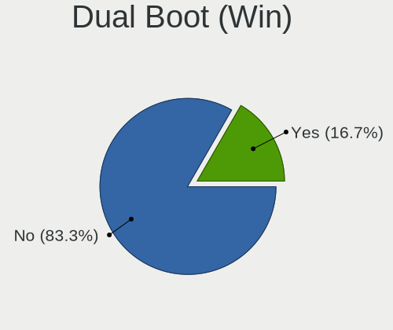
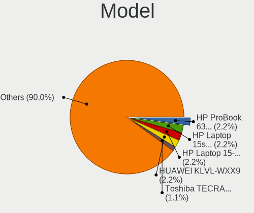
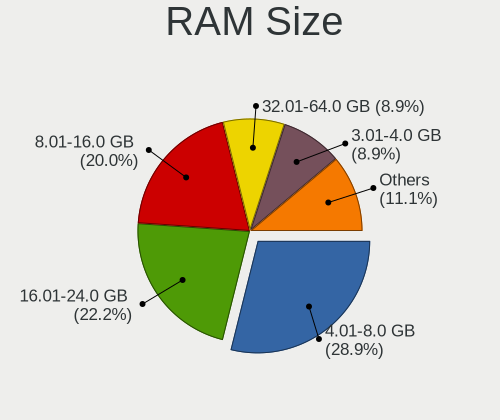
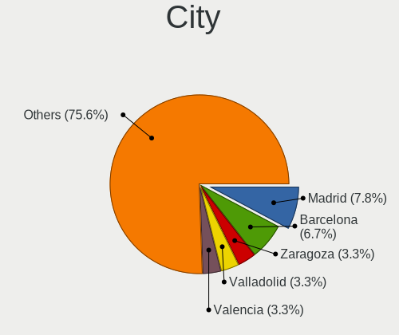
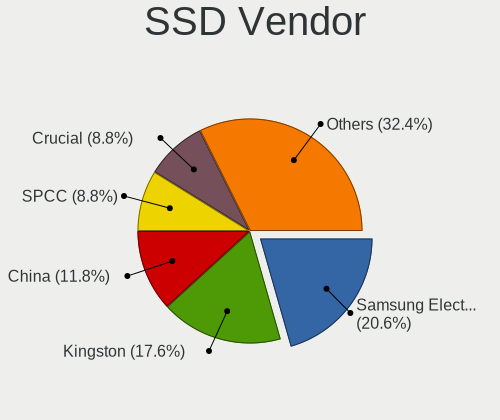
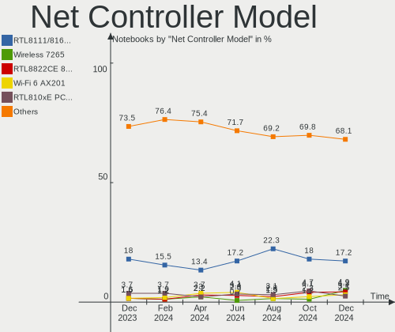

Linux in Spain - Hardware Trends (Notebooks)
--------------------------------------------

A project to identify most popular hardware characteristics and track their change
over time based on data collected by Linux users at https://Linux-Hardware.org.

Anyone can contribute to this report by the [hw-probe](https://github.com/linuxhw/hw-probe) tool:

    sudo -E hw-probe -all -upload

Period: Oct, 2022.

Contents
--------

* [ System ](#system)
  - [ OS                       ](#os)
  - [ OS Family                ](#os-family)
  - [ Kernel                   ](#kernel)
  - [ Kernel Family            ](#kernel-family)
  - [ Kernel Major Ver.        ](#kernel-major-ver)
  - [ Arch                     ](#arch)
  - [ DE                       ](#de)
  - [ Display Server           ](#display-server)
  - [ Display Manager          ](#display-manager)
  - [ OS Lang                  ](#os-lang)
  - [ Boot Mode                ](#boot-mode)
  - [ Filesystem               ](#filesystem)
  - [ Part. scheme             ](#part-scheme)
  - [ Dual Boot with Linux/BSD ](#dual-boot-with-linuxbsd)
  - [ Dual Boot (Win)          ](#dual-boot-win)

* [ Board ](#board)
  - [ Vendor                   ](#vendor)
  - [ Model                    ](#model)
  - [ Model Family             ](#model-family)
  - [ MFG Year                 ](#mfg-year)
  - [ Form Factor              ](#form-factor)
  - [ Secure Boot              ](#secure-boot)
  - [ Coreboot                 ](#coreboot)
  - [ RAM Size                 ](#ram-size)
  - [ RAM Used                 ](#ram-used)
  - [ Total Drives             ](#total-drives)
  - [ Has CD-ROM               ](#has-cd-rom)
  - [ Has Ethernet             ](#has-ethernet)
  - [ Has WiFi                 ](#has-wifi)
  - [ Has Bluetooth            ](#has-bluetooth)

* [ Location ](#location)
  - [ Country                  ](#country)
  - [ City                     ](#city)

* [ Drives ](#drives)
  - [ Drive Vendor             ](#drive-vendor)
  - [ Drive Model              ](#drive-model)
  - [ HDD Vendor               ](#hdd-vendor)
  - [ SSD Vendor               ](#ssd-vendor)
  - [ Drive Kind               ](#drive-kind)
  - [ Drive Connector          ](#drive-connector)
  - [ Drive Size               ](#drive-size)
  - [ Space Total              ](#space-total)
  - [ Space Used               ](#space-used)
  - [ Malfunc. Drives          ](#malfunc-drives)
  - [ Malfunc. Drive Vendor    ](#malfunc-drive-vendor)
  - [ Malfunc. HDD Vendor      ](#malfunc-hdd-vendor)
  - [ Malfunc. Drive Kind      ](#malfunc-drive-kind)
  - [ Failed Drives            ](#failed-drives)
  - [ Failed Drive Vendor      ](#failed-drive-vendor)
  - [ Drive Status             ](#drive-status)

* [ Storage controller ](#storage-controller)
  - [ Storage Vendor           ](#storage-vendor)
  - [ Storage Model            ](#storage-model)
  - [ Storage Kind             ](#storage-kind)

* [ Processor ](#processor)
  - [ CPU Vendor               ](#cpu-vendor)
  - [ CPU Model                ](#cpu-model)
  - [ CPU Model Family         ](#cpu-model-family)
  - [ CPU Cores                ](#cpu-cores)
  - [ CPU Sockets              ](#cpu-sockets)
  - [ CPU Threads              ](#cpu-threads)
  - [ CPU Op-Modes             ](#cpu-op-modes)
  - [ CPU Microcode            ](#cpu-microcode)
  - [ CPU Microarch            ](#cpu-microarch)

* [ Graphics ](#graphics)
  - [ GPU Vendor               ](#gpu-vendor)
  - [ GPU Model                ](#gpu-model)
  - [ GPU Combo                ](#gpu-combo)
  - [ GPU Driver               ](#gpu-driver)
  - [ GPU Memory               ](#gpu-memory)

* [ Monitor ](#monitor)
  - [ Monitor Vendor           ](#monitor-vendor)
  - [ Monitor Model            ](#monitor-model)
  - [ Monitor Resolution       ](#monitor-resolution)
  - [ Monitor Diagonal         ](#monitor-diagonal)
  - [ Monitor Width            ](#monitor-width)
  - [ Aspect Ratio             ](#aspect-ratio)
  - [ Monitor Area             ](#monitor-area)
  - [ Pixel Density            ](#pixel-density)
  - [ Multiple Monitors        ](#multiple-monitors)

* [ Network ](#network)
  - [ Net Controller Vendor    ](#net-controller-vendor)
  - [ Net Controller Model     ](#net-controller-model)
  - [ Wireless Vendor          ](#wireless-vendor)
  - [ Wireless Model           ](#wireless-model)
  - [ Ethernet Vendor          ](#ethernet-vendor)
  - [ Ethernet Model           ](#ethernet-model)
  - [ Net Controller Kind      ](#net-controller-kind)
  - [ Used Controller          ](#used-controller)
  - [ NICs                     ](#nics)
  - [ IPv6                     ](#ipv6)

* [ Bluetooth ](#bluetooth)
  - [ Bluetooth Vendor         ](#bluetooth-vendor)
  - [ Bluetooth Model          ](#bluetooth-model)

* [ Sound ](#sound)
  - [ Sound Vendor             ](#sound-vendor)
  - [ Sound Model              ](#sound-model)

* [ Memory ](#memory)
  - [ Memory Vendor            ](#memory-vendor)
  - [ Memory Model             ](#memory-model)
  - [ Memory Kind              ](#memory-kind)
  - [ Memory Form Factor       ](#memory-form-factor)
  - [ Memory Size              ](#memory-size)
  - [ Memory Speed             ](#memory-speed)

* [ Printers & scanners ](#printers--scanners)
  - [ Printer Vendor           ](#printer-vendor)
  - [ Printer Model            ](#printer-model)
  - [ Scanner Vendor           ](#scanner-vendor)
  - [ Scanner Model            ](#scanner-model)

* [ Camera ](#camera)
  - [ Camera Vendor            ](#camera-vendor)
  - [ Camera Model             ](#camera-model)

* [ Security ](#security)
  - [ Fingerprint Vendor       ](#fingerprint-vendor)
  - [ Fingerprint Model        ](#fingerprint-model)
  - [ Chipcard Vendor          ](#chipcard-vendor)
  - [ Chipcard Model           ](#chipcard-model)

* [ Unsupported ](#unsupported)
  - [ Unsupported Devices      ](#unsupported-devices)
  - [ Unsupported Device Types ](#unsupported-device-types)

System
------

OS
--

Installed operating systems

| Name                 | Notebooks | Percent |
|----------------------|-----------|---------|
| Ubuntu 22.04         | 15        | 17.86%  |
| Debian 11            | 8         | 9.52%   |
| Linux Mint 21        | 7         | 8.33%   |
| Zorin 16             | 5         | 5.95%   |
| Pop!_OS 22.04        | 5         | 5.95%   |
| OpenMandriva 4.3     | 5         | 5.95%   |
| KDE neon 20.04       | 5         | 5.95%   |
| Ubuntu 20.04         | 3         | 3.57%   |
| Linux Mint 20.3      | 3         | 3.57%   |
| Fedora 37            | 3         | 3.57%   |
| Fedora 36            | 3         | 3.57%   |
| Manjaro              | 2         | 2.38%   |
| Kali 2022.3          | 2         | 2.38%   |
| Arch Rolling         | 2         | 2.38%   |
| Xubuntu 20.04        | 1         | 1.19%   |
| Ultramarine Linux 36 | 1         | 1.19%   |
| Ubuntu 22.10         | 1         | 1.19%   |
| Ubuntu 18.04         | 1         | 1.19%   |
| TUXEDO OS 22.04      | 1         | 1.19%   |
| SteamOS 3.3.2        | 1         | 1.19%   |
| OpenMandriva 4.50    | 1         | 1.19%   |
| Manjaro 22.0.0       | 1         | 1.19%   |
| Linux Mint 20        | 1         | 1.19%   |
| Kubuntu 22.04        | 1         | 1.19%   |
| Endless 4.0.10       | 1         | 1.19%   |
| EndeavourOS Rolling  | 1         | 1.19%   |
| Elementary 6.1       | 1         | 1.19%   |
| Debian Testing       | 1         | 1.19%   |
| Debian               | 1         | 1.19%   |
| ArcoLinux Rolling    | 1         | 1.19%   |

OS Family
---------

OS without a version

| Name              | Notebooks | Percent |
|-------------------|-----------|---------|
| Ubuntu            | 20        | 23.81%  |
| Linux Mint        | 11        | 13.1%   |
| Debian            | 10        | 11.9%   |
| OpenMandriva      | 6         | 7.14%   |
| Fedora            | 6         | 7.14%   |
| Zorin             | 5         | 5.95%   |
| Pop!_OS           | 5         | 5.95%   |
| KDE neon          | 5         | 5.95%   |
| Manjaro           | 3         | 3.57%   |
| Kali              | 2         | 2.38%   |
| Arch              | 2         | 2.38%   |
| Xubuntu           | 1         | 1.19%   |
| Ultramarine Linux | 1         | 1.19%   |
| TUXEDO OS         | 1         | 1.19%   |
| SteamOS           | 1         | 1.19%   |
| Kubuntu           | 1         | 1.19%   |
| Endless           | 1         | 1.19%   |
| EndeavourOS       | 1         | 1.19%   |
| Elementary        | 1         | 1.19%   |
| ArcoLinux         | 1         | 1.19%   |

Kernel
------

Version of the Linux kernel

| Version                                                      | Notebooks | Percent |
|--------------------------------------------------------------|-----------|---------|
| 5.15.0-52-generic                                            | 16        | 19.05%  |
| 5.15.0-50-generic                                            | 11        | 13.1%   |
| 5.15.0-48-generic                                            | 8         | 9.52%   |
| 5.16.7-desktop-1omv4003                                      | 5         | 5.95%   |
| 5.19.0-76051900-generic                                      | 3         | 3.57%   |
| 5.10.0-19-amd64                                              | 3         | 3.57%   |
| 5.10.0-18-amd64                                              | 3         | 3.57%   |
| 6.0.2-arch1-1                                                | 2         | 2.38%   |
| 6.0.2-76060002-generic                                       | 2         | 2.38%   |
| 5.4.0-131-generic                                            | 2         | 2.38%   |
| 5.19.15-201.fc36.x86_64                                      | 2         | 2.38%   |
| 5.19.0-2-amd64                                               | 2         | 2.38%   |
| 5.15.65-1-MANJARO                                            | 2         | 2.38%   |
| 6.1.0-0.rc0.20221012git49da07006239.10.vanilla.1.fc37.x86_64 | 1         | 1.19%   |
| 6.0.5-200.fc36.x86_64                                        | 1         | 1.19%   |
| 6.0.0-2-amd64                                                | 1         | 1.19%   |
| 6.0.0-1-MANJARO                                              | 1         | 1.19%   |
| 5.4.0-113-generic                                            | 1         | 1.19%   |
| 5.19.15-300.fc37.x86_64                                      | 1         | 1.19%   |
| 5.19.13-300.fc37.x86_64                                      | 1         | 1.19%   |
| 5.19.12-desktop-2omv4090                                     | 1         | 1.19%   |
| 5.19.12-200.fc36.x86_64                                      | 1         | 1.19%   |
| 5.19.0-kali2-rt-amd64                                        | 1         | 1.19%   |
| 5.19.0-23-generic                                            | 1         | 1.19%   |
| 5.18.0-kali7-amd64                                           | 1         | 1.19%   |
| 5.18.0-0.deb11.4-amd64                                       | 1         | 1.19%   |
| 5.15.74-1-lts                                                | 1         | 1.19%   |
| 5.15.73-3-lts                                                | 1         | 1.19%   |
| 5.15.0-47-generic                                            | 1         | 1.19%   |
| 5.15.0-46-generic                                            | 1         | 1.19%   |
| 5.15.0-43-generic                                            | 1         | 1.19%   |
| 5.15.0-10048-tuxedo                                          | 1         | 1.19%   |
| 5.13.0-valve21.3-1-neptune                                   | 1         | 1.19%   |
| 5.13.0-40-generic                                            | 1         | 1.19%   |
| 5.11.0-35-generic                                            | 1         | 1.19%   |
| 4.15.0-193-generic                                           | 1         | 1.19%   |

Kernel Family
-------------

Linux kernel without a distro release

| Version | Notebooks | Percent |
|---------|-----------|---------|
| 5.15.0  | 39        | 46.43%  |
| 5.19.0  | 7         | 8.33%   |
| 5.10.0  | 6         | 7.14%   |
| 5.16.7  | 5         | 5.95%   |
| 6.0.2   | 4         | 4.76%   |
| 5.4.0   | 3         | 3.57%   |
| 5.19.15 | 3         | 3.57%   |
| 6.0.0   | 2         | 2.38%   |
| 5.19.12 | 2         | 2.38%   |
| 5.18.0  | 2         | 2.38%   |
| 5.15.65 | 2         | 2.38%   |
| 5.13.0  | 2         | 2.38%   |
| 6.1.0   | 1         | 1.19%   |
| 6.0.5   | 1         | 1.19%   |
| 5.19.13 | 1         | 1.19%   |
| 5.15.74 | 1         | 1.19%   |
| 5.15.73 | 1         | 1.19%   |
| 5.11.0  | 1         | 1.19%   |
| 4.15.0  | 1         | 1.19%   |

Kernel Major Ver.
-----------------

Linux kernel major version

| Version | Notebooks | Percent |
|---------|-----------|---------|
| 5.15    | 43        | 51.19%  |
| 5.19    | 13        | 15.48%  |
| 6.0     | 7         | 8.33%   |
| 5.10    | 6         | 7.14%   |
| 5.16    | 5         | 5.95%   |
| 5.4     | 3         | 3.57%   |
| 5.18    | 2         | 2.38%   |
| 5.13    | 2         | 2.38%   |
| 6.1     | 1         | 1.19%   |
| 5.11    | 1         | 1.19%   |
| 4.15    | 1         | 1.19%   |

Arch
----

OS architecture (x86_64, i586, etc.)

| Name   | Notebooks | Percent |
|--------|-----------|---------|
| x86_64 | 83        | 98.81%  |
| i686   | 1         | 1.19%   |

DE
--

Desktop Environment

| Name       | Notebooks | Percent |
|------------|-----------|---------|
| GNOME      | 44        | 52.38%  |
| KDE5       | 19        | 22.62%  |
| X-Cinnamon | 8         | 9.52%   |
| MATE       | 4         | 4.76%   |
| XFCE       | 3         | 3.57%   |
| Unknown    | 2         | 2.38%   |
| Pantheon   | 1         | 1.19%   |
| i3         | 1         | 1.19%   |
| Budgie     | 1         | 1.19%   |
| awesome    | 1         | 1.19%   |

Display Server
--------------

X11 or Wayland

| Name    | Notebooks | Percent |
|---------|-----------|---------|
| X11     | 62        | 73.81%  |
| Wayland | 20        | 23.81%  |
| Tty     | 1         | 1.19%   |
| Unknown | 1         | 1.19%   |

Display Manager
---------------

SDDM, LightDM, etc.

| Name    | Notebooks | Percent |
|---------|-----------|---------|
| Unknown | 36        | 42.86%  |
| GDM3    | 20        | 23.81%  |
| GDM     | 11        | 13.1%   |
| SDDM    | 10        | 11.9%   |
| LightDM | 7         | 8.33%   |

OS Lang
-------

Language

| Lang    | Notebooks | Percent |
|---------|-----------|---------|
| es_ES   | 56        | 66.67%  |
| en_US   | 20        | 23.81%  |
| ca_ES   | 3         | 3.57%   |
| en_AG   | 2         | 2.38%   |
| gl_ES   | 1         | 1.19%   |
| en_GB   | 1         | 1.19%   |
| Unknown | 1         | 1.19%   |

Boot Mode
---------

EFI or BIOS

| Mode | Notebooks | Percent |
|------|-----------|---------|
| EFI  | 50        | 59.52%  |
| BIOS | 34        | 40.48%  |

Filesystem
----------

Type of filesystem

| Type    | Notebooks | Percent |
|---------|-----------|---------|
| Ext4    | 67        | 79.76%  |
| Btrfs   | 8         | 9.52%   |
| Overlay | 6         | 7.14%   |
| Xfs     | 3         | 3.57%   |

Part. scheme
------------

Scheme of partitioning

| Type    | Notebooks | Percent |
|---------|-----------|---------|
| GPT     | 44        | 52.38%  |
| Unknown | 36        | 42.86%  |
| MBR     | 4         | 4.76%   |

Dual Boot with Linux/BSD
------------------------

Hosting more than one Linux/BSD

| Dual boot | Notebooks | Percent |
|-----------|-----------|---------|
| No        | 73        | 86.9%   |
| Yes       | 11        | 13.1%   |

Dual Boot (Win)
---------------

Hosting Linux and Windows

| Dual boot | Notebooks | Percent |
|-----------|-----------|---------|
| No        | 62        | 73.81%  |
| Yes       | 22        | 26.19%  |

Board
-----

Vendor
------

Motherboard manufacturer

| Name                | Notebooks | Percent |
|---------------------|-----------|---------|
| Lenovo              | 18        | 21.43%  |
| ASUSTek Computer    | 12        | 14.29%  |
| Hewlett-Packard     | 10        | 11.9%   |
| MSI                 | 7         | 8.33%   |
| Acer                | 7         | 8.33%   |
| Dell                | 5         | 5.95%   |
| Toshiba             | 4         | 4.76%   |
| Notebook            | 3         | 3.57%   |
| Fujitsu             | 3         | 3.57%   |
| SLIMBOOK            | 2         | 2.38%   |
| HUAWEI              | 2         | 2.38%   |
| Chuwi               | 2         | 2.38%   |
| Apple               | 2         | 2.38%   |
| VANT                | 1         | 1.19%   |
| Valve               | 1         | 1.19%   |
| Samsung Electronics | 1         | 1.19%   |
| Qilive              | 1         | 1.19%   |
| Panasonic           | 1         | 1.19%   |
| Google              | 1         | 1.19%   |
| ALURIN              | 1         | 1.19%   |

Model
-----

Motherboard model

| Name                                        | Notebooks | Percent |
|---------------------------------------------|-----------|---------|
| MSI Modern 14 C12M                          | 2         | 2.38%   |
| Fujitsu LIFEBOOK AH532                      | 2         | 2.38%   |
| Chuwi HeroBook Air                          | 2         | 2.38%   |
| VANT MOOVE3-15                              | 1         | 1.19%   |
| Valve Jupiter                               | 1         | 1.19%   |
| Toshiba Satellite R830                      | 1         | 1.19%   |
| Toshiba Satellite P50-B-103                 | 1         | 1.19%   |
| Toshiba Satellite L10W-B-101                | 1         | 1.19%   |
| Toshiba Satellite C855-1T5                  | 1         | 1.19%   |
| SLIMBOOK TITAN                              | 1         | 1.19%   |
| SLIMBOOK PROX-AMD5                          | 1         | 1.19%   |
| Samsung N248P/N143P                         | 1         | 1.19%   |
| Qilive QW20141BSP                           | 1         | 1.19%   |
| Panasonic CF-19RDRCHH7                      | 1         | 1.19%   |
| Notebook W65_W67RB                          | 1         | 1.19%   |
| Notebook W230SD                             | 1         | 1.19%   |
| Notebook N2x0WU                             | 1         | 1.19%   |
| MSI Stealth GS66 12UGS                      | 1         | 1.19%   |
| MSI Raider GE76 12UGS                       | 1         | 1.19%   |
| MSI Pulse GL76 12UEK                        | 1         | 1.19%   |
| MSI GE66 Raider 10UE                        | 1         | 1.19%   |
| MSI Creator Z16 A11UE                       | 1         | 1.19%   |
| Lenovo ThinkPad X1 Carbon Gen 9 20XWS21H00  | 1         | 1.19%   |
| Lenovo ThinkPad X1 Carbon Gen 10 21CBCTO1WW | 1         | 1.19%   |
| Lenovo ThinkPad T490s 20NYS6FL01            | 1         | 1.19%   |
| Lenovo ThinkPad T470 20HES2SH2B             | 1         | 1.19%   |
| Lenovo ThinkPad Edge 25453BG                | 1         | 1.19%   |
| Lenovo ThinkBook 15p 20V3                   | 1         | 1.19%   |
| Lenovo ThinkBook 15 G2 ITL 20VE             | 1         | 1.19%   |
| Lenovo ThinkBook 14-IIL 20SL                | 1         | 1.19%   |
| Lenovo Legion Y530-15ICH 81FV               | 1         | 1.19%   |
| Lenovo IdeaPad S340-15IIL 81VW              | 1         | 1.19%   |
| Lenovo IdeaPad S145-15IWL 81MV              | 1         | 1.19%   |
| Lenovo IdeaPad S145-15AST 81N3              | 1         | 1.19%   |
| Lenovo IdeaPad Gaming 3 15ACH6 82K2         | 1         | 1.19%   |
| Lenovo IdeaPad 5 14ALC05 82LM               | 1         | 1.19%   |
| Lenovo IdeaPad 330-15IKB 81DE               | 1         | 1.19%   |
| Lenovo IdeaPad 3 15ITL6 82H8                | 1         | 1.19%   |
| Lenovo IdeaPad 3 15ADA05 81W1               | 1         | 1.19%   |
| Lenovo G500 20236                           | 1         | 1.19%   |

Model Family
------------

Motherboard model prefix

| Name                   | Notebooks | Percent |
|------------------------|-----------|---------|
| Lenovo IdeaPad         | 8         | 9.52%   |
| Acer Aspire            | 6         | 7.14%   |
| Lenovo ThinkPad        | 5         | 5.95%   |
| Toshiba Satellite      | 4         | 4.76%   |
| Lenovo ThinkBook       | 3         | 3.57%   |
| HP Pavilion            | 3         | 3.57%   |
| Fujitsu LIFEBOOK       | 3         | 3.57%   |
| Dell Latitude          | 3         | 3.57%   |
| ASUS ASUS              | 3         | 3.57%   |
| MSI Modern             | 2         | 2.38%   |
| HP Laptop              | 2         | 2.38%   |
| Chuwi HeroBook         | 2         | 2.38%   |
| ASUS VivoBook          | 2         | 2.38%   |
| VANT MOOVE3-15         | 1         | 1.19%   |
| Valve Jupiter          | 1         | 1.19%   |
| SLIMBOOK TITAN         | 1         | 1.19%   |
| SLIMBOOK PROX-AMD5     | 1         | 1.19%   |
| Samsung N248P          | 1         | 1.19%   |
| Qilive QW20141BSP      | 1         | 1.19%   |
| Panasonic CF-19RDRCHH7 | 1         | 1.19%   |
| Notebook W65           | 1         | 1.19%   |
| Notebook W230SD        | 1         | 1.19%   |
| Notebook N2x0WU        | 1         | 1.19%   |
| MSI Stealth            | 1         | 1.19%   |
| MSI Raider             | 1         | 1.19%   |
| MSI Pulse              | 1         | 1.19%   |
| MSI GE66               | 1         | 1.19%   |
| MSI Creator            | 1         | 1.19%   |
| Lenovo Legion          | 1         | 1.19%   |
| Lenovo G500            | 1         | 1.19%   |
| HUAWEI RLEF-XX         | 1         | 1.19%   |
| HUAWEI NBLK-WAX9X      | 1         | 1.19%   |
| HP Victus              | 1         | 1.19%   |
| HP Notebook            | 1         | 1.19%   |
| HP EliteBook           | 1         | 1.19%   |
| HP 250                 | 1         | 1.19%   |
| HP 15                  | 1         | 1.19%   |
| Google Liara           | 1         | 1.19%   |
| Dell XPS               | 1         | 1.19%   |
| Dell Vostro            | 1         | 1.19%   |

MFG Year
--------

Motherboard manufacture year

| Year | Notebooks | Percent |
|------|-----------|---------|
| 2021 | 14        | 16.67%  |
| 2022 | 12        | 14.29%  |
| 2019 | 10        | 11.9%   |
| 2020 | 8         | 9.52%   |
| 2013 | 7         | 8.33%   |
| 2018 | 5         | 5.95%   |
| 2015 | 5         | 5.95%   |
| 2012 | 5         | 5.95%   |
| 2011 | 5         | 5.95%   |
| 2014 | 4         | 4.76%   |
| 2017 | 3         | 3.57%   |
| 2016 | 2         | 2.38%   |
| 2010 | 2         | 2.38%   |
| 2009 | 1         | 1.19%   |
| 2008 | 1         | 1.19%   |

Form Factor
-----------

Physical design of the computer

| Name     | Notebooks | Percent |
|----------|-----------|---------|
| Notebook | 84        | 100%    |

Secure Boot
-----------

Enabled or disabled

| State    | Notebooks | Percent |
|----------|-----------|---------|
| Disabled | 74        | 88.1%   |
| Enabled  | 10        | 11.9%   |

Coreboot
--------

Have coreboot on board

| Used | Notebooks | Percent |
|------|-----------|---------|
| No   | 83        | 98.81%  |
| Yes  | 1         | 1.19%   |

RAM Size
--------

Total RAM memory

| Size in GB  | Notebooks | Percent |
|-------------|-----------|---------|
| 4.01-8.0    | 33        | 39.29%  |
| 16.01-24.0  | 20        | 23.81%  |
| 8.01-16.0   | 12        | 14.29%  |
| 3.01-4.0    | 8         | 9.52%   |
| 32.01-64.0  | 7         | 8.33%   |
| 2.01-3.0    | 2         | 2.38%   |
| 64.01-256.0 | 1         | 1.19%   |
| 0.51-1.0    | 1         | 1.19%   |

RAM Used
--------

Used RAM memory

| Used GB   | Notebooks | Percent |
|-----------|-----------|---------|
| 2.01-3.0  | 27        | 32.14%  |
| 1.01-2.0  | 25        | 29.76%  |
| 3.01-4.0  | 15        | 17.86%  |
| 4.01-8.0  | 11        | 13.1%   |
| 0.51-1.0  | 4         | 4.76%   |
| 8.01-16.0 | 2         | 2.38%   |

Total Drives
------------

Number of drives on board

| Drives | Notebooks | Percent |
|--------|-----------|---------|
| 1      | 65        | 77.38%  |
| 2      | 17        | 20.24%  |
| 3      | 2         | 2.38%   |

Has CD-ROM
----------

Has CD-ROM on board

| Presented | Notebooks | Percent |
|-----------|-----------|---------|
| No        | 69        | 82.14%  |
| Yes       | 15        | 17.86%  |

Has Ethernet
------------

Has Ethernet on board

| Presented | Notebooks | Percent |
|-----------|-----------|---------|
| Yes       | 64        | 76.19%  |
| No        | 20        | 23.81%  |

Has WiFi
--------

Has WiFi module

| Presented | Notebooks | Percent |
|-----------|-----------|---------|
| Yes       | 84        | 100%    |

Has Bluetooth
-------------

Has Bluetooth module

| Presented | Notebooks | Percent |
|-----------|-----------|---------|
| Yes       | 68        | 80.95%  |
| No        | 16        | 19.05%  |

Location
--------

Country
-------

Geographic location (country)

| Country | Notebooks | Percent |
|---------|-----------|---------|
| Spain   | 84        | 100%    |

City
----

Geographic location (city)

| City                     | Notebooks | Percent |
|--------------------------|-----------|---------|
| Madrid                   | 19        | 22.62%  |
| Barcelona                | 12        | 14.29%  |
| Seville                  | 6         | 7.14%   |
| Valencia                 | 3         | 3.57%   |
| Fuenlabrada              | 2         | 2.38%   |
| Donostia / San Sebastian | 2         | 2.38%   |
| Cerdanyola del Vallès   | 2         | 2.38%   |
| Caldes de Malavella      | 2         | 2.38%   |
| Alcobendas               | 2         | 2.38%   |
| Zaratamo                 | 1         | 1.19%   |
| Vigo                     | 1         | 1.19%   |
| Valladolid               | 1         | 1.19%   |
| Tortosa                  | 1         | 1.19%   |
| Terrassa                 | 1         | 1.19%   |
| Talavera de la Reina     | 1         | 1.19%   |
| Santiago de Compostela   | 1         | 1.19%   |
| Sant Feliu de Guíxols   | 1         | 1.19%   |
| Sanlúcar de Barrameda   | 1         | 1.19%   |
| Sabadell                 | 1         | 1.19%   |
| Roquetas de Mar          | 1         | 1.19%   |
| Ronda                    | 1         | 1.19%   |
| Pucol                    | 1         | 1.19%   |
| Petrel                   | 1         | 1.19%   |
| Palma                    | 1         | 1.19%   |
| Narón                   | 1         | 1.19%   |
| Mula                     | 1         | 1.19%   |
| Mataró                  | 1         | 1.19%   |
| Malpartida de Caceres    | 1         | 1.19%   |
| Mahon                    | 1         | 1.19%   |
| Los Barrios              | 1         | 1.19%   |
| Les Cabanyes             | 1         | 1.19%   |
| Lalin                    | 1         | 1.19%   |
| Jaén                    | 1         | 1.19%   |
| Gelves                   | 1         | 1.19%   |
| Gabia la Chica           | 1         | 1.19%   |
| Estella-Lizarra          | 1         | 1.19%   |
| Eibar                    | 1         | 1.19%   |
| Boal                     | 1         | 1.19%   |
| Benicassim               | 1         | 1.19%   |
| Belinchon                | 1         | 1.19%   |

Drives
------

Drive Vendor
------------

Hard drive vendors

| Vendor                      | Notebooks | Drives | Percent |
|-----------------------------|-----------|--------|---------|
| Samsung Electronics         | 19        | 20     | 19.59%  |
| SanDisk                     | 11        | 11     | 11.34%  |
| Micron Technology           | 9         | 9      | 9.28%   |
| WDC                         | 8         | 8      | 8.25%   |
| Kingston                    | 6         | 6      | 6.19%   |
| Intel                       | 6         | 6      | 6.19%   |
| Hitachi                     | 6         | 6      | 6.19%   |
| Unknown                     | 5         | 6      | 5.15%   |
| Seagate                     | 5         | 5      | 5.15%   |
| Toshiba                     | 3         | 3      | 3.09%   |
| SK hynix                    | 3         | 3      | 3.09%   |
| Crucial                     | 3         | 4      | 3.09%   |
| Netac                       | 2         | 2      | 2.06%   |
| Micron/Crucial Technology   | 2         | 2      | 2.06%   |
| HGST                        | 2         | 2      | 2.06%   |
| Apple                       | 2         | 2      | 2.06%   |
| SPCC                        | 1         | 1      | 1.03%   |
| Silicon Motion              | 1         | 1      | 1.03%   |
| KIOXIA                      | 1         | 1      | 1.03%   |
| Kingston Technology Company | 1         | 1      | 1.03%   |
| Fujitsu                     | 1         | 1      | 1.03%   |

Drive Model
-----------

Hard drive models

| Model                                          | Notebooks | Percent |
|------------------------------------------------|-----------|---------|
| Seagate ST500LT012-1DG142 500GB                | 4         | 4.08%   |
| Kingston SA400S37240G 240GB SSD                | 3         | 3.06%   |
| Unknown MMC Card  64GB                         | 2         | 2.04%   |
| Unknown MMC Card  128GB                        | 2         | 2.04%   |
| Sandisk WDC PC SN540 SDDPNPF-512G-1032 512GB   | 2         | 2.04%   |
| Sandisk WD Black SN750 / PC SN730 NVMe SSD 1TB | 2         | 2.04%   |
| Samsung SSD 850 EVO 250GB                      | 2         | 2.04%   |
| Samsung MZ7LN256HAJQ-000L2 256GB SSD           | 2         | 2.04%   |
| Netac SSD 128GB                                | 2         | 2.04%   |
| Micron/Crucial P2 NVMe PCIe SSD 500GB          | 2         | 2.04%   |
| Micron MTFDHBA512QFD 512GB                     | 2         | 2.04%   |
| Micron 3400_MTFDKBA1T0TFH 1TB                  | 2         | 2.04%   |
| Kingston SA400S37480G 480GB SSD                | 2         | 2.04%   |
| Intel SSD 660P Series 1024GB                   | 2         | 2.04%   |
| Hitachi HTS547575A9E384 752GB                  | 2         | 2.04%   |
| WDC WDS240G2G0A-00JH30 240GB SSD               | 1         | 1.02%   |
| WDC WD7500BPVX-75JC3T0 752GB                   | 1         | 1.02%   |
| WDC WD3200BPVT-22ZEST0 320GB                   | 1         | 1.02%   |
| WDC WD10SPZX-21Z10T0 1TB                       | 1         | 1.02%   |
| WDC WD10JPVX-22JC3T0 1TB                       | 1         | 1.02%   |
| WDC PC SN730 SDBQNTY-256G-1001 256GB           | 1         | 1.02%   |
| WDC PC SN530 SDBPMPZ-256G-1101 256GB           | 1         | 1.02%   |
| WDC PC SA530 SDASN8Y-256G-1006 256GB           | 1         | 1.02%   |
| Unknown MMC Card  256GB                        | 1         | 1.02%   |
| Unknown MMC Card  249GB                        | 1         | 1.02%   |
| Toshiba TR200 480GB SSD                        | 1         | 1.02%   |
| Toshiba MQ01ABD100 1TB                         | 1         | 1.02%   |
| Toshiba MQ01ABD050 500GB                       | 1         | 1.02%   |
| SPCC M.2 SSD 256GB                             | 1         | 1.02%   |
| SK hynix SKHynix_HFS512GDE9X084N 512GB         | 1         | 1.02%   |
| SK hynix SH920 mSATA 128GB SSD                 | 1         | 1.02%   |
| SK hynix BC711 HFM512GD3JX013N 512GB           | 1         | 1.02%   |
| Silicon Motion PCIe-8 SSD 512GB                | 1         | 1.02%   |
| Seagate ST1000LM024 HN-M101MBB 1TB             | 1         | 1.02%   |
| Sandisk WD Blue SN550 NVMe SSD 1TB             | 1         | 1.02%   |
| Sandisk WD Black SN850 1TB                     | 1         | 1.02%   |
| SanDisk SSD PLUS 480GB                         | 1         | 1.02%   |
| SanDisk SDSSDH3 500G                           | 1         | 1.02%   |
| SanDisk SDSSDA240G 240GB                       | 1         | 1.02%   |
| SanDisk SD9SN8W256G1002 256GB SSD              | 1         | 1.02%   |

HDD Vendor
----------

Hard disk drive vendors

| Vendor              | Notebooks | Drives | Percent |
|---------------------|-----------|--------|---------|
| Hitachi             | 6         | 6      | 27.27%  |
| Seagate             | 5         | 5      | 22.73%  |
| WDC                 | 4         | 4      | 18.18%  |
| Toshiba             | 2         | 2      | 9.09%   |
| HGST                | 2         | 2      | 9.09%   |
| Samsung Electronics | 1         | 1      | 4.55%   |
| Fujitsu             | 1         | 1      | 4.55%   |
| Apple               | 1         | 1      | 4.55%   |

SSD Vendor
----------

Solid state drive vendors

| Vendor              | Notebooks | Drives | Percent |
|---------------------|-----------|--------|---------|
| Samsung Electronics | 6         | 6      | 22.22%  |
| Kingston            | 6         | 6      | 22.22%  |
| SanDisk             | 5         | 5      | 18.52%  |
| Crucial             | 3         | 4      | 11.11%  |
| WDC                 | 2         | 2      | 7.41%   |
| Netac               | 2         | 2      | 7.41%   |
| Toshiba             | 1         | 1      | 3.7%    |
| SPCC                | 1         | 1      | 3.7%    |
| SK hynix            | 1         | 1      | 3.7%    |

Drive Kind
----------

HDD or SSD

| Kind | Notebooks | Drives | Percent |
|------|-----------|--------|---------|
| NVMe | 42        | 44     | 44.21%  |
| SSD  | 27        | 28     | 28.42%  |
| HDD  | 21        | 22     | 22.11%  |
| MMC  | 5         | 6      | 5.26%   |

Drive Connector
---------------

SATA, SAS, NVMe, etc.

| Type | Notebooks | Drives | Percent |
|------|-----------|--------|---------|
| NVMe | 42        | 44     | 48.84%  |
| SATA | 38        | 49     | 44.19%  |
| MMC  | 5         | 6      | 5.81%   |
| SAS  | 1         | 1      | 1.16%   |

Drive Size
----------

Size of hard drive

| Size in TB | Notebooks | Drives | Percent |
|------------|-----------|--------|---------|
| 0.01-0.5   | 34        | 40     | 77.27%  |
| 0.51-1.0   | 10        | 10     | 22.73%  |

Space Total
-----------

Amount of disk space available on the file system

| Size in GB | Notebooks | Percent |
|------------|-----------|---------|
| 101-250    | 27        | 32.14%  |
| 251-500    | 24        | 28.57%  |
| 501-1000   | 11        | 13.1%   |
| 51-100     | 8         | 9.52%   |
| 1001-2000  | 4         | 4.76%   |
| 1-20       | 4         | 4.76%   |
| 21-50      | 3         | 3.57%   |
| Unknown    | 2         | 2.38%   |
| 2001-3000  | 1         | 1.19%   |

Space Used
----------

Amount of used disk space

| Used GB  | Notebooks | Percent |
|----------|-----------|---------|
| 1-20     | 26        | 30.95%  |
| 21-50    | 21        | 25%     |
| 101-250  | 17        | 20.24%  |
| 51-100   | 8         | 9.52%   |
| 251-500  | 7         | 8.33%   |
| 501-1000 | 3         | 3.57%   |
| Unknown  | 2         | 2.38%   |

Malfunc. Drives
---------------

Drive models with a malfunction

| Model                           | Notebooks | Drives | Percent |
|---------------------------------|-----------|--------|---------|
| Kingston SA400S37480G 480GB SSD | 1         | 1      | 25%     |
| Hitachi HTS547564A9E384 640GB   | 1         | 1      | 25%     |
| Hitachi HTS545050A7E380 500GB   | 1         | 1      | 25%     |
| Hitachi HTS543216L9A300 160GB   | 1         | 1      | 25%     |

Malfunc. Drive Vendor
---------------------

Vendors of faulty drives

| Vendor   | Notebooks | Drives | Percent |
|----------|-----------|--------|---------|
| Hitachi  | 3         | 3      | 75%     |
| Kingston | 1         | 1      | 25%     |

Malfunc. HDD Vendor
-------------------

Vendors of faulty HDD drives

| Vendor  | Notebooks | Drives | Percent |
|---------|-----------|--------|---------|
| Hitachi | 3         | 3      | 100%    |

Malfunc. Drive Kind
-------------------

Kinds of faulty drives

| Kind | Notebooks | Drives | Percent |
|------|-----------|--------|---------|
| HDD  | 3         | 3      | 75%     |
| SSD  | 1         | 1      | 25%     |

Failed Drives
-------------

Failed drive models

Zero info for selected period =(

Failed Drive Vendor
-------------------

Failed drive vendors

Zero info for selected period =(

Drive Status
------------

Number of failed and malfunc. drives

| Status   | Notebooks | Drives | Percent |
|----------|-----------|--------|---------|
| Detected | 56        | 67     | 65.88%  |
| Works    | 25        | 29     | 29.41%  |
| Malfunc  | 4         | 4      | 4.71%   |

Storage controller
------------------

Storage Vendor
--------------

Storage controller vendors

| Vendor                      | Notebooks | Percent |
|-----------------------------|-----------|---------|
| Intel                       | 51        | 51.52%  |
| Samsung Electronics         | 12        | 12.12%  |
| AMD                         | 10        | 10.1%   |
| Micron Technology           | 9         | 9.09%   |
| SanDisk                     | 8         | 8.08%   |
| SK hynix                    | 2         | 2.02%   |
| Micron/Crucial Technology   | 2         | 2.02%   |
| Silicon Motion              | 1         | 1.01%   |
| Nvidia                      | 1         | 1.01%   |
| KIOXIA                      | 1         | 1.01%   |
| Kingston Technology Company | 1         | 1.01%   |
| Apple                       | 1         | 1.01%   |

Storage Model
-------------

Storage controller models

| Model                                                                          | Notebooks | Percent |
|--------------------------------------------------------------------------------|-----------|---------|
| Micron Non-Volatile memory controller                                          | 9         | 8.49%   |
| Intel 7 Series Chipset Family 6-port SATA Controller [AHCI mode]               | 8         | 7.55%   |
| Samsung NVMe SSD Controller 980                                                | 6         | 5.66%   |
| AMD FCH SATA Controller [AHCI mode]                                            | 6         | 5.66%   |
| Intel 82801 Mobile SATA Controller [RAID mode]                                 | 5         | 4.72%   |
| Samsung NVMe SSD Controller SM981/PM981/PM983                                  | 4         | 3.77%   |
| Intel SSD 660P Series                                                          | 4         | 3.77%   |
| SanDisk WD Black SN750 / PC SN730 NVMe SSD                                     | 3         | 2.83%   |
| SanDisk Non-Volatile memory controller                                         | 3         | 2.83%   |
| Intel Volume Management Device NVMe RAID Controller                            | 3         | 2.83%   |
| Intel Tiger Lake-LP SATA Controller                                            | 3         | 2.83%   |
| Intel Celeron/Pentium Silver Processor SATA Controller                         | 3         | 2.83%   |
| Intel 8 Series SATA Controller 1 [AHCI mode]                                   | 3         | 2.83%   |
| SK hynix Gold P31 SSD                                                          | 2         | 1.89%   |
| Micron/Crucial P2 NVMe PCIe SSD                                                | 2         | 1.89%   |
| Intel Wildcat Point-LP SATA Controller [AHCI Mode]                             | 2         | 1.89%   |
| Intel Sunrise Point-LP SATA Controller [AHCI mode]                             | 2         | 1.89%   |
| Intel Non-Volatile memory controller                                           | 2         | 1.89%   |
| Intel Ice Lake-LP SATA Controller [AHCI mode]                                  | 2         | 1.89%   |
| Intel Celeron N3350/Pentium N4200/Atom E3900 Series SATA AHCI Controller       | 2         | 1.89%   |
| Intel Cannon Point-LP SATA Controller [AHCI Mode]                              | 2         | 1.89%   |
| Intel Cannon Lake Mobile PCH SATA AHCI Controller                              | 2         | 1.89%   |
| Intel Atom Processor E3800 Series SATA AHCI Controller                         | 2         | 1.89%   |
| Intel Alder Lake-P SATA AHCI Controller                                        | 2         | 1.89%   |
| Intel 8 Series/C220 Series Chipset Family 6-port SATA Controller 1 [AHCI mode] | 2         | 1.89%   |
| Intel 6 Series/C200 Series Chipset Family 6 port Mobile SATA AHCI Controller   | 2         | 1.89%   |
| Intel 400 Series Chipset Family SATA AHCI Controller                           | 2         | 1.89%   |
| AMD SB7x0/SB8x0/SB9x0 SATA Controller [AHCI mode]                              | 2         | 1.89%   |
| AMD FCH SATA Controller [IDE mode]                                             | 2         | 1.89%   |
| Silicon Motion Non-Volatile memory controller                                  | 1         | 0.94%   |
| SanDisk WD PC SN810 / Black SN850 NVMe SSD                                     | 1         | 0.94%   |
| SanDisk WD Blue SN550 NVMe SSD                                                 | 1         | 0.94%   |
| Samsung NVMe SSD Controller SM961/PM961/SM963                                  | 1         | 0.94%   |
| Samsung NVMe SSD Controller PM9A1/PM9A3/980PRO                                 | 1         | 0.94%   |
| Nvidia MCP79 AHCI Controller                                                   | 1         | 0.94%   |
| KIOXIA NVMe SSD Controller BG4                                                 | 1         | 0.94%   |
| Kingston Company A2000 NVMe SSD                                                | 1         | 0.94%   |
| Intel NM10/ICH7 Family SATA Controller [AHCI mode]                             | 1         | 0.94%   |
| Intel HM170/QM170 Chipset SATA Controller [AHCI Mode]                          | 1         | 0.94%   |
| Intel Comet Lake SATA AHCI Controller                                          | 1         | 0.94%   |

Storage Kind
------------

Kind of storage controller (IDE, SATA, NVMe, SAS, ...)

| Kind | Notebooks | Percent |
|------|-----------|---------|
| SATA | 54        | 51.43%  |
| NVMe | 42        | 40%     |
| RAID | 8         | 7.62%   |
| IDE  | 1         | 0.95%   |

Processor
---------

CPU Vendor
----------

Processor vendors

| Vendor | Notebooks | Percent |
|--------|-----------|---------|
| Intel  | 65        | 77.38%  |
| AMD    | 19        | 22.62%  |

CPU Model
---------

Processor models

| Model                                   | Notebooks | Percent |
|-----------------------------------------|-----------|---------|
| Intel Core i7-8550U CPU @ 1.80GHz       | 2         | 2.38%   |
| Intel Core i7-10870H CPU @ 2.20GHz      | 2         | 2.38%   |
| Intel Core i5-2430M CPU @ 2.40GHz       | 2         | 2.38%   |
| Intel Core i3-2328M CPU @ 2.20GHz       | 2         | 2.38%   |
| Intel Celeron N4020 CPU @ 1.10GHz       | 2         | 2.38%   |
| Intel 12th Gen Core i7-12700H           | 2         | 2.38%   |
| Intel 12th Gen Core i7-1255U            | 2         | 2.38%   |
| Intel 11th Gen Core i7-1165G7 @ 2.80GHz | 2         | 2.38%   |
| Intel 11th Gen Core i5-11400H @ 2.70GHz | 2         | 2.38%   |
| Intel Pentium CPU N4200 @ 1.10GHz       | 1         | 1.19%   |
| Intel Genuine CPU 575 @ 2.00GHz         | 1         | 1.19%   |
| Intel Core i9-9880H CPU @ 2.30GHz       | 1         | 1.19%   |
| Intel Core i7-9750H CPU @ 2.60GHz       | 1         | 1.19%   |
| Intel Core i7-8750H CPU @ 2.20GHz       | 1         | 1.19%   |
| Intel Core i7-8565U CPU @ 1.80GHz       | 1         | 1.19%   |
| Intel Core i7-6700HQ CPU @ 2.60GHz      | 1         | 1.19%   |
| Intel Core i7-4710MQ CPU @ 2.50GHz      | 1         | 1.19%   |
| Intel Core i7-4700HQ CPU @ 2.40GHz      | 1         | 1.19%   |
| Intel Core i7-3610QM CPU @ 2.30GHz      | 1         | 1.19%   |
| Intel Core i7-10750H CPU @ 2.60GHz      | 1         | 1.19%   |
| Intel Core i7-10510U CPU @ 1.80GHz      | 1         | 1.19%   |
| Intel Core i5-9300H CPU @ 2.40GHz       | 1         | 1.19%   |
| Intel Core i5-8365U CPU @ 1.60GHz       | 1         | 1.19%   |
| Intel Core i5-8265U CPU @ 1.60GHz       | 1         | 1.19%   |
| Intel Core i5-8250U CPU @ 1.60GHz       | 1         | 1.19%   |
| Intel Core i5-7300U CPU @ 2.60GHz       | 1         | 1.19%   |
| Intel Core i5-5300U CPU @ 2.30GHz       | 1         | 1.19%   |
| Intel Core i5-4310U CPU @ 2.00GHz       | 1         | 1.19%   |
| Intel Core i5-4310M CPU @ 2.70GHz       | 1         | 1.19%   |
| Intel Core i5-4300U CPU @ 1.90GHz       | 1         | 1.19%   |
| Intel Core i5-4210U CPU @ 1.70GHz       | 1         | 1.19%   |
| Intel Core i5-3320M CPU @ 2.60GHz       | 1         | 1.19%   |
| Intel Core i5-3210M CPU @ 2.50GHz       | 1         | 1.19%   |
| Intel Core i5-2410M CPU @ 2.30GHz       | 1         | 1.19%   |
| Intel Core i5-1035G1 CPU @ 1.00GHz      | 1         | 1.19%   |
| Intel Core i5-10300H CPU @ 2.50GHz      | 1         | 1.19%   |
| Intel Core i5-10210U CPU @ 1.60GHz      | 1         | 1.19%   |
| Intel Core i5 CPU U 540 @ 1.20GHz       | 1         | 1.19%   |
| Intel Core i3-5005U CPU @ 2.00GHz       | 1         | 1.19%   |
| Intel Core i3-4005U CPU @ 1.70GHz       | 1         | 1.19%   |

CPU Model Family
----------------

Processor model prefix

| Model             | Notebooks | Percent |
|-------------------|-----------|---------|
| Intel Core i5     | 19        | 22.62%  |
| Other             | 18        | 21.43%  |
| Intel Core i7     | 13        | 15.48%  |
| Intel Core i3     | 7         | 8.33%   |
| Intel Celeron     | 6         | 7.14%   |
| AMD Ryzen 7       | 4         | 4.76%   |
| AMD Ryzen 5       | 3         | 3.57%   |
| AMD A6            | 2         | 2.38%   |
| AMD A4            | 2         | 2.38%   |
| Intel Pentium     | 1         | 1.19%   |
| Intel Genuine     | 1         | 1.19%   |
| Intel Core i9     | 1         | 1.19%   |
| Intel Core 2 Duo  | 1         | 1.19%   |
| Intel Atom        | 1         | 1.19%   |
| AMD Ryzen 9       | 1         | 1.19%   |
| AMD E             | 1         | 1.19%   |
| AMD Athlon II Neo | 1         | 1.19%   |
| AMD A8            | 1         | 1.19%   |
| AMD A10           | 1         | 1.19%   |

CPU Cores
---------

Number of processor cores

| Number | Notebooks | Percent |
|--------|-----------|---------|
| 2      | 32        | 38.1%   |
| 4      | 26        | 30.95%  |
| 8      | 10        | 11.9%   |
| 6      | 6         | 7.14%   |
| 10     | 4         | 4.76%   |
| 14     | 3         | 3.57%   |
| 1      | 3         | 3.57%   |

CPU Sockets
-----------

Number of sockets

| Number | Notebooks | Percent |
|--------|-----------|---------|
| 1      | 84        | 100%    |

CPU Threads
-----------

Threads per core (Hyper-Threading)

| Number | Notebooks | Percent |
|--------|-----------|---------|
| 2      | 61        | 72.62%  |
| 1      | 23        | 27.38%  |

CPU Op-Modes
------------

CPU Operation Modes (32-bit, 64-bit)

| Op mode        | Notebooks | Percent |
|----------------|-----------|---------|
| 32-bit, 64-bit | 84        | 100%    |

CPU Microcode
-------------

Microcode number

| Number     | Notebooks | Percent |
|------------|-----------|---------|
| Unknown    | 26        | 30.95%  |
| 0x906a4    | 4         | 4.76%   |
| 0x306a9    | 4         | 4.76%   |
| 0x806ec    | 3         | 3.57%   |
| 0x806ea    | 3         | 3.57%   |
| 0x806c1    | 3         | 3.57%   |
| 0x206a7    | 3         | 3.57%   |
| 0x06006705 | 3         | 3.57%   |
| 0xa0652    | 2         | 2.38%   |
| 0x906ed    | 2         | 2.38%   |
| 0x906a3    | 2         | 2.38%   |
| 0x806d1    | 2         | 2.38%   |
| 0x706e5    | 2         | 2.38%   |
| 0x506c9    | 2         | 2.38%   |
| 0x40651    | 2         | 2.38%   |
| 0x30678    | 2         | 2.38%   |
| 0x0a50000c | 2         | 2.38%   |
| 0x906ea    | 1         | 1.19%   |
| 0x806eb    | 1         | 1.19%   |
| 0x706a8    | 1         | 1.19%   |
| 0x706a1    | 1         | 1.19%   |
| 0x6fd      | 1         | 1.19%   |
| 0x306d4    | 1         | 1.19%   |
| 0x306c3    | 1         | 1.19%   |
| 0x106ca    | 1         | 1.19%   |
| 0x0a404101 | 1         | 1.19%   |
| 0x08608103 | 1         | 1.19%   |
| 0x08200103 | 1         | 1.19%   |
| 0x08108109 | 1         | 1.19%   |
| 0x0810100b | 1         | 1.19%   |
| 0x0700010f | 1         | 1.19%   |
| 0x06006118 | 1         | 1.19%   |
| 0x05000029 | 1         | 1.19%   |
| 0x010000c8 | 1         | 1.19%   |

CPU Microarch
-------------

Microarchitecture

| Name             | Notebooks | Percent |
|------------------|-----------|---------|
| KabyLake         | 13        | 15.48%  |
| Unknown          | 9         | 10.71%  |
| Haswell          | 7         | 8.33%   |
| SandyBridge      | 6         | 7.14%   |
| Alderlake Hybrid | 5         | 5.95%   |
| TigerLake        | 4         | 4.76%   |
| IvyBridge        | 4         | 4.76%   |
| Excavator        | 4         | 4.76%   |
| CometLake        | 4         | 4.76%   |
| IceLake          | 3         | 3.57%   |
| Goldmont plus    | 3         | 3.57%   |
| Zen 3            | 2         | 2.38%   |
| Zen              | 2         | 2.38%   |
| Silvermont       | 2         | 2.38%   |
| Jaguar           | 2         | 2.38%   |
| Goldmont         | 2         | 2.38%   |
| Broadwell        | 2         | 2.38%   |
| Zen+             | 1         | 1.19%   |
| Zen 2            | 1         | 1.19%   |
| Westmere         | 1         | 1.19%   |
| Skylake          | 1         | 1.19%   |
| Puma             | 1         | 1.19%   |
| Penryn           | 1         | 1.19%   |
| K10              | 1         | 1.19%   |
| Core             | 1         | 1.19%   |
| Bonnell          | 1         | 1.19%   |
| Bobcat           | 1         | 1.19%   |

Graphics
--------

GPU Vendor
----------

Vendors of graphics cards

| Vendor | Notebooks | Percent |
|--------|-----------|---------|
| Intel  | 63        | 58.33%  |
| Nvidia | 23        | 21.3%   |
| AMD    | 22        | 20.37%  |

GPU Model
---------

Graphics card models

| Model                                                                     | Notebooks | Percent |
|---------------------------------------------------------------------------|-----------|---------|
| Intel 2nd Generation Core Processor Family Integrated Graphics Controller | 6         | 5.45%   |
| Nvidia GA107M [GeForce RTX 3050 Mobile]                                   | 4         | 3.64%   |
| Intel TigerLake-LP GT2 [Iris Xe Graphics]                                 | 4         | 3.64%   |
| Intel Haswell-ULT Integrated Graphics Controller                          | 4         | 3.64%   |
| Intel CometLake-H GT2 [UHD Graphics]                                      | 4         | 3.64%   |
| Intel 3rd Gen Core processor Graphics Controller                          | 4         | 3.64%   |
| Nvidia GA106M [GeForce RTX 3060 Mobile / Max-Q]                           | 3         | 2.73%   |
| Intel WhiskeyLake-U GT2 [UHD Graphics 620]                                | 3         | 2.73%   |
| Intel UHD Graphics 620                                                    | 3         | 2.73%   |
| Intel TigerLake-H GT1 [UHD Graphics]                                      | 3         | 2.73%   |
| Intel GeminiLake [UHD Graphics 600]                                       | 3         | 2.73%   |
| Intel CoffeeLake-H GT2 [UHD Graphics 630]                                 | 3         | 2.73%   |
| Intel Alder Lake-P Integrated Graphics Controller                         | 3         | 2.73%   |
| Intel 4th Gen Core Processor Integrated Graphics Controller               | 3         | 2.73%   |
| AMD Stoney [Radeon R2/R3/R4/R5 Graphics]                                  | 3         | 2.73%   |
| Nvidia GP107M [GeForce GTX 1050 Mobile]                                   | 2         | 1.82%   |
| Nvidia GA104 [Geforce RTX 3070 Ti Laptop GPU]                             | 2         | 1.82%   |
| Intel VGA compatible controller                                           | 2         | 1.82%   |
| Intel Iris Plus Graphics G1 (Ice Lake)                                    | 2         | 1.82%   |
| Intel HD Graphics 5500                                                    | 2         | 1.82%   |
| Intel CometLake-U GT2 [UHD Graphics]                                      | 2         | 1.82%   |
| Intel Atom Processor Z36xxx/Z37xxx Series Graphics & Display              | 2         | 1.82%   |
| Intel Alder Lake-UP3 GT2 [Iris Xe Graphics]                               | 2         | 1.82%   |
| AMD Picasso/Raven 2 [Radeon Vega Series / Radeon Vega Mobile Series]      | 2         | 1.82%   |
| AMD Lucienne                                                              | 2         | 1.82%   |
| Nvidia TU117M [GeForce GTX 1650 Ti Mobile]                                | 1         | 0.91%   |
| Nvidia TU117M [GeForce GTX 1650 Mobile / Max-Q]                           | 1         | 0.91%   |
| Nvidia TU117M                                                             | 1         | 0.91%   |
| Nvidia TU106M [GeForce RTX 2060 Mobile]                                   | 1         | 0.91%   |
| Nvidia GP108BM [GeForce MX250]                                            | 1         | 0.91%   |
| Nvidia GP107M [GeForce GTX 1050 3 GB Max-Q]                               | 1         | 0.91%   |
| Nvidia GM108M [GeForce MX110]                                             | 1         | 0.91%   |
| Nvidia GM108M [GeForce 940M]                                              | 1         | 0.91%   |
| Nvidia GM107M [GeForce GTX 960M]                                          | 1         | 0.91%   |
| Nvidia GF108M [GeForce GT 620M/630M/635M/640M LE]                         | 1         | 0.91%   |
| Nvidia GA104M [GeForce RTX 3070 Mobile / Max-Q]                           | 1         | 0.91%   |
| Nvidia C79 [GeForce 9400M]                                                | 1         | 0.91%   |
| Intel Mobile 4 Series Chipset Integrated Graphics Controller              | 1         | 0.91%   |
| Intel HD Graphics 620                                                     | 1         | 0.91%   |
| Intel HD Graphics 530                                                     | 1         | 0.91%   |

GPU Combo
---------

Combinations of graphics cards

| Name           | Notebooks | Percent |
|----------------|-----------|---------|
| 1 x Intel      | 42        | 50%     |
| Intel + Nvidia | 18        | 21.43%  |
| 1 x AMD        | 14        | 16.67%  |
| Intel + AMD    | 3         | 3.57%   |
| AMD + Nvidia   | 3         | 3.57%   |
| 2 x AMD        | 2         | 2.38%   |
| 1 x Nvidia     | 2         | 2.38%   |

GPU Driver
----------

Free vs proprietary

| Driver      | Notebooks | Percent |
|-------------|-----------|---------|
| Free        | 70        | 83.33%  |
| Proprietary | 12        | 14.29%  |
| Unknown     | 2         | 2.38%   |

GPU Memory
----------

Total video memory

| Size in GB | Notebooks | Percent |
|------------|-----------|---------|
| Unknown    | 61        | 72.62%  |
| 0.01-0.5   | 10        | 11.9%   |
| 1.01-2.0   | 6         | 7.14%   |
| 3.01-4.0   | 4         | 4.76%   |
| 7.01-8.0   | 1         | 1.19%   |
| 2.01-3.0   | 1         | 1.19%   |
| 0.51-1.0   | 1         | 1.19%   |

Monitor
-------

Monitor Vendor
--------------

Monitor vendors

| Vendor                  | Notebooks | Percent |
|-------------------------|-----------|---------|
| BOE                     | 22        | 22.45%  |
| Chimei Innolux          | 18        | 18.37%  |
| AU Optronics            | 12        | 12.24%  |
| LG Display              | 9         | 9.18%   |
| Samsung Electronics     | 8         | 8.16%   |
| Sharp                   | 5         | 5.1%    |
| Goldstar                | 4         | 4.08%   |
| Dell                    | 4         | 4.08%   |
| PANDA                   | 3         | 3.06%   |
| Apple                   | 2         | 2.04%   |
| STA                     | 1         | 1.02%   |
| Sony                    | 1         | 1.02%   |
| MSI                     | 1         | 1.02%   |
| Mi                      | 1         | 1.02%   |
| Lenovo                  | 1         | 1.02%   |
| InfoVision              | 1         | 1.02%   |
| HSI                     | 1         | 1.02%   |
| Chi Mei Optoelectronics | 1         | 1.02%   |
| BenQ                    | 1         | 1.02%   |
| Analogix                | 1         | 1.02%   |
| Acer                    | 1         | 1.02%   |

Monitor Model
-------------

Monitor models

| Model                                                                   | Notebooks | Percent |
|-------------------------------------------------------------------------|-----------|---------|
| Chimei Innolux LCD Monitor CMN15F5 1920x1080 344x193mm 15.5-inch        | 3         | 3.06%   |
| Samsung Electronics LCD Monitor SAM0F13 3840x2160 890x500mm 40.2-inch   | 2         | 2.04%   |
| LG Display LCD Monitor LGD033A 1366x768 344x194mm 15.5-inch             | 2         | 2.04%   |
| Chimei Innolux LCD Monitor CMN15DB 1366x768 344x193mm 15.5-inch         | 2         | 2.04%   |
| BOE LCD Monitor BOE09AD 1366x768 256x144mm 11.6-inch                    | 2         | 2.04%   |
| BOE LCD Monitor BOE090F 1920x1080 344x194mm 15.5-inch                   | 2         | 2.04%   |
| AU Optronics LCD Monitor AUO70EC 1366x768 344x193mm 15.5-inch           | 2         | 2.04%   |
| AU Optronics LCD Monitor AUO26EC 1366x768 344x193mm 15.5-inch           | 2         | 2.04%   |
| STA XR140EA1T STA0450 1366x768 310x174mm 14.0-inch                      | 1         | 1.02%   |
| Sony TV SNY020D 1600x1200                                               | 1         | 1.02%   |
| Sharp LQ173M1JW08 SHP1544 1920x1080 382x215mm 17.3-inch                 | 1         | 1.02%   |
| Sharp LQ156M1JW30 SHP153F 1920x1080 344x194mm 15.5-inch                 | 1         | 1.02%   |
| Sharp LQ156M1JW03 SHP14C5 1920x1080 344x194mm 15.5-inch                 | 1         | 1.02%   |
| Sharp LQ133T1JW17 SHP1409 2560x1440 294x165mm 13.3-inch                 | 1         | 1.02%   |
| Sharp LCD Monitor SHP1484 1920x1080 294x165mm 13.3-inch                 | 1         | 1.02%   |
| Samsung Electronics S24F350 SAM0D20 1920x1080 521x293mm 23.5-inch       | 1         | 1.02%   |
| Samsung Electronics LCD Monitor SEC3442 1366x768 344x194mm 15.5-inch    | 1         | 1.02%   |
| Samsung Electronics LCD Monitor SEC324A 1366x768 344x194mm 15.5-inch    | 1         | 1.02%   |
| Samsung Electronics LCD Monitor SEC3030 1024x600 223x125mm 10.1-inch    | 1         | 1.02%   |
| Samsung Electronics C27R50x SAM0F9D 1920x1080 598x336mm 27.0-inch       | 1         | 1.02%   |
| Samsung Electronics 170EI-A01-V50 SEC0004 1280x1024 338x270mm 17.0-inch | 1         | 1.02%   |
| PANDA LCD Monitor NCP004D 1920x1080 344x194mm 15.5-inch                 | 1         | 1.02%   |
| PANDA LCD Monitor NCP0035 1920x1080 309x174mm 14.0-inch                 | 1         | 1.02%   |
| PANDA LCD Monitor NCP002D 1920x1080 344x194mm 15.5-inch                 | 1         | 1.02%   |
| MSI G241 MSI3BA4 1920x1080 527x296mm 23.8-inch                          | 1         | 1.02%   |
| Mi Monitor XMI3444 3440x1440 800x330mm 34.1-inch                        | 1         | 1.02%   |
| LG Display LCD Monitor LGD05E5 1920x1080 344x194mm 15.5-inch            | 1         | 1.02%   |
| LG Display LCD Monitor LGD05C8 1920x1080 344x194mm 15.5-inch            | 1         | 1.02%   |
| LG Display LCD Monitor LGD04B1 1366x768 310x174mm 14.0-inch             | 1         | 1.02%   |
| LG Display LCD Monitor LGD0456 1366x768 344x194mm 15.5-inch             | 1         | 1.02%   |
| LG Display LCD Monitor LGD03DC 1366x768 277x156mm 12.5-inch             | 1         | 1.02%   |
| LG Display LCD Monitor LGD03D9 1366x768 345x194mm 15.6-inch             | 1         | 1.02%   |
| LG Display LCD Monitor LGD032E 1366x768 345x194mm 15.6-inch             | 1         | 1.02%   |
| Lenovo C24-25 LEN66B0 1920x1080 527x296mm 23.8-inch                     | 1         | 1.02%   |
| InfoVision LCD Monitor IVO057D 1920x1080 309x174mm 14.0-inch            | 1         | 1.02%   |
| HSI HiTV HSI0001 1920x1200 708x398mm 32.0-inch                          | 1         | 1.02%   |
| Goldstar IPS FULLHD GSM5AB8 1920x1080 480x270mm 21.7-inch               | 1         | 1.02%   |
| Goldstar FULL HD GSM5ABB 1920x1080 480x270mm 21.7-inch                  | 1         | 1.02%   |
| Goldstar FULL HD GSM5AB9 1920x1080 480x270mm 21.7-inch                  | 1         | 1.02%   |
| Goldstar E2242 GSM58BE 1920x1080 477x268mm 21.5-inch                    | 1         | 1.02%   |

Monitor Resolution
------------------

Monitor screen resolution

| Resolution         | Notebooks | Percent |
|--------------------|-----------|---------|
| 1920x1080 (FHD)    | 43        | 46.24%  |
| 1366x768 (WXGA)    | 30        | 32.26%  |
| 2560x1440 (QHD)    | 4         | 4.3%    |
| 3840x2160 (4K)     | 3         | 3.23%   |
| 1920x1200 (WUXGA)  | 3         | 3.23%   |
| 1280x800 (WXGA)    | 2         | 2.15%   |
| 800x1280           | 1         | 1.08%   |
| 3440x1440          | 1         | 1.08%   |
| 3072x1920          | 1         | 1.08%   |
| 2560x1600          | 1         | 1.08%   |
| 1680x1050 (WSXGA+) | 1         | 1.08%   |
| 1600x1200          | 1         | 1.08%   |
| 1440x900 (WXGA+)   | 1         | 1.08%   |
| 1280x1024 (SXGA)   | 1         | 1.08%   |

Monitor Diagonal
----------------

Diagonal size in inches

| Inches  | Notebooks | Percent |
|---------|-----------|---------|
| 15      | 47        | 48.45%  |
| 13      | 10        | 10.31%  |
| 14      | 7         | 7.22%   |
| 21      | 5         | 5.15%   |
| 17      | 5         | 5.15%   |
| 16      | 4         | 4.12%   |
| 11      | 4         | 4.12%   |
| 23      | 3         | 3.09%   |
| 84      | 2         | 2.06%   |
| 34      | 2         | 2.06%   |
| 27      | 2         | 2.06%   |
| 12      | 2         | 2.06%   |
| 72      | 1         | 1.03%   |
| 24      | 1         | 1.03%   |
| 22      | 1         | 1.03%   |
| Unknown | 1         | 1.03%   |

Monitor Width
-------------

Physical width

| Width in mm | Notebooks | Percent |
|-------------|-----------|---------|
| 301-350     | 62        | 64.58%  |
| 201-300     | 11        | 11.46%  |
| 501-600     | 6         | 6.25%   |
| 401-500     | 6         | 6.25%   |
| 351-400     | 5         | 5.21%   |
| 1501-2000   | 3         | 3.13%   |
| 701-800     | 2         | 2.08%   |
| Unknown     | 1         | 1.04%   |

Aspect Ratio
------------

Proportional relationship between the width and the height

| Ratio | Notebooks | Percent |
|-------|-----------|---------|
| 16/9  | 75        | 85.23%  |
| 16/10 | 9         | 10.23%  |
| 21/9  | 2         | 2.27%   |
| 5/4   | 1         | 1.14%   |
| 0.62  | 1         | 1.14%   |

Monitor Area
------------

Area in inch²

| Area in inch² | Notebooks | Percent |
|----------------|-----------|---------|
| 101-110        | 47        | 48.45%  |
| 81-90          | 12        | 12.37%  |
| 201-250        | 10        | 10.31%  |
| 71-80          | 5         | 5.15%   |
| 51-60          | 4         | 4.12%   |
| More than 1000 | 3         | 3.09%   |
| 121-130        | 3         | 3.09%   |
| 111-120        | 3         | 3.09%   |
| 61-70          | 2         | 2.06%   |
| 351-500        | 2         | 2.06%   |
| 301-350        | 2         | 2.06%   |
| 141-150        | 1         | 1.03%   |
| 131-140        | 1         | 1.03%   |
| 91-100         | 1         | 1.03%   |
| Unknown        | 1         | 1.03%   |

Pixel Density
-------------

Pixels per inch

| Density | Notebooks | Percent |
|---------|-----------|---------|
| 121-160 | 42        | 44.68%  |
| 101-120 | 27        | 28.72%  |
| 51-100  | 14        | 14.89%  |
| 161-240 | 9         | 9.57%   |
| 1-50    | 1         | 1.06%   |
| Unknown | 1         | 1.06%   |

Multiple Monitors
-----------------

Total monitors connected

| Total | Notebooks | Percent |
|-------|-----------|---------|
| 1     | 64        | 76.19%  |
| 2     | 17        | 20.24%  |
| 0     | 2         | 2.38%   |
| 3     | 1         | 1.19%   |

Network
-------

Net Controller Vendor
---------------------

Controller vendors

| Vendor                   | Notebooks | Percent |
|--------------------------|-----------|---------|
| Realtek Semiconductor    | 57        | 41.61%  |
| Intel                    | 35        | 25.55%  |
| Qualcomm Atheros         | 18        | 13.14%  |
| Broadcom                 | 6         | 4.38%   |
| MediaTek                 | 5         | 3.65%   |
| TP-Link                  | 4         | 2.92%   |
| Sierra Wireless          | 2         | 1.46%   |
| DisplayLink              | 2         | 1.46%   |
| Xiaomi                   | 1         | 0.73%   |
| Ralink                   | 1         | 0.73%   |
| Nvidia                   | 1         | 0.73%   |
| Marvell Technology Group | 1         | 0.73%   |
| Huawei Technologies      | 1         | 0.73%   |
| FIBOCOM                  | 1         | 0.73%   |
| Dell                     | 1         | 0.73%   |
| ASIX Electronics         | 1         | 0.73%   |

Net Controller Model
--------------------

Controller models

| Model                                                             | Notebooks | Percent |
|-------------------------------------------------------------------|-----------|---------|
| Realtek RTL8111/8168/8411 PCI Express Gigabit Ethernet Controller | 30        | 18.63%  |
| Intel Alder Lake-P PCH CNVi WiFi                                  | 7         | 4.35%   |
| Realtek RTL8822CE 802.11ac PCIe Wireless Network Adapter          | 5         | 3.11%   |
| Realtek RTL810xE PCI Express Fast Ethernet controller             | 5         | 3.11%   |
| Realtek RTL8821CE 802.11ac PCIe Wireless Network Adapter          | 4         | 2.48%   |
| Realtek RTL8723BE PCIe Wireless Network Adapter                   | 4         | 2.48%   |
| Realtek RTL8153 Gigabit Ethernet Adapter                          | 4         | 2.48%   |
| Qualcomm Atheros QCA9377 802.11ac Wireless Network Adapter        | 4         | 2.48%   |
| MediaTek MT7921 802.11ax PCI Express Wireless Network Adapter     | 4         | 2.48%   |
| Realtek RTL8723BU 802.11b/g/n WLAN Adapter                        | 3         | 1.86%   |
| Qualcomm Atheros QCA9565 / AR9565 Wireless Network Adapter        | 3         | 1.86%   |
| Qualcomm Atheros QCA6174 802.11ac Wireless Network Adapter        | 3         | 1.86%   |
| Qualcomm Atheros AR9285 Wireless Network Adapter (PCI-Express)    | 3         | 1.86%   |
| Intel Wireless 7260                                               | 3         | 1.86%   |
| Intel Wi-Fi 6 AX201                                               | 3         | 1.86%   |
| TP-Link UE300 10/100/1000 LAN (ethernet mode) [Realtek RTL8153]   | 2         | 1.24%   |
| Realtek RTL8822BE 802.11a/b/g/n/ac WiFi adapter                   | 2         | 1.24%   |
| Realtek Killer E3000 2.5GbE Controller                            | 2         | 1.24%   |
| Qualcomm Atheros AR9485 Wireless Network Adapter                  | 2         | 1.24%   |
| Qualcomm Atheros AR8151 v2.0 Gigabit Ethernet                     | 2         | 1.24%   |
| Intel Wi-Fi 6 AX210/AX211/AX411 160MHz                            | 2         | 1.24%   |
| Intel Wi-Fi 6 AX200                                               | 2         | 1.24%   |
| Intel Ethernet Connection I218-LM                                 | 2         | 1.24%   |
| Intel Comet Lake PCH-LP CNVi WiFi                                 | 2         | 1.24%   |
| Intel Comet Lake PCH CNVi WiFi                                    | 2         | 1.24%   |
| Intel Centrino Wireless-N 2230                                    | 2         | 1.24%   |
| Broadcom BCM43142 802.11b/g/n                                     | 2         | 1.24%   |
| Xiaomi Mi/Redmi series (RNDIS)                                    | 1         | 0.62%   |
| TP-Link TL-WN722N v2/v3 [Realtek RTL8188EUS]                      | 1         | 0.62%   |
| TP-Link AC600 wireless Realtek RTL8811AU [Archer T2U Nano]        | 1         | 0.62%   |
| Sierra Wireless EM7455 Qualcomm Snapdragon X7 LTE-A               | 1         | 0.62%   |
| Sierra Wireless EM7305 Modem                                      | 1         | 0.62%   |
| Realtek RTL8852AE 802.11ax PCIe Wireless Network Adapter          | 1         | 0.62%   |
| Realtek RTL8723AE PCIe Wireless Network Adapter                   | 1         | 0.62%   |
| Realtek RTL8191SU 802.11n WLAN Adapter                            | 1         | 0.62%   |
| Realtek RTL8188CE 802.11b/g/n WiFi Adapter                        | 1         | 0.62%   |
| Realtek RTL8152 Fast Ethernet Adapter                             | 1         | 0.62%   |
| Realtek RTL8125 2.5GbE Controller                                 | 1         | 0.62%   |
| Realtek 802.11n WLAN Adapter                                      | 1         | 0.62%   |
| Realtek 802.11ac NIC                                              | 1         | 0.62%   |

Wireless Vendor
---------------

Wireless vendors

| Vendor                | Notebooks | Percent |
|-----------------------|-----------|---------|
| Intel                 | 34        | 37.78%  |
| Realtek Semiconductor | 22        | 24.44%  |
| Qualcomm Atheros      | 17        | 18.89%  |
| MediaTek              | 5         | 5.56%   |
| Broadcom              | 5         | 5.56%   |
| TP-Link               | 2         | 2.22%   |
| Sierra Wireless       | 2         | 2.22%   |
| Ralink                | 1         | 1.11%   |
| FIBOCOM               | 1         | 1.11%   |
| Dell                  | 1         | 1.11%   |

Wireless Model
--------------

Wireless models

| Model                                                          | Notebooks | Percent |
|----------------------------------------------------------------|-----------|---------|
| Intel Alder Lake-P PCH CNVi WiFi                               | 7         | 7.61%   |
| Realtek RTL8822CE 802.11ac PCIe Wireless Network Adapter       | 5         | 5.43%   |
| Realtek RTL8821CE 802.11ac PCIe Wireless Network Adapter       | 4         | 4.35%   |
| Realtek RTL8723BE PCIe Wireless Network Adapter                | 4         | 4.35%   |
| Qualcomm Atheros QCA9377 802.11ac Wireless Network Adapter     | 4         | 4.35%   |
| MediaTek MT7921 802.11ax PCI Express Wireless Network Adapter  | 4         | 4.35%   |
| Realtek RTL8723BU 802.11b/g/n WLAN Adapter                     | 3         | 3.26%   |
| Qualcomm Atheros QCA9565 / AR9565 Wireless Network Adapter     | 3         | 3.26%   |
| Qualcomm Atheros QCA6174 802.11ac Wireless Network Adapter     | 3         | 3.26%   |
| Qualcomm Atheros AR9285 Wireless Network Adapter (PCI-Express) | 3         | 3.26%   |
| Intel Wireless 7260                                            | 3         | 3.26%   |
| Intel Wi-Fi 6 AX201                                            | 3         | 3.26%   |
| Realtek RTL8822BE 802.11a/b/g/n/ac WiFi adapter                | 2         | 2.17%   |
| Qualcomm Atheros AR9485 Wireless Network Adapter               | 2         | 2.17%   |
| Intel Wi-Fi 6 AX210/AX211/AX411 160MHz                         | 2         | 2.17%   |
| Intel Wi-Fi 6 AX200                                            | 2         | 2.17%   |
| Intel Comet Lake PCH-LP CNVi WiFi                              | 2         | 2.17%   |
| Intel Comet Lake PCH CNVi WiFi                                 | 2         | 2.17%   |
| Intel Centrino Wireless-N 2230                                 | 2         | 2.17%   |
| Broadcom BCM43142 802.11b/g/n                                  | 2         | 2.17%   |
| TP-Link TL-WN722N v2/v3 [Realtek RTL8188EUS]                   | 1         | 1.09%   |
| TP-Link AC600 wireless Realtek RTL8811AU [Archer T2U Nano]     | 1         | 1.09%   |
| Sierra Wireless EM7455 Qualcomm Snapdragon X7 LTE-A            | 1         | 1.09%   |
| Sierra Wireless EM7305 Modem                                   | 1         | 1.09%   |
| Realtek RTL8852AE 802.11ax PCIe Wireless Network Adapter       | 1         | 1.09%   |
| Realtek RTL8723AE PCIe Wireless Network Adapter                | 1         | 1.09%   |
| Realtek RTL8191SU 802.11n WLAN Adapter                         | 1         | 1.09%   |
| Realtek RTL8188CE 802.11b/g/n WiFi Adapter                     | 1         | 1.09%   |
| Realtek 802.11n WLAN Adapter                                   | 1         | 1.09%   |
| Realtek 802.11ac NIC                                           | 1         | 1.09%   |
| Ralink RT3290 Wireless 802.11n 1T/1R PCIe                      | 1         | 1.09%   |
| Qualcomm Atheros AR928X Wireless Network Adapter (PCI-Express) | 1         | 1.09%   |
| Qualcomm Atheros AR9287 Wireless Network Adapter (PCI-Express) | 1         | 1.09%   |
| MediaTek MT7922 802.11ax PCI Express Wireless Network Adapter  | 1         | 1.09%   |
| Intel Wireless 8265 / 8275                                     | 1         | 1.09%   |
| Intel Wireless 7265                                            | 1         | 1.09%   |
| Intel Wireless 3165                                            | 1         | 1.09%   |
| Intel Wireless 3160                                            | 1         | 1.09%   |
| Intel Ice Lake-LP PCH CNVi WiFi                                | 1         | 1.09%   |
| Intel Dual Band Wireless-AC 3168NGW [Stone Peak]               | 1         | 1.09%   |

Ethernet Vendor
---------------

Ethernet vendors

| Vendor                   | Notebooks | Percent |
|--------------------------|-----------|---------|
| Realtek Semiconductor    | 43        | 63.24%  |
| Intel                    | 11        | 16.18%  |
| Qualcomm Atheros         | 4         | 5.88%   |
| TP-Link                  | 2         | 2.94%   |
| DisplayLink              | 2         | 2.94%   |
| Broadcom                 | 2         | 2.94%   |
| Xiaomi                   | 1         | 1.47%   |
| Nvidia                   | 1         | 1.47%   |
| Marvell Technology Group | 1         | 1.47%   |
| ASIX Electronics         | 1         | 1.47%   |

Ethernet Model
--------------

Ethernet models

| Model                                                             | Notebooks | Percent |
|-------------------------------------------------------------------|-----------|---------|
| Realtek RTL8111/8168/8411 PCI Express Gigabit Ethernet Controller | 30        | 44.12%  |
| Realtek RTL810xE PCI Express Fast Ethernet controller             | 5         | 7.35%   |
| Realtek RTL8153 Gigabit Ethernet Adapter                          | 4         | 5.88%   |
| TP-Link UE300 10/100/1000 LAN (ethernet mode) [Realtek RTL8153]   | 2         | 2.94%   |
| Realtek Killer E3000 2.5GbE Controller                            | 2         | 2.94%   |
| Qualcomm Atheros AR8151 v2.0 Gigabit Ethernet                     | 2         | 2.94%   |
| Intel Ethernet Connection I218-LM                                 | 2         | 2.94%   |
| Xiaomi Mi/Redmi series (RNDIS)                                    | 1         | 1.47%   |
| Realtek RTL8152 Fast Ethernet Adapter                             | 1         | 1.47%   |
| Realtek RTL8125 2.5GbE Controller                                 | 1         | 1.47%   |
| Qualcomm Atheros QCA8172 Fast Ethernet                            | 1         | 1.47%   |
| Qualcomm Atheros QCA8171 Gigabit Ethernet                         | 1         | 1.47%   |
| Nvidia MCP79 Ethernet                                             | 1         | 1.47%   |
| Marvell Group 88E8040 PCI-E Fast Ethernet Controller              | 1         | 1.47%   |
| Intel Ethernet controller                                         | 1         | 1.47%   |
| Intel Ethernet Connection I217-LM                                 | 1         | 1.47%   |
| Intel Ethernet Connection (6) I219-LM                             | 1         | 1.47%   |
| Intel Ethernet Connection (4) I219-LM                             | 1         | 1.47%   |
| Intel Ethernet Connection (3) I218-LM                             | 1         | 1.47%   |
| Intel Ethernet Connection (13) I219-V                             | 1         | 1.47%   |
| Intel 82579V Gigabit Network Connection                           | 1         | 1.47%   |
| Intel 82579LM Gigabit Network Connection (Lewisville)             | 1         | 1.47%   |
| Intel 82577LM Gigabit Network Connection                          | 1         | 1.47%   |
| DisplayLink Plugable UD-ULTCDL                                    | 1         | 1.47%   |
| DisplayLink HP Port Replicator (Composite Device)                 | 1         | 1.47%   |
| Broadcom NetXtreme BCM5764M Gigabit Ethernet PCIe                 | 1         | 1.47%   |
| Broadcom NetLink BCM57785 Gigabit Ethernet PCIe                   | 1         | 1.47%   |
| ASIX AX88179 Gigabit Ethernet                                     | 1         | 1.47%   |

Net Controller Kind
-------------------

Ethernet, WiFi or modem

| Kind     | Notebooks | Percent |
|----------|-----------|---------|
| WiFi     | 84        | 56.38%  |
| Ethernet | 64        | 42.95%  |
| Modem    | 1         | 0.67%   |

Used Controller
---------------

Currently used network controller

| Kind     | Notebooks | Percent |
|----------|-----------|---------|
| WiFi     | 64        | 73.56%  |
| Ethernet | 23        | 26.44%  |

NICs
----

Total network controllers on board

| Total | Notebooks | Percent |
|-------|-----------|---------|
| 2     | 57        | 67.86%  |
| 1     | 23        | 27.38%  |
| 0     | 4         | 4.76%   |

IPv6
----

IPv6 vs IPv4

| Used | Notebooks | Percent |
|------|-----------|---------|
| No   | 77        | 91.67%  |
| Yes  | 7         | 8.33%   |

Bluetooth
---------

Bluetooth Vendor
----------------

Controller vendors

| Vendor                          | Notebooks | Percent |
|---------------------------------|-----------|---------|
| Intel                           | 29        | 42.65%  |
| Realtek Semiconductor           | 13        | 19.12%  |
| Qualcomm Atheros Communications | 5         | 7.35%   |
| IMC Networks                    | 5         | 7.35%   |
| Foxconn / Hon Hai               | 4         | 5.88%   |
| Lite-On Technology              | 3         | 4.41%   |
| Broadcom                        | 3         | 4.41%   |
| Toshiba                         | 1         | 1.47%   |
| Realtek                         | 1         | 1.47%   |
| Ralink                          | 1         | 1.47%   |
| Foxconn International           | 1         | 1.47%   |
| Dell                            | 1         | 1.47%   |
| Alps Electric                   | 1         | 1.47%   |

Bluetooth Model
---------------

Controller models

| Model                                             | Notebooks | Percent |
|---------------------------------------------------|-----------|---------|
| Realtek Bluetooth Radio                           | 10        | 14.71%  |
| Intel AX201 Bluetooth                             | 10        | 14.71%  |
| Intel Bluetooth wireless interface                | 6         | 8.82%   |
| Intel Centrino Bluetooth Wireless Transceiver     | 3         | 4.41%   |
| Intel Bluetooth 9460/9560 Jefferson Peak (JfP)    | 3         | 4.41%   |
| IMC Networks Wireless_Device                      | 3         | 4.41%   |
| Realtek  Bluetooth 4.2 Adapter                    | 2         | 2.94%   |
| Qualcomm Atheros  Bluetooth Device                | 2         | 2.94%   |
| Qualcomm Atheros QCA61x4 Bluetooth 4.0            | 2         | 2.94%   |
| Intel Bluetooth Device                            | 2         | 2.94%   |
| Intel AX210 Bluetooth                             | 2         | 2.94%   |
| Intel AX200 Bluetooth                             | 2         | 2.94%   |
| IMC Networks Bluetooth Radio                      | 2         | 2.94%   |
| Foxconn / Hon Hai Wireless_Device                 | 2         | 2.94%   |
| Foxconn / Hon Hai Bluetooth Device                | 2         | 2.94%   |
| Toshiba Bluetooth Radio                           | 1         | 1.47%   |
| Realtek RTL8822BE Bluetooth 4.2 Adapter           | 1         | 1.47%   |
| Realtek Bluetooth Radio                           | 1         | 1.47%   |
| Ralink RT3290 Bluetooth                           | 1         | 1.47%   |
| Qualcomm Atheros AR3011 Bluetooth                 | 1         | 1.47%   |
| Lite-On Qualcomm Atheros QCA9377 Bluetooth        | 1         | 1.47%   |
| Lite-On Qualcomm Atheros Bluetooth                | 1         | 1.47%   |
| Lite-On Atheros AR3012 Bluetooth                  | 1         | 1.47%   |
| Intel Wireless-AC 3168 Bluetooth                  | 1         | 1.47%   |
| Foxconn International BCM43142A0 Bluetooth module | 1         | 1.47%   |
| Dell BCM20702A0 Bluetooth Module                  | 1         | 1.47%   |
| Broadcom HP Portable Bumble Bee                   | 1         | 1.47%   |
| Broadcom Bluetooth Device                         | 1         | 1.47%   |
| Broadcom BCM43142A0 Bluetooth 4.0                 | 1         | 1.47%   |
| Alps Electric UGTZ4 Bluetooth                     | 1         | 1.47%   |

Sound
-----

Sound Vendor
------------

Sound card vendors

| Vendor                 | Notebooks | Percent |
|------------------------|-----------|---------|
| Intel                  | 63        | 57.27%  |
| AMD                    | 20        | 18.18%  |
| Nvidia                 | 17        | 15.45%  |
| C-Media Electronics    | 2         | 1.82%   |
| Razer USA              | 1         | 0.91%   |
| Kingston Technology    | 1         | 0.91%   |
| Guillemot              | 1         | 0.91%   |
| Goldvish               | 1         | 0.91%   |
| GN Netcom              | 1         | 0.91%   |
| Generalplus Technology | 1         | 0.91%   |
| Apple                  | 1         | 0.91%   |
| Alesis                 | 1         | 0.91%   |

Sound Model
-----------

Sound card models

| Model                                                                      | Notebooks | Percent |
|----------------------------------------------------------------------------|-----------|---------|
| AMD Family 17h/19h HD Audio Controller                                     | 9         | 6.67%   |
| Intel Alder Lake PCH-P High Definition Audio Controller                    | 8         | 5.93%   |
| Intel 7 Series/C216 Chipset Family High Definition Audio Controller        | 8         | 5.93%   |
| Intel Tiger Lake-LP Smart Sound Technology Audio Controller                | 4         | 2.96%   |
| Intel Sunrise Point-LP HD Audio                                            | 4         | 2.96%   |
| Intel Haswell-ULT HD Audio Controller                                      | 4         | 2.96%   |
| Intel Comet Lake PCH cAVS                                                  | 4         | 2.96%   |
| Intel 8 Series HD Audio Controller                                         | 4         | 2.96%   |
| AMD Renoir Radeon High Definition Audio Controller                         | 4         | 2.96%   |
| AMD Kabini HDMI/DP Audio                                                   | 4         | 2.96%   |
| Nvidia TU107 GeForce GTX 1650 High Definition Audio Controller             | 3         | 2.22%   |
| Nvidia GA106 High Definition Audio Controller                              | 3         | 2.22%   |
| Nvidia GA104 High Definition Audio Controller                              | 3         | 2.22%   |
| Nvidia Audio device                                                        | 3         | 2.22%   |
| Intel Xeon E3-1200 v3/4th Gen Core Processor HD Audio Controller           | 3         | 2.22%   |
| Intel Tiger Lake-H HD Audio Controller                                     | 3         | 2.22%   |
| Intel Celeron/Pentium Silver Processor High Definition Audio               | 3         | 2.22%   |
| Intel Cannon Point-LP High Definition Audio Controller                     | 3         | 2.22%   |
| Intel Cannon Lake PCH cAVS                                                 | 3         | 2.22%   |
| Intel 8 Series/C220 Series Chipset High Definition Audio Controller        | 3         | 2.22%   |
| AMD Raven/Raven2/Fenghuang HDMI/DP Audio Controller                        | 3         | 2.22%   |
| AMD High Definition Audio Controller                                       | 3         | 2.22%   |
| AMD FCH Azalia Controller                                                  | 3         | 2.22%   |
| AMD Family 15h (Models 60h-6fh) Audio Controller                           | 3         | 2.22%   |
| Nvidia GP107GL High Definition Audio Controller                            | 2         | 1.48%   |
| Intel Wildcat Point-LP High Definition Audio Controller                    | 2         | 1.48%   |
| Intel Ice Lake-LP Smart Sound Technology Audio Controller                  | 2         | 1.48%   |
| Intel Comet Lake PCH-LP cAVS                                               | 2         | 1.48%   |
| Intel Celeron N3350/Pentium N4200/Atom E3900 Series Audio Cluster          | 2         | 1.48%   |
| Intel Broadwell-U Audio Controller                                         | 2         | 1.48%   |
| Intel Atom Processor Z36xxx/Z37xxx Series High Definition Audio Controller | 2         | 1.48%   |
| Intel 6 Series/C200 Series Chipset Family High Definition Audio Controller | 2         | 1.48%   |
| AMD SBx00 Azalia (Intel HDA)                                               | 2         | 1.48%   |
| AMD Rembrandt Radeon High Definition Audio Controller                      | 2         | 1.48%   |
| Razer USA Razer Seiren Mini                                                | 1         | 0.74%   |
| Nvidia TU106 High Definition Audio Controller                              | 1         | 0.74%   |
| Nvidia MCP79 High Definition Audio                                         | 1         | 0.74%   |
| Nvidia GF108 High Definition Audio Controller                              | 1         | 0.74%   |
| Kingston Technology HyperX Cloud Flight S                                  | 1         | 0.74%   |
| Intel NM10/ICH7 Family High Definition Audio Controller                    | 1         | 0.74%   |

Memory
------

Memory Vendor
-------------

Memory module vendors

| Vendor              | Notebooks | Percent |
|---------------------|-----------|---------|
| Samsung Electronics | 16        | 39.02%  |
| SK hynix            | 7         | 17.07%  |
| Ramaxel Technology  | 4         | 9.76%   |
| Micron Technology   | 4         | 9.76%   |
| Kingston            | 4         | 9.76%   |
| Wilk                | 1         | 2.44%   |
| Unknown             | 1         | 2.44%   |
| Silicon Power       | 1         | 2.44%   |
| GOODRAM             | 1         | 2.44%   |
| Crucial             | 1         | 2.44%   |
| A-DATA Technology   | 1         | 2.44%   |

Memory Model
------------

Memory module models

| Model                                                               | Notebooks | Percent |
|---------------------------------------------------------------------|-----------|---------|
| Samsung RAM M471A1K43DB1-CWE 8GB SODIMM DDR4 3200MT/s               | 2         | 4.65%   |
| Samsung RAM M471A1K43BB1-CTD 8GB SODIMM DDR4 2667MT/s               | 2         | 4.65%   |
| Ramaxel RAM RMSA3260ME78HAF-2666 8GB SODIMM DDR4 2667MT/s           | 2         | 4.65%   |
| Wilk RAM GR2666S464L19/32G 32GB SODIMM DDR4 2667MT/s                | 1         | 2.33%   |
| Unknown RAM Module 2048MB SODIMM DDR2 667MT/s                       | 1         | 2.33%   |
| Unknown RAM Module 1024MB SODIMM DDR2 667MT/s                       | 1         | 2.33%   |
| SK hynix RAM HMT41GS6BFR8A-PB 8GB SODIMM DDR3 1600MT/s              | 1         | 2.33%   |
| SK hynix RAM HMAA2GS6AJR8N-XN 16384MB SODIMM DDR4 3200MT/s          | 1         | 2.33%   |
| SK hynix RAM HMA851S6JJR6N-VK 4GB SODIMM DDR4 2667MT/s              | 1         | 2.33%   |
| SK hynix RAM HMA81GS6JJR8N-VK 8GB SODIMM DDR4 2667MT/s              | 1         | 2.33%   |
| SK hynix RAM HMA81GS6DJR8N-XN 8GB SODIMM DDR4 3200MT/s              | 1         | 2.33%   |
| SK hynix RAM HMA81GS6CJR8N-VK 8GB SODIMM DDR4 2400MT/s              | 1         | 2.33%   |
| SK hynix RAM H9CCNNNCLGALAR-NVD 8192MB Row Of Chips LPDDR3 2133MT/s | 1         | 2.33%   |
| Silicon Power RAM SP016GBSFU266B02 16GB SODIMM DDR4 2667MT/s        | 1         | 2.33%   |
| Samsung RAM Module 8GB SODIMM DDR3 1600MT/s                         | 1         | 2.33%   |
| Samsung RAM M471B5273CH0-CH9 4GB SODIMM DDR3 1334MT/s               | 1         | 2.33%   |
| Samsung RAM M471B5173QH0-YK0 4GB SODIMM DDR3 1600MT/s               | 1         | 2.33%   |
| Samsung RAM M471A5244CB0-CTD 4GB SODIMM DDR4 3266MT/s               | 1         | 2.33%   |
| Samsung RAM M471A5244CB0-CRC 4GB SODIMM DDR4 2667MT/s               | 1         | 2.33%   |
| Samsung RAM M471A2K43EB1-CWE 16GB SODIMM DDR4 3200MT/s              | 1         | 2.33%   |
| Samsung RAM M471A1G44AB0-CWE 8GB SODIMM DDR4 3200MT/s               | 1         | 2.33%   |
| Samsung RAM M471A1G44AB0-CWE 8GB Row Of Chips DDR4 3200MT/s         | 1         | 2.33%   |
| Samsung RAM M425R2GA3BB0-CQKOD 16GB SODIMM DDR5 4800MT/s            | 1         | 2.33%   |
| Samsung RAM M425R1GB4BB0-CQKOL 8GB SODIMM DDR5 4800MT/s             | 1         | 2.33%   |
| Samsung RAM K4EBE3 4ED-EGCG 8GB Row Of Chips LPDDR3 2133MT/s        | 1         | 2.33%   |
| Samsung RAM K3LKBKB0BM-MGCP 2GB Row Of Chips LPDDR5 6400MT/s        | 1         | 2.33%   |
| Ramaxel RAM RMSA3320MR78HAF-3200 8GB SODIMM DDR4 3200MT/s           | 1         | 2.33%   |
| Ramaxel RAM RMSA3270ME86H9F-2666 4GB SODIMM DDR4 2667MT/s           | 1         | 2.33%   |
| Micron RAM 8ATF1G64HZ-3G2R1 8GB SODIMM DDR4 3200MT/s                | 1         | 2.33%   |
| Micron RAM 8ATF1G64HZ-2G6E1 8GB SODIMM DDR4 2667MT/s                | 1         | 2.33%   |
| Micron RAM 4ATF51264HZ-2G3E1 4GB SODIMM DDR4 2667MT/s               | 1         | 2.33%   |
| Micron RAM 4ATF1G64HZ-3G2E1 8GB Row Of Chips DDR4 3200MT/s          | 1         | 2.33%   |
| Kingston RAM KHX2133C11S3L/8G 8GB SODIMM DDR3 2133MT/s              | 1         | 2.33%   |
| Kingston RAM ACR16D3LS1KFG/4G 4GB SODIMM DDR3 1600MT/s              | 1         | 2.33%   |
| Kingston RAM 99U5603-012.A00G 4GB SODIMM DDR3 1600MT/s              | 1         | 2.33%   |
| Kingston RAM 99U5428-040.A01LF 4GB SODIMM DDR3 1334MT/s             | 1         | 2.33%   |
| GOODRAM RAM GR3200S464L22/16G 16GB SODIMM DDR4 3200MT/s             | 1         | 2.33%   |
| Crucial RAM CT102464BF160B.M16 8GB SODIMM DDR3 1600MT/s             | 1         | 2.33%   |
| Crucial RAM CT102464BF160B.C16 8GB SODIMM DDR3 1600MT/s             | 1         | 2.33%   |
| A-DATA RAM AM1U16BC4P2-B19H 4GB SODIMM DDR3 1600MT/s                | 1         | 2.33%   |

Memory Kind
-----------

Memory module kinds

| Kind   | Notebooks | Percent |
|--------|-----------|---------|
| DDR4   | 22        | 62.86%  |
| DDR3   | 7         | 20%     |
| LPDDR3 | 2         | 5.71%   |
| DDR5   | 2         | 5.71%   |
| LPDDR5 | 1         | 2.86%   |
| DDR2   | 1         | 2.86%   |

Memory Form Factor
------------------

Physical design of the memory module

| Name         | Notebooks | Percent |
|--------------|-----------|---------|
| SODIMM       | 31        | 86.11%  |
| Row Of Chips | 5         | 13.89%  |

Memory Size
-----------

Memory module size

| Size  | Notebooks | Percent |
|-------|-----------|---------|
| 8192  | 21        | 56.76%  |
| 4096  | 7         | 18.92%  |
| 16384 | 5         | 13.51%  |
| 2048  | 2         | 5.41%   |
| 32768 | 1         | 2.7%    |
| 1024  | 1         | 2.7%    |

Memory Speed
------------

Memory module speed

| Speed | Notebooks | Percent |
|-------|-----------|---------|
| 2667  | 11        | 30.56%  |
| 3200  | 10        | 27.78%  |
| 1600  | 5         | 13.89%  |
| 2133  | 3         | 8.33%   |
| 4800  | 2         | 5.56%   |
| 6400  | 1         | 2.78%   |
| 3266  | 1         | 2.78%   |
| 2400  | 1         | 2.78%   |
| 1334  | 1         | 2.78%   |
| 667   | 1         | 2.78%   |

Printers & scanners
-------------------

Printer Vendor
--------------

Printer device vendors

Zero info for selected period =(

Printer Model
-------------

Printer device models

Zero info for selected period =(

Scanner Vendor
--------------

Scanner device vendors

Zero info for selected period =(

Scanner Model
-------------

Scanner device models

Zero info for selected period =(

Camera
------

Camera Vendor
-------------

Camera device vendors

| Vendor                                 | Notebooks | Percent |
|----------------------------------------|-----------|---------|
| Chicony Electronics                    | 17        | 22.37%  |
| IMC Networks                           | 14        | 18.42%  |
| Acer                                   | 13        | 17.11%  |
| Cheng Uei Precision Industry (Foxlink) | 5         | 6.58%   |
| Realtek Semiconductor                  | 4         | 5.26%   |
| Microdia                               | 3         | 3.95%   |
| icSpring                               | 3         | 3.95%   |
| Syntek                                 | 2         | 2.63%   |
| Suyin                                  | 2         | 2.63%   |
| Sunplus Innovation Technology          | 2         | 2.63%   |
| Sonix Technology                       | 2         | 2.63%   |
| Quanta                                 | 2         | 2.63%   |
| Lite-On Technology                     | 2         | 2.63%   |
| Alcor Micro                            | 2         | 2.63%   |
| Logitech                               | 1         | 1.32%   |
| DigiTech                               | 1         | 1.32%   |
| Apple                                  | 1         | 1.32%   |

Camera Model
------------

Camera device models

| Model                                                           | Notebooks | Percent |
|-----------------------------------------------------------------|-----------|---------|
| Chicony Integrated Camera                                       | 5         | 6.58%   |
| IMC Networks USB2.0 HD UVC WebCam                               | 4         | 5.26%   |
| IMC Networks Integrated Camera                                  | 4         | 5.26%   |
| Acer Integrated Camera                                          | 4         | 5.26%   |
| icSpring camera                                                 | 3         | 3.95%   |
| Syntek Integrated Camera                                        | 2         | 2.63%   |
| Sunplus HD WebCam                                               | 2         | 2.63%   |
| Realtek Integrated_Webcam_HD                                    | 2         | 2.63%   |
| Microdia Integrated Webcam                                      | 2         | 2.63%   |
| IMC Networks USB2.0 VGA UVC WebCam                              | 2         | 2.63%   |
| Chicony VGA Webcam                                              | 2         | 2.63%   |
| Chicony HD Webcam                                               | 2         | 2.63%   |
| Chicony FJ Camera                                               | 2         | 2.63%   |
| Acer HD Webcam                                                  | 2         | 2.63%   |
| Acer HD Camera                                                  | 2         | 2.63%   |
| Suyin HP TrueVision HD                                          | 1         | 1.32%   |
| Suyin Acer/HP Integrated Webcam [CN0314]                        | 1         | 1.32%   |
| Sonix USB2.0 HD UVC WebCam                                      | 1         | 1.32%   |
| Sonix Integrated Webcam_FHD                                     | 1         | 1.32%   |
| Realtek USB2.0 VGA UVC WebCam                                   | 1         | 1.32%   |
| Realtek Lenovo EasyCamera                                       | 1         | 1.32%   |
| Quanta VGA WebCam                                               | 1         | 1.32%   |
| Quanta HP TrueVision HD Camera                                  | 1         | 1.32%   |
| Microdia Dell Integrated HD Webcam                              | 1         | 1.32%   |
| Logitech C505 HD Webcam                                         | 1         | 1.32%   |
| Lite-On TOSHIBA Web Camera - HD                                 | 1         | 1.32%   |
| Lite-On Integrated Camera                                       | 1         | 1.32%   |
| IMC Networks XHC Camera                                         | 1         | 1.32%   |
| IMC Networks UVC VGA Webcam                                     | 1         | 1.32%   |
| IMC Networks TOSHIBA Web Camera - HD                            | 1         | 1.32%   |
| IMC Networks ov9734_azurewave_camera                            | 1         | 1.32%   |
| DigiTech USB 2.0 PC Camera                                      | 1         | 1.32%   |
| Chicony USB2.0 HD UVC WebCam                                    | 1         | 1.32%   |
| Chicony USB2.0 Camera                                           | 1         | 1.32%   |
| Chicony USB 2.0 Camera                                          | 1         | 1.32%   |
| Chicony TOSHIBA Web Camera - HD                                 | 1         | 1.32%   |
| Chicony HP Wide Vision HD Camera                                | 1         | 1.32%   |
| Chicony EasyCamera                                              | 1         | 1.32%   |
| Cheng Uei Precision Industry (Foxlink) HP Wide Vision HD Camera | 1         | 1.32%   |
| Cheng Uei Precision Industry (Foxlink) HP Webcam                | 1         | 1.32%   |

Security
--------

Fingerprint Vendor
------------------

Fingerprint sensor vendors

| Vendor                     | Notebooks | Percent |
|----------------------------|-----------|---------|
| Shenzhen Goodix Technology | 3         | 50%     |
| Synaptics                  | 2         | 33.33%  |
| Validity Sensors           | 1         | 16.67%  |

Fingerprint Model
-----------------

Fingerprint sensor models

| Model                                             | Notebooks | Percent |
|---------------------------------------------------|-----------|---------|
| Shenzhen Goodix  FingerPrint Device               | 3         | 50%     |
| Validity Sensors VFS495 Fingerprint Reader        | 1         | 16.67%  |
| Synaptics Prometheus MIS Touch Fingerprint Reader | 1         | 16.67%  |
| Unknown                                           | 1         | 16.67%  |

Chipcard Vendor
---------------

Chipcard module vendors

| Vendor      | Notebooks | Percent |
|-------------|-----------|---------|
| O2 Micro    | 1         | 25%     |
| C3PO        | 1         | 25%     |
| Broadcom    | 1         | 25%     |
| Alcor Micro | 1         | 25%     |

Chipcard Model
--------------

Chipcard module models

| Model                                                                        | Notebooks | Percent |
|------------------------------------------------------------------------------|-----------|---------|
| O2 Micro OZ776 CCID Smartcard Reader                                         | 1         | 25%     |
| C3PO LTC31v2                                                                 | 1         | 25%     |
| Broadcom BCM5880 Secure Applications Processor with fingerprint swipe sensor | 1         | 25%     |
| Alcor Micro AU9540 Smartcard Reader                                          | 1         | 25%     |

Unsupported
-----------

Unsupported Devices
-------------------

Total unsupported devices on board

| Total | Notebooks | Percent |
|-------|-----------|---------|
| 0     | 59        | 70.24%  |
| 1     | 20        | 23.81%  |
| 4     | 2         | 2.38%   |
| 2     | 2         | 2.38%   |
| 3     | 1         | 1.19%   |

Unsupported Device Types
------------------------

Types of unsupported devices

| Type                     | Notebooks | Percent |
|--------------------------|-----------|---------|
| Net/wireless             | 7         | 20.59%  |
| Graphics card            | 7         | 20.59%  |
| Fingerprint reader       | 6         | 17.65%  |
| Chipcard                 | 4         | 11.76%  |
| Sound                    | 3         | 8.82%   |
| Camera                   | 3         | 8.82%   |
| Storage                  | 1         | 2.94%   |
| Multimedia controller    | 1         | 2.94%   |
| Communication controller | 1         | 2.94%   |
| Bluetooth                | 1         | 2.94%   |

