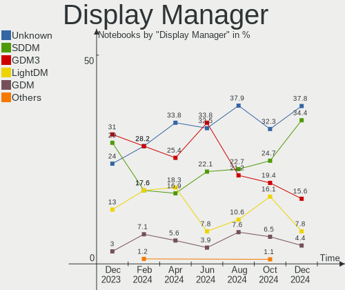
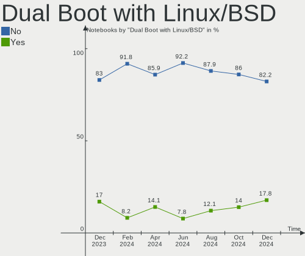
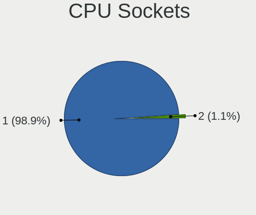
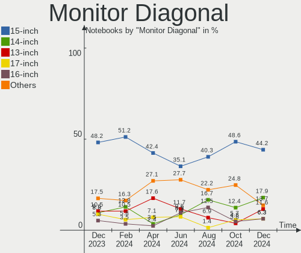
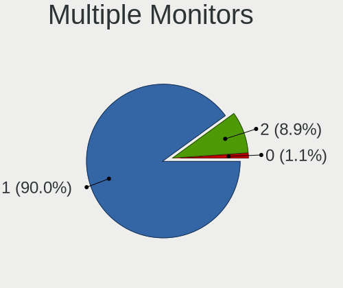
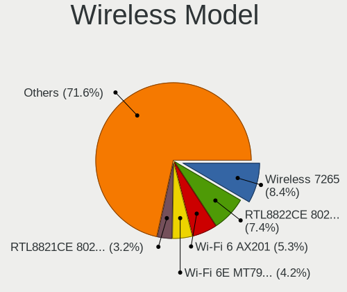
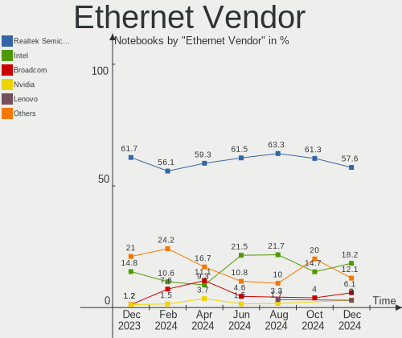

Linux in Spain - Hardware Trends (Notebooks)
--------------------------------------------

A project to identify most popular hardware characteristics and track their change
over time based on data collected by Linux users at https://Linux-Hardware.org.

Anyone can contribute to this report by the [hw-probe](https://github.com/linuxhw/hw-probe) tool:

    sudo -E hw-probe -all -upload

Period: Jul, 2023.

Contents
--------

* [ System ](#system)
  - [ OS                       ](#os)
  - [ OS Family                ](#os-family)
  - [ Kernel                   ](#kernel)
  - [ Kernel Family            ](#kernel-family)
  - [ Kernel Major Ver.        ](#kernel-major-ver)
  - [ Arch                     ](#arch)
  - [ DE                       ](#de)
  - [ Display Server           ](#display-server)
  - [ Display Manager          ](#display-manager)
  - [ OS Lang                  ](#os-lang)
  - [ Boot Mode                ](#boot-mode)
  - [ Filesystem               ](#filesystem)
  - [ Part. scheme             ](#part-scheme)
  - [ Dual Boot with Linux/BSD ](#dual-boot-with-linuxbsd)
  - [ Dual Boot (Win)          ](#dual-boot-win)

* [ Board ](#board)
  - [ Vendor                   ](#vendor)
  - [ Model                    ](#model)
  - [ Model Family             ](#model-family)
  - [ MFG Year                 ](#mfg-year)
  - [ Form Factor              ](#form-factor)
  - [ Secure Boot              ](#secure-boot)
  - [ Coreboot                 ](#coreboot)
  - [ RAM Size                 ](#ram-size)
  - [ RAM Used                 ](#ram-used)
  - [ Total Drives             ](#total-drives)
  - [ Has CD-ROM               ](#has-cd-rom)
  - [ Has Ethernet             ](#has-ethernet)
  - [ Has WiFi                 ](#has-wifi)
  - [ Has Bluetooth            ](#has-bluetooth)

* [ Location ](#location)
  - [ Country                  ](#country)
  - [ City                     ](#city)

* [ Drives ](#drives)
  - [ Drive Vendor             ](#drive-vendor)
  - [ Drive Model              ](#drive-model)
  - [ HDD Vendor               ](#hdd-vendor)
  - [ SSD Vendor               ](#ssd-vendor)
  - [ Drive Kind               ](#drive-kind)
  - [ Drive Connector          ](#drive-connector)
  - [ Drive Size               ](#drive-size)
  - [ Space Total              ](#space-total)
  - [ Space Used               ](#space-used)
  - [ Malfunc. Drives          ](#malfunc-drives)
  - [ Malfunc. Drive Vendor    ](#malfunc-drive-vendor)
  - [ Malfunc. HDD Vendor      ](#malfunc-hdd-vendor)
  - [ Malfunc. Drive Kind      ](#malfunc-drive-kind)
  - [ Failed Drives            ](#failed-drives)
  - [ Failed Drive Vendor      ](#failed-drive-vendor)
  - [ Drive Status             ](#drive-status)

* [ Storage controller ](#storage-controller)
  - [ Storage Vendor           ](#storage-vendor)
  - [ Storage Model            ](#storage-model)
  - [ Storage Kind             ](#storage-kind)

* [ Processor ](#processor)
  - [ CPU Vendor               ](#cpu-vendor)
  - [ CPU Model                ](#cpu-model)
  - [ CPU Model Family         ](#cpu-model-family)
  - [ CPU Cores                ](#cpu-cores)
  - [ CPU Sockets              ](#cpu-sockets)
  - [ CPU Threads              ](#cpu-threads)
  - [ CPU Op-Modes             ](#cpu-op-modes)
  - [ CPU Microcode            ](#cpu-microcode)
  - [ CPU Microarch            ](#cpu-microarch)

* [ Graphics ](#graphics)
  - [ GPU Vendor               ](#gpu-vendor)
  - [ GPU Model                ](#gpu-model)
  - [ GPU Combo                ](#gpu-combo)
  - [ GPU Driver               ](#gpu-driver)
  - [ GPU Memory               ](#gpu-memory)

* [ Monitor ](#monitor)
  - [ Monitor Vendor           ](#monitor-vendor)
  - [ Monitor Model            ](#monitor-model)
  - [ Monitor Resolution       ](#monitor-resolution)
  - [ Monitor Diagonal         ](#monitor-diagonal)
  - [ Monitor Width            ](#monitor-width)
  - [ Aspect Ratio             ](#aspect-ratio)
  - [ Monitor Area             ](#monitor-area)
  - [ Pixel Density            ](#pixel-density)
  - [ Multiple Monitors        ](#multiple-monitors)

* [ Network ](#network)
  - [ Net Controller Vendor    ](#net-controller-vendor)
  - [ Net Controller Model     ](#net-controller-model)
  - [ Wireless Vendor          ](#wireless-vendor)
  - [ Wireless Model           ](#wireless-model)
  - [ Ethernet Vendor          ](#ethernet-vendor)
  - [ Ethernet Model           ](#ethernet-model)
  - [ Net Controller Kind      ](#net-controller-kind)
  - [ Used Controller          ](#used-controller)
  - [ NICs                     ](#nics)
  - [ IPv6                     ](#ipv6)

* [ Bluetooth ](#bluetooth)
  - [ Bluetooth Vendor         ](#bluetooth-vendor)
  - [ Bluetooth Model          ](#bluetooth-model)

* [ Sound ](#sound)
  - [ Sound Vendor             ](#sound-vendor)
  - [ Sound Model              ](#sound-model)

* [ Memory ](#memory)
  - [ Memory Vendor            ](#memory-vendor)
  - [ Memory Model             ](#memory-model)
  - [ Memory Kind              ](#memory-kind)
  - [ Memory Form Factor       ](#memory-form-factor)
  - [ Memory Size              ](#memory-size)
  - [ Memory Speed             ](#memory-speed)

* [ Printers & scanners ](#printers--scanners)
  - [ Printer Vendor           ](#printer-vendor)
  - [ Printer Model            ](#printer-model)
  - [ Scanner Vendor           ](#scanner-vendor)
  - [ Scanner Model            ](#scanner-model)

* [ Camera ](#camera)
  - [ Camera Vendor            ](#camera-vendor)
  - [ Camera Model             ](#camera-model)

* [ Security ](#security)
  - [ Fingerprint Vendor       ](#fingerprint-vendor)
  - [ Fingerprint Model        ](#fingerprint-model)
  - [ Chipcard Vendor          ](#chipcard-vendor)
  - [ Chipcard Model           ](#chipcard-model)

* [ Unsupported ](#unsupported)
  - [ Unsupported Devices      ](#unsupported-devices)
  - [ Unsupported Device Types ](#unsupported-device-types)

System
------

OS
--

Installed operating systems

| Name               | Notebooks | Percent |
|--------------------|-----------|---------|
| Ubuntu 22.04       | 13        | 18.57%  |
| Fedora 38          | 6         | 8.57%   |
| Zorin 16           | 4         | 5.71%   |
| Pop!_OS 22.04      | 4         | 5.71%   |
| Linux Mint 21.1    | 4         | 5.71%   |
| Debian 12          | 4         | 5.71%   |
| ArcoLinux Rolling  | 4         | 5.71%   |
| Ubuntu 23.04       | 3         | 4.29%   |
| OpenMandriva 23.03 | 3         | 4.29%   |
| SteamOS 3.4.8      | 2         | 2.86%   |
| Kali 2023.2        | 2         | 2.86%   |
| Elementary 7       | 2         | 2.86%   |
| Arch Rolling       | 2         | 2.86%   |
| Zorin 15           | 1         | 1.43%   |
| Xubuntu 22.04      | 1         | 1.43%   |
| Xero Rolling       | 1         | 1.43%   |
| Ubuntu 22.10       | 1         | 1.43%   |
| Ubuntu 20.04       | 1         | 1.43%   |
| Ubuntu 18.04       | 1         | 1.43%   |
| openSUSE Leap-15.5 | 1         | 1.43%   |
| OpenMandriva 23.07 | 1         | 1.43%   |
| OpenMandriva 23.01 | 1         | 1.43%   |
| Nobara 38          | 1         | 1.43%   |
| MX 21              | 1         | 1.43%   |
| Manjaro            | 1         | 1.43%   |
| Linux Mint 21.2    | 1         | 1.43%   |
| Lilidog 23         | 1         | 1.43%   |
| Kubuntu 22.04      | 1         | 1.43%   |
| blendOS            | 1         | 1.43%   |
| Archcraft Rolling  | 1         | 1.43%   |

OS Family
---------

OS without a version

| Name         | Notebooks | Percent |
|--------------|-----------|---------|
| Ubuntu       | 19        | 27.14%  |
| Fedora       | 6         | 8.57%   |
| Zorin        | 5         | 7.14%   |
| OpenMandriva | 5         | 7.14%   |
| Linux Mint   | 5         | 7.14%   |
| Pop!_OS      | 4         | 5.71%   |
| Debian       | 4         | 5.71%   |
| ArcoLinux    | 4         | 5.71%   |
| SteamOS      | 2         | 2.86%   |
| Kali         | 2         | 2.86%   |
| Elementary   | 2         | 2.86%   |
| Arch         | 2         | 2.86%   |
| Xubuntu      | 1         | 1.43%   |
| Xero         | 1         | 1.43%   |
| openSUSE     | 1         | 1.43%   |
| Nobara       | 1         | 1.43%   |
| MX           | 1         | 1.43%   |
| Manjaro      | 1         | 1.43%   |
| Lilidog      | 1         | 1.43%   |
| Kubuntu      | 1         | 1.43%   |
| blendOS      | 1         | 1.43%   |
| Archcraft    | 1         | 1.43%   |

Kernel
------

Version of the Linux kernel

| Version                        | Notebooks | Percent |
|--------------------------------|-----------|---------|
| 5.15.0-76-generic              | 11        | 15.71%  |
| 5.19.0-46-generic              | 8         | 11.43%  |
| 6.2.6-76060206-generic         | 4         | 5.71%   |
| 6.2.6-desktop-1omv2390         | 3         | 4.29%   |
| 6.1.0-10-amd64                 | 3         | 4.29%   |
| 5.19.0-50-generic              | 3         | 4.29%   |
| 6.4.1-arch2-1                  | 2         | 2.86%   |
| 6.3.12-200.fc38.x86_64         | 2         | 2.86%   |
| 6.2.9-300.fc38.x86_64          | 2         | 2.86%   |
| 5.4.0-150-generic              | 2         | 2.86%   |
| 5.13.0-valve36-1-neptune       | 2         | 2.86%   |
| 6.4.6-200.fc38.x86_64          | 1         | 1.43%   |
| 6.4.4-zen1-1-zen               | 1         | 1.43%   |
| 6.4.3-zen1-1-zen               | 1         | 1.43%   |
| 6.4.3-arch1-1                  | 1         | 1.43%   |
| 6.4.2-surface                  | 1         | 1.43%   |
| 6.4.2-arch1-1                  | 1         | 1.43%   |
| 6.4.2-3-MANJARO                | 1         | 1.43%   |
| 6.4.0-Yagakimi-T2-xanmod1-1-t2 | 1         | 1.43%   |
| 6.4.0-060400-generic           | 1         | 1.43%   |
| 6.3.9-arch1-1                  | 1         | 1.43%   |
| 6.3.5-desktop-3omv2390         | 1         | 1.43%   |
| 6.3.3-arch1-1                  | 1         | 1.43%   |
| 6.3.11-200.fc38.x86_64         | 1         | 1.43%   |
| 6.3.10-200.fsync.fc38.x86_64   | 1         | 1.43%   |
| 6.3.0-kali1-amd64              | 1         | 1.43%   |
| 6.2.0-26-generic               | 1         | 1.43%   |
| 6.2.0-25-generic               | 1         | 1.43%   |
| 6.2.0-24-generic               | 1         | 1.43%   |
| 6.1.1-desktop-1omv2290         | 1         | 1.43%   |
| 6.1.0-kali9-amd64              | 1         | 1.43%   |
| 6.1.0-9-amd64                  | 1         | 1.43%   |
| 5.19.0-43-generic              | 1         | 1.43%   |
| 5.19.0-41-generic              | 1         | 1.43%   |
| 5.19.0-1028-lowlatency         | 1         | 1.43%   |
| 5.15.0-78-generic              | 1         | 1.43%   |
| 5.15.0-58-generic              | 1         | 1.43%   |
| 5.14.21-150500.53-default      | 1         | 1.43%   |
| 5.10.0-23-686-pae              | 1         | 1.43%   |

Kernel Family
-------------

Linux kernel without a distro release

| Version | Notebooks | Percent |
|---------|-----------|---------|
| 5.19.0  | 14        | 20%     |
| 5.15.0  | 13        | 18.57%  |
| 6.2.6   | 7         | 10%     |
| 6.1.0   | 5         | 7.14%   |
| 6.4.2   | 3         | 4.29%   |
| 6.2.0   | 3         | 4.29%   |
| 6.4.3   | 2         | 2.86%   |
| 6.4.1   | 2         | 2.86%   |
| 6.4.0   | 2         | 2.86%   |
| 6.3.12  | 2         | 2.86%   |
| 6.2.9   | 2         | 2.86%   |
| 5.4.0   | 2         | 2.86%   |
| 5.13.0  | 2         | 2.86%   |
| 6.4.6   | 1         | 1.43%   |
| 6.4.4   | 1         | 1.43%   |
| 6.3.9   | 1         | 1.43%   |
| 6.3.5   | 1         | 1.43%   |
| 6.3.3   | 1         | 1.43%   |
| 6.3.11  | 1         | 1.43%   |
| 6.3.10  | 1         | 1.43%   |
| 6.3.0   | 1         | 1.43%   |
| 6.1.1   | 1         | 1.43%   |
| 5.14.21 | 1         | 1.43%   |
| 5.10.0  | 1         | 1.43%   |

Kernel Major Ver.
-----------------

Linux kernel major version

| Version | Notebooks | Percent |
|---------|-----------|---------|
| 5.19    | 14        | 20%     |
| 5.15    | 13        | 18.57%  |
| 6.2     | 12        | 17.14%  |
| 6.4     | 11        | 15.71%  |
| 6.3     | 8         | 11.43%  |
| 6.1     | 6         | 8.57%   |
| 5.4     | 2         | 2.86%   |
| 5.13    | 2         | 2.86%   |
| 5.14    | 1         | 1.43%   |
| 5.10    | 1         | 1.43%   |

Arch
----

OS architecture (x86_64, i586, etc.)

| Name   | Notebooks | Percent |
|--------|-----------|---------|
| x86_64 | 69        | 98.57%  |
| i686   | 1         | 1.43%   |

DE
--

Desktop Environment

| Name             | Notebooks | Percent |
|------------------|-----------|---------|
| GNOME            | 35        | 50%     |
| KDE5             | 16        | 22.86%  |
| XFCE             | 9         | 12.86%  |
| X-Cinnamon       | 4         | 5.71%   |
| Pantheon         | 2         | 2.86%   |
| lightdm-xsession | 2         | 2.86%   |
| Unknown          | 2         | 2.86%   |

Display Server
--------------

X11 or Wayland

| Name    | Notebooks | Percent |
|---------|-----------|---------|
| X11     | 51        | 72.86%  |
| Wayland | 19        | 27.14%  |

Display Manager
---------------

SDDM, LightDM, etc.

| Name    | Notebooks | Percent |
|---------|-----------|---------|
| Unknown | 30        | 42.86%  |
| GDM3    | 18        | 25.71%  |
| SDDM    | 15        | 21.43%  |
| LightDM | 7         | 10%     |

OS Lang
-------

Language

| Lang  | Notebooks | Percent |
|-------|-----------|---------|
| es_ES | 49        | 70%     |
| en_US | 15        | 21.43%  |
| ca_ES | 2         | 2.86%   |
| it_IT | 1         | 1.43%   |
| en_IE | 1         | 1.43%   |
| en_GB | 1         | 1.43%   |
| de_DE | 1         | 1.43%   |

Boot Mode
---------

EFI or BIOS

| Mode | Notebooks | Percent |
|------|-----------|---------|
| EFI  | 36        | 51.43%  |
| BIOS | 34        | 48.57%  |

Filesystem
----------

Type of filesystem

| Type    | Notebooks | Percent |
|---------|-----------|---------|
| Ext4    | 36        | 51.43%  |
| Tmpfs   | 16        | 22.86%  |
| Btrfs   | 13        | 18.57%  |
| Overlay | 3         | 4.29%   |
| Xfs     | 2         | 2.86%   |

Part. scheme
------------

Scheme of partitioning

| Type    | Notebooks | Percent |
|---------|-----------|---------|
| GPT     | 37        | 52.86%  |
| Unknown | 29        | 41.43%  |
| MBR     | 4         | 5.71%   |

Dual Boot with Linux/BSD
------------------------

Hosting more than one Linux/BSD

| Dual boot | Notebooks | Percent |
|-----------|-----------|---------|
| No        | 64        | 91.43%  |
| Yes       | 6         | 8.57%   |

Dual Boot (Win)
---------------

Hosting Linux and Windows

| Dual boot | Notebooks | Percent |
|-----------|-----------|---------|
| No        | 54        | 77.14%  |
| Yes       | 16        | 22.86%  |

Board
-----

Vendor
------

Motherboard manufacturer

| Name                        | Notebooks | Percent |
|-----------------------------|-----------|---------|
| Lenovo                      | 12        | 17.14%  |
| ASUSTek Computer            | 11        | 15.71%  |
| Hewlett-Packard             | 9         | 12.86%  |
| Acer                        | 8         | 11.43%  |
| Dell                        | 6         | 8.57%   |
| Apple                       | 6         | 8.57%   |
| Valve                       | 2         | 2.86%   |
| Samsung Electronics         | 2         | 2.86%   |
| Medion                      | 2         | 2.86%   |
| HUAWEI                      | 2         | 2.86%   |
| VANT                        | 1         | 1.43%   |
| Toshiba                     | 1         | 1.43%   |
| SHENZHEN YOUDISI E-COMMERCE | 1         | 1.43%   |
| Panasonic                   | 1         | 1.43%   |
| Packard Bell                | 1         | 1.43%   |
| Notebook                    | 1         | 1.43%   |
| Clevo                       | 1         | 1.43%   |
| Chuwi                       | 1         | 1.43%   |
| AXDIA International         | 1         | 1.43%   |
| AMI                         | 1         | 1.43%   |

Model
-----

Motherboard model

| Name                                     | Notebooks | Percent |
|------------------------------------------|-----------|---------|
| Valve Jupiter                            | 2         | 2.86%   |
| Samsung 700T                             | 2         | 2.86%   |
| Lenovo IdeaPad 3 15ADA05 81W1            | 2         | 2.86%   |
| Dell XPS 15 7590                         | 2         | 2.86%   |
| ASUS VivoBook_ASUS Laptop E410MA_E410MA  | 2         | 2.86%   |
| VANT MOOVE15_2023                        | 1         | 1.43%   |
| Toshiba Satellite L50-B                  | 1         | 1.43%   |
| SHENZHEN YOUDISI E-COMMERCE A8S PRO      | 1         | 1.43%   |
| Panasonic CFMX4-1                        | 1         | 1.43%   |
| Packard Bell EasyNote SL65               | 1         | 1.43%   |
| Notebook V1x0PNPx                        | 1         | 1.43%   |
| Medion X782X                             | 1         | 1.43%   |
| Medion E15301                            | 1         | 1.43%   |
| Lenovo Z50-70 20354                      | 1         | 1.43%   |
| Lenovo Yoga 3 Pro-1370 80HE              | 1         | 1.43%   |
| Lenovo ThinkPad X1 Nano Gen 1 20UN002MSP | 1         | 1.43%   |
| Lenovo ThinkBook 16p Gen 2 20YM          | 1         | 1.43%   |
| Lenovo Legion 5 Pro 16ACH6H 82JQ         | 1         | 1.43%   |
| Lenovo IdeaPad Gaming 3 15IAH7 82S9      | 1         | 1.43%   |
| Lenovo IdeaPad Gaming 3 15ACH6 82K2      | 1         | 1.43%   |
| Lenovo IdeaPad 510-15IKB 80SV            | 1         | 1.43%   |
| Lenovo IdeaPad 330-15IKB 81DE            | 1         | 1.43%   |
| Lenovo G580 2189                         | 1         | 1.43%   |
| HUAWEI BOHK-WAX9X                        | 1         | 1.43%   |
| HUAWEI BOD-WXX9                          | 1         | 1.43%   |
| HP Victus by Laptop 16-e0xxx             | 1         | 1.43%   |
| HP Victus by Gaming Laptop 15-fb0xxx     | 1         | 1.43%   |
| HP Pavilion Gaming Laptop 15-dk0xxx      | 1         | 1.43%   |
| HP Pavilion dv5                          | 1         | 1.43%   |
| HP OMEN by Laptop 16-c0xxx               | 1         | 1.43%   |
| HP Laptop 15s-fq1xxx                     | 1         | 1.43%   |
| HP Laptop 15-bw0xx                       | 1         | 1.43%   |
| HP g14                                   | 1         | 1.43%   |
| HP ENVY m6                               | 1         | 1.43%   |
| Dell XPS 13 9380                         | 1         | 1.43%   |
| Dell Latitude E5420                      | 1         | 1.43%   |
| Dell Latitude 7275                       | 1         | 1.43%   |
| Dell Latitude 5520                       | 1         | 1.43%   |
| Clevo M550SE/M660SE                      | 1         | 1.43%   |
| Chuwi GemiBook Pro                       | 1         | 1.43%   |

Model Family
------------

Motherboard model prefix

| Name                            | Notebooks | Percent |
|---------------------------------|-----------|---------|
| ASUS VivoBook                   | 7         | 10%     |
| Lenovo IdeaPad                  | 6         | 8.57%   |
| Dell XPS                        | 3         | 4.29%   |
| Dell Latitude                   | 3         | 4.29%   |
| Acer Extensa                    | 3         | 4.29%   |
| Acer Aspire                     | 3         | 4.29%   |
| Valve Jupiter                   | 2         | 2.86%   |
| Samsung 700T                    | 2         | 2.86%   |
| HP Victus                       | 2         | 2.86%   |
| HP Pavilion                     | 2         | 2.86%   |
| HP Laptop                       | 2         | 2.86%   |
| VANT MOOVE15                    | 1         | 1.43%   |
| Toshiba Satellite               | 1         | 1.43%   |
| SHENZHEN YOUDISI E-COMMERCE A8S | 1         | 1.43%   |
| Panasonic CFMX4-1               | 1         | 1.43%   |
| Packard Bell EasyNote           | 1         | 1.43%   |
| Notebook V1x0PNPx               | 1         | 1.43%   |
| Medion X782X                    | 1         | 1.43%   |
| Medion E15301                   | 1         | 1.43%   |
| Lenovo Z50-70                   | 1         | 1.43%   |
| Lenovo Yoga                     | 1         | 1.43%   |
| Lenovo ThinkPad                 | 1         | 1.43%   |
| Lenovo ThinkBook                | 1         | 1.43%   |
| Lenovo Legion                   | 1         | 1.43%   |
| Lenovo G580                     | 1         | 1.43%   |
| HUAWEI BOHK-WAX9X               | 1         | 1.43%   |
| HUAWEI BOD-WXX9                 | 1         | 1.43%   |
| HP OMEN                         | 1         | 1.43%   |
| HP g14                          | 1         | 1.43%   |
| HP ENVY                         | 1         | 1.43%   |
| Clevo M550SE                    | 1         | 1.43%   |
| Chuwi GemiBook                  | 1         | 1.43%   |
| AXDIA International WINPAD      | 1         | 1.43%   |
| ASUS Zenbook                    | 1         | 1.43%   |
| ASUS X555LAB                    | 1         | 1.43%   |
| ASUS ROG                        | 1         | 1.43%   |
| ASUS ASUS                       | 1         | 1.43%   |
| Apple MacBookPro8               | 1         | 1.43%   |
| Apple MacBookPro16              | 1         | 1.43%   |
| Apple MacBookPro14              | 1         | 1.43%   |

MFG Year
--------

Motherboard manufacture year

| Year | Notebooks | Percent |
|------|-----------|---------|
| 2021 | 10        | 14.29%  |
| 2022 | 9         | 12.86%  |
| 2020 | 9         | 12.86%  |
| 2014 | 8         | 11.43%  |
| 2019 | 6         | 8.57%   |
| 2012 | 6         | 8.57%   |
| 2015 | 4         | 5.71%   |
| 2018 | 3         | 4.29%   |
| 2017 | 3         | 4.29%   |
| 2016 | 3         | 4.29%   |
| 2011 | 3         | 4.29%   |
| 2023 | 2         | 2.86%   |
| 2008 | 2         | 2.86%   |
| 2009 | 1         | 1.43%   |
| 2007 | 1         | 1.43%   |

Form Factor
-----------

Physical design of the computer

| Name     | Notebooks | Percent |
|----------|-----------|---------|
| Notebook | 70        | 100%    |

Secure Boot
-----------

Enabled or disabled

| State    | Notebooks | Percent |
|----------|-----------|---------|
| Disabled | 61        | 87.14%  |
| Enabled  | 9         | 12.86%  |

Coreboot
--------

Have coreboot on board

| Used | Notebooks | Percent |
|------|-----------|---------|
| No   | 70        | 100%    |

RAM Size
--------

Total RAM memory

| Size in GB  | Notebooks | Percent |
|-------------|-----------|---------|
| 4.01-8.0    | 20        | 28.57%  |
| 8.01-16.0   | 17        | 24.29%  |
| 16.01-24.0  | 16        | 22.86%  |
| 3.01-4.0    | 12        | 17.14%  |
| 32.01-64.0  | 2         | 2.86%   |
| 2.01-3.0    | 1         | 1.43%   |
| 64.01-256.0 | 1         | 1.43%   |
| 1.01-2.0    | 1         | 1.43%   |

RAM Used
--------

Used RAM memory

| Used GB    | Notebooks | Percent |
|------------|-----------|---------|
| 2.01-3.0   | 34        | 48.57%  |
| 1.01-2.0   | 12        | 17.14%  |
| 3.01-4.0   | 9         | 12.86%  |
| 4.01-8.0   | 8         | 11.43%  |
| 8.01-16.0  | 4         | 5.71%   |
| 32.01-64.0 | 1         | 1.43%   |
| 16.01-24.0 | 1         | 1.43%   |
| 0.51-1.0   | 1         | 1.43%   |

Total Drives
------------

Number of drives on board

| Drives | Notebooks | Percent |
|--------|-----------|---------|
| 1      | 54        | 77.14%  |
| 2      | 14        | 20%     |
| 4      | 1         | 1.43%   |
| 0      | 1         | 1.43%   |

Has CD-ROM
----------

Has CD-ROM on board

| Presented | Notebooks | Percent |
|-----------|-----------|---------|
| No        | 55        | 78.57%  |
| Yes       | 15        | 21.43%  |

Has Ethernet
------------

Has Ethernet on board

| Presented | Notebooks | Percent |
|-----------|-----------|---------|
| Yes       | 48        | 68.57%  |
| No        | 22        | 31.43%  |

Has WiFi
--------

Has WiFi module

| Presented | Notebooks | Percent |
|-----------|-----------|---------|
| Yes       | 67        | 95.71%  |
| No        | 3         | 4.29%   |

Has Bluetooth
-------------

Has Bluetooth module

| Presented | Notebooks | Percent |
|-----------|-----------|---------|
| Yes       | 56        | 80%     |
| No        | 14        | 20%     |

Location
--------

Country
-------

Geographic location (country)

| Country | Notebooks | Percent |
|---------|-----------|---------|
| Spain   | 70        | 100%    |

City
----

Geographic location (city)

| City                        | Notebooks | Percent |
|-----------------------------|-----------|---------|
| Madrid                      | 12        | 17.14%  |
| Valencia                    | 6         | 8.57%   |
| Barcelona                   | 6         | 8.57%   |
| Seville                     | 4         | 5.71%   |
| Oviedo                      | 3         | 4.29%   |
| Zaragoza                    | 2         | 2.86%   |
| Vecindario                  | 2         | 2.86%   |
| Alcobendas                  | 2         | 2.86%   |
| Vila-real                   | 1         | 1.43%   |
| Vigo                        | 1         | 1.43%   |
| Valladolid                  | 1         | 1.43%   |
| Tudela                      | 1         | 1.43%   |
| Tres Cantos                 | 1         | 1.43%   |
| Torrevieja                  | 1         | 1.43%   |
| Segorbe                     | 1         | 1.43%   |
| Sanxenxo                    | 1         | 1.43%   |
| San Vicent del Raspeig      | 1         | 1.43%   |
| San Sebastián de los Reyes | 1         | 1.43%   |
| San Cristóbal de La Laguna | 1         | 1.43%   |
| Paterna                     | 1         | 1.43%   |
| Parla                       | 1         | 1.43%   |
| Pamplona                    | 1         | 1.43%   |
| Palma                       | 1         | 1.43%   |
| Murcia                      | 1         | 1.43%   |
| Monzon                      | 1         | 1.43%   |
| Marratxí                   | 1         | 1.43%   |
| Manises                     | 1         | 1.43%   |
| Igualada                    | 1         | 1.43%   |
| Guadalajara                 | 1         | 1.43%   |
| Granada                     | 1         | 1.43%   |
| El Puerto de Santa María   | 1         | 1.43%   |
| Calella de Palafrugell      | 1         | 1.43%   |
| Cadalso de los Vidrios      | 1         | 1.43%   |
| Burriana                    | 1         | 1.43%   |
| Burgos                      | 1         | 1.43%   |
| Bilbao                      | 1         | 1.43%   |
| Baralla                     | 1         | 1.43%   |
| Alicante                    | 1         | 1.43%   |
| Algemesi                    | 1         | 1.43%   |
| Alcalá de Henares          | 1         | 1.43%   |

Drives
------

Drive Vendor
------------

Hard drive vendors

| Vendor                      | Notebooks | Drives | Percent |
|-----------------------------|-----------|--------|---------|
| Samsung Electronics         | 12        | 12     | 14.12%  |
| Sandisk                     | 10        | 10     | 11.76%  |
| Toshiba                     | 8         | 8      | 9.41%   |
| Unknown                     | 7         | 9      | 8.24%   |
| Micron Technology           | 6         | 6      | 7.06%   |
| Kingston                    | 6         | 6      | 7.06%   |
| Intel                       | 6         | 6      | 7.06%   |
| Apple                       | 4         | 5      | 4.71%   |
| SK hynix                    | 3         | 3      | 3.53%   |
| Seagate                     | 3         | 3      | 3.53%   |
| Kingston Technology Company | 3         | 3      | 3.53%   |
| WDC                         | 2         | 2      | 2.35%   |
| Micron/Crucial Technology   | 2         | 2      | 2.35%   |
| Crucial                     | 2         | 2      | 2.35%   |
| TO Exter                    | 1         | 1      | 1.18%   |
| Phison Electronics          | 1         | 1      | 1.18%   |
| Phison                      | 1         | 1      | 1.18%   |
| MAXIO Technology (Hangzhou) | 1         | 1      | 1.18%   |
| KUU                         | 1         | 1      | 1.18%   |
| KIOXIA                      | 1         | 1      | 1.18%   |
| JMicron Technology          | 1         | 1      | 1.18%   |
| Intenso                     | 1         | 1      | 1.18%   |
| Hitachi                     | 1         | 1      | 1.18%   |
| Hikvision                   | 1         | 1      | 1.18%   |
| BAITITON                    | 1         | 1      | 1.18%   |

Drive Model
-----------

Hard drive models

| Model                                             | Notebooks | Percent |
|---------------------------------------------------|-----------|---------|
| Kingston SA400S37240G 240GB SSD                   | 4         | 4.6%    |
| Unknown MMC Card  64GB                            | 3         | 3.45%   |
| Toshiba MQ01ABD100 1TB                            | 3         | 3.45%   |
| Unknown MMC Card  128GB                           | 2         | 2.3%    |
| SanDisk SSD PLUS 480GB                            | 2         | 2.3%    |
| Samsung MZMPA064HMDR-00000 64GB SSD               | 2         | 2.3%    |
| Micron/Crucial P2 NVMe PCIe SSD 1TB               | 2         | 2.3%    |
| Micron MTFDHBA512TDV-1AZ1AABHA 512GB              | 2         | 2.3%    |
| Micron MTFDHBA512QFD 512GB                        | 2         | 2.3%    |
| Micron 2210_MTFDHBA512QFD 512GB                   | 2         | 2.3%    |
| Kingston Company OM3PDP3 NVMe SSD 512GB           | 2         | 2.3%    |
| Intel SSDPEKNU512GZ 512GB                         | 2         | 2.3%    |
| Intel SSD 660P Series 1024GB                      | 2         | 2.3%    |
| Apple ANS2 NVMe Controller 500GB                  | 2         | 2.3%    |
| WDC WD6400BEVT-60A0RT0 640GB                      | 1         | 1.15%   |
| WDC WD10SPSX-08A6W 1TB                            | 1         | 1.15%   |
| Unknown xD/SD/M.S.                                | 1         | 1.15%   |
| Unknown MMC Card  32GB                            | 1         | 1.15%   |
| Unknown MMC Card  256GB                           | 1         | 1.15%   |
| Unknown G1J38E  64GB                              | 1         | 1.15%   |
| Toshiba XG6 NVMe SSD Controller 512GB             | 1         | 1.15%   |
| Toshiba TR200 240GB SSD                           | 1         | 1.15%   |
| Toshiba TR150 480GB SSD                           | 1         | 1.15%   |
| Toshiba MK5059GSXP 500GB                          | 1         | 1.15%   |
| Toshiba A100 240GB SSD                            | 1         | 1.15%   |
| TO Exter nal USB 3.0 1TB                          | 1         | 1.15%   |
| SK hynix SKHynix_HFS001TDE9X084N 1TB              | 1         | 1.15%   |
| SK hynix PC711 HFS512GDE9X073N 512GB              | 1         | 1.15%   |
| SK hynix BC711 HFM512GD3JX013N 512GB              | 1         | 1.15%   |
| Seagate ST9750420AS 752GB                         | 1         | 1.15%   |
| Seagate ST1000LM035-1RK172 1TB                    | 1         | 1.15%   |
| Seagate ST1000LM 024 HN-M101MBB 1TB               | 1         | 1.15%   |
| Sandisk WDC PC SN530 SDBPMPZ-256G-1101 256GB      | 1         | 1.15%   |
| Sandisk WDC PC SN530 SDBPMPZ-1T00-1001 1024GB     | 1         | 1.15%   |
| Sandisk WD PC SN560 SDDPNQE-1T00-1002 1TB         | 1         | 1.15%   |
| Sandisk WD Blue SN550 NVMe SSD 250GB              | 1         | 1.15%   |
| Sandisk WD Black SN850 1TB                        | 1         | 1.15%   |
| Sandisk WD Black SN750 / PC SN730 NVMe SSD 1024GB | 1         | 1.15%   |
| SanDisk SD9SN8W256G1002 256GB SSD                 | 1         | 1.15%   |
| Sandisk PC SN520 NVMe SSD 512GB                   | 1         | 1.15%   |

HDD Vendor
----------

Hard disk drive vendors

| Vendor              | Notebooks | Drives | Percent |
|---------------------|-----------|--------|---------|
| Toshiba             | 4         | 4      | 33.33%  |
| Seagate             | 3         | 3      | 25%     |
| WDC                 | 2         | 2      | 16.67%  |
| Samsung Electronics | 2         | 2      | 16.67%  |
| Hitachi             | 1         | 1      | 8.33%   |

SSD Vendor
----------

Solid state drive vendors

| Vendor              | Notebooks | Drives | Percent |
|---------------------|-----------|--------|---------|
| Samsung Electronics | 7         | 7      | 25.93%  |
| Kingston            | 6         | 6      | 22.22%  |
| Toshiba             | 3         | 3      | 11.11%  |
| SanDisk             | 3         | 3      | 11.11%  |
| Crucial             | 2         | 2      | 7.41%   |
| TO Exter            | 1         | 1      | 3.7%    |
| Phison              | 1         | 1      | 3.7%    |
| KUU                 | 1         | 1      | 3.7%    |
| Intenso             | 1         | 1      | 3.7%    |
| BAITITON            | 1         | 1      | 3.7%    |
| Apple               | 1         | 1      | 3.7%    |

Drive Kind
----------

HDD or SSD

| Kind    | Notebooks | Drives | Percent |
|---------|-----------|--------|---------|
| NVMe    | 36        | 38     | 43.9%   |
| SSD     | 25        | 27     | 30.49%  |
| HDD     | 12        | 12     | 14.63%  |
| MMC     | 6         | 8      | 7.32%   |
| Unknown | 3         | 3      | 3.66%   |

Drive Connector
---------------

SATA, SAS, NVMe, etc.

| Type | Notebooks | Drives | Percent |
|------|-----------|--------|---------|
| NVMe | 36        | 38     | 47.37%  |
| SATA | 30        | 37     | 39.47%  |
| MMC  | 6         | 8      | 7.89%   |
| SAS  | 4         | 5      | 5.26%   |

Drive Size
----------

Size of hard drive

| Size in TB | Notebooks | Drives | Percent |
|------------|-----------|--------|---------|
| 0.01-0.5   | 22        | 24     | 61.11%  |
| 0.51-1.0   | 14        | 15     | 38.89%  |

Space Total
-----------

Amount of disk space available on the file system

| Size in GB | Notebooks | Percent |
|------------|-----------|---------|
| 101-250    | 24        | 34.29%  |
| 251-500    | 18        | 25.71%  |
| 501-1000   | 9         | 12.86%  |
| 1001-2000  | 7         | 10%     |
| 51-100     | 5         | 7.14%   |
| 1-20       | 3         | 4.29%   |
| 21-50      | 2         | 2.86%   |
| 2001-3000  | 1         | 1.43%   |
| Unknown    | 1         | 1.43%   |

Space Used
----------

Amount of used disk space

| Used GB   | Notebooks | Percent |
|-----------|-----------|---------|
| 1-20      | 23        | 32.86%  |
| 21-50     | 18        | 25.71%  |
| 51-100    | 11        | 15.71%  |
| 101-250   | 9         | 12.86%  |
| 251-500   | 7         | 10%     |
| 1001-2000 | 1         | 1.43%   |
| Unknown   | 1         | 1.43%   |

Malfunc. Drives
---------------

Drive models with a malfunction

| Model                                | Notebooks | Drives | Percent |
|--------------------------------------|-----------|--------|---------|
| Toshiba MQ01ABD100 1TB               | 1         | 1      | 14.29%  |
| Toshiba MK5059GSXP 500GB             | 1         | 1      | 14.29%  |
| SK hynix PC711 HFS512GDE9X073N 512GB | 1         | 1      | 14.29%  |
| SanDisk SSD PLUS 480GB               | 1         | 1      | 14.29%  |
| Samsung Electronics HM100UI 1TB      | 1         | 1      | 14.29%  |
| Hitachi HTS547550A9E384 500GB        | 1         | 1      | 14.29%  |
| Crucial CT480BX200SSD1 480GB         | 1         | 1      | 14.29%  |

Malfunc. Drive Vendor
---------------------

Vendors of faulty drives

| Vendor              | Notebooks | Drives | Percent |
|---------------------|-----------|--------|---------|
| Toshiba             | 2         | 2      | 28.57%  |
| SK hynix            | 1         | 1      | 14.29%  |
| SanDisk             | 1         | 1      | 14.29%  |
| Samsung Electronics | 1         | 1      | 14.29%  |
| Hitachi             | 1         | 1      | 14.29%  |
| Crucial             | 1         | 1      | 14.29%  |

Malfunc. HDD Vendor
-------------------

Vendors of faulty HDD drives

| Vendor              | Notebooks | Drives | Percent |
|---------------------|-----------|--------|---------|
| Toshiba             | 2         | 2      | 50%     |
| Samsung Electronics | 1         | 1      | 25%     |
| Hitachi             | 1         | 1      | 25%     |

Malfunc. Drive Kind
-------------------

Kinds of faulty drives

| Kind | Notebooks | Drives | Percent |
|------|-----------|--------|---------|
| HDD  | 4         | 4      | 57.14%  |
| SSD  | 2         | 2      | 28.57%  |
| NVMe | 1         | 1      | 14.29%  |

Failed Drives
-------------

Failed drive models

Zero info for selected period =(

Failed Drive Vendor
-------------------

Failed drive vendors

Zero info for selected period =(

Drive Status
------------

Number of failed and malfunc. drives

| Status   | Notebooks | Drives | Percent |
|----------|-----------|--------|---------|
| Detected | 49        | 60     | 68.06%  |
| Works    | 17        | 21     | 23.61%  |
| Malfunc  | 6         | 7      | 8.33%   |

Storage controller
------------------

Storage Vendor
--------------

Storage controller vendors

| Vendor                       | Notebooks | Percent |
|------------------------------|-----------|---------|
| Intel                        | 46        | 56.1%   |
| SanDisk                      | 7         | 8.54%   |
| Micron Technology            | 6         | 7.32%   |
| AMD                          | 4         | 4.88%   |
| SK hynix                     | 3         | 3.66%   |
| Samsung Electronics          | 3         | 3.66%   |
| Kingston Technology Company  | 3         | 3.66%   |
| Apple                        | 3         | 3.66%   |
| Micron/Crucial Technology    | 2         | 2.44%   |
| VIA Technologies             | 1         | 1.22%   |
| Toshiba America Info Systems | 1         | 1.22%   |
| Phison Electronics           | 1         | 1.22%   |
| MAXIO Technology (Hangzhou)  | 1         | 1.22%   |
| KIOXIA                       | 1         | 1.22%   |

Storage Model
-------------

Storage controller models

| Model                                                                          | Notebooks | Percent |
|--------------------------------------------------------------------------------|-----------|---------|
| Intel Volume Management Device NVMe RAID Controller                            | 6         | 6.9%    |
| Intel 8 Series SATA Controller 1 [AHCI mode]                                   | 6         | 6.9%    |
| Intel 6 Series/C200 Series Chipset Family 6 port Mobile SATA AHCI Controller   | 6         | 6.9%    |
| Micron 2210 NVMe SSD [Cobain]                                                  | 4         | 4.6%    |
| Intel Wildcat Point-LP SATA Controller [AHCI Mode]                             | 4         | 4.6%    |
| Intel Celeron/Pentium Silver Processor SATA Controller                         | 4         | 4.6%    |
| AMD FCH SATA Controller [AHCI mode]                                            | 4         | 4.6%    |
| SK hynix Gold P31/BC711/PC711 NVMe Solid State Drive                           | 3         | 3.45%   |
| Samsung NVMe SSD Controller SM981/PM981/PM983                                  | 3         | 3.45%   |
| Intel Sunrise Point-LP SATA Controller [AHCI mode]                             | 3         | 3.45%   |
| Intel SSD 670p Series [Keystone Harbor]                                        | 3         | 3.45%   |
| Intel 82801IBM/IEM (ICH9M/ICH9M-E) 4 port SATA Controller [AHCI mode]          | 3         | 3.45%   |
| Intel 82801 Mobile SATA Controller [RAID mode]                                 | 3         | 3.45%   |
| SanDisk PC SN530 NVMe SSD (DRAM-less)                                          | 2         | 2.3%    |
| Micron/Crucial P2 [Nick P2] / P3 / P3 Plus NVMe PCIe SSD (DRAM-less)           | 2         | 2.3%    |
| Micron 2300 NVMe SSD [Santana]                                                 | 2         | 2.3%    |
| Kingston Company OM3PDP3 NVMe SSD                                              | 2         | 2.3%    |
| Intel SSD 660P Series                                                          | 2         | 2.3%    |
| Intel Cannon Lake Mobile PCH SATA AHCI Controller                              | 2         | 2.3%    |
| Intel Alder Lake-P SATA AHCI Controller                                        | 2         | 2.3%    |
| Intel 7 Series Chipset Family 6-port SATA Controller [AHCI mode]               | 2         | 2.3%    |
| Apple ANS2 NVMe Controller                                                     | 2         | 2.3%    |
| VIA VT82C586A/B/VT82C686/A/B/VT823x/A/C PIPC Bus Master IDE                    | 1         | 1.15%   |
| VIA VT8237A SATA 2-Port Controller                                             | 1         | 1.15%   |
| Toshiba America Info Systems XG6 NVMe SSD Controller                           | 1         | 1.15%   |
| SanDisk WD PC SN810 / Black SN850 NVMe SSD                                     | 1         | 1.15%   |
| SanDisk WD Blue SN550 NVMe SSD                                                 | 1         | 1.15%   |
| SanDisk WD Black SN770 / PC SN740 256GB / PC SN560 (DRAM-less) NVMe SSD        | 1         | 1.15%   |
| SanDisk WD Black SN750 / PC SN730 NVMe SSD                                     | 1         | 1.15%   |
| SanDisk PC SN520 NVMe SSD                                                      | 1         | 1.15%   |
| Phison PS5013 E13 NVMe Controller                                              | 1         | 1.15%   |
| MAXIO (Hangzhou) NVMe SSD Controller MAP1202                                   | 1         | 1.15%   |
| KIOXIA NVMe SSD Controller BG5 (DRAM-less)                                     | 1         | 1.15%   |
| Kingston Company U-SNS8154P3 NVMe SSD                                          | 1         | 1.15%   |
| Intel Tiger Lake-LP SATA Controller                                            | 1         | 1.15%   |
| Intel SSD 600P Series                                                          | 1         | 1.15%   |
| Intel Jasper Lake SATA AHCI Controller                                         | 1         | 1.15%   |
| Intel 8 Series/C220 Series Chipset Family 6-port SATA Controller 1 [AHCI mode] | 1         | 1.15%   |
| Apple S3X NVMe Controller                                                      | 1         | 1.15%   |

Storage Kind
------------

Kind of storage controller (IDE, SATA, NVMe, SAS, ...)

| Kind | Notebooks | Percent |
|------|-----------|---------|
| SATA | 39        | 45.88%  |
| NVMe | 36        | 42.35%  |
| RAID | 9         | 10.59%  |
| IDE  | 1         | 1.18%   |

Processor
---------

CPU Vendor
----------

Processor vendors

| Vendor | Notebooks | Percent |
|--------|-----------|---------|
| Intel  | 53        | 75.71%  |
| AMD    | 17        | 24.29%  |

CPU Model
---------

Processor models

| Model                                         | Notebooks | Percent |
|-----------------------------------------------|-----------|---------|
| AMD Ryzen 7 5800H with Radeon Graphics        | 5         | 7.14%   |
| Intel Core i7-9750H CPU @ 2.60GHz             | 3         | 4.29%   |
| Intel Core i5-4200U CPU @ 1.60GHz             | 3         | 4.29%   |
| Intel Celeron N4020 CPU @ 1.10GHz             | 3         | 4.29%   |
| Intel 12th Gen Core i7-12700H                 | 3         | 4.29%   |
| Intel 11th Gen Core i7-1165G7 @ 2.80GHz       | 3         | 4.29%   |
| AMD Ryzen 5 3500U with Radeon Vega Mobile Gfx | 3         | 4.29%   |
| Intel Core i7-4510U CPU @ 2.00GHz             | 2         | 2.86%   |
| Intel Core i5-2467M CPU @ 1.60GHz             | 2         | 2.86%   |
| AMD Custom APU 0405                           | 2         | 2.86%   |
| Intel Pentium Dual-Core CPU T4300 @ 2.10GHz   | 1         | 1.43%   |
| Intel Pentium Dual CPU T3200 @ 2.00GHz        | 1         | 1.43%   |
| Intel Core m5-6Y57 CPU @ 1.10GHz              | 1         | 1.43%   |
| Intel Core M-5Y71 CPU @ 1.20GHz               | 1         | 1.43%   |
| Intel Core i7-8665U CPU @ 1.90GHz             | 1         | 1.43%   |
| Intel Core i7-8550U CPU @ 1.80GHz             | 1         | 1.43%   |
| Intel Core i7-5500U CPU @ 2.40GHz             | 1         | 1.43%   |
| Intel Core i7-4700MQ CPU @ 2.40GHz            | 1         | 1.43%   |
| Intel Core i7-3520M CPU @ 2.90GHz             | 1         | 1.43%   |
| Intel Core i7-2620M CPU @ 2.70GHz             | 1         | 1.43%   |
| Intel Core i5-9300H CPU @ 2.40GHz             | 1         | 1.43%   |
| Intel Core i5-7360U CPU @ 2.30GHz             | 1         | 1.43%   |
| Intel Core i5-7200U CPU @ 2.50GHz             | 1         | 1.43%   |
| Intel Core i5-5300U CPU @ 2.30GHz             | 1         | 1.43%   |
| Intel Core i5-5257U CPU @ 2.70GHz             | 1         | 1.43%   |
| Intel Core i5-5200U CPU @ 2.20GHz             | 1         | 1.43%   |
| Intel Core i5-3230M CPU @ 2.60GHz             | 1         | 1.43%   |
| Intel Core i5-3210M CPU @ 2.50GHz             | 1         | 1.43%   |
| Intel Core i5-2557M CPU @ 1.70GHz             | 1         | 1.43%   |
| Intel Core i5-2520M CPU @ 2.50GHz             | 1         | 1.43%   |
| Intel Core i5-1035G1 CPU @ 1.00GHz            | 1         | 1.43%   |
| Intel Core i3-4030U CPU @ 1.90GHz             | 1         | 1.43%   |
| Intel Core i3-2330M CPU @ 2.20GHz             | 1         | 1.43%   |
| Intel Core i3-1000NG4 CPU @ 1.10GHz           | 1         | 1.43%   |
| Intel Core 2 Duo CPU T5800 @ 2.00GHz          | 1         | 1.43%   |
| Intel Core 2 CPU T7200 @ 2.00GHz              | 1         | 1.43%   |
| Intel Celeron N5100 @ 1.10GHz                 | 1         | 1.43%   |
| Intel Celeron J4125 CPU @ 2.00GHz             | 1         | 1.43%   |
| Intel Atom x5-Z8350 CPU @ 1.44GHz             | 1         | 1.43%   |
| Intel Atom CPU Z3735F @ 1.33GHz               | 1         | 1.43%   |

CPU Model Family
----------------

Processor model prefix

| Model                   | Notebooks | Percent |
|-------------------------|-----------|---------|
| Intel Core i5           | 16        | 22.86%  |
| Other                   | 14        | 20%     |
| Intel Core i7           | 11        | 15.71%  |
| AMD Ryzen 7             | 7         | 10%     |
| AMD Ryzen 5             | 6         | 8.57%   |
| Intel Celeron           | 5         | 7.14%   |
| Intel Core i3           | 3         | 4.29%   |
| Intel Atom              | 2         | 2.86%   |
| Intel Pentium Dual-Core | 1         | 1.43%   |
| Intel Pentium Dual      | 1         | 1.43%   |
| Intel Core m5           | 1         | 1.43%   |
| Intel Core M            | 1         | 1.43%   |
| Intel Core 2 Duo        | 1         | 1.43%   |
| Intel Core 2            | 1         | 1.43%   |

CPU Cores
---------

Number of processor cores

| Number | Notebooks | Percent |
|--------|-----------|---------|
| 2      | 33        | 47.14%  |
| 4      | 20        | 28.57%  |
| 8      | 7         | 10%     |
| 6      | 5         | 7.14%   |
| 14     | 3         | 4.29%   |
| 12     | 1         | 1.43%   |
| 10     | 1         | 1.43%   |

CPU Sockets
-----------

Number of sockets

| Number | Notebooks | Percent |
|--------|-----------|---------|
| 1      | 70        | 100%    |

CPU Threads
-----------

Threads per core (Hyper-Threading)

| Number | Notebooks | Percent |
|--------|-----------|---------|
| 2      | 55        | 78.57%  |
| 1      | 15        | 21.43%  |

CPU Op-Modes
------------

CPU Operation Modes (32-bit, 64-bit)

| Op mode        | Notebooks | Percent |
|----------------|-----------|---------|
| 32-bit, 64-bit | 70        | 100%    |

CPU Microcode
-------------

Microcode number

| Number     | Notebooks | Percent |
|------------|-----------|---------|
| Unknown    | 40        | 57.14%  |
| 0x40651    | 3         | 4.29%   |
| 0x306a9    | 3         | 4.29%   |
| 0x0a50000d | 3         | 4.29%   |
| 0x08108109 | 3         | 4.29%   |
| 0x306d4    | 2         | 2.86%   |
| 0x0a50000c | 2         | 2.86%   |
| 0x906ea    | 1         | 1.43%   |
| 0x906a4    | 1         | 1.43%   |
| 0x906a3    | 1         | 1.43%   |
| 0x806ec    | 1         | 1.43%   |
| 0x806e9    | 1         | 1.43%   |
| 0x806c1    | 1         | 1.43%   |
| 0x706e5    | 1         | 1.43%   |
| 0x706a8    | 1         | 1.43%   |
| 0x6f6      | 1         | 1.43%   |
| 0x406c4    | 1         | 1.43%   |
| 0x206a7    | 1         | 1.43%   |
| 0x1067a    | 1         | 1.43%   |
| 0x0810100b | 1         | 1.43%   |
| 0x06006705 | 1         | 1.43%   |

CPU Microarch
-------------

Microarchitecture

| Name             | Notebooks | Percent |
|------------------|-----------|---------|
| Zen 3            | 8         | 11.43%  |
| KabyLake         | 8         | 11.43%  |
| Haswell          | 7         | 10%     |
| SandyBridge      | 6         | 8.57%   |
| TigerLake        | 5         | 7.14%   |
| Broadwell        | 5         | 7.14%   |
| Unknown          | 5         | 7.14%   |
| Goldmont plus    | 4         | 5.71%   |
| Zen+             | 3         | 4.29%   |
| IvyBridge        | 3         | 4.29%   |
| Core             | 3         | 4.29%   |
| Alderlake Hybrid | 3         | 4.29%   |
| Zen              | 2         | 2.86%   |
| Silvermont       | 2         | 2.86%   |
| IceLake          | 2         | 2.86%   |
| Tremont          | 1         | 1.43%   |
| Skylake          | 1         | 1.43%   |
| Penryn           | 1         | 1.43%   |
| Excavator        | 1         | 1.43%   |

Graphics
--------

GPU Vendor
----------

Vendors of graphics cards

| Vendor           | Notebooks | Percent |
|------------------|-----------|---------|
| Intel            | 49        | 53.85%  |
| AMD              | 22        | 24.18%  |
| Nvidia           | 19        | 20.88%  |
| VIA Technologies | 1         | 1.1%    |

GPU Model
---------

Graphics card models

| Model                                                                                    | Notebooks | Percent |
|------------------------------------------------------------------------------------------|-----------|---------|
| AMD Cezanne [Radeon Vega Series / Radeon Vega Mobile Series]                             | 7         | 7.45%   |
| Intel Haswell-ULT Integrated Graphics Controller                                         | 6         | 6.38%   |
| Intel 2nd Generation Core Processor Family Integrated Graphics Controller                | 6         | 6.38%   |
| Intel TigerLake-LP GT2 [Iris Xe Graphics]                                                | 4         | 4.26%   |
| Intel GeminiLake [UHD Graphics 600]                                                      | 4         | 4.26%   |
| Intel Alder Lake-P Integrated Graphics Controller                                        | 4         | 4.26%   |
| AMD Picasso/Raven 2 [Radeon Vega Series / Radeon Vega Mobile Series]                     | 4         | 4.26%   |
| Nvidia GA107M [GeForce RTX 3050 Ti Mobile]                                               | 3         | 3.19%   |
| Nvidia GA106M [GeForce RTX 3060 Mobile / Max-Q]                                          | 3         | 3.19%   |
| Intel HD Graphics 5500                                                                   | 3         | 3.19%   |
| Intel CoffeeLake-H GT2 [UHD Graphics 630]                                                | 3         | 3.19%   |
| Intel 3rd Gen Core processor Graphics Controller                                         | 3         | 3.19%   |
| Nvidia TU117M [GeForce GTX 1650 Mobile / Max-Q]                                          | 2         | 2.13%   |
| Nvidia GF117M [GeForce 610M/710M/810M/820M / GT 620M/625M/630M/720M]                     | 2         | 2.13%   |
| AMD VanGogh [AMD Custom GPU 0405]                                                        | 2         | 2.13%   |
| VIA Technologies CN896/VN896/P4M900 [Chrome 9 HC]                                        | 1         | 1.06%   |
| Nvidia GP107M [GeForce GTX 1050 Mobile]                                                  | 1         | 1.06%   |
| Nvidia GP107M [GeForce GTX 1050 3 GB Max-Q]                                              | 1         | 1.06%   |
| Nvidia GM108M [GeForce 940MX]                                                            | 1         | 1.06%   |
| Nvidia GK208BM [GeForce 920M]                                                            | 1         | 1.06%   |
| Nvidia GK106M [GeForce GTX 770M]                                                         | 1         | 1.06%   |
| Nvidia GF108M [GeForce GT 620M/630M/635M/640M LE]                                        | 1         | 1.06%   |
| Nvidia GA107M [GeForce RTX 3050 Mobile]                                                  | 1         | 1.06%   |
| Nvidia G98M [GeForce 9200M GS]                                                           | 1         | 1.06%   |
| Nvidia AD107M [GeForce RTX 4060 Max-Q / Mobile]                                          | 1         | 1.06%   |
| Intel WhiskeyLake-U GT2 [UHD Graphics 620]                                               | 1         | 1.06%   |
| Intel UHD Graphics 620                                                                   | 1         | 1.06%   |
| Intel Tiger Lake-UP4 GT2 [Iris Xe Graphics]                                              | 1         | 1.06%   |
| Intel Mobile 4 Series Chipset Integrated Graphics Controller                             | 1         | 1.06%   |
| Intel JasperLake [UHD Graphics]                                                          | 1         | 1.06%   |
| Intel Iris Plus Graphics G4 (Ice Lake)                                                   | 1         | 1.06%   |
| Intel Iris Plus Graphics G1 (Ice Lake)                                                   | 1         | 1.06%   |
| Intel Iris Plus Graphics 640                                                             | 1         | 1.06%   |
| Intel Iris Graphics 6100                                                                 | 1         | 1.06%   |
| Intel HD Graphics 620                                                                    | 1         | 1.06%   |
| Intel HD Graphics 5300                                                                   | 1         | 1.06%   |
| Intel HD Graphics 515                                                                    | 1         | 1.06%   |
| Intel Atom/Celeron/Pentium Processor x5-E8000/J3xxx/N3xxx Integrated Graphics Controller | 1         | 1.06%   |
| Intel Atom Processor Z36xxx/Z37xxx Series Graphics & Display                             | 1         | 1.06%   |
| Intel Alder Lake-UP3 GT2 [Iris Xe Graphics]                                              | 1         | 1.06%   |

GPU Combo
---------

Combinations of graphics cards

| Name           | Notebooks | Percent |
|----------------|-----------|---------|
| 1 x Intel      | 34        | 48.57%  |
| Intel + Nvidia | 12        | 17.14%  |
| 1 x AMD        | 10        | 14.29%  |
| AMD + Nvidia   | 6         | 8.57%   |
| 2 x AMD        | 3         | 4.29%   |
| Intel + AMD    | 3         | 4.29%   |
| 1 x VIA        | 1         | 1.43%   |
| 1 x Nvidia     | 1         | 1.43%   |

GPU Driver
----------

Free vs proprietary

| Driver      | Notebooks | Percent |
|-------------|-----------|---------|
| Free        | 56        | 80%     |
| Proprietary | 11        | 15.71%  |
| Unknown     | 3         | 4.29%   |

GPU Memory
----------

Total video memory

| Size in GB | Notebooks | Percent |
|------------|-----------|---------|
| Unknown    | 52        | 74.29%  |
| 1.01-2.0   | 8         | 11.43%  |
| 0.01-0.5   | 4         | 5.71%   |
| 0.51-1.0   | 3         | 4.29%   |
| 3.01-4.0   | 2         | 2.86%   |
| 2.01-3.0   | 1         | 1.43%   |

Monitor
-------

Monitor Vendor
--------------

Monitor vendors

| Vendor              | Notebooks | Percent |
|---------------------|-----------|---------|
| Chimei Innolux      | 13        | 16.05%  |
| BOE                 | 11        | 13.58%  |
| AU Optronics        | 11        | 13.58%  |
| LG Display          | 7         | 8.64%   |
| Apple               | 6         | 7.41%   |
| Goldstar            | 5         | 6.17%   |
| Samsung Electronics | 4         | 4.94%   |
| BenQ                | 3         | 3.7%    |
| ViewSonic           | 2         | 2.47%   |
| Valve               | 2         | 2.47%   |
| Sharp               | 2         | 2.47%   |
| PANDA               | 2         | 2.47%   |
| Hewlett-Packard     | 2         | 2.47%   |
| CSO                 | 2         | 2.47%   |
| TMX                 | 1         | 1.23%   |
| MStar               | 1         | 1.23%   |
| JDI                 | 1         | 1.23%   |
| Iiyama              | 1         | 1.23%   |
| HKC                 | 1         | 1.23%   |
| Denver              | 1         | 1.23%   |
| CPT                 | 1         | 1.23%   |
| ASUSTek Computer    | 1         | 1.23%   |
| Acer                | 1         | 1.23%   |

Monitor Model
-------------

Monitor models

| Model                                                                  | Notebooks | Percent |
|------------------------------------------------------------------------|-----------|---------|
| Valve ANX7530 U VLV3001 800x1280 100x150mm 7.1-inch                    | 2         | 2.44%   |
| Chimei Innolux LCD Monitor CMN1538 1920x1080 344x193mm 15.5-inch       | 2         | 2.44%   |
| AU Optronics LCD Monitor AUO61ED 1920x1080 344x193mm 15.5-inch         | 2         | 2.44%   |
| ViewSonic XG2405 VSC0D39 1920x1080 527x296mm 23.8-inch                 | 1         | 1.22%   |
| ViewSonic VA2465 SERIES VSCB730 1920x1080 521x293mm 23.5-inch          | 1         | 1.22%   |
| TMX TL140BDXP01-0 TMX1400 2560x1440 310x174mm 14.0-inch                | 1         | 1.22%   |
| Sharp LCD Monitor SHP14BA 1920x1080 344x194mm 15.5-inch                | 1         | 1.22%   |
| Sharp LCD Monitor SHP144F 1920x1080 276x156mm 12.5-inch                | 1         | 1.22%   |
| Samsung Electronics S22F350 SAM0D1A 1920x1080 477x268mm 21.5-inch      | 1         | 1.22%   |
| Samsung Electronics LCD Monitor SDCA029 3840x2160 344x194mm 15.5-inch  | 1         | 1.22%   |
| Samsung Electronics LCD Monitor SDC434A 3200x1800 293x165mm 13.2-inch  | 1         | 1.22%   |
| Samsung Electronics LCD Monitor SDC4171 2880x1800 302x189mm 14.0-inch  | 1         | 1.22%   |
| Samsung Electronics LCD Monitor SAM71A5 1920x1080 1210x680mm 54.6-inch | 1         | 1.22%   |
| PANDA LCD Monitor NCP0067 1920x1080 309x174mm 14.0-inch                | 1         | 1.22%   |
| PANDA LCD Monitor NCP004D 1920x1080 344x194mm 15.5-inch                | 1         | 1.22%   |
| MStar TV MST0030 1920x1080 708x398mm 32.0-inch                         | 1         | 1.22%   |
| LG Display LP156WH2-TLF1 LGD021F 1366x768 344x194mm 15.5-inch          | 1         | 1.22%   |
| LG Display LCD Monitor LGD0460 1366x768 344x194mm 15.5-inch            | 1         | 1.22%   |
| LG Display LCD Monitor LGD0456 1366x768 344x194mm 15.5-inch            | 1         | 1.22%   |
| LG Display LCD Monitor LGD039F 1366x768 345x194mm 15.6-inch            | 1         | 1.22%   |
| LG Display LCD Monitor LGD033A 1366x768 344x194mm 15.5-inch            | 1         | 1.22%   |
| LG Display LCD Monitor LGD02EB 1366x768 309x174mm 14.0-inch            | 1         | 1.22%   |
| LG Display LCD Monitor LGD02DC 1366x768 344x194mm 15.5-inch            | 1         | 1.22%   |
| JDI LAM125M007D JDI1402 1920x1080 277x156mm 12.5-inch                  | 1         | 1.22%   |
| Iiyama PLX2380H IVM5621 1920x1080 509x286mm 23.0-inch                  | 1         | 1.22%   |
| HKC LCD Monitor HKC3CFE 1920x1080 344x194mm 15.5-inch                  | 1         | 1.22%   |
| Hewlett-Packard 24xw HWP3255 1920x1080 527x296mm 23.8-inch             | 1         | 1.22%   |
| Hewlett-Packard 22xi HWP302F 1920x1080 480x270mm 21.7-inch             | 1         | 1.22%   |
| Goldstar ULTRAGEAR GSM5BB2 1920x1080 527x296mm 23.8-inch               | 1         | 1.22%   |
| Goldstar HDR 4K GSM7706 3840x2160 600x340mm 27.2-inch                  | 1         | 1.22%   |
| Goldstar FULL HD GSM5B55 1920x1080 480x270mm 21.7-inch                 | 1         | 1.22%   |
| Goldstar E2360 GSM57E4 1920x1080 510x290mm 23.1-inch                   | 1         | 1.22%   |
| Goldstar 2D HD TV GSM59CA 1366x768 509x286mm 23.0-inch                 | 1         | 1.22%   |
| Denver PCC27165VA-CV LHC6A1D 1920x1080 598x336mm 27.0-inch             | 1         | 1.22%   |
| CSO LCD Monitor CSO1609 2560x1600 345x215mm 16.0-inch                  | 1         | 1.22%   |
| CSO LCD Monitor CSO1603 2560x1600 344x215mm 16.0-inch                  | 1         | 1.22%   |
| CPT LCD Monitor CPT1401 1280x800 331x207mm 15.4-inch                   | 1         | 1.22%   |
| Chimei Innolux P140ZKA-BZ1 CMN8C02 2160x1440 296x197mm 14.0-inch       | 1         | 1.22%   |
| Chimei Innolux LCD Monitor CMN1609 1920x1080 355x199mm 16.0-inch       | 1         | 1.22%   |
| Chimei Innolux LCD Monitor CMN15F5 1920x1080 344x193mm 15.5-inch       | 1         | 1.22%   |

Monitor Resolution
------------------

Monitor screen resolution

| Resolution       | Notebooks | Percent |
|------------------|-----------|---------|
| 1920x1080 (FHD)  | 37        | 49.33%  |
| 1366x768 (WXGA)  | 14        | 18.67%  |
| 3840x2160 (4K)   | 4         | 5.33%   |
| 2560x1600        | 4         | 5.33%   |
| 2560x1440 (QHD)  | 3         | 4%      |
| 800x1280         | 2         | 2.67%   |
| 2880x1800        | 2         | 2.67%   |
| 1440x900 (WXGA+) | 2         | 2.67%   |
| 1280x800 (WXGA)  | 2         | 2.67%   |
| 3200x1800 (QHD+) | 1         | 1.33%   |
| 3072x1920        | 1         | 1.33%   |
| 2160x1440        | 1         | 1.33%   |
| 2160x1350        | 1         | 1.33%   |
| 1600x900 (HD+)   | 1         | 1.33%   |

Monitor Diagonal
----------------

Diagonal size in inches

| Inches | Notebooks | Percent |
|--------|-----------|---------|
| 15     | 33        | 41.25%  |
| 13     | 11        | 13.75%  |
| 14     | 7         | 8.75%   |
| 23     | 5         | 6.25%   |
| 16     | 5         | 6.25%   |
| 27     | 4         | 5%      |
| 24     | 3         | 3.75%   |
| 21     | 3         | 3.75%   |
| 17     | 3         | 3.75%   |
| 12     | 2         | 2.5%    |
| 7      | 2         | 2.5%    |
| 54     | 1         | 1.25%   |
| 52     | 1         | 1.25%   |

Monitor Width
-------------

Physical width

| Width in mm | Notebooks | Percent |
|-------------|-----------|---------|
| 301-350     | 45        | 56.96%  |
| 501-600     | 11        | 13.92%  |
| 201-300     | 11        | 13.92%  |
| 351-400     | 5         | 6.33%   |
| 401-500     | 3         | 3.8%    |
| 1001-1500   | 2         | 2.53%   |
| 1-100       | 2         | 2.53%   |

Aspect Ratio
------------

Proportional relationship between the width and the height

| Ratio | Notebooks | Percent |
|-------|-----------|---------|
| 16/9  | 53        | 77.94%  |
| 16/10 | 12        | 17.65%  |
| 0.67  | 2         | 2.94%   |
| 3/2   | 1         | 1.47%   |

Monitor Area
------------

Area in inch²

| Area in inch² | Notebooks | Percent |
|----------------|-----------|---------|
| 101-110        | 35        | 44.3%   |
| 81-90          | 13        | 16.46%  |
| 201-250        | 10        | 12.66%  |
| 71-80          | 5         | 6.33%   |
| 301-350        | 4         | 5.06%   |
| 111-120        | 3         | 3.8%    |
| More than 1000 | 2         | 2.53%   |
| 61-70          | 2         | 2.53%   |
| 1-40           | 2         | 2.53%   |
| 121-130        | 2         | 2.53%   |
| 131-140        | 1         | 1.27%   |

Pixel Density
-------------

Pixels per inch

| Density       | Notebooks | Percent |
|---------------|-----------|---------|
| 121-160       | 28        | 35.9%   |
| 101-120       | 19        | 24.36%  |
| 161-240       | 14        | 17.95%  |
| 51-100        | 11        | 14.1%   |
| More than 240 | 4         | 5.13%   |
| 1-50          | 2         | 2.56%   |

Multiple Monitors
-----------------

Total monitors connected

| Total | Notebooks | Percent |
|-------|-----------|---------|
| 1     | 49        | 70%     |
| 2     | 12        | 17.14%  |
| 0     | 5         | 7.14%   |
| 3     | 4         | 5.71%   |

Network
-------

Net Controller Vendor
---------------------

Controller vendors

| Vendor                | Notebooks | Percent |
|-----------------------|-----------|---------|
| Realtek Semiconductor | 43        | 39.45%  |
| Intel                 | 26        | 23.85%  |
| Qualcomm Atheros      | 10        | 9.17%   |
| Broadcom              | 10        | 9.17%   |
| MediaTek              | 7         | 6.42%   |
| Broadcom Limited      | 4         | 3.67%   |
| ASIX Electronics      | 4         | 3.67%   |
| VIA Technologies      | 1         | 0.92%   |
| TP-Link               | 1         | 0.92%   |
| Ralink                | 1         | 0.92%   |
| D-Link                | 1         | 0.92%   |
| Accton Technology     | 1         | 0.92%   |

Net Controller Model
--------------------

Controller models

| Model                                                             | Notebooks | Percent |
|-------------------------------------------------------------------|-----------|---------|
| Realtek RTL8111/8168/8411 PCI Express Gigabit Ethernet Controller | 24        | 19.67%  |
| Realtek RTL8822CE 802.11ac PCIe Wireless Network Adapter          | 6         | 4.92%   |
| Realtek RTL8153 Gigabit Ethernet Adapter                          | 5         | 4.1%    |
| Qualcomm Atheros QCA9377 802.11ac Wireless Network Adapter        | 4         | 3.28%   |
| Intel Wi-Fi 6 AX200                                               | 4         | 3.28%   |
| Intel Alder Lake-P PCH CNVi WiFi                                  | 4         | 3.28%   |
| ASIX AX88179 Gigabit Ethernet                                     | 4         | 3.28%   |
| Realtek RTL8821CE 802.11ac PCIe Wireless Network Adapter          | 3         | 2.46%   |
| Realtek RTL8152 Fast Ethernet Adapter                             | 3         | 2.46%   |
| MediaTek MT7922 802.11ax PCI Express Wireless Network Adapter     | 3         | 2.46%   |
| MediaTek MT7921 802.11ax PCI Express Wireless Network Adapter     | 3         | 2.46%   |
| Intel Wi-Fi 6 AX201                                               | 3         | 2.46%   |
| Realtek RTL8852AE 802.11ax PCIe Wireless Network Adapter          | 2         | 1.64%   |
| Realtek RTL8822BE 802.11a/b/g/n/ac WiFi adapter                   | 2         | 1.64%   |
| Qualcomm Atheros QCA9565 / AR9565 Wireless Network Adapter        | 2         | 1.64%   |
| Intel Wireless 3165                                               | 2         | 1.64%   |
| Intel Wireless 3160                                               | 2         | 1.64%   |
| Intel Centrino Advanced-N 6230 [Rainbow Peak]                     | 2         | 1.64%   |
| Broadcom BCM43228 802.11a/b/g/n                                   | 2         | 1.64%   |
| VIA VT6102/VT6103 [Rhine-II]                                      | 1         | 0.82%   |
| TP-Link Archer T3U [Realtek RTL8812BU]                            | 1         | 0.82%   |
| Realtek RTL88x2bu [AC1200 Techkey]                                | 1         | 0.82%   |
| Realtek RTL8852BE PCIe 802.11ax Wireless Network Controller       | 1         | 0.82%   |
| Realtek RTL8188EE Wireless Network Adapter                        | 1         | 0.82%   |
| Realtek RTL8187 Wireless Adapter                                  | 1         | 0.82%   |
| Realtek RTL810xE PCI Express Fast Ethernet controller             | 1         | 0.82%   |
| Realtek Killer E2600 Gigabit Ethernet Controller                  | 1         | 0.82%   |
| Ralink RT3290 Wireless 802.11n 1T/1R PCIe                         | 1         | 0.82%   |
| Qualcomm Atheros Killer E220x Gigabit Ethernet Controller         | 1         | 0.82%   |
| Qualcomm Atheros AR8162 Fast Ethernet                             | 1         | 0.82%   |
| Qualcomm Atheros AR8152 v2.0 Fast Ethernet                        | 1         | 0.82%   |
| Qualcomm Atheros AR8131 Gigabit Ethernet                          | 1         | 0.82%   |
| MediaTek Titan pocket                                             | 1         | 0.82%   |
| Intel Wireless-AC 9260                                            | 1         | 0.82%   |
| Intel Wireless 8260                                               | 1         | 0.82%   |
| Intel Wireless 7265                                               | 1         | 0.82%   |
| Intel Wireless 7260                                               | 1         | 0.82%   |
| Intel WiFi Link 5100                                              | 1         | 0.82%   |
| Intel Gemini Lake PCH CNVi WiFi                                   | 1         | 0.82%   |
| Intel Ethernet Connection (3) I218-LM                             | 1         | 0.82%   |

Wireless Vendor
---------------

Wireless vendors

| Vendor                | Notebooks | Percent |
|-----------------------|-----------|---------|
| Intel                 | 25        | 35.21%  |
| Realtek Semiconductor | 17        | 23.94%  |
| Broadcom              | 10        | 14.08%  |
| Qualcomm Atheros      | 6         | 8.45%   |
| MediaTek              | 6         | 8.45%   |
| Broadcom Limited      | 3         | 4.23%   |
| TP-Link               | 1         | 1.41%   |
| Ralink                | 1         | 1.41%   |
| D-Link                | 1         | 1.41%   |
| Accton Technology     | 1         | 1.41%   |

Wireless Model
--------------

Wireless models

| Model                                                         | Notebooks | Percent |
|---------------------------------------------------------------|-----------|---------|
| Realtek RTL8822CE 802.11ac PCIe Wireless Network Adapter      | 6         | 8.45%   |
| Qualcomm Atheros QCA9377 802.11ac Wireless Network Adapter    | 4         | 5.63%   |
| Intel Wi-Fi 6 AX200                                           | 4         | 5.63%   |
| Intel Alder Lake-P PCH CNVi WiFi                              | 4         | 5.63%   |
| Realtek RTL8821CE 802.11ac PCIe Wireless Network Adapter      | 3         | 4.23%   |
| MediaTek MT7922 802.11ax PCI Express Wireless Network Adapter | 3         | 4.23%   |
| MediaTek MT7921 802.11ax PCI Express Wireless Network Adapter | 3         | 4.23%   |
| Intel Wi-Fi 6 AX201                                           | 3         | 4.23%   |
| Realtek RTL8852AE 802.11ax PCIe Wireless Network Adapter      | 2         | 2.82%   |
| Realtek RTL8822BE 802.11a/b/g/n/ac WiFi adapter               | 2         | 2.82%   |
| Qualcomm Atheros QCA9565 / AR9565 Wireless Network Adapter    | 2         | 2.82%   |
| Intel Wireless 3165                                           | 2         | 2.82%   |
| Intel Wireless 3160                                           | 2         | 2.82%   |
| Intel Centrino Advanced-N 6230 [Rainbow Peak]                 | 2         | 2.82%   |
| Broadcom BCM43228 802.11a/b/g/n                               | 2         | 2.82%   |
| TP-Link Archer T3U [Realtek RTL8812BU]                        | 1         | 1.41%   |
| Realtek RTL88x2bu [AC1200 Techkey]                            | 1         | 1.41%   |
| Realtek RTL8852BE PCIe 802.11ax Wireless Network Controller   | 1         | 1.41%   |
| Realtek RTL8188EE Wireless Network Adapter                    | 1         | 1.41%   |
| Realtek RTL8187 Wireless Adapter                              | 1         | 1.41%   |
| Ralink RT3290 Wireless 802.11n 1T/1R PCIe                     | 1         | 1.41%   |
| Intel Wireless-AC 9260                                        | 1         | 1.41%   |
| Intel Wireless 8260                                           | 1         | 1.41%   |
| Intel Wireless 7265                                           | 1         | 1.41%   |
| Intel Wireless 7260                                           | 1         | 1.41%   |
| Intel WiFi Link 5100                                          | 1         | 1.41%   |
| Intel Gemini Lake PCH CNVi WiFi                               | 1         | 1.41%   |
| Intel Centrino Wireless-N 100                                 | 1         | 1.41%   |
| Intel Centrino Advanced-N 6200                                | 1         | 1.41%   |
| D-Link DWA-140 RangeBooster N Adapter(rev.B3) [Ralink RT5372] | 1         | 1.41%   |
| Broadcom Limited BCM4352 802.11ac Wireless Network Adapter    | 1         | 1.41%   |
| Broadcom Limited BCM43142 802.11b/g/n                         | 1         | 1.41%   |
| Broadcom Limited BCM4313 802.11bgn Wireless Network Adapter   | 1         | 1.41%   |
| Broadcom BCM4377b Wireless Network Adapter                    | 1         | 1.41%   |
| Broadcom BCM4364 802.11ac Wireless Network Adapter            | 1         | 1.41%   |
| Broadcom BCM43602 802.11ac Wireless LAN SoC                   | 1         | 1.41%   |
| Broadcom BCM4350 802.11ac Wireless Network Adapter            | 1         | 1.41%   |
| Broadcom BCM4331 802.11a/b/g/n                                | 1         | 1.41%   |
| Broadcom BCM43224 802.11a/b/g/n                               | 1         | 1.41%   |
| Broadcom BCM43142 802.11b/g/n                                 | 1         | 1.41%   |

Ethernet Vendor
---------------

Ethernet vendors

| Vendor                | Notebooks | Percent |
|-----------------------|-----------|---------|
| Realtek Semiconductor | 34        | 68%     |
| Qualcomm Atheros      | 4         | 8%      |
| ASIX Electronics      | 4         | 8%      |
| Intel                 | 3         | 6%      |
| Broadcom              | 2         | 4%      |
| VIA Technologies      | 1         | 2%      |
| MediaTek              | 1         | 2%      |
| Broadcom Limited      | 1         | 2%      |

Ethernet Model
--------------

Ethernet models

| Model                                                             | Notebooks | Percent |
|-------------------------------------------------------------------|-----------|---------|
| Realtek RTL8111/8168/8411 PCI Express Gigabit Ethernet Controller | 24        | 48%     |
| Realtek RTL8153 Gigabit Ethernet Adapter                          | 5         | 10%     |
| ASIX AX88179 Gigabit Ethernet                                     | 4         | 8%      |
| Realtek RTL8152 Fast Ethernet Adapter                             | 3         | 6%      |
| VIA VT6102/VT6103 [Rhine-II]                                      | 1         | 2%      |
| Realtek RTL810xE PCI Express Fast Ethernet controller             | 1         | 2%      |
| Realtek Killer E2600 Gigabit Ethernet Controller                  | 1         | 2%      |
| Qualcomm Atheros Killer E220x Gigabit Ethernet Controller         | 1         | 2%      |
| Qualcomm Atheros AR8162 Fast Ethernet                             | 1         | 2%      |
| Qualcomm Atheros AR8152 v2.0 Fast Ethernet                        | 1         | 2%      |
| Qualcomm Atheros AR8131 Gigabit Ethernet                          | 1         | 2%      |
| MediaTek Titan pocket                                             | 1         | 2%      |
| Intel Ethernet Connection (3) I218-LM                             | 1         | 2%      |
| Intel Ethernet Connection (16) I219-V                             | 1         | 2%      |
| Intel Ethernet Connection (13) I219-V                             | 1         | 2%      |
| Broadcom NetXtreme BCM57765 Gigabit Ethernet PCIe                 | 1         | 2%      |
| Broadcom NetLink BCM57785 Gigabit Ethernet PCIe                   | 1         | 2%      |
| Broadcom Limited NetXtreme BCM5761 Gigabit Ethernet PCIe          | 1         | 2%      |

Net Controller Kind
-------------------

Ethernet, WiFi or modem

| Kind     | Notebooks | Percent |
|----------|-----------|---------|
| WiFi     | 67        | 57.76%  |
| Ethernet | 48        | 41.38%  |
| Unknown  | 1         | 0.86%   |

Used Controller
---------------

Currently used network controller

| Kind     | Notebooks | Percent |
|----------|-----------|---------|
| WiFi     | 51        | 68.92%  |
| Ethernet | 23        | 31.08%  |

NICs
----

Total network controllers on board

| Total | Notebooks | Percent |
|-------|-----------|---------|
| 2     | 36        | 51.43%  |
| 1     | 32        | 45.71%  |
| 0     | 2         | 2.86%   |

IPv6
----

IPv6 vs IPv4

| Used | Notebooks | Percent |
|------|-----------|---------|
| No   | 63        | 90%     |
| Yes  | 7         | 10%     |

Bluetooth
---------

Bluetooth Vendor
----------------

Controller vendors

| Vendor                          | Notebooks | Percent |
|---------------------------------|-----------|---------|
| Intel                           | 20        | 35.09%  |
| Realtek Semiconductor           | 8         | 14.04%  |
| IMC Networks                    | 8         | 14.04%  |
| Foxconn / Hon Hai               | 7         | 12.28%  |
| Lite-On Technology              | 4         | 7.02%   |
| Apple                           | 3         | 5.26%   |
| Qualcomm Atheros Communications | 2         | 3.51%   |
| Realtek                         | 1         | 1.75%   |
| Ralink                          | 1         | 1.75%   |
| Foxconn International           | 1         | 1.75%   |
| Dell                            | 1         | 1.75%   |
| Actions                         | 1         | 1.75%   |

Bluetooth Model
---------------

Controller models

| Model                                             | Notebooks | Percent |
|---------------------------------------------------|-----------|---------|
| Realtek Bluetooth Radio                           | 7         | 12.28%  |
| Intel Bluetooth wireless interface                | 6         | 10.53%  |
| Intel AX201 Bluetooth                             | 5         | 8.77%   |
| IMC Networks Bluetooth Radio                      | 5         | 8.77%   |
| Intel AX200 Bluetooth                             | 4         | 7.02%   |
| Qualcomm Atheros  Bluetooth Device                | 2         | 3.51%   |
| Intel Centrino Advanced-N 6230 Bluetooth adapter  | 2         | 3.51%   |
| IMC Networks Wireless_Device                      | 2         | 3.51%   |
| Foxconn / Hon Hai Wireless_Device                 | 2         | 3.51%   |
| Foxconn / Hon Hai MediaTek Bluetooth Adapter      | 2         | 3.51%   |
| Apple Bluetooth Host Controller                   | 2         | 3.51%   |
| Realtek  Bluetooth 4.2 Adapter                    | 1         | 1.75%   |
| Realtek 802.11ac WLAN Adapter                     | 1         | 1.75%   |
| Ralink RT3290 Bluetooth                           | 1         | 1.75%   |
| Lite-On Qualcomm Atheros QCA9377 Bluetooth        | 1         | 1.75%   |
| Lite-On Qualcomm Atheros Bluetooth                | 1         | 1.75%   |
| Lite-On Broadcom BCM43142A0 Bluetooth Device      | 1         | 1.75%   |
| Lite-On Atheros AR3012 Bluetooth                  | 1         | 1.75%   |
| Intel Wireless-AC 9260 Bluetooth Adapter          | 1         | 1.75%   |
| Intel Bluetooth Device                            | 1         | 1.75%   |
| Intel Bluetooth 9460/9560 Jefferson Peak (JfP)    | 1         | 1.75%   |
| IMC Networks Bluetooth Device                     | 1         | 1.75%   |
| Foxconn International BCM43142A0 Bluetooth module | 1         | 1.75%   |
| Foxconn / Hon Hai Broadcom BCM20702A1 Bluetooth   | 1         | 1.75%   |
| Foxconn / Hon Hai Broadcom BCM20702 Bluetooth     | 1         | 1.75%   |
| Foxconn / Hon Hai BCM20702A0                      | 1         | 1.75%   |
| Dell DW375 Bluetooth Module                       | 1         | 1.75%   |
| Apple Built-in Bluetooth 2.0+EDR HCI              | 1         | 1.75%   |
| Actions general adapter                           | 1         | 1.75%   |

Sound
-----

Sound Vendor
------------

Sound card vendors

| Vendor                  | Notebooks | Percent |
|-------------------------|-----------|---------|
| Intel                   | 49        | 55.68%  |
| AMD                     | 19        | 21.59%  |
| Nvidia                  | 11        | 12.5%   |
| Apple                   | 2         | 2.27%   |
| VIA Technologies        | 1         | 1.14%   |
| Plantronics             | 1         | 1.14%   |
| Conexant Systems        | 1         | 1.14%   |
| C-Media Electronics     | 1         | 1.14%   |
| BEHRINGER International | 1         | 1.14%   |
| Barco Display Systems   | 1         | 1.14%   |
| ASUSTek Computer        | 1         | 1.14%   |

Sound Model
-----------

Sound card models

| Model                                                                      | Notebooks | Percent |
|----------------------------------------------------------------------------|-----------|---------|
| AMD Family 17h/19h HD Audio Controller                                     | 14        | 12.28%  |
| Intel Haswell-ULT HD Audio Controller                                      | 6         | 5.26%   |
| Intel 8 Series HD Audio Controller                                         | 6         | 5.26%   |
| Intel 6 Series/C200 Series Chipset Family High Definition Audio Controller | 6         | 5.26%   |
| AMD Renoir Radeon High Definition Audio Controller                         | 6         | 5.26%   |
| Intel Wildcat Point-LP High Definition Audio Controller                    | 5         | 4.39%   |
| Intel Tiger Lake-LP Smart Sound Technology Audio Controller                | 5         | 4.39%   |
| Intel Broadwell-U Audio Controller                                         | 5         | 4.39%   |
| Intel Alder Lake PCH-P High Definition Audio Controller                    | 5         | 4.39%   |
| AMD Raven/Raven2/Fenghuang HDMI/DP Audio Controller                        | 5         | 4.39%   |
| Nvidia Audio device                                                        | 4         | 3.51%   |
| Intel Sunrise Point-LP HD Audio                                            | 4         | 3.51%   |
| Intel Celeron/Pentium Silver Processor High Definition Audio               | 4         | 3.51%   |
| Nvidia GA106 High Definition Audio Controller                              | 3         | 2.63%   |
| Intel Cannon Lake PCH cAVS                                                 | 3         | 2.63%   |
| Intel 82801I (ICH9 Family) HD Audio Controller                             | 3         | 2.63%   |
| Intel 7 Series/C216 Chipset Family High Definition Audio Controller        | 3         | 2.63%   |
| AMD Rembrandt Radeon High Definition Audio Controller                      | 3         | 2.63%   |
| Apple Audio Device                                                         | 2         | 1.75%   |
| AMD Navi 21/23 HDMI/DP Audio Controller                                    | 2         | 1.75%   |
| VIA Technologies VX900/VT8xxx High Definition Audio Controller             | 1         | 0.88%   |
| Plantronics Blackwire 3220 Series                                          | 1         | 0.88%   |
| Nvidia GP107GL High Definition Audio Controller                            | 1         | 0.88%   |
| Nvidia GK208 HDMI/DP Audio Controller                                      | 1         | 0.88%   |
| Nvidia GK106 HDMI Audio Controller                                         | 1         | 0.88%   |
| Nvidia GF108 High Definition Audio Controller                              | 1         | 0.88%   |
| Intel Smart Sound Technology Audio Controller                              | 1         | 0.88%   |
| Intel Jasper Lake HD Audio                                                 | 1         | 0.88%   |
| Intel Ice Lake-LP Smart Sound Technology Audio Controller                  | 1         | 0.88%   |
| Intel Cannon Point-LP High Definition Audio Controller                     | 1         | 0.88%   |
| Intel 8 Series/C220 Series Chipset High Definition Audio Controller        | 1         | 0.88%   |
| Conexant Systems USB Audio                                                 | 1         | 0.88%   |
| C-Media Electronics USB Advanced Audio Device                              | 1         | 0.88%   |
| BEHRINGER International UMC204HD 192k                                      | 1         | 0.88%   |
| Barco Display Systems USB Gaming Headset HX500                             | 1         | 0.88%   |
| ASUSTek Computer C-Media Audio                                             | 1         | 0.88%   |
| AMD RV620 HDMI Audio [Radeon HD 3450/3470/3550/3570]                       | 1         | 0.88%   |
| AMD Navi 10 HDMI Audio                                                     | 1         | 0.88%   |
| AMD High Definition Audio Controller                                       | 1         | 0.88%   |
| AMD Family 15h (Models 60h-6fh) Audio Controller                           | 1         | 0.88%   |

Memory
------

Memory Vendor
-------------

Memory module vendors

| Vendor              | Notebooks | Percent |
|---------------------|-----------|---------|
| Samsung Electronics | 11        | 37.93%  |
| SK hynix            | 6         | 20.69%  |
| Unknown             | 2         | 6.9%    |
| Ramaxel Technology  | 2         | 6.9%    |
| Kingston            | 2         | 6.9%    |
| Elpida              | 2         | 6.9%    |
| Crucial             | 2         | 6.9%    |
| Timetec             | 1         | 3.45%   |
| Micron Technology   | 1         | 3.45%   |

Memory Model
------------

Memory module models

| Model                                                            | Notebooks | Percent |
|------------------------------------------------------------------|-----------|---------|
| Samsung RAM M471A1G44AB0-CWE 8GB SODIMM DDR4 3200MT/s            | 3         | 9.68%   |
| Samsung RAM M471A1G44BB0-CWE 8GB SODIMM DDR4 3200MT/s            | 2         | 6.45%   |
| Unknown RAM Module 2GB SODIMM DDR3 1333MT/s                      | 1         | 3.23%   |
| Unknown RAM Module 2GB SODIMM DDR2 800MT/s                       | 1         | 3.23%   |
| Timetec RAM SD3-1600 8GB SODIMM DDR3 1600MT/s                    | 1         | 3.23%   |
| SK hynix RAM HMT351S6CFR8C-H9 4GB SODIMM DDR3 1334MT/s           | 1         | 3.23%   |
| SK hynix RAM HMAA1GS6CJR6N-XN 8GB SODIMM DDR4 3200MT/s           | 1         | 3.23%   |
| SK hynix RAM HMA851S6CJR6N-VK 4GB Row Of Chips DDR4 2667MT/s     | 1         | 3.23%   |
| SK hynix RAM HMA851S6AFR6N-UH 4096MB SODIMM DDR4 2400MT/s        | 1         | 3.23%   |
| SK hynix RAM HMA81GS6JJR8N-VK 8GB SODIMM DDR4 2667MT/s           | 1         | 3.23%   |
| SK hynix RAM H9CCNNNCLGALAR-NVD 8GB Row Of Chips LPDDR3 2133MT/s | 1         | 3.23%   |
| Samsung RAM M471B5173DB0-YK0 4GB SODIMM DDR3 1600MT/s            | 1         | 3.23%   |
| Samsung RAM M471A5244CB0-CTD 4GB SODIMM DDR4 3266MT/s            | 1         | 3.23%   |
| Samsung RAM M471A5244BB0-CPB 4GB SODIMM DDR4 2400MT/s            | 1         | 3.23%   |
| Samsung RAM M471A1K43EB1-CWE 8GB SODIMM DDR4 3200MT/s            | 1         | 3.23%   |
| Samsung RAM M471A1K43DB1-CTD 8GB SODIMM DDR4 2667MT/s            | 1         | 3.23%   |
| Samsung RAM M471A1K43CB1-CTD 8GB SODIMM DDR4 2667MT/s            | 1         | 3.23%   |
| Samsung RAM M471A1K43BB1-CRC 8GB SODIMM DDR4 2667MT/s            | 1         | 3.23%   |
| Samsung RAM M471A1G43DB0-CPB 8GB SODIMM DDR4 2667MT/s            | 1         | 3.23%   |
| Ramaxel RAM RMT3160ED58E9W1600 4GB SODIMM DDR3 1600MT/s          | 1         | 3.23%   |
| Ramaxel RAM RMSA3320MR78HAF-3200 8GB SODIMM DDR4 3200MT/s        | 1         | 3.23%   |
| Micron RAM 53E1G32D4NQ-046WTE 4GB Row Of Chips LPDDR4 3200MT/s   | 1         | 3.23%   |
| Kingston RAM KHYXPX-MIE 8GB SODIMM DDR4 2667MT/s                 | 1         | 3.23%   |
| Kingston RAM 99U5428-018.A00LF 8GB SODIMM DDR3 1600MT/s          | 1         | 3.23%   |
| Elpida RAM EDFB164A1MA-GD-F 4GB SODIMM LPDDR3 1600MT/s           | 1         | 3.23%   |
| Elpida RAM EBJ20UF8BCS0-DJ-F 2GB SODIMM DDR3 1334MT/s            | 1         | 3.23%   |
| Crucial RAM Module 8GB SODIMM DDR3 1333MT/s                      | 1         | 3.23%   |
| Crucial RAM CT8G4SFS824A.C8FP 8GB SODIMM DDR4 2400MT/s           | 1         | 3.23%   |

Memory Kind
-----------

Memory module kinds

| Kind   | Notebooks | Percent |
|--------|-----------|---------|
| DDR4   | 14        | 53.85%  |
| DDR3   | 8         | 30.77%  |
| LPDDR3 | 2         | 7.69%   |
| LPDDR4 | 1         | 3.85%   |
| DDR2   | 1         | 3.85%   |

Memory Form Factor
------------------

Physical design of the memory module

| Name         | Notebooks | Percent |
|--------------|-----------|---------|
| SODIMM       | 23        | 88.46%  |
| Row Of Chips | 3         | 11.54%  |

Memory Size
-----------

Memory module size

| Size  | Notebooks | Percent |
|-------|-----------|---------|
| 8192  | 16        | 57.14%  |
| 4096  | 8         | 28.57%  |
| 2048  | 3         | 10.71%  |
| 16384 | 1         | 3.57%   |

Memory Speed
------------

Memory module speed

| Speed | Notebooks | Percent |
|-------|-----------|---------|
| 3200  | 7         | 24.14%  |
| 2667  | 7         | 24.14%  |
| 1600  | 5         | 17.24%  |
| 2400  | 3         | 10.34%  |
| 1334  | 2         | 6.9%    |
| 1333  | 2         | 6.9%    |
| 3266  | 1         | 3.45%   |
| 2133  | 1         | 3.45%   |
| 800   | 1         | 3.45%   |

Printers & scanners
-------------------

Printer Vendor
--------------

Printer device vendors

| Vendor             | Notebooks | Percent |
|--------------------|-----------|---------|
| Brother Industries | 1         | 100%    |

Printer Model
-------------

Printer device models

| Model               | Notebooks | Percent |
|---------------------|-----------|---------|
| Brother DCP-L2520DW | 1         | 100%    |

Scanner Vendor
--------------

Scanner device vendors

Zero info for selected period =(

Scanner Model
-------------

Scanner device models

Zero info for selected period =(

Camera
------

Camera Vendor
-------------

Camera device vendors

| Vendor                                 | Notebooks | Percent |
|----------------------------------------|-----------|---------|
| Chicony Electronics                    | 12        | 20.69%  |
| IMC Networks                           | 10        | 17.24%  |
| Quanta                                 | 5         | 8.62%   |
| Microdia                               | 5         | 8.62%   |
| Acer                                   | 4         | 6.9%    |
| Sunplus Innovation Technology          | 3         | 5.17%   |
| Suyin                                  | 2         | 3.45%   |
| Silicon Motion                         | 2         | 3.45%   |
| Luxvisions Innotech Limited            | 2         | 3.45%   |
| DigiTech                               | 2         | 3.45%   |
| Bison Electronics                      | 2         | 3.45%   |
| Apple                                  | 2         | 3.45%   |
| Alcor Micro                            | 2         | 3.45%   |
| Y Media                                | 1         | 1.72%   |
| Sunplus Technology                     | 1         | 1.72%   |
| Sonix Technology                       | 1         | 1.72%   |
| Samsung Electronics                    | 1         | 1.72%   |
| Cheng Uei Precision Industry (Foxlink) | 1         | 1.72%   |

Camera Model
------------

Camera device models

| Model                                                | Notebooks | Percent |
|------------------------------------------------------|-----------|---------|
| Microdia Integrated_Webcam_HD                        | 4         | 6.78%   |
| IMC Networks USB2.0 HD UVC WebCam                    | 4         | 6.78%   |
| IMC Networks USB2.0 VGA UVC WebCam                   | 3         | 5.08%   |
| Chicony Integrated Camera                            | 3         | 5.08%   |
| Chicony HD WebCam                                    | 3         | 5.08%   |
| Silicon Motion WebCam SC-20FHM11347N                 | 2         | 3.39%   |
| IMC Networks Integrated Camera                       | 2         | 3.39%   |
| DigiTech WebCam SC-30AFL11449M                       | 2         | 3.39%   |
| Chicony HP Wide Vision HD Camera                     | 2         | 3.39%   |
| Bison Lenovo EasyCamera                              | 2         | 3.39%   |
| Alcor Micro USB 2.0 Camera                           | 2         | 3.39%   |
| Acer BisonCam,NB Pro                                 | 2         | 3.39%   |
| Y Media USB Camera                                   | 1         | 1.69%   |
| Suyin HP webcam [dv6-1190en]                         | 1         | 1.69%   |
| Suyin Acer/HP Integrated Webcam [CN0314]             | 1         | 1.69%   |
| Sunplus 1.3M WebCam                                  | 1         | 1.69%   |
| Sunplus Lenovo EasyCamera                            | 1         | 1.69%   |
| Sunplus Laptop Integrated Webcam FHD                 | 1         | 1.69%   |
| Sunplus HD WebCam                                    | 1         | 1.69%   |
| Sonix USB2.0 HD UVC WebCam                           | 1         | 1.69%   |
| Samsung Galaxy series, misc. (MTP mode)              | 1         | 1.69%   |
| Quanta USB2.0 HD UVC WebCam                          | 1         | 1.69%   |
| Quanta HP Wide Vision HD Camera                      | 1         | 1.69%   |
| Quanta HP TrueVision HD Camera                       | 1         | 1.69%   |
| Quanta HD Camera                                     | 1         | 1.69%   |
| Quanta ACER HD User Facing                           | 1         | 1.69%   |
| Microdia Webcam Vitade AF                            | 1         | 1.69%   |
| Microdia USB 2.0 Camera                              | 1         | 1.69%   |
| Luxvisions Innotech Limited HP Wide Vision HD Camera | 1         | 1.69%   |
| Luxvisions Innotech Limited HP TrueVision HD Camera  | 1         | 1.69%   |
| IMC Networks ov9734_azurewave_camera                 | 1         | 1.69%   |
| Chicony VGA Webcam                                   | 1         | 1.69%   |
| Chicony USB2.0 VGA UVC WebCam                        | 1         | 1.69%   |
| Chicony TOSHIBA Web Camera - HD                      | 1         | 1.69%   |
| Chicony HP Truevision HD camera                      | 1         | 1.69%   |
| Cheng Uei Precision Industry (Foxlink) FE03FF-99-1   | 1         | 1.69%   |
| Apple FaceTime HD Camera                             | 1         | 1.69%   |
| Apple FaceTime Camera                                | 1         | 1.69%   |
| Acer Integrated Camera                               | 1         | 1.69%   |
| Acer EasyCamera                                      | 1         | 1.69%   |

Security
--------

Fingerprint Vendor
------------------

Fingerprint sensor vendors

| Vendor                     | Notebooks | Percent |
|----------------------------|-----------|---------|
| Shenzhen Goodix Technology | 2         | 50%     |
| Validity Sensors           | 1         | 25%     |
| Synaptics                  | 1         | 25%     |

Fingerprint Model
-----------------

Fingerprint sensor models

| Model                                             | Notebooks | Percent |
|---------------------------------------------------|-----------|---------|
| Shenzhen Goodix  Fingerprint Device               | 2         | 50%     |
| Validity Sensors Fingerprint scanner              | 1         | 25%     |
| Synaptics Prometheus MIS Touch Fingerprint Reader | 1         | 25%     |

Chipcard Vendor
---------------

Chipcard module vendors

| Vendor      | Notebooks | Percent |
|-------------|-----------|---------|
| Broadcom    | 1         | 50%     |
| Alcor Micro | 1         | 50%     |

Chipcard Model
--------------

Chipcard module models

| Model                               | Notebooks | Percent |
|-------------------------------------|-----------|---------|
| Broadcom 58200                      | 1         | 50%     |
| Alcor Micro AU9540 Smartcard Reader | 1         | 50%     |

Unsupported
-----------

Unsupported Devices
-------------------

Total unsupported devices on board

| Total | Notebooks | Percent |
|-------|-----------|---------|
| 0     | 40        | 57.14%  |
| 1     | 24        | 34.29%  |
| 2     | 5         | 7.14%   |
| 3     | 1         | 1.43%   |

Unsupported Device Types
------------------------

Types of unsupported devices

| Type                  | Notebooks | Percent |
|-----------------------|-----------|---------|
| Net/wireless          | 7         | 19.44%  |
| Graphics card         | 7         | 19.44%  |
| Multimedia controller | 5         | 13.89%  |
| Fingerprint reader    | 4         | 11.11%  |
| Camera                | 3         | 8.33%   |
| Storage               | 2         | 5.56%   |
| Sound                 | 2         | 5.56%   |
| Chipcard              | 2         | 5.56%   |
| Network               | 1         | 2.78%   |
| Modem                 | 1         | 2.78%   |
| Flash memory          | 1         | 2.78%   |
| Bluetooth             | 1         | 2.78%   |

