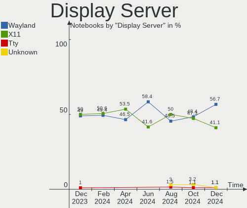
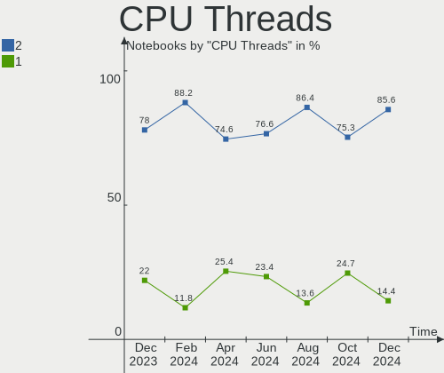
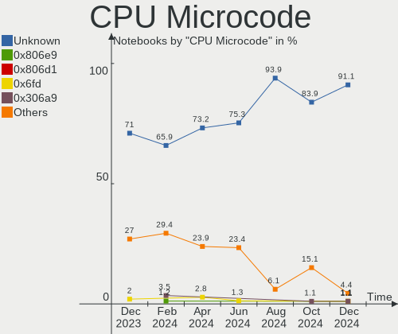
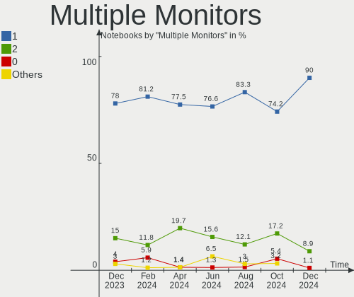
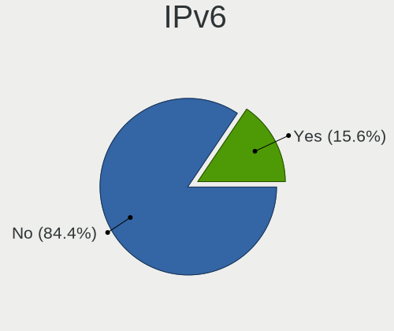
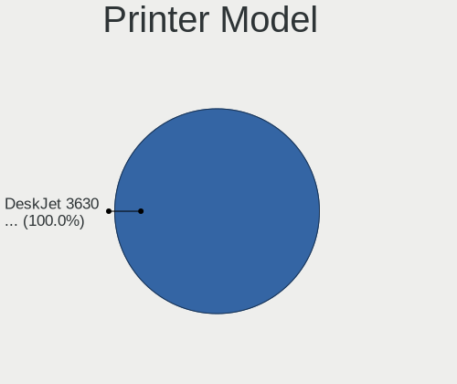
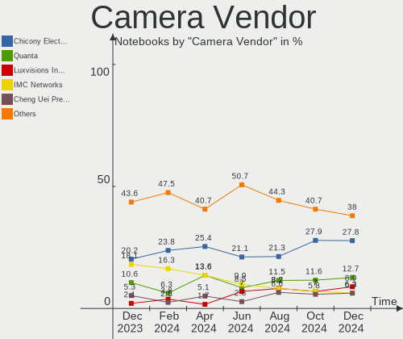
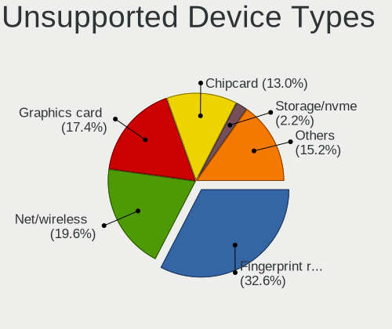

Linux in Spain - Hardware Trends (Notebooks)
--------------------------------------------

A project to identify most popular hardware characteristics and track their change
over time based on data collected by Linux users at https://Linux-Hardware.org.

Anyone can contribute to this report by the [hw-probe](https://github.com/linuxhw/hw-probe) tool:

    sudo -E hw-probe -all -upload

Period: Nov, 2022.

Contents
--------

* [ System ](#system)
  - [ OS                       ](#os)
  - [ OS Family                ](#os-family)
  - [ Kernel                   ](#kernel)
  - [ Kernel Family            ](#kernel-family)
  - [ Kernel Major Ver.        ](#kernel-major-ver)
  - [ Arch                     ](#arch)
  - [ DE                       ](#de)
  - [ Display Server           ](#display-server)
  - [ Display Manager          ](#display-manager)
  - [ OS Lang                  ](#os-lang)
  - [ Boot Mode                ](#boot-mode)
  - [ Filesystem               ](#filesystem)
  - [ Part. scheme             ](#part-scheme)
  - [ Dual Boot with Linux/BSD ](#dual-boot-with-linuxbsd)
  - [ Dual Boot (Win)          ](#dual-boot-win)

* [ Board ](#board)
  - [ Vendor                   ](#vendor)
  - [ Model                    ](#model)
  - [ Model Family             ](#model-family)
  - [ MFG Year                 ](#mfg-year)
  - [ Form Factor              ](#form-factor)
  - [ Secure Boot              ](#secure-boot)
  - [ Coreboot                 ](#coreboot)
  - [ RAM Size                 ](#ram-size)
  - [ RAM Used                 ](#ram-used)
  - [ Total Drives             ](#total-drives)
  - [ Has CD-ROM               ](#has-cd-rom)
  - [ Has Ethernet             ](#has-ethernet)
  - [ Has WiFi                 ](#has-wifi)
  - [ Has Bluetooth            ](#has-bluetooth)

* [ Location ](#location)
  - [ Country                  ](#country)
  - [ City                     ](#city)

* [ Drives ](#drives)
  - [ Drive Vendor             ](#drive-vendor)
  - [ Drive Model              ](#drive-model)
  - [ HDD Vendor               ](#hdd-vendor)
  - [ SSD Vendor               ](#ssd-vendor)
  - [ Drive Kind               ](#drive-kind)
  - [ Drive Connector          ](#drive-connector)
  - [ Drive Size               ](#drive-size)
  - [ Space Total              ](#space-total)
  - [ Space Used               ](#space-used)
  - [ Malfunc. Drives          ](#malfunc-drives)
  - [ Malfunc. Drive Vendor    ](#malfunc-drive-vendor)
  - [ Malfunc. HDD Vendor      ](#malfunc-hdd-vendor)
  - [ Malfunc. Drive Kind      ](#malfunc-drive-kind)
  - [ Failed Drives            ](#failed-drives)
  - [ Failed Drive Vendor      ](#failed-drive-vendor)
  - [ Drive Status             ](#drive-status)

* [ Storage controller ](#storage-controller)
  - [ Storage Vendor           ](#storage-vendor)
  - [ Storage Model            ](#storage-model)
  - [ Storage Kind             ](#storage-kind)

* [ Processor ](#processor)
  - [ CPU Vendor               ](#cpu-vendor)
  - [ CPU Model                ](#cpu-model)
  - [ CPU Model Family         ](#cpu-model-family)
  - [ CPU Cores                ](#cpu-cores)
  - [ CPU Sockets              ](#cpu-sockets)
  - [ CPU Threads              ](#cpu-threads)
  - [ CPU Op-Modes             ](#cpu-op-modes)
  - [ CPU Microcode            ](#cpu-microcode)
  - [ CPU Microarch            ](#cpu-microarch)

* [ Graphics ](#graphics)
  - [ GPU Vendor               ](#gpu-vendor)
  - [ GPU Model                ](#gpu-model)
  - [ GPU Combo                ](#gpu-combo)
  - [ GPU Driver               ](#gpu-driver)
  - [ GPU Memory               ](#gpu-memory)

* [ Monitor ](#monitor)
  - [ Monitor Vendor           ](#monitor-vendor)
  - [ Monitor Model            ](#monitor-model)
  - [ Monitor Resolution       ](#monitor-resolution)
  - [ Monitor Diagonal         ](#monitor-diagonal)
  - [ Monitor Width            ](#monitor-width)
  - [ Aspect Ratio             ](#aspect-ratio)
  - [ Monitor Area             ](#monitor-area)
  - [ Pixel Density            ](#pixel-density)
  - [ Multiple Monitors        ](#multiple-monitors)

* [ Network ](#network)
  - [ Net Controller Vendor    ](#net-controller-vendor)
  - [ Net Controller Model     ](#net-controller-model)
  - [ Wireless Vendor          ](#wireless-vendor)
  - [ Wireless Model           ](#wireless-model)
  - [ Ethernet Vendor          ](#ethernet-vendor)
  - [ Ethernet Model           ](#ethernet-model)
  - [ Net Controller Kind      ](#net-controller-kind)
  - [ Used Controller          ](#used-controller)
  - [ NICs                     ](#nics)
  - [ IPv6                     ](#ipv6)

* [ Bluetooth ](#bluetooth)
  - [ Bluetooth Vendor         ](#bluetooth-vendor)
  - [ Bluetooth Model          ](#bluetooth-model)

* [ Sound ](#sound)
  - [ Sound Vendor             ](#sound-vendor)
  - [ Sound Model              ](#sound-model)

* [ Memory ](#memory)
  - [ Memory Vendor            ](#memory-vendor)
  - [ Memory Model             ](#memory-model)
  - [ Memory Kind              ](#memory-kind)
  - [ Memory Form Factor       ](#memory-form-factor)
  - [ Memory Size              ](#memory-size)
  - [ Memory Speed             ](#memory-speed)

* [ Printers & scanners ](#printers--scanners)
  - [ Printer Vendor           ](#printer-vendor)
  - [ Printer Model            ](#printer-model)
  - [ Scanner Vendor           ](#scanner-vendor)
  - [ Scanner Model            ](#scanner-model)

* [ Camera ](#camera)
  - [ Camera Vendor            ](#camera-vendor)
  - [ Camera Model             ](#camera-model)

* [ Security ](#security)
  - [ Fingerprint Vendor       ](#fingerprint-vendor)
  - [ Fingerprint Model        ](#fingerprint-model)
  - [ Chipcard Vendor          ](#chipcard-vendor)
  - [ Chipcard Model           ](#chipcard-model)

* [ Unsupported ](#unsupported)
  - [ Unsupported Devices      ](#unsupported-devices)
  - [ Unsupported Device Types ](#unsupported-device-types)

System
------

OS
--

Installed operating systems

| Name                | Notebooks | Percent |
|---------------------|-----------|---------|
| Ubuntu 22.04        | 18        | 19.78%  |
| Linux Mint 21       | 7         | 7.69%   |
| OpenMandriva 4.3    | 6         | 6.59%   |
| Debian 11           | 6         | 6.59%   |
| Zorin 16            | 5         | 5.49%   |
| SteamOS 3.3.2       | 4         | 4.4%    |
| Pop!_OS 22.04       | 4         | 4.4%    |
| Fedora 36           | 4         | 4.4%    |
| Ubuntu 22.10        | 3         | 3.3%    |
| Ubuntu 20.04        | 3         | 3.3%    |
| Manjaro             | 3         | 3.3%    |
| Linux Mint 20.3     | 3         | 3.3%    |
| KDE neon 22.04      | 3         | 3.3%    |
| Kali 2022.3         | 3         | 3.3%    |
| Ubuntu MATE 22.04   | 2         | 2.2%    |
| OpenMandriva 4.50   | 2         | 2.2%    |
| Manjaro 22.0.0      | 2         | 2.2%    |
| Fedora 37           | 2         | 2.2%    |
| EndeavourOS Rolling | 2         | 2.2%    |
| Debian              | 2         | 2.2%    |
| OpenMandriva 4.90   | 1         | 1.1%    |
| Kubuntu 22.10       | 1         | 1.1%    |
| Kubuntu 22.04       | 1         | 1.1%    |
| Fedora 33           | 1         | 1.1%    |
| Elementary 6.1      | 1         | 1.1%    |
| Debian 10           | 1         | 1.1%    |
| AlmaLinux 9.0       | 1         | 1.1%    |

OS Family
---------

OS without a version

| Name         | Notebooks | Percent |
|--------------|-----------|---------|
| Ubuntu       | 24        | 26.37%  |
| Linux Mint   | 10        | 10.99%  |
| OpenMandriva | 9         | 9.89%   |
| Debian       | 9         | 9.89%   |
| Fedora       | 7         | 7.69%   |
| Zorin        | 5         | 5.49%   |
| Manjaro      | 5         | 5.49%   |
| SteamOS      | 4         | 4.4%    |
| Pop!_OS      | 4         | 4.4%    |
| KDE neon     | 3         | 3.3%    |
| Kali         | 3         | 3.3%    |
| Ubuntu MATE  | 2         | 2.2%    |
| Kubuntu      | 2         | 2.2%    |
| EndeavourOS  | 2         | 2.2%    |
| Elementary   | 1         | 1.1%    |
| AlmaLinux    | 1         | 1.1%    |

Kernel
------

Version of the Linux kernel

| Version                     | Notebooks | Percent |
|-----------------------------|-----------|---------|
| 5.15.0-53-generic           | 18        | 19.78%  |
| 5.15.0-52-generic           | 16        | 17.58%  |
| 5.16.7-desktop-1omv4003     | 6         | 6.59%   |
| 5.13.0-valve21.3-1-neptune  | 4         | 4.4%    |
| 5.19.0-23-generic           | 3         | 3.3%    |
| 5.10.0-19-amd64             | 3         | 3.3%    |
| 6.0.7-200.fc36.x86_64       | 2         | 2.2%    |
| 6.0.6-76060006-generic      | 2         | 2.2%    |
| 6.0.0-4-amd64               | 2         | 2.2%    |
| 5.19.12-desktop-2omv4090    | 2         | 2.2%    |
| 5.15.78-1-MANJARO           | 2         | 2.2%    |
| 5.15.0-48-generic           | 2         | 2.2%    |
| 5.15.0-43-generic           | 2         | 2.2%    |
| 6.0.9-300.fc37.x86_64       | 1         | 1.1%    |
| 6.0.9-200.fc36.x86_64       | 1         | 1.1%    |
| 6.0.8-300.fc37.x86_64       | 1         | 1.1%    |
| 6.0.8-1-MANJARO             | 1         | 1.1%    |
| 6.0.7-060007-generic        | 1         | 1.1%    |
| 6.0.6-zen1-1-zen            | 1         | 1.1%    |
| 6.0.6-arch1-1               | 1         | 1.1%    |
| 6.0.5-desktop-1omv4090      | 1         | 1.1%    |
| 6.0.3-76060003-generic      | 1         | 1.1%    |
| 5.4.224-1-MANJARO           | 1         | 1.1%    |
| 5.4.0-132-generic           | 1         | 1.1%    |
| 5.4.0-131-generic           | 1         | 1.1%    |
| 5.19.16-76051916-generic    | 1         | 1.1%    |
| 5.19.0-kali2-amd64          | 1         | 1.1%    |
| 5.19.0-21-generic           | 1         | 1.1%    |
| 5.19.0-0.deb11.2-amd64      | 1         | 1.1%    |
| 5.18.0-kali7-amd64          | 1         | 1.1%    |
| 5.18.0-kali5-amd64          | 1         | 1.1%    |
| 5.18.0-0.deb11.4-amd64      | 1         | 1.1%    |
| 5.17.5-300.fc36.x86_64      | 1         | 1.1%    |
| 5.15.74-3-MANJARO           | 1         | 1.1%    |
| 5.15.0-46-generic           | 1         | 1.1%    |
| 5.14.18-100.fc33.x86_64     | 1         | 1.1%    |
| 5.14.0-70.26.1.el9_0.x86_64 | 1         | 1.1%    |
| 5.14.0-1054-oem             | 1         | 1.1%    |
| 5.10.0-18-amd64             | 1         | 1.1%    |
| 4.19.0-8-amd64              | 1         | 1.1%    |

Kernel Family
-------------

Linux kernel without a distro release

| Version | Notebooks | Percent |
|---------|-----------|---------|
| 5.15.0  | 39        | 42.86%  |
| 5.19.0  | 6         | 6.59%   |
| 5.16.7  | 6         | 6.59%   |
| 6.0.6   | 4         | 4.4%    |
| 5.13.0  | 4         | 4.4%    |
| 5.10.0  | 4         | 4.4%    |
| 6.0.7   | 3         | 3.3%    |
| 5.18.0  | 3         | 3.3%    |
| 6.0.9   | 2         | 2.2%    |
| 6.0.8   | 2         | 2.2%    |
| 6.0.0   | 2         | 2.2%    |
| 5.4.0   | 2         | 2.2%    |
| 5.19.12 | 2         | 2.2%    |
| 5.15.78 | 2         | 2.2%    |
| 5.14.0  | 2         | 2.2%    |
| 6.0.5   | 1         | 1.1%    |
| 6.0.3   | 1         | 1.1%    |
| 5.4.224 | 1         | 1.1%    |
| 5.19.16 | 1         | 1.1%    |
| 5.17.5  | 1         | 1.1%    |
| 5.15.74 | 1         | 1.1%    |
| 5.14.18 | 1         | 1.1%    |
| 4.19.0  | 1         | 1.1%    |

Kernel Major Ver.
-----------------

Linux kernel major version

| Version | Notebooks | Percent |
|---------|-----------|---------|
| 5.15    | 42        | 46.15%  |
| 6.0     | 15        | 16.48%  |
| 5.19    | 9         | 9.89%   |
| 5.16    | 6         | 6.59%   |
| 5.13    | 4         | 4.4%    |
| 5.10    | 4         | 4.4%    |
| 5.4     | 3         | 3.3%    |
| 5.18    | 3         | 3.3%    |
| 5.14    | 3         | 3.3%    |
| 5.17    | 1         | 1.1%    |
| 4.19    | 1         | 1.1%    |

Arch
----

OS architecture (x86_64, i586, etc.)

| Name   | Notebooks | Percent |
|--------|-----------|---------|
| x86_64 | 91        | 100%    |

DE
--

Desktop Environment

| Name          | Notebooks | Percent |
|---------------|-----------|---------|
| GNOME         | 45        | 49.45%  |
| KDE5          | 26        | 28.57%  |
| XFCE          | 8         | 8.79%   |
| X-Cinnamon    | 6         | 6.59%   |
| MATE          | 2         | 2.2%    |
| GNOME Classic | 2         | 2.2%    |
| Pantheon      | 1         | 1.1%    |
| Unknown       | 1         | 1.1%    |

Display Server
--------------

X11 or Wayland

| Name    | Notebooks | Percent |
|---------|-----------|---------|
| X11     | 64        | 70.33%  |
| Wayland | 25        | 27.47%  |
| Tty     | 1         | 1.1%    |
| Unknown | 1         | 1.1%    |

Display Manager
---------------

SDDM, LightDM, etc.

| Name    | Notebooks | Percent |
|---------|-----------|---------|
| Unknown | 31        | 34.07%  |
| GDM3    | 23        | 25.27%  |
| SDDM    | 14        | 15.38%  |
| GDM     | 12        | 13.19%  |
| LightDM | 10        | 10.99%  |
| KDM     | 1         | 1.1%    |

OS Lang
-------

Language

| Lang    | Notebooks | Percent |
|---------|-----------|---------|
| es_ES   | 57        | 62.64%  |
| en_US   | 23        | 25.27%  |
| en_GB   | 2         | 2.2%    |
| an_ES   | 2         | 2.2%    |
| es_AR   | 1         | 1.1%    |
| en_AG   | 1         | 1.1%    |
| de_DE   | 1         | 1.1%    |
| de_AT   | 1         | 1.1%    |
| ca_AD   | 1         | 1.1%    |
| C       | 1         | 1.1%    |
| Unknown | 1         | 1.1%    |

Boot Mode
---------

EFI or BIOS

| Mode | Notebooks | Percent |
|------|-----------|---------|
| EFI  | 54        | 59.34%  |
| BIOS | 37        | 40.66%  |

Filesystem
----------

Type of filesystem

| Type    | Notebooks | Percent |
|---------|-----------|---------|
| Ext4    | 67        | 73.63%  |
| Overlay | 10        | 10.99%  |
| Btrfs   | 10        | 10.99%  |
| Xfs     | 2         | 2.2%    |
| Zfs     | 1         | 1.1%    |
| Ext2    | 1         | 1.1%    |

Part. scheme
------------

Scheme of partitioning

| Type    | Notebooks | Percent |
|---------|-----------|---------|
| GPT     | 55        | 60.44%  |
| Unknown | 30        | 32.97%  |
| MBR     | 6         | 6.59%   |

Dual Boot with Linux/BSD
------------------------

Hosting more than one Linux/BSD

| Dual boot | Notebooks | Percent |
|-----------|-----------|---------|
| No        | 77        | 84.62%  |
| Yes       | 14        | 15.38%  |

Dual Boot (Win)
---------------

Hosting Linux and Windows

| Dual boot | Notebooks | Percent |
|-----------|-----------|---------|
| No        | 56        | 61.54%  |
| Yes       | 35        | 38.46%  |

Board
-----

Vendor
------

Motherboard manufacturer

| Name                | Notebooks | Percent |
|---------------------|-----------|---------|
| Hewlett-Packard     | 23        | 25.27%  |
| Lenovo              | 19        | 20.88%  |
| ASUSTek Computer    | 13        | 14.29%  |
| Toshiba             | 5         | 5.49%   |
| Acer                | 5         | 5.49%   |
| Valve               | 4         | 4.4%    |
| MSI                 | 3         | 3.3%    |
| HUAWEI              | 3         | 3.3%    |
| Dell                | 3         | 3.3%    |
| Apple               | 3         | 3.3%    |
| Samsung Electronics | 2         | 2.2%    |
| PC Specialist       | 2         | 2.2%    |
| LG Electronics      | 2         | 2.2%    |
| Timi                | 1         | 1.1%    |
| Packard Bell        | 1         | 1.1%    |
| ALURIN              | 1         | 1.1%    |
| ALLDOCUBE           | 1         | 1.1%    |

Model
-----

Motherboard model

| Name                                               | Notebooks | Percent |
|----------------------------------------------------|-----------|---------|
| Valve Jupiter                                      | 4         | 4.4%    |
| Lenovo Legion 5 15ACH6H 82JU                       | 2         | 2.2%    |
| Toshiba Satellite Pro A200                         | 1         | 1.1%    |
| Toshiba Satellite P50-B-10Z                        | 1         | 1.1%    |
| Toshiba Satellite L50-C                            | 1         | 1.1%    |
| Toshiba Satellite L10W-B-101                       | 1         | 1.1%    |
| Toshiba PORTEGE Z30-A                              | 1         | 1.1%    |
| Timi TM1703                                        | 1         | 1.1%    |
| Samsung R610                                       | 1         | 1.1%    |
| Samsung 305V4A/305V5A                              | 1         | 1.1%    |
| PC Specialist PB50_70RF,RD,RC                      | 1         | 1.1%    |
| PC Specialist NH5xAx                               | 1         | 1.1%    |
| Packard Bell EasyNote MZ45                         | 1         | 1.1%    |
| MSI Modern 14 B11SB                                | 1         | 1.1%    |
| MSI Modern 14 A10M                                 | 1         | 1.1%    |
| MSI GF63 8RD                                       | 1         | 1.1%    |
| LG 16Z90Q-G.AD78B                                  | 1         | 1.1%    |
| LG 15Z990-V.AA78B                                  | 1         | 1.1%    |
| Lenovo V14-ADA 82C6                                | 1         | 1.1%    |
| Lenovo ThinkPad X270 W10DG 20K60014MX              | 1         | 1.1%    |
| Lenovo ThinkPad X1 Carbon Gen 9 20XWS21H00         | 1         | 1.1%    |
| Lenovo ThinkPad X1 Carbon Gen 10 21CCS60U00        | 1         | 1.1%    |
| Lenovo ThinkPad T480 20L6S3H108                    | 1         | 1.1%    |
| Lenovo ThinkPad T420 4180GH5                       | 1         | 1.1%    |
| Lenovo ThinkPad T16 Gen 1 21BWS11X00               | 1         | 1.1%    |
| Lenovo ThinkBook 16p Gen 2 20YM                    | 1         | 1.1%    |
| Lenovo ThinkBook 15-IIL 20SM                       | 1         | 1.1%    |
| Lenovo IdeaPad Y510P 20217                         | 1         | 1.1%    |
| Lenovo IdeaPad Gaming 3 15IAH7 82S9                | 1         | 1.1%    |
| Lenovo IdeaPad Gaming 3 15ACH6 82K2                | 1         | 1.1%    |
| Lenovo IdeaPad 720S-13IKB 81BV                     | 1         | 1.1%    |
| Lenovo IdeaPad 320-15IKB 80XL                      | 1         | 1.1%    |
| Lenovo IdeaPad 320-15IAP 80XR                      | 1         | 1.1%    |
| Lenovo IdeaPad 320-15AST 80XV                      | 1         | 1.1%    |
| Lenovo IdeaPad 3 15ITL6 82H8                       | 1         | 1.1%    |
| HUAWEI CREM-WXX9                                   | 1         | 1.1%    |
| HUAWEI BOHK-WAX9X                                  | 1         | 1.1%    |
| HUAWEI BOD-WXX9                                    | 1         | 1.1%    |
| HP ZBook Studio 15.6 inch G8 Mobile Workstation PC | 1         | 1.1%    |
| HP ProBook 650 G1                                  | 1         | 1.1%    |

Model Family
------------

Motherboard model prefix

| Name                  | Notebooks | Percent |
|-----------------------|-----------|---------|
| Lenovo IdeaPad        | 8         | 8.79%   |
| Lenovo ThinkPad       | 6         | 6.59%   |
| HP Pavilion           | 6         | 6.59%   |
| Valve Jupiter         | 4         | 4.4%    |
| Toshiba Satellite     | 4         | 4.4%    |
| HP ProBook            | 4         | 4.4%    |
| HP EliteBook          | 4         | 4.4%    |
| Acer Aspire           | 4         | 4.4%    |
| ASUS VivoBook         | 3         | 3.3%    |
| MSI Modern            | 2         | 2.2%    |
| Lenovo ThinkBook      | 2         | 2.2%    |
| Lenovo Legion         | 2         | 2.2%    |
| HP Laptop             | 2         | 2.2%    |
| ASUS ZenBook          | 2         | 2.2%    |
| ASUS ASUS             | 2         | 2.2%    |
| Toshiba PORTEGE       | 1         | 1.1%    |
| Timi TM1703           | 1         | 1.1%    |
| Samsung R610          | 1         | 1.1%    |
| Samsung 305V4A        | 1         | 1.1%    |
| PC Specialist PB50    | 1         | 1.1%    |
| PC Specialist NH5xAx  | 1         | 1.1%    |
| Packard Bell EasyNote | 1         | 1.1%    |
| MSI GF63              | 1         | 1.1%    |
| LG 16Z90Q-G.AD78B     | 1         | 1.1%    |
| LG 15Z990-V.AA78B     | 1         | 1.1%    |
| Lenovo V14-ADA        | 1         | 1.1%    |
| HUAWEI CREM-WXX9      | 1         | 1.1%    |
| HUAWEI BOHK-WAX9X     | 1         | 1.1%    |
| HUAWEI BOD-WXX9       | 1         | 1.1%    |
| HP ZBook              | 1         | 1.1%    |
| HP OMEN               | 1         | 1.1%    |
| HP Notebook           | 1         | 1.1%    |
| HP G62                | 1         | 1.1%    |
| HP Elite              | 1         | 1.1%    |
| HP Compaq             | 1         | 1.1%    |
| HP 250                | 1         | 1.1%    |
| Dell XPS              | 1         | 1.1%    |
| Dell Latitude         | 1         | 1.1%    |
| Dell G3               | 1         | 1.1%    |
| ASUS X555YA           | 1         | 1.1%    |

MFG Year
--------

Motherboard manufacture year

| Year | Notebooks | Percent |
|------|-----------|---------|
| 2021 | 15        | 16.48%  |
| 2022 | 14        | 15.38%  |
| 2019 | 11        | 12.09%  |
| 2017 | 9         | 9.89%   |
| 2018 | 6         | 6.59%   |
| 2015 | 6         | 6.59%   |
| 2013 | 6         | 6.59%   |
| 2020 | 4         | 4.4%    |
| 2014 | 4         | 4.4%    |
| 2007 | 4         | 4.4%    |
| 2016 | 3         | 3.3%    |
| 2011 | 3         | 3.3%    |
| 2010 | 3         | 3.3%    |
| 2009 | 2         | 2.2%    |
| 2008 | 1         | 1.1%    |

Form Factor
-----------

Physical design of the computer

| Name     | Notebooks | Percent |
|----------|-----------|---------|
| Notebook | 91        | 100%    |

Secure Boot
-----------

Enabled or disabled

| State    | Notebooks | Percent |
|----------|-----------|---------|
| Disabled | 80        | 87.91%  |
| Enabled  | 11        | 12.09%  |

Coreboot
--------

Have coreboot on board

| Used | Notebooks | Percent |
|------|-----------|---------|
| No   | 91        | 100%    |

RAM Size
--------

Total RAM memory

| Size in GB  | Notebooks | Percent |
|-------------|-----------|---------|
| 4.01-8.0    | 34        | 37.36%  |
| 8.01-16.0   | 17        | 18.68%  |
| 16.01-24.0  | 15        | 16.48%  |
| 32.01-64.0  | 10        | 10.99%  |
| 3.01-4.0    | 10        | 10.99%  |
| 1.01-2.0    | 3         | 3.3%    |
| 2.01-3.0    | 1         | 1.1%    |
| 64.01-256.0 | 1         | 1.1%    |

RAM Used
--------

Used RAM memory

| Used GB    | Notebooks | Percent |
|------------|-----------|---------|
| 2.01-3.0   | 32        | 35.16%  |
| 1.01-2.0   | 23        | 25.27%  |
| 4.01-8.0   | 15        | 16.48%  |
| 3.01-4.0   | 12        | 13.19%  |
| 0.51-1.0   | 5         | 5.49%   |
| 8.01-16.0  | 3         | 3.3%    |
| 16.01-24.0 | 1         | 1.1%    |

Total Drives
------------

Number of drives on board

| Drives | Notebooks | Percent |
|--------|-----------|---------|
| 1      | 69        | 75.82%  |
| 2      | 19        | 20.88%  |
| 3      | 2         | 2.2%    |
| 0      | 1         | 1.1%    |

Has CD-ROM
----------

Has CD-ROM on board

| Presented | Notebooks | Percent |
|-----------|-----------|---------|
| No        | 69        | 75.82%  |
| Yes       | 22        | 24.18%  |

Has Ethernet
------------

Has Ethernet on board

| Presented | Notebooks | Percent |
|-----------|-----------|---------|
| Yes       | 68        | 74.73%  |
| No        | 23        | 25.27%  |

Has WiFi
--------

Has WiFi module

| Presented | Notebooks | Percent |
|-----------|-----------|---------|
| Yes       | 90        | 98.9%   |
| No        | 1         | 1.1%    |

Has Bluetooth
-------------

Has Bluetooth module

| Presented | Notebooks | Percent |
|-----------|-----------|---------|
| Yes       | 78        | 85.71%  |
| No        | 13        | 14.29%  |

Location
--------

Country
-------

Geographic location (country)

| Country | Notebooks | Percent |
|---------|-----------|---------|
| Spain   | 91        | 100%    |

City
----

Geographic location (city)

| City                     | Notebooks | Percent |
|--------------------------|-----------|---------|
| Madrid                   | 20        | 21.98%  |
| Barcelona                | 6         | 6.59%   |
| Alcobendas               | 5         | 5.49%   |
| Valencia                 | 4         | 4.4%    |
| Seville                  | 4         | 4.4%    |
| Málaga                  | 4         | 4.4%    |
| Granada                  | 2         | 2.2%    |
| Bilbao                   | 2         | 2.2%    |
| Alcazar de San Juan      | 2         | 2.2%    |
| Albacete                 | 2         | 2.2%    |
| Zalamea la Real          | 1         | 1.1%    |
| Valladolid               | 1         | 1.1%    |
| Valdemoro                | 1         | 1.1%    |
| Tres Cantos              | 1         | 1.1%    |
| Torrevieja               | 1         | 1.1%    |
| Santander                | 1         | 1.1%    |
| Santa Cruz de Tenerife   | 1         | 1.1%    |
| Sant Vicenc de Montalt   | 1         | 1.1%    |
| Requena                  | 1         | 1.1%    |
| Pozuelo de Alarcón      | 1         | 1.1%    |
| Portugalete              | 1         | 1.1%    |
| Parla                    | 1         | 1.1%    |
| Palma                    | 1         | 1.1%    |
| Palencia                 | 1         | 1.1%    |
| Órgiva                  | 1         | 1.1%    |
| Mostoles                 | 1         | 1.1%    |
| Monòver                 | 1         | 1.1%    |
| Mataró                  | 1         | 1.1%    |
| Lugones                  | 1         | 1.1%    |
| León                    | 1         | 1.1%    |
| Huelva                   | 1         | 1.1%    |
| Gijón                   | 1         | 1.1%    |
| Getxo                    | 1         | 1.1%    |
| Ferrol                   | 1         | 1.1%    |
| Esparreguera             | 1         | 1.1%    |
| Empuriabrava             | 1         | 1.1%    |
| El Rosario               | 1         | 1.1%    |
| Donostia / San Sebastian | 1         | 1.1%    |
| Don Benito               | 1         | 1.1%    |
| Colmenar Viejo           | 1         | 1.1%    |

Drives
------

Drive Vendor
------------

Hard drive vendors

| Vendor                      | Notebooks | Drives | Percent |
|-----------------------------|-----------|--------|---------|
| Samsung Electronics         | 20        | 21     | 18.87%  |
| WDC                         | 10        | 11     | 9.43%   |
| Intel                       | 10        | 11     | 9.43%   |
| Unknown                     | 7         | 7      | 6.6%    |
| HGST                        | 7         | 7      | 6.6%    |
| Crucial                     | 6         | 7      | 5.66%   |
| SK hynix                    | 5         | 5      | 4.72%   |
| Sandisk                     | 5         | 5      | 4.72%   |
| Kingston                    | 5         | 5      | 4.72%   |
| Micron Technology           | 4         | 4      | 3.77%   |
| Kingston Technology Company | 4         | 5      | 3.77%   |
| Seagate                     | 3         | 3      | 2.83%   |
| Phison Electronics          | 2         | 2      | 1.89%   |
| Apple                       | 2         | 2      | 1.89%   |
| USB                         | 1         | 1      | 0.94%   |
| Transcend                   | 1         | 1      | 0.94%   |
| Toshiba                     | 1         | 1      | 0.94%   |
| Realtek                     | 1         | 1      | 0.94%   |
| PNY                         | 1         | 1      | 0.94%   |
| Phison                      | 1         | 1      | 0.94%   |
| O2 Micro                    | 1         | 1      | 0.94%   |
| Netac                       | 1         | 1      | 0.94%   |
| Micron/Crucial Technology   | 1         | 1      | 0.94%   |
| LITEONIT                    | 1         | 1      | 0.94%   |
| KIOXIA                      | 1         | 1      | 0.94%   |
| JMicron Technology          | 1         | 1      | 0.94%   |
| Hitachi                     | 1         | 1      | 0.94%   |
| Hewlett-Packard             | 1         | 1      | 0.94%   |
| China                       | 1         | 1      | 0.94%   |
| Unknown                     | 1         | 1      | 0.94%   |

Drive Model
-----------

Hard drive models

| Model                                                | Notebooks | Percent |
|------------------------------------------------------|-----------|---------|
| Kingston Company OM3PDP3 NVMe SSD 256GB              | 3         | 2.75%   |
| Unknown MMC Card  128GB                              | 2         | 1.83%   |
| Sandisk WD Black SN750 / PC SN730 NVMe SSD 1024GB    | 2         | 1.83%   |
| Samsung NVMe SSD Controller SM981/PM981/PM983 1TB    | 2         | 1.83%   |
| Samsung NVMe SSD Controller PM9A1/PM9A3/980PRO 250GB | 2         | 1.83%   |
| Samsung MZVL2512HCJQ-00BL7 512GB                     | 2         | 1.83%   |
| Kingston SA400S37240G 240GB SSD                      | 2         | 1.83%   |
| Intel SSDPEKNU512GZH 512GB                           | 2         | 1.83%   |
| Intel SSDPEKNU512GZ 512GB                            | 2         | 1.83%   |
| HGST HTS545050A7E680 500GB                           | 2         | 1.83%   |
| HGST HTS545050A7E380 500GB                           | 2         | 1.83%   |
| HGST HTS541010A9E680 1TB                             | 2         | 1.83%   |
| Crucial CT500MX500SSD1 500GB                         | 2         | 1.83%   |
| WDC WDS200T2B0B-00YS70 2TB SSD                       | 1         | 0.92%   |
| WDC WDBNCE0010PNC 1TB SSD                            | 1         | 0.92%   |
| WDC WD5000LPCX-24VHAT0 500GB                         | 1         | 0.92%   |
| WDC WD3200BEVT-35ZCT0 320GB                          | 1         | 0.92%   |
| WDC WD1600BEVT-80A23T0 160GB                         | 1         | 0.92%   |
| WDC WD1200BEVS-75UST0 120GB                          | 1         | 0.92%   |
| WDC WD10SPZX-21Z10T0 1TB                             | 1         | 0.92%   |
| WDC PC SN730 SDBPNTY-1T00-1101 1TB                   | 1         | 0.92%   |
| WDC PC SN530 SDBPNPZ-512G-1032 512GB                 | 1         | 0.92%   |
| WDC PC SN520 SDAPNUW-256G                            | 1         | 0.92%   |
| WDC PC SN520 SDAPMUW-128G-1101 128GB                 | 1         | 0.92%   |
| USB 3.1 480GB                                        | 1         | 0.92%   |
| Unknown SU32G  32GB                                  | 1         | 0.92%   |
| Unknown SA16G  16GB                                  | 1         | 0.92%   |
| Unknown MMC Card  512GB                              | 1         | 0.92%   |
| Unknown MMC Card  498GB                              | 1         | 0.92%   |
| Unknown MMC Card  256GB                              | 1         | 0.92%   |
| Transcend TS512GSSD230S 512GB                        | 1         | 0.92%   |
| Toshiba MQ01ABD100 1TB                               | 1         | 0.92%   |
| SK hynix PC401 NVMe Solid State Drive 256GB          | 1         | 0.92%   |
| SK hynix HFS256GD9TNG-62A0A 256GB                    | 1         | 0.92%   |
| SK hynix HFM512GD3JX013N 512GB                       | 1         | 0.92%   |
| SK hynix BC711 HFM512GD3JX013N 512GB                 | 1         | 0.92%   |
| SK hynix BC501 NVMe 256GB                            | 1         | 0.92%   |
| Seagate ST1000LM048-2E7172 1TB                       | 1         | 0.92%   |
| Seagate ST1000LM035-1RK172 1TB                       | 1         | 0.92%   |
| Seagate ST1000LM014-SSHD-8GB                         | 1         | 0.92%   |

HDD Vendor
----------

Hard disk drive vendors

| Vendor  | Notebooks | Drives | Percent |
|---------|-----------|--------|---------|
| HGST    | 7         | 7      | 38.89%  |
| WDC     | 5         | 5      | 27.78%  |
| Seagate | 3         | 3      | 16.67%  |
| USB     | 1         | 1      | 5.56%   |
| Toshiba | 1         | 1      | 5.56%   |
| Hitachi | 1         | 1      | 5.56%   |

SSD Vendor
----------

Solid state drive vendors

| Vendor              | Notebooks | Drives | Percent |
|---------------------|-----------|--------|---------|
| Samsung Electronics | 11        | 11     | 35.48%  |
| Crucial             | 6         | 7      | 19.35%  |
| Kingston            | 5         | 5      | 16.13%  |
| WDC                 | 2         | 2      | 6.45%   |
| Transcend           | 1         | 1      | 3.23%   |
| Netac               | 1         | 1      | 3.23%   |
| LITEONIT            | 1         | 1      | 3.23%   |
| Hewlett-Packard     | 1         | 1      | 3.23%   |
| China               | 1         | 1      | 3.23%   |
| Apple               | 1         | 1      | 3.23%   |
| Unknown             | 1         | 1      | 3.23%   |

Drive Kind
----------

HDD or SSD

| Kind    | Notebooks | Drives | Percent |
|---------|-----------|--------|---------|
| NVMe    | 50        | 53     | 47.17%  |
| SSD     | 30        | 32     | 28.3%   |
| HDD     | 18        | 18     | 16.98%  |
| MMC     | 7         | 7      | 6.6%    |
| Unknown | 1         | 1      | 0.94%   |

Drive Connector
---------------

SATA, SAS, NVMe, etc.

| Type | Notebooks | Drives | Percent |
|------|-----------|--------|---------|
| NVMe | 49        | 52     | 47.12%  |
| SATA | 45        | 49     | 43.27%  |
| MMC  | 7         | 7      | 6.73%   |
| SAS  | 3         | 3      | 2.88%   |

Drive Size
----------

Size of hard drive

| Size in TB | Notebooks | Drives | Percent |
|------------|-----------|--------|---------|
| 0.01-0.5   | 28        | 32     | 60.87%  |
| 0.51-1.0   | 17        | 17     | 36.96%  |
| 1.01-2.0   | 1         | 1      | 2.17%   |

Space Total
-----------

Amount of disk space available on the file system

| Size in GB | Notebooks | Percent |
|------------|-----------|---------|
| 251-500    | 26        | 28.57%  |
| 101-250    | 24        | 26.37%  |
| 501-1000   | 15        | 16.48%  |
| 1-20       | 11        | 12.09%  |
| 51-100     | 6         | 6.59%   |
| 21-50      | 4         | 4.4%    |
| 1001-2000  | 4         | 4.4%    |
| Unknown    | 1         | 1.1%    |

Space Used
----------

Amount of used disk space

| Used GB  | Notebooks | Percent |
|----------|-----------|---------|
| 1-20     | 38        | 41.76%  |
| 21-50    | 16        | 17.58%  |
| 251-500  | 13        | 14.29%  |
| 101-250  | 13        | 14.29%  |
| 51-100   | 6         | 6.59%   |
| 501-1000 | 4         | 4.4%    |
| Unknown  | 1         | 1.1%    |

Malfunc. Drives
---------------

Drive models with a malfunction

| Model                                | Notebooks | Drives | Percent |
|--------------------------------------|-----------|--------|---------|
| SK hynix BC711 HFM512GD3JX013N 512GB | 1         | 1      | 33.33%  |
| HGST HTS545050A7E680 500GB           | 1         | 1      | 33.33%  |
| HGST HTS541075A9E680 752GB           | 1         | 1      | 33.33%  |

Malfunc. Drive Vendor
---------------------

Vendors of faulty drives

| Vendor   | Notebooks | Drives | Percent |
|----------|-----------|--------|---------|
| HGST     | 2         | 2      | 66.67%  |
| SK hynix | 1         | 1      | 33.33%  |

Malfunc. HDD Vendor
-------------------

Vendors of faulty HDD drives

| Vendor | Notebooks | Drives | Percent |
|--------|-----------|--------|---------|
| HGST   | 2         | 2      | 100%    |

Malfunc. Drive Kind
-------------------

Kinds of faulty drives

| Kind | Notebooks | Drives | Percent |
|------|-----------|--------|---------|
| HDD  | 2         | 2      | 66.67%  |
| NVMe | 1         | 1      | 33.33%  |

Failed Drives
-------------

Failed drive models

Zero info for selected period =(

Failed Drive Vendor
-------------------

Failed drive vendors

Zero info for selected period =(

Drive Status
------------

Number of failed and malfunc. drives

| Status   | Notebooks | Drives | Percent |
|----------|-----------|--------|---------|
| Detected | 47        | 58     | 50.54%  |
| Works    | 43        | 50     | 46.24%  |
| Malfunc  | 3         | 3      | 3.23%   |

Storage controller
------------------

Storage Vendor
--------------

Storage controller vendors

| Vendor                       | Notebooks | Percent |
|------------------------------|-----------|---------|
| Intel                        | 53        | 48.18%  |
| AMD                          | 14        | 12.73%  |
| Samsung Electronics          | 11        | 10%     |
| SanDisk                      | 9         | 8.18%   |
| SK hynix                     | 5         | 4.55%   |
| Phison Electronics           | 4         | 3.64%   |
| Micron Technology            | 4         | 3.64%   |
| Kingston Technology Company  | 4         | 3.64%   |
| Nvidia                       | 2         | 1.82%   |
| Toshiba America Info Systems | 1         | 0.91%   |
| O2 Micro                     | 1         | 0.91%   |
| Micron/Crucial Technology    | 1         | 0.91%   |
| Marvell Technology Group     | 1         | 0.91%   |

Storage Model
-------------

Storage controller models

| Model                                                                          | Notebooks | Percent |
|--------------------------------------------------------------------------------|-----------|---------|
| AMD FCH SATA Controller [AHCI mode]                                            | 13        | 10.32%  |
| Intel Sunrise Point-LP SATA Controller [AHCI mode]                             | 8         | 6.35%   |
| Intel Volume Management Device NVMe RAID Controller                            | 7         | 5.56%   |
| Samsung NVMe SSD Controller PM9A1/PM9A3/980PRO                                 | 5         | 3.97%   |
| Intel Non-Volatile memory controller                                           | 5         | 3.97%   |
| Intel Cannon Lake Mobile PCH SATA AHCI Controller                              | 5         | 3.97%   |
| Intel 8 Series SATA Controller 1 [AHCI mode]                                   | 5         | 3.97%   |
| Samsung NVMe SSD Controller SM981/PM981/PM983                                  | 4         | 3.17%   |
| Micron Non-Volatile memory controller                                          | 4         | 3.17%   |
| Intel SSD 660P Series                                                          | 4         | 3.17%   |
| Intel 82801HM/HEM (ICH8M/ICH8M-E) IDE Controller                               | 4         | 3.17%   |
| SanDisk WD Black SN750 / PC SN730 NVMe SSD                                     | 3         | 2.38%   |
| Kingston Company OM3PDP3 NVMe SSD                                              | 3         | 2.38%   |
| Intel Wildcat Point-LP SATA Controller [AHCI Mode]                             | 3         | 2.38%   |
| Intel 82801HM/HEM (ICH8M/ICH8M-E) SATA Controller [AHCI mode]                  | 3         | 2.38%   |
| Intel 8 Series/C220 Series Chipset Family 6-port SATA Controller 1 [AHCI mode] | 3         | 2.38%   |
| SK hynix PC401 NVMe Solid State Drive 256GB                                    | 2         | 1.59%   |
| SK hynix Gold P31/PC711 NVMe Solid State Drive                                 | 2         | 1.59%   |
| SanDisk WD Blue SN550 NVMe SSD                                                 | 2         | 1.59%   |
| Samsung NVMe SSD Controller SM961/PM961/SM963                                  | 2         | 1.59%   |
| Phison PS5013 E13 NVMe Controller                                              | 2         | 1.59%   |
| Phison E12 NVMe Controller                                                     | 2         | 1.59%   |
| Nvidia MCP79 AHCI Controller                                                   | 2         | 1.59%   |
| Intel Tiger Lake-LP SATA Controller                                            | 2         | 1.59%   |
| Intel Celeron N3350/Pentium N4200/Atom E3900 Series SATA AHCI Controller       | 2         | 1.59%   |
| Intel 82801 Mobile SATA Controller [RAID mode]                                 | 2         | 1.59%   |
| Toshiba America Info Systems XG6 NVMe SSD Controller                           | 1         | 0.79%   |
| SK hynix BC501 NVMe Solid State Drive                                          | 1         | 0.79%   |
| SanDisk WD Blue SN570 NVMe SSD                                                 | 1         | 0.79%   |
| SanDisk WD Blue SN500 / PC SN520 NVMe SSD                                      | 1         | 0.79%   |
| SanDisk PC SN520 NVMe SSD                                                      | 1         | 0.79%   |
| SanDisk Non-Volatile memory controller                                         | 1         | 0.79%   |
| O2 Micro Non-Volatile memory controller                                        | 1         | 0.79%   |
| Micron/Crucial P2 NVMe PCIe SSD                                                | 1         | 0.79%   |
| Marvell Group 88SS9183 PCIe SSD Controller                                     | 1         | 0.79%   |
| Kingston Company U-SNS8154P3 NVMe SSD                                          | 1         | 0.79%   |
| Kingston Company A2000 NVMe SSD                                                | 1         | 0.79%   |
| Intel SSD 600P Series                                                          | 1         | 0.79%   |
| Intel NM10/ICH7 Family SATA Controller [AHCI mode]                             | 1         | 0.79%   |
| Intel Jasper Lake SATA AHCI Controller                                         | 1         | 0.79%   |

Storage Kind
------------

Kind of storage controller (IDE, SATA, NVMe, SAS, ...)

| Kind | Notebooks | Percent |
|------|-----------|---------|
| SATA | 58        | 47.93%  |
| NVMe | 49        | 40.5%   |
| RAID | 9         | 7.44%   |
| IDE  | 5         | 4.13%   |

Processor
---------

CPU Vendor
----------

Processor vendors

| Vendor | Notebooks | Percent |
|--------|-----------|---------|
| Intel  | 66        | 72.53%  |
| AMD    | 25        | 27.47%  |

CPU Model
---------

Processor models

| Model                                         | Notebooks | Percent |
|-----------------------------------------------|-----------|---------|
| AMD Ryzen 7 5800H with Radeon Graphics        | 6         | 6.59%   |
| AMD Custom APU 0405                           | 4         | 4.4%    |
| Intel 11th Gen Core i5-1135G7 @ 2.40GHz       | 3         | 3.3%    |
| AMD Ryzen 5 3500U with Radeon Vega Mobile Gfx | 3         | 3.3%    |
| Intel Core i7-9750H CPU @ 2.60GHz             | 2         | 2.2%    |
| Intel Core i5-8300H CPU @ 2.30GHz             | 2         | 2.2%    |
| Intel Core i5-8250U CPU @ 1.60GHz             | 2         | 2.2%    |
| Intel Core i5-6300U CPU @ 2.40GHz             | 2         | 2.2%    |
| Intel 11th Gen Core i7-1165G7 @ 2.80GHz       | 2         | 2.2%    |
| AMD Ryzen 7 5700U with Radeon Graphics        | 2         | 2.2%    |
| Intel Pentium Dual-Core CPU T4400 @ 2.20GHz   | 1         | 1.1%    |
| Intel Pentium Dual CPU T2330 @ 1.60GHz        | 1         | 1.1%    |
| Intel Pentium Dual CPU T2310 @ 1.46GHz        | 1         | 1.1%    |
| Intel Pentium CPU N4200 @ 1.10GHz             | 1         | 1.1%    |
| Intel Core m5-6Y57 CPU @ 1.10GHz              | 1         | 1.1%    |
| Intel Core i7-8750H CPU @ 2.20GHz             | 1         | 1.1%    |
| Intel Core i7-8650U CPU @ 1.90GHz             | 1         | 1.1%    |
| Intel Core i7-8565U CPU @ 1.80GHz             | 1         | 1.1%    |
| Intel Core i7-8550U CPU @ 1.80GHz             | 1         | 1.1%    |
| Intel Core i7-7700HQ CPU @ 2.80GHz            | 1         | 1.1%    |
| Intel Core i7-7500U CPU @ 2.70GHz             | 1         | 1.1%    |
| Intel Core i7-6500U CPU @ 2.50GHz             | 1         | 1.1%    |
| Intel Core i7-5500U CPU @ 2.40GHz             | 1         | 1.1%    |
| Intel Core i7-4710HQ CPU @ 2.50GHz            | 1         | 1.1%    |
| Intel Core i7-4700MQ CPU @ 2.40GHz            | 1         | 1.1%    |
| Intel Core i7-4650U CPU @ 1.70GHz             | 1         | 1.1%    |
| Intel Core i7-4600U CPU @ 2.10GHz             | 1         | 1.1%    |
| Intel Core i7-4500U CPU @ 1.80GHz             | 1         | 1.1%    |
| Intel Core i7-1065G7 CPU @ 1.30GHz            | 1         | 1.1%    |
| Intel Core i7-10510U CPU @ 1.80GHz            | 1         | 1.1%    |
| Intel Core i5-7360U CPU @ 2.30GHz             | 1         | 1.1%    |
| Intel Core i5-7200U CPU @ 2.50GHz             | 1         | 1.1%    |
| Intel Core i5-5200U CPU @ 2.20GHz             | 1         | 1.1%    |
| Intel Core i5-4310U CPU @ 2.00GHz             | 1         | 1.1%    |
| Intel Core i5-4300U CPU @ 1.90GHz             | 1         | 1.1%    |
| Intel Core i5-4300M CPU @ 2.60GHz             | 1         | 1.1%    |
| Intel Core i5-2540M CPU @ 2.60GHz             | 1         | 1.1%    |
| Intel Core i5-10300H CPU @ 2.50GHz            | 1         | 1.1%    |
| Intel Core i5-10210U CPU @ 1.60GHz            | 1         | 1.1%    |
| Intel Core i5 CPU M 480 @ 2.67GHz             | 1         | 1.1%    |

CPU Model Family
----------------

Processor model prefix

| Model                   | Notebooks | Percent |
|-------------------------|-----------|---------|
| Other                   | 21        | 23.08%  |
| Intel Core i7           | 17        | 18.68%  |
| Intel Core i5           | 16        | 17.58%  |
| AMD Ryzen 7             | 8         | 8.79%   |
| Intel Celeron           | 6         | 6.59%   |
| AMD Ryzen 5             | 4         | 4.4%    |
| Intel Core i3           | 3         | 3.3%    |
| Intel Core 2 Duo        | 3         | 3.3%    |
| Intel Pentium Dual      | 2         | 2.2%    |
| AMD A8                  | 2         | 2.2%    |
| AMD A6                  | 2         | 2.2%    |
| Intel Pentium Dual-Core | 1         | 1.1%    |
| Intel Pentium           | 1         | 1.1%    |
| Intel Core m5           | 1         | 1.1%    |
| Intel Atom              | 1         | 1.1%    |
| AMD Ryzen 9             | 1         | 1.1%    |
| AMD E1                  | 1         | 1.1%    |
| AMD Athlon II           | 1         | 1.1%    |

CPU Cores
---------

Number of processor cores

| Number | Notebooks | Percent |
|--------|-----------|---------|
| 2      | 34        | 37.36%  |
| 4      | 33        | 36.26%  |
| 8      | 10        | 10.99%  |
| 12     | 4         | 4.4%    |
| 6      | 4         | 4.4%    |
| 1      | 3         | 3.3%    |
| 10     | 2         | 2.2%    |
| 14     | 1         | 1.1%    |

CPU Sockets
-----------

Number of sockets

| Number | Notebooks | Percent |
|--------|-----------|---------|
| 1      | 91        | 100%    |

CPU Threads
-----------

Threads per core (Hyper-Threading)

| Number | Notebooks | Percent |
|--------|-----------|---------|
| 2      | 70        | 76.92%  |
| 1      | 21        | 23.08%  |

CPU Op-Modes
------------

CPU Operation Modes (32-bit, 64-bit)

| Op mode        | Notebooks | Percent |
|----------------|-----------|---------|
| 32-bit, 64-bit | 91        | 100%    |

CPU Microcode
-------------

Microcode number

| Number     | Notebooks | Percent |
|------------|-----------|---------|
| Unknown    | 31        | 34.07%  |
| 0x40651    | 5         | 5.49%   |
| 0x806c1    | 4         | 4.4%    |
| 0x6fd      | 4         | 4.4%    |
| 0x406e3    | 4         | 4.4%    |
| 0x906a3    | 3         | 3.3%    |
| 0x906ea    | 2         | 2.2%    |
| 0x806ec    | 2         | 2.2%    |
| 0x806ea    | 2         | 2.2%    |
| 0x806e9    | 2         | 2.2%    |
| 0x806d1    | 2         | 2.2%    |
| 0x506c9    | 2         | 2.2%    |
| 0x0a50000c | 2         | 2.2%    |
| 0x08608103 | 2         | 2.2%    |
| 0x08108109 | 2         | 2.2%    |
| 0xa0652    | 1         | 1.1%    |
| 0x906e9    | 1         | 1.1%    |
| 0x906c0    | 1         | 1.1%    |
| 0x906a4    | 1         | 1.1%    |
| 0x806c2    | 1         | 1.1%    |
| 0x706e5    | 1         | 1.1%    |
| 0x706a8    | 1         | 1.1%    |
| 0x406c4    | 1         | 1.1%    |
| 0x306d4    | 1         | 1.1%    |
| 0x306c3    | 1         | 1.1%    |
| 0x206a7    | 1         | 1.1%    |
| 0x20655    | 1         | 1.1%    |
| 0x106ca    | 1         | 1.1%    |
| 0x1067a    | 1         | 1.1%    |
| 0x0a50000b | 1         | 1.1%    |
| 0x08701013 | 1         | 1.1%    |
| 0x08600106 | 1         | 1.1%    |
| 0x08200103 | 1         | 1.1%    |
| 0x07030105 | 1         | 1.1%    |
| 0x0700010f | 1         | 1.1%    |
| 0x06006705 | 1         | 1.1%    |
| 0x06001119 | 1         | 1.1%    |

CPU Microarch
-------------

Microarchitecture

| Name             | Notebooks | Percent |
|------------------|-----------|---------|
| KabyLake         | 16        | 17.58%  |
| Haswell          | 9         | 9.89%   |
| Unknown          | 8         | 8.79%   |
| TigerLake        | 7         | 7.69%   |
| Zen 3            | 6         | 6.59%   |
| Skylake          | 5         | 5.49%   |
| Core             | 5         | 5.49%   |
| Alderlake Hybrid | 4         | 4.4%    |
| Zen+             | 3         | 3.3%    |
| Icelake          | 3         | 3.3%    |
| Broadwell        | 3         | 3.3%    |
| Zen 2            | 2         | 2.2%    |
| Silvermont       | 2         | 2.2%    |
| Puma             | 2         | 2.2%    |
| Penryn           | 2         | 2.2%    |
| Goldmont         | 2         | 2.2%    |
| Zen              | 1         | 1.1%    |
| Westmere         | 1         | 1.1%    |
| Tremont          | 1         | 1.1%    |
| SandyBridge      | 1         | 1.1%    |
| Piledriver       | 1         | 1.1%    |
| K10 Llano        | 1         | 1.1%    |
| K10              | 1         | 1.1%    |
| Jaguar           | 1         | 1.1%    |
| Goldmont plus    | 1         | 1.1%    |
| Excavator        | 1         | 1.1%    |
| CometLake        | 1         | 1.1%    |
| Bonnell          | 1         | 1.1%    |

Graphics
--------

GPU Vendor
----------

Vendors of graphics cards

| Vendor | Notebooks | Percent |
|--------|-----------|---------|
| Intel  | 62        | 53.45%  |
| Nvidia | 28        | 24.14%  |
| AMD    | 26        | 22.41%  |

GPU Model
---------

Graphics card models

| Model                                                                         | Notebooks | Percent |
|-------------------------------------------------------------------------------|-----------|---------|
| Intel TigerLake-LP GT2 [Iris Xe Graphics]                                     | 7         | 5.6%    |
| Intel Haswell-ULT Integrated Graphics Controller                              | 6         | 4.8%    |
| AMD Cezanne [Radeon Vega Series / Radeon Vega Mobile Series]                  | 6         | 4.8%    |
| Nvidia GA106M [GeForce RTX 3060 Mobile / Max-Q]                               | 5         | 4%      |
| Intel UHD Graphics 620                                                        | 4         | 3.2%    |
| Intel Skylake GT2 [HD Graphics 520]                                           | 4         | 3.2%    |
| Intel Mobile GM965/GL960 Integrated Graphics Controller (secondary)           | 4         | 3.2%    |
| Intel Mobile GM965/GL960 Integrated Graphics Controller (primary)             | 4         | 3.2%    |
| Intel CoffeeLake-H GT2 [UHD Graphics 630]                                     | 4         | 3.2%    |
| Intel Alder Lake-P Integrated Graphics Controller                             | 4         | 3.2%    |
| AMD VanGogh [AMD Custom GPU 0405]                                             | 4         | 3.2%    |
| AMD Picasso/Raven 2 [Radeon Vega Series / Radeon Vega Mobile Series]          | 4         | 3.2%    |
| Nvidia GP107M [GeForce GTX 1050 Mobile]                                       | 3         | 2.4%    |
| Intel HD Graphics 5500                                                        | 3         | 2.4%    |
| Intel 4th Gen Core Processor Integrated Graphics Controller                   | 3         | 2.4%    |
| Nvidia TU117M                                                                 | 2         | 1.6%    |
| Nvidia GP108M [GeForce MX150]                                                 | 2         | 1.6%    |
| Nvidia GA107M [GeForce RTX 3050 Ti Mobile]                                    | 2         | 1.6%    |
| Intel TigerLake-H GT1 [UHD Graphics]                                          | 2         | 1.6%    |
| Intel HD Graphics 620                                                         | 2         | 1.6%    |
| Intel CometLake-U GT2 [UHD Graphics]                                          | 2         | 1.6%    |
| AMD Sun XT [Radeon HD 8670A/8670M/8690M / R5 M330 / M430 / Radeon 520 Mobile] | 2         | 1.6%    |
| AMD Lucienne                                                                  | 2         | 1.6%    |
| Nvidia TU117M [GeForce MX450]                                                 | 1         | 0.8%    |
| Nvidia TU106M [GeForce RTX 2070 Mobile / Max-Q Refresh]                       | 1         | 0.8%    |
| Nvidia TU106BM [GeForce RTX 2070 Mobile / Max-Q]                              | 1         | 0.8%    |
| Nvidia GP108BM [GeForce MX250]                                                | 1         | 0.8%    |
| Nvidia GP107M [GeForce GTX 1050 Ti Max-Q]                                     | 1         | 0.8%    |
| Nvidia GP107M [GeForce GTX 1050 3 GB Max-Q]                                   | 1         | 0.8%    |
| Nvidia GM108M [GeForce 940MX]                                                 | 1         | 0.8%    |
| Nvidia GM108M [GeForce 930M]                                                  | 1         | 0.8%    |
| Nvidia GK107M [GeForce GT 755M]                                               | 1         | 0.8%    |
| Nvidia GF108M [GeForce GT 540M]                                               | 1         | 0.8%    |
| Nvidia GA107GLM [RTX A2000 Mobile]                                            | 1         | 0.8%    |
| Nvidia G98M [GeForce 9200M GS]                                                | 1         | 0.8%    |
| Nvidia C79 [GeForce G102M]                                                    | 1         | 0.8%    |
| Nvidia C79 [GeForce 9400M]                                                    | 1         | 0.8%    |
| Intel WhiskeyLake-U GT2 [UHD Graphics 620]                                    | 1         | 0.8%    |
| Intel JasperLake [UHD Graphics]                                               | 1         | 0.8%    |
| Intel Iris Plus Graphics G7                                                   | 1         | 0.8%    |

GPU Combo
---------

Combinations of graphics cards

| Name           | Notebooks | Percent |
|----------------|-----------|---------|
| 1 x Intel      | 41        | 45.05%  |
| Intel + Nvidia | 18        | 19.78%  |
| 1 x AMD        | 14        | 15.38%  |
| 2 x AMD        | 5         | 5.49%   |
| 1 x Nvidia     | 5         | 5.49%   |
| AMD + Nvidia   | 5         | 5.49%   |
| Intel + AMD    | 2         | 2.2%    |
| 2 x Intel      | 1         | 1.1%    |

GPU Driver
----------

Free vs proprietary

| Driver      | Notebooks | Percent |
|-------------|-----------|---------|
| Free        | 75        | 82.42%  |
| Proprietary | 14        | 15.38%  |
| Unknown     | 2         | 2.2%    |

GPU Memory
----------

Total video memory

| Size in GB | Notebooks | Percent |
|------------|-----------|---------|
| Unknown    | 70        | 76.92%  |
| 0.01-0.5   | 8         | 8.79%   |
| 1.01-2.0   | 7         | 7.69%   |
| 7.01-8.0   | 2         | 2.2%    |
| 5.01-6.0   | 2         | 2.2%    |
| 0.51-1.0   | 2         | 2.2%    |

Monitor
-------

Monitor Vendor
--------------

Monitor vendors

| Vendor                  | Notebooks | Percent |
|-------------------------|-----------|---------|
| BOE                     | 19        | 16.38%  |
| AU Optronics            | 18        | 15.52%  |
| Chimei Innolux          | 16        | 13.79%  |
| LG Display              | 10        | 8.62%   |
| Samsung Electronics     | 9         | 7.76%   |
| Goldstar                | 6         | 5.17%   |
| PANDA                   | 4         | 3.45%   |
| Apple                   | 4         | 3.45%   |
| Analogix                | 4         | 3.45%   |
| ViewSonic               | 3         | 2.59%   |
| Philips                 | 3         | 2.59%   |
| Dell                    | 3         | 2.59%   |
| BenQ                    | 3         | 2.59%   |
| Lenovo                  | 2         | 1.72%   |
| Chi Mei Optoelectronics | 2         | 1.72%   |
| AOC                     | 2         | 1.72%   |
| Sharp                   | 1         | 0.86%   |
| Quanta Display          | 1         | 0.86%   |
| LG Philips              | 1         | 0.86%   |
| Hewlett-Packard         | 1         | 0.86%   |
| HannStar                | 1         | 0.86%   |
| CSO                     | 1         | 0.86%   |
| ASUSTek Computer        | 1         | 0.86%   |
| Ancor Communications    | 1         | 0.86%   |

Monitor Model
-------------

Monitor models

| Model                                                                   | Notebooks | Percent |
|-------------------------------------------------------------------------|-----------|---------|
| Analogix ANX7530 U ANX7539 800x1280                                     | 4         | 3.45%   |
| AU Optronics LCD Monitor AUO21ED 1920x1080 344x193mm 15.5-inch          | 3         | 2.59%   |
| Goldstar LG ULTRAWIDE GSM59F1 2560x1080 670x280mm 28.6-inch             | 2         | 1.72%   |
| Chimei Innolux LCD Monitor CMN15F5 1920x1080 344x193mm 15.5-inch        | 2         | 1.72%   |
| BOE LCD Monitor BOE06DF 1920x1080 309x173mm 13.9-inch                   | 2         | 1.72%   |
| ViewSonic XG270 VSCF638 1920x1080 598x336mm 27.0-inch                   | 1         | 0.86%   |
| ViewSonic VA2465 SERIES VSCB730 1920x1080 521x293mm 23.5-inch           | 1         | 0.86%   |
| ViewSonic VA2407 Series VSC8C31 1920x1080 521x293mm 23.5-inch           | 1         | 0.86%   |
| Sharp LCD Monitor SHP1421 3200x1800 294x165mm 13.3-inch                 | 1         | 0.86%   |
| Samsung Electronics LCD Monitor SEC3645 1280x800 331x207mm 15.4-inch    | 1         | 0.86%   |
| Samsung Electronics LCD Monitor SEC324A 1366x768 344x194mm 15.5-inch    | 1         | 0.86%   |
| Samsung Electronics LCD Monitor SEC304C 1366x768 309x174mm 14.0-inch    | 1         | 0.86%   |
| Samsung Electronics LCD Monitor SDC4651 1366x768 344x194mm 15.5-inch    | 1         | 0.86%   |
| Samsung Electronics LCD Monitor SDC415D 3840x2400 344x215mm 16.0-inch   | 1         | 0.86%   |
| Samsung Electronics LCD Monitor SDC4158 1920x1080 294x165mm 13.3-inch   | 1         | 0.86%   |
| Samsung Electronics LCD Monitor SDC4141 1366x768 344x194mm 15.5-inch    | 1         | 0.86%   |
| Samsung Electronics LCD Monitor SAM0F13 3840x2160 1872x1053mm 84.6-inch | 1         | 0.86%   |
| Samsung Electronics LCD Monitor SAM0A7A 1920x1080 1060x626mm 48.5-inch  | 1         | 0.86%   |
| Quanta Display LCD Monitor QDS004B 1280x800 331x207mm 15.4-inch         | 1         | 0.86%   |
| Philips PHL 244E5 PHLC0C0 1920x1080 527x296mm 23.8-inch                 | 1         | 0.86%   |
| Philips PHL 243V7 PHLC155 1920x1080 527x296mm 23.8-inch                 | 1         | 0.86%   |
| Philips PHL 241E1 PHLC207 1920x1080 527x296mm 23.8-inch                 | 1         | 0.86%   |
| PANDA LCD Monitor NCP0064 1920x1080 344x194mm 15.5-inch                 | 1         | 0.86%   |
| PANDA LCD Monitor NCP004D 1920x1080 344x194mm 15.5-inch                 | 1         | 0.86%   |
| PANDA LCD Monitor NCP004B 1920x1080 344x194mm 15.5-inch                 | 1         | 0.86%   |
| PANDA LCD Monitor NCP0035 1920x1080 344x194mm 15.5-inch                 | 1         | 0.86%   |
| LG Philips LCD Monitor LPLD800 1280x800 331x207mm 15.4-inch             | 1         | 0.86%   |
| LG Display LCD Monitor LGD40A0 1366x768 310x174mm 14.0-inch             | 1         | 0.86%   |
| LG Display LCD Monitor LGD06EB 2560x1600 344x215mm 16.0-inch            | 1         | 0.86%   |
| LG Display LCD Monitor LGD06A5 1920x1080 344x194mm 15.5-inch            | 1         | 0.86%   |
| LG Display LCD Monitor LGD05A8 1920x1080 344x194mm 15.5-inch            | 1         | 0.86%   |
| LG Display LCD Monitor LGD0563 1920x1080 344x194mm 15.5-inch            | 1         | 0.86%   |
| LG Display LCD Monitor LGD04EF 1920x1080 294x165mm 13.3-inch            | 1         | 0.86%   |
| LG Display LCD Monitor LGD04A5 1920x1280 253x169mm 12.0-inch            | 1         | 0.86%   |
| LG Display LCD Monitor LGD045C 1366x768 344x194mm 15.5-inch             | 1         | 0.86%   |
| LG Display LCD Monitor LGD0416 1920x1080 345x194mm 15.6-inch            | 1         | 0.86%   |
| LG Display LCD Monitor LGD027A 1600x900 382x215mm 17.3-inch             | 1         | 0.86%   |
| Lenovo P27h-20 LEN61E9 2560x1440 609x349mm 27.6-inch                    | 1         | 0.86%   |
| Lenovo D27-30 LEN66B8 1920x1080 597x336mm 27.0-inch                     | 1         | 0.86%   |
| Hewlett-Packard 24er HWP3320 1920x1080 527x296mm 23.8-inch              | 1         | 0.86%   |

Monitor Resolution
------------------

Monitor screen resolution

| Resolution         | Notebooks | Percent |
|--------------------|-----------|---------|
| 1920x1080 (FHD)    | 46        | 43.4%   |
| 1366x768 (WXGA)    | 24        | 22.64%  |
| 2560x1440 (QHD)    | 5         | 4.72%   |
| 800x1280           | 4         | 3.77%   |
| 1280x800 (WXGA)    | 4         | 3.77%   |
| 2560x1600          | 3         | 2.83%   |
| 1920x1200 (WUXGA)  | 3         | 2.83%   |
| 1440x900 (WXGA+)   | 3         | 2.83%   |
| 3840x2160 (4K)     | 2         | 1.89%   |
| 2560x1080          | 2         | 1.89%   |
| 1600x900 (HD+)     | 2         | 1.89%   |
| 3840x2400          | 1         | 0.94%   |
| 3440x1440          | 1         | 0.94%   |
| 3200x1800 (QHD+)   | 1         | 0.94%   |
| 2880x1800          | 1         | 0.94%   |
| 2520x1680          | 1         | 0.94%   |
| 1920x1280          | 1         | 0.94%   |
| 1680x1050 (WSXGA+) | 1         | 0.94%   |
| 1024x600           | 1         | 0.94%   |

Monitor Diagonal
----------------

Diagonal size in inches

| Inches  | Notebooks | Percent |
|---------|-----------|---------|
| 15      | 48        | 42.11%  |
| 13      | 14        | 12.28%  |
| 14      | 8         | 7.02%   |
| 24      | 7         | 6.14%   |
| 16      | 7         | 6.14%   |
| 27      | 6         | 5.26%   |
| 23      | 4         | 3.51%   |
| Unknown | 4         | 3.51%   |
| 34      | 3         | 2.63%   |
| 17      | 3         | 2.63%   |
| 12      | 3         | 2.63%   |
| 84      | 1         | 0.88%   |
| 48      | 1         | 0.88%   |
| 25      | 1         | 0.88%   |
| 21      | 1         | 0.88%   |
| 20      | 1         | 0.88%   |
| 11      | 1         | 0.88%   |
| 10      | 1         | 0.88%   |

Monitor Width
-------------

Physical width

| Width in mm | Notebooks | Percent |
|-------------|-----------|---------|
| 301-350     | 66        | 58.41%  |
| 501-600     | 16        | 14.16%  |
| 201-300     | 14        | 12.39%  |
| 351-400     | 5         | 4.42%   |
| Unknown     | 4         | 3.54%   |
| 701-800     | 3         | 2.65%   |
| 401-500     | 2         | 1.77%   |
| 601-700     | 1         | 0.88%   |
| 1501-2000   | 1         | 0.88%   |
| 1001-1500   | 1         | 0.88%   |

Aspect Ratio
------------

Proportional relationship between the width and the height

| Ratio | Notebooks | Percent |
|-------|-----------|---------|
| 16/9  | 74        | 74%     |
| 16/10 | 17        | 17%     |
| 0.62  | 4         | 4%      |
| 21/9  | 3         | 3%      |
| 3/2   | 2         | 2%      |

Monitor Area
------------

Area in inch²

| Area in inch² | Notebooks | Percent |
|----------------|-----------|---------|
| 101-110        | 49        | 42.98%  |
| 81-90          | 14        | 12.28%  |
| 201-250        | 11        | 9.65%   |
| 71-80          | 8         | 7.02%   |
| 301-350        | 6         | 5.26%   |
| 111-120        | 6         | 5.26%   |
| Unknown        | 4         | 3.51%   |
| 61-70          | 3         | 2.63%   |
| 351-500        | 3         | 2.63%   |
| More than 1000 | 2         | 1.75%   |
| 251-300        | 2         | 1.75%   |
| 131-140        | 2         | 1.75%   |
| 51-60          | 1         | 0.88%   |
| 41-50          | 1         | 0.88%   |
| 151-200        | 1         | 0.88%   |
| 121-130        | 1         | 0.88%   |

Pixel Density
-------------

Pixels per inch

| Density       | Notebooks | Percent |
|---------------|-----------|---------|
| 121-160       | 39        | 34.21%  |
| 101-120       | 29        | 25.44%  |
| 51-100        | 26        | 22.81%  |
| 161-240       | 11        | 9.65%   |
| More than 240 | 4         | 3.51%   |
| Unknown       | 4         | 3.51%   |
| 1-50          | 1         | 0.88%   |

Multiple Monitors
-----------------

Total monitors connected

| Total | Notebooks | Percent |
|-------|-----------|---------|
| 1     | 64        | 70.33%  |
| 2     | 20        | 21.98%  |
| 3     | 4         | 4.4%    |
| 0     | 2         | 2.2%    |
| 4     | 1         | 1.1%    |

Network
-------

Net Controller Vendor
---------------------

Controller vendors

| Vendor                   | Notebooks | Percent |
|--------------------------|-----------|---------|
| Realtek Semiconductor    | 58        | 40.85%  |
| Intel                    | 43        | 30.28%  |
| Qualcomm Atheros         | 17        | 11.97%  |
| Broadcom                 | 5         | 3.52%   |
| ASIX Electronics         | 4         | 2.82%   |
| Broadcom Limited         | 3         | 2.11%   |
| TP-Link                  | 2         | 1.41%   |
| MediaTek                 | 2         | 1.41%   |
| Hewlett-Packard          | 2         | 1.41%   |
| Sierra Wireless          | 1         | 0.7%    |
| Samsung Electronics      | 1         | 0.7%    |
| Nvidia                   | 1         | 0.7%    |
| Marvell Technology Group | 1         | 0.7%    |
| Fibocom                  | 1         | 0.7%    |
| Accton Technology        | 1         | 0.7%    |

Net Controller Model
--------------------

Controller models

| Model                                                                   | Notebooks | Percent |
|-------------------------------------------------------------------------|-----------|---------|
| Realtek RTL8111/8168/8411 PCI Express Gigabit Ethernet Controller       | 28        | 16.37%  |
| Realtek RTL8822CE 802.11ac PCIe Wireless Network Adapter                | 9         | 5.26%   |
| Realtek RTL8153 Gigabit Ethernet Adapter                                | 7         | 4.09%   |
| Realtek RTL810xE PCI Express Fast Ethernet controller                   | 7         | 4.09%   |
| Intel Wireless 8265 / 8275                                              | 5         | 2.92%   |
| Intel Wi-Fi 6 AX201                                                     | 5         | 2.92%   |
| Intel Alder Lake-P PCH CNVi WiFi                                        | 5         | 2.92%   |
| Realtek RTL8852AE 802.11ax PCIe Wireless Network Adapter                | 4         | 2.34%   |
| Intel Wireless 8260                                                     | 4         | 2.34%   |
| ASIX AX88179 Gigabit Ethernet                                           | 4         | 2.34%   |
| Realtek RTL8821CE 802.11ac PCIe Wireless Network Adapter                | 3         | 1.75%   |
| Qualcomm Atheros QCA9377 802.11ac Wireless Network Adapter              | 3         | 1.75%   |
| Qualcomm Atheros AR9485 Wireless Network Adapter                        | 3         | 1.75%   |
| Intel Wireless 7260                                                     | 3         | 1.75%   |
| Intel Wi-Fi 6 AX200                                                     | 3         | 1.75%   |
| Intel Ethernet Connection I218-LM                                       | 3         | 1.75%   |
| Realtek RTL8723BE PCIe Wireless Network Adapter                         | 2         | 1.17%   |
| Realtek 802.11ac NIC                                                    | 2         | 1.17%   |
| Qualcomm Atheros QCA9565 / AR9565 Wireless Network Adapter              | 2         | 1.17%   |
| Qualcomm Atheros QCA8171 Gigabit Ethernet                               | 2         | 1.17%   |
| Qualcomm Atheros QCA6174 802.11ac Wireless Network Adapter              | 2         | 1.17%   |
| Qualcomm Atheros AR242x / AR542x Wireless Network Adapter (PCI-Express) | 2         | 1.17%   |
| MediaTek MT7921 802.11ax PCI Express Wireless Network Adapter           | 2         | 1.17%   |
| Intel Wireless 7265                                                     | 2         | 1.17%   |
| Intel Wireless 3165                                                     | 2         | 1.17%   |
| Intel Tiger Lake PCH CNVi WiFi                                          | 2         | 1.17%   |
| Intel Ethernet Connection I219-LM                                       | 2         | 1.17%   |
| Intel Ethernet Connection (16) I219-LM                                  | 2         | 1.17%   |
| Intel Comet Lake PCH-LP CNVi WiFi                                       | 2         | 1.17%   |
| Intel Cannon Lake PCH CNVi WiFi                                         | 2         | 1.17%   |
| TP-Link Archer T3U [Realtek RTL8812BU]                                  | 1         | 0.58%   |
| TP-Link 802.11ac WLAN Adapter                                           | 1         | 0.58%   |
| Sierra Wireless EM7305                                                  | 1         | 0.58%   |
| Samsung Galaxy series, misc. (tethering mode)                           | 1         | 0.58%   |
| Realtek RTL88x2bu [AC1200 Techkey]                                      | 1         | 0.58%   |
| Realtek RTL8822BE 802.11a/b/g/n/ac WiFi adapter                         | 1         | 0.58%   |
| Realtek RTL8821AE 802.11ac PCIe Wireless Network Adapter                | 1         | 0.58%   |
| Realtek RTL8723DE Wireless Network Adapter                              | 1         | 0.58%   |
| Realtek RTL8191SU 802.11n WLAN Adapter                                  | 1         | 0.58%   |
| Realtek RTL8191SEvB Wireless LAN Controller                             | 1         | 0.58%   |

Wireless Vendor
---------------

Wireless vendors

| Vendor                | Notebooks | Percent |
|-----------------------|-----------|---------|
| Intel                 | 43        | 43%     |
| Realtek Semiconductor | 28        | 28%     |
| Qualcomm Atheros      | 15        | 15%     |
| Broadcom              | 3         | 3%      |
| TP-Link               | 2         | 2%      |
| MediaTek              | 2         | 2%      |
| Hewlett-Packard       | 2         | 2%      |
| Broadcom Limited      | 2         | 2%      |
| Sierra Wireless       | 1         | 1%      |
| Fibocom               | 1         | 1%      |
| Accton Technology     | 1         | 1%      |

Wireless Model
--------------

Wireless models

| Model                                                                   | Notebooks | Percent |
|-------------------------------------------------------------------------|-----------|---------|
| Realtek RTL8822CE 802.11ac PCIe Wireless Network Adapter                | 9         | 8.82%   |
| Intel Wireless 8265 / 8275                                              | 5         | 4.9%    |
| Intel Wi-Fi 6 AX201                                                     | 5         | 4.9%    |
| Intel Alder Lake-P PCH CNVi WiFi                                        | 5         | 4.9%    |
| Realtek RTL8852AE 802.11ax PCIe Wireless Network Adapter                | 4         | 3.92%   |
| Intel Wireless 8260                                                     | 4         | 3.92%   |
| Realtek RTL8821CE 802.11ac PCIe Wireless Network Adapter                | 3         | 2.94%   |
| Qualcomm Atheros QCA9377 802.11ac Wireless Network Adapter              | 3         | 2.94%   |
| Qualcomm Atheros AR9485 Wireless Network Adapter                        | 3         | 2.94%   |
| Intel Wireless 7260                                                     | 3         | 2.94%   |
| Intel Wi-Fi 6 AX200                                                     | 3         | 2.94%   |
| Realtek RTL8723BE PCIe Wireless Network Adapter                         | 2         | 1.96%   |
| Realtek 802.11ac NIC                                                    | 2         | 1.96%   |
| Qualcomm Atheros QCA9565 / AR9565 Wireless Network Adapter              | 2         | 1.96%   |
| Qualcomm Atheros QCA6174 802.11ac Wireless Network Adapter              | 2         | 1.96%   |
| Qualcomm Atheros AR242x / AR542x Wireless Network Adapter (PCI-Express) | 2         | 1.96%   |
| MediaTek MT7921 802.11ax PCI Express Wireless Network Adapter           | 2         | 1.96%   |
| Intel Wireless 7265                                                     | 2         | 1.96%   |
| Intel Wireless 3165                                                     | 2         | 1.96%   |
| Intel Tiger Lake PCH CNVi WiFi                                          | 2         | 1.96%   |
| Intel Comet Lake PCH-LP CNVi WiFi                                       | 2         | 1.96%   |
| Intel Cannon Lake PCH CNVi WiFi                                         | 2         | 1.96%   |
| TP-Link Archer T3U [Realtek RTL8812BU]                                  | 1         | 0.98%   |
| TP-Link 802.11ac WLAN Adapter                                           | 1         | 0.98%   |
| Sierra Wireless EM7305                                                  | 1         | 0.98%   |
| Realtek RTL88x2bu [AC1200 Techkey]                                      | 1         | 0.98%   |
| Realtek RTL8822BE 802.11a/b/g/n/ac WiFi adapter                         | 1         | 0.98%   |
| Realtek RTL8821AE 802.11ac PCIe Wireless Network Adapter                | 1         | 0.98%   |
| Realtek RTL8723DE Wireless Network Adapter                              | 1         | 0.98%   |
| Realtek RTL8191SU 802.11n WLAN Adapter                                  | 1         | 0.98%   |
| Realtek RTL8191SEvB Wireless LAN Controller                             | 1         | 0.98%   |
| Realtek RTL8191SEvA Wireless LAN Controller                             | 1         | 0.98%   |
| Realtek RTL8187 Wireless Adapter                                        | 1         | 0.98%   |
| Realtek Realtek Network controller                                      | 1         | 0.98%   |
| Realtek 802.11n WLAN Adapter                                            | 1         | 0.98%   |
| Qualcomm Atheros AR9285 Wireless Network Adapter (PCI-Express)          | 1         | 0.98%   |
| Qualcomm Atheros AR2427 802.11bg Wireless Network Adapter (PCI-Express) | 1         | 0.98%   |
| Qualcomm Atheros AR2425 Wireless Network Adapter [AR5007EG 802.11bg]    | 1         | 0.98%   |
| Intel Wireless 3160                                                     | 1         | 0.98%   |
| Intel Wi-Fi 6 AX201 160MHz                                              | 1         | 0.98%   |

Ethernet Vendor
---------------

Ethernet vendors

| Vendor                   | Notebooks | Percent |
|--------------------------|-----------|---------|
| Realtek Semiconductor    | 43        | 63.24%  |
| Intel                    | 12        | 17.65%  |
| ASIX Electronics         | 4         | 5.88%   |
| Qualcomm Atheros         | 3         | 4.41%   |
| Broadcom                 | 2         | 2.94%   |
| Samsung Electronics      | 1         | 1.47%   |
| Nvidia                   | 1         | 1.47%   |
| Marvell Technology Group | 1         | 1.47%   |
| Broadcom Limited         | 1         | 1.47%   |

Ethernet Model
--------------

Ethernet models

| Model                                                             | Notebooks | Percent |
|-------------------------------------------------------------------|-----------|---------|
| Realtek RTL8111/8168/8411 PCI Express Gigabit Ethernet Controller | 28        | 40.58%  |
| Realtek RTL8153 Gigabit Ethernet Adapter                          | 7         | 10.14%  |
| Realtek RTL810xE PCI Express Fast Ethernet controller             | 7         | 10.14%  |
| ASIX AX88179 Gigabit Ethernet                                     | 4         | 5.8%    |
| Intel Ethernet Connection I218-LM                                 | 3         | 4.35%   |
| Qualcomm Atheros QCA8171 Gigabit Ethernet                         | 2         | 2.9%    |
| Intel Ethernet Connection I219-LM                                 | 2         | 2.9%    |
| Intel Ethernet Connection (16) I219-LM                            | 2         | 2.9%    |
| Samsung Galaxy series, misc. (tethering mode)                     | 1         | 1.45%   |
| Realtek RTL8152 Fast Ethernet Adapter                             | 1         | 1.45%   |
| Realtek RTL-8100/8101L/8139 PCI Fast Ethernet Adapter             | 1         | 1.45%   |
| Qualcomm Atheros AR8132 Fast Ethernet                             | 1         | 1.45%   |
| Nvidia MCP79 Ethernet                                             | 1         | 1.45%   |
| Marvell Group 88E8039 PCI-E Fast Ethernet Controller              | 1         | 1.45%   |
| Intel I210 Gigabit Network Connection                             | 1         | 1.45%   |
| Intel Ethernet Connection I217-LM                                 | 1         | 1.45%   |
| Intel Ethernet Connection (4) I219-LM                             | 1         | 1.45%   |
| Intel Ethernet Connection (3) I218-LM                             | 1         | 1.45%   |
| Intel 82579LM Gigabit Network Connection (Lewisville)             | 1         | 1.45%   |
| Broadcom NetXtreme BCM57786 Gigabit Ethernet PCIe                 | 1         | 1.45%   |
| Broadcom NetLink BCM5787M Gigabit Ethernet PCI Express            | 1         | 1.45%   |
| Broadcom Limited NetLink BCM57780 Gigabit Ethernet PCIe           | 1         | 1.45%   |

Net Controller Kind
-------------------

Ethernet, WiFi or modem

| Kind     | Notebooks | Percent |
|----------|-----------|---------|
| WiFi     | 90        | 57.69%  |
| Ethernet | 66        | 42.31%  |

Used Controller
---------------

Currently used network controller

| Kind     | Notebooks | Percent |
|----------|-----------|---------|
| WiFi     | 73        | 74.49%  |
| Ethernet | 25        | 25.51%  |

NICs
----

Total network controllers on board

| Total | Notebooks | Percent |
|-------|-----------|---------|
| 2     | 55        | 60.44%  |
| 1     | 35        | 38.46%  |
| 0     | 1         | 1.1%    |

IPv6
----

IPv6 vs IPv4

| Used | Notebooks | Percent |
|------|-----------|---------|
| No   | 86        | 94.51%  |
| Yes  | 5         | 5.49%   |

Bluetooth
---------

Bluetooth Vendor
----------------

Controller vendors

| Vendor                          | Notebooks | Percent |
|---------------------------------|-----------|---------|
| Intel                           | 41        | 52.56%  |
| Realtek Semiconductor           | 12        | 15.38%  |
| IMC Networks                    | 9         | 11.54%  |
| Qualcomm Atheros Communications | 4         | 5.13%   |
| Lite-On Technology              | 3         | 3.85%   |
| Realtek                         | 2         | 2.56%   |
| Broadcom                        | 2         | 2.56%   |
| Apple                           | 2         | 2.56%   |
| Toshiba                         | 1         | 1.28%   |
| Foxconn International           | 1         | 1.28%   |
| Foxconn / Hon Hai               | 1         | 1.28%   |

Bluetooth Model
---------------

Controller models

| Model                                             | Notebooks | Percent |
|---------------------------------------------------|-----------|---------|
| Intel Bluetooth wireless interface                | 18        | 23.08%  |
| Intel AX201 Bluetooth                             | 10        | 12.82%  |
| Realtek Bluetooth Radio                           | 9         | 11.54%  |
| IMC Networks Bluetooth Radio                      | 7         | 8.97%   |
| Intel Bluetooth 9460/9560 Jefferson Peak (JfP)    | 5         | 6.41%   |
| Intel Bluetooth Device                            | 4         | 5.13%   |
| Intel AX200 Bluetooth                             | 3         | 3.85%   |
| Realtek  Bluetooth 4.2 Adapter                    | 2         | 2.56%   |
| Realtek Bluetooth Radio                           | 2         | 2.56%   |
| Qualcomm Atheros  Bluetooth Device                | 2         | 2.56%   |
| Toshiba Bluetooth Radio                           | 1         | 1.28%   |
| Realtek RTL8821A Bluetooth                        | 1         | 1.28%   |
| Qualcomm Atheros QCA61x4 Bluetooth 4.0            | 1         | 1.28%   |
| Qualcomm Atheros AR3012 Bluetooth 4.0             | 1         | 1.28%   |
| Lite-On Qualcomm Atheros QCA9377 Bluetooth        | 1         | 1.28%   |
| Lite-On Bluetooth Device                          | 1         | 1.28%   |
| Lite-On Atheros AR3012 Bluetooth                  | 1         | 1.28%   |
| Intel Centrino Bluetooth Wireless Transceiver     | 1         | 1.28%   |
| IMC Networks Wireless_Device                      | 1         | 1.28%   |
| IMC Networks Bluetooth Device                     | 1         | 1.28%   |
| Foxconn International BCM43142A0 Bluetooth module | 1         | 1.28%   |
| Foxconn / Hon Hai Wireless_Device                 | 1         | 1.28%   |
| Broadcom BCM20702A0 Bluetooth                     | 1         | 1.28%   |
| Broadcom BCM2045B (BDC-2.1)                       | 1         | 1.28%   |
| Apple Bluetooth USB Host Controller               | 1         | 1.28%   |
| Apple Bluetooth Host Controller                   | 1         | 1.28%   |

Sound
-----

Sound Vendor
------------

Sound card vendors

| Vendor                  | Notebooks | Percent |
|-------------------------|-----------|---------|
| Intel                   | 64        | 57.14%  |
| AMD                     | 25        | 22.32%  |
| Nvidia                  | 17        | 15.18%  |
| Texas Instruments       | 1         | 0.89%   |
| Plantronics             | 1         | 0.89%   |
| Logitech                | 1         | 0.89%   |
| JMTek                   | 1         | 0.89%   |
| Cambridge Silicon Radio | 1         | 0.89%   |
| ASUSTek Computer        | 1         | 0.89%   |

Sound Model
-----------

Sound card models

| Model                                                                                             | Notebooks | Percent |
|---------------------------------------------------------------------------------------------------|-----------|---------|
| AMD Family 17h/19h HD Audio Controller                                                            | 13        | 9.22%   |
| Intel Sunrise Point-LP HD Audio                                                                   | 12        | 8.51%   |
| Intel Tiger Lake-LP Smart Sound Technology Audio Controller                                       | 7         | 4.96%   |
| Intel Haswell-ULT HD Audio Controller                                                             | 6         | 4.26%   |
| Intel Alder Lake PCH-P High Definition Audio Controller                                           | 6         | 4.26%   |
| Intel 8 Series HD Audio Controller                                                                | 6         | 4.26%   |
| Nvidia GA106 High Definition Audio Controller                                                     | 5         | 3.55%   |
| Intel Cannon Lake PCH cAVS                                                                        | 5         | 3.55%   |
| AMD Renoir Radeon High Definition Audio Controller                                                | 5         | 3.55%   |
| AMD FCH Azalia Controller                                                                         | 5         | 3.55%   |
| Intel 82801H (ICH8 Family) HD Audio Controller                                                    | 4         | 2.84%   |
| AMD Rembrandt Radeon High Definition Audio Controller                                             | 4         | 2.84%   |
| AMD Raven/Raven2/Fenghuang HDMI/DP Audio Controller                                               | 4         | 2.84%   |
| Nvidia GP107GL High Definition Audio Controller                                                   | 3         | 2.13%   |
| Intel Xeon E3-1200 v3/4th Gen Core Processor HD Audio Controller                                  | 3         | 2.13%   |
| Intel Wildcat Point-LP High Definition Audio Controller                                           | 3         | 2.13%   |
| Intel Broadwell-U Audio Controller                                                                | 3         | 2.13%   |
| Intel 8 Series/C220 Series Chipset High Definition Audio Controller                               | 3         | 2.13%   |
| AMD Kabini HDMI/DP Audio                                                                          | 3         | 2.13%   |
| Nvidia TU107 GeForce GTX 1650 High Definition Audio Controller                                    | 2         | 1.42%   |
| Nvidia TU106 High Definition Audio Controller                                                     | 2         | 1.42%   |
| Nvidia MCP79 High Definition Audio                                                                | 2         | 1.42%   |
| Nvidia Audio device                                                                               | 2         | 1.42%   |
| Intel Tiger Lake-H HD Audio Controller                                                            | 2         | 1.42%   |
| Intel Comet Lake PCH-LP cAVS                                                                      | 2         | 1.42%   |
| Intel Celeron N3350/Pentium N4200/Atom E3900 Series Audio Cluster                                 | 2         | 1.42%   |
| Texas Instruments PCM2912A Audio Codec                                                            | 1         | 0.71%   |
| Plantronics Blackwire 3220 Series                                                                 | 1         | 0.71%   |
| Nvidia GF108 High Definition Audio Controller                                                     | 1         | 0.71%   |
| Logitech G733 Gaming Headset                                                                      | 1         | 0.71%   |
| JMTek USB PnP Audio Device                                                                        | 1         | 0.71%   |
| Intel NM10/ICH7 Family High Definition Audio Controller                                           | 1         | 0.71%   |
| Intel Jasper Lake HD Audio                                                                        | 1         | 0.71%   |
| Intel Ice Lake-LP Smart Sound Technology Audio Controller                                         | 1         | 0.71%   |
| Intel Comet Lake PCH cAVS                                                                         | 1         | 0.71%   |
| Intel CM238 HD Audio Controller                                                                   | 1         | 0.71%   |
| Intel Celeron/Pentium Silver Processor High Definition Audio                                      | 1         | 0.71%   |
| Intel Cannon Point-LP High Definition Audio Controller                                            | 1         | 0.71%   |
| Intel Atom/Celeron/Pentium Processor x5-E8000/J3xxx/N3xxx Series High Definition Audio Controller | 1         | 0.71%   |
| Intel Atom Processor Z36xxx/Z37xxx Series High Definition Audio Controller                        | 1         | 0.71%   |

Memory
------

Memory Vendor
-------------

Memory module vendors

| Vendor              | Notebooks | Percent |
|---------------------|-----------|---------|
| Samsung Electronics | 22        | 39.29%  |
| SK hynix            | 14        | 25%     |
| Micron Technology   | 8         | 14.29%  |
| Unknown             | 3         | 5.36%   |
| Corsair             | 3         | 5.36%   |
| Timetec             | 1         | 1.79%   |
| Ramaxel Technology  | 1         | 1.79%   |
| Nanya Technology    | 1         | 1.79%   |
| Micron/Elpida       | 1         | 1.79%   |
| Kingston            | 1         | 1.79%   |
| Crucial             | 1         | 1.79%   |

Memory Model
------------

Memory module models

| Model                                                        | Notebooks | Percent |
|--------------------------------------------------------------|-----------|---------|
| SK hynix RAM HMT451S6BFR8A-PB 4GB SODIMM DDR3 1600MT/s       | 2         | 3.45%   |
| Samsung RAM M471B1G73DB0-YK0 8GB SODIMM DDR3 1600MT/s        | 2         | 3.45%   |
| Samsung RAM M471A5244CB0-CTD 4GB Row Of Chips DDR4 2667MT/s  | 2         | 3.45%   |
| Samsung RAM M471A2K43CB1-CTD 16GB SODIMM DDR4 8400MT/s       | 2         | 3.45%   |
| Samsung RAM M471A1K43CB1-CRC 8GB SODIMM DDR4 2667MT/s        | 2         | 3.45%   |
| Samsung RAM M471A1G44AB0-CWE 8GB SODIMM DDR4 3200MT/s        | 2         | 3.45%   |
| Unknown RAM Module 8GB SODIMM DDR4 2133MT/s                  | 1         | 1.72%   |
| Unknown RAM Module 2GB SODIMM DDR2 667MT/s                   | 1         | 1.72%   |
| Unknown RAM Module 1GB SODIMM DDR2 533MT/s                   | 1         | 1.72%   |
| Timetec RAM SD3-1600 8192MB SODIMM DDR3                      | 1         | 1.72%   |
| SK hynix RAM Module 8GB SODIMM DDR4 3200MT/s                 | 1         | 1.72%   |
| SK hynix RAM Module 4GB SODIMM DDR3 1600MT/s                 | 1         | 1.72%   |
| SK hynix RAM Module 32GB SODIMM DDR5 4800MT/s                | 1         | 1.72%   |
| SK hynix RAM Module 1GB SODIMM DDR2 533MT/s                  | 1         | 1.72%   |
| SK hynix RAM Module 16384MB SODIMM DDR4 3200MT/s             | 1         | 1.72%   |
| SK hynix RAM HMT451S6CFR6A-PB 4GB SODIMM DDR3 1600MT/s       | 1         | 1.72%   |
| SK hynix RAM HMT351S6CFR8C-PB 4GB SODIMM DDR3 1600MT/s       | 1         | 1.72%   |
| SK hynix RAM HMA851S6JJR6N-VK 4GB SODIMM DDR4 2667MT/s       | 1         | 1.72%   |
| SK hynix RAM HMA851S6DJR6N-XN 4GB SODIMM DDR4 3200MT/s       | 1         | 1.72%   |
| SK hynix RAM HMA851S6AFR6N-UH 4GB SODIMM DDR4 2667MT/s       | 1         | 1.72%   |
| SK hynix RAM HMA82GS6AFR8N-UH 16384MB SODIMM DDR4 2667MT/s   | 1         | 1.72%   |
| SK hynix RAM HMA81GS6CJR8N-VK 8GB SODIMM DDR4 2667MT/s       | 1         | 1.72%   |
| SK hynix RAM H9HCNNNCPMMLXR-NEE 8GB SODIMM LPDDR4 4266MT/s   | 1         | 1.72%   |
| Samsung RAM Module 4GB SODIMM DDR3 1600MT/s                  | 1         | 1.72%   |
| Samsung RAM M471B5173EB0-YK0 4GB SODIMM DDR3 1600MT/s        | 1         | 1.72%   |
| Samsung RAM M471A5244CB0-CWE 4096MB SODIMM DDR4 3200MT/s     | 1         | 1.72%   |
| Samsung RAM M471A5244CB0-CTD 4GB SODIMM DDR4 3266MT/s        | 1         | 1.72%   |
| Samsung RAM M471A5244CB0-CRC 4GB SODIMM DDR4 2667MT/s        | 1         | 1.72%   |
| Samsung RAM M471A2G43BB2-CWE 16GB SODIMM DDR4 3200MT/s       | 1         | 1.72%   |
| Samsung RAM M471A2G43AB2-CWE 16GB SODIMM DDR4 3200MT/s       | 1         | 1.72%   |
| Samsung RAM M471A1K43BB1-CRC 8GB SODIMM DDR4 2667MT/s        | 1         | 1.72%   |
| Samsung RAM M471A1G44AB0-CWE 8GB Row Of Chips DDR4 3200MT/s  | 1         | 1.72%   |
| Samsung RAM M425R1GB4BB0-CQKOL 8GB SODIMM 4800MT/s           | 1         | 1.72%   |
| Samsung RAM K4EBE3 4ED-EGCG 8GB Row Of Chips LPDDR3 2133MT/s | 1         | 1.72%   |
| Samsung RAM K3LKCKC@BM-MGCP 4GB Row Of Chips LPDDR5 6400MT/s | 1         | 1.72%   |
| Samsung RAM K3LKCKC0BM-MGCP 4GB Row Of Chips 6400MT/s        | 1         | 1.72%   |
| Ramaxel RAM RMN1740EF48D8W-800 2GB SODIMM SDRAM 2048MT/s     | 1         | 1.72%   |
| Nanya RAM NT4GC64B8HB0NS-CG 4GB SODIMM DDR3 1334MT/s         | 1         | 1.72%   |
| Micron/Elpida RAM Module 4GB SODIMM LPDDR3 1867MT/s          | 1         | 1.72%   |
| Micron RAM Module 8GB SODIMM DDR4 2133MT/s                   | 1         | 1.72%   |

Memory Kind
-----------

Memory module kinds

| Kind   | Notebooks | Percent |
|--------|-----------|---------|
| DDR4   | 25        | 49.02%  |
| DDR3   | 11        | 21.57%  |
| LPDDR4 | 4         | 7.84%   |
| LPDDR3 | 3         | 5.88%   |
| DDR2   | 3         | 5.88%   |
| LPDDR5 | 2         | 3.92%   |
| DDR5   | 2         | 3.92%   |
| SDRAM  | 1         | 1.96%   |

Memory Form Factor
------------------

Physical design of the memory module

| Name         | Notebooks | Percent |
|--------------|-----------|---------|
| SODIMM       | 42        | 82.35%  |
| Row Of Chips | 9         | 17.65%  |

Memory Size
-----------

Memory module size

| Size  | Notebooks | Percent |
|-------|-----------|---------|
| 4096  | 19        | 36.54%  |
| 8192  | 18        | 34.62%  |
| 16384 | 9         | 17.31%  |
| 32768 | 2         | 3.85%   |
| 2048  | 2         | 3.85%   |
| 1024  | 2         | 3.85%   |

Memory Speed
------------

Memory module speed

| Speed | Notebooks | Percent |
|-------|-----------|---------|
| 2667  | 11        | 21.15%  |
| 3200  | 10        | 19.23%  |
| 1600  | 9         | 17.31%  |
| 2133  | 4         | 7.69%   |
| 8400  | 2         | 3.85%   |
| 6400  | 2         | 3.85%   |
| 4800  | 2         | 3.85%   |
| 4267  | 2         | 3.85%   |
| 1334  | 2         | 3.85%   |
| 533   | 2         | 3.85%   |
| 4266  | 1         | 1.92%   |
| 3266  | 1         | 1.92%   |
| 2400  | 1         | 1.92%   |
| 2048  | 1         | 1.92%   |
| 1867  | 1         | 1.92%   |
| 667   | 1         | 1.92%   |

Printers & scanners
-------------------

Printer Vendor
--------------

Printer device vendors

| Vendor          | Notebooks | Percent |
|-----------------|-----------|---------|
| Hewlett-Packard | 1         | 100%    |

Printer Model
-------------

Printer device models

| Model                | Notebooks | Percent |
|----------------------|-----------|---------|
| HP Deskjet 2050 J510 | 1         | 100%    |

Scanner Vendor
--------------

Scanner device vendors

Zero info for selected period =(

Scanner Model
-------------

Scanner device models

Zero info for selected period =(

Camera
------

Camera Vendor
-------------

Camera device vendors

| Vendor                                 | Notebooks | Percent |
|----------------------------------------|-----------|---------|
| Chicony Electronics                    | 22        | 27.16%  |
| IMC Networks                           | 15        | 18.52%  |
| Acer                                   | 7         | 8.64%   |
| Syntek                                 | 6         | 7.41%   |
| Realtek Semiconductor                  | 5         | 6.17%   |
| Cheng Uei Precision Industry (Foxlink) | 5         | 6.17%   |
| Quanta                                 | 4         | 4.94%   |
| Sonix Technology                       | 3         | 3.7%    |
| Luxvisions Innotech Limited            | 3         | 3.7%    |
| Microdia                               | 2         | 2.47%   |
| Apple                                  | 2         | 2.47%   |
| Z-Star Microelectronics                | 1         | 1.23%   |
| USB Camera                             | 1         | 1.23%   |
| Sunplus Technology                     | 1         | 1.23%   |
| Sunplus Innovation Technology          | 1         | 1.23%   |
| Silicon Motion                         | 1         | 1.23%   |
| ShineTech                              | 1         | 1.23%   |
| Logitech                               | 1         | 1.23%   |

Camera Model
------------

Camera device models

| Model                                               | Notebooks | Percent |
|-----------------------------------------------------|-----------|---------|
| Chicony Integrated Camera                           | 5         | 6.17%   |
| Syntek Integrated Camera                            | 3         | 3.7%    |
| Sonix USB2.0 HD UVC WebCam                          | 3         | 3.7%    |
| Realtek USB Camera                                  | 3         | 3.7%    |
| IMC Networks USB2.0 VGA UVC WebCam                  | 3         | 3.7%    |
| IMC Networks USB2.0 HD UVC WebCam                   | 3         | 3.7%    |
| IMC Networks Integrated Camera                      | 3         | 3.7%    |
| Realtek Integrated_Webcam_HD                        | 2         | 2.47%   |
| Quanta HP Wide Vision HD Camera                     | 2         | 2.47%   |
| IMC Networks TOSHIBA Web Camera - HD                | 2         | 2.47%   |
| Chicony HP Wide Vision HD Camera                    | 2         | 2.47%   |
| Chicony HP TrueVision HD                            | 2         | 2.47%   |
| Chicony HP HD Webcam                                | 2         | 2.47%   |
| Chicony HP HD Camera                                | 2         | 2.47%   |
| Acer HD Webcam                                      | 2         | 2.47%   |
| Acer BisonCam,NB Pro                                | 2         | 2.47%   |
| Z-Star Vega USB 2.0 Camera                          | 1         | 1.23%   |
| USB Camera USB Camera                               | 1         | 1.23%   |
| Syntek USB 2.0 UVC PC Camera                        | 1         | 1.23%   |
| Syntek Lenovo EasyCamera                            | 1         | 1.23%   |
| Syntek EasyCamera                                   | 1         | 1.23%   |
| Sunplus 1.3M HD WebCam                              | 1         | 1.23%   |
| Sunplus HD WebCam                                   | 1         | 1.23%   |
| Silicon Motion WebCam SCB-1100N                     | 1         | 1.23%   |
| ShineTech HD Camera                                 | 1         | 1.23%   |
| Quanta HP HD Camera                                 | 1         | 1.23%   |
| Quanta HD User Facing                               | 1         | 1.23%   |
| Microdia Integrated_Webcam_HD                       | 1         | 1.23%   |
| Microdia HP Webcam                                  | 1         | 1.23%   |
| Luxvisions Innotech Limited LGE Camera              | 1         | 1.23%   |
| Luxvisions Innotech Limited HP TrueVision HD Camera | 1         | 1.23%   |
| Luxvisions Innotech Limited HP HD Camera            | 1         | 1.23%   |
| Logitech Webcam C270                                | 1         | 1.23%   |
| IMC Networks UVC VGA Webcam                         | 1         | 1.23%   |
| IMC Networks ov9734_azurewave_camera                | 1         | 1.23%   |
| IMC Networks HD Camera                              | 1         | 1.23%   |
| IMC Networks EasyCamera                             | 1         | 1.23%   |
| Chicony VGA WebCam                                  | 1         | 1.23%   |
| Chicony TOSHIBA Web Camera - HD                     | 1         | 1.23%   |
| Chicony TOSHIBA Web Camera - FHD                    | 1         | 1.23%   |

Security
--------

Fingerprint Vendor
------------------

Fingerprint sensor vendors

| Vendor                     | Notebooks | Percent |
|----------------------------|-----------|---------|
| Synaptics                  | 6         | 40%     |
| Shenzhen Goodix Technology | 4         | 26.67%  |
| Validity Sensors           | 2         | 13.33%  |
| Elan Microelectronics      | 2         | 13.33%  |
| LighTuning Technology      | 1         | 6.67%   |

Fingerprint Model
-----------------

Fingerprint sensor models

| Model                                            | Notebooks | Percent |
|--------------------------------------------------|-----------|---------|
| Shenzhen Goodix  Fingerprint Device              | 4         | 26.67%  |
| Unknown                                          | 4         | 26.67%  |
| Validity Sensors VFS495 Fingerprint Reader       | 1         | 6.67%   |
| Validity Sensors Synaptics WBDI                  | 1         | 6.67%   |
| Synaptics  WBDI                                  | 1         | 6.67%   |
| Synaptics Metallica MIS Touch Fingerprint Reader | 1         | 6.67%   |
| LighTuning EgisTec Touch Fingerprint Sensor      | 1         | 6.67%   |
| Elan ELAN:Fingerprint                            | 1         | 6.67%   |
| Elan ELAN:ARM-M4                                 | 1         | 6.67%   |

Chipcard Vendor
---------------

Chipcard module vendors

| Vendor                | Notebooks | Percent |
|-----------------------|-----------|---------|
| Realtek Semiconductor | 1         | 25%     |
| Lenovo                | 1         | 25%     |
| Broadcom              | 1         | 25%     |
| Alcor Micro           | 1         | 25%     |

Chipcard Model
--------------

Chipcard module models

| Model                                             | Notebooks | Percent |
|---------------------------------------------------|-----------|---------|
| Realtek Semiconductor Smart Card Reader Interface | 1         | 25%     |
| Lenovo Integrated Smart Card Reader               | 1         | 25%     |
| Broadcom 5880                                     | 1         | 25%     |
| Alcor Micro AU9540 Smartcard Reader               | 1         | 25%     |

Unsupported
-----------

Unsupported Devices
-------------------

Total unsupported devices on board

| Total | Notebooks | Percent |
|-------|-----------|---------|
| 0     | 54        | 59.34%  |
| 1     | 27        | 29.67%  |
| 2     | 10        | 10.99%  |

Unsupported Device Types
------------------------

Types of unsupported devices

| Type                     | Notebooks | Percent |
|--------------------------|-----------|---------|
| Fingerprint reader       | 14        | 30.43%  |
| Graphics card            | 9         | 19.57%  |
| Net/wireless             | 8         | 17.39%  |
| Camera                   | 7         | 15.22%  |
| Multimedia controller    | 4         | 8.7%    |
| Chipcard                 | 3         | 6.52%   |
| Communication controller | 1         | 2.17%   |

