Linux in Spain - Hardware Trends
--------------------------------

A project to identify most popular hardware characteristics and track their change
over time based on data collected by Linux users at https://Linux-Hardware.org.

Anyone can contribute to this report by the [hw-probe](https://github.com/linuxhw/hw-probe) tool:

    sudo -E hw-probe -all -upload

This is a report for all computer types. See also reports for [desktops](/Location/Spain/Desktop/README.md) and [notebooks](/Location/Spain/Notebook/README.md).

Period: Dec, 2025.

Contents
--------

* [ System ](#system)
  - [ OS                       ](#os)
  - [ OS Family                ](#os-family)
  - [ Kernel                   ](#kernel)
  - [ Kernel Family            ](#kernel-family)
  - [ Kernel Major Ver.        ](#kernel-major-ver)
  - [ Arch                     ](#arch)
  - [ DE                       ](#de)
  - [ Display Server           ](#display-server)
  - [ Display Manager          ](#display-manager)
  - [ OS Lang                  ](#os-lang)
  - [ Boot Mode                ](#boot-mode)
  - [ Filesystem               ](#filesystem)
  - [ Part. scheme             ](#part-scheme)
  - [ Dual Boot with Linux/BSD ](#dual-boot-with-linuxbsd)
  - [ Dual Boot (Win)          ](#dual-boot-win)

* [ Board ](#board)
  - [ Vendor                   ](#vendor)
  - [ Model                    ](#model)
  - [ Model Family             ](#model-family)
  - [ MFG Year                 ](#mfg-year)
  - [ Form Factor              ](#form-factor)
  - [ Secure Boot              ](#secure-boot)
  - [ Coreboot                 ](#coreboot)
  - [ RAM Size                 ](#ram-size)
  - [ RAM Used                 ](#ram-used)
  - [ Total Drives             ](#total-drives)
  - [ Has CD-ROM               ](#has-cd-rom)
  - [ Has Ethernet             ](#has-ethernet)
  - [ Has WiFi                 ](#has-wifi)
  - [ Has Bluetooth            ](#has-bluetooth)

* [ Location ](#location)
  - [ Country                  ](#country)
  - [ City                     ](#city)

* [ Drives ](#drives)
  - [ Drive Vendor             ](#drive-vendor)
  - [ Drive Model              ](#drive-model)
  - [ HDD Vendor               ](#hdd-vendor)
  - [ SSD Vendor               ](#ssd-vendor)
  - [ Drive Kind               ](#drive-kind)
  - [ Drive Connector          ](#drive-connector)
  - [ Drive Size               ](#drive-size)
  - [ Space Total              ](#space-total)
  - [ Space Used               ](#space-used)
  - [ Malfunc. Drives          ](#malfunc-drives)
  - [ Malfunc. Drive Vendor    ](#malfunc-drive-vendor)
  - [ Malfunc. HDD Vendor      ](#malfunc-hdd-vendor)
  - [ Malfunc. Drive Kind      ](#malfunc-drive-kind)
  - [ Failed Drives            ](#failed-drives)
  - [ Failed Drive Vendor      ](#failed-drive-vendor)
  - [ Drive Status             ](#drive-status)

* [ Storage controller ](#storage-controller)
  - [ Storage Vendor           ](#storage-vendor)
  - [ Storage Model            ](#storage-model)
  - [ Storage Kind             ](#storage-kind)

* [ Processor ](#processor)
  - [ CPU Vendor               ](#cpu-vendor)
  - [ CPU Model                ](#cpu-model)
  - [ CPU Model Family         ](#cpu-model-family)
  - [ CPU Cores                ](#cpu-cores)
  - [ CPU Sockets              ](#cpu-sockets)
  - [ CPU Threads              ](#cpu-threads)
  - [ CPU Op-Modes             ](#cpu-op-modes)
  - [ CPU Microcode            ](#cpu-microcode)
  - [ CPU Microarch            ](#cpu-microarch)

* [ Graphics ](#graphics)
  - [ GPU Vendor               ](#gpu-vendor)
  - [ GPU Model                ](#gpu-model)
  - [ GPU Combo                ](#gpu-combo)
  - [ GPU Driver               ](#gpu-driver)
  - [ GPU Memory               ](#gpu-memory)

* [ Monitor ](#monitor)
  - [ Monitor Vendor           ](#monitor-vendor)
  - [ Monitor Model            ](#monitor-model)
  - [ Monitor Resolution       ](#monitor-resolution)
  - [ Monitor Diagonal         ](#monitor-diagonal)
  - [ Monitor Width            ](#monitor-width)
  - [ Aspect Ratio             ](#aspect-ratio)
  - [ Monitor Area             ](#monitor-area)
  - [ Pixel Density            ](#pixel-density)
  - [ Multiple Monitors        ](#multiple-monitors)

* [ Network ](#network)
  - [ Net Controller Vendor    ](#net-controller-vendor)
  - [ Net Controller Model     ](#net-controller-model)
  - [ Wireless Vendor          ](#wireless-vendor)
  - [ Wireless Model           ](#wireless-model)
  - [ Ethernet Vendor          ](#ethernet-vendor)
  - [ Ethernet Model           ](#ethernet-model)
  - [ Net Controller Kind      ](#net-controller-kind)
  - [ Used Controller          ](#used-controller)
  - [ NICs                     ](#nics)
  - [ IPv6                     ](#ipv6)

* [ Bluetooth ](#bluetooth)
  - [ Bluetooth Vendor         ](#bluetooth-vendor)
  - [ Bluetooth Model          ](#bluetooth-model)

* [ Sound ](#sound)
  - [ Sound Vendor             ](#sound-vendor)
  - [ Sound Model              ](#sound-model)

* [ Memory ](#memory)
  - [ Memory Vendor            ](#memory-vendor)
  - [ Memory Model             ](#memory-model)
  - [ Memory Kind              ](#memory-kind)
  - [ Memory Form Factor       ](#memory-form-factor)
  - [ Memory Size              ](#memory-size)
  - [ Memory Speed             ](#memory-speed)

* [ Printers & scanners ](#printers--scanners)
  - [ Printer Vendor           ](#printer-vendor)
  - [ Printer Model            ](#printer-model)
  - [ Scanner Vendor           ](#scanner-vendor)
  - [ Scanner Model            ](#scanner-model)

* [ Camera ](#camera)
  - [ Camera Vendor            ](#camera-vendor)
  - [ Camera Model             ](#camera-model)

* [ Security ](#security)
  - [ Fingerprint Vendor       ](#fingerprint-vendor)
  - [ Fingerprint Model        ](#fingerprint-model)
  - [ Chipcard Vendor          ](#chipcard-vendor)
  - [ Chipcard Model           ](#chipcard-model)

* [ Unsupported ](#unsupported)
  - [ Unsupported Devices      ](#unsupported-devices)
  - [ Unsupported Device Types ](#unsupported-device-types)

System
------

OS
--

Installed operating systems

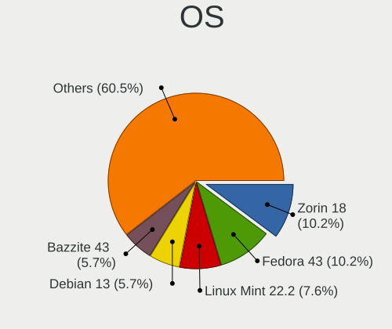

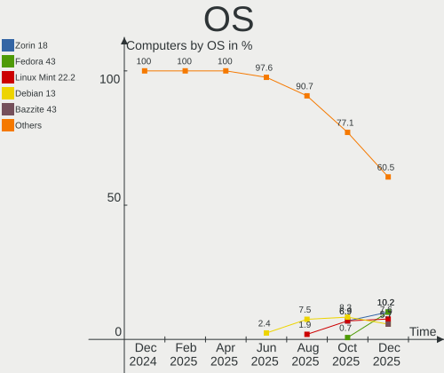

| Name                | Computers | Percent |
|---------------------|-----------|---------|
| Zorin 18            | 16        | 10.19%  |
| Fedora 43           | 16        | 10.19%  |
| Linux Mint 22.2     | 12        | 7.64%   |
| Debian 13           | 9         | 5.73%   |
| Bazzite 43          | 9         | 5.73%   |
| OpenMandriva 25.90  | 7         | 4.46%   |
| CachyOS Rolling     | 7         | 4.46%   |
| Zorin 17            | 5         | 3.18%   |
| Pop!_OS 24.04       | 5         | 3.18%   |
| Kubuntu 25.10       | 5         | 3.18%   |
| Ubuntu 24.04        | 4         | 2.55%   |
| OpenMandriva 25.11  | 4         | 2.55%   |
| Arch Rolling        | 4         | 2.55%   |
| OpenMandriva 6.0    | 3         | 1.91%   |
| Linux Mint 22.1     | 3         | 1.91%   |
| KDE neon 24.04      | 3         | 1.91%   |
| EndeavourOS Rolling | 3         | 1.91%   |
| TUXEDO OS 24.04     | 2         | 1.27%   |
| ROSA 13.1           | 2         | 1.27%   |
| Manjaro 25.0.10     | 2         | 1.27%   |
| Manjaro             | 2         | 1.27%   |
| LMDE 7              | 2         | 1.27%   |
| Linux Mint 21.3     | 2         | 1.27%   |
| Gentoo 2.18         | 2         | 1.27%   |
| Fedora 42           | 2         | 1.27%   |
| Elementary 8        | 2         | 1.27%   |
| Bazzite 42          | 2         | 1.27%   |
| Xubuntu 24.04       | 1         | 0.64%   |
| Xubuntu 22.04       | 1         | 0.64%   |
| Ubuntu MATE 22.04   | 1         | 0.64%   |
| Ubuntu 25.04        | 1         | 0.64%   |
| Ubuntu 22.04        | 1         | 0.64%   |
| Ubuntu 18.04        | 1         | 0.64%   |
| Secureblue 43       | 1         | 0.64%   |
| OpenMandriva 25.06  | 1         | 0.64%   |
| OpenMandriva 24.12  | 1         | 0.64%   |
| OpenMandriva 24.09  | 1         | 0.64%   |
| Nobara 43           | 1         | 0.64%   |
| NixOS 25.11         | 1         | 0.64%   |
| Linux Mint 22       | 1         | 0.64%   |

OS Family
---------

OS without a version

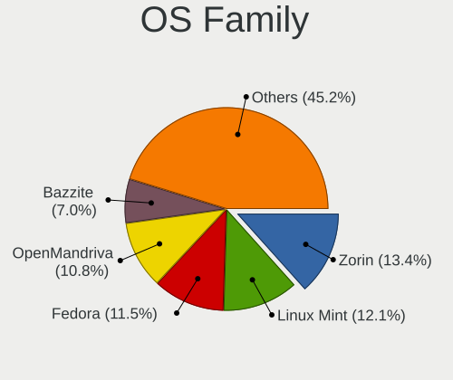

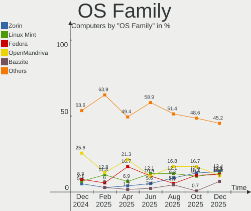

| Name         | Computers | Percent |
|--------------|-----------|---------|
| Zorin        | 21        | 13.38%  |
| Linux Mint   | 19        | 12.1%   |
| Fedora       | 18        | 11.46%  |
| OpenMandriva | 17        | 10.83%  |
| Bazzite      | 11        | 7.01%   |
| Debian       | 10        | 6.37%   |
| CachyOS      | 8         | 5.1%    |
| Ubuntu       | 7         | 4.46%   |
| Kubuntu      | 7         | 4.46%   |
| Pop!_OS      | 5         | 3.18%   |
| Manjaro      | 4         | 2.55%   |
| Arch         | 4         | 2.55%   |
| KDE neon     | 3         | 1.91%   |
| EndeavourOS  | 3         | 1.91%   |
| Xubuntu      | 2         | 1.27%   |
| TUXEDO OS    | 2         | 1.27%   |
| ROSA         | 2         | 1.27%   |
| LMDE         | 2         | 1.27%   |
| Gentoo       | 2         | 1.27%   |
| Elementary   | 2         | 1.27%   |
| Ubuntu MATE  | 1         | 0.64%   |
| Secureblue   | 1         | 0.64%   |
| Nobara       | 1         | 0.64%   |
| NixOS        | 1         | 0.64%   |
| Kali         | 1         | 0.64%   |
| Deepin       | 1         | 0.64%   |
| Cuerdos      | 1         | 0.64%   |
| Anduinos     | 1         | 0.64%   |

Kernel
------

Version of the Linux kernel

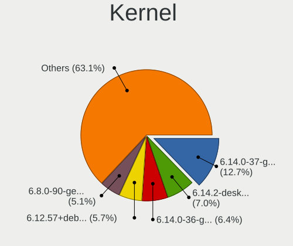

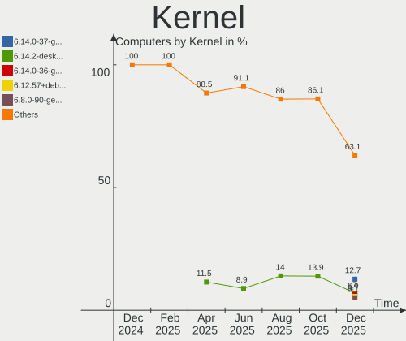

| Version                        | Computers | Percent |
|--------------------------------|-----------|---------|
| 6.14.0-37-generic              | 20        | 12.74%  |
| 6.14.2-desktop-3omv2590        | 11        | 7.01%   |
| 6.14.0-36-generic              | 10        | 6.37%   |
| 6.12.57+deb13-amd64            | 9         | 5.73%   |
| 6.8.0-90-generic               | 8         | 5.1%    |
| 6.8.0-88-generic               | 6         | 3.82%   |
| 6.17.7-ba20.fc43.x86_64        | 6         | 3.82%   |
| 6.17.12-300.fc43.x86_64        | 6         | 3.82%   |
| 6.17.9-76061709-generic        | 5         | 3.18%   |
| 6.18.0-desktop-1omv2590        | 4         | 2.55%   |
| 6.17.9-300.fc43.x86_64         | 4         | 2.55%   |
| 6.18.1-2-cachyos               | 3         | 1.91%   |
| 6.17.9-arch1-1                 | 3         | 1.91%   |
| 6.17.7-ba19.fc43.x86_64        | 3         | 1.91%   |
| 6.17.0-7-generic               | 3         | 1.91%   |
| 6.14.0-29-generic              | 3         | 1.91%   |
| 6.18.0-3-cachyos               | 2         | 1.27%   |
| 6.17.7-300.fc43.x86_64         | 2         | 1.27%   |
| 6.17.10-200.fc42.x86_64        | 2         | 1.27%   |
| 6.17.1-300.fc43.x86_64         | 2         | 1.27%   |
| 6.17.0-8-generic               | 2         | 1.27%   |
| 6.16.4-116.bazzite.fc42.x86_64 | 2         | 1.27%   |
| 6.14.0-33-generic              | 2         | 1.27%   |
| 6.12.47-generic-5rosa13-x86_64 | 2         | 1.27%   |
| 6.8.0-87-generic               | 1         | 0.64%   |
| 6.8.0-83-generic               | 1         | 0.64%   |
| 6.8.0-38-generic               | 1         | 0.64%   |
| 6.6.99-1-MANJARO               | 1         | 0.64%   |
| 6.18.2-gentoo-x86_64           | 1         | 0.64%   |
| 6.18.2-3-cachyos               | 1         | 0.64%   |
| 6.18.2-200.nobara.fc43.x86_64  | 1         | 0.64%   |
| 6.18.2-2-cachyos               | 1         | 0.64%   |
| 6.18.2-1-liquorix-amd64        | 1         | 0.64%   |
| 6.18.1-arch1-2                 | 1         | 0.64%   |
| 6.18.0-273-tkg-eevdf           | 1         | 0.64%   |
| 6.17.9-zen1-1-zen              | 1         | 0.64%   |
| 6.17.9-gentoo-firmware         | 1         | 0.64%   |
| 6.17.9-amd64-desktop-rolling   | 1         | 0.64%   |
| 6.17.9-2-cachyos               | 1         | 0.64%   |
| 6.17.8-300.fc43.x86_64         | 1         | 0.64%   |

Kernel Family
-------------

Linux kernel without a distro release

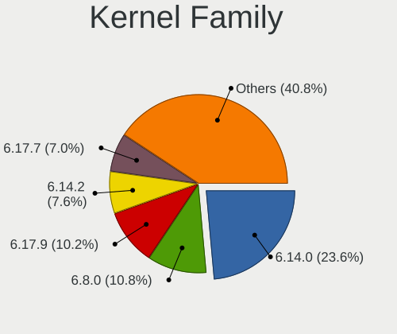

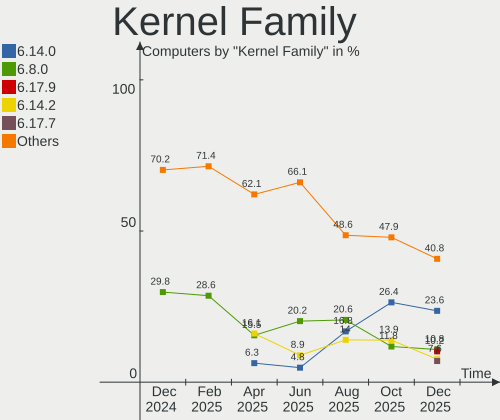

| Version | Computers | Percent |
|---------|-----------|---------|
| 6.14.0  | 37        | 23.57%  |
| 6.8.0   | 17        | 10.83%  |
| 6.17.9  | 16        | 10.19%  |
| 6.14.2  | 12        | 7.64%   |
| 6.17.7  | 11        | 7.01%   |
| 6.12.57 | 9         | 5.73%   |
| 6.18.0  | 7         | 4.46%   |
| 6.17.12 | 6         | 3.82%   |
| 6.17.0  | 6         | 3.82%   |
| 6.18.2  | 5         | 3.18%   |
| 6.18.1  | 4         | 2.55%   |
| 6.17.10 | 4         | 2.55%   |
| 6.17.1  | 3         | 1.91%   |
| 6.16.4  | 2         | 1.27%   |
| 6.12.58 | 2         | 1.27%   |
| 6.12.48 | 2         | 1.27%   |
| 6.12.47 | 2         | 1.27%   |
| 6.1.0   | 2         | 1.27%   |
| 5.15.0  | 2         | 1.27%   |
| 6.6.99  | 1         | 0.64%   |
| 6.17.8  | 1         | 0.64%   |
| 6.17.11 | 1         | 0.64%   |
| 6.12.61 | 1         | 0.64%   |
| 6.12.59 | 1         | 0.64%   |
| 6.12.1  | 1         | 0.64%   |
| 6.11.0  | 1         | 0.64%   |
| 5.4.0   | 1         | 0.64%   |

Kernel Major Ver.
-----------------

Linux kernel major version

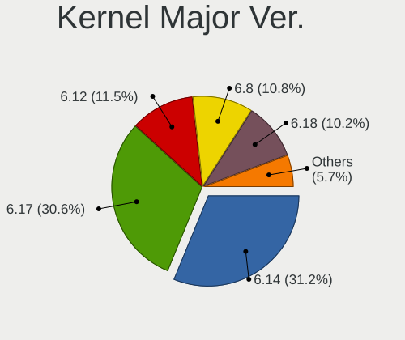

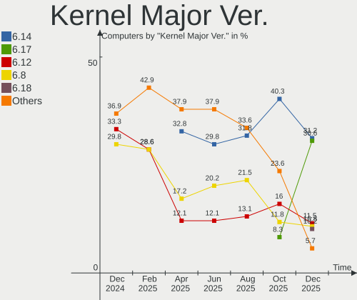

| Version | Computers | Percent |
|---------|-----------|---------|
| 6.14    | 49        | 31.21%  |
| 6.17    | 48        | 30.57%  |
| 6.12    | 18        | 11.46%  |
| 6.8     | 17        | 10.83%  |
| 6.18    | 16        | 10.19%  |
| 6.16    | 2         | 1.27%   |
| 6.1     | 2         | 1.27%   |
| 5.15    | 2         | 1.27%   |
| 6.6     | 1         | 0.64%   |
| 6.11    | 1         | 0.64%   |
| 5.4     | 1         | 0.64%   |

Arch
----

OS architecture (x86_64, i586, etc.)

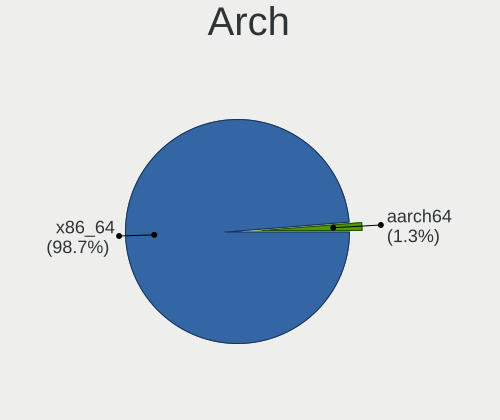

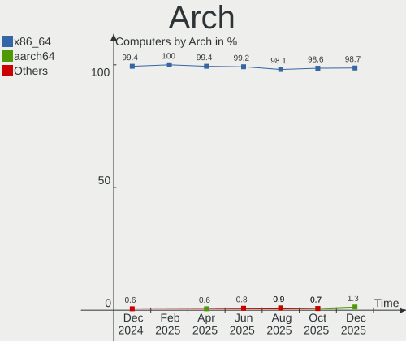

| Name    | Computers | Percent |
|---------|-----------|---------|
| x86_64  | 155       | 98.73%  |
| aarch64 | 2         | 1.27%   |

DE
--

Desktop Environment

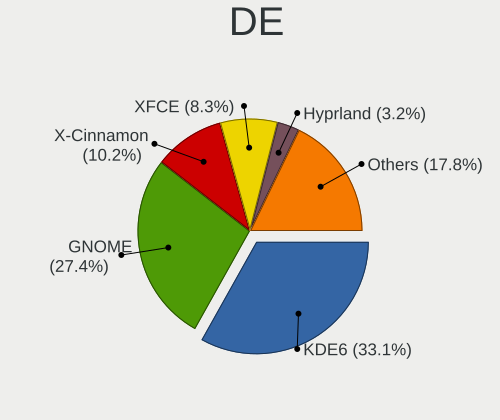

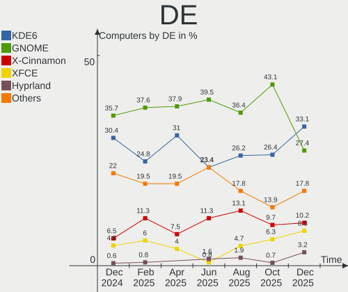

| Name          | Computers | Percent |
|---------------|-----------|---------|
| KDE6          | 52        | 33.12%  |
| GNOME         | 43        | 27.39%  |
| X-Cinnamon    | 16        | 10.19%  |
| XFCE          | 13        | 8.28%   |
| Hyprland      | 5         | 3.18%   |
| COSMIC        | 5         | 3.18%   |
| MATE          | 4         | 2.55%   |
| LXQt          | 3         | 1.91%   |
| KDE           | 3         | 1.91%   |
| Unknown       | 3         | 1.91%   |
| Pantheon      | 2         | 1.27%   |
| KDE5          | 1         | 0.64%   |
| KDE4          | 1         | 0.64%   |
| i3            | 1         | 0.64%   |
| GNOME Classic | 1         | 0.64%   |
| DWM           | 1         | 0.64%   |
| Deepin        | 1         | 0.64%   |
| Cinnamon      | 1         | 0.64%   |
| bspwm         | 1         | 0.64%   |

Display Server
--------------

X11 or Wayland

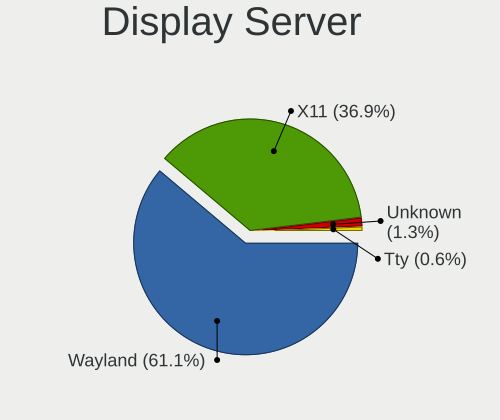

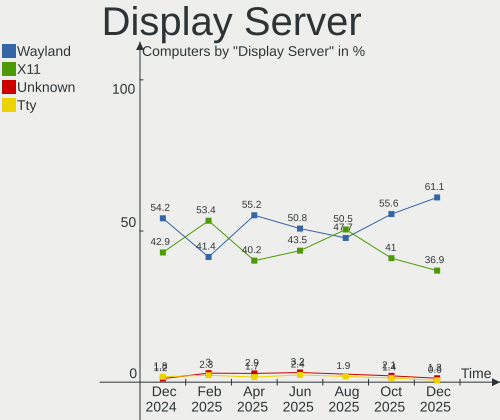

| Name    | Computers | Percent |
|---------|-----------|---------|
| Wayland | 96        | 61.15%  |
| X11     | 58        | 36.94%  |
| Unknown | 2         | 1.27%   |
| Tty     | 1         | 0.64%   |

Display Manager
---------------

SDDM, LightDM, etc.

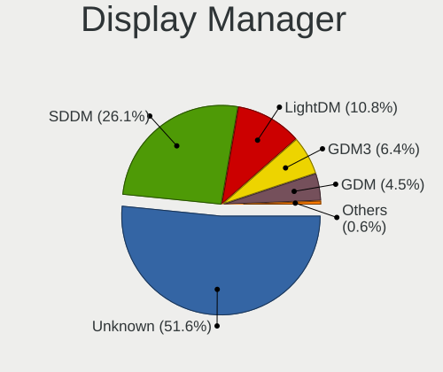

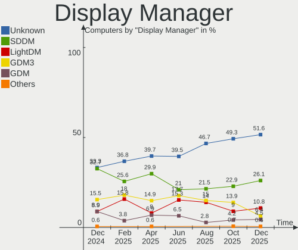

| Name    | Computers | Percent |
|---------|-----------|---------|
| Unknown | 81        | 51.59%  |
| SDDM    | 41        | 26.11%  |
| LightDM | 17        | 10.83%  |
| GDM3    | 10        | 6.37%   |
| GDM     | 7         | 4.46%   |
| GREETD  | 1         | 0.64%   |

OS Lang
-------

Language

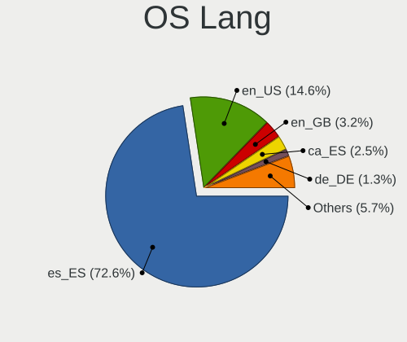

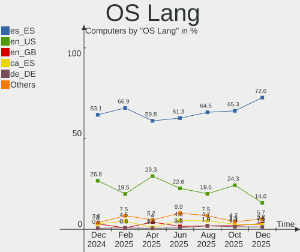

| Lang   | Computers | Percent |
|--------|-----------|---------|
| es_ES  | 114       | 72.61%  |
| en_US  | 23        | 14.65%  |
| en_GB  | 5         | 3.18%   |
| ca_ES  | 4         | 2.55%   |
| de_DE  | 2         | 1.27%   |
| C      | 2         | 1.27%   |
| ru_RU  | 1         | 0.64%   |
| it_IT  | 1         | 0.64%   |
| fr_FR  | 1         | 0.64%   |
| eu_ES  | 1         | 0.64%   |
| de_IT  | 1         | 0.64%   |
| ca_AD  | 1         | 0.64%   |
| ast_ES | 1         | 0.64%   |

Boot Mode
---------

EFI or BIOS

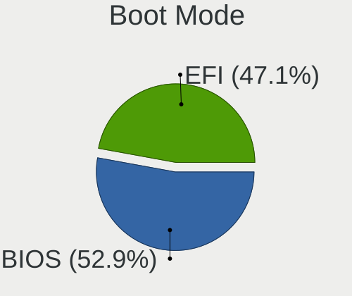

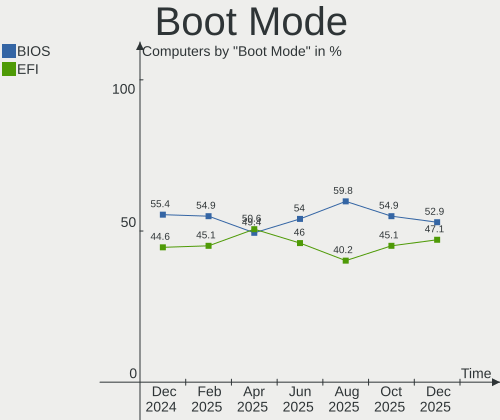

| Mode | Computers | Percent |
|------|-----------|---------|
| BIOS | 83        | 52.87%  |
| EFI  | 74        | 47.13%  |

Filesystem
----------

Type of filesystem

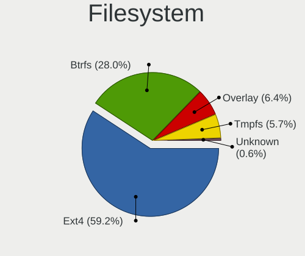

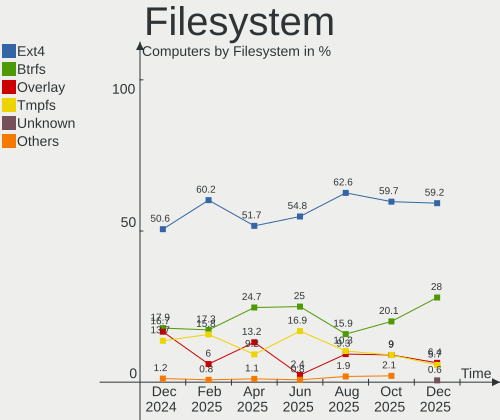

| Type    | Computers | Percent |
|---------|-----------|---------|
| Ext4    | 93        | 59.24%  |
| Btrfs   | 44        | 28.03%  |
| Overlay | 10        | 6.37%   |
| Tmpfs   | 9         | 5.73%   |
| Unknown | 1         | 0.64%   |

Part. scheme
------------

Scheme of partitioning

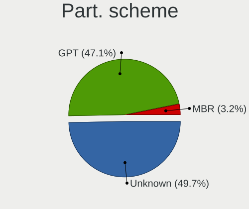

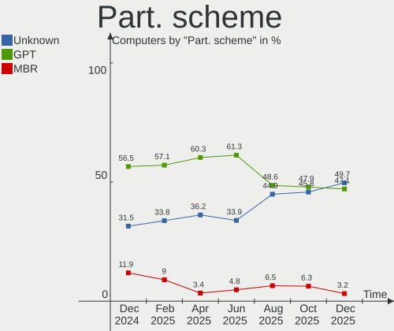

| Type    | Computers | Percent |
|---------|-----------|---------|
| Unknown | 78        | 49.68%  |
| GPT     | 74        | 47.13%  |
| MBR     | 5         | 3.18%   |

Dual Boot with Linux/BSD
------------------------

Hosting more than one Linux/BSD

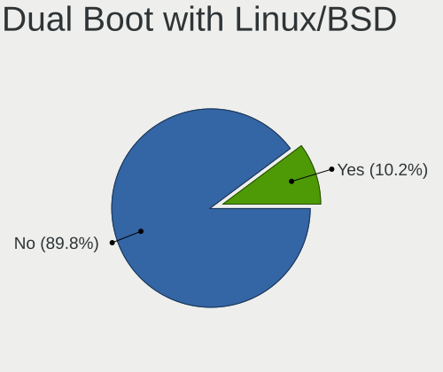

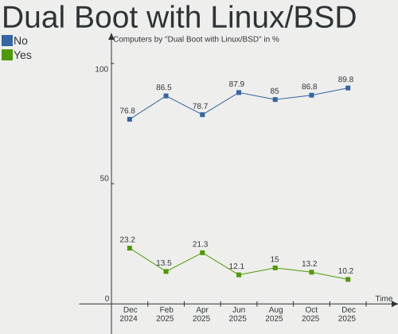

| Dual boot | Computers | Percent |
|-----------|-----------|---------|
| No        | 141       | 89.81%  |
| Yes       | 16        | 10.19%  |

Dual Boot (Win)
---------------

Hosting Linux and Windows

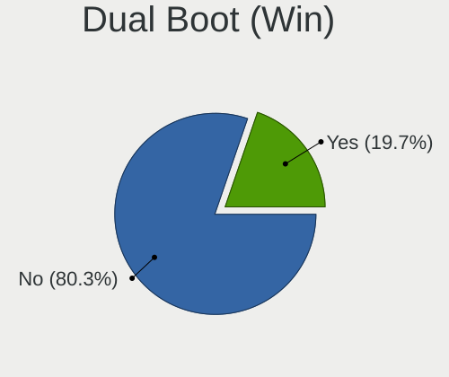

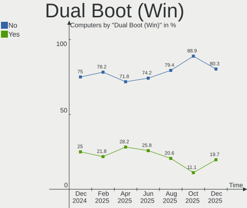

| Dual boot | Computers | Percent |
|-----------|-----------|---------|
| No        | 126       | 80.25%  |
| Yes       | 31        | 19.75%  |

Board
-----

Vendor
------

Motherboard manufacturer

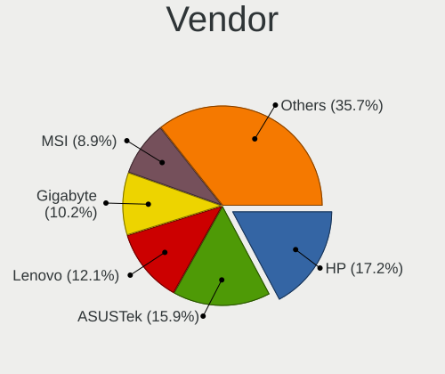

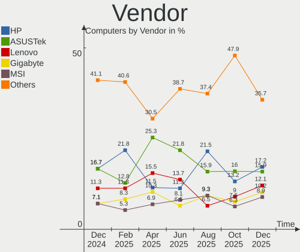

| Name                    | Computers | Percent |
|-------------------------|-----------|---------|
| Hewlett-Packard         | 27        | 17.2%   |
| ASUSTek Computer        | 25        | 15.92%  |
| Lenovo                  | 19        | 12.1%   |
| Gigabyte Technology     | 16        | 10.19%  |
| MSI                     | 14        | 8.92%   |
| Acer                    | 13        | 8.28%   |
| Dell                    | 6         | 3.82%   |
| Apple                   | 5         | 3.18%   |
| Intel                   | 4         | 2.55%   |
| Unknown                 | 4         | 2.55%   |
| HUAWEI                  | 3         | 1.91%   |
| Toshiba                 | 2         | 1.27%   |
| Samsung Electronics     | 2         | 1.27%   |
| Raspberry Pi Foundation | 2         | 1.27%   |
| ASRock                  | 2         | 1.27%   |
| XMG                     | 1         | 0.64%   |
| VANT                    | 1         | 0.64%   |
| Timi                    | 1         | 0.64%   |
| Sony                    | 1         | 0.64%   |
| SLIMBOOK                | 1         | 0.64%   |
| PC Componentes          | 1         | 0.64%   |
| Packard Bell            | 1         | 0.64%   |
| Mllse                   | 1         | 0.64%   |
| Huanan                  | 1         | 0.64%   |
| HC Technology.          | 1         | 0.64%   |
| GEEKOM                  | 1         | 0.64%   |
| Foxconn                 | 1         | 0.64%   |
| AMI                     | 1         | 0.64%   |

Model
-----

Motherboard model

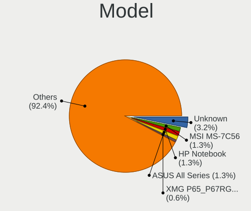

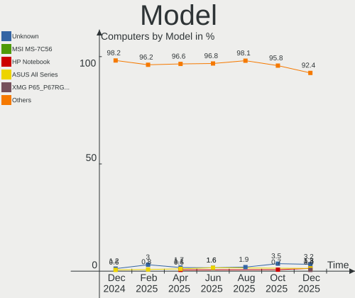

| Name                                     | Computers | Percent |
|------------------------------------------|-----------|---------|
| Unknown                                  | 5         | 3.18%   |
| MSI MS-7C56                              | 2         | 1.27%   |
| HP Notebook                              | 2         | 1.27%   |
| ASUS All Series                          | 2         | 1.27%   |
| XMG P65_P67RGRERA                        | 1         | 0.64%   |
| VANT MOOVE3-15                           | 1         | 0.64%   |
| Toshiba Satellite U300                   | 1         | 0.64%   |
| Toshiba Satellite P50-C                  | 1         | 0.64%   |
| Timi TM1703                              | 1         | 0.64%   |
| Sony VGN-FW41J_H                         | 1         | 0.64%   |
| SLIMBOOK EVO15-A8                        | 1         | 0.64%   |
| Samsung Galaxy TabPro S                  | 1         | 0.64%   |
| Samsung 750QFG                           | 1         | 0.64%   |
| RPi Raspberry Pi 4 Model B Rev 1.4       | 1         | 0.64%   |
| RPi Raspberry Pi                         | 1         | 0.64%   |
| PC Componentes PcCom Revolt              | 1         | 0.64%   |
| Packard Bell EasyNote TS11HR             | 1         | 0.64%   |
| MSI Thin 15 B13VE                        | 1         | 0.64%   |
| MSI Stealth 15M B12UE                    | 1         | 0.64%   |
| MSI p6706es                              | 1         | 0.64%   |
| MSI MS-7E59                              | 1         | 0.64%   |
| MSI MS-7E34                              | 1         | 0.64%   |
| MSI MS-7E26                              | 1         | 0.64%   |
| MSI MS-7E16                              | 1         | 0.64%   |
| MSI MS-7C02                              | 1         | 0.64%   |
| MSI MS-7B49                              | 1         | 0.64%   |
| MSI MS-7A32                              | 1         | 0.64%   |
| MSI MS-7917                              | 1         | 0.64%   |
| MSI Katana 15 B12VFK                     | 1         | 0.64%   |
| Lenovo V15 G2 IJL 82QY                   | 1         | 0.64%   |
| Lenovo V15 G2 ALC 82KD                   | 1         | 0.64%   |
| Lenovo V130-15IKB 81HN                   | 1         | 0.64%   |
| Lenovo ThinkPad X260 20F5S3J301          | 1         | 0.64%   |
| Lenovo ThinkPad X1 Carbon 7th 20QDCTO1WW | 1         | 0.64%   |
| Lenovo ThinkPad T14 Gen 1 20S1S52500     | 1         | 0.64%   |
| Lenovo ThinkPad L430 24663N1             | 1         | 0.64%   |
| Lenovo ThinkCentre M93p 10AB000YMX       | 1         | 0.64%   |
| Lenovo LOQ 15ARP9 83JC                   | 1         | 0.64%   |
| Lenovo Legion Pro 5 16IAX10H 83LU        | 1         | 0.64%   |
| Lenovo Legion 5 15IRX10 83LY             | 1         | 0.64%   |

Model Family
------------

Motherboard model prefix

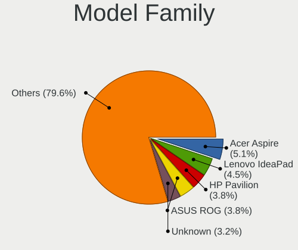

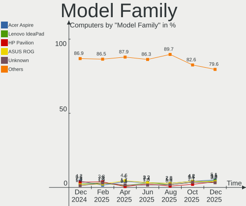

| Name                  | Computers | Percent |
|-----------------------|-----------|---------|
| Acer Aspire           | 8         | 5.1%    |
| Lenovo IdeaPad        | 7         | 4.46%   |
| HP Pavilion           | 6         | 3.82%   |
| ASUS ROG              | 6         | 3.82%   |
| Unknown               | 5         | 3.18%   |
| Lenovo ThinkPad       | 4         | 2.55%   |
| HP Laptop             | 4         | 2.55%   |
| HP Elite              | 3         | 1.91%   |
| Dell Latitude         | 3         | 1.91%   |
| Toshiba Satellite     | 2         | 1.27%   |
| RPi Raspberry         | 2         | 1.27%   |
| MSI MS-7C56           | 2         | 1.27%   |
| Lenovo V15            | 2         | 1.27%   |
| Lenovo Legion         | 2         | 1.27%   |
| HP ProBook            | 2         | 1.27%   |
| HP Notebook           | 2         | 1.27%   |
| HP Compaq             | 2         | 1.27%   |
| Gigabyte Z390         | 2         | 1.27%   |
| Dell Inspiron         | 2         | 1.27%   |
| ASUS ZenBook          | 2         | 1.27%   |
| ASUS Vivobook         | 2         | 1.27%   |
| ASUS TUF              | 2         | 1.27%   |
| ASUS PRIME            | 2         | 1.27%   |
| ASUS All              | 2         | 1.27%   |
| XMG P65               | 1         | 0.64%   |
| VANT MOOVE3-15        | 1         | 0.64%   |
| Timi TM1703           | 1         | 0.64%   |
| Sony VGN-FW41J        | 1         | 0.64%   |
| SLIMBOOK EVO15-A8     | 1         | 0.64%   |
| Samsung Galaxy        | 1         | 0.64%   |
| Samsung 750QFG        | 1         | 0.64%   |
| PC Componentes PcCom  | 1         | 0.64%   |
| Packard Bell EasyNote | 1         | 0.64%   |
| MSI Thin              | 1         | 0.64%   |
| MSI Stealth           | 1         | 0.64%   |
| MSI p6706es           | 1         | 0.64%   |
| MSI MS-7E59           | 1         | 0.64%   |
| MSI MS-7E34           | 1         | 0.64%   |
| MSI MS-7E26           | 1         | 0.64%   |
| MSI MS-7E16           | 1         | 0.64%   |

MFG Year
--------

Motherboard manufacture year

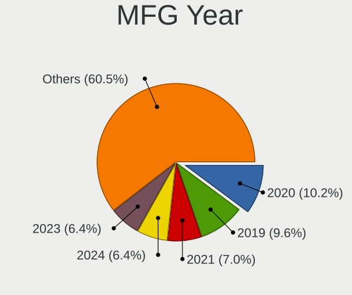

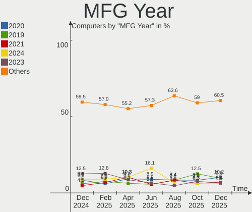

| Year    | Computers | Percent |
|---------|-----------|---------|
| 2020    | 16        | 10.19%  |
| 2019    | 15        | 9.55%   |
| 2021    | 11        | 7.01%   |
| 2024    | 10        | 6.37%   |
| 2023    | 10        | 6.37%   |
| 2018    | 10        | 6.37%   |
| 2017    | 10        | 6.37%   |
| 2025    | 9         | 5.73%   |
| 2016    | 9         | 5.73%   |
| 2011    | 8         | 5.1%    |
| 2022    | 7         | 4.46%   |
| 2014    | 7         | 4.46%   |
| 2012    | 7         | 4.46%   |
| 2015    | 6         | 3.82%   |
| 2013    | 6         | 3.82%   |
| 2009    | 5         | 3.18%   |
| 2008    | 5         | 3.18%   |
| 2010    | 2         | 1.27%   |
| 2007    | 2         | 1.27%   |
| 2006    | 1         | 0.64%   |
| Unknown | 1         | 0.64%   |

Form Factor
-----------

Physical design of the computer

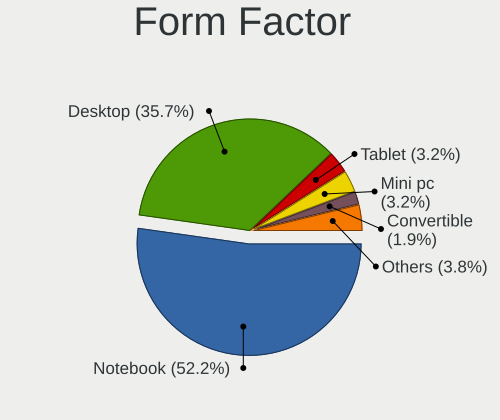

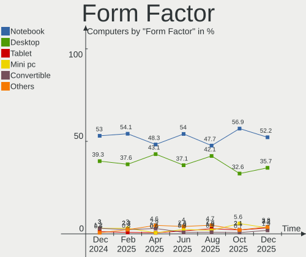

| Name           | Computers | Percent |
|----------------|-----------|---------|
| Notebook       | 82        | 52.23%  |
| Desktop        | 56        | 35.67%  |
| Tablet         | 5         | 3.18%   |
| Mini pc        | 5         | 3.18%   |
| Convertible    | 3         | 1.91%   |
| All in one     | 3         | 1.91%   |
| System on chip | 2         | 1.27%   |
| Server         | 1         | 0.64%   |

Secure Boot
-----------

Enabled or disabled

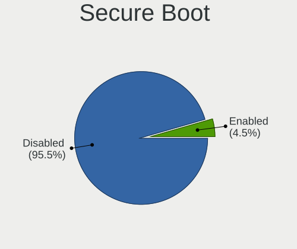

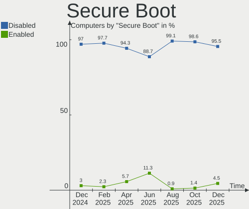

| State    | Computers | Percent |
|----------|-----------|---------|
| Disabled | 150       | 95.54%  |
| Enabled  | 7         | 4.46%   |

Coreboot
--------

Have coreboot on board

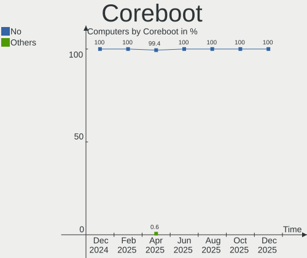

| Used | Computers | Percent |
|------|-----------|---------|
| No   | 157       | 100%    |

RAM Size
--------

Total RAM memory

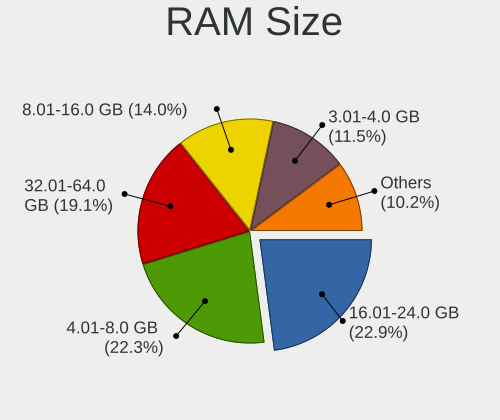

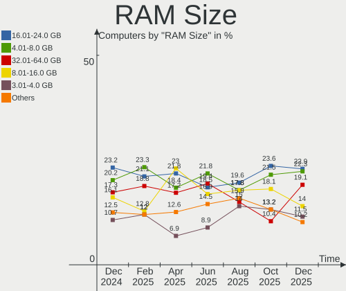

| Size in GB      | Computers | Percent |
|-----------------|-----------|---------|
| 16.01-24.0      | 36        | 22.93%  |
| 4.01-8.0        | 35        | 22.29%  |
| 32.01-64.0      | 30        | 19.11%  |
| 8.01-16.0       | 22        | 14.01%  |
| 3.01-4.0        | 18        | 11.46%  |
| 64.01-256.0     | 7         | 4.46%   |
| 24.01-32.0      | 6         | 3.82%   |
| 2.01-3.0        | 2         | 1.27%   |
| More than 256.0 | 1         | 0.64%   |

RAM Used
--------

Used RAM memory

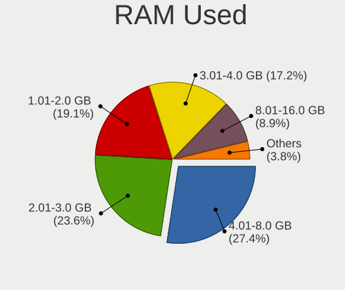

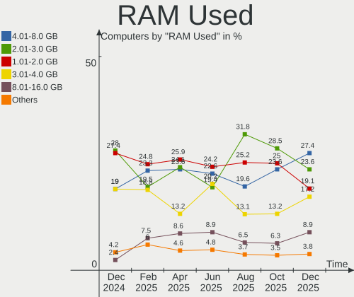

| Used GB    | Computers | Percent |
|------------|-----------|---------|
| 4.01-8.0   | 43        | 27.39%  |
| 2.01-3.0   | 37        | 23.57%  |
| 1.01-2.0   | 30        | 19.11%  |
| 3.01-4.0   | 27        | 17.2%   |
| 8.01-16.0  | 14        | 8.92%   |
| 0.51-1.0   | 4         | 2.55%   |
| 24.01-32.0 | 1         | 0.64%   |
| 16.01-24.0 | 1         | 0.64%   |

Total Drives
------------

Number of drives on board

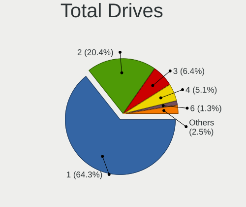

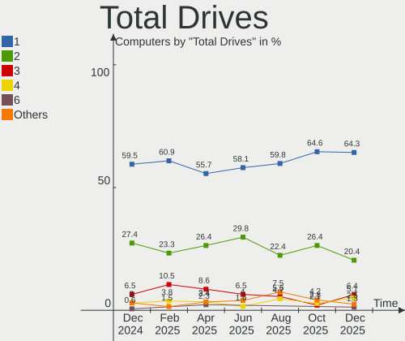

| Drives | Computers | Percent |
|--------|-----------|---------|
| 1      | 101       | 64.33%  |
| 2      | 32        | 20.38%  |
| 3      | 10        | 6.37%   |
| 4      | 8         | 5.1%    |
| 6      | 2         | 1.27%   |
| 5      | 2         | 1.27%   |
| 8      | 1         | 0.64%   |
| 0      | 1         | 0.64%   |

Has CD-ROM
----------

Has CD-ROM on board

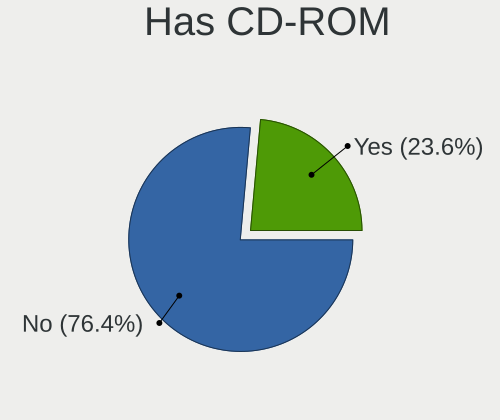

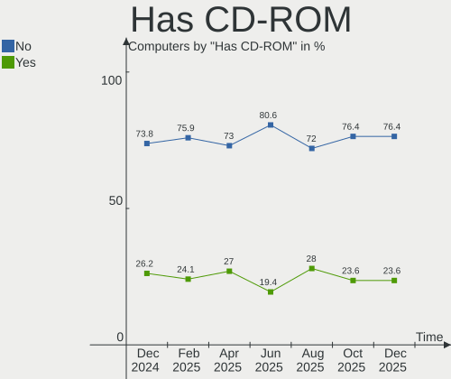

| Presented | Computers | Percent |
|-----------|-----------|---------|
| No        | 120       | 76.43%  |
| Yes       | 37        | 23.57%  |

Has Ethernet
------------

Has Ethernet on board

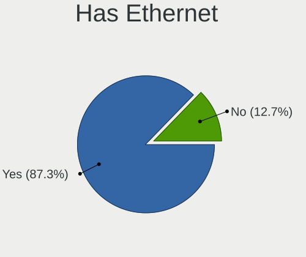

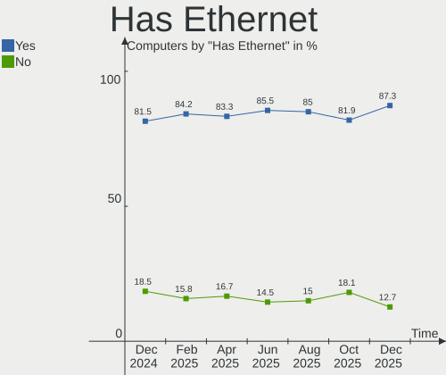

| Presented | Computers | Percent |
|-----------|-----------|---------|
| Yes       | 137       | 87.26%  |
| No        | 20        | 12.74%  |

Has WiFi
--------

Has WiFi module

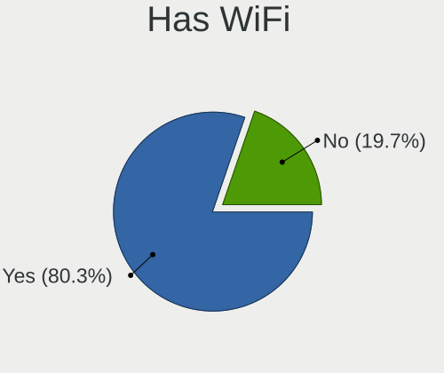

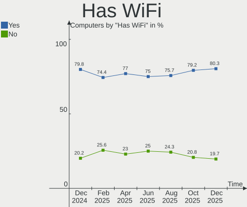

| Presented | Computers | Percent |
|-----------|-----------|---------|
| Yes       | 126       | 80.25%  |
| No        | 31        | 19.75%  |

Has Bluetooth
-------------

Has Bluetooth module

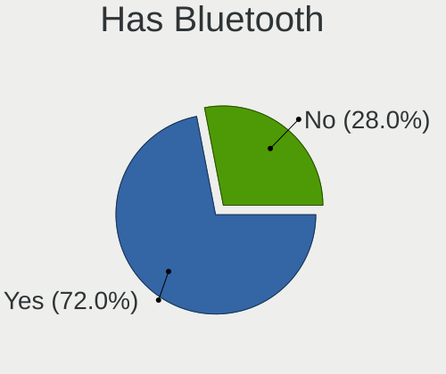

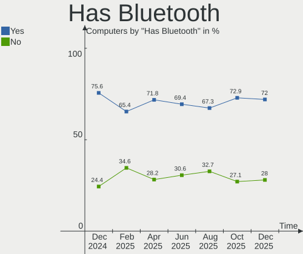

| Presented | Computers | Percent |
|-----------|-----------|---------|
| Yes       | 113       | 71.97%  |
| No        | 44        | 28.03%  |

Location
--------

Country
-------

Geographic location (country)

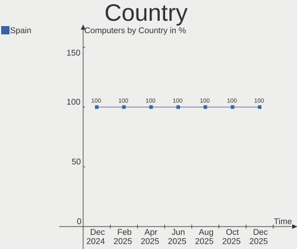

| Country | Computers | Percent |
|---------|-----------|---------|
| Spain   | 157       | 100%    |

City
----

Geographic location (city)

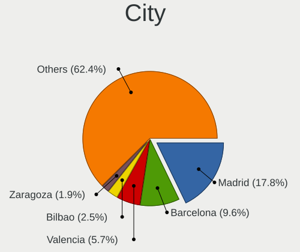

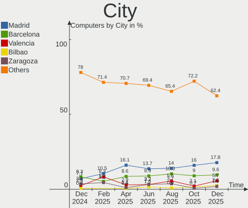

| City                        | Computers | Percent |
|-----------------------------|-----------|---------|
| Madrid                      | 28        | 17.83%  |
| Barcelona                   | 15        | 9.55%   |
| Valencia                    | 9         | 5.73%   |
| Bilbao                      | 4         | 2.55%   |
| Zaragoza                    | 3         | 1.91%   |
| Santander                   | 3         | 1.91%   |
| Valladolid                  | 2         | 1.27%   |
| Seville                     | 2         | 1.27%   |
| Oviedo                      | 2         | 1.27%   |
| Murcia                      | 2         | 1.27%   |
| Mostoles                    | 2         | 1.27%   |
| Málaga                     | 2         | 1.27%   |
| La Línea de la Concepción | 2         | 1.27%   |
| Dos Hermanas                | 2         | 1.27%   |
| Donostia / San Sebastian    | 2         | 1.27%   |
| Collado Villalba            | 2         | 1.27%   |
| Barakaldo                   | 2         | 1.27%   |
| Avilés                     | 2         | 1.27%   |
| Almería                    | 2         | 1.27%   |
| A Coruña                   | 2         | 1.27%   |
| Vitoria-Gasteiz             | 1         | 0.64%   |
| Vila-real                   | 1         | 0.64%   |
| Vic                         | 1         | 0.64%   |
| Vélez-Málaga              | 1         | 0.64%   |
| Utrera                      | 1         | 0.64%   |
| Torrenueva                  | 1         | 0.64%   |
| Torrellano                  | 1         | 0.64%   |
| Terrassa                    | 1         | 0.64%   |
| Tarragona                   | 1         | 0.64%   |
| Santa Cruz de Tenerife      | 1         | 0.64%   |
| Santa Cruz de La Palma      | 1         | 0.64%   |
| Sant Celoni                 | 1         | 0.64%   |
| Sant Boi de Llobregat       | 1         | 0.64%   |
| Salou                       | 1         | 0.64%   |
| Salamanca                   | 1         | 0.64%   |
| Rubí                       | 1         | 0.64%   |
| Reus                        | 1         | 0.64%   |
| Rada de Haro                | 1         | 0.64%   |
| Quijorna                    | 1         | 0.64%   |
| Puerto del Rosario          | 1         | 0.64%   |

Drives
------

Drive Vendor
------------

Hard drive vendors

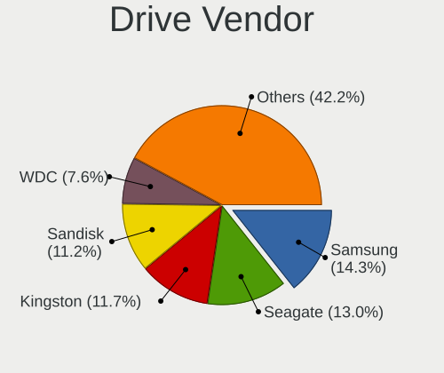

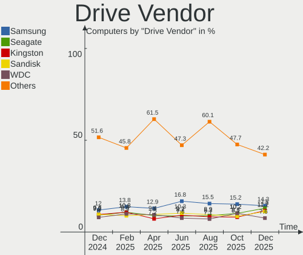

| Vendor                                  | Computers | Drives | Percent |
|-----------------------------------------|-----------|--------|---------|
| Samsung Electronics                     | 32        | 41     | 14.35%  |
| Seagate                                 | 29        | 38     | 13%     |
| Kingston                                | 26        | 28     | 11.66%  |
| Sandisk                                 | 25        | 26     | 11.21%  |
| WDC                                     | 17        | 20     | 7.62%   |
| Kingston Technology Company             | 10        | 11     | 4.48%   |
| Crucial                                 | 10        | 14     | 4.48%   |
| Toshiba                                 | 9         | 9      | 4.04%   |
| Intel                                   | 6         | 6      | 2.69%   |
| SK hynix                                | 5         | 5      | 2.24%   |
| Phison Electronics                      | 4         | 4      | 1.79%   |
| Micron/Crucial Technology               | 4         | 4      | 1.79%   |
| Micron Technology                       | 4         | 4      | 1.79%   |
| KIOXIA                                  | 4         | 4      | 1.79%   |
| Unknown                                 | 3         | 3      | 1.35%   |
| KIOXIA-EXCERIA                          | 3         | 4      | 1.35%   |
| Hitachi                                 | 3         | 3      | 1.35%   |
| MAXIO Technology (Hangzhou)             | 2         | 3      | 0.9%    |
| LITEON                                  | 2         | 2      | 0.9%    |
| JMicron Technology                      | 2         | 2      | 0.9%    |
| Hewlett-Packard                         | 2         | 2      | 0.9%    |
| China                                   | 2         | 2      | 0.9%    |
| Apple                                   | 2         | 3      | 0.9%    |
| USB                                     | 1         | 1      | 0.45%   |
| TOPGIANT                                | 1         | 1      | 0.45%   |
| Silicon Motion                          | 1         | 1      | 0.45%   |
| Shenzhen Unionmemory Information System | 1         | 1      | 0.45%   |
| SABRENT                                 | 1         | 1      | 0.45%   |
| Rayson                                  | 1         | 1      | 0.45%   |
| Phison                                  | 1         | 1      | 0.45%   |
| Lenovo                                  | 1         | 1      | 0.45%   |
| HGST                                    | 1         | 1      | 0.45%   |
| Go-Infinity                             | 1         | 1      | 0.45%   |
| Emtec                                   | 1         | 2      | 0.45%   |
| EAGET                                   | 1         | 1      | 0.45%   |
| C400-MTF                                | 1         | 1      | 0.45%   |
| ASMT                                    | 1         | 1      | 0.45%   |
| AirDisk                                 | 1         | 1      | 0.45%   |
| ADATA Technology                        | 1         | 1      | 0.45%   |
| A-DATA Technology                       | 1         | 1      | 0.45%   |

Drive Model
-----------

Hard drive models

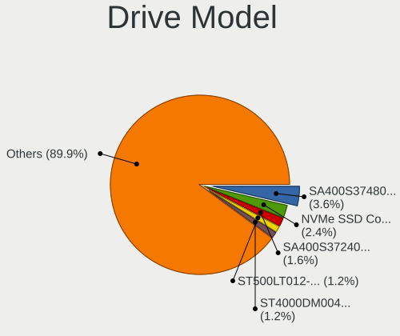

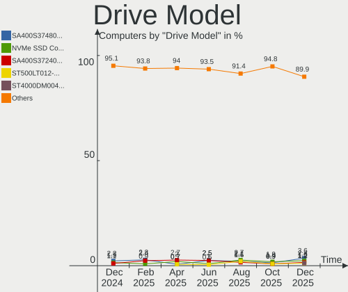

| Model                                                    | Computers | Percent |
|----------------------------------------------------------|-----------|---------|
| Kingston SA400S37480G 480GB SSD                          | 9         | 3.63%   |
| Samsung NVMe SSD Controller SM981/PM981/PM983 1TB        | 6         | 2.42%   |
| Kingston SA400S37240G 240GB SSD                          | 4         | 1.61%   |
| Seagate ST500LT012-1DG142 500GB                          | 3         | 1.21%   |
| Seagate ST4000DM004-2U9104 4TB                           | 3         | 1.21%   |
| Seagate ST2000DM008-2UB102 2TB                           | 3         | 1.21%   |
| Seagate ST2000DM008-2FR102 2TB                           | 3         | 1.21%   |
| Seagate ST1000DM010-2EP102 1TB                           | 3         | 1.21%   |
| Seagate ST1000DM003-1CH162 1TB                           | 3         | 1.21%   |
| Sandisk WD Black SN750 / PC SN730 NVMe SSD 500GB         | 3         | 1.21%   |
| Samsung SSD 990 PRO 4TB                                  | 3         | 1.21%   |
| Phison E12 NVMe Controller 1TB                           | 3         | 1.21%   |
| Kingston SV300S37A120G 120GB SSD                         | 3         | 1.21%   |
| Kingston SA400S37960G 960GB SSD                          | 3         | 1.21%   |
| Unknown SD/MMC/MS PRO 2GB                                | 2         | 0.81%   |
| Toshiba MQ04ABF100 1TB                                   | 2         | 0.81%   |
| Toshiba MQ01ABF050 500GB                                 | 2         | 0.81%   |
| Toshiba MQ01ABD100 1TB                                   | 2         | 0.81%   |
| Seagate ST9500325AS 500GB                                | 2         | 0.81%   |
| Sandisk WD_BLACK SN770 2TB                               | 2         | 0.81%   |
| SanDisk SDSSDA120G 120GB                                 | 2         | 0.81%   |
| Samsung SSD 990 PRO 2TB                                  | 2         | 0.81%   |
| Samsung NVMe SSD Controller PM9A1/PM9A3/980PRO 1TB       | 2         | 0.81%   |
| Samsung MZVL8512HELU-00BTW 512GB                         | 2         | 0.81%   |
| Samsung HD103UJ 1TB                                      | 2         | 0.81%   |
| Micron/Crucial P2 NVMe PCIe SSD 2TB                      | 2         | 0.81%   |
| KIOXIA NVMe SSD 1TB                                      | 2         | 0.81%   |
| Kingston Company NV2 NVMe SSD [SM2267XT] (DRAM-less) 1TB | 2         | 0.81%   |
| Kingston Company NV2 NVMe SSD [E21T] (DRAM-less) 2TB     | 2         | 0.81%   |
| Kingston SV300S37A240G 240GB SSD                         | 2         | 0.81%   |
| Kingston SNV2S500G 500GB                                 | 2         | 0.81%   |
| JMicron Tech 250GB                                       | 2         | 0.81%   |
| Intel SSD 660P Series 512GB                              | 2         | 0.81%   |
| Crucial CT1000MX500SSD1 1TB                              | 2         | 0.81%   |
| WDC WDS500G2B0B-00YS70 500GB SSD                         | 1         | 0.4%    |
| WDC WDS100T1R0A-68A4W0 1TB                               | 1         | 0.4%    |
| WDC WD7500BPVX-16JC3T3 752GB                             | 1         | 0.4%    |
| WDC WD5000LPVX-22V0TT0 500GB                             | 1         | 0.4%    |
| WDC WD5000BTKT-40JKWT0 500GB                             | 1         | 0.4%    |
| WDC WD40EZRZ-75GXCB0 4TB                                 | 1         | 0.4%    |

HDD Vendor
----------

Hard disk drive vendors

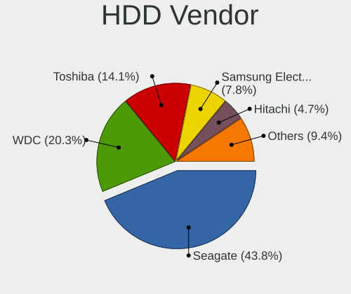

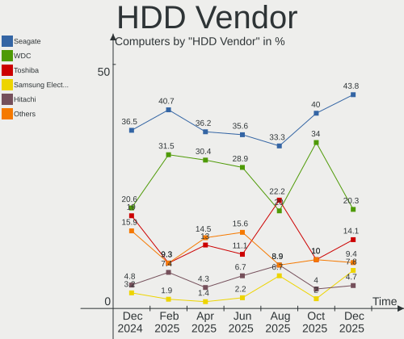

| Vendor              | Computers | Drives | Percent |
|---------------------|-----------|--------|---------|
| Seagate             | 28        | 36     | 43.75%  |
| WDC                 | 13        | 15     | 20.31%  |
| Toshiba             | 9         | 9      | 14.06%  |
| Samsung Electronics | 5         | 5      | 7.81%   |
| Hitachi             | 3         | 3      | 4.69%   |
| Unknown             | 2         | 2      | 3.13%   |
| HGST                | 1         | 1      | 1.56%   |
| Hewlett-Packard     | 1         | 1      | 1.56%   |
| ASMT                | 1         | 1      | 1.56%   |
| Apple               | 1         | 1      | 1.56%   |

SSD Vendor
----------

Solid state drive vendors

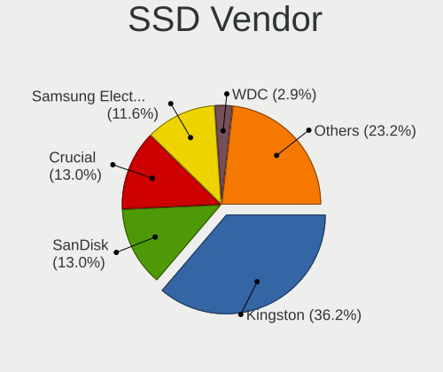

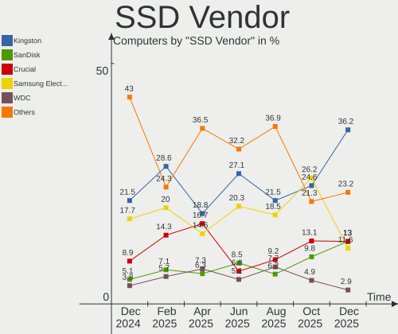

| Vendor              | Computers | Drives | Percent |
|---------------------|-----------|--------|---------|
| Kingston            | 25        | 26     | 36.23%  |
| SanDisk             | 9         | 9      | 13.04%  |
| Crucial             | 9         | 13     | 13.04%  |
| Samsung Electronics | 8         | 9      | 11.59%  |
| WDC                 | 2         | 3      | 2.9%    |
| LITEON              | 2         | 2      | 2.9%    |
| China               | 2         | 2      | 2.9%    |
| Apple               | 2         | 2      | 2.9%    |
| TOPGIANT            | 1         | 1      | 1.45%   |
| SK hynix            | 1         | 1      | 1.45%   |
| SABRENT             | 1         | 1      | 1.45%   |
| Rayson              | 1         | 1      | 1.45%   |
| KIOXIA-EXCERIA      | 1         | 1      | 1.45%   |
| Intel               | 1         | 1      | 1.45%   |
| Emtec               | 1         | 2      | 1.45%   |
| EAGET               | 1         | 1      | 1.45%   |
| AirDisk             | 1         | 1      | 1.45%   |
| A-DATA Technology   | 1         | 1      | 1.45%   |

Drive Kind
----------

HDD or SSD

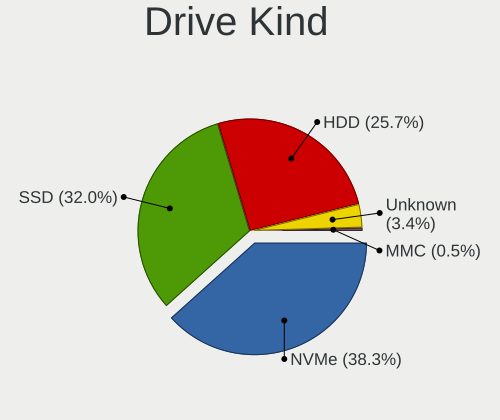

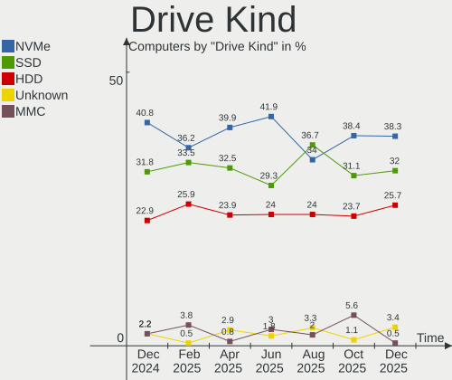

| Kind    | Computers | Drives | Percent |
|---------|-----------|--------|---------|
| NVMe    | 79        | 97     | 38.35%  |
| SSD     | 66        | 77     | 32.04%  |
| HDD     | 53        | 74     | 25.73%  |
| Unknown | 7         | 7      | 3.4%    |
| MMC     | 1         | 1      | 0.49%   |

Drive Connector
---------------

SATA, SAS, NVMe, etc.

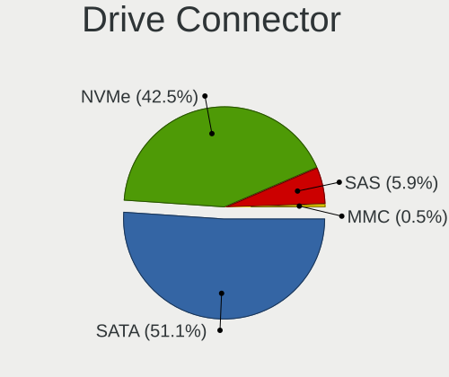

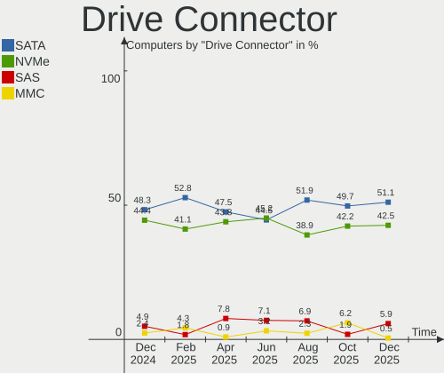

| Type | Computers | Drives | Percent |
|------|-----------|--------|---------|
| SATA | 95        | 146    | 51.08%  |
| NVMe | 79        | 97     | 42.47%  |
| SAS  | 11        | 12     | 5.91%   |
| MMC  | 1         | 1      | 0.54%   |

Drive Size
----------

Size of hard drive

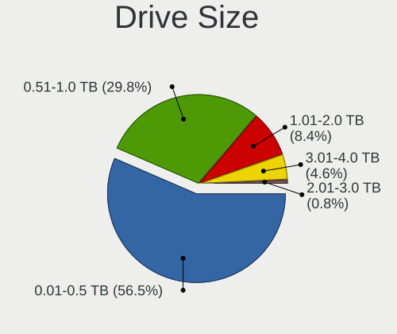

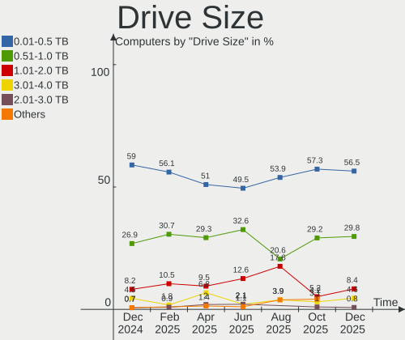

| Size in TB | Computers | Drives | Percent |
|------------|-----------|--------|---------|
| 0.01-0.5   | 74        | 83     | 56.49%  |
| 0.51-1.0   | 39        | 46     | 29.77%  |
| 1.01-2.0   | 11        | 13     | 8.4%    |
| 3.01-4.0   | 6         | 8      | 4.58%   |
| 2.01-3.0   | 1         | 1      | 0.76%   |

Space Total
-----------

Amount of disk space available on the file system

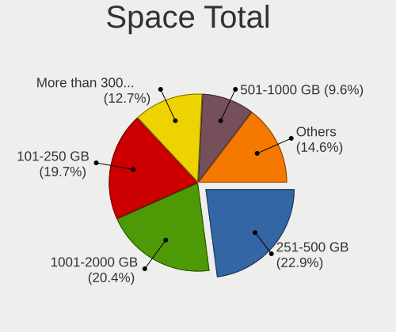

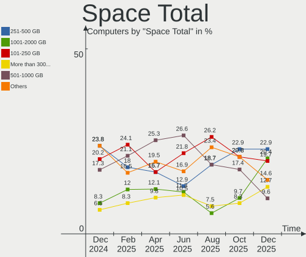

| Size in GB     | Computers | Percent |
|----------------|-----------|---------|
| 251-500        | 36        | 22.93%  |
| 1001-2000      | 32        | 20.38%  |
| 101-250        | 31        | 19.75%  |
| More than 3000 | 20        | 12.74%  |
| 501-1000       | 15        | 9.55%   |
| Unknown        | 9         | 5.73%   |
| 2001-3000      | 7         | 4.46%   |
| 1-20           | 6         | 3.82%   |
| 51-100         | 1         | 0.64%   |

Space Used
----------

Amount of used disk space

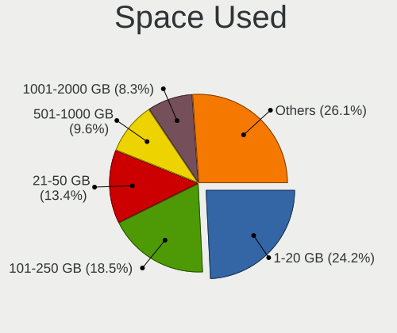

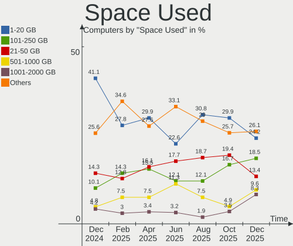

| Used GB        | Computers | Percent |
|----------------|-----------|---------|
| 1-20           | 38        | 24.2%   |
| 101-250        | 29        | 18.47%  |
| 21-50          | 21        | 13.38%  |
| 501-1000       | 15        | 9.55%   |
| 1001-2000      | 13        | 8.28%   |
| 251-500        | 12        | 7.64%   |
| 51-100         | 12        | 7.64%   |
| Unknown        | 9         | 5.73%   |
| More than 3000 | 4         | 2.55%   |
| 2001-3000      | 4         | 2.55%   |

Malfunc. Drives
---------------

Drive models with a malfunction

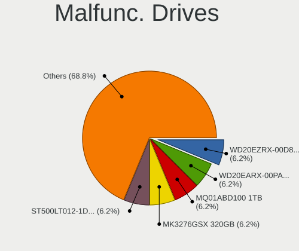

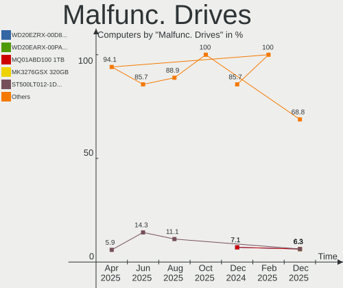

| Model                                                         | Computers | Drives | Percent |
|---------------------------------------------------------------|-----------|--------|---------|
| WDC WD20EZRX-00D8PB0 2TB                                      | 1         | 1      | 6.25%   |
| WDC WD20EARX-00PASB0 2TB                                      | 1         | 1      | 6.25%   |
| Toshiba MQ01ABD100 1TB                                        | 1         | 1      | 6.25%   |
| Toshiba MK3276GSX 320GB                                       | 1         | 1      | 6.25%   |
| Seagate ST500LT012-1DG142 500GB                               | 1         | 1      | 6.25%   |
| Seagate ST500DM002-1BD142 500GB                               | 1         | 1      | 6.25%   |
| Seagate ST3250620AS 250GB                                     | 1         | 1      | 6.25%   |
| Seagate ST31000528AS 1TB                                      | 1         | 1      | 6.25%   |
| Seagate ST1000DM003-9YN162 1TB                                | 1         | 1      | 6.25%   |
| Seagate ST1000DM003-1CH162 1TB                                | 1         | 1      | 6.25%   |
| Samsung Electronics NVMe SSD Controller SM981/PM981/PM983 1TB | 1         | 1      | 6.25%   |
| Kingston SA400S37240G 240GB SSD                               | 1         | 1      | 6.25%   |
| Intel SSDSCKKF256G8H 256GB                                    | 1         | 1      | 6.25%   |
| Hitachi HTS545050A7E380 500GB                                 | 1         | 1      | 6.25%   |
| Hitachi HDS721010CLA332 1TB                                   | 1         | 1      | 6.25%   |
| Crucial CT480M500SSD1 480GB                                   | 1         | 1      | 6.25%   |

Malfunc. Drive Vendor
---------------------

Vendors of faulty drives

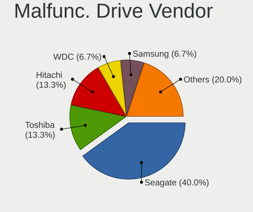

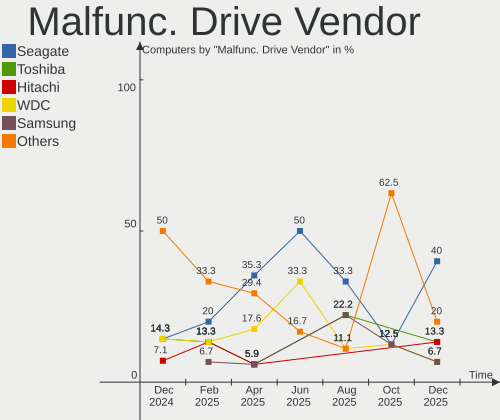

| Vendor              | Computers | Drives | Percent |
|---------------------|-----------|--------|---------|
| Seagate             | 6         | 6      | 40%     |
| Toshiba             | 2         | 2      | 13.33%  |
| Hitachi             | 2         | 2      | 13.33%  |
| WDC                 | 1         | 2      | 6.67%   |
| Samsung Electronics | 1         | 1      | 6.67%   |
| Kingston            | 1         | 1      | 6.67%   |
| Intel               | 1         | 1      | 6.67%   |
| Crucial             | 1         | 1      | 6.67%   |

Malfunc. HDD Vendor
-------------------

Vendors of faulty HDD drives

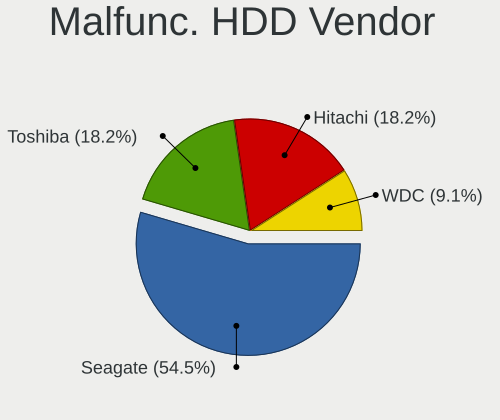

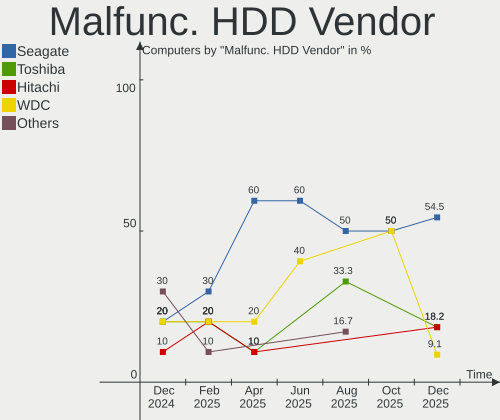

| Vendor  | Computers | Drives | Percent |
|---------|-----------|--------|---------|
| Seagate | 6         | 6      | 54.55%  |
| Toshiba | 2         | 2      | 18.18%  |
| Hitachi | 2         | 2      | 18.18%  |
| WDC     | 1         | 2      | 9.09%   |

Malfunc. Drive Kind
-------------------

Kinds of faulty drives

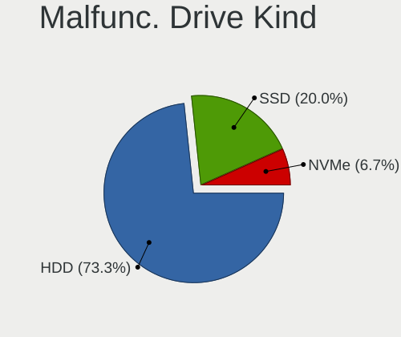

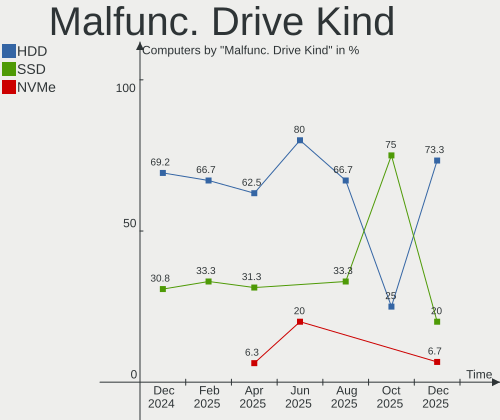

| Kind | Computers | Drives | Percent |
|------|-----------|--------|---------|
| HDD  | 11        | 12     | 73.33%  |
| SSD  | 3         | 3      | 20%     |
| NVMe | 1         | 1      | 6.67%   |

Failed Drives
-------------

Failed drive models

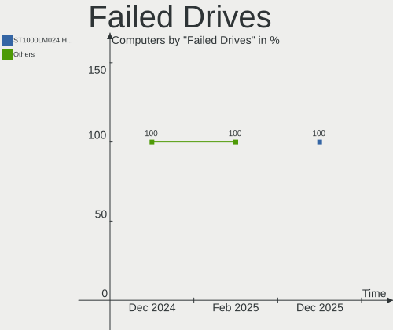

| Model                              | Computers | Drives | Percent |
|------------------------------------|-----------|--------|---------|
| Seagate ST1000LM024 HN-M101MBB 1TB | 1         | 1      | 100%    |

Failed Drive Vendor
-------------------

Failed drive vendors

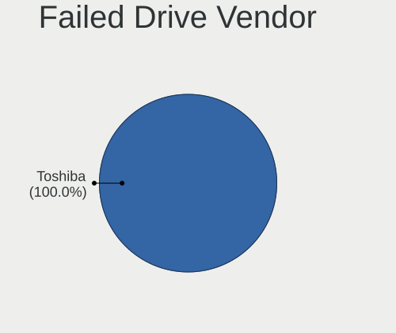

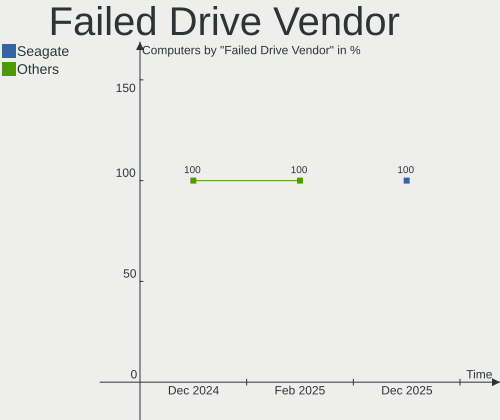

| Vendor  | Computers | Drives | Percent |
|---------|-----------|--------|---------|
| Seagate | 1         | 1      | 100%    |

Drive Status
------------

Number of failed and malfunc. drives

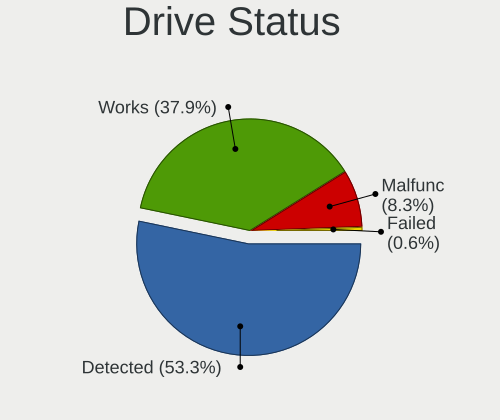

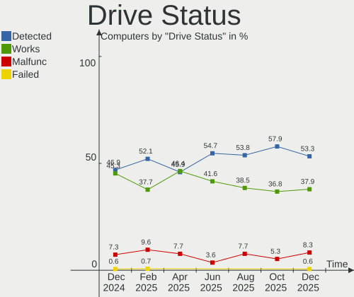

| Status   | Computers | Drives | Percent |
|----------|-----------|--------|---------|
| Detected | 90        | 135    | 53.25%  |
| Works    | 64        | 104    | 37.87%  |
| Malfunc  | 14        | 16     | 8.28%   |
| Failed   | 1         | 1      | 0.59%   |

Storage controller
------------------

Storage Vendor
--------------

Storage controller vendors

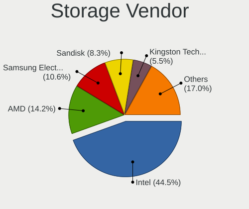

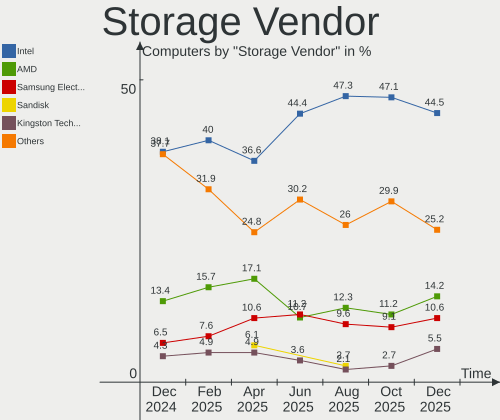

| Vendor                           | Computers | Percent |
|----------------------------------|-----------|---------|
| Intel                            | 97        | 44.5%   |
| AMD                              | 31        | 14.22%  |
| Samsung Electronics              | 23        | 10.55%  |
| Sandisk                          | 18        | 8.26%   |
| Kingston Technology Company      | 12        | 5.5%    |
| KIOXIA                           | 6         | 2.75%   |
| Phison Electronics               | 5         | 2.29%   |
| Micron/Crucial Technology        | 5         | 2.29%   |
| SK hynix                         | 4         | 1.83%   |
| Micron Technology                | 4         | 1.83%   |
| Marvell Technology Group         | 3         | 1.38%   |
| MAXIO Technology (Hangzhou)      | 2         | 0.92%   |
| Union Memory (Shenzhen)          | 1         | 0.46%   |
| Silicon Motion                   | 1         | 0.46%   |
| Silicon Integrated Systems [SiS] | 1         | 0.46%   |
| Seagate Technology               | 1         | 0.46%   |
| Lenovo                           | 1         | 0.46%   |
| Hewlett-Packard                  | 1         | 0.46%   |
| ASMedia Technology               | 1         | 0.46%   |
| ADATA Technology                 | 1         | 0.46%   |

Storage Model
-------------

Storage controller models

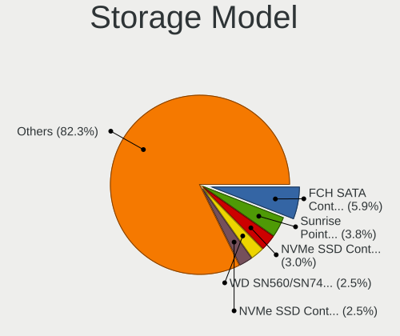

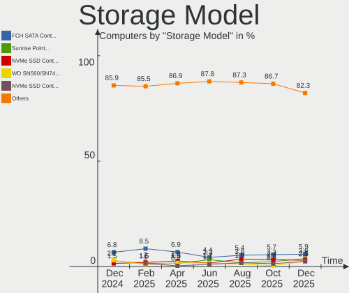

| Model                                                                          | Computers | Percent |
|--------------------------------------------------------------------------------|-----------|---------|
| AMD FCH SATA Controller [AHCI mode]                                            | 14        | 5.91%   |
| Intel Sunrise Point-LP SATA Controller [AHCI mode]                             | 9         | 3.8%    |
| Samsung NVMe SSD Controller SM981/PM981/PM983                                  | 7         | 2.95%   |
| SanDisk WD SN560/SN740/SN770/SN5000 NVMe SSD                                   | 6         | 2.53%   |
| Samsung NVMe SSD Controller S4LV008[Pascal]                                    | 6         | 2.53%   |
| Intel 8 Series/C220 Series Chipset Family 6-port SATA Controller 1 [AHCI mode] | 6         | 2.53%   |
| Intel 6 Series/C200 Series Chipset Family 6 port Mobile SATA AHCI Controller   | 6         | 2.53%   |
| AMD 600 Series Chipset SATA Controller                                         | 6         | 2.53%   |
| Intel Volume Management Device NVMe RAID Controller                            | 5         | 2.11%   |
| Intel 82801 Mobile SATA Controller [RAID mode]                                 | 5         | 2.11%   |
| AMD 500 Series Chipset SATA Controller                                         | 5         | 2.11%   |
| SanDisk Extreme Pro / WD Black SN750 / PC SN730 / Red SN700 NVMe SSD           | 4         | 1.69%   |
| Phison E12 NVMe Controller                                                     | 4         | 1.69%   |
| Intel Wildcat Point-LP SATA Controller [AHCI Mode]                             | 4         | 1.69%   |
| Intel Q170/Q150/B150/H170/H110/Z170/CM236 Chipset SATA Controller [AHCI Mode]  | 4         | 1.69%   |
| Intel 7 Series Chipset Family 6-port SATA Controller [AHCI mode]               | 4         | 1.69%   |
| Samsung NVMe SSD Controller PM9C1a (DRAM-less)                                 | 3         | 1.27%   |
| Samsung NVMe SSD Controller 980 (DRAM-less)                                    | 3         | 1.27%   |
| Micron/Crucial P2 [Nick P2] / P3 / P3 Plus NVMe PCIe SSD (DRAM-less)           | 3         | 1.27%   |
| Micron 2400 NVMe SSD (DRAM-less)                                               | 3         | 1.27%   |
| KIOXIA NVMe SSD                                                                | 3         | 1.27%   |
| Kingston Company NV2 NVMe SSD [SM2267XT] (DRAM-less)                           | 3         | 1.27%   |
| Kingston Company NV2 NVMe SSD [E21T] (DRAM-less)                               | 3         | 1.27%   |
| Intel Tiger Lake-LP SATA Controller                                            | 3         | 1.27%   |
| Intel SSD 660P Series                                                          | 3         | 1.27%   |
| Intel Jasper Lake SATA AHCI Controller                                         | 3         | 1.27%   |
| Intel Alder Lake-S PCH SATA Controller [AHCI Mode]                             | 3         | 1.27%   |
| Intel 9 Series Chipset Family SATA Controller [AHCI Mode]                      | 3         | 1.27%   |
| Intel 6 Series/C200 Series Chipset Family 6 port Desktop SATA AHCI Controller  | 3         | 1.27%   |
| AMD 400 Series Chipset SATA Controller                                         | 3         | 1.27%   |
| SanDisk Ultra 3D / WD PC SN530, IX SN530, Blue SN550 NVMe SSD (DRAM-less)      | 2         | 0.84%   |
| SanDisk Ultra 3D / WD Blue SN570 NVMe SSD (DRAM-less)                          | 2         | 0.84%   |
| Samsung NVMe SSD Controller PM9B1 (DRAM-less)                                  | 2         | 0.84%   |
| Samsung NVMe SSD Controller PM9A1/PM9A3/980PRO                                 | 2         | 0.84%   |
| Samsung BM9C1 QLC NVME SSD (DRAM-less)                                         | 2         | 0.84%   |
| Kingston Company NV3 NVMe SSD [SM2268XT2] (DRAM-less)                          | 2         | 0.84%   |
| Intel Volume Management Device NVMe RAID Controller Intel Corporation          | 2         | 0.84%   |
| Intel SATA Controller [RAID mode]                                              | 2         | 0.84%   |
| Intel RST Volume Management Device Controller                                  | 2         | 0.84%   |
| Intel NM10/ICH7 Family SATA Controller [IDE mode]                              | 2         | 0.84%   |

Storage Kind
------------

Kind of storage controller (IDE, SATA, NVMe, SAS, ...)

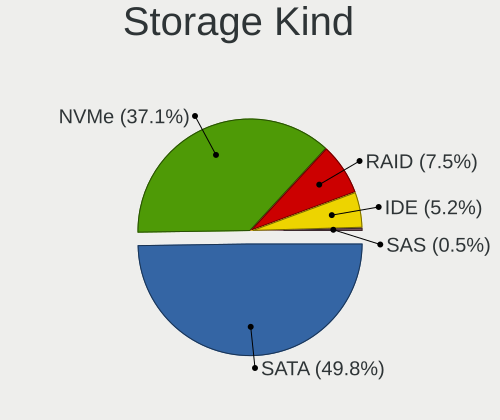

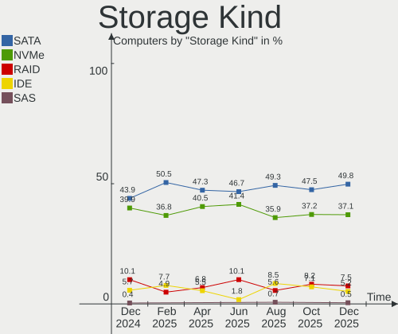

| Kind | Computers | Percent |
|------|-----------|---------|
| SATA | 106       | 49.77%  |
| NVMe | 79        | 37.09%  |
| RAID | 16        | 7.51%   |
| IDE  | 11        | 5.16%   |
| SAS  | 1         | 0.47%   |

Processor
---------

CPU Vendor
----------

Processor vendors

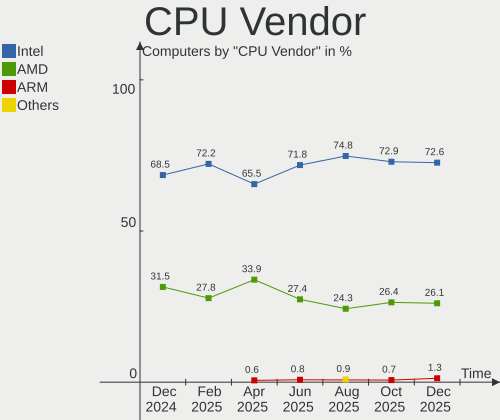

| Vendor | Computers | Percent |
|--------|-----------|---------|
| Intel  | 114       | 72.61%  |
| AMD    | 41        | 26.11%  |
| ARM    | 2         | 1.27%   |

CPU Model
---------

Processor models

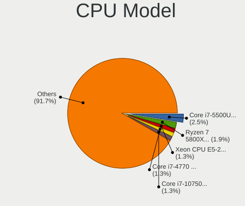

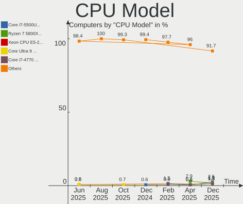

| Model                                   | Computers | Percent |
|-----------------------------------------|-----------|---------|
| Intel Core i7-5500U CPU @ 2.40GHz       | 4         | 2.55%   |
| AMD Ryzen 7 5800X 8-Core Processor      | 3         | 1.91%   |
| Intel Xeon CPU E5-2680 v4 @ 2.40GHz     | 2         | 1.27%   |
| Intel Core Ultra 9 185H                 | 2         | 1.27%   |
| Intel Core i7-4770 CPU @ 3.40GHz        | 2         | 1.27%   |
| Intel Core i7-10750H CPU @ 2.60GHz      | 2         | 1.27%   |
| Intel Core i5-8250U CPU @ 1.60GHz       | 2         | 1.27%   |
| Intel Core i5-7200U CPU @ 2.50GHz       | 2         | 1.27%   |
| Intel Core i5-6400 CPU @ 2.70GHz        | 2         | 1.27%   |
| Intel Core i5-10210U CPU @ 1.60GHz      | 2         | 1.27%   |
| Intel Core 2 Duo CPU E8400 @ 3.00GHz    | 2         | 1.27%   |
| Intel Celeron N5095 @ 2.00GHz           | 2         | 1.27%   |
| Intel Celeron CPU N3050 @ 1.60GHz       | 2         | 1.27%   |
| Intel 13th Gen Core i5-1334U            | 2         | 1.27%   |
| Intel 11th Gen Core i5-1145G7 @ 2.60GHz | 2         | 1.27%   |
| Intel 11th Gen Core i5-1135G7 @ 2.40GHz | 2         | 1.27%   |
| ARM Processor                           | 2         | 1.27%   |
| AMD Ryzen 9 5900X 12-Core Processor     | 2         | 1.27%   |
| AMD Ryzen 7 4800H with Radeon Graphics  | 2         | 1.27%   |
| AMD Ryzen 5 7520U with Radeon Graphics  | 2         | 1.27%   |
| Intel Xeon CPU E5462 @ 2.80GHz          | 1         | 0.64%   |
| Intel Xeon CPU E5-2650 v4 @ 2.20GHz     | 1         | 0.64%   |
| Intel Xeon CPU E5-2630L v2 @ 2.40GHz    | 1         | 0.64%   |
| Intel Pentium Dual CPU T3400 @ 2.16GHz  | 1         | 0.64%   |
| Intel Pentium Dual CPU T3200 @ 2.00GHz  | 1         | 0.64%   |
| Intel N100                              | 1         | 0.64%   |
| Intel Core Ultra 9 275HX                | 1         | 0.64%   |
| Intel Core Ultra 7 265K                 | 1         | 0.64%   |
| Intel Core Ultra 7 155H                 | 1         | 0.64%   |
| Intel Core Ultra 5 225H                 | 1         | 0.64%   |
| Intel Core Ultra 5 125H                 | 1         | 0.64%   |
| Intel Core m5-6Y54 CPU @ 1.10GHz        | 1         | 0.64%   |
| Intel Core m3-7Y30 CPU @ 1.00GHz        | 1         | 0.64%   |
| Intel Core m3-6Y30 CPU @ 0.90GHz        | 1         | 0.64%   |
| Intel Core i9-14900HX                   | 1         | 0.64%   |
| Intel Core i7-9750H CPU @ 2.60GHz       | 1         | 0.64%   |
| Intel Core i7-9700F CPU @ 3.00GHz       | 1         | 0.64%   |
| Intel Core i7-8750H CPU @ 2.20GHz       | 1         | 0.64%   |
| Intel Core i7-8700T CPU @ 2.40GHz       | 1         | 0.64%   |
| Intel Core i7-8700K CPU @ 3.70GHz       | 1         | 0.64%   |

CPU Model Family
----------------

Processor model prefix

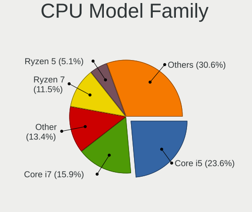

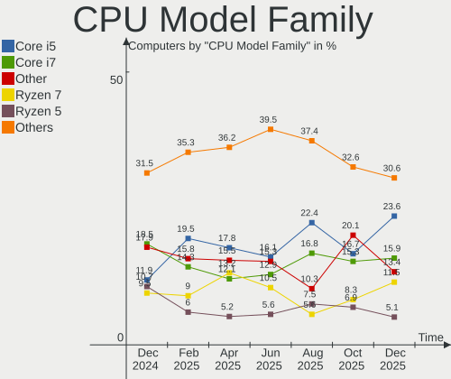

| Model              | Computers | Percent |
|--------------------|-----------|---------|
| Intel Core i5      | 37        | 23.57%  |
| Intel Core i7      | 25        | 15.92%  |
| Other              | 21        | 13.38%  |
| AMD Ryzen 7        | 18        | 11.46%  |
| AMD Ryzen 5        | 8         | 5.1%    |
| Intel Core         | 7         | 4.46%   |
| Intel Celeron      | 6         | 3.82%   |
| AMD Ryzen 9        | 6         | 3.82%   |
| Intel Xeon         | 5         | 3.18%   |
| Intel Core 2 Duo   | 5         | 3.18%   |
| Intel Core i3      | 4         | 2.55%   |
| Intel Pentium Dual | 2         | 1.27%   |
| Intel Core m3      | 2         | 1.27%   |
| AMD E1             | 2         | 1.27%   |
| Intel Core m5      | 1         | 0.64%   |
| Intel Core i9      | 1         | 0.64%   |
| Intel Core 2       | 1         | 0.64%   |
| AMD Ryzen 3        | 1         | 0.64%   |
| AMD Phenom II X6   | 1         | 0.64%   |
| AMD Phenom II X2   | 1         | 0.64%   |
| AMD E              | 1         | 0.64%   |
| AMD A6             | 1         | 0.64%   |
| AMD A10            | 1         | 0.64%   |

CPU Cores
---------

Number of processor cores

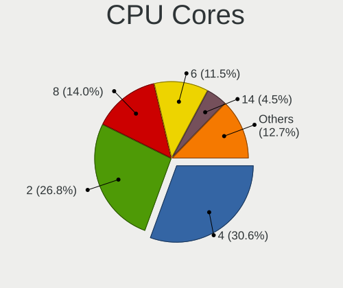

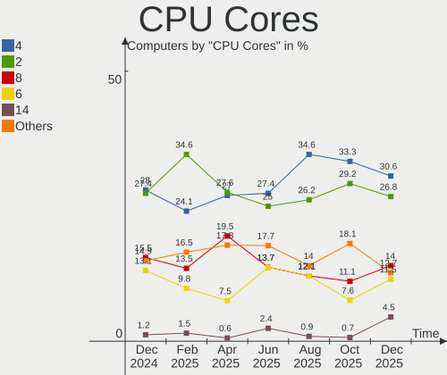

| Number  | Computers | Percent |
|---------|-----------|---------|
| 4       | 48        | 30.57%  |
| 2       | 42        | 26.75%  |
| 8       | 22        | 14.01%  |
| 6       | 18        | 11.46%  |
| 14      | 7         | 4.46%   |
| 16      | 5         | 3.18%   |
| 10      | 5         | 3.18%   |
| 12      | 4         | 2.55%   |
| 24      | 3         | 1.91%   |
| Unknown | 2         | 1.27%   |
| 20      | 1         | 0.64%   |

CPU Sockets
-----------

Number of sockets

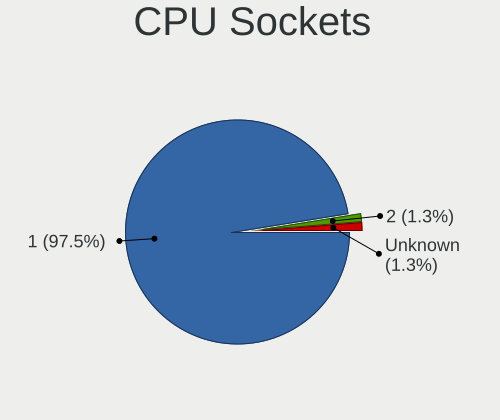

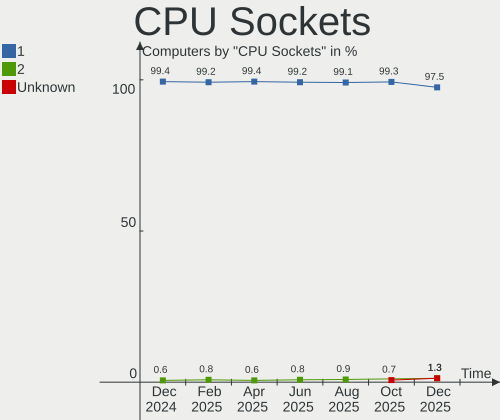

| Number  | Computers | Percent |
|---------|-----------|---------|
| 1       | 153       | 97.45%  |
| 2       | 2         | 1.27%   |
| Unknown | 2         | 1.27%   |

CPU Threads
-----------

Threads per core (Hyper-Threading)

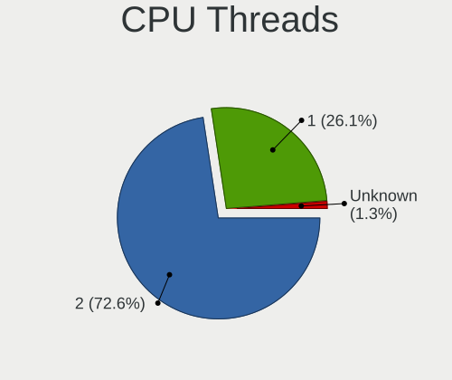

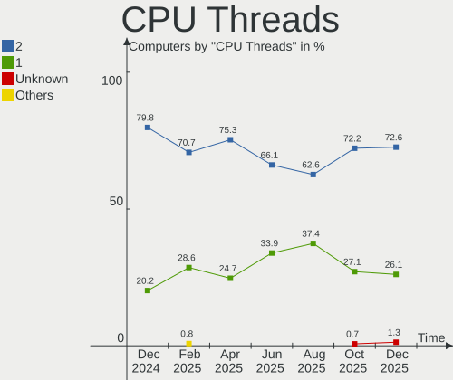

| Number  | Computers | Percent |
|---------|-----------|---------|
| 2       | 114       | 72.61%  |
| 1       | 41        | 26.11%  |
| Unknown | 2         | 1.27%   |

CPU Op-Modes
------------

CPU Operation Modes (32-bit, 64-bit)

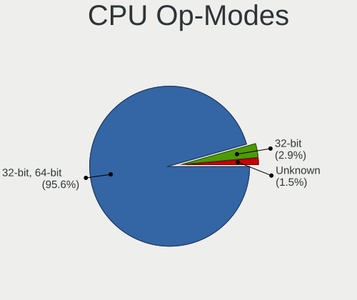

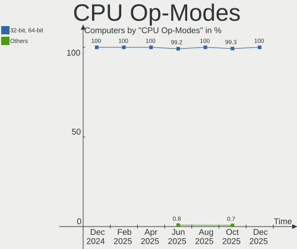

| Op mode        | Computers | Percent |
|----------------|-----------|---------|
| 32-bit, 64-bit | 157       | 100%    |

CPU Microcode
-------------

Microcode number

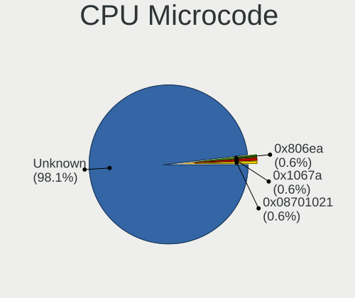

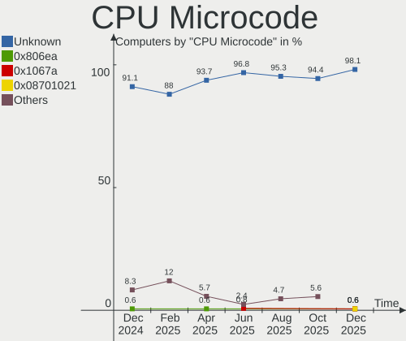

| Number     | Computers | Percent |
|------------|-----------|---------|
| Unknown    | 154       | 98.09%  |
| 0x806ea    | 1         | 0.64%   |
| 0x1067a    | 1         | 0.64%   |
| 0x08701021 | 1         | 0.64%   |

CPU Microarch
-------------

Microarchitecture

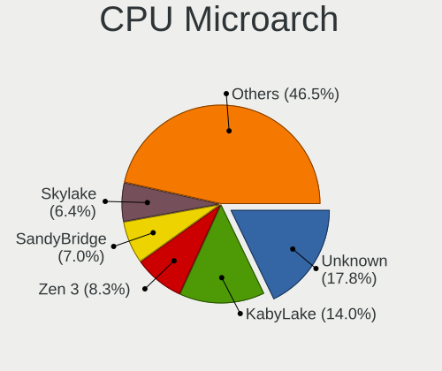

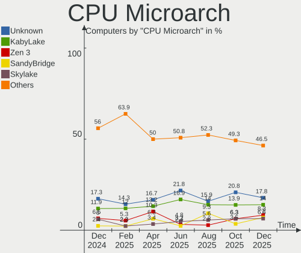

| Name              | Computers | Percent |
|-------------------|-----------|---------|
| Unknown           | 28        | 17.83%  |
| KabyLake          | 22        | 14.01%  |
| Zen 3             | 13        | 8.28%   |
| SandyBridge       | 11        | 7.01%   |
| Skylake           | 10        | 6.37%   |
| Haswell           | 10        | 6.37%   |
| Broadwell         | 8         | 5.1%    |
| Alderlake Hybrid  | 6         | 3.82%   |
| TigerLake         | 5         | 3.18%   |
| Penryn            | 5         | 3.18%   |
| IvyBridge         | 5         | 3.18%   |
| Zen 2             | 4         | 2.55%   |
| Core              | 4         | 2.55%   |
| CometLake         | 3         | 1.91%   |
| Zen               | 2         | 1.27%   |
| Westmere          | 2         | 1.27%   |
| Tremont           | 2         | 1.27%   |
| Silvermont        | 2         | 1.27%   |
| Puma              | 2         | 1.27%   |
| Lunarlake Hybrid  | 2         | 1.27%   |
| K10               | 2         | 1.27%   |
| IceLake           | 2         | 1.27%   |
| Excavator         | 2         | 1.27%   |
| Nehalem           | 1         | 0.64%   |
| Meteorlake Hybrid | 1         | 0.64%   |
| Jaguar            | 1         | 0.64%   |
| Gracemont         | 1         | 0.64%   |
| Bobcat            | 1         | 0.64%   |

Graphics
--------

GPU Vendor
----------

Vendors of graphics cards

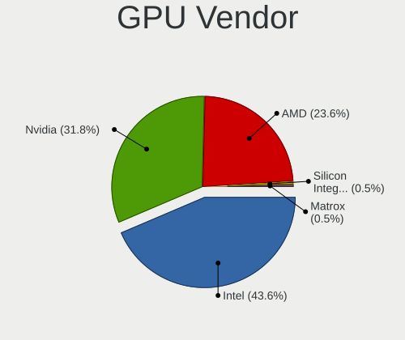

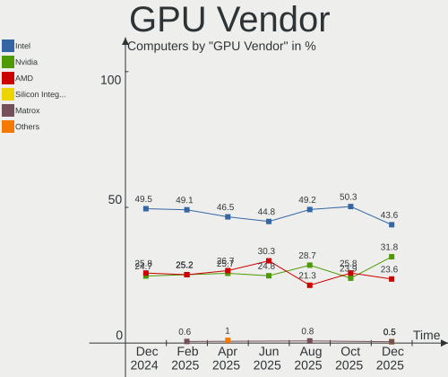

| Vendor                           | Computers | Percent |
|----------------------------------|-----------|---------|
| Intel                            | 85        | 43.59%  |
| Nvidia                           | 62        | 31.79%  |
| AMD                              | 46        | 23.59%  |
| Silicon Integrated Systems [SiS] | 1         | 0.51%   |
| Matrox Electronics Systems       | 1         | 0.51%   |

GPU Model
---------

Graphics card models

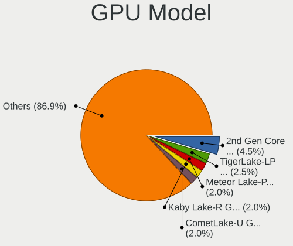

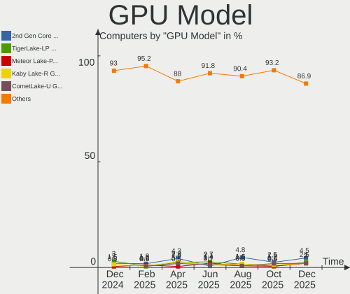

| Model                                                                                    | Computers | Percent |
|------------------------------------------------------------------------------------------|-----------|---------|
| Intel 2nd Generation Core Processor Family Integrated Graphics Controller                | 9         | 4.52%   |
| Intel TigerLake-LP GT2 [Iris Xe Graphics]                                                | 5         | 2.51%   |
| Intel Meteor Lake-P [Intel Arc Graphics]                                                 | 4         | 2.01%   |
| Intel Kaby Lake-R GT2 [UHD Graphics 620]                                                 | 4         | 2.01%   |
| Intel CometLake-U GT2 [UHD Graphics]                                                     | 4         | 2.01%   |
| Intel Broadwell-U GT2 [HD Graphics 5500]                                                 | 4         | 2.01%   |
| AMD Navi 44 [Radeon RX 9060 XT]                                                          | 4         | 2.01%   |
| Nvidia GP106 [GeForce GTX 1060 6GB]                                                      | 3         | 1.51%   |
| Nvidia AD107M [GeForce RTX 4060 Max-Q / Mobile]                                          | 3         | 1.51%   |
| Nvidia AD107M [GeForce RTX 4050 Max-Q / Mobile]                                          | 3         | 1.51%   |
| Intel Skylake-H GT2 [HD Graphics 530]                                                    | 3         | 1.51%   |
| Intel Raptor Lake-P [Iris Xe Graphics]                                                   | 3         | 1.51%   |
| Intel Kaby Lake-U GT2 [HD Graphics 620]                                                  | 3         | 1.51%   |
| Intel JasperLake [UHD Graphics]                                                          | 3         | 1.51%   |
| Intel 3rd Gen Core processor Graphics Controller                                         | 3         | 1.51%   |
| AMD Raphael                                                                              | 3         | 1.51%   |
| AMD Navi 22 [Radeon RX 6700/6700 XT/6750 XT / 6800M/6850M XT]                            | 3         | 1.51%   |
| AMD Granite Ridge [Radeon Graphics]                                                      | 3         | 1.51%   |
| AMD Cezanne [Radeon Vega Series / Radeon Vega Mobile Series]                             | 3         | 1.51%   |
| Nvidia GT218 [GeForce 210]                                                               | 2         | 1.01%   |
| Nvidia GP108M [GeForce MX150]                                                            | 2         | 1.01%   |
| Nvidia GM108M [GeForce 840M]                                                             | 2         | 1.01%   |
| Nvidia GB203 [GeForce RTX 5070 Ti]                                                       | 2         | 1.01%   |
| Nvidia GA107M [GeForce RTX 3050 Mobile]                                                  | 2         | 1.01%   |
| Nvidia GA106M [GeForce RTX 3060 Mobile / Max-Q]                                          | 2         | 1.01%   |
| Nvidia GA106 [GeForce RTX 3060 Lite Hash Rate]                                           | 2         | 1.01%   |
| Nvidia AD106 [GeForce RTX 4060 Ti]                                                       | 2         | 1.01%   |
| Intel Xeon E3-1200 v3/4th Gen Core Processor Integrated Graphics Controller              | 2         | 1.01%   |
| Intel WhiskeyLake-U GT2 [UHD Graphics 620]                                               | 2         | 1.01%   |
| Intel Skylake-Y GT2 [HD Graphics 515]                                                    | 2         | 1.01%   |
| Intel Skylake-U GT2 [HD Graphics 520]                                                    | 2         | 1.01%   |
| Intel Skylake-S GT2 [HD Graphics 530]                                                    | 2         | 1.01%   |
| Intel Raptor Lake-P [UHD Graphics]                                                       | 2         | 1.01%   |
| Intel Haswell-ULT Integrated Graphics Controller                                         | 2         | 1.01%   |
| Intel CometLake-H GT2 [UHD Graphics]                                                     | 2         | 1.01%   |
| Intel CoffeeLake-S GT2 [UHD Graphics 630]                                                | 2         | 1.01%   |
| Intel CoffeeLake-H GT2 [UHD Graphics 630]                                                | 2         | 1.01%   |
| Intel Atom/Celeron/Pentium Processor x5-E8000/J3xxx/N3xxx Integrated Graphics Controller | 2         | 1.01%   |
| Intel Arrow Lake-S [Intel Graphics]                                                      | 2         | 1.01%   |
| AMD Renoir [Radeon Vega Series / Radeon Vega Mobile Series]                              | 2         | 1.01%   |

GPU Combo
---------

Combinations of graphics cards

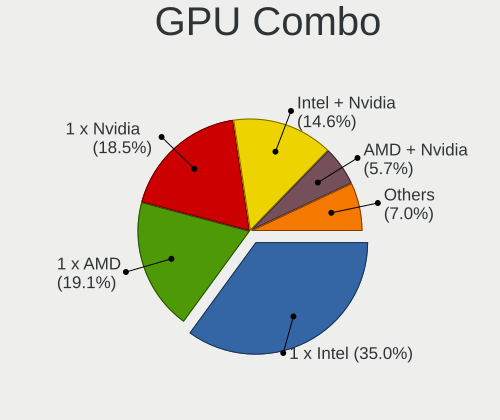

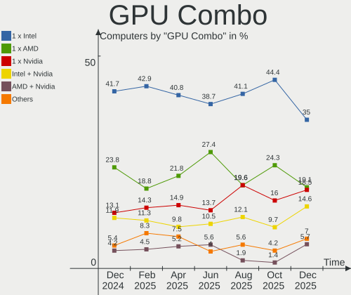

| Name            | Computers | Percent |
|-----------------|-----------|---------|
| 1 x Intel       | 55        | 35.03%  |
| 1 x AMD         | 30        | 19.11%  |
| 1 x Nvidia      | 29        | 18.47%  |
| Intel + Nvidia  | 23        | 14.65%  |
| AMD + Nvidia    | 9         | 5.73%   |
| Intel + AMD     | 4         | 2.55%   |
| 2 x AMD         | 3         | 1.91%   |
| Other           | 2         | 1.27%   |
| 1 x SiS         | 1         | 0.64%   |
| Nvidia + Matrox | 1         | 0.64%   |

GPU Driver
----------

Free vs proprietary

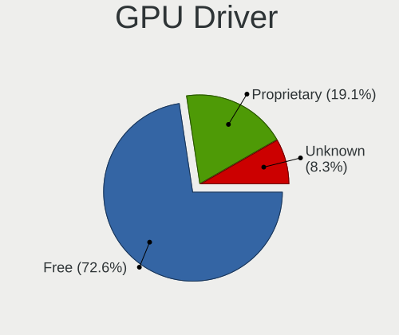

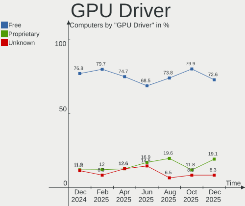

| Driver      | Computers | Percent |
|-------------|-----------|---------|
| Free        | 114       | 72.61%  |
| Proprietary | 30        | 19.11%  |
| Unknown     | 13        | 8.28%   |

GPU Memory
----------

Total video memory

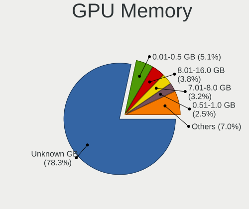

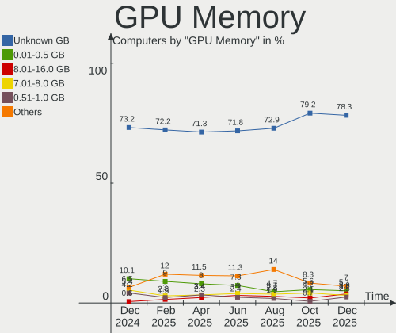

| Size in GB | Computers | Percent |
|------------|-----------|---------|
| Unknown    | 123       | 78.34%  |
| 0.01-0.5   | 8         | 5.1%    |
| 8.01-16.0  | 6         | 3.82%   |
| 7.01-8.0   | 5         | 3.18%   |
| 0.51-1.0   | 4         | 2.55%   |
| 5.01-6.0   | 3         | 1.91%   |
| 3.01-4.0   | 3         | 1.91%   |
| 1.01-2.0   | 3         | 1.91%   |
| 2.01-3.0   | 1         | 0.64%   |
| 16.01-24.0 | 1         | 0.64%   |

Monitor
-------

Monitor Vendor
--------------

Monitor vendors

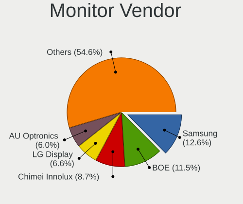

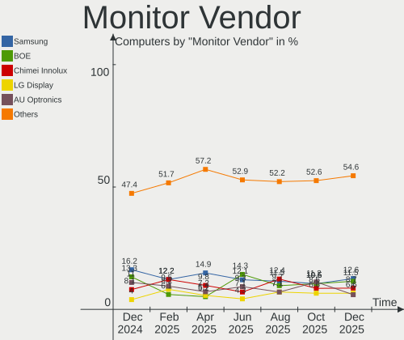

| Vendor                  | Computers | Percent |
|-------------------------|-----------|---------|
| Samsung Electronics     | 23        | 12.57%  |
| BOE                     | 21        | 11.48%  |
| Chimei Innolux          | 16        | 8.74%   |
| LG Display              | 12        | 6.56%   |
| AU Optronics            | 11        | 6.01%   |
| BenQ                    | 10        | 5.46%   |
| Hewlett-Packard         | 7         | 3.83%   |
| Goldstar                | 7         | 3.83%   |
| AOC                     | 7         | 3.83%   |
| Philips                 | 6         | 3.28%   |
| Dell                    | 6         | 3.28%   |
| Lenovo                  | 5         | 2.73%   |
| ASUSTek Computer        | 5         | 2.73%   |
| Acer                    | 5         | 2.73%   |
| Apple                   | 4         | 2.19%   |
| Sony                    | 3         | 1.64%   |
| Gigabyte Technology     | 3         | 1.64%   |
| Vestel Elektronik       | 2         | 1.09%   |
| RTK                     | 2         | 1.09%   |
| PANDA                   | 2         | 1.09%   |
| Packard Bell            | 2         | 1.09%   |
| MSI                     | 2         | 1.09%   |
| InfoVision              | 2         | 1.09%   |
| EDO                     | 2         | 1.09%   |
| Chi Mei Optoelectronics | 2         | 1.09%   |
| CHD                     | 2         | 1.09%   |
| Ancor Communications    | 2         | 1.09%   |
| VXN                     | 1         | 0.55%   |
| Unknown (XXX)           | 1         | 0.55%   |
| Toshiba                 | 1         | 0.55%   |
| SKG                     | 1         | 0.55%   |
| Sharp                   | 1         | 0.55%   |
| Philco                  | 1         | 0.55%   |
| OEM                     | 1         | 0.55%   |
| Hitachi                 | 1         | 0.55%   |
| HannStar Display        | 1         | 0.55%   |
| HannStar                | 1         | 0.55%   |
| CSW                     | 1         | 0.55%   |
| CHO                     | 1         | 0.55%   |

Monitor Model
-------------

Monitor models

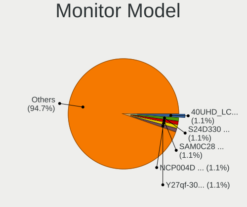

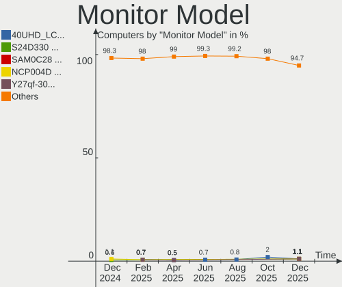

| Model                                                                    | Computers | Percent |
|--------------------------------------------------------------------------|-----------|---------|
| Vestel Elektronik 40UHD_LCD_TV VES3700 3840x2160 880x500mm 39.8-inch     | 2         | 1.06%   |
| Samsung Electronics S24D330 SAM0D92 1920x1080 531x299mm 24.0-inch        | 2         | 1.06%   |
| Samsung Electronics LCD Monitor SAM0C28 1920x1080 1209x680mm 54.6-inch   | 2         | 1.06%   |
| PANDA LCD Monitor NCP004D 1920x1080 344x194mm 15.5-inch                  | 2         | 1.06%   |
| Lenovo Y27qf-30 LEN67A7 2560x1440 597x336mm 27.0-inch                    | 2         | 1.06%   |
| Lenovo LCD Monitor LEN9051 1920x1080 344x194mm 15.5-inch                 | 2         | 1.06%   |
| Chimei Innolux LCD Monitor CMN15F5 1920x1080 344x193mm 15.5-inch         | 2         | 1.06%   |
| BOE LCD Monitor BOE0C02 1920x1080 344x194mm 15.5-inch                    | 2         | 1.06%   |
| BenQ GL2780 BNQ78EC 1920x1080 600x340mm 27.2-inch                        | 2         | 1.06%   |
| BenQ GL2250H BNQ78A1 1920x1080 477x268mm 21.5-inch                       | 2         | 1.06%   |
| AU Optronics LCD Monitor AUOD0A2 1920x1080 344x193mm 15.5-inch           | 2         | 1.06%   |
| AU Optronics LCD Monitor AUO26EC 1366x768 344x193mm 15.5-inch            | 2         | 1.06%   |
| ASUSTek Computer VZ239 AUS23CC 1920x1080 509x286mm 23.0-inch             | 2         | 1.06%   |
| AOC 27G2G4 AOC2702 1920x1080 598x336mm 27.0-inch                         | 2         | 1.06%   |
| VXN VisN236HUZ15 VXN1421                                                 | 1         | 0.53%   |
| Unknown (XXX) Beyond TV XXX9221 1920x1080 1209x680mm 54.6-inch           | 1         | 0.53%   |
| Toshiba ScreenXpert TSB8888 1080x2160                                    | 1         | 0.53%   |
| Sony TV SNYA500 1360x768                                                 | 1         | 0.53%   |
| Sony TV SNYA401 1920x1080                                                | 1         | 0.53%   |
| Sony PJ SNY0FF4 1600x1200                                                | 1         | 0.53%   |
| SKG PMO G241-FFK SKG2409 1920x1080 600x330mm 27.0-inch                   | 1         | 0.53%   |
| Sharp LCD Monitor SHP1421 3200x1800 294x165mm 13.3-inch                  | 1         | 0.53%   |
| Samsung Electronics T23B350 SAM093B 1920x1080 510x287mm 23.0-inch        | 1         | 0.53%   |
| Samsung Electronics SyncMaster SAM03EB 1680x1050 433x271mm 20.1-inch     | 1         | 0.53%   |
| Samsung Electronics SMXL2270HD SAM072B 1920x1080 476x268mm 21.5-inch     | 1         | 0.53%   |
| Samsung Electronics S24D590 SAM0B47 1920x1080 521x293mm 23.5-inch        | 1         | 0.53%   |
| Samsung Electronics Odyssey G95SC SAME02A 2560x1440 1193x336mm 48.8-inch | 1         | 0.53%   |
| Samsung Electronics Odyssey G70B SAM7232 3840x2160 698x392mm 31.5-inch   | 1         | 0.53%   |
| Samsung Electronics LCD Monitor SEC4251 1366x768 344x194mm 15.5-inch     | 1         | 0.53%   |
| Samsung Electronics LCD Monitor SEC3945 1280x800 331x207mm 15.4-inch     | 1         | 0.53%   |
| Samsung Electronics LCD Monitor SEC3859 1366x768 293x165mm 13.2-inch     | 1         | 0.53%   |
| Samsung Electronics LCD Monitor SEC364A 1366x768 344x194mm 15.5-inch     | 1         | 0.53%   |
| Samsung Electronics LCD Monitor SDCA029 3840x2160 344x194mm 15.5-inch    | 1         | 0.53%   |
| Samsung Electronics LCD Monitor SDC419D 2880x1800 302x189mm 14.0-inch    | 1         | 0.53%   |
| Samsung Electronics LCD Monitor SDC4187 1920x1200 302x189mm 14.0-inch    | 1         | 0.53%   |
| Samsung Electronics LCD Monitor SDC4159 1920x1080 344x194mm 15.5-inch    | 1         | 0.53%   |
| Samsung Electronics LCD Monitor SAM73AC 3840x2160 1872x1053mm 84.6-inch  | 1         | 0.53%   |
| Samsung Electronics LCD Monitor SAM7016 3840x2160 1872x1053mm 84.6-inch  | 1         | 0.53%   |
| Samsung Electronics LCD Monitor SAM0902 1920x1080 890x500mm 40.2-inch    | 1         | 0.53%   |
| Samsung Electronics LC24RG50 SAM0F90 1920x1080 532x304mm 24.1-inch       | 1         | 0.53%   |

Monitor Resolution
------------------

Monitor screen resolution

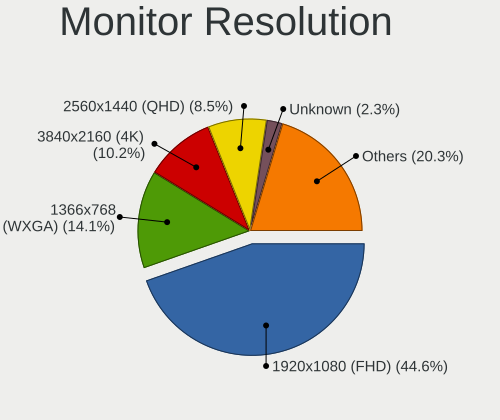

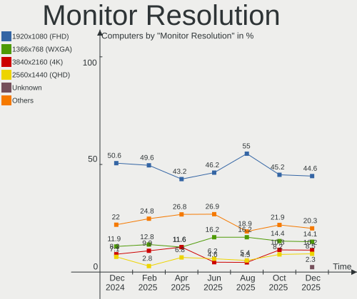

| Resolution         | Computers | Percent |
|--------------------|-----------|---------|
| 1920x1080 (FHD)    | 79        | 44.63%  |
| 1366x768 (WXGA)    | 25        | 14.12%  |
| 3840x2160 (4K)     | 18        | 10.17%  |
| 2560x1440 (QHD)    | 15        | 8.47%   |
| Unknown            | 4         | 2.26%   |
| 2880x1800          | 3         | 1.69%   |
| 2560x1080          | 3         | 1.69%   |
| 1920x1280          | 3         | 1.69%   |
| 1280x800 (WXGA)    | 3         | 1.69%   |
| 2560x1600          | 2         | 1.13%   |
| 1920x540           | 2         | 1.13%   |
| 1680x1050 (WSXGA+) | 2         | 1.13%   |
| 1600x1200          | 2         | 1.13%   |
| 1440x900 (WXGA+)   | 2         | 1.13%   |
| 1360x768           | 2         | 1.13%   |
| 1280x1024 (SXGA)   | 2         | 1.13%   |
| 3840x1080          | 1         | 0.56%   |
| 3440x1440          | 1         | 0.56%   |
| 3200x1800 (QHD+)   | 1         | 0.56%   |
| 2736x1824          | 1         | 0.56%   |
| 2256x1504          | 1         | 0.56%   |
| 2160x1440          | 1         | 0.56%   |
| 1920x515           | 1         | 0.56%   |
| 1920x1200 (WUXGA)  | 1         | 0.56%   |
| 1600x900 (HD+)     | 1         | 0.56%   |
| 1280x960           | 1         | 0.56%   |

Monitor Diagonal
----------------

Diagonal size in inches

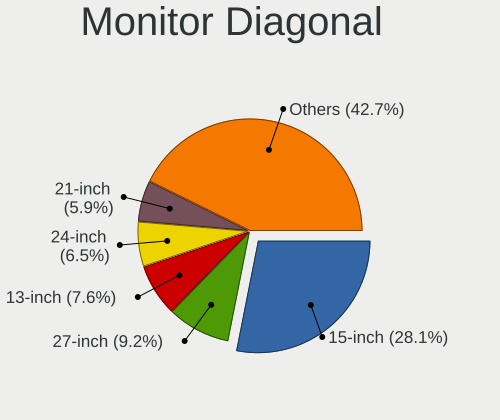

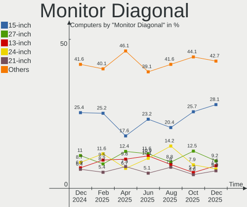

| Inches  | Computers | Percent |
|---------|-----------|---------|
| 15      | 52        | 28.11%  |
| 27      | 17        | 9.19%   |
| 13      | 14        | 7.57%   |
| 24      | 12        | 6.49%   |
| 21      | 11        | 5.95%   |
| 23      | 9         | 4.86%   |
| Unknown | 9         | 4.86%   |
| 31      | 8         | 4.32%   |
| 14      | 6         | 3.24%   |
| 84      | 5         | 2.7%    |
| 12      | 5         | 2.7%    |
| 54      | 4         | 2.16%   |
| 34      | 3         | 1.62%   |
| 20      | 3         | 1.62%   |
| 19      | 3         | 1.62%   |
| 18      | 3         | 1.62%   |
| 17      | 3         | 1.62%   |
| 16      | 3         | 1.62%   |
| 65      | 2         | 1.08%   |
| 63      | 2         | 1.08%   |
| 32      | 2         | 1.08%   |
| 26      | 2         | 1.08%   |
| 22      | 2         | 1.08%   |
| 86      | 1         | 0.54%   |
| 72      | 1         | 0.54%   |
| 48      | 1         | 0.54%   |
| 44      | 1         | 0.54%   |
| 29      | 1         | 0.54%   |

Monitor Width
-------------

Physical width

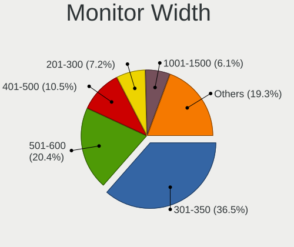

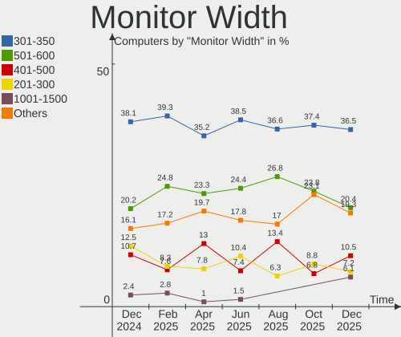

| Width in mm | Computers | Percent |
|-------------|-----------|---------|
| 301-350     | 66        | 36.46%  |
| 501-600     | 37        | 20.44%  |
| 401-500     | 19        | 10.5%   |
| 201-300     | 13        | 7.18%   |
| 1001-1500   | 11        | 6.08%   |
| 601-700     | 9         | 4.97%   |
| Unknown     | 9         | 4.97%   |
| 351-400     | 6         | 3.31%   |
| 1501-2000   | 6         | 3.31%   |
| 701-800     | 5         | 2.76%   |

Aspect Ratio
------------

Proportional relationship between the width and the height

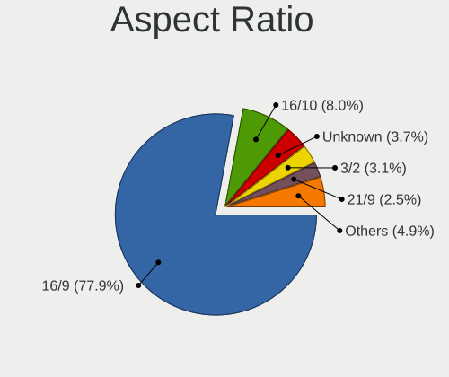

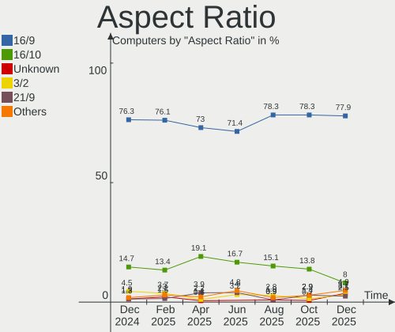

| Ratio   | Computers | Percent |
|---------|-----------|---------|
| 16/9    | 127       | 77.91%  |
| 16/10   | 13        | 7.98%   |
| Unknown | 6         | 3.68%   |
| 3/2     | 5         | 3.07%   |
| 21/9    | 4         | 2.45%   |
| 5/4     | 2         | 1.23%   |
| 4/3     | 2         | 1.23%   |
| 32/9    | 2         | 1.23%   |
| 3.73    | 1         | 0.61%   |
| 0.56    | 1         | 0.61%   |

Monitor Area
------------

Area in inch²

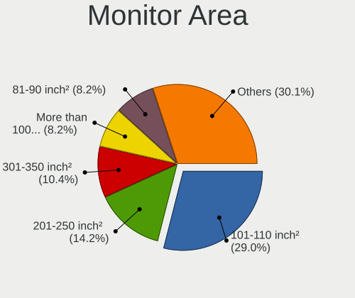

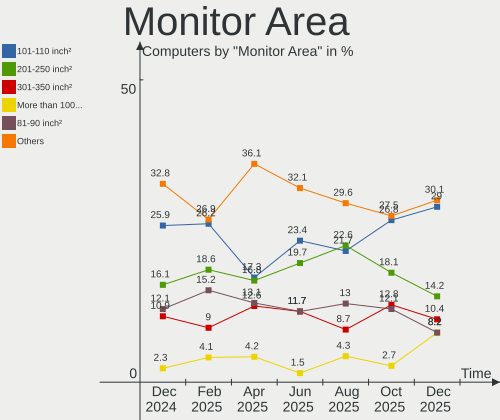

| Area in inch² | Computers | Percent |
|----------------|-----------|---------|
| 101-110        | 53        | 28.96%  |
| 201-250        | 26        | 14.21%  |
| 301-350        | 19        | 10.38%  |
| More than 1000 | 15        | 8.2%    |
| 81-90          | 15        | 8.2%    |
| 351-500        | 13        | 7.1%    |
| Unknown        | 9         | 4.92%   |
| 151-200        | 8         | 4.37%   |
| 71-80          | 6         | 3.28%   |
| 251-300        | 5         | 2.73%   |
| 61-70          | 4         | 2.19%   |
| 141-150        | 3         | 1.64%   |
| 121-130        | 3         | 1.64%   |
| 111-120        | 2         | 1.09%   |
| 501-1000       | 2         | 1.09%   |

Pixel Density
-------------

Pixels per inch

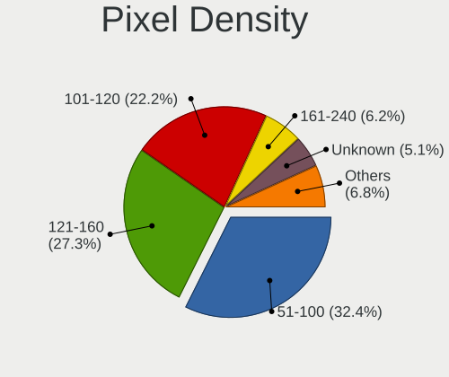

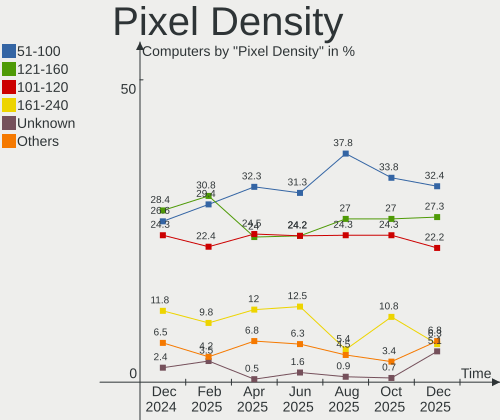

| Density       | Computers | Percent |
|---------------|-----------|---------|
| 51-100        | 57        | 32.39%  |
| 121-160       | 48        | 27.27%  |
| 101-120       | 39        | 22.16%  |
| 161-240       | 11        | 6.25%   |
| Unknown       | 9         | 5.11%   |
| 1-50          | 7         | 3.98%   |
| More than 240 | 5         | 2.84%   |

Multiple Monitors
-----------------

Total monitors connected

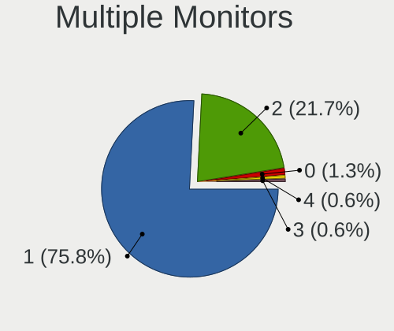

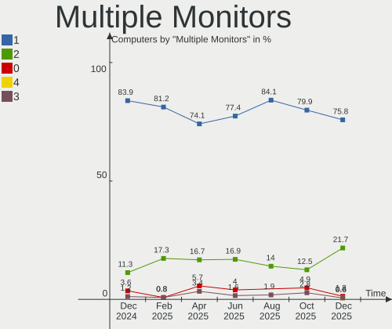

| Total | Computers | Percent |
|-------|-----------|---------|
| 1     | 119       | 75.8%   |
| 2     | 34        | 21.66%  |
| 0     | 2         | 1.27%   |
| 4     | 1         | 0.64%   |
| 3     | 1         | 0.64%   |

Network
-------

Net Controller Vendor
---------------------

Controller vendors

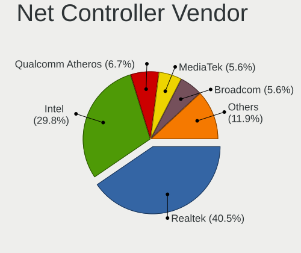

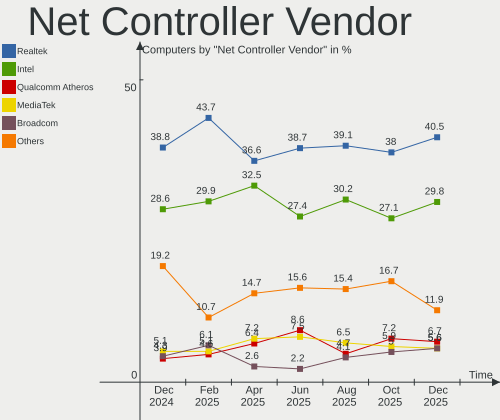

| Vendor                                 | Computers | Percent |
|----------------------------------------|-----------|---------|
| Realtek Semiconductor                  | 102       | 40.48%  |
| Intel                                  | 75        | 29.76%  |
| Qualcomm Atheros                       | 17        | 6.75%   |
| MediaTek                               | 14        | 5.56%   |
| Broadcom                               | 14        | 5.56%   |
| TP-Link                                | 5         | 1.98%   |
| Xiaomi                                 | 2         | 0.79%   |
| Ralink Technology                      | 2         | 0.79%   |
| Ralink                                 | 2         | 0.79%   |
| Microsoft                              | 2         | 0.79%   |
| Marvell Technology Group               | 2         | 0.79%   |
| Huawei Technologies                    | 2         | 0.79%   |
| Hewlett-Packard                        | 2         | 0.79%   |
| Suzhou Motorcomm Electronic Technology | 1         | 0.4%    |
| Silicon Integrated Systems [SiS]       | 1         | 0.4%    |
| Shenzhen Goodix Technology             | 1         | 0.4%    |
| Raspberry Pi                           | 1         | 0.4%    |
| Qualcomm Technologies                  | 1         | 0.4%    |
| Qualcomm Atheros Communications        | 1         | 0.4%    |
| Mercucys                               | 1         | 0.4%    |
| DisplayLink                            | 1         | 0.4%    |
| D-Link                                 | 1         | 0.4%    |
| Broadcom Limited                       | 1         | 0.4%    |
| ASIX Electronics                       | 1         | 0.4%    |

Net Controller Model
--------------------

Controller models

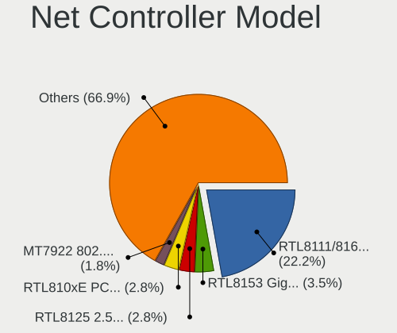

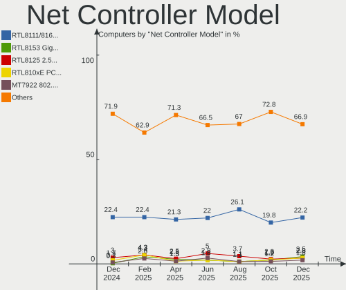

| Model                                                                  | Computers | Percent |
|------------------------------------------------------------------------|-----------|---------|
| Realtek RTL8111/8168/8211/8411 PCI Express Gigabit Ethernet Controller | 63        | 22.18%  |
| Realtek RTL8153 Gigabit Ethernet Adapter                               | 10        | 3.52%   |
| Realtek RTL8125 2.5GbE Controller                                      | 8         | 2.82%   |
| Realtek RTL810xE PCI Express Fast Ethernet controller                  | 8         | 2.82%   |
| MediaTek MT7922 802.11ax PCI Express Wireless Network Adapter          | 5         | 1.76%   |
| MediaTek MT7902 802.11ax PCIe Wireless Network Adapter [Filogic 310]   | 5         | 1.76%   |
| Intel Wireless 8265 / 8275                                             | 5         | 1.76%   |
| Intel Wi-Fi 6E(802.11ax) AX210/AX1675* 2x2 [Typhoon Peak]              | 5         | 1.76%   |
| Realtek RTL8822CE 802.11ac PCIe Wireless Network Adapter               | 4         | 1.41%   |
| Realtek 802.11ac NIC                                                   | 4         | 1.41%   |
| Qualcomm Atheros QCA9565 / AR9565 Wireless Network Adapter             | 4         | 1.41%   |
| Qualcomm Atheros QCA9377 802.11ac Wireless Network Adapter             | 4         | 1.41%   |
| MediaTek MT7921 802.11ax PCIe Wireless Network Adapter [Filogic 330]   | 4         | 1.41%   |
| Intel Wi-Fi 6 AX201                                                    | 4         | 1.41%   |
| Intel Wi-Fi 6 AX200                                                    | 4         | 1.41%   |
| Intel Raptor Lake PCH CNVi WiFi                                        | 4         | 1.41%   |
| Intel Meteor Lake PCH CNVi WiFi                                        | 4         | 1.41%   |
| Realtek RTL8192EE PCIe Wireless Network Adapter                        | 3         | 1.06%   |
| Qualcomm Atheros AR9285 Wireless Network Adapter (PCI-Express)         | 3         | 1.06%   |
| Intel Wireless 8260                                                    | 3         | 1.06%   |
| Intel I211 Gigabit Network Connection                                  | 3         | 1.06%   |
| Intel Comet Lake PCH-LP CNVi WiFi                                      | 3         | 1.06%   |
| Intel Cannon Point-LP CNVi [Wireless-AC]                               | 3         | 1.06%   |
| Xiaomi Mi/Redmi series (RNDIS)                                         | 2         | 0.7%    |
| TP-Link 802.11ac NIC                                                   | 2         | 0.7%    |
| Realtek RTL8852BE PCIe 802.11ax Wireless Network Controller            | 2         | 0.7%    |
| Realtek RTL8821AE 802.11ac PCIe Wireless Network Adapter               | 2         | 0.7%    |
| Realtek RTL8723BE PCIe Wireless Network Adapter                        | 2         | 0.7%    |
| Realtek RTL8192EU 802.11b/g/n WLAN Adapter                             | 2         | 0.7%    |
| Intel Wireless 7265                                                    | 2         | 0.7%    |
| Intel Wireless 3165                                                    | 2         | 0.7%    |
| Intel Wireless 3160                                                    | 2         | 0.7%    |
| Intel Ethernet Controller I226-V                                       | 2         | 0.7%    |
| Intel Ethernet Controller I225-V                                       | 2         | 0.7%    |
| Intel Ethernet Connection I217-LM                                      | 2         | 0.7%    |
| Intel Ethernet Connection (2) I219-V                                   | 2         | 0.7%    |
| Intel Comet Lake PCH CNVi WiFi                                         | 2         | 0.7%    |
| Intel Centrino Wireless-N 100                                          | 2         | 0.7%    |
| Intel Alder Lake-P PCH CNVi WiFi                                       | 2         | 0.7%    |
| HP HP lt4120 Snapdragon X5 LTE                                         | 2         | 0.7%    |

Wireless Vendor
---------------

Wireless vendors

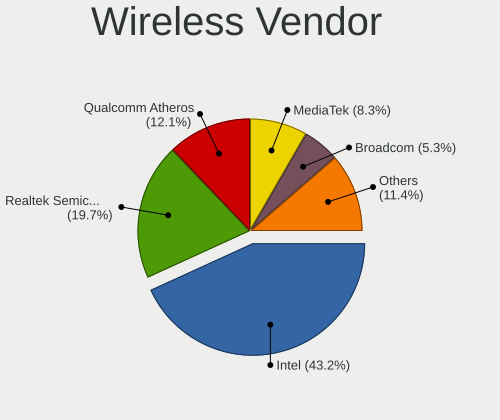

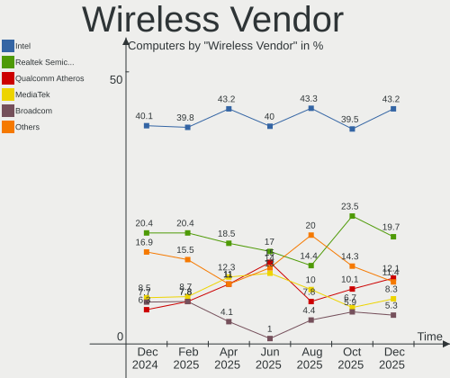

| Vendor                          | Computers | Percent |
|---------------------------------|-----------|---------|
| Intel                           | 57        | 43.18%  |
| Realtek Semiconductor           | 26        | 19.7%   |
| Qualcomm Atheros                | 16        | 12.12%  |
| MediaTek                        | 11        | 8.33%   |
| Broadcom                        | 7         | 5.3%    |
| TP-Link                         | 5         | 3.79%   |
| Ralink Technology               | 2         | 1.52%   |
| Ralink                          | 2         | 1.52%   |
| Microsoft                       | 2         | 1.52%   |
| Qualcomm Atheros Communications | 1         | 0.76%   |
| Mercucys                        | 1         | 0.76%   |
| D-Link                          | 1         | 0.76%   |
| Broadcom Limited                | 1         | 0.76%   |

Wireless Model
--------------

Wireless models

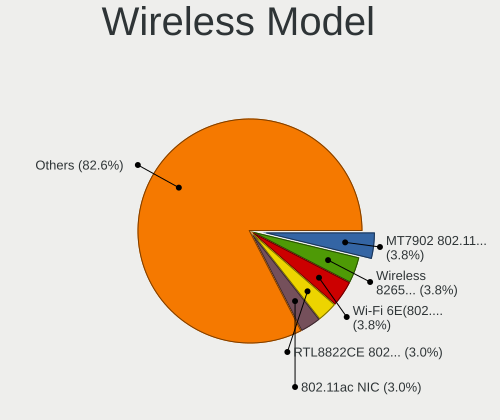

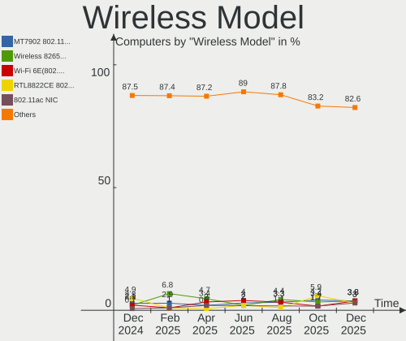

| Model                                                                | Computers | Percent |
|----------------------------------------------------------------------|-----------|---------|
| MediaTek MT7902 802.11ax PCIe Wireless Network Adapter [Filogic 310] | 5         | 3.79%   |
| Intel Wireless 8265 / 8275                                           | 5         | 3.79%   |
| Intel Wi-Fi 6E(802.11ax) AX210/AX1675* 2x2 [Typhoon Peak]            | 5         | 3.79%   |
| Realtek RTL8822CE 802.11ac PCIe Wireless Network Adapter             | 4         | 3.03%   |
| Realtek 802.11ac NIC                                                 | 4         | 3.03%   |
| Qualcomm Atheros QCA9565 / AR9565 Wireless Network Adapter           | 4         | 3.03%   |
| Qualcomm Atheros QCA9377 802.11ac Wireless Network Adapter           | 4         | 3.03%   |
| MediaTek MT7921 802.11ax PCIe Wireless Network Adapter [Filogic 330] | 4         | 3.03%   |
| Intel Wi-Fi 6 AX201                                                  | 4         | 3.03%   |
| Intel Wi-Fi 6 AX200                                                  | 4         | 3.03%   |
| Intel Raptor Lake PCH CNVi WiFi                                      | 4         | 3.03%   |
| Intel Meteor Lake PCH CNVi WiFi                                      | 4         | 3.03%   |
| Realtek RTL8192EE PCIe Wireless Network Adapter                      | 3         | 2.27%   |
| Qualcomm Atheros AR9285 Wireless Network Adapter (PCI-Express)       | 3         | 2.27%   |
| Intel Wireless 8260                                                  | 3         | 2.27%   |
| Intel Comet Lake PCH-LP CNVi WiFi                                    | 3         | 2.27%   |
| Intel Cannon Point-LP CNVi [Wireless-AC]                             | 3         | 2.27%   |
| TP-Link 802.11ac NIC                                                 | 2         | 1.52%   |
| Realtek RTL8821AE 802.11ac PCIe Wireless Network Adapter             | 2         | 1.52%   |
| Realtek RTL8723BE PCIe Wireless Network Adapter                      | 2         | 1.52%   |
| Realtek RTL8192EU 802.11b/g/n WLAN Adapter                           | 2         | 1.52%   |
| MediaTek MT7922 802.11ax PCI Express Wireless Network Adapter        | 2         | 1.52%   |
| Intel Wireless 7265                                                  | 2         | 1.52%   |
| Intel Wireless 3165                                                  | 2         | 1.52%   |
| Intel Wireless 3160                                                  | 2         | 1.52%   |
| Intel Comet Lake PCH CNVi WiFi                                       | 2         | 1.52%   |
| Intel Centrino Wireless-N 100                                        | 2         | 1.52%   |
| Broadcom BCM4331 802.11a/b/g/n                                       | 2         | 1.52%   |
| TP-Link Archer T3U [Realtek RTL8812BU]                               | 1         | 0.76%   |
| TP-Link Archer T2U PLUS [RTL8821AU]                                  | 1         | 0.76%   |
| TP-Link AC600 wireless Realtek RTL8811AU [Archer T2U Nano]           | 1         | 0.76%   |
| Realtek RTL8922AE 802.11be PCIe Wireless Network Adapter             | 1         | 0.76%   |
| Realtek RTL8852CE PCIe 802.11ax Wireless Network Controller          | 1         | 0.76%   |
| Realtek RTL8852BE-VT PCIe 802.11ax Wireless Network Controller       | 1         | 0.76%   |
| Realtek RTL8852BE PCIe 802.11ax Wireless Network Controller          | 1         | 0.76%   |
| Realtek RTL8822BE 802.11a/b/g/n/ac WiFi adapter                      | 1         | 0.76%   |
| Realtek RTL8821CE 802.11ac PCIe Wireless Network Adapter             | 1         | 0.76%   |
| Realtek RTL8723DE Wireless Network Adapter                           | 1         | 0.76%   |
| Realtek RTL8192CE PCIe Wireless Network Adapter                      | 1         | 0.76%   |
| Realtek RTL8188EUS 802.11n Wireless Network Adapter                  | 1         | 0.76%   |

Ethernet Vendor
---------------

Ethernet vendors

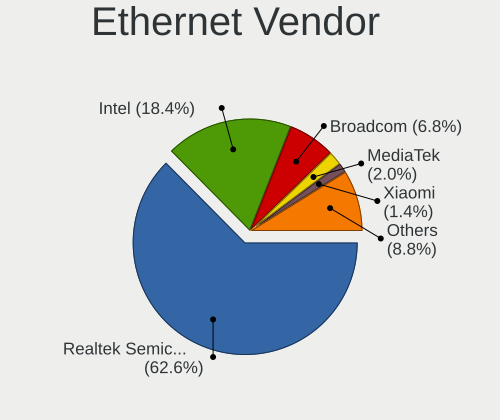

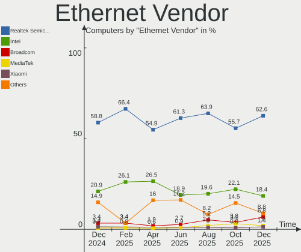

| Vendor                                 | Computers | Percent |
|----------------------------------------|-----------|---------|
| Realtek Semiconductor                  | 92        | 62.59%  |
| Intel                                  | 27        | 18.37%  |
| Broadcom                               | 10        | 6.8%    |
| MediaTek                               | 3         | 2.04%   |
| Xiaomi                                 | 2         | 1.36%   |
| Qualcomm Atheros                       | 2         | 1.36%   |
| Marvell Technology Group               | 2         | 1.36%   |
| Hewlett-Packard                        | 2         | 1.36%   |
| Suzhou Motorcomm Electronic Technology | 1         | 0.68%   |
| Silicon Integrated Systems [SiS]       | 1         | 0.68%   |
| Raspberry Pi                           | 1         | 0.68%   |
| Qualcomm Technologies                  | 1         | 0.68%   |
| Huawei Technologies                    | 1         | 0.68%   |
| DisplayLink                            | 1         | 0.68%   |
| ASIX Electronics                       | 1         | 0.68%   |

Ethernet Model
--------------

Ethernet models

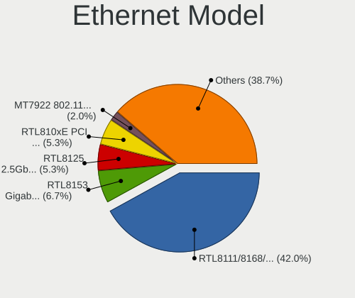

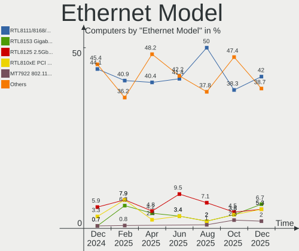

| Model                                                                  | Computers | Percent |
|------------------------------------------------------------------------|-----------|---------|
| Realtek RTL8111/8168/8211/8411 PCI Express Gigabit Ethernet Controller | 63        | 42%     |
| Realtek RTL8153 Gigabit Ethernet Adapter                               | 10        | 6.67%   |
| Realtek RTL8125 2.5GbE Controller                                      | 8         | 5.33%   |
| Realtek RTL810xE PCI Express Fast Ethernet controller                  | 8         | 5.33%   |
| MediaTek MT7922 802.11ax PCI Express Wireless Network Adapter          | 3         | 2%      |
| Intel I211 Gigabit Network Connection                                  | 3         | 2%      |
| Xiaomi Mi/Redmi series (RNDIS)                                         | 2         | 1.33%   |
| Intel Ethernet Controller I226-V                                       | 2         | 1.33%   |
| Intel Ethernet Controller I225-V                                       | 2         | 1.33%   |
| Intel Ethernet Connection I217-LM                                      | 2         | 1.33%   |
| Intel Ethernet Connection (2) I219-V                                   | 2         | 1.33%   |
| Intel Alder Lake-P PCH CNVi WiFi                                       | 2         | 1.33%   |
| HP HP lt4120 Snapdragon X5 LTE                                         | 2         | 1.33%   |
| Broadcom NetXtreme BCM57765 Gigabit Ethernet PCIe                      | 2         | 1.33%   |
| Suzhou Motorcomm Electronic YT6801 Gigabit Ethernet Controller         | 1         | 0.67%   |
| Silicon Integrated Systems [SiS] 191 Gigabit Ethernet Adapter          | 1         | 0.67%   |
| Realtek RTL8852BE PCIe 802.11ax Wireless Network Controller            | 1         | 0.67%   |
| Realtek RTL8152 Fast Ethernet Adapter                                  | 1         | 0.67%   |
| Realtek RTL8126 5GbE Controller                                        | 1         | 0.67%   |
| Realtek Killer E5000 5GbE Controller                                   | 1         | 0.67%   |
| Realtek Killer E2600 GbE Controller                                    | 1         | 0.67%   |
| Raspberry Pi RP1 PCIe 2.0 South Bridge                                 | 1         | 0.67%   |
| Qualcomm WCN785x Wi-Fi 7(802.11be) 320MHz 2x2 [FastConnect 7800]       | 1         | 0.67%   |
| Qualcomm Atheros Killer E220x Gigabit Ethernet Controller              | 1         | 0.67%   |
| Qualcomm Atheros AR8151 v2.0 Gigabit Ethernet                          | 1         | 0.67%   |
| Marvell Group 88E8071 PCI-E Gigabit Ethernet Controller                | 1         | 0.67%   |
| Marvell Group 88E8055 PCI-E Gigabit Ethernet Controller                | 1         | 0.67%   |
| Intel Wi-Fi 7(802.11be) AX1775*/AX1790*/BE20*/BE401/BE1750* 2x2        | 1         | 0.67%   |
| Intel Ethernet Controller 10-Gigabit X540-AT2                          | 1         | 0.67%   |
| Intel Ethernet Connection I219-LM                                      | 1         | 0.67%   |
| Intel Ethernet Connection I217-V                                       | 1         | 0.67%   |
| Intel Ethernet Connection (6) I219-V                                   | 1         | 0.67%   |
| Intel Ethernet Connection (5) I219-LM                                  | 1         | 0.67%   |
| Intel Ethernet Connection (4) I219-LM                                  | 1         | 0.67%   |
| Intel Ethernet Connection (23) I219-V                                  | 1         | 0.67%   |
| Intel Ethernet Connection (2) I218-V                                   | 1         | 0.67%   |
| Intel Ethernet Connection (13) I219-V                                  | 1         | 0.67%   |
| Intel Ethernet Connection (13) I219-LM                                 | 1         | 0.67%   |
| Intel Ethernet Connection (10) I219-LM                                 | 1         | 0.67%   |
| Intel Arrow Lake CNVi WiFi                                             | 1         | 0.67%   |

Net Controller Kind
-------------------

Ethernet, WiFi or modem

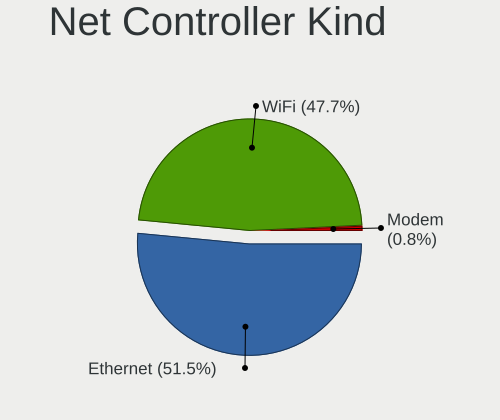

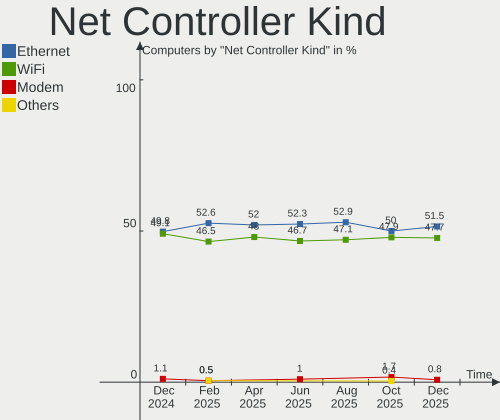

| Kind     | Computers | Percent |
|----------|-----------|---------|
| Ethernet | 136       | 51.52%  |
| WiFi     | 126       | 47.73%  |
| Modem    | 2         | 0.76%   |

Used Controller
---------------

Currently used network controller

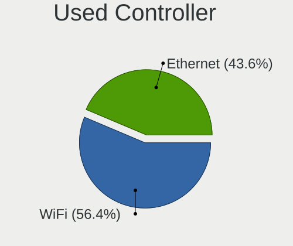

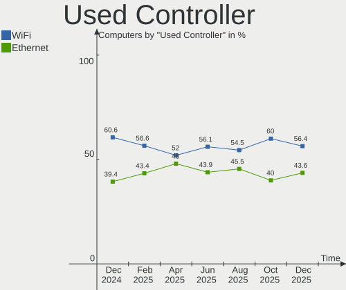

| Kind     | Computers | Percent |
|----------|-----------|---------|
| WiFi     | 93        | 56.36%  |
| Ethernet | 72        | 43.64%  |

NICs
----

Total network controllers on board

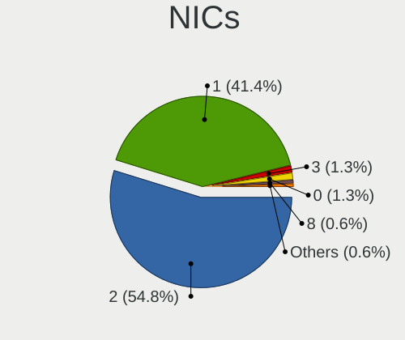

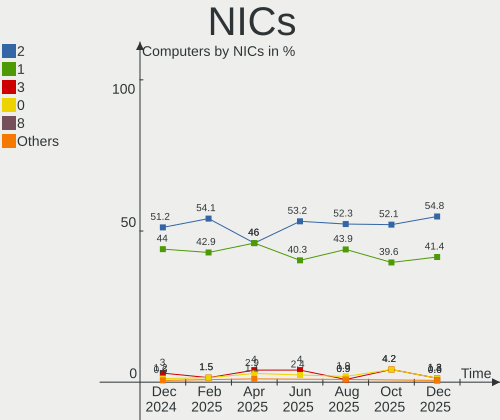

| Total | Computers | Percent |
|-------|-----------|---------|
| 2     | 86        | 54.78%  |
| 1     | 65        | 41.4%   |
| 3     | 2         | 1.27%   |
| 0     | 2         | 1.27%   |
| 8     | 1         | 0.64%   |
| 4     | 1         | 0.64%   |

IPv6
----

IPv6 vs IPv4

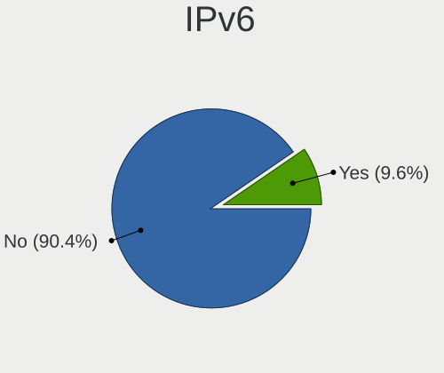

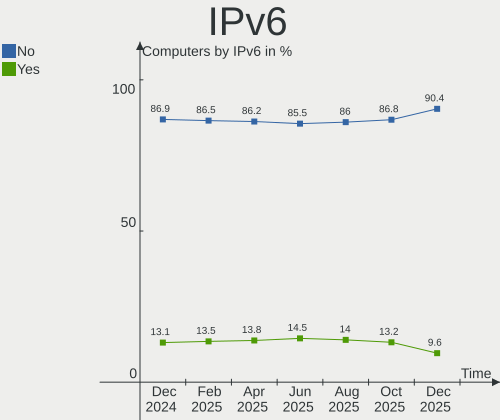

| Used | Computers | Percent |
|------|-----------|---------|
| No   | 142       | 90.45%  |
| Yes  | 15        | 9.55%   |

Bluetooth
---------

Bluetooth Vendor
----------------

Controller vendors

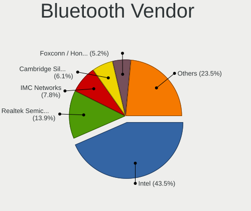

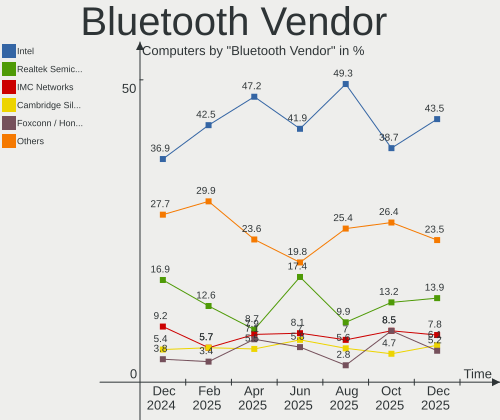

| Vendor                          | Computers | Percent |
|---------------------------------|-----------|---------|
| Intel                           | 50        | 43.48%  |
| Realtek Semiconductor           | 16        | 13.91%  |
| IMC Networks                    | 9         | 7.83%   |
| Cambridge Silicon Radio         | 7         | 6.09%   |
| Foxconn / Hon Hai               | 6         | 5.22%   |
| Qualcomm Atheros Communications | 5         | 4.35%   |
| MediaTek                        | 5         | 4.35%   |
| Apple                           | 4         | 3.48%   |
| Lite-On Technology              | 3         | 2.61%   |
| Broadcom                        | 3         | 2.61%   |
| Mercucys                        | 2         | 1.74%   |
| ASUSTek Computer                | 2         | 1.74%   |
| Toshiba                         | 1         | 0.87%   |
| Ralink                          | 1         | 0.87%   |
| Alps Electric                   | 1         | 0.87%   |

Bluetooth Model
---------------

Controller models

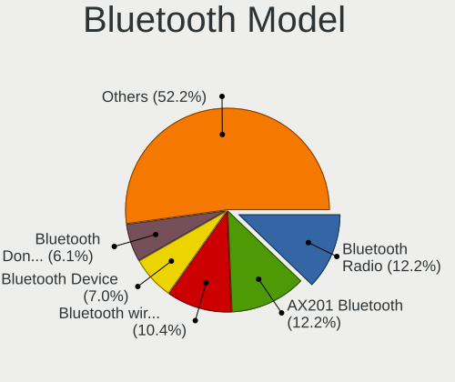

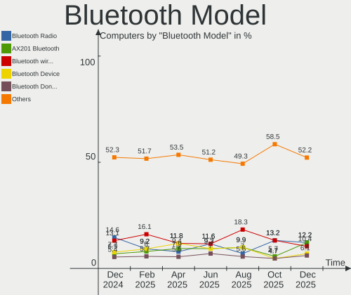

| Model                                               | Computers | Percent |
|-----------------------------------------------------|-----------|---------|
| Realtek Bluetooth Radio                             | 14        | 12.17%  |
| Intel AX201 Bluetooth                               | 14        | 12.17%  |
| Intel Bluetooth wireless interface                  | 12        | 10.43%  |
| Intel Bluetooth Device                              | 8         | 6.96%   |
| Cambridge Silicon Radio Bluetooth Dongle (HCI mode) | 7         | 6.09%   |
| Intel Bluetooth 9460/9560 Jefferson Peak (JfP)      | 6         | 5.22%   |
| IMC Networks Wireless_Device                        | 6         | 5.22%   |
| MediaTek Wireless_Device                            | 5         | 4.35%   |
| Intel AX210 Bluetooth                               | 5         | 4.35%   |
| Apple Bluetooth Host Controller                     | 4         | 3.48%   |
| Foxconn / Hon Hai Bluetooth Device                  | 3         | 2.61%   |
| Realtek  Bluetooth 4.2 Adapter                      | 2         | 1.74%   |
| Qualcomm Atheros  Bluetooth Device                  | 2         | 1.74%   |
| Mercucys Mercusys MA530 Adapter                     | 2         | 1.74%   |
| Lite-On Atheros AR3012 Bluetooth                    | 2         | 1.74%   |
| Intel AX200 Bluetooth                               | 2         | 1.74%   |
| IMC Networks Bluetooth Radio                        | 2         | 1.74%   |
| Toshiba Integrated Bluetooth HCI                    | 1         | 0.87%   |
| Ralink RT3290 Bluetooth                             | 1         | 0.87%   |
| Qualcomm Atheros QCA61x4 Bluetooth 4.0              | 1         | 0.87%   |
| Qualcomm Atheros AR3012 Bluetooth 4.0               | 1         | 0.87%   |
| Qualcomm Atheros AR3012 Bluetooth                   | 1         | 0.87%   |
| Lite-On Wireless_Device                             | 1         | 0.87%   |
| Intel Wireless-AC 9260 Bluetooth Adapter            | 1         | 0.87%   |
| Intel Wireless-AC 3168 Bluetooth                    | 1         | 0.87%   |
| Intel Centrino Advanced-N 6230 Bluetooth adapter    | 1         | 0.87%   |
| IMC Networks Bluetooth Device                       | 1         | 0.87%   |
| Foxconn / Hon Hai Wireless_Device                   | 1         | 0.87%   |
| Foxconn / Hon Hai MediaTek Bluetooth Adapter        | 1         | 0.87%   |
| Foxconn / Hon Hai BCM20702A0                        | 1         | 0.87%   |
| Broadcom Bluetooth                                  | 1         | 0.87%   |
| Broadcom BCM43142A0 Bluetooth Device                | 1         | 0.87%   |
| Broadcom BCM20702A0 Bluetooth                       | 1         | 0.87%   |
| ASUS Broadcom BCM20702A0 Bluetooth                  | 1         | 0.87%   |
| ASUS ASUS USB-BT500                                 | 1         | 0.87%   |
| Alps Electric BCM2046 Bluetooth Device              | 1         | 0.87%   |

Sound
-----

Sound Vendor
------------

Sound card vendors

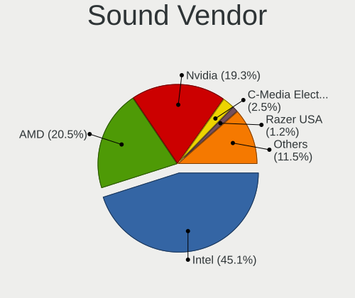

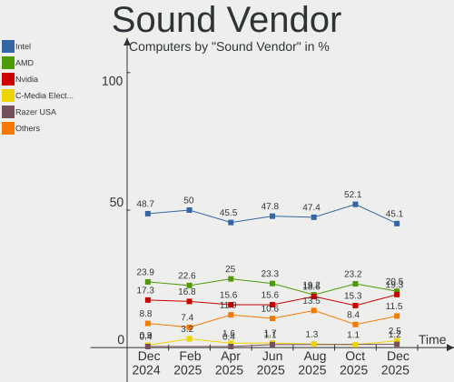

| Vendor                                       | Computers | Percent |
|----------------------------------------------|-----------|---------|
| Intel                                        | 110       | 45.08%  |
| AMD                                          | 50        | 20.49%  |
| Nvidia                                       | 47        | 19.26%  |
| C-Media Electronics                          | 6         | 2.46%   |
| Razer USA                                    | 3         | 1.23%   |
| Zoran Co. Personal Media Division (Nogatech) | 2         | 0.82%   |
| Logitech                                     | 2         | 0.82%   |
| JMTek                                        | 2         | 0.82%   |
| JieLi Technology                             | 2         | 0.82%   |
| Walmart                                      | 1         | 0.41%   |
| Thesycon Systemsoftware & Consulting         | 1         | 0.41%   |
| Texas Instruments                            | 1         | 0.41%   |
| SteelSeries ApS                              | 1         | 0.41%   |
| SOMIC Industrial                             | 1         | 0.41%   |
| Silicon Integrated Systems [SiS]             | 1         | 0.41%   |
| Sennheiser                                   | 1         | 0.41%   |
| Samson Technologies                          | 1         | 0.41%   |
| Midiplus                                     | 1         | 0.41%   |
| Micro Star International                     | 1         | 0.41%   |
| Medeli Electronics                           | 1         | 0.41%   |
| M-Audio                                      | 1         | 0.41%   |
| Logic3                                       | 1         | 0.41%   |
| Kingston Technology                          | 1         | 0.41%   |
| Hewlett-Packard                              | 1         | 0.41%   |
| Focusrite-Novation                           | 1         | 0.41%   |
| FiiO Electronics Technology                  | 1         | 0.41%   |
| Creative Technology                          | 1         | 0.41%   |
| Corsair                                      | 1         | 0.41%   |
| Actions Semiconductor                        | 1         | 0.41%   |

Sound Model
-----------

Sound card models

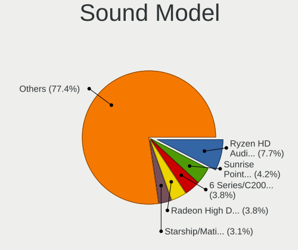

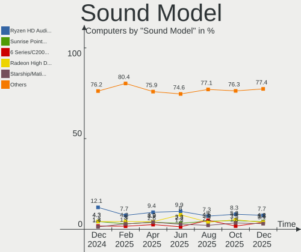

| Model                                                                      | Computers | Percent |
|----------------------------------------------------------------------------|-----------|---------|
| AMD Ryzen HD Audio Controller                                              | 22        | 7.67%   |
| Intel Sunrise Point-LP HD Audio                                            | 12        | 4.18%   |
| Intel 6 Series/C200 Series Chipset Family High Definition Audio Controller | 11        | 3.83%   |
| AMD Radeon High Definition Audio Controller                                | 11        | 3.83%   |
| AMD Starship/Matisse HD Audio Controller                                   | 9         | 3.14%   |
| AMD Renoir/Cezanne HDMI/DP Audio Controller                                | 7         | 2.44%   |
| Nvidia AD107 High Definition Audio Controller                              | 6         | 2.09%   |
| Intel Raptor Lake-P/U/H cAVS                                               | 6         | 2.09%   |
| Intel 8 Series/C220 Series Chipset High Definition Audio Controller        | 6         | 2.09%   |
| Intel Wildcat Point-LP High Definition Audio Controller                    | 5         | 1.74%   |
| Intel Tiger Lake-LP Smart Sound Technology Audio Controller                | 5         | 1.74%   |
| Intel Broadwell-U Audio Controller                                         | 5         | 1.74%   |
| Intel 100 Series/C230 Series Chipset Family HD Audio Controller            | 5         | 1.74%   |
| AMD Navi 48 HDMI/DP Audio Controller                                       | 5         | 1.74%   |
| Nvidia GA106 High Definition Audio Controller                              | 4         | 1.39%   |
| Intel Meteor Lake-P HD Audio Controller                                    | 4         | 1.39%   |
| Intel Comet Lake PCH-LP cAVS                                               | 4         | 1.39%   |
| Intel Cannon Lake PCH cAVS                                                 | 4         | 1.39%   |
| Intel 7 Series/C216 Chipset Family High Definition Audio Controller        | 4         | 1.39%   |
| AMD Kabini HDMI/DP Audio                                                   | 4         | 1.39%   |
| Razer USA Razer Barracuda X 2.4                                            | 3         | 1.05%   |
| Nvidia TU107 GeForce GTX 1650 High Definition Audio Controller             | 3         | 1.05%   |
| Nvidia High Definition Audio Controller                                    | 3         | 1.05%   |
| Nvidia GP106 High Definition Audio Controller                              | 3         | 1.05%   |
| Nvidia GK208 HDMI/DP Audio Controller                                      | 3         | 1.05%   |
| Nvidia AD106M High Definition Audio Controller                             | 3         | 1.05%   |
| Intel Xeon E3-1200 v3/4th Gen Core Processor HD Audio Controller           | 3         | 1.05%   |
| Intel NM10/ICH7 Family High Definition Audio Controller                    | 3         | 1.05%   |
| Intel Jasper Lake HD Audio                                                 | 3         | 1.05%   |
| Intel Cannon Point-LP High Definition Audio Controller                     | 3         | 1.05%   |
| Intel Alder Lake-S HD Audio Controller                                     | 3         | 1.05%   |
| Intel 5 Series/3400 Series Chipset High Definition Audio                   | 3         | 1.05%   |
| AMD SBx00 Azalia (Intel HDA)                                               | 3         | 1.05%   |
| AMD Navi 21/23 HDMI/DP Audio Controller                                    | 3         | 1.05%   |
| AMD FCH Azalia Controller                                                  | 3         | 1.05%   |
| AMD Ellesmere HDMI Audio [Radeon RX 470/480 / 570/580/590]                 | 3         | 1.05%   |
| Zoran Co. Personal Media Division (Nogatech) USB Audio and HID             | 2         | 0.7%    |
| Nvidia TU106 High Definition Audio Controller                              | 2         | 0.7%    |
| Nvidia GP107GL High Definition Audio Controller                            | 2         | 0.7%    |
| Nvidia GM204 High Definition Audio Controller                              | 2         | 0.7%    |

Memory
------

Memory Vendor
-------------

Memory module vendors

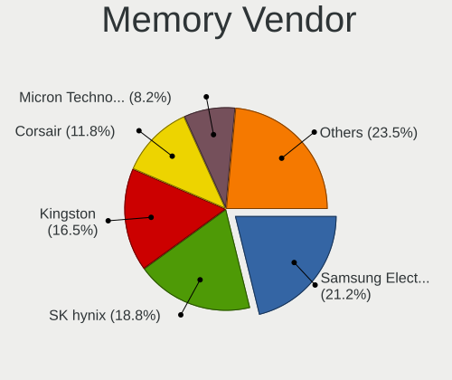

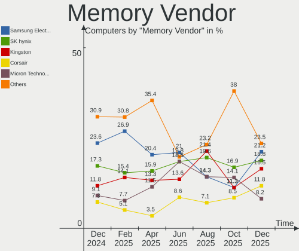

| Vendor              | Computers | Percent |
|---------------------|-----------|---------|
| Samsung Electronics | 18        | 21.18%  |
| SK hynix            | 16        | 18.82%  |
| Kingston            | 14        | 16.47%  |
| Corsair             | 10        | 11.76%  |
| Micron Technology   | 7         | 8.24%   |
| Ramaxel Technology  | 5         | 5.88%   |
| Unknown             | 4         | 4.71%   |
| G.Skill             | 3         | 3.53%   |
| Crucial             | 2         | 2.35%   |
| Unknown (0x0D0B)    | 1         | 1.18%   |
| Unknown             | 1         | 1.18%   |
| Timetec             | 1         | 1.18%   |
| Micron/Elpida       | 1         | 1.18%   |
| Elpida              | 1         | 1.18%   |
| Apacer              | 1         | 1.18%   |

Memory Model
------------

Memory module models

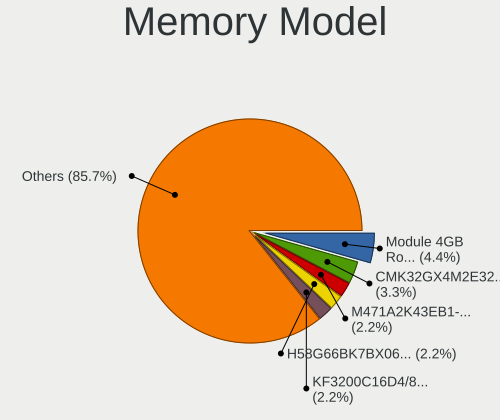

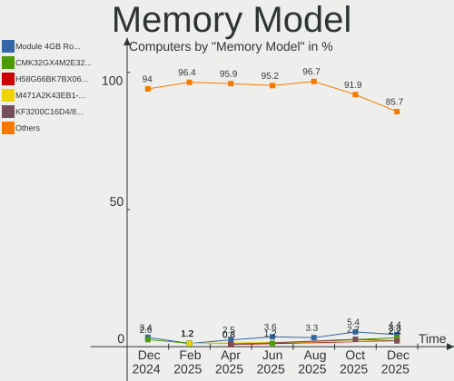

| Model                                                            | Computers | Percent |
|------------------------------------------------------------------|-----------|---------|
| Unknown                                                          | 4         | 4.4%    |
| Corsair RAM CMK32GX4M2E3200C16 16GB DIMM DDR4 3600MT/s           | 3         | 3.3%    |
| SK hynix RAM H58G66BK7BX067 16GB Row Of Chips LPDDR5 8533MT/s    | 2         | 2.2%    |
| Samsung RAM M471A2K43EB1-CWE 16GB SODIMM DDR4 3200MT/s           | 2         | 2.2%    |
| Kingston RAM KF3200C16D4/8GX 8GiB DIMM DDR4 3600MT/s             | 2         | 2.2%    |
| Kingston RAM 99U5474-038.A00LF 4GB DIMM DDR3 1333MT/s            | 2         | 2.2%    |
| Kingston RAM 99U5474-026.A00LF 4GB DIMM DDR3 1333MT/s            | 2         | 2.2%    |
| Unknown RAM Module 4GB SODIMM DDR3 1600MT/s                      | 1         | 1.1%    |
| Unknown (0x0D0B) RAM Quanji 2666MHz 8GB 8GB SODIMM DDR4 2667MT/s | 1         | 1.1%    |
| Timetec RAM Module 8GB SODIMM DDR3 1067MT/s                      | 1         | 1.1%    |
| SK hynix RAM Module 8GB SODIMM DDR3 1600MT/s                     | 1         | 1.1%    |
| SK hynix RAM Module 8GB Row Of Chips LPDDR3 2133MT/s             | 1         | 1.1%    |
| SK hynix RAM Module 8GB DIMM DDR4 2133MT/s                       | 1         | 1.1%    |
| SK hynix RAM Module 4GB Row Of Chips LPDDR3 1867MT/s             | 1         | 1.1%    |
| SK hynix RAM Module 2GB Row Of Chips LPDDR4 4267MT/s             | 1         | 1.1%    |
| SK hynix RAM HMT451S6AFR8C-PB 4GB SODIMM DDR3 1600MT/s           | 1         | 1.1%    |
| SK hynix RAM HMT351U6CFR8C-PB 4GB DIMM DDR3 1800MT/s             | 1         | 1.1%    |
| SK hynix RAM HMCG78AGBSA095N 16GB SODIMM DDR5 5600MT/s           | 1         | 1.1%    |
| SK hynix RAM HMA82GS6DJR8N-XN 16GB SODIMM DDR4 3200MT/s          | 1         | 1.1%    |
| SK hynix RAM HMA81GS6CJR8N-VK 8GB SODIMM DDR4 2400MT/s           | 1         | 1.1%    |
| SK hynix RAM HMA81GS6CJR8N-UH 8GB SODIMM DDR4 2667MT/s           | 1         | 1.1%    |
| SK hynix RAM HMA81GS6AFR8N-UH 8GB SODIMM DDR4 2667MT/s           | 1         | 1.1%    |
| SK hynix RAM HMA41GU6AFR8N-TF 8GB DIMM DDR4 2465MT/s             | 1         | 1.1%    |
| SK hynix RAM H9CCNNNCLTALAR-NTD 4GB Row Of Chips LPDDR3 1867MT/s | 1         | 1.1%    |
| SK hynix RAM H5AN8G6NCJR-VKC 4GB SODIMM DDR4 2667MT/s            | 1         | 1.1%    |
| Samsung RAM Module 16GB SODIMM DDR4 2400MT/s                     | 1         | 1.1%    |
| Samsung RAM M471B5273DH0-CK0 4GB SODIMM DDR3 2400MT/s            | 1         | 1.1%    |
| Samsung RAM M471B5273DH0-CH9 4GB SODIMM DDR3 1600MT/s            | 1         | 1.1%    |
| Samsung RAM M471B5273CH0-CH9 4GB SODIMM DDR3 1334MT/s            | 1         | 1.1%    |
| Samsung RAM M471B1G73QH0-YK0 8GB SODIMM DDR3 1600MT/s            | 1         | 1.1%    |
| Samsung RAM M471A5244CB0-CWE 4GB SODIMM DDR4 3200MT/s            | 1         | 1.1%    |
| Samsung RAM M471A5244CB0-CRC 4GB SODIMM DDR4 2667MT/s            | 1         | 1.1%    |
| Samsung RAM M471A5143EB0-CPB 4GB SODIMM DDR4 2133MT/s            | 1         | 1.1%    |
| Samsung RAM M471A2K43CB1-CTD 16GB SODIMM DDR4 8400MT/s           | 1         | 1.1%    |
| Samsung RAM M471A2G43BB2-CWE 16GB SODIMM DDR4 3200MT/s           | 1         | 1.1%    |
| Samsung RAM M471A1K43DB1-CWE 8GB SODIMM DDR4 3200MT/s            | 1         | 1.1%    |
| Samsung RAM M471A1K43DB1-CTD 8GB SODIMM DDR4 2667MT/s            | 1         | 1.1%    |
| Samsung RAM M471A1G44AB0-CWE 8GiB SODIMM DDR4 3200MT/s           | 1         | 1.1%    |
| Samsung RAM M471A1G44AB0-CWE 8GB Row Of Chips DDR4 3200MT/s      | 1         | 1.1%    |
| Samsung RAM M471A1G43DB0-CPB 8GB SODIMM DDR4 3200MT/s            | 1         | 1.1%    |

Memory Kind
-----------

Memory module kinds

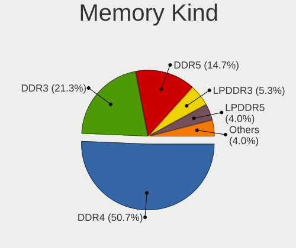

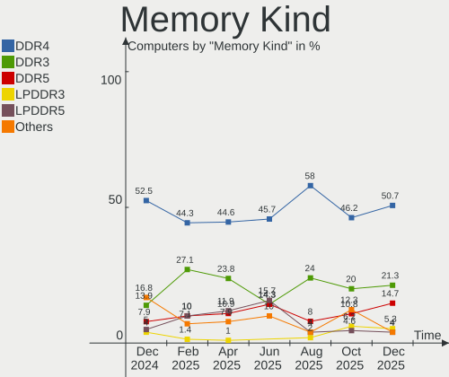

| Kind   | Computers | Percent |
|--------|-----------|---------|
| DDR4   | 38        | 50.67%  |
| DDR3   | 16        | 21.33%  |
| DDR5   | 11        | 14.67%  |
| LPDDR3 | 4         | 5.33%   |
| LPDDR5 | 3         | 4%      |
| SDRAM  | 2         | 2.67%   |
| LPDDR4 | 1         | 1.33%   |

Memory Form Factor
------------------

Physical design of the memory module

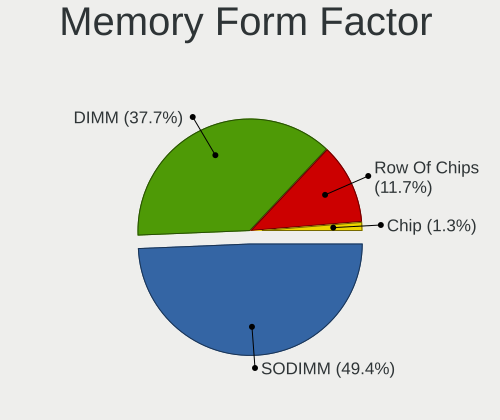

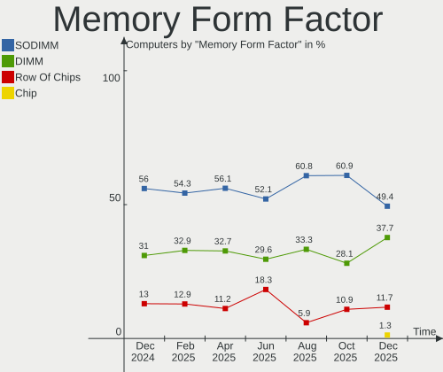

| Name         | Computers | Percent |
|--------------|-----------|---------|
| SODIMM       | 38        | 49.35%  |
| DIMM         | 29        | 37.66%  |
| Row Of Chips | 9         | 11.69%  |
| Chip         | 1         | 1.3%    |

Memory Size
-----------

Memory module size

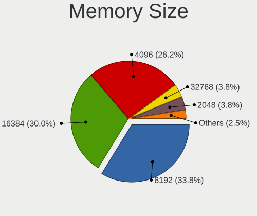

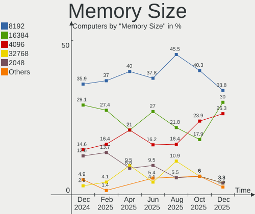

| Size  | Computers | Percent |
|-------|-----------|---------|
| 8192  | 27        | 33.75%  |
| 16384 | 24        | 30%     |
| 4096  | 21        | 26.25%  |
| 32768 | 3         | 3.75%   |
| 2048  | 3         | 3.75%   |
| 49152 | 1         | 1.25%   |
| 12288 | 1         | 1.25%   |

Memory Speed
------------

Memory module speed

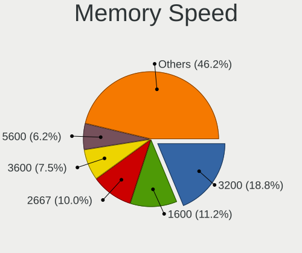

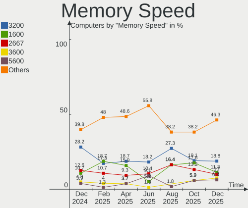

| Speed | Computers | Percent |
|-------|-----------|---------|
| 3200  | 15        | 18.75%  |
| 1600  | 9         | 11.25%  |
| 2667  | 8         | 10%     |
| 3600  | 6         | 7.5%    |
| 5600  | 5         | 6.25%   |
| 2133  | 5         | 6.25%   |
| 1333  | 5         | 6.25%   |
| 6000  | 4         | 5%      |
| 2400  | 3         | 3.75%   |
| 1867  | 3         | 3.75%   |
| 8533  | 2         | 2.5%    |
| 3466  | 2         | 2.5%    |
| 8400  | 1         | 1.25%   |
| 7467  | 1         | 1.25%   |
| 7000  | 1         | 1.25%   |
| 4800  | 1         | 1.25%   |
| 4267  | 1         | 1.25%   |
| 4199  | 1         | 1.25%   |
| 3800  | 1         | 1.25%   |
| 3666  | 1         | 1.25%   |
| 3000  | 1         | 1.25%   |
| 2465  | 1         | 1.25%   |
| 1800  | 1         | 1.25%   |
| 1334  | 1         | 1.25%   |
| 1067  | 1         | 1.25%   |

Printers & scanners
-------------------

Printer Vendor
--------------

Printer device vendors

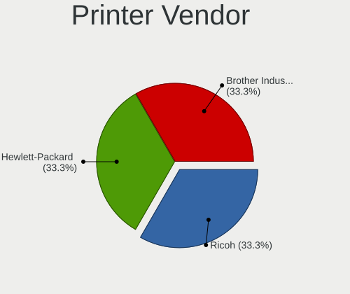

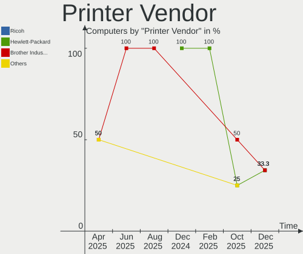

| Vendor             | Computers | Percent |
|--------------------|-----------|---------|
| Ricoh              | 1         | 33.33%  |
| Hewlett-Packard    | 1         | 33.33%  |
| Brother Industries | 1         | 33.33%  |

Printer Model
-------------

Printer device models

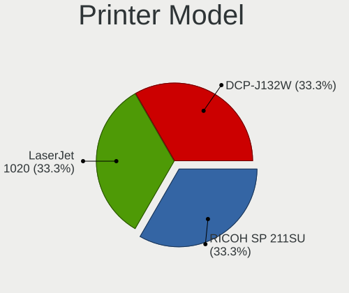

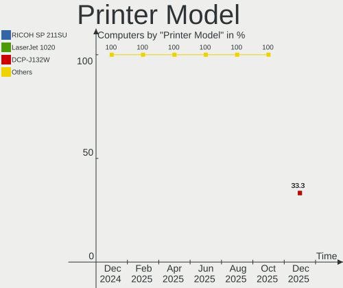

| Model                | Computers | Percent |
|----------------------|-----------|---------|
| Ricoh RICOH SP 211SU | 1         | 33.33%  |
| HP LaserJet 1020     | 1         | 33.33%  |
| Brother DCP-J132W    | 1         | 33.33%  |

Scanner Vendor
--------------

Scanner device vendors

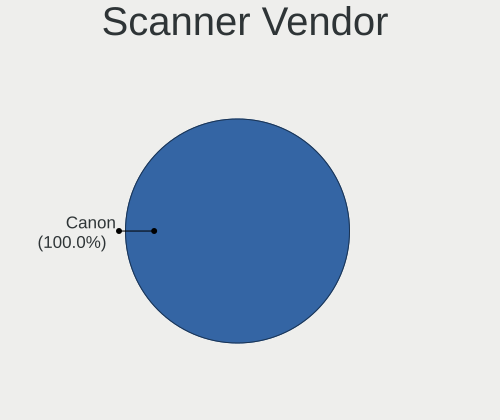

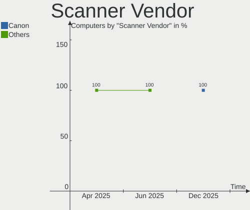

| Vendor | Computers | Percent |
|--------|-----------|---------|
| Canon  | 1         | 100%    |

Scanner Model
-------------

Scanner device models

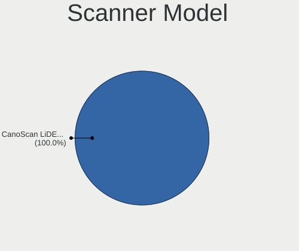

| Model                    | Computers | Percent |
|--------------------------|-----------|---------|
| Canon CanoScan LiDE 700F | 1         | 100%    |

Camera
------

Camera Vendor
-------------

Camera device vendors

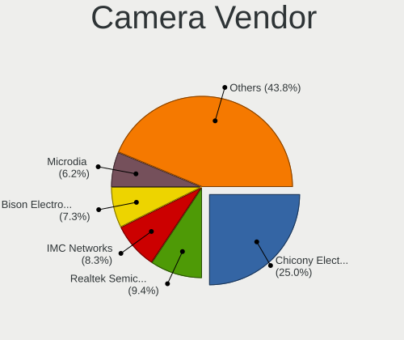

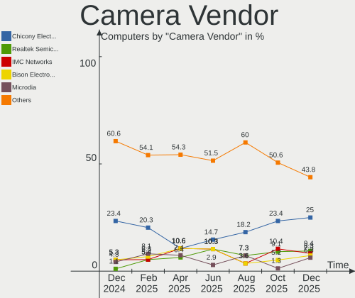

| Vendor                                 | Computers | Percent |
|----------------------------------------|-----------|---------|
| Chicony Electronics                    | 24        | 25%     |
| Realtek Semiconductor                  | 9         | 9.38%   |
| IMC Networks                           | 8         | 8.33%   |
| Bison Electronics                      | 7         | 7.29%   |
| Microdia                               | 6         | 6.25%   |
| Luxvisions Innotech Limited            | 5         | 5.21%   |
| Logitech                               | 5         | 5.21%   |
| Quanta                                 | 3         | 3.13%   |
| Cheng Uei Precision Industry (Foxlink) | 3         | 3.13%   |
| Apple                                  | 3         | 3.13%   |
| Alcor Micro                            | 3         | 3.13%   |
| Syntek                                 | 2         | 2.08%   |
| Suyin                                  | 2         | 2.08%   |
| Sunplus Innovation Technology          | 2         | 2.08%   |
| Primax Electronics                     | 2         | 2.08%   |
| SunplusIT                              | 1         | 1.04%   |
| Shinetech                              | 1         | 1.04%   |
| SenseTek                               | 1         | 1.04%   |
| Ricoh                                  | 1         | 1.04%   |
| Lite-On Technology                     | 1         | 1.04%   |
| kingcome                               | 1         | 1.04%   |
| Intel                                  | 1         | 1.04%   |
| Insta360                               | 1         | 1.04%   |
| Generalplus Technology                 | 1         | 1.04%   |
| Creative Technology                    | 1         | 1.04%   |
| AVerMedia Technologies                 | 1         | 1.04%   |
| Acer                                   | 1         | 1.04%   |

Camera Model
------------

Camera device models

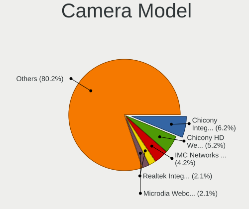

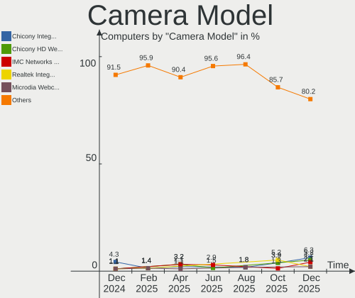

| Model                                                 | Computers | Percent |
|-------------------------------------------------------|-----------|---------|
| Chicony Integrated Camera                             | 6         | 6.25%   |
| Chicony HD WebCam                                     | 5         | 5.21%   |
| IMC Networks Integrated Camera                        | 4         | 4.17%   |
| Realtek Integrated_Webcam_HD                          | 2         | 2.08%   |
| Microdia Webcam Vitade AF                             | 2         | 2.08%   |
| Luxvisions Innotech Limited Integrated Camera         | 2         | 2.08%   |
| Logitech C920 PRO HD Webcam                           | 2         | 2.08%   |
| IMC Networks USB2.0 HD UVC WebCam                     | 2         | 2.08%   |
| Alcor Micro Asus Integrated Webcam                    | 2         | 2.08%   |
| Syntek USB Camera Device                              | 1         | 1.04%   |
| Syntek Integrated Camera                              | 1         | 1.04%   |
| Suyin HD WebCam                                       | 1         | 1.04%   |
| Suyin Acer/HP Integrated Webcam [CN0314]              | 1         | 1.04%   |
| SunplusIT 1080p FHD Camera                            | 1         | 1.04%   |
| Sunplus HP 8MP Camera                                 | 1         | 1.04%   |
| Sunplus Aukey-PC-LM1E Camera                          | 1         | 1.04%   |
| Shinetech USB2.0 FHD UVC WebCam                       | 1         | 1.04%   |
| SenseTek FHD Camera                                   | 1         | 1.04%   |
| Ricoh Sony Vaio Integrated Webcam                     | 1         | 1.04%   |
| Realtek USB2.0 VGA UVC WebCam                         | 1         | 1.04%   |
| Realtek USB Camera                                    | 1         | 1.04%   |
| Realtek Integrated Webcam                             | 1         | 1.04%   |
| Realtek HP Truevision HD                              | 1         | 1.04%   |
| Realtek HP Full-HD Camera                             | 1         | 1.04%   |
| Realtek HP "Truevision HD" laptop camera              | 1         | 1.04%   |
| Realtek Acer 640 x 480 laptop camera                  | 1         | 1.04%   |
| Quanta ov9734_techfront_camera                        | 1         | 1.04%   |
| Quanta HP Webcam                                      | 1         | 1.04%   |
| Quanta HP 2.0MP High Definition Webcam                | 1         | 1.04%   |
| Primax HP Webcam-101                                  | 1         | 1.04%   |
| Primax HP HD Webcam [Fixed]                           | 1         | 1.04%   |
| Microdia Sonix USB 2.0 Camera                         | 1         | 1.04%   |
| Microdia Integrated_Webcam_HD                         | 1         | 1.04%   |
| Microdia Defender G-Lens 2577 HD720p Camera           | 1         | 1.04%   |
| Microdia CyberTrack H7                                | 1         | 1.04%   |
| Luxvisions Innotech Limited HP TrueVision HD Camera   | 1         | 1.04%   |
| Luxvisions Innotech Limited HP True Vision HD Camera  | 1         | 1.04%   |
| Luxvisions Innotech Limited HP True Vision FHD Camera | 1         | 1.04%   |
| Logitech Webcam C170                                  | 1         | 1.04%   |
| Logitech StreamCam                                    | 1         | 1.04%   |

Security
--------

Fingerprint Vendor
------------------

Fingerprint sensor vendors

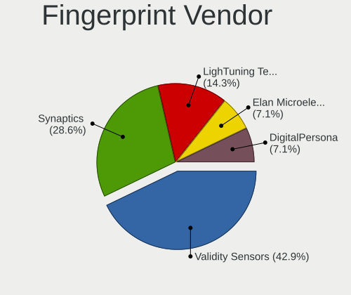

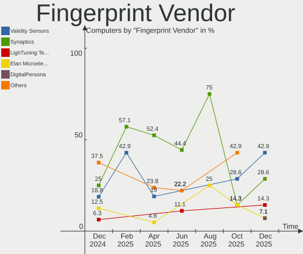

| Vendor                | Computers | Percent |
|-----------------------|-----------|---------|
| Validity Sensors      | 6         | 42.86%  |
| Synaptics             | 4         | 28.57%  |
| LighTuning Technology | 2         | 14.29%  |
| Elan Microelectronics | 1         | 7.14%   |
| DigitalPersona        | 1         | 7.14%   |

Fingerprint Model
-----------------

Fingerprint sensor models

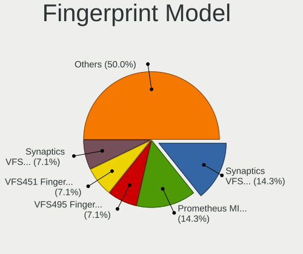

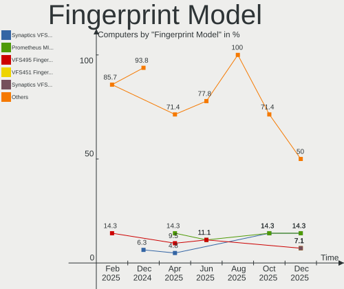

| Model                                                                      | Computers | Percent |
|----------------------------------------------------------------------------|-----------|---------|
| Validity Sensors Synaptics VFS7552 Touch Fingerprint Sensor                | 2         | 14.29%  |
| Synaptics Prometheus MIS Touch Fingerprint Reader                          | 2         | 14.29%  |
| Validity Sensors VFS495 Fingerprint Reader                                 | 1         | 7.14%   |
| Validity Sensors VFS451 Fingerprint Reader                                 | 1         | 7.14%   |
| Validity Sensors Synaptics VFS7552 Touch Fingerprint Sensor with PurePrint | 1         | 7.14%   |
| Validity Sensors Fingerprint scanner                                       | 1         | 7.14%   |
| Synaptics FS7604 Touch Fingerprint Sensor with PurePrint                   | 1         | 7.14%   |
| Synaptics Fingerprint scanner                                              | 1         | 7.14%   |
| LighTuning ES603 Swipe Fingerprint Sensor                                  | 1         | 7.14%   |
| LighTuning EgisTec Touch Fingerprint Sensor                                | 1         | 7.14%   |
| Elan ELAN:Fingerprint                                                      | 1         | 7.14%   |
| DigitalPersona Fingerprint Reader                                          | 1         | 7.14%   |

Chipcard Vendor
---------------

Chipcard module vendors

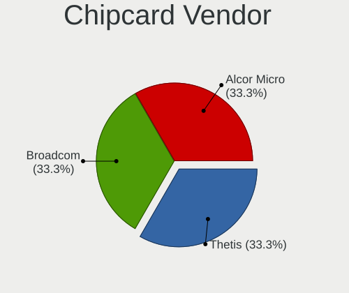

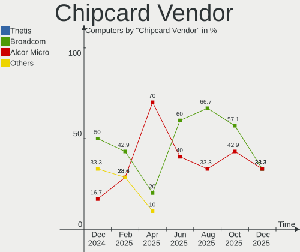

| Vendor      | Computers | Percent |
|-------------|-----------|---------|
| Thetis      | 1         | 33.33%  |
| Broadcom    | 1         | 33.33%  |
| Alcor Micro | 1         | 33.33%  |

Chipcard Model
--------------

Chipcard module models

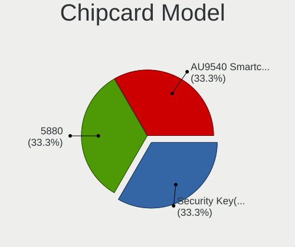

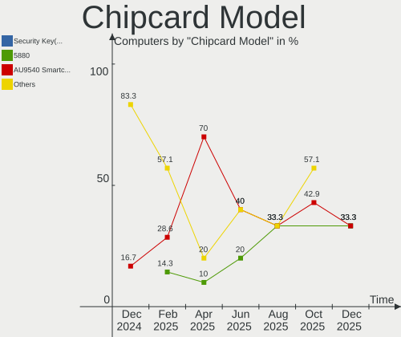

| Model                               | Computers | Percent |
|-------------------------------------|-----------|---------|
| Thetis Security Key(F825)           | 1         | 33.33%  |
| Broadcom 5880                       | 1         | 33.33%  |
| Alcor Micro AU9540 Smartcard Reader | 1         | 33.33%  |

Unsupported
-----------

Unsupported Devices
-------------------

Total unsupported devices on board

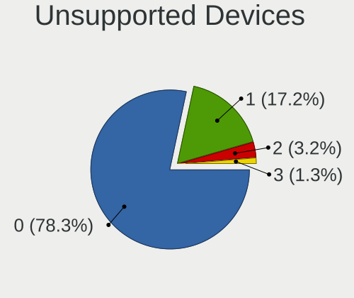

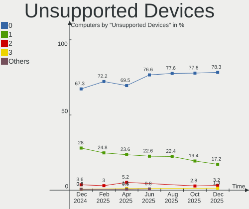

| Total | Computers | Percent |
|-------|-----------|---------|
| 0     | 123       | 78.34%  |
| 1     | 27        | 17.2%   |
| 2     | 5         | 3.18%   |
| 3     | 2         | 1.27%   |

Unsupported Device Types
------------------------

Types of unsupported devices

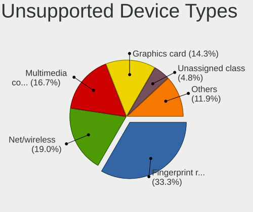

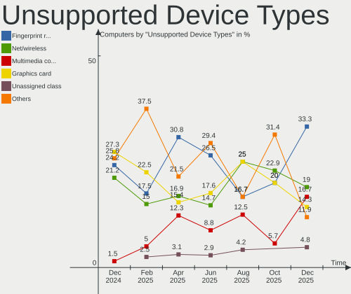

| Type                  | Computers | Percent |
|-----------------------|-----------|---------|
| Fingerprint reader    | 14        | 33.33%  |
| Net/wireless          | 8         | 19.05%  |
| Multimedia controller | 7         | 16.67%  |
| Graphics card         | 6         | 14.29%  |
| Unassigned class      | 2         | 4.76%   |
| Sound                 | 1         | 2.38%   |
| Net/ethernet          | 1         | 2.38%   |
| Flash memory          | 1         | 2.38%   |
| Chipcard              | 1         | 2.38%   |
| Bluetooth             | 1         | 2.38%   |

