Linux in Spain - Hardware Trends
--------------------------------

A project to identify most popular hardware characteristics and track their change
over time based on data collected by Linux users at https://Linux-Hardware.org.

Anyone can contribute to this report by the [hw-probe](https://github.com/linuxhw/hw-probe) tool:

    sudo -E hw-probe -all -upload

This is a report for all computer types. See also reports for [desktops](/Location/Spain/Desktop/README.md) and [notebooks](/Location/Spain/Notebook/README.md).

Period: Dec, 2023.

Contents
--------

* [ System ](#system)
  - [ OS                       ](#os)
  - [ OS Family                ](#os-family)
  - [ Kernel                   ](#kernel)
  - [ Kernel Family            ](#kernel-family)
  - [ Kernel Major Ver.        ](#kernel-major-ver)
  - [ Arch                     ](#arch)
  - [ DE                       ](#de)
  - [ Display Server           ](#display-server)
  - [ Display Manager          ](#display-manager)
  - [ OS Lang                  ](#os-lang)
  - [ Boot Mode                ](#boot-mode)
  - [ Filesystem               ](#filesystem)
  - [ Part. scheme             ](#part-scheme)
  - [ Dual Boot with Linux/BSD ](#dual-boot-with-linuxbsd)
  - [ Dual Boot (Win)          ](#dual-boot-win)

* [ Board ](#board)
  - [ Vendor                   ](#vendor)
  - [ Model                    ](#model)
  - [ Model Family             ](#model-family)
  - [ MFG Year                 ](#mfg-year)
  - [ Form Factor              ](#form-factor)
  - [ Secure Boot              ](#secure-boot)
  - [ Coreboot                 ](#coreboot)
  - [ RAM Size                 ](#ram-size)
  - [ RAM Used                 ](#ram-used)
  - [ Total Drives             ](#total-drives)
  - [ Has CD-ROM               ](#has-cd-rom)
  - [ Has Ethernet             ](#has-ethernet)
  - [ Has WiFi                 ](#has-wifi)
  - [ Has Bluetooth            ](#has-bluetooth)

* [ Location ](#location)
  - [ Country                  ](#country)
  - [ City                     ](#city)

* [ Drives ](#drives)
  - [ Drive Vendor             ](#drive-vendor)
  - [ Drive Model              ](#drive-model)
  - [ HDD Vendor               ](#hdd-vendor)
  - [ SSD Vendor               ](#ssd-vendor)
  - [ Drive Kind               ](#drive-kind)
  - [ Drive Connector          ](#drive-connector)
  - [ Drive Size               ](#drive-size)
  - [ Space Total              ](#space-total)
  - [ Space Used               ](#space-used)
  - [ Malfunc. Drives          ](#malfunc-drives)
  - [ Malfunc. Drive Vendor    ](#malfunc-drive-vendor)
  - [ Malfunc. HDD Vendor      ](#malfunc-hdd-vendor)
  - [ Malfunc. Drive Kind      ](#malfunc-drive-kind)
  - [ Failed Drives            ](#failed-drives)
  - [ Failed Drive Vendor      ](#failed-drive-vendor)
  - [ Drive Status             ](#drive-status)

* [ Storage controller ](#storage-controller)
  - [ Storage Vendor           ](#storage-vendor)
  - [ Storage Model            ](#storage-model)
  - [ Storage Kind             ](#storage-kind)

* [ Processor ](#processor)
  - [ CPU Vendor               ](#cpu-vendor)
  - [ CPU Model                ](#cpu-model)
  - [ CPU Model Family         ](#cpu-model-family)
  - [ CPU Cores                ](#cpu-cores)
  - [ CPU Sockets              ](#cpu-sockets)
  - [ CPU Threads              ](#cpu-threads)
  - [ CPU Op-Modes             ](#cpu-op-modes)
  - [ CPU Microcode            ](#cpu-microcode)
  - [ CPU Microarch            ](#cpu-microarch)

* [ Graphics ](#graphics)
  - [ GPU Vendor               ](#gpu-vendor)
  - [ GPU Model                ](#gpu-model)
  - [ GPU Combo                ](#gpu-combo)
  - [ GPU Driver               ](#gpu-driver)
  - [ GPU Memory               ](#gpu-memory)

* [ Monitor ](#monitor)
  - [ Monitor Vendor           ](#monitor-vendor)
  - [ Monitor Model            ](#monitor-model)
  - [ Monitor Resolution       ](#monitor-resolution)
  - [ Monitor Diagonal         ](#monitor-diagonal)
  - [ Monitor Width            ](#monitor-width)
  - [ Aspect Ratio             ](#aspect-ratio)
  - [ Monitor Area             ](#monitor-area)
  - [ Pixel Density            ](#pixel-density)
  - [ Multiple Monitors        ](#multiple-monitors)

* [ Network ](#network)
  - [ Net Controller Vendor    ](#net-controller-vendor)
  - [ Net Controller Model     ](#net-controller-model)
  - [ Wireless Vendor          ](#wireless-vendor)
  - [ Wireless Model           ](#wireless-model)
  - [ Ethernet Vendor          ](#ethernet-vendor)
  - [ Ethernet Model           ](#ethernet-model)
  - [ Net Controller Kind      ](#net-controller-kind)
  - [ Used Controller          ](#used-controller)
  - [ NICs                     ](#nics)
  - [ IPv6                     ](#ipv6)

* [ Bluetooth ](#bluetooth)
  - [ Bluetooth Vendor         ](#bluetooth-vendor)
  - [ Bluetooth Model          ](#bluetooth-model)

* [ Sound ](#sound)
  - [ Sound Vendor             ](#sound-vendor)
  - [ Sound Model              ](#sound-model)

* [ Memory ](#memory)
  - [ Memory Vendor            ](#memory-vendor)
  - [ Memory Model             ](#memory-model)
  - [ Memory Kind              ](#memory-kind)
  - [ Memory Form Factor       ](#memory-form-factor)
  - [ Memory Size              ](#memory-size)
  - [ Memory Speed             ](#memory-speed)

* [ Printers & scanners ](#printers--scanners)
  - [ Printer Vendor           ](#printer-vendor)
  - [ Printer Model            ](#printer-model)
  - [ Scanner Vendor           ](#scanner-vendor)
  - [ Scanner Model            ](#scanner-model)

* [ Camera ](#camera)
  - [ Camera Vendor            ](#camera-vendor)
  - [ Camera Model             ](#camera-model)

* [ Security ](#security)
  - [ Fingerprint Vendor       ](#fingerprint-vendor)
  - [ Fingerprint Model        ](#fingerprint-model)
  - [ Chipcard Vendor          ](#chipcard-vendor)
  - [ Chipcard Model           ](#chipcard-model)

* [ Unsupported ](#unsupported)
  - [ Unsupported Devices      ](#unsupported-devices)
  - [ Unsupported Device Types ](#unsupported-device-types)

System
------

OS
--

Installed operating systems

| Name                         | Computers | Percent |
|------------------------------|-----------|---------|
| Ubuntu 22.04                 | 32        | 18.39%  |
| Linux Mint 21.2              | 15        | 8.62%   |
| Debian 12                    | 14        | 8.05%   |
| Fedora 39                    | 13        | 7.47%   |
| OpenMandriva 5.0             | 11        | 6.32%   |
| Ubuntu 23.10                 | 9         | 5.17%   |
| ArcoLinux Rolling            | 8         | 4.6%    |
| OpenMandriva 23.08           | 7         | 4.02%   |
| Arch Rolling                 | 5         | 2.87%   |
| Zorin 16                     | 4         | 2.3%    |
| Debian                       | 4         | 2.3%    |
| OpenMandriva 23.90           | 3         | 1.72%   |
| Manjaro 23.1.0               | 3         | 1.72%   |
| Kubuntu 23.10                | 3         | 1.72%   |
| Zorin 17                     | 2         | 1.15%   |
| Xero Rolling                 | 2         | 1.15%   |
| Pop!_OS 22.04                | 2         | 1.15%   |
| openSUSE Tumbleweed-XXXXXXXX | 2         | 1.15%   |
| OpenMandriva 23.11           | 2         | 1.15%   |
| Linux Mint 21.1              | 2         | 1.15%   |
| Kubuntu 22.04                | 2         | 1.15%   |
| KDE neon 22.04               | 2         | 1.15%   |
| Gentoo 2.14                  | 2         | 1.15%   |
| EndeavourOS Rolling          | 2         | 1.15%   |
| Zorin 15                     | 1         | 0.57%   |
| Xubuntu 23.10                | 1         | 0.57%   |
| Ubuntu MATE 23.10            | 1         | 0.57%   |
| Ubuntu MATE 22.04            | 1         | 0.57%   |
| Ubuntu Budgie 22.04          | 1         | 0.57%   |
| Ubuntu 22.10                 | 1         | 0.57%   |
| Ubuntu 20.04                 | 1         | 0.57%   |
| Rocky Linux 9.3              | 1         | 0.57%   |
| RHEL 9                       | 1         | 0.57%   |
| openSUSE Leap-15.5           | 1         | 0.57%   |
| openSUSE Leap-15.4           | 1         | 0.57%   |
| OpenMandriva 4.2             | 1         | 0.57%   |
| Nobara 38                    | 1         | 0.57%   |
| Manjaro 23.1.1               | 1         | 0.57%   |
| Lubuntu 20.04                | 1         | 0.57%   |
| Linux Mint 21                | 1         | 0.57%   |

OS Family
---------

OS without a version

| Name          | Computers | Percent |
|---------------|-----------|---------|
| Ubuntu        | 43        | 24.71%  |
| OpenMandriva  | 24        | 13.79%  |
| Debian        | 20        | 11.49%  |
| Linux Mint    | 19        | 10.92%  |
| Fedora        | 14        | 8.05%   |
| ArcoLinux     | 8         | 4.6%    |
| Zorin         | 7         | 4.02%   |
| Kubuntu       | 6         | 3.45%   |
| Arch          | 5         | 2.87%   |
| openSUSE      | 4         | 2.3%    |
| Manjaro       | 4         | 2.3%    |
| Xero          | 2         | 1.15%   |
| Ubuntu MATE   | 2         | 1.15%   |
| Pop!_OS       | 2         | 1.15%   |
| KDE neon      | 2         | 1.15%   |
| Gentoo        | 2         | 1.15%   |
| EndeavourOS   | 2         | 1.15%   |
| Xubuntu       | 1         | 0.57%   |
| Ubuntu Budgie | 1         | 0.57%   |
| Rocky Linux   | 1         | 0.57%   |
| RHEL          | 1         | 0.57%   |
| Nobara        | 1         | 0.57%   |
| Lubuntu       | 1         | 0.57%   |
| Garuda Linux  | 1         | 0.57%   |
| Artix         | 1         | 0.57%   |

Kernel
------

Version of the Linux kernel

| Version                     | Computers | Percent |
|-----------------------------|-----------|---------|
| 6.2.0-39-generic            | 19        | 10.92%  |
| 5.15.0-91-generic           | 17        | 9.77%   |
| 6.6.2-desktop-1omv2390      | 14        | 8.05%   |
| 6.2.0-37-generic            | 11        | 6.32%   |
| 6.5.0-14-generic            | 8         | 4.6%    |
| 6.4.11-desktop-1omv2390     | 7         | 4.02%   |
| 6.1.0-13-amd64              | 5         | 2.87%   |
| 6.1.0-16-amd64              | 4         | 2.3%    |
| 5.15.0-89-generic           | 4         | 2.3%    |
| 6.6.6-200.fc39.x86_64       | 3         | 1.72%   |
| 6.6.4-arch1-1               | 3         | 1.72%   |
| 6.6.3-arch1-1               | 3         | 1.72%   |
| 6.6.1-060601-generic        | 3         | 1.72%   |
| 6.5.0-5-amd64               | 3         | 1.72%   |
| 6.2.0-26-generic            | 3         | 1.72%   |
| 6.1.0-15-amd64              | 3         | 1.72%   |
| 5.15.0-76-generic           | 3         | 1.72%   |
| 6.6.8-200.fc39.x86_64       | 2         | 1.15%   |
| 6.6.7-arch1-1               | 2         | 1.15%   |
| 6.6.6-arch1-1               | 2         | 1.15%   |
| 6.6.6-76060606-generic      | 2         | 1.15%   |
| 6.6.6-1-default             | 2         | 1.15%   |
| 6.6.5-arch1-1               | 2         | 1.15%   |
| 6.6.4-200.fc39.x86_64       | 2         | 1.15%   |
| 6.6.2-201.fc39.x86_64       | 2         | 1.15%   |
| 6.6.1-desktop-1omv2390      | 2         | 1.15%   |
| 6.5.0-13-generic            | 2         | 1.15%   |
| 6.1.0-1027-oem              | 2         | 1.15%   |
| 5.14.0-362.8.1.el9_3.x86_64 | 2         | 1.15%   |
| 6.6.8-zen1-1-zen            | 1         | 0.57%   |
| 6.6.8-arch1-1               | 1         | 0.57%   |
| 6.6.8-2-MANJARO             | 1         | 0.57%   |
| 6.6.8-2-liquorix-amd64      | 1         | 0.57%   |
| 6.6.7-zen1-1-zen            | 1         | 0.57%   |
| 6.6.7-x64v3-xanmod1         | 1         | 0.57%   |
| 6.6.7-202.fsync.fc38.x86_64 | 1         | 0.57%   |
| 6.6.7-200.fc39.x86_64       | 1         | 0.57%   |
| 6.6.3-gentoo-r1             | 1         | 0.57%   |
| 6.6.3-1-MANJARO             | 1         | 0.57%   |
| 6.6.2-arch1-1               | 1         | 0.57%   |

Kernel Family
-------------

Linux kernel without a distro release

| Version | Computers | Percent |
|---------|-----------|---------|
| 6.2.0   | 34        | 19.54%  |
| 5.15.0  | 28        | 16.09%  |
| 6.1.0   | 18        | 10.34%  |
| 6.6.2   | 17        | 9.77%   |
| 6.5.0   | 14        | 8.05%   |
| 6.6.6   | 9         | 5.17%   |
| 6.4.11  | 7         | 4.02%   |
| 6.6.8   | 6         | 3.45%   |
| 6.6.7   | 6         | 3.45%   |
| 6.6.1   | 6         | 3.45%   |
| 6.6.4   | 5         | 2.87%   |
| 6.6.3   | 5         | 2.87%   |
| 6.5.12  | 3         | 1.72%   |
| 6.6.5   | 2         | 1.15%   |
| 5.4.0   | 2         | 1.15%   |
| 5.14.21 | 2         | 1.15%   |
| 5.14.0  | 2         | 1.15%   |
| 6.5.6   | 1         | 0.57%   |
| 6.4.16  | 1         | 0.57%   |
| 6.1.69  | 1         | 0.57%   |
| 6.1.68  | 1         | 0.57%   |
| 6.1.64  | 1         | 0.57%   |
| 5.19.0  | 1         | 0.57%   |
| 5.15.32 | 1         | 0.57%   |
| 5.10.14 | 1         | 0.57%   |

Kernel Major Ver.
-----------------

Linux kernel major version

| Version | Computers | Percent |
|---------|-----------|---------|
| 6.6     | 56        | 32.18%  |
| 6.2     | 34        | 19.54%  |
| 5.15    | 29        | 16.67%  |
| 6.1     | 21        | 12.07%  |
| 6.5     | 18        | 10.34%  |
| 6.4     | 8         | 4.6%    |
| 5.14    | 4         | 2.3%    |
| 5.4     | 2         | 1.15%   |
| 5.19    | 1         | 0.57%   |
| 5.10    | 1         | 0.57%   |

Arch
----

OS architecture (x86_64, i586, etc.)

| Name   | Computers | Percent |
|--------|-----------|---------|
| x86_64 | 172       | 98.85%  |
| i686   | 2         | 1.15%   |

DE
--

Desktop Environment

| Name          | Computers | Percent |
|---------------|-----------|---------|
| GNOME         | 76        | 43.68%  |
| KDE5          | 54        | 31.03%  |
| XFCE          | 14        | 8.05%   |
| X-Cinnamon    | 14        | 8.05%   |
| MATE          | 6         | 3.45%   |
| LXQt          | 3         | 1.72%   |
| sway          | 1         | 0.57%   |
| LXDE          | 1         | 0.57%   |
| i3            | 1         | 0.57%   |
| GNOME Classic | 1         | 0.57%   |
| Cinnamon      | 1         | 0.57%   |
| Budgie        | 1         | 0.57%   |
| Unknown       | 1         | 0.57%   |

Display Server
--------------

X11 or Wayland

| Name    | Computers | Percent |
|---------|-----------|---------|
| X11     | 91        | 52.3%   |
| Wayland | 78        | 44.83%  |
| Tty     | 4         | 2.3%    |
| Unknown | 1         | 0.57%   |

Display Manager
---------------

SDDM, LightDM, etc.

| Name    | Computers | Percent |
|---------|-----------|---------|
| SDDM    | 52        | 29.89%  |
| GDM3    | 46        | 26.44%  |
| Unknown | 45        | 25.86%  |
| LightDM | 22        | 12.64%  |
| GDM     | 7         | 4.02%   |
| NODM    | 1         | 0.57%   |
| LXDM    | 1         | 0.57%   |

OS Lang
-------

Language

| Lang           | Computers | Percent |
|----------------|-----------|---------|
| es_ES          | 121       | 69.54%  |
| en_US          | 35        | 20.11%  |
| de_DE          | 3         | 1.72%   |
| it_IT          | 2         | 1.15%   |
| ru_UA          | 1         | 0.57%   |
| pt_PT          | 1         | 0.57%   |
| POSIX          | 1         | 0.57%   |
| fr_FR          | 1         | 0.57%   |
| eu_ES          | 1         | 0.57%   |
| es_AR          | 1         | 0.57%   |
| en_HK          | 1         | 0.57%   |
| en_GB          | 1         | 0.57%   |
| ca_ES@valencia | 1         | 0.57%   |
| ca_ES          | 1         | 0.57%   |
| C              | 1         | 0.57%   |
| bg_BG          | 1         | 0.57%   |
| Unknown        | 1         | 0.57%   |

Boot Mode
---------

EFI or BIOS

| Mode | Computers | Percent |
|------|-----------|---------|
| EFI  | 94        | 54.02%  |
| BIOS | 80        | 45.98%  |

Filesystem
----------

Type of filesystem

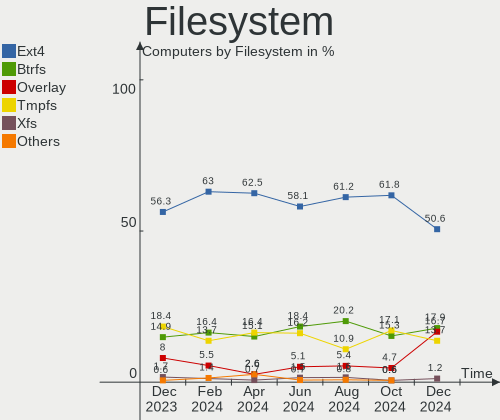

| Type    | Computers | Percent |
|---------|-----------|---------|
| Ext4    | 98        | 56.32%  |
| Tmpfs   | 32        | 18.39%  |
| Btrfs   | 26        | 14.94%  |
| Overlay | 14        | 8.05%   |
| Xfs     | 3         | 1.72%   |
| Zfs     | 1         | 0.57%   |

Part. scheme
------------

Scheme of partitioning

| Type    | Computers | Percent |
|---------|-----------|---------|
| GPT     | 108       | 62.07%  |
| Unknown | 45        | 25.86%  |
| MBR     | 21        | 12.07%  |

Dual Boot with Linux/BSD
------------------------

Hosting more than one Linux/BSD

| Dual boot | Computers | Percent |
|-----------|-----------|---------|
| No        | 149       | 85.63%  |
| Yes       | 25        | 14.37%  |

Dual Boot (Win)
---------------

Hosting Linux and Windows

| Dual boot | Computers | Percent |
|-----------|-----------|---------|
| No        | 116       | 66.67%  |
| Yes       | 58        | 33.33%  |

Board
-----

Vendor
------

Motherboard manufacturer

| Name                | Computers | Percent |
|---------------------|-----------|---------|
| Hewlett-Packard     | 33        | 18.97%  |
| ASUSTek Computer    | 32        | 18.39%  |
| Lenovo              | 24        | 13.79%  |
| MSI                 | 12        | 6.9%    |
| Gigabyte Technology | 9         | 5.17%   |
| Acer                | 9         | 5.17%   |
| Apple               | 8         | 4.6%    |
| Dell                | 5         | 2.87%   |
| ASRock              | 5         | 2.87%   |
| Intel               | 4         | 2.3%    |
| Packard Bell        | 3         | 1.72%   |
| AMI                 | 3         | 1.72%   |
| Unknown             | 3         | 1.72%   |
| Notebook            | 2         | 1.15%   |
| Alurin              | 2         | 1.15%   |
| XIAOMI              | 1         | 0.57%   |
| TUXEDO              | 1         | 0.57%   |
| Trigkey             | 1         | 0.57%   |
| SLIMBOOK            | 1         | 0.57%   |
| Samsung Electronics | 1         | 0.57%   |
| QIYIDA              | 1         | 0.57%   |
| Qilive              | 1         | 0.57%   |
| Panasonic           | 1         | 0.57%   |
| Microsoft           | 1         | 0.57%   |
| HUAWEI              | 1         | 0.57%   |
| Huanan              | 1         | 0.57%   |
| Fujitsu Siemens     | 1         | 0.57%   |
| Framework           | 1         | 0.57%   |
| Foxconn             | 1         | 0.57%   |
| Fanless Mini PC     | 1         | 0.57%   |
| Clevo               | 1         | 0.57%   |
| BAKED               | 1         | 0.57%   |
| AZW                 | 1         | 0.57%   |
| Allview             | 1         | 0.57%   |
| Adreamer            | 1         | 0.57%   |

Model
-----

Motherboard model

| Name                                     | Computers | Percent |
|------------------------------------------|-----------|---------|
| Unknown                                  | 4         | 2.3%    |
| Lenovo IdeaPad Gaming 3 15ACH6 82K2      | 2         | 1.15%   |
| HP Laptop 15-fd0xxx                      | 2         | 1.15%   |
| Dell Vostro 3550                         | 2         | 1.15%   |
| ASUS VivoBook_ASUSLaptop K3402ZA_K3402ZA | 2         | 1.15%   |
| Apple iMac11,3                           | 2         | 1.15%   |
| AMI Intel                                | 2         | 1.15%   |
| XIAOMI Redmi Book Pro 15 2023            | 1         | 0.57%   |
| TUXEDO InfinityBook Pro Gen8 (MK2)       | 1         | 0.57%   |
| Trigkey S5                               | 1         | 0.57%   |
| SLIMBOOK PROX-AMD5                       | 1         | 0.57%   |
| Samsung R530/R730                        | 1         | 0.57%   |
| QIYIDA X99-H9 V2.0                       | 1         | 0.57%   |
| Qilive QW20141BSP                        | 1         | 0.57%   |
| Panasonic CF-19RDRCHH7                   | 1         | 0.57%   |
| Packard Bell IMEDIA S3720                | 1         | 0.57%   |
| Packard Bell EasyNote TN36               | 1         | 0.57%   |
| Packard Bell EasyNote TE11BZ             | 1         | 0.57%   |
| Notebook W65_67SR                        | 1         | 0.57%   |
| Notebook N24_25JU                        | 1         | 0.57%   |
| MSI Prestige 15 A12UD                    | 1         | 0.57%   |
| MSI MS-7D91                              | 1         | 0.57%   |
| MSI MS-7D50                              | 1         | 0.57%   |
| MSI MS-7D18                              | 1         | 0.57%   |
| MSI MS-7D16                              | 1         | 0.57%   |
| MSI MS-7C75                              | 1         | 0.57%   |
| MSI MS-7B86                              | 1         | 0.57%   |
| MSI MS-7A38                              | 1         | 0.57%   |
| MSI MS-7A12                              | 1         | 0.57%   |
| MSI KBL-U Pro Cubi 3 Silent S (MS-B159)  | 1         | 0.57%   |
| MSI GS66 Stealth 10SE                    | 1         | 0.57%   |
| MSI Alpha 17 C7VF                        | 1         | 0.57%   |
| Microsoft Surface Pro 7+                 | 1         | 0.57%   |
| Lenovo Yoga Slim 7 14APU8 83AA           | 1         | 0.57%   |
| Lenovo ThinkPad X1 Carbon 6th 20KHS0J700 | 1         | 0.57%   |
| Lenovo ThinkPad X1 Carbon 6th 20KGS4QH1E | 1         | 0.57%   |
| Lenovo ThinkPad W500 40624DG             | 1         | 0.57%   |
| Lenovo ThinkPad T550 20CJS1VD01          | 1         | 0.57%   |
| Lenovo ThinkPad SL500 274678G            | 1         | 0.57%   |
| Lenovo ThinkPad L15 Gen 4 21H3CTO1WW     | 1         | 0.57%   |

Model Family
------------

Motherboard model prefix

| Name                   | Computers | Percent |
|------------------------|-----------|---------|
| Lenovo IdeaPad         | 8         | 4.6%    |
| HP Pavilion            | 8         | 4.6%    |
| Lenovo ThinkPad        | 7         | 4.02%   |
| HP Laptop              | 6         | 3.45%   |
| ASUS VivoBook          | 6         | 3.45%   |
| ASUS ROG               | 6         | 3.45%   |
| Acer Aspire            | 6         | 3.45%   |
| Lenovo ThinkCentre     | 4         | 2.3%    |
| HP Compaq              | 4         | 2.3%    |
| Unknown                | 4         | 2.3%    |
| HP Victus              | 3         | 1.72%   |
| HP EliteBook           | 3         | 1.72%   |
| Dell Vostro            | 3         | 1.72%   |
| ASUS Zenbook           | 3         | 1.72%   |
| Packard Bell EasyNote  | 2         | 1.15%   |
| ASUS TUF               | 2         | 1.15%   |
| ASUS Pro               | 2         | 1.15%   |
| ASUS PRIME             | 2         | 1.15%   |
| Apple MacBookPro11     | 2         | 1.15%   |
| Apple iMac11           | 2         | 1.15%   |
| AMI Intel              | 2         | 1.15%   |
| Acer Nitro             | 2         | 1.15%   |
| XIAOMI Redmi           | 1         | 0.57%   |
| TUXEDO InfinityBook    | 1         | 0.57%   |
| Trigkey S5             | 1         | 0.57%   |
| SLIMBOOK PROX-AMD5     | 1         | 0.57%   |
| Samsung R530           | 1         | 0.57%   |
| QIYIDA X99-H9          | 1         | 0.57%   |
| Qilive QW20141BSP      | 1         | 0.57%   |
| Panasonic CF-19RDRCHH7 | 1         | 0.57%   |
| Packard Bell IMEDIA    | 1         | 0.57%   |
| Notebook W65           | 1         | 0.57%   |
| Notebook N24           | 1         | 0.57%   |
| MSI Prestige           | 1         | 0.57%   |
| MSI MS-7D91            | 1         | 0.57%   |
| MSI MS-7D50            | 1         | 0.57%   |
| MSI MS-7D18            | 1         | 0.57%   |
| MSI MS-7D16            | 1         | 0.57%   |
| MSI MS-7C75            | 1         | 0.57%   |
| MSI MS-7B86            | 1         | 0.57%   |

MFG Year
--------

Motherboard manufacture year

| Year | Computers | Percent |
|------|-----------|---------|
| 2023 | 26        | 14.94%  |
| 2021 | 20        | 11.49%  |
| 2022 | 19        | 10.92%  |
| 2020 | 16        | 9.2%    |
| 2018 | 14        | 8.05%   |
| 2015 | 11        | 6.32%   |
| 2009 | 10        | 5.75%   |
| 2011 | 9         | 5.17%   |
| 2019 | 7         | 4.02%   |
| 2017 | 7         | 4.02%   |
| 2012 | 7         | 4.02%   |
| 2010 | 7         | 4.02%   |
| 2014 | 6         | 3.45%   |
| 2013 | 6         | 3.45%   |
| 2008 | 5         | 2.87%   |
| 2016 | 2         | 1.15%   |
| 2007 | 2         | 1.15%   |

Form Factor
-----------

Physical design of the computer

| Name        | Computers | Percent |
|-------------|-----------|---------|
| Notebook    | 101       | 58.05%  |
| Desktop     | 61        | 35.06%  |
| Mini pc     | 5         | 2.87%   |
| All in one  | 4         | 2.3%    |
| Stick pc    | 1         | 0.57%   |
| Tablet      | 1         | 0.57%   |
| Convertible | 1         | 0.57%   |

Secure Boot
-----------

Enabled or disabled

| State    | Computers | Percent |
|----------|-----------|---------|
| Disabled | 163       | 93.68%  |
| Enabled  | 11        | 6.32%   |

Coreboot
--------

Have coreboot on board

| Used | Computers | Percent |
|------|-----------|---------|
| No   | 174       | 100%    |

RAM Size
--------

Total RAM memory

| Size in GB  | Computers | Percent |
|-------------|-----------|---------|
| 4.01-8.0    | 43        | 24.71%  |
| 16.01-24.0  | 37        | 21.26%  |
| 8.01-16.0   | 36        | 20.69%  |
| 3.01-4.0    | 23        | 13.22%  |
| 32.01-64.0  | 22        | 12.64%  |
| 24.01-32.0  | 6         | 3.45%   |
| 64.01-256.0 | 4         | 2.3%    |
| 1.01-2.0    | 2         | 1.15%   |
| 2.01-3.0    | 1         | 0.57%   |

RAM Used
--------

Used RAM memory

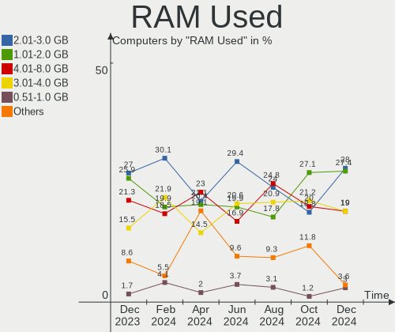

| Used GB    | Computers | Percent |
|------------|-----------|---------|
| 2.01-3.0   | 48        | 27.59%  |
| 1.01-2.0   | 43        | 24.71%  |
| 4.01-8.0   | 38        | 21.84%  |
| 3.01-4.0   | 27        | 15.52%  |
| 8.01-16.0  | 8         | 4.6%    |
| 16.01-24.0 | 3         | 1.72%   |
| 0.51-1.0   | 3         | 1.72%   |
| 0.01-0.5   | 2         | 1.15%   |
| 32.01-64.0 | 1         | 0.57%   |
| 24.01-32.0 | 1         | 0.57%   |

Total Drives
------------

Number of drives on board

| Drives | Computers | Percent |
|--------|-----------|---------|
| 1      | 108       | 62.07%  |
| 2      | 43        | 24.71%  |
| 3      | 10        | 5.75%   |
| 4      | 7         | 4.02%   |
| 5      | 3         | 1.72%   |
| 6      | 2         | 1.15%   |
| 10     | 1         | 0.57%   |

Has CD-ROM
----------

Has CD-ROM on board

| Presented | Computers | Percent |
|-----------|-----------|---------|
| No        | 125       | 71.84%  |
| Yes       | 49        | 28.16%  |

Has Ethernet
------------

Has Ethernet on board

| Presented | Computers | Percent |
|-----------|-----------|---------|
| Yes       | 149       | 85.63%  |
| No        | 25        | 14.37%  |

Has WiFi
--------

Has WiFi module

| Presented | Computers | Percent |
|-----------|-----------|---------|
| Yes       | 138       | 79.31%  |
| No        | 36        | 20.69%  |

Has Bluetooth
-------------

Has Bluetooth module

| Presented | Computers | Percent |
|-----------|-----------|---------|
| Yes       | 123       | 70.69%  |
| No        | 51        | 29.31%  |

Location
--------

Country
-------

Geographic location (country)

| Country | Computers | Percent |
|---------|-----------|---------|
| Spain   | 174       | 100%    |

City
----

Geographic location (city)

| City                        | Computers | Percent |
|-----------------------------|-----------|---------|
| Madrid                      | 21        | 12.07%  |
| Barcelona                   | 19        | 10.92%  |
| Valencia                    | 9         | 5.17%   |
| Seville                     | 8         | 4.6%    |
| Granada                     | 5         | 2.87%   |
| Alicante                    | 5         | 2.87%   |
| Vigo                        | 4         | 2.3%    |
| Palma                       | 4         | 2.3%    |
| Zaragoza                    | 3         | 1.72%   |
| Las Palmas de Gran Canaria  | 3         | 1.72%   |
| Girona                      | 3         | 1.72%   |
| Vitoria-Gasteiz             | 2         | 1.15%   |
| Valladolid                  | 2         | 1.15%   |
| Tortosa                     | 2         | 1.15%   |
| Torrejón de Ardoz          | 2         | 1.15%   |
| Murcia                      | 2         | 1.15%   |
| Málaga                     | 2         | 1.15%   |
| L'Hospitalet de Llobregat   | 2         | 1.15%   |
| Jerez de la Frontera        | 2         | 1.15%   |
| Gijón                      | 2         | 1.15%   |
| Badalona                    | 2         | 1.15%   |
| A Coruña                   | 2         | 1.15%   |
| Xinzo de Limia              | 1         | 0.57%   |
| Vic                         | 1         | 0.57%   |
| Vélez-Málaga              | 1         | 0.57%   |
| Valle Gran Rey              | 1         | 0.57%   |
| Valderrobres                | 1         | 0.57%   |
| Tres Cantos                 | 1         | 0.57%   |
| Torija                      | 1         | 0.57%   |
| Toledo                      | 1         | 0.57%   |
| Teruel                      | 1         | 0.57%   |
| Tarragona                   | 1         | 0.57%   |
| Santiago de Compostela      | 1         | 0.57%   |
| Santa Pola                  | 1         | 0.57%   |
| Sant Feliu de Guíxols      | 1         | 0.57%   |
| Sant Adrià de Besòs       | 1         | 0.57%   |
| San Jose de la Rinconada    | 1         | 0.57%   |
| San Cristóbal de La Laguna | 1         | 0.57%   |
| Rubí                       | 1         | 0.57%   |
| Punta Umbría               | 1         | 0.57%   |

Drives
------

Drive Vendor
------------

Hard drive vendors

| Vendor                      | Computers | Drives | Percent |
|-----------------------------|-----------|--------|---------|
| Seagate                     | 31        | 42     | 12.25%  |
| Samsung Electronics         | 28        | 31     | 11.07%  |
| Kingston                    | 28        | 30     | 11.07%  |
| WDC                         | 26        | 35     | 10.28%  |
| Sandisk                     | 16        | 21     | 6.32%   |
| Micron Technology           | 15        | 16     | 5.93%   |
| Toshiba                     | 11        | 11     | 4.35%   |
| Crucial                     | 9         | 9      | 3.56%   |
| Unknown                     | 8         | 9      | 3.16%   |
| Intel                       | 7         | 7      | 2.77%   |
| KIOXIA                      | 6         | 6      | 2.37%   |
| Hitachi                     | 5         | 6      | 1.98%   |
| SK hynix                    | 4         | 4      | 1.58%   |
| Micron/Crucial Technology   | 4         | 4      | 1.58%   |
| KIOXIA-EXCERIA              | 4         | 6      | 1.58%   |
| China                       | 4         | 4      | 1.58%   |
| Phison Electronics          | 3         | 3      | 1.19%   |
| Lexar                       | 3         | 3      | 1.19%   |
| HGST                        | 3         | 3      | 1.19%   |
| Apple                       | 3         | 3      | 1.19%   |
| USB                         | 2         | 2      | 0.79%   |
| Silicon Motion              | 2         | 2      | 0.79%   |
| PNY                         | 2         | 2      | 0.79%   |
| Netac                       | 2         | 2      | 0.79%   |
| Maxtor                      | 2         | 2      | 0.79%   |
| Kingston Technology Company | 2         | 2      | 0.79%   |
| JMicron Technology          | 2         | 2      | 0.79%   |
| Corsair                     | 2         | 2      | 0.79%   |
| XrayDisk                    | 1         | 1      | 0.4%    |
| VISIPRO                     | 1         | 1      | 0.4%    |
| Transcend                   | 1         | 1      | 0.4%    |
| Teclast                     | 1         | 1      | 0.4%    |
| SABRENT                     | 1         | 1      | 0.4%    |
| NT-128                      | 1         | 1      | 0.4%    |
| MAXIO Technology (Hangzhou) | 1         | 1      | 0.4%    |
| LITEON                      | 1         | 1      | 0.4%    |
| KingFast                    | 1         | 1      | 0.4%    |
| KingDian                    | 1         | 1      | 0.4%    |
| Intenso                     | 1         | 1      | 0.4%    |
| GOODRAM                     | 1         | 1      | 0.4%    |

Drive Model
-----------

Hard drive models

| Model                                               | Computers | Percent |
|-----------------------------------------------------|-----------|---------|
| Kingston SA400S37480G 480GB SSD                     | 7         | 2.46%   |
| Kingston SA400S37240G 240GB SSD                     | 6         | 2.11%   |
| Samsung NVMe SSD Controller SM981/PM981/PM983 512GB | 5         | 1.75%   |
| Seagate ST500DM002-1BD142 500GB                     | 4         | 1.4%    |
| Sandisk WD Blue SN550 NVMe SSD 1TB                  | 4         | 1.4%    |
| Micron/Crucial P2 NVMe PCIe SSD 4TB                 | 4         | 1.4%    |
| Seagate ST2000DM008-2FR102 2TB                      | 3         | 1.05%   |
| Seagate ST1000DM010-2EP102 1TB                      | 3         | 1.05%   |
| Samsung NVMe SSD Controller PM9A1/PM9A3/980PRO 2TB  | 3         | 1.05%   |
| Micron 2450_MTFDKBA512TFK 512GB                     | 3         | 1.05%   |
| Kingston SA400S37120G 120GB SSD                     | 3         | 1.05%   |
| Intel SSD 660P Series 1TB                           | 3         | 1.05%   |
| USB 3.1 1TB                                         | 2         | 0.7%    |
| Unknown MMC Card  16GB                              | 2         | 0.7%    |
| Toshiba MQ01ABD100 1TB                              | 2         | 0.7%    |
| Toshiba DT01ACA100 1TB                              | 2         | 0.7%    |
| Toshiba DT01ACA050 500GB                            | 2         | 0.7%    |
| Seagate ST9500325AS 500GB                           | 2         | 0.7%    |
| Seagate ST500LT012-1DG142 500GB                     | 2         | 0.7%    |
| Seagate ST4000DM004-2CV104 4TB                      | 2         | 0.7%    |
| Seagate ST3500418AS 500GB                           | 2         | 0.7%    |
| Seagate ST1000DM003-1SB102 1TB                      | 2         | 0.7%    |
| Seagate ST1000DM003-1CH162 1TB                      | 2         | 0.7%    |
| Sandisk WD Black SN750 / PC SN730 NVMe SSD 2TB      | 2         | 0.7%    |
| Sandisk WD Black 2018/SN750 / PC SN720 NVMe SSD 1TB | 2         | 0.7%    |
| SanDisk NVMe SSD Drive 1TB                          | 2         | 0.7%    |
| Samsung SSD 980 500GB                               | 2         | 0.7%    |
| Samsung SSD 850 EVO 250GB                           | 2         | 0.7%    |
| Micron 2400_MTFDKBA512QFM 512GB                     | 2         | 0.7%    |
| KIOXIA-EXCERIA SATA SSD 240GB                       | 2         | 0.7%    |
| KIOXIA KBG40ZNV512G 512GB                           | 2         | 0.7%    |
| Kingston SV300S37A240G 240GB SSD                    | 2         | 0.7%    |
| Kingston SUV400S37120G 120GB SSD                    | 2         | 0.7%    |
| Kingston SFYRD2000G 2TB                             | 2         | 0.7%    |
| Kingston SA400S37960G 960GB SSD                     | 2         | 0.7%    |
| HGST HTS545050A7E680 500GB                          | 2         | 0.7%    |
| Crucial CT250MX500SSD1 250GB                        | 2         | 0.7%    |
| XrayDisk 120GB                                      | 1         | 0.35%   |
| WDC WDS250G2B0B-00YS70 250GB SSD                    | 1         | 0.35%   |
| WDC WDS250G2B0A-00SM50 250GB SSD                    | 1         | 0.35%   |

HDD Vendor
----------

Hard disk drive vendors

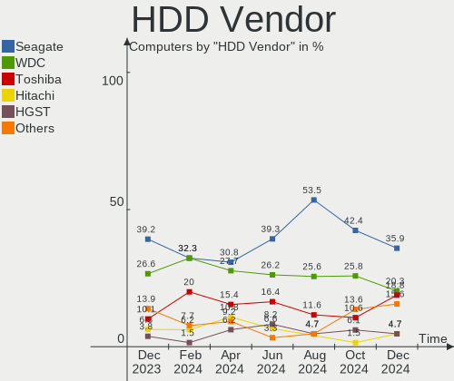

| Vendor              | Computers | Drives | Percent |
|---------------------|-----------|--------|---------|
| Seagate             | 31        | 42     | 40.26%  |
| WDC                 | 21        | 26     | 27.27%  |
| Toshiba             | 8         | 8      | 10.39%  |
| Hitachi             | 5         | 6      | 6.49%   |
| Samsung Electronics | 3         | 3      | 3.9%    |
| HGST                | 3         | 3      | 3.9%    |
| USB                 | 2         | 2      | 2.6%    |
| Maxtor              | 2         | 2      | 2.6%    |
| Unknown             | 1         | 1      | 1.3%    |
| SABRENT             | 1         | 1      | 1.3%    |

SSD Vendor
----------

Solid state drive vendors

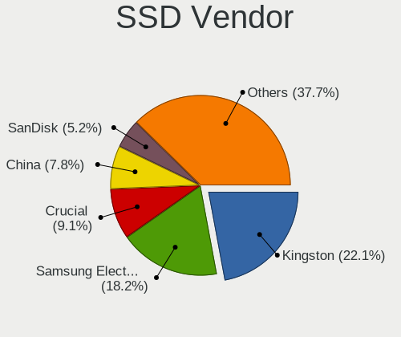

| Vendor              | Computers | Drives | Percent |
|---------------------|-----------|--------|---------|
| Kingston            | 25        | 25     | 29.41%  |
| Crucial             | 6         | 6      | 7.06%   |
| WDC                 | 5         | 5      | 5.88%   |
| SanDisk             | 5         | 6      | 5.88%   |
| Samsung Electronics | 5         | 5      | 5.88%   |
| China               | 4         | 4      | 4.71%   |
| Toshiba             | 3         | 3      | 3.53%   |
| Micron Technology   | 3         | 3      | 3.53%   |
| Lexar               | 3         | 3      | 3.53%   |
| PNY                 | 2         | 2      | 2.35%   |
| KIOXIA-EXCERIA      | 2         | 3      | 2.35%   |
| Corsair             | 2         | 2      | 2.35%   |
| Apple               | 2         | 2      | 2.35%   |
| VISIPRO             | 1         | 1      | 1.18%   |
| Unknown             | 1         | 1      | 1.18%   |
| Transcend           | 1         | 1      | 1.18%   |
| Teclast             | 1         | 1      | 1.18%   |
| Netac               | 1         | 1      | 1.18%   |
| LITEON              | 1         | 1      | 1.18%   |
| KingFast            | 1         | 1      | 1.18%   |
| KingDian            | 1         | 1      | 1.18%   |
| JMicron Technology  | 1         | 1      | 1.18%   |
| Intenso             | 1         | 1      | 1.18%   |
| Intel               | 1         | 1      | 1.18%   |
| GOODRAM             | 1         | 1      | 1.18%   |
| Gigabyte Technology | 1         | 1      | 1.18%   |
| Emtec               | 1         | 1      | 1.18%   |
| Dogfish             | 1         | 1      | 1.18%   |
| ASMT                | 1         | 1      | 1.18%   |
| A-DATA Technology   | 1         | 1      | 1.18%   |
| Unknown             | 1         | 1      | 1.18%   |

Drive Kind
----------

HDD or SSD

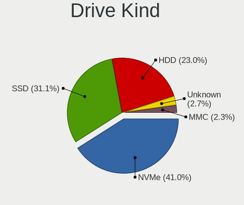

| Kind    | Computers | Drives | Percent |
|---------|-----------|--------|---------|
| NVMe    | 83        | 96     | 36.4%   |
| SSD     | 70        | 87     | 30.7%   |
| HDD     | 66        | 94     | 28.95%  |
| MMC     | 6         | 7      | 2.63%   |
| Unknown | 3         | 4      | 1.32%   |

Drive Connector
---------------

SATA, SAS, NVMe, etc.

| Type | Computers | Drives | Percent |
|------|-----------|--------|---------|
| SATA | 108       | 173    | 51.67%  |
| NVMe | 83        | 96     | 39.71%  |
| SAS  | 12        | 12     | 5.74%   |
| MMC  | 6         | 7      | 2.87%   |

Drive Size
----------

Size of hard drive

| Size in TB | Computers | Drives | Percent |
|------------|-----------|--------|---------|
| 0.01-0.5   | 86        | 110    | 58.11%  |
| 0.51-1.0   | 38        | 43     | 25.68%  |
| 1.01-2.0   | 14        | 16     | 9.46%   |
| 3.01-4.0   | 6         | 7      | 4.05%   |
| 2.01-3.0   | 3         | 4      | 2.03%   |
| 4.01-10.0  | 1         | 1      | 0.68%   |

Space Total
-----------

Amount of disk space available on the file system

| Size in GB     | Computers | Percent |
|----------------|-----------|---------|
| 251-500        | 38        | 21.84%  |
| 101-250        | 38        | 21.84%  |
| 501-1000       | 36        | 20.69%  |
| 1001-2000      | 18        | 10.34%  |
| More than 3000 | 15        | 8.62%   |
| 51-100         | 11        | 6.32%   |
| 1-20           | 9         | 5.17%   |
| 2001-3000      | 6         | 3.45%   |
| Unknown        | 3         | 1.72%   |

Space Used
----------

Amount of used disk space

| Used GB        | Computers | Percent |
|----------------|-----------|---------|
| 1-20           | 59        | 33.91%  |
| 101-250        | 24        | 13.79%  |
| 21-50          | 23        | 13.22%  |
| 51-100         | 22        | 12.64%  |
| 251-500        | 16        | 9.2%    |
| 501-1000       | 9         | 5.17%   |
| 1001-2000      | 8         | 4.6%    |
| More than 3000 | 5         | 2.87%   |
| 2001-3000      | 3         | 1.72%   |
| Unknown        | 3         | 1.72%   |
| 0              | 2         | 1.15%   |

Malfunc. Drives
---------------

Drive models with a malfunction

| Model                                                 | Computers | Drives | Percent |
|-------------------------------------------------------|-----------|--------|---------|
| Seagate ST500DM002-1BD142 500GB                       | 2         | 2      | 9.09%   |
| WDC WD5000LPCX-24VHAT0 500GB                          | 1         | 1      | 4.55%   |
| WDC WD5000BPKT-75PK4T0 500GB                          | 1         | 1      | 4.55%   |
| WDC WD20PURZ-85GU6Y0 2TB                              | 1         | 1      | 4.55%   |
| WDC WD20PURX-64P6ZY0 2TB                              | 1         | 1      | 4.55%   |
| WDC WD20EARX-00PASB0 2TB                              | 1         | 1      | 4.55%   |
| SK hynix BC511 HFM512GDJTNI-82A0A 512GB               | 1         | 1      | 4.55%   |
| Seagate ST9250827AS 250GB                             | 1         | 1      | 4.55%   |
| Seagate ST500LT012-1DG142 500GB                       | 1         | 1      | 4.55%   |
| Seagate ST3500418AS 500GB                             | 1         | 1      | 4.55%   |
| Seagate ST3500412AS 500GB                             | 1         | 1      | 4.55%   |
| Seagate ST3320613AS 320GB                             | 1         | 1      | 4.55%   |
| Seagate ST31000528ASQ 1TB                             | 1         | 1      | 4.55%   |
| Seagate ST31000528AS 1TB                              | 1         | 1      | 4.55%   |
| Samsung Electronics SSD 970 EVO 500GB S5H7NS0N813785B | 1         | 1      | 4.55%   |
| Samsung Electronics HM320II 320GB                     | 1         | 1      | 4.55%   |
| Micron Technology MTFDDAV256TDL-1AW1ZABHA 256GB SSD   | 1         | 1      | 4.55%   |
| Kingston SUV400S37240G 240GB SSD                      | 1         | 1      | 4.55%   |
| Dogfish SSD 256GB                                     | 1         | 1      | 4.55%   |
| Crucial CT525MX300SSD1 528GB                          | 1         | 1      | 4.55%   |
| China SSD 512GB                                       | 1         | 1      | 4.55%   |

Malfunc. Drive Vendor
---------------------

Vendors of faulty drives

| Vendor              | Computers | Drives | Percent |
|---------------------|-----------|--------|---------|
| Seagate             | 7         | 9      | 35%     |
| WDC                 | 5         | 5      | 25%     |
| Samsung Electronics | 2         | 2      | 10%     |
| SK hynix            | 1         | 1      | 5%      |
| Micron Technology   | 1         | 1      | 5%      |
| Kingston            | 1         | 1      | 5%      |
| Dogfish             | 1         | 1      | 5%      |
| Crucial             | 1         | 1      | 5%      |
| China               | 1         | 1      | 5%      |

Malfunc. HDD Vendor
-------------------

Vendors of faulty HDD drives

| Vendor              | Computers | Drives | Percent |
|---------------------|-----------|--------|---------|
| Seagate             | 7         | 9      | 53.85%  |
| WDC                 | 5         | 5      | 38.46%  |
| Samsung Electronics | 1         | 1      | 7.69%   |

Malfunc. Drive Kind
-------------------

Kinds of faulty drives

| Kind | Computers | Drives | Percent |
|------|-----------|--------|---------|
| HDD  | 13        | 15     | 65%     |
| SSD  | 5         | 5      | 25%     |
| NVMe | 2         | 2      | 10%     |

Failed Drives
-------------

Failed drive models

Zero info for selected period =(

Failed Drive Vendor
-------------------

Failed drive vendors

Zero info for selected period =(

Drive Status
------------

Number of failed and malfunc. drives

| Status   | Computers | Drives | Percent |
|----------|-----------|--------|---------|
| Detected | 88        | 137    | 46.81%  |
| Works    | 81        | 129    | 43.09%  |
| Malfunc  | 19        | 22     | 10.11%  |

Storage controller
------------------

Storage Vendor
--------------

Storage controller vendors

| Vendor                           | Computers | Percent |
|----------------------------------|-----------|---------|
| Intel                            | 106       | 45.11%  |
| AMD                              | 30        | 12.77%  |
| Samsung Electronics              | 23        | 9.79%   |
| Sandisk                          | 15        | 6.38%   |
| Micron Technology                | 13        | 5.53%   |
| KIOXIA                           | 8         | 3.4%    |
| Micron/Crucial Technology        | 7         | 2.98%   |
| Kingston Technology Company      | 7         | 2.98%   |
| ASMedia Technology               | 5         | 2.13%   |
| SK hynix                         | 4         | 1.7%    |
| Phison Electronics               | 3         | 1.28%   |
| Nvidia                           | 3         | 1.28%   |
| Silicon Motion                   | 2         | 0.85%   |
| Marvell Technology Group         | 2         | 0.85%   |
| JMicron Technology               | 2         | 0.85%   |
| Solidigm                         | 1         | 0.43%   |
| Silicon Integrated Systems [SiS] | 1         | 0.43%   |
| Netac Technology                 | 1         | 0.43%   |
| MAXIO Technology (Hangzhou)      | 1         | 0.43%   |
| Apple                            | 1         | 0.43%   |

Storage Model
-------------

Storage controller models

| Model                                                                          | Computers | Percent |
|--------------------------------------------------------------------------------|-----------|---------|
| AMD FCH SATA Controller [AHCI mode]                                            | 23        | 8.68%   |
| Samsung NVMe SSD Controller SM981/PM981/PM983                                  | 8         | 3.02%   |
| Samsung NVMe SSD Controller PM9A1/PM9A3/980PRO                                 | 7         | 2.64%   |
| Intel Sunrise Point-LP SATA Controller [AHCI mode]                             | 7         | 2.64%   |
| Intel Celeron/Pentium Silver Processor SATA Controller                         | 7         | 2.64%   |
| SanDisk Ultra 3D / WD Blue SN550 NVMe SSD                                      | 6         | 2.26%   |
| Micron/Crucial P2 [Nick P2] / P3 / P3 Plus NVMe PCIe SSD (DRAM-less)           | 6         | 2.26%   |
| Intel Volume Management Device NVMe RAID Controller                            | 6         | 2.26%   |
| Samsung NVMe SSD Controller 980 (DRAM-less)                                    | 5         | 1.89%   |
| Intel 82801IBM/IEM (ICH9M/ICH9M-E) 4 port SATA Controller [AHCI mode]          | 5         | 1.89%   |
| Intel 6 Series/C200 Series Chipset Family 6 port Desktop SATA AHCI Controller  | 5         | 1.89%   |
| Intel 5 Series/3400 Series Chipset 6 port SATA AHCI Controller                 | 5         | 1.89%   |
| AMD 400 Series Chipset SATA Controller                                         | 5         | 1.89%   |
| Micron 2450 NVMe SSD [HendrixV] (DRAM-less)                                    | 4         | 1.51%   |
| Kingston Company KC3000/FURY Renegade NVMe SSD E18                             | 4         | 1.51%   |
| Intel Wildcat Point-LP SATA Controller [AHCI Mode]                             | 4         | 1.51%   |
| Intel 82801 Mobile SATA Controller [RAID mode]                                 | 4         | 1.51%   |
| Intel 7 Series/C210 Series Chipset Family 6-port SATA Controller [AHCI mode]   | 4         | 1.51%   |
| Intel 6 Series/C200 Series Chipset Family 6 port Mobile SATA AHCI Controller   | 4         | 1.51%   |
| Intel 500 Series Chipset Family SATA AHCI Controller                           | 4         | 1.51%   |
| ASMedia ASM1062 Serial ATA Controller                                          | 4         | 1.51%   |
| SanDisk Extreme Pro / WD Black SN750 / PC SN730 / Red SN700 NVMe SSD           | 3         | 1.13%   |
| Micron 3400 NVMe SSD [Hendrix]                                                 | 3         | 1.13%   |
| Micron 2400 NVMe SSD (DRAM-less)                                               | 3         | 1.13%   |
| KIOXIA NVMe SSD Controller BG4 (DRAM-less)                                     | 3         | 1.13%   |
| Intel Volume Management Device NVMe RAID Controller Intel Corporation          | 3         | 1.13%   |
| Intel Tiger Lake-LP SATA Controller                                            | 3         | 1.13%   |
| Intel SSD 670p Series [Keystone Harbor]                                        | 3         | 1.13%   |
| Intel SSD 660P Series                                                          | 3         | 1.13%   |
| Intel HM170/QM170 Chipset SATA Controller [AHCI Mode]                          | 3         | 1.13%   |
| Intel Celeron N3350/Pentium N4200/Atom E3900 Series SATA AHCI Controller       | 3         | 1.13%   |
| Intel 8 Series/C220 Series Chipset Family 6-port SATA Controller 1 [AHCI mode] | 3         | 1.13%   |
| Intel 700 Series Chipset Family SATA AHCI Controller                           | 3         | 1.13%   |
| Intel 7 Series Chipset Family 6-port SATA Controller [AHCI mode]               | 3         | 1.13%   |
| AMD 500 Series Chipset SATA Controller                                         | 3         | 1.13%   |
| SK hynix BC901 NVMe Solid State Drive (DRAM-less)                              | 2         | 0.75%   |
| Silicon Motion SM2263EN/SM2263XT (DRAM-less) NVMe SSD Controllers              | 2         | 0.75%   |
| SanDisk Extreme Pro / WD Black 2018/SN750/PC SN720 NVMe SSD                    | 2         | 0.75%   |
| Samsung S4LN053X01 AHCI SSD Controller(Apple slot)                             | 2         | 0.75%   |
| Samsung NVMe SSD Controller PM9B1 (DRAM-less)                                  | 2         | 0.75%   |

Storage Kind
------------

Kind of storage controller (IDE, SATA, NVMe, SAS, ...)

| Kind | Computers | Percent |
|------|-----------|---------|
| SATA | 124       | 53.22%  |
| NVMe | 83        | 35.62%  |
| RAID | 14        | 6.01%   |
| IDE  | 12        | 5.15%   |

Processor
---------

CPU Vendor
----------

Processor vendors

| Vendor | Computers | Percent |
|--------|-----------|---------|
| Intel  | 126       | 72.41%  |
| AMD    | 48        | 27.59%  |

CPU Model
---------

Processor models

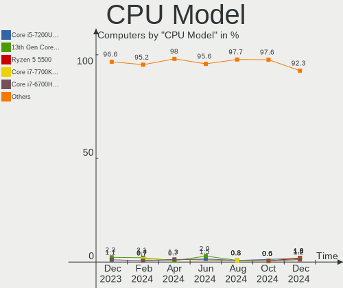

| Model                                         | Computers | Percent |
|-----------------------------------------------|-----------|---------|
| Intel 13th Gen Core i7-1355U                  | 4         | 2.3%    |
| AMD Ryzen 7 5800H with Radeon Graphics        | 4         | 2.3%    |
| Intel Celeron N4020 CPU @ 1.10GHz             | 3         | 1.72%   |
| Intel 12th Gen Core i7-12700H                 | 3         | 1.72%   |
| AMD Ryzen 7 5800X 8-Core Processor            | 3         | 1.72%   |
| AMD Ryzen 7 5700U with Radeon Graphics        | 3         | 1.72%   |
| Intel Core i7-6700HQ CPU @ 2.60GHz            | 2         | 1.15%   |
| Intel Core i5-8250U CPU @ 1.60GHz             | 2         | 1.15%   |
| Intel Core i5-6200U CPU @ 2.30GHz             | 2         | 1.15%   |
| Intel Core i5-3210M CPU @ 2.50GHz             | 2         | 1.15%   |
| Intel Core i5 CPU 760 @ 2.80GHz               | 2         | 1.15%   |
| Intel Core i3-3220 CPU @ 3.30GHz              | 2         | 1.15%   |
| Intel Celeron CPU N3050 @ 1.60GHz             | 2         | 1.15%   |
| Intel 12th Gen Core i5-12450H                 | 2         | 1.15%   |
| Intel 11th Gen Core i5-1155G7 @ 2.50GHz       | 2         | 1.15%   |
| Intel 11th Gen Core i5-11400 @ 2.60GHz        | 2         | 1.15%   |
| AMD Ryzen 9 5900X 12-Core Processor           | 2         | 1.15%   |
| AMD Ryzen 7 7840HS w/ Radeon 780M Graphics    | 2         | 1.15%   |
| AMD Ryzen 7 5700G with Radeon Graphics        | 2         | 1.15%   |
| AMD Ryzen 7 4800H with Radeon Graphics        | 2         | 1.15%   |
| AMD Ryzen 5 3500U with Radeon Vega Mobile Gfx | 2         | 1.15%   |
| Intel Xeon CPU E5440 @ 2.83GHz                | 1         | 0.57%   |
| Intel Xeon CPU E5-2670 v3 @ 2.30GHz           | 1         | 0.57%   |
| Intel Xeon CPU E5-2620 v3 @ 2.40GHz           | 1         | 0.57%   |
| Intel Pentium Dual CPU T3400 @ 2.16GHz        | 1         | 0.57%   |
| Intel Pentium Dual CPU T3200 @ 2.00GHz        | 1         | 0.57%   |
| Intel Pentium Dual CPU T2390 @ 1.86GHz        | 1         | 0.57%   |
| Intel Pentium CPU N4200 @ 1.10GHz             | 1         | 0.57%   |
| Intel Pentium CPU G4560 @ 3.50GHz             | 1         | 0.57%   |
| Intel N100                                    | 1         | 0.57%   |
| Intel Core i9-9900 CPU @ 3.10GHz              | 1         | 0.57%   |
| Intel Core i9-10900K CPU @ 3.70GHz            | 1         | 0.57%   |
| Intel Core i7-8650U CPU @ 1.90GHz             | 1         | 0.57%   |
| Intel Core i7-8565U CPU @ 1.80GHz             | 1         | 0.57%   |
| Intel Core i7-8550U CPU @ 1.80GHz             | 1         | 0.57%   |
| Intel Core i7-7700HQ CPU @ 2.80GHz            | 1         | 0.57%   |
| Intel Core i7-6700K CPU @ 4.00GHz             | 1         | 0.57%   |
| Intel Core i7-5500U CPU @ 2.40GHz             | 1         | 0.57%   |
| Intel Core i7-4870HQ CPU @ 2.50GHz            | 1         | 0.57%   |
| Intel Core i7-4700MQ CPU @ 2.40GHz            | 1         | 0.57%   |

CPU Model Family
----------------

Processor model prefix

| Model              | Computers | Percent |
|--------------------|-----------|---------|
| Intel Core i5      | 33        | 18.97%  |
| Other              | 28        | 16.09%  |
| AMD Ryzen 7        | 24        | 13.79%  |
| Intel Core i7      | 19        | 10.92%  |
| Intel Celeron      | 14        | 8.05%   |
| Intel Core i3      | 13        | 7.47%   |
| AMD Ryzen 5        | 10        | 5.75%   |
| Intel Core 2 Duo   | 7         | 4.02%   |
| AMD Ryzen 9        | 4         | 2.3%    |
| Intel Xeon         | 3         | 1.72%   |
| Intel Pentium Dual | 3         | 1.72%   |
| AMD E1             | 3         | 1.72%   |
| Intel Pentium      | 2         | 1.15%   |
| Intel Core i9      | 2         | 1.15%   |
| AMD Phenom         | 2         | 1.15%   |
| Intel Core 2 Quad  | 1         | 0.57%   |
| Intel Atom         | 1         | 0.57%   |
| AMD Ryzen 5 PRO    | 1         | 0.57%   |
| AMD Ryzen 3        | 1         | 0.57%   |
| AMD Phenom II X6   | 1         | 0.57%   |
| AMD E2             | 1         | 0.57%   |
| AMD A4             | 1         | 0.57%   |

CPU Cores
---------

Number of processor cores

| Number | Computers | Percent |
|--------|-----------|---------|
| 2      | 55        | 31.61%  |
| 4      | 50        | 28.74%  |
| 8      | 32        | 18.39%  |
| 6      | 15        | 8.62%   |
| 10     | 7         | 4.02%   |
| 14     | 5         | 2.87%   |
| 12     | 5         | 2.87%   |
| 16     | 2         | 1.15%   |
| 24     | 1         | 0.57%   |
| 3      | 1         | 0.57%   |
| 1      | 1         | 0.57%   |

CPU Sockets
-----------

Number of sockets

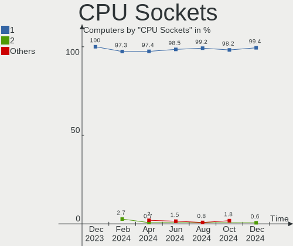

| Number | Computers | Percent |
|--------|-----------|---------|
| 1      | 174       | 100%    |

CPU Threads
-----------

Threads per core (Hyper-Threading)

| Number | Computers | Percent |
|--------|-----------|---------|
| 2      | 125       | 71.84%  |
| 1      | 49        | 28.16%  |

CPU Op-Modes
------------

CPU Operation Modes (32-bit, 64-bit)

| Op mode        | Computers | Percent |
|----------------|-----------|---------|
| 32-bit, 64-bit | 173       | 99.43%  |
| 32-bit         | 1         | 0.57%   |

CPU Microcode
-------------

Microcode number

| Number     | Computers | Percent |
|------------|-----------|---------|
| Unknown    | 110       | 63.22%  |
| 0x10676    | 3         | 1.72%   |
| 0x0a704103 | 3         | 1.72%   |
| 0x0a50000d | 3         | 1.72%   |
| 0x0800820d | 3         | 1.72%   |
| 0xb06a3    | 2         | 1.15%   |
| 0xa0671    | 2         | 1.15%   |
| 0xa0653    | 2         | 1.15%   |
| 0x906e9    | 2         | 1.15%   |
| 0x806ea    | 2         | 1.15%   |
| 0x706a8    | 2         | 1.15%   |
| 0x6fd      | 2         | 1.15%   |
| 0x506c9    | 2         | 1.15%   |
| 0x206a7    | 2         | 1.15%   |
| 0x0a50000f | 2         | 1.15%   |
| 0xb06a2    | 1         | 0.57%   |
| 0xb0671    | 1         | 0.57%   |
| 0xa0655    | 1         | 0.57%   |
| 0x906a4    | 1         | 0.57%   |
| 0x906a3    | 1         | 0.57%   |
| 0x806e9    | 1         | 0.57%   |
| 0x706a1    | 1         | 0.57%   |
| 0x506e3    | 1         | 0.57%   |
| 0x406e3    | 1         | 0.57%   |
| 0x306a9    | 1         | 0.57%   |
| 0x20652    | 1         | 0.57%   |
| 0x1067a    | 1         | 0.57%   |
| 0x0a601203 | 1         | 0.57%   |
| 0x0a50000c | 1         | 0.57%   |
| 0x0a404102 | 1         | 0.57%   |
| 0x0a201205 | 1         | 0.57%   |
| 0x0a201016 | 1         | 0.57%   |
| 0x0a201009 | 1         | 0.57%   |
| 0x08a00008 | 1         | 0.57%   |
| 0x08701030 | 1         | 0.57%   |
| 0x08608102 | 1         | 0.57%   |
| 0x08600106 | 1         | 0.57%   |
| 0x08600104 | 1         | 0.57%   |
| 0x08108109 | 1         | 0.57%   |
| 0x08108102 | 1         | 0.57%   |

CPU Microarch
-------------

Microarchitecture

| Name             | Computers | Percent |
|------------------|-----------|---------|
| Unknown          | 19        | 10.92%  |
| KabyLake         | 14        | 8.05%   |
| Alderlake Hybrid | 14        | 8.05%   |
| Zen 3            | 13        | 7.47%   |
| Haswell          | 10        | 5.75%   |
| Penryn           | 9         | 5.17%   |
| IvyBridge        | 9         | 5.17%   |
| SandyBridge      | 8         | 4.6%    |
| CometLake        | 8         | 4.6%    |
| Goldmont plus    | 7         | 4.02%   |
| Zen+             | 6         | 3.45%   |
| Skylake          | 6         | 3.45%   |
| TigerLake        | 5         | 2.87%   |
| Nehalem          | 5         | 2.87%   |
| Zen 2            | 4         | 2.3%    |
| Zen              | 4         | 2.3%    |
| Westmere         | 4         | 2.3%    |
| Icelake          | 4         | 2.3%    |
| Core             | 4         | 2.3%    |
| Broadwell        | 4         | 2.3%    |
| Silvermont       | 3         | 1.72%   |
| K10              | 3         | 1.72%   |
| Goldmont         | 3         | 1.72%   |
| Jaguar           | 2         | 1.15%   |
| Excavator        | 2         | 1.15%   |
| Tremont          | 1         | 0.57%   |
| Gracemont        | 1         | 0.57%   |
| Bonnell          | 1         | 0.57%   |
| Bobcat           | 1         | 0.57%   |

Graphics
--------

GPU Vendor
----------

Vendors of graphics cards

| Vendor                           | Computers | Percent |
|----------------------------------|-----------|---------|
| Intel                            | 97        | 46.41%  |
| Nvidia                           | 58        | 27.75%  |
| AMD                              | 53        | 25.36%  |
| Silicon Integrated Systems [SiS] | 1         | 0.48%   |

GPU Model
---------

Graphics card models

| Model                                                                                    | Computers | Percent |
|------------------------------------------------------------------------------------------|-----------|---------|
| Intel GeminiLake [UHD Graphics 600]                                                      | 7         | 3.33%   |
| Intel 2nd Generation Core Processor Family Integrated Graphics Controller                | 7         | 3.33%   |
| Intel Raptor Lake-P [Iris Xe Graphics]                                                   | 6         | 2.86%   |
| AMD Cezanne [Radeon Vega Series / Radeon Vega Mobile Series]                             | 6         | 2.86%   |
| Intel UHD Graphics 620                                                                   | 5         | 2.38%   |
| AMD Phoenix1                                                                             | 5         | 2.38%   |
| Intel TigerLake-LP GT2 [Iris Xe Graphics]                                                | 4         | 1.9%    |
| Intel HD Graphics 5500                                                                   | 4         | 1.9%    |
| Intel Haswell-ULT Integrated Graphics Controller                                         | 4         | 1.9%    |
| Intel Core Processor Integrated Graphics Controller                                      | 4         | 1.9%    |
| Nvidia TU106M [GeForce RTX 2060 Mobile]                                                  | 3         | 1.43%   |
| Nvidia GK208B [GeForce GT 710]                                                           | 3         | 1.43%   |
| Nvidia GA107M [GeForce RTX 3050 Mobile]                                                  | 3         | 1.43%   |
| Intel Xeon E3-1200 v2/3rd Gen Core processor Graphics Controller                         | 3         | 1.43%   |
| Intel Skylake GT2 [HD Graphics 520]                                                      | 3         | 1.43%   |
| Intel Mobile 4 Series Chipset Integrated Graphics Controller                             | 3         | 1.43%   |
| Intel CometLake-H GT2 [UHD Graphics]                                                     | 3         | 1.43%   |
| Intel Alder Lake-P GT2 [Iris Xe Graphics]                                                | 3         | 1.43%   |
| Intel 3rd Gen Core processor Graphics Controller                                         | 3         | 1.43%   |
| AMD Renoir [Radeon RX Vega 6 (Ryzen 4000/5000 Mobile Series)]                            | 3         | 1.43%   |
| AMD Picasso/Raven 2 [Radeon Vega Series / Radeon Vega Mobile Series]                     | 3         | 1.43%   |
| AMD Lucienne                                                                             | 3         | 1.43%   |
| Nvidia GP107 [GeForce GTX 1050 Ti]                                                       | 2         | 0.95%   |
| Nvidia GN20-P0-R-K2 [GeForce RTX 3050 6GB Laptop GPU]                                    | 2         | 0.95%   |
| Nvidia GM107 [GeForce GTX 750 Ti]                                                        | 2         | 0.95%   |
| Nvidia GK208B [GeForce GT 730]                                                           | 2         | 0.95%   |
| Nvidia GA107M [GeForce RTX 3050 Ti Mobile]                                               | 2         | 0.95%   |
| Nvidia GA106M [GeForce RTX 3060 Mobile / Max-Q]                                          | 2         | 0.95%   |
| Nvidia AD107M [GeForce RTX 4060 Max-Q / Mobile]                                          | 2         | 0.95%   |
| Intel RocketLake-S GT1 [UHD Graphics 730]                                                | 2         | 0.95%   |
| Intel HD Graphics 620                                                                    | 2         | 0.95%   |
| Intel HD Graphics 500                                                                    | 2         | 0.95%   |
| Intel CometLake-S GT2 [UHD Graphics 630]                                                 | 2         | 0.95%   |
| Intel CoffeeLake-S GT2 [UHD Graphics 630]                                                | 2         | 0.95%   |
| Intel Atom/Celeron/Pentium Processor x5-E8000/J3xxx/N3xxx Integrated Graphics Controller | 2         | 0.95%   |
| Intel Alder Lake-P Integrated Graphics Controller                                        | 2         | 0.95%   |
| Intel Alder Lake-P GT1 [UHD Graphics]                                                    | 2         | 0.95%   |
| Intel Alder Lake-N [UHD Graphics]                                                        | 2         | 0.95%   |
| Intel 4th Gen Core Processor Integrated Graphics Controller                              | 2         | 0.95%   |
| AMD Whistler [Radeon HD 6630M/6650M/6750M/7670M/7690M]                                   | 2         | 0.95%   |

GPU Combo
---------

Combinations of graphics cards

| Name           | Computers | Percent |
|----------------|-----------|---------|
| 1 x Intel      | 70        | 40.23%  |
| 1 x AMD        | 37        | 21.26%  |
| 1 x Nvidia     | 29        | 16.67%  |
| Intel + Nvidia | 19        | 10.92%  |
| AMD + Nvidia   | 10        | 5.75%   |
| Intel + AMD    | 6         | 3.45%   |
| Other          | 1         | 0.57%   |
| 2 x Intel      | 1         | 0.57%   |
| 1 x SiS        | 1         | 0.57%   |

GPU Driver
----------

Free vs proprietary

| Driver      | Computers | Percent |
|-------------|-----------|---------|
| Free        | 133       | 76.44%  |
| Proprietary | 37        | 21.26%  |
| Unknown     | 4         | 2.3%    |

GPU Memory
----------

Total video memory

| Size in GB | Computers | Percent |
|------------|-----------|---------|
| Unknown    | 119       | 68.39%  |
| 0.01-0.5   | 19        | 10.92%  |
| 1.01-2.0   | 11        | 6.32%   |
| 7.01-8.0   | 8         | 4.6%    |
| 0.51-1.0   | 7         | 4.02%   |
| 3.01-4.0   | 6         | 3.45%   |
| 5.01-6.0   | 2         | 1.15%   |
| 2.01-3.0   | 1         | 0.57%   |
| 16.01-24.0 | 1         | 0.57%   |

Monitor
-------

Monitor Vendor
--------------

Monitor vendors

| Vendor                  | Computers | Percent |
|-------------------------|-----------|---------|
| Samsung Electronics     | 25        | 12.89%  |
| BOE                     | 22        | 11.34%  |
| AU Optronics            | 17        | 8.76%   |
| Chimei Innolux          | 16        | 8.25%   |
| LG Display              | 11        | 5.67%   |
| Goldstar                | 10        | 5.15%   |
| Hewlett-Packard         | 8         | 4.12%   |
| Dell                    | 8         | 4.12%   |
| Chi Mei Optoelectronics | 7         | 3.61%   |
| Apple                   | 6         | 3.09%   |
| AOC                     | 6         | 3.09%   |
| Lenovo                  | 4         | 2.06%   |
| Ancor Communications    | 4         | 2.06%   |
| Acer                    | 4         | 2.06%   |
| Philips                 | 3         | 1.55%   |
| PANDA                   | 3         | 1.55%   |
| CSO                     | 3         | 1.55%   |
| ASUSTek Computer        | 3         | 1.55%   |
| RTK                     | 2         | 1.03%   |
| OEM                     | 2         | 1.03%   |
| MSI                     | 2         | 1.03%   |
| HKC                     | 2         | 1.03%   |
| BenQ                    | 2         | 1.03%   |
| Yuraku                  | 1         | 0.52%   |
| Xiaomi                  | 1         | 0.52%   |
| Vestel Elektronik       | 1         | 0.52%   |
| UGD                     | 1         | 0.52%   |
| TMX                     | 1         | 0.52%   |
| STA                     | 1         | 0.52%   |
| Sharp                   | 1         | 0.52%   |
| NEC Computers           | 1         | 0.52%   |
| Mi                      | 1         | 0.52%   |
| LG Electronics          | 1         | 0.52%   |
| Lenovo Group Limited    | 1         | 0.52%   |
| KUP                     | 1         | 0.52%   |
| JCH                     | 1         | 0.52%   |
| InfoVision              | 1         | 0.52%   |
| Iiyama                  | 1         | 0.52%   |
| HUAWEI                  | 1         | 0.52%   |
| GreenWood               | 1         | 0.52%   |

Monitor Model
-------------

Monitor models

| Model                                                                  | Computers | Percent |
|------------------------------------------------------------------------|-----------|---------|
| Samsung Electronics LCD Monitor SDC4171 2880x1800 302x189mm 14.0-inch  | 3         | 1.52%   |
| OEM 26W_LCD_TV OEM3700 1920x540                                        | 2         | 1.01%   |
| Goldstar LG IPS FULLHD GSM5AB8 1920x1080 480x270mm 21.7-inch           | 2         | 1.01%   |
| Goldstar L192WS GSM4B32 1440x900 410x256mm 19.0-inch                   | 2         | 1.01%   |
| Chimei Innolux LCD Monitor CMN15F5 1920x1080 344x193mm 15.5-inch       | 2         | 1.01%   |
| Chimei Innolux LCD Monitor CMN15E6 1366x768 344x193mm 15.5-inch        | 2         | 1.01%   |
| Chimei Innolux LCD Monitor CMN15C4 1920x1080 344x193mm 15.5-inch       | 2         | 1.01%   |
| BOE LCD Monitor BOE0AAD 1920x1080 355x200mm 16.0-inch                  | 2         | 1.01%   |
| BOE LCD Monitor BOE0A81 1920x1080 344x194mm 15.5-inch                  | 2         | 1.01%   |
| AOC 27G2G4 AOC2702 1920x1080 598x336mm 27.0-inch                       | 2         | 1.01%   |
| Ancor Communications ASUS VX239 ACI23E1 1920x1080 509x286mm 23.0-inch  | 2         | 1.01%   |
| Yuraku YM22RPA FAC01C6 1680x1050 474x296mm 22.0-inch                   | 1         | 0.51%   |
| Xiaomi Mi TV XMD0076 3840x2160 800x450mm 36.1-inch                     | 1         | 0.51%   |
| Vestel Elektronik 55UHD_LCD_TV VES3700 3840x2160 1872x1053mm 84.6-inch | 1         | 0.51%   |
| UGD Artist22R Pro UGD2202 1920x1080 476x268mm 21.5-inch                | 1         | 0.51%   |
| TMX TL156MDMP31-0 TMX2005 3200x2000 336x210mm 15.6-inch                | 1         | 0.51%   |
| STA XR140EA1T STA0450 1366x768 310x174mm 14.0-inch                     | 1         | 0.51%   |
| Sharp LQ156M1JW03 SHP14C5 1920x1080 344x194mm 15.5-inch                | 1         | 0.51%   |
| Samsung Electronics SyncMaster SAM0088 1024x768 300x230mm 14.9-inch    | 1         | 0.51%   |
| Samsung Electronics SMBX2035 SAM06FE 1600x900 443x249mm 20.0-inch      | 1         | 0.51%   |
| Samsung Electronics SMB2220N SAM06A2 1920x1080 477x268mm 21.5-inch     | 1         | 0.51%   |
| Samsung Electronics S34J55x SAM0F71 3440x1440 797x333mm 34.0-inch      | 1         | 0.51%   |
| Samsung Electronics S24D590 SAM0B47 1920x1080 521x293mm 23.5-inch      | 1         | 0.51%   |
| Samsung Electronics S24D332 SAM0F5E 1920x1080 531x299mm 24.0-inch      | 1         | 0.51%   |
| Samsung Electronics S24C31x SAM7311 1920x1080 521x293mm 23.5-inch      | 1         | 0.51%   |
| Samsung Electronics S24A31x SAM7115 1920x1080 527x296mm 23.8-inch      | 1         | 0.51%   |
| Samsung Electronics LF27T35 SAM707F 1920x1080 598x337mm 27.0-inch      | 1         | 0.51%   |
| Samsung Electronics LCD Monitor SEC554E 1024x600 223x125mm 10.1-inch   | 1         | 0.51%   |
| Samsung Electronics LCD Monitor SEC3859 1366x768 293x165mm 13.2-inch   | 1         | 0.51%   |
| Samsung Electronics LCD Monitor SEC3642 1366x768 309x174mm 14.0-inch   | 1         | 0.51%   |
| Samsung Electronics LCD Monitor SEC3245 1366x768 344x194mm 15.5-inch   | 1         | 0.51%   |
| Samsung Electronics LCD Monitor SDC4852 1366x768 344x194mm 15.5-inch   | 1         | 0.51%   |
| Samsung Electronics LCD Monitor SDC4189 2944x1840 312x195mm 14.5-inch  | 1         | 0.51%   |
| Samsung Electronics LCD Monitor SAM7245 1920x1080 700x390mm 31.5-inch  | 1         | 0.51%   |
| Samsung Electronics LCD Monitor SAM0B30 1920x1080 885x498mm 40.0-inch  | 1         | 0.51%   |
| Samsung Electronics LCD Monitor SAM07C0 1920x1080 480x270mm 21.7-inch  | 1         | 0.51%   |
| Samsung Electronics LCD Monitor SAM0509 1920x1080                      | 1         | 0.51%   |
| Samsung Electronics LCD Monitor SAM01FF 1360x768 885x498mm 40.0-inch   | 1         | 0.51%   |
| Samsung Electronics LC32G5xT SAM7080 2560x1440 698x393mm 31.5-inch     | 1         | 0.51%   |
| Samsung Electronics LC27RG50 SAM100A 1920x1080 532x304mm 24.1-inch     | 1         | 0.51%   |

Monitor Resolution
------------------

Monitor screen resolution

| Resolution         | Computers | Percent |
|--------------------|-----------|---------|
| 1920x1080 (FHD)    | 89        | 46.35%  |
| 1366x768 (WXGA)    | 24        | 12.5%   |
| 3840x2160 (4K)     | 15        | 7.81%   |
| 2560x1440 (QHD)    | 15        | 7.81%   |
| 1920x1200 (WUXGA)  | 8         | 4.17%   |
| 1600x900 (HD+)     | 7         | 3.65%   |
| 2880x1800          | 4         | 2.08%   |
| 2560x1600          | 4         | 2.08%   |
| 1680x1050 (WSXGA+) | 3         | 1.56%   |
| 1440x900 (WXGA+)   | 3         | 1.56%   |
| 1280x800 (WXGA)    | 3         | 1.56%   |
| 3840x1080          | 2         | 1.04%   |
| 1920x540           | 2         | 1.04%   |
| 1280x1024 (SXGA)   | 2         | 1.04%   |
| 1024x768 (XGA)     | 2         | 1.04%   |
| 3440x1440          | 1         | 0.52%   |
| 3200x2000          | 1         | 0.52%   |
| 2944x1840          | 1         | 0.52%   |
| 2736x1824          | 1         | 0.52%   |
| 2256x1504          | 1         | 0.52%   |
| 2160x1440          | 1         | 0.52%   |
| 1360x768           | 1         | 0.52%   |
| 1024x600           | 1         | 0.52%   |
| Unknown            | 1         | 0.52%   |

Monitor Diagonal
----------------

Diagonal size in inches

| Inches  | Computers | Percent |
|---------|-----------|---------|
| 15      | 58        | 29.9%   |
| 27      | 17        | 8.76%   |
| 24      | 15        | 7.73%   |
| 23      | 15        | 7.73%   |
| 13      | 14        | 7.22%   |
| 17      | 12        | 6.19%   |
| 14      | 12        | 6.19%   |
| 21      | 11        | 5.67%   |
| Unknown | 8         | 4.12%   |
| 31      | 6         | 3.09%   |
| 16      | 5         | 2.58%   |
| 19      | 4         | 2.06%   |
| 54      | 3         | 1.55%   |
| 46      | 2         | 1.03%   |
| 22      | 2         | 1.03%   |
| 20      | 2         | 1.03%   |
| 84      | 1         | 0.52%   |
| 52      | 1         | 0.52%   |
| 49      | 1         | 0.52%   |
| 40      | 1         | 0.52%   |
| 34      | 1         | 0.52%   |
| 26      | 1         | 0.52%   |
| 12      | 1         | 0.52%   |
| 10      | 1         | 0.52%   |

Monitor Width
-------------

Physical width

| Width in mm | Computers | Percent |
|-------------|-----------|---------|
| 301-350     | 79        | 40.51%  |
| 501-600     | 47        | 24.1%   |
| 401-500     | 20        | 10.26%  |
| 351-400     | 13        | 6.67%   |
| 201-300     | 11        | 5.64%   |
| Unknown     | 8         | 4.1%    |
| 601-700     | 7         | 3.59%   |
| 1001-1500   | 7         | 3.59%   |
| 801-900     | 1         | 0.51%   |
| 701-800     | 1         | 0.51%   |
| 1501-2000   | 1         | 0.51%   |

Aspect Ratio
------------

Proportional relationship between the width and the height

| Ratio   | Computers | Percent |
|---------|-----------|---------|
| 16/9    | 134       | 76.14%  |
| 16/10   | 26        | 14.77%  |
| Unknown | 7         | 3.98%   |
| 3/2     | 3         | 1.7%    |
| 5/4     | 2         | 1.14%   |
| 4/3     | 2         | 1.14%   |
| 32/9    | 1         | 0.57%   |
| 21/9    | 1         | 0.57%   |

Monitor Area
------------

Area in inch²

| Area in inch² | Computers | Percent |
|----------------|-----------|---------|
| 101-110        | 61        | 31.77%  |
| 201-250        | 32        | 16.67%  |
| 81-90          | 18        | 9.38%   |
| 301-350        | 18        | 9.38%   |
| 151-200        | 10        | 5.21%   |
| 121-130        | 10        | 5.21%   |
| 71-80          | 8         | 4.17%   |
| Unknown        | 8         | 4.17%   |
| 351-500        | 7         | 3.65%   |
| More than 1000 | 5         | 2.6%    |
| 251-300        | 5         | 2.6%    |
| 501-1000       | 4         | 2.08%   |
| 141-150        | 2         | 1.04%   |
| 111-120        | 2         | 1.04%   |
| 41-50          | 1         | 0.52%   |
| 91-100         | 1         | 0.52%   |

Pixel Density
-------------

Pixels per inch

| Density       | Computers | Percent |
|---------------|-----------|---------|
| 51-100        | 59        | 31.22%  |
| 121-160       | 56        | 29.63%  |
| 101-120       | 40        | 21.16%  |
| 161-240       | 15        | 7.94%   |
| Unknown       | 8         | 4.23%   |
| 1-50          | 7         | 3.7%    |
| More than 240 | 4         | 2.12%   |

Multiple Monitors
-----------------

Total monitors connected

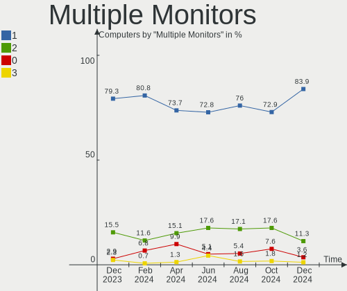

| Total | Computers | Percent |
|-------|-----------|---------|
| 1     | 138       | 79.31%  |
| 2     | 27        | 15.52%  |
| 0     | 5         | 2.87%   |
| 3     | 4         | 2.3%    |

Network
-------

Net Controller Vendor
---------------------

Controller vendors

| Vendor                            | Computers | Percent |
|-----------------------------------|-----------|---------|
| Realtek Semiconductor             | 105       | 39.92%  |
| Intel                             | 72        | 27.38%  |
| Qualcomm Atheros                  | 21        | 7.98%   |
| MediaTek                          | 16        | 6.08%   |
| Broadcom                          | 12        | 4.56%   |
| ASIX Electronics                  | 6         | 2.28%   |
| TP-Link                           | 4         | 1.52%   |
| Ralink Technology                 | 3         | 1.14%   |
| Nvidia                            | 3         | 1.14%   |
| Broadcom Limited                  | 3         | 1.14%   |
| Xiaomi                            | 2         | 0.76%   |
| Ralink                            | 2         | 0.76%   |
| Marvell Technology Group          | 2         | 0.76%   |
| Ericsson Business Mobile Networks | 2         | 0.76%   |
| DisplayLink                       | 2         | 0.76%   |
| Silicon Integrated Systems [SiS]  | 1         | 0.38%   |
| Samsung Electronics               | 1         | 0.38%   |
| Raspberry Pi                      | 1         | 0.38%   |
| Qualcomm Technologies             | 1         | 0.38%   |
| Qualcomm Atheros Communications   | 1         | 0.38%   |
| JMicron Technology                | 1         | 0.38%   |
| Edimax Technology                 | 1         | 0.38%   |
| Unknown                           | 1         | 0.38%   |

Net Controller Model
--------------------

Controller models

| Model                                                             | Computers | Percent |
|-------------------------------------------------------------------|-----------|---------|
| Realtek RTL8111/8168/8411 PCI Express Gigabit Ethernet Controller | 69        | 22.19%  |
| Realtek RTL8125 2.5GbE Controller                                 | 10        | 3.22%   |
| Realtek RTL810xE PCI Express Fast Ethernet controller             | 9         | 2.89%   |
| MediaTek MT7921 802.11ax PCI Express Wireless Network Adapter     | 7         | 2.25%   |
| Intel Alder Lake-P PCH CNVi WiFi                                  | 7         | 2.25%   |
| Realtek RTL8821CE 802.11ac PCIe Wireless Network Adapter          | 6         | 1.93%   |
| MediaTek MT7922 802.11ax PCI Express Wireless Network Adapter     | 6         | 1.93%   |
| Intel Wi-Fi 6 AX200                                               | 6         | 1.93%   |
| Realtek RTL8153 Gigabit Ethernet Adapter                          | 5         | 1.61%   |
| Intel Wireless 8265 / 8275                                        | 5         | 1.61%   |
| Intel 82579LM Gigabit Network Connection (Lewisville)             | 5         | 1.61%   |
| ASIX AX88179 Gigabit Ethernet                                     | 5         | 1.61%   |
| Qualcomm Atheros AR9285 Wireless Network Adapter (PCI-Express)    | 4         | 1.29%   |
| Intel Wireless 7265                                               | 4         | 1.29%   |
| Intel Wi-Fi 6 AX201                                               | 4         | 1.29%   |
| Realtek RTL8852BE PCIe 802.11ax Wireless Network Controller       | 3         | 0.96%   |
| Realtek RTL8852AE 802.11ax PCIe Wireless Network Adapter          | 3         | 0.96%   |
| Realtek RTL8822CE 802.11ac PCIe Wireless Network Adapter          | 3         | 0.96%   |
| Realtek RTL8723BE PCIe Wireless Network Adapter                   | 3         | 0.96%   |
| Realtek RTL8188EUS 802.11n Wireless Network Adapter               | 3         | 0.96%   |
| Realtek 802.11n WLAN Adapter                                      | 3         | 0.96%   |
| Qualcomm Atheros AR9485 Wireless Network Adapter                  | 3         | 0.96%   |
| Qualcomm Atheros AR928X Wireless Network Adapter (PCI-Express)    | 3         | 0.96%   |
| Intel Wi-Fi 6 AX210/AX211/AX411 160MHz                            | 3         | 0.96%   |
| Intel Raptor Lake PCH CNVi WiFi                                   | 3         | 0.96%   |
| Intel I211 Gigabit Network Connection                             | 3         | 0.96%   |
| Intel Ethernet Controller I225-V                                  | 3         | 0.96%   |
| Intel Dual Band Wireless-AC 3168NGW [Stone Peak]                  | 3         | 0.96%   |
| TP-Link 802.11ac NIC                                              | 2         | 0.64%   |
| Realtek RTL8723BU 802.11b/g/n WLAN Adapter                        | 2         | 0.64%   |
| Qualcomm Atheros QCA9565 / AR9565 Wireless Network Adapter        | 2         | 0.64%   |
| Qualcomm Atheros AR8151 v2.0 Gigabit Ethernet                     | 2         | 0.64%   |
| MediaTek Wi-Fi 6E MT7902 Wireless Network Adapter                 | 2         | 0.64%   |
| Intel Wireless-AC 9260                                            | 2         | 0.64%   |
| Intel Wireless 8260                                               | 2         | 0.64%   |
| Intel Wireless 7260                                               | 2         | 0.64%   |
| Intel Wireless 3165                                               | 2         | 0.64%   |
| Intel Ethernet Connection (7) I219-V                              | 2         | 0.64%   |
| Intel Ethernet Connection (4) I219-LM                             | 2         | 0.64%   |
| Intel Ethernet Connection (2) I219-V                              | 2         | 0.64%   |

Wireless Vendor
---------------

Wireless vendors

| Vendor                          | Computers | Percent |
|---------------------------------|-----------|---------|
| Intel                           | 57        | 39.31%  |
| Realtek Semiconductor           | 30        | 20.69%  |
| Qualcomm Atheros                | 17        | 11.72%  |
| MediaTek                        | 16        | 11.03%  |
| Broadcom                        | 10        | 6.9%    |
| TP-Link                         | 4         | 2.76%   |
| Ralink Technology               | 3         | 2.07%   |
| Broadcom Limited                | 3         | 2.07%   |
| Ralink                          | 2         | 1.38%   |
| Qualcomm Atheros Communications | 1         | 0.69%   |
| Edimax Technology               | 1         | 0.69%   |
| Unknown                         | 1         | 0.69%   |

Wireless Model
--------------

Wireless models

| Model                                                                                         | Computers | Percent |
|-----------------------------------------------------------------------------------------------|-----------|---------|
| MediaTek MT7921 802.11ax PCI Express Wireless Network Adapter                                 | 7         | 4.73%   |
| Intel Alder Lake-P PCH CNVi WiFi                                                              | 7         | 4.73%   |
| Realtek RTL8821CE 802.11ac PCIe Wireless Network Adapter                                      | 6         | 4.05%   |
| MediaTek MT7922 802.11ax PCI Express Wireless Network Adapter                                 | 6         | 4.05%   |
| Intel Wi-Fi 6 AX200                                                                           | 6         | 4.05%   |
| Intel Wireless 8265 / 8275                                                                    | 5         | 3.38%   |
| Qualcomm Atheros AR9285 Wireless Network Adapter (PCI-Express)                                | 4         | 2.7%    |
| Intel Wireless 7265                                                                           | 4         | 2.7%    |
| Intel Wi-Fi 6 AX201                                                                           | 4         | 2.7%    |
| Realtek RTL8852BE PCIe 802.11ax Wireless Network Controller                                   | 3         | 2.03%   |
| Realtek RTL8852AE 802.11ax PCIe Wireless Network Adapter                                      | 3         | 2.03%   |
| Realtek RTL8822CE 802.11ac PCIe Wireless Network Adapter                                      | 3         | 2.03%   |
| Realtek RTL8723BE PCIe Wireless Network Adapter                                               | 3         | 2.03%   |
| Realtek RTL8188EUS 802.11n Wireless Network Adapter                                           | 3         | 2.03%   |
| Realtek 802.11n WLAN Adapter                                                                  | 3         | 2.03%   |
| Qualcomm Atheros AR9485 Wireless Network Adapter                                              | 3         | 2.03%   |
| Qualcomm Atheros AR928X Wireless Network Adapter (PCI-Express)                                | 3         | 2.03%   |
| Intel Wi-Fi 6 AX210/AX211/AX411 160MHz                                                        | 3         | 2.03%   |
| Intel Raptor Lake PCH CNVi WiFi                                                               | 3         | 2.03%   |
| Intel Dual Band Wireless-AC 3168NGW [Stone Peak]                                              | 3         | 2.03%   |
| TP-Link 802.11ac NIC                                                                          | 2         | 1.35%   |
| Realtek RTL8723BU 802.11b/g/n WLAN Adapter                                                    | 2         | 1.35%   |
| Qualcomm Atheros QCA9565 / AR9565 Wireless Network Adapter                                    | 2         | 1.35%   |
| MediaTek Wi-Fi 6E MT7902 Wireless Network Adapter                                             | 2         | 1.35%   |
| Intel Wireless-AC 9260                                                                        | 2         | 1.35%   |
| Intel Wireless 8260                                                                           | 2         | 1.35%   |
| Intel Wireless 7260                                                                           | 2         | 1.35%   |
| Intel Wireless 3165                                                                           | 2         | 1.35%   |
| Intel Comet Lake PCH CNVi WiFi                                                                | 2         | 1.35%   |
| Intel 700 Series Chipset Family Wi-Fi                                                         | 2         | 1.35%   |
| Broadcom BCM4313 802.11bgn Wireless Network Adapter                                           | 2         | 1.35%   |
| TP-Link AC600 wireless Realtek RTL8811AU [Archer T2U Nano]                                    | 1         | 0.68%   |
| TP-Link 802.11ac WLAN Adapter                                                                 | 1         | 0.68%   |
| Realtek RTL88x2bu [AC1200 Techkey]                                                            | 1         | 0.68%   |
| Realtek RTL8852BE PCIe 802.11ax Wireless Network Controller [1T1R]                            | 1         | 0.68%   |
| Realtek RTL8821AE 802.11ac PCIe Wireless Network Adapter                                      | 1         | 0.68%   |
| Realtek RTL8191SU 802.11n WLAN Adapter                                                        | 1         | 0.68%   |
| Realtek RTL-8185 IEEE 802.11a/b/g Wireless LAN Controller                                     | 1         | 0.68%   |
| Realtek Realtek 8812AU/8821AU 802.11ac WLAN Adapter [USB Wireless Dual-Band Adapter 2.4/5Ghz] | 1         | 0.68%   |
| Realtek 802.11ac WLAN Adapter                                                                 | 1         | 0.68%   |

Ethernet Vendor
---------------

Ethernet vendors

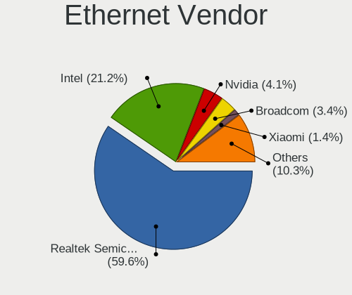

| Vendor                           | Computers | Percent |
|----------------------------------|-----------|---------|
| Realtek Semiconductor            | 95        | 61.29%  |
| Intel                            | 34        | 21.94%  |
| ASIX Electronics                 | 6         | 3.87%   |
| Qualcomm Atheros                 | 5         | 3.23%   |
| Broadcom                         | 4         | 2.58%   |
| Nvidia                           | 3         | 1.94%   |
| Xiaomi                           | 2         | 1.29%   |
| Marvell Technology Group         | 2         | 1.29%   |
| DisplayLink                      | 2         | 1.29%   |
| Silicon Integrated Systems [SiS] | 1         | 0.65%   |
| JMicron Technology               | 1         | 0.65%   |

Ethernet Model
--------------

Ethernet models

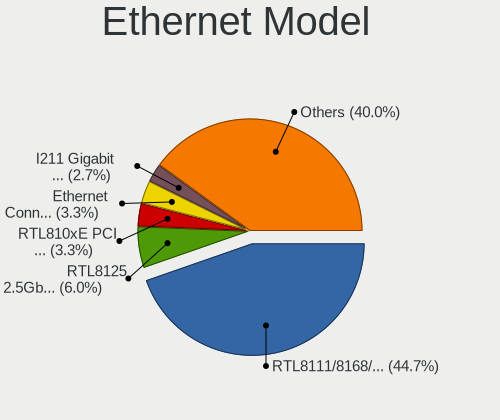

| Model                                                             | Computers | Percent |
|-------------------------------------------------------------------|-----------|---------|
| Realtek RTL8111/8168/8411 PCI Express Gigabit Ethernet Controller | 69        | 43.95%  |
| Realtek RTL8125 2.5GbE Controller                                 | 10        | 6.37%   |
| Realtek RTL810xE PCI Express Fast Ethernet controller             | 9         | 5.73%   |
| Realtek RTL8153 Gigabit Ethernet Adapter                          | 5         | 3.18%   |
| Intel 82579LM Gigabit Network Connection (Lewisville)             | 5         | 3.18%   |
| ASIX AX88179 Gigabit Ethernet                                     | 5         | 3.18%   |
| Intel I211 Gigabit Network Connection                             | 3         | 1.91%   |
| Intel Ethernet Controller I225-V                                  | 3         | 1.91%   |
| Qualcomm Atheros AR8151 v2.0 Gigabit Ethernet                     | 2         | 1.27%   |
| Intel Ethernet Connection (7) I219-V                              | 2         | 1.27%   |
| Intel Ethernet Connection (4) I219-LM                             | 2         | 1.27%   |
| Intel Ethernet Connection (2) I219-V                              | 2         | 1.27%   |
| Intel Ethernet Connection (16) I219-V                             | 2         | 1.27%   |
| Intel 82577LM Gigabit Network Connection                          | 2         | 1.27%   |
| Broadcom NetXtreme BCM5764M Gigabit Ethernet PCIe                 | 2         | 1.27%   |
| Xiaomi Mi/Redmi series (RNDIS)                                    | 1         | 0.64%   |
| Xiaomi Mi/Redmi series (RNDIS + ADB)                              | 1         | 0.64%   |
| Silicon Integrated Systems [SiS] 191 Gigabit Ethernet Adapter     | 1         | 0.64%   |
| Realtek RTL8169 PCI Gigabit Ethernet Controller                   | 1         | 0.64%   |
| Realtek RTL8152 Fast Ethernet Adapter                             | 1         | 0.64%   |
| Realtek Killer E2600 Gigabit Ethernet Controller                  | 1         | 0.64%   |
| Qualcomm Atheros QCA8171 Gigabit Ethernet                         | 1         | 0.64%   |
| Qualcomm Atheros AR8132 Fast Ethernet                             | 1         | 0.64%   |
| Qualcomm Atheros AR8121/AR8113/AR8114 Gigabit or Fast Ethernet    | 1         | 0.64%   |
| Nvidia MCP79 Ethernet                                             | 1         | 0.64%   |
| Nvidia MCP77 Ethernet                                             | 1         | 0.64%   |
| Nvidia MCP73 Ethernet                                             | 1         | 0.64%   |
| Marvell Group 88E8058 PCI-E Gigabit Ethernet Controller           | 1         | 0.64%   |
| Marvell Group 88E8040 PCI-E Fast Ethernet Controller              | 1         | 0.64%   |
| JMicron JMC250 PCI Express Gigabit Ethernet Controller            | 1         | 0.64%   |
| Intel Killer E3100X 2.5 Gigabit Ethernet Controller               | 1         | 0.64%   |
| Intel Ethernet Controller I226-V                                  | 1         | 0.64%   |
| Intel Ethernet Connection I219-V                                  | 1         | 0.64%   |
| Intel Ethernet Connection I218-LM                                 | 1         | 0.64%   |
| Intel Ethernet Connection (3) I218-LM                             | 1         | 0.64%   |
| Intel Ethernet Connection (23) I219-V                             | 1         | 0.64%   |
| Intel Ethernet Connection (16) I219-LM                            | 1         | 0.64%   |
| Intel Ethernet Connection (14) I219-V                             | 1         | 0.64%   |
| Intel Ethernet Connection (11) I219-LM                            | 1         | 0.64%   |
| Intel 82579V Gigabit Network Connection                           | 1         | 0.64%   |

Net Controller Kind
-------------------

Ethernet, WiFi or modem

| Kind     | Computers | Percent |
|----------|-----------|---------|
| Ethernet | 149       | 50.85%  |
| WiFi     | 138       | 47.1%   |
| Modem    | 4         | 1.37%   |
| Unknown  | 2         | 0.68%   |

Used Controller
---------------

Currently used network controller

| Kind     | Computers | Percent |
|----------|-----------|---------|
| WiFi     | 104       | 57.46%  |
| Ethernet | 77        | 42.54%  |

NICs
----

Total network controllers on board

| Total | Computers | Percent |
|-------|-----------|---------|
| 2     | 96        | 55.17%  |
| 1     | 72        | 41.38%  |
| 0     | 4         | 2.3%    |
| 3     | 2         | 1.15%   |

IPv6
----

IPv6 vs IPv4

| Used | Computers | Percent |
|------|-----------|---------|
| No   | 149       | 85.63%  |
| Yes  | 25        | 14.37%  |

Bluetooth
---------

Bluetooth Vendor
----------------

Controller vendors

| Vendor                          | Computers | Percent |
|---------------------------------|-----------|---------|
| Intel                           | 49        | 39.2%   |
| Realtek Semiconductor           | 19        | 15.2%   |
| Cambridge Silicon Radio         | 11        | 8.8%    |
| Qualcomm Atheros Communications | 7         | 5.6%    |
| IMC Networks                    | 7         | 5.6%    |
| Apple                           | 7         | 5.6%    |
| Foxconn / Hon Hai               | 6         | 4.8%    |
| Lite-On Technology              | 5         | 4%      |
| Broadcom                        | 5         | 4%      |
| MediaTek                        | 3         | 2.4%    |
| TP-Link                         | 1         | 0.8%    |
| Realtek                         | 1         | 0.8%    |
| Ralink                          | 1         | 0.8%    |
| Hewlett-Packard                 | 1         | 0.8%    |
| Belkin Components               | 1         | 0.8%    |
| Alps Electric                   | 1         | 0.8%    |

Bluetooth Model
---------------

Controller models

| Model                                               | Computers | Percent |
|-----------------------------------------------------|-----------|---------|
| Intel Bluetooth Device                              | 18        | 14.4%   |
| Realtek Bluetooth Radio                             | 15        | 12%     |
| Intel Bluetooth wireless interface                  | 14        | 11.2%   |
| Cambridge Silicon Radio Bluetooth Dongle (HCI mode) | 11        | 8.8%    |
| Intel AX200 Bluetooth                               | 6         | 4.8%    |
| IMC Networks Wireless_Device                        | 5         | 4%      |
| Qualcomm Atheros AR3011 Bluetooth                   | 3         | 2.4%    |
| MediaTek Wireless_Device                            | 3         | 2.4%    |
| Lite-On Wireless_Device                             | 3         | 2.4%    |
| Intel Wireless-AC 3168 Bluetooth                    | 3         | 2.4%    |
| Intel Bluetooth 9460/9560 Jefferson Peak (JfP)      | 3         | 2.4%    |
| Intel AX210 Bluetooth                               | 3         | 2.4%    |
| Apple Bluetooth Host Controller                     | 3         | 2.4%    |
| Realtek  Bluetooth 4.2 Adapter                      | 2         | 1.6%    |
| Qualcomm Atheros  Bluetooth Device                  | 2         | 1.6%    |
| Intel Wireless-AC 9260 Bluetooth Adapter            | 2         | 1.6%    |
| IMC Networks Bluetooth Radio                        | 2         | 1.6%    |
| Foxconn / Hon Hai MediaTek Bluetooth Adapter        | 2         | 1.6%    |
| Foxconn / Hon Hai Bluetooth Adapter                 | 2         | 1.6%    |
| Broadcom BCM20702A0                                 | 2         | 1.6%    |
| Broadcom BCM2045B (BDC-2.1) [Bluetooth Controller]  | 2         | 1.6%    |
| Apple Built-in Bluetooth 2.0+EDR HCI                | 2         | 1.6%    |
| TP-Link UB500 Adapter                               | 1         | 0.8%    |
| Realtek RTL8723B Bluetooth                          | 1         | 0.8%    |
| Realtek Bluetooth 5.1 Radio                         | 1         | 0.8%    |
| Realtek Bluetooth Radio                             | 1         | 0.8%    |
| Ralink RT3290 Bluetooth                             | 1         | 0.8%    |
| Qualcomm Atheros Bluetooth USB Host Controller      | 1         | 0.8%    |
| Qualcomm Atheros AR3012 Bluetooth 4.0               | 1         | 0.8%    |
| Lite-On Bluetooth Device                            | 1         | 0.8%    |
| Lite-On Atheros AR3012 Bluetooth                    | 1         | 0.8%    |
| HP Broadcom 2070 Bluetooth Combo                    | 1         | 0.8%    |
| Foxconn / Hon Hai Wireless_Device                   | 1         | 0.8%    |
| Foxconn / Hon Hai Bluetooth Device                  | 1         | 0.8%    |
| Broadcom BCM43142A0 Bluetooth Device                | 1         | 0.8%    |
| Belkin Components F8T013 Bluetooth Adapter          | 1         | 0.8%    |
| Apple Bluetooth USB Host Controller                 | 1         | 0.8%    |
| Apple Bluetooth HCI                                 | 1         | 0.8%    |
| Alps Electric UGTZ4 Bluetooth                       | 1         | 0.8%    |

Sound
-----

Sound Vendor
------------

Sound card vendors

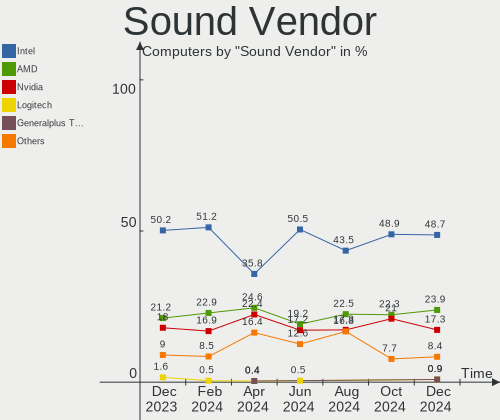

| Vendor                           | Computers | Percent |
|----------------------------------|-----------|---------|
| Intel                            | 123       | 50.2%   |
| AMD                              | 52        | 21.22%  |
| Nvidia                           | 44        | 17.96%  |
| Logitech                         | 4         | 1.63%   |
| C-Media Electronics              | 4         | 1.63%   |
| Texas Instruments                | 2         | 0.82%   |
| Micro Star International         | 2         | 0.82%   |
| Corsair                          | 2         | 0.82%   |
| Silicon Integrated Systems [SiS] | 1         | 0.41%   |
| Roland                           | 1         | 0.41%   |
| Logic3                           | 1         | 0.41%   |
| Lenovo                           | 1         | 0.41%   |
| Hewlett-Packard                  | 1         | 0.41%   |
| DSEA A/S                         | 1         | 0.41%   |
| Dell                             | 1         | 0.41%   |
| Creative Technology              | 1         | 0.41%   |
| CMX Systems                      | 1         | 0.41%   |
| ASUSTek Computer                 | 1         | 0.41%   |
| Apple                            | 1         | 0.41%   |
| Unknown                          | 1         | 0.41%   |

Sound Model
-----------

Sound card models

| Model                                                                      | Computers | Percent |
|----------------------------------------------------------------------------|-----------|---------|
| AMD Family 17h/19h HD Audio Controller                                     | 29        | 9.86%   |
| AMD Renoir Radeon High Definition Audio Controller                         | 11        | 3.74%   |
| Intel Sunrise Point-LP HD Audio                                            | 10        | 3.4%    |
| Intel 6 Series/C200 Series Chipset Family High Definition Audio Controller | 9         | 3.06%   |
| AMD Rembrandt Radeon High Definition Audio Controller                      | 9         | 3.06%   |
| Intel Alder Lake PCH-P High Definition Audio Controller                    | 8         | 2.72%   |
| Intel 7 Series/C216 Chipset Family High Definition Audio Controller        | 8         | 2.72%   |
| Intel 5 Series/3400 Series Chipset High Definition Audio                   | 8         | 2.72%   |
| Intel Raptor Lake-P/U/H cAVS                                               | 7         | 2.38%   |
| Intel Celeron/Pentium Silver Processor High Definition Audio               | 7         | 2.38%   |
| Nvidia Audio device                                                        | 6         | 2.04%   |
| Intel 82801I (ICH9 Family) HD Audio Controller                             | 6         | 2.04%   |
| Nvidia GP107GL High Definition Audio Controller                            | 5         | 1.7%    |
| Nvidia GK208 HDMI/DP Audio Controller                                      | 5         | 1.7%    |
| Intel Tiger Lake-LP Smart Sound Technology Audio Controller                | 5         | 1.7%    |
| Intel Comet Lake PCH cAVS                                                  | 5         | 1.7%    |
| Intel 8 Series/C220 Series Chipset High Definition Audio Controller        | 5         | 1.7%    |
| AMD Starship/Matisse HD Audio Controller                                   | 5         | 1.7%    |
| AMD Raven/Raven2/Fenghuang HDMI/DP Audio Controller                        | 5         | 1.7%    |
| AMD Family 17h (Models 00h-0fh) HD Audio Controller                        | 5         | 1.7%    |
| Nvidia GA106 High Definition Audio Controller                              | 4         | 1.36%   |
| Intel Wildcat Point-LP High Definition Audio Controller                    | 4         | 1.36%   |
| Intel Haswell-ULT HD Audio Controller                                      | 4         | 1.36%   |
| Intel Broadwell-U Audio Controller                                         | 4         | 1.36%   |
| Intel 8 Series HD Audio Controller                                         | 4         | 1.36%   |
| Intel 100 Series/C230 Series Chipset Family HD Audio Controller            | 4         | 1.36%   |
| AMD Navi 21/23 HDMI/DP Audio Controller                                    | 4         | 1.36%   |
| Nvidia TU106 High Definition Audio Controller                              | 3         | 1.02%   |
| Nvidia GA104 High Definition Audio Controller                              | 3         | 1.02%   |
| Intel Xeon E3-1200 v3/4th Gen Core Processor HD Audio Controller           | 3         | 1.02%   |
| Intel NM10/ICH7 Family High Definition Audio Controller                    | 3         | 1.02%   |
| Intel Celeron N3350/Pentium N4200/Atom E3900 Series Audio Cluster          | 3         | 1.02%   |
| Intel 700 Series Chipset Family Precise Touch and Stylus Port #1           | 3         | 1.02%   |
| AMD FCH Azalia Controller                                                  | 3         | 1.02%   |
| AMD Ellesmere HDMI Audio [Radeon RX 470/480 / 570/580/590]                 | 3         | 1.02%   |
| Texas Instruments PCM2902 Audio Codec                                      | 2         | 0.68%   |
| Nvidia GP104 High Definition Audio Controller                              | 2         | 0.68%   |
| Nvidia GM107 High Definition Audio Controller [GeForce 940MX]              | 2         | 0.68%   |
| Nvidia GK107 HDMI Audio Controller                                         | 2         | 0.68%   |
| Micro Star International USB Audio                                         | 2         | 0.68%   |

Memory
------

Memory Vendor
-------------

Memory module vendors

| Vendor                       | Computers | Percent |
|------------------------------|-----------|---------|
| Samsung Electronics          | 27        | 23.89%  |
| Micron Technology            | 16        | 14.16%  |
| Kingston                     | 13        | 11.5%   |
| SK hynix                     | 11        | 9.73%   |
| Crucial                      | 8         | 7.08%   |
| Unknown (ABCD)               | 7         | 6.19%   |
| Unknown                      | 7         | 6.19%   |
| Corsair                      | 7         | 6.19%   |
| G.Skill                      | 5         | 4.42%   |
| Nanya Technology             | 3         | 2.65%   |
| Ramaxel Technology           | 2         | 1.77%   |
| A-DATA Technology            | 2         | 1.77%   |
| Team                         | 1         | 0.88%   |
| Silicon Power                | 1         | 0.88%   |
| Patriot Memory (PDP Systems) | 1         | 0.88%   |
| GOODRAM                      | 1         | 0.88%   |
| Elpida                       | 1         | 0.88%   |

Memory Model
------------

Memory module models

| Model                                                            | Computers | Percent |
|------------------------------------------------------------------|-----------|---------|
| Unknown (ABCD) RAM 123456789012345678 2GB SODIMM LPDDR4 2400MT/s | 6         | 5%      |
| Samsung RAM M471A1K43EB1-CWE 8GB SODIMM DDR4 3200MT/s            | 5         | 4.17%   |
| SK hynix RAM HMAA1GS6CJR6N-XN 8GB SODIMM DDR4 3200MT/s           | 3         | 2.5%    |
| Corsair RAM CMK32GX4M2E3200C16 16GB DIMM DDR4 3534MT/s           | 3         | 2.5%    |
| Corsair RAM CMK16GX4M2E3200C16 8GB DIMM DDR4 3200MT/s            | 3         | 2.5%    |
| Samsung RAM M471B5173EB0-YK0 4GB SODIMM DDR3 1600MT/s            | 2         | 1.67%   |
| Samsung RAM M471B1G73QH0-YK0 8GB SODIMM DDR3 1867MT/s            | 2         | 1.67%   |
| Samsung RAM M471B1G73DB0-YK0 8GB SODIMM DDR3 1600MT/s            | 2         | 1.67%   |
| Nanya RAM NT8GA64D88AX3S-HR 8GB SODIMM DDR4 2667MT/s             | 2         | 1.67%   |
| Micron RAM 4ATF1G64HZ-3G2F1 8GB SODIMM DDR4 3200MT/s             | 2         | 1.67%   |
| Micron RAM 16KTF51264HZ-1G6M1 4GB SODIMM DDR3 1600MT/s           | 2         | 1.67%   |
| Unknown RAM Module 8GB DIMM DDR3                                 | 1         | 0.83%   |
| Unknown RAM Module 4GB SODIMM DDR3 1067MT/s                      | 1         | 0.83%   |
| Unknown RAM Module 2GB SODIMM DDR2 800MT/s                       | 1         | 0.83%   |
| Unknown RAM Module 2GB SODIMM DDR2 667MT/s                       | 1         | 0.83%   |
| Unknown RAM Module 2GB DIMM DDR2 800MT/s                         | 1         | 0.83%   |
| Unknown RAM Module 1GB DIMM DRAM                                 | 1         | 0.83%   |
| Unknown RAM DDR4 NB 16G 2666 16384MB SODIMM DDR4 2667MT/s        | 1         | 0.83%   |
| Unknown (ABCD) RAM 123456789012345678 2GB DIMM LPDDR4 2400MT/s   | 1         | 0.83%   |
| Team RAM TEAMGROUP-UD4-3200 32GB DIMM DDR4 3800MT/s              | 1         | 0.83%   |
| SK hynix RAM Module 8GB SODIMM DDR3 1600MT/s                     | 1         | 0.83%   |
| SK hynix RAM HMT451S6MFR8C-PB 4GB SODIMM DDR3 1600MT/s           | 1         | 0.83%   |
| SK hynix RAM HMT325U6CFR8C-PB 2GB DIMM DDR3 1600MT/s             | 1         | 0.83%   |
| SK hynix RAM HMCG78AGBSA095N 16GB SODIMM DDR5 5600MT/s           | 1         | 0.83%   |
| SK hynix RAM HMCG66AGBSA092N 8GB SODIMM DDR5 5600MT/s            | 1         | 0.83%   |
| SK hynix RAM HMAA2GS6AJR8N-XN 16GB SODIMM DDR4 3200MT/s          | 1         | 0.83%   |
| SK hynix RAM H9HCNNNFAMMLXR-NEE 4GB Row Of Chips LPDDR4 4267MT/s | 1         | 0.83%   |
| SK hynix RAM H9CCNNNCLGALAR-NVD 8GB Row Of Chips LPDDR3 2133MT/s | 1         | 0.83%   |
| Silicon Power RAM SP008GLSTU160N02 8GB SODIMM DDR3 1600MT/s      | 1         | 0.83%   |
| Samsung RAM Module 2GB SODIMM DDR3 1067MT/s                      | 1         | 0.83%   |
| Samsung RAM Module 2048MB DIMM DDR3 1333MT/s                     | 1         | 0.83%   |
| Samsung RAM Module 16GB SODIMM DDR4 3200MT/s                     | 1         | 0.83%   |
| Samsung RAM M471B5273DH0-CK0 4GB DIMM DDR3 1333MT/s              | 1         | 0.83%   |
| Samsung RAM M471B5273DH0-CH9 4096MB SODIMM DDR3 1334MT/s         | 1         | 0.83%   |
| Samsung RAM M471B5173DB0-YK0 4GB SODIMM DDR3 1600MT/s            | 1         | 0.83%   |
| Samsung RAM M471A5244CB0-CWE 4GB SODIMM DDR4 3200MT/s            | 1         | 0.83%   |
| Samsung RAM M471A1K43CB1-CRC 8GB SODIMM DDR4 2667MT/s            | 1         | 0.83%   |
| Samsung RAM M471A1G44CB0-CWE 8GB SODIMM DDR4 3200MT/s            | 1         | 0.83%   |
| Samsung RAM M471A1G44BB0-CWE 8GB SODIMM DDR4 3200MT/s            | 1         | 0.83%   |
| Samsung RAM M425R1GB4BB0-CQKOL 8GB SODIMM DDR5 4800MT/s          | 1         | 0.83%   |

Memory Kind
-----------

Memory module kinds

| Kind   | Computers | Percent |
|--------|-----------|---------|
| DDR4   | 50        | 49.02%  |
| DDR3   | 26        | 25.49%  |
| LPDDR4 | 10        | 9.8%    |
| DDR5   | 5         | 4.9%    |
| LPDDR5 | 3         | 2.94%   |
| LPDDR3 | 3         | 2.94%   |
| DDR2   | 3         | 2.94%   |
| DRAM   | 2         | 1.96%   |

Memory Form Factor
------------------

Physical design of the memory module

| Name         | Computers | Percent |
|--------------|-----------|---------|
| SODIMM       | 62        | 60.19%  |
| DIMM         | 33        | 32.04%  |
| Row Of Chips | 8         | 7.77%   |

Memory Size
-----------

Memory module size

| Size  | Computers | Percent |
|-------|-----------|---------|
| 8192  | 52        | 48.6%   |
| 16384 | 23        | 21.5%   |
| 4096  | 20        | 18.69%  |
| 2048  | 8         | 7.48%   |
| 32768 | 3         | 2.8%    |
| 1024  | 1         | 0.93%   |

Memory Speed
------------

Memory module speed

| Speed   | Computers | Percent |
|---------|-----------|---------|
| 3200    | 26        | 24.07%  |
| 1600    | 16        | 14.81%  |
| 2400    | 12        | 11.11%  |
| 2667    | 11        | 10.19%  |
| 2133    | 4         | 3.7%    |
| 6400    | 3         | 2.78%   |
| 5600    | 3         | 2.78%   |
| 3534    | 3         | 2.78%   |
| 1333    | 3         | 2.78%   |
| 1067    | 3         | 2.78%   |
| 4267    | 2         | 1.85%   |
| 1334    | 2         | 1.85%   |
| 800     | 2         | 1.85%   |
| Unknown | 2         | 1.85%   |
| 7200    | 1         | 0.93%   |
| 4800    | 1         | 0.93%   |
| 4266    | 1         | 0.93%   |
| 3866    | 1         | 0.93%   |
| 3800    | 1         | 0.93%   |
| 3733    | 1         | 0.93%   |
| 3600    | 1         | 0.93%   |
| 3400    | 1         | 0.93%   |
| 3334    | 1         | 0.93%   |
| 3000    | 1         | 0.93%   |
| 2933    | 1         | 0.93%   |
| 2733    | 1         | 0.93%   |
| 2200    | 1         | 0.93%   |
| 1866    | 1         | 0.93%   |
| 1800    | 1         | 0.93%   |
| 667     | 1         | 0.93%   |

Printers & scanners
-------------------

Printer Vendor
--------------

Printer device vendors

| Vendor             | Computers | Percent |
|--------------------|-----------|---------|
| Brother Industries | 2         | 50%     |
| Hewlett-Packard    | 1         | 25%     |
| Canon              | 1         | 25%     |

Printer Model
-------------

Printer device models

| Model                         | Computers | Percent |
|-------------------------------|-----------|---------|
| HP DeskJet 3630 series        | 1         | 25%     |
| Canon PIXMA MP230             | 1         | 25%     |
| Brother HL-2240D series       | 1         | 25%     |
| Brother HL-2030 Laser Printer | 1         | 25%     |

Scanner Vendor
--------------

Scanner device vendors

Zero info for selected period =(

Scanner Model
-------------

Scanner device models

Zero info for selected period =(

Camera
------

Camera Vendor
-------------

Camera device vendors

| Vendor                                 | Computers | Percent |
|----------------------------------------|-----------|---------|
| Chicony Electronics                    | 21        | 19.09%  |
| IMC Networks                           | 17        | 15.45%  |
| Quanta                                 | 10        | 9.09%   |
| Logitech                               | 8         | 7.27%   |
| Microdia                               | 6         | 5.45%   |
| Realtek Semiconductor                  | 5         | 4.55%   |
| Cheng Uei Precision Industry (Foxlink) | 5         | 4.55%   |
| Bison Electronics                      | 5         | 4.55%   |
| Apple                                  | 4         | 3.64%   |
| SunplusIT                              | 3         | 2.73%   |
| Alcor Micro                            | 3         | 2.73%   |
| Sonix Technology                       | 2         | 1.82%   |
| Samsung Electronics                    | 2         | 1.82%   |
| Ricoh                                  | 2         | 1.82%   |
| Lenovo                                 | 2         | 1.82%   |
| Syntek                                 | 1         | 0.91%   |
| Suyin                                  | 1         | 0.91%   |
| Sunplus Technology                     | 1         | 0.91%   |
| Sunplus Innovation Technology          | 1         | 0.91%   |
| Silicon Motion                         | 1         | 0.91%   |
| Luxvisions Innotech Limited            | 1         | 0.91%   |
| Intel                                  | 1         | 0.91%   |
| icSpring                               | 1         | 0.91%   |
| Genesys Logic                          | 1         | 0.91%   |
| GEMBIRD                                | 1         | 0.91%   |
| DigiTech                               | 1         | 0.91%   |
| Creative Technology                    | 1         | 0.91%   |
| Acer                                   | 1         | 0.91%   |
| 8SSC21D67422V1SR28902JL                | 1         | 0.91%   |
| Unknown                                | 1         | 0.91%   |

Camera Model
------------

Camera device models

| Model                                                | Computers | Percent |
|------------------------------------------------------|-----------|---------|
| IMC Networks Integrated Camera                       | 7         | 6.36%   |
| IMC Networks USB2.0 HD UVC WebCam                    | 5         | 4.55%   |
| Chicony Integrated Camera                            | 5         | 4.55%   |
| Chicony HP Truevision HD camera                      | 4         | 3.64%   |
| Apple Built-in iSight                                | 4         | 3.64%   |
| Quanta ACER HD User Facing                           | 3         | 2.73%   |
| Logitech Webcam C270                                 | 3         | 2.73%   |
| Samsung Galaxy series, misc. (MTP mode)              | 2         | 1.82%   |
| Ricoh Integrated Webcam                              | 2         | 1.82%   |
| Quanta HP Wide Vision HD Camera                      | 2         | 1.82%   |
| Quanta HP Webcam                                     | 2         | 1.82%   |
| Logitech HD Pro Webcam C920                          | 2         | 1.82%   |
| Bison Integrated Camera                              | 2         | 1.82%   |
| Bison HD Camera                                      | 2         | 1.82%   |
| Alcor Micro USB 2.0 Camera                           | 2         | 1.82%   |
| Syntek Integrated Camera                             | 1         | 0.91%   |
| Suyin HP TrueVision HD Integrated Webcam             | 1         | 0.91%   |
| SunplusIT XiaoMi USB 2.0 Webcam                      | 1         | 0.91%   |
| SunplusIT HP TrueVision HD Camera                    | 1         | 0.91%   |
| SunplusIT FHD Webcam                                 | 1         | 0.91%   |
| Sunplus 1.3M HD WebCam                               | 1         | 0.91%   |
| Sunplus HD WebCam                                    | 1         | 0.91%   |
| Sonix USB2.0 HD UVC WebCam                           | 1         | 0.91%   |
| Sonix USB2.0 FHD UVC WebCam                          | 1         | 0.91%   |
| Silicon Motion USB 2.0 PC Cam                        | 1         | 0.91%   |
| Realtek USB2.0 VGA UVC WebCam                        | 1         | 0.91%   |
| Realtek USB camera                                   | 1         | 0.91%   |
| Realtek Lenovo EasyCamera                            | 1         | 0.91%   |
| Realtek Laptop Camera                                | 1         | 0.91%   |
| Realtek Integrated Webcam HD                         | 1         | 0.91%   |
| Quanta USB2.0 VGA UVC WebCam                         | 1         | 0.91%   |
| Quanta HP TrueVision HD Camera                       | 1         | 0.91%   |
| Quanta HP True Vision FHD Camera                     | 1         | 0.91%   |
| Microdia Webcam Vitade AF                            | 1         | 0.91%   |
| Microdia USB Camera                                  | 1         | 0.91%   |
| Microdia Sonix USB 2.0 Camera                        | 1         | 0.91%   |
| Microdia MSI Starcam Racer                           | 1         | 0.91%   |
| Microdia HP Integrated Webcam                        | 1         | 0.91%   |
| Microdia Dell Integrated HD Webcam                   | 1         | 0.91%   |
| Luxvisions Innotech Limited HP Wide Vision HD Camera | 1         | 0.91%   |

Security
--------

Fingerprint Vendor
------------------

Fingerprint sensor vendors

| Vendor                             | Computers | Percent |
|------------------------------------|-----------|---------|
| Validity Sensors                   | 4         | 25%     |
| Synaptics                          | 3         | 18.75%  |
| Elan Microelectronics              | 3         | 18.75%  |
| Realtek USB2.0 Finger Print Bridge | 2         | 12.5%   |
| Upek                               | 1         | 6.25%   |
| Shenzhen Goodix Technology         | 1         | 6.25%   |
| LighTuning Technology              | 1         | 6.25%   |
| AuthenTec                          | 1         | 6.25%   |

Fingerprint Model
-----------------

Fingerprint sensor models

| Model                                                           | Computers | Percent |
|-----------------------------------------------------------------|-----------|---------|
| Validity Sensors VFS5011 Fingerprint Reader                     | 3         | 18.75%  |
| Synaptics Metallica MIS Touch Fingerprint Reader                | 2         | 12.5%   |
| Realtek USB2.0 Finger Print Bridge FocalTech Fingerprint Device | 2         | 12.5%   |
| Elan ELAN:ARM-M4                                                | 2         | 12.5%   |
| Validity Sensors VFS451 Fingerprint Reader                      | 1         | 6.25%   |
| Upek Biometric Touchchip/Touchstrip Fingerprint Sensor          | 1         | 6.25%   |
| Synaptics WBDI Fingerprint Reader USB 086                       | 1         | 6.25%   |
| Shenzhen Goodix  Fingerprint Device                             | 1         | 6.25%   |
| LighTuning ES603 Swipe Fingerprint Sensor                       | 1         | 6.25%   |
| Elan ELAN:Fingerprint                                           | 1         | 6.25%   |
| AuthenTec AES2810                                               | 1         | 6.25%   |

Chipcard Vendor
---------------

Chipcard module vendors

| Vendor                | Computers | Percent |
|-----------------------|-----------|---------|
| SCM Microsystems      | 1         | 33.33%  |
| Alcor Micro           | 1         | 33.33%  |
| Advanced Card Systems | 1         | 33.33%  |

Chipcard Model
--------------

Chipcard module models

| Model                                                  | Computers | Percent |
|--------------------------------------------------------|-----------|---------|
| SCM Microsystems SCR331-LC1 / SCR3310 SmartCard Reader | 1         | 33.33%  |
| Alcor Micro AU9540 Smartcard Reader                    | 1         | 33.33%  |
| Advanced Card Systems ACR38 SmartCard Reader           | 1         | 33.33%  |

Unsupported
-----------

Unsupported Devices
-------------------

Total unsupported devices on board

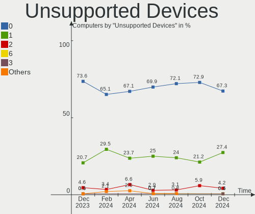

| Total | Computers | Percent |
|-------|-----------|---------|
| 0     | 128       | 73.56%  |
| 1     | 36        | 20.69%  |
| 2     | 8         | 4.6%    |
| 4     | 1         | 0.57%   |
| 3     | 1         | 0.57%   |

Unsupported Device Types
------------------------

Types of unsupported devices

| Type                     | Computers | Percent |
|--------------------------|-----------|---------|
| Fingerprint reader       | 16        | 27.59%  |
| Net/wireless             | 10        | 17.24%  |
| Graphics card            | 10        | 17.24%  |
| Multimedia controller    | 8         | 13.79%  |
| Network                  | 3         | 5.17%   |
| Chipcard                 | 3         | 5.17%   |
| Camera                   | 3         | 5.17%   |
| Bluetooth                | 2         | 3.45%   |
| Unassigned class         | 1         | 1.72%   |
| Communication controller | 1         | 1.72%   |
| Card reader              | 1         | 1.72%   |

