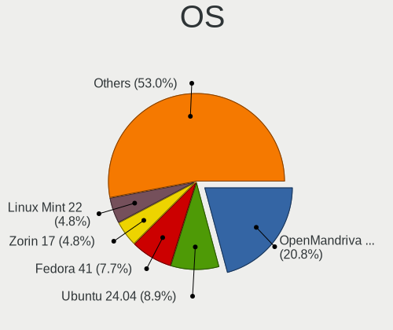
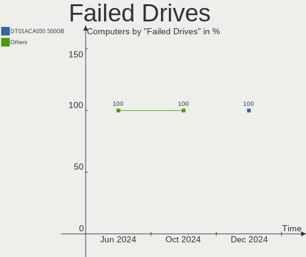
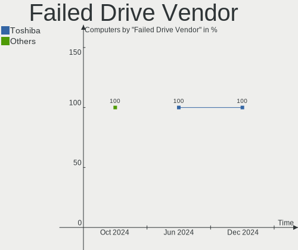
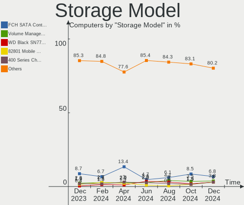
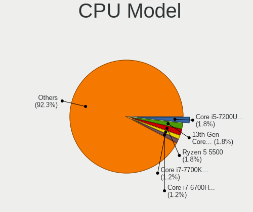
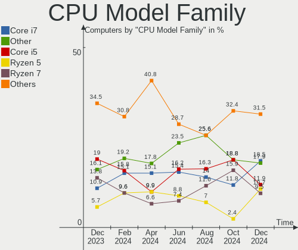
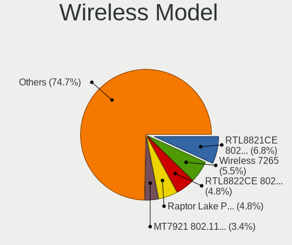
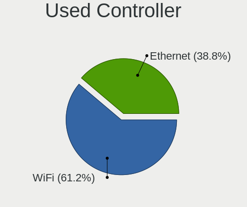
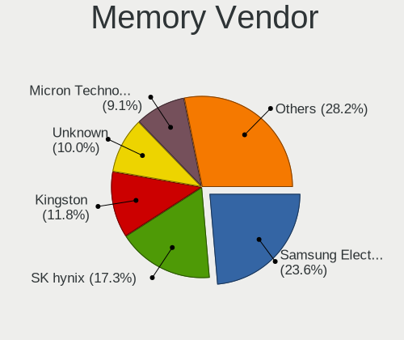
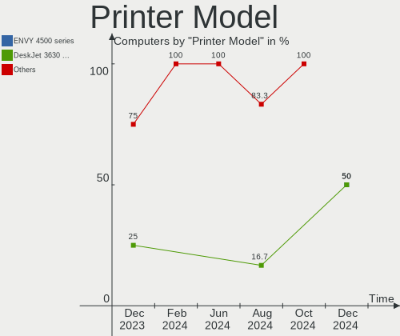

Linux in Spain - Hardware Trends
--------------------------------

A project to identify most popular hardware characteristics and track their change
over time based on data collected by Linux users at https://Linux-Hardware.org.

Anyone can contribute to this report by the [hw-probe](https://github.com/linuxhw/hw-probe) tool:

    sudo -E hw-probe -all -upload

This is a report for all computer types. See also reports for [desktops](/Location/Spain/Desktop/README.md) and [notebooks](/Location/Spain/Notebook/README.md).

Period: Oct, 2022.

Contents
--------

* [ System ](#system)
  - [ OS                       ](#os)
  - [ OS Family                ](#os-family)
  - [ Kernel                   ](#kernel)
  - [ Kernel Family            ](#kernel-family)
  - [ Kernel Major Ver.        ](#kernel-major-ver)
  - [ Arch                     ](#arch)
  - [ DE                       ](#de)
  - [ Display Server           ](#display-server)
  - [ Display Manager          ](#display-manager)
  - [ OS Lang                  ](#os-lang)
  - [ Boot Mode                ](#boot-mode)
  - [ Filesystem               ](#filesystem)
  - [ Part. scheme             ](#part-scheme)
  - [ Dual Boot with Linux/BSD ](#dual-boot-with-linuxbsd)
  - [ Dual Boot (Win)          ](#dual-boot-win)

* [ Board ](#board)
  - [ Vendor                   ](#vendor)
  - [ Model                    ](#model)
  - [ Model Family             ](#model-family)
  - [ MFG Year                 ](#mfg-year)
  - [ Form Factor              ](#form-factor)
  - [ Secure Boot              ](#secure-boot)
  - [ Coreboot                 ](#coreboot)
  - [ RAM Size                 ](#ram-size)
  - [ RAM Used                 ](#ram-used)
  - [ Total Drives             ](#total-drives)
  - [ Has CD-ROM               ](#has-cd-rom)
  - [ Has Ethernet             ](#has-ethernet)
  - [ Has WiFi                 ](#has-wifi)
  - [ Has Bluetooth            ](#has-bluetooth)

* [ Location ](#location)
  - [ Country                  ](#country)
  - [ City                     ](#city)

* [ Drives ](#drives)
  - [ Drive Vendor             ](#drive-vendor)
  - [ Drive Model              ](#drive-model)
  - [ HDD Vendor               ](#hdd-vendor)
  - [ SSD Vendor               ](#ssd-vendor)
  - [ Drive Kind               ](#drive-kind)
  - [ Drive Connector          ](#drive-connector)
  - [ Drive Size               ](#drive-size)
  - [ Space Total              ](#space-total)
  - [ Space Used               ](#space-used)
  - [ Malfunc. Drives          ](#malfunc-drives)
  - [ Malfunc. Drive Vendor    ](#malfunc-drive-vendor)
  - [ Malfunc. HDD Vendor      ](#malfunc-hdd-vendor)
  - [ Malfunc. Drive Kind      ](#malfunc-drive-kind)
  - [ Failed Drives            ](#failed-drives)
  - [ Failed Drive Vendor      ](#failed-drive-vendor)
  - [ Drive Status             ](#drive-status)

* [ Storage controller ](#storage-controller)
  - [ Storage Vendor           ](#storage-vendor)
  - [ Storage Model            ](#storage-model)
  - [ Storage Kind             ](#storage-kind)

* [ Processor ](#processor)
  - [ CPU Vendor               ](#cpu-vendor)
  - [ CPU Model                ](#cpu-model)
  - [ CPU Model Family         ](#cpu-model-family)
  - [ CPU Cores                ](#cpu-cores)
  - [ CPU Sockets              ](#cpu-sockets)
  - [ CPU Threads              ](#cpu-threads)
  - [ CPU Op-Modes             ](#cpu-op-modes)
  - [ CPU Microcode            ](#cpu-microcode)
  - [ CPU Microarch            ](#cpu-microarch)

* [ Graphics ](#graphics)
  - [ GPU Vendor               ](#gpu-vendor)
  - [ GPU Model                ](#gpu-model)
  - [ GPU Combo                ](#gpu-combo)
  - [ GPU Driver               ](#gpu-driver)
  - [ GPU Memory               ](#gpu-memory)

* [ Monitor ](#monitor)
  - [ Monitor Vendor           ](#monitor-vendor)
  - [ Monitor Model            ](#monitor-model)
  - [ Monitor Resolution       ](#monitor-resolution)
  - [ Monitor Diagonal         ](#monitor-diagonal)
  - [ Monitor Width            ](#monitor-width)
  - [ Aspect Ratio             ](#aspect-ratio)
  - [ Monitor Area             ](#monitor-area)
  - [ Pixel Density            ](#pixel-density)
  - [ Multiple Monitors        ](#multiple-monitors)

* [ Network ](#network)
  - [ Net Controller Vendor    ](#net-controller-vendor)
  - [ Net Controller Model     ](#net-controller-model)
  - [ Wireless Vendor          ](#wireless-vendor)
  - [ Wireless Model           ](#wireless-model)
  - [ Ethernet Vendor          ](#ethernet-vendor)
  - [ Ethernet Model           ](#ethernet-model)
  - [ Net Controller Kind      ](#net-controller-kind)
  - [ Used Controller          ](#used-controller)
  - [ NICs                     ](#nics)
  - [ IPv6                     ](#ipv6)

* [ Bluetooth ](#bluetooth)
  - [ Bluetooth Vendor         ](#bluetooth-vendor)
  - [ Bluetooth Model          ](#bluetooth-model)

* [ Sound ](#sound)
  - [ Sound Vendor             ](#sound-vendor)
  - [ Sound Model              ](#sound-model)

* [ Memory ](#memory)
  - [ Memory Vendor            ](#memory-vendor)
  - [ Memory Model             ](#memory-model)
  - [ Memory Kind              ](#memory-kind)
  - [ Memory Form Factor       ](#memory-form-factor)
  - [ Memory Size              ](#memory-size)
  - [ Memory Speed             ](#memory-speed)

* [ Printers & scanners ](#printers--scanners)
  - [ Printer Vendor           ](#printer-vendor)
  - [ Printer Model            ](#printer-model)
  - [ Scanner Vendor           ](#scanner-vendor)
  - [ Scanner Model            ](#scanner-model)

* [ Camera ](#camera)
  - [ Camera Vendor            ](#camera-vendor)
  - [ Camera Model             ](#camera-model)

* [ Security ](#security)
  - [ Fingerprint Vendor       ](#fingerprint-vendor)
  - [ Fingerprint Model        ](#fingerprint-model)
  - [ Chipcard Vendor          ](#chipcard-vendor)
  - [ Chipcard Model           ](#chipcard-model)

* [ Unsupported ](#unsupported)
  - [ Unsupported Devices      ](#unsupported-devices)
  - [ Unsupported Device Types ](#unsupported-device-types)

System
------

OS
--

Installed operating systems

| Name                        | Computers | Percent |
|-----------------------------|-----------|---------|
| Ubuntu 22.04                | 30        | 19.74%  |
| Linux Mint 21               | 12        | 7.89%   |
| OpenMandriva 4.3            | 11        | 7.24%   |
| Debian 11                   | 11        | 7.24%   |
| Pop!_OS 22.04               | 7         | 4.61%   |
| Fedora 36                   | 7         | 4.61%   |
| KDE neon 20.04              | 6         | 3.95%   |
| Zorin 16                    | 5         | 3.29%   |
| Linux Mint 20.3             | 4         | 2.63%   |
| Fedora 37                   | 4         | 2.63%   |
| Ubuntu 20.04                | 3         | 1.97%   |
| OpenMandriva 4.50           | 3         | 1.97%   |
| Manjaro 22.0.0              | 3         | 1.97%   |
| Manjaro                     | 3         | 1.97%   |
| Arch Rolling                | 3         | 1.97%   |
| Ubuntu 22.10                | 2         | 1.32%   |
| Ubuntu 18.04                | 2         | 1.32%   |
| Parrot 5.1                  | 2         | 1.32%   |
| Nobara 36                   | 2         | 1.32%   |
| Kubuntu 22.04               | 2         | 1.32%   |
| Kali 2022.3                 | 2         | 1.32%   |
| EndeavourOS Rolling         | 2         | 1.32%   |
| Debian                      | 2         | 1.32%   |
| ArcoLinux Rolling           | 2         | 1.32%   |
| Zorin 15                    | 1         | 0.66%   |
| Xubuntu 20.04               | 1         | 0.66%   |
| Xubuntu 18.04               | 1         | 0.66%   |
| Ultramarine Linux 36        | 1         | 0.66%   |
| Ubuntu Studio 22.04         | 1         | 0.66%   |
| TUXEDO OS 22.04             | 1         | 0.66%   |
| SteamOS 3.3.2               | 1         | 0.66%   |
| ROSA 12.2                   | 1         | 0.66%   |
| org.kde.Platform 5.15-21.08 | 1         | 0.66%   |
| OpenMandriva 4.2            | 1         | 0.66%   |
| MX 21                       | 1         | 0.66%   |
| Lubuntu 22.04               | 1         | 0.66%   |
| Linux Mint 20.2             | 1         | 0.66%   |
| Linux Mint 20               | 1         | 0.66%   |
| Linux Mint 18.3             | 1         | 0.66%   |
| Gentoo 2.8                  | 1         | 0.66%   |

OS Family
---------

OS without a version

| Name              | Computers | Percent |
|-------------------|-----------|---------|
| Ubuntu            | 37        | 24.34%  |
| Linux Mint        | 19        | 12.5%   |
| OpenMandriva      | 15        | 9.87%   |
| Debian            | 14        | 9.21%   |
| Fedora            | 11        | 7.24%   |
| Pop!_OS           | 7         | 4.61%   |
| Zorin             | 6         | 3.95%   |
| Manjaro           | 6         | 3.95%   |
| KDE neon          | 6         | 3.95%   |
| ArcoLinux         | 3         | 1.97%   |
| Arch              | 3         | 1.97%   |
| Xubuntu           | 2         | 1.32%   |
| Parrot            | 2         | 1.32%   |
| Nobara            | 2         | 1.32%   |
| Kubuntu           | 2         | 1.32%   |
| Kali              | 2         | 1.32%   |
| EndeavourOS       | 2         | 1.32%   |
| Ultramarine Linux | 1         | 0.66%   |
| Ubuntu Studio     | 1         | 0.66%   |
| TUXEDO OS         | 1         | 0.66%   |
| SteamOS           | 1         | 0.66%   |
| ROSA              | 1         | 0.66%   |
| org.kde.Platform  | 1         | 0.66%   |
| MX                | 1         | 0.66%   |
| Lubuntu           | 1         | 0.66%   |
| Gentoo            | 1         | 0.66%   |
| Garuda Linux      | 1         | 0.66%   |
| Endless           | 1         | 0.66%   |
| Elementary        | 1         | 0.66%   |
| Clear Linux       | 1         | 0.66%   |

Kernel
------

Version of the Linux kernel

| Version                                                      | Computers | Percent |
|--------------------------------------------------------------|-----------|---------|
| 5.15.0-50-generic                                            | 22        | 14.47%  |
| 5.15.0-52-generic                                            | 21        | 13.82%  |
| 5.15.0-48-generic                                            | 13        | 8.55%   |
| 5.16.7-desktop-1omv4003                                      | 11        | 7.24%   |
| 5.19.0-76051900-generic                                      | 4         | 2.63%   |
| 5.10.0-18-amd64                                              | 4         | 2.63%   |
| 5.19.15-201.fc36.x86_64                                      | 3         | 1.97%   |
| 5.19.0-2-amd64                                               | 3         | 1.97%   |
| 5.10.0-19-amd64                                              | 3         | 1.97%   |
| 4.15.0-193-generic                                           | 3         | 1.97%   |
| 6.0.5-x64v1-xanmod1                                          | 2         | 1.32%   |
| 6.0.5-200.fc36.x86_64                                        | 2         | 1.32%   |
| 6.0.2-zen1-1-zen                                             | 2         | 1.32%   |
| 6.0.2-arch1-1                                                | 2         | 1.32%   |
| 6.0.2-76060002-generic                                       | 2         | 1.32%   |
| 6.0.0-2-amd64                                                | 2         | 1.32%   |
| 5.4.0-131-generic                                            | 2         | 1.32%   |
| 5.19.16-201.fsync.fc36.x86_64                                | 2         | 1.32%   |
| 5.19.13-300.fc37.x86_64                                      | 2         | 1.32%   |
| 5.19.12-desktop-2omv4090                                     | 2         | 1.32%   |
| 5.19.12-200.fc36.x86_64                                      | 2         | 1.32%   |
| 5.19.0-23-generic                                            | 2         | 1.32%   |
| 5.15.74-1-lts                                                | 2         | 1.32%   |
| 5.15.65-1-MANJARO                                            | 2         | 1.32%   |
| 5.15.0-43-generic                                            | 2         | 1.32%   |
| 6.1.0-0.rc0.20221012git49da07006239.10.vanilla.1.fc37.x86_64 | 1         | 0.66%   |
| 6.0.2-2-MANJARO                                              | 1         | 0.66%   |
| 6.0.1-zen2-1-zen                                             | 1         | 0.66%   |
| 6.0.0-1-MANJARO                                              | 1         | 0.66%   |
| 5.4.0-126-generic                                            | 1         | 0.66%   |
| 5.4.0-113-generic                                            | 1         | 0.66%   |
| 5.19.5-desktop-1omv4090                                      | 1         | 0.66%   |
| 5.19.16-76051916-generic                                     | 1         | 0.66%   |
| 5.19.15-300.fc37.x86_64                                      | 1         | 0.66%   |
| 5.19.13-200.fc36.x86_64                                      | 1         | 0.66%   |
| 5.19.0-kali2-rt-amd64                                        | 1         | 0.66%   |
| 5.19.0-3-rt10-MANJARO                                        | 1         | 0.66%   |
| 5.19.0-2mx-amd64                                             | 1         | 0.66%   |
| 5.19.0-16.2-liquorix-amd64                                   | 1         | 0.66%   |
| 5.18.17-amd64-desktop-hwe                                    | 1         | 0.66%   |

Kernel Family
-------------

Linux kernel without a distro release

| Version  | Computers | Percent |
|----------|-----------|---------|
| 5.15.0   | 63        | 41.45%  |
| 5.19.0   | 13        | 8.55%   |
| 5.16.7   | 11        | 7.24%   |
| 6.0.2    | 7         | 4.61%   |
| 5.10.0   | 7         | 4.61%   |
| 6.0.5    | 4         | 2.63%   |
| 5.4.0    | 4         | 2.63%   |
| 5.19.15  | 4         | 2.63%   |
| 5.19.12  | 4         | 2.63%   |
| 4.15.0   | 4         | 2.63%   |
| 6.0.0    | 3         | 1.97%   |
| 5.19.16  | 3         | 1.97%   |
| 5.19.13  | 3         | 1.97%   |
| 5.18.0   | 2         | 1.32%   |
| 5.15.74  | 2         | 1.32%   |
| 5.15.65  | 2         | 1.32%   |
| 5.13.0   | 2         | 1.32%   |
| 6.1.0    | 1         | 0.66%   |
| 6.0.1    | 1         | 0.66%   |
| 5.19.5   | 1         | 0.66%   |
| 5.18.17  | 1         | 0.66%   |
| 5.16.13  | 1         | 0.66%   |
| 5.15.73  | 1         | 0.66%   |
| 5.15.72  | 1         | 0.66%   |
| 5.15.11  | 1         | 0.66%   |
| 5.14.0   | 1         | 0.66%   |
| 5.11.0   | 1         | 0.66%   |
| 5.10.74  | 1         | 0.66%   |
| 5.10.68  | 1         | 0.66%   |
| 5.10.146 | 1         | 0.66%   |
| 5.10.14  | 1         | 0.66%   |

Kernel Major Ver.
-----------------

Linux kernel major version

| Version | Computers | Percent |
|---------|-----------|---------|
| 5.15    | 70        | 46.05%  |
| 5.19    | 28        | 18.42%  |
| 6.0     | 15        | 9.87%   |
| 5.16    | 12        | 7.89%   |
| 5.10    | 11        | 7.24%   |
| 5.4     | 4         | 2.63%   |
| 4.15    | 4         | 2.63%   |
| 5.18    | 3         | 1.97%   |
| 5.13    | 2         | 1.32%   |
| 6.1     | 1         | 0.66%   |
| 5.14    | 1         | 0.66%   |
| 5.11    | 1         | 0.66%   |

Arch
----

OS architecture (x86_64, i586, etc.)

| Name    | Computers | Percent |
|---------|-----------|---------|
| x86_64  | 150       | 98.68%  |
| i686    | 1         | 0.66%   |
| aarch64 | 1         | 0.66%   |

DE
--

Desktop Environment

| Name       | Computers | Percent |
|------------|-----------|---------|
| GNOME      | 73        | 48.03%  |
| KDE5       | 38        | 25%     |
| X-Cinnamon | 13        | 8.55%   |
| MATE       | 9         | 5.92%   |
| XFCE       | 8         | 5.26%   |
| Unknown    | 3         | 1.97%   |
| LXQt       | 2         | 1.32%   |
| i3         | 2         | 1.32%   |
| Pantheon   | 1         | 0.66%   |
| Deepin     | 1         | 0.66%   |
| Budgie     | 1         | 0.66%   |
| awesome    | 1         | 0.66%   |

Display Server
--------------

X11 or Wayland

| Name    | Computers | Percent |
|---------|-----------|---------|
| X11     | 110       | 72.37%  |
| Wayland | 36        | 23.68%  |
| Tty     | 5         | 3.29%   |
| Unknown | 1         | 0.66%   |

Display Manager
---------------

SDDM, LightDM, etc.

| Name    | Computers | Percent |
|---------|-----------|---------|
| Unknown | 62        | 40.79%  |
| GDM3    | 35        | 23.03%  |
| SDDM    | 26        | 17.11%  |
| LightDM | 15        | 9.87%   |
| GDM     | 13        | 8.55%   |
| LXDM    | 1         | 0.66%   |

OS Lang
-------

Language

| Lang    | Computers | Percent |
|---------|-----------|---------|
| es_ES   | 107       | 70.39%  |
| en_US   | 30        | 19.74%  |
| ca_ES   | 6         | 3.95%   |
| en_GB   | 2         | 1.32%   |
| en_AG   | 2         | 1.32%   |
| gl_ES   | 1         | 0.66%   |
| fr_FR   | 1         | 0.66%   |
| es_MX   | 1         | 0.66%   |
| ca_AD   | 1         | 0.66%   |
| Unknown | 1         | 0.66%   |

Boot Mode
---------

EFI or BIOS

| Mode | Computers | Percent |
|------|-----------|---------|
| BIOS | 79        | 51.97%  |
| EFI  | 73        | 48.03%  |

Filesystem
----------

Type of filesystem

| Type    | Computers | Percent |
|---------|-----------|---------|
| Ext4    | 116       | 76.32%  |
| Btrfs   | 18        | 11.84%  |
| Overlay | 14        | 9.21%   |
| Xfs     | 4         | 2.63%   |

Part. scheme
------------

Scheme of partitioning

| Type    | Computers | Percent |
|---------|-----------|---------|
| GPT     | 81        | 53.29%  |
| Unknown | 60        | 39.47%  |
| MBR     | 11        | 7.24%   |

Dual Boot with Linux/BSD
------------------------

Hosting more than one Linux/BSD

| Dual boot | Computers | Percent |
|-----------|-----------|---------|
| No        | 126       | 82.89%  |
| Yes       | 26        | 17.11%  |

Dual Boot (Win)
---------------

Hosting Linux and Windows

| Dual boot | Computers | Percent |
|-----------|-----------|---------|
| No        | 106       | 69.74%  |
| Yes       | 46        | 30.26%  |

Board
-----

Vendor
------

Motherboard manufacturer

| Name                        | Computers | Percent |
|-----------------------------|-----------|---------|
| ASUSTek Computer            | 26        | 17.11%  |
| Lenovo                      | 19        | 12.5%   |
| MSI                         | 18        | 11.84%  |
| Hewlett-Packard             | 15        | 9.87%   |
| Gigabyte Technology         | 15        | 9.87%   |
| Acer                        | 8         | 5.26%   |
| Dell                        | 7         | 4.61%   |
| Apple                       | 6         | 3.95%   |
| Toshiba                     | 4         | 2.63%   |
| Notebook                    | 3         | 1.97%   |
| Fujitsu                     | 3         | 1.97%   |
| Chuwi                       | 3         | 1.97%   |
| Unknown                     | 3         | 1.97%   |
| SLIMBOOK                    | 2         | 1.32%   |
| Medion                      | 2         | 1.32%   |
| Intel                       | 2         | 1.32%   |
| HUAWEI                      | 2         | 1.32%   |
| ASRock                      | 2         | 1.32%   |
| VANT                        | 1         | 0.66%   |
| Valve                       | 1         | 0.66%   |
| Supermicro                  | 1         | 0.66%   |
| Shuttle                     | 1         | 0.66%   |
| Shenzhen Wangang Technology | 1         | 0.66%   |
| Samsung Electronics         | 1         | 0.66%   |
| Qilive                      | 1         | 0.66%   |
| Panasonic                   | 1         | 0.66%   |
| Microsoft                   | 1         | 0.66%   |
| Google                      | 1         | 0.66%   |
| BESSTAR Tech                | 1         | 0.66%   |
| ALURIN                      | 1         | 0.66%   |

Model
-----

Motherboard model

| Name                         | Computers | Percent |
|------------------------------|-----------|---------|
| Unknown                      | 3         | 1.97%   |
| MSI Modern 14 C12M           | 2         | 1.32%   |
| Fujitsu LIFEBOOK AH532       | 2         | 1.32%   |
| Chuwi HeroBook Air           | 2         | 1.32%   |
| Apple iMac9,1                | 2         | 1.32%   |
| VANT MOOVE3-15               | 1         | 0.66%   |
| Valve Jupiter                | 1         | 0.66%   |
| Toshiba Satellite R830       | 1         | 0.66%   |
| Toshiba Satellite P50-B-103  | 1         | 0.66%   |
| Toshiba Satellite L10W-B-101 | 1         | 0.66%   |
| Toshiba Satellite C855-1T5   | 1         | 0.66%   |
| Supermicro X10SL7-F          | 1         | 0.66%   |
| SLIMBOOK TITAN               | 1         | 0.66%   |
| SLIMBOOK PROX-AMD5           | 1         | 0.66%   |
| Shuttle DH470                | 1         | 0.66%   |
| Shenzhen Wangang AERO 2 Pro  | 1         | 0.66%   |
| Samsung N248P/N143P          | 1         | 0.66%   |
| Qilive QW20141BSP            | 1         | 0.66%   |
| Panasonic CF-19RDRCHH7       | 1         | 0.66%   |
| Notebook W65_W67RB           | 1         | 0.66%   |
| Notebook W230SD              | 1         | 0.66%   |
| Notebook N2x0WU              | 1         | 0.66%   |
| MSI WC846AA-ABE HPE-140es    | 1         | 0.66%   |
| MSI Stealth GS66 12UGS       | 1         | 0.66%   |
| MSI Raider GE76 12UGS        | 1         | 0.66%   |
| MSI Pulse GL76 12UEK         | 1         | 0.66%   |
| MSI MS-7D54                  | 1         | 0.66%   |
| MSI MS-7D18                  | 1         | 0.66%   |
| MSI MS-7C95                  | 1         | 0.66%   |
| MSI MS-7C80                  | 1         | 0.66%   |
| MSI MS-7B98                  | 1         | 0.66%   |
| MSI MS-7B51                  | 1         | 0.66%   |
| MSI MS-7B07                  | 1         | 0.66%   |
| MSI MS-7918                  | 1         | 0.66%   |
| MSI MS-7817                  | 1         | 0.66%   |
| MSI MS-7512                  | 1         | 0.66%   |
| MSI GE66 Raider 10UE         | 1         | 0.66%   |
| MSI Creator Z16 A11UE        | 1         | 0.66%   |
| Microsoft Surface Pro 3      | 1         | 0.66%   |
| Medion MS-7797               | 1         | 0.66%   |

Model Family
------------

Motherboard model prefix

| Name                   | Computers | Percent |
|------------------------|-----------|---------|
| Lenovo IdeaPad         | 8         | 5.26%   |
| Acer Aspire            | 6         | 3.95%   |
| Lenovo ThinkPad        | 5         | 3.29%   |
| ASUS PRIME             | 5         | 3.29%   |
| Toshiba Satellite      | 4         | 2.63%   |
| Lenovo ThinkBook       | 3         | 1.97%   |
| HP Pavilion            | 3         | 1.97%   |
| Fujitsu LIFEBOOK       | 3         | 1.97%   |
| Dell Latitude          | 3         | 1.97%   |
| ASUS ASUS              | 3         | 1.97%   |
| Unknown                | 3         | 1.97%   |
| MSI Modern             | 2         | 1.32%   |
| HP Laptop              | 2         | 1.32%   |
| HP Compaq              | 2         | 1.32%   |
| Chuwi HeroBook         | 2         | 1.32%   |
| ASUS VivoBook          | 2         | 1.32%   |
| ASUS TUF               | 2         | 1.32%   |
| ASUS ROG               | 2         | 1.32%   |
| Apple iMac9            | 2         | 1.32%   |
| VANT MOOVE3-15         | 1         | 0.66%   |
| Valve Jupiter          | 1         | 0.66%   |
| Supermicro X10SL7-F    | 1         | 0.66%   |
| SLIMBOOK TITAN         | 1         | 0.66%   |
| SLIMBOOK PROX-AMD5     | 1         | 0.66%   |
| Shuttle DH470          | 1         | 0.66%   |
| Shenzhen Wangang AERO  | 1         | 0.66%   |
| Samsung N248P          | 1         | 0.66%   |
| Qilive QW20141BSP      | 1         | 0.66%   |
| Panasonic CF-19RDRCHH7 | 1         | 0.66%   |
| Notebook W65           | 1         | 0.66%   |
| Notebook W230SD        | 1         | 0.66%   |
| Notebook N2x0WU        | 1         | 0.66%   |
| MSI WC846AA-ABE        | 1         | 0.66%   |
| MSI Stealth            | 1         | 0.66%   |
| MSI Raider             | 1         | 0.66%   |
| MSI Pulse              | 1         | 0.66%   |
| MSI MS-7D54            | 1         | 0.66%   |
| MSI MS-7D18            | 1         | 0.66%   |
| MSI MS-7C95            | 1         | 0.66%   |
| MSI MS-7C80            | 1         | 0.66%   |

MFG Year
--------

Motherboard manufacture year

| Year    | Computers | Percent |
|---------|-----------|---------|
| 2021    | 25        | 16.45%  |
| 2019    | 15        | 9.87%   |
| 2020    | 13        | 8.55%   |
| 2018    | 13        | 8.55%   |
| 2022    | 12        | 7.89%   |
| 2013    | 12        | 7.89%   |
| 2015    | 9         | 5.92%   |
| 2012    | 8         | 5.26%   |
| 2011    | 8         | 5.26%   |
| 2009    | 8         | 5.26%   |
| 2017    | 7         | 4.61%   |
| 2014    | 7         | 4.61%   |
| 2016    | 5         | 3.29%   |
| 2010    | 4         | 2.63%   |
| 2008    | 3         | 1.97%   |
| 2007    | 2         | 1.32%   |
| Unknown | 1         | 0.66%   |

Form Factor
-----------

Physical design of the computer

| Name           | Computers | Percent |
|----------------|-----------|---------|
| Notebook       | 84        | 55.26%  |
| Desktop        | 57        | 37.5%   |
| Mini pc        | 3         | 1.97%   |
| All in one     | 3         | 1.97%   |
| Convertible    | 2         | 1.32%   |
| System on chip | 1         | 0.66%   |
| Tablet         | 1         | 0.66%   |
| Server         | 1         | 0.66%   |

Secure Boot
-----------

Enabled or disabled

| State    | Computers | Percent |
|----------|-----------|---------|
| Disabled | 140       | 92.11%  |
| Enabled  | 12        | 7.89%   |

Coreboot
--------

Have coreboot on board

| Used | Computers | Percent |
|------|-----------|---------|
| No   | 151       | 99.34%  |
| Yes  | 1         | 0.66%   |

RAM Size
--------

Total RAM memory

| Size in GB  | Computers | Percent |
|-------------|-----------|---------|
| 4.01-8.0    | 43        | 28.29%  |
| 16.01-24.0  | 39        | 25.66%  |
| 8.01-16.0   | 26        | 17.11%  |
| 3.01-4.0    | 18        | 11.84%  |
| 32.01-64.0  | 14        | 9.21%   |
| 64.01-256.0 | 5         | 3.29%   |
| 1.01-2.0    | 3         | 1.97%   |
| 2.01-3.0    | 2         | 1.32%   |
| 24.01-32.0  | 1         | 0.66%   |
| 0.51-1.0    | 1         | 0.66%   |

RAM Used
--------

Used RAM memory

| Used GB   | Computers | Percent |
|-----------|-----------|---------|
| 2.01-3.0  | 49        | 32.24%  |
| 1.01-2.0  | 45        | 29.61%  |
| 3.01-4.0  | 24        | 15.79%  |
| 4.01-8.0  | 20        | 13.16%  |
| 0.51-1.0  | 10        | 6.58%   |
| 8.01-16.0 | 4         | 2.63%   |

Total Drives
------------

Number of drives on board

| Drives | Computers | Percent |
|--------|-----------|---------|
| 1      | 93        | 61.18%  |
| 2      | 34        | 22.37%  |
| 3      | 11        | 7.24%   |
| 4      | 8         | 5.26%   |
| 5      | 3         | 1.97%   |
| 7      | 2         | 1.32%   |
| 6      | 1         | 0.66%   |

Has CD-ROM
----------

Has CD-ROM on board

| Presented | Computers | Percent |
|-----------|-----------|---------|
| No        | 116       | 76.32%  |
| Yes       | 36        | 23.68%  |

Has Ethernet
------------

Has Ethernet on board

| Presented | Computers | Percent |
|-----------|-----------|---------|
| Yes       | 128       | 84.21%  |
| No        | 24        | 15.79%  |

Has WiFi
--------

Has WiFi module

| Presented | Computers | Percent |
|-----------|-----------|---------|
| Yes       | 111       | 73.03%  |
| No        | 41        | 26.97%  |

Has Bluetooth
-------------

Has Bluetooth module

| Presented | Computers | Percent |
|-----------|-----------|---------|
| Yes       | 98        | 64.47%  |
| No        | 54        | 35.53%  |

Location
--------

Country
-------

Geographic location (country)

| Country | Computers | Percent |
|---------|-----------|---------|
| Spain   | 152       | 100%    |

City
----

Geographic location (city)

| City                     | Computers | Percent |
|--------------------------|-----------|---------|
| Madrid                   | 30        | 19.74%  |
| Barcelona                | 16        | 10.53%  |
| Seville                  | 8         | 5.26%   |
| Valencia                 | 4         | 2.63%   |
| Torrejón de Ardoz       | 3         | 1.97%   |
| Roquetas de Mar          | 3         | 1.97%   |
| Pamplona                 | 3         | 1.97%   |
| Donostia / San Sebastian | 3         | 1.97%   |
| Villa del Rio            | 2         | 1.32%   |
| Vigo                     | 2         | 1.32%   |
| Terrassa                 | 2         | 1.32%   |
| Santiago de Compostela   | 2         | 1.32%   |
| Sabadell                 | 2         | 1.32%   |
| Huelva                   | 2         | 1.32%   |
| Fuenlabrada              | 2         | 1.32%   |
| Cerdanyola del Vallès   | 2         | 1.32%   |
| Caldes de Malavella      | 2         | 1.32%   |
| Bilbao                   | 2         | 1.32%   |
| Armilla                  | 2         | 1.32%   |
| Alcobendas               | 2         | 1.32%   |
| Zaratamo                 | 1         | 0.66%   |
| Viver                    | 1         | 0.66%   |
| Villanubla               | 1         | 0.66%   |
| Vicar                    | 1         | 0.66%   |
| Valladolid               | 1         | 0.66%   |
| Trazo                    | 1         | 0.66%   |
| Tossa de Mar             | 1         | 0.66%   |
| Tortosa                  | 1         | 0.66%   |
| Tomares                  | 1         | 0.66%   |
| Tarragona                | 1         | 0.66%   |
| Talavera de la Reina     | 1         | 0.66%   |
| Sant Feliu de Guíxols   | 1         | 0.66%   |
| Sant Boi de Llobregat    | 1         | 0.66%   |
| Sanlúcar de Barrameda   | 1         | 0.66%   |
| Ronda                    | 1         | 0.66%   |
| Riudoms                  | 1         | 0.66%   |
| Pucol                    | 1         | 0.66%   |
| Petrel                   | 1         | 0.66%   |
| Palma                    | 1         | 0.66%   |
| Otur                     | 1         | 0.66%   |

Drives
------

Drive Vendor
------------

Hard drive vendors

| Vendor                      | Computers | Drives | Percent |
|-----------------------------|-----------|--------|---------|
| Samsung Electronics         | 35        | 40     | 15.35%  |
| WDC                         | 30        | 43     | 13.16%  |
| Seagate                     | 29        | 34     | 12.72%  |
| Kingston                    | 25        | 27     | 10.96%  |
| SanDisk                     | 22        | 23     | 9.65%   |
| Toshiba                     | 9         | 9      | 3.95%   |
| Micron Technology           | 9         | 9      | 3.95%   |
| Crucial                     | 9         | 10     | 3.95%   |
| Unknown                     | 8         | 9      | 3.51%   |
| Hitachi                     | 8         | 8      | 3.51%   |
| Intel                       | 7         | 7      | 3.07%   |
| Micron/Crucial Technology   | 4         | 4      | 1.75%   |
| SK hynix                    | 3         | 3      | 1.32%   |
| Kingston Technology Company | 3         | 3      | 1.32%   |
| Phison Electronics          | 2         | 2      | 0.88%   |
| Netac                       | 2         | 2      | 0.88%   |
| Intenso                     | 2         | 2      | 0.88%   |
| HGST                        | 2         | 2      | 0.88%   |
| Emtec                       | 2         | 2      | 0.88%   |
| China                       | 2         | 2      | 0.88%   |
| Apple                       | 2         | 2      | 0.88%   |
| Yeyian                      | 1         | 1      | 0.44%   |
| SPCC                        | 1         | 1      | 0.44%   |
| Silicon Motion              | 1         | 1      | 0.44%   |
| Phison                      | 1         | 1      | 0.44%   |
| Patriot                     | 1         | 1      | 0.44%   |
| MMY                         | 1         | 1      | 0.44%   |
| Maxtor                      | 1         | 1      | 0.44%   |
| KIOXIA-EXCERIA              | 1         | 1      | 0.44%   |
| KIOXIA                      | 1         | 1      | 0.44%   |
| JMicron Technology          | 1         | 1      | 0.44%   |
| Fujitsu                     | 1         | 1      | 0.44%   |
| Corsair                     | 1         | 2      | 0.44%   |
| A-DATA Technology           | 1         | 1      | 0.44%   |

Drive Model
-----------

Hard drive models

| Model                                                | Computers | Percent |
|------------------------------------------------------|-----------|---------|
| Kingston SA400S37480G 480GB SSD                      | 7         | 2.81%   |
| Kingston SA400S37240G 240GB SSD                      | 6         | 2.41%   |
| Unknown MMC Card  64GB                               | 4         | 1.61%   |
| Seagate ST500LT012-1DG142 500GB                      | 4         | 1.61%   |
| Seagate ST1000DM010-2EP102 1TB                       | 4         | 1.61%   |
| Kingston SV300S37A120G 120GB SSD                     | 4         | 1.61%   |
| Seagate ST31000528AS 1TB                             | 3         | 1.2%    |
| SanDisk SSD PLUS 480GB                               | 3         | 1.2%    |
| Samsung SSD 980 500GB                                | 3         | 1.2%    |
| Samsung SSD 850 EVO 250GB                            | 3         | 1.2%    |
| Samsung NVMe SSD Controller SM981/PM981/PM983 500GB  | 3         | 1.2%    |
| Micron/Crucial P2 NVMe PCIe SSD 500GB                | 3         | 1.2%    |
| WDC WDS100T2B0A-00SM50 1TB SSD                       | 2         | 0.8%    |
| WDC WD10JPVX-22JC3T0 1TB                             | 2         | 0.8%    |
| Unknown MMC Card  128GB                              | 2         | 0.8%    |
| Toshiba MK6459GSX 640GB                              | 2         | 0.8%    |
| Toshiba DT01ACA100 1TB                               | 2         | 0.8%    |
| Seagate ST3500418AS 500GB                            | 2         | 0.8%    |
| Seagate ST3000DM001-1ER166 3TB                       | 2         | 0.8%    |
| Seagate ST2000DM001-9YN164 2TB                       | 2         | 0.8%    |
| Sandisk WDC PC SN540 SDDPNPF-512G-1032 512GB         | 2         | 0.8%    |
| Sandisk WD Blue SN550 NVMe SSD 1TB                   | 2         | 0.8%    |
| Sandisk WD Black SN750 / PC SN730 NVMe SSD 1TB       | 2         | 0.8%    |
| SanDisk SSD PLUS 1000GB                              | 2         | 0.8%    |
| Samsung SSD 860 EVO 250GB                            | 2         | 0.8%    |
| Samsung NVMe SSD Controller SM961/PM961/SM963 250GB  | 2         | 0.8%    |
| Samsung NVMe SSD Controller PM9A1/PM9A3/980PRO 250GB | 2         | 0.8%    |
| Samsung MZ7LN256HAJQ-000L2 256GB SSD                 | 2         | 0.8%    |
| Samsung HM641JI 640GB                                | 2         | 0.8%    |
| Samsung HM321HI 320GB                                | 2         | 0.8%    |
| Phison E16 PCIe4 NVMe Controller 1TB                 | 2         | 0.8%    |
| Netac SSD 128GB                                      | 2         | 0.8%    |
| Micron MTFDHBA512QFD 512GB                           | 2         | 0.8%    |
| Micron 3400_MTFDKBA1T0TFH 1TB                        | 2         | 0.8%    |
| Kingston Company A2000 NVMe SSD 1TB                  | 2         | 0.8%    |
| Intel SSD 660P Series 1024GB                         | 2         | 0.8%    |
| Hitachi HTS547575A9E384 752GB                        | 2         | 0.8%    |
| Crucial CT500MX500SSD1 500GB                         | 2         | 0.8%    |
| Crucial CT1000MX500SSD1 1TB                          | 2         | 0.8%    |
| Yeyian VALK 2000 512GB                               | 1         | 0.4%    |

HDD Vendor
----------

Hard disk drive vendors

| Vendor              | Computers | Drives | Percent |
|---------------------|-----------|--------|---------|
| Seagate             | 29        | 34     | 37.18%  |
| WDC                 | 23        | 33     | 29.49%  |
| Hitachi             | 8         | 8      | 10.26%  |
| Toshiba             | 7         | 7      | 8.97%   |
| Samsung Electronics | 6         | 6      | 7.69%   |
| HGST                | 2         | 2      | 2.56%   |
| Maxtor              | 1         | 1      | 1.28%   |
| Fujitsu             | 1         | 1      | 1.28%   |
| Apple               | 1         | 1      | 1.28%   |

SSD Vendor
----------

Solid state drive vendors

| Vendor              | Computers | Drives | Percent |
|---------------------|-----------|--------|---------|
| Kingston            | 23        | 25     | 29.49%  |
| Samsung Electronics | 12        | 12     | 15.38%  |
| SanDisk             | 11        | 12     | 14.1%   |
| Crucial             | 8         | 9      | 10.26%  |
| WDC                 | 6         | 8      | 7.69%   |
| Toshiba             | 2         | 2      | 2.56%   |
| Netac               | 2         | 2      | 2.56%   |
| Intenso             | 2         | 2      | 2.56%   |
| Emtec               | 2         | 2      | 2.56%   |
| China               | 2         | 2      | 2.56%   |
| Yeyian              | 1         | 1      | 1.28%   |
| SPCC                | 1         | 1      | 1.28%   |
| SK hynix            | 1         | 1      | 1.28%   |
| Patriot             | 1         | 1      | 1.28%   |
| MMY                 | 1         | 1      | 1.28%   |
| KIOXIA-EXCERIA      | 1         | 1      | 1.28%   |
| Intel               | 1         | 1      | 1.28%   |
| A-DATA Technology   | 1         | 1      | 1.28%   |

Drive Kind
----------

HDD or SSD

| Kind | Computers | Drives | Percent |
|------|-----------|--------|---------|
| SSD  | 66        | 84     | 33.33%  |
| HDD  | 64        | 93     | 32.32%  |
| NVMe | 60        | 71     | 30.3%   |
| MMC  | 8         | 9      | 4.04%   |

Drive Connector
---------------

SATA, SAS, NVMe, etc.

| Type | Computers | Drives | Percent |
|------|-----------|--------|---------|
| SATA | 99        | 176    | 58.93%  |
| NVMe | 59        | 70     | 35.12%  |
| MMC  | 8         | 9      | 4.76%   |
| SAS  | 2         | 2      | 1.19%   |

Drive Size
----------

Size of hard drive

| Size in TB | Computers | Drives | Percent |
|------------|-----------|--------|---------|
| 0.01-0.5   | 77        | 105    | 57.89%  |
| 0.51-1.0   | 40        | 47     | 30.08%  |
| 1.01-2.0   | 7         | 13     | 5.26%   |
| 2.01-3.0   | 5         | 6      | 3.76%   |
| 3.01-4.0   | 2         | 3      | 1.5%    |
| 4.01-10.0  | 2         | 3      | 1.5%    |

Space Total
-----------

Amount of disk space available on the file system

| Size in GB     | Computers | Percent |
|----------------|-----------|---------|
| 101-250        | 40        | 26.32%  |
| 251-500        | 34        | 22.37%  |
| 501-1000       | 23        | 15.13%  |
| 51-100         | 13        | 8.55%   |
| 1001-2000      | 11        | 7.24%   |
| 1-20           | 11        | 7.24%   |
| 2001-3000      | 8         | 5.26%   |
| 21-50          | 6         | 3.95%   |
| More than 3000 | 3         | 1.97%   |
| Unknown        | 3         | 1.97%   |

Space Used
----------

Amount of used disk space

| Used GB   | Computers | Percent |
|-----------|-----------|---------|
| 1-20      | 50        | 32.89%  |
| 21-50     | 31        | 20.39%  |
| 101-250   | 27        | 17.76%  |
| 51-100    | 13        | 8.55%   |
| 251-500   | 11        | 7.24%   |
| 501-1000  | 10        | 6.58%   |
| 1001-2000 | 4         | 2.63%   |
| 2001-3000 | 3         | 1.97%   |
| Unknown   | 3         | 1.97%   |

Malfunc. Drives
---------------

Drive models with a malfunction

| Model                             | Computers | Drives | Percent |
|-----------------------------------|-----------|--------|---------|
| WDC WD5000AAKS-00YGA0 500GB       | 1         | 1      | 7.69%   |
| WDC WD20EFRX-68EUZN0 2TB          | 1         | 2      | 7.69%   |
| WDC WD10EAVS-00D7B0 1TB           | 1         | 1      | 7.69%   |
| WDC WD Blue SA510 2.5 500GB SSD   | 1         | 1      | 7.69%   |
| Seagate ST3000DM001-1ER166 3TB    | 1         | 1      | 7.69%   |
| Seagate ST2000DM001-9YN164 2TB    | 1         | 1      | 7.69%   |
| Seagate ST1000DM010-2EP102 1TB    | 1         | 1      | 7.69%   |
| SanDisk SDSSDX480GG25 480GB       | 1         | 1      | 7.69%   |
| Samsung Electronics HD501LJ 500GB | 1         | 1      | 7.69%   |
| Kingston SA400S37480G 480GB SSD   | 1         | 1      | 7.69%   |
| Hitachi HTS547564A9E384 640GB     | 1         | 1      | 7.69%   |
| Hitachi HTS545050A7E380 500GB     | 1         | 1      | 7.69%   |
| Hitachi HTS543216L9A300 160GB     | 1         | 1      | 7.69%   |

Malfunc. Drive Vendor
---------------------

Vendors of faulty drives

| Vendor              | Computers | Drives | Percent |
|---------------------|-----------|--------|---------|
| WDC                 | 4         | 5      | 30.77%  |
| Seagate             | 3         | 3      | 23.08%  |
| Hitachi             | 3         | 3      | 23.08%  |
| SanDisk             | 1         | 1      | 7.69%   |
| Samsung Electronics | 1         | 1      | 7.69%   |
| Kingston            | 1         | 1      | 7.69%   |

Malfunc. HDD Vendor
-------------------

Vendors of faulty HDD drives

| Vendor              | Computers | Drives | Percent |
|---------------------|-----------|--------|---------|
| WDC                 | 3         | 4      | 30%     |
| Seagate             | 3         | 3      | 30%     |
| Hitachi             | 3         | 3      | 30%     |
| Samsung Electronics | 1         | 1      | 10%     |

Malfunc. Drive Kind
-------------------

Kinds of faulty drives

| Kind | Computers | Drives | Percent |
|------|-----------|--------|---------|
| HDD  | 8         | 11     | 72.73%  |
| SSD  | 3         | 3      | 27.27%  |

Failed Drives
-------------

Failed drive models

| Model                             | Computers | Drives | Percent |
|-----------------------------------|-----------|--------|---------|
| Samsung Electronics SSD 980 500GB | 1         | 1      | 100%    |

Failed Drive Vendor
-------------------

Failed drive vendors

| Vendor              | Computers | Drives | Percent |
|---------------------|-----------|--------|---------|
| Samsung Electronics | 1         | 1      | 100%    |

Drive Status
------------

Number of failed and malfunc. drives

| Status   | Computers | Drives | Percent |
|----------|-----------|--------|---------|
| Detected | 100       | 162    | 62.89%  |
| Works    | 47        | 80     | 29.56%  |
| Malfunc  | 11        | 14     | 6.92%   |
| Failed   | 1         | 1      | 0.63%   |

Storage controller
------------------

Storage Vendor
--------------

Storage controller vendors

| Vendor                        | Computers | Percent |
|-------------------------------|-----------|---------|
| Intel                         | 97        | 49.24%  |
| AMD                           | 26        | 13.2%   |
| Samsung Electronics           | 20        | 10.15%  |
| SanDisk                       | 13        | 6.6%    |
| Micron Technology             | 9         | 4.57%   |
| Micron/Crucial Technology     | 5         | 2.54%   |
| Kingston Technology Company   | 5         | 2.54%   |
| JMicron Technology            | 5         | 2.54%   |
| Phison Electronics            | 4         | 2.03%   |
| Nvidia                        | 3         | 1.52%   |
| SK hynix                      | 2         | 1.02%   |
| Marvell Technology Group      | 2         | 1.02%   |
| Silicon Motion                | 1         | 0.51%   |
| KIOXIA                        | 1         | 0.51%   |
| Integrated Technology Express | 1         | 0.51%   |
| Broadcom / LSI                | 1         | 0.51%   |
| ASMedia Technology            | 1         | 0.51%   |
| Apple                         | 1         | 0.51%   |

Storage Model
-------------

Storage controller models

| Model                                                                          | Computers | Percent |
|--------------------------------------------------------------------------------|-----------|---------|
| AMD FCH SATA Controller [AHCI mode]                                            | 17        | 7.76%   |
| Micron Non-Volatile memory controller                                          | 9         | 4.11%   |
| Intel 7 Series Chipset Family 6-port SATA Controller [AHCI mode]               | 9         | 4.11%   |
| Samsung NVMe SSD Controller 980                                                | 8         | 3.65%   |
| Samsung NVMe SSD Controller SM981/PM981/PM983                                  | 7         | 3.2%    |
| Intel 8 Series/C220 Series Chipset Family 6-port SATA Controller 1 [AHCI mode] | 6         | 2.74%   |
| Intel Q170/Q150/B150/H170/H110/Z170/CM236 Chipset SATA Controller [AHCI Mode]  | 5         | 2.28%   |
| Intel 82801 Mobile SATA Controller [RAID mode]                                 | 5         | 2.28%   |
| Intel 8 Series SATA Controller 1 [AHCI mode]                                   | 5         | 2.28%   |
| SanDisk Non-Volatile memory controller                                         | 4         | 1.83%   |
| Samsung NVMe SSD Controller PM9A1/PM9A3/980PRO                                 | 4         | 1.83%   |
| Micron/Crucial P2 NVMe PCIe SSD                                                | 4         | 1.83%   |
| JMicron JMB363 SATA/IDE Controller                                             | 4         | 1.83%   |
| Intel Volume Management Device NVMe RAID Controller                            | 4         | 1.83%   |
| Intel SSD 660P Series                                                          | 4         | 1.83%   |
| Intel 500 Series Chipset Family SATA AHCI Controller                           | 4         | 1.83%   |
| SanDisk WD Black SN750 / PC SN730 NVMe SSD                                     | 3         | 1.37%   |
| Phison E16 PCIe4 NVMe Controller                                               | 3         | 1.37%   |
| Nvidia MCP79 AHCI Controller                                                   | 3         | 1.37%   |
| Intel Tiger Lake-LP SATA Controller                                            | 3         | 1.37%   |
| Intel Sunrise Point-LP SATA Controller [AHCI mode]                             | 3         | 1.37%   |
| Intel SATA Controller [RAID mode]                                              | 3         | 1.37%   |
| Intel Comet Lake SATA AHCI Controller                                          | 3         | 1.37%   |
| Intel Celeron/Pentium Silver Processor SATA Controller                         | 3         | 1.37%   |
| Intel Cannon Point-LP SATA Controller [AHCI Mode]                              | 3         | 1.37%   |
| Intel 82801JI (ICH10 Family) SATA AHCI Controller                              | 3         | 1.37%   |
| Intel 7 Series/C210 Series Chipset Family 6-port SATA Controller [AHCI mode]   | 3         | 1.37%   |
| Intel 5 Series/3400 Series Chipset 6 port SATA AHCI Controller                 | 3         | 1.37%   |
| Intel 400 Series Chipset Family SATA AHCI Controller                           | 3         | 1.37%   |
| AMD 400 Series Chipset SATA Controller                                         | 3         | 1.37%   |
| SK hynix Gold P31 SSD                                                          | 2         | 0.91%   |
| SanDisk WD Blue SN550 NVMe SSD                                                 | 2         | 0.91%   |
| Samsung NVMe SSD Controller SM961/PM961/SM963                                  | 2         | 0.91%   |
| Kingston Company A2000 NVMe SSD                                                | 2         | 0.91%   |
| Intel Wildcat Point-LP SATA Controller [AHCI Mode]                             | 2         | 0.91%   |
| Intel Non-Volatile memory controller                                           | 2         | 0.91%   |
| Intel NM10/ICH7 Family SATA Controller [AHCI mode]                             | 2         | 0.91%   |
| Intel Ice Lake-LP SATA Controller [AHCI mode]                                  | 2         | 0.91%   |
| Intel Celeron N3350/Pentium N4200/Atom E3900 Series SATA AHCI Controller       | 2         | 0.91%   |
| Intel Cannon Lake Mobile PCH SATA AHCI Controller                              | 2         | 0.91%   |

Storage Kind
------------

Kind of storage controller (IDE, SATA, NVMe, SAS, ...)

| Kind | Computers | Percent |
|------|-----------|---------|
| SATA | 113       | 57.65%  |
| NVMe | 59        | 30.1%   |
| RAID | 12        | 6.12%   |
| IDE  | 11        | 5.61%   |
| SAS  | 1         | 0.51%   |

Processor
---------

CPU Vendor
----------

Processor vendors

| Vendor | Computers | Percent |
|--------|-----------|---------|
| Intel  | 116       | 76.32%  |
| AMD    | 35        | 23.03%  |
| ARM    | 1         | 0.66%   |

CPU Model
---------

Processor models

| Model                                       | Computers | Percent |
|---------------------------------------------|-----------|---------|
| Intel Core i7-8550U CPU @ 1.80GHz           | 3         | 1.97%   |
| Intel Core i7-10870H CPU @ 2.20GHz          | 2         | 1.32%   |
| Intel Core i5-4300U CPU @ 1.90GHz           | 2         | 1.32%   |
| Intel Core i5-2430M CPU @ 2.40GHz           | 2         | 1.32%   |
| Intel Core i5-2400 CPU @ 3.10GHz            | 2         | 1.32%   |
| Intel Core i5-10400 CPU @ 2.90GHz           | 2         | 1.32%   |
| Intel Core i5 CPU 750 @ 2.67GHz             | 2         | 1.32%   |
| Intel Core i3-2328M CPU @ 2.20GHz           | 2         | 1.32%   |
| Intel Core 2 Quad CPU Q6600 @ 2.40GHz       | 2         | 1.32%   |
| Intel Core 2 Duo CPU E8135 @ 2.66GHz        | 2         | 1.32%   |
| Intel Celeron N4020 CPU @ 1.10GHz           | 2         | 1.32%   |
| Intel Atom x5-Z8350 CPU @ 1.44GHz           | 2         | 1.32%   |
| Intel 12th Gen Core i7-12700H               | 2         | 1.32%   |
| Intel 12th Gen Core i7-1255U                | 2         | 1.32%   |
| Intel 11th Gen Core i7-1165G7 @ 2.80GHz     | 2         | 1.32%   |
| Intel 11th Gen Core i5-11400H @ 2.70GHz     | 2         | 1.32%   |
| AMD Ryzen 9 3900X 12-Core Processor         | 2         | 1.32%   |
| AMD Ryzen 5 5600X 6-Core Processor          | 2         | 1.32%   |
| AMD Ryzen 5 3400G with Radeon Vega Graphics | 2         | 1.32%   |
| Intel Xeon CPU X5450 @ 3.00GHz              | 1         | 0.66%   |
| Intel Xeon CPU W3530 @ 2.80GHz              | 1         | 0.66%   |
| Intel Xeon CPU E5-2689 0 @ 2.60GHz          | 1         | 0.66%   |
| Intel Xeon CPU E5-2650 v2 @ 2.60GHz         | 1         | 0.66%   |
| Intel Xeon CPU E5-2640 v3 @ 2.60GHz         | 1         | 0.66%   |
| Intel Xeon CPU E3-1230L v3 @ 1.80GHz        | 1         | 0.66%   |
| Intel Pentium Gold G6400 CPU @ 4.00GHz      | 1         | 0.66%   |
| Intel Pentium CPU N4200 @ 1.10GHz           | 1         | 0.66%   |
| Intel Genuine CPU 575 @ 2.00GHz             | 1         | 0.66%   |
| Intel Genuine CPU 0000 @ 3.30GHz            | 1         | 0.66%   |
| Intel Genuine CPU 0000 @ 2.40GHz            | 1         | 0.66%   |
| Intel Core i9-9880H CPU @ 2.30GHz           | 1         | 0.66%   |
| Intel Core i7-9750H CPU @ 2.60GHz           | 1         | 0.66%   |
| Intel Core i7-9700 CPU @ 3.00GHz            | 1         | 0.66%   |
| Intel Core i7-8750H CPU @ 2.20GHz           | 1         | 0.66%   |
| Intel Core i7-8565U CPU @ 1.80GHz           | 1         | 0.66%   |
| Intel Core i7-6700K CPU @ 4.00GHz           | 1         | 0.66%   |
| Intel Core i7-6700HQ CPU @ 2.60GHz          | 1         | 0.66%   |
| Intel Core i7-6700 CPU @ 3.40GHz            | 1         | 0.66%   |
| Intel Core i7-4790 CPU @ 3.60GHz            | 1         | 0.66%   |
| Intel Core i7-4710MQ CPU @ 2.50GHz          | 1         | 0.66%   |

CPU Model Family
----------------

Processor model prefix

| Model              | Computers | Percent |
|--------------------|-----------|---------|
| Intel Core i5      | 36        | 23.68%  |
| Other              | 22        | 14.47%  |
| Intel Core i7      | 21        | 13.82%  |
| Intel Core i3      | 13        | 8.55%   |
| AMD Ryzen 5        | 9         | 5.92%   |
| Intel Celeron      | 7         | 4.61%   |
| AMD Ryzen 7        | 7         | 4.61%   |
| Intel Xeon         | 6         | 3.95%   |
| AMD A4             | 4         | 2.63%   |
| Intel Genuine      | 3         | 1.97%   |
| Intel Core 2 Quad  | 3         | 1.97%   |
| Intel Core 2 Duo   | 3         | 1.97%   |
| Intel Atom         | 3         | 1.97%   |
| AMD Ryzen 9        | 3         | 1.97%   |
| AMD A6             | 2         | 1.32%   |
| Intel Pentium Gold | 1         | 0.66%   |
| Intel Pentium      | 1         | 0.66%   |
| Intel Core i9      | 1         | 0.66%   |
| AMD Ryzen 3        | 1         | 0.66%   |
| AMD Phenom II X4   | 1         | 0.66%   |
| AMD E              | 1         | 0.66%   |
| AMD Athlon II Neo  | 1         | 0.66%   |
| AMD Athlon 64 X2   | 1         | 0.66%   |
| AMD A8             | 1         | 0.66%   |
| AMD A10            | 1         | 0.66%   |

CPU Cores
---------

Number of processor cores

| Number  | Computers | Percent |
|---------|-----------|---------|
| 4       | 61        | 40.13%  |
| 2       | 43        | 28.29%  |
| 8       | 16        | 10.53%  |
| 6       | 15        | 9.87%   |
| 10      | 5         | 3.29%   |
| 1       | 4         | 2.63%   |
| 14      | 3         | 1.97%   |
| 12      | 3         | 1.97%   |
| 16      | 1         | 0.66%   |
| Unknown | 1         | 0.66%   |

CPU Sockets
-----------

Number of sockets

| Number  | Computers | Percent |
|---------|-----------|---------|
| 1       | 150       | 98.68%  |
| 2       | 1         | 0.66%   |
| Unknown | 1         | 0.66%   |

CPU Threads
-----------

Threads per core (Hyper-Threading)

| Number  | Computers | Percent |
|---------|-----------|---------|
| 2       | 100       | 65.79%  |
| 1       | 51        | 33.55%  |
| Unknown | 1         | 0.66%   |

CPU Op-Modes
------------

CPU Operation Modes (32-bit, 64-bit)

| Op mode        | Computers | Percent |
|----------------|-----------|---------|
| 32-bit, 64-bit | 151       | 99.34%  |
| 64-bit         | 1         | 0.66%   |

CPU Microcode
-------------

Microcode number

| Number     | Computers | Percent |
|------------|-----------|---------|
| Unknown    | 52        | 34.21%  |
| 0x306c3    | 6         | 3.95%   |
| 0x806ea    | 5         | 3.29%   |
| 0x306a9    | 5         | 3.29%   |
| 0x906a4    | 4         | 2.63%   |
| 0x506e3    | 4         | 2.63%   |
| 0x40651    | 4         | 2.63%   |
| 0x206a7    | 4         | 2.63%   |
| 0x06006705 | 4         | 2.63%   |
| 0xa0653    | 3         | 1.97%   |
| 0x806ec    | 3         | 1.97%   |
| 0x806c1    | 3         | 1.97%   |
| 0x08701021 | 3         | 1.97%   |
| 0xa0652    | 2         | 1.32%   |
| 0x906ed    | 2         | 1.32%   |
| 0x906a3    | 2         | 1.32%   |
| 0x806d1    | 2         | 1.32%   |
| 0x706e5    | 2         | 1.32%   |
| 0x6fb      | 2         | 1.32%   |
| 0x506c9    | 2         | 1.32%   |
| 0x406c4    | 2         | 1.32%   |
| 0x30678    | 2         | 1.32%   |
| 0x106e5    | 2         | 1.32%   |
| 0x0a50000c | 2         | 1.32%   |
| 0x08108109 | 2         | 1.32%   |
| 0xa0671    | 1         | 0.66%   |
| 0x906ea    | 1         | 0.66%   |
| 0x906c0    | 1         | 0.66%   |
| 0x806eb    | 1         | 0.66%   |
| 0x706a8    | 1         | 0.66%   |
| 0x706a1    | 1         | 0.66%   |
| 0x6fd      | 1         | 0.66%   |
| 0x406e3    | 1         | 0.66%   |
| 0x306f2    | 1         | 0.66%   |
| 0x306d4    | 1         | 0.66%   |
| 0x206d7    | 1         | 0.66%   |
| 0x106ca    | 1         | 0.66%   |
| 0x106a5    | 1         | 0.66%   |
| 0x1067a    | 1         | 0.66%   |
| 0x0a404101 | 1         | 0.66%   |

CPU Microarch
-------------

Microarchitecture

| Name             | Computers | Percent |
|------------------|-----------|---------|
| KabyLake         | 18        | 11.84%  |
| Haswell          | 16        | 10.53%  |
| Unknown          | 12        | 7.89%   |
| SandyBridge      | 10        | 6.58%   |
| CometLake        | 9         | 5.92%   |
| Skylake          | 8         | 5.26%   |
| IvyBridge        | 8         | 5.26%   |
| Zen 3            | 6         | 3.95%   |
| Penryn           | 5         | 3.29%   |
| Excavator        | 5         | 3.29%   |
| Alderlake Hybrid | 5         | 3.29%   |
| Zen+             | 4         | 2.63%   |
| Zen 2            | 4         | 2.63%   |
| Zen              | 4         | 2.63%   |
| TigerLake        | 4         | 2.63%   |
| Silvermont       | 4         | 2.63%   |
| Nehalem          | 4         | 2.63%   |
| Icelake          | 4         | 2.63%   |
| Goldmont plus    | 3         | 1.97%   |
| Core             | 3         | 1.97%   |
| Westmere         | 2         | 1.32%   |
| K10              | 2         | 1.32%   |
| Jaguar           | 2         | 1.32%   |
| Goldmont         | 2         | 1.32%   |
| Broadwell        | 2         | 1.32%   |
| Tremont          | 1         | 0.66%   |
| Puma             | 1         | 0.66%   |
| Piledriver       | 1         | 0.66%   |
| K8 Hammer        | 1         | 0.66%   |
| Bonnell          | 1         | 0.66%   |
| Bobcat           | 1         | 0.66%   |

Graphics
--------

GPU Vendor
----------

Vendors of graphics cards

| Vendor            | Computers | Percent |
|-------------------|-----------|---------|
| Intel             | 86        | 48.59%  |
| Nvidia            | 53        | 29.94%  |
| AMD               | 37        | 20.9%   |
| ASPEED Technology | 1         | 0.56%   |

GPU Model
---------

Graphics card models

| Model                                                                                    | Computers | Percent |
|------------------------------------------------------------------------------------------|-----------|---------|
| Intel 2nd Generation Core Processor Family Integrated Graphics Controller                | 8         | 4.44%   |
| Intel Haswell-ULT Integrated Graphics Controller                                         | 6         | 3.33%   |
| Intel 3rd Gen Core processor Graphics Controller                                         | 5         | 2.78%   |
| Nvidia GA107M [GeForce RTX 3050 Mobile]                                                  | 4         | 2.22%   |
| Intel UHD Graphics 620                                                                   | 4         | 2.22%   |
| Intel TigerLake-LP GT2 [Iris Xe Graphics]                                                | 4         | 2.22%   |
| Intel CometLake-H GT2 [UHD Graphics]                                                     | 4         | 2.22%   |
| AMD Stoney [Radeon R2/R3/R4/R5 Graphics]                                                 | 4         | 2.22%   |
| AMD Picasso/Raven 2 [Radeon Vega Series / Radeon Vega Mobile Series]                     | 4         | 2.22%   |
| Nvidia GK208B [GeForce GT 710]                                                           | 3         | 1.67%   |
| Nvidia GA106M [GeForce RTX 3060 Mobile / Max-Q]                                          | 3         | 1.67%   |
| Intel WhiskeyLake-U GT2 [UHD Graphics 620]                                               | 3         | 1.67%   |
| Intel TigerLake-H GT1 [UHD Graphics]                                                     | 3         | 1.67%   |
| Intel GeminiLake [UHD Graphics 600]                                                      | 3         | 1.67%   |
| Intel CoffeeLake-H GT2 [UHD Graphics 630]                                                | 3         | 1.67%   |
| Intel Alder Lake-P Integrated Graphics Controller                                        | 3         | 1.67%   |
| Intel 4th Gen Core Processor Integrated Graphics Controller                              | 3         | 1.67%   |
| Nvidia GT215 [GeForce GT 240]                                                            | 2         | 1.11%   |
| Nvidia GP108 [GeForce GT 1030]                                                           | 2         | 1.11%   |
| Nvidia GP107M [GeForce GTX 1050 Mobile]                                                  | 2         | 1.11%   |
| Nvidia GP104 [GeForce GTX 1070]                                                          | 2         | 1.11%   |
| Nvidia GM204 [GeForce GTX 970]                                                           | 2         | 1.11%   |
| Nvidia GA104 [Geforce RTX 3070 Ti Laptop GPU]                                            | 2         | 1.11%   |
| Nvidia C79 [GeForce 9400]                                                                | 2         | 1.11%   |
| Intel Xeon E3-1200 v3/4th Gen Core Processor Integrated Graphics Controller              | 2         | 1.11%   |
| Intel VGA compatible controller                                                          | 2         | 1.11%   |
| Intel Iris Plus Graphics G1 (Ice Lake)                                                   | 2         | 1.11%   |
| Intel HD Graphics 5500                                                                   | 2         | 1.11%   |
| Intel HD Graphics 530                                                                    | 2         | 1.11%   |
| Intel CometLake-U GT2 [UHD Graphics]                                                     | 2         | 1.11%   |
| Intel CometLake-S GT2 [UHD Graphics 630]                                                 | 2         | 1.11%   |
| Intel Atom/Celeron/Pentium Processor x5-E8000/J3xxx/N3xxx Integrated Graphics Controller | 2         | 1.11%   |
| Intel Atom Processor Z36xxx/Z37xxx Series Graphics & Display                             | 2         | 1.11%   |
| Intel Alder Lake-UP3 GT2 [Iris Xe Graphics]                                              | 2         | 1.11%   |
| AMD Raven Ridge [Radeon Vega Series / Radeon Vega Mobile Series]                         | 2         | 1.11%   |
| AMD Lucienne                                                                             | 2         | 1.11%   |
| AMD Ellesmere [Radeon RX 470/480/570/570X/580/580X/590]                                  | 2         | 1.11%   |
| AMD Cezanne                                                                              | 2         | 1.11%   |
| Nvidia TU117M [GeForce GTX 1650 Ti Mobile]                                               | 1         | 0.56%   |
| Nvidia TU117M [GeForce GTX 1650 Mobile / Max-Q]                                          | 1         | 0.56%   |

GPU Combo
---------

Combinations of graphics cards

| Name            | Computers | Percent |
|-----------------|-----------|---------|
| 1 x Intel       | 64        | 42.11%  |
| 1 x Nvidia      | 31        | 20.39%  |
| 1 x AMD         | 28        | 18.42%  |
| Intel + Nvidia  | 18        | 11.84%  |
| 2 x AMD         | 3         | 1.97%   |
| Intel + AMD     | 3         | 1.97%   |
| AMD + Nvidia    | 3         | 1.97%   |
| Other           | 1         | 0.66%   |
| Nvidia + ASPEED | 1         | 0.66%   |

GPU Driver
----------

Free vs proprietary

| Driver      | Computers | Percent |
|-------------|-----------|---------|
| Free        | 119       | 78.29%  |
| Proprietary | 27        | 17.76%  |
| Unknown     | 6         | 3.95%   |

GPU Memory
----------

Total video memory

| Size in GB | Computers | Percent |
|------------|-----------|---------|
| Unknown    | 101       | 66.45%  |
| 1.01-2.0   | 15        | 9.87%   |
| 0.01-0.5   | 12        | 7.89%   |
| 0.51-1.0   | 9         | 5.92%   |
| 3.01-4.0   | 6         | 3.95%   |
| 7.01-8.0   | 5         | 3.29%   |
| 5.01-6.0   | 1         | 0.66%   |
| 2.01-3.0   | 1         | 0.66%   |
| 16.01-24.0 | 1         | 0.66%   |
| 8.01-16.0  | 1         | 0.66%   |

Monitor
-------

Monitor Vendor
--------------

Monitor vendors

| Vendor                  | Computers | Percent |
|-------------------------|-----------|---------|
| BOE                     | 22        | 13.5%   |
| Samsung Electronics     | 19        | 11.66%  |
| Chimei Innolux          | 19        | 11.66%  |
| Goldstar                | 14        | 8.59%   |
| AU Optronics            | 12        | 7.36%   |
| LG Display              | 9         | 5.52%   |
| BenQ                    | 9         | 5.52%   |
| Hewlett-Packard         | 6         | 3.68%   |
| Dell                    | 6         | 3.68%   |
| Sharp                   | 5         | 3.07%   |
| Sony                    | 4         | 2.45%   |
| Philips                 | 4         | 2.45%   |
| Apple                   | 4         | 2.45%   |
| PANDA                   | 3         | 1.84%   |
| Lenovo                  | 3         | 1.84%   |
| Acer                    | 3         | 1.84%   |
| Xiaomi                  | 2         | 1.23%   |
| ASUSTek Computer        | 2         | 1.23%   |
| AOC                     | 2         | 1.23%   |
| Ancor Communications    | 2         | 1.23%   |
| STA                     | 1         | 0.61%   |
| S2-Tek                  | 1         | 0.61%   |
| RTK                     | 1         | 0.61%   |
| NEC Computers           | 1         | 0.61%   |
| MSI                     | 1         | 0.61%   |
| Mi                      | 1         | 0.61%   |
| LG Electronics          | 1         | 0.61%   |
| InfoVision              | 1         | 0.61%   |
| HSI                     | 1         | 0.61%   |
| Haier                   | 1         | 0.61%   |
| Gigabyte Technology     | 1         | 0.61%   |
| Chi Mei Optoelectronics | 1         | 0.61%   |
| Analogix                | 1         | 0.61%   |

Monitor Model
-------------

Monitor models

| Model                                                                   | Computers | Percent |
|-------------------------------------------------------------------------|-----------|---------|
| Samsung Electronics LCD Monitor SAM0F13 3840x2160 890x500mm 40.2-inch   | 3         | 1.82%   |
| Chimei Innolux LCD Monitor CMN15F5 1920x1080 344x193mm 15.5-inch        | 3         | 1.82%   |
| Samsung Electronics S24F350 SAM0D20 1920x1080 521x293mm 23.5-inch       | 2         | 1.21%   |
| LG Display LCD Monitor LGD033A 1366x768 344x194mm 15.5-inch             | 2         | 1.21%   |
| Goldstar FULL HD GSM5AB9 1920x1080 480x270mm 21.7-inch                  | 2         | 1.21%   |
| Chimei Innolux LCD Monitor CMN15DB 1366x768 344x193mm 15.5-inch         | 2         | 1.21%   |
| BOE LCD Monitor BOE09AD 1366x768 256x144mm 11.6-inch                    | 2         | 1.21%   |
| BOE LCD Monitor BOE090F 1920x1080 344x194mm 15.5-inch                   | 2         | 1.21%   |
| AU Optronics LCD Monitor AUO70EC 1366x768 344x193mm 15.5-inch           | 2         | 1.21%   |
| AU Optronics LCD Monitor AUO26EC 1366x768 344x193mm 15.5-inch           | 2         | 1.21%   |
| Xiaomi Mi TV XMD00E1 1440x900 708x398mm 32.0-inch                       | 1         | 0.61%   |
| Xiaomi Mi TV XMD009A 3440x1440 480x270mm 21.7-inch                      | 1         | 0.61%   |
| STA XR140EA1T STA0450 1366x768 310x174mm 14.0-inch                      | 1         | 0.61%   |
| Sony TV SNY4803 1920x1080 1107x623mm 50.0-inch                          | 1         | 0.61%   |
| Sony TV SNY020D 1600x1200                                               | 1         | 0.61%   |
| Sony TV *30 SNYB105 3840x2160 1439x809mm 65.0-inch                      | 1         | 0.61%   |
| Sony CPD-200SX SNY0570 1920x1080 698x392mm 31.5-inch                    | 1         | 0.61%   |
| Sharp LQ173M1JW08 SHP1544 1920x1080 382x215mm 17.3-inch                 | 1         | 0.61%   |
| Sharp LQ156M1JW30 SHP153F 1920x1080 344x194mm 15.5-inch                 | 1         | 0.61%   |
| Sharp LQ156M1JW03 SHP14C5 1920x1080 344x194mm 15.5-inch                 | 1         | 0.61%   |
| Sharp LQ133T1JW17 SHP1409 2560x1440 294x165mm 13.3-inch                 | 1         | 0.61%   |
| Sharp LCD Monitor SHP1484 1920x1080 294x165mm 13.3-inch                 | 1         | 0.61%   |
| Samsung Electronics S27F350 SAM0D22 1920x1080 598x336mm 27.0-inch       | 1         | 0.61%   |
| Samsung Electronics S22F350 SAM0D1B 1920x1080 477x268mm 21.5-inch       | 1         | 0.61%   |
| Samsung Electronics S22C650 SAM0A05 1920x1080 477x268mm 21.5-inch       | 1         | 0.61%   |
| Samsung Electronics LCD Monitor SEC3542 2160x1440 254x169mm 12.0-inch   | 1         | 0.61%   |
| Samsung Electronics LCD Monitor SEC3442 1366x768 344x194mm 15.5-inch    | 1         | 0.61%   |
| Samsung Electronics LCD Monitor SEC324A 1366x768 344x194mm 15.5-inch    | 1         | 0.61%   |
| Samsung Electronics LCD Monitor SEC3030 1024x600 223x125mm 10.1-inch    | 1         | 0.61%   |
| Samsung Electronics LCD Monitor SAM7106 1920x1080 1210x680mm 54.6-inch  | 1         | 0.61%   |
| Samsung Electronics LCD Monitor SAM0A7D 1920x1080 1060x626mm 48.5-inch  | 1         | 0.61%   |
| Samsung Electronics LCD Monitor SAM067A 1360x768                        | 1         | 0.61%   |
| Samsung Electronics C32JG5x SAM0FDE 2560x1440 700x390mm 31.5-inch       | 1         | 0.61%   |
| Samsung Electronics C32F391 SAM0D34 1920x1080 698x393mm 31.5-inch       | 1         | 0.61%   |
| Samsung Electronics C27R50x SAM0F9D 1920x1080 598x336mm 27.0-inch       | 1         | 0.61%   |
| Samsung Electronics 170EI-A01-V50 SEC0004 1280x1024 338x270mm 17.0-inch | 1         | 0.61%   |
| S2-Tek TV STK531A 1920x1080 930x530mm 42.1-inch                         | 1         | 0.61%   |
| RTK KYV HDMI RTK2A3B 1920x1080 600x340mm 27.2-inch                      | 1         | 0.61%   |
| Philips PHL 246V5 PHLC0C5 1920x1080 531x299mm 24.0-inch                 | 1         | 0.61%   |
| Philips PHL 245E1 PHLC20B 2560x1440 530x300mm 24.0-inch                 | 1         | 0.61%   |

Monitor Resolution
------------------

Monitor screen resolution

| Resolution         | Computers | Percent |
|--------------------|-----------|---------|
| 1920x1080 (FHD)    | 77        | 48.43%  |
| 1366x768 (WXGA)    | 32        | 20.13%  |
| 3840x2160 (4K)     | 13        | 8.18%   |
| 2560x1440 (QHD)    | 8         | 5.03%   |
| 1680x1050 (WSXGA+) | 6         | 3.77%   |
| 1920x1200 (WUXGA)  | 3         | 1.89%   |
| 1440x900 (WXGA+)   | 3         | 1.89%   |
| 1360x768           | 3         | 1.89%   |
| 1280x1024 (SXGA)   | 3         | 1.89%   |
| 3440x1440          | 2         | 1.26%   |
| 1600x1200          | 2         | 1.26%   |
| 1280x800 (WXGA)    | 2         | 1.26%   |
| 800x1280           | 1         | 0.63%   |
| 3072x1920          | 1         | 0.63%   |
| 2560x1600          | 1         | 0.63%   |
| 2560x1080          | 1         | 0.63%   |
| 2160x1440          | 1         | 0.63%   |

Monitor Diagonal
----------------

Diagonal size in inches

| Inches  | Computers | Percent |
|---------|-----------|---------|
| 15      | 48        | 29.27%  |
| 21      | 15        | 9.15%   |
| 27      | 14        | 8.54%   |
| 13      | 11        | 6.71%   |
| 24      | 8         | 4.88%   |
| 23      | 8         | 4.88%   |
| 14      | 7         | 4.27%   |
| 31      | 6         | 3.66%   |
| 17      | 5         | 3.05%   |
| Unknown | 5         | 3.05%   |
| 22      | 4         | 2.44%   |
| 19      | 4         | 2.44%   |
| 16      | 4         | 2.44%   |
| 11      | 4         | 2.44%   |
| 84      | 3         | 1.83%   |
| 34      | 3         | 1.83%   |
| 20      | 3         | 1.83%   |
| 18      | 3         | 1.83%   |
| 12      | 2         | 1.22%   |
| 75      | 1         | 0.61%   |
| 72      | 1         | 0.61%   |
| 60      | 1         | 0.61%   |
| 54      | 1         | 0.61%   |
| 48      | 1         | 0.61%   |
| 43      | 1         | 0.61%   |
| 42      | 1         | 0.61%   |

Monitor Width
-------------

Physical width

| Width in mm | Computers | Percent |
|-------------|-----------|---------|
| 301-350     | 63        | 38.89%  |
| 401-500     | 28        | 17.28%  |
| 501-600     | 27        | 16.67%  |
| 201-300     | 12        | 7.41%   |
| 601-700     | 7         | 4.32%   |
| 351-400     | 7         | 4.32%   |
| 1501-2000   | 5         | 3.09%   |
| Unknown     | 5         | 3.09%   |
| 701-800     | 3         | 1.85%   |
| 1001-1500   | 3         | 1.85%   |
| 901-1000    | 2         | 1.23%   |

Aspect Ratio
------------

Proportional relationship between the width and the height

| Ratio   | Computers | Percent |
|---------|-----------|---------|
| 16/9    | 124       | 82.12%  |
| 16/10   | 16        | 10.6%   |
| 5/4     | 3         | 1.99%   |
| 21/9    | 3         | 1.99%   |
| Unknown | 3         | 1.99%   |
| 4/3     | 1         | 0.66%   |
| 0.62    | 1         | 0.66%   |

Monitor Area
------------

Area in inch²

| Area in inch² | Computers | Percent |
|----------------|-----------|---------|
| 101-110        | 48        | 29.45%  |
| 201-250        | 30        | 18.4%   |
| 301-350        | 14        | 8.59%   |
| 81-90          | 12        | 7.36%   |
| 151-200        | 10        | 6.13%   |
| 351-500        | 9         | 5.52%   |
| More than 1000 | 8         | 4.91%   |
| 71-80          | 6         | 3.68%   |
| Unknown        | 5         | 3.07%   |
| 51-60          | 4         | 2.45%   |
| 141-150        | 4         | 2.45%   |
| 121-130        | 3         | 1.84%   |
| 111-120        | 3         | 1.84%   |
| 61-70          | 2         | 1.23%   |
| 501-1000       | 2         | 1.23%   |
| 251-300        | 1         | 0.61%   |
| 131-140        | 1         | 0.61%   |
| 91-100         | 1         | 0.61%   |

Pixel Density
-------------

Pixels per inch

| Density | Computers | Percent |
|---------|-----------|---------|
| 51-100  | 48        | 30.57%  |
| 121-160 | 47        | 29.94%  |
| 101-120 | 41        | 26.11%  |
| 161-240 | 11        | 7.01%   |
| 1-50    | 5         | 3.18%   |
| Unknown | 5         | 3.18%   |

Multiple Monitors
-----------------

Total monitors connected

| Total | Computers | Percent |
|-------|-----------|---------|
| 1     | 121       | 79.61%  |
| 2     | 24        | 15.79%  |
| 0     | 5         | 3.29%   |
| 3     | 2         | 1.32%   |

Network
-------

Net Controller Vendor
---------------------

Controller vendors

| Vendor                   | Computers | Percent |
|--------------------------|-----------|---------|
| Realtek Semiconductor    | 95        | 42.04%  |
| Intel                    | 65        | 28.76%  |
| Qualcomm Atheros         | 25        | 11.06%  |
| Broadcom                 | 11        | 4.87%   |
| TP-Link                  | 5         | 2.21%   |
| MediaTek                 | 5         | 2.21%   |
| Ralink                   | 3         | 1.33%   |
| Nvidia                   | 3         | 1.33%   |
| Marvell Technology Group | 3         | 1.33%   |
| Sierra Wireless          | 2         | 0.88%   |
| DisplayLink              | 2         | 0.88%   |
| Xiaomi                   | 1         | 0.44%   |
| Ralink Technology        | 1         | 0.44%   |
| Huawei Technologies      | 1         | 0.44%   |
| FIBOCOM                  | 1         | 0.44%   |
| Dell                     | 1         | 0.44%   |
| ASUSTek Computer         | 1         | 0.44%   |
| ASIX Electronics         | 1         | 0.44%   |

Net Controller Model
--------------------

Controller models

| Model                                                             | Computers | Percent |
|-------------------------------------------------------------------|-----------|---------|
| Realtek RTL8111/8168/8411 PCI Express Gigabit Ethernet Controller | 57        | 21.84%  |
| Intel Alder Lake-P PCH CNVi WiFi                                  | 7         | 2.68%   |
| Realtek RTL8125 2.5GbE Controller                                 | 6         | 2.3%    |
| Realtek RTL810xE PCI Express Fast Ethernet controller             | 6         | 2.3%    |
| Realtek RTL8822CE 802.11ac PCIe Wireless Network Adapter          | 5         | 1.92%   |
| Realtek RTL8821CE 802.11ac PCIe Wireless Network Adapter          | 5         | 1.92%   |
| Qualcomm Atheros QCA6174 802.11ac Wireless Network Adapter        | 5         | 1.92%   |
| Intel Wi-Fi 6 AX210/AX211/AX411 160MHz                            | 5         | 1.92%   |
| Intel Wi-Fi 6 AX200                                               | 5         | 1.92%   |
| Intel I211 Gigabit Network Connection                             | 5         | 1.92%   |
| Intel 82579LM Gigabit Network Connection (Lewisville)             | 5         | 1.92%   |
| Realtek RTL8723BE PCIe Wireless Network Adapter                   | 4         | 1.53%   |
| Realtek RTL8153 Gigabit Ethernet Adapter                          | 4         | 1.53%   |
| Qualcomm Atheros QCA9377 802.11ac Wireless Network Adapter        | 4         | 1.53%   |
| MediaTek MT7921 802.11ax PCI Express Wireless Network Adapter     | 4         | 1.53%   |
| Realtek RTL8723BU 802.11b/g/n WLAN Adapter                        | 3         | 1.15%   |
| Qualcomm Atheros QCA9565 / AR9565 Wireless Network Adapter        | 3         | 1.15%   |
| Qualcomm Atheros AR9285 Wireless Network Adapter (PCI-Express)    | 3         | 1.15%   |
| Nvidia MCP79 Ethernet                                             | 3         | 1.15%   |
| Intel Wireless 7260                                               | 3         | 1.15%   |
| Intel Wireless 3165                                               | 3         | 1.15%   |
| Intel Wi-Fi 6 AX201                                               | 3         | 1.15%   |
| Intel Ethernet Connection (7) I219-V                              | 3         | 1.15%   |
| Intel Ethernet Connection (2) I219-V                              | 3         | 1.15%   |
| Broadcom BCM4322 802.11a/b/g/n Wireless LAN Controller            | 3         | 1.15%   |
| TP-Link UE300 10/100/1000 LAN (ethernet mode) [Realtek RTL8153]   | 2         | 0.77%   |
| Realtek RTL88x2bu [AC1200 Techkey]                                | 2         | 0.77%   |
| Realtek RTL8822BE 802.11a/b/g/n/ac WiFi adapter                   | 2         | 0.77%   |
| Realtek RTL8188CE 802.11b/g/n WiFi Adapter                        | 2         | 0.77%   |
| Realtek Killer E3000 2.5GbE Controller                            | 2         | 0.77%   |
| Realtek 802.11ac NIC                                              | 2         | 0.77%   |
| Qualcomm Atheros QCA8171 Gigabit Ethernet                         | 2         | 0.77%   |
| Qualcomm Atheros AR9485 Wireless Network Adapter                  | 2         | 0.77%   |
| Qualcomm Atheros AR8151 v2.0 Gigabit Ethernet                     | 2         | 0.77%   |
| Intel Wireless 8265 / 8275                                        | 2         | 0.77%   |
| Intel I210 Gigabit Network Connection                             | 2         | 0.77%   |
| Intel Ethernet Connection I218-LM                                 | 2         | 0.77%   |
| Intel Ethernet Connection (14) I219-V                             | 2         | 0.77%   |
| Intel Dual Band Wireless-AC 3168NGW [Stone Peak]                  | 2         | 0.77%   |
| Intel Comet Lake PCH-LP CNVi WiFi                                 | 2         | 0.77%   |

Wireless Vendor
---------------

Wireless vendors

| Vendor                   | Computers | Percent |
|--------------------------|-----------|---------|
| Intel                    | 44        | 36.36%  |
| Realtek Semiconductor    | 29        | 23.97%  |
| Qualcomm Atheros         | 22        | 18.18%  |
| Broadcom                 | 8         | 6.61%   |
| MediaTek                 | 5         | 4.13%   |
| TP-Link                  | 3         | 2.48%   |
| Ralink                   | 3         | 2.48%   |
| Sierra Wireless          | 2         | 1.65%   |
| Ralink Technology        | 1         | 0.83%   |
| Marvell Technology Group | 1         | 0.83%   |
| FIBOCOM                  | 1         | 0.83%   |
| Dell                     | 1         | 0.83%   |
| ASUSTek Computer         | 1         | 0.83%   |

Wireless Model
--------------

Wireless models

| Model                                                          | Computers | Percent |
|----------------------------------------------------------------|-----------|---------|
| Intel Alder Lake-P PCH CNVi WiFi                               | 7         | 5.65%   |
| Realtek RTL8822CE 802.11ac PCIe Wireless Network Adapter       | 5         | 4.03%   |
| Realtek RTL8821CE 802.11ac PCIe Wireless Network Adapter       | 5         | 4.03%   |
| Qualcomm Atheros QCA6174 802.11ac Wireless Network Adapter     | 5         | 4.03%   |
| Intel Wi-Fi 6 AX210/AX211/AX411 160MHz                         | 5         | 4.03%   |
| Intel Wi-Fi 6 AX200                                            | 5         | 4.03%   |
| Realtek RTL8723BE PCIe Wireless Network Adapter                | 4         | 3.23%   |
| Qualcomm Atheros QCA9377 802.11ac Wireless Network Adapter     | 4         | 3.23%   |
| MediaTek MT7921 802.11ax PCI Express Wireless Network Adapter  | 4         | 3.23%   |
| Realtek RTL8723BU 802.11b/g/n WLAN Adapter                     | 3         | 2.42%   |
| Qualcomm Atheros QCA9565 / AR9565 Wireless Network Adapter     | 3         | 2.42%   |
| Qualcomm Atheros AR9285 Wireless Network Adapter (PCI-Express) | 3         | 2.42%   |
| Intel Wireless 7260                                            | 3         | 2.42%   |
| Intel Wireless 3165                                            | 3         | 2.42%   |
| Intel Wi-Fi 6 AX201                                            | 3         | 2.42%   |
| Broadcom BCM4322 802.11a/b/g/n Wireless LAN Controller         | 3         | 2.42%   |
| Realtek RTL88x2bu [AC1200 Techkey]                             | 2         | 1.61%   |
| Realtek RTL8822BE 802.11a/b/g/n/ac WiFi adapter                | 2         | 1.61%   |
| Realtek RTL8188CE 802.11b/g/n WiFi Adapter                     | 2         | 1.61%   |
| Realtek 802.11ac NIC                                           | 2         | 1.61%   |
| Qualcomm Atheros AR9485 Wireless Network Adapter               | 2         | 1.61%   |
| Intel Wireless 8265 / 8275                                     | 2         | 1.61%   |
| Intel Dual Band Wireless-AC 3168NGW [Stone Peak]               | 2         | 1.61%   |
| Intel Comet Lake PCH-LP CNVi WiFi                              | 2         | 1.61%   |
| Intel Comet Lake PCH CNVi WiFi                                 | 2         | 1.61%   |
| Intel Centrino Wireless-N 2230                                 | 2         | 1.61%   |
| Broadcom BCM43142 802.11b/g/n                                  | 2         | 1.61%   |
| TP-Link TL-WN722N v2/v3 [Realtek RTL8188EUS]                   | 1         | 0.81%   |
| TP-Link Archer T3U [Realtek RTL8812BU]                         | 1         | 0.81%   |
| TP-Link AC600 wireless Realtek RTL8811AU [Archer T2U Nano]     | 1         | 0.81%   |
| Sierra Wireless EM7455 Qualcomm Snapdragon X7 LTE-A            | 1         | 0.81%   |
| Sierra Wireless EM7305 Modem                                   | 1         | 0.81%   |
| Realtek RTL8852AE 802.11ax PCIe Wireless Network Adapter       | 1         | 0.81%   |
| Realtek RTL8821AE 802.11ac PCIe Wireless Network Adapter       | 1         | 0.81%   |
| Realtek RTL8814AU 802.11a/b/g/n/ac Wireless Adapter            | 1         | 0.81%   |
| Realtek RTL8723AE PCIe Wireless Network Adapter                | 1         | 0.81%   |
| Realtek RTL8191SU 802.11n WLAN Adapter                         | 1         | 0.81%   |
| Realtek RTL8187 Wireless Adapter                               | 1         | 0.81%   |
| Realtek 802.11n WLAN Adapter                                   | 1         | 0.81%   |
| Ralink RT5572 Wireless Adapter                                 | 1         | 0.81%   |

Ethernet Vendor
---------------

Ethernet vendors

| Vendor                   | Computers | Percent |
|--------------------------|-----------|---------|
| Realtek Semiconductor    | 77        | 57.46%  |
| Intel                    | 35        | 26.12%  |
| Qualcomm Atheros         | 6         | 4.48%   |
| Broadcom                 | 5         | 3.73%   |
| Nvidia                   | 3         | 2.24%   |
| TP-Link                  | 2         | 1.49%   |
| Marvell Technology Group | 2         | 1.49%   |
| DisplayLink              | 2         | 1.49%   |
| Xiaomi                   | 1         | 0.75%   |
| ASIX Electronics         | 1         | 0.75%   |

Ethernet Model
--------------

Ethernet models

| Model                                                             | Computers | Percent |
|-------------------------------------------------------------------|-----------|---------|
| Realtek RTL8111/8168/8411 PCI Express Gigabit Ethernet Controller | 57        | 41.91%  |
| Realtek RTL8125 2.5GbE Controller                                 | 6         | 4.41%   |
| Realtek RTL810xE PCI Express Fast Ethernet controller             | 6         | 4.41%   |
| Intel I211 Gigabit Network Connection                             | 5         | 3.68%   |
| Intel 82579LM Gigabit Network Connection (Lewisville)             | 5         | 3.68%   |
| Realtek RTL8153 Gigabit Ethernet Adapter                          | 4         | 2.94%   |
| Nvidia MCP79 Ethernet                                             | 3         | 2.21%   |
| Intel Ethernet Connection (7) I219-V                              | 3         | 2.21%   |
| Intel Ethernet Connection (2) I219-V                              | 3         | 2.21%   |
| TP-Link UE300 10/100/1000 LAN (ethernet mode) [Realtek RTL8153]   | 2         | 1.47%   |
| Realtek Killer E3000 2.5GbE Controller                            | 2         | 1.47%   |
| Qualcomm Atheros QCA8171 Gigabit Ethernet                         | 2         | 1.47%   |
| Qualcomm Atheros AR8151 v2.0 Gigabit Ethernet                     | 2         | 1.47%   |
| Intel I210 Gigabit Network Connection                             | 2         | 1.47%   |
| Intel Ethernet Connection I218-LM                                 | 2         | 1.47%   |
| Intel Ethernet Connection (14) I219-V                             | 2         | 1.47%   |
| Xiaomi Mi/Redmi series (RNDIS)                                    | 1         | 0.74%   |
| Realtek RTL8152 Fast Ethernet Adapter                             | 1         | 0.74%   |
| Realtek RTL-8110SC/8169SC Gigabit Ethernet                        | 1         | 0.74%   |
| Qualcomm Atheros QCA8172 Fast Ethernet                            | 1         | 0.74%   |
| Qualcomm Atheros Killer E220x Gigabit Ethernet Controller         | 1         | 0.74%   |
| Marvell Group 88E8053 PCI-E Gigabit Ethernet Controller           | 1         | 0.74%   |
| Marvell Group 88E8040 PCI-E Fast Ethernet Controller              | 1         | 0.74%   |
| Intel I350 Gigabit Network Connection                             | 1         | 0.74%   |
| Intel Ethernet Controller I225-V                                  | 1         | 0.74%   |
| Intel Ethernet controller                                         | 1         | 0.74%   |
| Intel Ethernet Connection I218-V                                  | 1         | 0.74%   |
| Intel Ethernet Connection I217-LM                                 | 1         | 0.74%   |
| Intel Ethernet Connection (6) I219-V                              | 1         | 0.74%   |
| Intel Ethernet Connection (6) I219-LM                             | 1         | 0.74%   |
| Intel Ethernet Connection (5) I219-LM                             | 1         | 0.74%   |
| Intel Ethernet Connection (4) I219-LM                             | 1         | 0.74%   |
| Intel Ethernet Connection (3) I218-LM                             | 1         | 0.74%   |
| Intel Ethernet Connection (2) I218-LM                             | 1         | 0.74%   |
| Intel Ethernet Connection (13) I219-V                             | 1         | 0.74%   |
| Intel 82579V Gigabit Network Connection                           | 1         | 0.74%   |
| Intel 82577LM Gigabit Network Connection                          | 1         | 0.74%   |
| Intel 82566DM-2 Gigabit Network Connection                        | 1         | 0.74%   |
| DisplayLink Plugable UD-ULTCDL                                    | 1         | 0.74%   |
| DisplayLink HP Port Replicator (Composite Device)                 | 1         | 0.74%   |

Net Controller Kind
-------------------

Ethernet, WiFi or modem

| Kind     | Computers | Percent |
|----------|-----------|---------|
| Ethernet | 128       | 53.33%  |
| WiFi     | 111       | 46.25%  |
| Modem    | 1         | 0.42%   |

Used Controller
---------------

Currently used network controller

| Kind     | Computers | Percent |
|----------|-----------|---------|
| WiFi     | 80        | 50.96%  |
| Ethernet | 77        | 49.04%  |

NICs
----

Total network controllers on board

| Total | Computers | Percent |
|-------|-----------|---------|
| 2     | 87        | 57.24%  |
| 1     | 59        | 38.82%  |
| 0     | 5         | 3.29%   |
| 5     | 1         | 0.66%   |

IPv6
----

IPv6 vs IPv4

| Used | Computers | Percent |
|------|-----------|---------|
| No   | 140       | 92.11%  |
| Yes  | 12        | 7.89%   |

Bluetooth
---------

Bluetooth Vendor
----------------

Controller vendors

| Vendor                          | Computers | Percent |
|---------------------------------|-----------|---------|
| Intel                           | 38        | 38.78%  |
| Realtek Semiconductor           | 18        | 18.37%  |
| IMC Networks                    | 6         | 6.12%   |
| Cambridge Silicon Radio         | 6         | 6.12%   |
| Qualcomm Atheros Communications | 5         | 5.1%    |
| Foxconn / Hon Hai               | 4         | 4.08%   |
| Broadcom                        | 4         | 4.08%   |
| Apple                           | 4         | 4.08%   |
| Lite-On Technology              | 3         | 3.06%   |
| Realtek                         | 2         | 2.04%   |
| ASUSTek Computer                | 2         | 2.04%   |
| TP-Link                         | 1         | 1.02%   |
| Toshiba                         | 1         | 1.02%   |
| Ralink                          | 1         | 1.02%   |
| Foxconn International           | 1         | 1.02%   |
| Dell                            | 1         | 1.02%   |
| Alps Electric                   | 1         | 1.02%   |

Bluetooth Model
---------------

Controller models

| Model                                               | Computers | Percent |
|-----------------------------------------------------|-----------|---------|
| Realtek Bluetooth Radio                             | 14        | 14.29%  |
| Intel AX201 Bluetooth                               | 10        | 10.2%   |
| Intel Bluetooth wireless interface                  | 9         | 9.18%   |
| Cambridge Silicon Radio Bluetooth Dongle (HCI mode) | 6         | 6.12%   |
| Intel AX210 Bluetooth                               | 5         | 5.1%    |
| Intel AX200 Bluetooth                               | 4         | 4.08%   |
| Realtek  Bluetooth 4.2 Adapter                      | 3         | 3.06%   |
| Intel Centrino Bluetooth Wireless Transceiver       | 3         | 3.06%   |
| Intel Bluetooth 9460/9560 Jefferson Peak (JfP)      | 3         | 3.06%   |
| IMC Networks Wireless_Device                        | 3         | 3.06%   |
| Apple Built-in Bluetooth 2.0+EDR HCI                | 3         | 3.06%   |
| Realtek Bluetooth Radio                             | 2         | 2.04%   |
| Qualcomm Atheros  Bluetooth Device                  | 2         | 2.04%   |
| Qualcomm Atheros QCA61x4 Bluetooth 4.0              | 2         | 2.04%   |
| Intel Wireless-AC 3168 Bluetooth                    | 2         | 2.04%   |
| Intel Bluetooth Device                              | 2         | 2.04%   |
| IMC Networks Bluetooth Radio                        | 2         | 2.04%   |
| Foxconn / Hon Hai Wireless_Device                   | 2         | 2.04%   |
| Foxconn / Hon Hai Bluetooth Device                  | 2         | 2.04%   |
| ASUS Qualcomm Bluetooth 4.1                         | 2         | 2.04%   |
| TP-Link TPuLink UB500 Adapter                       | 1         | 1.02%   |
| Toshiba Bluetooth Radio                             | 1         | 1.02%   |
| Realtek RTL8822BE Bluetooth 4.2 Adapter             | 1         | 1.02%   |
| Ralink RT3290 Bluetooth                             | 1         | 1.02%   |
| Qualcomm Atheros AR3011 Bluetooth                   | 1         | 1.02%   |
| Lite-On Qualcomm Atheros QCA9377 Bluetooth          | 1         | 1.02%   |
| Lite-On Qualcomm Atheros Bluetooth                  | 1         | 1.02%   |
| Lite-On Atheros AR3012 Bluetooth                    | 1         | 1.02%   |
| IMC Networks Bluetooth Device                       | 1         | 1.02%   |
| Foxconn International BCM43142A0 Bluetooth module   | 1         | 1.02%   |
| Dell BCM20702A0 Bluetooth Module                    | 1         | 1.02%   |
| Broadcom HP Portable Bumble Bee                     | 1         | 1.02%   |
| Broadcom Bluetooth Device                           | 1         | 1.02%   |
| Broadcom BCM43142A0 Bluetooth 4.0                   | 1         | 1.02%   |
| Broadcom BCM2045 Bluetooth                          | 1         | 1.02%   |
| Apple Bluetooth USB Host Controller                 | 1         | 1.02%   |
| Alps Electric UGTZ4 Bluetooth                       | 1         | 1.02%   |

Sound
-----

Sound Vendor
------------

Sound card vendors

| Vendor                               | Computers | Percent |
|--------------------------------------|-----------|---------|
| Intel                                | 109       | 50.93%  |
| Nvidia                               | 46        | 21.5%   |
| AMD                                  | 42        | 19.63%  |
| Kingston Technology                  | 3         | 1.4%    |
| Logitech                             | 2         | 0.93%   |
| C-Media Electronics                  | 2         | 0.93%   |
| Thesycon Systemsoftware & Consulting | 1         | 0.47%   |
| SteelSeries ApS                      | 1         | 0.47%   |
| Razer USA                            | 1         | 0.47%   |
| Micro Star International             | 1         | 0.47%   |
| Guillemot                            | 1         | 0.47%   |
| Goldvish                             | 1         | 0.47%   |
| GN Netcom                            | 1         | 0.47%   |
| Generalplus Technology               | 1         | 0.47%   |
| Apple                                | 1         | 0.47%   |
| Alesis                               | 1         | 0.47%   |

Sound Model
-----------

Sound card models

| Model                                                                      | Computers | Percent |
|----------------------------------------------------------------------------|-----------|---------|
| AMD Family 17h/19h HD Audio Controller                                     | 13        | 5.14%   |
| Intel 7 Series/C216 Chipset Family High Definition Audio Controller        | 12        | 4.74%   |
| Intel Alder Lake PCH-P High Definition Audio Controller                    | 8         | 3.16%   |
| Intel Sunrise Point-LP HD Audio                                            | 6         | 2.37%   |
| Intel Haswell-ULT HD Audio Controller                                      | 6         | 2.37%   |
| Intel Comet Lake PCH cAVS                                                  | 6         | 2.37%   |
| Intel 8 Series/C220 Series Chipset High Definition Audio Controller        | 6         | 2.37%   |
| Intel 8 Series HD Audio Controller                                         | 6         | 2.37%   |
| Intel 100 Series/C230 Series Chipset Family HD Audio Controller            | 6         | 2.37%   |
| AMD Starship/Matisse HD Audio Controller                                   | 6         | 2.37%   |
| AMD Raven/Raven2/Fenghuang HDMI/DP Audio Controller                        | 6         | 2.37%   |
| Intel Tiger Lake-H HD Audio Controller                                     | 5         | 1.98%   |
| Intel Cannon Lake PCH cAVS                                                 | 5         | 1.98%   |
| Intel 6 Series/C200 Series Chipset Family High Definition Audio Controller | 5         | 1.98%   |
| Intel 5 Series/3400 Series Chipset High Definition Audio                   | 5         | 1.98%   |
| AMD Renoir Radeon High Definition Audio Controller                         | 5         | 1.98%   |
| Nvidia High Definition Audio Controller                                    | 4         | 1.58%   |
| Nvidia GK208 HDMI/DP Audio Controller                                      | 4         | 1.58%   |
| Nvidia GA104 High Definition Audio Controller                              | 4         | 1.58%   |
| Intel Xeon E3-1200 v3/4th Gen Core Processor HD Audio Controller           | 4         | 1.58%   |
| Intel Tiger Lake-LP Smart Sound Technology Audio Controller                | 4         | 1.58%   |
| Intel Cannon Point-LP High Definition Audio Controller                     | 4         | 1.58%   |
| AMD SBx00 Azalia (Intel HDA)                                               | 4         | 1.58%   |
| AMD Kabini HDMI/DP Audio                                                   | 4         | 1.58%   |
| AMD High Definition Audio Controller                                       | 4         | 1.58%   |
| AMD FCH Azalia Controller                                                  | 4         | 1.58%   |
| AMD Family 15h (Models 60h-6fh) Audio Controller                           | 4         | 1.58%   |
| Nvidia TU107 GeForce GTX 1650 High Definition Audio Controller             | 3         | 1.19%   |
| Nvidia MCP79 High Definition Audio                                         | 3         | 1.19%   |
| Nvidia GP107GL High Definition Audio Controller                            | 3         | 1.19%   |
| Nvidia GA106 High Definition Audio Controller                              | 3         | 1.19%   |
| Nvidia Audio device                                                        | 3         | 1.19%   |
| Intel Celeron/Pentium Silver Processor High Definition Audio               | 3         | 1.19%   |
| Intel 82801JI (ICH10 Family) HD Audio Controller                           | 3         | 1.19%   |
| Nvidia GP108 High Definition Audio Controller                              | 2         | 0.79%   |
| Nvidia GP104 High Definition Audio Controller                              | 2         | 0.79%   |
| Nvidia GM204 High Definition Audio Controller                              | 2         | 0.79%   |
| Nvidia GF100 High Definition Audio Controller                              | 2         | 0.79%   |
| Nvidia GA102 High Definition Audio Controller                              | 2         | 0.79%   |
| Kingston Technology HyperX QuadCast                                        | 2         | 0.79%   |

Memory
------

Memory Vendor
-------------

Memory module vendors

| Vendor              | Computers | Percent |
|---------------------|-----------|---------|
| Samsung Electronics | 19        | 25.33%  |
| SK hynix            | 11        | 14.67%  |
| Kingston            | 10        | 13.33%  |
| Micron Technology   | 7         | 9.33%   |
| Unknown             | 6         | 8%      |
| G.Skill             | 5         | 6.67%   |
| Ramaxel Technology  | 4         | 5.33%   |
| Corsair             | 4         | 5.33%   |
| Crucial             | 3         | 4%      |
| A-DATA Technology   | 2         | 2.67%   |
| Wilk                | 1         | 1.33%   |
| Silicon Power       | 1         | 1.33%   |
| GOODRAM             | 1         | 1.33%   |
| Elpida              | 1         | 1.33%   |

Memory Model
------------

Memory module models

| Model                                                               | Computers | Percent |
|---------------------------------------------------------------------|-----------|---------|
| Samsung RAM M471A1K43DB1-CWE 8GB SODIMM DDR4 3200MT/s               | 2         | 2.56%   |
| Samsung RAM M471A1K43BB1-CTD 8GB SODIMM DDR4 2667MT/s               | 2         | 2.56%   |
| Ramaxel RAM RMSA3260ME78HAF-2666 8GB SODIMM DDR4 2667MT/s           | 2         | 2.56%   |
| G.Skill RAM F4-2400C15-8GIS 8GB DIMM DDR4 2400MT/s                  | 2         | 2.56%   |
| Wilk RAM GR2666S464L19/32G 32GB SODIMM DDR4 2667MT/s                | 1         | 1.28%   |
| Unknown RAM Module 4GB DIMM DDR3 1600MT/s                           | 1         | 1.28%   |
| Unknown RAM Module 2GB DIMM SDRAM                                   | 1         | 1.28%   |
| Unknown RAM Module 2GB DIMM DDR2 800MT/s                            | 1         | 1.28%   |
| Unknown RAM Module 2048MB SODIMM DDR2 667MT/s                       | 1         | 1.28%   |
| Unknown RAM Module 1GB DIMM SDRAM                                   | 1         | 1.28%   |
| Unknown RAM Module 1024MB SODIMM DDR2 667MT/s                       | 1         | 1.28%   |
| Unknown RAM DDR4 NB 16G 2666 16384MB SODIMM DDR4 2667MT/s           | 1         | 1.28%   |
| SK hynix RAM Module 4GB SODIMM DDR3 1600MT/s                        | 1         | 1.28%   |
| SK hynix RAM Module 4GB DIMM DDR3 1066MT/s                          | 1         | 1.28%   |
| SK hynix RAM HMT41GS6BFR8A-PB 8GB SODIMM DDR3 1600MT/s              | 1         | 1.28%   |
| SK hynix RAM HMAA2GS6AJR8N-XN 16384MB SODIMM DDR4 3200MT/s          | 1         | 1.28%   |
| SK hynix RAM HMA851S6JJR6N-VK 4GB SODIMM DDR4 2667MT/s              | 1         | 1.28%   |
| SK hynix RAM HMA81GS6JJR8N-VK 8GB SODIMM DDR4 2667MT/s              | 1         | 1.28%   |
| SK hynix RAM HMA81GS6DJR8N-XN 8GB SODIMM DDR4 3200MT/s              | 1         | 1.28%   |
| SK hynix RAM HMA81GS6CJR8N-VK 8GB SODIMM DDR4 2400MT/s              | 1         | 1.28%   |
| SK hynix RAM HMA42GR7MFR4N-TF 16GB DIMM DDR4 2133MT/s               | 1         | 1.28%   |
| SK hynix RAM HMA41GU6AFR8N-TF 8GB DIMM DDR4 2465MT/s                | 1         | 1.28%   |
| SK hynix RAM H9CCNNNCLGALAR-NVD 8192MB Row Of Chips LPDDR3 2133MT/s | 1         | 1.28%   |
| Silicon Power RAM SP016GBSFU266B02 16GB SODIMM DDR4 2667MT/s        | 1         | 1.28%   |
| Samsung RAM Module 8GB SODIMM DDR3 1600MT/s                         | 1         | 1.28%   |
| Samsung RAM M471B5273CH0-CH9 4GB SODIMM DDR3 1334MT/s               | 1         | 1.28%   |
| Samsung RAM M471B5173QH0-YK0 4GB SODIMM DDR3 1600MT/s               | 1         | 1.28%   |
| Samsung RAM M471A5244CB0-CTD 4GB SODIMM DDR4 3266MT/s               | 1         | 1.28%   |
| Samsung RAM M471A5244CB0-CRC 4GB SODIMM DDR4 2667MT/s               | 1         | 1.28%   |
| Samsung RAM M471A2K43EB1-CWE 16GB SODIMM DDR4 3200MT/s              | 1         | 1.28%   |
| Samsung RAM M471A1G44AB0-CWE 8GB SODIMM DDR4 3200MT/s               | 1         | 1.28%   |
| Samsung RAM M471A1G44AB0-CWE 8GB Row Of Chips DDR4 3200MT/s         | 1         | 1.28%   |
| Samsung RAM M425R2GA3BB0-CQKOD 16GB SODIMM DDR5 4800MT/s            | 1         | 1.28%   |
| Samsung RAM M425R1GB4BB0-CQKOL 8GB SODIMM DDR5 4800MT/s             | 1         | 1.28%   |
| Samsung RAM M393A2G40DB0-CPB 16GB DIMM DDR4 2133MT/s                | 1         | 1.28%   |
| Samsung RAM M378B5173QH0-CK0 4GB DIMM DDR3 1600MT/s                 | 1         | 1.28%   |
| Samsung RAM M378B1G73EB0-YK0 8GB DIMM DDR3 1600MT/s                 | 1         | 1.28%   |
| Samsung RAM K4EBE3 4ED-EGCG 8GB Row Of Chips LPDDR3 2133MT/s        | 1         | 1.28%   |
| Samsung RAM K3LKBKB0BM-MGCP 2GB Row Of Chips LPDDR5 6400MT/s        | 1         | 1.28%   |
| Ramaxel RAM RMSA3320MR78HAF-3200 8GB SODIMM DDR4 3200MT/s           | 1         | 1.28%   |

Memory Kind
-----------

Memory module kinds

| Kind   | Computers | Percent |
|--------|-----------|---------|
| DDR4   | 38        | 59.38%  |
| DDR3   | 15        | 23.44%  |
| SDRAM  | 3         | 4.69%   |
| LPDDR3 | 2         | 3.13%   |
| DDR5   | 2         | 3.13%   |
| DDR2   | 2         | 3.13%   |
| LPDDR5 | 1         | 1.56%   |
| LPDDR4 | 1         | 1.56%   |

Memory Form Factor
------------------

Physical design of the memory module

| Name         | Computers | Percent |
|--------------|-----------|---------|
| SODIMM       | 35        | 54.69%  |
| DIMM         | 23        | 35.94%  |
| Row Of Chips | 6         | 9.38%   |

Memory Size
-----------

Memory module size

| Size  | Computers | Percent |
|-------|-----------|---------|
| 8192  | 34        | 52.31%  |
| 4096  | 14        | 21.54%  |
| 16384 | 10        | 15.38%  |
| 2048  | 4         | 6.15%   |
| 1024  | 2         | 3.08%   |
| 32768 | 1         | 1.54%   |

Memory Speed
------------

Memory module speed

| Speed   | Computers | Percent |
|---------|-----------|---------|
| 2667    | 13        | 19.4%   |
| 3200    | 11        | 16.42%  |
| 1600    | 11        | 16.42%  |
| 3600    | 5         | 7.46%   |
| 2133    | 4         | 5.97%   |
| 2400    | 3         | 4.48%   |
| 4800    | 2         | 2.99%   |
| 3000    | 2         | 2.99%   |
| Unknown | 2         | 2.99%   |
| 6400    | 1         | 1.49%   |
| 3733    | 1         | 1.49%   |
| 3666    | 1         | 1.49%   |
| 3400    | 1         | 1.49%   |
| 3266    | 1         | 1.49%   |
| 2933    | 1         | 1.49%   |
| 2800    | 1         | 1.49%   |
| 2465    | 1         | 1.49%   |
| 1867    | 1         | 1.49%   |
| 1866    | 1         | 1.49%   |
| 1334    | 1         | 1.49%   |
| 1066    | 1         | 1.49%   |
| 800     | 1         | 1.49%   |
| 667     | 1         | 1.49%   |

Printers & scanners
-------------------

Printer Vendor
--------------

Printer device vendors

| Vendor             | Computers | Percent |
|--------------------|-----------|---------|
| Brother Industries | 2         | 100%    |

Printer Model
-------------

Printer device models

| Model                     | Computers | Percent |
|---------------------------|-----------|---------|
| Brother DCP-L2510D series | 1         | 50%     |
| Brother DCP-1610W         | 1         | 50%     |

Scanner Vendor
--------------

Scanner device vendors

Zero info for selected period =(

Scanner Model
-------------

Scanner device models

Zero info for selected period =(

Camera
------

Camera Vendor
-------------

Camera device vendors

| Vendor                                 | Computers | Percent |
|----------------------------------------|-----------|---------|
| Chicony Electronics                    | 17        | 19.32%  |
| IMC Networks                           | 14        | 15.91%  |
| Acer                                   | 13        | 14.77%  |
| Cheng Uei Precision Industry (Foxlink) | 6         | 6.82%   |
| Realtek Semiconductor                  | 5         | 5.68%   |
| Microdia                               | 4         | 4.55%   |
| Apple                                  | 4         | 4.55%   |
| Sunplus Innovation Technology          | 3         | 3.41%   |
| icSpring                               | 3         | 3.41%   |
| Syntek                                 | 2         | 2.27%   |
| Suyin                                  | 2         | 2.27%   |
| Sonix Technology                       | 2         | 2.27%   |
| Quanta                                 | 2         | 2.27%   |
| Logitech                               | 2         | 2.27%   |
| Lite-On Technology                     | 2         | 2.27%   |
| Creative Technology                    | 2         | 2.27%   |
| Alcor Micro                            | 2         | 2.27%   |
| Sunplus Technology                     | 1         | 1.14%   |
| DigiTech                               | 1         | 1.14%   |
| Cubeternet                             | 1         | 1.14%   |

Camera Model
------------

Camera device models

| Model                                                               | Computers | Percent |
|---------------------------------------------------------------------|-----------|---------|
| Chicony Integrated Camera                                           | 5         | 5.68%   |
| IMC Networks USB2.0 HD UVC WebCam                                   | 4         | 4.55%   |
| IMC Networks Integrated Camera                                      | 4         | 4.55%   |
| Acer Integrated Camera                                              | 4         | 4.55%   |
| icSpring camera                                                     | 3         | 3.41%   |
| Apple Built-in iSight                                               | 3         | 3.41%   |
| Syntek Integrated Camera                                            | 2         | 2.27%   |
| Sunplus HD WebCam                                                   | 2         | 2.27%   |
| Realtek Integrated_Webcam_HD                                        | 2         | 2.27%   |
| Microdia Integrated Webcam                                          | 2         | 2.27%   |
| IMC Networks USB2.0 VGA UVC WebCam                                  | 2         | 2.27%   |
| Chicony VGA Webcam                                                  | 2         | 2.27%   |
| Chicony HD Webcam                                                   | 2         | 2.27%   |
| Chicony FJ Camera                                                   | 2         | 2.27%   |
| Acer HD Webcam                                                      | 2         | 2.27%   |
| Acer HD Camera                                                      | 2         | 2.27%   |
| Suyin HP TrueVision HD                                              | 1         | 1.14%   |
| Suyin Acer/HP Integrated Webcam [CN0314]                            | 1         | 1.14%   |
| Sunplus HD Camera                                                   | 1         | 1.14%   |
| Sunplus AUSDOM FHD Camera                                           | 1         | 1.14%   |
| Sonix USB2.0 HD UVC WebCam                                          | 1         | 1.14%   |
| Sonix Integrated Webcam_FHD                                         | 1         | 1.14%   |
| Realtek USB2.0 VGA UVC WebCam                                       | 1         | 1.14%   |
| Realtek USB Camera                                                  | 1         | 1.14%   |
| Realtek Lenovo EasyCamera                                           | 1         | 1.14%   |
| Quanta VGA WebCam                                                   | 1         | 1.14%   |
| Quanta HP TrueVision HD Camera                                      | 1         | 1.14%   |
| Microdia Webcam Vitade AF                                           | 1         | 1.14%   |
| Microdia Dell Integrated HD Webcam                                  | 1         | 1.14%   |
| Logitech Webcam C270                                                | 1         | 1.14%   |
| Logitech C505 HD Webcam                                             | 1         | 1.14%   |
| Lite-On TOSHIBA Web Camera - HD                                     | 1         | 1.14%   |
| Lite-On Integrated Camera                                           | 1         | 1.14%   |
| IMC Networks XHC Camera                                             | 1         | 1.14%   |
| IMC Networks UVC VGA Webcam                                         | 1         | 1.14%   |
| IMC Networks TOSHIBA Web Camera - HD                                | 1         | 1.14%   |
| IMC Networks ov9734_azurewave_camera                                | 1         | 1.14%   |
| DigiTech USB 2.0 PC Camera                                          | 1         | 1.14%   |
| Cubeternet EtronTech CMOS based eSP570 WebCam [Onyx Titanium TC101] | 1         | 1.14%   |
| Creative Live! Cam Sync 1080p V2                                    | 1         | 1.14%   |

Security
--------

Fingerprint Vendor
------------------

Fingerprint sensor vendors

| Vendor                     | Computers | Percent |
|----------------------------|-----------|---------|
| Shenzhen Goodix Technology | 3         | 50%     |
| Synaptics                  | 2         | 33.33%  |
| Validity Sensors           | 1         | 16.67%  |

Fingerprint Model
-----------------

Fingerprint sensor models

| Model                                             | Computers | Percent |
|---------------------------------------------------|-----------|---------|
| Shenzhen Goodix  FingerPrint Device               | 3         | 50%     |
| Validity Sensors VFS495 Fingerprint Reader        | 1         | 16.67%  |
| Synaptics Prometheus MIS Touch Fingerprint Reader | 1         | 16.67%  |
| Unknown                                           | 1         | 16.67%  |

Chipcard Vendor
---------------

Chipcard module vendors

| Vendor      | Computers | Percent |
|-------------|-----------|---------|
| O2 Micro    | 1         | 25%     |
| C3PO        | 1         | 25%     |
| Broadcom    | 1         | 25%     |
| Alcor Micro | 1         | 25%     |

Chipcard Model
--------------

Chipcard module models

| Model                                                                        | Computers | Percent |
|------------------------------------------------------------------------------|-----------|---------|
| O2 Micro OZ776 CCID Smartcard Reader                                         | 1         | 25%     |
| C3PO LTC31v2                                                                 | 1         | 25%     |
| Broadcom BCM5880 Secure Applications Processor with fingerprint swipe sensor | 1         | 25%     |
| Alcor Micro AU9540 Smartcard Reader                                          | 1         | 25%     |

Unsupported
-----------

Unsupported Devices
-------------------

Total unsupported devices on board

| Total | Computers | Percent |
|-------|-----------|---------|
| 0     | 117       | 76.97%  |
| 1     | 29        | 19.08%  |
| 2     | 3         | 1.97%   |
| 4     | 2         | 1.32%   |
| 3     | 1         | 0.66%   |

Unsupported Device Types
------------------------

Types of unsupported devices

| Type                     | Computers | Percent |
|--------------------------|-----------|---------|
| Graphics card            | 11        | 24.44%  |
| Net/wireless             | 10        | 22.22%  |
| Fingerprint reader       | 6         | 13.33%  |
| Sound                    | 4         | 8.89%   |
| Chipcard                 | 4         | 8.89%   |
| Camera                   | 3         | 6.67%   |
| Multimedia controller    | 2         | 4.44%   |
| Communication controller | 2         | 4.44%   |
| Unassigned class         | 1         | 2.22%   |
| Storage                  | 1         | 2.22%   |
| Bluetooth                | 1         | 2.22%   |

