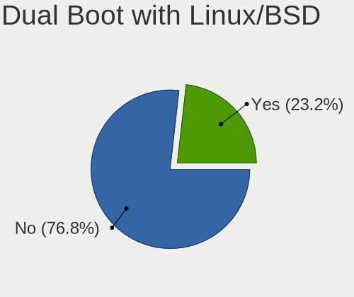
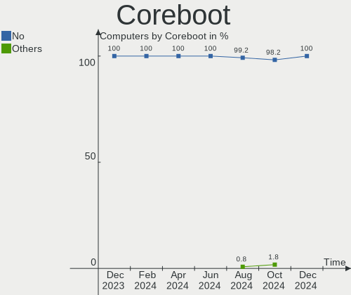
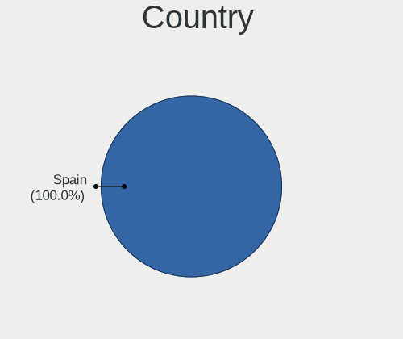
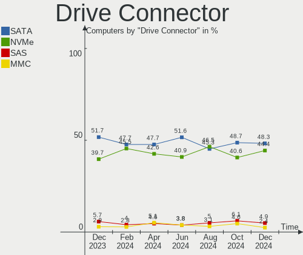
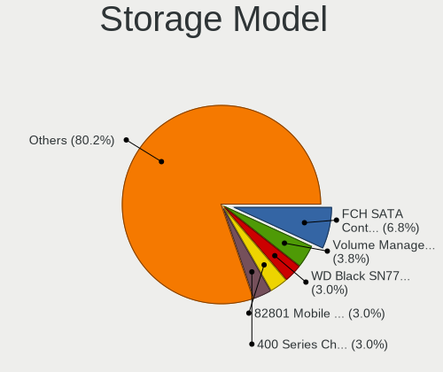
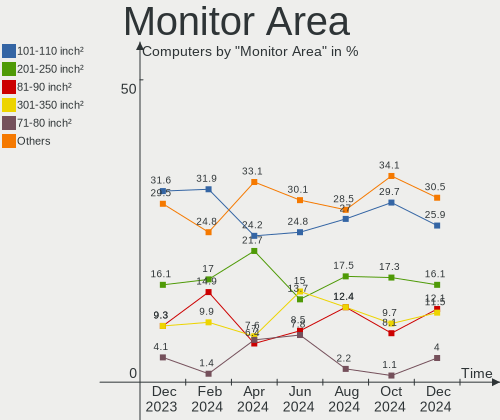
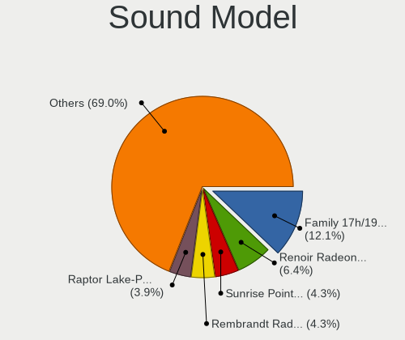
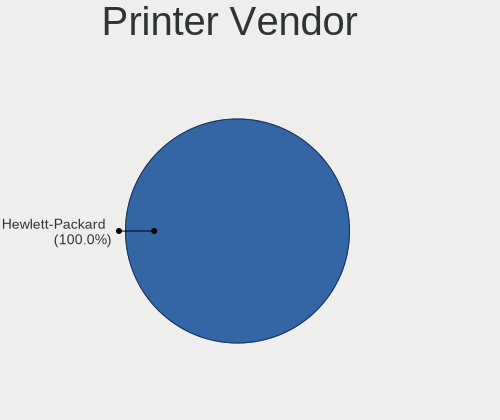
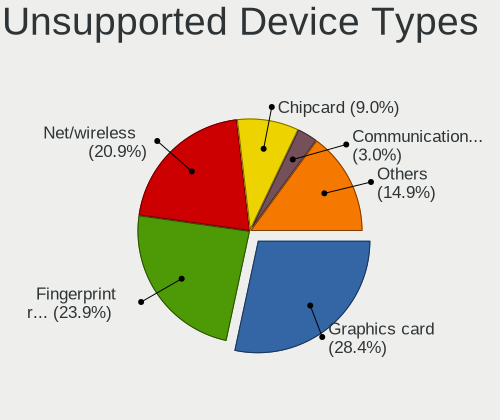

Linux in Spain - Hardware Trends
--------------------------------

A project to identify most popular hardware characteristics and track their change
over time based on data collected by Linux users at https://Linux-Hardware.org.

Anyone can contribute to this report by the [hw-probe](https://github.com/linuxhw/hw-probe) tool:

    sudo -E hw-probe -all -upload

This is a report for all computer types. See also reports for [desktops](/Location/Spain/Desktop/README.md) and [notebooks](/Location/Spain/Notebook/README.md).

Period: Aug, 2023.

Contents
--------

* [ System ](#system)
  - [ OS                       ](#os)
  - [ OS Family                ](#os-family)
  - [ Kernel                   ](#kernel)
  - [ Kernel Family            ](#kernel-family)
  - [ Kernel Major Ver.        ](#kernel-major-ver)
  - [ Arch                     ](#arch)
  - [ DE                       ](#de)
  - [ Display Server           ](#display-server)
  - [ Display Manager          ](#display-manager)
  - [ OS Lang                  ](#os-lang)
  - [ Boot Mode                ](#boot-mode)
  - [ Filesystem               ](#filesystem)
  - [ Part. scheme             ](#part-scheme)
  - [ Dual Boot with Linux/BSD ](#dual-boot-with-linuxbsd)
  - [ Dual Boot (Win)          ](#dual-boot-win)

* [ Board ](#board)
  - [ Vendor                   ](#vendor)
  - [ Model                    ](#model)
  - [ Model Family             ](#model-family)
  - [ MFG Year                 ](#mfg-year)
  - [ Form Factor              ](#form-factor)
  - [ Secure Boot              ](#secure-boot)
  - [ Coreboot                 ](#coreboot)
  - [ RAM Size                 ](#ram-size)
  - [ RAM Used                 ](#ram-used)
  - [ Total Drives             ](#total-drives)
  - [ Has CD-ROM               ](#has-cd-rom)
  - [ Has Ethernet             ](#has-ethernet)
  - [ Has WiFi                 ](#has-wifi)
  - [ Has Bluetooth            ](#has-bluetooth)

* [ Location ](#location)
  - [ Country                  ](#country)
  - [ City                     ](#city)

* [ Drives ](#drives)
  - [ Drive Vendor             ](#drive-vendor)
  - [ Drive Model              ](#drive-model)
  - [ HDD Vendor               ](#hdd-vendor)
  - [ SSD Vendor               ](#ssd-vendor)
  - [ Drive Kind               ](#drive-kind)
  - [ Drive Connector          ](#drive-connector)
  - [ Drive Size               ](#drive-size)
  - [ Space Total              ](#space-total)
  - [ Space Used               ](#space-used)
  - [ Malfunc. Drives          ](#malfunc-drives)
  - [ Malfunc. Drive Vendor    ](#malfunc-drive-vendor)
  - [ Malfunc. HDD Vendor      ](#malfunc-hdd-vendor)
  - [ Malfunc. Drive Kind      ](#malfunc-drive-kind)
  - [ Failed Drives            ](#failed-drives)
  - [ Failed Drive Vendor      ](#failed-drive-vendor)
  - [ Drive Status             ](#drive-status)

* [ Storage controller ](#storage-controller)
  - [ Storage Vendor           ](#storage-vendor)
  - [ Storage Model            ](#storage-model)
  - [ Storage Kind             ](#storage-kind)

* [ Processor ](#processor)
  - [ CPU Vendor               ](#cpu-vendor)
  - [ CPU Model                ](#cpu-model)
  - [ CPU Model Family         ](#cpu-model-family)
  - [ CPU Cores                ](#cpu-cores)
  - [ CPU Sockets              ](#cpu-sockets)
  - [ CPU Threads              ](#cpu-threads)
  - [ CPU Op-Modes             ](#cpu-op-modes)
  - [ CPU Microcode            ](#cpu-microcode)
  - [ CPU Microarch            ](#cpu-microarch)

* [ Graphics ](#graphics)
  - [ GPU Vendor               ](#gpu-vendor)
  - [ GPU Model                ](#gpu-model)
  - [ GPU Combo                ](#gpu-combo)
  - [ GPU Driver               ](#gpu-driver)
  - [ GPU Memory               ](#gpu-memory)

* [ Monitor ](#monitor)
  - [ Monitor Vendor           ](#monitor-vendor)
  - [ Monitor Model            ](#monitor-model)
  - [ Monitor Resolution       ](#monitor-resolution)
  - [ Monitor Diagonal         ](#monitor-diagonal)
  - [ Monitor Width            ](#monitor-width)
  - [ Aspect Ratio             ](#aspect-ratio)
  - [ Monitor Area             ](#monitor-area)
  - [ Pixel Density            ](#pixel-density)
  - [ Multiple Monitors        ](#multiple-monitors)

* [ Network ](#network)
  - [ Net Controller Vendor    ](#net-controller-vendor)
  - [ Net Controller Model     ](#net-controller-model)
  - [ Wireless Vendor          ](#wireless-vendor)
  - [ Wireless Model           ](#wireless-model)
  - [ Ethernet Vendor          ](#ethernet-vendor)
  - [ Ethernet Model           ](#ethernet-model)
  - [ Net Controller Kind      ](#net-controller-kind)
  - [ Used Controller          ](#used-controller)
  - [ NICs                     ](#nics)
  - [ IPv6                     ](#ipv6)

* [ Bluetooth ](#bluetooth)
  - [ Bluetooth Vendor         ](#bluetooth-vendor)
  - [ Bluetooth Model          ](#bluetooth-model)

* [ Sound ](#sound)
  - [ Sound Vendor             ](#sound-vendor)
  - [ Sound Model              ](#sound-model)

* [ Memory ](#memory)
  - [ Memory Vendor            ](#memory-vendor)
  - [ Memory Model             ](#memory-model)
  - [ Memory Kind              ](#memory-kind)
  - [ Memory Form Factor       ](#memory-form-factor)
  - [ Memory Size              ](#memory-size)
  - [ Memory Speed             ](#memory-speed)

* [ Printers & scanners ](#printers--scanners)
  - [ Printer Vendor           ](#printer-vendor)
  - [ Printer Model            ](#printer-model)
  - [ Scanner Vendor           ](#scanner-vendor)
  - [ Scanner Model            ](#scanner-model)

* [ Camera ](#camera)
  - [ Camera Vendor            ](#camera-vendor)
  - [ Camera Model             ](#camera-model)

* [ Security ](#security)
  - [ Fingerprint Vendor       ](#fingerprint-vendor)
  - [ Fingerprint Model        ](#fingerprint-model)
  - [ Chipcard Vendor          ](#chipcard-vendor)
  - [ Chipcard Model           ](#chipcard-model)

* [ Unsupported ](#unsupported)
  - [ Unsupported Devices      ](#unsupported-devices)
  - [ Unsupported Device Types ](#unsupported-device-types)

System
------

OS
--

Installed operating systems

| Name                         | Computers | Percent |
|------------------------------|-----------|---------|
| Ubuntu 22.04                 | 17        | 11.18%  |
| OpenMandriva 23.08           | 16        | 10.53%  |
| Fedora 38                    | 12        | 7.89%   |
| Debian 12                    | 11        | 7.24%   |
| Zorin 16                     | 8         | 5.26%   |
| Linux Mint 21.2              | 8         | 5.26%   |
| Pop!_OS 22.04                | 7         | 4.61%   |
| Arch Rolling                 | 7         | 4.61%   |
| Ubuntu 20.04                 | 6         | 3.95%   |
| EndeavourOS Rolling          | 5         | 3.29%   |
| ArcoLinux Rolling            | 5         | 3.29%   |
| Kubuntu 22.04                | 3         | 1.97%   |
| Debian 11                    | 3         | 1.97%   |
| Xubuntu 22.04                | 2         | 1.32%   |
| Ubuntu 23.04                 | 2         | 1.32%   |
| SteamOS 3.4.8                | 2         | 1.32%   |
| openSUSE Microos-XXXXXXXX    | 2         | 1.32%   |
| OpenMandriva 23.90           | 2         | 1.32%   |
| Nobara 38                    | 2         | 1.32%   |
| Manjaro                      | 2         | 1.32%   |
| Kali 2023.2                  | 2         | 1.32%   |
| Xero Rolling                 | 1         | 0.66%   |
| Ubuntu 23.10                 | 1         | 0.66%   |
| SteamOS 3.5                  | 1         | 0.66%   |
| SparkleOS 1.2.4              | 1         | 0.66%   |
| Parrot 5.3                   | 1         | 0.66%   |
| openSUSE Tumbleweed-XXXXXXXX | 1         | 0.66%   |
| OpenMandriva 4.3             | 1         | 0.66%   |
| OpenMandriva 23.07           | 1         | 0.66%   |
| OpenMandriva 23.03           | 1         | 0.66%   |
| Manjaro 23.0.0               | 1         | 0.66%   |
| Lubuntu 18.04                | 1         | 0.66%   |
| Linux Mint 21.1              | 1         | 0.66%   |
| Linux Mint 21                | 1         | 0.66%   |
| Linux Mint 20.3              | 1         | 0.66%   |
| Lilidog 23                   | 1         | 0.66%   |
| Kali 2023.3                  | 1         | 0.66%   |
| Gentoo 2.14                  | 1         | 0.66%   |
| Gentoo 2.13                  | 1         | 0.66%   |
| Garuda Linux Soaring         | 1         | 0.66%   |

OS Family
---------

OS without a version

| Name         | Computers | Percent |
|--------------|-----------|---------|
| Ubuntu       | 26        | 17.11%  |
| OpenMandriva | 21        | 13.82%  |
| Debian       | 14        | 9.21%   |
| Fedora       | 12        | 7.89%   |
| Linux Mint   | 11        | 7.24%   |
| Zorin        | 8         | 5.26%   |
| Pop!_OS      | 7         | 4.61%   |
| Arch         | 7         | 4.61%   |
| EndeavourOS  | 5         | 3.29%   |
| ArcoLinux    | 5         | 3.29%   |
| SteamOS      | 3         | 1.97%   |
| openSUSE     | 3         | 1.97%   |
| Manjaro      | 3         | 1.97%   |
| Kubuntu      | 3         | 1.97%   |
| Kali         | 3         | 1.97%   |
| Xubuntu      | 2         | 1.32%   |
| Nobara       | 2         | 1.32%   |
| Gentoo       | 2         | 1.32%   |
| Xero         | 1         | 0.66%   |
| SparkleOS    | 1         | 0.66%   |
| Parrot       | 1         | 0.66%   |
| Lubuntu      | 1         | 0.66%   |
| Lilidog      | 1         | 0.66%   |
| Garuda Linux | 1         | 0.66%   |
| Endless      | 1         | 0.66%   |
| Elementary   | 1         | 0.66%   |
| Deepin       | 1         | 0.66%   |
| ChimeraOS    | 1         | 0.66%   |
| BunsenLabs   | 1         | 0.66%   |
| Archcraft    | 1         | 0.66%   |
| Arch32       | 1         | 0.66%   |
| antiX        | 1         | 0.66%   |
| Alpine       | 1         | 0.66%   |

Kernel
------

Version of the Linux kernel

| Version                      | Computers | Percent |
|------------------------------|-----------|---------|
| 6.2.0-26-generic             | 15        | 9.87%   |
| 6.4.11-desktop-1omv2390      | 12        | 7.89%   |
| 5.15.0-78-generic            | 12        | 7.89%   |
| 5.15.0-79-generic            | 8         | 5.26%   |
| 6.4.6-76060406-generic       | 6         | 3.95%   |
| 6.1.0-10-amd64               | 6         | 3.95%   |
| 6.4.8-desktop-2omv2390       | 5         | 3.29%   |
| 6.4.8-arch1-1                | 5         | 3.29%   |
| 6.4.7-200.fc38.x86_64        | 4         | 2.63%   |
| 6.1.0-11-amd64               | 4         | 2.63%   |
| 5.19.0-50-generic            | 4         | 2.63%   |
| 6.4.6-200.fc38.x86_64        | 3         | 1.97%   |
| 6.3.0-kali1-amd64            | 3         | 1.97%   |
| 6.4.9-1-MANJARO              | 2         | 1.32%   |
| 6.4.7-arch1-3                | 2         | 1.32%   |
| 6.4.10-zen2-1-zen            | 2         | 1.32%   |
| 6.4.10-arch1-1               | 2         | 1.32%   |
| 6.2.0-31-generic             | 2         | 1.32%   |
| 5.15.0-82-generic            | 2         | 1.32%   |
| 5.15.0-76-generic            | 2         | 1.32%   |
| 5.13.0-valve36-1-neptune     | 2         | 1.32%   |
| 6.5.0-desktop-1omv2390       | 1         | 0.66%   |
| 6.4.9-arch1-1                | 1         | 0.66%   |
| 6.4.9-200.fc38.x86_64        | 1         | 0.66%   |
| 6.4.9-1-default              | 1         | 0.66%   |
| 6.4.9-060409-generic         | 1         | 0.66%   |
| 6.4.8-203.fsync.fc38.x86_64  | 1         | 0.66%   |
| 6.4.8-1-default              | 1         | 0.66%   |
| 6.4.7-zen1-2-zen             | 1         | 0.66%   |
| 6.4.7-arch1-2                | 1         | 0.66%   |
| 6.4.6-1-MANJARO              | 1         | 0.66%   |
| 6.4.5-1-liquorix-amd64       | 1         | 0.66%   |
| 6.4.12-arch1-1               | 1         | 0.66%   |
| 6.4.12-200.fc38.x86_64       | 1         | 0.66%   |
| 6.4.11-zen2-1-zen            | 1         | 0.66%   |
| 6.4.11-arch2-1               | 1         | 0.66%   |
| 6.4.11-200.fc38.x86_64       | 1         | 0.66%   |
| 6.4.10-202.fsync.fc38.x86_64 | 1         | 0.66%   |
| 6.3.9-chimeraos-1            | 1         | 0.66%   |
| 6.3.9-1-default              | 1         | 0.66%   |

Kernel Family
-------------

Linux kernel without a distro release

| Version  | Computers | Percent |
|----------|-----------|---------|
| 5.15.0   | 27        | 17.76%  |
| 6.2.0    | 18        | 11.84%  |
| 6.4.11   | 15        | 9.87%   |
| 6.4.8    | 12        | 7.89%   |
| 6.1.0    | 12        | 7.89%   |
| 6.4.6    | 10        | 6.58%   |
| 6.4.7    | 8         | 5.26%   |
| 6.4.9    | 6         | 3.95%   |
| 6.4.10   | 5         | 3.29%   |
| 6.3.0    | 4         | 2.63%   |
| 5.19.0   | 4         | 2.63%   |
| 5.10.0   | 3         | 1.97%   |
| 6.4.12   | 2         | 1.32%   |
| 6.3.9    | 2         | 1.32%   |
| 6.2.6    | 2         | 1.32%   |
| 6.1.39   | 2         | 1.32%   |
| 5.4.0    | 2         | 1.32%   |
| 5.13.0   | 2         | 1.32%   |
| 6.5.0    | 1         | 0.66%   |
| 6.4.5    | 1         | 0.66%   |
| 6.3.5    | 1         | 0.66%   |
| 6.3.3    | 1         | 0.66%   |
| 6.3.12   | 1         | 0.66%   |
| 6.2.9    | 1         | 0.66%   |
| 6.1.46   | 1         | 0.66%   |
| 6.1.41   | 1         | 0.66%   |
| 6.1.38   | 1         | 0.66%   |
| 6.1.28   | 1         | 0.66%   |
| 6.1.12   | 1         | 0.66%   |
| 6.1.11   | 1         | 0.66%   |
| 5.16.7   | 1         | 0.66%   |
| 5.11.0   | 1         | 0.66%   |
| 5.10.142 | 1         | 0.66%   |
| 4.19.0   | 1         | 0.66%   |

Kernel Major Ver.
-----------------

Linux kernel major version

| Version | Computers | Percent |
|---------|-----------|---------|
| 6.4     | 59        | 38.82%  |
| 5.15    | 27        | 17.76%  |
| 6.2     | 21        | 13.82%  |
| 6.1     | 20        | 13.16%  |
| 6.3     | 9         | 5.92%   |
| 5.19    | 4         | 2.63%   |
| 5.10    | 4         | 2.63%   |
| 5.4     | 2         | 1.32%   |
| 5.13    | 2         | 1.32%   |
| 6.5     | 1         | 0.66%   |
| 5.16    | 1         | 0.66%   |
| 5.11    | 1         | 0.66%   |
| 4.19    | 1         | 0.66%   |

Arch
----

OS architecture (x86_64, i586, etc.)

| Name   | Computers | Percent |
|--------|-----------|---------|
| x86_64 | 149       | 98.03%  |
| i686   | 3         | 1.97%   |

DE
--

Desktop Environment

| Name             | Computers | Percent |
|------------------|-----------|---------|
| GNOME            | 66        | 43.42%  |
| KDE5             | 37        | 24.34%  |
| XFCE             | 15        | 9.87%   |
| X-Cinnamon       | 9         | 5.92%   |
| Unknown          | 8         | 5.26%   |
| LXQt             | 6         | 3.95%   |
| MATE             | 2         | 1.32%   |
| Pantheon         | 1         | 0.66%   |
| LXDE             | 1         | 0.66%   |
| lightdm-xsession | 1         | 0.66%   |
| icewm            | 1         | 0.66%   |
| i3               | 1         | 0.66%   |
| hyprland         | 1         | 0.66%   |
| GNOME Classic    | 1         | 0.66%   |
| Deepin           | 1         | 0.66%   |
| bspwm            | 1         | 0.66%   |

Display Server
--------------

X11 or Wayland

| Name    | Computers | Percent |
|---------|-----------|---------|
| X11     | 89        | 58.55%  |
| Wayland | 56        | 36.84%  |
| Tty     | 4         | 2.63%   |
| Unknown | 3         | 1.97%   |

Display Manager
---------------

SDDM, LightDM, etc.

| Name    | Computers | Percent |
|---------|-----------|---------|
| Unknown | 57        | 37.5%   |
| SDDM    | 34        | 22.37%  |
| GDM3    | 26        | 17.11%  |
| LightDM | 21        | 13.82%  |
| GDM     | 13        | 8.55%   |
| SLIMSKI | 1         | 0.66%   |

OS Lang
-------

Language

| Lang    | Computers | Percent |
|---------|-----------|---------|
| es_ES   | 107       | 70.39%  |
| en_US   | 27        | 17.76%  |
| ca_ES   | 4         | 2.63%   |
| gl_ES   | 3         | 1.97%   |
| en_GB   | 3         | 1.97%   |
| Unknown | 2         | 1.32%   |
| ru_RU   | 1         | 0.66%   |
| pt_BR   | 1         | 0.66%   |
| eu_ES   | 1         | 0.66%   |
| es_DO   | 1         | 0.66%   |
| C       | 1         | 0.66%   |
| ast_ES  | 1         | 0.66%   |

Boot Mode
---------

EFI or BIOS

| Mode | Computers | Percent |
|------|-----------|---------|
| EFI  | 86        | 56.58%  |
| BIOS | 66        | 43.42%  |

Filesystem
----------

Type of filesystem

| Type    | Computers | Percent |
|---------|-----------|---------|
| Ext4    | 97        | 63.82%  |
| Btrfs   | 29        | 19.08%  |
| Tmpfs   | 17        | 11.18%  |
| Overlay | 8         | 5.26%   |
| Xfs     | 1         | 0.66%   |

Part. scheme
------------

Scheme of partitioning

| Type    | Computers | Percent |
|---------|-----------|---------|
| GPT     | 89        | 58.55%  |
| Unknown | 51        | 33.55%  |
| MBR     | 12        | 7.89%   |

Dual Boot with Linux/BSD
------------------------

Hosting more than one Linux/BSD

| Dual boot | Computers | Percent |
|-----------|-----------|---------|
| No        | 123       | 80.92%  |
| Yes       | 29        | 19.08%  |

Dual Boot (Win)
---------------

Hosting Linux and Windows

| Dual boot | Computers | Percent |
|-----------|-----------|---------|
| No        | 116       | 76.32%  |
| Yes       | 36        | 23.68%  |

Board
-----

Vendor
------

Motherboard manufacturer

| Name                 | Computers | Percent |
|----------------------|-----------|---------|
| ASUSTek Computer     | 25        | 16.45%  |
| Hewlett-Packard      | 21        | 13.82%  |
| MSI                  | 16        | 10.53%  |
| Acer                 | 15        | 9.87%   |
| Lenovo               | 13        | 8.55%   |
| Gigabyte Technology  | 13        | 8.55%   |
| Dell                 | 9         | 5.92%   |
| Apple                | 5         | 3.29%   |
| Valve                | 3         | 1.97%   |
| Packard Bell         | 3         | 1.97%   |
| Medion               | 3         | 1.97%   |
| Chuwi                | 3         | 1.97%   |
| Sony                 | 2         | 1.32%   |
| Notebook             | 2         | 1.32%   |
| Dynabook             | 2         | 1.32%   |
| ASRock               | 2         | 1.32%   |
| Unknown              | 2         | 1.32%   |
| Toshiba              | 1         | 0.66%   |
| System76             | 1         | 0.66%   |
| SGIN                 | 1         | 0.66%   |
| PC Specialist        | 1         | 0.66%   |
| Intel Client Systems | 1         | 0.66%   |
| Intel                | 1         | 0.66%   |
| HUAWEI               | 1         | 0.66%   |
| Huanan               | 1         | 0.66%   |
| GEEKOM               | 1         | 0.66%   |
| AXDIA International  | 1         | 0.66%   |
| AMI                  | 1         | 0.66%   |
| Alurin               | 1         | 0.66%   |
| Acidanthera          | 1         | 0.66%   |

Model
-----

Motherboard model

| Name                           | Computers | Percent |
|--------------------------------|-----------|---------|
| Valve Jupiter                  | 3         | 1.97%   |
| ASUS All Series                | 3         | 1.97%   |
| Unknown                        | 3         | 1.97%   |
| Medion E15301                  | 2         | 1.32%   |
| Chuwi GemiBook Pro             | 2         | 1.32%   |
| Apple iMac13,2                 | 2         | 1.32%   |
| Acer Aspire TC-605             | 2         | 1.32%   |
| Acer Aspire E1-571             | 2         | 1.32%   |
| Toshiba PORTEGE R700           | 1         | 0.66%   |
| System76 Galago Pro            | 1         | 0.66%   |
| Sony VPCSB2L1R                 | 1         | 0.66%   |
| Sony VGN-NS11S_S               | 1         | 0.66%   |
| SGIN laptop                    | 1         | 0.66%   |
| PC Specialist NH5xAx           | 1         | 0.66%   |
| Packard Bell ISTART D9281      | 1         | 0.66%   |
| Packard Bell EasyNote TK85     | 1         | 0.66%   |
| Packard Bell EasyNote TJ66     | 1         | 0.66%   |
| Notebook NS5x_NS7xPU           | 1         | 0.66%   |
| Notebook NL4x_NL5xLU           | 1         | 0.66%   |
| MSI Summit E16Flip A13VET      | 1         | 0.66%   |
| MSI MS-7D73                    | 1         | 0.66%   |
| MSI MS-7C91                    | 1         | 0.66%   |
| MSI MS-7C79                    | 1         | 0.66%   |
| MSI MS-7C75                    | 1         | 0.66%   |
| MSI MS-7B86                    | 1         | 0.66%   |
| MSI MS-7978                    | 1         | 0.66%   |
| MSI MS-7721                    | 1         | 0.66%   |
| MSI Modern 15 A10M             | 1         | 0.66%   |
| MSI KBL-U Pro Cubi2 (MS-B142)  | 1         | 0.66%   |
| MSI Katana GF66 12UGS          | 1         | 0.66%   |
| MSI GF75 Thin 10SC             | 1         | 0.66%   |
| MSI GE60 2OC\2OD\2OE           | 1         | 0.66%   |
| MSI Creator Z16 A11UET         | 1         | 0.66%   |
| MSI 956                        | 1         | 0.66%   |
| MSI 500-136es                  | 1         | 0.66%   |
| Medion MS-7728                 | 1         | 0.66%   |
| Lenovo Yoga 7 14ARB7 82QF      | 1         | 0.66%   |
| Lenovo ThinkPad X230 2325AJG   | 1         | 0.66%   |
| Lenovo ThinkPad L13 20R3CTO1WW | 1         | 0.66%   |
| Lenovo ThinkPad Edge 25453BG   | 1         | 0.66%   |

Model Family
------------

Motherboard model prefix

| Name                  | Computers | Percent |
|-----------------------|-----------|---------|
| Acer Aspire           | 10        | 6.58%   |
| ASUS ROG              | 7         | 4.61%   |
| HP Laptop             | 5         | 3.29%   |
| ASUS VivoBook         | 5         | 3.29%   |
| Lenovo ThinkPad       | 4         | 2.63%   |
| Dell Latitude         | 4         | 2.63%   |
| Valve Jupiter         | 3         | 1.97%   |
| Lenovo IdeaPad        | 3         | 1.97%   |
| HP Victus             | 3         | 1.97%   |
| ASUS All              | 3         | 1.97%   |
| Unknown               | 3         | 1.97%   |
| Packard Bell EasyNote | 2         | 1.32%   |
| Medion E15301         | 2         | 1.32%   |
| HP Slim               | 2         | 1.32%   |
| HP ProDesk            | 2         | 1.32%   |
| HP ProBook            | 2         | 1.32%   |
| HP Pavilion           | 2         | 1.32%   |
| Gigabyte X570         | 2         | 1.32%   |
| Dynabook Satellite    | 2         | 1.32%   |
| Dell XPS              | 2         | 1.32%   |
| Chuwi GemiBook        | 2         | 1.32%   |
| ASUS TUF              | 2         | 1.32%   |
| ASUS PRIME            | 2         | 1.32%   |
| Apple iMac13          | 2         | 1.32%   |
| Acer TravelMate       | 2         | 1.32%   |
| Acer Extensa          | 2         | 1.32%   |
| Toshiba PORTEGE       | 1         | 0.66%   |
| System76 Galago       | 1         | 0.66%   |
| Sony VPCSB2L1R        | 1         | 0.66%   |
| Sony VGN-NS11S        | 1         | 0.66%   |
| SGIN laptop           | 1         | 0.66%   |
| PC Specialist NH5xAx  | 1         | 0.66%   |
| Packard Bell ISTART   | 1         | 0.66%   |
| Notebook NS5x         | 1         | 0.66%   |
| Notebook NL4x         | 1         | 0.66%   |
| MSI Summit            | 1         | 0.66%   |
| MSI MS-7D73           | 1         | 0.66%   |
| MSI MS-7C91           | 1         | 0.66%   |
| MSI MS-7C79           | 1         | 0.66%   |
| MSI MS-7C75           | 1         | 0.66%   |

MFG Year
--------

Motherboard manufacture year

| Year | Computers | Percent |
|------|-----------|---------|
| 2021 | 26        | 17.11%  |
| 2020 | 19        | 12.5%   |
| 2022 | 18        | 11.84%  |
| 2012 | 12        | 7.89%   |
| 2019 | 11        | 7.24%   |
| 2018 | 11        | 7.24%   |
| 2013 | 8         | 5.26%   |
| 2014 | 7         | 4.61%   |
| 2023 | 6         | 3.95%   |
| 2017 | 6         | 3.95%   |
| 2015 | 6         | 3.95%   |
| 2010 | 6         | 3.95%   |
| 2009 | 5         | 3.29%   |
| 2011 | 4         | 2.63%   |
| 2008 | 3         | 1.97%   |
| 2016 | 2         | 1.32%   |
| 2007 | 2         | 1.32%   |

Form Factor
-----------

Physical design of the computer

| Name        | Computers | Percent |
|-------------|-----------|---------|
| Notebook    | 87        | 57.24%  |
| Desktop     | 56        | 36.84%  |
| All in one  | 4         | 2.63%   |
| Convertible | 2         | 1.32%   |
| Mini pc     | 2         | 1.32%   |
| Tablet      | 1         | 0.66%   |

Secure Boot
-----------

Enabled or disabled

| State    | Computers | Percent |
|----------|-----------|---------|
| Disabled | 142       | 93.42%  |
| Enabled  | 10        | 6.58%   |

Coreboot
--------

Have coreboot on board

| Used | Computers | Percent |
|------|-----------|---------|
| No   | 152       | 100%    |

RAM Size
--------

Total RAM memory

| Size in GB  | Computers | Percent |
|-------------|-----------|---------|
| 4.01-8.0    | 35        | 23.03%  |
| 16.01-24.0  | 35        | 23.03%  |
| 8.01-16.0   | 32        | 21.05%  |
| 32.01-64.0  | 20        | 13.16%  |
| 3.01-4.0    | 15        | 9.87%   |
| 64.01-256.0 | 7         | 4.61%   |
| 24.01-32.0  | 2         | 1.32%   |
| 2.01-3.0    | 2         | 1.32%   |
| 1.01-2.0    | 2         | 1.32%   |
| 0.51-1.0    | 2         | 1.32%   |

RAM Used
--------

Used RAM memory

| Used GB    | Computers | Percent |
|------------|-----------|---------|
| 1.01-2.0   | 45        | 29.61%  |
| 2.01-3.0   | 36        | 23.68%  |
| 4.01-8.0   | 27        | 17.76%  |
| 3.01-4.0   | 26        | 17.11%  |
| 8.01-16.0  | 9         | 5.92%   |
| 0.51-1.0   | 5         | 3.29%   |
| 0.01-0.5   | 3         | 1.97%   |
| 32.01-64.0 | 1         | 0.66%   |

Total Drives
------------

Number of drives on board

| Drives | Computers | Percent |
|--------|-----------|---------|
| 1      | 85        | 55.92%  |
| 2      | 37        | 24.34%  |
| 3      | 14        | 9.21%   |
| 4      | 8         | 5.26%   |
| 5      | 4         | 2.63%   |
| 6      | 2         | 1.32%   |
| 7      | 1         | 0.66%   |
| 0      | 1         | 0.66%   |

Has CD-ROM
----------

Has CD-ROM on board

| Presented | Computers | Percent |
|-----------|-----------|---------|
| No        | 115       | 75.66%  |
| Yes       | 37        | 24.34%  |

Has Ethernet
------------

Has Ethernet on board

| Presented | Computers | Percent |
|-----------|-----------|---------|
| Yes       | 126       | 82.89%  |
| No        | 26        | 17.11%  |

Has WiFi
--------

Has WiFi module

| Presented | Computers | Percent |
|-----------|-----------|---------|
| Yes       | 126       | 82.89%  |
| No        | 26        | 17.11%  |

Has Bluetooth
-------------

Has Bluetooth module

| Presented | Computers | Percent |
|-----------|-----------|---------|
| Yes       | 115       | 75.66%  |
| No        | 37        | 24.34%  |

Location
--------

Country
-------

Geographic location (country)

| Country | Computers | Percent |
|---------|-----------|---------|
| Spain   | 152       | 100%    |

City
----

Geographic location (city)

| City                     | Computers | Percent |
|--------------------------|-----------|---------|
| Madrid                   | 27        | 17.76%  |
| Barcelona                | 13        | 8.55%   |
| Valencia                 | 8         | 5.26%   |
| Zaragoza                 | 5         | 3.29%   |
| Seville                  | 4         | 2.63%   |
| Benicarló               | 4         | 2.63%   |
| Valladolid               | 3         | 1.97%   |
| Jerez de la Frontera     | 3         | 1.97%   |
| Bilbao                   | 3         | 1.97%   |
| Alcobendas               | 3         | 1.97%   |
| Vigo                     | 2         | 1.32%   |
| Santiago de Compostela   | 2         | 1.32%   |
| Santa Cruz de Tenerife   | 2         | 1.32%   |
| Sant Celoni              | 2         | 1.32%   |
| San Vicent del Raspeig   | 2         | 1.32%   |
| Sabadell                 | 2         | 1.32%   |
| Palma                    | 2         | 1.32%   |
| Mollet del Vallès       | 2         | 1.32%   |
| Manises                  | 2         | 1.32%   |
| Huelva                   | 2         | 1.32%   |
| Fuenlabrada              | 2         | 1.32%   |
| Burgos                   | 2         | 1.32%   |
| Xàtiva                  | 1         | 0.66%   |
| Villamartin              | 1         | 0.66%   |
| Valdemoro                | 1         | 0.66%   |
| Torrevieja               | 1         | 0.66%   |
| Torrelavega              | 1         | 0.66%   |
| Toledo                   | 1         | 0.66%   |
| Sanxenxo                 | 1         | 0.66%   |
| Santa Coloma de Gramenet | 1         | 0.66%   |
| Sant Feliu de Llobregat  | 1         | 0.66%   |
| San Fernando             | 1         | 0.66%   |
| Salou                    | 1         | 0.66%   |
| Salamanca                | 1         | 0.66%   |
| Rubí                    | 1         | 0.66%   |
| Riudoms                  | 1         | 0.66%   |
| Pozuelo de Alarcón      | 1         | 0.66%   |
| Pontevedra               | 1         | 0.66%   |
| Pinoso                   | 1         | 0.66%   |
| Parla                    | 1         | 0.66%   |

Drives
------

Drive Vendor
------------

Hard drive vendors

| Vendor                      | Computers | Drives | Percent |
|-----------------------------|-----------|--------|---------|
| Samsung Electronics         | 33        | 41     | 13.52%  |
| WDC                         | 28        | 35     | 11.48%  |
| Kingston                    | 26        | 27     | 10.66%  |
| Seagate                     | 25        | 32     | 10.25%  |
| Sandisk                     | 16        | 16     | 6.56%   |
| Toshiba                     | 13        | 14     | 5.33%   |
| Unknown                     | 10        | 11     | 4.1%    |
| Hitachi                     | 10        | 11     | 4.1%    |
| Crucial                     | 9         | 10     | 3.69%   |
| Micron Technology           | 8         | 8      | 3.28%   |
| Kingston Technology Company | 7         | 7      | 2.87%   |
| SK hynix                    | 6         | 6      | 2.46%   |
| KIOXIA                      | 6         | 6      | 2.46%   |
| Intel                       | 6         | 8      | 2.46%   |
| Phison Electronics          | 4         | 5      | 1.64%   |
| XrayDisk                    | 3         | 3      | 1.23%   |
| Patriot                     | 3         | 3      | 1.23%   |
| Micron/Crucial Technology   | 3         | 3      | 1.23%   |
| Phison                      | 2         | 2      | 0.82%   |
| Intenso                     | 2         | 2      | 0.82%   |
| HGST                        | 2         | 2      | 0.82%   |
| FORESEE                     | 2         | 2      | 0.82%   |
| Emtec                       | 2         | 2      | 0.82%   |
| China                       | 2         | 2      | 0.82%   |
| Verbatim                    | 1         | 1      | 0.41%   |
| SPCC                        | 1         | 1      | 0.41%   |
| Silicon Motion              | 1         | 1      | 0.41%   |
| PNY                         | 1         | 1      | 0.41%   |
| Netac                       | 1         | 1      | 0.41%   |
| Lexar                       | 1         | 1      | 0.41%   |
| KIOXIA-EXCERIA              | 1         | 1      | 0.41%   |
| KingSpec                    | 1         | 1      | 0.41%   |
| JMicron Technology          | 1         | 1      | 0.41%   |
| Gigabyte Technology         | 1         | 1      | 0.41%   |
| G521N                       | 1         | 1      | 0.41%   |
| Fujitsu                     | 1         | 1      | 0.41%   |
| Dogfish                     | 1         | 1      | 0.41%   |
| CT1000P3                    | 1         | 1      | 0.41%   |
| Apple                       | 1         | 2      | 0.41%   |
| Unknown                     | 1         | 1      | 0.41%   |

Drive Model
-----------

Hard drive models

| Model                                                 | Computers | Percent |
|-------------------------------------------------------|-----------|---------|
| Kingston SA400S37240G 240GB SSD                       | 10        | 3.75%   |
| Samsung NVMe SSD Controller PM9A1/PM9A3/980PRO 1024GB | 6         | 2.25%   |
| Samsung SSD 860 EVO 500GB                             | 4         | 1.5%    |
| Samsung NVMe SSD Controller SM981/PM981/PM983 500GB   | 4         | 1.5%    |
| Phison E12 NVMe Controller 256GB                      | 4         | 1.5%    |
| Kingston SA400S37480G 480GB SSD                       | 4         | 1.5%    |
| Toshiba TR200 240GB SSD                               | 3         | 1.12%   |
| Seagate ST1000DM010-2EP102 1TB                        | 3         | 1.12%   |
| Samsung SSD 860 EVO 1TB                               | 3         | 1.12%   |
| Micron/Crucial P2 NVMe PCIe SSD 1TB                   | 3         | 1.12%   |
| Kingston Company OM3PDP3 NVMe SSD 256GB               | 3         | 1.12%   |
| Kingston SV300S37A120G 120GB SSD                      | 3         | 1.12%   |
| XrayDisk 480GB                                        | 2         | 0.75%   |
| WDC WD5000BPVT-60HXZT3 500GB                          | 2         | 0.75%   |
| WDC WD5000AAKX-08U6AA0 500GB                          | 2         | 0.75%   |
| WDC WD20EARS-00MVWB0 2TB                              | 2         | 0.75%   |
| Unknown MMC Card  64GB                                | 2         | 0.75%   |
| Unknown MMC Card  32GB                                | 2         | 0.75%   |
| Unknown MMC Card  128GB                               | 2         | 0.75%   |
| SK hynix PC801 NVMe 512GB                             | 2         | 0.75%   |
| Seagate ST9500325AS 500GB                             | 2         | 0.75%   |
| Seagate ST3500418AS 500GB                             | 2         | 0.75%   |
| Seagate ST2000DM008-2FR102 2TB                        | 2         | 0.75%   |
| Seagate ST1000DM003-1ER162 1TB                        | 2         | 0.75%   |
| Seagate BarraCuda Q5 ZP500CV30001 500GB               | 2         | 0.75%   |
| Sandisk WD Blue SN550 NVMe SSD 250GB                  | 2         | 0.75%   |
| SanDisk NVMe SSD Drive 512GB                          | 2         | 0.75%   |
| Samsung SSD 970 EVO Plus 500GB                        | 2         | 0.75%   |
| Patriot Burst 120GB SSD                               | 2         | 0.75%   |
| Micron MTFDHBA512TDV-1AZ1AABHA 512GB                  | 2         | 0.75%   |
| Kingston Company SNV2S1000G 1TB                       | 2         | 0.75%   |
| Intel SSDPEKNU010TZ 1TB                               | 2         | 0.75%   |
| HGST HTS545050A7E680 500GB                            | 2         | 0.75%   |
| FORESEE 256GB SSD                                     | 2         | 0.75%   |
| Emtec X250 256GB                                      | 2         | 0.75%   |
| Crucial CT1000BX500SSD1 1TB                           | 2         | 0.75%   |
| XrayDisk 512GB                                        | 1         | 0.37%   |
| WDC WDS500G2B0C-00PXH0 500GB                          | 1         | 0.37%   |
| WDC WDS500G2B0B-00YS70 500GB SSD                      | 1         | 0.37%   |
| WDC WDS500G2B0A-00SM50 500GB SSD                      | 1         | 0.37%   |

HDD Vendor
----------

Hard disk drive vendors

| Vendor              | Computers | Drives | Percent |
|---------------------|-----------|--------|---------|
| WDC                 | 22        | 28     | 32.84%  |
| Seagate             | 21        | 26     | 31.34%  |
| Hitachi             | 10        | 11     | 14.93%  |
| Toshiba             | 7         | 7      | 10.45%  |
| Samsung Electronics | 2         | 2      | 2.99%   |
| HGST                | 2         | 2      | 2.99%   |
| Unknown             | 1         | 1      | 1.49%   |
| Fujitsu             | 1         | 1      | 1.49%   |
| Apple               | 1         | 1      | 1.49%   |

SSD Vendor
----------

Solid state drive vendors

| Vendor              | Computers | Drives | Percent |
|---------------------|-----------|--------|---------|
| Kingston            | 22        | 23     | 26.19%  |
| Samsung Electronics | 15        | 17     | 17.86%  |
| Crucial             | 8         | 9      | 9.52%   |
| SanDisk             | 5         | 5      | 5.95%   |
| Toshiba             | 4         | 5      | 4.76%   |
| WDC                 | 3         | 3      | 3.57%   |
| Patriot             | 3         | 3      | 3.57%   |
| Phison              | 2         | 2      | 2.38%   |
| Micron Technology   | 2         | 2      | 2.38%   |
| Intenso             | 2         | 2      | 2.38%   |
| FORESEE             | 2         | 2      | 2.38%   |
| Emtec               | 2         | 2      | 2.38%   |
| China               | 2         | 2      | 2.38%   |
| Verbatim            | 1         | 1      | 1.19%   |
| Seagate             | 1         | 1      | 1.19%   |
| PNY                 | 1         | 1      | 1.19%   |
| Netac               | 1         | 1      | 1.19%   |
| Lexar               | 1         | 1      | 1.19%   |
| KIOXIA-EXCERIA      | 1         | 1      | 1.19%   |
| KingSpec            | 1         | 1      | 1.19%   |
| JMicron Technology  | 1         | 1      | 1.19%   |
| G521N               | 1         | 1      | 1.19%   |
| Dogfish             | 1         | 1      | 1.19%   |
| CT1000P3            | 1         | 1      | 1.19%   |
| Apple               | 1         | 1      | 1.19%   |

Drive Kind
----------

HDD or SSD

| Kind    | Computers | Drives | Percent |
|---------|-----------|--------|---------|
| SSD     | 76        | 89     | 34.86%  |
| NVMe    | 75        | 91     | 34.4%   |
| HDD     | 52        | 79     | 23.85%  |
| MMC     | 9         | 10     | 4.13%   |
| Unknown | 6         | 6      | 2.75%   |

Drive Connector
---------------

SATA, SAS, NVMe, etc.

| Type | Computers | Drives | Percent |
|------|-----------|--------|---------|
| SATA | 96        | 158    | 50%     |
| NVMe | 75        | 91     | 39.06%  |
| SAS  | 12        | 16     | 6.25%   |
| MMC  | 9         | 10     | 4.69%   |

Drive Size
----------

Size of hard drive

| Size in TB | Computers | Drives | Percent |
|------------|-----------|--------|---------|
| 0.01-0.5   | 74        | 100    | 55.64%  |
| 0.51-1.0   | 39        | 44     | 29.32%  |
| 1.01-2.0   | 10        | 14     | 7.52%   |
| 3.01-4.0   | 4         | 4      | 3.01%   |
| 4.01-10.0  | 4         | 4      | 3.01%   |
| 2.01-3.0   | 2         | 2      | 1.5%    |

Space Total
-----------

Amount of disk space available on the file system

| Size in GB     | Computers | Percent |
|----------------|-----------|---------|
| 251-500        | 40        | 26.32%  |
| 101-250        | 40        | 26.32%  |
| 501-1000       | 22        | 14.47%  |
| 1001-2000      | 16        | 10.53%  |
| More than 3000 | 13        | 8.55%   |
| 1-20           | 7         | 4.61%   |
| 51-100         | 6         | 3.95%   |
| 2001-3000      | 4         | 2.63%   |
| 21-50          | 2         | 1.32%   |
| Unknown        | 2         | 1.32%   |

Space Used
----------

Amount of used disk space

| Used GB        | Computers | Percent |
|----------------|-----------|---------|
| 1-20           | 47        | 30.92%  |
| 51-100         | 26        | 17.11%  |
| 101-250        | 23        | 15.13%  |
| 21-50          | 19        | 12.5%   |
| 251-500        | 11        | 7.24%   |
| 501-1000       | 11        | 7.24%   |
| 1001-2000      | 7         | 4.61%   |
| More than 3000 | 4         | 2.63%   |
| 2001-3000      | 2         | 1.32%   |
| Unknown        | 2         | 1.32%   |

Malfunc. Drives
---------------

Drive models with a malfunction

| Model                                    | Computers | Drives | Percent |
|------------------------------------------|-----------|--------|---------|
| WDC WD5000BPVT-60HXZT3 500GB             | 2         | 2      | 7.69%   |
| WDC WD20EARS-00MVWB0 2TB                 | 2         | 3      | 7.69%   |
| Seagate ST9500325AS 500GB                | 2         | 2      | 7.69%   |
| HGST HTS545050A7E680 500GB               | 2         | 2      | 7.69%   |
| WDC WD5000AAKX-08U6AA0 500GB             | 1         | 1      | 3.85%   |
| WDC WD40EFAX-68JH4N0 4TB                 | 1         | 1      | 3.85%   |
| WDC WD10EAVS-00D7B0 1TB                  | 1         | 1      | 3.85%   |
| SPCC M.2 PCIe SSD 256GB                  | 1         | 1      | 3.85%   |
| SK hynix BC501 HFM256GDJTNG-8310A 256GB  | 1         | 1      | 3.85%   |
| Seagate ST3500630AS 500GB                | 1         | 1      | 3.85%   |
| Seagate ST3500418AS 500GB                | 1         | 1      | 3.85%   |
| Seagate ST3500320AS 500GB                | 1         | 1      | 3.85%   |
| Seagate ST1000LM014-1EJ164 1TB           | 1         | 1      | 3.85%   |
| SanDisk SSD PLUS 240 GB                  | 1         | 1      | 3.85%   |
| Samsung Electronics SSD 860 EVO 500GB    | 1         | 1      | 3.85%   |
| Samsung Electronics HM160HI 160GB        | 1         | 1      | 3.85%   |
| JMicron Technology Generic 1TB           | 1         | 1      | 3.85%   |
| Intenso TOP M.2 SATA 128GB SSD           | 1         | 1      | 3.85%   |
| Hitachi HTS543216L9A300 160GB            | 1         | 1      | 3.85%   |
| Hitachi HDT722516DLA380 41N3148LEN 160GB | 1         | 1      | 3.85%   |
| G521N SSD 256GB                          | 1         | 1      | 3.85%   |
| Dogfish SSD 256GB                        | 1         | 1      | 3.85%   |

Malfunc. Drive Vendor
---------------------

Vendors of faulty drives

| Vendor              | Computers | Drives | Percent |
|---------------------|-----------|--------|---------|
| WDC                 | 7         | 8      | 29.17%  |
| Seagate             | 4         | 6      | 16.67%  |
| Samsung Electronics | 2         | 2      | 8.33%   |
| Hitachi             | 2         | 2      | 8.33%   |
| HGST                | 2         | 2      | 8.33%   |
| SPCC                | 1         | 1      | 4.17%   |
| SK hynix            | 1         | 1      | 4.17%   |
| SanDisk             | 1         | 1      | 4.17%   |
| JMicron Technology  | 1         | 1      | 4.17%   |
| Intenso             | 1         | 1      | 4.17%   |
| G521N               | 1         | 1      | 4.17%   |
| Dogfish             | 1         | 1      | 4.17%   |

Malfunc. HDD Vendor
-------------------

Vendors of faulty HDD drives

| Vendor              | Computers | Drives | Percent |
|---------------------|-----------|--------|---------|
| WDC                 | 7         | 8      | 43.75%  |
| Seagate             | 4         | 6      | 25%     |
| Hitachi             | 2         | 2      | 12.5%   |
| HGST                | 2         | 2      | 12.5%   |
| Samsung Electronics | 1         | 1      | 6.25%   |

Malfunc. Drive Kind
-------------------

Kinds of faulty drives

| Kind | Computers | Drives | Percent |
|------|-----------|--------|---------|
| HDD  | 12        | 19     | 60%     |
| SSD  | 6         | 6      | 30%     |
| NVMe | 2         | 2      | 10%     |

Failed Drives
-------------

Failed drive models

Zero info for selected period =(

Failed Drive Vendor
-------------------

Failed drive vendors

Zero info for selected period =(

Drive Status
------------

Number of failed and malfunc. drives

| Status   | Computers | Drives | Percent |
|----------|-----------|--------|---------|
| Detected | 82        | 136    | 48.81%  |
| Works    | 67        | 112    | 39.88%  |
| Malfunc  | 19        | 27     | 11.31%  |

Storage controller
------------------

Storage Vendor
--------------

Storage controller vendors

| Vendor                           | Computers | Percent |
|----------------------------------|-----------|---------|
| Intel                            | 96        | 45.07%  |
| AMD                              | 33        | 15.49%  |
| Samsung Electronics              | 20        | 9.39%   |
| SanDisk                          | 15        | 7.04%   |
| Kingston Technology Company      | 10        | 4.69%   |
| Micron Technology                | 7         | 3.29%   |
| SK hynix                         | 6         | 2.82%   |
| KIOXIA                           | 6         | 2.82%   |
| Phison Electronics               | 4         | 1.88%   |
| Micron/Crucial Technology        | 4         | 1.88%   |
| Seagate Technology               | 3         | 1.41%   |
| Toshiba America Info Systems     | 2         | 0.94%   |
| JMicron Technology               | 2         | 0.94%   |
| Silicon Motion                   | 1         | 0.47%   |
| Silicon Integrated Systems [SiS] | 1         | 0.47%   |
| Realtek Semiconductor            | 1         | 0.47%   |
| Nvidia                           | 1         | 0.47%   |
| ASMedia Technology               | 1         | 0.47%   |

Storage Model
-------------

Storage controller models

| Model                                                                          | Computers | Percent |
|--------------------------------------------------------------------------------|-----------|---------|
| AMD FCH SATA Controller [AHCI mode]                                            | 23        | 9.83%   |
| Intel Volume Management Device NVMe RAID Controller                            | 14        | 5.98%   |
| Samsung NVMe SSD Controller SM981/PM981/PM983                                  | 8         | 3.42%   |
| Samsung NVMe SSD Controller PM9A1/PM9A3/980PRO                                 | 7         | 2.99%   |
| Intel 8 Series/C220 Series Chipset Family 6-port SATA Controller 1 [AHCI mode] | 7         | 2.99%   |
| Intel 7 Series Chipset Family 6-port SATA Controller [AHCI mode]               | 7         | 2.99%   |
| Intel Sunrise Point-LP SATA Controller [AHCI mode]                             | 6         | 2.56%   |
| SanDisk WD Blue SN550 NVMe SSD                                                 | 5         | 2.14%   |
| AMD 500 Series Chipset SATA Controller                                         | 5         | 2.14%   |
| Phison E12 NVMe Controller                                                     | 4         | 1.71%   |
| KIOXIA NVMe SSD Controller BG4 (DRAM-less)                                     | 4         | 1.71%   |
| Kingston Company OM3PDP3 NVMe SSD                                              | 4         | 1.71%   |
| Intel Celeron/Pentium Silver Processor SATA Controller                         | 4         | 1.71%   |
| Intel 82801IBM/IEM (ICH9M/ICH9M-E) 4 port SATA Controller [AHCI mode]          | 4         | 1.71%   |
| Intel 6 Series/C200 Series Chipset Family 6 port Desktop SATA AHCI Controller  | 4         | 1.71%   |
| Intel 200 Series PCH SATA controller [AHCI mode]                               | 4         | 1.71%   |
| SanDisk WD Black SN770 / PC SN740 256GB / PC SN560 (DRAM-less) NVMe SSD        | 3         | 1.28%   |
| Micron/Crucial P2 [Nick P2] / P3 / P3 Plus NVMe PCIe SSD (DRAM-less)           | 3         | 1.28%   |
| Intel Tiger Lake-LP SATA Controller                                            | 3         | 1.28%   |
| Intel SSD 670p Series [Keystone Harbor]                                        | 3         | 1.28%   |
| Intel Q170/Q150/B150/H170/H110/Z170/CM236 Chipset SATA Controller [AHCI Mode]  | 3         | 1.28%   |
| Intel Jasper Lake SATA AHCI Controller                                         | 3         | 1.28%   |
| Intel Comet Lake SATA AHCI Controller                                          | 3         | 1.28%   |
| Intel Cannon Lake Mobile PCH SATA AHCI Controller                              | 3         | 1.28%   |
| Intel 7 Series/C210 Series Chipset Family 6-port SATA Controller [AHCI mode]   | 3         | 1.28%   |
| Intel 5 Series/3400 Series Chipset 4 port SATA AHCI Controller                 | 3         | 1.28%   |
| AMD SB7x0/SB8x0/SB9x0 SATA Controller [AHCI mode]                              | 3         | 1.28%   |
| SK hynix Platinum P41/PC801 NVMe Solid State Drive                             | 2         | 0.85%   |
| SK hynix Gold P31/BC711/PC711 NVMe Solid State Drive                           | 2         | 0.85%   |
| Seagate BarraCuda Q5 NVMe SSD (DRAM-less)                                      | 2         | 0.85%   |
| SanDisk WD PC SN810 / Black SN850 NVMe SSD                                     | 2         | 0.85%   |
| Samsung NVMe SSD Controller SM961/PM961/SM963                                  | 2         | 0.85%   |
| Samsung NVMe SSD Controller 980                                                | 2         | 0.85%   |
| Micron 2450 NVMe SSD [HendrixV] (DRAM-less)                                    | 2         | 0.85%   |
| Micron 2300 NVMe SSD [Santana]                                                 | 2         | 0.85%   |
| Kingston Company Company Non-Volatile memory controller                        | 2         | 0.85%   |
| Intel Volume Management Device NVMe RAID Controller Intel Corporation          | 2         | 0.85%   |
| Intel Celeron N3350/Pentium N4200/Atom E3900 Series SATA AHCI Controller       | 2         | 0.85%   |
| Intel Cannon Point-LP SATA Controller [AHCI Mode]                              | 2         | 0.85%   |
| Intel Alder Lake-S PCH SATA Controller [AHCI Mode]                             | 2         | 0.85%   |

Storage Kind
------------

Kind of storage controller (IDE, SATA, NVMe, SAS, ...)

| Kind | Computers | Percent |
|------|-----------|---------|
| SATA | 113       | 52.56%  |
| NVMe | 76        | 35.35%  |
| RAID | 19        | 8.84%   |
| IDE  | 7         | 3.26%   |

Processor
---------

CPU Vendor
----------

Processor vendors

| Vendor | Computers | Percent |
|--------|-----------|---------|
| Intel  | 108       | 71.05%  |
| AMD    | 44        | 28.95%  |

CPU Model
---------

Processor models

| Model                                         | Computers | Percent |
|-----------------------------------------------|-----------|---------|
| Intel Core i7-3612QM CPU @ 2.10GHz            | 3         | 1.97%   |
| Intel 12th Gen Core i7-12700H                 | 3         | 1.97%   |
| Intel 11th Gen Core i5-1135G7 @ 2.40GHz       | 3         | 1.97%   |
| AMD Ryzen 7 5800H with Radeon Graphics        | 3         | 1.97%   |
| AMD Ryzen 5 3500U with Radeon Vega Mobile Gfx | 3         | 1.97%   |
| AMD Custom APU 0405                           | 3         | 1.97%   |
| Intel Core i7-10510U CPU @ 1.80GHz            | 2         | 1.32%   |
| Intel Core i5-4460 CPU @ 3.20GHz              | 2         | 1.32%   |
| Intel Core i5-3470S CPU @ 2.90GHz             | 2         | 1.32%   |
| Intel Core i5-3230M CPU @ 2.60GHz             | 2         | 1.32%   |
| Intel Core i5-1035G1 CPU @ 1.00GHz            | 2         | 1.32%   |
| Intel Core i5 CPU M 460 @ 2.53GHz             | 2         | 1.32%   |
| Intel Core i3-4170 CPU @ 3.70GHz              | 2         | 1.32%   |
| Intel Core i3-10100 CPU @ 3.60GHz             | 2         | 1.32%   |
| Intel Celeron N5100 @ 1.10GHz                 | 2         | 1.32%   |
| Intel 12th Gen Core i7-1265U                  | 2         | 1.32%   |
| Intel 11th Gen Core i7-1165G7 @ 2.80GHz       | 2         | 1.32%   |
| Intel 11th Gen Core i7-11370H @ 3.30GHz       | 2         | 1.32%   |
| AMD Ryzen 7 5700G with Radeon Graphics        | 2         | 1.32%   |
| AMD Ryzen 7 3700X 8-Core Processor            | 2         | 1.32%   |
| AMD Ryzen 5 5600X 6-Core Processor            | 2         | 1.32%   |
| AMD Ryzen 5 2500U with Radeon Vega Mobile Gfx | 2         | 1.32%   |
| AMD A6-6400K APU with Radeon HD Graphics      | 2         | 1.32%   |
| Intel Xeon CPU X5690 @ 3.47GHz                | 1         | 0.66%   |
| Intel Pentium Dual-Core CPU T4300 @ 2.10GHz   | 1         | 0.66%   |
| Intel Pentium Dual CPU E2180 @ 2.00GHz        | 1         | 0.66%   |
| Intel Pentium CPU N4200 @ 1.10GHz             | 1         | 0.66%   |
| Intel Pentium CPU 2117U @ 1.80GHz             | 1         | 0.66%   |
| Intel Genuine CPU 575 @ 2.00GHz               | 1         | 0.66%   |
| Intel Genuine CPU 0000 @ 2.60GHz              | 1         | 0.66%   |
| Intel Core i9-9980HK CPU @ 2.40GHz            | 1         | 0.66%   |
| Intel Core i9-7900X CPU @ 3.30GHz             | 1         | 0.66%   |
| Intel Core i7-9750H CPU @ 2.60GHz             | 1         | 0.66%   |
| Intel Core i7-9700K CPU @ 3.60GHz             | 1         | 0.66%   |
| Intel Core i7-8750H CPU @ 2.20GHz             | 1         | 0.66%   |
| Intel Core i7-8700K CPU @ 3.70GHz             | 1         | 0.66%   |
| Intel Core i7-8550U CPU @ 1.80GHz             | 1         | 0.66%   |
| Intel Core i7-7700HQ CPU @ 2.80GHz            | 1         | 0.66%   |
| Intel Core i7-6820HQ CPU @ 2.70GHz            | 1         | 0.66%   |
| Intel Core i7-6600U CPU @ 2.60GHz             | 1         | 0.66%   |

CPU Model Family
----------------

Processor model prefix

| Model                   | Computers | Percent |
|-------------------------|-----------|---------|
| Other                   | 29        | 19.08%  |
| Intel Core i5           | 25        | 16.45%  |
| Intel Core i7           | 22        | 14.47%  |
| AMD Ryzen 7             | 12        | 7.89%   |
| Intel Core i3           | 11        | 7.24%   |
| AMD Ryzen 5             | 11        | 7.24%   |
| Intel Celeron           | 10        | 6.58%   |
| Intel Atom              | 3         | 1.97%   |
| Intel Pentium           | 2         | 1.32%   |
| Intel Genuine           | 2         | 1.32%   |
| Intel Core i9           | 2         | 1.32%   |
| Intel Core 2 Duo        | 2         | 1.32%   |
| AMD Ryzen 9             | 2         | 1.32%   |
| AMD Ryzen 5 PRO         | 2         | 1.32%   |
| AMD Ryzen 3             | 2         | 1.32%   |
| AMD A6                  | 2         | 1.32%   |
| Intel Xeon              | 1         | 0.66%   |
| Intel Pentium Dual-Core | 1         | 0.66%   |
| Intel Pentium Dual      | 1         | 0.66%   |
| Intel Celeron M         | 1         | 0.66%   |
| AMD Phenom II X6        | 1         | 0.66%   |
| AMD FX                  | 1         | 0.66%   |
| AMD E1                  | 1         | 0.66%   |
| AMD C-70                | 1         | 0.66%   |
| AMD Athlon X2           | 1         | 0.66%   |
| AMD Athlon II Neo       | 1         | 0.66%   |
| AMD Athlon 64 X2        | 1         | 0.66%   |
| AMD A8                  | 1         | 0.66%   |
| AMD A10                 | 1         | 0.66%   |

CPU Cores
---------

Number of processor cores

| Number | Computers | Percent |
|--------|-----------|---------|
| 4      | 57        | 37.5%   |
| 2      | 41        | 26.97%  |
| 8      | 19        | 12.5%   |
| 6      | 15        | 9.87%   |
| 1      | 6         | 3.95%   |
| 14     | 4         | 2.63%   |
| 12     | 4         | 2.63%   |
| 10     | 4         | 2.63%   |
| 24     | 1         | 0.66%   |
| 20     | 1         | 0.66%   |

CPU Sockets
-----------

Number of sockets

| Number | Computers | Percent |
|--------|-----------|---------|
| 1      | 152       | 100%    |

CPU Threads
-----------

Threads per core (Hyper-Threading)

| Number | Computers | Percent |
|--------|-----------|---------|
| 2      | 108       | 71.05%  |
| 1      | 44        | 28.95%  |

CPU Op-Modes
------------

CPU Operation Modes (32-bit, 64-bit)

| Op mode        | Computers | Percent |
|----------------|-----------|---------|
| 32-bit, 64-bit | 151       | 99.34%  |
| 32-bit         | 1         | 0.66%   |

CPU Microcode
-------------

Microcode number

| Number     | Computers | Percent |
|------------|-----------|---------|
| Unknown    | 87        | 57.24%  |
| 0x806ea    | 4         | 2.63%   |
| 0x08108109 | 4         | 2.63%   |
| 0x806c1    | 3         | 1.97%   |
| 0x206a7    | 3         | 1.97%   |
| 0x0a50000c | 3         | 1.97%   |
| 0xb06a2    | 2         | 1.32%   |
| 0xa0655    | 2         | 1.32%   |
| 0x906a4    | 2         | 1.32%   |
| 0x806c2    | 2         | 1.32%   |
| 0x306c3    | 2         | 1.32%   |
| 0x1067a    | 2         | 1.32%   |
| 0x0a50000d | 2         | 1.32%   |
| 0xb0671    | 1         | 0.66%   |
| 0x906ed    | 1         | 0.66%   |
| 0x906a3    | 1         | 0.66%   |
| 0x90675    | 1         | 0.66%   |
| 0x806ec    | 1         | 0.66%   |
| 0x706a8    | 1         | 0.66%   |
| 0x706a1    | 1         | 0.66%   |
| 0x6d8      | 1         | 0.66%   |
| 0x506c9    | 1         | 0.66%   |
| 0x40651    | 1         | 0.66%   |
| 0x306a9    | 1         | 0.66%   |
| 0x30678    | 1         | 0.66%   |
| 0x206c2    | 1         | 0.66%   |
| 0x106ca    | 1         | 0.66%   |
| 0x0a601203 | 1         | 0.66%   |
| 0x0a404102 | 1         | 0.66%   |
| 0x0a404101 | 1         | 0.66%   |
| 0x0a201025 | 1         | 0.66%   |
| 0x08701021 | 1         | 0.66%   |
| 0x08701013 | 1         | 0.66%   |
| 0x08600104 | 1         | 0.66%   |
| 0x08101016 | 1         | 0.66%   |
| 0x0810100b | 1         | 0.66%   |
| 0x08101007 | 1         | 0.66%   |
| 0x08001138 | 1         | 0.66%   |
| 0x08001137 | 1         | 0.66%   |
| 0x0700010f | 1         | 0.66%   |

CPU Microarch
-------------

Microarchitecture

| Name             | Computers | Percent |
|------------------|-----------|---------|
| KabyLake         | 18        | 11.84%  |
| Unknown          | 16        | 10.53%  |
| IvyBridge        | 11        | 7.24%   |
| TigerLake        | 10        | 6.58%   |
| Haswell          | 10        | 6.58%   |
| Zen 3            | 9         | 5.92%   |
| Zen 2            | 6         | 3.95%   |
| SandyBridge      | 6         | 3.95%   |
| Alderlake Hybrid | 6         | 3.95%   |
| Zen+             | 5         | 3.29%   |
| Zen              | 5         | 3.29%   |
| Westmere         | 5         | 3.29%   |
| Skylake          | 5         | 3.29%   |
| IceLake          | 5         | 3.29%   |
| CometLake        | 5         | 3.29%   |
| Piledriver       | 4         | 2.63%   |
| Goldmont plus    | 4         | 2.63%   |
| Core             | 3         | 1.97%   |
| Tremont          | 2         | 1.32%   |
| Silvermont       | 2         | 1.32%   |
| Penryn           | 2         | 1.32%   |
| K8 Hammer        | 2         | 1.32%   |
| K10              | 2         | 1.32%   |
| Goldmont         | 2         | 1.32%   |
| Steamroller      | 1         | 0.66%   |
| P6               | 1         | 0.66%   |
| Jaguar           | 1         | 0.66%   |
| Excavator        | 1         | 0.66%   |
| Broadwell        | 1         | 0.66%   |
| Bonnell          | 1         | 0.66%   |
| Bobcat           | 1         | 0.66%   |

Graphics
--------

GPU Vendor
----------

Vendors of graphics cards

| Vendor                           | Computers | Percent |
|----------------------------------|-----------|---------|
| Intel                            | 82        | 45.05%  |
| Nvidia                           | 53        | 29.12%  |
| AMD                              | 46        | 25.27%  |
| Silicon Integrated Systems [SiS] | 1         | 0.55%   |

GPU Model
---------

Graphics card models

| Model                                                                       | Computers | Percent |
|-----------------------------------------------------------------------------|-----------|---------|
| Intel TigerLake-LP GT2 [Iris Xe Graphics]                                   | 9         | 4.84%   |
| Intel 3rd Gen Core processor Graphics Controller                            | 7         | 3.76%   |
| AMD Cezanne [Radeon Vega Series / Radeon Vega Mobile Series]                | 6         | 3.23%   |
| AMD Picasso/Raven 2 [Radeon Vega Series / Radeon Vega Mobile Series]        | 5         | 2.69%   |
| Intel GeminiLake [UHD Graphics 600]                                         | 4         | 2.15%   |
| Intel Alder Lake-P Integrated Graphics Controller                           | 4         | 2.15%   |
| AMD Navi 23 [Radeon RX 6600/6600 XT/6600M]                                  | 4         | 2.15%   |
| Nvidia TU117M [GeForce GTX 1650 Mobile / Max-Q]                             | 3         | 1.61%   |
| Nvidia GK208B [GeForce GT 710]                                              | 3         | 1.61%   |
| Nvidia GA107M [GeForce RTX 3050 Ti Mobile]                                  | 3         | 1.61%   |
| Nvidia GA106M [GeForce RTX 3060 Mobile / Max-Q]                             | 3         | 1.61%   |
| Intel Xeon E3-1200 v3/4th Gen Core Processor Integrated Graphics Controller | 3         | 1.61%   |
| Intel JasperLake [UHD Graphics]                                             | 3         | 1.61%   |
| Intel CometLake-U GT2 [UHD Graphics]                                        | 3         | 1.61%   |
| Intel CoffeeLake-H GT2 [UHD Graphics 630]                                   | 3         | 1.61%   |
| Intel Alder Lake-UP3 GT2 [Iris Xe Graphics]                                 | 3         | 1.61%   |
| Intel 2nd Generation Core Processor Family Integrated Graphics Controller   | 3         | 1.61%   |
| AMD VanGogh [AMD Custom GPU 0405]                                           | 3         | 1.61%   |
| AMD Raven Ridge [Radeon Vega Series / Radeon Vega Mobile Series]            | 3         | 1.61%   |
| Nvidia GP108 [GeForce GT 1030]                                              | 2         | 1.08%   |
| Nvidia GP107 [GeForce GTX 1050 Ti]                                          | 2         | 1.08%   |
| Nvidia GK107M [GeForce GTX 660M Mac Edition]                                | 2         | 1.08%   |
| Nvidia GA107M [GeForce RTX 3050 Mobile]                                     | 2         | 1.08%   |
| Nvidia AD107M [GeForce RTX 4060 Max-Q / Mobile]                             | 2         | 1.08%   |
| Intel UHD Graphics 620                                                      | 2         | 1.08%   |
| Intel TigerLake-H GT1 [UHD Graphics]                                        | 2         | 1.08%   |
| Intel Raptor Lake-S UHD Graphics                                            | 2         | 1.08%   |
| Intel Raptor Lake-P [Iris Xe Graphics]                                      | 2         | 1.08%   |
| Intel Mobile 4 Series Chipset Integrated Graphics Controller                | 2         | 1.08%   |
| Intel Iris Plus Graphics G1 (Ice Lake)                                      | 2         | 1.08%   |
| Intel HD Graphics 620                                                       | 2         | 1.08%   |
| Intel HD Graphics 530                                                       | 2         | 1.08%   |
| Intel Core Processor Integrated Graphics Controller                         | 2         | 1.08%   |
| Intel Atom Processor Z36xxx/Z37xxx Series Graphics & Display                | 2         | 1.08%   |
| AMD Rembrandt [Radeon 680M]                                                 | 2         | 1.08%   |
| AMD Ellesmere [Radeon RX 470/480/570/570X/580/580X/590]                     | 2         | 1.08%   |
| Silicon Integrated Systems [SiS] 771/671 PCIE VGA Display Adapter           | 1         | 0.54%   |
| Nvidia TU117M [GeForce MX550]                                               | 1         | 0.54%   |
| Nvidia TU116M [GeForce GTX 1660 Ti Mobile]                                  | 1         | 0.54%   |
| Nvidia TU116M [GeForce GTX 1650 Ti Mobile]                                  | 1         | 0.54%   |

GPU Combo
---------

Combinations of graphics cards

| Name           | Computers | Percent |
|----------------|-----------|---------|
| 1 x Intel      | 55        | 36.18%  |
| 1 x AMD        | 34        | 22.37%  |
| 1 x Nvidia     | 27        | 17.76%  |
| Intel + Nvidia | 21        | 13.82%  |
| AMD + Nvidia   | 5         | 3.29%   |
| 2 x AMD        | 4         | 2.63%   |
| Intel + AMD    | 3         | 1.97%   |
| 2 x Intel      | 2         | 1.32%   |
| 1 x SiS        | 1         | 0.66%   |

GPU Driver
----------

Free vs proprietary

| Driver      | Computers | Percent |
|-------------|-----------|---------|
| Free        | 119       | 78.29%  |
| Proprietary | 31        | 20.39%  |
| Unknown     | 2         | 1.32%   |

GPU Memory
----------

Total video memory

| Size in GB | Computers | Percent |
|------------|-----------|---------|
| Unknown    | 97        | 63.82%  |
| 1.01-2.0   | 14        | 9.21%   |
| 0.01-0.5   | 13        | 8.55%   |
| 0.51-1.0   | 11        | 7.24%   |
| 7.01-8.0   | 9         | 5.92%   |
| 3.01-4.0   | 4         | 2.63%   |
| 5.01-6.0   | 2         | 1.32%   |
| 8.01-16.0  | 2         | 1.32%   |

Monitor
-------

Monitor Vendor
--------------

Monitor vendors

| Vendor                  | Computers | Percent |
|-------------------------|-----------|---------|
| AU Optronics            | 21        | 13.04%  |
| BOE                     | 19        | 11.8%   |
| Samsung Electronics     | 16        | 9.94%   |
| Chimei Innolux          | 14        | 8.7%    |
| Goldstar                | 12        | 7.45%   |
| ASUSTek Computer        | 7         | 4.35%   |
| PANDA                   | 6         | 3.73%   |
| LG Display              | 6         | 3.73%   |
| Philips                 | 5         | 3.11%   |
| Hewlett-Packard         | 5         | 3.11%   |
| BenQ                    | 5         | 3.11%   |
| Apple                   | 4         | 2.48%   |
| AOC                     | 4         | 2.48%   |
| Valve                   | 3         | 1.86%   |
| Lenovo                  | 3         | 1.86%   |
| Dell                    | 3         | 1.86%   |
| Ancor Communications    | 3         | 1.86%   |
| ___                     | 2         | 1.24%   |
| ViewSonic               | 2         | 1.24%   |
| TMX                     | 2         | 1.24%   |
| Sharp                   | 2         | 1.24%   |
| MSI                     | 2         | 1.24%   |
| HKC                     | 2         | 1.24%   |
| Chi Mei Optoelectronics | 2         | 1.24%   |
| Acer                    | 2         | 1.24%   |
| UTV                     | 1         | 0.62%   |
| UGD                     | 1         | 0.62%   |
| Packard Bell            | 1         | 0.62%   |
| Mi                      | 1         | 0.62%   |
| Lenovo Group Limited    | 1         | 0.62%   |
| InnoLux Display         | 1         | 0.62%   |
| HannStar                | 1         | 0.62%   |
| CSO                     | 1         | 0.62%   |
| Unknown                 | 1         | 0.62%   |

Monitor Model
-------------

Monitor models

| Model                                                                   | Computers | Percent |
|-------------------------------------------------------------------------|-----------|---------|
| Valve ANX7530 U VLV3001 800x1280 100x150mm 7.1-inch                     | 3         | 1.78%   |
| Philips PHL 223V5 PHLC0CF 1920x1080 477x268mm 21.5-inch                 | 3         | 1.78%   |
| AU Optronics LCD Monitor AUO22EC 1366x768 344x193mm 15.5-inch           | 3         | 1.78%   |
| ___ LCDTV16 ___9000 1360x768                                            | 2         | 1.18%   |
| Samsung Electronics LCD Monitor SAM7106 1920x1080 600x340mm 27.2-inch   | 2         | 1.18%   |
| PANDA LCD Monitor NCP002D 1920x1080 344x194mm 15.5-inch                 | 2         | 1.18%   |
| Chimei Innolux LCD Monitor CMN15DB 1366x768 344x193mm 15.5-inch         | 2         | 1.18%   |
| BOE LCD Monitor BOE09F1 1920x1080 355x200mm 16.0-inch                   | 2         | 1.18%   |
| BOE LCD Monitor BOE0872 1920x1080 344x194mm 15.5-inch                   | 2         | 1.18%   |
| BenQ GL2450H BNQ78A7 1920x1080 531x298mm 24.0-inch                      | 2         | 1.18%   |
| AU Optronics LCD Monitor AUO205C 1366x768 256x144mm 11.6-inch           | 2         | 1.18%   |
| Apple iMac APPB005 2560x1440 597x336mm 27.0-inch                        | 2         | 1.18%   |
| AOC 27G2WG3 AOC2702 1920x1080 598x336mm 27.0-inch                       | 2         | 1.18%   |
| ViewSonic VX2758 Series VSCDD35 1920x1080 597x336mm 27.0-inch           | 1         | 0.59%   |
| ViewSonic VX2476 Series VSCD332 1920x1080 527x296mm 23.8-inch           | 1         | 0.59%   |
| UTV MONITOR UTV002F 3840x2160 1872x1053mm 84.6-inch                     | 1         | 0.59%   |
| UGD CD120FH UGD1215 1920x1080 265x149mm 12.0-inch                       | 1         | 0.59%   |
| TMX TL160ADMP03-0 TMX1603 2560x1600 345x215mm 16.0-inch                 | 1         | 0.59%   |
| TMX TL156VDXP0101 TMX1561 1920x1080 344x194mm 15.5-inch                 | 1         | 0.59%   |
| Sharp LCD Monitor SHP14BA 1920x1080 340x190mm 15.3-inch                 | 1         | 0.59%   |
| Sharp LCD Monitor SHP1453 1920x1080 346x194mm 15.6-inch                 | 1         | 0.59%   |
| Samsung Electronics U32R59x SAM0F96 3840x2160 700x390mm 31.5-inch       | 1         | 0.59%   |
| Samsung Electronics SyncMaster SAM022A 1280x1024 338x270mm 17.0-inch    | 1         | 0.59%   |
| Samsung Electronics S24E450 SAM0C80 1920x1080 520x290mm 23.4-inch       | 1         | 0.59%   |
| Samsung Electronics S24D330 SAM0D92 1920x1080 531x299mm 24.0-inch       | 1         | 0.59%   |
| Samsung Electronics S22D300 SAM0B3E 1920x1080 477x268mm 21.5-inch       | 1         | 0.59%   |
| Samsung Electronics LF27T35 SAM7080 1920x1080 598x337mm 27.0-inch       | 1         | 0.59%   |
| Samsung Electronics LCD Monitor SDC4552 1366x768 344x194mm 15.5-inch    | 1         | 0.59%   |
| Samsung Electronics LCD Monitor SDC4171 2880x1800 302x189mm 14.0-inch   | 1         | 0.59%   |
| Samsung Electronics LCD Monitor SAM735A 3840x2160 1872x1053mm 84.6-inch | 1         | 0.59%   |
| Samsung Electronics LCD Monitor SAM7245 1920x1080 1210x680mm 54.6-inch  | 1         | 0.59%   |
| Samsung Electronics LCD Monitor SAM723F 3840x2160 700x390mm 31.5-inch   | 1         | 0.59%   |
| Samsung Electronics LCD Monitor SAM7081 2560x1440 597x336mm 27.0-inch   | 1         | 0.59%   |
| Samsung Electronics LCD Monitor SAM7017 3840x2160 1872x1053mm 84.6-inch | 1         | 0.59%   |
| Samsung Electronics LCD Monitor SAM0A7A 1920x1080 1060x626mm 48.5-inch  | 1         | 0.59%   |
| Samsung Electronics C32F391 SAM0D35 1920x1080 698x393mm 31.5-inch       | 1         | 0.59%   |
| Philips 273PLPH PHL08A8 1920x1080 598x336mm 27.0-inch                   | 1         | 0.59%   |
| Philips 22PFL3403DEU PHLD058 1680x1050 820x461mm 37.0-inch              | 1         | 0.59%   |
| PANDA LCD Monitor NCP005E 1920x1080 309x174mm 14.0-inch                 | 1         | 0.59%   |
| PANDA LCD Monitor NCP0050 1920x1080 309x174mm 14.0-inch                 | 1         | 0.59%   |

Monitor Resolution
------------------

Monitor screen resolution

| Resolution         | Computers | Percent |
|--------------------|-----------|---------|
| 1920x1080 (FHD)    | 77        | 50%     |
| 1366x768 (WXGA)    | 21        | 13.64%  |
| 3840x2160 (4K)     | 13        | 8.44%   |
| 2560x1440 (QHD)    | 11        | 7.14%   |
| 2560x1600          | 4         | 2.6%    |
| 1440x900 (WXGA+)   | 4         | 2.6%    |
| 800x1280           | 3         | 1.95%   |
| 3440x1440          | 3         | 1.95%   |
| 2560x1080          | 3         | 1.95%   |
| 2160x1440          | 3         | 1.95%   |
| 1280x1024 (SXGA)   | 3         | 1.95%   |
| 1280x800 (WXGA)    | 2         | 1.3%    |
| 3840x1080          | 1         | 0.65%   |
| 2880x1800          | 1         | 0.65%   |
| 2240x1400          | 1         | 0.65%   |
| 1680x1050 (WSXGA+) | 1         | 0.65%   |
| 1360x768           | 1         | 0.65%   |
| 1024x600           | 1         | 0.65%   |
| Unknown            | 1         | 0.65%   |

Monitor Diagonal
----------------

Diagonal size in inches

| Inches  | Computers | Percent |
|---------|-----------|---------|
| 15      | 47        | 29.38%  |
| 27      | 21        | 13.13%  |
| 24      | 11        | 6.88%   |
| 23      | 9         | 5.63%   |
| 16      | 9         | 5.63%   |
| 14      | 9         | 5.63%   |
| 21      | 7         | 4.38%   |
| 13      | 7         | 4.38%   |
| 34      | 5         | 3.13%   |
| 11      | 4         | 2.5%    |
| Unknown | 4         | 2.5%    |
| 84      | 3         | 1.88%   |
| 54      | 3         | 1.88%   |
| 31      | 3         | 1.88%   |
| 19      | 3         | 1.88%   |
| 17      | 3         | 1.88%   |
| 12      | 3         | 1.88%   |
| 7       | 3         | 1.88%   |
| 48      | 1         | 0.63%   |
| 43      | 1         | 0.63%   |
| 37      | 1         | 0.63%   |
| 29      | 1         | 0.63%   |
| 18      | 1         | 0.63%   |
| 10      | 1         | 0.63%   |

Monitor Width
-------------

Physical width

| Width in mm | Computers | Percent |
|-------------|-----------|---------|
| 301-350     | 63        | 39.38%  |
| 501-600     | 39        | 24.38%  |
| 201-300     | 14        | 8.75%   |
| 401-500     | 10        | 6.25%   |
| 351-400     | 7         | 4.38%   |
| 601-700     | 6         | 3.75%   |
| 701-800     | 4         | 2.5%    |
| 1001-1500   | 4         | 2.5%    |
| Unknown     | 4         | 2.5%    |
| 1501-2000   | 3         | 1.88%   |
| 1-100       | 3         | 1.88%   |
| 801-900     | 2         | 1.25%   |
| 901-1000    | 1         | 0.63%   |

Aspect Ratio
------------

Proportional relationship between the width and the height

| Ratio   | Computers | Percent |
|---------|-----------|---------|
| 16/9    | 118       | 80.27%  |
| 16/10   | 12        | 8.16%   |
| 21/9    | 6         | 4.08%   |
| 5/4     | 3         | 2.04%   |
| 3/2     | 3         | 2.04%   |
| 0.67    | 3         | 2.04%   |
| Unknown | 2         | 1.36%   |

Monitor Area
------------

Area in inch²

| Area in inch² | Computers | Percent |
|----------------|-----------|---------|
| 101-110        | 52        | 32.7%   |
| 301-350        | 22        | 13.84%  |
| 201-250        | 22        | 13.84%  |
| 81-90          | 14        | 8.81%   |
| 351-500        | 8         | 5.03%   |
| More than 1000 | 7         | 4.4%    |
| 51-60          | 4         | 2.52%   |
| 251-300        | 4         | 2.52%   |
| 111-120        | 4         | 2.52%   |
| Unknown        | 4         | 2.52%   |
| 61-70          | 3         | 1.89%   |
| 1-40           | 3         | 1.89%   |
| 151-200        | 3         | 1.89%   |
| 141-150        | 3         | 1.89%   |
| 71-80          | 2         | 1.26%   |
| 501-1000       | 2         | 1.26%   |
| 41-50          | 1         | 0.63%   |
| 121-130        | 1         | 0.63%   |

Pixel Density
-------------

Pixels per inch

| Density       | Computers | Percent |
|---------------|-----------|---------|
| 121-160       | 53        | 33.54%  |
| 51-100        | 45        | 28.48%  |
| 101-120       | 35        | 22.15%  |
| 161-240       | 16        | 10.13%  |
| 1-50          | 4         | 2.53%   |
| Unknown       | 4         | 2.53%   |
| More than 240 | 1         | 0.63%   |

Multiple Monitors
-----------------

Total monitors connected

| Total | Computers | Percent |
|-------|-----------|---------|
| 1     | 121       | 79.61%  |
| 2     | 24        | 15.79%  |
| 0     | 4         | 2.63%   |
| 3     | 3         | 1.97%   |

Network
-------

Net Controller Vendor
---------------------

Controller vendors

| Vendor                            | Computers | Percent |
|-----------------------------------|-----------|---------|
| Realtek Semiconductor             | 94        | 40.52%  |
| Intel                             | 68        | 29.31%  |
| Qualcomm Atheros                  | 19        | 8.19%   |
| Broadcom                          | 14        | 6.03%   |
| MediaTek                          | 10        | 4.31%   |
| Ralink Technology                 | 5         | 2.16%   |
| Broadcom Limited                  | 3         | 1.29%   |
| ASIX Electronics                  | 3         | 1.29%   |
| Xiaomi                            | 2         | 0.86%   |
| TP-Link                           | 1         | 0.43%   |
| Suunto                            | 1         | 0.43%   |
| Ralink                            | 1         | 0.43%   |
| Nvidia                            | 1         | 0.43%   |
| Microchip Technology              | 1         | 0.43%   |
| Marvell Technology Group          | 1         | 0.43%   |
| Huawei Technologies               | 1         | 0.43%   |
| Hewlett-Packard                   | 1         | 0.43%   |
| Google                            | 1         | 0.43%   |
| Ericsson Business Mobile Networks | 1         | 0.43%   |
| DisplayLink                       | 1         | 0.43%   |
| Dell                              | 1         | 0.43%   |
| D-Link                            | 1         | 0.43%   |
| ASUSTek Computer                  | 1         | 0.43%   |

Net Controller Model
--------------------

Controller models

| Model                                                             | Computers | Percent |
|-------------------------------------------------------------------|-----------|---------|
| Realtek RTL8111/8168/8411 PCI Express Gigabit Ethernet Controller | 62        | 23.05%  |
| Intel Wi-Fi 6 AX200                                               | 10        | 3.72%   |
| Realtek RTL8821CE 802.11ac PCIe Wireless Network Adapter          | 7         | 2.6%    |
| Intel Wireless 3165                                               | 7         | 2.6%    |
| Realtek RTL8125 2.5GbE Controller                                 | 6         | 2.23%   |
| Realtek RTL810xE PCI Express Fast Ethernet controller             | 6         | 2.23%   |
| MediaTek MT7921 802.11ax PCI Express Wireless Network Adapter     | 6         | 2.23%   |
| Realtek RTL8822CE 802.11ac PCIe Wireless Network Adapter          | 5         | 1.86%   |
| Intel Wi-Fi 6 AX201                                               | 5         | 1.86%   |
| Realtek 802.11ac NIC                                              | 4         | 1.49%   |
| Intel Ethernet Controller I225-V                                  | 4         | 1.49%   |
| Intel Alder Lake-P PCH CNVi WiFi                                  | 4         | 1.49%   |
| Qualcomm Atheros QCA9565 / AR9565 Wireless Network Adapter        | 3         | 1.12%   |
| Qualcomm Atheros QCA6174 802.11ac Wireless Network Adapter        | 3         | 1.12%   |
| Qualcomm Atheros AR9462 Wireless Network Adapter                  | 3         | 1.12%   |
| Qualcomm Atheros AR928X Wireless Network Adapter (PCI-Express)    | 3         | 1.12%   |
| MediaTek MT7922 802.11ax PCI Express Wireless Network Adapter     | 3         | 1.12%   |
| Intel Wireless 7265                                               | 3         | 1.12%   |
| Intel Wi-Fi 6 AX210/AX211/AX411 160MHz                            | 3         | 1.12%   |
| Intel I211 Gigabit Network Connection                             | 3         | 1.12%   |
| Intel Ethernet Connection (2) I219-V                              | 3         | 1.12%   |
| Intel Comet Lake PCH-LP CNVi WiFi                                 | 3         | 1.12%   |
| Broadcom NetXtreme BCM57766 Gigabit Ethernet PCIe                 | 3         | 1.12%   |
| Broadcom BCM4313 802.11bgn Wireless Network Adapter               | 3         | 1.12%   |
| ASIX AX88179 Gigabit Ethernet                                     | 3         | 1.12%   |
| Realtek RTL8852AE 802.11ax PCIe Wireless Network Adapter          | 2         | 0.74%   |
| Realtek RTL8822BE 802.11a/b/g/n/ac WiFi adapter                   | 2         | 0.74%   |
| Realtek RTL8153 Gigabit Ethernet Adapter                          | 2         | 0.74%   |
| Ralink MT7601U Wireless Adapter                                   | 2         | 0.74%   |
| Qualcomm Atheros QCA9377 802.11ac Wireless Network Adapter        | 2         | 0.74%   |
| Qualcomm Atheros AR8131 Gigabit Ethernet                          | 2         | 0.74%   |
| Intel WiFi Link 5100                                              | 2         | 0.74%   |
| Intel Raptor Lake PCH CNVi WiFi                                   | 2         | 0.74%   |
| Intel Ethernet Connection (13) I219-V                             | 2         | 0.74%   |
| Intel Comet Lake PCH CNVi WiFi                                    | 2         | 0.74%   |
| Intel Cannon Point-LP CNVi [Wireless-AC]                          | 2         | 0.74%   |
| Intel Cannon Lake PCH CNVi WiFi                                   | 2         | 0.74%   |
| Intel Alder Lake-S PCH CNVi WiFi                                  | 2         | 0.74%   |
| Intel 82579LM Gigabit Network Connection (Lewisville)             | 2         | 0.74%   |
| Intel 700 Series Chipset Family Wi-Fi                             | 2         | 0.74%   |

Wireless Vendor
---------------

Wireless vendors

| Vendor                | Computers | Percent |
|-----------------------|-----------|---------|
| Intel                 | 60        | 46.15%  |
| Realtek Semiconductor | 26        | 20%     |
| Qualcomm Atheros      | 15        | 11.54%  |
| MediaTek              | 10        | 7.69%   |
| Broadcom              | 7         | 5.38%   |
| Ralink Technology     | 5         | 3.85%   |
| Broadcom Limited      | 2         | 1.54%   |
| TP-Link               | 1         | 0.77%   |
| Ralink                | 1         | 0.77%   |
| Dell                  | 1         | 0.77%   |
| D-Link                | 1         | 0.77%   |
| ASUSTek Computer      | 1         | 0.77%   |

Wireless Model
--------------

Wireless models

| Model                                                          | Computers | Percent |
|----------------------------------------------------------------|-----------|---------|
| Intel Wi-Fi 6 AX200                                            | 10        | 7.69%   |
| Realtek RTL8821CE 802.11ac PCIe Wireless Network Adapter       | 7         | 5.38%   |
| Intel Wireless 3165                                            | 7         | 5.38%   |
| MediaTek MT7921 802.11ax PCI Express Wireless Network Adapter  | 6         | 4.62%   |
| Realtek RTL8822CE 802.11ac PCIe Wireless Network Adapter       | 5         | 3.85%   |
| Intel Wi-Fi 6 AX201                                            | 5         | 3.85%   |
| Realtek 802.11ac NIC                                           | 4         | 3.08%   |
| Intel Alder Lake-P PCH CNVi WiFi                               | 4         | 3.08%   |
| Qualcomm Atheros QCA9565 / AR9565 Wireless Network Adapter     | 3         | 2.31%   |
| Qualcomm Atheros QCA6174 802.11ac Wireless Network Adapter     | 3         | 2.31%   |
| Qualcomm Atheros AR9462 Wireless Network Adapter               | 3         | 2.31%   |
| Qualcomm Atheros AR928X Wireless Network Adapter (PCI-Express) | 3         | 2.31%   |
| MediaTek MT7922 802.11ax PCI Express Wireless Network Adapter  | 3         | 2.31%   |
| Intel Wireless 7265                                            | 3         | 2.31%   |
| Intel Wi-Fi 6 AX210/AX211/AX411 160MHz                         | 3         | 2.31%   |
| Intel Comet Lake PCH-LP CNVi WiFi                              | 3         | 2.31%   |
| Broadcom BCM4313 802.11bgn Wireless Network Adapter            | 3         | 2.31%   |
| Realtek RTL8852AE 802.11ax PCIe Wireless Network Adapter       | 2         | 1.54%   |
| Realtek RTL8822BE 802.11a/b/g/n/ac WiFi adapter                | 2         | 1.54%   |
| Ralink MT7601U Wireless Adapter                                | 2         | 1.54%   |
| Qualcomm Atheros QCA9377 802.11ac Wireless Network Adapter     | 2         | 1.54%   |
| Intel WiFi Link 5100                                           | 2         | 1.54%   |
| Intel Raptor Lake PCH CNVi WiFi                                | 2         | 1.54%   |
| Intel Comet Lake PCH CNVi WiFi                                 | 2         | 1.54%   |
| Intel Cannon Point-LP CNVi [Wireless-AC]                       | 2         | 1.54%   |
| Intel Cannon Lake PCH CNVi WiFi                                | 2         | 1.54%   |
| Intel Alder Lake-S PCH CNVi WiFi                               | 2         | 1.54%   |
| Intel 700 Series Chipset Family Wi-Fi                          | 2         | 1.54%   |
| Broadcom Limited BCM4331 802.11a/b/g/n                         | 2         | 1.54%   |
| Broadcom BCM4331 802.11a/b/g/n                                 | 2         | 1.54%   |
| TP-Link Archer T3U [Realtek RTL8812BU]                         | 1         | 0.77%   |
| Realtek RTL8821AE 802.11ac PCIe Wireless Network Adapter       | 1         | 0.77%   |
| Realtek RTL8723BE PCIe Wireless Network Adapter                | 1         | 0.77%   |
| Realtek RTL8192CU 802.11n WLAN Adapter                         | 1         | 0.77%   |
| Realtek RTL8188ETV Wireless LAN 802.11n Network Adapter        | 1         | 0.77%   |
| Realtek RTL8188CE 802.11b/g/n WiFi Adapter                     | 1         | 0.77%   |
| Realtek 802.11n WLAN Adapter                                   | 1         | 0.77%   |
| Ralink RT2870/RT3070 Wireless Adapter                          | 1         | 0.77%   |
| Ralink RT2501/RT2573 Wireless Adapter                          | 1         | 0.77%   |
| Ralink MT7610U ("Archer T2U" 2.4G+5G WLAN Adapter              | 1         | 0.77%   |

Ethernet Vendor
---------------

Ethernet vendors

| Vendor                   | Computers | Percent |
|--------------------------|-----------|---------|
| Realtek Semiconductor    | 79        | 59.4%   |
| Intel                    | 23        | 17.29%  |
| Broadcom                 | 12        | 9.02%   |
| Qualcomm Atheros         | 7         | 5.26%   |
| ASIX Electronics         | 3         | 2.26%   |
| Xiaomi                   | 2         | 1.5%    |
| Nvidia                   | 1         | 0.75%   |
| Microchip Technology     | 1         | 0.75%   |
| Marvell Technology Group | 1         | 0.75%   |
| Hewlett-Packard          | 1         | 0.75%   |
| Google                   | 1         | 0.75%   |
| DisplayLink              | 1         | 0.75%   |
| Broadcom Limited         | 1         | 0.75%   |

Ethernet Model
--------------

Ethernet models

| Model                                                             | Computers | Percent |
|-------------------------------------------------------------------|-----------|---------|
| Realtek RTL8111/8168/8411 PCI Express Gigabit Ethernet Controller | 62        | 45.59%  |
| Realtek RTL8125 2.5GbE Controller                                 | 6         | 4.41%   |
| Realtek RTL810xE PCI Express Fast Ethernet controller             | 6         | 4.41%   |
| Intel Ethernet Controller I225-V                                  | 4         | 2.94%   |
| Intel I211 Gigabit Network Connection                             | 3         | 2.21%   |
| Intel Ethernet Connection (2) I219-V                              | 3         | 2.21%   |
| Broadcom NetXtreme BCM57766 Gigabit Ethernet PCIe                 | 3         | 2.21%   |
| ASIX AX88179 Gigabit Ethernet                                     | 3         | 2.21%   |
| Realtek RTL8153 Gigabit Ethernet Adapter                          | 2         | 1.47%   |
| Qualcomm Atheros AR8131 Gigabit Ethernet                          | 2         | 1.47%   |
| Intel Ethernet Connection (13) I219-V                             | 2         | 1.47%   |
| Intel 82579LM Gigabit Network Connection (Lewisville)             | 2         | 1.47%   |
| Broadcom NetXtreme BCM5764M Gigabit Ethernet PCIe                 | 2         | 1.47%   |
| Broadcom NetLink BCM57785 Gigabit Ethernet PCIe                   | 2         | 1.47%   |
| Broadcom NetLink BCM57780 Gigabit Ethernet PCIe                   | 2         | 1.47%   |
| Xiaomi Mi/Redmi series (RNDIS)                                    | 1         | 0.74%   |
| Xiaomi Mi/Redmi series (RNDIS + ADB)                              | 1         | 0.74%   |
| Realtek RTL8152 Fast Ethernet Adapter                             | 1         | 0.74%   |
| Realtek RTL-8100/8101L/8139 PCI Fast Ethernet Adapter             | 1         | 0.74%   |
| Realtek PCIe GbE Family Controller                                | 1         | 0.74%   |
| Realtek Killer E2600 Gigabit Ethernet Controller                  | 1         | 0.74%   |
| Qualcomm Atheros QCA8172 Fast Ethernet                            | 1         | 0.74%   |
| Qualcomm Atheros Killer E2400 Gigabit Ethernet Controller         | 1         | 0.74%   |
| Qualcomm Atheros Killer E220x Gigabit Ethernet Controller         | 1         | 0.74%   |
| Qualcomm Atheros AR8161 Gigabit Ethernet                          | 1         | 0.74%   |
| Qualcomm Atheros AR8132 Fast Ethernet                             | 1         | 0.74%   |
| Nvidia MCP61 Ethernet                                             | 1         | 0.74%   |
| Microchip LAN7500 Ethernet 10/100/1000 Adapter                    | 1         | 0.74%   |
| Marvell Group 88E8055 PCI-E Gigabit Ethernet Controller           | 1         | 0.74%   |
| Intel I210 Gigabit Network Connection                             | 1         | 0.74%   |
| Intel Ethernet Controller I219-LM                                 | 1         | 0.74%   |
| Intel Ethernet Connection I219-LM                                 | 1         | 0.74%   |
| Intel Ethernet Connection I217-LM                                 | 1         | 0.74%   |
| Intel Ethernet Connection (7) I219-V                              | 1         | 0.74%   |
| Intel Ethernet Connection (6) I219-V                              | 1         | 0.74%   |
| Intel Ethernet Connection (2) I219-LM                             | 1         | 0.74%   |
| Intel Ethernet Connection (16) I219-LM                            | 1         | 0.74%   |
| Intel Ethernet Connection (10) I219-V                             | 1         | 0.74%   |
| Intel 82577LC Gigabit Network Connection                          | 1         | 0.74%   |
| Intel 82541PI Gigabit Ethernet Controller                         | 1         | 0.74%   |

Net Controller Kind
-------------------

Ethernet, WiFi or modem

| Kind     | Computers | Percent |
|----------|-----------|---------|
| WiFi     | 126       | 49.41%  |
| Ethernet | 126       | 49.41%  |
| Modem    | 3         | 1.18%   |

Used Controller
---------------

Currently used network controller

| Kind     | Computers | Percent |
|----------|-----------|---------|
| WiFi     | 92        | 59.35%  |
| Ethernet | 63        | 40.65%  |

NICs
----

Total network controllers on board

| Total | Computers | Percent |
|-------|-----------|---------|
| 2     | 86        | 56.58%  |
| 1     | 61        | 40.13%  |
| 0     | 3         | 1.97%   |
| 3     | 2         | 1.32%   |

IPv6
----

IPv6 vs IPv4

| Used | Computers | Percent |
|------|-----------|---------|
| No   | 133       | 87.5%   |
| Yes  | 19        | 12.5%   |

Bluetooth
---------

Bluetooth Vendor
----------------

Controller vendors

| Vendor                          | Computers | Percent |
|---------------------------------|-----------|---------|
| Intel                           | 53        | 45.69%  |
| Realtek Semiconductor           | 14        | 12.07%  |
| IMC Networks                    | 11        | 9.48%   |
| Qualcomm Atheros Communications | 7         | 6.03%   |
| Cambridge Silicon Radio         | 6         | 5.17%   |
| Foxconn / Hon Hai               | 5         | 4.31%   |
| Apple                           | 5         | 4.31%   |
| Lite-On Technology              | 4         | 3.45%   |
| ASUSTek Computer                | 3         | 2.59%   |
| Broadcom                        | 2         | 1.72%   |
| Toshiba                         | 1         | 0.86%   |
| Realtek                         | 1         | 0.86%   |
| Ralink                          | 1         | 0.86%   |
| MediaTek                        | 1         | 0.86%   |
| Foxconn International           | 1         | 0.86%   |
| Edimax Technology               | 1         | 0.86%   |

Bluetooth Model
---------------

Controller models

| Model                                               | Computers | Percent |
|-----------------------------------------------------|-----------|---------|
| Intel Bluetooth wireless interface                  | 12        | 10.34%  |
| Intel AX201 Bluetooth                               | 10        | 8.62%   |
| Intel AX200 Bluetooth                               | 10        | 8.62%   |
| Realtek Bluetooth Radio                             | 9         | 7.76%   |
| Intel Bluetooth 9460/9560 Jefferson Peak (JfP)      | 8         | 6.9%    |
| Intel Bluetooth Device                              | 7         | 6.03%   |
| IMC Networks Bluetooth Radio                        | 6         | 5.17%   |
| Cambridge Silicon Radio Bluetooth Dongle (HCI mode) | 6         | 5.17%   |
| IMC Networks Wireless_Device                        | 5         | 4.31%   |
| Realtek  Bluetooth 4.2 Adapter                      | 4         | 3.45%   |
| Qualcomm Atheros  Bluetooth Device                  | 4         | 3.45%   |
| Intel AX210 Bluetooth                               | 3         | 2.59%   |
| Apple Bluetooth USB Host Controller                 | 3         | 2.59%   |
| Qualcomm Atheros QCA61x4 Bluetooth 4.0              | 2         | 1.72%   |
| Lite-On Bluetooth Device                            | 2         | 1.72%   |
| Foxconn / Hon Hai Wireless_Device                   | 2         | 1.72%   |
| Toshiba Askey Bluetooth Module                      | 1         | 0.86%   |
| Realtek RTL8821A Bluetooth                          | 1         | 0.86%   |
| Realtek 802.11ac WLAN Adapter                       | 1         | 0.86%   |
| Ralink RT3290 Bluetooth                             | 1         | 0.86%   |
| Qualcomm Atheros AR3012 Bluetooth 4.0               | 1         | 0.86%   |
| MediaTek Wireless_Device                            | 1         | 0.86%   |
| Lite-On Wireless_Device                             | 1         | 0.86%   |
| Lite-On Atheros AR3012 Bluetooth                    | 1         | 0.86%   |
| Intel Wireless-AC 9260 Bluetooth Adapter            | 1         | 0.86%   |
| Intel Centrino Bluetooth Wireless Transceiver       | 1         | 0.86%   |
| Intel Centrino Advanced-N 6230 Bluetooth adapter    | 1         | 0.86%   |
| Foxconn International BCM43142A0 Bluetooth module   | 1         | 0.86%   |
| Foxconn / Hon Hai MediaTek Bluetooth Adapter        | 1         | 0.86%   |
| Foxconn / Hon Hai Bluetooth Device                  | 1         | 0.86%   |
| Foxconn / Hon Hai Acer Bluetooth module             | 1         | 0.86%   |
| Edimax Bluetooth Adapter                            | 1         | 0.86%   |
| Broadcom Bluetooth 3.0 USB Dongle                   | 1         | 0.86%   |
| Broadcom BCM20702 Bluetooth 4.0 [ThinkPad]          | 1         | 0.86%   |
| ASUS BT-270 Bluetooth Adapter                       | 1         | 0.86%   |
| ASUS BT-183 Bluetooth 2.0+EDR adapter               | 1         | 0.86%   |
| ASUS ASUS USB-BT500                                 | 1         | 0.86%   |
| Apple Built-in Bluetooth 2.0+EDR HCI                | 1         | 0.86%   |
| Apple Bluetooth Host Controller                     | 1         | 0.86%   |

Sound
-----

Sound Vendor
------------

Sound card vendors

| Vendor                                       | Computers | Percent |
|----------------------------------------------|-----------|---------|
| Intel                                        | 105       | 48.17%  |
| AMD                                          | 51        | 23.39%  |
| Nvidia                                       | 42        | 19.27%  |
| Logitech                                     | 2         | 0.92%   |
| C-Media Electronics                          | 2         | 0.92%   |
| BEHRINGER International                      | 2         | 0.92%   |
| Zoran Co. Personal Media Division (Nogatech) | 1         | 0.46%   |
| XMOS                                         | 1         | 0.46%   |
| Tenx Technology                              | 1         | 0.46%   |
| SteelSeries ApS                              | 1         | 0.46%   |
| Silicon Integrated Systems [SiS]             | 1         | 0.46%   |
| Sennheiser Communications                    | 1         | 0.46%   |
| MosArt Semiconductor                         | 1         | 0.46%   |
| Micro Star International                     | 1         | 0.46%   |
| Hewlett-Packard                              | 1         | 0.46%   |
| Focusrite-Novation                           | 1         | 0.46%   |
| FIFINE Microphones                           | 1         | 0.46%   |
| Corsair                                      | 1         | 0.46%   |
| Barco Display Systems                        | 1         | 0.46%   |
| ASUSTek Computer                             | 1         | 0.46%   |

Sound Model
-----------

Sound card models

| Model                                                                      | Computers | Percent |
|----------------------------------------------------------------------------|-----------|---------|
| AMD Family 17h/19h HD Audio Controller                                     | 20        | 7.81%   |
| Intel 7 Series/C216 Chipset Family High Definition Audio Controller        | 11        | 4.3%    |
| Intel Tiger Lake-LP Smart Sound Technology Audio Controller                | 10        | 3.91%   |
| Nvidia Audio device                                                        | 9         | 3.52%   |
| AMD Renoir Radeon High Definition Audio Controller                         | 8         | 3.13%   |
| AMD Raven/Raven2/Fenghuang HDMI/DP Audio Controller                        | 8         | 3.13%   |
| Intel Alder Lake PCH-P High Definition Audio Controller                    | 7         | 2.73%   |
| Intel 8 Series/C220 Series Chipset High Definition Audio Controller        | 7         | 2.73%   |
| AMD Starship/Matisse HD Audio Controller                                   | 7         | 2.73%   |
| Intel Sunrise Point-LP HD Audio                                            | 6         | 2.34%   |
| Intel 6 Series/C200 Series Chipset Family High Definition Audio Controller | 6         | 2.34%   |
| AMD Navi 21/23 HDMI/DP Audio Controller                                    | 6         | 2.34%   |
| AMD FCH Azalia Controller                                                  | 6         | 2.34%   |
| Intel Xeon E3-1200 v3/4th Gen Core Processor HD Audio Controller           | 5         | 1.95%   |
| AMD Rembrandt Radeon High Definition Audio Controller                      | 5         | 1.95%   |
| Nvidia TU116 High Definition Audio Controller                              | 4         | 1.56%   |
| Nvidia GK208 HDMI/DP Audio Controller                                      | 4         | 1.56%   |
| Nvidia GA106 High Definition Audio Controller                              | 4         | 1.56%   |
| Intel Celeron/Pentium Silver Processor High Definition Audio               | 4         | 1.56%   |
| Intel Cannon Lake PCH cAVS                                                 | 4         | 1.56%   |
| Intel 82801I (ICH9 Family) HD Audio Controller                             | 4         | 1.56%   |
| Intel 5 Series/3400 Series Chipset High Definition Audio                   | 4         | 1.56%   |
| Intel 200 Series PCH HD Audio                                              | 4         | 1.56%   |
| AMD SBx00 Azalia (Intel HDA)                                               | 4         | 1.56%   |
| Nvidia GK107 HDMI Audio Controller                                         | 3         | 1.17%   |
| Nvidia GA104 High Definition Audio Controller                              | 3         | 1.17%   |
| Intel Jasper Lake HD Audio                                                 | 3         | 1.17%   |
| Intel Comet Lake PCH-LP cAVS                                               | 3         | 1.17%   |
| Intel Comet Lake PCH cAVS                                                  | 3         | 1.17%   |
| Intel 100 Series/C230 Series Chipset Family HD Audio Controller            | 3         | 1.17%   |
| AMD Ellesmere HDMI Audio [Radeon RX 470/480 / 570/580/590]                 | 3         | 1.17%   |
| Nvidia TU106 High Definition Audio Controller                              | 2         | 0.78%   |
| Nvidia High Definition Audio Controller                                    | 2         | 0.78%   |
| Nvidia GP108 High Definition Audio Controller                              | 2         | 0.78%   |
| Nvidia GP107GL High Definition Audio Controller                            | 2         | 0.78%   |
| Intel Tiger Lake-H HD Audio Controller                                     | 2         | 0.78%   |
| Intel Raptor Lake-P/U/H cAVS                                               | 2         | 0.78%   |
| Intel Ice Lake-LP Smart Sound Technology Audio Controller                  | 2         | 0.78%   |
| Intel Comet Lake PCH-V cAVS                                                | 2         | 0.78%   |
| Intel Celeron N3350/Pentium N4200/Atom E3900 Series Audio Cluster          | 2         | 0.78%   |

Memory
------

Memory Vendor
-------------

Memory module vendors

| Vendor              | Computers | Percent |
|---------------------|-----------|---------|
| Kingston            | 20        | 20%     |
| Micron Technology   | 14        | 14%     |
| Samsung Electronics | 12        | 12%     |
| Unknown             | 10        | 10%     |
| SK hynix            | 10        | 10%     |
| Crucial             | 6         | 6%      |
| Corsair             | 5         | 5%      |
| A-DATA Technology   | 4         | 4%      |
| Unknown (ABCD)      | 3         | 3%      |
| Nanya Technology    | 3         | 3%      |
| Unknown             | 3         | 3%      |
| G.Skill             | 2         | 2%      |
| Wodposit            | 1         | 1%      |
| Unknown (0x0B15)    | 1         | 1%      |
| Transcend           | 1         | 1%      |
| Team                | 1         | 1%      |
| Pioneer             | 1         | 1%      |
| GOODRAM             | 1         | 1%      |
| Goldkey             | 1         | 1%      |
| Elpida              | 1         | 1%      |

Memory Model
------------

Memory module models

| Model                                                            | Computers | Percent |
|------------------------------------------------------------------|-----------|---------|
| Micron RAM 8ATF1G64HZ-3G2R1 8GB SODIMM DDR4 3200MT/s             | 3         | 2.83%   |
| Unknown                                                          | 3         | 2.83%   |
| Unknown (ABCD) RAM 123456789012345678 4GB SODIMM LPDDR4 2400MT/s | 2         | 1.89%   |
| Micron RAM 53E1G32D4NQ-046WTE 1GB Row Of Chips LPDDR4 3200MT/s   | 2         | 1.89%   |
| Kingston RAM ACR256X64D3S1333C9 2GB SODIMM DDR3 1334MT/s         | 2         | 1.89%   |
| Wodposit RAM WPBH26D416SXA-8G 8GB SODIMM DDR4 2667MT/s           | 1         | 0.94%   |
| Unknown RAM Module 8GB DIMM DDR3 1600MT/s                        | 1         | 0.94%   |
| Unknown RAM Module 8GB DIMM 1333MT/s                             | 1         | 0.94%   |
| Unknown RAM Module 512MB SODIMM SDRAM                            | 1         | 0.94%   |
| Unknown RAM Module 4GB SODIMM DDR3 1600MT/s                      | 1         | 0.94%   |
| Unknown RAM Module 4GB DIMM DDR3 1333MT/s                        | 1         | 0.94%   |
| Unknown RAM Module 4GB DIMM DDR2 266MT/s                         | 1         | 0.94%   |
| Unknown RAM Module 4GB DIMM 1333MT/s                             | 1         | 0.94%   |
| Unknown RAM Module 2GB SODIMM DDR3 1333MT/s                      | 1         | 0.94%   |
| Unknown RAM Module 2GB DIMM                                      | 1         | 0.94%   |
| Unknown RAM Module 256MB SODIMM SDRAM                            | 1         | 0.94%   |
| Unknown RAM Module 2048MB DIMM DDR3 1333MT/s                     | 1         | 0.94%   |
| Unknown RAM Module 1GB SODIMM DDR2 667MT/s                       | 1         | 0.94%   |
| Unknown (ABCD) RAM 123456789012345678 2GB DIMM LPDDR4 2400MT/s   | 1         | 0.94%   |
| Unknown (0x0B15) RAM JAD3200U1816 16GB DIMM DDR4 2667MT/s        | 1         | 0.94%   |
| Transcend RAM JM2666HLH-4G 4GB DIMM DDR4 2666MT/s                | 1         | 0.94%   |
| Team RAM TEAMGROUP-UD4-3200 8GB DIMM DDR4 3800MT/s               | 1         | 0.94%   |
| SK hynix RAM Module 8GB SODIMM DDR3 1600MT/s                     | 1         | 0.94%   |
| SK hynix RAM Module 8GB DIMM DDR3 1600MT/s                       | 1         | 0.94%   |
| SK hynix RAM Module 16GB DIMM DDR4 2667MT/s                      | 1         | 0.94%   |
| SK hynix RAM HMT451S6BFR8A-PB 4GB SODIMM DDR3 1600MT/s           | 1         | 0.94%   |
| SK hynix RAM HMT351S6EFR8C-PB 4GB SODIMM DDR3 1600MT/s           | 1         | 0.94%   |
| SK hynix RAM HMAA2GS6CJR8N-XN 16GB SODIMM DDR4 3200MT/s          | 1         | 0.94%   |
| SK hynix RAM HMAA1GS6CMR8N-VK 8GB SODIMM DDR4 2667MT/s           | 1         | 0.94%   |
| SK hynix RAM HMAA1GS6CJR6N-XN 8GB SODIMM DDR4 3200MT/s           | 1         | 0.94%   |
| SK hynix RAM HMA81GS6CJR8N-XN 8192MB SODIMM DDR4 3200MT/s        | 1         | 0.94%   |
| SK hynix RAM H9JCNNNFA5MLYR-N6E 4GB Row Of Chips LPDDR5 6400MT/s | 1         | 0.94%   |
| Samsung RAM Module 8GB DIMM DDR4 3200MT/s                        | 1         | 0.94%   |
| Samsung RAM Module 8GB DIMM DDR4 2667MT/s                        | 1         | 0.94%   |
| Samsung RAM Module 2GB SODIMM DDR3 1067MT/s                      | 1         | 0.94%   |
| Samsung RAM M471A5244BB0-CRC 4GB SODIMM DDR4 2667MT/s            | 1         | 0.94%   |
| Samsung RAM M471A2K43DB1-CWE 16GB SODIMM DDR4 3200MT/s           | 1         | 0.94%   |
| Samsung RAM M471A2G43AB2-CWE 16GB SODIMM DDR4 3200MT/s           | 1         | 0.94%   |
| Samsung RAM M471A1K43DB1-CTD 8GB SODIMM DDR4 2667MT/s            | 1         | 0.94%   |
| Samsung RAM M471A1K43BB1-CRC 8GB SODIMM DDR4 2667MT/s            | 1         | 0.94%   |

Memory Kind
-----------

Memory module kinds

| Kind    | Computers | Percent |
|---------|-----------|---------|
| DDR4    | 45        | 51.14%  |
| DDR3    | 24        | 27.27%  |
| LPDDR4  | 5         | 5.68%   |
| DDR5    | 4         | 4.55%   |
| SDRAM   | 3         | 3.41%   |
| DDR2    | 3         | 3.41%   |
| Unknown | 3         | 3.41%   |
| LPDDR5  | 1         | 1.14%   |

Memory Form Factor
------------------

Physical design of the memory module

| Name         | Computers | Percent |
|--------------|-----------|---------|
| SODIMM       | 49        | 56.32%  |
| DIMM         | 34        | 39.08%  |
| Row Of Chips | 4         | 4.6%    |

Memory Size
-----------

Memory module size

| Size  | Computers | Percent |
|-------|-----------|---------|
| 8192  | 42        | 44.21%  |
| 4096  | 19        | 20%     |
| 16384 | 18        | 18.95%  |
| 2048  | 9         | 9.47%   |
| 32768 | 3         | 3.16%   |
| 1024  | 2         | 2.11%   |
| 512   | 1         | 1.05%   |
| 256   | 1         | 1.05%   |

Memory Speed
------------

Memory module speed

| Speed   | Computers | Percent |
|---------|-----------|---------|
| 3200    | 21        | 22.34%  |
| 1600    | 15        | 15.96%  |
| 2667    | 13        | 13.83%  |
| 1333    | 7         | 7.45%   |
| 2400    | 6         | 6.38%   |
| 1334    | 4         | 4.26%   |
| 3000    | 3         | 3.19%   |
| 5600    | 2         | 2.13%   |
| 4800    | 2         | 2.13%   |
| 3600    | 2         | 2.13%   |
| 3400    | 2         | 2.13%   |
| 2666    | 2         | 2.13%   |
| 2133    | 2         | 2.13%   |
| Unknown | 2         | 2.13%   |
| 6400    | 1         | 1.06%   |
| 5800    | 1         | 1.06%   |
| 3800    | 1         | 1.06%   |
| 3534    | 1         | 1.06%   |
| 2200    | 1         | 1.06%   |
| 2048    | 1         | 1.06%   |
| 1866    | 1         | 1.06%   |
| 1067    | 1         | 1.06%   |
| 800     | 1         | 1.06%   |
| 667     | 1         | 1.06%   |
| 266     | 1         | 1.06%   |

Printers & scanners
-------------------

Printer Vendor
--------------

Printer device vendors

| Vendor             | Computers | Percent |
|--------------------|-----------|---------|
| Hewlett-Packard    | 4         | 66.67%  |
| Brother Industries | 2         | 33.33%  |

Printer Model
-------------

Printer device models

| Model                  | Computers | Percent |
|------------------------|-----------|---------|
| HP LaserJet 1020       | 1         | 16.67%  |
| HP LaserJet 1018       | 1         | 16.67%  |
| HP ENVY 5000 series    | 1         | 16.67%  |
| HP DeskJet 2600 series | 1         | 16.67%  |
| Brother DCP-L2520DW    | 1         | 16.67%  |
| Brother DCP-J140W      | 1         | 16.67%  |

Scanner Vendor
--------------

Scanner device vendors

| Vendor      | Computers | Percent |
|-------------|-----------|---------|
| Seiko Epson | 1         | 100%    |

Scanner Model
-------------

Scanner device models

| Model                                             | Computers | Percent |
|---------------------------------------------------|-----------|---------|
| Seiko Epson GT-F650 [GT-S600/Perfection V10/V100] | 1         | 100%    |

Camera
------

Camera Vendor
-------------

Camera device vendors

| Vendor                                 | Computers | Percent |
|----------------------------------------|-----------|---------|
| Chicony Electronics                    | 17        | 17%     |
| Microdia                               | 16        | 16%     |
| Logitech                               | 11        | 11%     |
| Quanta                                 | 6         | 6%      |
| IMC Networks                           | 6         | 6%      |
| Bison Electronics                      | 6         | 6%      |
| Luxvisions Innotech Limited            | 5         | 5%      |
| Apple                                  | 5         | 5%      |
| Suyin                                  | 3         | 3%      |
| Sunplus Innovation Technology          | 3         | 3%      |
| Sonix Technology                       | 3         | 3%      |
| Realtek Semiconductor                  | 3         | 3%      |
| Samsung Electronics                    | 2         | 2%      |
| Cheng Uei Precision Industry (Foxlink) | 2         | 2%      |
| Y Media                                | 1         | 1%      |
| WCM_USB                                | 1         | 1%      |
| USB Camera CS                          | 1         | 1%      |
| Trust                                  | 1         | 1%      |
| Syntek                                 | 1         | 1%      |
| Ricoh                                  | 1         | 1%      |
| Microsoft                              | 1         | 1%      |
| Lite-On Technology                     | 1         | 1%      |
| icSpring                               | 1         | 1%      |
| Creative Technology                    | 1         | 1%      |
| ALi                                    | 1         | 1%      |
| Acer                                   | 1         | 1%      |

Camera Model
------------

Camera device models

| Model                                                       | Computers | Percent |
|-------------------------------------------------------------|-----------|---------|
| Microdia Integrated_Webcam_HD                               | 6         | 5.83%   |
| Microdia Webcam Vitade AF                                   | 5         | 4.85%   |
| Chicony HD WebCam                                           | 5         | 4.85%   |
| Sonix USB2.0 HD UVC WebCam                                  | 3         | 2.91%   |
| Luxvisions Innotech Limited HP TrueVision HD Camera         | 3         | 2.91%   |
| Chicony Integrated Camera                                   | 3         | 2.91%   |
| Chicony HP Wide Vision HD Camera                            | 3         | 2.91%   |
| Suyin Acer/HP Integrated Webcam [CN0314]                    | 2         | 1.94%   |
| Samsung Galaxy series, misc. (MTP mode)                     | 2         | 1.94%   |
| Quanta HP Wide Vision HD Camera                             | 2         | 1.94%   |
| Microdia Sonix USB 2.0 Camera                               | 2         | 1.94%   |
| Microdia GC02M2                                             | 2         | 1.94%   |
| Logitech Webcam C270                                        | 2         | 1.94%   |
| Logitech HD Pro Webcam C920                                 | 2         | 1.94%   |
| Logitech C922 Pro Stream Webcam                             | 2         | 1.94%   |
| IMC Networks USB2.0 VGA UVC WebCam                          | 2         | 1.94%   |
| Bison BisonCam,NB Pro                                       | 2         | 1.94%   |
| Apple FaceTime HD Camera (Built-in)                         | 2         | 1.94%   |
| Y Media USB Camera                                          | 1         | 0.97%   |
| WCM_USB WEB CAM                                             | 1         | 0.97%   |
| USB Camera CS USB Camera CS                                 | 1         | 0.97%   |
| Trust QHD Webcam                                            | 1         | 0.97%   |
| Syntek EasyCamera                                           | 1         | 0.97%   |
| Suyin 1.3M WebCam (notebook emachines E730, Acer sub-brand) | 1         | 0.97%   |
| Sunplus HP HD Webcam [Fixed]                                | 1         | 0.97%   |
| Sunplus HD 720P webcam                                      | 1         | 0.97%   |
| Sunplus Dell E5570 integrated webcam                        | 1         | 0.97%   |
| Ricoh Sony Vaio Integrated Webcam                           | 1         | 0.97%   |
| Realtek Lenovo EasyCamera                                   | 1         | 0.97%   |
| Realtek Front Camera                                        | 1         | 0.97%   |
| Realtek Back Camera                                         | 1         | 0.97%   |
| Realtek 2SF001                                              | 1         | 0.97%   |
| Quanta ov9734_techfront_camera                              | 1         | 0.97%   |
| Quanta HP True Vision FHD Camera                            | 1         | 0.97%   |
| Quanta HD User Facing                                       | 1         | 0.97%   |
| Quanta ACER HD User Facing                                  | 1         | 0.97%   |
| Microsoft LifeCam HD-3000                                   | 1         | 0.97%   |
| Microdia USB 2.0 Camera                                     | 1         | 0.97%   |
| Microdia Lumina Camera - Raw                                | 1         | 0.97%   |
| Microdia Integrated_Webcam_FHD                              | 1         | 0.97%   |

Security
--------

Fingerprint Vendor
------------------

Fingerprint sensor vendors

| Vendor                     | Computers | Percent |
|----------------------------|-----------|---------|
| Shenzhen Goodix Technology | 2         | 28.57%  |
| AuthenTec                  | 2         | 28.57%  |
| Validity Sensors           | 1         | 14.29%  |
| Synaptics                  | 1         | 14.29%  |
| Elan Microelectronics      | 1         | 14.29%  |

Fingerprint Model
-----------------

Fingerprint sensor models

| Model                                | Computers | Percent |
|--------------------------------------|-----------|---------|
| Validity Sensors VFS491              | 1         | 14.29%  |
| Shenzhen Goodix  Fingerprint Device  | 1         | 14.29%  |
| Shenzhen Goodix Fingerprint Reader   | 1         | 14.29%  |
| Elan ELAN:ARM-M4                     | 1         | 14.29%  |
| AuthenTec AES1660 Fingerprint Sensor | 1         | 14.29%  |
| AuthenTec AES1600                    | 1         | 14.29%  |
| Unknown                              | 1         | 14.29%  |

Chipcard Vendor
---------------

Chipcard module vendors

| Vendor                | Computers | Percent |
|-----------------------|-----------|---------|
| Broadcom              | 4         | 44.44%  |
| Cherry                | 2         | 22.22%  |
| Upek                  | 1         | 11.11%  |
| OmniKey               | 1         | 11.11%  |
| Gemalto (was Gemplus) | 1         | 11.11%  |

Chipcard Model
--------------

Chipcard module models

| Model                                                      | Computers | Percent |
|------------------------------------------------------------|-----------|---------|
| Broadcom 58200                                             | 3         | 33.33%  |
| Cherry SmartCard Reader Keyboard KC 1000 SC                | 2         | 22.22%  |
| Upek TouchChip Fingerprint Coprocessor (WBF advanced mode) | 1         | 11.11%  |
| OmniKey CardMan 3021 / 3121                                | 1         | 11.11%  |
| Gemalto (was Gemplus) Compact Smart Card Reader Writer     | 1         | 11.11%  |
| Broadcom 5880                                              | 1         | 11.11%  |

Unsupported
-----------

Unsupported Devices
-------------------

Total unsupported devices on board

| Total | Computers | Percent |
|-------|-----------|---------|
| 0     | 125       | 82.24%  |
| 1     | 19        | 12.5%   |
| 2     | 4         | 2.63%   |
| 3     | 3         | 1.97%   |
| 4     | 1         | 0.66%   |

Unsupported Device Types
------------------------

Types of unsupported devices

| Type                  | Computers | Percent |
|-----------------------|-----------|---------|
| Graphics card         | 10        | 27.78%  |
| Fingerprint reader    | 7         | 19.44%  |
| Chipcard              | 5         | 13.89%  |
| Net/wireless          | 3         | 8.33%   |
| Multimedia controller | 3         | 8.33%   |
| Camera                | 2         | 5.56%   |
| Bluetooth             | 2         | 5.56%   |
| Unassigned class      | 1         | 2.78%   |
| Storage/raid          | 1         | 2.78%   |
| Storage               | 1         | 2.78%   |
| Network               | 1         | 2.78%   |

