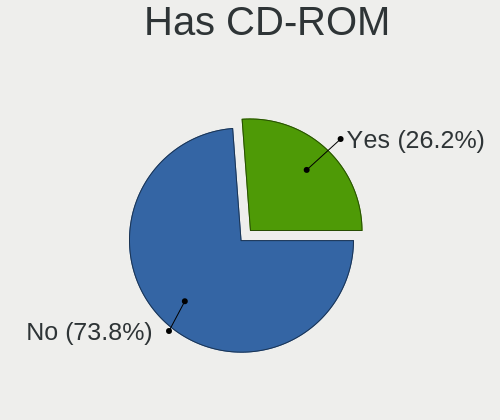
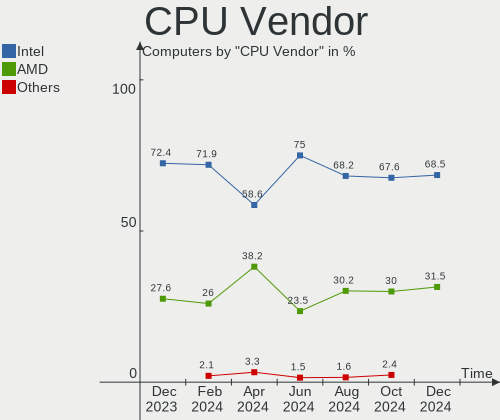
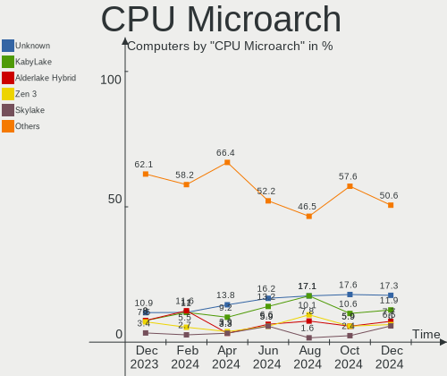
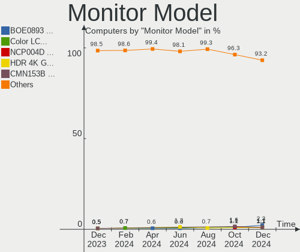
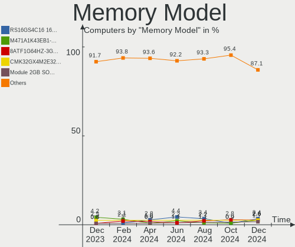

Linux in Spain - Hardware Trends
--------------------------------

A project to identify most popular hardware characteristics and track their change
over time based on data collected by Linux users at https://Linux-Hardware.org.

Anyone can contribute to this report by the [hw-probe](https://github.com/linuxhw/hw-probe) tool:

    sudo -E hw-probe -all -upload

This is a report for all computer types. See also reports for [desktops](/Location/Spain/Desktop/README.md) and [notebooks](/Location/Spain/Notebook/README.md).

Contents
--------

* [ System ](#system)
  - [ OS                       ](#os)
  - [ OS Family                ](#os-family)
  - [ Kernel                   ](#kernel)
  - [ Kernel Family            ](#kernel-family)
  - [ Kernel Major Ver.        ](#kernel-major-ver)
  - [ Arch                     ](#arch)
  - [ DE                       ](#de)
  - [ Display Server           ](#display-server)
  - [ Display Manager          ](#display-manager)
  - [ OS Lang                  ](#os-lang)
  - [ Boot Mode                ](#boot-mode)
  - [ Filesystem               ](#filesystem)
  - [ Part. scheme             ](#part-scheme)
  - [ Dual Boot with Linux/BSD ](#dual-boot-with-linuxbsd)
  - [ Dual Boot (Win)          ](#dual-boot-win)

* [ Board ](#board)
  - [ Vendor                   ](#vendor)
  - [ Model                    ](#model)
  - [ Model Family             ](#model-family)
  - [ MFG Year                 ](#mfg-year)
  - [ Form Factor              ](#form-factor)
  - [ Secure Boot              ](#secure-boot)
  - [ Coreboot                 ](#coreboot)
  - [ RAM Size                 ](#ram-size)
  - [ RAM Used                 ](#ram-used)
  - [ Total Drives             ](#total-drives)
  - [ Has CD-ROM               ](#has-cd-rom)
  - [ Has Ethernet             ](#has-ethernet)
  - [ Has WiFi                 ](#has-wifi)
  - [ Has Bluetooth            ](#has-bluetooth)

* [ Location ](#location)
  - [ Country                  ](#country)
  - [ City                     ](#city)

* [ Drives ](#drives)
  - [ Drive Vendor             ](#drive-vendor)
  - [ Drive Model              ](#drive-model)
  - [ HDD Vendor               ](#hdd-vendor)
  - [ SSD Vendor               ](#ssd-vendor)
  - [ Drive Kind               ](#drive-kind)
  - [ Drive Connector          ](#drive-connector)
  - [ Drive Size               ](#drive-size)
  - [ Space Total              ](#space-total)
  - [ Space Used               ](#space-used)
  - [ Malfunc. Drives          ](#malfunc-drives)
  - [ Malfunc. Drive Vendor    ](#malfunc-drive-vendor)
  - [ Malfunc. HDD Vendor      ](#malfunc-hdd-vendor)
  - [ Malfunc. Drive Kind      ](#malfunc-drive-kind)
  - [ Failed Drives            ](#failed-drives)
  - [ Failed Drive Vendor      ](#failed-drive-vendor)
  - [ Drive Status             ](#drive-status)

* [ Storage controller ](#storage-controller)
  - [ Storage Vendor           ](#storage-vendor)
  - [ Storage Model            ](#storage-model)
  - [ Storage Kind             ](#storage-kind)

* [ Processor ](#processor)
  - [ CPU Vendor               ](#cpu-vendor)
  - [ CPU Model                ](#cpu-model)
  - [ CPU Model Family         ](#cpu-model-family)
  - [ CPU Cores                ](#cpu-cores)
  - [ CPU Sockets              ](#cpu-sockets)
  - [ CPU Threads              ](#cpu-threads)
  - [ CPU Op-Modes             ](#cpu-op-modes)
  - [ CPU Microcode            ](#cpu-microcode)
  - [ CPU Microarch            ](#cpu-microarch)

* [ Graphics ](#graphics)
  - [ GPU Vendor               ](#gpu-vendor)
  - [ GPU Model                ](#gpu-model)
  - [ GPU Combo                ](#gpu-combo)
  - [ GPU Driver               ](#gpu-driver)
  - [ GPU Memory               ](#gpu-memory)

* [ Monitor ](#monitor)
  - [ Monitor Vendor           ](#monitor-vendor)
  - [ Monitor Model            ](#monitor-model)
  - [ Monitor Resolution       ](#monitor-resolution)
  - [ Monitor Diagonal         ](#monitor-diagonal)
  - [ Monitor Width            ](#monitor-width)
  - [ Aspect Ratio             ](#aspect-ratio)
  - [ Monitor Area             ](#monitor-area)
  - [ Pixel Density            ](#pixel-density)
  - [ Multiple Monitors        ](#multiple-monitors)

* [ Network ](#network)
  - [ Net Controller Vendor    ](#net-controller-vendor)
  - [ Net Controller Model     ](#net-controller-model)
  - [ Wireless Vendor          ](#wireless-vendor)
  - [ Wireless Model           ](#wireless-model)
  - [ Ethernet Vendor          ](#ethernet-vendor)
  - [ Ethernet Model           ](#ethernet-model)
  - [ Net Controller Kind      ](#net-controller-kind)
  - [ Used Controller          ](#used-controller)
  - [ NICs                     ](#nics)
  - [ IPv6                     ](#ipv6)

* [ Bluetooth ](#bluetooth)
  - [ Bluetooth Vendor         ](#bluetooth-vendor)
  - [ Bluetooth Model          ](#bluetooth-model)

* [ Sound ](#sound)
  - [ Sound Vendor             ](#sound-vendor)
  - [ Sound Model              ](#sound-model)

* [ Memory ](#memory)
  - [ Memory Vendor            ](#memory-vendor)
  - [ Memory Model             ](#memory-model)
  - [ Memory Kind              ](#memory-kind)
  - [ Memory Form Factor       ](#memory-form-factor)
  - [ Memory Size              ](#memory-size)
  - [ Memory Speed             ](#memory-speed)

* [ Printers & scanners ](#printers--scanners)
  - [ Printer Vendor           ](#printer-vendor)
  - [ Printer Model            ](#printer-model)
  - [ Scanner Vendor           ](#scanner-vendor)
  - [ Scanner Model            ](#scanner-model)

* [ Camera ](#camera)
  - [ Camera Vendor            ](#camera-vendor)
  - [ Camera Model             ](#camera-model)

* [ Security ](#security)
  - [ Fingerprint Vendor       ](#fingerprint-vendor)
  - [ Fingerprint Model        ](#fingerprint-model)
  - [ Chipcard Vendor          ](#chipcard-vendor)
  - [ Chipcard Model           ](#chipcard-model)

* [ Unsupported ](#unsupported)
  - [ Unsupported Devices      ](#unsupported-devices)
  - [ Unsupported Device Types ](#unsupported-device-types)

System
------

OS
--

Installed operating systems

| Name              | Computers | Percent |
|-------------------|-----------|---------|
| Ubuntu 20.04      | 17        | 12.41%  |
| Debian 11         | 13        | 9.49%   |
| Linux Mint 20.3   | 9         | 6.57%   |
| Fedora 35         | 9         | 6.57%   |
| Ubuntu 21.10      | 8         | 5.84%   |
| Ubuntu 22.04      | 7         | 5.11%   |
| OpenMandriva 4.3  | 7         | 5.11%   |
| Manjaro           | 5         | 3.65%   |
| Elementary 6.1    | 5         | 3.65%   |
| Arch Rolling      | 4         | 2.92%   |
| Zorin 16          | 3         | 2.19%   |
| Ubuntu 18.04      | 3         | 2.19%   |
| OpenMandriva 4.2  | 3         | 2.19%   |
| Kubuntu 20.04     | 3         | 2.19%   |
| Kali 2022.1       | 3         | 2.19%   |
| Zorin 15          | 2         | 1.46%   |
| Manjaro 21.2.6    | 2         | 1.46%   |
| Manjaro 21.2.5    | 2         | 1.46%   |
| LMDE 5            | 2         | 1.46%   |
| Linux Mint 19.3   | 2         | 1.46%   |
| KDE neon 20.04    | 2         | 1.46%   |
| Gentoo 2.7        | 2         | 1.46%   |
| Fedora 36         | 2         | 1.46%   |
| Arch              | 2         | 1.46%   |
| Xubuntu 20.04     | 1         | 0.73%   |
| Xubuntu 18.04     | 1         | 0.73%   |
| Ubuntu MATE 18.04 | 1         | 0.73%   |
| ROSA 12.2         | 1         | 0.73%   |
| RHEL 8            | 1         | 0.73%   |
| Raspbian 10       | 1         | 0.73%   |
| Pop!_OS 22.04     | 1         | 0.73%   |
| Pop!_OS 21.10     | 1         | 0.73%   |
| openSUSE 20220421 | 1         | 0.73%   |
| openSUSE 20220410 | 1         | 0.73%   |
| MX 21             | 1         | 0.73%   |
| Linux Mint 20.2   | 1         | 0.73%   |
| Kubuntu 21.10     | 1         | 0.73%   |
| Kubuntu 20.10     | 1         | 0.73%   |
| Gentoo 2.8        | 1         | 0.73%   |
| Gentoo 2.6        | 1         | 0.73%   |
| Endless 4.0.4     | 1         | 0.73%   |
| Debian Testing    | 1         | 0.73%   |
| Debian 10         | 1         | 0.73%   |
| Clear Linux 36120 | 1         | 0.73%   |

OS Family
---------

OS without a version

| Name         | Computers | Percent |
|--------------|-----------|---------|
| Ubuntu       | 35        | 25.55%  |
| Debian       | 15        | 10.95%  |
| Linux Mint   | 12        | 8.76%   |
| Fedora       | 11        | 8.03%   |
| OpenMandriva | 10        | 7.3%    |
| Manjaro      | 9         | 6.57%   |
| Arch         | 6         | 4.38%   |
| Zorin        | 5         | 3.65%   |
| Kubuntu      | 5         | 3.65%   |
| Elementary   | 5         | 3.65%   |
| Gentoo       | 4         | 2.92%   |
| Kali         | 3         | 2.19%   |
| Xubuntu      | 2         | 1.46%   |
| Pop!_OS      | 2         | 1.46%   |
| openSUSE     | 2         | 1.46%   |
| LMDE         | 2         | 1.46%   |
| KDE neon     | 2         | 1.46%   |
| Ubuntu MATE  | 1         | 0.73%   |
| ROSA         | 1         | 0.73%   |
| RHEL         | 1         | 0.73%   |
| Raspbian     | 1         | 0.73%   |
| MX           | 1         | 0.73%   |
| Endless      | 1         | 0.73%   |
| Clear Linux  | 1         | 0.73%   |

Kernel
------

Version of the Linux kernel

| Version                            | Computers | Percent |
|------------------------------------|-----------|---------|
| 5.13.0-39-generic                  | 20        | 14.6%   |
| 5.10.0-13-amd64                    | 13        | 9.49%   |
| 5.16.7-desktop-1omv4003            | 7         | 5.11%   |
| 5.4.0-107-generic                  | 6         | 4.38%   |
| 5.15.0-25-generic                  | 6         | 4.38%   |
| 5.13.0-40-generic                  | 6         | 4.38%   |
| 5.4.0-109-generic                  | 4         | 2.92%   |
| 5.17.1-arch1-1                     | 4         | 2.92%   |
| 5.15.32-1-MANJARO                  | 4         | 2.92%   |
| 5.16.20-200.fc35.x86_64            | 3         | 2.19%   |
| 5.15.28-1-MANJARO                  | 3         | 2.19%   |
| 5.13.0-30-generic                  | 3         | 2.19%   |
| 5.10.14-desktop-1omv4002           | 3         | 2.19%   |
| 4.15.0-175-generic                 | 3         | 2.19%   |
| 5.17.4-200.fc35.x86_64             | 2         | 1.46%   |
| 5.16.19-200.fc35.x86_64            | 2         | 1.46%   |
| 5.16.0-kali6-amd64                 | 2         | 1.46%   |
| 5.13.0-37-generic                  | 2         | 1.46%   |
| 5.13.0-27-generic                  | 2         | 1.46%   |
| 5.13.0-19-generic                  | 2         | 1.46%   |
| 5.11.0-43-generic                  | 2         | 1.46%   |
| 5.8.0-63-lowlatency                | 1         | 0.73%   |
| 5.4.0-91-generic                   | 1         | 0.73%   |
| 5.4.0-105-generic                  | 1         | 0.73%   |
| 5.4.0-104-generic                  | 1         | 0.73%   |
| 5.4.0-100-generic                  | 1         | 0.73%   |
| 5.17.5-051705-generic              | 1         | 0.73%   |
| 5.17.3-arch1-1                     | 1         | 0.73%   |
| 5.17.3-1-default                   | 1         | 0.73%   |
| 5.17.3-051703-generic              | 1         | 0.73%   |
| 5.17.2-arch3-1                     | 1         | 0.73%   |
| 5.17.2-300.fc36.x86_64             | 1         | 0.73%   |
| 5.17.1-gentoo-r1-gentoo            | 1         | 0.73%   |
| 5.17.1-300.fc36.x86_64             | 1         | 0.73%   |
| 5.17.1-3-MANJARO                   | 1         | 0.73%   |
| 5.17.1-1-default                   | 1         | 0.73%   |
| 5.17.0-051700-generic              | 1         | 0.73%   |
| 5.16.2-2-rt19-MANJARO              | 1         | 0.73%   |
| 5.16.19-76051619-generic           | 1         | 0.73%   |
| 5.16.18-200.fc35.x86_64            | 1         | 0.73%   |
| 5.16.18-1137.native                | 1         | 0.73%   |
| 5.16.11-gentoo-x86_64              | 1         | 0.73%   |
| 5.16.0-6-amd64                     | 1         | 0.73%   |
| 5.15.32-gentoo-r1-cp003            | 1         | 0.73%   |
| 5.15.21-051521-generic             | 1         | 0.73%   |
| 5.15.16-gentoo-x86_64              | 1         | 0.73%   |
| 5.15.16-200.fc35.x86_64            | 1         | 0.73%   |
| 5.15.15-76051515-generic           | 1         | 0.73%   |
| 5.15.0-kali3-amd64                 | 1         | 0.73%   |
| 5.15.0-27-generic                  | 1         | 0.73%   |
| 5.15.0-1005-raspi                  | 1         | 0.73%   |
| 5.11.0-35-generic                  | 1         | 0.73%   |
| 5.10.74-generic-2rosa2021.1-x86_64 | 1         | 0.73%   |
| 5.10.109-loc-os                    | 1         | 0.73%   |
| 5.10.103-v7+                       | 1         | 0.73%   |
| 5.10.0-13-686                      | 1         | 0.73%   |
| 5.10.0-10-amd64                    | 1         | 0.73%   |
| 4.19.0-10-amd64                    | 1         | 0.73%   |
| 4.18.0-348.20.1.el8_5.x86_64       | 1         | 0.73%   |

Kernel Family
-------------

Linux kernel without a distro release

| Version  | Computers | Percent |
|----------|-----------|---------|
| 5.13.0   | 35        | 25.55%  |
| 5.10.0   | 15        | 10.95%  |
| 5.4.0    | 14        | 10.22%  |
| 5.15.0   | 9         | 6.57%   |
| 5.17.1   | 8         | 5.84%   |
| 5.16.7   | 7         | 5.11%   |
| 5.15.32  | 5         | 3.65%   |
| 5.17.3   | 3         | 2.19%   |
| 5.16.20  | 3         | 2.19%   |
| 5.16.19  | 3         | 2.19%   |
| 5.16.0   | 3         | 2.19%   |
| 5.15.28  | 3         | 2.19%   |
| 5.11.0   | 3         | 2.19%   |
| 5.10.14  | 3         | 2.19%   |
| 4.15.0   | 3         | 2.19%   |
| 5.17.4   | 2         | 1.46%   |
| 5.17.2   | 2         | 1.46%   |
| 5.16.18  | 2         | 1.46%   |
| 5.15.16  | 2         | 1.46%   |
| 5.8.0    | 1         | 0.73%   |
| 5.17.5   | 1         | 0.73%   |
| 5.17.0   | 1         | 0.73%   |
| 5.16.2   | 1         | 0.73%   |
| 5.16.11  | 1         | 0.73%   |
| 5.15.21  | 1         | 0.73%   |
| 5.15.15  | 1         | 0.73%   |
| 5.10.74  | 1         | 0.73%   |
| 5.10.109 | 1         | 0.73%   |
| 5.10.103 | 1         | 0.73%   |
| 4.19.0   | 1         | 0.73%   |
| 4.18.0   | 1         | 0.73%   |

Kernel Major Ver.
-----------------

Linux kernel major version

| Version | Computers | Percent |
|---------|-----------|---------|
| 5.13    | 35        | 25.55%  |
| 5.15    | 21        | 15.33%  |
| 5.10    | 21        | 15.33%  |
| 5.16    | 20        | 14.6%   |
| 5.17    | 17        | 12.41%  |
| 5.4     | 14        | 10.22%  |
| 5.11    | 3         | 2.19%   |
| 4.15    | 3         | 2.19%   |
| 5.8     | 1         | 0.73%   |
| 4.19    | 1         | 0.73%   |
| 4.18    | 1         | 0.73%   |

Arch
----

OS architecture (x86_64, i586, etc.)

| Name    | Computers | Percent |
|---------|-----------|---------|
| x86_64  | 127       | 92.7%   |
| i686    | 8         | 5.84%   |
| armv7l  | 1         | 0.73%   |
| aarch64 | 1         | 0.73%   |

DE
--

Desktop Environment

| Name       | Computers | Percent |
|------------|-----------|---------|
| GNOME      | 59        | 43.07%  |
| KDE5       | 27        | 19.71%  |
| XFCE       | 15        | 10.95%  |
| X-Cinnamon | 12        | 8.76%   |
| MATE       | 6         | 4.38%   |
| Pantheon   | 5         | 3.65%   |
| Unknown    | 4         | 2.92%   |
| LXDE       | 3         | 2.19%   |
| LXQt       | 2         | 1.46%   |
| Cinnamon   | 2         | 1.46%   |
| Unity      | 1         | 0.73%   |
| openbox    | 1         | 0.73%   |

Display Server
--------------

X11 or Wayland

| Name    | Computers | Percent |
|---------|-----------|---------|
| X11     | 108       | 78.83%  |
| Wayland | 23        | 16.79%  |
| Tty     | 4         | 2.92%   |
| Unknown | 2         | 1.46%   |

Display Manager
---------------

SDDM, LightDM, etc.

| Name    | Computers | Percent |
|---------|-----------|---------|
| Unknown | 43        | 31.39%  |
| GDM3    | 26        | 18.98%  |
| SDDM    | 24        | 17.52%  |
| LightDM | 24        | 17.52%  |
| GDM     | 18        | 13.14%  |
| XDM     | 1         | 0.73%   |
| LXDM    | 1         | 0.73%   |

OS Lang
-------

Language

| Lang   | Computers | Percent |
|--------|-----------|---------|
| es_ES  | 87        | 63.5%   |
| en_US  | 27        | 19.71%  |
| ca_ES  | 10        | 7.3%    |
| en_GB  | 3         | 2.19%   |
| es_MX  | 2         | 1.46%   |
| ru_RU  | 1         | 0.73%   |
| pt_BR  | 1         | 0.73%   |
| it_IT  | 1         | 0.73%   |
| eu_ES  | 1         | 0.73%   |
| en_NZ  | 1         | 0.73%   |
| en_IE  | 1         | 0.73%   |
| C.UTF8 | 1         | 0.73%   |
| C      | 1         | 0.73%   |

Boot Mode
---------

EFI or BIOS

| Mode | Computers | Percent |
|------|-----------|---------|
| BIOS | 74        | 54.01%  |
| EFI  | 63        | 45.99%  |

Filesystem
----------

Type of filesystem

| Type     | Computers | Percent |
|----------|-----------|---------|
| Ext4     | 112       | 81.75%  |
| Btrfs    | 12        | 8.76%   |
| Overlay  | 11        | 8.03%   |
| Zfs      | 1         | 0.73%   |
| Reiserfs | 1         | 0.73%   |

Part. scheme
------------

Scheme of partitioning

| Type    | Computers | Percent |
|---------|-----------|---------|
| Unknown | 73        | 53.28%  |
| GPT     | 47        | 34.31%  |
| MBR     | 17        | 12.41%  |

Dual Boot with Linux/BSD
------------------------

Hosting more than one Linux/BSD

| Dual boot | Computers | Percent |
|-----------|-----------|---------|
| No        | 119       | 86.86%  |
| Yes       | 18        | 13.14%  |

Dual Boot (Win)
---------------

Hosting Linux and Windows

| Dual boot | Computers | Percent |
|-----------|-----------|---------|
| No        | 94        | 68.61%  |
| Yes       | 43        | 31.39%  |

Board
-----

Vendor
------

Motherboard manufacturer

| Name                    | Computers | Percent |
|-------------------------|-----------|---------|
| ASUSTek Computer        | 22        | 16.06%  |
| Lenovo                  | 20        | 14.6%   |
| Hewlett-Packard         | 15        | 10.95%  |
| Gigabyte Technology     | 12        | 8.76%   |
| Dell                    | 10        | 7.3%    |
| MSI                     | 9         | 6.57%   |
| Acer                    | 8         | 5.84%   |
| Toshiba                 | 5         | 3.65%   |
| Unknown                 | 4         | 2.92%   |
| Medion                  | 3         | 2.19%   |
| Chuwi                   | 3         | 2.19%   |
| ASRock                  | 3         | 2.19%   |
| SLIMBOOK                | 2         | 1.46%   |
| Raspberry Pi Foundation | 2         | 1.46%   |
| Intel                   | 2         | 1.46%   |
| AMI                     | 2         | 1.46%   |
| Wistron                 | 1         | 0.73%   |
| Sony                    | 1         | 0.73%   |
| Packard Bell            | 1         | 0.73%   |
| MACHINIST               | 1         | 0.73%   |
| LG Electronics          | 1         | 0.73%   |
| IP3 Tech                | 1         | 0.73%   |
| HUAWEI                  | 1         | 0.73%   |
| Gateway                 | 1         | 0.73%   |
| Foxconn                 | 1         | 0.73%   |
| Fanless Mini PC         | 1         | 0.73%   |
| eMachines               | 1         | 0.73%   |
| ECS                     | 1         | 0.73%   |
| BESSTAR Tech            | 1         | 0.73%   |
| AZW                     | 1         | 0.73%   |
| Apple                   | 1         | 0.73%   |

Model
-----

Motherboard model

| Name                                  | Computers | Percent |
|---------------------------------------|-----------|---------|
| Unknown                               | 5         | 3.65%   |
| ASUS All Series                       | 3         | 2.19%   |
| MSI Prestige 15 A11UC                 | 2         | 1.46%   |
| Lenovo Z50-70 20354                   | 2         | 1.46%   |
| Gigabyte 970A-DS3P                    | 2         | 1.46%   |
| Dell OptiPlex 3050                    | 2         | 1.46%   |
| ASUS TUF Gaming Z690-PLUS D4          | 2         | 1.46%   |
| Wistron ProLiant ML110 G5             | 1         | 0.73%   |
| Toshiba Satellite U840                | 1         | 0.73%   |
| Toshiba Satellite Pro C660            | 1         | 0.73%   |
| Toshiba Satellite L300                | 1         | 0.73%   |
| Toshiba Satellite L10W-B-101          | 1         | 0.73%   |
| Toshiba NB520                         | 1         | 0.73%   |
| Sony VGN-NW21EF_S                     | 1         | 0.73%   |
| SLIMBOOK PROX15-AMD                   | 1         | 0.73%   |
| SLIMBOOK PRO                          | 1         | 0.73%   |
| RPi Raspberry Pi 3 Model B Rev 1.2    | 1         | 0.73%   |
| RPi Raspberry Pi                      | 1         | 0.73%   |
| Packard Bell EasyNote TN36            | 1         | 0.73%   |
| MSI Prestige 15 A11SCX                | 1         | 0.73%   |
| MSI MS-7C52                           | 1         | 0.73%   |
| MSI MS-7B79                           | 1         | 0.73%   |
| MSI MS-7A70                           | 1         | 0.73%   |
| MSI MS-7971                           | 1         | 0.73%   |
| MSI MS-7817                           | 1         | 0.73%   |
| MSI GX700                             | 1         | 0.73%   |
| Medion MS-7728                        | 1         | 0.73%   |
| Medion MS-7366                        | 1         | 0.73%   |
| Medion MD34189/C731                   | 1         | 0.73%   |
| MACHINIST X99-RS9 V2.0                | 1         | 0.73%   |
| LG 15Z95P-G.AA78B                     | 1         | 0.73%   |
| Lenovo Yoga 300-11IBY 80M0            | 1         | 0.73%   |
| Lenovo ThinkPad X270 W10DG 20K5S00A00 | 1         | 0.73%   |
| Lenovo ThinkPad X250 20CLS2GD00       | 1         | 0.73%   |
| Lenovo ThinkPad T480 20L6S29D02       | 1         | 0.73%   |
| Lenovo ThinkPad P53 20QN000ESP        | 1         | 0.73%   |
| Lenovo ThinkPad L15 Gen 2 20X3CTO1WW  | 1         | 0.73%   |
| Lenovo ThinkPad Edge E540 20C6003VSP  | 1         | 0.73%   |
| Lenovo ThinkPad E14 Gen 3 20Y7CTO1WW  | 1         | 0.73%   |
| Lenovo ThinkCentre M93p 10A90011MX    | 1         | 0.73%   |
| Lenovo ThinkCentre E73 10AS0035SP     | 1         | 0.73%   |
| Lenovo ThinkBook 16p Gen 2 20YM       | 1         | 0.73%   |
| Lenovo ThinkBook 15 G2 ARE 20VG       | 1         | 0.73%   |
| Lenovo MIIX 320-10ICR 80XF            | 1         | 0.73%   |
| Lenovo IdeaPadFlex 5 14ITL05 82HS     | 1         | 0.73%   |
| Lenovo IdeaPad S540-13ARE 82DL        | 1         | 0.73%   |
| Lenovo IdeaPad 510-15IKB 80SV         | 1         | 0.73%   |
| Lenovo IdeaPad 3 15ITL6 82H8          | 1         | 0.73%   |
| Lenovo G580 2189                      | 1         | 0.73%   |
| IP3 Tech HeroBox                      | 1         | 0.73%   |
| Intel V1.3                            | 1         | 0.73%   |
| Intel NUC8i3BEH                       | 1         | 0.73%   |
| HUAWEI KLVL-WXX9                      | 1         | 0.73%   |
| HP Stream Notebook PC 13              | 1         | 0.73%   |
| HP ProBook 650 G1                     | 1         | 0.73%   |
| HP Presario C500 (RY512EA#ABE)        | 1         | 0.73%   |
| HP Pavilion g6                        | 1         | 0.73%   |
| HP Pavilion dv6500                    | 1         | 0.73%   |
| HP Laptop 15s-fq2xxx                  | 1         | 0.73%   |
| HP Laptop 15s-fq1xxx                  | 1         | 0.73%   |

Model Family
------------

Motherboard model prefix

| Name                     | Computers | Percent |
|--------------------------|-----------|---------|
| Lenovo ThinkPad          | 7         | 5.11%   |
| ASUS TUF                 | 5         | 3.65%   |
| Unknown                  | 5         | 3.65%   |
| Toshiba Satellite        | 4         | 2.92%   |
| HP Laptop                | 4         | 2.92%   |
| Dell OptiPlex            | 4         | 2.92%   |
| ASUS PRIME               | 4         | 2.92%   |
| Acer Aspire              | 4         | 2.92%   |
| MSI Prestige             | 3         | 2.19%   |
| Lenovo IdeaPad           | 3         | 2.19%   |
| HP Compaq                | 3         | 2.19%   |
| Dell XPS                 | 3         | 2.19%   |
| ASUS All                 | 3         | 2.19%   |
| RPi Raspberry            | 2         | 1.46%   |
| Lenovo Z50-70            | 2         | 1.46%   |
| Lenovo ThinkCentre       | 2         | 1.46%   |
| Lenovo ThinkBook         | 2         | 1.46%   |
| HP Pavilion              | 2         | 1.46%   |
| Gigabyte 970A-DS3P       | 2         | 1.46%   |
| ASUS ROG                 | 2         | 1.46%   |
| AMI Intel                | 2         | 1.46%   |
| Acer TravelMate          | 2         | 1.46%   |
| Wistron ProLiant         | 1         | 0.73%   |
| Toshiba NB520            | 1         | 0.73%   |
| Sony VGN-NW21EF          | 1         | 0.73%   |
| SLIMBOOK PROX15-AMD      | 1         | 0.73%   |
| SLIMBOOK PRO             | 1         | 0.73%   |
| Packard Bell EasyNote    | 1         | 0.73%   |
| MSI MS-7C52              | 1         | 0.73%   |
| MSI MS-7B79              | 1         | 0.73%   |
| MSI MS-7A70              | 1         | 0.73%   |
| MSI MS-7971              | 1         | 0.73%   |
| MSI MS-7817              | 1         | 0.73%   |
| MSI GX700                | 1         | 0.73%   |
| Medion MS-7728           | 1         | 0.73%   |
| Medion MS-7366           | 1         | 0.73%   |
| Medion MD34189           | 1         | 0.73%   |
| MACHINIST X99-RS9        | 1         | 0.73%   |
| LG 15Z95P-G.AA78B        | 1         | 0.73%   |
| Lenovo Yoga              | 1         | 0.73%   |
| Lenovo MIIX              | 1         | 0.73%   |
| Lenovo IdeaPadFlex       | 1         | 0.73%   |
| Lenovo G580              | 1         | 0.73%   |
| IP3 Tech HeroBox         | 1         | 0.73%   |
| Intel V1.3               | 1         | 0.73%   |
| Intel NUC8i3BEH          | 1         | 0.73%   |
| HUAWEI KLVL-WXX9         | 1         | 0.73%   |
| HP Stream                | 1         | 0.73%   |
| HP ProBook               | 1         | 0.73%   |
| HP Presario              | 1         | 0.73%   |
| HP EliteDesk             | 1         | 0.73%   |
| HP 650                   | 1         | 0.73%   |
| HP 250                   | 1         | 0.73%   |
| Gigabyte Q67M-D2H        | 1         | 0.73%   |
| Gigabyte P55M-UD2        | 1         | 0.73%   |
| Gigabyte H81M-S2H        | 1         | 0.73%   |
| Gigabyte H310M           | 1         | 0.73%   |
| Gigabyte GA-990FX-GAMING | 1         | 0.73%   |
| Gigabyte GA-78LMT-USB3   | 1         | 0.73%   |
| Gigabyte F2A88XN-WIFI    | 1         | 0.73%   |

MFG Year
--------

Motherboard manufacture year

| Year    | Computers | Percent |
|---------|-----------|---------|
| 2021    | 25        | 18.25%  |
| 2014    | 13        | 9.49%   |
| 2019    | 12        | 8.76%   |
| 2017    | 11        | 8.03%   |
| 2013    | 11        | 8.03%   |
| 2020    | 10        | 7.3%    |
| 2018    | 9         | 6.57%   |
| 2016    | 6         | 4.38%   |
| 2015    | 6         | 4.38%   |
| 2009    | 6         | 4.38%   |
| 2007    | 6         | 4.38%   |
| 2012    | 5         | 3.65%   |
| 2011    | 5         | 3.65%   |
| 2010    | 4         | 2.92%   |
| 2006    | 4         | 2.92%   |
| 2008    | 2         | 1.46%   |
| Unknown | 2         | 1.46%   |

Form Factor
-----------

Physical design of the computer

| Name           | Computers | Percent |
|----------------|-----------|---------|
| Notebook       | 70        | 51.09%  |
| Desktop        | 57        | 41.61%  |
| Mini pc        | 3         | 2.19%   |
| System on chip | 2         | 1.46%   |
| Tablet         | 2         | 1.46%   |
| Stick pc       | 1         | 0.73%   |
| Convertible    | 1         | 0.73%   |
| All in one     | 1         | 0.73%   |

Secure Boot
-----------

Enabled or disabled

| State    | Computers | Percent |
|----------|-----------|---------|
| Disabled | 131       | 95.62%  |
| Enabled  | 6         | 4.38%   |

Coreboot
--------

Have coreboot on board

| Used | Computers | Percent |
|------|-----------|---------|
| No   | 137       | 100%    |

RAM Size
--------

Total RAM memory

| Size in GB  | Computers | Percent |
|-------------|-----------|---------|
| 16.01-24.0  | 34        | 24.82%  |
| 4.01-8.0    | 26        | 18.98%  |
| 3.01-4.0    | 25        | 18.25%  |
| 8.01-16.0   | 22        | 16.06%  |
| 32.01-64.0  | 13        | 9.49%   |
| 1.01-2.0    | 5         | 3.65%   |
| 2.01-3.0    | 4         | 2.92%   |
| 64.01-256.0 | 4         | 2.92%   |
| 0.51-1.0    | 4         | 2.92%   |

RAM Used
--------

Used RAM memory

| Used GB    | Computers | Percent |
|------------|-----------|---------|
| 1.01-2.0   | 48        | 35.04%  |
| 2.01-3.0   | 33        | 24.09%  |
| 0.51-1.0   | 16        | 11.68%  |
| 4.01-8.0   | 15        | 10.95%  |
| 3.01-4.0   | 13        | 9.49%   |
| 8.01-16.0  | 6         | 4.38%   |
| 16.01-24.0 | 3         | 2.19%   |
| 24.01-32.0 | 2         | 1.46%   |
| 0.01-0.5   | 1         | 0.73%   |

Total Drives
------------

Number of drives on board

| Drives | Computers | Percent |
|--------|-----------|---------|
| 1      | 76        | 55.47%  |
| 2      | 36        | 26.28%  |
| 3      | 11        | 8.03%   |
| 4      | 6         | 4.38%   |
| 6      | 3         | 2.19%   |
| 5      | 2         | 1.46%   |
| 11     | 1         | 0.73%   |
| 9      | 1         | 0.73%   |
| 0      | 1         | 0.73%   |

Has CD-ROM
----------

Has CD-ROM on board

| Presented | Computers | Percent |
|-----------|-----------|---------|
| No        | 89        | 64.96%  |
| Yes       | 48        | 35.04%  |

Has Ethernet
------------

Has Ethernet on board

| Presented | Computers | Percent |
|-----------|-----------|---------|
| Yes       | 118       | 86.13%  |
| No        | 19        | 13.87%  |

Has WiFi
--------

Has WiFi module

| Presented | Computers | Percent |
|-----------|-----------|---------|
| Yes       | 105       | 76.64%  |
| No        | 32        | 23.36%  |

Has Bluetooth
-------------

Has Bluetooth module

| Presented | Computers | Percent |
|-----------|-----------|---------|
| Yes       | 73        | 53.28%  |
| No        | 64        | 46.72%  |

Location
--------

Country
-------

Geographic location (country)

| Country | Computers | Percent |
|---------|-----------|---------|
| Spain   | 137       | 100%    |

City
----

Geographic location (city)

| City                       | Computers | Percent |
|----------------------------|-----------|---------|
| Madrid                     | 23        | 16.79%  |
| Barcelona                  | 20        | 14.6%   |
| Seville                    | 6         | 4.38%   |
| Zaragoza                   | 5         | 3.65%   |
| Valencia                   | 2         | 1.46%   |
| Santa Cruz de Tenerife     | 2         | 1.46%   |
| Salamanca                  | 2         | 1.46%   |
| Ripollet                   | 2         | 1.46%   |
| Montornès del Vallès     | 2         | 1.46%   |
| Málaga                    | 2         | 1.46%   |
| Las Rozas de Madrid        | 2         | 1.46%   |
| Las Palmas de Gran Canaria | 2         | 1.46%   |
| Ibi                        | 2         | 1.46%   |
| Granada                    | 2         | 1.46%   |
| Getafe                     | 2         | 1.46%   |
| Baiona                     | 2         | 1.46%   |
| A Coruña                  | 2         | 1.46%   |
| Vitoria-Gasteiz            | 1         | 0.73%   |
| Tres Cantos                | 1         | 0.73%   |
| Torrevieja                 | 1         | 0.73%   |
| Torrejón de Ardoz         | 1         | 0.73%   |
| Teruel                     | 1         | 0.73%   |
| Tarragona                  | 1         | 0.73%   |
| Santander                  | 1         | 0.73%   |
| Santa Úrsula              | 1         | 0.73%   |
| Sant Joan Despí           | 1         | 0.73%   |
| Rubí                      | 1         | 0.73%   |
| Ronda                      | 1         | 0.73%   |
| Pontevedra                 | 1         | 0.73%   |
| Parla                      | 1         | 0.73%   |
| Palma                      | 1         | 0.73%   |
| Oviedo                     | 1         | 0.73%   |
| Ourense                    | 1         | 0.73%   |
| Murcia                     | 1         | 0.73%   |
| Mostoles                   | 1         | 0.73%   |
| Monreal                    | 1         | 0.73%   |
| Mollet del Vallès         | 1         | 0.73%   |
| Maspalomas                 | 1         | 0.73%   |
| Marchena                   | 1         | 0.73%   |
| Marbella                   | 1         | 0.73%   |
| Lorca                      | 1         | 0.73%   |
| Logroño                   | 1         | 0.73%   |
| León                      | 1         | 0.73%   |
| Leganés                   | 1         | 0.73%   |
| Laracha                    | 1         | 0.73%   |
| Lanjaron                   | 1         | 0.73%   |
| Illescas                   | 1         | 0.73%   |
| Igualada                   | 1         | 0.73%   |
| Guadalajara                | 1         | 0.73%   |
| Granadilla de Abona        | 1         | 0.73%   |
| Girona                     | 1         | 0.73%   |
| Gijón                     | 1         | 0.73%   |
| Getxo                      | 1         | 0.73%   |
| Fuenlabrada                | 1         | 0.73%   |
| Donostia / San Sebastian   | 1         | 0.73%   |
| Daya Vieja                 | 1         | 0.73%   |
| Cornellà de Llobregat     | 1         | 0.73%   |
| Córdoba                   | 1         | 0.73%   |
| Ciudad Real                | 1         | 0.73%   |
| Cervo                      | 1         | 0.73%   |

Drives
------

Drive Vendor
------------

Hard drive vendors

| Vendor                    | Computers | Drives | Percent |
|---------------------------|-----------|--------|---------|
| WDC                       | 31        | 36     | 14.42%  |
| Samsung Electronics       | 29        | 33     | 13.49%  |
| Toshiba                   | 28        | 31     | 13.02%  |
| Seagate                   | 28        | 48     | 13.02%  |
| Kingston                  | 24        | 26     | 11.16%  |
| SanDisk                   | 18        | 19     | 8.37%   |
| Unknown                   | 7         | 7      | 3.26%   |
| Crucial                   | 6         | 8      | 2.79%   |
| SK Hynix                  | 4         | 4      | 1.86%   |
| USB3.0                    | 2         | 2      | 0.93%   |
| Phison                    | 2         | 2      | 0.93%   |
| Netac                     | 2         | 2      | 0.93%   |
| Micron/Crucial Technology | 2         | 2      | 0.93%   |
| Micron Technology         | 2         | 2      | 0.93%   |
| KIOXIA                    | 2         | 2      | 0.93%   |
| KingDian                  | 2         | 2      | 0.93%   |
| Intel                     | 2         | 2      | 0.93%   |
| HGST                      | 2         | 2      | 0.93%   |
| Fujitsu                   | 2         | 2      | 0.93%   |
| China                     | 2         | 2      | 0.93%   |
| Unknown                   | 2         | 2      | 0.93%   |
| Teclast                   | 1         | 1      | 0.47%   |
| Realtek                   | 1         | 2      | 0.47%   |
| PNY                       | 1         | 1      | 0.47%   |
| oyunkey                   | 1         | 1      | 0.47%   |
| ORICO                     | 1         | 1      | 0.47%   |
| OCZ-VERTEX                | 1         | 1      | 0.47%   |
| OCZ                       | 1         | 1      | 0.47%   |
| MAXTOR                    | 1         | 1      | 0.47%   |
| Intenso                   | 1         | 1      | 0.47%   |
| Hitachi                   | 1         | 1      | 0.47%   |
| GOODRAM                   | 1         | 1      | 0.47%   |
| faspeed                   | 1         | 1      | 0.47%   |
| EAGET                     | 1         | 1      | 0.47%   |
| DOGFISH                   | 1         | 1      | 0.47%   |
| BAITITON                  | 1         | 1      | 0.47%   |
| Apple                     | 1         | 1      | 0.47%   |

Drive Model
-----------

Hard drive models

| Model                                | Computers | Percent |
|--------------------------------------|-----------|---------|
| Kingston SA400S37240G 240GB SSD      | 8         | 3.39%   |
| Samsung SSD 860 EVO 500GB            | 5         | 2.12%   |
| Kingston SV300S37A120G 120GB SSD     | 4         | 1.69%   |
| WDC WD20EARX-00PASB0 2TB             | 3         | 1.27%   |
| Seagate ST3500418AS 500GB            | 3         | 1.27%   |
| Samsung SSD 850 EVO 500GB            | 3         | 1.27%   |
| Samsung NVMe SSD Drive 512GB         | 3         | 1.27%   |
| Samsung NVMe SSD Drive 250GB         | 3         | 1.27%   |
| WDC WDS500G1B0A-00H9H0 500GB SSD     | 2         | 0.85%   |
| USB3.0 Super Speed 320GB             | 2         | 0.85%   |
| Unknown MMC Card  128GB              | 2         | 0.85%   |
| Toshiba TR200 480GB SSD              | 2         | 0.85%   |
| Toshiba MQ01ACF050 500GB             | 2         | 0.85%   |
| Toshiba MQ01ABF050 500GB             | 2         | 0.85%   |
| Toshiba MQ01ABD100 1TB               | 2         | 0.85%   |
| Toshiba DT01ACA100 1TB               | 2         | 0.85%   |
| Seagate ST500LT012-1DG142 500GB      | 2         | 0.85%   |
| Seagate ST1000DM010-2EP102 1TB       | 2         | 0.85%   |
| Seagate ST1000DM003-1CH162 1TB       | 2         | 0.85%   |
| Seagate Expansion+ 2TB               | 2         | 0.85%   |
| SanDisk SSD PLUS 480GB               | 2         | 0.85%   |
| SanDisk SSD PLUS 1000GB              | 2         | 0.85%   |
| Sandisk NVMe SSD Drive 512GB         | 2         | 0.85%   |
| Sandisk NVMe SSD Drive 1TB           | 2         | 0.85%   |
| Sandisk NVMe SSD Drive 1024GB        | 2         | 0.85%   |
| Samsung NVMe SSD Drive 1024GB        | 2         | 0.85%   |
| Phison NVMe SSD Drive 1TB            | 2         | 0.85%   |
| Micron/Crucial NVMe SSD Drive 1TB    | 2         | 0.85%   |
| Kingston SA400S37120G 120GB SSD      | 2         | 0.85%   |
| Crucial CT1000MX500SSD1 1TB          | 2         | 0.85%   |
| Unknown                              | 2         | 0.85%   |
| WDC WDS500G2B0B-00YS70 500GB SSD     | 1         | 0.42%   |
| WDC WDS500G2B0A-00SM50 500GB SSD     | 1         | 0.42%   |
| WDC WDS250G2B0B-00YS70 250GB SSD     | 1         | 0.42%   |
| WDC WDS120G1G0B-00RC30 120GB SSD     | 1         | 0.42%   |
| WDC WDS100T2B0A-00SM50 1TB SSD       | 1         | 0.42%   |
| WDC WD6400AAKS-22A7B0 640GB          | 1         | 0.42%   |
| WDC WD5000LPVX-08V0TT2 500GB         | 1         | 0.42%   |
| WDC WD5000LPLX-00ZNTT0 500GB         | 1         | 0.42%   |
| WDC WD5000BPKX-66HPJT0 500GB         | 1         | 0.42%   |
| WDC WD5000BEVT-60A0RT0 500GB         | 1         | 0.42%   |
| WDC WD5000AAKX-75U6AA0 500GB         | 1         | 0.42%   |
| WDC WD5000AAKX-60U6AA0 500GB         | 1         | 0.42%   |
| WDC WD5000AAKX-08U6AA0 500GB         | 1         | 0.42%   |
| WDC WD5000AAKX-00ERMA0 500GB         | 1         | 0.42%   |
| WDC WD40EFRX-68WT0N0 4TB             | 1         | 0.42%   |
| WDC WD40EFAX-68JH4N0 4TB             | 1         | 0.42%   |
| WDC WD3200BEVS-26VAT0 320GB          | 1         | 0.42%   |
| WDC WD3200BEKT-00F3T0 320GB          | 1         | 0.42%   |
| WDC WD3200AAJS-22L7A0 320GB          | 1         | 0.42%   |
| WDC WD2500BEVT-22A23T0 250GB         | 1         | 0.42%   |
| WDC WD1600BEVT-60ZCT1 160GB          | 1         | 0.42%   |
| WDC WD1600BEVS-60RST0 160GB          | 1         | 0.42%   |
| WDC WD1200UE-22KVT0 120GB            | 1         | 0.42%   |
| WDC WD10SPZX-21Z10T0 1TB             | 1         | 0.42%   |
| WDC WD10JUCT-63CYNY0 1TB             | 1         | 0.42%   |
| WDC WD10EZEX-00RKKA0 1TB             | 1         | 0.42%   |
| WDC WD1001FALS-55J7B0 1TB            | 1         | 0.42%   |
| WDC PC SN720 SDAQNTW-512G-1001 512GB | 1         | 0.42%   |
| WDC PC SA530 SDASN8Y-256G-1006 256GB | 1         | 0.42%   |

HDD Vendor
----------

Hard disk drive vendors

| Vendor  | Computers | Drives | Percent |
|---------|-----------|--------|---------|
| Seagate | 27        | 47     | 34.62%  |
| WDC     | 24        | 27     | 30.77%  |
| Toshiba | 20        | 22     | 25.64%  |
| HGST    | 2         | 2      | 2.56%   |
| Fujitsu | 2         | 2      | 2.56%   |
| MAXTOR  | 1         | 1      | 1.28%   |
| Hitachi | 1         | 1      | 1.28%   |
| Apple   | 1         | 1      | 1.28%   |

SSD Vendor
----------

Solid state drive vendors

| Vendor              | Computers | Drives | Percent |
|---------------------|-----------|--------|---------|
| Kingston            | 21        | 21     | 25.61%  |
| Samsung Electronics | 16        | 18     | 19.51%  |
| SanDisk             | 9         | 10     | 10.98%  |
| WDC                 | 8         | 8      | 9.76%   |
| Crucial             | 6         | 7      | 7.32%   |
| Toshiba             | 5         | 5      | 6.1%    |
| USB3.0              | 2         | 2      | 2.44%   |
| Netac               | 2         | 2      | 2.44%   |
| China               | 2         | 2      | 2.44%   |
| Teclast             | 1         | 1      | 1.22%   |
| PNY                 | 1         | 1      | 1.22%   |
| OCZ-VERTEX          | 1         | 1      | 1.22%   |
| OCZ                 | 1         | 1      | 1.22%   |
| Micron Technology   | 1         | 1      | 1.22%   |
| KingDian            | 1         | 1      | 1.22%   |
| Intel               | 1         | 1      | 1.22%   |
| GOODRAM             | 1         | 1      | 1.22%   |
| EAGET               | 1         | 1      | 1.22%   |
| DOGFISH             | 1         | 1      | 1.22%   |
| BAITITON            | 1         | 1      | 1.22%   |

Drive Kind
----------

HDD or SSD

| Kind    | Computers | Drives | Percent |
|---------|-----------|--------|---------|
| HDD     | 67        | 103    | 36.61%  |
| SSD     | 64        | 86     | 34.97%  |
| NVMe    | 39        | 49     | 21.31%  |
| MMC     | 9         | 10     | 4.92%   |
| Unknown | 4         | 5      | 2.19%   |

Drive Connector
---------------

SATA, SAS, NVMe, etc.

| Type | Computers | Drives | Percent |
|------|-----------|--------|---------|
| SATA | 101       | 180    | 64.74%  |
| NVMe | 39        | 47     | 25%     |
| MMC  | 9         | 10     | 5.77%   |
| SAS  | 7         | 16     | 4.49%   |

Drive Size
----------

Size of hard drive

| Size in TB | Computers | Drives | Percent |
|------------|-----------|--------|---------|
| 0.01-0.5   | 86        | 119    | 63.24%  |
| 0.51-1.0   | 33        | 40     | 24.26%  |
| 1.01-2.0   | 10        | 11     | 7.35%   |
| 3.01-4.0   | 4         | 8      | 2.94%   |
| 4.01-10.0  | 2         | 10     | 1.47%   |
| 2.01-3.0   | 1         | 1      | 0.74%   |

Space Total
-----------

Amount of disk space available on the file system

| Size in GB     | Computers | Percent |
|----------------|-----------|---------|
| 251-500        | 37        | 27.01%  |
| 101-250        | 33        | 24.09%  |
| 501-1000       | 18        | 13.14%  |
| 51-100         | 10        | 7.3%    |
| 1001-2000      | 9         | 6.57%   |
| More than 3000 | 8         | 5.84%   |
| 1-20           | 8         | 5.84%   |
| 2001-3000      | 7         | 5.11%   |
| 21-50          | 4         | 2.92%   |
| Unknown        | 3         | 2.19%   |

Space Used
----------

Amount of used disk space

| Used GB        | Computers | Percent |
|----------------|-----------|---------|
| 1-20           | 49        | 35.77%  |
| 101-250        | 19        | 13.87%  |
| 21-50          | 18        | 13.14%  |
| 251-500        | 15        | 10.95%  |
| 51-100         | 15        | 10.95%  |
| 1001-2000      | 7         | 5.11%   |
| 501-1000       | 7         | 5.11%   |
| Unknown        | 3         | 2.19%   |
| More than 3000 | 2         | 1.46%   |
| 2001-3000      | 2         | 1.46%   |

Malfunc. Drives
---------------

Drive models with a malfunction

| Model                                               | Computers | Drives | Percent |
|-----------------------------------------------------|-----------|--------|---------|
| WDC WD5000LPLX-00ZNTT0 500GB                        | 1         | 2      | 6.25%   |
| WDC WD40EFRX-68WT0N0 4TB                            | 1         | 1      | 6.25%   |
| WDC WD1600BEVS-60RST0 160GB                         | 1         | 1      | 6.25%   |
| Toshiba THNSNK256GCS8 SATA 256GB SSD                | 1         | 1      | 6.25%   |
| Toshiba MQ01ABC150 1TB                              | 1         | 1      | 6.25%   |
| Toshiba MK3256GSY 320GB                             | 1         | 1      | 6.25%   |
| Seagate ST9500325AS 500GB                           | 1         | 1      | 6.25%   |
| Seagate ST3250823AS 250GB                           | 1         | 1      | 6.25%   |
| Seagate ST3120827AS 120GB                           | 1         | 1      | 6.25%   |
| Seagate ST1000LM024 HN-M101MBB 1TB                  | 1         | 1      | 6.25%   |
| Seagate ST1000DM003-1ER162 1TB                      | 1         | 1      | 6.25%   |
| SanDisk SSD PLUS 480GB                              | 1         | 1      | 6.25%   |
| Samsung Electronics SSD 850 EVO 500GB               | 1         | 1      | 6.25%   |
| Micron Technology MTFDDAK256TBN-1AR1ZABHA 256GB SSD | 1         | 1      | 6.25%   |
| MAXTOR STM3250310AS 250GB                           | 1         | 1      | 6.25%   |
| Crucial CT525MX300SSD1 528GB                        | 1         | 1      | 6.25%   |

Malfunc. Drive Vendor
---------------------

Vendors of faulty drives

| Vendor              | Computers | Drives | Percent |
|---------------------|-----------|--------|---------|
| Seagate             | 5         | 5      | 31.25%  |
| WDC                 | 3         | 4      | 18.75%  |
| Toshiba             | 3         | 3      | 18.75%  |
| SanDisk             | 1         | 1      | 6.25%   |
| Samsung Electronics | 1         | 1      | 6.25%   |
| Micron Technology   | 1         | 1      | 6.25%   |
| MAXTOR              | 1         | 1      | 6.25%   |
| Crucial             | 1         | 1      | 6.25%   |

Malfunc. HDD Vendor
-------------------

Vendors of faulty HDD drives

| Vendor  | Computers | Drives | Percent |
|---------|-----------|--------|---------|
| Seagate | 5         | 5      | 45.45%  |
| WDC     | 3         | 4      | 27.27%  |
| Toshiba | 2         | 2      | 18.18%  |
| MAXTOR  | 1         | 1      | 9.09%   |

Malfunc. Drive Kind
-------------------

Kinds of faulty drives

| Kind | Computers | Drives | Percent |
|------|-----------|--------|---------|
| HDD  | 8         | 12     | 61.54%  |
| SSD  | 5         | 5      | 38.46%  |

Failed Drives
-------------

Failed drive models

| Model                    | Computers | Drives | Percent |
|--------------------------|-----------|--------|---------|
| Seagate ST31000520AS 1TB | 1         | 1      | 100%    |

Failed Drive Vendor
-------------------

Failed drive vendors

| Vendor  | Computers | Drives | Percent |
|---------|-----------|--------|---------|
| Seagate | 1         | 1      | 100%    |

Drive Status
------------

Number of failed and malfunc. drives

| Status   | Computers | Drives | Percent |
|----------|-----------|--------|---------|
| Detected | 83        | 156    | 56.46%  |
| Works    | 51        | 79     | 34.69%  |
| Malfunc  | 12        | 17     | 8.16%   |
| Failed   | 1         | 1      | 0.68%   |

Storage controller
------------------

Storage Vendor
--------------

Storage controller vendors

| Vendor                       | Computers | Percent |
|------------------------------|-----------|---------|
| Intel                        | 90        | 53.89%  |
| AMD                          | 20        | 11.98%  |
| Samsung Electronics          | 14        | 8.38%   |
| Sandisk                      | 9         | 5.39%   |
| SK Hynix                     | 4         | 2.4%    |
| Marvell Technology Group     | 4         | 2.4%    |
| Kingston Technology Company  | 4         | 2.4%    |
| ASMedia Technology           | 4         | 2.4%    |
| Toshiba America Info Systems | 3         | 1.8%    |
| Nvidia                       | 3         | 1.8%    |
| Micron/Crucial Technology    | 3         | 1.8%    |
| Phison Electronics           | 2         | 1.2%    |
| KIOXIA                       | 2         | 1.2%    |
| JMicron Technology           | 2         | 1.2%    |
| VIA Technologies             | 1         | 0.6%    |
| Seagate Technology           | 1         | 0.6%    |
| Micron Technology            | 1         | 0.6%    |

Storage Model
-------------

Storage controller models

| Model                                                                                   | Computers | Percent |
|-----------------------------------------------------------------------------------------|-----------|---------|
| AMD FCH SATA Controller [AHCI mode]                                                     | 15        | 7.77%   |
| Intel 8 Series/C220 Series Chipset Family 6-port SATA Controller 1 [AHCI mode]          | 13        | 6.74%   |
| Intel Celeron/Pentium Silver Processor SATA Controller                                  | 7         | 3.63%   |
| Samsung NVMe SSD Controller SM981/PM981/PM983                                           | 5         | 2.59%   |
| Intel Wildcat Point-LP SATA Controller [AHCI Mode]                                      | 5         | 2.59%   |
| Intel SATA Controller [RAID mode]                                                       | 5         | 2.59%   |
| Intel 82801 Mobile SATA Controller [RAID mode]                                          | 5         | 2.59%   |
| Samsung NVMe SSD Controller SM961/PM961/SM963                                           | 4         | 2.07%   |
| Intel Volume Management Device NVMe RAID Controller                                     | 4         | 2.07%   |
| Intel Alder Lake-S PCH SATA Controller [AHCI Mode]                                      | 4         | 2.07%   |
| Intel 82801HM/HEM (ICH8M/ICH8M-E) IDE Controller                                        | 4         | 2.07%   |
| Intel 200 Series PCH SATA controller [AHCI mode]                                        | 4         | 2.07%   |
| ASMedia ASM1062 Serial ATA Controller                                                   | 4         | 2.07%   |
| Samsung NVMe SSD Controller PM9A1/PM9A3/980PRO                                          | 3         | 1.55%   |
| Samsung NVMe SSD Controller 980                                                         | 3         | 1.55%   |
| Intel Sunrise Point-LP SATA Controller [AHCI mode]                                      | 3         | 1.55%   |
| Intel 82801IBM/IEM (ICH9M/ICH9M-E) 4 port SATA Controller [AHCI mode]                   | 3         | 1.55%   |
| Intel 82801HM/HEM (ICH8M/ICH8M-E) SATA Controller [AHCI mode]                           | 3         | 1.55%   |
| Intel 8 Series SATA Controller 1 [AHCI mode]                                            | 3         | 1.55%   |
| Intel 7 Series Chipset Family 6-port SATA Controller [AHCI mode]                        | 3         | 1.55%   |
| AMD SB7x0/SB8x0/SB9x0 SATA Controller [AHCI mode]                                       | 3         | 1.55%   |
| SK Hynix Non-Volatile memory controller                                                 | 2         | 1.04%   |
| Sandisk WD Blue SN550 NVMe SSD                                                          | 2         | 1.04%   |
| Sandisk WD Black SN750 / PC SN730 NVMe SSD                                              | 2         | 1.04%   |
| Sandisk WD Black 2018/SN750 / PC SN720 NVMe SSD                                         | 2         | 1.04%   |
| Phison E12 NVMe Controller                                                              | 2         | 1.04%   |
| KIOXIA Non-Volatile memory controller                                                   | 2         | 1.04%   |
| Kingston Company A2000 NVMe SSD                                                         | 2         | 1.04%   |
| Intel Tiger Lake-LP SATA Controller [AHCI mode]                                         | 2         | 1.04%   |
| Intel Atom Processor E3800 Series SATA AHCI Controller                                  | 2         | 1.04%   |
| Intel 82801IBM/IEM (ICH9M/ICH9M-E) 2 port SATA Controller [IDE mode]                    | 2         | 1.04%   |
| Intel 82801GBM/GHM (ICH7-M Family) SATA Controller [AHCI mode]                          | 2         | 1.04%   |
| Intel 82801G (ICH7 Family) IDE Controller                                               | 2         | 1.04%   |
| Intel 6 Series/C200 Series Chipset Family Desktop SATA Controller (IDE mode, ports 4-5) | 2         | 1.04%   |
| Intel 6 Series/C200 Series Chipset Family Desktop SATA Controller (IDE mode, ports 0-3) | 2         | 1.04%   |
| Intel 6 Series/C200 Series Chipset Family 6 port Mobile SATA AHCI Controller            | 2         | 1.04%   |
| Intel 5 Series/3400 Series Chipset 4 port SATA AHCI Controller                          | 2         | 1.04%   |
| AMD FCH SATA Controller D                                                               | 2         | 1.04%   |
| VIA VT82C586A/B/VT82C686/A/B/VT823x/A/C PIPC Bus Master IDE                             | 1         | 0.52%   |
| VIA Serial ATA Controller                                                               | 1         | 0.52%   |
| Toshiba America Info Systems XG6 NVMe SSD Controller                                    | 1         | 0.52%   |
| Toshiba America Info Systems Toshiba America Info Non-Volatile memory controller        | 1         | 0.52%   |
| Toshiba America Info Systems BG3 NVMe SSD Controller                                    | 1         | 0.52%   |
| SK Hynix Gold P31 SSD                                                                   | 1         | 0.52%   |
| SK Hynix BC501 NVMe Solid State Drive                                                   | 1         | 0.52%   |
| Seagate FireCuda 520 SSD                                                                | 1         | 0.52%   |
| Sandisk WD Blue SN570 NVMe SSD                                                          | 1         | 0.52%   |
| Sandisk WD Blue SN500 / PC SN520 NVMe SSD                                               | 1         | 0.52%   |
| Sandisk WD Black NVMe SSD                                                               | 1         | 0.52%   |
| Nvidia MCP79 SATA Controller                                                            | 1         | 0.52%   |
| Nvidia MCP73 IDE Controller                                                             | 1         | 0.52%   |
| Nvidia MCP61 SATA Controller                                                            | 1         | 0.52%   |
| Nvidia MCP61 IDE                                                                        | 1         | 0.52%   |
| Nvidia GeForce 7100/nForce 630i SATA                                                    | 1         | 0.52%   |
| Micron/Crucial P2 NVMe PCIe SSD                                                         | 1         | 0.52%   |
| Micron/Crucial P1 NVMe PCIe SSD                                                         | 1         | 0.52%   |
| Micron/Crucial Non-Volatile memory controller                                           | 1         | 0.52%   |
| Micron Non-Volatile memory controller                                                   | 1         | 0.52%   |
| Marvell Group 88SE9230 PCIe 2.0 x2 4-port SATA 6 Gb/s RAID Controller                   | 1         | 0.52%   |
| Marvell Group 88SE9215 PCIe 2.0 x1 4-port SATA 6 Gb/s Controller                        | 1         | 0.52%   |

Storage Kind
------------

Kind of storage controller (IDE, SATA, NVMe, SAS, ...)

| Kind | Computers | Percent |
|------|-----------|---------|
| SATA | 92        | 55.42%  |
| NVMe | 39        | 23.49%  |
| IDE  | 20        | 12.05%  |
| RAID | 15        | 9.04%   |

Processor
---------

CPU Vendor
----------

Processor vendors

| Vendor | Computers | Percent |
|--------|-----------|---------|
| Intel  | 110       | 80.29%  |
| AMD    | 25        | 18.25%  |
| ARM    | 2         | 1.46%   |

CPU Model
---------

Processor models

| Model                                       | Computers | Percent |
|---------------------------------------------|-----------|---------|
| Intel 11th Gen Core i5-1135G7 @ 2.40GHz     | 5         | 3.65%   |
| Intel Core i7-4510U CPU @ 2.00GHz           | 3         | 2.19%   |
| Intel Core i3-4130 CPU @ 3.40GHz            | 3         | 2.19%   |
| Intel Celeron N4120 CPU @ 1.10GHz           | 3         | 2.19%   |
| Intel Celeron CPU N2840 @ 2.16GHz           | 3         | 2.19%   |
| Intel Atom x5-Z8350 CPU @ 1.44GHz           | 3         | 2.19%   |
| Intel 11th Gen Core i7-1195G7 @ 2.90GHz     | 3         | 2.19%   |
| Intel Pentium Dual CPU T3400 @ 2.16GHz      | 2         | 1.46%   |
| Intel Pentium CPU G4400T @ 2.90GHz          | 2         | 1.46%   |
| Intel Genuine CPU T2050 @ 1.60GHz           | 2         | 1.46%   |
| Intel Core i7-4770 CPU @ 3.40GHz            | 2         | 1.46%   |
| Intel Core i7-10700 CPU @ 2.90GHz           | 2         | 1.46%   |
| Intel Core i5-5200U CPU @ 2.20GHz           | 2         | 1.46%   |
| Intel Core i5-4570 CPU @ 3.20GHz            | 2         | 1.46%   |
| Intel Core i3-5005U CPU @ 2.00GHz           | 2         | 1.46%   |
| Intel Celeron J4125 CPU @ 2.00GHz           | 2         | 1.46%   |
| AMD Ryzen 7 5800H with Radeon Graphics      | 2         | 1.46%   |
| Intel Xeon CPU E5-2666 v3 @ 2.90GHz         | 1         | 0.73%   |
| Intel Pentium Dual-Core CPU T4300 @ 2.10GHz | 1         | 0.73%   |
| Intel Pentium Dual-Core CPU E5200 @ 2.50GHz | 1         | 0.73%   |
| Intel Pentium CPU G2030 @ 3.00GHz           | 1         | 0.73%   |
| Intel Genuine CPU 2160 @ 1.80GHz            | 1         | 0.73%   |
| Intel Core m3-8100Y CPU @ 1.10GHz           | 1         | 0.73%   |
| Intel Core i9-9900KF CPU @ 3.60GHz          | 1         | 0.73%   |
| Intel Core i7-9750H CPU @ 2.60GHz           | 1         | 0.73%   |
| Intel Core i7-8750H CPU @ 2.20GHz           | 1         | 0.73%   |
| Intel Core i7-8700 CPU @ 3.20GHz            | 1         | 0.73%   |
| Intel Core i7-8650U CPU @ 1.90GHz           | 1         | 0.73%   |
| Intel Core i7-8550U CPU @ 1.80GHz           | 1         | 0.73%   |
| Intel Core i7-7700 CPU @ 3.60GHz            | 1         | 0.73%   |
| Intel Core i7-7500U CPU @ 2.70GHz           | 1         | 0.73%   |
| Intel Core i7-6700HQ CPU @ 2.60GHz          | 1         | 0.73%   |
| Intel Core i7-4790K CPU @ 4.00GHz           | 1         | 0.73%   |
| Intel Core i7-3520M CPU @ 2.90GHz           | 1         | 0.73%   |
| Intel Core i7-10870H CPU @ 2.20GHz          | 1         | 0.73%   |
| Intel Core i7-1065G7 CPU @ 1.30GHz          | 1         | 0.73%   |
| Intel Core i7-10510U CPU @ 1.80GHz          | 1         | 0.73%   |
| Intel Core i5-9400 CPU @ 2.90GHz            | 1         | 0.73%   |
| Intel Core i5-8400 CPU @ 2.80GHz            | 1         | 0.73%   |
| Intel Core i5-8259U CPU @ 2.30GHz           | 1         | 0.73%   |
| Intel Core i5-7200U CPU @ 2.50GHz           | 1         | 0.73%   |
| Intel Core i5-6500 CPU @ 3.20GHz            | 1         | 0.73%   |
| Intel Core i5-6200U CPU @ 2.30GHz           | 1         | 0.73%   |
| Intel Core i5-5300U CPU @ 2.30GHz           | 1         | 0.73%   |
| Intel Core i5-4570S CPU @ 2.90GHz           | 1         | 0.73%   |
| Intel Core i5-4460 CPU @ 3.20GHz            | 1         | 0.73%   |
| Intel Core i5-4210M CPU @ 2.60GHz           | 1         | 0.73%   |
| Intel Core i5-4200M CPU @ 2.50GHz           | 1         | 0.73%   |
| Intel Core i5-3317U CPU @ 1.70GHz           | 1         | 0.73%   |
| Intel Core i5-3230M CPU @ 2.60GHz           | 1         | 0.73%   |
| Intel Core i5-2430M CPU @ 2.40GHz           | 1         | 0.73%   |
| Intel Core i5-2410M CPU @ 2.30GHz           | 1         | 0.73%   |
| Intel Core i5-2320 CPU @ 3.00GHz            | 1         | 0.73%   |
| Intel Core i5-10400 CPU @ 2.90GHz           | 1         | 0.73%   |
| Intel Core i5-1035G1 CPU @ 1.00GHz          | 1         | 0.73%   |
| Intel Core i5 CPU M 520 @ 2.40GHz           | 1         | 0.73%   |
| Intel Core i5 CPU M 460 @ 2.53GHz           | 1         | 0.73%   |
| Intel Core i5 CPU 750 @ 2.67GHz             | 1         | 0.73%   |
| Intel Core i3-9100 CPU @ 3.60GHz            | 1         | 0.73%   |
| Intel Core i3-8109U CPU @ 3.00GHz           | 1         | 0.73%   |

CPU Model Family
----------------

Processor model prefix

| Model                   | Computers | Percent |
|-------------------------|-----------|---------|
| Intel Core i5           | 25        | 18.25%  |
| Intel Core i7           | 20        | 14.6%   |
| Other                   | 15        | 10.95%  |
| Intel Core i3           | 13        | 9.49%   |
| Intel Celeron           | 10        | 7.3%    |
| Intel Core 2 Duo        | 7         | 5.11%   |
| AMD Ryzen 7             | 7         | 5.11%   |
| Intel Atom              | 6         | 4.38%   |
| AMD Ryzen 5             | 6         | 4.38%   |
| AMD FX                  | 4         | 2.92%   |
| Intel Pentium           | 3         | 2.19%   |
| Intel Genuine           | 3         | 2.19%   |
| AMD A10                 | 3         | 2.19%   |
| Intel Pentium Dual-Core | 2         | 1.46%   |
| Intel Pentium Dual      | 2         | 1.46%   |
| Intel Xeon              | 1         | 0.73%   |
| Intel Core m3           | 1         | 0.73%   |
| Intel Core i9           | 1         | 0.73%   |
| Intel Core 2 Quad       | 1         | 0.73%   |
| Intel Core 2            | 1         | 0.73%   |
| ARM BCM                 | 1         | 0.73%   |
| AMD Ryzen Threadripper  | 1         | 0.73%   |
| AMD Ryzen Embedded      | 1         | 0.73%   |
| AMD Ryzen 3             | 1         | 0.73%   |
| AMD E1                  | 1         | 0.73%   |
| AMD Athlon 64 X2        | 1         | 0.73%   |

CPU Cores
---------

Number of processor cores

| Number | Computers | Percent |
|--------|-----------|---------|
| 2      | 62        | 45.26%  |
| 4      | 46        | 33.58%  |
| 6      | 11        | 8.03%   |
| 8      | 10        | 7.3%    |
| 12     | 2         | 1.46%   |
| 10     | 2         | 1.46%   |
| 3      | 2         | 1.46%   |
| 16     | 1         | 0.73%   |
| 1      | 1         | 0.73%   |

CPU Sockets
-----------

Number of sockets

| Number | Computers | Percent |
|--------|-----------|---------|
| 1      | 137       | 100%    |

CPU Threads
-----------

Threads per core (Hyper-Threading)

| Number | Computers | Percent |
|--------|-----------|---------|
| 2      | 87        | 63.5%   |
| 1      | 50        | 36.5%   |

CPU Op-Modes
------------

CPU Operation Modes (32-bit, 64-bit)

| Op mode        | Computers | Percent |
|----------------|-----------|---------|
| 32-bit, 64-bit | 131       | 95.62%  |
| 32-bit         | 4         | 2.92%   |
| Unknown        | 2         | 1.46%   |

CPU Microcode
-------------

Microcode number

| Number     | Computers | Percent |
|------------|-----------|---------|
| Unknown    | 34        | 24.82%  |
| 0x306c3    | 10        | 7.3%    |
| 0x706a8    | 6         | 4.38%   |
| 0x806c1    | 5         | 3.65%   |
| 0x6fd      | 5         | 3.65%   |
| 0x306d4    | 5         | 3.65%   |
| 0x206a7    | 5         | 3.65%   |
| 0x806ea    | 4         | 2.92%   |
| 0x906ea    | 3         | 2.19%   |
| 0x806e9    | 3         | 2.19%   |
| 0x506e3    | 3         | 2.19%   |
| 0x40651    | 3         | 2.19%   |
| 0x306a9    | 3         | 2.19%   |
| 0x20655    | 3         | 2.19%   |
| 0x1067a    | 3         | 2.19%   |
| 0x08600106 | 3         | 2.19%   |
| 0x06000852 | 3         | 2.19%   |
| 0x906e9    | 2         | 1.46%   |
| 0x806c2    | 2         | 1.46%   |
| 0x706e5    | 2         | 1.46%   |
| 0x6e8      | 2         | 1.46%   |
| 0x106c2    | 2         | 1.46%   |
| 0x0800820d | 2         | 1.46%   |
| 0xa0655    | 1         | 0.73%   |
| 0xa0653    | 1         | 0.73%   |
| 0x906ed    | 1         | 0.73%   |
| 0x906eb    | 1         | 0.73%   |
| 0x90675    | 1         | 0.73%   |
| 0x90672    | 1         | 0.73%   |
| 0x6fb      | 1         | 0.73%   |
| 0x6f6      | 1         | 0.73%   |
| 0x6f2      | 1         | 0.73%   |
| 0x406e3    | 1         | 0.73%   |
| 0x406c4    | 1         | 0.73%   |
| 0x30678    | 1         | 0.73%   |
| 0x30661    | 1         | 0.73%   |
| 0x10676    | 1         | 0.73%   |
| 0x0a50000c | 1         | 0.73%   |
| 0x08701021 | 1         | 0.73%   |
| 0x08608103 | 1         | 0.73%   |
| 0x08600103 | 1         | 0.73%   |
| 0x08108109 | 1         | 0.73%   |
| 0x08108102 | 1         | 0.73%   |
| 0x08001137 | 1         | 0.73%   |
| 0x0700010f | 1         | 0.73%   |
| 0x06003106 | 1         | 0.73%   |
| 0x0600081c | 1         | 0.73%   |

CPU Microarch
-------------

Microarchitecture

| Name             | Computers | Percent |
|------------------|-----------|---------|
| KabyLake         | 18        | 13.14%  |
| Haswell          | 17        | 12.41%  |
| TigerLake        | 9         | 6.57%   |
| Core             | 8         | 5.84%   |
| Goldmont plus    | 7         | 5.11%   |
| Unknown          | 7         | 5.11%   |
| Silvermont       | 6         | 4.38%   |
| Piledriver       | 6         | 4.38%   |
| Penryn           | 6         | 4.38%   |
| Zen+             | 5         | 3.65%   |
| Zen 2            | 5         | 3.65%   |
| Skylake          | 5         | 3.65%   |
| SandyBridge      | 5         | 3.65%   |
| Broadwell        | 5         | 3.65%   |
| IvyBridge        | 4         | 2.92%   |
| CometLake        | 4         | 2.92%   |
| Zen              | 3         | 2.19%   |
| Westmere         | 3         | 2.19%   |
| Bonnell          | 3         | 2.19%   |
| Zen 3            | 2         | 1.46%   |
| P6               | 2         | 1.46%   |
| IceLake          | 2         | 1.46%   |
| Steamroller      | 1         | 0.73%   |
| Nehalem          | 1         | 0.73%   |
| K8 Hammer        | 1         | 0.73%   |
| Jaguar           | 1         | 0.73%   |
| Alderlake Hybrid | 1         | 0.73%   |

Graphics
--------

GPU Vendor
----------

Vendors of graphics cards

| Vendor                     | Computers | Percent |
|----------------------------|-----------|---------|
| Intel                      | 80        | 51.28%  |
| Nvidia                     | 45        | 28.85%  |
| AMD                        | 30        | 19.23%  |
| Matrox Electronics Systems | 1         | 0.64%   |

GPU Model
---------

Graphics card models

| Model                                                                                    | Computers | Percent |
|------------------------------------------------------------------------------------------|-----------|---------|
| Intel TigerLake-LP GT2 [Iris Xe Graphics]                                                | 9         | 5.63%   |
| Intel GeminiLake [UHD Graphics 600]                                                      | 7         | 4.38%   |
| AMD Ellesmere [Radeon RX 470/480/570/570X/580/580X/590]                                  | 6         | 3.75%   |
| Intel HD Graphics 5500                                                                   | 5         | 3.13%   |
| Intel Xeon E3-1200 v3/4th Gen Core Processor Integrated Graphics Controller              | 4         | 2.5%    |
| Intel Mobile 4 Series Chipset Integrated Graphics Controller                             | 4         | 2.5%    |
| AMD Renoir                                                                               | 4         | 2.5%    |
| Nvidia GP107 [GeForce GTX 1050 Ti]                                                       | 3         | 1.88%   |
| Nvidia GK208B [GeForce GT 710]                                                           | 3         | 1.88%   |
| Intel HD Graphics 620                                                                    | 3         | 1.88%   |
| Intel Haswell-ULT Integrated Graphics Controller                                         | 3         | 1.88%   |
| Intel CometLake-S GT2 [UHD Graphics 630]                                                 | 3         | 1.88%   |
| Intel Atom/Celeron/Pentium Processor x5-E8000/J3xxx/N3xxx Integrated Graphics Controller | 3         | 1.88%   |
| Intel Atom Processor Z36xxx/Z37xxx Series Graphics & Display                             | 3         | 1.88%   |
| Intel 4th Generation Core Processor Family Integrated Graphics Controller                | 3         | 1.88%   |
| Intel 3rd Gen Core processor Graphics Controller                                         | 3         | 1.88%   |
| Intel 2nd Generation Core Processor Family Integrated Graphics Controller                | 3         | 1.88%   |
| Nvidia GT218 [GeForce 210]                                                               | 2         | 1.25%   |
| Nvidia GM206 [GeForce GTX 960]                                                           | 2         | 1.25%   |
| Nvidia GM107 [GeForce GTX 750 Ti]                                                        | 2         | 1.25%   |
| Nvidia GF117M [GeForce 610M/710M/810M/820M / GT 620M/625M/630M/720M]                     | 2         | 1.25%   |
| Nvidia GA107M [GeForce RTX 3050 Mobile]                                                  | 2         | 1.25%   |
| Nvidia GA106M [GeForce RTX 3060 Mobile / Max-Q]                                          | 2         | 1.25%   |
| Intel UHD Graphics 620                                                                   | 2         | 1.25%   |
| Intel Mobile GM965/GL960 Integrated Graphics Controller (secondary)                      | 2         | 1.25%   |
| Intel Mobile GM965/GL960 Integrated Graphics Controller (primary)                        | 2         | 1.25%   |
| Intel Mobile 945GM/GMS/GME, 943/940GML Express Integrated Graphics Controller            | 2         | 1.25%   |
| Intel HD Graphics 510                                                                    | 2         | 1.25%   |
| Intel Core Processor Integrated Graphics Controller                                      | 2         | 1.25%   |
| Intel CoffeeLake-U GT3e [Iris Plus Graphics 655]                                         | 2         | 1.25%   |
| Intel CoffeeLake-S GT2 [UHD Graphics 630]                                                | 2         | 1.25%   |
| Intel 4th Gen Core Processor Integrated Graphics Controller                              | 2         | 1.25%   |
| AMD Raven Ridge [Radeon Vega Series / Radeon Vega Mobile Series]                         | 2         | 1.25%   |
| AMD Picasso/Raven 2 [Radeon Vega Series / Radeon Vega Mobile Series]                     | 2         | 1.25%   |
| AMD Cezanne                                                                              | 2         | 1.25%   |
| Nvidia TU117M                                                                            | 1         | 0.63%   |
| Nvidia TU117GLM [Quadro T1000 Mobile]                                                    | 1         | 0.63%   |
| Nvidia TU116 [GeForce GTX 1650 SUPER]                                                    | 1         | 0.63%   |
| Nvidia TU102 [GeForce RTX 2080 Ti Rev. A]                                                | 1         | 0.63%   |
| Nvidia GP108M [GeForce MX150]                                                            | 1         | 0.63%   |
| Nvidia GP108 [GeForce GT 1030]                                                           | 1         | 0.63%   |
| Nvidia GP107M [GeForce GTX 1050 Ti Mobile]                                               | 1         | 0.63%   |
| Nvidia GP107 [GeForce GTX 1050]                                                          | 1         | 0.63%   |
| Nvidia GP106 [GeForce GTX 1060 6GB]                                                      | 1         | 0.63%   |
| Nvidia GM204 [GeForce GTX 970]                                                           | 1         | 0.63%   |
| Nvidia GM108M [GeForce 940M]                                                             | 1         | 0.63%   |
| Nvidia GM108M [GeForce 940MX]                                                            | 1         | 0.63%   |
| Nvidia GM108M [GeForce 840M]                                                             | 1         | 0.63%   |
| Nvidia GM107M [GeForce GTX 950M]                                                         | 1         | 0.63%   |
| Nvidia GK208M [GeForce GT 740M]                                                          | 1         | 0.63%   |
| Nvidia GK208BM [GeForce 920M]                                                            | 1         | 0.63%   |
| Nvidia GF114 [GeForce GTX 560]                                                           | 1         | 0.63%   |
| Nvidia GF108M [GeForce GT 635M]                                                          | 1         | 0.63%   |
| Nvidia GA104M [GeForce RTX 3070 Mobile / Max-Q]                                          | 1         | 0.63%   |
| Nvidia GA104 [GeForce RTX 3060 Ti Lite Hash Rate]                                        | 1         | 0.63%   |
| Nvidia GA102 [GeForce RTX 3080 Lite Hash Rate]                                           | 1         | 0.63%   |
| Nvidia G84M [GeForce 8600M GT]                                                           | 1         | 0.63%   |
| Nvidia G84 [GeForce 8600 GT]                                                             | 1         | 0.63%   |
| Nvidia G72M [Quadro NVS 110M/GeForce Go 7300]                                            | 1         | 0.63%   |
| Nvidia G72 [GeForce 7300 LE]                                                             | 1         | 0.63%   |

GPU Combo
---------

Combinations of graphics cards

| Name           | Computers | Percent |
|----------------|-----------|---------|
| 1 x Intel      | 62        | 45.26%  |
| 1 x Nvidia     | 26        | 18.98%  |
| 1 x AMD        | 25        | 18.25%  |
| Intel + Nvidia | 16        | 11.68%  |
| AMD + Nvidia   | 3         | 2.19%   |
| Other          | 2         | 1.46%   |
| Intel + AMD    | 2         | 1.46%   |
| 1 x Matrox     | 1         | 0.73%   |

GPU Driver
----------

Free vs proprietary

| Driver      | Computers | Percent |
|-------------|-----------|---------|
| Free        | 110       | 80.29%  |
| Proprietary | 21        | 15.33%  |
| Unknown     | 6         | 4.38%   |

GPU Memory
----------

Total video memory

| Size in GB | Computers | Percent |
|------------|-----------|---------|
| Unknown    | 87        | 63.5%   |
| 1.01-2.0   | 12        | 8.76%   |
| 0.01-0.5   | 12        | 8.76%   |
| 3.01-4.0   | 11        | 8.03%   |
| 0.51-1.0   | 8         | 5.84%   |
| 7.01-8.0   | 4         | 2.92%   |
| 5.01-6.0   | 2         | 1.46%   |
| 8.01-16.0  | 1         | 0.73%   |

Monitor
-------

Monitor Vendor
--------------

Monitor vendors

| Vendor                  | Computers | Percent |
|-------------------------|-----------|---------|
| Samsung Electronics     | 16        | 9.7%    |
| Chimei Innolux          | 16        | 9.7%    |
| AU Optronics            | 16        | 9.7%    |
| Dell                    | 10        | 6.06%   |
| Acer                    | 10        | 6.06%   |
| BOE                     | 9         | 5.45%   |
| Ancor Communications    | 9         | 5.45%   |
| Hewlett-Packard         | 8         | 4.85%   |
| Goldstar                | 8         | 4.85%   |
| Philips                 | 6         | 3.64%   |
| LG Display              | 6         | 3.64%   |
| HannStar                | 5         | 3.03%   |
| Chi Mei Optoelectronics | 5         | 3.03%   |
| Lenovo                  | 4         | 2.42%   |
| BenQ                    | 4         | 2.42%   |
| AOC                     | 4         | 2.42%   |
| Sharp                   | 3         | 1.82%   |
| LG Philips              | 3         | 1.82%   |
| LG Electronics          | 3         | 1.82%   |
| ViewSonic               | 2         | 1.21%   |
| Unknown                 | 2         | 1.21%   |
| S2-Tek                  | 2         | 1.21%   |
| PANDA                   | 2         | 1.21%   |
| Apple                   | 2         | 1.21%   |
| Unknown                 | 2         | 1.21%   |
| TCL                     | 1         | 0.61%   |
| Sony                    | 1         | 0.61%   |
| NAV                     | 1         | 0.61%   |
| MSI                     | 1         | 0.61%   |
| Microstep               | 1         | 0.61%   |
| InfoVision              | 1         | 0.61%   |
| CTV                     | 1         | 0.61%   |
| CSO                     | 1         | 0.61%   |

Monitor Model
-------------

Monitor models

| Model                                                                 | Computers | Percent |
|-----------------------------------------------------------------------|-----------|---------|
| S2-Tek TV STK531A 1920x1080 930x530mm 42.1-inch                       | 2         | 1.17%   |
| Dell E1916He DELF067 1366x768 410x230mm 18.5-inch                     | 2         | 1.17%   |
| Dell 1908FP DEL4025 1280x1024 376x301mm 19.0-inch                     | 2         | 1.17%   |
| Chimei Innolux LCD Monitor CMN15F5 1920x1080 344x193mm 15.5-inch      | 2         | 1.17%   |
| Chimei Innolux LCD Monitor CMN15E8 1920x1080 344x193mm 15.5-inch      | 2         | 1.17%   |
| Chimei Innolux LCD Monitor CMN152D 1920x1080 344x193mm 15.5-inch      | 2         | 1.17%   |
| Ancor Communications ASUS VX239 ACI23E1 1920x1080 509x286mm 23.0-inch | 2         | 1.17%   |
| Acer K242HL ACR03E3 1920x1080 531x299mm 24.0-inch                     | 2         | 1.17%   |
| Unknown                                                               | 2         | 1.17%   |
| ViewSonic VX2718-2KPC VSCB73A 2560x1440 598x336mm 27.0-inch           | 1         | 0.58%   |
| ViewSonic VA2465 SERIES VSCB730 1920x1080 521x293mm 23.5-inch         | 1         | 0.58%   |
| Unknown LCD Monitor Toshiba PA3552                                    | 1         | 0.58%   |
| Unknown LCD Monitor FFFF 2288x1287 2550x2550mm 142.0-inch             | 1         | 0.58%   |
| TCL LCD TV TCL0030 1920x1080 708x398mm 32.0-inch                      | 1         | 0.58%   |
| Sony SDM-X95F/K SNY4900 1280x1024 376x301mm 19.0-inch                 | 1         | 0.58%   |
| Sharp LQ156M1JW01 SHP14C3 1920x1080 344x194mm 15.5-inch               | 1         | 0.58%   |
| Sharp LCD Monitor SHP148D 3840x2160 344x194mm 15.5-inch               | 1         | 0.58%   |
| Sharp LCD Monitor SHP148B 3840x2160 294x165mm 13.3-inch               | 1         | 0.58%   |
| Samsung Electronics U28E590 SAM0C4D 3840x2160 607x345mm 27.5-inch     | 1         | 0.58%   |
| Samsung Electronics SyncMaster SAM0255 1680x1050 474x296mm 22.0-inch  | 1         | 0.58%   |
| Samsung Electronics SyncMaster SAM0226 1440x900 410x260mm 19.1-inch   | 1         | 0.58%   |
| Samsung Electronics SyncMaster SAM01F9 1280x1024 376x301mm 19.0-inch  | 1         | 0.58%   |
| Samsung Electronics SyncMaster SAM0022 1280x1024 312x234mm 15.4-inch  | 1         | 0.58%   |
| Samsung Electronics SMEX2220 SAM0686 1920x1080 477x268mm 21.5-inch    | 1         | 0.58%   |
| Samsung Electronics SMB2240W SAM0699 1680x1050 459x296mm 21.5-inch    | 1         | 0.58%   |
| Samsung Electronics SA300/SA350 SAM07D2 1920x1080 477x268mm 21.5-inch | 1         | 0.58%   |
| Samsung Electronics SA300/SA350 SAM07D1 1920x1080 477x268mm 21.5-inch | 1         | 0.58%   |
| Samsung Electronics S24E450 SAM0C80 1920x1080 521x293mm 23.5-inch     | 1         | 0.58%   |
| Samsung Electronics S22D300 SAM0B3F 1920x1080 477x268mm 21.5-inch     | 1         | 0.58%   |
| Samsung Electronics M3704C SAM064E 1920x1080                          | 1         | 0.58%   |
| Samsung Electronics LCD Monitor SEC5541 1366x768 344x193mm 15.5-inch  | 1         | 0.58%   |
| Samsung Electronics LCD Monitor SEC4251 1366x768 344x194mm 15.5-inch  | 1         | 0.58%   |
| Samsung Electronics LCD Monitor SEC3741 1366x768 309x174mm 14.0-inch  | 1         | 0.58%   |
| Samsung Electronics LCD Monitor SEC364E 1024x600 223x125mm 10.1-inch  | 1         | 0.58%   |
| Samsung Electronics LCD Monitor SDC424A 3200x1800 293x165mm 13.2-inch | 1         | 0.58%   |
| Samsung Electronics LCD Monitor SAM0678 1360x768                      | 1         | 0.58%   |
| Samsung Electronics C32F391 SAM0D35 1920x1080 698x393mm 31.5-inch     | 1         | 0.58%   |
| Philips PHL 345E2 PHLC237 3440x1440 800x335mm 34.1-inch               | 1         | 0.58%   |
| Philips PHL 273V7 PHLC156 1920x1080 598x336mm 27.0-inch               | 1         | 0.58%   |
| Philips PHL 243V7 PHLC155 1920x1080 527x296mm 23.8-inch               | 1         | 0.58%   |
| Philips PHL 193V5 PHLC0CD 1366x768 410x230mm 18.5-inch                | 1         | 0.58%   |
| Philips PHI26PFL3405H PHLD074 1360x768 640x360mm 28.9-inch            | 1         | 0.58%   |
| Philips 234CL PHLC066 1920x1080 509x286mm 23.0-inch                   | 1         | 0.58%   |
| PANDA LCD Monitor NCP0056 1920x1080 309x174mm 14.0-inch               | 1         | 0.58%   |
| PANDA LCD Monitor NCP0035 1920x1080 309x174mm 14.0-inch               | 1         | 0.58%   |
| NAV NANOVISION NAV0010 800x480 80x50mm 3.7-inch                       | 1         | 0.58%   |
| MSI MAG321CURV MSI3DA2 3840x2160 700x390mm 31.5-inch                  | 1         | 0.58%   |
| Microstep LCD Monitor MSI MP271 1920x1080                             | 1         | 0.58%   |
| LG Philips LP154WX4-TLAB LPL3D01 1280x800 331x207mm 15.4-inch         | 1         | 0.58%   |
| LG Philips LCD Monitor LPLBC00 1280x800 331x207mm 15.4-inch           | 1         | 0.58%   |
| LG Philips LCD Monitor LPL2388 1440x900 367x230mm 17.1-inch           | 1         | 0.58%   |
| LG Electronics LCD Monitor LG ULTRAGEAR                               | 1         | 0.58%   |
| LG Electronics LCD Monitor LG IPS FULLHD                              | 1         | 0.58%   |
| LG Electronics LCD Monitor LG HDR WFHD                                | 1         | 0.58%   |
| LG Display LCD Monitor LGD0645 1920x1080 344x194mm 15.5-inch          | 1         | 0.58%   |
| LG Display LCD Monitor LGD0533 1920x1080 344x194mm 15.5-inch          | 1         | 0.58%   |
| LG Display LCD Monitor LGD0465 1366x768 344x194mm 15.5-inch           | 1         | 0.58%   |
| LG Display LCD Monitor LGD0456 1366x768 344x194mm 15.5-inch           | 1         | 0.58%   |
| LG Display LCD Monitor LGD03CD 1366x768 277x156mm 12.5-inch           | 1         | 0.58%   |
| LG Display LCD Monitor LGD033A 1366x768 344x194mm 15.5-inch           | 1         | 0.58%   |

Monitor Resolution
------------------

Monitor screen resolution

| Resolution         | Computers | Percent |
|--------------------|-----------|---------|
| 1920x1080 (FHD)    | 65        | 40.88%  |
| 1366x768 (WXGA)    | 28        | 17.61%  |
| 1440x900 (WXGA+)   | 12        | 7.55%   |
| 3840x2160 (4K)     | 9         | 5.66%   |
| 1680x1050 (WSXGA+) | 8         | 5.03%   |
| 1280x1024 (SXGA)   | 6         | 3.77%   |
| 2560x1440 (QHD)    | 5         | 3.14%   |
| 1280x800 (WXGA)    | 5         | 3.14%   |
| Unknown            | 4         | 2.52%   |
| 2560x1600          | 2         | 1.26%   |
| 1600x900 (HD+)     | 2         | 1.26%   |
| 1024x600           | 2         | 1.26%   |
| 800x480            | 1         | 0.63%   |
| 5520x1080          | 1         | 0.63%   |
| 4480x1440          | 1         | 0.63%   |
| 4480x1080          | 1         | 0.63%   |
| 3440x1440          | 1         | 0.63%   |
| 3200x1800 (QHD+)   | 1         | 0.63%   |
| 3200x1080          | 1         | 0.63%   |
| 2288x1287          | 1         | 0.63%   |
| 2160x1440          | 1         | 0.63%   |
| 1600x1200          | 1         | 0.63%   |
| 1360x768           | 1         | 0.63%   |

Monitor Diagonal
----------------

Diagonal size in inches

| Inches  | Computers | Percent |
|---------|-----------|---------|
| 15      | 41        | 25.47%  |
| 23      | 14        | 8.7%    |
| 27      | 12        | 7.45%   |
| 13      | 11        | 6.83%   |
| 19      | 10        | 6.21%   |
| 24      | 9         | 5.59%   |
| Unknown | 8         | 4.97%   |
| 21      | 7         | 4.35%   |
| 18      | 7         | 4.35%   |
| 14      | 7         | 4.35%   |
| 31      | 5         | 3.11%   |
| 22      | 5         | 3.11%   |
| 20      | 5         | 3.11%   |
| 17      | 5         | 3.11%   |
| 42      | 2         | 1.24%   |
| 32      | 2         | 1.24%   |
| 12      | 2         | 1.24%   |
| 11      | 2         | 1.24%   |
| 10      | 2         | 1.24%   |
| 142     | 1         | 0.62%   |
| 34      | 1         | 0.62%   |
| 28      | 1         | 0.62%   |
| 16      | 1         | 0.62%   |
| 3       | 1         | 0.62%   |

Monitor Width
-------------

Physical width

| Width in mm    | Computers | Percent |
|----------------|-----------|---------|
| 301-350        | 52        | 33.77%  |
| 401-500        | 29        | 18.83%  |
| 501-600        | 28        | 18.18%  |
| 201-300        | 15        | 9.74%   |
| 351-400        | 8         | 5.19%   |
| Unknown        | 8         | 5.19%   |
| 601-700        | 7         | 4.55%   |
| 701-800        | 3         | 1.95%   |
| 901-1000       | 2         | 1.3%    |
| More than 2000 | 1         | 0.65%   |
| 1-100          | 1         | 0.65%   |

Aspect Ratio
------------

Proportional relationship between the width and the height

| Ratio   | Computers | Percent |
|---------|-----------|---------|
| 16/9    | 99        | 68.28%  |
| 16/10   | 30        | 20.69%  |
| Unknown | 6         | 4.14%   |
| 5/4     | 5         | 3.45%   |
| 4/3     | 2         | 1.38%   |
| 3/2     | 1         | 0.69%   |
| 21/9    | 1         | 0.69%   |
| 1.00    | 1         | 0.69%   |

Monitor Area
------------

Area in inch²

| Area in inch² | Computers | Percent |
|----------------|-----------|---------|
| 101-110        | 40        | 25.32%  |
| 201-250        | 28        | 17.72%  |
| 151-200        | 20        | 12.66%  |
| 301-350        | 12        | 7.59%   |
| 81-90          | 11        | 6.96%   |
| 351-500        | 8         | 5.06%   |
| Unknown        | 8         | 5.06%   |
| 71-80          | 7         | 4.43%   |
| 141-150        | 6         | 3.8%    |
| 131-140        | 3         | 1.9%    |
| 61-70          | 2         | 1.27%   |
| 51-60          | 2         | 1.27%   |
| 41-50          | 2         | 1.27%   |
| 251-300        | 2         | 1.27%   |
| 111-120        | 2         | 1.27%   |
| 501-1000       | 2         | 1.27%   |
| More than 1000 | 1         | 0.63%   |
| 1-40           | 1         | 0.63%   |
| 121-130        | 1         | 0.63%   |

Pixel Density
-------------

Pixels per inch

| Density       | Computers | Percent |
|---------------|-----------|---------|
| 51-100        | 64        | 42.95%  |
| 121-160       | 33        | 22.15%  |
| 101-120       | 32        | 21.48%  |
| Unknown       | 8         | 5.37%   |
| 161-240       | 6         | 4.03%   |
| More than 240 | 5         | 3.36%   |
| 1-50          | 1         | 0.67%   |

Multiple Monitors
-----------------

Total monitors connected

| Total | Computers | Percent |
|-------|-----------|---------|
| 1     | 100       | 72.99%  |
| 2     | 27        | 19.71%  |
| 3     | 6         | 4.38%   |
| 0     | 3         | 2.19%   |
| 4     | 1         | 0.73%   |

Network
-------

Net Controller Vendor
---------------------

Controller vendors

| Vendor                            | Computers | Percent |
|-----------------------------------|-----------|---------|
| Realtek Semiconductor             | 84        | 39.44%  |
| Intel                             | 69        | 32.39%  |
| Qualcomm Atheros                  | 24        | 11.27%  |
| Broadcom                          | 8         | 3.76%   |
| Ralink Technology                 | 4         | 1.88%   |
| Broadcom Limited                  | 4         | 1.88%   |
| TP-Link                           | 3         | 1.41%   |
| Nvidia                            | 3         | 1.41%   |
| MEDIATEK                          | 3         | 1.41%   |
| Ralink                            | 2         | 0.94%   |
| Marvell Technology Group          | 2         | 0.94%   |
| D-Link                            | 2         | 0.94%   |
| VIA Technologies                  | 1         | 0.47%   |
| Qualcomm Atheros Communications   | 1         | 0.47%   |
| Qualcomm                          | 1         | 0.47%   |
| Microchip Technology              | 1         | 0.47%   |
| Ericsson Business Mobile Networks | 1         | 0.47%   |

Net Controller Model
--------------------

Controller models

| Model                                                                                         | Computers | Percent |
|-----------------------------------------------------------------------------------------------|-----------|---------|
| Realtek RTL8111/8168/8411 PCI Express Gigabit Ethernet Controller                             | 50        | 21.01%  |
| Intel Wi-Fi 6 AX200                                                                           | 11        | 4.62%   |
| Realtek RTL810xE PCI Express Fast Ethernet controller                                         | 9         | 3.78%   |
| Realtek RTL8153 Gigabit Ethernet Adapter                                                      | 8         | 3.36%   |
| Intel Wireless 3165                                                                           | 6         | 2.52%   |
| Qualcomm Atheros QCA9565 / AR9565 Wireless Network Adapter                                    | 5         | 2.1%    |
| Intel Wireless 7265                                                                           | 5         | 2.1%    |
| Intel Wi-Fi 6 AX201                                                                           | 5         | 2.1%    |
| Intel Ethernet Controller I225-V                                                              | 5         | 2.1%    |
| Realtek RTL8821CE 802.11ac PCIe Wireless Network Adapter                                      | 4         | 1.68%   |
| Qualcomm Atheros QCA9377 802.11ac Wireless Network Adapter                                    | 4         | 1.68%   |
| Realtek RTL8822CE 802.11ac PCIe Wireless Network Adapter                                      | 3         | 1.26%   |
| Realtek RTL8125 2.5GbE Controller                                                             | 3         | 1.26%   |
| Ralink RT2870/RT3070 Wireless Adapter                                                         | 3         | 1.26%   |
| Qualcomm Atheros AR928X Wireless Network Adapter (PCI-Express)                                | 3         | 1.26%   |
| Qualcomm Atheros AR9285 Wireless Network Adapter (PCI-Express)                                | 3         | 1.26%   |
| MEDIATEK MT7921 802.11ax PCI Express Wireless Network Adapter                                 | 3         | 1.26%   |
| Intel Wireless 8265 / 8275                                                                    | 3         | 1.26%   |
| Intel Wi-Fi 6 AX210/AX211/AX411 160MHz                                                        | 3         | 1.26%   |
| Intel Ethernet Connection (2) I219-V                                                          | 3         | 1.26%   |
| Realtek RTL88x2bu [AC1200 Techkey]                                                            | 2         | 0.84%   |
| Realtek RTL8723BE PCIe Wireless Network Adapter                                               | 2         | 0.84%   |
| Realtek RTL-8100/8101L/8139 PCI Fast Ethernet Adapter                                         | 2         | 0.84%   |
| Realtek Killer E2600 Gigabit Ethernet Controller                                              | 2         | 0.84%   |
| Qualcomm Atheros QCA6174 802.11ac Wireless Network Adapter                                    | 2         | 0.84%   |
| Intel Wireless 7260                                                                           | 2         | 0.84%   |
| Intel PRO/Wireless 4965 AG or AGN [Kedron] Network Connection                                 | 2         | 0.84%   |
| Intel PRO/Wireless 3945ABG [Golan] Network Connection                                         | 2         | 0.84%   |
| Intel I211 Gigabit Network Connection                                                         | 2         | 0.84%   |
| Intel I210 Gigabit Network Connection                                                         | 2         | 0.84%   |
| Intel Ethernet Connection I217-LM                                                             | 2         | 0.84%   |
| Intel Ethernet Connection (7) I219-V                                                          | 2         | 0.84%   |
| Intel Ethernet Connection (6) I219-V                                                          | 2         | 0.84%   |
| Intel 82579LM Gigabit Network Connection (Lewisville)                                         | 2         | 0.84%   |
| D-Link 802.11 n WLAN                                                                          | 2         | 0.84%   |
| Broadcom BCM4311 802.11b/g WLAN                                                               | 2         | 0.84%   |
| VIA VT6102/VT6103 [Rhine-II]                                                                  | 1         | 0.42%   |
| TP-Link Archer T3U [Realtek RTL8812BU]                                                        | 1         | 0.42%   |
| TP-Link 802.11n NIC                                                                           | 1         | 0.42%   |
| TP-Link 802.11ac WLAN Adapter                                                                 | 1         | 0.42%   |
| Realtek RTL8822BE 802.11a/b/g/n/ac WiFi adapter                                               | 1         | 0.42%   |
| Realtek RTL8821AE 802.11ac PCIe Wireless Network Adapter                                      | 1         | 0.42%   |
| Realtek RTL8814AU 802.11a/b/g/n/ac Wireless Adapter                                           | 1         | 0.42%   |
| Realtek RTL8812AU 802.11a/b/g/n/ac 2T2R DB WLAN Adapter                                       | 1         | 0.42%   |
| Realtek RTL8723DE Wireless Network Adapter                                                    | 1         | 0.42%   |
| Realtek RTL8188SU 802.11n WLAN Adapter                                                        | 1         | 0.42%   |
| Realtek RTL8188CE 802.11b/g/n WiFi Adapter                                                    | 1         | 0.42%   |
| Realtek RTL8152 Fast Ethernet Adapter                                                         | 1         | 0.42%   |
| Realtek Realtek 8812AU/8821AU 802.11ac WLAN Adapter [USB Wireless Dual-Band Adapter 2.4/5Ghz] | 1         | 0.42%   |
| Realtek 802.11ac NIC                                                                          | 1         | 0.42%   |
| Ralink RT5372 Wireless Adapter                                                                | 1         | 0.42%   |
| Ralink RT5390 Wireless 802.11n 1T/1R PCIe                                                     | 1         | 0.42%   |
| Ralink RT2500 Wireless 802.11bg                                                               | 1         | 0.42%   |
| Qualcomm Mi A1                                                                                | 1         | 0.42%   |
| Qualcomm Atheros Killer E2400 Gigabit Ethernet Controller                                     | 1         | 0.42%   |
| Qualcomm Atheros AR9271 802.11n                                                               | 1         | 0.42%   |
| Qualcomm Atheros AR9485 Wireless Network Adapter                                              | 1         | 0.42%   |
| Qualcomm Atheros AR93xx Wireless Network Adapter                                              | 1         | 0.42%   |
| Qualcomm Atheros AR9287 Wireless Network Adapter (PCI-Express)                                | 1         | 0.42%   |
| Qualcomm Atheros AR8162 Fast Ethernet                                                         | 1         | 0.42%   |

Wireless Vendor
---------------

Wireless vendors

| Vendor                          | Computers | Percent |
|---------------------------------|-----------|---------|
| Intel                           | 50        | 43.86%  |
| Qualcomm Atheros                | 21        | 18.42%  |
| Realtek Semiconductor           | 20        | 17.54%  |
| Broadcom                        | 6         | 5.26%   |
| Ralink Technology               | 4         | 3.51%   |
| TP-Link                         | 3         | 2.63%   |
| MEDIATEK                        | 3         | 2.63%   |
| Ralink                          | 2         | 1.75%   |
| D-Link                          | 2         | 1.75%   |
| Broadcom Limited                | 2         | 1.75%   |
| Qualcomm Atheros Communications | 1         | 0.88%   |

Wireless Model
--------------

Wireless models

| Model                                                                                         | Computers | Percent |
|-----------------------------------------------------------------------------------------------|-----------|---------|
| Intel Wi-Fi 6 AX200                                                                           | 11        | 9.65%   |
| Intel Wireless 3165                                                                           | 6         | 5.26%   |
| Qualcomm Atheros QCA9565 / AR9565 Wireless Network Adapter                                    | 5         | 4.39%   |
| Intel Wireless 7265                                                                           | 5         | 4.39%   |
| Intel Wi-Fi 6 AX201                                                                           | 5         | 4.39%   |
| Realtek RTL8821CE 802.11ac PCIe Wireless Network Adapter                                      | 4         | 3.51%   |
| Qualcomm Atheros QCA9377 802.11ac Wireless Network Adapter                                    | 4         | 3.51%   |
| Realtek RTL8822CE 802.11ac PCIe Wireless Network Adapter                                      | 3         | 2.63%   |
| Ralink RT2870/RT3070 Wireless Adapter                                                         | 3         | 2.63%   |
| Qualcomm Atheros AR928X Wireless Network Adapter (PCI-Express)                                | 3         | 2.63%   |
| Qualcomm Atheros AR9285 Wireless Network Adapter (PCI-Express)                                | 3         | 2.63%   |
| MEDIATEK MT7921 802.11ax PCI Express Wireless Network Adapter                                 | 3         | 2.63%   |
| Intel Wireless 8265 / 8275                                                                    | 3         | 2.63%   |
| Intel Wi-Fi 6 AX210/AX211/AX411 160MHz                                                        | 3         | 2.63%   |
| Realtek RTL88x2bu [AC1200 Techkey]                                                            | 2         | 1.75%   |
| Realtek RTL8723BE PCIe Wireless Network Adapter                                               | 2         | 1.75%   |
| Qualcomm Atheros QCA6174 802.11ac Wireless Network Adapter                                    | 2         | 1.75%   |
| Intel Wireless 7260                                                                           | 2         | 1.75%   |
| Intel PRO/Wireless 4965 AG or AGN [Kedron] Network Connection                                 | 2         | 1.75%   |
| Intel PRO/Wireless 3945ABG [Golan] Network Connection                                         | 2         | 1.75%   |
| D-Link 802.11 n WLAN                                                                          | 2         | 1.75%   |
| Broadcom BCM4311 802.11b/g WLAN                                                               | 2         | 1.75%   |
| TP-Link Archer T3U [Realtek RTL8812BU]                                                        | 1         | 0.88%   |
| TP-Link 802.11n NIC                                                                           | 1         | 0.88%   |
| TP-Link 802.11ac WLAN Adapter                                                                 | 1         | 0.88%   |
| Realtek RTL8822BE 802.11a/b/g/n/ac WiFi adapter                                               | 1         | 0.88%   |
| Realtek RTL8821AE 802.11ac PCIe Wireless Network Adapter                                      | 1         | 0.88%   |
| Realtek RTL8814AU 802.11a/b/g/n/ac Wireless Adapter                                           | 1         | 0.88%   |
| Realtek RTL8812AU 802.11a/b/g/n/ac 2T2R DB WLAN Adapter                                       | 1         | 0.88%   |
| Realtek RTL8723DE Wireless Network Adapter                                                    | 1         | 0.88%   |
| Realtek RTL8188SU 802.11n WLAN Adapter                                                        | 1         | 0.88%   |
| Realtek RTL8188CE 802.11b/g/n WiFi Adapter                                                    | 1         | 0.88%   |
| Realtek Realtek 8812AU/8821AU 802.11ac WLAN Adapter [USB Wireless Dual-Band Adapter 2.4/5Ghz] | 1         | 0.88%   |
| Realtek 802.11ac NIC                                                                          | 1         | 0.88%   |
| Ralink RT5372 Wireless Adapter                                                                | 1         | 0.88%   |
| Ralink RT5390 Wireless 802.11n 1T/1R PCIe                                                     | 1         | 0.88%   |
| Ralink RT2500 Wireless 802.11bg                                                               | 1         | 0.88%   |
| Qualcomm Atheros AR9271 802.11n                                                               | 1         | 0.88%   |
| Qualcomm Atheros AR9485 Wireless Network Adapter                                              | 1         | 0.88%   |
| Qualcomm Atheros AR93xx Wireless Network Adapter                                              | 1         | 0.88%   |
| Qualcomm Atheros AR9287 Wireless Network Adapter (PCI-Express)                                | 1         | 0.88%   |
| Qualcomm Atheros AR242x / AR542x Wireless Network Adapter (PCI-Express)                       | 1         | 0.88%   |
| Intel Wireless-AC 9260                                                                        | 1         | 0.88%   |
| Intel Wireless 8260                                                                           | 1         | 0.88%   |
| Intel Wireless 3160                                                                           | 1         | 0.88%   |
| Intel Tiger Lake PCH CNVi WiFi                                                                | 1         | 0.88%   |
| Intel PRO/Wireless 5100 AGN [Shiloh] Network Connection                                       | 1         | 0.88%   |
| Intel Gemini Lake PCH CNVi WiFi                                                               | 1         | 0.88%   |
| Intel Dual Band Wireless-AC 3165 Plus Bluetooth                                               | 1         | 0.88%   |
| Intel Comet Lake PCH CNVi WiFi                                                                | 1         | 0.88%   |
| Intel Centrino Wireless-N 2230                                                                | 1         | 0.88%   |
| Intel Cannon Point-LP CNVi [Wireless-AC]                                                      | 1         | 0.88%   |
| Intel Cannon Lake PCH CNVi WiFi                                                               | 1         | 0.88%   |
| Broadcom Limited BCM4313 802.11bgn Wireless Network Adapter                                   | 1         | 0.88%   |
| Broadcom Limited BCM4312 802.11b/g LP-PHY                                                     | 1         | 0.88%   |
| Broadcom BCM43602 802.11ac Wireless LAN SoC                                                   | 1         | 0.88%   |
| Broadcom BCM4331 802.11a/b/g/n                                                                | 1         | 0.88%   |
| Broadcom BCM43228 802.11a/b/g/n                                                               | 1         | 0.88%   |
| Broadcom BCM43227 802.11b/g/n                                                                 | 1         | 0.88%   |

Ethernet Vendor
---------------

Ethernet vendors

| Vendor                   | Computers | Percent |
|--------------------------|-----------|---------|
| Realtek Semiconductor    | 73        | 60.33%  |
| Intel                    | 30        | 24.79%  |
| Qualcomm Atheros         | 4         | 3.31%   |
| Broadcom                 | 4         | 3.31%   |
| Nvidia                   | 3         | 2.48%   |
| Marvell Technology Group | 2         | 1.65%   |
| Broadcom Limited         | 2         | 1.65%   |
| VIA Technologies         | 1         | 0.83%   |
| Qualcomm                 | 1         | 0.83%   |
| Microchip Technology     | 1         | 0.83%   |

Ethernet Model
--------------

Ethernet models

| Model                                                             | Computers | Percent |
|-------------------------------------------------------------------|-----------|---------|
| Realtek RTL8111/8168/8411 PCI Express Gigabit Ethernet Controller | 50        | 40.65%  |
| Realtek RTL810xE PCI Express Fast Ethernet controller             | 9         | 7.32%   |
| Realtek RTL8153 Gigabit Ethernet Adapter                          | 8         | 6.5%    |
| Intel Ethernet Controller I225-V                                  | 5         | 4.07%   |
| Realtek RTL8125 2.5GbE Controller                                 | 3         | 2.44%   |
| Intel Ethernet Connection (2) I219-V                              | 3         | 2.44%   |
| Realtek RTL-8100/8101L/8139 PCI Fast Ethernet Adapter             | 2         | 1.63%   |
| Realtek Killer E2600 Gigabit Ethernet Controller                  | 2         | 1.63%   |
| Intel I211 Gigabit Network Connection                             | 2         | 1.63%   |
| Intel I210 Gigabit Network Connection                             | 2         | 1.63%   |
| Intel Ethernet Connection I217-LM                                 | 2         | 1.63%   |
| Intel Ethernet Connection (7) I219-V                              | 2         | 1.63%   |
| Intel Ethernet Connection (6) I219-V                              | 2         | 1.63%   |
| Intel 82579LM Gigabit Network Connection (Lewisville)             | 2         | 1.63%   |
| VIA VT6102/VT6103 [Rhine-II]                                      | 1         | 0.81%   |
| Realtek RTL8152 Fast Ethernet Adapter                             | 1         | 0.81%   |
| Qualcomm Mi A1                                                    | 1         | 0.81%   |
| Qualcomm Atheros Killer E2400 Gigabit Ethernet Controller         | 1         | 0.81%   |
| Qualcomm Atheros AR8162 Fast Ethernet                             | 1         | 0.81%   |
| Qualcomm Atheros AR8152 v2.0 Fast Ethernet                        | 1         | 0.81%   |
| Qualcomm Atheros AR8132 Fast Ethernet                             | 1         | 0.81%   |
| Nvidia MCP79 Ethernet                                             | 1         | 0.81%   |
| Nvidia MCP73 Ethernet                                             | 1         | 0.81%   |
| Nvidia MCP61 Ethernet                                             | 1         | 0.81%   |
| Microchip SMSC9512/9514 Fast Ethernet Adapter                     | 1         | 0.81%   |
| Marvell Group 88E8057 PCI-E Gigabit Ethernet Controller           | 1         | 0.81%   |
| Marvell Group 88E8056 PCI-E Gigabit Ethernet Controller           | 1         | 0.81%   |
| Intel Ethernet Connection I219-V                                  | 1         | 0.81%   |
| Intel Ethernet Connection I217-V                                  | 1         | 0.81%   |
| Intel Ethernet Connection (4) I219-LM                             | 1         | 0.81%   |
| Intel Ethernet Connection (3) I218-LM                             | 1         | 0.81%   |
| Intel Ethernet Connection (2) I218-V                              | 1         | 0.81%   |
| Intel Ethernet Connection (17) I219-V                             | 1         | 0.81%   |
| Intel Ethernet Connection (13) I219-V                             | 1         | 0.81%   |
| Intel Ethernet Connection (12) I219-V                             | 1         | 0.81%   |
| Intel Ethernet Connection (11) I219-LM                            | 1         | 0.81%   |
| Intel 82566MM Gigabit Network Connection                          | 1         | 0.81%   |
| Broadcom NetXtreme BCM57765 Gigabit Ethernet PCIe                 | 1         | 0.81%   |
| Broadcom NetXtreme BCM5755M Gigabit Ethernet PCI Express          | 1         | 0.81%   |
| Broadcom NetLink BCM57785 Gigabit Ethernet PCIe                   | 1         | 0.81%   |
| Broadcom NetLink BCM57780 Gigabit Ethernet PCIe                   | 1         | 0.81%   |
| Broadcom Limited NetXtreme BCM5722 Gigabit Ethernet PCI Express   | 1         | 0.81%   |
| Broadcom Limited NetLink BCM5787M Gigabit Ethernet PCI Express    | 1         | 0.81%   |

Net Controller Kind
-------------------

Ethernet, WiFi or modem

| Kind     | Computers | Percent |
|----------|-----------|---------|
| Ethernet | 118       | 52.68%  |
| WiFi     | 105       | 46.88%  |
| Modem    | 1         | 0.45%   |

Used Controller
---------------

Currently used network controller

| Kind     | Computers | Percent |
|----------|-----------|---------|
| WiFi     | 78        | 53.42%  |
| Ethernet | 68        | 46.58%  |

NICs
----

Total network controllers on board

| Total | Computers | Percent |
|-------|-----------|---------|
| 2     | 72        | 52.55%  |
| 1     | 60        | 43.8%   |
| 3     | 3         | 2.19%   |
| 0     | 2         | 1.46%   |

IPv6
----

IPv6 vs IPv4

| Used | Computers | Percent |
|------|-----------|---------|
| No   | 125       | 91.24%  |
| Yes  | 12        | 8.76%   |

Bluetooth
---------

Bluetooth Vendor
----------------

Controller vendors

| Vendor                          | Computers | Percent |
|---------------------------------|-----------|---------|
| Intel                           | 43        | 58.11%  |
| Realtek Semiconductor           | 10        | 13.51%  |
| Qualcomm Atheros Communications | 4         | 5.41%   |
| Foxconn / Hon Hai               | 4         | 5.41%   |
| Cambridge Silicon Radio         | 4         | 5.41%   |
| IMC Networks                    | 3         | 4.05%   |
| Lite-On Technology              | 2         | 2.7%    |
| Toshiba                         | 1         | 1.35%   |
| Realtek                         | 1         | 1.35%   |
| Broadcom                        | 1         | 1.35%   |
| Apple                           | 1         | 1.35%   |

Bluetooth Model
---------------

Controller models

| Model                                               | Computers | Percent |
|-----------------------------------------------------|-----------|---------|
| Intel Bluetooth wireless interface                  | 18        | 24.32%  |
| Intel AX200 Bluetooth                               | 10        | 13.51%  |
| Realtek Bluetooth Radio                             | 8         | 10.81%  |
| Intel AX201 Bluetooth                               | 6         | 8.11%   |
| Intel Bluetooth 9460/9560 Jefferson Peak (JfP)      | 4         | 5.41%   |
| Cambridge Silicon Radio Bluetooth Dongle (HCI mode) | 4         | 5.41%   |
| Intel AX210 Bluetooth                               | 3         | 4.05%   |
| IMC Networks Bluetooth Device                       | 3         | 4.05%   |
| Qualcomm Atheros AR3012 Bluetooth 4.0               | 2         | 2.7%    |
| Foxconn / Hon Hai Wireless_Device                   | 2         | 2.7%    |
| Toshiba Bluetooth Radio                             | 1         | 1.35%   |
| Realtek  Bluetooth 4.2 Adapter                      | 1         | 1.35%   |
| Realtek 802.11n WLAN Adapter                        | 1         | 1.35%   |
| Realtek Bluetooth Radio                             | 1         | 1.35%   |
| Qualcomm Atheros QCA61x4 Bluetooth 4.0              | 1         | 1.35%   |
| Qualcomm Atheros AR3011 Bluetooth                   | 1         | 1.35%   |
| Lite-On Wireless_Device                             | 1         | 1.35%   |
| Lite-On Qualcomm Atheros QCA9377 Bluetooth          | 1         | 1.35%   |
| Intel Wireless-AC 9260 Bluetooth Adapter            | 1         | 1.35%   |
| Intel Centrino Bluetooth Wireless Transceiver       | 1         | 1.35%   |
| Foxconn / Hon Hai Broadcom BCM20702 Bluetooth       | 1         | 1.35%   |
| Foxconn / Hon Hai Bluetooth Device                  | 1         | 1.35%   |
| Broadcom HP Portable Bumble Bee                     | 1         | 1.35%   |
| Apple Bluetooth USB Host Controller                 | 1         | 1.35%   |

Sound
-----

Sound Vendor
------------

Sound card vendors

| Vendor                    | Computers | Percent |
|---------------------------|-----------|---------|
| Intel                     | 101       | 54.3%   |
| AMD                       | 34        | 18.28%  |
| Nvidia                    | 29        | 15.59%  |
| Creative Labs             | 4         | 2.15%   |
| C-Media Electronics       | 3         | 1.61%   |
| Plantronics               | 2         | 1.08%   |
| Logitech                  | 2         | 1.08%   |
| Focusrite-Novation        | 2         | 1.08%   |
| VIA Technologies          | 1         | 0.54%   |
| SteelSeries ApS           | 1         | 0.54%   |
| Sennheiser Communications | 1         | 0.54%   |
| Kingston Technology       | 1         | 0.54%   |
| JMTek                     | 1         | 0.54%   |
| GN Netcom                 | 1         | 0.54%   |
| Generalplus Technology    | 1         | 0.54%   |
| Corsair                   | 1         | 0.54%   |
| ASUSTek Computer          | 1         | 0.54%   |

Sound Model
-----------

Sound card models

| Model                                                                      | Computers | Percent |
|----------------------------------------------------------------------------|-----------|---------|
| Intel 8 Series/C220 Series Chipset High Definition Audio Controller        | 12        | 5.48%   |
| AMD Family 17h/19h HD Audio Controller                                     | 11        | 5.02%   |
| Intel Xeon E3-1200 v3/4th Gen Core Processor HD Audio Controller           | 9         | 4.11%   |
| Intel Tiger Lake-LP Smart Sound Technology Audio Controller                | 9         | 4.11%   |
| Intel 200 Series PCH HD Audio                                              | 8         | 3.65%   |
| Intel Sunrise Point-LP HD Audio                                            | 7         | 3.2%    |
| Intel Celeron/Pentium Silver Processor High Definition Audio               | 7         | 3.2%    |
| AMD Ellesmere HDMI Audio [Radeon RX 470/480 / 570/580/590]                 | 6         | 2.74%   |
| Intel Wildcat Point-LP High Definition Audio Controller                    | 5         | 2.28%   |
| Intel NM10/ICH7 Family High Definition Audio Controller                    | 5         | 2.28%   |
| Intel Broadwell-U Audio Controller                                         | 5         | 2.28%   |
| Intel 82801I (ICH9 Family) HD Audio Controller                             | 5         | 2.28%   |
| Intel 6 Series/C200 Series Chipset Family High Definition Audio Controller | 5         | 2.28%   |
| AMD Renoir Radeon High Definition Audio Controller                         | 5         | 2.28%   |
| Nvidia GP107GL High Definition Audio Controller                            | 4         | 1.83%   |
| Nvidia GK208 HDMI/DP Audio Controller                                      | 4         | 1.83%   |
| Intel 82801H (ICH8 Family) HD Audio Controller                             | 4         | 1.83%   |
| Intel 7 Series/C216 Chipset Family High Definition Audio Controller        | 4         | 1.83%   |
| Intel 5 Series/3400 Series Chipset High Definition Audio                   | 4         | 1.83%   |
| AMD Raven/Raven2/Fenghuang HDMI/DP Audio Controller                        | 4         | 1.83%   |
| AMD FCH Azalia Controller                                                  | 4         | 1.83%   |
| AMD Family 17h (Models 00h-0fh) HD Audio Controller                        | 4         | 1.83%   |
| Intel Haswell-ULT HD Audio Controller                                      | 3         | 1.37%   |
| Intel Cannon Lake PCH cAVS                                                 | 3         | 1.37%   |
| Intel Atom Processor Z36xxx/Z37xxx Series High Definition Audio Controller | 3         | 1.37%   |
| Intel Alder Lake-S HD Audio Controller                                     | 3         | 1.37%   |
| Intel 8 Series HD Audio Controller                                         | 3         | 1.37%   |
| AMD SBx00 Azalia (Intel HDA)                                               | 3         | 1.37%   |
| Nvidia High Definition Audio Controller                                    | 2         | 0.91%   |
| Nvidia GM206 High Definition Audio Controller                              | 2         | 0.91%   |
| Nvidia GM107 High Definition Audio Controller [GeForce 940MX]              | 2         | 0.91%   |
| Nvidia GA104 High Definition Audio Controller                              | 2         | 0.91%   |
| Nvidia Audio device                                                        | 2         | 0.91%   |
| Intel Ice Lake-LP Smart Sound Technology Audio Controller                  | 2         | 0.91%   |
| Intel Comet Lake PCH-V cAVS                                                | 2         | 0.91%   |
| Intel Comet Lake PCH cAVS                                                  | 2         | 0.91%   |
| Intel Cannon Point-LP High Definition Audio Controller                     | 2         | 0.91%   |
| Intel 100 Series/C230 Series Chipset Family HD Audio Controller            | 2         | 0.91%   |
| Focusrite-Novation Scarlett 2i2 Camera                                     | 2         | 0.91%   |
| Creative Labs Sound Core3D [Sound Blaster Recon3D / Z-Series]              | 2         | 0.91%   |
| AMD RV710/730 HDMI Audio [Radeon HD 4000 series]                           | 2         | 0.91%   |
| VIA Technologies VX900/VT8xxx High Definition Audio Controller             | 1         | 0.46%   |
| SteelSeries ApS SteelSeries Arctis 7P                                      | 1         | 0.46%   |
| Sennheiser Communications Headset [PC 8]                                   | 1         | 0.46%   |
| Plantronics Blackwire 3220 Series                                          | 1         | 0.46%   |
| Plantronics Blackwire 3210 Series                                          | 1         | 0.46%   |
| Nvidia TU116 High Definition Audio Controller                              | 1         | 0.46%   |
| Nvidia TU107 GeForce GTX 1650 High Definition Audio Controller             | 1         | 0.46%   |
| Nvidia TU102 High Definition Audio Controller                              | 1         | 0.46%   |
| Nvidia MCP79 High Definition Audio                                         | 1         | 0.46%   |
| Nvidia MCP73 High Definition Audio                                         | 1         | 0.46%   |
| Nvidia MCP61 High Definition Audio                                         | 1         | 0.46%   |
| Nvidia GP108 High Definition Audio Controller                              | 1         | 0.46%   |
| Nvidia GP106 High Definition Audio Controller                              | 1         | 0.46%   |
| Nvidia GM204 High Definition Audio Controller                              | 1         | 0.46%   |
| Nvidia GF114 HDMI Audio Controller                                         | 1         | 0.46%   |
| Nvidia GF108 High Definition Audio Controller                              | 1         | 0.46%   |
| Nvidia GA102 High Definition Audio Controller                              | 1         | 0.46%   |
| Logitech PRO X Wireless Gaming Headset                                     | 1         | 0.46%   |
| Logitech G933 Wireless Headset Dongle                                      | 1         | 0.46%   |

Memory
------

Memory Vendor
-------------

Memory module vendors

| Vendor              | Computers | Percent |
|---------------------|-----------|---------|
| Samsung Electronics | 18        | 21.95%  |
| Kingston            | 11        | 13.41%  |
| Unknown             | 9         | 10.98%  |
| Micron Technology   | 9         | 10.98%  |
| Crucial             | 9         | 10.98%  |
| SK Hynix            | 6         | 7.32%   |
| Unknown (ABCD)      | 5         | 6.1%    |
| Corsair             | 4         | 4.88%   |
| Ramaxel Technology  | 2         | 2.44%   |
| GOODRAM             | 2         | 2.44%   |
| Unknown             | 2         | 2.44%   |
| Toshiba             | 1         | 1.22%   |
| Nanya Technology    | 1         | 1.22%   |
| G.Skill             | 1         | 1.22%   |
| CSX                 | 1         | 1.22%   |
| Avant               | 1         | 1.22%   |

Memory Model
------------

Memory module models

| Model                                                               | Computers | Percent |
|---------------------------------------------------------------------|-----------|---------|
| Unknown (ABCD) RAM 123456789012345678 2048MB SODIMM LPDDR4 2400MT/s | 4         | 4.65%   |
| Unknown RAM Module 4GB SODIMM DDR3 1600MT/s                         | 2         | 2.33%   |
| SK Hynix RAM H9CCNNNCLGALAR-NVD 8192MB Row Of Chips LPDDR3 2133MT/s | 2         | 2.33%   |
| Samsung RAM M471B1G73QH0-YK0 8GB SODIMM DDR3 1600MT/s               | 2         | 2.33%   |
| Micron RAM 4ATF1G64HZ-3G2E1 8GB SODIMM DDR4 3200MT/s                | 2         | 2.33%   |
| Kingston RAM KHX1600C9D3/4GX 4GB DIMM DDR3 2400MT/s                 | 2         | 2.33%   |
| Unknown                                                             | 2         | 2.33%   |
| Unknown RAM Module 8GB DIMM 1333MT/s                                | 1         | 1.16%   |
| Unknown RAM Module 4GB DIMM SDRAM                                   | 1         | 1.16%   |
| Unknown RAM Module 2GB SODIMM DDR2 667MT/s                          | 1         | 1.16%   |
| Unknown RAM Module 2GB DIMM DDR2 800MT/s                            | 1         | 1.16%   |
| Unknown RAM Module 2048MB DIMM DDR 667MT/s                          | 1         | 1.16%   |
| Unknown RAM Module 1GB SODIMM SDRAM                                 | 1         | 1.16%   |
| Unknown RAM Module 1GB SODIMM DDR2 667MT/s                          | 1         | 1.16%   |
| Unknown (ABCD) RAM 123456789012345678 8GB DIMM DDR4 2400MT/s        | 1         | 1.16%   |
| Toshiba RAM 8HTF12864HDY-800G1 2GB SODIMM 1066MT/s                  | 1         | 1.16%   |
| Toshiba RAM 64T128020EDL2.5C2 4GB SODIMM 1066MT/s                   | 1         | 1.16%   |
| SK Hynix RAM Module 2GB DIMM DDR3 1600MT/s                          | 1         | 1.16%   |
| SK Hynix RAM HMT451S6BFR8A-PB 4GB SODIMM DDR3 1600MT/s              | 1         | 1.16%   |
| SK Hynix RAM HMAA1GS6CMR6N-VK 8GB SODIMM DDR4 2667MT/s              | 1         | 1.16%   |
| SK Hynix RAM HMA81GS6CJR8N-VK 8GB SODIMM DDR4 2667MT/s              | 1         | 1.16%   |
| Samsung RAM UBE3D4AA-MGCR 2GB Row Of Chips LPDDR4 4267MT/s          | 1         | 1.16%   |
| Samsung RAM M471B5273DH0-CH9 4GB SODIMM DDR3 1334MT/s               | 1         | 1.16%   |
| Samsung RAM M471B5173QH0-YK0 4GB SODIMM DDR3 1600MT/s               | 1         | 1.16%   |
| Samsung RAM M471B5173EB0-YK0 4GB SODIMM DDR3 1600MT/s               | 1         | 1.16%   |
| Samsung RAM M471B5173DB0-YK0 4096MB SODIMM DDR3 1600MT/s            | 1         | 1.16%   |
| Samsung RAM M471B1G73DB0-YK0 8GB SODIMM DDR3 1600MT/s               | 1         | 1.16%   |
| Samsung RAM M471B1G73BH0-YK0 8192MB SODIMM DDR3 1600MT/s            | 1         | 1.16%   |
| Samsung RAM M471A5244CB0-CWE 4GB SODIMM DDR4 3200MT/s               | 1         | 1.16%   |
| Samsung RAM M471A5244CB0-CRC 4096MB SODIMM DDR4 2667MT/s            | 1         | 1.16%   |
| Samsung RAM M471A2K43EB1-CWE 16384MB SODIMM DDR4 3200MT/s           | 1         | 1.16%   |
| Samsung RAM M471A2K43DB1-CWE 16GB SODIMM DDR4 3200MT/s              | 1         | 1.16%   |
| Samsung RAM M471A2K43CB1-CTD 16GB SODIMM DDR4 2667MT/s              | 1         | 1.16%   |
| Samsung RAM M471A2K43CB1-CRC 16GB SODIMM DDR4 2667MT/s              | 1         | 1.16%   |
| Samsung RAM M471A1K43DB1-CTD 8GB SODIMM DDR4 2667MT/s               | 1         | 1.16%   |
| Samsung RAM M471A1K43BB1-CRC 8GB SODIMM DDR4 2667MT/s               | 1         | 1.16%   |
| Samsung RAM M471A1G44AB0-CTD 8GB Row Of Chips DDR4 2667MT/s         | 1         | 1.16%   |
| Samsung RAM M378A1K43CB2-CRC 8192MB DIMM DDR4 3500MT/s              | 1         | 1.16%   |
| Samsung RAM M3 78T2953EZ3-CE6 1024MB DIMM DDR 667MT/s               | 1         | 1.16%   |
| Ramaxel RAM RMSA3320ME88HBF-3200 16GB SODIMM DDR4 3200MT/s          | 1         | 1.16%   |
| Ramaxel RAM RMSA3260NA78HAF-2666 8GB SODIMM DDR4 2667MT/s           | 1         | 1.16%   |
| Nanya RAM NT4GC64B8HB0NS-CG 4GB SODIMM DDR3 1334MT/s                | 1         | 1.16%   |
| Micron RAM Module 4GB Row Of Chips LPDDR3 1867MT/s                  | 1         | 1.16%   |
| Micron RAM Module 2GB SODIMM DDR3 1333MT/s                          | 1         | 1.16%   |
| Micron RAM 8ATF1G64HZ-2G6E1 8192MB SODIMM DDR4 2667MT/s             | 1         | 1.16%   |
| Micron RAM 8ATF1G64AZ-3G2J1 8GB DIMM DDR4 3200MT/s                  | 1         | 1.16%   |
| Micron RAM 4ATF51264HZ-3G2J1 4GB Row Of Chips DDR4 3200MT/s         | 1         | 1.16%   |
| Micron RAM 4ATF51264HZ-2G3AZ 4096MB SODIMM DDR4 2133MT/s            | 1         | 1.16%   |
| Micron RAM 4ATF1G64HZ-3G2E1 8GB Row Of Chips DDR4 3200MT/s          | 1         | 1.16%   |
| Kingston RAM KHX3200C16D4/16GX 16384MB DIMM DDR4 3600MT/s           | 1         | 1.16%   |
| Kingston RAM KHX1600C9S3L/4G 4GB SODIMM DDR3 1600MT/s               | 1         | 1.16%   |
| Kingston RAM KF3200C16D4/32GX 32GB DIMM DDR4 3200MT/s               | 1         | 1.16%   |
| Kingston RAM KC6844-ELG37 1GB DIMM                                  | 1         | 1.16%   |
| Kingston RAM HP536726-H41-HYA 4GB SODIMM DDR3 1333MT/s              | 1         | 1.16%   |
| Kingston RAM ACR16D3LS1KNG/8G 8GB SODIMM DDR3 1600MT/s              | 1         | 1.16%   |
| Kingston RAM 99U5471-020.A 4GB DIMM DDR3 667MT/s                    | 1         | 1.16%   |
| Kingston RAM 99U5471-012.A 4GB DIMM DDR3 1333MT/s                   | 1         | 1.16%   |
| Kingston RAM 9905471-064.A00LF 8192MB DIMM 1600MT/s                 | 1         | 1.16%   |
| Kingston RAM 9905428-045.A00LF 4GB SODIMM DDR3 1334MT/s             | 1         | 1.16%   |
| GOODRAM RAM IRX2666D464L16S/8G 8192MB DIMM DDR4 3200MT/s            | 1         | 1.16%   |

Memory Kind
-----------

Memory module kinds

| Kind    | Computers | Percent |
|---------|-----------|---------|
| DDR4    | 30        | 42.25%  |
| DDR3    | 21        | 29.58%  |
| LPDDR4  | 6         | 8.45%   |
| DDR2    | 5         | 7.04%   |
| SDRAM   | 3         | 4.23%   |
| LPDDR3  | 3         | 4.23%   |
| DDR     | 2         | 2.82%   |
| Unknown | 1         | 1.41%   |

Memory Form Factor
------------------

Physical design of the memory module

| Name         | Computers | Percent |
|--------------|-----------|---------|
| SODIMM       | 39        | 54.93%  |
| DIMM         | 25        | 35.21%  |
| Row Of Chips | 7         | 9.86%   |

Memory Size
-----------

Memory module size

| Size  | Computers | Percent |
|-------|-----------|---------|
| 8192  | 29        | 39.19%  |
| 4096  | 21        | 28.38%  |
| 16384 | 13        | 17.57%  |
| 2048  | 6         | 8.11%   |
| 1024  | 3         | 4.05%   |
| 32768 | 2         | 2.7%    |

Memory Speed
------------

Memory module speed

| Speed   | Computers | Percent |
|---------|-----------|---------|
| 2667    | 14        | 18.18%  |
| 1600    | 13        | 16.88%  |
| 3200    | 10        | 12.99%  |
| 2400    | 8         | 10.39%  |
| 2133    | 6         | 7.79%   |
| 1333    | 5         | 6.49%   |
| 667     | 5         | 6.49%   |
| 3600    | 3         | 3.9%    |
| 1334    | 2         | 2.6%    |
| 800     | 2         | 2.6%    |
| Unknown | 2         | 2.6%    |
| 57535   | 1         | 1.3%    |
| 4267    | 1         | 1.3%    |
| 3500    | 1         | 1.3%    |
| 3000    | 1         | 1.3%    |
| 1867    | 1         | 1.3%    |
| 1066    | 1         | 1.3%    |
| 533     | 1         | 1.3%    |

Printers & scanners
-------------------

Printer Vendor
--------------

Printer device vendors

| Vendor          | Computers | Percent |
|-----------------|-----------|---------|
| Hewlett-Packard | 1         | 100%    |

Printer Model
-------------

Printer device models

| Model            | Computers | Percent |
|------------------|-----------|---------|
| HP LaserJet 1320 | 1         | 100%    |

Scanner Vendor
--------------

Scanner device vendors

Zero info for selected period =(

Scanner Model
-------------

Scanner device models

Zero info for selected period =(

Camera
------

Camera Vendor
-------------

Camera device vendors

| Vendor                                 | Computers | Percent |
|----------------------------------------|-----------|---------|
| Chicony Electronics                    | 18        | 21.69%  |
| Acer                                   | 13        | 15.66%  |
| IMC Networks                           | 6         | 7.23%   |
| Realtek Semiconductor                  | 5         | 6.02%   |
| Microdia                               | 5         | 6.02%   |
| Logitech                               | 5         | 6.02%   |
| Cheng Uei Precision Industry (Foxlink) | 4         | 4.82%   |
| Quanta                                 | 3         | 3.61%   |
| KYE Systems (Mouse Systems)            | 3         | 3.61%   |
| Generalplus Technology                 | 3         | 3.61%   |
| Sunplus Innovation Technology          | 2         | 2.41%   |
| Lite-On Technology                     | 2         | 2.41%   |
| Alcor Micro                            | 2         | 2.41%   |
| Z-Star Microelectronics                | 1         | 1.2%    |
| USB Camera                             | 1         | 1.2%    |
| Syntek                                 | 1         | 1.2%    |
| Suyin                                  | 1         | 1.2%    |
| SMI                                    | 1         | 1.2%    |
| Silicon Motion                         | 1         | 1.2%    |
| Panasonic (Matsushita)                 | 1         | 1.2%    |
| Jieli Technology                       | 1         | 1.2%    |
| Hewlett-Packard                        | 1         | 1.2%    |
| Google                                 | 1         | 1.2%    |
| CQG-5693-201019                        | 1         | 1.2%    |
| Apple                                  | 1         | 1.2%    |

Camera Model
------------

Camera device models

| Model                                                          | Computers | Percent |
|----------------------------------------------------------------|-----------|---------|
| Acer Integrated Camera                                         | 4         | 4.76%   |
| Microdia Integrated_Webcam_HD                                  | 3         | 3.57%   |
| Logitech Webcam C270                                           | 3         | 3.57%   |
| KYE Systems (Mouse Systems) PC-LM1E Camera                     | 3         | 3.57%   |
| Chicony Integrated Camera                                      | 3         | 3.57%   |
| Chicony HD WebCam                                              | 3         | 3.57%   |
| Acer Lenovo EasyCamera                                         | 3         | 3.57%   |
| Acer HD Camera                                                 | 3         | 3.57%   |
| Quanta HP TrueVision HD Camera                                 | 2         | 2.38%   |
| Logitech HD Webcam C525                                        | 2         | 2.38%   |
| IMC Networks Integrated Camera                                 | 2         | 2.38%   |
| Generalplus USB WEBCAM                                         | 2         | 2.38%   |
| Chicony CNF9055 Toshiba Webcam                                 | 2         | 2.38%   |
| Alcor Micro USB 2.0 PC Camera                                  | 2         | 2.38%   |
| Z-Star Venus USB2.0 Camera                                     | 1         | 1.19%   |
| USB Camera USB Camera                                          | 1         | 1.19%   |
| Syntek HD WebCam                                               | 1         | 1.19%   |
| Suyin HP TrueVision HD Integrated Webcam                       | 1         | 1.19%   |
| Sunplus HD WebCam                                              | 1         | 1.19%   |
| Sunplus 1.3M HD WebCam                                         | 1         | 1.19%   |
| SMI CYS 200W PC CAMERA                                         | 1         | 1.19%   |
| Silicon Motion USB 2.0 PC Cam                                  | 1         | 1.19%   |
| Realtek MTD Camera                                             | 1         | 1.19%   |
| Realtek Integrated_Webcam_HD                                   | 1         | 1.19%   |
| Realtek Integrated Camera                                      | 1         | 1.19%   |
| Realtek HP Truevision HD                                       | 1         | 1.19%   |
| Realtek HD Webcam - Realtek                                    | 1         | 1.19%   |
| Quanta HD User Facing                                          | 1         | 1.19%   |
| Panasonic (Matsushita) TY-CC20W                                | 1         | 1.19%   |
| Microdia USB 2.0 Camera                                        | 1         | 1.19%   |
| Microdia Laptop_Integrated_Webcam_2M                           | 1         | 1.19%   |
| Lite-On Integrated Camera                                      | 1         | 1.19%   |
| Lite-On HP HD Webcam                                           | 1         | 1.19%   |
| Jieli USB PHY 2.0                                              | 1         | 1.19%   |
| IMC Networks USB2.0 HD UVC WebCam                              | 1         | 1.19%   |
| IMC Networks TOSHIBA Web Camera - HD                           | 1         | 1.19%   |
| IMC Networks HP TrueVision HD Camera                           | 1         | 1.19%   |
| IMC Networks HD Camera                                         | 1         | 1.19%   |
| HP HD-4110 Webcam                                              | 1         | 1.19%   |
| Google HD USB Camera                                           | 1         | 1.19%   |
| Generalplus 808 Camera #9 (web-cam mode)                       | 1         | 1.19%   |
| CQG-5693-201019 Real QHD(2592x1944)                            | 1         | 1.19%   |
| Chicony VGA 24fps UVC Webcam                                   | 1         | 1.19%   |
| Chicony USB2.0 VGA UVC WebCam                                  | 1         | 1.19%   |
| Chicony TOSHIBA Web Camera - MP                                | 1         | 1.19%   |
| Chicony Sony Visual Communication Camera                       | 1         | 1.19%   |
| Chicony LG Camera                                              | 1         | 1.19%   |
| Chicony Lenovo EasyCamera                                      | 1         | 1.19%   |
| Chicony EasyCamera                                             | 1         | 1.19%   |
| Chicony CKF7037 HP webcam                                      | 1         | 1.19%   |
| Chicony Camera                                                 | 1         | 1.19%   |
| Chicony 1.3M Webcam                                            | 1         | 1.19%   |
| Cheng Uei Precision Industry (Foxlink) Webcam                  | 1         | 1.19%   |
| Cheng Uei Precision Industry (Foxlink) HP Webcam-101           | 1         | 1.19%   |
| Cheng Uei Precision Industry (Foxlink) HP Webcam               | 1         | 1.19%   |
| Cheng Uei Precision Industry (Foxlink) HP TrueVision HD Camera | 1         | 1.19%   |
| Apple FaceTime HD Camera                                       | 1         | 1.19%   |
| Acer SunplusIT Integrated Camera                               | 1         | 1.19%   |
| Acer Integrated IR Camera                                      | 1         | 1.19%   |
| Acer Crystal Eye Webcam                                        | 1         | 1.19%   |

Security
--------

Fingerprint Vendor
------------------

Fingerprint sensor vendors

| Vendor                     | Computers | Percent |
|----------------------------|-----------|---------|
| Synaptics                  | 5         | 45.45%  |
| Validity Sensors           | 2         | 18.18%  |
| Upek                       | 1         | 9.09%   |
| Shenzhen Goodix Technology | 1         | 9.09%   |
| LighTuning Technology      | 1         | 9.09%   |
| Elan Microelectronics      | 1         | 9.09%   |

Fingerprint Model
-----------------

Fingerprint sensor models

| Model                                                  | Computers | Percent |
|--------------------------------------------------------|-----------|---------|
| Unknown                                                | 3         | 27.27%  |
| Validity Sensors VFS5011 Fingerprint Reader            | 1         | 9.09%   |
| Validity Sensors Synaptics WBDI                        | 1         | 9.09%   |
| Upek Biometric Touchchip/Touchstrip Fingerprint Sensor | 1         | 9.09%   |
| Synaptics Prometheus MIS Touch Fingerprint Reader      | 1         | 9.09%   |
| Synaptics Metallica MIS Touch Fingerprint Reader       | 1         | 9.09%   |
| Shenzhen Goodix  Fingerprint Device                    | 1         | 9.09%   |
| LighTuning Fingerprint Sensor                          | 1         | 9.09%   |
| Elan ELAN:Fingerprint                                  | 1         | 9.09%   |

Chipcard Vendor
---------------

Chipcard module vendors

| Vendor                | Computers | Percent |
|-----------------------|-----------|---------|
| Alcor Micro           | 2         | 50%     |
| O2 Micro              | 1         | 25%     |
| Advanced Card Systems | 1         | 25%     |

Chipcard Model
--------------

Chipcard module models

| Model                                        | Computers | Percent |
|----------------------------------------------|-----------|---------|
| Alcor Micro AU9540 Smartcard Reader          | 2         | 50%     |
| O2 Micro OZ776 CCID Smartcard Reader         | 1         | 25%     |
| Advanced Card Systems ACR38 SmartCard Reader | 1         | 25%     |

Unsupported
-----------

Unsupported Devices
-------------------

Total unsupported devices on board

| Total | Computers | Percent |
|-------|-----------|---------|
| 0     | 104       | 75.91%  |
| 1     | 26        | 18.98%  |
| 2     | 5         | 3.65%   |
| 8     | 1         | 0.73%   |
| 3     | 1         | 0.73%   |

Unsupported Device Types
------------------------

Types of unsupported devices

| Type                     | Computers | Percent |
|--------------------------|-----------|---------|
| Net/wireless             | 11        | 24.44%  |
| Fingerprint reader       | 11        | 24.44%  |
| Graphics card            | 9         | 20%     |
| Storage                  | 3         | 6.67%   |
| Multimedia controller    | 3         | 6.67%   |
| Chipcard                 | 3         | 6.67%   |
| Sound                    | 1         | 2.22%   |
| Communication controller | 1         | 2.22%   |
| Card reader              | 1         | 2.22%   |
| Camera                   | 1         | 2.22%   |
| Bluetooth                | 1         | 2.22%   |

