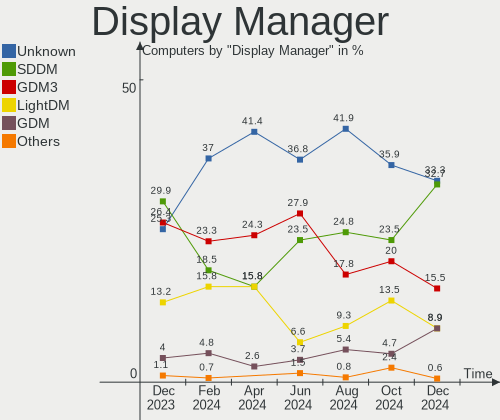
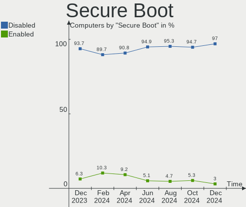
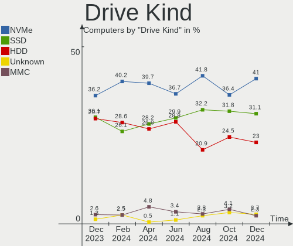
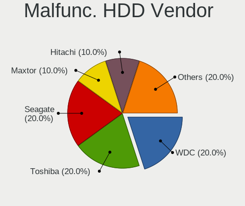
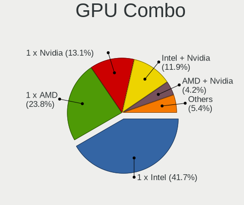
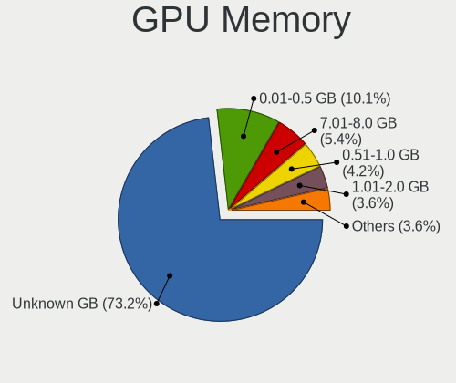
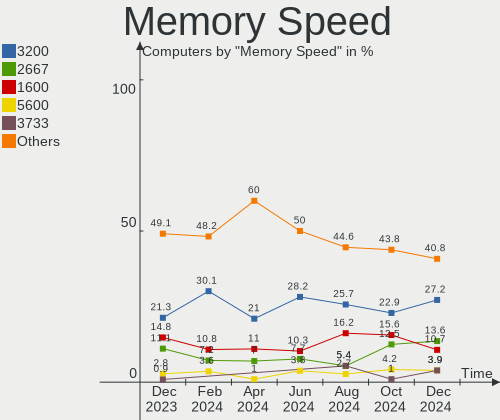

Linux in Spain - Hardware Trends
--------------------------------

A project to identify most popular hardware characteristics and track their change
over time based on data collected by Linux users at https://Linux-Hardware.org.

Anyone can contribute to this report by the [hw-probe](https://github.com/linuxhw/hw-probe) tool:

    sudo -E hw-probe -all -upload

This is a report for all computer types. See also reports for [desktops](/Location/Spain/Desktop/README.md) and [notebooks](/Location/Spain/Notebook/README.md).

Period: Jan, 2024.

Contents
--------

* [ System ](#system)
  - [ OS                       ](#os)
  - [ OS Family                ](#os-family)
  - [ Kernel                   ](#kernel)
  - [ Kernel Family            ](#kernel-family)
  - [ Kernel Major Ver.        ](#kernel-major-ver)
  - [ Arch                     ](#arch)
  - [ DE                       ](#de)
  - [ Display Server           ](#display-server)
  - [ Display Manager          ](#display-manager)
  - [ OS Lang                  ](#os-lang)
  - [ Boot Mode                ](#boot-mode)
  - [ Filesystem               ](#filesystem)
  - [ Part. scheme             ](#part-scheme)
  - [ Dual Boot with Linux/BSD ](#dual-boot-with-linuxbsd)
  - [ Dual Boot (Win)          ](#dual-boot-win)

* [ Board ](#board)
  - [ Vendor                   ](#vendor)
  - [ Model                    ](#model)
  - [ Model Family             ](#model-family)
  - [ MFG Year                 ](#mfg-year)
  - [ Form Factor              ](#form-factor)
  - [ Secure Boot              ](#secure-boot)
  - [ Coreboot                 ](#coreboot)
  - [ RAM Size                 ](#ram-size)
  - [ RAM Used                 ](#ram-used)
  - [ Total Drives             ](#total-drives)
  - [ Has CD-ROM               ](#has-cd-rom)
  - [ Has Ethernet             ](#has-ethernet)
  - [ Has WiFi                 ](#has-wifi)
  - [ Has Bluetooth            ](#has-bluetooth)

* [ Location ](#location)
  - [ Country                  ](#country)
  - [ City                     ](#city)

* [ Drives ](#drives)
  - [ Drive Vendor             ](#drive-vendor)
  - [ Drive Model              ](#drive-model)
  - [ HDD Vendor               ](#hdd-vendor)
  - [ SSD Vendor               ](#ssd-vendor)
  - [ Drive Kind               ](#drive-kind)
  - [ Drive Connector          ](#drive-connector)
  - [ Drive Size               ](#drive-size)
  - [ Space Total              ](#space-total)
  - [ Space Used               ](#space-used)
  - [ Malfunc. Drives          ](#malfunc-drives)
  - [ Malfunc. Drive Vendor    ](#malfunc-drive-vendor)
  - [ Malfunc. HDD Vendor      ](#malfunc-hdd-vendor)
  - [ Malfunc. Drive Kind      ](#malfunc-drive-kind)
  - [ Failed Drives            ](#failed-drives)
  - [ Failed Drive Vendor      ](#failed-drive-vendor)
  - [ Drive Status             ](#drive-status)

* [ Storage controller ](#storage-controller)
  - [ Storage Vendor           ](#storage-vendor)
  - [ Storage Model            ](#storage-model)
  - [ Storage Kind             ](#storage-kind)

* [ Processor ](#processor)
  - [ CPU Vendor               ](#cpu-vendor)
  - [ CPU Model                ](#cpu-model)
  - [ CPU Model Family         ](#cpu-model-family)
  - [ CPU Cores                ](#cpu-cores)
  - [ CPU Sockets              ](#cpu-sockets)
  - [ CPU Threads              ](#cpu-threads)
  - [ CPU Op-Modes             ](#cpu-op-modes)
  - [ CPU Microcode            ](#cpu-microcode)
  - [ CPU Microarch            ](#cpu-microarch)

* [ Graphics ](#graphics)
  - [ GPU Vendor               ](#gpu-vendor)
  - [ GPU Model                ](#gpu-model)
  - [ GPU Combo                ](#gpu-combo)
  - [ GPU Driver               ](#gpu-driver)
  - [ GPU Memory               ](#gpu-memory)

* [ Monitor ](#monitor)
  - [ Monitor Vendor           ](#monitor-vendor)
  - [ Monitor Model            ](#monitor-model)
  - [ Monitor Resolution       ](#monitor-resolution)
  - [ Monitor Diagonal         ](#monitor-diagonal)
  - [ Monitor Width            ](#monitor-width)
  - [ Aspect Ratio             ](#aspect-ratio)
  - [ Monitor Area             ](#monitor-area)
  - [ Pixel Density            ](#pixel-density)
  - [ Multiple Monitors        ](#multiple-monitors)

* [ Network ](#network)
  - [ Net Controller Vendor    ](#net-controller-vendor)
  - [ Net Controller Model     ](#net-controller-model)
  - [ Wireless Vendor          ](#wireless-vendor)
  - [ Wireless Model           ](#wireless-model)
  - [ Ethernet Vendor          ](#ethernet-vendor)
  - [ Ethernet Model           ](#ethernet-model)
  - [ Net Controller Kind      ](#net-controller-kind)
  - [ Used Controller          ](#used-controller)
  - [ NICs                     ](#nics)
  - [ IPv6                     ](#ipv6)

* [ Bluetooth ](#bluetooth)
  - [ Bluetooth Vendor         ](#bluetooth-vendor)
  - [ Bluetooth Model          ](#bluetooth-model)

* [ Sound ](#sound)
  - [ Sound Vendor             ](#sound-vendor)
  - [ Sound Model              ](#sound-model)

* [ Memory ](#memory)
  - [ Memory Vendor            ](#memory-vendor)
  - [ Memory Model             ](#memory-model)
  - [ Memory Kind              ](#memory-kind)
  - [ Memory Form Factor       ](#memory-form-factor)
  - [ Memory Size              ](#memory-size)
  - [ Memory Speed             ](#memory-speed)

* [ Printers & scanners ](#printers--scanners)
  - [ Printer Vendor           ](#printer-vendor)
  - [ Printer Model            ](#printer-model)
  - [ Scanner Vendor           ](#scanner-vendor)
  - [ Scanner Model            ](#scanner-model)

* [ Camera ](#camera)
  - [ Camera Vendor            ](#camera-vendor)
  - [ Camera Model             ](#camera-model)

* [ Security ](#security)
  - [ Fingerprint Vendor       ](#fingerprint-vendor)
  - [ Fingerprint Model        ](#fingerprint-model)
  - [ Chipcard Vendor          ](#chipcard-vendor)
  - [ Chipcard Model           ](#chipcard-model)

* [ Unsupported ](#unsupported)
  - [ Unsupported Devices      ](#unsupported-devices)
  - [ Unsupported Device Types ](#unsupported-device-types)

System
------

OS
--

Installed operating systems

| Name                         | Computers | Percent |
|------------------------------|-----------|---------|
| Ubuntu 22.04                 | 23        | 15.65%  |
| Fedora 39                    | 19        | 12.93%  |
| Ubuntu 23.10                 | 7         | 4.76%   |
| Debian 12                    | 7         | 4.76%   |
| Zorin 16                     | 6         | 4.08%   |
| Zorin 17                     | 5         | 3.4%    |
| Pop!_OS 22.04                | 5         | 3.4%    |
| Linux Mint 21.2              | 5         | 3.4%    |
| ArcoLinux Rolling            | 5         | 3.4%    |
| SteamOS 3.5.7                | 4         | 2.72%   |
| Kali 2023.4                  | 4         | 2.72%   |
| OpenMandriva 23.08           | 3         | 2.04%   |
| Manjaro                      | 3         | 2.04%   |
| Linux Mint 21.3              | 3         | 2.04%   |
| KDE neon 22.04               | 3         | 2.04%   |
| Debian 11                    | 3         | 2.04%   |
| openSUSE Tumbleweed-XXXXXXXX | 2         | 1.36%   |
| OpenMandriva 24.01           | 2         | 1.36%   |
| Nobara 39                    | 2         | 1.36%   |
| Nobara 38                    | 2         | 1.36%   |
| MX 23                        | 2         | 1.36%   |
| Manjaro 23.1.3               | 2         | 1.36%   |
| Linux Mint 20.3              | 2         | 1.36%   |
| Kubuntu 23.10                | 2         | 1.36%   |
| Garuda Linux Soaring         | 2         | 1.36%   |
| Elementary 7.1               | 2         | 1.36%   |
| Arch Rolling                 | 2         | 1.36%   |
| Xubuntu 22.04                | 1         | 0.68%   |
| Xubuntu 21.04                | 1         | 0.68%   |
| Xubuntu 18.04                | 1         | 0.68%   |
| Xero Rolling                 | 1         | 0.68%   |
| Ubuntu Budgie 22.04          | 1         | 0.68%   |
| Ubuntu 22.10                 | 1         | 0.68%   |
| Ubuntu 20.04                 | 1         | 0.68%   |
| Parrot 5.3                   | 1         | 0.68%   |
| Oracle Linux 9.3             | 1         | 0.68%   |
| OpenMandriva 5.0             | 1         | 0.68%   |
| OpenMandriva 23.01           | 1         | 0.68%   |
| Manjaro 23.1.2               | 1         | 0.68%   |
| Lubuntu 22.04                | 1         | 0.68%   |

OS Family
---------

OS without a version

| Name          | Computers | Percent |
|---------------|-----------|---------|
| Ubuntu        | 32        | 21.77%  |
| Fedora        | 20        | 13.61%  |
| Linux Mint    | 12        | 8.16%   |
| Zorin         | 11        | 7.48%   |
| Debian        | 11        | 7.48%   |
| OpenMandriva  | 7         | 4.76%   |
| Manjaro       | 6         | 4.08%   |
| Pop!_OS       | 5         | 3.4%    |
| ArcoLinux     | 5         | 3.4%    |
| SteamOS       | 4         | 2.72%   |
| Nobara        | 4         | 2.72%   |
| Kali          | 4         | 2.72%   |
| Xubuntu       | 3         | 2.04%   |
| KDE neon      | 3         | 2.04%   |
| openSUSE      | 2         | 1.36%   |
| MX            | 2         | 1.36%   |
| Kubuntu       | 2         | 1.36%   |
| Garuda Linux  | 2         | 1.36%   |
| Elementary    | 2         | 1.36%   |
| Arch          | 2         | 1.36%   |
| Xero          | 1         | 0.68%   |
| Ubuntu Budgie | 1         | 0.68%   |
| Parrot        | 1         | 0.68%   |
| Oracle Linux  | 1         | 0.68%   |
| Lubuntu       | 1         | 0.68%   |
| LMDE          | 1         | 0.68%   |
| Endless       | 1         | 0.68%   |
| Athena OS     | 1         | 0.68%   |

Kernel
------

Version of the Linux kernel

| Version                     | Computers | Percent |
|-----------------------------|-----------|---------|
| 6.5.0-14-generic            | 28        | 19.05%  |
| 5.15.0-91-generic           | 10        | 6.8%    |
| 6.6.9-200.fc39.x86_64       | 8         | 5.44%   |
| 6.2.0-39-generic            | 7         | 4.76%   |
| 6.1.0-17-amd64              | 7         | 4.76%   |
| 6.5.0-15-generic            | 6         | 4.08%   |
| 6.6.6-76060606-generic      | 5         | 3.4%    |
| 6.6.8-200.fc39.x86_64       | 4         | 2.72%   |
| 6.1.52-valve9-1-neptune-61  | 4         | 2.72%   |
| 6.6.2-desktop-1omv2390      | 3         | 2.04%   |
| 6.6.11-200.fc39.x86_64      | 3         | 2.04%   |
| 6.5.0-kali3-amd64           | 3         | 2.04%   |
| 6.4.11-desktop-1omv2390     | 3         | 2.04%   |
| 5.15.0-92-generic           | 3         | 2.04%   |
| 6.7.2-arch1-1               | 2         | 1.36%   |
| 6.7.0-zen3-1-zen            | 2         | 1.36%   |
| 6.7.0-arch3-1               | 2         | 1.36%   |
| 6.7.0-0-MANJARO             | 2         | 1.36%   |
| 6.6.9-200.fsync.fc39.x86_64 | 2         | 1.36%   |
| 6.6.8-2-MANJARO             | 2         | 1.36%   |
| 6.6.4-arch1-1               | 2         | 1.36%   |
| 6.6.10-1-MANJARO            | 2         | 1.36%   |
| 6.2.0-33-generic            | 2         | 1.36%   |
| 5.4.0-169-generic           | 2         | 1.36%   |
| 6.7.0                       | 1         | 0.68%   |
| 6.6.9-amd64                 | 1         | 0.68%   |
| 6.6.8-200.fsync.fc38.x86_64 | 1         | 0.68%   |
| 6.6.8-100.fc38.x86_64       | 1         | 0.68%   |
| 6.6.7-1-default             | 1         | 0.68%   |
| 6.6.13-x64v-xanmod1-1       | 1         | 0.68%   |
| 6.6.13-200.fc39.x86_64      | 1         | 0.68%   |
| 6.6.11-1-default            | 1         | 0.68%   |
| 6.6.10-x64v3-xanmod1        | 1         | 0.68%   |
| 6.6.10-arch1-1              | 1         | 0.68%   |
| 6.6.10-200.fc39.x86_64      | 1         | 0.68%   |
| 6.6.1-arch1-1               | 1         | 0.68%   |
| 6.5.9-200.fsync.fc38.x86_64 | 1         | 0.68%   |
| 6.5.12-300.fc39.x86_64      | 1         | 0.68%   |
| 6.5.11-7-pve                | 1         | 0.68%   |
| 6.5.11-300.fc39.x86_64      | 1         | 0.68%   |

Kernel Family
-------------

Linux kernel without a distro release

| Version | Computers | Percent |
|---------|-----------|---------|
| 6.5.0   | 40        | 27.21%  |
| 5.15.0  | 14        | 9.52%   |
| 6.6.9   | 11        | 7.48%   |
| 6.2.0   | 11        | 7.48%   |
| 6.6.8   | 8         | 5.44%   |
| 6.1.0   | 8         | 5.44%   |
| 6.7.0   | 7         | 4.76%   |
| 6.6.6   | 5         | 3.4%    |
| 6.6.10  | 5         | 3.4%    |
| 6.6.11  | 4         | 2.72%   |
| 6.1.52  | 4         | 2.72%   |
| 5.4.0   | 4         | 2.72%   |
| 6.6.2   | 3         | 2.04%   |
| 6.4.11  | 3         | 2.04%   |
| 6.7.2   | 2         | 1.36%   |
| 6.6.4   | 2         | 1.36%   |
| 6.6.13  | 2         | 1.36%   |
| 6.5.11  | 2         | 1.36%   |
| 5.10.0  | 2         | 1.36%   |
| 6.6.7   | 1         | 0.68%   |
| 6.6.1   | 1         | 0.68%   |
| 6.5.9   | 1         | 0.68%   |
| 6.5.12  | 1         | 0.68%   |
| 6.4.15  | 1         | 0.68%   |
| 6.1.1   | 1         | 0.68%   |
| 5.19.0  | 1         | 0.68%   |
| 5.14.0  | 1         | 0.68%   |
| 5.11.0  | 1         | 0.68%   |
| 4.9.269 | 1         | 0.68%   |

Kernel Major Ver.
-----------------

Linux kernel major version

| Version | Computers | Percent |
|---------|-----------|---------|
| 6.5     | 44        | 29.93%  |
| 6.6     | 42        | 28.57%  |
| 5.15    | 14        | 9.52%   |
| 6.1     | 13        | 8.84%   |
| 6.2     | 11        | 7.48%   |
| 6.7     | 9         | 6.12%   |
| 6.4     | 4         | 2.72%   |
| 5.4     | 4         | 2.72%   |
| 5.10    | 2         | 1.36%   |
| 5.19    | 1         | 0.68%   |
| 5.14    | 1         | 0.68%   |
| 5.11    | 1         | 0.68%   |
| 4.9     | 1         | 0.68%   |

Arch
----

OS architecture (x86_64, i586, etc.)

| Name    | Computers | Percent |
|---------|-----------|---------|
| x86_64  | 146       | 99.32%  |
| aarch64 | 1         | 0.68%   |

DE
--

Desktop Environment

| Name            | Computers | Percent |
|-----------------|-----------|---------|
| GNOME           | 75        | 51.02%  |
| KDE5            | 33        | 22.45%  |
| X-Cinnamon      | 12        | 8.16%   |
| XFCE            | 9         | 6.12%   |
| MATE            | 4         | 2.72%   |
| Unknown         | 3         | 2.04%   |
| Pantheon        | 2         | 1.36%   |
| LXQt            | 2         | 1.36%   |
| KDE6            | 1         | 0.68%   |
| Hyprland        | 1         | 0.68%   |
| GNOME Flashback | 1         | 0.68%   |
| Endless:GNOME   | 1         | 0.68%   |
| Deepin          | 1         | 0.68%   |
| Cinnamon        | 1         | 0.68%   |
| Budgie          | 1         | 0.68%   |

Display Server
--------------

X11 or Wayland

| Name    | Computers | Percent |
|---------|-----------|---------|
| X11     | 76        | 51.7%   |
| Wayland | 65        | 44.22%  |
| Tty     | 5         | 3.4%    |
| Unknown | 1         | 0.68%   |

Display Manager
---------------

SDDM, LightDM, etc.

| Name    | Computers | Percent |
|---------|-----------|---------|
| Unknown | 58        | 39.46%  |
| GDM3    | 39        | 26.53%  |
| SDDM    | 23        | 15.65%  |
| LightDM | 18        | 12.24%  |
| GDM     | 9         | 6.12%   |

OS Lang
-------

Language

| Lang  | Computers | Percent |
|-------|-----------|---------|
| es_ES | 95        | 64.63%  |
| en_US | 30        | 20.41%  |
| en_GB | 9         | 6.12%   |
| C     | 5         | 3.4%    |
| ca_ES | 3         | 2.04%   |
| eu_ES | 2         | 1.36%   |
| uk_UA | 1         | 0.68%   |
| pl_PL | 1         | 0.68%   |
| ca_AD | 1         | 0.68%   |

Boot Mode
---------

EFI or BIOS

| Mode | Computers | Percent |
|------|-----------|---------|
| EFI  | 77        | 52.38%  |
| BIOS | 70        | 47.62%  |

Filesystem
----------

Type of filesystem

| Type    | Computers | Percent |
|---------|-----------|---------|
| Ext4    | 81        | 55.1%   |
| Btrfs   | 36        | 24.49%  |
| Tmpfs   | 21        | 14.29%  |
| Overlay | 5         | 3.4%    |
| Zfs     | 3         | 2.04%   |
| Xfs     | 1         | 0.68%   |

Part. scheme
------------

Scheme of partitioning

| Type    | Computers | Percent |
|---------|-----------|---------|
| GPT     | 73        | 49.66%  |
| Unknown | 57        | 38.78%  |
| MBR     | 17        | 11.56%  |

Dual Boot with Linux/BSD
------------------------

Hosting more than one Linux/BSD

| Dual boot | Computers | Percent |
|-----------|-----------|---------|
| No        | 128       | 87.07%  |
| Yes       | 19        | 12.93%  |

Dual Boot (Win)
---------------

Hosting Linux and Windows

| Dual boot | Computers | Percent |
|-----------|-----------|---------|
| No        | 111       | 75.51%  |
| Yes       | 36        | 24.49%  |

Board
-----

Vendor
------

Motherboard manufacturer

| Name                | Computers | Percent |
|---------------------|-----------|---------|
| Hewlett-Packard     | 23        | 15.65%  |
| Lenovo              | 20        | 13.61%  |
| ASUSTek Computer    | 17        | 11.56%  |
| MSI                 | 13        | 8.84%   |
| Gigabyte Technology | 11        | 7.48%   |
| Acer                | 10        | 6.8%    |
| Apple               | 8         | 5.44%   |
| Dell                | 7         | 4.76%   |
| Unknown             | 5         | 3.4%    |
| Valve               | 4         | 2.72%   |
| Toshiba             | 4         | 2.72%   |
| Intel               | 4         | 2.72%   |
| ASRock              | 3         | 2.04%   |
| Sony                | 2         | 1.36%   |
| Samsung Electronics | 2         | 1.36%   |
| HUAWEI              | 2         | 1.36%   |
| Supermicro          | 1         | 0.68%   |
| RCA                 | 1         | 0.68%   |
| Primux Tech         | 1         | 0.68%   |
| Notebook            | 1         | 0.68%   |
| Jumper              | 1         | 0.68%   |
| HONOR               | 1         | 0.68%   |
| Foxconn             | 1         | 0.68%   |
| Cisco Systems       | 1         | 0.68%   |
| BESSTAR Tech        | 1         | 0.68%   |
| AZW                 | 1         | 0.68%   |
| Alurin              | 1         | 0.68%   |
| Alienware           | 1         | 0.68%   |

Model
-----

Motherboard model

| Name                                 | Computers | Percent |
|--------------------------------------|-----------|---------|
| Unknown                              | 6         | 4.08%   |
| Valve Jupiter                        | 2         | 1.36%   |
| Valve Galileo                        | 2         | 1.36%   |
| MSI MS-7850                          | 2         | 1.36%   |
| Intel X99                            | 2         | 1.36%   |
| HUAWEI BOD-WXX9                      | 2         | 1.36%   |
| Toshiba Satellite L750               | 1         | 0.68%   |
| Toshiba Satellite L50t-A             | 1         | 0.68%   |
| Toshiba PORTEGE R700                 | 1         | 0.68%   |
| Toshiba NB250                        | 1         | 0.68%   |
| Supermicro Super Server              | 1         | 0.68%   |
| Sony VPCEB3B4E                       | 1         | 0.68%   |
| Sony VGN-NS11Z_S                     | 1         | 0.68%   |
| Samsung 750QFG                       | 1         | 0.68%   |
| Samsung 530U3BI/530U4BI/530U4BH      | 1         | 0.68%   |
| RCA W101SA23T2                       | 1         | 0.68%   |
| Primux Tech Primux_1406F_W10         | 1         | 0.68%   |
| Notebook W350STQ/W370ST              | 1         | 0.68%   |
| MSI Stealth 15M B12UE                | 1         | 0.68%   |
| MSI Prestige 16Studio A13VF          | 1         | 0.68%   |
| MSI MS-7D18                          | 1         | 0.68%   |
| MSI MS-7C56                          | 1         | 0.68%   |
| MSI MS-7C51                          | 1         | 0.68%   |
| MSI MS-7B93                          | 1         | 0.68%   |
| MSI MS-7B89                          | 1         | 0.68%   |
| MSI MS-7A37                          | 1         | 0.68%   |
| MSI Modern 15 H B13M                 | 1         | 0.68%   |
| MSI Modern 15 B7M                    | 1         | 0.68%   |
| MSI Modern 15 A5M                    | 1         | 0.68%   |
| Lenovo Yoga 510-14ISK 80S7           | 1         | 0.68%   |
| Lenovo ThinkPad Yoga 370 20JJS0A44R  | 1         | 0.68%   |
| Lenovo ThinkPad X260 20F5S3J301      | 1         | 0.68%   |
| Lenovo ThinkPad X240 20AMS31700      | 1         | 0.68%   |
| Lenovo ThinkPad X1 Carbon 34604T9    | 1         | 0.68%   |
| Lenovo ThinkPad T440 20B7S1M20F      | 1         | 0.68%   |
| Lenovo ThinkPad T16 Gen 1 21CHCTO1WW | 1         | 0.68%   |
| Lenovo ThinkPad P1 Gen 3 20TJS2F40W  | 1         | 0.68%   |
| Lenovo ThinkPad L390 Yoga 20NTCTO1WW | 1         | 0.68%   |
| Lenovo ThinkPad L15 Gen 1 20U3CTO1WW | 1         | 0.68%   |
| Lenovo ThinkPad E16 Gen 1 21JTCTO1WW | 1         | 0.68%   |

Model Family
------------

Motherboard model prefix

| Name               | Computers | Percent |
|--------------------|-----------|---------|
| Lenovo ThinkPad    | 11        | 7.48%   |
| HP Laptop          | 6         | 4.08%   |
| Unknown            | 6         | 4.08%   |
| Lenovo IdeaPad     | 4         | 2.72%   |
| HP Pavilion        | 4         | 2.72%   |
| Acer Aspire        | 4         | 2.72%   |
| MSI Modern         | 3         | 2.04%   |
| HP ProBook         | 3         | 2.04%   |
| Dell Latitude      | 3         | 2.04%   |
| ASUS PRIME         | 3         | 2.04%   |
| Acer TravelMate    | 3         | 2.04%   |
| Valve Jupiter      | 2         | 1.36%   |
| Valve Galileo      | 2         | 1.36%   |
| Toshiba Satellite  | 2         | 1.36%   |
| MSI MS-7850        | 2         | 1.36%   |
| Intel X99          | 2         | 1.36%   |
| HUAWEI BOD-WXX9    | 2         | 1.36%   |
| HP EliteBook       | 2         | 1.36%   |
| Dell Inspiron      | 2         | 1.36%   |
| ASUS Zenbook       | 2         | 1.36%   |
| ASUS TUF           | 2         | 1.36%   |
| Apple MacBookPro9  | 2         | 1.36%   |
| Apple MacBookPro11 | 2         | 1.36%   |
| Acer Nitro         | 2         | 1.36%   |
| Toshiba PORTEGE    | 1         | 0.68%   |
| Toshiba NB250      | 1         | 0.68%   |
| Supermicro Super   | 1         | 0.68%   |
| Sony VPCEB3B4E     | 1         | 0.68%   |
| Sony VGN-NS11Z     | 1         | 0.68%   |
| Samsung 750QFG     | 1         | 0.68%   |
| Samsung 530U3BI    | 1         | 0.68%   |
| RCA W101SA23T2     | 1         | 0.68%   |
| Primux Tech Primux | 1         | 0.68%   |
| Notebook W350STQ   | 1         | 0.68%   |
| MSI Stealth        | 1         | 0.68%   |
| MSI Prestige       | 1         | 0.68%   |
| MSI MS-7D18        | 1         | 0.68%   |
| MSI MS-7C56        | 1         | 0.68%   |
| MSI MS-7C51        | 1         | 0.68%   |
| MSI MS-7B93        | 1         | 0.68%   |

MFG Year
--------

Motherboard manufacture year

| Year    | Computers | Percent |
|---------|-----------|---------|
| 2021    | 22        | 14.97%  |
| 2023    | 15        | 10.2%   |
| 2022    | 14        | 9.52%   |
| 2012    | 13        | 8.84%   |
| 2020    | 12        | 8.16%   |
| 2018    | 12        | 8.16%   |
| 2014    | 10        | 6.8%    |
| 2019    | 9         | 6.12%   |
| 2017    | 9         | 6.12%   |
| 2010    | 8         | 5.44%   |
| 2013    | 6         | 4.08%   |
| 2011    | 5         | 3.4%    |
| 2016    | 3         | 2.04%   |
| 2009    | 3         | 2.04%   |
| 2015    | 2         | 1.36%   |
| 2006    | 2         | 1.36%   |
| 2008    | 1         | 0.68%   |
| Unknown | 1         | 0.68%   |

Form Factor
-----------

Physical design of the computer

| Name        | Computers | Percent |
|-------------|-----------|---------|
| Notebook    | 88        | 59.86%  |
| Desktop     | 45        | 30.61%  |
| Convertible | 7         | 4.76%   |
| Tablet      | 2         | 1.36%   |
| Mini pc     | 2         | 1.36%   |
| Other       | 1         | 0.68%   |
| All in one  | 1         | 0.68%   |
| Server      | 1         | 0.68%   |

Secure Boot
-----------

Enabled or disabled

| State    | Computers | Percent |
|----------|-----------|---------|
| Disabled | 133       | 90.48%  |
| Enabled  | 14        | 9.52%   |

Coreboot
--------

Have coreboot on board

| Used | Computers | Percent |
|------|-----------|---------|
| No   | 147       | 100%    |

RAM Size
--------

Total RAM memory

| Size in GB  | Computers | Percent |
|-------------|-----------|---------|
| 4.01-8.0    | 41        | 27.89%  |
| 8.01-16.0   | 27        | 18.37%  |
| 16.01-24.0  | 25        | 17.01%  |
| 32.01-64.0  | 24        | 16.33%  |
| 3.01-4.0    | 17        | 11.56%  |
| 64.01-256.0 | 5         | 3.4%    |
| 1.01-2.0    | 4         | 2.72%   |
| 24.01-32.0  | 2         | 1.36%   |
| 2.01-3.0    | 1         | 0.68%   |
| 0.51-1.0    | 1         | 0.68%   |

RAM Used
--------

Used RAM memory

| Used GB    | Computers | Percent |
|------------|-----------|---------|
| 1.01-2.0   | 42        | 28.57%  |
| 4.01-8.0   | 38        | 25.85%  |
| 3.01-4.0   | 30        | 20.41%  |
| 2.01-3.0   | 24        | 16.33%  |
| 8.01-16.0  | 8         | 5.44%   |
| 16.01-24.0 | 2         | 1.36%   |
| 0.51-1.0   | 2         | 1.36%   |
| 0.01-0.5   | 1         | 0.68%   |

Total Drives
------------

Number of drives on board

| Drives | Computers | Percent |
|--------|-----------|---------|
| 1      | 83        | 56.46%  |
| 2      | 34        | 23.13%  |
| 4      | 11        | 7.48%   |
| 3      | 8         | 5.44%   |
| 5      | 6         | 4.08%   |
| 6      | 3         | 2.04%   |
| 9      | 1         | 0.68%   |
| 0      | 1         | 0.68%   |

Has CD-ROM
----------

Has CD-ROM on board

| Presented | Computers | Percent |
|-----------|-----------|---------|
| No        | 111       | 75.51%  |
| Yes       | 36        | 24.49%  |

Has Ethernet
------------

Has Ethernet on board

| Presented | Computers | Percent |
|-----------|-----------|---------|
| Yes       | 114       | 77.55%  |
| No        | 33        | 22.45%  |

Has WiFi
--------

Has WiFi module

| Presented | Computers | Percent |
|-----------|-----------|---------|
| Yes       | 116       | 78.91%  |
| No        | 31        | 21.09%  |

Has Bluetooth
-------------

Has Bluetooth module

| Presented | Computers | Percent |
|-----------|-----------|---------|
| Yes       | 96        | 65.31%  |
| No        | 51        | 34.69%  |

Location
--------

Country
-------

Geographic location (country)

| Country | Computers | Percent |
|---------|-----------|---------|
| Spain   | 147       | 100%    |

City
----

Geographic location (city)

| City                       | Computers | Percent |
|----------------------------|-----------|---------|
| Madrid                     | 15        | 10.2%   |
| Barcelona                  | 13        | 8.84%   |
| Zaragoza                   | 6         | 4.08%   |
| Valencia                   | 5         | 3.4%    |
| Bilbao                     | 3         | 2.04%   |
| Alicante                   | 3         | 2.04%   |
| Valladolid                 | 2         | 1.36%   |
| Torremolinos               | 2         | 1.36%   |
| Santander                  | 2         | 1.36%   |
| Murcia                     | 2         | 1.36%   |
| Málaga                    | 2         | 1.36%   |
| Las Palmas de Gran Canaria | 2         | 1.36%   |
| Granada                    | 2         | 1.36%   |
| Getxo                      | 2         | 1.36%   |
| Ciudad Real                | 2         | 1.36%   |
| Castelló de la Plana      | 2         | 1.36%   |
| Albacete                   | 2         | 1.36%   |
| A Coruña                  | 2         | 1.36%   |
| Zafra                      | 1         | 0.68%   |
| Yeles                      | 1         | 0.68%   |
| Villafranca de los Barros  | 1         | 0.68%   |
| Vilanova i la Geltrú      | 1         | 0.68%   |
| Vila-seca                  | 1         | 0.68%   |
| Vigo                       | 1         | 0.68%   |
| Vera                       | 1         | 0.68%   |
| Tui                        | 1         | 0.68%   |
| Tres Cantos                | 1         | 0.68%   |
| Taradell                   | 1         | 0.68%   |
| Sitges                     | 1         | 0.68%   |
| Sardina                    | 1         | 0.68%   |
| Santiago de Compostela     | 1         | 0.68%   |
| Santa Maria de Cayon       | 1         | 0.68%   |
| Santa Cruz de Tenerife     | 1         | 0.68%   |
| Sant Adrià de Besòs      | 1         | 0.68%   |
| San Miguel de Meruelo      | 1         | 0.68%   |
| Salamanca                  | 1         | 0.68%   |
| Riudoms                    | 1         | 0.68%   |
| Rafal                      | 1         | 0.68%   |
| Puente de Domingo Florez   | 1         | 0.68%   |
| Pozuelo de Alarcón        | 1         | 0.68%   |

Drives
------

Drive Vendor
------------

Hard drive vendors

| Vendor                      | Computers | Drives  | Percent |
|-----------------------------|-----------|---------|---------|
| Samsung Electronics         | 28        | 34      | 11.72%  |
| WDC                         | 27        | 37      | 11.3%   |
| Seagate                     | 22        | 28      | 9.21%   |
| Sandisk                     | 21        | 26      | 8.79%   |
| Kingston                    | 21        | 25      | 8.79%   |
| Unknown                     | 12        | 12      | 5.02%   |
| Crucial                     | 12        | 13      | 5.02%   |
| Toshiba                     | 11        | 13      | 4.6%    |
| Intel                       | 9         | 10      | 3.77%   |
| SK hynix                    | 8         | 8       | 3.35%   |
| Micron Technology           | 8         | 8       | 3.35%   |
| Phison Electronics          | 7         | 7       | 2.93%   |
| Apple                       | 6         | 6       | 2.51%   |
| China                       | 5         | 7       | 2.09%   |
| MAXIO Technology (Hangzhou) | 4         | 4       | 1.67%   |
| Kingston Technology Company | 4         | 4       | 1.67%   |
| Transcend                   | 2         | 2       | 0.84%   |
| KIOXIA                      | 2         | 2       | 0.84%   |
| JMicron Technology          | 2         | 2       | 0.84%   |
| Hitachi                     | 2         | 2       | 0.84%   |
| HGST                        | 2         | 3       | 0.84%   |
| Fanxiang                    | 2         | 3       | 0.84%   |
| Unknown                     | 2         | 2       | 0.84%   |
| XrayDisk                    | 1         | 1       | 0.42%   |
| WALRAM                      | 1         | 1       | 0.42%   |
| USB3.0                      | 1         | 1       | 0.42%   |
| Teclast                     | 1         | 1       | 0.42%   |
| Silicon Motion              | 1         | 1       | 0.42%   |
| Patriot                     | 1         | 1       | 0.42%   |
| Netac                       | 1         | 1       | 0.42%   |
| Micron/Crucial Technology   | 1         | 1       | 0.42%   |
| LITEON                      | 1         | 1       | 0.42%   |
| KODAK                       | 1         | 1       | 0.42%   |
| KingFast                    | 1         | 1       | 0.42%   |
| JetFlash                    | 1         | 1       | 0.42%   |
| Intenso                     | 1         | 1       | 0.42%   |
| HL-DT-ST                    | 1         | Unknown | 0.42%   |
| Fujitsu                     | 1         | 1       | 0.42%   |
| Emtec                       | 1         | 1       | 0.42%   |
| Corsair                     | 1         | 1       | 0.42%   |

Drive Model
-----------

Hard drive models

| Model                                               | Computers | Percent |
|-----------------------------------------------------|-----------|---------|
| Kingston SA400S37240G 240GB SSD                     | 8         | 3.02%   |
| WDC WD10EZEX-00BN5A0 1TB                            | 4         | 1.51%   |
| Sandisk WD Black SN750 / PC SN730 NVMe SSD 512GB    | 4         | 1.51%   |
| SanDisk SSD PLUS 480GB                              | 4         | 1.51%   |
| Samsung NVMe SSD Controller SM981/PM981/PM983 1TB   | 4         | 1.51%   |
| Phison PS5013 E13 NVMe Controller 256GB             | 4         | 1.51%   |
| WDC WD40EZAZ-00SF3B0 4TB                            | 3         | 1.13%   |
| Unknown MMC Card  64GB                              | 3         | 1.13%   |
| SK hynix BC501 NVMe Solid State Drive 512GB         | 3         | 1.13%   |
| Seagate ST1000DM010-2EP102 1TB                      | 3         | 1.13%   |
| Sandisk WD Black 2018/SN750 / PC SN720 NVMe SSD 1TB | 3         | 1.13%   |
| Samsung SSD 980 1TB                                 | 3         | 1.13%   |
| Samsung SSD 860 EVO 1TB                             | 3         | 1.13%   |
| Kingston SA400S37960G 960GB SSD                     | 3         | 1.13%   |
| Kingston SA400S37480G 480GB SSD                     | 3         | 1.13%   |
| Intel SSD 600P Series 256GB                         | 3         | 1.13%   |
| Crucial CT480BX500SSD1 480GB                        | 3         | 1.13%   |
| WDC WD5000LPVX-60V0TT0 500GB                        | 2         | 0.75%   |
| Unknown MMC Card  32GB                              | 2         | 0.75%   |
| Unknown MMC Card  256GB                             | 2         | 0.75%   |
| Seagate ST500LM021-1KJ152 500GB                     | 2         | 0.75%   |
| Seagate ST3500312CS 500GB                           | 2         | 0.75%   |
| Samsung SSD 980 500GB                               | 2         | 0.75%   |
| Samsung SSD 870 QVO 1TB                             | 2         | 0.75%   |
| Samsung SSD 840 EVO 250GB                           | 2         | 0.75%   |
| MAXIO (Hangzhou) NVMe SSD Controller MAP1202 512GB  | 2         | 0.75%   |
| Kingston Company OM3PDP3 NVMe SSD 256GB             | 2         | 0.75%   |
| Kingston SUV400S37240G 240GB SSD                    | 2         | 0.75%   |
| Kingston SA400S37120G 120GB SSD                     | 2         | 0.75%   |
| JMicron Tech 250GB                                  | 2         | 0.75%   |
| Crucial CT500MX500SSD1 500GB                        | 2         | 0.75%   |
| Crucial CT1000BX500SSD1 1TB                         | 2         | 0.75%   |
| Unknown                                             | 2         | 0.75%   |
| XrayDisk 512GB                                      | 1         | 0.38%   |
| WDC WDS500G1B0B-00AS40 500GB SSD                    | 1         | 0.38%   |
| WDC WDS120G2G0B-00EPW0 120GB SSD                    | 1         | 0.38%   |
| WDC WDS120G2G0A-00JH30 120GB SSD                    | 1         | 0.38%   |
| WDC WDS100T2B0A-00SM50 1TB SSD                      | 1         | 0.38%   |
| WDC WD7500BPKT-75PK4T0 752GB                        | 1         | 0.38%   |
| WDC WD6003FZBX-00K5WB0 6TB                          | 1         | 0.38%   |

HDD Vendor
----------

Hard disk drive vendors

| Vendor              | Computers | Drives | Percent |
|---------------------|-----------|--------|---------|
| Seagate             | 22        | 28     | 36.07%  |
| WDC                 | 20        | 29     | 32.79%  |
| Toshiba             | 7         | 7      | 11.48%  |
| Samsung Electronics | 4         | 4      | 6.56%   |
| Hitachi             | 2         | 2      | 3.28%   |
| HGST                | 2         | 3      | 3.28%   |
| Apple               | 2         | 2      | 3.28%   |
| Unknown             | 1         | 1      | 1.64%   |
| Fujitsu             | 1         | 1      | 1.64%   |

SSD Vendor
----------

Solid state drive vendors

| Vendor              | Computers | Drives | Percent |
|---------------------|-----------|--------|---------|
| Kingston            | 19        | 22     | 21.59%  |
| Crucial             | 12        | 12     | 13.64%  |
| Samsung Electronics | 11        | 11     | 12.5%   |
| SanDisk             | 10        | 11     | 11.36%  |
| WDC                 | 5         | 6      | 5.68%   |
| China               | 5         | 7      | 5.68%   |
| Toshiba             | 4         | 6      | 4.55%   |
| Apple               | 3         | 3      | 3.41%   |
| Transcend           | 2         | 2      | 2.27%   |
| Intel               | 2         | 2      | 2.27%   |
| Fanxiang            | 2         | 2      | 2.27%   |
| WALRAM              | 1         | 1      | 1.14%   |
| USB3.0              | 1         | 1      | 1.14%   |
| Teclast             | 1         | 1      | 1.14%   |
| SK hynix            | 1         | 1      | 1.14%   |
| Patriot             | 1         | 1      | 1.14%   |
| Netac               | 1         | 1      | 1.14%   |
| Micron Technology   | 1         | 1      | 1.14%   |
| LITEON              | 1         | 1      | 1.14%   |
| KODAK               | 1         | 1      | 1.14%   |
| Intenso             | 1         | 1      | 1.14%   |
| Emtec               | 1         | 1      | 1.14%   |
| BAITITON            | 1         | 1      | 1.14%   |
| Unknown             | 1         | 1      | 1.14%   |

Drive Kind
----------

HDD or SSD

| Kind    | Computers | Drives | Percent |
|---------|-----------|--------|---------|
| NVMe    | 71        | 85     | 34.13%  |
| SSD     | 69        | 97     | 33.17%  |
| HDD     | 49        | 77     | 23.56%  |
| MMC     | 12        | 12     | 5.77%   |
| Unknown | 7         | 6      | 3.37%   |

Drive Connector
---------------

SATA, SAS, NVMe, etc.

| Type | Computers | Drives | Percent |
|------|-----------|--------|---------|
| SATA | 91        | 173    | 50.28%  |
| NVMe | 71        | 85     | 39.23%  |
| MMC  | 12        | 12     | 6.63%   |
| SAS  | 7         | 7      | 3.87%   |

Drive Size
----------

Size of hard drive

| Size in TB | Computers | Drives | Percent |
|------------|-----------|--------|---------|
| 0.01-0.5   | 65        | 87     | 51.18%  |
| 0.51-1.0   | 42        | 57     | 33.07%  |
| 1.01-2.0   | 8         | 15     | 6.3%    |
| 3.01-4.0   | 6         | 6      | 4.72%   |
| 2.01-3.0   | 3         | 4      | 2.36%   |
| 4.01-10.0  | 2         | 4      | 1.57%   |
| 10.01-20.0 | 1         | 1      | 0.79%   |

Space Total
-----------

Amount of disk space available on the file system

| Size in GB     | Computers | Percent |
|----------------|-----------|---------|
| 101-250        | 39        | 26.53%  |
| 251-500        | 33        | 22.45%  |
| 501-1000       | 25        | 17.01%  |
| More than 3000 | 16        | 10.88%  |
| 1001-2000      | 13        | 8.84%   |
| 1-20           | 7         | 4.76%   |
| 51-100         | 6         | 4.08%   |
| Unknown        | 4         | 2.72%   |
| 2001-3000      | 3         | 2.04%   |
| 21-50          | 1         | 0.68%   |

Space Used
----------

Amount of used disk space

| Used GB        | Computers | Percent |
|----------------|-----------|---------|
| 1-20           | 47        | 31.97%  |
| 21-50          | 25        | 17.01%  |
| 101-250        | 17        | 11.56%  |
| 501-1000       | 13        | 8.84%   |
| 251-500        | 12        | 8.16%   |
| 51-100         | 12        | 8.16%   |
| 2001-3000      | 8         | 5.44%   |
| More than 3000 | 5         | 3.4%    |
| 1001-2000      | 4         | 2.72%   |
| Unknown        | 4         | 2.72%   |

Malfunc. Drives
---------------

Drive models with a malfunction

| Model                                             | Computers | Drives | Percent |
|---------------------------------------------------|-----------|--------|---------|
| SanDisk SSD PLUS 480GB                            | 2         | 2      | 11.11%  |
| WDC WD5000LPVX-22V0TT0 500GB                      | 1         | 1      | 5.56%   |
| WDC WD5000AAKS-00YGA0 500GB                       | 1         | 1      | 5.56%   |
| WDC WD20EFRX-68EUZN0 2TB                          | 1         | 1      | 5.56%   |
| Unknown External 1TB                              | 1         | 1      | 5.56%   |
| Transcend TS1TSSD230S 1TB                         | 1         | 1      | 5.56%   |
| Toshiba MQ01ABF050 500GB                          | 1         | 1      | 5.56%   |
| SK hynix HFS128G39TND-N210A 128GB SSD             | 1         | 1      | 5.56%   |
| Seagate ST1000LM024 HN-M101MBB 1TB                | 1         | 1      | 5.56%   |
| Seagate ST1000DM010-2EP102 1TB                    | 1         | 1      | 5.56%   |
| Samsung Electronics HD642JJ 640GB                 | 1         | 1      | 5.56%   |
| Micron Technology MTFDDAK2T0TDL-1AW1ZABHA 2TB SSD | 1         | 1      | 5.56%   |
| Kingston SUV400S37240G 240GB SSD                  | 1         | 1      | 5.56%   |
| Kingston SKC2000M8500G 500GB                      | 1         | 1      | 5.56%   |
| Kingston RBU-SNS8350DES3128GP 128GB SSD           | 1         | 1      | 5.56%   |
| Crucial CT256M550SSD1 256GB                       | 1         | 1      | 5.56%   |
| BAITITON BT58SSD12S 512GB                         | 1         | 1      | 5.56%   |

Malfunc. Drive Vendor
---------------------

Vendors of faulty drives

| Vendor              | Computers | Drives | Percent |
|---------------------|-----------|--------|---------|
| WDC                 | 3         | 3      | 16.67%  |
| Kingston            | 3         | 3      | 16.67%  |
| Seagate             | 2         | 2      | 11.11%  |
| SanDisk             | 2         | 2      | 11.11%  |
| Unknown             | 1         | 1      | 5.56%   |
| Transcend           | 1         | 1      | 5.56%   |
| Toshiba             | 1         | 1      | 5.56%   |
| SK hynix            | 1         | 1      | 5.56%   |
| Samsung Electronics | 1         | 1      | 5.56%   |
| Micron Technology   | 1         | 1      | 5.56%   |
| Crucial             | 1         | 1      | 5.56%   |
| BAITITON            | 1         | 1      | 5.56%   |

Malfunc. HDD Vendor
-------------------

Vendors of faulty HDD drives

| Vendor              | Computers | Drives | Percent |
|---------------------|-----------|--------|---------|
| WDC                 | 3         | 3      | 37.5%   |
| Seagate             | 2         | 2      | 25%     |
| Unknown             | 1         | 1      | 12.5%   |
| Toshiba             | 1         | 1      | 12.5%   |
| Samsung Electronics | 1         | 1      | 12.5%   |

Malfunc. Drive Kind
-------------------

Kinds of faulty drives

| Kind | Computers | Drives | Percent |
|------|-----------|--------|---------|
| SSD  | 9         | 9      | 52.94%  |
| HDD  | 7         | 8      | 41.18%  |
| NVMe | 1         | 1      | 5.88%   |

Failed Drives
-------------

Failed drive models

Zero info for selected period =(

Failed Drive Vendor
-------------------

Failed drive vendors

Zero info for selected period =(

Drive Status
------------

Number of failed and malfunc. drives

| Status   | Computers | Drives | Percent |
|----------|-----------|--------|---------|
| Detected | 86        | 151    | 53.09%  |
| Works    | 61        | 108    | 37.65%  |
| Malfunc  | 15        | 18     | 9.26%   |

Storage controller
------------------

Storage Vendor
--------------

Storage controller vendors

| Vendor                      | Computers | Percent |
|-----------------------------|-----------|---------|
| Intel                       | 94        | 48.45%  |
| Samsung Electronics         | 19        | 9.79%   |
| AMD                         | 16        | 8.25%   |
| SanDisk                     | 15        | 7.73%   |
| Phison Electronics          | 9         | 4.64%   |
| SK hynix                    | 7         | 3.61%   |
| Micron Technology           | 7         | 3.61%   |
| Kingston Technology Company | 7         | 3.61%   |
| MAXIO Technology (Hangzhou) | 4         | 2.06%   |
| ASMedia Technology          | 3         | 1.55%   |
| Nvidia                      | 2         | 1.03%   |
| Micron/Crucial Technology   | 2         | 1.03%   |
| Marvell Technology Group    | 2         | 1.03%   |
| KIOXIA                      | 2         | 1.03%   |
| Silicon Motion              | 1         | 0.52%   |
| JMicron Technology          | 1         | 0.52%   |
| HighPoint Technologies      | 1         | 0.52%   |
| Broadcom / LSI              | 1         | 0.52%   |
| ADATA Technology            | 1         | 0.52%   |

Storage Model
-------------

Storage controller models

| Model                                                                          | Computers | Percent |
|--------------------------------------------------------------------------------|-----------|---------|
| AMD FCH SATA Controller [AHCI mode]                                            | 10        | 4.5%    |
| Intel 8 Series/C220 Series Chipset Family 6-port SATA Controller 1 [AHCI mode] | 9         | 4.05%   |
| Samsung NVMe SSD Controller 980 (DRAM-less)                                    | 8         | 3.6%    |
| Intel Sunrise Point-LP SATA Controller [AHCI mode]                             | 8         | 3.6%    |
| Intel Celeron/Pentium Silver Processor SATA Controller                         | 8         | 3.6%    |
| Intel Volume Management Device NVMe RAID Controller                            | 7         | 3.15%   |
| SanDisk Extreme Pro / WD Black SN750 / PC SN730 / Red SN700 NVMe SSD           | 5         | 2.25%   |
| Samsung NVMe SSD Controller SM981/PM981/PM983                                  | 5         | 2.25%   |
| Phison PS5013-E13 PCIe3 NVMe Controller (DRAM-less)                            | 5         | 2.25%   |
| Intel 7 Series Chipset Family 6-port SATA Controller [AHCI mode]               | 5         | 2.25%   |
| Intel 5 Series/3400 Series Chipset 4 port SATA AHCI Controller                 | 5         | 2.25%   |
| Intel SSD 670p Series [Keystone Harbor]                                        | 4         | 1.8%    |
| Intel 6 Series/C200 Series Chipset Family 6 port Mobile SATA AHCI Controller   | 4         | 1.8%    |
| SK hynix BC501 NVMe Solid State Drive                                          | 3         | 1.35%   |
| SanDisk WD Black SN770 / PC SN740 256GB / PC SN560 (DRAM-less) NVMe SSD        | 3         | 1.35%   |
| SanDisk Extreme Pro / WD Black 2018/SN750/PC SN720 NVMe SSD                    | 3         | 1.35%   |
| Intel Volume Management Device NVMe RAID Controller Intel Corporation          | 3         | 1.35%   |
| Intel SSD 600P Series                                                          | 3         | 1.35%   |
| Intel Q170/Q150/B150/H170/H110/Z170/CM236 Chipset SATA Controller [AHCI Mode]  | 3         | 1.35%   |
| Intel Cannon Lake Mobile PCH SATA AHCI Controller                              | 3         | 1.35%   |
| Intel Alder Lake-P SATA AHCI Controller                                        | 3         | 1.35%   |
| Intel 500 Series Chipset Family SATA AHCI Controller                           | 3         | 1.35%   |
| Intel 5 Series/3400 Series Chipset 6 port SATA AHCI Controller                 | 3         | 1.35%   |
| ASMedia ASM1061/ASM1062 Serial ATA Controller                                  | 3         | 1.35%   |
| AMD 500 Series Chipset SATA Controller                                         | 3         | 1.35%   |
| AMD 300 Series Chipset SATA Controller                                         | 3         | 1.35%   |
| SK hynix BC901 NVMe Solid State Drive (DRAM-less)                              | 2         | 0.9%    |
| Samsung S4LN058A01[SSUBX] AHCI SSD Controller (Apple slot)                     | 2         | 0.9%    |
| Samsung NVMe SSD Controller SM961/PM961/SM963                                  | 2         | 0.9%    |
| Samsung NVMe SSD Controller PM9A1/PM9A3/980PRO                                 | 2         | 0.9%    |
| Phison E16 PCIe4 NVMe Controller                                               | 2         | 0.9%    |
| Micron/Crucial P2 [Nick P2] / P3 / P3 Plus NVMe PCIe SSD (DRAM-less)           | 2         | 0.9%    |
| MAXIO (Hangzhou) NVMe SSD Controller MAP1602 (DRAM-less)                       | 2         | 0.9%    |
| MAXIO (Hangzhou) NVMe SSD Controller MAP1202 (DRAM-less)                       | 2         | 0.9%    |
| Kingston Company OM3PDP3 NVMe SSD                                              | 2         | 0.9%    |
| Intel Tiger Lake-LP SATA Controller                                            | 2         | 0.9%    |
| Intel C610/X99 series chipset 6-Port SATA Controller [AHCI mode]               | 2         | 0.9%    |
| Intel 82801 Mobile SATA Controller [RAID mode]                                 | 2         | 0.9%    |
| Intel 8 Series SATA Controller 1 [AHCI mode]                                   | 2         | 0.9%    |
| SK hynix PC611 NVMe Solid State Drive                                          | 1         | 0.45%   |

Storage Kind
------------

Kind of storage controller (IDE, SATA, NVMe, SAS, ...)

| Kind | Computers | Percent |
|------|-----------|---------|
| SATA | 95        | 48.97%  |
| NVMe | 71        | 36.6%   |
| RAID | 15        | 7.73%   |
| IDE  | 13        | 6.7%    |

Processor
---------

CPU Vendor
----------

Processor vendors

| Vendor  | Computers | Percent |
|---------|-----------|---------|
| Intel   | 113       | 76.87%  |
| AMD     | 33        | 22.45%  |
| Unknown | 1         | 0.68%   |

CPU Model
---------

Processor models

| Model                                    | Computers | Percent |
|------------------------------------------|-----------|---------|
| Intel 11th Gen Core i5-1135G7 @ 2.40GHz  | 5         | 3.4%    |
| Intel Core i5-7200U CPU @ 2.50GHz        | 4         | 2.72%   |
| AMD Custom APU 0405                      | 4         | 2.72%   |
| Intel Core i7-8750H CPU @ 2.20GHz        | 2         | 1.36%   |
| Intel Core i7-3770 CPU @ 3.40GHz         | 2         | 1.36%   |
| Intel Core i7-10850H CPU @ 2.70GHz       | 2         | 1.36%   |
| Intel Core i5-8265U CPU @ 1.60GHz        | 2         | 1.36%   |
| Intel Core i5-4210M CPU @ 2.60GHz        | 2         | 1.36%   |
| Intel Core i5 CPU 760 @ 2.80GHz          | 2         | 1.36%   |
| Intel Celeron N4020 CPU @ 1.10GHz        | 2         | 1.36%   |
| Intel Atom x5-Z8350 CPU @ 1.44GHz        | 2         | 1.36%   |
| Intel 12th Gen Core i7-1255U             | 2         | 1.36%   |
| AMD Ryzen 9 5900X 12-Core Processor      | 2         | 1.36%   |
| AMD Ryzen 9 3900X 12-Core Processor      | 2         | 1.36%   |
| AMD Ryzen 7 5800H with Radeon Graphics   | 2         | 1.36%   |
| AMD Ryzen 7 2700X Eight-Core Processor   | 2         | 1.36%   |
| Intel Xeon CPU E5620 @ 2.40GHz           | 1         | 0.68%   |
| Intel Xeon CPU E5-2678 v3 @ 2.50GHz      | 1         | 0.68%   |
| Intel Xeon CPU E5-2650 v4 @ 2.20GHz      | 1         | 0.68%   |
| Intel Xeon CPU E5-2640 v4 @ 2.40GHz      | 1         | 0.68%   |
| Intel Xeon CPU E5-2609 0 @ 2.40GHz       | 1         | 0.68%   |
| Intel Xeon CPU E5-1660 v4 @ 3.20GHz      | 1         | 0.68%   |
| Intel Xeon CPU E3-1275 v6 @ 3.80GHz      | 1         | 0.68%   |
| Intel Pentium Silver N5030 CPU @ 1.10GHz | 1         | 0.68%   |
| Intel Pentium Silver N5000 CPU @ 1.10GHz | 1         | 0.68%   |
| Intel Pentium Silver J5040 CPU @ 2.00GHz | 1         | 0.68%   |
| Intel Pentium CPU P6200 @ 2.13GHz        | 1         | 0.68%   |
| Intel Pentium CPU P6100 @ 2.00GHz        | 1         | 0.68%   |
| Intel Pentium CPU G645 @ 2.90GHz         | 1         | 0.68%   |
| Intel Pentium CPU G3250 @ 3.20GHz        | 1         | 0.68%   |
| Intel Core Ultra 7 155H                  | 1         | 0.68%   |
| Intel Core i9-14900K                     | 1         | 0.68%   |
| Intel Core i7-8700K CPU @ 3.70GHz        | 1         | 0.68%   |
| Intel Core i7-8565U CPU @ 1.80GHz        | 1         | 0.68%   |
| Intel Core i7-8550U CPU @ 1.80GHz        | 1         | 0.68%   |
| Intel Core i7-7500U CPU @ 2.70GHz        | 1         | 0.68%   |
| Intel Core i7-6700K CPU @ 4.00GHz        | 1         | 0.68%   |
| Intel Core i7-5820K CPU @ 3.30GHz        | 1         | 0.68%   |
| Intel Core i7-4980HQ CPU @ 2.80GHz       | 1         | 0.68%   |
| Intel Core i7-4790K CPU @ 4.00GHz        | 1         | 0.68%   |

CPU Model Family
----------------

Processor model prefix

| Model                   | Computers | Percent |
|-------------------------|-----------|---------|
| Intel Core i5           | 31        | 21.09%  |
| Other                   | 27        | 18.37%  |
| Intel Core i7           | 25        | 17.01%  |
| AMD Ryzen 7             | 10        | 6.8%    |
| Intel Celeron           | 8         | 5.44%   |
| Intel Xeon              | 7         | 4.76%   |
| Intel Core i3           | 6         | 4.08%   |
| AMD Ryzen 5             | 6         | 4.08%   |
| Intel Pentium           | 4         | 2.72%   |
| AMD Ryzen 9             | 4         | 2.72%   |
| Intel Pentium Silver    | 3         | 2.04%   |
| Intel Atom              | 3         | 2.04%   |
| Intel Core 2 Duo        | 2         | 1.36%   |
| AMD Ryzen 7 PRO         | 2         | 1.36%   |
| Intel Core i9           | 1         | 0.68%   |
| Intel Core 2            | 1         | 0.68%   |
| Intel Core              | 1         | 0.68%   |
| AMD Turion 64 X2 Mobile | 1         | 0.68%   |
| AMD Ryzen 5 PRO         | 1         | 0.68%   |
| AMD Ryzen 3             | 1         | 0.68%   |
| AMD FX                  | 1         | 0.68%   |
| AMD Athlon 64 X2        | 1         | 0.68%   |
| AMD Athlon              | 1         | 0.68%   |

CPU Cores
---------

Number of processor cores

| Number | Computers | Percent |
|--------|-----------|---------|
| 4      | 50        | 34.01%  |
| 2      | 44        | 29.93%  |
| 6      | 17        | 11.56%  |
| 8      | 15        | 10.2%   |
| 12     | 7         | 4.76%   |
| 10     | 7         | 4.76%   |
| 14     | 3         | 2.04%   |
| 16     | 2         | 1.36%   |
| 24     | 1         | 0.68%   |
| 1      | 1         | 0.68%   |

CPU Sockets
-----------

Number of sockets

| Number | Computers | Percent |
|--------|-----------|---------|
| 1      | 145       | 98.64%  |
| 2      | 2         | 1.36%   |

CPU Threads
-----------

Threads per core (Hyper-Threading)

| Number | Computers | Percent |
|--------|-----------|---------|
| 2      | 112       | 76.19%  |
| 1      | 35        | 23.81%  |

CPU Op-Modes
------------

CPU Operation Modes (32-bit, 64-bit)

| Op mode        | Computers | Percent |
|----------------|-----------|---------|
| 32-bit, 64-bit | 146       | 99.32%  |
| Unknown        | 1         | 0.68%   |

CPU Microcode
-------------

Microcode number

| Number     | Computers | Percent |
|------------|-----------|---------|
| Unknown    | 104       | 70.75%  |
| 0x306c3    | 3         | 2.04%   |
| 0x20655    | 3         | 2.04%   |
| 0x08701021 | 3         | 2.04%   |
| 0x806e9    | 2         | 1.36%   |
| 0x206a7    | 2         | 1.36%   |
| 0x0a50000d | 2         | 1.36%   |
| 0x0a50000c | 2         | 1.36%   |
| 0x0a404102 | 2         | 1.36%   |
| 0x08608103 | 2         | 1.36%   |
| 0xa0655    | 1         | 0.68%   |
| 0x906ea    | 1         | 0.68%   |
| 0x906a4    | 1         | 0.68%   |
| 0x806ea    | 1         | 0.68%   |
| 0x806c2    | 1         | 0.68%   |
| 0x806c1    | 1         | 0.68%   |
| 0x6fd      | 1         | 0.68%   |
| 0x406e3    | 1         | 0.68%   |
| 0x306d4    | 1         | 0.68%   |
| 0x306a9    | 1         | 0.68%   |
| 0x20652    | 1         | 0.68%   |
| 0x106e5    | 1         | 0.68%   |
| 0x106ca    | 1         | 0.68%   |
| 0x1067a    | 1         | 0.68%   |
| 0x0a20120e | 1         | 0.68%   |
| 0x08a00008 | 1         | 0.68%   |
| 0x08600106 | 1         | 0.68%   |
| 0x08600104 | 1         | 0.68%   |
| 0x08108109 | 1         | 0.68%   |
| 0x08101016 | 1         | 0.68%   |
| 0x0800820d | 1         | 0.68%   |
| 0x06000852 | 1         | 0.68%   |

CPU Microarch
-------------

Microarchitecture

| Name             | Computers | Percent |
|------------------|-----------|---------|
| KabyLake         | 18        | 12.24%  |
| Unknown          | 17        | 11.56%  |
| Haswell          | 16        | 10.88%  |
| Westmere         | 8         | 5.44%   |
| SandyBridge      | 8         | 5.44%   |
| Goldmont plus    | 8         | 5.44%   |
| Alderlake Hybrid | 8         | 5.44%   |
| Zen 3            | 7         | 4.76%   |
| TigerLake        | 7         | 4.76%   |
| IvyBridge        | 7         | 4.76%   |
| Zen 2            | 6         | 4.08%   |
| CometLake        | 5         | 3.4%    |
| Broadwell        | 5         | 3.4%    |
| Zen+             | 4         | 2.72%   |
| Zen              | 4         | 2.72%   |
| Skylake          | 4         | 2.72%   |
| Silvermont       | 3         | 2.04%   |
| Penryn           | 2         | 1.36%   |
| Nehalem          | 2         | 1.36%   |
| K8 Hammer        | 2         | 1.36%   |
| Core             | 2         | 1.36%   |
| Piledriver       | 1         | 0.68%   |
| Icelake          | 1         | 0.68%   |
| Goldmont         | 1         | 0.68%   |
| Bonnell          | 1         | 0.68%   |

Graphics
--------

GPU Vendor
----------

Vendors of graphics cards

| Vendor                     | Computers | Percent |
|----------------------------|-----------|---------|
| Intel                      | 93        | 53.76%  |
| Nvidia                     | 41        | 23.7%   |
| AMD                        | 37        | 21.39%  |
| Matrox Electronics Systems | 1         | 0.58%   |
| ASPEED Technology          | 1         | 0.58%   |

GPU Model
---------

Graphics card models

| Model                                                                                    | Computers | Percent |
|------------------------------------------------------------------------------------------|-----------|---------|
| Intel TigerLake-LP GT2 [Iris Xe Graphics]                                                | 7         | 4%      |
| Intel Core Processor Integrated Graphics Controller                                      | 7         | 4%      |
| Intel HD Graphics 620                                                                    | 6         | 3.43%   |
| Intel 2nd Generation Core Processor Family Integrated Graphics Controller                | 6         | 3.43%   |
| Intel GeminiLake [UHD Graphics 600]                                                      | 5         | 2.86%   |
| Intel 4th Gen Core Processor Integrated Graphics Controller                              | 5         | 2.86%   |
| Intel 3rd Gen Core processor Graphics Controller                                         | 5         | 2.86%   |
| Nvidia GK208B [GeForce GT 710]                                                           | 4         | 2.29%   |
| Intel Xeon E3-1200 v3/4th Gen Core Processor Integrated Graphics Controller              | 4         | 2.29%   |
| Intel WhiskeyLake-U GT2 [UHD Graphics 620]                                               | 3         | 1.71%   |
| Intel Haswell-ULT Integrated Graphics Controller                                         | 3         | 1.71%   |
| Intel GeminiLake [UHD Graphics 605]                                                      | 3         | 1.71%   |
| Intel CoffeeLake-H GT2 [UHD Graphics 630]                                                | 3         | 1.71%   |
| AMD Navi 10 [Radeon RX 5600 OEM/5600 XT / 5700/5700 XT]                                  | 3         | 1.71%   |
| AMD Ellesmere [Radeon RX 470/480/570/570X/580/580X/590]                                  | 3         | 1.71%   |
| AMD Cezanne [Radeon Vega Series / Radeon Vega Mobile Series]                             | 3         | 1.71%   |
| Nvidia TU117M [GeForce GTX 1650 Mobile / Max-Q]                                          | 2         | 1.14%   |
| Nvidia GP107 [GeForce GTX 1050 Ti]                                                       | 2         | 1.14%   |
| Nvidia GA107M [GeForce RTX 3050 Ti Mobile]                                               | 2         | 1.14%   |
| Nvidia GA106M [GeForce RTX 3060 Mobile / Max-Q]                                          | 2         | 1.14%   |
| Intel UHD Graphics 620                                                                   | 2         | 1.14%   |
| Intel Skylake GT2 [HD Graphics 520]                                                      | 2         | 1.14%   |
| Intel Raptor Lake-P [UHD Graphics]                                                       | 2         | 1.14%   |
| Intel Raptor Lake-P [Iris Xe Graphics]                                                   | 2         | 1.14%   |
| Intel CometLake-S GT2 [UHD Graphics 630]                                                 | 2         | 1.14%   |
| Intel CometLake-H GT2 [UHD Graphics]                                                     | 2         | 1.14%   |
| Intel Atom/Celeron/Pentium Processor x5-E8000/J3xxx/N3xxx Integrated Graphics Controller | 2         | 1.14%   |
| AMD VanGogh [AMD Custom GPU 0405]                                                        | 2         | 1.14%   |
| AMD Sun XT [Radeon HD 8670A/8670M/8690M / R5 M330 / M430 / Radeon 520 Mobile]            | 2         | 1.14%   |
| AMD Sephiroth [AMD Custom GPU 0405]                                                      | 2         | 1.14%   |
| AMD Renoir [Radeon RX Vega 6 (Ryzen 4000/5000 Mobile Series)]                            | 2         | 1.14%   |
| AMD Rembrandt [Radeon 680M]                                                              | 2         | 1.14%   |
| AMD Raven Ridge [Radeon Vega Series / Radeon Vega Mobile Series]                         | 2         | 1.14%   |
| AMD Picasso/Raven 2 [Radeon Vega Series / Radeon Vega Mobile Series]                     | 2         | 1.14%   |
| AMD Lucienne                                                                             | 2         | 1.14%   |
| AMD Barcelo                                                                              | 2         | 1.14%   |
| Nvidia TU106 [GeForce RTX 2060 SUPER]                                                    | 1         | 0.57%   |
| Nvidia TU104 [GeForce RTX 2080 Rev. A]                                                   | 1         | 0.57%   |
| Nvidia TU104 [GeForce RTX 2070 SUPER]                                                    | 1         | 0.57%   |
| Nvidia GT218 [GeForce 210]                                                               | 1         | 0.57%   |

GPU Combo
---------

Combinations of graphics cards

| Name           | Computers | Percent |
|----------------|-----------|---------|
| 1 x Intel      | 68        | 46.26%  |
| 1 x AMD        | 30        | 20.41%  |
| 1 x Nvidia     | 21        | 14.29%  |
| Intel + Nvidia | 17        | 11.56%  |
| Intel + AMD    | 4         | 2.72%   |
| AMD + Nvidia   | 2         | 1.36%   |
| Other          | 1         | 0.68%   |
| 2 x Nvidia     | 1         | 0.68%   |
| 2 x AMD        | 1         | 0.68%   |
| 1 x Matrox     | 1         | 0.68%   |
| 1 x ASPEED     | 1         | 0.68%   |

GPU Driver
----------

Free vs proprietary

| Driver      | Computers | Percent |
|-------------|-----------|---------|
| Free        | 123       | 83.67%  |
| Proprietary | 22        | 14.97%  |
| Unknown     | 2         | 1.36%   |

GPU Memory
----------

Total video memory

| Size in GB | Computers | Percent |
|------------|-----------|---------|
| Unknown    | 104       | 70.75%  |
| 1.01-2.0   | 13        | 8.84%   |
| 0.01-0.5   | 11        | 7.48%   |
| 3.01-4.0   | 6         | 4.08%   |
| 0.51-1.0   | 6         | 4.08%   |
| 7.01-8.0   | 4         | 2.72%   |
| 5.01-6.0   | 2         | 1.36%   |
| 4.01-5.0   | 1         | 0.68%   |

Monitor
-------

Monitor Vendor
--------------

Monitor vendors

| Vendor                  | Computers | Percent |
|-------------------------|-----------|---------|
| AU Optronics            | 23        | 14.47%  |
| Samsung Electronics     | 20        | 12.58%  |
| BOE                     | 19        | 11.95%  |
| LG Display              | 11        | 6.92%   |
| Hewlett-Packard         | 11        | 6.92%   |
| Chimei Innolux          | 9         | 5.66%   |
| Dell                    | 8         | 5.03%   |
| Goldstar                | 7         | 4.4%    |
| Apple                   | 6         | 3.77%   |
| Acer                    | 6         | 3.77%   |
| BenQ                    | 5         | 3.14%   |
| Valve                   | 4         | 2.52%   |
| Ancor Communications    | 4         | 2.52%   |
| Sony                    | 3         | 1.89%   |
| PANDA                   | 3         | 1.89%   |
| Philips                 | 2         | 1.26%   |
| MSI                     | 2         | 1.26%   |
| Lenovo                  | 2         | 1.26%   |
| InfoVision              | 2         | 1.26%   |
| AOC                     | 2         | 1.26%   |
| SBI                     | 1         | 0.63%   |
| Microstep               | 1         | 0.63%   |
| LG Electronics          | 1         | 0.63%   |
| JDZ                     | 1         | 0.63%   |
| HKC                     | 1         | 0.63%   |
| HannStar                | 1         | 0.63%   |
| CPT                     | 1         | 0.63%   |
| Chi Mei Optoelectronics | 1         | 0.63%   |
| CHD                     | 1         | 0.63%   |
| ASUSTek Computer        | 1         | 0.63%   |

Monitor Model
-------------

Monitor models

| Model                                                                   | Computers | Percent |
|-------------------------------------------------------------------------|-----------|---------|
| Dell P2419H DELD0DA 1920x1080 527x296mm 23.8-inch                       | 3         | 1.88%   |
| Valve ANX7530 U VLV3003 800x1280 100x160mm 7.4-inch                     | 2         | 1.25%   |
| Valve ANX7530 U VLV3001 800x1280 100x150mm 7.1-inch                     | 2         | 1.25%   |
| Samsung Electronics LU28R55 SAM1017 3840x2160 632x360mm 28.6-inch       | 2         | 1.25%   |
| Samsung Electronics LCD Monitor SAM07C0 1920x1080 700x390mm 31.5-inch   | 2         | 1.25%   |
| Chimei Innolux LCD Monitor CMN15E7 1920x1080 344x193mm 15.5-inch        | 2         | 1.25%   |
| BOE LCD Monitor BOE0991 1920x1080 344x194mm 15.5-inch                   | 2         | 1.25%   |
| BOE LCD Monitor BOE0872 1920x1080 344x194mm 15.5-inch                   | 2         | 1.25%   |
| AU Optronics LCD Monitor AUOAF90 1920x1080 344x193mm 15.5-inch          | 2         | 1.25%   |
| Acer S221HQL ACR01A9 1920x1080 477x268mm 21.5-inch                      | 2         | 1.25%   |
| Sony TV SNY9901 1360x768                                                | 1         | 0.63%   |
| Sony TV *00 SNY4B04 3840x2160                                           | 1         | 0.63%   |
| Sony SDM-HS75 SNY2400 1280x1024 338x270mm 17.0-inch                     | 1         | 0.63%   |
| SBI SBID-MX075-V3 SBI00BB 3840x2160 1660x934mm 75.0-inch                | 1         | 0.63%   |
| Samsung Electronics U28E590 SAM0C4D 3840x2160 607x345mm 27.5-inch       | 1         | 0.63%   |
| Samsung Electronics SyncMaster SAM0529 1920x1080 510x287mm 23.0-inch    | 1         | 0.63%   |
| Samsung Electronics S27F350 SAM0D22 1920x1080 598x336mm 27.0-inch       | 1         | 0.63%   |
| Samsung Electronics S24D590 SAM0B46 1920x1080 521x293mm 23.5-inch       | 1         | 0.63%   |
| Samsung Electronics S22E390 SAM0C18 1920x1080 477x268mm 21.5-inch       | 1         | 0.63%   |
| Samsung Electronics LCD Monitor SEC5541 1366x768 344x193mm 15.5-inch    | 1         | 0.63%   |
| Samsung Electronics LCD Monitor SEC5441 1366x768 344x194mm 15.5-inch    | 1         | 0.63%   |
| Samsung Electronics LCD Monitor SDC419F 2880x1800 302x189mm 14.0-inch   | 1         | 0.63%   |
| Samsung Electronics LCD Monitor SDC4180 2880x1620 344x194mm 15.5-inch   | 1         | 0.63%   |
| Samsung Electronics LCD Monitor SDC4161 1920x1080 344x194mm 15.5-inch   | 1         | 0.63%   |
| Samsung Electronics LCD Monitor SDC4159 1920x1080 344x194mm 15.5-inch   | 1         | 0.63%   |
| Samsung Electronics LCD Monitor SAM0FA1 3840x2160 1872x1053mm 84.6-inch | 1         | 0.63%   |
| Samsung Electronics LCD Monitor SAM0B30 1920x1080 885x498mm 40.0-inch   | 1         | 0.63%   |
| Samsung Electronics LCD Monitor SAM07D0 1360x768 700x390mm 31.5-inch    | 1         | 0.63%   |
| Samsung Electronics LCD Monitor SAM0669 1920x1080                       | 1         | 0.63%   |
| Samsung Electronics C27HG7x SAM0E15 2560x1440 598x336mm 27.0-inch       | 1         | 0.63%   |
| Philips PHL 276E8V PHLC18F 3840x2160 597x336mm 27.0-inch                | 1         | 0.63%   |
| Philips PHL 276E7 PHLC108 1920x1080 598x336mm 27.0-inch                 | 1         | 0.63%   |
| PANDA LCD Monitor NCP004D 1920x1080 344x194mm 15.5-inch                 | 1         | 0.63%   |
| PANDA LCD Monitor NCP0035 1920x1080 309x174mm 14.0-inch                 | 1         | 0.63%   |
| PANDA LCD Monitor NCP002B 1920x1080 309x174mm 14.0-inch                 | 1         | 0.63%   |
| MSI G281UV MSI4CC8 3840x2160 621x341mm 27.9-inch                        | 1         | 0.63%   |
| MSI G27CQ4 MSI3CB0 2560x1440 597x336mm 27.0-inch                        | 1         | 0.63%   |
| Microstep LCD Monitor MSI G241V                                         | 1         | 0.63%   |
| LG Electronics LCD Monitor LG HDR 4K                                    | 1         | 0.63%   |
| LG Display LCD Monitor LGD0739 1920x1080 344x194mm 15.5-inch            | 1         | 0.63%   |

Monitor Resolution
------------------

Monitor screen resolution

| Resolution         | Computers | Percent |
|--------------------|-----------|---------|
| 1920x1080 (FHD)    | 70        | 48.95%  |
| 1366x768 (WXGA)    | 23        | 16.08%  |
| 3840x2160 (4K)     | 11        | 7.69%   |
| 2560x1440 (QHD)    | 7         | 4.9%    |
| 800x1280           | 4         | 2.8%    |
| 2560x1600          | 4         | 2.8%    |
| 1920x1200 (WUXGA)  | 3         | 2.1%    |
| 1680x1050 (WSXGA+) | 3         | 2.1%    |
| 1280x800 (WXGA)    | 3         | 2.1%    |
| 1280x1024 (SXGA)   | 3         | 2.1%    |
| 2880x1800          | 2         | 1.4%    |
| 1600x900 (HD+)     | 2         | 1.4%    |
| 1360x768           | 2         | 1.4%    |
| Unknown            | 2         | 1.4%    |
| 3520x1080          | 1         | 0.7%    |
| 2880x1620          | 1         | 0.7%    |
| 1440x900 (WXGA+)   | 1         | 0.7%    |
| 1024x600           | 1         | 0.7%    |

Monitor Diagonal
----------------

Diagonal size in inches

| Inches  | Computers | Percent |
|---------|-----------|---------|
| 15      | 48        | 30.97%  |
| 27      | 14        | 9.03%   |
| 13      | 14        | 9.03%   |
| 24      | 11        | 7.1%    |
| 23      | 9         | 5.81%   |
| 21      | 9         | 5.81%   |
| 14      | 8         | 5.16%   |
| 17      | 4         | 2.58%   |
| 16      | 4         | 2.58%   |
| 7       | 4         | 2.58%   |
| 32      | 3         | 1.94%   |
| 31      | 3         | 1.94%   |
| 22      | 3         | 1.94%   |
| Unknown | 3         | 1.94%   |
| 72      | 2         | 1.29%   |
| 46      | 2         | 1.29%   |
| 28      | 2         | 1.29%   |
| 19      | 2         | 1.29%   |
| 12      | 2         | 1.29%   |
| 11      | 2         | 1.29%   |
| 84      | 1         | 0.65%   |
| 75      | 1         | 0.65%   |
| 54      | 1         | 0.65%   |
| 25      | 1         | 0.65%   |
| 18      | 1         | 0.65%   |
| 10      | 1         | 0.65%   |

Monitor Width
-------------

Physical width

| Width in mm | Computers | Percent |
|-------------|-----------|---------|
| 301-350     | 67        | 43.51%  |
| 501-600     | 32        | 20.78%  |
| 401-500     | 13        | 8.44%   |
| 201-300     | 12        | 7.79%   |
| 601-700     | 7         | 4.55%   |
| 351-400     | 6         | 3.9%    |
| 1501-2000   | 4         | 2.6%    |
| 1-100       | 4         | 2.6%    |
| 701-800     | 3         | 1.95%   |
| 1001-1500   | 3         | 1.95%   |
| Unknown     | 3         | 1.95%   |

Aspect Ratio
------------

Proportional relationship between the width and the height

| Ratio   | Computers | Percent |
|---------|-----------|---------|
| 16/9    | 109       | 81.34%  |
| 16/10   | 15        | 11.19%  |
| 5/4     | 3         | 2.24%   |
| 0.67    | 2         | 1.49%   |
| 0.62    | 2         | 1.49%   |
| Unknown | 2         | 1.49%   |
| 6/5     | 1         | 0.75%   |

Monitor Area
------------

Area in inch²

| Area in inch² | Computers | Percent |
|----------------|-----------|---------|
| 101-110        | 49        | 32.03%  |
| 201-250        | 29        | 18.95%  |
| 81-90          | 17        | 11.11%  |
| 301-350        | 14        | 9.15%   |
| 351-500        | 8         | 5.23%   |
| 71-80          | 5         | 3.27%   |
| More than 1000 | 4         | 2.61%   |
| 1-40           | 4         | 2.61%   |
| 151-200        | 4         | 2.61%   |
| 141-150        | 3         | 1.96%   |
| 111-120        | 3         | 1.96%   |
| Unknown        | 3         | 1.96%   |
| 61-70          | 2         | 1.31%   |
| 51-60          | 2         | 1.31%   |
| 501-1000       | 2         | 1.31%   |
| 41-50          | 1         | 0.65%   |
| 251-300        | 1         | 0.65%   |
| 131-140        | 1         | 0.65%   |
| 121-130        | 1         | 0.65%   |

Pixel Density
-------------

Pixels per inch

| Density       | Computers | Percent |
|---------------|-----------|---------|
| 121-160       | 52        | 34.21%  |
| 51-100        | 43        | 28.29%  |
| 101-120       | 34        | 22.37%  |
| 161-240       | 14        | 9.21%   |
| 1-50          | 4         | 2.63%   |
| Unknown       | 3         | 1.97%   |
| More than 240 | 2         | 1.32%   |

Multiple Monitors
-----------------

Total monitors connected

| Total | Computers | Percent |
|-------|-----------|---------|
| 1     | 111       | 75.51%  |
| 2     | 28        | 19.05%  |
| 0     | 7         | 4.76%   |
| 3     | 1         | 0.68%   |

Network
-------

Net Controller Vendor
---------------------

Controller vendors

| Vendor                            | Computers | Percent |
|-----------------------------------|-----------|---------|
| Realtek Semiconductor             | 77        | 36.32%  |
| Intel                             | 64        | 30.19%  |
| Qualcomm Atheros                  | 19        | 8.96%   |
| Broadcom                          | 12        | 5.66%   |
| MediaTek                          | 10        | 4.72%   |
| Broadcom Limited                  | 5         | 2.36%   |
| TP-Link                           | 3         | 1.42%   |
| Qualcomm                          | 3         | 1.42%   |
| Ralink Technology                 | 2         | 0.94%   |
| Nvidia                            | 2         | 0.94%   |
| Marvell Technology Group          | 2         | 0.94%   |
| Lenovo                            | 2         | 0.94%   |
| Ericsson Business Mobile Networks | 2         | 0.94%   |
| ASIX Electronics                  | 2         | 0.94%   |
| Xiaomi                            | 1         | 0.47%   |
| Samsung Electronics               | 1         | 0.47%   |
| JMicron Technology                | 1         | 0.47%   |
| Fibocom                           | 1         | 0.47%   |
| Dresden Elektronik                | 1         | 0.47%   |
| DisplayLink                       | 1         | 0.47%   |
| D-Link                            | 1         | 0.47%   |

Net Controller Model
--------------------

Controller models

| Model                                                                  | Computers | Percent |
|------------------------------------------------------------------------|-----------|---------|
| Realtek RTL8111/8168/8211/8411 PCI Express Gigabit Ethernet Controller | 47        | 19.11%  |
| Realtek RTL8153 Gigabit Ethernet Adapter                               | 8         | 3.25%   |
| Intel Wi-Fi 6 AX200                                                    | 8         | 3.25%   |
| Realtek RTL810xE PCI Express Fast Ethernet controller                  | 6         | 2.44%   |
| Qualcomm Atheros AR9285 Wireless Network Adapter (PCI-Express)         | 6         | 2.44%   |
| MediaTek MT7921 802.11ax PCI Express Wireless Network Adapter          | 6         | 2.44%   |
| Intel Wireless 8265 / 8275                                             | 5         | 2.03%   |
| Intel Wi-Fi 6 AX201                                                    | 5         | 2.03%   |
| Intel Wireless 7260                                                    | 4         | 1.63%   |
| Intel Wireless 3165                                                    | 4         | 1.63%   |
| Intel Alder Lake-P PCH CNVi WiFi                                       | 4         | 1.63%   |
| Realtek RTL8822CE 802.11ac PCIe Wireless Network Adapter               | 3         | 1.22%   |
| Realtek RTL8821CE 802.11ac PCIe Wireless Network Adapter               | 3         | 1.22%   |
| Realtek RTL8723BE PCIe Wireless Network Adapter                        | 3         | 1.22%   |
| Qualcomm QCNFA765 Wireless Network Adapter                             | 3         | 1.22%   |
| Intel Wireless 7265                                                    | 3         | 1.22%   |
| Intel Raptor Lake PCH CNVi WiFi                                        | 3         | 1.22%   |
| Intel I211 Gigabit Network Connection                                  | 3         | 1.22%   |
| Intel Comet Lake PCH CNVi WiFi                                         | 3         | 1.22%   |
| Realtek RTL8188EUS 802.11n Wireless Network Adapter                    | 2         | 0.81%   |
| Realtek RTL8125 2.5GbE Controller                                      | 2         | 0.81%   |
| Ralink RT2870/RT3070 Wireless Adapter                                  | 2         | 0.81%   |
| Qualcomm Atheros QCA9565 / AR9565 Wireless Network Adapter             | 2         | 0.81%   |
| Qualcomm Atheros QCA6174 802.11ac Wireless Network Adapter             | 2         | 0.81%   |
| Qualcomm Atheros Killer E2500 Gigabit Ethernet Controller              | 2         | 0.81%   |
| Qualcomm Atheros AR8161 Gigabit Ethernet                               | 2         | 0.81%   |
| MediaTek Wi-Fi 6E MT7902 Wireless Network Adapter                      | 2         | 0.81%   |
| MediaTek MT7921K (RZ608) Wi-Fi 6E 80MHz                                | 2         | 0.81%   |
| Lenovo ThinkPad TBT 3 Dock                                             | 2         | 0.81%   |
| Intel Wi-Fi 6E(802.11ax) AX210/AX1675* 2x2 [Typhoon Peak]              | 2         | 0.81%   |
| Intel Ethernet Controller I225-V                                       | 2         | 0.81%   |
| Intel Ethernet Connection I218-LM                                      | 2         | 0.81%   |
| Intel Ethernet Connection (4) I219-LM                                  | 2         | 0.81%   |
| Intel Ethernet Connection (2) I219-V                                   | 2         | 0.81%   |
| Intel Ethernet Connection (11) I219-LM                                 | 2         | 0.81%   |
| Intel Centrino Advanced-N 6200                                         | 2         | 0.81%   |
| Broadcom NetXtreme BCM57765 Gigabit Ethernet PCIe                      | 2         | 0.81%   |
| Broadcom Limited NetLink BCM57780 Gigabit Ethernet PCIe                | 2         | 0.81%   |
| Broadcom BCM43602 802.11ac Wireless LAN SoC                            | 2         | 0.81%   |
| Broadcom BCM4331 802.11a/b/g/n                                         | 2         | 0.81%   |

Wireless Vendor
---------------

Wireless vendors

| Vendor                            | Computers | Percent |
|-----------------------------------|-----------|---------|
| Intel                             | 52        | 43.33%  |
| Realtek Semiconductor             | 19        | 15.83%  |
| Qualcomm Atheros                  | 16        | 13.33%  |
| MediaTek                          | 10        | 8.33%   |
| Broadcom                          | 10        | 8.33%   |
| TP-Link                           | 3         | 2.5%    |
| Qualcomm                          | 3         | 2.5%    |
| Broadcom Limited                  | 3         | 2.5%    |
| Ralink Technology                 | 2         | 1.67%   |
| Fibocom                           | 1         | 0.83%   |
| Ericsson Business Mobile Networks | 1         | 0.83%   |

Wireless Model
--------------

Wireless models

| Model                                                          | Computers | Percent |
|----------------------------------------------------------------|-----------|---------|
| Intel Wi-Fi 6 AX200                                            | 8         | 6.67%   |
| Qualcomm Atheros AR9285 Wireless Network Adapter (PCI-Express) | 6         | 5%      |
| MediaTek MT7921 802.11ax PCI Express Wireless Network Adapter  | 6         | 5%      |
| Intel Wireless 8265 / 8275                                     | 5         | 4.17%   |
| Intel Wi-Fi 6 AX201                                            | 5         | 4.17%   |
| Intel Wireless 7260                                            | 4         | 3.33%   |
| Intel Wireless 3165                                            | 4         | 3.33%   |
| Intel Alder Lake-P PCH CNVi WiFi                               | 4         | 3.33%   |
| Realtek RTL8822CE 802.11ac PCIe Wireless Network Adapter       | 3         | 2.5%    |
| Realtek RTL8821CE 802.11ac PCIe Wireless Network Adapter       | 3         | 2.5%    |
| Realtek RTL8723BE PCIe Wireless Network Adapter                | 3         | 2.5%    |
| Qualcomm QCNFA765 Wireless Network Adapter                     | 3         | 2.5%    |
| Intel Wireless 7265                                            | 3         | 2.5%    |
| Intel Raptor Lake PCH CNVi WiFi                                | 3         | 2.5%    |
| Intel Comet Lake PCH CNVi WiFi                                 | 3         | 2.5%    |
| Realtek RTL8188EUS 802.11n Wireless Network Adapter            | 2         | 1.67%   |
| Ralink RT2870/RT3070 Wireless Adapter                          | 2         | 1.67%   |
| Qualcomm Atheros QCA9565 / AR9565 Wireless Network Adapter     | 2         | 1.67%   |
| Qualcomm Atheros QCA6174 802.11ac Wireless Network Adapter     | 2         | 1.67%   |
| MediaTek Wi-Fi 6E MT7902 Wireless Network Adapter              | 2         | 1.67%   |
| MediaTek MT7921K (RZ608) Wi-Fi 6E 80MHz                        | 2         | 1.67%   |
| Intel Wi-Fi 6E(802.11ax) AX210/AX1675* 2x2 [Typhoon Peak]      | 2         | 1.67%   |
| Intel Centrino Advanced-N 6200                                 | 2         | 1.67%   |
| Broadcom BCM43602 802.11ac Wireless LAN SoC                    | 2         | 1.67%   |
| Broadcom BCM4331 802.11a/b/g/n                                 | 2         | 1.67%   |
| TP-Link Archer T3U [Realtek RTL8812BU]                         | 1         | 0.83%   |
| TP-Link 802.11ac WLAN Adapter                                  | 1         | 0.83%   |
| TP-Link 802.11ac NIC                                           | 1         | 0.83%   |
| Realtek RTL8852BE PCIe 802.11ax Wireless Network Controller    | 1         | 0.83%   |
| Realtek RTL8852AE WiFi 6 802.11ax PCIe Adapter                 | 1         | 0.83%   |
| Realtek RTL8852AE 802.11ax PCIe Wireless Network Adapter       | 1         | 0.83%   |
| Realtek RTL8822BE 802.11a/b/g/n/ac WiFi adapter                | 1         | 0.83%   |
| Realtek RTL8723BU 802.11b/g/n WLAN Adapter                     | 1         | 0.83%   |
| Realtek RTL8192EU 802.11b/g/n WLAN Adapter                     | 1         | 0.83%   |
| Realtek 802.11n WLAN Adapter                                   | 1         | 0.83%   |
| Realtek 802.11ac NIC                                           | 1         | 0.83%   |
| Qualcomm Atheros QCA9377 802.11ac Wireless Network Adapter     | 1         | 0.83%   |
| Qualcomm Atheros AR9485 Wireless Network Adapter               | 1         | 0.83%   |
| Qualcomm Atheros AR9462 Wireless Network Adapter               | 1         | 0.83%   |
| Qualcomm Atheros AR93xx Wireless Network Adapter               | 1         | 0.83%   |

Ethernet Vendor
---------------

Ethernet vendors

| Vendor                   | Computers | Percent |
|--------------------------|-----------|---------|
| Realtek Semiconductor    | 66        | 53.23%  |
| Intel                    | 30        | 24.19%  |
| Qualcomm Atheros         | 7         | 5.65%   |
| Broadcom                 | 6         | 4.84%   |
| Nvidia                   | 2         | 1.61%   |
| Marvell Technology Group | 2         | 1.61%   |
| Lenovo                   | 2         | 1.61%   |
| Broadcom Limited         | 2         | 1.61%   |
| ASIX Electronics         | 2         | 1.61%   |
| Xiaomi                   | 1         | 0.81%   |
| Samsung Electronics      | 1         | 0.81%   |
| JMicron Technology       | 1         | 0.81%   |
| DisplayLink              | 1         | 0.81%   |
| D-Link                   | 1         | 0.81%   |

Ethernet Model
--------------

Ethernet models

| Model                                                                          | Computers | Percent |
|--------------------------------------------------------------------------------|-----------|---------|
| Realtek RTL8111/8168/8211/8411 PCI Express Gigabit Ethernet Controller         | 47        | 37.9%   |
| Realtek RTL8153 Gigabit Ethernet Adapter                                       | 8         | 6.45%   |
| Realtek RTL810xE PCI Express Fast Ethernet controller                          | 6         | 4.84%   |
| Intel I211 Gigabit Network Connection                                          | 3         | 2.42%   |
| Realtek RTL8125 2.5GbE Controller                                              | 2         | 1.61%   |
| Qualcomm Atheros Killer E2500 Gigabit Ethernet Controller                      | 2         | 1.61%   |
| Qualcomm Atheros AR8161 Gigabit Ethernet                                       | 2         | 1.61%   |
| Lenovo ThinkPad TBT 3 Dock                                                     | 2         | 1.61%   |
| Intel Ethernet Controller I225-V                                               | 2         | 1.61%   |
| Intel Ethernet Connection I218-LM                                              | 2         | 1.61%   |
| Intel Ethernet Connection (4) I219-LM                                          | 2         | 1.61%   |
| Intel Ethernet Connection (2) I219-V                                           | 2         | 1.61%   |
| Intel Ethernet Connection (11) I219-LM                                         | 2         | 1.61%   |
| Broadcom NetXtreme BCM57765 Gigabit Ethernet PCIe                              | 2         | 1.61%   |
| Broadcom Limited NetLink BCM57780 Gigabit Ethernet PCIe                        | 2         | 1.61%   |
| ASIX AX88179 Gigabit Ethernet                                                  | 2         | 1.61%   |
| Xiaomi Mi/Redmi series (RNDIS)                                                 | 1         | 0.81%   |
| Samsung Galaxy series, misc. (tethering mode)                                  | 1         | 0.81%   |
| Realtek RTL8169 PCI Gigabit Ethernet Controller                                | 1         | 0.81%   |
| Realtek Killer E3000 2.5GbE Controller                                         | 1         | 0.81%   |
| Realtek Killer E2600 GbE Controller                                            | 1         | 0.81%   |
| Qualcomm Atheros QCA8172 Fast Ethernet                                         | 1         | 0.81%   |
| Qualcomm Atheros AR8162 Fast Ethernet                                          | 1         | 0.81%   |
| Qualcomm Atheros AR8152 v2.0 Fast Ethernet                                     | 1         | 0.81%   |
| Nvidia MCP79 Ethernet                                                          | 1         | 0.81%   |
| Nvidia MCP77 Ethernet                                                          | 1         | 0.81%   |
| Marvell Group Yukon Optima 88E8059 [PCIe Gigabit Ethernet Controller with AVB] | 1         | 0.81%   |
| Marvell Group 88E8055 PCI-E Gigabit Ethernet Controller                        | 1         | 0.81%   |
| JMicron JMC250 PCI Express Gigabit Ethernet Controller                         | 1         | 0.81%   |
| Intel I350 Gigabit Network Connection                                          | 1         | 0.81%   |
| Intel I210 Gigabit Network Connection                                          | 1         | 0.81%   |
| Intel Ethernet Controller I226-V                                               | 1         | 0.81%   |
| Intel Ethernet Connection I219-LM                                              | 1         | 0.81%   |
| Intel Ethernet Connection I217-V                                               | 1         | 0.81%   |
| Intel Ethernet Connection I217-LM                                              | 1         | 0.81%   |
| Intel Ethernet Connection (6) I219-V                                           | 1         | 0.81%   |
| Intel Ethernet Connection (4) I219-V                                           | 1         | 0.81%   |
| Intel Ethernet Connection (2) I218-V                                           | 1         | 0.81%   |
| Intel Ethernet Connection (16) I219-LM                                         | 1         | 0.81%   |
| Intel Ethernet Connection (14) I219-V                                          | 1         | 0.81%   |

Net Controller Kind
-------------------

Ethernet, WiFi or modem

| Kind     | Computers | Percent |
|----------|-----------|---------|
| WiFi     | 116       | 50%     |
| Ethernet | 114       | 49.14%  |
| Modem    | 2         | 0.86%   |

Used Controller
---------------

Currently used network controller

| Kind     | Computers | Percent |
|----------|-----------|---------|
| WiFi     | 96        | 64%     |
| Ethernet | 54        | 36%     |

NICs
----

Total network controllers on board

| Total | Computers | Percent |
|-------|-----------|---------|
| 2     | 73        | 49.66%  |
| 1     | 67        | 45.58%  |
| 0     | 5         | 3.4%    |
| 3     | 2         | 1.36%   |

IPv6
----

IPv6 vs IPv4

| Used | Computers | Percent |
|------|-----------|---------|
| No   | 136       | 92.52%  |
| Yes  | 11        | 7.48%   |

Bluetooth
---------

Bluetooth Vendor
----------------

Controller vendors

| Vendor                          | Computers | Percent |
|---------------------------------|-----------|---------|
| Intel                           | 45        | 45.92%  |
| Realtek Semiconductor           | 12        | 12.24%  |
| Apple                           | 8         | 8.16%   |
| Cambridge Silicon Radio         | 7         | 7.14%   |
| IMC Networks                    | 6         | 6.12%   |
| Qualcomm Atheros Communications | 5         | 5.1%    |
| MediaTek                        | 3         | 3.06%   |
| Foxconn / Hon Hai               | 3         | 3.06%   |
| Toshiba                         | 2         | 2.04%   |
| Broadcom                        | 2         | 2.04%   |
| USI                             | 1         | 1.02%   |
| Realtek                         | 1         | 1.02%   |
| Lite-On Technology              | 1         | 1.02%   |
| Foxconn International           | 1         | 1.02%   |
| Actions                         | 1         | 1.02%   |

Bluetooth Model
---------------

Controller models

| Model                                               | Computers | Percent |
|-----------------------------------------------------|-----------|---------|
| Intel Bluetooth wireless interface                  | 16        | 16.33%  |
| Intel AX201 Bluetooth                               | 11        | 11.22%  |
| Realtek Bluetooth Radio                             | 9         | 9.18%   |
| Intel AX200 Bluetooth                               | 7         | 7.14%   |
| Cambridge Silicon Radio Bluetooth Dongle (HCI mode) | 7         | 7.14%   |
| Intel Bluetooth Device                              | 5         | 5.1%    |
| IMC Networks Wireless_Device                        | 4         | 4.08%   |
| MediaTek Wireless_Device                            | 3         | 3.06%   |
| Intel Bluetooth 9460/9560 Jefferson Peak (JfP)      | 3         | 3.06%   |
| Apple Bluetooth USB Host Controller                 | 3         | 3.06%   |
| Apple Bluetooth Host Controller                     | 3         | 3.06%   |
| Realtek  Bluetooth 4.2 Adapter                      | 2         | 2.04%   |
| Qualcomm Atheros  Bluetooth Device                  | 2         | 2.04%   |
| Intel AX210 Bluetooth                               | 2         | 2.04%   |
| IMC Networks Bluetooth Radio                        | 2         | 2.04%   |
| Foxconn / Hon Hai Wireless_Device                   | 2         | 2.04%   |
| Apple Built-in Bluetooth 2.0+EDR HCI                | 2         | 2.04%   |
| USI Bluetooth Device                                | 1         | 1.02%   |
| Toshiba BRCM Bluetooth Controller BCM2070           | 1         | 1.02%   |
| Toshiba Bluetooth Device                            | 1         | 1.02%   |
| Realtek RTL8723A Bluetooth                          | 1         | 1.02%   |
| Realtek Bluetooth Radio                             | 1         | 1.02%   |
| Qualcomm Atheros QCA61x4 Bluetooth 4.0              | 1         | 1.02%   |
| Qualcomm Atheros AR3012 Bluetooth                   | 1         | 1.02%   |
| Qualcomm Atheros AR3011 Bluetooth                   | 1         | 1.02%   |
| Lite-On Wireless_Device                             | 1         | 1.02%   |
| Intel Wireless-AC 9260 Bluetooth Adapter            | 1         | 1.02%   |
| Foxconn International BCM43142A0 Bluetooth module   | 1         | 1.02%   |
| Foxconn / Hon Hai Broadcom BCM20702 Bluetooth       | 1         | 1.02%   |
| Broadcom HP Portable Bumble Bee                     | 1         | 1.02%   |
| Broadcom BCM20702 Bluetooth 4.0 [ThinkPad]          | 1         | 1.02%   |
| Actions general adapter                             | 1         | 1.02%   |

Sound
-----

Sound Vendor
------------

Sound card vendors

| Vendor                      | Computers | Percent |
|-----------------------------|-----------|---------|
| Intel                       | 108       | 54.27%  |
| AMD                         | 37        | 18.59%  |
| Nvidia                      | 35        | 17.59%  |
| Logitech                    | 3         | 1.51%   |
| Lenovo                      | 2         | 1.01%   |
| C-Media Electronics         | 2         | 1.01%   |
| ASUSTek Computer            | 2         | 1.01%   |
| Trust                       | 1         | 0.5%    |
| SteelSeries ApS             | 1         | 0.5%    |
| Silicon Motion              | 1         | 0.5%    |
| Realtek Semiconductor       | 1         | 0.5%    |
| Plantronics                 | 1         | 0.5%    |
| M-Audio                     | 1         | 0.5%    |
| Kingston Technology         | 1         | 0.5%    |
| FiiO Electronics Technology | 1         | 0.5%    |
| Creative Labs               | 1         | 0.5%    |
| Anlya.cn                    | 1         | 0.5%    |

Sound Model
-----------

Sound card models

| Model                                                                      | Computers | Percent |
|----------------------------------------------------------------------------|-----------|---------|
| AMD Family 17h/19h HD Audio Controller                                     | 17        | 7.3%    |
| Intel 8 Series/C220 Series Chipset High Definition Audio Controller        | 13        | 5.58%   |
| Intel Sunrise Point-LP HD Audio                                            | 10        | 4.29%   |
| Intel 7 Series/C216 Chipset Family High Definition Audio Controller        | 9         | 3.86%   |
| Intel 5 Series/3400 Series Chipset High Definition Audio                   | 9         | 3.86%   |
| Intel Xeon E3-1200 v3/4th Gen Core Processor HD Audio Controller           | 8         | 3.43%   |
| Intel Celeron/Pentium Silver Processor High Definition Audio               | 8         | 3.43%   |
| AMD Renoir Radeon High Definition Audio Controller                         | 8         | 3.43%   |
| Intel Tiger Lake-LP Smart Sound Technology Audio Controller                | 7         | 3%      |
| AMD Rembrandt Radeon High Definition Audio Controller                      | 7         | 3%      |
| Intel Alder Lake PCH-P High Definition Audio Controller                    | 5         | 2.15%   |
| Intel 6 Series/C200 Series Chipset Family High Definition Audio Controller | 5         | 2.15%   |
| AMD Starship/Matisse HD Audio Controller                                   | 5         | 2.15%   |
| Nvidia GP107GL High Definition Audio Controller                            | 4         | 1.72%   |
| Nvidia GK208 HDMI/DP Audio Controller                                      | 4         | 1.72%   |
| Nvidia Audio device                                                        | 4         | 1.72%   |
| Intel Raptor Lake-P/U/H cAVS                                               | 4         | 1.72%   |
| Intel Comet Lake PCH cAVS                                                  | 4         | 1.72%   |
| Intel Cannon Lake PCH cAVS                                                 | 4         | 1.72%   |
| AMD Raven/Raven2/Fenghuang HDMI/DP Audio Controller                        | 4         | 1.72%   |
| Nvidia GF108 High Definition Audio Controller                              | 3         | 1.29%   |
| Intel Tiger Lake-H HD Audio Controller                                     | 3         | 1.29%   |
| Intel Haswell-ULT HD Audio Controller                                      | 3         | 1.29%   |
| Intel Cannon Point-LP High Definition Audio Controller                     | 3         | 1.29%   |
| Intel 8 Series HD Audio Controller                                         | 3         | 1.29%   |
| AMD Navi 10 HDMI Audio                                                     | 3         | 1.29%   |
| AMD Ellesmere HDMI Audio [Radeon RX 470/480 / 570/580/590]                 | 3         | 1.29%   |
| Nvidia TU107 GeForce GTX 1650 High Definition Audio Controller             | 2         | 0.86%   |
| Nvidia TU104 HD Audio Controller                                           | 2         | 0.86%   |
| Nvidia GP106 High Definition Audio Controller                              | 2         | 0.86%   |
| Nvidia GK107 HDMI Audio Controller                                         | 2         | 0.86%   |
| Nvidia GF119 HDMI Audio Controller                                         | 2         | 0.86%   |
| Nvidia GA106 High Definition Audio Controller                              | 2         | 0.86%   |
| Logitech H390 headset with microphone                                      | 2         | 0.86%   |
| Lenovo ThinkPad Thunderbolt 3 Dock USB Audio                               | 2         | 0.86%   |
| Intel Wildcat Point-LP High Definition Audio Controller                    | 2         | 0.86%   |
| Intel NM10/ICH7 Family High Definition Audio Controller                    | 2         | 0.86%   |
| Intel C610/X99 series chipset HD Audio Controller                          | 2         | 0.86%   |
| Intel Broadwell-U Audio Controller                                         | 2         | 0.86%   |
| Intel 100 Series/C230 Series Chipset Family HD Audio Controller            | 2         | 0.86%   |

Memory
------

Memory Vendor
-------------

Memory module vendors

| Vendor              | Computers | Percent |
|---------------------|-----------|---------|
| Samsung Electronics | 23        | 26.74%  |
| Kingston            | 16        | 18.6%   |
| SK hynix            | 12        | 13.95%  |
| Micron Technology   | 10        | 11.63%  |
| Unknown (ABCD)      | 4         | 4.65%   |
| Crucial             | 4         | 4.65%   |
| Corsair             | 4         | 4.65%   |
| Ramaxel Technology  | 3         | 3.49%   |
| G.Skill             | 2         | 2.33%   |
| A-DATA Technology   | 2         | 2.33%   |
| Unknown             | 2         | 2.33%   |
| Unknown             | 1         | 1.16%   |
| Team                | 1         | 1.16%   |
| ChangXin Memory     | 1         | 1.16%   |
| Apacer              | 1         | 1.16%   |

Memory Model
------------

Memory module models

| Model                                                               | Computers | Percent |
|---------------------------------------------------------------------|-----------|---------|
| Samsung RAM M471A2K43EB1-CWE 16GB SODIMM DDR4 3200MT/s              | 3         | 3.37%   |
| Unknown (ABCD) RAM 123456789012345678 2GB DIMM LPDDR4 2400MT/s      | 2         | 2.25%   |
| Unknown (ABCD) RAM 123456789012345678 2048MB SODIMM LPDDR4 2400MT/s | 2         | 2.25%   |
| SK hynix RAM H9JCNNNFA5MLYR-N6E 8GB SODIMM LPDDR5 6400MT/s          | 2         | 2.25%   |
| Samsung RAM M471B5173QH0-YK0 4096MB SODIMM DDR3 1600MT/s            | 2         | 2.25%   |
| Samsung RAM M471A1G44BB0-CWE 8GB SODIMM DDR4 3200MT/s               | 2         | 2.25%   |
| Kingston RAM KF3200C16D4/32GX 32GB DIMM DDR4 3933MT/s               | 2         | 2.25%   |
| Unknown                                                             | 2         | 2.25%   |
| Unknown RAM Module 8GB DIMM SDRAM                                   | 1         | 1.12%   |
| Team RAM TEAMGROUP-UD4-3200 16GB DIMM DDR4 3800MT/s                 | 1         | 1.12%   |
| SK hynix RAM Module 8GB DIMM DDR3 1600MT/s                          | 1         | 1.12%   |
| SK hynix RAM Module 4GB SODIMM DDR3 1066MT/s                        | 1         | 1.12%   |
| SK hynix RAM Module 16GB DIMM DDR4 3200MT/s                         | 1         | 1.12%   |
| SK hynix RAM HMT42556MFR6A-G7 2GB Chip DDR3 1333MT/s                | 1         | 1.12%   |
| SK hynix RAM HMT351S6EFR8A-PB 4GB SODIMM DDR3 1600MT/s              | 1         | 1.12%   |
| SK hynix RAM HMT325S6BFR8C-H9 2GB SODIMM DDR3 1600MT/s              | 1         | 1.12%   |
| SK hynix RAM HMT325S6BFR8C-H9 2GB SODIMM DDR3 1333MT/s              | 1         | 1.12%   |
| SK hynix RAM HMAA4GS6AJR8N-XN 32GB SODIMM DDR4 3200MT/s             | 1         | 1.12%   |
| SK hynix RAM HMA82GS6AFR8N-UH 16GB SODIMM DDR4 2667MT/s             | 1         | 1.12%   |
| SK hynix RAM H9JCNNNFA5MLYR-N6E 4GB Row Of Chips LPDDR5 6400MT/s    | 1         | 1.12%   |
| Samsung RAM Module 4GB SODIMM DDR3 1867MT/s                         | 1         | 1.12%   |
| Samsung RAM Module 2GB SODIMM DDR3 1067MT/s                         | 1         | 1.12%   |
| Samsung RAM Module 16GB SODIMM DDR4 3200MT/s                        | 1         | 1.12%   |
| Samsung RAM Module 16GB SODIMM DDR4 2667MT/s                        | 1         | 1.12%   |
| Samsung RAM M471B5273CH0-YK0 4096MB SODIMM DDR3 1600MT/s            | 1         | 1.12%   |
| Samsung RAM M471B5273CH0-CH9 4GB SODIMM DDR3 1334MT/s               | 1         | 1.12%   |
| Samsung RAM M471B5173DB0-YK0 4GB SODIMM DDR3 1600MT/s               | 1         | 1.12%   |
| Samsung RAM M471A5244CB0-CWE 4GB SODIMM DDR4 3200MT/s               | 1         | 1.12%   |
| Samsung RAM M471A5244CB0-CRC 4GB SODIMM DDR4 2667MT/s               | 1         | 1.12%   |
| Samsung RAM M471A2K43DB1-CWE 16GB SODIMM DDR4 3200MT/s              | 1         | 1.12%   |
| Samsung RAM M471A2K43CB1-CTD 16GB SODIMM DDR4 8400MT/s              | 1         | 1.12%   |
| Samsung RAM M471A1K43EB1-CWE 8GB SODIMM DDR4 3200MT/s               | 1         | 1.12%   |
| Samsung RAM M471A1K43CB1-CRC 8GB SODIMM DDR4 2667MT/s               | 1         | 1.12%   |
| Samsung RAM M471A1K43BB1-CRC 8GB SODIMM DDR4 2667MT/s               | 1         | 1.12%   |
| Samsung RAM M425R1GB4BB0-CQKOL 8GB SODIMM DDR5 4800MT/s             | 1         | 1.12%   |
| Samsung RAM M378A1G43DB0-CPB 8GB DIMM DDR4 2133MT/s                 | 1         | 1.12%   |
| Samsung RAM M3 78T2863RZS-CF7 1GB DIMM DDR2 800MT/s                 | 1         | 1.12%   |
| Samsung RAM M3 78T2863QZS-CF7 1GB DIMM DDR2 800MT/s                 | 1         | 1.12%   |
| Ramaxel RAM RMT3160ED58E9W1600 4096MB SODIMM DDR3 1600MT/s          | 1         | 1.12%   |
| Ramaxel RAM RMSA3330MF88HCF-3200 32GB SODIMM DDR4 3200MT/s          | 1         | 1.12%   |

Memory Kind
-----------

Memory module kinds

| Kind   | Computers | Percent |
|--------|-----------|---------|
| DDR4   | 39        | 50%     |
| DDR3   | 23        | 29.49%  |
| LPDDR4 | 5         | 6.41%   |
| LPDDR5 | 4         | 5.13%   |
| SDRAM  | 2         | 2.56%   |
| DDR5   | 2         | 2.56%   |
| LPDDR3 | 1         | 1.28%   |
| DRAM   | 1         | 1.28%   |
| DDR2   | 1         | 1.28%   |

Memory Form Factor
------------------

Physical design of the memory module

| Name         | Computers | Percent |
|--------------|-----------|---------|
| SODIMM       | 47        | 60.26%  |
| DIMM         | 24        | 30.77%  |
| Row Of Chips | 6         | 7.69%   |
| Chip         | 1         | 1.28%   |

Memory Size
-----------

Memory module size

| Size  | Computers | Percent |
|-------|-----------|---------|
| 8192  | 25        | 30.86%  |
| 16384 | 21        | 25.93%  |
| 4096  | 20        | 24.69%  |
| 2048  | 7         | 8.64%   |
| 32768 | 6         | 7.41%   |
| 1024  | 2         | 2.47%   |

Memory Speed
------------

Memory module speed

| Speed   | Computers | Percent |
|---------|-----------|---------|
| 3200    | 21        | 27.27%  |
| 2400    | 12        | 15.58%  |
| 1600    | 11        | 14.29%  |
| 2667    | 5         | 6.49%   |
| 6400    | 4         | 5.19%   |
| 1334    | 3         | 3.9%    |
| 4800    | 2         | 2.6%    |
| 3933    | 2         | 2.6%    |
| 2133    | 2         | 2.6%    |
| 1333    | 2         | 2.6%    |
| 1067    | 2         | 2.6%    |
| 1066    | 2         | 2.6%    |
| 8400    | 1         | 1.3%    |
| 3800    | 1         | 1.3%    |
| 3733    | 1         | 1.3%    |
| 3533    | 1         | 1.3%    |
| 2800    | 1         | 1.3%    |
| 1867    | 1         | 1.3%    |
| 1866    | 1         | 1.3%    |
| 800     | 1         | 1.3%    |
| Unknown | 1         | 1.3%    |

Printers & scanners
-------------------

Printer Vendor
--------------

Printer device vendors

| Vendor              | Computers | Percent |
|---------------------|-----------|---------|
| QinHeng Electronics | 1         | 20%     |
| Oki Data            | 1         | 20%     |
| Hewlett-Packard     | 1         | 20%     |
| Canon               | 1         | 20%     |
| Brother Industries  | 1         | 20%     |

Printer Model
-------------

Printer device models

| Model                                | Computers | Percent |
|--------------------------------------|-----------|---------|
| QinHeng CH340S                       | 1         | 20%     |
| Oki Data MC363 Multifunction Printer | 1         | 20%     |
| HP OfficeJet Pro 6960                | 1         | 20%     |
| Canon CanoScan LiDE 300              | 1         | 20%     |
| Brother MFC-L2710DW series           | 1         | 20%     |

Scanner Vendor
--------------

Scanner device vendors

| Vendor | Computers | Percent |
|--------|-----------|---------|
| Canon  | 1         | 100%    |

Scanner Model
-------------

Scanner device models

| Model                   | Computers | Percent |
|-------------------------|-----------|---------|
| Canon CanoScan LiDE 220 | 1         | 100%    |

Camera
------

Camera Vendor
-------------

Camera device vendors

| Vendor                                 | Computers | Percent |
|----------------------------------------|-----------|---------|
| Chicony Electronics                    | 20        | 20.83%  |
| Quanta                                 | 11        | 11.46%  |
| IMC Networks                           | 9         | 9.38%   |
| Bison Electronics                      | 7         | 7.29%   |
| Cheng Uei Precision Industry (Foxlink) | 6         | 6.25%   |
| Realtek Semiconductor                  | 5         | 5.21%   |
| Logitech                               | 5         | 5.21%   |
| Apple                                  | 5         | 5.21%   |
| Sunplus Innovation Technology          | 4         | 4.17%   |
| Microdia                               | 3         | 3.13%   |
| Alcor Micro                            | 3         | 3.13%   |
| Lite-On Technology                     | 2         | 2.08%   |
| Acer                                   | 2         | 2.08%   |
| webcamvendor                           | 1         | 1.04%   |
| Syntek                                 | 1         | 1.04%   |
| SunplusIT                              | 1         | 1.04%   |
| Sunplus Technology                     | 1         | 1.04%   |
| Silicon Motion                         | 1         | 1.04%   |
| Shinetech                              | 1         | 1.04%   |
| SHENZHEN AONI ELECTRONIC               | 1         | 1.04%   |
| Samsung Electronics                    | 1         | 1.04%   |
| Ricoh                                  | 1         | 1.04%   |
| Owon                                   | 1         | 1.04%   |
| Importek                               | 1         | 1.04%   |
| Genesys Logic                          | 1         | 1.04%   |
| Creative Technology                    | 1         | 1.04%   |
| Unknown                                | 1         | 1.04%   |

Camera Model
------------

Camera device models

| Model                                                          | Computers | Percent |
|----------------------------------------------------------------|-----------|---------|
| Chicony Integrated Camera                                      | 6         | 6.25%   |
| IMC Networks USB2.0 HD UVC WebCam                              | 4         | 4.17%   |
| Quanta HP TrueVision HD Camera                                 | 3         | 3.13%   |
| Logitech C920 PRO HD Webcam                                    | 3         | 3.13%   |
| IMC Networks Integrated Camera                                 | 3         | 3.13%   |
| Chicony HD WebCam                                              | 3         | 3.13%   |
| Quanta HD User Facing                                          | 2         | 2.08%   |
| Quanta HD Camera                                               | 2         | 2.08%   |
| Cheng Uei Precision Industry (Foxlink) HP TrueVision HD Camera | 2         | 2.08%   |
| Cheng Uei Precision Industry (Foxlink) HP Truevision HD        | 2         | 2.08%   |
| Bison HD Webcam                                                | 2         | 2.08%   |
| Apple FaceTime HD Camera                                       | 2         | 2.08%   |
| Alcor Micro USB 2.0 Camera                                     | 2         | 2.08%   |
| webcamvendor webcamproduct                                     | 1         | 1.04%   |
| Syntek Integrated Camera                                       | 1         | 1.04%   |
| SunplusIT 1080p FHD Camera                                     | 1         | 1.04%   |
| Sunplus 1.3M HD WebCam                                         | 1         | 1.04%   |
| Sunplus SPCA2281 Web Camera                                    | 1         | 1.04%   |
| Sunplus Laptop Integrated Webcam FHD                           | 1         | 1.04%   |
| Sunplus HD WebCam                                              | 1         | 1.04%   |
| Sunplus FHD Camera Microphone                                  | 1         | 1.04%   |
| Silicon Motion WebCam SC-13HDL11431N                           | 1         | 1.04%   |
| Shinetech USB2.0 FHD UVC WebCam                                | 1         | 1.04%   |
| SHENZHEN AONI ELECTRONIC NexiGo N930AF FHD Webcam              | 1         | 1.04%   |
| Samsung Galaxy series, misc. (MTP mode)                        | 1         | 1.04%   |
| Ricoh Sony Vaio Integrated Webcam                              | 1         | 1.04%   |
| Realtek USB Camera                                             | 1         | 1.04%   |
| Realtek Integrated_Webcam_HD                                   | 1         | 1.04%   |
| Realtek HP Truevision HD                                       | 1         | 1.04%   |
| Realtek Full HD webcam                                         | 1         | 1.04%   |
| Realtek 2SF001                                                 | 1         | 1.04%   |
| Quanta ov9734_techfront_camera                                 | 1         | 1.04%   |
| Quanta HP Wide Vision HD Camera                                | 1         | 1.04%   |
| Quanta HP True Vision HD Camera                                | 1         | 1.04%   |
| Quanta ACER HD User Facing                                     | 1         | 1.04%   |
| Owon USB CAMERA                                                | 1         | 1.04%   |
| Microdia USB 2.0 Camera                                        | 1         | 1.04%   |
| Microdia Sonix USB 2.0 Camera                                  | 1         | 1.04%   |
| Microdia HP Integrated Webcam                                  | 1         | 1.04%   |
| Logitech Webcam C270                                           | 1         | 1.04%   |

Security
--------

Fingerprint Vendor
------------------

Fingerprint sensor vendors

| Vendor                     | Computers | Percent |
|----------------------------|-----------|---------|
| Shenzhen Goodix Technology | 5         | 38.46%  |
| Synaptics                  | 3         | 23.08%  |
| Elan Microelectronics      | 2         | 15.38%  |
| Validity Sensors           | 1         | 7.69%   |
| Upek                       | 1         | 7.69%   |
| AuthenTec                  | 1         | 7.69%   |

Fingerprint Model
-----------------

Fingerprint sensor models

| Model                                                  | Computers | Percent |
|--------------------------------------------------------|-----------|---------|
| Shenzhen Goodix  Fingerprint Device                    | 3         | 23.08%  |
| Shenzhen Goodix Fingerprint Reader                     | 2         | 15.38%  |
| Validity Sensors Synaptics WBDI                        | 1         | 7.69%   |
| Upek Biometric Touchchip/Touchstrip Fingerprint Sensor | 1         | 7.69%   |
| Synaptics Prometheus MIS Touch Fingerprint Reader      | 1         | 7.69%   |
| Synaptics Metallica MOH Touch Fingerprint Reader       | 1         | 7.69%   |
| Synaptics Fingerprint reader [HP G6]                   | 1         | 7.69%   |
| Elan ELAN:Fingerprint                                  | 1         | 7.69%   |
| Elan ELAN:ARM-M4                                       | 1         | 7.69%   |
| AuthenTec Fingerprint Sensor                           | 1         | 7.69%   |

Chipcard Vendor
---------------

Chipcard module vendors

| Vendor              | Computers | Percent |
|---------------------|-----------|---------|
| Broadcom            | 2         | 28.57%  |
| Alcor Micro         | 2         | 28.57%  |
| Upek                | 1         | 14.29%  |
| SCM Microsystems    | 1         | 14.29%  |
| Chicony Electronics | 1         | 14.29%  |

Chipcard Model
--------------

Chipcard module models

| Model                                                      | Computers | Percent |
|------------------------------------------------------------|-----------|---------|
| Alcor Micro AU9540 Smartcard Reader                        | 2         | 28.57%  |
| Upek TouchChip Fingerprint Coprocessor (WBF advanced mode) | 1         | 14.29%  |
| SCM Microsystems SCR331-LC1 / SCR3310 SmartCard Reader     | 1         | 14.29%  |
| Chicony Electronics HP Skylab USB Smartcard Keyboard       | 1         | 14.29%  |
| Broadcom 5880                                              | 1         | 14.29%  |
| Broadcom 58200                                             | 1         | 14.29%  |

Unsupported
-----------

Unsupported Devices
-------------------

Total unsupported devices on board

| Total | Computers | Percent |
|-------|-----------|---------|
| 0     | 110       | 74.83%  |
| 1     | 31        | 21.09%  |
| 2     | 5         | 3.4%    |
| 3     | 1         | 0.68%   |

Unsupported Device Types
------------------------

Types of unsupported devices

| Type                     | Computers | Percent |
|--------------------------|-----------|---------|
| Fingerprint reader       | 13        | 28.89%  |
| Chipcard                 | 5         | 11.11%  |
| Camera                   | 5         | 11.11%  |
| Net/wireless             | 4         | 8.89%   |
| Multimedia controller    | 4         | 8.89%   |
| Graphics card            | 4         | 8.89%   |
| Communication controller | 4         | 8.89%   |
| Unassigned class         | 2         | 4.44%   |
| Storage/raid             | 1         | 2.22%   |
| Storage/nvme             | 1         | 2.22%   |
| Net/ethernet             | 1         | 2.22%   |
| Bluetooth                | 1         | 2.22%   |

