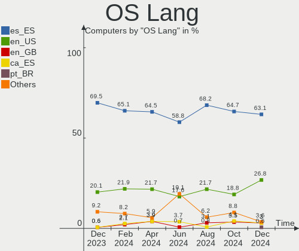
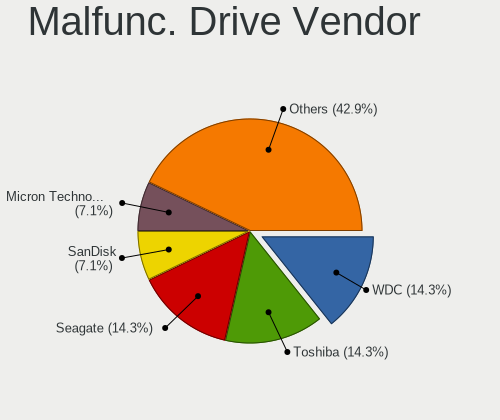
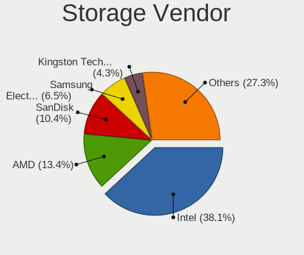
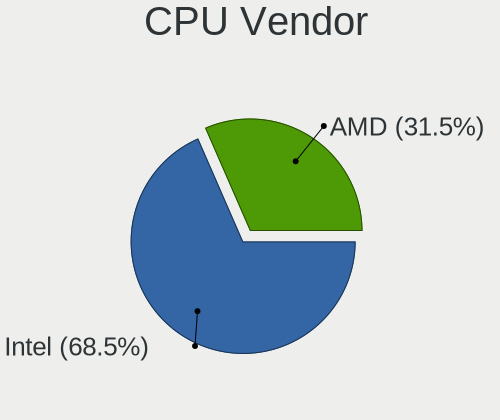
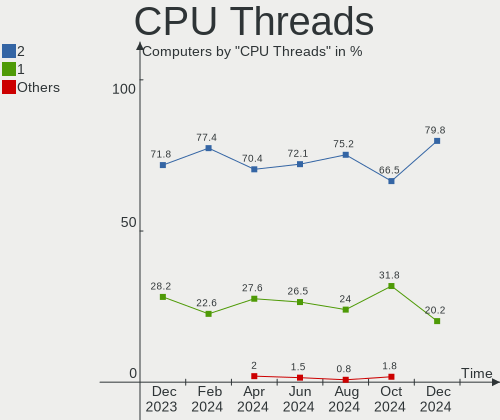
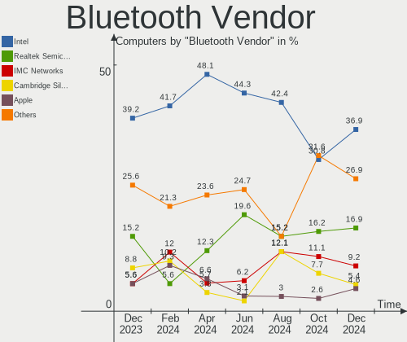
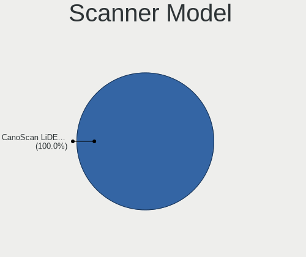

Linux in Spain - Hardware Trends
--------------------------------

A project to identify most popular hardware characteristics and track their change
over time based on data collected by Linux users at https://Linux-Hardware.org.

Anyone can contribute to this report by the [hw-probe](https://github.com/linuxhw/hw-probe) tool:

    sudo -E hw-probe -all -upload

This is a report for all computer types. See also reports for [desktops](/Location/Spain/Desktop/README.md) and [notebooks](/Location/Spain/Notebook/README.md).

Period: Jul, 2023.

Contents
--------

* [ System ](#system)
  - [ OS                       ](#os)
  - [ OS Family                ](#os-family)
  - [ Kernel                   ](#kernel)
  - [ Kernel Family            ](#kernel-family)
  - [ Kernel Major Ver.        ](#kernel-major-ver)
  - [ Arch                     ](#arch)
  - [ DE                       ](#de)
  - [ Display Server           ](#display-server)
  - [ Display Manager          ](#display-manager)
  - [ OS Lang                  ](#os-lang)
  - [ Boot Mode                ](#boot-mode)
  - [ Filesystem               ](#filesystem)
  - [ Part. scheme             ](#part-scheme)
  - [ Dual Boot with Linux/BSD ](#dual-boot-with-linuxbsd)
  - [ Dual Boot (Win)          ](#dual-boot-win)

* [ Board ](#board)
  - [ Vendor                   ](#vendor)
  - [ Model                    ](#model)
  - [ Model Family             ](#model-family)
  - [ MFG Year                 ](#mfg-year)
  - [ Form Factor              ](#form-factor)
  - [ Secure Boot              ](#secure-boot)
  - [ Coreboot                 ](#coreboot)
  - [ RAM Size                 ](#ram-size)
  - [ RAM Used                 ](#ram-used)
  - [ Total Drives             ](#total-drives)
  - [ Has CD-ROM               ](#has-cd-rom)
  - [ Has Ethernet             ](#has-ethernet)
  - [ Has WiFi                 ](#has-wifi)
  - [ Has Bluetooth            ](#has-bluetooth)

* [ Location ](#location)
  - [ Country                  ](#country)
  - [ City                     ](#city)

* [ Drives ](#drives)
  - [ Drive Vendor             ](#drive-vendor)
  - [ Drive Model              ](#drive-model)
  - [ HDD Vendor               ](#hdd-vendor)
  - [ SSD Vendor               ](#ssd-vendor)
  - [ Drive Kind               ](#drive-kind)
  - [ Drive Connector          ](#drive-connector)
  - [ Drive Size               ](#drive-size)
  - [ Space Total              ](#space-total)
  - [ Space Used               ](#space-used)
  - [ Malfunc. Drives          ](#malfunc-drives)
  - [ Malfunc. Drive Vendor    ](#malfunc-drive-vendor)
  - [ Malfunc. HDD Vendor      ](#malfunc-hdd-vendor)
  - [ Malfunc. Drive Kind      ](#malfunc-drive-kind)
  - [ Failed Drives            ](#failed-drives)
  - [ Failed Drive Vendor      ](#failed-drive-vendor)
  - [ Drive Status             ](#drive-status)

* [ Storage controller ](#storage-controller)
  - [ Storage Vendor           ](#storage-vendor)
  - [ Storage Model            ](#storage-model)
  - [ Storage Kind             ](#storage-kind)

* [ Processor ](#processor)
  - [ CPU Vendor               ](#cpu-vendor)
  - [ CPU Model                ](#cpu-model)
  - [ CPU Model Family         ](#cpu-model-family)
  - [ CPU Cores                ](#cpu-cores)
  - [ CPU Sockets              ](#cpu-sockets)
  - [ CPU Threads              ](#cpu-threads)
  - [ CPU Op-Modes             ](#cpu-op-modes)
  - [ CPU Microcode            ](#cpu-microcode)
  - [ CPU Microarch            ](#cpu-microarch)

* [ Graphics ](#graphics)
  - [ GPU Vendor               ](#gpu-vendor)
  - [ GPU Model                ](#gpu-model)
  - [ GPU Combo                ](#gpu-combo)
  - [ GPU Driver               ](#gpu-driver)
  - [ GPU Memory               ](#gpu-memory)

* [ Monitor ](#monitor)
  - [ Monitor Vendor           ](#monitor-vendor)
  - [ Monitor Model            ](#monitor-model)
  - [ Monitor Resolution       ](#monitor-resolution)
  - [ Monitor Diagonal         ](#monitor-diagonal)
  - [ Monitor Width            ](#monitor-width)
  - [ Aspect Ratio             ](#aspect-ratio)
  - [ Monitor Area             ](#monitor-area)
  - [ Pixel Density            ](#pixel-density)
  - [ Multiple Monitors        ](#multiple-monitors)

* [ Network ](#network)
  - [ Net Controller Vendor    ](#net-controller-vendor)
  - [ Net Controller Model     ](#net-controller-model)
  - [ Wireless Vendor          ](#wireless-vendor)
  - [ Wireless Model           ](#wireless-model)
  - [ Ethernet Vendor          ](#ethernet-vendor)
  - [ Ethernet Model           ](#ethernet-model)
  - [ Net Controller Kind      ](#net-controller-kind)
  - [ Used Controller          ](#used-controller)
  - [ NICs                     ](#nics)
  - [ IPv6                     ](#ipv6)

* [ Bluetooth ](#bluetooth)
  - [ Bluetooth Vendor         ](#bluetooth-vendor)
  - [ Bluetooth Model          ](#bluetooth-model)

* [ Sound ](#sound)
  - [ Sound Vendor             ](#sound-vendor)
  - [ Sound Model              ](#sound-model)

* [ Memory ](#memory)
  - [ Memory Vendor            ](#memory-vendor)
  - [ Memory Model             ](#memory-model)
  - [ Memory Kind              ](#memory-kind)
  - [ Memory Form Factor       ](#memory-form-factor)
  - [ Memory Size              ](#memory-size)
  - [ Memory Speed             ](#memory-speed)

* [ Printers & scanners ](#printers--scanners)
  - [ Printer Vendor           ](#printer-vendor)
  - [ Printer Model            ](#printer-model)
  - [ Scanner Vendor           ](#scanner-vendor)
  - [ Scanner Model            ](#scanner-model)

* [ Camera ](#camera)
  - [ Camera Vendor            ](#camera-vendor)
  - [ Camera Model             ](#camera-model)

* [ Security ](#security)
  - [ Fingerprint Vendor       ](#fingerprint-vendor)
  - [ Fingerprint Model        ](#fingerprint-model)
  - [ Chipcard Vendor          ](#chipcard-vendor)
  - [ Chipcard Model           ](#chipcard-model)

* [ Unsupported ](#unsupported)
  - [ Unsupported Devices      ](#unsupported-devices)
  - [ Unsupported Device Types ](#unsupported-device-types)

System
------

OS
--

Installed operating systems

| Name                         | Computers | Percent |
|------------------------------|-----------|---------|
| Ubuntu 22.04                 | 17        | 13.49%  |
| Fedora 38                    | 12        | 9.52%   |
| Linux Mint 21.1              | 9         | 7.14%   |
| Kali 2023.2                  | 7         | 5.56%   |
| Debian 12                    | 7         | 5.56%   |
| OpenMandriva 23.03           | 6         | 4.76%   |
| Pop!_OS 22.04                | 5         | 3.97%   |
| ArcoLinux Rolling            | 5         | 3.97%   |
| Zorin 16                     | 4         | 3.17%   |
| Ubuntu 23.04                 | 4         | 3.17%   |
| Nobara 38                    | 3         | 2.38%   |
| Linux Mint 21.2              | 3         | 2.38%   |
| Kubuntu 22.04                | 3         | 2.38%   |
| Ubuntu 20.04                 | 2         | 1.59%   |
| Ubuntu 18.04                 | 2         | 1.59%   |
| SteamOS 3.4.8                | 2         | 1.59%   |
| openSUSE Tumbleweed-XXXXXXXX | 2         | 1.59%   |
| OpenMandriva 23.07           | 2         | 1.59%   |
| OpenMandriva 23.01           | 2         | 1.59%   |
| Manjaro                      | 2         | 1.59%   |
| Elementary 7                 | 2         | 1.59%   |
| Debian 11                    | 2         | 1.59%   |
| blendOS                      | 2         | 1.59%   |
| Archcraft Rolling            | 2         | 1.59%   |
| Arch Rolling                 | 2         | 1.59%   |
| Zorin 15                     | 1         | 0.79%   |
| Xubuntu 22.04                | 1         | 0.79%   |
| Xero Rolling                 | 1         | 0.79%   |
| Ubuntu Studio 23.04          | 1         | 0.79%   |
| Ubuntu MATE 22.04            | 1         | 0.79%   |
| Ubuntu 22.10                 | 1         | 0.79%   |
| PostmarketOS Edge            | 1         | 0.79%   |
| openSUSE Leap-15.5           | 1         | 0.79%   |
| OpenMandriva 23.06           | 1         | 0.79%   |
| Nobara 36                    | 1         | 0.79%   |
| MX 21                        | 1         | 0.79%   |
| Linux Mint 20.3              | 1         | 0.79%   |
| Lilidog 23                   | 1         | 0.79%   |
| GNOME OS Nightly             | 1         | 0.79%   |
| Gentoo 2.14                  | 1         | 0.79%   |

OS Family
---------

OS without a version

| Name          | Computers | Percent |
|---------------|-----------|---------|
| Ubuntu        | 26        | 20.63%  |
| Fedora        | 14        | 11.11%  |
| Linux Mint    | 13        | 10.32%  |
| OpenMandriva  | 11        | 8.73%   |
| Debian        | 9         | 7.14%   |
| Kali          | 7         | 5.56%   |
| Zorin         | 5         | 3.97%   |
| Pop!_OS       | 5         | 3.97%   |
| ArcoLinux     | 5         | 3.97%   |
| Nobara        | 4         | 3.17%   |
| openSUSE      | 3         | 2.38%   |
| Kubuntu       | 3         | 2.38%   |
| SteamOS       | 2         | 1.59%   |
| Manjaro       | 2         | 1.59%   |
| Elementary    | 2         | 1.59%   |
| blendOS       | 2         | 1.59%   |
| Archcraft     | 2         | 1.59%   |
| Arch          | 2         | 1.59%   |
| Xubuntu       | 1         | 0.79%   |
| Xero          | 1         | 0.79%   |
| Ubuntu Studio | 1         | 0.79%   |
| Ubuntu MATE   | 1         | 0.79%   |
| PostmarketOS  | 1         | 0.79%   |
| MX            | 1         | 0.79%   |
| Lilidog       | 1         | 0.79%   |
| GNOME OS      | 1         | 0.79%   |
| Gentoo        | 1         | 0.79%   |

Kernel
------

Version of the Linux kernel

| Version                        | Computers | Percent |
|--------------------------------|-----------|---------|
| 5.19.0-46-generic              | 16        | 12.7%   |
| 5.15.0-76-generic              | 14        | 11.11%  |
| 6.2.6-desktop-1omv2390         | 6         | 4.76%   |
| 6.2.6-76060206-generic         | 5         | 3.97%   |
| 6.1.0-10-amd64                 | 5         | 3.97%   |
| 6.3.8-200.fc38.x86_64          | 3         | 2.38%   |
| 6.3.5-desktop-3omv2390         | 3         | 2.38%   |
| 6.3.12-200.fc38.x86_64         | 3         | 2.38%   |
| 6.3.10-200.fsync.fc38.x86_64   | 3         | 2.38%   |
| 6.3.0-kali1-amd64              | 3         | 2.38%   |
| 5.19.0-50-generic              | 3         | 2.38%   |
| 6.4.6-200.fc38.x86_64          | 2         | 1.59%   |
| 6.4.3-arch1-1                  | 2         | 1.59%   |
| 6.4.1-arch2-1                  | 2         | 1.59%   |
| 6.2.9-300.fc38.x86_64          | 2         | 1.59%   |
| 6.2.0-25-generic               | 2         | 1.59%   |
| 6.1.1-desktop-1omv2290         | 2         | 1.59%   |
| 6.1.0-9-amd64                  | 2         | 1.59%   |
| 5.4.0-150-generic              | 2         | 1.59%   |
| 5.15.0-78-generic              | 2         | 1.59%   |
| 5.13.0-valve36-1-neptune       | 2         | 1.59%   |
| 6.4.4-zen1-1-zen               | 1         | 0.79%   |
| 6.4.3-zen1-1-zen               | 1         | 0.79%   |
| 6.4.3-1-default                | 1         | 0.79%   |
| 6.4.2-surface                  | 1         | 0.79%   |
| 6.4.2-arch1-1                  | 1         | 0.79%   |
| 6.4.2-3-MANJARO                | 1         | 0.79%   |
| 6.4.0-Yagakimi-T2-xanmod1-1-t2 | 1         | 0.79%   |
| 6.4.0-060400-generic           | 1         | 0.79%   |
| 6.4.0                          | 1         | 0.79%   |
| 6.3.9-zen1-1-zen               | 1         | 0.79%   |
| 6.3.9-arch1-1                  | 1         | 0.79%   |
| 6.3.9-1-default                | 1         | 0.79%   |
| 6.3.8-100.fc37.x86_64          | 1         | 0.79%   |
| 6.3.5-2-MANJARO                | 1         | 0.79%   |
| 6.3.3-arch1-1                  | 1         | 0.79%   |
| 6.3.11-200.fc38.x86_64         | 1         | 0.79%   |
| 6.3.0-msm8916                  | 1         | 0.79%   |
| 6.2.9-300.fc38.aarch64         | 1         | 0.79%   |
| 6.2.15-100.fc36.x86_64         | 1         | 0.79%   |

Kernel Family
-------------

Linux kernel without a distro release

| Version  | Computers | Percent |
|----------|-----------|---------|
| 5.19.0   | 22        | 17.46%  |
| 5.15.0   | 19        | 15.08%  |
| 6.2.6    | 11        | 8.73%   |
| 6.1.0    | 9         | 7.14%   |
| 6.2.0    | 5         | 3.97%   |
| 6.4.3    | 4         | 3.17%   |
| 6.3.8    | 4         | 3.17%   |
| 6.3.5    | 4         | 3.17%   |
| 6.3.0    | 4         | 3.17%   |
| 6.4.2    | 3         | 2.38%   |
| 6.4.0    | 3         | 2.38%   |
| 6.3.9    | 3         | 2.38%   |
| 6.3.12   | 3         | 2.38%   |
| 6.3.10   | 3         | 2.38%   |
| 6.2.9    | 3         | 2.38%   |
| 5.4.0    | 3         | 2.38%   |
| 6.4.6    | 2         | 1.59%   |
| 6.4.1    | 2         | 1.59%   |
| 6.1.1    | 2         | 1.59%   |
| 5.13.0   | 2         | 1.59%   |
| 5.10.0   | 2         | 1.59%   |
| 6.4.4    | 1         | 0.79%   |
| 6.3.3    | 1         | 0.79%   |
| 6.3.11   | 1         | 0.79%   |
| 6.2.15   | 1         | 0.79%   |
| 6.1.38   | 1         | 0.79%   |
| 6.0.14   | 1         | 0.79%   |
| 5.17.5   | 1         | 0.79%   |
| 5.16.0   | 1         | 0.79%   |
| 5.14.21  | 1         | 0.79%   |
| 4.19.127 | 1         | 0.79%   |
| 4.15.0   | 1         | 0.79%   |
| 4.14.282 | 1         | 0.79%   |
| 4.14.190 | 1         | 0.79%   |

Kernel Major Ver.
-----------------

Linux kernel major version

| Version | Computers | Percent |
|---------|-----------|---------|
| 6.3     | 23        | 18.25%  |
| 5.19    | 22        | 17.46%  |
| 6.2     | 20        | 15.87%  |
| 5.15    | 19        | 15.08%  |
| 6.4     | 15        | 11.9%   |
| 6.1     | 12        | 9.52%   |
| 5.4     | 3         | 2.38%   |
| 5.13    | 2         | 1.59%   |
| 5.10    | 2         | 1.59%   |
| 4.14    | 2         | 1.59%   |
| 6.0     | 1         | 0.79%   |
| 5.17    | 1         | 0.79%   |
| 5.16    | 1         | 0.79%   |
| 5.14    | 1         | 0.79%   |
| 4.19    | 1         | 0.79%   |
| 4.15    | 1         | 0.79%   |

Arch
----

OS architecture (x86_64, i586, etc.)

| Name    | Computers | Percent |
|---------|-----------|---------|
| x86_64  | 120       | 95.24%  |
| aarch64 | 5         | 3.97%   |
| i686    | 1         | 0.79%   |

DE
--

Desktop Environment

| Name             | Computers | Percent |
|------------------|-----------|---------|
| GNOME            | 52        | 41.27%  |
| KDE5             | 30        | 23.81%  |
| XFCE             | 16        | 12.7%   |
| X-Cinnamon       | 12        | 9.52%   |
| Unknown          | 7         | 5.56%   |
| Pantheon         | 2         | 1.59%   |
| MATE             | 2         | 1.59%   |
| LXQt             | 2         | 1.59%   |
| lightdm-xsession | 2         | 1.59%   |
| GNOME Flashback  | 1         | 0.79%   |

Display Server
--------------

X11 or Wayland

| Name    | Computers | Percent |
|---------|-----------|---------|
| X11     | 91        | 72.22%  |
| Wayland | 32        | 25.4%   |
| Unknown | 2         | 1.59%   |
| Tty     | 1         | 0.79%   |

Display Manager
---------------

SDDM, LightDM, etc.

| Name    | Computers | Percent |
|---------|-----------|---------|
| Unknown | 48        | 38.1%   |
| SDDM    | 28        | 22.22%  |
| GDM3    | 26        | 20.63%  |
| LightDM | 17        | 13.49%  |
| GDM     | 6         | 4.76%   |
| WDM     | 1         | 0.79%   |

OS Lang
-------

Language

| Lang    | Computers | Percent |
|---------|-----------|---------|
| es_ES   | 85        | 67.46%  |
| en_US   | 26        | 20.63%  |
| Unknown | 4         | 3.17%   |
| ca_ES   | 3         | 2.38%   |
| en_GB   | 2         | 1.59%   |
| de_DE   | 2         | 1.59%   |
| POSIX   | 1         | 0.79%   |
| it_IT   | 1         | 0.79%   |
| en_IE   | 1         | 0.79%   |
| C       | 1         | 0.79%   |

Boot Mode
---------

EFI or BIOS

| Mode | Computers | Percent |
|------|-----------|---------|
| EFI  | 69        | 54.76%  |
| BIOS | 57        | 45.24%  |

Filesystem
----------

Type of filesystem

| Type    | Computers | Percent |
|---------|-----------|---------|
| Ext4    | 72        | 57.14%  |
| Btrfs   | 23        | 18.25%  |
| Tmpfs   | 20        | 15.87%  |
| Overlay | 8         | 6.35%   |
| Xfs     | 2         | 1.59%   |
| F2fs    | 1         | 0.79%   |

Part. scheme
------------

Scheme of partitioning

| Type    | Computers | Percent |
|---------|-----------|---------|
| GPT     | 65        | 51.59%  |
| Unknown | 47        | 37.3%   |
| MBR     | 14        | 11.11%  |

Dual Boot with Linux/BSD
------------------------

Hosting more than one Linux/BSD

| Dual boot | Computers | Percent |
|-----------|-----------|---------|
| No        | 106       | 84.13%  |
| Yes       | 20        | 15.87%  |

Dual Boot (Win)
---------------

Hosting Linux and Windows

| Dual boot | Computers | Percent |
|-----------|-----------|---------|
| No        | 95        | 75.4%   |
| Yes       | 31        | 24.6%   |

Board
-----

Vendor
------

Motherboard manufacturer

| Name                                 | Computers | Percent |
|--------------------------------------|-----------|---------|
| ASUSTek Computer                     | 20        | 15.87%  |
| Lenovo                               | 14        | 11.11%  |
| Hewlett-Packard                      | 13        | 10.32%  |
| Gigabyte Technology                  | 9         | 7.14%   |
| Apple                                | 9         | 7.14%   |
| Dell                                 | 8         | 6.35%   |
| Acer                                 | 8         | 6.35%   |
| MSI                                  | 5         | 3.97%   |
| Unknown                              | 5         | 3.97%   |
| Samsung Electronics                  | 3         | 2.38%   |
| Medion                               | 3         | 2.38%   |
| ASRock                               | 3         | 2.38%   |
| Valve                                | 2         | 1.59%   |
| Teclast                              | 2         | 1.59%   |
| Intel                                | 2         | 1.59%   |
| HUAWEI                               | 2         | 1.59%   |
| Chuwi                                | 2         | 1.59%   |
| ZOTAC                                | 1         | 0.79%   |
| VANT                                 | 1         | 0.79%   |
| Toshiba                              | 1         | 0.79%   |
| SHENZHEN YOUDISI E-COMMERCE          | 1         | 0.79%   |
| Shenzhen Meigao Electronic Equipment | 1         | 0.79%   |
| Raspberry Pi Foundation              | 1         | 0.79%   |
| Qualcomm Technologies                | 1         | 0.79%   |
| Pegatron                             | 1         | 0.79%   |
| Panasonic                            | 1         | 0.79%   |
| Packard Bell                         | 1         | 0.79%   |
| Notebook                             | 1         | 0.79%   |
| Microsoft                            | 1         | 0.79%   |
| Clevo                                | 1         | 0.79%   |
| AZW                                  | 1         | 0.79%   |
| AXDIA International                  | 1         | 0.79%   |
| AMI                                  | 1         | 0.79%   |

Model
-----

Motherboard model

| Name                                       | Computers | Percent |
|--------------------------------------------|-----------|---------|
| Unknown                                    | 5         | 3.97%   |
| Valve Jupiter                              | 2         | 1.59%   |
| Teclast X4                                 | 2         | 1.59%   |
| Samsung 700T                               | 2         | 1.59%   |
| Lenovo IdeaPad 3 15ADA05 81W1              | 2         | 1.59%   |
| Dell XPS 15 7590                           | 2         | 1.59%   |
| ASUS VivoBook_ASUS Laptop E410MA_E410MA    | 2         | 1.59%   |
| ZOTAC ZBOX                                 | 1         | 0.79%   |
| VANT MOOVE15_2023                          | 1         | 0.79%   |
| Toshiba Satellite L50-B                    | 1         | 0.79%   |
| SHENZHEN YOUDISI E-COMMERCE A8S PRO        | 1         | 0.79%   |
| Shenzhen Meigao Electronic Equipment UM590 | 1         | 0.79%   |
| Samsung Galaxy TabPro S LTE                | 1         | 0.79%   |
| RPi Raspberry Pi 4 Model B                 | 1         | 0.79%   |
| Qualcomm SM8150 V2 PM8150 VAYU             | 1         | 0.79%   |
| Pegatron h8-1120es                         | 1         | 0.79%   |
| Panasonic CFMX4-1                          | 1         | 0.79%   |
| Packard Bell EasyNote SL65                 | 1         | 0.79%   |
| Notebook V1x0PNPx                          | 1         | 0.79%   |
| MSI MS-7B89                                | 1         | 0.79%   |
| MSI MS-7B86                                | 1         | 0.79%   |
| MSI MS-7B79                                | 1         | 0.79%   |
| MSI MS-7918                                | 1         | 0.79%   |
| MSI MS-7817                                | 1         | 0.79%   |
| Microsoft Surface Laptop Go                | 1         | 0.79%   |
| Medion X782X                               | 1         | 0.79%   |
| Medion E15301                              | 1         | 0.79%   |
| Medion Akoya E20009 MD34024/C579           | 1         | 0.79%   |
| Lenovo Z50-70 20354                        | 1         | 0.79%   |
| Lenovo Yoga 3 Pro-1370 80HE                | 1         | 0.79%   |
| Lenovo ThinkPad X1 Nano Gen 1 20UN002MSP   | 1         | 0.79%   |
| Lenovo ThinkCentre M93p 10AAA09USP         | 1         | 0.79%   |
| Lenovo ThinkBook 16p Gen 2 20YM            | 1         | 0.79%   |
| Lenovo MIIX 310-10ICR 80SG                 | 1         | 0.79%   |
| Lenovo Legion 5 Pro 16ACH6H 82JQ           | 1         | 0.79%   |
| Lenovo IdeaPad Gaming 3 15IAH7 82S9        | 1         | 0.79%   |
| Lenovo IdeaPad Gaming 3 15ACH6 82K2        | 1         | 0.79%   |
| Lenovo IdeaPad 510-15IKB 80SV              | 1         | 0.79%   |
| Lenovo IdeaPad 330-15IKB 81DE              | 1         | 0.79%   |
| Lenovo G580 2189                           | 1         | 0.79%   |

Model Family
------------

Motherboard model prefix

| Name                                       | Computers | Percent |
|--------------------------------------------|-----------|---------|
| ASUS VivoBook                              | 7         | 5.56%   |
| Lenovo IdeaPad                             | 6         | 4.76%   |
| Unknown                                    | 5         | 3.97%   |
| Dell XPS                                   | 3         | 2.38%   |
| Dell Latitude                              | 3         | 2.38%   |
| ASUS ROG                                   | 3         | 2.38%   |
| Acer Extensa                               | 3         | 2.38%   |
| Acer Aspire                                | 3         | 2.38%   |
| Valve Jupiter                              | 2         | 1.59%   |
| Teclast X4                                 | 2         | 1.59%   |
| Samsung 700T                               | 2         | 1.59%   |
| HP Victus                                  | 2         | 1.59%   |
| HP Pavilion                                | 2         | 1.59%   |
| HP Laptop                                  | 2         | 1.59%   |
| HP EliteDesk                               | 2         | 1.59%   |
| Dell OptiPlex                              | 2         | 1.59%   |
| ASUS PRIME                                 | 2         | 1.59%   |
| ZOTAC ZBOX                                 | 1         | 0.79%   |
| VANT MOOVE15                               | 1         | 0.79%   |
| Toshiba Satellite                          | 1         | 0.79%   |
| SHENZHEN YOUDISI E-COMMERCE A8S            | 1         | 0.79%   |
| Shenzhen Meigao Electronic Equipment UM590 | 1         | 0.79%   |
| Samsung Galaxy                             | 1         | 0.79%   |
| RPi Raspberry                              | 1         | 0.79%   |
| Qualcomm SM8150                            | 1         | 0.79%   |
| Pegatron h8-1120es                         | 1         | 0.79%   |
| Panasonic CFMX4-1                          | 1         | 0.79%   |
| Packard Bell EasyNote                      | 1         | 0.79%   |
| Notebook V1x0PNPx                          | 1         | 0.79%   |
| MSI MS-7B89                                | 1         | 0.79%   |
| MSI MS-7B86                                | 1         | 0.79%   |
| MSI MS-7B79                                | 1         | 0.79%   |
| MSI MS-7918                                | 1         | 0.79%   |
| MSI MS-7817                                | 1         | 0.79%   |
| Microsoft Surface                          | 1         | 0.79%   |
| Medion X782X                               | 1         | 0.79%   |
| Medion E15301                              | 1         | 0.79%   |
| Medion Akoya                               | 1         | 0.79%   |
| Lenovo Z50-70                              | 1         | 0.79%   |
| Lenovo Yoga                                | 1         | 0.79%   |

MFG Year
--------

Motherboard manufacture year

| Year    | Computers | Percent |
|---------|-----------|---------|
| 2022    | 15        | 11.9%   |
| 2021    | 13        | 10.32%  |
| 2019    | 13        | 10.32%  |
| 2020    | 11        | 8.73%   |
| 2018    | 10        | 7.94%   |
| 2014    | 10        | 7.94%   |
| 2015    | 8         | 6.35%   |
| 2012    | 8         | 6.35%   |
| 2011    | 8         | 6.35%   |
| 2017    | 7         | 5.56%   |
| 2023    | 5         | 3.97%   |
| 2016    | 4         | 3.17%   |
| Unknown | 4         | 3.17%   |
| 2013    | 3         | 2.38%   |
| 2007    | 3         | 2.38%   |
| 2009    | 2         | 1.59%   |
| 2008    | 2         | 1.59%   |

Form Factor
-----------

Physical design of the computer

| Name           | Computers | Percent |
|----------------|-----------|---------|
| Notebook       | 70        | 55.56%  |
| Desktop        | 39        | 30.95%  |
| System on chip | 5         | 3.97%   |
| Tablet         | 5         | 3.97%   |
| Mini pc        | 4         | 3.17%   |
| All in one     | 3         | 2.38%   |

Secure Boot
-----------

Enabled or disabled

| State    | Computers | Percent |
|----------|-----------|---------|
| Disabled | 114       | 90.48%  |
| Enabled  | 12        | 9.52%   |

Coreboot
--------

Have coreboot on board

| Used | Computers | Percent |
|------|-----------|---------|
| No   | 126       | 100%    |

RAM Size
--------

Total RAM memory

| Size in GB  | Computers | Percent |
|-------------|-----------|---------|
| 16.01-24.0  | 32        | 25.4%   |
| 4.01-8.0    | 30        | 23.81%  |
| 8.01-16.0   | 23        | 18.25%  |
| 3.01-4.0    | 19        | 15.08%  |
| 32.01-64.0  | 13        | 10.32%  |
| 1.01-2.0    | 3         | 2.38%   |
| 2.01-3.0    | 2         | 1.59%   |
| 64.01-256.0 | 2         | 1.59%   |
| 24.01-32.0  | 1         | 0.79%   |
| 0.51-1.0    | 1         | 0.79%   |

RAM Used
--------

Used RAM memory

| Used GB    | Computers | Percent |
|------------|-----------|---------|
| 2.01-3.0   | 50        | 39.68%  |
| 1.01-2.0   | 23        | 18.25%  |
| 3.01-4.0   | 20        | 15.87%  |
| 4.01-8.0   | 13        | 10.32%  |
| 8.01-16.0  | 9         | 7.14%   |
| 0.51-1.0   | 6         | 4.76%   |
| 16.01-24.0 | 2         | 1.59%   |
| 32.01-64.0 | 1         | 0.79%   |
| 24.01-32.0 | 1         | 0.79%   |
| 0.01-0.5   | 1         | 0.79%   |

Total Drives
------------

Number of drives on board

| Drives | Computers | Percent |
|--------|-----------|---------|
| 1      | 78        | 61.9%   |
| 2      | 30        | 23.81%  |
| 3      | 7         | 5.56%   |
| 5      | 6         | 4.76%   |
| 4      | 4         | 3.17%   |
| 0      | 1         | 0.79%   |

Has CD-ROM
----------

Has CD-ROM on board

| Presented | Computers | Percent |
|-----------|-----------|---------|
| No        | 96        | 76.19%  |
| Yes       | 30        | 23.81%  |

Has Ethernet
------------

Has Ethernet on board

| Presented | Computers | Percent |
|-----------|-----------|---------|
| Yes       | 95        | 75.4%   |
| No        | 31        | 24.6%   |

Has WiFi
--------

Has WiFi module

| Presented | Computers | Percent |
|-----------|-----------|---------|
| Yes       | 93        | 73.81%  |
| No        | 33        | 26.19%  |

Has Bluetooth
-------------

Has Bluetooth module

| Presented | Computers | Percent |
|-----------|-----------|---------|
| Yes       | 79        | 62.7%   |
| No        | 47        | 37.3%   |

Location
--------

Country
-------

Geographic location (country)

| Country | Computers | Percent |
|---------|-----------|---------|
| Spain   | 126       | 100%    |

City
----

Geographic location (city)

| City                        | Computers | Percent |
|-----------------------------|-----------|---------|
| Madrid                      | 26        | 20.63%  |
| Valencia                    | 8         | 6.35%   |
| Barcelona                   | 8         | 6.35%   |
| Zaragoza                    | 7         | 5.56%   |
| Seville                     | 5         | 3.97%   |
| Oviedo                      | 4         | 3.17%   |
| Cadalso de los Vidrios      | 4         | 3.17%   |
| Vecindario                  | 3         | 2.38%   |
| Donostia / San Sebastian    | 3         | 2.38%   |
| Andujar                     | 3         | 2.38%   |
| Alcobendas                  | 3         | 2.38%   |
| Vigo                        | 2         | 1.59%   |
| Ponferrada                  | 2         | 1.59%   |
| Pamplona                    | 2         | 1.59%   |
| Vila-real                   | 1         | 0.79%   |
| Valladolid                  | 1         | 0.79%   |
| Tudela                      | 1         | 0.79%   |
| Tres Cantos                 | 1         | 0.79%   |
| Torrevieja                  | 1         | 0.79%   |
| Segorbe                     | 1         | 0.79%   |
| Sanxenxo                    | 1         | 0.79%   |
| Santa Coloma de Gramenet    | 1         | 0.79%   |
| San Vicent del Raspeig      | 1         | 0.79%   |
| San Sebastián de los Reyes | 1         | 0.79%   |
| San Cristóbal de La Laguna | 1         | 0.79%   |
| Pozuelo de Alarcón         | 1         | 0.79%   |
| Paterna                     | 1         | 0.79%   |
| Parla                       | 1         | 0.79%   |
| Palma                       | 1         | 0.79%   |
| Osuna                       | 1         | 0.79%   |
| Murcia                      | 1         | 0.79%   |
| Mostoles                    | 1         | 0.79%   |
| Monzon                      | 1         | 0.79%   |
| Marratxí                   | 1         | 0.79%   |
| Manises                     | 1         | 0.79%   |
| Logroño                    | 1         | 0.79%   |
| Las Rozas de Madrid         | 1         | 0.79%   |
| Igualada                    | 1         | 0.79%   |
| Guadalajara                 | 1         | 0.79%   |
| Granada                     | 1         | 0.79%   |

Drives
------

Drive Vendor
------------

Hard drive vendors

| Vendor                      | Computers | Drives | Percent |
|-----------------------------|-----------|--------|---------|
| Samsung Electronics         | 24        | 27     | 13.11%  |
| Seagate                     | 18        | 24     | 9.84%   |
| SanDisk                     | 18        | 20     | 9.84%   |
| Unknown                     | 15        | 19     | 8.2%    |
| Kingston                    | 15        | 17     | 8.2%    |
| WDC                         | 12        | 13     | 6.56%   |
| Toshiba                     | 12        | 12     | 6.56%   |
| Crucial                     | 9         | 9      | 4.92%   |
| Micron Technology           | 7         | 7      | 3.83%   |
| Apple                       | 7         | 9      | 3.83%   |
| Intel                       | 6         | 6      | 3.28%   |
| SK hynix                    | 5         | 5      | 2.73%   |
| Kingston Technology Company | 4         | 4      | 2.19%   |
| Hitachi                     | 4         | 5      | 2.19%   |
| Phison Electronics          | 3         | 4      | 1.64%   |
| Teclast                     | 2         | 2      | 1.09%   |
| OCZ                         | 2         | 3      | 1.09%   |
| Micron/Crucial Technology   | 2         | 2      | 1.09%   |
| Emtec                       | 2         | 2      | 1.09%   |
| TO Exter                    | 1         | 1      | 0.55%   |
| Silicon Motion              | 1         | 1      | 0.55%   |
| PNY                         | 1         | 1      | 0.55%   |
| Phison                      | 1         | 1      | 0.55%   |
| Maxtor                      | 1         | 1      | 0.55%   |
| MAXIO Technology (Hangzhou) | 1         | 1      | 0.55%   |
| LITEON                      | 1         | 1      | 0.55%   |
| KUU                         | 1         | 1      | 0.55%   |
| KIOXIA                      | 1         | 1      | 0.55%   |
| JMicron Technology          | 1         | 1      | 0.55%   |
| Intenso                     | 1         | 1      | 0.55%   |
| HJDK                        | 1         | 1      | 0.55%   |
| Hikvision                   | 1         | 1      | 0.55%   |
| China                       | 1         | 1      | 0.55%   |
| BAITITON                    | 1         | 1      | 0.55%   |
| A-DATA Technology           | 1         | 2      | 0.55%   |

Drive Model
-----------

Hard drive models

| Model                                               | Computers | Percent |
|-----------------------------------------------------|-----------|---------|
| Kingston SA400S37240G 240GB SSD                     | 7         | 3.54%   |
| Unknown MMC Card  64GB                              | 5         | 2.53%   |
| Unknown MMC Card  32GB                              | 4         | 2.02%   |
| Unknown MMC Card  128GB                             | 4         | 2.02%   |
| Toshiba MQ01ABD100 1TB                              | 3         | 1.52%   |
| Seagate ST3500418AS 500GB                           | 3         | 1.52%   |
| SanDisk SSD PLUS 480GB                              | 3         | 1.52%   |
| Kingston SA400S37480G 480GB SSD                     | 3         | 1.52%   |
| Toshiba TR200 240GB SSD                             | 2         | 1.01%   |
| Teclast 256GB NS550-2242 SSD                        | 2         | 1.01%   |
| Seagate ST1000DM003-1ER162 1TB                      | 2         | 1.01%   |
| Seagate ST1000DM003-1CH162 1TB                      | 2         | 1.01%   |
| Sandisk WD Blue SN550 NVMe SSD 250GB                | 2         | 1.01%   |
| Samsung NVMe SSD Controller SM981/PM981/PM983 500GB | 2         | 1.01%   |
| Samsung MZMPA064HMDR-00000 64GB SSD                 | 2         | 1.01%   |
| Phison PS5013 E13 NVMe Controller 256GB             | 2         | 1.01%   |
| Micron/Crucial P2 NVMe PCIe SSD 1TB                 | 2         | 1.01%   |
| Micron MTFDHBA512TDV-1AZ1AABHA 512GB                | 2         | 1.01%   |
| Micron MTFDHBA512QFD 512GB                          | 2         | 1.01%   |
| Micron 2210_MTFDHBA512QFD 512GB                     | 2         | 1.01%   |
| Kingston Company U-SNS8154P3 NVMe SSD 480GB         | 2         | 1.01%   |
| Kingston Company OM3PDP3 NVMe SSD 512GB             | 2         | 1.01%   |
| Intel SSDPEKNU512GZ 512GB                           | 2         | 1.01%   |
| Intel SSD 660P Series 1024GB                        | 2         | 1.01%   |
| Emtec X150 240GB SSD                                | 2         | 1.01%   |
| Crucial CT480BX500SSD1 480GB                        | 2         | 1.01%   |
| Crucial CT1000MX500SSD1 1TB                         | 2         | 1.01%   |
| Apple ANS2 NVMe Controller 500GB                    | 2         | 1.01%   |
| WDC WDS500G2B0B-00YS70 500GB SSD                    | 1         | 0.51%   |
| WDC WDS200T2B0B-00YS70 2TB SSD                      | 1         | 0.51%   |
| WDC WDS100T2B0A-00SM50 1TB SSD                      | 1         | 0.51%   |
| WDC WD80EZZX-11CSGA0 8TB                            | 1         | 0.51%   |
| WDC WD800JD-75MSA3 80GB                             | 1         | 0.51%   |
| WDC WD6400BEVT-60A0RT0 640GB                        | 1         | 0.51%   |
| WDC WD40EFAX-68JH4N0 4TB                            | 1         | 0.51%   |
| WDC WD3200BEVT-22ZCT0 320GB                         | 1         | 0.51%   |
| WDC WD2500BEVT-80A23T0 250GB                        | 1         | 0.51%   |
| WDC WD20EARX-00PASB0 2TB                            | 1         | 0.51%   |
| WDC WD10SPSX-08A6W 1TB                              | 1         | 0.51%   |
| WDC WD10EZEX-00BBHA0 1TB                            | 1         | 0.51%   |

HDD Vendor
----------

Hard disk drive vendors

| Vendor              | Computers | Drives | Percent |
|---------------------|-----------|--------|---------|
| Seagate             | 18        | 24     | 38.3%   |
| WDC                 | 10        | 10     | 21.28%  |
| Toshiba             | 7         | 7      | 14.89%  |
| Samsung Electronics | 4         | 4      | 8.51%   |
| Hitachi             | 4         | 5      | 8.51%   |
| Apple               | 2         | 2      | 4.26%   |
| Unknown             | 1         | 1      | 2.13%   |
| Maxtor              | 1         | 1      | 2.13%   |

SSD Vendor
----------

Solid state drive vendors

| Vendor              | Computers | Drives | Percent |
|---------------------|-----------|--------|---------|
| Samsung Electronics | 14        | 14     | 20.9%   |
| Kingston            | 12        | 14     | 17.91%  |
| Crucial             | 9         | 9      | 13.43%  |
| SanDisk             | 8         | 9      | 11.94%  |
| Toshiba             | 4         | 4      | 5.97%   |
| WDC                 | 3         | 3      | 4.48%   |
| Teclast             | 2         | 2      | 2.99%   |
| OCZ                 | 2         | 3      | 2.99%   |
| Emtec               | 2         | 2      | 2.99%   |
| Apple               | 2         | 2      | 2.99%   |
| TO Exter            | 1         | 1      | 1.49%   |
| PNY                 | 1         | 1      | 1.49%   |
| Phison              | 1         | 1      | 1.49%   |
| LITEON              | 1         | 1      | 1.49%   |
| KUU                 | 1         | 1      | 1.49%   |
| Intenso             | 1         | 1      | 1.49%   |
| China               | 1         | 1      | 1.49%   |
| BAITITON            | 1         | 1      | 1.49%   |
| A-DATA Technology   | 1         | 2      | 1.49%   |

Drive Kind
----------

HDD or SSD

| Kind    | Computers | Drives | Percent |
|---------|-----------|--------|---------|
| NVMe    | 56        | 61     | 34.36%  |
| SSD     | 54        | 72     | 33.13%  |
| HDD     | 37        | 54     | 22.7%   |
| MMC     | 13        | 17     | 7.98%   |
| Unknown | 3         | 3      | 1.84%   |

Drive Connector
---------------

SATA, SAS, NVMe, etc.

| Type | Computers | Drives | Percent |
|------|-----------|--------|---------|
| SATA | 69        | 121    | 47.59%  |
| NVMe | 56        | 61     | 38.62%  |
| MMC  | 13        | 17     | 8.97%   |
| SAS  | 7         | 8      | 4.83%   |

Drive Size
----------

Size of hard drive

| Size in TB | Computers | Drives | Percent |
|------------|-----------|--------|---------|
| 0.01-0.5   | 54        | 76     | 55.67%  |
| 0.51-1.0   | 34        | 38     | 35.05%  |
| 1.01-2.0   | 6         | 7      | 6.19%   |
| 4.01-10.0  | 2         | 4      | 2.06%   |
| 3.01-4.0   | 1         | 1      | 1.03%   |

Space Total
-----------

Amount of disk space available on the file system

| Size in GB     | Computers | Percent |
|----------------|-----------|---------|
| 101-250        | 33        | 26.19%  |
| 251-500        | 28        | 22.22%  |
| 501-1000       | 19        | 15.08%  |
| 1001-2000      | 13        | 10.32%  |
| 51-100         | 9         | 7.14%   |
| 1-20           | 6         | 4.76%   |
| Unknown        | 6         | 4.76%   |
| More than 3000 | 5         | 3.97%   |
| 2001-3000      | 4         | 3.17%   |
| 21-50          | 3         | 2.38%   |

Space Used
----------

Amount of used disk space

| Used GB        | Computers | Percent |
|----------------|-----------|---------|
| 1-20           | 38        | 30.16%  |
| 21-50          | 26        | 20.63%  |
| 101-250        | 18        | 14.29%  |
| 51-100         | 15        | 11.9%   |
| 251-500        | 12        | 9.52%   |
| Unknown        | 6         | 4.76%   |
| 501-1000       | 5         | 3.97%   |
| More than 3000 | 3         | 2.38%   |
| 1001-2000      | 2         | 1.59%   |
| 2001-3000      | 1         | 0.79%   |

Malfunc. Drives
---------------

Drive models with a malfunction

| Model                                | Computers | Drives | Percent |
|--------------------------------------|-----------|--------|---------|
| WDC WD40EFAX-68JH4N0 4TB             | 1         | 1      | 8.33%   |
| WDC WD3200BEVT-22ZCT0 320GB          | 1         | 1      | 8.33%   |
| WDC WD1002FAEX-00Z3A0 1TB            | 1         | 1      | 8.33%   |
| Toshiba MQ01ABD100 1TB               | 1         | 1      | 8.33%   |
| Toshiba MK5059GSXP 500GB             | 1         | 1      | 8.33%   |
| SK hynix PC711 HFS512GDE9X073N 512GB | 1         | 1      | 8.33%   |
| Seagate ST3500418AS 500GB            | 1         | 1      | 8.33%   |
| SanDisk SSD PLUS 480GB               | 1         | 1      | 8.33%   |
| SanDisk SSD PLUS 1000GB              | 1         | 1      | 8.33%   |
| Samsung Electronics HM100UI 1TB      | 1         | 1      | 8.33%   |
| Hitachi HTS547550A9E384 500GB        | 1         | 1      | 8.33%   |
| Crucial CT480BX200SSD1 480GB         | 1         | 1      | 8.33%   |

Malfunc. Drive Vendor
---------------------

Vendors of faulty drives

| Vendor              | Computers | Drives | Percent |
|---------------------|-----------|--------|---------|
| WDC                 | 3         | 3      | 25%     |
| Toshiba             | 2         | 2      | 16.67%  |
| SanDisk             | 2         | 2      | 16.67%  |
| SK hynix            | 1         | 1      | 8.33%   |
| Seagate             | 1         | 1      | 8.33%   |
| Samsung Electronics | 1         | 1      | 8.33%   |
| Hitachi             | 1         | 1      | 8.33%   |
| Crucial             | 1         | 1      | 8.33%   |

Malfunc. HDD Vendor
-------------------

Vendors of faulty HDD drives

| Vendor              | Computers | Drives | Percent |
|---------------------|-----------|--------|---------|
| WDC                 | 3         | 3      | 37.5%   |
| Toshiba             | 2         | 2      | 25%     |
| Seagate             | 1         | 1      | 12.5%   |
| Samsung Electronics | 1         | 1      | 12.5%   |
| Hitachi             | 1         | 1      | 12.5%   |

Malfunc. Drive Kind
-------------------

Kinds of faulty drives

| Kind | Computers | Drives | Percent |
|------|-----------|--------|---------|
| HDD  | 8         | 8      | 66.67%  |
| SSD  | 3         | 3      | 25%     |
| NVMe | 1         | 1      | 8.33%   |

Failed Drives
-------------

Failed drive models

Zero info for selected period =(

Failed Drive Vendor
-------------------

Failed drive vendors

Zero info for selected period =(

Drive Status
------------

Number of failed and malfunc. drives

| Status   | Computers | Drives | Percent |
|----------|-----------|--------|---------|
| Detected | 77        | 124    | 58.33%  |
| Works    | 44        | 71     | 33.33%  |
| Malfunc  | 11        | 12     | 8.33%   |

Storage controller
------------------

Storage Vendor
--------------

Storage controller vendors

| Vendor                       | Computers | Percent |
|------------------------------|-----------|---------|
| Intel                        | 80        | 51.61%  |
| AMD                          | 18        | 11.61%  |
| SanDisk                      | 10        | 6.45%   |
| Samsung Electronics          | 10        | 6.45%   |
| Micron Technology            | 7         | 4.52%   |
| Kingston Technology Company  | 7         | 4.52%   |
| SK hynix                     | 5         | 3.23%   |
| Phison Electronics           | 3         | 1.94%   |
| Apple                        | 3         | 1.94%   |
| Silicon Motion               | 2         | 1.29%   |
| Micron/Crucial Technology    | 2         | 1.29%   |
| Marvell Technology Group     | 2         | 1.29%   |
| JMicron Technology           | 2         | 1.29%   |
| VIA Technologies             | 1         | 0.65%   |
| Toshiba America Info Systems | 1         | 0.65%   |
| MAXIO Technology (Hangzhou)  | 1         | 0.65%   |
| KIOXIA                       | 1         | 0.65%   |

Storage Model
-------------

Storage controller models

| Model                                                                          | Computers | Percent |
|--------------------------------------------------------------------------------|-----------|---------|
| AMD FCH SATA Controller [AHCI mode]                                            | 11        | 6.55%   |
| Intel Volume Management Device NVMe RAID Controller                            | 6         | 3.57%   |
| Intel Celeron/Pentium Silver Processor SATA Controller                         | 6         | 3.57%   |
| Intel 8 Series SATA Controller 1 [AHCI mode]                                   | 6         | 3.57%   |
| Intel 6 Series/C200 Series Chipset Family 6 port Mobile SATA AHCI Controller   | 6         | 3.57%   |
| Samsung NVMe SSD Controller SM981/PM981/PM983                                  | 5         | 2.98%   |
| Intel Sunrise Point-LP SATA Controller [AHCI mode]                             | 5         | 2.98%   |
| AMD 400 Series Chipset SATA Controller                                         | 5         | 2.98%   |
| SK hynix Gold P31/BC711/PC711 NVMe Solid State Drive                           | 4         | 2.38%   |
| Micron 2210 NVMe SSD [Cobain]                                                  | 4         | 2.38%   |
| Intel Wildcat Point-LP SATA Controller [AHCI Mode]                             | 4         | 2.38%   |
| Intel Q170/Q150/B150/H170/H110/Z170/CM236 Chipset SATA Controller [AHCI Mode]  | 4         | 2.38%   |
| Intel 6 Series/C200 Series Chipset Family 6 port Desktop SATA AHCI Controller  | 4         | 2.38%   |
| Intel SSD 670p Series [Keystone Harbor]                                        | 3         | 1.79%   |
| Intel Alder Lake-P SATA AHCI Controller                                        | 3         | 1.79%   |
| Intel 82801IBM/IEM (ICH9M/ICH9M-E) 4 port SATA Controller [AHCI mode]          | 3         | 1.79%   |
| Intel 82801 Mobile SATA Controller [RAID mode]                                 | 3         | 1.79%   |
| Intel 8 Series/C220 Series Chipset Family 6-port SATA Controller 1 [AHCI mode] | 3         | 1.79%   |
| Intel 7 Series Chipset Family 6-port SATA Controller [AHCI mode]               | 3         | 1.79%   |
| Silicon Motion SM2263EN/SM2263XT (DRAM-less) NVMe SSD Controllers              | 2         | 1.19%   |
| SanDisk WD Blue SN550 NVMe SSD                                                 | 2         | 1.19%   |
| SanDisk PC SN530 NVMe SSD (DRAM-less)                                          | 2         | 1.19%   |
| Samsung NVMe SSD Controller SM961/PM961/SM963                                  | 2         | 1.19%   |
| Phison PS5013 E13 NVMe Controller                                              | 2         | 1.19%   |
| Micron/Crucial P2 [Nick P2] / P3 / P3 Plus NVMe PCIe SSD (DRAM-less)           | 2         | 1.19%   |
| Micron 2300 NVMe SSD [Santana]                                                 | 2         | 1.19%   |
| Kingston Company U-SNS8154P3 NVMe SSD                                          | 2         | 1.19%   |
| Kingston Company OM3PDP3 NVMe SSD                                              | 2         | 1.19%   |
| Intel SSD 660P Series                                                          | 2         | 1.19%   |
| Intel NM10/ICH7 Family SATA Controller [IDE mode]                              | 2         | 1.19%   |
| Intel Comet Lake SATA AHCI Controller                                          | 2         | 1.19%   |
| Intel Cannon Lake PCH SATA AHCI Controller                                     | 2         | 1.19%   |
| Intel Cannon Lake Mobile PCH SATA AHCI Controller                              | 2         | 1.19%   |
| Intel 500 Series Chipset Family SATA AHCI Controller                           | 2         | 1.19%   |
| Intel 200 Series PCH SATA controller [AHCI mode]                               | 2         | 1.19%   |
| Apple ANS2 NVMe Controller                                                     | 2         | 1.19%   |
| AMD SB7x0/SB8x0/SB9x0 SATA Controller [IDE mode]                               | 2         | 1.19%   |
| VIA VT82C586A/B/VT82C686/A/B/VT823x/A/C PIPC Bus Master IDE                    | 1         | 0.6%    |
| VIA VT8237A SATA 2-Port Controller                                             | 1         | 0.6%    |
| Toshiba America Info Systems XG6 NVMe SSD Controller                           | 1         | 0.6%    |

Storage Kind
------------

Kind of storage controller (IDE, SATA, NVMe, SAS, ...)

| Kind | Computers | Percent |
|------|-----------|---------|
| SATA | 82        | 52.56%  |
| NVMe | 56        | 35.9%   |
| RAID | 10        | 6.41%   |
| IDE  | 8         | 5.13%   |

Processor
---------

CPU Vendor
----------

Processor vendors

| Vendor   | Computers | Percent |
|----------|-----------|---------|
| Intel    | 89        | 70.63%  |
| AMD      | 32        | 25.4%   |
| ARM      | 3         | 2.38%   |
| Qualcomm | 2         | 1.59%   |

CPU Model
---------

Processor models

| Model                                         | Computers | Percent |
|-----------------------------------------------|-----------|---------|
| AMD Ryzen 7 5800H with Radeon Graphics        | 5         | 3.97%   |
| Intel Core i7-9750H CPU @ 2.60GHz             | 3         | 2.38%   |
| Intel Core i5-4200U CPU @ 1.60GHz             | 3         | 2.38%   |
| Intel Celeron N4020 CPU @ 1.10GHz             | 3         | 2.38%   |
| Intel 12th Gen Core i7-12700H                 | 3         | 2.38%   |
| Intel 11th Gen Core i7-1165G7 @ 2.80GHz       | 3         | 2.38%   |
| ARM Processor                                 | 3         | 2.38%   |
| AMD Ryzen 5 3500U with Radeon Vega Mobile Gfx | 3         | 2.38%   |
| Qualcomm AArch64 Processor rev 14 (aarch64)   | 2         | 1.59%   |
| Intel Core i7-4510U CPU @ 2.00GHz             | 2         | 1.59%   |
| Intel Core i5-3570 CPU @ 3.40GHz              | 2         | 1.59%   |
| Intel Core i5-2467M CPU @ 1.60GHz             | 2         | 1.59%   |
| Intel Core i5-1035G1 CPU @ 1.00GHz            | 2         | 1.59%   |
| Intel Celeron N4100 CPU @ 1.10GHz             | 2         | 1.59%   |
| Intel Atom x5-Z8350 CPU @ 1.44GHz             | 2         | 1.59%   |
| Intel 11th Gen Core i5-11400 @ 2.60GHz        | 2         | 1.59%   |
| AMD Ryzen 9 5900HX with Radeon Graphics       | 2         | 1.59%   |
| AMD Ryzen 5 3600 6-Core Processor             | 2         | 1.59%   |
| AMD Custom APU 0405                           | 2         | 1.59%   |
| Intel Pentium Dual-Core CPU T4300 @ 2.10GHz   | 1         | 0.79%   |
| Intel Pentium Dual CPU T3200 @ 2.00GHz        | 1         | 0.79%   |
| Intel Core m5-6Y57 CPU @ 1.10GHz              | 1         | 0.79%   |
| Intel Core m3-6Y30 CPU @ 0.90GHz              | 1         | 0.79%   |
| Intel Core M-5Y71 CPU @ 1.20GHz               | 1         | 0.79%   |
| Intel Core i7-8700 CPU @ 3.20GHz              | 1         | 0.79%   |
| Intel Core i7-8665U CPU @ 1.90GHz             | 1         | 0.79%   |
| Intel Core i7-8550U CPU @ 1.80GHz             | 1         | 0.79%   |
| Intel Core i7-5500U CPU @ 2.40GHz             | 1         | 0.79%   |
| Intel Core i7-4700MQ CPU @ 2.40GHz            | 1         | 0.79%   |
| Intel Core i7-3720QM CPU @ 2.60GHz            | 1         | 0.79%   |
| Intel Core i7-3520M CPU @ 2.90GHz             | 1         | 0.79%   |
| Intel Core i7-2620M CPU @ 2.70GHz             | 1         | 0.79%   |
| Intel Core i7-2600K CPU @ 3.40GHz             | 1         | 0.79%   |
| Intel Core i7-2600 CPU @ 3.40GHz              | 1         | 0.79%   |
| Intel Core i5-9600K CPU @ 3.70GHz             | 1         | 0.79%   |
| Intel Core i5-9300H CPU @ 2.40GHz             | 1         | 0.79%   |
| Intel Core i5-8400 CPU @ 2.80GHz              | 1         | 0.79%   |
| Intel Core i5-7600 CPU @ 3.50GHz              | 1         | 0.79%   |
| Intel Core i5-7360U CPU @ 2.30GHz             | 1         | 0.79%   |
| Intel Core i5-7300HQ CPU @ 2.50GHz            | 1         | 0.79%   |

CPU Model Family
----------------

Processor model prefix

| Model                   | Computers | Percent |
|-------------------------|-----------|---------|
| Intel Core i5           | 30        | 23.81%  |
| Other                   | 23        | 18.25%  |
| Intel Core i7           | 15        | 11.9%   |
| AMD Ryzen 7             | 11        | 8.73%   |
| Intel Celeron           | 9         | 7.14%   |
| AMD Ryzen 5             | 9         | 7.14%   |
| Intel Core i3           | 7         | 5.56%   |
| Intel Core 2 Duo        | 3         | 2.38%   |
| Intel Atom              | 3         | 2.38%   |
| AMD Ryzen 9             | 3         | 2.38%   |
| Intel Core 2            | 2         | 1.59%   |
| AMD FX                  | 2         | 1.59%   |
| Intel Pentium Dual-Core | 1         | 0.79%   |
| Intel Pentium Dual      | 1         | 0.79%   |
| Intel Core m5           | 1         | 0.79%   |
| Intel Core m3           | 1         | 0.79%   |
| Intel Core M            | 1         | 0.79%   |
| Intel Core 2 Quad       | 1         | 0.79%   |
| AMD Ryzen Threadripper  | 1         | 0.79%   |
| AMD Ryzen 3             | 1         | 0.79%   |
| AMD Athlon II X4        | 1         | 0.79%   |

CPU Cores
---------

Number of processor cores

| Number  | Computers | Percent |
|---------|-----------|---------|
| 2       | 46        | 36.51%  |
| 4       | 43        | 34.13%  |
| 8       | 14        | 11.11%  |
| 6       | 14        | 11.11%  |
| 14      | 3         | 2.38%   |
| 12      | 3         | 2.38%   |
| Unknown | 2         | 1.59%   |
| 10      | 1         | 0.79%   |

CPU Sockets
-----------

Number of sockets

| Number  | Computers | Percent |
|---------|-----------|---------|
| 1       | 122       | 96.83%  |
| 2       | 2         | 1.59%   |
| Unknown | 2         | 1.59%   |

CPU Threads
-----------

Threads per core (Hyper-Threading)

| Number  | Computers | Percent |
|---------|-----------|---------|
| 2       | 83        | 65.87%  |
| 1       | 41        | 32.54%  |
| Unknown | 2         | 1.59%   |

CPU Op-Modes
------------

CPU Operation Modes (32-bit, 64-bit)

| Op mode        | Computers | Percent |
|----------------|-----------|---------|
| 32-bit, 64-bit | 126       | 100%    |

CPU Microcode
-------------

Microcode number

| Number     | Computers | Percent |
|------------|-----------|---------|
| Unknown    | 66        | 52.38%  |
| 0x306a9    | 5         | 3.97%   |
| 0x0a50000d | 4         | 3.17%   |
| 0x0a50000c | 4         | 3.17%   |
| 0x08108109 | 4         | 3.17%   |
| 0x40651    | 3         | 2.38%   |
| 0xa0671    | 2         | 1.59%   |
| 0x906ea    | 2         | 1.59%   |
| 0x906e9    | 2         | 1.59%   |
| 0x706e5    | 2         | 1.59%   |
| 0x306d4    | 2         | 1.59%   |
| 0x206a7    | 2         | 1.59%   |
| 0x1067a    | 2         | 1.59%   |
| 0x08701021 | 2         | 1.59%   |
| 0xa0653    | 1         | 0.79%   |
| 0x906ed    | 1         | 0.79%   |
| 0x906a4    | 1         | 0.79%   |
| 0x906a3    | 1         | 0.79%   |
| 0x806ec    | 1         | 0.79%   |
| 0x806e9    | 1         | 0.79%   |
| 0x806c1    | 1         | 0.79%   |
| 0x706a8    | 1         | 0.79%   |
| 0x6f6      | 1         | 0.79%   |
| 0x6f2      | 1         | 0.79%   |
| 0x506c9    | 1         | 0.79%   |
| 0x406e3    | 1         | 0.79%   |
| 0x406c4    | 1         | 0.79%   |
| 0x306c3    | 1         | 0.79%   |
| 0x0a601203 | 1         | 0.79%   |
| 0x0a404102 | 1         | 0.79%   |
| 0x08701030 | 1         | 0.79%   |
| 0x08701013 | 1         | 0.79%   |
| 0x0810100b | 1         | 0.79%   |
| 0x08001137 | 1         | 0.79%   |
| 0x06006705 | 1         | 0.79%   |
| 0x06000852 | 1         | 0.79%   |
| 0x0600081f | 1         | 0.79%   |
| 0x03000027 | 1         | 0.79%   |

CPU Microarch
-------------

Microarchitecture

| Name             | Computers | Percent |
|------------------|-----------|---------|
| KabyLake         | 16        | 12.7%   |
| Unknown          | 12        | 9.52%   |
| Zen 3            | 11        | 8.73%   |
| Haswell          | 10        | 7.94%   |
| SandyBridge      | 9         | 7.14%   |
| IvyBridge        | 7         | 5.56%   |
| Icelake          | 6         | 4.76%   |
| Goldmont plus    | 6         | 4.76%   |
| Zen 2            | 5         | 3.97%   |
| TigerLake        | 5         | 3.97%   |
| Skylake          | 5         | 3.97%   |
| Core             | 5         | 3.97%   |
| Broadwell        | 5         | 3.97%   |
| Zen+             | 4         | 3.17%   |
| Alderlake Hybrid | 4         | 3.17%   |
| Zen              | 3         | 2.38%   |
| Silvermont       | 3         | 2.38%   |
| Penryn           | 3         | 2.38%   |
| Piledriver       | 2         | 1.59%   |
| Tremont          | 1         | 0.79%   |
| K10 Llano        | 1         | 0.79%   |
| Goldmont         | 1         | 0.79%   |
| Excavator        | 1         | 0.79%   |
| CometLake        | 1         | 0.79%   |

Graphics
--------

GPU Vendor
----------

Vendors of graphics cards

| Vendor           | Computers | Percent |
|------------------|-----------|---------|
| Intel            | 71        | 49.31%  |
| Nvidia           | 38        | 26.39%  |
| AMD              | 34        | 23.61%  |
| VIA Technologies | 1         | 0.69%   |

GPU Model
---------

Graphics card models

| Model                                                                                    | Computers | Percent |
|------------------------------------------------------------------------------------------|-----------|---------|
| AMD Cezanne [Radeon Vega Series / Radeon Vega Mobile Series]                             | 10        | 6.76%   |
| Intel 2nd Generation Core Processor Family Integrated Graphics Controller                | 7         | 4.73%   |
| Intel Haswell-ULT Integrated Graphics Controller                                         | 6         | 4.05%   |
| Intel GeminiLake [UHD Graphics 600]                                                      | 6         | 4.05%   |
| AMD Picasso/Raven 2 [Radeon Vega Series / Radeon Vega Mobile Series]                     | 5         | 3.38%   |
| Nvidia GP108 [GeForce GT 1030]                                                           | 4         | 2.7%    |
| Intel TigerLake-LP GT2 [Iris Xe Graphics]                                                | 4         | 2.7%    |
| Intel Alder Lake-P Integrated Graphics Controller                                        | 4         | 2.7%    |
| Intel 3rd Gen Core processor Graphics Controller                                         | 4         | 2.7%    |
| Nvidia GA107M [GeForce RTX 3050 Ti Mobile]                                               | 3         | 2.03%   |
| Nvidia GA106M [GeForce RTX 3060 Mobile / Max-Q]                                          | 3         | 2.03%   |
| Intel HD Graphics 5500                                                                   | 3         | 2.03%   |
| Intel CoffeeLake-H GT2 [UHD Graphics 630]                                                | 3         | 2.03%   |
| Nvidia TU117M [GeForce GTX 1650 Mobile / Max-Q]                                          | 2         | 1.35%   |
| Nvidia GF117M [GeForce 610M/710M/810M/820M / GT 620M/625M/630M/720M]                     | 2         | 1.35%   |
| Intel RocketLake-S GT1 [UHD Graphics 730]                                                | 2         | 1.35%   |
| Intel Iris Plus Graphics G1 (Ice Lake)                                                   | 2         | 1.35%   |
| Intel HD Graphics 620                                                                    | 2         | 1.35%   |
| Intel HD Graphics 515                                                                    | 2         | 1.35%   |
| Intel Atom/Celeron/Pentium Processor x5-E8000/J3xxx/N3xxx Integrated Graphics Controller | 2         | 1.35%   |
| AMD VanGogh [AMD Custom GPU 0405]                                                        | 2         | 1.35%   |
| AMD Rembrandt [Radeon 680M]                                                              | 2         | 1.35%   |
| AMD Navi 23 [Radeon RX 6600/6600 XT/6600M]                                               | 2         | 1.35%   |
| AMD Ellesmere [Radeon RX 470/480/570/570X/580/580X/590]                                  | 2         | 1.35%   |
| VIA Technologies CN896/VN896/P4M900 [Chrome 9 HC]                                        | 1         | 0.68%   |
| Nvidia TU116 [GeForce GTX 1650 SUPER]                                                    | 1         | 0.68%   |
| Nvidia GT218 [GeForce 210]                                                               | 1         | 0.68%   |
| Nvidia GP107M [GeForce GTX 1050 Mobile]                                                  | 1         | 0.68%   |
| Nvidia GP107M [GeForce GTX 1050 3 GB Max-Q]                                              | 1         | 0.68%   |
| Nvidia GP107 [GeForce GTX 1050 Ti]                                                       | 1         | 0.68%   |
| Nvidia GP106 [GeForce GTX 1060 6GB]                                                      | 1         | 0.68%   |
| Nvidia GP104 [GeForce GTX 1070]                                                          | 1         | 0.68%   |
| Nvidia GM204 [GeForce GTX 970]                                                           | 1         | 0.68%   |
| Nvidia GM108M [GeForce 940MX]                                                            | 1         | 0.68%   |
| Nvidia GM107 [GeForce GTX 750]                                                           | 1         | 0.68%   |
| Nvidia GK208BM [GeForce 920M]                                                            | 1         | 0.68%   |
| Nvidia GK208B [GeForce GT 730]                                                           | 1         | 0.68%   |
| Nvidia GK106M [GeForce GTX 770M]                                                         | 1         | 0.68%   |
| Nvidia GK106 [GeForce GTX 660]                                                           | 1         | 0.68%   |
| Nvidia GF116 [GeForce GTX 550 Ti]                                                        | 1         | 0.68%   |

GPU Combo
---------

Combinations of graphics cards

| Name           | Computers | Percent |
|----------------|-----------|---------|
| 1 x Intel      | 56        | 44.44%  |
| 1 x AMD        | 20        | 15.87%  |
| 1 x Nvidia     | 18        | 14.29%  |
| Intel + Nvidia | 12        | 9.52%   |
| AMD + Nvidia   | 8         | 6.35%   |
| Other          | 5         | 3.97%   |
| 2 x AMD        | 3         | 2.38%   |
| Intel + AMD    | 3         | 2.38%   |
| 1 x VIA        | 1         | 0.79%   |

GPU Driver
----------

Free vs proprietary

| Driver      | Computers | Percent |
|-------------|-----------|---------|
| Free        | 93        | 73.81%  |
| Proprietary | 24        | 19.05%  |
| Unknown     | 9         | 7.14%   |

GPU Memory
----------

Total video memory

| Size in GB | Computers | Percent |
|------------|-----------|---------|
| Unknown    | 87        | 69.05%  |
| 1.01-2.0   | 14        | 11.11%  |
| 0.01-0.5   | 7         | 5.56%   |
| 3.01-4.0   | 6         | 4.76%   |
| 7.01-8.0   | 5         | 3.97%   |
| 0.51-1.0   | 5         | 3.97%   |
| 5.01-6.0   | 1         | 0.79%   |
| 2.01-3.0   | 1         | 0.79%   |

Monitor
-------

Monitor Vendor
--------------

Monitor vendors

| Vendor               | Computers | Percent |
|----------------------|-----------|---------|
| Samsung Electronics  | 16        | 11.59%  |
| Goldstar             | 14        | 10.14%  |
| Chimei Innolux       | 13        | 9.42%   |
| BOE                  | 11        | 7.97%   |
| AU Optronics         | 11        | 7.97%   |
| LG Display           | 8         | 5.8%    |
| Apple                | 8         | 5.8%    |
| Dell                 | 5         | 3.62%   |
| BenQ                 | 5         | 3.62%   |
| ViewSonic            | 4         | 2.9%    |
| Hewlett-Packard      | 4         | 2.9%    |
| Iiyama               | 3         | 2.17%   |
| Valve                | 2         | 1.45%   |
| Sharp                | 2         | 1.45%   |
| RTK                  | 2         | 1.45%   |
| QCM                  | 2         | 1.45%   |
| Philips              | 2         | 1.45%   |
| PANDA                | 2         | 1.45%   |
| CSO                  | 2         | 1.45%   |
| AOC                  | 2         | 1.45%   |
| Ancor Communications | 2         | 1.45%   |
| Acer                 | 2         | 1.45%   |
| Vestel Elektronik    | 1         | 0.72%   |
| TMX                  | 1         | 0.72%   |
| STN                  | 1         | 0.72%   |
| Sony                 | 1         | 0.72%   |
| Plain Tree Systems   | 1         | 0.72%   |
| OEM                  | 1         | 0.72%   |
| MStar                | 1         | 0.72%   |
| Mi                   | 1         | 0.72%   |
| LG Electronics       | 1         | 0.72%   |
| Lenovo               | 1         | 0.72%   |
| JDI                  | 1         | 0.72%   |
| HKC                  | 1         | 0.72%   |
| Denver               | 1         | 0.72%   |
| CPT                  | 1         | 0.72%   |
| ASUSTek Computer     | 1         | 0.72%   |
| Unknown              | 1         | 0.72%   |

Monitor Model
-------------

Monitor models

| Model                                                                   | Computers | Percent |
|-------------------------------------------------------------------------|-----------|---------|
| Valve ANX7530 U VLV3001 800x1280 100x150mm 7.1-inch                     | 2         | 1.42%   |
| Samsung Electronics S24D330 SAM0D92 1920x1080 531x299mm 24.0-inch       | 2         | 1.42%   |
| Samsung Electronics LCD Monitor SDCA029 3840x2160 344x194mm 15.5-inch   | 2         | 1.42%   |
| QCM LCD Monitor QCM0001 1080x2400 800x450mm 36.1-inch                   | 2         | 1.42%   |
| Goldstar HDR 4K GSM7706 3840x2160 600x340mm 27.2-inch                   | 2         | 1.42%   |
| Goldstar FULL HD GSM5B55 1920x1080 480x270mm 21.7-inch                  | 2         | 1.42%   |
| Goldstar 2D FHD TV GSM59C6 1920x1080 509x286mm 23.0-inch                | 2         | 1.42%   |
| Chimei Innolux LCD Monitor CMN1538 1920x1080 344x193mm 15.5-inch        | 2         | 1.42%   |
| AU Optronics LCD Monitor AUO61ED 1920x1080 344x193mm 15.5-inch          | 2         | 1.42%   |
| Acer KA240H ACR0538 1920x1080 531x299mm 24.0-inch                       | 2         | 1.42%   |
| ViewSonic XG2405 VSC0D39 1920x1080 527x296mm 23.8-inch                  | 1         | 0.71%   |
| ViewSonic XG2401 SERIES VSCBB31 1920x1080 531x299mm 24.0-inch           | 1         | 0.71%   |
| ViewSonic VX2758-SERIES VSCA738 2560x1440 598x336mm 27.0-inch           | 1         | 0.71%   |
| ViewSonic VA2465 SERIES VSCB730 1920x1080 521x293mm 23.5-inch           | 1         | 0.71%   |
| Vestel Elektronik 42 FHD_LCD-TV VES3700 1920x540                        | 1         | 0.71%   |
| TMX TL140BDXP01-0 TMX1400 2560x1440 310x174mm 14.0-inch                 | 1         | 0.71%   |
| STN LCD Monitor SAMTRON                                                 | 1         | 0.71%   |
| Sony TV SNY4803 1920x1080 1107x623mm 50.0-inch                          | 1         | 0.71%   |
| Sharp LCD Monitor SHP14BA 1920x1080 344x194mm 15.5-inch                 | 1         | 0.71%   |
| Sharp LCD Monitor SHP144F 1920x1080 276x156mm 12.5-inch                 | 1         | 0.71%   |
| Samsung Electronics SyncMaster SAM0022 1280x1024 312x234mm 15.4-inch    | 1         | 0.71%   |
| Samsung Electronics SMS27A350H SAM07CE 1920x1080 598x336mm 27.0-inch    | 1         | 0.71%   |
| Samsung Electronics SAMTRON STN0022 1280x1024 380x300mm 19.1-inch       | 1         | 0.71%   |
| Samsung Electronics S24E450 SAM0C80 1920x1080 520x290mm 23.4-inch       | 1         | 0.71%   |
| Samsung Electronics S22F350 SAM0D1A 1920x1080 477x268mm 21.5-inch       | 1         | 0.71%   |
| Samsung Electronics LF27T35 SAM707F 1920x1080 598x337mm 27.0-inch       | 1         | 0.71%   |
| Samsung Electronics LCD Monitor SDC434A 3200x1800 293x165mm 13.2-inch   | 1         | 0.71%   |
| Samsung Electronics LCD Monitor SDC4171 2880x1800 302x189mm 14.0-inch   | 1         | 0.71%   |
| Samsung Electronics LCD Monitor SAM720D 3840x2160 1872x1053mm 84.6-inch | 1         | 0.71%   |
| Samsung Electronics LCD Monitor SAM71A5 1920x1080 1210x680mm 54.6-inch  | 1         | 0.71%   |
| Samsung Electronics LCD Monitor SAM7017 3840x2160 1872x1053mm 84.6-inch | 1         | 0.71%   |
| Samsung Electronics LCD Monitor S34J55x 3440x1440                       | 1         | 0.71%   |
| Samsung Electronics C27F390 SAM0D33 1920x1080 598x336mm 27.0-inch       | 1         | 0.71%   |
| RTK LCD Monitor RTK1D1A 1920x1080 1020x570mm 46.0-inch                  | 1         | 0.71%   |
| RTK AIO PC RTK2136 1920x1080 473x296mm 22.0-inch                        | 1         | 0.71%   |
| Plain Tree Systems Monitor PTS0770 1440x900 410x256mm 19.0-inch         | 1         | 0.71%   |
| Philips PHL 243V7 PHLC155 1920x1080 530x300mm 24.0-inch                 | 1         | 0.71%   |
| Philips PHL 223V5 PHLC0CF 1920x1080 477x268mm 21.5-inch                 | 1         | 0.71%   |
| PANDA LCD Monitor NCP0067 1920x1080 309x174mm 14.0-inch                 | 1         | 0.71%   |
| PANDA LCD Monitor NCP004D 1920x1080 344x194mm 15.5-inch                 | 1         | 0.71%   |

Monitor Resolution
------------------

Monitor screen resolution

| Resolution         | Computers | Percent |
|--------------------|-----------|---------|
| 1920x1080 (FHD)    | 65        | 50%     |
| 1366x768 (WXGA)    | 14        | 10.77%  |
| 3840x2160 (4K)     | 12        | 9.23%   |
| 2560x1440 (QHD)    | 6         | 4.62%   |
| 2560x1600          | 4         | 3.08%   |
| 1440x900 (WXGA+)   | 4         | 3.08%   |
| 3440x1440          | 3         | 2.31%   |
| 1280x1024 (SXGA)   | 3         | 2.31%   |
| 800x1280           | 2         | 1.54%   |
| 2880x1800          | 2         | 1.54%   |
| 2800x1752          | 2         | 1.54%   |
| 1280x800 (WXGA)    | 2         | 1.54%   |
| 3200x1800 (QHD+)   | 1         | 0.77%   |
| 3072x1920          | 1         | 0.77%   |
| 2736x1824          | 1         | 0.77%   |
| 2560x1024          | 1         | 0.77%   |
| 2160x1440          | 1         | 0.77%   |
| 2160x1350          | 1         | 0.77%   |
| 1680x1050 (WSXGA+) | 1         | 0.77%   |
| 1600x900 (HD+)     | 1         | 0.77%   |
| 1600x1200          | 1         | 0.77%   |
| 1280x720 (HD)      | 1         | 0.77%   |
| Unknown            | 1         | 0.77%   |

Monitor Diagonal
----------------

Diagonal size in inches

| Inches  | Computers | Percent |
|---------|-----------|---------|
| 15      | 35        | 25.55%  |
| 23      | 14        | 10.22%  |
| 27      | 13        | 9.49%   |
| 21      | 11        | 8.03%   |
| 13      | 11        | 8.03%   |
| 24      | 10        | 7.3%    |
| 14      | 7         | 5.11%   |
| 16      | 5         | 3.65%   |
| Unknown | 5         | 3.65%   |
| 19      | 4         | 2.92%   |
| 17      | 4         | 2.92%   |
| 84      | 3         | 2.19%   |
| 12      | 3         | 2.19%   |
| 67      | 2         | 1.46%   |
| 34      | 2         | 1.46%   |
| 7       | 2         | 1.46%   |
| 60      | 1         | 0.73%   |
| 54      | 1         | 0.73%   |
| 52      | 1         | 0.73%   |
| 46      | 1         | 0.73%   |
| 22      | 1         | 0.73%   |
| 20      | 1         | 0.73%   |

Monitor Width
-------------

Physical width

| Width in mm | Computers | Percent |
|-------------|-----------|---------|
| 301-350     | 48        | 35.82%  |
| 501-600     | 34        | 25.37%  |
| 401-500     | 15        | 11.19%  |
| 201-300     | 12        | 8.96%   |
| 351-400     | 7         | 5.22%   |
| Unknown     | 5         | 3.73%   |
| 1001-1500   | 4         | 2.99%   |
| 701-800     | 3         | 2.24%   |
| 1501-2000   | 3         | 2.24%   |
| 1-100       | 2         | 1.49%   |
| 801-900     | 1         | 0.75%   |

Aspect Ratio
------------

Proportional relationship between the width and the height

| Ratio   | Computers | Percent |
|---------|-----------|---------|
| 16/9    | 89        | 73.55%  |
| 16/10   | 15        | 12.4%   |
| Unknown | 4         | 3.31%   |
| 5/4     | 3         | 2.48%   |
| 4/3     | 2         | 1.65%   |
| 3/2     | 2         | 1.65%   |
| 21/9    | 2         | 1.65%   |
| 0.67    | 2         | 1.65%   |
| 0.45    | 2         | 1.65%   |

Monitor Area
------------

Area in inch²

| Area in inch² | Computers | Percent |
|----------------|-----------|---------|
| 101-110        | 36        | 26.67%  |
| 201-250        | 32        | 23.7%   |
| 81-90          | 13        | 9.63%   |
| 301-350        | 13        | 9.63%   |
| More than 1000 | 8         | 5.93%   |
| 151-200        | 7         | 5.19%   |
| 71-80          | 6         | 4.44%   |
| Unknown        | 5         | 3.7%    |
| 111-120        | 4         | 2.96%   |
| 61-70          | 2         | 1.48%   |
| 351-500        | 2         | 1.48%   |
| 1-40           | 2         | 1.48%   |
| 121-130        | 2         | 1.48%   |
| 141-150        | 1         | 0.74%   |
| 131-140        | 1         | 0.74%   |
| 501-1000       | 1         | 0.74%   |

Pixel Density
-------------

Pixels per inch

| Density       | Computers | Percent |
|---------------|-----------|---------|
| 51-100        | 40        | 31.01%  |
| 121-160       | 29        | 22.48%  |
| 101-120       | 29        | 22.48%  |
| 161-240       | 17        | 13.18%  |
| More than 240 | 5         | 3.88%   |
| Unknown       | 5         | 3.88%   |
| 1-50          | 4         | 3.1%    |

Multiple Monitors
-----------------

Total monitors connected

| Total | Computers | Percent |
|-------|-----------|---------|
| 1     | 93        | 73.81%  |
| 2     | 20        | 15.87%  |
| 0     | 8         | 6.35%   |
| 3     | 5         | 3.97%   |

Network
-------

Net Controller Vendor
---------------------

Controller vendors

| Vendor                | Computers | Percent |
|-----------------------|-----------|---------|
| Realtek Semiconductor | 73        | 41.24%  |
| Intel                 | 47        | 26.55%  |
| Qualcomm Atheros      | 15        | 8.47%   |
| Broadcom              | 14        | 7.91%   |
| MediaTek              | 8         | 4.52%   |
| Broadcom Limited      | 4         | 2.26%   |
| ASIX Electronics      | 4         | 2.26%   |
| TP-Link               | 3         | 1.69%   |
| Ralink                | 2         | 1.13%   |
| VIA Technologies      | 1         | 0.56%   |
| STMicroelectronics    | 1         | 0.56%   |
| Ralink Technology     | 1         | 0.56%   |
| OPPO Electronics      | 1         | 0.56%   |
| Leaflabs              | 1         | 0.56%   |
| D-Link                | 1         | 0.56%   |
| Accton Technology     | 1         | 0.56%   |

Net Controller Model
--------------------

Controller models

| Model                                                             | Computers | Percent |
|-------------------------------------------------------------------|-----------|---------|
| Realtek RTL8111/8168/8411 PCI Express Gigabit Ethernet Controller | 49        | 24.38%  |
| Realtek RTL8822CE 802.11ac PCIe Wireless Network Adapter          | 6         | 2.99%   |
| Realtek RTL8153 Gigabit Ethernet Adapter                          | 6         | 2.99%   |
| Intel Wi-Fi 6 AX200                                               | 6         | 2.99%   |
| Intel Alder Lake-P PCH CNVi WiFi                                  | 5         | 2.49%   |
| Qualcomm Atheros QCA9377 802.11ac Wireless Network Adapter        | 4         | 1.99%   |
| ASIX AX88179 Gigabit Ethernet                                     | 4         | 1.99%   |
| Realtek RTL8821CE 802.11ac PCIe Wireless Network Adapter          | 3         | 1.49%   |
| Realtek RTL8152 Fast Ethernet Adapter                             | 3         | 1.49%   |
| Realtek RTL8125 2.5GbE Controller                                 | 3         | 1.49%   |
| Qualcomm Atheros Killer E220x Gigabit Ethernet Controller         | 3         | 1.49%   |
| MediaTek MT7922 802.11ax PCI Express Wireless Network Adapter     | 3         | 1.49%   |
| MediaTek MT7921 802.11ax PCI Express Wireless Network Adapter     | 3         | 1.49%   |
| Intel Wireless 3165                                               | 3         | 1.49%   |
| Intel Wi-Fi 6 AX201                                               | 3         | 1.49%   |
| Intel I211 Gigabit Network Connection                             | 3         | 1.49%   |
| Intel Gemini Lake PCH CNVi WiFi                                   | 3         | 1.49%   |
| Broadcom NetXtreme BCM57766 Gigabit Ethernet PCIe                 | 3         | 1.49%   |
| Realtek RTL8852AE 802.11ax PCIe Wireless Network Adapter          | 2         | 1%      |
| Realtek RTL8822BE 802.11a/b/g/n/ac WiFi adapter                   | 2         | 1%      |
| Realtek RTL8187 Wireless Adapter                                  | 2         | 1%      |
| Qualcomm Atheros QCA9565 / AR9565 Wireless Network Adapter        | 2         | 1%      |
| Intel Wireless-AC 9260                                            | 2         | 1%      |
| Intel Wireless 3160                                               | 2         | 1%      |
| Intel Wi-Fi 6 AX210/AX211/AX411 160MHz                            | 2         | 1%      |
| Intel Ethernet Connection (2) I219-LM                             | 2         | 1%      |
| Intel Centrino Advanced-N 6230 [Rainbow Peak]                     | 2         | 1%      |
| Broadcom BCM4364 802.11ac Wireless Network Adapter                | 2         | 1%      |
| Broadcom BCM43602 802.11ac Wireless LAN SoC                       | 2         | 1%      |
| Broadcom BCM4331 802.11a/b/g/n                                    | 2         | 1%      |
| Broadcom BCM43228 802.11a/b/g/n                                   | 2         | 1%      |
| VIA VT6102/VT6103 [Rhine-II]                                      | 1         | 0.5%    |
| TP-Link TL-WN823N v2/v3 [Realtek RTL8192EU]                       | 1         | 0.5%    |
| TP-Link Archer T3U [Realtek RTL8812BU]                            | 1         | 0.5%    |
| TP-Link Archer T2U PLUS [RTL8821AU]                               | 1         | 0.5%    |
| STMicroelectronics Virtual COM Port                               | 1         | 0.5%    |
| Realtek RTL88x2bu [AC1200 Techkey]                                | 1         | 0.5%    |
| Realtek RTL8852BE PCIe 802.11ax Wireless Network Controller       | 1         | 0.5%    |
| Realtek RTL8811AU 802.11a/b/g/n/ac WLAN Adapter                   | 1         | 0.5%    |
| Realtek RTL8188EUS 802.11n Wireless Network Adapter               | 1         | 0.5%    |

Wireless Vendor
---------------

Wireless vendors

| Vendor                | Computers | Percent |
|-----------------------|-----------|---------|
| Intel                 | 36        | 37.11%  |
| Realtek Semiconductor | 22        | 22.68%  |
| Broadcom              | 13        | 13.4%   |
| Qualcomm Atheros      | 8         | 8.25%   |
| MediaTek              | 7         | 7.22%   |
| TP-Link               | 3         | 3.09%   |
| Broadcom Limited      | 3         | 3.09%   |
| Ralink                | 2         | 2.06%   |
| Ralink Technology     | 1         | 1.03%   |
| D-Link                | 1         | 1.03%   |
| Accton Technology     | 1         | 1.03%   |

Wireless Model
--------------

Wireless models

| Model                                                                                         | Computers | Percent |
|-----------------------------------------------------------------------------------------------|-----------|---------|
| Realtek RTL8822CE 802.11ac PCIe Wireless Network Adapter                                      | 6         | 6.19%   |
| Intel Wi-Fi 6 AX200                                                                           | 6         | 6.19%   |
| Intel Alder Lake-P PCH CNVi WiFi                                                              | 5         | 5.15%   |
| Qualcomm Atheros QCA9377 802.11ac Wireless Network Adapter                                    | 4         | 4.12%   |
| Realtek RTL8821CE 802.11ac PCIe Wireless Network Adapter                                      | 3         | 3.09%   |
| MediaTek MT7922 802.11ax PCI Express Wireless Network Adapter                                 | 3         | 3.09%   |
| MediaTek MT7921 802.11ax PCI Express Wireless Network Adapter                                 | 3         | 3.09%   |
| Intel Wireless 3165                                                                           | 3         | 3.09%   |
| Intel Wi-Fi 6 AX201                                                                           | 3         | 3.09%   |
| Intel Gemini Lake PCH CNVi WiFi                                                               | 3         | 3.09%   |
| Realtek RTL8852AE 802.11ax PCIe Wireless Network Adapter                                      | 2         | 2.06%   |
| Realtek RTL8822BE 802.11a/b/g/n/ac WiFi adapter                                               | 2         | 2.06%   |
| Realtek RTL8187 Wireless Adapter                                                              | 2         | 2.06%   |
| Qualcomm Atheros QCA9565 / AR9565 Wireless Network Adapter                                    | 2         | 2.06%   |
| Intel Wireless-AC 9260                                                                        | 2         | 2.06%   |
| Intel Wireless 3160                                                                           | 2         | 2.06%   |
| Intel Wi-Fi 6 AX210/AX211/AX411 160MHz                                                        | 2         | 2.06%   |
| Intel Centrino Advanced-N 6230 [Rainbow Peak]                                                 | 2         | 2.06%   |
| Broadcom BCM4364 802.11ac Wireless Network Adapter                                            | 2         | 2.06%   |
| Broadcom BCM43602 802.11ac Wireless LAN SoC                                                   | 2         | 2.06%   |
| Broadcom BCM4331 802.11a/b/g/n                                                                | 2         | 2.06%   |
| Broadcom BCM43228 802.11a/b/g/n                                                               | 2         | 2.06%   |
| TP-Link TL-WN823N v2/v3 [Realtek RTL8192EU]                                                   | 1         | 1.03%   |
| TP-Link Archer T3U [Realtek RTL8812BU]                                                        | 1         | 1.03%   |
| TP-Link Archer T2U PLUS [RTL8821AU]                                                           | 1         | 1.03%   |
| Realtek RTL88x2bu [AC1200 Techkey]                                                            | 1         | 1.03%   |
| Realtek RTL8852BE PCIe 802.11ax Wireless Network Controller                                   | 1         | 1.03%   |
| Realtek RTL8811AU 802.11a/b/g/n/ac WLAN Adapter                                               | 1         | 1.03%   |
| Realtek RTL8188EUS 802.11n Wireless Network Adapter                                           | 1         | 1.03%   |
| Realtek RTL8188EE Wireless Network Adapter                                                    | 1         | 1.03%   |
| Realtek Realtek 8812AU/8821AU 802.11ac WLAN Adapter [USB Wireless Dual-Band Adapter 2.4/5Ghz] | 1         | 1.03%   |
| Realtek 802.11ac NIC                                                                          | 1         | 1.03%   |
| Ralink RT2770 Wireless Adapter                                                                | 1         | 1.03%   |
| Ralink RT5390 Wireless 802.11n 1T/1R PCIe                                                     | 1         | 1.03%   |
| Ralink RT3290 Wireless 802.11n 1T/1R PCIe                                                     | 1         | 1.03%   |
| Qualcomm Atheros QCA6174 802.11ac Wireless Network Adapter                                    | 1         | 1.03%   |
| Qualcomm Atheros AR922X Wireless Network Adapter                                              | 1         | 1.03%   |
| MediaTek MT7921K (RZ608) Wi-Fi 6E 80MHz                                                       | 1         | 1.03%   |
| Intel Wireless 8260                                                                           | 1         | 1.03%   |
| Intel Wireless 7265                                                                           | 1         | 1.03%   |

Ethernet Vendor
---------------

Ethernet vendors

| Vendor                | Computers | Percent |
|-----------------------|-----------|---------|
| Realtek Semiconductor | 62        | 62%     |
| Intel                 | 16        | 16%     |
| Qualcomm Atheros      | 8         | 8%      |
| Broadcom              | 6         | 6%      |
| ASIX Electronics      | 4         | 4%      |
| VIA Technologies      | 1         | 1%      |
| OPPO Electronics      | 1         | 1%      |
| MediaTek              | 1         | 1%      |
| Broadcom Limited      | 1         | 1%      |

Ethernet Model
--------------

Ethernet models

| Model                                                             | Computers | Percent |
|-------------------------------------------------------------------|-----------|---------|
| Realtek RTL8111/8168/8411 PCI Express Gigabit Ethernet Controller | 49        | 48.51%  |
| Realtek RTL8153 Gigabit Ethernet Adapter                          | 6         | 5.94%   |
| ASIX AX88179 Gigabit Ethernet                                     | 4         | 3.96%   |
| Realtek RTL8152 Fast Ethernet Adapter                             | 3         | 2.97%   |
| Realtek RTL8125 2.5GbE Controller                                 | 3         | 2.97%   |
| Qualcomm Atheros Killer E220x Gigabit Ethernet Controller         | 3         | 2.97%   |
| Intel I211 Gigabit Network Connection                             | 3         | 2.97%   |
| Broadcom NetXtreme BCM57766 Gigabit Ethernet PCIe                 | 3         | 2.97%   |
| Intel Ethernet Connection (2) I219-LM                             | 2         | 1.98%   |
| VIA VT6102/VT6103 [Rhine-II]                                      | 1         | 0.99%   |
| Realtek RTL810xE PCI Express Fast Ethernet controller             | 1         | 0.99%   |
| Realtek Killer E2600 Gigabit Ethernet Controller                  | 1         | 0.99%   |
| Qualcomm Atheros AR8162 Fast Ethernet                             | 1         | 0.99%   |
| Qualcomm Atheros AR8161 Gigabit Ethernet                          | 1         | 0.99%   |
| Qualcomm Atheros AR8152 v2.0 Fast Ethernet                        | 1         | 0.99%   |
| Qualcomm Atheros AR8131 Gigabit Ethernet                          | 1         | 0.99%   |
| Qualcomm Atheros AR8121/AR8113/AR8114 Gigabit or Fast Ethernet    | 1         | 0.99%   |
| OPPO SM6375-QRD _SN:0AF7C3B5                                      | 1         | 0.99%   |
| MediaTek Titan pocket                                             | 1         | 0.99%   |
| Intel Ethernet Controller I225-V                                  | 1         | 0.99%   |
| Intel Ethernet Connection I217-LM                                 | 1         | 0.99%   |
| Intel Ethernet Connection (7) I219-V                              | 1         | 0.99%   |
| Intel Ethernet Connection (3) I218-LM                             | 1         | 0.99%   |
| Intel Ethernet Connection (2) I219-V                              | 1         | 0.99%   |
| Intel Ethernet Connection (16) I219-V                             | 1         | 0.99%   |
| Intel Ethernet Connection (14) I219-LM                            | 1         | 0.99%   |
| Intel Ethernet Connection (13) I219-V                             | 1         | 0.99%   |
| Intel Ethernet Connection (11) I219-LM                            | 1         | 0.99%   |
| Intel 82579V Gigabit Network Connection                           | 1         | 0.99%   |
| Intel 82579LM Gigabit Network Connection (Lewisville)             | 1         | 0.99%   |
| Broadcom NetXtreme BCM57765 Gigabit Ethernet PCIe                 | 1         | 0.99%   |
| Broadcom NetXtreme BCM5754 Gigabit Ethernet PCI Express           | 1         | 0.99%   |
| Broadcom NetLink BCM57785 Gigabit Ethernet PCIe                   | 1         | 0.99%   |
| Broadcom Limited NetXtreme BCM5761 Gigabit Ethernet PCIe          | 1         | 0.99%   |

Net Controller Kind
-------------------

Ethernet, WiFi or modem

| Kind     | Computers | Percent |
|----------|-----------|---------|
| Ethernet | 95        | 49.74%  |
| WiFi     | 93        | 48.69%  |
| Modem    | 2         | 1.05%   |
| Unknown  | 1         | 0.52%   |

Used Controller
---------------

Currently used network controller

| Kind     | Computers | Percent |
|----------|-----------|---------|
| WiFi     | 67        | 54.03%  |
| Ethernet | 57        | 45.97%  |

NICs
----

Total network controllers on board

| Total | Computers | Percent |
|-------|-----------|---------|
| 1     | 65        | 51.59%  |
| 2     | 51        | 40.48%  |
| 0     | 8         | 6.35%   |
| 3     | 2         | 1.59%   |

IPv6
----

IPv6 vs IPv4

| Used | Computers | Percent |
|------|-----------|---------|
| No   | 114       | 90.48%  |
| Yes  | 12        | 9.52%   |

Bluetooth
---------

Bluetooth Vendor
----------------

Controller vendors

| Vendor                          | Computers | Percent |
|---------------------------------|-----------|---------|
| Intel                           | 31        | 38.27%  |
| Realtek Semiconductor           | 14        | 17.28%  |
| IMC Networks                    | 8         | 9.88%   |
| Foxconn / Hon Hai               | 7         | 8.64%   |
| Apple                           | 5         | 6.17%   |
| Lite-On Technology              | 4         | 4.94%   |
| Qualcomm Atheros Communications | 3         | 3.7%    |
| Cambridge Silicon Radio         | 2         | 2.47%   |
| Realtek                         | 1         | 1.23%   |
| Ralink                          | 1         | 1.23%   |
| MediaTek                        | 1         | 1.23%   |
| Foxconn International           | 1         | 1.23%   |
| Dell                            | 1         | 1.23%   |
| Broadcom                        | 1         | 1.23%   |
| Actions                         | 1         | 1.23%   |

Bluetooth Model
---------------

Controller models

| Model                                               | Computers | Percent |
|-----------------------------------------------------|-----------|---------|
| Realtek Bluetooth Radio                             | 11        | 13.58%  |
| Intel AX201 Bluetooth                               | 8         | 9.88%   |
| Intel Bluetooth wireless interface                  | 7         | 8.64%   |
| Intel AX200 Bluetooth                               | 6         | 7.41%   |
| IMC Networks Bluetooth Radio                        | 5         | 6.17%   |
| Intel Bluetooth 9460/9560 Jefferson Peak (JfP)      | 3         | 3.7%    |
| Realtek Bluetooth 5.1 Radio                         | 2         | 2.47%   |
| Qualcomm Atheros  Bluetooth Device                  | 2         | 2.47%   |
| Intel Wireless-AC 9260 Bluetooth Adapter            | 2         | 2.47%   |
| Intel Centrino Advanced-N 6230 Bluetooth adapter    | 2         | 2.47%   |
| Intel AX210 Bluetooth                               | 2         | 2.47%   |
| IMC Networks Wireless_Device                        | 2         | 2.47%   |
| Foxconn / Hon Hai Wireless_Device                   | 2         | 2.47%   |
| Foxconn / Hon Hai MediaTek Bluetooth Adapter        | 2         | 2.47%   |
| Cambridge Silicon Radio Bluetooth Dongle (HCI mode) | 2         | 2.47%   |
| Apple Bluetooth USB Host Controller                 | 2         | 2.47%   |
| Apple Bluetooth Host Controller                     | 2         | 2.47%   |
| Realtek  Bluetooth 4.2 Adapter                      | 1         | 1.23%   |
| Realtek 802.11ac WLAN Adapter                       | 1         | 1.23%   |
| Ralink RT3290 Bluetooth                             | 1         | 1.23%   |
| Qualcomm Atheros QCA61x4 Bluetooth 4.0              | 1         | 1.23%   |
| MediaTek Wireless_Device                            | 1         | 1.23%   |
| Lite-On Qualcomm Atheros QCA9377 Bluetooth          | 1         | 1.23%   |
| Lite-On Qualcomm Atheros Bluetooth                  | 1         | 1.23%   |
| Lite-On Broadcom BCM43142A0 Bluetooth Device        | 1         | 1.23%   |
| Lite-On Atheros AR3012 Bluetooth                    | 1         | 1.23%   |
| Intel Bluetooth Device                              | 1         | 1.23%   |
| IMC Networks Bluetooth Device                       | 1         | 1.23%   |
| Foxconn International BCM43142A0 Bluetooth module   | 1         | 1.23%   |
| Foxconn / Hon Hai Broadcom BCM20702A1 Bluetooth     | 1         | 1.23%   |
| Foxconn / Hon Hai Broadcom BCM20702 Bluetooth       | 1         | 1.23%   |
| Foxconn / Hon Hai BCM20702A0                        | 1         | 1.23%   |
| Dell DW375 Bluetooth Module                         | 1         | 1.23%   |
| Broadcom BCM2045 Bluetooth                          | 1         | 1.23%   |
| Apple Built-in Bluetooth 2.0+EDR HCI                | 1         | 1.23%   |
| Actions general adapter                             | 1         | 1.23%   |

Sound
-----

Sound Vendor
------------

Sound card vendors

| Vendor                  | Computers | Percent |
|-------------------------|-----------|---------|
| Intel                   | 84        | 50.91%  |
| AMD                     | 38        | 23.03%  |
| Nvidia                  | 29        | 17.58%  |
| Apple                   | 2         | 1.21%   |
| VIA Technologies        | 1         | 0.61%   |
| Texas Instruments       | 1         | 0.61%   |
| Tenx Technology         | 1         | 0.61%   |
| Plantronics             | 1         | 0.61%   |
| HiBy                    | 1         | 0.61%   |
| Creative Technology     | 1         | 0.61%   |
| Creative Labs           | 1         | 0.61%   |
| Conexant Systems        | 1         | 0.61%   |
| C-Media Electronics     | 1         | 0.61%   |
| BEHRINGER International | 1         | 0.61%   |
| Barco Display Systems   | 1         | 0.61%   |
| ASUSTek Computer        | 1         | 0.61%   |

Sound Model
-----------

Sound card models

| Model                                                                      | Computers | Percent |
|----------------------------------------------------------------------------|-----------|---------|
| AMD Family 17h/19h HD Audio Controller                                     | 20        | 10%     |
| Intel 6 Series/C200 Series Chipset Family High Definition Audio Controller | 10        | 5%      |
| AMD Renoir Radeon High Definition Audio Controller                         | 9         | 4.5%    |
| Intel Sunrise Point-LP HD Audio                                            | 6         | 3%      |
| Intel Haswell-ULT HD Audio Controller                                      | 6         | 3%      |
| Intel Celeron/Pentium Silver Processor High Definition Audio               | 6         | 3%      |
| Intel Alder Lake PCH-P High Definition Audio Controller                    | 6         | 3%      |
| Intel 8 Series HD Audio Controller                                         | 6         | 3%      |
| Intel 7 Series/C216 Chipset Family High Definition Audio Controller        | 6         | 3%      |
| AMD Raven/Raven2/Fenghuang HDMI/DP Audio Controller                        | 6         | 3%      |
| Intel Wildcat Point-LP High Definition Audio Controller                    | 5         | 2.5%    |
| Intel Tiger Lake-LP Smart Sound Technology Audio Controller                | 5         | 2.5%    |
| Intel Cannon Lake PCH cAVS                                                 | 5         | 2.5%    |
| Intel Broadwell-U Audio Controller                                         | 5         | 2.5%    |
| Intel 100 Series/C230 Series Chipset Family HD Audio Controller            | 5         | 2.5%    |
| AMD Starship/Matisse HD Audio Controller                                   | 5         | 2.5%    |
| AMD Rembrandt Radeon High Definition Audio Controller                      | 5         | 2.5%    |
| Nvidia GP108 High Definition Audio Controller                              | 4         | 2%      |
| Nvidia GA106 High Definition Audio Controller                              | 4         | 2%      |
| Nvidia Audio device                                                        | 4         | 2%      |
| AMD Navi 21/23 HDMI/DP Audio Controller                                    | 4         | 2%      |
| Intel 82801I (ICH9 Family) HD Audio Controller                             | 3         | 1.5%    |
| Intel 8 Series/C220 Series Chipset High Definition Audio Controller        | 3         | 1.5%    |
| Nvidia GP107GL High Definition Audio Controller                            | 2         | 1%      |
| Nvidia GK208 HDMI/DP Audio Controller                                      | 2         | 1%      |
| Nvidia GK106 HDMI Audio Controller                                         | 2         | 1%      |
| Nvidia GF116 High Definition Audio Controller                              | 2         | 1%      |
| Intel Tiger Lake-H HD Audio Controller                                     | 2         | 1%      |
| Intel NM10/ICH7 Family High Definition Audio Controller                    | 2         | 1%      |
| Intel Ice Lake-LP Smart Sound Technology Audio Controller                  | 2         | 1%      |
| Intel 200 Series PCH HD Audio                                              | 2         | 1%      |
| Apple Audio Device                                                         | 2         | 1%      |
| AMD SBx00 Azalia (Intel HDA)                                               | 2         | 1%      |
| AMD Ellesmere HDMI Audio [Radeon RX 470/480 / 570/580/590]                 | 2         | 1%      |
| VIA Technologies VX900/VT8xxx High Definition Audio Controller             | 1         | 0.5%    |
| Texas Instruments PCM2902 Audio Codec                                      | 1         | 0.5%    |
| Tenx Technology USB AUDIO                                                  | 1         | 0.5%    |
| Plantronics Blackwire 3220 Series                                          | 1         | 0.5%    |
| Nvidia TU116 High Definition Audio Controller                              | 1         | 0.5%    |
| Nvidia High Definition Audio Controller                                    | 1         | 0.5%    |

Memory
------

Memory Vendor
-------------

Memory module vendors

| Vendor              | Computers | Percent |
|---------------------|-----------|---------|
| Samsung Electronics | 15        | 22.73%  |
| SK hynix            | 12        | 18.18%  |
| Kingston            | 9         | 13.64%  |
| Crucial             | 7         | 10.61%  |
| Unknown             | 4         | 6.06%   |
| Corsair             | 4         | 6.06%   |
| Unknown (ABCD)      | 3         | 4.55%   |
| Micron Technology   | 3         | 4.55%   |
| Ramaxel Technology  | 2         | 3.03%   |
| Elpida              | 2         | 3.03%   |
| Unknown (06CE)      | 1         | 1.52%   |
| Timetec             | 1         | 1.52%   |
| G.Skill             | 1         | 1.52%   |
| Avant               | 1         | 1.52%   |
| A-DATA Technology   | 1         | 1.52%   |

Memory Model
------------

Memory module models

| Model                                                             | Computers | Percent |
|-------------------------------------------------------------------|-----------|---------|
| Samsung RAM M471A1G44AB0-CWE 8GB SODIMM DDR4 3200MT/s             | 3         | 4.23%   |
| Unknown (ABCD) RAM 123456789012345678 2GB SODIMM LPDDR4 2400MT/s  | 2         | 2.82%   |
| Samsung RAM M471A1G44BB0-CWE 8GB SODIMM DDR4 3200MT/s             | 2         | 2.82%   |
| Unknown RAM Module 2GB SODIMM DDR3 1600MT/s                       | 1         | 1.41%   |
| Unknown RAM Module 2GB SODIMM DDR3 1333MT/s                       | 1         | 1.41%   |
| Unknown RAM Module 2GB SODIMM DDR2 800MT/s                        | 1         | 1.41%   |
| Unknown RAM Module 2GB DIMM SDRAM                                 | 1         | 1.41%   |
| Unknown (ABCD) RAM 123456789012345678 1536MB DIMM LPDDR4 2400MT/s | 1         | 1.41%   |
| Unknown (06CE) RAM AD3SST4GG5WB-CKGEL 4GB SODIMM DDR3 1600MT/s    | 1         | 1.41%   |
| Timetec RAM SD3-1600 8GB SODIMM DDR3 1600MT/s                     | 1         | 1.41%   |
| SK hynix RAM Module 8GB SODIMM DDR3 1600MT/s                      | 1         | 1.41%   |
| SK hynix RAM HMT351U6CFR8C-H9 4GB DIMM DDR3 1600MT/s              | 1         | 1.41%   |
| SK hynix RAM HMT351U6BFR8C-H9 4GB DIMM DDR3 1450MT/s              | 1         | 1.41%   |
| SK hynix RAM HMT351S6CFR8C-H9 4GB SODIMM DDR3 1334MT/s            | 1         | 1.41%   |
| SK hynix RAM HMAA1GS6CJR6N-XN 8GB SODIMM DDR4 3200MT/s            | 1         | 1.41%   |
| SK hynix RAM HMA851S6CJR6N-VK 4GB Row Of Chips DDR4 2667MT/s      | 1         | 1.41%   |
| SK hynix RAM HMA851S6AFR6N-UH 4096MB SODIMM DDR4 2400MT/s         | 1         | 1.41%   |
| SK hynix RAM HMA82GS6CJR8N-VK 16GB SODIMM DDR4 2667MT/s           | 1         | 1.41%   |
| SK hynix RAM HMA81GU6AFR8N-UH 8GB DIMM DDR4 2400MT/s              | 1         | 1.41%   |
| SK hynix RAM HMA81GS6JJR8N-VK 8GB SODIMM DDR4 2667MT/s            | 1         | 1.41%   |
| SK hynix RAM H9HCNNNBKMALHR-NEE 4GB Row Of Chips LPDDR4 4267MT/s  | 1         | 1.41%   |
| SK hynix RAM H9CCNNNCLGALAR-NVD 8GB Row Of Chips LPDDR3 2133MT/s  | 1         | 1.41%   |
| Samsung RAM Module 8GB DIMM DDR4 3200MT/s                         | 1         | 1.41%   |
| Samsung RAM Module 2GB DIMM DDR3 1333MT/s                         | 1         | 1.41%   |
| Samsung RAM M471B5773CHS-CH9 2048MB SODIMM DDR3 4199MT/s          | 1         | 1.41%   |
| Samsung RAM M471B5173DB0-YK0 4GB SODIMM DDR3 1600MT/s             | 1         | 1.41%   |
| Samsung RAM M471B1G73DB0-YK0 8GB SODIMM DDR3 1600MT/s             | 1         | 1.41%   |
| Samsung RAM M471A5244CB0-CTD 4GB SODIMM DDR4 3266MT/s             | 1         | 1.41%   |
| Samsung RAM M471A5244BB0-CPB 4GB SODIMM DDR4 2400MT/s             | 1         | 1.41%   |
| Samsung RAM M471A1K43EB1-CWE 8GB SODIMM DDR4 3200MT/s             | 1         | 1.41%   |
| Samsung RAM M471A1K43DB1-CTD 8GB SODIMM DDR4 2667MT/s             | 1         | 1.41%   |
| Samsung RAM M471A1K43CB1-CTD 8GB SODIMM DDR4 2667MT/s             | 1         | 1.41%   |
| Samsung RAM M471A1K43BB1-CRC 8GB SODIMM DDR4 2667MT/s             | 1         | 1.41%   |
| Samsung RAM M471A1G43DB0-CPB 8GB SODIMM DDR4 2667MT/s             | 1         | 1.41%   |
| Samsung RAM M378A5244CB0-CRC 4GB DIMM DDR4 3066MT/s               | 1         | 1.41%   |
| Ramaxel RAM RMT3160ED58E9W1600 4GB SODIMM DDR3 1600MT/s           | 1         | 1.41%   |
| Ramaxel RAM RMSA3320MR78HAF-3200 8GB SODIMM DDR4 3200MT/s         | 1         | 1.41%   |
| Micron RAM Module 8GB Chip LPDDR4                                 | 1         | 1.41%   |
| Micron RAM Module 2GB Row Of Chips LPDDR5 6400MT/s                | 1         | 1.41%   |
| Micron RAM 53E1G32D4NQ-046WTE 4GB Row Of Chips LPDDR4 3200MT/s    | 1         | 1.41%   |

Memory Kind
-----------

Memory module kinds

| Kind   | Computers | Percent |
|--------|-----------|---------|
| DDR4   | 31        | 50%     |
| DDR3   | 18        | 29.03%  |
| LPDDR4 | 6         | 9.68%   |
| SDRAM  | 2         | 3.23%   |
| LPDDR3 | 2         | 3.23%   |
| LPDDR5 | 1         | 1.61%   |
| DDR5   | 1         | 1.61%   |
| DDR2   | 1         | 1.61%   |

Memory Form Factor
------------------

Physical design of the memory module

| Name         | Computers | Percent |
|--------------|-----------|---------|
| SODIMM       | 33        | 54.1%   |
| DIMM         | 22        | 36.07%  |
| Row Of Chips | 5         | 8.2%    |
| Chip         | 1         | 1.64%   |

Memory Size
-----------

Memory module size

| Size  | Computers | Percent |
|-------|-----------|---------|
| 8192  | 31        | 48.44%  |
| 4096  | 16        | 25%     |
| 16384 | 8         | 12.5%   |
| 2048  | 8         | 12.5%   |
| 32768 | 1         | 1.56%   |

Memory Speed
------------

Memory module speed

| Speed   | Computers | Percent |
|---------|-----------|---------|
| 3200    | 13        | 19.12%  |
| 1600    | 12        | 17.65%  |
| 2667    | 10        | 14.71%  |
| 2400    | 10        | 14.71%  |
| 1333    | 4         | 5.88%   |
| 3600    | 3         | 4.41%   |
| 1334    | 2         | 2.94%   |
| Unknown | 2         | 2.94%   |
| 6400    | 1         | 1.47%   |
| 5808    | 1         | 1.47%   |
| 4267    | 1         | 1.47%   |
| 4199    | 1         | 1.47%   |
| 3800    | 1         | 1.47%   |
| 3266    | 1         | 1.47%   |
| 3066    | 1         | 1.47%   |
| 3000    | 1         | 1.47%   |
| 2133    | 1         | 1.47%   |
| 1866    | 1         | 1.47%   |
| 1450    | 1         | 1.47%   |
| 800     | 1         | 1.47%   |

Printers & scanners
-------------------

Printer Vendor
--------------

Printer device vendors

| Vendor             | Computers | Percent |
|--------------------|-----------|---------|
| Brother Industries | 1         | 100%    |

Printer Model
-------------

Printer device models

| Model               | Computers | Percent |
|---------------------|-----------|---------|
| Brother DCP-L2520DW | 1         | 100%    |

Scanner Vendor
--------------

Scanner device vendors

| Vendor | Computers | Percent |
|--------|-----------|---------|
| Canon  | 1         | 100%    |

Scanner Model
-------------

Scanner device models

| Model                         | Computers | Percent |
|-------------------------------|-----------|---------|
| Canon CanoScan N1240U/LiDE 30 | 1         | 100%    |

Camera
------

Camera Vendor
-------------

Camera device vendors

| Vendor                                 | Computers | Percent |
|----------------------------------------|-----------|---------|
| Chicony Electronics                    | 12        | 17.65%  |
| IMC Networks                           | 10        | 14.71%  |
| Microdia                               | 6         | 8.82%   |
| Quanta                                 | 5         | 7.35%   |
| Sunplus Innovation Technology          | 4         | 5.88%   |
| Apple                                  | 4         | 5.88%   |
| Acer                                   | 4         | 5.88%   |
| Alcor Micro                            | 3         | 4.41%   |
| Suyin                                  | 2         | 2.94%   |
| Silicon Motion                         | 2         | 2.94%   |
| Realtek Semiconductor                  | 2         | 2.94%   |
| Luxvisions Innotech Limited            | 2         | 2.94%   |
| DigiTech                               | 2         | 2.94%   |
| Cheng Uei Precision Industry (Foxlink) | 2         | 2.94%   |
| Bison Electronics                      | 2         | 2.94%   |
| Y Media                                | 1         | 1.47%   |
| Sunplus Technology                     | 1         | 1.47%   |
| Sonix Technology                       | 1         | 1.47%   |
| Samsung Electronics                    | 1         | 1.47%   |
| Logitech                               | 1         | 1.47%   |
| 2M UVC CAMERA                          | 1         | 1.47%   |

Camera Model
------------

Camera device models

| Model                                                | Computers | Percent |
|------------------------------------------------------|-----------|---------|
| Microdia Integrated_Webcam_HD                        | 4         | 5.63%   |
| IMC Networks USB2.0 HD UVC WebCam                    | 4         | 5.63%   |
| IMC Networks USB2.0 VGA UVC WebCam                   | 3         | 4.23%   |
| Chicony Integrated Camera                            | 3         | 4.23%   |
| Chicony HD WebCam                                    | 3         | 4.23%   |
| Alcor Micro USB 2.0 Camera                           | 3         | 4.23%   |
| Silicon Motion WebCam SC-20FHM11347N                 | 2         | 2.82%   |
| Realtek Front Camera                                 | 2         | 2.82%   |
| Realtek Back Camera                                  | 2         | 2.82%   |
| Microdia Webcam Vitade AF                            | 2         | 2.82%   |
| IMC Networks Integrated Camera                       | 2         | 2.82%   |
| DigiTech WebCam SC-30AFL11449M                       | 2         | 2.82%   |
| Chicony HP Wide Vision HD Camera                     | 2         | 2.82%   |
| Bison Lenovo EasyCamera                              | 2         | 2.82%   |
| Apple FaceTime HD Camera (Built-in)                  | 2         | 2.82%   |
| Acer BisonCam,NB Pro                                 | 2         | 2.82%   |
| Y Media USB Camera                                   | 1         | 1.41%   |
| Suyin HP webcam [dv6-1190en]                         | 1         | 1.41%   |
| Suyin Acer/HP Integrated Webcam [CN0314]             | 1         | 1.41%   |
| Sunplus 1.3M WebCam                                  | 1         | 1.41%   |
| Sunplus Lenovo EasyCamera                            | 1         | 1.41%   |
| Sunplus Laptop Integrated Webcam FHD                 | 1         | 1.41%   |
| Sunplus HD WebCam                                    | 1         | 1.41%   |
| Sunplus HD 720P webcam                               | 1         | 1.41%   |
| Sonix USB2.0 HD UVC WebCam                           | 1         | 1.41%   |
| Samsung Galaxy series, misc. (MTP mode)              | 1         | 1.41%   |
| Quanta USB2.0 HD UVC WebCam                          | 1         | 1.41%   |
| Quanta HP Wide Vision HD Camera                      | 1         | 1.41%   |
| Quanta HP TrueVision HD Camera                       | 1         | 1.41%   |
| Quanta HD Camera                                     | 1         | 1.41%   |
| Quanta ACER HD User Facing                           | 1         | 1.41%   |
| Microdia USB 2.0 Camera                              | 1         | 1.41%   |
| Luxvisions Innotech Limited HP Wide Vision HD Camera | 1         | 1.41%   |
| Luxvisions Innotech Limited HP TrueVision HD Camera  | 1         | 1.41%   |
| Logitech Webcam C270                                 | 1         | 1.41%   |
| IMC Networks ov9734_azurewave_camera                 | 1         | 1.41%   |
| Chicony VGA Webcam                                   | 1         | 1.41%   |
| Chicony USB2.0 VGA UVC WebCam                        | 1         | 1.41%   |
| Chicony TOSHIBA Web Camera - HD                      | 1         | 1.41%   |
| Chicony HP Truevision HD camera                      | 1         | 1.41%   |

Security
--------

Fingerprint Vendor
------------------

Fingerprint sensor vendors

| Vendor                     | Computers | Percent |
|----------------------------|-----------|---------|
| Shenzhen Goodix Technology | 2         | 50%     |
| Validity Sensors           | 1         | 25%     |
| Synaptics                  | 1         | 25%     |

Fingerprint Model
-----------------

Fingerprint sensor models

| Model                                             | Computers | Percent |
|---------------------------------------------------|-----------|---------|
| Shenzhen Goodix  Fingerprint Device               | 2         | 50%     |
| Validity Sensors Fingerprint scanner              | 1         | 25%     |
| Synaptics Prometheus MIS Touch Fingerprint Reader | 1         | 25%     |

Chipcard Vendor
---------------

Chipcard module vendors

| Vendor      | Computers | Percent |
|-------------|-----------|---------|
| Alcor Micro | 2         | 66.67%  |
| Broadcom    | 1         | 33.33%  |

Chipcard Model
--------------

Chipcard module models

| Model                               | Computers | Percent |
|-------------------------------------|-----------|---------|
| Alcor Micro AU9540 Smartcard Reader | 2         | 66.67%  |
| Broadcom 58200                      | 1         | 33.33%  |

Unsupported
-----------

Unsupported Devices
-------------------

Total unsupported devices on board

| Total | Computers | Percent |
|-------|-----------|---------|
| 0     | 89        | 70.63%  |
| 1     | 29        | 23.02%  |
| 2     | 7         | 5.56%   |
| 3     | 1         | 0.79%   |

Unsupported Device Types
------------------------

Types of unsupported devices

| Type                     | Computers | Percent |
|--------------------------|-----------|---------|
| Net/wireless             | 9         | 20.45%  |
| Graphics card            | 8         | 18.18%  |
| Multimedia controller    | 6         | 13.64%  |
| Fingerprint reader       | 4         | 9.09%   |
| Sound                    | 3         | 6.82%   |
| Chipcard                 | 3         | 6.82%   |
| Camera                   | 3         | 6.82%   |
| Storage                  | 2         | 4.55%   |
| Network                  | 2         | 4.55%   |
| Modem                    | 1         | 2.27%   |
| Flash memory             | 1         | 2.27%   |
| Communication controller | 1         | 2.27%   |
| Bluetooth                | 1         | 2.27%   |

