Linux in Spain - Hardware Trends
--------------------------------

A project to identify most popular hardware characteristics and track their change
over time based on data collected by Linux users at https://Linux-Hardware.org.

Anyone can contribute to this report by the [hw-probe](https://github.com/linuxhw/hw-probe) tool:

    sudo -E hw-probe -all -upload

This is a report for all computer types. See also reports for [desktops](/Location/Spain/Desktop/README.md) and [notebooks](/Location/Spain/Notebook/README.md).

Period: Oct, 2023.

Contents
--------

* [ System ](#system)
  - [ OS                       ](#os)
  - [ OS Family                ](#os-family)
  - [ Kernel                   ](#kernel)
  - [ Kernel Family            ](#kernel-family)
  - [ Kernel Major Ver.        ](#kernel-major-ver)
  - [ Arch                     ](#arch)
  - [ DE                       ](#de)
  - [ Display Server           ](#display-server)
  - [ Display Manager          ](#display-manager)
  - [ OS Lang                  ](#os-lang)
  - [ Boot Mode                ](#boot-mode)
  - [ Filesystem               ](#filesystem)
  - [ Part. scheme             ](#part-scheme)
  - [ Dual Boot with Linux/BSD ](#dual-boot-with-linuxbsd)
  - [ Dual Boot (Win)          ](#dual-boot-win)

* [ Board ](#board)
  - [ Vendor                   ](#vendor)
  - [ Model                    ](#model)
  - [ Model Family             ](#model-family)
  - [ MFG Year                 ](#mfg-year)
  - [ Form Factor              ](#form-factor)
  - [ Secure Boot              ](#secure-boot)
  - [ Coreboot                 ](#coreboot)
  - [ RAM Size                 ](#ram-size)
  - [ RAM Used                 ](#ram-used)
  - [ Total Drives             ](#total-drives)
  - [ Has CD-ROM               ](#has-cd-rom)
  - [ Has Ethernet             ](#has-ethernet)
  - [ Has WiFi                 ](#has-wifi)
  - [ Has Bluetooth            ](#has-bluetooth)

* [ Location ](#location)
  - [ Country                  ](#country)
  - [ City                     ](#city)

* [ Drives ](#drives)
  - [ Drive Vendor             ](#drive-vendor)
  - [ Drive Model              ](#drive-model)
  - [ HDD Vendor               ](#hdd-vendor)
  - [ SSD Vendor               ](#ssd-vendor)
  - [ Drive Kind               ](#drive-kind)
  - [ Drive Connector          ](#drive-connector)
  - [ Drive Size               ](#drive-size)
  - [ Space Total              ](#space-total)
  - [ Space Used               ](#space-used)
  - [ Malfunc. Drives          ](#malfunc-drives)
  - [ Malfunc. Drive Vendor    ](#malfunc-drive-vendor)
  - [ Malfunc. HDD Vendor      ](#malfunc-hdd-vendor)
  - [ Malfunc. Drive Kind      ](#malfunc-drive-kind)
  - [ Failed Drives            ](#failed-drives)
  - [ Failed Drive Vendor      ](#failed-drive-vendor)
  - [ Drive Status             ](#drive-status)

* [ Storage controller ](#storage-controller)
  - [ Storage Vendor           ](#storage-vendor)
  - [ Storage Model            ](#storage-model)
  - [ Storage Kind             ](#storage-kind)

* [ Processor ](#processor)
  - [ CPU Vendor               ](#cpu-vendor)
  - [ CPU Model                ](#cpu-model)
  - [ CPU Model Family         ](#cpu-model-family)
  - [ CPU Cores                ](#cpu-cores)
  - [ CPU Sockets              ](#cpu-sockets)
  - [ CPU Threads              ](#cpu-threads)
  - [ CPU Op-Modes             ](#cpu-op-modes)
  - [ CPU Microcode            ](#cpu-microcode)
  - [ CPU Microarch            ](#cpu-microarch)

* [ Graphics ](#graphics)
  - [ GPU Vendor               ](#gpu-vendor)
  - [ GPU Model                ](#gpu-model)
  - [ GPU Combo                ](#gpu-combo)
  - [ GPU Driver               ](#gpu-driver)
  - [ GPU Memory               ](#gpu-memory)

* [ Monitor ](#monitor)
  - [ Monitor Vendor           ](#monitor-vendor)
  - [ Monitor Model            ](#monitor-model)
  - [ Monitor Resolution       ](#monitor-resolution)
  - [ Monitor Diagonal         ](#monitor-diagonal)
  - [ Monitor Width            ](#monitor-width)
  - [ Aspect Ratio             ](#aspect-ratio)
  - [ Monitor Area             ](#monitor-area)
  - [ Pixel Density            ](#pixel-density)
  - [ Multiple Monitors        ](#multiple-monitors)

* [ Network ](#network)
  - [ Net Controller Vendor    ](#net-controller-vendor)
  - [ Net Controller Model     ](#net-controller-model)
  - [ Wireless Vendor          ](#wireless-vendor)
  - [ Wireless Model           ](#wireless-model)
  - [ Ethernet Vendor          ](#ethernet-vendor)
  - [ Ethernet Model           ](#ethernet-model)
  - [ Net Controller Kind      ](#net-controller-kind)
  - [ Used Controller          ](#used-controller)
  - [ NICs                     ](#nics)
  - [ IPv6                     ](#ipv6)

* [ Bluetooth ](#bluetooth)
  - [ Bluetooth Vendor         ](#bluetooth-vendor)
  - [ Bluetooth Model          ](#bluetooth-model)

* [ Sound ](#sound)
  - [ Sound Vendor             ](#sound-vendor)
  - [ Sound Model              ](#sound-model)

* [ Memory ](#memory)
  - [ Memory Vendor            ](#memory-vendor)
  - [ Memory Model             ](#memory-model)
  - [ Memory Kind              ](#memory-kind)
  - [ Memory Form Factor       ](#memory-form-factor)
  - [ Memory Size              ](#memory-size)
  - [ Memory Speed             ](#memory-speed)

* [ Printers & scanners ](#printers--scanners)
  - [ Printer Vendor           ](#printer-vendor)
  - [ Printer Model            ](#printer-model)
  - [ Scanner Vendor           ](#scanner-vendor)
  - [ Scanner Model            ](#scanner-model)

* [ Camera ](#camera)
  - [ Camera Vendor            ](#camera-vendor)
  - [ Camera Model             ](#camera-model)

* [ Security ](#security)
  - [ Fingerprint Vendor       ](#fingerprint-vendor)
  - [ Fingerprint Model        ](#fingerprint-model)
  - [ Chipcard Vendor          ](#chipcard-vendor)
  - [ Chipcard Model           ](#chipcard-model)

* [ Unsupported ](#unsupported)
  - [ Unsupported Devices      ](#unsupported-devices)
  - [ Unsupported Device Types ](#unsupported-device-types)

System
------

OS
--

Installed operating systems

| Name                         | Computers | Percent |
|------------------------------|-----------|---------|
| Ubuntu 22.04                 | 33        | 17.74%  |
| Fedora 38                    | 25        | 13.44%  |
| Debian 12                    | 16        | 8.6%    |
| Arch Rolling                 | 12        | 6.45%   |
| Linux Mint 21.2              | 10        | 5.38%   |
| OpenMandriva 23.08           | 7         | 3.76%   |
| Zorin 16                     | 5         | 2.69%   |
| Debian                       | 5         | 2.69%   |
| Ubuntu 23.10                 | 4         | 2.15%   |
| Ubuntu 23.04                 | 4         | 2.15%   |
| Pop!_OS 22.04                | 4         | 2.15%   |
| Gentoo 2.14                  | 4         | 2.15%   |
| Kali 2023.3                  | 3         | 1.61%   |
| Fedora 39                    | 3         | 1.61%   |
| Debian 11                    | 3         | 1.61%   |
| Ubuntu 20.04                 | 2         | 1.08%   |
| OpenMandriva 23.10           | 2         | 1.08%   |
| Nobara 38                    | 2         | 1.08%   |
| MX 21                        | 2         | 1.08%   |
| Kubuntu 23.04                | 2         | 1.08%   |
| Endless 5.0.6                | 2         | 1.08%   |
| ArcoLinux Rolling            | 2         | 1.08%   |
| Xubuntu 22.04                | 1         | 0.54%   |
| Xero Rolling                 | 1         | 0.54%   |
| Ubuntu Studio 22.04          | 1         | 0.54%   |
| Ubuntu Budgie 22.04          | 1         | 0.54%   |
| Ubuntu 18.04                 | 1         | 0.54%   |
| SteamOS 3.6                  | 1         | 0.54%   |
| SteamOS 3.4.11               | 1         | 0.54%   |
| Sparky 7.0                   | 1         | 0.54%   |
| Rocky Linux 9.2              | 1         | 0.54%   |
| org.kde.Platform 5.15-21.08  | 1         | 0.54%   |
| Oracle Linux 9.2             | 1         | 0.54%   |
| openSUSE Tumbleweed-XXXXXXXX | 1         | 0.54%   |
| openSUSE Microos-XXXXXXXX    | 1         | 0.54%   |
| OpenMandriva 4.3             | 1         | 0.54%   |
| OpenMandriva 23.09           | 1         | 0.54%   |
| OpenMandriva 23.03           | 1         | 0.54%   |
| OpenMandriva 23.01           | 1         | 0.54%   |
| NixOS 23.05                  | 1         | 0.54%   |

OS Family
---------

OS without a version

| Name             | Computers | Percent |
|------------------|-----------|---------|
| Ubuntu           | 44        | 23.66%  |
| Fedora           | 29        | 15.59%  |
| Debian           | 24        | 12.9%   |
| Linux Mint       | 14        | 7.53%   |
| OpenMandriva     | 13        | 6.99%   |
| Arch             | 12        | 6.45%   |
| Zorin            | 5         | 2.69%   |
| Kubuntu          | 5         | 2.69%   |
| Pop!_OS          | 4         | 2.15%   |
| Gentoo           | 4         | 2.15%   |
| Kali             | 3         | 1.61%   |
| ArcoLinux        | 3         | 1.61%   |
| SteamOS          | 2         | 1.08%   |
| openSUSE         | 2         | 1.08%   |
| Nobara           | 2         | 1.08%   |
| MX               | 2         | 1.08%   |
| Manjaro          | 2         | 1.08%   |
| Endless          | 2         | 1.08%   |
| Xubuntu          | 1         | 0.54%   |
| Xero             | 1         | 0.54%   |
| Ubuntu Studio    | 1         | 0.54%   |
| Ubuntu Budgie    | 1         | 0.54%   |
| Sparky           | 1         | 0.54%   |
| Rocky Linux      | 1         | 0.54%   |
| org.kde.Platform | 1         | 0.54%   |
| Oracle Linux     | 1         | 0.54%   |
| NixOS            | 1         | 0.54%   |
| Lubuntu          | 1         | 0.54%   |
| LMDE             | 1         | 0.54%   |
| EndeavourOS      | 1         | 0.54%   |
| BunsenLabs       | 1         | 0.54%   |
| BuildRoot        | 1         | 0.54%   |

Kernel
------

Version of the Linux kernel

| Version                     | Computers | Percent |
|-----------------------------|-----------|---------|
| 6.2.0-34-generic            | 22        | 11.83%  |
| 6.1.0-13-amd64              | 10        | 5.38%   |
| 6.2.0-35-generic            | 9         | 4.84%   |
| 6.5.5-200.fc38.x86_64       | 7         | 3.76%   |
| 6.4.11-desktop-1omv2390     | 7         | 3.76%   |
| 5.15.0-87-generic           | 7         | 3.76%   |
| 6.5.7-200.fc38.x86_64       | 6         | 3.23%   |
| 5.15.0-84-generic           | 6         | 3.23%   |
| 6.5.6-200.fc38.x86_64       | 5         | 2.69%   |
| 6.2.9-300.fc38.x86_64       | 5         | 2.69%   |
| 6.1.0-12-amd64              | 5         | 2.69%   |
| 6.5.5-arch1-1               | 4         | 2.15%   |
| 6.5.0-9-generic             | 4         | 2.15%   |
| 6.5.9-arch2-1               | 3         | 1.61%   |
| 6.5.7-arch1-1               | 3         | 1.61%   |
| 6.5.6-76060506-generic      | 3         | 1.61%   |
| 6.5.0-1-amd64               | 3         | 1.61%   |
| 6.2.0-33-generic            | 3         | 1.61%   |
| 5.10.0-25-amd64             | 3         | 1.61%   |
| 6.5.9-200.fsync.fc38.x86_64 | 2         | 1.08%   |
| 6.5.7-300.fc39.x86_64       | 2         | 1.08%   |
| 6.5.5-desktop-1omv2390      | 2         | 1.08%   |
| 6.2.0-26-generic            | 2         | 1.08%   |
| 6.1.0-10-amd64              | 2         | 1.08%   |
| 5.19.0-45-generic           | 2         | 1.08%   |
| 5.15.0-86-generic           | 2         | 1.08%   |
| 5.15.0-76-generic           | 2         | 1.08%   |
| 5.15.0-47-generic           | 2         | 1.08%   |
| 6.5.8-zen1-1-zen            | 1         | 0.54%   |
| 6.5.8-arch1-1               | 1         | 0.54%   |
| 6.5.8-300.fc39.x86_64       | 1         | 0.54%   |
| 6.5.8-200.fc38.x86_64       | 1         | 0.54%   |
| 6.5.8-1-liquorix-amd64      | 1         | 0.54%   |
| 6.5.6-lqx1-1-lqx            | 1         | 0.54%   |
| 6.5.6-arch2-1               | 1         | 0.54%   |
| 6.5.6-1-default             | 1         | 0.54%   |
| 6.5.5-gentoo-Ryzen          | 1         | 0.54%   |
| 6.5.5                       | 1         | 0.54%   |
| 6.5.3-1-default             | 1         | 0.54%   |
| 6.5.0-kali3-amd64           | 1         | 0.54%   |

Kernel Family
-------------

Linux kernel without a distro release

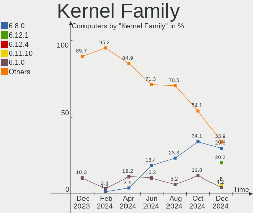

| Version | Computers | Percent |
|---------|-----------|---------|
| 6.2.0   | 38        | 20.43%  |
| 5.15.0  | 21        | 11.29%  |
| 6.1.0   | 18        | 9.68%   |
| 6.5.5   | 15        | 8.06%   |
| 6.5.7   | 11        | 5.91%   |
| 6.5.6   | 11        | 5.91%   |
| 6.5.0   | 11        | 5.91%   |
| 6.4.11  | 7         | 3.76%   |
| 6.5.9   | 5         | 2.69%   |
| 6.5.8   | 5         | 2.69%   |
| 6.2.9   | 5         | 2.69%   |
| 5.4.0   | 4         | 2.15%   |
| 5.10.0  | 4         | 2.15%   |
| 5.19.0  | 3         | 1.61%   |
| 6.4.0   | 2         | 1.08%   |
| 6.1.57  | 2         | 1.08%   |
| 6.1.53  | 2         | 1.08%   |
| 5.14.0  | 2         | 1.08%   |
| 6.5.3   | 1         | 0.54%   |
| 6.4.6   | 1         | 0.54%   |
| 6.4.16  | 1         | 0.54%   |
| 6.4.12  | 1         | 0.54%   |
| 6.3.5   | 1         | 0.54%   |
| 6.3     | 1         | 0.54%   |
| 6.2.6   | 1         | 0.54%   |
| 6.2.15  | 1         | 0.54%   |
| 6.1.59  | 1         | 0.54%   |
| 6.1.56  | 1         | 0.54%   |
| 6.1.55  | 1         | 0.54%   |
| 6.1.52  | 1         | 0.54%   |
| 6.1.1   | 1         | 0.54%   |
| 5.8.0   | 1         | 0.54%   |
| 5.18.17 | 1         | 0.54%   |
| 5.16.7  | 1         | 0.54%   |
| 5.16.11 | 1         | 0.54%   |
| 5.13.0  | 1         | 0.54%   |
| 4.19.0  | 1         | 0.54%   |
| 4.15.0  | 1         | 0.54%   |

Kernel Major Ver.
-----------------

Linux kernel major version

| Version | Computers | Percent |
|---------|-----------|---------|
| 6.5     | 59        | 31.72%  |
| 6.2     | 45        | 24.19%  |
| 6.1     | 27        | 14.52%  |
| 5.15    | 21        | 11.29%  |
| 6.4     | 12        | 6.45%   |
| 5.4     | 4         | 2.15%   |
| 5.10    | 4         | 2.15%   |
| 5.19    | 3         | 1.61%   |
| 5.16    | 2         | 1.08%   |
| 5.14    | 2         | 1.08%   |
| 6.3     | 1         | 0.54%   |
| 6       | 1         | 0.54%   |
| 5.8     | 1         | 0.54%   |
| 5.18    | 1         | 0.54%   |
| 5.13    | 1         | 0.54%   |
| 4.19    | 1         | 0.54%   |
| 4.15    | 1         | 0.54%   |

Arch
----

OS architecture (x86_64, i586, etc.)

| Name    | Computers | Percent |
|---------|-----------|---------|
| x86_64  | 184       | 98.92%  |
| i686    | 1         | 0.54%   |
| aarch64 | 1         | 0.54%   |

DE
--

Desktop Environment

| Name          | Computers | Percent |
|---------------|-----------|---------|
| GNOME         | 100       | 53.76%  |
| KDE5          | 37        | 19.89%  |
| X-Cinnamon    | 16        | 8.6%    |
| XFCE          | 12        | 6.45%   |
| Unknown       | 4         | 2.15%   |
| MATE          | 2         | 1.08%   |
| KDE           | 2         | 1.08%   |
| i3            | 2         | 1.08%   |
| Endless:GNOME | 2         | 1.08%   |
| Deepin        | 2         | 1.08%   |
| Budgie        | 2         | 1.08%   |
| Phosh:GNOME   | 1         | 0.54%   |
| LXQt          | 1         | 0.54%   |
| Cutefish      | 1         | 0.54%   |
| Cinnamon      | 1         | 0.54%   |
| bspwm         | 1         | 0.54%   |

Display Server
--------------

X11 or Wayland

| Name    | Computers | Percent |
|---------|-----------|---------|
| X11     | 90        | 48.39%  |
| Wayland | 89        | 47.85%  |
| Tty     | 4         | 2.15%   |
| Unknown | 3         | 1.61%   |

Display Manager
---------------

SDDM, LightDM, etc.

| Name    | Computers | Percent |
|---------|-----------|---------|
| Unknown | 65        | 34.95%  |
| GDM3    | 51        | 27.42%  |
| SDDM    | 35        | 18.82%  |
| LightDM | 20        | 10.75%  |
| GDM     | 14        | 7.53%   |
| GREETD  | 1         | 0.54%   |

OS Lang
-------

Language

| Lang           | Computers | Percent |
|----------------|-----------|---------|
| es_ES          | 114       | 61.29%  |
| en_US          | 44        | 23.66%  |
| ca_ES          | 9         | 4.84%   |
| en_GB          | 6         | 3.23%   |
| C              | 3         | 1.61%   |
| de_DE          | 2         | 1.08%   |
| Unknown        | 2         | 1.08%   |
| gl_ES          | 1         | 0.54%   |
| eu_ES          | 1         | 0.54%   |
| es_ES.UTF8     | 1         | 0.54%   |
| eo             | 1         | 0.54%   |
| en_CA          | 1         | 0.54%   |
| ca_ES@valencia | 1         | 0.54%   |

Boot Mode
---------

EFI or BIOS

| Mode | Computers | Percent |
|------|-----------|---------|
| EFI  | 110       | 59.14%  |
| BIOS | 76        | 40.86%  |

Filesystem
----------

Type of filesystem

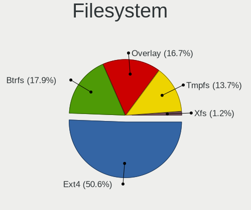

| Type    | Computers | Percent |
|---------|-----------|---------|
| Ext4    | 105       | 56.45%  |
| Btrfs   | 37        | 19.89%  |
| Tmpfs   | 28        | 15.05%  |
| Xfs     | 8         | 4.3%    |
| Overlay | 7         | 3.76%   |
| Zfs     | 1         | 0.54%   |

Part. scheme
------------

Scheme of partitioning

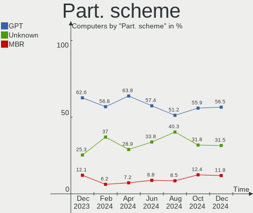

| Type    | Computers | Percent |
|---------|-----------|---------|
| GPT     | 111       | 59.68%  |
| Unknown | 59        | 31.72%  |
| MBR     | 16        | 8.6%    |

Dual Boot with Linux/BSD
------------------------

Hosting more than one Linux/BSD

| Dual boot | Computers | Percent |
|-----------|-----------|---------|
| No        | 159       | 85.48%  |
| Yes       | 27        | 14.52%  |

Dual Boot (Win)
---------------

Hosting Linux and Windows

| Dual boot | Computers | Percent |
|-----------|-----------|---------|
| No        | 127       | 68.28%  |
| Yes       | 59        | 31.72%  |

Board
-----

Vendor
------

Motherboard manufacturer

| Name                | Computers | Percent |
|---------------------|-----------|---------|
| ASUSTek Computer    | 41        | 22.04%  |
| Hewlett-Packard     | 27        | 14.52%  |
| Lenovo              | 22        | 11.83%  |
| MSI                 | 21        | 11.29%  |
| Gigabyte Technology | 8         | 4.3%    |
| Dell                | 8         | 4.3%    |
| Acer                | 7         | 3.76%   |
| Apple               | 6         | 3.23%   |
| Toshiba             | 4         | 2.15%   |
| Packard Bell        | 4         | 2.15%   |
| Intel               | 3         | 1.61%   |
| ASRock              | 3         | 1.61%   |
| VANT                | 2         | 1.08%   |
| Valve               | 2         | 1.08%   |
| Teclast             | 2         | 1.08%   |
| SLIMBOOK            | 2         | 1.08%   |
| HUAWEI              | 2         | 1.08%   |
| Dynabook            | 2         | 1.08%   |
| Chuwi               | 2         | 1.08%   |
| AZW                 | 2         | 1.08%   |
| TUXEDO              | 1         | 0.54%   |
| Timi                | 1         | 0.54%   |
| Supermicro          | 1         | 0.54%   |
| Sony                | 1         | 0.54%   |
| Shuttle             | 1         | 0.54%   |
| rocky               | 1         | 0.54%   |
| Razer               | 1         | 0.54%   |
| Pine Microsystems   | 1         | 0.54%   |
| Pegatron            | 1         | 0.54%   |
| Panasonic           | 1         | 0.54%   |
| Medion              | 1         | 0.54%   |
| Koloe               | 1         | 0.54%   |
| Google              | 1         | 0.54%   |
| Foxconn             | 1         | 0.54%   |
| Allview             | 1         | 0.54%   |
| Unknown             | 1         | 0.54%   |

Model
-----

Motherboard model

| Name                                    | Computers | Percent |
|-----------------------------------------|-----------|---------|
| Valve Jupiter                           | 2         | 1.08%   |
| MSI Prestige 14H B12UCX                 | 2         | 1.08%   |
| MSI MS-7C56                             | 2         | 1.08%   |
| MSI MS-7B79                             | 2         | 1.08%   |
| Lenovo IdeaPad 3 15ITL6 82H8            | 2         | 1.08%   |
| Lenovo G500 20236                       | 2         | 1.08%   |
| HP TouchSmart tm2                       | 2         | 1.08%   |
| HP Notebook                             | 2         | 1.08%   |
| ASUS TUF Gaming X570-PLUS               | 2         | 1.08%   |
| ASUS TUF Gaming B550-PLUS               | 2         | 1.08%   |
| ASUS T101HA                             | 2         | 1.08%   |
| Acer TravelMate P259-M                  | 2         | 1.08%   |
| Unknown                                 | 2         | 1.08%   |
| VANT MOOVE3-15                          | 1         | 0.54%   |
| VANT MOOVE14_2023                       | 1         | 0.54%   |
| TUXEDO InfinityBook Pro Gen8 (MK1)      | 1         | 0.54%   |
| Toshiba TECRA R950                      | 1         | 0.54%   |
| Toshiba Satellite P50t-B-118            | 1         | 0.54%   |
| Toshiba Satellite C55-C                 | 1         | 0.54%   |
| Toshiba QOSMIO X70-B                    | 1         | 0.54%   |
| Timi RedmiBook Pro 14S                  | 1         | 0.54%   |
| Teclast F7S                             | 1         | 0.54%   |
| Teclast F7 Plus                         | 1         | 0.54%   |
| Supermicro X10SL7-F                     | 1         | 0.54%   |
| Sony VPCSB2L1R                          | 1         | 0.54%   |
| SLIMBOOK TITAN                          | 1         | 0.54%   |
| SLIMBOOK PROX14-10                      | 1         | 0.54%   |
| Shuttle DS47D                           | 1         | 0.54%   |
| rocky ASUS EXPERTBOOK B1402CBA_B1402CBA | 1         | 0.54%   |
| Razer Blade 14 (2022) - RZ09-0427       | 1         | 0.54%   |
| Pine Microsystems Pine64 PineTab2 v2.0  | 1         | 0.54%   |
| Pegatron WH661AA-ABE p6300es            | 1         | 0.54%   |
| Panasonic CF-C1AD06GDE                  | 1         | 0.54%   |
| Packard Bell IMEDIA S3840               | 1         | 0.54%   |
| Packard Bell IMEDIA S3720               | 1         | 0.54%   |
| Packard Bell EasyNote MH36              | 1         | 0.54%   |
| Packard Bell DOT S                      | 1         | 0.54%   |
| MSI Vector GP68HX 12VH                  | 1         | 0.54%   |
| MSI PS42 Modern 8MO                     | 1         | 0.54%   |
| MSI Prestige 15 A11SCX                  | 1         | 0.54%   |

Model Family
------------

Motherboard model prefix

| Name                | Computers | Percent |
|---------------------|-----------|---------|
| ASUS TUF            | 7         | 3.76%   |
| ASUS ROG            | 7         | 3.76%   |
| Lenovo ThinkPad     | 6         | 3.23%   |
| Lenovo IdeaPad      | 5         | 2.69%   |
| HP Pavilion         | 5         | 2.69%   |
| MSI Prestige        | 4         | 2.15%   |
| Acer Aspire         | 4         | 2.15%   |
| MSI Modern          | 3         | 1.61%   |
| HP Laptop           | 3         | 1.61%   |
| HP EliteDesk        | 3         | 1.61%   |
| ASUS VivoBook       | 3         | 1.61%   |
| ASUS PRIME          | 3         | 1.61%   |
| ASUS ASUS           | 3         | 1.61%   |
| Acer TravelMate     | 3         | 1.61%   |
| Valve Jupiter       | 2         | 1.08%   |
| Toshiba Satellite   | 2         | 1.08%   |
| Packard Bell IMEDIA | 2         | 1.08%   |
| MSI MS-7C56         | 2         | 1.08%   |
| MSI MS-7B79         | 2         | 1.08%   |
| Lenovo Yoga         | 2         | 1.08%   |
| Lenovo ThinkBook    | 2         | 1.08%   |
| Lenovo G500         | 2         | 1.08%   |
| HP TouchSmart       | 2         | 1.08%   |
| HP Notebook         | 2         | 1.08%   |
| HP EliteBook        | 2         | 1.08%   |
| Dynabook Satellite  | 2         | 1.08%   |
| Dell XPS            | 2         | 1.08%   |
| Dell OptiPlex       | 2         | 1.08%   |
| Dell Latitude       | 2         | 1.08%   |
| ASUS Zenbook        | 2         | 1.08%   |
| ASUS T101HA         | 2         | 1.08%   |
| Unknown             | 2         | 1.08%   |
| VANT MOOVE3-15      | 1         | 0.54%   |
| VANT MOOVE14        | 1         | 0.54%   |
| TUXEDO InfinityBook | 1         | 0.54%   |
| Toshiba TECRA       | 1         | 0.54%   |
| Toshiba QOSMIO      | 1         | 0.54%   |
| Timi RedmiBook      | 1         | 0.54%   |
| Teclast F7S         | 1         | 0.54%   |
| Teclast F7          | 1         | 0.54%   |

MFG Year
--------

Motherboard manufacture year

| Year    | Computers | Percent |
|---------|-----------|---------|
| 2021    | 25        | 13.44%  |
| 2020    | 20        | 10.75%  |
| 2019    | 19        | 10.22%  |
| 2023    | 18        | 9.68%   |
| 2022    | 15        | 8.06%   |
| 2018    | 11        | 5.91%   |
| 2013    | 11        | 5.91%   |
| 2012    | 11        | 5.91%   |
| 2010    | 11        | 5.91%   |
| 2015    | 10        | 5.38%   |
| 2014    | 10        | 5.38%   |
| 2017    | 7         | 3.76%   |
| 2016    | 5         | 2.69%   |
| 2009    | 5         | 2.69%   |
| 2011    | 3         | 1.61%   |
| 2008    | 2         | 1.08%   |
| 2006    | 1         | 0.54%   |
| 2005    | 1         | 0.54%   |
| Unknown | 1         | 0.54%   |

Form Factor
-----------

Physical design of the computer

| Name           | Computers | Percent |
|----------------|-----------|---------|
| Notebook       | 110       | 59.14%  |
| Desktop        | 60        | 32.26%  |
| Convertible    | 5         | 2.69%   |
| Mini pc        | 4         | 2.15%   |
| All in one     | 3         | 1.61%   |
| Tablet         | 2         | 1.08%   |
| System on chip | 1         | 0.54%   |
| Server         | 1         | 0.54%   |

Secure Boot
-----------

Enabled or disabled

| State    | Computers | Percent |
|----------|-----------|---------|
| Disabled | 166       | 89.25%  |
| Enabled  | 20        | 10.75%  |

Coreboot
--------

Have coreboot on board

| Used | Computers | Percent |
|------|-----------|---------|
| No   | 185       | 99.46%  |
| Yes  | 1         | 0.54%   |

RAM Size
--------

Total RAM memory

| Size in GB  | Computers | Percent |
|-------------|-----------|---------|
| 16.01-24.0  | 47        | 25.27%  |
| 4.01-8.0    | 43        | 23.12%  |
| 8.01-16.0   | 36        | 19.35%  |
| 3.01-4.0    | 28        | 15.05%  |
| 32.01-64.0  | 22        | 11.83%  |
| 24.01-32.0  | 4         | 2.15%   |
| 64.01-256.0 | 4         | 2.15%   |
| 2.01-3.0    | 1         | 0.54%   |
| 1.01-2.0    | 1         | 0.54%   |

RAM Used
--------

Used RAM memory

| Used GB    | Computers | Percent |
|------------|-----------|---------|
| 2.01-3.0   | 55        | 29.57%  |
| 1.01-2.0   | 42        | 22.58%  |
| 4.01-8.0   | 41        | 22.04%  |
| 3.01-4.0   | 36        | 19.35%  |
| 8.01-16.0  | 9         | 4.84%   |
| 16.01-24.0 | 1         | 0.54%   |
| 0.51-1.0   | 1         | 0.54%   |
| 0.01-0.5   | 1         | 0.54%   |

Total Drives
------------

Number of drives on board

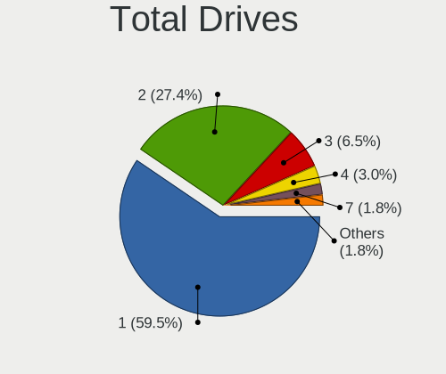

| Drives | Computers | Percent |
|--------|-----------|---------|
| 1      | 112       | 60.22%  |
| 2      | 51        | 27.42%  |
| 3      | 13        | 6.99%   |
| 4      | 6         | 3.23%   |
| 5      | 2         | 1.08%   |
| 9      | 1         | 0.54%   |
| 7      | 1         | 0.54%   |

Has CD-ROM
----------

Has CD-ROM on board

| Presented | Computers | Percent |
|-----------|-----------|---------|
| No        | 137       | 73.66%  |
| Yes       | 49        | 26.34%  |

Has Ethernet
------------

Has Ethernet on board

| Presented | Computers | Percent |
|-----------|-----------|---------|
| Yes       | 149       | 80.11%  |
| No        | 37        | 19.89%  |

Has WiFi
--------

Has WiFi module

| Presented | Computers | Percent |
|-----------|-----------|---------|
| Yes       | 156       | 83.87%  |
| No        | 30        | 16.13%  |

Has Bluetooth
-------------

Has Bluetooth module

| Presented | Computers | Percent |
|-----------|-----------|---------|
| Yes       | 138       | 74.19%  |
| No        | 48        | 25.81%  |

Location
--------

Country
-------

Geographic location (country)

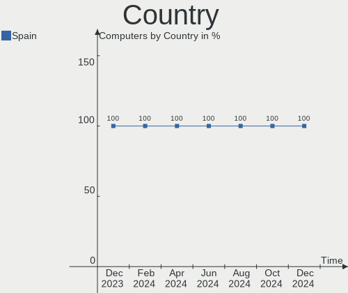

| Country | Computers | Percent |
|---------|-----------|---------|
| Spain   | 186       | 100%    |

City
----

Geographic location (city)

| City                       | Computers | Percent |
|----------------------------|-----------|---------|
| Madrid                     | 20        | 10.75%  |
| Barcelona                  | 19        | 10.22%  |
| Seville                    | 9         | 4.84%   |
| Granada                    | 6         | 3.23%   |
| Zaragoza                   | 5         | 2.69%   |
| Palma                      | 5         | 2.69%   |
| Vigo                       | 4         | 2.15%   |
| Valencia                   | 4         | 2.15%   |
| Santander                  | 4         | 2.15%   |
| Málaga                    | 4         | 2.15%   |
| Las Palmas de Gran Canaria | 4         | 2.15%   |
| Valladolid                 | 3         | 1.61%   |
| Daganzo de Arriba          | 3         | 1.61%   |
| Pamplona                   | 2         | 1.08%   |
| Oviedo                     | 2         | 1.08%   |
| Ourense                    | 2         | 1.08%   |
| Murcia                     | 2         | 1.08%   |
| Manises                    | 2         | 1.08%   |
| Laguna de Duero            | 2         | 1.08%   |
| Igualada                   | 2         | 1.08%   |
| Girona                     | 2         | 1.08%   |
| Antas                      | 2         | 1.08%   |
| Almería                   | 2         | 1.08%   |
| Alicante                   | 2         | 1.08%   |
| Villena                    | 1         | 0.54%   |
| Valmojado                  | 1         | 0.54%   |
| Úbeda                     | 1         | 0.54%   |
| Tuineje                    | 1         | 0.54%   |
| Totana                     | 1         | 0.54%   |
| Tortosa                    | 1         | 0.54%   |
| Torre Pacheco              | 1         | 0.54%   |
| Toledo                     | 1         | 0.54%   |
| Tias                       | 1         | 0.54%   |
| Teguise                    | 1         | 0.54%   |
| Tavernes de la Valldigna   | 1         | 0.54%   |
| Santurtzi                  | 1         | 0.54%   |
| Santiago de Compostela     | 1         | 0.54%   |
| Santa Maria del Camí      | 1         | 0.54%   |
| Santa Eugènia             | 1         | 0.54%   |
| Sant Andreu de la Barca    | 1         | 0.54%   |

Drives
------

Drive Vendor
------------

Hard drive vendors

| Vendor                       | Computers | Drives | Percent |
|------------------------------|-----------|--------|---------|
| Samsung Electronics          | 35        | 42     | 12.82%  |
| Seagate                      | 33        | 40     | 12.09%  |
| WDC                          | 32        | 38     | 11.72%  |
| Kingston                     | 32        | 35     | 11.72%  |
| Sandisk                      | 15        | 15     | 5.49%   |
| Unknown                      | 13        | 15     | 4.76%   |
| Toshiba                      | 12        | 12     | 4.4%    |
| Phison Electronics           | 8         | 8      | 2.93%   |
| Micron Technology            | 8         | 8      | 2.93%   |
| Intel                        | 8         | 8      | 2.93%   |
| SK hynix                     | 7         | 7      | 2.56%   |
| Crucial                      | 6         | 6      | 2.2%    |
| Hitachi                      | 5         | 6      | 1.83%   |
| Apple                        | 5         | 6      | 1.83%   |
| Micron/Crucial Technology    | 4         | 4      | 1.47%   |
| Kingston Technology Company  | 4         | 5      | 1.47%   |
| KIOXIA                       | 3         | 3      | 1.1%    |
| Teclast                      | 2         | 2      | 0.73%   |
| PNY                          | 2         | 2      | 0.73%   |
| MAXIO Technology (Hangzhou)  | 2         | 2      | 0.73%   |
| KingSpec                     | 2         | 2      | 0.73%   |
| HGST                         | 2         | 2      | 0.73%   |
| FORESEE                      | 2         | 2      | 0.73%   |
| Emtec                        | 2         | 2      | 0.73%   |
| China                        | 2         | 2      | 0.73%   |
| Unknown                      | 2         | 2      | 0.73%   |
| Verbatim                     | 1         | 1      | 0.37%   |
| Union Memory (Shenzhen)      | 1         | 1      | 0.37%   |
| UMIS                         | 1         | 1      | 0.37%   |
| Silicon Motion               | 1         | 1      | 0.37%   |
| Shenzhen Longsys Electronics | 1         | 1      | 0.37%   |
| Phison                       | 1         | 1      | 0.37%   |
| Patriot                      | 1         | 1      | 0.37%   |
| OCZ                          | 1         | 1      | 0.37%   |
| Netac                        | 1         | 1      | 0.37%   |
| Maxtor                       | 1         | 1      | 0.37%   |
| LITEON                       | 1         | 1      | 0.37%   |
| Lexar                        | 1         | 1      | 0.37%   |
| LaCie                        | 1         | 1      | 0.37%   |
| KIOXIA-EXCERIA               | 1         | 1      | 0.37%   |

Drive Model
-----------

Hard drive models

| Model                                              | Computers | Percent |
|----------------------------------------------------|-----------|---------|
| Kingston SA400S37240G 240GB SSD                    | 8         | 2.71%   |
| Seagate ST500LT012-1DG142 500GB                    | 5         | 1.69%   |
| Seagate ST2000DM008-2FR102 2TB                     | 5         | 1.69%   |
| Kingston SA400S37480G 480GB SSD                    | 5         | 1.69%   |
| Unknown MMC Card  128GB                            | 4         | 1.36%   |
| Seagate ST1000DM010-2EP102 1TB                     | 4         | 1.36%   |
| Samsung NVMe SSD Controller SM981/PM981/PM983 1TB  | 4         | 1.36%   |
| Micron/Crucial P2 NVMe PCIe SSD 500GB              | 4         | 1.36%   |
| Samsung SSD 860 EVO 500GB                          | 3         | 1.02%   |
| Samsung NVMe SSD Controller PM9A1/PM9A3/980PRO 1TB | 3         | 1.02%   |
| Kingston SA400S37120G 120GB SSD                    | 3         | 1.02%   |
| Intel SSDPEKNU512GZ 512GB                          | 3         | 1.02%   |
| Crucial CT240BX500SSD1 240GB                       | 3         | 1.02%   |
| WDC WD30EZRZ-00GXCB0 3TB                           | 2         | 0.68%   |
| WDC WD20EZRZ-00Z5HB0 2TB                           | 2         | 0.68%   |
| Unknown MMC Card  64GB                             | 2         | 0.68%   |
| Unknown MMC Card  32GB                             | 2         | 0.68%   |
| Toshiba MQ01ABD100 1TB                             | 2         | 0.68%   |
| SK hynix BC511 512GB                               | 2         | 0.68%   |
| Seagate ST9500325AS 500GB                          | 2         | 0.68%   |
| Seagate ST1000DM003-1SB102 1TB                     | 2         | 0.68%   |
| SanDisk NVMe SSD Drive 1TB                         | 2         | 0.68%   |
| Samsung SSD 980 500GB                              | 2         | 0.68%   |
| Samsung SSD 980 1TB                                | 2         | 0.68%   |
| Samsung SSD 850 EVO 250GB                          | 2         | 0.68%   |
| Samsung MZVL21T0HCLR-00B00 1TB                     | 2         | 0.68%   |
| Phison PS5013 E13 NVMe Controller 256GB            | 2         | 0.68%   |
| Phison E12 NVMe Controller 1TB                     | 2         | 0.68%   |
| Kingston Company SNV2S2000G 2TB                    | 2         | 0.68%   |
| Kingston OM8PCP31024F-AI1 1024GB                   | 2         | 0.68%   |
| Intel SSD 660P Series 1024GB                       | 2         | 0.68%   |
| Unknown                                            | 2         | 0.68%   |
| WDC WDS500G3X0C-00SJG0 500GB                       | 1         | 0.34%   |
| WDC WDS500G2B0C-00PXH0 500GB                       | 1         | 0.34%   |
| WDC WDS100T2B0C-00PXH0 1TB                         | 1         | 0.34%   |
| WDC WDS100T2B0A-00SM50 1TB SSD                     | 1         | 0.34%   |
| WDC WD6400BEVT-22A0RT0 640GB                       | 1         | 0.34%   |
| WDC WD6400AAKS-22A7B2 640GB                        | 1         | 0.34%   |
| WDC WD5000LPCX-24C6HT0 500GB                       | 1         | 0.34%   |
| WDC WD5000LPCX-22VHAT1 500GB                       | 1         | 0.34%   |

HDD Vendor
----------

Hard disk drive vendors

| Vendor              | Computers | Drives | Percent |
|---------------------|-----------|--------|---------|
| Seagate             | 33        | 39     | 39.76%  |
| WDC                 | 25        | 31     | 30.12%  |
| Toshiba             | 9         | 9      | 10.84%  |
| Hitachi             | 5         | 6      | 6.02%   |
| Apple               | 3         | 3      | 3.61%   |
| Unknown             | 2         | 2      | 2.41%   |
| Samsung Electronics | 2         | 2      | 2.41%   |
| HGST                | 2         | 2      | 2.41%   |
| LaCie               | 1         | 1      | 1.2%    |
| Fujitsu             | 1         | 1      | 1.2%    |

SSD Vendor
----------

Solid state drive vendors

| Vendor              | Computers | Drives | Percent |
|---------------------|-----------|--------|---------|
| Kingston            | 23        | 25     | 28.05%  |
| Samsung Electronics | 16        | 18     | 19.51%  |
| SanDisk             | 7         | 7      | 8.54%   |
| Crucial             | 6         | 6      | 7.32%   |
| Toshiba             | 2         | 2      | 2.44%   |
| Teclast             | 2         | 2      | 2.44%   |
| PNY                 | 2         | 2      | 2.44%   |
| Micron Technology   | 2         | 2      | 2.44%   |
| KingSpec            | 2         | 2      | 2.44%   |
| FORESEE             | 2         | 2      | 2.44%   |
| Emtec               | 2         | 2      | 2.44%   |
| China               | 2         | 2      | 2.44%   |
| WDC                 | 1         | 1      | 1.22%   |
| Verbatim            | 1         | 1      | 1.22%   |
| Patriot             | 1         | 1      | 1.22%   |
| OCZ                 | 1         | 1      | 1.22%   |
| Netac               | 1         | 1      | 1.22%   |
| Maxtor              | 1         | 1      | 1.22%   |
| LITEON              | 1         | 1      | 1.22%   |
| KIOXIA-EXCERIA      | 1         | 1      | 1.22%   |
| Kingchuxing         | 1         | 1      | 1.22%   |
| Kimtigo             | 1         | 1      | 1.22%   |
| Gigabyte Technology | 1         | 1      | 1.22%   |
| Corsair             | 1         | 1      | 1.22%   |
| BAITITON            | 1         | 1      | 1.22%   |
| AirDisk             | 1         | 1      | 1.22%   |

Drive Kind
----------

HDD or SSD

| Kind    | Computers | Drives | Percent |
|---------|-----------|--------|---------|
| NVMe    | 89        | 105    | 36.48%  |
| SSD     | 71        | 86     | 29.1%   |
| HDD     | 69        | 96     | 28.28%  |
| MMC     | 12        | 13     | 4.92%   |
| Unknown | 3         | 3      | 1.23%   |

Drive Connector
---------------

SATA, SAS, NVMe, etc.

| Type | Computers | Drives | Percent |
|------|-----------|--------|---------|
| SATA | 114       | 177    | 50.89%  |
| NVMe | 89        | 104    | 39.73%  |
| MMC  | 12        | 13     | 5.36%   |
| SAS  | 9         | 9      | 4.02%   |

Drive Size
----------

Size of hard drive

| Size in TB | Computers | Drives | Percent |
|------------|-----------|--------|---------|
| 0.01-0.5   | 82        | 107    | 55.03%  |
| 0.51-1.0   | 44        | 45     | 29.53%  |
| 1.01-2.0   | 15        | 22     | 10.07%  |
| 3.01-4.0   | 4         | 4      | 2.68%   |
| 2.01-3.0   | 3         | 3      | 2.01%   |
| 10.01-20.0 | 1         | 1      | 0.67%   |

Space Total
-----------

Amount of disk space available on the file system

| Size in GB     | Computers | Percent |
|----------------|-----------|---------|
| 251-500        | 57        | 30.65%  |
| 101-250        | 45        | 24.19%  |
| 501-1000       | 32        | 17.2%   |
| 1001-2000      | 18        | 9.68%   |
| More than 3000 | 9         | 4.84%   |
| 1-20           | 8         | 4.3%    |
| 2001-3000      | 7         | 3.76%   |
| 51-100         | 7         | 3.76%   |
| Unknown        | 2         | 1.08%   |
| 21-50          | 1         | 0.54%   |

Space Used
----------

Amount of used disk space

| Used GB        | Computers | Percent |
|----------------|-----------|---------|
| 1-20           | 66        | 35.48%  |
| 101-250        | 34        | 18.28%  |
| 21-50          | 29        | 15.59%  |
| 251-500        | 16        | 8.6%    |
| 51-100         | 16        | 8.6%    |
| 501-1000       | 11        | 5.91%   |
| 1001-2000      | 9         | 4.84%   |
| More than 3000 | 2         | 1.08%   |
| Unknown        | 2         | 1.08%   |
| 2001-3000      | 1         | 0.54%   |

Malfunc. Drives
---------------

Drive models with a malfunction

| Model                                               | Computers | Drives | Percent |
|-----------------------------------------------------|-----------|--------|---------|
| WDC WD6400BEVT-22A0RT0 640GB                        | 1         | 1      | 10%     |
| WDC WD5000LPCX-24C6HT0 500GB                        | 1         | 1      | 10%     |
| WDC WD5000BEVT-22ZAT0 500GB                         | 1         | 1      | 10%     |
| WDC WD40EFAX-68JH4N1 4TB                            | 1         | 1      | 10%     |
| WDC WD20EFRX-68EUZN0 2TB                            | 1         | 1      | 10%     |
| Toshiba DT01ACA100 1TB                              | 1         | 1      | 10%     |
| Seagate ST500LT012-1DG142 500GB                     | 1         | 1      | 10%     |
| Seagate ST3500830AS 500GB                           | 1         | 1      | 10%     |
| Samsung Electronics MZNLH128HBHQ-000H1 128GB SSD    | 1         | 1      | 10%     |
| Micron Technology MTFDDAV256TBN-1AR15ABHA 256GB SSD | 1         | 1      | 10%     |

Malfunc. Drive Vendor
---------------------

Vendors of faulty drives

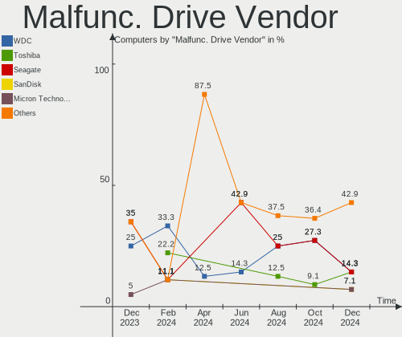

| Vendor              | Computers | Drives | Percent |
|---------------------|-----------|--------|---------|
| WDC                 | 4         | 5      | 44.44%  |
| Seagate             | 2         | 2      | 22.22%  |
| Toshiba             | 1         | 1      | 11.11%  |
| Samsung Electronics | 1         | 1      | 11.11%  |
| Micron Technology   | 1         | 1      | 11.11%  |

Malfunc. HDD Vendor
-------------------

Vendors of faulty HDD drives

| Vendor  | Computers | Drives | Percent |
|---------|-----------|--------|---------|
| WDC     | 4         | 5      | 57.14%  |
| Seagate | 2         | 2      | 28.57%  |
| Toshiba | 1         | 1      | 14.29%  |

Malfunc. Drive Kind
-------------------

Kinds of faulty drives

| Kind | Computers | Drives | Percent |
|------|-----------|--------|---------|
| HDD  | 6         | 8      | 75%     |
| SSD  | 2         | 2      | 25%     |

Failed Drives
-------------

Failed drive models

Zero info for selected period =(

Failed Drive Vendor
-------------------

Failed drive vendors

Zero info for selected period =(

Drive Status
------------

Number of failed and malfunc. drives

| Status   | Computers | Drives | Percent |
|----------|-----------|--------|---------|
| Detected | 100       | 153    | 50.51%  |
| Works    | 90        | 140    | 45.45%  |
| Malfunc  | 8         | 10     | 4.04%   |

Storage controller
------------------

Storage Vendor
--------------

Storage controller vendors

| Vendor                       | Computers | Percent |
|------------------------------|-----------|---------|
| Intel                        | 111       | 45.31%  |
| AMD                          | 33        | 13.47%  |
| Samsung Electronics          | 21        | 8.57%   |
| SanDisk                      | 14        | 5.71%   |
| Kingston Technology Company  | 14        | 5.71%   |
| Phison Electronics           | 9         | 3.67%   |
| SK hynix                     | 7         | 2.86%   |
| Micron Technology            | 6         | 2.45%   |
| Nvidia                       | 4         | 1.63%   |
| Micron/Crucial Technology    | 4         | 1.63%   |
| Marvell Technology Group     | 3         | 1.22%   |
| KIOXIA                       | 3         | 1.22%   |
| Shenzhen Longsys Electronics | 2         | 0.82%   |
| MAXIO Technology (Hangzhou)  | 2         | 0.82%   |
| ASMedia Technology           | 2         | 0.82%   |
| Union Memory (Shenzhen)      | 1         | 0.41%   |
| Toshiba America Info Systems | 1         | 0.41%   |
| Solidigm                     | 1         | 0.41%   |
| Silicon Motion               | 1         | 0.41%   |
| Silicon Image                | 1         | 0.41%   |
| Seagate Technology           | 1         | 0.41%   |
| JMicron Technology           | 1         | 0.41%   |
| HighPoint Technologies       | 1         | 0.41%   |
| Broadcom / LSI               | 1         | 0.41%   |
| Apple                        | 1         | 0.41%   |

Storage Model
-------------

Storage controller models

| Model                                                                          | Computers | Percent |
|--------------------------------------------------------------------------------|-----------|---------|
| AMD FCH SATA Controller [AHCI mode]                                            | 17        | 6.32%   |
| Intel 7 Series Chipset Family 6-port SATA Controller [AHCI mode]               | 13        | 4.83%   |
| Intel 8 Series/C220 Series Chipset Family 6-port SATA Controller 1 [AHCI mode] | 11        | 4.09%   |
| AMD 500 Series Chipset SATA Controller                                         | 11        | 4.09%   |
| Intel Volume Management Device NVMe RAID Controller                            | 9         | 3.35%   |
| Samsung NVMe SSD Controller PM9A1/PM9A3/980PRO                                 | 7         | 2.6%    |
| Samsung NVMe SSD Controller 980 (DRAM-less)                                    | 7         | 2.6%    |
| AMD 400 Series Chipset SATA Controller                                         | 7         | 2.6%    |
| Samsung NVMe SSD Controller SM981/PM981/PM983                                  | 6         | 2.23%   |
| Intel Sunrise Point-LP SATA Controller [AHCI mode]                             | 6         | 2.23%   |
| Intel Celeron/Pentium Silver Processor SATA Controller                         | 6         | 2.23%   |
| Intel SSD 670p Series [Keystone Harbor]                                        | 5         | 1.86%   |
| Intel Comet Lake SATA AHCI Controller                                          | 5         | 1.86%   |
| Micron/Crucial P2 [Nick P2] / P3 / P3 Plus NVMe PCIe SSD (DRAM-less)           | 4         | 1.49%   |
| Intel 82801IBM/IEM (ICH9M/ICH9M-E) 4 port SATA Controller [AHCI mode]          | 4         | 1.49%   |
| SK hynix Gold P31/BC711/PC711 NVMe Solid State Drive                           | 3         | 1.12%   |
| SanDisk Ultra 3D / WD Blue SN550 NVMe SSD                                      | 3         | 1.12%   |
| Phison PS5013-E13 PCIe3 NVMe Controller (DRAM-less)                            | 3         | 1.12%   |
| Kingston Company OM8PCP Design-In PCIe 3 NVMe SSD (DRAM-less)                  | 3         | 1.12%   |
| Intel Wildcat Point-LP SATA Controller [AHCI Mode]                             | 3         | 1.12%   |
| Intel Tiger Lake-LP SATA Controller                                            | 3         | 1.12%   |
| Intel SSD 660P Series                                                          | 3         | 1.12%   |
| Intel Q170/Q150/B150/H170/H110/Z170/CM236 Chipset SATA Controller [AHCI Mode]  | 3         | 1.12%   |
| Intel 82801 Mobile SATA Controller [RAID mode]                                 | 3         | 1.12%   |
| Intel 8 Series SATA Controller 1 [AHCI mode]                                   | 3         | 1.12%   |
| Intel 200 Series PCH SATA controller [AHCI mode]                               | 3         | 1.12%   |
| SK hynix BC511 NVMe SSD                                                        | 2         | 0.74%   |
| SanDisk WD Black SN770 / PC SN740 256GB / PC SN560 (DRAM-less) NVMe SSD        | 2         | 0.74%   |
| SanDisk Extreme Pro / WD Black SN750 / PC SN730 / Red SN700 NVMe SSD           | 2         | 0.74%   |
| Phison E12 NVMe Controller                                                     | 2         | 0.74%   |
| Micron 2450 NVMe SSD [HendrixV] (DRAM-less)                                    | 2         | 0.74%   |
| Micron 2400 NVMe SSD (DRAM-less)                                               | 2         | 0.74%   |
| MAXIO (Hangzhou) NVMe SSD Controller MAP1202                                   | 2         | 0.74%   |
| Kingston Company NV2 NVMe SSD SM2267XT                                         | 2         | 0.74%   |
| Kingston Company NV1 NVMe SSD SM2263XT                                         | 2         | 0.74%   |
| Kingston Company A2000 NVMe SSD SM2263EN                                       | 2         | 0.74%   |
| Intel Volume Management Device NVMe RAID Controller Intel Corporation          | 2         | 0.74%   |
| Intel SATA controller                                                          | 2         | 0.74%   |
| Intel NM10/ICH7 Family SATA Controller [IDE mode]                              | 2         | 0.74%   |
| Intel Cannon Point-LP SATA Controller [AHCI Mode]                              | 2         | 0.74%   |

Storage Kind
------------

Kind of storage controller (IDE, SATA, NVMe, SAS, ...)

| Kind | Computers | Percent |
|------|-----------|---------|
| SATA | 124       | 50.82%  |
| NVMe | 88        | 36.07%  |
| RAID | 17        | 6.97%   |
| IDE  | 14        | 5.74%   |
| SAS  | 1         | 0.41%   |

Processor
---------

CPU Vendor
----------

Processor vendors

| Vendor | Computers | Percent |
|--------|-----------|---------|
| Intel  | 128       | 68.82%  |
| AMD    | 57        | 30.65%  |
| ARM    | 1         | 0.54%   |

CPU Model
---------

Processor models

| Model                                       | Computers | Percent |
|---------------------------------------------|-----------|---------|
| Intel 12th Gen Core i5-1235U                | 4         | 2.15%   |
| Intel 11th Gen Core i5-1135G7 @ 2.40GHz     | 4         | 2.15%   |
| Intel Core i7-10510U CPU @ 1.80GHz          | 3         | 1.61%   |
| Intel Core i5-4590 CPU @ 3.30GHz            | 3         | 1.61%   |
| Intel Atom x5-Z8350 CPU @ 1.44GHz           | 3         | 1.61%   |
| AMD Ryzen 7 5800X 8-Core Processor          | 3         | 1.61%   |
| AMD Ryzen 7 4800H with Radeon Graphics      | 3         | 1.61%   |
| AMD Ryzen 5 5600X 6-Core Processor          | 3         | 1.61%   |
| Intel N100                                  | 2         | 1.08%   |
| Intel Genuine CPU U4100 @ 1.30GHz           | 2         | 1.08%   |
| Intel Core i7-5500U CPU @ 2.40GHz           | 2         | 1.08%   |
| Intel Core i5-7400 CPU @ 3.00GHz            | 2         | 1.08%   |
| Intel Core i5-6200U CPU @ 2.30GHz           | 2         | 1.08%   |
| Intel Core i5-4210U CPU @ 1.70GHz           | 2         | 1.08%   |
| Intel Core i5-3317U CPU @ 1.70GHz           | 2         | 1.08%   |
| Intel Core i5-10210U CPU @ 1.60GHz          | 2         | 1.08%   |
| Intel Core i3-7020U CPU @ 2.30GHz           | 2         | 1.08%   |
| Intel Core i3-3110M CPU @ 2.40GHz           | 2         | 1.08%   |
| Intel Core i3-2120 CPU @ 3.30GHz            | 2         | 1.08%   |
| Intel Celeron N4020 CPU @ 1.10GHz           | 2         | 1.08%   |
| Intel Celeron N4000 CPU @ 1.10GHz           | 2         | 1.08%   |
| Intel 13th Gen Core i7-13700H               | 2         | 1.08%   |
| Intel 12th Gen Core i7-12650H               | 2         | 1.08%   |
| Intel 11th Gen Core i7-1185G7 @ 3.00GHz     | 2         | 1.08%   |
| Intel 11th Gen Core i7-1165G7 @ 2.80GHz     | 2         | 1.08%   |
| AMD Ryzen 9 6900HX with Radeon Graphics     | 2         | 1.08%   |
| AMD Ryzen 7 6800U with Radeon Graphics      | 2         | 1.08%   |
| AMD Ryzen 7 5700U with Radeon Graphics      | 2         | 1.08%   |
| AMD Ryzen 7 5700G with Radeon Graphics      | 2         | 1.08%   |
| AMD Ryzen 7 2700X Eight-Core Processor      | 2         | 1.08%   |
| AMD Ryzen 5 5500U with Radeon Graphics      | 2         | 1.08%   |
| AMD Ryzen 5 5500                            | 2         | 1.08%   |
| AMD Ryzen 5 3600 6-Core Processor           | 2         | 1.08%   |
| AMD Ryzen 5 2600 Six-Core Processor         | 2         | 1.08%   |
| AMD Custom APU 0405                         | 2         | 1.08%   |
| Intel Xeon CPU E5620 @ 2.40GHz              | 1         | 0.54%   |
| Intel Xeon CPU E5-2678 v3 @ 2.50GHz         | 1         | 0.54%   |
| Intel Xeon CPU E3-1230L v3 @ 1.80GHz        | 1         | 0.54%   |
| Intel Pentium Gold G5420 CPU @ 3.80GHz      | 1         | 0.54%   |
| Intel Pentium Dual-Core CPU E5700 @ 3.00GHz | 1         | 0.54%   |

CPU Model Family
----------------

Processor model prefix

| Model                   | Computers | Percent |
|-------------------------|-----------|---------|
| Intel Core i5           | 32        | 17.2%   |
| Other                   | 30        | 16.13%  |
| Intel Core i7           | 28        | 15.05%  |
| AMD Ryzen 7             | 18        | 9.68%   |
| AMD Ryzen 5             | 17        | 9.14%   |
| Intel Celeron           | 12        | 6.45%   |
| Intel Core i3           | 10        | 5.38%   |
| AMD Ryzen 9             | 5         | 2.69%   |
| Intel Core 2 Duo        | 4         | 2.15%   |
| Intel Atom              | 4         | 2.15%   |
| Intel Xeon              | 3         | 1.61%   |
| Intel Pentium           | 2         | 1.08%   |
| Intel Genuine           | 2         | 1.08%   |
| AMD Ryzen 3             | 2         | 1.08%   |
| AMD A10                 | 2         | 1.08%   |
| Intel Pentium Gold      | 1         | 0.54%   |
| Intel Pentium Dual-Core | 1         | 0.54%   |
| Intel Pentium Dual      | 1         | 0.54%   |
| Intel Core m5           | 1         | 0.54%   |
| Intel Core m3           | 1         | 0.54%   |
| AMD Turion 64 X2 Mobile | 1         | 0.54%   |
| AMD Ryzen 7 PRO         | 1         | 0.54%   |
| AMD Ryzen 5 PRO         | 1         | 0.54%   |
| AMD Phenom II X4        | 1         | 0.54%   |
| AMD Athlon II X4        | 1         | 0.54%   |
| AMD Athlon II X2        | 1         | 0.54%   |
| AMD Athlon 64 X2        | 1         | 0.54%   |
| AMD Athlon              | 1         | 0.54%   |
| AMD A8                  | 1         | 0.54%   |
| AMD A6                  | 1         | 0.54%   |

CPU Cores
---------

Number of processor cores

| Number  | Computers | Percent |
|---------|-----------|---------|
| 4       | 60        | 32.26%  |
| 2       | 60        | 32.26%  |
| 8       | 26        | 13.98%  |
| 6       | 23        | 12.37%  |
| 10      | 6         | 3.23%   |
| 14      | 4         | 2.15%   |
| 12      | 3         | 1.61%   |
| 16      | 2         | 1.08%   |
| 1       | 1         | 0.54%   |
| Unknown | 1         | 0.54%   |

CPU Sockets
-----------

Number of sockets

| Number  | Computers | Percent |
|---------|-----------|---------|
| 1       | 184       | 98.92%  |
| 2       | 1         | 0.54%   |
| Unknown | 1         | 0.54%   |

CPU Threads
-----------

Threads per core (Hyper-Threading)

| Number  | Computers | Percent |
|---------|-----------|---------|
| 2       | 137       | 73.66%  |
| 1       | 48        | 25.81%  |
| Unknown | 1         | 0.54%   |

CPU Op-Modes
------------

CPU Operation Modes (32-bit, 64-bit)

| Op mode        | Computers | Percent |
|----------------|-----------|---------|
| 32-bit, 64-bit | 186       | 100%    |

CPU Microcode
-------------

Microcode number

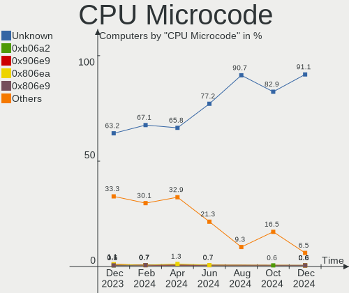

| Number     | Computers | Percent |
|------------|-----------|---------|
| Unknown    | 104       | 55.91%  |
| 0x306c3    | 5         | 2.69%   |
| 0x0a50000d | 4         | 2.15%   |
| 0x0a50000c | 4         | 2.15%   |
| 0x0a404102 | 4         | 2.15%   |
| 0x08108109 | 4         | 2.15%   |
| 0x806ec    | 3         | 1.61%   |
| 0x806ea    | 3         | 1.61%   |
| 0x306a9    | 3         | 1.61%   |
| 0x0a201016 | 3         | 1.61%   |
| 0x08701021 | 3         | 1.61%   |
| 0x08600106 | 3         | 1.61%   |
| 0x906a4    | 2         | 1.08%   |
| 0x706a8    | 2         | 1.08%   |
| 0x406e3    | 2         | 1.08%   |
| 0x206a7    | 2         | 1.08%   |
| 0x1067a    | 2         | 1.08%   |
| 0x08600104 | 2         | 1.08%   |
| 0x0800820d | 2         | 1.08%   |
| 0xa0660    | 1         | 0.54%   |
| 0xa0653    | 1         | 0.54%   |
| 0x906ea    | 1         | 0.54%   |
| 0x906e9    | 1         | 0.54%   |
| 0x906a3    | 1         | 0.54%   |
| 0x806e9    | 1         | 0.54%   |
| 0x806c1    | 1         | 0.54%   |
| 0x706a1    | 1         | 0.54%   |
| 0x6fd      | 1         | 0.54%   |
| 0x6fb      | 1         | 0.54%   |
| 0x506e3    | 1         | 0.54%   |
| 0x40651    | 1         | 0.54%   |
| 0x306f2    | 1         | 0.54%   |
| 0x0a601203 | 1         | 0.54%   |
| 0x0a404101 | 1         | 0.54%   |
| 0x0a20120e | 1         | 0.54%   |
| 0x0a20120a | 1         | 0.54%   |
| 0x0a201025 | 1         | 0.54%   |
| 0x08a00008 | 1         | 0.54%   |
| 0x08608103 | 1         | 0.54%   |
| 0x08608102 | 1         | 0.54%   |

CPU Microarch
-------------

Microarchitecture

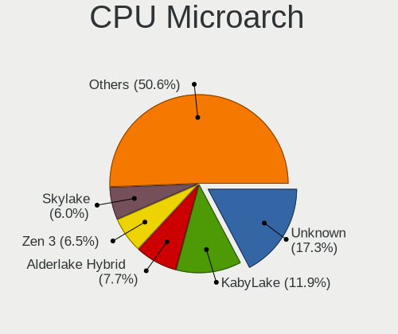

| Name             | Computers | Percent |
|------------------|-----------|---------|
| KabyLake         | 23        | 12.37%  |
| Unknown          | 19        | 10.22%  |
| Zen 3            | 16        | 8.6%    |
| Haswell          | 16        | 8.6%    |
| IvyBridge        | 15        | 8.06%   |
| Alderlake Hybrid | 13        | 6.99%   |
| Zen 2            | 9         | 4.84%   |
| Zen+             | 8         | 4.3%    |
| TigerLake        | 8         | 4.3%    |
| Penryn           | 7         | 3.76%   |
| Skylake          | 6         | 3.23%   |
| SandyBridge      | 6         | 3.23%   |
| Goldmont plus    | 6         | 3.23%   |
| Westmere         | 4         | 2.15%   |
| Silvermont       | 4         | 2.15%   |
| CometLake        | 4         | 2.15%   |
| K10              | 3         | 1.61%   |
| Broadwell        | 3         | 1.61%   |
| Nehalem          | 2         | 1.08%   |
| K8 Hammer        | 2         | 1.08%   |
| IceLake          | 2         | 1.08%   |
| Excavator        | 2         | 1.08%   |
| Core             | 2         | 1.08%   |
| Zen              | 1         | 0.54%   |
| Steamroller      | 1         | 0.54%   |
| Puma             | 1         | 0.54%   |
| Piledriver       | 1         | 0.54%   |
| Goldmont         | 1         | 0.54%   |
| Bonnell          | 1         | 0.54%   |

Graphics
--------

GPU Vendor
----------

Vendors of graphics cards

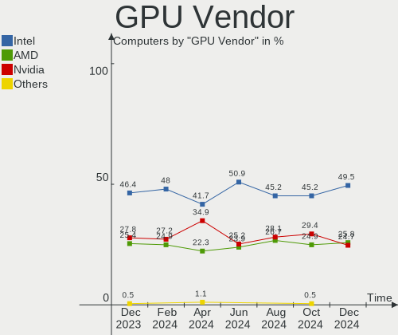

| Vendor            | Computers | Percent |
|-------------------|-----------|---------|
| Intel             | 108       | 48.87%  |
| AMD               | 63        | 28.51%  |
| Nvidia            | 49        | 22.17%  |
| ASPEED Technology | 1         | 0.45%   |

GPU Model
---------

Graphics card models

| Model                                                                                    | Computers | Percent |
|------------------------------------------------------------------------------------------|-----------|---------|
| Intel 3rd Gen Core processor Graphics Controller                                         | 13        | 5.83%   |
| Intel TigerLake-LP GT2 [Iris Xe Graphics]                                                | 8         | 3.59%   |
| Intel GeminiLake [UHD Graphics 600]                                                      | 6         | 2.69%   |
| Intel CometLake-U GT2 [UHD Graphics]                                                     | 6         | 2.69%   |
| AMD Renoir [Radeon RX Vega 6 (Ryzen 4000/5000 Mobile Series)]                            | 6         | 2.69%   |
| Nvidia TU117M [GeForce GTX 1650 Mobile / Max-Q]                                          | 5         | 2.24%   |
| Intel 2nd Generation Core Processor Family Integrated Graphics Controller                | 5         | 2.24%   |
| AMD Rembrandt [Radeon 680M]                                                              | 5         | 2.24%   |
| Intel Xeon E3-1200 v3/4th Gen Core Processor Integrated Graphics Controller              | 4         | 1.79%   |
| Intel Mobile 4 Series Chipset Integrated Graphics Controller                             | 4         | 1.79%   |
| Intel HD Graphics 620                                                                    | 4         | 1.79%   |
| AMD Lucienne                                                                             | 4         | 1.79%   |
| AMD Ellesmere [Radeon RX 470/480/570/570X/580/580X/590]                                  | 4         | 1.79%   |
| Nvidia GK208B [GeForce GT 710]                                                           | 3         | 1.35%   |
| Nvidia GA107M [GeForce RTX 3050 Mobile]                                                  | 3         | 1.35%   |
| Intel Raptor Lake-P [Iris Xe Graphics]                                                   | 3         | 1.35%   |
| Intel HD Graphics 5500                                                                   | 3         | 1.35%   |
| Intel Haswell-ULT Integrated Graphics Controller                                         | 3         | 1.35%   |
| Intel Core Processor Integrated Graphics Controller                                      | 3         | 1.35%   |
| Intel Atom/Celeron/Pentium Processor x5-E8000/J3xxx/N3xxx Integrated Graphics Controller | 3         | 1.35%   |
| Intel Alder Lake-P GT1 [UHD Graphics]                                                    | 3         | 1.35%   |
| Intel 4th Gen Core Processor Integrated Graphics Controller                              | 3         | 1.35%   |
| AMD Picasso/Raven 2 [Radeon Vega Series / Radeon Vega Mobile Series]                     | 3         | 1.35%   |
| AMD Navi 23 [Radeon RX 6600/6600 XT/6600M]                                               | 3         | 1.35%   |
| AMD Cezanne [Radeon Vega Series / Radeon Vega Mobile Series]                             | 3         | 1.35%   |
| AMD Barcelo                                                                              | 3         | 1.35%   |
| Nvidia GA107M [GeForce RTX 2050]                                                         | 2         | 0.9%    |
| Nvidia AD107M [GeForce RTX 4060 Max-Q / Mobile]                                          | 2         | 0.9%    |
| Intel WhiskeyLake-U GT2 [UHD Graphics 620]                                               | 2         | 0.9%    |
| Intel Skylake GT2 [HD Graphics 520]                                                      | 2         | 0.9%    |
| Intel HD Graphics 530                                                                    | 2         | 0.9%    |
| Intel Alder Lake-UP3 GT2 [UHD Graphics]                                                  | 2         | 0.9%    |
| Intel Alder Lake-UP3 GT2 [Iris Xe Graphics]                                              | 2         | 0.9%    |
| Intel Alder Lake-P GT2 [Iris Xe Graphics]                                                | 2         | 0.9%    |
| Intel Alder Lake-N [UHD Graphics]                                                        | 2         | 0.9%    |
| AMD Venus PRO [Radeon HD 8850M / R9 M265X]                                               | 2         | 0.9%    |
| AMD VanGogh [AMD Custom GPU 0405]                                                        | 2         | 0.9%    |
| AMD Sun XT [Radeon HD 8670A/8670M/8690M / R5 M330 / M430 / Radeon 520 Mobile]            | 2         | 0.9%    |
| AMD RV711/M93 [Mobility Radeon HD 4350/4550/530v/540v/545v / FirePro RG220]              | 2         | 0.9%    |
| AMD Baffin [Radeon RX 550 640SP / RX 560/560X]                                           | 2         | 0.9%    |

GPU Combo
---------

Combinations of graphics cards

| Name            | Computers | Percent |
|-----------------|-----------|---------|
| 1 x Intel       | 81        | 43.55%  |
| 1 x AMD         | 46        | 24.73%  |
| 1 x Nvidia      | 20        | 10.75%  |
| Intel + Nvidia  | 20        | 10.75%  |
| AMD + Nvidia    | 8         | 4.3%    |
| Intel + AMD     | 7         | 3.76%   |
| 2 x AMD         | 2         | 1.08%   |
| Other           | 1         | 0.54%   |
| Nvidia + ASPEED | 1         | 0.54%   |

GPU Driver
----------

Free vs proprietary

| Driver      | Computers | Percent |
|-------------|-----------|---------|
| Free        | 158       | 84.95%  |
| Proprietary | 25        | 13.44%  |
| Unknown     | 3         | 1.61%   |

GPU Memory
----------

Total video memory

| Size in GB | Computers | Percent |
|------------|-----------|---------|
| Unknown    | 115       | 61.83%  |
| 0.01-0.5   | 22        | 11.83%  |
| 1.01-2.0   | 16        | 8.6%    |
| 3.01-4.0   | 11        | 5.91%   |
| 7.01-8.0   | 10        | 5.38%   |
| 0.51-1.0   | 6         | 3.23%   |
| 5.01-6.0   | 3         | 1.61%   |
| 8.01-16.0  | 3         | 1.61%   |

Monitor
-------

Monitor Vendor
--------------

Monitor vendors

| Vendor                  | Computers | Percent |
|-------------------------|-----------|---------|
| AU Optronics            | 29        | 14.65%  |
| Samsung Electronics     | 27        | 13.64%  |
| Chimei Innolux          | 24        | 12.12%  |
| BOE                     | 16        | 8.08%   |
| LG Display              | 11        | 5.56%   |
| Hewlett-Packard         | 11        | 5.56%   |
| Lenovo                  | 7         | 3.54%   |
| Goldstar                | 7         | 3.54%   |
| Sharp                   | 6         | 3.03%   |
| BenQ                    | 6         | 3.03%   |
| AOC                     | 6         | 3.03%   |
| Acer                    | 6         | 3.03%   |
| Dell                    | 5         | 2.53%   |
| Apple                   | 5         | 2.53%   |
| PANDA                   | 4         | 2.02%   |
| Ancor Communications    | 4         | 2.02%   |
| Valve                   | 2         | 1.01%   |
| Philips                 | 2         | 1.01%   |
| LG Philips              | 2         | 1.01%   |
| Chi Mei Optoelectronics | 2         | 1.01%   |
| ASUSTek Computer        | 2         | 1.01%   |
| STD                     | 1         | 0.51%   |
| SKY                     | 1         | 0.51%   |
| RTK                     | 1         | 0.51%   |
| LTM                     | 1         | 0.51%   |
| Gigabyte Technology     | 1         | 0.51%   |
| Fujitsu Siemens         | 1         | 0.51%   |
| Denver                  | 1         | 0.51%   |
| Daewoo                  | 1         | 0.51%   |
| CSO                     | 1         | 0.51%   |
| Cbox                    | 1         | 0.51%   |
| Belinea                 | 1         | 0.51%   |
| Arzopa                  | 1         | 0.51%   |
| AGO                     | 1         | 0.51%   |
| Unknown                 | 1         | 0.51%   |

Monitor Model
-------------

Monitor models

| Model                                                                 | Computers | Percent |
|-----------------------------------------------------------------------|-----------|---------|
| Samsung Electronics S24F350 SAM0D20 1920x1080 521x293mm 23.5-inch     | 3         | 1.49%   |
| LG Display LCD Monitor LGD033A 1366x768 344x194mm 15.5-inch           | 3         | 1.49%   |
| Chimei Innolux LCD Monitor CMN15F5 1920x1080 344x193mm 15.5-inch      | 3         | 1.49%   |
| Chimei Innolux LCD Monitor CMN15E8 1920x1080 344x193mm 15.5-inch      | 3         | 1.49%   |
| Chimei Innolux LCD Monitor CMN14D4 1920x1080 309x173mm 13.9-inch      | 3         | 1.49%   |
| Valve ANX7530 U VLV3001 800x1280 100x150mm 7.1-inch                   | 2         | 1%      |
| Samsung Electronics S22F350 SAM0D1A 1920x1080 477x268mm 21.5-inch     | 2         | 1%      |
| Samsung Electronics LCD Monitor SDC4171 2880x1800 302x189mm 14.0-inch | 2         | 1%      |
| LG Display LCD Monitor LGD05E5 1920x1080 344x194mm 15.5-inch          | 2         | 1%      |
| LG Display LCD Monitor LGD0506 1366x768 344x194mm 15.5-inch           | 2         | 1%      |
| Lenovo C27-35 LEN66BA 1920x1080 597x336mm 27.0-inch                   | 2         | 1%      |
| Chimei Innolux LCD Monitor CMN153B 1920x1080 344x193mm 15.5-inch      | 2         | 1%      |
| Chimei Innolux LCD Monitor CMN14D5 1920x1080 309x173mm 13.9-inch      | 2         | 1%      |
| Chimei Innolux LCD Monitor CMN1406 1920x1080 309x173mm 13.9-inch      | 2         | 1%      |
| BOE LCD Monitor BOE0A42 1920x1200 302x188mm 14.0-inch                 | 2         | 1%      |
| BOE LCD Monitor BOE0893 2160x1440 296x197mm 14.0-inch                 | 2         | 1%      |
| AU Optronics LCD Monitor AUO9514 1280x800 261x163mm 12.1-inch         | 2         | 1%      |
| AU Optronics LCD Monitor AUO71EC 1366x768 344x193mm 15.5-inch         | 2         | 1%      |
| AU Optronics LCD Monitor AUO21ED 1920x1080 344x194mm 15.5-inch        | 2         | 1%      |
| AOC 24B2W1G5 AOC2402 1920x1080 527x296mm 23.8-inch                    | 2         | 1%      |
| STD LED STD0001 1920x1080 520x310mm 23.8-inch                         | 1         | 0.5%    |
| SKY TV-monitor SKY1202 1920x1080 885x498mm 40.0-inch                  | 1         | 0.5%    |
| Sharp LQ156D1JX01 SHP1414 3840x2160 346x194mm 15.6-inch               | 1         | 0.5%    |
| Sharp LQ140M1JW49 SHP1523 1920x1080 309x174mm 14.0-inch               | 1         | 0.5%    |
| Sharp LQ134N1JW55 SHP1558 1920x1200 288x180mm 13.4-inch               | 1         | 0.5%    |
| Sharp LCD Monitor SHP14F9 1920x1200 288x180mm 13.4-inch               | 1         | 0.5%    |
| Sharp LCD Monitor SHP144F 1920x1080 276x156mm 12.5-inch               | 1         | 0.5%    |
| Sharp LCD Monitor SHP1421 3200x1800 294x165mm 13.3-inch               | 1         | 0.5%    |
| Samsung Electronics SyncMaster SAM03EE 1680x1050                      | 1         | 0.5%    |
| Samsung Electronics SyncMaster SAM03D0 1440x900 410x257mm 19.1-inch   | 1         | 0.5%    |
| Samsung Electronics SyncMaster SAM0370 1680x1050 459x296mm 21.5-inch  | 1         | 0.5%    |
| Samsung Electronics SMBX2331 SAM076E 1920x1080 509x286mm 23.0-inch    | 1         | 0.5%    |
| Samsung Electronics S27F358 SAM0D73 1920x1080 598x336mm 27.0-inch     | 1         | 0.5%    |
| Samsung Electronics S24E450 SAM0C80 1920x1080 520x290mm 23.4-inch     | 1         | 0.5%    |
| Samsung Electronics S24D330 SAM0D92 1920x1080 530x300mm 24.0-inch     | 1         | 0.5%    |
| Samsung Electronics S24D300 SAM0B43 1920x1080 531x299mm 24.0-inch     | 1         | 0.5%    |
| Samsung Electronics S22D300 SAM0B3F 1920x1080 477x268mm 21.5-inch     | 1         | 0.5%    |
| Samsung Electronics LU28R55 SAM1019 3840x2160 632x360mm 28.6-inch     | 1         | 0.5%    |
| Samsung Electronics LS49AG95 SAM71AA 2560x1440 1193x336mm 48.8-inch   | 1         | 0.5%    |
| Samsung Electronics LCD Monitor SEC5441 1366x768 309x174mm 14.0-inch  | 1         | 0.5%    |

Monitor Resolution
------------------

Monitor screen resolution

| Resolution         | Computers | Percent |
|--------------------|-----------|---------|
| 1920x1080 (FHD)    | 83        | 44.62%  |
| 1366x768 (WXGA)    | 30        | 16.13%  |
| 2560x1440 (QHD)    | 13        | 6.99%   |
| 3840x2160 (4K)     | 8         | 4.3%    |
| 1680x1050 (WSXGA+) | 8         | 4.3%    |
| 1920x1200 (WUXGA)  | 6         | 3.23%   |
| 2560x1600          | 5         | 2.69%   |
| 1280x1024 (SXGA)   | 5         | 2.69%   |
| 2880x1800          | 4         | 2.15%   |
| 3840x1080          | 3         | 1.61%   |
| 1280x800 (WXGA)    | 3         | 1.61%   |
| 800x1280           | 2         | 1.08%   |
| 2560x1080          | 2         | 1.08%   |
| 2160x1440          | 2         | 1.08%   |
| 1600x900 (HD+)     | 2         | 1.08%   |
| 1440x900 (WXGA+)   | 2         | 1.08%   |
| Unknown            | 2         | 1.08%   |
| 3468x1468          | 1         | 0.54%   |
| 3200x1800 (QHD+)   | 1         | 0.54%   |
| 3072x1920          | 1         | 0.54%   |
| 2240x1400          | 1         | 0.54%   |
| 1200x1920          | 1         | 0.54%   |
| 1024x600           | 1         | 0.54%   |

Monitor Diagonal
----------------

Diagonal size in inches

| Inches  | Computers | Percent |
|---------|-----------|---------|
| 15      | 52        | 26.4%   |
| 14      | 20        | 10.15%  |
| 13      | 19        | 9.64%   |
| 27      | 18        | 9.14%   |
| 21      | 15        | 7.61%   |
| 23      | 12        | 6.09%   |
| 24      | 11        | 5.58%   |
| 17      | 8         | 4.06%   |
| 12      | 6         | 3.05%   |
| Unknown | 6         | 3.05%   |
| 20      | 4         | 2.03%   |
| 19      | 4         | 2.03%   |
| 22      | 3         | 1.52%   |
| 48      | 2         | 1.02%   |
| 31      | 2         | 1.02%   |
| 28      | 2         | 1.02%   |
| 16      | 2         | 1.02%   |
| 11      | 2         | 1.02%   |
| 7       | 2         | 1.02%   |
| 84      | 1         | 0.51%   |
| 43      | 1         | 0.51%   |
| 40      | 1         | 0.51%   |
| 34      | 1         | 0.51%   |
| 18      | 1         | 0.51%   |
| 10      | 1         | 0.51%   |
| 8       | 1         | 0.51%   |

Monitor Width
-------------

Physical width

| Width in mm | Computers | Percent |
|-------------|-----------|---------|
| 301-350     | 85        | 44.27%  |
| 501-600     | 35        | 18.23%  |
| 401-500     | 24        | 12.5%   |
| 201-300     | 18        | 9.38%   |
| 351-400     | 9         | 4.69%   |
| 601-700     | 6         | 3.13%   |
| Unknown     | 6         | 3.13%   |
| 1001-1500   | 2         | 1.04%   |
| 1-100       | 2         | 1.04%   |
| 801-900     | 1         | 0.52%   |
| 701-800     | 1         | 0.52%   |
| 1501-2000   | 1         | 0.52%   |
| 101-200     | 1         | 0.52%   |
| 901-1000    | 1         | 0.52%   |

Aspect Ratio
------------

Proportional relationship between the width and the height

| Ratio   | Computers | Percent |
|---------|-----------|---------|
| 16/9    | 129       | 72.47%  |
| 16/10   | 31        | 17.42%  |
| 5/4     | 4         | 2.25%   |
| Unknown | 3         | 1.69%   |
| 32/9    | 2         | 1.12%   |
| 3/2     | 2         | 1.12%   |
| 21/9    | 2         | 1.12%   |
| 0.67    | 2         | 1.12%   |
| 6/5     | 1         | 0.56%   |
| 4/3     | 1         | 0.56%   |
| 0.65    | 1         | 0.56%   |

Monitor Area
------------

Area in inch²

| Area in inch² | Computers | Percent |
|----------------|-----------|---------|
| 101-110        | 51        | 26.15%  |
| 201-250        | 35        | 17.95%  |
| 81-90          | 33        | 16.92%  |
| 301-350        | 18        | 9.23%   |
| 151-200        | 10        | 5.13%   |
| 71-80          | 6         | 3.08%   |
| Unknown        | 6         | 3.08%   |
| 61-70          | 5         | 2.56%   |
| 351-500        | 4         | 2.05%   |
| 141-150        | 4         | 2.05%   |
| 121-130        | 4         | 2.05%   |
| 501-1000       | 4         | 2.05%   |
| 1-40           | 3         | 1.54%   |
| 251-300        | 3         | 1.54%   |
| 51-60          | 2         | 1.03%   |
| 111-120        | 2         | 1.03%   |
| 91-100         | 2         | 1.03%   |
| More than 1000 | 1         | 0.51%   |
| 41-50          | 1         | 0.51%   |
| 131-140        | 1         | 0.51%   |

Pixel Density
-------------

Pixels per inch

| Density       | Computers | Percent |
|---------------|-----------|---------|
| 51-100        | 59        | 30.73%  |
| 121-160       | 52        | 27.08%  |
| 101-120       | 43        | 22.4%   |
| 161-240       | 23        | 11.98%  |
| More than 240 | 8         | 4.17%   |
| Unknown       | 6         | 3.13%   |
| 1-50          | 1         | 0.52%   |

Multiple Monitors
-----------------

Total monitors connected

| Total | Computers | Percent |
|-------|-----------|---------|
| 1     | 150       | 80.65%  |
| 2     | 27        | 14.52%  |
| 0     | 6         | 3.23%   |
| 3     | 3         | 1.61%   |

Network
-------

Net Controller Vendor
---------------------

Controller vendors

| Vendor                          | Computers | Percent |
|---------------------------------|-----------|---------|
| Realtek Semiconductor           | 114       | 39.58%  |
| Intel                           | 86        | 29.86%  |
| Qualcomm Atheros                | 17        | 5.9%    |
| MediaTek                        | 13        | 4.51%   |
| Broadcom                        | 12        | 4.17%   |
| Ralink                          | 5         | 1.74%   |
| ASIX Electronics                | 5         | 1.74%   |
| Nvidia                          | 4         | 1.39%   |
| Huawei Technologies             | 4         | 1.39%   |
| Xiaomi                          | 3         | 1.04%   |
| Microsoft                       | 3         | 1.04%   |
| TP-Link                         | 2         | 0.69%   |
| Marvell Technology Group        | 2         | 0.69%   |
| DisplayLink                     | 2         | 0.69%   |
| Broadcom Limited                | 2         | 0.69%   |
| Apple                           | 2         | 0.69%   |
| ZyDAS                           | 1         | 0.35%   |
| Tehuti Networks                 | 1         | 0.35%   |
| Ralink Technology               | 1         | 0.35%   |
| Qualcomm Atheros Communications | 1         | 0.35%   |
| Qualcomm                        | 1         | 0.35%   |
| OPPO Electronics                | 1         | 0.35%   |
| NetGear                         | 1         | 0.35%   |
| Lenovo                          | 1         | 0.35%   |
| Google                          | 1         | 0.35%   |
| Dell                            | 1         | 0.35%   |
| Belkin Components               | 1         | 0.35%   |
| Arduino SA                      | 1         | 0.35%   |

Net Controller Model
--------------------

Controller models

| Model                                                             | Computers | Percent |
|-------------------------------------------------------------------|-----------|---------|
| Realtek RTL8111/8168/8411 PCI Express Gigabit Ethernet Controller | 73        | 21.47%  |
| Realtek RTL810xE PCI Express Fast Ethernet controller             | 12        | 3.53%   |
| Realtek RTL8153 Gigabit Ethernet Adapter                          | 10        | 2.94%   |
| Realtek RTL8125 2.5GbE Controller                                 | 10        | 2.94%   |
| Intel Wi-Fi 6 AX200                                               | 10        | 2.94%   |
| Realtek RTL8822CE 802.11ac PCIe Wireless Network Adapter          | 9         | 2.65%   |
| Intel Comet Lake PCH-LP CNVi WiFi                                 | 7         | 2.06%   |
| Intel Alder Lake-P PCH CNVi WiFi                                  | 7         | 2.06%   |
| MediaTek MT7922 802.11ax PCI Express Wireless Network Adapter     | 6         | 1.76%   |
| MediaTek MT7921 802.11ax PCI Express Wireless Network Adapter     | 6         | 1.76%   |
| Intel Wi-Fi 6 AX201                                               | 6         | 1.76%   |
| Intel Wi-Fi 6 AX210/AX211/AX411 160MHz                            | 5         | 1.47%   |
| Realtek RTL8821CE 802.11ac PCIe Wireless Network Adapter          | 4         | 1.18%   |
| Intel Wireless 8265 / 8275                                        | 4         | 1.18%   |
| Intel Wireless 7265                                               | 4         | 1.18%   |
| Intel Wireless 3160                                               | 4         | 1.18%   |
| Intel Ethernet Connection I217-LM                                 | 4         | 1.18%   |
| Intel Ethernet Connection (16) I219-V                             | 4         | 1.18%   |
| ASIX AX88179 Gigabit Ethernet                                     | 4         | 1.18%   |
| Ralink RT3290 Wireless 802.11n 1T/1R PCIe                         | 3         | 0.88%   |
| Qualcomm Atheros QCA9377 802.11ac Wireless Network Adapter        | 3         | 0.88%   |
| Qualcomm Atheros AR9485 Wireless Network Adapter                  | 3         | 0.88%   |
| Intel Wireless-AC 9260                                            | 3         | 0.88%   |
| Intel Wireless 3165                                               | 3         | 0.88%   |
| Intel Raptor Lake PCH CNVi WiFi                                   | 3         | 0.88%   |
| Intel I211 Gigabit Network Connection                             | 3         | 0.88%   |
| Intel Ethernet Controller I225-V                                  | 3         | 0.88%   |
| Intel Centrino Wireless-N 1000 [Condor Peak]                      | 3         | 0.88%   |
| Xiaomi Mi/Redmi series (RNDIS)                                    | 2         | 0.59%   |
| Realtek RTL8852BE PCIe 802.11ax Wireless Network Controller       | 2         | 0.59%   |
| Realtek RTL8852AE 802.11ax PCIe Wireless Network Adapter          | 2         | 0.59%   |
| Realtek RTL8821AE 802.11ac PCIe Wireless Network Adapter          | 2         | 0.59%   |
| Realtek RTL8812AU 802.11a/b/g/n/ac 2T2R DB WLAN Adapter           | 2         | 0.59%   |
| Realtek RTL8192CU 802.11n WLAN Adapter                            | 2         | 0.59%   |
| Realtek RTL8188CE 802.11b/g/n WiFi Adapter                        | 2         | 0.59%   |
| Realtek 802.11ac NIC                                              | 2         | 0.59%   |
| Qualcomm Atheros QCA8172 Fast Ethernet                            | 2         | 0.59%   |
| Qualcomm Atheros AR9287 Wireless Network Adapter (PCI-Express)    | 2         | 0.59%   |
| Qualcomm Atheros AR8131 Gigabit Ethernet                          | 2         | 0.59%   |
| Microsoft Xbox Wireless Adapter for Windows                       | 2         | 0.59%   |

Wireless Vendor
---------------

Wireless vendors

| Vendor                          | Computers | Percent |
|---------------------------------|-----------|---------|
| Intel                           | 74        | 46.25%  |
| Realtek Semiconductor           | 34        | 21.25%  |
| MediaTek                        | 13        | 8.13%   |
| Qualcomm Atheros                | 12        | 7.5%    |
| Broadcom                        | 10        | 6.25%   |
| Ralink                          | 5         | 3.13%   |
| Microsoft                       | 3         | 1.88%   |
| TP-Link                         | 2         | 1.25%   |
| ZyDAS                           | 1         | 0.63%   |
| Ralink Technology               | 1         | 0.63%   |
| Qualcomm Atheros Communications | 1         | 0.63%   |
| Qualcomm                        | 1         | 0.63%   |
| NetGear                         | 1         | 0.63%   |
| Broadcom Limited                | 1         | 0.63%   |
| Belkin Components               | 1         | 0.63%   |

Wireless Model
--------------

Wireless models

| Model                                                          | Computers | Percent |
|----------------------------------------------------------------|-----------|---------|
| Intel Wi-Fi 6 AX200                                            | 10        | 6.1%    |
| Realtek RTL8822CE 802.11ac PCIe Wireless Network Adapter       | 9         | 5.49%   |
| Intel Comet Lake PCH-LP CNVi WiFi                              | 7         | 4.27%   |
| Intel Alder Lake-P PCH CNVi WiFi                               | 7         | 4.27%   |
| MediaTek MT7922 802.11ax PCI Express Wireless Network Adapter  | 6         | 3.66%   |
| MediaTek MT7921 802.11ax PCI Express Wireless Network Adapter  | 6         | 3.66%   |
| Intel Wi-Fi 6 AX201                                            | 6         | 3.66%   |
| Intel Wi-Fi 6 AX210/AX211/AX411 160MHz                         | 5         | 3.05%   |
| Realtek RTL8821CE 802.11ac PCIe Wireless Network Adapter       | 4         | 2.44%   |
| Intel Wireless 8265 / 8275                                     | 4         | 2.44%   |
| Intel Wireless 7265                                            | 4         | 2.44%   |
| Intel Wireless 3160                                            | 4         | 2.44%   |
| Ralink RT3290 Wireless 802.11n 1T/1R PCIe                      | 3         | 1.83%   |
| Qualcomm Atheros QCA9377 802.11ac Wireless Network Adapter     | 3         | 1.83%   |
| Qualcomm Atheros AR9485 Wireless Network Adapter               | 3         | 1.83%   |
| Intel Wireless-AC 9260                                         | 3         | 1.83%   |
| Intel Wireless 3165                                            | 3         | 1.83%   |
| Intel Raptor Lake PCH CNVi WiFi                                | 3         | 1.83%   |
| Intel Centrino Wireless-N 1000 [Condor Peak]                   | 3         | 1.83%   |
| Realtek RTL8852BE PCIe 802.11ax Wireless Network Controller    | 2         | 1.22%   |
| Realtek RTL8852AE 802.11ax PCIe Wireless Network Adapter       | 2         | 1.22%   |
| Realtek RTL8821AE 802.11ac PCIe Wireless Network Adapter       | 2         | 1.22%   |
| Realtek RTL8812AU 802.11a/b/g/n/ac 2T2R DB WLAN Adapter        | 2         | 1.22%   |
| Realtek RTL8192CU 802.11n WLAN Adapter                         | 2         | 1.22%   |
| Realtek RTL8188CE 802.11b/g/n WiFi Adapter                     | 2         | 1.22%   |
| Realtek 802.11ac NIC                                           | 2         | 1.22%   |
| Qualcomm Atheros AR9287 Wireless Network Adapter (PCI-Express) | 2         | 1.22%   |
| Microsoft Xbox Wireless Adapter for Windows                    | 2         | 1.22%   |
| Intel Wireless 7260                                            | 2         | 1.22%   |
| Intel CNVi: Wi-Fi                                              | 2         | 1.22%   |
| Intel Centrino Wireless-N 135                                  | 2         | 1.22%   |
| Broadcom BCM4313 802.11bgn Wireless Network Adapter            | 2         | 1.22%   |
| ZyDAS ZD1211B 802.11g                                          | 1         | 0.61%   |
| TP-Link TL-WN722N v2/v3 [Realtek RTL8188EUS]                   | 1         | 0.61%   |
| TP-Link Archer T3U [Realtek RTL8812BU]                         | 1         | 0.61%   |
| Realtek RTL88x2bu [AC1200 Techkey]                             | 1         | 0.61%   |
| Realtek RTL8822BE 802.11a/b/g/n/ac WiFi adapter                | 1         | 0.61%   |
| Realtek RTL8814AU 802.11a/b/g/n/ac Wireless Adapter            | 1         | 0.61%   |
| Realtek RTL8723DE Wireless Network Adapter                     | 1         | 0.61%   |
| Realtek RTL8723BE PCIe Wireless Network Adapter                | 1         | 0.61%   |

Ethernet Vendor
---------------

Ethernet vendors

| Vendor                   | Computers | Percent |
|--------------------------|-----------|---------|
| Realtek Semiconductor    | 99        | 60.74%  |
| Intel                    | 29        | 17.79%  |
| Qualcomm Atheros         | 6         | 3.68%   |
| Broadcom                 | 5         | 3.07%   |
| ASIX Electronics         | 5         | 3.07%   |
| Nvidia                   | 4         | 2.45%   |
| Xiaomi                   | 3         | 1.84%   |
| Marvell Technology Group | 2         | 1.23%   |
| DisplayLink              | 2         | 1.23%   |
| Apple                    | 2         | 1.23%   |
| Tehuti Networks          | 1         | 0.61%   |
| OPPO Electronics         | 1         | 0.61%   |
| Lenovo                   | 1         | 0.61%   |
| Huawei Technologies      | 1         | 0.61%   |
| Google                   | 1         | 0.61%   |
| Broadcom Limited         | 1         | 0.61%   |

Ethernet Model
--------------

Ethernet models

| Model                                                                         | Computers | Percent |
|-------------------------------------------------------------------------------|-----------|---------|
| Realtek RTL8111/8168/8411 PCI Express Gigabit Ethernet Controller             | 73        | 42.94%  |
| Realtek RTL810xE PCI Express Fast Ethernet controller                         | 12        | 7.06%   |
| Realtek RTL8153 Gigabit Ethernet Adapter                                      | 10        | 5.88%   |
| Realtek RTL8125 2.5GbE Controller                                             | 10        | 5.88%   |
| Intel Ethernet Connection I217-LM                                             | 4         | 2.35%   |
| Intel Ethernet Connection (16) I219-V                                         | 4         | 2.35%   |
| ASIX AX88179 Gigabit Ethernet                                                 | 4         | 2.35%   |
| Intel I211 Gigabit Network Connection                                         | 3         | 1.76%   |
| Intel Ethernet Controller I225-V                                              | 3         | 1.76%   |
| Xiaomi Mi/Redmi series (RNDIS)                                                | 2         | 1.18%   |
| Qualcomm Atheros QCA8172 Fast Ethernet                                        | 2         | 1.18%   |
| Qualcomm Atheros AR8131 Gigabit Ethernet                                      | 2         | 1.18%   |
| Intel Ethernet Connection (4) I219-LM                                         | 2         | 1.18%   |
| Intel 82579V Gigabit Network Connection                                       | 2         | 1.18%   |
| Broadcom NetXtreme BCM57766 Gigabit Ethernet PCIe                             | 2         | 1.18%   |
| Xiaomi Mi/Redmi series (RNDIS + ADB)                                          | 1         | 0.59%   |
| Tehuti Networks TN9210 10GBase-T Ethernet Adapter                             | 1         | 0.59%   |
| Realtek RTL8152 Fast Ethernet Adapter                                         | 1         | 0.59%   |
| Qualcomm Atheros Killer E2500 Gigabit Ethernet Controller                     | 1         | 0.59%   |
| Qualcomm Atheros AR8162 Fast Ethernet                                         | 1         | 0.59%   |
| OPPO WAIPIO-MTP _SN:AC53F926                                                  | 1         | 0.59%   |
| Nvidia MCP73 Ethernet                                                         | 1         | 0.59%   |
| Nvidia MCP61 Ethernet                                                         | 1         | 0.59%   |
| Nvidia MCP51 Ethernet Controller                                              | 1         | 0.59%   |
| Nvidia CK804 Ethernet Controller                                              | 1         | 0.59%   |
| Marvell Group 88E8055 PCI-E Gigabit Ethernet Controller                       | 1         | 0.59%   |
| Marvell Group 88E8053 PCI-E Gigabit Ethernet Controller                       | 1         | 0.59%   |
| Lenovo Ethernet adapter [U2L 100P-Y1]                                         | 1         | 0.59%   |
| Intel I210 Gigabit Network Connection                                         | 1         | 0.59%   |
| Intel Ethernet Connection I217-V                                              | 1         | 0.59%   |
| Intel Ethernet Connection (2) I219-LM                                         | 1         | 0.59%   |
| Intel Ethernet Connection (14) I219-V                                         | 1         | 0.59%   |
| Intel Ethernet Connection (14) I219-LM                                        | 1         | 0.59%   |
| Intel Ethernet Connection (13) I219-V                                         | 1         | 0.59%   |
| Intel 82579LM Gigabit Network Connection (Lewisville)                         | 1         | 0.59%   |
| Intel 82577LM Gigabit Network Connection                                      | 1         | 0.59%   |
| Intel 82574L Gigabit Network Connection                                       | 1         | 0.59%   |
| Intel 82571EB/82571GB Gigabit Ethernet Controller D0/D1 (copper applications) | 1         | 0.59%   |
| Intel 82567LM Gigabit Network Connection                                      | 1         | 0.59%   |
| Huawei ALP-AL00                                                               | 1         | 0.59%   |

Net Controller Kind
-------------------

Ethernet, WiFi or modem

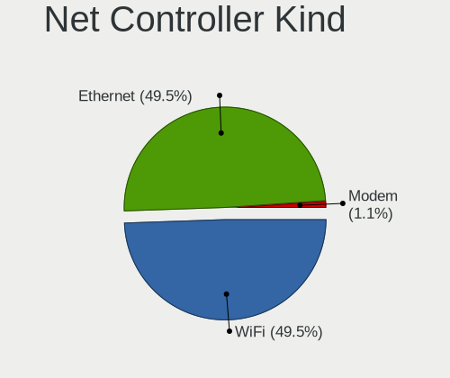

| Kind     | Computers | Percent |
|----------|-----------|---------|
| WiFi     | 155       | 49.84%  |
| Ethernet | 150       | 48.23%  |
| Modem    | 5         | 1.61%   |
| Unknown  | 1         | 0.32%   |

Used Controller
---------------

Currently used network controller

| Kind     | Computers | Percent |
|----------|-----------|---------|
| WiFi     | 117       | 61.58%  |
| Ethernet | 73        | 38.42%  |

NICs
----

Total network controllers on board

| Total | Computers | Percent |
|-------|-----------|---------|
| 2     | 97        | 52.15%  |
| 1     | 80        | 43.01%  |
| 3     | 5         | 2.69%   |
| 0     | 3         | 1.61%   |
| 4     | 1         | 0.54%   |

IPv6
----

IPv6 vs IPv4

| Used | Computers | Percent |
|------|-----------|---------|
| No   | 173       | 93.01%  |
| Yes  | 13        | 6.99%   |

Bluetooth
---------

Bluetooth Vendor
----------------

Controller vendors

| Vendor                          | Computers | Percent |
|---------------------------------|-----------|---------|
| Intel                           | 68        | 48.57%  |
| Realtek Semiconductor           | 18        | 12.86%  |
| IMC Networks                    | 15        | 10.71%  |
| Cambridge Silicon Radio         | 9         | 6.43%   |
| Foxconn / Hon Hai               | 7         | 5%      |
| Apple                           | 5         | 3.57%   |
| Ralink                          | 3         | 2.14%   |
| Realtek                         | 2         | 1.43%   |
| Qualcomm Atheros Communications | 2         | 1.43%   |
| Lite-On Technology              | 2         | 1.43%   |
| Hewlett-Packard                 | 2         | 1.43%   |
| Broadcom                        | 2         | 1.43%   |
| TP-Link                         | 1         | 0.71%   |
| Toshiba                         | 1         | 0.71%   |
| Opticis                         | 1         | 0.71%   |
| Integrated System Solution      | 1         | 0.71%   |
| Alps Electric                   | 1         | 0.71%   |

Bluetooth Model
---------------

Controller models

| Model                                               | Computers | Percent |
|-----------------------------------------------------|-----------|---------|
| Intel Bluetooth wireless interface                  | 17        | 12.14%  |
| Realtek Bluetooth Radio                             | 14        | 10%     |
| Intel AX201 Bluetooth                               | 14        | 10%     |
| Intel AX200 Bluetooth                               | 10        | 7.14%   |
| Intel Bluetooth Device                              | 9         | 6.43%   |
| Cambridge Silicon Radio Bluetooth Dongle (HCI mode) | 9         | 6.43%   |
| Intel Bluetooth 9460/9560 Jefferson Peak (JfP)      | 8         | 5.71%   |
| IMC Networks Wireless_Device                        | 7         | 5%      |
| Intel AX210 Bluetooth                               | 5         | 3.57%   |
| IMC Networks Bluetooth Radio                        | 5         | 3.57%   |
| Realtek  Bluetooth 4.2 Adapter                      | 4         | 2.86%   |
| Foxconn / Hon Hai Wireless_Device                   | 4         | 2.86%   |
| Ralink RT3290 Bluetooth                             | 3         | 2.14%   |
| Intel Wireless-AC 9260 Bluetooth Adapter            | 3         | 2.14%   |
| IMC Networks Bluetooth Device                       | 3         | 2.14%   |
| Apple Built-in Bluetooth 2.0+EDR HCI                | 3         | 2.14%   |
| Realtek Bluetooth Radio                             | 2         | 1.43%   |
| Qualcomm Atheros QCA61x4 Bluetooth 4.0              | 2         | 1.43%   |
| Intel Centrino Bluetooth Wireless Transceiver       | 2         | 1.43%   |
| HP Broadcom 2070 Bluetooth Combo                    | 2         | 1.43%   |
| TP-Link UB500 Adapter                               | 1         | 0.71%   |
| Toshiba Bluetooth USB Host Controller               | 1         | 0.71%   |
| Opticis Bluetooth Radio                             | 1         | 0.71%   |
| Lite-On Wireless_Device                             | 1         | 0.71%   |
| Lite-On Atheros Bluetooth                           | 1         | 0.71%   |
| Integrated System Solution Bluetooth Device         | 1         | 0.71%   |
| Foxconn / Hon Hai MediaTek MT7921 Bluetooth         | 1         | 0.71%   |
| Foxconn / Hon Hai Broadcom BCM20702 Bluetooth       | 1         | 0.71%   |
| Foxconn / Hon Hai Bluetooth Device                  | 1         | 0.71%   |
| Broadcom Bluetooth 3.0 USB Dongle                   | 1         | 0.71%   |
| Broadcom BCM43142A0 Bluetooth 4.0                   | 1         | 0.71%   |
| Apple Bluetooth USB Host Controller                 | 1         | 0.71%   |
| Apple Bluetooth Host Controller                     | 1         | 0.71%   |
| Alps Electric UGTZ4 Bluetooth                       | 1         | 0.71%   |

Sound
-----

Sound Vendor
------------

Sound card vendors

| Vendor                    | Computers | Percent |
|---------------------------|-----------|---------|
| Intel                     | 123       | 49%     |
| AMD                       | 65        | 25.9%   |
| Nvidia                    | 37        | 14.74%  |
| C-Media Electronics       | 4         | 1.59%   |
| JMTek                     | 3         | 1.2%    |
| Logitech                  | 2         | 0.8%    |
| Lenovo                    | 2         | 0.8%    |
| Hewlett-Packard           | 2         | 0.8%    |
| Creative Labs             | 2         | 0.8%    |
| SteelSeries ApS           | 1         | 0.4%    |
| SOMIC Industrial          | 1         | 0.4%    |
| Sennheiser Communications | 1         | 0.4%    |
| RODE Microphones          | 1         | 0.4%    |
| iCreate Technologies      | 1         | 0.4%    |
| Generalplus Technology    | 1         | 0.4%    |
| Corsair                   | 1         | 0.4%    |
| ClearOne Communications   | 1         | 0.4%    |
| Cambridge Silicon Radio   | 1         | 0.4%    |
| ASUSTek Computer          | 1         | 0.4%    |
| Apple                     | 1         | 0.4%    |

Sound Model
-----------

Sound card models

| Model                                                                      | Computers | Percent |
|----------------------------------------------------------------------------|-----------|---------|
| AMD Family 17h/19h HD Audio Controller                                     | 28        | 9.09%   |
| Intel 7 Series/C216 Chipset Family High Definition Audio Controller        | 17        | 5.52%   |
| AMD Renoir Radeon High Definition Audio Controller                         | 17        | 5.52%   |
| Intel 8 Series/C220 Series Chipset High Definition Audio Controller        | 12        | 3.9%    |
| AMD Starship/Matisse HD Audio Controller                                   | 10        | 3.25%   |
| Intel Sunrise Point-LP HD Audio                                            | 9         | 2.92%   |
| Intel Alder Lake PCH-P High Definition Audio Controller                    | 9         | 2.92%   |
| AMD Rembrandt Radeon High Definition Audio Controller                      | 9         | 2.92%   |
| Intel Tiger Lake-LP Smart Sound Technology Audio Controller                | 8         | 2.6%    |
| Intel Xeon E3-1200 v3/4th Gen Core Processor HD Audio Controller           | 7         | 2.27%   |
| Intel Comet Lake PCH-LP cAVS                                               | 7         | 2.27%   |
| Intel Celeron/Pentium Silver Processor High Definition Audio               | 6         | 1.95%   |
| Nvidia TU116 High Definition Audio Controller                              | 5         | 1.62%   |
| Intel 82801I (ICH9 Family) HD Audio Controller                             | 5         | 1.62%   |
| AMD RV710/730 HDMI Audio [Radeon HD 4000 series]                           | 5         | 1.62%   |
| AMD Ellesmere HDMI Audio [Radeon RX 470/480 / 570/580/590]                 | 5         | 1.62%   |
| Nvidia GK208 HDMI/DP Audio Controller                                      | 4         | 1.3%    |
| Nvidia GA104 High Definition Audio Controller                              | 4         | 1.3%    |
| Nvidia Audio device                                                        | 4         | 1.3%    |
| Intel Cannon Point-LP High Definition Audio Controller                     | 4         | 1.3%    |
| Intel 5 Series/3400 Series Chipset High Definition Audio                   | 4         | 1.3%    |
| Intel 100 Series/C230 Series Chipset Family HD Audio Controller            | 4         | 1.3%    |
| AMD Raven/Raven2/Fenghuang HDMI/DP Audio Controller                        | 4         | 1.3%    |
| AMD Navi 21/23 HDMI/DP Audio Controller                                    | 4         | 1.3%    |
| AMD Family 17h (Models 00h-0fh) HD Audio Controller                        | 4         | 1.3%    |
| Nvidia GP106 High Definition Audio Controller                              | 3         | 0.97%   |
| Nvidia GA106 High Definition Audio Controller                              | 3         | 0.97%   |
| JMTek USB PnP Audio Device                                                 | 3         | 0.97%   |
| Intel Wildcat Point-LP High Definition Audio Controller                    | 3         | 0.97%   |
| Intel Raptor Lake-P/U/H cAVS                                               | 3         | 0.97%   |
| Intel NM10/ICH7 Family High Definition Audio Controller                    | 3         | 0.97%   |
| Intel Haswell-ULT HD Audio Controller                                      | 3         | 0.97%   |
| Intel Broadwell-U Audio Controller                                         | 3         | 0.97%   |
| Intel Alder Lake-S HD Audio Controller                                     | 3         | 0.97%   |
| Intel 8 Series HD Audio Controller                                         | 3         | 0.97%   |
| Intel 6 Series/C200 Series Chipset Family High Definition Audio Controller | 3         | 0.97%   |
| Intel 200 Series PCH HD Audio                                              | 3         | 0.97%   |
| AMD FCH Azalia Controller                                                  | 3         | 0.97%   |
| Nvidia TU107 GeForce GTX 1650 High Definition Audio Controller             | 2         | 0.65%   |
| Nvidia GP107GL High Definition Audio Controller                            | 2         | 0.65%   |

Memory
------

Memory Vendor
-------------

Memory module vendors

| Vendor              | Computers | Percent |
|---------------------|-----------|---------|
| Samsung Electronics | 29        | 24.17%  |
| SK hynix            | 26        | 21.67%  |
| Micron Technology   | 14        | 11.67%  |
| Kingston            | 13        | 10.83%  |
| Crucial             | 11        | 9.17%   |
| Corsair             | 8         | 6.67%   |
| Unknown             | 7         | 5.83%   |
| Elpida              | 3         | 2.5%    |
| Ramaxel Technology  | 2         | 1.67%   |
| G.Skill             | 2         | 1.67%   |
| Unknown (ABCD)      | 1         | 0.83%   |
| Nanya Technology    | 1         | 0.83%   |
| KLEVV               | 1         | 0.83%   |
| A-DATA Technology   | 1         | 0.83%   |
| Unknown             | 1         | 0.83%   |

Memory Model
------------

Memory module models

| Model                                                            | Computers | Percent |
|------------------------------------------------------------------|-----------|---------|
| SK hynix RAM HMT451S6BFR8A-PB 4GB SODIMM DDR3 1600MT/s           | 2         | 1.6%    |
| SK hynix RAM HMT351S6CFR8C-PB 4GB SODIMM DDR3 1600MT/s           | 2         | 1.6%    |
| SK hynix RAM HMAA2GS6CJR8N-XN 16GB SODIMM DDR4 3200MT/s          | 2         | 1.6%    |
| SK hynix RAM HMA41GS6AFR8N-TF 8GB SODIMM DDR4 2667MT/s           | 2         | 1.6%    |
| SK hynix RAM H9JCNNNCP3MLYR-N6E 4GB Row Of Chips LPDDR5 6400MT/s | 2         | 1.6%    |
| SK hynix RAM H9HCNNNCPMMLXR-NEE 8GB SODIMM LPDDR4 4266MT/s       | 2         | 1.6%    |
| Samsung RAM M471B5673EH1-CH9 2GB SODIMM DDR3 1334MT/s            | 2         | 1.6%    |
| Samsung RAM M471A5244CB0-CWE 4GB SODIMM DDR4 3200MT/s            | 2         | 1.6%    |
| Samsung RAM M471A2K43EB1-CTD 16GB SODIMM DDR4 2667MT/s           | 2         | 1.6%    |
| Samsung RAM M471A2K43DB1-CWE 16GB SODIMM DDR4 3200MT/s           | 2         | 1.6%    |
| Micron RAM 4ATF1G64HZ-3G2F1 8GB SODIMM DDR4 3200MT/s             | 2         | 1.6%    |
| Kingston RAM KF3200C16D4/16GX 16GB DIMM DDR4 3200MT/s            | 2         | 1.6%    |
| Corsair RAM CMK16GX4M2E3200C16 8GB DIMM DDR4 3200MT/s            | 2         | 1.6%    |
| Corsair RAM CMK16GX4M2B3200C16 8GB DIMM DDR4 3600MT/s            | 2         | 1.6%    |
| Unknown RAM Module 8GB SODIMM DDR3 1600MT/s                      | 1         | 0.8%    |
| Unknown RAM Module 512MB SODIMM DDR2                             | 1         | 0.8%    |
| Unknown RAM Module 4GB DIMM DDR3 1333MT/s                        | 1         | 0.8%    |
| Unknown RAM Module 4GB DIMM 1600MT/s                             | 1         | 0.8%    |
| Unknown RAM Module 4GB DIMM 1333MT/s                             | 1         | 0.8%    |
| Unknown RAM Module 2048MB SODIMM DDR2                            | 1         | 0.8%    |
| Unknown RAM Module 1GB DIMM                                      | 1         | 0.8%    |
| Unknown RAM 3600 C20 Series 32GB DIMM DDR4 3666MT/s              | 1         | 0.8%    |
| Unknown RAM 3200 C18 Series 16384MB DIMM DDR4 2400MT/s           | 1         | 0.8%    |
| Unknown (ABCD) RAM 123456789012345678 2GB SODIMM LPDDR4 2400MT/s | 1         | 0.8%    |
| SK hynix RAM Module 8GB SODIMM DDR3 1600MT/s                     | 1         | 0.8%    |
| SK hynix RAM Module 8GB SODIMM DDR3 1066MT/s                     | 1         | 0.8%    |
| SK hynix RAM HMT851S6AMR6R-PB 4GB Chip DDR3 1600MT/s             | 1         | 0.8%    |
| SK hynix RAM HMT451U6BFR8C-PB 4GB DIMM DDR3 1600MT/s             | 1         | 0.8%    |
| SK hynix RAM HMT41GS6AFR8A-PB 8GB SODIMM DDR3 1600MT/s           | 1         | 0.8%    |
| SK hynix RAM HMT351S6EFR8A-PB 4GB SODIMM DDR3 1600MT/s           | 1         | 0.8%    |
| SK hynix RAM HMAA2GU6AJR8N-XN 16GB DIMM DDR4 3200MT/s            | 1         | 0.8%    |
| SK hynix RAM HMAA2GS6AJR8N-XN 16GB SODIMM DDR4 3200MT/s          | 1         | 0.8%    |
| SK hynix RAM HMAA1GS6CJR6N-XN 8GB SODIMM DDR4 3200MT/s           | 1         | 0.8%    |
| SK hynix RAM HMAA1GS6CJR6N-XN 8GB Row Of Chips DDR4 3200MT/s     | 1         | 0.8%    |
| SK hynix RAM HMA851S6JJR6N-VK 4GB SODIMM DDR4 2667MT/s           | 1         | 0.8%    |
| SK hynix RAM HMA851S6CJR6N-VK 4GB SODIMM DDR4 2667MT/s           | 1         | 0.8%    |
| SK hynix RAM HMA851S6AFR6N-UH 4GB SODIMM DDR4 2667MT/s           | 1         | 0.8%    |
| SK hynix RAM HMA451S6AFR8N-TF 4GB SODIMM DDR4 2133MT/s           | 1         | 0.8%    |
| Samsung RAM Module 8GB DIMM DDR4 2133MT/s                        | 1         | 0.8%    |
| Samsung RAM Module 4GB SODIMM LPDDR3 2133MT/s                    | 1         | 0.8%    |

Memory Kind
-----------

Memory module kinds

| Kind    | Computers | Percent |
|---------|-----------|---------|
| DDR4    | 58        | 55.77%  |
| DDR3    | 23        | 22.12%  |
| LPDDR4  | 5         | 4.81%   |
| LPDDR5  | 4         | 3.85%   |
| DDR5    | 4         | 3.85%   |
| Unknown | 4         | 3.85%   |
| LPDDR3  | 3         | 2.88%   |
| DDR2    | 2         | 1.92%   |
| SDRAM   | 1         | 0.96%   |

Memory Form Factor
------------------

Physical design of the memory module

| Name         | Computers | Percent |
|--------------|-----------|---------|
| SODIMM       | 64        | 60.38%  |
| DIMM         | 31        | 29.25%  |
| Row Of Chips | 10        | 9.43%   |
| Chip         | 1         | 0.94%   |

Memory Size
-----------

Memory module size

| Size  | Computers | Percent |
|-------|-----------|---------|
| 8192  | 46        | 41.07%  |
| 4096  | 27        | 24.11%  |
| 16384 | 25        | 22.32%  |
| 2048  | 8         | 7.14%   |
| 32768 | 4         | 3.57%   |
| 1024  | 1         | 0.89%   |
| 512   | 1         | 0.89%   |

Memory Speed
------------

Memory module speed

| Speed   | Computers | Percent |
|---------|-----------|---------|
| 3200    | 30        | 26.55%  |
| 1600    | 17        | 15.04%  |
| 2667    | 12        | 10.62%  |
| 3600    | 5         | 4.42%   |
| 2400    | 5         | 4.42%   |
| 2133    | 5         | 4.42%   |
| 1333    | 5         | 4.42%   |
| 6400    | 4         | 3.54%   |
| 4800    | 4         | 3.54%   |
| 4266    | 3         | 2.65%   |
| 1334    | 3         | 2.65%   |
| 3733    | 2         | 1.77%   |
| 3266    | 2         | 1.77%   |
| 2933    | 2         | 1.77%   |
| Unknown | 2         | 1.77%   |
| 8400    | 1         | 0.88%   |
| 4267    | 1         | 0.88%   |
| 3800    | 1         | 0.88%   |
| 3666    | 1         | 0.88%   |
| 3534    | 1         | 0.88%   |
| 3400    | 1         | 0.88%   |
| 3000    | 1         | 0.88%   |
| 2800    | 1         | 0.88%   |
| 1867    | 1         | 0.88%   |
| 1866    | 1         | 0.88%   |
| 1066    | 1         | 0.88%   |
| 975     | 1         | 0.88%   |

Printers & scanners
-------------------

Printer Vendor
--------------

Printer device vendors

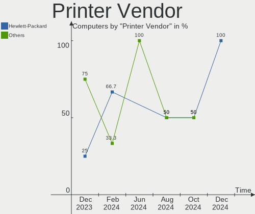

| Vendor             | Computers | Percent |
|--------------------|-----------|---------|
| Hewlett-Packard    | 2         | 50%     |
| Brother Industries | 2         | 50%     |

Printer Model
-------------

Printer device models

| Model                | Computers | Percent |
|----------------------|-----------|---------|
| HP Printing Support  | 1         | 25%     |
| HP DeskJet 35xx      | 1         | 25%     |
| Brother DCP-L3550CDW | 1         | 25%     |
| Brother DCP-J140W    | 1         | 25%     |

Scanner Vendor
--------------

Scanner device vendors

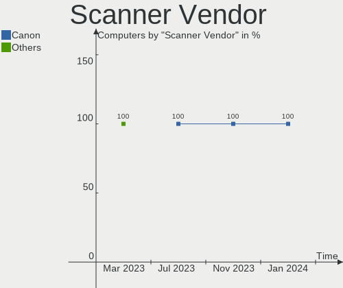

| Vendor | Computers | Percent |
|--------|-----------|---------|
| Canon  | 2         | 100%    |

Scanner Model
-------------

Scanner device models

| Model                              | Computers | Percent |
|------------------------------------|-----------|---------|
| Canon CanoScan N670U/N676U/LiDE 20 | 1         | 50%     |
| Canon CanoScan LiDE 210            | 1         | 50%     |

Camera
------

Camera Vendor
-------------

Camera device vendors

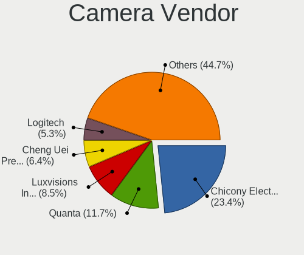

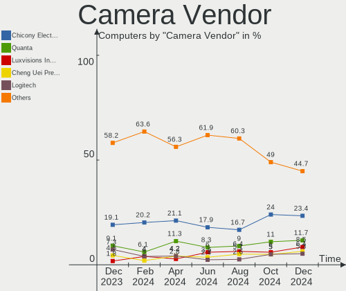

| Vendor                                 | Computers | Percent |
|----------------------------------------|-----------|---------|
| Chicony Electronics                    | 16        | 14.55%  |
| Bison Electronics                      | 12        | 10.91%  |
| IMC Networks                           | 11        | 10%     |
| Microdia                               | 8         | 7.27%   |
| Cheng Uei Precision Industry (Foxlink) | 8         | 7.27%   |
| Realtek Semiconductor                  | 7         | 6.36%   |
| Luxvisions Innotech Limited            | 6         | 5.45%   |
| Syntek                                 | 5         | 4.55%   |
| Apple                                  | 5         | 4.55%   |
| Quanta                                 | 4         | 3.64%   |
| Logitech                               | 4         | 3.64%   |
| Sunplus Innovation Technology          | 3         | 2.73%   |
| Sonix Technology                       | 3         | 2.73%   |
| Acer                                   | 3         | 2.73%   |
| Samsung Electronics                    | 2         | 1.82%   |
| Alcor Micro                            | 2         | 1.82%   |
| ValueHD                                | 1         | 0.91%   |
| Tripath Technology                     | 1         | 0.91%   |
| SunplusIT                              | 1         | 0.91%   |
| ShineTech                              | 1         | 0.91%   |
| Microsoft                              | 1         | 0.91%   |
| Lite-On Technology                     | 1         | 0.91%   |
| Lenovo                                 | 1         | 0.91%   |
| Jieli Technology                       | 1         | 0.91%   |
| Importek                               | 1         | 0.91%   |
| Creative Technology                    | 1         | 0.91%   |
| 8SSC21D67422V1SR28902JL                | 1         | 0.91%   |

Camera Model
------------

Camera device models

| Model                                             | Computers | Percent |
|---------------------------------------------------|-----------|---------|
| Chicony HD Webcam                                 | 4         | 3.64%   |
| Bison HD Webcam                                   | 4         | 3.64%   |
| Luxvisions Innotech Limited Integrated RGB Camera | 3         | 2.73%   |
| IMC Networks USB2.0 HD UVC WebCam                 | 3         | 2.73%   |
| IMC Networks Integrated Camera                    | 3         | 2.73%   |
| Bison Integrated Camera                           | 3         | 2.73%   |
| Apple FaceTime HD Camera (Built-in)               | 3         | 2.73%   |
| Syntek HP Webcam                                  | 2         | 1.82%   |
| Sonix USB2.0 HD UVC WebCam                        | 2         | 1.82%   |
| Samsung Galaxy series, misc. (MTP mode)           | 2         | 1.82%   |
| Realtek Lenovo EasyCamera                         | 2         | 1.82%   |
| Microdia Integrated_Webcam_HD                     | 2         | 1.82%   |
| Logitech Webcam C310                              | 2         | 1.82%   |
| Chicony USB2.0 HD UVC WebCam                      | 2         | 1.82%   |
| Chicony HP TrueVision HD Camera                   | 2         | 1.82%   |
| Chicony HP TrueVision HD                          | 2         | 1.82%   |
| Cheng Uei Precision Industry (Foxlink) HD Camera  | 2         | 1.82%   |
| Bison BisonCam,NB Pro                             | 2         | 1.82%   |
| Alcor Micro USB 2.0 Camera                        | 2         | 1.82%   |
| Acer Integrated Camera                            | 2         | 1.82%   |
| ValueHD Konftel Cam20                             | 1         | 0.91%   |
| Tripath 2M Front Camera                           | 1         | 0.91%   |
| Syntek Lenovo EasyCamera                          | 1         | 0.91%   |
| Syntek Integrated RGB Camera                      | 1         | 0.91%   |
| Syntek Integrated Camera                          | 1         | 0.91%   |
| SunplusIT FHD Webcam                              | 1         | 0.91%   |
| Sunplus XiaoMi USB 2.0 Webcam                     | 1         | 0.91%   |
| Sunplus HD WebCam                                 | 1         | 0.91%   |
| Sunplus Camera                                    | 1         | 0.91%   |
| Sonix USB2.0 FHD UVC WebCam                       | 1         | 0.91%   |
| ShineTech USB2.0 HD UVC WebCam                    | 1         | 0.91%   |
| Realtek USB2.0 VGA UVC WebCam                     | 1         | 0.91%   |
| Realtek USB2.0 camera                             | 1         | 0.91%   |
| Realtek Integrated_Webcam_HD                      | 1         | 0.91%   |
| Realtek HP Truevision HD integrated webcam        | 1         | 0.91%   |
| Realtek HD WebCam                                 | 1         | 0.91%   |
| Quanta USB2.0 VGA UVC WebCam                      | 1         | 0.91%   |
| Quanta HP Webcam                                  | 1         | 0.91%   |
| Quanta HP HD Camera                               | 1         | 0.91%   |
| Quanta FHD User Facing                            | 1         | 0.91%   |

Security
--------

Fingerprint Vendor
------------------

Fingerprint sensor vendors

| Vendor                     | Computers | Percent |
|----------------------------|-----------|---------|
| Validity Sensors           | 4         | 26.67%  |
| Synaptics                  | 4         | 26.67%  |
| Shenzhen Goodix Technology | 3         | 20%     |
| AuthenTec                  | 3         | 20%     |
| Elan Microelectronics      | 1         | 6.67%   |

Fingerprint Model
-----------------

Fingerprint sensor models

| Model                                                                      | Computers | Percent |
|----------------------------------------------------------------------------|-----------|---------|
| Synaptics WBDI Fingerprint Reader USB 086                                  | 3         | 20%     |
| Validity Sensors VFS301 Fingerprint Reader                                 | 2         | 13.33%  |
| Shenzhen Goodix  Fingerprint Device                                        | 2         | 13.33%  |
| Validity Sensors Synaptics VFS7552 Touch Fingerprint Sensor with PurePrint | 1         | 6.67%   |
| Validity Sensors Swipe Fingerprint Sensor                                  | 1         | 6.67%   |
| Synaptics Fingerprint reader [HP G6]                                       | 1         | 6.67%   |
| Shenzhen Goodix FingerPrint                                                | 1         | 6.67%   |
| Elan ELAN:ARM-M4                                                           | 1         | 6.67%   |
| AuthenTec Fingerprint Sensor                                               | 1         | 6.67%   |
| AuthenTec AES2501 Fingerprint Sensor                                       | 1         | 6.67%   |
| AuthenTec AES1660 Fingerprint Sensor                                       | 1         | 6.67%   |

Chipcard Vendor
---------------

Chipcard module vendors

| Vendor              | Computers | Percent |
|---------------------|-----------|---------|
| Alcor Micro         | 4         | 66.67%  |
| Chicony Electronics | 1         | 16.67%  |
| Broadcom            | 1         | 16.67%  |

Chipcard Model
--------------

Chipcard module models

| Model                                                                        | Computers | Percent |
|------------------------------------------------------------------------------|-----------|---------|
| Alcor Micro AU9540 Smartcard Reader                                          | 4         | 66.67%  |
| Chicony Electronics HP Skylab USB Smartcard Keyboard                         | 1         | 16.67%  |
| Broadcom BCM5880 Secure Applications Processor with fingerprint swipe sensor | 1         | 16.67%  |

Unsupported
-----------

Unsupported Devices
-------------------

Total unsupported devices on board

| Total | Computers | Percent |
|-------|-----------|---------|
| 0     | 143       | 76.88%  |
| 1     | 36        | 19.35%  |
| 2     | 5         | 2.69%   |
| 4     | 2         | 1.08%   |

Unsupported Device Types
------------------------

Types of unsupported devices

| Type                  | Computers | Percent |
|-----------------------|-----------|---------|
| Fingerprint reader    | 15        | 28.3%   |
| Graphics card         | 13        | 24.53%  |
| Multimedia controller | 6         | 11.32%  |
| Net/wireless          | 4         | 7.55%   |
| Chipcard              | 4         | 7.55%   |
| Bluetooth             | 4         | 7.55%   |
| Storage/raid          | 1         | 1.89%   |
| Storage/ide           | 1         | 1.89%   |
| Sound                 | 1         | 1.89%   |
| Network               | 1         | 1.89%   |
| Net/ethernet          | 1         | 1.89%   |
| Card reader           | 1         | 1.89%   |
| Camera                | 1         | 1.89%   |

