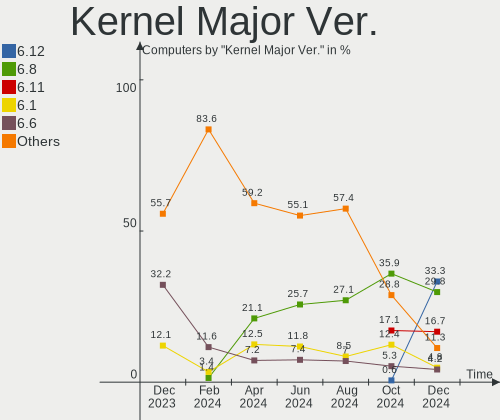
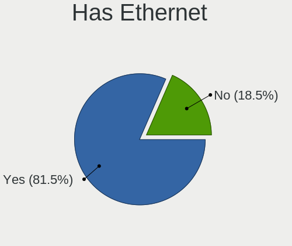
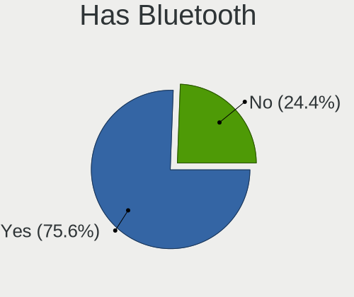
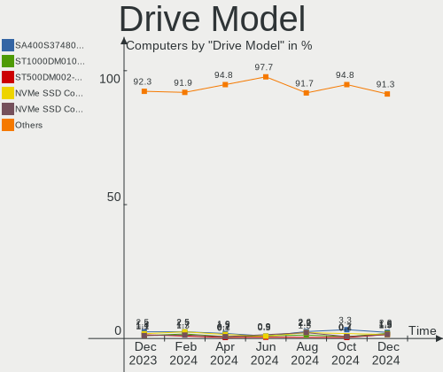
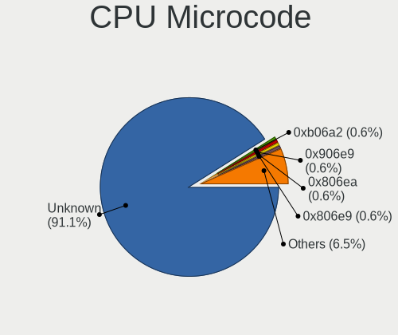
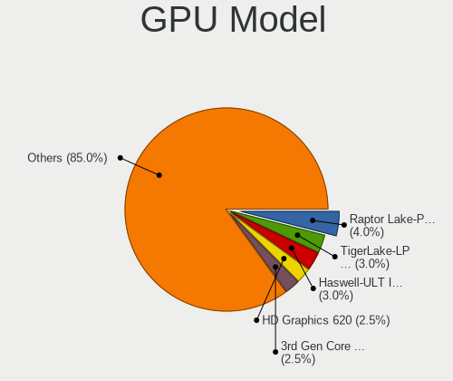
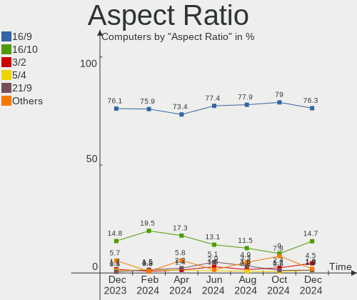
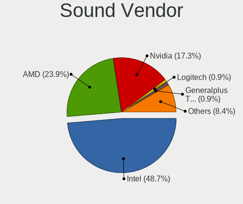

Linux in Spain - Hardware Trends
--------------------------------

A project to identify most popular hardware characteristics and track their change
over time based on data collected by Linux users at https://Linux-Hardware.org.

Anyone can contribute to this report by the [hw-probe](https://github.com/linuxhw/hw-probe) tool:

    sudo -E hw-probe -all -upload

This is a report for all computer types. See also reports for [desktops](/Location/Spain/Desktop/README.md) and [notebooks](/Location/Spain/Notebook/README.md).

Period: May, 2023.

Contents
--------

* [ System ](#system)
  - [ OS                       ](#os)
  - [ OS Family                ](#os-family)
  - [ Kernel                   ](#kernel)
  - [ Kernel Family            ](#kernel-family)
  - [ Kernel Major Ver.        ](#kernel-major-ver)
  - [ Arch                     ](#arch)
  - [ DE                       ](#de)
  - [ Display Server           ](#display-server)
  - [ Display Manager          ](#display-manager)
  - [ OS Lang                  ](#os-lang)
  - [ Boot Mode                ](#boot-mode)
  - [ Filesystem               ](#filesystem)
  - [ Part. scheme             ](#part-scheme)
  - [ Dual Boot with Linux/BSD ](#dual-boot-with-linuxbsd)
  - [ Dual Boot (Win)          ](#dual-boot-win)

* [ Board ](#board)
  - [ Vendor                   ](#vendor)
  - [ Model                    ](#model)
  - [ Model Family             ](#model-family)
  - [ MFG Year                 ](#mfg-year)
  - [ Form Factor              ](#form-factor)
  - [ Secure Boot              ](#secure-boot)
  - [ Coreboot                 ](#coreboot)
  - [ RAM Size                 ](#ram-size)
  - [ RAM Used                 ](#ram-used)
  - [ Total Drives             ](#total-drives)
  - [ Has CD-ROM               ](#has-cd-rom)
  - [ Has Ethernet             ](#has-ethernet)
  - [ Has WiFi                 ](#has-wifi)
  - [ Has Bluetooth            ](#has-bluetooth)

* [ Location ](#location)
  - [ Country                  ](#country)
  - [ City                     ](#city)

* [ Drives ](#drives)
  - [ Drive Vendor             ](#drive-vendor)
  - [ Drive Model              ](#drive-model)
  - [ HDD Vendor               ](#hdd-vendor)
  - [ SSD Vendor               ](#ssd-vendor)
  - [ Drive Kind               ](#drive-kind)
  - [ Drive Connector          ](#drive-connector)
  - [ Drive Size               ](#drive-size)
  - [ Space Total              ](#space-total)
  - [ Space Used               ](#space-used)
  - [ Malfunc. Drives          ](#malfunc-drives)
  - [ Malfunc. Drive Vendor    ](#malfunc-drive-vendor)
  - [ Malfunc. HDD Vendor      ](#malfunc-hdd-vendor)
  - [ Malfunc. Drive Kind      ](#malfunc-drive-kind)
  - [ Failed Drives            ](#failed-drives)
  - [ Failed Drive Vendor      ](#failed-drive-vendor)
  - [ Drive Status             ](#drive-status)

* [ Storage controller ](#storage-controller)
  - [ Storage Vendor           ](#storage-vendor)
  - [ Storage Model            ](#storage-model)
  - [ Storage Kind             ](#storage-kind)

* [ Processor ](#processor)
  - [ CPU Vendor               ](#cpu-vendor)
  - [ CPU Model                ](#cpu-model)
  - [ CPU Model Family         ](#cpu-model-family)
  - [ CPU Cores                ](#cpu-cores)
  - [ CPU Sockets              ](#cpu-sockets)
  - [ CPU Threads              ](#cpu-threads)
  - [ CPU Op-Modes             ](#cpu-op-modes)
  - [ CPU Microcode            ](#cpu-microcode)
  - [ CPU Microarch            ](#cpu-microarch)

* [ Graphics ](#graphics)
  - [ GPU Vendor               ](#gpu-vendor)
  - [ GPU Model                ](#gpu-model)
  - [ GPU Combo                ](#gpu-combo)
  - [ GPU Driver               ](#gpu-driver)
  - [ GPU Memory               ](#gpu-memory)

* [ Monitor ](#monitor)
  - [ Monitor Vendor           ](#monitor-vendor)
  - [ Monitor Model            ](#monitor-model)
  - [ Monitor Resolution       ](#monitor-resolution)
  - [ Monitor Diagonal         ](#monitor-diagonal)
  - [ Monitor Width            ](#monitor-width)
  - [ Aspect Ratio             ](#aspect-ratio)
  - [ Monitor Area             ](#monitor-area)
  - [ Pixel Density            ](#pixel-density)
  - [ Multiple Monitors        ](#multiple-monitors)

* [ Network ](#network)
  - [ Net Controller Vendor    ](#net-controller-vendor)
  - [ Net Controller Model     ](#net-controller-model)
  - [ Wireless Vendor          ](#wireless-vendor)
  - [ Wireless Model           ](#wireless-model)
  - [ Ethernet Vendor          ](#ethernet-vendor)
  - [ Ethernet Model           ](#ethernet-model)
  - [ Net Controller Kind      ](#net-controller-kind)
  - [ Used Controller          ](#used-controller)
  - [ NICs                     ](#nics)
  - [ IPv6                     ](#ipv6)

* [ Bluetooth ](#bluetooth)
  - [ Bluetooth Vendor         ](#bluetooth-vendor)
  - [ Bluetooth Model          ](#bluetooth-model)

* [ Sound ](#sound)
  - [ Sound Vendor             ](#sound-vendor)
  - [ Sound Model              ](#sound-model)

* [ Memory ](#memory)
  - [ Memory Vendor            ](#memory-vendor)
  - [ Memory Model             ](#memory-model)
  - [ Memory Kind              ](#memory-kind)
  - [ Memory Form Factor       ](#memory-form-factor)
  - [ Memory Size              ](#memory-size)
  - [ Memory Speed             ](#memory-speed)

* [ Printers & scanners ](#printers--scanners)
  - [ Printer Vendor           ](#printer-vendor)
  - [ Printer Model            ](#printer-model)
  - [ Scanner Vendor           ](#scanner-vendor)
  - [ Scanner Model            ](#scanner-model)

* [ Camera ](#camera)
  - [ Camera Vendor            ](#camera-vendor)
  - [ Camera Model             ](#camera-model)

* [ Security ](#security)
  - [ Fingerprint Vendor       ](#fingerprint-vendor)
  - [ Fingerprint Model        ](#fingerprint-model)
  - [ Chipcard Vendor          ](#chipcard-vendor)
  - [ Chipcard Model           ](#chipcard-model)

* [ Unsupported ](#unsupported)
  - [ Unsupported Devices      ](#unsupported-devices)
  - [ Unsupported Device Types ](#unsupported-device-types)

System
------

OS
--

Installed operating systems

| Name                         | Computers | Percent |
|------------------------------|-----------|---------|
| Ubuntu 22.04                 | 12        | 9.02%   |
| Ubuntu 23.04                 | 10        | 7.52%   |
| OpenMandriva 23.03           | 9         | 6.77%   |
| Fedora 38                    | 9         | 6.77%   |
| Debian 11                    | 9         | 6.77%   |
| Linux Mint 21.1              | 7         | 5.26%   |
| Zorin 16                     | 6         | 4.51%   |
| Ubuntu 20.04                 | 5         | 3.76%   |
| Arch Rolling                 | 4         | 3.01%   |
| Pop!_OS 22.04                | 3         | 2.26%   |
| Linux Mint 21                | 3         | 2.26%   |
| Kali 2023.2                  | 3         | 2.26%   |
| Gentoo 2.13                  | 3         | 2.26%   |
| Fedora 37                    | 3         | 2.26%   |
| ArcoLinux Rolling            | 3         | 2.26%   |
| ROSA 12.4                    | 2         | 1.5%    |
| openSUSE Tumbleweed-XXXXXXXX | 2         | 1.5%    |
| OpenMandriva 4.3             | 2         | 1.5%    |
| OpenMandriva 23.01           | 2         | 1.5%    |
| Nobara 37                    | 2         | 1.5%    |
| Linux Mint 20.3              | 2         | 1.5%    |
| Kubuntu 22.04                | 2         | 1.5%    |
| Kubuntu 20.04                | 2         | 1.5%    |
| Kali 2023.1                  | 2         | 1.5%    |
| Zorin 15                     | 1         | 0.75%   |
| Xubuntu 22.04                | 1         | 0.75%   |
| Xubuntu 20.04                | 1         | 0.75%   |
| Xero Rolling                 | 1         | 0.75%   |
| Ubuntu Studio 22.04          | 1         | 0.75%   |
| Ubuntu 18.04                 | 1         | 0.75%   |
| SteamOS 3.4.8                | 1         | 0.75%   |
| SteamOS 3.4.6                | 1         | 0.75%   |
| SparkleOS 1.0                | 1         | 0.75%   |
| Rocky Linux 8.7              | 1         | 0.75%   |
| RHEL 9                       | 1         | 0.75%   |
| Parrot 5.3                   | 1         | 0.75%   |
| OpenMandriva 23.90           | 1         | 0.75%   |
| MX 21                        | 1         | 0.75%   |
| Manjaro 22.1.2               | 1         | 0.75%   |
| Manjaro 22.1.1               | 1         | 0.75%   |

OS Family
---------

OS without a version

| Name                | Computers | Percent |
|---------------------|-----------|---------|
| Ubuntu              | 28        | 21.05%  |
| OpenMandriva        | 14        | 10.53%  |
| Linux Mint          | 13        | 9.77%   |
| Fedora              | 13        | 9.77%   |
| Debian              | 10        | 7.52%   |
| Zorin               | 7         | 5.26%   |
| Kubuntu             | 5         | 3.76%   |
| Kali                | 5         | 3.76%   |
| Arch                | 4         | 3.01%   |
| Pop!_OS             | 3         | 2.26%   |
| Manjaro             | 3         | 2.26%   |
| Gentoo              | 3         | 2.26%   |
| ArcoLinux           | 3         | 2.26%   |
| Xubuntu             | 2         | 1.5%    |
| SteamOS             | 2         | 1.5%    |
| ROSA                | 2         | 1.5%    |
| openSUSE            | 2         | 1.5%    |
| Nobara              | 2         | 1.5%    |
| Xero                | 1         | 0.75%   |
| Ubuntu Studio       | 1         | 0.75%   |
| SparkleOS           | 1         | 0.75%   |
| Rocky Linux         | 1         | 0.75%   |
| RHEL                | 1         | 0.75%   |
| Parrot              | 1         | 0.75%   |
| MX                  | 1         | 0.75%   |
| Lubuntu             | 1         | 0.75%   |
| Linux-super-forever | 1         | 0.75%   |
| KDE neon            | 1         | 0.75%   |
| EndeavourOS         | 1         | 0.75%   |
| BlackPanther        | 1         | 0.75%   |

Kernel
------

Version of the Linux kernel

| Version                           | Computers | Percent |
|-----------------------------------|-----------|---------|
| 5.15.0-71-generic                 | 12        | 9.02%   |
| 6.2.0-20-generic                  | 11        | 8.27%   |
| 6.2.6-desktop-1omv2390            | 9         | 6.77%   |
| 5.19.0-41-generic                 | 9         | 6.77%   |
| 5.15.0-72-generic                 | 8         | 6.02%   |
| 5.4.0-148-generic                 | 7         | 5.26%   |
| 6.2.15-300.fc38.x86_64            | 4         | 3.01%   |
| 5.10.0-22-amd64                   | 4         | 3.01%   |
| 6.2.6-76060206-generic            | 3         | 2.26%   |
| 6.2.14-300.fc38.x86_64            | 3         | 2.26%   |
| 6.1.0-kali9-amd64                 | 3         | 2.26%   |
| 5.19.0-42-generic                 | 3         | 2.26%   |
| 5.10.0-23-amd64                   | 3         | 2.26%   |
| 6.1.20-generic-2rosa2021.1-x86_64 | 2         | 1.5%    |
| 5.16.7-desktop-1omv4003           | 2         | 1.5%    |
| 5.13.0-valve36-1-neptune          | 2         | 1.5%    |
| 6.3.4-zen1-1-zen                  | 1         | 0.75%   |
| 6.3.4-x64v1-xanmod1-1             | 1         | 0.75%   |
| 6.3.4-arch1-1                     | 1         | 0.75%   |
| 6.3.3-desktop-2omv2390            | 1         | 0.75%   |
| 6.3.3-arch1-1                     | 1         | 0.75%   |
| 6.3.1-zen1-1-zen                  | 1         | 0.75%   |
| 6.3.1-arch2-1                     | 1         | 0.75%   |
| 6.3.1-arch1-1                     | 1         | 0.75%   |
| 6.3.1-350.vanilla.fc38.x86_64     | 1         | 0.75%   |
| 6.3.1-2-default                   | 1         | 0.75%   |
| 6.3.1-1-default                   | 1         | 0.75%   |
| 6.3.0-gentoo                      | 1         | 0.75%   |
| 6.3.0-1-MANJARO                   | 1         | 0.75%   |
| 6.2.9-300.fc38.x86_64             | 1         | 0.75%   |
| 6.2.15-200.fc37.x86_64            | 1         | 0.75%   |
| 6.2.14-300.fsync.fc37.x86_64      | 1         | 0.75%   |
| 6.2.14-060214-generic             | 1         | 0.75%   |
| 6.2.13-arch1-1                    | 1         | 0.75%   |
| 6.2.12-arch1-1                    | 1         | 0.75%   |
| 6.2.12-200.fsync.fc37.x86_64      | 1         | 0.75%   |
| 6.2.12-200.fc37.x86_64            | 1         | 0.75%   |
| 6.2.10-1.el8.elrepo.x86_64        | 1         | 0.75%   |
| 6.1.29-1-MANJARO                  | 1         | 0.75%   |
| 6.1.28-gentoo                     | 1         | 0.75%   |

Kernel Family
-------------

Linux kernel without a distro release

| Version | Computers | Percent |
|---------|-----------|---------|
| 5.15.0  | 24        | 18.05%  |
| 5.19.0  | 14        | 10.53%  |
| 6.2.6   | 12        | 9.02%   |
| 6.2.0   | 11        | 8.27%   |
| 6.1.0   | 8         | 6.02%   |
| 5.4.0   | 7         | 5.26%   |
| 5.10.0  | 7         | 5.26%   |
| 6.3.1   | 6         | 4.51%   |
| 6.2.15  | 5         | 3.76%   |
| 6.2.14  | 5         | 3.76%   |
| 6.3.4   | 3         | 2.26%   |
| 6.2.12  | 3         | 2.26%   |
| 6.3.3   | 2         | 1.5%    |
| 6.3.0   | 2         | 1.5%    |
| 6.1.26  | 2         | 1.5%    |
| 6.1.20  | 2         | 1.5%    |
| 5.16.7  | 2         | 1.5%    |
| 5.13.0  | 2         | 1.5%    |
| 6.2.9   | 1         | 0.75%   |
| 6.2.13  | 1         | 0.75%   |
| 6.2.10  | 1         | 0.75%   |
| 6.1.29  | 1         | 0.75%   |
| 6.1.28  | 1         | 0.75%   |
| 6.1.2   | 1         | 0.75%   |
| 6.1.1   | 1         | 0.75%   |
| 6.0.7   | 1         | 0.75%   |
| 6.0.0   | 1         | 0.75%   |
| 5.18.0  | 1         | 0.75%   |
| 5.17.5  | 1         | 0.75%   |
| 5.16.0  | 1         | 0.75%   |
| 5.15.44 | 1         | 0.75%   |
| 5.15.32 | 1         | 0.75%   |
| 5.14.0  | 1         | 0.75%   |
| 4.18.16 | 1         | 0.75%   |

Kernel Major Ver.
-----------------

Linux kernel major version

| Version | Computers | Percent |
|---------|-----------|---------|
| 6.2     | 39        | 29.32%  |
| 5.15    | 26        | 19.55%  |
| 6.1     | 16        | 12.03%  |
| 5.19    | 14        | 10.53%  |
| 6.3     | 13        | 9.77%   |
| 5.4     | 7         | 5.26%   |
| 5.10    | 7         | 5.26%   |
| 5.16    | 3         | 2.26%   |
| 6.0     | 2         | 1.5%    |
| 5.13    | 2         | 1.5%    |
| 5.18    | 1         | 0.75%   |
| 5.17    | 1         | 0.75%   |
| 5.14    | 1         | 0.75%   |
| 4.18    | 1         | 0.75%   |

Arch
----

OS architecture (x86_64, i586, etc.)

| Name    | Computers | Percent |
|---------|-----------|---------|
| x86_64  | 132       | 99.25%  |
| aarch64 | 1         | 0.75%   |

DE
--

Desktop Environment

| Name           | Computers | Percent |
|----------------|-----------|---------|
| GNOME          | 58        | 43.61%  |
| KDE5           | 35        | 26.32%  |
| XFCE           | 12        | 9.02%   |
| X-Cinnamon     | 12        | 9.02%   |
| Unknown        | 4         | 3.01%   |
| MATE           | 3         | 2.26%   |
| LXQt           | 3         | 2.26%   |
| openbox        | 1         | 0.75%   |
| LeftWM         | 1         | 0.75%   |
| i3-with-shmlog | 1         | 0.75%   |
| i3             | 1         | 0.75%   |
| Hyprland       | 1         | 0.75%   |
| Cinnamon       | 1         | 0.75%   |

Display Server
--------------

X11 or Wayland

| Name    | Computers | Percent |
|---------|-----------|---------|
| X11     | 89        | 66.92%  |
| Wayland | 40        | 30.08%  |
| Tty     | 3         | 2.26%   |
| Unknown | 1         | 0.75%   |

Display Manager
---------------

SDDM, LightDM, etc.

| Name    | Computers | Percent |
|---------|-----------|---------|
| Unknown | 43        | 32.33%  |
| SDDM    | 31        | 23.31%  |
| GDM3    | 23        | 17.29%  |
| LightDM | 21        | 15.79%  |
| GDM     | 15        | 11.28%  |

OS Lang
-------

Language

| Lang    | Computers | Percent |
|---------|-----------|---------|
| es_ES   | 83        | 62.41%  |
| en_US   | 34        | 25.56%  |
| ca_ES   | 5         | 3.76%   |
| en_GB   | 4         | 3.01%   |
| Unknown | 3         | 2.26%   |
| ru_RU   | 1         | 0.75%   |
| de_DE   | 1         | 0.75%   |
| de_CH   | 1         | 0.75%   |
| C       | 1         | 0.75%   |

Boot Mode
---------

EFI or BIOS

| Mode | Computers | Percent |
|------|-----------|---------|
| EFI  | 75        | 56.39%  |
| BIOS | 58        | 43.61%  |

Filesystem
----------

Type of filesystem

| Type    | Computers | Percent |
|---------|-----------|---------|
| Ext4    | 86        | 64.66%  |
| Btrfs   | 20        | 15.04%  |
| Tmpfs   | 14        | 10.53%  |
| Overlay | 7         | 5.26%   |
| Xfs     | 5         | 3.76%   |
| F2fs    | 1         | 0.75%   |

Part. scheme
------------

Scheme of partitioning

| Type    | Computers | Percent |
|---------|-----------|---------|
| GPT     | 80        | 60.15%  |
| Unknown | 38        | 28.57%  |
| MBR     | 15        | 11.28%  |

Dual Boot with Linux/BSD
------------------------

Hosting more than one Linux/BSD

| Dual boot | Computers | Percent |
|-----------|-----------|---------|
| No        | 106       | 79.7%   |
| Yes       | 27        | 20.3%   |

Dual Boot (Win)
---------------

Hosting Linux and Windows

| Dual boot | Computers | Percent |
|-----------|-----------|---------|
| No        | 87        | 65.41%  |
| Yes       | 46        | 34.59%  |

Board
-----

Vendor
------

Motherboard manufacturer

| Name                    | Computers | Percent |
|-------------------------|-----------|---------|
| ASUSTek Computer        | 23        | 17.29%  |
| Lenovo                  | 22        | 16.54%  |
| Hewlett-Packard         | 19        | 14.29%  |
| Gigabyte Technology     | 12        | 9.02%   |
| Acer                    | 12        | 9.02%   |
| MSI                     | 6         | 4.51%   |
| Apple                   | 6         | 4.51%   |
| ASRock                  | 4         | 3.01%   |
| Toshiba                 | 3         | 2.26%   |
| Dell                    | 3         | 2.26%   |
| Valve                   | 2         | 1.5%    |
| Notebook                | 2         | 1.5%    |
| Medion                  | 2         | 1.5%    |
| Intel                   | 2         | 1.5%    |
| Chuwi                   | 2         | 1.5%    |
| Unknown                 | 2         | 1.5%    |
| TerraQue                | 1         | 0.75%   |
| Teclast                 | 1         | 0.75%   |
| Samsung Electronics     | 1         | 0.75%   |
| Razer                   | 1         | 0.75%   |
| Raspberry Pi Foundation | 1         | 0.75%   |
| NEC Computers           | 1         | 0.75%   |
| Fujitsu                 | 1         | 0.75%   |
| Framework               | 1         | 0.75%   |
| Fanless Mini PC         | 1         | 0.75%   |
| eMachines               | 1         | 0.75%   |
| AZW                     | 1         | 0.75%   |

Model
-----

Motherboard model

| Name                                  | Computers | Percent |
|---------------------------------------|-----------|---------|
| Valve Jupiter                         | 2         | 1.5%    |
| Notebook W54_55SU1,SUW                | 2         | 1.5%    |
| HP 255 G8 Notebook PC                 | 2         | 1.5%    |
| Gigabyte X99-UD4-CF                   | 2         | 1.5%    |
| ASUS ROG Zephyrus G14 GA401II_GA401II | 2         | 1.5%    |
| ASUS PRIME B550-PLUS                  | 2         | 1.5%    |
| Acer TravelMate 5720                  | 2         | 1.5%    |
| Unknown                               | 2         | 1.5%    |
| Toshiba TECRA M10                     | 1         | 0.75%   |
| Toshiba Satellite L755                | 1         | 0.75%   |
| Toshiba Satellite L50-B               | 1         | 0.75%   |
| TerraQue W65_W67RB                    | 1         | 0.75%   |
| Teclast X4                            | 1         | 0.75%   |
| Samsung X420/X520                     | 1         | 0.75%   |
| Razer Blade 14 (2022) - RZ09-0427     | 1         | 0.75%   |
| RPi Raspberry Pi 400 Rev 1.1          | 1         | 0.75%   |
| NEC Computers ECS-945G                | 1         | 0.75%   |
| MSI Stealth 15M B12UE                 | 1         | 0.75%   |
| MSI MS-7D54                           | 1         | 0.75%   |
| MSI MS-7971                           | 1         | 0.75%   |
| MSI Modern 14 B4MW                    | 1         | 0.75%   |
| MSI Modern 14 B10MW                   | 1         | 0.75%   |
| MSI Alpha 15 A3DDK                    | 1         | 0.75%   |
| Medion MS-7848                        | 1         | 0.75%   |
| Medion MS-7675                        | 1         | 0.75%   |
| Lenovo Yoga 6 13ALC7 82UD             | 1         | 0.75%   |
| Lenovo Yoga 530-14IKB 81EK            | 1         | 0.75%   |
| Lenovo Y520-15IKBN 80WK               | 1         | 0.75%   |
| Lenovo V15-ADA 82C7                   | 1         | 0.75%   |
| Lenovo V15 G2 ALC 82KD                | 1         | 0.75%   |
| Lenovo V145-15AST 81MT                | 1         | 0.75%   |
| Lenovo ThinkPad T14s Gen 3 21BRCTO1WW | 1         | 0.75%   |
| Lenovo ThinkPad P1 Gen 4i 20Y4S1QE10  | 1         | 0.75%   |
| Lenovo ThinkPad L13 Gen 2 20VH001BSP  | 1         | 0.75%   |
| Lenovo ThinkPad Helix 36986DG         | 1         | 0.75%   |
| Lenovo ThinkPad E14 Gen 3 20Y7CTO1WW  | 1         | 0.75%   |
| Lenovo ThinkPad A275 20KCS0FT02       | 1         | 0.75%   |
| Lenovo ThinkCentre M93 10A4A03NUK     | 1         | 0.75%   |
| Lenovo ThinkCentre M73z 10BC000JSP    | 1         | 0.75%   |
| Lenovo ThinkBook 15-IIL 20SM          | 1         | 0.75%   |

Model Family
------------

Motherboard model prefix

| Name                   | Computers | Percent |
|------------------------|-----------|---------|
| Lenovo ThinkPad        | 6         | 4.51%   |
| Acer Aspire            | 6         | 4.51%   |
| Lenovo IdeaPad         | 4         | 3.01%   |
| HP Compaq              | 4         | 3.01%   |
| ASUS VivoBook          | 4         | 3.01%   |
| ASUS ROG               | 4         | 3.01%   |
| ASUS PRIME             | 4         | 3.01%   |
| HP Laptop              | 3         | 2.26%   |
| Acer TravelMate        | 3         | 2.26%   |
| Valve Jupiter          | 2         | 1.5%    |
| Toshiba Satellite      | 2         | 1.5%    |
| Notebook W54           | 2         | 1.5%    |
| MSI Modern             | 2         | 1.5%    |
| Lenovo Yoga            | 2         | 1.5%    |
| Lenovo ThinkCentre     | 2         | 1.5%    |
| Lenovo Legion          | 2         | 1.5%    |
| HP OMEN                | 2         | 1.5%    |
| HP 255                 | 2         | 1.5%    |
| Gigabyte X99-UD4-CF    | 2         | 1.5%    |
| ASUS TUF               | 2         | 1.5%    |
| Acer Nitro             | 2         | 1.5%    |
| Unknown                | 2         | 1.5%    |
| Toshiba TECRA          | 1         | 0.75%   |
| TerraQue W65           | 1         | 0.75%   |
| Teclast X4             | 1         | 0.75%   |
| Samsung X420           | 1         | 0.75%   |
| Razer Blade            | 1         | 0.75%   |
| RPi Raspberry          | 1         | 0.75%   |
| NEC Computers ECS-945G | 1         | 0.75%   |
| MSI Stealth            | 1         | 0.75%   |
| MSI MS-7D54            | 1         | 0.75%   |
| MSI MS-7971            | 1         | 0.75%   |
| MSI Alpha              | 1         | 0.75%   |
| Medion MS-7848         | 1         | 0.75%   |
| Medion MS-7675         | 1         | 0.75%   |
| Lenovo Y520-15IKBN     | 1         | 0.75%   |
| Lenovo V15-ADA         | 1         | 0.75%   |
| Lenovo V15             | 1         | 0.75%   |
| Lenovo V145-15AST      | 1         | 0.75%   |
| Lenovo ThinkBook       | 1         | 0.75%   |

MFG Year
--------

Motherboard manufacture year

| Year    | Computers | Percent |
|---------|-----------|---------|
| 2020    | 15        | 11.28%  |
| 2018    | 15        | 11.28%  |
| 2022    | 14        | 10.53%  |
| 2021    | 14        | 10.53%  |
| 2019    | 10        | 7.52%   |
| 2017    | 10        | 7.52%   |
| 2011    | 8         | 6.02%   |
| 2009    | 8         | 6.02%   |
| 2016    | 7         | 5.26%   |
| 2014    | 7         | 5.26%   |
| 2013    | 7         | 5.26%   |
| 2010    | 4         | 3.01%   |
| 2015    | 3         | 2.26%   |
| 2012    | 3         | 2.26%   |
| 2008    | 3         | 2.26%   |
| 2007    | 3         | 2.26%   |
| 2023    | 1         | 0.75%   |
| Unknown | 1         | 0.75%   |

Form Factor
-----------

Physical design of the computer

| Name           | Computers | Percent |
|----------------|-----------|---------|
| Notebook       | 80        | 60.15%  |
| Desktop        | 42        | 31.58%  |
| Convertible    | 3         | 2.26%   |
| Mini pc        | 3         | 2.26%   |
| All in one     | 2         | 1.5%    |
| Stick pc       | 1         | 0.75%   |
| System on chip | 1         | 0.75%   |
| Tablet         | 1         | 0.75%   |

Secure Boot
-----------

Enabled or disabled

| State    | Computers | Percent |
|----------|-----------|---------|
| Disabled | 128       | 96.24%  |
| Enabled  | 5         | 3.76%   |

Coreboot
--------

Have coreboot on board

| Used | Computers | Percent |
|------|-----------|---------|
| No   | 133       | 100%    |

RAM Size
--------

Total RAM memory

| Size in GB  | Computers | Percent |
|-------------|-----------|---------|
| 4.01-8.0    | 32        | 24.06%  |
| 8.01-16.0   | 29        | 21.8%   |
| 16.01-24.0  | 22        | 16.54%  |
| 3.01-4.0    | 20        | 15.04%  |
| 32.01-64.0  | 18        | 13.53%  |
| 24.01-32.0  | 6         | 4.51%   |
| 64.01-256.0 | 3         | 2.26%   |
| 1.01-2.0    | 2         | 1.5%    |
| 2.01-3.0    | 1         | 0.75%   |

RAM Used
--------

Used RAM memory

| Used GB    | Computers | Percent |
|------------|-----------|---------|
| 2.01-3.0   | 33        | 24.81%  |
| 1.01-2.0   | 31        | 23.31%  |
| 4.01-8.0   | 27        | 20.3%   |
| 3.01-4.0   | 26        | 19.55%  |
| 0.51-1.0   | 8         | 6.02%   |
| 8.01-16.0  | 5         | 3.76%   |
| 0.01-0.5   | 2         | 1.5%    |
| 16.01-24.0 | 1         | 0.75%   |

Total Drives
------------

Number of drives on board

| Drives | Computers | Percent |
|--------|-----------|---------|
| 1      | 70        | 52.63%  |
| 2      | 39        | 29.32%  |
| 3      | 10        | 7.52%   |
| 4      | 5         | 3.76%   |
| 5      | 4         | 3.01%   |
| 13     | 1         | 0.75%   |
| 9      | 1         | 0.75%   |
| 8      | 1         | 0.75%   |
| 7      | 1         | 0.75%   |
| 6      | 1         | 0.75%   |

Has CD-ROM
----------

Has CD-ROM on board

| Presented | Computers | Percent |
|-----------|-----------|---------|
| No        | 96        | 72.18%  |
| Yes       | 37        | 27.82%  |

Has Ethernet
------------

Has Ethernet on board

| Presented | Computers | Percent |
|-----------|-----------|---------|
| Yes       | 112       | 84.21%  |
| No        | 21        | 15.79%  |

Has WiFi
--------

Has WiFi module

| Presented | Computers | Percent |
|-----------|-----------|---------|
| Yes       | 113       | 84.96%  |
| No        | 20        | 15.04%  |

Has Bluetooth
-------------

Has Bluetooth module

| Presented | Computers | Percent |
|-----------|-----------|---------|
| Yes       | 94        | 70.68%  |
| No        | 39        | 29.32%  |

Location
--------

Country
-------

Geographic location (country)

| Country | Computers | Percent |
|---------|-----------|---------|
| Spain   | 133       | 100%    |

City
----

Geographic location (city)

| City                       | Computers | Percent |
|----------------------------|-----------|---------|
| Madrid                     | 20        | 15.04%  |
| Barcelona                  | 20        | 15.04%  |
| Valencia                   | 11        | 8.27%   |
| Zaragoza                   | 3         | 2.26%   |
| Girona                     | 3         | 2.26%   |
| Seville                    | 2         | 1.5%    |
| Santa Pola                 | 2         | 1.5%    |
| Las Palmas de Gran Canaria | 2         | 1.5%    |
| Bilbao                     | 2         | 1.5%    |
| Zafra                      | 1         | 0.75%   |
| Xàtiva                    | 1         | 0.75%   |
| Villanueva del Trabuco     | 1         | 0.75%   |
| Vigo                       | 1         | 0.75%   |
| Urdiain                    | 1         | 0.75%   |
| Torrelavega                | 1         | 0.75%   |
| Terrassa                   | 1         | 0.75%   |
| Santiago de Compostela     | 1         | 0.75%   |
| Sant Boi de Llobregat      | 1         | 0.75%   |
| Sangonera la Verde         | 1         | 0.75%   |
| San Vicent del Raspeig     | 1         | 0.75%   |
| San Jose de la Rinconada   | 1         | 0.75%   |
| San Fernando               | 1         | 0.75%   |
| Puerto del Rosario         | 1         | 0.75%   |
| Priego de Cordoba          | 1         | 0.75%   |
| Port de Sagunt             | 1         | 0.75%   |
| Pereiro de Aguiar          | 1         | 0.75%   |
| Pamplona                   | 1         | 0.75%   |
| Paiporta                   | 1         | 0.75%   |
| Ourense                    | 1         | 0.75%   |
| Ocana                      | 1         | 0.75%   |
| Niebla                     | 1         | 0.75%   |
| Navalagamella              | 1         | 0.75%   |
| Murcia                     | 1         | 0.75%   |
| Mostoles                   | 1         | 0.75%   |
| Montijo                    | 1         | 0.75%   |
| Mislata                    | 1         | 0.75%   |
| Meis                       | 1         | 0.75%   |
| Mataró                    | 1         | 0.75%   |
| Manises                    | 1         | 0.75%   |
| Mairena del Alcor          | 1         | 0.75%   |

Drives
------

Drive Vendor
------------

Hard drive vendors

| Vendor                      | Computers | Drives | Percent |
|-----------------------------|-----------|--------|---------|
| Seagate                     | 32        | 35     | 14.1%   |
| Samsung Electronics         | 32        | 44     | 14.1%   |
| Kingston                    | 22        | 26     | 9.69%   |
| WDC                         | 20        | 25     | 8.81%   |
| Sandisk                     | 17        | 17     | 7.49%   |
| Toshiba                     | 16        | 18     | 7.05%   |
| SK hynix                    | 9         | 9      | 3.96%   |
| Crucial                     | 9         | 9      | 3.96%   |
| Intel                       | 8         | 9      | 3.52%   |
| Micron Technology           | 7         | 7      | 3.08%   |
| Unknown                     | 6         | 6      | 2.64%   |
| China                       | 6         | 7      | 2.64%   |
| Hitachi                     | 5         | 5      | 2.2%    |
| Phison Electronics          | 4         | 4      | 1.76%   |
| Micron/Crucial Technology   | 4         | 5      | 1.76%   |
| Apple                       | 3         | 3      | 1.32%   |
| Transcend                   | 2         | 2      | 0.88%   |
| Silicon Motion              | 2         | 2      | 0.88%   |
| Kingston Technology Company | 2         | 2      | 0.88%   |
| BAITITON                    | 2         | 3      | 0.88%   |
| Vaseky                      | 1         | 1      | 0.44%   |
| Teclast                     | 1         | 1      | 0.44%   |
| TCSUNBOW                    | 1         | 1      | 0.44%   |
| SSK                         | 1         | 1      | 0.44%   |
| PNY                         | 1         | 1      | 0.44%   |
| Netac                       | 1         | 1      | 0.44%   |
| MAXIO Technology (Hangzhou) | 1         | 1      | 0.44%   |
| Londisk                     | 1         | 1      | 0.44%   |
| Lexar                       | 1         | 1      | 0.44%   |
| KIOXIA                      | 1         | 1      | 0.44%   |
| KingSpec                    | 1         | 1      | 0.44%   |
| Inateck                     | 1         | 1      | 0.44%   |
| Hjwdz                       | 1         | 1      | 0.44%   |
| HGST                        | 1         | 1      | 0.44%   |
| FCS                         | 1         | 1      | 0.44%   |
| Dogfish                     | 1         | 1      | 0.44%   |
| Apacer                      | 1         | 1      | 0.44%   |
| A-DATA Technology           | 1         | 1      | 0.44%   |
| Unknown                     | 1         | 1      | 0.44%   |

Drive Model
-----------

Hard drive models

| Model                                               | Computers | Percent |
|-----------------------------------------------------|-----------|---------|
| Kingston SA400S37240G 240GB SSD                     | 6         | 2.42%   |
| Sandisk WD Black SN750 / PC SN730 NVMe SSD 256GB    | 5         | 2.02%   |
| Kingston SA400S37480G 480GB SSD                     | 5         | 2.02%   |
| Seagate ST1000LM035-1RK172 1TB                      | 4         | 1.61%   |
| Samsung SSD 850 EVO 250GB                           | 4         | 1.61%   |
| Samsung NVMe SSD Controller SM981/PM981/PM983 256GB | 4         | 1.61%   |
| Toshiba TR200 240GB SSD                             | 3         | 1.21%   |
| Seagate ST1000DM003-1CH162 1TB                      | 3         | 1.21%   |
| Sandisk WD Blue SN550 NVMe SSD 512GB                | 3         | 1.21%   |
| Kingston SV300S37A120G 120GB SSD                    | 3         | 1.21%   |
| Crucial CT480BX500SSD1 480GB                        | 3         | 1.21%   |
| Crucial CT1000MX500SSD1 1TB                         | 3         | 1.21%   |
| WDC WD5000AAKX-08U6AA0 500GB                        | 2         | 0.81%   |
| WDC WD40PURZ-85TTDY0 4TB                            | 2         | 0.81%   |
| Toshiba MQ01ABD100 1TB                              | 2         | 0.81%   |
| Toshiba DT01ACA100 1TB                              | 2         | 0.81%   |
| SK hynix SKHynix_HFM512GD3HX015N 512GB              | 2         | 0.81%   |
| Seagate ST2000DM006-2DM164 2TB                      | 2         | 0.81%   |
| Seagate ST1000DM010-2EP102 1TB                      | 2         | 0.81%   |
| Seagate ST1000DM003-1SB102 1TB                      | 2         | 0.81%   |
| SanDisk SSD PLUS 480GB                              | 2         | 0.81%   |
| Samsung SSD 970 EVO 500GB                           | 2         | 0.81%   |
| Samsung SSD 850 PRO 256GB                           | 2         | 0.81%   |
| Samsung SSD 850 EVO 500GB                           | 2         | 0.81%   |
| Samsung SSD 840 EVO 500GB                           | 2         | 0.81%   |
| Samsung NVMe SSD Controller PM9A1/PM9A3/980PRO 1TB  | 2         | 0.81%   |
| Samsung MZ7LN256HAJQ-000L2 256GB SSD                | 2         | 0.81%   |
| Phison E16 PCIe4 NVMe Controller 1TB                | 2         | 0.81%   |
| Phison E12 NVMe Controller 256GB                    | 2         | 0.81%   |
| Micron/Crucial CT1000P5PSSD8 1TB                    | 2         | 0.81%   |
| Micron CT1000P5SSD8 1TB                             | 2         | 0.81%   |
| Kingston SUV400S37240G 240GB SSD                    | 2         | 0.81%   |
| Kingston SA400S37120G 120GB SSD                     | 2         | 0.81%   |
| Intel SSD 660P Series 512GB                         | 2         | 0.81%   |
| China SSD 512GB                                     | 2         | 0.81%   |
| WDC WDS500G2B0C-00PXH0 500GB                        | 1         | 0.4%    |
| WDC WDS256G1X0C-00ENX0 256GB                        | 1         | 0.4%    |
| WDC WDS250G2X0C-00L350 250GB                        | 1         | 0.4%    |
| WDC WDS200T2B0A-00SM50 2TB SSD                      | 1         | 0.4%    |
| WDC WDS100T2B0A-00SM50 1TB SSD                      | 1         | 0.4%    |

HDD Vendor
----------

Hard disk drive vendors

| Vendor              | Computers | Drives | Percent |
|---------------------|-----------|--------|---------|
| Seagate             | 32        | 35     | 45.07%  |
| WDC                 | 16        | 18     | 22.54%  |
| Toshiba             | 11        | 11     | 15.49%  |
| Hitachi             | 5         | 5      | 7.04%   |
| Samsung Electronics | 2         | 3      | 2.82%   |
| Unknown             | 1         | 1      | 1.41%   |
| SSK                 | 1         | 1      | 1.41%   |
| Inateck             | 1         | 1      | 1.41%   |
| HGST                | 1         | 1      | 1.41%   |
| Apple               | 1         | 1      | 1.41%   |

SSD Vendor
----------

Solid state drive vendors

| Vendor              | Computers | Drives | Percent |
|---------------------|-----------|--------|---------|
| Kingston            | 21        | 25     | 25.3%   |
| Samsung Electronics | 16        | 19     | 19.28%  |
| Crucial             | 9         | 9      | 10.84%  |
| China               | 6         | 7      | 7.23%   |
| Toshiba             | 4         | 6      | 4.82%   |
| SanDisk             | 4         | 4      | 4.82%   |
| WDC                 | 3         | 3      | 3.61%   |
| Transcend           | 2         | 2      | 2.41%   |
| Intel               | 2         | 2      | 2.41%   |
| BAITITON            | 2         | 3      | 2.41%   |
| Apple               | 2         | 2      | 2.41%   |
| Vaseky              | 1         | 1      | 1.2%    |
| Teclast             | 1         | 1      | 1.2%    |
| TCSUNBOW            | 1         | 1      | 1.2%    |
| SK hynix            | 1         | 1      | 1.2%    |
| PNY                 | 1         | 1      | 1.2%    |
| Netac               | 1         | 1      | 1.2%    |
| Micron Technology   | 1         | 1      | 1.2%    |
| Londisk             | 1         | 1      | 1.2%    |
| KingSpec            | 1         | 1      | 1.2%    |
| FCS                 | 1         | 1      | 1.2%    |
| Dogfish             | 1         | 1      | 1.2%    |
| A-DATA Technology   | 1         | 1      | 1.2%    |

Drive Kind
----------

HDD or SSD

| Kind    | Computers | Drives | Percent |
|---------|-----------|--------|---------|
| SSD     | 64        | 94     | 33.51%  |
| HDD     | 61        | 77     | 31.94%  |
| NVMe    | 60        | 80     | 31.41%  |
| MMC     | 5         | 5      | 2.62%   |
| Unknown | 1         | 1      | 0.52%   |

Drive Connector
---------------

SATA, SAS, NVMe, etc.

| Type | Computers | Drives | Percent |
|------|-----------|--------|---------|
| SATA | 91        | 157    | 54.49%  |
| NVMe | 60        | 80     | 35.93%  |
| SAS  | 11        | 15     | 6.59%   |
| MMC  | 5         | 5      | 2.99%   |

Drive Size
----------

Size of hard drive

| Size in TB | Computers | Drives | Percent |
|------------|-----------|--------|---------|
| 0.01-0.5   | 74        | 100    | 53.62%  |
| 0.51-1.0   | 41        | 47     | 29.71%  |
| 1.01-2.0   | 11        | 11     | 7.97%   |
| 3.01-4.0   | 5         | 5      | 3.62%   |
| 2.01-3.0   | 4         | 4      | 2.9%    |
| 4.01-10.0  | 3         | 4      | 2.17%   |

Space Total
-----------

Amount of disk space available on the file system

| Size in GB     | Computers | Percent |
|----------------|-----------|---------|
| 101-250        | 34        | 25.56%  |
| 251-500        | 26        | 19.55%  |
| 501-1000       | 23        | 17.29%  |
| 1001-2000      | 12        | 9.02%   |
| More than 3000 | 10        | 7.52%   |
| 51-100         | 10        | 7.52%   |
| 1-20           | 7         | 5.26%   |
| 21-50          | 4         | 3.01%   |
| 2001-3000      | 4         | 3.01%   |
| Unknown        | 3         | 2.26%   |

Space Used
----------

Amount of used disk space

| Used GB        | Computers | Percent |
|----------------|-----------|---------|
| 1-20           | 40        | 30.08%  |
| 21-50          | 25        | 18.8%   |
| 101-250        | 20        | 15.04%  |
| 51-100         | 15        | 11.28%  |
| 251-500        | 14        | 10.53%  |
| More than 3000 | 7         | 5.26%   |
| 501-1000       | 5         | 3.76%   |
| 1001-2000      | 3         | 2.26%   |
| Unknown        | 3         | 2.26%   |
| 2001-3000      | 1         | 0.75%   |

Malfunc. Drives
---------------

Drive models with a malfunction

| Model                               | Computers | Drives | Percent |
|-------------------------------------|-----------|--------|---------|
| WDC WD5000AAKX-08U6AA0 500GB        | 1         | 1      | 4.55%   |
| WDC WD50 00LPVX-22V0TT0 500GB       | 1         | 1      | 4.55%   |
| WDC WD20PURZ-85GU6Y0 2TB            | 1         | 1      | 4.55%   |
| WDC WD20PURX-64P6ZY0 2TB            | 1         | 1      | 4.55%   |
| Transcend TS1TSSD230S 1TB           | 1         | 1      | 4.55%   |
| Toshiba MK5065GSXN 500GB            | 1         | 1      | 4.55%   |
| Toshiba DT01ACA100 1TB              | 1         | 1      | 4.55%   |
| Seagate ST9160412AS 160GB           | 1         | 1      | 4.55%   |
| Seagate ST2000LX001-1RG174 2TB      | 1         | 1      | 4.55%   |
| Seagate ST1000DM010-2EP102 1TB      | 1         | 1      | 4.55%   |
| Samsung Electronics SSD 870 EVO 1TB | 1         | 2      | 4.55%   |
| Kingston SV300S37A120G 120GB SSD    | 1         | 1      | 4.55%   |
| Kingston SUV400S37120G 120GB SSD    | 1         | 1      | 4.55%   |
| Kingston SA400S37480G 480GB SSD     | 1         | 1      | 4.55%   |
| Kingston SA400S37120G 120GB SSD     | 1         | 1      | 4.55%   |
| KingSpec P4-960 960GB SSD           | 1         | 1      | 4.55%   |
| Intel SSDMAEMC040G2 40GB            | 1         | 1      | 4.55%   |
| Hitachi HTS545050A7E380 500GB       | 1         | 1      | 4.55%   |
| Hitachi HTS543232L9A300 320GB       | 1         | 1      | 4.55%   |
| China SSD 512GB                     | 1         | 1      | 4.55%   |
| China SSD 128GB                     | 1         | 1      | 4.55%   |
| China G521N256GB SSD                | 1         | 1      | 4.55%   |

Malfunc. Drive Vendor
---------------------

Vendors of faulty drives

| Vendor              | Computers | Drives | Percent |
|---------------------|-----------|--------|---------|
| WDC                 | 4         | 4      | 19.05%  |
| Seagate             | 3         | 3      | 14.29%  |
| Kingston            | 3         | 4      | 14.29%  |
| China               | 3         | 3      | 14.29%  |
| Toshiba             | 2         | 2      | 9.52%   |
| Hitachi             | 2         | 2      | 9.52%   |
| Transcend           | 1         | 1      | 4.76%   |
| Samsung Electronics | 1         | 2      | 4.76%   |
| KingSpec            | 1         | 1      | 4.76%   |
| Intel               | 1         | 1      | 4.76%   |

Malfunc. HDD Vendor
-------------------

Vendors of faulty HDD drives

| Vendor  | Computers | Drives | Percent |
|---------|-----------|--------|---------|
| WDC     | 4         | 4      | 36.36%  |
| Seagate | 3         | 3      | 27.27%  |
| Toshiba | 2         | 2      | 18.18%  |
| Hitachi | 2         | 2      | 18.18%  |

Malfunc. Drive Kind
-------------------

Kinds of faulty drives

| Kind | Computers | Drives | Percent |
|------|-----------|--------|---------|
| HDD  | 10        | 11     | 52.63%  |
| SSD  | 9         | 12     | 47.37%  |

Failed Drives
-------------

Failed drive models

| Model                           | Computers | Drives | Percent |
|---------------------------------|-----------|--------|---------|
| Samsung Electronics HD103SJ 1TB | 1         | 1      | 100%    |

Failed Drive Vendor
-------------------

Failed drive vendors

| Vendor              | Computers | Drives | Percent |
|---------------------|-----------|--------|---------|
| Samsung Electronics | 1         | 1      | 100%    |

Drive Status
------------

Number of failed and malfunc. drives

| Status   | Computers | Drives | Percent |
|----------|-----------|--------|---------|
| Detected | 68        | 108    | 44.44%  |
| Works    | 66        | 125    | 43.14%  |
| Malfunc  | 18        | 23     | 11.76%  |
| Failed   | 1         | 1      | 0.65%   |

Storage controller
------------------

Storage Vendor
--------------

Storage controller vendors

| Vendor                       | Computers | Percent |
|------------------------------|-----------|---------|
| Intel                        | 88        | 46.81%  |
| AMD                          | 26        | 13.83%  |
| Samsung Electronics          | 18        | 9.57%   |
| SanDisk                      | 16        | 8.51%   |
| SK hynix                     | 8         | 4.26%   |
| Micron Technology            | 6         | 3.19%   |
| Phison Electronics           | 5         | 2.66%   |
| Micron/Crucial Technology    | 4         | 2.13%   |
| Kingston Technology Company  | 3         | 1.6%    |
| Silicon Motion               | 2         | 1.06%   |
| MAXIO Technology (Hangzhou)  | 2         | 1.06%   |
| Marvell Technology Group     | 2         | 1.06%   |
| JMicron Technology           | 2         | 1.06%   |
| ASMedia Technology           | 2         | 1.06%   |
| Toshiba America Info Systems | 1         | 0.53%   |
| Shenzhen Longsys Electronics | 1         | 0.53%   |
| Nvidia                       | 1         | 0.53%   |
| KIOXIA                       | 1         | 0.53%   |

Storage Model
-------------

Storage controller models

| Model                                                                          | Computers | Percent |
|--------------------------------------------------------------------------------|-----------|---------|
| AMD FCH SATA Controller [AHCI mode]                                            | 21        | 10.24%  |
| Intel 8 Series/C220 Series Chipset Family 6-port SATA Controller 1 [AHCI mode] | 10        | 4.88%   |
| Samsung NVMe SSD Controller SM981/PM981/PM983                                  | 8         | 3.9%    |
| Micron NVMe Storage Controller                                                 | 6         | 2.93%   |
| SanDisk WD Blue SN550 NVMe SSD                                                 | 5         | 2.44%   |
| SanDisk WD Black SN750 / PC SN730 NVMe SSD                                     | 5         | 2.44%   |
| Intel Volume Management Device NVMe RAID Controller                            | 5         | 2.44%   |
| Intel Sunrise Point-LP SATA Controller [AHCI mode]                             | 5         | 2.44%   |
| Intel Celeron/Pentium Silver Processor SATA Controller                         | 5         | 2.44%   |
| Intel 82801IBM/IEM (ICH9M/ICH9M-E) 4 port SATA Controller [AHCI mode]          | 5         | 2.44%   |
| Intel 200 Series PCH SATA controller [AHCI mode]                               | 5         | 2.44%   |
| Samsung NVMe SSD Controller PM9A1/PM9A3/980PRO                                 | 4         | 1.95%   |
| Samsung NVMe SSD Controller 980                                                | 4         | 1.95%   |
| SK hynix Gold P31/PC711 NVMe Solid State Drive                                 | 3         | 1.46%   |
| Intel Tiger Lake-LP SATA Controller                                            | 3         | 1.46%   |
| Intel Q170/Q150/B150/H170/H110/Z170/CM236 Chipset SATA Controller [AHCI Mode]  | 3         | 1.46%   |
| Intel HM170/QM170 Chipset SATA Controller [AHCI Mode]                          | 3         | 1.46%   |
| Intel Cannon Lake Mobile PCH SATA AHCI Controller                              | 3         | 1.46%   |
| Intel 82801 Mobile SATA Controller [RAID mode]                                 | 3         | 1.46%   |
| Intel 7 Series Chipset Family 6-port SATA Controller [AHCI mode]               | 3         | 1.46%   |
| Intel 6 Series/C200 Series Chipset Family 6 port Mobile SATA AHCI Controller   | 3         | 1.46%   |
| SK hynix PC401 NVMe Solid State Drive 256GB                                    | 2         | 0.98%   |
| SK hynix BC511                                                                 | 2         | 0.98%   |
| Silicon Motion SM2263EN/SM2263XT SSD Controller                                | 2         | 0.98%   |
| SanDisk WD Blue SN570 NVMe SSD 1TB                                             | 2         | 0.98%   |
| SanDisk WD Black 2018/SN750 / PC SN720 NVMe SSD                                | 2         | 0.98%   |
| Samsung Electronics SATA controller                                            | 2         | 0.98%   |
| Phison E16 PCIe4 NVMe Controller                                               | 2         | 0.98%   |
| Phison E12 NVMe Controller                                                     | 2         | 0.98%   |
| Micron/Crucial P5 Plus NVMe PCIe SSD                                           | 2         | 0.98%   |
| JMicron JMB363 SATA/IDE Controller                                             | 2         | 0.98%   |
| Intel SSD 660P Series                                                          | 2         | 0.98%   |
| Intel Non-Volatile memory controller                                           | 2         | 0.98%   |
| Intel C610/X99 series chipset 6-Port SATA Controller [AHCI mode]               | 2         | 0.98%   |
| Intel 82801JI (ICH10 Family) SATA AHCI Controller                              | 2         | 0.98%   |
| Intel 82801HM/HEM (ICH8M/ICH8M-E) SATA Controller [IDE mode]                   | 2         | 0.98%   |
| Intel 82801HM/HEM (ICH8M/ICH8M-E) IDE Controller                               | 2         | 0.98%   |
| Intel 8 Series SATA Controller 1 [AHCI mode]                                   | 2         | 0.98%   |
| Intel 6 Series/C200 Series Chipset Family 6 port Desktop SATA AHCI Controller  | 2         | 0.98%   |
| Intel 500 Series Chipset Family SATA AHCI Controller                           | 2         | 0.98%   |

Storage Kind
------------

Kind of storage controller (IDE, SATA, NVMe, SAS, ...)

| Kind | Computers | Percent |
|------|-----------|---------|
| SATA | 103       | 57.22%  |
| NVMe | 60        | 33.33%  |
| RAID | 9         | 5%      |
| IDE  | 8         | 4.44%   |

Processor
---------

CPU Vendor
----------

Processor vendors

| Vendor | Computers | Percent |
|--------|-----------|---------|
| Intel  | 97        | 72.93%  |
| AMD    | 35        | 26.32%  |
| ARM    | 1         | 0.75%   |

CPU Model
---------

Processor models

| Model                                       | Computers | Percent |
|---------------------------------------------|-----------|---------|
| Intel 11th Gen Core i5-1135G7 @ 2.40GHz     | 3         | 2.26%   |
| Intel Pentium Dual-Core CPU T4300 @ 2.10GHz | 2         | 1.5%    |
| Intel Core i7-8750H CPU @ 2.20GHz           | 2         | 1.5%    |
| Intel Core i7-8550U CPU @ 1.80GHz           | 2         | 1.5%    |
| Intel Core i7-7700HQ CPU @ 2.80GHz          | 2         | 1.5%    |
| Intel Core i7-5820K CPU @ 3.30GHz           | 2         | 1.5%    |
| Intel Core i7-10750H CPU @ 2.60GHz          | 2         | 1.5%    |
| Intel Core i5-7200U CPU @ 2.50GHz           | 2         | 1.5%    |
| Intel Core i5-3337U CPU @ 1.80GHz           | 2         | 1.5%    |
| Intel Core i5-2400 CPU @ 3.10GHz            | 2         | 1.5%    |
| Intel Core i5 CPU 650 @ 3.20GHz             | 2         | 1.5%    |
| Intel Core 2 Duo CPU T5670 @ 1.80GHz        | 2         | 1.5%    |
| Intel Celeron N4100 CPU @ 1.10GHz           | 2         | 1.5%    |
| Intel 12th Gen Core i7-1260P                | 2         | 1.5%    |
| Intel 11th Gen Core i7-1165G7 @ 2.80GHz     | 2         | 1.5%    |
| AMD Ryzen 7 5700U with Radeon Graphics      | 2         | 1.5%    |
| AMD Ryzen 7 4800HS with Radeon Graphics     | 2         | 1.5%    |
| AMD Ryzen 5 5600H with Radeon Graphics      | 2         | 1.5%    |
| AMD Custom APU 0405                         | 2         | 1.5%    |
| Intel Xeon W-2123 CPU @ 3.60GHz             | 1         | 0.75%   |
| Intel Xeon CPU X5690 @ 3.47GHz              | 1         | 0.75%   |
| Intel Xeon CPU X5680 @ 3.33GHz              | 1         | 0.75%   |
| Intel Xeon CPU X5460 @ 3.16GHz              | 1         | 0.75%   |
| Intel Xeon CPU E5-2689 0 @ 2.60GHz          | 1         | 0.75%   |
| Intel Pentium Dual-Core CPU T4500 @ 2.30GHz | 1         | 0.75%   |
| Intel Pentium Dual CPU E2140 @ 1.60GHz      | 1         | 0.75%   |
| Intel Pentium CPU N3540 @ 2.16GHz           | 1         | 0.75%   |
| Intel Pentium CPU G860 @ 3.00GHz            | 1         | 0.75%   |
| Intel Pentium CPU G3220 @ 3.00GHz           | 1         | 0.75%   |
| Intel Genuine CPU U4100 @ 1.30GHz           | 1         | 0.75%   |
| Intel Core i9-7900X CPU @ 3.30GHz           | 1         | 0.75%   |
| Intel Core i7-9750H CPU @ 2.60GHz           | 1         | 0.75%   |
| Intel Core i7-9700K CPU @ 3.60GHz           | 1         | 0.75%   |
| Intel Core i7-8700K CPU @ 3.70GHz           | 1         | 0.75%   |
| Intel Core i7-7500U CPU @ 2.70GHz           | 1         | 0.75%   |
| Intel Core i7-6950X CPU @ 3.00GHz           | 1         | 0.75%   |
| Intel Core i7-6700K CPU @ 4.00GHz           | 1         | 0.75%   |
| Intel Core i7-6700HQ CPU @ 2.60GHz          | 1         | 0.75%   |
| Intel Core i7-4870HQ CPU @ 2.50GHz          | 1         | 0.75%   |
| Intel Core i7-4790S CPU @ 3.20GHz           | 1         | 0.75%   |

CPU Model Family
----------------

Processor model prefix

| Model                   | Computers | Percent |
|-------------------------|-----------|---------|
| Intel Core i7           | 25        | 18.8%   |
| Other                   | 20        | 15.04%  |
| Intel Core i5           | 20        | 15.04%  |
| AMD Ryzen 7             | 11        | 8.27%   |
| Intel Core i3           | 10        | 7.52%   |
| Intel Celeron           | 8         | 6.02%   |
| AMD Ryzen 5             | 7         | 5.26%   |
| Intel Xeon              | 5         | 3.76%   |
| Intel Core 2 Duo        | 4         | 3.01%   |
| Intel Pentium Dual-Core | 3         | 2.26%   |
| Intel Pentium           | 3         | 2.26%   |
| AMD Ryzen 9             | 3         | 2.26%   |
| AMD A4                  | 3         | 2.26%   |
| Intel Pentium Dual      | 1         | 0.75%   |
| Intel Genuine           | 1         | 0.75%   |
| Intel Core i9           | 1         | 0.75%   |
| Intel Core 2 Quad       | 1         | 0.75%   |
| Intel Atom              | 1         | 0.75%   |
| AMD Sempron             | 1         | 0.75%   |
| AMD Ryzen 7 PRO         | 1         | 0.75%   |
| AMD Ryzen 3             | 1         | 0.75%   |
| AMD Phenom II X4        | 1         | 0.75%   |
| AMD E                   | 1         | 0.75%   |
| AMD A6                  | 1         | 0.75%   |

CPU Cores
---------

Number of processor cores

| Number  | Computers | Percent |
|---------|-----------|---------|
| 2       | 45        | 33.83%  |
| 4       | 43        | 32.33%  |
| 6       | 17        | 12.78%  |
| 8       | 16        | 12.03%  |
| 12      | 4         | 3.01%   |
| 10      | 4         | 3.01%   |
| 1       | 2         | 1.5%    |
| 14      | 1         | 0.75%   |
| Unknown | 1         | 0.75%   |

CPU Sockets
-----------

Number of sockets

| Number  | Computers | Percent |
|---------|-----------|---------|
| 1       | 132       | 99.25%  |
| Unknown | 1         | 0.75%   |

CPU Threads
-----------

Threads per core (Hyper-Threading)

| Number  | Computers | Percent |
|---------|-----------|---------|
| 2       | 87        | 65.41%  |
| 1       | 45        | 33.83%  |
| Unknown | 1         | 0.75%   |

CPU Op-Modes
------------

CPU Operation Modes (32-bit, 64-bit)

| Op mode        | Computers | Percent |
|----------------|-----------|---------|
| 32-bit, 64-bit | 133       | 100%    |

CPU Microcode
-------------

Microcode number

| Number     | Computers | Percent |
|------------|-----------|---------|
| Unknown    | 56        | 42.11%  |
| 0x306c3    | 7         | 5.26%   |
| 0x1067a    | 5         | 3.76%   |
| 0x06006705 | 4         | 3.01%   |
| 0x506e3    | 3         | 2.26%   |
| 0x306a9    | 3         | 2.26%   |
| 0x206a7    | 3         | 2.26%   |
| 0x0a50000c | 3         | 2.26%   |
| 0x08600104 | 3         | 2.26%   |
| 0x08108109 | 3         | 2.26%   |
| 0x906e9    | 2         | 1.5%    |
| 0x806e9    | 2         | 1.5%    |
| 0x806c1    | 2         | 1.5%    |
| 0x706a8    | 2         | 1.5%    |
| 0x6fd      | 2         | 1.5%    |
| 0x206c2    | 2         | 1.5%    |
| 0x0a20120a | 2         | 1.5%    |
| 0x08701021 | 2         | 1.5%    |
| 0x08608103 | 2         | 1.5%    |
| 0x906ed    | 1         | 0.75%   |
| 0x906eb    | 1         | 0.75%   |
| 0x906c0    | 1         | 0.75%   |
| 0x906a4    | 1         | 0.75%   |
| 0x906a3    | 1         | 0.75%   |
| 0x806ec    | 1         | 0.75%   |
| 0x806ea    | 1         | 0.75%   |
| 0x706a1    | 1         | 0.75%   |
| 0x506c9    | 1         | 0.75%   |
| 0x50654    | 1         | 0.75%   |
| 0x406f1    | 1         | 0.75%   |
| 0x406e3    | 1         | 0.75%   |
| 0x406c3    | 1         | 0.75%   |
| 0x40651    | 1         | 0.75%   |
| 0x306d4    | 1         | 0.75%   |
| 0x30678    | 1         | 0.75%   |
| 0x20655    | 1         | 0.75%   |
| 0x106ca    | 1         | 0.75%   |
| 0x0a601201 | 1         | 0.75%   |
| 0x0a404102 | 1         | 0.75%   |
| 0x08600106 | 1         | 0.75%   |

CPU Microarch
-------------

Microarchitecture

| Name             | Computers | Percent |
|------------------|-----------|---------|
| KabyLake         | 18        | 13.53%  |
| Haswell          | 15        | 11.28%  |
| Penryn           | 8         | 6.02%   |
| Unknown          | 8         | 6.02%   |
| Skylake          | 7         | 5.26%   |
| SandyBridge      | 7         | 5.26%   |
| Zen+             | 6         | 4.51%   |
| Zen 3            | 6         | 4.51%   |
| Zen 2            | 6         | 4.51%   |
| TigerLake        | 6         | 4.51%   |
| Westmere         | 5         | 3.76%   |
| Goldmont plus    | 5         | 3.76%   |
| Excavator        | 5         | 3.76%   |
| Alderlake Hybrid | 5         | 3.76%   |
| IvyBridge        | 4         | 3.01%   |
| IceLake          | 4         | 3.01%   |
| Core             | 3         | 2.26%   |
| CometLake        | 3         | 2.26%   |
| Silvermont       | 2         | 1.5%    |
| K10              | 2         | 1.5%    |
| Broadwell        | 2         | 1.5%    |
| Zen              | 1         | 0.75%   |
| Tremont          | 1         | 0.75%   |
| K10 Llano        | 1         | 0.75%   |
| Goldmont         | 1         | 0.75%   |
| Bonnell          | 1         | 0.75%   |
| Bobcat           | 1         | 0.75%   |

Graphics
--------

GPU Vendor
----------

Vendors of graphics cards

| Vendor | Computers | Percent |
|--------|-----------|---------|
| Intel  | 69        | 43.4%   |
| Nvidia | 46        | 28.93%  |
| AMD    | 44        | 27.67%  |

GPU Model
---------

Graphics card models

| Model                                                                                 | Computers | Percent |
|---------------------------------------------------------------------------------------|-----------|---------|
| Intel TigerLake-LP GT2 [Iris Xe Graphics]                                             | 6         | 3.7%    |
| AMD Picasso/Raven 2 [Radeon Vega Series / Radeon Vega Mobile Series]                  | 6         | 3.7%    |
| Intel GeminiLake [UHD Graphics 600]                                                   | 5         | 3.09%   |
| Nvidia GP107M [GeForce GTX 1050 Mobile]                                               | 4         | 2.47%   |
| Nvidia GA106M [GeForce RTX 3060 Mobile / Max-Q]                                       | 4         | 2.47%   |
| Intel Mobile 4 Series Chipset Integrated Graphics Controller                          | 4         | 2.47%   |
| Intel 3rd Gen Core processor Graphics Controller                                      | 4         | 2.47%   |
| Intel 2nd Generation Core Processor Family Integrated Graphics Controller             | 4         | 2.47%   |
| AMD Stoney [Radeon R2/R3/R4/R5 Graphics]                                              | 4         | 2.47%   |
| AMD Renoir                                                                            | 4         | 2.47%   |
| AMD Cezanne [Radeon Vega Series / Radeon Vega Mobile Series]                          | 4         | 2.47%   |
| Intel Xeon E3-1200 v3/4th Gen Core Processor Integrated Graphics Controller           | 3         | 1.85%   |
| Intel UHD Graphics 620                                                                | 3         | 1.85%   |
| Intel HD Graphics 630                                                                 | 3         | 1.85%   |
| Intel HD Graphics 620                                                                 | 3         | 1.85%   |
| Intel CometLake-H GT2 [UHD Graphics]                                                  | 3         | 1.85%   |
| Intel CoffeeLake-H GT2 [UHD Graphics 630]                                             | 3         | 1.85%   |
| Intel Alder Lake-P Integrated Graphics Controller                                     | 3         | 1.85%   |
| AMD Navi 14 [Radeon RX 5500/5500M / Pro 5500M]                                        | 3         | 1.85%   |
| AMD Lucienne                                                                          | 3         | 1.85%   |
| Nvidia TU116M [GeForce GTX 1650 Ti Mobile]                                            | 2         | 1.23%   |
| Nvidia TU104 [GeForce RTX 2060]                                                       | 2         | 1.23%   |
| Nvidia GT218 [GeForce 210]                                                            | 2         | 1.23%   |
| Nvidia GP108 [GeForce GT 1030]                                                        | 2         | 1.23%   |
| Nvidia GP106 [GeForce GTX 1060 6GB]                                                   | 2         | 1.23%   |
| Nvidia GF119 [GeForce GT 610]                                                         | 2         | 1.23%   |
| Intel TigerLake-H GT1 [UHD Graphics]                                                  | 2         | 1.23%   |
| Intel HD Graphics 530                                                                 | 2         | 1.23%   |
| Intel Haswell-ULT Integrated Graphics Controller                                      | 2         | 1.23%   |
| Intel Core Processor Integrated Graphics Controller                                   | 2         | 1.23%   |
| Intel 4th Gen Core Processor Integrated Graphics Controller                           | 2         | 1.23%   |
| AMD VanGogh [AMD Custom GPU 0405]                                                     | 2         | 1.23%   |
| AMD Topaz XT [Radeon R7 M260/M265 / M340/M360 / M440/M445 / 530/535 / 620/625 Mobile] | 2         | 1.23%   |
| AMD Ellesmere [Radeon RX 470/480/570/570X/580/580X/590]                               | 2         | 1.23%   |
| AMD Baffin [Radeon RX 460/560D / Pro 450/455/460/555/555X/560/560X]                   | 2         | 1.23%   |
| Nvidia TU117M [GeForce GTX 1650 Ti Mobile]                                            | 1         | 0.62%   |
| Nvidia TU117M [GeForce GTX 1650 Mobile / Max-Q]                                       | 1         | 0.62%   |
| Nvidia TU117M                                                                         | 1         | 0.62%   |
| Nvidia TU116 [GeForce GTX 1650 SUPER]                                                 | 1         | 0.62%   |
| Nvidia TU106M [GeForce RTX 2070 Mobile / Max-Q Refresh]                               | 1         | 0.62%   |

GPU Combo
---------

Combinations of graphics cards

| Name           | Computers | Percent |
|----------------|-----------|---------|
| 1 x Intel      | 49        | 36.84%  |
| 1 x AMD        | 31        | 23.31%  |
| 1 x Nvidia     | 22        | 16.54%  |
| Intel + Nvidia | 16        | 12.03%  |
| AMD + Nvidia   | 7         | 5.26%   |
| 2 x AMD        | 3         | 2.26%   |
| Intel + AMD    | 2         | 1.5%    |
| Other          | 1         | 0.75%   |
| 2 x Nvidia     | 1         | 0.75%   |
| 2 x Intel      | 1         | 0.75%   |

GPU Driver
----------

Free vs proprietary

| Driver      | Computers | Percent |
|-------------|-----------|---------|
| Free        | 98        | 73.68%  |
| Proprietary | 29        | 21.8%   |
| Unknown     | 6         | 4.51%   |

GPU Memory
----------

Total video memory

| Size in GB | Computers | Percent |
|------------|-----------|---------|
| Unknown    | 78        | 58.65%  |
| 0.01-0.5   | 16        | 12.03%  |
| 1.01-2.0   | 13        | 9.77%   |
| 7.01-8.0   | 9         | 6.77%   |
| 3.01-4.0   | 9         | 6.77%   |
| 5.01-6.0   | 5         | 3.76%   |
| 0.51-1.0   | 3         | 2.26%   |

Monitor
-------

Monitor Vendor
--------------

Monitor vendors

| Vendor                  | Computers | Percent |
|-------------------------|-----------|---------|
| BOE                     | 16        | 10.32%  |
| AU Optronics            | 16        | 10.32%  |
| LG Display              | 13        | 8.39%   |
| Chimei Innolux          | 13        | 8.39%   |
| Dell                    | 12        | 7.74%   |
| Hewlett-Packard         | 11        | 7.1%    |
| Samsung Electronics     | 10        | 6.45%   |
| Goldstar                | 6         | 3.87%   |
| AOC                     | 6         | 3.87%   |
| Philips                 | 5         | 3.23%   |
| BenQ                    | 5         | 3.23%   |
| Apple                   | 5         | 3.23%   |
| Ancor Communications    | 5         | 3.23%   |
| Acer                    | 5         | 3.23%   |
| PANDA                   | 4         | 2.58%   |
| InfoVision              | 3         | 1.94%   |
| ASUSTek Computer        | 3         | 1.94%   |
| Valve                   | 2         | 1.29%   |
| Sony                    | 2         | 1.29%   |
| Sharp                   | 2         | 1.29%   |
| MSI                     | 2         | 1.29%   |
| Yuraku                  | 1         | 0.65%   |
| Plain Tree Systems      | 1         | 0.65%   |
| Mi                      | 1         | 0.65%   |
| Medion                  | 1         | 0.65%   |
| LG Electronics          | 1         | 0.65%   |
| Lenovo                  | 1         | 0.65%   |
| JINGLITAI               | 1         | 0.65%   |
| HannStar                | 1         | 0.65%   |
| Chi Mei Optoelectronics | 1         | 0.65%   |

Monitor Model
-------------

Monitor models

| Model                                                                   | Computers | Percent |
|-------------------------------------------------------------------------|-----------|---------|
| Valve ANX7530 U VLV3001 800x1280 100x150mm 7.1-inch                     | 2         | 1.25%   |
| Philips PHL 223V5 PHLC0CF 1920x1080 477x268mm 21.5-inch                 | 2         | 1.25%   |
| Hewlett-Packard 27w HPN3494 1920x1080 598x336mm 27.0-inch               | 2         | 1.25%   |
| Dell P2419H DELD0DA 1920x1080 527x296mm 23.8-inch                       | 2         | 1.25%   |
| Chimei Innolux LCD Monitor CMN15F5 1920x1080 344x193mm 15.5-inch        | 2         | 1.25%   |
| Chimei Innolux LCD Monitor CMN14D4 1920x1080 309x173mm 13.9-inch        | 2         | 1.25%   |
| BOE LCD Monitor BOE08E8 1920x1080 344x194mm 15.5-inch                   | 2         | 1.25%   |
| AU Optronics LCD Monitor AUO26EC 1366x768 344x193mm 15.5-inch           | 2         | 1.25%   |
| AU Optronics LCD Monitor AUO21ED 1920x1080 344x194mm 15.5-inch          | 2         | 1.25%   |
| AOC 24B2W1G5 AOC2402 1920x1080 527x296mm 23.8-inch                      | 2         | 1.25%   |
| Yuraku MA2221 FAC2221 1920x1080 477x268mm 21.5-inch                     | 1         | 0.63%   |
| Sony SDM-S73 SNY2770 1280x1024 359x287mm 18.1-inch                      | 1         | 0.63%   |
| Sony LCD Monitor AVSYSTEM 1280x720                                      | 1         | 0.63%   |
| Sharp LQ140M1JW49 SHP1523 1920x1080 309x174mm 14.0-inch                 | 1         | 0.63%   |
| Sharp LCD Monitor SHP1476 3840x2160 346x194mm 15.6-inch                 | 1         | 0.63%   |
| Samsung Electronics U28E590 SAM0C4D 1680x1050 610x350mm 27.7-inch       | 1         | 0.63%   |
| Samsung Electronics SyncMaster SAM010C 1280x1024 338x270mm 17.0-inch    | 1         | 0.63%   |
| Samsung Electronics SMBX2231 SAM076D 1920x1080 477x268mm 21.5-inch      | 1         | 0.63%   |
| Samsung Electronics S24E450 SAM0C80 1920x1080 520x290mm 23.4-inch       | 1         | 0.63%   |
| Samsung Electronics S22D300 SAM0B3F 1920x1080 477x268mm 21.5-inch       | 1         | 0.63%   |
| Samsung Electronics LCD Monitor SEC3451 1366x768 344x194mm 15.5-inch    | 1         | 0.63%   |
| Samsung Electronics LCD Monitor SEC3250 1366x768 309x174mm 14.0-inch    | 1         | 0.63%   |
| Samsung Electronics LCD Monitor SDC4A51 1366x768 344x194mm 15.5-inch    | 1         | 0.63%   |
| Samsung Electronics LCD Monitor SDC4161 1920x1080 344x194mm 15.5-inch   | 1         | 0.63%   |
| Samsung Electronics LCD Monitor SAM7106 1920x1080 1210x680mm 54.6-inch  | 1         | 0.63%   |
| Samsung Electronics LCD Monitor SAM7002 3840x2160 1872x1053mm 84.6-inch | 1         | 0.63%   |
| Samsung Electronics C49RG9x SAM0F9C 3840x1080 1193x336mm 48.8-inch      | 1         | 0.63%   |
| Plain Tree Systems TV PTS00B9 1366x768 410x230mm 18.5-inch              | 1         | 0.63%   |
| Philips PHL 271V8 PHLC213 1920x1080 598x336mm 27.0-inch                 | 1         | 0.63%   |
| Philips PHL 243V5 PHLC0D1 1920x1080 521x293mm 23.5-inch                 | 1         | 0.63%   |
| Philips PHL 193V5 PHLC0CD 1366x768 410x230mm 18.5-inch                  | 1         | 0.63%   |
| PANDA LCD Monitor NCP0063 1920x1080 344x194mm 15.5-inch                 | 1         | 0.63%   |
| PANDA LCD Monitor NCP0050 1920x1080 309x174mm 14.0-inch                 | 1         | 0.63%   |
| PANDA LCD Monitor NCP004D 1920x1080 344x194mm 15.5-inch                 | 1         | 0.63%   |
| PANDA LCD Monitor NCP0040 1920x1080 344x194mm 15.5-inch                 | 1         | 0.63%   |
| MSI MAG271C MSI3FA6 1920x1080 598x336mm 27.0-inch                       | 1         | 0.63%   |
| MSI G32CQ4 MSI3DB5 2560x1440 697x392mm 31.5-inch                        | 1         | 0.63%   |
| MSI G32C4 MSI3DA6 1920x1080 698x393mm 31.5-inch                         | 1         | 0.63%   |
| Mi 27 NFGL XMIB004 1920x1080 598x336mm 27.0-inch                        | 1         | 0.63%   |
| Medion MD21426 MEB8304 1920x1080 698x393mm 31.5-inch                    | 1         | 0.63%   |

Monitor Resolution
------------------

Monitor screen resolution

| Resolution         | Computers | Percent |
|--------------------|-----------|---------|
| 1920x1080 (FHD)    | 66        | 45.52%  |
| 1366x768 (WXGA)    | 28        | 19.31%  |
| 2560x1440 (QHD)    | 10        | 6.9%    |
| 1280x1024 (SXGA)   | 10        | 6.9%    |
| 1920x1200 (WUXGA)  | 5         | 3.45%   |
| 3840x2160 (4K)     | 4         | 2.76%   |
| 1440x900 (WXGA+)   | 3         | 2.07%   |
| 800x1280           | 2         | 1.38%   |
| 3440x1440          | 2         | 1.38%   |
| 1680x1050 (WSXGA+) | 2         | 1.38%   |
| 1600x900 (HD+)     | 2         | 1.38%   |
| 1280x800 (WXGA)    | 2         | 1.38%   |
| 3840x1080          | 1         | 0.69%   |
| 2880x1800          | 1         | 0.69%   |
| 2560x1600          | 1         | 0.69%   |
| 2560x1080          | 1         | 0.69%   |
| 2256x1504          | 1         | 0.69%   |
| 2160x1440          | 1         | 0.69%   |
| 1360x768           | 1         | 0.69%   |
| 1280x720 (HD)      | 1         | 0.69%   |
| 1024x768 (XGA)     | 1         | 0.69%   |

Monitor Diagonal
----------------

Diagonal size in inches

| Inches  | Computers | Percent |
|---------|-----------|---------|
| 15      | 51        | 32.69%  |
| 27      | 14        | 8.97%   |
| 21      | 12        | 7.69%   |
| 24      | 11        | 7.05%   |
| 13      | 9         | 5.77%   |
| 23      | 8         | 5.13%   |
| 14      | 7         | 4.49%   |
| 19      | 6         | 3.85%   |
| 17      | 5         | 3.21%   |
| 11      | 4         | 2.56%   |
| 34      | 3         | 1.92%   |
| 31      | 3         | 1.92%   |
| 18      | 3         | 1.92%   |
| 32      | 2         | 1.28%   |
| 26      | 2         | 1.28%   |
| 25      | 2         | 1.28%   |
| 20      | 2         | 1.28%   |
| 16      | 2         | 1.28%   |
| 7       | 2         | 1.28%   |
| Unknown | 2         | 1.28%   |
| 84      | 1         | 0.64%   |
| 54      | 1         | 0.64%   |
| 48      | 1         | 0.64%   |
| 33      | 1         | 0.64%   |
| 22      | 1         | 0.64%   |
| 12      | 1         | 0.64%   |

Monitor Width
-------------

Physical width

| Width in mm | Computers | Percent |
|-------------|-----------|---------|
| 301-350     | 63        | 42%     |
| 501-600     | 33        | 22%     |
| 401-500     | 19        | 12.67%  |
| 201-300     | 11        | 7.33%   |
| 351-400     | 8         | 5.33%   |
| 701-800     | 5         | 3.33%   |
| 601-700     | 4         | 2.67%   |
| 1001-1500   | 2         | 1.33%   |
| 1-100       | 2         | 1.33%   |
| Unknown     | 2         | 1.33%   |
| 1501-2000   | 1         | 0.67%   |

Aspect Ratio
------------

Proportional relationship between the width and the height

| Ratio   | Computers | Percent |
|---------|-----------|---------|
| 16/9    | 103       | 76.3%   |
| 16/10   | 12        | 8.89%   |
| 5/4     | 8         | 5.93%   |
| 21/9    | 3         | 2.22%   |
| 4/3     | 2         | 1.48%   |
| 3/2     | 2         | 1.48%   |
| 0.67    | 2         | 1.48%   |
| Unknown | 2         | 1.48%   |
| 32/9    | 1         | 0.74%   |

Monitor Area
------------

Area in inch²

| Area in inch² | Computers | Percent |
|----------------|-----------|---------|
| 101-110        | 52        | 34.21%  |
| 201-250        | 24        | 15.79%  |
| 301-350        | 16        | 10.53%  |
| 81-90          | 13        | 8.55%   |
| 151-200        | 12        | 7.89%   |
| 351-500        | 8         | 5.26%   |
| 141-150        | 5         | 3.29%   |
| 51-60          | 4         | 2.63%   |
| 251-300        | 4         | 2.63%   |
| 71-80          | 3         | 1.97%   |
| More than 1000 | 2         | 1.32%   |
| 1-40           | 2         | 1.32%   |
| 121-130        | 2         | 1.32%   |
| Unknown        | 2         | 1.32%   |
| 61-70          | 1         | 0.66%   |
| 111-120        | 1         | 0.66%   |
| 501-1000       | 1         | 0.66%   |

Pixel Density
-------------

Pixels per inch

| Density       | Computers | Percent |
|---------------|-----------|---------|
| 51-100        | 52        | 34.67%  |
| 101-120       | 43        | 28.67%  |
| 121-160       | 41        | 27.33%  |
| 161-240       | 10        | 6.67%   |
| Unknown       | 2         | 1.33%   |
| More than 240 | 1         | 0.67%   |
| 1-50          | 1         | 0.67%   |

Multiple Monitors
-----------------

Total monitors connected

| Total | Computers | Percent |
|-------|-----------|---------|
| 1     | 93        | 69.92%  |
| 2     | 29        | 21.8%   |
| 0     | 6         | 4.51%   |
| 3     | 5         | 3.76%   |

Network
-------

Net Controller Vendor
---------------------

Controller vendors

| Vendor                            | Computers | Percent |
|-----------------------------------|-----------|---------|
| Realtek Semiconductor             | 82        | 38.68%  |
| Intel                             | 61        | 28.77%  |
| Qualcomm Atheros                  | 24        | 11.32%  |
| Broadcom                          | 12        | 5.66%   |
| MediaTek                          | 6         | 2.83%   |
| TP-Link                           | 5         | 2.36%   |
| Broadcom Limited                  | 3         | 1.42%   |
| Ralink Technology                 | 2         | 0.94%   |
| Lenovo                            | 2         | 0.94%   |
| ASIX Electronics                  | 2         | 0.94%   |
| ZyDAS                             | 1         | 0.47%   |
| Xiaomi                            | 1         | 0.47%   |
| Wilocity                          | 1         | 0.47%   |
| Sigma Designs                     | 1         | 0.47%   |
| Realtek                           | 1         | 0.47%   |
| Ralink                            | 1         | 0.47%   |
| Qualcomm                          | 1         | 0.47%   |
| Nvidia                            | 1         | 0.47%   |
| NetGear                           | 1         | 0.47%   |
| MosChip Semiconductor             | 1         | 0.47%   |
| Ericsson Business Mobile Networks | 1         | 0.47%   |
| DisplayLink                       | 1         | 0.47%   |
| Aquantia                          | 1         | 0.47%   |

Net Controller Model
--------------------

Controller models

| Model                                                                                         | Computers | Percent |
|-----------------------------------------------------------------------------------------------|-----------|---------|
| Realtek RTL8111/8168/8411 PCI Express Gigabit Ethernet Controller                             | 54        | 22.04%  |
| Realtek RTL810xE PCI Express Fast Ethernet controller                                         | 9         | 3.67%   |
| Intel Wi-Fi 6 AX200                                                                           | 7         | 2.86%   |
| Realtek RTL8822CE 802.11ac PCIe Wireless Network Adapter                                      | 6         | 2.45%   |
| Qualcomm Atheros QCA9377 802.11ac Wireless Network Adapter                                    | 6         | 2.45%   |
| Realtek RTL8821CE 802.11ac PCIe Wireless Network Adapter                                      | 5         | 2.04%   |
| Intel Wi-Fi 6 AX210/AX211/AX411 160MHz                                                        | 5         | 2.04%   |
| Realtek RTL8125 2.5GbE Controller                                                             | 4         | 1.63%   |
| Qualcomm Atheros AR9285 Wireless Network Adapter (PCI-Express)                                | 4         | 1.63%   |
| Intel Wireless 3165                                                                           | 4         | 1.63%   |
| Intel Wi-Fi 6 AX201                                                                           | 4         | 1.63%   |
| Intel Ethernet Connection (2) I219-V                                                          | 4         | 1.63%   |
| Qualcomm Atheros QCA6174 802.11ac Wireless Network Adapter                                    | 3         | 1.22%   |
| MediaTek MT7921 802.11ax PCI Express Wireless Network Adapter                                 | 3         | 1.22%   |
| Intel Gemini Lake PCH CNVi WiFi                                                               | 3         | 1.22%   |
| Intel Ethernet Connection (2) I218-V                                                          | 3         | 1.22%   |
| Intel Comet Lake PCH CNVi WiFi                                                                | 3         | 1.22%   |
| Intel Cannon Lake PCH CNVi WiFi                                                               | 3         | 1.22%   |
| Intel Alder Lake-P PCH CNVi WiFi                                                              | 3         | 1.22%   |
| Realtek RTL8852BE PCIe 802.11ax Wireless Network Controller                                   | 2         | 0.82%   |
| Realtek RTL8852AE 802.11ax PCIe Wireless Network Adapter                                      | 2         | 0.82%   |
| Realtek RTL8153 Gigabit Ethernet Adapter                                                      | 2         | 0.82%   |
| Realtek Realtek 8812AU/8821AU 802.11ac WLAN Adapter [USB Wireless Dual-Band Adapter 2.4/5Ghz] | 2         | 0.82%   |
| Realtek Killer E2600 Gigabit Ethernet Controller                                              | 2         | 0.82%   |
| Ralink RT2870/RT3070 Wireless Adapter                                                         | 2         | 0.82%   |
| Qualcomm Atheros AR928X Wireless Network Adapter (PCI-Express)                                | 2         | 0.82%   |
| Qualcomm Atheros AR9287 Wireless Network Adapter (PCI-Express)                                | 2         | 0.82%   |
| Qualcomm Atheros AR8151 v2.0 Gigabit Ethernet                                                 | 2         | 0.82%   |
| Qualcomm Atheros AR8131 Gigabit Ethernet                                                      | 2         | 0.82%   |
| Intel Wireless 7265                                                                           | 2         | 0.82%   |
| Intel Wireless 7260                                                                           | 2         | 0.82%   |
| Intel I211 Gigabit Network Connection                                                         | 2         | 0.82%   |
| Intel Ethernet Controller I225-V                                                              | 2         | 0.82%   |
| Intel Ethernet Connection I217-V                                                              | 2         | 0.82%   |
| Intel Ethernet Connection I217-LM                                                             | 2         | 0.82%   |
| Broadcom NetXtreme BCM57765 Gigabit Ethernet PCIe                                             | 2         | 0.82%   |
| Broadcom NetLink BCM5787M Gigabit Ethernet PCI Express                                        | 2         | 0.82%   |
| ASIX AX88179 Gigabit Ethernet                                                                 | 2         | 0.82%   |
| ZyDAS ZD1211 802.11g                                                                          | 1         | 0.41%   |
| Xiaomi Mi/Redmi series (RNDIS)                                                                | 1         | 0.41%   |

Wireless Vendor
---------------

Wireless vendors

| Vendor                | Computers | Percent |
|-----------------------|-----------|---------|
| Intel                 | 47        | 38.52%  |
| Realtek Semiconductor | 27        | 22.13%  |
| Qualcomm Atheros      | 20        | 16.39%  |
| Broadcom              | 8         | 6.56%   |
| TP-Link               | 5         | 4.1%    |
| MediaTek              | 5         | 4.1%    |
| Broadcom Limited      | 3         | 2.46%   |
| Ralink Technology     | 2         | 1.64%   |
| ZyDAS                 | 1         | 0.82%   |
| Wilocity              | 1         | 0.82%   |
| Realtek               | 1         | 0.82%   |
| Ralink                | 1         | 0.82%   |
| NetGear               | 1         | 0.82%   |

Wireless Model
--------------

Wireless models

| Model                                                                                         | Computers | Percent |
|-----------------------------------------------------------------------------------------------|-----------|---------|
| Intel Wi-Fi 6 AX200                                                                           | 7         | 5.74%   |
| Realtek RTL8822CE 802.11ac PCIe Wireless Network Adapter                                      | 6         | 4.92%   |
| Qualcomm Atheros QCA9377 802.11ac Wireless Network Adapter                                    | 6         | 4.92%   |
| Realtek RTL8821CE 802.11ac PCIe Wireless Network Adapter                                      | 5         | 4.1%    |
| Intel Wi-Fi 6 AX210/AX211/AX411 160MHz                                                        | 5         | 4.1%    |
| Qualcomm Atheros AR9285 Wireless Network Adapter (PCI-Express)                                | 4         | 3.28%   |
| Intel Wireless 3165                                                                           | 4         | 3.28%   |
| Intel Wi-Fi 6 AX201                                                                           | 4         | 3.28%   |
| Qualcomm Atheros QCA6174 802.11ac Wireless Network Adapter                                    | 3         | 2.46%   |
| MediaTek MT7921 802.11ax PCI Express Wireless Network Adapter                                 | 3         | 2.46%   |
| Intel Gemini Lake PCH CNVi WiFi                                                               | 3         | 2.46%   |
| Intel Comet Lake PCH CNVi WiFi                                                                | 3         | 2.46%   |
| Intel Cannon Lake PCH CNVi WiFi                                                               | 3         | 2.46%   |
| Intel Alder Lake-P PCH CNVi WiFi                                                              | 3         | 2.46%   |
| Realtek RTL8852BE PCIe 802.11ax Wireless Network Controller                                   | 2         | 1.64%   |
| Realtek RTL8852AE 802.11ax PCIe Wireless Network Adapter                                      | 2         | 1.64%   |
| Realtek Realtek 8812AU/8821AU 802.11ac WLAN Adapter [USB Wireless Dual-Band Adapter 2.4/5Ghz] | 2         | 1.64%   |
| Ralink RT2870/RT3070 Wireless Adapter                                                         | 2         | 1.64%   |
| Qualcomm Atheros AR928X Wireless Network Adapter (PCI-Express)                                | 2         | 1.64%   |
| Qualcomm Atheros AR9287 Wireless Network Adapter (PCI-Express)                                | 2         | 1.64%   |
| Intel Wireless 7265                                                                           | 2         | 1.64%   |
| Intel Wireless 7260                                                                           | 2         | 1.64%   |
| ZyDAS ZD1211 802.11g                                                                          | 1         | 0.82%   |
| Wilocity Wil6200 802.11ad Wireless Network Adapter                                            | 1         | 0.82%   |
| TP-Link TL-WN823N v2/v3 [Realtek RTL8192EU]                                                   | 1         | 0.82%   |
| TP-Link TL-WN822N Version 4 RTL8192EU                                                         | 1         | 0.82%   |
| TP-Link TL-WN722N v2/v3 [Realtek RTL8188EUS]                                                  | 1         | 0.82%   |
| TP-Link AC600 wireless Realtek RTL8811AU [Archer T2U Nano]                                    | 1         | 0.82%   |
| TP-Link 802.11ac WLAN Adapter                                                                 | 1         | 0.82%   |
| Realtek RTL88x2bu [AC1200 Techkey]                                                            | 1         | 0.82%   |
| Realtek RTL8822BE 802.11a/b/g/n/ac WiFi adapter                                               | 1         | 0.82%   |
| Realtek RTL8821AE 802.11ac PCIe Wireless Network Adapter                                      | 1         | 0.82%   |
| Realtek RTL8812AU 802.11a/b/g/n/ac 2T2R DB WLAN Adapter                                       | 1         | 0.82%   |
| Realtek RTL8723DE Wireless Network Adapter                                                    | 1         | 0.82%   |
| Realtek RTL8723BU 802.11b/g/n WLAN Adapter                                                    | 1         | 0.82%   |
| Realtek RTL8723BE PCIe Wireless Network Adapter                                               | 1         | 0.82%   |
| Realtek RTL8188EUS 802.11n Wireless Network Adapter                                           | 1         | 0.82%   |
| Realtek RTL8188CE 802.11b/g/n WiFi Adapter                                                    | 1         | 0.82%   |
| Realtek 802.11ac NIC                                                                          | 1         | 0.82%   |
| Realtek 802.11n NIC                                                                           | 1         | 0.82%   |

Ethernet Vendor
---------------

Ethernet vendors

| Vendor                | Computers | Percent |
|-----------------------|-----------|---------|
| Realtek Semiconductor | 71        | 59.66%  |
| Intel                 | 23        | 19.33%  |
| Qualcomm Atheros      | 8         | 6.72%   |
| Broadcom              | 6         | 5.04%   |
| Lenovo                | 2         | 1.68%   |
| ASIX Electronics      | 2         | 1.68%   |
| Xiaomi                | 1         | 0.84%   |
| Qualcomm              | 1         | 0.84%   |
| Nvidia                | 1         | 0.84%   |
| MosChip Semiconductor | 1         | 0.84%   |
| MediaTek              | 1         | 0.84%   |
| DisplayLink           | 1         | 0.84%   |
| Aquantia              | 1         | 0.84%   |

Ethernet Model
--------------

Ethernet models

| Model                                                             | Computers | Percent |
|-------------------------------------------------------------------|-----------|---------|
| Realtek RTL8111/8168/8411 PCI Express Gigabit Ethernet Controller | 54        | 44.63%  |
| Realtek RTL810xE PCI Express Fast Ethernet controller             | 9         | 7.44%   |
| Realtek RTL8125 2.5GbE Controller                                 | 4         | 3.31%   |
| Intel Ethernet Connection (2) I219-V                              | 4         | 3.31%   |
| Intel Ethernet Connection (2) I218-V                              | 3         | 2.48%   |
| Realtek RTL8153 Gigabit Ethernet Adapter                          | 2         | 1.65%   |
| Realtek Killer E2600 Gigabit Ethernet Controller                  | 2         | 1.65%   |
| Qualcomm Atheros AR8151 v2.0 Gigabit Ethernet                     | 2         | 1.65%   |
| Qualcomm Atheros AR8131 Gigabit Ethernet                          | 2         | 1.65%   |
| Intel I211 Gigabit Network Connection                             | 2         | 1.65%   |
| Intel Ethernet Controller I225-V                                  | 2         | 1.65%   |
| Intel Ethernet Connection I217-V                                  | 2         | 1.65%   |
| Intel Ethernet Connection I217-LM                                 | 2         | 1.65%   |
| Broadcom NetXtreme BCM57765 Gigabit Ethernet PCIe                 | 2         | 1.65%   |
| Broadcom NetLink BCM5787M Gigabit Ethernet PCI Express            | 2         | 1.65%   |
| ASIX AX88179 Gigabit Ethernet                                     | 2         | 1.65%   |
| Xiaomi Mi/Redmi series (RNDIS)                                    | 1         | 0.83%   |
| Realtek RTL8152 Fast Ethernet Adapter                             | 1         | 0.83%   |
| Qualcomm Fairphone 4 5G                                           | 1         | 0.83%   |
| Qualcomm Atheros QCA8171 Gigabit Ethernet                         | 1         | 0.83%   |
| Qualcomm Atheros AR8162 Fast Ethernet                             | 1         | 0.83%   |
| Qualcomm Atheros AR8152 v2.0 Fast Ethernet                        | 1         | 0.83%   |
| Qualcomm Atheros AR8132 Fast Ethernet                             | 1         | 0.83%   |
| Nvidia MCP79 Ethernet                                             | 1         | 0.83%   |
| MosChip MCS7830 10/100 Mbps Ethernet adapter                      | 1         | 0.83%   |
| MediaTek CPH2211                                                  | 1         | 0.83%   |
| Lenovo USB-C to LAN                                               | 1         | 0.83%   |
| Lenovo USB-C Dock Ethernet                                        | 1         | 0.83%   |
| Intel I210 Gigabit Network Connection                             | 1         | 0.83%   |
| Intel Ethernet Controller I225-LM                                 | 1         | 0.83%   |
| Intel Ethernet Connection (16) I219-LM                            | 1         | 0.83%   |
| Intel Ethernet Connection (14) I219-V                             | 1         | 0.83%   |
| Intel Ethernet Connection (13) I219-V                             | 1         | 0.83%   |
| Intel 82579LM Gigabit Network Connection (Lewisville)             | 1         | 0.83%   |
| Intel 82578DM Gigabit Network Connection                          | 1         | 0.83%   |
| Intel 82567LM Gigabit Network Connection                          | 1         | 0.83%   |
| Intel 82566DM-2 Gigabit Network Connection                        | 1         | 0.83%   |
| DisplayLink USB3.0 5K Graphic Docking                             | 1         | 0.83%   |
| Broadcom NetXtreme BCM57766 Gigabit Ethernet PCIe                 | 1         | 0.83%   |
| Broadcom NetXtreme BCM5761 Gigabit Ethernet PCIe                  | 1         | 0.83%   |

Net Controller Kind
-------------------

Ethernet, WiFi or modem

| Kind     | Computers | Percent |
|----------|-----------|---------|
| WiFi     | 113       | 49.78%  |
| Ethernet | 112       | 49.34%  |
| Modem    | 2         | 0.88%   |

Used Controller
---------------

Currently used network controller

| Kind     | Computers | Percent |
|----------|-----------|---------|
| WiFi     | 75        | 55.15%  |
| Ethernet | 61        | 44.85%  |

NICs
----

Total network controllers on board

| Total | Computers | Percent |
|-------|-----------|---------|
| 2     | 77        | 57.89%  |
| 1     | 51        | 38.35%  |
| 0     | 2         | 1.5%    |
| 5     | 1         | 0.75%   |
| 4     | 1         | 0.75%   |
| 3     | 1         | 0.75%   |

IPv6
----

IPv6 vs IPv4

| Used | Computers | Percent |
|------|-----------|---------|
| No   | 119       | 89.47%  |
| Yes  | 14        | 10.53%  |

Bluetooth
---------

Bluetooth Vendor
----------------

Controller vendors

| Vendor                          | Computers | Percent |
|---------------------------------|-----------|---------|
| Intel                           | 39        | 40.63%  |
| Realtek Semiconductor           | 14        | 14.58%  |
| IMC Networks                    | 10        | 10.42%  |
| Qualcomm Atheros Communications | 7         | 7.29%   |
| Apple                           | 6         | 6.25%   |
| Cambridge Silicon Radio         | 5         | 5.21%   |
| Broadcom                        | 4         | 4.17%   |
| Lite-On Technology              | 3         | 3.13%   |
| Foxconn / Hon Hai               | 3         | 3.13%   |
| TP-Link                         | 1         | 1.04%   |
| Toshiba                         | 1         | 1.04%   |
| Ralink                          | 1         | 1.04%   |
| MediaTek                        | 1         | 1.04%   |
| ASUSTek Computer                | 1         | 1.04%   |

Bluetooth Model
---------------

Controller models

| Model                                               | Computers | Percent |
|-----------------------------------------------------|-----------|---------|
| Realtek Bluetooth Radio                             | 11        | 11.46%  |
| Intel Bluetooth wireless interface                  | 9         | 9.38%   |
| Intel Bluetooth 9460/9560 Jefferson Peak (JfP)      | 9         | 9.38%   |
| Intel AX201 Bluetooth                               | 9         | 9.38%   |
| Intel AX200 Bluetooth                               | 7         | 7.29%   |
| IMC Networks Bluetooth Radio                        | 6         | 6.25%   |
| Cambridge Silicon Radio Bluetooth Dongle (HCI mode) | 5         | 5.21%   |
| Intel AX210 Bluetooth                               | 4         | 4.17%   |
| Apple Bluetooth Host Controller                     | 4         | 4.17%   |
| Realtek  Bluetooth 4.2 Adapter                      | 3         | 3.13%   |
| Qualcomm Atheros  Bluetooth Device                  | 3         | 3.13%   |
| Qualcomm Atheros QCA61x4 Bluetooth 4.0              | 2         | 2.08%   |
| Lite-On Qualcomm Atheros QCA9377 Bluetooth          | 2         | 2.08%   |
| IMC Networks Wireless_Device                        | 2         | 2.08%   |
| TP-Link UB500 Adapter                               | 1         | 1.04%   |
| Toshiba BCM43142A0                                  | 1         | 1.04%   |
| Ralink RT3290 Bluetooth                             | 1         | 1.04%   |
| Qualcomm Atheros AR3012 Bluetooth                   | 1         | 1.04%   |
| Qualcomm Atheros AR3011 Bluetooth                   | 1         | 1.04%   |
| MediaTek Wireless_Device                            | 1         | 1.04%   |
| Lite-On Bluetooth Device                            | 1         | 1.04%   |
| Intel Centrino Bluetooth Wireless Transceiver       | 1         | 1.04%   |
| IMC Networks Bluetooth Device                       | 1         | 1.04%   |
| IMC Networks BCM20702A0                             | 1         | 1.04%   |
| Foxconn / Hon Hai MediaTek Bluetooth Adapter        | 1         | 1.04%   |
| Foxconn / Hon Hai BT                                | 1         | 1.04%   |
| Foxconn / Hon Hai Broadcom BCM20702 Bluetooth       | 1         | 1.04%   |
| Broadcom HP Portable Bumble Bee                     | 1         | 1.04%   |
| Broadcom Bluetooth                                  | 1         | 1.04%   |
| Broadcom BCM20702 Bluetooth 4.0 [ThinkPad]          | 1         | 1.04%   |
| Broadcom BCM2045 Bluetooth                          | 1         | 1.04%   |
| ASUS Bluetooth Device                               | 1         | 1.04%   |
| Apple Built-in Bluetooth 2.0+EDR HCI                | 1         | 1.04%   |
| Apple Bluetooth USB Host Controller                 | 1         | 1.04%   |

Sound
-----

Sound Vendor
------------

Sound card vendors

| Vendor                   | Computers | Percent |
|--------------------------|-----------|---------|
| Intel                    | 95        | 49.22%  |
| AMD                      | 42        | 21.76%  |
| Nvidia                   | 39        | 20.21%  |
| SteelSeries ApS          | 2         | 1.04%   |
| Texas Instruments        | 1         | 0.52%   |
| Realtek Semiconductor    | 1         | 0.52%   |
| Plantronics              | 1         | 0.52%   |
| OPPO Electronics         | 1         | 0.52%   |
| Nam Tai E&E Products     | 1         | 0.52%   |
| Micro Star International | 1         | 0.52%   |
| Logitech                 | 1         | 0.52%   |
| Lenovo                   | 1         | 0.52%   |
| JMTek                    | 1         | 0.52%   |
| Dell                     | 1         | 0.52%   |
| Creative Technology      | 1         | 0.52%   |
| Creative Labs            | 1         | 0.52%   |
| Cirrus Logic             | 1         | 0.52%   |
| B & W Group              | 1         | 0.52%   |
| ASUSTek Computer         | 1         | 0.52%   |

Sound Model
-----------

Sound card models

| Model                                                                      | Computers | Percent |
|----------------------------------------------------------------------------|-----------|---------|
| AMD Family 17h/19h HD Audio Controller                                     | 19        | 8.19%   |
| Intel 8 Series/C220 Series Chipset High Definition Audio Controller        | 11        | 4.74%   |
| AMD Renoir Radeon High Definition Audio Controller                         | 9         | 3.88%   |
| Intel Sunrise Point-LP HD Audio                                            | 7         | 3.02%   |
| Intel Tiger Lake-LP Smart Sound Technology Audio Controller                | 6         | 2.59%   |
| Intel 6 Series/C200 Series Chipset Family High Definition Audio Controller | 6         | 2.59%   |
| Intel Celeron/Pentium Silver Processor High Definition Audio               | 5         | 2.16%   |
| Intel Alder Lake PCH-P High Definition Audio Controller                    | 5         | 2.16%   |
| Intel 82801I (ICH9 Family) HD Audio Controller                             | 5         | 2.16%   |
| Intel 200 Series PCH HD Audio                                              | 5         | 2.16%   |
| AMD Raven/Raven2/Fenghuang HDMI/DP Audio Controller                        | 5         | 2.16%   |
| AMD Family 15h (Models 60h-6fh) Audio Controller                           | 5         | 2.16%   |
| Nvidia TU104 HD Audio Controller                                           | 4         | 1.72%   |
| Nvidia GP107GL High Definition Audio Controller                            | 4         | 1.72%   |
| Nvidia GA106 High Definition Audio Controller                              | 4         | 1.72%   |
| Intel Xeon E3-1200 v3/4th Gen Core Processor HD Audio Controller           | 4         | 1.72%   |
| Intel Cannon Lake PCH cAVS                                                 | 4         | 1.72%   |
| Intel 7 Series/C216 Chipset Family High Definition Audio Controller        | 4         | 1.72%   |
| Intel 100 Series/C230 Series Chipset Family HD Audio Controller            | 4         | 1.72%   |
| AMD Starship/Matisse HD Audio Controller                                   | 4         | 1.72%   |
| AMD Rembrandt Radeon High Definition Audio Controller                      | 4         | 1.72%   |
| AMD High Definition Audio Controller                                       | 4         | 1.72%   |
| Nvidia TU116 High Definition Audio Controller                              | 3         | 1.29%   |
| Nvidia TU107 GeForce GTX 1650 High Definition Audio Controller             | 3         | 1.29%   |
| Nvidia TU106 High Definition Audio Controller                              | 3         | 1.29%   |
| Nvidia High Definition Audio Controller                                    | 3         | 1.29%   |
| Nvidia GF119 HDMI Audio Controller                                         | 3         | 1.29%   |
| Intel Tiger Lake-H HD Audio Controller                                     | 3         | 1.29%   |
| Intel Comet Lake PCH cAVS                                                  | 3         | 1.29%   |
| Intel CM238 HD Audio Controller                                            | 3         | 1.29%   |
| Intel C610/X99 series chipset HD Audio Controller                          | 3         | 1.29%   |
| Intel 82801JI (ICH10 Family) HD Audio Controller                           | 3         | 1.29%   |
| Intel 5 Series/3400 Series Chipset High Definition Audio                   | 3         | 1.29%   |
| AMD SBx00 Azalia (Intel HDA)                                               | 3         | 1.29%   |
| AMD Navi 10 HDMI Audio                                                     | 3         | 1.29%   |
| AMD Ellesmere HDMI Audio [Radeon RX 470/480 / 570/580/590]                 | 3         | 1.29%   |
| Nvidia GP108 High Definition Audio Controller                              | 2         | 0.86%   |
| Nvidia GP106 High Definition Audio Controller                              | 2         | 0.86%   |
| Nvidia GK208 HDMI/DP Audio Controller                                      | 2         | 0.86%   |
| Intel NM10/ICH7 Family High Definition Audio Controller                    | 2         | 0.86%   |

Memory
------

Memory Vendor
-------------

Memory module vendors

| Vendor              | Computers | Percent |
|---------------------|-----------|---------|
| Samsung Electronics | 19        | 20.21%  |
| Kingston            | 15        | 15.96%  |
| Micron Technology   | 12        | 12.77%  |
| SK hynix            | 11        | 11.7%   |
| Crucial             | 8         | 8.51%   |
| Corsair             | 8         | 8.51%   |
| Unknown (ABCD)      | 4         | 4.26%   |
| Unknown             | 4         | 4.26%   |
| G.Skill             | 4         | 4.26%   |
| Ramaxel Technology  | 3         | 3.19%   |
| Silicon Power       | 2         | 2.13%   |
| Unknown (AB)        | 1         | 1.06%   |
| Nanya Technology    | 1         | 1.06%   |
| Elpida              | 1         | 1.06%   |
| Avant               | 1         | 1.06%   |

Memory Model
------------

Memory module models

| Model                                                            | Computers | Percent |
|------------------------------------------------------------------|-----------|---------|
| Unknown (ABCD) RAM 123456789012345678 2GB SODIMM LPDDR4 2400MT/s | 3         | 2.97%   |
| Samsung RAM M471B5173QH0-YK0 4GB SODIMM DDR3 1600MT/s            | 2         | 1.98%   |
| Samsung RAM M471A5244BB0-CRC 4GB SODIMM DDR4 2667MT/s            | 2         | 1.98%   |
| Samsung RAM M471A1K43CB1-CRC 8GB SODIMM DDR4 2667MT/s            | 2         | 1.98%   |
| Samsung RAM M471A1G44AB0-CWE 8GB SODIMM DDR4 3200MT/s            | 2         | 1.98%   |
| Micron RAM 8ATF1G64HZ-3G2J1 8GB SODIMM DDR4 3200MT/s             | 2         | 1.98%   |
| Crucial RAM CT102464BF160B.C16 8GB SODIMM DDR3 1600MT/s          | 2         | 1.98%   |
| Corsair RAM CMK16GX4M2B3200C16 8GB DIMM DDR4 3600MT/s            | 2         | 1.98%   |
| Unknown RAM Module 8GB SODIMM DDR3 1333MT/s                      | 1         | 0.99%   |
| Unknown RAM Module 4GB SODIMM DDR2 800MT/s                       | 1         | 0.99%   |
| Unknown RAM Module 4GB DIMM 1066MT/s                             | 1         | 0.99%   |
| Unknown RAM Module 2GB SODIMM DDR2 667MT/s                       | 1         | 0.99%   |
| Unknown (ABCD) RAM 123456789012345678 2GB DIMM LPDDR4 2400MT/s   | 1         | 0.99%   |
| Unknown (AB) RAM Module 2GB DIMM LPDDR3 1333MT/s                 | 1         | 0.99%   |
| SK hynix RAM HYMP125S64CP8-S6 2GB SODIMM DDR2 800MT/s            | 1         | 0.99%   |
| SK hynix RAM HMT41GS6MFR8C-PB 8GB SODIMM DDR3 1600MT/s           | 1         | 0.99%   |
| SK hynix RAM HMT351S6EFR8A-PB 4GB SODIMM DDR3 1600MT/s           | 1         | 0.99%   |
| SK hynix RAM HMCG78MEBSA092N 16GB SODIMM DDR5 4800MT/s           | 1         | 0.99%   |
| SK hynix RAM HMAA2GS6AJR8N-XN 16GB SODIMM DDR4 3200MT/s          | 1         | 0.99%   |
| SK hynix RAM HMAA2GS6AJR8N-XN 16384MB SODIMM DDR4 3200MT/s       | 1         | 0.99%   |
| SK hynix RAM HMA81GS6MFR8N-TF 8192MB SODIMM DDR4 2133MT/s        | 1         | 0.99%   |
| SK hynix RAM HMA81GS6DJR8N-XN 8GB SODIMM DDR4 3200MT/s           | 1         | 0.99%   |
| SK hynix RAM HMA81GS6CJR8N-VK 8GB SODIMM DDR4 2667MT/s           | 1         | 0.99%   |
| SK hynix RAM HMA81GS6AFR8N-UH 8GB SODIMM DDR4 2667MT/s           | 1         | 0.99%   |
| SK hynix RAM H54G56CYRBX247N 8GB Row Of Chips LPDDR4 4267MT/s    | 1         | 0.99%   |
| Silicon Power RAM SP008GLSTU160N02 8GB SODIMM DDR3 1600MT/s      | 1         | 0.99%   |
| Silicon Power RAM SP004GLSTU160N02 4GB SODIMM DDR3 1600MT/s      | 1         | 0.99%   |
| Samsung RAM Module 2GB SODIMM DDR3 1067MT/s                      | 1         | 0.99%   |
| Samsung RAM M471B5273CH0-CH9 4GB SODIMM DDR3 1334MT/s            | 1         | 0.99%   |
| Samsung RAM M471A5244CB0-CWE 4GB SODIMM DDR4 3200MT/s            | 1         | 0.99%   |
| Samsung RAM M471A2K43EB1-CWE 16GB SODIMM DDR4 3200MT/s           | 1         | 0.99%   |
| Samsung RAM M471A2K43CB1-CTD 16GB SODIMM DDR4 8400MT/s           | 1         | 0.99%   |
| Samsung RAM M471A1K43EB1-CWE 8GB SODIMM DDR4 3200MT/s            | 1         | 0.99%   |
| Samsung RAM M471A1K43DB1-CWE 8GB SODIMM DDR4 3200MT/s            | 1         | 0.99%   |
| Samsung RAM M471A1K43DB1-CTD 8GB SODIMM DDR4 2667MT/s            | 1         | 0.99%   |
| Samsung RAM M471A1K43BB1-CRC 8GB SODIMM DDR4 2667MT/s            | 1         | 0.99%   |
| Samsung RAM M4 70T5663EH3-CF7 2GB SODIMM DDR2 975MT/s            | 1         | 0.99%   |
| Samsung RAM M391B5673FH0-CH9 2GB DIMM DDR3 1333MT/s              | 1         | 0.99%   |
| Samsung RAM M378B2873FH0-CH9 1GB DIMM DDR3 1333MT/s              | 1         | 0.99%   |
| Ramaxel RAM RMT3160ED58E9W1600 4GB SODIMM DDR3 1600MT/s          | 1         | 0.99%   |

Memory Kind
-----------

Memory module kinds

| Kind    | Computers | Percent |
|---------|-----------|---------|
| DDR4    | 46        | 54.76%  |
| DDR3    | 20        | 23.81%  |
| LPDDR4  | 6         | 7.14%   |
| DDR2    | 4         | 4.76%   |
| DDR5    | 3         | 3.57%   |
| SDRAM   | 2         | 2.38%   |
| LPDDR5  | 1         | 1.19%   |
| LPDDR3  | 1         | 1.19%   |
| Unknown | 1         | 1.19%   |

Memory Form Factor
------------------

Physical design of the memory module

| Name         | Computers | Percent |
|--------------|-----------|---------|
| SODIMM       | 53        | 64.63%  |
| DIMM         | 24        | 29.27%  |
| Row Of Chips | 5         | 6.1%    |

Memory Size
-----------

Memory module size

| Size  | Computers | Percent |
|-------|-----------|---------|
| 8192  | 40        | 43.96%  |
| 16384 | 21        | 23.08%  |
| 4096  | 20        | 21.98%  |
| 2048  | 8         | 8.79%   |
| 1024  | 2         | 2.2%    |

Memory Speed
------------

Memory module speed

| Speed | Computers | Percent |
|-------|-----------|---------|
| 3200  | 20        | 22.99%  |
| 1600  | 14        | 16.09%  |
| 2667  | 10        | 11.49%  |
| 2400  | 10        | 11.49%  |
| 1333  | 5         | 5.75%   |
| 2133  | 4         | 4.6%    |
| 800   | 3         | 3.45%   |
| 4800  | 2         | 2.3%    |
| 3600  | 2         | 2.3%    |
| 1334  | 2         | 2.3%    |
| 8400  | 1         | 1.15%   |
| 6400  | 1         | 1.15%   |
| 6000  | 1         | 1.15%   |
| 4267  | 1         | 1.15%   |
| 3533  | 1         | 1.15%   |
| 3400  | 1         | 1.15%   |
| 3000  | 1         | 1.15%   |
| 2933  | 1         | 1.15%   |
| 2800  | 1         | 1.15%   |
| 2666  | 1         | 1.15%   |
| 2048  | 1         | 1.15%   |
| 1639  | 1         | 1.15%   |
| 1067  | 1         | 1.15%   |
| 1066  | 1         | 1.15%   |
| 667   | 1         | 1.15%   |

Printers & scanners
-------------------

Printer Vendor
--------------

Printer device vendors

| Vendor          | Computers | Percent |
|-----------------|-----------|---------|
| Hewlett-Packard | 3         | 75%     |
| Canon           | 1         | 25%     |

Printer Model
-------------

Printer device models

| Model                    | Computers | Percent |
|--------------------------|-----------|---------|
| HP Officejet 7110 series | 1         | 25%     |
| HP LaserJet CP1025       | 1         | 25%     |
| HP ENVY 4500 series      | 1         | 25%     |
| Canon LiDE 400           | 1         | 25%     |

Scanner Vendor
--------------

Scanner device vendors

Zero info for selected period =(

Scanner Model
-------------

Scanner device models

Zero info for selected period =(

Camera
------

Camera Vendor
-------------

Camera device vendors

| Vendor                                 | Computers | Percent |
|----------------------------------------|-----------|---------|
| Chicony Electronics                    | 21        | 24.14%  |
| IMC Networks                           | 8         | 9.2%    |
| Syntek                                 | 7         | 8.05%   |
| Quanta                                 | 6         | 6.9%    |
| Logitech                               | 6         | 6.9%    |
| Microdia                               | 4         | 4.6%    |
| Bison Electronics                      | 4         | 4.6%    |
| Acer                                   | 4         | 4.6%    |
| Sonix Technology                       | 3         | 3.45%   |
| Cheng Uei Precision Industry (Foxlink) | 3         | 3.45%   |
| Apple                                  | 3         | 3.45%   |
| Suyin                                  | 2         | 2.3%    |
| Realtek Semiconductor                  | 2         | 2.3%    |
| Luxvisions Innotech Limited            | 2         | 2.3%    |
| Lite-On Technology                     | 2         | 2.3%    |
| Z-Star Microelectronics                | 1         | 1.15%   |
| Sunplus Innovation Technology          | 1         | 1.15%   |
| Samsung Electronics                    | 1         | 1.15%   |
| Panasonic (Matsushita)                 | 1         | 1.15%   |
| OPPO Electronics                       | 1         | 1.15%   |
| MacroSilicon                           | 1         | 1.15%   |
| icSpring                               | 1         | 1.15%   |
| ARC International                      | 1         | 1.15%   |
| Alcor Micro                            | 1         | 1.15%   |
| Unknown                                | 1         | 1.15%   |

Camera Model
------------

Camera device models

| Model                                             | Computers | Percent |
|---------------------------------------------------|-----------|---------|
| Syntek Integrated Camera                          | 4         | 4.49%   |
| Logitech HD Pro Webcam C920                       | 4         | 4.49%   |
| IMC Networks Integrated Camera                    | 4         | 4.49%   |
| IMC Networks USB2.0 HD UVC WebCam                 | 3         | 3.37%   |
| Chicony USB 2.0 Camera                            | 3         | 3.37%   |
| Chicony Integrated Camera                         | 3         | 3.37%   |
| Chicony HP TrueVision HD Camera                   | 3         | 3.37%   |
| Syntek EasyCamera                                 | 2         | 2.25%   |
| Sonix USB2.0 HD UVC WebCam                        | 2         | 2.25%   |
| Quanta HD User Facing                             | 2         | 2.25%   |
| Microdia Integrated_Webcam_HD                     | 2         | 2.25%   |
| Chicony EasyCamera                                | 2         | 2.25%   |
| Bison Integrated Camera                           | 2         | 2.25%   |
| Acer HD Webcam                                    | 2         | 2.25%   |
| Z-Star Webcam                                     | 1         | 1.12%   |
| Syntek HP Webcam                                  | 1         | 1.12%   |
| Suyin Asus Integrated Webcam                      | 1         | 1.12%   |
| Suyin Acer/HP Integrated Webcam [CN0314]          | 1         | 1.12%   |
| Sunplus Hy HD Camera                              | 1         | 1.12%   |
| Sonix USB2.0 FHD UVC WebCam                       | 1         | 1.12%   |
| Samsung Galaxy series, misc. (MTP mode)           | 1         | 1.12%   |
| Realtek HD WebCam                                 | 1         | 1.12%   |
| Realtek Front Camera                              | 1         | 1.12%   |
| Realtek Back Camera                               | 1         | 1.12%   |
| Quanta VGA WebCam                                 | 1         | 1.12%   |
| Quanta HP Wide Vision HD Camera                   | 1         | 1.12%   |
| Quanta HP Webcam                                  | 1         | 1.12%   |
| Quanta HP TrueVision HD Camera                    | 1         | 1.12%   |
| Panasonic (Matsushita) TY-CC20W                   | 1         | 1.12%   |
| OPPO SDM665-IDP _SN:9DAF99F9                      | 1         | 1.12%   |
| Microdia HP Integrated Webcam                     | 1         | 1.12%   |
| Microdia CameraA                                  | 1         | 1.12%   |
| MacroSilicon usb video                            | 1         | 1.12%   |
| Luxvisions Innotech Limited Integrated RGB Camera | 1         | 1.12%   |
| Luxvisions Innotech Limited HP HD Camera          | 1         | 1.12%   |
| Logitech Webcam C925e                             | 1         | 1.12%   |
| Logitech Webcam C270                              | 1         | 1.12%   |
| Lite-On TOSHIBA Web Camera - HD                   | 1         | 1.12%   |
| Lite-On HP Webcam                                 | 1         | 1.12%   |
| IMC Networks Integrated RGB Camera                | 1         | 1.12%   |

Security
--------

Fingerprint Vendor
------------------

Fingerprint sensor vendors

| Vendor                             | Computers | Percent |
|------------------------------------|-----------|---------|
| Synaptics                          | 4         | 40%     |
| Shenzhen Goodix Technology         | 3         | 30%     |
| Validity Sensors                   | 1         | 10%     |
| Realtek USB2.0 Finger Print Bridge | 1         | 10%     |
| AuthenTec                          | 1         | 10%     |

Fingerprint Model
-----------------

Fingerprint sensor models

| Model                                                           | Computers | Percent |
|-----------------------------------------------------------------|-----------|---------|
| Synaptics UWP WBDI Device                                       | 2         | 20%     |
| Shenzhen Goodix  FingerPrint Device                             | 2         | 20%     |
| Validity Sensors Synaptics WBDI                                 | 1         | 10%     |
| Synaptics  WBDI                                                 | 1         | 10%     |
| Synaptics Prometheus MIS Touch Fingerprint Reader               | 1         | 10%     |
| Shenzhen Goodix Fingerprint Reader                              | 1         | 10%     |
| Realtek USB2.0 Finger Print Bridge FocalTech Fingerprint Device | 1         | 10%     |
| AuthenTec AES1600                                               | 1         | 10%     |

Chipcard Vendor
---------------

Chipcard module vendors

| Vendor                | Computers | Percent |
|-----------------------|-----------|---------|
| Alcor Micro           | 3         | 60%     |
| Realtek Semiconductor | 1         | 20%     |
| O2 Micro              | 1         | 20%     |

Chipcard Model
--------------

Chipcard module models

| Model                                             | Computers | Percent |
|---------------------------------------------------|-----------|---------|
| Alcor Micro AU9540 Smartcard Reader               | 3         | 60%     |
| Realtek Semiconductor Smart Card Reader Interface | 1         | 20%     |
| O2 Micro OZ776 CCID Smartcard Reader              | 1         | 20%     |

Unsupported
-----------

Unsupported Devices
-------------------

Total unsupported devices on board

| Total | Computers | Percent |
|-------|-----------|---------|
| 0     | 85        | 63.91%  |
| 1     | 40        | 30.08%  |
| 2     | 6         | 4.51%   |
| 5     | 2         | 1.5%    |

Unsupported Device Types
------------------------

Types of unsupported devices

| Type                  | Computers | Percent |
|-----------------------|-----------|---------|
| Graphics card         | 16        | 26.23%  |
| Net/wireless          | 13        | 21.31%  |
| Fingerprint reader    | 10        | 16.39%  |
| Multimedia controller | 6         | 9.84%   |
| Chipcard              | 5         | 8.2%    |
| Bluetooth             | 5         | 8.2%    |
| Unassigned class      | 3         | 4.92%   |
| Camera                | 2         | 3.28%   |
| Net/ethernet          | 1         | 1.64%   |

