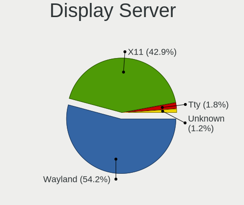
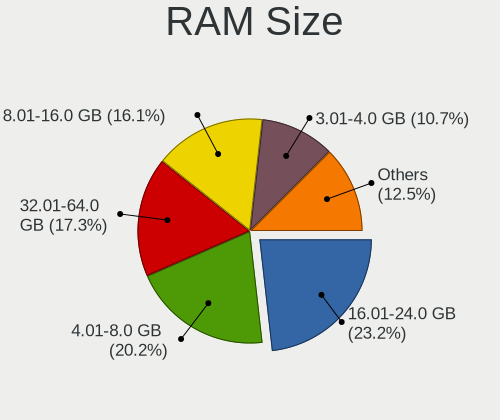
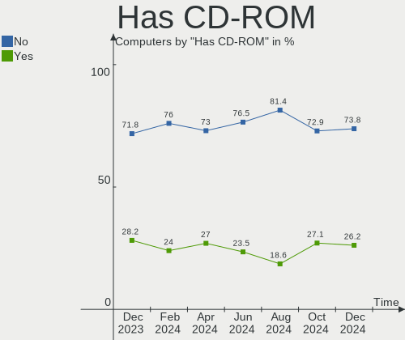
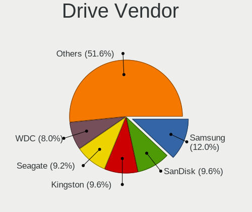
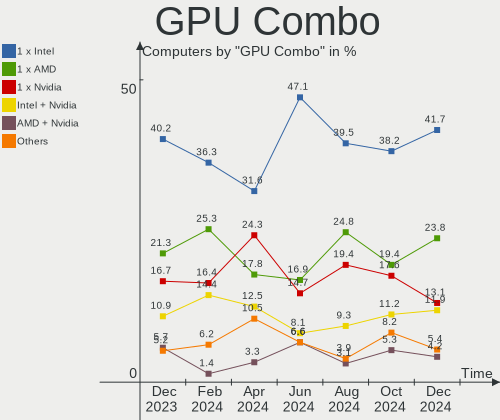
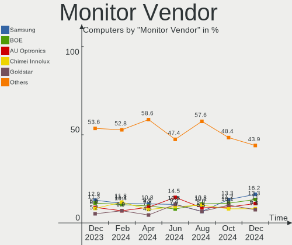
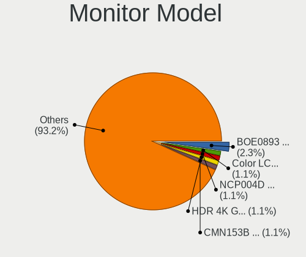
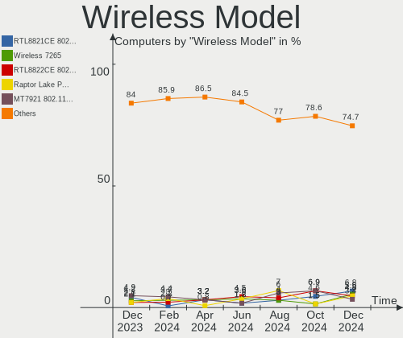
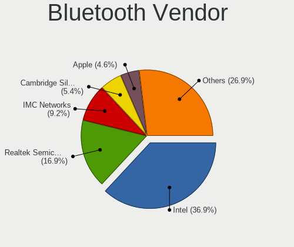
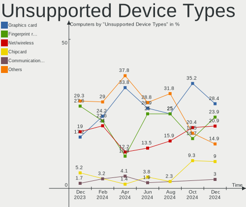

Linux in Spain - Hardware Trends
--------------------------------

A project to identify most popular hardware characteristics and track their change
over time based on data collected by Linux users at https://Linux-Hardware.org.

Anyone can contribute to this report by the [hw-probe](https://github.com/linuxhw/hw-probe) tool:

    sudo -E hw-probe -all -upload

This is a report for all computer types. See also reports for [desktops](/Location/Spain/Desktop/README.md) and [notebooks](/Location/Spain/Notebook/README.md).

Period: Dec, 2024.

Contents
--------

* [ System ](#system)
  - [ OS                       ](#os)
  - [ OS Family                ](#os-family)
  - [ Kernel                   ](#kernel)
  - [ Kernel Family            ](#kernel-family)
  - [ Kernel Major Ver.        ](#kernel-major-ver)
  - [ Arch                     ](#arch)
  - [ DE                       ](#de)
  - [ Display Server           ](#display-server)
  - [ Display Manager          ](#display-manager)
  - [ OS Lang                  ](#os-lang)
  - [ Boot Mode                ](#boot-mode)
  - [ Filesystem               ](#filesystem)
  - [ Part. scheme             ](#part-scheme)
  - [ Dual Boot with Linux/BSD ](#dual-boot-with-linuxbsd)
  - [ Dual Boot (Win)          ](#dual-boot-win)

* [ Board ](#board)
  - [ Vendor                   ](#vendor)
  - [ Model                    ](#model)
  - [ Model Family             ](#model-family)
  - [ MFG Year                 ](#mfg-year)
  - [ Form Factor              ](#form-factor)
  - [ Secure Boot              ](#secure-boot)
  - [ Coreboot                 ](#coreboot)
  - [ RAM Size                 ](#ram-size)
  - [ RAM Used                 ](#ram-used)
  - [ Total Drives             ](#total-drives)
  - [ Has CD-ROM               ](#has-cd-rom)
  - [ Has Ethernet             ](#has-ethernet)
  - [ Has WiFi                 ](#has-wifi)
  - [ Has Bluetooth            ](#has-bluetooth)

* [ Location ](#location)
  - [ Country                  ](#country)
  - [ City                     ](#city)

* [ Drives ](#drives)
  - [ Drive Vendor             ](#drive-vendor)
  - [ Drive Model              ](#drive-model)
  - [ HDD Vendor               ](#hdd-vendor)
  - [ SSD Vendor               ](#ssd-vendor)
  - [ Drive Kind               ](#drive-kind)
  - [ Drive Connector          ](#drive-connector)
  - [ Drive Size               ](#drive-size)
  - [ Space Total              ](#space-total)
  - [ Space Used               ](#space-used)
  - [ Malfunc. Drives          ](#malfunc-drives)
  - [ Malfunc. Drive Vendor    ](#malfunc-drive-vendor)
  - [ Malfunc. HDD Vendor      ](#malfunc-hdd-vendor)
  - [ Malfunc. Drive Kind      ](#malfunc-drive-kind)
  - [ Failed Drives            ](#failed-drives)
  - [ Failed Drive Vendor      ](#failed-drive-vendor)
  - [ Drive Status             ](#drive-status)

* [ Storage controller ](#storage-controller)
  - [ Storage Vendor           ](#storage-vendor)
  - [ Storage Model            ](#storage-model)
  - [ Storage Kind             ](#storage-kind)

* [ Processor ](#processor)
  - [ CPU Vendor               ](#cpu-vendor)
  - [ CPU Model                ](#cpu-model)
  - [ CPU Model Family         ](#cpu-model-family)
  - [ CPU Cores                ](#cpu-cores)
  - [ CPU Sockets              ](#cpu-sockets)
  - [ CPU Threads              ](#cpu-threads)
  - [ CPU Op-Modes             ](#cpu-op-modes)
  - [ CPU Microcode            ](#cpu-microcode)
  - [ CPU Microarch            ](#cpu-microarch)

* [ Graphics ](#graphics)
  - [ GPU Vendor               ](#gpu-vendor)
  - [ GPU Model                ](#gpu-model)
  - [ GPU Combo                ](#gpu-combo)
  - [ GPU Driver               ](#gpu-driver)
  - [ GPU Memory               ](#gpu-memory)

* [ Monitor ](#monitor)
  - [ Monitor Vendor           ](#monitor-vendor)
  - [ Monitor Model            ](#monitor-model)
  - [ Monitor Resolution       ](#monitor-resolution)
  - [ Monitor Diagonal         ](#monitor-diagonal)
  - [ Monitor Width            ](#monitor-width)
  - [ Aspect Ratio             ](#aspect-ratio)
  - [ Monitor Area             ](#monitor-area)
  - [ Pixel Density            ](#pixel-density)
  - [ Multiple Monitors        ](#multiple-monitors)

* [ Network ](#network)
  - [ Net Controller Vendor    ](#net-controller-vendor)
  - [ Net Controller Model     ](#net-controller-model)
  - [ Wireless Vendor          ](#wireless-vendor)
  - [ Wireless Model           ](#wireless-model)
  - [ Ethernet Vendor          ](#ethernet-vendor)
  - [ Ethernet Model           ](#ethernet-model)
  - [ Net Controller Kind      ](#net-controller-kind)
  - [ Used Controller          ](#used-controller)
  - [ NICs                     ](#nics)
  - [ IPv6                     ](#ipv6)

* [ Bluetooth ](#bluetooth)
  - [ Bluetooth Vendor         ](#bluetooth-vendor)
  - [ Bluetooth Model          ](#bluetooth-model)

* [ Sound ](#sound)
  - [ Sound Vendor             ](#sound-vendor)
  - [ Sound Model              ](#sound-model)

* [ Memory ](#memory)
  - [ Memory Vendor            ](#memory-vendor)
  - [ Memory Model             ](#memory-model)
  - [ Memory Kind              ](#memory-kind)
  - [ Memory Form Factor       ](#memory-form-factor)
  - [ Memory Size              ](#memory-size)
  - [ Memory Speed             ](#memory-speed)

* [ Printers & scanners ](#printers--scanners)
  - [ Printer Vendor           ](#printer-vendor)
  - [ Printer Model            ](#printer-model)
  - [ Scanner Vendor           ](#scanner-vendor)
  - [ Scanner Model            ](#scanner-model)

* [ Camera ](#camera)
  - [ Camera Vendor            ](#camera-vendor)
  - [ Camera Model             ](#camera-model)

* [ Security ](#security)
  - [ Fingerprint Vendor       ](#fingerprint-vendor)
  - [ Fingerprint Model        ](#fingerprint-model)
  - [ Chipcard Vendor          ](#chipcard-vendor)
  - [ Chipcard Model           ](#chipcard-model)

* [ Unsupported ](#unsupported)
  - [ Unsupported Devices      ](#unsupported-devices)
  - [ Unsupported Device Types ](#unsupported-device-types)

System
------

OS
--

Installed operating systems

| Name                         | Computers | Percent |
|------------------------------|-----------|---------|
| OpenMandriva 24.12           | 35        | 20.83%  |
| Ubuntu 24.04                 | 15        | 8.93%   |
| Fedora 41                    | 13        | 7.74%   |
| Zorin 17                     | 8         | 4.76%   |
| Linux Mint 22                | 8         | 4.76%   |
| Arch Rolling                 | 8         | 4.76%   |
| Debian 12                    | 7         | 4.17%   |
| OpenMandriva 23.08           | 5         | 2.98%   |
| Manjaro                      | 5         | 2.98%   |
| KDE neon 24.04               | 5         | 2.98%   |
| Elementary 8                 | 5         | 2.98%   |
| Linux Mint 21.3              | 4         | 2.38%   |
| ArcoLinux Rolling            | 4         | 2.38%   |
| Ubuntu 22.04                 | 3         | 1.79%   |
| Kubuntu 24.10                | 3         | 1.79%   |
| Ubuntu 24.10                 | 2         | 1.19%   |
| Ubuntu 24.0                  | 2         | 1.19%   |
| Ubuntu 20.04                 | 2         | 1.19%   |
| openSUSE Tumbleweed-XXXXXXXX | 2         | 1.19%   |
| OpenMandriva 5.0             | 2         | 1.19%   |
| MX 23                        | 2         | 1.19%   |
| Manjaro 24.2.1               | 2         | 1.19%   |
| Gentoo 2.17                  | 2         | 1.19%   |
| Debian                       | 2         | 1.19%   |
| Zorin 16                     | 1         | 0.6%    |
| Xubuntu 24.10                | 1         | 0.6%    |
| Xubuntu 24.04                | 1         | 0.6%    |
| Vanilla 2.0                  | 1         | 0.6%    |
| Pop!_OS 22.04                | 1         | 0.6%    |
| Parrot 6.2                   | 1         | 0.6%    |
| OpenMandriva 24.07           | 1         | 0.6%    |
| Nobara 41                    | 1         | 0.6%    |
| Nobara 40                    | 1         | 0.6%    |
| NixOS 23.11                  | 1         | 0.6%    |
| Manjaro 24.1.2               | 1         | 0.6%    |
| Lubuntu 22.04                | 1         | 0.6%    |
| Kubuntu 24.04                | 1         | 0.6%    |
| Garuda Linux Rolling         | 1         | 0.6%    |
| Fedora 40                    | 1         | 0.6%    |
| EndeavourOS Rolling          | 1         | 0.6%    |

OS Family
---------

OS without a version

| Name         | Computers | Percent |
|--------------|-----------|---------|
| OpenMandriva | 43        | 25.6%   |
| Ubuntu       | 24        | 14.29%  |
| Fedora       | 14        | 8.33%   |
| Linux Mint   | 12        | 7.14%   |
| Zorin        | 9         | 5.36%   |
| Debian       | 9         | 5.36%   |
| Manjaro      | 8         | 4.76%   |
| Arch         | 8         | 4.76%   |
| Elementary   | 6         | 3.57%   |
| KDE neon     | 5         | 2.98%   |
| Kubuntu      | 4         | 2.38%   |
| ArcoLinux    | 4         | 2.38%   |
| Xubuntu      | 2         | 1.19%   |
| openSUSE     | 2         | 1.19%   |
| Nobara       | 2         | 1.19%   |
| MX           | 2         | 1.19%   |
| Gentoo       | 2         | 1.19%   |
| Vanilla      | 1         | 0.6%    |
| Pop!_OS      | 1         | 0.6%    |
| Parrot       | 1         | 0.6%    |
| NixOS        | 1         | 0.6%    |
| Lubuntu      | 1         | 0.6%    |
| Garuda Linux | 1         | 0.6%    |
| EndeavourOS  | 1         | 0.6%    |
| ChimeraOS    | 1         | 0.6%    |
| Bluefin      | 1         | 0.6%    |
| BigLinux     | 1         | 0.6%    |
| Aurora       | 1         | 0.6%    |
| AlmaLinux    | 1         | 0.6%    |

Kernel
------

Version of the Linux kernel

| Version                      | Computers | Percent |
|------------------------------|-----------|---------|
| 6.12.1-desktop-1omv2490      | 32        | 19.05%  |
| 6.8.0-51-generic             | 16        | 9.52%   |
| 6.8.0-49-generic             | 15        | 8.93%   |
| 6.8.0-50-generic             | 11        | 6.55%   |
| 6.4.8-desktop-2omv2390       | 5         | 2.98%   |
| 6.11.10-300.fc41.x86_64      | 5         | 2.98%   |
| 6.1.0-28-amd64               | 5         | 2.98%   |
| 6.12.4-arch1-1               | 4         | 2.38%   |
| 6.8.0-40-generic             | 3         | 1.79%   |
| 6.12.4-1-MANJARO             | 3         | 1.79%   |
| 6.11.4-301.fc41.x86_64       | 3         | 1.79%   |
| 6.11.0-13-generic            | 3         | 1.79%   |
| 5.15.0-126-generic           | 3         | 1.79%   |
| 6.8.0-47-generic             | 2         | 1.19%   |
| 6.8.0-41-generic             | 2         | 1.19%   |
| 6.6.2-desktop-1omv2390       | 2         | 1.19%   |
| 6.12.7-arch1-1               | 2         | 1.19%   |
| 6.12.6-desktop-1omv2490      | 2         | 1.19%   |
| 6.12.6-1-liquorix-amd64      | 2         | 1.19%   |
| 6.12.4-zen1-1-zen            | 2         | 1.19%   |
| 6.11.8-300.fc41.x86_64       | 2         | 1.19%   |
| 6.11.3-300.fc41.x86_64       | 2         | 1.19%   |
| 6.11.10-amd64                | 2         | 1.19%   |
| 6.11.10-2-MANJARO            | 2         | 1.19%   |
| 6.11.0-8-generic             | 2         | 1.19%   |
| 6.9.3-76060903-generic       | 1         | 0.6%    |
| 6.9.12-chos7-chimeraos-1     | 1         | 0.6%    |
| 6.8.0-38-generic             | 1         | 0.6%    |
| 6.6.65-x64v1-xanmod1-1-lts   | 1         | 0.6%    |
| 6.6.65-1-lts                 | 1         | 0.6%    |
| 6.6.63-1-MANJARO             | 1         | 0.6%    |
| 6.6.63-1-lts                 | 1         | 0.6%    |
| 6.6.62-gentoo-x86_64         | 1         | 0.6%    |
| 6.4.11-desktop-1omv2390      | 1         | 0.6%    |
| 6.2.0-37-generic             | 1         | 0.6%    |
| 6.12.7-zen1-1-zen            | 1         | 0.6%    |
| 6.12.6-arch1-1               | 1         | 0.6%    |
| 6.12.6-1-default             | 1         | 0.6%    |
| 6.12.5-200.fsync.fc41.x86_64 | 1         | 0.6%    |
| 6.12.5-200.fc41.x86_64       | 1         | 0.6%    |

Kernel Family
-------------

Linux kernel without a distro release

| Version  | Computers | Percent |
|----------|-----------|---------|
| 6.8.0    | 50        | 29.76%  |
| 6.12.1   | 34        | 20.24%  |
| 6.12.4   | 10        | 5.95%   |
| 6.11.10  | 10        | 5.95%   |
| 6.1.0    | 7         | 4.17%   |
| 6.12.6   | 6         | 3.57%   |
| 6.11.0   | 6         | 3.57%   |
| 5.15.0   | 6         | 3.57%   |
| 6.4.8    | 5         | 2.98%   |
| 6.12.7   | 3         | 1.79%   |
| 6.11.8   | 3         | 1.79%   |
| 6.11.4   | 3         | 1.79%   |
| 6.6.65   | 2         | 1.19%   |
| 6.6.63   | 2         | 1.19%   |
| 6.6.2    | 2         | 1.19%   |
| 6.12.5   | 2         | 1.19%   |
| 6.11.3   | 2         | 1.19%   |
| 6.9.3    | 1         | 0.6%    |
| 6.9.12   | 1         | 0.6%    |
| 6.6.62   | 1         | 0.6%    |
| 6.4.11   | 1         | 0.6%    |
| 6.2.0    | 1         | 0.6%    |
| 6.12.3   | 1         | 0.6%    |
| 6.11.9   | 1         | 0.6%    |
| 6.11.6   | 1         | 0.6%    |
| 6.11.5   | 1         | 0.6%    |
| 6.11.11  | 1         | 0.6%    |
| 6.11     | 1         | 0.6%    |
| 6.10.0   | 1         | 0.6%    |
| 6.1.96   | 1         | 0.6%    |
| 5.14.0   | 1         | 0.6%    |
| 5.10.226 | 1         | 0.6%    |

Kernel Major Ver.
-----------------

Linux kernel major version

| Version | Computers | Percent |
|---------|-----------|---------|
| 6.12    | 56        | 33.33%  |
| 6.8     | 50        | 29.76%  |
| 6.11    | 28        | 16.67%  |
| 6.1     | 8         | 4.76%   |
| 6.6     | 7         | 4.17%   |
| 6.4     | 6         | 3.57%   |
| 5.15    | 6         | 3.57%   |
| 6.9     | 2         | 1.19%   |
| 6.2     | 1         | 0.6%    |
| 6.10    | 1         | 0.6%    |
| 6       | 1         | 0.6%    |
| 5.14    | 1         | 0.6%    |
| 5.10    | 1         | 0.6%    |

Arch
----

OS architecture (x86_64, i586, etc.)

| Name   | Computers | Percent |
|--------|-----------|---------|
| x86_64 | 167       | 99.4%   |
| i686   | 1         | 0.6%    |

DE
--

Desktop Environment

| Name       | Computers | Percent |
|------------|-----------|---------|
| GNOME      | 60        | 35.71%  |
| Unknown    | 32        | 19.05%  |
| KDE6       | 30        | 17.86%  |
| X-Cinnamon | 11        | 6.55%   |
| KDE5       | 10        | 5.95%   |
| XFCE       | 8         | 4.76%   |
| Pantheon   | 6         | 3.57%   |
| LXQt       | 4         | 2.38%   |
| MATE       | 2         | 1.19%   |
| LXDE       | 1         | 0.6%    |
| KDE4       | 1         | 0.6%    |
| KDE        | 1         | 0.6%    |
| Hyprland   | 1         | 0.6%    |
| Budgie     | 1         | 0.6%    |

Display Server
--------------

X11 or Wayland

| Name    | Computers | Percent |
|---------|-----------|---------|
| Wayland | 91        | 54.17%  |
| X11     | 72        | 42.86%  |
| Tty     | 3         | 1.79%   |
| Unknown | 2         | 1.19%   |

Display Manager
---------------

SDDM, LightDM, etc.

| Name    | Computers | Percent |
|---------|-----------|---------|
| Unknown | 56        | 33.33%  |
| SDDM    | 55        | 32.74%  |
| GDM3    | 26        | 15.48%  |
| LightDM | 15        | 8.93%   |
| GDM     | 15        | 8.93%   |
| LXDM    | 1         | 0.6%    |

OS Lang
-------

Language

| Lang  | Computers | Percent |
|-------|-----------|---------|
| es_ES | 106       | 63.1%   |
| en_US | 45        | 26.79%  |
| en_GB | 5         | 2.98%   |
| ca_ES | 5         | 2.98%   |
| pt_BR | 1         | 0.6%    |
| fr_FR | 1         | 0.6%    |
| eu_ES | 1         | 0.6%    |
| es_UY | 1         | 0.6%    |
| de_DE | 1         | 0.6%    |
| C     | 1         | 0.6%    |
| an_ES | 1         | 0.6%    |

Boot Mode
---------

EFI or BIOS

| Mode | Computers | Percent |
|------|-----------|---------|
| BIOS | 93        | 55.36%  |
| EFI  | 75        | 44.64%  |

Filesystem
----------

Type of filesystem

| Type    | Computers | Percent |
|---------|-----------|---------|
| Ext4    | 85        | 50.6%   |
| Btrfs   | 30        | 17.86%  |
| Overlay | 28        | 16.67%  |
| Tmpfs   | 23        | 13.69%  |
| Xfs     | 2         | 1.19%   |

Part. scheme
------------

Scheme of partitioning

| Type    | Computers | Percent |
|---------|-----------|---------|
| GPT     | 95        | 56.55%  |
| Unknown | 53        | 31.55%  |
| MBR     | 20        | 11.9%   |

Dual Boot with Linux/BSD
------------------------

Hosting more than one Linux/BSD

| Dual boot | Computers | Percent |
|-----------|-----------|---------|
| No        | 129       | 76.79%  |
| Yes       | 39        | 23.21%  |

Dual Boot (Win)
---------------

Hosting Linux and Windows

| Dual boot | Computers | Percent |
|-----------|-----------|---------|
| No        | 126       | 75%     |
| Yes       | 42        | 25%     |

Board
-----

Vendor
------

Motherboard manufacturer

| Name                                 | Computers | Percent |
|--------------------------------------|-----------|---------|
| Hewlett-Packard                      | 28        | 16.67%  |
| ASUSTek Computer                     | 28        | 16.67%  |
| Lenovo                               | 19        | 11.31%  |
| MSI                                  | 12        | 7.14%   |
| Gigabyte Technology                  | 12        | 7.14%   |
| Acer                                 | 10        | 5.95%   |
| ASRock                               | 8         | 4.76%   |
| Dell                                 | 7         | 4.17%   |
| Apple                                | 6         | 3.57%   |
| AMI                                  | 4         | 2.38%   |
| Samsung Electronics                  | 3         | 1.79%   |
| HUAWEI                               | 3         | 1.79%   |
| Win Element                          | 2         | 1.19%   |
| Toshiba                              | 2         | 1.19%   |
| SLIMBOOK                             | 2         | 1.19%   |
| Notebook                             | 2         | 1.19%   |
| Chuwi                                | 2         | 1.19%   |
| AZW                                  | 2         | 1.19%   |
| Unknown                              | 2         | 1.19%   |
| Sony                                 | 1         | 0.6%    |
| Shenzhen Meigao Electronic Equipment | 1         | 0.6%    |
| Shenzhen DOKE electronic             | 1         | 0.6%    |
| Schenker                             | 1         | 0.6%    |
| PC Specialist                        | 1         | 0.6%    |
| MUCAI                                | 1         | 0.6%    |
| Medion                               | 1         | 0.6%    |
| MACHINIST                            | 1         | 0.6%    |
| LG Electronics                       | 1         | 0.6%    |
| JGINYUE                              | 1         | 0.6%    |
| Intel                                | 1         | 0.6%    |
| HONOR                                | 1         | 0.6%    |
| EVGA                                 | 1         | 0.6%    |
| Acidanthera                          | 1         | 0.6%    |

Model
-----

Motherboard model

| Name                                                | Computers | Percent |
|-----------------------------------------------------|-----------|---------|
| AMI Intel                                           | 4         | 2.38%   |
| HUAWEI KLVL-WXX9                                    | 2         | 1.19%   |
| HP ProBook 630 G8 Notebook PC                       | 2         | 1.19%   |
| HP Laptop 15s-eq2xxx                                | 2         | 1.19%   |
| HP Laptop 15-fd0xxx                                 | 2         | 1.19%   |
| Unknown                                             | 2         | 1.19%   |
| Win Element M9S                                     | 1         | 0.6%    |
| Win element M600                                    | 1         | 0.6%    |
| Toshiba TECRA A10                                   | 1         | 0.6%    |
| Toshiba Satellite L50-B                             | 1         | 0.6%    |
| Sony VGN-FZ11M                                      | 1         | 0.6%    |
| SLIMBOOK ONE-AM5                                    | 1         | 0.6%    |
| SLIMBOOK EVO14-A8                                   | 1         | 0.6%    |
| Shenzhen Meigao Electronic Equipment Mercury series | 1         | 0.6%    |
| Shenzhen DOKE electronic MP100                      | 1         | 0.6%    |
| Schenker XMG PRO 16 Studio (M24)                    | 1         | 0.6%    |
| Samsung Galaxy Book 12                              | 1         | 0.6%    |
| Samsung 730QFG                                      | 1         | 0.6%    |
| Samsung 300E4A/300E5A/300E7A/3430EA/3530EA          | 1         | 0.6%    |
| PC Specialist P65xRP                                | 1         | 0.6%    |
| Notebook W510LU                                     | 1         | 0.6%    |
| Notebook N13_N140ZU                                 | 1         | 0.6%    |
| MUCAI H61 V1.5                                      | 1         | 0.6%    |
| MSI MS-7D88                                         | 1         | 0.6%    |
| MSI MS-7D86                                         | 1         | 0.6%    |
| MSI MS-7C95                                         | 1         | 0.6%    |
| MSI MS-7C37                                         | 1         | 0.6%    |
| MSI MS-7C31                                         | 1         | 0.6%    |
| MSI MS-7B86                                         | 1         | 0.6%    |
| MSI MS-7A70                                         | 1         | 0.6%    |
| MSI MS-7A38                                         | 1         | 0.6%    |
| MSI MS-7721                                         | 1         | 0.6%    |
| MSI Modern 15 B7M                                   | 1         | 0.6%    |
| MSI GL65 9SFK                                       | 1         | 0.6%    |
| MSI Alpha 17 C7VF                                   | 1         | 0.6%    |
| Medion S6421 MD60703                                | 1         | 0.6%    |
| MACHINIST X99-RS9 V1.11                             | 1         | 0.6%    |
| LG 15Z90R-G.AP55B                                   | 1         | 0.6%    |
| Lenovo YB1-X91F                                     | 1         | 0.6%    |
| Lenovo ThinkPad X250 20CLS35P00                     | 1         | 0.6%    |

Model Family
------------

Motherboard model prefix

| Name                                         | Computers | Percent |
|----------------------------------------------|-----------|---------|
| Lenovo ThinkPad                              | 11        | 6.55%   |
| Acer Aspire                                  | 7         | 4.17%   |
| HP Pavilion                                  | 6         | 3.57%   |
| HP Laptop                                    | 6         | 3.57%   |
| Lenovo IdeaPad                               | 4         | 2.38%   |
| Dell Latitude                                | 4         | 2.38%   |
| ASUS PRIME                                   | 4         | 2.38%   |
| AMI Intel                                    | 4         | 2.38%   |
| HP ProBook                                   | 3         | 1.79%   |
| HP Compaq                                    | 3         | 1.79%   |
| ASUS VivoBook                                | 3         | 1.79%   |
| ASUS ROG                                     | 3         | 1.79%   |
| ASUS ASUS                                    | 3         | 1.79%   |
| HUAWEI KLVL-WXX9                             | 2         | 1.19%   |
| Gigabyte B550M                               | 2         | 1.19%   |
| ASUS TUF                                     | 2         | 1.19%   |
| Apple MacBookPro9                            | 2         | 1.19%   |
| Unknown                                      | 2         | 1.19%   |
| Win Element M9S                              | 1         | 0.6%    |
| Win element M600                             | 1         | 0.6%    |
| Toshiba TECRA                                | 1         | 0.6%    |
| Toshiba Satellite                            | 1         | 0.6%    |
| Sony VGN-FZ11M                               | 1         | 0.6%    |
| SLIMBOOK ONE-AM5                             | 1         | 0.6%    |
| SLIMBOOK EVO14-A8                            | 1         | 0.6%    |
| Shenzhen Meigao Electronic Equipment Mercury | 1         | 0.6%    |
| Shenzhen DOKE electronic MP100               | 1         | 0.6%    |
| Schenker XMG                                 | 1         | 0.6%    |
| Samsung Galaxy                               | 1         | 0.6%    |
| Samsung 730QFG                               | 1         | 0.6%    |
| Samsung 300E4A                               | 1         | 0.6%    |
| PC Specialist P65xRP                         | 1         | 0.6%    |
| Notebook W510LU                              | 1         | 0.6%    |
| Notebook N13                                 | 1         | 0.6%    |
| MUCAI H61                                    | 1         | 0.6%    |
| MSI MS-7D88                                  | 1         | 0.6%    |
| MSI MS-7D86                                  | 1         | 0.6%    |
| MSI MS-7C95                                  | 1         | 0.6%    |
| MSI MS-7C37                                  | 1         | 0.6%    |
| MSI MS-7C31                                  | 1         | 0.6%    |

MFG Year
--------

Motherboard manufacture year

| Year | Computers | Percent |
|------|-----------|---------|
| 2023 | 23        | 13.69%  |
| 2022 | 17        | 10.12%  |
| 2024 | 16        | 9.52%   |
| 2020 | 14        | 8.33%   |
| 2018 | 12        | 7.14%   |
| 2016 | 12        | 7.14%   |
| 2017 | 11        | 6.55%   |
| 2012 | 9         | 5.36%   |
| 2021 | 8         | 4.76%   |
| 2019 | 8         | 4.76%   |
| 2015 | 8         | 4.76%   |
| 2014 | 7         | 4.17%   |
| 2013 | 5         | 2.98%   |
| 2009 | 4         | 2.38%   |
| 2008 | 4         | 2.38%   |
| 2007 | 4         | 2.38%   |
| 2011 | 3         | 1.79%   |
| 2010 | 3         | 1.79%   |

Form Factor
-----------

Physical design of the computer

| Name        | Computers | Percent |
|-------------|-----------|---------|
| Notebook    | 90        | 53.57%  |
| Desktop     | 65        | 38.69%  |
| Convertible | 5         | 2.98%   |
| Mini pc     | 5         | 2.98%   |
| Tablet      | 2         | 1.19%   |
| All in one  | 1         | 0.6%    |

Secure Boot
-----------

Enabled or disabled

| State    | Computers | Percent |
|----------|-----------|---------|
| Disabled | 163       | 97.02%  |
| Enabled  | 5         | 2.98%   |

Coreboot
--------

Have coreboot on board

| Used | Computers | Percent |
|------|-----------|---------|
| No   | 168       | 100%    |

RAM Size
--------

Total RAM memory

| Size in GB  | Computers | Percent |
|-------------|-----------|---------|
| 16.01-24.0  | 39        | 23.21%  |
| 4.01-8.0    | 34        | 20.24%  |
| 32.01-64.0  | 29        | 17.26%  |
| 8.01-16.0   | 27        | 16.07%  |
| 3.01-4.0    | 18        | 10.71%  |
| 64.01-256.0 | 9         | 5.36%   |
| 24.01-32.0  | 7         | 4.17%   |
| 1.01-2.0    | 3         | 1.79%   |
| 2.01-3.0    | 2         | 1.19%   |

RAM Used
--------

Used RAM memory

| Used GB    | Computers | Percent |
|------------|-----------|---------|
| 2.01-3.0   | 47        | 27.98%  |
| 1.01-2.0   | 46        | 27.38%  |
| 4.01-8.0   | 32        | 19.05%  |
| 3.01-4.0   | 32        | 19.05%  |
| 0.51-1.0   | 5         | 2.98%   |
| 8.01-16.0  | 4         | 2.38%   |
| 32.01-64.0 | 1         | 0.6%    |
| 24.01-32.0 | 1         | 0.6%    |

Total Drives
------------

Number of drives on board

| Drives | Computers | Percent |
|--------|-----------|---------|
| 1      | 100       | 59.52%  |
| 2      | 46        | 27.38%  |
| 3      | 11        | 6.55%   |
| 4      | 5         | 2.98%   |
| 7      | 3         | 1.79%   |
| 6      | 1         | 0.6%    |
| 5      | 1         | 0.6%    |
| 0      | 1         | 0.6%    |

Has CD-ROM
----------

Has CD-ROM on board

| Presented | Computers | Percent |
|-----------|-----------|---------|
| No        | 124       | 73.81%  |
| Yes       | 44        | 26.19%  |

Has Ethernet
------------

Has Ethernet on board

| Presented | Computers | Percent |
|-----------|-----------|---------|
| Yes       | 137       | 81.55%  |
| No        | 31        | 18.45%  |

Has WiFi
--------

Has WiFi module

| Presented | Computers | Percent |
|-----------|-----------|---------|
| Yes       | 136       | 80.95%  |
| No        | 32        | 19.05%  |

Has Bluetooth
-------------

Has Bluetooth module

| Presented | Computers | Percent |
|-----------|-----------|---------|
| Yes       | 127       | 75.6%   |
| No        | 41        | 24.4%   |

Location
--------

Country
-------

Geographic location (country)

| Country | Computers | Percent |
|---------|-----------|---------|
| Spain   | 168       | 100%    |

City
----

Geographic location (city)

| City                     | Computers | Percent |
|--------------------------|-----------|---------|
| Barcelona                | 14        | 8.33%   |
| Madrid                   | 12        | 7.14%   |
| Zaragoza                 | 6         | 3.57%   |
| Seville                  | 5         | 2.98%   |
| Palma                    | 5         | 2.98%   |
| Valencia                 | 4         | 2.38%   |
| Málaga                  | 4         | 2.38%   |
| Vitoria-Gasteiz          | 3         | 1.79%   |
| Vigo                     | 3         | 1.79%   |
| Valladolid               | 3         | 1.79%   |
| Granada                  | 3         | 1.79%   |
| Rubí                    | 2         | 1.19%   |
| Reus                     | 2         | 1.19%   |
| Pontevedra               | 2         | 1.19%   |
| Murcia                   | 2         | 1.19%   |
| Mieres                   | 2         | 1.19%   |
| Martorell                | 2         | 1.19%   |
| León                    | 2         | 1.19%   |
| Gijón                   | 2         | 1.19%   |
| Ferrol                   | 2         | 1.19%   |
| El Vendrell              | 2         | 1.19%   |
| Donostia / San Sebastian | 2         | 1.19%   |
| Dima                     | 2         | 1.19%   |
| Basauri                  | 2         | 1.19%   |
| Aspe                     | 2         | 1.19%   |
| A Coruña                | 2         | 1.19%   |
| Zubia                    | 1         | 0.6%    |
| Viveiro                  | 1         | 0.6%    |
| Villarrubia de los Ojos  | 1         | 0.6%    |
| Villanueva de la Canada  | 1         | 0.6%    |
| Villajoyosa              | 1         | 0.6%    |
| Vic                      | 1         | 0.6%    |
| Valderrobres             | 1         | 0.6%    |
| Torremolinos             | 1         | 0.6%    |
| Tiana                    | 1         | 0.6%    |
| Teruel                   | 1         | 0.6%    |
| Telde                    | 1         | 0.6%    |
| Talavera de la Reina     | 1         | 0.6%    |
| Segovia                  | 1         | 0.6%    |
| Santa Maria del Camí    | 1         | 0.6%    |

Drives
------

Drive Vendor
------------

Hard drive vendors

| Vendor                      | Computers | Drives | Percent |
|-----------------------------|-----------|--------|---------|
| Samsung Electronics         | 30        | 34     | 12%     |
| SanDisk                     | 24        | 26     | 9.6%    |
| Kingston                    | 24        | 26     | 9.6%    |
| Seagate                     | 23        | 31     | 9.2%    |
| WDC                         | 20        | 22     | 8%      |
| Toshiba                     | 17        | 17     | 6.8%    |
| Crucial                     | 9         | 10     | 3.6%    |
| Unknown                     | 8         | 9      | 3.2%    |
| Micron Technology           | 8         | 8      | 3.2%    |
| Micron/Crucial Technology   | 6         | 7      | 2.4%    |
| KIOXIA                      | 6         | 6      | 2.4%    |
| China                       | 6         | 6      | 2.4%    |
| SK hynix                    | 5         | 5      | 2%      |
| Silicon Motion              | 5         | 5      | 2%      |
| MAXIO Technology (Hangzhou) | 5         | 7      | 2%      |
| Intel                       | 5         | 5      | 2%      |
| SPCC                        | 3         | 3      | 1.2%    |
| Phison Electronics          | 3         | 3      | 1.2%    |
| KIOXIA-EXCERIA              | 3         | 3      | 1.2%    |
| Hitachi                     | 3         | 3      | 1.2%    |
| HGST                        | 3         | 3      | 1.2%    |
| Apple                       | 3         | 4      | 1.2%    |
| Realtek Semiconductor       | 2         | 2      | 0.8%    |
| OCZ                         | 2         | 2      | 0.8%    |
| Maxtor                      | 2         | 2      | 0.8%    |
| Kingston Technology Company | 2         | 2      | 0.8%    |
| Fanxiang                    | 2         | 2      | 0.8%    |
| Unknown                     | 2         | 2      | 0.8%    |
| XrayDisk                    | 1         | 1      | 0.4%    |
| Vaseky                      | 1         | 1      | 0.4%    |
| USB                         | 1         | 1      | 0.4%    |
| Union Memory (Shenzhen)     | 1         | 1      | 0.4%    |
| SABRENT                     | 1         | 2      | 0.4%    |
| Patriot                     | 1         | 1      | 0.4%    |
| LITEON                      | 1         | 1      | 0.4%    |
| LaCie                       | 1         | 1      | 0.4%    |
| KingSpec                    | 1         | 1      | 0.4%    |
| KingFast                    | 1         | 1      | 0.4%    |
| Intenso                     | 1         | 1      | 0.4%    |
| HPE                         | 1         | 1      | 0.4%    |

Drive Model
-----------

Hard drive models

| Model                                                 | Computers | Percent |
|-------------------------------------------------------|-----------|---------|
| Kingston SA400S37480G 480GB SSD                       | 6         | 2.28%   |
| Seagate ST1000DM010-2EP102 1TB                        | 5         | 1.9%    |
| Seagate ST500DM002-1BD142 500GB                       | 4         | 1.52%   |
| Samsung NVMe SSD Controller SM981/PM981/PM983 512GB   | 4         | 1.52%   |
| Samsung NVMe SSD Controller PM9A1/PM9A3/980PRO 512GB  | 4         | 1.52%   |
| MAXIO (Hangzhou) NVMe SSD Controller MAP1202 512GB    | 4         | 1.52%   |
| Kingston SNV2S500G 500GB                              | 4         | 1.52%   |
| Kingston SA400S37960G 960GB SSD                       | 4         | 1.52%   |
| Silicon Motion SM2263EN/SM2263XT SSD Controller 256GB | 3         | 1.14%   |
| Sandisk WD Blue SN550 NVMe SSD 256GB                  | 3         | 1.14%   |
| Micron/Crucial P2 NVMe PCIe SSD 500GB                 | 3         | 1.14%   |
| Kingston SA400S37240G 240GB SSD                       | 3         | 1.14%   |
| Unknown SD/MMC/MS PRO 128GB                           | 2         | 0.76%   |
| Unknown MMC Card  64GB                                | 2         | 0.76%   |
| Toshiba MQ04ABF100 1TB                                | 2         | 0.76%   |
| Toshiba MQ01ABD100 1TB                                | 2         | 0.76%   |
| Toshiba DT01ACA100 1TB                                | 2         | 0.76%   |
| Toshiba DT01ACA050 500GB                              | 2         | 0.76%   |
| Sandisk WD_BLACK SN770 2TB                            | 2         | 0.76%   |
| SanDisk NVMe SSD Drive 512GB                          | 2         | 0.76%   |
| SanDisk NVMe SSD Drive 1TB                            | 2         | 0.76%   |
| Samsung SSD 850 EVO 500GB                             | 2         | 0.76%   |
| Samsung SSD 750 EVO 500GB                             | 2         | 0.76%   |
| Phison PS5013 E13 NVMe Controller 512GB               | 2         | 0.76%   |
| KIOXIA-EXCERIA SATA SSD 480GB                         | 2         | 0.76%   |
| KIOXIA KBG50ZNV1T02 1TB                               | 2         | 0.76%   |
| Kingston SA400S37120G 120GB SSD                       | 2         | 0.76%   |
| Kingston OM3PGP41024P-A0 1TB                          | 2         | 0.76%   |
| Intel SSD 660P Series 1024GB                          | 2         | 0.76%   |
| Crucial CT2000P3PSSD8 2TB                             | 2         | 0.76%   |
| China SSD 360GB                                       | 2         | 0.76%   |
| Unknown                                               | 2         | 0.76%   |
| XrayDisk 512GB                                        | 1         | 0.38%   |
| WDC WDSN740-SDDPNQD-512G-1004 512GB                   | 1         | 0.38%   |
| WDC WDS500G2B0A-00SM50 500GB SSD                      | 1         | 0.38%   |
| WDC WDS200T2B0A-00SM50 2TB SSD                        | 1         | 0.38%   |
| WDC WDS120G2G0A-00JH30 120GB SSD                      | 1         | 0.38%   |
| WDC WDS100T2B0C-00PXH0 1TB                            | 1         | 0.38%   |
| WDC WD6400AAKS-07A7B0 640GB                           | 1         | 0.38%   |
| WDC WD5000LPCX-24VHAT0 500GB                          | 1         | 0.38%   |

HDD Vendor
----------

Hard disk drive vendors

| Vendor              | Computers | Drives | Percent |
|---------------------|-----------|--------|---------|
| Seagate             | 23        | 30     | 35.94%  |
| WDC                 | 13        | 14     | 20.31%  |
| Toshiba             | 12        | 12     | 18.75%  |
| Hitachi             | 3         | 3      | 4.69%   |
| HGST                | 3         | 3      | 4.69%   |
| Unknown             | 2         | 2      | 3.13%   |
| Samsung Electronics | 2         | 2      | 3.13%   |
| Maxtor              | 2         | 2      | 3.13%   |
| SABRENT             | 1         | 2      | 1.56%   |
| HPE                 | 1         | 1      | 1.56%   |
| Fujitsu             | 1         | 1      | 1.56%   |
| Apple               | 1         | 1      | 1.56%   |

SSD Vendor
----------

Solid state drive vendors

| Vendor              | Computers | Drives | Percent |
|---------------------|-----------|--------|---------|
| Kingston            | 17        | 18     | 22.08%  |
| Samsung Electronics | 14        | 16     | 18.18%  |
| Crucial             | 7         | 7      | 9.09%   |
| China               | 6         | 6      | 7.79%   |
| SanDisk             | 4         | 5      | 5.19%   |
| WDC                 | 3         | 4      | 3.9%    |
| Toshiba             | 3         | 3      | 3.9%    |
| SPCC                | 3         | 3      | 3.9%    |
| KIOXIA-EXCERIA      | 3         | 3      | 3.9%    |
| OCZ                 | 2         | 2      | 2.6%    |
| Vaseky              | 1         | 1      | 1.3%    |
| SK hynix            | 1         | 1      | 1.3%    |
| Patriot             | 1         | 1      | 1.3%    |
| Micron Technology   | 1         | 1      | 1.3%    |
| LITEON              | 1         | 1      | 1.3%    |
| KingSpec            | 1         | 1      | 1.3%    |
| Intenso             | 1         | 1      | 1.3%    |
| Intel               | 1         | 1      | 1.3%    |
| Fanxiang            | 1         | 1      | 1.3%    |
| Emtec               | 1         | 1      | 1.3%    |
| EAGET               | 1         | 1      | 1.3%    |
| BR                  | 1         | 1      | 1.3%    |
| BAITITON            | 1         | 1      | 1.3%    |
| Apple               | 1         | 1      | 1.3%    |
| Unknown             | 1         | 1      | 1.3%    |

Drive Kind
----------

HDD or SSD

| Kind    | Computers | Drives | Percent |
|---------|-----------|--------|---------|
| NVMe    | 91        | 108    | 40.99%  |
| SSD     | 69        | 82     | 31.08%  |
| HDD     | 51        | 73     | 22.97%  |
| Unknown | 6         | 6      | 2.7%    |
| MMC     | 5         | 6      | 2.25%   |

Drive Connector
---------------

SATA, SAS, NVMe, etc.

| Type | Computers | Drives | Percent |
|------|-----------|--------|---------|
| SATA | 99        | 150    | 48.29%  |
| NVMe | 91        | 108    | 44.39%  |
| SAS  | 10        | 11     | 4.88%   |
| MMC  | 5         | 6      | 2.44%   |

Drive Size
----------

Size of hard drive

| Size in TB | Computers | Drives | Percent |
|------------|-----------|--------|---------|
| 0.01-0.5   | 79        | 92     | 58.96%  |
| 0.51-1.0   | 39        | 43     | 29.1%   |
| 1.01-2.0   | 9         | 13     | 6.72%   |
| 3.01-4.0   | 5         | 5      | 3.73%   |
| 2.01-3.0   | 1         | 1      | 0.75%   |
| 4.01-10.0  | 1         | 1      | 0.75%   |

Space Total
-----------

Amount of disk space available on the file system

| Size in GB     | Computers | Percent |
|----------------|-----------|---------|
| 251-500        | 40        | 23.81%  |
| 101-250        | 34        | 20.24%  |
| 501-1000       | 29        | 17.26%  |
| 1-20           | 21        | 12.5%   |
| 1001-2000      | 14        | 8.33%   |
| More than 3000 | 11        | 6.55%   |
| 21-50          | 6         | 3.57%   |
| Unknown        | 6         | 3.57%   |
| 2001-3000      | 4         | 2.38%   |
| 51-100         | 3         | 1.79%   |

Space Used
----------

Amount of used disk space

| Used GB        | Computers | Percent |
|----------------|-----------|---------|
| 1-20           | 69        | 41.07%  |
| 21-50          | 24        | 14.29%  |
| 101-250        | 17        | 10.12%  |
| 251-500        | 14        | 8.33%   |
| 51-100         | 14        | 8.33%   |
| 501-1000       | 8         | 4.76%   |
| 1001-2000      | 7         | 4.17%   |
| Unknown        | 6         | 3.57%   |
| 2001-3000      | 4         | 2.38%   |
| 0              | 3         | 1.79%   |
| More than 3000 | 2         | 1.19%   |

Malfunc. Drives
---------------

Drive models with a malfunction

| Model                                               | Computers | Drives | Percent |
|-----------------------------------------------------|-----------|--------|---------|
| WDC WD20EZRX-00D8PB0 2TB                            | 1         | 1      | 7.14%   |
| WDC WD10EZRZ-00HTKB0 1TB                            | 1         | 1      | 7.14%   |
| Toshiba MQ01ABD100 1TB                              | 1         | 1      | 7.14%   |
| Toshiba DT01ACA100 1TB                              | 1         | 1      | 7.14%   |
| Seagate ST500DM002-1BD142 500GB                     | 1         | 1      | 7.14%   |
| Seagate ST3320613AS 320GB                           | 1         | 1      | 7.14%   |
| SanDisk SSD PLUS 240GB                              | 1         | 1      | 7.14%   |
| Micron Technology MTFDDAV256TDL-1AW1ZABHA 256GB SSD | 1         | 1      | 7.14%   |
| Maxtor 6L200M0 208GB                                | 1         | 1      | 7.14%   |
| HPE MB0500EBNCR 500GB                               | 1         | 1      | 7.14%   |
| Hitachi HDT721010SLA360 1TB                         | 1         | 1      | 7.14%   |
| Crucial CT250BX100SSD1 250GB                        | 1         | 1      | 7.14%   |
| China SSD 240GB                                     | 1         | 1      | 7.14%   |
| Apple HDD HTS541010A9E662 1TB                       | 1         | 1      | 7.14%   |

Malfunc. Drive Vendor
---------------------

Vendors of faulty drives

| Vendor            | Computers | Drives | Percent |
|-------------------|-----------|--------|---------|
| WDC               | 2         | 2      | 14.29%  |
| Toshiba           | 2         | 2      | 14.29%  |
| Seagate           | 2         | 2      | 14.29%  |
| SanDisk           | 1         | 1      | 7.14%   |
| Micron Technology | 1         | 1      | 7.14%   |
| Maxtor            | 1         | 1      | 7.14%   |
| HPE               | 1         | 1      | 7.14%   |
| Hitachi           | 1         | 1      | 7.14%   |
| Crucial           | 1         | 1      | 7.14%   |
| China             | 1         | 1      | 7.14%   |
| Apple             | 1         | 1      | 7.14%   |

Malfunc. HDD Vendor
-------------------

Vendors of faulty HDD drives

| Vendor  | Computers | Drives | Percent |
|---------|-----------|--------|---------|
| WDC     | 2         | 2      | 20%     |
| Toshiba | 2         | 2      | 20%     |
| Seagate | 2         | 2      | 20%     |
| Maxtor  | 1         | 1      | 10%     |
| HPE     | 1         | 1      | 10%     |
| Hitachi | 1         | 1      | 10%     |
| Apple   | 1         | 1      | 10%     |

Malfunc. Drive Kind
-------------------

Kinds of faulty drives

| Kind | Computers | Drives | Percent |
|------|-----------|--------|---------|
| HDD  | 9         | 10     | 69.23%  |
| SSD  | 4         | 4      | 30.77%  |

Failed Drives
-------------

Failed drive models

| Model                    | Computers | Drives | Percent |
|--------------------------|-----------|--------|---------|
| Toshiba DT01ACA050 500GB | 1         | 1      | 100%    |

Failed Drive Vendor
-------------------

Failed drive vendors

| Vendor  | Computers | Drives | Percent |
|---------|-----------|--------|---------|
| Toshiba | 1         | 1      | 100%    |

Drive Status
------------

Number of failed and malfunc. drives

| Status   | Computers | Drives | Percent |
|----------|-----------|--------|---------|
| Detected | 84        | 147    | 46.93%  |
| Works    | 81        | 113    | 45.25%  |
| Malfunc  | 13        | 14     | 7.26%   |
| Failed   | 1         | 1      | 0.56%   |

Storage controller
------------------

Storage Vendor
--------------

Storage controller vendors

| Vendor                       | Computers | Percent |
|------------------------------|-----------|---------|
| Intel                        | 88        | 38.1%   |
| AMD                          | 31        | 13.42%  |
| SanDisk                      | 24        | 10.39%  |
| Samsung Electronics          | 15        | 6.49%   |
| Kingston Technology Company  | 10        | 4.33%   |
| Micron/Crucial Technology    | 8         | 3.46%   |
| Micron Technology            | 7         | 3.03%   |
| Nvidia                       | 6         | 2.6%    |
| MAXIO Technology (Hangzhou)  | 6         | 2.6%    |
| Silicon Motion               | 5         | 2.16%   |
| KIOXIA                       | 5         | 2.16%   |
| ASMedia Technology           | 5         | 2.16%   |
| SK hynix                     | 4         | 1.73%   |
| Toshiba America Info Systems | 3         | 1.3%    |
| Phison Electronics           | 3         | 1.3%    |
| Realtek Semiconductor        | 2         | 0.87%   |
| Marvell Technology Group     | 2         | 0.87%   |
| Union Memory (Shenzhen)      | 1         | 0.43%   |
| Solidigm                     | 1         | 0.43%   |
| Shenzhen Longsys Electronics | 1         | 0.43%   |
| Seagate Technology           | 1         | 0.43%   |
| JMicron Technology           | 1         | 0.43%   |
| Apple                        | 1         | 0.43%   |
| ADATA Technology             | 1         | 0.43%   |

Storage Model
-------------

Storage controller models

| Model                                                                         | Computers | Percent |
|-------------------------------------------------------------------------------|-----------|---------|
| AMD FCH SATA Controller [AHCI mode]                                           | 18        | 6.84%   |
| Intel Volume Management Device NVMe RAID Controller                           | 10        | 3.8%    |
| SanDisk WD Black SN770 / PC SN740 256GB / PC SN560 (DRAM-less) NVMe SSD       | 8         | 3.04%   |
| Intel 82801 Mobile SATA Controller [RAID mode]                                | 8         | 3.04%   |
| AMD 400 Series Chipset SATA Controller                                        | 8         | 3.04%   |
| Intel Sunrise Point-LP SATA Controller [AHCI mode]                            | 7         | 2.66%   |
| AMD 500 Series Chipset SATA Controller                                        | 6         | 2.28%   |
| Samsung NVMe SSD Controller PM9A1/PM9A3/980PRO                                | 5         | 1.9%    |
| MAXIO (Hangzhou) NVMe SSD Controller MAP1202 (DRAM-less)                      | 5         | 1.9%    |
| Intel Q170/Q150/B150/H170/H110/Z170/CM236 Chipset SATA Controller [AHCI Mode] | 5         | 1.9%    |
| Intel 8 Series SATA Controller 1 [AHCI mode]                                  | 5         | 1.9%    |
| Intel 200 Series PCH SATA controller [AHCI mode]                              | 5         | 1.9%    |
| ASMedia ASM1061/ASM1062 Serial ATA Controller                                 | 5         | 1.9%    |
| Silicon Motion SM2263EN/SM2263XT (DRAM-less) NVMe SSD Controllers             | 4         | 1.52%   |
| Sandisk WD Black SN850X NVMe SSD                                              | 4         | 1.52%   |
| SanDisk Ultra 3D / WD PC SN530, IX SN530, Blue SN550 NVMe SSD (DRAM-less)     | 4         | 1.52%   |
| Samsung NVMe SSD Controller SM981/PM981/PM983                                 | 4         | 1.52%   |
| Intel Wildcat Point-LP SATA Controller [AHCI Mode]                            | 4         | 1.52%   |
| Intel Raptor Lake SATA AHCI Controller                                        | 4         | 1.52%   |
| Intel 7 Series Chipset Family 6-port SATA Controller [AHCI mode]              | 4         | 1.52%   |
| AMD 600 Series Chipset SATA Controller                                        | 4         | 1.52%   |
| Samsung NVMe SSD Controller 980 (DRAM-less)                                   | 3         | 1.14%   |
| Micron/Crucial P2 [Nick P2] / P3 / P3 Plus NVMe PCIe SSD (DRAM-less)          | 3         | 1.14%   |
| Micron 2400 NVMe SSD (DRAM-less)                                              | 3         | 1.14%   |
| Intel SATA Controller [RAID mode]                                             | 3         | 1.14%   |
| Intel HM170/QM170 Chipset SATA Controller [AHCI Mode]                         | 3         | 1.14%   |
| Intel Alder Lake-P SATA AHCI Controller                                       | 3         | 1.14%   |
| Intel 82801IBM/IEM (ICH9M/ICH9M-E) 4 port SATA Controller [AHCI mode]         | 3         | 1.14%   |
| Toshiba America Info Systems XG6 NVMe SSD Controller                          | 2         | 0.76%   |
| Sandisk WD Blue SN580 NVMe SSD (DRAM-less)                                    | 2         | 0.76%   |
| Samsung NVMe SSD Controller PM9B1 (DRAM-less)                                 | 2         | 0.76%   |
| Realtek RTS5765DL NVMe SSD Controller (DRAM-less)                             | 2         | 0.76%   |
| Phison PS5013-E13 PCIe3 NVMe Controller (DRAM-less)                           | 2         | 0.76%   |
| Micron/Crucial P3 Plus NVMe PCIe SSD (DRAM-less)                              | 2         | 0.76%   |
| Micron 2550 NVMe SSD (DRAM-less)                                              | 2         | 0.76%   |
| MAXIO (Hangzhou) NVMe SSD Controller MAP1602 (DRAM-less)                      | 2         | 0.76%   |
| KIOXIA NVMe SSD Controller BG5 (DRAM-less)                                    | 2         | 0.76%   |
| Kingston Company OM3PGP4 NVMe SSD                                             | 2         | 0.76%   |
| Kingston Company NV2 NVMe SSD [E21T] (DRAM-less)                              | 2         | 0.76%   |
| Intel Volume Management Device NVMe RAID Controller Intel Corporation         | 2         | 0.76%   |

Storage Kind
------------

Kind of storage controller (IDE, SATA, NVMe, SAS, ...)

| Kind | Computers | Percent |
|------|-----------|---------|
| SATA | 100       | 43.86%  |
| NVMe | 91        | 39.91%  |
| RAID | 23        | 10.09%  |
| IDE  | 13        | 5.7%    |
| SAS  | 1         | 0.44%   |

Processor
---------

CPU Vendor
----------

Processor vendors

| Vendor | Computers | Percent |
|--------|-----------|---------|
| Intel  | 115       | 68.45%  |
| AMD    | 53        | 31.55%  |

CPU Model
---------

Processor models

| Model                                       | Computers | Percent |
|---------------------------------------------|-----------|---------|
| Intel Core i5-7200U CPU @ 2.50GHz           | 3         | 1.79%   |
| Intel 13th Gen Core i7-1355U                | 3         | 1.79%   |
| AMD Ryzen 5 5500                            | 3         | 1.79%   |
| Intel Core i7-7700K CPU @ 4.20GHz           | 2         | 1.19%   |
| Intel Core i7-6700HQ CPU @ 2.60GHz          | 2         | 1.19%   |
| Intel Core i7-3615QM CPU @ 2.30GHz          | 2         | 1.19%   |
| Intel Core i7-10750H CPU @ 2.60GHz          | 2         | 1.19%   |
| Intel Core i5-5200U CPU @ 2.20GHz           | 2         | 1.19%   |
| Intel Core i3-6006U CPU @ 2.00GHz           | 2         | 1.19%   |
| Intel Core i3-3110M CPU @ 2.40GHz           | 2         | 1.19%   |
| Intel 13th Gen Core i5-1340P                | 2         | 1.19%   |
| Intel 13th Gen Core i5-1334U                | 2         | 1.19%   |
| Intel 12th Gen Core i5-1235U                | 2         | 1.19%   |
| Intel 11th Gen Core i7-1165G7 @ 2.80GHz     | 2         | 1.19%   |
| Intel 11th Gen Core i5-1135G7 @ 2.40GHz     | 2         | 1.19%   |
| AMD Ryzen 7 5700U with Radeon Graphics      | 2         | 1.19%   |
| AMD Ryzen 7 5700G with Radeon Graphics      | 2         | 1.19%   |
| AMD Ryzen 7 3700X 8-Core Processor          | 2         | 1.19%   |
| AMD Ryzen 5 5500U with Radeon Graphics      | 2         | 1.19%   |
| Intel Xeon CPU E5-2697 v2 @ 2.70GHz         | 1         | 0.6%    |
| Intel Xeon CPU E5-2667 v4 @ 3.20GHz         | 1         | 0.6%    |
| Intel Pentium Silver J5040 CPU @ 2.00GHz    | 1         | 0.6%    |
| Intel Pentium Dual-Core CPU E5200 @ 2.50GHz | 1         | 0.6%    |
| Intel Pentium CPU N3700 @ 1.60GHz           | 1         | 0.6%    |
| Intel Pentium CPU G4400 @ 3.30GHz           | 1         | 0.6%    |
| Intel Pentium CPU G2120 @ 3.10GHz           | 1         | 0.6%    |
| Intel N100                                  | 1         | 0.6%    |
| Intel Core Ultra 7 155H                     | 1         | 0.6%    |
| Intel Core i9-14900HX                       | 1         | 0.6%    |
| Intel Core i7-9750H CPU @ 2.60GHz           | 1         | 0.6%    |
| Intel Core i7-8750H CPU @ 2.20GHz           | 1         | 0.6%    |
| Intel Core i7-8565U CPU @ 1.80GHz           | 1         | 0.6%    |
| Intel Core i7-8550U CPU @ 1.80GHz           | 1         | 0.6%    |
| Intel Core i7-7820HQ CPU @ 2.90GHz          | 1         | 0.6%    |
| Intel Core i7-7700HQ CPU @ 2.80GHz          | 1         | 0.6%    |
| Intel Core i7-7700 CPU @ 3.60GHz            | 1         | 0.6%    |
| Intel Core i7-7567U CPU @ 3.50GHz           | 1         | 0.6%    |
| Intel Core i7-7500U CPU @ 2.70GHz           | 1         | 0.6%    |
| Intel Core i7-6700 CPU @ 3.40GHz            | 1         | 0.6%    |
| Intel Core i7-5500U CPU @ 2.40GHz           | 1         | 0.6%    |

CPU Model Family
----------------

Processor model prefix

| Model                   | Computers | Percent |
|-------------------------|-----------|---------|
| Intel Core i7           | 31        | 18.45%  |
| Other                   | 30        | 17.86%  |
| Intel Core i5           | 20        | 11.9%   |
| AMD Ryzen 5             | 18        | 10.71%  |
| AMD Ryzen 7             | 16        | 9.52%   |
| Intel Core i3           | 12        | 7.14%   |
| Intel Core 2 Duo        | 6         | 3.57%   |
| AMD Ryzen 9             | 6         | 3.57%   |
| Intel Celeron           | 5         | 2.98%   |
| Intel Pentium           | 3         | 1.79%   |
| Intel Atom              | 3         | 1.79%   |
| AMD Athlon 64 X2        | 3         | 1.79%   |
| Intel Xeon              | 2         | 1.19%   |
| AMD A8                  | 2         | 1.19%   |
| Intel Pentium Silver    | 1         | 0.6%    |
| Intel Pentium Dual-Core | 1         | 0.6%    |
| Intel Core i9           | 1         | 0.6%    |
| Intel Core 2 Quad       | 1         | 0.6%    |
| Intel Core              | 1         | 0.6%    |
| AMD Ryzen 7 PRO         | 1         | 0.6%    |
| AMD Ryzen 5 PRO         | 1         | 0.6%    |
| AMD Ryzen 3             | 1         | 0.6%    |
| AMD FX                  | 1         | 0.6%    |
| AMD Athlon              | 1         | 0.6%    |
| AMD A4                  | 1         | 0.6%    |

CPU Cores
---------

Number of processor cores

| Number | Computers | Percent |
|--------|-----------|---------|
| 4      | 47        | 27.98%  |
| 2      | 46        | 27.38%  |
| 8      | 26        | 15.48%  |
| 6      | 22        | 13.1%   |
| 10     | 10        | 5.95%   |
| 12     | 8         | 4.76%   |
| 16     | 3         | 1.79%   |
| 14     | 2         | 1.19%   |
| 1      | 2         | 1.19%   |
| 24     | 1         | 0.6%    |
| 20     | 1         | 0.6%    |

CPU Sockets
-----------

Number of sockets

| Number | Computers | Percent |
|--------|-----------|---------|
| 1      | 167       | 99.4%   |
| 2      | 1         | 0.6%    |

CPU Threads
-----------

Threads per core (Hyper-Threading)

| Number | Computers | Percent |
|--------|-----------|---------|
| 2      | 134       | 79.76%  |
| 1      | 34        | 20.24%  |

CPU Op-Modes
------------

CPU Operation Modes (32-bit, 64-bit)

| Op mode        | Computers | Percent |
|----------------|-----------|---------|
| 32-bit, 64-bit | 168       | 100%    |

CPU Microcode
-------------

Microcode number

| Number     | Computers | Percent |
|------------|-----------|---------|
| Unknown    | 153       | 91.07%  |
| 0xb06a2    | 1         | 0.6%    |
| 0x906e9    | 1         | 0.6%    |
| 0x806ea    | 1         | 0.6%    |
| 0x806e9    | 1         | 0.6%    |
| 0x806d1    | 1         | 0.6%    |
| 0x6fd      | 1         | 0.6%    |
| 0x6fb      | 1         | 0.6%    |
| 0x306a9    | 1         | 0.6%    |
| 0x20655    | 1         | 0.6%    |
| 0x10676    | 1         | 0.6%    |
| 0x0a50000c | 1         | 0.6%    |
| 0x08600106 | 1         | 0.6%    |
| 0x0810100b | 1         | 0.6%    |
| 0x0800820d | 1         | 0.6%    |
| 0x02000032 | 1         | 0.6%    |

CPU Microarch
-------------

Microarchitecture

| Name             | Computers | Percent |
|------------------|-----------|---------|
| Unknown          | 29        | 17.26%  |
| KabyLake         | 20        | 11.9%   |
| Alderlake Hybrid | 13        | 7.74%   |
| Zen 3            | 11        | 6.55%   |
| Skylake          | 10        | 5.95%   |
| IvyBridge        | 8         | 4.76%   |
| Haswell          | 8         | 4.76%   |
| Zen 2            | 7         | 4.17%   |
| Zen+             | 6         | 3.57%   |
| TigerLake        | 6         | 3.57%   |
| Penryn           | 6         | 3.57%   |
| IceLake          | 5         | 2.98%   |
| CometLake        | 5         | 2.98%   |
| Broadwell        | 5         | 2.98%   |
| Silvermont       | 4         | 2.38%   |
| SandyBridge      | 4         | 2.38%   |
| Zen              | 3         | 1.79%   |
| K8 Hammer        | 3         | 1.79%   |
| Core             | 3         | 1.79%   |
| Westmere         | 2         | 1.19%   |
| Tremont          | 2         | 1.19%   |
| Piledriver       | 2         | 1.19%   |
| Steamroller      | 1         | 0.6%    |
| K8 & K10 hybrid  | 1         | 0.6%    |
| Gracemont        | 1         | 0.6%    |
| Goldmont plus    | 1         | 0.6%    |
| Excavator        | 1         | 0.6%    |
| Bonnell          | 1         | 0.6%    |

Graphics
--------

GPU Vendor
----------

Vendors of graphics cards

| Vendor | Computers | Percent |
|--------|-----------|---------|
| Intel  | 98        | 49.49%  |
| AMD    | 51        | 25.76%  |
| Nvidia | 49        | 24.75%  |

GPU Model
---------

Graphics card models

| Model                                                                                    | Computers | Percent |
|------------------------------------------------------------------------------------------|-----------|---------|
| Intel Raptor Lake-P [Iris Xe Graphics]                                                   | 8         | 4%      |
| Intel TigerLake-LP GT2 [Iris Xe Graphics]                                                | 6         | 3%      |
| Intel Haswell-ULT Integrated Graphics Controller                                         | 6         | 3%      |
| Intel HD Graphics 620                                                                    | 5         | 2.5%    |
| Intel 3rd Gen Core processor Graphics Controller                                         | 5         | 2.5%    |
| AMD Ellesmere [Radeon RX 470/480/570/570X/580/580X/590]                                  | 5         | 2.5%    |
| Nvidia AD107M [GeForce RTX 4060 Max-Q / Mobile]                                          | 4         | 2%      |
| Intel Mobile 4 Series Chipset Integrated Graphics Controller                             | 4         | 2%      |
| Intel HD Graphics 630                                                                    | 4         | 2%      |
| Intel HD Graphics 5500                                                                   | 4         | 2%      |
| Intel Atom/Celeron/Pentium Processor x5-E8000/J3xxx/N3xxx Integrated Graphics Controller | 4         | 2%      |
| Intel 2nd Generation Core Processor Family Integrated Graphics Controller                | 4         | 2%      |
| AMD Rembrandt [Radeon 680M]                                                              | 4         | 2%      |
| AMD Raphael                                                                              | 4         | 2%      |
| AMD Lucienne                                                                             | 4         | 2%      |
| AMD Cezanne [Radeon Vega Series / Radeon Vega Mobile Series]                             | 4         | 2%      |
| Intel UHD Graphics 620                                                                   | 3         | 1.5%    |
| Intel Raptor Lake-P [UHD Graphics]                                                       | 3         | 1.5%    |
| Intel HD Graphics 530                                                                    | 3         | 1.5%    |
| Intel Alder Lake-UP3 GT2 [Iris Xe Graphics]                                              | 3         | 1.5%    |
| AMD Renoir [Radeon Vega Series / Radeon Vega Mobile Series]                              | 3         | 1.5%    |
| AMD Lexa PRO [Radeon 540/540X/550/550X / RX 540X/550/550X]                               | 3         | 1.5%    |
| Nvidia GP107M [GeForce GTX 1050 Mobile]                                                  | 2         | 1%      |
| Nvidia GM108M [GeForce 940MX]                                                            | 2         | 1%      |
| Nvidia GA107 [GeForce RTX 2050]                                                          | 2         | 1%      |
| Nvidia GA106 [GeForce RTX 3060 Lite Hash Rate]                                           | 2         | 1%      |
| Nvidia AD104 [GeForce RTX 4070 SUPER]                                                    | 2         | 1%      |
| Intel Skylake GT2 [HD Graphics 520]                                                      | 2         | 1%      |
| Intel JasperLake [UHD Graphics]                                                          | 2         | 1%      |
| Intel Iris Plus Graphics G7 (Ice Lake)                                                   | 2         | 1%      |
| Intel HD Graphics 510                                                                    | 2         | 1%      |
| Intel Core Processor Integrated Graphics Controller                                      | 2         | 1%      |
| Intel CometLake-H GT2 [UHD Graphics]                                                     | 2         | 1%      |
| Intel CoffeeLake-H GT2 [UHD Graphics 630]                                                | 2         | 1%      |
| Intel Alder Lake-N [UHD Graphics]                                                        | 2         | 1%      |
| AMD Strix [Radeon 880M / 890M]                                                           | 2         | 1%      |
| AMD Raven Ridge [Radeon Vega Series / Radeon Vega Mobile Series]                         | 2         | 1%      |
| AMD Picasso/Raven 2 [Radeon Vega Series / Radeon Vega Mobile Series]                     | 2         | 1%      |
| AMD Phoenix3                                                                             | 2         | 1%      |
| AMD Barcelo                                                                              | 2         | 1%      |

GPU Combo
---------

Combinations of graphics cards

| Name           | Computers | Percent |
|----------------|-----------|---------|
| 1 x Intel      | 70        | 41.67%  |
| 1 x AMD        | 40        | 23.81%  |
| 1 x Nvidia     | 22        | 13.1%   |
| Intel + Nvidia | 20        | 11.9%   |
| AMD + Nvidia   | 7         | 4.17%   |
| 2 x Intel      | 5         | 2.98%   |
| 2 x AMD        | 2         | 1.19%   |
| Intel + AMD    | 2         | 1.19%   |

GPU Driver
----------

Free vs proprietary

| Driver      | Computers | Percent |
|-------------|-----------|---------|
| Free        | 128       | 76.19%  |
| Proprietary | 21        | 12.5%   |
| Unknown     | 19        | 11.31%  |

GPU Memory
----------

Total video memory

| Size in GB | Computers | Percent |
|------------|-----------|---------|
| Unknown    | 123       | 73.21%  |
| 0.01-0.5   | 17        | 10.12%  |
| 7.01-8.0   | 9         | 5.36%   |
| 0.51-1.0   | 7         | 4.17%   |
| 1.01-2.0   | 6         | 3.57%   |
| 5.01-6.0   | 2         | 1.19%   |
| 3.01-4.0   | 1         | 0.6%    |
| 2.01-3.0   | 1         | 0.6%    |
| 16.01-24.0 | 1         | 0.6%    |
| 8.01-16.0  | 1         | 0.6%    |

Monitor
-------

Monitor Vendor
--------------

Monitor vendors

| Vendor                  | Computers | Percent |
|-------------------------|-----------|---------|
| Samsung Electronics     | 28        | 16.18%  |
| BOE                     | 23        | 13.29%  |
| AU Optronics            | 19        | 10.98%  |
| Chimei Innolux          | 14        | 8.09%   |
| Goldstar                | 13        | 7.51%   |
| BenQ                    | 9         | 5.2%    |
| AOC                     | 8         | 4.62%   |
| LG Display              | 7         | 4.05%   |
| Philips                 | 6         | 3.47%   |
| Apple                   | 6         | 3.47%   |
| Hewlett-Packard         | 5         | 2.89%   |
| Dell                    | 5         | 2.89%   |
| PANDA                   | 4         | 2.31%   |
| Lenovo                  | 3         | 1.73%   |
| Acer                    | 3         | 1.73%   |
| ___                     | 2         | 1.16%   |
| Unknown                 | 2         | 1.16%   |
| InfoVision              | 2         | 1.16%   |
| ViewSonic               | 1         | 0.58%   |
| Sharp                   | 1         | 0.58%   |
| Panasonic               | 1         | 0.58%   |
| Nvidia                  | 1         | 0.58%   |
| NEC Computers           | 1         | 0.58%   |
| MSI                     | 1         | 0.58%   |
| JCH                     | 1         | 0.58%   |
| HKC                     | 1         | 0.58%   |
| HannStar                | 1         | 0.58%   |
| CSW                     | 1         | 0.58%   |
| CSO                     | 1         | 0.58%   |
| Chi Mei Optoelectronics | 1         | 0.58%   |
| Cbox                    | 1         | 0.58%   |
| Ancor Communications    | 1         | 0.58%   |

Monitor Model
-------------

Monitor models

| Model                                                                  | Computers | Percent |
|------------------------------------------------------------------------|-----------|---------|
| BOE LCD Monitor BOE0893 2160x1440 296x197mm 14.0-inch                  | 4         | 2.26%   |
| Samsung Electronics Color LCD SDCA029 2160x1440 252x168mm 11.9-inch    | 2         | 1.13%   |
| PANDA LCD Monitor NCP004D 1920x1080 344x194mm 15.5-inch                | 2         | 1.13%   |
| Goldstar HDR 4K GSM7707 3840x2160 600x340mm 27.2-inch                  | 2         | 1.13%   |
| Chimei Innolux LCD Monitor CMN153B 1920x1080 344x193mm 15.5-inch       | 2         | 1.13%   |
| BOE LCD Monitor BOE0B14 1920x1080 344x194mm 15.5-inch                  | 2         | 1.13%   |
| BOE LCD Monitor BOE0687 1920x1080 344x193mm 15.5-inch                  | 2         | 1.13%   |
| AU Optronics LCD Monitor AUO5D2D 1920x1080 293x165mm 13.2-inch         | 2         | 1.13%   |
| ___ LCDTV16 ___0101 1920x1080                                          | 1         | 0.56%   |
| ___ LCD TV ___9000 1360x768                                            | 1         | 0.56%   |
| ViewSonic VA2223-FHD VSC9239 1920x1080 477x268mm 21.5-inch             | 1         | 0.56%   |
| Unknown LCD TV 9000 1360x768 1600x900mm 72.3-inch                      | 1         | 0.56%   |
| Unknown BLUSENS TV 0101 1920x1080 476x268mm 21.5-inch                  | 1         | 0.56%   |
| Sharp LCD Monitor SHP1449 1920x1080 294x165mm 13.3-inch                | 1         | 0.56%   |
| Samsung Electronics T22C300 SAM0AB3 1920x1080 477x268mm 21.5-inch      | 1         | 0.56%   |
| Samsung Electronics SyncMaster SAM0428 1680x1050 459x296mm 21.5-inch   | 1         | 0.56%   |
| Samsung Electronics S27E330 SAM0D90 1920x1080 598x336mm 27.0-inch      | 1         | 0.56%   |
| Samsung Electronics S24D330 SAM0D92 1920x1080 531x299mm 24.0-inch      | 1         | 0.56%   |
| Samsung Electronics S22F350 SAM0D1A 1920x1080 477x268mm 21.5-inch      | 1         | 0.56%   |
| Samsung Electronics Odyssey G5 SAM7488 2560x1440 597x336mm 27.0-inch   | 1         | 0.56%   |
| Samsung Electronics LS27R75 SAM0F98 2560x1440 598x336mm 27.0-inch      | 1         | 0.56%   |
| Samsung Electronics LS24C33xG SAM7435 1920x1080 527x296mm 23.8-inch    | 1         | 0.56%   |
| Samsung Electronics LCD Monitor SEC5441 1280x800 286x179mm 13.3-inch   | 1         | 0.56%   |
| Samsung Electronics LCD Monitor SEC3245 1366x768 344x194mm 15.5-inch   | 1         | 0.56%   |
| Samsung Electronics LCD Monitor SDC4187 1920x1200 302x189mm 14.0-inch  | 1         | 0.56%   |
| Samsung Electronics LCD Monitor SDC416C 1920x1080 344x194mm 15.5-inch  | 1         | 0.56%   |
| Samsung Electronics LCD Monitor SDC415D 3840x2400 344x215mm 16.0-inch  | 1         | 0.56%   |
| Samsung Electronics LCD Monitor SDC4156 1920x1080 294x165mm 13.3-inch  | 1         | 0.56%   |
| Samsung Electronics LCD Monitor SDC4146 1366x768 344x194mm 15.5-inch   | 1         | 0.56%   |
| Samsung Electronics LCD Monitor SDC314D 1366x768 309x174mm 14.0-inch   | 1         | 0.56%   |
| Samsung Electronics LCD Monitor SDC3147 1920x1080 276x155mm 12.5-inch  | 1         | 0.56%   |
| Samsung Electronics LCD Monitor SAM735B 3840x2160 1420x800mm 64.2-inch | 1         | 0.56%   |
| Samsung Electronics LCD Monitor SAM7106 1920x1080 1210x680mm 54.6-inch | 1         | 0.56%   |
| Samsung Electronics LCD Monitor SAM7102 3840x2160 700x390mm 31.5-inch  | 1         | 0.56%   |
| Samsung Electronics LCD Monitor SAM7081 2560x1440 597x336mm 27.0-inch  | 1         | 0.56%   |
| Samsung Electronics LCD Monitor SAM0B60 1920x1080 887x500mm 40.1-inch  | 1         | 0.56%   |
| Samsung Electronics LCD Monitor SAM0902 1920x1080 700x390mm 31.5-inch  | 1         | 0.56%   |
| Samsung Electronics LCD Monitor SAM069B 1920x1080 1020x570mm 46.0-inch | 1         | 0.56%   |
| Samsung Electronics LCD Monitor SAM0659 1920x1080                      | 1         | 0.56%   |
| Samsung Electronics LCD Monitor SAM0658 1920x1080 886x498mm 40.0-inch  | 1         | 0.56%   |

Monitor Resolution
------------------

Monitor screen resolution

| Resolution         | Computers | Percent |
|--------------------|-----------|---------|
| 1920x1080 (FHD)    | 85        | 50.6%   |
| 1366x768 (WXGA)    | 20        | 11.9%   |
| 3840x2160 (4K)     | 14        | 8.33%   |
| 2560x1440 (QHD)    | 12        | 7.14%   |
| 2160x1440          | 5         | 2.98%   |
| 1600x900 (HD+)     | 5         | 2.98%   |
| 1280x800 (WXGA)    | 5         | 2.98%   |
| 1920x1200 (WUXGA)  | 4         | 2.38%   |
| 2880x1800          | 3         | 1.79%   |
| 2560x1600          | 2         | 1.19%   |
| 1680x1050 (WSXGA+) | 2         | 1.19%   |
| 1440x900 (WXGA+)   | 2         | 1.19%   |
| 1280x1024 (SXGA)   | 2         | 1.19%   |
| 3840x2400          | 1         | 0.6%    |
| 3840x1600          | 1         | 0.6%    |
| 3840x1100          | 1         | 0.6%    |
| 3440x1440          | 1         | 0.6%    |
| 2736x1824          | 1         | 0.6%    |
| 1360x768           | 1         | 0.6%    |
| 1024x600           | 1         | 0.6%    |

Monitor Diagonal
----------------

Diagonal size in inches

| Inches  | Computers | Percent |
|---------|-----------|---------|
| 15      | 44        | 25.43%  |
| 27      | 20        | 11.56%  |
| 14      | 18        | 10.4%   |
| 24      | 15        | 8.67%   |
| 13      | 12        | 6.94%   |
| 21      | 11        | 6.36%   |
| 17      | 8         | 4.62%   |
| 16      | 7         | 4.05%   |
| 23      | 6         | 3.47%   |
| 31      | 4         | 2.31%   |
| 12      | 4         | 2.31%   |
| Unknown | 4         | 2.31%   |
| 22      | 3         | 1.73%   |
| 18      | 3         | 1.73%   |
| 54      | 2         | 1.16%   |
| 40      | 2         | 1.16%   |
| 72      | 1         | 0.58%   |
| 64      | 1         | 0.58%   |
| 47      | 1         | 0.58%   |
| 46      | 1         | 0.58%   |
| 43      | 1         | 0.58%   |
| 37      | 1         | 0.58%   |
| 34      | 1         | 0.58%   |
| 19      | 1         | 0.58%   |
| 11      | 1         | 0.58%   |
| 10      | 1         | 0.58%   |

Monitor Width
-------------

Physical width

| Width in mm | Computers | Percent |
|-------------|-----------|---------|
| 301-350     | 64        | 38.32%  |
| 501-600     | 34        | 20.36%  |
| 201-300     | 21        | 12.57%  |
| 401-500     | 18        | 10.78%  |
| 351-400     | 9         | 5.39%   |
| 601-700     | 6         | 3.59%   |
| 1001-1500   | 5         | 2.99%   |
| Unknown     | 4         | 2.4%    |
| 801-900     | 3         | 1.8%    |
| 701-800     | 1         | 0.6%    |
| 1501-2000   | 1         | 0.6%    |
| 901-1000    | 1         | 0.6%    |

Aspect Ratio
------------

Proportional relationship between the width and the height

| Ratio   | Computers | Percent |
|---------|-----------|---------|
| 16/9    | 119       | 76.28%  |
| 16/10   | 23        | 14.74%  |
| 3/2     | 7         | 4.49%   |
| 5/4     | 2         | 1.28%   |
| 21/9    | 2         | 1.28%   |
| Unknown | 2         | 1.28%   |
| 3.40    | 1         | 0.64%   |

Monitor Area
------------

Area in inch²

| Area in inch² | Computers | Percent |
|----------------|-----------|---------|
| 101-110        | 45        | 25.86%  |
| 201-250        | 28        | 16.09%  |
| 81-90          | 21        | 12.07%  |
| 301-350        | 20        | 11.49%  |
| 71-80          | 7         | 4.02%   |
| 351-500        | 6         | 3.45%   |
| 121-130        | 6         | 3.45%   |
| 111-120        | 6         | 3.45%   |
| 151-200        | 5         | 2.87%   |
| 141-150        | 5         | 2.87%   |
| 501-1000       | 5         | 2.87%   |
| More than 1000 | 4         | 2.3%    |
| 61-70          | 4         | 2.3%    |
| 251-300        | 4         | 2.3%    |
| Unknown        | 4         | 2.3%    |
| 51-60          | 2         | 1.15%   |
| 41-50          | 1         | 0.57%   |
| 91-100         | 1         | 0.57%   |

Pixel Density
-------------

Pixels per inch

| Density       | Computers | Percent |
|---------------|-----------|---------|
| 121-160       | 48        | 28.24%  |
| 51-100        | 45        | 26.47%  |
| 101-120       | 42        | 24.71%  |
| 161-240       | 20        | 11.76%  |
| More than 240 | 6         | 3.53%   |
| 1-50          | 5         | 2.94%   |
| Unknown       | 4         | 2.35%   |

Multiple Monitors
-----------------

Total monitors connected

| Total | Computers | Percent |
|-------|-----------|---------|
| 1     | 141       | 83.93%  |
| 2     | 19        | 11.31%  |
| 0     | 6         | 3.57%   |
| 3     | 2         | 1.19%   |

Network
-------

Net Controller Vendor
---------------------

Controller vendors

| Vendor                                 | Computers | Percent |
|----------------------------------------|-----------|---------|
| Realtek Semiconductor                  | 99        | 38.82%  |
| Intel                                  | 73        | 28.63%  |
| MediaTek                               | 13        | 5.1%    |
| Broadcom                               | 11        | 4.31%   |
| Qualcomm Atheros                       | 10        | 3.92%   |
| TP-Link                                | 6         | 2.35%   |
| Nvidia                                 | 6         | 2.35%   |
| Broadcom Limited                       | 5         | 1.96%   |
| Ralink Technology                      | 3         | 1.18%   |
| Qualcomm Atheros Communications        | 3         | 1.18%   |
| Qualcomm                               | 3         | 1.18%   |
| Xiaomi                                 | 2         | 0.78%   |
| Qualcomm Technologies                  | 2         | 0.78%   |
| Marvell Technology Group               | 2         | 0.78%   |
| Lenovo                                 | 2         | 0.78%   |
| Suzhou Motorcomm Electronic Technology | 1         | 0.39%   |
| Sierra Wireless                        | 1         | 0.39%   |
| Samsung Electronics                    | 1         | 0.39%   |
| Ralink                                 | 1         | 0.39%   |
| QinHeng Electronics                    | 1         | 0.39%   |
| NetGear                                | 1         | 0.39%   |
| Huawei Technologies                    | 1         | 0.39%   |
| Hewlett-Packard                        | 1         | 0.39%   |
| Google                                 | 1         | 0.39%   |
| Ericsson Business Mobile Networks      | 1         | 0.39%   |
| DisplayLink                            | 1         | 0.39%   |
| D-Link                                 | 1         | 0.39%   |
| ASUSTek Computer                       | 1         | 0.39%   |
| ASIX Electronics                       | 1         | 0.39%   |
| Aquantia                               | 1         | 0.39%   |

Net Controller Model
--------------------

Controller models

| Model                                                                  | Computers | Percent |
|------------------------------------------------------------------------|-----------|---------|
| Realtek RTL8111/8168/8211/8411 PCI Express Gigabit Ethernet Controller | 67        | 22.41%  |
| Realtek RTL8821CE 802.11ac PCIe Wireless Network Adapter               | 10        | 3.34%   |
| Realtek RTL8125 2.5GbE Controller                                      | 9         | 3.01%   |
| Intel Wireless 7265                                                    | 8         | 2.68%   |
| Realtek RTL8822CE 802.11ac PCIe Wireless Network Adapter               | 7         | 2.34%   |
| Intel Raptor Lake PCH CNVi WiFi                                        | 7         | 2.34%   |
| Realtek RTL8852BE PCIe 802.11ax Wireless Network Controller            | 5         | 1.67%   |
| Realtek RTL810xE PCI Express Fast Ethernet controller                  | 5         | 1.67%   |
| MediaTek MT7921 802.11ax PCI Express Wireless Network Adapter          | 5         | 1.67%   |
| Intel Wi-Fi 6 AX201                                                    | 5         | 1.67%   |
| Intel Ethernet Connection (2) I219-V                                   | 5         | 1.67%   |
| MediaTek Wi-Fi 6E MT7902 Wireless Network Adapter                      | 4         | 1.34%   |
| Intel I211 Gigabit Network Connection                                  | 4         | 1.34%   |
| Intel Ethernet Controller I226-V                                       | 4         | 1.34%   |
| Qualcomm Atheros QCA9565 / AR9565 Wireless Network Adapter             | 3         | 1%      |
| Qualcomm Atheros QCA9377 802.11ac Wireless Network Adapter             | 3         | 1%      |
| Qualcomm Atheros AR9271 802.11n                                        | 3         | 1%      |
| Intel Wireless 8265 / 8275                                             | 3         | 1%      |
| Intel Wi-Fi 6E(802.11ax) AX210/AX1675* 2x2 [Typhoon Peak]              | 3         | 1%      |
| Intel Raptor Lake-S PCH CNVi WiFi                                      | 3         | 1%      |
| Intel 82579LM Gigabit Network Connection (Lewisville)                  | 3         | 1%      |
| Broadcom BCM4331 802.11a/b/g/n                                         | 3         | 1%      |
| Xiaomi Mi/Redmi series (RNDIS)                                         | 2         | 0.67%   |
| Realtek RTL88x2bu [AC1200 Techkey]                                     | 2         | 0.67%   |
| Realtek RTL8852AE WiFi 6 802.11ax PCIe Adapter                         | 2         | 0.67%   |
| Realtek RTL8152 Fast Ethernet Adapter                                  | 2         | 0.67%   |
| Qualcomm WCN785x Wi-Fi 7(802.11be) 320MHz 2x2 [FastConnect 7800]       | 2         | 0.67%   |
| Qualcomm QCNFA765 Wireless Network Adapter                             | 2         | 0.67%   |
| Qualcomm Atheros QCA6174 802.11ac Wireless Network Adapter             | 2         | 0.67%   |
| MediaTek MT7922 802.11ax PCI Express Wireless Network Adapter          | 2         | 0.67%   |
| Intel Wireless 8260                                                    | 2         | 0.67%   |
| Intel Wireless 7260                                                    | 2         | 0.67%   |
| Intel WiFi Link 5100                                                   | 2         | 0.67%   |
| Intel Wi-Fi 6 AX200                                                    | 2         | 0.67%   |
| Intel Ethernet Connection I218-LM                                      | 2         | 0.67%   |
| Intel Cannon Lake PCH CNVi WiFi                                        | 2         | 0.67%   |
| Intel Alder Lake-P PCH CNVi WiFi                                       | 2         | 0.67%   |
| Intel 82567LM Gigabit Network Connection                               | 2         | 0.67%   |
| Broadcom NetXtreme BCM57765 Gigabit Ethernet PCIe                      | 2         | 0.67%   |
| Broadcom Limited BCM4360 802.11ac Dual Band Wireless Network Adapter   | 2         | 0.67%   |

Wireless Vendor
---------------

Wireless vendors

| Vendor                          | Computers | Percent |
|---------------------------------|-----------|---------|
| Intel                           | 56        | 38.89%  |
| Realtek Semiconductor           | 30        | 20.83%  |
| MediaTek                        | 13        | 9.03%   |
| Broadcom                        | 11        | 7.64%   |
| Qualcomm Atheros                | 9         | 6.25%   |
| TP-Link                         | 6         | 4.17%   |
| Broadcom Limited                | 4         | 2.78%   |
| Ralink Technology               | 3         | 2.08%   |
| Qualcomm Atheros Communications | 3         | 2.08%   |
| Qualcomm Technologies           | 2         | 1.39%   |
| Qualcomm                        | 2         | 1.39%   |
| Sierra Wireless                 | 1         | 0.69%   |
| Ralink                          | 1         | 0.69%   |
| NetGear                         | 1         | 0.69%   |
| D-Link                          | 1         | 0.69%   |
| ASUSTek Computer                | 1         | 0.69%   |

Wireless Model
--------------

Wireless models

| Model                                                                | Computers | Percent |
|----------------------------------------------------------------------|-----------|---------|
| Realtek RTL8821CE 802.11ac PCIe Wireless Network Adapter             | 10        | 6.85%   |
| Intel Wireless 7265                                                  | 8         | 5.48%   |
| Realtek RTL8822CE 802.11ac PCIe Wireless Network Adapter             | 7         | 4.79%   |
| Intel Raptor Lake PCH CNVi WiFi                                      | 7         | 4.79%   |
| MediaTek MT7921 802.11ax PCI Express Wireless Network Adapter        | 5         | 3.42%   |
| Intel Wi-Fi 6 AX201                                                  | 5         | 3.42%   |
| Realtek RTL8852BE PCIe 802.11ax Wireless Network Controller          | 4         | 2.74%   |
| MediaTek Wi-Fi 6E MT7902 Wireless Network Adapter                    | 4         | 2.74%   |
| Qualcomm Atheros QCA9565 / AR9565 Wireless Network Adapter           | 3         | 2.05%   |
| Qualcomm Atheros QCA9377 802.11ac Wireless Network Adapter           | 3         | 2.05%   |
| Qualcomm Atheros AR9271 802.11n                                      | 3         | 2.05%   |
| Intel Wireless 8265 / 8275                                           | 3         | 2.05%   |
| Intel Wi-Fi 6E(802.11ax) AX210/AX1675* 2x2 [Typhoon Peak]            | 3         | 2.05%   |
| Intel Raptor Lake-S PCH CNVi WiFi                                    | 3         | 2.05%   |
| Broadcom BCM4331 802.11a/b/g/n                                       | 3         | 2.05%   |
| Realtek RTL88x2bu [AC1200 Techkey]                                   | 2         | 1.37%   |
| Realtek RTL8852AE WiFi 6 802.11ax PCIe Adapter                       | 2         | 1.37%   |
| Qualcomm WCN785x Wi-Fi 7(802.11be) 320MHz 2x2 [FastConnect 7800]     | 2         | 1.37%   |
| Qualcomm QCNFA765 Wireless Network Adapter                           | 2         | 1.37%   |
| Qualcomm Atheros QCA6174 802.11ac Wireless Network Adapter           | 2         | 1.37%   |
| MediaTek MT7922 802.11ax PCI Express Wireless Network Adapter        | 2         | 1.37%   |
| Intel Wireless 8260                                                  | 2         | 1.37%   |
| Intel Wireless 7260                                                  | 2         | 1.37%   |
| Intel WiFi Link 5100                                                 | 2         | 1.37%   |
| Intel Wi-Fi 6 AX200                                                  | 2         | 1.37%   |
| Intel Cannon Lake PCH CNVi WiFi                                      | 2         | 1.37%   |
| Intel Alder Lake-P PCH CNVi WiFi                                     | 2         | 1.37%   |
| Broadcom Limited BCM4360 802.11ac Dual Band Wireless Network Adapter | 2         | 1.37%   |
| TP-Link TL-WN823N v2/v3 [Realtek RTL8192EU]                          | 1         | 0.68%   |
| TP-Link TL-WN822N Version 4 RTL8192EU                                | 1         | 0.68%   |
| TP-Link TL-WN821N v5/v6 [RTL8192EU]                                  | 1         | 0.68%   |
| TP-Link Archer T2U PLUS [RTL8821AU]                                  | 1         | 0.68%   |
| TP-Link AC600 wireless Realtek RTL8811AU [Archer T2U Nano]           | 1         | 0.68%   |
| TP-Link 802.11ac WLAN Adapter                                        | 1         | 0.68%   |
| Sierra Wireless EM7455                                               | 1         | 0.68%   |
| Realtek RTL8812AU 802.11a/b/g/n/ac 2T2R DB WLAN Adapter              | 1         | 0.68%   |
| Realtek RTL8723BU 802.11b/g/n WLAN Adapter                           | 1         | 0.68%   |
| Realtek RTL8723BE PCIe Wireless Network Adapter                      | 1         | 0.68%   |
| Realtek RTL8192CU 802.11n WLAN Adapter                               | 1         | 0.68%   |
| Realtek RTL8188ETV Wireless LAN 802.11n Network Adapter              | 1         | 0.68%   |

Ethernet Vendor
---------------

Ethernet vendors

| Vendor                                 | Computers | Percent |
|----------------------------------------|-----------|---------|
| Realtek Semiconductor                  | 87        | 59.59%  |
| Intel                                  | 31        | 21.23%  |
| Nvidia                                 | 6         | 4.11%   |
| Broadcom                               | 5         | 3.42%   |
| Xiaomi                                 | 2         | 1.37%   |
| Marvell Technology Group               | 2         | 1.37%   |
| Lenovo                                 | 2         | 1.37%   |
| TP-Link                                | 1         | 0.68%   |
| Suzhou Motorcomm Electronic Technology | 1         | 0.68%   |
| Samsung Electronics                    | 1         | 0.68%   |
| Qualcomm Atheros                       | 1         | 0.68%   |
| Qualcomm                               | 1         | 0.68%   |
| Hewlett-Packard                        | 1         | 0.68%   |
| Google                                 | 1         | 0.68%   |
| DisplayLink                            | 1         | 0.68%   |
| Broadcom Limited                       | 1         | 0.68%   |
| ASIX Electronics                       | 1         | 0.68%   |
| Aquantia                               | 1         | 0.68%   |

Ethernet Model
--------------

Ethernet models

| Model                                                                  | Computers | Percent |
|------------------------------------------------------------------------|-----------|---------|
| Realtek RTL8111/8168/8211/8411 PCI Express Gigabit Ethernet Controller | 67        | 44.67%  |
| Realtek RTL8125 2.5GbE Controller                                      | 9         | 6%      |
| Realtek RTL810xE PCI Express Fast Ethernet controller                  | 5         | 3.33%   |
| Intel Ethernet Connection (2) I219-V                                   | 5         | 3.33%   |
| Intel I211 Gigabit Network Connection                                  | 4         | 2.67%   |
| Intel Ethernet Controller I226-V                                       | 4         | 2.67%   |
| Intel 82579LM Gigabit Network Connection (Lewisville)                  | 3         | 2%      |
| Xiaomi Mi/Redmi series (RNDIS)                                         | 2         | 1.33%   |
| Realtek RTL8152 Fast Ethernet Adapter                                  | 2         | 1.33%   |
| Intel Ethernet Connection I218-LM                                      | 2         | 1.33%   |
| Intel 82567LM Gigabit Network Connection                               | 2         | 1.33%   |
| Broadcom NetXtreme BCM57765 Gigabit Ethernet PCIe                      | 2         | 1.33%   |
| TP-Link UE300 10/100/1000 LAN (ethernet mode) [Realtek RTL8153]        | 1         | 0.67%   |
| Suzhou Motorcomm Electronic YT6801 Gigabit Ethernet Controller         | 1         | 0.67%   |
| Samsung Galaxy series, misc. (tethering mode)                          | 1         | 0.67%   |
| Realtek RTL8852BE PCIe 802.11ax Wireless Network Controller            | 1         | 0.67%   |
| Realtek RTL8169 PCI Gigabit Ethernet Controller                        | 1         | 0.67%   |
| Realtek RTL8153 Gigabit Ethernet Adapter                               | 1         | 0.67%   |
| Realtek RTL8111/8168/8411 PCI Express Gigabit Ethernet Controller      | 1         | 0.67%   |
| Realtek Killer E2600 GbE Controller                                    | 1         | 0.67%   |
| Qualcomm POCO F3                                                       | 1         | 0.67%   |
| Qualcomm Atheros AR8132 Fast Ethernet                                  | 1         | 0.67%   |
| Nvidia MCP79 Ethernet                                                  | 1         | 0.67%   |
| Nvidia MCP77 Ethernet                                                  | 1         | 0.67%   |
| Nvidia MCP67 Ethernet                                                  | 1         | 0.67%   |
| Nvidia MCP61 Ethernet                                                  | 1         | 0.67%   |
| Nvidia MCP55 Ethernet                                                  | 1         | 0.67%   |
| Nvidia CK804 Ethernet Controller                                       | 1         | 0.67%   |
| Marvell Group 88E8071 PCI-E Gigabit Ethernet Controller                | 1         | 0.67%   |
| Marvell Group 88E8036 PCI-E Fast Ethernet Controller                   | 1         | 0.67%   |
| Lenovo Thinkpad LAN                                                    | 1         | 0.67%   |
| Lenovo Lenovo USB-C to LAN                                             | 1         | 0.67%   |
| Intel Wi-Fi 7(802.11be) AX1775*/AX1790*/BE20*/BE401/BE1750* 2x2        | 1         | 0.67%   |
| Intel Ethernet Controller I225-V                                       | 1         | 0.67%   |
| Intel Ethernet Connection I219-V                                       | 1         | 0.67%   |
| Intel Ethernet Connection (5) I219-V                                   | 1         | 0.67%   |
| Intel Ethernet Connection (5) I219-LM                                  | 1         | 0.67%   |
| Intel Ethernet Connection (4) I219-V                                   | 1         | 0.67%   |
| Intel Ethernet Connection (3) I218-V                                   | 1         | 0.67%   |
| Intel Ethernet Connection (23) I219-V                                  | 1         | 0.67%   |

Net Controller Kind
-------------------

Ethernet, WiFi or modem

| Kind     | Computers | Percent |
|----------|-----------|---------|
| WiFi     | 136       | 49.45%  |
| Ethernet | 136       | 49.45%  |
| Modem    | 3         | 1.09%   |

Used Controller
---------------

Currently used network controller

| Kind     | Computers | Percent |
|----------|-----------|---------|
| WiFi     | 104       | 61.18%  |
| Ethernet | 66        | 38.82%  |

NICs
----

Total network controllers on board

| Total | Computers | Percent |
|-------|-----------|---------|
| 2     | 86        | 51.19%  |
| 1     | 74        | 44.05%  |
| 3     | 5         | 2.98%   |
| 0     | 2         | 1.19%   |
| 9     | 1         | 0.6%    |

IPv6
----

IPv6 vs IPv4

| Used | Computers | Percent |
|------|-----------|---------|
| No   | 146       | 86.9%   |
| Yes  | 22        | 13.1%   |

Bluetooth
---------

Bluetooth Vendor
----------------

Controller vendors

| Vendor                          | Computers | Percent |
|---------------------------------|-----------|---------|
| Intel                           | 48        | 36.92%  |
| Realtek Semiconductor           | 22        | 16.92%  |
| IMC Networks                    | 12        | 9.23%   |
| Cambridge Silicon Radio         | 7         | 5.38%   |
| Apple                           | 6         | 4.62%   |
| Lite-On Technology              | 5         | 3.85%   |
| Foxconn / Hon Hai               | 5         | 3.85%   |
| Realtek                         | 4         | 3.08%   |
| MediaTek                        | 4         | 3.08%   |
| Qualcomm Atheros Communications | 3         | 2.31%   |
| Dell                            | 3         | 2.31%   |
| Broadcom                        | 3         | 2.31%   |
| TP-Link                         | 2         | 1.54%   |
| USI                             | 1         | 0.77%   |
| Toshiba                         | 1         | 0.77%   |
| Ralink                          | 1         | 0.77%   |
| ASUSTek Computer                | 1         | 0.77%   |
| Alps Electric                   | 1         | 0.77%   |
| Unknown                         | 1         | 0.77%   |

Bluetooth Model
---------------

Controller models

| Model                                               | Computers | Percent |
|-----------------------------------------------------|-----------|---------|
| Realtek Bluetooth Radio                             | 18        | 13.85%  |
| Intel Bluetooth wireless interface                  | 17        | 13.08%  |
| Intel AX211 Bluetooth                               | 9         | 6.92%   |
| Intel AX201 Bluetooth                               | 9         | 6.92%   |
| IMC Networks Wireless_Device                        | 7         | 5.38%   |
| Cambridge Silicon Radio Bluetooth Dongle (HCI mode) | 7         | 5.38%   |
| Intel Bluetooth 9460/9560 Jefferson Peak (JfP)      | 5         | 3.85%   |
| Realtek Bluetooth Radio                             | 4         | 3.08%   |
| MediaTek Wireless_Device                            | 4         | 3.08%   |
| Apple Bluetooth USB Host Controller                 | 4         | 3.08%   |
| Realtek  Bluetooth 4.2 Adapter                      | 3         | 2.31%   |
| Lite-On Qualcomm Atheros QCA9377 Bluetooth          | 3         | 2.31%   |
| Intel AX210 Bluetooth                               | 3         | 2.31%   |
| IMC Networks Bluetooth Radio                        | 3         | 2.31%   |
| Foxconn / Hon Hai Bluetooth Device                  | 3         | 2.31%   |
| TP-Link TP-Link Bluetooth USB Adapter               | 2         | 1.54%   |
| Qualcomm Atheros QCA61x4 Bluetooth 4.0              | 2         | 1.54%   |
| Intel AX200 Bluetooth                               | 2         | 1.54%   |
| Dell DW375 Bluetooth Module                         | 2         | 1.54%   |
| Apple Bluetooth Host Controller                     | 2         | 1.54%   |
| USI Bluetooth Device                                | 1         | 0.77%   |
| Toshiba Integrated Bluetooth HCI                    | 1         | 0.77%   |
| Realtek 802.11ac WLAN Adapter                       | 1         | 0.77%   |
| Ralink RT3290 Bluetooth                             | 1         | 0.77%   |
| Qualcomm Atheros  Bluetooth Device                  | 1         | 0.77%   |
| Lite-On Qualcomm Atheros Bluetooth                  | 1         | 0.77%   |
| Lite-On Broadcom BCM43142A0 Bluetooth Device        | 1         | 0.77%   |
| Intel Wireless-AC 9260 Bluetooth Adapter            | 1         | 0.77%   |
| Intel Wireless-AC 3168 Bluetooth                    | 1         | 0.77%   |
| Intel Bluetooth Device                              | 1         | 0.77%   |
| IMC Networks Bluetooth module                       | 1         | 0.77%   |
| IMC Networks Bluetooth Device                       | 1         | 0.77%   |
| Foxconn / Hon Hai Wireless_Device                   | 1         | 0.77%   |
| Foxconn / Hon Hai MediaTek Bluetooth Adapter        | 1         | 0.77%   |
| Dell BCM20702A0 Bluetooth Module                    | 1         | 0.77%   |
| Broadcom BCM43142A0 Bluetooth Device                | 1         | 0.77%   |
| Broadcom BCM20702A0 Bluetooth 4.0                   | 1         | 0.77%   |
| Broadcom BCM2045B (BDC-2.1) [Bluetooth Controller]  | 1         | 0.77%   |
| ASUS ASUS USB-BT500                                 | 1         | 0.77%   |
| Alps Electric Bluetooth Controller (ALPS/UGPZ6)     | 1         | 0.77%   |

Sound
-----

Sound Vendor
------------

Sound card vendors

| Vendor                                       | Computers | Percent |
|----------------------------------------------|-----------|---------|
| Intel                                        | 110       | 48.67%  |
| AMD                                          | 54        | 23.89%  |
| Nvidia                                       | 39        | 17.26%  |
| Logitech                                     | 2         | 0.88%   |
| Generalplus Technology                       | 2         | 0.88%   |
| Creative Labs                                | 2         | 0.88%   |
| C-Media Electronics                          | 2         | 0.88%   |
| Zoran Co. Personal Media Division (Nogatech) | 1         | 0.44%   |
| Unknown                                      | 1         | 0.44%   |
| Texas Instruments                            | 1         | 0.44%   |
| Sony                                         | 1         | 0.44%   |
| Razer USA                                    | 1         | 0.44%   |
| Plantronics                                  | 1         | 0.44%   |
| Micro Star International                     | 1         | 0.44%   |
| Linux Foundation                             | 1         | 0.44%   |
| Kingston Technology                          | 1         | 0.44%   |
| JMTek                                        | 1         | 0.44%   |
| Jieli Technology                             | 1         | 0.44%   |
| Huawei Technologies                          | 1         | 0.44%   |
| Dell                                         | 1         | 0.44%   |
| Corsair                                      | 1         | 0.44%   |
| Cambridge Silicon Radio                      | 1         | 0.44%   |

Sound Model
-----------

Sound card models

| Model                                                                                             | Computers | Percent |
|---------------------------------------------------------------------------------------------------|-----------|---------|
| AMD Family 17h/19h/1ah HD Audio Controller                                                        | 34        | 12.1%   |
| AMD Renoir Radeon High Definition Audio Controller                                                | 18        | 6.41%   |
| Intel Sunrise Point-LP HD Audio                                                                   | 12        | 4.27%   |
| AMD Rembrandt Radeon High Definition Audio Controller                                             | 12        | 4.27%   |
| Intel Raptor Lake-P/U/H cAVS                                                                      | 11        | 3.91%   |
| Intel 100 Series/C230 Series Chipset Family HD Audio Controller                                   | 7         | 2.49%   |
| Intel Tiger Lake-LP Smart Sound Technology Audio Controller                                       | 6         | 2.14%   |
| Intel Haswell-ULT HD Audio Controller                                                             | 6         | 2.14%   |
| Intel 8 Series HD Audio Controller                                                                | 6         | 2.14%   |
| Intel 7 Series/C216 Chipset Family High Definition Audio Controller                               | 6         | 2.14%   |
| Intel Alder Lake PCH-P High Definition Audio Controller                                           | 5         | 1.78%   |
| Intel 82801I (ICH9 Family) HD Audio Controller                                                    | 5         | 1.78%   |
| Intel 6 Series/C200 Series Chipset Family High Definition Audio Controller                        | 5         | 1.78%   |
| Intel 200 Series PCH HD Audio                                                                     | 5         | 1.78%   |
| AMD Ellesmere HDMI Audio [Radeon RX 470/480 / 570/580/590]                                        | 5         | 1.78%   |
| Nvidia GA106 High Definition Audio Controller                                                     | 4         | 1.42%   |
| Nvidia AD107 High Definition Audio Controller                                                     | 4         | 1.42%   |
| Intel Wildcat Point-LP High Definition Audio Controller                                           | 4         | 1.42%   |
| Intel Raptor Lake High Definition Audio Controller                                                | 4         | 1.42%   |
| Intel Ice Lake-LP Smart Sound Technology Audio Controller                                         | 4         | 1.42%   |
| Intel Broadwell-U Audio Controller                                                                | 4         | 1.42%   |
| AMD Starship/Matisse HD Audio Controller                                                          | 4         | 1.42%   |
| AMD Raven/Raven2/Fenghuang HDMI/DP Audio Controller                                               | 4         | 1.42%   |
| AMD Family 17h (Models 00h-0fh) HD Audio Controller                                               | 4         | 1.42%   |
| Nvidia GA107 High Definition Audio Controller                                                     | 3         | 1.07%   |
| AMD Baffin HDMI/DP Audio [Radeon RX 550 640SP / RX 560/560X]                                      | 3         | 1.07%   |
| Nvidia High Definition Audio Controller                                                           | 2         | 0.71%   |
| Nvidia GP106 High Definition Audio Controller                                                     | 2         | 0.71%   |
| Nvidia GK107 HDMI Audio Controller                                                                | 2         | 0.71%   |
| Nvidia GF108 High Definition Audio Controller                                                     | 2         | 0.71%   |
| Nvidia GA104 High Definition Audio Controller                                                     | 2         | 0.71%   |
| Nvidia GA102 High Definition Audio Controller                                                     | 2         | 0.71%   |
| Nvidia AD104 High Definition Audio Controller                                                     | 2         | 0.71%   |
| Intel Jasper Lake HD Audio                                                                        | 2         | 0.71%   |
| Intel Comet Lake PCH-V cAVS                                                                       | 2         | 0.71%   |
| Intel Comet Lake PCH cAVS                                                                         | 2         | 0.71%   |
| Intel CM238 HD Audio Controller                                                                   | 2         | 0.71%   |
| Intel Cannon Point-LP High Definition Audio Controller                                            | 2         | 0.71%   |
| Intel Cannon Lake PCH cAVS                                                                        | 2         | 0.71%   |
| Intel Atom/Celeron/Pentium Processor x5-E8000/J3xxx/N3xxx Series High Definition Audio Controller | 2         | 0.71%   |

Memory
------

Memory Vendor
-------------

Memory module vendors

| Vendor              | Computers | Percent |
|---------------------|-----------|---------|
| Samsung Electronics | 26        | 23.64%  |
| SK hynix            | 19        | 17.27%  |
| Kingston            | 13        | 11.82%  |
| Unknown             | 11        | 10%     |
| Micron Technology   | 10        | 9.09%   |
| Crucial             | 9         | 8.18%   |
| Corsair             | 8         | 7.27%   |
| Unknown             | 4         | 3.64%   |
| G.Skill             | 2         | 1.82%   |
| Elpida              | 2         | 1.82%   |
| Unknown (0x0FB6)    | 1         | 0.91%   |
| Transcend           | 1         | 0.91%   |
| Silicon Power       | 1         | 0.91%   |
| Ramaxel Technology  | 1         | 0.91%   |
| Nanya Technology    | 1         | 0.91%   |
| Heoriady            | 1         | 0.91%   |

Memory Model
------------

Memory module models

| Model                                                                     | Computers | Percent |
|---------------------------------------------------------------------------|-----------|---------|
| Unknown                                                                   | 4         | 3.45%   |
| Samsung RAM M471A1K43EB1-CWE 8GB SODIMM DDR4 3200MT/s                     | 3         | 2.59%   |
| Micron RAM 8ATF1G64HZ-3G2R1 8GB SODIMM DDR4 3200MT/s                      | 3         | 2.59%   |
| Corsair RAM CMK32GX4M2E3200C16 16GB DIMM DDR4 3534MT/s                    | 3         | 2.59%   |
| Unknown RAM Module 2GB SODIMM DDR2 667MT/s                                | 2         | 1.72%   |
| SK hynix RAM HMCG78MEBSA092N 16GB SODIMM DDR5 4800MT/s                    | 2         | 1.72%   |
| Samsung RAM MT53D512M64D4RQ-046 8GB Row Of Chips LPDDR4 3733MT/s          | 2         | 1.72%   |
| Samsung RAM Module 16GB SODIMM DDR4 3200MT/s                              | 2         | 1.72%   |
| Samsung RAM M471B5173DB0-YK0 4GB SODIMM DDR3 1600MT/s                     | 2         | 1.72%   |
| Samsung RAM M471A5244CB0-CWE 4096MB SODIMM DDR4 3200MT/s                  | 2         | 1.72%   |
| Kingston RAM KHX3200C16D4/8GX 8GB DIMM DDR4 3733MT/s                      | 2         | 1.72%   |
| Unknown RAM Module 8GB SODIMM DDR3 1600MT/s                               | 1         | 0.86%   |
| Unknown RAM Module 8GB SODIMM DDR3 1333MT/s                               | 1         | 0.86%   |
| Unknown RAM Module 2GB SODIMM DRAM 667MT/s                                | 1         | 0.86%   |
| Unknown RAM Module 2GB SODIMM DDR3 1600MT/s                               | 1         | 0.86%   |
| Unknown RAM Module 2GB DIMM 800MT/s                                       | 1         | 0.86%   |
| Unknown RAM Module 2GB DIMM 1333MT/s                                      | 1         | 0.86%   |
| Unknown RAM Module 1GB SODIMM DDR2                                        | 1         | 0.86%   |
| Unknown RAM Module 1GB DIMM DDR 400MT/s                                   | 1         | 0.86%   |
| Unknown RAM Module 1GB DIMM 800MT/s                                       | 1         | 0.86%   |
| Unknown RAM DDR4 NB 16G 2666 16384MB SODIMM DDR4 2667MT/s                 | 1         | 0.86%   |
| Unknown (0x0FB6) RAM FUCUN16GB3200MHZ 16GB SODIMM DDR4 3200MT/s           | 1         | 0.86%   |
| Transcend RAM TS512MSK64V6N 4GB SODIMM DDR3 1600MT/s                      | 1         | 0.86%   |
| SK hynix RAM Module 8GB Row Of Chips LPDDR3 1600MT/s                      | 1         | 0.86%   |
| SK hynix RAM Module 4GB Row Of Chips LPDDR3 1867MT/s                      | 1         | 0.86%   |
| SK hynix RAM HMT451U6AFR8A-PB 4GB DIMM DDR3 1600MT/s                      | 1         | 0.86%   |
| SK hynix RAM HMT41GS6DFR8A-PB 8GB SODIMM DDR3 1600MT/s                    | 1         | 0.86%   |
| SK hynix RAM HMT351S6CFR8C-PB 4GB SODIMM DDR3 1600MT/s                    | 1         | 0.86%   |
| SK hynix RAM HMT325U7BFR8C-H9 2GB DIMM DDR3 1333MT/s                      | 1         | 0.86%   |
| SK hynix RAM HMCG78AGBSA095N 16GB SODIMM DDR5 5600MT/s                    | 1         | 0.86%   |
| SK hynix RAM HMAG68EXNUA076N 8GB DIMM DDR4 3200MT/s                       | 1         | 0.86%   |
| SK hynix RAM HMAA1GS6CJR6N-XN 8GB SODIMM DDR4 3200MT/s                    | 1         | 0.86%   |
| SK hynix RAM HMA851S6JJR6N-VK 4GB SODIMM DDR4 2667MT/s                    | 1         | 0.86%   |
| SK hynix RAM HMA81GS6AFR8N-UH 8GB SODIMM DDR4 2667MT/s                    | 1         | 0.86%   |
| SK hynix RAM HMA41GS6AFR8N-TF 8GB SODIMM DDR4 2667MT/s                    | 1         | 0.86%   |
| SK hynix RAM H9JCNNNFA5MLYR-N6E 8GB SODIMM LPDDR5 6400MT/s                | 1         | 0.86%   |
| SK hynix RAM H9JCNNNCP3MLYR-N6E 2GB Row Of Chips LPDDR5 6400MT/s          | 1         | 0.86%   |
| SK hynix RAM H58G78BK7BX114 16GB SODIMM LPDDR5 7500MT/s                   | 1         | 0.86%   |
| SK hynix RAM H58G56AK6BX069 8GB Row Of Chips LPDDR5 6400MT/s              | 1         | 0.86%   |
| SK hynix RAM A9A9A9A9A9A9A9A9A9A9A9A9A9A9A9A9A9A9 2GB SODIMM DDR2 800MT/s | 1         | 0.86%   |

Memory Kind
-----------

Memory module kinds

| Kind    | Computers | Percent |
|---------|-----------|---------|
| DDR4    | 53        | 52.48%  |
| DDR3    | 14        | 13.86%  |
| DDR5    | 8         | 7.92%   |
| DDR2    | 6         | 5.94%   |
| LPDDR5  | 5         | 4.95%   |
| LPDDR4  | 4         | 3.96%   |
| LPDDR3  | 4         | 3.96%   |
| Unknown | 3         | 2.97%   |
| DDR     | 2         | 1.98%   |
| SDRAM   | 1         | 0.99%   |
| DRAM    | 1         | 0.99%   |

Memory Form Factor
------------------

Physical design of the memory module

| Name         | Computers | Percent |
|--------------|-----------|---------|
| SODIMM       | 56        | 56%     |
| DIMM         | 31        | 31%     |
| Row Of Chips | 13        | 13%     |

Memory Size
-----------

Memory module size

| Size  | Computers | Percent |
|-------|-----------|---------|
| 8192  | 37        | 35.92%  |
| 16384 | 30        | 29.13%  |
| 4096  | 15        | 14.56%  |
| 2048  | 13        | 12.62%  |
| 1024  | 4         | 3.88%   |
| 32768 | 3         | 2.91%   |
| 49152 | 1         | 0.97%   |

Memory Speed
------------

Memory module speed

| Speed   | Computers | Percent |
|---------|-----------|---------|
| 3200    | 28        | 27.18%  |
| 2667    | 14        | 13.59%  |
| 1600    | 11        | 10.68%  |
| 5600    | 4         | 3.88%   |
| 3733    | 4         | 3.88%   |
| 1867    | 4         | 3.88%   |
| 1333    | 4         | 3.88%   |
| 6400    | 3         | 2.91%   |
| 3534    | 3         | 2.91%   |
| 800     | 3         | 2.91%   |
| 667     | 3         | 2.91%   |
| 7500    | 2         | 1.94%   |
| 6000    | 2         | 1.94%   |
| 4800    | 2         | 1.94%   |
| 3600    | 2         | 1.94%   |
| 2400    | 2         | 1.94%   |
| 52217   | 1         | 0.97%   |
| 4267    | 1         | 0.97%   |
| 3266    | 1         | 0.97%   |
| 3000    | 1         | 0.97%   |
| 2933    | 1         | 0.97%   |
| 2666    | 1         | 0.97%   |
| 2133    | 1         | 0.97%   |
| 2048    | 1         | 0.97%   |
| 1067    | 1         | 0.97%   |
| 1066    | 1         | 0.97%   |
| 400     | 1         | 0.97%   |
| Unknown | 1         | 0.97%   |

Printers & scanners
-------------------

Printer Vendor
--------------

Printer device vendors

| Vendor          | Computers | Percent |
|-----------------|-----------|---------|
| Hewlett-Packard | 2         | 100%    |

Printer Model
-------------

Printer device models

| Model                  | Computers | Percent |
|------------------------|-----------|---------|
| HP ENVY 4500 series    | 1         | 50%     |
| HP DeskJet 3630 series | 1         | 50%     |

Scanner Vendor
--------------

Scanner device vendors

Zero info for selected period =(

Scanner Model
-------------

Scanner device models

Zero info for selected period =(

Camera
------

Camera Vendor
-------------

Camera device vendors

| Vendor                                 | Computers | Percent |
|----------------------------------------|-----------|---------|
| Chicony Electronics                    | 22        | 23.4%   |
| Quanta                                 | 11        | 11.7%   |
| Luxvisions Innotech Limited            | 8         | 8.51%   |
| Cheng Uei Precision Industry (Foxlink) | 6         | 6.38%   |
| Logitech                               | 5         | 5.32%   |
| IMC Networks                           | 5         | 5.32%   |
| Bison Electronics                      | 5         | 5.32%   |
| Sunplus Innovation Technology          | 4         | 4.26%   |
| Microdia                               | 4         | 4.26%   |
| Apple                                  | 3         | 3.19%   |
| Syntek                                 | 2         | 2.13%   |
| Suyin                                  | 2         | 2.13%   |
| SunplusIT                              | 2         | 2.13%   |
| Sonix Technology                       | 2         | 2.13%   |
| Z-Star Microelectronics                | 1         | 1.06%   |
| Sunplus Technology                     | 1         | 1.06%   |
| Shinetech                              | 1         | 1.06%   |
| Shine-optics                           | 1         | 1.06%   |
| Samsung Electronics                    | 1         | 1.06%   |
| Ricoh                                  | 1         | 1.06%   |
| Realtek Semiconductor                  | 1         | 1.06%   |
| Omnivision                             | 1         | 1.06%   |
| Lite-On Technology                     | 1         | 1.06%   |
| Lenovo                                 | 1         | 1.06%   |
| kingcome                               | 1         | 1.06%   |
| Jieli Technology                       | 1         | 1.06%   |
| Creative Technology                    | 1         | 1.06%   |

Camera Model
------------

Camera device models

| Model                                                       | Computers | Percent |
|-------------------------------------------------------------|-----------|---------|
| Chicony Integrated Camera                                   | 6         | 6.38%   |
| Luxvisions Innotech Limited HP TrueVision HD Camera         | 3         | 3.19%   |
| Cheng Uei Precision Industry (Foxlink) HD Camera            | 3         | 3.19%   |
| Bison Integrated Camera                                     | 3         | 3.19%   |
| Sunplus HD WebCam                                           | 2         | 2.13%   |
| Quanta HP True Vision FHD Camera                            | 2         | 2.13%   |
| Quanta HP HD Camera                                         | 2         | 2.13%   |
| Quanta ACER HD User Facing                                  | 2         | 2.13%   |
| IMC Networks USB2.0 HD UVC WebCam                           | 2         | 2.13%   |
| Chicony USB2.0 VGA UVC WebCam                               | 2         | 2.13%   |
| Chicony HP Truevision HD camera                             | 2         | 2.13%   |
| Bison HD Webcam                                             | 2         | 2.13%   |
| Apple FaceTime HD Camera                                    | 2         | 2.13%   |
| Z-Star WebCam SC-03FFL11739P                                | 1         | 1.06%   |
| Syntek Integrated Camera                                    | 1         | 1.06%   |
| Syntek EasyCamera                                           | 1         | 1.06%   |
| Suyin Asus Integrated Webcam                                | 1         | 1.06%   |
| Suyin 1.3M WebCam (notebook emachines E730, Acer sub-brand) | 1         | 1.06%   |
| SunplusIT HD Camera                                         | 1         | 1.06%   |
| SunplusIT 1080p FHD Camera                                  | 1         | 1.06%   |
| Sunplus 1.3M HD WebCam                                      | 1         | 1.06%   |
| Sunplus SPCA2281 Web Camera                                 | 1         | 1.06%   |
| Sunplus HP TrueVision HD Camera                             | 1         | 1.06%   |
| Sonix USB2.0 HD UVC WebCam                                  | 1         | 1.06%   |
| Sonix ASUS FHD webcam                                       | 1         | 1.06%   |
| Shinetech ASUS FHD webcam                                   | 1         | 1.06%   |
| Shine-optics USB2.0 HD UVC WebCam                           | 1         | 1.06%   |
| Samsung Galaxy (debugging mode)                             | 1         | 1.06%   |
| Ricoh Visual Communication Camera VGP-VCC4 [R5U870]         | 1         | 1.06%   |
| Realtek Integrated_Webcam_HD                                | 1         | 1.06%   |
| Quanta VGA WebCam                                           | 1         | 1.06%   |
| Quanta USB2.0 HD UVC WebCam                                 | 1         | 1.06%   |
| Quanta HP Wide Vision HD Camera                             | 1         | 1.06%   |
| Quanta HP Wide Vision 5MP Camera                            | 1         | 1.06%   |
| Quanta HP TrueVision HD Camera                              | 1         | 1.06%   |
| Omnivision Scanner Mouse                                    | 1         | 1.06%   |
| Microdia Webcam Vitade AF                                   | 1         | 1.06%   |
| Microdia USB 2.0 Camera                                     | 1         | 1.06%   |
| Microdia Laptop_Integrated_Webcam_0.3M                      | 1         | 1.06%   |
| Microdia Integrated Webcam HD                               | 1         | 1.06%   |

Security
--------

Fingerprint Vendor
------------------

Fingerprint sensor vendors

| Vendor                     | Computers | Percent |
|----------------------------|-----------|---------|
| Synaptics                  | 4         | 25%     |
| Shenzhen Goodix Technology | 4         | 25%     |
| Validity Sensors           | 3         | 18.75%  |
| Elan Microelectronics      | 2         | 12.5%   |
| Upek                       | 1         | 6.25%   |
| LighTuning Technology      | 1         | 6.25%   |
| AuthenTec                  | 1         | 6.25%   |

Fingerprint Model
-----------------

Fingerprint sensor models

| Model                                                       | Computers | Percent |
|-------------------------------------------------------------|-----------|---------|
| Shenzhen Goodix  Fingerprint Device                         | 4         | 25%     |
| Synaptics FS7604 Touch Fingerprint Sensor with PurePrint    | 2         | 12.5%   |
| Elan ELAN:ARM-M4                                            | 2         | 12.5%   |
| Validity Sensors VFS 5011 fingerprint sensor                | 1         | 6.25%   |
| Validity Sensors Synaptics WBDI                             | 1         | 6.25%   |
| Validity Sensors Synaptics VFS7552 Touch Fingerprint Sensor | 1         | 6.25%   |
| Upek Biometric Touchchip/Touchstrip Fingerprint Sensor      | 1         | 6.25%   |
| Synaptics UWP WBDI Device                                   | 1         | 6.25%   |
| Synaptics Metallica MIS Touch Fingerprint Reader            | 1         | 6.25%   |
| LighTuning ES603 Swipe Fingerprint Sensor                   | 1         | 6.25%   |
| AuthenTec AES1600                                           | 1         | 6.25%   |

Chipcard Vendor
---------------

Chipcard module vendors

| Vendor      | Computers | Percent |
|-------------|-----------|---------|
| Broadcom    | 3         | 50%     |
| O2 Micro    | 2         | 33.33%  |
| Alcor Micro | 1         | 16.67%  |

Chipcard Model
--------------

Chipcard module models

| Model                                          | Computers | Percent |
|------------------------------------------------|-----------|---------|
| Broadcom BCM5880 Secure Applications Processor | 3         | 50%     |
| O2 Micro OZ776 CCID Smartcard Reader           | 2         | 33.33%  |
| Alcor Micro AU9540 Smartcard Reader            | 1         | 16.67%  |

Unsupported
-----------

Unsupported Devices
-------------------

Total unsupported devices on board

| Total | Computers | Percent |
|-------|-----------|---------|
| 0     | 113       | 67.26%  |
| 1     | 46        | 27.38%  |
| 2     | 7         | 4.17%   |
| 6     | 1         | 0.6%    |
| 3     | 1         | 0.6%    |

Unsupported Device Types
------------------------

Types of unsupported devices

| Type                     | Computers | Percent |
|--------------------------|-----------|---------|
| Graphics card            | 19        | 28.36%  |
| Fingerprint reader       | 16        | 23.88%  |
| Net/wireless             | 14        | 20.9%   |
| Chipcard                 | 6         | 8.96%   |
| Communication controller | 2         | 2.99%   |
| Bluetooth                | 2         | 2.99%   |
| Storage/nvme             | 1         | 1.49%   |
| Storage                  | 1         | 1.49%   |
| Sound                    | 1         | 1.49%   |
| Network                  | 1         | 1.49%   |
| Net/ethernet             | 1         | 1.49%   |
| Multimedia controller    | 1         | 1.49%   |
| Dvb card                 | 1         | 1.49%   |
| Camera                   | 1         | 1.49%   |

