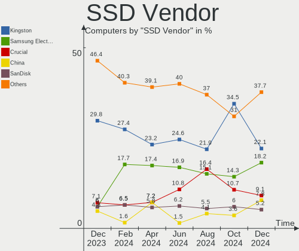
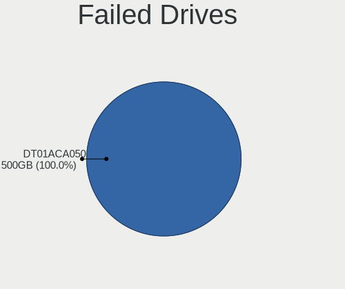
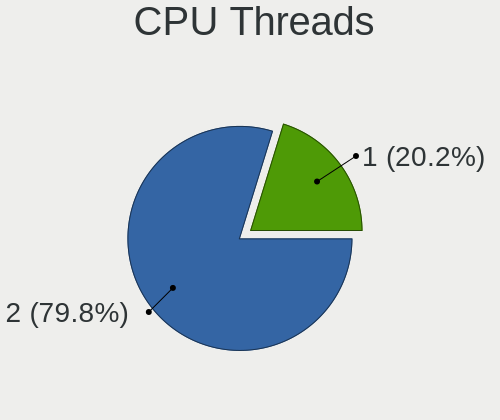
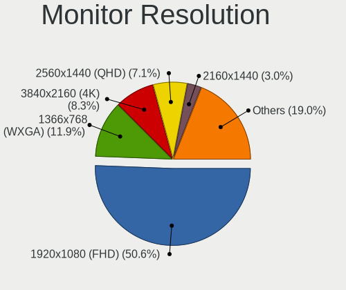
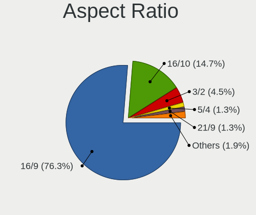
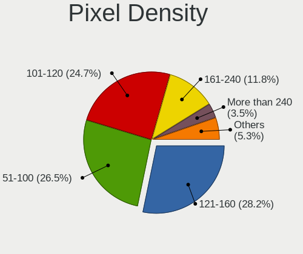
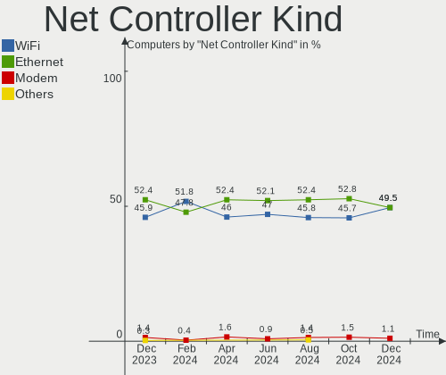

Linux in Spain - Hardware Trends
--------------------------------

A project to identify most popular hardware characteristics and track their change
over time based on data collected by Linux users at https://Linux-Hardware.org.

Anyone can contribute to this report by the [hw-probe](https://github.com/linuxhw/hw-probe) tool:

    sudo -E hw-probe -all -upload

This is a report for all computer types. See also reports for [desktops](/Location/Spain/Desktop/README.md) and [notebooks](/Location/Spain/Notebook/README.md).

Period: Jun, 2023.

Contents
--------

* [ System ](#system)
  - [ OS                       ](#os)
  - [ OS Family                ](#os-family)
  - [ Kernel                   ](#kernel)
  - [ Kernel Family            ](#kernel-family)
  - [ Kernel Major Ver.        ](#kernel-major-ver)
  - [ Arch                     ](#arch)
  - [ DE                       ](#de)
  - [ Display Server           ](#display-server)
  - [ Display Manager          ](#display-manager)
  - [ OS Lang                  ](#os-lang)
  - [ Boot Mode                ](#boot-mode)
  - [ Filesystem               ](#filesystem)
  - [ Part. scheme             ](#part-scheme)
  - [ Dual Boot with Linux/BSD ](#dual-boot-with-linuxbsd)
  - [ Dual Boot (Win)          ](#dual-boot-win)

* [ Board ](#board)
  - [ Vendor                   ](#vendor)
  - [ Model                    ](#model)
  - [ Model Family             ](#model-family)
  - [ MFG Year                 ](#mfg-year)
  - [ Form Factor              ](#form-factor)
  - [ Secure Boot              ](#secure-boot)
  - [ Coreboot                 ](#coreboot)
  - [ RAM Size                 ](#ram-size)
  - [ RAM Used                 ](#ram-used)
  - [ Total Drives             ](#total-drives)
  - [ Has CD-ROM               ](#has-cd-rom)
  - [ Has Ethernet             ](#has-ethernet)
  - [ Has WiFi                 ](#has-wifi)
  - [ Has Bluetooth            ](#has-bluetooth)

* [ Location ](#location)
  - [ Country                  ](#country)
  - [ City                     ](#city)

* [ Drives ](#drives)
  - [ Drive Vendor             ](#drive-vendor)
  - [ Drive Model              ](#drive-model)
  - [ HDD Vendor               ](#hdd-vendor)
  - [ SSD Vendor               ](#ssd-vendor)
  - [ Drive Kind               ](#drive-kind)
  - [ Drive Connector          ](#drive-connector)
  - [ Drive Size               ](#drive-size)
  - [ Space Total              ](#space-total)
  - [ Space Used               ](#space-used)
  - [ Malfunc. Drives          ](#malfunc-drives)
  - [ Malfunc. Drive Vendor    ](#malfunc-drive-vendor)
  - [ Malfunc. HDD Vendor      ](#malfunc-hdd-vendor)
  - [ Malfunc. Drive Kind      ](#malfunc-drive-kind)
  - [ Failed Drives            ](#failed-drives)
  - [ Failed Drive Vendor      ](#failed-drive-vendor)
  - [ Drive Status             ](#drive-status)

* [ Storage controller ](#storage-controller)
  - [ Storage Vendor           ](#storage-vendor)
  - [ Storage Model            ](#storage-model)
  - [ Storage Kind             ](#storage-kind)

* [ Processor ](#processor)
  - [ CPU Vendor               ](#cpu-vendor)
  - [ CPU Model                ](#cpu-model)
  - [ CPU Model Family         ](#cpu-model-family)
  - [ CPU Cores                ](#cpu-cores)
  - [ CPU Sockets              ](#cpu-sockets)
  - [ CPU Threads              ](#cpu-threads)
  - [ CPU Op-Modes             ](#cpu-op-modes)
  - [ CPU Microcode            ](#cpu-microcode)
  - [ CPU Microarch            ](#cpu-microarch)

* [ Graphics ](#graphics)
  - [ GPU Vendor               ](#gpu-vendor)
  - [ GPU Model                ](#gpu-model)
  - [ GPU Combo                ](#gpu-combo)
  - [ GPU Driver               ](#gpu-driver)
  - [ GPU Memory               ](#gpu-memory)

* [ Monitor ](#monitor)
  - [ Monitor Vendor           ](#monitor-vendor)
  - [ Monitor Model            ](#monitor-model)
  - [ Monitor Resolution       ](#monitor-resolution)
  - [ Monitor Diagonal         ](#monitor-diagonal)
  - [ Monitor Width            ](#monitor-width)
  - [ Aspect Ratio             ](#aspect-ratio)
  - [ Monitor Area             ](#monitor-area)
  - [ Pixel Density            ](#pixel-density)
  - [ Multiple Monitors        ](#multiple-monitors)

* [ Network ](#network)
  - [ Net Controller Vendor    ](#net-controller-vendor)
  - [ Net Controller Model     ](#net-controller-model)
  - [ Wireless Vendor          ](#wireless-vendor)
  - [ Wireless Model           ](#wireless-model)
  - [ Ethernet Vendor          ](#ethernet-vendor)
  - [ Ethernet Model           ](#ethernet-model)
  - [ Net Controller Kind      ](#net-controller-kind)
  - [ Used Controller          ](#used-controller)
  - [ NICs                     ](#nics)
  - [ IPv6                     ](#ipv6)

* [ Bluetooth ](#bluetooth)
  - [ Bluetooth Vendor         ](#bluetooth-vendor)
  - [ Bluetooth Model          ](#bluetooth-model)

* [ Sound ](#sound)
  - [ Sound Vendor             ](#sound-vendor)
  - [ Sound Model              ](#sound-model)

* [ Memory ](#memory)
  - [ Memory Vendor            ](#memory-vendor)
  - [ Memory Model             ](#memory-model)
  - [ Memory Kind              ](#memory-kind)
  - [ Memory Form Factor       ](#memory-form-factor)
  - [ Memory Size              ](#memory-size)
  - [ Memory Speed             ](#memory-speed)

* [ Printers & scanners ](#printers--scanners)
  - [ Printer Vendor           ](#printer-vendor)
  - [ Printer Model            ](#printer-model)
  - [ Scanner Vendor           ](#scanner-vendor)
  - [ Scanner Model            ](#scanner-model)

* [ Camera ](#camera)
  - [ Camera Vendor            ](#camera-vendor)
  - [ Camera Model             ](#camera-model)

* [ Security ](#security)
  - [ Fingerprint Vendor       ](#fingerprint-vendor)
  - [ Fingerprint Model        ](#fingerprint-model)
  - [ Chipcard Vendor          ](#chipcard-vendor)
  - [ Chipcard Model           ](#chipcard-model)

* [ Unsupported ](#unsupported)
  - [ Unsupported Devices      ](#unsupported-devices)
  - [ Unsupported Device Types ](#unsupported-device-types)

System
------

OS
--

Installed operating systems

| Name                         | Computers | Percent |
|------------------------------|-----------|---------|
| Ubuntu 22.04                 | 14        | 10.07%  |
| Linux Mint 21.1              | 12        | 8.63%   |
| Pop!_OS 22.04                | 9         | 6.47%   |
| Zorin 16                     | 8         | 5.76%   |
| Ubuntu 23.04                 | 8         | 5.76%   |
| OpenMandriva 23.03           | 8         | 5.76%   |
| Arch Rolling                 | 8         | 5.76%   |
| Ubuntu 20.04                 | 6         | 4.32%   |
| Fedora 38                    | 6         | 4.32%   |
| Debian 11                    | 6         | 4.32%   |
| openSUSE Tumbleweed-XXXXXXXX | 4         | 2.88%   |
| KDE neon 22.04               | 4         | 2.88%   |
| Debian 12                    | 4         | 2.88%   |
| ArcoLinux Rolling            | 4         | 2.88%   |
| Ubuntu MATE 20.04            | 3         | 2.16%   |
| SteamOS 3.4.8                | 3         | 2.16%   |
| Manjaro                      | 3         | 2.16%   |
| Kali 2023.2                  | 3         | 2.16%   |
| Ubuntu 18.04                 | 2         | 1.44%   |
| Lubuntu 22.04                | 2         | 1.44%   |
| Xubuntu 18.04                | 1         | 0.72%   |
| Ubuntu Budgie 22.04          | 1         | 0.72%   |
| Ubuntu 22.10                 | 1         | 0.72%   |
| Trisquel 11.0                | 1         | 0.72%   |
| SteamOS 3.4.6                | 1         | 0.72%   |
| ROSA 12.4                    | 1         | 0.72%   |
| openSUSE Microos-XXXXXXXX    | 1         | 0.72%   |
| openSUSE Leap-15.5           | 1         | 0.72%   |
| OpenMandriva 23.06           | 1         | 0.72%   |
| OpenMandriva 23.01           | 1         | 0.72%   |
| Manjaro 23.0.0               | 1         | 0.72%   |
| Linux Mint 21.2              | 1         | 0.72%   |
| Linux Lite 6.4               | 1         | 0.72%   |
| Lilidog 23                   | 1         | 0.72%   |
| Kubuntu 22.04                | 1         | 0.72%   |
| Kaisen 2.3                   | 1         | 0.72%   |
| GNOME OS Nightly             | 1         | 0.72%   |
| Fedora 36                    | 1         | 0.72%   |
| EndeavourOS Rolling          | 1         | 0.72%   |
| Elementary 7                 | 1         | 0.72%   |

OS Family
---------

OS without a version

| Name          | Computers | Percent |
|---------------|-----------|---------|
| Ubuntu        | 31        | 22.3%   |
| Linux Mint    | 13        | 9.35%   |
| OpenMandriva  | 10        | 7.19%   |
| Debian        | 10        | 7.19%   |
| Pop!_OS       | 9         | 6.47%   |
| Zorin         | 8         | 5.76%   |
| Arch          | 8         | 5.76%   |
| Fedora        | 7         | 5.04%   |
| openSUSE      | 6         | 4.32%   |
| SteamOS       | 4         | 2.88%   |
| Manjaro       | 4         | 2.88%   |
| KDE neon      | 4         | 2.88%   |
| ArcoLinux     | 4         | 2.88%   |
| Ubuntu MATE   | 3         | 2.16%   |
| Kali          | 3         | 2.16%   |
| Lubuntu       | 2         | 1.44%   |
| Xubuntu       | 1         | 0.72%   |
| Ubuntu Budgie | 1         | 0.72%   |
| Trisquel      | 1         | 0.72%   |
| ROSA          | 1         | 0.72%   |
| Linux Lite    | 1         | 0.72%   |
| Lilidog       | 1         | 0.72%   |
| Kubuntu       | 1         | 0.72%   |
| Kaisen        | 1         | 0.72%   |
| GNOME OS      | 1         | 0.72%   |
| EndeavourOS   | 1         | 0.72%   |
| Elementary    | 1         | 0.72%   |
| Blizos        | 1         | 0.72%   |
| Artix         | 1         | 0.72%   |

Kernel
------

Version of the Linux kernel

| Version                           | Computers | Percent |
|-----------------------------------|-----------|---------|
| 5.15.0-73-generic                 | 14        | 10.07%  |
| 5.19.0-43-generic                 | 10        | 7.19%   |
| 5.19.0-45-generic                 | 9         | 6.47%   |
| 6.2.6-desktop-1omv2390            | 8         | 5.76%   |
| 6.2.6-76060206-generic            | 7         | 5.04%   |
| 6.3.5-200.fc38.x86_64             | 5         | 3.6%    |
| 6.2.0-20-generic                  | 5         | 3.6%    |
| 5.15.0-75-generic                 | 5         | 3.6%    |
| 6.3.6-arch1-1                     | 4         | 2.88%   |
| 6.1.0-9-amd64                     | 4         | 2.88%   |
| 5.13.0-valve36-1-neptune          | 4         | 2.88%   |
| 5.10.0-23-amd64                   | 4         | 2.88%   |
| 6.3.7-1-default                   | 3         | 2.16%   |
| 6.2.0-23-generic                  | 3         | 2.16%   |
| 6.1.0-kali9-amd64                 | 3         | 2.16%   |
| 5.19.0-46-generic                 | 3         | 2.16%   |
| 6.3.8-arch1-1                     | 2         | 1.44%   |
| 6.3.8-1-liquorix-amd64            | 2         | 1.44%   |
| 6.3.7-arch1-1                     | 2         | 1.44%   |
| 6.3.5-2-MANJARO                   | 2         | 1.44%   |
| 6.1.31-2-MANJARO                  | 2         | 1.44%   |
| 6.1.1-desktop-1omv2290            | 2         | 1.44%   |
| 5.15.0-71-generic                 | 2         | 1.44%   |
| 4.15.0-212-generic                | 2         | 1.44%   |
| 6.3.9-zen1-1-zen                  | 1         | 0.72%   |
| 6.3.8-x64v1-xanmod1-1             | 1         | 0.72%   |
| 6.3.7-200.fc38.x86_64             | 1         | 0.72%   |
| 6.3.6-zen1-1-zen                  | 1         | 0.72%   |
| 6.3.5-zen2-1-zen                  | 1         | 0.72%   |
| 6.3.5-arch1-1                     | 1         | 0.72%   |
| 6.3.5-273-tkg-bmq                 | 1         | 0.72%   |
| 6.3.4-artix1-1                    | 1         | 0.72%   |
| 6.3.1-060301-generic              | 1         | 0.72%   |
| 6.2.15-100.fc36.x86_64            | 1         | 0.72%   |
| 6.1.20-generic-2rosa2021.1-x86_64 | 1         | 0.72%   |
| 6.1.0-1kaisen-amd64               | 1         | 0.72%   |
| 6.1.0-1012-oem                    | 1         | 0.72%   |
| 6.1.0-1-amd64                     | 1         | 0.72%   |
| 6.0.6-76060006-generic            | 1         | 0.72%   |
| 5.4.0-150-generic                 | 1         | 0.72%   |

Kernel Family
-------------

Linux kernel without a distro release

| Version | Computers | Percent |
|---------|-----------|---------|
| 5.15.0  | 26        | 18.71%  |
| 5.19.0  | 24        | 17.27%  |
| 6.2.6   | 15        | 10.79%  |
| 6.3.5   | 10        | 7.19%   |
| 6.1.0   | 10        | 7.19%   |
| 6.2.0   | 8         | 5.76%   |
| 6.3.7   | 6         | 4.32%   |
| 6.3.8   | 5         | 3.6%    |
| 6.3.6   | 5         | 3.6%    |
| 5.10.0  | 5         | 3.6%    |
| 5.13.0  | 4         | 2.88%   |
| 4.15.0  | 3         | 2.16%   |
| 6.1.31  | 2         | 1.44%   |
| 6.1.1   | 2         | 1.44%   |
| 5.4.0   | 2         | 1.44%   |
| 6.3.9   | 1         | 0.72%   |
| 6.3.4   | 1         | 0.72%   |
| 6.3.1   | 1         | 0.72%   |
| 6.2.15  | 1         | 0.72%   |
| 6.1.20  | 1         | 0.72%   |
| 6.0.6   | 1         | 0.72%   |
| 5.19.17 | 1         | 0.72%   |
| 5.17.9  | 1         | 0.72%   |
| 5.14.21 | 1         | 0.72%   |
| 5.14.14 | 1         | 0.72%   |
| 5.14.0  | 1         | 0.72%   |
| 5.11.0  | 1         | 0.72%   |

Kernel Major Ver.
-----------------

Linux kernel major version

| Version | Computers | Percent |
|---------|-----------|---------|
| 6.3     | 29        | 20.86%  |
| 5.15    | 26        | 18.71%  |
| 5.19    | 25        | 17.99%  |
| 6.2     | 24        | 17.27%  |
| 6.1     | 15        | 10.79%  |
| 5.10    | 5         | 3.6%    |
| 5.13    | 4         | 2.88%   |
| 5.14    | 3         | 2.16%   |
| 4.15    | 3         | 2.16%   |
| 5.4     | 2         | 1.44%   |
| 6.0     | 1         | 0.72%   |
| 5.17    | 1         | 0.72%   |
| 5.11    | 1         | 0.72%   |

Arch
----

OS architecture (x86_64, i586, etc.)

| Name   | Computers | Percent |
|--------|-----------|---------|
| x86_64 | 137       | 98.56%  |
| i686   | 2         | 1.44%   |

DE
--

Desktop Environment

| Name             | Computers | Percent |
|------------------|-----------|---------|
| GNOME            | 56        | 40.29%  |
| KDE5             | 33        | 23.74%  |
| XFCE             | 14        | 10.07%  |
| X-Cinnamon       | 11        | 7.91%   |
| MATE             | 8         | 5.76%   |
| LXQt             | 3         | 2.16%   |
| sway             | 2         | 1.44%   |
| Budgie           | 2         | 1.44%   |
| Unknown          | 2         | 1.44%   |
| Pantheon         | 1         | 0.72%   |
| LXDE             | 1         | 0.72%   |
| lightdm-xsession | 1         | 0.72%   |
| KDE              | 1         | 0.72%   |
| ICEWM            | 1         | 0.72%   |
| Hyprland         | 1         | 0.72%   |
| GNOME Flashback  | 1         | 0.72%   |
| Dwm              | 1         | 0.72%   |

Display Server
--------------

X11 or Wayland

| Name    | Computers | Percent |
|---------|-----------|---------|
| X11     | 99        | 71.22%  |
| Wayland | 38        | 27.34%  |
| Tty     | 1         | 0.72%   |
| Unknown | 1         | 0.72%   |

Display Manager
---------------

SDDM, LightDM, etc.

| Name    | Computers | Percent |
|---------|-----------|---------|
| Unknown | 50        | 35.97%  |
| GDM3    | 31        | 22.3%   |
| SDDM    | 24        | 17.27%  |
| LightDM | 21        | 15.11%  |
| GDM     | 10        | 7.19%   |
| LY-DM   | 1         | 0.72%   |
| Ly      | 1         | 0.72%   |
| LXDM    | 1         | 0.72%   |

OS Lang
-------

Language

| Lang    | Computers | Percent |
|---------|-----------|---------|
| es_ES   | 91        | 65.47%  |
| en_US   | 33        | 23.74%  |
| ca_ES   | 5         | 3.6%    |
| Unknown | 2         | 1.44%   |
| ro_RO   | 1         | 0.72%   |
| pt_BR   | 1         | 0.72%   |
| POSIX   | 1         | 0.72%   |
| it_IT   | 1         | 0.72%   |
| fr_FR   | 1         | 0.72%   |
| eu_ES   | 1         | 0.72%   |
| es_AR   | 1         | 0.72%   |
| en_GB   | 1         | 0.72%   |

Boot Mode
---------

EFI or BIOS

| Mode | Computers | Percent |
|------|-----------|---------|
| EFI  | 72        | 51.8%   |
| BIOS | 67        | 48.2%   |

Filesystem
----------

Type of filesystem

| Type    | Computers | Percent |
|---------|-----------|---------|
| Ext4    | 86        | 61.87%  |
| Tmpfs   | 22        | 15.83%  |
| Btrfs   | 21        | 15.11%  |
| Overlay | 8         | 5.76%   |
| Xfs     | 1         | 0.72%   |
| F2fs    | 1         | 0.72%   |

Part. scheme
------------

Scheme of partitioning

| Type    | Computers | Percent |
|---------|-----------|---------|
| GPT     | 77        | 55.4%   |
| Unknown | 49        | 35.25%  |
| MBR     | 13        | 9.35%   |

Dual Boot with Linux/BSD
------------------------

Hosting more than one Linux/BSD

| Dual boot | Computers | Percent |
|-----------|-----------|---------|
| No        | 115       | 82.73%  |
| Yes       | 24        | 17.27%  |

Dual Boot (Win)
---------------

Hosting Linux and Windows

| Dual boot | Computers | Percent |
|-----------|-----------|---------|
| No        | 94        | 67.63%  |
| Yes       | 45        | 32.37%  |

Board
-----

Vendor
------

Motherboard manufacturer

| Name                             | Computers | Percent |
|----------------------------------|-----------|---------|
| MSI                              | 28        | 20.14%  |
| ASUSTek Computer                 | 19        | 13.67%  |
| Lenovo                           | 15        | 10.79%  |
| Hewlett-Packard                  | 12        | 8.63%   |
| Gigabyte Technology              | 11        | 7.91%   |
| Dell                             | 8         | 5.76%   |
| HUAWEI                           | 6         | 4.32%   |
| Apple                            | 6         | 4.32%   |
| Acer                             | 6         | 4.32%   |
| Valve                            | 4         | 2.88%   |
| Toshiba                          | 3         | 2.16%   |
| Samsung Electronics              | 2         | 1.44%   |
| Pegatron                         | 2         | 1.44%   |
| Notebook                         | 2         | 1.44%   |
| ASRock                           | 2         | 1.44%   |
| win element                      | 1         | 0.72%   |
| Teclast                          | 1         | 0.72%   |
| SYWZ                             | 1         | 0.72%   |
| Sony                             | 1         | 0.72%   |
| Packard Bell                     | 1         | 0.72%   |
| MW                               | 1         | 0.72%   |
| Micro Computer (HK) Tech Limited | 1         | 0.72%   |
| Intel                            | 1         | 0.72%   |
| Foxconn                          | 1         | 0.72%   |
| Chuwi                            | 1         | 0.72%   |
| Beelink                          | 1         | 0.72%   |
| AMI                              | 1         | 0.72%   |
| Alurin                           | 1         | 0.72%   |

Model
-----

Motherboard model

| Name                                 | Computers | Percent |
|--------------------------------------|-----------|---------|
| Valve Jupiter                        | 4         | 2.88%   |
| MSI Stealth 15M B12UE                | 2         | 1.44%   |
| MSI MS-7C91                          | 2         | 1.44%   |
| MSI MS-7B86                          | 2         | 1.44%   |
| HP Pavilion Gaming Laptop 15-ec2xxx  | 2         | 1.44%   |
| win element MoreFine S500+           | 1         | 0.72%   |
| Toshiba TECRA M10                    | 1         | 0.72%   |
| Toshiba Satellite U400               | 1         | 0.72%   |
| Toshiba NB510                        | 1         | 0.72%   |
| Teclast X4                           | 1         | 0.72%   |
| SYWZ S200 Series                     | 1         | 0.72%   |
| Sony VGN-FW41J_H                     | 1         | 0.72%   |
| Samsung RV415/RV515/E3415            | 1         | 0.72%   |
| Samsung RF510/RF410/RF710            | 1         | 0.72%   |
| Pegatron h8-1120es                   | 1         | 0.72%   |
| Pegatron Compaq dx2400 Microtower PC | 1         | 0.72%   |
| Packard Bell EasyNote TE11BZ         | 1         | 0.72%   |
| Notebook NL40_50CU                   | 1         | 0.72%   |
| Notebook N141CU                      | 1         | 0.72%   |
| MW NVR-N5105                         | 1         | 0.72%   |
| MSI Prestige 16 A12UD                | 1         | 0.72%   |
| MSI Prestige 15 A10SC                | 1         | 0.72%   |
| MSI Prestige 14H B12UCX              | 1         | 0.72%   |
| MSI NQ874AA-ABE p6010es              | 1         | 0.72%   |
| MSI MS-B06211                        | 1         | 0.72%   |
| MSI MS-7E07                          | 1         | 0.72%   |
| MSI MS-7D45                          | 1         | 0.72%   |
| MSI MS-7C96                          | 1         | 0.72%   |
| MSI MS-7C75                          | 1         | 0.72%   |
| MSI MS-7C52                          | 1         | 0.72%   |
| MSI MS-7C51                          | 1         | 0.72%   |
| MSI MS-7A38                          | 1         | 0.72%   |
| MSI MS-7A32                          | 1         | 0.72%   |
| MSI MS-7976                          | 1         | 0.72%   |
| MSI MS-7885                          | 1         | 0.72%   |
| MSI MS-7817                          | 1         | 0.72%   |
| MSI MS-7788                          | 1         | 0.72%   |
| MSI Modern 14 C12M                   | 1         | 0.72%   |
| MSI Modern 14 B5M                    | 1         | 0.72%   |
| MSI GT72 2QE                         | 1         | 0.72%   |

Model Family
------------

Motherboard model prefix

| Name                  | Computers | Percent |
|-----------------------|-----------|---------|
| Lenovo ThinkPad       | 7         | 5.04%   |
| Valve Jupiter         | 4         | 2.88%   |
| ASUS TUF              | 4         | 2.88%   |
| MSI Prestige          | 3         | 2.16%   |
| Lenovo IdeaPad        | 3         | 2.16%   |
| HP Pavilion           | 3         | 2.16%   |
| HP Compaq             | 3         | 2.16%   |
| Dell OptiPlex         | 3         | 2.16%   |
| ASUS ROG              | 3         | 2.16%   |
| ASUS PRIME            | 3         | 2.16%   |
| Acer Aspire           | 3         | 2.16%   |
| MSI Stealth           | 2         | 1.44%   |
| MSI MS-7C91           | 2         | 1.44%   |
| MSI MS-7B86           | 2         | 1.44%   |
| MSI Modern            | 2         | 1.44%   |
| Lenovo Yoga           | 2         | 1.44%   |
| Dell Latitude         | 2         | 1.44%   |
| Acer TravelMate       | 2         | 1.44%   |
| win element MoreFine  | 1         | 0.72%   |
| Toshiba TECRA         | 1         | 0.72%   |
| Toshiba Satellite     | 1         | 0.72%   |
| Toshiba NB510         | 1         | 0.72%   |
| Teclast X4            | 1         | 0.72%   |
| SYWZ S200             | 1         | 0.72%   |
| Sony VGN-FW41J        | 1         | 0.72%   |
| Samsung RV415         | 1         | 0.72%   |
| Samsung RF510         | 1         | 0.72%   |
| Pegatron h8-1120es    | 1         | 0.72%   |
| Pegatron Compaq       | 1         | 0.72%   |
| Packard Bell EasyNote | 1         | 0.72%   |
| Notebook NL40         | 1         | 0.72%   |
| Notebook N141CU       | 1         | 0.72%   |
| MW NVR-N5105          | 1         | 0.72%   |
| MSI NQ874AA-ABE       | 1         | 0.72%   |
| MSI MS-B06211         | 1         | 0.72%   |
| MSI MS-7E07           | 1         | 0.72%   |
| MSI MS-7D45           | 1         | 0.72%   |
| MSI MS-7C96           | 1         | 0.72%   |
| MSI MS-7C75           | 1         | 0.72%   |
| MSI MS-7C52           | 1         | 0.72%   |

MFG Year
--------

Motherboard manufacture year

| Year | Computers | Percent |
|------|-----------|---------|
| 2022 | 21        | 15.11%  |
| 2021 | 16        | 11.51%  |
| 2019 | 14        | 10.07%  |
| 2020 | 12        | 8.63%   |
| 2018 | 10        | 7.19%   |
| 2012 | 10        | 7.19%   |
| 2017 | 7         | 5.04%   |
| 2014 | 6         | 4.32%   |
| 2008 | 6         | 4.32%   |
| 2016 | 5         | 3.6%    |
| 2011 | 5         | 3.6%    |
| 2010 | 5         | 3.6%    |
| 2009 | 5         | 3.6%    |
| 2023 | 4         | 2.88%   |
| 2015 | 4         | 2.88%   |
| 2013 | 4         | 2.88%   |
| 2007 | 4         | 2.88%   |
| 2006 | 1         | 0.72%   |

Form Factor
-----------

Physical design of the computer

| Name        | Computers | Percent |
|-------------|-----------|---------|
| Notebook    | 75        | 53.96%  |
| Desktop     | 57        | 41.01%  |
| All in one  | 4         | 2.88%   |
| Convertible | 2         | 1.44%   |
| Tablet      | 1         | 0.72%   |

Secure Boot
-----------

Enabled or disabled

| State    | Computers | Percent |
|----------|-----------|---------|
| Disabled | 131       | 94.24%  |
| Enabled  | 8         | 5.76%   |

Coreboot
--------

Have coreboot on board

| Used | Computers | Percent |
|------|-----------|---------|
| No   | 139       | 100%    |

RAM Size
--------

Total RAM memory

| Size in GB  | Computers | Percent |
|-------------|-----------|---------|
| 4.01-8.0    | 29        | 20.86%  |
| 8.01-16.0   | 27        | 19.42%  |
| 16.01-24.0  | 26        | 18.71%  |
| 32.01-64.0  | 25        | 17.99%  |
| 3.01-4.0    | 17        | 12.23%  |
| 64.01-256.0 | 8         | 5.76%   |
| 2.01-3.0    | 3         | 2.16%   |
| 24.01-32.0  | 2         | 1.44%   |
| 1.01-2.0    | 2         | 1.44%   |

RAM Used
--------

Used RAM memory

| Used GB   | Computers | Percent |
|-----------|-----------|---------|
| 1.01-2.0  | 41        | 29.5%   |
| 3.01-4.0  | 30        | 21.58%  |
| 2.01-3.0  | 30        | 21.58%  |
| 4.01-8.0  | 25        | 17.99%  |
| 8.01-16.0 | 8         | 5.76%   |
| 0.51-1.0  | 5         | 3.6%    |

Total Drives
------------

Number of drives on board

| Drives | Computers | Percent |
|--------|-----------|---------|
| 1      | 80        | 57.55%  |
| 2      | 38        | 27.34%  |
| 3      | 11        | 7.91%   |
| 4      | 6         | 4.32%   |
| 6      | 2         | 1.44%   |
| 5      | 2         | 1.44%   |

Has CD-ROM
----------

Has CD-ROM on board

| Presented | Computers | Percent |
|-----------|-----------|---------|
| No        | 97        | 69.78%  |
| Yes       | 42        | 30.22%  |

Has Ethernet
------------

Has Ethernet on board

| Presented | Computers | Percent |
|-----------|-----------|---------|
| Yes       | 115       | 82.73%  |
| No        | 24        | 17.27%  |

Has WiFi
--------

Has WiFi module

| Presented | Computers | Percent |
|-----------|-----------|---------|
| Yes       | 111       | 79.86%  |
| No        | 28        | 20.14%  |

Has Bluetooth
-------------

Has Bluetooth module

| Presented | Computers | Percent |
|-----------|-----------|---------|
| Yes       | 90        | 64.75%  |
| No        | 49        | 35.25%  |

Location
--------

Country
-------

Geographic location (country)

| Country | Computers | Percent |
|---------|-----------|---------|
| Spain   | 139       | 100%    |

City
----

Geographic location (city)

| City                       | Computers | Percent |
|----------------------------|-----------|---------|
| Madrid                     | 19        | 13.67%  |
| Barcelona                  | 11        | 7.91%   |
| Valencia                   | 6         | 4.32%   |
| Zaragoza                   | 5         | 3.6%    |
| Seville                    | 5         | 3.6%    |
| Málaga                    | 4         | 2.88%   |
| Granada                    | 4         | 2.88%   |
| Sabadell                   | 3         | 2.16%   |
| Alcobendas                 | 3         | 2.16%   |
| Santa Cruz de Tenerife     | 2         | 1.44%   |
| Pamplona                   | 2         | 1.44%   |
| Palma                      | 2         | 1.44%   |
| Oviedo                     | 2         | 1.44%   |
| Elda                       | 2         | 1.44%   |
| Donostia / San Sebastian   | 2         | 1.44%   |
| Córdoba                   | 2         | 1.44%   |
| Bilbao                     | 2         | 1.44%   |
| Amposta                    | 2         | 1.44%   |
| A Coruña                  | 2         | 1.44%   |
| Zafra                      | 1         | 0.72%   |
| Yecla                      | 1         | 0.72%   |
| Viladecans                 | 1         | 0.72%   |
| Vigo                       | 1         | 0.72%   |
| Valladolid                 | 1         | 0.72%   |
| Torremolinos               | 1         | 0.72%   |
| Torrelavega                | 1         | 0.72%   |
| Torrejón de Ardoz         | 1         | 0.72%   |
| Terrassa                   | 1         | 0.72%   |
| Santiago de Compostela     | 1         | 0.72%   |
| Santander                  | 1         | 0.72%   |
| Santa Uxia de Ribeira      | 1         | 0.72%   |
| Sant Pere de Ribes         | 1         | 0.72%   |
| Sant Hipòlit de Voltregà | 1         | 0.72%   |
| San Miguel de Meruelo      | 1         | 0.72%   |
| Salamanca                  | 1         | 0.72%   |
| Rota                       | 1         | 0.72%   |
| Rodonya                    | 1         | 0.72%   |
| Rivas-Vaciamadrid          | 1         | 0.72%   |
| Reus                       | 1         | 0.72%   |
| Ponte Caldelas             | 1         | 0.72%   |

Drives
------

Drive Vendor
------------

Hard drive vendors

| Vendor                         | Computers | Drives | Percent |
|--------------------------------|-----------|--------|---------|
| Seagate                        | 31        | 39     | 15.05%  |
| Samsung Electronics            | 23        | 27     | 11.17%  |
| WDC                            | 22        | 26     | 10.68%  |
| Sandisk                        | 19        | 19     | 9.22%   |
| Kingston                       | 19        | 24     | 9.22%   |
| Crucial                        | 10        | 11     | 4.85%   |
| Toshiba                        | 9         | 9      | 4.37%   |
| Micron Technology              | 9         | 9      | 4.37%   |
| Phison Electronics             | 7         | 8      | 3.4%    |
| Hitachi                        | 7         | 7      | 3.4%    |
| Unknown                        | 6         | 6      | 2.91%   |
| Intel                          | 5         | 6      | 2.43%   |
| China                          | 4         | 4      | 1.94%   |
| SK hynix                       | 3         | 3      | 1.46%   |
| Silicon Motion                 | 3         | 3      | 1.46%   |
| Maxtor                         | 3         | 4      | 1.46%   |
| HGST                           | 3         | 3      | 1.46%   |
| Apple                          | 3         | 3      | 1.46%   |
| O2 Micro                       | 2         | 2      | 0.97%   |
| Kingston Technology Company    | 2         | 2      | 0.97%   |
| YMTC                           | 1         | 1      | 0.49%   |
| Union Memory                   | 1         | 1      | 0.49%   |
| Teclast                        | 1         | 1      | 0.49%   |
| Solid State Storage Technology | 1         | 1      | 0.49%   |
| Realtek Semiconductor          | 1         | 1      | 0.49%   |
| Patriot                        | 1         | 1      | 0.49%   |
| OYUNKEY                        | 1         | 1      | 0.49%   |
| Micron/Crucial Technology      | 1         | 2      | 0.49%   |
| KingSpec                       | 1         | 1      | 0.49%   |
| KingFast                       | 1         | 1      | 0.49%   |
| KingDian                       | 1         | 1      | 0.49%   |
| Kingchuxing                    | 1         | 1      | 0.49%   |
| JMicron Technology             | 1         | 1      | 0.49%   |
| BAITITON                       | 1         | 1      | 0.49%   |
| A-DATA Technology              | 1         | 1      | 0.49%   |
| 240G                           | 1         | 1      | 0.49%   |

Drive Model
-----------

Hard drive models

| Model                                               | Computers | Percent |
|-----------------------------------------------------|-----------|---------|
| Kingston SA400S37240G 240GB SSD                     | 7         | 3.15%   |
| Seagate ST2000DM008-2FR102 2TB                      | 5         | 2.25%   |
| Sandisk WD Black SN750 / PC SN730 NVMe SSD 500GB    | 5         | 2.25%   |
| Phison E12 NVMe Controller 1TB                      | 5         | 2.25%   |
| Seagate ST1000DM010-2EP102 1TB                      | 4         | 1.8%    |
| Kingston SA400S37480G 480GB SSD                     | 4         | 1.8%    |
| Seagate ST9500325AS 500GB                           | 3         | 1.35%   |
| Seagate ST1000LM035-1RK172 1TB                      | 3         | 1.35%   |
| Seagate ST1000DM003-1SB102 1TB                      | 3         | 1.35%   |
| SanDisk SSD PLUS 480GB                              | 3         | 1.35%   |
| Samsung NVMe SSD Controller SM981/PM981/PM983 250GB | 3         | 1.35%   |
| Samsung NVMe SSD Controller PM9A1/PM9A3/980PRO 2TB  | 3         | 1.35%   |
| Unknown MMC Card  512GB                             | 2         | 0.9%    |
| Toshiba TR200 240GB SSD                             | 2         | 0.9%    |
| Seagate ST500DM002-1BD142 500GB                     | 2         | 0.9%    |
| Seagate ST1000DM003-1ER162 1TB                      | 2         | 0.9%    |
| Sandisk WD Blue SN550 NVMe SSD 1TB                  | 2         | 0.9%    |
| Samsung SSD 980 PRO 1TB                             | 2         | 0.9%    |
| Samsung SSD 970 EVO Plus 2TB                        | 2         | 0.9%    |
| O2 Micro E2M2 64GB                                  | 2         | 0.9%    |
| Micron MTFDHBA512QFD 512GB                          | 2         | 0.9%    |
| Micron 2450_MTFDKBA1T0TFK 1TB                       | 2         | 0.9%    |
| Kingston SNV2S500G 500GB                            | 2         | 0.9%    |
| Hitachi HDS722020ALA330 2TB                         | 2         | 0.9%    |
| Crucial CT500MX500SSD1 500GB                        | 2         | 0.9%    |
| Crucial CT480BX500SSD1 480GB                        | 2         | 0.9%    |
| YMTC PC005 1TB                                      | 1         | 0.45%   |
| WDC WDS250G2B0A-00SM50 250GB SSD                    | 1         | 0.45%   |
| WDC WDS100T3X0C-00SJG0 1TB                          | 1         | 0.45%   |
| WDC WDS100T2B0C-00PXH0 1TB                          | 1         | 0.45%   |
| WDC WDS100T2B0B-00YS70 1TB SSD                      | 1         | 0.45%   |
| WDC WDS100T2B0A 1TB SSD                             | 1         | 0.45%   |
| WDC WDBA3V5000ANC-WRSN 500GB                        | 1         | 0.45%   |
| WDC WD800JD-75MSA3 80GB                             | 1         | 0.45%   |
| WDC WD7500BPVX-22JC3T0 752GB                        | 1         | 0.45%   |
| WDC WD5000AAKX-001CA0 500GB                         | 1         | 0.45%   |
| WDC WD5000AAKS-65A7B2 500GB                         | 1         | 0.45%   |
| WDC WD40EZRZ-00GXCB0 4TB                            | 1         | 0.45%   |
| WDC WD3200BEVT-60A23T0 320GB                        | 1         | 0.45%   |
| WDC WD32 00BPVT-22JJ5T0 320GB                       | 1         | 0.45%   |

HDD Vendor
----------

Hard disk drive vendors

| Vendor              | Computers | Drives | Percent |
|---------------------|-----------|--------|---------|
| Seagate             | 31        | 39     | 46.97%  |
| WDC                 | 15        | 17     | 22.73%  |
| Hitachi             | 7         | 7      | 10.61%  |
| Toshiba             | 5         | 5      | 7.58%   |
| Maxtor              | 3         | 4      | 4.55%   |
| HGST                | 3         | 3      | 4.55%   |
| Samsung Electronics | 1         | 1      | 1.52%   |
| Apple               | 1         | 1      | 1.52%   |

SSD Vendor
----------

Solid state drive vendors

| Vendor              | Computers | Drives | Percent |
|---------------------|-----------|--------|---------|
| Kingston            | 16        | 20     | 26.67%  |
| Samsung Electronics | 9         | 9      | 15%     |
| Crucial             | 8         | 9      | 13.33%  |
| SanDisk             | 6         | 6      | 10%     |
| Toshiba             | 4         | 4      | 6.67%   |
| China               | 4         | 4      | 6.67%   |
| WDC                 | 2         | 3      | 3.33%   |
| Teclast             | 1         | 1      | 1.67%   |
| SK hynix            | 1         | 1      | 1.67%   |
| Patriot             | 1         | 1      | 1.67%   |
| Micron Technology   | 1         | 1      | 1.67%   |
| KingSpec            | 1         | 1      | 1.67%   |
| KingDian            | 1         | 1      | 1.67%   |
| Kingchuxing         | 1         | 1      | 1.67%   |
| BAITITON            | 1         | 1      | 1.67%   |
| Apple               | 1         | 1      | 1.67%   |
| A-DATA Technology   | 1         | 1      | 1.67%   |
| 240G                | 1         | 1      | 1.67%   |

Drive Kind
----------

HDD or SSD

| Kind    | Computers | Drives | Percent |
|---------|-----------|--------|---------|
| NVMe    | 70        | 82     | 38.25%  |
| HDD     | 56        | 77     | 30.6%   |
| SSD     | 50        | 66     | 27.32%  |
| MMC     | 5         | 5      | 2.73%   |
| Unknown | 2         | 2      | 1.09%   |

Drive Connector
---------------

SATA, SAS, NVMe, etc.

| Type | Computers | Drives | Percent |
|------|-----------|--------|---------|
| SATA | 88        | 143    | 53.01%  |
| NVMe | 70        | 81     | 42.17%  |
| MMC  | 5         | 5      | 3.01%   |
| SAS  | 3         | 3      | 1.81%   |

Drive Size
----------

Size of hard drive

| Size in TB      | Computers | Drives | Percent |
|-----------------|-----------|--------|---------|
| 0.01-0.5        | 66        | 83     | 55%     |
| 0.51-1.0        | 33        | 37     | 27.5%   |
| 1.01-2.0        | 15        | 17     | 12.5%   |
| 3.01-4.0        | 3         | 3      | 2.5%    |
| More than 100.0 | 1         | 1      | 0.83%   |
| 2.01-3.0        | 1         | 1      | 0.83%   |
| 4.01-10.0       | 1         | 1      | 0.83%   |

Space Total
-----------

Amount of disk space available on the file system

| Size in GB     | Computers | Percent |
|----------------|-----------|---------|
| 501-1000       | 31        | 22.3%   |
| 101-250        | 30        | 21.58%  |
| 251-500        | 28        | 20.14%  |
| 1001-2000      | 12        | 8.63%   |
| 51-100         | 12        | 8.63%   |
| More than 3000 | 11        | 7.91%   |
| 21-50          | 4         | 2.88%   |
| 2001-3000      | 4         | 2.88%   |
| 1-20           | 4         | 2.88%   |
| Unknown        | 3         | 2.16%   |

Space Used
----------

Amount of used disk space

| Used GB        | Computers | Percent |
|----------------|-----------|---------|
| 1-20           | 39        | 28.06%  |
| 21-50          | 30        | 21.58%  |
| 51-100         | 21        | 15.11%  |
| 251-500        | 13        | 9.35%   |
| 101-250        | 12        | 8.63%   |
| 501-1000       | 9         | 6.47%   |
| More than 3000 | 6         | 4.32%   |
| 1001-2000      | 5         | 3.6%    |
| Unknown        | 3         | 2.16%   |
| 2001-3000      | 1         | 0.72%   |

Malfunc. Drives
---------------

Drive models with a malfunction

| Model                           | Computers | Drives | Percent |
|---------------------------------|-----------|--------|---------|
| WDC WD3200BEVT-60A23T0 320GB    | 1         | 1      | 9.09%   |
| WDC WD20EARX-00PASB0 2TB        | 1         | 1      | 9.09%   |
| WDC WD10EZRZ-00HTKB0 1TB        | 1         | 1      | 9.09%   |
| WDC WD10EZEX-00WN4A0 1TB        | 1         | 1      | 9.09%   |
| Toshiba MQ01ABD050 500GB        | 1         | 1      | 9.09%   |
| Seagate ST9500325AS 500GB       | 1         | 1      | 9.09%   |
| Seagate ST500LM021-1KJ152 500GB | 1         | 1      | 9.09%   |
| Maxtor StM380215a 18015TB       | 1         | 1      | 9.09%   |
| Maxtor 6Y080L0 82GB             | 1         | 1      | 9.09%   |
| Kingston SA400S37240G 240GB SSD | 1         | 1      | 9.09%   |
| Hitachi HTS543232L9A300 320GB   | 1         | 1      | 9.09%   |

Malfunc. Drive Vendor
---------------------

Vendors of faulty drives

| Vendor   | Computers | Drives | Percent |
|----------|-----------|--------|---------|
| WDC      | 4         | 4      | 40%     |
| Seagate  | 2         | 2      | 20%     |
| Toshiba  | 1         | 1      | 10%     |
| Maxtor   | 1         | 2      | 10%     |
| Kingston | 1         | 1      | 10%     |
| Hitachi  | 1         | 1      | 10%     |

Malfunc. HDD Vendor
-------------------

Vendors of faulty HDD drives

| Vendor  | Computers | Drives | Percent |
|---------|-----------|--------|---------|
| WDC     | 4         | 4      | 44.44%  |
| Seagate | 2         | 2      | 22.22%  |
| Toshiba | 1         | 1      | 11.11%  |
| Maxtor  | 1         | 2      | 11.11%  |
| Hitachi | 1         | 1      | 11.11%  |

Malfunc. Drive Kind
-------------------

Kinds of faulty drives

| Kind | Computers | Drives | Percent |
|------|-----------|--------|---------|
| HDD  | 8         | 10     | 88.89%  |
| SSD  | 1         | 1      | 11.11%  |

Failed Drives
-------------

Failed drive models

| Model                    | Computers | Drives | Percent |
|--------------------------|-----------|--------|---------|
| Toshiba DT01ACA050 500GB | 1         | 1      | 100%    |

Failed Drive Vendor
-------------------

Failed drive vendors

| Vendor  | Computers | Drives | Percent |
|---------|-----------|--------|---------|
| Toshiba | 1         | 1      | 100%    |

Drive Status
------------

Number of failed and malfunc. drives

| Status   | Computers | Drives | Percent |
|----------|-----------|--------|---------|
| Detected | 78        | 118    | 53.06%  |
| Works    | 60        | 102    | 40.82%  |
| Malfunc  | 8         | 11     | 5.44%   |
| Failed   | 1         | 1      | 0.68%   |

Storage controller
------------------

Storage Vendor
--------------

Storage controller vendors

| Vendor                         | Computers | Percent |
|--------------------------------|-----------|---------|
| Intel                          | 81        | 43.32%  |
| AMD                            | 27        | 14.44%  |
| SanDisk                        | 19        | 10.16%  |
| Samsung Electronics            | 16        | 8.56%   |
| Micron Technology              | 8         | 4.28%   |
| Phison Electronics             | 7         | 3.74%   |
| Kingston Technology Company    | 6         | 3.21%   |
| Silicon Motion                 | 3         | 1.6%    |
| Micron/Crucial Technology      | 3         | 1.6%    |
| SK hynix                       | 2         | 1.07%   |
| O2 Micro                       | 2         | 1.07%   |
| Nvidia                         | 2         | 1.07%   |
| JMicron Technology             | 2         | 1.07%   |
| Yangtze Memory Technologies    | 1         | 0.53%   |
| VIA Technologies               | 1         | 0.53%   |
| Union Memory (Shenzhen)        | 1         | 0.53%   |
| Solid State Storage Technology | 1         | 0.53%   |
| Realtek Semiconductor          | 1         | 0.53%   |
| Netac Technology               | 1         | 0.53%   |
| Marvell Technology Group       | 1         | 0.53%   |
| ASMedia Technology             | 1         | 0.53%   |
| Apple                          | 1         | 0.53%   |

Storage Model
-------------

Storage controller models

| Model                                                                          | Computers | Percent |
|--------------------------------------------------------------------------------|-----------|---------|
| AMD FCH SATA Controller [AHCI mode]                                            | 16        | 7.77%   |
| Samsung NVMe SSD Controller SM981/PM981/PM983                                  | 7         | 3.4%    |
| SanDisk WD Black SN750 / PC SN730 NVMe SSD                                     | 6         | 2.91%   |
| Intel 82801IBM/IEM (ICH9M/ICH9M-E) 4 port SATA Controller [AHCI mode]          | 6         | 2.91%   |
| Samsung NVMe SSD Controller PM9A1/PM9A3/980PRO                                 | 5         | 2.43%   |
| Phison E12 NVMe Controller                                                     | 5         | 2.43%   |
| Micron NVMe Storage Controller                                                 | 5         | 2.43%   |
| Intel 8 Series/C220 Series Chipset Family 6-port SATA Controller 1 [AHCI mode] | 5         | 2.43%   |
| Intel 7 Series Chipset Family 6-port SATA Controller [AHCI mode]               | 5         | 2.43%   |
| AMD 500 Series Chipset SATA Controller                                         | 5         | 2.43%   |
| AMD 400 Series Chipset SATA Controller                                         | 5         | 2.43%   |
| SanDisk WD Blue SN550 NVMe SSD                                                 | 4         | 1.94%   |
| Kingston Company Company Non-Volatile memory controller                        | 4         | 1.94%   |
| Intel Sunrise Point-LP SATA Controller [AHCI mode]                             | 4         | 1.94%   |
| Intel Q170/Q150/B150/H170/H110/Z170/CM236 Chipset SATA Controller [AHCI Mode]  | 4         | 1.94%   |
| Intel Comet Lake SATA AHCI Controller                                          | 4         | 1.94%   |
| Intel Celeron/Pentium Silver Processor SATA Controller                         | 4         | 1.94%   |
| Intel Non-Volatile memory controller                                           | 3         | 1.46%   |
| Intel NM10/ICH7 Family SATA Controller [IDE mode]                              | 3         | 1.46%   |
| Intel 6 Series/C200 Series Chipset Family 6 port Desktop SATA AHCI Controller  | 3         | 1.46%   |
| Silicon Motion Non-Volatile memory controller                                  | 2         | 0.97%   |
| SanDisk WD Black 2018/SN750 / PC SN720 NVMe SSD                                | 2         | 0.97%   |
| SanDisk Non-Volatile memory controller                                         | 2         | 0.97%   |
| Samsung NVMe SSD Controller 980                                                | 2         | 0.97%   |
| O2 Micro Non-Volatile memory controller                                        | 2         | 0.97%   |
| Micron/Crucial P2 NVMe PCIe SSD                                                | 2         | 0.97%   |
| Micron 2450 NVMe SSD (DRAM-less)                                               | 2         | 0.97%   |
| Intel Volume Management Device NVMe RAID Controller                            | 2         | 0.97%   |
| Intel SSD 660P Series                                                          | 2         | 0.97%   |
| Intel Cannon Lake PCH SATA AHCI Controller                                     | 2         | 0.97%   |
| Intel Cannon Lake Mobile PCH SATA AHCI Controller                              | 2         | 0.97%   |
| Intel C610/X99 series chipset sSATA Controller [AHCI mode]                     | 2         | 0.97%   |
| Intel C610/X99 series chipset 6-Port SATA Controller [AHCI mode]               | 2         | 0.97%   |
| Intel 82801HM/HEM (ICH8M/ICH8M-E) SATA Controller [AHCI mode]                  | 2         | 0.97%   |
| Intel 82801HM/HEM (ICH8M/ICH8M-E) IDE Controller                               | 2         | 0.97%   |
| Intel 82801G (ICH7 Family) IDE Controller                                      | 2         | 0.97%   |
| Intel 7 Series/C210 Series Chipset Family 6-port SATA Controller [AHCI mode]   | 2         | 0.97%   |
| Intel 500 Series Chipset Family SATA AHCI Controller                           | 2         | 0.97%   |
| Intel 5 Series/3400 Series Chipset 4 port SATA AHCI Controller                 | 2         | 0.97%   |
| Intel 200 Series PCH SATA controller [AHCI mode]                               | 2         | 0.97%   |

Storage Kind
------------

Kind of storage controller (IDE, SATA, NVMe, SAS, ...)

| Kind | Computers | Percent |
|------|-----------|---------|
| SATA | 92        | 50%     |
| NVMe | 70        | 38.04%  |
| IDE  | 15        | 8.15%   |
| RAID | 7         | 3.8%    |

Processor
---------

CPU Vendor
----------

Processor vendors

| Vendor | Computers | Percent |
|--------|-----------|---------|
| Intel  | 99        | 71.22%  |
| AMD    | 40        | 28.78%  |

CPU Model
---------

Processor models

| Model                                       | Computers | Percent |
|---------------------------------------------|-----------|---------|
| AMD Ryzen 5 5600H with Radeon Graphics      | 4         | 2.88%   |
| AMD Custom APU 0405                         | 4         | 2.88%   |
| Intel Core 2 Duo CPU P8700 @ 2.53GHz        | 3         | 2.16%   |
| Intel 12th Gen Core i7-1280P                | 3         | 2.16%   |
| AMD Ryzen 9 7950X 16-Core Processor         | 3         | 2.16%   |
| AMD Ryzen 7 3700X 8-Core Processor          | 3         | 2.16%   |
| Intel Core i7-10700K CPU @ 3.80GHz          | 2         | 1.44%   |
| Intel Core i5-4460 CPU @ 3.20GHz            | 2         | 1.44%   |
| Intel Core i5-10400 CPU @ 2.90GHz           | 2         | 1.44%   |
| Intel Core i5-10210U CPU @ 1.60GHz          | 2         | 1.44%   |
| AMD Ryzen 5 3600 6-Core Processor           | 2         | 1.44%   |
| Intel Xeon CPU E5-2680 v3 @ 2.50GHz         | 1         | 0.72%   |
| Intel Xeon CPU E5-2678 v3 @ 2.50GHz         | 1         | 0.72%   |
| Intel Pentium Dual-Core CPU T4500 @ 2.30GHz | 1         | 0.72%   |
| Intel Pentium Dual-Core CPU E5700 @ 3.00GHz | 1         | 0.72%   |
| Intel Pentium Dual-Core CPU E5300 @ 2.60GHz | 1         | 0.72%   |
| Intel Pentium Dual-Core CPU E5200 @ 2.50GHz | 1         | 0.72%   |
| Intel Pentium Dual CPU E2220 @ 2.40GHz      | 1         | 0.72%   |
| Intel Core i9-8950HK CPU @ 2.90GHz          | 1         | 0.72%   |
| Intel Core i7-9750H CPU @ 2.60GHz           | 1         | 0.72%   |
| Intel Core i7-8750H CPU @ 2.20GHz           | 1         | 0.72%   |
| Intel Core i7-8700K CPU @ 3.70GHz           | 1         | 0.72%   |
| Intel Core i7-8650U CPU @ 1.90GHz           | 1         | 0.72%   |
| Intel Core i7-8550U CPU @ 1.80GHz           | 1         | 0.72%   |
| Intel Core i7-7700 CPU @ 3.60GHz            | 1         | 0.72%   |
| Intel Core i7-6700K CPU @ 4.00GHz           | 1         | 0.72%   |
| Intel Core i7-6700HQ CPU @ 2.60GHz          | 1         | 0.72%   |
| Intel Core i7-6700 CPU @ 3.40GHz            | 1         | 0.72%   |
| Intel Core i7-5820K CPU @ 3.30GHz           | 1         | 0.72%   |
| Intel Core i7-4790S CPU @ 3.20GHz           | 1         | 0.72%   |
| Intel Core i7-4790 CPU @ 3.60GHz            | 1         | 0.72%   |
| Intel Core i7-4770HQ CPU @ 2.20GHz          | 1         | 0.72%   |
| Intel Core i7-4720HQ CPU @ 2.60GHz          | 1         | 0.72%   |
| Intel Core i7-3770 CPU @ 3.40GHz            | 1         | 0.72%   |
| Intel Core i7-3520M CPU @ 2.90GHz           | 1         | 0.72%   |
| Intel Core i7-2600 CPU @ 3.40GHz            | 1         | 0.72%   |
| Intel Core i7-10870H CPU @ 2.20GHz          | 1         | 0.72%   |
| Intel Core i7-10750H CPU @ 2.60GHz          | 1         | 0.72%   |
| Intel Core i7-10710U CPU @ 1.10GHz          | 1         | 0.72%   |
| Intel Core i7-10510U CPU @ 1.80GHz          | 1         | 0.72%   |

CPU Model Family
----------------

Processor model prefix

| Model                   | Computers | Percent |
|-------------------------|-----------|---------|
| Intel Core i7           | 23        | 16.55%  |
| Intel Core i5           | 23        | 16.55%  |
| Other                   | 20        | 14.39%  |
| AMD Ryzen 5             | 11        | 7.91%   |
| Intel Core i3           | 10        | 7.19%   |
| AMD Ryzen 7             | 10        | 7.19%   |
| Intel Core 2 Duo        | 9         | 6.47%   |
| Intel Celeron           | 7         | 5.04%   |
| AMD Ryzen 9             | 7         | 5.04%   |
| Intel Pentium Dual-Core | 4         | 2.88%   |
| Intel Xeon              | 2         | 1.44%   |
| Intel Core 2            | 2         | 1.44%   |
| Intel Pentium Dual      | 1         | 0.72%   |
| Intel Core i9           | 1         | 0.72%   |
| Intel Atom              | 1         | 0.72%   |
| AMD Ryzen 7 PRO         | 1         | 0.72%   |
| AMD Ryzen 5 PRO         | 1         | 0.72%   |
| AMD Phenom II X6        | 1         | 0.72%   |
| AMD Phenom              | 1         | 0.72%   |
| AMD FX                  | 1         | 0.72%   |
| AMD E1                  | 1         | 0.72%   |
| AMD E                   | 1         | 0.72%   |
| AMD A8                  | 1         | 0.72%   |

CPU Cores
---------

Number of processor cores

| Number | Computers | Percent |
|--------|-----------|---------|
| 2      | 43        | 30.94%  |
| 4      | 39        | 28.06%  |
| 6      | 22        | 15.83%  |
| 8      | 16        | 11.51%  |
| 14     | 5         | 3.6%    |
| 12     | 5         | 3.6%    |
| 16     | 4         | 2.88%   |
| 10     | 3         | 2.16%   |
| 24     | 1         | 0.72%   |
| 3      | 1         | 0.72%   |

CPU Sockets
-----------

Number of sockets

| Number | Computers | Percent |
|--------|-----------|---------|
| 1      | 138       | 99.28%  |
| 2      | 1         | 0.72%   |

CPU Threads
-----------

Threads per core (Hyper-Threading)

| Number | Computers | Percent |
|--------|-----------|---------|
| 2      | 100       | 71.94%  |
| 1      | 39        | 28.06%  |

CPU Op-Modes
------------

CPU Operation Modes (32-bit, 64-bit)

| Op mode        | Computers | Percent |
|----------------|-----------|---------|
| 32-bit, 64-bit | 139       | 100%    |

CPU Microcode
-------------

Microcode number

| Number     | Computers | Percent |
|------------|-----------|---------|
| Unknown    | 67        | 48.2%   |
| 0x206a7    | 5         | 3.6%    |
| 0x08701021 | 5         | 3.6%    |
| 0x906a3    | 4         | 2.88%   |
| 0x806e9    | 3         | 2.16%   |
| 0x506e3    | 3         | 2.16%   |
| 0x306a9    | 3         | 2.16%   |
| 0x0a601203 | 3         | 2.16%   |
| 0x08108109 | 3         | 2.16%   |
| 0xa0653    | 2         | 1.44%   |
| 0xa0652    | 2         | 1.44%   |
| 0x806ea    | 2         | 1.44%   |
| 0x806c1    | 2         | 1.44%   |
| 0x406e3    | 2         | 1.44%   |
| 0x1067a    | 2         | 1.44%   |
| 0x10676    | 2         | 1.44%   |
| 0x0a50000d | 2         | 1.44%   |
| 0x0a50000c | 2         | 1.44%   |
| 0xa0671    | 1         | 0.72%   |
| 0xa0660    | 1         | 0.72%   |
| 0x906ea    | 1         | 0.72%   |
| 0x906c0    | 1         | 0.72%   |
| 0x806ec    | 1         | 0.72%   |
| 0x806d1    | 1         | 0.72%   |
| 0x706a8    | 1         | 0.72%   |
| 0x6fb      | 1         | 0.72%   |
| 0x6f6      | 1         | 0.72%   |
| 0x6f2      | 1         | 0.72%   |
| 0x506c9    | 1         | 0.72%   |
| 0x40651    | 1         | 0.72%   |
| 0x306d4    | 1         | 0.72%   |
| 0x306c3    | 1         | 0.72%   |
| 0x20655    | 1         | 0.72%   |
| 0x20652    | 1         | 0.72%   |
| 0x0a201016 | 1         | 0.72%   |
| 0x08701030 | 1         | 0.72%   |
| 0x08608104 | 1         | 0.72%   |
| 0x08608103 | 1         | 0.72%   |
| 0x08600106 | 1         | 0.72%   |
| 0x07030105 | 1         | 0.72%   |

CPU Microarch
-------------

Microarchitecture

| Name             | Computers | Percent |
|------------------|-----------|---------|
| KabyLake         | 16        | 11.51%  |
| Haswell          | 13        | 9.35%   |
| Unknown          | 12        | 8.63%   |
| Zen 3            | 10        | 7.19%   |
| Penryn           | 10        | 7.19%   |
| Alderlake Hybrid | 9         | 6.47%   |
| Zen 2            | 8         | 5.76%   |
| CometLake        | 8         | 5.76%   |
| Zen+             | 6         | 4.32%   |
| Skylake          | 6         | 4.32%   |
| SandyBridge      | 6         | 4.32%   |
| IvyBridge        | 6         | 4.32%   |
| Core             | 6         | 4.32%   |
| Goldmont plus    | 4         | 2.88%   |
| Westmere         | 3         | 2.16%   |
| TigerLake        | 3         | 2.16%   |
| Icelake          | 3         | 2.16%   |
| K10              | 2         | 1.44%   |
| Bobcat           | 2         | 1.44%   |
| Tremont          | 1         | 0.72%   |
| Puma             | 1         | 0.72%   |
| Goldmont         | 1         | 0.72%   |
| Bulldozer        | 1         | 0.72%   |
| Broadwell        | 1         | 0.72%   |
| Bonnell          | 1         | 0.72%   |

Graphics
--------

GPU Vendor
----------

Vendors of graphics cards

| Vendor | Computers | Percent |
|--------|-----------|---------|
| Intel  | 75        | 46.01%  |
| Nvidia | 48        | 29.45%  |
| AMD    | 40        | 24.54%  |

GPU Model
---------

Graphics card models

| Model                                                                       | Computers | Percent |
|-----------------------------------------------------------------------------|-----------|---------|
| AMD Cezanne [Radeon Vega Series / Radeon Vega Mobile Series]                | 7         | 4.19%   |
| Intel Alder Lake-P Integrated Graphics Controller                           | 6         | 3.59%   |
| Intel Mobile 4 Series Chipset Integrated Graphics Controller                | 4         | 2.4%    |
| Intel HD Graphics 530                                                       | 4         | 2.4%    |
| Intel GeminiLake [UHD Graphics 600]                                         | 4         | 2.4%    |
| Intel 3rd Gen Core processor Graphics Controller                            | 4         | 2.4%    |
| AMD VanGogh [AMD Custom GPU 0405]                                           | 4         | 2.4%    |
| AMD Picasso/Raven 2 [Radeon Vega Series / Radeon Vega Mobile Series]        | 4         | 2.4%    |
| Nvidia TU117M [GeForce GTX 1650 Mobile / Max-Q]                             | 3         | 1.8%    |
| Nvidia TU104 [GeForce RTX 2070 SUPER]                                       | 3         | 1.8%    |
| Nvidia GT218 [GeForce 210]                                                  | 3         | 1.8%    |
| Nvidia GP108 [GeForce GT 1030]                                              | 3         | 1.8%    |
| Nvidia GK208B [GeForce GT 730]                                              | 3         | 1.8%    |
| Nvidia GA106M [GeForce RTX 3060 Mobile / Max-Q]                             | 3         | 1.8%    |
| Intel Xeon E3-1200 v3/4th Gen Core Processor Integrated Graphics Controller | 3         | 1.8%    |
| Intel UHD Graphics 620                                                      | 3         | 1.8%    |
| Intel TigerLake-LP GT2 [Iris Xe Graphics]                                   | 3         | 1.8%    |
| Intel HD Graphics 620                                                       | 3         | 1.8%    |
| Intel CometLake-U GT2 [UHD Graphics]                                        | 3         | 1.8%    |
| Intel CometLake-S GT2 [UHD Graphics 630]                                    | 3         | 1.8%    |
| Intel CoffeeLake-H GT2 [UHD Graphics 630]                                   | 3         | 1.8%    |
| Intel 2nd Generation Core Processor Family Integrated Graphics Controller   | 3         | 1.8%    |
| AMD Raphael                                                                 | 3         | 1.8%    |
| AMD Navi 23 [Radeon RX 6600/6600 XT/6600M]                                  | 3         | 1.8%    |
| AMD Ellesmere [Radeon RX 470/480/570/570X/580/580X/590]                     | 3         | 1.8%    |
| Nvidia TU117M                                                               | 2         | 1.2%    |
| Nvidia GP107M [GeForce GTX 1050 Mobile]                                     | 2         | 1.2%    |
| Nvidia GA104 [GeForce RTX 3060 Ti Lite Hash Rate]                           | 2         | 1.2%    |
| Intel Skylake GT2 [HD Graphics 520]                                         | 2         | 1.2%    |
| Intel CometLake-H GT2 [UHD Graphics]                                        | 2         | 1.2%    |
| Intel Alder Lake-UP3 GT2 [Iris Xe Graphics]                                 | 2         | 1.2%    |
| Intel 82G33/G31 Express Integrated Graphics Controller                      | 2         | 1.2%    |
| AMD Navi 14 [Radeon RX 5500/5500M / Pro 5500M]                              | 2         | 1.2%    |
| AMD Lucienne                                                                | 2         | 1.2%    |
| Nvidia TU106M [GeForce RTX 2070 Mobile / Max-Q Refresh]                     | 1         | 0.6%    |
| Nvidia TU106 [GeForce RTX 2060 SUPER]                                       | 1         | 0.6%    |
| Nvidia GT216M [GeForce GT 330M]                                             | 1         | 0.6%    |
| Nvidia GP107 [GeForce GTX 1050 Ti]                                          | 1         | 0.6%    |
| Nvidia GP106 [GeForce GTX 1060 6GB]                                         | 1         | 0.6%    |
| Nvidia GP106 [GeForce GTX 1060 3GB]                                         | 1         | 0.6%    |

GPU Combo
---------

Combinations of graphics cards

| Name           | Computers | Percent |
|----------------|-----------|---------|
| 1 x Intel      | 54        | 38.85%  |
| 1 x AMD        | 31        | 22.3%   |
| 1 x Nvidia     | 29        | 20.86%  |
| Intel + Nvidia | 14        | 10.07%  |
| AMD + Nvidia   | 5         | 3.6%    |
| 2 x Intel      | 2         | 1.44%   |
| 2 x AMD        | 2         | 1.44%   |
| Intel + AMD    | 2         | 1.44%   |

GPU Driver
----------

Free vs proprietary

| Driver      | Computers | Percent |
|-------------|-----------|---------|
| Free        | 109       | 78.42%  |
| Proprietary | 27        | 19.42%  |
| Unknown     | 3         | 2.16%   |

GPU Memory
----------

Total video memory

| Size in GB | Computers | Percent |
|------------|-----------|---------|
| Unknown    | 90        | 64.75%  |
| 0.01-0.5   | 15        | 10.79%  |
| 7.01-8.0   | 12        | 8.63%   |
| 1.01-2.0   | 9         | 6.47%   |
| 3.01-4.0   | 5         | 3.6%    |
| 0.51-1.0   | 4         | 2.88%   |
| 8.01-16.0  | 3         | 2.16%   |
| 5.01-6.0   | 1         | 0.72%   |

Monitor
-------

Monitor Vendor
--------------

Monitor vendors

| Vendor                  | Computers | Percent |
|-------------------------|-----------|---------|
| Samsung Electronics     | 25        | 16.03%  |
| AU Optronics            | 16        | 10.26%  |
| Goldstar                | 15        | 9.62%   |
| BOE                     | 12        | 7.69%   |
| Hewlett-Packard         | 10        | 6.41%   |
| Chimei Innolux          | 10        | 6.41%   |
| LG Display              | 9         | 5.77%   |
| Apple                   | 5         | 3.21%   |
| AOC                     | 5         | 3.21%   |
| Acer                    | 5         | 3.21%   |
| ViewSonic               | 4         | 2.56%   |
| Valve                   | 4         | 2.56%   |
| BenQ                    | 4         | 2.56%   |
| ASUSTek Computer        | 4         | 2.56%   |
| Sony                    | 3         | 1.92%   |
| Dell                    | 3         | 1.92%   |
| Ancor Communications    | 3         | 1.92%   |
| Sharp                   | 2         | 1.28%   |
| Chi Mei Optoelectronics | 2         | 1.28%   |
| AGO                     | 2         | 1.28%   |
| Vestel Elektronik       | 1         | 0.64%   |
| TMX                     | 1         | 0.64%   |
| SKY                     | 1         | 0.64%   |
| Plain Tree Systems      | 1         | 0.64%   |
| Philips                 | 1         | 0.64%   |
| Packard Bell            | 1         | 0.64%   |
| Newskill                | 1         | 0.64%   |
| MSI                     | 1         | 0.64%   |
| LG Philips              | 1         | 0.64%   |
| Lenovo                  | 1         | 0.64%   |
| Higer                   | 1         | 0.64%   |
| HannStar                | 1         | 0.64%   |
| CSO                     | 1         | 0.64%   |

Monitor Model
-------------

Monitor models

| Model                                                                    | Computers | Percent |
|--------------------------------------------------------------------------|-----------|---------|
| Valve ANX7530 U VLV3001 800x1280 100x150mm 7.1-inch                      | 4         | 2.52%   |
| Samsung Electronics LCD Monitor SEC5441 1366x768 293x165mm 13.2-inch     | 2         | 1.26%   |
| Chimei Innolux LCD Monitor CMN153B 1920x1080 344x193mm 15.5-inch         | 2         | 1.26%   |
| Chi Mei Optoelectronics LCD Monitor CMO1592 1366x768 344x193mm 15.5-inch | 2         | 1.26%   |
| BOE LCD Monitor BOE0ACC 1920x1080 344x194mm 15.5-inch                    | 2         | 1.26%   |
| BOE LCD Monitor BOE0872 1920x1080 344x194mm 15.5-inch                    | 2         | 1.26%   |
| AU Optronics LCD Monitor AUO21ED 1920x1080 344x194mm 15.5-inch           | 2         | 1.26%   |
| AOC 24B2W1G5 AOC2402 1920x1080 527x296mm 23.8-inch                       | 2         | 1.26%   |
| Acer V193HQV ACR013E 1366x768 410x230mm 18.5-inch                        | 2         | 1.26%   |
| ViewSonic XG2401 SERIES VSCBB31 1920x1080 531x299mm 24.0-inch            | 1         | 0.63%   |
| ViewSonic VX3276-QHD VSCE635 2560x1440 698x393mm 31.5-inch               | 1         | 0.63%   |
| ViewSonic VA2406-FHD VSC3B66 1920x1080 527x296mm 23.8-inch               | 1         | 0.63%   |
| ViewSonic LCD Monitor VA2406-FHD                                         | 1         | 0.63%   |
| Vestel Elektronik 32FHD_LCD_TV VES3700 1920x1080 700x400mm 31.7-inch     | 1         | 0.63%   |
| TMX TL142GDXP02-0 TMX1420 2520x1680 300x200mm 14.2-inch                  | 1         | 0.63%   |
| Sony TV SNYC901 1920x1080                                                | 1         | 0.63%   |
| Sony TV SNY2801 1920x1080                                                | 1         | 0.63%   |
| Sony SDM-HS75 SNY2400 1280x1024 338x270mm 17.0-inch                      | 1         | 0.63%   |
| SKY Skyworth SKY0030 1360x850 708x398mm 32.0-inch                        | 1         | 0.63%   |
| Sharp LQ156M1JW03 SHP14C5 1920x1080 344x194mm 15.5-inch                  | 1         | 0.63%   |
| Sharp LCD Monitor SHP14A1 3840x2160 344x194mm 15.5-inch                  | 1         | 0.63%   |
| Samsung Electronics U32R59x SAM0F96 3840x2160 697x392mm 31.5-inch        | 1         | 0.63%   |
| Samsung Electronics SMBX2235 SAM0700 1920x1080 477x268mm 21.5-inch       | 1         | 0.63%   |
| Samsung Electronics S24F350 SAM0D20 1920x1080 521x293mm 23.5-inch        | 1         | 0.63%   |
| Samsung Electronics S24D330 SAM0D92 1920x1080 531x299mm 24.0-inch        | 1         | 0.63%   |
| Samsung Electronics S19B150 SAM08A2 1366x768 410x230mm 18.5-inch         | 1         | 0.63%   |
| Samsung Electronics LS49AG95 SAM71AC 3840x1080 1193x336mm 48.8-inch      | 1         | 0.63%   |
| Samsung Electronics LF24T35 SAM707D 1920x1080 530x300mm 24.0-inch        | 1         | 0.63%   |
| Samsung Electronics LCD Monitor SEC544B 1600x900 382x215mm 17.3-inch     | 1         | 0.63%   |
| Samsung Electronics LCD Monitor SEC4D42 1280x800 303x190mm 14.1-inch     | 1         | 0.63%   |
| Samsung Electronics LCD Monitor SEC374E 1024x600 223x125mm 10.1-inch     | 1         | 0.63%   |
| Samsung Electronics LCD Monitor SEC3741 1280x800 331x207mm 15.4-inch     | 1         | 0.63%   |
| Samsung Electronics LCD Monitor SEC364A 1366x768 344x194mm 15.5-inch     | 1         | 0.63%   |
| Samsung Electronics LCD Monitor SDC4171 2880x1800 302x189mm 14.0-inch    | 1         | 0.63%   |
| Samsung Electronics LCD Monitor SDC324E 1600x900 309x174mm 14.0-inch     | 1         | 0.63%   |
| Samsung Electronics LCD Monitor SAM71A5 1920x1080 1210x680mm 54.6-inch   | 1         | 0.63%   |
| Samsung Electronics LCD Monitor SAM712A 3840x1600 950x540mm 43.0-inch    | 1         | 0.63%   |
| Samsung Electronics LCD Monitor SAM7106 1920x1080 600x340mm 27.2-inch    | 1         | 0.63%   |
| Samsung Electronics LCD Monitor SAM0B60 1920x1080 887x500mm 40.1-inch    | 1         | 0.63%   |
| Samsung Electronics LCD Monitor SAM0A7A 1920x1080 890x500mm 40.2-inch    | 1         | 0.63%   |

Monitor Resolution
------------------

Monitor screen resolution

| Resolution         | Computers | Percent |
|--------------------|-----------|---------|
| 1920x1080 (FHD)    | 63        | 43.45%  |
| 1366x768 (WXGA)    | 23        | 15.86%  |
| 3840x2160 (4K)     | 8         | 5.52%   |
| 2560x1440 (QHD)    | 7         | 4.83%   |
| 1440x900 (WXGA+)   | 5         | 3.45%   |
| 800x1280           | 4         | 2.76%   |
| 1280x800 (WXGA)    | 4         | 2.76%   |
| 2560x1600          | 3         | 2.07%   |
| 2560x1080          | 3         | 2.07%   |
| 1920x1200 (WUXGA)  | 3         | 2.07%   |
| 1600x900 (HD+)     | 3         | 2.07%   |
| 1280x1024 (SXGA)   | 3         | 2.07%   |
| 3840x1600          | 2         | 1.38%   |
| 3840x1080          | 2         | 1.38%   |
| 3440x1440          | 2         | 1.38%   |
| 2880x1800          | 2         | 1.38%   |
| 2520x1680          | 2         | 1.38%   |
| 1680x1050 (WSXGA+) | 2         | 1.38%   |
| Unknown            | 2         | 1.38%   |
| 2944x1080          | 1         | 0.69%   |
| 2160x1440          | 1         | 0.69%   |

Monitor Diagonal
----------------

Diagonal size in inches

| Inches  | Computers | Percent |
|---------|-----------|---------|
| 15      | 37        | 23.87%  |
| 27      | 13        | 8.39%   |
| 24      | 12        | 7.74%   |
| 23      | 12        | 7.74%   |
| 13      | 11        | 7.1%    |
| 14      | 9         | 5.81%   |
| 19      | 7         | 4.52%   |
| 21      | 6         | 3.87%   |
| 17      | 6         | 3.87%   |
| 18      | 5         | 3.23%   |
| 16      | 4         | 2.58%   |
| 7       | 4         | 2.58%   |
| 40      | 3         | 1.94%   |
| 34      | 3         | 1.94%   |
| 31      | 3         | 1.94%   |
| Unknown | 3         | 1.94%   |
| 72      | 2         | 1.29%   |
| 54      | 2         | 1.29%   |
| 48      | 2         | 1.29%   |
| 12      | 2         | 1.29%   |
| 84      | 1         | 0.65%   |
| 43      | 1         | 0.65%   |
| 37      | 1         | 0.65%   |
| 33      | 1         | 0.65%   |
| 32      | 1         | 0.65%   |
| 29      | 1         | 0.65%   |
| 25      | 1         | 0.65%   |
| 22      | 1         | 0.65%   |
| 20      | 1         | 0.65%   |

Monitor Width
-------------

Physical width

| Width in mm | Computers | Percent |
|-------------|-----------|---------|
| 301-350     | 54        | 36%     |
| 501-600     | 30        | 20%     |
| 401-500     | 20        | 13.33%  |
| 351-400     | 8         | 5.33%   |
| 201-300     | 8         | 5.33%   |
| 601-700     | 6         | 4%      |
| 701-800     | 5         | 3.33%   |
| 801-900     | 4         | 2.67%   |
| 1001-1500   | 4         | 2.67%   |
| 1-100       | 4         | 2.67%   |
| 1501-2000   | 3         | 2%      |
| Unknown     | 3         | 2%      |
| 901-1000    | 1         | 0.67%   |

Aspect Ratio
------------

Proportional relationship between the width and the height

| Ratio   | Computers | Percent |
|---------|-----------|---------|
| 16/9    | 98        | 71.01%  |
| 16/10   | 20        | 14.49%  |
| 21/9    | 5         | 3.62%   |
| 0.67    | 4         | 2.9%    |
| 5/4     | 3         | 2.17%   |
| 3/2     | 3         | 2.17%   |
| Unknown | 3         | 2.17%   |
| 4/3     | 1         | 0.72%   |
| 32/9    | 1         | 0.72%   |

Monitor Area
------------

Area in inch²

| Area in inch² | Computers | Percent |
|----------------|-----------|---------|
| 101-110        | 38        | 25%     |
| 201-250        | 25        | 16.45%  |
| 81-90          | 15        | 9.87%   |
| 301-350        | 14        | 9.21%   |
| 151-200        | 10        | 6.58%   |
| 351-500        | 8         | 5.26%   |
| 141-150        | 7         | 4.61%   |
| More than 1000 | 6         | 3.95%   |
| 71-80          | 5         | 3.29%   |
| 501-1000       | 5         | 3.29%   |
| 1-40           | 4         | 2.63%   |
| 121-130        | 4         | 2.63%   |
| 251-300        | 3         | 1.97%   |
| 111-120        | 3         | 1.97%   |
| Unknown        | 3         | 1.97%   |
| 61-70          | 1         | 0.66%   |
| 91-100         | 1         | 0.66%   |

Pixel Density
-------------

Pixels per inch

| Density       | Computers | Percent |
|---------------|-----------|---------|
| 51-100        | 57        | 39.04%  |
| 121-160       | 34        | 23.29%  |
| 101-120       | 29        | 19.86%  |
| 161-240       | 16        | 10.96%  |
| 1-50          | 5         | 3.42%   |
| Unknown       | 3         | 2.05%   |
| More than 240 | 2         | 1.37%   |

Multiple Monitors
-----------------

Total monitors connected

| Total | Computers | Percent |
|-------|-----------|---------|
| 1     | 108       | 77.7%   |
| 2     | 26        | 18.71%  |
| 0     | 3         | 2.16%   |
| 3     | 2         | 1.44%   |

Network
-------

Net Controller Vendor
---------------------

Controller vendors

| Vendor                            | Computers | Percent |
|-----------------------------------|-----------|---------|
| Realtek Semiconductor             | 71        | 34.63%  |
| Intel                             | 63        | 30.73%  |
| Qualcomm Atheros                  | 17        | 8.29%   |
| Broadcom                          | 13        | 6.34%   |
| MediaTek                          | 7         | 3.41%   |
| TP-Link                           | 6         | 2.93%   |
| Marvell Technology Group          | 5         | 2.44%   |
| ASIX Electronics                  | 4         | 1.95%   |
| Ralink Technology                 | 2         | 0.98%   |
| Ralink                            | 2         | 0.98%   |
| Nvidia                            | 2         | 0.98%   |
| Broadcom Limited                  | 2         | 0.98%   |
| Sierra Wireless                   | 1         | 0.49%   |
| Samsung Electronics               | 1         | 0.49%   |
| Qualcomm Atheros Communications   | 1         | 0.49%   |
| Qualcomm                          | 1         | 0.49%   |
| Microsoft                         | 1         | 0.49%   |
| Lenovo                            | 1         | 0.49%   |
| Huawei Technologies               | 1         | 0.49%   |
| Ericsson Business Mobile Networks | 1         | 0.49%   |
| Edimax Technology                 | 1         | 0.49%   |
| DisplayLink                       | 1         | 0.49%   |
| D-Link                            | 1         | 0.49%   |

Net Controller Model
--------------------

Controller models

| Model                                                             | Computers | Percent |
|-------------------------------------------------------------------|-----------|---------|
| Realtek RTL8111/8168/8411 PCI Express Gigabit Ethernet Controller | 45        | 18.07%  |
| Realtek RTL8125 2.5GbE Controller                                 | 9         | 3.61%   |
| Intel Alder Lake-P PCH CNVi WiFi                                  | 8         | 3.21%   |
| Realtek RTL8822CE 802.11ac PCIe Wireless Network Adapter          | 7         | 2.81%   |
| Realtek RTL810xE PCI Express Fast Ethernet controller             | 6         | 2.41%   |
| Intel Wi-Fi 6 AX200                                               | 6         | 2.41%   |
| Intel Ethernet Controller I225-V                                  | 5         | 2.01%   |
| Qualcomm Atheros AR9285 Wireless Network Adapter (PCI-Express)    | 4         | 1.61%   |
| MediaTek MT7922 802.11ax PCI Express Wireless Network Adapter     | 4         | 1.61%   |
| Intel Wireless 3165                                               | 4         | 1.61%   |
| Intel WiFi Link 5100                                              | 4         | 1.61%   |
| ASIX AX88179 Gigabit Ethernet                                     | 4         | 1.61%   |
| Realtek RTL8852AE 802.11ax PCIe Wireless Network Adapter          | 3         | 1.2%    |
| Realtek RTL8153 Gigabit Ethernet Adapter                          | 3         | 1.2%    |
| Qualcomm Atheros AR9485 Wireless Network Adapter                  | 3         | 1.2%    |
| Intel Wireless 8265 / 8275                                        | 3         | 1.2%    |
| Intel Wi-Fi 6 AX210/AX211/AX411 160MHz                            | 3         | 1.2%    |
| Intel Wi-Fi 6 AX201                                               | 3         | 1.2%    |
| Intel Ethernet Connection I217-LM                                 | 3         | 1.2%    |
| Intel Ethernet Connection (4) I219-LM                             | 3         | 1.2%    |
| Intel Comet Lake PCH-LP CNVi WiFi                                 | 3         | 1.2%    |
| Intel 82579LM Gigabit Network Connection (Lewisville)             | 3         | 1.2%    |
| TP-Link TL-WN823N v2/v3 [Realtek RTL8192EU]                       | 2         | 0.8%    |
| Realtek RTL88x2bu [AC1200 Techkey]                                | 2         | 0.8%    |
| Realtek RTL8852BE PCIe 802.11ax Wireless Network Controller       | 2         | 0.8%    |
| Realtek RTL8812AE 802.11ac PCIe Wireless Network Adapter          | 2         | 0.8%    |
| Realtek RTL8192EE PCIe Wireless Network Adapter                   | 2         | 0.8%    |
| Qualcomm Atheros QCA9565 / AR9565 Wireless Network Adapter        | 2         | 0.8%    |
| Qualcomm Atheros AR8162 Fast Ethernet                             | 2         | 0.8%    |
| MediaTek MT7921 802.11ax PCI Express Wireless Network Adapter     | 2         | 0.8%    |
| Intel Wireless 7265                                               | 2         | 0.8%    |
| Intel PRO/Wireless 4965 AG or AGN [Kedron] Network Connection     | 2         | 0.8%    |
| Intel PRO/Wireless 3945ABG [Golan] Network Connection             | 2         | 0.8%    |
| Intel I211 Gigabit Network Connection                             | 2         | 0.8%    |
| Intel Cannon Lake PCH CNVi WiFi                                   | 2         | 0.8%    |
| Intel 82567LM Gigabit Network Connection                          | 2         | 0.8%    |
| TP-Link UE300 10/100/1000 LAN (ethernet mode) [Realtek RTL8153]   | 1         | 0.4%    |
| TP-Link TL-WN822N Version 4 RTL8192EU                             | 1         | 0.4%    |
| TP-Link AC600 wireless Realtek RTL8811AU [Archer T2U Nano]        | 1         | 0.4%    |
| TP-Link 802.11ac NIC                                              | 1         | 0.4%    |

Wireless Vendor
---------------

Wireless vendors

| Vendor                          | Computers | Percent |
|---------------------------------|-----------|---------|
| Intel                           | 51        | 42.5%   |
| Realtek Semiconductor           | 26        | 21.67%  |
| Qualcomm Atheros                | 14        | 11.67%  |
| MediaTek                        | 7         | 5.83%   |
| Broadcom                        | 7         | 5.83%   |
| TP-Link                         | 5         | 4.17%   |
| Ralink Technology               | 2         | 1.67%   |
| Ralink                          | 2         | 1.67%   |
| Sierra Wireless                 | 1         | 0.83%   |
| Qualcomm Atheros Communications | 1         | 0.83%   |
| Microsoft                       | 1         | 0.83%   |
| Edimax Technology               | 1         | 0.83%   |
| D-Link                          | 1         | 0.83%   |
| Broadcom Limited                | 1         | 0.83%   |

Wireless Model
--------------

Wireless models

| Model                                                          | Computers | Percent |
|----------------------------------------------------------------|-----------|---------|
| Intel Alder Lake-P PCH CNVi WiFi                               | 8         | 6.67%   |
| Realtek RTL8822CE 802.11ac PCIe Wireless Network Adapter       | 7         | 5.83%   |
| Intel Wi-Fi 6 AX200                                            | 6         | 5%      |
| Qualcomm Atheros AR9285 Wireless Network Adapter (PCI-Express) | 4         | 3.33%   |
| MediaTek MT7922 802.11ax PCI Express Wireless Network Adapter  | 4         | 3.33%   |
| Intel Wireless 3165                                            | 4         | 3.33%   |
| Intel WiFi Link 5100                                           | 4         | 3.33%   |
| Realtek RTL8852AE 802.11ax PCIe Wireless Network Adapter       | 3         | 2.5%    |
| Qualcomm Atheros AR9485 Wireless Network Adapter               | 3         | 2.5%    |
| Intel Wireless 8265 / 8275                                     | 3         | 2.5%    |
| Intel Wi-Fi 6 AX210/AX211/AX411 160MHz                         | 3         | 2.5%    |
| Intel Wi-Fi 6 AX201                                            | 3         | 2.5%    |
| Intel Comet Lake PCH-LP CNVi WiFi                              | 3         | 2.5%    |
| TP-Link TL-WN823N v2/v3 [Realtek RTL8192EU]                    | 2         | 1.67%   |
| Realtek RTL88x2bu [AC1200 Techkey]                             | 2         | 1.67%   |
| Realtek RTL8852BE PCIe 802.11ax Wireless Network Controller    | 2         | 1.67%   |
| Realtek RTL8812AE 802.11ac PCIe Wireless Network Adapter       | 2         | 1.67%   |
| Realtek RTL8192EE PCIe Wireless Network Adapter                | 2         | 1.67%   |
| Qualcomm Atheros QCA9565 / AR9565 Wireless Network Adapter     | 2         | 1.67%   |
| MediaTek MT7921 802.11ax PCI Express Wireless Network Adapter  | 2         | 1.67%   |
| Intel Wireless 7265                                            | 2         | 1.67%   |
| Intel PRO/Wireless 4965 AG or AGN [Kedron] Network Connection  | 2         | 1.67%   |
| Intel PRO/Wireless 3945ABG [Golan] Network Connection          | 2         | 1.67%   |
| Intel Cannon Lake PCH CNVi WiFi                                | 2         | 1.67%   |
| TP-Link TL-WN822N Version 4 RTL8192EU                          | 1         | 0.83%   |
| TP-Link AC600 wireless Realtek RTL8811AU [Archer T2U Nano]     | 1         | 0.83%   |
| TP-Link 802.11ac NIC                                           | 1         | 0.83%   |
| Sierra Wireless EM7455                                         | 1         | 0.83%   |
| Realtek RTL8852AE WiFi 6 802.11ax PCIe Adapter                 | 1         | 0.83%   |
| Realtek RTL8821CE 802.11ac PCIe Wireless Network Adapter       | 1         | 0.83%   |
| Realtek RTL8821AE 802.11ac PCIe Wireless Network Adapter       | 1         | 0.83%   |
| Realtek RTL8723BU 802.11b/g/n WLAN Adapter                     | 1         | 0.83%   |
| Realtek RTL8723BE PCIe Wireless Network Adapter                | 1         | 0.83%   |
| Realtek RTL8192CU 802.11n WLAN Adapter                         | 1         | 0.83%   |
| Realtek RTL8188CE 802.11b/g/n WiFi Adapter                     | 1         | 0.83%   |
| Realtek 802.11ac NIC                                           | 1         | 0.83%   |
| Ralink MT7610U ("Archer T2U" 2.4G+5G WLAN Adapter              | 1         | 0.83%   |
| Ralink MT7601U Wireless Adapter                                | 1         | 0.83%   |
| Ralink RT5390 Wireless 802.11n 1T/1R PCIe                      | 1         | 0.83%   |
| Ralink RT3290 Wireless 802.11n 1T/1R PCIe                      | 1         | 0.83%   |

Ethernet Vendor
---------------

Ethernet vendors

| Vendor                   | Computers | Percent |
|--------------------------|-----------|---------|
| Realtek Semiconductor    | 61        | 49.59%  |
| Intel                    | 31        | 25.2%   |
| Broadcom                 | 8         | 6.5%    |
| Qualcomm Atheros         | 6         | 4.88%   |
| Marvell Technology Group | 5         | 4.07%   |
| ASIX Electronics         | 4         | 3.25%   |
| Nvidia                   | 2         | 1.63%   |
| TP-Link                  | 1         | 0.81%   |
| Qualcomm                 | 1         | 0.81%   |
| Lenovo                   | 1         | 0.81%   |
| Huawei Technologies      | 1         | 0.81%   |
| DisplayLink              | 1         | 0.81%   |
| Broadcom Limited         | 1         | 0.81%   |

Ethernet Model
--------------

Ethernet models

| Model                                                                          | Computers | Percent |
|--------------------------------------------------------------------------------|-----------|---------|
| Realtek RTL8111/8168/8411 PCI Express Gigabit Ethernet Controller              | 45        | 35.71%  |
| Realtek RTL8125 2.5GbE Controller                                              | 9         | 7.14%   |
| Realtek RTL810xE PCI Express Fast Ethernet controller                          | 6         | 4.76%   |
| Intel Ethernet Controller I225-V                                               | 5         | 3.97%   |
| ASIX AX88179 Gigabit Ethernet                                                  | 4         | 3.17%   |
| Realtek RTL8153 Gigabit Ethernet Adapter                                       | 3         | 2.38%   |
| Intel Ethernet Connection I217-LM                                              | 3         | 2.38%   |
| Intel Ethernet Connection (4) I219-LM                                          | 3         | 2.38%   |
| Intel 82579LM Gigabit Network Connection (Lewisville)                          | 3         | 2.38%   |
| Qualcomm Atheros AR8162 Fast Ethernet                                          | 2         | 1.59%   |
| Intel I211 Gigabit Network Connection                                          | 2         | 1.59%   |
| Intel 82567LM Gigabit Network Connection                                       | 2         | 1.59%   |
| TP-Link UE300 10/100/1000 LAN (ethernet mode) [Realtek RTL8153]                | 1         | 0.79%   |
| Realtek Killer E2600 Gigabit Ethernet Controller                               | 1         | 0.79%   |
| Qualcomm Nokia G400 5G                                                         | 1         | 0.79%   |
| Qualcomm Atheros Killer E2400 Gigabit Ethernet Controller                      | 1         | 0.79%   |
| Qualcomm Atheros Killer E220x Gigabit Ethernet Controller                      | 1         | 0.79%   |
| Qualcomm Atheros AR8151 v2.0 Gigabit Ethernet                                  | 1         | 0.79%   |
| Qualcomm Atheros AR8121/AR8113/AR8114 Gigabit or Fast Ethernet                 | 1         | 0.79%   |
| Nvidia MCP79 Ethernet                                                          | 1         | 0.79%   |
| Nvidia MCP77 Ethernet                                                          | 1         | 0.79%   |
| Marvell Group Yukon Optima 88E8059 [PCIe Gigabit Ethernet Controller with AVB] | 1         | 0.79%   |
| Marvell Group 88E8058 PCI-E Gigabit Ethernet Controller                        | 1         | 0.79%   |
| Marvell Group 88E8055 PCI-E Gigabit Ethernet Controller                        | 1         | 0.79%   |
| Marvell Group 88E8042 PCI-E Fast Ethernet Controller                           | 1         | 0.79%   |
| Marvell Group 88E8040T PCI-E Fast Ethernet Controller                          | 1         | 0.79%   |
| Lenovo USB-C Dock Ethernet                                                     | 1         | 0.79%   |
| Intel Killer E3100X 2.5 Gigabit Ethernet Controller                            | 1         | 0.79%   |
| Intel I210 Gigabit Network Connection                                          | 1         | 0.79%   |
| Intel Ethernet Controller I226-V                                               | 1         | 0.79%   |
| Intel Ethernet Connection I219-LM                                              | 1         | 0.79%   |
| Intel Ethernet Connection I217-V                                               | 1         | 0.79%   |
| Intel Ethernet Connection (5) I219-LM                                          | 1         | 0.79%   |
| Intel Ethernet Connection (3) I218-LM                                          | 1         | 0.79%   |
| Intel Ethernet Connection (2) I219-V                                           | 1         | 0.79%   |
| Intel Ethernet Connection (16) I219-V                                          | 1         | 0.79%   |
| Intel Ethernet Connection (14) I219-V                                          | 1         | 0.79%   |
| Intel Ethernet Connection (11) I219-V                                          | 1         | 0.79%   |
| Intel 82579V Gigabit Network Connection                                        | 1         | 0.79%   |
| Intel 82566MM Gigabit Network Connection                                       | 1         | 0.79%   |

Net Controller Kind
-------------------

Ethernet, WiFi or modem

| Kind     | Computers | Percent |
|----------|-----------|---------|
| Ethernet | 115       | 50.22%  |
| WiFi     | 111       | 48.47%  |
| Modem    | 2         | 0.87%   |
| Unknown  | 1         | 0.44%   |

Used Controller
---------------

Currently used network controller

| Kind     | Computers | Percent |
|----------|-----------|---------|
| WiFi     | 81        | 54%     |
| Ethernet | 69        | 46%     |

NICs
----

Total network controllers on board

| Total | Computers | Percent |
|-------|-----------|---------|
| 2     | 75        | 53.96%  |
| 1     | 60        | 43.17%  |
| 3     | 2         | 1.44%   |
| 4     | 1         | 0.72%   |
| 0     | 1         | 0.72%   |

IPv6
----

IPv6 vs IPv4

| Used | Computers | Percent |
|------|-----------|---------|
| No   | 128       | 92.09%  |
| Yes  | 11        | 7.91%   |

Bluetooth
---------

Bluetooth Vendor
----------------

Controller vendors

| Vendor                          | Computers | Percent |
|---------------------------------|-----------|---------|
| Intel                           | 41        | 44.57%  |
| Realtek Semiconductor           | 11        | 11.96%  |
| IMC Networks                    | 8         | 8.7%    |
| Cambridge Silicon Radio         | 7         | 7.61%   |
| Apple                           | 5         | 5.43%   |
| Foxconn / Hon Hai               | 4         | 4.35%   |
| Broadcom                        | 4         | 4.35%   |
| Realtek                         | 2         | 2.17%   |
| MediaTek                        | 2         | 2.17%   |
| Lite-On Technology              | 2         | 2.17%   |
| Toshiba                         | 1         | 1.09%   |
| Ralink                          | 1         | 1.09%   |
| Qualcomm Atheros Communications | 1         | 1.09%   |
| Hewlett-Packard                 | 1         | 1.09%   |
| Alps Electric                   | 1         | 1.09%   |
| Actions                         | 1         | 1.09%   |

Bluetooth Model
---------------

Controller models

| Model                                               | Computers | Percent |
|-----------------------------------------------------|-----------|---------|
| Intel Bluetooth wireless interface                  | 12        | 13.04%  |
| Realtek Bluetooth Radio                             | 11        | 11.96%  |
| Intel AX201 Bluetooth                               | 8         | 8.7%    |
| Cambridge Silicon Radio Bluetooth Dongle (HCI mode) | 7         | 7.61%   |
| Intel Bluetooth Device                              | 6         | 6.52%   |
| Intel AX200 Bluetooth                               | 6         | 6.52%   |
| IMC Networks Bluetooth Radio                        | 6         | 6.52%   |
| Intel Bluetooth 9460/9560 Jefferson Peak (JfP)      | 5         | 5.43%   |
| Intel AX210 Bluetooth                               | 3         | 3.26%   |
| Realtek Bluetooth Radio                             | 2         | 2.17%   |
| MediaTek Wireless_Device                            | 2         | 2.17%   |
| Foxconn / Hon Hai MediaTek Bluetooth Adapter        | 2         | 2.17%   |
| Apple Bluetooth Host Controller                     | 2         | 2.17%   |
| Toshiba Bluetooth Device                            | 1         | 1.09%   |
| Ralink RT3290 Bluetooth                             | 1         | 1.09%   |
| Qualcomm Atheros AR3012 Bluetooth 4.0               | 1         | 1.09%   |
| Lite-On Bluetooth Device                            | 1         | 1.09%   |
| Lite-On Atheros AR3012 Bluetooth                    | 1         | 1.09%   |
| Intel Wireless-AC 3168 Bluetooth                    | 1         | 1.09%   |
| IMC Networks Wireless_Device                        | 1         | 1.09%   |
| IMC Networks Bluetooth Device                       | 1         | 1.09%   |
| HP Broadcom 2070 Bluetooth Combo                    | 1         | 1.09%   |
| Foxconn / Hon Hai Wireless_Device                   | 1         | 1.09%   |
| Foxconn / Hon Hai Broadcom BCM20702 Bluetooth       | 1         | 1.09%   |
| Broadcom Bluetooth 3.0 USB Dongle                   | 1         | 1.09%   |
| Broadcom BCM20702A0 Bluetooth 4.0                   | 1         | 1.09%   |
| Broadcom BCM20702 Bluetooth 4.0 [ThinkPad]          | 1         | 1.09%   |
| Broadcom BCM2070 Bluetooth Device                   | 1         | 1.09%   |
| Apple Built-in Bluetooth 2.0+EDR HCI                | 1         | 1.09%   |
| Apple Bluetooth USB Host Controller                 | 1         | 1.09%   |
| Apple Bluetooth HCI MacBookPro (HID mode)           | 1         | 1.09%   |
| Alps Electric BCM2046 Bluetooth Device              | 1         | 1.09%   |
| Actions general adapter                             | 1         | 1.09%   |

Sound
-----

Sound Vendor
------------

Sound card vendors

| Vendor                   | Computers | Percent |
|--------------------------|-----------|---------|
| Intel                    | 98        | 48.04%  |
| AMD                      | 45        | 22.06%  |
| Nvidia                   | 40        | 19.61%  |
| Logitech                 | 2         | 0.98%   |
| ASUSTek Computer         | 2         | 0.98%   |
| Texas Instruments        | 1         | 0.49%   |
| SteelSeries ApS          | 1         | 0.49%   |
| Sony                     | 1         | 0.49%   |
| Plantronics              | 1         | 0.49%   |
| Micro Star International | 1         | 0.49%   |
| Lenovo                   | 1         | 0.49%   |
| JMTek                    | 1         | 0.49%   |
| Generalplus Technology   | 1         | 0.49%   |
| FIFINE Microphones       | 1         | 0.49%   |
| Dell                     | 1         | 0.49%   |
| Creative Technology      | 1         | 0.49%   |
| Creative Labs            | 1         | 0.49%   |
| Corsair                  | 1         | 0.49%   |
| C-Media Electronics      | 1         | 0.49%   |
| BEHRINGER International  | 1         | 0.49%   |
| Asahi Kasei Microsystems | 1         | 0.49%   |
| Apple                    | 1         | 0.49%   |

Sound Model
-----------

Sound card models

| Model                                                                      | Computers | Percent |
|----------------------------------------------------------------------------|-----------|---------|
| AMD Family 17h/19h HD Audio Controller                                     | 18        | 7.59%   |
| Intel Alder Lake PCH-P High Definition Audio Controller                    | 9         | 3.8%    |
| AMD Renoir Radeon High Definition Audio Controller                         | 9         | 3.8%    |
| Intel Sunrise Point-LP HD Audio                                            | 8         | 3.38%   |
| Intel 8 Series/C220 Series Chipset High Definition Audio Controller        | 8         | 3.38%   |
| Intel 7 Series/C216 Chipset Family High Definition Audio Controller        | 8         | 3.38%   |
| AMD Starship/Matisse HD Audio Controller                                   | 8         | 3.38%   |
| AMD Rembrandt Radeon High Definition Audio Controller                      | 8         | 3.38%   |
| Intel 82801I (ICH9 Family) HD Audio Controller                             | 7         | 2.95%   |
| Nvidia GK208 HDMI/DP Audio Controller                                      | 5         | 2.11%   |
| Intel NM10/ICH7 Family High Definition Audio Controller                    | 5         | 2.11%   |
| AMD Navi 21/23 HDMI/DP Audio Controller                                    | 5         | 2.11%   |
| Nvidia GA104 High Definition Audio Controller                              | 4         | 1.69%   |
| Intel Xeon E3-1200 v3/4th Gen Core Processor HD Audio Controller           | 4         | 1.69%   |
| Intel Comet Lake PCH-LP cAVS                                               | 4         | 1.69%   |
| Intel Comet Lake PCH cAVS                                                  | 4         | 1.69%   |
| Intel Celeron/Pentium Silver Processor High Definition Audio               | 4         | 1.69%   |
| Intel Cannon Lake PCH cAVS                                                 | 4         | 1.69%   |
| Intel 82801H (ICH8 Family) HD Audio Controller                             | 4         | 1.69%   |
| Intel 6 Series/C200 Series Chipset Family High Definition Audio Controller | 4         | 1.69%   |
| Intel 100 Series/C230 Series Chipset Family HD Audio Controller            | 4         | 1.69%   |
| Nvidia TU107 GeForce GTX 1650 High Definition Audio Controller             | 3         | 1.27%   |
| Nvidia TU104 HD Audio Controller                                           | 3         | 1.27%   |
| Nvidia High Definition Audio Controller                                    | 3         | 1.27%   |
| Nvidia GP108 High Definition Audio Controller                              | 3         | 1.27%   |
| Nvidia GA106 High Definition Audio Controller                              | 3         | 1.27%   |
| Intel Tiger Lake-LP Smart Sound Technology Audio Controller                | 3         | 1.27%   |
| Intel C610/X99 series chipset HD Audio Controller                          | 3         | 1.27%   |
| Intel 5 Series/3400 Series Chipset High Definition Audio                   | 3         | 1.27%   |
| AMD SBx00 Azalia (Intel HDA)                                               | 3         | 1.27%   |
| AMD Raven/Raven2/Fenghuang HDMI/DP Audio Controller                        | 3         | 1.27%   |
| AMD Ellesmere HDMI Audio [Radeon RX 470/480 / 570/580/590]                 | 3         | 1.27%   |
| Nvidia TU106 High Definition Audio Controller                              | 2         | 0.84%   |
| Nvidia GP107GL High Definition Audio Controller                            | 2         | 0.84%   |
| Nvidia GP106 High Definition Audio Controller                              | 2         | 0.84%   |
| Intel Tiger Lake-H HD Audio Controller                                     | 2         | 0.84%   |
| Intel Smart Sound Technology (SST) Audio Controller                        | 2         | 0.84%   |
| Intel 200 Series PCH HD Audio                                              | 2         | 0.84%   |
| ASUSTek Computer USB Audio                                                 | 2         | 0.84%   |
| AMD Navi 10 HDMI Audio                                                     | 2         | 0.84%   |

Memory
------

Memory Vendor
-------------

Memory module vendors

| Vendor              | Computers | Percent |
|---------------------|-----------|---------|
| Samsung Electronics | 17        | 20.99%  |
| Kingston            | 15        | 18.52%  |
| SK hynix            | 10        | 12.35%  |
| Crucial             | 9         | 11.11%  |
| Corsair             | 8         | 9.88%   |
| Micron Technology   | 5         | 6.17%   |
| Ramaxel Technology  | 4         | 4.94%   |
| Unknown             | 3         | 3.7%    |
| Unknown (ABCD)      | 2         | 2.47%   |
| G.Skill             | 2         | 2.47%   |
| ChangXin Memory     | 2         | 2.47%   |
| Silicon Power       | 1         | 1.23%   |
| Elpida              | 1         | 1.23%   |
| A-DATA Technology   | 1         | 1.23%   |
| Unknown             | 1         | 1.23%   |

Memory Model
------------

Memory module models

| Model                                                            | Computers | Percent |
|------------------------------------------------------------------|-----------|---------|
| Samsung RAM M471A2K43CB1-CTD 16GB SODIMM DDR4 8400MT/s           | 3         | 3.37%   |
| SK hynix RAM H9JCNNNFA5MLYR-N6E 4GB Row Of Chips LPDDR5 6400MT/s | 2         | 2.25%   |
| Ramaxel RAM RMSA3320MR78HAF-3200 8GB SODIMM DDR4 3200MT/s        | 2         | 2.25%   |
| Unknown RAM Module 4GB DIMM SDRAM                                | 1         | 1.12%   |
| Unknown RAM Module 4GB DIMM 1600MT/s                             | 1         | 1.12%   |
| Unknown RAM Module 2GB SODIMM DDR2 667MT/s                       | 1         | 1.12%   |
| Unknown RAM Module 1GB DIMM 1600MT/s                             | 1         | 1.12%   |
| Unknown (ABCD) RAM 123456789012345678 3GB SODIMM LPDDR4 2400MT/s | 1         | 1.12%   |
| Unknown (ABCD) RAM 123456789012345678 2GB DIMM LPDDR4 2400MT/s   | 1         | 1.12%   |
| SK hynix RAM HYMP512S64CP8-Y5 1024MB SODIMM DDR 667MT/s          | 1         | 1.12%   |
| SK hynix RAM HMT451S6AFR8A-PB 4GB SODIMM DDR3 1600MT/s           | 1         | 1.12%   |
| SK hynix RAM HMT351U6EFR8C-PB 4GB DIMM DDR3 1800MT/s             | 1         | 1.12%   |
| SK hynix RAM HMT351S6CFR8C-H9 4GB SODIMM DDR3 1334MT/s           | 1         | 1.12%   |
| SK hynix RAM HMAA2GS6AJR8N-XN 16GB SODIMM DDR4 3200MT/s          | 1         | 1.12%   |
| SK hynix RAM HMA82GS6AFR8N-UH 16GB SODIMM DDR4 2667MT/s          | 1         | 1.12%   |
| SK hynix RAM HMA81GS6DJR8N-XN 8GB SODIMM DDR4 3200MT/s           | 1         | 1.12%   |
| SK hynix RAM HMA81GS6AFR8N-UH 8GB SODIMM DDR4 2667MT/s           | 1         | 1.12%   |
| Silicon Power RAM SP016GBSFU266B02 16GB SODIMM DDR4 2667MT/s     | 1         | 1.12%   |
| Samsung RAM UBE3D4AA-MGCR 2GB Row Of Chips LPDDR4 4267MT/s       | 1         | 1.12%   |
| Samsung RAM Module 8GB SODIMM DDR4 3200MT/s                      | 1         | 1.12%   |
| Samsung RAM Module 16GB SODIMM DDR4 3200MT/s                     | 1         | 1.12%   |
| Samsung RAM M471B5173QH0-YK0 4GB SODIMM DDR3 1600MT/s            | 1         | 1.12%   |
| Samsung RAM M471A5244CB0-CTD 4GB Row Of Chips DDR4 2667MT/s      | 1         | 1.12%   |
| Samsung RAM M471A5244CB0-CRC 4GB SODIMM DDR4 2667MT/s            | 1         | 1.12%   |
| Samsung RAM M471A2K43EB1-CWE 16GB SODIMM DDR4 3200MT/s           | 1         | 1.12%   |
| Samsung RAM M471A1K43EB1-CWE 8GB SODIMM DDR4 3200MT/s            | 1         | 1.12%   |
| Samsung RAM M471A1K43CB1-CTD 8GB SODIMM DDR4 2667MT/s            | 1         | 1.12%   |
| Samsung RAM M471A1K43BB1-CRC 8GB SODIMM DDR4 2667MT/s            | 1         | 1.12%   |
| Samsung RAM M425R2GA3BB0-CQKOL 16GB SODIMM DDR5 4800MT/s         | 1         | 1.12%   |
| Samsung RAM M4 70T5663EH3-CF7 2GB SODIMM DDR2 975MT/s            | 1         | 1.12%   |
| Samsung RAM M378B5673FH0-CH9 2GB DIMM DDR3 1600MT/s              | 1         | 1.12%   |
| Samsung RAM M378A1K43EB2-CWE 8GB DIMM DDR4 3200MT/s              | 1         | 1.12%   |
| Samsung RAM M378A1K43CB2-CTD 8GB DIMM DDR4 3266MT/s              | 1         | 1.12%   |
| Samsung RAM K4A8G165WC-BCTD 4GB SODIMM DDR4 2667MT/s             | 1         | 1.12%   |
| Ramaxel RAM RMT3160ED58E9W1600 4GB SODIMM DDR3 1600MT/s          | 1         | 1.12%   |
| Ramaxel RAM RMSA3260MD78HAF-2666 8GB SODIMM DDR4 2667MT/s        | 1         | 1.12%   |
| Micron RAM MT53E1G32D2NP-046 8GB SODIMM LPDDR4 4266MT/s          | 1         | 1.12%   |
| Micron RAM 8JTF25664AZ-1G6M1 2GB DIMM DDR3 1600MT/s              | 1         | 1.12%   |
| Micron RAM 8HTF12864AY-800G1 1GB DIMM DDR2 800MT/s               | 1         | 1.12%   |
| Micron RAM 8ATF1G64HZ-3G2R1 8GB SODIMM DDR4 3200MT/s             | 1         | 1.12%   |

Memory Kind
-----------

Memory module kinds

| Kind    | Computers | Percent |
|---------|-----------|---------|
| DDR4    | 44        | 58.67%  |
| DDR3    | 10        | 13.33%  |
| LPDDR4  | 6         | 8%      |
| DDR5    | 4         | 5.33%   |
| DDR2    | 4         | 5.33%   |
| SDRAM   | 3         | 4%      |
| LPDDR5  | 3         | 4%      |
| Unknown | 1         | 1.33%   |

Memory Form Factor
------------------

Physical design of the memory module

| Name         | Computers | Percent |
|--------------|-----------|---------|
| SODIMM       | 36        | 48%     |
| DIMM         | 32        | 42.67%  |
| Row Of Chips | 7         | 9.33%   |

Memory Size
-----------

Memory module size

| Size  | Computers | Percent |
|-------|-----------|---------|
| 8192  | 32        | 39.51%  |
| 16384 | 21        | 25.93%  |
| 4096  | 12        | 14.81%  |
| 2048  | 7         | 8.64%   |
| 32768 | 5         | 6.17%   |
| 1024  | 4         | 4.94%   |

Memory Speed
------------

Memory module speed

| Speed   | Computers | Percent |
|---------|-----------|---------|
| 3200    | 19        | 23.46%  |
| 2667    | 11        | 13.58%  |
| 1600    | 10        | 12.35%  |
| 2400    | 6         | 7.41%   |
| 4800    | 4         | 4.94%   |
| 8400    | 3         | 3.7%    |
| 6400    | 3         | 3.7%    |
| 3600    | 3         | 3.7%    |
| 667     | 3         | 3.7%    |
| 3733    | 2         | 2.47%   |
| 4267    | 1         | 1.23%   |
| 4266    | 1         | 1.23%   |
| 3933    | 1         | 1.23%   |
| 3533    | 1         | 1.23%   |
| 3266    | 1         | 1.23%   |
| 2733    | 1         | 1.23%   |
| 2200    | 1         | 1.23%   |
| 2176    | 1         | 1.23%   |
| 2133    | 1         | 1.23%   |
| 2048    | 1         | 1.23%   |
| 1867    | 1         | 1.23%   |
| 1866    | 1         | 1.23%   |
| 1800    | 1         | 1.23%   |
| 1334    | 1         | 1.23%   |
| 975     | 1         | 1.23%   |
| 800     | 1         | 1.23%   |
| Unknown | 1         | 1.23%   |

Printers & scanners
-------------------

Printer Vendor
--------------

Printer device vendors

| Vendor             | Computers | Percent |
|--------------------|-----------|---------|
| Hewlett-Packard    | 3         | 75%     |
| Brother Industries | 1         | 25%     |

Printer Model
-------------

Printer device models

| Model                      | Computers | Percent |
|----------------------------|-----------|---------|
| HP LaserJet M14-M17        | 1         | 25%     |
| HP ENVY 5000 series        | 1         | 25%     |
| HP DeskJet 3630 series     | 1         | 25%     |
| Brother HL-L3270CDW series | 1         | 25%     |

Scanner Vendor
--------------

Scanner device vendors

Zero info for selected period =(

Scanner Model
-------------

Scanner device models

Zero info for selected period =(

Camera
------

Camera Vendor
-------------

Camera device vendors

| Vendor                           | Computers | Percent |
|----------------------------------|-----------|---------|
| Chicony Electronics              | 14        | 20.59%  |
| IMC Networks                     | 12        | 17.65%  |
| Microdia                         | 6         | 8.82%   |
| Sunplus Innovation Technology    | 4         | 5.88%   |
| Quanta                           | 4         | 5.88%   |
| Apple                            | 4         | 5.88%   |
| Acer                             | 4         | 5.88%   |
| Realtek Semiconductor            | 3         | 4.41%   |
| Bison Electronics                | 3         | 4.41%   |
| Silicon Motion                   | 2         | 2.94%   |
| Logitech                         | 2         | 2.94%   |
| Unknown (3730304231385631394831) | 1         | 1.47%   |
| Suyin                            | 1         | 1.47%   |
| Ricoh                            | 1         | 1.47%   |
| Owon                             | 1         | 1.47%   |
| Luxvisions Innotech Limited      | 1         | 1.47%   |
| Lite-On Technology               | 1         | 1.47%   |
| Importek                         | 1         | 1.47%   |
| Generalplus Technology           | 1         | 1.47%   |
| Creative Technology              | 1         | 1.47%   |
| 2M UVC CAMERA                    | 1         | 1.47%   |

Camera Model
------------

Camera device models

| Model                                               | Computers | Percent |
|-----------------------------------------------------|-----------|---------|
| Chicony HD WebCam                                   | 4         | 5.8%    |
| Microdia Webcam Vitade AF                           | 3         | 4.35%   |
| IMC Networks Integrated Camera                      | 3         | 4.35%   |
| Chicony Integrated Camera                           | 3         | 4.35%   |
| Apple Built-in iSight                               | 3         | 4.35%   |
| Sunplus HD WebCam                                   | 2         | 2.9%    |
| Quanta HP TrueVision HD Camera                      | 2         | 2.9%    |
| IMC Networks USB2.0 VGA UVC WebCam                  | 2         | 2.9%    |
| IMC Networks USB2.0 HD UVC WebCam                   | 2         | 2.9%    |
| IMC Networks ov9734_azurewave_camera                | 2         | 2.9%    |
| IMC Networks HD Camera                              | 2         | 2.9%    |
| Acer Integrated Camera                              | 2         | 2.9%    |
| Unknown (3730304231385631394831) USB Camera         | 1         | 1.45%   |
| Suyin HP Webcam-101                                 | 1         | 1.45%   |
| Sunplus HP Wide Vision HD                           | 1         | 1.45%   |
| Sunplus HD 720P webcam                              | 1         | 1.45%   |
| Silicon Motion WebCam SCB-0370N                     | 1         | 1.45%   |
| Silicon Motion WebCam SC-0311139N                   | 1         | 1.45%   |
| Ricoh Sony Vaio Integrated Webcam                   | 1         | 1.45%   |
| Realtek USB2.0 camera                               | 1         | 1.45%   |
| Realtek HD WebCam                                   | 1         | 1.45%   |
| Realtek Front Camera                                | 1         | 1.45%   |
| Realtek Back Camera                                 | 1         | 1.45%   |
| Quanta HD User Facing                               | 1         | 1.45%   |
| Quanta HD Camera                                    | 1         | 1.45%   |
| Owon USB CAMERA                                     | 1         | 1.45%   |
| Microdia REDRAGON Live Camera Audio                 | 1         | 1.45%   |
| Microdia Integrated_Webcam_HD                       | 1         | 1.45%   |
| Microdia Defender G-Lens 2577 HD720p Camera         | 1         | 1.45%   |
| Luxvisions Innotech Limited HP TrueVision HD Camera | 1         | 1.45%   |
| Logitech Webcam C170                                | 1         | 1.45%   |
| Logitech C920 PRO HD Webcam                         | 1         | 1.45%   |
| Lite-On Integrated Camera                           | 1         | 1.45%   |
| Importek TOSHIBA Web Camera                         | 1         | 1.45%   |
| IMC Networks Integrated RGB Camera                  | 1         | 1.45%   |
| Generalplus GENERAL WEBCAM                          | 1         | 1.45%   |
| Creative Live! Cam Sync HD [VF0770]                 | 1         | 1.45%   |
| Chicony USB2.0 Camera                               | 1         | 1.45%   |
| Chicony USB 2.0 Camera                              | 1         | 1.45%   |
| Chicony Lenovo EasyCamera                           | 1         | 1.45%   |

Security
--------

Fingerprint Vendor
------------------

Fingerprint sensor vendors

| Vendor                     | Computers | Percent |
|----------------------------|-----------|---------|
| Shenzhen Goodix Technology | 5         | 35.71%  |
| Validity Sensors           | 3         | 21.43%  |
| Synaptics                  | 3         | 21.43%  |
| Upek                       | 1         | 7.14%   |
| LighTuning Technology      | 1         | 7.14%   |
| AuthenTec                  | 1         | 7.14%   |

Fingerprint Model
-----------------

Fingerprint sensor models

| Model                                                  | Computers | Percent |
|--------------------------------------------------------|-----------|---------|
| Shenzhen Goodix  Fingerprint Device                    | 5         | 35.71%  |
| Validity Sensors VFS 5011 fingerprint sensor           | 1         | 7.14%   |
| Validity Sensors Synaptics WBDI                        | 1         | 7.14%   |
| Validity Sensors Fingerprint scanner                   | 1         | 7.14%   |
| Upek Biometric Touchchip/Touchstrip Fingerprint Sensor | 1         | 7.14%   |
| Synaptics WBDI Fingerprint Reader USB 086              | 1         | 7.14%   |
| Synaptics  WBDI                                        | 1         | 7.14%   |
| Synaptics Prometheus MIS Touch Fingerprint Reader      | 1         | 7.14%   |
| LighTuning ES603 Swipe Fingerprint Sensor              | 1         | 7.14%   |
| AuthenTec AES1600                                      | 1         | 7.14%   |

Chipcard Vendor
---------------

Chipcard module vendors

| Vendor   | Computers | Percent |
|----------|-----------|---------|
| Upek     | 1         | 25%     |
| O2 Micro | 1         | 25%     |
| Lenovo   | 1         | 25%     |
| C3PO     | 1         | 25%     |

Chipcard Model
--------------

Chipcard module models

| Model                                                      | Computers | Percent |
|------------------------------------------------------------|-----------|---------|
| Upek TouchChip Fingerprint Coprocessor (WBF advanced mode) | 1         | 25%     |
| O2 Micro OZ776 CCID Smartcard Reader                       | 1         | 25%     |
| Lenovo Integrated Smart Card Reader                        | 1         | 25%     |
| C3PO LTC31v2                                               | 1         | 25%     |

Unsupported
-----------

Unsupported Devices
-------------------

Total unsupported devices on board

| Total | Computers | Percent |
|-------|-----------|---------|
| 0     | 99        | 71.22%  |
| 1     | 30        | 21.58%  |
| 2     | 7         | 5.04%   |
| 3     | 3         | 2.16%   |

Unsupported Device Types
------------------------

Types of unsupported devices

| Type                  | Computers | Percent |
|-----------------------|-----------|---------|
| Fingerprint reader    | 14        | 26.42%  |
| Graphics card         | 10        | 18.87%  |
| Net/wireless          | 7         | 13.21%  |
| Chipcard              | 4         | 7.55%   |
| Unassigned class      | 3         | 5.66%   |
| Bluetooth             | 3         | 5.66%   |
| Storage               | 2         | 3.77%   |
| Multimedia controller | 2         | 3.77%   |
| Camera                | 2         | 3.77%   |
| Storage/raid          | 1         | 1.89%   |
| Sound                 | 1         | 1.89%   |
| Network               | 1         | 1.89%   |
| Net/ethernet          | 1         | 1.89%   |
| Dvb card              | 1         | 1.89%   |
| Card reader           | 1         | 1.89%   |

