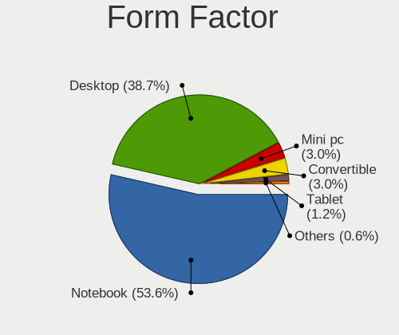
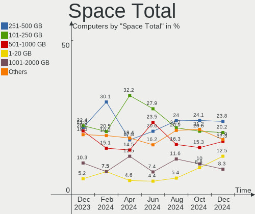
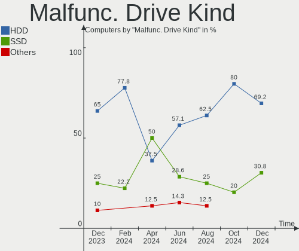
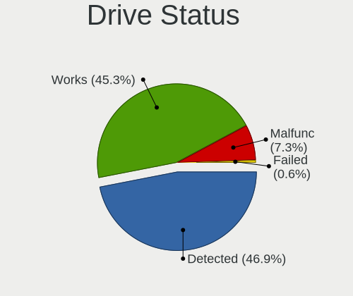
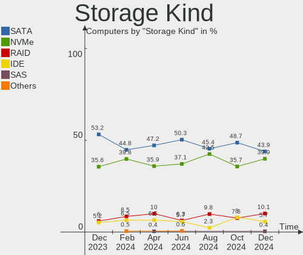
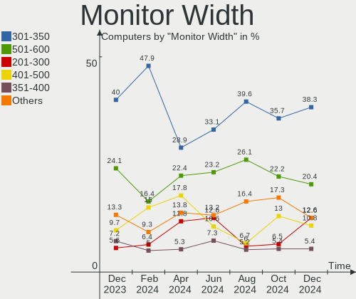
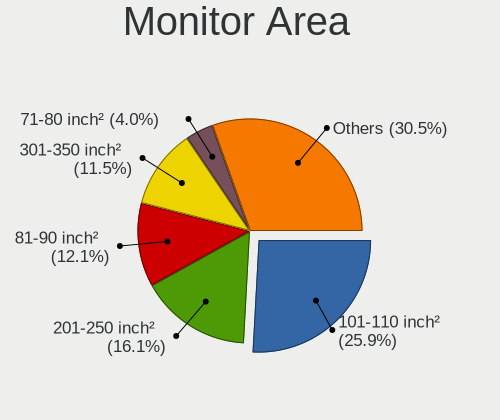
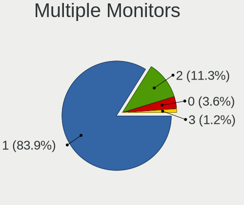
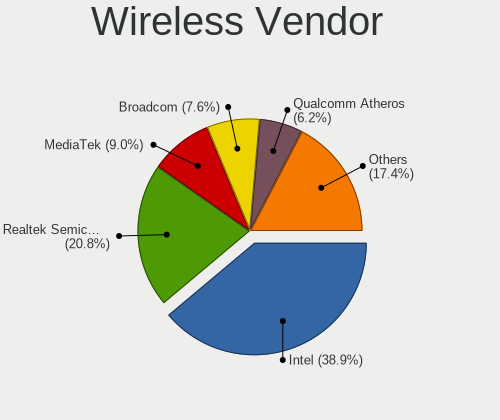
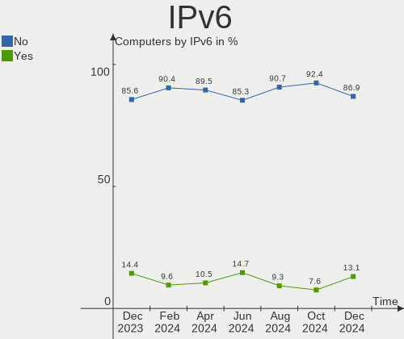

Linux in Spain - Hardware Trends
--------------------------------

A project to identify most popular hardware characteristics and track their change
over time based on data collected by Linux users at https://Linux-Hardware.org.

Anyone can contribute to this report by the [hw-probe](https://github.com/linuxhw/hw-probe) tool:

    sudo -E hw-probe -all -upload

This is a report for all computer types. See also reports for [desktops](/Location/Spain/Desktop/README.md) and [notebooks](/Location/Spain/Notebook/README.md).

Contents
--------

* [ System ](#system)
  - [ OS                       ](#os)
  - [ OS Family                ](#os-family)
  - [ Kernel                   ](#kernel)
  - [ Kernel Family            ](#kernel-family)
  - [ Kernel Major Ver.        ](#kernel-major-ver)
  - [ Arch                     ](#arch)
  - [ DE                       ](#de)
  - [ Display Server           ](#display-server)
  - [ Display Manager          ](#display-manager)
  - [ OS Lang                  ](#os-lang)
  - [ Boot Mode                ](#boot-mode)
  - [ Filesystem               ](#filesystem)
  - [ Part. scheme             ](#part-scheme)
  - [ Dual Boot with Linux/BSD ](#dual-boot-with-linuxbsd)
  - [ Dual Boot (Win)          ](#dual-boot-win)

* [ Board ](#board)
  - [ Vendor                   ](#vendor)
  - [ Model                    ](#model)
  - [ Model Family             ](#model-family)
  - [ MFG Year                 ](#mfg-year)
  - [ Form Factor              ](#form-factor)
  - [ Secure Boot              ](#secure-boot)
  - [ Coreboot                 ](#coreboot)
  - [ RAM Size                 ](#ram-size)
  - [ RAM Used                 ](#ram-used)
  - [ Total Drives             ](#total-drives)
  - [ Has CD-ROM               ](#has-cd-rom)
  - [ Has Ethernet             ](#has-ethernet)
  - [ Has WiFi                 ](#has-wifi)
  - [ Has Bluetooth            ](#has-bluetooth)

* [ Location ](#location)
  - [ Country                  ](#country)
  - [ City                     ](#city)

* [ Drives ](#drives)
  - [ Drive Vendor             ](#drive-vendor)
  - [ Drive Model              ](#drive-model)
  - [ HDD Vendor               ](#hdd-vendor)
  - [ SSD Vendor               ](#ssd-vendor)
  - [ Drive Kind               ](#drive-kind)
  - [ Drive Connector          ](#drive-connector)
  - [ Drive Size               ](#drive-size)
  - [ Space Total              ](#space-total)
  - [ Space Used               ](#space-used)
  - [ Malfunc. Drives          ](#malfunc-drives)
  - [ Malfunc. Drive Vendor    ](#malfunc-drive-vendor)
  - [ Malfunc. HDD Vendor      ](#malfunc-hdd-vendor)
  - [ Malfunc. Drive Kind      ](#malfunc-drive-kind)
  - [ Failed Drives            ](#failed-drives)
  - [ Failed Drive Vendor      ](#failed-drive-vendor)
  - [ Drive Status             ](#drive-status)

* [ Storage controller ](#storage-controller)
  - [ Storage Vendor           ](#storage-vendor)
  - [ Storage Model            ](#storage-model)
  - [ Storage Kind             ](#storage-kind)

* [ Processor ](#processor)
  - [ CPU Vendor               ](#cpu-vendor)
  - [ CPU Model                ](#cpu-model)
  - [ CPU Model Family         ](#cpu-model-family)
  - [ CPU Cores                ](#cpu-cores)
  - [ CPU Sockets              ](#cpu-sockets)
  - [ CPU Threads              ](#cpu-threads)
  - [ CPU Op-Modes             ](#cpu-op-modes)
  - [ CPU Microcode            ](#cpu-microcode)
  - [ CPU Microarch            ](#cpu-microarch)

* [ Graphics ](#graphics)
  - [ GPU Vendor               ](#gpu-vendor)
  - [ GPU Model                ](#gpu-model)
  - [ GPU Combo                ](#gpu-combo)
  - [ GPU Driver               ](#gpu-driver)
  - [ GPU Memory               ](#gpu-memory)

* [ Monitor ](#monitor)
  - [ Monitor Vendor           ](#monitor-vendor)
  - [ Monitor Model            ](#monitor-model)
  - [ Monitor Resolution       ](#monitor-resolution)
  - [ Monitor Diagonal         ](#monitor-diagonal)
  - [ Monitor Width            ](#monitor-width)
  - [ Aspect Ratio             ](#aspect-ratio)
  - [ Monitor Area             ](#monitor-area)
  - [ Pixel Density            ](#pixel-density)
  - [ Multiple Monitors        ](#multiple-monitors)

* [ Network ](#network)
  - [ Net Controller Vendor    ](#net-controller-vendor)
  - [ Net Controller Model     ](#net-controller-model)
  - [ Wireless Vendor          ](#wireless-vendor)
  - [ Wireless Model           ](#wireless-model)
  - [ Ethernet Vendor          ](#ethernet-vendor)
  - [ Ethernet Model           ](#ethernet-model)
  - [ Net Controller Kind      ](#net-controller-kind)
  - [ Used Controller          ](#used-controller)
  - [ NICs                     ](#nics)
  - [ IPv6                     ](#ipv6)

* [ Bluetooth ](#bluetooth)
  - [ Bluetooth Vendor         ](#bluetooth-vendor)
  - [ Bluetooth Model          ](#bluetooth-model)

* [ Sound ](#sound)
  - [ Sound Vendor             ](#sound-vendor)
  - [ Sound Model              ](#sound-model)

* [ Memory ](#memory)
  - [ Memory Vendor            ](#memory-vendor)
  - [ Memory Model             ](#memory-model)
  - [ Memory Kind              ](#memory-kind)
  - [ Memory Form Factor       ](#memory-form-factor)
  - [ Memory Size              ](#memory-size)
  - [ Memory Speed             ](#memory-speed)

* [ Printers & scanners ](#printers--scanners)
  - [ Printer Vendor           ](#printer-vendor)
  - [ Printer Model            ](#printer-model)
  - [ Scanner Vendor           ](#scanner-vendor)
  - [ Scanner Model            ](#scanner-model)

* [ Camera ](#camera)
  - [ Camera Vendor            ](#camera-vendor)
  - [ Camera Model             ](#camera-model)

* [ Security ](#security)
  - [ Fingerprint Vendor       ](#fingerprint-vendor)
  - [ Fingerprint Model        ](#fingerprint-model)
  - [ Chipcard Vendor          ](#chipcard-vendor)
  - [ Chipcard Model           ](#chipcard-model)

* [ Unsupported ](#unsupported)
  - [ Unsupported Devices      ](#unsupported-devices)
  - [ Unsupported Device Types ](#unsupported-device-types)

System
------

OS
--

Installed operating systems

| Name                         | Computers | Percent |
|------------------------------|-----------|---------|
| Ubuntu 22.04                 | 25        | 17.61%  |
| Debian 11                    | 14        | 9.86%   |
| Linux Mint 20.3              | 12        | 8.45%   |
| Ubuntu 20.04                 | 11        | 7.75%   |
| OpenMandriva 4.3             | 10        | 7.04%   |
| Zorin 16                     | 6         | 4.23%   |
| Manjaro                      | 5         | 3.52%   |
| Fedora 36                    | 5         | 3.52%   |
| Fedora 35                    | 5         | 3.52%   |
| Xubuntu 20.04                | 3         | 2.11%   |
| KDE neon 20.04               | 3         | 2.11%   |
| Gentoo 2.7                   | 3         | 2.11%   |
| SteamOS 3.2                  | 2         | 1.41%   |
| Pop!_OS 22.04                | 2         | 1.41%   |
| LMDE 5                       | 2         | 1.41%   |
| Kubuntu 22.04                | 2         | 1.41%   |
| Kali 2022.2                  | 2         | 1.41%   |
| Elementary 6.1               | 2         | 1.41%   |
| ArcoLinux Rolling            | 2         | 1.41%   |
| Arch Rolling                 | 2         | 1.41%   |
| Xubuntu 22.04                | 1         | 0.7%    |
| Ubuntu MATE 22.04            | 1         | 0.7%    |
| Ubuntu MATE 20.04            | 1         | 0.7%    |
| Ubuntu Budgie 21.10          | 1         | 0.7%    |
| Ubuntu 21.10                 | 1         | 0.7%    |
| Ubuntu 18.04                 | 1         | 0.7%    |
| Pop!_OS 21.10                | 1         | 0.7%    |
| Parrot 5.0                   | 1         | 0.7%    |
| openSUSE Tumbleweed-XXXXXXXX | 1         | 0.7%    |
| OpenMandriva 4.2             | 1         | 0.7%    |
| Manjaro 21.2.6               | 1         | 0.7%    |
| Lubuntu 22.04                | 1         | 0.7%    |
| Linux Mint 20.1              | 1         | 0.7%    |
| Linux Mint 19.3              | 1         | 0.7%    |
| Linux Mint 19                | 1         | 0.7%    |
| Kubuntu 20.04                | 1         | 0.7%    |
| Gentoo 2.6                   | 1         | 0.7%    |
| Fedora 33                    | 1         | 0.7%    |
| Endless 4.0.6                | 1         | 0.7%    |
| EndeavourOS                  | 1         | 0.7%    |
| Debian Testing               | 1         | 0.7%    |
| Debian 10                    | 1         | 0.7%    |
| Arch                         | 1         | 0.7%    |
| Alpine 3.15.4                | 1         | 0.7%    |

OS Family
---------

OS without a version

| Name          | Computers | Percent |
|---------------|-----------|---------|
| Ubuntu        | 38        | 26.76%  |
| Debian        | 16        | 11.27%  |
| Linux Mint    | 15        | 10.56%  |
| OpenMandriva  | 11        | 7.75%   |
| Fedora        | 11        | 7.75%   |
| Zorin         | 6         | 4.23%   |
| Manjaro       | 6         | 4.23%   |
| Xubuntu       | 4         | 2.82%   |
| Gentoo        | 4         | 2.82%   |
| Pop!_OS       | 3         | 2.11%   |
| Kubuntu       | 3         | 2.11%   |
| KDE neon      | 3         | 2.11%   |
| Arch          | 3         | 2.11%   |
| Ubuntu MATE   | 2         | 1.41%   |
| SteamOS       | 2         | 1.41%   |
| LMDE          | 2         | 1.41%   |
| Kali          | 2         | 1.41%   |
| Elementary    | 2         | 1.41%   |
| ArcoLinux     | 2         | 1.41%   |
| Ubuntu Budgie | 1         | 0.7%    |
| Parrot        | 1         | 0.7%    |
| openSUSE      | 1         | 0.7%    |
| Lubuntu       | 1         | 0.7%    |
| Endless       | 1         | 0.7%    |
| EndeavourOS   | 1         | 0.7%    |
| Alpine        | 1         | 0.7%    |

Kernel
------

Version of the Linux kernel

| Version                                      | Computers | Percent |
|----------------------------------------------|-----------|---------|
| 5.15.0-27-generic                            | 12        | 8.45%   |
| 5.10.0-14-amd64                              | 11        | 7.75%   |
| 5.16.7-desktop-1omv4003                      | 10        | 7.04%   |
| 5.13.0-40-generic                            | 10        | 7.04%   |
| 5.15.0-30-generic                            | 8         | 5.63%   |
| 5.4.0-109-generic                            | 7         | 4.93%   |
| 5.13.0-41-generic                            | 6         | 4.23%   |
| 5.4.0-110-generic                            | 5         | 3.52%   |
| 5.15.0-33-generic                            | 5         | 3.52%   |
| 5.17.5-76051705-generic                      | 3         | 2.11%   |
| 5.17.4-200.fc35.x86_64                       | 3         | 2.11%   |
| 5.13.0-44-generic                            | 3         | 2.11%   |
| 5.4.0-113-generic                            | 2         | 1.41%   |
| 5.17.6-300.fc36.x86_64                       | 2         | 1.41%   |
| 5.17.5-300.fc36.x86_64                       | 2         | 1.41%   |
| 5.16.0-kali7-amd64                           | 2         | 1.41%   |
| 5.15.32-gentoo-r1-x86_64                     | 2         | 1.41%   |
| 5.13.0-30-generic                            | 2         | 1.41%   |
| 5.10.0-13-amd64                              | 2         | 1.41%   |
| 5.10.0-10-amd64                              | 2         | 1.41%   |
| 5.4.192-1-MANJARO                            | 1         | 0.7%    |
| 5.4.0-91-generic                             | 1         | 0.7%    |
| 5.4.0-107-generic                            | 1         | 0.7%    |
| 5.18.1-arch1-1                               | 1         | 0.7%    |
| 5.18.0-arch1-1                               | 1         | 0.7%    |
| 5.18.0-1-MANJARO                             | 1         | 0.7%    |
| 5.18.0-051800rc7-generic                     | 1         | 0.7%    |
| 5.17.9-arch1-1                               | 1         | 0.7%    |
| 5.17.8-300.fc36.x86_64                       | 1         | 0.7%    |
| 5.17.8-200.fc35.x86_64                       | 1         | 0.7%    |
| 5.17.5-arch1-1                               | 1         | 0.7%    |
| 5.17.5-200.fc35.x86_64                       | 1         | 0.7%    |
| 5.17.1-3-MANJARO                             | 1         | 0.7%    |
| 5.17.0-1-amd64                               | 1         | 0.7%    |
| 5.16.6-051606-generic                        | 1         | 0.7%    |
| 5.16.4-1-default                             | 1         | 0.7%    |
| 5.16.0-12parrot1-amd64                       | 1         | 0.7%    |
| 5.15.5-051505-generic                        | 1         | 0.7%    |
| 5.15.41-1-MANJARO                            | 1         | 0.7%    |
| 5.15.41-1-lts                                | 1         | 0.7%    |
| 5.15.38-1-MANJARO                            | 1         | 0.7%    |
| 5.15.37-1-lts                                | 1         | 0.7%    |
| 5.15.37-0-lts                                | 1         | 0.7%    |
| 5.15.32-gentoo-r1-meguias-6.4                | 1         | 0.7%    |
| 5.15.32-gentoo-r1                            | 1         | 0.7%    |
| 5.15.32-1-MANJARO                            | 1         | 0.7%    |
| 5.15.0-32-generic                            | 1         | 0.7%    |
| 5.15.0-25-generic                            | 1         | 0.7%    |
| 5.15.0-1008-aws                              | 1         | 0.7%    |
| 5.15.0-1006-raspi                            | 1         | 0.7%    |
| 5.14.18-100.fc33.x86_64                      | 1         | 0.7%    |
| 5.14.0-1034-oem                              | 1         | 0.7%    |
| 5.13.0-valve15-1-neptune-02197-gf6ec7ad3762a | 1         | 0.7%    |
| 5.13.0-valve14-1-neptune-02195-g5b0f749d00fa | 1         | 0.7%    |
| 5.13.0-40-lowlatency                         | 1         | 0.7%    |
| 5.13.0-39-generic                            | 1         | 0.7%    |
| 5.13.0-27-generic                            | 1         | 0.7%    |
| 5.11.0-40-generic                            | 1         | 0.7%    |
| 5.11.0-35-generic                            | 1         | 0.7%    |
| 5.10.14-desktop-1omv4002                     | 1         | 0.7%    |

Kernel Family
-------------

Linux kernel without a distro release

| Version | Computers | Percent |
|---------|-----------|---------|
| 5.15.0  | 29        | 20.42%  |
| 5.13.0  | 26        | 18.31%  |
| 5.4.0   | 16        | 11.27%  |
| 5.10.0  | 16        | 11.27%  |
| 5.16.7  | 10        | 7.04%   |
| 5.17.5  | 7         | 4.93%   |
| 5.15.32 | 5         | 3.52%   |
| 5.18.0  | 3         | 2.11%   |
| 5.17.4  | 3         | 2.11%   |
| 5.16.0  | 3         | 2.11%   |
| 5.17.8  | 2         | 1.41%   |
| 5.17.6  | 2         | 1.41%   |
| 5.15.41 | 2         | 1.41%   |
| 5.15.37 | 2         | 1.41%   |
| 5.11.0  | 2         | 1.41%   |
| 5.4.192 | 1         | 0.7%    |
| 5.18.1  | 1         | 0.7%    |
| 5.17.9  | 1         | 0.7%    |
| 5.17.1  | 1         | 0.7%    |
| 5.17.0  | 1         | 0.7%    |
| 5.16.6  | 1         | 0.7%    |
| 5.16.4  | 1         | 0.7%    |
| 5.15.5  | 1         | 0.7%    |
| 5.15.38 | 1         | 0.7%    |
| 5.14.18 | 1         | 0.7%    |
| 5.14.0  | 1         | 0.7%    |
| 5.10.14 | 1         | 0.7%    |
| 4.19.0  | 1         | 0.7%    |
| 4.15.0  | 1         | 0.7%    |

Kernel Major Ver.
-----------------

Linux kernel major version

| Version | Computers | Percent |
|---------|-----------|---------|
| 5.15    | 40        | 28.17%  |
| 5.13    | 26        | 18.31%  |
| 5.4     | 17        | 11.97%  |
| 5.17    | 17        | 11.97%  |
| 5.10    | 17        | 11.97%  |
| 5.16    | 15        | 10.56%  |
| 5.18    | 4         | 2.82%   |
| 5.14    | 2         | 1.41%   |
| 5.11    | 2         | 1.41%   |
| 4.19    | 1         | 0.7%    |
| 4.15    | 1         | 0.7%    |

Arch
----

OS architecture (x86_64, i586, etc.)

| Name    | Computers | Percent |
|---------|-----------|---------|
| x86_64  | 140       | 98.59%  |
| i686    | 1         | 0.7%    |
| aarch64 | 1         | 0.7%    |

DE
--

Desktop Environment

| Name       | Computers | Percent |
|------------|-----------|---------|
| GNOME      | 66        | 46.48%  |
| KDE5       | 28        | 19.72%  |
| X-Cinnamon | 18        | 12.68%  |
| XFCE       | 14        | 9.86%   |
| MATE       | 5         | 3.52%   |
| Unknown    | 4         | 2.82%   |
| qtile      | 1         | 0.7%    |
| Pantheon   | 1         | 0.7%    |
| LXQt       | 1         | 0.7%    |
| i3         | 1         | 0.7%    |
| Cutefish   | 1         | 0.7%    |
| Cinnamon   | 1         | 0.7%    |
| Budgie     | 1         | 0.7%    |

Display Server
--------------

X11 or Wayland

| Name    | Computers | Percent |
|---------|-----------|---------|
| X11     | 101       | 71.13%  |
| Wayland | 34        | 23.94%  |
| Tty     | 4         | 2.82%   |
| Unknown | 3         | 2.11%   |

Display Manager
---------------

SDDM, LightDM, etc.

| Name    | Computers | Percent |
|---------|-----------|---------|
| Unknown | 48        | 33.8%   |
| GDM3    | 35        | 24.65%  |
| SDDM    | 23        | 16.2%   |
| LightDM | 21        | 14.79%  |
| GDM     | 15        | 10.56%  |

OS Lang
-------

Language

| Lang       | Computers | Percent |
|------------|-----------|---------|
| es_ES      | 94        | 66.2%   |
| en_US      | 30        | 21.13%  |
| ca_ES      | 5         | 3.52%   |
| en_GB      | 3         | 2.11%   |
| C          | 3         | 2.11%   |
| ru_RU      | 1         | 0.7%    |
| pt_BR      | 1         | 0.7%    |
| eu_ES      | 1         | 0.7%    |
| es_ES.UTF8 | 1         | 0.7%    |
| de_DE      | 1         | 0.7%    |
| an_ES      | 1         | 0.7%    |
| Unknown    | 1         | 0.7%    |

Boot Mode
---------

EFI or BIOS

| Mode | Computers | Percent |
|------|-----------|---------|
| EFI  | 72        | 50.7%   |
| BIOS | 70        | 49.3%   |

Filesystem
----------

Type of filesystem

| Type    | Computers | Percent |
|---------|-----------|---------|
| Ext4    | 114       | 80.28%  |
| Overlay | 13        | 9.15%   |
| Btrfs   | 12        | 8.45%   |
| Xfs     | 2         | 1.41%   |
| Jfs     | 1         | 0.7%    |

Part. scheme
------------

Scheme of partitioning

| Type    | Computers | Percent |
|---------|-----------|---------|
| Unknown | 74        | 52.11%  |
| GPT     | 54        | 38.03%  |
| MBR     | 14        | 9.86%   |

Dual Boot with Linux/BSD
------------------------

Hosting more than one Linux/BSD

| Dual boot | Computers | Percent |
|-----------|-----------|---------|
| No        | 125       | 88.03%  |
| Yes       | 17        | 11.97%  |

Dual Boot (Win)
---------------

Hosting Linux and Windows

| Dual boot | Computers | Percent |
|-----------|-----------|---------|
| No        | 101       | 71.13%  |
| Yes       | 41        | 28.87%  |

Board
-----

Vendor
------

Motherboard manufacturer

| Name                    | Computers | Percent |
|-------------------------|-----------|---------|
| Hewlett-Packard         | 30        | 21.13%  |
| ASUSTek Computer        | 25        | 17.61%  |
| Lenovo                  | 18        | 12.68%  |
| MSI                     | 15        | 10.56%  |
| Dell                    | 8         | 5.63%   |
| Acer                    | 8         | 5.63%   |
| Gigabyte Technology     | 6         | 4.23%   |
| Chuwi                   | 4         | 2.82%   |
| ASRock                  | 3         | 2.11%   |
| Valve                   | 2         | 1.41%   |
| Toshiba                 | 2         | 1.41%   |
| SLIMBOOK                | 2         | 1.41%   |
| Medion                  | 2         | 1.41%   |
| ECS                     | 2         | 1.41%   |
| Samsung Electronics     | 1         | 0.7%    |
| Raspberry Pi Foundation | 1         | 0.7%    |
| Packard Bell            | 1         | 0.7%    |
| Notebook                | 1         | 0.7%    |
| Microsoft               | 1         | 0.7%    |
| MACHINIST               | 1         | 0.7%    |
| Intel                   | 1         | 0.7%    |
| HONOR                   | 1         | 0.7%    |
| Fujitsu                 | 1         | 0.7%    |
| Foxconn                 | 1         | 0.7%    |
| Fanless Mini PC         | 1         | 0.7%    |
| BESSTAR Tech            | 1         | 0.7%    |
| Apple                   | 1         | 0.7%    |
| AMI                     | 1         | 0.7%    |
| Unknown                 | 1         | 0.7%    |

Model
-----

Motherboard model

| Name                                       | Computers | Percent |
|--------------------------------------------|-----------|---------|
| Valve Jupiter                              | 2         | 1.41%   |
| Lenovo V145-15AST 81MT                     | 2         | 1.41%   |
| Lenovo IdeaPad 3 15ITL6 82H8               | 2         | 1.41%   |
| HP ProBook 450 G8 Notebook PC              | 2         | 1.41%   |
| HP Pavilion Gaming Laptop 16-a0xxx         | 2         | 1.41%   |
| HP Pavilion g6                             | 2         | 1.41%   |
| HP EliteBook 840 G5                        | 2         | 1.41%   |
| Dell Latitude 5420                         | 2         | 1.41%   |
| Toshiba Satellite L10W-B-101               | 1         | 0.7%    |
| Toshiba PORTEGE Z830                       | 1         | 0.7%    |
| SLIMBOOK EXECUTIVE-14                      | 1         | 0.7%    |
| SLIMBOOK Essential15L                      | 1         | 0.7%    |
| Samsung RF510/RF410/RF710                  | 1         | 0.7%    |
| RPi Raspberry Pi                           | 1         | 0.7%    |
| Packard Bell IMEDIA S3720                  | 1         | 0.7%    |
| Notebook PD5x_7xPNP_PNN_PNT                | 1         | 0.7%    |
| MSI Prestige 15 A11SCS                     | 1         | 0.7%    |
| MSI Prestige 14 A12UC                      | 1         | 0.7%    |
| MSI PR600                                  | 1         | 0.7%    |
| MSI MS-7C92                                | 1         | 0.7%    |
| MSI MS-7C88                                | 1         | 0.7%    |
| MSI MS-7B84                                | 1         | 0.7%    |
| MSI MS-7B17                                | 1         | 0.7%    |
| MSI MS-7A40                                | 1         | 0.7%    |
| MSI MS-7A38                                | 1         | 0.7%    |
| MSI MS-7971                                | 1         | 0.7%    |
| MSI Modern 14 B11MO                        | 1         | 0.7%    |
| MSI GP62MVR 6RF                            | 1         | 0.7%    |
| MSI GF63 Thin 9SC                          | 1         | 0.7%    |
| MSI GE62 6QE                               | 1         | 0.7%    |
| MSI GE62 2QD                               | 1         | 0.7%    |
| Microsoft Surface Laptop 3                 | 1         | 0.7%    |
| Medion S6421 MD60703                       | 1         | 0.7%    |
| Medion MD34189/C731                        | 1         | 0.7%    |
| MACHINIST X99-RS9 V2.0                     | 1         | 0.7%    |
| Lenovo Y520-15IKBN 80WK                    | 1         | 0.7%    |
| Lenovo ThinkPad X270 W10DG 20K6000UUS      | 1         | 0.7%    |
| Lenovo ThinkPad X250 20CLS0LE00            | 1         | 0.7%    |
| Lenovo ThinkPad X200s 74663RG              | 1         | 0.7%    |
| Lenovo ThinkCentre M58p 6137E61            | 1         | 0.7%    |
| Lenovo ThinkBook 14s Yoga ITL 20WE         | 1         | 0.7%    |
| Lenovo Legion 5 Pro 16IAH7H 82RF           | 1         | 0.7%    |
| Lenovo Legion 5 15ACH6H 82JU               | 1         | 0.7%    |
| Lenovo IdeaPadFlex 5 14ALC05 82HU          | 1         | 0.7%    |
| Lenovo IdeaPad 330-15IKB 81DE              | 1         | 0.7%    |
| Lenovo IdeaPad 320-15IKB 80XL              | 1         | 0.7%    |
| Lenovo IdeaCentre AIO 3 24ARE05 F0EW00GRSP | 1         | 0.7%    |
| Lenovo G580 2189                           | 1         | 0.7%    |
| Lenovo G580 20150                          | 1         | 0.7%    |
| Intel NUC8i3BEH                            | 1         | 0.7%    |
| HONOR HLYL-WXX9                            | 1         | 0.7%    |
| HP Z1 Entry Tower G5                       | 1         | 0.7%    |
| HP Victus by Laptop 16-e0xxx               | 1         | 0.7%    |
| HP Spectre x360 Convertible 13-ae0xx       | 1         | 0.7%    |
| HP ProLiant DL380p Gen8                    | 1         | 0.7%    |
| HP ProBook 6470b                           | 1         | 0.7%    |
| HP Pavilion Gaming Desktop TG01-1xxx       | 1         | 0.7%    |
| HP Pavilion Desktop 595-p0xxx              | 1         | 0.7%    |
| HP Pavilion All-in-One Desktop 27-ca0xxx   | 1         | 0.7%    |
| HP Pavilion All-in-One 27-d1xxx            | 1         | 0.7%    |

Model Family
------------

Motherboard model prefix

| Name                  | Computers | Percent |
|-----------------------|-----------|---------|
| HP Pavilion           | 8         | 5.63%   |
| Acer Aspire           | 6         | 4.23%   |
| Lenovo IdeaPad        | 4         | 2.82%   |
| Dell Latitude         | 4         | 2.82%   |
| ASUS TUF              | 4         | 2.82%   |
| Lenovo ThinkPad       | 3         | 2.11%   |
| HP ProBook            | 3         | 2.11%   |
| HP Laptop             | 3         | 2.11%   |
| ASUS VivoBook         | 3         | 2.11%   |
| Valve Jupiter         | 2         | 1.41%   |
| MSI Prestige          | 2         | 1.41%   |
| MSI GE62              | 2         | 1.41%   |
| Lenovo V145-15AST     | 2         | 1.41%   |
| Lenovo Legion         | 2         | 1.41%   |
| Lenovo G580           | 2         | 1.41%   |
| HP ENVY               | 2         | 1.41%   |
| HP EliteBook          | 2         | 1.41%   |
| HP Compaq             | 2         | 1.41%   |
| Dell Inspiron         | 2         | 1.41%   |
| ASUS Crosshair        | 2         | 1.41%   |
| ASUS ASUS             | 2         | 1.41%   |
| Acer TravelMate       | 2         | 1.41%   |
| Toshiba Satellite     | 1         | 0.7%    |
| Toshiba PORTEGE       | 1         | 0.7%    |
| SLIMBOOK EXECUTIVE-14 | 1         | 0.7%    |
| SLIMBOOK Essential15L | 1         | 0.7%    |
| Samsung RF510         | 1         | 0.7%    |
| RPi Raspberry         | 1         | 0.7%    |
| Packard Bell IMEDIA   | 1         | 0.7%    |
| Notebook PD5x         | 1         | 0.7%    |
| MSI PR600             | 1         | 0.7%    |
| MSI MS-7C92           | 1         | 0.7%    |
| MSI MS-7C88           | 1         | 0.7%    |
| MSI MS-7B84           | 1         | 0.7%    |
| MSI MS-7B17           | 1         | 0.7%    |
| MSI MS-7A40           | 1         | 0.7%    |
| MSI MS-7A38           | 1         | 0.7%    |
| MSI MS-7971           | 1         | 0.7%    |
| MSI Modern            | 1         | 0.7%    |
| MSI GP62MVR           | 1         | 0.7%    |
| MSI GF63              | 1         | 0.7%    |
| Microsoft Surface     | 1         | 0.7%    |
| Medion S6421          | 1         | 0.7%    |
| Medion MD34189        | 1         | 0.7%    |
| MACHINIST X99-RS9     | 1         | 0.7%    |
| Lenovo Y520-15IKBN    | 1         | 0.7%    |
| Lenovo ThinkCentre    | 1         | 0.7%    |
| Lenovo ThinkBook      | 1         | 0.7%    |
| Lenovo IdeaPadFlex    | 1         | 0.7%    |
| Lenovo IdeaCentre     | 1         | 0.7%    |
| Intel NUC8i3BEH       | 1         | 0.7%    |
| HONOR HLYL-WXX9       | 1         | 0.7%    |
| HP Z1                 | 1         | 0.7%    |
| HP Victus             | 1         | 0.7%    |
| HP Spectre            | 1         | 0.7%    |
| HP ProLiant           | 1         | 0.7%    |
| HP OMEN               | 1         | 0.7%    |
| HP Notebook           | 1         | 0.7%    |
| HP Mini               | 1         | 0.7%    |
| HP EliteDesk          | 1         | 0.7%    |

MFG Year
--------

Motherboard manufacture year

| Year    | Computers | Percent |
|---------|-----------|---------|
| 2021    | 21        | 14.79%  |
| 2020    | 18        | 12.68%  |
| 2018    | 14        | 9.86%   |
| 2019    | 13        | 9.15%   |
| 2017    | 12        | 8.45%   |
| 2022    | 8         | 5.63%   |
| 2012    | 7         | 4.93%   |
| 2010    | 7         | 4.93%   |
| 2016    | 6         | 4.23%   |
| 2011    | 6         | 4.23%   |
| 2015    | 5         | 3.52%   |
| 2014    | 5         | 3.52%   |
| 2009    | 5         | 3.52%   |
| 2013    | 4         | 2.82%   |
| 2008    | 3         | 2.11%   |
| 2007    | 3         | 2.11%   |
| 2006    | 2         | 1.41%   |
| 2005    | 2         | 1.41%   |
| Unknown | 1         | 0.7%    |

Form Factor
-----------

Physical design of the computer

| Name           | Computers | Percent |
|----------------|-----------|---------|
| Notebook       | 77        | 54.23%  |
| Desktop        | 50        | 35.21%  |
| Convertible    | 5         | 3.52%   |
| Mini pc        | 3         | 2.11%   |
| All in one     | 3         | 2.11%   |
| Stick pc       | 1         | 0.7%    |
| System on chip | 1         | 0.7%    |
| Tablet         | 1         | 0.7%    |
| Server         | 1         | 0.7%    |

Secure Boot
-----------

Enabled or disabled

| State    | Computers | Percent |
|----------|-----------|---------|
| Disabled | 133       | 93.66%  |
| Enabled  | 9         | 6.34%   |

Coreboot
--------

Have coreboot on board

| Used | Computers | Percent |
|------|-----------|---------|
| No   | 142       | 100%    |

RAM Size
--------

Total RAM memory

| Size in GB  | Computers | Percent |
|-------------|-----------|---------|
| 16.01-24.0  | 38        | 26.76%  |
| 4.01-8.0    | 32        | 22.54%  |
| 8.01-16.0   | 27        | 19.01%  |
| 3.01-4.0    | 17        | 11.97%  |
| 32.01-64.0  | 16        | 11.27%  |
| 1.01-2.0    | 5         | 3.52%   |
| 2.01-3.0    | 3         | 2.11%   |
| 64.01-256.0 | 3         | 2.11%   |
| 24.01-32.0  | 1         | 0.7%    |

RAM Used
--------

Used RAM memory

| Used GB   | Computers | Percent |
|-----------|-----------|---------|
| 1.01-2.0  | 58        | 40.85%  |
| 2.01-3.0  | 31        | 21.83%  |
| 4.01-8.0  | 30        | 21.13%  |
| 3.01-4.0  | 15        | 10.56%  |
| 0.51-1.0  | 4         | 2.82%   |
| 8.01-16.0 | 3         | 2.11%   |
| 0.01-0.5  | 1         | 0.7%    |

Total Drives
------------

Number of drives on board

| Drives | Computers | Percent |
|--------|-----------|---------|
| 1      | 86        | 60.56%  |
| 2      | 34        | 23.94%  |
| 3      | 12        | 8.45%   |
| 4      | 4         | 2.82%   |
| 0      | 3         | 2.11%   |
| 5      | 2         | 1.41%   |
| 6      | 1         | 0.7%    |

Has CD-ROM
----------

Has CD-ROM on board

| Presented | Computers | Percent |
|-----------|-----------|---------|
| No        | 105       | 73.94%  |
| Yes       | 37        | 26.06%  |

Has Ethernet
------------

Has Ethernet on board

| Presented | Computers | Percent |
|-----------|-----------|---------|
| Yes       | 116       | 81.69%  |
| No        | 26        | 18.31%  |

Has WiFi
--------

Has WiFi module

| Presented | Computers | Percent |
|-----------|-----------|---------|
| Yes       | 113       | 79.58%  |
| No        | 29        | 20.42%  |

Has Bluetooth
-------------

Has Bluetooth module

| Presented | Computers | Percent |
|-----------|-----------|---------|
| Yes       | 96        | 67.61%  |
| No        | 46        | 32.39%  |

Location
--------

Country
-------

Geographic location (country)

| Country | Computers | Percent |
|---------|-----------|---------|
| Spain   | 142       | 100%    |

City
----

Geographic location (city)

| City                        | Computers | Percent |
|-----------------------------|-----------|---------|
| Madrid                      | 24        | 16.9%   |
| Barcelona                   | 14        | 9.86%   |
| Seville                     | 6         | 4.23%   |
| Valencia                    | 3         | 2.11%   |
| Oviedo                      | 3         | 2.11%   |
| Zaragoza                    | 2         | 1.41%   |
| Vitoria-Gasteiz             | 2         | 1.41%   |
| Sabadell                    | 2         | 1.41%   |
| León                       | 2         | 1.41%   |
| Granada                     | 2         | 1.41%   |
| Almería                    | 2         | 1.41%   |
| Alcobendas                  | 2         | 1.41%   |
| Yepes                       | 1         | 0.7%    |
| Vinaros                     | 1         | 0.7%    |
| Villamanta                  | 1         | 0.7%    |
| Vilagarcia de Arousa        | 1         | 0.7%    |
| Valladolid                  | 1         | 0.7%    |
| Valdemoro                   | 1         | 0.7%    |
| Torrijos                    | 1         | 0.7%    |
| Torrevieja                  | 1         | 0.7%    |
| Torrefarrera                | 1         | 0.7%    |
| Torre Pacheco               | 1         | 0.7%    |
| Torre del Mar               | 1         | 0.7%    |
| Toledo                      | 1         | 0.7%    |
| Telde                       | 1         | 0.7%    |
| Talavera de la Reina        | 1         | 0.7%    |
| Sesena                      | 1         | 0.7%    |
| Sarrion                     | 1         | 0.7%    |
| Santiago de Compostela      | 1         | 0.7%    |
| Santa Coloma de Gramenet    | 1         | 0.7%    |
| Sant Pere de Vilamajor      | 1         | 0.7%    |
| Sant Feliu de Llobregat     | 1         | 0.7%    |
| Sangonera la Verde          | 1         | 0.7%    |
| San Sebastián de los Reyes | 1         | 0.7%    |
| San Cristóbal de La Laguna | 1         | 0.7%    |
| Puebla de Alcocer           | 1         | 0.7%    |
| Porzuna                     | 1         | 0.7%    |
| Ponferrada                  | 1         | 0.7%    |
| Petrel                      | 1         | 0.7%    |
| Paredes de Nava             | 1         | 0.7%    |
| Pamplona                    | 1         | 0.7%    |
| Palma                       | 1         | 0.7%    |
| Novelda                     | 1         | 0.7%    |
| Mostoles                    | 1         | 0.7%    |
| Montornès del Vallès      | 1         | 0.7%    |
| Montijo                     | 1         | 0.7%    |
| Monreal                     | 1         | 0.7%    |
| Molina de Segura            | 1         | 0.7%    |
| Miengo                      | 1         | 0.7%    |
| Marbella                    | 1         | 0.7%    |
| Manresa                     | 1         | 0.7%    |
| Málaga                     | 1         | 0.7%    |
| Logroño                    | 1         | 0.7%    |
| Las Palmas de Gran Canaria  | 1         | 0.7%    |
| la Nucia                    | 1         | 0.7%    |
| L'Alcudia de Crespins       | 1         | 0.7%    |
| Jerez de la Frontera        | 1         | 0.7%    |
| Ingenio                     | 1         | 0.7%    |
| Igualada                    | 1         | 0.7%    |
| Huelva                      | 1         | 0.7%    |

Drives
------

Drive Vendor
------------

Hard drive vendors

| Vendor                      | Computers | Drives | Percent |
|-----------------------------|-----------|--------|---------|
| Kingston                    | 31        | 32     | 15.35%  |
| Samsung Electronics         | 27        | 31     | 13.37%  |
| WDC                         | 23        | 27     | 11.39%  |
| Seagate                     | 23        | 27     | 11.39%  |
| Toshiba                     | 19        | 23     | 9.41%   |
| Micron Technology           | 11        | 11     | 5.45%   |
| SK Hynix                    | 10        | 10     | 4.95%   |
| Unknown                     | 8         | 9      | 3.96%   |
| Crucial                     | 6         | 7      | 2.97%   |
| KIOXIA                      | 5         | 6      | 2.48%   |
| HGST                        | 5         | 5      | 2.48%   |
| SanDisk                     | 4         | 4      | 1.98%   |
| Netac                       | 3         | 3      | 1.49%   |
| Intel                       | 3         | 3      | 1.49%   |
| Hitachi                     | 3         | 3      | 1.49%   |
| Phison                      | 2         | 2      | 0.99%   |
| Patriot                     | 2         | 2      | 0.99%   |
| KIOXIA-EXCERIA              | 2         | 2      | 0.99%   |
| Unknown                     | 2         | 2      | 0.99%   |
| Realtek                     | 1         | 1      | 0.5%    |
| PNY                         | 1         | 1      | 0.5%    |
| OCZ                         | 1         | 1      | 0.5%    |
| O2 Micro                    | 1         | 1      | 0.5%    |
| MAXIO Technology (Hangzhou) | 1         | 1      | 0.5%    |
| Lexar                       | 1         | 1      | 0.5%    |
| KingSpec                    | 1         | 1      | 0.5%    |
| KingFast                    | 1         | 1      | 0.5%    |
| JetFlash                    | 1         | 1      | 0.5%    |
| Fujitsu                     | 1         | 1      | 0.5%    |
| EMTEC                       | 1         | 1      | 0.5%    |
| BAITITON                    | 1         | 1      | 0.5%    |
| 2.5"                        | 1         | 1      | 0.5%    |

Drive Model
-----------

Hard drive models

| Model                                | Computers | Percent |
|--------------------------------------|-----------|---------|
| Kingston SA400S37240G 240GB SSD      | 7         | 3.23%   |
| Samsung NVMe SSD Drive 512GB         | 5         | 2.3%    |
| Kingston SA400S37480G 480GB SSD      | 5         | 2.3%    |
| Toshiba DT01ACA100 1TB               | 4         | 1.84%   |
| Micron NVMe SSD Drive 512GB          | 3         | 1.38%   |
| Kingston SV300S37A120G 120GB SSD     | 3         | 1.38%   |
| Kingston SUV400S37240G 240GB SSD     | 3         | 1.38%   |
| Kingston SA400S37120G 120GB SSD      | 3         | 1.38%   |
| HGST HTS721010A9E630 1TB             | 3         | 1.38%   |
| WDC WDS250G2B0A-00SM50 250GB SSD     | 2         | 0.92%   |
| WDC WD10EZEX-60WN4A0 1TB             | 2         | 0.92%   |
| Unknown MMC Card  64GB               | 2         | 0.92%   |
| Unknown MMC Card  128GB              | 2         | 0.92%   |
| Toshiba MQ01ABD075 752GB             | 2         | 0.92%   |
| Toshiba MQ01ABD050 500GB             | 2         | 0.92%   |
| SK Hynix NVMe SSD Drive 256GB        | 2         | 0.92%   |
| SK Hynix NVMe SSD Drive 128GB        | 2         | 0.92%   |
| Seagate ST3500418AS 500GB            | 2         | 0.92%   |
| Seagate ST3200822AS 200GB            | 2         | 0.92%   |
| Seagate ST31000528AS 1TB             | 2         | 0.92%   |
| Seagate ST1000DM010-2EP102 1TB       | 2         | 0.92%   |
| Samsung SSD 980 PRO 1TB              | 2         | 0.92%   |
| Samsung NVMe SSD Drive 1TB           | 2         | 0.92%   |
| Micron MTFDHBA512QFD 512GB           | 2         | 0.92%   |
| Kingston SA400S37960G 960GB SSD      | 2         | 0.92%   |
| Kingston NVMe SSD Drive 512GB        | 2         | 0.92%   |
| Crucial CT500P2SSD8 500GB            | 2         | 0.92%   |
| Unknown                              | 2         | 0.92%   |
| WDC WDS500G2B0A-00SM50 500GB SSD     | 1         | 0.46%   |
| WDC WDS250G3X0C-00SJG0 250GB         | 1         | 0.46%   |
| WDC WDS200T2B0C-00PXH0 2TB           | 1         | 0.46%   |
| WDC WDS100T2B0A-00SM50 1TB SSD       | 1         | 0.46%   |
| WDC WD5000LPLX-66ZNTT0 500GB         | 1         | 0.46%   |
| WDC WD5000LPLX-08ZNTT0 500GB         | 1         | 0.46%   |
| WDC WD5000AZLX-08K2TA0 500GB         | 1         | 0.46%   |
| WDC WD5000AADS-00S9B0 500GB          | 1         | 0.46%   |
| WDC WD50 00LPVX-80V0TT0 500GB        | 1         | 0.46%   |
| WDC WD40EFRX-68WT0N0 4TB             | 1         | 0.46%   |
| WDC WD40EFAX-68JH4N0 4TB             | 1         | 0.46%   |
| WDC WD3200AAKS-75VYA0 320GB          | 1         | 0.46%   |
| WDC WD1600BEKT-75A25T0 160GB         | 1         | 0.46%   |
| WDC WD10SPZX-21Z10T0 1TB             | 1         | 0.46%   |
| WDC WD10EZEX-08M2NA0 1TB             | 1         | 0.46%   |
| WDC WD10EZEX-00RKKA0 1TB             | 1         | 0.46%   |
| WDC WD1003FZEX-00MK2A0 1TB           | 1         | 0.46%   |
| WDC WD1002FAEX-00Z3A0 1TB            | 1         | 0.46%   |
| WDC WD1002FAEX-00Y9A0 1TB            | 1         | 0.46%   |
| WDC PC SN730 SDBPNTY-512G-1036 512GB | 1         | 0.46%   |
| WDC PC SN720 SDAPNTW-1T00-1006 1TB   | 1         | 0.46%   |
| WDC PC SN520 SDAPNUW-512G-1006 512GB | 1         | 0.46%   |
| Unknown SD/MMC/MS PRO 999GB          | 1         | 0.46%   |
| Unknown SC64G  64GB                  | 1         | 0.46%   |
| Unknown MMC Card  498GB              | 1         | 0.46%   |
| Unknown MMC Card  32GB               | 1         | 0.46%   |
| Toshiba TR150 240GB SSD              | 1         | 0.46%   |
| Toshiba THNSNW128GMCP 128GB SSD      | 1         | 0.46%   |
| Toshiba THNSNB128GMCJ 128GB SSD      | 1         | 0.46%   |
| Toshiba NVMe SSD Drive 1TB           | 1         | 0.46%   |
| Toshiba MK3275GSX 320GB              | 1         | 0.46%   |
| Toshiba MK3255GSX 320GB              | 1         | 0.46%   |

HDD Vendor
----------

Hard disk drive vendors

| Vendor              | Computers | Drives | Percent |
|---------------------|-----------|--------|---------|
| Seagate             | 22        | 26     | 34.38%  |
| WDC                 | 16        | 18     | 25%     |
| Toshiba             | 14        | 17     | 21.88%  |
| HGST                | 5         | 5      | 7.81%   |
| Hitachi             | 3         | 3      | 4.69%   |
| Samsung Electronics | 2         | 2      | 3.13%   |
| Unknown             | 1         | 1      | 1.56%   |
| Fujitsu             | 1         | 1      | 1.56%   |

SSD Vendor
----------

Solid state drive vendors

| Vendor              | Computers | Drives | Percent |
|---------------------|-----------|--------|---------|
| Kingston            | 26        | 27     | 40%     |
| Samsung Electronics | 8         | 8      | 12.31%  |
| WDC                 | 4         | 4      | 6.15%   |
| Crucial             | 4         | 5      | 6.15%   |
| Toshiba             | 3         | 3      | 4.62%   |
| SanDisk             | 3         | 3      | 4.62%   |
| Netac               | 3         | 3      | 4.62%   |
| SK Hynix            | 2         | 2      | 3.08%   |
| KIOXIA-EXCERIA      | 2         | 2      | 3.08%   |
| PNY                 | 1         | 1      | 1.54%   |
| Patriot             | 1         | 1      | 1.54%   |
| OCZ                 | 1         | 1      | 1.54%   |
| Micron Technology   | 1         | 1      | 1.54%   |
| Lexar               | 1         | 1      | 1.54%   |
| KingSpec            | 1         | 1      | 1.54%   |
| Intel               | 1         | 1      | 1.54%   |
| EMTEC               | 1         | 1      | 1.54%   |
| BAITITON            | 1         | 1      | 1.54%   |
| 2.5"                | 1         | 1      | 1.54%   |

Drive Kind
----------

HDD or SSD

| Kind    | Computers | Drives | Percent |
|---------|-----------|--------|---------|
| NVMe    | 61        | 68     | 32.62%  |
| HDD     | 57        | 73     | 30.48%  |
| SSD     | 56        | 67     | 29.95%  |
| MMC     | 10        | 11     | 5.35%   |
| Unknown | 3         | 3      | 1.6%    |

Drive Connector
---------------

SATA, SAS, NVMe, etc.

| Type | Computers | Drives | Percent |
|------|-----------|--------|---------|
| SATA | 90        | 139    | 54.22%  |
| NVMe | 61        | 67     | 36.75%  |
| MMC  | 10        | 11     | 6.02%   |
| SAS  | 5         | 5      | 3.01%   |

Drive Size
----------

Size of hard drive

| Size in TB | Computers | Drives | Percent |
|------------|-----------|--------|---------|
| 0.01-0.5   | 65        | 87     | 59.09%  |
| 0.51-1.0   | 36        | 42     | 32.73%  |
| 1.01-2.0   | 5         | 6      | 4.55%   |
| 3.01-4.0   | 2         | 2      | 1.82%   |
| 2.01-3.0   | 1         | 1      | 0.91%   |
| 4.01-10.0  | 1         | 2      | 0.91%   |

Space Total
-----------

Amount of disk space available on the file system

| Size in GB     | Computers | Percent |
|----------------|-----------|---------|
| 251-500        | 38        | 26.76%  |
| 101-250        | 38        | 26.76%  |
| 501-1000       | 17        | 11.97%  |
| 1-20           | 14        | 9.86%   |
| 1001-2000      | 12        | 8.45%   |
| 51-100         | 10        | 7.04%   |
| More than 3000 | 5         | 3.52%   |
| 21-50          | 3         | 2.11%   |
| Unknown        | 3         | 2.11%   |
| 2001-3000      | 2         | 1.41%   |

Space Used
----------

Amount of used disk space

| Used GB        | Computers | Percent |
|----------------|-----------|---------|
| 1-20           | 52        | 36.62%  |
| 21-50          | 27        | 19.01%  |
| 101-250        | 21        | 14.79%  |
| 51-100         | 19        | 13.38%  |
| 251-500        | 11        | 7.75%   |
| 1001-2000      | 3         | 2.11%   |
| 501-1000       | 3         | 2.11%   |
| Unknown        | 3         | 2.11%   |
| More than 3000 | 2         | 1.41%   |
| 2001-3000      | 1         | 0.7%    |

Malfunc. Drives
---------------

Drive models with a malfunction

| Model                                       | Computers | Drives | Percent |
|---------------------------------------------|-----------|--------|---------|
| Toshiba MQ01ABD075 752GB                    | 1         | 1      | 12.5%   |
| Seagate ST3500830AS 500GB                   | 1         | 1      | 12.5%   |
| Seagate ST3500418AS 500GB                   | 1         | 1      | 12.5%   |
| Seagate ST31000528AS 1TB                    | 1         | 1      | 12.5%   |
| Seagate ST1000LM035-1RK172 1TB              | 1         | 1      | 12.5%   |
| Samsung Electronics SSD SM871 2.5 7mm 256GB | 1         | 1      | 12.5%   |
| Samsung Electronics SSD 970 PRO 512GB       | 1         | 1      | 12.5%   |
| HGST HTS545050A7E680 500GB                  | 1         | 1      | 12.5%   |

Malfunc. Drive Vendor
---------------------

Vendors of faulty drives

| Vendor              | Computers | Drives | Percent |
|---------------------|-----------|--------|---------|
| Seagate             | 4         | 4      | 50%     |
| Samsung Electronics | 2         | 2      | 25%     |
| Toshiba             | 1         | 1      | 12.5%   |
| HGST                | 1         | 1      | 12.5%   |

Malfunc. HDD Vendor
-------------------

Vendors of faulty HDD drives

| Vendor  | Computers | Drives | Percent |
|---------|-----------|--------|---------|
| Seagate | 4         | 4      | 66.67%  |
| Toshiba | 1         | 1      | 16.67%  |
| HGST    | 1         | 1      | 16.67%  |

Malfunc. Drive Kind
-------------------

Kinds of faulty drives

| Kind | Computers | Drives | Percent |
|------|-----------|--------|---------|
| HDD  | 6         | 6      | 75%     |
| NVMe | 1         | 1      | 12.5%   |
| SSD  | 1         | 1      | 12.5%   |

Failed Drives
-------------

Failed drive models

Zero info for selected period =(

Failed Drive Vendor
-------------------

Failed drive vendors

Zero info for selected period =(

Drive Status
------------

Number of failed and malfunc. drives

| Status   | Computers | Drives | Percent |
|----------|-----------|--------|---------|
| Detected | 81        | 129    | 54.73%  |
| Works    | 59        | 85     | 39.86%  |
| Malfunc  | 8         | 8      | 5.41%   |

Storage controller
------------------

Storage Vendor
--------------

Storage controller vendors

| Vendor                       | Computers | Percent |
|------------------------------|-----------|---------|
| Intel                        | 86        | 45.5%   |
| AMD                          | 29        | 15.34%  |
| Samsung Electronics          | 18        | 9.52%   |
| Micron Technology            | 10        | 5.29%   |
| SK Hynix                     | 7         | 3.7%    |
| Sandisk                      | 6         | 3.17%   |
| Nvidia                       | 6         | 3.17%   |
| KIOXIA                       | 5         | 2.65%   |
| Kingston Technology Company  | 5         | 2.65%   |
| Toshiba America Info Systems | 3         | 1.59%   |
| Phison Electronics           | 3         | 1.59%   |
| Silicon Image                | 2         | 1.06%   |
| Micron/Crucial Technology    | 2         | 1.06%   |
| JMicron Technology           | 2         | 1.06%   |
| ASMedia Technology           | 2         | 1.06%   |
| O2 Micro                     | 1         | 0.53%   |
| MAXIO Technology (Hangzhou)  | 1         | 0.53%   |
| Hewlett-Packard              | 1         | 0.53%   |

Storage Model
-------------

Storage controller models

| Model                                                                          | Computers | Percent |
|--------------------------------------------------------------------------------|-----------|---------|
| AMD FCH SATA Controller [AHCI mode]                                            | 18        | 8.37%   |
| Micron Non-Volatile memory controller                                          | 10        | 4.65%   |
| Samsung NVMe SSD Controller SM981/PM981/PM983                                  | 9         | 4.19%   |
| Intel 82801 Mobile SATA Controller [RAID mode]                                 | 8         | 3.72%   |
| Intel Volume Management Device NVMe RAID Controller                            | 7         | 3.26%   |
| Samsung NVMe SSD Controller 980                                                | 6         | 2.79%   |
| Intel Sunrise Point-LP SATA Controller [AHCI mode]                             | 6         | 2.79%   |
| Intel SATA Controller [RAID mode]                                              | 5         | 2.33%   |
| KIOXIA Non-Volatile memory controller                                          | 4         | 1.86%   |
| Intel Q170/Q150/B150/H170/H110/Z170/CM236 Chipset SATA Controller [AHCI Mode]  | 4         | 1.86%   |
| Intel NM10/ICH7 Family SATA Controller [IDE mode]                              | 4         | 1.86%   |
| Intel Celeron/Pentium Silver Processor SATA Controller                         | 4         | 1.86%   |
| Intel Cannon Lake PCH SATA AHCI Controller                                     | 4         | 1.86%   |
| Intel 8 Series/C220 Series Chipset Family 6-port SATA Controller 1 [AHCI mode] | 4         | 1.86%   |
| Intel 7 Series Chipset Family 6-port SATA Controller [AHCI mode]               | 4         | 1.86%   |
| Intel 200 Series PCH SATA controller [AHCI mode]                               | 4         | 1.86%   |
| SK Hynix Gold P31 SSD                                                          | 3         | 1.4%    |
| Samsung NVMe SSD Controller PM9A1/PM9A3/980PRO                                 | 3         | 1.4%    |
| Intel HM170/QM170 Chipset SATA Controller [AHCI Mode]                          | 3         | 1.4%    |
| AMD SB7x0/SB8x0/SB9x0 SATA Controller [IDE mode]                               | 3         | 1.4%    |
| AMD SB7x0/SB8x0/SB9x0 IDE Controller                                           | 3         | 1.4%    |
| AMD 500 Series Chipset SATA Controller                                         | 3         | 1.4%    |
| AMD 400 Series Chipset SATA Controller                                         | 3         | 1.4%    |
| Toshiba America Info Systems BG3 NVMe SSD Controller                           | 2         | 0.93%   |
| SK Hynix BC511                                                                 | 2         | 0.93%   |
| SK Hynix BC501 NVMe Solid State Drive                                          | 2         | 0.93%   |
| Silicon Image SiI 3132 Serial ATA Raid II Controller                           | 2         | 0.93%   |
| Sandisk WD Black SN750 / PC SN730 NVMe SSD                                     | 2         | 0.93%   |
| Nvidia CK804 Serial ATA Controller                                             | 2         | 0.93%   |
| Nvidia CK804 IDE                                                               | 2         | 0.93%   |
| Micron/Crucial P2 NVMe PCIe SSD                                                | 2         | 0.93%   |
| Kingston Company U-SNS8154P3 NVMe SSD                                          | 2         | 0.93%   |
| Kingston Company Company Non-Volatile memory controller                        | 2         | 0.93%   |
| JMicron JMB363 SATA/IDE Controller                                             | 2         | 0.93%   |
| Intel Tiger Lake-LP SATA Controller [AHCI mode]                                | 2         | 0.93%   |
| Intel Ice Lake-LP SATA Controller [AHCI mode]                                  | 2         | 0.93%   |
| Intel Cannon Point-LP SATA Controller [AHCI Mode]                              | 2         | 0.93%   |
| Intel Atom Processor E3800 Series SATA AHCI Controller                         | 2         | 0.93%   |
| Intel 82801IBM/IEM (ICH9M/ICH9M-E) 4 port SATA Controller [AHCI mode]          | 2         | 0.93%   |
| Intel 82801G (ICH7 Family) IDE Controller                                      | 2         | 0.93%   |
| Intel 8 Series SATA Controller 1 [AHCI mode]                                   | 2         | 0.93%   |
| Intel 5 Series/3400 Series Chipset 4 port SATA AHCI Controller                 | 2         | 0.93%   |
| ASMedia ASM1062 Serial ATA Controller                                          | 2         | 0.93%   |
| AMD SB7x0/SB8x0/SB9x0 SATA Controller [AHCI mode]                              | 2         | 0.93%   |
| Toshiba America Info Systems XG6 NVMe SSD Controller                           | 1         | 0.47%   |
| Sandisk WD Blue SN570 NVMe SSD                                                 | 1         | 0.47%   |
| Sandisk WD Blue SN500 / PC SN520 NVMe SSD                                      | 1         | 0.47%   |
| Sandisk WD Black 2018/SN750 / PC SN720 NVMe SSD                                | 1         | 0.47%   |
| Sandisk Non-Volatile memory controller                                         | 1         | 0.47%   |
| Samsung NVMe SSD Controller SM951/PM951                                        | 1         | 0.47%   |
| Phison PS5013 E13 NVMe Controller                                              | 1         | 0.47%   |
| Phison Electronics Non-Volatile memory controller                              | 1         | 0.47%   |
| Phison E16 PCIe4 NVMe Controller                                               | 1         | 0.47%   |
| O2 Micro Non-Volatile memory controller                                        | 1         | 0.47%   |
| Nvidia MCP79 AHCI Controller                                                   | 1         | 0.47%   |
| Nvidia MCP73 IDE Controller                                                    | 1         | 0.47%   |
| Nvidia MCP61 SATA Controller                                                   | 1         | 0.47%   |
| Nvidia MCP61 IDE                                                               | 1         | 0.47%   |
| Nvidia MCP55 SATA Controller                                                   | 1         | 0.47%   |
| Nvidia MCP55 IDE                                                               | 1         | 0.47%   |

Storage Kind
------------

Kind of storage controller (IDE, SATA, NVMe, SAS, ...)

| Kind | Computers | Percent |
|------|-----------|---------|
| SATA | 88        | 45.36%  |
| NVMe | 61        | 31.44%  |
| RAID | 23        | 11.86%  |
| IDE  | 21        | 10.82%  |
| SAS  | 1         | 0.52%   |

Processor
---------

CPU Vendor
----------

Processor vendors

| Vendor | Computers | Percent |
|--------|-----------|---------|
| Intel  | 102       | 71.83%  |
| AMD    | 39        | 27.46%  |
| ARM    | 1         | 0.7%    |

CPU Model
---------

Processor models

| Model                                        | Computers | Percent |
|----------------------------------------------|-----------|---------|
| Intel 11th Gen Core i7-1165G7 @ 2.80GHz      | 4         | 2.82%   |
| Intel Core i5-8250U CPU @ 1.60GHz            | 3         | 2.11%   |
| Intel Core i5-1035G1 CPU @ 1.00GHz           | 3         | 2.11%   |
| Intel 11th Gen Core i5-1135G7 @ 2.40GHz      | 3         | 2.11%   |
| AMD Ryzen 7 5700U with Radeon Graphics       | 3         | 2.11%   |
| Intel Core i9-9900KF CPU @ 3.60GHz           | 2         | 1.41%   |
| Intel Core i9-9900K CPU @ 3.60GHz            | 2         | 1.41%   |
| Intel Core i7-8700 CPU @ 3.20GHz             | 2         | 1.41%   |
| Intel Core i7-6700HQ CPU @ 2.60GHz           | 2         | 1.41%   |
| Intel Core i7-4510U CPU @ 2.00GHz            | 2         | 1.41%   |
| Intel Core i7-10750H CPU @ 2.60GHz           | 2         | 1.41%   |
| Intel Core i5-7200U CPU @ 2.50GHz            | 2         | 1.41%   |
| Intel Core i5-6200U CPU @ 2.30GHz            | 2         | 1.41%   |
| Intel Core 2 Duo CPU E8400 @ 3.00GHz         | 2         | 1.41%   |
| Intel Celeron J4125 CPU @ 2.00GHz            | 2         | 1.41%   |
| Intel 12th Gen Core i7-12700H                | 2         | 1.41%   |
| Intel 11th Gen Core i7-1185G7 @ 3.00GHz      | 2         | 1.41%   |
| AMD Ryzen 7 5800H with Radeon Graphics       | 2         | 1.41%   |
| AMD Ryzen 5 4500U with Radeon Graphics       | 2         | 1.41%   |
| AMD Ryzen 5 3600 6-Core Processor            | 2         | 1.41%   |
| AMD FX-6300 Six-Core Processor               | 2         | 1.41%   |
| AMD Custom APU 0405                          | 2         | 1.41%   |
| AMD A4-9125 RADEON R3, 4 COMPUTE CORES 2C+2G | 2         | 1.41%   |
| Intel Xeon CPU E5520 @ 2.27GHz               | 1         | 0.7%    |
| Intel Xeon CPU E5-2689 0 @ 2.60GHz           | 1         | 0.7%    |
| Intel Xeon CPU E5-2666 v3 @ 2.90GHz          | 1         | 0.7%    |
| Intel Xeon CPU E5-2660 v2 @ 2.20GHz          | 1         | 0.7%    |
| Intel Pentium D CPU 3.40GHz                  | 1         | 0.7%    |
| Intel Pentium CPU G4400 @ 3.30GHz            | 1         | 0.7%    |
| Intel Pentium CPU G3450 @ 3.40GHz            | 1         | 0.7%    |
| Intel Core i7-9750H CPU @ 2.60GHz            | 1         | 0.7%    |
| Intel Core i7-9700K CPU @ 3.60GHz            | 1         | 0.7%    |
| Intel Core i7-8550U CPU @ 1.80GHz            | 1         | 0.7%    |
| Intel Core i7-7820HQ CPU @ 2.90GHz           | 1         | 0.7%    |
| Intel Core i7-7700HQ CPU @ 2.80GHz           | 1         | 0.7%    |
| Intel Core i7-7700 CPU @ 3.60GHz             | 1         | 0.7%    |
| Intel Core i7-6700K CPU @ 4.00GHz            | 1         | 0.7%    |
| Intel Core i7-5700HQ CPU @ 2.70GHz           | 1         | 0.7%    |
| Intel Core i7-4790 CPU @ 3.60GHz             | 1         | 0.7%    |
| Intel Core i7-3520M CPU @ 2.90GHz            | 1         | 0.7%    |
| Intel Core i7-10870H CPU @ 2.20GHz           | 1         | 0.7%    |
| Intel Core i7-10700F CPU @ 2.90GHz           | 1         | 0.7%    |
| Intel Core i7-10510U CPU @ 1.80GHz           | 1         | 0.7%    |
| Intel Core i5-9600K CPU @ 3.70GHz            | 1         | 0.7%    |
| Intel Core i5-8265U CPU @ 1.60GHz            | 1         | 0.7%    |
| Intel Core i5-8259U CPU @ 2.30GHz            | 1         | 0.7%    |
| Intel Core i5-6600 CPU @ 3.30GHz             | 1         | 0.7%    |
| Intel Core i5-6500 CPU @ 3.20GHz             | 1         | 0.7%    |
| Intel Core i5-5200U CPU @ 2.20GHz            | 1         | 0.7%    |
| Intel Core i5-4590 CPU @ 3.30GHz             | 1         | 0.7%    |
| Intel Core i5-3320M CPU @ 2.60GHz            | 1         | 0.7%    |
| Intel Core i5-3230M CPU @ 2.60GHz            | 1         | 0.7%    |
| Intel Core i5-3210M CPU @ 2.50GHz            | 1         | 0.7%    |
| Intel Core i5-2467M CPU @ 1.60GHz            | 1         | 0.7%    |
| Intel Core i5-2320 CPU @ 3.00GHz             | 1         | 0.7%    |
| Intel Core i5-10400F CPU @ 2.90GHz           | 1         | 0.7%    |
| Intel Core i5-1035G7 CPU @ 1.20GHz           | 1         | 0.7%    |
| Intel Core i5 CPU M 560 @ 2.67GHz            | 1         | 0.7%    |
| Intel Core i5 CPU M 480 @ 2.67GHz            | 1         | 0.7%    |
| Intel Core i3-9100 CPU @ 3.60GHz             | 1         | 0.7%    |

CPU Model Family
----------------

Processor model prefix

| Model                | Computers | Percent |
|----------------------|-----------|---------|
| Intel Core i5        | 26        | 18.31%  |
| Other                | 22        | 15.49%  |
| Intel Core i7        | 21        | 14.79%  |
| AMD Ryzen 5          | 10        | 7.04%   |
| Intel Core 2 Duo     | 8         | 5.63%   |
| Intel Celeron        | 8         | 5.63%   |
| AMD Ryzen 7          | 8         | 5.63%   |
| Intel Core i3        | 6         | 4.23%   |
| Intel Xeon           | 4         | 2.82%   |
| Intel Core i9        | 4         | 2.82%   |
| AMD A4               | 4         | 2.82%   |
| Intel Atom           | 3         | 2.11%   |
| AMD FX               | 3         | 2.11%   |
| Intel Pentium        | 2         | 1.41%   |
| AMD Phenom II X6     | 2         | 1.41%   |
| AMD Athlon 64        | 2         | 1.41%   |
| Intel Pentium D      | 1         | 0.7%    |
| Intel Core 2 Quad    | 1         | 0.7%    |
| Intel Core 2 Extreme | 1         | 0.7%    |
| AMD Sempron          | 1         | 0.7%    |
| AMD Ryzen 9          | 1         | 0.7%    |
| AMD Ryzen 3          | 1         | 0.7%    |
| AMD E1               | 1         | 0.7%    |
| AMD Athlon 64 X2     | 1         | 0.7%    |
| AMD A10              | 1         | 0.7%    |

CPU Cores
---------

Number of processor cores

| Number | Computers | Percent |
|--------|-----------|---------|
| 4      | 49        | 34.51%  |
| 2      | 47        | 33.1%   |
| 6      | 17        | 11.97%  |
| 8      | 16        | 11.27%  |
| 1      | 4         | 2.82%   |
| 14     | 3         | 2.11%   |
| 3      | 2         | 1.41%   |
| 20     | 1         | 0.7%    |
| 16     | 1         | 0.7%    |
| 12     | 1         | 0.7%    |
| 10     | 1         | 0.7%    |

CPU Sockets
-----------

Number of sockets

| Number | Computers | Percent |
|--------|-----------|---------|
| 1      | 139       | 97.89%  |
| 2      | 3         | 2.11%   |

CPU Threads
-----------

Threads per core (Hyper-Threading)

| Number | Computers | Percent |
|--------|-----------|---------|
| 2      | 95        | 66.9%   |
| 1      | 47        | 33.1%   |

CPU Op-Modes
------------

CPU Operation Modes (32-bit, 64-bit)

| Op mode        | Computers | Percent |
|----------------|-----------|---------|
| 32-bit, 64-bit | 140       | 98.59%  |
| 32-bit         | 1         | 0.7%    |
| Unknown        | 1         | 0.7%    |

CPU Microcode
-------------

Microcode number

| Number     | Computers | Percent |
|------------|-----------|---------|
| Unknown    | 43        | 30.28%  |
| 0x806c1    | 8         | 5.63%   |
| 0x806ea    | 5         | 3.52%   |
| 0x706e5    | 5         | 3.52%   |
| 0x506e3    | 5         | 3.52%   |
| 0x906ed    | 4         | 2.82%   |
| 0x1067a    | 4         | 2.82%   |
| 0x906a3    | 3         | 2.11%   |
| 0x6fd      | 3         | 2.11%   |
| 0x306c3    | 3         | 2.11%   |
| 0x306a9    | 3         | 2.11%   |
| 0x206a7    | 3         | 2.11%   |
| 0x20655    | 3         | 2.11%   |
| 0x08600104 | 3         | 2.11%   |
| 0xa0652    | 2         | 1.41%   |
| 0x906ec    | 2         | 1.41%   |
| 0x906e9    | 2         | 1.41%   |
| 0x806e9    | 2         | 1.41%   |
| 0x706a8    | 2         | 1.41%   |
| 0x406e3    | 2         | 1.41%   |
| 0x0a50000c | 2         | 1.41%   |
| 0x08701021 | 2         | 1.41%   |
| 0x08608103 | 2         | 1.41%   |
| 0xf64      | 1         | 0.7%    |
| 0xa0671    | 1         | 0.7%    |
| 0xa0653    | 1         | 0.7%    |
| 0x906eb    | 1         | 0.7%    |
| 0x906ea    | 1         | 0.7%    |
| 0x906c0    | 1         | 0.7%    |
| 0x806ec    | 1         | 0.7%    |
| 0x806eb    | 1         | 0.7%    |
| 0x6fb      | 1         | 0.7%    |
| 0x406c3    | 1         | 0.7%    |
| 0x40651    | 1         | 0.7%    |
| 0x306e4    | 1         | 0.7%    |
| 0x306d4    | 1         | 0.7%    |
| 0x30679    | 1         | 0.7%    |
| 0x10676    | 1         | 0.7%    |
| 0x08600106 | 1         | 0.7%    |
| 0x08108109 | 1         | 0.7%    |
| 0x08101016 | 1         | 0.7%    |
| 0x0810100b | 1         | 0.7%    |
| 0x0800820d | 1         | 0.7%    |
| 0x0700010f | 1         | 0.7%    |
| 0x0700010b | 1         | 0.7%    |
| 0x06006705 | 1         | 0.7%    |
| 0x06006704 | 1         | 0.7%    |
| 0x06003104 | 1         | 0.7%    |
| 0x06000852 | 1         | 0.7%    |
| 0x06000822 | 1         | 0.7%    |
| 0x0600063e | 1         | 0.7%    |
| 0x03000027 | 1         | 0.7%    |

CPU Microarch
-------------

Microarchitecture

| Name             | Computers | Percent |
|------------------|-----------|---------|
| KabyLake         | 23        | 16.2%   |
| TigerLake        | 13        | 9.15%   |
| Skylake          | 9         | 6.34%   |
| Zen 2            | 8         | 5.63%   |
| Unknown          | 8         | 5.63%   |
| Penryn           | 7         | 4.93%   |
| IceLake          | 6         | 4.23%   |
| Haswell          | 6         | 4.23%   |
| IvyBridge        | 5         | 3.52%   |
| CometLake        | 5         | 3.52%   |
| SandyBridge      | 4         | 2.82%   |
| K8 Hammer        | 4         | 2.82%   |
| Goldmont plus    | 4         | 2.82%   |
| Excavator        | 4         | 2.82%   |
| Core             | 4         | 2.82%   |
| Zen+             | 3         | 2.11%   |
| Zen 3            | 3         | 2.11%   |
| Westmere         | 3         | 2.11%   |
| Silvermont       | 3         | 2.11%   |
| Zen              | 2         | 1.41%   |
| Piledriver       | 2         | 1.41%   |
| K10              | 2         | 1.41%   |
| Jaguar           | 2         | 1.41%   |
| Broadwell        | 2         | 1.41%   |
| Bonnell          | 2         | 1.41%   |
| Alderlake Hybrid | 2         | 1.41%   |
| Tremont          | 1         | 0.7%    |
| Steamroller      | 1         | 0.7%    |
| NetBurst         | 1         | 0.7%    |
| Nehalem          | 1         | 0.7%    |
| K10 Llano        | 1         | 0.7%    |
| Bulldozer        | 1         | 0.7%    |

Graphics
--------

GPU Vendor
----------

Vendors of graphics cards

| Vendor                     | Computers | Percent |
|----------------------------|-----------|---------|
| Intel                      | 76        | 45.51%  |
| Nvidia                     | 45        | 26.95%  |
| AMD                        | 44        | 26.35%  |
| Matrox Electronics Systems | 1         | 0.6%    |
| ASPEED Technology          | 1         | 0.6%    |

GPU Model
---------

Graphics card models

| Model                                                                         | Computers | Percent |
|-------------------------------------------------------------------------------|-----------|---------|
| Intel TigerLake-LP GT2 [Iris Xe Graphics]                                     | 12        | 6.98%   |
| Intel UHD Graphics 620                                                        | 4         | 2.33%   |
| Intel Iris Plus Graphics G1 (Ice Lake)                                        | 4         | 2.33%   |
| Intel GeminiLake [UHD Graphics 600]                                           | 4         | 2.33%   |
| Intel CoffeeLake-S GT2 [UHD Graphics 630]                                     | 4         | 2.33%   |
| Intel 3rd Gen Core processor Graphics Controller                              | 4         | 2.33%   |
| AMD Stoney [Radeon R2/R3/R4/R5 Graphics]                                      | 4         | 2.33%   |
| AMD Renoir                                                                    | 4         | 2.33%   |
| AMD Lucienne                                                                  | 4         | 2.33%   |
| Intel Xeon E3-1200 v3/4th Gen Core Processor Integrated Graphics Controller   | 3         | 1.74%   |
| Intel Skylake GT2 [HD Graphics 520]                                           | 3         | 1.74%   |
| Intel HD Graphics 530                                                         | 3         | 1.74%   |
| Intel CometLake-H GT2 [UHD Graphics]                                          | 3         | 1.74%   |
| Intel Alder Lake-P Integrated Graphics Controller                             | 3         | 1.74%   |
| Nvidia TU117M [GeForce GTX 1650 Ti Mobile]                                    | 2         | 1.16%   |
| Nvidia TU116M [GeForce GTX 1660 Ti Mobile]                                    | 2         | 1.16%   |
| Nvidia TU102 [GeForce RTX 2080 Ti Rev. A]                                     | 2         | 1.16%   |
| Nvidia GT218 [GeForce 210]                                                    | 2         | 1.16%   |
| Nvidia GP107 [GeForce GTX 1050 Ti]                                            | 2         | 1.16%   |
| Nvidia GA106M [GeForce RTX 3060 Mobile / Max-Q]                               | 2         | 1.16%   |
| Intel Mobile 4 Series Chipset Integrated Graphics Controller                  | 2         | 1.16%   |
| Intel HD Graphics 630                                                         | 2         | 1.16%   |
| Intel HD Graphics 620                                                         | 2         | 1.16%   |
| Intel Haswell-ULT Integrated Graphics Controller                              | 2         | 1.16%   |
| Intel CoffeeLake-U GT3e [Iris Plus Graphics 655]                              | 2         | 1.16%   |
| Intel Atom Processor Z36xxx/Z37xxx Series Graphics & Display                  | 2         | 1.16%   |
| Intel 2nd Generation Core Processor Family Integrated Graphics Controller     | 2         | 1.16%   |
| AMD VanGogh [AMD Custom GPU 0405]                                             | 2         | 1.16%   |
| AMD Sun XT [Radeon HD 8670A/8670M/8690M / R5 M330 / M430 / Radeon 520 Mobile] | 2         | 1.16%   |
| AMD Raven Ridge [Radeon Vega Series / Radeon Vega Mobile Series]              | 2         | 1.16%   |
| AMD Picasso/Raven 2 [Radeon Vega Series / Radeon Vega Mobile Series]          | 2         | 1.16%   |
| AMD Navi 23 [Radeon RX 6600/6600 XT/6600M]                                    | 2         | 1.16%   |
| AMD Ellesmere [Radeon RX 470/480/570/570X/580/580X/590]                       | 2         | 1.16%   |
| AMD Cezanne                                                                   | 2         | 1.16%   |
| AMD Cedar [Radeon HD 5000/6000/7350/8350 Series]                              | 2         | 1.16%   |
| Nvidia TU117M [GeForce GTX 1650 Mobile / Max-Q]                               | 1         | 0.58%   |
| Nvidia TU117 [GeForce GTX 1650]                                               | 1         | 0.58%   |
| Nvidia TU116 [GeForce GTX 1650 SUPER]                                         | 1         | 0.58%   |
| Nvidia TU106 [GeForce RTX 2060 Rev. A]                                        | 1         | 0.58%   |
| Nvidia GT216M [GeForce GT 330M]                                               | 1         | 0.58%   |
| Nvidia GT215 [GeForce GT 320]                                                 | 1         | 0.58%   |
| Nvidia GP107M [GeForce MX350]                                                 | 1         | 0.58%   |
| Nvidia GP107M [GeForce GTX 1050 Mobile]                                       | 1         | 0.58%   |
| Nvidia GP106M [GeForce GTX 1060 Mobile]                                       | 1         | 0.58%   |
| Nvidia GP106 [GeForce GTX 1060 6GB]                                           | 1         | 0.58%   |
| Nvidia GP104 [GeForce GTX 1080]                                               | 1         | 0.58%   |
| Nvidia GM206M [GeForce GTX 965M]                                              | 1         | 0.58%   |
| Nvidia GM206 [GeForce GTX 960]                                                | 1         | 0.58%   |
| Nvidia GM204 [GeForce GTX 970]                                                | 1         | 0.58%   |
| Nvidia GM108M [GeForce 840M]                                                  | 1         | 0.58%   |
| Nvidia GM107M [GeForce GTX 960M]                                              | 1         | 0.58%   |
| Nvidia GM107 [GeForce GTX 750 Ti]                                             | 1         | 0.58%   |
| Nvidia GK208B [GeForce GT 730]                                                | 1         | 0.58%   |
| Nvidia GK104 [GeForce GTX 770]                                                | 1         | 0.58%   |
| Nvidia GF117M [GeForce 610M/710M/810M/820M / GT 620M/625M/630M/720M]          | 1         | 0.58%   |
| Nvidia GF108M [GeForce GT 635M]                                               | 1         | 0.58%   |
| Nvidia GF108 [GeForce GT 730]                                                 | 1         | 0.58%   |
| Nvidia GF108 [GeForce GT 440]                                                 | 1         | 0.58%   |
| Nvidia GF108 [GeForce GT 430]                                                 | 1         | 0.58%   |
| Nvidia GA107M [GeForce RTX 3050 Ti Mobile]                                    | 1         | 0.58%   |

GPU Combo
---------

Combinations of graphics cards

| Name           | Computers | Percent |
|----------------|-----------|---------|
| 1 x Intel      | 54        | 38.03%  |
| 1 x AMD        | 35        | 24.65%  |
| 1 x Nvidia     | 22        | 15.49%  |
| Intel + Nvidia | 18        | 12.68%  |
| AMD + Nvidia   | 4         | 2.82%   |
| Intel + AMD    | 3         | 2.11%   |
| 2 x AMD        | 2         | 1.41%   |
| Other          | 1         | 0.7%    |
| 2 x Nvidia     | 1         | 0.7%    |
| 1 x Matrox     | 1         | 0.7%    |
| 1 x ASPEED     | 1         | 0.7%    |

GPU Driver
----------

Free vs proprietary

| Driver      | Computers | Percent |
|-------------|-----------|---------|
| Free        | 112       | 78.87%  |
| Proprietary | 26        | 18.31%  |
| Unknown     | 4         | 2.82%   |

GPU Memory
----------

Total video memory

| Size in GB | Computers | Percent |
|------------|-----------|---------|
| Unknown    | 90        | 63.38%  |
| 0.01-0.5   | 21        | 14.79%  |
| 3.01-4.0   | 9         | 6.34%   |
| 1.01-2.0   | 9         | 6.34%   |
| 0.51-1.0   | 7         | 4.93%   |
| 7.01-8.0   | 2         | 1.41%   |
| 5.01-6.0   | 2         | 1.41%   |
| 8.01-16.0  | 2         | 1.41%   |

Monitor
-------

Monitor Vendor
--------------

Monitor vendors

| Vendor                  | Computers | Percent |
|-------------------------|-----------|---------|
| Chimei Innolux          | 23        | 14.47%  |
| Samsung Electronics     | 19        | 11.95%  |
| Goldstar                | 16        | 10.06%  |
| BOE                     | 16        | 10.06%  |
| AU Optronics            | 14        | 8.81%   |
| Dell                    | 13        | 8.18%   |
| LG Display              | 10        | 6.29%   |
| Hewlett-Packard         | 9         | 5.66%   |
| Ancor Communications    | 4         | 2.52%   |
| Acer                    | 4         | 2.52%   |
| Philips                 | 3         | 1.89%   |
| Lenovo                  | 3         | 1.89%   |
| TCL                     | 2         | 1.26%   |
| Chi Mei Optoelectronics | 2         | 1.26%   |
| BenQ                    | 2         | 1.26%   |
| ANX                     | 2         | 1.26%   |
| Xiaomi                  | 1         | 0.63%   |
| Unknown                 | 1         | 0.63%   |
| Sharp                   | 1         | 0.63%   |
| MSI                     | 1         | 0.63%   |
| LG Electronics          | 1         | 0.63%   |
| InfoVision              | 1         | 0.63%   |
| Iiyama                  | 1         | 0.63%   |
| HUAWEI                  | 1         | 0.63%   |
| HPN                     | 1         | 0.63%   |
| HannStar                | 1         | 0.63%   |
| EXP                     | 1         | 0.63%   |
| Eizo                    | 1         | 0.63%   |
| CSO                     | 1         | 0.63%   |
| CPT                     | 1         | 0.63%   |
| ASUSTek Computer        | 1         | 0.63%   |
| Apple                   | 1         | 0.63%   |
| AOC                     | 1         | 0.63%   |

Monitor Model
-------------

Monitor models

| Model                                                                                    | Computers | Percent |
|------------------------------------------------------------------------------------------|-----------|---------|
| Chimei Innolux LCD Monitor CMN15F5 1920x1080 344x193mm 15.5-inch                         | 4         | 2.4%    |
| Chimei Innolux LCD Monitor CMN15DB 1366x768 344x193mm 15.5-inch                          | 3         | 1.8%    |
| TCL LCD TV TCL0030 1920x1080 708x398mm 32.0-inch                                         | 2         | 1.2%    |
| Samsung Electronics LCD Monitor SEC5441 1366x768 309x174mm 14.0-inch                     | 2         | 1.2%    |
| Chimei Innolux LCD Monitor CMN14FF 1920x1080 309x173mm 13.9-inch                         | 2         | 1.2%    |
| BOE LCD Monitor BOE06A5 1366x768 344x194mm 15.5-inch                                     | 2         | 1.2%    |
| ANX ANX7530 U ANX7539 800x1280                                                           | 2         | 1.2%    |
| Xiaomi Mi TV XMD009A 3440x1440 480x270mm 21.7-inch                                       | 1         | 0.6%    |
| Unknown LCD Monitor SAMSUNG                                                              | 1         | 0.6%    |
| Sharp LQ135P1JX51 SHP14B3 2256x1504 285x190mm 13.5-inch                                  | 1         | 0.6%    |
| Samsung Electronics U28E590 SAM0C4E 3840x2160 610x350mm 27.7-inch                        | 1         | 0.6%    |
| Samsung Electronics U28E590 SAM0C4D 3840x2160 607x345mm 27.5-inch                        | 1         | 0.6%    |
| Samsung Electronics T24D391 SAM0B73 1920x1080 520x290mm 23.4-inch                        | 1         | 0.6%    |
| Samsung Electronics SyncMaster SAM027C 1680x1050 433x271mm 20.1-inch                     | 1         | 0.6%    |
| Samsung Electronics SyncMaster SAM0253 1280x1024 376x301mm 19.0-inch                     | 1         | 0.6%    |
| Samsung Electronics SyncMaster SAM010D 1280x1024 338x270mm 17.0-inch                     | 1         | 0.6%    |
| Samsung Electronics SYNCMASTER 530/531TFT (LXB550*) SAM6056 1024x768 304x228mm 15.0-inch | 1         | 0.6%    |
| Samsung Electronics SMEX2220 SAM0685 1920x1080 477x268mm 21.5-inch                       | 1         | 0.6%    |
| Samsung Electronics S24E450 SAM0C80 1920x1080 520x290mm 23.4-inch                        | 1         | 0.6%    |
| Samsung Electronics S24D330 SAM0D92 1920x1080 531x299mm 24.0-inch                        | 1         | 0.6%    |
| Samsung Electronics S22D300 SAM0B3F 1920x1080 477x268mm 21.5-inch                        | 1         | 0.6%    |
| Samsung Electronics LCD Monitor SMS24A350H 5760x2160                                     | 1         | 0.6%    |
| Samsung Electronics LCD Monitor SEC4252 1366x768 344x194mm 15.5-inch                     | 1         | 0.6%    |
| Samsung Electronics LCD Monitor SEC3945 1280x800 331x207mm 15.4-inch                     | 1         | 0.6%    |
| Samsung Electronics LCD Monitor SDC415A 3200x1800 293x165mm 13.2-inch                    | 1         | 0.6%    |
| Samsung Electronics LCD Monitor SDC324C 1920x1080 344x194mm 15.5-inch                    | 1         | 0.6%    |
| Samsung Electronics LCD Monitor SAM7016 3840x2160 1210x680mm 54.6-inch                   | 1         | 0.6%    |
| Samsung Electronics LCD Monitor SAM0B32 1366x768 607x345mm 27.5-inch                     | 1         | 0.6%    |
| Samsung Electronics LCD Monitor SAM04FB 1920x1080                                        | 1         | 0.6%    |
| Samsung Electronics LC24RG50 SAM0F90 1920x1080 532x304mm 24.1-inch                       | 1         | 0.6%    |
| Samsung Electronics C27JG5x SAM0FDC 2560x1440 597x336mm 27.0-inch                        | 1         | 0.6%    |
| Philips PHL 288E2 PHLC231 3840x2160 621x341mm 27.9-inch                                  | 1         | 0.6%    |
| Philips PHL 243V7 PHLC155 1920x1080 527x296mm 23.8-inch                                  | 1         | 0.6%    |
| Philips HDMI PHLC194 1920x1080 700x390mm 31.5-inch                                       | 1         | 0.6%    |
| MSI MPG341CQR MSI3DA0 3440x1440 797x334mm 34.0-inch                                      | 1         | 0.6%    |
| LG Electronics LCD Monitor LG ULTRAWIDE 4480x1080                                        | 1         | 0.6%    |
| LG Display LCD Monitor LGD068D 1920x1080 309x174mm 14.0-inch                             | 1         | 0.6%    |
| LG Display LCD Monitor LGD068B 1920x1080 309x174mm 14.0-inch                             | 1         | 0.6%    |
| LG Display LCD Monitor LGD05F1 1920x1080 309x174mm 14.0-inch                             | 1         | 0.6%    |
| LG Display LCD Monitor LGD0590 1920x1080 344x194mm 15.5-inch                             | 1         | 0.6%    |
| LG Display LCD Monitor LGD04A7 1920x1080 344x194mm 15.5-inch                             | 1         | 0.6%    |
| LG Display LCD Monitor LGD046F 1920x1080 344x194mm 15.5-inch                             | 1         | 0.6%    |
| LG Display LCD Monitor LGD034D 1366x768 344x194mm 15.5-inch                              | 1         | 0.6%    |
| LG Display LCD Monitor LGD033A 1366x768 344x194mm 15.5-inch                              | 1         | 0.6%    |
| LG Display LCD Monitor LGD02F2 1366x768 344x194mm 15.5-inch                              | 1         | 0.6%    |
| LG Display LCD Monitor LGD0254 1600x900 310x174mm 14.0-inch                              | 1         | 0.6%    |
| Lenovo LEN-A-A LENF910 1920x1080 596x335mm 26.9-inch                                     | 1         | 0.6%    |
| Lenovo LEN L1900pA LEN114F 1280x1024 376x301mm 19.0-inch                                 | 1         | 0.6%    |
| Lenovo LCD Monitor LEN4010 1280x800 261x163mm 12.1-inch                                  | 1         | 0.6%    |
| InfoVision LCD Monitor IVO04E3 1366x768 277x156mm 12.5-inch                              | 1         | 0.6%    |
| Iiyama PL2783Q IVM661E 2560x1440 597x336mm 27.0-inch                                     | 1         | 0.6%    |
| HUAWEI ZQE-CBA HWV6A25 3440x1440 797x334mm 34.0-inch                                     | 1         | 0.6%    |
| HPN LCD Monitor HP 22y                                                                   | 1         | 0.6%    |
| Hewlett-Packard vs17 HWP2647 1280x1024 337x270mm 17.0-inch                               | 1         | 0.6%    |
| Hewlett-Packard OMEN by HP 25 HPN3426 1920x1080 543x302mm 24.5-inch                      | 1         | 0.6%    |
| Hewlett-Packard L2245w HWP26FB 1680x1050 473x296mm 22.0-inch                             | 1         | 0.6%    |
| Hewlett-Packard E273m HPN346E 1920x1080 598x336mm 27.0-inch                              | 1         | 0.6%    |
| Hewlett-Packard E273m HPN346C 1920x1080 598x336mm 27.0-inch                              | 1         | 0.6%    |
| Hewlett-Packard E240c HWP327E 1920x1080 510x290mm 23.1-inch                              | 1         | 0.6%    |
| Hewlett-Packard E221c HWP3092 1920x1080 497x292mm 22.7-inch                              | 1         | 0.6%    |

Monitor Resolution
------------------

Monitor screen resolution

| Resolution         | Computers | Percent |
|--------------------|-----------|---------|
| 1920x1080 (FHD)    | 77        | 49.36%  |
| 1366x768 (WXGA)    | 24        | 15.38%  |
| 3840x2160 (4K)     | 7         | 4.49%   |
| 2560x1440 (QHD)    | 7         | 4.49%   |
| 1280x1024 (SXGA)   | 7         | 4.49%   |
| 1440x900 (WXGA+)   | 5         | 3.21%   |
| 3440x1440          | 4         | 2.56%   |
| 1280x800 (WXGA)    | 4         | 2.56%   |
| 800x1280           | 2         | 1.28%   |
| 1680x1050 (WSXGA+) | 2         | 1.28%   |
| 1600x900 (HD+)     | 2         | 1.28%   |
| 1024x600           | 2         | 1.28%   |
| Unknown            | 2         | 1.28%   |
| 5760x2160          | 1         | 0.64%   |
| 4480x1080          | 1         | 0.64%   |
| 3200x1800 (QHD+)   | 1         | 0.64%   |
| 2880x1800          | 1         | 0.64%   |
| 2560x1600          | 1         | 0.64%   |
| 2560x1080          | 1         | 0.64%   |
| 2256x1504          | 1         | 0.64%   |
| 2160x1440          | 1         | 0.64%   |
| 1600x1200          | 1         | 0.64%   |
| 1360x768           | 1         | 0.64%   |
| 1024x768 (XGA)     | 1         | 0.64%   |

Monitor Diagonal
----------------

Diagonal size in inches

| Inches  | Computers | Percent |
|---------|-----------|---------|
| 15      | 44        | 27.33%  |
| 24      | 14        | 8.7%    |
| 27      | 13        | 8.07%   |
| 23      | 13        | 8.07%   |
| 14      | 11        | 6.83%   |
| 13      | 9         | 5.59%   |
| 21      | 7         | 4.35%   |
| 19      | 6         | 3.73%   |
| Unknown | 6         | 3.73%   |
| 17      | 5         | 3.11%   |
| 16      | 5         | 3.11%   |
| 34      | 4         | 2.48%   |
| 31      | 3         | 1.86%   |
| 20      | 3         | 1.86%   |
| 12      | 3         | 1.86%   |
| 11      | 3         | 1.86%   |
| 32      | 2         | 1.24%   |
| 22      | 2         | 1.24%   |
| 10      | 2         | 1.24%   |
| 84      | 1         | 0.62%   |
| 52      | 1         | 0.62%   |
| 40      | 1         | 0.62%   |
| 35      | 1         | 0.62%   |
| 26      | 1         | 0.62%   |
| 18      | 1         | 0.62%   |

Monitor Width
-------------

Physical width

| Width in mm | Computers | Percent |
|-------------|-----------|---------|
| 301-350     | 62        | 39.24%  |
| 501-600     | 35        | 22.15%  |
| 401-500     | 16        | 10.13%  |
| 201-300     | 13        | 8.23%   |
| 351-400     | 10        | 6.33%   |
| 701-800     | 6         | 3.8%    |
| 601-700     | 6         | 3.8%    |
| Unknown     | 6         | 3.8%    |
| 801-900     | 2         | 1.27%   |
| 1501-2000   | 1         | 0.63%   |
| 1001-1500   | 1         | 0.63%   |

Aspect Ratio
------------

Proportional relationship between the width and the height

| Ratio   | Computers | Percent |
|---------|-----------|---------|
| 16/9    | 105       | 73.94%  |
| 16/10   | 16        | 11.27%  |
| 5/4     | 7         | 4.93%   |
| 21/9    | 5         | 3.52%   |
| Unknown | 3         | 2.11%   |
| 4/3     | 2         | 1.41%   |
| 3/2     | 2         | 1.41%   |
| 0.62    | 2         | 1.41%   |

Monitor Area
------------

Area in inch²

| Area in inch² | Computers | Percent |
|----------------|-----------|---------|
| 101-110        | 48        | 30.19%  |
| 201-250        | 28        | 17.61%  |
| 81-90          | 16        | 10.06%  |
| 301-350        | 14        | 8.81%   |
| 351-500        | 10        | 6.29%   |
| 151-200        | 9         | 5.66%   |
| 251-300        | 6         | 3.77%   |
| Unknown        | 6         | 3.77%   |
| 141-150        | 5         | 3.14%   |
| 71-80          | 4         | 2.52%   |
| 61-70          | 3         | 1.89%   |
| 51-60          | 3         | 1.89%   |
| More than 1000 | 2         | 1.26%   |
| 41-50          | 2         | 1.26%   |
| 131-140        | 1         | 0.63%   |
| 111-120        | 1         | 0.63%   |
| 501-1000       | 1         | 0.63%   |

Pixel Density
-------------

Pixels per inch

| Density       | Computers | Percent |
|---------------|-----------|---------|
| 51-100        | 54        | 35.29%  |
| 121-160       | 51        | 33.33%  |
| 101-120       | 33        | 21.57%  |
| Unknown       | 6         | 3.92%   |
| 161-240       | 5         | 3.27%   |
| More than 240 | 2         | 1.31%   |
| 1-50          | 2         | 1.31%   |

Multiple Monitors
-----------------

Total monitors connected

| Total | Computers | Percent |
|-------|-----------|---------|
| 1     | 107       | 75.35%  |
| 2     | 25        | 17.61%  |
| 3     | 5         | 3.52%   |
| 0     | 5         | 3.52%   |

Network
-------

Net Controller Vendor
---------------------

Controller vendors

| Vendor                   | Computers | Percent |
|--------------------------|-----------|---------|
| Realtek Semiconductor    | 77        | 37.75%  |
| Intel                    | 71        | 34.8%   |
| Qualcomm Atheros         | 25        | 12.25%  |
| Nvidia                   | 6         | 2.94%   |
| Marvell Technology Group | 5         | 2.45%   |
| Broadcom                 | 4         | 1.96%   |
| Ralink Technology        | 3         | 1.47%   |
| TP-Link                  | 2         | 0.98%   |
| MEDIATEK                 | 2         | 0.98%   |
| Broadcom Limited         | 2         | 0.98%   |
| Samsung Electronics      | 1         | 0.49%   |
| Ralink                   | 1         | 0.49%   |
| Microsoft                | 1         | 0.49%   |
| D-Link System            | 1         | 0.49%   |
| D-Link                   | 1         | 0.49%   |
| ASUSTek Computer         | 1         | 0.49%   |
| ASIX Electronics         | 1         | 0.49%   |

Net Controller Model
--------------------

Controller models

| Model                                                                                         | Computers | Percent |
|-----------------------------------------------------------------------------------------------|-----------|---------|
| Realtek RTL8111/8168/8411 PCI Express Gigabit Ethernet Controller                             | 48        | 19.83%  |
| Intel Wi-Fi 6 AX201                                                                           | 12        | 4.96%   |
| Realtek RTL8822CE 802.11ac PCIe Wireless Network Adapter                                      | 11        | 4.55%   |
| Intel Wi-Fi 6 AX200                                                                           | 7         | 2.89%   |
| Realtek RTL810xE PCI Express Fast Ethernet controller                                         | 6         | 2.48%   |
| Qualcomm Atheros QCA9377 802.11ac Wireless Network Adapter                                    | 6         | 2.48%   |
| Intel Wireless 7265                                                                           | 6         | 2.48%   |
| Intel Wireless 3165                                                                           | 5         | 2.07%   |
| Realtek RTL8821CE 802.11ac PCIe Wireless Network Adapter                                      | 4         | 1.65%   |
| Realtek RTL8153 Gigabit Ethernet Adapter                                                      | 4         | 1.65%   |
| Intel Wireless 8265 / 8275                                                                    | 4         | 1.65%   |
| Intel Ethernet Connection (7) I219-V                                                          | 4         | 1.65%   |
| Intel Ethernet Connection (2) I219-V                                                          | 4         | 1.65%   |
| Realtek RTL8852AE 802.11ax PCIe Wireless Network Adapter                                      | 3         | 1.24%   |
| Realtek RTL8822BE 802.11a/b/g/n/ac WiFi adapter                                               | 3         | 1.24%   |
| Realtek RTL8125 2.5GbE Controller                                                             | 3         | 1.24%   |
| Qualcomm Atheros AR9485 Wireless Network Adapter                                              | 3         | 1.24%   |
| Marvell Group Yukon Optima 88E8059 [PCIe Gigabit Ethernet Controller with AVB]                | 3         | 1.24%   |
| Intel Ice Lake-LP PCH CNVi WiFi                                                               | 3         | 1.24%   |
| Intel Ethernet Connection (13) I219-LM                                                        | 3         | 1.24%   |
| Intel Cannon Lake PCH CNVi WiFi                                                               | 3         | 1.24%   |
| Intel Alder Lake-P PCH CNVi WiFi                                                              | 3         | 1.24%   |
| Intel 82579V Gigabit Network Connection                                                       | 3         | 1.24%   |
| Realtek RTL8723BU 802.11b/g/n WLAN Adapter                                                    | 2         | 0.83%   |
| Realtek RTL8723BE PCIe Wireless Network Adapter                                               | 2         | 0.83%   |
| Qualcomm Atheros QCA9565 / AR9565 Wireless Network Adapter                                    | 2         | 0.83%   |
| Qualcomm Atheros QCA8171 Gigabit Ethernet                                                     | 2         | 0.83%   |
| Qualcomm Atheros Killer E2400 Gigabit Ethernet Controller                                     | 2         | 0.83%   |
| Qualcomm Atheros AR8162 Fast Ethernet                                                         | 2         | 0.83%   |
| Nvidia CK804 Ethernet Controller                                                              | 2         | 0.83%   |
| MEDIATEK MT7921 802.11ax PCI Express Wireless Network Adapter                                 | 2         | 0.83%   |
| Intel PRO/Wireless 4965 AG or AGN [Kedron] Network Connection                                 | 2         | 0.83%   |
| Intel Ethernet Connection (6) I219-V                                                          | 2         | 0.83%   |
| Intel Ethernet Connection (4) I219-V                                                          | 2         | 0.83%   |
| Intel Comet Lake PCH CNVi WiFi                                                                | 2         | 0.83%   |
| Broadcom Limited BCM4313 802.11bgn Wireless Network Adapter                                   | 2         | 0.83%   |
| TP-Link TL-WN823N v2/v3 [Realtek RTL8192EU]                                                   | 1         | 0.41%   |
| TP-Link Archer T2U PLUS [RTL8821AU]                                                           | 1         | 0.41%   |
| Samsung GT-I9070 (network tethering, USB debugging enabled)                                   | 1         | 0.41%   |
| Realtek RTL88x2bu [AC1200 Techkey]                                                            | 1         | 0.41%   |
| Realtek RTL8812AE 802.11ac PCIe Wireless Network Adapter                                      | 1         | 0.41%   |
| Realtek RTL8192EE PCIe Wireless Network Adapter                                               | 1         | 0.41%   |
| Realtek RTL8192CU 802.11n WLAN Adapter                                                        | 1         | 0.41%   |
| Realtek RTL8188EE Wireless Network Adapter                                                    | 1         | 0.41%   |
| Realtek RTL8188CE 802.11b/g/n WiFi Adapter                                                    | 1         | 0.41%   |
| Realtek RTL8152 Fast Ethernet Adapter                                                         | 1         | 0.41%   |
| Realtek RTL-8100/8101L/8139 PCI Fast Ethernet Adapter                                         | 1         | 0.41%   |
| Realtek Realtek 8812AU/8821AU 802.11ac WLAN Adapter [USB Wireless Dual-Band Adapter 2.4/5Ghz] | 1         | 0.41%   |
| Realtek Killer E2600 Gigabit Ethernet Controller                                              | 1         | 0.41%   |
| Ralink RT2870/RT3070 Wireless Adapter                                                         | 1         | 0.41%   |
| Ralink MT7610U ("Archer T2U" 2.4G+5G WLAN Adapter                                             | 1         | 0.41%   |
| Ralink MT7601U Wireless Adapter                                                               | 1         | 0.41%   |
| Ralink RT3290 Wireless 802.11n 1T/1R PCIe                                                     | 1         | 0.41%   |
| Qualcomm Atheros QCA986x/988x 802.11ac Wireless Network Adapter                               | 1         | 0.41%   |
| Qualcomm Atheros QCA6174 802.11ac Wireless Network Adapter                                    | 1         | 0.41%   |
| Qualcomm Atheros Killer E220x Gigabit Ethernet Controller                                     | 1         | 0.41%   |
| Qualcomm Atheros Attansic L1 Gigabit Ethernet                                                 | 1         | 0.41%   |
| Qualcomm Atheros AR928X Wireless Network Adapter (PCI-Express)                                | 1         | 0.41%   |
| Qualcomm Atheros AR9287 Wireless Network Adapter (PCI-Express)                                | 1         | 0.41%   |
| Qualcomm Atheros AR9285 Wireless Network Adapter (PCI-Express)                                | 1         | 0.41%   |

Wireless Vendor
---------------

Wireless vendors

| Vendor                | Computers | Percent |
|-----------------------|-----------|---------|
| Intel                 | 56        | 46.67%  |
| Realtek Semiconductor | 32        | 26.67%  |
| Qualcomm Atheros      | 16        | 13.33%  |
| Ralink Technology     | 3         | 2.5%    |
| TP-Link               | 2         | 1.67%   |
| MEDIATEK              | 2         | 1.67%   |
| Broadcom Limited      | 2         | 1.67%   |
| Broadcom              | 2         | 1.67%   |
| Ralink                | 1         | 0.83%   |
| Microsoft             | 1         | 0.83%   |
| D-Link System         | 1         | 0.83%   |
| D-Link                | 1         | 0.83%   |
| ASUSTek Computer      | 1         | 0.83%   |

Wireless Model
--------------

Wireless models

| Model                                                                                         | Computers | Percent |
|-----------------------------------------------------------------------------------------------|-----------|---------|
| Intel Wi-Fi 6 AX201                                                                           | 12        | 10%     |
| Realtek RTL8822CE 802.11ac PCIe Wireless Network Adapter                                      | 11        | 9.17%   |
| Intel Wi-Fi 6 AX200                                                                           | 7         | 5.83%   |
| Qualcomm Atheros QCA9377 802.11ac Wireless Network Adapter                                    | 6         | 5%      |
| Intel Wireless 7265                                                                           | 6         | 5%      |
| Intel Wireless 3165                                                                           | 5         | 4.17%   |
| Realtek RTL8821CE 802.11ac PCIe Wireless Network Adapter                                      | 4         | 3.33%   |
| Intel Wireless 8265 / 8275                                                                    | 4         | 3.33%   |
| Realtek RTL8852AE 802.11ax PCIe Wireless Network Adapter                                      | 3         | 2.5%    |
| Realtek RTL8822BE 802.11a/b/g/n/ac WiFi adapter                                               | 3         | 2.5%    |
| Qualcomm Atheros AR9485 Wireless Network Adapter                                              | 3         | 2.5%    |
| Intel Ice Lake-LP PCH CNVi WiFi                                                               | 3         | 2.5%    |
| Intel Cannon Lake PCH CNVi WiFi                                                               | 3         | 2.5%    |
| Intel Alder Lake-P PCH CNVi WiFi                                                              | 3         | 2.5%    |
| Realtek RTL8723BU 802.11b/g/n WLAN Adapter                                                    | 2         | 1.67%   |
| Realtek RTL8723BE PCIe Wireless Network Adapter                                               | 2         | 1.67%   |
| Qualcomm Atheros QCA9565 / AR9565 Wireless Network Adapter                                    | 2         | 1.67%   |
| MEDIATEK MT7921 802.11ax PCI Express Wireless Network Adapter                                 | 2         | 1.67%   |
| Intel PRO/Wireless 4965 AG or AGN [Kedron] Network Connection                                 | 2         | 1.67%   |
| Intel Comet Lake PCH CNVi WiFi                                                                | 2         | 1.67%   |
| Broadcom Limited BCM4313 802.11bgn Wireless Network Adapter                                   | 2         | 1.67%   |
| TP-Link TL-WN823N v2/v3 [Realtek RTL8192EU]                                                   | 1         | 0.83%   |
| TP-Link Archer T2U PLUS [RTL8821AU]                                                           | 1         | 0.83%   |
| Realtek RTL88x2bu [AC1200 Techkey]                                                            | 1         | 0.83%   |
| Realtek RTL8812AE 802.11ac PCIe Wireless Network Adapter                                      | 1         | 0.83%   |
| Realtek RTL8192EE PCIe Wireless Network Adapter                                               | 1         | 0.83%   |
| Realtek RTL8192CU 802.11n WLAN Adapter                                                        | 1         | 0.83%   |
| Realtek RTL8188EE Wireless Network Adapter                                                    | 1         | 0.83%   |
| Realtek RTL8188CE 802.11b/g/n WiFi Adapter                                                    | 1         | 0.83%   |
| Realtek Realtek 8812AU/8821AU 802.11ac WLAN Adapter [USB Wireless Dual-Band Adapter 2.4/5Ghz] | 1         | 0.83%   |
| Ralink RT2870/RT3070 Wireless Adapter                                                         | 1         | 0.83%   |
| Ralink MT7610U ("Archer T2U" 2.4G+5G WLAN Adapter                                             | 1         | 0.83%   |
| Ralink MT7601U Wireless Adapter                                                               | 1         | 0.83%   |
| Ralink RT3290 Wireless 802.11n 1T/1R PCIe                                                     | 1         | 0.83%   |
| Qualcomm Atheros QCA986x/988x 802.11ac Wireless Network Adapter                               | 1         | 0.83%   |
| Qualcomm Atheros QCA6174 802.11ac Wireless Network Adapter                                    | 1         | 0.83%   |
| Qualcomm Atheros AR928X Wireless Network Adapter (PCI-Express)                                | 1         | 0.83%   |
| Qualcomm Atheros AR9287 Wireless Network Adapter (PCI-Express)                                | 1         | 0.83%   |
| Qualcomm Atheros AR9285 Wireless Network Adapter (PCI-Express)                                | 1         | 0.83%   |
| Microsoft XBOX ACC                                                                            | 1         | 0.83%   |
| Intel Wireless 8260                                                                           | 1         | 0.83%   |
| Intel Wireless 7260                                                                           | 1         | 0.83%   |
| Intel Wireless 3160                                                                           | 1         | 0.83%   |
| Intel Ultimate N WiFi Link 5300                                                               | 1         | 0.83%   |
| Intel PRO/Wireless 5100 AGN [Shiloh] Network Connection                                       | 1         | 0.83%   |
| Intel Dual Band Wireless-AC 3168NGW [Stone Peak]                                              | 1         | 0.83%   |
| Intel Comet Lake PCH-LP CNVi WiFi                                                             | 1         | 0.83%   |
| Intel Centrino Advanced-N 6200                                                                | 1         | 0.83%   |
| Intel Cannon Point-LP CNVi [Wireless-AC]                                                      | 1         | 0.83%   |
| D-Link System DWA-140 RangeBooster N Adapter(rev.B2) [Ralink RT3072]                          | 1         | 0.83%   |
| D-Link 802.11 n WLAN                                                                          | 1         | 0.83%   |
| Broadcom BCM4322 802.11a/b/g/n Wireless LAN Controller                                        | 1         | 0.83%   |
| Broadcom BCM4313 802.11bgn Wireless Network Adapter                                           | 1         | 0.83%   |
| ASUS USB-N13 802.11n Network Adapter (rev. B1) [Realtek RTL8192CU]                            | 1         | 0.83%   |

Ethernet Vendor
---------------

Ethernet vendors

| Vendor                   | Computers | Percent |
|--------------------------|-----------|---------|
| Realtek Semiconductor    | 62        | 51.67%  |
| Intel                    | 33        | 27.5%   |
| Qualcomm Atheros         | 10        | 8.33%   |
| Nvidia                   | 6         | 5%      |
| Marvell Technology Group | 5         | 4.17%   |
| Broadcom                 | 2         | 1.67%   |
| Samsung Electronics      | 1         | 0.83%   |
| ASIX Electronics         | 1         | 0.83%   |

Ethernet Model
--------------

Ethernet models

| Model                                                                          | Computers | Percent |
|--------------------------------------------------------------------------------|-----------|---------|
| Realtek RTL8111/8168/8411 PCI Express Gigabit Ethernet Controller              | 48        | 39.34%  |
| Realtek RTL810xE PCI Express Fast Ethernet controller                          | 6         | 4.92%   |
| Realtek RTL8153 Gigabit Ethernet Adapter                                       | 4         | 3.28%   |
| Intel Ethernet Connection (7) I219-V                                           | 4         | 3.28%   |
| Intel Ethernet Connection (2) I219-V                                           | 4         | 3.28%   |
| Realtek RTL8125 2.5GbE Controller                                              | 3         | 2.46%   |
| Marvell Group Yukon Optima 88E8059 [PCIe Gigabit Ethernet Controller with AVB] | 3         | 2.46%   |
| Intel Ethernet Connection (13) I219-LM                                         | 3         | 2.46%   |
| Intel 82579V Gigabit Network Connection                                        | 3         | 2.46%   |
| Qualcomm Atheros QCA8171 Gigabit Ethernet                                      | 2         | 1.64%   |
| Qualcomm Atheros Killer E2400 Gigabit Ethernet Controller                      | 2         | 1.64%   |
| Qualcomm Atheros AR8162 Fast Ethernet                                          | 2         | 1.64%   |
| Nvidia CK804 Ethernet Controller                                               | 2         | 1.64%   |
| Intel Ethernet Connection (6) I219-V                                           | 2         | 1.64%   |
| Intel Ethernet Connection (4) I219-V                                           | 2         | 1.64%   |
| Samsung GT-I9070 (network tethering, USB debugging enabled)                    | 1         | 0.82%   |
| Realtek RTL8152 Fast Ethernet Adapter                                          | 1         | 0.82%   |
| Realtek RTL-8100/8101L/8139 PCI Fast Ethernet Adapter                          | 1         | 0.82%   |
| Realtek Killer E2600 Gigabit Ethernet Controller                               | 1         | 0.82%   |
| Qualcomm Atheros Killer E220x Gigabit Ethernet Controller                      | 1         | 0.82%   |
| Qualcomm Atheros Attansic L1 Gigabit Ethernet                                  | 1         | 0.82%   |
| Qualcomm Atheros AR8151 v1.0 Gigabit Ethernet                                  | 1         | 0.82%   |
| Qualcomm Atheros AR8131 Gigabit Ethernet                                       | 1         | 0.82%   |
| Nvidia MCP79 Ethernet                                                          | 1         | 0.82%   |
| Nvidia MCP73 Ethernet                                                          | 1         | 0.82%   |
| Nvidia MCP61 Ethernet                                                          | 1         | 0.82%   |
| Nvidia MCP55 Ethernet                                                          | 1         | 0.82%   |
| Marvell Group 88E8053 PCI-E Gigabit Ethernet Controller                        | 1         | 0.82%   |
| Marvell Group 88E8042 PCI-E Fast Ethernet Controller                           | 1         | 0.82%   |
| Intel I211 Gigabit Network Connection                                          | 1         | 0.82%   |
| Intel I210 Gigabit Network Connection                                          | 1         | 0.82%   |
| Intel Ethernet Controller I225-V                                               | 1         | 0.82%   |
| Intel Ethernet Connection I219-V                                               | 1         | 0.82%   |
| Intel Ethernet Connection I217-LM                                              | 1         | 0.82%   |
| Intel Ethernet Connection (7) I219-LM                                          | 1         | 0.82%   |
| Intel Ethernet Connection (5) I219-LM                                          | 1         | 0.82%   |
| Intel Ethernet Connection (3) I218-LM                                          | 1         | 0.82%   |
| Intel Ethernet Connection (13) I219-V                                          | 1         | 0.82%   |
| Intel 82579LM Gigabit Network Connection (Lewisville)                          | 1         | 0.82%   |
| Intel 82577LM Gigabit Network Connection                                       | 1         | 0.82%   |
| Intel 82574L Gigabit Network Connection                                        | 1         | 0.82%   |
| Intel 82567LM-3 Gigabit Network Connection                                     | 1         | 0.82%   |
| Intel 82567LM Gigabit Network Connection                                       | 1         | 0.82%   |
| Intel 82566MM Gigabit Network Connection                                       | 1         | 0.82%   |
| Broadcom NetXtreme BCM5719 Gigabit Ethernet PCIe                               | 1         | 0.82%   |
| Broadcom NetLink BCM57780 Gigabit Ethernet PCIe                                | 1         | 0.82%   |
| ASIX AX88772A Fast Ethernet                                                    | 1         | 0.82%   |

Net Controller Kind
-------------------

Ethernet, WiFi or modem

| Kind     | Computers | Percent |
|----------|-----------|---------|
| Ethernet | 116       | 50.66%  |
| WiFi     | 113       | 49.34%  |

Used Controller
---------------

Currently used network controller

| Kind     | Computers | Percent |
|----------|-----------|---------|
| WiFi     | 87        | 56.86%  |
| Ethernet | 66        | 43.14%  |

NICs
----

Total network controllers on board

| Total | Computers | Percent |
|-------|-----------|---------|
| 2     | 82        | 57.75%  |
| 1     | 55        | 38.73%  |
| 0     | 3         | 2.11%   |
| 4     | 1         | 0.7%    |
| 3     | 1         | 0.7%    |

IPv6
----

IPv6 vs IPv4

| Used | Computers | Percent |
|------|-----------|---------|
| No   | 127       | 89.44%  |
| Yes  | 15        | 10.56%  |

Bluetooth
---------

Bluetooth Vendor
----------------

Controller vendors

| Vendor                          | Computers | Percent |
|---------------------------------|-----------|---------|
| Intel                           | 48        | 50%     |
| Realtek Semiconductor           | 19        | 19.79%  |
| Qualcomm Atheros Communications | 5         | 5.21%   |
| Lite-On Technology              | 5         | 5.21%   |
| IMC Networks                    | 5         | 5.21%   |
| Foxconn / Hon Hai               | 4         | 4.17%   |
| Cambridge Silicon Radio         | 2         | 2.08%   |
| Broadcom                        | 2         | 2.08%   |
| Toshiba                         | 1         | 1.04%   |
| Realtek                         | 1         | 1.04%   |
| Ralink                          | 1         | 1.04%   |
| Integrated System Solution      | 1         | 1.04%   |
| ASUSTek Computer                | 1         | 1.04%   |
| Apple                           | 1         | 1.04%   |

Bluetooth Model
---------------

Controller models

| Model                                               | Computers | Percent |
|-----------------------------------------------------|-----------|---------|
| Intel Bluetooth wireless interface                  | 17        | 17.71%  |
| Intel AX201 Bluetooth                               | 16        | 16.67%  |
| Realtek Bluetooth Radio                             | 12        | 12.5%   |
| Intel AX200 Bluetooth                               | 6         | 6.25%   |
| Realtek 802.11ac WLAN Adapter                       | 5         | 5.21%   |
| Intel Bluetooth 9460/9560 Jefferson Peak (JfP)      | 5         | 5.21%   |
| IMC Networks Bluetooth Radio                        | 4         | 4.17%   |
| Qualcomm Atheros  Bluetooth Device                  | 3         | 3.13%   |
| Intel Bluetooth Device                              | 3         | 3.13%   |
| Realtek  Bluetooth 4.2 Adapter                      | 2         | 2.08%   |
| Lite-On Qualcomm Atheros QCA9377 Bluetooth          | 2         | 2.08%   |
| Foxconn / Hon Hai Wireless_Device                   | 2         | 2.08%   |
| Foxconn / Hon Hai Broadcom BCM20702 Bluetooth       | 2         | 2.08%   |
| Cambridge Silicon Radio Bluetooth Dongle (HCI mode) | 2         | 2.08%   |
| Toshiba Bluetooth Radio                             | 1         | 1.04%   |
| Realtek Bluetooth Radio                             | 1         | 1.04%   |
| Ralink RT3290 Bluetooth                             | 1         | 1.04%   |
| Qualcomm Atheros QCA61x4 Bluetooth 4.0              | 1         | 1.04%   |
| Qualcomm Atheros AR3011 Bluetooth                   | 1         | 1.04%   |
| Lite-On Qualcomm Atheros Bluetooth                  | 1         | 1.04%   |
| Lite-On Bluetooth Radio                             | 1         | 1.04%   |
| Lite-On Atheros AR3012 Bluetooth                    | 1         | 1.04%   |
| Intel Wireless-AC 3168 Bluetooth                    | 1         | 1.04%   |
| Integrated System Solution Bluetooth Device         | 1         | 1.04%   |
| IMC Networks Bluetooth Device                       | 1         | 1.04%   |
| Broadcom HP Portable SoftSailing                    | 1         | 1.04%   |
| Broadcom Bluetooth 3.0 Dongle                       | 1         | 1.04%   |
| ASUS BT-183 Bluetooth 2.0+EDR adapter               | 1         | 1.04%   |
| Apple Bluetooth Host Controller                     | 1         | 1.04%   |

Sound
-----

Sound Vendor
------------

Sound card vendors

| Vendor                    | Computers | Percent |
|---------------------------|-----------|---------|
| Intel                     | 97        | 51.05%  |
| AMD                       | 43        | 22.63%  |
| Nvidia                    | 33        | 17.37%  |
| C-Media Electronics       | 3         | 1.58%   |
| JMTek                     | 2         | 1.05%   |
| Sennheiser Communications | 1         | 0.53%   |
| Realtek Semiconductor     | 1         | 0.53%   |
| Logitech                  | 1         | 0.53%   |
| Kingston Technology       | 1         | 0.53%   |
| Huawei Technologies       | 1         | 0.53%   |
| Hewlett-Packard           | 1         | 0.53%   |
| GN Netcom                 | 1         | 0.53%   |
| Generalplus Technology    | 1         | 0.53%   |
| Focusrite-Novation        | 1         | 0.53%   |
| Ensoniq                   | 1         | 0.53%   |
| Creative Labs             | 1         | 0.53%   |
| ASUSTek Computer          | 1         | 0.53%   |

Sound Model
-----------

Sound card models

| Model                                                                      | Computers | Percent |
|----------------------------------------------------------------------------|-----------|---------|
| AMD Family 17h/19h HD Audio Controller                                     | 14        | 6.25%   |
| Intel Tiger Lake-LP Smart Sound Technology Audio Controller                | 13        | 5.8%    |
| Intel Sunrise Point-LP HD Audio                                            | 9         | 4.02%   |
| AMD Renoir Radeon High Definition Audio Controller                         | 9         | 4.02%   |
| Intel Cannon Lake PCH cAVS                                                 | 7         | 3.13%   |
| Intel NM10/ICH7 Family High Definition Audio Controller                    | 5         | 2.23%   |
| Intel Ice Lake-LP Smart Sound Technology Audio Controller                  | 5         | 2.23%   |
| Intel 8 Series/C220 Series Chipset High Definition Audio Controller        | 5         | 2.23%   |
| Intel 7 Series/C216 Chipset Family High Definition Audio Controller        | 5         | 2.23%   |
| Intel 200 Series PCH HD Audio                                              | 5         | 2.23%   |
| Intel 100 Series/C230 Series Chipset Family HD Audio Controller            | 5         | 2.23%   |
| AMD Starship/Matisse HD Audio Controller                                   | 5         | 2.23%   |
| Nvidia GF108 High Definition Audio Controller                              | 4         | 1.79%   |
| Intel Comet Lake PCH cAVS                                                  | 4         | 1.79%   |
| Intel Celeron/Pentium Silver Processor High Definition Audio               | 4         | 1.79%   |
| AMD SBx00 Azalia (Intel HDA)                                               | 4         | 1.79%   |
| AMD Raven/Raven2/Fenghuang HDMI/DP Audio Controller                        | 4         | 1.79%   |
| AMD High Definition Audio Controller                                       | 4         | 1.79%   |
| AMD FCH Azalia Controller                                                  | 4         | 1.79%   |
| AMD Family 15h (Models 60h-6fh) Audio Controller                           | 4         | 1.79%   |
| Nvidia High Definition Audio Controller                                    | 3         | 1.34%   |
| Nvidia GA104 High Definition Audio Controller                              | 3         | 1.34%   |
| Nvidia Audio device                                                        | 3         | 1.34%   |
| Intel Xeon E3-1200 v3/4th Gen Core Processor HD Audio Controller           | 3         | 1.34%   |
| Intel Cannon Point-LP High Definition Audio Controller                     | 3         | 1.34%   |
| Intel Alder Lake PCH-P High Definition Audio Controller                    | 3         | 1.34%   |
| Intel 82801I (ICH9 Family) HD Audio Controller                             | 3         | 1.34%   |
| Intel 5 Series/3400 Series Chipset High Definition Audio                   | 3         | 1.34%   |
| AMD Cedar HDMI Audio [Radeon HD 5400/6300/7300 Series]                     | 3         | 1.34%   |
| Nvidia TU116 High Definition Audio Controller                              | 2         | 0.89%   |
| Nvidia TU107 GeForce GTX 1650 High Definition Audio Controller             | 2         | 0.89%   |
| Nvidia TU102 High Definition Audio Controller                              | 2         | 0.89%   |
| Nvidia GP107GL High Definition Audio Controller                            | 2         | 0.89%   |
| Nvidia GP106 High Definition Audio Controller                              | 2         | 0.89%   |
| JMTek USB PnP Audio Device                                                 | 2         | 0.89%   |
| Intel Haswell-ULT HD Audio Controller                                      | 2         | 0.89%   |
| Intel CM238 HD Audio Controller                                            | 2         | 0.89%   |
| Intel Broadwell-U Audio Controller                                         | 2         | 0.89%   |
| Intel Atom Processor Z36xxx/Z37xxx Series High Definition Audio Controller | 2         | 0.89%   |
| Intel 82801H (ICH8 Family) HD Audio Controller                             | 2         | 0.89%   |
| Intel 8 Series HD Audio Controller                                         | 2         | 0.89%   |
| Intel 6 Series/C200 Series Chipset Family High Definition Audio Controller | 2         | 0.89%   |
| C-Media Electronics Audio Adapter (Unitek Y-247A)                          | 2         | 0.89%   |
| AMD Rembrandt Radeon High Definition Audio Controller                      | 2         | 0.89%   |
| AMD Navi 21/23 HDMI/DP Audio Controller                                    | 2         | 0.89%   |
| AMD Kabini HDMI/DP Audio                                                   | 2         | 0.89%   |
| AMD Ellesmere HDMI Audio [Radeon RX 470/480 / 570/580/590]                 | 2         | 0.89%   |
| Sennheiser Communications Headset [PC 8]                                   | 1         | 0.45%   |
| Realtek Semiconductor Audeze Mobius Hi-Res 2Ch                             | 1         | 0.45%   |
| Nvidia MCP79 High Definition Audio                                         | 1         | 0.45%   |
| Nvidia MCP73 High Definition Audio                                         | 1         | 0.45%   |
| Nvidia GT216 HDMI Audio Controller                                         | 1         | 0.45%   |
| Nvidia GP104 High Definition Audio Controller                              | 1         | 0.45%   |
| Nvidia GM206 High Definition Audio Controller                              | 1         | 0.45%   |
| Nvidia GM204 High Definition Audio Controller                              | 1         | 0.45%   |
| Nvidia GM107 High Definition Audio Controller [GeForce 940MX]              | 1         | 0.45%   |
| Nvidia GK208 HDMI/DP Audio Controller                                      | 1         | 0.45%   |
| Nvidia GK104 HDMI Audio Controller                                         | 1         | 0.45%   |
| Nvidia CK804 AC'97 Audio Controller                                        | 1         | 0.45%   |
| Logitech G935 Gaming Headset                                               | 1         | 0.45%   |

Memory
------

Memory Vendor
-------------

Memory module vendors

| Vendor                       | Computers | Percent |
|------------------------------|-----------|---------|
| Samsung Electronics          | 21        | 25.61%  |
| SK Hynix                     | 13        | 15.85%  |
| Kingston                     | 9         | 10.98%  |
| Unknown                      | 8         | 9.76%   |
| Crucial                      | 6         | 7.32%   |
| Corsair                      | 6         | 7.32%   |
| Micron Technology            | 5         | 6.1%    |
| G.Skill                      | 3         | 3.66%   |
| Unknown (ABCD)               | 2         | 2.44%   |
| Unknown                      | 2         | 2.44%   |
| Unifosa                      | 1         | 1.22%   |
| Team                         | 1         | 1.22%   |
| Silicon Power                | 1         | 1.22%   |
| Ramaxel Technology           | 1         | 1.22%   |
| Patriot Memory (PDP Systems) | 1         | 1.22%   |
| Nanya Technology             | 1         | 1.22%   |
| GOODRAM                      | 1         | 1.22%   |

Memory Model
------------

Memory module models

| Model                                                                       | Computers | Percent |
|-----------------------------------------------------------------------------|-----------|---------|
| Unknown (ABCD) RAM 123456789012345678 2GB SODIMM DDR4 2400MT/s              | 2         | 2.27%   |
| Samsung RAM M471B5173QH0-YK0 4GB SODIMM DDR3 1600MT/s                       | 2         | 2.27%   |
| Samsung RAM M471A2G43AB2-CWE 16GB SODIMM DDR4 3200MT/s                      | 2         | 2.27%   |
| Samsung RAM M471A1K43EB1-CWE 8GB SODIMM DDR4 3200MT/s                       | 2         | 2.27%   |
| Samsung RAM M471A1K43DB1-CWE 8GB SODIMM DDR4 3200MT/s                       | 2         | 2.27%   |
| Corsair RAM CMK16GX4M2B3000C15 8GB DIMM DDR4 3000MT/s                       | 2         | 2.27%   |
| Unknown                                                                     | 2         | 2.27%   |
| Unknown RAM Module 8192MB DIMM DDR3 1333MT/s                                | 1         | 1.14%   |
| Unknown RAM Module 4GB DIMM DDR3 1600MT/s                                   | 1         | 1.14%   |
| Unknown RAM Module 4GB DIMM 400MT/s                                         | 1         | 1.14%   |
| Unknown RAM Module 4GB DIMM 1066MT/s                                        | 1         | 1.14%   |
| Unknown RAM Module 2GB SODIMM SDRAM                                         | 1         | 1.14%   |
| Unknown RAM Module 2GB DIMM DDR2 800MT/s                                    | 1         | 1.14%   |
| Unknown RAM Module 2GB DIMM 800MT/s                                         | 1         | 1.14%   |
| Unknown RAM Module 1GB DIMM 400MT/s                                         | 1         | 1.14%   |
| Unknown RAM DDR4 NB 16G 2666 16384MB SODIMM DDR4 2667MT/s                   | 1         | 1.14%   |
| Unifosa RAM Module 2GB DIMM DDR3 1333MT/s                                   | 1         | 1.14%   |
| Unifosa RAM Module 1GB DIMM DDR3 1333MT/s                                   | 1         | 1.14%   |
| Team RAM TEAMGROUP-SD4-2400 16GB SODIMM DDR4 8400MT/s                       | 1         | 1.14%   |
| SK Hynix RAM Module 8GB SODIMM DDR4 3200MT/s                                | 1         | 1.14%   |
| SK Hynix RAM Module 16GB SODIMM DDR4 2400MT/s                               | 1         | 1.14%   |
| SK Hynix RAM HMT125U6BFR8C-H9 2GB DIMM DDR3 1333MT/s                        | 1         | 1.14%   |
| SK Hynix RAM HMAA4GS6AJR8N-VK 32GB SODIMM DDR4 2667MT/s                     | 1         | 1.14%   |
| SK Hynix RAM HMAA2GS6CJR8N-XN 16384MB SODIMM DDR4 3200MT/s                  | 1         | 1.14%   |
| SK Hynix RAM HMAA1GS6CJR6N-XN 8GB SODIMM DDR4 3200MT/s                      | 1         | 1.14%   |
| SK Hynix RAM HMAA1GS6CJR6N-XN 8GB Row Of Chips DDR4 3200MT/s                | 1         | 1.14%   |
| SK Hynix RAM HMAA1GS6CJR6N-XN 8192MB SODIMM DDR4 3200MT/s                   | 1         | 1.14%   |
| SK Hynix RAM HMA81GS6CJR8N-XN 8GB SODIMM DDR4 3200MT/s                      | 1         | 1.14%   |
| SK Hynix RAM HMA81GS6CJR8N-VK 8GB SODIMM DDR4 2667MT/s                      | 1         | 1.14%   |
| SK Hynix RAM HMA81GS6CJR8N-VK 8192MB SODIMM DDR4 2667MT/s                   | 1         | 1.14%   |
| SK Hynix RAM HMA81GS6AFR8N-UH 8GB SODIMM DDR4 2667MT/s                      | 1         | 1.14%   |
| SK Hynix RAM H9HCNNNFAMMLXR-NEE 4GB Row Of Chips LPDDR4 4267MT/s            | 1         | 1.14%   |
| Silicon Power RAM SP008GBLTU160N02 8192MB DIMM DDR3 1600MT/s                | 1         | 1.14%   |
| Samsung RAM Module 8GB SODIMM DDR4 3200MT/s                                 | 1         | 1.14%   |
| Samsung RAM Module 8192MB SODIMM DDR4 2400MT/s                              | 1         | 1.14%   |
| Samsung RAM Module 4096MB SODIMM DDR3 1067MT/s                              | 1         | 1.14%   |
| Samsung RAM Module 16GB SODIMM DDR4 3200MT/s                                | 1         | 1.14%   |
| Samsung RAM Module 16GB DIMM DDR4 2667MT/s                                  | 1         | 1.14%   |
| Samsung RAM M471B1G73QH0-YK0 8192MB SODIMM DDR3 1600MT/s                    | 1         | 1.14%   |
| Samsung RAM M471B1G73DB0-YK0 8192MB SODIMM DDR3 1600MT/s                    | 1         | 1.14%   |
| Samsung RAM M471A5244CB0-CRC 4GB SODIMM DDR4 2667MT/s                       | 1         | 1.14%   |
| Samsung RAM M425R2GA3BB0-CQKOD 16GB SODIMM 4800MT/s                         | 1         | 1.14%   |
| Samsung RAM M378B5273DH0-CH9 4GB DIMM DDR3 2133MT/s                         | 1         | 1.14%   |
| Samsung RAM K4U6E3S4AA-MGCL 4GB Row Of Chips LPDDR4 4267MT/s                | 1         | 1.14%   |
| Samsung RAM K4E6E304EB-EGCF 4GB Row Of Chips LPDDR3 1867MT/s                | 1         | 1.14%   |
| Samsung RAM K4BDG1646Q-HYKO 2GB SODIMM DDR3 1600MT/s                        | 1         | 1.14%   |
| Ramaxel RAM RMSA3260NA78HAF-2666 8GB SODIMM DDR4 2667MT/s                   | 1         | 1.14%   |
| Patriot Memory (PDP Systems) RAM PSD416G32002S 16384MB SODIMM DDR4 3200MT/s | 1         | 1.14%   |
| Nanya RAM M2S4G64CB8HG4N-DI 4GB SODIMM DDR3 1600MT/s                        | 1         | 1.14%   |
| Micron RAM MT40A512M16TB-062E:J 4GB Row Of Chips DDR4 3200MT/s              | 1         | 1.14%   |
| Micron RAM Module 8GB SODIMM DDR4 2400MT/s                                  | 1         | 1.14%   |
| Micron RAM 53E1G32D2NP-046 2GB Row Of Chips LPDDR4 4267MT/s                 | 1         | 1.14%   |
| Micron RAM 4ATF1G64HZ-3G2E1 8192MB Row Of Chips DDR4 3200MT/s               | 1         | 1.14%   |
| Micron RAM 18KSF51272AZ-1G4M1 4GB DIMM DDR3 1333MT/s                        | 1         | 1.14%   |
| Micron RAM 16JTF51264AZ-1G4M1 4GB DIMM DDR3 1333MT/s                        | 1         | 1.14%   |
| Kingston RAM MSI24D4S7S8MB-8 8GB SODIMM DDR4 2400MT/s                       | 1         | 1.14%   |
| Kingston RAM KHX2933C17D4/8G 8GB DIMM DDR4 3200MT/s                         | 1         | 1.14%   |
| Kingston RAM KHX2400C14S4/8G 8GB SODIMM DDR4 2400MT/s                       | 1         | 1.14%   |
| Kingston RAM KHX1866C10D3/8G 8GB DIMM DDR3 1867MT/s                         | 1         | 1.14%   |
| Kingston RAM KHX1600C9D3/4GX 4096MB DIMM DDR3 2400MT/s                      | 1         | 1.14%   |

Memory Kind
-----------

Memory module kinds

| Kind    | Computers | Percent |
|---------|-----------|---------|
| DDR4    | 44        | 57.89%  |
| DDR3    | 19        | 25%     |
| LPDDR4  | 5         | 6.58%   |
| Unknown | 5         | 6.58%   |
| SDRAM   | 1         | 1.32%   |
| LPDDR3  | 1         | 1.32%   |
| DDR2    | 1         | 1.32%   |

Memory Form Factor
------------------

Physical design of the memory module

| Name         | Computers | Percent |
|--------------|-----------|---------|
| SODIMM       | 44        | 57.89%  |
| DIMM         | 25        | 32.89%  |
| Row Of Chips | 7         | 9.21%   |

Memory Size
-----------

Memory module size

| Size  | Computers | Percent |
|-------|-----------|---------|
| 8192  | 34        | 42.5%   |
| 4096  | 19        | 23.75%  |
| 16384 | 15        | 18.75%  |
| 2048  | 7         | 8.75%   |
| 1024  | 3         | 3.75%   |
| 32768 | 2         | 2.5%    |

Memory Speed
------------

Memory module speed

| Speed   | Computers | Percent |
|---------|-----------|---------|
| 3200    | 23        | 28.4%   |
| 2667    | 13        | 16.05%  |
| 2400    | 10        | 12.35%  |
| 1600    | 8         | 9.88%   |
| 1333    | 5         | 6.17%   |
| 4267    | 3         | 3.7%    |
| 3466    | 2         | 2.47%   |
| 2133    | 2         | 2.47%   |
| 1867    | 2         | 2.47%   |
| 800     | 2         | 2.47%   |
| 8400    | 1         | 1.23%   |
| 4800    | 1         | 1.23%   |
| 4133    | 1         | 1.23%   |
| 3600    | 1         | 1.23%   |
| 3000    | 1         | 1.23%   |
| 1334    | 1         | 1.23%   |
| 1067    | 1         | 1.23%   |
| 1066    | 1         | 1.23%   |
| 400     | 1         | 1.23%   |
| 200     | 1         | 1.23%   |
| Unknown | 1         | 1.23%   |

Printers & scanners
-------------------

Printer Vendor
--------------

Printer device vendors

| Vendor                | Computers | Percent |
|-----------------------|-----------|---------|
| Lexmark International | 1         | 50%     |
| Kyocera               | 1         | 50%     |

Printer Model
-------------

Printer device models

| Model                         | Computers | Percent |
|-------------------------------|-----------|---------|
| Lexmark International B2236dw | 1         | 50%     |
| Kyocera ECOSYS M5521cdn       | 1         | 50%     |

Scanner Vendor
--------------

Scanner device vendors

Zero info for selected period =(

Scanner Model
-------------

Scanner device models

Zero info for selected period =(

Camera
------

Camera Vendor
-------------

Camera device vendors

| Vendor                                 | Computers | Percent |
|----------------------------------------|-----------|---------|
| Chicony Electronics                    | 17        | 19.54%  |
| Acer                                   | 9         | 10.34%  |
| Microdia                               | 8         | 9.2%    |
| IMC Networks                           | 8         | 9.2%    |
| Quanta                                 | 7         | 8.05%   |
| Logitech                               | 6         | 6.9%    |
| Sunplus Innovation Technology          | 5         | 5.75%   |
| Realtek Semiconductor                  | 5         | 5.75%   |
| Syntek                                 | 4         | 4.6%    |
| Suyin                                  | 3         | 3.45%   |
| Cheng Uei Precision Industry (Foxlink) | 3         | 3.45%   |
| Luxvisions Innotech Limited            | 2         | 2.3%    |
| USB Camera                             | 1         | 1.15%   |
| Silicon Motion                         | 1         | 1.15%   |
| Primax Electronics                     | 1         | 1.15%   |
| Microsoft                              | 1         | 1.15%   |
| Lite-On Technology                     | 1         | 1.15%   |
| Lenovo                                 | 1         | 1.15%   |
| Google                                 | 1         | 1.15%   |
| GEMBIRD                                | 1         | 1.15%   |
| Creative Technology                    | 1         | 1.15%   |
| Apple                                  | 1         | 1.15%   |

Camera Model
------------

Camera device models

| Model                                                       | Computers | Percent |
|-------------------------------------------------------------|-----------|---------|
| Microdia Integrated_Webcam_HD                               | 4         | 4.49%   |
| Logitech Webcam C270                                        | 3         | 3.37%   |
| Acer Integrated Camera                                      | 3         | 3.37%   |
| Syntek EasyCamera                                           | 2         | 2.25%   |
| Sunplus HD WebCam                                           | 2         | 2.25%   |
| Quanta HP HD Camera                                         | 2         | 2.25%   |
| IMC Networks USB2.0 HD UVC WebCam                           | 2         | 2.25%   |
| IMC Networks HP TrueVision HD Camera                        | 2         | 2.25%   |
| Chicony HP TrueVision HD Camera                             | 2         | 2.25%   |
| Chicony EasyCamera                                          | 2         | 2.25%   |
| Acer HD Webcam                                              | 2         | 2.25%   |
| Acer BisonCam,NB Pro                                        | 2         | 2.25%   |
| USB Camera USB Camera                                       | 1         | 1.12%   |
| Syntek Lenovo EasyCamera                                    | 1         | 1.12%   |
| Syntek Integrated Camera                                    | 1         | 1.12%   |
| Suyin VGA Webcam                                            | 1         | 1.12%   |
| Suyin HP TrueVision HD Integrated Webcam                    | 1         | 1.12%   |
| Suyin 1.3M WebCam (notebook emachines E730, Acer sub-brand) | 1         | 1.12%   |
| Sunplus TOSHIBA Web Camera - HD                             | 1         | 1.12%   |
| Sunplus HP TrueVision HD Camera                             | 1         | 1.12%   |
| Sunplus HK 1080P K20Pro                                     | 1         | 1.12%   |
| Silicon Motion WebCam SCB-0370N                             | 1         | 1.12%   |
| Realtek Integrated Webcam HD                                | 1         | 1.12%   |
| Realtek HP Truevision HD integrated webcam                  | 1         | 1.12%   |
| Realtek HD WebCam                                           | 1         | 1.12%   |
| Realtek Front Camera                                        | 1         | 1.12%   |
| Realtek EasyCamera                                          | 1         | 1.12%   |
| Realtek Back Camera                                         | 1         | 1.12%   |
| Quanta HP Wide Vision HD Camera                             | 1         | 1.12%   |
| Quanta HP TrueVision HD Camera                              | 1         | 1.12%   |
| Quanta HP 5M Camera                                         | 1         | 1.12%   |
| Quanta HD User Facing                                       | 1         | 1.12%   |
| Quanta HD Camera                                            | 1         | 1.12%   |
| Primax Villem                                               | 1         | 1.12%   |
| Microsoft Surface Camera Front                              | 1         | 1.12%   |
| Microdia Webcam Vitade AF                                   | 1         | 1.12%   |
| Microdia USB Live camera                                    | 1         | 1.12%   |
| Microdia Sonix USB 2.0 Camera                               | 1         | 1.12%   |
| Microdia Integrated Camera                                  | 1         | 1.12%   |
| Luxvisions Innotech Limited HP HD Camera                    | 1         | 1.12%   |
| Luxvisions Innotech Limited HP 5M Camera                    | 1         | 1.12%   |
| Logitech Webcam C310                                        | 1         | 1.12%   |
| Logitech Webcam C210                                        | 1         | 1.12%   |
| Logitech HD Webcam C525                                     | 1         | 1.12%   |
| Lite-On Integrated Camera                                   | 1         | 1.12%   |
| Lenovo Integrated Webcam                                    | 1         | 1.12%   |
| IMC Networks USB2.0 VGA UVC WebCam                          | 1         | 1.12%   |
| IMC Networks TOSHIBA Web Camera - HD                        | 1         | 1.12%   |
| IMC Networks Integrated Camera                              | 1         | 1.12%   |
| IMC Networks HP TrueVision HD                               | 1         | 1.12%   |
| Google HD USB Camera                                        | 1         | 1.12%   |
| GEMBIRD Generic UVC 1.00 camera [AppoTech AX2311]           | 1         | 1.12%   |
| Creative Live! Cam Sync HD [VF0770]                         | 1         | 1.12%   |
| Chicony USB2.0 VGA UVC WebCam                               | 1         | 1.12%   |
| Chicony Lenovo EasyCamera                                   | 1         | 1.12%   |
| Chicony Integrated HP HD Webcam                             | 1         | 1.12%   |
| Chicony Integrated Camera                                   | 1         | 1.12%   |
| Chicony HP Wide Vision HD Camera                            | 1         | 1.12%   |
| Chicony HP Truevision HD                                    | 1         | 1.12%   |
| Chicony HP High Definition 1MP Webcam                       | 1         | 1.12%   |

Security
--------

Fingerprint Vendor
------------------

Fingerprint sensor vendors

| Vendor                     | Computers | Percent |
|----------------------------|-----------|---------|
| Validity Sensors           | 3         | 25%     |
| Synaptics                  | 3         | 25%     |
| Shenzhen Goodix Technology | 3         | 25%     |
| Upek                       | 1         | 8.33%   |
| Elan Microelectronics      | 1         | 8.33%   |
| AuthenTec                  | 1         | 8.33%   |

Fingerprint Model
-----------------

Fingerprint sensor models

| Model                                                  | Computers | Percent |
|--------------------------------------------------------|-----------|---------|
| Unknown                                                | 3         | 25%     |
| Shenzhen Goodix Fingerprint Reader                     | 2         | 16.67%  |
| Validity Sensors VFS491                                | 1         | 8.33%   |
| Validity Sensors VFS 5011 fingerprint sensor           | 1         | 8.33%   |
| Validity Sensors Synaptics WBDI                        | 1         | 8.33%   |
| Upek Biometric Touchchip/Touchstrip Fingerprint Sensor | 1         | 8.33%   |
| Shenzhen Goodix  FingerPrint Device                    | 1         | 8.33%   |
| Elan ELAN:ARM-M4                                       | 1         | 8.33%   |
| AuthenTec AES2810                                      | 1         | 8.33%   |

Chipcard Vendor
---------------

Chipcard module vendors

| Vendor      | Computers | Percent |
|-------------|-----------|---------|
| Broadcom    | 3         | 60%     |
| Cherry      | 1         | 20%     |
| Alcor Micro | 1         | 20%     |

Chipcard Model
--------------

Chipcard module models

| Model                                          | Computers | Percent |
|------------------------------------------------|-----------|---------|
| Cherry SmartTerminal XX1X                      | 1         | 20%     |
| Broadcom BCM5880 Secure Applications Processor | 1         | 20%     |
| Broadcom 5880                                  | 1         | 20%     |
| Broadcom 58200                                 | 1         | 20%     |
| Alcor Micro AU9540 Smartcard Reader            | 1         | 20%     |

Unsupported
-----------

Unsupported Devices
-------------------

Total unsupported devices on board

| Total | Computers | Percent |
|-------|-----------|---------|
| 0     | 111       | 78.17%  |
| 1     | 23        | 16.2%   |
| 2     | 6         | 4.23%   |
| 4     | 1         | 0.7%    |
| 3     | 1         | 0.7%    |

Unsupported Device Types
------------------------

Types of unsupported devices

| Type                     | Computers | Percent |
|--------------------------|-----------|---------|
| Fingerprint reader       | 12        | 30%     |
| Graphics card            | 10        | 25%     |
| Net/wireless             | 5         | 12.5%   |
| Chipcard                 | 3         | 7.5%    |
| Storage                  | 2         | 5%      |
| Sound                    | 2         | 5%      |
| Communication controller | 2         | 5%      |
| Bluetooth                | 2         | 5%      |
| Storage/ide              | 1         | 2.5%    |
| Multimedia controller    | 1         | 2.5%    |

