Linux in Spain - Hardware Trends
--------------------------------

A project to identify most popular hardware characteristics and track their change
over time based on data collected by Linux users at https://Linux-Hardware.org.

Anyone can contribute to this report by the [hw-probe](https://github.com/linuxhw/hw-probe) tool:

    sudo -E hw-probe -all -upload

This is a report for all computer types. See also reports for [desktops](/Location/Spain/Desktop/README.md) and [notebooks](/Location/Spain/Notebook/README.md).

Period: Jan, 2023.

Contents
--------

* [ System ](#system)
  - [ OS                       ](#os)
  - [ OS Family                ](#os-family)
  - [ Kernel                   ](#kernel)
  - [ Kernel Family            ](#kernel-family)
  - [ Kernel Major Ver.        ](#kernel-major-ver)
  - [ Arch                     ](#arch)
  - [ DE                       ](#de)
  - [ Display Server           ](#display-server)
  - [ Display Manager          ](#display-manager)
  - [ OS Lang                  ](#os-lang)
  - [ Boot Mode                ](#boot-mode)
  - [ Filesystem               ](#filesystem)
  - [ Part. scheme             ](#part-scheme)
  - [ Dual Boot with Linux/BSD ](#dual-boot-with-linuxbsd)
  - [ Dual Boot (Win)          ](#dual-boot-win)

* [ Board ](#board)
  - [ Vendor                   ](#vendor)
  - [ Model                    ](#model)
  - [ Model Family             ](#model-family)
  - [ MFG Year                 ](#mfg-year)
  - [ Form Factor              ](#form-factor)
  - [ Secure Boot              ](#secure-boot)
  - [ Coreboot                 ](#coreboot)
  - [ RAM Size                 ](#ram-size)
  - [ RAM Used                 ](#ram-used)
  - [ Total Drives             ](#total-drives)
  - [ Has CD-ROM               ](#has-cd-rom)
  - [ Has Ethernet             ](#has-ethernet)
  - [ Has WiFi                 ](#has-wifi)
  - [ Has Bluetooth            ](#has-bluetooth)

* [ Location ](#location)
  - [ Country                  ](#country)
  - [ City                     ](#city)

* [ Drives ](#drives)
  - [ Drive Vendor             ](#drive-vendor)
  - [ Drive Model              ](#drive-model)
  - [ HDD Vendor               ](#hdd-vendor)
  - [ SSD Vendor               ](#ssd-vendor)
  - [ Drive Kind               ](#drive-kind)
  - [ Drive Connector          ](#drive-connector)
  - [ Drive Size               ](#drive-size)
  - [ Space Total              ](#space-total)
  - [ Space Used               ](#space-used)
  - [ Malfunc. Drives          ](#malfunc-drives)
  - [ Malfunc. Drive Vendor    ](#malfunc-drive-vendor)
  - [ Malfunc. HDD Vendor      ](#malfunc-hdd-vendor)
  - [ Malfunc. Drive Kind      ](#malfunc-drive-kind)
  - [ Failed Drives            ](#failed-drives)
  - [ Failed Drive Vendor      ](#failed-drive-vendor)
  - [ Drive Status             ](#drive-status)

* [ Storage controller ](#storage-controller)
  - [ Storage Vendor           ](#storage-vendor)
  - [ Storage Model            ](#storage-model)
  - [ Storage Kind             ](#storage-kind)

* [ Processor ](#processor)
  - [ CPU Vendor               ](#cpu-vendor)
  - [ CPU Model                ](#cpu-model)
  - [ CPU Model Family         ](#cpu-model-family)
  - [ CPU Cores                ](#cpu-cores)
  - [ CPU Sockets              ](#cpu-sockets)
  - [ CPU Threads              ](#cpu-threads)
  - [ CPU Op-Modes             ](#cpu-op-modes)
  - [ CPU Microcode            ](#cpu-microcode)
  - [ CPU Microarch            ](#cpu-microarch)

* [ Graphics ](#graphics)
  - [ GPU Vendor               ](#gpu-vendor)
  - [ GPU Model                ](#gpu-model)
  - [ GPU Combo                ](#gpu-combo)
  - [ GPU Driver               ](#gpu-driver)
  - [ GPU Memory               ](#gpu-memory)

* [ Monitor ](#monitor)
  - [ Monitor Vendor           ](#monitor-vendor)
  - [ Monitor Model            ](#monitor-model)
  - [ Monitor Resolution       ](#monitor-resolution)
  - [ Monitor Diagonal         ](#monitor-diagonal)
  - [ Monitor Width            ](#monitor-width)
  - [ Aspect Ratio             ](#aspect-ratio)
  - [ Monitor Area             ](#monitor-area)
  - [ Pixel Density            ](#pixel-density)
  - [ Multiple Monitors        ](#multiple-monitors)

* [ Network ](#network)
  - [ Net Controller Vendor    ](#net-controller-vendor)
  - [ Net Controller Model     ](#net-controller-model)
  - [ Wireless Vendor          ](#wireless-vendor)
  - [ Wireless Model           ](#wireless-model)
  - [ Ethernet Vendor          ](#ethernet-vendor)
  - [ Ethernet Model           ](#ethernet-model)
  - [ Net Controller Kind      ](#net-controller-kind)
  - [ Used Controller          ](#used-controller)
  - [ NICs                     ](#nics)
  - [ IPv6                     ](#ipv6)

* [ Bluetooth ](#bluetooth)
  - [ Bluetooth Vendor         ](#bluetooth-vendor)
  - [ Bluetooth Model          ](#bluetooth-model)

* [ Sound ](#sound)
  - [ Sound Vendor             ](#sound-vendor)
  - [ Sound Model              ](#sound-model)

* [ Memory ](#memory)
  - [ Memory Vendor            ](#memory-vendor)
  - [ Memory Model             ](#memory-model)
  - [ Memory Kind              ](#memory-kind)
  - [ Memory Form Factor       ](#memory-form-factor)
  - [ Memory Size              ](#memory-size)
  - [ Memory Speed             ](#memory-speed)

* [ Printers & scanners ](#printers--scanners)
  - [ Printer Vendor           ](#printer-vendor)
  - [ Printer Model            ](#printer-model)
  - [ Scanner Vendor           ](#scanner-vendor)
  - [ Scanner Model            ](#scanner-model)

* [ Camera ](#camera)
  - [ Camera Vendor            ](#camera-vendor)
  - [ Camera Model             ](#camera-model)

* [ Security ](#security)
  - [ Fingerprint Vendor       ](#fingerprint-vendor)
  - [ Fingerprint Model        ](#fingerprint-model)
  - [ Chipcard Vendor          ](#chipcard-vendor)
  - [ Chipcard Model           ](#chipcard-model)

* [ Unsupported ](#unsupported)
  - [ Unsupported Devices      ](#unsupported-devices)
  - [ Unsupported Device Types ](#unsupported-device-types)

System
------

OS
--

Installed operating systems

| Name                         | Computers | Percent |
|------------------------------|-----------|---------|
| OpenMandriva 23.01           | 54        | 26.87%  |
| Ubuntu 22.04                 | 21        | 10.45%  |
| Debian 11                    | 11        | 5.47%   |
| Ubuntu 22.10                 | 10        | 4.98%   |
| Linux Mint 21.1              | 9         | 4.48%   |
| KDE neon 22.04               | 8         | 3.98%   |
| Fedora 37                    | 7         | 3.48%   |
| Ubuntu 20.04                 | 6         | 2.99%   |
| ArcoLinux Rolling            | 6         | 2.99%   |
| OpenMandriva 4.3             | 4         | 1.99%   |
| Manjaro                      | 4         | 1.99%   |
| Linux Mint 20.3              | 4         | 1.99%   |
| Kubuntu 22.10                | 4         | 1.99%   |
| Kali 2022.4                  | 4         | 1.99%   |
| Arch Rolling                 | 4         | 1.99%   |
| Zorin 16                     | 3         | 1.49%   |
| Lubuntu 22.04                | 3         | 1.49%   |
| Kubuntu 22.04                | 3         | 1.49%   |
| Debian                       | 3         | 1.49%   |
| Nobara 37                    | 2         | 1%      |
| Manjaro 22.0.0               | 2         | 1%      |
| Lubuntu 22.10                | 2         | 1%      |
| LMDE 5                       | 2         | 1%      |
| Garuda Linux Soaring         | 2         | 1%      |
| Xubuntu 22.04                | 1         | 0.5%    |
| Void Linux Rolling           | 1         | 0.5%    |
| Ultramarine Linux 36         | 1         | 0.5%    |
| Ubuntu Studio 22.04          | 1         | 0.5%    |
| SteamOS 3.4.4                | 1         | 0.5%    |
| Rocky Linux 9.1              | 1         | 0.5%    |
| Pop!_OS 22.04                | 1         | 0.5%    |
| Pop 22.04                    | 1         | 0.5%    |
| Pearl 11                     | 1         | 0.5%    |
| openSUSE Tumbleweed-XXXXXXXX | 1         | 0.5%    |
| Makulu 2022.12.29            | 1         | 0.5%    |
| Linux Mint 20.2              | 1         | 0.5%    |
| Linux Mint 19.3              | 1         | 0.5%    |
| Linux Mint 18.3              | 1         | 0.5%    |
| LFS 11.2                     | 1         | 0.5%    |
| Kubuntu 23.04                | 1         | 0.5%    |

OS Family
---------

OS without a version

| Name              | Computers | Percent |
|-------------------|-----------|---------|
| OpenMandriva      | 58        | 28.86%  |
| Ubuntu            | 37        | 18.41%  |
| Linux Mint        | 16        | 7.96%   |
| Debian            | 15        | 7.46%   |
| KDE neon          | 9         | 4.48%   |
| Kubuntu           | 8         | 3.98%   |
| Fedora            | 7         | 3.48%   |
| Manjaro           | 6         | 2.99%   |
| ArcoLinux         | 6         | 2.99%   |
| Lubuntu           | 5         | 2.49%   |
| Kali              | 4         | 1.99%   |
| Arch              | 4         | 1.99%   |
| Zorin             | 3         | 1.49%   |
| Garuda Linux      | 3         | 1.49%   |
| Nobara            | 2         | 1%      |
| LMDE              | 2         | 1%      |
| Xubuntu           | 1         | 0.5%    |
| Void Linux        | 1         | 0.5%    |
| Ultramarine Linux | 1         | 0.5%    |
| Ubuntu Studio     | 1         | 0.5%    |
| SteamOS           | 1         | 0.5%    |
| Rocky Linux       | 1         | 0.5%    |
| Pop!_OS           | 1         | 0.5%    |
| Pop               | 1         | 0.5%    |
| Pearl             | 1         | 0.5%    |
| openSUSE          | 1         | 0.5%    |
| Makulu            | 1         | 0.5%    |
| LFS               | 1         | 0.5%    |
| Gentoo            | 1         | 0.5%    |
| Endless           | 1         | 0.5%    |
| EndeavourOS       | 1         | 0.5%    |
| Elementary        | 1         | 0.5%    |

Kernel
------

Version of the Linux kernel

| Version                     | Computers | Percent |
|-----------------------------|-----------|---------|
| 6.1.1-desktop-1omv2290      | 53        | 26.37%  |
| 5.15.0-58-generic           | 26        | 12.94%  |
| 5.15.0-56-generic           | 14        | 6.97%   |
| 5.19.0-29-generic           | 8         | 3.98%   |
| 5.15.0-57-generic           | 7         | 3.48%   |
| 5.10.0-20-amd64             | 7         | 3.48%   |
| 5.4.0-137-generic           | 4         | 1.99%   |
| 5.19.0-28-generic           | 4         | 1.99%   |
| 5.15.0-43-generic           | 4         | 1.99%   |
| 5.10.0-21-amd64             | 4         | 1.99%   |
| 6.1.6-arch1-1               | 3         | 1.49%   |
| 6.1.1-arch1-1               | 3         | 1.49%   |
| 6.0.16-300.fc37.x86_64      | 3         | 1.49%   |
| 6.0.0-kali6-amd64           | 3         | 1.49%   |
| 5.16.7-desktop-1omv4003     | 3         | 1.49%   |
| 6.1.1-1-MANJARO             | 2         | 1%      |
| 6.0.12-76060006-generic     | 2         | 1%      |
| 6.0.0-6-amd64               | 2         | 1%      |
| 5.4.0-135-generic           | 2         | 1%      |
| 5.10.0-18-amd64             | 2         | 1%      |
| 6.1.7-zen1-1-zen            | 1         | 0.5%    |
| 6.1.7-lfs-lts               | 1         | 0.5%    |
| 6.1.7-arch1-1               | 1         | 0.5%    |
| 6.1.7-200.fc37.x86_64       | 1         | 0.5%    |
| 6.1.7-1-MANJARO             | 1         | 0.5%    |
| 6.1.7-1-default             | 1         | 0.5%    |
| 6.1.6-gentoo                | 1         | 0.5%    |
| 6.1.6-203.fsync.fc37.x86_64 | 1         | 0.5%    |
| 6.1.6-200.fc37.x86_64       | 1         | 0.5%    |
| 6.1.5-x64v3-xanmod1         | 1         | 0.5%    |
| 6.1.5-arch2-1               | 1         | 0.5%    |
| 6.1.5-100.fc36.x86_64       | 1         | 0.5%    |
| 6.1.4-zen2-1-zen            | 1         | 0.5%    |
| 6.1.4-desktop-1omv2301      | 1         | 0.5%    |
| 6.1.4-arch1-1               | 1         | 0.5%    |
| 6.1.4-203.fsync.fc37.x86_64 | 1         | 0.5%    |
| 6.1.3-x64v1-xanmod1         | 1         | 0.5%    |
| 6.1.3-arch1-1               | 1         | 0.5%    |
| 6.1.2-arch1-1               | 1         | 0.5%    |
| 6.1.1-zen1-1-zen            | 1         | 0.5%    |

Kernel Family
-------------

Linux kernel without a distro release

| Version | Computers | Percent |
|---------|-----------|---------|
| 6.1.1   | 59        | 29.35%  |
| 5.15.0  | 55        | 27.36%  |
| 5.19.0  | 15        | 7.46%   |
| 5.10.0  | 14        | 6.97%   |
| 5.4.0   | 8         | 3.98%   |
| 6.1.7   | 6         | 2.99%   |
| 6.1.6   | 6         | 2.99%   |
| 6.0.0   | 6         | 2.99%   |
| 6.1.4   | 4         | 1.99%   |
| 6.1.5   | 3         | 1.49%   |
| 6.0.16  | 3         | 1.49%   |
| 5.16.7  | 3         | 1.49%   |
| 6.1.3   | 2         | 1%      |
| 6.1.0   | 2         | 1%      |
| 6.0.12  | 2         | 1%      |
| 5.11.0  | 2         | 1%      |
| 6.1.2   | 1         | 0.5%    |
| 6.0.18  | 1         | 0.5%    |
| 6.0.17  | 1         | 0.5%    |
| 5.19.17 | 1         | 0.5%    |
| 5.18.19 | 1         | 0.5%    |
| 5.16.13 | 1         | 0.5%    |
| 5.15.89 | 1         | 0.5%    |
| 5.15.85 | 1         | 0.5%    |
| 5.14.0  | 1         | 0.5%    |
| 5.13.0  | 1         | 0.5%    |
| 4.15.0  | 1         | 0.5%    |

Kernel Major Ver.
-----------------

Linux kernel major version

| Version | Computers | Percent |
|---------|-----------|---------|
| 6.1     | 83        | 41.29%  |
| 5.15    | 57        | 28.36%  |
| 5.19    | 16        | 7.96%   |
| 5.10    | 14        | 6.97%   |
| 6.0     | 13        | 6.47%   |
| 5.4     | 8         | 3.98%   |
| 5.16    | 4         | 1.99%   |
| 5.11    | 2         | 1%      |
| 5.18    | 1         | 0.5%    |
| 5.14    | 1         | 0.5%    |
| 5.13    | 1         | 0.5%    |
| 4.15    | 1         | 0.5%    |

Arch
----

OS architecture (x86_64, i586, etc.)

| Name   | Computers | Percent |
|--------|-----------|---------|
| x86_64 | 200       | 99.5%   |
| i686   | 1         | 0.5%    |

DE
--

Desktop Environment

| Name            | Computers | Percent |
|-----------------|-----------|---------|
| KDE5            | 79        | 39.3%   |
| GNOME           | 70        | 34.83%  |
| X-Cinnamon      | 17        | 8.46%   |
| XFCE            | 16        | 7.96%   |
| LXQt            | 6         | 2.99%   |
| LeftWM          | 2         | 1%      |
| i3              | 2         | 1%      |
| Unknown         | 2         | 1%      |
| Pantheon        | 1         | 0.5%    |
| MATE            | 1         | 0.5%    |
| LXDE            | 1         | 0.5%    |
| GNOME Flashback | 1         | 0.5%    |
| DWM             | 1         | 0.5%    |
| Cinnamon        | 1         | 0.5%    |
| Budgie          | 1         | 0.5%    |

Display Server
--------------

X11 or Wayland

| Name    | Computers | Percent |
|---------|-----------|---------|
| X11     | 153       | 76.12%  |
| Wayland | 42        | 20.9%   |
| Unknown | 4         | 1.99%   |
| Tty     | 2         | 1%      |

Display Manager
---------------

SDDM, LightDM, etc.

| Name    | Computers | Percent |
|---------|-----------|---------|
| SDDM    | 73        | 36.32%  |
| Unknown | 51        | 25.37%  |
| GDM3    | 31        | 15.42%  |
| LightDM | 24        | 11.94%  |
| GDM     | 21        | 10.45%  |
| SLiM    | 1         | 0.5%    |

OS Lang
-------

Language

| Lang    | Computers | Percent |
|---------|-----------|---------|
| es_ES   | 130       | 64.68%  |
| en_US   | 43        | 21.39%  |
| ca_ES   | 9         | 4.48%   |
| en_GB   | 5         | 2.49%   |
| C       | 3         | 1.49%   |
| it_IT   | 2         | 1%      |
| eu_ES   | 2         | 1%      |
| pl_PL   | 1         | 0.5%    |
| fr_FR   | 1         | 0.5%    |
| es_GT   | 1         | 0.5%    |
| es_AR   | 1         | 0.5%    |
| ca_AD   | 1         | 0.5%    |
| an_ES   | 1         | 0.5%    |
| Unknown | 1         | 0.5%    |

Boot Mode
---------

EFI or BIOS

| Mode | Computers | Percent |
|------|-----------|---------|
| EFI  | 109       | 54.23%  |
| BIOS | 92        | 45.77%  |

Filesystem
----------

Type of filesystem

| Type    | Computers | Percent |
|---------|-----------|---------|
| Ext4    | 123       | 61.19%  |
| Overlay | 50        | 24.88%  |
| Btrfs   | 22        | 10.95%  |
| Xfs     | 3         | 1.49%   |
| Zfs     | 2         | 1%      |
| Ext3    | 1         | 0.5%    |

Part. scheme
------------

Scheme of partitioning

| Type    | Computers | Percent |
|---------|-----------|---------|
| GPT     | 115       | 57.21%  |
| Unknown | 49        | 24.38%  |
| MBR     | 37        | 18.41%  |

Dual Boot with Linux/BSD
------------------------

Hosting more than one Linux/BSD

| Dual boot | Computers | Percent |
|-----------|-----------|---------|
| No        | 141       | 70.15%  |
| Yes       | 60        | 29.85%  |

Dual Boot (Win)
---------------

Hosting Linux and Windows

| Dual boot | Computers | Percent |
|-----------|-----------|---------|
| No        | 131       | 65.17%  |
| Yes       | 70        | 34.83%  |

Board
-----

Vendor
------

Motherboard manufacturer

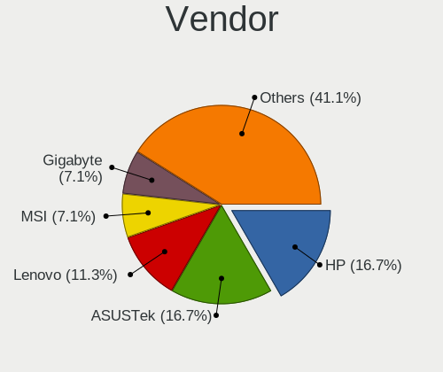

| Name                | Computers | Percent |
|---------------------|-----------|---------|
| ASUSTek Computer    | 38        | 18.91%  |
| Hewlett-Packard     | 27        | 13.43%  |
| MSI                 | 25        | 12.44%  |
| Gigabyte Technology | 21        | 10.45%  |
| Lenovo              | 13        | 6.47%   |
| Acer                | 12        | 5.97%   |
| Dell                | 7         | 3.48%   |
| ASRock              | 7         | 3.48%   |
| Samsung Electronics | 5         | 2.49%   |
| Intel               | 4         | 1.99%   |
| Apple               | 4         | 1.99%   |
| Toshiba             | 3         | 1.49%   |
| Chuwi               | 3         | 1.49%   |
| Unknown             | 3         | 1.49%   |
| Sony                | 2         | 1%      |
| Medion              | 2         | 1%      |
| ZOTAC               | 1         | 0.5%    |
| Valve               | 1         | 0.5%    |
| SLIMBOOK            | 1         | 0.5%    |
| Razer               | 1         | 0.5%    |
| Qilive              | 1         | 0.5%    |
| Pyramid             | 1         | 0.5%    |
| Pegatron            | 1         | 0.5%    |
| Packard Bell        | 1         | 0.5%    |
| Notebook            | 1         | 0.5%    |
| NEC Computers       | 1         | 0.5%    |
| Jetway              | 1         | 0.5%    |
| HUAWEI              | 1         | 0.5%    |
| Google              | 1         | 0.5%    |
| Fujitsu             | 1         | 0.5%    |
| eMachines           | 1         | 0.5%    |
| Eii                 | 1         | 0.5%    |
| ECS                 | 1         | 0.5%    |
| Dynabook            | 1         | 0.5%    |
| Clevo               | 1         | 0.5%    |
| Biostar             | 1         | 0.5%    |
| BESSTAR Tech        | 1         | 0.5%    |
| AZW                 | 1         | 0.5%    |
| AMI                 | 1         | 0.5%    |
| ALLDOCUBE           | 1         | 0.5%    |

Model
-----

Motherboard model

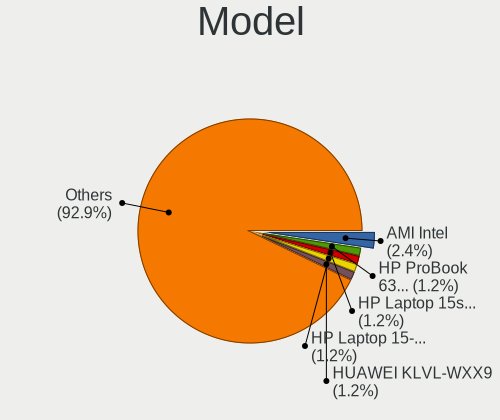

| Name                                     | Computers | Percent |
|------------------------------------------|-----------|---------|
| ASUS PRIME B450M-K II                    | 3         | 1.49%   |
| Unknown                                  | 3         | 1.49%   |
| Samsung RF510/RF410/RF710                | 2         | 1%      |
| MSI MS-7D22                              | 2         | 1%      |
| MSI Bravo 17 A4DDK                       | 2         | 1%      |
| Gigabyte B450M DS3H V2                   | 2         | 1%      |
| Gigabyte B450M DS3H                      | 2         | 1%      |
| Chuwi GemiBook Pro                       | 2         | 1%      |
| ASUS VivoBook_ASUSLaptop TP420UA_TM420UA | 2         | 1%      |
| ASUS K53U                                | 2         | 1%      |
| ZOTAC ZBOX-ID88/ID89/ID90                | 1         | 0.5%    |
| Valve Jupiter                            | 1         | 0.5%    |
| Toshiba Satellite Pro NB10-A-12Q         | 1         | 0.5%    |
| Toshiba PORTEGE X30-E                    | 1         | 0.5%    |
| Toshiba NB520                            | 1         | 0.5%    |
| Sony VPCCW1S1E                           | 1         | 0.5%    |
| Sony VGN-AR51J                           | 1         | 0.5%    |
| SLIMBOOK PRO                             | 1         | 0.5%    |
| Samsung R520/R522/R620                   | 1         | 0.5%    |
| Samsung 950QED                           | 1         | 0.5%    |
| Samsung 305V4A/305V5A                    | 1         | 0.5%    |
| Razer Blade 14 (2022) - RZ09-0427        | 1         | 0.5%    |
| Qilive QW2214SP                          | 1         | 0.5%    |
| Pyramid Control Unit POF G4              | 1         | 0.5%    |
| Pegatron h8-1403es                       | 1         | 0.5%    |
| Packard Bell EasyNote TS44HR             | 1         | 0.5%    |
| Notebook N13_N140ZU                      | 1         | 0.5%    |
| NEC Computers ECS-945G                   | 1         | 0.5%    |
| MSI Stealth GS77 12UHS                   | 1         | 0.5%    |
| MSI Stealth 15M B12UE                    | 1         | 0.5%    |
| MSI Raider GE76 12UHS                    | 1         | 0.5%    |
| MSI PRO X300 DP20Z (MS-B0A2)             | 1         | 0.5%    |
| MSI MS-7D25                              | 1         | 0.5%    |
| MSI MS-7D20                              | 1         | 0.5%    |
| MSI MS-7D18                              | 1         | 0.5%    |
| MSI MS-7B89                              | 1         | 0.5%    |
| MSI MS-7B51                              | 1         | 0.5%    |
| MSI MS-7978                              | 1         | 0.5%    |
| MSI MS-7850                              | 1         | 0.5%    |
| MSI MS-7383                              | 1         | 0.5%    |

Model Family
------------

Motherboard model prefix

| Name               | Computers | Percent |
|--------------------|-----------|---------|
| Acer Aspire        | 10        | 4.98%   |
| ASUS PRIME         | 7         | 3.48%   |
| ASUS VivoBook      | 5         | 2.49%   |
| Gigabyte B450M     | 4         | 1.99%   |
| Dell Latitude      | 4         | 1.99%   |
| MSI Bravo          | 3         | 1.49%   |
| Lenovo IdeaPad     | 3         | 1.49%   |
| HP OMEN            | 3         | 1.49%   |
| HP Compaq          | 3         | 1.49%   |
| ASUS TUF           | 3         | 1.49%   |
| ASUS ROG           | 3         | 1.49%   |
| Unknown            | 3         | 1.49%   |
| Samsung RF510      | 2         | 1%      |
| MSI Stealth        | 2         | 1%      |
| MSI MS-7D22        | 2         | 1%      |
| Lenovo ThinkPad    | 2         | 1%      |
| Lenovo ThinkCentre | 2         | 1%      |
| HP Victus          | 2         | 1%      |
| HP Pavilion        | 2         | 1%      |
| HP EliteBook       | 2         | 1%      |
| HP 255             | 2         | 1%      |
| Dell Inspiron      | 2         | 1%      |
| Chuwi GemiBook     | 2         | 1%      |
| ASUS K53U          | 2         | 1%      |
| ASRock H110M-HDV   | 2         | 1%      |
| ZOTAC ZBOX-ID88    | 1         | 0.5%    |
| Valve Jupiter      | 1         | 0.5%    |
| Toshiba Satellite  | 1         | 0.5%    |
| Toshiba PORTEGE    | 1         | 0.5%    |
| Toshiba NB520      | 1         | 0.5%    |
| Sony VPCCW1S1E     | 1         | 0.5%    |
| Sony VGN-AR51J     | 1         | 0.5%    |
| SLIMBOOK PRO       | 1         | 0.5%    |
| Samsung R520       | 1         | 0.5%    |
| Samsung 950QED     | 1         | 0.5%    |
| Samsung 305V4A     | 1         | 0.5%    |
| Razer Blade        | 1         | 0.5%    |
| Qilive QW2214SP    | 1         | 0.5%    |
| Pyramid Control    | 1         | 0.5%    |
| Pegatron h8-1403es | 1         | 0.5%    |

MFG Year
--------

Motherboard manufacture year

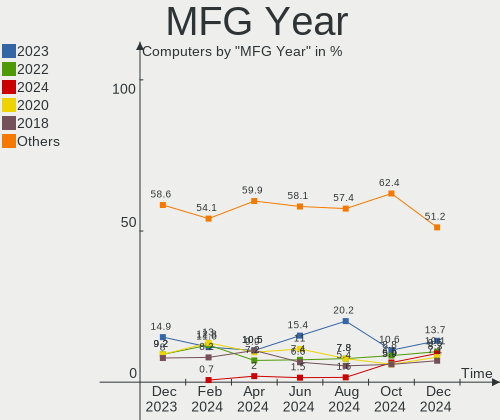

| Year | Computers | Percent |
|------|-----------|---------|
| 2021 | 31        | 15.42%  |
| 2020 | 23        | 11.44%  |
| 2022 | 20        | 9.95%   |
| 2011 | 17        | 8.46%   |
| 2012 | 16        | 7.96%   |
| 2019 | 14        | 6.97%   |
| 2018 | 13        | 6.47%   |
| 2015 | 12        | 5.97%   |
| 2010 | 11        | 5.47%   |
| 2014 | 9         | 4.48%   |
| 2016 | 8         | 3.98%   |
| 2017 | 6         | 2.99%   |
| 2013 | 6         | 2.99%   |
| 2009 | 6         | 2.99%   |
| 2007 | 5         | 2.49%   |
| 2008 | 4         | 1.99%   |

Form Factor
-----------

Physical design of the computer

| Name        | Computers | Percent |
|-------------|-----------|---------|
| Notebook    | 103       | 51.24%  |
| Desktop     | 80        | 39.8%   |
| Mini pc     | 8         | 3.98%   |
| Convertible | 5         | 2.49%   |
| All in one  | 4         | 1.99%   |
| Tablet      | 1         | 0.5%    |

Secure Boot
-----------

Enabled or disabled

| State    | Computers | Percent |
|----------|-----------|---------|
| Disabled | 190       | 94.53%  |
| Enabled  | 11        | 5.47%   |

Coreboot
--------

Have coreboot on board

| Used | Computers | Percent |
|------|-----------|---------|
| No   | 200       | 99.5%   |
| Yes  | 1         | 0.5%    |

RAM Size
--------

Total RAM memory

| Size in GB  | Computers | Percent |
|-------------|-----------|---------|
| 4.01-8.0    | 63        | 31.34%  |
| 8.01-16.0   | 40        | 19.9%   |
| 16.01-24.0  | 34        | 16.92%  |
| 3.01-4.0    | 28        | 13.93%  |
| 32.01-64.0  | 25        | 12.44%  |
| 1.01-2.0    | 6         | 2.99%   |
| 24.01-32.0  | 3         | 1.49%   |
| 2.01-3.0    | 1         | 0.5%    |
| 64.01-256.0 | 1         | 0.5%    |

RAM Used
--------

Used RAM memory

| Used GB    | Computers | Percent |
|------------|-----------|---------|
| 1.01-2.0   | 76        | 37.81%  |
| 2.01-3.0   | 59        | 29.35%  |
| 4.01-8.0   | 25        | 12.44%  |
| 3.01-4.0   | 23        | 11.44%  |
| 0.51-1.0   | 10        | 4.98%   |
| 8.01-16.0  | 7         | 3.48%   |
| 16.01-24.0 | 1         | 0.5%    |

Total Drives
------------

Number of drives on board

| Drives | Computers | Percent |
|--------|-----------|---------|
| 1      | 113       | 56.22%  |
| 2      | 59        | 29.35%  |
| 3      | 13        | 6.47%   |
| 4      | 9         | 4.48%   |
| 5      | 4         | 1.99%   |
| 9      | 1         | 0.5%    |
| 6      | 1         | 0.5%    |
| 0      | 1         | 0.5%    |

Has CD-ROM
----------

Has CD-ROM on board

| Presented | Computers | Percent |
|-----------|-----------|---------|
| No        | 131       | 65.17%  |
| Yes       | 70        | 34.83%  |

Has Ethernet
------------

Has Ethernet on board

| Presented | Computers | Percent |
|-----------|-----------|---------|
| Yes       | 176       | 87.56%  |
| No        | 25        | 12.44%  |

Has WiFi
--------

Has WiFi module

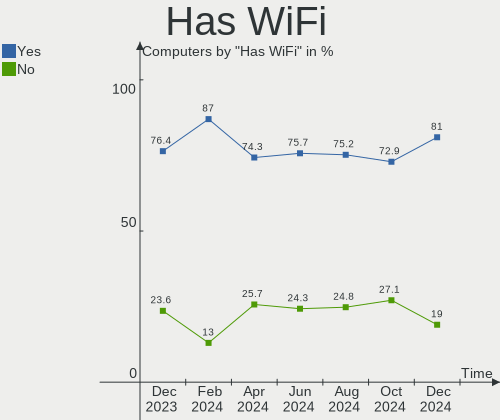

| Presented | Computers | Percent |
|-----------|-----------|---------|
| Yes       | 163       | 81.09%  |
| No        | 38        | 18.91%  |

Has Bluetooth
-------------

Has Bluetooth module

| Presented | Computers | Percent |
|-----------|-----------|---------|
| Yes       | 125       | 62.19%  |
| No        | 76        | 37.81%  |

Location
--------

Country
-------

Geographic location (country)

| Country | Computers | Percent |
|---------|-----------|---------|
| Spain   | 201       | 100%    |

City
----

Geographic location (city)

| City                        | Computers | Percent |
|-----------------------------|-----------|---------|
| Madrid                      | 40        | 19.9%   |
| Barcelona                   | 20        | 9.95%   |
| Córdoba                    | 9         | 4.48%   |
| Seville                     | 8         | 3.98%   |
| Valencia                    | 7         | 3.48%   |
| Málaga                     | 7         | 3.48%   |
| Valladolid                  | 6         | 2.99%   |
| Zaragoza                    | 5         | 2.49%   |
| Granada                     | 5         | 2.49%   |
| Bilbao                      | 4         | 1.99%   |
| Alcobendas                  | 3         | 1.49%   |
| Villafranca de los Barros   | 2         | 1%      |
| Valdemoro                   | 2         | 1%      |
| Torrejón de Ardoz          | 2         | 1%      |
| Tarragona                   | 2         | 1%      |
| Lugo                        | 2         | 1%      |
| Las Palmas de Gran Canaria  | 2         | 1%      |
| Huesca                      | 2         | 1%      |
| Donostia / San Sebastian    | 2         | 1%      |
| Badalona                    | 2         | 1%      |
| Alicante                    | 2         | 1%      |
| Zafra                       | 1         | 0.5%    |
| Xàtiva                     | 1         | 0.5%    |
| Sopela                      | 1         | 0.5%    |
| Son Ferrer                  | 1         | 0.5%    |
| Santurtzi                   | 1         | 0.5%    |
| Santiago de Compostela      | 1         | 0.5%    |
| Santa Cruz de Tenerife      | 1         | 0.5%    |
| Sant Pere de Vilamajor      | 1         | 0.5%    |
| Sant Joan d'Alacant         | 1         | 0.5%    |
| Sant Esteve Sesrovires      | 1         | 0.5%    |
| San Fernando                | 1         | 0.5%    |
| San Cristóbal de La Laguna | 1         | 0.5%    |
| San Agustin del Guadalix    | 1         | 0.5%    |
| Salamanca                   | 1         | 0.5%    |
| Sabadell                    | 1         | 0.5%    |
| Roquetas de Mar             | 1         | 0.5%    |
| Rivas-Vaciamadrid           | 1         | 0.5%    |
| Rincon de la Victoria       | 1         | 0.5%    |
| Requena                     | 1         | 0.5%    |

Drives
------

Drive Vendor
------------

Hard drive vendors

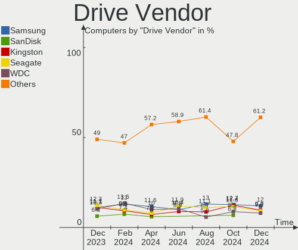

| Vendor                       | Computers | Drives | Percent |
|------------------------------|-----------|--------|---------|
| Kingston                     | 43        | 45     | 13.96%  |
| Samsung Electronics          | 40        | 44     | 12.99%  |
| Seagate                      | 39        | 46     | 12.66%  |
| WDC                          | 30        | 36     | 9.74%   |
| Toshiba                      | 18        | 20     | 5.84%   |
| Crucial                      | 18        | 20     | 5.84%   |
| Unknown                      | 13        | 15     | 4.22%   |
| Sandisk                      | 12        | 12     | 3.9%    |
| Micron Technology            | 12        | 12     | 3.9%    |
| KIOXIA-EXCERIA               | 6         | 7      | 1.95%   |
| Micron/Crucial Technology    | 5         | 5      | 1.62%   |
| Intel                        | 5         | 5      | 1.62%   |
| Kingston Technology Company  | 4         | 4      | 1.3%    |
| Hitachi                      | 4         | 4      | 1.3%    |
| HGST                         | 4         | 4      | 1.3%    |
| Emtec                        | 4         | 4      | 1.3%    |
| China                        | 4         | 5      | 1.3%    |
| SK hynix                     | 3         | 3      | 0.97%   |
| Silicon Motion               | 3         | 3      | 0.97%   |
| Phison Electronics           | 3         | 3      | 0.97%   |
| USB30                        | 2         | 2      | 0.65%   |
| Transcend                    | 2         | 2      | 0.65%   |
| PNY                          | 2         | 2      | 0.65%   |
| Phison                       | 2         | 2      | 0.65%   |
| OCZ                          | 2         | 3      | 0.65%   |
| Netac                        | 2         | 2      | 0.65%   |
| KIOXIA                       | 2         | 2      | 0.65%   |
| JMicron Technology           | 2         | 2      | 0.65%   |
| Intenso                      | 2         | 3      | 0.65%   |
| A-DATA Technology            | 2         | 3      | 0.65%   |
| Unknown                      | 2         | 2      | 0.65%   |
| ValueTech                    | 1         | 1      | 0.32%   |
| Union Memory                 | 1         | 1      | 0.32%   |
| Shenzhen Longsys Electronics | 1         | 1      | 0.32%   |
| SABRENT                      | 1         | 1      | 0.32%   |
| OYUNKEY                      | 1         | 1      | 0.32%   |
| ORICO                        | 1         | 1      | 0.32%   |
| O2 Micro                     | 1         | 1      | 0.32%   |
| NGFF                         | 1         | 1      | 0.32%   |
| Netac SS                     | 1         | 1      | 0.32%   |

Drive Model
-----------

Hard drive models

| Model                                                 | Computers | Percent |
|-------------------------------------------------------|-----------|---------|
| Kingston SA400S37480G 480GB SSD                       | 15        | 4.55%   |
| Kingston SA400S37240G 240GB SSD                       | 11        | 3.33%   |
| KIOXIA-EXCERIA SATA SSD 480GB                         | 6         | 1.82%   |
| Sandisk WD Black SN750 / PC SN730 NVMe SSD 1TB        | 4         | 1.21%   |
| Samsung SSD 860 EVO 500GB                             | 4         | 1.21%   |
| Kingston SV300S37A120G 120GB SSD                      | 4         | 1.21%   |
| Unknown MMC Card  128GB                               | 3         | 0.91%   |
| Toshiba DT01ACA100 1TB                                | 3         | 0.91%   |
| Seagate ST1000LM024 HN-M101MBB 1TB                    | 3         | 0.91%   |
| Seagate ST1000DM010-2EP102 1TB                        | 3         | 0.91%   |
| Micron 2450_MTFDKBA1T0TFK 1TB                         | 3         | 0.91%   |
| Kingston SNV2S500G 500GB                              | 3         | 0.91%   |
| Crucial CT480BX500SSD1 480GB                          | 3         | 0.91%   |
| Crucial CT1000MX500SSD1 1TB                           | 3         | 0.91%   |
| WDC WD10EALX-009BA0 1TB                               | 2         | 0.61%   |
| USB30 Disk 250GB                                      | 2         | 0.61%   |
| Unknown SD32G  32GB                                   | 2         | 0.61%   |
| Unknown SD/MMC/MS PRO 2GB                             | 2         | 0.61%   |
| Unknown MMC Card  32GB                                | 2         | 0.61%   |
| Toshiba TR200 240GB SSD                               | 2         | 0.61%   |
| Toshiba MQ01ABF050 500GB                              | 2         | 0.61%   |
| Toshiba BG3 NVMe SSD Controller 256GB                 | 2         | 0.61%   |
| Silicon Motion SM2263EN/SM2263XT SSD Controller 512GB | 2         | 0.61%   |
| Seagate ST500DM002-1BD142 500GB                       | 2         | 0.61%   |
| Seagate ST3500418AS 500GB                             | 2         | 0.61%   |
| Seagate ST31000528AS 1TB                              | 2         | 0.61%   |
| Seagate ST2000DM008-2FR102 2TB                        | 2         | 0.61%   |
| Seagate ST1000LM035-1RK172 1TB                        | 2         | 0.61%   |
| Seagate ST1000DM003-1SB10C 1TB                        | 2         | 0.61%   |
| Seagate ST1000DM003-1CH162 1TB                        | 2         | 0.61%   |
| Sandisk WD Blue SN570 1TB                             | 2         | 0.61%   |
| SanDisk SSD PLUS 240GB                                | 2         | 0.61%   |
| Samsung SSD 850 EVO 500GB                             | 2         | 0.61%   |
| Samsung SSD 850 EVO 250GB                             | 2         | 0.61%   |
| Samsung SSD 840 EVO 120GB                             | 2         | 0.61%   |
| Samsung NVMe SSD Controller SM981/PM981/PM983 500GB   | 2         | 0.61%   |
| Samsung MZVLB1T0HBLR-00000 1TB                        | 2         | 0.61%   |
| Samsung MZVL21T0HCLR-00B00 1TB                        | 2         | 0.61%   |
| Samsung HM641JI 640GB                                 | 2         | 0.61%   |
| Micron/Crucial P1 NVMe PCIe SSD 1TB                   | 2         | 0.61%   |

HDD Vendor
----------

Hard disk drive vendors

| Vendor              | Computers | Drives | Percent |
|---------------------|-----------|--------|---------|
| Seagate             | 39        | 46     | 41.49%  |
| WDC                 | 23        | 25     | 24.47%  |
| Toshiba             | 13        | 13     | 13.83%  |
| Samsung Electronics | 5         | 5      | 5.32%   |
| Hitachi             | 4         | 4      | 4.26%   |
| HGST                | 4         | 4      | 4.26%   |
| Unknown             | 2         | 2      | 2.13%   |
| SABRENT             | 1         | 1      | 1.06%   |
| Maxtor              | 1         | 1      | 1.06%   |
| Intenso             | 1         | 1      | 1.06%   |
| Apple               | 1         | 1      | 1.06%   |

SSD Vendor
----------

Solid state drive vendors

| Vendor              | Computers | Drives | Percent |
|---------------------|-----------|--------|---------|
| Kingston            | 35        | 35     | 29.91%  |
| Samsung Electronics | 15        | 18     | 12.82%  |
| Crucial             | 15        | 17     | 12.82%  |
| WDC                 | 6         | 7      | 5.13%   |
| KIOXIA-EXCERIA      | 6         | 6      | 5.13%   |
| Toshiba             | 4         | 4      | 3.42%   |
| SanDisk             | 4         | 4      | 3.42%   |
| Emtec               | 4         | 4      | 3.42%   |
| China               | 4         | 5      | 3.42%   |
| USB30               | 2         | 2      | 1.71%   |
| Transcend           | 2         | 2      | 1.71%   |
| OCZ                 | 2         | 3      | 1.71%   |
| Netac               | 2         | 2      | 1.71%   |
| Micron Technology   | 2         | 2      | 1.71%   |
| Intenso             | 2         | 2      | 1.71%   |
| A-DATA Technology   | 2         | 3      | 1.71%   |
| ValueTech           | 1         | 1      | 0.85%   |
| PNY                 | 1         | 1      | 0.85%   |
| Phison              | 1         | 1      | 0.85%   |
| NGFF                | 1         | 1      | 0.85%   |
| KingFast            | 1         | 1      | 0.85%   |
| Intel               | 1         | 1      | 0.85%   |
| FORESEE             | 1         | 1      | 0.85%   |
| Drevo               | 1         | 1      | 0.85%   |
| Advantech           | 1         | 1      | 0.85%   |
| Unknown             | 1         | 1      | 0.85%   |

Drive Kind
----------

HDD or SSD

| Kind    | Computers | Drives | Percent |
|---------|-----------|--------|---------|
| SSD     | 100       | 126    | 36.1%   |
| HDD     | 81        | 103    | 29.24%  |
| NVMe    | 76        | 88     | 27.44%  |
| MMC     | 13        | 14     | 4.69%   |
| Unknown | 7         | 7      | 2.53%   |

Drive Connector
---------------

SATA, SAS, NVMe, etc.

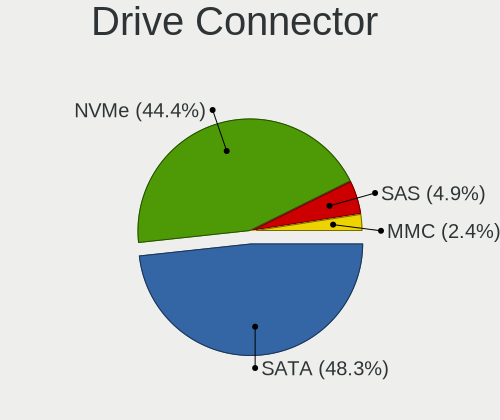

| Type | Computers | Drives | Percent |
|------|-----------|--------|---------|
| SATA | 139       | 225    | 58.4%   |
| NVMe | 76        | 88     | 31.93%  |
| MMC  | 13        | 14     | 5.46%   |
| SAS  | 10        | 11     | 4.2%    |

Drive Size
----------

Size of hard drive

| Size in TB | Computers | Drives | Percent |
|------------|-----------|--------|---------|
| 0.01-0.5   | 111       | 144    | 61.33%  |
| 0.51-1.0   | 47        | 59     | 25.97%  |
| 1.01-2.0   | 12        | 14     | 6.63%   |
| 3.01-4.0   | 6         | 6      | 3.31%   |
| 4.01-10.0  | 3         | 3      | 1.66%   |
| 2.01-3.0   | 2         | 3      | 1.1%    |

Space Total
-----------

Amount of disk space available on the file system

| Size in GB     | Computers | Percent |
|----------------|-----------|---------|
| 251-500        | 39        | 19.4%   |
| 101-250        | 38        | 18.91%  |
| 1-20           | 38        | 18.91%  |
| 501-1000       | 28        | 13.93%  |
| 1001-2000      | 19        | 9.45%   |
| More than 3000 | 13        | 6.47%   |
| 51-100         | 11        | 5.47%   |
| 21-50          | 8         | 3.98%   |
| Unknown        | 4         | 1.99%   |
| 2001-3000      | 3         | 1.49%   |

Space Used
----------

Amount of used disk space

| Used GB        | Computers | Percent |
|----------------|-----------|---------|
| 1-20           | 93        | 46.27%  |
| 21-50          | 25        | 12.44%  |
| 101-250        | 22        | 10.95%  |
| 51-100         | 19        | 9.45%   |
| 501-1000       | 13        | 6.47%   |
| 251-500        | 12        | 5.97%   |
| 1001-2000      | 6         | 2.99%   |
| More than 3000 | 5         | 2.49%   |
| Unknown        | 4         | 1.99%   |
| 2001-3000      | 2         | 1%      |

Malfunc. Drives
---------------

Drive models with a malfunction

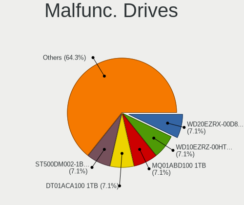

| Model                             | Computers | Drives | Percent |
|-----------------------------------|-----------|--------|---------|
| WDC WD3200BEKT-60V5T1 320GB       | 1         | 1      | 4.35%   |
| WDC WD10EZRX-00A3KB0 1TB          | 1         | 1      | 4.35%   |
| Toshiba MQ01ABD050 500GB          | 1         | 1      | 4.35%   |
| Toshiba MD04ACA400 4TB            | 1         | 1      | 4.35%   |
| Seagate ST9500420ASG 500GB        | 1         | 1      | 4.35%   |
| Seagate ST9160412AS 160GB         | 1         | 1      | 4.35%   |
| Seagate ST500DM002-1BD142 500GB   | 1         | 1      | 4.35%   |
| Seagate ST3500418AS 500GB         | 1         | 1      | 4.35%   |
| Seagate ST3500320AS 500GB         | 1         | 1      | 4.35%   |
| Seagate ST3320813AS 320GB         | 1         | 1      | 4.35%   |
| Seagate ST31500341AS 1TB          | 1         | 1      | 4.35%   |
| Seagate ST31000528AS 1TB          | 1         | 1      | 4.35%   |
| Seagate ST31000340AS 1TB          | 1         | 1      | 4.35%   |
| Seagate ST2000LM015-2E8174 2TB    | 1         | 1      | 4.35%   |
| Seagate ST2000DL003-9VT166 2TB    | 1         | 1      | 4.35%   |
| Seagate ST1000LM035-1RK172 1TB    | 1         | 1      | 4.35%   |
| SanDisk SSD PLUS 120GB            | 1         | 1      | 4.35%   |
| Samsung Electronics HM641JI 640GB | 1         | 1      | 4.35%   |
| Kingston SV300S37A120G 120GB SSD  | 1         | 1      | 4.35%   |
| Kingston SA400S37480G 480GB SSD   | 1         | 1      | 4.35%   |
| Intel MEMPEK1J016GA 16GB          | 1         | 1      | 4.35%   |
| HGST HTS721010A9E630 1TB          | 1         | 1      | 4.35%   |
| Crucial CT275MX300SSD4 275GB      | 1         | 1      | 4.35%   |

Malfunc. Drive Vendor
---------------------

Vendors of faulty drives

| Vendor              | Computers | Drives | Percent |
|---------------------|-----------|--------|---------|
| Seagate             | 11        | 12     | 50%     |
| WDC                 | 2         | 2      | 9.09%   |
| Toshiba             | 2         | 2      | 9.09%   |
| Kingston            | 2         | 2      | 9.09%   |
| SanDisk             | 1         | 1      | 4.55%   |
| Samsung Electronics | 1         | 1      | 4.55%   |
| Intel               | 1         | 1      | 4.55%   |
| HGST                | 1         | 1      | 4.55%   |
| Crucial             | 1         | 1      | 4.55%   |

Malfunc. HDD Vendor
-------------------

Vendors of faulty HDD drives

| Vendor              | Computers | Drives | Percent |
|---------------------|-----------|--------|---------|
| Seagate             | 11        | 12     | 64.71%  |
| WDC                 | 2         | 2      | 11.76%  |
| Toshiba             | 2         | 2      | 11.76%  |
| Samsung Electronics | 1         | 1      | 5.88%   |
| HGST                | 1         | 1      | 5.88%   |

Malfunc. Drive Kind
-------------------

Kinds of faulty drives

| Kind | Computers | Drives | Percent |
|------|-----------|--------|---------|
| HDD  | 17        | 18     | 77.27%  |
| SSD  | 4         | 4      | 18.18%  |
| NVMe | 1         | 1      | 4.55%   |

Failed Drives
-------------

Failed drive models

Zero info for selected period =(

Failed Drive Vendor
-------------------

Failed drive vendors

Zero info for selected period =(

Drive Status
------------

Number of failed and malfunc. drives

| Status   | Computers | Drives | Percent |
|----------|-----------|--------|---------|
| Works    | 111       | 160    | 49.55%  |
| Detected | 92        | 155    | 41.07%  |
| Malfunc  | 21        | 23     | 9.38%   |

Storage controller
------------------

Storage Vendor
--------------

Storage controller vendors

| Vendor                           | Computers | Percent |
|----------------------------------|-----------|---------|
| Intel                            | 132       | 49.62%  |
| AMD                              | 39        | 14.66%  |
| Samsung Electronics              | 21        | 7.89%   |
| Kingston Technology Company      | 14        | 5.26%   |
| SanDisk                          | 11        | 4.14%   |
| Micron Technology                | 10        | 3.76%   |
| Micron/Crucial Technology        | 8         | 3.01%   |
| Phison Electronics               | 4         | 1.5%    |
| Toshiba America Info Systems     | 3         | 1.13%   |
| SK hynix                         | 3         | 1.13%   |
| Silicon Motion                   | 3         | 1.13%   |
| Marvell Technology Group         | 3         | 1.13%   |
| KIOXIA                           | 3         | 1.13%   |
| JMicron Technology               | 3         | 1.13%   |
| ASMedia Technology               | 2         | 0.75%   |
| VIA Technologies                 | 1         | 0.38%   |
| Union Memory (Shenzhen)          | 1         | 0.38%   |
| Silicon Integrated Systems [SiS] | 1         | 0.38%   |
| Shenzhen Longsys Electronics     | 1         | 0.38%   |
| O2 Micro                         | 1         | 0.38%   |
| Nvidia                           | 1         | 0.38%   |
| Integrated Technology Express    | 1         | 0.38%   |

Storage Model
-------------

Storage controller models

| Model                                                                          | Computers | Percent |
|--------------------------------------------------------------------------------|-----------|---------|
| AMD FCH SATA Controller [AHCI mode]                                            | 25        | 8.45%   |
| Samsung NVMe SSD Controller SM981/PM981/PM983                                  | 10        | 3.38%   |
| Micron Non-Volatile memory controller                                          | 10        | 3.38%   |
| Kingston Company Company Non-Volatile memory controller                        | 9         | 3.04%   |
| Intel 7 Series Chipset Family 6-port SATA Controller [AHCI mode]               | 9         | 3.04%   |
| AMD 400 Series Chipset SATA Controller                                         | 9         | 3.04%   |
| Intel Sunrise Point-LP SATA Controller [AHCI mode]                             | 7         | 2.36%   |
| SanDisk WD Black SN750 / PC SN730 NVMe SSD                                     | 6         | 2.03%   |
| Samsung NVMe SSD Controller 980                                                | 6         | 2.03%   |
| Intel Volume Management Device NVMe RAID Controller                            | 6         | 2.03%   |
| Intel Celeron/Pentium Silver Processor SATA Controller                         | 6         | 2.03%   |
| Intel 6 Series/C200 Series Chipset Family 6 port Mobile SATA AHCI Controller   | 6         | 2.03%   |
| Intel 500 Series Chipset Family SATA AHCI Controller                           | 6         | 2.03%   |
| Intel 5 Series/3400 Series Chipset 4 port SATA AHCI Controller                 | 6         | 2.03%   |
| Intel 200 Series PCH SATA controller [AHCI mode]                               | 6         | 2.03%   |
| AMD SB7x0/SB8x0/SB9x0 SATA Controller [AHCI mode]                              | 6         | 2.03%   |
| Intel Q170/Q150/B150/H170/H110/Z170/CM236 Chipset SATA Controller [AHCI Mode]  | 5         | 1.69%   |
| Intel 82801 Mobile SATA Controller [RAID mode]                                 | 5         | 1.69%   |
| Intel 8 Series/C220 Series Chipset Family 6-port SATA Controller 1 [AHCI mode] | 5         | 1.69%   |
| Intel NM10/ICH7 Family SATA Controller [AHCI mode]                             | 4         | 1.35%   |
| Intel Jasper Lake SATA AHCI Controller                                         | 4         | 1.35%   |
| Intel Comet Lake SATA AHCI Controller                                          | 4         | 1.35%   |
| Intel Alder Lake-S PCH SATA Controller [AHCI Mode]                             | 4         | 1.35%   |
| Intel 5 Series/3400 Series Chipset 6 port SATA AHCI Controller                 | 4         | 1.35%   |
| Silicon Motion SM2263EN/SM2263XT SSD Controller                                | 3         | 1.01%   |
| SanDisk WD Blue SN570 NVMe SSD                                                 | 3         | 1.01%   |
| Micron/Crucial P5 Plus NVMe PCIe SSD                                           | 3         | 1.01%   |
| Intel NM10/ICH7 Family SATA Controller [IDE mode]                              | 3         | 1.01%   |
| Intel Cannon Point-LP SATA Controller [AHCI Mode]                              | 3         | 1.01%   |
| Intel Cannon Lake PCH SATA AHCI Controller                                     | 3         | 1.01%   |
| Intel 9 Series Chipset Family SATA Controller [AHCI Mode]                      | 3         | 1.01%   |
| Intel 82801IBM/IEM (ICH9M/ICH9M-E) 4 port SATA Controller [AHCI mode]          | 3         | 1.01%   |
| Intel 82801HM/HEM (ICH8M/ICH8M-E) SATA Controller [AHCI mode]                  | 3         | 1.01%   |
| Intel 82801HM/HEM (ICH8M/ICH8M-E) IDE Controller                               | 3         | 1.01%   |
| Intel 82801G (ICH7 Family) IDE Controller                                      | 3         | 1.01%   |
| Intel 7 Series/C210 Series Chipset Family 6-port SATA Controller [AHCI mode]   | 3         | 1.01%   |
| Intel 400 Series Chipset Family SATA AHCI Controller                           | 3         | 1.01%   |
| AMD SB7x0/SB8x0/SB9x0 IDE Controller                                           | 3         | 1.01%   |
| Toshiba America Info Systems BG3 NVMe SSD Controller                           | 2         | 0.68%   |
| SK hynix Gold P31/PC711 NVMe Solid State Drive                                 | 2         | 0.68%   |

Storage Kind
------------

Kind of storage controller (IDE, SATA, NVMe, SAS, ...)

| Kind | Computers | Percent |
|------|-----------|---------|
| SATA | 153       | 58.85%  |
| NVMe | 76        | 29.23%  |
| IDE  | 18        | 6.92%   |
| RAID | 13        | 5%      |

Processor
---------

CPU Vendor
----------

Processor vendors

| Vendor | Computers | Percent |
|--------|-----------|---------|
| Intel  | 150       | 74.63%  |
| AMD    | 51        | 25.37%  |

CPU Model
---------

Processor models

| Model                                         | Computers | Percent |
|-----------------------------------------------|-----------|---------|
| Intel Core i5-10210U CPU @ 1.60GHz            | 4         | 1.99%   |
| AMD Ryzen 7 5800H with Radeon Graphics        | 4         | 1.99%   |
| AMD Ryzen 5 3400G with Radeon Vega Graphics   | 4         | 1.99%   |
| Intel Core i7-6500U CPU @ 2.50GHz             | 3         | 1.49%   |
| Intel Core i5-8250U CPU @ 1.60GHz             | 3         | 1.49%   |
| Intel Celeron N5100 @ 1.10GHz                 | 3         | 1.49%   |
| Intel Celeron N4020 CPU @ 1.10GHz             | 3         | 1.49%   |
| Intel Celeron CPU N2840 @ 2.16GHz             | 3         | 1.49%   |
| AMD Ryzen 7 4800H with Radeon Graphics        | 3         | 1.49%   |
| AMD Ryzen 3 3200U with Radeon Vega Mobile Gfx | 3         | 1.49%   |
| Intel Pentium CPU G4560 @ 3.50GHz             | 2         | 1%      |
| Intel Core i7-6700HQ CPU @ 2.60GHz            | 2         | 1%      |
| Intel Core i7-4790 CPU @ 3.60GHz              | 2         | 1%      |
| Intel Core i7-4510U CPU @ 2.00GHz             | 2         | 1%      |
| Intel Core i7-3770 CPU @ 3.40GHz              | 2         | 1%      |
| Intel Core i7-10750H CPU @ 2.60GHz            | 2         | 1%      |
| Intel Core i5-7400 CPU @ 3.00GHz              | 2         | 1%      |
| Intel Core i5-6500 CPU @ 3.20GHz              | 2         | 1%      |
| Intel Core i5-4460 CPU @ 3.20GHz              | 2         | 1%      |
| Intel Core i5-10400 CPU @ 2.90GHz             | 2         | 1%      |
| Intel Core i5 CPU M 480 @ 2.67GHz             | 2         | 1%      |
| Intel Core i5 CPU 650 @ 3.20GHz               | 2         | 1%      |
| Intel Core i3-10105 CPU @ 3.70GHz             | 2         | 1%      |
| Intel Core i3 CPU M 370 @ 2.40GHz             | 2         | 1%      |
| Intel Core 2 Quad CPU Q6600 @ 2.40GHz         | 2         | 1%      |
| Intel 12th Gen Core i7-12700H                 | 2         | 1%      |
| Intel 11th Gen Core i7-11800H @ 2.30GHz       | 2         | 1%      |
| Intel 11th Gen Core i5-1135G7 @ 2.40GHz       | 2         | 1%      |
| AMD Ryzen 9 6900HX with Radeon Graphics       | 2         | 1%      |
| AMD Ryzen 7 6800H with Radeon Graphics        | 2         | 1%      |
| AMD Ryzen 7 5700U with Radeon Graphics        | 2         | 1%      |
| AMD Ryzen 5 5600G with Radeon Graphics        | 2         | 1%      |
| AMD Ryzen 5 3600X 6-Core Processor            | 2         | 1%      |
| Intel Xeon CPU E5-2630 v4 @ 2.20GHz           | 1         | 0.5%    |
| Intel Pentium Silver N5000 CPU @ 1.10GHz      | 1         | 0.5%    |
| Intel Pentium Dual-Core CPU T4500 @ 2.30GHz   | 1         | 0.5%    |
| Intel Pentium Dual-Core CPU T4200 @ 2.00GHz   | 1         | 0.5%    |
| Intel Pentium Dual-Core CPU E5400 @ 2.70GHz   | 1         | 0.5%    |
| Intel Pentium Dual-Core CPU E5200 @ 2.50GHz   | 1         | 0.5%    |
| Intel Pentium Dual CPU E2140 @ 1.60GHz        | 1         | 0.5%    |

CPU Model Family
----------------

Processor model prefix

| Model                   | Computers | Percent |
|-------------------------|-----------|---------|
| Intel Core i5           | 37        | 18.41%  |
| Intel Core i7           | 28        | 13.93%  |
| Intel Core i3           | 23        | 11.44%  |
| Other                   | 20        | 9.95%   |
| Intel Celeron           | 17        | 8.46%   |
| AMD Ryzen 7             | 15        | 7.46%   |
| AMD Ryzen 5             | 14        | 6.97%   |
| Intel Pentium           | 6         | 2.99%   |
| Intel Atom              | 6         | 2.99%   |
| Intel Core 2 Duo        | 5         | 2.49%   |
| Intel Pentium Dual-Core | 4         | 1.99%   |
| AMD Ryzen 3             | 4         | 1.99%   |
| Intel Core 2 Quad       | 3         | 1.49%   |
| AMD E                   | 3         | 1.49%   |
| AMD Ryzen 9             | 2         | 1%      |
| AMD A8                  | 2         | 1%      |
| Intel Xeon              | 1         | 0.5%    |
| Intel Pentium Silver    | 1         | 0.5%    |
| Intel Pentium Dual      | 1         | 0.5%    |
| AMD Ryzen Threadripper  | 1         | 0.5%    |
| AMD Phenom II X6        | 1         | 0.5%    |
| AMD Phenom II X2        | 1         | 0.5%    |
| AMD FX                  | 1         | 0.5%    |
| AMD E1                  | 1         | 0.5%    |
| AMD Athlon II X2        | 1         | 0.5%    |
| AMD A6                  | 1         | 0.5%    |
| AMD A4                  | 1         | 0.5%    |
| AMD A10                 | 1         | 0.5%    |

CPU Cores
---------

Number of processor cores

| Number | Computers | Percent |
|--------|-----------|---------|
| 2      | 83        | 41.29%  |
| 4      | 59        | 29.35%  |
| 6      | 25        | 12.44%  |
| 8      | 19        | 9.45%   |
| 12     | 4         | 1.99%   |
| 1      | 4         | 1.99%   |
| 14     | 3         | 1.49%   |
| 10     | 2         | 1%      |
| 20     | 1         | 0.5%    |
| 16     | 1         | 0.5%    |

CPU Sockets
-----------

Number of sockets

| Number | Computers | Percent |
|--------|-----------|---------|
| 1      | 200       | 99.5%   |
| 2      | 1         | 0.5%    |

CPU Threads
-----------

Threads per core (Hyper-Threading)

| Number | Computers | Percent |
|--------|-----------|---------|
| 2      | 137       | 68.16%  |
| 1      | 63        | 31.34%  |
| 4      | 1         | 0.5%    |

CPU Op-Modes
------------

CPU Operation Modes (32-bit, 64-bit)

| Op mode        | Computers | Percent |
|----------------|-----------|---------|
| 32-bit, 64-bit | 200       | 99.5%   |
| 32-bit         | 1         | 0.5%    |

CPU Microcode
-------------

Microcode number

| Number     | Computers | Percent |
|------------|-----------|---------|
| Unknown    | 54        | 26.87%  |
| 0x306a9    | 9         | 4.48%   |
| 0x206a7    | 9         | 4.48%   |
| 0x806ec    | 7         | 3.48%   |
| 0x806ea    | 6         | 2.99%   |
| 0xa0653    | 5         | 2.49%   |
| 0x906a3    | 5         | 2.49%   |
| 0x306c3    | 5         | 2.49%   |
| 0x20655    | 5         | 2.49%   |
| 0x08108109 | 5         | 2.49%   |
| 0x906c0    | 4         | 1.99%   |
| 0x406e3    | 4         | 1.99%   |
| 0x1067a    | 4         | 1.99%   |
| 0x90672    | 3         | 1.49%   |
| 0x706a8    | 3         | 1.49%   |
| 0x0a50000d | 3         | 1.49%   |
| 0x08608103 | 3         | 1.49%   |
| 0xa0671    | 2         | 1%      |
| 0xa0652    | 2         | 1%      |
| 0x906e9    | 2         | 1%      |
| 0x806eb    | 2         | 1%      |
| 0x806e9    | 2         | 1%      |
| 0x806d1    | 2         | 1%      |
| 0x806c1    | 2         | 1%      |
| 0x706a1    | 2         | 1%      |
| 0x506e3    | 2         | 1%      |
| 0x406c4    | 2         | 1%      |
| 0x40651    | 2         | 1%      |
| 0x30678    | 2         | 1%      |
| 0x106e5    | 2         | 1%      |
| 0x106ca    | 2         | 1%      |
| 0x10676    | 2         | 1%      |
| 0x0a50000c | 2         | 1%      |
| 0x0a404102 | 2         | 1%      |
| 0x0a404101 | 2         | 1%      |
| 0x0a20120a | 2         | 1%      |
| 0x08701021 | 2         | 1%      |
| 0x08600104 | 2         | 1%      |
| 0x06006705 | 2         | 1%      |
| 0x0500010d | 2         | 1%      |

CPU Microarch
-------------

Microarchitecture

| Name             | Computers | Percent |
|------------------|-----------|---------|
| KabyLake         | 30        | 14.93%  |
| SandyBridge      | 12        | 5.97%   |
| IvyBridge        | 12        | 5.97%   |
| Zen 3            | 11        | 5.47%   |
| Haswell          | 11        | 5.47%   |
| Unknown          | 11        | 5.47%   |
| Zen+             | 10        | 4.98%   |
| Skylake          | 10        | 4.98%   |
| Westmere         | 9         | 4.48%   |
| Penryn           | 8         | 3.98%   |
| Alderlake Hybrid | 8         | 3.98%   |
| Silvermont       | 7         | 3.48%   |
| CometLake        | 7         | 3.48%   |
| Zen 2            | 6         | 2.99%   |
| Goldmont plus    | 6         | 2.99%   |
| Icelake          | 5         | 2.49%   |
| Core             | 5         | 2.49%   |
| Tremont          | 4         | 1.99%   |
| Bonnell          | 4         | 1.99%   |
| TigerLake        | 3         | 1.49%   |
| K10              | 3         | 1.49%   |
| Broadwell        | 3         | 1.49%   |
| Bobcat           | 3         | 1.49%   |
| Zen              | 2         | 1%      |
| Piledriver       | 2         | 1%      |
| Nehalem          | 2         | 1%      |
| Excavator        | 2         | 1%      |
| Steamroller      | 1         | 0.5%    |
| Puma             | 1         | 0.5%    |
| K10 Llano        | 1         | 0.5%    |
| Goldmont         | 1         | 0.5%    |
| Bulldozer        | 1         | 0.5%    |

Graphics
--------

GPU Vendor
----------

Vendors of graphics cards

| Vendor | Computers | Percent |
|--------|-----------|---------|
| Intel  | 118       | 49.17%  |
| Nvidia | 65        | 27.08%  |
| AMD    | 57        | 23.75%  |

GPU Model
---------

Graphics card models

| Model                                                                                    | Computers | Percent |
|------------------------------------------------------------------------------------------|-----------|---------|
| Intel 2nd Generation Core Processor Family Integrated Graphics Controller                | 11        | 4.38%   |
| AMD Picasso/Raven 2 [Radeon Vega Series / Radeon Vega Mobile Series]                     | 9         | 3.59%   |
| Intel 3rd Gen Core processor Graphics Controller                                         | 7         | 2.79%   |
| AMD Cezanne [Radeon Vega Series / Radeon Vega Mobile Series]                             | 7         | 2.79%   |
| Nvidia GA106M [GeForce RTX 3060 Mobile / Max-Q]                                          | 6         | 2.39%   |
| Intel CometLake-U GT2 [UHD Graphics]                                                     | 6         | 2.39%   |
| Intel UHD Graphics 620                                                                   | 5         | 1.99%   |
| Intel GeminiLake [UHD Graphics 600]                                                      | 5         | 1.99%   |
| Intel Core Processor Integrated Graphics Controller                                      | 5         | 1.99%   |
| Intel Alder Lake-P Integrated Graphics Controller                                        | 5         | 1.99%   |
| AMD Navi 14 [Radeon RX 5500/5500M / Pro 5500M]                                           | 5         | 1.99%   |
| Nvidia GT218 [GeForce 210]                                                               | 4         | 1.59%   |
| Nvidia GK208B [GeForce GT 710]                                                           | 4         | 1.59%   |
| Intel WhiskeyLake-U GT2 [UHD Graphics 620]                                               | 4         | 1.59%   |
| Intel JasperLake [UHD Graphics]                                                          | 4         | 1.59%   |
| Intel CoffeeLake-S GT2 [UHD Graphics 630]                                                | 4         | 1.59%   |
| Intel Atom Processor Z36xxx/Z37xxx Series Graphics & Display                             | 4         | 1.59%   |
| AMD Rembrandt [Radeon 680M]                                                              | 4         | 1.59%   |
| Intel Xeon E3-1200 v3/4th Gen Core Processor Integrated Graphics Controller              | 3         | 1.2%    |
| Intel TigerLake-H GT1 [UHD Graphics]                                                     | 3         | 1.2%    |
| Intel Skylake GT2 [HD Graphics 520]                                                      | 3         | 1.2%    |
| Intel HD Graphics 530                                                                    | 3         | 1.2%    |
| Intel Haswell-ULT Integrated Graphics Controller                                         | 3         | 1.2%    |
| Intel CometLake-S GT2 [UHD Graphics 630]                                                 | 3         | 1.2%    |
| Intel Atom/Celeron/Pentium Processor x5-E8000/J3xxx/N3xxx Integrated Graphics Controller | 3         | 1.2%    |
| Intel Atom Processor D4xx/D5xx/N4xx/N5xx Integrated Graphics Controller                  | 3         | 1.2%    |
| AMD Renoir                                                                               | 3         | 1.2%    |
| AMD Park [Mobility Radeon HD 5430/5450/5470]                                             | 3         | 1.2%    |
| AMD Navi 23 [Radeon RX 6600/6600 XT/6600M]                                               | 3         | 1.2%    |
| AMD Lucienne                                                                             | 3         | 1.2%    |
| Nvidia GT216M [GeForce GT 330M]                                                          | 2         | 0.8%    |
| Nvidia GP108 [GeForce GT 1030]                                                           | 2         | 0.8%    |
| Nvidia GP107 [GeForce GTX 1050 Ti]                                                       | 2         | 0.8%    |
| Nvidia GM107 [GeForce GTX 750 Ti]                                                        | 2         | 0.8%    |
| Nvidia GF117M [GeForce 610M/710M/810M/820M / GT 620M/625M/630M/720M]                     | 2         | 0.8%    |
| Nvidia GA107M [GeForce RTX 3050 Mobile]                                                  | 2         | 0.8%    |
| Nvidia GA103M [GeForce RTX 3080 Ti Mobile]                                               | 2         | 0.8%    |
| Intel TigerLake-LP GT2 [Iris Xe Graphics]                                                | 2         | 0.8%    |
| Intel IvyBridge GT2 [HD Graphics 4000]                                                   | 2         | 0.8%    |
| Intel HD Graphics 630                                                                    | 2         | 0.8%    |

GPU Combo
---------

Combinations of graphics cards

| Name           | Computers | Percent |
|----------------|-----------|---------|
| 1 x Intel      | 82        | 40.8%   |
| 1 x AMD        | 37        | 18.41%  |
| 1 x Nvidia     | 32        | 15.92%  |
| Intel + Nvidia | 27        | 13.43%  |
| 2 x AMD        | 11        | 5.47%   |
| AMD + Nvidia   | 6         | 2.99%   |
| 2 x Intel      | 3         | 1.49%   |
| Intel + AMD    | 3         | 1.49%   |

GPU Driver
----------

Free vs proprietary

| Driver      | Computers | Percent |
|-------------|-----------|---------|
| Free        | 166       | 82.59%  |
| Proprietary | 29        | 14.43%  |
| Unknown     | 6         | 2.99%   |

GPU Memory
----------

Total video memory

| Size in GB | Computers | Percent |
|------------|-----------|---------|
| Unknown    | 124       | 61.69%  |
| 0.01-0.5   | 23        | 11.44%  |
| 1.01-2.0   | 21        | 10.45%  |
| 3.01-4.0   | 10        | 4.98%   |
| 0.51-1.0   | 10        | 4.98%   |
| 7.01-8.0   | 7         | 3.48%   |
| 5.01-6.0   | 4         | 1.99%   |
| 8.01-16.0  | 2         | 1%      |

Monitor
-------

Monitor Vendor
--------------

Monitor vendors

| Vendor                  | Computers | Percent |
|-------------------------|-----------|---------|
| Samsung Electronics     | 23        | 10.55%  |
| AU Optronics            | 23        | 10.55%  |
| BOE                     | 21        | 9.63%   |
| Goldstar                | 19        | 8.72%   |
| Chimei Innolux          | 19        | 8.72%   |
| LG Display              | 15        | 6.88%   |
| Acer                    | 13        | 5.96%   |
| BenQ                    | 9         | 4.13%   |
| Dell                    | 8         | 3.67%   |
| Philips                 | 7         | 3.21%   |
| Hewlett-Packard         | 6         | 2.75%   |
| AOC                     | 6         | 2.75%   |
| Sharp                   | 4         | 1.83%   |
| Apple                   | 4         | 1.83%   |
| Ancor Communications    | 4         | 1.83%   |
| Lenovo                  | 3         | 1.38%   |
| Chi Mei Optoelectronics | 3         | 1.38%   |
| Vestel Elektronik       | 2         | 0.92%   |
| Sony                    | 2         | 0.92%   |
| MSI                     | 2         | 0.92%   |
| InfoVision              | 2         | 0.92%   |
| Eizo                    | 2         | 0.92%   |
| CPT                     | 2         | 0.92%   |
| ASUSTek Computer        | 2         | 0.92%   |
| Wacom                   | 1         | 0.46%   |
| Vita                    | 1         | 0.46%   |
| ViewSonic               | 1         | 0.46%   |
| VHT                     | 1         | 0.46%   |
| Valve                   | 1         | 0.46%   |
| Unknown (XXX)           | 1         | 0.46%   |
| SGT                     | 1         | 0.46%   |
| RTK                     | 1         | 0.46%   |
| PANDA                   | 1         | 0.46%   |
| NEC Computers           | 1         | 0.46%   |
| KUP                     | 1         | 0.46%   |
| KDC                     | 1         | 0.46%   |
| Iiyama                  | 1         | 0.46%   |
| HUAWEI                  | 1         | 0.46%   |
| HannStar                | 1         | 0.46%   |
| CHR                     | 1         | 0.46%   |

Monitor Model
-------------

Monitor models

| Model                                                                 | Computers | Percent |
|-----------------------------------------------------------------------|-----------|---------|
| AU Optronics LCD Monitor AUO26EC 1366x768 344x193mm 15.5-inch         | 5         | 2.23%   |
| Chimei Innolux LCD Monitor CMN14D4 1920x1080 309x173mm 13.9-inch      | 4         | 1.79%   |
| AU Optronics LCD Monitor AUO978F 1920x1080 382x215mm 17.3-inch        | 3         | 1.34%   |
| Acer V193HQV ACR010C 1366x768 410x230mm 18.5-inch                     | 3         | 1.34%   |
| Vestel Elektronik 50FHD_LCD_TV VES3700 1920x1080 1280x720mm 57.8-inch | 2         | 0.89%   |
| Sharp LQ173M1JW08 SHP1544 1920x1080 382x215mm 17.3-inch               | 2         | 0.89%   |
| LG Display LCD Monitor LGD02DC 1366x768 344x194mm 15.5-inch           | 2         | 0.89%   |
| LG Display LCD Monitor LGD02AC 1366x768 344x194mm 15.5-inch           | 2         | 0.89%   |
| Goldstar HDR WFHD GSM7714 2560x1080 798x334mm 34.1-inch               | 2         | 0.89%   |
| Goldstar HDR 4K GSM7707 3840x2160 600x340mm 27.2-inch                 | 2         | 0.89%   |
| Goldstar 22EN33 GSM597C 1920x1080 480x270mm 21.7-inch                 | 2         | 0.89%   |
| Chimei Innolux P140ZKA-BZ1 CMN8C02 2160x1440 296x197mm 14.0-inch      | 2         | 0.89%   |
| Chimei Innolux LCD Monitor CMN15E7 1920x1080 344x193mm 15.5-inch      | 2         | 0.89%   |
| Chimei Innolux LCD Monitor CMN15CA 1366x768 344x193mm 15.5-inch       | 2         | 0.89%   |
| BOE LCD Monitor BOE06A5 1366x768 344x194mm 15.5-inch                  | 2         | 0.89%   |
| BenQ GW2760HS BNQ78CA 1920x1080 598x336mm 27.0-inch                   | 2         | 0.89%   |
| AU Optronics LCD Monitor AUOAF90 1920x1080 344x193mm 15.5-inch        | 2         | 0.89%   |
| AU Optronics LCD Monitor AUO48EC 1366x768 344x193mm 15.5-inch         | 2         | 0.89%   |
| Acer V193HQV ACR013E 1366x768 410x230mm 18.5-inch                     | 2         | 0.89%   |
| Wacom LCD Monitor WAC1022 1600x1200 430x320mm 21.1-inch               | 1         | 0.45%   |
| Vita VT-24WKT VIT0962 1920x1080 473x296mm 22.0-inch                   | 1         | 0.45%   |
| ViewSonic VX2363 Series VSC6B2F 1920x1080 509x286mm 23.0-inch         | 1         | 0.45%   |
| VHT Monitor VHTDDDD 1024x768                                          | 1         | 0.45%   |
| Valve ANX7530 U VLV3001 800x1280 100x150mm 7.1-inch                   | 1         | 0.45%   |
| Unknown (XXX) Union TV XXX2841 1920x1080 1209x680mm 54.6-inch         | 1         | 0.45%   |
| Sony SDM-HS74 SNY2E70 1280x1024 338x270mm 17.0-inch                   | 1         | 0.45%   |
| Sony Nvidia Defaul t Flat Panel SNY05FA 1366x768 309x174mm 14.0-inch  | 1         | 0.45%   |
| Sharp LQ156M1JW03 SHP14C5 1920x1080 344x194mm 15.5-inch               | 1         | 0.45%   |
| Sharp LQ140M1JW49 SHP1523 1920x1080 309x174mm 14.0-inch               | 1         | 0.45%   |
| SGT HS160PC SGT1600 1920x1080 354x199mm 16.0-inch                     | 1         | 0.45%   |
| Samsung Electronics U32R59x SAM0F96 3840x2160 697x392mm 31.5-inch     | 1         | 0.45%   |
| Samsung Electronics U32J59x SAM0F35 3840x2160 700x390mm 31.5-inch     | 1         | 0.45%   |
| Samsung Electronics U28E590 SAM0C4D 3840x2160 607x345mm 27.5-inch     | 1         | 0.45%   |
| Samsung Electronics T24B301 SAM098E 1920x1080 521x293mm 23.5-inch     | 1         | 0.45%   |
| Samsung Electronics SyncMaster SAM0486 1920x1080                      | 1         | 0.45%   |
| Samsung Electronics SyncMaster SAM022A 1280x1024 338x270mm 17.0-inch  | 1         | 0.45%   |
| Samsung Electronics SMS27A350H SAM07CE 1920x1080 598x336mm 27.0-inch  | 1         | 0.45%   |
| Samsung Electronics SMB2230N SAM0635 1920x1080 477x268mm 21.5-inch    | 1         | 0.45%   |
| Samsung Electronics SMB2230H SAM0648 1920x1080                        | 1         | 0.45%   |
| Samsung Electronics SA300/SA350 SAM07D2 1920x1080 477x268mm 21.5-inch | 1         | 0.45%   |

Monitor Resolution
------------------

Monitor screen resolution

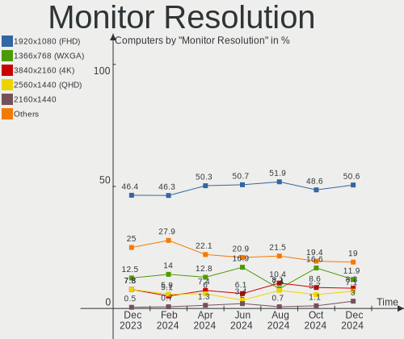

| Resolution         | Computers | Percent |
|--------------------|-----------|---------|
| 1920x1080 (FHD)    | 95        | 45.24%  |
| 1366x768 (WXGA)    | 50        | 23.81%  |
| 3840x2160 (4K)     | 12        | 5.71%   |
| 2560x1440 (QHD)    | 12        | 5.71%   |
| 1920x1200 (WUXGA)  | 7         | 3.33%   |
| 1680x1050 (WSXGA+) | 5         | 2.38%   |
| 1280x1024 (SXGA)   | 5         | 2.38%   |
| 1600x900 (HD+)     | 4         | 1.9%    |
| 2560x1080          | 3         | 1.43%   |
| 3440x1440          | 2         | 0.95%   |
| 2160x1440          | 2         | 0.95%   |
| 1440x900 (WXGA+)   | 2         | 0.95%   |
| 1280x800 (WXGA)    | 2         | 0.95%   |
| 1024x600           | 2         | 0.95%   |
| 800x1280           | 1         | 0.48%   |
| 3840x2400          | 1         | 0.48%   |
| 3840x1080          | 1         | 0.48%   |
| 2880x1800          | 1         | 0.48%   |
| 1920x1280          | 1         | 0.48%   |
| 1600x1200          | 1         | 0.48%   |
| 1024x768 (XGA)     | 1         | 0.48%   |

Monitor Diagonal
----------------

Diagonal size in inches

| Inches  | Computers | Percent |
|---------|-----------|---------|
| 15      | 57        | 25.68%  |
| 21      | 19        | 8.56%   |
| 27      | 17        | 7.66%   |
| 24      | 17        | 7.66%   |
| 23      | 15        | 6.76%   |
| 13      | 14        | 6.31%   |
| 17      | 13        | 5.86%   |
| 14      | 11        | 4.95%   |
| 31      | 8         | 3.6%    |
| 18      | 8         | 3.6%    |
| Unknown | 6         | 2.7%    |
| 34      | 5         | 2.25%   |
| 16      | 5         | 2.25%   |
| 22      | 4         | 1.8%    |
| 11      | 4         | 1.8%    |
| 19      | 3         | 1.35%   |
| 10      | 3         | 1.35%   |
| 84      | 2         | 0.9%    |
| 54      | 2         | 0.9%    |
| 25      | 2         | 0.9%    |
| 12      | 2         | 0.9%    |
| 49      | 1         | 0.45%   |
| 46      | 1         | 0.45%   |
| 26      | 1         | 0.45%   |
| 20      | 1         | 0.45%   |
| 7       | 1         | 0.45%   |

Monitor Width
-------------

Physical width

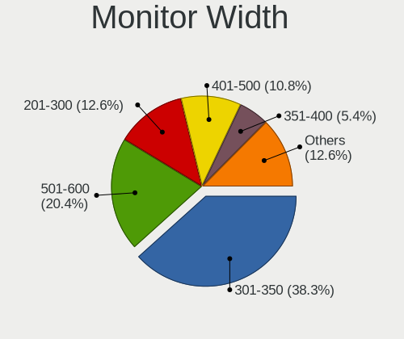

| Width in mm | Computers | Percent |
|-------------|-----------|---------|
| 301-350     | 78        | 35.29%  |
| 501-600     | 48        | 21.72%  |
| 401-500     | 35        | 15.84%  |
| 201-300     | 17        | 7.69%   |
| 351-400     | 15        | 6.79%   |
| 601-700     | 10        | 4.52%   |
| Unknown     | 6         | 2.71%   |
| 701-800     | 5         | 2.26%   |
| 1001-1500   | 4         | 1.81%   |
| 1501-2000   | 2         | 0.9%    |
| 1-100       | 1         | 0.45%   |

Aspect Ratio
------------

Proportional relationship between the width and the height

| Ratio   | Computers | Percent |
|---------|-----------|---------|
| 16/9    | 161       | 80.1%   |
| 16/10   | 20        | 9.95%   |
| 5/4     | 5         | 2.49%   |
| 21/9    | 5         | 2.49%   |
| 3/2     | 4         | 1.99%   |
| 4/3     | 2         | 1%      |
| Unknown | 2         | 1%      |
| 32/9    | 1         | 0.5%    |
| 0.67    | 1         | 0.5%    |

Monitor Area
------------

Area in inch²

| Area in inch² | Computers | Percent |
|----------------|-----------|---------|
| 101-110        | 60        | 27.4%   |
| 201-250        | 35        | 15.98%  |
| 81-90          | 21        | 9.59%   |
| 301-350        | 18        | 8.22%   |
| 351-500        | 13        | 5.94%   |
| 151-200        | 12        | 5.48%   |
| 141-150        | 12        | 5.48%   |
| 251-300        | 11        | 5.02%   |
| 121-130        | 7         | 3.2%    |
| Unknown        | 6         | 2.74%   |
| More than 1000 | 4         | 1.83%   |
| 71-80          | 4         | 1.83%   |
| 51-60          | 4         | 1.83%   |
| 41-50          | 3         | 1.37%   |
| 61-70          | 2         | 0.91%   |
| 131-140        | 2         | 0.91%   |
| 501-1000       | 2         | 0.91%   |
| 1-40           | 1         | 0.46%   |
| 111-120        | 1         | 0.46%   |
| 91-100         | 1         | 0.46%   |

Pixel Density
-------------

Pixels per inch

| Density       | Computers | Percent |
|---------------|-----------|---------|
| 51-100        | 74        | 34.1%   |
| 101-120       | 63        | 29.03%  |
| 121-160       | 55        | 25.35%  |
| 161-240       | 14        | 6.45%   |
| Unknown       | 6         | 2.76%   |
| 1-50          | 3         | 1.38%   |
| More than 240 | 2         | 0.92%   |

Multiple Monitors
-----------------

Total monitors connected

| Total | Computers | Percent |
|-------|-----------|---------|
| 1     | 167       | 83.08%  |
| 2     | 28        | 13.93%  |
| 0     | 4         | 1.99%   |
| 4     | 1         | 0.5%    |
| 3     | 1         | 0.5%    |

Network
-------

Net Controller Vendor
---------------------

Controller vendors

| Vendor                            | Computers | Percent |
|-----------------------------------|-----------|---------|
| Realtek Semiconductor             | 128       | 41.16%  |
| Intel                             | 88        | 28.3%   |
| Qualcomm Atheros                  | 32        | 10.29%  |
| Broadcom                          | 17        | 5.47%   |
| Ralink Technology                 | 8         | 2.57%   |
| TP-Link                           | 7         | 2.25%   |
| Marvell Technology Group          | 6         | 1.93%   |
| Ralink                            | 5         | 1.61%   |
| MediaTek                          | 5         | 1.61%   |
| Broadcom Limited                  | 3         | 0.96%   |
| Xiaomi                            | 1         | 0.32%   |
| Silicon Integrated Systems [SiS]  | 1         | 0.32%   |
| Samsung Electronics               | 1         | 0.32%   |
| Qualcomm Atheros Communications   | 1         | 0.32%   |
| Nvidia                            | 1         | 0.32%   |
| NetGear                           | 1         | 0.32%   |
| JMicron Technology                | 1         | 0.32%   |
| Ericsson Business Mobile Networks | 1         | 0.32%   |
| Edimax Technology                 | 1         | 0.32%   |
| DisplayLink                       | 1         | 0.32%   |
| ASUSTek Computer                  | 1         | 0.32%   |
| ASIX Electronics                  | 1         | 0.32%   |

Net Controller Model
--------------------

Controller models

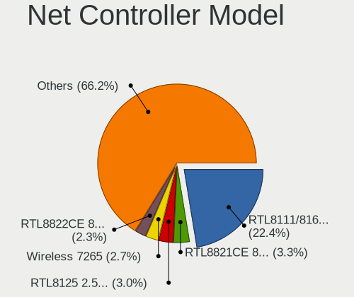

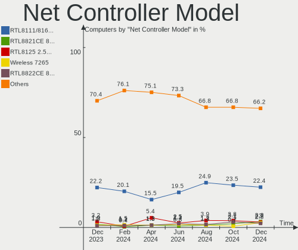

| Model                                                             | Computers | Percent |
|-------------------------------------------------------------------|-----------|---------|
| Realtek RTL8111/8168/8411 PCI Express Gigabit Ethernet Controller | 92        | 25.84%  |
| Realtek RTL810xE PCI Express Fast Ethernet controller             | 11        | 3.09%   |
| Qualcomm Atheros AR9485 Wireless Network Adapter                  | 8         | 2.25%   |
| Intel Wireless 8265 / 8275                                        | 7         | 1.97%   |
| Intel Wi-Fi 6 AX200                                               | 7         | 1.97%   |
| Realtek RTL8153 Gigabit Ethernet Adapter                          | 6         | 1.69%   |
| Realtek RTL8125 2.5GbE Controller                                 | 6         | 1.69%   |
| Intel Comet Lake PCH-LP CNVi WiFi                                 | 6         | 1.69%   |
| Intel Alder Lake-P PCH CNVi WiFi                                  | 6         | 1.69%   |
| Ralink RT2870/RT3070 Wireless Adapter                             | 5         | 1.4%    |
| Qualcomm Atheros QCA9565 / AR9565 Wireless Network Adapter        | 5         | 1.4%    |
| Intel Wireless 7265                                               | 5         | 1.4%    |
| Intel 82579LM Gigabit Network Connection (Lewisville)             | 5         | 1.4%    |
| Broadcom BCM4313 802.11bgn Wireless Network Adapter               | 5         | 1.4%    |
| Realtek RTL8821CE 802.11ac PCIe Wireless Network Adapter          | 4         | 1.12%   |
| Qualcomm Atheros AR9285 Wireless Network Adapter (PCI-Express)    | 4         | 1.12%   |
| Intel Ethernet Connection (2) I219-V                              | 4         | 1.12%   |
| Intel Ethernet Connection (10) I219-V                             | 4         | 1.12%   |
| Intel Dual Band Wireless-AC 3168NGW [Stone Peak]                  | 4         | 1.12%   |
| TP-Link UE300 10/100/1000 LAN (ethernet mode) [Realtek RTL8153]   | 3         | 0.84%   |
| Realtek RTL8852AE 802.11ax PCIe Wireless Network Adapter          | 3         | 0.84%   |
| Realtek RTL8822CE 802.11ac PCIe Wireless Network Adapter          | 3         | 0.84%   |
| Realtek RTL8723BE PCIe Wireless Network Adapter                   | 3         | 0.84%   |
| Qualcomm Atheros QCA9377 802.11ac Wireless Network Adapter        | 3         | 0.84%   |
| Intel Wireless 7260                                               | 3         | 0.84%   |
| Intel Wireless 3165                                               | 3         | 0.84%   |
| Intel Wi-Fi 6 AX210/AX211/AX411 160MHz                            | 3         | 0.84%   |
| Intel Wi-Fi 6 AX201                                               | 3         | 0.84%   |
| Intel Tiger Lake PCH CNVi WiFi                                    | 3         | 0.84%   |
| Intel I211 Gigabit Network Connection                             | 3         | 0.84%   |
| Intel Centrino Advanced-N 6205 [Taylor Peak]                      | 3         | 0.84%   |
| Broadcom NetLink BCM57785 Gigabit Ethernet PCIe                   | 3         | 0.84%   |
| TP-Link 802.11ac NIC                                              | 2         | 0.56%   |
| Realtek RTL8822BE 802.11a/b/g/n/ac WiFi adapter                   | 2         | 0.56%   |
| Realtek RTL8821AE 802.11ac PCIe Wireless Network Adapter          | 2         | 0.56%   |
| Realtek RTL8812AE 802.11ac PCIe Wireless Network Adapter          | 2         | 0.56%   |
| Realtek RTL8152 Fast Ethernet Adapter                             | 2         | 0.56%   |
| Realtek Killer E3000 2.5GbE Controller                            | 2         | 0.56%   |
| Realtek 802.11ac NIC                                              | 2         | 0.56%   |
| Ralink MT7601U Wireless Adapter                                   | 2         | 0.56%   |

Wireless Vendor
---------------

Wireless vendors

| Vendor                          | Computers | Percent |
|---------------------------------|-----------|---------|
| Intel                           | 71        | 42.51%  |
| Qualcomm Atheros                | 29        | 17.37%  |
| Realtek Semiconductor           | 28        | 16.77%  |
| Broadcom                        | 10        | 5.99%   |
| Ralink Technology               | 8         | 4.79%   |
| Ralink                          | 5         | 2.99%   |
| MediaTek                        | 5         | 2.99%   |
| TP-Link                         | 4         | 2.4%    |
| Broadcom Limited                | 3         | 1.8%    |
| Qualcomm Atheros Communications | 1         | 0.6%    |
| NetGear                         | 1         | 0.6%    |
| Edimax Technology               | 1         | 0.6%    |
| ASUSTek Computer                | 1         | 0.6%    |

Wireless Model
--------------

Wireless models

| Model                                                          | Computers | Percent |
|----------------------------------------------------------------|-----------|---------|
| Qualcomm Atheros AR9485 Wireless Network Adapter               | 8         | 4.76%   |
| Intel Wireless 8265 / 8275                                     | 7         | 4.17%   |
| Intel Wi-Fi 6 AX200                                            | 7         | 4.17%   |
| Intel Comet Lake PCH-LP CNVi WiFi                              | 6         | 3.57%   |
| Intel Alder Lake-P PCH CNVi WiFi                               | 6         | 3.57%   |
| Ralink RT2870/RT3070 Wireless Adapter                          | 5         | 2.98%   |
| Qualcomm Atheros QCA9565 / AR9565 Wireless Network Adapter     | 5         | 2.98%   |
| Intel Wireless 7265                                            | 5         | 2.98%   |
| Broadcom BCM4313 802.11bgn Wireless Network Adapter            | 5         | 2.98%   |
| Realtek RTL8821CE 802.11ac PCIe Wireless Network Adapter       | 4         | 2.38%   |
| Qualcomm Atheros AR9285 Wireless Network Adapter (PCI-Express) | 4         | 2.38%   |
| Intel Dual Band Wireless-AC 3168NGW [Stone Peak]               | 4         | 2.38%   |
| Realtek RTL8852AE 802.11ax PCIe Wireless Network Adapter       | 3         | 1.79%   |
| Realtek RTL8822CE 802.11ac PCIe Wireless Network Adapter       | 3         | 1.79%   |
| Realtek RTL8723BE PCIe Wireless Network Adapter                | 3         | 1.79%   |
| Qualcomm Atheros QCA9377 802.11ac Wireless Network Adapter     | 3         | 1.79%   |
| Intel Wireless 7260                                            | 3         | 1.79%   |
| Intel Wireless 3165                                            | 3         | 1.79%   |
| Intel Wi-Fi 6 AX210/AX211/AX411 160MHz                         | 3         | 1.79%   |
| Intel Wi-Fi 6 AX201                                            | 3         | 1.79%   |
| Intel Tiger Lake PCH CNVi WiFi                                 | 3         | 1.79%   |
| Intel Centrino Advanced-N 6205 [Taylor Peak]                   | 3         | 1.79%   |
| TP-Link 802.11ac NIC                                           | 2         | 1.19%   |
| Realtek RTL8822BE 802.11a/b/g/n/ac WiFi adapter                | 2         | 1.19%   |
| Realtek RTL8821AE 802.11ac PCIe Wireless Network Adapter       | 2         | 1.19%   |
| Realtek RTL8812AE 802.11ac PCIe Wireless Network Adapter       | 2         | 1.19%   |
| Realtek 802.11ac NIC                                           | 2         | 1.19%   |
| Ralink MT7601U Wireless Adapter                                | 2         | 1.19%   |
| Ralink RT5390 Wireless 802.11n 1T/1R PCIe                      | 2         | 1.19%   |
| Qualcomm Atheros AR9462 Wireless Network Adapter               | 2         | 1.19%   |
| MediaTek MT7922 802.11ax PCI Express Wireless Network Adapter  | 2         | 1.19%   |
| MediaTek MT7921 802.11ax PCI Express Wireless Network Adapter  | 2         | 1.19%   |
| Intel Wireless-AC 9260                                         | 2         | 1.19%   |
| Intel PRO/Wireless 4965 AG or AGN [Kedron] Network Connection  | 2         | 1.19%   |
| Intel Comet Lake PCH CNVi WiFi                                 | 2         | 1.19%   |
| Intel Cannon Point-LP CNVi [Wireless-AC]                       | 2         | 1.19%   |
| Intel Alder Lake-S PCH CNVi WiFi                               | 2         | 1.19%   |
| Broadcom Limited BCM4360 802.11ac Wireless Network Adapter     | 2         | 1.19%   |
| TP-Link TL-WN722N v2/v3 [Realtek RTL8188EUS]                   | 1         | 0.6%    |
| TP-Link Archer T4U ver.3                                       | 1         | 0.6%    |

Ethernet Vendor
---------------

Ethernet vendors

| Vendor                           | Computers | Percent |
|----------------------------------|-----------|---------|
| Realtek Semiconductor            | 120       | 64.52%  |
| Intel                            | 32        | 17.2%   |
| Broadcom                         | 10        | 5.38%   |
| Qualcomm Atheros                 | 8         | 4.3%    |
| Marvell Technology Group         | 6         | 3.23%   |
| TP-Link                          | 3         | 1.61%   |
| Xiaomi                           | 1         | 0.54%   |
| Silicon Integrated Systems [SiS] | 1         | 0.54%   |
| Samsung Electronics              | 1         | 0.54%   |
| Nvidia                           | 1         | 0.54%   |
| JMicron Technology               | 1         | 0.54%   |
| DisplayLink                      | 1         | 0.54%   |
| ASIX Electronics                 | 1         | 0.54%   |

Ethernet Model
--------------

Ethernet models

| Model                                                                          | Computers | Percent |
|--------------------------------------------------------------------------------|-----------|---------|
| Realtek RTL8111/8168/8411 PCI Express Gigabit Ethernet Controller              | 92        | 49.2%   |
| Realtek RTL810xE PCI Express Fast Ethernet controller                          | 11        | 5.88%   |
| Realtek RTL8153 Gigabit Ethernet Adapter                                       | 6         | 3.21%   |
| Realtek RTL8125 2.5GbE Controller                                              | 6         | 3.21%   |
| Intel 82579LM Gigabit Network Connection (Lewisville)                          | 5         | 2.67%   |
| Intel Ethernet Connection (2) I219-V                                           | 4         | 2.14%   |
| Intel Ethernet Connection (10) I219-V                                          | 4         | 2.14%   |
| TP-Link UE300 10/100/1000 LAN (ethernet mode) [Realtek RTL8153]                | 3         | 1.6%    |
| Intel I211 Gigabit Network Connection                                          | 3         | 1.6%    |
| Broadcom NetLink BCM57785 Gigabit Ethernet PCIe                                | 3         | 1.6%    |
| Realtek RTL8152 Fast Ethernet Adapter                                          | 2         | 1.07%   |
| Realtek Killer E3000 2.5GbE Controller                                         | 2         | 1.07%   |
| Qualcomm Atheros AR8151 v2.0 Gigabit Ethernet                                  | 2         | 1.07%   |
| Marvell Group Yukon Optima 88E8059 [PCIe Gigabit Ethernet Controller with AVB] | 2         | 1.07%   |
| Marvell Group 88E8057 PCI-E Gigabit Ethernet Controller                        | 2         | 1.07%   |
| Intel Ethernet Controller I225-V                                               | 2         | 1.07%   |
| Intel Ethernet Connection (7) I219-V                                           | 2         | 1.07%   |
| Intel Ethernet Connection (6) I219-V                                           | 2         | 1.07%   |
| Broadcom NetXtreme BCM57765 Gigabit Ethernet PCIe                              | 2         | 1.07%   |
| Broadcom NetXtreme BCM5761 Gigabit Ethernet PCIe                               | 2         | 1.07%   |
| Xiaomi Mi/Redmi series (RNDIS)                                                 | 1         | 0.53%   |
| Silicon Integrated Systems [SiS] 191 Gigabit Ethernet Adapter                  | 1         | 0.53%   |
| Samsung Galaxy series, misc. (tethering mode)                                  | 1         | 0.53%   |
| Realtek Killer E2600 Gigabit Ethernet Controller                               | 1         | 0.53%   |
| Qualcomm Atheros Killer E2400 Gigabit Ethernet Controller                      | 1         | 0.53%   |
| Qualcomm Atheros AR8162 Fast Ethernet                                          | 1         | 0.53%   |
| Qualcomm Atheros AR8161 Gigabit Ethernet                                       | 1         | 0.53%   |
| Qualcomm Atheros AR8132 Fast Ethernet                                          | 1         | 0.53%   |
| Qualcomm Atheros AR8131 Gigabit Ethernet                                       | 1         | 0.53%   |
| Qualcomm Atheros AR8121/AR8113/AR8114 Gigabit or Fast Ethernet                 | 1         | 0.53%   |
| Nvidia MCP61 Ethernet                                                          | 1         | 0.53%   |
| Marvell Group 88E8058 PCI-E Gigabit Ethernet Controller                        | 1         | 0.53%   |
| Marvell Group 88E8055 PCI-E Gigabit Ethernet Controller                        | 1         | 0.53%   |
| JMicron JMC260 PCI Express Fast Ethernet Controller                            | 1         | 0.53%   |
| Intel Ethernet controller                                                      | 1         | 0.53%   |
| Intel Ethernet Connection (6) I219-LM                                          | 1         | 0.53%   |
| Intel Ethernet Connection (4) I219-V                                           | 1         | 0.53%   |
| Intel Ethernet Connection (4) I219-LM                                          | 1         | 0.53%   |
| Intel Ethernet Connection (3) I218-LM                                          | 1         | 0.53%   |
| Intel Ethernet Connection (2) I218-V                                           | 1         | 0.53%   |

Net Controller Kind
-------------------

Ethernet, WiFi or modem

| Kind     | Computers | Percent |
|----------|-----------|---------|
| Ethernet | 176       | 51.76%  |
| WiFi     | 163       | 47.94%  |
| Modem    | 1         | 0.29%   |

Used Controller
---------------

Currently used network controller

| Kind     | Computers | Percent |
|----------|-----------|---------|
| WiFi     | 118       | 55.66%  |
| Ethernet | 94        | 44.34%  |

NICs
----

Total network controllers on board

| Total | Computers | Percent |
|-------|-----------|---------|
| 2     | 114       | 56.72%  |
| 1     | 80        | 39.8%   |
| 3     | 4         | 1.99%   |
| 0     | 3         | 1.49%   |

IPv6
----

IPv6 vs IPv4

| Used | Computers | Percent |
|------|-----------|---------|
| No   | 182       | 90.55%  |
| Yes  | 19        | 9.45%   |

Bluetooth
---------

Bluetooth Vendor
----------------

Controller vendors

| Vendor                          | Computers | Percent |
|---------------------------------|-----------|---------|
| Intel                           | 62        | 49.21%  |
| Realtek Semiconductor           | 19        | 15.08%  |
| IMC Networks                    | 10        | 7.94%   |
| Qualcomm Atheros Communications | 8         | 6.35%   |
| Broadcom                        | 5         | 3.97%   |
| Apple                           | 5         | 3.97%   |
| Lite-On Technology              | 4         | 3.17%   |
| Foxconn / Hon Hai               | 3         | 2.38%   |
| Cambridge Silicon Radio         | 3         | 2.38%   |
| TP-Link                         | 2         | 1.59%   |
| Toshiba                         | 1         | 0.79%   |
| Realtek                         | 1         | 0.79%   |
| Dell                            | 1         | 0.79%   |
| ASUSTek Computer                | 1         | 0.79%   |
| Alps Electric                   | 1         | 0.79%   |

Bluetooth Model
---------------

Controller models

| Model                                               | Computers | Percent |
|-----------------------------------------------------|-----------|---------|
| Intel Bluetooth Device                              | 21        | 16.67%  |
| Intel Bluetooth wireless interface                  | 20        | 15.87%  |
| Realtek Bluetooth Radio                             | 16        | 12.7%   |
| Intel AX200 Bluetooth                               | 7         | 5.56%   |
| Intel Bluetooth 9460/9560 Jefferson Peak (JfP)      | 5         | 3.97%   |
| Intel Wireless-AC 3168 Bluetooth                    | 4         | 3.17%   |
| IMC Networks Bluetooth Radio                        | 4         | 3.17%   |
| Qualcomm Atheros  Bluetooth Device                  | 3         | 2.38%   |
| Qualcomm Atheros AR3011 Bluetooth                   | 3         | 2.38%   |
| IMC Networks Wireless_Device                        | 3         | 2.38%   |
| Cambridge Silicon Radio Bluetooth Dongle (HCI mode) | 3         | 2.38%   |
| Apple Bluetooth USB Host Controller                 | 3         | 2.38%   |
| TP-Link TPuLink UB500 Adapter                       | 2         | 1.59%   |
| Qualcomm Atheros AR3012 Bluetooth 4.0               | 2         | 1.59%   |
| Lite-On Bluetooth Device                            | 2         | 1.59%   |
| Lite-On Atheros AR3012 Bluetooth                    | 2         | 1.59%   |
| Intel Wireless-AC 9260 Bluetooth Adapter            | 2         | 1.59%   |
| Intel Centrino Bluetooth Wireless Transceiver       | 2         | 1.59%   |
| Foxconn / Hon Hai Wireless_Device                   | 2         | 1.59%   |
| Toshiba Atheros AR3012 Bluetooth                    | 1         | 0.79%   |
| Realtek RTL8821A Bluetooth                          | 1         | 0.79%   |
| Realtek  Bluetooth 4.2 Adapter                      | 1         | 0.79%   |
| Realtek 802.11n WLAN Adapter                        | 1         | 0.79%   |
| Realtek Bluetooth Radio                             | 1         | 0.79%   |
| Intel AX210 Bluetooth                               | 1         | 0.79%   |
| IMC Networks Bluetooth module                       | 1         | 0.79%   |
| IMC Networks Bluetooth Device                       | 1         | 0.79%   |
| IMC Networks Atheros AR3012 Bluetooth 4.0 Adapter   | 1         | 0.79%   |
| Foxconn / Hon Hai Bluetooth Device                  | 1         | 0.79%   |
| Dell BCM20702A0 Bluetooth Module                    | 1         | 0.79%   |
| Broadcom Bluetooth 3.0 USB Dongle                   | 1         | 0.79%   |
| Broadcom BCM43142A0 Bluetooth Device                | 1         | 0.79%   |
| Broadcom BCM2070 Bluetooth Device                   | 1         | 0.79%   |
| Broadcom BCM2045B (BDC-2.1)                         | 1         | 0.79%   |
| Broadcom BCM2045 Bluetooth                          | 1         | 0.79%   |
| ASUS Broadcom BCM20702A0 Bluetooth                  | 1         | 0.79%   |
| Apple Built-in Bluetooth 2.0+EDR HCI                | 1         | 0.79%   |
| Apple Bluetooth HCI                                 | 1         | 0.79%   |
| Alps Electric BCM2046 Bluetooth Device              | 1         | 0.79%   |

Sound
-----

Sound Vendor
------------

Sound card vendors

| Vendor                           | Computers | Percent |
|----------------------------------|-----------|---------|
| Intel                            | 147       | 53.85%  |
| AMD                              | 60        | 21.98%  |
| Nvidia                           | 49        | 17.95%  |
| Texas Instruments                | 2         | 0.73%   |
| C-Media Electronics              | 2         | 0.73%   |
| TerraTec Electronic              | 1         | 0.37%   |
| Silicon Integrated Systems [SiS] | 1         | 0.37%   |
| PreSonus Audio Electronics       | 1         | 0.37%   |
| Plantronics                      | 1         | 0.37%   |
| Nordic Semiconductor ASA         | 1         | 0.37%   |
| Logitech                         | 1         | 0.37%   |
| KTMicro                          | 1         | 0.37%   |
| Kingston Technology              | 1         | 0.37%   |
| JMTek                            | 1         | 0.37%   |
| Jieli Technology                 | 1         | 0.37%   |
| GN Netcom                        | 1         | 0.37%   |
| Focusrite-Novation               | 1         | 0.37%   |
| Dell                             | 1         | 0.37%   |

Sound Model
-----------

Sound card models

| Model                                                                      | Computers | Percent |
|----------------------------------------------------------------------------|-----------|---------|
| AMD Family 17h/19h HD Audio Controller                                     | 28        | 8.64%   |
| Intel 7 Series/C216 Chipset Family High Definition Audio Controller        | 13        | 4.01%   |
| Intel Sunrise Point-LP HD Audio                                            | 12        | 3.7%    |
| Intel 5 Series/3400 Series Chipset High Definition Audio                   | 11        | 3.4%    |
| Intel 6 Series/C200 Series Chipset Family High Definition Audio Controller | 10        | 3.09%   |
| AMD Renoir Radeon High Definition Audio Controller                         | 10        | 3.09%   |
| AMD Raven/Raven2/Fenghuang HDMI/DP Audio Controller                        | 9         | 2.78%   |
| Intel NM10/ICH7 Family High Definition Audio Controller                    | 7         | 2.16%   |
| Intel 100 Series/C230 Series Chipset Family HD Audio Controller            | 7         | 2.16%   |
| Nvidia GK208 HDMI/DP Audio Controller                                      | 6         | 1.85%   |
| Nvidia GA106 High Definition Audio Controller                              | 6         | 1.85%   |
| Intel Comet Lake PCH-LP cAVS                                               | 6         | 1.85%   |
| Intel Celeron/Pentium Silver Processor High Definition Audio               | 6         | 1.85%   |
| Intel Alder Lake PCH-P High Definition Audio Controller                    | 6         | 1.85%   |
| Intel 200 Series PCH HD Audio                                              | 6         | 1.85%   |
| AMD Starship/Matisse HD Audio Controller                                   | 6         | 1.85%   |
| AMD SBx00 Azalia (Intel HDA)                                               | 6         | 1.85%   |
| AMD Navi 21/23 HDMI/DP Audio Controller                                    | 6         | 1.85%   |
| Intel Xeon E3-1200 v3/4th Gen Core Processor HD Audio Controller           | 5         | 1.54%   |
| Intel Tiger Lake-H HD Audio Controller                                     | 5         | 1.54%   |
| Intel Cannon Point-LP High Definition Audio Controller                     | 5         | 1.54%   |
| Intel 8 Series/C220 Series Chipset High Definition Audio Controller        | 5         | 1.54%   |
| AMD Navi 10 HDMI Audio                                                     | 5         | 1.54%   |
| AMD FCH Azalia Controller                                                  | 5         | 1.54%   |
| Nvidia High Definition Audio Controller                                    | 4         | 1.23%   |
| Nvidia Audio device                                                        | 4         | 1.23%   |
| Intel Jasper Lake HD Audio                                                 | 4         | 1.23%   |
| Intel Cannon Lake PCH cAVS                                                 | 4         | 1.23%   |
| Intel Alder Lake-S HD Audio Controller                                     | 4         | 1.23%   |
| Intel 82801I (ICH9 Family) HD Audio Controller                             | 4         | 1.23%   |
| Nvidia TU106 High Definition Audio Controller                              | 3         | 0.93%   |
| Nvidia GT216 HDMI Audio Controller                                         | 3         | 0.93%   |
| Nvidia GP107GL High Definition Audio Controller                            | 3         | 0.93%   |
| Intel Tiger Lake-LP Smart Sound Technology Audio Controller                | 3         | 0.93%   |
| Intel Haswell-ULT HD Audio Controller                                      | 3         | 0.93%   |
| Intel Audio device                                                         | 3         | 0.93%   |
| Intel Atom Processor Z36xxx/Z37xxx Series High Definition Audio Controller | 3         | 0.93%   |
| Intel 9 Series Chipset Family HD Audio Controller                          | 3         | 0.93%   |
| Intel 82801H (ICH8 Family) HD Audio Controller                             | 3         | 0.93%   |
| Intel 8 Series HD Audio Controller                                         | 3         | 0.93%   |

Memory
------

Memory Vendor
-------------

Memory module vendors

| Vendor              | Computers | Percent |
|---------------------|-----------|---------|
| Samsung Electronics | 29        | 19.21%  |
| Kingston            | 28        | 18.54%  |
| SK hynix            | 21        | 13.91%  |
| Micron Technology   | 19        | 12.58%  |
| Crucial             | 19        | 12.58%  |
| Corsair             | 11        | 7.28%   |
| Unknown             | 10        | 6.62%   |
| Team                | 2         | 1.32%   |
| Ramaxel Technology  | 2         | 1.32%   |
| G.Skill             | 2         | 1.32%   |
| Elpida              | 2         | 1.32%   |
| Unknown (ABCD)      | 1         | 0.66%   |
| Unknown (0x5846)    | 1         | 0.66%   |
| Silicon Power       | 1         | 0.66%   |
| Patriot Memory      | 1         | 0.66%   |
| Apacer              | 1         | 0.66%   |
| A-DATA Technology   | 1         | 0.66%   |

Memory Model
------------

Memory module models

| Model                                                            | Computers | Percent |
|------------------------------------------------------------------|-----------|---------|
| Samsung RAM M471A1K43DB1-CWE 8GB SODIMM DDR4 3200MT/s            | 3         | 1.91%   |
| Micron RAM 4ATF51264HZ-3G2J1 4GB SODIMM DDR4 3200MT/s            | 3         | 1.91%   |
| Kingston RAM KF3200C16D4/8GX 8GB DIMM DDR4 3600MT/s              | 3         | 1.91%   |
| Corsair RAM CM4X8GD3200C16K2E 8GB DIMM DDR4 3200MT/s             | 3         | 1.91%   |
| SK hynix RAM HMT351S6BFR8C-H9 4GB SODIMM DDR3 1333MT/s           | 2         | 1.27%   |
| SK hynix RAM HMT325S6BFR8C-H9 2GB SODIMM DDR3 1600MT/s           | 2         | 1.27%   |
| SK hynix RAM HMA851S6DJR6N-XN 4GB SODIMM DDR4 3200MT/s           | 2         | 1.27%   |
| SK hynix RAM HMA81GS6DJR8N-XN 8GB SODIMM DDR4 3200MT/s           | 2         | 1.27%   |
| SK hynix RAM HMA81GS6CJR8N-XN 8GB SODIMM DDR4 3200MT/s           | 2         | 1.27%   |
| Samsung RAM M471B5273DH0-CH9 4GB SODIMM DDR3 1334MT/s            | 2         | 1.27%   |
| Samsung RAM M471B5173QH0-YK0 4GB SODIMM DDR3 1600MT/s            | 2         | 1.27%   |
| Samsung RAM M471A5244CB0-CTD 4GB SODIMM DDR4 3266MT/s            | 2         | 1.27%   |
| Samsung RAM M471A2K43EB1-CWE 16GB SODIMM DDR4 3200MT/s           | 2         | 1.27%   |
| Samsung RAM M471A1K43EB1-CWE 8GB SODIMM DDR4 3200MT/s            | 2         | 1.27%   |
| Samsung RAM M471A1K43CB1-CTD 8GB SODIMM DDR4 2667MT/s            | 2         | 1.27%   |
| Samsung RAM M425R2GA3BB0-CQKOL 16GB SODIMM DDR5 4800MT/s         | 2         | 1.27%   |
| Samsung RAM M425R1GB4BB0-CQKOL 8GB SODIMM DDR5 4800MT/s          | 2         | 1.27%   |
| Micron RAM 8ATF1G64HZ-2G6E1 8GB SODIMM DDR4 2667MT/s             | 2         | 1.27%   |
| Micron RAM 53E1G32D4NQ-046WTE 4GB Row Of Chips LPDDR4 3200MT/s   | 2         | 1.27%   |
| Kingston RAM KHX1600C10D3/8G 8GB DIMM DDR3                       | 2         | 1.27%   |
| Kingston RAM KF2666C16D4/8G 8GB DIMM DDR4 2667MT/s               | 2         | 1.27%   |
| Unknown RAM Module 8GB DIMM DDR3 1600MT/s                        | 1         | 0.64%   |
| Unknown RAM Module 4GB DIMM 1600MT/s                             | 1         | 0.64%   |
| Unknown RAM Module 2GB SODIMM DDR3                               | 1         | 0.64%   |
| Unknown RAM Module 2GB SODIMM DDR2 667MT/s                       | 1         | 0.64%   |
| Unknown RAM Module 2GB SODIMM DDR2                               | 1         | 0.64%   |
| Unknown RAM Module 2GB SODIMM 800MT/s                            | 1         | 0.64%   |
| Unknown RAM Module 2GB SODIMM 667MT/s                            | 1         | 0.64%   |
| Unknown RAM Module 2GB DIMM SDRAM                                | 1         | 0.64%   |
| Unknown RAM Module 2GB DIMM 800MT/s                              | 1         | 0.64%   |
| Unknown RAM Module 2048MB DIMM SDRAM                             | 1         | 0.64%   |
| Unknown (ABCD) RAM 123456789012345678 2GB SODIMM LPDDR4 2400MT/s | 1         | 0.64%   |
| Unknown (0x5846) RAM DDR4 NB 8G 2666 8GB SODIMM DDR4 2667MT/s    | 1         | 0.64%   |
| Team RAM TEAMGROUP-UD4-3200 8GB DIMM DDR4 3733MT/s               | 1         | 0.64%   |
| Team RAM TEAMGROUP-UD4-3200 16GB DIMM DDR4 3800MT/s              | 1         | 0.64%   |
| SK hynix RAM Module 4GB SODIMM DDR3 1600MT/s                     | 1         | 0.64%   |
| SK hynix RAM Module 4GB DIMM DDR3 1600MT/s                       | 1         | 0.64%   |
| SK hynix RAM HMT451S6AFR8A-PB 4GB SODIMM DDR3 1600MT/s           | 1         | 0.64%   |
| SK hynix RAM HMT425S6AFR6A-PB 2GB SODIMM DDR3 1600MT/s           | 1         | 0.64%   |
| SK hynix RAM HMT351S6CFR8C-PB 4GB SODIMM DDR3 1600MT/s           | 1         | 0.64%   |

Memory Kind
-----------

Memory module kinds

| Kind    | Computers | Percent |
|---------|-----------|---------|
| DDR4    | 73        | 55.3%   |
| DDR3    | 35        | 26.52%  |
| LPDDR4  | 6         | 4.55%   |
| DDR5    | 6         | 4.55%   |
| Unknown | 4         | 3.03%   |
| SDRAM   | 3         | 2.27%   |
| LPDDR5  | 2         | 1.52%   |
| DDR2    | 2         | 1.52%   |
| LPDDR3  | 1         | 0.76%   |

Memory Form Factor
------------------

Physical design of the memory module

| Name         | Computers | Percent |
|--------------|-----------|---------|
| SODIMM       | 74        | 56.49%  |
| DIMM         | 48        | 36.64%  |
| Row Of Chips | 9         | 6.87%   |

Memory Size
-----------

Memory module size

| Size  | Computers | Percent |
|-------|-----------|---------|
| 8192  | 62        | 44.93%  |
| 4096  | 36        | 26.09%  |
| 16384 | 19        | 13.77%  |
| 2048  | 16        | 11.59%  |
| 32768 | 3         | 2.17%   |
| 1024  | 2         | 1.45%   |

Memory Speed
------------

Memory module speed

| Speed   | Computers | Percent |
|---------|-----------|---------|
| 3200    | 31        | 21.09%  |
| 1600    | 22        | 14.97%  |
| 2667    | 17        | 11.56%  |
| 2400    | 13        | 8.84%   |
| 1333    | 9         | 6.12%   |
| 4800    | 6         | 4.08%   |
| 2133    | 6         | 4.08%   |
| 1334    | 6         | 4.08%   |
| 3600    | 4         | 2.72%   |
| Unknown | 4         | 2.72%   |
| 3000    | 3         | 2.04%   |
| 2800    | 3         | 2.04%   |
| 6400    | 2         | 1.36%   |
| 3466    | 2         | 1.36%   |
| 3266    | 2         | 1.36%   |
| 1867    | 2         | 1.36%   |
| 800     | 2         | 1.36%   |
| 667     | 2         | 1.36%   |
| 4267    | 1         | 0.68%   |
| 4266    | 1         | 0.68%   |
| 3800    | 1         | 0.68%   |
| 3733    | 1         | 0.68%   |
| 2933    | 1         | 0.68%   |
| 2733    | 1         | 0.68%   |
| 2666    | 1         | 0.68%   |
| 2200    | 1         | 0.68%   |
| 1866    | 1         | 0.68%   |
| 1639    | 1         | 0.68%   |
| 1067    | 1         | 0.68%   |

Printers & scanners
-------------------

Printer Vendor
--------------

Printer device vendors

| Vendor          | Computers | Percent |
|-----------------|-----------|---------|
| Hewlett-Packard | 3         | 60%     |
| Seiko Epson     | 1         | 20%     |
| Oki Data        | 1         | 20%     |

Printer Model
-------------

Printer device models

| Model                       | Computers | Percent |
|-----------------------------|-----------|---------|
| Seiko Epson ET-2700 Series  | 1         | 20%     |
| Oki Data USB Device         | 1         | 20%     |
| HP DeskJet F2492 All-in-One | 1         | 20%     |
| HP DeskJet 2700 series      | 1         | 20%     |
| HP ColorLaserJet M253-M254  | 1         | 20%     |

Scanner Vendor
--------------

Scanner device vendors

Zero info for selected period =(

Scanner Model
-------------

Scanner device models

Zero info for selected period =(

Camera
------

Camera Vendor
-------------

Camera device vendors

| Vendor                                 | Computers | Percent |
|----------------------------------------|-----------|---------|
| Chicony Electronics                    | 26        | 22.22%  |
| Sunplus Innovation Technology          | 11        | 9.4%    |
| IMC Networks                           | 10        | 8.55%   |
| Realtek Semiconductor                  | 8         | 6.84%   |
| Logitech                               | 7         | 5.98%   |
| Acer                                   | 7         | 5.98%   |
| Microdia                               | 6         | 5.13%   |
| Suyin                                  | 5         | 4.27%   |
| Cheng Uei Precision Industry (Foxlink) | 5         | 4.27%   |
| Alcor Micro                            | 5         | 4.27%   |
| Quanta                                 | 4         | 3.42%   |
| Luxvisions Innotech Limited            | 4         | 3.42%   |
| Silicon Motion                         | 3         | 2.56%   |
| Apple                                  | 3         | 2.56%   |
| Ricoh                                  | 2         | 1.71%   |
| Z-Star Microelectronics                | 1         | 0.85%   |
| Trust                                  | 1         | 0.85%   |
| Syntek                                 | 1         | 0.85%   |
| SunplusIT                              | 1         | 0.85%   |
| Primax Electronics                     | 1         | 0.85%   |
| Microsoft                              | 1         | 0.85%   |
| Lite-On Technology                     | 1         | 0.85%   |
| Intel                                  | 1         | 0.85%   |
| icSpring                               | 1         | 0.85%   |
| Creative Technology                    | 1         | 0.85%   |
| Asuscom Network                        | 1         | 0.85%   |

Camera Model
------------

Camera device models

| Model                                                       | Computers | Percent |
|-------------------------------------------------------------|-----------|---------|
| IMC Networks USB2.0 HD UVC WebCam                           | 5         | 4.27%   |
| Sunplus HD WebCam                                           | 3         | 2.56%   |
| Luxvisions Innotech Limited HP Wide Vision HD Camera        | 3         | 2.56%   |
| Chicony USB2.0 VGA UVC WebCam                               | 3         | 2.56%   |
| Chicony integrated camera                                   | 3         | 2.56%   |
| Chicony HD Webcam                                           | 3         | 2.56%   |
| Alcor Micro Asus Integrated Webcam                          | 3         | 2.56%   |
| Acer HD Webcam                                              | 3         | 2.56%   |
| Silicon Motion WebCam SCB-0370N                             | 2         | 1.71%   |
| Realtek USB Camera                                          | 2         | 1.71%   |
| Microdia Webcam Vitade AF                                   | 2         | 1.71%   |
| Microdia Integrated Webcam                                  | 2         | 1.71%   |
| Logitech Webcam C270                                        | 2         | 1.71%   |
| IMC Networks Integrated Camera                              | 2         | 1.71%   |
| Chicony TOSHIBA Web Camera - HD                             | 2         | 1.71%   |
| Chicony CNFA078                                             | 2         | 1.71%   |
| Acer Integrated Camera                                      | 2         | 1.71%   |
| Z-Star Namuga 1.3M Webcam                                   | 1         | 0.85%   |
| Trust USB Camera                                            | 1         | 0.85%   |
| Syntek Lenovo EasyCamera                                    | 1         | 0.85%   |
| Suyin Intel Webcam                                          | 1         | 0.85%   |
| Suyin Integrated_Webcam_HD                                  | 1         | 0.85%   |
| Suyin Acer/HP Integrated Webcam [CN0314]                    | 1         | 0.85%   |
| Suyin Acer CrystalEye Webcam                                | 1         | 0.85%   |
| Suyin 1.3M WebCam (notebook emachines E730, Acer sub-brand) | 1         | 0.85%   |
| SunplusIT MTD camera                                        | 1         | 0.85%   |
| Sunplus ZET USB WEBCAM                                      | 1         | 0.85%   |
| Sunplus USB Camera                                          | 1         | 0.85%   |
| Sunplus SPCA2281 Web Camera                                 | 1         | 0.85%   |
| Sunplus Integrated_Webcam_HD                                | 1         | 0.85%   |
| Sunplus FHD Camera Microphone                               | 1         | 0.85%   |
| Sunplus AUSDOM FHD Camera                                   | 1         | 0.85%   |
| Sunplus Asus Webcam                                         | 1         | 0.85%   |
| Sunplus 1080p FHD Camera                                    | 1         | 0.85%   |
| Silicon Motion WebCam SCB-1100N                             | 1         | 0.85%   |
| Ricoh Visual Communication Camera VGP-VCC6 [R5U870]         | 1         | 0.85%   |
| Ricoh Sony Vaio Integrated Webcam                           | 1         | 0.85%   |
| Realtek MTD camera                                          | 1         | 0.85%   |
| Realtek Integrated_Webcam_HD                                | 1         | 0.85%   |
| Realtek Integrated Webcam_HD                                | 1         | 0.85%   |

Security
--------

Fingerprint Vendor
------------------

Fingerprint sensor vendors

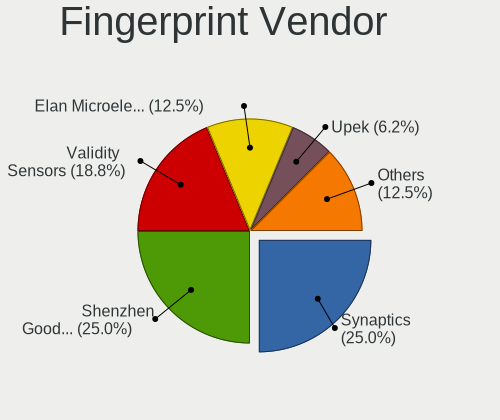

| Vendor                     | Computers | Percent |
|----------------------------|-----------|---------|
| Validity Sensors           | 2         | 28.57%  |
| Upek                       | 2         | 28.57%  |
| Synaptics                  | 1         | 14.29%  |
| Shenzhen Goodix Technology | 1         | 14.29%  |
| AuthenTec                  | 1         | 14.29%  |

Fingerprint Model
-----------------

Fingerprint sensor models

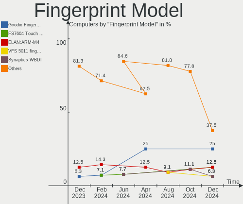

| Model                                                                      | Computers | Percent |
|----------------------------------------------------------------------------|-----------|---------|
| Upek Biometric Touchchip/Touchstrip Fingerprint Sensor                     | 2         | 28.57%  |
| Validity Sensors VFS451 Fingerprint Reader                                 | 1         | 14.29%  |
| Validity Sensors Synaptics VFS7552 Touch Fingerprint Sensor with PurePrint | 1         | 14.29%  |
| Synaptics  VFS7552 Touch Fingerprint Sensor with PurePrint                 | 1         | 14.29%  |
| Shenzhen Goodix  Fingerprint Device                                        | 1         | 14.29%  |
| AuthenTec AES1660 Fingerprint Sensor                                       | 1         | 14.29%  |

Chipcard Vendor
---------------

Chipcard module vendors

| Vendor      | Computers | Percent |
|-------------|-----------|---------|
| Broadcom    | 2         | 50%     |
| O2 Micro    | 1         | 25%     |
| Alcor Micro | 1         | 25%     |

Chipcard Model
--------------

Chipcard module models

| Model                                          | Computers | Percent |
|------------------------------------------------|-----------|---------|
| O2 Micro OZ776 CCID Smartcard Reader           | 1         | 25%     |
| Broadcom BCM5880 Secure Applications Processor | 1         | 25%     |
| Broadcom 5880                                  | 1         | 25%     |
| Alcor Micro AU9540 Smartcard Reader            | 1         | 25%     |

Unsupported
-----------

Unsupported Devices
-------------------

Total unsupported devices on board

| Total | Computers | Percent |
|-------|-----------|---------|
| 0     | 167       | 83.08%  |
| 1     | 27        | 13.43%  |
| 2     | 6         | 2.99%   |
| 5     | 1         | 0.5%    |

Unsupported Device Types
------------------------

Types of unsupported devices

| Type                     | Computers | Percent |
|--------------------------|-----------|---------|
| Graphics card            | 13        | 30.23%  |
| Fingerprint reader       | 7         | 16.28%  |
| Net/wireless             | 6         | 13.95%  |
| Chipcard                 | 4         | 9.3%    |
| Camera                   | 4         | 9.3%    |
| Communication controller | 3         | 6.98%   |
| Multimedia controller    | 2         | 4.65%   |
| Unassigned class         | 1         | 2.33%   |
| Tv card                  | 1         | 2.33%   |
| Sound                    | 1         | 2.33%   |
| Card reader              | 1         | 2.33%   |

