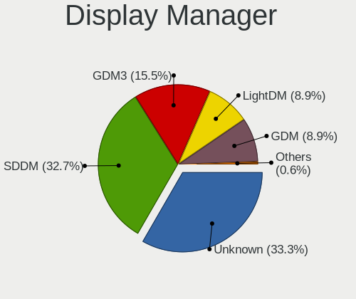
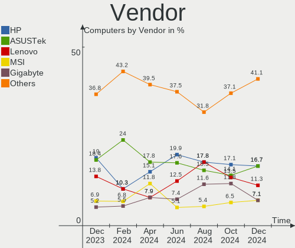
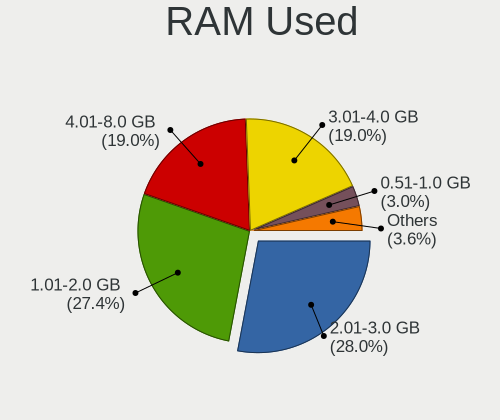
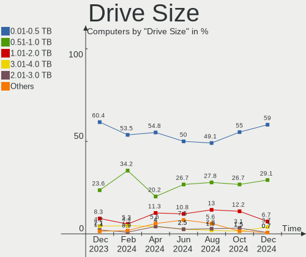
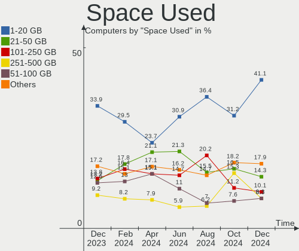
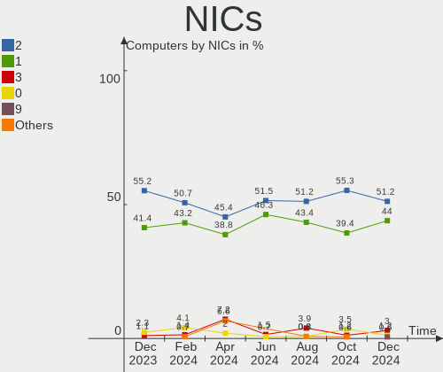
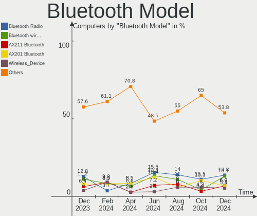
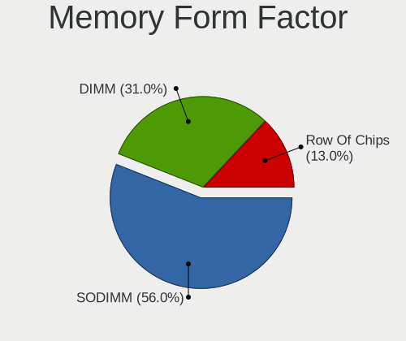

Linux in Spain - Hardware Trends
--------------------------------

A project to identify most popular hardware characteristics and track their change
over time based on data collected by Linux users at https://Linux-Hardware.org.

Anyone can contribute to this report by the [hw-probe](https://github.com/linuxhw/hw-probe) tool:

    sudo -E hw-probe -all -upload

This is a report for all computer types. See also reports for [desktops](/Location/Spain/Desktop/README.md) and [notebooks](/Location/Spain/Notebook/README.md).

Period: Apr, 2023.

Contents
--------

* [ System ](#system)
  - [ OS                       ](#os)
  - [ OS Family                ](#os-family)
  - [ Kernel                   ](#kernel)
  - [ Kernel Family            ](#kernel-family)
  - [ Kernel Major Ver.        ](#kernel-major-ver)
  - [ Arch                     ](#arch)
  - [ DE                       ](#de)
  - [ Display Server           ](#display-server)
  - [ Display Manager          ](#display-manager)
  - [ OS Lang                  ](#os-lang)
  - [ Boot Mode                ](#boot-mode)
  - [ Filesystem               ](#filesystem)
  - [ Part. scheme             ](#part-scheme)
  - [ Dual Boot with Linux/BSD ](#dual-boot-with-linuxbsd)
  - [ Dual Boot (Win)          ](#dual-boot-win)

* [ Board ](#board)
  - [ Vendor                   ](#vendor)
  - [ Model                    ](#model)
  - [ Model Family             ](#model-family)
  - [ MFG Year                 ](#mfg-year)
  - [ Form Factor              ](#form-factor)
  - [ Secure Boot              ](#secure-boot)
  - [ Coreboot                 ](#coreboot)
  - [ RAM Size                 ](#ram-size)
  - [ RAM Used                 ](#ram-used)
  - [ Total Drives             ](#total-drives)
  - [ Has CD-ROM               ](#has-cd-rom)
  - [ Has Ethernet             ](#has-ethernet)
  - [ Has WiFi                 ](#has-wifi)
  - [ Has Bluetooth            ](#has-bluetooth)

* [ Location ](#location)
  - [ Country                  ](#country)
  - [ City                     ](#city)

* [ Drives ](#drives)
  - [ Drive Vendor             ](#drive-vendor)
  - [ Drive Model              ](#drive-model)
  - [ HDD Vendor               ](#hdd-vendor)
  - [ SSD Vendor               ](#ssd-vendor)
  - [ Drive Kind               ](#drive-kind)
  - [ Drive Connector          ](#drive-connector)
  - [ Drive Size               ](#drive-size)
  - [ Space Total              ](#space-total)
  - [ Space Used               ](#space-used)
  - [ Malfunc. Drives          ](#malfunc-drives)
  - [ Malfunc. Drive Vendor    ](#malfunc-drive-vendor)
  - [ Malfunc. HDD Vendor      ](#malfunc-hdd-vendor)
  - [ Malfunc. Drive Kind      ](#malfunc-drive-kind)
  - [ Failed Drives            ](#failed-drives)
  - [ Failed Drive Vendor      ](#failed-drive-vendor)
  - [ Drive Status             ](#drive-status)

* [ Storage controller ](#storage-controller)
  - [ Storage Vendor           ](#storage-vendor)
  - [ Storage Model            ](#storage-model)
  - [ Storage Kind             ](#storage-kind)

* [ Processor ](#processor)
  - [ CPU Vendor               ](#cpu-vendor)
  - [ CPU Model                ](#cpu-model)
  - [ CPU Model Family         ](#cpu-model-family)
  - [ CPU Cores                ](#cpu-cores)
  - [ CPU Sockets              ](#cpu-sockets)
  - [ CPU Threads              ](#cpu-threads)
  - [ CPU Op-Modes             ](#cpu-op-modes)
  - [ CPU Microcode            ](#cpu-microcode)
  - [ CPU Microarch            ](#cpu-microarch)

* [ Graphics ](#graphics)
  - [ GPU Vendor               ](#gpu-vendor)
  - [ GPU Model                ](#gpu-model)
  - [ GPU Combo                ](#gpu-combo)
  - [ GPU Driver               ](#gpu-driver)
  - [ GPU Memory               ](#gpu-memory)

* [ Monitor ](#monitor)
  - [ Monitor Vendor           ](#monitor-vendor)
  - [ Monitor Model            ](#monitor-model)
  - [ Monitor Resolution       ](#monitor-resolution)
  - [ Monitor Diagonal         ](#monitor-diagonal)
  - [ Monitor Width            ](#monitor-width)
  - [ Aspect Ratio             ](#aspect-ratio)
  - [ Monitor Area             ](#monitor-area)
  - [ Pixel Density            ](#pixel-density)
  - [ Multiple Monitors        ](#multiple-monitors)

* [ Network ](#network)
  - [ Net Controller Vendor    ](#net-controller-vendor)
  - [ Net Controller Model     ](#net-controller-model)
  - [ Wireless Vendor          ](#wireless-vendor)
  - [ Wireless Model           ](#wireless-model)
  - [ Ethernet Vendor          ](#ethernet-vendor)
  - [ Ethernet Model           ](#ethernet-model)
  - [ Net Controller Kind      ](#net-controller-kind)
  - [ Used Controller          ](#used-controller)
  - [ NICs                     ](#nics)
  - [ IPv6                     ](#ipv6)

* [ Bluetooth ](#bluetooth)
  - [ Bluetooth Vendor         ](#bluetooth-vendor)
  - [ Bluetooth Model          ](#bluetooth-model)

* [ Sound ](#sound)
  - [ Sound Vendor             ](#sound-vendor)
  - [ Sound Model              ](#sound-model)

* [ Memory ](#memory)
  - [ Memory Vendor            ](#memory-vendor)
  - [ Memory Model             ](#memory-model)
  - [ Memory Kind              ](#memory-kind)
  - [ Memory Form Factor       ](#memory-form-factor)
  - [ Memory Size              ](#memory-size)
  - [ Memory Speed             ](#memory-speed)

* [ Printers & scanners ](#printers--scanners)
  - [ Printer Vendor           ](#printer-vendor)
  - [ Printer Model            ](#printer-model)
  - [ Scanner Vendor           ](#scanner-vendor)
  - [ Scanner Model            ](#scanner-model)

* [ Camera ](#camera)
  - [ Camera Vendor            ](#camera-vendor)
  - [ Camera Model             ](#camera-model)

* [ Security ](#security)
  - [ Fingerprint Vendor       ](#fingerprint-vendor)
  - [ Fingerprint Model        ](#fingerprint-model)
  - [ Chipcard Vendor          ](#chipcard-vendor)
  - [ Chipcard Model           ](#chipcard-model)

* [ Unsupported ](#unsupported)
  - [ Unsupported Devices      ](#unsupported-devices)
  - [ Unsupported Device Types ](#unsupported-device-types)

System
------

OS
--

Installed operating systems

| Name                         | Computers | Percent |
|------------------------------|-----------|---------|
| OpenMandriva 23.03           | 18        | 11.54%  |
| Ubuntu 22.04                 | 13        | 8.33%   |
| Debian 11                    | 10        | 6.41%   |
| Linux Mint 21.1              | 8         | 5.13%   |
| KDE neon 22.04               | 7         | 4.49%   |
| Ubuntu 22.10                 | 6         | 3.85%   |
| Arch Rolling                 | 6         | 3.85%   |
| Zorin 16                     | 5         | 3.21%   |
| Fedora 37                    | 5         | 3.21%   |
| Debian 12                    | 5         | 3.21%   |
| Kubuntu 22.04                | 4         | 2.56%   |
| Kali 2023.1                  | 4         | 2.56%   |
| Fedora 38                    | 4         | 2.56%   |
| ArcoLinux Rolling            | 4         | 2.56%   |
| Ubuntu 23.04                 | 3         | 1.92%   |
| SteamOS 3.4.6                | 3         | 1.92%   |
| openSUSE Tumbleweed-XXXXXXXX | 3         | 1.92%   |
| OpenMandriva 23.01           | 3         | 1.92%   |
| Manjaro 22.1.0               | 3         | 1.92%   |
| Manjaro                      | 3         | 1.92%   |
| EndeavourOS Rolling          | 3         | 1.92%   |
| Ubuntu 20.04                 | 2         | 1.28%   |
| Ubuntu 18.04                 | 2         | 1.28%   |
| Pop!_OS 22.04                | 2         | 1.28%   |
| OpenMandriva 4.3             | 2         | 1.28%   |
| Nobara 37                    | 2         | 1.28%   |
| LMDE 5                       | 2         | 1.28%   |
| Linux Mint 21                | 2         | 1.28%   |
| Gentoo 2.13                  | 2         | 1.28%   |
| Xubuntu 23.04                | 1         | 0.64%   |
| Xubuntu 22.04                | 1         | 0.64%   |
| Xubuntu 20.04                | 1         | 0.64%   |
| Ultramarine Linux 37         | 1         | 0.64%   |
| Ubuntu Unity 22.04           | 1         | 0.64%   |
| Ubuntu MATE 22.04            | 1         | 0.64%   |
| Slackware 15.0               | 1         | 0.64%   |
| ROSA 12.3                    | 1         | 0.64%   |
| MX 23                        | 1         | 0.64%   |
| Linux Mint 20.3              | 1         | 0.64%   |
| Kubuntu 22.10                | 1         | 0.64%   |

OS Family
---------

OS without a version

| Name              | Computers | Percent |
|-------------------|-----------|---------|
| Ubuntu            | 26        | 16.67%  |
| OpenMandriva      | 23        | 14.74%  |
| Debian            | 16        | 10.26%  |
| Linux Mint        | 11        | 7.05%   |
| Fedora            | 10        | 6.41%   |
| KDE neon          | 7         | 4.49%   |
| Manjaro           | 6         | 3.85%   |
| Arch              | 6         | 3.85%   |
| Zorin             | 5         | 3.21%   |
| Kubuntu           | 5         | 3.21%   |
| Kali              | 4         | 2.56%   |
| ArcoLinux         | 4         | 2.56%   |
| Xubuntu           | 3         | 1.92%   |
| SteamOS           | 3         | 1.92%   |
| openSUSE          | 3         | 1.92%   |
| Gentoo            | 3         | 1.92%   |
| EndeavourOS       | 3         | 1.92%   |
| Pop!_OS           | 2         | 1.28%   |
| Nobara            | 2         | 1.28%   |
| LMDE              | 2         | 1.28%   |
| Ultramarine Linux | 1         | 0.64%   |
| Ubuntu Unity      | 1         | 0.64%   |
| Ubuntu MATE       | 1         | 0.64%   |
| Slackware         | 1         | 0.64%   |
| ROSA              | 1         | 0.64%   |
| MX                | 1         | 0.64%   |
| Kaisen            | 1         | 0.64%   |
| Garuda Linux      | 1         | 0.64%   |
| Elementary        | 1         | 0.64%   |
| Devuan            | 1         | 0.64%   |
| ChimeraOS         | 1         | 0.64%   |
| BigLinux          | 1         | 0.64%   |

Kernel
------

Version of the Linux kernel

| Version                      | Computers | Percent |
|------------------------------|-----------|---------|
| 6.2.6-desktop-1omv2390       | 18        | 11.54%  |
| 5.19.0-38-generic            | 18        | 11.54%  |
| 5.15.0-69-generic            | 9         | 5.77%   |
| 5.10.0-21-amd64              | 7         | 4.49%   |
| 5.19.0-41-generic            | 6         | 3.85%   |
| 5.19.0-40-generic            | 6         | 3.85%   |
| 6.1.0-7-amd64                | 4         | 2.56%   |
| 5.15.0-67-generic            | 4         | 2.56%   |
| 6.2.11-arch1-1               | 3         | 1.92%   |
| 6.2.10-arch1-1               | 3         | 1.92%   |
| 6.1.1-desktop-1omv2290       | 3         | 1.92%   |
| 6.1.0-kali7-amd64            | 3         | 1.92%   |
| 5.13.0-valve36-1-neptune     | 3         | 1.92%   |
| 5.10.0-20-amd64              | 3         | 1.92%   |
| 6.2.8-1-MANJARO              | 2         | 1.28%   |
| 6.2.12-300.fc38.x86_64       | 2         | 1.28%   |
| 6.2.12-1-default             | 2         | 1.28%   |
| 6.2.11-300.fc38.x86_64       | 2         | 1.28%   |
| 6.2.0-20-generic             | 2         | 1.28%   |
| 6.1.23-1-MANJARO             | 2         | 1.28%   |
| 6.1.21-1-MANJARO             | 2         | 1.28%   |
| 5.4.0-146-generic            | 2         | 1.28%   |
| 5.16.7-desktop-1omv4003      | 2         | 1.28%   |
| 5.15.0-71-generic            | 2         | 1.28%   |
| 5.10.0-12-amd64              | 2         | 1.28%   |
| 6.2.9-arch1-1                | 1         | 0.64%   |
| 6.2.9-200.fc37.x86_64        | 1         | 0.64%   |
| 6.2.8-zen1-1-zen             | 1         | 0.64%   |
| 6.2.8-200.fsync.fc37.x86_64  | 1         | 0.64%   |
| 6.2.8-200.fc37.x86_64        | 1         | 0.64%   |
| 6.2.8-1-default              | 1         | 0.64%   |
| 6.2.6-76060206-generic       | 1         | 0.64%   |
| 6.2.13-arch1-1               | 1         | 0.64%   |
| 6.2.12-zen1-1-zen            | 1         | 0.64%   |
| 6.2.12-arch1-1               | 1         | 0.64%   |
| 6.2.12-200.fc37.x86_64       | 1         | 0.64%   |
| 6.2.11-200.fc37.x86_64       | 1         | 0.64%   |
| 6.2.11-060211-generic        | 1         | 0.64%   |
| 6.2.10-zen1-1-zen            | 1         | 0.64%   |
| 6.2.10-200.fsync.fc37.x86_64 | 1         | 0.64%   |

Kernel Family
-------------

Linux kernel without a distro release

| Version | Computers | Percent |
|---------|-----------|---------|
| 5.19.0  | 32        | 20.51%  |
| 5.15.0  | 20        | 12.82%  |
| 6.2.6   | 19        | 12.18%  |
| 5.10.0  | 12        | 7.69%   |
| 6.1.0   | 10        | 6.41%   |
| 6.2.12  | 7         | 4.49%   |
| 6.2.11  | 7         | 4.49%   |
| 6.2.8   | 6         | 3.85%   |
| 6.2.10  | 5         | 3.21%   |
| 6.2.0   | 3         | 1.92%   |
| 6.1.21  | 3         | 1.92%   |
| 6.1.1   | 3         | 1.92%   |
| 5.13.0  | 3         | 1.92%   |
| 6.2.9   | 2         | 1.28%   |
| 6.1.23  | 2         | 1.28%   |
| 6.1.15  | 2         | 1.28%   |
| 5.4.0   | 2         | 1.28%   |
| 5.16.7  | 2         | 1.28%   |
| 6.2.13  | 1         | 0.64%   |
| 6.1.26  | 1         | 0.64%   |
| 6.1.22  | 1         | 0.64%   |
| 6.1.12  | 1         | 0.64%   |
| 6.0.8   | 1         | 0.64%   |
| 6.0.7   | 1         | 0.64%   |
| 5.19.17 | 1         | 0.64%   |
| 5.18.0  | 1         | 0.64%   |
| 5.16.11 | 1         | 0.64%   |
| 5.15.94 | 1         | 0.64%   |
| 5.15.80 | 1         | 0.64%   |
| 5.15.79 | 1         | 0.64%   |
| 5.15.44 | 1         | 0.64%   |
| 5.11.0  | 1         | 0.64%   |
| 4.19.0  | 1         | 0.64%   |
| 4.15.0  | 1         | 0.64%   |

Kernel Major Ver.
-----------------

Linux kernel major version

| Version | Computers | Percent |
|---------|-----------|---------|
| 6.2     | 50        | 32.05%  |
| 5.19    | 33        | 21.15%  |
| 5.15    | 24        | 15.38%  |
| 6.1     | 23        | 14.74%  |
| 5.10    | 12        | 7.69%   |
| 5.16    | 3         | 1.92%   |
| 5.13    | 3         | 1.92%   |
| 6.0     | 2         | 1.28%   |
| 5.4     | 2         | 1.28%   |
| 5.18    | 1         | 0.64%   |
| 5.11    | 1         | 0.64%   |
| 4.19    | 1         | 0.64%   |
| 4.15    | 1         | 0.64%   |

Arch
----

OS architecture (x86_64, i586, etc.)

| Name   | Computers | Percent |
|--------|-----------|---------|
| x86_64 | 154       | 98.72%  |
| i686   | 1         | 0.64%   |
| armv7l | 1         | 0.64%   |

DE
--

Desktop Environment

| Name            | Computers | Percent |
|-----------------|-----------|---------|
| KDE5            | 57        | 36.54%  |
| GNOME           | 54        | 34.62%  |
| XFCE            | 10        | 6.41%   |
| Unknown         | 9         | 5.77%   |
| X-Cinnamon      | 7         | 4.49%   |
| MATE            | 4         | 2.56%   |
| LXQt            | 3         | 1.92%   |
| Cinnamon        | 2         | 1.28%   |
| Budgie          | 2         | 1.28%   |
| bspwm           | 2         | 1.28%   |
| Unity           | 1         | 0.64%   |
| Pantheon        | 1         | 0.64%   |
| openbox         | 1         | 0.64%   |
| Hyprland        | 1         | 0.64%   |
| GNOME Flashback | 1         | 0.64%   |
| chadwm          | 1         | 0.64%   |

Display Server
--------------

X11 or Wayland

| Name    | Computers | Percent |
|---------|-----------|---------|
| X11     | 108       | 69.23%  |
| Wayland | 40        | 25.64%  |
| Unknown | 6         | 3.85%   |
| Tty     | 2         | 1.28%   |

Display Manager
---------------

SDDM, LightDM, etc.

| Name    | Computers | Percent |
|---------|-----------|---------|
| Unknown | 58        | 37.18%  |
| SDDM    | 40        | 25.64%  |
| GDM3    | 25        | 16.03%  |
| LightDM | 21        | 13.46%  |
| GDM     | 11        | 7.05%   |
| LXDM    | 1         | 0.64%   |

OS Lang
-------

Language

| Lang       | Computers | Percent |
|------------|-----------|---------|
| es_ES      | 99        | 63.46%  |
| en_US      | 33        | 21.15%  |
| Unknown    | 8         | 5.13%   |
| ca_ES      | 6         | 3.85%   |
| en_GB      | 3         | 1.92%   |
| C          | 2         | 1.28%   |
| POSIX      | 1         | 0.64%   |
| es_ES.UTF8 | 1         | 0.64%   |
| en_AG      | 1         | 0.64%   |
| ca_AD      | 1         | 0.64%   |
| an_ES      | 1         | 0.64%   |

Boot Mode
---------

EFI or BIOS

| Mode | Computers | Percent |
|------|-----------|---------|
| EFI  | 79        | 50.64%  |
| BIOS | 77        | 49.36%  |

Filesystem
----------

Type of filesystem

| Type    | Computers | Percent |
|---------|-----------|---------|
| Ext4    | 94        | 60.26%  |
| Btrfs   | 29        | 18.59%  |
| Overlay | 16        | 10.26%  |
| Tmpfs   | 11        | 7.05%   |
| Zfs     | 4         | 2.56%   |
| Xfs     | 1         | 0.64%   |
| Jfs     | 1         | 0.64%   |

Part. scheme
------------

Scheme of partitioning

| Type    | Computers | Percent |
|---------|-----------|---------|
| GPT     | 89        | 57.05%  |
| Unknown | 51        | 32.69%  |
| MBR     | 16        | 10.26%  |

Dual Boot with Linux/BSD
------------------------

Hosting more than one Linux/BSD

| Dual boot | Computers | Percent |
|-----------|-----------|---------|
| No        | 129       | 82.69%  |
| Yes       | 27        | 17.31%  |

Dual Boot (Win)
---------------

Hosting Linux and Windows

| Dual boot | Computers | Percent |
|-----------|-----------|---------|
| No        | 99        | 63.46%  |
| Yes       | 57        | 36.54%  |

Board
-----

Vendor
------

Motherboard manufacturer

| Name                    | Computers | Percent |
|-------------------------|-----------|---------|
| ASUSTek Computer        | 33        | 21.15%  |
| Hewlett-Packard         | 23        | 14.74%  |
| MSI                     | 16        | 10.26%  |
| Lenovo                  | 16        | 10.26%  |
| Gigabyte Technology     | 16        | 10.26%  |
| Dell                    | 11        | 7.05%   |
| HUAWEI                  | 4         | 2.56%   |
| Apple                   | 4         | 2.56%   |
| Valve                   | 3         | 1.92%   |
| Toshiba                 | 3         | 1.92%   |
| Medion                  | 3         | 1.92%   |
| Acer                    | 3         | 1.92%   |
| Intel                   | 2         | 1.28%   |
| Chuwi                   | 2         | 1.28%   |
| BESSTAR Tech            | 2         | 1.28%   |
| ASRock                  | 2         | 1.28%   |
| AMI                     | 2         | 1.28%   |
| Timi                    | 1         | 0.64%   |
| Thomson                 | 1         | 0.64%   |
| Sony                    | 1         | 0.64%   |
| Shuttle                 | 1         | 0.64%   |
| Raspberry Pi Foundation | 1         | 0.64%   |
| Packard Bell            | 1         | 0.64%   |
| MiTAC                   | 1         | 0.64%   |
| INSYS                   | 1         | 0.64%   |
| Google                  | 1         | 0.64%   |
| Dynabook                | 1         | 0.64%   |
| Acidanthera             | 1         | 0.64%   |

Model
-----

Motherboard model

| Name                                  | Computers | Percent |
|---------------------------------------|-----------|---------|
| Valve Jupiter                         | 3         | 1.92%   |
| Gigabyte G5 GD                        | 3         | 1.92%   |
| MSI Modern 14 A10M                    | 2         | 1.28%   |
| Lenovo Legion 5 15ACH6H 82JU          | 2         | 1.28%   |
| HP EliteDesk 800 G1 SFF               | 2         | 1.28%   |
| ASUS TUF Gaming B550-PLUS             | 2         | 1.28%   |
| ASUS ROG Zephyrus G14 GA401II_GA401II | 2         | 1.28%   |
| ASUS PRIME A320M-K                    | 2         | 1.28%   |
| ASRock H81M-VG4 R2.0                  | 2         | 1.28%   |
| Apple iMac7,1                         | 2         | 1.28%   |
| AMI Intel                             | 2         | 1.28%   |
| Toshiba Satellite L500                | 1         | 0.64%   |
| Toshiba Satellite L50-C               | 1         | 0.64%   |
| Toshiba Satellite L350D               | 1         | 0.64%   |
| Timi RedmiBook 16                     | 1         | 0.64%   |
| Thomson SPNEOX13-4RD64                | 1         | 0.64%   |
| Sony VPCZ13M9E                        | 1         | 0.64%   |
| Shuttle SG45                          | 1         | 0.64%   |
| RPi Raspberry Pi 4 Model B Rev 1.4    | 1         | 0.64%   |
| Packard Bell IMEDIA S2870             | 1         | 0.64%   |
| MSI Stealth 15M B12UE                 | 1         | 0.64%   |
| MSI PS42 Modern 8RC                   | 1         | 0.64%   |
| MSI Prestige 15 A12UC                 | 1         | 0.64%   |
| MSI MS-7C95                           | 1         | 0.64%   |
| MSI MS-7C52                           | 1         | 0.64%   |
| MSI MS-7C09                           | 1         | 0.64%   |
| MSI MS-7B29                           | 1         | 0.64%   |
| MSI MS-7A74                           | 1         | 0.64%   |
| MSI MS-7A63                           | 1         | 0.64%   |
| MSI MS-7721                           | 1         | 0.64%   |
| MSI MS-7693                           | 1         | 0.64%   |
| MSI Modern 15 A11SBU                  | 1         | 0.64%   |
| MSI GF63 Thin 9SC                     | 1         | 0.64%   |
| MSI Bravo 15 B5DD                     | 1         | 0.64%   |
| MiTAC Notebook PC                     | 1         | 0.64%   |
| Medion E2221T MD61083                 | 1         | 0.64%   |
| Medion E15415                         | 1         | 0.64%   |
| Medion D3F3-EM                        | 1         | 0.64%   |
| Lenovo V130-20IGM AIO 10RX004PSP      | 1         | 0.64%   |
| Lenovo ThinkPad T490 20N20008US       | 1         | 0.64%   |

Model Family
------------

Motherboard model prefix

| Name                   | Computers | Percent |
|------------------------|-----------|---------|
| ASUS TUF               | 6         | 3.85%   |
| Lenovo ThinkPad        | 5         | 3.21%   |
| HP Compaq              | 5         | 3.21%   |
| ASUS PRIME             | 5         | 3.21%   |
| Lenovo Legion          | 4         | 2.56%   |
| Lenovo IdeaPad         | 4         | 2.56%   |
| HP EliteDesk           | 4         | 2.56%   |
| ASUS ROG               | 4         | 2.56%   |
| Valve Jupiter          | 3         | 1.92%   |
| Toshiba Satellite      | 3         | 1.92%   |
| MSI Modern             | 3         | 1.92%   |
| HP Pavilion            | 3         | 1.92%   |
| HP Laptop              | 3         | 1.92%   |
| Gigabyte G5            | 3         | 1.92%   |
| Dell Latitude          | 3         | 1.92%   |
| Dell Inspiron          | 3         | 1.92%   |
| ASUS VivoBook          | 3         | 1.92%   |
| HP OMEN                | 2         | 1.28%   |
| Gigabyte Z390          | 2         | 1.28%   |
| Gigabyte B365M         | 2         | 1.28%   |
| Dell Precision         | 2         | 1.28%   |
| Dell OptiPlex          | 2         | 1.28%   |
| ASUS ASUS              | 2         | 1.28%   |
| ASRock H81M-VG4        | 2         | 1.28%   |
| Apple iMac7            | 2         | 1.28%   |
| AMI Intel              | 2         | 1.28%   |
| Acer Aspire            | 2         | 1.28%   |
| Timi RedmiBook         | 1         | 0.64%   |
| Thomson SPNEOX13-4RD64 | 1         | 0.64%   |
| Sony VPCZ13M9E         | 1         | 0.64%   |
| Shuttle SG45           | 1         | 0.64%   |
| RPi Raspberry          | 1         | 0.64%   |
| Packard Bell IMEDIA    | 1         | 0.64%   |
| MSI Stealth            | 1         | 0.64%   |
| MSI PS42               | 1         | 0.64%   |
| MSI Prestige           | 1         | 0.64%   |
| MSI MS-7C95            | 1         | 0.64%   |
| MSI MS-7C52            | 1         | 0.64%   |
| MSI MS-7C09            | 1         | 0.64%   |
| MSI MS-7B29            | 1         | 0.64%   |

MFG Year
--------

Motherboard manufacture year

| Year    | Computers | Percent |
|---------|-----------|---------|
| 2022    | 19        | 12.18%  |
| 2021    | 19        | 12.18%  |
| 2019    | 15        | 9.62%   |
| 2018    | 15        | 9.62%   |
| 2015    | 14        | 8.97%   |
| 2020    | 13        | 8.33%   |
| 2017    | 11        | 7.05%   |
| 2014    | 10        | 6.41%   |
| 2012    | 7         | 4.49%   |
| 2013    | 6         | 3.85%   |
| 2008    | 6         | 3.85%   |
| 2016    | 5         | 3.21%   |
| 2007    | 5         | 3.21%   |
| 2009    | 4         | 2.56%   |
| 2011    | 3         | 1.92%   |
| 2010    | 2         | 1.28%   |
| 2006    | 1         | 0.64%   |
| Unknown | 1         | 0.64%   |

Form Factor
-----------

Physical design of the computer

| Name           | Computers | Percent |
|----------------|-----------|---------|
| Notebook       | 80        | 51.28%  |
| Desktop        | 63        | 40.38%  |
| All in one     | 5         | 3.21%   |
| Convertible    | 4         | 2.56%   |
| Mini pc        | 3         | 1.92%   |
| System on chip | 1         | 0.64%   |

Secure Boot
-----------

Enabled or disabled

| State    | Computers | Percent |
|----------|-----------|---------|
| Disabled | 145       | 92.95%  |
| Enabled  | 11        | 7.05%   |

Coreboot
--------

Have coreboot on board

| Used | Computers | Percent |
|------|-----------|---------|
| No   | 155       | 99.36%  |
| Yes  | 1         | 0.64%   |

RAM Size
--------

Total RAM memory

| Size in GB  | Computers | Percent |
|-------------|-----------|---------|
| 16.01-24.0  | 35        | 22.44%  |
| 8.01-16.0   | 35        | 22.44%  |
| 4.01-8.0    | 32        | 20.51%  |
| 32.01-64.0  | 22        | 14.1%   |
| 3.01-4.0    | 16        | 10.26%  |
| 24.01-32.0  | 5         | 3.21%   |
| 64.01-256.0 | 5         | 3.21%   |
| 2.01-3.0    | 4         | 2.56%   |
| 1.01-2.0    | 2         | 1.28%   |

RAM Used
--------

Used RAM memory

| Used GB    | Computers | Percent |
|------------|-----------|---------|
| 1.01-2.0   | 51        | 32.69%  |
| 2.01-3.0   | 31        | 19.87%  |
| 3.01-4.0   | 30        | 19.23%  |
| 4.01-8.0   | 26        | 16.67%  |
| 0.51-1.0   | 7         | 4.49%   |
| 16.01-24.0 | 4         | 2.56%   |
| 8.01-16.0  | 4         | 2.56%   |
| 0.01-0.5   | 2         | 1.28%   |
| 32.01-64.0 | 1         | 0.64%   |

Total Drives
------------

Number of drives on board

| Drives | Computers | Percent |
|--------|-----------|---------|
| 1      | 74        | 47.44%  |
| 2      | 53        | 33.97%  |
| 3      | 13        | 8.33%   |
| 4      | 5         | 3.21%   |
| 6      | 4         | 2.56%   |
| 7      | 2         | 1.28%   |
| 5      | 2         | 1.28%   |
| 0      | 2         | 1.28%   |
| 9      | 1         | 0.64%   |

Has CD-ROM
----------

Has CD-ROM on board

| Presented | Computers | Percent |
|-----------|-----------|---------|
| No        | 113       | 72.44%  |
| Yes       | 43        | 27.56%  |

Has Ethernet
------------

Has Ethernet on board

| Presented | Computers | Percent |
|-----------|-----------|---------|
| Yes       | 128       | 82.05%  |
| No        | 28        | 17.95%  |

Has WiFi
--------

Has WiFi module

| Presented | Computers | Percent |
|-----------|-----------|---------|
| Yes       | 122       | 78.21%  |
| No        | 34        | 21.79%  |

Has Bluetooth
-------------

Has Bluetooth module

| Presented | Computers | Percent |
|-----------|-----------|---------|
| Yes       | 103       | 66.03%  |
| No        | 53        | 33.97%  |

Location
--------

Country
-------

Geographic location (country)

| Country | Computers | Percent |
|---------|-----------|---------|
| Spain   | 156       | 100%    |

City
----

Geographic location (city)

| City                     | Computers | Percent |
|--------------------------|-----------|---------|
| Madrid                   | 23        | 14.74%  |
| Barcelona                | 20        | 12.82%  |
| Seville                  | 10        | 6.41%   |
| Valencia                 | 8         | 5.13%   |
| Oviedo                   | 4         | 2.56%   |
| Ourense                  | 4         | 2.56%   |
| Burgos                   | 4         | 2.56%   |
| Zaragoza                 | 3         | 1.92%   |
| Palma                    | 3         | 1.92%   |
| Fuenlabrada              | 3         | 1.92%   |
| Alcobendas               | 3         | 1.92%   |
| Valladolid               | 2         | 1.28%   |
| Santa Cruz de Tenerife   | 2         | 1.28%   |
| Málaga                  | 2         | 1.28%   |
| Granada                  | 2         | 1.28%   |
| Donostia / San Sebastian | 2         | 1.28%   |
| Badalona                 | 2         | 1.28%   |
| Alcalá de Henares       | 2         | 1.28%   |
| A Coruña                | 2         | 1.28%   |
| Zumarraga                | 1         | 0.64%   |
| Zafra                    | 1         | 0.64%   |
| Vitoria-Gasteiz          | 1         | 0.64%   |
| Vigo                     | 1         | 0.64%   |
| Valderrobres             | 1         | 0.64%   |
| Torremolinos             | 1         | 0.64%   |
| Segovia                  | 1         | 0.64%   |
| Sedavi                   | 1         | 0.64%   |
| Santander                | 1         | 0.64%   |
| Sant Feliu de Llobregat  | 1         | 0.64%   |
| Sant Celoni              | 1         | 0.64%   |
| Sanlúcar de Barrameda   | 1         | 0.64%   |
| Salamanca                | 1         | 0.64%   |
| Sabadell                 | 1         | 0.64%   |
| Roda de Ter              | 1         | 0.64%   |
| Roda de Berà            | 1         | 0.64%   |
| Reus                     | 1         | 0.64%   |
| Priego de Cordoba        | 1         | 0.64%   |
| Pozuelo de Alarcón      | 1         | 0.64%   |
| Palencia                 | 1         | 0.64%   |
| Ontinyent                | 1         | 0.64%   |

Drives
------

Drive Vendor
------------

Hard drive vendors

| Vendor                       | Computers | Drives  | Percent |
|------------------------------|-----------|---------|---------|
| Seagate                      | 39        | 56      | 15.73%  |
| Samsung Electronics          | 34        | 44      | 13.71%  |
| WDC                          | 30        | 37      | 12.1%   |
| Kingston                     | 28        | 30      | 11.29%  |
| Sandisk                      | 21        | 24      | 8.47%   |
| Crucial                      | 13        | 16      | 5.24%   |
| Toshiba                      | 11        | 12      | 4.44%   |
| Unknown                      | 10        | 11      | 4.03%   |
| Micron Technology            | 6         | 6       | 2.42%   |
| Phison Electronics           | 5         | 6       | 2.02%   |
| Hitachi                      | 5         | 5       | 2.02%   |
| Micron/Crucial Technology    | 4         | 5       | 1.61%   |
| Intel                        | 4         | 5       | 1.61%   |
| China                        | 4         | 4       | 1.61%   |
| SK hynix                     | 3         | 3       | 1.21%   |
| Phison                       | 3         | 3       | 1.21%   |
| Kingston Technology Company  | 3         | 3       | 1.21%   |
| Silicon Motion               | 2         | 2       | 0.81%   |
| WALRAM                       | 1         | 1       | 0.4%    |
| Union Memory                 | 1         | 1       | 0.4%    |
| Transcend                    | 1         | 1       | 0.4%    |
| TO Exter                     | 1         | 1       | 0.4%    |
| SSD 2TB                      | 1         | 1       | 0.4%    |
| SPCC                         | 1         | 1       | 0.4%    |
| Shenzhen Longsys Electronics | 1         | 1       | 0.4%    |
| SABRENT                      | 1         | 1       | 0.4%    |
| Patriot                      | 1         | 1       | 0.4%    |
| OYUNKEY                      | 1         | 1       | 0.4%    |
| Netac                        | 1         | 1       | 0.4%    |
| Morebeck-N100                | 1         | 1       | 0.4%    |
| Maxtor                       | 1         | 1       | 0.4%    |
| LITEONIT                     | 1         | 1       | 0.4%    |
| KingSpec                     | 1         | 1       | 0.4%    |
| HPE                          | 1         | 2       | 0.4%    |
| HL-DT-ST                     | 1         | Unknown | 0.4%    |
| HGST                         | 1         | 1       | 0.4%    |
| FORESEE                      | 1         | 1       | 0.4%    |
| Fanxiang                     | 1         | 1       | 0.4%    |
| Emtec                        | 1         | 1       | 0.4%    |
| BAITITON                     | 1         | 1       | 0.4%    |

Drive Model
-----------

Hard drive models

| Model                                                 | Computers | Percent |
|-------------------------------------------------------|-----------|---------|
| Seagate ST500DM002-1BD142 500GB                       | 7         | 2.46%   |
| Samsung NVMe SSD Controller SM981/PM981/PM983 1TB     | 7         | 2.46%   |
| Kingston SA400S37240G 240GB SSD                       | 6         | 2.11%   |
| Kingston SA400S37480G 480GB SSD                       | 5         | 1.76%   |
| Seagate ST2000DM008-2FR102 2TB                        | 4         | 1.41%   |
| Seagate ST1000DM010-2EP102 1TB                        | 4         | 1.41%   |
| Kingston SA400S37120G 120GB SSD                       | 4         | 1.41%   |
| Crucial CT480BX500SSD1 480GB                          | 4         | 1.41%   |
| Seagate ST1000DM003-1ER162 1TB                        | 3         | 1.06%   |
| Sandisk WD Black SN750 / PC SN730 NVMe SSD 512GB      | 3         | 1.06%   |
| Sandisk WD Black 2018/SN750 / PC SN720 NVMe SSD 500GB | 3         | 1.06%   |
| Kingston SV300S37A120G 120GB SSD                      | 3         | 1.06%   |
| Kingston SA400S37960G 960GB SSD                       | 3         | 1.06%   |
| WDC WDS500G2B0A-00SM50 500GB SSD                      | 2         | 0.7%    |
| WDC WD20EZRZ-00Z5HB0 2TB                              | 2         | 0.7%    |
| WDC WD20EARX-00PASB0 2TB                              | 2         | 0.7%    |
| WDC WD10EZEX-08WN4A0 1TB                              | 2         | 0.7%    |
| Unknown MMC Card  64GB                                | 2         | 0.7%    |
| Unknown MMC Card  32GB                                | 2         | 0.7%    |
| Toshiba DT01ACA200 2TB                                | 2         | 0.7%    |
| Seagate ST500LT012-1DG142 500GB                       | 2         | 0.7%    |
| Seagate ST3500418AS 500GB                             | 2         | 0.7%    |
| Seagate ST3120827AS 120GB                             | 2         | 0.7%    |
| Seagate ST2000DM008-2UB102 2TB                        | 2         | 0.7%    |
| Seagate ST1000DM003-1CH162 1TB                        | 2         | 0.7%    |
| Sandisk WD Blue SN550 NVMe SSD 1024GB                 | 2         | 0.7%    |
| SanDisk SD9SN8W256G1102 256GB SSD                     | 2         | 0.7%    |
| Samsung SSD 870 QVO 2TB                               | 2         | 0.7%    |
| Samsung SSD 870 EVO 500GB                             | 2         | 0.7%    |
| Samsung SSD 860 EVO 500GB                             | 2         | 0.7%    |
| Samsung SSD 850 EVO 500GB                             | 2         | 0.7%    |
| Samsung SSD 850 EVO 250GB                             | 2         | 0.7%    |
| Phison E16 PCIe4 NVMe Controller 500GB                | 2         | 0.7%    |
| Phison E12 NVMe Controller 512GB                      | 2         | 0.7%    |
| Micron/Crucial P2 NVMe PCIe SSD 1TB                   | 2         | 0.7%    |
| Kingston Company OM3PDP3 NVMe SSD 512GB               | 2         | 0.7%    |
| Kingston SUV400S37240G 240GB SSD                      | 2         | 0.7%    |
| Crucial CT500MX500SSD1 500GB                          | 2         | 0.7%    |
| Crucial CT240BX500SSD1 240GB                          | 2         | 0.7%    |
| Crucial CT1000MX500SSD1 1TB                           | 2         | 0.7%    |

HDD Vendor
----------

Hard disk drive vendors

| Vendor              | Computers | Drives | Percent |
|---------------------|-----------|--------|---------|
| Seagate             | 39        | 56     | 48.15%  |
| WDC                 | 21        | 27     | 25.93%  |
| Toshiba             | 8         | 9      | 9.88%   |
| Hitachi             | 5         | 5      | 6.17%   |
| Samsung Electronics | 4         | 4      | 4.94%   |
| Unknown             | 1         | 1      | 1.23%   |
| Maxtor              | 1         | 1      | 1.23%   |
| HPE                 | 1         | 2      | 1.23%   |
| HGST                | 1         | 1      | 1.23%   |

SSD Vendor
----------

Solid state drive vendors

| Vendor              | Computers | Drives | Percent |
|---------------------|-----------|--------|---------|
| Kingston            | 26        | 27     | 27.37%  |
| Samsung Electronics | 20        | 23     | 21.05%  |
| Crucial             | 13        | 15     | 13.68%  |
| SanDisk             | 9         | 10     | 9.47%   |
| WDC                 | 8         | 8      | 8.42%   |
| China               | 4         | 4      | 4.21%   |
| SK hynix            | 2         | 2      | 2.11%   |
| Transcend           | 1         | 1      | 1.05%   |
| Toshiba             | 1         | 1      | 1.05%   |
| TO Exter            | 1         | 1      | 1.05%   |
| SPCC                | 1         | 1      | 1.05%   |
| Patriot             | 1         | 1      | 1.05%   |
| OYUNKEY             | 1         | 1      | 1.05%   |
| Netac               | 1         | 1      | 1.05%   |
| LITEONIT            | 1         | 1      | 1.05%   |
| KingSpec            | 1         | 1      | 1.05%   |
| FORESEE             | 1         | 1      | 1.05%   |
| Fanxiang            | 1         | 1      | 1.05%   |
| Emtec               | 1         | 1      | 1.05%   |
| BAITITON            | 1         | 1      | 1.05%   |

Drive Kind
----------

HDD or SSD

| Kind    | Computers | Drives | Percent |
|---------|-----------|--------|---------|
| SSD     | 74        | 102    | 33.79%  |
| HDD     | 68        | 106    | 31.05%  |
| NVMe    | 65        | 74     | 29.68%  |
| MMC     | 10        | 11     | 4.57%   |
| Unknown | 2         | 2      | 0.91%   |

Drive Connector
---------------

SATA, SAS, NVMe, etc.

| Type | Computers | Drives | Percent |
|------|-----------|--------|---------|
| SATA | 109       | 200    | 56.19%  |
| NVMe | 64        | 73     | 32.99%  |
| SAS  | 11        | 11     | 5.67%   |
| MMC  | 10        | 11     | 5.15%   |

Drive Size
----------

Size of hard drive

| Size in TB | Computers | Drives | Percent |
|------------|-----------|--------|---------|
| 0.01-0.5   | 81        | 117    | 54%     |
| 0.51-1.0   | 42        | 53     | 28%     |
| 1.01-2.0   | 18        | 26     | 12%     |
| 4.01-10.0  | 4         | 5      | 2.67%   |
| 3.01-4.0   | 3         | 4      | 2%      |
| 2.01-3.0   | 2         | 3      | 1.33%   |

Space Total
-----------

Amount of disk space available on the file system

| Size in GB     | Computers | Percent |
|----------------|-----------|---------|
| 251-500        | 38        | 24.36%  |
| 101-250        | 30        | 19.23%  |
| 501-1000       | 22        | 14.1%   |
| 1-20           | 16        | 10.26%  |
| More than 3000 | 11        | 7.05%   |
| 2001-3000      | 9         | 5.77%   |
| 1001-2000      | 9         | 5.77%   |
| Unknown        | 9         | 5.77%   |
| 51-100         | 7         | 4.49%   |
| 21-50          | 5         | 3.21%   |

Space Used
----------

Amount of used disk space

| Used GB        | Computers | Percent |
|----------------|-----------|---------|
| 1-20           | 46        | 29.49%  |
| 51-100         | 24        | 15.38%  |
| 21-50          | 22        | 14.1%   |
| 101-250        | 18        | 11.54%  |
| 251-500        | 17        | 10.9%   |
| Unknown        | 9         | 5.77%   |
| 501-1000       | 7         | 4.49%   |
| 1001-2000      | 6         | 3.85%   |
| More than 3000 | 5         | 3.21%   |
| 2001-3000      | 2         | 1.28%   |

Malfunc. Drives
---------------

Drive models with a malfunction

| Model                              | Computers | Drives | Percent |
|------------------------------------|-----------|--------|---------|
| Seagate ST500DM002-1BD142 500GB    | 2         | 2      | 8.33%   |
| Kingston SV300S37A120G 120GB SSD   | 2         | 2      | 8.33%   |
| WDC WD6400BEVT-22A0RT0 640GB       | 1         | 1      | 4.17%   |
| WDC WD3200AAJS-40H3A0 320GB        | 1         | 1      | 4.17%   |
| WDC WD20PURZ-85GU6Y0 2TB           | 1         | 1      | 4.17%   |
| WDC WD20EARS-00MVWB0 2TB           | 1         | 2      | 4.17%   |
| WDC WD1002FAEX-00Z3A0 1TB          | 1         | 1      | 4.17%   |
| Toshiba MK2546GSX 250GB            | 1         | 1      | 4.17%   |
| Seagate ST9500325AS 500GB          | 1         | 1      | 4.17%   |
| Seagate ST3500630AS 500GB          | 1         | 1      | 4.17%   |
| Seagate ST3500418AS 500GB          | 1         | 1      | 4.17%   |
| Seagate ST3500320AS 500GB          | 1         | 1      | 4.17%   |
| Seagate ST3120827AS 120GB          | 1         | 1      | 4.17%   |
| Seagate ST31000528AS 1TB           | 1         | 1      | 4.17%   |
| Seagate ST3000DM001-1ER166 3TB     | 1         | 1      | 4.17%   |
| Seagate ST1000LM024 HN-M101MBB 1TB | 1         | 1      | 4.17%   |
| Samsung Electronics HD103UJ 1TB    | 1         | 1      | 4.17%   |
| Samsung Electronics HD103SJ 1TB    | 1         | 1      | 4.17%   |
| Maxtor 6Y120L0 128GB               | 1         | 1      | 4.17%   |
| HPE MB4000GEFNA 4TB                | 1         | 2      | 4.17%   |
| Hitachi HTS723232A7A364 320GB      | 1         | 1      | 4.17%   |
| China G521N256GB                   | 1         | 1      | 4.17%   |

Malfunc. Drive Vendor
---------------------

Vendors of faulty drives

| Vendor              | Computers | Drives | Percent |
|---------------------|-----------|--------|---------|
| Seagate             | 9         | 10     | 39.13%  |
| WDC                 | 5         | 6      | 21.74%  |
| Samsung Electronics | 2         | 2      | 8.7%    |
| Kingston            | 2         | 2      | 8.7%    |
| Toshiba             | 1         | 1      | 4.35%   |
| Maxtor              | 1         | 1      | 4.35%   |
| HPE                 | 1         | 2      | 4.35%   |
| Hitachi             | 1         | 1      | 4.35%   |
| China               | 1         | 1      | 4.35%   |

Malfunc. HDD Vendor
-------------------

Vendors of faulty HDD drives

| Vendor              | Computers | Drives | Percent |
|---------------------|-----------|--------|---------|
| Seagate             | 9         | 10     | 45%     |
| WDC                 | 5         | 6      | 25%     |
| Samsung Electronics | 2         | 2      | 10%     |
| Toshiba             | 1         | 1      | 5%      |
| Maxtor              | 1         | 1      | 5%      |
| HPE                 | 1         | 2      | 5%      |
| Hitachi             | 1         | 1      | 5%      |

Malfunc. Drive Kind
-------------------

Kinds of faulty drives

| Kind | Computers | Drives | Percent |
|------|-----------|--------|---------|
| HDD  | 18        | 23     | 85.71%  |
| SSD  | 3         | 3      | 14.29%  |

Failed Drives
-------------

Failed drive models

Zero info for selected period =(

Failed Drive Vendor
-------------------

Failed drive vendors

Zero info for selected period =(

Drive Status
------------

Number of failed and malfunc. drives

| Status   | Computers | Drives | Percent |
|----------|-----------|--------|---------|
| Detected | 82        | 138    | 45.81%  |
| Works    | 76        | 131    | 42.46%  |
| Malfunc  | 21        | 26     | 11.73%  |

Storage controller
------------------

Storage Vendor
--------------

Storage controller vendors

| Vendor                           | Computers | Percent |
|----------------------------------|-----------|---------|
| Intel                            | 94        | 47%     |
| AMD                              | 35        | 17.5%   |
| SanDisk                          | 15        | 7.5%    |
| Samsung Electronics              | 15        | 7.5%    |
| Phison Electronics               | 7         | 3.5%    |
| Micron Technology                | 6         | 3%      |
| Kingston Technology Company      | 6         | 3%      |
| Micron/Crucial Technology        | 5         | 2.5%    |
| Silicon Motion                   | 3         | 1.5%    |
| Toshiba America Info Systems     | 2         | 1%      |
| JMicron Technology               | 2         | 1%      |
| VIA Technologies                 | 1         | 0.5%    |
| Union Memory (Shenzhen)          | 1         | 0.5%    |
| SK hynix                         | 1         | 0.5%    |
| Silicon Integrated Systems [SiS] | 1         | 0.5%    |
| Shenzhen Longsys Electronics     | 1         | 0.5%    |
| Nvidia                           | 1         | 0.5%    |
| Marvell Technology Group         | 1         | 0.5%    |
| LSI Logic / Symbios Logic        | 1         | 0.5%    |
| Integrated Technology Express    | 1         | 0.5%    |
| ASMedia Technology               | 1         | 0.5%    |

Storage Model
-------------

Storage controller models

| Model                                                                          | Computers | Percent |
|--------------------------------------------------------------------------------|-----------|---------|
| AMD FCH SATA Controller [AHCI mode]                                            | 26        | 11.4%   |
| Samsung NVMe SSD Controller SM981/PM981/PM983                                  | 9         | 3.95%   |
| Intel 8 Series/C220 Series Chipset Family 6-port SATA Controller 1 [AHCI mode] | 8         | 3.51%   |
| Intel 200 Series PCH SATA controller [AHCI mode]                               | 8         | 3.51%   |
| Intel Sunrise Point-LP SATA Controller [AHCI mode]                             | 7         | 3.07%   |
| SanDisk WD Black SN750 / PC SN730 NVMe SSD                                     | 5         | 2.19%   |
| Samsung NVMe SSD Controller 980                                                | 5         | 2.19%   |
| Micron NVMe Storage Controller                                                 | 5         | 2.19%   |
| Intel Wildcat Point-LP SATA Controller [AHCI Mode]                             | 5         | 2.19%   |
| Intel Q170/Q150/B150/H170/H110/Z170/CM236 Chipset SATA Controller [AHCI Mode]  | 5         | 2.19%   |
| Intel Volume Management Device NVMe RAID Controller                            | 4         | 1.75%   |
| Intel Cannon Lake PCH SATA AHCI Controller                                     | 4         | 1.75%   |
| Intel Cannon Lake Mobile PCH SATA AHCI Controller                              | 4         | 1.75%   |
| Silicon Motion SM2263EN/SM2263XT SSD Controller                                | 3         | 1.32%   |
| SanDisk WD Black 2018/SN750 / PC SN720 NVMe SSD                                | 3         | 1.32%   |
| Phison E16 PCIe4 NVMe Controller                                               | 3         | 1.32%   |
| Micron/Crucial NVMe Storage Controller                                         | 3         | 1.32%   |
| Intel Comet Lake SATA AHCI Controller                                          | 3         | 1.32%   |
| Intel Celeron/Pentium Silver Processor SATA Controller                         | 3         | 1.32%   |
| Intel 82801IBM/IEM (ICH9M/ICH9M-E) 4 port SATA Controller [AHCI mode]          | 3         | 1.32%   |
| Intel 82801 Mobile SATA Controller [RAID mode]                                 | 3         | 1.32%   |
| Intel 6 Series/C200 Series Chipset Family 6 port Desktop SATA AHCI Controller  | 3         | 1.32%   |
| Intel 500 Series Chipset Family SATA AHCI Controller                           | 3         | 1.32%   |
| AMD FCH SATA Controller D                                                      | 3         | 1.32%   |
| AMD 500 Series Chipset SATA Controller                                         | 3         | 1.32%   |
| AMD 400 Series Chipset SATA Controller                                         | 3         | 1.32%   |
| Toshiba America Info Systems XG6 NVMe SSD Controller                           | 2         | 0.88%   |
| SanDisk WD Blue SN550 NVMe SSD                                                 | 2         | 0.88%   |
| Sandisk Non-Volatile memory controller                                         | 2         | 0.88%   |
| Phison E12 NVMe Controller                                                     | 2         | 0.88%   |
| Micron/Crucial P2 NVMe PCIe SSD                                                | 2         | 0.88%   |
| Kingston Company OM3PDP3 NVMe SSD                                              | 2         | 0.88%   |
| Kingston Company NVMe Controller                                               | 2         | 0.88%   |
| Intel Non-Volatile memory controller                                           | 2         | 0.88%   |
| Intel Celeron N3350/Pentium N4200/Atom E3900 Series SATA AHCI Controller       | 2         | 0.88%   |
| Intel C602 chipset 4-Port SATA Storage Control Unit                            | 2         | 0.88%   |
| Intel C600/X79 series chipset 6-Port SATA AHCI Controller                      | 2         | 0.88%   |
| Intel 82801JI (ICH10 Family) 4 port SATA IDE Controller #1                     | 2         | 0.88%   |
| Intel 82801JI (ICH10 Family) 2 port SATA IDE Controller #2                     | 2         | 0.88%   |
| Intel 82801I (ICH9 Family) 2 port SATA Controller [IDE mode]                   | 2         | 0.88%   |

Storage Kind
------------

Kind of storage controller (IDE, SATA, NVMe, SAS, ...)

| Kind | Computers | Percent |
|------|-----------|---------|
| SATA | 113       | 55.39%  |
| NVMe | 64        | 31.37%  |
| IDE  | 14        | 6.86%   |
| RAID | 11        | 5.39%   |
| SAS  | 2         | 0.98%   |

Processor
---------

CPU Vendor
----------

Processor vendors

| Vendor | Computers | Percent |
|--------|-----------|---------|
| Intel  | 109       | 69.87%  |
| AMD    | 46        | 29.49%  |
| ARM    | 1         | 0.64%   |

CPU Model
---------

Processor models

| Model                                       | Computers | Percent |
|---------------------------------------------|-----------|---------|
| AMD Ryzen 7 5800H with Radeon Graphics      | 5         | 3.21%   |
| Intel Core i5-5200U CPU @ 2.20GHz           | 3         | 1.92%   |
| Intel Core i5-10210U CPU @ 1.60GHz          | 3         | 1.92%   |
| Intel Celeron CPU N3350 @ 1.10GHz           | 3         | 1.92%   |
| Intel 11th Gen Core i7-1165G7 @ 2.80GHz     | 3         | 1.92%   |
| Intel 11th Gen Core i5-11400H @ 2.70GHz     | 3         | 1.92%   |
| AMD Custom APU 0405                         | 3         | 1.92%   |
| Intel Pentium Gold G5400 CPU @ 3.70GHz      | 2         | 1.28%   |
| Intel Core i7-9750H CPU @ 2.60GHz           | 2         | 1.28%   |
| Intel Core i7-9700K CPU @ 3.60GHz           | 2         | 1.28%   |
| Intel Core i7-8750H CPU @ 2.20GHz           | 2         | 1.28%   |
| Intel Core i7-8550U CPU @ 1.80GHz           | 2         | 1.28%   |
| Intel Core i7-3770 CPU @ 3.40GHz            | 2         | 1.28%   |
| Intel Core i5-4570 CPU @ 3.20GHz            | 2         | 1.28%   |
| Intel Core 2 Duo CPU T7700 @ 2.40GHz        | 2         | 1.28%   |
| Intel Core 2 Duo CPU E6550 @ 2.33GHz        | 2         | 1.28%   |
| Intel 12th Gen Core i7-1280P                | 2         | 1.28%   |
| Intel 12th Gen Core i7-12700H               | 2         | 1.28%   |
| Intel 11th Gen Core i5-1135G7 @ 2.40GHz     | 2         | 1.28%   |
| AMD Ryzen 5 5600 6-Core Processor           | 2         | 1.28%   |
| AMD Ryzen 5 5500U with Radeon Graphics      | 2         | 1.28%   |
| Intel Xeon CPU E5-2643 v3 @ 3.40GHz         | 1         | 0.64%   |
| Intel Xeon CPU E5-1650 0 @ 3.20GHz          | 1         | 0.64%   |
| Intel Xeon CPU E5-1603 0 @ 2.80GHz          | 1         | 0.64%   |
| Intel Pentium Dual-Core CPU T4400 @ 2.20GHz | 1         | 0.64%   |
| Intel Pentium Dual CPU T2330 @ 1.60GHz      | 1         | 0.64%   |
| Intel Pentium CPU G4400T @ 2.90GHz          | 1         | 0.64%   |
| Intel Pentium CPU G4400 @ 3.30GHz           | 1         | 0.64%   |
| Intel Pentium CPU G3240 @ 3.10GHz           | 1         | 0.64%   |
| Intel Core i9-9900KF CPU @ 3.60GHz          | 1         | 0.64%   |
| Intel Core i9-7900X CPU @ 3.30GHz           | 1         | 0.64%   |
| Intel Core i7-9700F CPU @ 3.00GHz           | 1         | 0.64%   |
| Intel Core i7-8700K CPU @ 3.70GHz           | 1         | 0.64%   |
| Intel Core i7-8650U CPU @ 1.90GHz           | 1         | 0.64%   |
| Intel Core i7-7700K CPU @ 4.20GHz           | 1         | 0.64%   |
| Intel Core i7-7500U CPU @ 2.70GHz           | 1         | 0.64%   |
| Intel Core i7-6700T CPU @ 2.80GHz           | 1         | 0.64%   |
| Intel Core i7-6700K CPU @ 4.00GHz           | 1         | 0.64%   |
| Intel Core i7-6700HQ CPU @ 2.60GHz          | 1         | 0.64%   |
| Intel Core i7-6700 CPU @ 3.40GHz            | 1         | 0.64%   |

CPU Model Family
----------------

Processor model prefix

| Model                   | Computers | Percent |
|-------------------------|-----------|---------|
| Intel Core i5           | 28        | 17.95%  |
| Intel Core i7           | 26        | 16.67%  |
| Other                   | 19        | 12.18%  |
| AMD Ryzen 7             | 14        | 8.97%   |
| AMD Ryzen 5             | 12        | 7.69%   |
| Intel Celeron           | 10        | 6.41%   |
| Intel Core 2 Duo        | 8         | 5.13%   |
| Intel Core i3           | 7         | 4.49%   |
| Intel Xeon              | 3         | 1.92%   |
| Intel Pentium           | 3         | 1.92%   |
| AMD A10                 | 3         | 1.92%   |
| Intel Pentium Gold      | 2         | 1.28%   |
| Intel Core i9           | 2         | 1.28%   |
| AMD Ryzen 9             | 2         | 1.28%   |
| AMD FX                  | 2         | 1.28%   |
| AMD A8                  | 2         | 1.28%   |
| Intel Pentium Dual-Core | 1         | 0.64%   |
| Intel Pentium Dual      | 1         | 0.64%   |
| Intel Core 2 Quad       | 1         | 0.64%   |
| Intel Core 2            | 1         | 0.64%   |
| Intel Atom              | 1         | 0.64%   |
| ARM BCM                 | 1         | 0.64%   |
| AMD Turion 64 X2 Mobile | 1         | 0.64%   |
| AMD Ryzen 3             | 1         | 0.64%   |
| AMD E1                  | 1         | 0.64%   |
| AMD Athlon II Neo       | 1         | 0.64%   |
| AMD Athlon              | 1         | 0.64%   |
| AMD A6                  | 1         | 0.64%   |
| AMD A4                  | 1         | 0.64%   |

CPU Cores
---------

Number of processor cores

| Number | Computers | Percent |
|--------|-----------|---------|
| 2      | 53        | 33.97%  |
| 4      | 52        | 33.33%  |
| 8      | 20        | 12.82%  |
| 6      | 20        | 12.82%  |
| 14     | 4         | 2.56%   |
| 12     | 3         | 1.92%   |
| 1      | 3         | 1.92%   |
| 10     | 1         | 0.64%   |

CPU Sockets
-----------

Number of sockets

| Number | Computers | Percent |
|--------|-----------|---------|
| 1      | 156       | 100%    |

CPU Threads
-----------

Threads per core (Hyper-Threading)

| Number | Computers | Percent |
|--------|-----------|---------|
| 2      | 105       | 67.31%  |
| 1      | 51        | 32.69%  |

CPU Op-Modes
------------

CPU Operation Modes (32-bit, 64-bit)

| Op mode        | Computers | Percent |
|----------------|-----------|---------|
| 32-bit, 64-bit | 155       | 99.36%  |
| Unknown        | 1         | 0.64%   |

CPU Microcode
-------------

Microcode number

| Number     | Computers | Percent |
|------------|-----------|---------|
| Unknown    | 74        | 47.44%  |
| 0x306a9    | 6         | 3.85%   |
| 0x806ea    | 4         | 2.56%   |
| 0x0a50000c | 4         | 2.56%   |
| 0x06003106 | 4         | 2.56%   |
| 0x6fb      | 3         | 1.92%   |
| 0x306c3    | 3         | 1.92%   |
| 0x206a7    | 3         | 1.92%   |
| 0x08108109 | 3         | 1.92%   |
| 0x906ea    | 2         | 1.28%   |
| 0x906a3    | 2         | 1.28%   |
| 0x806d1    | 2         | 1.28%   |
| 0x806c1    | 2         | 1.28%   |
| 0x506e3    | 2         | 1.28%   |
| 0x506c9    | 2         | 1.28%   |
| 0x1067a    | 2         | 1.28%   |
| 0xa0655    | 1         | 0.64%   |
| 0xa0652    | 1         | 0.64%   |
| 0x906eb    | 1         | 0.64%   |
| 0x906e9    | 1         | 0.64%   |
| 0x906c0    | 1         | 0.64%   |
| 0x806ec    | 1         | 0.64%   |
| 0x706a1    | 1         | 0.64%   |
| 0x6fd      | 1         | 0.64%   |
| 0x6f2      | 1         | 0.64%   |
| 0x406e3    | 1         | 0.64%   |
| 0x406c4    | 1         | 0.64%   |
| 0x40651    | 1         | 0.64%   |
| 0x306d4    | 1         | 0.64%   |
| 0x206d7    | 1         | 0.64%   |
| 0x20655    | 1         | 0.64%   |
| 0x106a5    | 1         | 0.64%   |
| 0x10676    | 1         | 0.64%   |
| 0x0a50000d | 1         | 0.64%   |
| 0x0a404101 | 1         | 0.64%   |
| 0x0a20120a | 1         | 0.64%   |
| 0x0a201025 | 1         | 0.64%   |
| 0x0a201016 | 1         | 0.64%   |
| 0x08701021 | 1         | 0.64%   |
| 0x08701013 | 1         | 0.64%   |

CPU Microarch
-------------

Microarchitecture

| Name             | Computers | Percent |
|------------------|-----------|---------|
| KabyLake         | 29        | 18.59%  |
| Unknown          | 14        | 8.97%   |
| Zen 3            | 10        | 6.41%   |
| Haswell          | 10        | 6.41%   |
| Skylake          | 8         | 5.13%   |
| Core             | 8         | 5.13%   |
| IvyBridge        | 7         | 4.49%   |
| Zen+             | 6         | 3.85%   |
| SandyBridge      | 6         | 3.85%   |
| Broadwell        | 6         | 3.85%   |
| Zen 2            | 5         | 3.21%   |
| TigerLake        | 5         | 3.21%   |
| Penryn           | 5         | 3.21%   |
| Zen              | 4         | 2.56%   |
| Steamroller      | 4         | 2.56%   |
| Excavator        | 4         | 2.56%   |
| Goldmont plus    | 3         | 1.92%   |
| Goldmont         | 3         | 1.92%   |
| CometLake        | 3         | 1.92%   |
| Alderlake Hybrid | 3         | 1.92%   |
| Westmere         | 2         | 1.28%   |
| Silvermont       | 2         | 1.28%   |
| Piledriver       | 2         | 1.28%   |
| Icelake          | 2         | 1.28%   |
| Tremont          | 1         | 0.64%   |
| Nehalem          | 1         | 0.64%   |
| K8 Hammer        | 1         | 0.64%   |
| K10              | 1         | 0.64%   |
| Jaguar           | 1         | 0.64%   |

Graphics
--------

GPU Vendor
----------

Vendors of graphics cards

| Vendor                           | Computers | Percent |
|----------------------------------|-----------|---------|
| Intel                            | 75        | 40.32%  |
| Nvidia                           | 56        | 30.11%  |
| AMD                              | 53        | 28.49%  |
| VIA Technologies                 | 1         | 0.54%   |
| Silicon Integrated Systems [SiS] | 1         | 0.54%   |

GPU Model
---------

Graphics card models

| Model                                                                         | Computers | Percent |
|-------------------------------------------------------------------------------|-----------|---------|
| Intel HD Graphics 5500                                                        | 6         | 3.13%   |
| Intel Alder Lake-P Integrated Graphics Controller                             | 6         | 3.13%   |
| Nvidia GA106M [GeForce RTX 3060 Mobile / Max-Q]                               | 5         | 2.6%    |
| Intel UHD Graphics 620                                                        | 5         | 2.6%    |
| Intel TigerLake-LP GT2 [Iris Xe Graphics]                                     | 5         | 2.6%    |
| Intel CometLake-U GT2 [UHD Graphics]                                          | 5         | 2.6%    |
| AMD Cezanne [Radeon Vega Series / Radeon Vega Mobile Series]                  | 5         | 2.6%    |
| Nvidia GP107 [GeForce GTX 1050 Ti]                                            | 4         | 2.08%   |
| Nvidia GA107M [GeForce RTX 3050 Mobile]                                       | 4         | 2.08%   |
| Intel Xeon E3-1200 v3/4th Gen Core Processor Integrated Graphics Controller   | 4         | 2.08%   |
| Intel TigerLake-H GT1 [UHD Graphics]                                          | 4         | 2.08%   |
| Intel CoffeeLake-H GT2 [UHD Graphics 630]                                     | 4         | 2.08%   |
| AMD Renoir                                                                    | 4         | 2.08%   |
| AMD Picasso/Raven 2 [Radeon Vega Series / Radeon Vega Mobile Series]          | 4         | 2.08%   |
| AMD Kaveri [Radeon R7 Graphics]                                               | 4         | 2.08%   |
| Nvidia GP107M [GeForce GTX 1050 Mobile]                                       | 3         | 1.56%   |
| Nvidia GP106 [GeForce GTX 1060 3GB]                                           | 3         | 1.56%   |
| Intel HD Graphics 500                                                         | 3         | 1.56%   |
| Intel GeminiLake [UHD Graphics 600]                                           | 3         | 1.56%   |
| Intel 2nd Generation Core Processor Family Integrated Graphics Controller     | 3         | 1.56%   |
| AMD VanGogh [AMD Custom GPU 0405]                                             | 3         | 1.56%   |
| AMD Sun XT [Radeon HD 8670A/8670M/8690M / R5 M330 / M430 / Radeon 520 Mobile] | 3         | 1.56%   |
| AMD Lucienne                                                                  | 3         | 1.56%   |
| AMD Ellesmere [Radeon RX 470/480/570/570X/580/580X/590]                       | 3         | 1.56%   |
| Nvidia TU117M [GeForce GTX 1650 Mobile / Max-Q]                               | 2         | 1.04%   |
| Nvidia TU116M [GeForce GTX 1650 Ti Mobile]                                    | 2         | 1.04%   |
| Nvidia GT218 [GeForce 210]                                                    | 2         | 1.04%   |
| Nvidia GP108 [GeForce GT 1030]                                                | 2         | 1.04%   |
| Nvidia GP107 [GeForce GTX 1050]                                               | 2         | 1.04%   |
| Nvidia GM108M [GeForce 940MX]                                                 | 2         | 1.04%   |
| Nvidia GA104M [GeForce RTX 3070 Mobile / Max-Q]                               | 2         | 1.04%   |
| Intel Xeon E3-1200 v2/3rd Gen Core processor Graphics Controller              | 2         | 1.04%   |
| Intel Mobile 4 Series Chipset Integrated Graphics Controller                  | 2         | 1.04%   |
| Intel IvyBridge GT2 [HD Graphics 4000]                                        | 2         | 1.04%   |
| Intel HD Graphics 620                                                         | 2         | 1.04%   |
| Intel HD Graphics 530                                                         | 2         | 1.04%   |
| Intel HD Graphics 510                                                         | 2         | 1.04%   |
| Intel 3rd Gen Core processor Graphics Controller                              | 2         | 1.04%   |
| AMD Wani [Radeon R5/R6/R7 Graphics]                                           | 2         | 1.04%   |
| AMD Stoney [Radeon R2/R3/R4/R5 Graphics]                                      | 2         | 1.04%   |

GPU Combo
---------

Combinations of graphics cards

| Name           | Computers | Percent |
|----------------|-----------|---------|
| 1 x Intel      | 49        | 31.41%  |
| 1 x AMD        | 39        | 25%     |
| 1 x Nvidia     | 31        | 19.87%  |
| Intel + Nvidia | 19        | 12.18%  |
| AMD + Nvidia   | 6         | 3.85%   |
| 2 x AMD        | 4         | 2.56%   |
| Intel + AMD    | 3         | 1.92%   |
| 2 x Intel      | 2         | 1.28%   |
| Other          | 1         | 0.64%   |
| 1 x VIA        | 1         | 0.64%   |
| 1 x SiS        | 1         | 0.64%   |

GPU Driver
----------

Free vs proprietary

| Driver      | Computers | Percent |
|-------------|-----------|---------|
| Free        | 121       | 77.56%  |
| Proprietary | 26        | 16.67%  |
| Unknown     | 9         | 5.77%   |

GPU Memory
----------

Total video memory

| Size in GB | Computers | Percent |
|------------|-----------|---------|
| Unknown    | 90        | 57.69%  |
| 0.01-0.5   | 18        | 11.54%  |
| 1.01-2.0   | 16        | 10.26%  |
| 3.01-4.0   | 12        | 7.69%   |
| 7.01-8.0   | 7         | 4.49%   |
| 0.51-1.0   | 7         | 4.49%   |
| 2.01-3.0   | 3         | 1.92%   |
| 5.01-6.0   | 2         | 1.28%   |
| 8.01-16.0  | 1         | 0.64%   |

Monitor
-------

Monitor Vendor
--------------

Monitor vendors

| Vendor               | Computers | Percent |
|----------------------|-----------|---------|
| Samsung Electronics  | 23        | 13.53%  |
| Chimei Innolux       | 17        | 10%     |
| BOE                  | 17        | 10%     |
| AU Optronics         | 13        | 7.65%   |
| Goldstar             | 12        | 7.06%   |
| Hewlett-Packard      | 9         | 5.29%   |
| Dell                 | 9         | 5.29%   |
| AOC                  | 7         | 4.12%   |
| LG Display           | 6         | 3.53%   |
| BenQ                 | 6         | 3.53%   |
| Ancor Communications | 6         | 3.53%   |
| PANDA                | 5         | 2.94%   |
| Philips              | 4         | 2.35%   |
| Acer                 | 4         | 2.35%   |
| Valve                | 3         | 1.76%   |
| LG Electronics       | 3         | 1.76%   |
| ASUSTek Computer     | 3         | 1.76%   |
| Apple                | 3         | 1.76%   |
| Sony                 | 2         | 1.18%   |
| Lenovo               | 2         | 1.18%   |
| Fujitsu Siemens      | 2         | 1.18%   |
| Unknown              | 2         | 1.18%   |
| XKX                  | 1         | 0.59%   |
| Xiaomi               | 1         | 0.59%   |
| Unknown              | 1         | 0.59%   |
| Packard Bell         | 1         | 0.59%   |
| LG Philips           | 1         | 0.59%   |
| KUP                  | 1         | 0.59%   |
| KEB                  | 1         | 0.59%   |
| JCH                  | 1         | 0.59%   |
| HUAWEI               | 1         | 0.59%   |
| HKC                  | 1         | 0.59%   |
| CSO                  | 1         | 0.59%   |
| AGO                  | 1         | 0.59%   |

Monitor Model
-------------

Monitor models

| Model                                                                   | Computers | Percent |
|-------------------------------------------------------------------------|-----------|---------|
| Chimei Innolux LCD Monitor CMN14D5 1920x1080 309x173mm 13.9-inch        | 4         | 2.31%   |
| Valve ANX7530 U VLV3001 800x1280 100x150mm 7.1-inch                     | 3         | 1.73%   |
| PANDA LCD Monitor NCP004D 1920x1080 344x194mm 15.5-inch                 | 3         | 1.73%   |
| Samsung Electronics LCD Monitor SDC4E51 1366x768 344x194mm 15.5-inch    | 2         | 1.16%   |
| Samsung Electronics LCD Monitor SDC4C48 1920x1080 344x194mm 15.5-inch   | 2         | 1.16%   |
| LG Display LCD Monitor LGD06B3 1920x1200 336x210mm 15.6-inch            | 2         | 1.16%   |
| Goldstar FULL HD GSM5ABB 1920x1080 480x270mm 21.7-inch                  | 2         | 1.16%   |
| Chimei Innolux LCD Monitor CMN1735 1920x1080 381x214mm 17.2-inch        | 2         | 1.16%   |
| BOE LCD Monitor BOE0893 2160x1440 296x197mm 14.0-inch                   | 2         | 1.16%   |
| BOE LCD Monitor BOE0700 1920x1080 344x194mm 15.5-inch                   | 2         | 1.16%   |
| AOC 24P2W1DG5 AOC2402 1920x1080 527x296mm 23.8-inch                     | 2         | 1.16%   |
| Ancor Communications ASUS VX239 ACI23E1 1920x1080 509x286mm 23.0-inch   | 2         | 1.16%   |
| Unknown                                                                 | 2         | 1.16%   |
| XKX VGA XKX2380 1920x1080 520x310mm 23.8-inch                           | 1         | 0.58%   |
| Xiaomi Mi TV XMD009A 3440x1440 480x270mm 21.7-inch                      | 1         | 0.58%   |
| Unknown LCD Monitor FFFF 2288x1287 2550x2550mm 142.0-inch               | 1         | 0.58%   |
| Sony TV SNY3002 1920x1080 531x299mm 24.0-inch                           | 1         | 0.58%   |
| Sony LCD SNY06FA 1600x900 291x164mm 13.2-inch                           | 1         | 0.58%   |
| Samsung Electronics U28D590 SAM0B81 3840x2160 608x345mm 27.5-inch       | 1         | 0.58%   |
| Samsung Electronics SyncMaster SAM0428 1680x1050 459x296mm 21.5-inch    | 1         | 0.58%   |
| Samsung Electronics SMEX2220 SAM0686 1920x1080 477x268mm 21.5-inch      | 1         | 0.58%   |
| Samsung Electronics SMBX2231 SAM076D 1920x1080 477x268mm 21.5-inch      | 1         | 0.58%   |
| Samsung Electronics SMBX2035 SAM06FD 1600x900 443x249mm 20.0-inch       | 1         | 0.58%   |
| Samsung Electronics S24F350 SAM0D20 1920x1080 521x293mm 23.5-inch       | 1         | 0.58%   |
| Samsung Electronics S24D332 SAM0F5E 1920x1080 531x299mm 24.0-inch       | 1         | 0.58%   |
| Samsung Electronics S24D330 SAM0D92 1920x1080 531x299mm 24.0-inch       | 1         | 0.58%   |
| Samsung Electronics LF24T35 SAM707D 1920x1080 528x297mm 23.9-inch       | 1         | 0.58%   |
| Samsung Electronics LCD Monitor U28E590 5560x2300                       | 1         | 0.58%   |
| Samsung Electronics LCD Monitor SEC5541 1366x768 344x193mm 15.5-inch    | 1         | 0.58%   |
| Samsung Electronics LCD Monitor SEC5441 1366x768 344x194mm 15.5-inch    | 1         | 0.58%   |
| Samsung Electronics LCD Monitor SDC4C46 3840x2160 344x194mm 15.5-inch   | 1         | 0.58%   |
| Samsung Electronics LCD Monitor SDC4148 3000x2000 285x190mm 13.5-inch   | 1         | 0.58%   |
| Samsung Electronics LCD Monitor SAM0E83 3840x2160 1872x1053mm 84.6-inch | 1         | 0.58%   |
| Samsung Electronics LCD Monitor SAM0E33 1920x1080 1210x680mm 54.6-inch  | 1         | 0.58%   |
| Samsung Electronics LCD Monitor S24E450                                 | 1         | 0.58%   |
| Samsung Electronics LCD Monitor S22C300 3840x1080                       | 1         | 0.58%   |
| Samsung Electronics C32F391 SAM0D34 1920x1080 698x393mm 31.5-inch       | 1         | 0.58%   |
| Samsung Electronics C27R500 SAM0F9D 1920x1080 598x336mm 27.0-inch       | 1         | 0.58%   |
| Samsung Electronics C24F390 SAM0D2C 1920x1080 521x293mm 23.5-inch       | 1         | 0.58%   |
| Philips PHL 246E9Q PHLC17C 1920x1080 527x296mm 23.8-inch                | 1         | 0.58%   |

Monitor Resolution
------------------

Monitor screen resolution

| Resolution         | Computers | Percent |
|--------------------|-----------|---------|
| 1920x1080 (FHD)    | 82        | 51.25%  |
| 1366x768 (WXGA)    | 19        | 11.88%  |
| 3840x2160 (4K)     | 9         | 5.63%   |
| 2560x1440 (QHD)    | 6         | 3.75%   |
| 1680x1050 (WSXGA+) | 5         | 3.13%   |
| 3440x1440          | 4         | 2.5%    |
| 2560x1080          | 4         | 2.5%    |
| 1440x900 (WXGA+)   | 4         | 2.5%    |
| 800x1280           | 3         | 1.88%   |
| 1920x1200 (WUXGA)  | 3         | 1.88%   |
| 1600x900 (HD+)     | 3         | 1.88%   |
| 1280x1024 (SXGA)   | 3         | 1.88%   |
| Unknown            | 3         | 1.88%   |
| 2160x1440          | 2         | 1.25%   |
| 1280x800 (WXGA)    | 2         | 1.25%   |
| 5560x2300          | 1         | 0.63%   |
| 3840x1080          | 1         | 0.63%   |
| 3200x1080          | 1         | 0.63%   |
| 3000x2000          | 1         | 0.63%   |
| 2560x1600          | 1         | 0.63%   |
| 2288x1287          | 1         | 0.63%   |
| 1600x1200          | 1         | 0.63%   |
| 1280x960           | 1         | 0.63%   |

Monitor Diagonal
----------------

Diagonal size in inches

| Inches  | Computers | Percent |
|---------|-----------|---------|
| 15      | 40        | 24.24%  |
| 27      | 14        | 8.48%   |
| 23      | 14        | 8.48%   |
| 24      | 12        | 7.27%   |
| 21      | 11        | 6.67%   |
| Unknown | 10        | 6.06%   |
| 13      | 9         | 5.45%   |
| 17      | 7         | 4.24%   |
| 14      | 6         | 3.64%   |
| 34      | 5         | 3.03%   |
| 20      | 5         | 3.03%   |
| 18      | 5         | 3.03%   |
| 16      | 5         | 3.03%   |
| 11      | 4         | 2.42%   |
| 31      | 3         | 1.82%   |
| 19      | 3         | 1.82%   |
| 7       | 3         | 1.82%   |
| 142     | 1         | 0.61%   |
| 84      | 1         | 0.61%   |
| 54      | 1         | 0.61%   |
| 40      | 1         | 0.61%   |
| 35      | 1         | 0.61%   |
| 32      | 1         | 0.61%   |
| 25      | 1         | 0.61%   |
| 22      | 1         | 0.61%   |
| 12      | 1         | 0.61%   |

Monitor Width
-------------

Physical width

| Width in mm    | Computers | Percent |
|----------------|-----------|---------|
| 301-350        | 53        | 32.72%  |
| 501-600        | 40        | 24.69%  |
| 401-500        | 19        | 11.73%  |
| 351-400        | 13        | 8.02%   |
| Unknown        | 10        | 6.17%   |
| 201-300        | 9         | 5.56%   |
| 701-800        | 6         | 3.7%    |
| 601-700        | 4         | 2.47%   |
| 1-100          | 3         | 1.85%   |
| 801-900        | 2         | 1.23%   |
| More than 2000 | 1         | 0.62%   |
| 1501-2000      | 1         | 0.62%   |
| 1001-1500      | 1         | 0.62%   |

Aspect Ratio
------------

Proportional relationship between the width and the height

| Ratio   | Computers | Percent |
|---------|-----------|---------|
| 16/9    | 108       | 71.05%  |
| 16/10   | 15        | 9.87%   |
| Unknown | 9         | 5.92%   |
| 21/9    | 6         | 3.95%   |
| 3/2     | 4         | 2.63%   |
| 0.67    | 3         | 1.97%   |
| 6/5     | 2         | 1.32%   |
| 5/4     | 2         | 1.32%   |
| 4/3     | 2         | 1.32%   |
| 1.00    | 1         | 0.66%   |

Monitor Area
------------

Area in inch²

| Area in inch² | Computers | Percent |
|----------------|-----------|---------|
| 101-110        | 41        | 24.85%  |
| 201-250        | 34        | 20.61%  |
| 81-90          | 15        | 9.09%   |
| 301-350        | 14        | 8.48%   |
| 151-200        | 11        | 6.67%   |
| 351-500        | 10        | 6.06%   |
| Unknown        | 10        | 6.06%   |
| 141-150        | 5         | 3.03%   |
| 121-130        | 5         | 3.03%   |
| 51-60          | 4         | 2.42%   |
| More than 1000 | 3         | 1.82%   |
| 1-40           | 3         | 1.82%   |
| 251-300        | 3         | 1.82%   |
| 111-120        | 3         | 1.82%   |
| 131-140        | 2         | 1.21%   |
| 71-80          | 1         | 0.61%   |
| 501-1000       | 1         | 0.61%   |

Pixel Density
-------------

Pixels per inch

| Density       | Computers | Percent |
|---------------|-----------|---------|
| 51-100        | 58        | 36.02%  |
| 121-160       | 49        | 30.43%  |
| 101-120       | 32        | 19.88%  |
| Unknown       | 10        | 6.21%   |
| 161-240       | 8         | 4.97%   |
| More than 240 | 2         | 1.24%   |
| 1-50          | 2         | 1.24%   |

Multiple Monitors
-----------------

Total monitors connected

| Total | Computers | Percent |
|-------|-----------|---------|
| 1     | 113       | 72.44%  |
| 2     | 29        | 18.59%  |
| 0     | 10        | 6.41%   |
| 3     | 4         | 2.56%   |

Network
-------

Net Controller Vendor
---------------------

Controller vendors

| Vendor                           | Computers | Percent |
|----------------------------------|-----------|---------|
| Realtek Semiconductor            | 96        | 40.85%  |
| Intel                            | 85        | 36.17%  |
| Qualcomm Atheros                 | 15        | 6.38%   |
| Broadcom                         | 9         | 3.83%   |
| TP-Link                          | 5         | 2.13%   |
| MediaTek                         | 5         | 2.13%   |
| Marvell Technology Group         | 3         | 1.28%   |
| ASIX Electronics                 | 3         | 1.28%   |
| Xiaomi                           | 2         | 0.85%   |
| Ralink Technology                | 2         | 0.85%   |
| VIA Technologies                 | 1         | 0.43%   |
| Silicon Integrated Systems [SiS] | 1         | 0.43%   |
| Shenzhen Goodix Technology       | 1         | 0.43%   |
| Nvidia                           | 1         | 0.43%   |
| Microsoft                        | 1         | 0.43%   |
| Lenovo                           | 1         | 0.43%   |
| Huawei Technologies              | 1         | 0.43%   |
| Dell                             | 1         | 0.43%   |
| D-Link System                    | 1         | 0.43%   |
| Broadcom Limited                 | 1         | 0.43%   |

Net Controller Model
--------------------

Controller models

| Model                                                                   | Computers | Percent |
|-------------------------------------------------------------------------|-----------|---------|
| Realtek RTL8111/8168/8411 PCI Express Gigabit Ethernet Controller       | 64        | 23.36%  |
| Intel Wireless 7265                                                     | 10        | 3.65%   |
| Intel Wi-Fi 6 AX200                                                     | 9         | 3.28%   |
| Realtek RTL8822CE 802.11ac PCIe Wireless Network Adapter                | 8         | 2.92%   |
| Intel Ethernet Connection (2) I219-V                                    | 8         | 2.92%   |
| Realtek RTL810xE PCI Express Fast Ethernet controller                   | 7         | 2.55%   |
| Intel Wi-Fi 6 AX201                                                     | 5         | 1.82%   |
| Intel Alder Lake-P PCH CNVi WiFi                                        | 5         | 1.82%   |
| Intel 82579LM Gigabit Network Connection (Lewisville)                   | 5         | 1.82%   |
| Realtek RTL8153 Gigabit Ethernet Adapter                                | 4         | 1.46%   |
| MediaTek MT7921 802.11ax PCI Express Wireless Network Adapter           | 4         | 1.46%   |
| Intel Tiger Lake PCH CNVi WiFi                                          | 4         | 1.46%   |
| Intel Ethernet Controller I225-V                                        | 4         | 1.46%   |
| Intel Comet Lake PCH-LP CNVi WiFi                                       | 4         | 1.46%   |
| Intel Cannon Lake PCH CNVi WiFi                                         | 4         | 1.46%   |
| TP-Link 802.11ac WLAN Adapter                                           | 3         | 1.09%   |
| Realtek RTL88x2bu [AC1200 Techkey]                                      | 3         | 1.09%   |
| Realtek RTL8821CE 802.11ac PCIe Wireless Network Adapter                | 3         | 1.09%   |
| Qualcomm Atheros QCA9565 / AR9565 Wireless Network Adapter              | 3         | 1.09%   |
| Intel Ethernet Connection I217-LM                                       | 3         | 1.09%   |
| ASIX AX88179 Gigabit Ethernet                                           | 3         | 1.09%   |
| Realtek RTL8821AE 802.11ac PCIe Wireless Network Adapter                | 2         | 0.73%   |
| Realtek RTL8812AU 802.11a/b/g/n/ac 2T2R DB WLAN Adapter                 | 2         | 0.73%   |
| Realtek RTL8723BU 802.11b/g/n WLAN Adapter                              | 2         | 0.73%   |
| Realtek RTL8191SU 802.11n WLAN Adapter                                  | 2         | 0.73%   |
| Realtek RTL8169 PCI Gigabit Ethernet Controller                         | 2         | 0.73%   |
| Realtek RTL8125 2.5GbE Controller                                       | 2         | 0.73%   |
| Qualcomm Atheros QCA9377 802.11ac Wireless Network Adapter              | 2         | 0.73%   |
| Qualcomm Atheros AR9462 Wireless Network Adapter                        | 2         | 0.73%   |
| Qualcomm Atheros AR242x / AR542x Wireless Network Adapter (PCI-Express) | 2         | 0.73%   |
| Marvell Group 88E8058 PCI-E Gigabit Ethernet Controller                 | 2         | 0.73%   |
| Intel Wireless 8265 / 8275                                              | 2         | 0.73%   |
| Intel Wireless 3165                                                     | 2         | 0.73%   |
| Intel Wireless 3160                                                     | 2         | 0.73%   |
| Intel Wi-Fi 6 AX210/AX211/AX411 160MHz                                  | 2         | 0.73%   |
| Intel I211 Gigabit Network Connection                                   | 2         | 0.73%   |
| Intel Ethernet Connection (3) I218-LM                                   | 2         | 0.73%   |
| Intel Ethernet Connection (11) I219-V                                   | 2         | 0.73%   |
| Intel Dual Band Wireless-AC 3168NGW [Stone Peak]                        | 2         | 0.73%   |
| Intel Dual Band Wireless-AC 3165 Plus Bluetooth                         | 2         | 0.73%   |

Wireless Vendor
---------------

Wireless vendors

| Vendor                | Computers | Percent |
|-----------------------|-----------|---------|
| Intel                 | 63        | 48.84%  |
| Realtek Semiconductor | 33        | 25.58%  |
| Qualcomm Atheros      | 12        | 9.3%    |
| Broadcom              | 6         | 4.65%   |
| TP-Link               | 5         | 3.88%   |
| MediaTek              | 5         | 3.88%   |
| Ralink Technology     | 2         | 1.55%   |
| Microsoft             | 1         | 0.78%   |
| D-Link System         | 1         | 0.78%   |
| Broadcom Limited      | 1         | 0.78%   |

Wireless Model
--------------

Wireless models

| Model                                                                   | Computers | Percent |
|-------------------------------------------------------------------------|-----------|---------|
| Intel Wireless 7265                                                     | 10        | 7.69%   |
| Intel Wi-Fi 6 AX200                                                     | 9         | 6.92%   |
| Realtek RTL8822CE 802.11ac PCIe Wireless Network Adapter                | 8         | 6.15%   |
| Intel Wi-Fi 6 AX201                                                     | 5         | 3.85%   |
| Intel Alder Lake-P PCH CNVi WiFi                                        | 5         | 3.85%   |
| MediaTek MT7921 802.11ax PCI Express Wireless Network Adapter           | 4         | 3.08%   |
| Intel Tiger Lake PCH CNVi WiFi                                          | 4         | 3.08%   |
| Intel Comet Lake PCH-LP CNVi WiFi                                       | 4         | 3.08%   |
| Intel Cannon Lake PCH CNVi WiFi                                         | 4         | 3.08%   |
| TP-Link 802.11ac WLAN Adapter                                           | 3         | 2.31%   |
| Realtek RTL88x2bu [AC1200 Techkey]                                      | 3         | 2.31%   |
| Realtek RTL8821CE 802.11ac PCIe Wireless Network Adapter                | 3         | 2.31%   |
| Qualcomm Atheros QCA9565 / AR9565 Wireless Network Adapter              | 3         | 2.31%   |
| Realtek RTL8821AE 802.11ac PCIe Wireless Network Adapter                | 2         | 1.54%   |
| Realtek RTL8812AU 802.11a/b/g/n/ac 2T2R DB WLAN Adapter                 | 2         | 1.54%   |
| Realtek RTL8723BU 802.11b/g/n WLAN Adapter                              | 2         | 1.54%   |
| Realtek RTL8191SU 802.11n WLAN Adapter                                  | 2         | 1.54%   |
| Qualcomm Atheros QCA9377 802.11ac Wireless Network Adapter              | 2         | 1.54%   |
| Qualcomm Atheros AR9462 Wireless Network Adapter                        | 2         | 1.54%   |
| Qualcomm Atheros AR242x / AR542x Wireless Network Adapter (PCI-Express) | 2         | 1.54%   |
| Intel Wireless 8265 / 8275                                              | 2         | 1.54%   |
| Intel Wireless 3165                                                     | 2         | 1.54%   |
| Intel Wireless 3160                                                     | 2         | 1.54%   |
| Intel Wi-Fi 6 AX210/AX211/AX411 160MHz                                  | 2         | 1.54%   |
| Intel Dual Band Wireless-AC 3168NGW [Stone Peak]                        | 2         | 1.54%   |
| Intel Dual Band Wireless-AC 3165 Plus Bluetooth                         | 2         | 1.54%   |
| Intel Centrino Advanced-N 6200                                          | 2         | 1.54%   |
| Broadcom BCM4321 802.11a/b/g/n                                          | 2         | 1.54%   |
| TP-Link TL-WN821N v5/v6 [RTL8192EU]                                     | 1         | 0.77%   |
| TP-Link Archer T9UH v1 [Realtek RTL8814AU]                              | 1         | 0.77%   |
| TP-Link Archer T3U [Realtek RTL8812BU]                                  | 1         | 0.77%   |
| Realtek RTL8852AE 802.11ax PCIe Wireless Network Adapter                | 1         | 0.77%   |
| Realtek RTL8822BE 802.11a/b/g/n/ac WiFi adapter                         | 1         | 0.77%   |
| Realtek RTL8814AU 802.11a/b/g/n/ac Wireless Adapter                     | 1         | 0.77%   |
| Realtek RTL8812AU-VS 802.11a/b/g/n/ac 2T2R DB WLAN Adapter              | 1         | 0.77%   |
| Realtek RTL8812AE 802.11ac PCIe Wireless Network Adapter                | 1         | 0.77%   |
| Realtek RTL8811AU 802.11a/b/g/n/ac WLAN Adapter                         | 1         | 0.77%   |
| Realtek RTL8723BE PCIe Wireless Network Adapter                         | 1         | 0.77%   |
| Realtek RTL8192EE PCIe Wireless Network Adapter                         | 1         | 0.77%   |
| Realtek RTL8191SEvB Wireless LAN Controller                             | 1         | 0.77%   |

Ethernet Vendor
---------------

Ethernet vendors

| Vendor                           | Computers | Percent |
|----------------------------------|-----------|---------|
| Realtek Semiconductor            | 79        | 57.25%  |
| Intel                            | 39        | 28.26%  |
| Qualcomm Atheros                 | 3         | 2.17%   |
| Marvell Technology Group         | 3         | 2.17%   |
| Broadcom                         | 3         | 2.17%   |
| ASIX Electronics                 | 3         | 2.17%   |
| Xiaomi                           | 2         | 1.45%   |
| VIA Technologies                 | 1         | 0.72%   |
| TP-Link                          | 1         | 0.72%   |
| Silicon Integrated Systems [SiS] | 1         | 0.72%   |
| Nvidia                           | 1         | 0.72%   |
| Lenovo                           | 1         | 0.72%   |
| Huawei Technologies              | 1         | 0.72%   |

Ethernet Model
--------------

Ethernet models

| Model                                                                         | Computers | Percent |
|-------------------------------------------------------------------------------|-----------|---------|
| Realtek RTL8111/8168/8411 PCI Express Gigabit Ethernet Controller             | 64        | 45.07%  |
| Intel Ethernet Connection (2) I219-V                                          | 8         | 5.63%   |
| Realtek RTL810xE PCI Express Fast Ethernet controller                         | 7         | 4.93%   |
| Intel 82579LM Gigabit Network Connection (Lewisville)                         | 5         | 3.52%   |
| Realtek RTL8153 Gigabit Ethernet Adapter                                      | 4         | 2.82%   |
| Intel Ethernet Controller I225-V                                              | 4         | 2.82%   |
| Intel Ethernet Connection I217-LM                                             | 3         | 2.11%   |
| ASIX AX88179 Gigabit Ethernet                                                 | 3         | 2.11%   |
| Realtek RTL8169 PCI Gigabit Ethernet Controller                               | 2         | 1.41%   |
| Realtek RTL8125 2.5GbE Controller                                             | 2         | 1.41%   |
| Marvell Group 88E8058 PCI-E Gigabit Ethernet Controller                       | 2         | 1.41%   |
| Intel I211 Gigabit Network Connection                                         | 2         | 1.41%   |
| Intel Ethernet Connection (3) I218-LM                                         | 2         | 1.41%   |
| Intel Ethernet Connection (11) I219-V                                         | 2         | 1.41%   |
| Intel 82571EB/82571GB Gigabit Ethernet Controller D0/D1 (copper applications) | 2         | 1.41%   |
| Xiaomi Mi/Redmi series (RNDIS)                                                | 1         | 0.7%    |
| Xiaomi Mi/Redmi series (RNDIS + ADB)                                          | 1         | 0.7%    |
| VIA VT6102/VT6103 [Rhine-II]                                                  | 1         | 0.7%    |
| TP-Link UE300 10/100/1000 LAN (ethernet mode) [Realtek RTL8153]               | 1         | 0.7%    |
| Silicon Integrated Systems [SiS] 191 Gigabit Ethernet Adapter                 | 1         | 0.7%    |
| Realtek RTL8152 Fast Ethernet Adapter                                         | 1         | 0.7%    |
| Realtek RTL-8100/8101L/8139 PCI Fast Ethernet Adapter                         | 1         | 0.7%    |
| Qualcomm Atheros Killer E2500 Gigabit Ethernet Controller                     | 1         | 0.7%    |
| Qualcomm Atheros Killer E220x Gigabit Ethernet Controller                     | 1         | 0.7%    |
| Qualcomm Atheros AR8161 Gigabit Ethernet                                      | 1         | 0.7%    |
| Nvidia MCP79 Ethernet                                                         | 1         | 0.7%    |
| Marvell Group 88E8056 PCI-E Gigabit Ethernet Controller                       | 1         | 0.7%    |
| Lenovo ThinkPad TBT 3 Dock                                                    | 1         | 0.7%    |
| Intel I210 Gigabit Network Connection                                         | 1         | 0.7%    |
| Intel Ethernet Connection I219-LM                                             | 1         | 0.7%    |
| Intel Ethernet Connection (7) I219-V                                          | 1         | 0.7%    |
| Intel Ethernet Connection (6) I219-V                                          | 1         | 0.7%    |
| Intel Ethernet Connection (2) I219-LM                                         | 1         | 0.7%    |
| Intel Ethernet Connection (2) I218-LM                                         | 1         | 0.7%    |
| Intel Ethernet Connection (10) I219-V                                         | 1         | 0.7%    |
| Intel Ethernet Connection (10) I219-LM                                        | 1         | 0.7%    |
| Intel 82579V Gigabit Network Connection                                       | 1         | 0.7%    |
| Intel 82577LM Gigabit Network Connection                                      | 1         | 0.7%    |
| Intel 82577LC Gigabit Network Connection                                      | 1         | 0.7%    |
| Intel 82567LM Gigabit Network Connection                                      | 1         | 0.7%    |

Net Controller Kind
-------------------

Ethernet, WiFi or modem

| Kind     | Computers | Percent |
|----------|-----------|---------|
| Ethernet | 128       | 50.79%  |
| WiFi     | 122       | 48.41%  |
| Modem    | 1         | 0.4%    |
| Unknown  | 1         | 0.4%    |

Used Controller
---------------

Currently used network controller

| Kind     | Computers | Percent |
|----------|-----------|---------|
| WiFi     | 97        | 58.79%  |
| Ethernet | 68        | 41.21%  |

NICs
----

Total network controllers on board

| Total | Computers | Percent |
|-------|-----------|---------|
| 2     | 76        | 48.72%  |
| 1     | 72        | 46.15%  |
| 3     | 4         | 2.56%   |
| 0     | 3         | 1.92%   |
| 4     | 1         | 0.64%   |

IPv6
----

IPv6 vs IPv4

| Used | Computers | Percent |
|------|-----------|---------|
| No   | 146       | 93.59%  |
| Yes  | 10        | 6.41%   |

Bluetooth
---------

Bluetooth Vendor
----------------

Controller vendors

| Vendor                          | Computers | Percent |
|---------------------------------|-----------|---------|
| Intel                           | 57        | 54.29%  |
| IMC Networks                    | 11        | 10.48%  |
| Realtek Semiconductor           | 10        | 9.52%   |
| Cambridge Silicon Radio         | 7         | 6.67%   |
| Apple                           | 5         | 4.76%   |
| ASUSTek Computer                | 4         | 3.81%   |
| Realtek                         | 3         | 2.86%   |
| Foxconn / Hon Hai               | 3         | 2.86%   |
| Qualcomm Atheros Communications | 2         | 1.9%    |
| Broadcom                        | 2         | 1.9%    |
| Lite-On Technology              | 1         | 0.95%   |

Bluetooth Model
---------------

Controller models

| Model                                               | Computers | Percent |
|-----------------------------------------------------|-----------|---------|
| Intel Bluetooth wireless interface                  | 20        | 19.05%  |
| Intel AX201 Bluetooth                               | 11        | 10.48%  |
| Intel Bluetooth 9460/9560 Jefferson Peak (JfP)      | 9         | 8.57%   |
| Intel AX200 Bluetooth                               | 9         | 8.57%   |
| Realtek Bluetooth Radio                             | 7         | 6.67%   |
| Cambridge Silicon Radio Bluetooth Dongle (HCI mode) | 7         | 6.67%   |
| IMC Networks Bluetooth Radio                        | 5         | 4.76%   |
| Intel Bluetooth Device                              | 4         | 3.81%   |
| IMC Networks Wireless_Device                        | 3         | 2.86%   |
| IMC Networks Bluetooth Device                       | 3         | 2.86%   |
| ASUS Broadcom BCM20702A0 Bluetooth                  | 3         | 2.86%   |
| Realtek  Bluetooth 4.2 Adapter                      | 2         | 1.9%    |
| Realtek 802.11ac WLAN Adapter                       | 2         | 1.9%    |
| Qualcomm Atheros  Bluetooth Device                  | 2         | 1.9%    |
| Intel Wireless-AC 3168 Bluetooth                    | 2         | 1.9%    |
| Intel AX210 Bluetooth                               | 2         | 1.9%    |
| Foxconn / Hon Hai Bluetooth Device                  | 2         | 1.9%    |
| Apple Bluetooth Host Controller                     | 2         | 1.9%    |
| Apple Bluetooth HCI                                 | 2         | 1.9%    |
| Realtek Bluetooth 5.1 Radio                         | 1         | 0.95%   |
| Realtek Bluetooth Radio                             | 1         | 0.95%   |
| Lite-On Bluetooth Device                            | 1         | 0.95%   |
| Foxconn / Hon Hai Wireless_Device                   | 1         | 0.95%   |
| Broadcom Bluetooth Device                           | 1         | 0.95%   |
| Broadcom BCM2045B (BDC-2.1)                         | 1         | 0.95%   |
| ASUS Bluetooth Radio                                | 1         | 0.95%   |
| Apple Built-in Bluetooth 2.0+EDR HCI                | 1         | 0.95%   |

Sound
-----

Sound Vendor
------------

Sound card vendors

| Vendor                           | Computers | Percent |
|----------------------------------|-----------|---------|
| Intel                            | 102       | 44.35%  |
| AMD                              | 55        | 23.91%  |
| Nvidia                           | 43        | 18.7%   |
| C-Media Electronics              | 5         | 2.17%   |
| VIA Technologies                 | 2         | 0.87%   |
| Texas Instruments                | 2         | 0.87%   |
| SteelSeries ApS                  | 2         | 0.87%   |
| Dell                             | 2         | 0.87%   |
| Creative Labs                    | 2         | 0.87%   |
| ASUSTek Computer                 | 2         | 0.87%   |
| XMOS                             | 1         | 0.43%   |
| Syntek                           | 1         | 0.43%   |
| Silicon Integrated Systems [SiS] | 1         | 0.43%   |
| QinHeng Electronics              | 1         | 0.43%   |
| Philips (or NXP)                 | 1         | 0.43%   |
| Logitech                         | 1         | 0.43%   |
| Lenovo                           | 1         | 0.43%   |
| JMTek                            | 1         | 0.43%   |
| Huawei Technologies              | 1         | 0.43%   |
| GN Netcom                        | 1         | 0.43%   |
| Generalplus Technology           | 1         | 0.43%   |
| Creative Technology              | 1         | 0.43%   |
| BEHRINGER International          | 1         | 0.43%   |

Sound Model
-----------

Sound card models

| Model                                                                      | Computers | Percent |
|----------------------------------------------------------------------------|-----------|---------|
| AMD Family 17h/19h HD Audio Controller                                     | 18        | 6.59%   |
| AMD Renoir Radeon High Definition Audio Controller                         | 9         | 3.3%    |
| Intel Sunrise Point-LP HD Audio                                            | 8         | 2.93%   |
| Intel 8 Series/C220 Series Chipset High Definition Audio Controller        | 8         | 2.93%   |
| Intel 200 Series PCH HD Audio                                              | 8         | 2.93%   |
| Nvidia GP107GL High Definition Audio Controller                            | 7         | 2.56%   |
| Nvidia GA106 High Definition Audio Controller                              | 6         | 2.2%    |
| Intel Wildcat Point-LP High Definition Audio Controller                    | 6         | 2.2%    |
| Intel Cannon Lake PCH cAVS                                                 | 6         | 2.2%    |
| Intel Broadwell-U Audio Controller                                         | 6         | 2.2%    |
| Intel Alder Lake PCH-P High Definition Audio Controller                    | 6         | 2.2%    |
| Intel 82801I (ICH9 Family) HD Audio Controller                             | 6         | 2.2%    |
| Intel 6 Series/C200 Series Chipset Family High Definition Audio Controller | 6         | 2.2%    |
| Intel 100 Series/C230 Series Chipset Family HD Audio Controller            | 6         | 2.2%    |
| AMD Starship/Matisse HD Audio Controller                                   | 6         | 2.2%    |
| AMD Raven/Raven2/Fenghuang HDMI/DP Audio Controller                        | 6         | 2.2%    |
| AMD FCH Azalia Controller                                                  | 6         | 2.2%    |
| Intel Tiger Lake-LP Smart Sound Technology Audio Controller                | 5         | 1.83%   |
| Intel Comet Lake PCH-LP cAVS                                               | 5         | 1.83%   |
| Intel 7 Series/C216 Chipset Family High Definition Audio Controller        | 5         | 1.83%   |
| Nvidia TU116 High Definition Audio Controller                              | 4         | 1.47%   |
| Nvidia GK208 HDMI/DP Audio Controller                                      | 4         | 1.47%   |
| Intel Xeon E3-1200 v3/4th Gen Core Processor HD Audio Controller           | 4         | 1.47%   |
| Intel Tiger Lake-H HD Audio Controller                                     | 4         | 1.47%   |
| AMD Rembrandt Radeon High Definition Audio Controller                      | 4         | 1.47%   |
| AMD Kaveri HDMI/DP Audio Controller                                        | 4         | 1.47%   |
| AMD Family 17h (Models 00h-0fh) HD Audio Controller                        | 4         | 1.47%   |
| AMD Family 15h (Models 60h-6fh) Audio Controller                           | 4         | 1.47%   |
| Nvidia GP106 High Definition Audio Controller                              | 3         | 1.1%    |
| Nvidia GA104 High Definition Audio Controller                              | 3         | 1.1%    |
| Nvidia Audio device                                                        | 3         | 1.1%    |
| Intel Comet Lake PCH cAVS                                                  | 3         | 1.1%    |
| Intel Celeron/Pentium Silver Processor High Definition Audio               | 3         | 1.1%    |
| Intel Celeron N3350/Pentium N4200/Atom E3900 Series Audio Cluster          | 3         | 1.1%    |
| C-Media Electronics Audio Adapter (Unitek Y-247A)                          | 3         | 1.1%    |
| AMD SBx00 Azalia (Intel HDA)                                               | 3         | 1.1%    |
| AMD Kabini HDMI/DP Audio                                                   | 3         | 1.1%    |
| AMD Ellesmere HDMI Audio [Radeon RX 470/480 / 570/580/590]                 | 3         | 1.1%    |
| SteelSeries ApS SteelSeries Arctis 7                                       | 2         | 0.73%   |
| Nvidia GP108 High Definition Audio Controller                              | 2         | 0.73%   |

Memory
------

Memory Vendor
-------------

Memory module vendors

| Vendor                                           | Computers | Percent |
|--------------------------------------------------|-----------|---------|
| Samsung Electronics                              | 28        | 23.53%  |
| SK hynix                                         | 19        | 15.97%  |
| Kingston                                         | 19        | 15.97%  |
| Micron Technology                                | 17        | 14.29%  |
| Crucial                                          | 7         | 5.88%   |
| Nanya Technology                                 | 4         | 3.36%   |
| Corsair                                          | 4         | 3.36%   |
| Unknown (ABCD)                                   | 3         | 2.52%   |
| Unknown                                          | 3         | 2.52%   |
| G.Skill                                          | 3         | 2.52%   |
| Unknown (0x202020202020202020202020202020202020) | 1         | 0.84%   |
| Transcend                                        | 1         | 0.84%   |
| Toshiba                                          | 1         | 0.84%   |
| Timetec                                          | 1         | 0.84%   |
| Team                                             | 1         | 0.84%   |
| PUSKILL                                          | 1         | 0.84%   |
| Kllisre                                          | 1         | 0.84%   |
| GOODRAM                                          | 1         | 0.84%   |
| fef5                                             | 1         | 0.84%   |
| Apacer                                           | 1         | 0.84%   |
| A-DATA Technology                                | 1         | 0.84%   |
| Unknown                                          | 1         | 0.84%   |

Memory Model
------------

Memory module models

| Model                                                                              | Computers | Percent |
|------------------------------------------------------------------------------------|-----------|---------|
| Samsung RAM M471A2K43CB1-CTD 16384MB SODIMM DDR4 8400MT/s                          | 3         | 2.34%   |
| Samsung RAM M471A1K43DB1-CTD 8GB SODIMM DDR4 2667MT/s                              | 3         | 2.34%   |
| Unknown (ABCD) RAM 123456789012345678 2GB DIMM LPDDR4 2400MT/s                     | 2         | 1.56%   |
| SK hynix RAM Module 4GB DIMM DDR3 1600MT/s                                         | 2         | 1.56%   |
| Samsung RAM M471B5173QH0-YK0 4GB SODIMM DDR3 1600MT/s                              | 2         | 1.56%   |
| Samsung RAM M471B1G73QH0-YK0 8GB SODIMM DDR3 1867MT/s                              | 2         | 1.56%   |
| Samsung RAM M471A1K43EB1-CWE 8GB SODIMM DDR4 3200MT/s                              | 2         | 1.56%   |
| Samsung RAM M471A1K43CB1-CTD 8GB SODIMM DDR4 2667MT/s                              | 2         | 1.56%   |
| Samsung RAM M4 70T5663QZ3-CF7 2GB SODIMM DDR 2048MT/s                              | 2         | 1.56%   |
| Nanya RAM NT2GC64B88B0NF-CG 2GB DIMM DDR3 1333MT/s                                 | 2         | 1.56%   |
| Micron RAM 8ATF1G64HZ-3G2J1 8GB SODIMM DDR4 3200MT/s                               | 2         | 1.56%   |
| Kingston RAM KF3200C16D4/32GX 32GB DIMM DDR4 3933MT/s                              | 2         | 1.56%   |
| Kingston RAM 9905471-006.A02LF 4GB DIMM DDR3 1333MT/s                              | 2         | 1.56%   |
| Unknown RAM Module 8GB DIMM 400MT/s                                                | 1         | 0.78%   |
| Unknown RAM Module 4GB DIMM DDR3 1333MT/s                                          | 1         | 0.78%   |
| Unknown RAM Module 2GB SODIMM SDRAM                                                | 1         | 0.78%   |
| Unknown (ABCD) RAM 123456789012345678 3GB SODIMM LPDDR4 2400MT/s                   | 1         | 0.78%   |
| Unknown (0x202020202020202020202020202020202020) RAM Module 2GB SODIMM DDR 667MT/s | 1         | 0.78%   |
| Transcend RAM JM667QSU-2G 2GB SODIMM DDR2 667MT/s                                  | 1         | 0.78%   |
| Toshiba RAM 8HTF12864HDY-800G1 4GB SODIMM 1066MT/s                                 | 1         | 0.78%   |
| Toshiba RAM 64T128020EDL2.5C2 1GB SODIMM 1066MT/s                                  | 1         | 0.78%   |
| Timetec RAM Module 4GB SODIMM DDR3 1067MT/s                                        | 1         | 0.78%   |
| Team RAM TEAMGROUP-UD4-3600 16GB DIMM DDR4 3733MT/s                                | 1         | 0.78%   |
| SK hynix RAM Module 8GB DIMM DDR3 1600MT/s                                         | 1         | 0.78%   |
| SK hynix RAM Module 2GB SODIMM DDR3 1333MT/s                                       | 1         | 0.78%   |
| SK hynix RAM Module 2GB DIMM DDR3 1600MT/s                                         | 1         | 0.78%   |
| SK hynix RAM HYMP112U64CP8-Y5 1GB DIMM DDR2 1639MT/s                               | 1         | 0.78%   |
| SK hynix RAM HYMP112S64CP6-Y5 1GB SODIMM DDR 667MT/s                               | 1         | 0.78%   |
| SK hynix RAM HMT451U6BFR8C-PB 4GB DIMM DDR3 1600MT/s                               | 1         | 0.78%   |
| SK hynix RAM HMT451S6BFR8A-PB 4GB SODIMM DDR3 1600MT/s                             | 1         | 0.78%   |
| SK hynix RAM HMT41GS6BFR8A-PB 8GB SODIMM DDR3 1600MT/s                             | 1         | 0.78%   |
| SK hynix RAM HMT351U7CFR8C-PB 4GB DIMM DDR3 1600MT/s                               | 1         | 0.78%   |
| SK hynix RAM HMT351S6CFR8C-PB 4GB SODIMM DDR3 1600MT/s                             | 1         | 0.78%   |
| SK hynix RAM HMT112S6AFP8C-G7N0 1GB SODIMM DDR3 1066MT/s                           | 1         | 0.78%   |
| SK hynix RAM HMAA2GS6CJR8N-XN 16GB SODIMM DDR4 3200MT/s                            | 1         | 0.78%   |
| SK hynix RAM HMAA2GS6AJR8N-XN 16GB SODIMM DDR4 3200MT/s                            | 1         | 0.78%   |
| SK hynix RAM HMAA1GS6CJR6N-XN 8GB SODIMM DDR4 3200MT/s                             | 1         | 0.78%   |
| SK hynix RAM HMAA1GS6CJR6N-XN 8GB Row Of Chips DDR4 3200MT/s                       | 1         | 0.78%   |
| SK hynix RAM HMA851S6CJR6N-VK 4GB SODIMM DDR4 2667MT/s                             | 1         | 0.78%   |
| SK hynix RAM HMA851S6AFR6N-UH 4GB SODIMM DDR4 2400MT/s                             | 1         | 0.78%   |

Memory Kind
-----------

Memory module kinds

| Kind    | Computers | Percent |
|---------|-----------|---------|
| DDR4    | 48        | 48.98%  |
| DDR3    | 28        | 28.57%  |
| LPDDR4  | 8         | 8.16%   |
| SDRAM   | 5         | 5.1%    |
| DDR5    | 3         | 3.06%   |
| DDR2    | 3         | 3.06%   |
| Unknown | 2         | 2.04%   |
| DDR     | 1         | 1.02%   |

Memory Form Factor
------------------

Physical design of the memory module

| Name         | Computers | Percent |
|--------------|-----------|---------|
| SODIMM       | 46        | 47.92%  |
| DIMM         | 42        | 43.75%  |
| Row Of Chips | 7         | 7.29%   |
| Unknown      | 1         | 1.04%   |

Memory Size
-----------

Memory module size

| Size  | Computers | Percent |
|-------|-----------|---------|
| 8192  | 43        | 40.19%  |
| 4096  | 27        | 25.23%  |
| 16384 | 17        | 15.89%  |
| 2048  | 11        | 10.28%  |
| 32768 | 5         | 4.67%   |
| 1024  | 4         | 3.74%   |

Memory Speed
------------

Memory module speed

| Speed   | Computers | Percent |
|---------|-----------|---------|
| 3200    | 20        | 18.18%  |
| 1600    | 19        | 17.27%  |
| 2400    | 12        | 10.91%  |
| 2667    | 11        | 10%     |
| 1333    | 9         | 8.18%   |
| 2133    | 5         | 4.55%   |
| 8400    | 3         | 2.73%   |
| 4800    | 3         | 2.73%   |
| 4267    | 3         | 2.73%   |
| 3000    | 3         | 2.73%   |
| 3933    | 2         | 1.82%   |
| 2048    | 2         | 1.82%   |
| 1067    | 2         | 1.82%   |
| 1066    | 2         | 1.82%   |
| 667     | 2         | 1.82%   |
| 3866    | 1         | 0.91%   |
| 3733    | 1         | 0.91%   |
| 3600    | 1         | 0.91%   |
| 3466    | 1         | 0.91%   |
| 2933    | 1         | 0.91%   |
| 2473    | 1         | 0.91%   |
| 1867    | 1         | 0.91%   |
| 1866    | 1         | 0.91%   |
| 1639    | 1         | 0.91%   |
| 1334    | 1         | 0.91%   |
| 400     | 1         | 0.91%   |
| Unknown | 1         | 0.91%   |

Printers & scanners
-------------------

Printer Vendor
--------------

Printer device vendors

| Vendor          | Computers | Percent |
|-----------------|-----------|---------|
| Hewlett-Packard | 1         | 100%    |

Printer Model
-------------

Printer device models

| Model               | Computers | Percent |
|---------------------|-----------|---------|
| HP ENVY 5540 series | 1         | 100%    |

Scanner Vendor
--------------

Scanner device vendors

Zero info for selected period =(

Scanner Model
-------------

Scanner device models

Zero info for selected period =(

Camera
------

Camera Vendor
-------------

Camera device vendors

| Vendor                                 | Computers | Percent |
|----------------------------------------|-----------|---------|
| Chicony Electronics                    | 16        | 19.51%  |
| Microdia                               | 10        | 12.2%   |
| IMC Networks                           | 8         | 9.76%   |
| Quanta                                 | 7         | 8.54%   |
| Sunplus Innovation Technology          | 6         | 7.32%   |
| Realtek Semiconductor                  | 5         | 6.1%    |
| Bison Electronics                      | 4         | 4.88%   |
| Syntek                                 | 3         | 3.66%   |
| Apple                                  | 3         | 3.66%   |
| Suyin                                  | 2         | 2.44%   |
| Sonix Technology                       | 2         | 2.44%   |
| Cubeternet                             | 2         | 2.44%   |
| Cheng Uei Precision Industry (Foxlink) | 2         | 2.44%   |
| Sunplus Technology                     | 1         | 1.22%   |
| Samsung Electronics                    | 1         | 1.22%   |
| Ricoh                                  | 1         | 1.22%   |
| Logitech                               | 1         | 1.22%   |
| Lite-On Technology                     | 1         | 1.22%   |
| Lenovo                                 | 1         | 1.22%   |
| icSpring                               | 1         | 1.22%   |
| Genesys Logic                          | 1         | 1.22%   |
| Generalplus Technology                 | 1         | 1.22%   |
| GEMBIRD                                | 1         | 1.22%   |
| bx ic                                  | 1         | 1.22%   |
| Unknown                                | 1         | 1.22%   |

Camera Model
------------

Camera device models

| Model                                      | Computers | Percent |
|--------------------------------------------|-----------|---------|
| Chicony USB2.0 Camera                      | 3         | 3.66%   |
| Chicony integrated camera                  | 3         | 3.66%   |
| Apple Built-in iSight                      | 3         | 3.66%   |
| Syntek Integrated Camera                   | 2         | 2.44%   |
| Sunplus Integrated_Webcam_HD               | 2         | 2.44%   |
| Sunplus HD WebCam                          | 2         | 2.44%   |
| Sonix USB2.0 HD UVC WebCam                 | 2         | 2.44%   |
| Realtek USB2.0 VGA UVC WebCam              | 2         | 2.44%   |
| Quanta HP Wide Vision HD Camera            | 2         | 2.44%   |
| Quanta HP TrueVision HD Camera             | 2         | 2.44%   |
| Microdia Webcam Vitade AF                  | 2         | 2.44%   |
| Microdia Integrated_Webcam_HD              | 2         | 2.44%   |
| IMC Networks USB2.0 HD UVC WebCam          | 2         | 2.44%   |
| IMC Networks Integrated Camera             | 2         | 2.44%   |
| Cubeternet USB2.0 Camera                   | 2         | 2.44%   |
| Bison HD Webcam                            | 2         | 2.44%   |
| Syntek EasyCamera                          | 1         | 1.22%   |
| Suyin Integrated_Webcam_HD                 | 1         | 1.22%   |
| Suyin Acer/Lenovo Webcam [CN0316]          | 1         | 1.22%   |
| Sunplus HD Camera                          | 1         | 1.22%   |
| Sunplus MTD Camera                         | 1         | 1.22%   |
| Sunplus ezcap U3 capture-04                | 1         | 1.22%   |
| Samsung Galaxy series, misc. (MTP mode)    | 1         | 1.22%   |
| Ricoh Sony Visual Communication Camera     | 1         | 1.22%   |
| Realtek HP Wide Vision HD Camera           | 1         | 1.22%   |
| Realtek HP Truevision HD integrated webcam | 1         | 1.22%   |
| Realtek Full HD webcam                     | 1         | 1.22%   |
| Quanta USB2.0 HD UVC WebCam                | 1         | 1.22%   |
| Quanta ov9734_techfront_camera             | 1         | 1.22%   |
| Quanta HP Webcam                           | 1         | 1.22%   |
| Microdia PC-LM1E                           | 1         | 1.22%   |
| Microdia Integrated_Webcam_FHD             | 1         | 1.22%   |
| Microdia Integrated_Webcam_2M              | 1         | 1.22%   |
| Microdia HP Integrated Webcam              | 1         | 1.22%   |
| Microdia Camera                            | 1         | 1.22%   |
| Microdia ACR010 USB Webcam                 | 1         | 1.22%   |
| Logitech Webcam C930e                      | 1         | 1.22%   |
| Lite-On HP Webcam                          | 1         | 1.22%   |
| Lenovo Integrated Webcam [R5U877]          | 1         | 1.22%   |
| IMC Networks VGA UVC WebCam                | 1         | 1.22%   |

Security
--------

Fingerprint Vendor
------------------

Fingerprint sensor vendors

| Vendor                     | Computers | Percent |
|----------------------------|-----------|---------|
| Synaptics                  | 3         | 42.86%  |
| Upek                       | 2         | 28.57%  |
| Shenzhen Goodix Technology | 2         | 28.57%  |

Fingerprint Model
-----------------

Fingerprint sensor models

| Model                                                  | Computers | Percent |
|--------------------------------------------------------|-----------|---------|
| Synaptics WBDI Fingerprint Reader USB 086              | 2         | 28.57%  |
| Shenzhen Goodix  Fingerprint Device                    | 2         | 28.57%  |
| Upek TCS5B Fingerprint sensor                          | 1         | 14.29%  |
| Upek Biometric Touchchip/Touchstrip Fingerprint Sensor | 1         | 14.29%  |
| Synaptics Prometheus MIS Touch Fingerprint Reader      | 1         | 14.29%  |

Chipcard Vendor
---------------

Chipcard module vendors

| Vendor      | Computers | Percent |
|-------------|-----------|---------|
| Broadcom    | 3         | 60%     |
| Lenovo      | 1         | 20%     |
| Alcor Micro | 1         | 20%     |

Chipcard Model
--------------

Chipcard module models

| Model                                                                        | Computers | Percent |
|------------------------------------------------------------------------------|-----------|---------|
| Broadcom BCM5880 Secure Applications Processor                               | 2         | 40%     |
| Lenovo Integrated Smart Card Reader                                          | 1         | 20%     |
| Broadcom BCM5880 Secure Applications Processor with fingerprint swipe sensor | 1         | 20%     |
| Alcor Micro AU9540 Smartcard Reader                                          | 1         | 20%     |

Unsupported
-----------

Unsupported Devices
-------------------

Total unsupported devices on board

| Total | Computers | Percent |
|-------|-----------|---------|
| 0     | 111       | 71.15%  |
| 1     | 38        | 24.36%  |
| 2     | 5         | 3.21%   |
| 6     | 1         | 0.64%   |
| 4     | 1         | 0.64%   |

Unsupported Device Types
------------------------

Types of unsupported devices

| Type                     | Computers | Percent |
|--------------------------|-----------|---------|
| Graphics card            | 22        | 38.6%   |
| Multimedia controller    | 7         | 12.28%  |
| Fingerprint reader       | 7         | 12.28%  |
| Net/wireless             | 5         | 8.77%   |
| Chipcard                 | 5         | 8.77%   |
| Network                  | 2         | 3.51%   |
| Bluetooth                | 2         | 3.51%   |
| Unassigned class         | 1         | 1.75%   |
| Storage/nvme             | 1         | 1.75%   |
| Sound                    | 1         | 1.75%   |
| Net/ethernet             | 1         | 1.75%   |
| Firewire controller      | 1         | 1.75%   |
| Communication controller | 1         | 1.75%   |
| Camera                   | 1         | 1.75%   |

